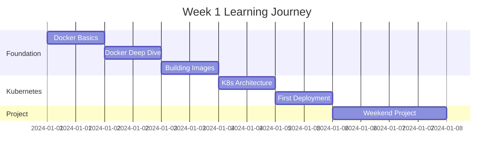
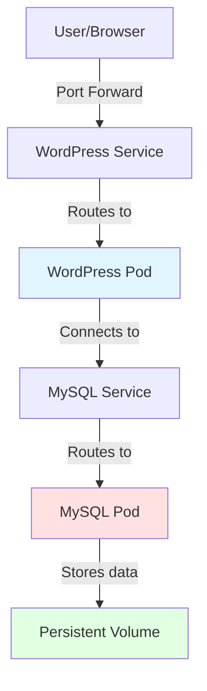

# Week 1 Roadmap - Container Fundamentals & Kubernetes Introduction

**Duration:** 7 Days  
**Focus:** Docker Mastery → Kubernetes Setup → First Deployment  
**Goal:** Understand containers and deploy your first application to Kubernetes

---

## 📊 Week Overview



---

## 🎯 Week Goals

By the end of Week 1, you will:

- ✅ Master Docker fundamentals
- ✅ Build custom Docker images
- ✅ Understand Kubernetes architecture
- ✅ Set up local Kubernetes cluster (kind)
- ✅ Deploy your first application to Kubernetes
- ✅ Complete a multi-container project

---

## 📅 Daily Breakdown

---

### **Day 1: Container Fundamentals**

**⏰ Time:** 2-3 hours  
**📚 Theory:** 1-1.5 hours | **💻 Hands-on:** 1-1.5 hours

#### Learning Objectives

- Understand what containers are and why they exist
- Learn the difference between VMs and containers
- Master basic Docker commands
- Run and manage containers

#### Theory Topics

```
1. Introduction to Containers
   ├── What are containers?
   ├── Problems containers solve
   └── Real-world use cases

2. Virtual Machines vs Containers
   ├── Architecture comparison
   ├── Resource usage
   └── When to use what

3. Docker Introduction
   ├── Docker components
   ├── Images vs Containers
   └── Docker architecture

4. Container Isolation
   ├── Linux namespaces
   ├── Control groups (cgroups)
   └── Container layers
```

#### Hands-on Exercises

| Exercise       | What You'll Do                          | Time    |
| -------------- | --------------------------------------- | ------- |
| **Exercise 1** | Run your first container (nginx)        | 10 mins |
| **Exercise 2** | Interactive container (Ubuntu)          | 10 mins |
| **Exercise 3** | Port mapping (multiple nginx instances) | 15 mins |
| **Exercise 4** | Working with volumes                    | 20 mins |
| **Exercise 5** | Environment variables (MySQL)           | 15 mins |
| **Exercise 6** | Custom HTML with nginx                  | 15 mins |
| **Exercise 7** | Container networking                    | 20 mins |

#### Commands to Master

```bash
docker run
docker ps / docker ps -a
docker stop / docker start
docker rm / docker rmi
docker logs
docker exec
docker port
docker inspect
```

#### Files to Create in `day-01/`

```
day-01/
├── docker-commands.txt          # All commands you tried
├── exercise-notes.txt           # Observations from each exercise
├── troubleshooting.txt          # Issues you faced and solutions
├── nginx-test/
│   └── index.html              # Custom HTML from Exercise 6
└── screenshots/
    ├── running-containers.png
    └── nginx-browser.png
```

#### Deliverables

- [ ] Completed all 7 exercises
- [ ] Docker installed and working
- [ ] Documented commands in `docker-commands.txt`
- [ ] Personal notes with observations

#### Success Criteria

- Can run containers without looking at notes
- Understand port mapping
- Can use volumes for persistent data
- Comfortable with docker exec and logs

---

### **Day 2: Docker Deep Dive**

**⏰ Time:** 2-3 hours  
**📚 Theory:** 1 hour | **💻 Hands-on:** 1-2 hours

#### Learning Objectives

- Deep understanding of Docker images
- Master image layers and caching
- Work with Docker Hub
- Understand volume types
- Network modes in Docker

#### Theory Topics

```
1. Docker Images Deep Dive
   ├── Image layers explained
   ├── Layer caching
   ├── Image naming conventions
   └── Tags and versions

2. Docker Hub and Registries
   ├── Pulling images
   ├── Pushing images
   ├── Official vs user images
   └── Image security

3. Docker Volumes (Detailed)
   ├── Volume types
   ├── Bind mounts vs volumes
   ├── tmpfs mounts
   └── Volume drivers

4. Docker Networking
   ├── Bridge network (default)
   ├── Host network
   ├── None network
   └── Custom networks
```

#### Hands-on Practice

| Task       | Description                                | Time    |
| ---------- | ------------------------------------------ | ------- |
| **Task 1** | Explore image layers with `docker history` | 15 mins |
| **Task 2** | Pull different image versions              | 10 mins |
| **Task 3** | Create and manage volumes                  | 20 mins |
| **Task 4** | Test bind mounts vs volumes                | 20 mins |
| **Task 5** | Create custom network                      | 15 mins |
| **Task 6** | Multi-container networking                 | 30 mins |

#### Advanced Exercises

```
Exercise 1: Volume Persistence
- Create a PostgreSQL container with volume
- Insert data
- Delete container
- Create new container with same volume
- Verify data persists

Exercise 2: Custom Network
- Create custom bridge network
- Run 3 containers (web, api, db)
- Test connectivity between containers
- Use container names for DNS
```

#### Files to Create in `day-02/`

```
day-02/
├── volume-tests/
│   ├── volume-commands.sh       # Volume creation and testing
│   └── persistence-test.sql     # SQL for testing data persistence
├── network-tests/
│   ├── network-setup.sh         # Network creation
│   └── connectivity-test.sh     # Test inter-container communication
├── image-exploration.txt        # Notes on image layers
└── learnings.md                 # What you learned today
```

#### Deliverables

- [ ] Understand image layers thoroughly
- [ ] Can create and manage volumes
- [ ] Tested data persistence
- [ ] Created custom networks
- [ ] Multi-container networking working

#### Success Criteria

- Explain how image layers work
- Choose between volumes and bind mounts appropriately
- Set up custom networks
- Containers can communicate by name

---

### **Day 3: Building Docker Images**

**⏰ Time:** 2-3 hours  
**📚 Theory:** 1 hour | **💻 Hands-on:** 1-2 hours

#### Learning Objectives

- Write production-ready Dockerfiles
- Build custom images
- Understand multi-stage builds
- Apply best practices
- Push images to registry

#### Theory Topics

```
1. Dockerfile Syntax
   ├── FROM, RUN, COPY, ADD
   ├── CMD vs ENTRYPOINT
   ├── EXPOSE, ENV, WORKDIR
   └── USER, ARG, LABEL

2. Building Images
   ├── Build context
   ├── .dockerignore
   ├── Layer caching optimization
   └── Build arguments

3. Multi-stage Builds
   ├── Why multi-stage?
   ├── Builder pattern
   └── Optimizing image size

4. Best Practices
   ├── Minimize layers
   ├── Use specific tags
   ├── Security considerations
   └── Image optimization
```

#### Hands-on Projects

| Project       | Description            | Time    |
| ------------- | ---------------------- | ------- |
| **Project 1** | Simple Flask App       | 30 mins |
| **Project 2** | FastAPI Application    | 30 mins |
| **Project 3** | Multi-stage Python App | 45 mins |

#### Step-by-Step Builds

**Build 1: Flask Hello World**

```python
# Create simple Flask app
# Write Dockerfile
# Build image
# Run container
# Test in browser
```

**Build 2: FastAPI with Dependencies**

```python
# Create FastAPI app with multiple routes
# Create requirements.txt
# Write optimized Dockerfile
# Build and run
# Test API endpoints
```

**Build 3: Multi-stage Build**

```dockerfile
# Stage 1: Build dependencies
# Stage 2: Production image
# Compare sizes
# Understand optimization
```

#### Files to Create in `day-03/`

```
day-03/
├── flask-app/
│   ├── app.py
│   ├── requirements.txt
│   ├── Dockerfile
│   └── build.sh
├── fastapi-app/
│   ├── main.py
│   ├── requirements.txt
│   ├── Dockerfile
│   ├── Dockerfile.multistage
│   └── build-commands.txt
├── best-practices.md            # Your notes on best practices
└── image-sizes.txt              # Comparison of image sizes
```

#### Dockerfile Templates

You'll create these Dockerfiles:

- Basic single-stage Dockerfile
- Optimized Dockerfile with layer caching
- Multi-stage Dockerfile
- Production-ready Dockerfile with non-root user

#### Deliverables

- [ ] Built 3 different applications
- [ ] Created multiple Dockerfiles
- [ ] Implemented multi-stage build
- [ ] Optimized image sizes
- [ ] Documented best practices

#### Success Criteria

- Can write Dockerfile from scratch
- Understand layer caching
- Know when to use multi-stage builds
- Images are optimized (<500MB for Python apps)
- Following security best practices

---

### **Day 4: Kubernetes Introduction**

**⏰ Time:** 2-3 hours  
**📚 Theory:** 1-1.5 hours | **💻 Hands-on:** 1-1.5 hours

#### Learning Objectives

- Understand Kubernetes architecture
- Learn control plane components
- Understand worker node components
- Set up local Kubernetes cluster (kind)
- Use kubectl basics

#### Theory Topics

```
1. What is Kubernetes?
   ├── Container orchestration explained
   ├── Why Kubernetes?
   └── Kubernetes vs Docker

2. Kubernetes Architecture
   ├── Control Plane
   │   ├── API Server
   │   ├── etcd
   │   ├── Scheduler
   │   ├── Controller Manager
   │   └── Cloud Controller Manager
   └── Worker Nodes
       ├── kubelet
       ├── kube-proxy
       └── Container Runtime

3. Kubernetes Objects
   ├── Pods
   ├── Deployments
   ├── Services
   ├── ConfigMaps
   └── Secrets

4. How Kubernetes Works
   ├── Desired state vs Current state
   ├── Control loops
   └── Reconciliation
```

#### Hands-on Setup

| Task       | Description                  | Time    |
| ---------- | ---------------------------- | ------- |
| **Task 1** | Install kubectl              | 10 mins |
| **Task 2** | Install kind                 | 10 mins |
| **Task 3** | Create first cluster         | 15 mins |
| **Task 4** | Explore cluster with kubectl | 30 mins |
| **Task 5** | Understanding components     | 20 mins |

#### Installation Steps

```bash
# 1. Install kubectl
# 2. Install kind
# 3. Create cluster
# 4. Verify installation
# 5. Explore cluster
```

#### kubectl Commands to Learn

```bash
kubectl version
kubectl cluster-info
kubectl get nodes
kubectl get pods --all-namespaces
kubectl get componentstatuses
kubectl config view
kubectl config get-contexts
```

#### Files to Create in `day-04/`

```
day-04/
├── installation/
│   ├── install-kubectl.sh       # kubectl installation commands
│   ├── install-kind.sh          # kind installation commands
│   └── installation-log.txt     # Installation output and notes
├── cluster-setup/
│   ├── kind-config.yaml         # kind cluster configuration
│   ├── create-cluster.sh        # Cluster creation commands
│   └── cluster-info.txt         # Cluster details
├── kubectl-basics/
│   ├── commands-tried.txt       # All kubectl commands you tried
│   └── cluster-exploration.txt  # Notes on what you found
└── architecture-notes.md        # Your understanding of architecture
```

#### Cluster Setup

```yaml
# Create kind configuration
# Multiple node cluster (1 control plane, 2 workers)
# Custom port mappings
# Practice cluster creation and deletion
```

#### Deliverables

- [ ] kubectl installed and working
- [ ] kind installed and working
- [ ] Created Kubernetes cluster
- [ ] Explored cluster components
- [ ] Comfortable with basic kubectl commands

#### Success Criteria

- Can explain Kubernetes architecture
- Cluster is running successfully
- Can list nodes and pods
- Understand kubectl syntax
- Ready to deploy applications

---

### **Day 5: First Kubernetes Deployment**

**⏰ Time:** 2-3 hours  
**📚 Theory:** 1 hour | **💻 Hands-on:** 1-2 hours

#### Learning Objectives

- Create your first Pod
- Understand Deployments
- Learn about Services
- Access applications
- Use port-forwarding

#### Theory Topics

```
1. Pods
   ├── What are Pods?
   ├── Single vs Multi-container Pods
   ├── Pod lifecycle
   └── Pod specification

2. Deployments
   ├── Why Deployments over Pods?
   ├── Replica management
   ├── Self-healing
   └── Rolling updates

3. Services
   ├── Service types
   ├── ClusterIP (default)
   ├── NodePort
   └── LoadBalancer

4. YAML Manifests
   ├── YAML syntax
   ├── Manifest structure
   ├── Imperative vs Declarative
   └── kubectl apply vs create
```

#### Progressive Exercises

| Exercise       | What You'll Deploy            | Time    |
| -------------- | ----------------------------- | ------- |
| **Exercise 1** | Single Pod (imperative)       | 10 mins |
| **Exercise 2** | Pod from YAML                 | 15 mins |
| **Exercise 3** | Deployment with 3 replicas    | 20 mins |
| **Exercise 4** | Service to expose deployment  | 15 mins |
| **Exercise 5** | Port forwarding to access     | 10 mins |
| **Exercise 6** | Scale deployment up and down  | 15 mins |
| **Exercise 7** | Update image (rolling update) | 20 mins |

#### Step-by-Step Deployments

**Deployment 1: Simple nginx Pod**

```yaml
# Create Pod YAML
# Apply to cluster
# Check status
# View logs
# Delete Pod
```

**Deployment 2: nginx Deployment**

```yaml
# Create Deployment YAML
# 3 replicas
# Apply to cluster
# Watch pods created
# Test self-healing (delete a pod)
```

**Deployment 3: Service + Port Forwarding**

```yaml
# Create Service YAML
# ClusterIP type
# Port forward to access
# Test in browser
```

#### Files to Create in `day-05/`

```
day-05/
├── pods/
│   ├── simple-pod.yaml          # Basic pod definition
│   ├── nginx-pod.yaml           # Nginx pod
│   └── pod-commands.txt         # Commands for pods
├── deployments/
│   ├── nginx-deployment.yaml    # Your first deployment
│   ├── deployment-v2.yaml       # Updated version for rolling update
│   └── scaling-commands.txt     # Scale up/down commands
├── services/
│   ├── nginx-service.yaml       # Service definition
│   └── access-notes.txt         # How to access services
├── practice-manifests/
│   ├── test-pod-1.yaml
│   ├── test-pod-2.yaml
│   └── experiments.txt
└── learnings.md                 # Key learnings from today
```

#### kubectl Commands for Day 5

```bash
# Pods
kubectl run
kubectl get pods
kubectl describe pod
kubectl logs
kubectl delete pod

# Deployments
kubectl create deployment
kubectl get deployments
kubectl scale deployment
kubectl rollout status
kubectl rollout undo

# Services
kubectl expose
kubectl get services
kubectl port-forward

# Apply manifests
kubectl apply -f
kubectl delete -f
```

#### Deliverables

- [ ] Created Pods using both imperative and declarative methods
- [ ] Deployed application with multiple replicas
- [ ] Created Service to expose application
- [ ] Successfully accessed application via port-forward
- [ ] Tested scaling up and down
- [ ] Performed rolling update

#### Success Criteria

- Can write Pod and Deployment YAML
- Understand replica management
- Can expose applications with Services
- Comfortable with port-forwarding
- Ready for weekend project

---

### **Day 6-7: Weekend Project - WordPress Blog**

**⏰ Time:** 4-6 hours (split over 2 days)  
**💻 100% Hands-on Project**

#### Project Overview

Build a complete WordPress blog application with MySQL database on Kubernetes.



#### Project Goals

- Deploy multi-container application
- Use environment variables
- Implement persistent storage
- Connect services
- Access application in browser

#### Architecture

```
Components:
1. MySQL Pod (Database)
   ├── Image: mysql:8.0
   ├── Environment variables for credentials
   └── Persistent Volume for data

2. MySQL Service
   ├── Type: ClusterIP
   └── Exposes MySQL to WordPress

3. WordPress Pod (Application)
   ├── Image: wordpress:latest
   ├── Environment variables for DB connection
   └── Depends on MySQL

4. WordPress Service
   ├── Type: NodePort or LoadBalancer
   └── Exposes WordPress to outside
```

#### Day 6: Setup and MySQL

**Tasks:**

1. **Plan Architecture** (30 mins)

   - Draw architecture diagram
   - List all components needed
   - Plan YAML files

2. **Deploy MySQL** (1.5 hours)

   - Create Secret for credentials
   - Create PersistentVolume
   - Create PersistentVolumeClaim
   - Create MySQL Pod
   - Create MySQL Service
   - Test MySQL is running

3. **Debug and Test** (1 hour)
   - Check Pod status
   - View logs
   - Verify MySQL is accessible
   - Test database connection

#### Day 7: WordPress and Integration

**Tasks:**

1. **Deploy WordPress** (1.5 hours)

   - Create ConfigMap for settings
   - Create WordPress Pod
   - Create WordPress Service
   - Test WordPress is running

2. **Connect and Test** (1 hour)

   - Verify WordPress can reach MySQL
   - Port forward to access WordPress
   - Complete WordPress setup in browser
   - Create a test blog post

3. **Documentation** (30 mins)
   - Document architecture
   - Write setup instructions
   - Take screenshots
   - Note challenges faced

#### Files to Create

```
projects/project-01-wordpress-blog/
├── manifests/
│   ├── 01-mysql-secret.yaml         # Database credentials
│   ├── 02-mysql-pv.yaml             # Persistent Volume
│   ├── 03-mysql-pvc.yaml            # Persistent Volume Claim
│   ├── 04-mysql-deployment.yaml     # MySQL deployment
│   ├── 05-mysql-service.yaml        # MySQL service
│   ├── 06-wordpress-configmap.yaml  # WordPress config
│   ├── 07-wordpress-deployment.yaml # WordPress deployment
│   └── 08-wordpress-service.yaml    # WordPress service
├── docs/
│   ├── README.md                     # Project overview
│   ├── architecture.md               # Architecture explanation
│   ├── setup-guide.md                # Step-by-step setup
│   └── troubleshooting.md            # Issues and solutions
├── scripts/
│   ├── deploy-all.sh                 # Deploy everything
│   ├── cleanup.sh                    # Delete everything
│   └── check-status.sh               # Check component status
└── screenshots/
    ├── wordpress-setup.png
    ├── blog-running.png
    └── kubernetes-dashboard.png
```

Also create in week folders:

```
week-01/day-06/
├── work-in-progress/
│   ├── testing-mysql.yaml
│   └── debug-notes.txt
└── daily-log.md

week-01/day-07/
├── work-in-progress/
│   ├── testing-wordpress.yaml
│   └── connection-tests.txt
└── daily-log.md
```

#### Step-by-Step Guide

**Phase 1: MySQL Setup**

```bash
# 1. Create namespace (optional)
# 2. Create Secret for passwords
# 3. Create PersistentVolume
# 4. Create PersistentVolumeClaim
# 5. Create MySQL Pod
# 6. Create MySQL Service
# 7. Verify MySQL is running
# 8. Test database connection
```

**Phase 2: WordPress Setup**

```bash
# 1. Create ConfigMap for WordPress
# 2. Create WordPress Pod
# 3. Create WordPress Service
# 4. Port forward to access
# 5. Complete WordPress installation
# 6. Create test content
```

**Phase 3: Testing**

```bash
# 1. Test data persistence (delete pod, data remains)
# 2. Test service connectivity
# 3. Verify WordPress can write to database
# 4. Take screenshots
```

#### Challenges You'll Face

| Challenge                 | What You'll Learn                    |
| ------------------------- | ------------------------------------ |
| **Connection Issues**     | Service discovery, DNS in K8s        |
| **Environment Variables** | How apps communicate in K8s          |
| **Data Persistence**      | Volumes and storage                  |
| **Pod Scheduling**        | How Kubernetes assigns pods to nodes |
| **Service Types**         | When to use ClusterIP vs NodePort    |

#### Deliverables

- [ ] MySQL running with persistent storage
- [ ] WordPress running and accessible
- [ ] Both services communicating
- [ ] Can access WordPress in browser
- [ ] Data persists after pod deletion
- [ ] Complete documentation
- [ ] Screenshots of working application
- [ ] Clean, commented YAML files

#### Success Criteria

- WordPress fully functional in browser
- Can create and view blog posts
- Database connection working
- Data survives pod restarts
- Clean, organized project structure
- Comprehensive documentation

#### Bonus Challenges (Optional)

- [ ] Add WordPress Deployments instead of Pods
- [ ] Implement ConfigMap for WordPress settings
- [ ] Add resource limits to pods
- [ ] Implement health checks
- [ ] Use Secrets for all sensitive data
- [ ] Add multiple WordPress replicas

---

## 📊 Week 1 Progress Tracker

### Daily Completion Checklist

| Day | Topic                  | Theory | Hands-on | Notes | Status         |
| --- | ---------------------- | ------ | -------- | ----- | -------------- |
| 1   | Container Fundamentals | ☐      | ☐        | ☐     | ⏳ Not Started |
| 2   | Docker Deep Dive       | ☐      | ☐        | ☐     | ⏳ Not Started |
| 3   | Building Images        | ☐      | ☐        | ☐     | ⏳ Not Started |
| 4   | Kubernetes Intro       | ☐      | ☐        | ☐     | ⏳ Not Started |
| 5   | First Deployment       | ☐      | ☐        | ☐     | ⏳ Not Started |
| 6-7 | WordPress Project      | N/A    | ☐        | ☐     | ⏳ Not Started |

### Skills Acquired

#### Docker Skills

- [ ] Run and manage containers
- [ ] Work with volumes and bind mounts
- [ ] Create custom networks
- [ ] Write Dockerfiles
- [ ] Build optimized images
- [ ] Use multi-stage builds
- [ ] Push images to registry

#### Kubernetes Skills

- [ ] Understand K8s architecture
- [ ] Use kubectl effectively
- [ ] Create Pods
- [ ] Create Deployments
- [ ] Create Services
- [ ] Write YAML manifests
- [ ] Access applications via port-forward
- [ ] Debug pods with logs and describe

#### Files Created This Week

- [ ] 5+ Dockerfiles
- [ ] 10+ Kubernetes YAML manifests
- [ ] 3+ Python applications
- [ ] Complete WordPress project

---

## 📁 Expected Folder Structure After Week 1

```
01-kubernetes-learning/
├── notes/
│   ├── 01-container-fundamentals.md
│   ├── 02-kubernetes-architecture.md
│   ├── [additional notes created]
│
├── week-01/
│   ├── week-01-roadmap.md           ← This file
│   ├── day-01/
│   │   ├── docker-commands.txt
│   │   ├── exercise-notes.txt
│   │   └── nginx-test/
│   ├── day-02/
│   │   ├── volume-tests/
│   │   └── network-tests/
│   ├── day-03/
│   │   ├── flask-app/
│   │   └── fastapi-app/
│   ├── day-04/
│   │   ├── installation/
│   │   ├── cluster-setup/
│   │   └── kubectl-basics/
│   ├── day-05/
│   │   ├── pods/
│   │   ├── deployments/
│   │   └── services/
│   ├── day-06/
│   │   └── work-in-progress/
│   └── day-07/
│       └── work-in-progress/
│
└── projects/
    └── project-01-wordpress-blog/
        ├── manifests/
        ├── docs/
        ├── scripts/
        └── screenshots/
```

---

## 🎯 Week 1 Learning Outcomes

By the end of Week 1, you will be able to:

### Container Mastery

✅ Explain what containers are and why they're useful  
✅ Run and manage Docker containers confidently  
✅ Build custom Docker images from scratch  
✅ Optimize images for production use  
✅ Implement multi-stage builds  
✅ Work with volumes and networks

### Kubernetes Foundation

✅ Explain Kubernetes architecture and components  
✅ Set up local Kubernetes cluster  
✅ Use kubectl to manage resources  
✅ Write Kubernetes YAML manifests  
✅ Deploy applications to Kubernetes  
✅ Expose applications using Services  
✅ Debug pods using logs and describe

### Practical Experience

✅ Built 3+ containerized applications  
✅ Deployed multi-container application  
✅ Implemented persistent storage  
✅ Connected services together  
✅ Accessed applications in browser

---

## 🔗 Resources

### Official Documentation

- [Docker Documentation](https://docs.docker.com/)
- [Kubernetes Documentation](https://kubernetes.io/docs/)
- [kind Documentation](https://kind.sigs.k8s.io/)
- [kubectl Reference](https://kubernetes.io/docs/reference/kubectl/)

### Cheatsheets

- `resources/cheatsheets/kubectl-cheatsheet.md`
- `resources/cheatsheets/yaml-syntax.md`
- `resources/cheatsheets/docker-cheatsheet.md`

### Tools Installed

- Docker
- kubectl
- kind

---

## 💡 Tips for Success

### Daily Routine

1. **Morning:** Read theory (1 hour)
2. **Afternoon:** Hands-on practice (1-2 hours)
3. **Evening:** Document learnings (30 mins)

### Best Practices

- ✅ Take notes as you learn
- ✅ Save all commands you try
- ✅ Document errors and solutions
- ✅ Take screenshots of successes
- ✅ Ask questions when stuck
- ✅ Review previous day before starting new day

### Troubleshooting Strategy

1. Read error message carefully
2. Check pod/container logs
3. Use `kubectl describe` for details
4. Google the specific error
5. Check official documentation
6. Ask for help if stuck >30 mins

---

## 📝 Notes Section

### Key Learnings This Week

```
[Add your key takeaways here at end of week]
```

### Challenges Faced

```
[Document challenges and how you solved them]
```

### Questions for Review

```
[Add questions you still have]
```

### Things to Revisit

```
[Topics that need more practice]
```

---

## 🚀 What's Next?

### Week 2 Preview

- Deployments deep dive
- Services and networking
- ConfigMaps and Secrets
- Namespaces and labels
- Complete Todo App project

### Preparation for Week 2

- [ ] Review Week 1 concepts
- [ ] Ensure kubectl is working smoothly
- [ ] Keep kind cluster running
- [ ] Organize all Week 1 files

---

**Week Start Date:** ****\_\_\_****  
**Week End Date:** ****\_\_\_****  
**Status:** ⏳ In Progress | ✅ Completed  
**Confidence Level:** ⭐ (1-5 stars)

---

_Happy Learning! Remember: Consistency is key. Even 2 hours a day will get you there! 🎯_
