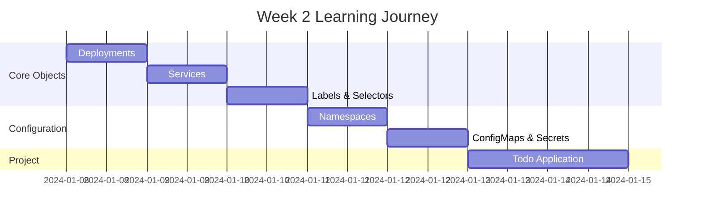
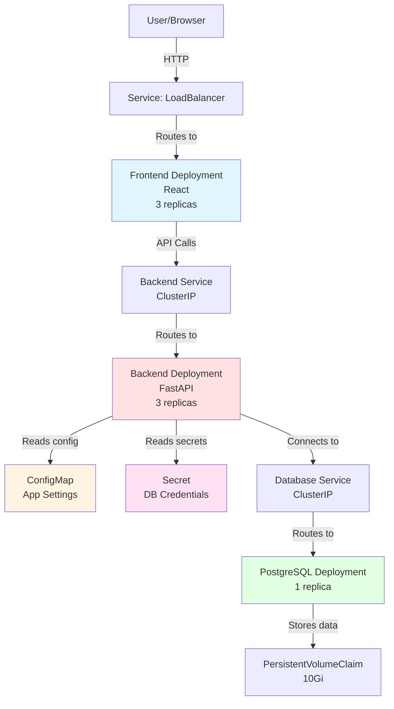

# Week 2 Roadmap - Core Kubernetes Objects & Configuration

**Duration:** 7 Days  
**Focus:** Deployments → Services → Configuration Management → Storage  
**Goal:** Master core Kubernetes objects and build production-ready applications

---

## 📊 Week Overview



---

## 🎯 Week Goals

By the end of Week 2, you will:

- ✅ Master Kubernetes Deployments and replica management
- ✅ Understand all Service types and when to use them
- ✅ Implement proper labeling and selection strategies
- ✅ Organize resources with Namespaces
- ✅ Manage configuration with ConfigMaps and Secrets
- ✅ Build a complete full-stack application on Kubernetes

---

## 📅 Daily Breakdown

---

### **Day 8: Deployments Deep Dive**

**⏰ Time:** 2-3 hours  
**📚 Theory:** 1 hour | **💻 Hands-on:** 1-2 hours

#### Learning Objectives

- Master Deployment specifications
- Understand ReplicaSets
- Implement rolling updates
- Practice rollback procedures
- Learn deployment strategies

#### Theory Topics

```
1. Deployments In-Depth
   ├── Why Deployments over Pods?
   ├── Deployment specification
   ├── ReplicaSet relationship
   └── Update strategies

2. Replica Management
   ├── Desired vs actual replicas
   ├── Self-healing mechanism
   ├── Pod distribution
   └── Scaling strategies

3. Rolling Updates
   ├── Update process
   ├── MaxUnavailable and MaxSurge
   ├── Update monitoring
   └── Pause and resume

4. Rollback and History
   ├── Revision tracking
   ├── Rollback commands
   ├── Revision history
   └── Undo strategies
```

#### Hands-on Exercises

| Exercise       | Description                           | Time    |
| -------------- | ------------------------------------- | ------- |
| **Exercise 1** | Create deployment with 5 replicas     | 15 mins |
| **Exercise 2** | Scale deployment up and down          | 10 mins |
| **Exercise 3** | Update image version (rolling update) | 20 mins |
| **Exercise 4** | Monitor rollout progress              | 15 mins |
| **Exercise 5** | Rollback to previous version          | 15 mins |
| **Exercise 6** | Configure update strategy             | 20 mins |
| **Exercise 7** | Test self-healing (delete pods)       | 15 mins |

#### Advanced Practice

```
Scenario 1: Zero-Downtime Update
- Deploy app v1 with 3 replicas
- Update to v2 with maxUnavailable=1
- Monitor that at least 2 pods always running
- Verify no service interruption

Scenario 2: Rollback on Failure
- Deploy app v1
- Update to broken v2
- Detect failure
- Rollback to v1
- Verify service restored

Scenario 3: Custom Update Strategy
- Configure maxSurge and maxUnavailable
- Test different combinations
- Understand impact on updates
```

#### Files to Create in `day-08/`

```
day-08/
├── basic-deployments/
│   ├── nginx-deployment.yaml        # Basic deployment
│   ├── app-deployment.yaml          # Application deployment
│   └── multi-replica-deployment.yaml
├── rolling-updates/
│   ├── deployment-v1.yaml           # Version 1
│   ├── deployment-v2.yaml           # Version 2
│   ├── deployment-v3.yaml           # Version 3
│   └── update-commands.sh           # Update commands
├── strategies/
│   ├── recreate-strategy.yaml       # Recreate strategy
│   ├── rolling-update-strategy.yaml # Rolling update strategy
│   └── custom-strategy.yaml         # Custom configuration
├── rollback-tests/
│   ├── rollback-commands.sh
│   └── revision-history.txt
└── experiments/
    ├── self-healing-test.sh
    └── scaling-tests.txt
```

#### Key Commands to Master

```bash
# Deployment creation
kubectl create deployment
kubectl apply -f deployment.yaml

# Scaling
kubectl scale deployment myapp --replicas=5

# Updates
kubectl set image deployment/myapp container=image:v2
kubectl rollout status deployment/myapp
kubectl rollout pause deployment/myapp
kubectl rollout resume deployment/myapp

# Rollback
kubectl rollout history deployment/myapp
kubectl rollout undo deployment/myapp
kubectl rollout undo deployment/myapp --to-revision=2

# Information
kubectl describe deployment myapp
kubectl get rs
kubectl get pods -l app=myapp
```

#### Deliverables

- [ ] Created 5+ deployment manifests
- [ ] Performed successful rolling updates
- [ ] Practiced rollback procedures
- [ ] Tested self-healing capabilities
- [ ] Configured custom update strategies
- [ ] Documented update and rollback process

#### Success Criteria

- Can write deployment YAML from scratch
- Understand replica management
- Comfortable with rolling updates
- Can rollback when needed
- Know different deployment strategies

---

### **Day 9: Services and Service Discovery**

**⏰ Time:** 2-3 hours  
**📚 Theory:** 1 hour | **💻 Hands-on:** 1-2 hours

#### Learning Objectives

- Master all Service types
- Understand service discovery
- Learn endpoints and selectors
- Practice load balancing
- Implement different access patterns

#### Theory Topics

```
1. Service Types
   ├── ClusterIP (internal access)
   ├── NodePort (node access)
   ├── LoadBalancer (external access)
   └── ExternalName (DNS mapping)

2. Service Discovery
   ├── DNS in Kubernetes
   ├── Service naming
   ├── Environment variables
   └── DNS resolution

3. Endpoints
   ├── What are endpoints?
   ├── Automatic endpoint creation
   ├── Manual endpoints
   └── Endpoint monitoring

4. Load Balancing
   ├── Internal load balancing
   ├── Session affinity
   ├── Service proxy modes
   └── Traffic distribution
```

#### Hands-on Exercises

| Exercise       | Description                     | Time    |
| -------------- | ------------------------------- | ------- |
| **Exercise 1** | Create ClusterIP service        | 15 mins |
| **Exercise 2** | Create NodePort service         | 15 mins |
| **Exercise 3** | Create LoadBalancer service     | 15 mins |
| **Exercise 4** | Test service discovery with DNS | 20 mins |
| **Exercise 5** | Multi-port service              | 15 mins |
| **Exercise 6** | Headless service                | 20 mins |
| **Exercise 7** | Service without selector        | 15 mins |

#### Service Type Comparisons

```
Test 1: ClusterIP
- Create deployment with 3 replicas
- Expose as ClusterIP
- Access from another pod
- Test load balancing

Test 2: NodePort
- Expose same app as NodePort
- Access from host machine
- Test on different ports

Test 3: LoadBalancer
- Expose as LoadBalancer (minikube tunnel)
- Get external IP
- Access from outside cluster

Test 4: DNS Resolution
- Deploy test pod
- nslookup service names
- Test DNS from different namespaces
```

#### Files to Create in `day-09/`

```
day-09/
├── service-types/
│   ├── clusterip-service.yaml       # Internal service
│   ├── nodeport-service.yaml        # Node access
│   ├── loadbalancer-service.yaml    # External access
│   └── externalname-service.yaml    # External DNS
├── discovery-tests/
│   ├── test-pod.yaml                # Pod for testing
│   ├── dns-test-commands.sh         # DNS testing
│   └── service-discovery-notes.txt
├── advanced-services/
│   ├── multi-port-service.yaml      # Multiple ports
│   ├── headless-service.yaml        # StatefulSet service
│   ├── session-affinity.yaml        # Sticky sessions
│   └── service-without-selector.yaml
├── load-balancing/
│   ├── test-load-balancing.sh
│   └── traffic-distribution.txt
└── experiments/
    ├── service-tests.yaml
    └── endpoint-testing.txt
```

#### Service Patterns

```yaml
# Pattern 1: Basic Service
apiVersion: v1
kind: Service
metadata:
  name: myapp
spec:
  selector:
    app: myapp
  ports:
    - port: 80
      targetPort: 8080

# Pattern 2: Multi-port Service
ports:
  - name: http
    port: 80
    targetPort: 8080
  - name: metrics
    port: 9090
    targetPort: 9090

# Pattern 3: Headless Service
clusterIP: None # No load balancing

# Pattern 4: Session Affinity
sessionAffinity: ClientIP
```

#### Key Commands

```bash
# Service creation
kubectl expose deployment myapp --port=80
kubectl apply -f service.yaml

# Service information
kubectl get services
kubectl get svc
kubectl describe service myapp
kubectl get endpoints myapp

# Testing
kubectl run test --rm -it --image=busybox -- sh
# Inside pod: wget -O- http://myapp

# Port forwarding
kubectl port-forward service/myapp 8080:80
```

#### Deliverables

- [ ] Created all 4 service types
- [ ] Tested service discovery
- [ ] Verified load balancing
- [ ] Tested DNS resolution
- [ ] Created multi-port services
- [ ] Documented service patterns

#### Success Criteria

- Can choose appropriate service type
- Understand service discovery
- Can debug service connectivity issues
- Know when to use each service type

---

### **Day 10: Labels, Selectors, and Annotations**

**⏰ Time:** 2-3 hours  
**📚 Theory:** 1 hour | **💻 Hands-on:** 1-2 hours

#### Learning Objectives

- Master label strategies
- Understand selectors (equality and set-based)
- Use annotations effectively
- Organize resources with labels
- Query resources efficiently

#### Theory Topics

```
1. Labels
   ├── What are labels?
   ├── Label naming conventions
   ├── Common label patterns
   └── Label best practices

2. Selectors
   ├── Equality-based selectors
   ├── Set-based selectors
   ├── matchLabels vs matchExpressions
   └── Selector use cases

3. Annotations
   ├── Labels vs Annotations
   ├── Annotation use cases
   ├── Tool-specific annotations
   └── Metadata patterns

4. Resource Organization
   ├── Labeling strategies
   ├── Environment labels
   ├── Ownership labels
   └── Query patterns
```

#### Hands-on Exercises

| Exercise       | Description                        | Time    |
| -------------- | ---------------------------------- | ------- |
| **Exercise 1** | Add labels to resources            | 15 mins |
| **Exercise 2** | Query with equality selectors      | 15 mins |
| **Exercise 3** | Query with set-based selectors     | 15 mins |
| **Exercise 4** | Update labels on running resources | 10 mins |
| **Exercise 5** | Use annotations for metadata       | 15 mins |
| **Exercise 6** | Label-based deployment targeting   | 20 mins |
| **Exercise 7** | Organize multi-tier application    | 30 mins |

#### Labeling Strategies

```
Strategy 1: Environment-based
app: myapp
environment: production
version: v1.0.0
tier: frontend

Strategy 2: Ownership-based
app: myapp
team: platform
owner: devops
costcenter: engineering

Strategy 3: Component-based
app: ecommerce
component: api
part-of: backend
managed-by: helm
```

#### Files to Create in `day-10/`

```
day-10/
├── labeling-examples/
│   ├── simple-labels.yaml           # Basic labeling
│   ├── multi-label-deployment.yaml  # Complex labels
│   └── label-conventions.md         # Your conventions
├── selector-practice/
│   ├── equality-selectors.sh        # Equality queries
│   ├── set-selectors.sh             # Set-based queries
│   └── selector-examples.yaml
├── annotations/
│   ├── annotated-resources.yaml
│   └── annotation-use-cases.txt
├── organization/
│   ├── three-tier-app/
│   │   ├── frontend-deployment.yaml
│   │   ├── backend-deployment.yaml
│   │   └── database-deployment.yaml
│   └── labeling-strategy.md
└── queries/
    ├── common-queries.sh
    └── advanced-queries.txt
```

#### Selector Examples

```bash
# Equality-based selectors
kubectl get pods -l app=myapp
kubectl get pods -l environment=production
kubectl get pods -l app=myapp,tier=frontend

# Set-based selectors
kubectl get pods -l 'environment in (production,staging)'
kubectl get pods -l 'tier notin (cache,queue)'
kubectl get pods -l 'app,environment'

# Label commands
kubectl label pod myapp version=v1.0.0
kubectl label pod myapp version=v2.0.0 --overwrite
kubectl label pod myapp version-

# Show labels
kubectl get pods --show-labels
kubectl get pods -L app,version,tier
```

#### Multi-tier Application Practice

```
Deploy complete 3-tier application:

Frontend:
- app: ecommerce
- tier: frontend
- component: web

Backend:
- app: ecommerce
- tier: backend
- component: api

Database:
- app: ecommerce
- tier: database
- component: postgres

Practice querying:
- Get all frontend pods
- Get all ecommerce resources
- Get production pods only
- Get all except cache tier
```

#### Deliverables

- [ ] Labeled 10+ resources with proper conventions
- [ ] Practiced equality and set-based selectors
- [ ] Used annotations appropriately
- [ ] Organized multi-tier application with labels
- [ ] Created label strategy document
- [ ] Mastered kubectl label queries

#### Success Criteria

- Can design labeling strategy
- Write complex selector queries
- Understand label vs annotation use cases
- Organize resources efficiently with labels

---

### **Day 11: Namespaces and Resource Organization**

**⏰ Time:** 2-3 hours  
**📚 Theory:** 1 hour | **💻 Hands-on:** 1-2 hours

#### Learning Objectives

- Understand namespace concepts
- Organize resources across namespaces
- Implement namespace isolation
- Work with cross-namespace communication
- Set resource quotas per namespace

#### Theory Topics

```
1. Namespaces
   ├── What are namespaces?
   ├── Default namespaces
   ├── Use cases for namespaces
   └── Namespace best practices

2. Resource Organization
   ├── Multi-tenant organization
   ├── Environment separation
   ├── Team-based namespaces
   └── Application namespaces

3. Cross-namespace Communication
   ├── DNS across namespaces
   ├── Service FQDN
   ├── Network policies
   └── Access patterns

4. Resource Quotas
   ├── Namespace-level quotas
   ├── Resource limits
   ├── Object count limits
   └── Quota enforcement
```

#### Hands-on Exercises

| Exercise       | Description                            | Time    |
| -------------- | -------------------------------------- | ------- |
| **Exercise 1** | Create custom namespaces               | 10 mins |
| **Exercise 2** | Deploy resources to specific namespace | 15 mins |
| **Exercise 3** | Test cross-namespace service discovery | 20 mins |
| **Exercise 4** | Set default namespace                  | 10 mins |
| **Exercise 5** | Implement ResourceQuota                | 20 mins |
| **Exercise 6** | Implement LimitRange                   | 20 mins |
| **Exercise 7** | Multi-environment setup                | 30 mins |

#### Namespace Strategies

```
Strategy 1: Environment-based
- development
- staging
- production

Strategy 2: Team-based
- team-frontend
- team-backend
- team-data

Strategy 3: Application-based
- app-ecommerce
- app-analytics
- app-admin

Strategy 4: Tenant-based
- tenant-company-a
- tenant-company-b
- tenant-company-c
```

#### Files to Create in `day-11/`

```
day-11/
├── namespace-basics/
│   ├── create-namespaces.yaml       # Namespace definitions
│   ├── namespace-commands.sh        # kubectl namespace commands
│   └── default-namespace.txt
├── multi-environment/
│   ├── dev-namespace.yaml
│   ├── staging-namespace.yaml
│   ├── prod-namespace.yaml
│   └── deploy-to-environments.sh
├── cross-namespace/
│   ├── service-a-ns1.yaml           # Service in namespace 1
│   ├── service-b-ns2.yaml           # Service in namespace 2
│   ├── test-connectivity.sh         # Test communication
│   └── fqdn-examples.txt
├── quotas-and-limits/
│   ├── resource-quota.yaml          # Namespace quota
│   ├── limit-range.yaml             # Default limits
│   ├── test-quota-enforcement.sh
│   └── quota-examples.yaml
└── organization/
    ├── namespace-strategy.md
    └── naming-conventions.md
```

#### Resource Quota Example

```yaml
apiVersion: v1
kind: ResourceQuota
metadata:
  name: dev-quota
  namespace: development
spec:
  hard:
    requests.cpu: "10"
    requests.memory: "20Gi"
    limits.cpu: "20"
    limits.memory: "40Gi"
    persistentvolumeclaims: "10"
    pods: "50"
    services: "20"
```

#### LimitRange Example

```yaml
apiVersion: v1
kind: LimitRange
metadata:
  name: dev-limits
  namespace: development
spec:
  limits:
    - max:
        memory: "1Gi"
        cpu: "1"
      min:
        memory: "64Mi"
        cpu: "100m"
      default:
        memory: "256Mi"
        cpu: "500m"
      defaultRequest:
        memory: "128Mi"
        cpu: "250m"
      type: Container
```

#### Key Commands

```bash
# Namespace operations
kubectl create namespace dev
kubectl get namespaces
kubectl describe namespace dev
kubectl delete namespace dev

# Working with namespaces
kubectl get pods -n production
kubectl get all -n development
kubectl apply -f deployment.yaml -n staging

# Set default namespace
kubectl config set-context --current --namespace=development

# Cross-namespace FQDN
service-name.namespace-name.svc.cluster.local
```

#### Multi-Environment Setup

```
Create 3 environments:

Development:
- Lower resource quotas
- Relaxed limits
- Easier access

Staging:
- Medium resource quotas
- Production-like limits
- Restricted access

Production:
- High resource quotas
- Strict limits
- Highly restricted access

Deploy same application to all 3
Test differences in quotas
Practice namespace switching
```

#### Deliverables

- [ ] Created 5+ namespaces with different purposes
- [ ] Implemented ResourceQuotas
- [ ] Set up LimitRanges
- [ ] Tested cross-namespace communication
- [ ] Deployed multi-environment setup
- [ ] Documented namespace strategy

#### Success Criteria

- Can organize resources with namespaces
- Understand when to create new namespace
- Implement resource quotas effectively
- Handle cross-namespace communication

---

### **Day 12: ConfigMaps and Secrets**

**⏰ Time:** 2-3 hours  
**📚 Theory:** 1 hour | **💻 Hands-on:** 1-2 hours

#### Learning Objectives

- Master ConfigMap usage patterns
- Secure secrets properly
- Inject configuration into pods
- Understand different mounting methods
- Implement configuration best practices

#### Theory Topics

```
1. ConfigMaps
   ├── What are ConfigMaps?
   ├── Creation methods
   ├── Use cases
   └── Configuration patterns

2. Secrets
   ├── Secret types
   ├── Security considerations
   ├── Encoding vs encryption
   └── Secret management

3. Injection Methods
   ├── Environment variables
   ├── Volume mounts
   ├── envFrom vs env
   └── Subpath mounting

4. Best Practices
   ├── Separation of concerns
   ├── Immutable configurations
   ├── Secret rotation
   └── External secret management
```

#### Hands-on Exercises

| Exercise       | Description                          | Time    |
| -------------- | ------------------------------------ | ------- |
| **Exercise 1** | Create ConfigMap from literals       | 10 mins |
| **Exercise 2** | Create ConfigMap from files          | 15 mins |
| **Exercise 3** | Inject ConfigMap as env vars         | 15 mins |
| **Exercise 4** | Mount ConfigMap as volume            | 20 mins |
| **Exercise 5** | Create and use Secrets               | 20 mins |
| **Exercise 6** | Secret types (TLS, Docker registry)  | 20 mins |
| **Exercise 7** | Update configuration without restart | 25 mins |

#### ConfigMap Creation Methods

```bash
# From literals
kubectl create configmap app-config \
  --from-literal=APP_NAME="My App" \
  --from-literal=LOG_LEVEL="debug"

# From files
kubectl create configmap nginx-config \
  --from-file=nginx.conf

# From directory
kubectl create configmap app-config \
  --from-file=config/

# From YAML
kubectl apply -f configmap.yaml
```

#### Files to Create in `day-12/`

```
day-12/
├── configmaps/
│   ├── basic-configmap.yaml         # Simple key-value
│   ├── file-configmap.yaml          # File content
│   ├── env-configmap.yaml           # Environment vars
│   └── app-config.yaml              # Application config
├── secrets/
│   ├── basic-secret.yaml            # Generic secret
│   ├── tls-secret.yaml              # TLS certificates
│   ├── docker-secret.yaml           # Registry credentials
│   └── create-secrets.sh
├── injection-patterns/
│   ├── env-from-configmap.yaml      # All keys as env
│   ├── env-specific-keys.yaml       # Specific keys
│   ├── volume-mount.yaml            # Mount as files
│   └── subpath-mount.yaml           # Specific file mount
├── applications/
│   ├── flask-app/
│   │   ├── app.py                   # Reads config/secrets
│   │   ├── deployment.yaml
│   │   ├── configmap.yaml
│   │   └── secret.yaml
│   └── nginx-custom/
│       ├── nginx.conf
│       ├── deployment.yaml
│       └── configmap.yaml
└── best-practices/
    ├── immutable-configmap.yaml
    ├── config-update-pattern.yaml
    └── security-notes.md
```

#### Injection Patterns

**Pattern 1: All keys as environment variables**

```yaml
envFrom:
  - configMapRef:
      name: app-config
  - secretRef:
      name: app-secrets
```

**Pattern 2: Specific keys**

```yaml
env:
  - name: APP_NAME
    valueFrom:
      configMapKeyRef:
        name: app-config
        key: APP_NAME
  - name: DB_PASSWORD
    valueFrom:
      secretKeyRef:
        name: db-secret
        key: password
```

**Pattern 3: Volume mount**

```yaml
volumeMounts:
  - name: config
    mountPath: /etc/config
volumes:
  - name: config
    configMap:
      name: app-config
```

**Pattern 4: Subpath mount**

```yaml
volumeMounts:
  - name: config
    mountPath: /etc/nginx/nginx.conf
    subPath: nginx.conf
volumes:
  - name: config
    configMap:
      name: nginx-config
```

#### Secret Types

```bash
# Generic secret
kubectl create secret generic db-secret \
  --from-literal=username=admin \
  --from-literal=password=secret123

# TLS secret
kubectl create secret tls tls-secret \
  --cert=tls.crt \
  --key=tls.key

# Docker registry secret
kubectl create secret docker-registry registry-secret \
  --docker-server=registry.example.com \
  --docker-username=user \
  --docker-password=pass \
  --docker-email=email@example.com

# Base64 encoding
echo -n "mysecret" | base64
# Decoding
echo "bXlzZWNyZXQ=" | base64 -d
```

#### Practical Application

```
Build Flask app that:
1. Reads app name from ConfigMap
2. Reads database password from Secret
3. Reads config file from mounted volume
4. Demonstrates all injection methods

Test:
- Deploy with ConfigMap v1
- Update ConfigMap to v2
- Test hot reload (volume mount)
- Test no reload (env vars)
```

#### Deliverables

- [ ] Created 10+ ConfigMaps using different methods
- [ ] Created various Secret types
- [ ] Implemented all injection patterns
- [ ] Built application using ConfigMaps and Secrets
- [ ] Tested configuration updates
- [ ] Documented security best practices

#### Success Criteria

- Can choose appropriate configuration method
- Understand Secret security implications
- Know when to use env vars vs volumes
- Can update configuration without downtime

---

### **Day 13-14: Weekend Project - Full-Stack Todo Application**

**⏰ Time:** 4-6 hours (split over 2 days)  
**💻 100% Hands-on Project**

#### Project Overview

Build a complete full-stack Todo application with React frontend, FastAPI backend, and PostgreSQL database.



#### Project Goals

- Multi-tier application deployment
- Proper configuration management
- Secrets handling
- Persistent storage
- Service communication
- Production-ready patterns

#### Technology Stack

```
Frontend:
- React (or simple HTML/JS)
- Nginx to serve static files
- Environment-based API URL

Backend:
- FastAPI (Python)
- CORS enabled
- Health check endpoints
- Database connection pooling

Database:
- PostgreSQL 15
- Persistent storage
- Initialization scripts
```

#### Day 13: Backend and Database

**Morning: Database Setup (2 hours)**

```
Tasks:
1. Create namespace (todo-app)
2. Create Secret for database credentials
3. Create PersistentVolumeClaim
4. Create PostgreSQL Deployment
5. Create database Service (ClusterIP)
6. Initialize database schema
7. Test database connectivity
```

**Afternoon: Backend API (2 hours)**

```
Tasks:
1. Create FastAPI application
   - GET /todos (list all)
   - POST /todos (create)
   - PUT /todos/{id} (update)
   - DELETE /todos/{id} (delete)
   - GET /health (health check)

2. Create ConfigMap for app settings
3. Create Secret for DB credentials
4. Create backend Deployment (3 replicas)
5. Create backend Service (ClusterIP)
6. Test API endpoints
```

#### Day 14: Frontend and Integration

**Morning: Frontend Setup (1.5 hours)**

```
Tasks:
1. Create React app or simple HTML/JS
2. Implement Todo UI
   - List todos
   - Add todo
   - Mark complete
   - Delete todo

3. Build and containerize
4. Create frontend Deployment (3 replicas)
5. Create frontend Service (LoadBalancer)
```

**Afternoon: Integration & Testing (1.5 hours)**

```
Tasks:
1. Configure frontend to call backend
2. Test complete flow
3. Add labels to all resources
4. Organize with proper namespaces
5. Document architecture
6. Take screenshots
```

**Evening: Polish & Documentation (1 hour)**

```
Tasks:
1. Add resource limits
2. Implement health checks
3. Add proper labels and annotations
4. Write comprehensive README
5. Create architecture diagram
6. Document learnings
```

#### Application Code Structure

```
projects/project-02-todo-app/
├── frontend/
│   ├── public/
│   │   └── index.html
│   ├── src/
│   │   ├── App.js
│   │   └── components/
│   │       └── TodoList.js
│   ├── package.json
│   ├── Dockerfile
│   └── nginx.conf
│
├── backend/
│   ├── app/
│   │   ├── main.py              # FastAPI app
│   │   ├── models.py            # Database models
│   │   ├── database.py          # DB connection
│   │   └── crud.py              # CRUD operations
│   ├── requirements.txt
│   ├── Dockerfile
│   └── Dockerfile.multistage
│
├── database/
│   ├── init.sql                 # Schema initialization
│   └── seed.sql                 # Sample data
│
└── manifests/
    ├── namespace.yaml
    ├── database/
    │   ├── secret.yaml
    │   ├── pvc.yaml
    │   ├── deployment.yaml
    │   └── service.yaml
    ├── backend/
    │   ├── configmap.yaml
    │   ├── secret.yaml
    │   ├── deployment.yaml
    │   └── service.yaml
    ├── frontend/
    │   ├── configmap.yaml
    │   ├── deployment.yaml
    │   └── service.yaml
    └── deploy-all.sh
```

#### Database Schema

```sql
CREATE TABLE todos (
    id SERIAL PRIMARY KEY,
    title VARCHAR(255) NOT NULL,
    completed BOOLEAN DEFAULT FALSE,
    created_at TIMESTAMP DEFAULT CURRENT_TIMESTAMP
);

-- Sample data
INSERT INTO todos (title, completed) VALUES
('Learn Kubernetes', false),
('Deploy Todo App', false),
('Master ConfigMaps', true);
```

#### Backend API Example

```python
# main.py
from fastapi import FastAPI, HTTPException
from fastapi.middleware.cors import CORSMiddleware
from pydantic import BaseModel
import os
import asyncpg

app = FastAPI()

# CORS
app.add_middleware(
    CORSMiddleware,
    allow_origins=["*"],
    allow_methods=["*"],
    allow_headers=["*"],
)

# Database connection
DATABASE_URL = os.getenv("DATABASE_URL")

class Todo(BaseModel):
    title: str
    completed: bool = False

@app.on_event("startup")
async def startup():
    app.state.pool = await asyncpg.create_pool(DATABASE_URL)

@app.get("/todos")
async def get_todos():
    async with app.state.pool.acquire() as conn:
        rows = await conn.fetch("SELECT * FROM todos")
        return [dict(row) for row in rows]

@app.post("/todos")
async def create_todo(todo: Todo):
    async with app.state.pool.acquire() as conn:
        row = await conn.fetchrow(
            "INSERT INTO todos (title, completed) VALUES ($1, $2) RETURNING *",
            todo.title, todo.completed
        )
        return dict(row)

@app.get("/health")
async def health():
    return {"status": "healthy"}
```

#### Kubernetes Manifests

**Backend Deployment:**

```yaml
apiVersion: apps/v1
kind: Deployment
metadata:
  name: todo-backend
  namespace: todo-app
  labels:
    app: todo
    tier: backend
spec:
  replicas: 3
  selector:
    matchLabels:
      app: todo
      tier: backend
  template:
    metadata:
      labels:
        app: todo
        tier: backend
    spec:
      containers:
        - name: backend
          image: todo-backend:v1
          ports:
            - containerPort: 8000
          env:
            - name: APP_NAME
              valueFrom:
                configMapKeyRef:
                  name: backend-config
                  key: APP_NAME
            - name: DATABASE_URL
              valueFrom:
                secretKeyRef:
                  name: db-credentials
                  key: url
          resources:
            requests:
              memory: "128Mi"
              cpu: "100m"
            limits:
              memory: "256Mi"
              cpu: "500m"
          livenessProbe:
            httpGet:
              path: /health
              port: 8000
            initialDelaySeconds: 30
            periodSeconds: 10
          readinessProbe:
            httpGet:
              path: /health
              port: 8000
            initialDelaySeconds: 5
            periodSeconds: 5
```

#### Testing Checklist

```
Functionality:
- [ ] Can add new todo
- [ ] Can mark todo as complete
- [ ] Can delete todo
- [ ] Can view all todos
- [ ] Data persists after pod restart

Configuration:
- [ ] Backend reads from ConfigMap
- [ ] Backend uses Secret for DB password
- [ ] Frontend uses correct API URL

Kubernetes:
- [ ] All pods running healthy
- [ ] Services routing correctly
- [ ] Persistent storage working
- [ ] Can scale replicas up/down
- [ ] Health checks functioning

Production-readiness:
- [ ] Resource limits set
- [ ] Proper labels applied
- [ ] Health checks implemented
- [ ] Secrets not exposed
- [ ] Documentation complete
```

#### Deliverables

- [ ] Complete frontend application
- [ ] Complete backend API
- [ ] Database with schema
- [ ] All Kubernetes manifests
- [ ] Working end-to-end application
- [ ] Comprehensive documentation
- [ ] Architecture diagram
- [ ] Screenshots/demo

#### Success Criteria

- Application fully functional in browser
- All CRUD operations working
- Data persists across pod restarts
- Proper use of ConfigMaps and Secrets
- Clean, organized code and manifests
- Production-ready configuration

#### Bonus Challenges

- [ ] Add authentication (JWT)
- [ ] Implement pagination
- [ ] Add todo categories
- [ ] Implement search functionality
- [ ] Add Ingress instead of LoadBalancer
- [ ] Set up proper logging
- [ ] Add metrics endpoint

---

## 📊 Week 2 Progress Tracker

### Daily Completion Checklist

| Day   | Topic                | Theory | Hands-on | Notes | Status         |
| ----- | -------------------- | ------ | -------- | ----- | -------------- |
| 8     | Deployments          | ☐      | ☐        | ☐     | ⏳ Not Started |
| 9     | Services             | ☐      | ☐        | ☐     | ⏳ Not Started |
| 10    | Labels & Selectors   | ☐      | ☐        | ☐     | ⏳ Not Started |
| 11    | Namespaces           | ☐      | ☐        | ☐     | ⏳ Not Started |
| 12    | ConfigMaps & Secrets | ☐      | ☐        | ☐     | ⏳ Not Started |
| 13-14 | Todo Project         | N/A    | ☐        | ☐     | ⏳ Not Started |

### Skills Acquired

#### Core Kubernetes

- [ ] Master Deployments and ReplicaSets
- [ ] Implement rolling updates and rollbacks
- [ ] Create all Service types
- [ ] Understand service discovery
- [ ] Apply labeling strategies
- [ ] Use selectors effectively
- [ ] Organize with namespaces
- [ ] Implement resource quotas

#### Configuration Management

- [ ] Create ConfigMaps multiple ways
- [ ] Manage Secrets securely
- [ ] Inject configuration as env vars
- [ ] Mount configuration as volumes
- [ ] Implement immutable configs
- [ ] Handle configuration updates

#### Application Deployment

- [ ] Deploy multi-tier applications
- [ ] Connect services together
- [ ] Implement persistent storage
- [ ] Set resource limits
- [ ] Add health checks
- [ ] Apply production patterns

---

## 📁 Expected Folder Structure After Week 2

```
01-kubernetes-learning/
├── week-02/
│   ├── week-02-roadmap.md
│   ├── day-08/
│   ├── day-09/
│   ├── day-10/
│   ├── day-11/
│   ├── day-12/
│   ├── day-13/
│   └── day-14/
│
└── projects/
    ├── project-01-wordpress-blog/      (Week 1)
    └── project-02-todo-app/            (Week 2)
        ├── frontend/
        ├── backend/
        ├── database/
        ├── manifests/
        └── docs/
```

---

## 🎯 Week 2 Learning Outcomes

By the end of Week 2, you will:

### Kubernetes Mastery

✅ Master Deployments and replica management  
✅ Understand all Service types and when to use them  
✅ Implement proper labeling strategies  
✅ Organize resources with Namespaces  
✅ Manage configuration with ConfigMaps  
✅ Secure sensitive data with Secrets

### Production Patterns

✅ Implement rolling updates without downtime  
✅ Rollback failed deployments  
✅ Apply resource quotas and limits  
✅ Set up health checks  
✅ Handle configuration updates  
✅ Connect multi-tier applications

### Practical Experience

✅ Built complete full-stack application  
✅ Deployed 3-tier architecture  
✅ Implemented persistent storage  
✅ Managed application configuration  
✅ Applied production-ready patterns

---

## 💡 Tips for Success

### Configuration Management

- Always use ConfigMaps for non-sensitive data
- Never commit Secrets to Git
- Use volume mounts for file-based configs
- Implement immutable ConfigMaps in production

### Service Design

- Use ClusterIP for internal services
- Use LoadBalancer only when needed
- Implement proper health checks
- Set appropriate resource limits

### Organization

- Label everything consistently
- Use namespaces for isolation
- Apply resource quotas
- Document your architecture

---

**Week Start Date:** ****\_\_\_****  
**Week End Date:** ****\_\_\_****  
**Status:** ⏳ In Progress | ✅ Completed  
**Confidence Level:** ⭐⭐⭐ (3/5 stars expected)
