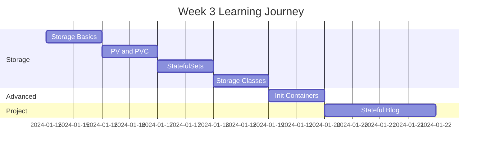
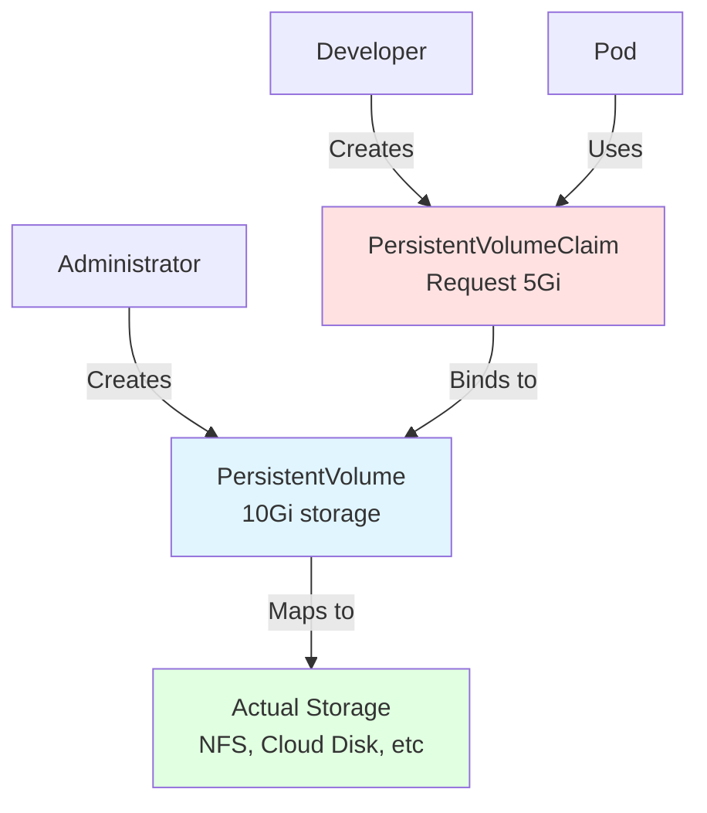
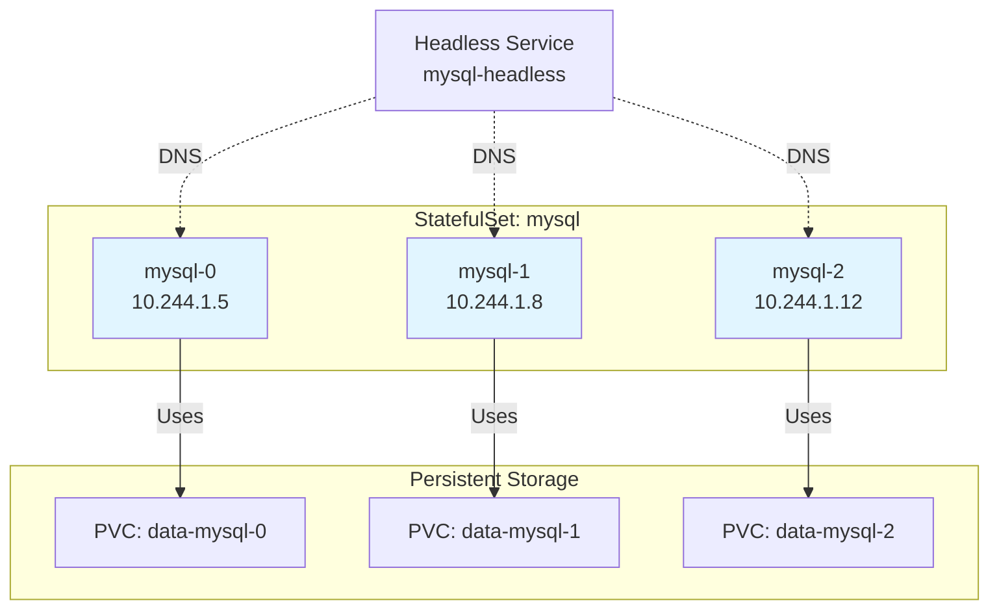
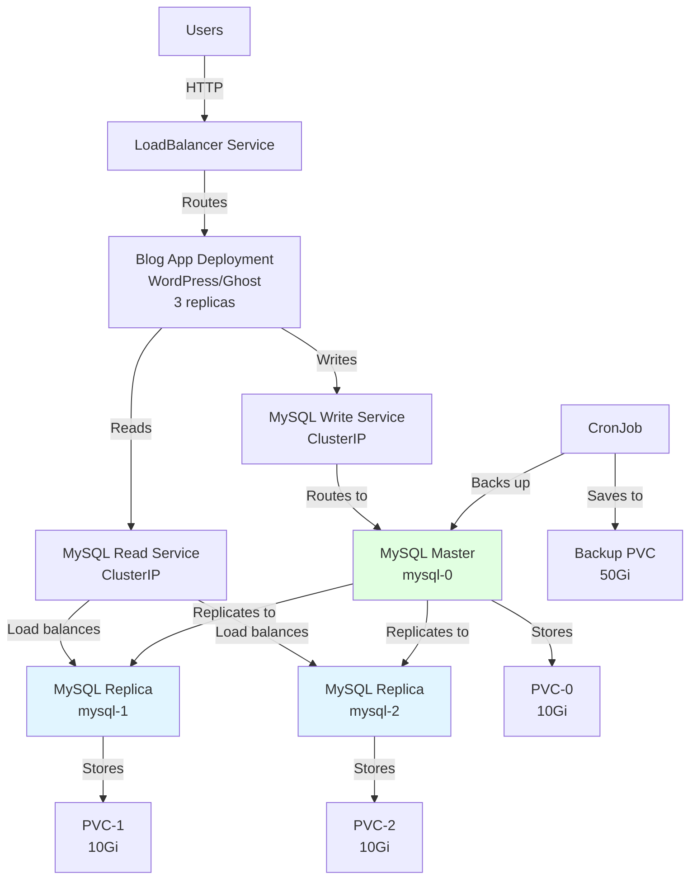

# Week 3 Roadmap - Storage, Persistence & Networking

**Duration:** 7 Days  
**Focus:** Storage Management → StatefulSets → Advanced Networking  
**Goal:** Master persistent storage and deploy stateful applications

---

## 📊 Week Overview



---

## 🎯 Week Goals

By the end of Week 3, you will:

- ✅ Master Kubernetes storage concepts
- ✅ Implement persistent volumes and claims
- ✅ Deploy stateful applications with StatefulSets
- ✅ Use dynamic storage provisioning
- ✅ Understand init containers and sidecar patterns
- ✅ Build a production-grade stateful application

---

## 📅 Daily Breakdown

---

### **Day 15: Understanding Kubernetes Storage**

**⏰ Time:** 2-3 hours  
**📚 Theory:** 1 hour | **💻 Hands-on:** 1-2 hours

#### Learning Objectives

- Understand storage concepts in Kubernetes
- Learn different volume types
- Master ephemeral storage
- Understand volume lifecycles
- Practice with emptyDir and hostPath

#### Theory Topics

```
1. Storage in Kubernetes
   ├── Why storage matters
   ├── Ephemeral vs Persistent
   ├── Storage abstractions
   └── Volume lifecycle

2. Volume Types
   ├── emptyDir (temporary)
   ├── hostPath (node storage)
   ├── configMap/secret (config)
   └── persistentVolumeClaim (persistent)

3. Storage Use Cases
   ├── Application state
   ├── Database storage
   ├── Shared storage
   └── Configuration files

4. Volume Modes
   ├── Filesystem
   ├── Block
   └── Access modes
```

#### Hands-on Exercises

| Exercise       | Description                              | Time    |
| -------------- | ---------------------------------------- | ------- |
| **Exercise 1** | Create pod with emptyDir                 | 15 mins |
| **Exercise 2** | Share data between containers (emptyDir) | 20 mins |
| **Exercise 3** | Use hostPath for node storage            | 15 mins |
| **Exercise 4** | Mount ConfigMap as volume                | 15 mins |
| **Exercise 5** | Multi-container shared storage           | 20 mins |
| **Exercise 6** | Test volume lifecycle                    | 20 mins |
| **Exercise 7** | Compare ephemeral storage types          | 15 mins |

#### Volume Types Deep Dive

**emptyDir - Temporary Storage**

```yaml
# Lifetime: Pod exists
# Use case: Scratch space, cache
apiVersion: v1
kind: Pod
metadata:
  name: test-emptydir
spec:
  containers:
    - name: writer
      image: busybox
      command: ["sh", "-c", 'echo "Hello" > /data/hello.txt && sleep 3600']
      volumeMounts:
        - name: shared-data
          mountPath: /data
    - name: reader
      image: busybox
      command: ["sh", "-c", "cat /data/hello.txt && sleep 3600"]
      volumeMounts:
        - name: shared-data
          mountPath: /data
  volumes:
    - name: shared-data
      emptyDir: {}
```

**hostPath - Node Storage**

```yaml
# Lifetime: Independent of pod
# Use case: Node-specific data, testing
# Warning: Not for production multi-node clusters
apiVersion: v1
kind: Pod
metadata:
  name: test-hostpath
spec:
  containers:
    - name: app
      image: nginx
      volumeMounts:
        - name: host-storage
          mountPath: /usr/share/nginx/html
  volumes:
    - name: host-storage
      hostPath:
        path: /data/website
        type: DirectoryOrCreate
```

#### Files to Create in `day-15/`

```
day-15/
├── emptydir-examples/
│   ├── simple-emptydir.yaml         # Basic emptyDir
│   ├── multi-container-shared.yaml  # Shared between containers
│   ├── cache-example.yaml           # Cache use case
│   └── test-commands.sh
├── hostpath-examples/
│   ├── hostpath-pod.yaml            # Basic hostPath
│   ├── nginx-hostpath.yaml          # Nginx with custom HTML
│   └── hostpath-notes.md
├── volume-lifecycle/
│   ├── test-ephemeral.yaml
│   ├── test-persistence.sh
│   └── lifecycle-observations.txt
└── storage-comparison/
    ├── comparison-table.md
    └── use-case-examples.yaml
```

#### Practical Scenarios

**Scenario 1: Log Processing**

```
Main container → Writes logs to emptyDir
Sidecar container → Reads logs from emptyDir
                  → Processes and ships to logging service
```

**Scenario 2: Cache Layer**

```
Application → Uses emptyDir for temporary cache
           → Cache survives container restart
           → Cache cleared when pod deleted
```

**Scenario 3: Shared Configuration**

```
Init container → Downloads config to emptyDir
Main container → Reads config from emptyDir
               → No need to rebuild image for config changes
```

#### Key Commands

```bash
# Inspect volumes
kubectl describe pod test-pod
kubectl exec test-pod -- df -h
kubectl exec test-pod -- ls -la /data

# Test volume persistence
kubectl exec test-pod -- sh -c "echo test > /data/file.txt"
kubectl delete pod test-pod
# Create new pod with same volume type
# Check if file exists

# Volume information
kubectl get pv
kubectl get pvc
```

#### Deliverables

- [ ] Created 5+ pods with different volume types
- [ ] Tested data sharing between containers
- [ ] Understood volume lifecycles
- [ ] Documented use cases for each volume type
- [ ] Compared ephemeral vs persistent storage

#### Success Criteria

- Can choose appropriate volume type for use case
- Understand when data persists vs deleted
- Comfortable with multi-container shared volumes
- Ready for persistent storage concepts

---

### **Day 16: Persistent Volumes (PV) and Claims (PVC)**

**⏰ Time:** 2-3 hours  
**📚 Theory:** 1 hour | **💻 Hands-on:** 1-2 hours

#### Learning Objectives

- Master PersistentVolume (PV) concepts
- Understand PersistentVolumeClaim (PVC)
- Learn storage binding process
- Implement persistent storage for databases
- Understand access modes and reclaim policies

#### Theory Topics

```
1. PersistentVolume (PV)
   ├── What is a PV?
   ├── PV lifecycle
   ├── Storage capacity
   └── PV specification

2. PersistentVolumeClaim (PVC)
   ├── What is a PVC?
   ├── PVC binding to PV
   ├── Storage requests
   └── PVC lifecycle

3. Access Modes
   ├── ReadWriteOnce (RWO)
   ├── ReadOnlyMany (ROX)
   ├── ReadWriteMany (RWX)
   └── Access mode selection

4. Reclaim Policies
   ├── Retain
   ├── Delete
   ├── Recycle (deprecated)
   └── Policy implications
```

#### Hands-on Exercises

| Exercise       | Description                        | Time    |
| -------------- | ---------------------------------- | ------- |
| **Exercise 1** | Create PersistentVolume            | 15 mins |
| **Exercise 2** | Create PersistentVolumeClaim       | 15 mins |
| **Exercise 3** | Use PVC in pod                     | 20 mins |
| **Exercise 4** | Test data persistence (delete pod) | 20 mins |
| **Exercise 5** | Multiple pods using same PVC       | 20 mins |
| **Exercise 6** | Test different access modes        | 25 mins |
| **Exercise 7** | Reclaim policy testing             | 25 mins |

#### PV and PVC Architecture



#### Files to Create in `day-16/`

```
day-16/
├── persistent-volumes/
│   ├── local-pv.yaml                # Local storage PV
│   ├── hostpath-pv.yaml            # hostPath-based PV
│   └── nfs-pv.yaml                 # NFS PV (if available)
├── persistent-volume-claims/
│   ├── basic-pvc.yaml              # Simple PVC
│   ├── specific-size-pvc.yaml      # Specific size request
│   └── access-mode-pvc.yaml        # Different access modes
├── database-examples/
│   ├── postgres-pv.yaml
│   ├── postgres-pvc.yaml
│   ├── postgres-deployment.yaml
│   └── postgres-service.yaml
├── persistence-tests/
│   ├── test-data-persistence.sh
│   ├── multi-pod-access.yaml
│   └── test-results.txt
└── reclaim-policies/
    ├── retain-policy.yaml
    ├── delete-policy.yaml
    └── policy-testing.md
```

#### PV and PVC Examples

**PersistentVolume:**

```yaml
apiVersion: v1
kind: PersistentVolume
metadata:
  name: postgres-pv
  labels:
    type: local
spec:
  storageClassName: manual
  capacity:
    storage: 10Gi
  accessModes:
    - ReadWriteOnce
  persistentVolumeReclaimPolicy: Retain
  hostPath:
    path: "/mnt/data/postgres"
    type: DirectoryOrCreate
```

**PersistentVolumeClaim:**

```yaml
apiVersion: v1
kind: PersistentVolumeClaim
metadata:
  name: postgres-pvc
spec:
  storageClassName: manual
  accessModes:
    - ReadWriteOnce
  resources:
    requests:
      storage: 5Gi
```

**Using PVC in Pod:**

```yaml
apiVersion: apps/v1
kind: Deployment
metadata:
  name: postgres
spec:
  replicas: 1
  selector:
    matchLabels:
      app: postgres
  template:
    metadata:
      labels:
        app: postgres
    spec:
      containers:
        - name: postgres
          image: postgres:15
          env:
            - name: POSTGRES_PASSWORD
              value: mysecretpassword
            - name: PGDATA
              value: /var/lib/postgresql/data/pgdata
          ports:
            - containerPort: 5432
          volumeMounts:
            - name: postgres-storage
              mountPath: /var/lib/postgresql/data
      volumes:
        - name: postgres-storage
          persistentVolumeClaim:
            claimName: postgres-pvc
```

#### Access Modes Explained

```
ReadWriteOnce (RWO):
- Single node can mount as read-write
- Most common for databases
- Examples: PostgreSQL, MySQL

ReadOnlyMany (ROX):
- Multiple nodes can mount as read-only
- Good for shared configuration
- Examples: Config files, static assets

ReadWriteMany (RWX):
- Multiple nodes can mount as read-write
- Requires special storage (NFS, CephFS)
- Examples: Shared file systems
```

#### Persistence Testing

```bash
# Test 1: Data Persistence Across Pod Deletion
# 1. Create PV and PVC
kubectl apply -f postgres-pv.yaml
kubectl apply -f postgres-pvc.yaml

# 2. Deploy PostgreSQL
kubectl apply -f postgres-deployment.yaml

# 3. Insert data
kubectl exec -it postgres-xxx -- psql -U postgres -c "CREATE TABLE test (id INT);"
kubectl exec -it postgres-xxx -- psql -U postgres -c "INSERT INTO test VALUES (1);"

# 4. Delete pod
kubectl delete pod postgres-xxx

# 5. Wait for new pod
kubectl get pods -w

# 6. Verify data persists
kubectl exec -it postgres-yyy -- psql -U postgres -c "SELECT * FROM test;"
# Should see the data!
```

#### Reclaim Policy Testing

```
Retain:
1. Create PV with Retain policy
2. Create PVC, bind to PV
3. Create pod, write data
4. Delete pod
5. Delete PVC
6. PV status: Released (data still there)
7. Manual cleanup required

Delete:
1. Create PV with Delete policy
2. Create PVC, bind to PV
3. Create pod, write data
4. Delete pod
5. Delete PVC
6. PV automatically deleted (data gone)
```

#### Key Commands

```bash
# PV operations
kubectl get pv
kubectl describe pv postgres-pv
kubectl delete pv postgres-pv

# PVC operations
kubectl get pvc
kubectl describe pvc postgres-pvc
kubectl delete pvc postgres-pvc

# Check binding status
kubectl get pv,pvc

# Storage information
kubectl get pv -o custom-columns=NAME:.metadata.name,CAPACITY:.spec.capacity.storage,ACCESS:.spec.accessModes,RECLAIM:.spec.persistentVolumeReclaimPolicy,STATUS:.status.phase

# Verify pod using PVC
kubectl describe pod postgres-xxx | grep -A 5 Volumes
```

#### Deliverables

- [ ] Created 5+ PV/PVC pairs
- [ ] Deployed database with persistent storage
- [ ] Tested data persistence across pod deletions
- [ ] Experimented with different access modes
- [ ] Tested reclaim policies
- [ ] Documented PV/PVC binding process

#### Success Criteria

- Understand PV vs PVC roles
- Can bind PVC to appropriate PV
- Data persists across pod restarts
- Know when to use which access mode
- Understand reclaim policy implications

---

### **Day 17: StatefulSets**

**⏰ Time:** 2-3 hours  
**📚 Theory:** 1 hour | **💻 Hands-on:** 1-2 hours

#### Learning Objectives

- Understand StatefulSets vs Deployments
- Learn stable network identities
- Master ordered deployment and scaling
- Implement StatefulSet with storage
- Deploy stateful applications properly

#### Theory Topics

```
1. StatefulSets Fundamentals
   ├── What are StatefulSets?
   ├── Use cases for StatefulSets
   ├── StatefulSet vs Deployment
   └── When to use StatefulSets

2. Stable Identities
   ├── Predictable pod names
   ├── Stable network identities
   ├── Ordered indexes
   └── Hostname persistence

3. Headless Services
   ├── What is headless service?
   ├── DNS for StatefulSets
   ├── Pod DNS entries
   └── Service discovery

4. VolumeClaimTemplates
   ├── Per-pod storage
   ├── Automatic PVC creation
   ├── Storage lifecycle
   └── Data persistence
```

#### Hands-on Exercises

| Exercise       | Description                   | Time    |
| -------------- | ----------------------------- | ------- |
| **Exercise 1** | Create headless service       | 15 mins |
| **Exercise 2** | Deploy simple StatefulSet     | 20 mins |
| **Exercise 3** | Test ordered deployment       | 15 mins |
| **Exercise 4** | StatefulSet with storage      | 25 mins |
| **Exercise 5** | Scale StatefulSet up and down | 20 mins |
| **Exercise 6** | Test DNS for StatefulSet pods | 20 mins |
| **Exercise 7** | Deploy MySQL cluster          | 30 mins |

#### StatefulSet Architecture



#### Files to Create in `day-17/`

```
day-17/
├── basic-statefulset/
│   ├── headless-service.yaml        # Headless service
│   ├── simple-statefulset.yaml      # Basic StatefulSet
│   └── test-commands.sh
├── with-storage/
│   ├── statefulset-with-pvc.yaml    # With volumeClaimTemplates
│   ├── storage-class.yaml           # StorageClass definition
│   └── test-persistence.sh
├── mysql-cluster/
│   ├── mysql-configmap.yaml
│   ├── mysql-services.yaml          # Headless + ClusterIP
│   ├── mysql-statefulset.yaml       # 3 replicas
│   └── test-cluster.sh
├── scaling-tests/
│   ├── scale-up.sh
│   ├── scale-down.sh
│   └── observations.txt
└── dns-testing/
    ├── dns-test-pod.yaml
    ├── dns-queries.sh
    └── dns-results.txt
```

#### StatefulSet vs Deployment

| Feature              | Deployment             | StatefulSet               |
| -------------------- | ---------------------- | ------------------------- |
| **Pod Names**        | Random (pod-abc123)    | Ordered (pod-0, pod-1)    |
| **Network Identity** | Changes on restart     | Stable across restarts    |
| **Storage**          | Shared or separate PVC | Separate PVC per pod      |
| **Scaling**          | Parallel               | Ordered (one at a time)   |
| **Deployment**       | Parallel               | Ordered                   |
| **Use Case**         | Stateless apps         | Stateful apps (databases) |

#### Headless Service

```yaml
apiVersion: v1
kind: Service
metadata:
  name: mysql-headless
  labels:
    app: mysql
spec:
  ports:
    - port: 3306
      name: mysql
  clusterIP: None # Makes it headless
  selector:
    app: mysql
```

**DNS Resolution:**

```
# Service FQDN
mysql-headless.default.svc.cluster.local

# Individual pod FQDNs
mysql-0.mysql-headless.default.svc.cluster.local
mysql-1.mysql-headless.default.svc.cluster.local
mysql-2.mysql-headless.default.svc.cluster.local
```

#### StatefulSet with VolumeClaimTemplates

```yaml
apiVersion: apps/v1
kind: StatefulSet
metadata:
  name: mysql
spec:
  serviceName: mysql-headless
  replicas: 3
  selector:
    matchLabels:
      app: mysql
  template:
    metadata:
      labels:
        app: mysql
    spec:
      containers:
        - name: mysql
          image: mysql:8.0
          env:
            - name: MYSQL_ROOT_PASSWORD
              value: rootpassword
          ports:
            - containerPort: 3306
              name: mysql
          volumeMounts:
            - name: data
              mountPath: /var/lib/mysql
  volumeClaimTemplates:
    - metadata:
        name: data
      spec:
        accessModes: ["ReadWriteOnce"]
        resources:
          requests:
            storage: 10Gi
```

**What Happens:**

```
1. StatefulSet creates pods in order: mysql-0, then mysql-1, then mysql-2
2. Each pod gets its own PVC: data-mysql-0, data-mysql-1, data-mysql-2
3. Each pod has stable DNS: mysql-0.mysql-headless...
4. If mysql-1 is deleted, new mysql-1 gets same PVC (data-mysql-1)
5. Data persists across pod restarts
```

#### Ordered Scaling Test

```bash
# Scale up (watch ordered creation)
kubectl scale statefulset mysql --replicas=5
kubectl get pods -w
# Observe: mysql-3 created, waits to be Running
# Then: mysql-4 created

# Scale down (watch ordered deletion)
kubectl scale statefulset mysql --replicas=2
kubectl get pods -w
# Observe: mysql-4 deleted first
# Then: mysql-3 deleted
# mysql-0 and mysql-1 remain
```

#### DNS Testing

```bash
# Deploy test pod
kubectl run test --rm -it --image=busybox -- sh

# Inside test pod:
nslookup mysql-headless
# Returns: All 3 pod IPs

nslookup mysql-0.mysql-headless.default.svc.cluster.local
# Returns: Specific pod IP

ping mysql-0.mysql-headless.default.svc.cluster.local
# Can reach specific pod
```

#### MySQL Cluster Example

```yaml
apiVersion: v1
kind: ConfigMap
metadata:
  name: mysql-config
data:
  master.cnf: |
    [mysqld]
    log-bin
  slave.cnf: |
    [mysqld]
    super-read-only
---
apiVersion: apps/v1
kind: StatefulSet
metadata:
  name: mysql
spec:
  serviceName: mysql-headless
  replicas: 3
  selector:
    matchLabels:
      app: mysql
  template:
    metadata:
      labels:
        app: mysql
    spec:
      initContainers:
        - name: init-mysql
          image: mysql:8.0
          command:
            - bash
            - "-c"
            - |
              set -ex
              # Generate server-id from pod ordinal
              [[ $(hostname) =~ -([0-9]+)$ ]] || exit 1
              ordinal=${BASH_REMATCH[1]}
              echo [mysqld] > /mnt/conf.d/server-id.cnf
              echo server-id=$((100 + $ordinal)) >> /mnt/conf.d/server-id.cnf
              # Copy config based on role
              if [[ $ordinal -eq 0 ]]; then
                cp /mnt/config-map/master.cnf /mnt/conf.d/
              else
                cp /mnt/config-map/slave.cnf /mnt/conf.d/
              fi
          volumeMounts:
            - name: conf
              mountPath: /mnt/conf.d
            - name: config-map
              mountPath: /mnt/config-map
      containers:
        - name: mysql
          image: mysql:8.0
          env:
            - name: MYSQL_ROOT_PASSWORD
              value: rootpass
          ports:
            - containerPort: 3306
              name: mysql
          volumeMounts:
            - name: data
              mountPath: /var/lib/mysql
            - name: conf
              mountPath: /etc/mysql/conf.d
      volumes:
        - name: conf
          emptyDir: {}
        - name: config-map
          configMap:
            name: mysql-config
  volumeClaimTemplates:
    - metadata:
        name: data
      spec:
        accessModes: ["ReadWriteOnce"]
        resources:
          requests:
            storage: 10Gi
```

#### Key Commands

```bash
# StatefulSet operations
kubectl get statefulsets
kubectl describe statefulset mysql
kubectl scale statefulset mysql --replicas=5

# Check pod order
kubectl get pods -l app=mysql

# Check PVCs
kubectl get pvc
# See: data-mysql-0, data-mysql-1, data-mysql-2

# Delete StatefulSet (keeps PVCs)
kubectl delete statefulset mysql
kubectl get pvc  # PVCs still there

# Delete with cascade=orphan (keeps pods)
kubectl delete statefulset mysql --cascade=orphan
```

#### Deliverables

- [ ] Created headless service
- [ ] Deployed StatefulSet with 3 replicas
- [ ] Each pod has separate persistent storage
- [ ] Tested ordered scaling
- [ ] Verified stable network identities
- [ ] Tested DNS resolution for pods
- [ ] Deployed MySQL cluster

#### Success Criteria

- Understand when to use StatefulSet
- Can create StatefulSet with storage
- Know how DNS works for StatefulSets
- Understand ordered deployment/scaling
- Can deploy stateful applications

---

### **Day 18: Storage Classes and Dynamic Provisioning**

**⏰ Time:** 2-3 hours  
**📚 Theory:** 1 hour | **💻 Hands-on:** 1-2 hours

#### Learning Objectives

- Understand StorageClass concept
- Learn dynamic provisioning
- Master different provisioners
- Implement default storage classes
- Volume expansion capabilities

#### Theory Topics

```
1. StorageClass
   ├── What is StorageClass?
   ├── Dynamic provisioning
   ├── Provisioners
   └── Parameters

2. Provisioners
   ├── Cloud provider provisioners
   ├── Local provisioners
   ├── CSI drivers
   └── Provisioner selection

3. Volume Binding
   ├── Immediate binding
   ├── WaitForFirstConsumer
   ├── Binding modes
   └── Performance implications

4. Advanced Features
   ├── Volume expansion
   ├── Volume snapshots
   ├── Volume cloning
   └── Topology awareness
```

#### Hands-on Exercises

| Exercise       | Description                   | Time    |
| -------------- | ----------------------------- | ------- |
| **Exercise 1** | List available StorageClasses | 10 mins |
| **Exercise 2** | Create custom StorageClass    | 15 mins |
| **Exercise 3** | Dynamic PVC provisioning      | 20 mins |
| **Exercise 4** | Test volume expansion         | 25 mins |
| **Exercise 5** | Different binding modes       | 20 mins |
| **Exercise 6** | Set default StorageClass      | 15 mins |
| **Exercise 7** | Cloud provider StorageClass   | 25 mins |

#### Files to Create in `day-18/`

```
day-18/
├── storage-classes/
│   ├── standard-sc.yaml             # Standard StorageClass
│   ├── fast-ssd-sc.yaml            # Fast SSD StorageClass
│   ├── slow-hdd-sc.yaml            # Slow HDD StorageClass
│   └── default-sc.yaml             # Default StorageClass
├── dynamic-provisioning/
│   ├── dynamic-pvc.yaml            # PVC with StorageClass
│   ├── test-dynamic.sh
│   └── auto-provisioned-pvs.txt
├── volume-expansion/
│   ├── expandable-sc.yaml          # Allow expansion
│   ├── expand-test-pvc.yaml
│   ├── expand-test.sh
│   └── expansion-results.txt
├── binding-modes/
│   ├── immediate-binding.yaml
│   ├── wait-for-consumer.yaml
│   └── binding-comparison.md
└── cloud-storage/
    ├── aws-ebs-sc.yaml             # AWS EBS
    ├── gcp-pd-sc.yaml              # GCP Persistent Disk
    └── azure-disk-sc.yaml          # Azure Disk
```

#### StorageClass Examples

**Basic StorageClass:**

```yaml
apiVersion: storage.k8s.io/v1
kind: StorageClass
metadata:
  name: fast-storage
provisioner: kubernetes.io/no-provisioner # For local testing
volumeBindingMode: WaitForFirstConsumer
```

**Cloud Provider StorageClass (AWS):**

```yaml
apiVersion: storage.k8s.io/v1
kind: StorageClass
metadata:
  name: aws-gp3
provisioner: kubernetes.io/aws-ebs
parameters:
  type: gp3
  iopsPerGB: "50"
  fsType: ext4
volumeBindingMode: WaitForFirstConsumer
allowVolumeExpansion: true
```

**Default StorageClass:**

```yaml
apiVersion: storage.k8s.io/v1
kind: StorageClass
metadata:
  name: standard
  annotations:
    storageclass.kubernetes.io/is-default-class: "true"
provisioner: kubernetes.io/no-provisioner
volumeBindingMode: WaitForFirstConsumer
```

#### Dynamic Provisioning

```yaml
# PVC with StorageClass
apiVersion: v1
kind: PersistentVolumeClaim
metadata:
  name: dynamic-pvc
spec:
  accessModes:
    - ReadWriteOnce
  storageClassName: fast-storage # References StorageClass
  resources:
    requests:
      storage: 10Gi
# No need to create PV manually!
# StorageClass provisioner creates PV automatically
```

**What Happens:**

```
1. Create PVC with storageClassName
2. StorageClass sees the PVC
3. Provisioner creates PV automatically
4. PVC binds to newly created PV
5. Pod can use PVC immediately
```

#### Volume Expansion

```yaml
# StorageClass with expansion enabled
apiVersion: storage.k8s.io/v1
kind: StorageClass
metadata:
  name: expandable
provisioner: kubernetes.io/aws-ebs
allowVolumeExpansion: true # Enable expansion
parameters:
  type: gp3
```

```yaml
# Original PVC: 10Gi
apiVersion: v1
kind: PersistentVolumeClaim
metadata:
  name: expandable-pvc
spec:
  storageClassName: expandable
  accessModes:
    - ReadWriteOnce
  resources:
    requests:
      storage: 10Gi
# To expand: Edit PVC
# Change storage: 10Gi → storage: 20Gi
```

```bash
# Expand volume
kubectl edit pvc expandable-pvc
# Change storage request to 20Gi

# Watch expansion
kubectl get pvc expandable-pvc -w

# Verify new size
kubectl describe pvc expandable-pvc
```

#### Binding Modes

**Immediate Binding:**

```yaml
volumeBindingMode: Immediate
# PVC binds to PV immediately
# Pod can be scheduled on any node
# Problem: Pod might land on wrong node
```

**WaitForFirstConsumer:**

```yaml
volumeBindingMode: WaitForFirstConsumer
# PVC waits for pod to be scheduled
# PV created in same zone as pod
# Better for multi-zone clusters
```

#### Key Commands

```bash
# StorageClass operations
kubectl get storageclass
kubectl get sc
kubectl describe sc standard

# Create StorageClass
kubectl apply -f storageclass.yaml

# Set default StorageClass
kubectl patch storageclass standard \
  -p '{"metadata": {"annotations":{"storageclass.kubernetes.io/is-default-class":"true"}}}'

# Dynamic PVC
kubectl apply -f pvc.yaml
kubectl get pvc -w  # Watch binding
kubectl get pv      # See auto-created PV

# Volume expansion
kubectl edit pvc my-pvc
# Change storage size
kubectl get pvc my-pvc -w
```

#### Deliverables

- [ ] Created 3+ StorageClasses
- [ ] Tested dynamic provisioning
- [ ] Expanded volume successfully
- [ ] Compared binding modes
- [ ] Set default StorageClass
- [ ] Documented provisioner options

#### Success Criteria

- Understand dynamic vs static provisioning
- Can create StorageClass
- Know when to use different binding modes
- Can expand volumes when needed

---

### **Day 19: Init Containers and Multi-Container Patterns**

**⏰ Time:** 2-3 hours  
**📚 Theory:** 1 hour | **💻 Hands-on:** 1-2 hours

#### Learning Objectives

- Master init containers
- Learn sidecar pattern
- Understand adapter pattern
- Implement ambassador pattern
- Practice multi-container pods

#### Theory Topics

```
1. Init Containers
   ├── What are init containers?
   ├── Use cases
   ├── Execution order
   └── Best practices

2. Sidecar Pattern
   ├── Definition
   ├── Use cases (logging, monitoring)
   ├── Shared resources
   └── Communication patterns

3. Adapter Pattern
   ├── Data transformation
   ├── Protocol conversion
   ├── Log formatting
   └── Use cases

4. Ambassador Pattern
   ├── Proxy functionality
   ├── Connection management
   ├── Request routing
   └── Use cases
```

#### Hands-on Exercises

| Exercise       | Description                       | Time    |
| -------------- | --------------------------------- | ------- |
| **Exercise 1** | Simple init container             | 15 mins |
| **Exercise 2** | Multiple init containers          | 20 mins |
| **Exercise 3** | Sidecar logging pattern           | 25 mins |
| **Exercise 4** | Adapter pattern example           | 20 mins |
| **Exercise 5** | Ambassador pattern                | 25 mins |
| **Exercise 6** | Database migration init container | 25 mins |
| **Exercise 7** | Complete multi-container app      | 30 mins |

#### Files to Create in `day-19/`

```
day-19/
├── init-containers/
│   ├── simple-init.yaml             # Basic init container
│   ├── multiple-init.yaml           # Multiple init containers
│   ├── wait-for-service.yaml        # Wait for dependency
│   └── git-clone-init.yaml          # Clone repo
├── sidecar-pattern/
│   ├── logging-sidecar.yaml         # Log collection
│   ├── metrics-sidecar.yaml         # Metrics export
│   └── backup-sidecar.yaml          # Data backup
├── adapter-pattern/
│   ├── log-adapter.yaml             # Log formatting
│   └── protocol-adapter.yaml        # Protocol conversion
├── ambassador-pattern/
│   ├── db-proxy-ambassador.yaml     # Database proxy
│   └── api-ambassador.yaml          # API gateway
└── real-world-examples/
    ├── web-app-with-logging/
    │   ├── deployment.yaml
    │   └── configmap.yaml
    └── api-with-cache/
        ├── deployment.yaml
        └── services.yaml
```

#### Init Container Examples

**Simple Init Container:**

```yaml
apiVersion: v1
kind: Pod
metadata:
  name: init-demo
spec:
  initContainers:
    - name: install-dependencies
      image: busybox
      command: ["sh", "-c", "echo Installing dependencies && sleep 5"]

  containers:
    - name: app
      image: nginx
```

**Multiple Init Containers (Run in Order):**

```yaml
apiVersion: v1
kind: Pod
metadata:
  name: multi-init
spec:
  initContainers:
    # Runs first
    - name: init-db
      image: busybox
      command:
        [
          "sh",
          "-c",
          "until nslookup mysql-service; do echo waiting for mysql; sleep 2; done",
        ]

    # Runs second (after init-db completes)
    - name: init-config
      image: busybox
      command: ["sh", "-c", 'echo "Setting up config" && sleep 3']

    # Runs third
    - name: init-data
      image: busybox
      command: ["sh", "-c", 'echo "Initializing data" && sleep 3']

  containers:
    - name: app
      image: myapp
```

#### Sidecar Pattern

**Logging Sidecar:**

```yaml
apiVersion: v1
kind: Pod
metadata:
  name: app-with-logging
spec:
  containers:
    # Main application
    - name: app
      image: myapp
      volumeMounts:
        - name: logs
          mountPath: /var/log/app

    # Sidecar: Log collector
    - name: log-collector
      image: fluent/fluent-bit
      volumeMounts:
        - name: logs
          mountPath: /var/log/app
          readOnly: true

  volumes:
    - name: logs
      emptyDir: {}
```

**Monitoring Sidecar:**

```yaml
spec:
  containers:
    # Main app
    - name: app
      image: myapp
      ports:
        - containerPort: 8080

    # Sidecar: Metrics exporter
    - name: metrics-exporter
      image: prom/node-exporter
      ports:
        - containerPort: 9100
```

#### Adapter Pattern

**Log Adapter:**

```yaml
apiVersion: v1
kind: Pod
metadata:
  name: log-adapter-pod
spec:
  containers:
    # Main app (writes logs in custom format)
    - name: app
      image: myapp
      volumeMounts:
        - name: logs
          mountPath: /var/log

    # Adapter: Converts to standard format
    - name: log-adapter
      image: busybox
      command:
        ["sh", "-c", 'tail -f /var/log/app.log | sed "s/^/[FORMATTED] /"']
      volumeMounts:
        - name: logs
          mountPath: /var/log

  volumes:
    - name: logs
      emptyDir: {}
```

#### Ambassador Pattern

**Database Proxy:**

```yaml
apiVersion: v1
kind: Pod
metadata:
  name: app-with-db-proxy
spec:
  containers:
    # Main app (connects to localhost:5432)
    - name: app
      image: myapp
      env:
        - name: DB_HOST
          value: "localhost" # Connects to ambassador
        - name: DB_PORT
          value: "5432"

    # Ambassador: Proxies to actual database
    - name: db-proxy
      image: haproxy
      ports:
        - containerPort: 5432
      volumeMounts:
        - name: config
          mountPath: /usr/local/etc/haproxy

  volumes:
    - name: config
      configMap:
        name: haproxy-config
```

#### Real-World Example: Web App with Logging and Monitoring

```yaml
apiVersion: apps/v1
kind: Deployment
metadata:
  name: webapp
spec:
  replicas: 3
  selector:
    matchLabels:
      app: webapp
  template:
    metadata:
      labels:
        app: webapp
    spec:
      # Init: Wait for database
      initContainers:
        - name: wait-for-db
          image: busybox
          command:
            ["sh", "-c", "until nslookup postgres-service; do sleep 2; done"]

        # Init: Run migrations
        - name: db-migration
          image: webapp:v1
          command: ["python", "manage.py", "migrate"]
          env:
            - name: DATABASE_URL
              valueFrom:
                secretKeyRef:
                  name: db-secret
                  key: url

      containers:
        # Main application
        - name: webapp
          image: webapp:v1
          ports:
            - containerPort: 8000
          volumeMounts:
            - name: logs
              mountPath: /var/log/app
          livenessProbe:
            httpGet:
              path: /health
              port: 8000

        # Sidecar: Log shipping
        - name: log-shipper
          image: fluent/fluent-bit
          volumeMounts:
            - name: logs
              mountPath: /var/log/app
              readOnly: true

        # Sidecar: Metrics
        - name: metrics-exporter
          image: prom/python-exporter
          ports:
            - containerPort: 9090

      volumes:
        - name: logs
          emptyDir: {}
```

#### Init Container Use Cases

```
1. Wait for Dependencies
   - Wait for database to be ready
   - Wait for another service
   - Check prerequisites

2. Data Initialization
   - Download configuration
   - Clone git repository
   - Populate cache

3. Database Migrations
   - Run schema migrations
   - Seed initial data
   - Version upgrades

4. Security Setup
   - Generate certificates
   - Fetch secrets
   - Set permissions
```

#### Key Commands

```bash
# Check init container status
kubectl get pod init-demo
kubectl describe pod init-demo

# View init container logs
kubectl logs init-demo -c install-dependencies

# Debug init container failures
kubectl describe pod failing-pod
# Check: Init:CrashLoopBackOff or Init:Error

# View all containers in pod
kubectl get pod multi-container -o jsonpath='{.spec.containers[*].name}'

# Logs from specific container
kubectl logs pod-name -c container-name

# Exec into specific container
kubectl exec -it pod-name -c container-name -- bash
```

#### Deliverables

- [ ] Created 5+ init container examples
- [ ] Implemented sidecar pattern
- [ ] Implemented adapter pattern
- [ ] Implemented ambassador pattern
- [ ] Built complete multi-container application
- [ ] Documented pattern use cases

#### Success Criteria

- Understand when to use init containers
- Can implement multi-container patterns
- Know which pattern for which use case
- Debug multi-container pods

---

### **Day 20-21: Weekend Project - Stateful Blog Platform**

**⏰ Time:** 4-6 hours (split over 2 days)  
**💻 100% Hands-on Project**

#### Project Overview

Build a production-grade blog platform with MySQL replication, persistent storage, and automated backups.



#### Project Components

```
1. MySQL StatefulSet (Primary-Replica Setup)
   - 1 Primary (mysql-0)
   - 2 Replicas (mysql-1, mysql-2)
   - Automatic replication configuration
   - Persistent storage per instance

2. Blog Application (WordPress or Ghost)
   - 3 replicas for high availability
   - Reads from any replica
   - Writes to primary only
   - Session persistence

3. Automated Backups
   - CronJob for daily backups
   - Backs up primary database
   - Stores in separate PVC
   - Retention policy

4. Monitoring
   - Health checks
   - Readiness probes
   - Resource monitoring
```

#### Day 20: Database Cluster Setup

**Morning: MySQL StatefulSet (2.5 hours)**

Tasks:

1. Create ConfigMaps for MySQL configuration
2. Create Secrets for credentials
3. Create StorageClass for dynamic provisioning
4. Create Headless Service
5. Create StatefulSet with 3 replicas
6. Configure primary-replica replication
7. Test replication

**File Structure:**

```
projects/project-03-stateful-blog/
├── database/
│   ├── mysql-configmap.yaml        # MySQL configs (master/slave)
│   ├── mysql-secret.yaml           # Root password
│   ├── mysql-services.yaml         # Headless + read/write services
│   ├── mysql-statefulset.yaml      # StatefulSet with 3 replicas
│   └── init-replication.sh         # Replication setup script
```

**MySQL ConfigMap:**

```yaml
apiVersion: v1
kind: ConfigMap
metadata:
  name: mysql-config
data:
  master.cnf: |
    [mysqld]
    log-bin=mysql-bin
    binlog-format=ROW
    server-id=1

  slave.cnf: |
    [mysqld]
    server-id=2
    relay-log=relay-log
    read-only=1
```

**MySQL StatefulSet with Init Container:**

```yaml
apiVersion: apps/v1
kind: StatefulSet
metadata:
  name: mysql
spec:
  serviceName: mysql-headless
  replicas: 3
  selector:
    matchLabels:
      app: mysql
  template:
    metadata:
      labels:
        app: mysql
    spec:
      initContainers:
        - name: init-mysql
          image: mysql:8.0
          command:
            - bash
            - "-c"
            - |
              set -ex
              # Generate server-id from pod ordinal index
              [[ $(hostname) =~ -([0-9]+)$ ]] || exit 1
              ordinal=${BASH_REMATCH[1]}
              echo [mysqld] > /mnt/conf.d/server-id.cnf
              echo server-id=$((100 + $ordinal)) >> /mnt/conf.d/server-id.cnf

              # Copy appropriate config
              if [[ $ordinal -eq 0 ]]; then
                cp /mnt/config-map/master.cnf /mnt/conf.d/
              else
                cp /mnt/config-map/slave.cnf /mnt/conf.d/
              fi
          volumeMounts:
            - name: conf
              mountPath: /mnt/conf.d
            - name: config-map
              mountPath: /mnt/config-map

        - name: clone-mysql
          image: gcr.io/google-samples/xtrabackup:1.0
          command:
            - bash
            - "-c"
            - |
              set -ex
              [[ -d /var/lib/mysql/mysql ]] && exit 0
              [[ $(hostname) =~ -([0-9]+)$ ]] || exit 1
              ordinal=${BASH_REMATCH[1]}
              [[ $ordinal -eq 0 ]] && exit 0

              # Clone from previous pod
              ncat --recv-only mysql-$(($ordinal-1)).mysql-headless 3307 | xbstream -x -C /var/lib/mysql
              xtrabackup --prepare --target-dir=/var/lib/mysql
          volumeMounts:
            - name: data
              mountPath: /var/lib/mysql
            - name: conf
              mountPath: /etc/mysql/conf.d

      containers:
        - name: mysql
          image: mysql:8.0
          env:
            - name: MYSQL_ROOT_PASSWORD
              valueFrom:
                secretKeyRef:
                  name: mysql-secret
                  key: password
          ports:
            - containerPort: 3306
              name: mysql
          volumeMounts:
            - name: data
              mountPath: /var/lib/mysql
            - name: conf
              mountPath: /etc/mysql/conf.d
          resources:
            requests:
              cpu: 500m
              memory: 1Gi
          livenessProbe:
            exec:
              command: ["mysqladmin", "ping"]
            initialDelaySeconds: 30
            periodSeconds: 10
          readinessProbe:
            exec:
              command: ["mysql", "-h", "127.0.0.1", "-e", "SELECT 1"]
            initialDelaySeconds: 5
            periodSeconds: 2

        - name: xtrabackup
          image: gcr.io/google-samples/xtrabackup:1.0
          ports:
            - containerPort: 3307
              name: xtrabackup
          command:
            - bash
            - "-c"
            - |
              set -ex
              cd /var/lib/mysql

              if [[ -f xtrabackup_slave_info ]]; then
                # Clone from replica
                mv xtrabackup_slave_info change_master_to.sql.in
                rm -f xtrabackup_binlog_info
              elif [[ -f xtrabackup_binlog_info ]]; then
                # Clone from master
                [[ $(cat xtrabackup_binlog_info) =~ ^(.*?)[[:space:]]+(.*?)$ ]] || exit 1
                rm xtrabackup_binlog_info
                echo "CHANGE MASTER TO MASTER_LOG_FILE='${BASH_REMATCH[1]}',MASTER_LOG_POS=${BASH_REMATCH[2]}" > change_master_to.sql.in
              fi

              if [[ -f change_master_to.sql.in ]]; then
                echo "Waiting for mysqld to be ready"
                until mysql -h 127.0.0.1 -e "SELECT 1"; do sleep 1; done
                
                echo "Initializing replication"
                mysql -h 127.0.0.1 <<EOF
              $(<change_master_to.sql.in),
                MASTER_HOST='mysql-0.mysql-headless',
                MASTER_USER='root',
                MASTER_PASSWORD='${MYSQL_ROOT_PASSWORD}',
                MASTER_CONNECT_RETRY=10;
              START SLAVE;
              EOF
              fi

              exec ncat --listen --keep-open --send-only --max-conns=1 3307 -c \
                "xtrabackup --backup --slave-info --stream=xbstream --host=127.0.0.1 --user=root --password=${MYSQL_ROOT_PASSWORD}"
          volumeMounts:
            - name: data
              mountPath: /var/lib/mysql
            - name: conf
              mountPath: /etc/mysql/conf.d
          resources:
            requests:
              cpu: 100m
              memory: 100Mi

      volumes:
        - name: conf
          emptyDir: {}
        - name: config-map
          configMap:
            name: mysql-config

  volumeClaimTemplates:
    - metadata:
        name: data
      spec:
        accessModes: ["ReadWriteOnce"]
        resources:
          requests:
            storage: 10Gi
```

**Services:**

```yaml
# Headless service for StatefulSet
apiVersion: v1
kind: Service
metadata:
  name: mysql-headless
spec:
  ports:
    - port: 3306
  clusterIP: None
  selector:
    app: mysql
---
# Service for writes (to primary only)
apiVersion: v1
kind: Service
metadata:
  name: mysql-write
spec:
  ports:
    - port: 3306
  selector:
    app: mysql
    statefulset.kubernetes.io/pod-name: mysql-0
---
# Service for reads (to any replica)
apiVersion: v1
kind: Service
metadata:
  name: mysql-read
spec:
  ports:
    - port: 3306
  selector:
    app: mysql
```

**Afternoon: Testing and Verification (1.5 hours)**

```bash
# Test primary-replica setup
# 1. Check all pods running
kubectl get pods -l app=mysql

# 2. Check replication status
kubectl exec mysql-0 -- mysql -u root -p$PASS -e "SHOW MASTER STATUS\G"
kubectl exec mysql-1 -- mysql -u root -p$PASS -e "SHOW SLAVE STATUS\G"

# 3. Test write to primary
kubectl exec mysql-0 -- mysql -u root -p$PASS -e "CREATE DATABASE testdb; USE testdb; CREATE TABLE test (id INT); INSERT INTO test VALUES (1);"

# 4. Test read from replica
kubectl exec mysql-1 -- mysql -u root -p$PASS -e "USE testdb; SELECT * FROM test;"
# Should see the data!

# 5. Test read/write services
kubectl run mysql-client --rm -it --image=mysql:8.0 -- bash
# Inside: mysql -h mysql-write -u root -p  # For writes
# Inside: mysql -h mysql-read -u root -p   # For reads
```

#### Day 21: Blog Application and Integration

**Morning: WordPress/Ghost Deployment (2 hours)**

```
projects/project-03-stateful-blog/
├── blog-app/
│   ├── wordpress-configmap.yaml
│   ├── wordpress-deployment.yaml
│   ├── wordpress-service.yaml
│   └── wordpress-pvc.yaml
```

**WordPress Deployment:**

```yaml
apiVersion: apps/v1
kind: Deployment
metadata:
  name: wordpress
spec:
  replicas: 3
  selector:
    matchLabels:
      app: wordpress
  template:
    metadata:
      labels:
        app: wordpress
    spec:
      containers:
        - name: wordpress
          image: wordpress:latest
          env:
            - name: WORDPRESS_DB_HOST
              value: "mysql-write" # Writes to primary
            - name: WORDPRESS_DB_USER
              value: "root"
            - name: WORDPRESS_DB_PASSWORD
              valueFrom:
                secretKeyRef:
                  name: mysql-secret
                  key: password
            - name: WORDPRESS_DB_NAME
              value: "wordpress"
          ports:
            - containerPort: 80
          volumeMounts:
            - name: wordpress-persistent-storage
              mountPath: /var/www/html
          resources:
            requests:
              cpu: 200m
              memory: 256Mi
            limits:
              cpu: 500m
              memory: 512Mi
          livenessProbe:
            httpGet:
              path: /wp-admin/install.php
              port: 80
            initialDelaySeconds: 60
            periodSeconds: 10
          readinessProbe:
            httpGet:
              path: /wp-admin/install.php
              port: 80
            initialDelaySeconds: 30
            periodSeconds: 5
      volumes:
        - name: wordpress-persistent-storage
          persistentVolumeClaim:
            claimName: wordpress-pvc
```

**Afternoon: Backup System (1.5 hours)**

```
├── backup/
│   ├── backup-cronjob.yaml
│   ├── backup-pvc.yaml
│   └── restore-job.yaml
```

**Backup CronJob:**

```yaml
apiVersion: batch/v1
kind: CronJob
metadata:
  name: mysql-backup
spec:
  schedule: "0 2 * * *" # Daily at 2 AM
  jobTemplate:
    spec:
      template:
        spec:
          containers:
            - name: backup
              image: mysql:8.0
              command:
                - /bin/bash
                - -c
                - |
                  BACKUP_FILE="/backup/mysql-$(date +%Y%m%d-%H%M%S).sql.gz"
                  mysqldump -h mysql-write -u root -p$MYSQL_ROOT_PASSWORD --all-databases | gzip > $BACKUP_FILE
                  # Keep only last 7 days
                  find /backup -name "mysql-*.sql.gz" -mtime +7 -delete
              env:
                - name: MYSQL_ROOT_PASSWORD
                  valueFrom:
                    secretKeyRef:
                      name: mysql-secret
                      key: password
              volumeMounts:
                - name: backup-storage
                  mountPath: /backup
          restartPolicy: OnFailure
          volumes:
            - name: backup-storage
              persistentVolumeClaim:
                claimName: backup-pvc
  successfulJobsHistoryLimit: 3
  failedJobsHistoryLimit: 1
```

**Evening: Documentation and Testing (1 hour)**

Complete documentation, testing, and screenshots.

#### Testing Checklist

```
Database:
- [ ] All 3 MySQL pods running
- [ ] Primary-replica replication working
- [ ] Write to primary, read from replica
- [ ] Data persists after pod restart
- [ ] Can manually trigger backup

Application:
- [ ] WordPress accessible in browser
- [ ] Can create blog posts
- [ ] Posts stored in database
- [ ] Multiple replicas load balanced
- [ ] Session persistence working

Storage:
- [ ] Each MySQL pod has separate PVC
- [ ] WordPress has shared PVC
- [ ] Backup PVC created
- [ ] Data survives pod deletion
- [ ] Can restore from backup

High Availability:
- [ ] Delete mysql-1, new pod comes up
- [ ] Delete wordpress pod, service continues
- [ ] Scale wordpress to 5 replicas
- [ ] All replicas can read database

Production Readiness:
- [ ] Resource limits set
- [ ] Health checks implemented
- [ ] Automated backups working
- [ ] Monitoring enabled
- [ ] Documentation complete
```

#### Deliverables

- [ ] MySQL cluster with replication
- [ ] WordPress/Ghost blog application
- [ ] Automated backup system
- [ ] Complete documentation
- [ ] Architecture diagrams
- [ ] Runbook for operations
- [ ] Screenshots/demo video

#### Success Criteria

- Blog fully functional
- Database replication working
- High availability demonstrated
- Backups automated and tested
- Production-ready configuration

#### Bonus Challenges

- [ ] Implement MySQL monitoring with Prometheus
- [ ] Add read replicas in different zones
- [ ] Implement automated failover
- [ ] Add Redis cache layer
- [ ] Set up log aggregation
- [ ] Implement rate limiting
- [ ] Add CDN for static assets

---

## 📊 Week 3 Progress Tracker

### Daily Completion Checklist

| Day   | Topic           | Theory | Hands-on | Notes | Status         |
| ----- | --------------- | ------ | -------- | ----- | -------------- |
| 15    | Storage Basics  | ☐      | ☐        | ☐     | ⏳ Not Started |
| 16    | PV and PVC      | ☐      | ☐        | ☐     | ⏳ Not Started |
| 17    | StatefulSets    | ☐      | ☐        | ☐     | ⏳ Not Started |
| 18    | Storage Classes | ☐      | ☐        | ☐     | ⏳ Not Started |
| 19    | Init Containers | ☐      | ☐        | ☐     | ⏳ Not Started |
| 20-21 | Stateful Blog   | N/A    | ☐        | ☐     | ⏳ Not Started |

### Skills Acquired

#### Storage Mastery

- [ ] Understand ephemeral vs persistent storage
- [ ] Create and manage PersistentVolumes
- [ ] Use PersistentVolumeClaims
- [ ] Deploy StatefulSets with storage
- [ ] Implement dynamic provisioning
- [ ] Expand volumes when needed

#### Stateful Applications

- [ ] Deploy database clusters
- [ ] Configure primary-replica replication
- [ ] Implement stable network identities
- [ ] Use init containers for setup
- [ ] Implement backup strategies

#### Multi-Container Patterns

- [ ] Use init containers for prerequisites
- [ ] Implement sidecar pattern
- [ ] Implement adapter pattern
- [ ] Implement ambassador pattern
- [ ] Debug multi-container pods

---

## 📁 Expected Folder Structure After Week 3

```
01-kubernetes-learning/
├── week-03/
│   ├── week-03-roadmap.md
│   ├── day-15/ (Storage basics)
│   ├── day-16/ (PV/PVC)
│   ├── day-17/ (StatefulSets)
│   ├── day-18/ (StorageClass)
│   ├── day-19/ (Init containers)
│   ├── day-20/ (Project work)
│   └── day-21/ (Project completion)
│
└── projects/
    ├── project-01-wordpress-blog/    (Week 1)
    ├── project-02-todo-app/          (Week 2)
    └── project-03-stateful-blog/     (Week 3)
        ├── database/
        ├── blog-app/
        ├── backup/
        ├── scripts/
        └── docs/
```

---

## 🎯 Week 3 Learning Outcomes

By the end of Week 3, you will:

### Storage Expertise

✅ Master Kubernetes storage abstractions  
✅ Implement persistent storage for databases  
✅ Use dynamic provisioning effectively  
✅ Understand when to use which volume type  
✅ Expand volumes when needed

### Stateful Applications

✅ Deploy StatefulSets with confidence  
✅ Configure database replication  
✅ Implement stable network identities  
✅ Use volumeClaimTemplates  
✅ Build production-grade stateful apps

### Advanced Patterns

✅ Master init containers  
✅ Implement multi-container patterns  
✅ Automate database operations  
✅ Set up backup and restore procedures

---

**Week Start Date:** ****\_\_\_****  
**Week End Date:** ****\_\_\_****  
**Status:** ⏳ In Progress | ✅ Completed  
**Confidence Level:** ⭐⭐⭐⭐ (4/5 stars expected)
