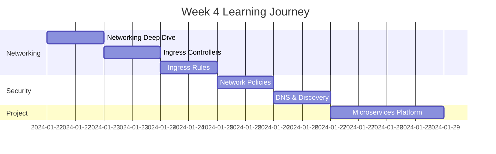

# Week 4 Roadmap - Networking & Ingress

**Duration:** 7 Days  
**Focus:** Advanced Networking → Ingress Controllers → Network Policies  
**Goal:** Master Kubernetes networking and expose applications properly

---

## 📊 Week Overview



---

## 🎯 Week Goals

By the end of Week 4, you will:

- ✅ Understand Kubernetes networking model
- ✅ Set up and use Ingress controllers
- ✅ Implement path-based and host-based routing
- ✅ Secure traffic with TLS/SSL
- ✅ Implement network policies for security
- ✅ Build a complete microservices platform with API gateway

---

## 📅 Daily Breakdown

---

### **Day 22: Kubernetes Networking Deep Dive**

**⏰ Time:** 2-3 hours  
**📚 Theory:** 1 hour | **💻 Hands-on:** 1-2 hours

#### What You'll Learn

- Pod-to-Pod networking model
- Service networking and kube-proxy
- CNI (Container Network Interface) plugins
- Network plugins comparison (Calico, Flannel, Weave)
- How packets flow through Kubernetes cluster

#### What You'll Do

- Explore cluster networking setup
- Test pod-to-pod communication
- Understand service proxy modes (iptables, ipvs)
- Examine network interfaces in pods
- Test cross-namespace communication
- Trace network path from pod to service

#### Files You'll Create

```
day-22/
├── networking-tests/
├── pod-communication/
├── service-networking/
└── network-exploration-notes.md
```

#### Key Takeaways

- Every pod gets unique IP
- Pods can communicate without NAT
- Services provide stable endpoints
- CNI plugins enable networking

---

### **Day 23: Ingress Controllers**

**⏰ Time:** 2-3 hours  
**📚 Theory:** 1 hour | **💻 Hands-on:** 1-2 hours

#### What You'll Learn

- What is Ingress and why we need it
- Ingress vs Service LoadBalancer
- Popular Ingress controllers (Nginx, Traefik, HAProxy)
- Installing and configuring Nginx Ingress Controller
- Ingress controller architecture

#### What You'll Do

- Install Nginx Ingress Controller
- Create first Ingress resource
- Expose multiple services through single IP
- Test Ingress routing
- Compare with LoadBalancer service
- Monitor Ingress controller logs

#### Files You'll Create

```
day-23/
├── ingress-setup/
├── basic-ingress/
├── multiple-services/
└── ingress-controller-notes.md
```

#### Key Takeaways

- Ingress provides HTTP/HTTPS routing
- Single entry point for multiple services
- Cheaper than multiple LoadBalancers
- Supports path-based and host-based routing

---

### **Day 24: Ingress Rules and Advanced Routing**

**⏰ Time:** 2-3 hours  
**📚 Theory:** 1 hour | **💻 Hands-on:** 1-2 hours

#### What You'll Learn

- Path-based routing rules
- Host-based routing (virtual hosts)
- TLS/SSL termination
- URL rewriting
- Request routing strategies
- Ingress annotations for customization

#### What You'll Do

- Implement path-based routing (/api, /web)
- Set up host-based routing (api.example.com, web.example.com)
- Configure TLS certificates
- Test HTTPS connections
- Implement URL rewrites
- Add custom headers
- Set up default backends

#### Files You'll Create

```
day-24/
├── path-based-routing/
├── host-based-routing/
├── tls-setup/
├── url-rewriting/
└── advanced-routing-examples.md
```

#### Key Takeaways

- Route by path or hostname
- Terminate SSL at ingress
- One ingress for entire cluster
- Annotations customize behavior

---

### **Day 25: Network Policies**

**⏰ Time:** 2-3 hours  
**📚 Theory:** 1 hour | **💻 Hands-on:** 1-2 hours

#### What You'll Learn

- Network security in Kubernetes
- Default allow-all behavior
- Network Policy resources
- Ingress and Egress rules
- Pod selectors for policies
- Namespace isolation

#### What You'll Do

- Test default network behavior (everything allowed)
- Create deny-all default policy
- Implement allow-list for specific pods
- Restrict ingress traffic to specific namespaces
- Restrict egress traffic (control outbound)
- Test policy enforcement
- Build multi-tier security policies

#### Files You'll Create

```
day-25/
├── default-policies/
├── ingress-policies/
├── egress-policies/
├── namespace-isolation/
└── network-security-notes.md
```

#### Key Takeaways

- Default: all pods can talk to all pods
- Network policies provide firewall rules
- Control ingress and egress traffic
- Essential for production security

---

### **Day 26: DNS and Service Discovery**

**⏰ Time:** 2-3 hours  
**📚 Theory:** 1 hour | **💻 Hands-on:** 1-2 hours

#### What You'll Learn

- CoreDNS in Kubernetes
- Service DNS entries format
- Pod DNS entries
- DNS for StatefulSets
- Custom DNS configuration
- DNS debugging techniques

#### What You'll Do

- Explore CoreDNS configuration
- Test service discovery via DNS
- Use FQDN for cross-namespace calls
- Debug DNS resolution issues
- Create custom DNS entries
- Test DNS caching behavior
- Monitor DNS query logs

#### Files You'll Create

```
day-26/
├── dns-testing/
├── service-discovery/
├── cross-namespace-dns/
├── dns-debugging/
└── dns-patterns.md
```

#### Key Takeaways

- Services get automatic DNS entries
- Format: service.namespace.svc.cluster.local
- CoreDNS handles all DNS in cluster
- DNS enables service discovery

---

### **Day 27-28: Weekend Project - E-Commerce Microservices Platform**

**⏰ Time:** 4-6 hours (split over 2 days)  
**💻 100% Hands-on Project**

#### Project Overview

Build a complete e-commerce microservices platform with multiple services, Ingress routing, and network policies.

**Architecture:**

```
Internet
  ↓
Ingress Controller
  ↓
┌─────────────────────────────────────────────┐
│  Frontend Service (React)                   │
│  → /                                        │
├─────────────────────────────────────────────┤
│  Product Service (FastAPI)                  │
│  → /api/products                            │
├─────────────────────────────────────────────┤
│  Cart Service (FastAPI)                     │
│  → /api/cart                                │
├─────────────────────────────────────────────┤
│  Order Service (FastAPI)                    │
│  → /api/orders                              │
├─────────────────────────────────────────────┤
│  User Service (FastAPI)                     │
│  → /api/users                               │
└─────────────────────────────────────────────┘
  ↓
PostgreSQL (StatefulSet)
Redis (StatefulSet)
```

#### Components to Build

1. **Frontend Service** - React app serving UI
2. **Product Service** - Manage product catalog
3. **Cart Service** - Shopping cart management
4. **Order Service** - Order processing
5. **User Service** - User authentication
6. **Database** - PostgreSQL for data
7. **Cache** - Redis for sessions
8. **Ingress** - Single entry point with routing

#### Day 27 Tasks

- Set up all microservices (5 services)
- Create Deployments and Services for each
- Deploy PostgreSQL and Redis
- Test inter-service communication

#### Day 28 Tasks

- Configure Ingress with all routes
- Implement network policies
- Add TLS/SSL
- Test complete flow
- Documentation

#### What You'll Implement

- Path-based routing for all APIs
- Service-to-service communication
- Network policies between tiers
- Persistent storage for database
- Redis cache for performance
- Health checks for all services
- Resource limits

#### Deliverables

- 5+ microservices deployed
- Single Ingress for all traffic
- Network policies enforced
- TLS/SSL configured
- Complete documentation
- Architecture diagram

#### Success Criteria

- Can access frontend at http://yourdomain.com
- All API routes work correctly
- Services can communicate internally
- Network policies block unauthorized access
- SSL certificate working
- Data persists across restarts

---

## 📊 Week 4 Progress Tracker

### Daily Completion

| Day   | Topic                 | Theory | Hands-on | Notes | Status |
| ----- | --------------------- | ------ | -------- | ----- | ------ |
| 22    | Networking Deep Dive  | ☐      | ☐        | ☐     | ⏳     |
| 23    | Ingress Controllers   | ☐      | ☐        | ☐     | ⏳     |
| 24    | Ingress Rules         | ☐      | ☐        | ☐     | ⏳     |
| 25    | Network Policies      | ☐      | ☐        | ☐     | ⏳     |
| 26    | DNS & Discovery       | ☐      | ☐        | ☐     | ⏳     |
| 27-28 | Microservices Project | N/A    | ☐        | ☐     | ⏳     |

### Skills Acquired

#### Networking

- [ ] Understand Kubernetes networking model
- [ ] Configure Ingress controllers
- [ ] Implement routing rules
- [ ] Secure with network policies
- [ ] Debug DNS issues

#### Security

- [ ] Implement network isolation
- [ ] Control ingress/egress traffic
- [ ] Configure TLS/SSL
- [ ] Apply least privilege networking

#### Architecture

- [ ] Design microservices communication
- [ ] Implement API gateway pattern
- [ ] Service mesh preparation

---

## 📁 Expected Folder Structure

```
week-04/
├── week-04-roadmap.md
├── day-22/
├── day-23/
├── day-24/
├── day-25/
├── day-26/
├── day-27/
└── day-28/

projects/
└── project-04-ecommerce-microservices/
    ├── frontend/
    ├── product-service/
    ├── cart-service/
    ├── order-service/
    ├── user-service/
    ├── database/
    ├── ingress/
    ├── network-policies/
    └── docs/
```

---

## 🎯 Week 4 Learning Outcomes

By the end of Week 4, you will:

### Networking Mastery

✅ Understand how pods communicate  
✅ Configure Ingress for HTTP/HTTPS routing  
✅ Implement complex routing rules  
✅ Secure cluster with network policies  
✅ Master DNS and service discovery

### Production Patterns

✅ Single entry point for all services  
✅ Path and host-based routing  
✅ SSL/TLS termination  
✅ Network segmentation  
✅ Zero-trust networking

### Practical Experience

✅ Built complete microservices platform  
✅ Implemented API gateway pattern  
✅ Applied network security policies  
✅ Configured production-grade ingress

---

**Week Start Date:** ****\_\_\_****  
**Week End Date:** ****\_\_\_****  
**Status:** ⏳ In Progress | ✅ Completed  
**Confidence Level:** ⭐⭐⭐⭐ (4/5 stars expected)
