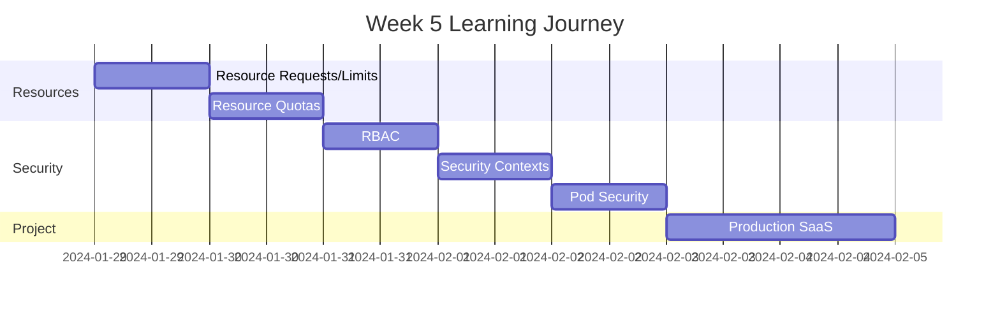

# Week 5 Roadmap - Resource Management & Security

**Duration:** 7 Days  
**Focus:** Resource Limits → RBAC → Security → Pod Security Standards  
**Goal:** Production-ready cluster with proper resource management and security

---

## 📊 Week Overview



---

## 🎯 Week Goals

By the end of Week 5, you will:

- ✅ Manage cluster resources effectively
- ✅ Implement RBAC for access control
- ✅ Secure pods with security contexts
- ✅ Apply pod security standards
- ✅ Build a production-grade multi-tenant SaaS platform
- ✅ Understand Kubernetes security best practices

---

## 📅 Daily Breakdown

---

### **Day 29: Resource Requests and Limits**

**⏰ Time:** 2-3 hours  
**📚 Theory:** 1 hour | **💻 Hands-on:** 1-2 hours

#### What You'll Learn

- Difference between requests and limits
- CPU and memory units in Kubernetes
- How scheduler uses resource requests
- What happens when limits are exceeded (OOMKilled)
- Quality of Service (QoS) classes
- Resource overcommitment

#### What You'll Do

- Deploy pods with different resource configurations
- Test behavior when pod exceeds memory limit
- Test behavior when pod exceeds CPU limit
- Create pods with different QoS classes (Guaranteed, Burstable, BestEffort)
- Observe pod eviction during resource pressure
- Monitor resource usage with kubectl top
- Configure vertical pod autoscaler (VPA)

#### Files You'll Create

```
day-29/
├── resource-examples/
├── qos-classes/
├── limit-testing/
├── resource-pressure-tests/
└── resource-management-notes.md
```

#### Key Takeaways

- Requests = guaranteed resources
- Limits = maximum resources
- CPU is throttled, memory causes OOMKill
- Always set requests and limits in production

---

### **Day 30: Resource Quotas and LimitRanges**

**⏰ Time:** 2-3 hours  
**📚 Theory:** 1 hour | **💻 Hands-on:** 1-2 hours

#### What You'll Learn

- ResourceQuota for namespace-level limits
- LimitRange for default values and enforcement
- Different quota types (compute, storage, object count)
- Quota scopes and priorities
- How quotas prevent resource hogging

#### What You'll Do

- Create ResourceQuota for namespace
- Test quota enforcement (try to exceed quota)
- Set default resource limits with LimitRange
- Implement different quotas for dev/staging/prod
- Monitor quota usage
- Handle quota exceeded scenarios
- Create PriorityClasses for workloads

#### Files You'll Create

```
day-30/
├── resource-quotas/
├── limit-ranges/
├── multi-environment-quotas/
├── priority-classes/
└── quota-management-notes.md
```

#### Key Takeaways

- ResourceQuota limits namespace consumption
- LimitRange sets defaults for pods
- Essential for multi-tenant clusters
- Prevents noisy neighbor problem

---

### **Day 31: RBAC (Role-Based Access Control)**

**⏰ Time:** 2-3 hours  
**📚 Theory:** 1 hour | **💻 Hands-on:** 1-2 hours

#### What You'll Learn

- Kubernetes authentication and authorization
- RBAC components (Role, ClusterRole, RoleBinding, ClusterRoleBinding)
- ServiceAccounts for pods
- Built-in roles (view, edit, admin, cluster-admin)
- Principle of least privilege
- API groups and resources

#### What You'll Do

- Create ServiceAccounts
- Create Roles with specific permissions
- Bind Roles to ServiceAccounts
- Create ClusterRoles for cluster-wide access
- Test RBAC with kubectl auth can-i
- Implement read-only user
- Implement namespace-admin user
- Debug permission denied errors

#### Files You'll Create

```
day-31/
├── service-accounts/
├── roles/
├── cluster-roles/
├── bindings/
├── rbac-testing/
└── rbac-patterns.md
```

#### Key Takeaways

- RBAC controls who can do what
- ServiceAccounts for pod identity
- Use least privilege principle
- Default ServiceAccount has minimal permissions

---

### **Day 32: Security Contexts**

**⏰ Time:** 2-3 hours  
**📚 Theory:** 1 hour | **💻 Hands-on:** 1-2 hours

#### What You'll Learn

- Pod-level vs container-level security contexts
- Running as non-root user
- Read-only root filesystem
- Privilege escalation prevention
- Linux capabilities
- SELinux and AppArmor
- seccomp profiles

#### What You'll Do

- Run containers as non-root user
- Set read-only root filesystem
- Drop all capabilities and add only needed ones
- Test privilege escalation prevention
- Configure filesystem permissions
- Apply security context to existing deployments
- Test container escape attempts (for learning)

#### Files You'll Create

```
day-32/
├── security-context-examples/
├── non-root-containers/
├── readonly-filesystem/
├── capabilities-testing/
└── security-hardening-notes.md
```

#### Key Takeaways

- Never run as root in production
- Use read-only root filesystem
- Drop unnecessary capabilities
- Security contexts are defense in depth

---

### **Day 33: Pod Security Standards**

**⏰ Time:** 2-3 hours  
**📚 Theory:** 1 hour | **💻 Hands-on:** 1-2 hours

#### What You'll Learn

- Pod Security Standards (Privileged, Baseline, Restricted)
- Pod Security Admission (replacement for PSP)
- Namespace-level enforcement
- Warning and audit modes
- Migration from PodSecurityPolicy

#### What You'll Do

- Apply Baseline standard to namespace
- Apply Restricted standard to production namespace
- Test violations (try to create privileged pod)
- Use warning mode to identify violations
- Audit existing pods for compliance
- Gradually migrate to restricted standard
- Document exceptions and justifications

#### Files You'll Create

```
day-33/
├── pod-security-standards/
├── namespace-policies/
├── compliance-testing/
├── violation-examples/
└── pod-security-notes.md
```

#### Key Takeaways

- Three levels: Privileged, Baseline, Restricted
- Apply at namespace level
- Restricted = production best practices
- Use warning mode before enforcement

---

### **Day 34-35: Weekend Project - Production SaaS Platform**

**⏰ Time:** 4-6 hours (split over 2 days)  
**💻 100% Hands-on Project**

#### Project Overview

Build a production-ready multi-tenant SaaS platform with proper security, resource management, and isolation.

**Platform Features:**

```
Multi-Tenant Architecture
├── Tenant A Namespace
│   ├── Web App
│   ├── API Service
│   └── Database
├── Tenant B Namespace
│   ├── Web App
│   ├── API Service
│   └── Database
└── Shared Services Namespace
    ├── Monitoring
    ├── Logging
    └── Ingress Controller
```

#### What You'll Build

**1. Multi-Tenant Setup**

- 3 tenant namespaces
- Isolated resources per tenant
- Shared services namespace
- Cross-namespace communication rules

**2. Resource Management**

- ResourceQuotas per tenant
- LimitRanges for all namespaces
- PriorityClasses (high, medium, low)
- Resource monitoring

**3. Security Implementation**

- RBAC for each tenant (isolated access)
- ServiceAccounts with minimal permissions
- Security contexts on all pods (non-root, read-only)
- Network policies (tenant isolation)
- Pod Security Standards (Restricted)

**4. Application Stack per Tenant**

- Frontend (React/HTML)
- Backend API (FastAPI)
- Database (PostgreSQL)
- Redis cache
- All with proper security

**5. Ingress & Routing**

- Subdomain per tenant (tenant-a.example.com)
- TLS/SSL for all tenants
- Rate limiting
- WAF rules

#### Day 34 Tasks

**Morning:**

- Create namespace structure
- Set up ResourceQuotas and LimitRanges
- Create RBAC roles and bindings
- Deploy shared services

**Afternoon:**

- Deploy first tenant (Tenant A)
- Apply security contexts
- Configure network policies
- Test isolation

#### Day 35 Tasks

**Morning:**

- Deploy remaining tenants (Tenant B, C)
- Configure Ingress with subdomains
- Add TLS certificates
- Test cross-tenant isolation

**Afternoon:**

- Resource stress testing
- Security audit
- Documentation
- Demo preparation

#### Security Checklist

```
For Each Tenant:
- [ ] Dedicated namespace
- [ ] ResourceQuota applied
- [ ] LimitRange configured
- [ ] Dedicated ServiceAccounts
- [ ] RBAC roles with least privilege
- [ ] Network policies (deny by default)
- [ ] All pods run as non-root
- [ ] Read-only root filesystem
- [ ] Capabilities dropped
- [ ] Pod Security Standard: Restricted
- [ ] Secrets for sensitive data
- [ ] TLS enabled
- [ ] Resource limits on all containers
```

#### Architecture Components

- 3 tenant namespaces (full isolation)
- Shared services namespace
- 12+ deployments total
- 15+ services
- 1 Ingress with multiple hosts
- Network policies for each namespace
- RBAC for each tenant
- Complete security hardening

#### Deliverables

- [ ] Multi-tenant platform running
- [ ] Complete resource isolation
- [ ] RBAC access control working
- [ ] Security contexts on all pods
- [ ] Network policies enforced
- [ ] Pod security standards applied
- [ ] TLS on all tenants
- [ ] Monitoring dashboard
- [ ] Complete documentation
- [ ] Security audit report

#### Success Criteria

- Tenant A cannot access Tenant B resources
- Each tenant has resource limits
- All pods run as non-root
- No privileged containers
- Network policies block unauthorized access
- Users can only access their tenant
- Can add new tenant easily
- Production-ready security posture

#### Bonus Challenges

- [ ] Add monitoring per tenant (Prometheus)
- [ ] Implement audit logging
- [ ] Add backup automation per tenant
- [ ] Implement cost tracking per tenant
- [ ] Add auto-scaling per tenant
- [ ] Implement disaster recovery
- [ ] Add compliance reporting

---

## 📊 Week 5 Progress Tracker

### Daily Completion

| Day   | Topic                    | Theory | Hands-on | Notes | Status |
| ----- | ------------------------ | ------ | -------- | ----- | ------ |
| 29    | Resource Requests/Limits | ☐      | ☐        | ☐     | ⏳     |
| 30    | Resource Quotas          | ☐      | ☐        | ☐     | ⏳     |
| 31    | RBAC                     | ☐      | ☐        | ☐     | ⏳     |
| 32    | Security Contexts        | ☐      | ☐        | ☐     | ⏳     |
| 33    | Pod Security Standards   | ☐      | ☐        | ☐     | ⏳     |
| 34-35 | Production SaaS          | N/A    | ☐        | ☐     | ⏳     |

### Skills Acquired

#### Resource Management

- [ ] Set resource requests and limits
- [ ] Implement ResourceQuotas
- [ ] Configure LimitRanges
- [ ] Manage QoS classes
- [ ] Handle resource pressure

#### Security

- [ ] Implement RBAC
- [ ] Create secure pods
- [ ] Apply security contexts
- [ ] Enforce pod security standards
- [ ] Principle of least privilege

#### Production Readiness

- [ ] Multi-tenant architecture
- [ ] Complete isolation
- [ ] Security hardening
- [ ] Resource governance
- [ ] Compliance ready

---

## 📁 Expected Folder Structure

```
week-05/
├── week-05-roadmap.md
├── day-29/
├── day-30/
├── day-31/
├── day-32/
├── day-33/
├── day-34/
└── day-35/

projects/
└── project-05-production-saas/
    ├── namespaces/
    ├── quotas/
    ├── rbac/
    ├── tenant-a/
    ├── tenant-b/
    ├── tenant-c/
    ├── shared-services/
    ├── network-policies/
    ├── security/
    └── docs/
```

---

## 🎯 Week 5 Learning Outcomes

By the end of Week 5, you will:

### Resource Management Mastery

✅ Prevent resource exhaustion  
✅ Implement fair resource distribution  
✅ Set appropriate limits for workloads  
✅ Understand QoS classes  
✅ Handle resource constraints

### Security Expertise

✅ Implement RBAC for access control  
✅ Harden pod security  
✅ Run containers as non-root  
✅ Apply pod security standards  
✅ Follow security best practices

### Production Readiness

✅ Build multi-tenant platforms  
✅ Complete tenant isolation  
✅ Production-grade security  
✅ Compliance ready  
✅ Enterprise-ready deployment

---

## 💡 Week 5 Themes

**Resource Management:**

- Ensure fair sharing
- Prevent resource hogging
- Optimize cluster utilization

**Security:**

- Defense in depth
- Least privilege
- Assume breach mentality

**Multi-tenancy:**

- Complete isolation
- Fair resource allocation
- Secure by default

---

**Week Start Date:** ****\_\_\_****  
**Week End Date:** ****\_\_\_****  
**Status:** ⏳ In Progress | ✅ Completed  
**Confidence Level:** ⭐⭐⭐⭐⭐ (5/5 stars - Production Ready!)
