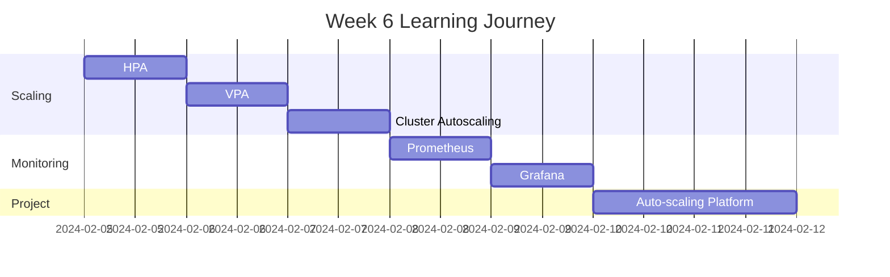

# Week 6 Roadmap - Scaling & Performance Optimization

**Duration:** 7 Days  
**Focus:** Horizontal/Vertical Scaling → Monitoring → Performance → Autoscaling  
**Goal:** Build auto-scaling applications with comprehensive monitoring

---

## 📊 Week Overview



---

## 🎯 Week Goals

By the end of Week 6, you will:

- ✅ Implement horizontal pod autoscaling (HPA)
- ✅ Configure vertical pod autoscaling (VPA)
- ✅ Understand cluster autoscaling
- ✅ Set up Prometheus monitoring
- ✅ Create Grafana dashboards
- ✅ Build auto-scaling news aggregator platform

---

## 📅 Daily Breakdown

---

### **Day 36: Horizontal Pod Autoscaler (HPA)**

**⏰ Time:** 2-3 hours  
**📚 Theory:** 1 hour | **💻 Hands-on:** 1-2 hours

#### What You'll Learn

- What is HPA and how it works
- Metrics Server installation and usage
- CPU-based autoscaling
- Memory-based autoscaling
- Custom metrics for autoscaling
- HPA algorithm and stabilization
- Scaling behavior configuration

#### What You'll Do

- Install Metrics Server
- Create HPA based on CPU usage
- Create HPA based on memory usage
- Generate load to trigger scaling
- Watch pods scale up automatically
- Watch pods scale down (cooldown period)
- Configure min/max replicas
- Test with different threshold values
- Monitor HPA events and decisions

#### Files You'll Create

```
day-36/
├── metrics-server-setup/
├── cpu-based-hpa/
├── memory-based-hpa/
├── load-testing/
└── hpa-notes.md
```

#### Key Takeaways

- HPA scales pods based on metrics
- Requires Metrics Server
- Scale up is fast, scale down is slow
- Set appropriate CPU/memory requests

---

### **Day 37: Vertical Pod Autoscaler (VPA)**

**⏰ Time:** 2-3 hours  
**📚 Theory:** 1 hour | **💻 Hands-on:** 1-2 hours

#### What You'll Learn

- VPA vs HPA differences
- When to use VPA
- VPA modes (Off, Initial, Auto)
- Resource recommendation engine
- Update policies
- VPA limitations
- Combining VPA with HPA

#### What You'll Do

- Install VPA
- Create VPA in recommendation mode
- Analyze resource recommendations
- Apply VPA in auto mode
- Watch VPA adjust resource requests
- Test VPA with different workloads
- Compare before/after resource usage
- Handle VPA pod restarts

#### Files You'll Create

```
day-37/
├── vpa-installation/
├── recommendation-mode/
├── auto-mode/
├── resource-analysis/
└── vpa-notes.md
```

#### Key Takeaways

- VPA adjusts resource requests/limits
- Requires pod restart (in auto mode)
- Use for right-sizing workloads
- Don't use VPA + HPA on same metric

---

### **Day 38: Cluster Autoscaling**

**⏰ Time:** 2-3 hours  
**📚 Theory:** 1 hour | **💻 Hands-on:** 1-2 hours

#### What You'll Learn

- Cluster Autoscaler (CA) overview
- How CA works with cloud providers
- Scale-up triggers (pending pods)
- Scale-down triggers (underutilized nodes)
- Node pools and groups
- PodDisruptionBudgets
- Safe node eviction

#### What You'll Do

- Configure Cluster Autoscaler (if using cloud)
- Understand CA decision-making
- Create workload that triggers scale-up
- Watch new nodes being added
- Test scale-down (remove workload)
- Configure PodDisruptionBudget
- Prevent critical pod eviction
- Monitor CA logs and events

#### Files You'll Create

```
day-38/
├── cluster-autoscaler-config/
├── scale-up-tests/
├── scale-down-tests/
├── pod-disruption-budgets/
└── cluster-autoscaling-notes.md
```

#### Key Takeaways

- CA adds/removes nodes automatically
- Works with cloud providers
- Respects PodDisruptionBudgets
- Complete the autoscaling story

---

### **Day 39: Prometheus Monitoring**

**⏰ Time:** 2-3 hours  
**📚 Theory:** 1 hour | **💻 Hands-on:** 1-2 hours

#### What You'll Learn

- Prometheus architecture
- Time-series data and metrics
- PromQL query language
- Service discovery in Kubernetes
- Exporters and instrumentation
- Alerting with Alertmanager
- Recording rules

#### What You'll Do

- Install Prometheus (using helm or manifests)
- Explore Prometheus UI
- Write basic PromQL queries
- Monitor Kubernetes cluster metrics
- Monitor application metrics
- Create custom metrics endpoint
- Set up ServiceMonitor
- Configure scrape configs
- Create alert rules

#### Files You'll Create

```
day-39/
├── prometheus-installation/
├── promql-queries/
├── service-monitors/
├── alert-rules/
├── custom-metrics/
└── prometheus-notes.md
```

#### Key Takeaways

- Prometheus is pull-based monitoring
- PromQL is powerful query language
- ServiceMonitor for automatic discovery
- Foundation for observability

---

### **Day 40: Grafana Dashboards**

**⏰ Time:** 2-3 hours  
**📚 Theory:** 1 hour | **💻 Hands-on:** 1-2 hours

#### What You'll Learn

- Grafana architecture
- Data sources configuration
- Dashboard creation
- Panel types and visualizations
- Variables and templating
- Alerting in Grafana
- Dashboard sharing and export

#### What You'll Do

- Install Grafana
- Connect Prometheus as data source
- Import existing dashboards (Kubernetes, Node)
- Create custom dashboard
- Build panels with different visualizations
- Use template variables for flexibility
- Set up alerts
- Create dashboard for your application
- Export and version control dashboards

#### Files You'll Create

```
day-40/
├── grafana-installation/
├── data-sources/
├── custom-dashboards/
├── dashboard-json/
├── alerts/
└── grafana-notes.md
```

#### Key Takeaways

- Grafana visualizes Prometheus data
- Import community dashboards
- Create custom dashboards
- Essential for operations

---

### **Day 41-42: Weekend Project - Auto-Scaling News Aggregator**

**⏰ Time:** 4-6 hours (split over 2 days)  
**💻 100% Hands-on Project**

#### Project Overview

Build a news aggregator platform that automatically scales based on traffic, with comprehensive monitoring and performance optimization.

**System Architecture:**

```
Internet Traffic
  ↓
Load Balancer / Ingress
  ↓
┌─────────────────────────────────────┐
│  Frontend (React)                   │
│  - HPA: 2-10 replicas               │
│  - CPU threshold: 70%               │
└─────────────────────────────────────┘
  ↓
┌─────────────────────────────────────┐
│  API Service (FastAPI)              │
│  - HPA: 3-15 replicas               │
│  - Custom metrics: requests/sec     │
└─────────────────────────────────────┘
  ↓
┌─────────────────────────────────────┐
│  News Fetcher Service               │
│  - CronJob: Fetch news hourly       │
│  - VPA: Auto-adjust resources       │
└─────────────────────────────────────┘
  ↓
┌─────────────────────────────────────┐
│  Redis Cache                        │
│  - StatefulSet: 3 replicas          │
│  - Speeds up API responses          │
└─────────────────────────────────────┘
  ↓
┌─────────────────────────────────────┐
│  PostgreSQL Database                │
│  - StatefulSet: 1 primary + 2 read  │
│  - Stores news articles             │
└─────────────────────────────────────┘

Monitoring Stack:
├── Prometheus (metrics collection)
├── Grafana (visualization)
└── Alertmanager (alerts)
```

#### What You'll Build

**1. News Aggregator Application**

- Frontend: Display news articles with search/filter
- API Service: REST API for news operations
- News Fetcher: Background service fetching from multiple sources
- Redis: Cache for performance
- PostgreSQL: Store articles

**2. Auto-Scaling Configuration**

- HPA for frontend (CPU-based)
- HPA for API (CPU + custom metrics)
- VPA for news fetcher
- Proper resource requests/limits

**3. Monitoring Stack**

- Prometheus monitoring all services
- Custom metrics from application
- Grafana dashboards showing:
  - Pod count and autoscaling events
  - CPU/Memory usage
  - Request rate and latency
  - Cache hit ratio
  - Database performance
  - Error rates

**4. Performance Optimization**

- Redis caching strategy
- Database query optimization
- Read replicas for scaling reads
- Connection pooling
- CDN for static assets (simulated)

**5. Load Testing & Scaling**

- Load testing tool (k6 or locust)
- Generate traffic to trigger HPA
- Watch automatic scaling
- Performance under load
- Scale-down observation

#### Day 41 Tasks

**Morning: Application Setup (2.5 hours)**

- Deploy news aggregator application
- Set up Redis cache
- Deploy PostgreSQL with replicas
- Test basic functionality
- Implement custom metrics endpoint

**Afternoon: Autoscaling Setup (1.5 hours)**

- Configure HPA for frontend
- Configure HPA for API with custom metrics
- Configure VPA for news fetcher
- Test manual scaling first
- Set appropriate thresholds

#### Day 42 Tasks

**Morning: Monitoring Stack (2 hours)**

- Install Prometheus
- Configure ServiceMonitors
- Install Grafana
- Create comprehensive dashboard
- Set up basic alerts

**Afternoon: Load Testing & Optimization (2 hours)**

- Set up load testing tool
- Generate increasing load
- Watch HPA scale pods up
- Monitor performance metrics
- Optimize bottlenecks
- Document scaling behavior
- Create runbook

#### Features to Implement

**Auto-Scaling:**

- Frontend scales 2-10 based on CPU
- API scales 3-15 based on requests/sec
- VPA adjusts news fetcher resources
- PodDisruptionBudget prevents disruption

**Monitoring:**

- Real-time pod count
- CPU/Memory per service
- Request rate and latency
- Error rate tracking
- Cache performance
- Database queries per second
- Custom business metrics

**Performance:**

- Redis caching (90%+ hit rate)
- Database connection pooling
- Read replicas for queries
- Indexed database queries
- Gzip compression

**Load Testing Scenarios:**

- Gradual load increase
- Spike load test
- Sustained high load
- Scale-down after load

#### Metrics to Track

```
Application Metrics:
- http_requests_total
- http_request_duration_seconds
- cache_hit_ratio
- db_query_duration_seconds
- news_articles_total

Kubernetes Metrics:
- pod_count by deployment
- container_cpu_usage
- container_memory_usage
- hpa_current_replicas
- hpa_desired_replicas
```

#### Testing Checklist

```
Scaling Tests:
- [ ] Frontend scales up under CPU load
- [ ] API scales up with traffic increase
- [ ] VPA adjusts news fetcher resources
- [ ] Scales down after load decreases
- [ ] PodDisruptionBudget prevents disruption
- [ ] Cluster autoscaler adds nodes (if enabled)

Performance Tests:
- [ ] API response time < 200ms (cached)
- [ ] API response time < 500ms (uncached)
- [ ] Cache hit ratio > 90%
- [ ] Database handles concurrent queries
- [ ] No dropped requests during scale-up
- [ ] Graceful handling of scale-down

Monitoring Tests:
- [ ] Prometheus scraping all targets
- [ ] All metrics visible in Prometheus
- [ ] Grafana dashboards show live data
- [ ] Alerts trigger correctly
- [ ] Can query 7 days of history
```

#### Deliverables

- [ ] Auto-scaling news aggregator running
- [ ] HPA and VPA configured
- [ ] Prometheus monitoring stack
- [ ] Grafana dashboards (5+ panels)
- [ ] Load testing scripts
- [ ] Performance test results
- [ ] Scaling behavior documented
- [ ] Architecture diagram
- [ ] Runbook for operations

#### Success Criteria

- Application auto-scales under load
- Monitoring shows real-time metrics
- Performance meets SLAs
- No downtime during scaling
- Can handle 10x traffic spike
- Comprehensive dashboards
- Production-ready setup

#### Bonus Challenges

- [ ] Implement custom HPA metrics adapter
- [ ] Add distributed tracing (Jaeger)
- [ ] Implement rate limiting
- [ ] Add log aggregation (Loki)
- [ ] Set up on-call rotation with PagerDuty
- [ ] Implement chaos engineering tests
- [ ] Add cost monitoring per service
- [ ] Implement A/B testing framework

---

## 📊 Week 6 Progress Tracker

### Daily Completion

| Day   | Topic                | Theory | Hands-on | Notes | Status |
| ----- | -------------------- | ------ | -------- | ----- | ------ |
| 36    | HPA                  | ☐      | ☐        | ☐     | ⏳     |
| 37    | VPA                  | ☐      | ☐        | ☐     | ⏳     |
| 38    | Cluster Autoscaling  | ☐      | ☐        | ☐     | ⏳     |
| 39    | Prometheus           | ☐      | ☐        | ☐     | ⏳     |
| 40    | Grafana              | ☐      | ☐        | ☐     | ⏳     |
| 41-42 | Auto-scaling Project | N/A    | ☐        | ☐     | ⏳     |

### Skills Acquired

#### Scaling

- [ ] Configure HPA
- [ ] Configure VPA
- [ ] Understand cluster autoscaling
- [ ] Right-size workloads
- [ ] Handle traffic spikes

#### Monitoring

- [ ] Install Prometheus
- [ ] Write PromQL queries
- [ ] Create Grafana dashboards
- [ ] Set up alerts
- [ ] Monitor application performance

#### Performance

- [ ] Load testing
- [ ] Performance optimization
- [ ] Caching strategies
- [ ] Database optimization
- [ ] Scalability patterns

---

## 📁 Expected Folder Structure

```
week-06/
├── week-06-roadmap.md
├── day-36/
├── day-37/
├── day-38/
├── day-39/
├── day-40/
├── day-41/
└── day-42/

projects/
└── project-06-news-aggregator/
    ├── app/
    ├── manifests/
    ├── monitoring/
    ├── load-testing/
    ├── dashboards/
    └── docs/
```

---

## 🎯 Week 6 Learning Outcomes

By the end of Week 6, you will:

### Autoscaling Mastery

✅ Implement horizontal pod autoscaling  
✅ Configure vertical pod autoscaling  
✅ Understand cluster autoscaling  
✅ Handle variable traffic patterns  
✅ Optimize resource utilization

### Monitoring Expertise

✅ Set up Prometheus monitoring  
✅ Create comprehensive Grafana dashboards  
✅ Write PromQL queries  
✅ Configure alerting  
✅ Instrument applications

### Performance Engineering

✅ Load testing applications  
✅ Performance optimization  
✅ Caching strategies  
✅ Scalability patterns  
✅ Production-grade observability

---

## 💡 Week 6 Themes

**Autoscaling:**

- Handle unpredictable load
- Optimize costs
- Maintain performance

**Observability:**

- Measure everything
- Visualize metrics
- Alert on issues

**Performance:**

- Optimize continuously
- Test under load
- Scale horizontally

---

**Week Start Date:** ****\_\_\_****  
**Week End Date:** ****\_\_\_****  
**Status:** ⏳ In Progress | ✅ Completed  
**Confidence Level:** ⭐⭐⭐⭐⭐ (5/5 stars - Performance Expert!)
