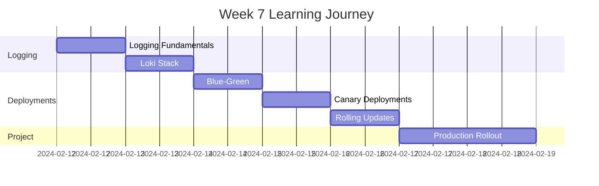

# Week 7 Roadmap - Logging & Advanced Deployments

**Duration:** 7 Days  
**Focus:** Logging Stack → Advanced Deployment Strategies → Blue-Green & Canary  
**Goal:** Master logging and implement zero-downtime deployment patterns

---

## 📊 Week Overview



---

## 🎯 Week Goals

By the end of Week 7, you will:

- ✅ Set up centralized logging with Loki
- ✅ Implement log aggregation and querying
- ✅ Master blue-green deployment strategy
- ✅ Implement canary releases
- ✅ Optimize rolling update strategies
- ✅ Build production deployment pipeline

---

## 📅 Daily Breakdown

---

### **Day 43: Logging Fundamentals**

**⏰ Time:** 2-3 hours  
**📚 Theory:** 1 hour | **💻 Hands-on:** 1-2 hours

#### What You'll Learn

- Logging architecture in Kubernetes
- Container logging (stdout/stderr)
- Log collection patterns
- Centralized logging benefits
- Log levels and structured logging
- Log retention and rotation
- Logging best practices

#### What You'll Do

- View pod logs with kubectl
- Follow logs in real-time
- View logs from previous container instances
- Access logs from multi-container pods
- Implement structured logging in application
- Configure log rotation
- Test logging under different scenarios
- Debug application issues using logs

#### Files You'll Create

```
day-43/
├── logging-basics/
├── structured-logging/
├── multi-container-logs/
├── log-debugging/
└── logging-best-practices.md
```

#### Key Takeaways

- Container logs go to stdout/stderr
- Kubernetes handles log rotation
- Structured logs are easier to parse
- Central logging essential for production

---

### **Day 44: Loki, Promtail & Grafana Logging Stack**

**⏰ Time:** 2-3 hours  
**📚 Theory:** 1 hour | **💻 Hands-on:** 1-2 hours

#### What You'll Learn

- Loki architecture (like Prometheus for logs)
- Promtail for log collection
- LogQL query language
- Label-based log indexing
- Grafana Loki integration
- Log aggregation patterns

#### What You'll Do

- Install Loki stack (Loki + Promtail + Grafana)
- Configure Promtail to collect pod logs
- Write LogQL queries
- Search logs by labels
- Filter logs by time range
- Aggregate log metrics
- Create log dashboards in Grafana
- Set up log-based alerts
- Export logs for analysis

#### Files You'll Create

```
day-44/
├── loki-installation/
├── promtail-config/
├── logql-queries/
├── log-dashboards/
└── loki-stack-notes.md
```

#### Key Takeaways

- Loki: lightweight log aggregation
- LogQL: powerful query language
- Labels for efficient indexing
- Integrated with existing Grafana

---

### **Day 45: Blue-Green Deployments**

**⏰ Time:** 2-3 hours  
**📚 Theory:** 1 hour | **💻 Hands-on:** 1-2 hours

#### What You'll Learn

- Blue-green deployment concept
- Zero-downtime releases
- Traffic switching strategies
- Rollback procedures
- When to use blue-green
- Blue-green vs rolling updates

#### What You'll Do

- Deploy "blue" version (v1)
- Deploy "green" version (v2) in parallel
- Test green version in isolation
- Switch Service selector to green
- Instant traffic cutover
- Monitor for issues
- Rollback to blue if needed
- Clean up old version

#### Files You'll Create

```
day-45/
├── blue-green-setup/
├── blue-deployment/
├── green-deployment/
├── traffic-switching/
└── blue-green-notes.md
```

#### Key Takeaways

- Instant traffic switch
- Easy rollback
- Requires 2x resources temporarily
- Good for critical releases

---

### **Day 46: Canary Deployments**

**⏰ Time:** 2-3 hours  
**📚 Theory:** 1 hour | **💻 Hands-on:** 1-2 hours

#### What You'll Learn

- Canary deployment concept
- Progressive rollout strategy
- Traffic splitting techniques
- Metrics-based promotion
- Automated canary analysis
- When to use canary deployments

#### What You'll Do

- Deploy stable version (v1, 90% traffic)
- Deploy canary version (v2, 10% traffic)
- Monitor canary metrics (error rate, latency)
- Gradually increase canary traffic (10% → 25% → 50%)
- Compare v1 vs v2 metrics
- Promote canary to stable if healthy
- Rollback if canary shows issues
- Automate with Flagger (optional)

#### Files You'll Create

```
day-46/
├── canary-setup/
├── traffic-splitting/
├── canary-analysis/
├── progressive-rollout/
└── canary-notes.md
```

#### Key Takeaways

- Gradual rollout reduces risk
- Test in production with real traffic
- Monitor metrics carefully
- Rollback if issues detected

---

### **Day 47: Advanced Rolling Updates**

**⏰ Time:** 2-3 hours  
**📚 Theory:** 1 hour | **💻 Hands-on:** 1-2 hours

#### What You'll Learn

- Rolling update deep dive
- Update strategies optimization
- MaxSurge and MaxUnavailable
- Progressive delivery
- Rollback strategies
- Pre-stop and post-start hooks
- Deployment strategies comparison

#### What You'll Do

- Configure custom rolling update strategy
- Test different maxSurge values (25%, 50%, 100%)
- Test different maxUnavailable values
- Implement pre-stop hooks for graceful shutdown
- Implement readiness gates
- Test rollout pause and resume
- Implement progressive rollout with manual gates
- Compare all deployment strategies

#### Files You'll Create

```
day-47/
├── rolling-update-strategies/
├── surge-unavailable-tests/
├── lifecycle-hooks/
├── deployment-comparison/
└── deployment-strategies.md
```

#### Key Takeaways

- Fine-tune rolling updates
- Balance speed vs safety
- Graceful shutdown is critical
- Choose strategy based on needs

---

### **Day 48-49: Weekend Project - Production Deployment Pipeline**

**⏰ Time:** 4-6 hours (split over 2 days)  
**💻 100% Hands-on Project**

#### Project Overview

Build a complete production deployment pipeline with multiple environments, deployment strategies, and comprehensive logging/monitoring.

**Pipeline Architecture:**

```
Development Environment
  ↓ (Auto-deploy on commit)
Staging Environment
  ↓ (Manual promotion)
Canary Deployment (10% traffic)
  ↓ (Metrics validation)
Production (100% traffic)
  ↓ (Monitoring & Logging)
Rollback if needed
```

#### What You'll Build

**1. Multi-Environment Setup**

- Development namespace (latest code)
- Staging namespace (pre-production testing)
- Production namespace (live traffic)
- Each environment with own configuration

**2. Application Stack**

- Frontend application (3 versions: v1, v2, v3)
- Backend API (with versioning)
- Database (shared or per-environment)
- Redis cache

**3. Deployment Strategies Implementation**

**Development:**

- Rolling updates (fast)
- No traffic splitting
- Continuous deployment

**Staging:**

- Blue-green deployment
- Full testing environment
- Manual promotion gate

**Production:**

- Canary deployment
- 10% → 25% → 50% → 100%
- Automated metric checks
- Automatic rollback on failure

**4. Logging Stack**

- Loki for log aggregation
- Promtail collecting from all environments
- Grafana dashboards per environment
- Log-based alerts

**5. Monitoring Stack**

- Prometheus monitoring all environments
- Deployment metrics (version, replicas, health)
- Application metrics (requests, errors, latency)
- Canary analysis metrics
- Grafana dashboards showing:
  - Deployment progress
  - Version distribution
  - Error rate comparison
  - Latency percentiles
  - Rollout history

**6. Deployment Pipeline**

- Automated development deployment
- Staging deployment with approval
- Canary deployment to production
- Progressive traffic shift
- Automatic promotion/rollback

#### Day 48 Tasks

**Morning: Environment Setup (2.5 hours)**

- Create 3 namespaces (dev, staging, prod)
- Deploy application v1 to all environments
- Set up Loki + Promtail
- Configure log collection
- Create base monitoring dashboards

**Afternoon: Deployment Strategies (1.5 hours)**

- Implement rolling update for dev
- Implement blue-green for staging
- Implement canary for production
- Test each strategy independently

#### Day 49 Tasks

**Morning: Pipeline Integration (2 hours)**

- Create deployment pipeline flow
- Deploy v2 to dev (rolling)
- Promote v2 to staging (blue-green)
- Deploy v2 to prod canary (10%)
- Monitor metrics

**Afternoon: Testing & Refinement (2 hours)**

- Test complete pipeline flow
- Test rollback scenarios
- Create deployment runbook
- Document all procedures
- Performance testing
- Create demo

#### Components Per Environment

**Development:**

```
- Rolling updates (maxSurge: 100%, maxUnavailable: 0)
- Fast deployments
- Less strict health checks
- Debug logging enabled
```

**Staging:**

```
- Blue-green deployment
- Full smoke testing
- Production-like configuration
- Manual approval for promotion
```

**Production:**

```
- Canary deployment
- 10% → 25% → 50% → 100% progression
- Strict health checks
- Automated metrics validation
- Automatic rollback on errors
```

#### Metrics to Track

```
Deployment Metrics:
- deployment_version
- deployment_replicas
- deployment_ready_replicas
- rollout_duration_seconds
- rollback_count

Application Metrics:
- http_request_duration (by version)
- http_requests_total (by version)
- error_rate (by version)
- success_rate (by version)

Canary Metrics:
- canary_traffic_percentage
- canary_error_rate_delta
- canary_latency_delta
- canary_success_rate_delta
```

#### Deployment Flow Example

```
1. Developer commits code
   ↓
2. CI builds & tests
   ↓
3. Deploy to Dev (automatic)
   - Rolling update
   - Health checks pass
   ↓
4. Manual promotion to Staging
   - Blue deployment (current v1)
   - Green deployment (new v2)
   - Run smoke tests
   - Switch traffic to green
   ↓
5. Manual promotion to Prod Canary
   - Deploy canary v2 (10% traffic)
   - Monitor for 15 minutes
   - Check error rate: OK
   - Check latency: OK
   ↓
6. Increase canary to 25%
   - Monitor for 15 minutes
   - Metrics still healthy
   ↓
7. Increase canary to 50%
   - Monitor for 15 minutes
   - Metrics still healthy
   ↓
8. Promote canary to 100%
   - All traffic on v2
   - Keep v1 for quick rollback
   - Monitor for 1 hour
   ↓
9. Cleanup old version (v1)
   - After 24 hours stability
```

#### Rollback Scenarios

```
Scenario 1: Canary shows high error rate
- Automatic rollback to stable
- Alert team
- Investigate logs

Scenario 2: Staging deployment fails
- Keep blue version running
- Delete green version
- Fix issues

Scenario 3: Production crisis
- Immediate rollback to v1
- All traffic to stable
- Post-mortem later
```

#### Testing Checklist

```
Development:
- [ ] Rolling update completes successfully
- [ ] New version accessible
- [ ] Logs collected in Loki
- [ ] Metrics in Prometheus

Staging:
- [ ] Blue-green deployment works
- [ ] Can switch between versions
- [ ] Rollback to blue works
- [ ] Smoke tests pass

Production:
- [ ] Canary deploys to 10%
- [ ] Traffic split correctly
- [ ] Metrics show separation
- [ ] Can increase to 25%, 50%, 100%
- [ ] Rollback works at any stage
- [ ] Logs show version distinction

Pipeline:
- [ ] Full flow works end-to-end
- [ ] Approval gates function
- [ ] Rollback procedures work
- [ ] Monitoring catches issues
- [ ] Alerts fire correctly
```

#### Deliverables

- [ ] Multi-environment setup (3 namespaces)
- [ ] Application deployed with versioning
- [ ] Loki logging stack operational
- [ ] Grafana dashboards for all environments
- [ ] Rolling update in dev
- [ ] Blue-green in staging
- [ ] Canary in production
- [ ] Complete deployment pipeline
- [ ] Rollback procedures documented
- [ ] Runbook for operations
- [ ] Demo video or screenshots

#### Success Criteria

- Can deploy to dev automatically
- Can promote to staging with approval
- Canary deployment works in production
- Metrics show version separation
- Can rollback at any stage
- Logs aggregated from all environments
- Zero downtime during deployments
- Complete observability

#### Bonus Challenges

- [ ] Integrate with GitHub Actions
- [ ] Implement GitOps with ArgoCD
- [ ] Add automated smoke tests
- [ ] Implement A/B testing
- [ ] Add feature flags
- [ ] Implement chaos engineering
- [ ] Add cost tracking per environment
- [ ] Implement compliance checks

---

## 📊 Week 7 Progress Tracker

### Daily Completion

| Day   | Topic                | Theory | Hands-on | Notes | Status |
| ----- | -------------------- | ------ | -------- | ----- | ------ |
| 43    | Logging Fundamentals | ☐      | ☐        | ☐     | ⏳     |
| 44    | Loki Stack           | ☐      | ☐        | ☐     | ⏳     |
| 45    | Blue-Green           | ☐      | ☐        | ☐     | ⏳     |
| 46    | Canary               | ☐      | ☐        | ☐     | ⏳     |
| 47    | Advanced Rolling     | ☐      | ☐        | ☐     | ⏳     |
| 48-49 | Deployment Pipeline  | N/A    | ☐        | ☐     | ⏳     |

### Skills Acquired

#### Logging

- [ ] Centralized log aggregation
- [ ] LogQL queries
- [ ] Log-based alerts
- [ ] Debugging with logs
- [ ] Structured logging

#### Deployment Strategies

- [ ] Blue-green deployments
- [ ] Canary releases
- [ ] Advanced rolling updates
- [ ] Zero-downtime deployments
- [ ] Rollback procedures

#### Operations

- [ ] Multi-environment management
- [ ] Progressive delivery
- [ ] Production deployment pipeline
- [ ] Incident response
- [ ] Deployment automation

---

## 📁 Expected Folder Structure

```
week-07/
├── week-07-roadmap.md
├── day-43/
├── day-44/
├── day-45/
├── day-46/
├── day-47/
├── day-48/
└── day-49/

projects/
└── project-07-deployment-pipeline/
    ├── environments/
    │   ├── dev/
    │   ├── staging/
    │   └── production/
    ├── app-versions/
    ├── logging/
    ├── monitoring/
    ├── deployment-strategies/
    ├── pipeline/
    └── docs/
```

---

## 🎯 Week 7 Learning Outcomes

By the end of Week 7, you will:

### Logging Mastery

✅ Set up centralized logging  
✅ Query logs efficiently with LogQL  
✅ Create log-based dashboards  
✅ Debug issues using logs  
✅ Implement structured logging

### Deployment Expertise

✅ Implement blue-green deployments  
✅ Execute canary releases  
✅ Optimize rolling updates  
✅ Zero-downtime deployments  
✅ Quick rollback capabilities

### Production Pipeline

✅ Multi-environment deployments  
✅ Progressive delivery  
✅ Automated deployment pipeline  
✅ Complete observability  
✅ Production-ready operations

---

## 💡 Week 7 Themes

**Logging:**

- Centralize everything
- Query efficiently
- Debug faster

**Deployments:**

- Zero downtime
- Progressive delivery
- Risk mitigation

**Operations:**

- Automate everything
- Monitor constantly
- Rollback confidently

---

**Week Start Date:** ****\_\_\_****  
**Week End Date:** ****\_\_\_****  
**Status:** ⏳ In Progress | ✅ Completed  
**Confidence Level:** ⭐⭐⭐⭐⭐ (5/5 stars - Deployment Expert!)
