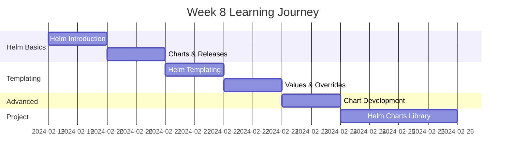

# Week 8 Roadmap - Helm & Package Management

**Duration:** 7 Days  
**Focus:** Helm Basics → Templating → Chart Development → Repositories  
**Goal:** Master Helm for packaging and deploying Kubernetes applications

---

## 📊 Week Overview



---

## 🎯 Week Goals

By the end of Week 8, you will:

- ✅ Understand Helm architecture and concepts
- ✅ Install and manage applications with Helm
- ✅ Create custom Helm charts
- ✅ Master Helm templating language
- ✅ Publish charts to repositories
- ✅ Build a library of reusable Helm charts

---

## 📅 Daily Breakdown

---

### **Day 50: Helm Introduction & Installation**

**⏰ Time:** 2-3 hours  
**📚 Theory:** 1 hour | **💻 Hands-on:** 1-2 hours

#### What You'll Learn

- What is Helm and why use it
- Helm architecture (client-only)
- Helm 2 vs Helm 3 differences
- Charts, releases, and repositories
- Helm vs kubectl
- When to use Helm

#### What You'll Do

- Install Helm CLI
- Add popular Helm repositories (bitnami, stable)
- Search for charts
- Install first application (nginx)
- List installed releases
- Upgrade a release
- Rollback a release
- Uninstall a release
- Explore Helm commands

#### Files You'll Create

```
day-50/
├── helm-installation/
├── first-deployments/
├── helm-commands/
└── helm-basics-notes.md
```

#### Key Takeaways

- Helm is package manager for Kubernetes
- Charts are packages
- Releases are installed instances
- Simplifies complex deployments

---

### **Day 51: Charts, Releases & Repositories**

**⏰ Time:** 2-3 hours  
**📚 Theory:** 1 hour | **💻 Hands-on:** 1-2 hours

#### What You'll Learn

- Chart structure and anatomy
- Chart.yaml metadata
- Values.yaml for configuration
- Templates directory
- Helm release lifecycle
- Chart repositories (public and private)
- Chart versioning

#### What You'll Do

- Explore chart structure
- Download and inspect charts
- Customize charts with values
- Deploy applications with custom values
- Manage multiple releases
- Add custom chart repositories
- Compare chart versions
- Understand semantic versioning
- Package existing manifests as chart

#### Files You'll Create

```
day-51/
├── chart-exploration/
├── custom-values/
├── chart-repositories/
├── chart-packaging/
└── chart-management-notes.md
```

#### Key Takeaways

- Charts have standard structure
- Values provide configuration
- Repositories host charts
- Versioning follows semver

---

### **Day 52: Helm Templating**

**⏰ Time:** 2-3 hours  
**📚 Theory:** 1 hour | **💻 Hands-on:** 1-2 hours

#### What You'll Learn

- Go templating basics
- Template variables and functions
- Built-in functions (quote, upper, lower, etc.)
- Template pipelines
- Conditionals (if/else)
- Loops (range)
- Whitespace control
- Template debugging

#### What You'll Do

- Create basic templates
- Use template variables
- Implement conditionals
- Create loops for dynamic resources
- Use Helm functions
- Debug templates with --dry-run
- Test templates with helm template
- Handle edge cases
- Create reusable template snippets

#### Files You'll Create

```
day-52/
├── template-basics/
├── conditionals/
├── loops/
├── functions/
├── debugging/
└── templating-notes.md
```

#### Key Takeaways

- Templates use Go templating
- Powerful built-in functions
- Test with --dry-run
- Whitespace matters

---

### **Day 53: Values Files & Overrides**

**⏰ Time:** 2-3 hours  
**📚 Theory:** 1 hour | **💻 Hands-on:** 1-2 hours

#### What You'll Learn

- Values file hierarchy
- Default values vs overrides
- Multiple values files
- Command-line value overrides
- Environment-specific values
- Secrets in values
- Values schema validation
- Best practices for values

#### What You'll Do

- Create comprehensive values.yaml
- Override values at install time
- Use multiple values files
- Set values from command line
- Create environment-specific values (dev, staging, prod)
- Handle sensitive data
- Validate values schema
- Document values properly
- Test different value combinations

#### Files You'll Create

```
day-53/
├── values-examples/
├── environment-values/
├── overrides-testing/
├── schema-validation/
└── values-patterns.md
```

#### Key Takeaways

- Values provide flexibility
- Multiple override methods
- Environment-specific configs
- Document values clearly

---

### **Day 54: Chart Development**

**⏰ Time:** 2-3 hours  
**📚 Theory:** 1 hour | **💻 Hands-on:** 1-2 hours

#### What You'll Learn

- Creating charts from scratch
- Chart structure best practices
- Named templates and helpers
- Chart dependencies
- Hooks (pre-install, post-upgrade, etc.)
- Chart testing
- Chart documentation
- Publishing charts

#### What You'll Do

- Create chart using helm create
- Customize generated chart
- Create named templates (\_helpers.tpl)
- Add chart dependencies
- Implement hooks for lifecycle events
- Write chart tests
- Create comprehensive README
- Package chart for distribution
- Validate chart with helm lint

#### Files You'll Create

```
day-54/
├── custom-charts/
├── named-templates/
├── dependencies/
├── hooks/
├── tests/
└── chart-development-notes.md
```

#### Key Takeaways

- Start with helm create
- Use named templates for reusability
- Test charts thoroughly
- Document everything

---

### **Day 55-56: Weekend Project - Helm Charts Library**

**⏰ Time:** 4-6 hours (split over 2 days)  
**💻 100% Hands-on Project**

#### Project Overview

Create a library of reusable, production-ready Helm charts for common application patterns.

**Chart Library:**

```
my-helm-charts/
├── web-application/         # Generic web app
├── api-service/            # REST API service
├── worker-service/         # Background worker
├── database/               # Database (PostgreSQL)
├── cache/                  # Redis cache
├── monitoring/             # Prometheus + Grafana
└── logging/                # Loki + Promtail
```

#### What You'll Build

**1. Web Application Chart**

- Support for any web framework
- Configurable replicas
- HPA support
- Ingress configuration
- ConfigMaps and Secrets
- Health checks
- Resource limits
- PVC for uploads/storage

**2. API Service Chart**

- REST/GraphQL API support
- Database connection configuration
- Authentication support
- Rate limiting
- CORS configuration
- Multiple deployment strategies
- Service mesh ready
- OpenAPI documentation

**3. Worker Service Chart**

- Background job processing
- Queue configuration (Redis, RabbitMQ)
- Cron job support
- Scaling based on queue depth
- Dead letter queue handling
- Retry policies

**4. Database Chart**

- PostgreSQL/MySQL support
- Primary-replica setup
- Backup configuration
- PVC for data
- Init containers for schema
- Connection pooling
- Monitoring integration

**5. Cache Chart (Redis)**

- Standalone or cluster mode
- Sentinel support
- Persistence options
- Eviction policies
- Connection limits
- Monitoring

**6. Monitoring Chart**

- Prometheus server
- Grafana
- Alert manager
- Service monitors
- Default dashboards
- Alert rules

**7. Logging Chart**

- Loki
- Promtail
- Pre-configured pipelines
- Retention policies
- Dashboard integration

#### Chart Features (All Charts)

**Configuration:**

- Environment variables
- Secrets management
- ConfigMaps
- Multi-environment support (dev/staging/prod)

**Scaling:**

- Replica count
- HPA configuration
- Resource requests/limits
- PodDisruptionBudget

**Networking:**

- Service types (ClusterIP, NodePort, LoadBalancer)
- Ingress support
- Network policies
- Service mesh annotations

**Security:**

- Security contexts
- RBAC
- Pod security standards
- Secret encryption

**Observability:**

- Prometheus metrics
- Health check endpoints
- Liveness/readiness probes
- Log format configuration

**Storage:**

- PVC support
- Storage class selection
- Volume mounts
- Init containers

#### Day 55 Tasks

**Morning: Base Charts (2.5 hours)**

- Create web-application chart
- Create api-service chart
- Create worker-service chart
- Implement common templates (\_helpers.tpl)
- Test basic functionality

**Afternoon: Infrastructure Charts (1.5 hours)**

- Create database chart
- Create cache chart
- Test database + cache together
- Implement chart dependencies

#### Day 56 Tasks

**Morning: Observability Charts (2 hours)**

- Create monitoring chart
- Create logging chart
- Test monitoring integration
- Create default dashboards

**Afternoon: Integration & Documentation (2 hours)**

- Test all charts together
- Create umbrella chart (all services)
- Write comprehensive documentation
- Create examples for each chart
- Package all charts
- Set up chart repository (GitHub Pages)

#### Chart Structure (Example: web-application)

```
web-application/
├── Chart.yaml              # Chart metadata
├── values.yaml             # Default values
├── values-dev.yaml         # Dev overrides
├── values-staging.yaml     # Staging overrides
├── values-prod.yaml        # Prod overrides
├── README.md               # Chart documentation
├── templates/
│   ├── _helpers.tpl        # Named templates
│   ├── deployment.yaml     # Deployment
│   ├── service.yaml        # Service
│   ├── ingress.yaml        # Ingress (optional)
│   ├── hpa.yaml            # HPA (optional)
│   ├── configmap.yaml      # ConfigMap (optional)
│   ├── secret.yaml         # Secret (optional)
│   ├── pvc.yaml            # PVC (optional)
│   ├── servicemonitor.yaml # Prometheus (optional)
│   └── NOTES.txt           # Post-install notes
└── tests/
    └── test-connection.yaml
```

#### Values.yaml Structure (Standard)

```yaml
# Standard structure for all charts
replicaCount: 1

image:
  repository: nginx
  tag: latest
  pullPolicy: IfNotPresent

service:
  type: ClusterIP
  port: 80

ingress:
  enabled: false
  hosts: []
  tls: []

resources:
  requests:
    cpu: 100m
    memory: 128Mi
  limits:
    cpu: 500m
    memory: 512Mi

autoscaling:
  enabled: false
  minReplicas: 1
  maxReplicas: 10
  targetCPUUtilizationPercentage: 80

env: []
secrets: []
configMap: {}

persistence:
  enabled: false
  size: 10Gi
  storageClass: standard

monitoring:
  enabled: false

security:
  runAsNonRoot: true
  readOnlyRootFilesystem: true
```

#### Testing Scenarios

```
Test 1: Basic Deployment
- Install web-application chart
- Verify deployment created
- Verify service created
- Test connectivity

Test 2: With Ingress
- Enable ingress in values
- Install chart
- Verify ingress created
- Test external access

Test 3: With Autoscaling
- Enable HPA
- Install chart
- Generate load
- Verify scaling

Test 4: Full Stack
- Install database chart
- Install cache chart
- Install api-service chart (with dependencies)
- Install web-application chart
- Install monitoring chart
- Verify all working together

Test 5: Multi-Environment
- Deploy to dev with dev values
- Deploy to staging with staging values
- Deploy to prod with prod values
- Verify different configurations
```

#### Documentation Requirements

**Per-Chart README:**

- Chart description
- Prerequisites
- Installation instructions
- Configuration options (all values documented)
- Examples
- Upgrading
- Uninstalling
- Troubleshooting

**Repository README:**

- Overview of all charts
- Quick start guide
- Architecture patterns
- Best practices
- Contributing guidelines

#### Deliverables

- [ ] 7 production-ready Helm charts
- [ ] All charts follow same structure
- [ ] Comprehensive values.yaml for each
- [ ] Named templates for reusability
- [ ] Chart tests for each
- [ ] Complete documentation
- [ ] Example values files
- [ ] Umbrella chart
- [ ] Chart repository (GitHub Pages)
- [ ] Usage examples

#### Success Criteria

- Can deploy any chart with single command
- All charts work independently
- Charts work together as stack
- Multi-environment support
- Comprehensive documentation
- Production-ready quality
- Following Helm best practices

#### Bonus Challenges

- [ ] Add chart schema validation
- [ ] Implement chart hooks
- [ ] Add subchart dependencies
- [ ] Create chart museum repository
- [ ] Add automated testing (ct)
- [ ] Add security scanning
- [ ] Create Helm plugin
- [ ] Add OCI registry support

---

## 📊 Week 8 Progress Tracker

### Daily Completion

| Day   | Topic               | Theory | Hands-on | Notes | Status |
| ----- | ------------------- | ------ | -------- | ----- | ------ |
| 50    | Helm Introduction   | ☐      | ☐        | ☐     | ⏳     |
| 51    | Charts & Releases   | ☐      | ☐        | ☐     | ⏳     |
| 52    | Templating          | ☐      | ☐        | ☐     | ⏳     |
| 53    | Values & Overrides  | ☐      | ☐        | ☐     | ⏳     |
| 54    | Chart Development   | ☐      | ☐        | ☐     | ⏳     |
| 55-56 | Helm Charts Library | N/A    | ☐        | ☐     | ⏳     |

### Skills Acquired

#### Helm Basics

- [ ] Install applications with Helm
- [ ] Manage releases
- [ ] Use chart repositories
- [ ] Understand chart structure
- [ ] Customize with values

#### Templating

- [ ] Write Helm templates
- [ ] Use conditionals and loops
- [ ] Apply template functions
- [ ] Debug templates
- [ ] Create reusable snippets

#### Chart Development

- [ ] Create charts from scratch
- [ ] Implement named templates
- [ ] Add dependencies
- [ ] Write chart tests
- [ ] Publish charts

---

## 📁 Expected Folder Structure

```
week-08/
├── week-08-roadmap.md
├── day-50/
├── day-51/
├── day-52/
├── day-53/
├── day-54/
├── day-55/
└── day-56/

projects/
└── project-08-helm-charts-library/
    ├── charts/
    │   ├── web-application/
    │   ├── api-service/
    │   ├── worker-service/
    │   ├── database/
    │   ├── cache/
    │   ├── monitoring/
    │   └── logging/
    ├── examples/
    ├── docs/
    └── repository/
```

---

## 🎯 Week 8 Learning Outcomes

By the end of Week 8, you will:

### Helm Mastery

✅ Understand Helm architecture  
✅ Install and manage applications  
✅ Work with chart repositories  
✅ Customize deployments with values  
✅ Master Helm CLI

### Templating Expertise

✅ Write complex templates  
✅ Use conditionals and loops  
✅ Apply template functions  
✅ Create reusable patterns  
✅ Debug template issues

### Chart Development

✅ Create production-ready charts  
✅ Follow Helm best practices  
✅ Build chart libraries  
✅ Publish and share charts  
✅ Package management expertise

---

## 💡 Week 8 Themes

**Package Management:**

- DRY (Don't Repeat Yourself)
- Reusable components
- Version control

**Templating:**

- Dynamic configuration
- Environment flexibility
- Conditional logic

**Best Practices:**

- Standard structure
- Comprehensive docs
- Testing everything

---

**Week Start Date:** ****\_\_\_****  
**Week End Date:** ****\_\_\_****  
**Status:** ⏳ In Progress | ✅ Completed  
**Confidence Level:** ⭐⭐⭐⭐⭐ (5/5 stars - Helm Expert!)
