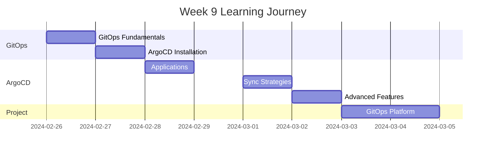

# Week 9 Roadmap - GitOps & ArgoCD

**Duration:** 7 Days  
**Focus:** GitOps Principles → ArgoCD → Declarative Deployments → CI/CD Integration  
**Goal:** Master GitOps methodology and implement continuous deployment

---

## 📊 Week Overview



---

## 🎯 Week Goals

By the end of Week 9, you will:

- ✅ Understand GitOps principles and benefits
- ✅ Install and configure ArgoCD
- ✅ Deploy applications using GitOps
- ✅ Implement automated sync strategies
- ✅ Master ArgoCD features and patterns
- ✅ Build complete GitOps deployment platform

---

## 📅 Daily Breakdown

---

### **Day 57: GitOps Fundamentals**

**⏰ Time:** 2-3 hours  
**📚 Theory:** 1.5 hours | **💻 Hands-on:** 1-1.5 hours

#### What You'll Learn

- What is GitOps and why it matters
- GitOps principles (declarative, versioned, immutable)
- Git as single source of truth
- Pull vs Push deployment models
- GitOps vs traditional CI/CD
- GitOps tools landscape (ArgoCD, Flux, Jenkins X)
- Benefits and challenges of GitOps

#### What You'll Do

- Compare traditional vs GitOps deployments
- Set up Git repository for manifests
- Organize repository structure
- Implement Git branching strategy
- Create environments in Git (dev/staging/prod)
- Practice Git workflow for deployments
- Document GitOps processes

#### Files You'll Create

```
day-57/
├── gitops-concepts/
├── repository-structure/
├── branching-strategy/
├── workflow-examples/
└── gitops-notes.md
```

#### Key Takeaways

- Git is single source of truth
- Declarative configuration
- Automated reconciliation
- Audit trail through Git history

---

### **Day 58: ArgoCD Installation & Setup**

**⏰ Time:** 2-3 hours  
**📚 Theory:** 1 hour | **💻 Hands-on:** 1-2 hours

#### What You'll Learn

- ArgoCD architecture and components
- Installation methods (kubectl, Helm, operator)
- ArgoCD UI and CLI
- Authentication and authorization
- RBAC in ArgoCD
- Repository connection
- ArgoCD best practices

#### What You'll Do

- Install ArgoCD in cluster
- Access ArgoCD UI
- Install ArgoCD CLI
- Configure authentication (SSO optional)
- Connect Git repository
- Set up RBAC policies
- Explore ArgoCD UI features
- Configure notifications
- Test repository access

#### Files You'll Create

```
day-58/
├── argocd-installation/
├── authentication-setup/
├── repository-connections/
├── rbac-policies/
└── argocd-setup-notes.md
```

#### Key Takeaways

- ArgoCD runs in cluster
- UI and CLI available
- Git repository integration
- RBAC for access control

---

### **Day 59: ArgoCD Applications**

**⏰ Time:** 2-3 hours  
**📚 Theory:** 1 hour | **💻 Hands-on:** 1-2 hours

#### What You'll Learn

- ArgoCD Application CRD
- Application sources (Git, Helm, Kustomize)
- Target clusters and namespaces
- Sync policies (manual vs automatic)
- Health status assessment
- Application parameters
- App of Apps pattern

#### What You'll Do

- Create first ArgoCD Application (raw manifests)
- Create Application from Helm chart
- Create Application from Kustomize
- Configure sync policies
- Monitor application health
- Test manual sync
- Test automatic sync
- Implement App of Apps pattern
- Organize multiple applications

#### Files You'll Create

```
day-59/
├── application-manifests/
├── helm-applications/
├── kustomize-applications/
├── app-of-apps/
└── applications-notes.md
```

#### Key Takeaways

- Application is main ArgoCD resource
- Multiple source types supported
- Sync policies control automation
- App of Apps for multiple apps

---

### **Day 60: Sync Strategies & Policies**

**⏰ Time:** 2-3 hours  
**📚 Theory:** 1 hour | **💻 Hands-on:** 1-2 hours

#### What You'll Learn

- Manual vs automatic sync
- Sync waves and phases
- Sync hooks (PreSync, Sync, PostSync)
- Prune resources
- Self-heal functionality
- Retry strategies
- Sync windows
- Resource exclusions

#### What You'll Do

- Configure automatic sync
- Implement sync waves for ordered deployment
- Create sync hooks (database migrations)
- Enable pruning of resources
- Configure self-heal
- Test sync failure scenarios
- Implement retry logic
- Set up sync windows (maintenance windows)
- Exclude resources from sync

#### Files You'll Create

```
day-60/
├── sync-policies/
├── sync-waves/
├── sync-hooks/
├── self-heal-tests/
└── sync-strategies-notes.md
```

#### Key Takeaways

- Automatic sync enables GitOps
- Sync waves control order
- Hooks enable lifecycle management
- Self-heal maintains desired state

---

### **Day 61: Advanced ArgoCD Features**

**⏰ Time:** 2-3 hours  
**📚 Theory:** 1 hour | **💻 Hands-on:** 1-2 hours

#### What You'll Learn

- ApplicationSets for multiple apps
- Multi-cluster management
- Projects for isolation
- Resource tracking and diffing
- Orphan resources handling
- Notification system
- Webhook integration
- ArgoCD Image Updater

#### What You'll Do

- Create ApplicationSet (list generator)
- Create ApplicationSet (git generator)
- Configure multi-cluster setup
- Create ArgoCD Projects
- Set up notifications (Slack, email)
- Configure webhooks for instant sync
- Install and configure Image Updater
- Test automated image updates
- Implement progressive delivery with Argo Rollouts

#### Files You'll Create

```
day-61/
├── applicationsets/
├── multi-cluster/
├── projects/
├── notifications/
├── webhooks/
└── advanced-features-notes.md
```

#### Key Takeaways

- ApplicationSets for templating
- Multi-cluster from single ArgoCD
- Projects provide isolation
- Image Updater automates image updates

---

### **Day 62-63: Weekend Project - Complete GitOps Platform**

**⏰ Time:** 4-6 hours (split over 2 days)  
**💻 100% Hands-on Project**

#### Project Overview

Build a complete GitOps platform managing multiple applications across multiple environments with ArgoCD.

**Platform Architecture:**

```
Git Repository (Single Source of Truth)
├── environments/
│   ├── dev/
│   │   ├── applications/
│   │   ├── infrastructure/
│   │   └── argocd-apps/
│   ├── staging/
│   │   ├── applications/
│   │   ├── infrastructure/
│   │   └── argocd-apps/
│   └── production/
│       ├── applications/
│       ├── infrastructure/
│       └── argocd-apps/
├── base/
│   ├── app-templates/
│   └── infrastructure-templates/
└── argocd/
    ├── apps/
    ├── projects/
    └── applicationsets/

ArgoCD Manages Everything
  ↓
Automatically Syncs to Kubernetes
```

#### What You'll Build

**1. Git Repository Structure**

- Monorepo with all environments
- Kustomize overlays for environments
- Helm charts for complex apps
- Base configurations
- Environment-specific overrides

**2. Applications to Deploy (Per Environment)**

- Frontend application
- Backend API
- Worker service
- PostgreSQL database
- Redis cache
- Monitoring stack
- Logging stack

**3. ArgoCD Configuration**

- ArgoCD Projects (dev, staging, prod)
- App of Apps pattern
- ApplicationSets for multiple apps
- Sync waves for ordered deployment
- Sync hooks for migrations

**4. Environments**

- Development: Auto-sync enabled, self-heal enabled
- Staging: Manual sync, auto-sync after approval
- Production: Manual sync, sync windows, strict policies

**5. GitOps Workflows**

- Feature branch → Dev (auto-deploy)
- PR merge → Staging (auto-deploy)
- Tag/Release → Production (manual approval)
- Rollback via Git revert

**6. Advanced Features**

- Multi-cluster setup (optional)
- Image Updater for automatic updates
- Notifications (Slack/email)
- Webhooks for instant sync
- Progressive delivery with Rollouts

#### Day 62 Tasks

**Morning: Git Repository Setup (2.5 hours)**

- Create Git repository structure
- Set up Kustomize base and overlays
- Create environment directories
- Commit all application manifests
- Set up branching strategy
- Create dev/staging/prod branches

**Afternoon: ArgoCD Applications (1.5 hours)**

- Create ArgoCD Projects
- Create App of Apps for dev
- Create App of Apps for staging
- Create App of Apps for production
- Configure sync policies per environment
- Test manual and automatic sync

#### Day 63 Tasks

**Morning: Advanced Configuration (2 hours)**

- Implement ApplicationSets
- Set up sync waves
- Create sync hooks for database migrations
- Configure Image Updater
- Set up notifications
- Configure webhooks

**Afternoon: Testing & Documentation (2 hours)**

- Test complete GitOps flow
- Make changes in Git, watch auto-sync
- Test rollback via Git revert
- Test different environments
- Document GitOps workflows
- Create runbook for operations
- Demo preparation

#### Git Repository Structure

```
gitops-repo/
├── README.md
├── environments/
│   ├── base/
│   │   ├── frontend/
│   │   │   ├── deployment.yaml
│   │   │   ├── service.yaml
│   │   │   └── kustomization.yaml
│   │   ├── backend/
│   │   ├── worker/
│   │   ├── database/
│   │   └── cache/
│   │
│   ├── dev/
│   │   ├── frontend/
│   │   │   ├── kustomization.yaml
│   │   │   └── patch-replicas.yaml
│   │   ├── backend/
│   │   ├── argocd-apps/
│   │   │   └── dev-apps.yaml
│   │   └── kustomization.yaml
│   │
│   ├── staging/
│   │   ├── frontend/
│   │   ├── backend/
│   │   ├── argocd-apps/
│   │   └── kustomization.yaml
│   │
│   └── production/
│       ├── frontend/
│       ├── backend/
│       ├── argocd-apps/
│       └── kustomization.yaml
│
├── charts/
│   ├── monitoring/
│   └── logging/
│
└── argocd/
    ├── projects/
    │   ├── dev-project.yaml
    │   ├── staging-project.yaml
    │   └── prod-project.yaml
    ├── applicationsets/
    │   └── apps-applicationset.yaml
    └── root-app.yaml
```

#### Sync Strategies Per Environment

**Development:**

```yaml
syncPolicy:
  automated:
    prune: true # Auto-delete removed resources
    selfHeal: true # Auto-fix drift
  syncOptions:
    - CreateNamespace=true
```

**Staging:**

```yaml
syncPolicy:
  automated:
    prune: true
    selfHeal: false # Manual intervention for drift
  syncOptions:
    - CreateNamespace=true
```

**Production:**

```yaml
syncPolicy:
  # Manual sync only
  syncOptions:
    - CreateNamespace=true
  retry:
    limit: 5
    backoff:
      duration: 5s
      factor: 2
      maxDuration: 3m
# Sync windows for maintenance
syncWindows:
  - kind: allow
    schedule: "0 2 * * *" # 2 AM daily
    duration: 2h
```

#### GitOps Workflows

**Workflow 1: Feature Development**

```
1. Developer creates feature branch
2. Updates manifests in environments/dev/
3. Commits and pushes
4. ArgoCD detects change (webhook or polling)
5. Auto-syncs to dev cluster
6. Developer tests
7. Creates PR to main
```

**Workflow 2: Staging Deployment**

```
1. PR merged to main
2. Changes in environments/staging/
3. ArgoCD auto-syncs to staging
4. QA team tests
5. Approve for production
```

**Workflow 3: Production Deployment**

```
1. Create Git tag (v1.2.3)
2. Update environments/production/
3. Commit with message "Release v1.2.3"
4. Manual approval required
5. ArgoCD syncs during sync window
6. Monitor rollout
7. Tag Git commit for rollback reference
```

**Workflow 4: Rollback**

```
1. Issue detected in production
2. Git revert to previous commit
3. ArgoCD syncs old version
4. Service restored
5. Investigate issue
6. Fix and redeploy
```

#### ApplicationSet Example

```yaml
apiVersion: argoproj.io/v1alpha1
kind: ApplicationSet
metadata:
  name: all-environments
spec:
  generators:
  - list:
      elements:
      - env: dev
        cluster: in-cluster
      - env: staging
        cluster: in-cluster
      - env: production
        cluster: in-cluster
  template:
    metadata:
      name: '{{env}}-apps'
    spec:
      project: '{{env}}'
      source:
        repoURL: https://github.com/yourorg/gitops-repo
        targetRevision: HEAD
        path: environments/{{env}}/argocd-apps
      destination:
        server: '{{cluster}}'
        namespace: '{{env}}'
      syncPolicy:
        automated:
          prune: true
          selfHeal: '{{env}}' == 'dev'
```

#### Testing Checklist

```
GitOps Workflow:
- [ ] Commit to dev branch auto-deploys to dev
- [ ] PR merge to main auto-deploys to staging
- [ ] Tag triggers production deployment (with approval)
- [ ] Git revert rolls back changes
- [ ] ArgoCD detects drift and self-heals (dev only)

ArgoCD Features:
- [ ] App of Apps manages all applications
- [ ] ApplicationSets create apps from templates
- [ ] Sync waves ensure correct order
- [ ] Sync hooks run migrations
- [ ] Projects isolate environments
- [ ] Notifications alert on sync events

Multi-Environment:
- [ ] Dev has different replicas than prod
- [ ] Staging has different configs than dev
- [ ] Production has strict sync policies
- [ ] All environments deployed from same repo
- [ ] Kustomize overlays working correctly

Monitoring:
- [ ] ArgoCD UI shows all apps
- [ ] Sync status visible
- [ ] Health status accurate
- [ ] Notifications working
- [ ] Webhooks trigger instant sync
```

#### Deliverables

- [ ] Git repository with complete structure
- [ ] 3 environments (dev, staging, prod)
- [ ] 5+ applications per environment
- [ ] ArgoCD managing everything
- [ ] App of Apps pattern implemented
- [ ] ApplicationSets for templating
- [ ] Sync policies per environment
- [ ] Notifications configured
- [ ] Complete documentation
- [ ] GitOps workflow guide
- [ ] Runbook for operations

#### Success Criteria

- Single Git commit deploys to dev automatically
- Can promote through environments
- Production requires manual approval
- Rollback works via Git revert
- No manual kubectl apply needed
- Complete audit trail in Git
- ArgoCD UI shows all applications
- Notifications alert on issues

#### Bonus Challenges

- [ ] Implement Argo Rollouts for canary
- [ ] Add multi-cluster support
- [ ] Integrate with GitHub Actions
- [ ] Implement secret management (Sealed Secrets)
- [ ] Add policy enforcement (OPA/Kyverno)
- [ ] Implement disaster recovery
- [ ] Add cost tracking per environment
- [ ] Create ArgoCD plugins

---

## 📊 Week 9 Progress Tracker

### Daily Completion

| Day   | Topic               | Theory | Hands-on | Notes | Status |
| ----- | ------------------- | ------ | -------- | ----- | ------ |
| 57    | GitOps Fundamentals | ☐      | ☐        | ☐     | ⏳     |
| 58    | ArgoCD Installation | ☐      | ☐        | ☐     | ⏳     |
| 59    | Applications        | ☐      | ☐        | ☐     | ⏳     |
| 60    | Sync Strategies     | ☐      | ☐        | ☐     | ⏳     |
| 61    | Advanced Features   | ☐      | ☐        | ☐     | ⏳     |
| 62-63 | GitOps Platform     | N/A    | ☐        | ☐     | ⏳     |

### Skills Acquired

#### GitOps

- [ ] Understand GitOps principles
- [ ] Implement Git workflows
- [ ] Manage environments in Git
- [ ] Declarative deployments
- [ ] Version control everything

#### ArgoCD

- [ ] Install and configure ArgoCD
- [ ] Create Applications
- [ ] Configure sync policies
- [ ] Use ApplicationSets
- [ ] Multi-cluster management

#### Automation

- [ ] Automatic deployments
- [ ] Self-healing systems
- [ ] Webhook integration
- [ ] Image automation
- [ ] Continuous deployment

---

## 📁 Expected Folder Structure

```
week-09/
├── week-09-roadmap.md
├── day-57/
├── day-58/
├── day-59/
├── day-60/
├── day-61/
├── day-62/
└── day-63/

projects/
└── project-09-gitops-platform/
    ├── gitops-repo/
    │   ├── environments/
    │   ├── charts/
    │   └── argocd/
    ├── argocd-setup/
    └── docs/
```

---

## 🎯 Week 9 Learning Outcomes

By the end of Week 9, you will:

### GitOps Mastery

✅ Understand GitOps principles  
✅ Git as single source of truth  
✅ Implement GitOps workflows  
✅ Manage multiple environments  
✅ Audit trail through Git

### ArgoCD Expertise

✅ Install and configure ArgoCD  
✅ Deploy apps declaratively  
✅ Implement sync strategies  
✅ Use ApplicationSets  
✅ Multi-cluster management

### Continuous Deployment

✅ Automated deployments  
✅ Self-healing systems  
✅ Progressive delivery  
✅ Zero-touch operations  
✅ Production GitOps platform

---

## 💡 Week 9 Themes

**GitOps:**

- Git is source of truth
- Declarative everything
- Automated reconciliation

**ArgoCD:**

- Continuous deployment
- Self-healing
- Visibility and control

**Modern Operations:**

- Infrastructure as Code
- No manual changes
- Complete automation

---

**Week Start Date:** ****\_\_\_****  
**Week End Date:** ****\_\_\_****  
**Status:** ⏳ In Progress | ✅ Completed  
**Confidence Level:** ⭐⭐⭐⭐⭐ (5/5 stars - GitOps Expert!)
