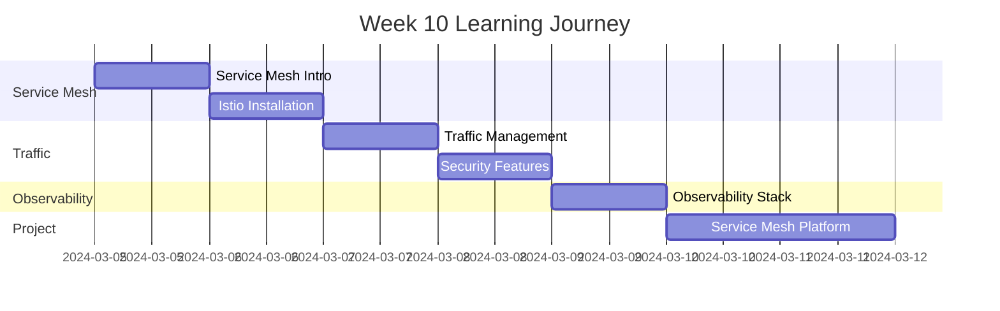

# Week 10 Roadmap - Service Mesh & Advanced Networking

**Duration:** 7 Days  
**Focus:** Service Mesh Concepts → Istio → Traffic Management → Observability  
**Goal:** Master service mesh for microservices communication and observability

---

## 📊 Week Overview



---

## 🎯 Week Goals

By the end of Week 10, you will:

- ✅ Understand service mesh architecture
- ✅ Install and configure Istio
- ✅ Implement advanced traffic management
- ✅ Secure service-to-service communication
- ✅ Master service mesh observability
- ✅ Build production service mesh platform

---

## 📅 Daily Breakdown

---

### **Day 64: Service Mesh Fundamentals**

**⏰ Time:** 2-3 hours  
**📚 Theory:** 1.5 hours | **💻 Hands-on:** 1-1.5 hours

#### What You'll Learn

- What is service mesh and why it's needed
- Service mesh architecture (data plane + control plane)
- Sidecar proxy pattern
- Service mesh capabilities
- Popular service meshes (Istio, Linkerd, Consul)
- When to use service mesh
- Service mesh vs API gateway

#### What You'll Do

- Compare direct service calls vs service mesh
- Understand sidecar injection
- Explore service mesh features
- Compare Istio, Linkerd, Consul
- Identify use cases for service mesh
- Plan service mesh adoption strategy
- Document service mesh requirements

#### Files You'll Create

```
day-64/
├── service-mesh-concepts/
├── architecture-diagrams/
├── comparison-charts/
├── use-cases/
└── service-mesh-notes.md
```

#### Key Takeaways

- Service mesh handles service-to-service communication
- Sidecar proxies intercept traffic
- Separates business logic from networking
- Essential for microservices at scale

---

### **Day 65: Istio Installation & Architecture**

**⏰ Time:** 2-3 hours  
**📚 Theory:** 1 hour | **💻 Hands-on:** 1-2 hours

#### What You'll Learn

- Istio architecture (Istiod, Envoy proxy)
- Installation profiles (demo, minimal, production)
- Istio components and their roles
- Sidecar injection (automatic vs manual)
- Istio configuration resources
- Namespaces and mesh scope
- Istio best practices

#### What You'll Do

- Install Istio (using istioctl)
- Install Istio addons (Kiali, Jaeger, Prometheus, Grafana)
- Configure automatic sidecar injection
- Deploy sample application with sidecars
- Verify Istio installation
- Access Kiali dashboard
- Explore Istio resources (VirtualService, DestinationRule)
- Test service mesh connectivity

#### Files You'll Create

```
day-65/
├── istio-installation/
├── addon-setup/
├── sidecar-injection/
├── sample-apps/
└── istio-setup-notes.md
```

#### Key Takeaways

- Istio uses Envoy as sidecar proxy
- Automatic sidecar injection simplifies deployment
- Kiali provides mesh visualization
- Istio extends Kubernetes networking

---

### **Day 66: Traffic Management**

**⏰ Time:** 2-3 hours  
**📚 Theory:** 1 hour | **💻 Hands-on:** 1-2 hours

#### What You'll Learn

- VirtualService for routing rules
- DestinationRule for load balancing
- Gateway for ingress traffic
- Traffic shifting (canary, blue-green)
- Request routing (header-based, path-based)
- Fault injection for testing
- Traffic mirroring
- Circuit breaking

#### What You'll Do

- Create VirtualService for routing
- Implement traffic splitting (90/10)
- Header-based routing
- Canary deployment with traffic shifting
- Blue-green deployment
- Inject faults (delays, errors)
- Mirror traffic for testing
- Configure circuit breakers
- Test timeouts and retries

#### Files You'll Create

```
day-66/
├── virtual-services/
├── destination-rules/
├── traffic-splitting/
├── fault-injection/
├── circuit-breaking/
└── traffic-management-notes.md
```

#### Key Takeaways

- VirtualService controls routing
- Traffic shifting enables progressive rollouts
- Fault injection tests resilience
- Circuit breaking prevents cascading failures

---

### **Day 67: Security Features**

**⏰ Time:** 2-3 hours  
**📚 Theory:** 1 hour | **💻 Hands-on:** 1-2 hours

#### What You'll Learn

- Mutual TLS (mTLS) in service mesh
- Authentication policies
- Authorization policies
- PeerAuthentication
- RequestAuthentication
- JWT validation
- Security best practices
- Zero-trust networking

#### What You'll Do

- Enable mTLS mesh-wide
- Configure strict mTLS mode
- Verify encrypted communication
- Create authentication policies
- Implement authorization policies
- Allow/deny specific services
- JWT-based authentication
- Test security policies
- Monitor security metrics

#### Files You'll Create

```
day-67/
├── mtls-config/
├── authentication-policies/
├── authorization-policies/
├── jwt-validation/
└── security-notes.md
```

#### Key Takeaways

- mTLS encrypts all service communication
- Zero configuration mTLS
- Fine-grained authorization
- Identity-based security

---

### **Day 68: Observability & Monitoring**

**⏰ Time:** 2-3 hours  
**📚 Theory:** 1 hour | **💻 Hands-on:** 1-2 hours

#### What You'll Learn

- Distributed tracing with Jaeger
- Metrics collection with Prometheus
- Visualization with Grafana
- Service graph with Kiali
- Access logs in Envoy
- Telemetry configuration
- Custom metrics
- Distributed context propagation

#### What You'll Do

- Configure distributed tracing
- View traces in Jaeger
- Create Grafana dashboards for mesh
- Explore service graph in Kiali
- Analyze traffic patterns
- Configure access logs
- Add custom metrics
- Monitor service performance
- Debug with distributed tracing
- Analyze traffic flows

#### Files You'll Create

```
day-68/
├── tracing-config/
├── prometheus-metrics/
├── grafana-dashboards/
├── kiali-exploration/
└── observability-notes.md
```

#### Key Takeaways

- Service mesh provides deep observability
- Distributed tracing shows request flows
- Kiali visualizes mesh topology
- No code changes needed for metrics

---

### **Day 69-70: Weekend Project - Production Service Mesh Platform**

**⏰ Time:** 4-6 hours (split over 2 days)  
**💻 100% Hands-on Project**

#### Project Overview

Build a production-grade microservices platform with Istio service mesh, implementing advanced traffic management, security, and observability.

**Platform Architecture:**

```
Istio Gateway (Ingress)
  ↓
┌─────────────────────────────────────────┐
│  Frontend Service (v1: 90%, v2: 10%)    │
│  - Canary deployment                    │
│  - mTLS enabled                         │
│  - Circuit breaker                      │
└─────────────────────────────────────────┘
  ↓
┌─────────────────────────────────────────┐
│  API Gateway Service                     │
│  - Request routing by header            │
│  - Rate limiting                        │
│  - JWT authentication                   │
└─────────────────────────────────────────┘
  ↓
┌──────────────┬──────────────┬───────────┐
│  Product API │  Order API   │  User API │
│  - mTLS      │  - mTLS      │  - mTLS   │
│  - Retries   │  - Timeout   │  - Fault  │
│              │              │    Inject │
└──────────────┴──────────────┴───────────┘
  ↓
┌─────────────────────────────────────────┐
│  Databases & Cache                      │
│  - PostgreSQL                           │
│  - Redis                                │
└─────────────────────────────────────────┘

Observability Stack:
├── Kiali (Service graph)
├── Jaeger (Distributed tracing)
├── Prometheus (Metrics)
└── Grafana (Visualization)
```

#### What You'll Build

**1. Microservices Application**

- Frontend (2 versions for canary)
- API Gateway (routing hub)
- Product Service
- Order Service
- User Service
- PostgreSQL
- Redis

**2. Traffic Management**

- Canary deployment (Frontend v1: 90%, v2: 10%)
- Header-based routing (API version routing)
- Fault injection (chaos testing)
- Circuit breaking (prevent cascading failures)
- Retries and timeouts
- Traffic mirroring (shadow testing)

**3. Security Implementation**

- Mesh-wide mTLS (strict mode)
- Service-level authorization
- JWT authentication for external calls
- Namespace isolation
- RBAC integration
- Zero-trust model

**4. Observability**

- Distributed tracing for all requests
- Service dependency graph
- Golden signals (latency, traffic, errors, saturation)
- Custom business metrics
- Grafana dashboards
- Alerting rules

**5. Resilience Patterns**

- Circuit breakers on all services
- Retry policies with exponential backoff
- Timeout configurations
- Bulkhead isolation
- Fault injection for testing

#### Day 69 Tasks

**Morning: Istio Setup & Application Deployment (2.5 hours)**

- Install Istio with production profile
- Install observability addons
- Deploy all microservices
- Enable automatic sidecar injection
- Verify all pods have sidecars
- Test basic connectivity

**Afternoon: Traffic Management (1.5 hours)**

- Create Istio Gateway for ingress
- Configure VirtualServices
- Implement canary deployment (90/10 split)
- Set up header-based routing
- Configure circuit breakers
- Test traffic splitting

#### Day 70 Tasks

**Morning: Security & Resilience (2 hours)**

- Enable strict mTLS mesh-wide
- Create authorization policies
- Configure JWT authentication
- Implement retry policies
- Set up timeouts
- Add fault injection
- Test security policies

**Afternoon: Observability & Testing (2 hours)**

- Configure distributed tracing
- Create Grafana dashboards
- Explore service graph in Kiali
- Generate load for testing
- Verify canary traffic split
- Test circuit breaker
- Analyze traces
- Document findings

#### Traffic Management Configurations

**Canary Deployment:**

```
Frontend v1: 90% traffic
Frontend v2: 10% traffic
Gradually shift: 10% → 25% → 50% → 100%
Monitor error rates and latency
Rollback if metrics degrade
```

**Header-Based Routing:**

```
Header: api-version: v1 → Old API
Header: api-version: v2 → New API
No header → Default to v1
Test: Premium users get v2
```

**Fault Injection:**

```
Inject 10% error rate to User Service
Inject 5s delay to Order Service
Test circuit breaker activation
Test retry logic
Verify graceful degradation
```

**Circuit Breaking:**

```
Max connections: 100
Max requests per connection: 10
Max pending requests: 50
Consecutive errors: 5
Ejection time: 30s
Test cascading failure prevention
```

#### Security Policies

**mTLS Configuration:**

```
Mode: STRICT (enforce mTLS everywhere)
Auto-rotate certificates
Monitor certificate expiration
Test encrypted communication
```

**Authorization:**

```
Default: Deny all
Allow: Frontend → API Gateway
Allow: API Gateway → All backend services
Deny: Direct access to backend services
Allow: Prometheus scraping
```

**JWT Authentication:**

```
Validate JWT on Gateway
Extract user claims
Route based on user tier
Premium users → API v2
Regular users → API v1
```

#### Observability Metrics

**Golden Signals:**

```
Latency:
- p50, p95, p99 per service
- Request duration histogram

Traffic:
- Requests per second
- Request rate by service

Errors:
- Error rate (5xx errors)
- Error rate by service
- Circuit breaker trips

Saturation:
- Connection pool usage
- Queue depth
- CPU/Memory per service
```

**Custom Metrics:**

```
Business metrics:
- Orders per minute
- Revenue per minute
- User signups
- Failed checkouts

Service mesh metrics:
- mTLS success rate
- Certificate rotation events
- Authorization denials
- Retry attempts
```

#### Testing Scenarios

**Scenario 1: Canary Deployment**

```
1. Deploy Frontend v2 with 10% traffic
2. Generate load (1000 requests)
3. Verify 90 requests to v1, 10 to v2
4. Monitor v2 error rate and latency
5. If healthy, increase to 25%
6. Continue until 100%
7. Remove v1
```

**Scenario 2: Circuit Breaking**

```
1. Generate heavy load to Order Service
2. Cause 5+ consecutive failures
3. Verify circuit breaker opens
4. Verify requests fail fast
5. Wait for ejection time
6. Verify circuit breaker closes
7. Normal traffic resumes
```

**Scenario 3: Fault Injection**

```
1. Inject 5s delay to User Service
2. Verify timeout kicks in
3. Verify retry logic works
4. Check distributed trace
5. Verify no cascading failures
6. Remove fault injection
```

**Scenario 4: Security**

```
1. Try direct call to backend (should fail)
2. Call through Gateway (should succeed)
3. Verify mTLS encryption in logs
4. Test without JWT (should fail)
5. Test with valid JWT (should succeed)
6. Test authorization policies
```

#### Monitoring Dashboard

**Kiali Dashboard:**

- Service graph with traffic flow
- Service health status
- mTLS status per service
- Traffic rates and latency
- Error rates

**Jaeger Tracing:**

- End-to-end request traces
- Service dependencies
- Latency breakdown per service
- Error traces
- Slow query identification

**Grafana Dashboards:**

- Istio service dashboard
- Istio mesh dashboard
- Workload dashboard
- Performance metrics
- Custom business metrics

#### Deliverables

- [ ] Microservices with Istio sidecars
- [ ] Canary deployment configured
- [ ] mTLS enabled mesh-wide
- [ ] Authorization policies active
- [ ] Circuit breakers configured
- [ ] Distributed tracing working
- [ ] Kiali showing service graph
- [ ] Grafana dashboards created
- [ ] Complete documentation
- [ ] Testing results documented

#### Success Criteria

- All services communicate via mTLS
- Canary deployment traffic split working
- Circuit breaker prevents failures
- Distributed tracing shows all requests
- Authorization policies enforced
- Zero trust security implemented
- Kiali visualizes mesh accurately
- Grafana shows real-time metrics
- No direct backend access possible

#### Bonus Challenges

- [ ] Implement multi-cluster mesh
- [ ] Add Istio egress gateway
- [ ] Implement rate limiting
- [ ] Add Web Application Firewall (WAF)
- [ ] Implement A/B testing
- [ ] Add chaos engineering (Chaos Mesh)
- [ ] Implement service-level SLOs
- [ ] Add request authentication

---

## 📊 Week 10 Progress Tracker

### Daily Completion

| Day   | Topic                 | Theory | Hands-on | Notes | Status |
| ----- | --------------------- | ------ | -------- | ----- | ------ |
| 64    | Service Mesh Intro    | ☐      | ☐        | ☐     | ⏳     |
| 65    | Istio Installation    | ☐      | ☐        | ☐     | ⏳     |
| 66    | Traffic Management    | ☐      | ☐        | ☐     | ⏳     |
| 67    | Security Features     | ☐      | ☐        | ☐     | ⏳     |
| 68    | Observability         | ☐      | ☐        | ☐     | ⏳     |
| 69-70 | Service Mesh Platform | N/A    | ☐        | ☐     | ⏳     |

### Skills Acquired

#### Service Mesh

- [ ] Understand service mesh architecture
- [ ] Install and configure Istio
- [ ] Manage sidecar proxies
- [ ] Configure mesh policies
- [ ] Multi-cluster mesh (optional)

#### Traffic Management

- [ ] Implement canary deployments
- [ ] Header-based routing
- [ ] Circuit breaking
- [ ] Fault injection
- [ ] Traffic mirroring

#### Security

- [ ] Enable mTLS mesh-wide
- [ ] Configure authorization
- [ ] JWT authentication
- [ ] Zero-trust networking
- [ ] Security policies

#### Observability

- [ ] Distributed tracing
- [ ] Service dependency graphs
- [ ] Metrics collection
- [ ] Dashboard creation
- [ ] Traffic analysis

---

## 📁 Expected Folder Structure

```
week-10/
├── week-10-roadmap.md
├── day-64/
├── day-65/
├── day-66/
├── day-67/
├── day-68/
├── day-69/
└── day-70/

projects/
└── project-10-service-mesh/
    ├── applications/
    ├── istio-config/
    ├── traffic-management/
    ├── security/
    ├── observability/
    └── docs/
```

---

## 🎯 Week 10 Learning Outcomes

By the end of Week 10, you will:

### Service Mesh Mastery

✅ Understand service mesh architecture  
✅ Install and configure Istio  
✅ Manage service-to-service communication  
✅ Implement sidecar pattern  
✅ Production-ready mesh deployment

### Traffic Control

✅ Advanced routing capabilities  
✅ Canary deployments  
✅ Circuit breaking  
✅ Fault injection testing  
✅ Traffic mirroring

### Security & Observability

✅ Zero-trust mTLS  
✅ Service authorization  
✅ Distributed tracing  
✅ Service dependency mapping  
✅ Complete visibility

---

## 💡 Week 10 Themes

**Service Mesh:**

- Transparent networking
- Zero code changes
- Powerful capabilities

**Security:**

- Zero-trust by default
- mTLS everywhere
- Fine-grained control

**Observability:**

- Deep insights
- Distributed tracing
- Real-time monitoring

---

**Week Start Date:** ****\_\_\_****  
**Week End Date:** ****\_\_\_****  
**Status:** ⏳ In Progress | ✅ Completed  
**Confidence Level:** ⭐⭐⭐⭐⭐ (5/5 stars - Service Mesh Expert!)
