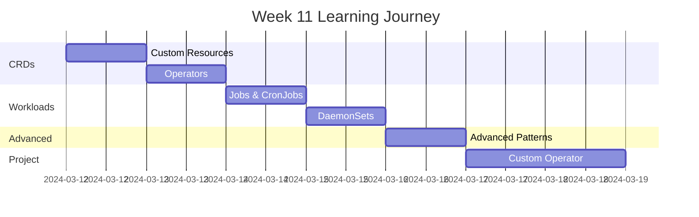

# Week 11 Roadmap - Advanced Topics & Best Practices

**Duration:** 7 Days  
**Focus:** Custom Resources → Operators → Jobs → Advanced Patterns  
**Goal:** Master advanced Kubernetes features and operational patterns

---

## 📊 Week Overview



---

## 🎯 Week Goals

By the end of Week 11, you will:

- ✅ Create Custom Resource Definitions (CRDs)
- ✅ Understand Kubernetes Operators
- ✅ Master Jobs and CronJobs
- ✅ Work with DaemonSets
- ✅ Implement advanced Kubernetes patterns
- ✅ Build a custom Kubernetes operator

---

## 📅 Daily Breakdown

---

### **Day 71: Custom Resource Definitions (CRDs)**

**⏰ Time:** 2-3 hours  
**📚 Theory:** 1 hour | **💻 Hands-on:** 1-2 hours

#### What You'll Learn

- What are CRDs and why extend Kubernetes
- CRD structure and schema
- OpenAPI v3 schema validation
- Custom resource creation
- API versions and conversion
- CRD best practices
- Kubectl integration with CRDs

#### What You'll Do

- Create first CRD
- Define resource schema
- Implement validation rules
- Create custom resources
- List and manage custom resources
- Add printer columns for kubectl output
- Implement subresources (status, scale)
- Version CRDs (v1alpha1, v1beta1, v1)
- Test CRD validation

#### Files You'll Create

```
day-71/
├── crd-definitions/
├── custom-resources/
├── schema-validation/
├── versioning/
└── crd-notes.md
```

#### Key Takeaways

- CRDs extend Kubernetes API
- Schema validation prevents errors
- Versioning supports evolution
- Kubectl works with custom resources

---

### **Day 72: Kubernetes Operators**

**⏰ Time:** 2-3 hours  
**📚 Theory:** 1 hour | **💻 Hands-on:** 1-2 hours

#### What You'll Learn

- Operator pattern explained
- Controller reconciliation loop
- Operator frameworks (Operator SDK, Kubebuilder)
- Operator capabilities levels
- Operator Lifecycle Manager (OLM)
- Popular operators (Prometheus, Postgres, etc.)
- When to build custom operator

#### What You'll Do

- Install Operator SDK or Kubebuilder
- Study existing operators
- Understand reconciliation loop
- Create basic operator scaffold
- Implement simple controller logic
- Test operator locally
- Deploy operator to cluster
- Monitor operator logs
- Debug operator issues

#### Files You'll Create

```
day-72/
├── operator-sdk-setup/
├── operator-examples/
├── controller-logic/
├── operator-deployment/
└── operator-notes.md
```

#### Key Takeaways

- Operators automate operational tasks
- Reconciliation loop ensures desired state
- Frameworks simplify operator development
- Operators encode operational knowledge

---

### **Day 73: Jobs and CronJobs**

**⏰ Time:** 2-3 hours  
**📚 Theory:** 1 hour | **💻 Hands-on:** 1-2 hours

#### What You'll Learn

- Job workload type
- Job completion and parallelism
- Job failure handling
- CronJob scheduling
- CronJob concurrency policies
- Backup and maintenance patterns
- TTL for finished jobs

#### What You'll Do

- Create simple Job
- Implement parallel Jobs
- Handle Job failures and retries
- Create CronJob for scheduled tasks
- Implement database backup CronJob
- Configure concurrency policies (Allow, Forbid, Replace)
- Set up job history limits
- Implement cleanup with TTL
- Monitor job execution
- Debug failed jobs

#### Files You'll Create

```
day-73/
├── jobs/
├── parallel-jobs/
├── cronjobs/
├── backup-jobs/
└── jobs-notes.md
```

#### Key Takeaways

- Jobs for one-time tasks
- CronJobs for scheduled tasks
- Parallelism for faster completion
- Proper cleanup prevents resource buildup

---

### **Day 74: DaemonSets and Advanced Scheduling**

**⏰ Time:** 2-3 hours  
**📚 Theory:** 1 hour | **💻 Hands-on:** 1-2 hours

#### What You'll Learn

- DaemonSet workload type
- Node-level services with DaemonSets
- DaemonSet update strategies
- Node affinity and anti-affinity
- Taints and tolerations
- Pod priority and preemption
- Topology spread constraints

#### What You'll Do

- Create DaemonSet (logging agent)
- Deploy monitoring agent with DaemonSet
- Configure rolling updates for DaemonSet
- Use node selectors
- Implement node affinity rules
- Add taints to nodes
- Configure tolerations
- Set pod priorities
- Test preemption
- Implement topology spread constraints

#### Files You'll Create

```
day-74/
├── daemonsets/
├── node-affinity/
├── taints-tolerations/
├── pod-priority/
└── scheduling-notes.md
```

#### Key Takeaways

- DaemonSets run on all/specific nodes
- Affinity controls pod placement
- Taints/tolerations for dedicated nodes
- Priority ensures critical pods run

---

### **Day 75: Advanced Kubernetes Patterns**

**⏰ Time:** 2-3 hours  
**📚 Theory:** 1 hour | **💻 Hands-on:** 1-2 hours

#### What You'll Learn

- Admission controllers and webhooks
- Validating webhooks
- Mutating webhooks
- Pod Security Admission
- Policy engines (OPA, Kyverno)
- Custom schedulers
- Extended resources
- Device plugins

#### What You'll Do

- Create validating webhook
- Create mutating webhook (inject sidecar)
- Deploy policy engine (Kyverno or OPA)
- Write policy rules
- Test policy enforcement
- Implement custom scheduler (basic)
- Use extended resources (GPU simulation)
- Explore device plugin architecture
- Test admission control flow

#### Files You'll Create

```
day-75/
├── admission-webhooks/
├── policy-engine/
├── custom-scheduler/
├── extended-resources/
└── advanced-patterns-notes.md
```

#### Key Takeaways

- Webhooks intercept API requests
- Policy engines enforce standards
- Custom schedulers for special needs
- Device plugins expose hardware

---

### **Day 76-77: Weekend Project - Database Backup Operator**

**⏰ Time:** 4-6 hours (split over 2 days)  
**💻 100% Hands-on Project**

#### Project Overview

Build a Kubernetes operator that automatically manages database backups with CRDs, controllers, and scheduled jobs.

**Operator Features:**

```
DatabaseBackup CRD
├── Spec:
│   ├── Database connection (PostgreSQL)
│   ├── Backup schedule (cron)
│   ├── Retention policy (days)
│   ├── Storage destination (S3, PVC)
│   └── Notification settings
└── Status:
    ├── Last backup time
    ├── Last backup status
    ├── Next scheduled backup
    └── Backup history

Controller Logic:
├── Create CronJob for scheduled backups
├── Execute backup to storage
├── Cleanup old backups per retention
├── Update resource status
└── Send notifications on success/failure
```

#### What You'll Build

**1. Custom Resource Definition**

- DatabaseBackup CRD
- Schema with validation
- Status subresource
- Printer columns for kubectl

**2. Operator Controller**

- Watch DatabaseBackup resources
- Reconciliation loop
- Create/update CronJobs
- Manage backup Jobs
- Handle failures and retries
- Update status

**3. Backup Logic**

- PostgreSQL backup using pg_dump
- MySQL backup using mysqldump
- MongoDB backup using mongodump
- Store to S3 or PVC
- Compression and encryption
- Verify backup integrity

**4. Retention Policy**

- Automatic cleanup of old backups
- Configurable retention days
- Keep daily/weekly/monthly backups
- Efficient storage management

**5. Monitoring & Notifications**

- Prometheus metrics
- Success/failure counters
- Backup duration metrics
- Storage usage metrics
- Slack/email notifications

**6. Advanced Features**

- Multiple database types support
- Incremental backups
- Point-in-time recovery metadata
- Backup verification
- Restore capabilities

#### Day 76 Tasks

**Morning: CRD & Operator Scaffold (2.5 hours)**

- Create DatabaseBackup CRD
- Define schema and validation
- Initialize operator project (Kubebuilder/Operator SDK)
- Generate controller scaffold
- Implement basic reconciliation loop
- Test CRD creation

**Afternoon: Backup Logic (1.5 hours)**

- Implement backup execution
- Create Job for backup
- Test PostgreSQL backup
- Store backup to PVC
- Update resource status
- Handle errors

#### Day 77 Tasks

**Morning: Advanced Features (2 hours)**

- Implement CronJob creation
- Add retention policy logic
- Cleanup old backups
- Add multiple database support
- Implement notifications
- Add Prometheus metrics

**Afternoon: Testing & Polish (2 hours)**

- Deploy operator to cluster
- Create DatabaseBackup resources
- Test scheduled backups
- Test retention cleanup
- Test failure scenarios
- Monitor metrics
- Create documentation
- Demo preparation

#### Custom Resource Example

```yaml
apiVersion: backup.example.com/v1
kind: DatabaseBackup
metadata:
  name: postgres-daily-backup
spec:
  database:
    type: postgresql
    host: postgres-service
    port: 5432
    database: myapp
    credentialsSecret: postgres-credentials

  schedule: "0 2 * * *" # Daily at 2 AM

  retention:
    days: 30
    keepDaily: 7
    keepWeekly: 4
    keepMonthly: 12

  storage:
    type: s3
    bucket: my-backups
    path: /postgres-backups
    credentialsSecret: s3-credentials

  notifications:
    slack:
      webhook: https://hooks.slack.com/...
      channel: "#backups"

status:
  lastBackupTime: "2024-03-17T02:00:00Z"
  lastBackupStatus: "Success"
  nextScheduledBackup: "2024-03-18T02:00:00Z"
  backupHistory:
    - timestamp: "2024-03-17T02:00:00Z"
      status: "Success"
      size: "150MB"
      duration: "45s"
    - timestamp: "2024-03-16T02:00:00Z"
      status: "Success"
      size: "148MB"
      duration: "43s"
```

#### Controller Reconciliation Logic

```
Reconcile Loop:
1. Fetch DatabaseBackup resource
2. Validate configuration
3. Check if CronJob exists
   - If not: Create CronJob
   - If yes: Update if spec changed
4. Check for completed backup Jobs
   - Update status
   - Send notifications
5. Apply retention policy
   - List old backups
   - Delete backups beyond retention
6. Calculate next backup time
7. Update resource status
8. Requeue after interval
```

#### Backup Job Flow

```
Backup Job:
1. Read database credentials from Secret
2. Read storage credentials from Secret
3. Generate backup filename (timestamp)
4. Execute pg_dump/mysqldump/mongodump
5. Compress backup file
6. Encrypt backup (optional)
7. Upload to storage (S3/PVC)
8. Verify backup integrity
9. Update DatabaseBackup status
10. Send notification
11. Exit with status code
```

#### Metrics to Expose

```
Prometheus Metrics:
- backup_total{database, status}
- backup_duration_seconds{database}
- backup_size_bytes{database}
- backup_last_success_timestamp{database}
- retention_cleanups_total{database}
- storage_usage_bytes{database}
```

#### Testing Scenarios

```
Test 1: Basic Backup
- Create DatabaseBackup resource
- Wait for CronJob creation
- Trigger manual backup
- Verify backup file created
- Check status updated

Test 2: Scheduled Backup
- Create DatabaseBackup with schedule
- Wait for scheduled time
- Verify automatic backup execution
- Check backup in storage

Test 3: Retention Policy
- Create multiple backups
- Set retention to 7 days
- Wait for cleanup
- Verify old backups deleted

Test 4: Failure Handling
- Provide wrong credentials
- Verify backup fails
- Check error in status
- Verify retry logic
- Verify notification sent

Test 5: Multiple Databases
- Create PostgreSQL backup
- Create MySQL backup
- Create MongoDB backup
- Verify all working independently
```

#### Deliverables

- [ ] DatabaseBackup CRD
- [ ] Operator controller
- [ ] Backup execution logic
- [ ] CronJob management
- [ ] Retention policy implementation
- [ ] Multiple database support
- [ ] Prometheus metrics
- [ ] Notification system
- [ ] Complete documentation
- [ ] Example resources
- [ ] Operator deployment manifests

#### Success Criteria

- Operator runs in cluster
- DatabaseBackup resources work
- Scheduled backups execute
- Backups stored correctly
- Retention policy works
- Status updates accurately
- Notifications sent
- Metrics exposed
- Multiple databases supported
- Failures handled gracefully

#### Bonus Challenges

- [ ] Implement restore operator
- [ ] Add backup verification
- [ ] Implement incremental backups
- [ ] Add backup encryption
- [ ] Support more storage backends
- [ ] Implement backup catalog
- [ ] Add RBAC for operator
- [ ] Create Helm chart for operator
- [ ] Implement webhook for validation
- [ ] Add backup compression options

---

## 📊 Week 11 Progress Tracker

### Daily Completion

| Day   | Topic             | Theory | Hands-on | Notes | Status |
| ----- | ----------------- | ------ | -------- | ----- | ------ |
| 71    | CRDs              | ☐      | ☐        | ☐     | ⏳     |
| 72    | Operators         | ☐      | ☐        | ☐     | ⏳     |
| 73    | Jobs & CronJobs   | ☐      | ☐        | ☐     | ⏳     |
| 74    | DaemonSets        | ☐      | ☐        | ☐     | ⏳     |
| 75    | Advanced Patterns | ☐      | ☐        | ☐     | ⏳     |
| 76-77 | Backup Operator   | N/A    | ☐        | ☐     | ⏳     |

### Skills Acquired

#### CRDs & Operators

- [ ] Create custom resources
- [ ] Build operators
- [ ] Implement controllers
- [ ] Extend Kubernetes API
- [ ] Automate operations

#### Workload Types

- [ ] Jobs for one-time tasks
- [ ] CronJobs for scheduling
- [ ] DaemonSets for node services
- [ ] Advanced scheduling
- [ ] Workload management

#### Advanced Topics

- [ ] Admission webhooks
- [ ] Policy enforcement
- [ ] Custom schedulers
- [ ] Device plugins
- [ ] Extended resources

---

## 📁 Expected Folder Structure

```
week-11/
├── week-11-roadmap.md
├── day-71/
├── day-72/
├── day-73/
├── day-74/
├── day-75/
├── day-76/
└── day-77/

projects/
└── project-11-backup-operator/
    ├── crd/
    ├── controller/
    ├── backup-logic/
    ├── deployment/
    └── docs/
```

---

## 🎯 Week 11 Learning Outcomes

By the end of Week 11, you will:

### Extension Mastery

✅ Create Custom Resource Definitions  
✅ Build Kubernetes operators  
✅ Extend Kubernetes API  
✅ Implement controllers  
✅ Automate operations

### Advanced Workloads

✅ Master Jobs and CronJobs  
✅ Deploy DaemonSets  
✅ Advanced scheduling  
✅ Workload optimization  
✅ Operational patterns

### Platform Engineering

✅ Admission control  
✅ Policy enforcement  
✅ Custom schedulers  
✅ Operator development  
✅ Platform automation

---

## 💡 Week 11 Themes

**Extensibility:**

- Kubernetes is extensible
- CRDs add custom resources
- Operators automate operations

**Automation:**

- Encode operational knowledge
- Self-healing systems
- Reduce manual work

**Advanced Patterns:**

- Admission control
- Policy enforcement
- Custom behaviors

---

**Week Start Date:** ****\_\_\_****  
**Week End Date:** ****\_\_\_****  
**Status:** ⏳ In Progress | ✅ Completed  
**Confidence Level:** ⭐⭐⭐⭐⭐ (5/5 stars - Platform Engineer!)
