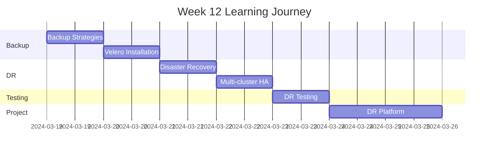

# Week 12 Roadmap - Disaster Recovery & Backup Strategies

**Duration:** 7 Days  
**Focus:** Backup & Restore → Disaster Recovery → High Availability → Business Continuity  
**Goal:** Implement production-grade backup, disaster recovery, and business continuity

---

## 📊 Week Overview



---

## 🎯 Week Goals

By the end of Week 12, you will:

- ✅ Implement comprehensive backup strategies
- ✅ Master cluster backup with Velero
- ✅ Design disaster recovery plans
- ✅ Implement multi-cluster high availability
- ✅ Test disaster recovery procedures
- ✅ Build production DR platform

---

## 📅 Daily Breakdown

---

### **Day 78: Backup Strategies**

**⏰ Time:** 2-3 hours  
**📚 Theory:** 1 hour | **💻 Hands-on:** 1-2 hours

#### What You'll Learn

- Backup types (full, incremental, differential)
- What to backup in Kubernetes
- RPO and RTO concepts
- Backup strategies for stateful apps
- etcd backup and restore
- PersistentVolume backup
- Application-level backups
- Backup testing importance

#### What You'll Do

- Backup etcd manually
- Restore etcd from backup
- Test etcd recovery
- Backup PersistentVolumes
- Implement database backup strategy
- Document backup procedures
- Calculate RPO/RTO for workloads
- Create backup schedule
- Test backup restoration

#### Files You'll Create

```
day-78/
├── etcd-backup/
├── pv-backup/
├── database-backup/
├── backup-schedule/
└── backup-strategies-notes.md
```

#### Key Takeaways

- Backups are essential for production
- Test restores regularly
- Define RPO/RTO per workload
- Automate everything

---

### **Day 79: Velero - Cluster Backup Tool**

**⏰ Time:** 2-3 hours  
**📚 Theory:** 1 hour | **💻 Hands-on:** 1-2 hours

#### What You'll Learn

- Velero architecture
- Velero installation and configuration
- Backup locations (S3, GCS, Azure)
- Backup schedules
- Restore operations
- Backup hooks (pre/post)
- Resource filtering
- Volume snapshots

#### What You'll Do

- Install Velero
- Configure backup storage (S3/MinIO)
- Create first backup
- Schedule automatic backups
- Restore from backup
- Backup specific namespaces
- Backup with resource filters
- Implement backup hooks
- Test volume snapshots
- Monitor backup status

#### Files You'll Create

```
day-79/
├── velero-installation/
├── backup-configs/
├── schedules/
├── restore-tests/
└── velero-notes.md
```

#### Key Takeaways

- Velero automates cluster backups
- Supports multiple storage backends
- Can backup entire cluster or namespaces
- Essential for disaster recovery

---

### **Day 80: Disaster Recovery Planning**

**⏰ Time:** 2-3 hours  
**📚 Theory:** 1.5 hours | **💻 Hands-on:** 1-1.5 hours

#### What You'll Learn

- Disaster recovery concepts
- DR strategies (cold, warm, hot)
- Multi-region deployment
- Failover procedures
- DR testing methodologies
- Business continuity planning
- Incident response
- Post-incident reviews

#### What You'll Do

- Create DR plan document
- Identify critical services
- Define RTO/RPO per service
- Design multi-region architecture
- Document failover procedures
- Create runbooks for incidents
- Plan DR drills
- Test failover scenarios
- Document lessons learned

#### Files You'll Create

```
day-80/
├── dr-plan/
├── critical-services/
├── failover-procedures/
├── runbooks/
└── dr-planning-notes.md
```

#### Key Takeaways

- DR plan is essential document
- Regular testing validates DR
- Clear procedures reduce downtime
- Document everything

---

### **Day 81: Multi-Cluster High Availability**

**⏰ Time:** 2-3 hours  
**📚 Theory:** 1 hour | **💻 Hands-on:** 1-2 hours

#### What You'll Learn

- Multi-cluster architectures
- Active-active vs active-passive
- Global load balancing
- Cross-cluster service discovery
- Data replication strategies
- Consistency vs availability tradeoffs
- Federation concepts
- Multi-cluster management tools

#### What You'll Do

- Set up second Kubernetes cluster
- Configure multi-cluster communication
- Implement global load balancer (simulated)
- Set up database replication across clusters
- Test failover between clusters
- Implement health checks
- Configure traffic routing
- Monitor multi-cluster setup
- Test split-brain scenarios

#### Files You'll Create

```
day-81/
├── multi-cluster-setup/
├── global-load-balancing/
├── replication-config/
├── failover-tests/
└── multi-cluster-notes.md
```

#### Key Takeaways

- Multi-cluster provides highest availability
- Trade-offs between consistency and availability
- Requires careful planning
- Global routing is critical

---

### **Day 82: Disaster Recovery Testing**

**⏰ Time:** 2-3 hours  
**📚 Theory:** 1 hour | **💻 Hands-on:** 1-2 hours

#### What You'll Learn

- DR testing methodologies
- Chaos engineering principles
- Failure injection
- DR drill planning
- Testing metrics and KPIs
- Post-drill analysis
- Continuous improvement
- GameDay exercises

#### What You'll Do

- Plan DR drill
- Execute cluster failure scenario
- Test backup restoration
- Test failover procedures
- Inject failures (chaos engineering)
- Measure recovery time
- Document issues found
- Update DR procedures
- Create drill report
- Schedule regular drills

#### Files You'll Create

```
day-82/
├── dr-drills/
├── chaos-tests/
├── failure-scenarios/
├── drill-reports/
└── dr-testing-notes.md
```

#### Key Takeaways

- Regular testing is mandatory
- Chaos engineering reveals weaknesses
- Document all findings
- Continuous improvement

---

### **Day 83-84: Weekend Project - Production DR Platform**

**⏰ Time:** 4-6 hours (split over 2 days)  
**💻 100% Hands-on Project**

#### Project Overview

Build a complete disaster recovery platform with automated backups, multi-cluster failover, and comprehensive recovery procedures.

**DR Platform Architecture:**

```
Primary Cluster (Region A)
├── Production applications
├── Databases (primary)
├── Continuous backups
└── Health monitoring

Secondary Cluster (Region B)
├── Standby applications
├── Databases (replica)
├── Ready for failover
└── Health monitoring

Backup Storage (Multi-region S3)
├── Cluster backups (Velero)
├── Database backups
├── Application data
└── Configuration backups

Global Load Balancer
├── Health checks
├── Automatic failover
├── Traffic routing
└── DNS management

Monitoring & Alerting
├── Cluster health
├── Backup status
├── Replication lag
└── Failover alerts
```

#### What You'll Build

**1. Multi-Cluster Setup**

- Primary cluster (production)
- Secondary cluster (DR)
- Cross-cluster networking
- Shared storage for backups

**2. Backup Strategy**

- Velero automated backups
- Database backup jobs
- Application data backups
- Configuration backups
- Backup verification
- Retention policies

**3. Replication**

- Database replication (PostgreSQL streaming)
- Redis replication
- File storage replication
- Configuration synchronization

**4. Failover Procedures**

- Automated health checks
- Manual failover process
- Automatic failover (optional)
- DNS switching
- Traffic redirection
- Rollback procedures

**5. Applications**

- E-commerce platform
- Frontend (3 replicas per cluster)
- Backend API (3 replicas per cluster)
- PostgreSQL (primary + replica)
- Redis (master + replica)

**6. Monitoring**

- Prometheus in both clusters
- Grafana dashboards
- Alertmanager
- Backup status monitoring
- Replication lag monitoring
- Health check monitoring

**7. Testing Framework**

- DR drill automation
- Chaos engineering tests
- Failover verification
- Recovery time measurement

#### Day 83 Tasks

**Morning: Infrastructure Setup (2.5 hours)**

- Set up primary cluster
- Set up secondary cluster
- Install Velero in both clusters
- Configure backup storage
- Set up monitoring stack
- Deploy applications to primary

**Afternoon: Replication & Backup (1.5 hours)**

- Configure database replication
- Set up Velero schedules
- Implement application backups
- Configure Redis replication
- Test replication
- Verify backups working

#### Day 84 Tasks

**Morning: Failover Implementation (2 hours)**

- Implement health checks
- Configure global load balancer (simulated)
- Document failover procedures
- Set up alerting
- Test manual failover
- Test DNS switching

**Afternoon: DR Testing & Documentation (2 hours)**

- Execute DR drill
- Simulate primary cluster failure
- Execute failover
- Measure recovery time
- Restore from backup
- Document findings
- Create runbooks
- Demo preparation

#### Backup Schedule

```
Cluster Backups (Velero):
- Full backup: Daily at 2 AM
- Namespace backups: Every 6 hours
- Retention: 30 days
- Storage: Multi-region S3

Database Backups:
- Full backup: Daily at 1 AM
- Incremental: Every hour
- Transaction logs: Continuous
- Retention: 90 days

Application Data:
- User uploads: Daily
- Configuration: On change
- Secrets: Encrypted daily
- Retention: 60 days
```

#### Replication Configuration

**PostgreSQL:**

```
Primary (Region A):
- Write operations
- Streaming replication
- WAL archiving

Replica (Region B):
- Read operations
- Async replication
- 5 second lag acceptable
- Promotion ready
```

**Redis:**

```
Master (Region A):
- Write operations
- AOF persistence

Replica (Region B):
- Read operations
- Async replication
- Promotion ready
```

#### Failover Procedure

```
Automated Health Check:
1. Check primary cluster API
2. Check database connectivity
3. Check application endpoints
4. If 3+ failures → Alert

Manual Failover:
1. Assess primary cluster status
2. Verify secondary cluster ready
3. Promote database replica
4. Update DNS to secondary
5. Update load balancer
6. Verify applications running
7. Monitor for 1 hour
8. Update incident log

Automatic Failover (Bonus):
1. Health check fails threshold
2. Auto-promote database
3. Auto-update DNS
4. Auto-switch load balancer
5. Send critical alerts
6. Continue monitoring
```

#### DR Drill Scenarios

**Scenario 1: Complete Cluster Loss**

```
1. Simulate primary cluster failure
2. Execute failover procedure
3. Restore latest backup to secondary
4. Promote secondary to primary
5. Measure total recovery time
6. Verify all services operational
```

**Scenario 2: Database Corruption**

```
1. Simulate database corruption
2. Stop replication
3. Restore from backup
4. Verify data integrity
5. Resume replication
6. Measure recovery time
```

**Scenario 3: Regional Outage**

```
1. Simulate region A outage
2. Automatic failover to region B
3. All traffic to secondary cluster
4. Services continue running
5. Measure failover time
6. Plan primary recovery
```

**Scenario 4: Partial Service Failure**

```
1. One service fails (API)
2. Other services continue
3. Restore API from backup
4. Or failover API only
5. Minimal impact to users
```

#### Monitoring Dashboards

**DR Dashboard:**

```
Panels:
- Primary cluster health
- Secondary cluster health
- Replication lag
- Backup status (last successful)
- Time since last backup
- Backup size trends
- Failover readiness score
- Recovery time objective (RTO) tracking
```

**Backup Dashboard:**

```
Panels:
- Scheduled backups status
- Failed backups (last 24h)
- Backup duration trends
- Storage usage
- Retention compliance
- Restore test results
```

**Replication Dashboard:**

```
Panels:
- Database replication lag
- Redis replication lag
- Replication errors
- Data sync status
- Replication throughput
```

#### Testing Checklist

```
Backup Tests:
- [ ] Velero backup completes successfully
- [ ] Database backup completes
- [ ] Application data backed up
- [ ] Backups stored in S3
- [ ] Retention policy works
- [ ] Can list all backups

Restore Tests:
- [ ] Restore cluster from Velero backup
- [ ] Restore database from backup
- [ ] Restore application data
- [ ] All data integrity verified
- [ ] Applications work after restore

Replication Tests:
- [ ] Database replication working
- [ ] Replication lag < 5 seconds
- [ ] Redis replication working
- [ ] Data consistency verified
- [ ] Can promote replica

Failover Tests:
- [ ] Manual failover works
- [ ] DNS updated correctly
- [ ] Load balancer switches
- [ ] Applications accessible
- [ ] No data loss
- [ ] RTO < 15 minutes

Monitoring Tests:
- [ ] Alerts fire on backup failure
- [ ] Alerts fire on replication lag
- [ ] Dashboards show correct data
- [ ] Health checks working
- [ ] Incident response triggered
```

#### Recovery Time Objectives (RTO)

**Critical Services:**

- Frontend: RTO 5 minutes
- API: RTO 5 minutes
- Database: RTO 10 minutes
- Overall platform: RTO 15 minutes

**Non-Critical Services:**

- Logging: RTO 30 minutes
- Monitoring: RTO 30 minutes
- Analytics: RTO 1 hour

#### Recovery Point Objectives (RPO)

**Critical Data:**

- Transactions: RPO 0 (no data loss)
- User data: RPO 5 minutes
- Application state: RPO 15 minutes

**Non-Critical Data:**

- Logs: RPO 1 hour
- Analytics: RPO 24 hours

#### Deliverables

- [ ] Multi-cluster DR setup
- [ ] Velero backups automated
- [ ] Database replication working
- [ ] Failover procedures documented
- [ ] DR drills executed
- [ ] Monitoring dashboards
- [ ] Alerting configured
- [ ] Runbooks created
- [ ] RTO/RPO documented
- [ ] DR plan document

#### Success Criteria

- Backups running automatically
- Can restore from backup successfully
- Replication lag < 5 seconds
- Manual failover works in < 15 minutes
- Zero data loss in failover
- All applications accessible after failover
- Monitoring shows real-time status
- Alerts fire correctly
- DR drill successful
- Documentation complete

#### Bonus Challenges

- [ ] Implement automatic failover
- [ ] Add more regions (3+ clusters)
- [ ] Implement chaos engineering platform
- [ ] Add cost optimization for DR
- [ ] Implement compliance reporting
- [ ] Add backup encryption
- [ ] Implement backup deduplication
- [ ] Create self-service DR testing

---

## 📊 Week 12 Progress Tracker

### Daily Completion

| Day   | Topic             | Theory | Hands-on | Notes | Status |
| ----- | ----------------- | ------ | -------- | ----- | ------ |
| 78    | Backup Strategies | ☐      | ☐        | ☐     | ⏳     |
| 79    | Velero            | ☐      | ☐        | ☐     | ⏳     |
| 80    | DR Planning       | ☐      | ☐        | ☐     | ⏳     |
| 81    | Multi-cluster HA  | ☐      | ☐        | ☐     | ⏳     |
| 82    | DR Testing        | ☐      | ☐        | ☐     | ⏳     |
| 83-84 | DR Platform       | N/A    | ☐        | ☐     | ⏳     |

### Skills Acquired

#### Backup & Recovery

- [ ] Implement backup strategies
- [ ] Use Velero for cluster backups
- [ ] Restore from backups
- [ ] Test recovery procedures
- [ ] Automate backups

#### Disaster Recovery

- [ ] Create DR plans
- [ ] Implement failover
- [ ] Multi-cluster HA
- [ ] Execute DR drills
- [ ] Measure RTO/RPO

#### Business Continuity

- [ ] Risk assessment
- [ ] Continuity planning
- [ ] Incident response
- [ ] Post-incident reviews
- [ ] Continuous improvement

---

## 📁 Expected Folder Structure

```
week-12/
├── week-12-roadmap.md
├── day-78/
├── day-79/
├── day-80/
├── day-81/
├── day-82/
├── day-83/
└── day-84/

projects/
└── project-12-dr-platform/
    ├── clusters/
    ├── backups/
    ├── replication/
    ├── monitoring/
    ├── runbooks/
    └── docs/
```

---

## 🎯 Week 12 Learning Outcomes

By the end of Week 12, you will:

### Backup Mastery

✅ Implement backup strategies  
✅ Automate cluster backups  
✅ Test restore procedures  
✅ Define RPO/RTO  
✅ Backup verification

### Disaster Recovery

✅ Create DR plans  
✅ Implement failover  
✅ Multi-cluster setup  
✅ Execute DR drills  
✅ Incident response

### High Availability

✅ Multi-region deployment  
✅ Database replication  
✅ Global load balancing  
✅ Health monitoring  
✅ Business continuity

---

## 💡 Week 12 Themes

**Backup:**

- Automate everything
- Test regularly
- Verify restores

**Disaster Recovery:**

- Plan for failure
- Practice procedures
- Measure metrics

**High Availability:**

- Multiple regions
- Automatic failover
- Zero downtime

---

**Week Start Date:** ****\_\_\_****  
**Week End Date:** ****\_\_\_****  
**Status:** ⏳ In Progress | ✅ Completed  
**Confidence Level:** ⭐⭐⭐⭐⭐ (5/5 stars - DR Expert!)
