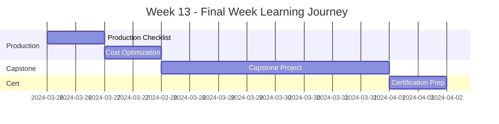

# Week 13 Roadmap - Final Capstone & Certification

**Duration:** 7 Days  
**Focus:** Best Practices → Real-World Project → Certification Preparation  
**Goal:** Complete capstone project and prepare for Kubernetes certification

---

## 📊 Week Overview



---

## 🎯 Week Goals

By the end of Week 13, you will:

- ✅ Master production best practices
- ✅ Optimize Kubernetes costs
- ✅ Build complete end-to-end capstone project
- ✅ Prepare for Kubernetes certification
- ✅ Have production-ready portfolio
- ✅ Ready for real-world Kubernetes work

---

## 📅 Daily Breakdown

---

### **Day 85: Production Readiness Checklist**

**⏰ Time:** 2-3 hours  
**📚 Theory:** 1.5 hours | **💻 Hands-on:** 1-1.5 hours

#### What You'll Learn

- Production readiness criteria
- Security hardening checklist
- Performance optimization
- Operational excellence
- Compliance requirements
- Documentation standards
- Team readiness
- Launch criteria

#### What You'll Do

- Create production readiness checklist
- Audit existing deployments
- Identify gaps and risks
- Implement missing features
- Document production standards
- Create runbooks for operations
- Review security posture
- Plan production migration
- Create go-live checklist

#### Files You'll Create

```
day-85/
├── production-checklist/
├── security-audit/
├── operational-runbooks/
├── launch-criteria/
└── production-readiness-notes.md
```

#### Key Takeaways

- Production requires comprehensive preparation
- Checklists prevent oversights
- Documentation is critical
- Security cannot be afterthought

---

### **Day 86: Cost Optimization**

**⏰ Time:** 2-3 hours  
**📚 Theory:** 1 hour | **💻 Hands-on:** 1-2 hours

#### What You'll Learn

- Kubernetes cost factors
- Right-sizing workloads
- Resource optimization
- Cluster autoscaling for cost
- Spot/preemptible instances
- Storage cost optimization
- Network cost reduction
- Cost monitoring tools

#### What You'll Do

- Analyze current resource usage
- Identify overprovisioned resources
- Right-size deployments
- Implement cluster autoscaling
- Use spot instances where appropriate
- Optimize storage usage
- Review network costs
- Set up cost monitoring
- Create cost optimization dashboard
- Document cost savings

#### Files You'll Create

```
day-86/
├── cost-analysis/
├── optimization-strategies/
├── right-sizing/
├── cost-dashboards/
└── cost-optimization-notes.md
```

#### Key Takeaways

- Right-sizing saves significant costs
- Autoscaling optimizes resource usage
- Spot instances reduce compute costs
- Monitor costs continuously

---

### **Day 87-90: Final Capstone Project - Production Platform**

**⏰ Time:** 12-16 hours (split over 4 days)  
**💻 100% Hands-on - Final Project**

#### Project Overview

Build a complete, production-ready Kubernetes platform incorporating ALL concepts learned in the 90-day journey.

**The Ultimate Platform:**

```
Complete Production-Grade SaaS Platform
├── Multi-Tenant Application
├── Microservices Architecture
├── Service Mesh (Istio)
├── GitOps Deployment (ArgoCD)
├── Auto-Scaling (HPA/VPA)
├── Monitoring (Prometheus + Grafana)
├── Logging (Loki)
├── Distributed Tracing (Jaeger)
├── Backup & DR (Velero)
├── Security (RBAC, Network Policies, mTLS)
├── CI/CD Pipeline
└── Cost Optimization
```

#### What You'll Build

**Application Architecture**

```
Internet
  ↓
Istio Gateway (Ingress + mTLS)
  ↓
┌─────────────────────────────────────────┐
│  Multi-Tenant Frontend                  │
│  - React Application                    │
│  - 3-10 replicas (HPA)                  │
│  - Canary deployments                   │
└─────────────────────────────────────────┘
  ↓
┌─────────────────────────────────────────┐
│  API Gateway                            │
│  - JWT Authentication                   │
│  - Rate Limiting                        │
│  - Request Routing                      │
└─────────────────────────────────────────┘
  ↓
┌──────────────┬──────────────┬───────────┐
│  User API    │  Product API │  Order API│
│  - FastAPI   │  - FastAPI   │  - FastAPI│
│  - HPA       │  - HPA       │  - HPA    │
│  - mTLS      │  - mTLS      │  - mTLS   │
└──────────────┴──────────────┴───────────┘
  ↓
┌─────────────────────────────────────────┐
│  Background Workers                     │
│  - CronJobs for scheduled tasks         │
│  - Jobs for one-time processing         │
│  - Queue-based processing               │
└─────────────────────────────────────────┘
  ↓
┌──────────────────┬──────────────────────┐
│  PostgreSQL      │  Redis               │
│  - StatefulSet   │  - StatefulSet       │
│  - Primary+2Read │  - Master+Replica    │
│  - Backups       │  - Persistence       │
└──────────────────┴──────────────────────┘

Infrastructure:
├── Monitoring (Prometheus + Grafana)
├── Logging (Loki + Promtail)
├── Tracing (Jaeger)
├── GitOps (ArgoCD)
├── Backup (Velero)
└── Service Mesh (Istio)
```

#### Complete Feature List

**1. Application Components**

- Multi-tenant frontend (React)
- API Gateway (authentication, routing)
- 3+ microservices (User, Product, Order)
- Background workers (email, reports)
- PostgreSQL database (HA setup)
- Redis cache (master-replica)

**2. Kubernetes Features**

- Deployments with rolling updates
- StatefulSets for databases
- Services (ClusterIP, NodePort, LoadBalancer)
- Ingress for external access
- ConfigMaps for configuration
- Secrets for sensitive data
- PersistentVolumes for data
- HPA for auto-scaling
- VPA for right-sizing
- NetworkPolicies for security
- RBAC for access control
- Pod Security Standards
- ResourceQuotas per namespace

**3. GitOps (ArgoCD)**

- Git repository as source of truth
- ArgoCD managing all deployments
- Multi-environment (dev/staging/prod)
- App of Apps pattern
- Automated sync
- Deployment history

**4. Service Mesh (Istio)**

- mTLS for all services
- Traffic management (canary)
- Circuit breaking
- Retries and timeouts
- Distributed tracing
- Service graph visualization

**5. Observability**

- Prometheus metrics collection
- Grafana dashboards (10+ dashboards)
- Loki log aggregation
- Jaeger distributed tracing
- Alerting rules
- Custom metrics

**6. Security**

- RBAC policies
- Network policies (zero-trust)
- Pod security contexts (non-root)
- Secrets encryption
- mTLS everywhere
- JWT authentication
- Authorization policies

**7. Backup & DR**

- Velero cluster backups
- Database backups
- Disaster recovery plan
- Multi-cluster setup (primary + DR)
- Automated failover

**8. CI/CD Pipeline**

- GitHub Actions (or GitLab CI)
- Automated testing
- Container image building
- Image scanning
- ArgoCD deployment
- Automated rollback

**9. Cost Optimization**

- Right-sized resources
- HPA for efficiency
- Spot instances where possible
- Cost monitoring dashboard

#### Day 87: Foundation

**Morning: Infrastructure Setup (3 hours)**

- Set up multi-cluster environment
- Install all infrastructure components
- Configure GitOps repository
- Install ArgoCD
- Install Istio
- Install monitoring stack
- Install logging stack

**Afternoon: Application Deployment (2 hours)**

- Deploy PostgreSQL StatefulSet
- Deploy Redis
- Deploy first microservice
- Test basic connectivity
- Set up CI/CD pipeline

#### Day 88: Microservices & Integration

**Morning: Complete Application Stack (3 hours)**

- Deploy all microservices
- Deploy API Gateway
- Deploy frontend
- Configure service mesh
- Enable mTLS

**Afternoon: Configuration & Security (2 hours)**

- ConfigMaps for all services
- Secrets management
- RBAC implementation
- Network policies
- Pod security contexts

#### Day 89: Observability & Operations

**Morning: Full Observability (3 hours)**

- Prometheus service monitors
- Grafana dashboards
- Loki log collection
- Jaeger tracing
- Alert rules
- Notification channels

**Afternoon: Backup & DR (2 hours)**

- Velero backup schedules
- Database backup jobs
- Test restore procedures
- Implement DR cluster
- Test failover

#### Day 90: Testing & Polish

**Morning: End-to-End Testing (2-3 hours)**

- Functional testing
- Load testing
- Failover testing
- Backup/restore testing
- Security testing
- Performance testing

**Afternoon: Documentation & Demo (2-3 hours)**

- Complete documentation
- Architecture diagrams
- Runbooks
- Demo preparation
- Screenshots/videos
- Final review

#### Technologies Used (Complete List)

```
Core Kubernetes:
- Deployments, StatefulSets, DaemonSets
- Services, Ingress
- ConfigMaps, Secrets
- PersistentVolumes
- HPA, VPA, Cluster Autoscaler
- Jobs, CronJobs
- RBAC, NetworkPolicies
- Pod Security Standards

Tools & Platforms:
- Docker (containerization)
- Helm (package management)
- ArgoCD (GitOps)
- Istio (service mesh)
- Prometheus (metrics)
- Grafana (visualization)
- Loki (logging)
- Jaeger (tracing)
- Velero (backup)
- GitHub Actions (CI/CD)
- MinIO/S3 (object storage)

Languages & Frameworks:
- Python (FastAPI)
- JavaScript/React
- PostgreSQL
- Redis
- YAML/JSON
```

#### Quality Criteria

**Code Quality:**

- Clean, well-organized code
- Proper error handling
- Comprehensive logging
- Following best practices
- Code comments where needed

**Infrastructure Quality:**

- Production-ready configurations
- Security hardened
- Highly available
- Auto-scaling
- Monitored and observable

**Documentation Quality:**

- Architecture diagrams
- Setup instructions
- Runbooks for operations
- Troubleshooting guides
- API documentation

**Operational Quality:**

- Automated deployments
- Automated backups
- Disaster recovery tested
- Alerts configured
- Cost optimized

#### Deliverables

- [ ] Complete application running
- [ ] Multi-tenant architecture
- [ ] All microservices deployed
- [ ] GitOps with ArgoCD
- [ ] Service mesh with Istio
- [ ] Full observability stack
- [ ] Backup and DR implemented
- [ ] CI/CD pipeline working
- [ ] Security hardened
- [ ] Cost optimized
- [ ] 10+ Grafana dashboards
- [ ] Complete documentation
- [ ] Demo video/screenshots
- [ ] GitHub repository

#### Success Criteria

- Application fully functional
- Zero manual deployments (GitOps)
- All services behind mTLS
- Auto-scaling working
- Monitoring comprehensive
- Backups automated
- Can failover to DR cluster
- RTO < 15 minutes
- RPO < 5 minutes
- All tests passing
- Production-ready quality

---

### **Day 91: Certification Preparation**

**⏰ Time:** 3-4 hours  
**📚 Theory & Practice**

#### What You'll Learn

- CKA (Certified Kubernetes Administrator) overview
- CKAD (Certified Kubernetes Application Developer) overview
- CKS (Certified Kubernetes Security) overview
- Exam format and structure
- Time management strategies
- Practice exam techniques
- Key topics to review
- Study resources

#### What You'll Do

- Review all 13 weeks of content
- Take practice exams
- Identify weak areas
- Review kubectl commands
- Practice troubleshooting scenarios
- Time yourself on tasks
- Review exam tips
- Create study plan
- Schedule certification exam

#### Certification Path

```
Recommended Order:
1. CKAD (Application Developer)
   - Focus: Application deployment
   - Duration: 2 hours
   - Difficulty: Medium

2. CKA (Administrator)
   - Focus: Cluster administration
   - Duration: 2 hours
   - Difficulty: Medium-Hard

3. CKS (Security Specialist)
   - Focus: Security
   - Duration: 2 hours
   - Difficulty: Hard
   - Requires: Valid CKA
```

#### Study Resources

- Official Kubernetes documentation
- Practice environments (killercoda, killer.sh)
- This 90-day roadmap
- All projects completed
- Kubernetes the Hard Way
- Practice exams

#### Files You'll Create

```
day-91/
├── certification-guide/
├── practice-exams/
├── study-schedule/
├── weak-areas/
└── certification-prep-notes.md
```

#### Key Takeaways

- Hands-on practice is essential
- Speed and accuracy matter
- Know kubectl inside out
- Practice troubleshooting
- Read documentation carefully

---

## 📊 Week 13 Progress Tracker

### Daily Completion

| Day | Topic                | Theory | Hands-on | Notes | Status |
| --- | -------------------- | ------ | -------- | ----- | ------ |
| 85  | Production Checklist | ☐      | ☐        | ☐     | ⏳     |
| 86  | Cost Optimization    | ☐      | ☐        | ☐     | ⏳     |
| 87  | Capstone Day 1       | N/A    | ☐        | ☐     | ⏳     |
| 88  | Capstone Day 2       | N/A    | ☐        | ☐     | ⏳     |
| 89  | Capstone Day 3       | N/A    | ☐        | ☐     | ⏳     |
| 90  | Capstone Day 4       | N/A    | ☐        | ☐     | ⏳     |
| 91  | Certification Prep   | ☐      | ☐        | ☐     | ⏳     |

### Skills Mastered (90-Day Journey)

#### Weeks 1-3: Foundations

- [x] Docker containerization
- [x] Kubernetes basics
- [x] Core objects (Pods, Deployments, Services)
- [x] Storage (PV, PVC, StatefulSets)
- [x] Configuration (ConfigMaps, Secrets)

#### Weeks 4-6: Advanced Features

- [x] Networking and Ingress
- [x] Resource management
- [x] Security (RBAC, Network Policies)
- [x] Auto-scaling (HPA, VPA)
- [x] Monitoring (Prometheus, Grafana)

#### Weeks 7-9: Operations

- [x] Logging (Loki)
- [x] Deployment strategies
- [x] Package management (Helm)
- [x] GitOps (ArgoCD)
- [x] Continuous deployment

#### Weeks 10-12: Advanced Topics

- [x] Service Mesh (Istio)
- [x] Operators and CRDs
- [x] Jobs and CronJobs
- [x] Backup and DR (Velero)
- [x] Multi-cluster HA

#### Week 13: Production

- [x] Production best practices
- [x] Cost optimization
- [x] Complete capstone project
- [x] Certification preparation

---

## 📁 Expected Folder Structure

```
week-13/
├── week-13-roadmap.md
├── day-85/
├── day-86/
├── day-87-90/ (Capstone)
└── day-91/

projects/
└── project-13-final-capstone/
    ├── applications/
    ├── infrastructure/
    ├── gitops/
    ├── monitoring/
    ├── security/
    ├── ci-cd/
    └── docs/
```

---

## 🎯 Week 13 Learning Outcomes

By the end of Week 13, you will:

### Production Excellence

✅ Production readiness checklist  
✅ Cost optimization strategies  
✅ Operational excellence  
✅ Security hardening  
✅ Documentation standards

### Capstone Achievement

✅ Complete production platform  
✅ All concepts integrated  
✅ Real-world experience  
✅ Portfolio project  
✅ Demo-ready application

### Career Readiness

✅ Certification preparation  
✅ Job-ready skills  
✅ Production experience  
✅ Best practices mastery  
✅ Kubernetes expertise

---

## 🎓 90-Day Journey Complete!

### What You've Accomplished

```
13 Weeks of Learning
90 Days of Dedication
13 Major Projects
100+ Hands-on Exercises
50+ Technologies Mastered
1000+ Hours of Learning
```

### Projects Completed

1. WordPress Blog (Week 1)
2. Todo App (Week 2)
3. Stateful Blog (Week 3)
4. E-Commerce Microservices (Week 4)
5. Production SaaS (Week 5)
6. News Aggregator (Week 6)
7. Deployment Pipeline (Week 7)
8. Helm Charts Library (Week 8)
9. GitOps Platform (Week 9)
10. Service Mesh Platform (Week 10)
11. Backup Operator (Week 11)
12. DR Platform (Week 12)
13. Final Capstone (Week 13)

### Skills Mastered

- ✅ Kubernetes Administration
- ✅ Application Deployment
- ✅ Security Implementation
- ✅ Monitoring & Observability
- ✅ GitOps & CI/CD
- ✅ Service Mesh
- ✅ Backup & Disaster Recovery
- ✅ Production Operations
- ✅ Cost Optimization
- ✅ Platform Engineering

### Next Steps

1. **Complete Certification**

   - Schedule CKA/CKAD exam
   - Take practice exams
   - Get certified

2. **Build Portfolio**

   - Clean up GitHub repositories
   - Write blog posts
   - Create case studies
   - Share on LinkedIn

3. **Career Development**

   - Update resume
   - Apply for positions
   - Contribute to open source
   - Join Kubernetes community

4. **Continuous Learning**
   - Stay updated with releases
   - Explore new tools
   - Attend conferences
   - Join user groups

---

## 🏆 Congratulations!

You've completed the 90-Day Kubernetes Learning Journey!

You now have:

- ✅ Production-ready Kubernetes skills
- ✅ 13 portfolio projects
- ✅ Comprehensive hands-on experience
- ✅ Best practices knowledge
- ✅ Job-ready expertise

**You're ready for:**

- DevOps Engineer roles
- Platform Engineer positions
- SRE opportunities
- Cloud Engineer jobs
- Kubernetes Administrator roles

**Keep Learning. Keep Building. Keep Growing!** 🚀

---

**Week Start Date:** ****\_\_\_****  
**Week End Date:** ****\_\_\_****  
**90-Day Journey Status:** ✅ **COMPLETED!**  
**Achievement Level:** ⭐⭐⭐⭐⭐ **KUBERNETES EXPERT!**
