# **Single Neuron = Linear Regression without Activation**

---

## Table of Contents

1. [Single Neuron and Linear Regression](#single-neuron--linear-regression-without-activation)
2. [The Perceptron Problem](#the-perceptron-problem)
3. [Why This is Bad](#why-this-is-bad)
4. [Enter the Sigmoid Function](#enter-the-sigmoid-function)
5. [Why Sigmoid = Logistic Regression](#why-sigmoid--logistic-regression)
6. [Simple Neural Network Graph](#simple-neural-network-graph)
7. [Activation Functions](#activation-functions-the-heart-of-neural-networks)
8. [ReLU Activation Function](#relu-activation-function)
9. [Deep Neural Network Architecture](#deep-neural-network-architecture)
10. [Supervised Learning with Neural Networks](#supervised-learning-with-neural-networks)
11. [Why is Deep Learning Taking Off?](#why-is-deep-learning-taking-off)

---

# **Single Neuron = Linear Regression without Activation**

Think of a neuron as a simple mathematical function that:

1. Takes inputs (like features: house size, number of rooms, location score)
2. Multiplies each input by a weight (importance of each feature)
3. Adds them up with a bias term
4. Produces an output

**Mathematical form:** `output = W^T * X + b`

- This is exactly what linear regression does!

## **The Perceptron Problem**

### What a Perceptron Does:

```
If (W^T * X + b) >= threshold → output = 1
If (W^T * X + b) < threshold → output = 0
```

### The Issue - Sudden Jumps:

Imagine you're predicting if a house will sell (1) or not (0):

- House A: Score = 0.49 → Output = 0 (won't sell)
- House B: Score = 0.51 → Output = 1 (will sell)

**Problem:** A tiny change in score (0.02) causes a huge jump in prediction (0 to 1)!

## **Why This is Bad**

Let's say you have a model predicting email spam:

- **Perceptron scenario:**
  - Email score = 4.9 → "Not spam" (0)
  - You slightly adjust weights...
  - Email score = 5.1 → "Definitely spam" (1)

This sudden flip doesn't make sense! A tiny change shouldn't cause such dramatic decisions.

## **Enter the Sigmoid Function**

The sigmoid function `σ(z) = 1/(1 + e^(-z))` solves this:

### Instead of sudden jumps:

- **Input: 4.9** → Sigmoid output: **≈ 0.993** (99.3% likely spam)
- **Input: 5.1** → Sigmoid output: **≈ 0.994** (99.4% likely spam)

### Better example showing gradual change:

- **Input: 0** → Sigmoid: **0.5** (50% probability)
- **Input: 1** → Sigmoid: **≈ 0.73** (73% probability)
- **Input: 2** → Sigmoid: **≈ 0.88** (88% probability)

## **Visual Understanding**

**Perceptron (Step Function):**

```
Output
  1 |     ┌─────────
    |     │
    |     │
  0 |─────┘
    └─────────────→ Input
        threshold
```

**Sigmoid Function:**

```
Output
  1 |       ╭─────
    |      ╱
  0.5|     ╱
    |    ╱
  0 |───╱
    └─────────────→ Input
```

## **Why Sigmoid = Logistic Regression**

When you use sigmoid activation:

- Output is between 0 and 1 ✓
- Can be interpreted as probability ✓
- Smooth, continuous function ✓
- Perfect for binary classification ✓

**This is exactly what logistic regression does!**

## **Key Takeaway**

- **Perceptron:** Hard decisions (0 or 1), sensitive to small changes
- **Sigmoid:** Soft probabilities (0 to 1), smooth transitions
- **Result:** More stable, interpretable, and trainable models

---

Let me explain each concept with clear diagrams and explanations:

## **Simple Neural Network Graph**

### first diagram of Neural network

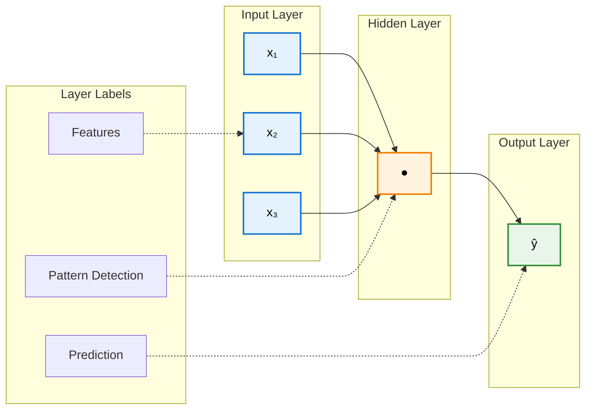
```mermaid
%%{init: {"theme": "default", "themeVariables": {"primaryColor": "#1f2937", "edgeLabelBackground":"#f9fafb", "primaryTextColor":"#ffffff", "fontSize": 14}}}%%
graph LR
  subgraph "Input Layer"
    direction TB
    X1[x₁]
    X2[x₂]
    X3[x₃]
  end

  subgraph "Hidden Layer"
    direction TB
    H1[●]
  end

  subgraph "Output Layer"
    direction TB
    Y1[ŷ]
  end

  %% Connections
  X1 --> H1
  X2 --> H1
  X3 --> H1
  H1 --> Y1

  %% Labels below each layer
  subgraph "Layer Labels"
    direction LR
    L1[Features]
    L2[Pattern Detection]
    L3[Prediction]
  end

  %% Position labels under respective layers
  L1 -.-> X2
  L2 -.-> H1
  L3 -.-> Y1

  %% Styling
  classDef inputLayer fill:#e3f2fd,stroke:#1976d2,stroke-width:2px,color:#000
  classDef hiddenLayer fill:#fff3e0,stroke:#f57c00,stroke-width:2px,color:#000
  classDef outputLayer fill:#e8f5e8,stroke:#388e3c,stroke-width:2px,color:#000

  class X1,X2,X3 inputLayer
  class H1 hiddenLayer
  class Y1 outputLayer

```

### second diagram of Neural network

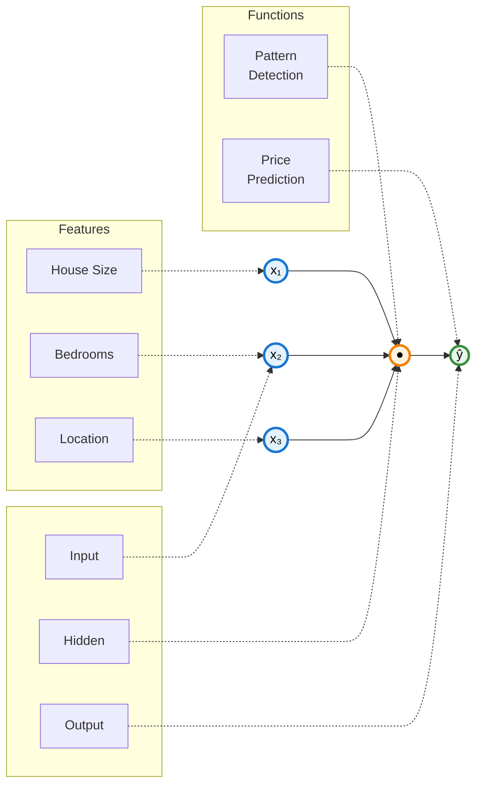
```mermaid
%%{init: {"theme": "default", "themeVariables": {"primaryColor": "#1f2937", "edgeLabelBackground":"#f9fafb", "primaryTextColor":"#000000", "fontSize": 16}}}%%
graph LR
  %% Input Layer Nodes
  I1((x₁))
  I2((x₂))
  I3((x₃))

  %% Hidden Layer Node
  H1((●))

  %% Output Layer Node
  O1((ŷ))

  %% All connections from inputs to hidden
  I1 --> H1
  I2 --> H1
  I3 --> H1

  %% Connection from hidden to output
  H1 --> O1

  %% Layer Labels positioned above
  subgraph " "
    direction TB
    IL[Input]
    HL[Hidden]
    OL[Output]
  end

  %% Position labels above respective columns
  IL -.-> I2
  HL -.-> H1
  OL -.-> O1

  %% Feature labels below input layer
  subgraph "Features"
    direction TB
    F1[House Size]
    F2[Bedrooms]
    F3[Location]
  end

  %% Function labels below other layers
  subgraph "Functions"
    direction TB
    P1[Pattern<br/>Detection]
    P2[Price<br/>Prediction]
  end

  %% Connect feature labels to inputs
  F1 -.-> I1
  F2 -.-> I2
  F3 -.-> I3

  %% Connect function labels
  P1 -.-> H1
  P2 -.-> O1

  %% Styling for circular nodes
  classDef inputStyle fill:#e3f2fd,stroke:#1976d2,stroke-width:3px,color:#000
  classDef hiddenStyle fill:#fff3e0,stroke:#f57c00,stroke-width:3px,color:#000
  classDef outputStyle fill:#e8f5e8,stroke:#388e3c,stroke-width:3px,color:#000

  class I1,I2,I3 inputStyle
  class H1 hiddenStyle
  class O1 outputStyle
```

### **What Each Layer Does:**

#### **1. Input Layer (Features)**

- **x₁, x₂, x₃**: Raw data features
- **Examples:**
  - House prediction: `x₁=size, x₂=bedrooms, x₃=location`
  - Email spam: `x₁=keyword_count, x₂=sender_reputation, x₃=link_count`
  - Image recognition: `x₁=pixel₁, x₂=pixel₂, x₃=pixel₃`

#### **2. Hidden Layer (Pattern Detection)**

The hidden node performs two operations:

**Step 1: Linear Combination**

```
z = w₁x₁ + w₂x₂ + w₃x₃ + b

```

**Step 2: Activation Function**

```
a = activation(z)

```

**What it learns:** The hidden node automatically discovers useful patterns like:

- "Large house + many bedrooms + good location = luxury property"
- "Many spam keywords + unknown sender + lots of links = likely spam"
- "Specific pixel patterns = edge detection"

#### **3. Output Layer (Prediction)**

Takes the pattern from hidden layer and makes final prediction:

```
ŷ = w₄ × a + b₂

```

### **Mathematical Flow Example:**

Let's trace through a house price prediction:

```
Input: House with 2000 sq ft, 3 bedrooms, good location
x₁ = 2000, x₂ = 3, x₃ = 0.8

Hidden Layer Computation:
z = (0.5 × 2000) + (0.3 × 3) + (0.7 × 0.8) + 0.1
z = 1000 + 0.9 + 0.56 + 0.1 = 1001.56

a = ReLU(1001.56) = 1001.56

Output Layer:
ŷ = 0.2 × 1001.56 + 50 = 250.31
Prediction: $250,310

```

### **Key Insights:**

1.  **Automatic Feature Engineering**: The hidden layer learns which combination of inputs matter most
2.  **Non-linear Relationships**: Activation functions allow the network to learn complex patterns
3.  **End-to-End Learning**: The entire network learns from input to output simultaneously

### **Simple vs Complex Networks:**

```
Simple NN (3 → 1 → 1):
Limited pattern detection

vs.

Deep NN (3 → 5 → 4 → 2 → 1):
Hierarchical pattern learning

```

### **Why This Architecture Works:**

- **Universal Approximation**: Even simple networks can approximate complex functions
- **Efficient Computation**: Matrix operations make it fast
- **Scalable**: Easy to add more layers or nodes for complex problems

This simple 3-input, 1-hidden-node, 1-output network is the building block for understanding all neural networks. Every deep learning model is essentially a scaled-up version of this basic architecture!

**Next Concept**: Now that we understand the basic structure, we can explore how ReLU activation makes these networks train faster and why deeper networks can learn more complex patterns.

---

## **Activation Functions: The Heart of Neural Networks**

### **What is an Activation Function?**

An activation function is a mathematical function applied to the output of each neuron that determines whether the neuron should be "activated" (fire) or not.

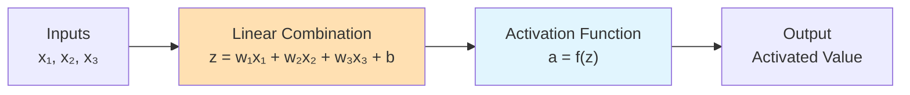
```mermaid
%%{init: {"theme": "default", "themeVariables": {"primaryColor": "#1f2937", "edgeLabelBackground":"#f9fafb", "primaryTextColor":"#000000", "fontSize": 14}}}%%
graph LR
  A["Inputs<br/>x₁, x₂, x₃"] --> B["Linear Combination<br/>z = w₁x₁ + w₂x₂ + w₃x₃ + b"]
  B --> C["Activation Function<br/>a = f(z)"]
  C --> D["Output<br/>Activated Value"]

  style B fill:#ffe0b2
  style C fill:#e1f5fe

```

### **The Mathematical Process:**

**Step 1: Linear Combination**

```
z = w₁x₁ + w₂x₂ + w₃x₃ + b

```

**Step 2: Apply Activation Function**

```
a = activation_function(z)

```

### **Why Do We Need Activation Functions?**

#### **1. Without Activation Functions (Linear Only):**

```
Layer 1: z₁ = W₁X + b₁
Layer 2: z₂ = W₂z₁ + b₂ = W₂(W₁X + b₁) + b₂
Layer 3: z₃ = W₃z₂ + b₃ = W₃(W₂(W₁X + b₁) + b₂) + b₃

Result: z₃ = (W₃W₂W₁)X + (combined bias terms)

```

**Problem:** No matter how many layers you add, you just get a linear function!

- **3 layers = 1 layer** (mathematically equivalent)
- **Cannot learn complex patterns** like XOR, image recognition, etc.

#### **2. With Activation Functions (Non-linear):**

```
Layer 1: a₁ = σ(W₁X + b₁)
Layer 2: a₂ = σ(W₂a₁ + b₂)
Layer 3: a₃ = σ(W₃a₂ + b₃)

Result: Complex non-linear function capable of learning any pattern!

```

### **Common Activation Functions:**

#### **1. Sigmoid Function**

```
σ(z) = 1 / (1 + e^(-z))

```

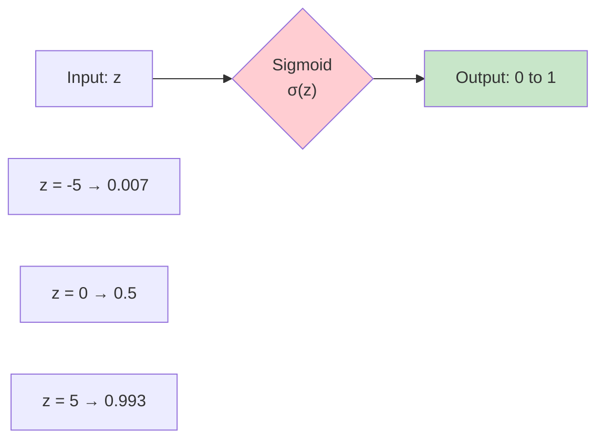
```mermaid
%%{init: {"theme": "default", "themeVariables": {"primaryColor": "#1f2937", "edgeLabelBackground":"#f9fafb", "primaryTextColor":"#000000", "fontSize": 12}}}%%
graph LR
  A["Input: z"] --> B{"Sigmoid<br/>σ(z)"}
  B --> C["Output: 0 to 1"]

  D["z = -5 → 0.007"]
  E["z = 0 → 0.5"]
  F["z = 5 → 0.993"]

  style B fill:#ffcdd2
  style C fill:#c8e6c9

```

**Properties:**

- **Range:** (0, 1) - good for probabilities
- **Smooth:** Differentiable everywhere
- **Problem:** Vanishing gradients in deep networks

#### **2. ReLU (Rectified Linear Unit)**

```
ReLU(z) = max(0, z)

```

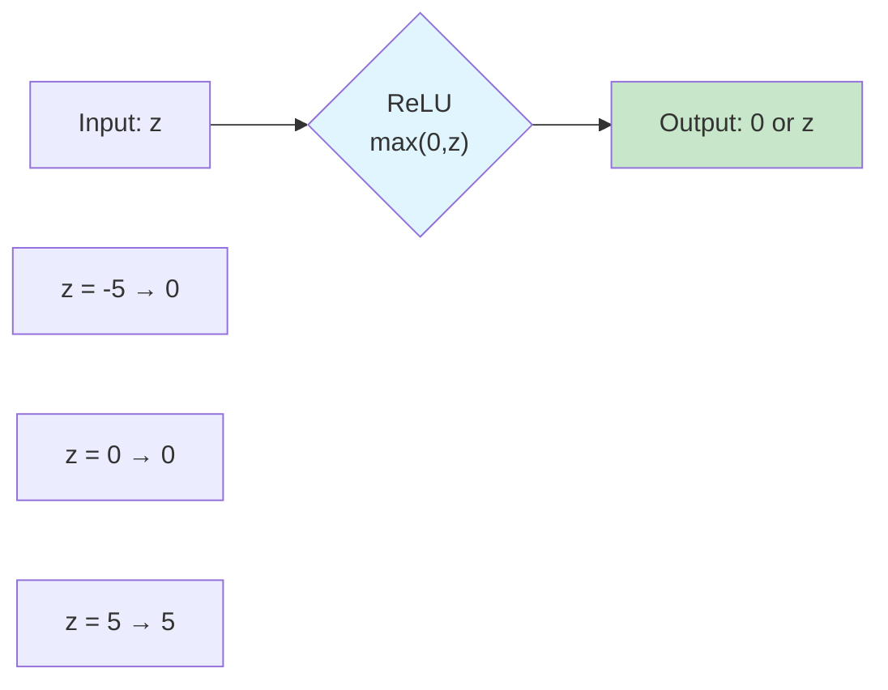
```mermaid
%%{init: {"theme": "default", "themeVariables": {"primaryColor": "#1f2937", "edgeLabelBackground":"#f9fafb", "primaryTextColor":"#000000", "fontSize": 12}}}%%
graph LR
  A["Input: z"] --> B{"ReLU<br/>max(0,z)"}
  B --> C["Output: 0 or z"]

  D["z = -5 → 0"]
  E["z = 0 → 0"]
  F["z = 5 → 5"]

  style B fill:#e1f5fe
  style C fill:#c8e6c9

```

**Properties:**

- **Range:** [0, ∞)
- **Fast computation:** Just `max(0, z)`
- **Solves vanishing gradient** for positive values
- **Most popular** in deep learning

#### **3. Tanh (Hyperbolic Tangent)**

```
tanh(z) = (e^z - e^(-z)) / (e^z + e^(-z))

```

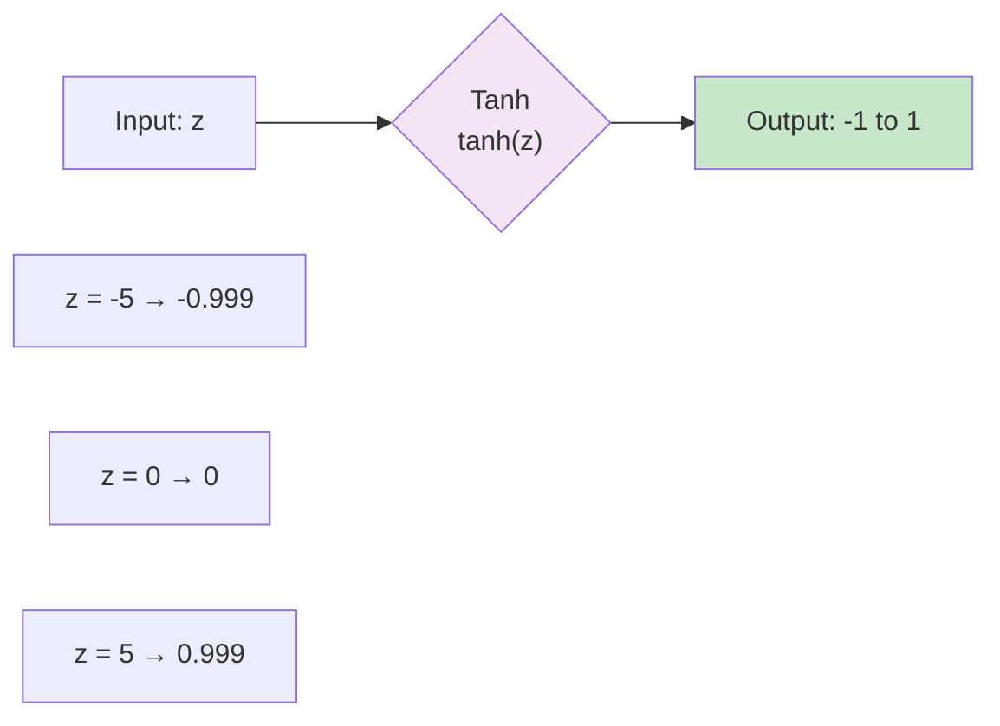
```mermaid
%%{init: {"theme": "default", "themeVariables": {"primaryColor": "#1f2937", "edgeLabelBackground":"#f9fafb", "primaryTextColor":"#000000", "fontSize": 12}}}%%
graph LR
  A["Input: z"] --> B{"Tanh<br/>tanh(z)"}
  B --> C["Output: -1 to 1"]

  D["z = -5 → -0.999"]
  E["z = 0 → 0"]
  F["z = 5 → 0.999"]

  style B fill:#f3e5f5
  style C fill:#c8e6c9
```

**Properties:**

- **Range:** (-1, 1)
- **Zero-centered:** Better than sigmoid for hidden layers
- **Still suffers** from vanishing gradients

### **Visual Comparison of All Three:**

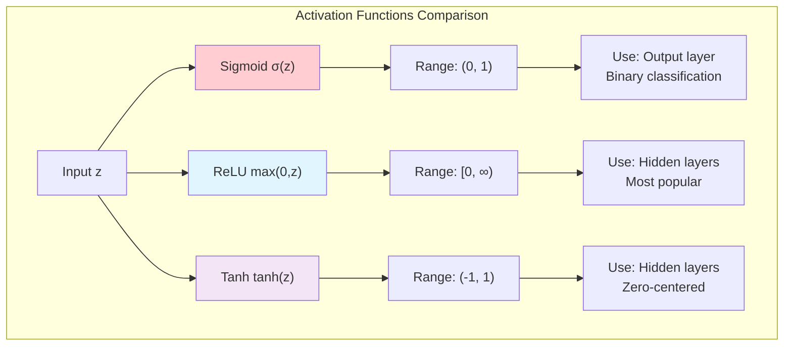
```mermaid
%%{init: {"theme": "default", "themeVariables": {"primaryColor": "#1f2937", "edgeLabelBackground":"#f9fafb", "primaryTextColor":"#000000", "fontSize": 12}}}%%
graph TD
  subgraph "Activation Functions Comparison"
    A["Input z"] --> B1["Sigmoid σ(z)"]
    A --> B2["ReLU max(0,z)"]
    A --> B3["Tanh tanh(z)"]

    B1 --> C1["Range: (0, 1)"]
    B2 --> C2["Range: [0, ∞)"]
    B3 --> C3["Range: (-1, 1)"]

    C1 --> D1["Use: Output layer<br/>Binary classification"]
    C2 --> D2["Use: Hidden layers<br/>Most popular"]
    C3 --> D3["Use: Hidden layers<br/>Zero-centered"]
  end

  style B1 fill:#ffcdd2
  style B2 fill:#e1f5fe
  style B3 fill:#f3e5f5
```

### **Role in Deep Learning:**

#### **1. Non-linearity Introduction**

```
Without: Linear → Linear → Linear = Still Linear
With: Linear → ReLU → Linear → ReLU = Complex Non-linear

```

#### **2. Feature Learning Hierarchy**

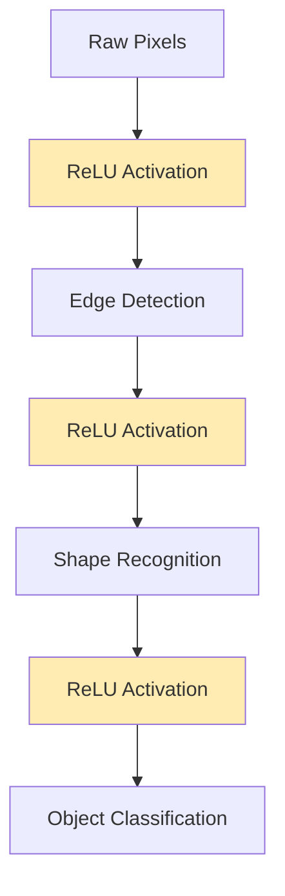
```mermaid
%%{init: {"theme": "default", "themeVariables": {"primaryColor": "#1f2937", "edgeLabelBackground":"#f9fafb", "primaryTextColor":"#000000", "fontSize": 12}}}%%
graph TD
  A[Raw Pixels] --> B[ReLU Activation]
  B --> C[Edge Detection]
  C --> D[ReLU Activation]
  D --> E[Shape Recognition]
  E --> F[ReLU Activation]
  F --> G[Object Classification]

  style B fill:#ffecb3
  style D fill:#ffecb3
  style F fill:#ffecb3

```

#### **3. Gradient Flow Control**

- **ReLU:** Allows gradients to flow freely for positive values
- **Sigmoid/Tanh:** Can cause gradients to vanish in deep networks
- **Proper activation choice** is crucial for training deep networks

### **Why ReLU Dominates Deep Learning:**

#### **1. Computational Efficiency**

```python
# ReLU: Super fast
def relu(x):
    return max(0, x)

# Sigmoid: Computationally expensive
def sigmoid(x):
    return 1 / (1 + exp(-x))

```

#### **2. Gradient Properties**

```
ReLU Gradient:
- If z > 0: gradient = 1 (perfect flow)
- If z ≤ 0: gradient = 0 (dead neuron)

Sigmoid Gradient:
- Maximum gradient = 0.25 (at z=0)
- Gradients approach 0 for large |z|

```

#### **3. Sparse Activation**

- **ReLU creates sparsity:** Many neurons output 0
- **Sparse networks** are more efficient and interpretable
- **Biological inspiration:** Real neurons either fire or don't

### **Activation Function Selection Guide:**

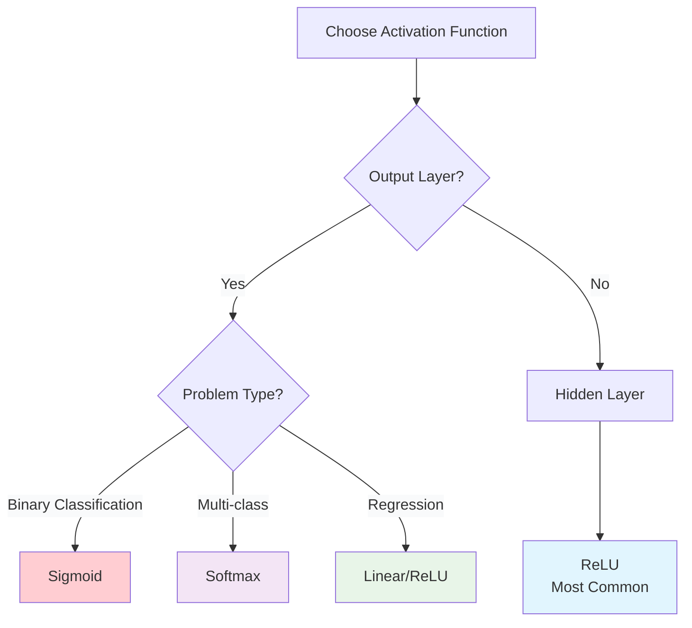
```mermaid
%%{init: {"theme": "default", "themeVariables": {"primaryColor": "#1f2937", "edgeLabelBackground":"#f9fafb", "primaryTextColor":"#000000", "fontSize": 12}}}%%
graph TD
  A[Choose Activation Function] --> B{Output Layer?}
  B -->|Yes| C{Problem Type?}
  B -->|No| D[Hidden Layer]

  C -->|Binary Classification| E[Sigmoid]
  C -->|Multi-class| F[Softmax]
  C -->|Regression| G[Linear/ReLU]

  D --> H[ReLU<br/>Most Common]

  style E fill:#ffcdd2
  style F fill:#f3e5f5
  style G fill:#e8f5e8
  style H fill:#e1f5fe

```

### **Key Takeaways:**

1.  **Activation functions enable non-linearity** - without them, neural networks are just linear regression
2.  **ReLU is the go-to choice** for hidden layers in deep networks
3.  **Output layer activation depends** on your specific problem type
4.  **Proper activation choice** can make or break your deep learning model

**The magic of deep learning happens because activation functions allow networks to learn complex, non-linear patterns that would be impossible with linear transformations alone!**

---

## **ReLU Activation Function**

**ReLU = Rectified Linear Unit**

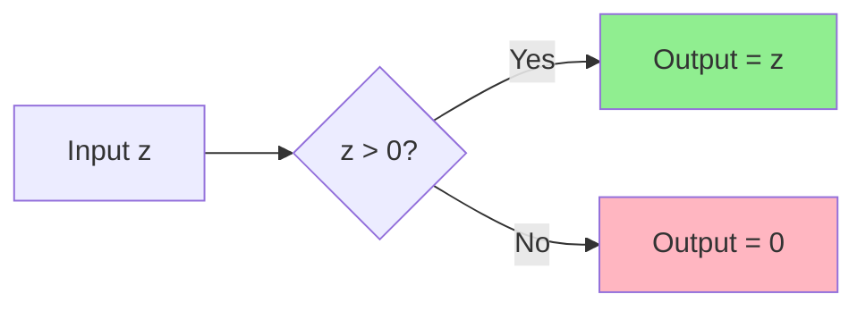
```mermaid
graph LR
    A[Input z] --> B{z > 0?}
    B -->|Yes| C[Output = z]
    B -->|No| D[Output = 0]

    style C fill:#90EE90
    style D fill:#FFB6C1
```

**Mathematical Definition:**

```
ReLU(z) = max(0, z)

If z = -2  → ReLU = 0
If z = 0   → ReLU = 0
If z = 3   → ReLU = 3
```

**Visual Comparison:**

```
ReLU Function:           Sigmoid Function:
Output                   Output
   │                        │
 3 │    ╱                 1 │      ╭────
   │   ╱                    │     ╱
 2 │  ╱                  0.5│    ╱
   │ ╱                      │   ╱
 1 │╱                     0 │──╱
───┼─────────→ Input        └─────────→ Input
 0 │  1  2  3                -2  0  2
```

## **Why ReLU Makes Training Faster**

1. **Simple Computation:** Just `max(0, z)` - very fast!
2. **No Vanishing Gradient:** Unlike sigmoid, ReLU doesn't saturate for positive values
3. **Sparse Activation:** Many neurons output 0, making networks more efficient

## **Hidden Layers Automatically Find Patterns**

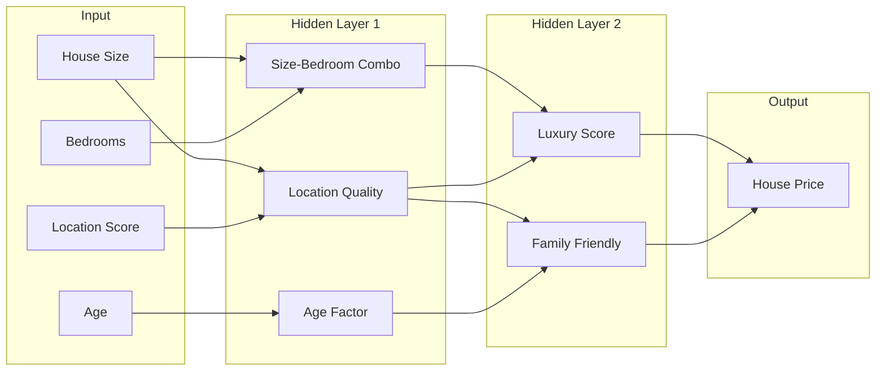
```mermaid
graph LR
    subgraph "Input"
        X1[House Size]
        X2[Bedrooms]
        X3[Location Score]
        X4[Age]
    end

    subgraph "Hidden Layer 1"
        H1[Size-Bedroom Combo]
        H2[Location Quality]
        H3[Age Factor]
    end

    subgraph "Hidden Layer 2"
        H4[Luxury Score]
        H5[Family Friendly]
    end

    subgraph "Output"
        Y[House Price]
    end

    X1 --> H1
    X2 --> H1
    X1 --> H2
    X3 --> H2
    X4 --> H3

    H1 --> H4
    H2 --> H4
    H2 --> H5
    H3 --> H5

    H4 --> Y
    H5 --> Y
```

**What's Happening:**

- **Layer 1:** Combines basic features (size + bedrooms = space quality)
- **Layer 2:** Creates higher-level concepts (luxury, family-friendly)
- **Network automatically learns** these useful combinations!

## **Deep Neural Network Architecture**

```
Shallow NN (1-2 layers):
Input → Hidden → Output

Deep NN (3+ layers):
Input → Hidden₁ → Hidden₂ → Hidden₃ → ... → Output

```

### **Why "Deep" Matters - Hierarchical Learning**

Deep networks learn in a hierarchical manner, building complexity layer by layer:

**Example: Image Recognition**

```
Layer 1: Detects edges and lines
Layer 2: Combines edges into shapes
Layer 3: Combines shapes into parts (eyes, nose)
Layer 4: Combines parts into objects (faces)
Layer 5: Recognizes specific people

```

**Example: Language Processing**

```
Layer 1: Recognizes characters
Layer 2: Forms words
Layer 3: Understands grammar
Layer 4: Grasps sentence meaning
Layer 5: Comprehends context

```

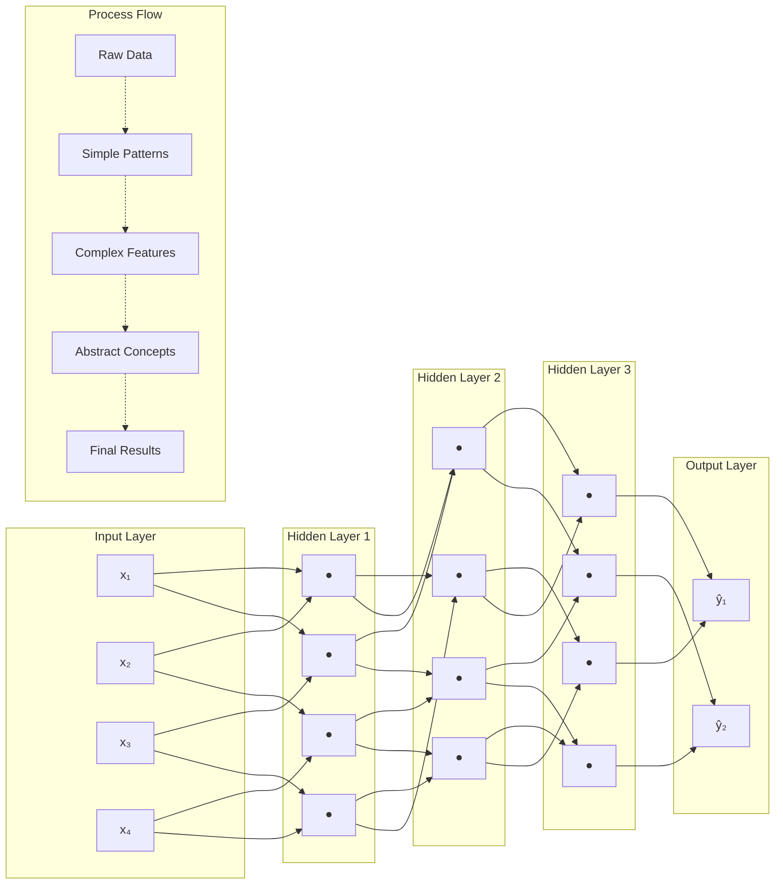
```mermaid

%%{init: {"theme": "default", "themeVariables": {"primaryColor": "#1f2937", "primaryTextColor": "#ffffff", "edgeLabelBackground":"#f9fafb", "fontSize": 14}}}%%

graph LR

subgraph "Input Layer"

X1[x₁]

X2[x₂]

X3[x₃]

X4[x₄]

end


subgraph "Hidden Layer 1"

H1a[●]

H1b[●]

H1c[●]

H1d[●]

end


subgraph "Hidden Layer 2"

H2a[●]

H2b[●]

H2c[●]

H2d[●]

end


subgraph "Hidden Layer 3"

H3a[●]

H3b[●]

H3c[●]

H3d[●]

end


subgraph "Output Layer"

Y1[ŷ₁]

Y2[ŷ₂]

end


%% Connections from Input to Hidden 1

X1 --> H1a

X1 --> H1b

X2 --> H1a

X2 --> H1c

X3 --> H1b

X3 --> H1d

X4 --> H1c

X4 --> H1d


%% Connections from Hidden 1 to Hidden 2

H1a --> H2a

H1a --> H2b

H1b --> H2b

H1b --> H2c

H1c --> H2c

H1c --> H2d

H1d --> H2d

H1d --> H2a


%% Connections from Hidden 2 to Hidden 3

H2a --> H3a

H2a --> H3b

H2b --> H3b

H2b --> H3c

H2c --> H3c

H2c --> H3d

H2d --> H3d

H2d --> H3a


%% Connections from Hidden 3 to Output

H3a --> Y1

H3b --> Y1

H3c --> Y2

H3d --> Y2


%% Labels (positioned below)

subgraph "Process Flow"

L1[Raw Data] -.-> L2[Simple Patterns]

L2 -.-> L3[Complex Features]

L3 -.-> L4[Abstract Concepts]

L4 -.-> L5[Final Results]

end

```

### **Key Differences: Shallow vs Deep**

| Aspect                 | Shallow NN                        | Deep NN                        |
| ---------------------- | --------------------------------- | ------------------------------ |
| **Learning**           | Simple patterns only              | Complex hierarchical patterns  |
| **Features**           | Manual feature engineering needed | Automatic feature learning     |
| **Problems**           | Linear separable data             | Non-linear, complex data       |
| **Examples**           | Basic classification              | Image/speech recognition       |
| **Layers**             | 1-2 hidden layers                 | 3+ hidden layers               |
| **Representation**     | Single level of abstraction       | Multiple levels of abstraction |
| **Training**           | Faster, simpler                   | Slower, more complex           |
| **Data Requirements**  | Works with small datasets         | Needs large datasets           |
| **Computational Cost** | Low                               | High                           |
| **Interpretability**   | More interpretable                | Less interpretable             |

### **What Makes Deep Learning "Deep"**

1.  **Representation Learning**: Each layer learns more abstract representations
2.  **Feature Hierarchy**: Lower layers = simple features, Higher layers = complex concepts
3.  **End-to-End Learning**: No manual feature engineering required
4.  **Universal Approximation**: Can learn any continuous function with enough layers

### **The "Magic" of Depth**

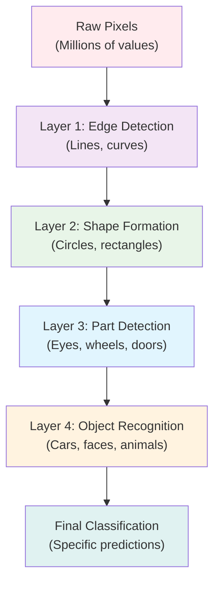
```mermaid
%%{init: {"theme": "default", "themeVariables": {"primaryColor": "#1f2937", "edgeLabelBackground":"#f9fafb", "primaryTextColor":"#000000", "fontSize": 12}}}%%
graph TD
  A["Raw Pixels<br/>(Millions of values)"] --> B["Layer 1: Edge Detection<br/>(Lines, curves)"]
  B --> C["Layer 2: Shape Formation<br/>(Circles, rectangles)"]
  C --> D["Layer 3: Part Detection<br/>(Eyes, wheels, doors)"]
  D --> E["Layer 4: Object Recognition<br/>(Cars, faces, animals)"]
  E --> F["Final Classification<br/>(Specific predictions)"]

  style A fill:#ffebee
  style B fill:#f3e5f5
  style C fill:#e8f5e8
  style D fill:#e1f5fe
  style E fill:#fff3e0
  style F fill:#e0f2f1

```

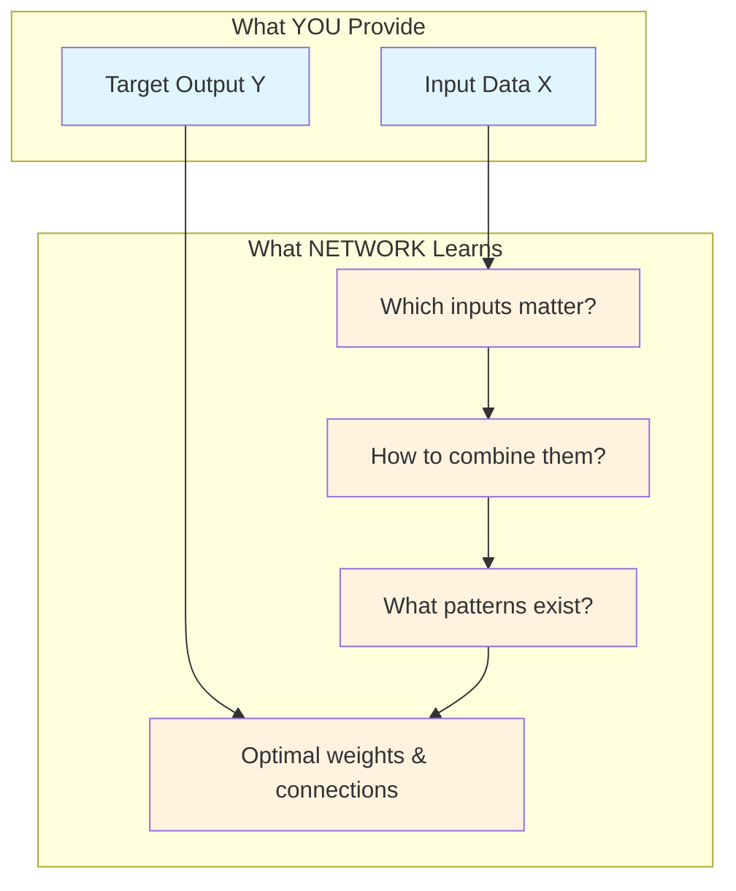
```mermaid

graph TB

subgraph "What YOU Provide"

A[Input Data X]

B[Target Output Y]

end

subgraph "What NETWORK Learns"

C[Which inputs matter?]

D[How to combine them?]

E[What patterns exist?]

F[Optimal weights & connections]

end

A --> C

B --> F

C --> D

D --> E

E --> F

style A fill:#E1F5FE

style B fill:#E1F5FE

style C fill:#FFF3E0

style D fill:#FFF3E0

style E fill:#FFF3E0

style F fill:#FFF3E0

```

### **Why Deep Networks Work Better**

1.  **Efficiency**: Deep networks can represent complex functions with fewer total neurons than shallow wide networks
2.  **Generalization**: Hierarchical features generalize better to new data
3.  **Biological Inspiration**: Mimics how human brain processes information (cortical hierarchy)

**The key insight**: Rather than hand-crafting features, deep networks automatically discover the most useful representations for your specific task through the hierarchy of hidden layers!

---

This addition provides the conceptual bridge between our simple neural network and the deep architecture, explaining _why_ depth matters and _how_ it enables the automatic learning. It's substantial enough to be valuable but not overwhelming.

---

## **Supervised Learning with Neural Networks**

### **What is Supervised Learning?**

Supervised learning means we have input-output pairs `(X, Y)` and we need to find a function `f` such that:

```
f(X) ≈ Y

```

**The Goal:** Train the neural network to learn the mapping from inputs to correct outputs using labeled training data.

### **Supervised Learning Process**

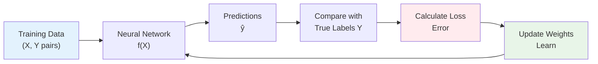
```mermaid
%%{init: {"theme": "default", "themeVariables": {"primaryColor": "#1f2937", "edgeLabelBackground":"#f9fafb", "primaryTextColor":"#000000", "fontSize": 12}}}%%
graph LR
  A["Training Data<br/>(X, Y pairs)"] --> B["Neural Network<br/>f(X)"]
  B --> C["Predictions<br/>ŷ"]
  C --> D["Compare with<br/>True Labels Y"]
  D --> E["Calculate Loss<br/>Error"]
  E --> F["Update Weights<br/>Learn"]
  F --> B

  style A fill:#e3f2fd
  style E fill:#ffebee
  style F fill:#e8f5e8

```

### **Types of Neural Networks for Supervised Learning**

| Network Type    | Architecture            | Best For                | Real-World Examples                                       |
| :-------------- | :---------------------- | :---------------------- | :-------------------------------------------------------- |
| **Standard NN** | Fully Connected Layers  | Structured/Tabular Data | House prices, stock prediction, customer analytics        |
| **CNN**         | Convolutional + Pooling | Computer Vision         | Image classification, medical imaging, autonomous driving |
| **RNN/LSTM**    | Recurrent Connections   | Sequential Data         | Language translation, speech recognition, time series     |
| **Hybrid**      | Multiple NN Types       | Complex Problems        | Self-driving cars, recommendation systems                 |

### **Detailed Network Applications**

#### **1. Standard Neural Networks (Fully Connected)**

```
Input: [Age, Income, Credit_Score, Employment_Years]
        ↓
Hidden Layers: Learn patterns in customer data
        ↓
Output: [Loan_Approval_Probability]

```

**Use Cases:**

- Financial risk assessment
- Marketing response prediction
- Medical diagnosis from lab results
- Customer churn prediction

#### **2. Convolutional Neural Networks (CNNs)**

```
Input: Image Pixels (Height × Width × Channels)
        ↓
Conv Layers: Detect edges, shapes, patterns
        ↓
Pooling: Reduce image size, keep important features
        ↓
Fully Connected: Final classification

```

**Use Cases:**

- Medical imaging (X-rays, MRIs)
- Quality control in manufacturing
- Facial recognition systems
- Satellite image analysis

#### **3. Recurrent Neural Networks (RNNs)**

```
Input: Sequential Data [word₁, word₂, word₃, ...]
        ↓
RNN Layers: Remember previous information
        ↓
Output: Next word, classification, or sequence

```

**Use Cases:**

- Language translation (Google Translate)
- Voice assistants (Siri, Alexa)
- Stock market prediction
- Weather forecasting

#### **4. Hybrid/Custom Networks**

```
Example: Self-Driving Car
Input: Camera Images + Sensor Data + GPS
        ↓
CNN: Process camera images
RNN: Handle sequential sensor data
Standard NN: Combine all information
        ↓
Output: Steering angle, brake, acceleration

```

### **Data Types in Machine Learning**

#### **Structured Data**

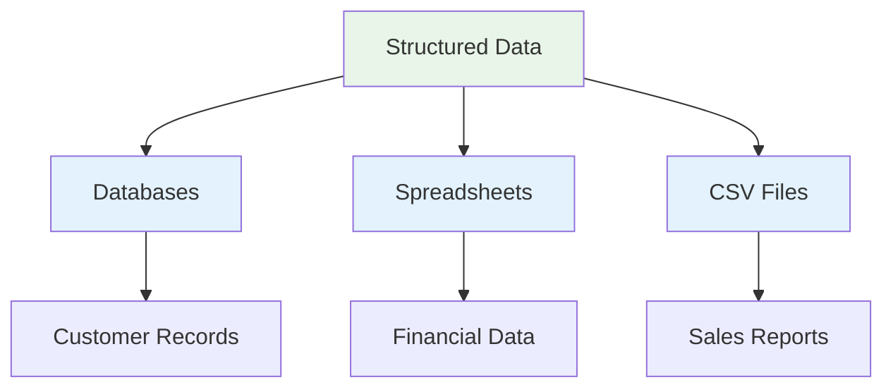
```mermaid
%%{init: {"theme": "default", "themeVariables": {"primaryColor": "#1f2937", "edgeLabelBackground":"#f9fafb", "primaryTextColor":"#000000", "fontSize": 12}}}%%
graph TD
  A["Structured Data"] --> B["Databases"]
  A --> C["Spreadsheets"]
  A --> D["CSV Files"]

  B --> E["Customer Records"]
  C --> F["Financial Data"]
  D --> G["Sales Reports"]

  style A fill:#e8f5e8
  style B fill:#e3f2fd
  style C fill:#e3f2fd
  style D fill:#e3f2fd

```

**Characteristics:**

- Organized in rows and columns
- Each column has a specific data type
- Easy to search and analyze
- Examples: Customer age, transaction amount, product ratings

#### **Unstructured Data**

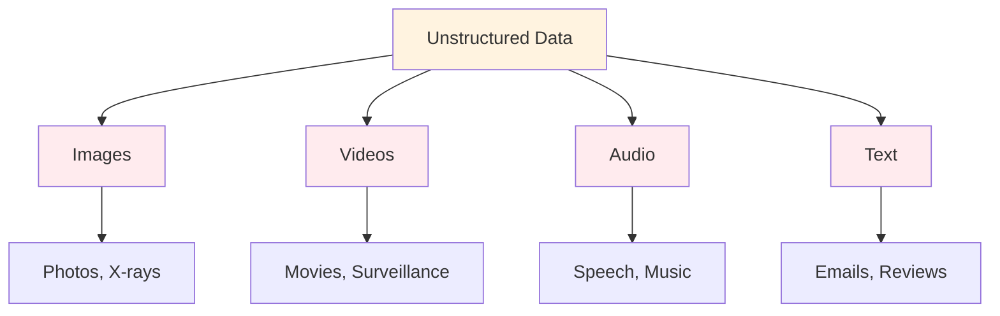
```mermaid
%%{init: {"theme": "default", "themeVariables": {"primaryColor": "#1f2937", "edgeLabelBackground":"#f9fafb", "primaryTextColor":"#000000", "fontSize": 12}}}%%
graph TD
  A["Unstructured Data"] --> B["Images"]
  A --> C["Videos"]
  A --> D["Audio"]
  A --> E["Text"]

  B --> F["Photos, X-rays"]
  C --> G["Movies, Surveillance"]
  D --> H["Speech, Music"]
  E --> I["Emails, Reviews"]

  style A fill:#fff3e0
  style B fill:#ffebee
  style C fill:#ffebee
  style D fill:#ffebee
  style E fill:#ffebee

```

**Characteristics:**

- No predefined format
- Requires preprocessing
- Rich information content
- Examples: Social media posts, medical images, voice recordings

### **Business Impact: Structured vs Unstructured Data**

#### **Why Structured Data "Gives More Money"**

**Structured Data Applications:**

- **Immediate ROI**: Customer lifetime value prediction
- **Risk Management**: Credit scoring, fraud detection
- **Operational Efficiency**: Supply chain optimization
- **Revenue Growth**: Personalized pricing, targeted advertising

**Business Value Chain:**

```
Structured Data → Standard NN → Business Predictions → Direct Revenue Impact

```

**Examples:**

- **Netflix**: Recommendation system using viewing history → Increased subscriber retention
- **Amazon**: Purchase prediction → Inventory optimization → Cost savings
- **Banks**: Credit risk assessment → Reduced loan defaults → Higher profits

#### **Unstructured Data: Future Potential**

While unstructured data applications are growing rapidly:

- **Longer development cycles**
- **Higher computational costs**
- **More complex integration**
- **Emerging market opportunities**

### **Choosing the Right Network Type**

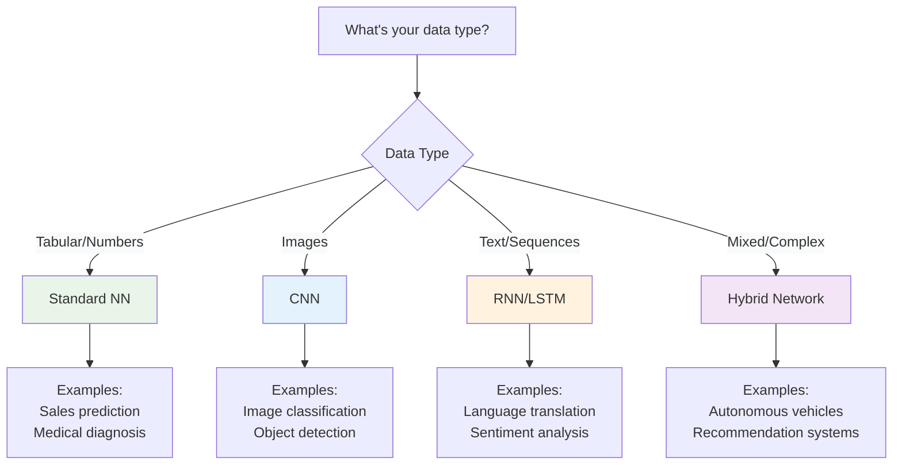
```mermaid
%%{init: {"theme": "default", "themeVariables": {"primaryColor": "#1f2937", "edgeLabelBackground":"#f9fafb", "primaryTextColor":"#000000", "fontSize": 12}}}%%
graph TD
  A["What's your data type?"] --> B{Data Type}
  B -->|Tabular/Numbers| C["Standard NN"]
  B -->|Images| D["CNN"]
  B -->|Text/Sequences| E["RNN/LSTM"]
  B -->|Mixed/Complex| F["Hybrid Network"]

  C --> G["Examples:<br/>Sales prediction<br/>Medical diagnosis"]
  D --> H["Examples:<br/>Image classification<br/>Object detection"]
  E --> I["Examples:<br/>Language translation<br/>Sentiment analysis"]
  F --> J["Examples:<br/>Autonomous vehicles<br/>Recommendation systems"]

  style C fill:#e8f5e8
  style D fill:#e3f2fd
  style E fill:#fff3e0
  style F fill:#f3e5f5

```

### **Key Takeaways**

1.  **Supervised learning** requires labeled training data (input-output pairs)
2.  **Different neural networks** excel at different types of data and problems
3.  **Structured data** currently drives most business value in traditional industries
4.  **Unstructured data** represents the future growth area with emerging applications
5.  **Network choice** depends primarily on your data type and problem domain

## **Why is Deep Learning Taking Off?**

Deep learning has exploded in popularity due to three key factors working together:

### **1. Data Revolution 📊**

#### **The Data-Performance Relationship**

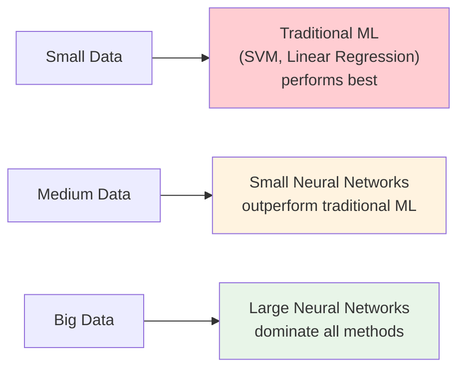
```mermaid
%%{init: {"theme": "default", "themeVariables": {"primaryColor": "#1f2937", "edgeLabelBackground":"#f9fafb", "primaryTextColor":"#000000", "fontSize": 12}}}%%
graph LR
  A["Small Data"] --> B["Traditional ML<br/>(SVM, Linear Regression)<br/>performs best"]
  C["Medium Data"] --> D["Small Neural Networks<br/>outperform traditional ML"]
  E["Big Data"] --> F["Large Neural Networks<br/>dominate all methods"]

  style B fill:#ffcdd2
  style D fill:#fff3e0
  style F fill:#e8f5e8

```

#### **Key Data Insights:**

| Data Size                | Best Algorithm                          | Performance Ceiling                  |
| :----------------------- | :-------------------------------------- | :----------------------------------- |
| **Small** (< 1K samples) | Traditional ML (SVM, Linear Regression) | Limited by algorithm complexity      |
| **Medium** (1K - 100K)   | Small Neural Networks                   | Better than traditional ML           |
| **Large** (100K - 1M+)   | Large Neural Networks                   | Continuously improves with more data |

#### **The Data Explosion Sources:**

**Digital Transformation:**

- **Mobile Revolution**: 6.8 billion smartphone users generating data 24/7
- **Internet of Things (IoT)**: 50+ billion connected devices by 2030
- **Social Media**: 4.7 billion users creating content daily
- **E-commerce**: Every click, purchase, and interaction recorded
- **Sensors Everywhere**: Cars, homes, cities, wearables

**Data Generation Examples:**

```
Every minute on the internet:
• 500 hours of video uploaded to YouTube
• 147,000 photos shared on Facebook
• 41.6 million messages sent on WhatsApp
• 5.7 million Google searches
• 16.7 million text messages sent

```

### **2. Computational Power Revolution 💻**

#### **Key Data Insights:**

| Data Size                | Best Algorithm                          | Performance Ceiling                  |
| :----------------------- | :-------------------------------------- | :----------------------------------- |
| **Small** (< 1K samples) | Traditional ML (SVM, Linear Regression) | Limited by algorithm complexity      |
| **Medium** (1K - 100K)   | Small Neural Networks                   | Better than traditional ML           |
| **Large** (100K - 1M+)   | Large Neural Networks                   | Continuously improves with more data |

#### **GPU vs CPU for Deep Learning:**

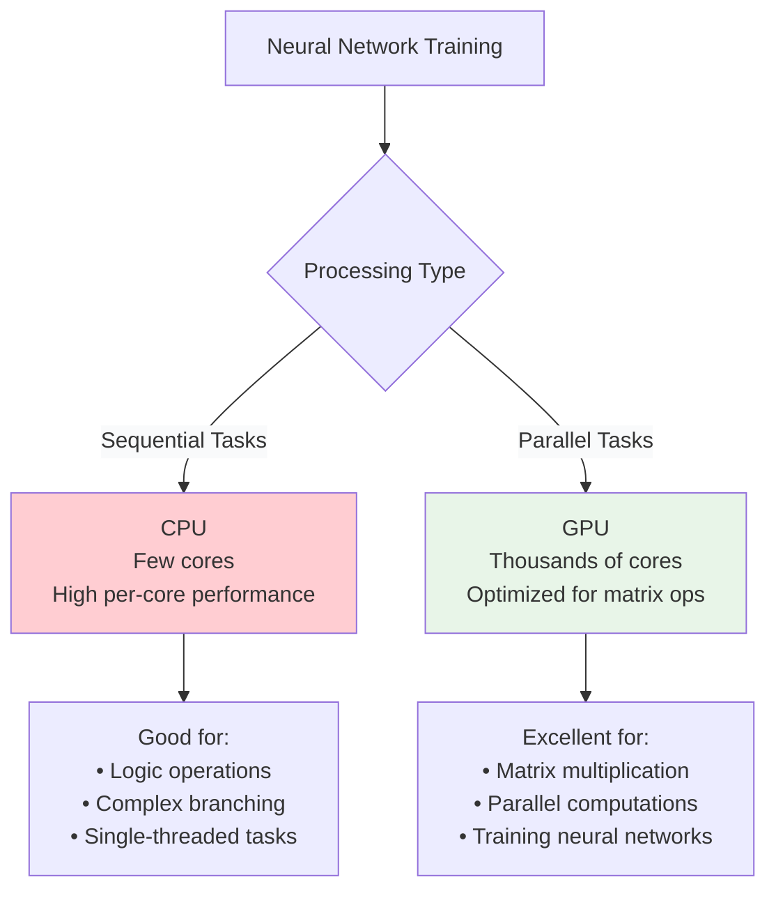
```mermaid
%%{init: {"theme": "default", "themeVariables": {"primaryColor": "#1f2937", "edgeLabelBackground":"#f9fafb", "primaryTextColor":"#000000", "fontSize": 12}}}%%
graph TD
  A["Neural Network Training"] --> B{Processing Type}
  B -->|Sequential Tasks| C["CPU<br/>Few cores<br/>High per-core performance"]
  B -->|Parallel Tasks| D["GPU<br/>Thousands of cores<br/>Optimized for matrix ops"]

  C --> E["Good for:<br/>• Logic operations<br/>• Complex branching<br/>• Single-threaded tasks"]
  D --> F["Excellent for:<br/>• Matrix multiplication<br/>• Parallel computations<br/>• Training neural networks"]

  style C fill:#ffcdd2
  style D fill:#e8f5e8

```

#### **Computational Timeline:**

```
2000s: CPU-only training (weeks for simple models)
2010s: GPU acceleration (hours for complex models)
2020s: TPUs + Cloud (minutes for state-of-the-art models)

```

### **3. Algorithmic Breakthroughs 🧠**

#### **Key Algorithm Innovations:**

**Activation Functions Evolution:**

```mermaid
%%{init: {"theme": "default", "themeVariables": {"primaryColor": "#1f2937", "edgeLabelBackground":"#f9fafb", "primaryTextColor":"#000000", "fontSize": 12}}}%%
graph LR
  A["1980s-2000s<br/>Sigmoid/Tanh"] --> B["Problem:<br/>Vanishing Gradients"]
  B --> C["2010s<br/>ReLU Function"]
  C --> D["Solution:<br/>Faster Training"]
  D --> E["2020s<br/>Advanced Activations<br/>(Swish, GELU)"]

  style A fill:#ffcdd2
  style C fill:#e8f5e8
  style E fill:#e1f5fe

```

**ReLU vs Sigmoid Impact:**

| Aspect             | Sigmoid                   | ReLU                         |
| :----------------- | :------------------------ | :--------------------------- |
| **Computation**    | Expensive (exponential)   | Simple (max function)        |
| **Gradient Flow**  | Vanishes for large inputs | Constant for positive inputs |
| **Training Speed** | Slow (gradient issues)    | Fast (no saturation)         |
| **Deep Networks**  | Difficult to train        | Enables very deep networks   |

#### **Other Major Algorithmic Advances:**

**1. Better Optimization:**

- **Adam Optimizer**: Adaptive learning rates
- **Batch Normalization**: Stable training for deep networks
- **Dropout**: Prevents overfitting

**2. Architecture Innovations:**

- **ResNet**: Skip connections enabling 100+ layer networks
- **Attention Mechanisms**: Focus on relevant parts of input
- **Transformer Architecture**: Revolutionary for NLP

**3. Training Techniques:**

- **Transfer Learning**: Use pre-trained models
- **Data Augmentation**: Create more training examples
- **Regularization**: Better generalization

### **The Perfect Storm: Why All Three Matter**

```mermaid
%%{init: {"theme": "default", "themeVariables": {"primaryColor": "#1f2937", "edgeLabelBackground":"#f9fafb", "primaryTextColor":"#000000", "fontSize": 12}}}%%
graph TD
  A["More Data"] --> D["Deep Learning Success"]
  B["Better Hardware"] --> D
  C["Smarter Algorithms"] --> D

  A --> E["Enables learning<br/>complex patterns"]
  B --> F["Makes training<br/>practically feasible"]
  C --> G["Solves technical<br/>barriers"]

  D --> H["Real-world<br/>Applications"]

  style D fill:#e8f5e8
  style H fill:#fff3e0

```

### **Real-World Impact Timeline**

**2010-2012**: ImageNet breakthrough (AlexNet)

- Deep learning beats traditional computer vision
- GPU acceleration proves critical

**2014-2016**: Commercial adoption

- Google, Facebook, Amazon invest heavily
- Speech recognition reaches human parity

**2017-2020**: Transformer revolution

- BERT, GPT models transform NLP
- Attention mechanism becomes dominant

**2020+**: Foundation models era

- GPT-3, ChatGPT democratize AI
- Multimodal models (text + images)

### **Why the Timing Was Perfect**

**Historical Context:**

- **Neural networks existed since 1950s** - but lacked the three key ingredients
- **1980s-2000s**: Limited by computation and data
- **2010s**: All three factors converged simultaneously
- **Result**: Exponential progress in AI capabilities

**The Lesson**: Deep learning didn't succeed because it was new, but because the infrastructure (data + computation + algorithms) finally caught up to support it!
