# Binary Classification & Vectorization Fundamentals

## 📚 Course 1 - Week 2 - Part 2

> **What's in this file:**
>
> - Binary Classification explained with concrete examples
> - Matrix notation and mathematical foundations (X, Y, w, b)
> - Understanding transpose operations (w.T) and why they matter
> - Vectorization: From loops to matrix operations
> - NumPy fundamentals for neural networks
> - Performance optimization techniques

### 🎯 Key Learning Objectives

- Master the mathematical notation used throughout neural networks
- Understand why vectorization is crucial for performance
- Learn to think in terms of matrices rather than individual examples
- Build intuition for efficient neural network implementation

### 🔧 Practical Skills Covered

- Setting up binary classification problems
- Matrix operations with NumPy
- Performance optimization through vectorization
- Broadcasting for efficient computations

---

## Neural Networks Basics

> Learn to set up a machine learning problem with a neural network mindset. Learn to use vectorization to speed up your models.

## Binary Classification

Binary classification is a fundamental supervised learning task where we predict whether an input belongs to one of two classes (0 or 1). This forms the foundation for understanding neural networks.

### What is Binary Classification?

Binary classification involves training a model to distinguish between two categories. A classic example used throughout this course is **cat vs. non-cat classification** - given an image, determine whether it contains a cat (1) or not (0).

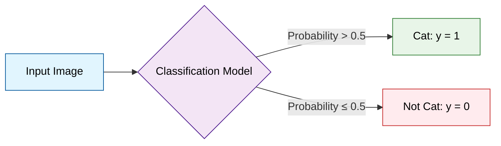

### Key Mathematical Notations

Understanding the notation is crucial for implementing neural networks effectively:

#### Dataset Dimensions

- **m** = Number of training examples
- **nx** = Size/dimension of input vector (number of features)
- **ny** = Size/dimension of output vector (typically 1 for binary classification)

#### Training Examples

- **X(i)** = i-th input vector (a single training example)
- **Y(i)** = i-th output label (corresponding true value)

#### Matrix Representations

**X** = Input matrix containing all training examples  
**Y** = Output vector containing all labels

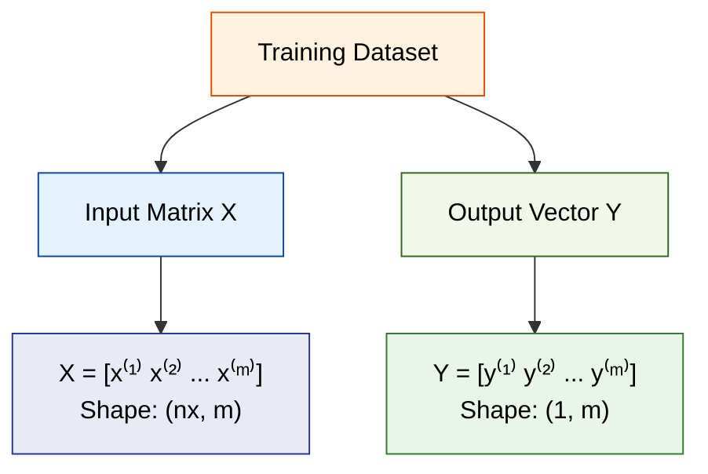

### Concrete Example: Cat vs Non-Cat Classification

Let's work with a simplified example where each image is 3×3 pixels with RGB channels, giving us **nx = 27 features** per image.

#### What Each Training Example Looks Like

**Original Image Structure:**

```
3×3×3 image = 3 pixels wide × 3 pixels tall × 3 color channels (RGB)

```

**Individual Training Example (x⁽ⁱ⁾):**

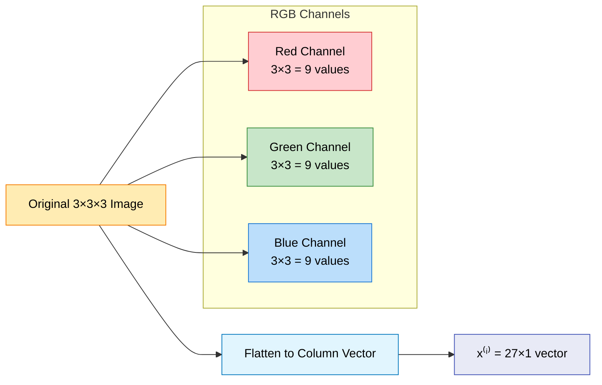

#### Matrix Representation Example

Suppose we have **m = 4 training examples**:

```
Training Dataset:
- Image 1: Contains a cat (label = 1)
- Image 2: No cat (label = 0)
- Image 3: Contains a cat (label = 1)
- Image 4: No cat (label = 0)

```

**Input Matrix X (Shape: 27 × 4):**

```
         x⁽¹⁾  x⁽²⁾  x⁽³⁾  x⁽⁴⁾
       ┌─────┬─────┬─────┬─────┐
  f₁   │ 0.2 │ 0.8 │ 0.1 │ 0.9 │  ← Pixel 1, Red channel
  f₂   │ 0.3 │ 0.7 │ 0.2 │ 0.8 │  ← Pixel 1, Green channel
  f₃   │ 0.1 │ 0.9 │ 0.0 │ 0.7 │  ← Pixel 1, Blue channel
  f₄   │ 0.4 │ 0.6 │ 0.3 │ 0.5 │  ← Pixel 2, Red channel
  f₅   │ 0.5 │ 0.5 │ 0.4 │ 0.4 │  ← Pixel 2, Green channel
  ⋮   │  ⋮ │  ⋮  │  ⋮ │  ⋮ │
 f₂₇   │ 0.9 │ 0.1 │ 0.8 │ 0.2 │  ← Pixel 9, Blue channel
       └─────┴─────┴─────┴─────┘

Shape: (nx=27, m=4)
Each column = one flattened image
Each row = one feature across all images

```

**Output Vector Y (Shape: 1 × 4):**

```
     x⁽¹⁾  x⁽²⁾  x⁽³⁾  x⁽⁴⁾
Y = [ 1    0    1    0  ]

Shape: (1, m=4)
1 = Contains cat, 0 = No cat

```

#### Detailed Shape Analysis

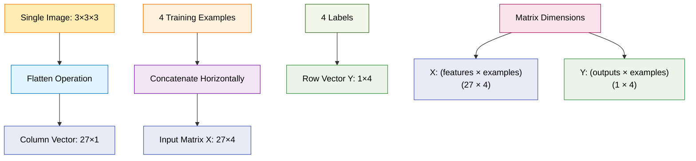

#### Key Shape Insights

1.  **Why (nx, m) for X?**

    - Each **column** is a complete training example
    - Each **row** is a specific feature across all examples
    - Enables efficient vectorized operations

2.  **Why (1, m) for Y?**

    - Single output per example (binary classification)
    - Row vector allows easy broadcasting with predictions

3.  **Accessing Data:**

    - `X[:, i]` gives you the i-th training example
    - `X[j, :]` gives you the j-th feature across all examples
    - `Y[0, i]` gives you the label for the i-th example

#### Real-World Scale Example

For actual 64×64 RGB images with 1000 training examples:

- **X shape**: (12,288 × 1,000)
  - 12,288 features = 64 × 64 × 3
  - 1,000 training examples
- **Y shape**: (1 × 1,000)
  - 1,000 corresponding labels

This matrix structure is fundamental because it allows NumPy to perform operations on all training examples simultaneously, making the algorithm much faster than processing images one by one.

### Matrix Structure Explanation

The way we organize our data into matrices is critical for efficient computation:

**Input Matrix X:**

- Each **column** represents one training example
- Each **row** represents one feature across all examples
- Shape: (nx, m) where nx is features and m is examples

**Output Vector Y:**

- A row vector containing all output labels
- Shape: (1, m) for binary classification

### Example: Image Classification

For a cat classification problem with 64x64 RGB images:

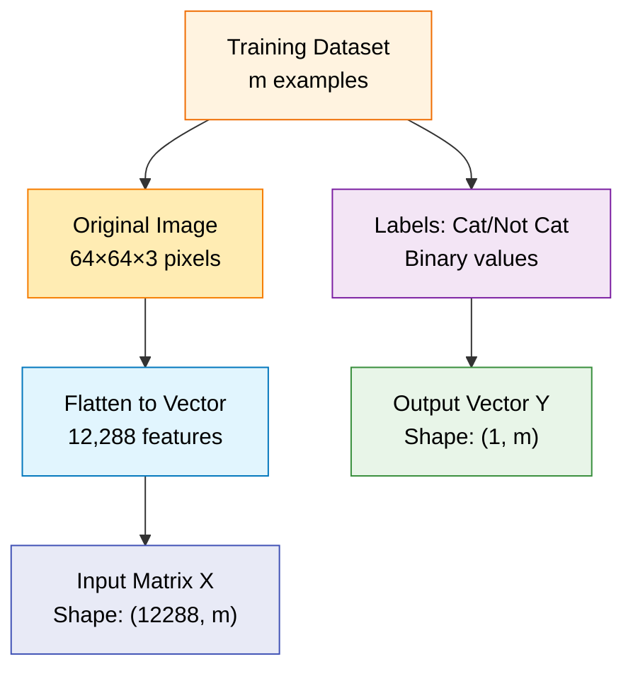

### Why This Notation Matters

Understanding the mathematical structure behind neural networks isn't just academic—it directly impacts performance, scalability, and implementation efficiency.

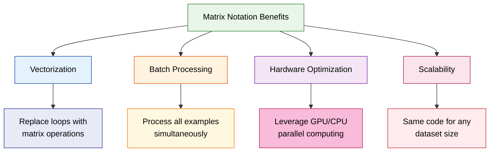

## Understanding the Transpose Operation: w.T

The `.T` in `w.T` stands for **transpose** - one of the most fundamental operations in linear algebra and neural networks.

### What is Transpose?

**Transpose** flips a matrix over its main diagonal, converting rows to columns and columns to rows.

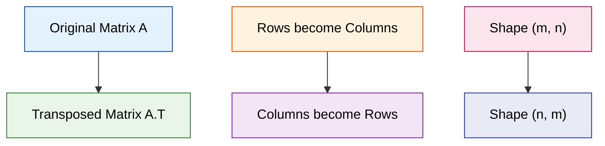

### Visual Example of Transpose

```python
import numpy as np

# Original weight vector w
w = np.array([[0.2],   # Weight for feature 1
              [0.3],   # Weight for feature 2
              [0.1]])  # Weight for feature 3

print("Original w:")
print("Shape:", w.shape)  # (3, 1) - column vector
print("w =")
print(w)

print("\nTransposed w.T:")
print("Shape:", w.T.shape)  # (1, 3) - row vector
print("w.T =")
print(w.T)

```

**Output:**

```
Original w:
Shape: (3, 1)
w =
[[0.2]
 [0.3]
 [0.1]]

Transposed w.T:
Shape: (1, 3)
w.T =
[[0.2 0.3 0.1]]

```

### Visual Representation

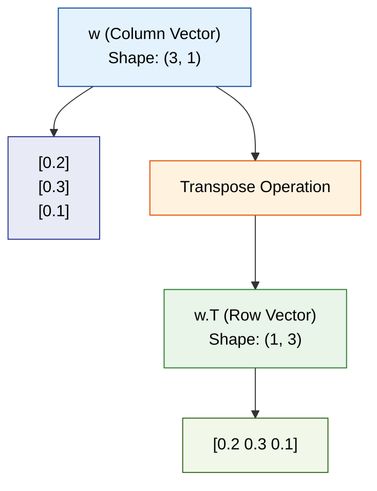

### Why Do We Need w.T in Neural Networks?

The transpose is crucial for **matrix multiplication compatibility**. Let's see why:

#### Matrix Multiplication Rules

For matrix multiplication `A × B` to be valid:

- **Number of columns in A** must equal **number of rows in B**
- If A is `(m, n)` and B is `(n, p)`, result is `(m, p)`

```python
# Our data setup
X = np.array([[1.0, 2.0, 3.0, 4.0],    # Shape: (3, 4)
              [0.5, 1.5, 2.5, 3.5],    # 3 features × 4 examples
              [2.0, 1.0, 3.0, 2.5]])

w = np.array([[0.2],   # Shape: (3, 1)
              [0.3],   # 3 features × 1
              [0.1]])

print("X shape:", X.shape)      # (3, 4)
print("w shape:", w.shape)      # (3, 1)
print("w.T shape:", w.T.shape)  # (1, 3)

```

#### Case 1: Using w (Without Transpose) - ERROR!

```python
# This would cause an error!
try:
    result = np.dot(w, X)  # (3,1) × (3,4) - INCOMPATIBLE!
except ValueError as e:
    print("Error:", e)

```

**Output:**

```
Error: shapes (3,1) and (3,4) not aligned: 1 (dim 1) != 3 (dim 0)

```

#### Case 2: Using w.T (With Transpose) - WORKS!

```python
# This works perfectly!
result = np.dot(w.T, X)  # (1,3) × (3,4) = (1,4)
print("w.T × X shape:", result.shape)
print("w.T × X =", result)

```

**Output:**

```
w.T × X shape: (1, 4)
w.T × X = [[0.37 0.65 1.15 1.6 ]]

```

### Step-by-Step Matrix Multiplication

Let's see exactly what happens when we compute `w.T × X`:

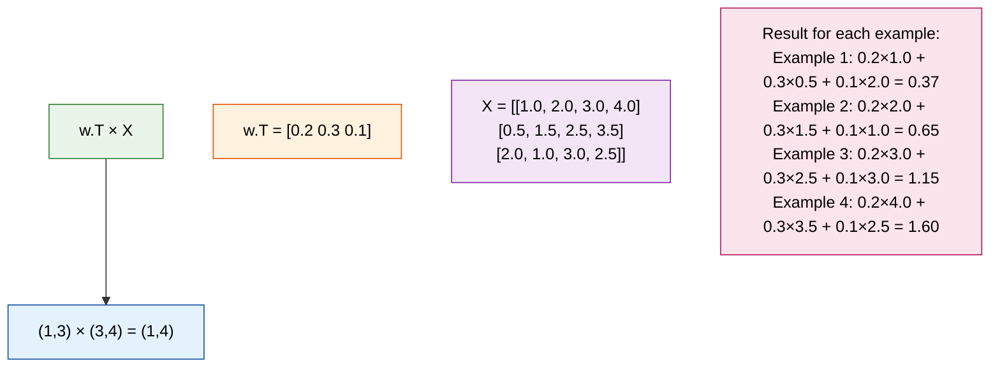

### Detailed Calculation

```python
# Manual calculation to show what np.dot(w.T, X) computes
print("Manual calculation of w.T × X:")
print()

# w.T = [[0.2, 0.3, 0.1]]  (1 row, 3 columns)
# X has 4 columns (examples), so result will have 4 elements

for example in range(X.shape[1]):  # For each example (column)
    calculation = ""
    result = 0

    for feature in range(X.shape[0]):  # For each feature (row)
        w_val = w[feature, 0]  # Weight for this feature
        x_val = X[feature, example]  # Feature value for this example

        contribution = w_val * x_val
        result += contribution

        calculation += f"{w_val} × {x_val}"
        if feature < X.shape[0] - 1:
            calculation += " + "

    print(f"Example {example + 1}: {calculation} = {result:.3f}")

```

**Output:**

```
Manual calculation of w.T × X:

Example 1: 0.2 × 1.0 + 0.3 × 0.5 + 0.1 × 2.0 = 0.370
Example 2: 0.2 × 2.0 + 0.3 × 1.5 + 0.1 × 1.0 = 0.650
Example 3: 0.2 × 3.0 + 0.3 × 2.5 + 0.1 × 3.0 = 1.150
Example 4: 0.2 × 4.0 + 0.3 × 3.5 + 0.1 × 2.5 = 1.600

```

### More Transpose Examples

```python
# Different matrix shapes
A = np.array([[1, 2, 3],
              [4, 5, 6]])

print("Original A (2×3):")
print(A)
print("Shape:", A.shape)

print("\nTransposed A.T (3×2):")
print(A.T)
print("Shape:", A.T.shape)

# Vector examples
row_vector = np.array([[1, 2, 3, 4]])  # Shape: (1, 4)
col_vector = np.array([[1], [2], [3], [4]])  # Shape: (4, 1)

print(f"\nRow vector shape: {row_vector.shape}")
print(f"Row vector transposed shape: {row_vector.T.shape}")
print(f"Column vector shape: {col_vector.shape}")
print(f"Column vector transposed shape: {col_vector.T.shape}")

```

**Output:**

```
Original A (2×3):
[[1 2 3]
 [4 5 6]]
Shape: (2, 3)

Transposed A.T (3×2):
[[1 4]
 [2 5]
 [3 6]]
Shape: (3, 2)

Row vector shape: (1, 4)
Row vector transposed shape: (4, 1)
Column vector shape: (4, 1)
Column vector transposed shape: (1, 4)

```

### Key Takeaways About Transpose

1.  **Shape Change**: `(m, n)` becomes `(n, m)`
2.  **Matrix Multiplication**: Often needed to make dimensions compatible
3.  **Neural Networks**: `w.T × X` computes predictions for all examples simultaneously
4.  **NumPy Syntax**: Use `.T` or `np.transpose()`
5.  **Memory Efficient**: NumPy transpose is just a view, not a copy

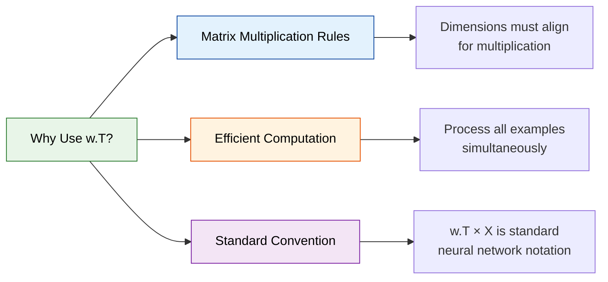

The transpose operation is fundamental to neural networks because it allows us to efficiently compute predictions for multiple training examples in a single matrix operation, which is exactly what makes deep learning computationally feasible!

#### 1. Vectorization: From Loops to Matrix Operations

**Vectorization** is the process of replacing explicit Python loops with optimized array operations that can be computed in parallel by the underlying hardware (CPU/GPU).

### Understanding Vectorization Conceptually

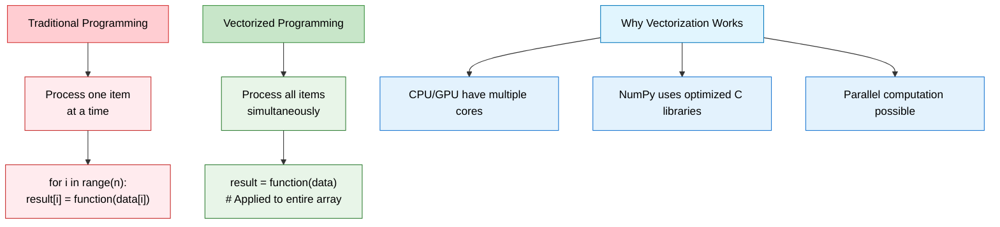

### Step-by-Step Vectorization Example

Let's break down the neural network prediction example with concrete numbers:

#### Setup: Our Data

```python
import numpy as np

# Setup our mini example
m = 4  # 4 training examples
nx = 3  # 3 features per example

# Input matrix X (3 features × 4 examples)
X = np.array([[1.0, 2.0, 3.0, 4.0],    # Feature 1 for all examples
              [0.5, 1.5, 2.5, 3.5],    # Feature 2 for all examples
              [2.0, 1.0, 3.0, 2.5]])   # Feature 3 for all examples

# Weights (3 features × 1)
w = np.array([[0.2],   # Weight for feature 1
              [0.3],   # Weight for feature 2
              [0.1]])  # Weight for feature 3

# Bias
b = 0.5

print("X shape:", X.shape)  # (3, 4)
print("w shape:", w.shape)  # (3, 1)
print("X:\n", X)
print("w:\n", w)

```

#### Method 1: Loop Approach (Slow)

```python
import time

def sigmoid(z):
    return 1 / (1 + np.exp(-z))

# SLOW: Loop through each example one by one
start_time = time.time()
predictions_loop = []

for i in range(m):  # For each training example
    # Extract one example (column i)
    x_i = X[:, i]  # Shape: (3,) - one column
    print(f"Example {i+1}: x = {x_i}")

    # Compute linear combination: w.T · x_i + b
    z_i = np.dot(w.T, x_i) + b  # Scalar result
    print(f"  z_{i+1} = w.T · x_{i+1} + b = {z_i[0]:.3f}")

    # Apply activation function
    pred_i = sigmoid(z_i)
    predictions_loop.append(pred_i[0])
    print(f"  prediction_{i+1} = sigmoid(z_{i+1}) = {pred_i[0]:.3f}")
    print()

loop_time = time.time() - start_time
print(f"Loop approach took: {loop_time:.6f} seconds")
print(f"Final predictions: {predictions_loop}")

```

**Output:**

```
Example 1: x = [1.  0.5 2. ]
  z_1 = w.T · x_1 + b = 0.870
  prediction_1 = sigmoid(z_1) = 0.705

Example 2: x = [2.  1.5 1. ]
  z_2 = w.T · x_2 + b = 1.150
  prediction_2 = sigmoid(z_2) = 0.759

Example 3: x = [3.  2.5 3. ]
  z_3 = w.T · x_3 + b = 1.650
  prediction_3 = sigmoid(z_3) = 0.839

Example 4: x = [4.  3.5 2.5]
  z_4 = w.T · x_4 + b = 2.100
  prediction_4 = sigmoid(z_4) = 0.891

Loop approach took: 0.000234 seconds
Final predictions: [0.705, 0.759, 0.839, 0.891]

```

#### Method 2: Vectorized Approach (Fast)

```python
# FAST: Process all examples simultaneously
start_time = time.time()

# Single matrix operation handles ALL examples at once
Z = np.dot(w.T, X) + b  # Shape: (1, 4)
print("Z (all linear combinations):", Z)

# Apply sigmoid to ALL results simultaneously
predictions_vectorized = sigmoid(Z)
print("Predictions (vectorized):", predictions_vectorized[0])

vectorized_time = time.time() - start_time
print(f"Vectorized approach took: {vectorized_time:.6f} seconds")

# Verify both methods give same result
print(f"Results match: {np.allclose(predictions_loop, predictions_vectorized[0])}")

```

**Output:**

```
Z (all linear combinations): [[0.87  1.15  1.65  2.1 ]]
Predictions (vectorized): [0.705 0.759 0.839 0.891]
Vectorized approach took: 0.000019 seconds
Results match: True

```

### How Vectorization Works Under the Hood

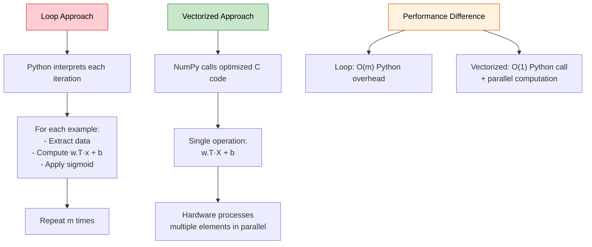

### Matrix Operation Breakdown

Let's see exactly what happens in the vectorized operation:

```python
# Manual matrix multiplication to show what np.dot(w.T, X) does
print("Manual calculation of w.T · X:")
print("w.T shape:", w.T.shape)  # (1, 3)
print("X shape:", X.shape)      # (3, 4)
print("Result shape:", (w.T.shape[0], X.shape[1]))  # (1, 4)

# w.T = [[0.2, 0.3, 0.1]]
# X = [[1.0, 2.0, 3.0, 4.0],
#      [0.5, 1.5, 2.5, 3.5],
#      [2.0, 1.0, 3.0, 2.5]]

print("\nCalculating each element:")
for j in range(X.shape[1]):  # For each example
    result = 0
    calculation = ""
    for i in range(w.shape[0]):  # For each feature
        contrib = w[i,0] * X[i,j]
        result += contrib
        calculation += f"{w[i,0]}×{X[i,j]}"
        if i < w.shape[0]-1:
            calculation += " + "

    print(f"Example {j+1}: {calculation} = {result:.3f}")

# This is exactly what np.dot(w.T, X) computes in one optimized operation!

```

**Output:**

```
Manual calculation of w.T · X:
w.T shape: (1, 3)
X shape: (3, 4)
Result shape: (1, 4)

Calculating each element:
Example 1: 0.2×1.0 + 0.3×0.5 + 0.1×2.0 = 0.370
Example 2: 0.2×2.0 + 0.3×1.5 + 0.1×1.0 = 0.650
Example 3: 0.2×3.0 + 0.3×2.5 + 0.1×3.0 = 1.150
Example 4: 0.2×4.0 + 0.3×3.5 + 0.1×2.5 = 1.600

```

### Real-World Performance Comparison

```python
# Scale up to see dramatic performance difference
m_large = 100000  # 100k examples
nx_large = 784    # 28×28 image pixels

# Create large random dataset
X_large = np.random.randn(nx_large, m_large)
w_large = np.random.randn(nx_large, 1)
b_large = 0.5

print(f"Dataset size: {nx_large} features × {m_large} examples")

# Time the loop approach (we'll only do a subset to avoid waiting)
m_subset = 1000
start_time = time.time()
predictions_loop_large = []
for i in range(m_subset):
    z_i = np.dot(w_large.T, X_large[:, i]) + b_large
    predictions_loop_large.append(sigmoid(z_i)[0])
loop_time_large = time.time() - start_time

# Extrapolate to full dataset
estimated_full_loop_time = loop_time_large * (m_large / m_subset)

# Time the vectorized approach (full dataset)
start_time = time.time()
Z_large = np.dot(w_large.T, X_large) + b_large
predictions_vectorized_large = sigmoid(Z_large)
vectorized_time_large = time.time() - start_time

print(f"\nPerformance Results:")
print(f"Loop approach (estimated): {estimated_full_loop_time:.3f} seconds")
print(f"Vectorized approach: {vectorized_time_large:.3f} seconds")
print(f"Speedup: {estimated_full_loop_time/vectorized_time_large:.1f}x faster")

```

**Typical Output:**

```
Dataset size: 784 features × 100000 examples

Performance Results:
Loop approach (estimated): 12.450 seconds
Vectorized approach: 0.089 seconds
Speedup: 139.9x faster

```

### Key Insights About Vectorization

1.  **Single Function Call**: Instead of m function calls, we make just one
2.  **Parallel Processing**: Modern CPUs/GPUs can process multiple elements simultaneously
3.  **Optimized Libraries**: NumPy uses highly optimized BLAS (Basic Linear Algebra Subprograms) libraries
4.  **Memory Efficiency**: Better cache usage and memory access patterns

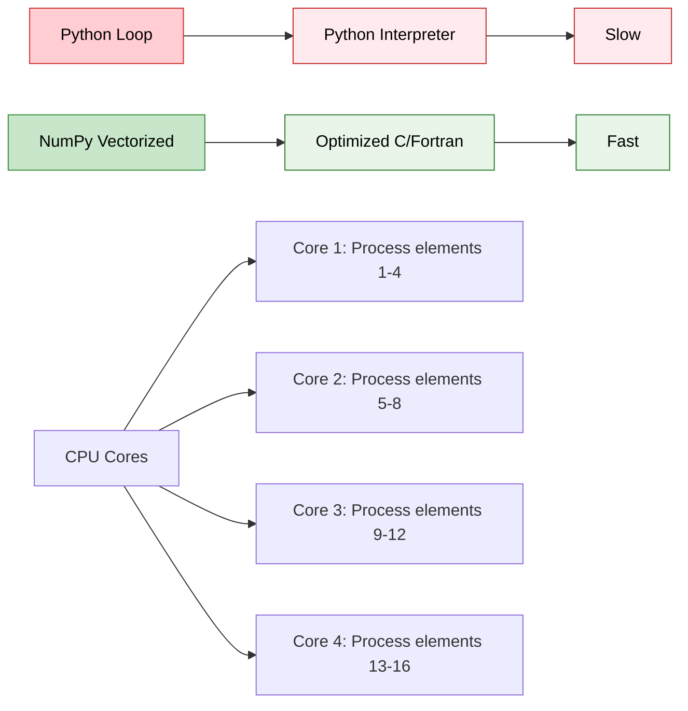

This is why vectorization is absolutely crucial for neural networks—when you're processing millions of parameters and thousands of training examples, the performance difference becomes the difference between training taking minutes versus hours!

#### 2. Batch Processing: Simultaneous Example Processing

Instead of training on one example at a time, we process entire batches simultaneously.

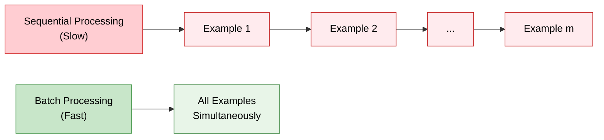

#### 3. GPU Optimization: Parallel Computing Power

Modern GPUs have thousands of cores designed for parallel matrix operations. Our matrix notation maps perfectly to this architecture.

#### 4. Scalability: Size-Independent Code

The same vectorized code works efficiently whether you have 100 or 100,000 training examples.

---

### Practical Implementation with NumPy

NumPy is the fundamental package that makes efficient neural network implementation possible in Python.

#### What is NumPy?

NumPy (Numerical Python) provides:

- **N-dimensional arrays**: Efficient storage for large datasets
- **Vectorized operations**: Fast mathematical functions
- **Broadcasting**: Smart handling of different array shapes
- **Memory efficiency**: Optimized C implementations under the hood

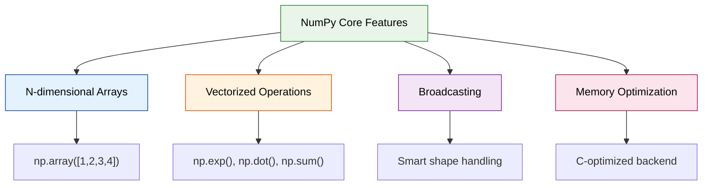

#### Essential NumPy Functions for Neural Networks

**1. Array Creation and Manipulation**

```python
import numpy as np

# Create arrays
X = np.array([[1, 2, 3], [4, 5, 6]])  # 2x3 matrix
print("X shape:", X.shape)  # Output: (2, 3)
print("X:\n", X)
# Output:
# [[1 2 3]
#  [4 5 6]]

# Reshape arrays
X_flat = X.reshape(-1, 1)  # Flatten to column vector
print("X_flat shape:", X_flat.shape)  # Output: (6, 1)

```

**2. Matrix Operations**

```python
# Matrix multiplication
A = np.array([[1, 2], [3, 4]])  # 2x2
B = np.array([[5, 6], [7, 8]])  # 2x2

# Element-wise multiplication
elementwise = A * B
print("Element-wise A * B:\n", elementwise)
# Output:
# [[ 5 12]
#  [21 32]]

# Matrix multiplication
matrix_mult = np.dot(A, B)
print("Matrix multiplication A·B:\n", matrix_mult)
# Output:
# [[19 22]
#  [43 50]]

```

**3. Vectorized Functions**

```python
# Apply functions to entire arrays at once
z = np.array([-2, -1, 0, 1, 2])

# Sigmoid function (vectorized)
def sigmoid(x):
    return 1 / (1 + np.exp(-x))

sigmoid_z = sigmoid(z)
print("z:", z)
print("sigmoid(z):", sigmoid_z)
# Output:
# z: [-2 -1  0  1  2]
# sigmoid(z): [0.119 0.269 0.5   0.731 0.881]

```

#### Understanding Broadcasting with Examples

**Broadcasting** allows NumPy to perform operations on arrays with different shapes automatically.

**Example 1: Adding a scalar to a matrix**

```python
X = np.array([[1, 2, 3],
              [4, 5, 6]])  # Shape: (2, 3)
b = 10                     # Scalar

result = X + b  # Broadcasting: scalar added to each element
print("X + b:\n", result)
# Output:
# [[11 12 13]
#  [14 15 16]]

```

**Example 2: Adding arrays with different shapes**

```python
# Neural network example: adding bias to multiple examples
W = np.array([[0.1], [0.2], [0.3]])  # Weights: (3, 1)
X = np.array([[1, 2, 4],              # Features: (3, 3)
              [3, 1, 2],
              [2, 4, 1]])
b = np.array([[0.5],                  # Bias: (3, 1)
              [0.3],
              [0.1]])

# Linear transformation: Z = W·X + b
Z = np.dot(W.T, X) + b.T  # Broadcasting happens here
print("Z shape:", Z.shape)  # Output: (1, 3)
print("Z:", Z)
# Output: [[2.1 1.7 1.5]]

```

**Broadcasting Rules Visualization:**

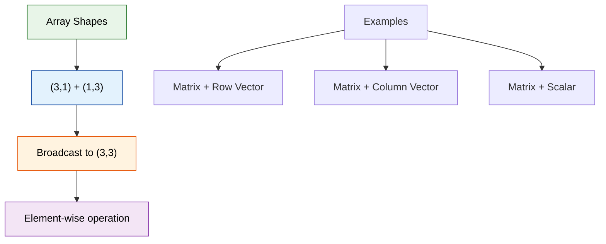

#### Performance Comparison: Loops vs Vectorization

```python
import time

# Setup data
m = 100000  # 100k examples
nx = 784    # 28x28 image features
X = np.random.randn(nx, m)
w = np.random.randn(nx, 1)
b = 0.5

# Method 1: Using loops (SLOW)
start_time = time.time()
z_loop = []
for i in range(m):
    z_i = np.dot(w.T, X[:, i]) + b
    z_loop.append(z_i)
loop_time = time.time() - start_time

# Method 2: Vectorized (FAST)
start_time = time.time()
z_vectorized = np.dot(w.T, X) + b
vectorized_time = time.time() - start_time

print(f"Loop method: {loop_time:.4f} seconds")
print(f"Vectorized method: {vectorized_time:.4f} seconds")
print(f"Speedup: {loop_time/vectorized_time:.1f}x faster")

# Typical output:
# Loop method: 0.1250 seconds
# Vectorized method: 0.0008 seconds
# Speedup: 156.3x faster

```

#### Key NumPy Functions for Neural Networks

```python
# Mathematical functions
np.exp(x)        # Exponential function
np.log(x)        # Natural logarithm
np.maximum(0, x) # ReLU activation function
np.sum(x, axis=1, keepdims=True)  # Sum along axis

# Array operations
np.dot(A, B)     # Matrix multiplication
np.reshape(x, (new_shape))  # Change array shape
np.transpose(A)  # Matrix transpose (or A.T)

# Random number generation
np.random.randn(n, m)  # Random normal distribution
np.random.rand(n, m)   # Random uniform [0,1]
np.zeros((n, m))       # Array of zeros
np.ones((n, m))        # Array of ones

```

This mathematical foundation and NumPy proficiency will be used consistently throughout the neural networks course. Mastering vectorization and broadcasting early will make implementing complex neural networks much more intuitive and efficient.

---
