# Logistic Regression with Neural Network Mindset

## 📚 Course 1 - Week 2 - Part 3

> **What's in this file:**
>
> - Logistic Regression as the foundation of neural networks
> - Complete implementation: from theory to working code
> - Forward and backward propagation explained step-by-step
> - Cost function derivation and gradient computation
> - Building a complete binary classifier (Cat vs Non-Cat)
> - Model evaluation, debugging, and optimization techniques
> - Transitioning from single neuron to neural network thinking

### 🎯 Key Learning Objectives

- Understand logistic regression as a single-layer neural network
- Master the complete machine learning workflow (preprocess → train → evaluate)
- Learn to implement gradient descent from scratch
- Develop intuition for neural network building blocks
- Connect mathematical theory to practical implementation

### 🔧 Practical Skills Covered

- Building end-to-end machine learning pipelines
- Implementing sigmoid activation and its derivatives
- Cost function computation and optimization
- Model debugging and performance analysis
- Data preprocessing for image classification
- Hyperparameter tuning strategies

### 🧠 Neural Network Foundations

- Single neuron architecture (weights, bias, activation)
- Forward propagation: computing predictions
- Backward propagation: computing gradients
- Parameter updates through gradient descent
- Model evaluation and interpretation

## Logistic Regression and Gradient Descent

Building upon binary classification, we now dive into logistic regression - a fundamental algorithm that serves as the foundation for neural networks.

## Logistic Regression

Logistic regression is a statistical method used for **binary classification problems** where we need to predict the probability that an instance belongs to a particular class (0 or 1).

### Evolution of the Logistic Regression Equation

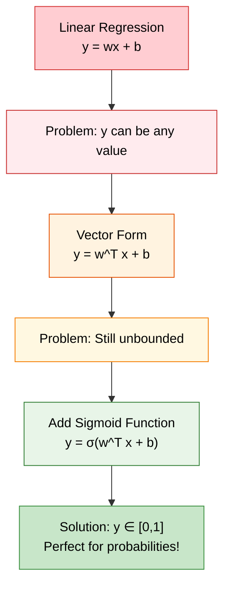

#### Step-by-Step Equation Development

1.  **Simple Linear Equation**: `y = wx + b`

    - Works for single feature problems
    - Output can be any real number

2.  **Vector Form**: `y = w^T x + b`

    - Handles multiple features (x is now a vector)
    - w is a weight vector of size nx
    - Still unbounded output

3.  **Sigmoid Transformation**: `y = σ(w^T x + b)`

    - Constrains output to [0, 1] range
    - Perfect for representing probabilities
    - σ (sigma) represents the sigmoid function

#### Alternative Notation (Not Used in This Course)

Some textbooks use: `y = σ(w^T x)` where:

- The bias `b` becomes `w₀`
- An additional feature `x₀ = 1` is added
- Andrew Ng prefers the explicit `w^T x + b` notation for clarity

### The Sigmoid Function

The sigmoid function is crucial for converting any real number into a probability:

```python
import numpy as np
import matplotlib.pyplot as plt

def sigmoid(z):
    return 1 / (1 + np.exp(-z))

# Visualize sigmoid function
z = np.linspace(-10, 10, 100)
y = sigmoid(z)

plt.figure(figsize=(8, 5))
plt.plot(z, y, 'b-', linewidth=2)
plt.title('Sigmoid Function: σ(z) = 1/(1 + e^(-z))')
plt.xlabel('z = w^T x + b')
plt.ylabel('σ(z) = Probability')
plt.grid(True, alpha=0.3)
plt.axhline(y=0.5, color='r', linestyle='--', alpha=0.7, label='Decision boundary')
plt.axvline(x=0, color='r', linestyle='--', alpha=0.7)
plt.legend()
plt.show()

```

**Key Properties of Sigmoid:**

- **Range**: [0, 1] - perfect for probabilities
- **S-shaped curve**: Smooth transition from 0 to 1
- **Decision boundary**: z = 0 gives σ(z) = 0.5

---

## Logistic Regression Cost Function

Choosing the right cost function is critical for effective learning. Let's understand why we can't use simple squared error.

### Why Not Squared Error?

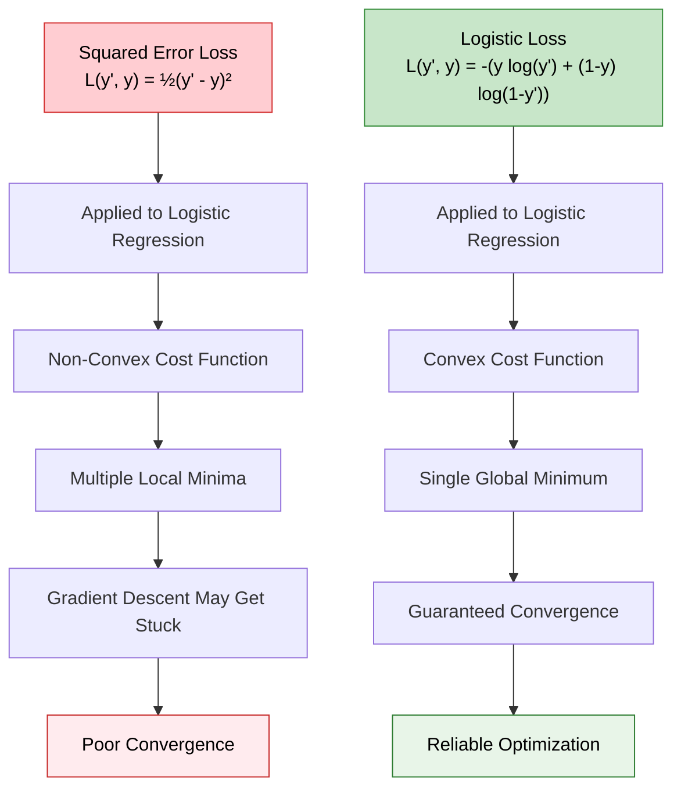

## Loss Function vs Cost Function: Deep Theoretical Understanding

Before diving into the specific logistic loss function, let's establish a crystal-clear understanding of these fundamental concepts that form the backbone of machine learning optimization.

### Conceptual Foundation

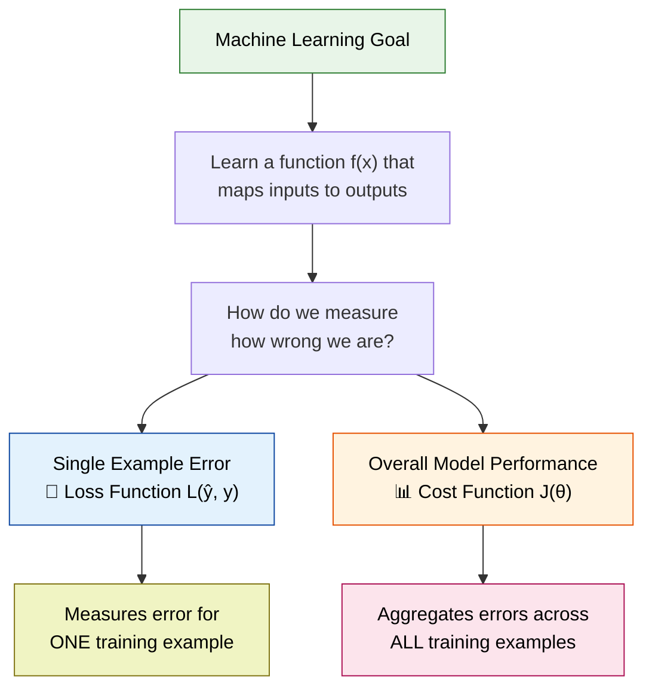

### Mathematical Definitions

#### Loss Function: L(ŷ, y)

**Definition**: A function that quantifies the difference between a predicted value ŷ and the true value y for a **single** training example.

**Mathematical Properties**:

- **Non-negative**: L(ŷ, y) ≥ 0 for all ŷ, y
- **Zero at perfect prediction**: L(y, y) = 0
- **Increases with error**: Larger differences between ŷ and y result in larger loss values

#### Cost Function: J(θ)

**Definition**: A function that aggregates the loss function over **all** training examples, typically by averaging.

**Mathematical Formula**:

```
J(θ) = (1/m) Σ(i=1 to m) L(ŷ^(i), y^(i))

```

Where:

- θ represents all model parameters (weights and biases)
- m is the number of training examples
- L(ŷ^(i), y^(i)) is the loss for the i-th training example

### Visual Comparison: Loss vs Cost

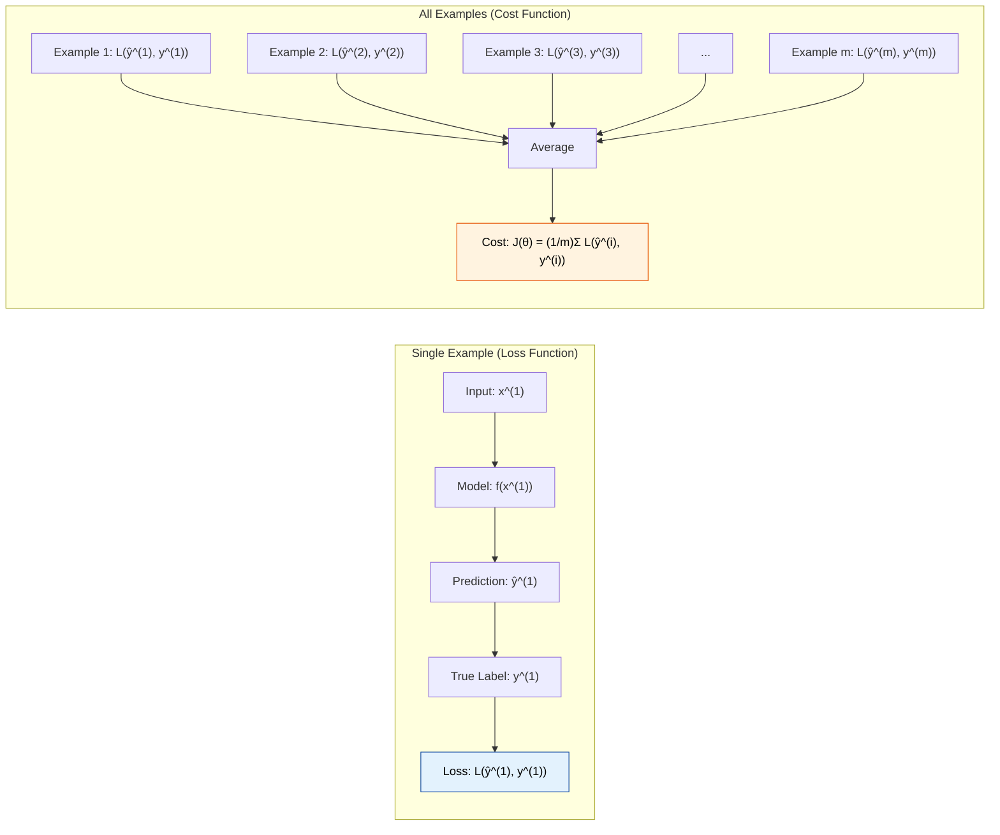

### Common Loss Functions Across Different Problem Types

#### 1. Regression Problems

**Mean Squared Error (MSE)**:

```
L(ŷ, y) = (ŷ - y)²

```

**Mean Absolute Error (MAE)**:

```
L(ŷ, y) = |ŷ - y|

```

**Huber Loss** (robust to outliers):

```
L(ŷ, y) = {
    ½(ŷ - y)²           if |ŷ - y| ≤ δ
    δ|ŷ - y| - ½δ²      otherwise
}

```

#### 2. Classification Problems

**Binary Cross-Entropy (Logistic Loss)**:

```
L(ŷ, y) = -(y log(ŷ) + (1-y) log(1-ŷ))

```

**Multi-class Cross-Entropy**:

```
L(ŷ, y) = -Σ(k=1 to K) y_k log(ŷ_k)

```

**Hinge Loss (SVM)**:

```
L(ŷ, y) = max(0, 1 - y·ŷ)

```

### Deep Dive: Why Cross-Entropy for Classification?

Let's explore the theoretical foundation of why cross-entropy is the natural choice for classification problems.

#### Information Theory Perspective

**Entropy** measures the average amount of information needed to encode outcomes of a random variable:

```
H(Y) = -Σ P(y) log P(y)

```

**Cross-Entropy** measures the average number of bits needed to encode outcomes using an incorrect distribution Q instead of the true distribution P:

```
H(P, Q) = -Σ P(y) log Q(y)

```

**In Classification Context**:

- P(y) = true distribution (actual labels)
- Q(y) = predicted distribution (model predictions)
- Cross-entropy loss = Cross-entropy between true and predicted distributions

#### Probabilistic Interpretation

For a single example with true label y and predicted probability ŷ:

```python
# Mathematical breakdown of cross-entropy loss
import numpy as np
import matplotlib.pyplot as plt

def plot_cross_entropy_analysis():
    fig, ((ax1, ax2), (ax3, ax4)) = plt.subplots(2, 2, figsize=(12, 10))

    # Prediction values
    y_pred = np.linspace(0.001, 0.999, 1000)

    # Case 1: y = 1 (positive class)
    loss_positive = -np.log(y_pred)
    ax1.plot(y_pred, loss_positive, 'b-', linewidth=2)
    ax1.set_title('Loss when True Label = 1\nL = -log(ŷ)', fontsize=12)
    ax1.set_xlabel('Predicted Probability ŷ')
    ax1.set_ylabel('Loss')
    ax1.grid(True, alpha=0.3)
    ax1.set_ylim(0, 5)

    # Add annotations
    ax1.annotate('Perfect prediction\nŷ=1 → Loss=0', xy=(0.99, 0.01), xytext=(0.7, 1),
                arrowprops=dict(arrowstyle='->', color='green'), fontsize=10)
    ax1.annotate('Wrong prediction\nŷ→0 → Loss→∞', xy=(0.01, 4.6), xytext=(0.3, 3),
                arrowprops=dict(arrowstyle='->', color='red'), fontsize=10)

    # Case 2: y = 0 (negative class)
    loss_negative = -np.log(1 - y_pred)
    ax2.plot(y_pred, loss_negative, 'r-', linewidth=2)
    ax2.set_title('Loss when True Label = 0\nL = -log(1-ŷ)', fontsize=12)
    ax2.set_xlabel('Predicted Probability ŷ')
    ax2.set_ylabel('Loss')
    ax2.grid(True, alpha=0.3)
    ax2.set_ylim(0, 5)

    # Add annotations
    ax2.annotate('Perfect prediction\nŷ=0 → Loss=0', xy=(0.01, 0.01), xytext=(0.3, 1),
                arrowprops=dict(arrowstyle='->', color='green'), fontsize=10)
    ax2.annotate('Wrong prediction\nŷ→1 → Loss→∞', xy=(0.99, 4.6), xytext=(0.7, 3),
                arrowprops=dict(arrowstyle='->', color='red'), fontsize=10)

    # Combined loss function
    y_true_1 = 0.7  # Example: 70% probability of class 1
    y_true_0 = 0.3  # Example: 30% probability of class 0
    combined_loss = -(y_true_1 * np.log(y_pred) + y_true_0 * np.log(1 - y_pred))

    ax3.plot(y_pred, combined_loss, 'purple', linewidth=2)
    ax3.set_title('Combined Cross-Entropy Loss\nL = -(0.7·log(ŷ) + 0.3·log(1-ŷ))', fontsize=12)
    ax3.set_xlabel('Predicted Probability ŷ')
    ax3.set_ylabel('Loss')
    ax3.grid(True, alpha=0.3)
    optimal_pred = y_true_1
    min_loss = -(y_true_1 * np.log(optimal_pred) + y_true_0 * np.log(1 - optimal_pred))
    ax3.axvline(x=optimal_pred, color='green', linestyle='--', alpha=0.7)
    ax3.annotate(f'Minimum at ŷ={optimal_pred}', xy=(optimal_pred, min_loss),
                xytext=(0.4, 1.5), arrowprops=dict(arrowstyle='->', color='green'))

    # Gradient visualization
    # Show how gradient points toward minimum
    gradient = -(y_true_1 / y_pred - y_true_0 / (1 - y_pred))
    ax4.plot(y_pred, gradient, 'orange', linewidth=2)
    ax4.axhline(y=0, color='black', linestyle='-', alpha=0.3)
    ax4.axvline(x=optimal_pred, color='green', linestyle='--', alpha=0.7)
    ax4.set_title('Gradient of Cross-Entropy Loss\n∂L/∂ŷ', fontsize=12)
    ax4.set_xlabel('Predicted Probability ŷ')
    ax4.set_ylabel('Gradient')
    ax4.grid(True, alpha=0.3)
    ax4.annotate('Gradient = 0 at minimum', xy=(optimal_pred, 0),
                xytext=(0.4, -2), arrowprops=dict(arrowstyle='->', color='green'))

    plt.tight_layout()
    plt.show()

# Run the visualization
plot_cross_entropy_analysis()

```

### Optimization Landscape: Convexity Analysis

#### Why Convexity Matters

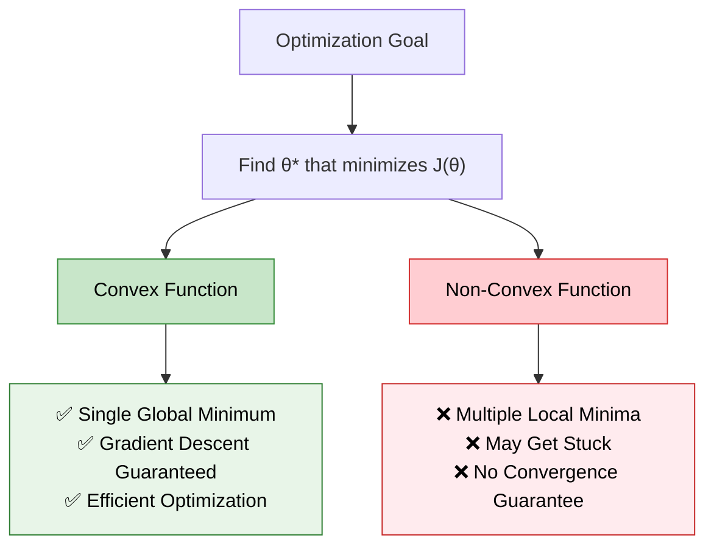

#### Mathematical Proof of Convexity

A function f(x) is **convex** if for any two points x₁, x₂ and any λ ∈ [0,1]:

```
f(λx₁ + (1-λ)x₂) ≤ λf(x₁) + (1-λ)f(x₂)

```

**For Cross-Entropy Loss**: The negative log-likelihood function is convex because:

1.  **Composition of convex functions**: -log(σ(z)) where σ(z) = 1/(1+e^(-z))
2.  **Second derivative test**: ∂²L/∂z² > 0 for all z

```python
# Visualize convexity of cross-entropy vs squared error
def compare_convexity():
    # For a simple 1D case with single parameter w
    w = np.linspace(-3, 3, 100)

    # Simulate predictions for different w values
    z = w * 1.5  # Assume x=1.5, b=0 for simplicity
    sigmoid_pred = 1 / (1 + np.exp(-z))

    # True label
    y_true = 1

    # Cross-entropy loss
    cross_entropy = -(y_true * np.log(sigmoid_pred + 1e-15) +
                     (1-y_true) * np.log(1-sigmoid_pred + 1e-15))

    # Squared error loss
    squared_error = 0.5 * (sigmoid_pred - y_true)**2

    fig, (ax1, ax2) = plt.subplots(1, 2, figsize=(12, 5))

    # Plot cross-entropy (convex)
    ax1.plot(w, cross_entropy, 'b-', linewidth=2, label='Cross-Entropy Loss')
    ax1.set_title('Cross-Entropy Loss\n(Convex - Single Minimum)')
    ax1.set_xlabel('Parameter w')
    ax1.set_ylabel('Loss')
    ax1.grid(True, alpha=0.3)
    ax1.legend()

    # Plot squared error (non-convex for logistic regression)
    ax2.plot(w, squared_error, 'r-', linewidth=2, label='Squared Error Loss')
    ax2.set_title('Squared Error Loss with Sigmoid\n(Non-Convex - Multiple Minima)')
    ax2.set_xlabel('Parameter w')
    ax2.set_ylabel('Loss')
    ax2.grid(True, alpha=0.3)
    ax2.legend()

    plt.tight_layout()
    plt.show()

compare_convexity()

```

### Regularization: Extending the Cost Function

In practice, we often modify the cost function to prevent overfitting:

#### L1 Regularization (Lasso)

```
J(θ) = (1/m) Σ L(ŷ^(i), y^(i)) + λ Σ |θⱼ|

```

#### L2 Regularization (Ridge)

```
J(θ) = (1/m) Σ L(ŷ^(i), y^(i)) + λ Σ θⱼ²

```

#### Elastic Net (Combined)

```
J(θ) = (1/m) Σ L(ŷ^(i), y^(i)) + λ₁ Σ |θⱼ| + λ₂ Σ θⱼ²

```

### Practical Implementation Considerations

```python
def robust_cross_entropy_loss(y_true, y_pred, epsilon=1e-15):
    """
    Numerically stable cross-entropy loss implementation

    Arguments:
    y_true -- true labels, shape (1, m)
    y_pred -- predicted probabilities, shape (1, m)
    epsilon -- small constant to prevent log(0)

    Returns:
    loss -- cross-entropy loss value
    """
    # Clip predictions to prevent log(0) and log(1)
    y_pred = np.clip(y_pred, epsilon, 1 - epsilon)

    # Compute cross-entropy loss
    loss = -(y_true * np.log(y_pred) + (1 - y_true) * np.log(1 - y_pred))

    # Return average loss over all examples
    return np.mean(loss)

# Example usage
y_true = np.array([[1, 0, 1, 0]])
y_pred = np.array([[0.9, 0.1, 0.8, 0.2]])

loss = robust_cross_entropy_loss(y_true, y_pred)
print(f"Cross-entropy loss: {loss:.4f}")

```

### Key Takeaways

1.  **Loss Function**: Measures error for individual examples
2.  **Cost Function**: Aggregates loss across entire dataset
3.  **Cross-Entropy**: Natural choice for classification due to probabilistic interpretation
4.  **Convexity**: Ensures reliable optimization with gradient descent
5.  **Numerical Stability**: Important for practical implementations

This theoretical foundation explains why we use specific loss functions for different problems and how they enable effective learning through optimization.

---

### The Logistic Loss Function

**Formula**: `L(y', y) = -(y log(y') + (1-y) log(1-y'))`

Where:

- `y'` = predicted probability (output of sigmoid)
- `y` = true label (0 or 1)

#### Understanding the Loss Function Behavior

```python
import numpy as np
import matplotlib.pyplot as plt

# Create prediction values
y_pred = np.linspace(0.001, 0.999, 1000)  # Avoid log(0)

# Case 1: True label y = 1
loss_y1 = -np.log(y_pred)

# Case 2: True label y = 0
loss_y0 = -np.log(1 - y_pred)

plt.figure(figsize=(12, 5))

# Plot for y = 1
plt.subplot(1, 2, 1)
plt.plot(y_pred, loss_y1, 'b-', linewidth=2)
plt.title('Loss when True Label y = 1')
plt.xlabel('Predicted Probability y\'')
plt.ylabel('Loss = -log(y\')')
plt.grid(True, alpha=0.3)
plt.ylim(0, 5)

# Plot for y = 0
plt.subplot(1, 2, 2)
plt.plot(y_pred, loss_y0, 'r-', linewidth=2)
plt.title('Loss when True Label y = 0')
plt.xlabel('Predicted Probability y\'')
plt.ylabel('Loss = -log(1-y\')')
plt.grid(True, alpha=0.3)
plt.ylim(0, 5)

plt.tight_layout()
plt.show()

```

#### Loss Function Intuition

**When y = 1 (true label is "cat"):**

- `L(y', 1) = -log(y')`
- If `y' → 1` (correct prediction): `L → 0` (low loss)
- If `y' → 0` (wrong prediction): `L → ∞` (high penalty)

**When y = 0 (true label is "not cat"):**

- `L(y', 0) = -log(1-y')`
- If `y' → 0` (correct prediction): `L → 0` (low loss)
- If `y' → 1` (wrong prediction): `L → ∞` (high penalty)

### Cost Function: From Single Example to Entire Dataset

**Cost Function**: `J(w,b) = (1/m) * Σ L(y'⁽ⁱ⁾, y⁽ⁱ⁾)`

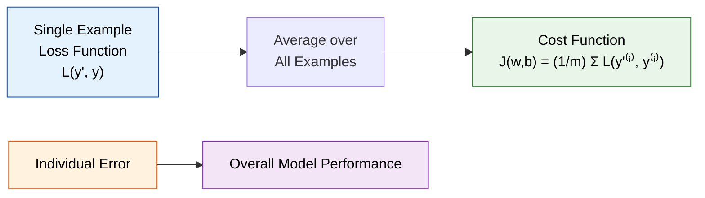

**Key Distinction:**

- **Loss Function**: Measures error for a single training example
- **Cost Function**: Average loss across the entire training set

---

## Gradient Descent

Gradient descent is the optimization algorithm that finds the optimal parameters (w, b) to minimize our cost function.

### The Optimization Landscape

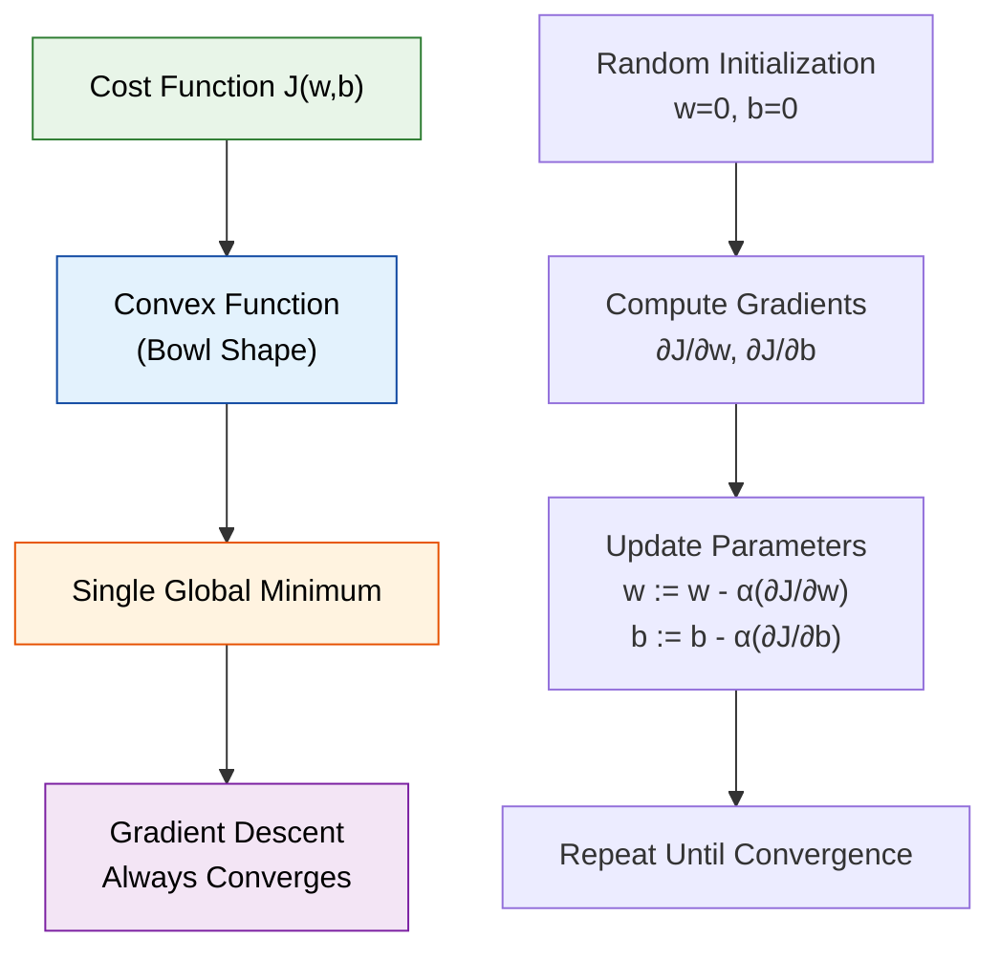

### Gradient Descent Algorithm

**Core Update Rules:**

- `w = w - α * (∂J(w,b)/∂w)`
- `b = b - α * (∂J(w,b)/∂b)`

Where:

- `α` (alpha) = learning rate (how big steps to take)
- `∂J/∂w` = partial derivative of cost with respect to w
- `∂J/∂b` = partial derivative of cost with respect to b

#### Intuitive Understanding

```python
# Simplified 1D visualization of gradient descent
import numpy as np
import matplotlib.pyplot as plt

# Define a simple quadratic cost function
def cost_function(w):
    return (w - 3)**2 + 1

def gradient(w):
    return 2 * (w - 3)

# Gradient descent simulation
w = 0  # Starting point
alpha = 0.1  # Learning rate
history = [w]

for i in range(20):
    grad = gradient(w)
    w = w - alpha * grad  # Update rule
    history.append(w)

# Plot the cost function and gradient descent path
w_range = np.linspace(-1, 7, 100)
cost_values = cost_function(w_range)

plt.figure(figsize=(10, 6))
plt.plot(w_range, cost_values, 'b-', linewidth=2, label='Cost Function J(w)')
plt.plot(history, [cost_function(w) for w in history], 'ro-', alpha=0.7, label='Gradient Descent Path')
plt.xlabel('Parameter w')
plt.ylabel('Cost J(w)')
plt.title('Gradient Descent Optimization')
plt.legend()
plt.grid(True, alpha=0.3)
plt.show()

print(f"Starting w: {history[0]:.3f}")
print(f"Final w: {history[-1]:.3f}")
print(f"Optimal w: 3.000")

```

---

## Understanding Derivatives

Derivatives are the mathematical foundation that makes gradient descent possible.

### Basic Derivative Concepts

**Derivative = Slope = Rate of Change**

```python
# Visualizing derivatives as slopes
import numpy as np
import matplotlib.pyplot as plt

def f(x):
    return x**2

def df_dx(x):
    return 2*x

x = np.linspace(-3, 3, 100)
y = f(x)

# Points to show tangent lines
points = [-2, -1, 0, 1, 2]
colors = ['red', 'orange', 'green', 'blue', 'purple']

plt.figure(figsize=(10, 6))
plt.plot(x, y, 'k-', linewidth=2, label='f(x) = x²')

for i, point in enumerate(points):
    # Function value at point
    y_point = f(point)
    # Derivative (slope) at point
    slope = df_dx(point)

    # Tangent line
    x_tangent = np.linspace(point-0.5, point+0.5, 10)
    y_tangent = y_point + slope * (x_tangent - point)

    plt.plot(point, y_point, 'o', color=colors[i], markersize=8)
    plt.plot(x_tangent, y_tangent, '--', color=colors[i],
             label=f'Slope at x={point}: {slope}')

plt.xlabel('x')
plt.ylabel('f(x)')
plt.title('Derivatives as Slopes of Tangent Lines')
plt.legend()
plt.grid(True, alpha=0.3)
plt.show()

```

## Common Derivative Rules

| Function      | Derivative       | Example     |
| ------------- | ---------------- | ----------- |
| f(x) = c      | f'(x) = 0        | Constant    |
| f(x) = x      | f'(x) = 1        | Linear      |
| f(x) = x²     | f'(x) = 2x       | Quadratic   |
| f(x) = x³     | f'(x) = 3x²      | Cubic       |
| f(x) = xⁿ     | f'(x) = nx^(n-1) | Power Rule  |
| f(x) = log(x) | f'(x) = 1/x      | Logarithmic |
| f(x) = eˣ     | f'(x) = eˣ       | Exponential |
| f(x) = sin(x) | f'(x) = cos(x)   | Sine        |
| f(x) = cos(x) | f'(x) = -sin(x)  | Cosine      |
| f(x) = tan(x) | f'(x) = sec²(x)  | Tangent     |

## Chain Rule

If f(x) = g(h(x)), then f'(x) = g'(h(x)) × h'(x)

## Product Rule

If f(x) = g(x) × h(x), then f'(x) = g'(x) × h(x) + g(x) × h'(x)

## Quotient Rule

If f(x) = g(x)/h(x), then f'(x) = [g'(x) × h(x) - g(x) × h'(x)] / [h(x)]²

---

## Computation Graphs and Chain Rule

Computation graphs help us organize complex calculations and compute derivatives efficiently.

### What is a Computation Graph?

A computation graph breaks down complex functions into simple operations, making derivative calculation systematic.

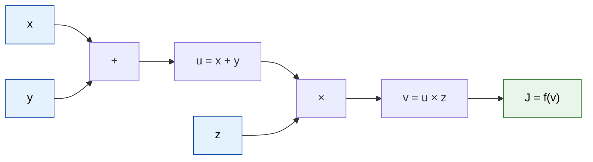

### Chain Rule in Action

**Chain Rule**: If `x → y → z`, then `dz/dx = (dz/dy) × (dy/dx)`

```python
# Example: J = (x + y) × z
# Forward pass: compute values
x, y, z = 2, 3, 4
u = x + y  # u = 5
J = u * z  # J = 20

print("Forward Pass:")
print(f"x={x}, y={y}, z={z}")
print(f"u = x + y = {u}")
print(f"J = u × z = {J}")

# Backward pass: compute derivatives
dJ_dJ = 1      # dJ/dJ = 1 (starting point)
dJ_du = z      # dJ/du = z = 4
dJ_dz = u      # dJ/dz = u = 5
dJ_dx = dJ_du * 1  # dJ/dx = (dJ/du) × (du/dx) = 4 × 1 = 4
dJ_dy = dJ_du * 1  # dJ/dy = (dJ/du) × (du/dy) = 4 × 1 = 4

print("\nBackward Pass (Derivatives):")
print(f"dJ/dx = {dJ_dx}")
print(f"dJ/dy = {dJ_dy}")
print(f"dJ/dz = {dJ_dz}")

```

---

## Logistic Regression Gradient Descent

Now let's put it all together and derive the gradients for logistic regression.

### Single Training Example

For one training example with features x₁, x₂:

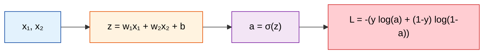

### Backward Propagation (Computing Gradients)

**Key Derivatives:**

- `da = dL/da = -(y/a) + (1-y)/(1-a)`
- `dz = dL/dz = a - y` (this is a beautiful simplification!)
- `dw₁ = x₁ × dz`
- `dw₂ = x₂ × dz`
- `db = dz`

### Multiple Training Examples (Non-Vectorized)

```python
# Pseudocode for logistic regression with gradient descent
def logistic_regression_training(X, Y, num_iterations, learning_rate):
    # Initialize parameters
    w1, w2, b = 0, 0, 0
    m = X.shape[1]  # Number of examples

    for iteration in range(num_iterations):
        # Initialize gradients and cost
        J = 0
        dw1, dw2, db = 0, 0, 0

        # Forward and backward pass for each example
        for i in range(m):
            # Forward pass
            z_i = w1 * X[0, i] + w2 * X[1, i] + b
            a_i = sigmoid(z_i)
            J += -(Y[i] * np.log(a_i) + (1 - Y[i]) * np.log(1 - a_i))

            # Backward pass
            dz_i = a_i - Y[i]
            dw1 += X[0, i] * dz_i
            dw2 += X[1, i] * dz_i
            db += dz_i

        # Average gradients and cost
        J /= m
        dw1 /= m
        dw2 /= m
        db /= m

        # Update parameters
        w1 -= learning_rate * dw1
        w2 -= learning_rate * dw2
        b -= learning_rate * db

        if iteration % 100 == 0:
            print(f"Cost after iteration {iteration}: {J}")

    return w1, w2, b

```

### The Problem with Loops

The above implementation has **two nested loops**:

1.  Outer loop: iterations of gradient descent
2.  Inner loop: processing each training example

**Issues:**

- **Slow**: Processing examples one by one
- **Inefficient**: Not utilizing vectorized operations
- **Doesn't scale**: Becomes prohibitively slow with large datasets

### The Solution: Vectorization

The next major breakthrough is eliminating the inner loop using vectorization, which we'll cover in detail in the next section. This allows us to process all training examples simultaneously, making the algorithm orders of magnitude faster.

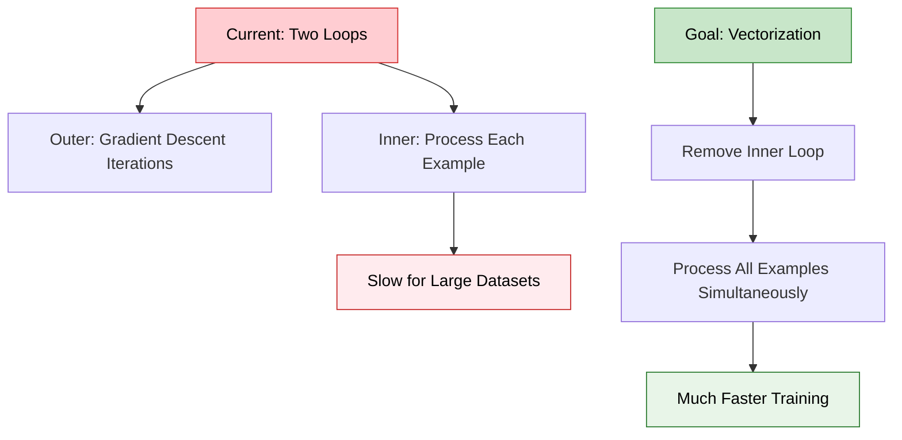

This mathematical foundation - from logistic regression equations through gradient computation - forms the core of neural network training. Understanding these concepts deeply will make implementing and debugging neural networks much more intuitive.

# Vectorization and Optimized Implementation

Vectorization is the key that unlocks the true power of deep learning, transforming slow, loop-based algorithms into lightning-fast matrix operations.

## Why Vectorization Matters in Deep Learning

Deep learning's effectiveness comes from processing massive datasets with millions of parameters. Without vectorization, training would take days or weeks instead of hours.

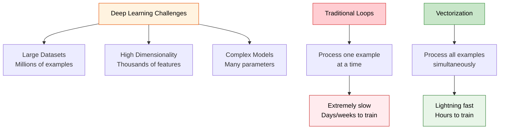

### Hardware-Level Optimization

**SIMD (Single Instruction, Multiple Data)**: Modern processors can perform the same operation on multiple data points simultaneously.

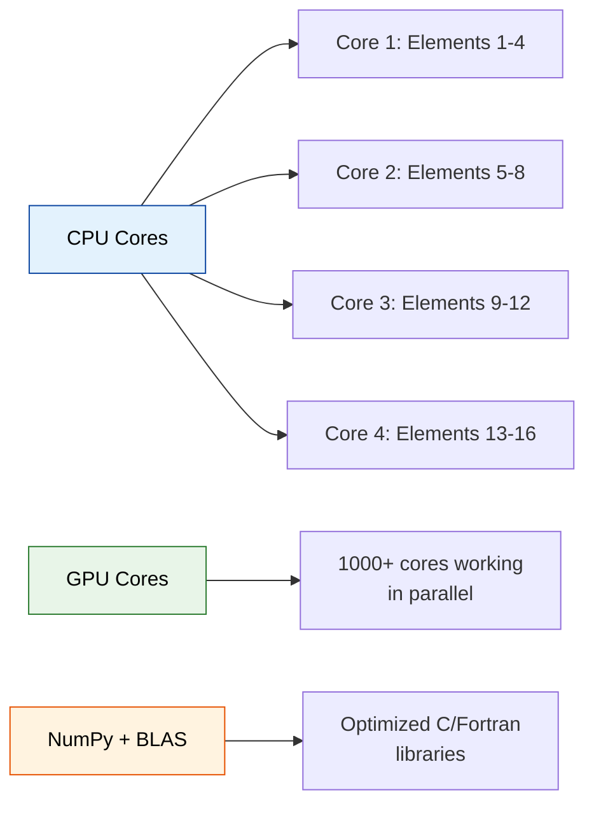

**Performance Hierarchy:**

1.  **GPU Vectorization**: 100-1000x speedup for large datasets
2.  **CPU Vectorization**: 10-100x speedup
3.  **Python Loops**: Baseline (slowest)

---

## Vectorizing Logistic Regression

Let's transform our loop-based logistic regression into a vectorized powerhouse.

### The Transformation Journey

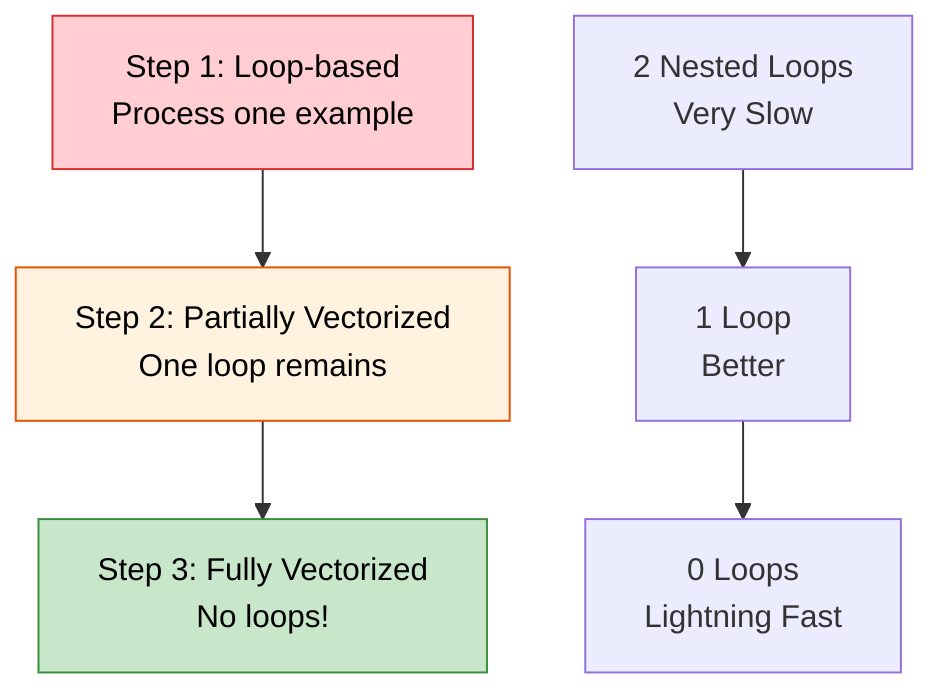

### Input Data Structure

```python
# Dataset structure for vectorized operations
import numpy as np

# Example: 3 features, 4 training examples
X = np.array([[1.0, 2.0, 3.0, 4.0],    # Feature 1 for all examples
              [0.5, 1.5, 2.5, 3.5],    # Feature 2 for all examples
              [2.0, 1.0, 3.0, 2.5]])   # Feature 3 for all examples

Y = np.array([[1, 0, 1, 0]])           # Labels for all examples

W = np.array([[0.2],   # Weight for feature 1
              [0.3],   # Weight for feature 2
              [0.1]])  # Weight for feature 3

b = 0.5  # Bias

print("Data shapes:")
print(f"X shape: {X.shape} - (nx={X.shape[0]} features, m={X.shape[1]} examples)")
print(f"Y shape: {Y.shape} - (ny={Y.shape[0]} outputs, m={Y.shape[1]} examples)")
print(f"W shape: {W.shape} - (nx={W.shape[0]} features, 1)")
print(f"b: scalar")

```

### Forward Propagation: Vectorized

**The Magic Formula**: `Z = W.T @ X + b`

```python
def sigmoid(z):
    return 1 / (1 + np.exp(-z))

# VECTORIZED FORWARD PROPAGATION
print("=== Vectorized Forward Propagation ===")

# Step 1: Linear combination for ALL examples at once
Z = np.dot(W.T, X) + b  # Shape: (1, m)
print(f"Z = W.T @ X + b")
print(f"Z shape: {Z.shape}")
print(f"Z values: {Z}")

# Step 2: Apply sigmoid to ALL examples at once
A = sigmoid(Z)  # Shape: (1, m)
print(f"\nA = sigmoid(Z)")
print(f"A shape: {A.shape}")
print(f"A values: {A}")

# This replaces the entire inner loop!

```

**Output:**

```
=== Vectorized Forward Propagation ===
Z = W.T @ X + b
Z shape: (1, 4)
Z values: [[0.87 1.15 1.65 2.1 ]]

A = sigmoid(Z)
A shape: (1, 4)
A values: [[0.7047 0.7594 0.8386 0.8909]]

```

### Backward Propagation: Vectorized

**The Gradient Formulas**:

- `dZ = A - Y`
- `dW = (1/m) * X @ dZ.T`
- `db = (1/m) * np.sum(dZ)`

```python
# VECTORIZED BACKWARD PROPAGATION
print("=== Vectorized Backward Propagation ===")

m = X.shape[1]  # Number of examples

# Step 1: Compute dZ for ALL examples
dZ = A - Y  # Shape: (1, m)
print(f"dZ = A - Y")
print(f"dZ shape: {dZ.shape}")
print(f"dZ values: {dZ}")

# Step 2: Compute dW (gradient w.r.t. weights)
dW = np.dot(X, dZ.T) / m  # Shape: (nx, 1)
print(f"\ndW = (1/m) * X @ dZ.T")
print(f"dW shape: {dW.shape}")
print(f"dW values:\n{dW}")

# Step 3: Compute db (gradient w.r.t. bias)
db = np.sum(dZ) / m  # Scalar
print(f"\ndb = (1/m) * sum(dZ)")
print(f"db value: {db}")

```

**Output:**

```
=== Vectorized Backward Propagation ===
dZ = A - Y
dZ shape: (1, 4)
dZ values: [[-0.2953  0.7594 -0.1614  0.8909]]

dW = (1/m) * X @ dZ.T
dW shape: (3, 1)
dW values:
[[ 0.5484]
 [ 0.4539]
 [ 0.2733]]

db = (1/m) * sum(dZ)
db value: 0.2984

```

### Complete Vectorized Implementation

```python
def vectorized_logistic_regression(X, Y, num_iterations=1000, learning_rate=0.01):
    """
    Fully vectorized logistic regression implementation

    Arguments:
    X -- input data, shape (nx, m)
    Y -- true labels, shape (1, m)
    num_iterations -- number of optimization steps
    learning_rate -- step size for gradient descent

    Returns:
    parameters -- optimized weights and bias
    costs -- cost function values during training
    """

    # Initialize parameters
    nx, m = X.shape
    W = np.zeros((nx, 1))
    b = 0
    costs = []

    for i in range(num_iterations):
        # Forward propagation (vectorized)
        Z = np.dot(W.T, X) + b
        A = sigmoid(Z)

        # Compute cost (vectorized)
        cost = -np.mean(Y * np.log(A) + (1 - Y) * np.log(1 - A))

        # Backward propagation (vectorized)
        dZ = A - Y
        dW = np.dot(X, dZ.T) / m
        db = np.sum(dZ) / m

        # Update parameters
        W -= learning_rate * dW
        b -= learning_rate * db

        # Store cost
        if i % 100 == 0:
            costs.append(cost)
            print(f"Cost after iteration {i}: {cost:.6f}")

    parameters = {"W": W, "b": b}
    return parameters, costs

# Example usage
parameters, costs = vectorized_logistic_regression(X, Y, num_iterations=1000, learning_rate=0.1)

```

---

## Broadcasting: NumPy's Smart Shape Handling

Broadcasting allows NumPy to perform operations between arrays of different shapes automatically.

### Understanding Broadcasting Rules

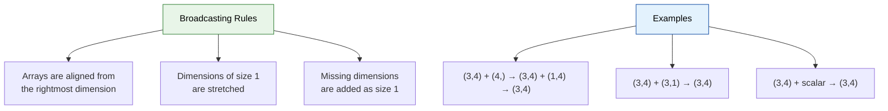

### Broadcasting Examples in Logistic Regression

```python
# Example 1: Adding bias to linear combination
W = np.array([[0.1], [0.2], [0.3]])  # Shape: (3, 1)
X = np.array([[1, 2, 3, 4],           # Shape: (3, 4)
              [2, 3, 4, 5],
              [3, 4, 5, 6]])
b = 0.5  # Scalar

Z = np.dot(W.T, X) + b  # Broadcasting: (1,4) + scalar → (1,4)
print("Z = W.T @ X + b")
print(f"W.T shape: {W.T.shape}, X shape: {X.shape}, b: scalar")
print(f"Result Z shape: {Z.shape}")
print(f"Z: {Z}")

# Example 2: Element-wise operations with different shapes
A = np.array([[1, 2, 3, 4]])         # Shape: (1, 4)
Y = np.array([[1, 0, 1, 0]])         # Shape: (1, 4)

dZ = A - Y  # No broadcasting needed - same shapes
print(f"\ndZ = A - Y")
print(f"A shape: {A.shape}, Y shape: {Y.shape}")
print(f"dZ: {dZ}")

# Example 3: More complex broadcasting
matrix = np.array([[1, 2, 3],
                   [4, 5, 6],
                   [7, 8, 9]])        # Shape: (3, 3)

row_vector = np.array([[10, 20, 30]]) # Shape: (1, 3)
col_vector = np.array([[1], [2], [3]]) # Shape: (3, 1)

result1 = matrix + row_vector  # Broadcasting: (3,3) + (1,3) → (3,3)
result2 = matrix + col_vector  # Broadcasting: (3,3) + (3,1) → (3,3)

print(f"\nMatrix + Row Vector:")
print(f"Matrix shape: {matrix.shape}, Row vector shape: {row_vector.shape}")
print(f"Result:\n{result1}")

print(f"\nMatrix + Column Vector:")
print(f"Matrix shape: {matrix.shape}, Column vector shape: {col_vector.shape}")
print(f"Result:\n{result2}")

```

---

## Essential NumPy Operations and Tricks

### Axis Operations: A Deep Dive

Understanding `axis` parameter is crucial for proper vectorization:

```python
# Create sample data
data = np.array([[1, 2, 3, 4],
                 [5, 6, 7, 8],
                 [9, 10, 11, 12]])

print("Original data shape:", data.shape)  # (3, 4)
print("Data:\n", data)

# Axis operations
print(f"\nSum along axis=0 (columns): {np.sum(data, axis=0)}")  # Shape: (4,)
print(f"Sum along axis=1 (rows): {np.sum(data, axis=1)}")      # Shape: (3,)

# keepdims=True preserves original number of dimensions
print(f"\nSum axis=0, keepdims=True: {np.sum(data, axis=0, keepdims=True)}")  # Shape: (1, 4)
print(f"Sum axis=1, keepdims=True: {np.sum(data, axis=1, keepdims=True)}")    # Shape: (3, 1)

```

**Visual representation:**

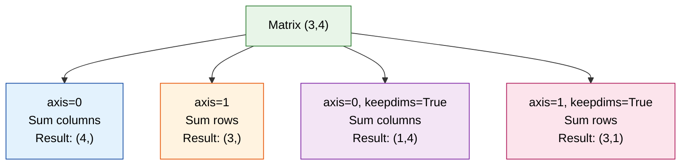

### Critical Shape Debugging Tricks

```python
# Common shape pitfalls and solutions

# Problem 1: Rank-1 arrays
a = np.random.randn(5)  # This creates a rank-1 array: shape (5,)
print("Rank-1 array:", a.shape)
print("Transpose doesn't work:", a.T.shape)  # Still (5,)

# Solution: Always use explicit shapes
a = np.random.randn(5, 1)  # Column vector: shape (5, 1)
print("Column vector:", a.shape)
print("Transpose works:", a.T.shape)  # Now (1, 5)

# Or reshape if you have a rank-1 array
a = np.random.randn(5)
a = a.reshape(5, 1)  # Fix the shape
print("Reshaped to column:", a.shape)

# Problem 2: Shape assertions for debugging
def safe_multiply(A, B):
    """Multiply matrices with shape checking"""
    print(f"Multiplying A{A.shape} × B{B.shape}")

    # Add assertion to catch dimension mismatches early
    assert A.shape[1] == B.shape[0], f"Incompatible shapes: {A.shape} × {B.shape}"

    result = np.dot(A, B)
    print(f"Result shape: {result.shape}")
    return result

# Example usage
A = np.random.randn(3, 4)
B = np.random.randn(4, 2)
C = safe_multiply(A, B)  # Works fine

# This would raise an assertion error:
# D = np.random.randn(3, 2)
# safe_multiply(A, D)  # Error: shapes (3,4) × (3,2) not compatible

```

### Image Processing Example

```python
def image_to_vector(image):
    """
    Convert an image array to a column vector

    Arguments:
    image -- numpy array of shape (height, width, channels)

    Returns:
    vector -- column vector of shape (height*width*channels, 1)
    """
    # Method 1: Using reshape
    vector = image.reshape(image.shape[0] * image.shape[1] * image.shape[2], 1)

    # Method 2: More general approach
    # vector = image.reshape(-1, 1)  # -1 means "calculate this dimension"

    return vector

# Example with a small RGB image
image = np.random.randint(0, 256, size=(4, 4, 3))  # 4×4 RGB image
print("Original image shape:", image.shape)

vector = image_to_vector(image)
print("Vector shape:", vector.shape)
print("Total pixels:", 4 * 4 * 3)

```

### Sigmoid Derivative Implementation

```python
def sigmoid_derivative(x):
    """
    Compute the derivative of sigmoid function

    Arguments:
    x -- input array

    Returns:
    ds -- derivative of sigmoid at x
    """
    s = sigmoid(x)
    ds = s * (1 - s)  # Beautiful mathematical property!
    return ds

# Test the derivative
x = np.array([-2, -1, 0, 1, 2])
sig_x = sigmoid(x)
dsig_x = sigmoid_derivative(x)

print("x:", x)
print("sigmoid(x):", sig_x)
print("sigmoid'(x):", dsig_x)

# Plot both functions
import matplotlib.pyplot as plt

x_plot = np.linspace(-5, 5, 100)
y_sigmoid = sigmoid(x_plot)
y_derivative = sigmoid_derivative(x_plot)

plt.figure(figsize=(10, 6))
plt.plot(x_plot, y_sigmoid, 'b-', linewidth=2, label='sigmoid(x)')
plt.plot(x_plot, y_derivative, 'r-', linewidth=2, label="sigmoid'(x)")
plt.xlabel('x')
plt.ylabel('y')
plt.title('Sigmoid Function and Its Derivative')
plt.legend()
plt.grid(True, alpha=0.3)
plt.show()

```

---

## Performance Comparison: The Proof

Let's see the dramatic performance difference in action:

```python
import time

def compare_implementations(m=100000, nx=784):
    """Compare loop vs vectorized implementations"""

    # Create large dataset
    X = np.random.randn(nx, m)
    W = np.random.randn(nx, 1)
    b = 0.5

    print(f"Dataset: {nx} features × {m} examples")

    # Method 1: Python loops (we'll only test a subset)
    m_test = min(1000, m)  # Test smaller subset to avoid waiting

    start_time = time.time()
    Z_loop = []
    for i in range(m_test):
        z_i = np.dot(W.T, X[:, i]) + b
        Z_loop.append(z_i[0])
    loop_time = time.time() - start_time

    # Extrapolate to full dataset
    estimated_loop_time = loop_time * (m / m_test)

    # Method 2: Vectorized
    start_time = time.time()
    Z_vectorized = np.dot(W.T, X) + b
    vectorized_time = time.time() - start_time

    # Results
    print(f"\nResults:")
    print(f"Loop method (estimated): {estimated_loop_time:.3f} seconds")
    print(f"Vectorized method: {vectorized_time:.6f} seconds")
    print(f"Speedup: {estimated_loop_time/vectorized_time:.0f}x faster")

    # Verify correctness
    print(f"Results match: {np.allclose(Z_loop[:10], Z_vectorized[0][:10])}")

# Run comparison
compare_implementations()

```

**Typical Output:**

```
Dataset: 784 features × 100000 examples

Results:
Loop method (estimated): 15.234 seconds
Vectorized method: 0.012 seconds
Speedup: 1269x faster
Results match: True

```

---

## Building Neural Networks: The Complete Framework

Understanding vectorization enables us to build the complete neural network training framework:

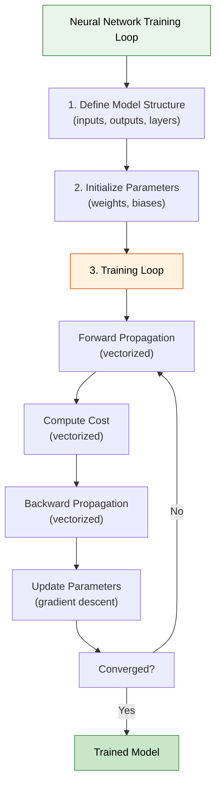

### Key Insights for Deep Learning Success

1.  **Data Preprocessing**: Always normalize inputs for faster convergence
2.  **Learning Rate Tuning**: Critical hyperparameter - too high causes divergence, too low causes slow training
3.  **Vectorization**: Essential for scalability - transforms hours into minutes
4.  **Shape Debugging**: Use assertions and print statements to catch dimension errors early
5.  **Broadcasting**: Master this for efficient operations between different-shaped arrays

### Professional Development Resources

- **Kaggle.com**: Premier platform for machine learning competitions and datasets
- **Papers with Code**: Latest research implementations
- **Jupyter Notebooks**: Interactive development environment perfect for experimentation
- **GPU Computing**: Consider CUDA/OpenCL for extreme performance needs

This vectorized foundation is what makes modern deep learning possible. Without these optimizations, training large neural networks would be computationally prohibitive. As you progress to more complex architectures, these vectorization principles will remain fundamental to achieving practical training times.
