# Comprehensive Notes: Shallow Neural Networks

> **Course 1 - Week 3: Neural Networks and Deep Learning - Part 1**
> Learn to build a neural network with one hidden layer, using forward propagation and backpropagation.

---

## Table of Contents

## Table of Contents

1. [Neural Networks Overview](#1-neural-networks-overview)
2. [Neural Network Representation](#2-neural-network-representation)
3. [Computing Neural Network Output](#3-computing-neural-network-output)
4. [Vectorizing Across Multiple Examples](#4-vectorizing-across-multiple-examples)
5. [Activation Functions](#5-activation-functions)
6. [Why Non-Linear Activation Functions Are Essential](#6-why-non-linear-activation-functions-are-essential)
7. [Derivatives of Activation Functions](#7-derivatives-of-activation-functions)

# 1. Neural Networks Overview

## Introduction

Neural networks are fundamentally an extension of logistic regression. Instead of having a single logistic regression unit, we stack multiple units together to create a more powerful learning algorithm that can capture complex, non-linear relationships in data.

## From Logistic Regression to Neural Networks

### Logistic Regression Recap

In logistic regression, we have a simple linear model followed by a sigmoid activation:

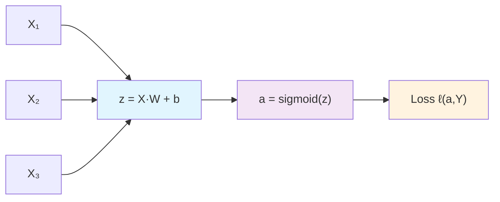

**Mathematical Representation:**

**Step 1: Linear Transformation**
$$z = w_1x_1 + w_2x_2 + w_3x_3 + b$$

Or in vectorized form:
$$z = X^T W + b = \sum_{i=1}^{n} w_i x_i + b$$

**Step 2: Activation Function**
$$a = \sigma(z) = \frac{1}{1 + e^{-z}}$$

**Step 3: Loss Computation**
$$\mathcal{L}(a, y) = -y \log(a) - (1-y) \log(1-a)$$

### Neural Network with One Hidden Layer

Now, let's extend this to a neural network with one hidden layer:

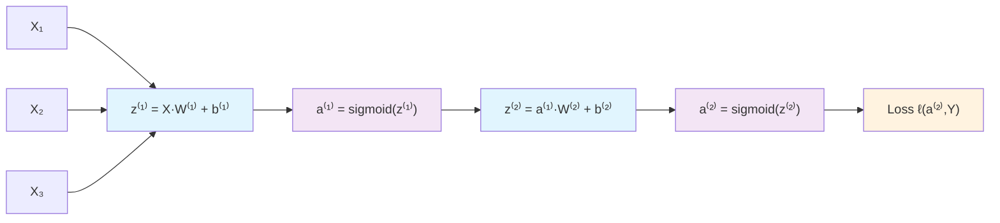

**Mathematical Representation:**

**Hidden Layer (Layer 1):**
$$z^{[1]} = X^T W^{[1]} + b^{[1]}$$
$$a^{[1]} = g^{[1]}(z^{[1]})$$

**Output Layer (Layer 2):**
$$z^{[2]} = (a^{[1]})^T W^{[2]} + b^{[2]}$$
$$a^{[2]} = g^{[2]}(z^{[2]})$$

**Loss:**
$$\mathcal{L}(a^{[2]}, y)$$

---

## Key Differences and Insights

### 1. **Multiple Processing Units**

| Aspect               | Logistic Regression      | Neural Network                                  |
| -------------------- | ------------------------ | ----------------------------------------------- |
| **Processing Units** | 1 unit                   | Multiple units in hidden layer                  |
| **Computations**     | Single linear → sigmoid  | Multiple linear → activation → linear → sigmoid |
| **Parameters**       | $(W, b)$                 | $(W^{[1]}, b^{[1]}, W^{[2]}, b^{[2]})$          |
| **Complexity**       | Linear decision boundary | Non-linear decision boundaries                  |

### 2. **Stacking Concept**

**Key Insight:** A neural network is essentially a **stack of logistic regression objects**.

```python
# Pseudocode representation
def neural_network(X):
    # First logistic regression unit (hidden layer)
    z1 = linear_transform(X, W1, b1)
    a1 = activation_function(z1)

    # Second logistic regression unit (output layer)
    z2 = linear_transform(a1, W2, b2)
    a2 = activation_function(z2)

    return a2
```

### 3. **Information Flow**

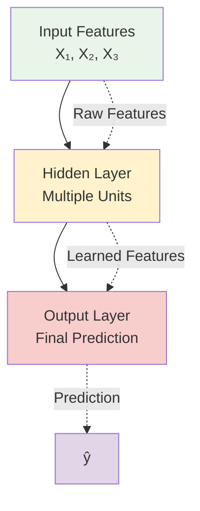

**Interpretation:**

- **Input Layer:** Raw features from the dataset
- **Hidden Layer:** Learns intermediate representations/features
- **Output Layer:** Combines learned features to make final prediction

---

## Mathematical Notation

### Input and Output

- **Input vector:** $X = (X_1, X_2, X_3, \ldots, X_n)$
- **Output:** $Y$ (scalar for binary classification, vector for multi-class)

### Layer Notation

We use superscript $[l]$ to denote layer number:

- $W^{[1]}, b^{[1]}$: Parameters for layer 1 (hidden layer)
- $W^{[2]}, b^{[2]}$: Parameters for layer 2 (output layer)
- $z^{[l]}, a^{[l]}$: Linear combinations and activations for layer $l$

### Activation Functions

- $g^{[1]}(\cdot)$: Activation function for hidden layer (e.g., tanh, ReLU)
- $g^{[2]}(\cdot)$: Activation function for output layer (e.g., sigmoid for binary classification)

---

## Example: Binary Classification

Let's walk through a concrete example with 3 input features and 4 hidden units:

### Problem Setup

- **Input:** 3 features $(x_1, x_2, x_3)$
- **Hidden Layer:** 4 units
- **Output:** 1 unit (binary classification)

### Forward Pass Computation

**Step 1: Hidden Layer**

```
z₁⁽¹⁾ = w₁₁⁽¹⁾x₁ + w₁₂⁽¹⁾x₂ + w₁₃⁽¹⁾x₃ + b₁⁽¹⁾
z₂⁽¹⁾ = w₂₁⁽¹⁾x₁ + w₂₂⁽¹⁾x₂ + w₂₃⁽¹⁾x₃ + b₂⁽¹⁾
z₃⁽¹⁾ = w₃₁⁽¹⁾x₁ + w₃₂⁽¹⁾x₂ + w₃₃⁽¹⁾x₃ + b₃⁽¹⁾
z₄⁽¹⁾ = w₄₁⁽¹⁾x₁ + w₄₂⁽¹⁾x₂ + w₄₃⁽¹⁾x₃ + b₄⁽¹⁾
```

**Step 2: Hidden Layer Activations**

```
a₁⁽¹⁾ = tanh(z₁⁽¹⁾)
a₂⁽¹⁾ = tanh(z₂⁽¹⁾)
a₃⁽¹⁾ = tanh(z₃⁽¹⁾)
a₄⁽¹⁾ = tanh(z₄⁽¹⁾)
```

**Step 3: Output Layer**

```
z⁽²⁾ = w₁⁽²⁾a₁⁽¹⁾ + w₂⁽²⁾a₂⁽¹⁾ + w₃⁽²⁾a₃⁽¹⁾ + w₄⁽²⁾a₄⁽¹⁾ + b⁽²⁾
```

**Step 4: Final Prediction**

```
ŷ = a⁽²⁾ = σ(z⁽²⁾) = 1/(1 + e^(-z⁽²⁾))
```

---

## Python Implementation

```python
import numpy as np

def sigmoid(z):
    """Sigmoid activation function"""
    return 1 / (1 + np.exp(-np.clip(z, -500, 500)))

def tanh(z):
    """Tanh activation function"""
    return np.tanh(z)

# Example: Simple neural network forward pass
def simple_neural_network(X, W1, b1, W2, b2):
    """
    Simple 2-layer neural network

    Arguments:
    X -- input features, shape (n_features,)
    W1 -- hidden layer weights, shape (n_hidden, n_features)
    b1 -- hidden layer bias, shape (n_hidden,)
    W2 -- output layer weights, shape (1, n_hidden)
    b2 -- output layer bias, scalar

    Returns:
    prediction -- final output, scalar
    """
    # Hidden layer
    z1 = np.dot(W1, X) + b1  # Linear combination
    a1 = tanh(z1)            # Activation

    # Output layer
    z2 = np.dot(W2, a1) + b2 # Linear combination
    a2 = sigmoid(z2)         # Activation

    return a2

# Example usage
if __name__ == "__main__":
    # Sample data
    X = np.array([0.5, -0.2, 0.8])  # 3 features

    # Sample parameters
    W1 = np.random.randn(4, 3) * 0.01  # 4 hidden units, 3 input features
    b1 = np.zeros(4)
    W2 = np.random.randn(1, 4) * 0.01  # 1 output, 4 hidden units
    b2 = 0

    # Forward pass
    prediction = simple_neural_network(X, W1, b1, W2, b2)
    print(f"Prediction: {prediction[0]:.4f}")
    print(f"Binary prediction: {1 if prediction[0] > 0.5 else 0}")
```

---

## Visual Comparison

### Decision Boundaries

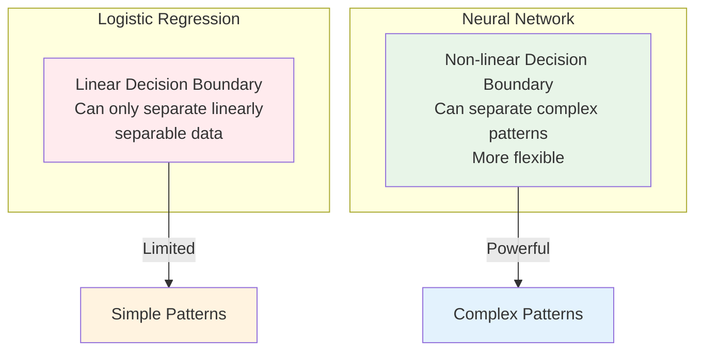

### Capability Comparison

| Model                   | Can Learn           | Examples                              |
| ----------------------- | ------------------- | ------------------------------------- |
| **Logistic Regression** | Linear patterns     | AND gate, Linear separation           |
| **Neural Network**      | Non-linear patterns | XOR gate, Spiral data, Image features |

---

## Why This Matters

### 1. **Representational Power**

- Single logistic regression: Limited to linear decision boundaries
- Neural network: Can approximate any continuous function (Universal Approximation Theorem)

### 2. **Feature Learning**

- Logistic regression: Uses raw input features
- Neural network: Learns intermediate features in hidden layers

### 3. **Scalability**

- Foundation for deeper networks
- Same principles apply to networks with many hidden layers

---

## Key Takeaways

1. **Neural networks = Stack of logistic regression units**
2. **Each layer transforms the input to learn better representations**
3. **Hidden layers enable learning of non-linear patterns**
4. **Mathematical operations are extensions of logistic regression**
5. **More parameters mean more modeling capacity**

---

# 2. Neural Network Representation

## Introduction

Neural network representation involves understanding how to properly visualize, notate, and conceptualize the structure of a neural network. This section focuses on the architecture components, layer numbering conventions, and the mathematical notation that will be used throughout the rest of the course.

---

## Neural Network Architecture Components

### Basic Structure

A neural network consists of three main types of layers:

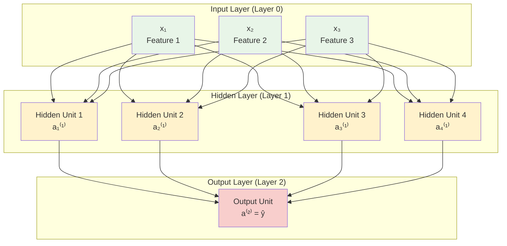

### Layer Definitions

#### 1. **Input Layer (Layer 0)**

- **Purpose:** Receives raw input features
- **Notation:** $a^{[0]} = X$
- **Characteristics:**
  - No parameters (weights or biases)
  - Simply passes input values to the next layer
  - Size = number of input features ($n^{[0]} = n_x$)

#### 2. **Hidden Layer (Layer 1)**

- **Purpose:** Learns intermediate representations of the data
- **Notation:** $a^{[1]}$
- **Characteristics:**
  - Has parameters: $W^{[1]}$ and $b^{[1]}$
  - Applies activation function to weighted inputs
  - Called "hidden" because we cannot observe these values in training data
  - Size = number of hidden units ($n^{[1]}$, our choice)

#### 3. **Output Layer (Layer 2)**

- **Purpose:** Produces final predictions
- **Notation:** $a^{[2]} = \hat{Y}$
- **Characteristics:**
  - Has parameters: $W^{[2]}$ and $b^{[2]}$
  - Size depends on problem type ($n^{[2]}$):
    - Binary classification: 1 unit
    - Multi-class (K classes): K units
    - Regression: typically 1 unit

---

## Layer Notation and Conventions

### Superscript Notation

We use square brackets $[l]$ to denote layer numbers:

| Notation  | Meaning                                   |
| --------- | ----------------------------------------- |
| $a^{[0]}$ | Activations of layer 0 (input)            |
| $a^{[1]}$ | Activations of layer 1 (hidden)           |
| $a^{[2]}$ | Activations of layer 2 (output)           |
| $W^{[1]}$ | Weights connecting input to hidden layer  |
| $W^{[2]}$ | Weights connecting hidden to output layer |
| $b^{[1]}$ | Biases for hidden layer                   |
| $b^{[2]}$ | Biases for output layer                   |

### Individual Unit Notation

For individual units within a layer, we use subscripts:

| Notation    | Meaning                                     |
| ----------- | ------------------------------------------- |
| $a_1^{[1]}$ | Activation of 1st unit in layer 1           |
| $a_2^{[1]}$ | Activation of 2nd unit in layer 1           |
| $a_i^{[1]}$ | Activation of i-th unit in layer 1          |
| $z_i^{[1]}$ | Linear combination for i-th unit in layer 1 |

### Complete Mathematical Representation

For our example network:

**Layer 0 (Input):** $$a^{[0]} = X = \begin{bmatrix} x_1 \ x_2 \ x_3 \end{bmatrix}$$

**Layer 1 (Hidden):** $$z^{[1]} = W^{[1]} a^{[0]} + b^{[1]}$$ $$a^{[1]} = g^{[1]}(z^{[1]}) = \begin{bmatrix} a_1^{[1]} \ a_2^{[1]} \ a_3^{[1]} \ a_4^{[1]} \end{bmatrix}$$

**Layer 2 (Output):** $$z^{[2]} = W^{[2]} a^{[1]} + b^{[2]}$$ $$a^{[2]} = g^{[2]}(z^{[2]}) = \hat{y}$$

---

## Why "2-Layer" Neural Network?

### Counting Convention

**Important:** We only count layers that have parameters (weights and biases).

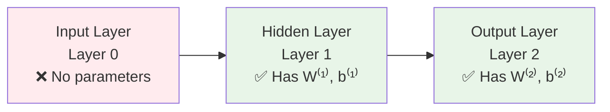

**Layer Count = 2** (Hidden Layer + Output Layer)

### Why This Convention?

1.  **Parameters define complexity:** Layers with parameters are what make the network learn
2.  **Computational perspective:** Input layer just feeds data forward
3.  **Standard in literature:** Consistent with research papers and textbooks
4.  **Training focus:** We only update parameters in layers 1 and 2

---

## Detailed Architecture Breakdown

### Network Dimensions

For our example network (3 inputs, 4 hidden units, 1 output):

| Component  | Symbol    | Dimensions | Description                         |
| ---------- | --------- | ---------- | ----------------------------------- |
| **Input**  | $n^{[0]}$ | 3          | Number of input features            |
| **Hidden** | $n^{[1]}$ | 4          | Number of hidden units (our choice) |
| **Output** | $n^{[2]}$ | 1          | Number of output units              |

### Parameter Dimensions

| Parameter          | Symbol    | Shape    | Total Parameters  |
| ------------------ | --------- | -------- | ----------------- |
| **Hidden weights** | $W^{[1]}$ | $(4, 3)$ | $4 \times 3 = 12$ |
| **Hidden biases**  | $b^{[1]}$ | $(4, 1)$ | $4 \times 1 = 4$  |
| **Output weights** | $W^{[2]}$ | $(1, 4)$ | $1 \times 4 = 4$  |
| **Output biases**  | $b^{[2]}$ | $(1, 1)$ | $1 \times 1 = 1$  |
| **Total**          | -         | -        | **21 parameters** |

### Activation Dimensions

| Activation | Symbol    | Shape    | Description        |
| ---------- | --------- | -------- | ------------------ |
| **Input**  | $a^{[0]}$ | $(3, 1)$ | Input vector       |
| **Hidden** | $a^{[1]}$ | $(4, 1)$ | Hidden activations |
| **Output** | $a^{[2]}$ | $(1, 1)$ | Final prediction   |

---

## Hidden Layer Deep Dive

### What Makes a Layer "Hidden"?

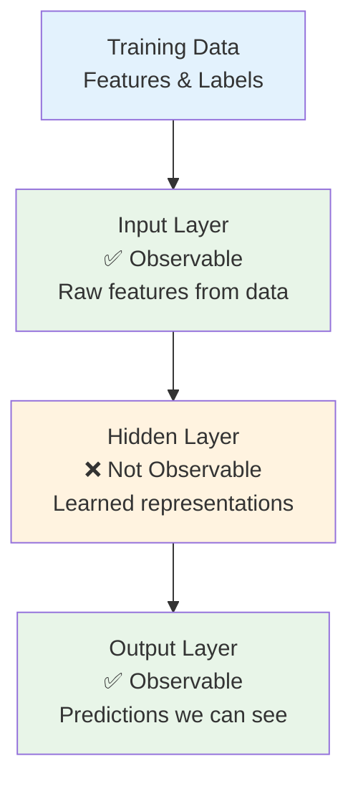

**Key Points:**

1.  **Input:** We can see these values (they're our features)
2.  **Hidden:** We cannot directly observe what these should be
3.  **Output:** We can see these (our predictions) and compare to true labels

### Hidden Layer Intuition

The hidden layer learns to create **new features** or **representations** of the input:

**Example: Recognizing a House**

- **Input features:** Square footage, bedrooms, location coordinates
- **Hidden layer might learn:** Neighborhood quality, house size category, proximity to amenities
- **Output:** House price prediction

```python
# Conceptual representation
def hidden_layer_intuition():
    """
    Hidden layer transforms raw features into learned features
    """
    # Raw features
    raw_features = {
        'sqft': 2000,
        'bedrooms': 3,
        'lat': 37.7749,
        'lon': -122.4194
    }

    # Hidden layer might learn these concepts
    learned_features = {
        'house_size_category': 'medium',      # combination of sqft & bedrooms
        'neighborhood_quality': 'high',      # learned from lat/lon
        'value_density': 'expensive_area'    # complex combination
    }

    # Output layer uses learned features
    house_price = predict_price(learned_features)
    return house_price

```

---

## Visual Representation Examples

### Compact Notation

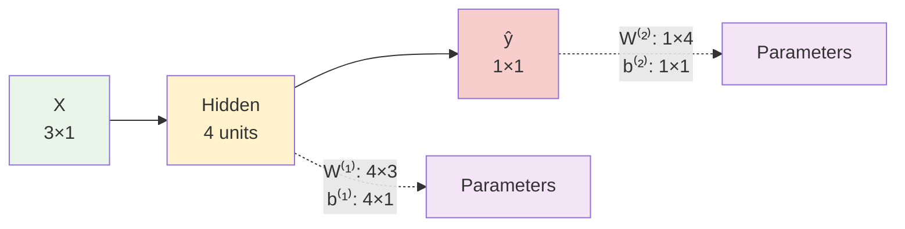

### Detailed Unit View

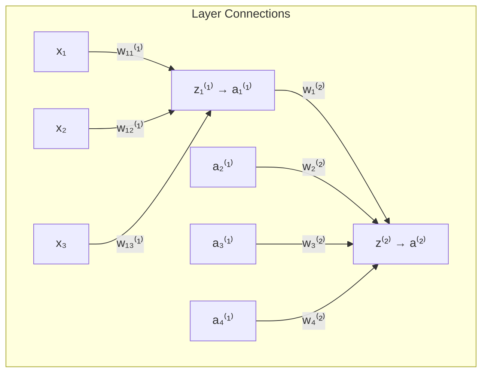

---

## Python Implementation

### Class-Based Representation

```python
import numpy as np

class NeuralNetworkArchitecture:
    def __init__(self, n_input, n_hidden, n_output):
        """
        Define neural network architecture

        Arguments:
        n_input -- number of input features
        n_hidden -- number of hidden units
        n_output -- number of output units
        """
        # Store architecture
        self.layers = {
            'input': n_input,    # Layer 0
            'hidden': n_hidden,  # Layer 1
            'output': n_output   # Layer 2
        }

        # Layer notation
        self.n = [n_input, n_hidden, n_output]  # n[0], n[1], n[2]

        print("Neural Network Architecture:")
        print(f"├── Input Layer (Layer 0):  {n_input} units")
        print(f"├── Hidden Layer (Layer 1): {n_hidden} units")
        print(f"└── Output Layer (Layer 2): {n_output} units")
        print(f"\nThis is a {len(self.n)-1}-layer neural network")

    def get_parameter_shapes(self):
        """Return the shapes of all parameters"""
        shapes = {}

        # Hidden layer parameters
        shapes['W1'] = (self.n[1], self.n[0])  # (n_hidden, n_input)
        shapes['b1'] = (self.n[1], 1)          # (n_hidden, 1)

        # Output layer parameters
        shapes['W2'] = (self.n[2], self.n[1])  # (n_output, n_hidden)
        shapes['b2'] = (self.n[2], 1)          # (n_output, 1)

        return shapes

    def get_activation_shapes(self):
        """Return the shapes of activations for single example"""
        shapes = {}

        shapes['a0'] = (self.n[0], 1)  # Input
        shapes['a1'] = (self.n[1], 1)  # Hidden
        shapes['a2'] = (self.n[2], 1)  # Output

        return shapes

    def count_parameters(self):
        """Count total number of parameters"""
        shapes = self.get_parameter_shapes()

        total = 0
        for param, shape in shapes.items():
            count = shape[0] * shape[1]
            print(f"{param}: {shape} = {count} parameters")
            total += count

        print(f"Total parameters: {total}")
        return total

# Example usage
if __name__ == "__main__":
    # Create our example network
    nn = NeuralNetworkArchitecture(n_input=3, n_hidden=4, n_output=1)

    print("\nParameter Shapes:")
    shapes = nn.get_parameter_shapes()
    for param, shape in shapes.items():
        print(f"{param}: {shape}")

    print("\nActivation Shapes (single example):")
    act_shapes = nn.get_activation_shapes()
    for activation, shape in act_shapes.items():
        print(f"{activation}: {shape}")

    print("\nParameter Count:")
    nn.count_parameters()

```

---

## Different Network Architectures

### Common Architectures

| Problem Type                | Input Size | Hidden Size | Output Size | Example                |
| --------------------------- | ---------- | ----------- | ----------- | ---------------------- |
| **Binary Classification**   | varies     | varies      | 1           | Email spam detection   |
| **Multi-class (K classes)** | varies     | varies      | K           | Image classification   |
| **Regression**              | varies     | varies      | 1           | House price prediction |
| **Multi-output Regression** | varies     | varies      | varies      | Stock price prediction |

### Architecture Examples

```python
# Different architectures for different problems

# 1. Email spam detection (binary classification)
spam_detector = NeuralNetworkArchitecture(
    n_input=1000,   # 1000 word features
    n_hidden=50,    # 50 hidden units
    n_output=1      # spam or not spam
)

# 2. Handwritten digit recognition (10-class classification)
digit_classifier = NeuralNetworkArchitecture(
    n_input=784,    # 28x28 pixel images
    n_hidden=128,   # 128 hidden units
    n_output=10     # digits 0-9
)

# 3. House price prediction (regression)
price_predictor = NeuralNetworkArchitecture(
    n_input=8,      # 8 house features
    n_hidden=20,    # 20 hidden units
    n_output=1      # price
)

```

---

## Key Design Decisions

### 1. **Number of Hidden Units**

**Rule of thumb:**

- Start with number between input and output size
- Too few: May not capture complexity (underfitting)
- Too many: May memorize training data (overfitting)

### 2. **Activation Functions**

| Layer                    | Typical Choice | Reason                        |
| ------------------------ | -------------- | ----------------------------- |
| **Hidden**               | ReLU or tanh   | Non-linearity, good gradients |
| **Output (Binary)**      | Sigmoid        | Output between 0 and 1        |
| **Output (Multi-class)** | Softmax        | Probability distribution      |
| **Output (Regression)**  | Linear         | Any real number               |

### 3. **Architecture Notation Summary**

```python
def network_summary():
    """
    Standard notation for 2-layer neural network
    """
    notation = {
        'Layers': {
            'Input (Layer 0)': 'a[0] = X',
            'Hidden (Layer 1)': 'a[1] = g[1](W[1] * a[0] + b[1])',
            'Output (Layer 2)': 'a[2] = g[2](W[2] * a[1] + b[2])'
        },
        'Parameters': {
            'W[1]': '(n[1], n[0]) - Hidden weights',
            'b[1]': '(n[1], 1) - Hidden biases',
            'W[2]': '(n[2], n[1]) - Output weights',
            'b[2]': '(n[2], 1) - Output biases'
        },
        'Dimensions': {
            'n[0]': 'Number of input features',
            'n[1]': 'Number of hidden units (our choice)',
            'n[2]': 'Number of output units (problem dependent)'
        }
    }
    return notation

```

---

## Key Takeaways

1.  **Layer counting:** Only count layers with parameters (2-layer network has input + hidden + output)
2.  **Notation system:** Use $[l]$ for layer number, subscripts for unit within layer
3.  **Hidden layer concept:** Learns intermediate representations we cannot directly observe
4.  **Architecture flexibility:** Can adjust number of hidden units based on problem complexity
5.  **Parameter counting:** Total parameters = weights + biases for all layers
6.  **Design choices:** Number of hidden units and activation functions are key architectural decisions

---

# 3. Computing Neural Network Output

## Introduction

Computing neural network output involves understanding **forward propagation** - the process of feeding input data through the network layer by layer to produce a prediction. This section covers the detailed mathematical computations and implementation for a single training example.

---

## Forward Propagation Overview

### The Process

Forward propagation is the sequence of computations that transforms input features into a final prediction:

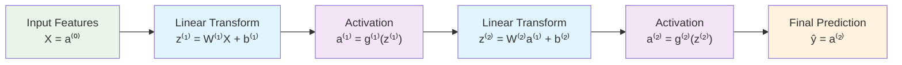

### Key Steps

1. **Input:** Start with input features $X$
2. **Hidden Layer:** Compute linear combination + activation
3. **Output Layer:** Compute linear combination + activation
4. **Prediction:** Final output is our prediction

---

## Single Example Forward Propagation

### Network Setup

Let's work with our standard example:

- **Input features:** 3 (height, weight, age)
- **Hidden units:** 4
- **Output:** 1 (binary classification)

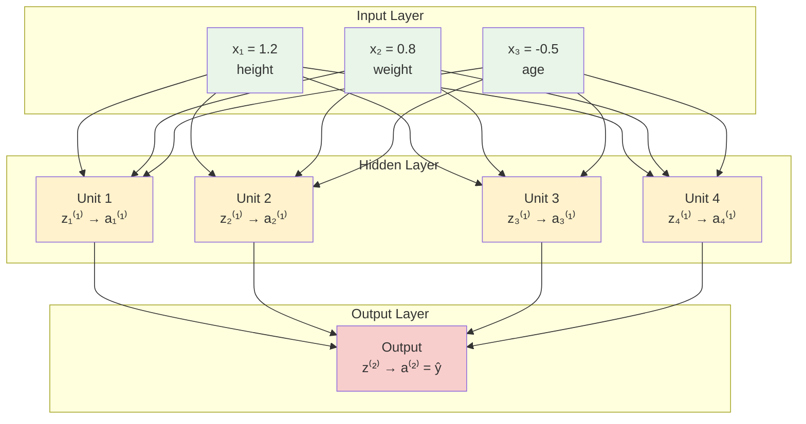

---

## Step-by-Step Computation

### Step 1: Input Layer (Layer 0)

**Input vector:**
$$a^{[0]} = X = \begin{bmatrix} x_1 \\ x_2 \\ x_3 \end{bmatrix} = \begin{bmatrix} 1.2 \\ 0.8 \\ -0.5 \end{bmatrix}$$

**Dimensions:** $a^{[0]}$ has shape $(3, 1)$

### Step 2: Hidden Layer Computation (Layer 1)

#### Linear Transformation

Each hidden unit computes a weighted sum of inputs:

**Unit 1:**
$$z_1^{[1]} = w_{11}^{[1]} x_1 + w_{12}^{[1]} x_2 + w_{13}^{[1]} x_3 + b_1^{[1]}$$

**Unit 2:**
$$z_2^{[1]} = w_{21}^{[1]} x_1 + w_{22}^{[1]} x_2 + w_{23}^{[1]} x_3 + b_2^{[1]}$$

**Unit 3:**
$$z_3^{[1]} = w_{31}^{[1]} x_1 + w_{32}^{[1]} x_2 + w_{33}^{[1]} x_3 + b_3^{[1]}$$

**Unit 4:**
$$z_4^{[1]} = w_{41}^{[1]} x_1 + w_{42}^{[1]} x_2 + w_{43}^{[1]} x_3 + b_4^{[1]}$$

#### Vectorized Form

$$z^{[1]} = W^{[1]} a^{[0]} + b^{[1]}$$

Where:

$$
W^{[1]} = \begin{bmatrix}
w_{11}^{[1]} & w_{12}^{[1]} & w_{13}^{[1]} \\
w_{21}^{[1]} & w_{22}^{[1]} & w_{23}^{[1]} \\
w_{31}^{[1]} & w_{32}^{[1]} & w_{33}^{[1]} \\
w_{41}^{[1]} & w_{42}^{[1]} & w_{43}^{[1]}
\end{bmatrix}, \quad b^{[1]} = \begin{bmatrix} b_1^{[1]} \\ b_2^{[1]} \\ b_3^{[1]} \\ b_4^{[1]} \end{bmatrix}
$$

**Computation:**

$$
z^{[1]} = \begin{bmatrix}
w_{11}^{[1]} & w_{12}^{[1]} & w_{13}^{[1]} \\
w_{21}^{[1]} & w_{22}^{[1]} & w_{23}^{[1]} \\
w_{31}^{[1]} & w_{32}^{[1]} & w_{33}^{[1]} \\
w_{41}^{[1]} & w_{42}^{[1]} & w_{43}^{[1]}
\end{bmatrix} \begin{bmatrix} 1.2 \\ 0.8 \\ -0.5 \end{bmatrix} + \begin{bmatrix} b_1^{[1]} \\ b_2^{[1]} \\ b_3^{[1]} \\ b_4^{[1]} \end{bmatrix}
$$

#### Activation Function

Apply activation function (let's use tanh):

$$a^{[1]} = g^{[1]}(z^{[1]}) = \tanh(z^{[1]})$$

$$a^{[1]} = \begin{bmatrix} a_1^{[1]} \\ a_2^{[1]} \\ a_3^{[1]} \\ a_4^{[1]} \end{bmatrix} = \begin{bmatrix} \tanh(z_1^{[1]}) \\ \tanh(z_2^{[1]}) \\ \tanh(z_3^{[1]}) \\ \tanh(z_4^{[1]}) \end{bmatrix}$$

**Dimensions:** $z^{[1]}$ and $a^{[1]}$ both have shape $(4, 1)$

### Step 3: Output Layer Computation (Layer 2)

#### Linear Transformation

$$z^{[2]} = W^{[2]} a^{[1]} + b^{[2]}$$

Where:
$$W^{[2]} = \begin{bmatrix} w_1^{[2]} & w_2^{[2]} & w_3^{[2]} & w_4^{[2]} \end{bmatrix}$$

**Computation:**
$$z^{[2]} = \begin{bmatrix} w_1^{[2]} & w_2^{[2]} & w_3^{[2]} & w_4^{[2]} \end{bmatrix} \begin{bmatrix} a_1^{[1]} \\ a_2^{[1]} \\ a_3^{[1]} \\ a_4^{[1]} \end{bmatrix} + b^{[2]}$$

$$z^{[2]} = w_1^{[2]} a_1^{[1]} + w_2^{[2]} a_2^{[1]} + w_3^{[2]} a_3^{[1]} + w_4^{[2]} a_4^{[1]} + b^{[2]}$$

#### Activation Function

For binary classification, use sigmoid:

$$a^{[2]} = g^{[2]}(z^{[2]}) = \sigma(z^{[2]}) = \frac{1}{1 + e^{-z^{[2]}}}$$

**Final prediction:** $\hat{y} = a^{[2]}$

**Dimensions:** $z^{[2]}$ and $a^{[2]}$ both have shape $(1, 1)$

---

## Concrete Numerical Example

### Given Parameters

Let's use specific values to see the computation:

**Weights and biases:**

$$
W^{[1]} = \begin{bmatrix}
0.1 & 0.2 & -0.3 \\
0.4 & -0.1 & 0.5 \\
-0.2 & 0.3 & 0.1 \\
0.2 & -0.4 & 0.2
\end{bmatrix}, \quad b^{[1]} = \begin{bmatrix} 0.1 \\ -0.2 \\ 0.3 \\ 0.0 \end{bmatrix}
$$

$$W^{[2]} = \begin{bmatrix} 0.5 & -0.3 & 0.4 & 0.1 \end{bmatrix}, \quad b^{[2]} = 0.2$$

**Input:**
$$X = \begin{bmatrix} 1.2 \\ 0.8 \\ -0.5 \end{bmatrix}$$

### Forward Pass Calculation

#### Hidden Layer

**Linear transformation:**
$$z^{[1]} = W^{[1]} X + b^{[1]}$$

$$z_1^{[1]} = 0.1(1.2) + 0.2(0.8) + (-0.3)(-0.5) + 0.1 = 0.12 + 0.16 + 0.15 + 0.1 = 0.53$$

$$z_2^{[1]} = 0.4(1.2) + (-0.1)(0.8) + 0.5(-0.5) + (-0.2) = 0.48 - 0.08 - 0.25 - 0.2 = -0.05$$

$$z_3^{[1]} = (-0.2)(1.2) + 0.3(0.8) + 0.1(-0.5) + 0.3 = -0.24 + 0.24 - 0.05 + 0.3 = 0.25$$

$$z_4^{[1]} = 0.2(1.2) + (-0.4)(0.8) + 0.2(-0.5) + 0.0 = 0.24 - 0.32 - 0.1 + 0 = -0.18$$

$$z^{[1]} = \begin{bmatrix} 0.53 \\ -0.05 \\ 0.25 \\ -0.18 \end{bmatrix}$$

**Activation (tanh):**
$$a^{[1]} = \tanh(z^{[1]}) = \begin{bmatrix} \tanh(0.53) \\ \tanh(-0.05) \\ \tanh(0.25) \\ \tanh(-0.18) \end{bmatrix} = \begin{bmatrix} 0.487 \\ -0.050 \\ 0.245 \\ -0.179 \end{bmatrix}$$

#### Output Layer

**Linear transformation:**
$$z^{[2]} = W^{[2]} a^{[1]} + b^{[2]}$$

$$z^{[2]} = 0.5(0.487) + (-0.3)(-0.050) + 0.4(0.245) + 0.1(-0.179) + 0.2$$

$$z^{[2]} = 0.244 + 0.015 + 0.098 - 0.018 + 0.2 = 0.539$$

**Activation (sigmoid):**
$$a^{[2]} = \sigma(0.539) = \frac{1}{1 + e^{-0.539}} = \frac{1}{1 + 0.583} = 0.632$$

**Final prediction:** $\hat{y} = 0.632$

---

## Matrix Dimensions Tracking

### Dimension Analysis

This is crucial for debugging and implementation:

| Operation                             | Input Shape | Weight Shape | Bias Shape | Output Shape |
| ------------------------------------- | ----------- | ------------ | ---------- | ------------ |
| $z^{[1]} = W^{[1]} a^{[0]} + b^{[1]}$ | $(3,1)$     | $(4,3)$      | $(4,1)$    | $(4,1)$      |
| $a^{[1]} = g^{[1]}(z^{[1]})$          | $(4,1)$     | -            | -          | $(4,1)$      |
| $z^{[2]} = W^{[2]} a^{[1]} + b^{[2]}$ | $(4,1)$     | $(1,4)$      | $(1,1)$    | $(1,1)$      |
| $a^{[2]} = g^{[2]}(z^{[2]})$          | $(1,1)$     | -            | -          | $(1,1)$      |

### General Rule

For layer $l$:

- **Weight matrix:** $W^{[l]}$ has shape $(n^{[l]}, n^{[l-1]})$
- **Bias vector:** $b^{[l]}$ has shape $(n^{[l]}, 1)$
- **Activation:** $a^{[l]}$ has shape $(n^{[l]}, 1)$

Where $n^{[l]}$ is the number of units in layer $l$.

---

## Python Implementation

### Step-by-Step Implementation

```python
import numpy as np

def sigmoid(z):
    """Sigmoid activation function"""
    # Clip z to prevent overflow
    z = np.clip(z, -500, 500)
    return 1 / (1 + np.exp(-z))

def tanh(z):
    """Tanh activation function"""
    return np.tanh(z)

def forward_propagation_single_example(X, W1, b1, W2, b2):
    """
    Forward propagation for a single example

    Arguments:
    X -- input vector of shape (n_x, 1)
    W1 -- weight matrix of shape (n_h, n_x)
    b1 -- bias vector of shape (n_h, 1)
    W2 -- weight matrix of shape (n_y, n_h)
    b2 -- bias vector of shape (n_y, 1)

    Returns:
    A2 -- final prediction
    cache -- dictionary containing intermediate values
    """

    # Input layer
    A0 = X

    # Hidden layer (Layer 1)
    print("Hidden Layer Computation:")
    Z1 = np.dot(W1, A0) + b1
    print(f"Z1 = W1 @ X + b1")
    print(f"Z1 shape: {Z1.shape}")
    print(f"Z1 = \n{Z1}")

    A1 = tanh(Z1)
    print(f"A1 = tanh(Z1)")
    print(f"A1 = \n{A1}")

    # Output layer (Layer 2)
    print("\nOutput Layer Computation:")
    Z2 = np.dot(W2, A1) + b2
    print(f"Z2 = W2 @ A1 + b2")
    print(f"Z2 shape: {Z2.shape}")
    print(f"Z2 = {Z2[0,0]:.4f}")

    A2 = sigmoid(Z2)
    print(f"A2 = sigmoid(Z2)")
    print(f"A2 = {A2[0,0]:.4f}")

    # Store intermediate values
    cache = {
        "A0": A0,
        "Z1": Z1,
        "A1": A1,
        "Z2": Z2,
        "A2": A2
    }

    return A2, cache

# Example usage with our numerical example
if __name__ == "__main__":
    # Input
    X = np.array([[1.2], [0.8], [-0.5]])

    # Parameters from our example
    W1 = np.array([
        [0.1, 0.2, -0.3],
        [0.4, -0.1, 0.5],
        [-0.2, 0.3, 0.1],
        [0.2, -0.4, 0.2]
    ])
    b1 = np.array([[0.1], [-0.2], [0.3], [0.0]])

    W2 = np.array([[0.5, -0.3, 0.4, 0.1]])
    b2 = np.array([[0.2]])

    print("Neural Network Forward Propagation")
    print("=" * 50)
    print(f"Input X:\n{X}")
    print(f"Input shape: {X.shape}")
    print()

    # Forward propagation
    prediction, cache = forward_propagation_single_example(X, W1, b1, W2, b2)

    print(f"\nFinal Prediction: {prediction[0,0]:.4f}")
    print(f"Binary Classification: {'Positive' if prediction[0,0] > 0.5 else 'Negative'}")
```

### Modular Implementation

```python
class SingleExampleForwardProp:
    def __init__(self):
        self.cache = {}

    def linear_forward(self, A_prev, W, b, layer_name):
        """
        Compute linear part of forward propagation
        """
        Z = np.dot(W, A_prev) + b

        print(f"{layer_name} Linear Forward:")
        print(f"  Input shape: {A_prev.shape}")
        print(f"  Weight shape: {W.shape}")
        print(f"  Bias shape: {b.shape}")
        print(f"  Output shape: {Z.shape}")

        return Z

    def activation_forward(self, Z, activation_func, layer_name):
        """
        Apply activation function
        """
        if activation_func == "sigmoid":
            A = sigmoid(Z)
        elif activation_func == "tanh":
            A = tanh(Z)
        else:
            raise ValueError(f"Unknown activation: {activation_func}")

        print(f"{layer_name} Activation ({activation_func}):")
        print(f"  Input Z: {Z.ravel()}")
        print(f"  Output A: {A.ravel()}")

        return A

    def forward_propagation(self, X, parameters):
        """
        Complete forward propagation
        """
        W1, b1 = parameters['W1'], parameters['b1']
        W2, b2 = parameters['W2'], parameters['b2']

        # Layer 0 (Input)
        A0 = X
        self.cache['A0'] = A0

        # Layer 1 (Hidden)
        Z1 = self.linear_forward(A0, W1, b1, "Layer 1")
        A1 = self.activation_forward(Z1, "tanh", "Layer 1")
        self.cache['Z1'] = Z1
        self.cache['A1'] = A1

        # Layer 2 (Output)
        Z2 = self.linear_forward(A1, W2, b2, "Layer 2")
        A2 = self.activation_forward(Z2, "sigmoid", "Layer 2")
        self.cache['Z2'] = Z2
        self.cache['A2'] = A2

        return A2

# Usage
forward_prop = SingleExampleForwardProp()

# Parameters dictionary
parameters = {
    'W1': W1,
    'b1': b1,
    'W2': W2,
    'b2': b2
}

prediction = forward_prop.forward_propagation(X, parameters)
print(f"\nFinal prediction: {prediction[0,0]:.4f}")
```

---

## Computational Complexity

### Operation Count

For our example network (3→4→1):

| Operation                   | Multiplications   | Additions   | Total               |
| --------------------------- | ----------------- | ----------- | ------------------- |
| **Hidden layer linear**     | $3 \times 4 = 12$ | $4 + 4 = 8$ | 20                  |
| **Hidden layer activation** | 0                 | 0           | ~4 (function calls) |
| **Output layer linear**     | $4 \times 1 = 4$  | $1 + 1 = 2$ | 6                   |
| **Output layer activation** | 0                 | 0           | ~1 (function call)  |
| **Total**                   | 16                | 10          | ~31 operations      |

### General Formula

For a network with layers of sizes $n^{[0]} \to n^{[1]} \to n^{[2]}$:

**Operations per forward pass:**

- Multiplications: $n^{[0]} \times n^{[1]} + n^{[1]} \times n^{[2]}$
- Additions: $n^{[1]} + n^{[2]} + n^{[1]} + n^{[2]}$
- Activations: $n^{[1]} + n^{[2]}$ function evaluations

---

## Key Takeaways

1. **Forward propagation = sequence of linear transformations + activations**

2. **Each layer:** $z^{[l]} = W^{[l]} a^{[l-1]} + b^{[l]}$, then $a^{[l]} = g^{[l]}(z^{[l]})$

3. **Dimension tracking is crucial** for correct implementation

4. **Numerical stability** requires careful handling of activation functions

5. **Modular implementation** makes debugging and modification easier

6. **The computation flows from input to output** - hence "forward" propagation

---

# 4. Vectorizing Across Multiple Examples

## Introduction

In practice, we need to process multiple training examples simultaneously rather than one at a time. **Vectorization** allows us to leverage NumPy's optimized matrix operations to compute predictions for entire datasets efficiently. This section covers the transition from single-example processing to batch processing.

---

## The Problem with Loops

### Naive Approach: Processing Examples One by One

For $m$ training examples, a naive implementation would use a loop:

```python
# Inefficient approach - DON'T DO THIS
predictions = []
for i in range(m):
    # Get single example
    x_i = X[:, i].reshape(-1, 1)  # Shape: (n_x, 1)

    # Forward propagation for single example
    z1_i = W1 @ x_i + b1
    a1_i = tanh(z1_i)
    z2_i = W2 @ a1_i + b2
    a2_i = sigmoid(z2_i)

    # Store prediction
    predictions.append(a2_i)

# Convert back to array
A2 = np.hstack(predictions)  # Shape: (1, m)
```

### Problems with This Approach

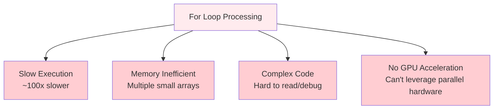

**Issues:**

1. **Slow execution:** Python loops are inherently slow
2. **No parallelization:** Cannot leverage optimized BLAS libraries
3. **Memory inefficient:** Creating many temporary arrays
4. **GPU incompatible:** Modern deep learning relies on GPU acceleration

---

## Vectorized Solution: Matrix Operations

### Key Insight: Stack Examples Horizontally

Instead of processing examples one by one, we stack all examples as columns in a matrix:

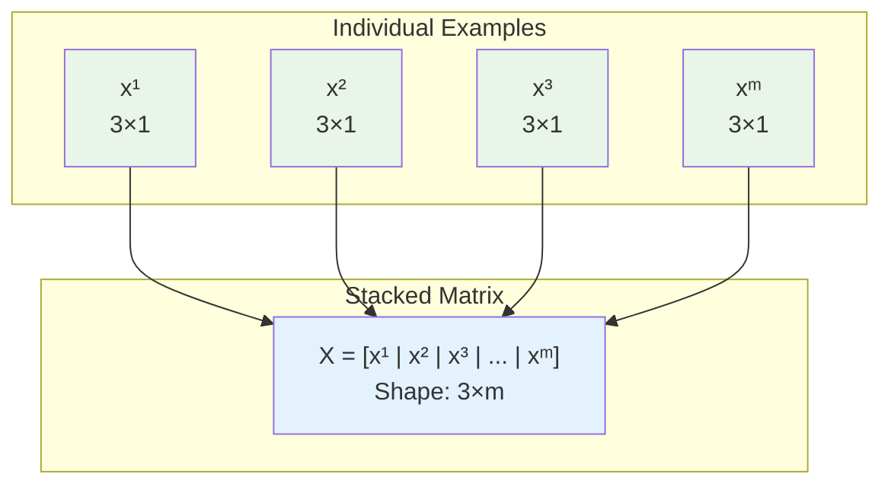

### Input Matrix Construction

**Mathematical representation:**

$$
X = \begin{bmatrix}
| & | & | & \cdots & | \\
x^{(1)} & x^{(2)} & x^{(3)} & \cdots & x^{(m)} \\
| & | & | & \cdots & |
\end{bmatrix}
$$

Where each column $x^{(i)}$ is a training example:

$$
X = \begin{bmatrix}
x_1^{(1)} & x_1^{(2)} & x_1^{(3)} & \cdots & x_1^{(m)} \\
x_2^{(1)} & x_2^{(2)} & x_2^{(3)} & \cdots & x_2^{(m)} \\
x_3^{(1)} & x_3^{(2)} & x_3^{(3)} & \cdots & x_3^{(m)} \\
\end{bmatrix}
$$

**Dimensions:** $X$ has shape $(n_x, m)$ where:

- $n_x = 3$ (number of features)
- $m$ = number of training examples

---

## Vectorized Forward Propagation

### Layer-by-Layer Vectorization

#### Input Layer (Layer 0)

$$A^{[0]} = X$$
**Shape:** $(n^{[0]}, m) = (3, m)$

#### Hidden Layer (Layer 1)

**Linear transformation:**
$$Z^{[1]} = W^{[1]} A^{[0]} + b^{[1]}$$

**Detailed computation:**
$$Z^{[1]} = W^{[1]} X + b^{[1]}$$

$$
\begin{bmatrix}
| & | & \cdots & | \\
z^{[1](1)} & z^{[1](2)} & \cdots & z^{[1](m)} \\
| & | & \cdots & |
\end{bmatrix} = \begin{bmatrix}
w_{11}^{[1]} & w_{12}^{[1]} & w_{13}^{[1]} \\
w_{21}^{[1]} & w_{22}^{[1]} & w_{23}^{[1]} \\
w_{31}^{[1]} & w_{32}^{[1]} & w_{33}^{[1]} \\
w_{41}^{[1]} & w_{42}^{[1]} & w_{43}^{[1]}
\end{bmatrix} \begin{bmatrix}
x_1^{(1)} & x_1^{(2)} & \cdots & x_1^{(m)} \\
x_2^{(1)} & x_2^{(2)} & \cdots & x_2^{(m)} \\
x_3^{(1)} & x_3^{(2)} & \cdots & x_3^{(m)} \\
\end{bmatrix} + \begin{bmatrix}
b_1^{[1]} \\
b_2^{[1]} \\
b_3^{[1]} \\
b_4^{[1]}
\end{bmatrix}
$$

**Broadcasting:** The bias vector $b^{[1]}$ (shape $(4,1)$) is automatically broadcast across all $m$ examples.

**Activation:**
$$A^{[1]} = g^{[1]}(Z^{[1]}) = \tanh(Z^{[1]})$$

**Shapes:**

- $Z^{[1]}$: $(n^{[1]}, m) = (4, m)$
- $A^{[1]}$: $(n^{[1]}, m) = (4, m)$

#### Output Layer (Layer 2)

**Linear transformation:**
$$Z^{[2]} = W^{[2]} A^{[1]} + b^{[2]}$$

**Activation:**
$$A^{[2]} = g^{[2]}(Z^{[2]}) = \sigma(Z^{[2]})$$

**Shapes:**

- $Z^{[2]}$: $(n^{[2]}, m) = (1, m)$
- $A^{[2]}$: $(n^{[2]}, m) = (1, m)$

### Complete Vectorized Algorithm

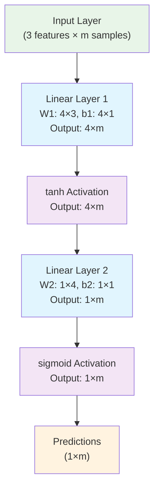

---

## Matrix Dimensions Analysis

### Complete Dimension Table

| Variable             | Shape                | Description                    |
| -------------------- | -------------------- | ------------------------------ |
| **Input**            |                      |                                |
| $X = A^{[0]}$        | $(n^{[0]}, m)$       | Input matrix with $m$ examples |
| **Layer 1 (Hidden)** |                      |                                |
| $W^{[1]}$            | $(n^{[1]}, n^{[0]})$ | Hidden layer weights           |
| $b^{[1]}$            | $(n^{[1]}, 1)$       | Hidden layer biases            |
| $Z^{[1]}$            | $(n^{[1]}, m)$       | Hidden layer linear outputs    |
| $A^{[1]}$            | $(n^{[1]}, m)$       | Hidden layer activations       |
| **Layer 2 (Output)** |                      |                                |
| $W^{[2]}$            | $(n^{[2]}, n^{[1]})$ | Output layer weights           |
| $b^{[2]}$            | $(n^{[2]}, 1)$       | Output layer biases            |
| $Z^{[2]}$            | $(n^{[2]}, m)$       | Output layer linear outputs    |
| $A^{[2]}$            | $(n^{[2]}, m)$       | Final predictions              |

### Key Dimension Rules

1. **Input matrix:** Features are rows, examples are columns
2. **Weight matrices:** $(n^{[l]}, n^{[l-1]})$ - current layer size × previous layer size
3. **Bias vectors:** $(n^{[l]}, 1)$ - broadcast across all examples
4. **Activations:** $(n^{[l]}, m)$ - each column is activations for one example
5. **Universal rule:** $m$ is always the number of columns

---

## Concrete Numerical Example

### Setup: 3 Training Examples

Let's work with 3 examples of our house prediction problem:

**Training data:**

```python
# Example 1: height=1.2, weight=0.8, age=-0.5
# Example 2: height=0.5, weight=-0.3, age=1.1
# Example 3: height=-0.8, weight=1.5, age=0.2

X = np.array([
    [1.2,  0.5, -0.8],   # height feature
    [0.8, -0.3,  1.5],   # weight feature
    [-0.5, 1.1,  0.2]    # age feature
])
# Shape: (3, 3) - 3 features, 3 examples
```

**Parameters (same as before):**

```python
W1 = np.array([
    [0.1, 0.2, -0.3],
    [0.4, -0.1, 0.5],
    [-0.2, 0.3, 0.1],
    [0.2, -0.4, 0.2]
])  # Shape: (4, 3)

b1 = np.array([[0.1], [-0.2], [0.3], [0.0]])  # Shape: (4, 1)

W2 = np.array([[0.5, -0.3, 0.4, 0.1]])  # Shape: (1, 4)
b2 = np.array([[0.2]])  # Shape: (1, 1)
```

### Step-by-Step Vectorized Computation

#### Hidden Layer Linear Transformation

$$Z^{[1]} = W^{[1]} X + b^{[1]}$$

**Matrix multiplication:**

$$
Z^{[1]} = \begin{bmatrix}
0.1 & 0.2 & -0.3 \\
0.4 & -0.1 & 0.5 \\
-0.2 & 0.3 & 0.1 \\
0.2 & -0.4 & 0.2
\end{bmatrix} \begin{bmatrix}
1.2 & 0.5 & -0.8 \\
0.8 & -0.3 & 1.5 \\
-0.5 & 1.1 & 0.2
\end{bmatrix} + \begin{bmatrix}
0.1 \\
-0.2 \\
0.3 \\
0.0
\end{bmatrix}
$$

**Computing each element:**

For example 1 (column 1):

- $z_1^{[1](1)} = 0.1(1.2) + 0.2(0.8) + (-0.3)(-0.5) + 0.1 = 0.53$
- $z_2^{[1](1)} = 0.4(1.2) + (-0.1)(0.8) + 0.5(-0.5) + (-0.2) = -0.05$
- $z_3^{[1](1)} = (-0.2)(1.2) + 0.3(0.8) + 0.1(-0.5) + 0.3 = 0.25$
- $z_4^{[1](1)} = 0.2(1.2) + (-0.4)(0.8) + 0.2(-0.5) + 0.0 = -0.18$

For example 2 (column 2):

- $z_1^{[1](2)} = 0.1(0.5) + 0.2(-0.3) + (-0.3)(1.1) + 0.1 = -0.18$
- $z_2^{[1](2)} = 0.4(0.5) + (-0.1)(-0.3) + 0.5(1.1) + (-0.2) = 0.68$
- $z_3^{[1](2)} = (-0.2)(0.5) + 0.3(-0.3) + 0.1(1.1) + 0.3 = 0.32$
- $z_4^{[1](2)} = 0.2(0.5) + (-0.4)(-0.3) + 0.2(1.1) + 0.0 = 0.42$

For example 3 (column 3):

- $z_1^{[1](3)} = 0.1(-0.8) + 0.2(1.5) + (-0.3)(0.2) + 0.1 = 0.17$
- $z_2^{[1](3)} = 0.4(-0.8) + (-0.1)(1.5) + 0.5(0.2) + (-0.2) = -0.57$
- $z_3^{[1](3)} = (-0.2)(-0.8) + 0.3(1.5) + 0.1(0.2) + 0.3 = 0.83$
- $z_4^{[1](3)} = 0.2(-0.8) + (-0.4)(1.5) + 0.2(0.2) + 0.0 = -0.72$

**Result:**

$$
Z^{[1]} = \begin{bmatrix}
0.53 & -0.18 & 0.17 \\
-0.05 & 0.68 & -0.57 \\
0.25 & 0.32 & 0.83 \\
-0.18 & 0.42 & -0.72
\end{bmatrix}
$$

#### Hidden Layer Activation

$$
A^{[1]} = \tanh(Z^{[1]}) = \begin{bmatrix}
\tanh(0.53) & \tanh(-0.18) & \tanh(0.17) \\
\tanh(-0.05) & \tanh(0.68) & \tanh(-0.57) \\
\tanh(0.25) & \tanh(0.32) & \tanh(0.83) \\
\tanh(-0.18) & \tanh(0.42) & \tanh(-0.72)
\end{bmatrix}
$$

$$
A^{[1]} = \begin{bmatrix}
0.487 & -0.178 & 0.169 \\
-0.050 & 0.590 & -0.516 \\
0.245 & 0.310 & 0.688 \\
-0.179 & 0.398 & -0.618
\end{bmatrix}
$$

#### Output Layer

$$Z^{[2]} = W^{[2]} A^{[1]} + b^{[2]}$$

$$
Z^{[2]} = \begin{bmatrix} 0.5 & -0.3 & 0.4 & 0.1 \end{bmatrix} \begin{bmatrix}
0.487 & -0.178 & 0.169 \\
-0.050 & 0.590 & -0.516 \\
0.245 & 0.310 & 0.688 \\
-0.179 & 0.398 & -0.618
\end{bmatrix} + \begin{bmatrix} 0.2 \end{bmatrix}
$$

**Computing each prediction:**

- $z^{[2](1)} = 0.5(0.487) + (-0.3)(-0.050) + 0.4(0.245) + 0.1(-0.179) + 0.2 = 0.539$
- $z^{[2](2)} = 0.5(-0.178) + (-0.3)(0.590) + 0.4(0.310) + 0.1(0.398) + 0.2 = -0.016$
- $z^{[2](3)} = 0.5(0.169) + (-0.3)(-0.516) + 0.4(0.688) + 0.1(-0.618) + 0.2 = 0.594$

$$Z^{[2]} = \begin{bmatrix} 0.539 & -0.016 & 0.594 \end{bmatrix}$$

#### Final Predictions

$$A^{[2]} = \sigma(Z^{[2]}) = \begin{bmatrix} \sigma(0.539) & \sigma(-0.016) & \sigma(0.594) \end{bmatrix}$$

$$A^{[2]} = \begin{bmatrix} 0.632 & 0.496 & 0.644 \end{bmatrix}$$

**Final predictions:**

- Example 1: $\hat{y}^{(1)} = 0.632$ → Positive class
- Example 2: $\hat{y}^{(2)} = 0.496$ → Negative class
- Example 3: $\hat{y}^{(3)} = 0.644$ → Positive class

---

## Python Implementation

### Complete Vectorized Implementation

```python
import numpy as np

def sigmoid(z):
    """Sigmoid activation function"""
    z = np.clip(z, -500, 500)
    return 1 / (1 + np.exp(-z))

def tanh(z):
    """Tanh activation function"""
    return np.tanh(z)

def forward_propagation_vectorized(X, W1, b1, W2, b2):
    """
    Vectorized forward propagation for multiple examples

    Arguments:
    X -- input matrix of shape (n_x, m)
    W1 -- weight matrix of shape (n_h, n_x)
    b1 -- bias vector of shape (n_h, 1)
    W2 -- weight matrix of shape (n_y, n_h)
    b2 -- bias vector of shape (n_y, 1)

    Returns:
    A2 -- predictions of shape (n_y, m)
    cache -- dictionary containing all intermediate values
    """

    # Get dimensions
    n_x, m = X.shape
    n_h = W1.shape[0]
    n_y = W2.shape[0]

    print(f"Processing {m} examples with {n_x} features each")
    print(f"Network architecture: {n_x} → {n_h} → {n_y}")
    print()

    # Input layer
    A0 = X
    print(f"Layer 0 (Input):")
    print(f"  A0 shape: {A0.shape}")
    print(f"  A0 = \n{A0}")
    print()

    # Hidden layer
    print(f"Layer 1 (Hidden):")
    print(f"  Computing Z1 = W1 @ A0 + b1")
    print(f"  W1 shape: {W1.shape}, A0 shape: {A0.shape}, b1 shape: {b1.shape}")

    Z1 = np.dot(W1, A0) + b1  # Broadcasting b1 across m examples
    print(f"  Z1 shape: {Z1.shape}")
    print(f"  Z1 = \n{Z1}")

    A1 = tanh(Z1)
    print(f"  A1 = tanh(Z1)")
    print(f"  A1 = \n{A1}")
    print()

    # Output layer
    print(f"Layer 2 (Output):")
    print(f"  Computing Z2 = W2 @ A1 + b2")
    print(f"  W2 shape: {W2.shape}, A1 shape: {A1.shape}, b2 shape: {b2.shape}")

    Z2 = np.dot(W2, A1) + b2  # Broadcasting b2 across m examples
    print(f"  Z2 shape: {Z2.shape}")
    print(f"  Z2 = \n{Z2}")

    A2 = sigmoid(Z2)
    print(f"  A2 = sigmoid(Z2)")
    print(f"  A2 = \n{A2}")
    print()

    # Store all intermediate values
    cache = {
        "A0": A0,
        "Z1": Z1,
        "A1": A1,
        "Z2": Z2,
        "A2": A2
    }

    return A2, cache

# Example usage
if __name__ == "__main__":
    # Create dataset with 3 examples
    X = np.array([
        [1.2,  0.5, -0.8],   # feature 1 (height)
        [0.8, -0.3,  1.5],   # feature 2 (weight)
        [-0.5, 1.1,  0.2]    # feature 3 (age)
    ])

    # Network parameters
    W1 = np.array([
        [0.1, 0.2, -0.3],
        [0.4, -0.1, 0.5],
        [-0.2, 0.3, 0.1],
        [0.2, -0.4, 0.2]
    ])
    b1 = np.array([[0.1], [-0.2], [0.3], [0.0]])

    W2 = np.array([[0.5, -0.3, 0.4, 0.1]])
    b2 = np.array([[0.2]])

    print("Vectorized Neural Network Forward Propagation")
    print("=" * 60)
    print()

    # Forward propagation
    predictions, cache = forward_propagation_vectorized(X, W1, b1, W2, b2)

    # Display results
    print("Final Results:")
    print("-" * 30)
    for i in range(X.shape[1]):
        pred = predictions[0, i]
        classification = "Positive" if pred > 0.5 else "Negative"
        print(f"Example {i+1}: {pred:.4f} → {classification}")
```

### Broadcasting Demonstration

```python
def demonstrate_broadcasting():
    """
    Show how bias broadcasting works in vectorized operations
    """
    print("Broadcasting Demonstration")
    print("=" * 40)

    # Example with 2 hidden units, 3 examples
    Z_before_bias = np.array([
        [1.0, 2.0, 3.0],  # Hidden unit 1 outputs
        [4.0, 5.0, 6.0]   # Hidden unit 2 outputs
    ])

    bias = np.array([
        [0.1],  # Bias for hidden unit 1
        [0.2]   # Bias for hidden unit 2
    ])

    print("Before adding bias:")
    print(f"Z shape: {Z_before_bias.shape}")
    print(f"Z = \n{Z_before_bias}")
    print()

    print("Bias vector:")
    print(f"b shape: {bias.shape}")
    print(f"b = \n{bias}")
    print()

    # Broadcasting happens automatically
    Z_after_bias = Z_before_bias + bias

    print("After adding bias (broadcasting):")
    print(f"Z + b = \n{Z_after_bias}")
    print()

    print("What broadcasting does internally:")
    print("b gets expanded to:")
    bias_expanded = np.array([
        [0.1, 0.1, 0.1],  # Bias 0.1 copied to all examples
        [0.2, 0.2, 0.2]   # Bias 0.2 copied to all examples
    ])
    print(f"{bias_expanded}")
    print()
    print("Then element-wise addition is performed")

demonstrate_broadcasting()
```

### Performance Comparison

```python
import time

def compare_performance():
    """
    Compare loop-based vs vectorized performance
    """
    # Generate larger dataset
    m = 1000  # 1000 examples
    n_x = 10  # 10 features

    X = np.random.randn(n_x, m)
    W1 = np.random.randn(20, n_x) * 0.01
    b1 = np.zeros((20, 1))
    W2 = np.random.randn(1, 20) * 0.01
    b2 = np.zeros((1, 1))

    print(f"Performance Test: {m} examples, {n_x} features")
    print("=" * 50)

    # Method 1: Loop-based (inefficient)
    start_time = time.time()
    predictions_loop = []
    for i in range(m):
        x_i = X[:, i].reshape(-1, 1)
        z1_i = np.dot(W1, x_i) + b1
        a1_i = tanh(z1_i)
        z2_i = np.dot(W2, a1_i) + b2
        a2_i = sigmoid(z2_i)
        predictions_loop.append(a2_i[0, 0])

    loop_time = time.time() - start_time
    predictions_loop = np.array(predictions_loop).reshape(1, -1)

    # Method 2: Vectorized (efficient)
    start_time = time.time()
    predictions_vectorized, _ = forward_propagation_vectorized(X, W1, b1, W2, b2)
    vectorized_time = time.time() - start_time

    # Results
    print(f"Loop-based time:    {loop_time:.4f} seconds")
    print(f"Vectorized time:    {vectorized_time:.4f} seconds")
    print(f"Speedup:            {loop_time/vectorized_time:.1f}x faster")
    print()

    # Verify results are the same
    difference = np.max(np.abs(predictions_loop - predictions_vectorized))
    print(f"Maximum difference: {difference:.2e}")
    print("✅ Results match!" if difference < 1e-10 else "❌ Results differ!")

# Uncomment to run performance test
# compare_performance()
```

---

## Broadcasting Deep Dive

### Understanding NumPy Broadcasting

Broadcasting allows NumPy to perform operations on arrays with different shapes:

```python
def broadcasting_examples():
    """
    Examples of how broadcasting works in neural networks
    """
    print("Broadcasting Examples")
    print("=" * 30)

    # Example 1: Adding bias to multiple examples
    print("1. Bias addition:")
    Z = np.array([[1, 2, 3], [4, 5, 6]])  # Shape: (2, 3)
    b = np.array([[0.1], [0.2]])           # Shape: (2, 1)

    print(f"Z shape: {Z.shape}, b shape: {b.shape}")
    result = Z + b
    print(f"Z + b shape: {result.shape}")
    print(f"Result:\n{result}")
    print()

    # Example 2: Weight matrix multiplication
    print("2. Matrix multiplication:")
    W = np.array([[0.1, 0.2], [0.3, 0.4], [0.5, 0.6]])  # Shape: (3, 2)
    X = np.array([[1, 2, 3], [4, 5, 6]])                  # Shape: (2, 3)

    print(f"W shape: {W.shape}, X shape: {X.shape}")
    result = np.dot(W, X)
    print(f"W @ X shape: {result.shape}")
    print(f"Result:\n{result}")

broadcasting_examples()
```

### Broadcasting Rules

1. **Trailing dimensions must match or one must be 1**
2. **Missing dimensions are assumed to be 1**
3. **Arrays are broadcast together element-wise**

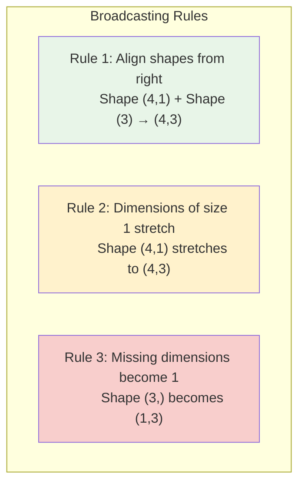

---

## Memory and Computational Efficiency

### Memory Usage Comparison

| Method         | Memory Usage                             | Explanation                   |
| -------------- | ---------------------------------------- | ----------------------------- |
| **Loop-based** | $O(m \times \text{intermediate arrays})$ | Creates many temporary arrays |
| **Vectorized** | $O(\text{total parameters})$             | Single matrix operations      |

### Computational Complexity

For our network ($n_x \to n_h \to n_y$) with $m$ examples:

| Operation            | Loop-based                      | Vectorized                    | Speedup Factor      |
| -------------------- | ------------------------------- | ----------------------------- | ------------------- |
| **Hidden layer**     | $m \times (n_x \times n_h)$ ops | $n_x \times n_h \times m$ ops | $\sim 50-100\times$ |
| **Output layer**     | $m \times (n_h \times n_y)$ ops | $n_h \times n_y \times m$ ops | $\sim 50-100\times$ |
| **Total operations** | Same total FLOPs                | Same total FLOPs              | Better cache usage  |

**Key insight:** Same number of operations, but vectorized version:

- Uses optimized BLAS libraries
- Better CPU cache utilization
- GPU acceleration possible
- Parallel execution

---

## Common Mistakes and Debugging

### 1. **Dimension Errors**

```python
def debug_dimensions():
    """
    Common dimension mistakes and how to fix them
    """
    print("Common Dimension Mistakes")
    print("=" * 40)

    # Correct shapes
    X = np.random.randn(3, 5)    # 3 features, 5 examples
    W1 = np.random.randn(4, 3)   # 4 hidden units
    b1 = np.random.randn(4, 1)   # 4 biases

    print("✅ Correct shapes:")
    print(f"X: {X.shape}, W1: {W1.shape}, b1: {b1.shape}")

    try:
        Z1 = np.dot(W1, X) + b1
        print(f"Z1: {Z1.shape} - Success!")
    except Exception as e:
        print(f"Error: {e}")

    print()

    # Common mistake 1: Wrong bias shape
    print("❌ Mistake 1: Wrong bias shape")
    b1_wrong = np.random.randn(4,)  # Should be (4,1), not (4,)
    print(f"b1_wrong shape: {b1_wrong.shape}")

    try:
        Z1_wrong = np.dot(W1, X) + b1_wrong
        print(f"Z1_wrong: {Z1_wrong.shape}")
        print("This might work due to broadcasting, but can cause issues!")
    except Exception as e:
        print(f"Error: {e}")

    print()

    # Common mistake 2: Transposed input
    print("❌ Mistake 2: Transposed input")
    X_wrong = X.T  # Shape (5, 3) instead of (3, 5)
    print(f"X_wrong shape: {X_wrong.shape}")

    try:
        Z1_wrong = np.dot(W1, X_wrong) + b1
        print(f"This will fail!")
    except Exception as e:
        print(f"Error: {e}")

debug_dimensions()
```

### 2. **Shape Debugging Helper**

```python
class ShapeDebugger:
    """Helper class to track shapes through forward propagation"""

    def __init__(self):
        self.step = 0

    def log_operation(self, operation, *arrays, result=None):
        """Log shapes for debugging"""
        self.step += 1
        print(f"Step {self.step}: {operation}")

        for i, arr in enumerate(arrays):
            if hasattr(arr, 'shape'):
                print(f"  Input {i+1}: {arr.shape}")
            else:
                print(f"  Input {i+1}: scalar")

        if result is not None:
            print(f"  Result: {result.shape}")
        print()

    def forward_prop_debug(self, X, W1, b1, W2, b2):
        """Forward propagation with shape debugging"""
        self.step = 0
        print("Shape Debugging Forward Propagation")
        print("=" * 45)

        # Input
        A0 = X
        self.log_operation("Input assignment", X, result=A0)

        # Hidden layer linear
        Z1 = np.dot(W1, A0)
        self.log_operation("Hidden linear (before bias)", W1, A0, result=Z1)

        Z1 = Z1 + b1
        self.log_operation("Hidden linear (after bias)", Z1, b1, result=Z1)

        # Hidden layer activation
        A1 = tanh(Z1)
        self.log_operation("Hidden activation", Z1, result=A1)

        # Output layer linear
        Z2 = np.dot(W2, A1)
        self.log_operation("Output linear (before bias)", W2, A1, result=Z2)

        Z2 = Z2 + b2
        self.log_operation("Output linear (after bias)", Z2, b2, result=Z2)

        # Output layer activation
        A2 = sigmoid(Z2)
        self.log_operation("Output activation", Z2, result=A2)

        return A2

# Usage example
debugger = ShapeDebugger()
# debugger.forward_prop_debug(X, W1, b1, W2, b2)
```

### 3. **Input Data Format Validation**

```python
def validate_input_format(X, expected_features=None):
    """
    Validate input data format for neural network
    """
    print("Input Data Validation")
    print("=" * 30)

    print(f"Input shape: {X.shape}")

    # Check if 2D
    if len(X.shape) != 2:
        print("❌ Error: Input must be 2D array")
        return False

    n_features, n_examples = X.shape
    print(f"Features: {n_features}, Examples: {n_examples}")

    # Check expected features
    if expected_features is not None:
        if n_features != expected_features:
            print(f"❌ Error: Expected {expected_features} features, got {n_features}")
            return False

    # Check for NaN or infinite values
    if np.any(np.isnan(X)):
        print("❌ Warning: Input contains NaN values")
        return False

    if np.any(np.isinf(X)):
        print("❌ Warning: Input contains infinite values")
        return False

    # Check reasonable value ranges
    min_val, max_val = np.min(X), np.max(X)
    print(f"Value range: [{min_val:.3f}, {max_val:.3f}]")

    if abs(min_val) > 100 or abs(max_val) > 100:
        print("⚠️  Warning: Values are quite large, consider normalization")

    print("✅ Input format is valid")
    return True

# Test with our example
validate_input_format(X, expected_features=3)
```

---

## Practical Implementation Tips

### 1. **Efficient Data Loading**

```python
def create_batch_dataset():
    """
    Example of creating properly formatted dataset
    """
    # Simulate loading data (usually from CSV, database, etc.)
    np.random.seed(42)

    # Generate synthetic house data
    n_examples = 1000

    # Features: [square_feet, bedrooms, age] (normalized)
    features = np.random.randn(3, n_examples)

    # True relationship (for demonstration)
    # price depends on: 2*sqft + 1*bedrooms - 0.5*age + noise
    true_weights = np.array([[2.0], [1.0], [-0.5]])
    noise = np.random.randn(1, n_examples) * 0.1

    # Binary classification: expensive (>threshold) vs cheap
    raw_prices = np.dot(true_weights.T, features) + noise
    threshold = np.median(raw_prices)
    labels = (raw_prices > threshold).astype(int)

    print(f"Dataset created:")
    print(f"  Features shape: {features.shape}")
    print(f"  Labels shape: {labels.shape}")
    print(f"  Positive examples: {np.sum(labels)}")
    print(f"  Negative examples: {n_examples - np.sum(labels)}")

    return features, labels

# Create dataset
X_train, Y_train = create_batch_dataset()
```

### 2. **Mini-batch Processing**

```python
def mini_batch_forward_prop(X, Y, W1, b1, W2, b2, batch_size=32):
    """
    Process data in mini-batches for memory efficiency
    """
    m = X.shape[1]
    num_batches = (m + batch_size - 1) // batch_size  # Ceiling division

    all_predictions = []

    print(f"Processing {m} examples in {num_batches} batches of size {batch_size}")

    for i in range(num_batches):
        # Get batch indices
        start_idx = i * batch_size
        end_idx = min((i + 1) * batch_size, m)

        # Extract batch
        X_batch = X[:, start_idx:end_idx]
        Y_batch = Y[:, start_idx:end_idx]

        print(f"  Batch {i+1}: examples {start_idx}-{end_idx-1}, shape {X_batch.shape}")

        # Forward propagation on batch
        A2_batch, _ = forward_propagation_vectorized(X_batch, W1, b1, W2, b2)
        all_predictions.append(A2_batch)

    # Concatenate all predictions
    all_predictions = np.hstack(all_predictions)

    print(f"Final predictions shape: {all_predictions.shape}")
    return all_predictions

# Example usage
# predictions = mini_batch_forward_prop(X_train, Y_train, W1, b1, W2, b2, batch_size=64)
```

### 3. **Numerical Stability**

```python
def stable_forward_propagation(X, W1, b1, W2, b2):
    """
    Forward propagation with numerical stability checks
    """
    # Input layer
    A0 = X

    # Hidden layer
    Z1 = np.dot(W1, A0) + b1

    # Check for overflow/underflow in Z1
    if np.any(np.abs(Z1) > 100):
        print("⚠️  Warning: Large values in Z1, consider weight initialization")

    A1 = tanh(Z1)

    # Check for vanishing activations
    if np.mean(np.abs(A1)) < 0.01:
        print("⚠️  Warning: Very small activations in hidden layer")

    # Output layer
    Z2 = np.dot(W2, A1) + b2

    # Stable sigmoid computation
    A2 = sigmoid(Z2)

    # Check for saturated outputs
    saturated = np.sum((A2 < 0.01) | (A2 > 0.99))
    if saturated > 0:
        print(f"⚠️  Warning: {saturated} predictions are saturated")

    cache = {"A0": A0, "Z1": Z1, "A1": A1, "Z2": Z2, "A2": A2}
    return A2, cache
```

---

## Key Takeaways

### 1. **Vectorization Benefits**

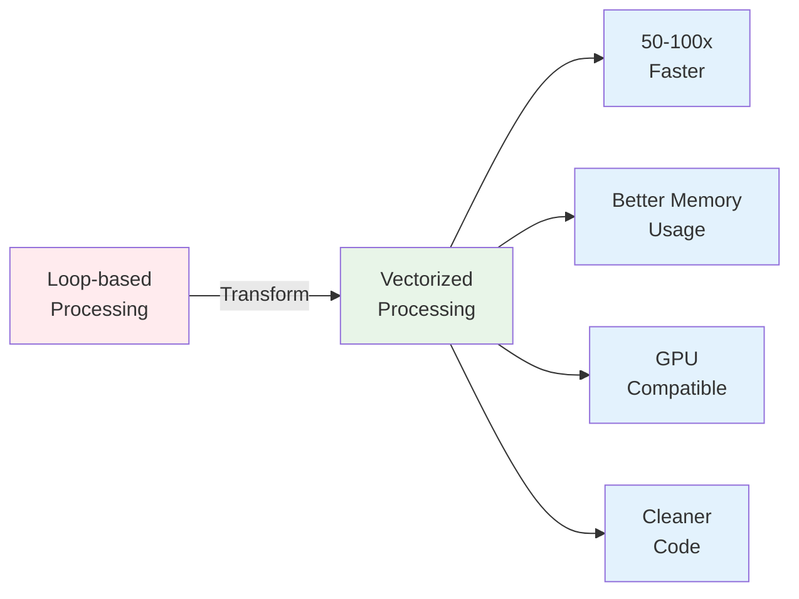

### 2. **Dimension Rules**

- **Input matrix:** $(n_x, m)$ - features as rows, examples as columns
- **Weight matrices:** $(n^{[l]}, n^{[l-1]})$ - current layer × previous layer
- **Activations:** $(n^{[l]}, m)$ - each column is one example's activations
- **Universal rule:** $m$ is always the number of columns

### 3. **Implementation Guidelines**

1. **Always check dimensions** before matrix operations
2. **Use proper bias shapes** $(n^{[l]}, 1)$ for broadcasting
3. **Validate input format** before training
4. **Consider mini-batches** for large datasets
5. **Monitor numerical stability** during computation

### 4. **Broadcasting Mastery**

- NumPy automatically handles bias addition across examples
- Shape $(n, 1)$ broadcasts to $(n, m)$
- Understanding broadcasting prevents dimension errors

### 5. **Performance Impact**

- Vectorization provides massive speedups (50-100x typical)
- Enables GPU acceleration for deep learning
- Essential for processing large datasets efficiently

---

# 5. Activation Functions

## Introduction

Activation functions are the key to neural networks' power. They introduce **non-linearity** that allows networks to learn complex patterns beyond simple linear relationships. This section explores different activation functions, their properties, use cases, and implementation considerations.

---

## Why Activation Functions Matter

### The Linear Problem Revisited

Without activation functions, our neural network would just be:

$$z^{[1]} = W^{[1]}X + b^{[1]}$$
$$z^{[2]} = W^{[2]}z^{[1]} + b^{[2]} = W^{[2]}(W^{[1]}X + b^{[1]}) + b^{[2]}$$
$$z^{[2]} = (W^{[2]}W^{[1]})X + (W^{[2]}b^{[1]} + b^{[2]})$$

This simplifies to: $z^{[2]} = W'X + b'$ - just **linear regression**!

### Power of Non-Linearity

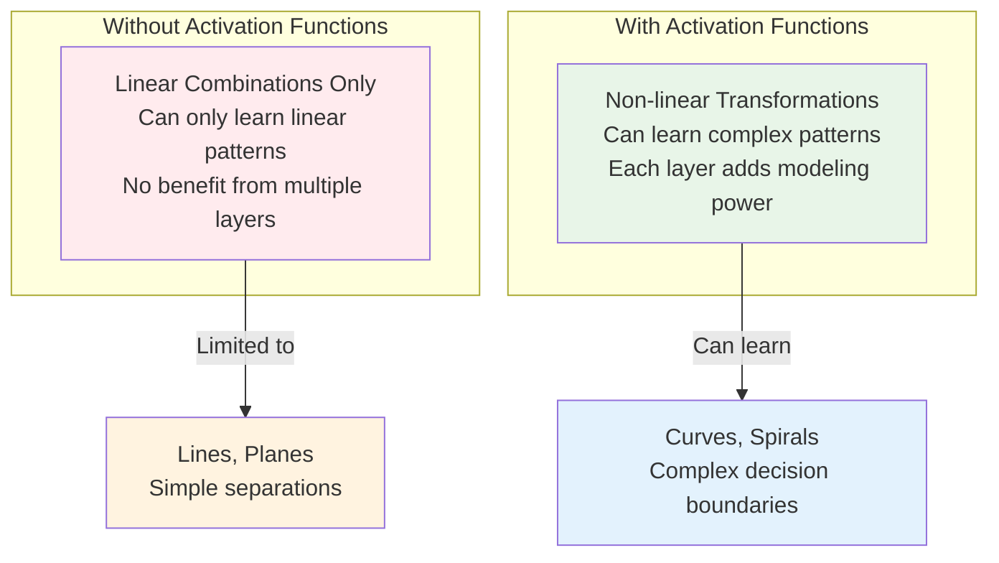

---

## Common Activation Functions

### 1. Sigmoid Function

**Mathematical Definition:**
$$\sigma(z) = \frac{1}{1 + e^{-z}}$$

**Properties:**

- **Range:** $(0, 1)$
- **Smooth and differentiable**
- **S-shaped curve**
- **Probabilistic interpretation** (output can be seen as probability)

**Visualization:**

```python
import numpy as np
import matplotlib.pyplot as plt

def sigmoid(z):
    return 1 / (1 + np.exp(-np.clip(z, -500, 500)))

z = np.linspace(-10, 10, 100)
y = sigmoid(z)

plt.figure(figsize=(10, 6))
plt.plot(z, y, 'b-', linewidth=2, label='Sigmoid')
plt.grid(True, alpha=0.3)
plt.xlabel('z')
plt.ylabel('σ(z)')
plt.title('Sigmoid Activation Function')
plt.axhline(y=0.5, color='r', linestyle='--', alpha=0.7, label='y=0.5')
plt.axvline(x=0, color='r', linestyle='--', alpha=0.7, label='z=0')
plt.legend()
plt.ylim(-0.1, 1.1)
plt.show()
```

**Key Characteristics:**

- **At z=0:** $\sigma(0) = 0.5$
- **Large positive z:** $\sigma(z) \rightarrow 1$
- **Large negative z:** $\sigma(z) \rightarrow 0$
- **Symmetric around (0, 0.5)**

**Problems with Sigmoid:**

1. **Vanishing Gradients:** For large $|z|$, gradient becomes very small
2. **Not zero-centered:** Outputs always positive, can slow learning
3. **Computationally expensive:** Exponential function

### 2. Tanh (Hyperbolic Tangent)

**Mathematical Definition:**
$$\tanh(z) = \frac{e^z - e^{-z}}{e^z + e^{-z}} = \frac{e^{2z} - 1}{e^{2z} + 1}$$

**Alternative form:**
$$\tanh(z) = 2\sigma(2z) - 1$$

**Properties:**

- **Range:** $(-1, 1)$
- **Zero-centered** (better than sigmoid)
- **S-shaped curve**
- **Smooth and differentiable**

**Comparison with Sigmoid:**

```python
def tanh(z):
    return np.tanh(z)

z = np.linspace(-5, 5, 100)
sigmoid_vals = sigmoid(z)
tanh_vals = tanh(z)

plt.figure(figsize=(12, 5))

plt.subplot(1, 2, 1)
plt.plot(z, sigmoid_vals, 'b-', label='Sigmoid', linewidth=2)
plt.plot(z, tanh_vals, 'r-', label='Tanh', linewidth=2)
plt.grid(True, alpha=0.3)
plt.xlabel('z')
plt.ylabel('Activation')
plt.title('Sigmoid vs Tanh')
plt.legend()
plt.axhline(y=0, color='k', linestyle='-', alpha=0.3)
plt.axvline(x=0, color='k', linestyle='-', alpha=0.3)

plt.subplot(1, 2, 2)
plt.plot(z, sigmoid_vals - 0.5, 'b--', label='Sigmoid - 0.5', linewidth=2)
plt.plot(z, tanh_vals, 'r-', label='Tanh', linewidth=2)
plt.grid(True, alpha=0.3)
plt.xlabel('z')
plt.ylabel('Activation')
plt.title('Tanh vs Shifted Sigmoid')
plt.legend()
plt.axhline(y=0, color='k', linestyle='-', alpha=0.3)
plt.axvline(x=0, color='k', linestyle='-', alpha=0.3)

plt.tight_layout()
plt.show()
```

**Key Characteristics:**

- **At z=0:** $\tanh(0) = 0$
- **Large positive z:** $\tanh(z) \rightarrow 1$
- **Large negative z:** $\tanh(z) \rightarrow -1$
- **Symmetric around origin**

**Advantages over Sigmoid:**

- **Zero-centered outputs** help with gradient flow
- **Stronger gradients** around zero
- **Better convergence** in practice

### 3. ReLU (Rectified Linear Unit)

**Mathematical Definition:**

$$
\text{ReLU}(z) = \max(0, z) = \begin{cases}
z & \text{if } z > 0 \\
0 & \text{if } z \leq 0
\end{cases}
$$

**Properties:**

- **Range:** $[0, \infty)$
- **Not differentiable at z=0** (but we can handle this)
- **Computationally efficient**
- **Sparse activations** (many zeros)

**Visualization:**

```python
def relu(z):
    return np.maximum(0, z)

z = np.linspace(-5, 5, 100)
relu_vals = relu(z)

plt.figure(figsize=(10, 6))
plt.plot(z, relu_vals, 'g-', linewidth=2, label='ReLU')
plt.grid(True, alpha=0.3)
plt.xlabel('z')
plt.ylabel('ReLU(z)')
plt.title('ReLU Activation Function')
plt.axhline(y=0, color='k', linestyle='-', alpha=0.3)
plt.axvline(x=0, color='k', linestyle='-', alpha=0.3)
plt.legend()
plt.show()
```

**Key Characteristics:**

- **At z=0:** $\text{ReLU}(0) = 0$
- **For z>0:** $\text{ReLU}(z) = z$ (identity function)
- **For z<0:** $\text{ReLU}(z) = 0$ (kills negative inputs)

**Advantages:**

1. **Solves vanishing gradient problem** for positive inputs
2. **Computationally efficient** (just thresholding)
3. **Sparse representations** (biological plausibility)
4. **Linear for positive inputs** (easier optimization)

**Problems:**

1. **"Dying ReLU" problem:** Neurons can get stuck at zero
2. **Not zero-centered**
3. **Unbounded output** can lead to exploding activations

### 4. Leaky ReLU

**Mathematical Definition:**

$$
\text{Leaky ReLU}(z) = \max(\alpha z, z) = \begin{cases}
z & \text{if } z > 0 \\
\alpha z & \text{if } z \leq 0
\end{cases}
$$

Where $\alpha$ is a small positive constant (typically 0.01).

**Properties:**

- **Range:** $(-\infty, \infty)$
- **Solves dying ReLU problem**
- **Small gradient for negative inputs**

**Comparison of ReLU variants:**

```python
def leaky_relu(z, alpha=0.01):
    return np.where(z > 0, z, alpha * z)

z = np.linspace(-5, 5, 100)
relu_vals = relu(z)
leaky_relu_vals = leaky_relu(z, alpha=0.01)

plt.figure(figsize=(10, 6))
plt.plot(z, relu_vals, 'g-', linewidth=2, label='ReLU')
plt.plot(z, leaky_relu_vals, 'orange', linewidth=2, label='Leaky ReLU (α=0.01)')
plt.grid(True, alpha=0.3)
plt.xlabel('z')
plt.ylabel('Activation')
plt.title('ReLU vs Leaky ReLU')
plt.legend()
plt.axhline(y=0, color='k', linestyle='-', alpha=0.3)
plt.axvline(x=0, color='k', linestyle='-', alpha=0.3)
plt.show()
```

---

## Activation Function Comparison

### Visual Comparison

```python
def plot_all_activations():
    """Compare all activation functions on the same plot"""
    z = np.linspace(-5, 5, 100)

    plt.figure(figsize=(12, 8))

    # All activation functions
    plt.plot(z, sigmoid(z), 'b-', linewidth=2, label='Sigmoid')
    plt.plot(z, tanh(z), 'r-', linewidth=2, label='Tanh')
    plt.plot(z, relu(z), 'g-', linewidth=2, label='ReLU')
    plt.plot(z, leaky_relu(z), 'orange', linewidth=2, label='Leaky ReLU')

    plt.grid(True, alpha=0.3)
    plt.xlabel('Input (z)', fontsize=12)
    plt.ylabel('Output', fontsize=12)
    plt.title('Comparison of Activation Functions', fontsize=14)
    plt.legend(fontsize=11)
    plt.axhline(y=0, color='k', linestyle='-', alpha=0.3)
    plt.axvline(x=0, color='k', linestyle='-', alpha=0.3)

    # Add annotations
    plt.annotate('Saturates', xy=(3, sigmoid(3)), xytext=(4, 0.7),
                arrowprops=dict(arrowstyle='->', color='blue', alpha=0.7))
    plt.annotate('Zero-centered', xy=(0, tanh(0)), xytext=(-3, 0.3),
                arrowprops=dict(arrowstyle='->', color='red', alpha=0.7))
    plt.annotate('Linear for z>0', xy=(3, relu(3)), xytext=(1, 4),
                arrowprops=dict(arrowstyle='->', color='green', alpha=0.7))

    plt.ylim(-2, 5)
    plt.show()

plot_all_activations()
```

### Properties Summary Table

| Function       | Range   | Zero-Centered | Computational Cost | Vanishing Gradient | Dying Neurons |
| -------------- | ------- | ------------- | ------------------ | ------------------ | ------------- |
| **Sigmoid**    | (0, 1)  | ❌ No         | High               | ❌ Yes             | ❌ No         |
| **Tanh**       | (-1, 1) | ✅ Yes        | High               | ❌ Yes             | ❌ No         |
| **ReLU**       | [0, ∞)  | ❌ No         | Low                | ✅ Partially       | ❌ Yes        |
| **Leaky ReLU** | (-∞, ∞) | ❌ No         | Low                | ✅ Partially       | ✅ Partially  |

---

## Choosing Activation Functions

### General Guidelines

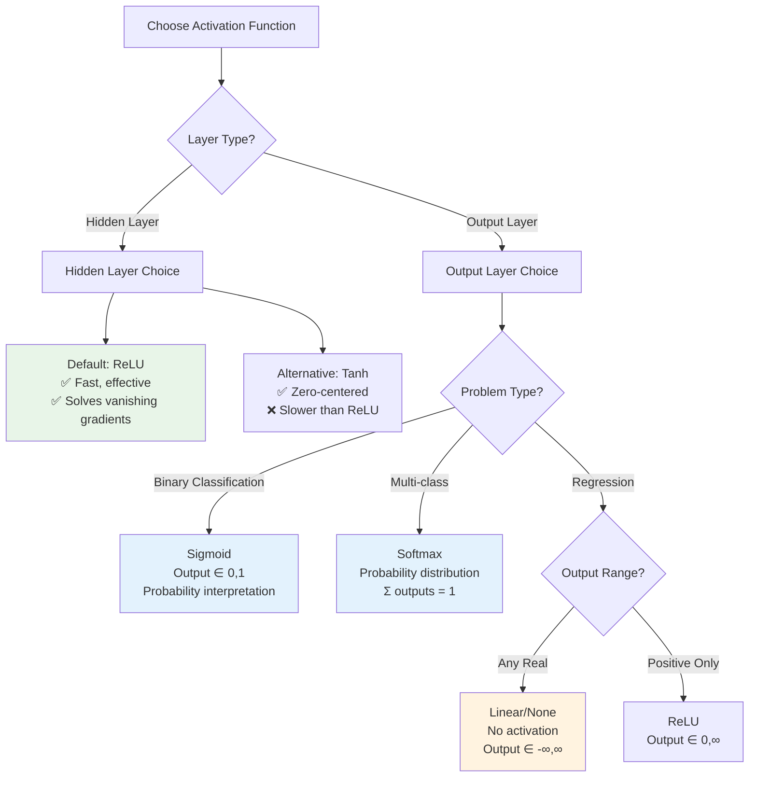

### Specific Recommendations

#### 1. **Hidden Layers**

**First choice: ReLU**

```python
def hidden_layer_relu(z):
    return np.maximum(0, z)
```

**Reasons:**

- Computationally efficient
- Mitigates vanishing gradient problem
- Empirically works well in practice
- Default choice in most deep learning frameworks

**Alternative: Tanh (for specific cases)**

```python
def hidden_layer_tanh(z):
    return np.tanh(z)
```

**When to use tanh:**

- When zero-centered outputs are crucial
- Shallow networks (1-2 hidden layers)
- When you need bounded outputs

#### 2. **Output Layers**

**Binary Classification: Sigmoid**

```python
def output_binary_classification(z):
    return 1 / (1 + np.exp(-np.clip(z, -500, 500)))
```

**Multi-class Classification: Softmax**

```python
def softmax(z):
    # Numerical stability: subtract max
    exp_z = np.exp(z - np.max(z, axis=0, keepdims=True))
    return exp_z / np.sum(exp_z, axis=0, keepdims=True)
```

**Regression: Linear (No Activation)**

```python
def output_regression(z):
    return z  # Identity function
```

---

## Implementation and Numerical Considerations

### 1. **Sigmoid Implementation with Numerical Stability**

```python
def stable_sigmoid(z):
    """
    Numerically stable sigmoid implementation
    """
    # Clip to prevent overflow
    z = np.clip(z, -500, 500)

    # Use different formulations for positive and negative z
    positive_mask = z >= 0
    negative_mask = ~positive_mask

    result = np.zeros_like(z)

    # For positive z: σ(z) = 1 / (1 + e^(-z))
    result[positive_mask] = 1 / (1 + np.exp(-z[positive_mask]))

    # For negative z: σ(z) = e^z / (1 + e^z)
    exp_z = np.exp(z[negative_mask])
    result[negative_mask] = exp_z / (1 + exp_z)

    return result

# Test numerical stability
z_test = np.array([-1000, -100, -10, 0, 10, 100, 1000])
print("Regular sigmoid:")
print(sigmoid(z_test))
print("Stable sigmoid:")
print(stable_sigmoid(z_test))
```

### 2. **ReLU Variants Implementation**

```python
class ActivationFunctions:
    """Collection of activation functions with proper implementations"""

    @staticmethod
    def relu(z):
        """Standard ReLU"""
        return np.maximum(0, z)

    @staticmethod
    def leaky_relu(z, alpha=0.01):
        """Leaky ReLU with customizable slope"""
        return np.where(z > 0, z, alpha * z)

    @staticmethod
    def elu(z, alpha=1.0):
        """Exponential Linear Unit"""
        return np.where(z > 0, z, alpha * (np.exp(z) - 1))

    @staticmethod
    def swish(z):
        """Swish activation function (z * sigmoid(z))"""
        return z * stable_sigmoid(z)

    def compare_relu_variants(self, z_range=(-3, 3)):
        """Compare different ReLU variants"""
        z = np.linspace(z_range[0], z_range[1], 100)

        plt.figure(figsize=(12, 8))

        plt.plot(z, self.relu(z), 'g-', linewidth=2, label='ReLU')
        plt.plot(z, self.leaky_relu(z), 'orange', linewidth=2, label='Leaky ReLU')
        plt.plot(z, self.elu(z), 'purple', linewidth=2, label='ELU')
        plt.plot(z, self.swish(z), 'brown', linewidth=2, label='Swish')

        plt.grid(True, alpha=0.3)
        plt.xlabel('Input (z)')
        plt.ylabel('Output')
        plt.title('ReLU Variants Comparison')
        plt.legend()
        plt.axhline(y=0, color='k', linestyle='-', alpha=0.3)
        plt.axvline(x=0, color='k', linestyle='-', alpha=0.3)
        plt.show()

# Usage
activations = ActivationFunctions()
activations.compare_relu_variants()
```

### 3. **Activation Function with Caching**

```python
class ActivationLayer:
    """Activation layer with forward pass and caching for backpropagation"""

    def __init__(self, activation_type='relu'):
        self.activation_type = activation_type
        self.cache = {}

    def forward(self, z):
        """Forward pass through activation function"""
        if self.activation_type == 'sigmoid':
            a = stable_sigmoid(z)
        elif self.activation_type == 'tanh':
            a = np.tanh(z)
        elif self.activation_type == 'relu':
            a = np.maximum(0, z)
        elif self.activation_type == 'leaky_relu':
            a = np.where(z > 0, z, 0.01 * z)
        else:
            raise ValueError(f"Unknown activation: {self.activation_type}")

        # Cache for backpropagation
        self.cache['z'] = z
        self.cache['a'] = a

        return a

    def get_derivative(self, z=None):
        """Get derivative of activation function"""
        if z is None:
            z = self.cache['z']

        if self.activation_type == 'sigmoid':
            a = stable_sigmoid(z)
            return a * (1 - a)
        elif self.activation_type == 'tanh':
            return 1 - np.tanh(z)**2
        elif self.activation_type == 'relu':
            return (z > 0).astype(float)
        elif self.activation_type == 'leaky_relu':
            return np.where(z > 0, 1, 0.01)
        else:
            raise ValueError(f"Unknown activation: {self.activation_type}")

# Example usage
hidden_activation = ActivationLayer('relu')
output_activation = ActivationLayer('sigmoid')

# Forward pass
z1 = np.array([[0.5, -0.2], [1.3, -0.8]])
a1 = hidden_activation.forward(z1)
print("Hidden layer output:")
print(a1)

z2 = np.array([[0.3, -0.1]])
a2 = output_activation.forward(z2)
print("Output layer output:")
print(a2)
```

---

## Practical Examples and Use Cases

### Example 1: Binary Classification Network

```python
def binary_classification_network():
    """
    Example network for binary classification
    Hidden layers: ReLU
    Output layer: Sigmoid
    """

    # Sample data: XOR problem
    X = np.array([[0, 0, 1, 1],
                  [0, 1, 0, 1]])  # Shape: (2, 4)
    Y = np.array([[0, 1, 1, 0]])   # XOR outputs

    # Network parameters (small network for XOR)
    W1 = np.random.randn(3, 2) * 0.5  # 3 hidden units
    b1 = np.zeros((3, 1))
    W2 = np.random.randn(1, 3) * 0.5  # 1 output unit
    b2 = np.zeros((1, 1))

    # Forward propagation
    print("Binary Classification Example (XOR)")
    print("=" * 40)

    # Hidden layer (ReLU activation)
    Z1 = np.dot(W1, X) + b1
    A1 = np.maximum(0, Z1)  # ReLU
    print(f"Hidden layer activations (ReLU):")
    print(f"Shape: {A1.shape}")
    print(A1)
    print()

    # Output layer (Sigmoid activation)
    Z2 = np.dot(W2, A1) + b2
    A2 = stable_sigmoid(Z2)  # Sigmoid
    print(f"Output layer predictions (Sigmoid):")
    print(f"Shape: {A2.shape}")
    print(A2)
    print()

    # Binary predictions
    predictions = (A2 > 0.5).astype(int)
    print(f"Binary predictions:")
    print(predictions)
    print(f"True labels:")
    print(Y)

    return A2

binary_classification_network()
```

### Example 2: Multi-class Classification

```python
def multiclass_classification_network():
    """
    Example network for multi-class classification
    Hidden layers: ReLU
    Output layer: Softmax
    """

    # Sample data: 3 classes, 5 examples
    X = np.random.randn(4, 5)  # 4 features, 5 examples

    # Network parameters
    W1 = np.random.randn(6, 4) * 0.3  # 6 hidden units
    b1 = np.zeros((6, 1))
    W2 = np.random.randn(3, 6) * 0.3  # 3 output units (3 classes)
    b2 = np.zeros((3, 1))

    print("Multi-class Classification Example")
    print("=" * 40)

    # Hidden layer (ReLU)
    Z1 = np.dot(W1, X) + b1
    A1 = np.maximum(0, Z1)
    print(f"Hidden layer activations (ReLU):")
    print(f"Shape: {A1.shape}")
    print(f"Non-zero activations: {np.sum(A1 > 0)} / {A1.size}")
    print()

    # Output layer (Softmax)
    Z2 = np.dot(W2, A1) + b2

    # Softmax with numerical stability
    exp_scores = np.exp(Z2 - np.max(Z2, axis=0, keepdims=True))
    A2 = exp_scores / np.sum(exp_scores, axis=0, keepdims=True)

    print(f"Output layer probabilities (Softmax):")
    print(f"Shape: {A2.shape}")
    print(A2)
    print()

    # Verify probabilities sum to 1
    print(f"Sum of probabilities for each example:")
    print(np.sum(A2, axis=0))
    print()

    # Predicted classes
    predicted_classes = np.argmax(A2, axis=0)
    print(f"Predicted classes:")
    print(predicted_classes)

    return A2

multiclass_classification_network()
```

### Example 3: Regression Network

```python
def regression_network():
    """
    Example network for regression
    Hidden layers: ReLU
    Output layer: Linear (no activation)
    """

    # Sample data: house prices
    X = np.random.randn(3, 8)  # 3 features, 8 examples

    # Network parameters
    W1 = np.random.randn(5, 3) * 0.3  # 5 hidden units
    b1 = np.zeros((5, 1))
    W2 = np.random.randn(1, 5) * 0.3  # 1 output (price)
    b2 = np.zeros((1, 1))

    print("Regression Example (House Prices)")
    print("=" * 40)

    # Hidden layer (ReLU)
    Z1 = np.dot(W1, X) + b1
    A1 = np.maximum(0, Z1)
    print(f"Hidden layer activations (ReLU):")
    print(f"Shape: {A1.shape}")
    print(f"Mean activation: {np.mean(A1):.3f}")
    print()

    # Output layer (Linear - no activation)
    Z2 = np.dot(W2, A1) + b2
    A2 = Z2  # No activation for regression

    print(f"Output layer predictions (Linear):")
    print(f"Shape: {A2.shape}")
    print(A2.ravel())
    print()

    print(f"Price range: ${np.min(A2):.2f} to ${np.max(A2):.2f}")

    return A2

regression_network()
```

---

## Activation Function Selection Strategy

### Detailed Selection Guide

#### For Hidden Layers:

| Activation     | When to Use                   | Pros                                                                        | Cons                                                                    |
| -------------- | ----------------------------- | --------------------------------------------------------------------------- | ----------------------------------------------------------------------- |
| **ReLU** ⭐    | Default choice for most cases | • Fast computation<br/>• Reduces vanishing gradient<br/>• Sparse activation | • Dead neurons for negative inputs<br/>• Not zero-centered              |
| **Tanh**       | Zero-centered outputs needed  | • Zero-centered output<br/>• Stronger gradients than sigmoid                | • Still suffers from vanishing gradient<br/>• Computationally expensive |
| **Leaky ReLU** | When ReLU causes dead neurons | • Prevents dead neurons<br/>• Fast computation                              | • Additional hyperparameter to tune                                     |

#### For Output Layers:

| Problem Type                   | Activation  | Output Range | Use Case Examples                                                                            |
| ------------------------------ | ----------- | ------------ | -------------------------------------------------------------------------------------------- |
| **Binary Classification**      | Sigmoid     | (0, 1)       | • Email spam detection<br/>• Medical diagnosis (Yes/No)<br/>• Image classification (Cat/Dog) |
| **Multi-class Classification** | Softmax     | (0, 1) sum=1 | • Image recognition (CIFAR-10)<br/>• Text classification<br/>• Handwriting recognition       |
| **Regression (any value)**     | Linear/None | (-∞, ∞)      | • House price prediction<br/>• Temperature forecasting<br/>• Stock price prediction          |
| **Regression (positive only)** | ReLU        | [0, ∞)       | • Sales forecasting<br/>• Population prediction<br/>• Item counts                            |

## Quick Reference Rules

### ✅ Default Choices

- **Hidden layers:** ReLU
- **Binary classification output:** Sigmoid
- **Multi-class output:** Softmax
- **Regression output:** Linear (no activation)

### 🔄 When to Consider Alternatives

- **Tanh instead of ReLU:** When you need zero-centered outputs
- **Leaky ReLU:** When you encounter dead neuron problems
- **ReLU for regression:** When output should be non-negative

### ❌ Generally Avoid

- **Sigmoid in hidden layers:** Causes vanishing gradient in deep networks
- **Linear activation everywhere:** Network becomes just linear regression
- **Complex activations:** Unless you have specific requirements

**Remember:** Start with the defaults (ReLU for hidden, appropriate activation for output based on problem type), then experiment if needed!

---

## Common Mistakes and Best Practices

### ❌ Common Mistakes

- **Using ReLU for binary classification output** → Can't represent probabilities
- **Using Sigmoid in hidden layers of deep networks** → Vanishing gradient problem
- **Using Linear activation everywhere** → Network becomes just linear regression

### ✅ Best Practices

- **Start with defaults**: ReLU for hidden layers, appropriate activation for output
- **Match activation to problem type**: Sigmoid for binary, Softmax for multi-class
- **Test your choices**: Monitor training progress and adjust if needed

### Gradient Flow Intuition

- **Sigmoid/Tanh**: Gradients get smaller for large inputs → slow learning
- **ReLU**: Constant gradient of 1 for positive inputs → faster learning
- **Dead neurons**: ReLU outputs 0 for negative inputs → consider Leaky ReLU if this becomes a problem

---

## Advanced Activation Functions

### Why Go Beyond ReLU?

While ReLU works great as a default, researchers have developed improved activations for specific scenarios:

- **Better gradient flow** in very deep networks
- **Smoother functions** for better optimization
- **Self-adaptive behavior** that adjusts to the data

### 1. **Swish Activation**

**Formula:** `f(x) = x × sigmoid(x)`

**Key Properties:**

- **Smooth everywhere** (unlike ReLU which has a sharp corner at 0)
- **Self-gated:** Uses its own value to control the gate
- **Non-monotonic:** Can decrease for some negative inputs
- **Bounded below:** Always ≥ -0.28 (approximately)

**When to use:**

- Deep networks where ReLU struggles
- When you need smoother gradients
- Image classification tasks (often outperforms ReLU)

**Intuition:** Think of it as "ReLU with a smooth turn-on" - it gradually activates rather than switching abruptly.

```python
def swish_analysis():
    """
    Analysis of Swish activation function: f(x) = x * sigmoid(x)
    """

    def swish(z):
        return z * stable_sigmoid(z)

    def swish_derivative(z):
        """Derivative of swish function"""
        s = stable_sigmoid(z)
        return s + z * s * (1 - s)

    z = np.linspace(-5, 5, 100)

    plt.figure(figsize=(12, 5))

    # Function comparison
    plt.subplot(1, 2, 1)
    plt.plot(z, swish(z), 'purple', linewidth=2, label='Swish')
    plt.plot(z, np.maximum(0, z), 'g--', linewidth=2, label='ReLU')
    plt.plot(z, np.tanh(z), 'r--', linewidth=2, label='Tanh')
    plt.grid(True, alpha=0.3)
    plt.xlabel('Input (z)')
    plt.ylabel('Output')
    plt.title('Swish vs Other Activations')
    plt.legend()
    plt.axhline(y=0, color='k', linestyle='-', alpha=0.3)
    plt.axvline(x=0, color='k', linestyle='-', alpha=0.3)

    # Derivative comparison
    plt.subplot(1, 2, 2)
    plt.plot(z, swish_derivative(z), 'purple', linewidth=2, label="Swish'")
    plt.plot(z, (z > 0).astype(float), 'g--', linewidth=2, label="ReLU'")
    plt.plot(z, 1 - np.tanh(z)**2, 'r--', linewidth=2, label="Tanh'")
    plt.grid(True, alpha=0.3)
    plt.xlabel('Input (z)')
    plt.ylabel('Derivative')
    plt.title('Derivatives Comparison')
    plt.legend()
    plt.axhline(y=0, color='k', linestyle='-', alpha=0.3)
    plt.axvline(x=0, color='k', linestyle='-', alpha=0.3)

    plt.tight_layout()
    plt.show()

    print("Swish Properties:")
    print("- Smooth and differentiable everywhere")
    print("- Non-monotonic (can decrease for negative inputs)")
    print("- Self-gated (uses its own values to gate)")
    print("- Often outperforms ReLU in deep networks")

swish_analysis()
```

### 2. **GELU (Gaussian Error Linear Unit)**

**Formula:** `f(x) = x × Φ(x)` where Φ is the standard normal CDF

**Key Properties:**

- **Probabilistically motivated:** Based on how likely an input is to be "important"
- **Smooth approximation to ReLU:** No sharp corners
- **Stochastic during training:** Can be viewed as randomly dropping inputs
- **Zero-centered:** Better than ReLU for some applications

**When to use:**

- **Transformer models** (BERT, GPT use GELU)
- **Natural language processing** tasks
- When you want probabilistic reasoning in activations

**Intuition:** "How much should this neuron fire based on how 'normal' its input is?"

```python
def gelu_analysis():
    """
    Analysis of GELU activation function
    """

    def gelu_approx(z):
        """Approximation: GELU(x) ≈ 0.5x(1 + tanh(√(2/π)(x + 0.044715x³)))"""
        return 0.5 * z * (1 + np.tanh(np.sqrt(2/np.pi) * (z + 0.044715 * z**3)))

    def gelu_exact(z):
        """Exact: GELU(x) = x * Φ(x) where Φ is CDF of standard normal"""
        from scipy.stats import norm
        return z * norm.cdf(z)

    z = np.linspace(-3, 3, 100)

    try:
        plt.figure(figsize=(10, 6))
        plt.plot(z, gelu_approx(z), 'b-', linewidth=2, label='GELU (approx)')
        plt.plot(z, gelu_exact(z), 'b--', linewidth=2, label='GELU (exact)')
        plt.plot(z, np.maximum(0, z), 'g-', linewidth=2, label='ReLU')
        plt.plot(z, swish(z), 'purple', linewidth=2, label='Swish')

        plt.grid(True, alpha=0.3)
        plt.xlabel('Input (z)')
        plt.ylabel('Output')
        plt.title('GELU vs Other Activations')
        plt.legend()
        plt.axhline(y=0, color='k', linestyle='-', alpha=0.3)
        plt.axvline(x=0, color='k', linestyle='-', alpha=0.3)
        plt.show()

    except ImportError:
        print("GELU analysis requires scipy. Using approximation only.")

        plt.figure(figsize=(10, 6))
        plt.plot(z, gelu_approx(z), 'b-', linewidth=2, label='GELU')
        plt.plot(z, np.maximum(0, z), 'g-', linewidth=2, label='ReLU')
        plt.grid(True, alpha=0.3)
        plt.xlabel('Input (z)')
        plt.ylabel('Output')
        plt.title('GELU vs ReLU')
        plt.legend()
        plt.show()

    print("GELU Properties:")
    print("- Smooth approximation to ReLU")
    print("- Probabilistically motivated")
    print("- Used in BERT and other transformer models")
    print("- Better than ReLU for some applications")

gelu_analysis()
```

### 3. Comparison Summary

| Activation | Smooth? | Monotonic? | Best For               |
| ---------- | ------- | ---------- | ---------------------- |
| **ReLU**   | No      | Yes        | General purpose, speed |
| **Swish**  | Yes     | No         | Deep CNNs, image tasks |
| **GELU**   | Yes     | Yes        | Transformers, NLP      |

### When to Use Advanced Activations

**Stick with ReLU when:**

- Building your first models
- Speed is critical
- ReLU works well for your task

**Try advanced activations when:**

- ReLU performance plateaus
- Training very deep networks (>50 layers)
- Working with transformers/NLP
- You have compute budget for experimentation

### Implementation Note

Most deep learning frameworks (PyTorch, TensorFlow) have these built-in:

```python
# PyTorch examples
torch.nn.SiLU()  # Swish
torch.nn.GELU()  # GELU

# TensorFlow examples
tf.nn.swish()
tf.nn.gelu()
```

### Rule of Thumb

Start with ReLU, then experiment with Swish for computer vision or GELU for NLP if you need better performance.

**This approach is much better because it:**

1. **Explains the "why"** before the "what"
2. **Gives clear guidance** on when to use each
3. **Provides intuition** rather than just math
4. **Includes practical advice** on implementation
5. **Keeps code minimal** and focused on usage

---

## Practical Implementation Guidelines

### **Production-Ready Activation Module** (Not that important for now)

```python
class ActivationModule:
    """
    Production-ready activation function module
    """

    def __init__(self):
        self.supported_functions = [
            'relu', 'leaky_relu', 'sigmoid', 'tanh',
            'swish', 'gelu', 'linear'
        ]

    def __call__(self, z, activation_type='relu', **kwargs):
        """
        Apply activation function with error handling
        """
        if activation_type not in self.supported_functions:
            raise ValueError(f"Unsupported activation: {activation_type}")

        # Input validation
        if not isinstance(z, np.ndarray):
            z = np.array(z)

        # Check for invalid inputs
        if np.any(np.isnan(z)):
            raise ValueError("Input contains NaN values")

        if np.any(np.isinf(z)):
            print("Warning: Input contains infinite values")

        # Apply activation
        if activation_type == 'relu':
            return self._relu(z)
        elif activation_type == 'leaky_relu':
            alpha = kwargs.get('alpha', 0.01)
            return self._leaky_relu(z, alpha)
        elif activation_type == 'sigmoid':
            return self._stable_sigmoid(z)
        elif activation_type == 'tanh':
            return self._tanh(z)
        elif activation_type == 'swish':
            return self._swish(z)
        elif activation_type == 'gelu':
            return self._gelu(z)
        elif activation_type == 'linear':
            return z

    def _relu(self, z):
        """ReLU with gradient checking"""
        result = np.maximum(0, z)

        # Check for dying ReLU
        if np.mean(result == 0) > 0.5:
            print("Warning: >50% of ReLU outputs are zero (dying ReLU)")

        return result

    def _leaky_relu(self, z, alpha=0.01):
        """Leaky ReLU with parameter validation"""
        if alpha <= 0 or alpha >= 1:
            raise ValueError("Alpha must be in (0, 1)")

        return np.where(z > 0, z, alpha * z)

    def _stable_sigmoid(self, z):
        """Numerically stable sigmoid"""
        # Clip extreme values
        z = np.clip(z, -500, 500)

        # Check for saturation
        saturated = np.sum((z < -10) | (z > 10))
        if saturated > 0:
            print(f"Warning: {saturated} sigmoid inputs are saturated")

        return 1 / (1 + np.exp(-z))

    def _tanh(self, z):
        """Tanh with saturation warning"""
        result = np.tanh(z)

        # Check for saturation
        saturated = np.sum((np.abs(result) > 0.99))
        if saturated > 0:
            print(f"Warning: {saturated} tanh outputs are saturated")

        return result

    def _swish(self, z):
        """Swish activation"""
        return z * self._stable_sigmoid(z)

    def _gelu(self, z):
        """GELU approximation"""
        return 0.5 * z * (1 + np.tanh(np.sqrt(2/np.pi) * (z + 0.044715 * z**3)))

    def get_derivative(self, z, activation_type='relu', **kwargs):
        """Get derivative of activation function"""
        if activation_type == 'relu':
            return (z > 0).astype(float)
        elif activation_type == 'leaky_relu':
            alpha = kwargs.get('alpha', 0.01)
            return np.where(z > 0, 1, alpha)
        elif activation_type == 'sigmoid':
            s = self._stable_sigmoid(z)
            return s * (1 - s)
        elif activation_type == 'tanh':
            return 1 - np.tanh(z)**2
        elif activation_type == 'linear':
            return np.ones_like(z)
        else:
            raise NotImplementedError(f"Derivative for {activation_type} not implemented")

# Example usage
activation_module = ActivationModule()

# Test with sample data
z_test = np.array([[-2, -1, 0, 1, 2], [0.5, -0.5, 3, -3, 0]])

print("Testing Production Activation Module:")
print("=" * 45)

for activation_type in ['relu', 'sigmoid', 'tanh']:
    result = activation_module(z_test, activation_type)
    print(f"{activation_type.upper()}:")
    print(f"  Input:  {z_test}")
    print(f"  Output: {result}")
    print()
```

## Real-World Applications and Case Studies

> Can skip this part - as this contains code that can be overwhelming for now. Can visit later after completing rest of the notes below.

### Case Study 1: Image Classification Network

```python
def image_classification_example():
    """
    Typical activation choices for image classification
    """

    print("IMAGE CLASSIFICATION NETWORK")
    print("=" * 40)

    # Simulate CNN-like architecture
    # Input: 28x28 grayscale images (MNIST-like)
    batch_size = 32
    input_size = 28 * 28  # Flattened

    # Architecture: 784 -> 128 -> 64 -> 10 (for 10 classes)

    # Layer 1: Input to Hidden
    print("Layer 1: Input (784) -> Hidden (128)")
    print("  Activation: ReLU")
    print("  Reasoning: Standard choice for hidden layers")

    W1 = np.random.randn(128, input_size) * np.sqrt(2/input_size)  # He initialization
    X = np.random.randn(input_size, batch_size)
    Z1 = np.dot(W1, X)
    A1 = np.maximum(0, Z1)  # ReLU

    print(f"  Output shape: {A1.shape}")
    print(f"  Sparsity: {np.mean(A1 == 0)*100:.1f}% zeros")
    print()

    # Layer 2: Hidden to Hidden
    print("Layer 2: Hidden (128) -> Hidden (64)")
    print("  Activation: ReLU")
    print("  Reasoning: Consistent with previous layer")

    W2 = np.random.randn(64, 128) * np.sqrt(2/128)
    Z2 = np.dot(W2, A1)
    A2 = np.maximum(0, Z2)  # ReLU

    print(f"  Output shape: {A2.shape}")
    print(f"  Sparsity: {np.mean(A2 == 0)*100:.1f}% zeros")
    print()

    # Layer 3: Hidden to Output
    print("Layer 3: Hidden (64) -> Output (10)")
    print("  Activation: Softmax")
    print("  Reasoning: Multi-class classification")

    W3 = np.random.randn(10, 64) * np.sqrt(2/64)
    Z3 = np.dot(W3, A2)

    # Softmax
    exp_scores = np.exp(Z3 - np.max(Z3, axis=0, keepdims=True))
    A3 = exp_scores / np.sum(exp_scores, axis=0, keepdims=True)

    print(f"  Output shape: {A3.shape}")
    print(f"  Probability sums: {np.sum(A3, axis=0)[:5]}")  # Show first 5
    print(f"  Predicted classes: {np.argmax(A3, axis=0)[:5]}")

    return A3

image_classification_example()
```

### Case Study 2: Regression for Price Prediction

```python
def price_prediction_example():
    """
    Activation choices for regression problems
    """

    print("HOUSE PRICE PREDICTION NETWORK")
    print("=" * 40)

    # Architecture: 8 features -> 20 -> 10 -> 1 price
    batch_size = 50

    # Sample house features (normalized)
    features = [
        'sqft', 'bedrooms', 'bathrooms', 'age',
        'distance_to_city', 'school_rating', 'crime_rate', 'income_median'
    ]

    X = np.random.randn(8, batch_size)  # 8 features, 50 houses

    print("Layer 1: Features (8) -> Hidden (20)")
    print("  Activation: ReLU")
    print("  Reasoning: Standard for hidden layers")

    W1 = np.random.randn(20, 8) * 0.1
    Z1 = np.dot(W1, X)
    A1 = np.maximum(0, Z1)

    print(f"  Output shape: {A1.shape}")
    print()

    print("Layer 2: Hidden (20) -> Hidden (10)")
    print("  Activation: ReLU")
    print("  Reasoning: Consistent hidden layer choice")

    W2 = np.random.randn(10, 20) * 0.1
    Z2 = np.dot(W2, A1)
    A2 = np.maximum(0, Z2)

    print(f"  Output shape: {A2.shape}")
    print()

    print("Layer 3: Hidden (10) -> Price (1)")
    print("  Activation: Linear (none)")
    print("  Reasoning: Regression - need full real number range")

    W3 = np.random.randn(1, 10) * 0.1
    Z3 = np.dot(W3, A2)
    A3 = Z3  # No activation (linear)

    print(f"  Output shape: {A3.shape}")
    print(f"  Price predictions: ${A3.ravel()[:5] * 100000 + 200000}")  # Denormalize
    print()

    # Alternative: ReLU output for non-negative prices
    print("Alternative: ReLU output layer")
    print("  Use when: Prices must be non-negative")
    A3_relu = np.maximum(0, Z3)
    print(f"  ReLU prices: ${A3_relu.ravel()[:5] * 100000 + 200000}")

    return A3

price_prediction_example()
```

---

## Common Neural Network Training Problems

## 1. Dying ReLU Problem

### What is the Dying ReLU Problem?

The **Dying ReLU Problem** occurs when ReLU neurons get stuck outputting zero for all inputs and stop learning entirely.

### How ReLU Works

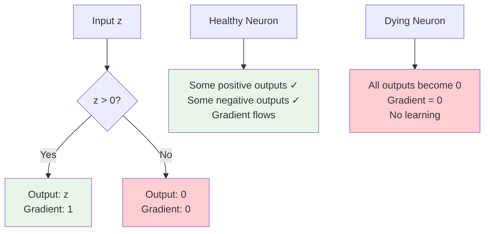

### When Neurons "Die"

A neuron "dies" when its weighted sum `z = w·x + b` becomes negative for ALL training examples:

```
Example of a dying neuron:
Input: [1, 2, 3]
Weights: [-2, -1, -0.5]
Bias: -1

z = (-2×1) + (-1×2) + (-0.5×3) + (-1) = -6.5

Since z < 0 for all inputs:
- ReLU output = 0
- Gradient = 0
- Weights never update!
```

### Why This Happens

1. **Poor weight initialization**: Starting with large negative weights
2. **High learning rate**: Large updates can push weights too negative
3. **Data not normalized**: Large input values can cause extreme weighted sums

### Visual Example

```
Before (healthy neuron):
Input range: [-1, 1]
Weights: [0.5, -0.3]
Some outputs: positive ✓, negative ✓

After dying:
Weights become: [-2.1, -1.8]
All outputs: negative → ReLU kills them → gradient = 0
```

### How to Detect Dying ReLU

Monitor during training:

- **Percentage of zero activations** > 50%
- **Gradient norms** approaching zero
- **Weight updates** stopping for certain neurons

### Solutions

| Solution                  | How it Works                      | Example                         |
| ------------------------- | --------------------------------- | ------------------------------- |
| **Leaky ReLU**            | Small slope for negative inputs   | `f(z) = max(0.01z, z)`          |
| **Better initialization** | Start with small positive weights | Xavier/He initialization        |
| **Lower learning rate**   | Prevent large negative jumps      | Start with 0.001 instead of 0.1 |
| **Batch normalization**   | Keep inputs in reasonable range   | Normalize layer inputs          |

---

## 2. Vanishing Gradient Problem

### What are Vanishing Gradients?

**Vanishing gradients** occur when gradients become exponentially small as they propagate backward through deep networks, causing early layers to learn extremely slowly or stop learning.

### The Math Behind It

During backpropagation, gradients are calculated using the chain rule:

```
∂Loss/∂W₁ = ∂Loss/∂W₄ × ∂W₄/∂W₃ × ∂W₃/∂W₂ × ∂W₂/∂W₁
```

Each term is typically < 1, so multiplying many of them makes the gradient tiny.

### Why Sigmoid/Tanh Cause This

**Sigmoid activation:**

```
σ(z) = 1/(1 + e^(-z))
σ'(z) = σ(z) × (1 - σ(z))
```

**Key problem:** Maximum derivative = 0.25 (when z = 0)

```
Example in 5-layer network:
Layer 5 gradient: 1.0
Layer 4 gradient: 1.0 × 0.25 = 0.25
Layer 3 gradient: 0.25 × 0.25 = 0.0625
Layer 2 gradient: 0.0625 × 0.25 = 0.016
Layer 1 gradient: 0.016 × 0.25 = 0.004

Layer 1 learns 250x slower than Layer 5!
```

### Visual Understanding

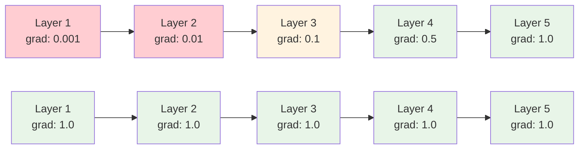

**Top row**: Sigmoid activation (gradients vanish)  
**Bottom row**: ReLU activation (gradients preserved)

### Symptoms of Vanishing Gradients

1. **Early layers learn very slowly** or not at all
2. **Training accuracy improves slowly** despite many epochs
3. **Gradient norms** in early layers are orders of magnitude smaller
4. **Later layers overfit** while early layers underfit

### Solutions

| Solution                  | Why it Works                     | Trade-offs                     |
| ------------------------- | -------------------------------- | ------------------------------ |
| **Use ReLU**              | Gradient = 1 for positive inputs | Can cause dying ReLU           |
| **Residual connections**  | Gradients can skip layers        | Requires architectural changes |
| **Better initialization** | Keep gradients in good range     | Xavier/He initialization       |
| **Batch normalization**   | Normalize inputs to each layer   | Adds computational cost        |
| **Gradient clipping**     | Prevent extreme gradient values  | Doesn't solve root cause       |

---

## 3. Exploding Gradient Problem

### What are Exploding Gradients?

**Exploding gradients** occur when gradients become exponentially large during backpropagation, causing unstable training and potential model divergence.

### The Math Behind It

Same chain rule as vanishing gradients, but now each term > 1:

```
If each gradient term ≈ 2:
Layer 5 gradient: 1.0
Layer 4 gradient: 1.0 × 2 = 2.0
Layer 3 gradient: 2.0 × 2 = 4.0
Layer 2 gradient: 4.0 × 2 = 8.0
Layer 1 gradient: 8.0 × 2 = 16.0

Gradients explode exponentially!
```

### When This Happens

1. **Poor weight initialization**: Starting with large weights
2. **Deep networks**: More layers = more multiplication
3. **High learning rates**: Amplifies the explosion
4. **Certain activation functions**: Some can amplify gradients

### Example Scenario

```mermaid
graph LR
    A[Layer 1<br/>grad: 1.0] --> B[×2] --> C[Layer 2<br/>grad: 2.0]
    C --> D[×2] --> E[Layer 3<br/>grad: 4.0]
    E --> F[×2] --> G[Layer 4<br/>grad: 8.0]
    G --> H[×2] --> I[Layer 5<br/>grad: 16.0]

    J[Result] --> K[Massive weight updates<br/>Training diverges<br/>Loss becomes NaN]

    style A fill:#e8f5e8
    style C fill:#fff3e0
    style E fill:#ffeb3b
    style G fill:#ff9800
    style I fill:#f44336
    style K fill:#f44336
```

**Weight matrix**: `[[3, 2], [1, 4]]` with eigenvalues ~5.2  
**After 5 layers**: gradients multiply by ~5.2⁵ ≈ 380!

### Symptoms of Exploding Gradients

| Symptom                          | What to Look For                    | Example Values                      |
| -------------------------------- | ----------------------------------- | ----------------------------------- |
| **Loss becomes NaN**             | Training loss shows NaN or infinite | Loss: 1.2 → 5.7 → NaN               |
| **Weights grow extremely large** | Weight magnitudes > 1000            | Weights: [0.5, 1.2] → [1847, -2394] |
| **Training becomes unstable**    | Loss jumps erratically              | Loss: 2.1 → 0.8 → 15.6 → 0.3        |
| **Model outputs become NaN**     | Predictions are NaN or infinite     | Output: [0.8, 0.2] → [NaN, NaN]     |

### Solutions

**1. Gradient Clipping** (First line of defense)

- **How it works:** Cap gradient magnitude to prevent extreme values
- **Implementation:** If gradient norm exceeds threshold, scale it down
- **Formula:** `gradient = gradient × (threshold / ||gradient||)` when `||gradient|| > threshold`
- **When to use:** Always recommended for RNNs and very deep networks

**2. Better Weight Initialization** (Always recommended)

- **How it works:** Start with appropriately scaled weights to prevent initial explosion
- **Implementation:** Use He initialization for ReLU, Xavier for sigmoid/tanh
- **Benefits:** Keeps gradients in reasonable range from the start
- **When to use:** Every neural network should use proper initialization

**3. Lower Learning Rate** (If clipping isn't enough)

- **How it works:** Smaller updates prevent weights from growing too quickly
- **Implementation:** Start with 0.001 instead of 0.01 or 0.1
- **Trade-off:** Training may be slower but more stable
- **When to use:** When gradient clipping alone doesn't solve the problem

**4. Batch Normalization** (For deep networks)

- **How it works:** Normalizes inputs to each layer, preventing activation values from becoming too large
- **Implementation:** Built into most deep learning frameworks
- **Benefits:** Stabilizes training and allows higher learning rates
- **When to use:** Deep networks (>10 layers) or when other methods aren't sufficient

**5. Residual Connections** (Very deep networks)

- **How it works:** Provides alternative gradient paths that skip layers
- **Implementation:** Add skip connections like in ResNet architecture
- **Benefits:** Allows gradients to flow directly to earlier layers
- **When to use:** Very deep networks (>20 layers) where other methods fail

---

## Problem Comparison Summary

| Problem        | Cause               | Gradient Behavior | Primary Solution               |
| -------------- | ------------------- | ----------------- | ------------------------------ |
| **Dying ReLU** | Neurons stuck at 0  | Becomes 0         | Leaky ReLU, better init        |
| **Vanishing**  | Gradients too small | Approaches 0      | Use ReLU, residual connections |
| **Exploding**  | Gradients too large | Becomes infinite  | Gradient clipping              |

## Practical Debugging Guide

### Problem Diagnosis Flowchart

```mermaid
graph TD
    A[Training Issues?] --> B{Check Loss}

    B -->|"Loss = NaN/Infinite"| C[Exploding Gradients]
    B -->|"Loss plateaus early"| D[Vanishing Gradients]
    B -->|"Loss decreases slowly"| E{Check Activations}

    E -->|"More than 50% zeros"| F[Dying ReLU]
    E -->|"Normal distribution"| G[Other issues]

    C --> C1["Solutions:<br/>Gradient clipping<br/>Lower learning rate<br/>Better initialization"]

    D --> D1["Solutions:<br/>Use ReLU<br/>Residual connections<br/>Batch normalization"]

    F --> F1["Solutions:<br/>Leaky ReLU<br/>Better initialization<br/>Check learning rate"]

    style C fill:#f44336
    style D fill:#ff9800
    style F fill:#ffcdd2
    style C1 fill:#e8f5e8
    style D1 fill:#e8f5e8
    style F1 fill:#e8f5e8
```

### Modern Solutions

Most modern deep learning frameworks handle these issues automatically:

- **Proper default initialization**
- **Built-in gradient clipping**
- **Batch normalization layers**
- **Optimizers that adapt learning rates**

The key is understanding these problems so you can recognize and fix them when they occur!

---

# 6. Why Non-Linear Activation Functions Are Essential

## The Core Problem

### What Happens Without Activation Functions?

When you use **linear activation functions** (or no activation at all), something devastating happens to your neural network:

**It collapses to a single linear layer, no matter how deep!**

```mermaid
graph LR
    A["3-Layer Network<br/>Linear Activations"] --> B["≡ Single Linear Layer<br/>Same Power"]

    C[Input] --> D["Layer 1<br/>W₁x + b₁"]
    D --> E["Layer 2<br/>W₂(...) + b₂"]
    E --> F["Layer 3<br/>W₃(...) + b₃"]
    F --> G[Output]

    H[Input] --> I["Single Layer<br/>W_eff × x + b_eff"]
    I --> J["Same Output!"]

    style A fill:#ffcdd2
    style B fill:#ffcdd2
    style I fill:#ffcdd2
```

## Mathematical Proof (Simple Version)

### 2-Layer Example

**Layer 1:** `a₁ = W₁x + b₁` (linear activation)  
**Layer 2:** `a₂ = W₂a₁ + b₂` (linear activation)

**Substitute Layer 1 into Layer 2:**

```
a₂ = W₂(W₁x + b₁) + b₂
a₂ = W₂W₁x + W₂b₁ + b₂
a₂ = W_effective × x + b_effective
```

**Result:** 2 layers = 1 layer with `W_effective = W₂W₁` and `b_effective = W₂b₁ + b₂`

### For Any Number of Layers

This pattern continues for any depth:

- **10 layers with linear activations** = **1 linear layer**
- **100 layers with linear activations** = **1 linear layer**
- **1000 layers with linear activations** = **1 linear layer**

All that changes is you waste more computational resources!

## Real-World Examples

### The XOR Problem

**XOR Truth Table:**
| Input 1 | Input 2 | Output |
|---------|---------|--------|
| 0 | 0 | 0 |
| 0 | 1 | 1 |
| 1 | 0 | 1 |
| 1 | 1 | 0 |

```mermaid
graph TD
    A[Can Linear Networks Solve XOR?] --> B{Try Drawing a Line}
    B --> C[❌ Impossible!<br/>No single line separates<br/>the classes correctly]

    D[Can Non-Linear Networks Solve XOR?] --> E{Use Curved Boundaries}
    E --> F[✅ Yes!<br/>Non-linear boundaries<br/>can separate any pattern]

    style C fill:#ffcdd2
    style F fill:#e8f5e8
```

**Visual representation:**

```
XOR Pattern (cannot be solved by linear):
  x  o     ← No straight line can separate x's from o's
o   x

Non-linear solution:
Draw a circle around the o's, or use multiple line segments
```

## What Different Networks Can Do

### Linear Networks (Without Activation Functions)

| ✅ Can Learn                                            | ❌ Cannot Learn      |
| ------------------------------------------------------- | -------------------- |
| • House price from size (if truly linear)               | • XOR problem        |
| • Simple straight-line relationships                    | • Image recognition  |
| • Linear classification (if data is linearly separable) | • Curved patterns    |
| • Basic linear regression                               | • Speech recognition |

### Non-Linear Networks (With Activation Functions)

| ✅ Can Learn                       |
| ---------------------------------- |
| • XOR and any logic problem        |
| • Image recognition (cats vs dogs) |
| • Speech and language processing   |
| • Game playing (chess, Go)         |
| • Any continuous function\*        |
| • Complex real-world patterns      |

\*Universal Approximation Theorem

## Practical Examples

### Example 1: Image Recognition

**With Linear Activations:**

```
Image → Linear Layer 1 → Linear Layer 2 → Linear Layer 3 → Classification
      = Image → Single Linear Layer → Classification
      = Can only detect simple patterns like "brightness level"
```

**With Non-Linear Activations (ReLU):**

```
Image → ReLU Layer 1 → ReLU Layer 2 → ReLU Layer 3 → Classification
      = Image → Edge Detection → Shape Recognition → Object Classification
      = Can recognize complex objects!
```

### Example 2: Understanding Hierarchy

```mermaid
graph TD
    A[Raw Image Pixels] --> B[Layer 1 + ReLU<br/>Edge Detection]
    B --> C[Layer 2 + ReLU<br/>Shape Recognition]
    C --> D[Layer 3 + ReLU<br/>Object Parts]
    D --> E[Output<br/>Full Object Recognition]

    F[Same Image] --> G[Linear Layers Only<br/>No Feature Hierarchy]
    G --> H[Output<br/>Basic Pixel Combinations Only]

    style B fill:#e1f5fe
    style C fill:#e1f5fe
    style D fill:#e1f5fe
    style E fill:#e8f5e8
    style G fill:#ffcdd2
    style H fill:#ffcdd2
```

## When Linear Activation is OK

### The One Exception: Output Layer for Regression

**This is perfectly fine:**

```
Input → ReLU Hidden → ReLU Hidden → Linear Output
```

**Why it works:**

- Hidden layers provide **non-linearity** (ReLU)
- Output layer allows **any real number** (for house prices, temperature, etc.)
- Network can still learn **complex patterns**

**Example use cases for linear output:**

- Predicting house prices (can be any positive value)
- Temperature forecasting (can be positive or negative)
- Stock price prediction (can be any value)

## Common Misconceptions

### ❌ Misconception 1: "More layers = more power"

**Truth:** Only if you have non-linear activations. Otherwise, 100 layers = 1 layer.

### ❌ Misconception 2: "Linear output makes the whole network linear"

**Truth:** Only hidden layers need to be non-linear. Linear output is fine for regression.

### ❌ Misconception 3: "Any small non-linearity will work"

**Truth:** Activation function choice matters significantly. ReLU vs sigmoid can make huge difference.

## Decision Guide

### For Hidden Layers: Always Non-Linear

```mermaid
graph TD
    A[Hidden Layer Activation?] --> B[Default: ReLU]
    B --> C[Fast computation<br/>Good gradients<br/>Works well in practice]

    A --> D[Alternative: Tanh]
    D --> E[When you need<br/>zero-centered outputs]

    A --> F[Alternative: Leaky ReLU]
    F --> G[When ReLU neurons<br/>are dying]

    style B fill:#e8f5e8
    style D fill:#fff3e0
    style F fill:#fff3e0
```

### For Output Layers: Match Your Problem

| Problem Type                   | Activation | Why                              |
| ------------------------------ | ---------- | -------------------------------- |
| **Binary Classification**      | Sigmoid    | Output between 0-1 (probability) |
| **Multi-class Classification** | Softmax    | Probability distribution         |
| **Regression (any value)**     | Linear     | Can output any real number       |
| **Regression (positive only)** | ReLU       | Forces non-negative outputs      |

## The Big Picture

### Without Non-Linear Activations

```
Neural Network = Expensive Linear Regression
- Wastes computational resources
- Cannot learn complex patterns
- Limited to linear relationships
```

### With Non-Linear Activations

```
Neural Network = Universal Function Approximator
- Can learn any continuous function
- Discovers hierarchical features
- Solves complex real-world problems
```

## Key Takeaways

1. **Linear activations everywhere** = Your deep network becomes shallow (1 layer)
2. **Non-linear activations in hidden layers** = Unlock the power of depth
3. **Linear activation in output** = OK for regression problems
4. **ReLU is your default choice** for hidden layers
5. **The XOR problem** is the classic test - linear networks fail, non-linear succeed

## Bottom Line

**Non-linear activation functions are not just helpful - they're absolutely essential.**

Without them, neural networks are just expensive linear regression. With them, neural networks become the powerful tools that drive modern AI.

**Remember:** The "magic" of deep learning comes from non-linearity, not just from having many layers!

# 7. Derivatives of Activation Functions

### Why Derivatives Matter for Neural Networks

### The Backpropagation Connection

During training, neural networks learn by computing how the loss changes with respect to each parameter. This requires **derivatives of activation functions**.

$$\frac{\partial \mathcal{L}}{\partial W^{[l]}} = \frac{\partial \mathcal{L}}{\partial a^{[l]}} \cdot \frac{\partial a^{[l]}}{\partial z^{[l]}} \cdot \frac{\partial z^{[l]}}{\partial W^{[l]}}$$

```mermaid
graph LR
    Loss[Loss ℓ] --> dA[∂ℓ/∂a]
    dA --> dZ[∂a/∂z<br/>Activation Derivative]
    dZ --> dW[∂z/∂W]
    dW --> Update[Parameter Update]

    style dZ fill:#fff3e0
    style Update fill:#e8f5e8
```

**The chain rule in action:**

```
∂Loss/∂W = ∂Loss/∂a × ∂a/∂z × ∂z/∂W
```

The middle term `∂a/∂z` is the **activation function derivative** - this determines how gradients flow through your network.

### Chain Rule in Neural Networks

**Forward pass:** $z^{[l]} = W^{[l]}a^{[l-1]} + b^{[l]}$, then $a^{[l]} = g^{[l]}(z^{[l]})$

**Backward pass:** $\frac{\partial \mathcal{L}}{\partial z^{[l]}} = \frac{\partial \mathcal{L}}{\partial a^{[l]}} \cdot g'^{[l]}(z^{[l]})$

Where $g'^{[l]}(z^{[l]})$ is the derivative of the activation function.

### 1. Sigmoid Activation Derivative

### Mathematical Derivation

**Function:** $\sigma(z) = \frac{1}{1 + e^{-z}}$

**Goal:** Find $\frac{d}{dz}\sigma(z)$

**Method 1: Direct differentiation using quotient rule**

Let $u = 1$ and $v = 1 + e^{-z}$

$$\frac{d}{dz}\sigma(z) = \frac{d}{dz}\left(\frac{u}{v}\right) = \frac{u'v - uv'}{v^2}$$

Where:

- $u' = 0$
- $v' = \frac{d}{dz}(1 + e^{-z}) = -e^{-z}$

Therefore:
$$\frac{d}{dz}\sigma(z) = \frac{0 \cdot (1 + e^{-z}) - 1 \cdot (-e^{-z})}{(1 + e^{-z})^2} = \frac{e^{-z}}{(1 + e^{-z})^2}$$

**Method 2: Express in terms of $\sigma(z)$**

From the direct result:
$$\frac{d}{dz}\sigma(z) = \frac{e^{-z}}{(1 + e^{-z})^2}$$

We can rewrite this as:
$$\frac{d}{dz}\sigma(z) = \frac{1}{1 + e^{-z}} \cdot \frac{e^{-z}}{1 + e^{-z}}$$

Note that:

- $\frac{1}{1 + e^{-z}} = \sigma(z)$
- $\frac{e^{-z}}{1 + e^{-z}} = \frac{1 + e^{-z} - 1}{1 + e^{-z}} = 1 - \frac{1}{1 + e^{-z}} = 1 - \sigma(z)$

**Final elegant result:**
$$\boxed{\sigma'(z) = \sigma(z)(1 - \sigma(z))}$$

This means: **the derivative equals the function value times (1 minus the function value)**

### Properties and Problems

**Key Properties:**

- **Range:** (0, 0.25] - always positive, maximum at z=0
- **Shape:** Bell-curved, peaks at zero, approaches zero for large |z|
- **Elegant formula:** `σ'(z) = σ(z) × (1 - σ(z))`

**The Vanishing Gradient Problem:**

```
For z = ±5: σ'(z) ≈ 0.007 (tiny!)
For z = ±10: σ'(z) ≈ 0.00005 (almost zero!)
```

**Why this matters:**

- In deep networks, gradients get multiplied many times
- Small derivatives compound: 0.25 × 0.25 × 0.25 × ... → 0
- Early layers learn extremely slowly or stop learning

**Example calculation:**

```python
# Test sigmoid derivative at key points
z_values = [-10, -5, -1, 0, 1, 5, 10]
for z in z_values:
    s = 1 / (1 + np.exp(-z))  # sigmoid
    derivative = s * (1 - s)   # derivative
    print(f"z={z:2}: σ'(z)={derivative:.6f}")

# Output shows how derivative vanishes for large |z|
```

### 2. Tanh Activation Derivative

### Mathematical Derivation

**Function:** $\tanh(z) = \frac{e^z - e^{-z}}{e^z + e^{-z}}$

**Method 1: Direct differentiation**

Using quotient rule with $u = e^z - e^{-z}$ and $v = e^z + e^{-z}$:

$$u' = e^z + e^{-z}, \quad v' = e^z - e^{-z}$$

$$\frac{d}{dz}\tanh(z) = \frac{u'v - uv'}{v^2} = \frac{(e^z + e^{-z})(e^z + e^{-z}) - (e^z - e^{-z})(e^z - e^{-z})}{(e^z + e^{-z})^2}$$

Expanding:
$$= \frac{(e^z + e^{-z})^2 - (e^z - e^{-z})^2}{(e^z + e^{-z})^2}$$

$$= \frac{e^{2z} + 2 + e^{-2z} - (e^{2z} - 2 + e^{-2z})}{(e^z + e^{-z})^2} = \frac{4}{(e^z + e^{-z})^2}$$

**Method 2: Express in terms of $\tanh(z)$**

We can show that:
$$\frac{4}{(e^z + e^{-z})^2} = 1 - \tanh^2(z)$$

**Proof:**
$$\tanh^2(z) = \left(\frac{e^z - e^{-z}}{e^z + e^{-z}}\right)^2 = \frac{(e^z - e^{-z})^2}{(e^z + e^{-z})^2}$$

Therefore:
$$1 - \tanh^2(z) = 1 - \frac{(e^z - e^{-z})^2}{(e^z + e^{-z})^2} = \frac{(e^z + e^{-z})^2 - (e^z - e^{-z})^2}{(e^z + e^{-z})^2} = \frac{4}{(e^z + e^{-z})^2}$$

**Final result:**
$$\boxed{\tanh'(z) = 1 - \tanh^2(z)}$$

### Comparison with Sigmoid

**Key advantages of tanh derivative:**

- **Larger maximum:** 1.0 vs 0.25 (4× better gradient flow)
- **Zero-centered:** Output range [-1, 1] vs [0, 1]
- **Stronger gradients:** Better for learning, especially near zero

**Still has problems:**

- Gradients still vanish for large |z|
- More expensive to compute than ReLU
- Not as good as ReLU for very deep networks

**When to use:**

- Shallow networks (< 5 layers)
- When you specifically need zero-centered outputs
- Traditional neural networks (before ReLU became popular)

**Example values:**

```
z = -3: tanh'(z) ≈ 0.01  (small)
z = -1: tanh'(z) ≈ 0.42  (decent)
z =  0: tanh'(z) = 1.00  (maximum)
z =  1: tanh'(z) ≈ 0.42  (decent)
z =  3: tanh'(z) ≈ 0.01  (small)
```

### 3. ReLU Activation Derivative

### Mathematical Definition

**Function:** $\text{ReLU}(z) = \max(0, z) = \begin{cases} z & \text{if } z > 0 \\ 0 & \text{if } z \leq 0 \end{cases}$

**Derivative:** $\text{ReLU}'(z) = \begin{cases} 1 & \text{if } z > 0 \\ 0 & \text{if } z < 0 \\ \text{undefined} & \text{if } z = 0 \end{cases}$

### The z=0 Problem

Technically, ReLU is not differentiable at $z=0$. In practice, we handle this by:

1. **Convention 1:** Set $\text{ReLU}'(0) = 0$
2. **Convention 2:** Set $\text{ReLU}'(0) = 1$
3. **Convention 3:** Set $\text{ReLU}'(0) = 0.5$

**Most common:** Convention 1 ($\text{ReLU}'(0) = 0$)

### Properties and the z=0 Problem

**Key Properties:**

- **Binary values:** Either 0 or 1 (nothing in between)
- **No vanishing gradient:** For positive inputs, derivative = 1
- **Computationally efficient:** Just a comparison operation
- **Dying ReLU problem:** Neurons can get stuck outputting 0

**The z=0 Issue:**
ReLU is not technically differentiable at z=0. In practice:

- **Most frameworks:** Set `ReLU'(0) = 0`
- **Alternative:** Set `ReLU'(0) = 1`
- **Reality:** Exact zeros are rare, so this rarely matters

**Example values:**

```
z = -2: ReLU'(z) = 0  (dead neuron)
z = -1: ReLU'(z) = 0  (dead neuron)
z =  0: ReLU'(z) = 0  (by convention)
z =  1: ReLU'(z) = 1  (active neuron)
z =  2: ReLU'(z) = 1  (active neuron)
```

**Why ReLU works so well:**

- Gradient of 1 means no signal degradation
- Enables training of very deep networks
- Computationally cheap (just max(0,z))
- Sparse activations (many zeros) are efficient

### 4. Leaky ReLU Derivative

### Fixing the Dying ReLU Problem

**The Problem:** Some ReLU neurons can get "stuck" always outputting 0:

- If weights become too negative, `z = wx + b < 0` for all inputs
- ReLU output = 0, derivative = 0
- No gradient flows back → weights never update → neuron stays "dead"

**The Solution:** Give negative inputs a small, non-zero gradient

**Formula:**

```
Leaky ReLU(z) = max(αz, z) where α ≈ 0.01
Leaky ReLU'(z) = 1 if z > 0, else α
```

**Example derivatives:**

```
z = -2: Leaky ReLU'(z) = 0.01  (small but non-zero!)
z = -1: Leaky ReLU'(z) = 0.01  (can still learn)
z =  0: Leaky ReLU'(z) = 0.01  (by convention)
z =  1: Leaky ReLU'(z) = 1.00  (same as ReLU)
z =  2: Leaky ReLU'(z) = 1.00  (same as ReLU)
```

### Mathematical Definition

**Function:** $\text{Leaky ReLU}(z) = \begin{cases} z & \text{if } z > 0 \\ \alpha z & \text{if } z \leq 0 \end{cases}$

Where $\alpha$ is a small positive constant (typically 0.01).

**Derivative:** $\text{Leaky ReLU}'(z) = \begin{cases} 1 & \text{if } z > 0 \\ \alpha & \text{if } z < 0 \\ \text{undefined} & \text{if } z = 0 \end{cases}$

**Benefits:**

- **No dying neurons:** Always has some gradient flow
- **Recovery possible:** Negative neurons can become positive again
- **Minimal overhead:** Only slightly more computation than ReLU

**When to use:**

- When you notice many neurons outputting 0 during training
- In very deep networks where dying ReLU becomes a problem
- As a safer default when you're unsure

## Practical Implementation Tips

### Efficient Forward and Backward Pass

```python
class ActivationLayer:
    """Efficient activation layer that caches values for derivatives"""

    def __init__(self, activation_type='relu'):
        self.activation_type = activation_type
        self.last_input = None
        self.last_output = None

    def forward(self, z):
        """Forward pass - cache inputs for backward pass"""
        self.last_input = z.copy()

        if self.activation_type == 'sigmoid':
            self.last_output = sigmoid(z)
        elif self.activation_type == 'tanh':
            self.last_output = np.tanh(z)
        elif self.activation_type == 'relu':
            self.last_output = np.maximum(0, z)
        elif self.activation_type == 'leaky_relu':
            self.last_output = np.where(z > 0, z, 0.01 * z)

        return self.last_output

    def backward(self):
        """Backward pass - compute derivative efficiently"""
        z = self.last_input

        if self.activation_type == 'sigmoid':
            # Use cached output for efficiency!
            return self.last_output * (1 - self.last_output)
        elif self.activation_type == 'tanh':
            # Use cached output
            return 1 - self.last_output**2
        elif self.activation_type == 'relu':
            return (z > 0).astype(float)
        elif self.activation_type == 'leaky_relu':
            return np.where(z > 0, 1, 0.01)

# Example usage
layer = ActivationLayer('sigmoid')
z = np.array([-1, 0, 1, 2])

# Forward pass
output = layer.forward(z)
print(f"Forward output: {output}")

# Backward pass (efficient!)
derivative = layer.backward()
print(f"Derivative: {derivative}")
```

### Understanding Gradient Flow

### What is Gradient Flow?

**Gradient flow** is how gradients (derivatives) travel backward through the network during training. Think of it like water flowing through pipes - if the pipes get narrower, less water flows through.

```mermaid
graph LR
    A[Output Layer<br/>Large Gradient] --> B[Layer 4<br/>Medium Gradient]
    B --> C[Layer 3<br/>Small Gradient]
    C --> D[Layer 2<br/>Tiny Gradient]
    D --> E[Layer 1<br/>Almost Zero!]

    F[Gradient × Derivative] --> G[New Gradient]

    style A fill:#e8f5e8
    style B fill:#fff3e0
    style C fill:#ffeb3b
    style D fill:#ff9800
    style E fill:#f44336
```

**The Process:**

1. **Forward pass:** Data flows forward through activations
2. **Backward pass:** Gradients flow backward through derivatives
3. **Each layer:** `new_gradient = old_gradient × activation_derivative`

### The Problem with Small Derivatives

**Example: 5-layer network with sigmoid activation**

```
Layer 5: gradient = 1.0
Layer 4: gradient = 1.0 × 0.25 = 0.25
Layer 3: gradient = 0.25 × 0.25 = 0.0625
Layer 2: gradient = 0.0625 × 0.25 = 0.016
Layer 1: gradient = 0.016 × 0.25 = 0.004
```

**Result:** Layer 1 learns 250× slower than Layer 5!

### Why Different Activations Matter

| Activation  | Max Derivative | 5-Layer Result | Problem                          |
| ----------- | -------------- | -------------- | -------------------------------- |
| **Sigmoid** | 0.25           | 1.0 → 0.001    | ❌ Vanishing gradients           |
| **Tanh**    | 1.0            | 1.0 → 1.0      | ✅ Better (but still can vanish) |
| **ReLU**    | 1.0            | 1.0 → 1.0      | ✅ Gradients preserved           |

**This is why ReLU revolutionized deep learning!**

### Simple Numerical Check

You should always verify your derivative implementations! Here's the basic idea:

**Numerical derivative formula:**

```
f'(x) ≈ [f(x + ε) - f(x - ε)] / (2ε)
```

where ε is a small number like 0.0001.

**Example check for sigmoid:**

```python
def check_sigmoid_derivative():
    z = 1.0  # test point
    epsilon = 1e-7

    # Analytical derivative
    s = 1 / (1 + np.exp(-z))
    analytical = s * (1 - s)

    # Numerical derivative
    f_plus = 1 / (1 + np.exp(-(z + epsilon)))
    f_minus = 1 / (1 + np.exp(-(z - epsilon)))
    numerical = (f_plus - f_minus) / (2 * epsilon)

    print(f"Analytical: {analytical:.6f}")
    print(f"Numerical:  {numerical:.6f}")
    print(f"Difference: {abs(analytical - numerical):.2e}")

    # Should be very close (difference < 1e-6)

check_sigmoid_derivative()
```

**What this teaches:**

- **Verify your math:** Catch implementation bugs early
- **Build confidence:** Know your derivatives are correct
- **Debug problems:** When training fails, check derivatives first

**Quick test for any activation:**

1. Pick a few test points (z = -1, 0, 1, 2)
2. Compute analytical derivative
3. Compute numerical derivative
4. Check they match within 1e-6

## Summary and Decision Guide

### Derivative Properties Comparison

| Activation     | Derivative Formula | Range     | Vanishing Gradient? | Use Case                           |
| -------------- | ------------------ | --------- | ------------------- | ---------------------------------- |
| **Sigmoid**    | `σ(z)(1-σ(z))`     | (0, 0.25] | ✅ Yes              | Output (binary classification)     |
| **Tanh**       | `1 - tanh²(z)`     | (0, 1]    | ✅ Less severe      | Hidden (when zero-centered needed) |
| **ReLU**       | `1 if z>0 else 0`  | {0, 1}    | ❌ No               | Hidden (default choice)            |
| **Leaky ReLU** | `1 if z>0 else α`  | {α, 1}    | ❌ No               | Hidden (when dying ReLU occurs)    |

### Quick Decision Framework

```mermaid
graph TD
    A[Need Activation Derivative?] --> B{Layer Type?}

    B -->|Hidden Layer| C["Default: ReLU<br/>Derivative = 1 if z>0 else 0"]
    B -->|Output Layer| D{Problem Type?}

    C --> E[Dying ReLU?]
    E -->|Yes| F["Use Leaky ReLU<br/>Derivative = 1 if z>0 else 0.01"]
    E -->|No| G[Stick with ReLU]

    D -->|Binary Classification| H["Sigmoid<br/>Derivative = σ(z)(1-σ(z))"]
    D -->|Multi-class| I["Softmax<br/>More complex derivative"]
    D -->|Regression| J["Linear<br/>Derivative = 1"]

    style C fill:#e8f5e8
    style F fill:#fff3e0
    style H fill:#ffcdd2
```

### Key Takeaways

1. **Derivatives control gradient flow** - they determine how well your network learns
2. **Sigmoid/Tanh suffer from vanishing gradients** - avoid in hidden layers of deep networks
3. **ReLU has constant gradient of 1** - this is why it works so well for deep learning
4. **Cache activation values** - use them to compute derivatives efficiently
5. **Always test derivatives numerically** - catch implementation bugs early

**The bottom line:** Choose ReLU for hidden layers unless you have a specific reason not to. Its simple derivative (0 or 1) prevents vanishing gradients and makes deep learning possible!
