# Comprehensive Notes: Shallow Neural Networks

> **Course 1 - Week 3: Neural Networks and Deep Learning - Part 2**  
> Learn to build a neural network with one hidden layer, using forward propagation and backpropagation.

---

## Table of Contents

8. [Gradient Descent for Neural Networks](#8-gradient-descent-for-neural-networks---complete-guide)
9. [Random Initialization](#9-random-initialization)
10. [Complete Implementation Example](#10-complete-implementation-example)

# 8. Gradient Descent for Neural Networks - Complete Guide

## Understanding the Big Picture

### What is Backpropagation?

**Backpropagation** is how neural networks learn. It's a method to:

1.  **Measure mistakes** (how wrong our predictions are)
2.  **Trace the blame** backward through the network
3.  **Adjust weights** to reduce future mistakes

Think of it like **learning from feedback**:

- You make a prediction → Check if it's right → Adjust your thinking process

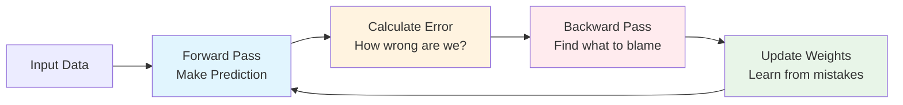
```mermaid
graph LR
    A[Input Data] --> B[Forward Pass<br/>Make Prediction]
    B --> C[Calculate Error<br/>How wrong are we?]
    C --> D[Backward Pass<br/>Find what to blame]
    D --> E[Update Weights<br/>Learn from mistakes]
    E --> B

    style B fill:#e1f5fe
    style C fill:#fff3e0
    style D fill:#ffebee
    style E fill:#e8f5e8

```

### Network Setup for Our Example

We'll use a **2-layer neural network** for binary classification:

#### Network Architecture Diagram

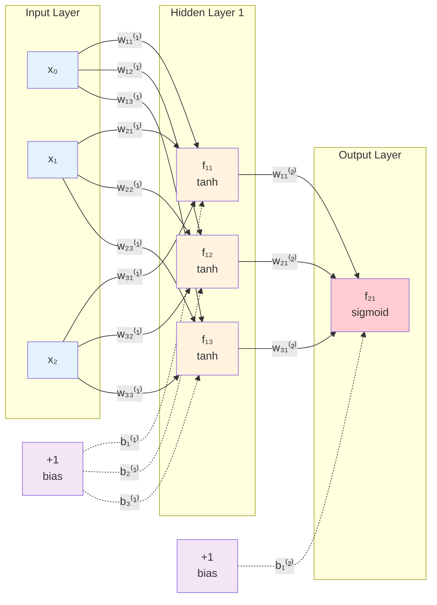
```mermaid
graph LR
    subgraph "Input Layer"
        X0[x₀]
        X1[x₁]
        X2[x₂]
    end

    subgraph "Hidden Layer 1"
        H1[f₁₁<br/>tanh]
        H2[f₁₂<br/>tanh]
        H3[f₁₃<br/>tanh]
    end

    subgraph "Output Layer"
        O1[f₂₁<br/>sigmoid]
    end

    X0 --> |w₁₁⁽¹⁾| H1
    X0 --> |w₁₂⁽¹⁾| H2
    X0 --> |w₁₃⁽¹⁾| H3
    X1 --> |w₂₁⁽¹⁾| H1
    X1 --> |w₂₂⁽¹⁾| H2
    X1 --> |w₂₃⁽¹⁾| H3
    X2 --> |w₃₁⁽¹⁾| H1
    X2 --> |w₃₂⁽¹⁾| H2
    X2 --> |w₃₃⁽¹⁾| H3

    H1 --> |w₁₁⁽²⁾| O1
    H2 --> |w₂₁⁽²⁾| O1
    H3 --> |w₃₁⁽²⁾| O1

    B1[+1<br/>bias] -.-> |b₁⁽¹⁾| H1
    B1 -.-> |b₂⁽¹⁾| H2
    B1 -.-> |b₃⁽¹⁾| H3
    B2[+1<br/>bias] -.-> |b₁⁽²⁾| O1

    style X0 fill:#e3f2fd
    style X1 fill:#e3f2fd
    style X2 fill:#e3f2fd
    style H1 fill:#fff3e0
    style H2 fill:#fff3e0
    style H3 fill:#fff3e0
    style O1 fill:#ffcdd2
    style B1 fill:#f3e5f5
    style B2 fill:#f3e5f5

```

**Key Components:**

- **3 input features** (x₀, x₁, x₂)
- **3 hidden neurons** with tanh activation
- **1 output neuron** with sigmoid activation
- **Weights**: W⁽¹⁾ connects input→hidden, W⁽²⁾ connects hidden→output
- **Biases**: b⁽¹⁾ for hidden layer, b⁽²⁾ for output layer

Here's a complete breakdown of shapes and example matrices for a 2-layer neural network:

## **Network Architecture**

- **Input**: 3 features
- **Hidden Layer**: 4 neurons
- **Output**: 1 neuron (binary classification)
- **Training Examples**: 5 examples

---

## **Shape Reference Table**

| Variable | Shape  | Description                                   |
| -------- | ------ | --------------------------------------------- |
| **X**    | (3, 5) | Input: 3 features × 5 examples                |
| **W¹**   | (4, 3) | Hidden weights: 4 neurons × 3 inputs          |
| **b¹**   | (4, 1) | Hidden biases: 4 neurons × 1                  |
| **Z¹**   | (4, 5) | Hidden pre-activation: 4 neurons × 5 examples |
| **A¹**   | (4, 5) | Hidden activation: 4 neurons × 5 examples     |
| **W²**   | (1, 4) | Output weights: 1 output × 4 hidden           |
| **b²**   | (1, 1) | Output bias: 1 output × 1                     |
| **Z²**   | (1, 5) | Output pre-activation: 1 output × 5 examples  |
| **A²**   | (1, 5) | Final prediction: 1 output × 5 examples       |

---

## **Step-by-Step with Example Matrices**

### **Input Matrix X (3×5)**

```
X = [[2.1  1.5  0.8  3.2  1.9],    ← Feature 1 (e.g., height)
     [1.8  2.3  1.1  2.7  2.0],    ← Feature 2 (e.g., weight)
     [0.5  1.2  0.3  1.8  0.9]]    ← Feature 3 (e.g., age)

     ↑    ↑    ↑    ↑    ↑
   Ex1  Ex2  Ex3  Ex4  Ex5
```

**Shape: (3, 5)** - 3 features, 5 examples

---

### **Step 1: Z¹ = W¹X + b¹**

#### **Hidden Weights W¹ (4×3)**

```
W¹ = [[0.1  0.2  0.3],    ← Neuron 1 weights
      [0.4  0.1  0.2],    ← Neuron 2 weights
      [0.2  0.3  0.1],    ← Neuron 3 weights
      [0.3  0.1  0.4]]    ← Neuron 4 weights

      ↑    ↑    ↑
    Feat1 Feat2 Feat3
```

**Shape: (4, 3)** - 4 hidden neurons, 3 input features

#### **Hidden Biases b¹ (4×1)**

```
b¹ = [[0.1],    ← Neuron 1 bias
      [0.2],    ← Neuron 2 bias
      [0.0],    ← Neuron 3 bias
      [0.1]]    ← Neuron 4 bias
```

**Shape: (4, 1)** - 4 hidden neurons, 1 bias each

#### **Matrix Multiplication: W¹ @ X**

```
W¹ @ X = [[0.1  0.2  0.3],  @  [[2.1  1.5  0.8  3.2  1.9],
          [0.4  0.1  0.2],     [1.8  2.3  1.1  2.7  2.0],
          [0.2  0.3  0.1],     [0.5  1.2  0.3  1.8  0.9]]
          [0.3  0.1  0.4]]

Result (4×5):
[[0.92  1.11  0.47  1.52  0.96],    ← Neuron 1 for all examples
 [1.18  0.84  0.58  1.64  1.14],    ← Neuron 2 for all examples
 [1.36  1.65  0.64  2.18  1.47],    ← Neuron 3 for all examples
 [0.83  0.93  0.51  1.68  0.93]]    ← Neuron 4 for all examples
```

#### **Adding Bias: Z¹ = W¹X + b¹**

```
Z¹ = [[0.92  1.11  0.47  1.52  0.96],  +  [[0.1],
      [1.18  0.84  0.58  1.64  1.14],     [0.2],
      [1.36  1.65  0.64  2.18  1.47],     [0.0],
      [0.83  0.93  0.51  1.68  0.93]]     [0.1]]

Z¹ = [[1.02  1.21  0.57  1.62  1.06],    ← Neuron 1 + bias
      [1.38  1.04  0.78  1.84  1.34],    ← Neuron 2 + bias
      [1.36  1.65  0.64  2.18  1.47],    ← Neuron 3 + bias
      [0.93  1.03  0.61  1.78  1.03]]    ← Neuron 4 + bias
```

**Shape: (4, 5)** - 4 hidden neurons, 5 examples

---

### **Step 2: A¹ = tanh(Z¹)**

```
A¹ = tanh(Z¹) = [[0.76  0.83  0.51  0.92  0.78],    ← tanh(neuron 1)
                 [0.88  0.77  0.65  0.95  0.87],    ← tanh(neuron 2)
                 [0.87  0.93  0.57  0.97  0.90],    ← tanh(neuron 3)
                 [0.73  0.77  0.54  0.94  0.77]]    ← tanh(neuron 4)
```

**Shape: (4, 5)** - 4 hidden neurons, 5 examples

---

### **Step 3: Z² = W²A¹ + b²**

#### **Output Weights W² (1×4)**

```
W² = [[0.5  0.3  0.4  0.2]]    ← Connects all 4 hidden neurons to output
      ↑    ↑    ↑    ↑
    Neur1 Neur2 Neur3 Neur4
```

**Shape: (1, 4)** - 1 output neuron, 4 hidden inputs

#### **Output Bias b² (1×1)**

```
b² = [[0.1]]    ← Single bias for output neuron
```

**Shape: (1, 1)** - 1 output neuron, 1 bias

#### **Matrix Multiplication: W² @ A¹**

```
W² @ A¹ = [[0.5  0.3  0.4  0.2]] @ [[0.76  0.83  0.51  0.92  0.78],
                                    [0.88  0.77  0.65  0.95  0.87],
                                    [0.87  0.93  0.57  0.97  0.90],
                                    [0.73  0.77  0.54  0.94  0.77]]

Result (1×5):
[[1.01  1.06  0.71  1.23  1.02]]    ← Weighted sum for each example
```

#### **Adding Bias: Z² = W²A¹ + b²**

```
Z² = [[1.01  1.06  0.71  1.23  1.02]] + [[0.1]]

Z² = [[1.11  1.16  0.81  1.33  1.12]]    ← Final pre-activation
```

**Shape: (1, 5)** - 1 output, 5 examples

---

### **Step 4: A² = sigmoid(Z²)**

```
A² = sigmoid(Z²) = [[0.75  0.76  0.69  0.79  0.75]]    ← Final predictions
```

**Shape: (1, 5)** - 1 output, 5 examples

---

### **Step 5: ŷ = A²**

```
ŷ = [[0.75  0.76  0.69  0.79  0.75]]    ← Final predictions for 5 examples
```

## **Key Insights:**

1. **Columns represent examples**: Each column is one training example going through the network
2. **Rows represent neurons/features**: Each row tracks one neuron's response to all examples
3. **Matrix multiplication handles all examples simultaneously**: This is why vectorization is so powerful
4. **Broadcasting adds bias to all examples**: The bias (4×1) gets added to all columns of Z¹ (4×5)

## **Dimension Rules:**

```
W¹(4×3) @ X(3×5) = Z¹(4×5)  ✓ Inner dimensions match (3,3)
W²(1×4) @ A¹(4×5) = Z²(1×5) ✓ Inner dimensions match (4,4)
```

**Remember**: Always check that inner dimensions match for matrix multiplication! 🎯

## Step-by-Step Backpropagation Process

### Step 1: Forward Pass (Review)

**What happens:** Data flows forward to make a prediction

```
Input → Hidden Layer → Output Layer → Prediction
  X   →   ReLU/Tanh  →    Sigmoid    →     ŷ

```

**Mathematical steps:**

```
Z¹ = W¹X + b¹        (linear combination)
A¹ = tanh(Z¹)        (activation function)
Z² = W²A¹ + b²       (linear combination)
A² = sigmoid(Z²)     (activation function)
ŷ = A²               (final prediction)

```

### Step 2: Calculate the Error

**What happens:** Measure how wrong our prediction is

**For binary classification:**

```
Cost = -(y·log(ŷ) + (1-y)·log(1-ŷ))

```

**Intuition:**

- If `y=1` and `ŷ=0.9` → small cost (good prediction)
- If `y=1` and `ŷ=0.1` → large cost (bad prediction)

### Step 3: Backward Pass - The Key Insight

**What happens:** Work backward to find what caused the error

#### Detailed Backpropagation Flow Through Network

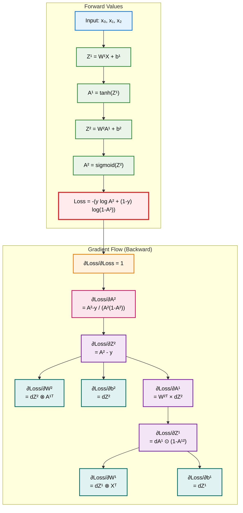
```mermaid
graph TB
    subgraph "Forward Values"
        X["Input: x₀, x₁, x₂"]
        Z1["Z¹ = W¹X + b¹"]
        A1["A¹ = tanh(Z¹)"]
        Z2["Z² = W²A¹ + b²"]
        A2["A² = sigmoid(Z²)"]
        L["Loss = -(y log A² + (1-y) log(1-A²))"]
    end

    subgraph "Gradient Flow (Backward)"
        dL["∂Loss/∂Loss = 1"]
        dA2["∂Loss/∂A²<br/>= A²-y / (A²(1-A²))"]
        dZ2["∂Loss/∂Z²<br/>= A² - y"]
        dW2["∂Loss/∂W²<br/>= dZ² ⊗ A¹ᵀ"]
        db2["∂Loss/∂b²<br/>= dZ²"]
        dA1["∂Loss/∂A¹<br/>= W²ᵀ × dZ²"]
        dZ1["∂Loss/∂Z¹<br/>= dA¹ ⊙ (1-A¹²)"]
        dW1["∂Loss/∂W¹<br/>= dZ¹ ⊗ Xᵀ"]
        db1["∂Loss/∂b¹<br/>= dZ¹"]
    end

    X --> Z1 --> A1 --> Z2 --> A2 --> L

    L --> dL
    dL --> dA2
    dA2 --> dZ2
    dZ2 --> dW2
    dZ2 --> db2
    dZ2 --> dA1
    dA1 --> dZ1
    dZ1 --> dW1
    dZ1 --> db1

    %% Forward pass styling - Blues and greens
    style X fill:#e3f2fd,stroke:#1976d2,stroke-width:2px,color:#000
    style Z1 fill:#e8f5e8,stroke:#388e3c,stroke-width:2px,color:#000
    style A1 fill:#e8f5e8,stroke:#388e3c,stroke-width:2px,color:#000
    style Z2 fill:#e8f5e8,stroke:#388e3c,stroke-width:2px,color:#000
    style A2 fill:#e8f5e8,stroke:#388e3c,stroke-width:2px,color:#000
    style L fill:#ffebee,stroke:#d32f2f,stroke-width:3px,color:#000

    %% Backward pass styling - Warm colors with good contrast
    style dL fill:#fff3e0,stroke:#f57c00,stroke-width:2px,color:#000
    style dA2 fill:#fce4ec,stroke:#c2185b,stroke-width:2px,color:#000
    style dZ2 fill:#f3e5f5,stroke:#7b1fa2,stroke-width:2px,color:#000
    style dA1 fill:#f3e5f5,stroke:#7b1fa2,stroke-width:2px,color:#000
    style dZ1 fill:#f3e5f5,stroke:#7b1fa2,stroke-width:2px,color:#000

    %% Weight and bias gradients - Teal family
    style dW2 fill:#e0f2f1,stroke:#00695c,stroke-width:2px,color:#000
    style db2 fill:#e0f2f1,stroke:#00695c,stroke-width:2px,color:#000
    style dW1 fill:#e0f2f1,stroke:#00695c,stroke-width:2px,color:#000
    style db1 fill:#e0f2f1,stroke:#00695c,stroke-width:2px,color:#000

```

#### Network with Gradient Flow Visualization

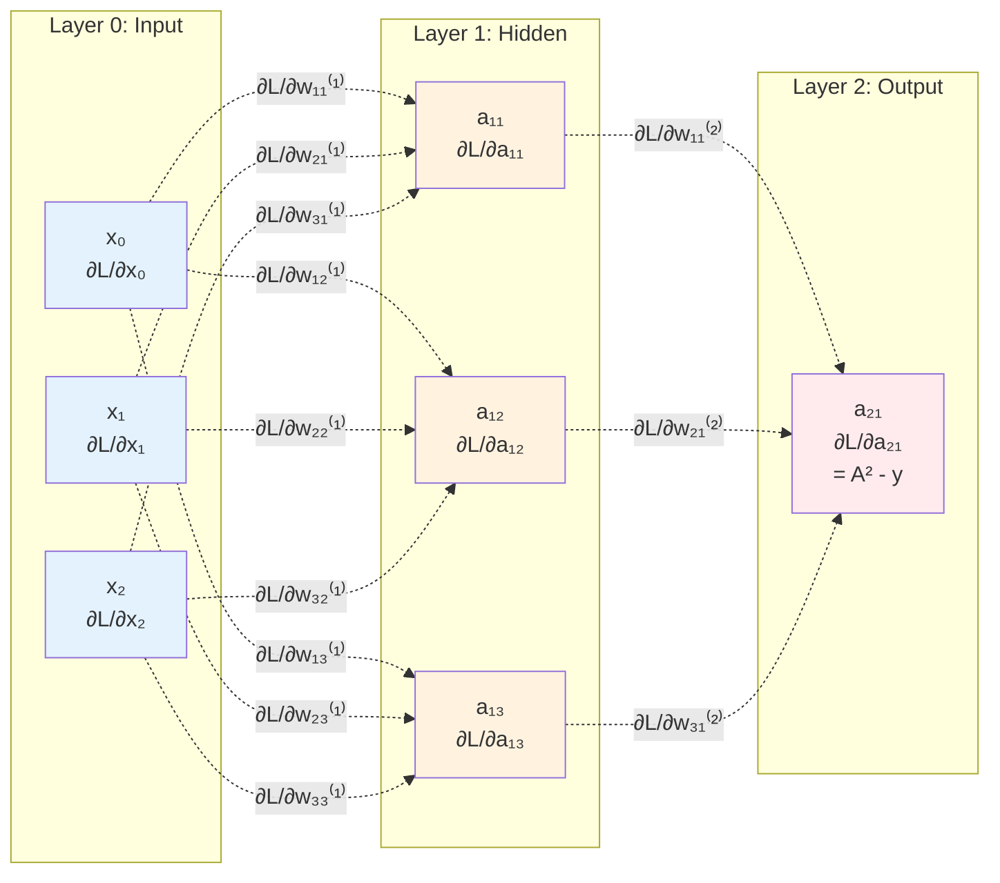
```mermaid
graph LR
    subgraph "Layer 0: Input"
        X0[x₀<br/>∂L/∂x₀]
        X1[x₁<br/>∂L/∂x₁]
        X2[x₂<br/>∂L/∂x₂]
    end

    subgraph "Layer 1: Hidden"
        H1[a₁₁<br/>∂L/∂a₁₁]
        H2[a₁₂<br/>∂L/∂a₁₂]
        H3[a₁₃<br/>∂L/∂a₁₃]
    end

    subgraph "Layer 2: Output"
        O1[a₂₁<br/>∂L/∂a₂₁<br/>= A² - y]
    end

    X0 -.-> |∂L/∂w₁₁⁽¹⁾| H1
    X0 -.-> |∂L/∂w₁₂⁽¹⁾| H2
    X0 -.-> |∂L/∂w₁₃⁽¹⁾| H3
    X1 -.-> |∂L/∂w₂₁⁽¹⁾| H1
    X1 -.-> |∂L/∂w₂₂⁽¹⁾| H2
    X1 -.-> |∂L/∂w₂₃⁽¹⁾| H3
    X2 -.-> |∂L/∂w₃₁⁽¹⁾| H1
    X2 -.-> |∂L/∂w₃₂⁽¹⁾| H2
    X2 -.-> |∂L/∂w₃₃⁽¹⁾| H3

    H1 -.-> |∂L/∂w₁₁⁽²⁾| O1
    H2 -.-> |∂L/∂w₂₁⁽²⁾| O1
    H3 -.-> |∂L/∂w₃₁⁽²⁾| O1

    style X0 fill:#e3f2fd
    style X1 fill:#e3f2fd
    style X2 fill:#e3f2fd
    style H1 fill:#fff3e0
    style H2 fill:#fff3e0
    style H3 fill:#fff3e0
    style O1 fill:#ffebee

```

**Key insight:** Each node stores both:

1.  **Forward value** (top): the activation value
2.  **Backward gradient** (bottom): how much that node contributes to the final error

**The chain rule in action:** Each gradient flows backward through the weights, telling us how to update each parameter.

## Understanding Derivatives in Simple Terms

### 1. What Does ∂L/∂A² (or ∂Cost/∂A²) Mean in Simple English?

**∂L/∂A²** means: _"How much does the loss change when we slightly change the output A²?"_

Think of it like this:

- **L** = Loss (how wrong our prediction is)
- **A²** = Our final prediction (like 0.8 for "80% confident it's a cat")
- **∂L/∂A²** = "If I increase my prediction by a tiny bit, how much does my wrongness change?"

#### Real-World Analogy 🎯

Imagine you're playing darts:

- **L** = How far your dart is from the bullseye (your error)
- **A²** = Where you aimed
- **∂L/∂A²** = "If I aim slightly more to the right, how much closer/farther will I get to the bullseye?"

#### Numerical Example

Let's say:

- **True answer**: y = 1 (it IS a cat)
- **Our prediction**: A² = 0.8 (we think it's 80% likely a cat)

```python
# Loss function: L = -(y*log(A²) + (1-y)*log(1-A²))
# For y=1, this simplifies to: L = -log(A²)

y = 1
A2 = 0.8
loss = -1 * math.log(A2)  # ≈ 0.223

# Now let's see what happens if we change A² slightly
A2_new = 0.81  # Increased by 0.01
loss_new = -1 * math.log(A2_new)  # ≈ 0.211

# The change in loss
change_in_loss = loss_new - loss  # ≈ -0.012
change_in_A2 = A2_new - A2       # = 0.01

# The derivative (rate of change)
derivative = change_in_loss / change_in_A2  # ≈ -1.2

```

**What this tells us**: When we increase our prediction from 0.8 to 0.81, our loss decreases by about 1.2 times that change. Since the derivative is negative, increasing A² (being more confident) reduces our loss - which makes sense since the true answer is 1!

Great question! Let me break down that statement step by step:

## **Understanding the Statement**

### **"Since the derivative is negative..."**

The derivative we calculated is **≈ -1.2**, which is **negative**.

### **"...increasing A² (being more confident) reduces our loss"**

Let's see what this means:

#### **What A² represents:**

- **A² = 0.8** means "I'm 80% confident this is class 1"
- **A² = 0.81** means "I'm 81% confident this is class 1"
- So **increasing A²** = **being more confident** that it's class 1

#### **What happens to loss:**

```python
# Original situation
A2 = 0.8  →  loss = 0.223

# More confident situation
A2 = 0.81 →  loss = 0.211  (LOWER!)
```

**Loss went DOWN** when we became more confident! This is **good** because lower loss = better prediction.

### **"...which makes sense since the true answer is 1!"**

This is the key insight:

- **True answer (y) = 1** means "it really IS class 1"
- **Our prediction A² = 0.8** means "we think it's 80% likely to be class 1"
- **We're under-confident!** We should be more confident since the truth is y=1

## **The Logic Chain:**

```
True answer = 1 (it IS class 1)
    ↓
We predicted 0.8 (only 80% confident)
    ↓
We should be MORE confident (closer to 1.0)
    ↓
When we increase confidence (0.8 → 0.81), loss decreases
    ↓
This makes sense! Being more confident about the correct answer should reduce our error
```

## **Visual Intuition:**

```
Perfect prediction:  A² = 1.0  →  Loss = 0
Our prediction:      A² = 0.8  →  Loss = 0.223
Better prediction:   A² = 0.81 →  Loss = 0.211  ← Getting better!

Direction: We want to move A² towards 1.0
```

## **Why the Negative Derivative is "Good":**

The **negative derivative (-1.2)** tells us:

- **"If you increase A² by 0.01, loss decreases by about 0.012"**
- This means **increasing A²** (being more confident) **helps us** (reduces loss)
- Since the true answer is 1, this direction is **correct**!

## **Contrast with Wrong Direction:**

If the true answer were y=0 instead:

- We'd want A² to be close to 0 (confident it's NOT class 1)
- Current A²=0.8 would be too high
- Increasing A² would make loss WORSE
- The derivative would guide us to DECREASE A² instead

## **Bottom Line:**

The **negative derivative** is like a **GPS direction**:

- "To reduce your error, increase A²"
- Since the truth is y=1, increasing A² (being more confident about class 1) is exactly what we should do!
- The math automatically figured out the right direction to improve! 🎯

**This is why gradient descent works** - the derivatives always point toward better predictions!

### 2. Understanding Different Layer Derivatives in Simple Language

#### Complete Neural Network Overview

Let's start with the complete picture of our neural network, then we'll zoom into each part:

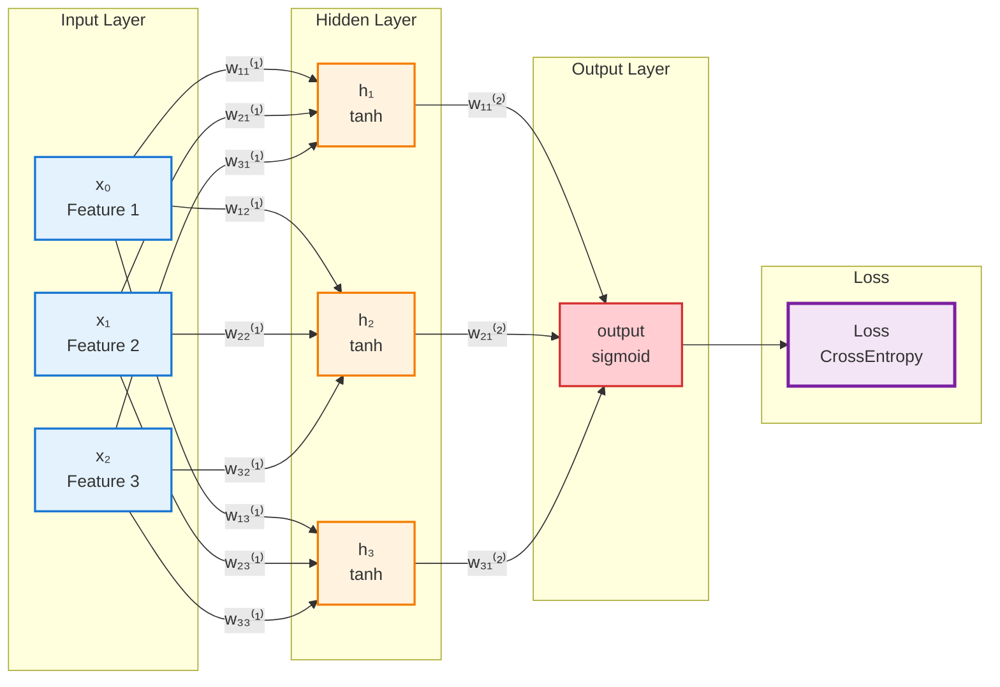
```mermaid
graph LR
    subgraph "Input Layer"
        X0[x₀<br/>Feature 1]
        X1[x₁<br/>Feature 2]
        X2[x₂<br/>Feature 3]
    end

    subgraph "Hidden Layer"
        H1[h₁<br/>tanh]
        H2[h₂<br/>tanh]
        H3[h₃<br/>tanh]
    end

    subgraph "Output Layer"
        O1[output<br/>sigmoid]
    end

    subgraph "Loss"
        L[Loss<br/>CrossEntropy]
    end

    X0 -->|w₁₁⁽¹⁾| H1
    X0 -->|w₁₂⁽¹⁾| H2
    X0 -->|w₁₃⁽¹⁾| H3
    X1 -->|w₂₁⁽¹⁾| H1
    X1 -->|w₂₂⁽¹⁾| H2
    X1 -->|w₂₃⁽¹⁾| H3
    X2 -->|w₃₁⁽¹⁾| H1
    X2 -->|w₃₂⁽¹⁾| H2
    X2 -->|w₃₃⁽¹⁾| H3

    H1 -->|w₁₁⁽²⁾| O1
    H2 -->|w₂₁⁽²⁾| O1
    H3 -->|w₃₁⁽²⁾| O1

    O1 --> L

    style X0 fill:#e3f2fd,stroke:#1976d2,stroke-width:2px
    style X1 fill:#e3f2fd,stroke:#1976d2,stroke-width:2px
    style X2 fill:#e3f2fd,stroke:#1976d2,stroke-width:2px
    style H1 fill:#fff3e0,stroke:#f57c00,stroke-width:2px
    style H2 fill:#fff3e0,stroke:#f57c00,stroke-width:2px
    style H3 fill:#fff3e0,stroke:#f57c00,stroke-width:2px
    style O1 fill:#ffcdd2,stroke:#d32f2f,stroke-width:2px
    style L fill:#f3e5f5,stroke:#7b1fa2,stroke-width:3px
```

---

#### ∂L/∂w₁₁⁽²⁾ - Output Layer Weight

##### What We're Looking At:

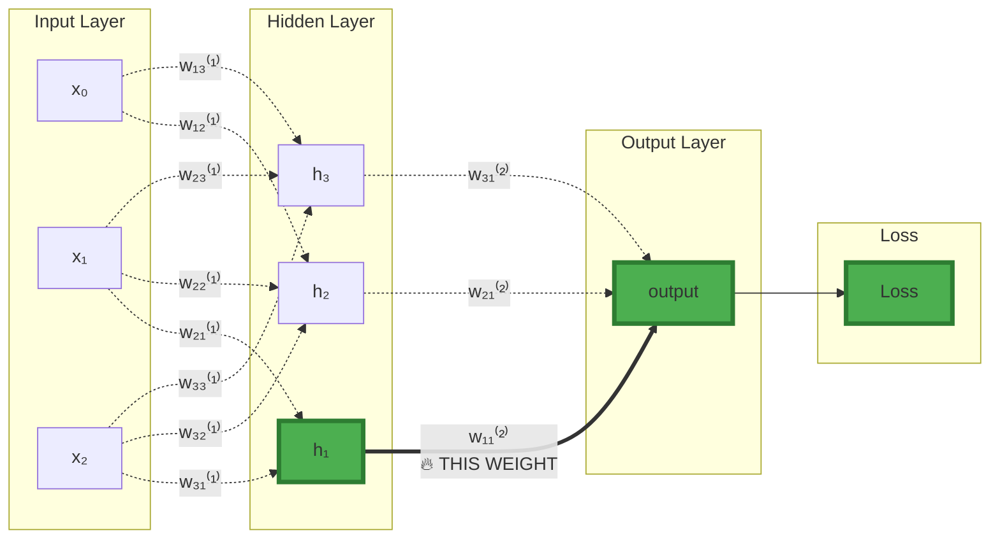
```mermaid
graph LR
    subgraph "Input Layer"
        X0[x₀]
        X1[x₁]
        X2[x₂]
    end

    subgraph "Hidden Layer"
        H1[h₁]
        H2[h₂]
        H3[h₃]
    end

    subgraph "Output Layer"
        O1[output]
    end

    subgraph "Loss"
        L[Loss]
    end

    X0 -.->|w₁₂⁽¹⁾| H2
    X0 -.->|w₁₃⁽¹⁾| H3
    X1 -.->|w₂₁⁽¹⁾| H1
    X1 -.->|w₂₂⁽¹⁾| H2
    X1 -.->|w₂₃⁽¹⁾| H3
    X2 -.->|w₃₁⁽¹⁾| H1
    X2 -.->|w₃₂⁽¹⁾| H2
    X2 -.->|w₃₃⁽¹⁾| H3

    H1 ==>|w₁₁⁽²⁾<br/>🔥 THIS WEIGHT| O1
    H2 -.->|w₂₁⁽²⁾| O1
    H3 -.->|w₃₁⁽²⁾| O1

    O1 --> L

    style H1 fill:#4caf50,stroke:#2e7d32,stroke-width:4px
    style O1 fill:#4caf50,stroke:#2e7d32,stroke-width:4px
    style L fill:#4caf50,stroke:#2e7d32,stroke-width:4px
```

##### Simple Translation:

**"How much does the final loss change when I adjust the connection strength between hidden neuron 1 and the output?"**

##### Real-World Analogy:

Think of this weight as a **volume dial** on a stereo:

- Hidden neuron 1 is like a microphone detecting "cat features"
- The weight w₁₁⁽²⁾ is the volume dial that amplifies or reduces this signal
- ∂L/∂w₁₁⁽²⁾ tells us: "If I turn this volume dial up slightly, does the overall error get better or worse?"

##### What the Math Means:

- **Positive gradient**: Increasing this weight makes the loss worse → turn the dial DOWN
- **Negative gradient**: Increasing this weight makes the loss better → turn the dial UP
- **Large magnitude**: This weight has a big impact on the final prediction
- **Small magnitude**: This weight barely affects the final result

##### Practical Example:

```
If ∂L/∂w₁₁⁽²⁾ = -0.3:
- This weight should be INCREASED (negative gradient)
- Every 0.1 increase in this weight reduces loss by ~0.03
- This is a moderately important connection
```

---

#### ∂L/∂a₁₁ - Hidden Layer Activation

##### What We're Looking At:

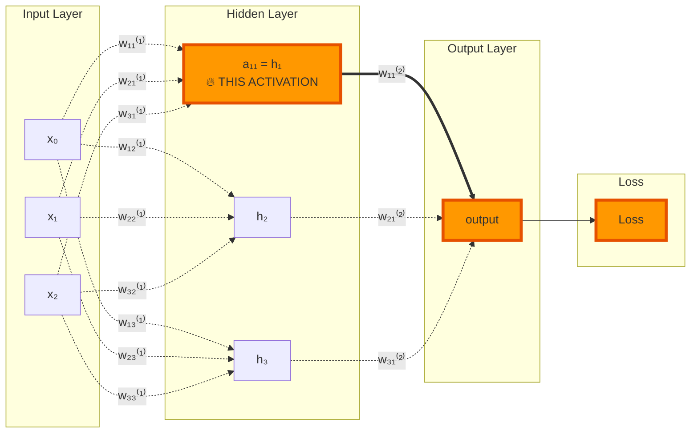
```mermaid
graph LR
    subgraph "Input Layer"
        X0[x₀]
        X1[x₁]
        X2[x₂]
    end

    subgraph "Hidden Layer"
        H1[a₁₁ = h₁<br/>🔥 THIS ACTIVATION]
        H2[h₂]
        H3[h₃]
    end

    subgraph "Output Layer"
        O1[output]
    end

    subgraph "Loss"
        L[Loss]
    end

    X0 -.->|w₁₁⁽¹⁾| H1
    X0 -.->|w₁₂⁽¹⁾| H2
    X0 -.->|w₁₃⁽¹⁾| H3
    X1 -.->|w₂₁⁽¹⁾| H1
    X1 -.->|w₂₂⁽¹⁾| H2
    X1 -.->|w₂₃⁽¹⁾| H3
    X2 -.->|w₃₁⁽¹⁾| H1
    X2 -.->|w₃₂⁽¹⁾| H2
    X2 -.->|w₃₃⁽¹⁾| H3

    H1 ==>|w₁₁⁽²⁾| O1
    H2 -.->|w₂₁⁽²⁾| O1
    H3 -.->|w₃₁⁽²⁾| O1

    O1 --> L

    style H1 fill:#ff9800,stroke:#e65100,stroke-width:4px
    style O1 fill:#ff9800,stroke:#e65100,stroke-width:4px
    style L fill:#ff9800,stroke:#e65100,stroke-width:4px
```

##### Simple Translation:

**"How much does the final loss change when hidden neuron 1 fires more strongly?"**

##### Real-World Analogy:

Think of hidden neuron 1 as a **feature detector**:

- Maybe it detects "pointy ears" in an image
- a₁₁ = 0.2 means "weak pointy ear signal"
- a₁₁ = 0.8 means "strong pointy ear signal"
- ∂L/∂a₁₁ tells us: "If this neuron was more confident about detecting pointy ears, would our cat/dog classification be more accurate?"

##### What This Tells Us:

- **Large magnitude**: This hidden neuron is very important for the final decision
- **Positive gradient**: This neuron should fire LESS to reduce error
- **Negative gradient**: This neuron should fire MORE to reduce error

##### Practical Example:

```
If ∂L/∂a₁₁ = +0.5 when classifying a dog image:
- Hidden neuron 1 is firing too strongly
- This neuron might be a "cat detector"
- We want it to fire less for dog images
- The gradient will flow back to reduce this neuron's activation
```

---

#### ∂L/∂w₁₁⁽¹⁾ - Hidden Layer Weight

##### What We're Looking At:

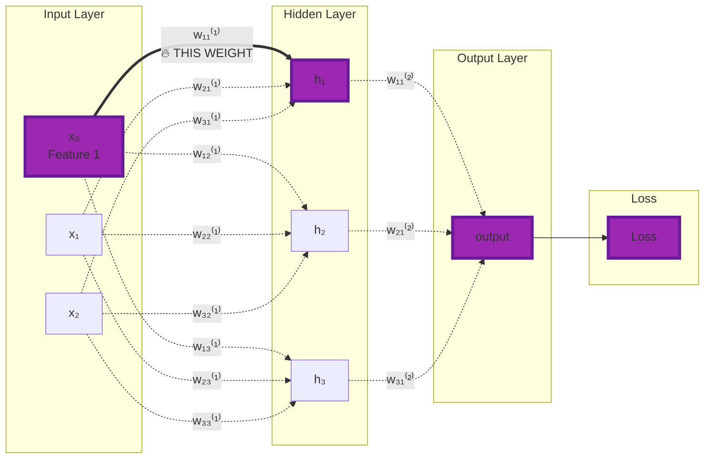
```mermaid
graph LR
    subgraph "Input Layer"
        X0[x₀<br/>Feature 1]
        X1[x₁]
        X2[x₂]
    end

    subgraph "Hidden Layer"
        H1[h₁]
        H2[h₂]
        H3[h₃]
    end

    subgraph "Output Layer"
        O1[output]
    end

    subgraph "Loss"
        L[Loss]
    end

    X0 ==>|w₁₁⁽¹⁾<br/>🔥 THIS WEIGHT| H1
    X0 -.->|w₁₂⁽¹⁾| H2
    X0 -.->|w₁₃⁽¹⁾| H3
    X1 -.->|w₂₁⁽¹⁾| H1
    X1 -.->|w₂₂⁽¹⁾| H2
    X1 -.->|w₂₃⁽¹⁾| H3
    X2 -.->|w₃₁⁽¹⁾| H1
    X2 -.->|w₃₂⁽¹⁾| H2
    X2 -.->|w₃₃⁽¹⁾| H3

    H1 -.->|w₁₁⁽²⁾| O1
    H2 -.->|w₂₁⁽²⁾| O1
    H3 -.->|w₃₁⁽²⁾| O1

    O1 --> L

    style X0 fill:#9c27b0,stroke:#6a1b9a,stroke-width:4px
    style H1 fill:#9c27b0,stroke:#6a1b9a,stroke-width:4px
    style O1 fill:#9c27b0,stroke:#6a1b9a,stroke-width:4px
    style L fill:#9c27b0,stroke:#6a1b9a,stroke-width:4px
```

##### Simple Translation:

**"How much does the final loss change when I adjust how much attention hidden neuron 1 pays to input feature 1?"**

##### Real-World Analogy:

Think of this as a **sensitivity knob**:

- Input feature 1 might be "ear pointiness" (0-10 scale)
- Hidden neuron 1 might be an "ear detector"
- w₁₁⁽¹⁾ controls how sensitive the ear detector is to the ear pointiness measurement
- ∂L/∂w₁₁⁽¹⁾ tells us: "Should the ear detector pay more or less attention to the ear pointiness feature?"

##### The Chain of Influence:

```
Input Feature → Weight → Hidden Neuron → Output Weight → Final Prediction → Loss
     x₀      → w₁₁⁽¹⁾ →      h₁       →    w₁₁⁽²⁾    →     output      →  L
```

##### What This Tells Us:

- **High magnitude**: This connection between input and hidden layer is crucial
- **Positive gradient**: This weight should decrease
- **Negative gradient**: This weight should increase

##### Practical Example:

```
For a cat/dog classifier:
- x₀ = ear pointiness (7.5 for a cat image)
- h₁ = ear detector neuron
- w₁₁⁽¹⁾ = 0.3 (current sensitivity)

If ∂L/∂w₁₁⁽¹⁾ = -0.2:
- We should INCREASE this weight
- The ear detector should pay MORE attention to ear pointiness
- This will help correctly classify pointy-eared cats
```

---

#### ∂L/∂x₀ - Input Feature

##### What We're Looking At:

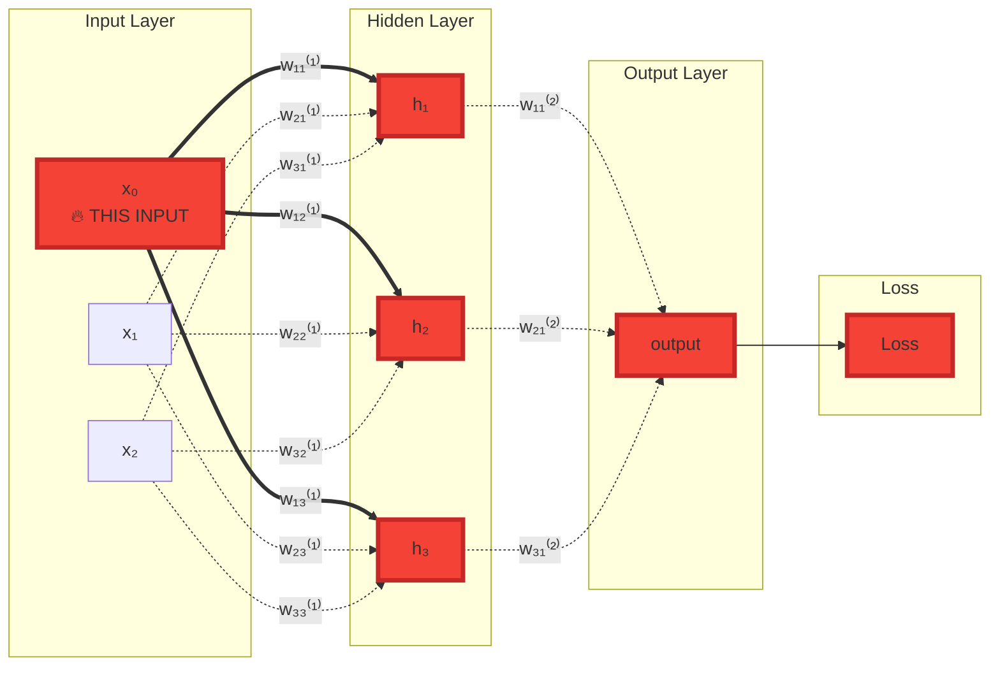
```mermaid
graph LR
    subgraph "Input Layer"
        X0[x₀<br/>🔥 THIS INPUT]
        X1[x₁]
        X2[x₂]
    end

    subgraph "Hidden Layer"
        H1[h₁]
        H2[h₂]
        H3[h₃]
    end

    subgraph "Output Layer"
        O1[output]
    end

    subgraph "Loss"
        L[Loss]
    end

    X0 ==>|w₁₁⁽¹⁾| H1
    X0 ==>|w₁₂⁽¹⁾| H2
    X0 ==>|w₁₃⁽¹⁾| H3
    X1 -.->|w₂₁⁽¹⁾| H1
    X1 -.->|w₂₂⁽¹⁾| H2
    X1 -.->|w₂₃⁽¹⁾| H3
    X2 -.->|w₃₁⁽¹⁾| H1
    X2 -.->|w₃₂⁽¹⁾| H2
    X2 -.->|w₃₃⁽¹⁾| H3

    H1 -.->|w₁₁⁽²⁾| O1
    H2 -.->|w₂₁⁽²⁾| O1
    H3 -.->|w₃₁⁽²⁾| O1

    O1 --> L

    style X0 fill:#f44336,stroke:#c62828,stroke-width:4px
    style H1 fill:#f44336,stroke:#c62828,stroke-width:4px
    style H2 fill:#f44336,stroke:#c62828,stroke-width:4px
    style H3 fill:#f44336,stroke:#c62828,stroke-width:4px
    style O1 fill:#f44336,stroke:#c62828,stroke-width:4px
    style L fill:#f44336,stroke:#c62828,stroke-width:4px
```

##### Simple Translation:

**"How much does the final loss change when this input feature changes slightly?"**

##### Real-World Analogy:

Think of this as **feature importance**:

- x₀ might be "ear pointiness" in a cat/dog classifier
- ∂L/∂x₀ tells us "how much does ear pointiness matter for the final decision?"
- Large magnitude = this feature is very important
- Small magnitude = this feature barely matters

##### What This Tells Us About Our Data:

- **High magnitude**: This input feature is critical for making good predictions
- **Low magnitude**: This input feature is not very useful (maybe remove it?)
- **Sign doesn't matter much**: We can't change input features anyway (they're given)

##### Practical Applications:

1. **Feature Selection**: Features with consistently small ∂L/∂x values might be removed
2. **Data Quality**: If an important feature has weird gradients, check the data
3. **Understanding**: See which features the network considers most important

##### Practical Example:

```
For a house price predictor:
- x₀ = square footage
- x₁ = number of bedrooms
- x₂ = age of house

If we calculate:
∂L/∂x₀ = -2000 (large magnitude)
∂L/∂x₁ = -50   (medium magnitude)
∂L/∂x₂ = +5    (small magnitude)

This tells us:
- Square footage is VERY important
- Bedrooms matter moderately
- Age barely affects price (in this dataset)
```

---

#### Summary: The Gradient Flow Story

##### Understanding the Gradient Flow Diagram

**What You're Looking At**

This diagram shows **two processes happening simultaneously** in a neural network:

1. **Forward Pass** (top, light colors) - How data flows through the network
2. **Backward Pass** (bottom, bold colors) - How gradients flow backward to update weights

---

##### 🔍 Forward Pass (Network Architecture - Top Section)

**The Journey of Data Through the Network**

**Input Layer (Left)**

- `x₀, x₁, x₂` are your input features (e.g., house size, bedrooms, location)
- These are the raw data points we want to learn from

**Hidden Layer (Middle)**

- `h₁, h₂` are hidden neurons that use **tanh activation**
- Each hidden neuron receives ALL input features (that's why you see dotted lines from every input to every hidden neuron)
- **Key insight**: Hidden layer learns complex patterns by combining input features

**Output Layer (Right)**

- `ŷ` is our final prediction using **sigmoid activation**
- Gets input from ALL hidden neurons
- Outputs a probability between 0 and 1 (perfect for binary classification)

**Loss Function (Far Right)**

- **Cross-Entropy Loss** measures how wrong our prediction is
- Compares our prediction `ŷ` with the true answer `y`

---

##### 🔄 Backward Pass (Gradient Flow - Bottom Section)

This is where the **magic of learning** happens! The network figures out how to improve.

##### Step-by-Step Breakdown:

##### 1. **Loss Gradients** (🔥 START HERE)

```
∂L/∂L = 1
```

- **What it means**: We start backpropagation at the loss function
- **Why it matters**: This is ground zero - where we measure our mistakes

##### 2. **Output Gradients** (🎯 KEY RESULT)

```
∂L/∂ŷ = A² - y
```

- **What it means**: How much should we change the output to reduce loss?
- **Why it's key**: This beautiful formula (A² - y) drives all learning in neural networks
- **Example**: If prediction = 0.8 and true answer = 1, gradient = 0.8 - 1 = -0.2 (need to increase output)

##### 3. **Weight Updates for Output Layer**

```
∂L/∂W² = dZ² × A¹ᵀ    (Weight gradients)
∂L/∂b² = dZ²          (Bias gradients)
```

- **What it means**: How should we adjust the weights connecting hidden layer to output?
- **Matrix magic**: We multiply gradients by hidden layer activations (A¹ᵀ) to get weight updates

##### 4. **Error Propagation** (⬅️ ERROR FLOWS)

```
∂L/∂h = W²ᵀ × dZ²
```

- **What it means**: The error "flows backward" from output to hidden layer
- **Key insight**: Each hidden neuron gets blamed proportional to its weight's contribution to the error

##### 5. **Hidden Layer Processing** (🔄 CHAIN RULE)

```
∂L/∂z¹ = dA¹ ⊙ (1-A¹²)
```

- **What it means**: Apply chain rule with tanh derivative
- **Element-wise**: ⊙ means multiply corresponding elements (not matrix multiplication)
- **Tanh derivative**: (1-A¹²) is the derivative of tanh function

##### 6. **Weight Updates for Hidden Layer**

```
∂L/∂W¹ = dZ¹ × Xᵀ     (Weight gradients)
∂L/∂b¹ = dZ¹          (Bias gradients)
∂L/∂X = Feature Impact
```

- **What it means**: How should we adjust weights connecting input to hidden layer?
- **Feature Impact**: We can even see how important each input feature is!

---

##### 🎯 The Big Picture

**Why This Layout Makes Sense**

1. **Left to Right**: Data flows forward (input → hidden → output → loss)
2. **Right to Left**: Gradients flow backward (loss → output → hidden → input)
3. **Parallel Streams**: You can see both processes happening simultaneously

**What Makes This Beautiful**

- **Forward pass**: Computes predictions
- **Backward pass**: Computes how to improve those predictions
- **Continuous loop**: Forward → measure error → backward → update weights → repeat

**Key Mathematical Insights**

1. **Chain Rule in Action**: Each gradient depends on the gradient from the layer ahead
2. **Matrix Multiplication**: Efficiently processes all training examples at once
3. **Activation Functions**: Their derivatives control how gradients flow
4. **Weight Updates**: Proportional to both the error and the input that caused it

---

**🔬 Color Coding Explained**

**Light Colors (Network Architecture)**:

- Gray: Input features (raw data)
- Light Green: Hidden layer (pattern detection)
- Light Blue: Output layer (final prediction)
- Light Red: Loss (error measurement)

**Bold Colors (Gradient Flow)**:

- Red: Loss gradient (start of learning)
- Orange: Output gradient (key result)
- Green: Output layer parameter updates
- Blue: Hidden layer error propagation
- Purple: Hidden layer gradient computation
- Dark Gray: Input layer parameter updates
- Brown: Feature importance

---

** 💡 What This Teaches Us **

1. **Neural networks learn by working backward** from their mistakes
2. **Every weight gets updated** based on its contribution to the error
3. **Gradients flow through the entire network**, affecting all parameters
4. **The process is systematic and mathematical**, not magical
5. **Each layer depends on the layers around it** for both forward and backward passes

This diagram shows why neural networks are so powerful - they can automatically figure out how to adjust millions of parameters to minimize their mistakes!

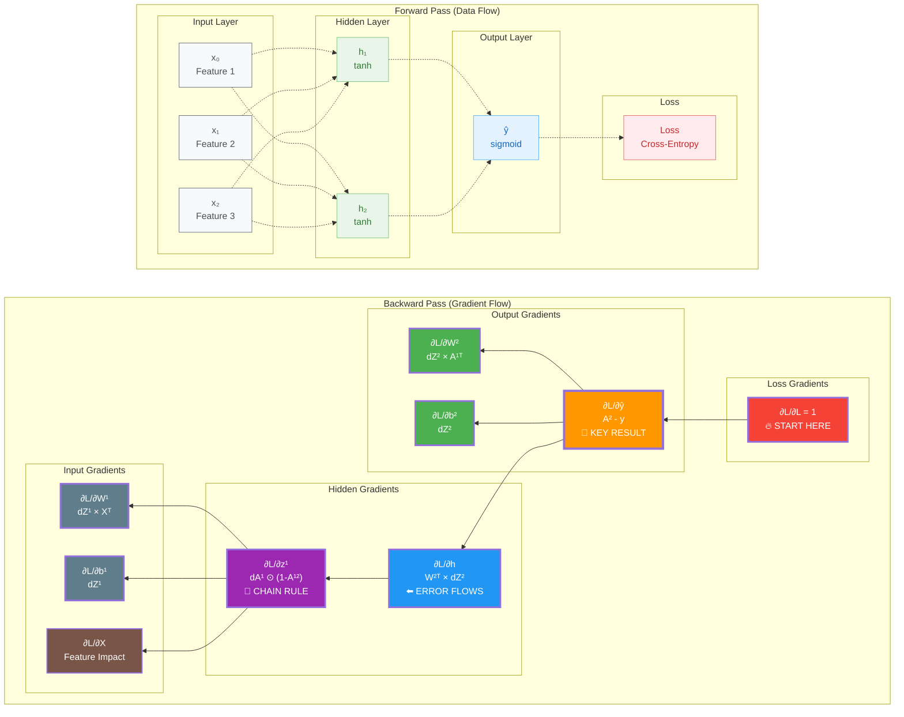
```mermaid

graph LR


    subgraph "Backward Pass (Gradient Flow)"
        direction RL

        subgraph "Loss Gradients"
            GL["∂L/∂L = 1<br/>🔥 START HERE"]
        end

        subgraph "Output Gradients"
            GO["∂L/∂ŷ<br/>A² - y<br/>🎯 KEY RESULT"]
            GW2["∂L/∂W²<br/>dZ² × A¹ᵀ"]
            GB2["∂L/∂b²<br/>dZ²"]
        end

        subgraph "Hidden Gradients"
            GH["∂L/∂h<br/>W²ᵀ × dZ²<br/>⬅️ ERROR FLOWS"]
            GZ1["∂L/∂z¹<br/>dA¹ ⊙ (1-A¹²)<br/>🔄 CHAIN RULE"]
        end

        subgraph "Input Gradients"
            GW1["∂L/∂W¹<br/>dZ¹ × Xᵀ"]
            GB1["∂L/∂b¹<br/>dZ¹"]
            GX["∂L/∂X<br/>Feature Impact"]
        end

        GL --> GO
        GO --> GW2
        GO --> GB2
        GO --> GH
        GH --> GZ1
        GZ1 --> GW1
        GZ1 --> GB1
        GZ1 --> GX
    end

    subgraph "Forward Pass (Data Flow)"
        direction LR

        subgraph "Input Layer"
            X1["x₀<br/>Feature 1"]
            X2["x₁<br/>Feature 2"]
            X3["x₂<br/>Feature 3"]
        end

        subgraph "Hidden Layer"
            H1["h₁<br/>tanh"]
            H2["h₂<br/>tanh"]
        end

        subgraph "Output Layer"
            O1["ŷ<br/>sigmoid"]
        end

        subgraph "Loss"
            L1["Loss<br/>Cross-Entropy"]
        end

        X1 -.-> H1
        X1 -.-> H2
        X2 -.-> H1
        X2 -.-> H2
        X3 -.-> H1
        X3 -.-> H2
        H1 -.-> O1
        H2 -.-> O1
        O1 -.-> L1
    end


    %% Backward pass styling (bold colors)
    style GL fill:#f44336,color:white,stroke-width:3px
    style GO fill:#ff9800,color:white,stroke-width:4px
    style GW2 fill:#4caf50,color:white,stroke-width:3px
    style GB2 fill:#4caf50,color:white,stroke-width:3px
    style GH fill:#2196f3,color:white,stroke-width:3px
    style GZ1 fill:#9c27b0,color:white,stroke-width:3px
    style GW1 fill:#607d8b,color:white,stroke-width:3px
    style GB1 fill:#607d8b,color:white,stroke-width:3px
    style GX fill:#795548,color:white,stroke-width:2px

    %% Forward pass styling (light colors)
    style X1 fill:#f8f9fa,stroke:#6c757d,stroke-width:1px,color:#495057
    style X2 fill:#f8f9fa,stroke:#6c757d,stroke-width:1px,color:#495057
    style X3 fill:#f8f9fa,stroke:#6c757d,stroke-width:1px,color:#495057
    style H1 fill:#e8f5e8,stroke:#81c784,stroke-width:1px,color:#2e7d32
    style H2 fill:#e8f5e8,stroke:#81c784,stroke-width:1px,color:#2e7d32
    style O1 fill:#e3f2fd,stroke:#64b5f6,stroke-width:1px,color:#1565c0
    style L1 fill:#ffebee,stroke:#e57373,stroke-width:1px,color:#c62828
```

##### The Big Picture:

- **We start with the loss** (how wrong we are)
- **We trace backwards** through each layer asking "who's responsible?"
- **Each derivative tells us** how to adjust that parameter to reduce the error
- **The chain rule connects everything** - changes flow backward through the network

**Key Insight**: Every derivative is asking the same fundamental question: "If I change this slightly, how much better or worse will my final prediction be?" 🎯

## Mathematical Derivations (Step-by-Step)

### 🚨 **Math Alert**: Detailed Derivations Below

_These mathematical details show WHERE the formulas come from. If you find them overwhelming, you can skip to the "Summary Formulas" section and come back later!_

### Complete Network Overview for Mathematical Context

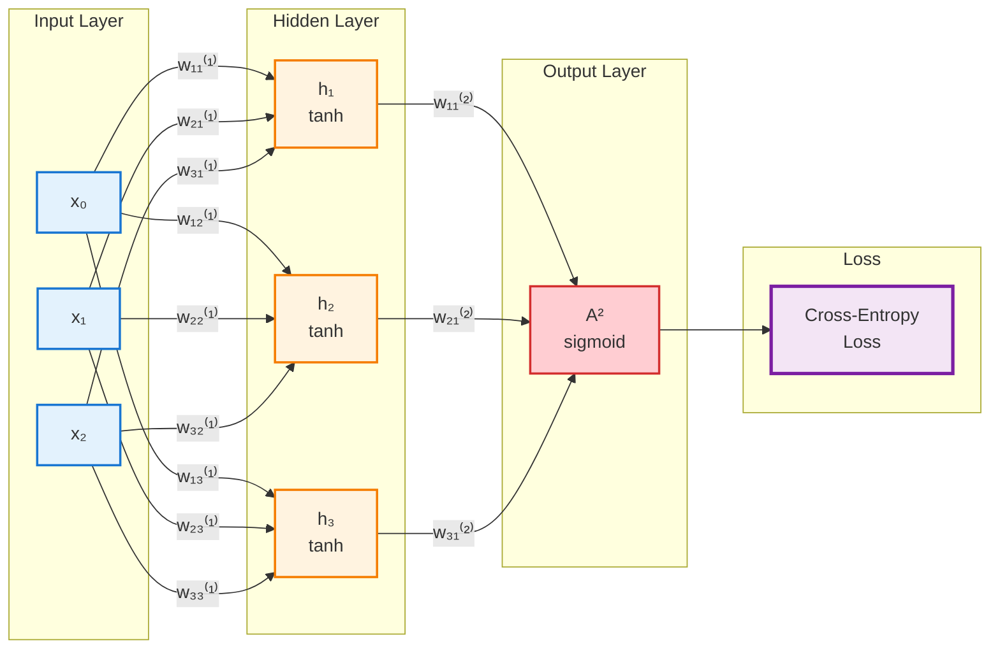
```mermaid
graph LR
    subgraph "Input Layer"
        X0[x₀]
        X1[x₁]
        X2[x₂]
    end

    subgraph "Hidden Layer"
        H1[h₁<br/>tanh]
        H2[h₂<br/>tanh]
        H3[h₃<br/>tanh]
    end

    subgraph "Output Layer"
        O1[A²<br/>sigmoid]
    end

    subgraph "Loss"
        L[Cross-Entropy<br/>Loss]
    end

    X0 -->|w₁₁⁽¹⁾| H1
    X0 -->|w₁₂⁽¹⁾| H2
    X0 -->|w₁₃⁽¹⁾| H3
    X1 -->|w₂₁⁽¹⁾| H1
    X1 -->|w₂₂⁽¹⁾| H2
    X1 -->|w₂₃⁽¹⁾| H3
    X2 -->|w₃₁⁽¹⁾| H1
    X2 -->|w₃₂⁽¹⁾| H2
    X2 -->|w₃₃⁽¹⁾| H3

    H1 -->|w₁₁⁽²⁾| O1
    H2 -->|w₂₁⁽²⁾| O1
    H3 -->|w₃₁⁽²⁾| O1

    O1 --> L

    style X0 fill:#e3f2fd,stroke:#1976d2,stroke-width:2px
    style X1 fill:#e3f2fd,stroke:#1976d2,stroke-width:2px
    style X2 fill:#e3f2fd,stroke:#1976d2,stroke-width:2px
    style H1 fill:#fff3e0,stroke:#f57c00,stroke-width:2px
    style H2 fill:#fff3e0,stroke:#f57c00,stroke-width:2px
    style H3 fill:#fff3e0,stroke:#f57c00,stroke-width:2px
    style O1 fill:#ffcdd2,stroke:#d32f2f,stroke-width:2px
    style L fill:#f3e5f5,stroke:#7b1fa2,stroke-width:3px
```

---

### Output Layer Gradients (Layer 2)

**Goal:** Find how much `W²` and `b²` contribute to the error

#### Step 1: How does the error change with output `A²`?

##### What We're Analyzing:

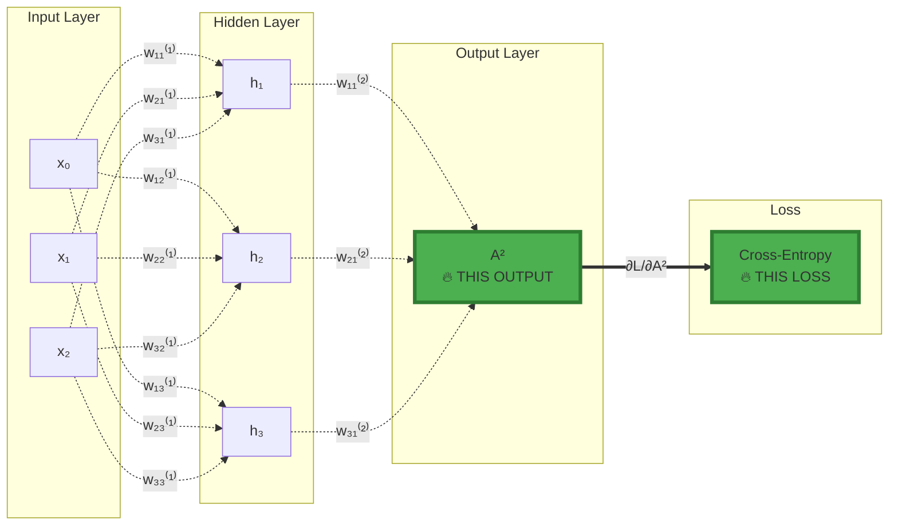
```mermaid
graph LR
    subgraph "Input Layer"
        X0[x₀]
        X1[x₁]
        X2[x₂]
    end

    subgraph "Hidden Layer"
        H1[h₁]
        H2[h₂]
        H3[h₃]
    end

    subgraph "Output Layer"
        O1[A²<br/>🔥 THIS OUTPUT]
    end

    subgraph "Loss"
        L[Cross-Entropy<br/>🔥 THIS LOSS]
    end

    X0 -.->|w₁₁⁽¹⁾| H1
    X0 -.->|w₁₂⁽¹⁾| H2
    X0 -.->|w₁₃⁽¹⁾| H3
    X1 -.->|w₂₁⁽¹⁾| H1
    X1 -.->|w₂₂⁽¹⁾| H2
    X1 -.->|w₂₃⁽¹⁾| H3
    X2 -.->|w₃₁⁽¹⁾| H1
    X2 -.->|w₃₂⁽¹⁾| H2
    X2 -.->|w₃₃⁽¹⁾| H3

    H1 -.->|w₁₁⁽²⁾| O1
    H2 -.->|w₂₁⁽²⁾| O1
    H3 -.->|w₃₁⁽²⁾| O1

    O1 ==>|∂L/∂A²| L

    style O1 fill:#4caf50,stroke:#2e7d32,stroke-width:4px
    style L fill:#4caf50,stroke:#2e7d32,stroke-width:4px
```

**Focus:** We want to find $\frac{\partial \text{Loss}}{\partial A²}$ - how the loss changes when we change the final prediction.

For cross-entropy loss:

$$\text{Cost} = -(y \cdot \log(A²) + (1-y) \cdot \log(1-A²))$$

**Taking the derivative with respect to A² step by step:**

$$\frac{\partial \text{Cost}}{\partial A²} = \frac{\partial}{\partial A²} [-(y \cdot \log(A²) + (1-y) \cdot \log(1-A²))]$$

**Breaking this down using derivative rules:**

- The derivative of log(x) is $\frac{1}{x}$
- The derivative of log(1-x) is $\frac{-1}{1-x}$ (using chain rule)
- The negative sign stays throughout

$$\frac{\partial \text{Cost}}{\partial A²} = -\left(y \cdot \frac{\partial}{\partial A²}[\log(A²)] + (1-y) \cdot \frac{\partial}{\partial A²}[\log(1-A²)]\right)$$

$$\frac{\partial \text{Cost}}{\partial A²} = -\left(y \cdot \frac{1}{A²} + (1-y) \cdot \frac{(-1)}{(1-A²)}\right)$$

$$\frac{\partial \text{Cost}}{\partial A²} = -\frac{y}{A²} + \frac{(1-y)}{(1-A²)}$$

**Let's verify with our numerical example:**

```python
# y=1, A²=0.8
derivative = -1/0.8 + (1-1)/(1-0.8)
derivative = -1.25 + 0 = -1.25
```

This matches our earlier manual calculation!

---

#### Step 2: How does `A²` change with `Z²`?

##### What We're Analyzing:

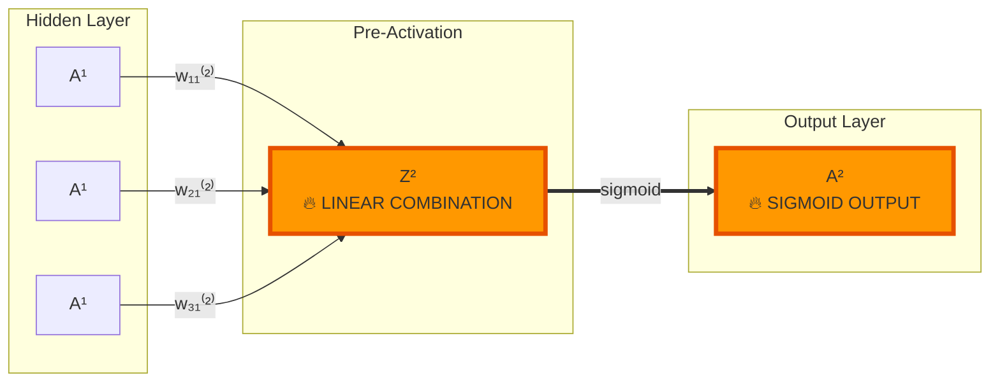
```mermaid
graph LR
    subgraph "Hidden Layer"
        H1[A¹]
        H2[A¹]
        H3[A¹]
    end

    subgraph "Pre-Activation"
        Z2[Z²<br/>🔥 LINEAR COMBINATION]
    end

    subgraph "Output Layer"
        O1[A²<br/>🔥 SIGMOID OUTPUT]
    end

    H1 -->|w₁₁⁽²⁾| Z2
    H2 -->|w₂₁⁽²⁾| Z2
    H3 -->|w₃₁⁽²⁾| Z2

    Z2 ==>|sigmoid| O1

    style Z2 fill:#ff9800,stroke:#e65100,stroke-width:4px
    style O1 fill:#ff9800,stroke:#e65100,stroke-width:4px
```

**Focus:** We want to find $\frac{\partial A²}{\partial Z²}$ - how the sigmoid output changes with its input.

Since $A² = \text{sigmoid}(Z²)$, we need the sigmoid derivative.

**Deriving sigmoid derivative from scratch:**

The sigmoid function is:

$$\text{sigmoid}(z) = \frac{1}{1 + e^{-z}}$$

Using the quotient rule:

if $$f(z) = \frac{g(z)}{h(z)}$$, then
$$f'(z) = \frac{g'(z)h(z) - g(z)h'(z)}{[h(z)]²}$$

Let $g(z) = 1$ and $h(z) = 1 + e^{-z}$

- $g'(z) = 0$
- $h'(z) = -e^{-z}$

$$\frac{d}{dz}[\text{sigmoid}(z)] = \frac{0 \cdot (1 + e^{-z}) - 1 \cdot (-e^{-z})}{(1 + e^{-z})²} = \frac{e^{-z}}{(1 + e^{-z})²}$$

**Now let's simplify this beautiful expression:**

$$\frac{d}{dz}[\text{sigmoid}(z)] = \frac{e^{-z}}{(1 + e^{-z})²}$$

Multiply numerator and denominator by $e^z$:

$$= \frac{e^{-z} \cdot e^z}{(1 + e^{-z})² \cdot e^z} = \frac{1}{(1 + e^{-z}) \cdot e^z \cdot (1 + e^{-z})} = \frac{1}{(1 + e^{-z}) \cdot (e^z + 1)}$$

$$= \frac{1}{1 + e^{-z}} \cdot \frac{1}{e^z + 1}$$

Note that $$\frac{1}{e^z + 1} = \frac{e^{-z}}{e^{-z}(e^z + 1)} = \frac{e^{-z}}{1 + e^{-z}}$$

$$= \frac{1}{1 + e^{-z}} \cdot \frac{e^{-z}}{1 + e^{-z}} = \text{sigmoid}(z) \cdot (1 - \text{sigmoid}(z))$$

So: $$\frac{\partial A²}{\partial Z²} = A² \times (1 - A²)$$

**Detailed Algebra: How We Get the Elegant Form**

Starting from the quotient rule result:

$$\sigma'(z) = \frac{e^{-z}}{(1 + e^{-z})^2}$$

Step 1: Rewrite as a product

$$\sigma'(z) = \frac{1}{1 + e^{-z}} \times \frac{e^{-z}}{1 + e^{-z}}$$

Step 2: Recognize the first term

$$\frac{1}{1 + e^{-z}} = \sigma(z) \quad \leftarrow \text{This is just sigmoid!}$$

Step 3: Transform the second term (the tricky part!)

We need to show: $\frac{e^{-z}}{1 + e^{-z}} = 1 - \sigma(z)$

Proof:
$$1 - \sigma(z) = 1 - \frac{1}{1 + e^{-z}}$$

$$= \frac{(1 + e^{-z}) - 1}{1 + e^{-z}} \quad \leftarrow \text{Common denominator}$$

$$= \frac{e^{-z}}{1 + e^{-z}} \quad \leftarrow \text{Simplify numerator}$$

Step 4: Final elegant result

$$\sigma'(z) = \sigma(z) \times (1 - \sigma(z))$$

Why this is beautiful:

- $\sigma(z)$: The function value itself
- $(1 - \sigma(z))$: How much "room to grow" toward 1
- Product: Maximum when $\sigma(z) = 0.5$, zero at extremes → vanishing gradients!

Let me explain this more clearly with concrete examples:

**Why this is beautiful:**

**Understanding the Components:**

- $\sigma(z)$: This is the sigmoid output value (between 0 and 1)
- $(1 - \sigma(z))$: This represents how far the output is from the maximum value of 1

**Concrete Examples:**

When $z$ is very negative (like $z = -10$):

- $\sigma(-10) \approx 0.00005$ (very close to 0)
- $(1 - \sigma(-10)) \approx 0.99995$ (very close to 1)
- **Derivative:** $0.00005 \times 0.99995 \approx 0.00005$ (tiny!)

When $z = 0$:

- $\sigma(0) = 0.5$ (exactly in the middle)
- $(1 - \sigma(0)) = 0.5$ (also in the middle)
- **Derivative:** $0.5 \times 0.5 = 0.25$ (maximum possible!)

When $z$ is very positive (like $z = 10$):

- $\sigma(10) \approx 0.99995$ (very close to 1)
- $(1 - \sigma(10)) \approx 0.00005$ (very close to 0)
- **Derivative:** $0.99995 \times 0.00005 \approx 0.00005$ (tiny again!)

**The Key Insight:**

- The derivative is **largest** when the sigmoid is "undecided" (around 0.5)
- The derivative becomes **tiny** when the sigmoid is "confident" (close to 0 or 1)
- This creates the **vanishing gradient problem** - when neurons are saturated (very confident), they stop learning because gradients become almost zero!

**Visual Intuition:**
Think of $(1 - \sigma(z))$ as the "learning potential" - how much room there is for the neuron to change its mind. When it's already very confident (close to 0 or 1), there's little room to learn more.

> when neurons are saturated (very confident), they stop learning because gradients become almost zero!

This is **mostly BAD**, but there are some nuanced aspects:

🚫 **Why It's Bad (The Main Problem):**

**Early Layers Can't Learn**

```
Deep Network Example:
Layer 5: gradient = 1.0
Layer 4: gradient = 1.0 × 0.25 = 0.25
Layer 3: gradient = 0.25 × 0.25 = 0.0625
Layer 2: gradient = 0.0625 × 0.25 = 0.016
Layer 1: gradient = 0.016 × 0.25 = 0.004

Result: Layer 1 learns 250× slower than Layer 5!
```

**Training Becomes Ineffective**

- **Deep networks fail to train** properly
- **Early layers stay random** while later layers overfit
- **Learning is extremely slow** for foundational features
- **Network can get "stuck"** in poor solutions

**Historical Impact**

- This problem **killed neural network research** in the 1990s-2000s
- People thought deep learning was impossible
- Led to the "AI winter" period

✅ **The Few Good Aspects:**

**Natural Regularization**

- When a neuron is **very confident and correct**, it should stop changing
- Prevents **overfitting** to noise in some cases
- Creates **stable representations** once learned

**Computational Efficiency**

- Saturated neurons essentially "turn off" updates
- Saves computation on already-learned features

🎯 **The Bottom Line:**

**It's overwhelmingly bad** because:

1. **Prevents deep networks** from working
2. **Wastes most of the network's capacity**
3. **Makes training unpredictable**

🔧 **That's Why We Use ReLU Now:**

```python
# Sigmoid derivative (problematic)
sigmoid_derivative = sigmoid(z) * (1 - sigmoid(z))  # Max = 0.25

# ReLU derivative (solution)
relu_derivative = 1 if z > 0 else 0  # Either 0 or 1, no vanishing!
```

**ReLU solved this problem** by having:

- **Constant gradient of 1** for positive inputs
- **No saturation** in the positive region
- **Enabled the deep learning revolution**

**Historical perspective:** The vanishing gradient problem was the main reason deep learning didn't work until ReLU was popularized around 2010-2012. Once we solved this, suddenly 100+ layer networks became possible!

So yes, it's definitely a **bad thing** that held back AI progress for decades.

**Numerical example:**

```python
# A² = 0.8
sigmoid_derivative = 0.8 * (1 - 0.8) = 0.8 * 0.2 = 0.16
```

---

#### Step 3: Chain rule to get `dZ²`

##### What We're Combining:

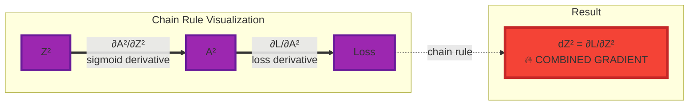
```mermaid
graph LR
    subgraph "Chain Rule Visualization"
        Z2[Z²]
        A2[A²]
        L[Loss]
    end

    Z2 ==>|∂A²/∂Z²<br/>sigmoid derivative| A2
    A2 ==>|∂L/∂A²<br/>loss derivative| L

    subgraph "Result"
        DZ2[dZ² = ∂L/∂Z²<br/>🔥 COMBINED GRADIENT]
    end

    L -.->|chain rule| DZ2

    style Z2 fill:#9c27b0,stroke:#6a1b9a,stroke-width:3px
    style A2 fill:#9c27b0,stroke:#6a1b9a,stroke-width:3px
    style L fill:#9c27b0,stroke:#6a1b9a,stroke-width:3px
    style DZ2 fill:#f44336,stroke:#c62828,stroke-width:4px
```

**Chain rule**: $$\frac{\partial \text{Cost}}{\partial Z²} = \frac{\partial \text{Cost}}{\partial A²} \times \frac{\partial A²}{\partial Z²}$$

$$dZ² = \left[-\frac{y}{A²} + \frac{(1-y)}{(1-A²)}\right] \times [A²(1-A²)]$$

**Let's expand this algebra step by step very carefully:**

$$dZ² = \left[-\frac{y}{A²} + \frac{(1-y)}{(1-A²)}\right] \times [A²(1-A²)]$$

Distribute the multiplication to each term:

$$dZ² = \left[-\frac{y}{A²}\right] \times [A²(1-A²)] + \left[\frac{(1-y)}{(1-A²)}\right] \times [A²(1-A²)]$$

Simplify first term: $$\left[-\frac{y}{A²}\right] \times [A²(1-A²)]$$

$$= -y \times \frac{A²}{A²} \times (1-A²) = -y \times 1 \times (1-A²) = -y(1-A²)$$

Simplify second term: $$\left[\frac{(1-y)}{(1-A²)}\right] \times [A²(1-A²)]$$

$$= (1-y) \times \frac{A²(1-A²)}{(1-A²)} = (1-y) \times A² = (1-y)A²$$

Combine both terms:

$$dZ² = -y(1-A²) + (1-y)A²$$

Expand the first term:

$$dZ² = -y + yA² + (1-y)A²$$

Expand the second term:

$$dZ² = -y + yA² + A² - yA²$$

Notice that $+yA²$ and $-yA²$ cancel out:

$$dZ² = -y + A²$$

Rearrange:

$$dZ² = A² - y$$

**✨ Beautiful result:** `dZ² = A² - y` (prediction minus truth)

**Intuitive meaning**:

- If we predicted 0.8 but truth is 1: dZ² = 0.8 - 1 = -0.2 (we need to increase)
- If we predicted 0.9 but truth is 0: dZ² = 0.9 - 0 = +0.9 (we need to decrease)

---

#### Step 4: How do weights and biases affect `Z²`?

##### What We're Analyzing:

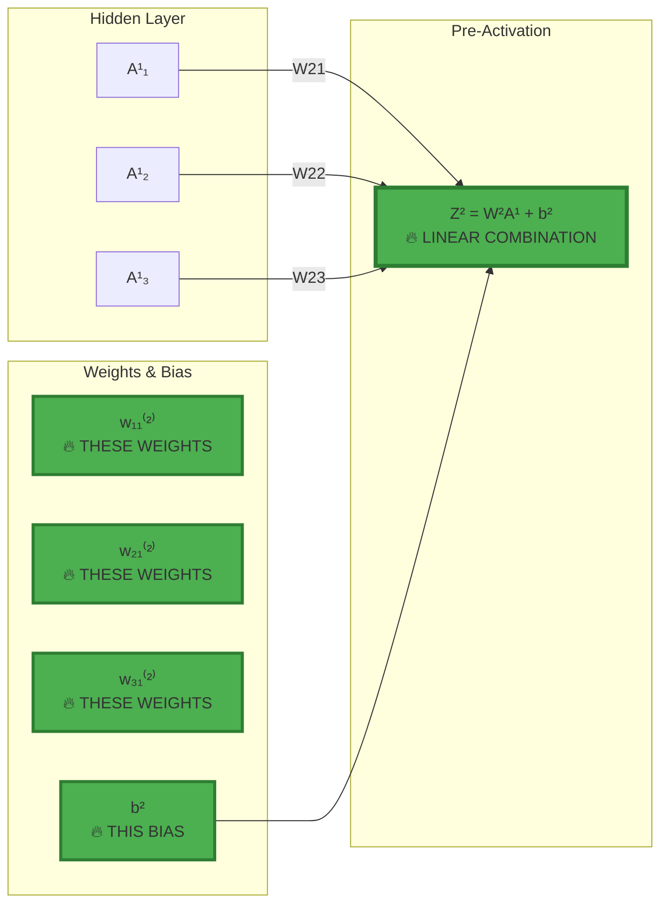
```mermaid
graph LR
    subgraph "Hidden Layer"
        H1[A¹₁]
        H2[A¹₂]
        H3[A¹₃]
    end

    subgraph "Weights & Bias"
        W21[w₁₁⁽²⁾<br/>🔥 THESE WEIGHTS]
        W22[w₂₁⁽²⁾<br/>🔥 THESE WEIGHTS]
        W23[w₃₁⁽²⁾<br/>🔥 THESE WEIGHTS]
        B2[b²<br/>🔥 THIS BIAS]
    end

    subgraph "Pre-Activation"
        Z2[Z² = W²A¹ + b²<br/>🔥 LINEAR COMBINATION]
    end

    H1 -->|W21| Z2
    H2 -->|W22| Z2
    H3 -->|W23| Z2
    B2 --> Z2

    style W21 fill:#4caf50,stroke:#2e7d32,stroke-width:3px
    style W22 fill:#4caf50,stroke:#2e7d32,stroke-width:3px
    style W23 fill:#4caf50,stroke:#2e7d32,stroke-width:3px
    style B2 fill:#4caf50,stroke:#2e7d32,stroke-width:3px
    style Z2 fill:#4caf50,stroke:#2e7d32,stroke-width:4px
```

Since $Z² = W²A¹ + b²$:

**Taking partial derivatives:**

$$\frac{\partial Z²}{\partial W²} = A¹ \quad \text{(the input to this layer)}$$

$$\frac{\partial Z²}{\partial b²} = 1 \quad \text{(bias always has coefficient 1)}$$

**Why is $\frac{\partial Z²}{\partial W²} = A¹$?**

If $Z² = W²A¹ + b²$, then when we change $W²$ by a small amount $ΔW²$, the change in $Z²$ is $ΔW² \times A¹$. So the rate of change (derivative) is $A¹$.

---

##### **Understanding the Partial Derivatives**

##### **What does ∂Z²/∂W² mean?**

**Translation**: "How does Z² change when we change W² slightly?"

Let's look at the equation:

```
Z² = W²A¹ + b²
```

**Example with numbers:**

```
W² = [0.5, 0.3, 0.4]  (1×3 matrix)
A¹ = [[0.8],          (3×1 matrix)
      [0.6],
      [0.7]]

Z² = [0.5, 0.3, 0.4] @ [[0.8],  + b²
                        [0.6],
                        [0.7]]

Z² = [0.5×0.8 + 0.3×0.6 + 0.4×0.7] + b²
Z² = [0.4 + 0.18 + 0.28] + b²
Z² = [0.86] + b²
```

**Now, what happens if we change W² slightly?**

If we change W² from [0.5, 0.3, 0.4] to [0.51, 0.3, 0.4] (increase first weight by 0.01):

```
Z²_new = [0.51×0.8 + 0.3×0.6 + 0.4×0.7] + b²
Z²_new = [0.408 + 0.18 + 0.28] + b²
Z²_new = [0.868] + b²

Change in Z² = 0.868 - 0.86 = 0.008
Change in W² = 0.01 (we changed first weight by 0.01)

Rate of change = 0.008/0.01 = 0.8
```

**Notice**: The rate of change equals A¹[0] = 0.8!

**General rule**: ∂Z²/∂W² = A¹

##### **What does ∂Z²/∂b² mean?**

**Translation**: "How does Z² change when we change b² slightly?"

From the equation:

```
Z² = W²A¹ + b²
```

If we increase b² by 0.01:

```
Z²_original = W²A¹ + b²
Z²_new = W²A¹ + (b² + 0.01)
Z²_new = W²A¹ + b² + 0.01

Change in Z² = 0.01
Change in b² = 0.01

Rate of change = 0.01/0.01 = 1
```

**General rule**: ∂Z²/∂b² = 1

---

#### Step 5: Final gradients for layer 2

##### What We're Computing:

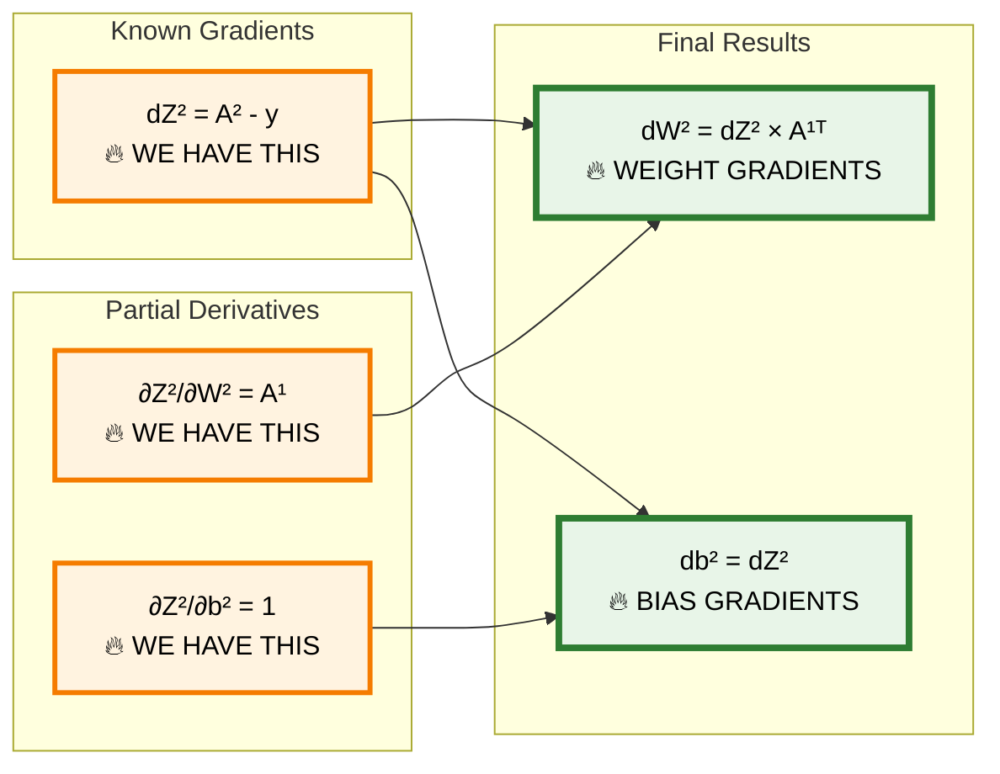
```mermaid
graph LR
    subgraph "Known Gradients"
        DZ2["dZ² = A² - y<br/>🔥 WE HAVE THIS"]
    end

    subgraph "Partial Derivatives"
        PA1["∂Z²/∂W² = A¹<br/>🔥 WE HAVE THIS"]
        PB2["∂Z²/∂b² = 1<br/>🔥 WE HAVE THIS"]
    end

    subgraph "Final Results"
        DW2["dW² = dZ² × A¹ᵀ<br/>🔥 WEIGHT GRADIENTS"]
        DB2["db² = dZ²<br/>🔥 BIAS GRADIENTS"]
    end

    DZ2 --> DW2
    DZ2 --> DB2
    PA1 --> DW2
    PB2 --> DB2

    style DZ2 fill:#fff3e0,stroke:#f57c00,stroke-width:3px,color:#000
    style PA1 fill:#fff3e0,stroke:#f57c00,stroke-width:3px,color:#000
    style PB2 fill:#fff3e0,stroke:#f57c00,stroke-width:3px,color:#000
    style DW2 fill:#e8f5e8,stroke:#2e7d32,stroke-width:4px,color:#000
    style DB2 fill:#e8f5e8,stroke:#2e7d32,stroke-width:4px,color:#000
```

Using chain rule again:

$$dW² = dZ² \times \frac{\partial Z²}{\partial W²} = dZ² \times (A¹)^T$$

$$db² = dZ² \times \frac{\partial Z²}{\partial b²} = dZ²$$

**Why the transpose (T)?** Matrix dimensions must match for multiplication! If dZ² is (1,m) and A¹ is (h,m), then we need $(A¹)^T$ which is (m,h) to get dW² as (1,h) - matching W²'s shape.

Excellent question! Let me break down the output layer gradients step by step with clear explanations.

#### **The Big Picture: What We're Trying to Find**

We want to find:

- **dW²**: How much should we change the output weights W² to reduce loss?
- **db²**: How much should we change the output bias b² to reduce loss?

We already know **dZ² = A² - y** (how much the pre-activation should change).

---

##### **Applying Chain Rule to Find dW² and db²**

##### **Chain Rule Logic:**

We want to know: "How does the **loss** change when we change **W²**?"

```
Loss → Z² → W²
```

**Chain rule says:**

```
∂Loss/∂W² = (∂Loss/∂Z²) × (∂Z²/∂W²)
```

We already know:

- **∂Loss/∂Z² = dZ²** (we calculated this as A² - y)
- **∂Z²/∂W² = A¹** (from Step 4)

So:

```
dW² = dZ² × A¹ᵀ
```

**Why the transpose (ᵀ)?** For matrix dimension matching!

##### **Dimension Analysis:**

```
dZ² has shape: (1, m)  [1 output, m examples]
A¹ has shape: (h, m)   [h hidden neurons, m examples]
W² has shape: (1, h)   [1 output, h hidden neurons]

For multiplication to work:
dZ² × A¹ᵀ = (1, m) × (m, h) = (1, h) ✓

This matches W²'s shape (1, h)!
```

#### **For db²:**

```
∂Loss/∂b² = (∂Loss/∂Z²) × (∂Z²/∂b²)
db² = dZ² × 1 = dZ²
```

---

##### **Concrete Example:**

Let's say:

```
dZ² = [0.2, -0.1, 0.3]  (error for 3 examples)
A¹ = [[0.8, 0.5, 0.9],  (4 hidden neurons, 3 examples)
      [0.6, 0.7, 0.4],
      [0.7, 0.3, 0.8],
      [0.4, 0.6, 0.5]]
```

**Calculate dW²:**

```
dW² = dZ² × A¹ᵀ
dW² = [0.2, -0.1, 0.3] × [[0.8, 0.6, 0.7, 0.4],
                          [0.5, 0.7, 0.3, 0.6],
                          [0.9, 0.4, 0.8, 0.5]]

dW² = [0.2×0.8 + (-0.1)×0.5 + 0.3×0.9,    # for neuron 1
       0.2×0.6 + (-0.1)×0.7 + 0.3×0.4,    # for neuron 2
       0.2×0.7 + (-0.1)×0.3 + 0.3×0.8,    # for neuron 3
       0.2×0.4 + (-0.1)×0.6 + 0.3×0.5]    # for neuron 4

dW² = [0.16 - 0.05 + 0.27,  0.12 - 0.07 + 0.12,  0.14 - 0.03 + 0.24,  0.08 - 0.06 + 0.15]
dW² = [0.38, 0.17, 0.35, 0.17]
```

**Calculate db²:**

```
db² = dZ² = [0.2, -0.1, 0.3]

# Average across examples (for batch processing):
db² = (0.2 + (-0.1) + 0.3) / 3 = 0.4 / 3 ≈ 0.133
```

---

##### **Intuitive Understanding:**

##### **dW² tells us:**

- **dW²[0] = 0.38**: "Increase the weight from hidden neuron 1 to output by 0.38 × learning_rate"
- **dW²[1] = 0.17**: "Increase the weight from hidden neuron 2 to output by 0.17 × learning_rate"
- And so on...

##### **db² tells us:**

- **db² = 0.133**: "Increase the output bias by 0.133 × learning_rate"

##### **Why this works:**

The chain rule automatically figures out:

1. **How much each weight contributed** to the final error (through A¹)
2. **How much the error wants to change** (through dZ²)
3. **The optimal adjustment** (their combination)

**The beauty**: We don't manually figure out which weight to adjust - the math does it automatically! 🎯

##### **Key Insight:**

The chain rule is like a **responsibility tracker**:

- dZ² says "this is how wrong the output layer is"
- ∂Z²/∂W² says "this is how much each weight contributed"
- dW² = their product says "this is how much to blame each weight"

---

### Hidden Layer Gradients (Layer 1)

**Goal:** Find how much `W¹` and `b¹` contribute to the error

#### Step 1: How does `Z²` error propagate to `A¹`?

##### What We're Analyzing:

**Diagram 1: Error Flowing Backward**
This diagram shows the **step-by-step process** of how error propagates from the output back to the hidden layer:

1. **We start with output error** (dZ² = 0.3) - this is how wrong our final prediction was
2. **Error gets distributed through weights** - each weight acts like a pathway that carries a portion of the error
3. **Each hidden neuron receives blame** proportional to its weight - bigger weights mean more responsibility, so more error flows back

**Key insight**: The error doesn't split equally - it flows proportionally based on how much each hidden neuron contributed to the output (determined by the weights).

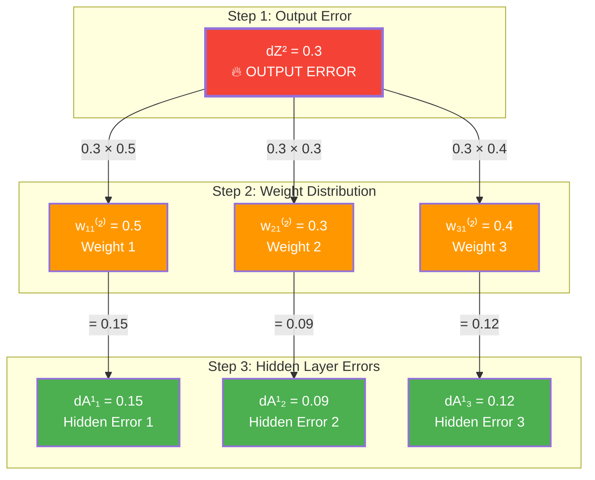
```mermaid
graph TD
    subgraph "Step 1: Output Error"
        ERROR["dZ² = 0.3<br/>🔥 OUTPUT ERROR"]
    end

    subgraph "Step 2: Weight Distribution"
        W1["w₁₁⁽²⁾ = 0.5<br/>Weight 1"]
        W2["w₂₁⁽²⁾ = 0.3<br/>Weight 2"]
        W3["w₃₁⁽²⁾ = 0.4<br/>Weight 3"]
    end

    subgraph "Step 3: Hidden Layer Errors"
        H1["dA¹₁ = 0.15<br/>Hidden Error 1"]
        H2["dA¹₂ = 0.09<br/>Hidden Error 2"]
        H3["dA¹₃ = 0.12<br/>Hidden Error 3"]
    end

    ERROR -->|"0.3 × 0.5"| W1
    ERROR -->|"0.3 × 0.3"| W2
    ERROR -->|"0.3 × 0.4"| W3

    W1 -->|"= 0.15"| H1
    W2 -->|"= 0.09"| H2
    W3 -->|"= 0.12"| H3

    style ERROR fill:#f44336,color:white,stroke-width:3px
    style W1 fill:#ff9800,color:white,stroke-width:2px
    style W2 fill:#ff9800,color:white,stroke-width:2px
    style W3 fill:#ff9800,color:white,stroke-width:2px
    style H1 fill:#4caf50,color:white,stroke-width:2px
    style H2 fill:#4caf50,color:white,stroke-width:2px
    style H3 fill:#4caf50,color:white,stroke-width:2px
```

**Water Pipe Analogy**

**Diagram 2: Water Pipe Analogy**
This diagram uses a **real-world analogy** to make the math intuitive:

- **Error Tank**: The total error (dZ²) that needs to be distributed
- **Pipes of different sizes**: The weights (W²) - bigger weights = bigger pipes = more error flows through
- **Buckets**: Hidden neurons that receive error proportional to their "pipe size"

**Key insight**: Just like water flows more through bigger pipes, error flows more through bigger weights. A hidden neuron with weight 0.5 gets blamed twice as much as one with weight 0.25 - because it had twice the influence on the output!

**This is exactly how dA¹ = (W²)ᵀ × dZ² works mathematically!** 🎯

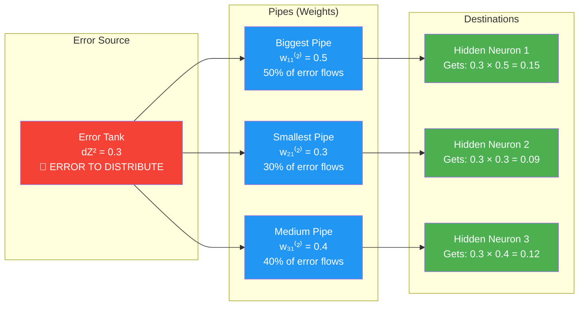
```mermaid
graph LR
    subgraph "Error Source"
        TANK[Error Tank<br/>dZ² = 0.3<br/>🚰 ERROR TO DISTRIBUTE]
    end

    subgraph "Pipes (Weights)"
        PIPE1[Biggest Pipe<br/>w₁₁⁽²⁾ = 0.5<br/>50% of error flows]
        PIPE2[Smallest Pipe<br/>w₂₁⁽²⁾ = 0.3<br/>30% of error flows]
        PIPE3[Medium Pipe<br/>w₃₁⁽²⁾ = 0.4<br/>40% of error flows]
    end

    subgraph "Destinations"
        BUCKET1[Hidden Neuron 1<br/>Gets: 0.3 × 0.5 = 0.15]
        BUCKET2[Hidden Neuron 2<br/>Gets: 0.3 × 0.3 = 0.09]
        BUCKET3[Hidden Neuron 3<br/>Gets: 0.3 × 0.4 = 0.12]
    end

    TANK --> PIPE1 --> BUCKET1
    TANK --> PIPE2 --> BUCKET2
    TANK --> PIPE3 --> BUCKET3

    style TANK fill:#f44336,color:white
    style PIPE1 fill:#2196f3,color:white
    style PIPE2 fill:#2196f3,color:white
    style PIPE3 fill:#2196f3,color:white
    style BUCKET1 fill:#4caf50,color:white
    style BUCKET2 fill:#4caf50,color:white
    style BUCKET3 fill:#4caf50,color:white
```

Since $Z² = W²A¹ + b²$, we want to find how changes in A¹ affect the final cost.

**Using chain rule:**

$$dA¹ = \frac{\partial \text{Cost}}{\partial A¹} = \frac{\partial \text{Cost}}{\partial Z²} \times \frac{\partial Z²}{\partial A¹} = dZ² \times \frac{\partial Z²}{\partial A¹}$$

Since $Z² = W²A¹ + b²$, we have $\frac{\partial Z²}{\partial A¹} = W²$

But wait! We need the transpose: **$dA¹ = (W²)^T \times dZ²$**

**Why the transpose?** Think about dimensions:

- dZ² has shape (output_size, m) = (1, m)
- W² has shape (output_size, hidden_size) = (1, 3)
- A¹ has shape (hidden_size, m) = (3, m)
- So dA¹ should have shape (3, m)

For matrix multiplication to work: $(W²)^T \times dZ² = (3,1) \times (1,m) = (3,m)$ ✓

**Intuition**: The error flows backward through the weights. If a weight is large, more error gets passed back to that hidden neuron.

**Analogy**: Think of weights as pipes. A bigger pipe (larger weight) allows more "error water" to flow back to the hidden neuron.

---

#### Step 2: How does `A¹` change with `Z¹`?

##### What We're Analyzing:

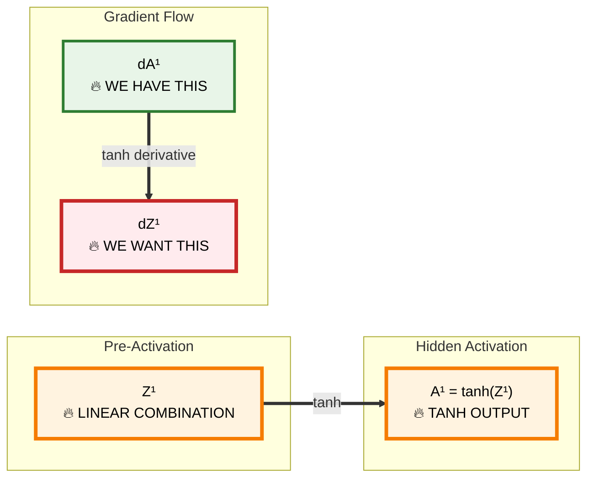
```mermaid
graph LR
    subgraph "Pre-Activation"
        Z1["Z¹<br/>🔥 LINEAR COMBINATION"]
    end

    subgraph "Hidden Activation"
        A1["A¹ = tanh(Z¹)<br/>🔥 TANH OUTPUT"]
    end

    subgraph "Gradient Flow"
        DA1["dA¹<br/>🔥 WE HAVE THIS"]
        DZ1["dZ¹<br/>🔥 WE WANT THIS"]
    end

    Z1 ==>|tanh| A1
    DA1 ==>|tanh derivative| DZ1

    style Z1 fill:#fff3e0,stroke:#f57c00,stroke-width:4px,color:#000
    style A1 fill:#fff3e0,stroke:#f57c00,stroke-width:4px,color:#000
    style DA1 fill:#e8f5e8,stroke:#2e7d32,stroke-width:3px,color:#000
    style DZ1 fill:#ffebee,stroke:#c62828,stroke-width:4px,color:#000
```

Since $A¹ = \tanh(Z¹)$, we need the tanh derivative.

**Deriving tanh derivative:**

$$\tanh(z) = \frac{e^z - e^{-z}}{e^z + e^{-z}}$$

Using quotient rule where $f(z) = \frac{g(z)}{h(z)}$:

- $g(z) = e^z - e^{-z}$, so $g'(z) = e^z + e^{-z}$
- $h(z) = e^z + e^{-z}$, so $h'(z) = e^z - e^{-z}$

$$\frac{d}{dz}[\tanh(z)] = \frac{g'(z)h(z) - g(z)h'(z)}{[h(z)]²}$$

$$= \frac{(e^z + e^{-z})(e^z + e^{-z}) - (e^z - e^{-z})(e^z - e^{-z})}{(e^z + e^{-z})²}$$

$$= \frac{(e^z + e^{-z})² - (e^z - e^{-z})²}{(e^z + e^{-z})²}$$

Expanding the squares:

$$= \frac{e^{2z} + 2 + e^{-2z} - (e^{2z} - 2 + e^{-2z})}{(e^z + e^{-z})²}$$

$$= \frac{e^{2z} + 2 + e^{-2z} - e^{2z} + 2 - e^{-2z}}{(e^z + e^{-z})²}$$

$$= \frac{4}{(e^z + e^{-z})²}$$

We need to recognize that we can rewrite this using the definition of $\tanh(z)$.

**Step 1: Recall the definition of tanh**
$$\tanh(z) = \frac{e^z - e^{-z}}{e^z + e^{-z}}$$

**Step 2: Calculate $\tanh²(z)$**
$$\tanh²(z) = \left(\frac{e^z - e^{-z}}{e^z + e^{-z}}\right)² = \frac{(e^z - e^{-z})²}{(e^z + e^{-z})²}$$

**Step 3: Calculate $1 - \tanh²(z)$**
$$1 - \tanh²(z) = 1 - \frac{(e^z - e^{-z})²}{(e^z + e^{-z})²}$$

$$= \frac{(e^z + e^{-z})²}{(e^z + e^{-z})²} - \frac{(e^z - e^{-z})²}{(e^z + e^{-z})²}$$

$$= \frac{(e^z + e^{-z})² - (e^z - e^{-z})²}{(e^z + e^{-z})²}$$

**Step 4: Expand the squares in the numerator**
$$(e^z + e^{-z})² = e^{2z} + 2e^z e^{-z} + e^{-2z} = e^{2z} + 2 + e^{-2z}$$

$$(e^z - e^{-z})² = e^{2z} - 2e^z e^{-z} + e^{-2z} = e^{2z} - 2 + e^{-2z}$$

**Step 5: Substitute back**
$$1 - \tanh²(z) = \frac{(e^{2z} + 2 + e^{-2z}) - (e^{2z} - 2 + e^{-2z})}{(e^z + e^{-z})²}$$

$$= \frac{e^{2z} + 2 + e^{-2z} - e^{2z} + 2 - e^{-2z}}{(e^z + e^{-z})²}$$

$$= \frac{4}{(e^z + e^{-z})²}$$

**Therefore:**
$$\frac{4}{(e^z + e^{-z})²} = 1 - \tanh²(z)$$

But we can write this more elegantly:

$$= 1 - \tanh²(z)$$

So: $\frac{\partial A¹}{\partial Z¹} = 1 - (A¹)²$

## **Key Insight:**

The "elegant" form $1 - \tanh²(z)$ is much easier to compute and remember than the exponential form $\frac{4}{(e^z + e^{-z})²}$, especially since we already have $A¹ = \tanh(Z¹)$ computed from the forward pass! 🎯

**Numerical example:**

```python
# If A¹ = tanh(0.5) ≈ 0.462
tanh_derivative = 1 - (0.462)**2 ≈ 1 - 0.213 ≈ 0.787
```

---

Here's an improved Step 3 with better explanations:

#### Step 3: Chain rule to get `dZ¹`

##### What We're Combining:

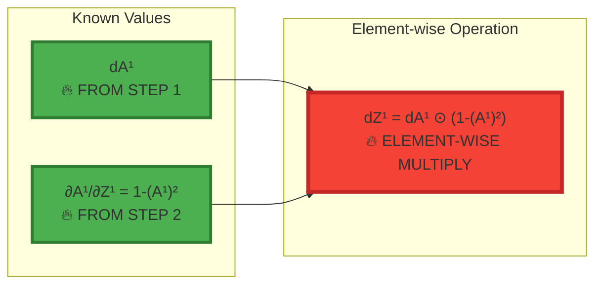
```mermaid
graph LR
    subgraph "Known Values"
        DA1["dA¹<br/>🔥 FROM STEP 1"]
        DTANH["∂A¹/∂Z¹ = 1-(A¹)²<br/>🔥 FROM STEP 2"]
    end

    subgraph "Element-wise Operation"
        DZ1["dZ¹ = dA¹ ⊙ (1-(A¹)²)<br/>🔥 ELEMENT-WISE MULTIPLY"]
    end

    DA1 --> DZ1
    DTANH --> DZ1

    style DA1 fill:#4caf50,stroke:#2e7d32,stroke-width:3px
    style DTANH fill:#4caf50,stroke:#2e7d32,stroke-width:3px
    style DZ1 fill:#f44336,stroke:#c62828,stroke-width:4px
```

### **Chain Rule Application:**

We want to find: **"How does the cost change when we change Z¹?"**

**Forward path shows us:** Z¹ → A¹ → (rest of network) → Cost

**Chain rule says:**
$$\frac{\partial \text{Cost}}{\partial Z¹} = \frac{\partial \text{Cost}}{\partial A¹} \times \frac{\partial A¹}{\partial Z¹}$$

**Substituting what we know:**
$$dZ¹ = dA¹ \times \frac{\partial A¹}{\partial Z¹} = dA¹ \times (1 - (A¹)²)$$

### **Why Element-wise Multiplication?**

**The key insight:** Each neuron operates **independently** on its own input!

#### **Conceptual Explanation:**

```
Z¹ = [z₁₁, z₁₂, z₁₃]  ← Pre-activations for 3 neurons
A¹ = [tanh(z₁₁), tanh(z₁₂), tanh(z₁₃)]  ← Each tanh operates separately

For derivatives:
∂A¹₁/∂Z¹₁ = 1 - (A¹₁)²  ← Neuron 1's derivative
∂A¹₂/∂Z¹₂ = 1 - (A¹₂)²  ← Neuron 2's derivative
∂A¹₃/∂Z¹₃ = 1 - (A¹₃)²  ← Neuron 3's derivative

∂A¹₁/∂Z¹₂ = 0  ← Neuron 1 doesn't depend on neuron 2's input
∂A¹₂/∂Z¹₁ = 0  ← Neuron 2 doesn't depend on neuron 1's input
```

#### **Matrix Form:**

Since neurons are independent, the derivative matrix is **diagonal**:

$$
\frac{\partial A¹}{\partial Z¹} = \begin{bmatrix}
1-(A¹₁)² & 0 & 0 \\
0 & 1-(A¹₂)² & 0 \\
0 & 0 & 1-(A¹₃)²
\end{bmatrix}
$$

**When we multiply by this diagonal matrix:**
$$dZ¹ = dA¹ \times \text{(diagonal matrix)} = \text{element-wise multiplication}$$

#### **Numerical Example:**

```python
# Example values
dA1 = [0.5, -0.3, 0.2]     # Error flowing to each hidden neuron
A1 = [0.8, 0.6, 0.4]       # Hidden neuron activations

# Calculate tanh derivatives for each neuron independently
tanh_deriv = [1-(0.8)², 1-(0.6)², 1-(0.4)²] = [0.36, 0.64, 0.84]

# Element-wise multiplication (each neuron's error × its own derivative)
dZ1 = [0.5×0.36, -0.3×0.64, 0.2×0.84] = [0.18, -0.192, 0.168]
```

#### **Why NOT Matrix Multiplication?**

```python
# This would be WRONG:
dZ1_wrong = dA1 @ tanh_deriv  # This mixes neurons together!

# This would mean:
# dZ1[0] = dA1[0]×tanh_deriv[0] + dA1[1]×tanh_deriv[1] + dA1[2]×tanh_deriv[2]
# But neuron 0's output change (dZ1[0]) should ONLY depend on its own error (dA1[0])!
```

### **Real-World Analogy:**

Think of **independent workers** on an assembly line:

- Each worker has their own error feedback (dA¹)
- Each worker has their own sensitivity to feedback (1-(A¹)²)
- Worker 1's adjustment = Worker 1's error × Worker 1's sensitivity
- Workers don't interfere with each other's adjustments

**Element-wise multiplication** preserves this independence, while **matrix multiplication** would incorrectly mix the workers' adjustments together.

### **Key Takeaway:**

$$dZ¹ = dA¹ ⊙ (1 - (A¹)²)$$

**The ⊙ symbol means:** Each element is multiplied with its corresponding element - no mixing between different neurons! This preserves the independence of each neuron's gradient computation. 🎯

Here's an improved Step 4 with detailed explanations of how we derive the formulas:

#### Step 4: Final gradients for layer 1

##### What We're Computing:

```mermaid
graph LR
    subgraph "Input Layer"
        X0[X₀<br/>🔥 INPUT FEATURES]
        X1[X₁<br/>🔥 INPUT FEATURES]
        X2[X₂<br/>🔥 INPUT FEATURES]
    end

    subgraph "Layer 1 Weights"
        W11[w₁₁⁽¹⁾<br/>🔥 THESE WEIGHTS]
        W12[w₁₂⁽¹⁾<br/>🔥 THESE WEIGHTS]
        W13[w₁₃⁽¹⁾<br/>🔥 THESE WEIGHTS]
        B1[b¹<br/>🔥 THESE BIASES]
    end

    subgraph "Known Gradient"
        DZ1[dZ¹<br/>🔥 WE HAVE THIS]
    end

    subgraph "Final Results"
        DW1[dW¹ = dZ¹ × Xᵀ<br/>🔥 WEIGHT GRADIENTS]
        DB1[db¹ = dZ¹<br/>🔥 BIAS GRADIENTS]
    end

    X0 -->|W11| DZ1
    X1 -->|W12| DZ1
    X2 -->|W13| DZ1
    B1 --> DZ1

    DZ1 --> DW1
    DZ1 --> DB1

    style X0 fill:#e3f2fd,stroke:#1976d2,stroke-width:3px
    style X1 fill:#e3f2fd,stroke:#1976d2,stroke-width:3px
    style X2 fill:#e3f2fd,stroke:#1976d2,stroke-width:3px
    style W11 fill:#9c27b0,stroke:#6a1b9a,stroke-width:3px
    style W12 fill:#9c27b0,stroke:#6a1b9a,stroke-width:3px
    style W13 fill:#9c27b0,stroke:#6a1b9a,stroke-width:3px
    style B1 fill:#9c27b0,stroke:#6a1b9a,stroke-width:3px
    style DZ1 fill:#ff9800,stroke:#e65100,stroke-width:4px
    style DW1 fill:#4caf50,stroke:#2e7d32,stroke-width:4px
    style DB1 fill:#4caf50,stroke:#2e7d32,stroke-width:4px
```

### **The Core Question:**

We want to find: **How does the cost change when we change W¹ and b¹?**

Mathematically: Find $\frac{\partial \text{Cost}}{\partial W¹}$ and $\frac{\partial \text{Cost}}{\partial b¹}$

### **Step 1: Identify the Chain Rule Path**

**Forward computation path:**

```
W¹, b¹ → Z¹ → A¹ → Z² → A² → Cost
```

**Chain rule tells us:**
$$\frac{\partial \text{Cost}}{\partial W¹} = \frac{\partial \text{Cost}}{\partial Z¹} \times \frac{\partial Z¹}{\partial W¹}$$

$$\frac{\partial \text{Cost}}{\partial b¹} = \frac{\partial \text{Cost}}{\partial Z¹} \times \frac{\partial Z¹}{\partial b¹}$$

We already know: $\frac{\partial \text{Cost}}{\partial Z¹} = dZ¹$

**So we need to find:** $\frac{\partial Z¹}{\partial W¹}$ and $\frac{\partial Z¹}{\partial b¹}$

---

### **Step 2: Deriving ∂Z¹/∂W¹**

#### **Starting with the forward equation:**

$$Z¹ = W¹X + b¹$$

#### **Method 1: Scalar Approach (Element-wise)**

Let's look at how a single element $Z¹_{ij}$ (neuron i, example j) depends on the weights.

```mermaid
graph TD
subgraph "Matrix Z¹ (3×2)"
Z11["Z¹₁₁<br/>(neuron 1, example 1)"]
Z12["Z¹₁₂<br/>(neuron 1, example 2)"]
Z21["Z¹₂₁<br/>(neuron 2, example 1)"]
Z22["Z¹₂₂<br/>(neuron 2, example 2)"]
Z31["Z¹₃₁<br/>(neuron 3, example 1)"]
Z32["Z¹₃₂<br/>(neuron 3, example 2)"]
end

    subgraph "Focus Element"
        FOCUS["🔥 Z¹ᵢⱼ<br/>We analyze this element"]
    end

    Z11 -.-> FOCUS
    Z12 -.-> FOCUS
    Z21 -.-> FOCUS
    Z22 -.-> FOCUS
    Z31 -.-> FOCUS
    Z32 -.-> FOCUS

    style Z11 fill:#ffcdd2
    style FOCUS fill:#f44336,color:white
```

**Expanding the matrix multiplication:**
$$Z¹_{ij} = \sum_{k=1}^{n} W¹_{ik} \cdot X_{kj} + b¹_i$$

Where:

- $i$ = neuron index (1 to hidden_size)
- $j$ = example index (1 to m)
- $k$ = input feature index (1 to input_size)
- $n$ = input_size

```mermaid
graph LR
    subgraph "Weights for Neuron i"
        W_i1["W¹ᵢ₁"]
        W_i2["W¹ᵢ₂"]
        W_ik["W¹ᵢₖ"]
        W_in["W¹ᵢₙ"]
    end

    subgraph "Input Features for Example j"
        X_1j["X₁ⱼ"]
        X_2j["X₂ⱼ"]
        X_kj["Xₖⱼ"]
        X_nj["Xₙⱼ"]
    end

    subgraph "Products"
        P1["W¹ᵢ₁ × X₁ⱼ"]
        P2["W¹ᵢ₂ × X₂ⱼ"]
        Pk["W¹ᵢₖ × Xₖⱼ"]
        Pn["W¹ᵢₙ × Xₙⱼ"]
    end

    subgraph "Sum + Bias"
        SUM["Σ + b¹ᵢ"]
        RESULT["Z¹ᵢⱼ"]
    end

    W_i1 --> P1
    X_1j --> P1
    W_i2 --> P2
    X_2j --> P2
    W_ik --> Pk
    X_kj --> Pk
    W_in --> Pn
    X_nj --> Pn

    P1 --> SUM
    P2 --> SUM
    Pk --> SUM
    Pn --> SUM
    SUM --> RESULT

    style RESULT fill:#4caf50,color:white
    style Pk fill:#ff9800,color:white
```

**Taking partial derivative with respect to a specific weight $W¹_{pq}$:**
$$\frac{\partial Z¹_{ij}}{\partial W¹_{pq}} = \frac{\partial}{\partial W¹_{pq}}\left[\sum_{k=1}^{n} W¹_{ik} \cdot X_{kj} + b¹_i\right]$$

**Case 1: If $i = p$ (same neuron):**

```mermaid
graph TD
    subgraph "Target: ∂Z¹ᵢⱼ/∂W¹ₚᵧ where i = p"
        TARGET["🎯 We want gradient of<br/>Z¹ᵢⱼ w.r.t. W¹ₚᵧ"]
    end

    subgraph "Expansion of Z¹ᵢⱼ"
        EXPANSION["Z¹ᵢⱼ = W¹ᵢ₁X₁ⱼ + W¹ᵢ₂X₂ⱼ + ... + W¹ᵢᵧXᵧⱼ + ... + W¹ᵢₙXₙⱼ + b¹ᵢ"]
    end

    subgraph "Since i = p, this becomes"
        SAME["Z¹ₚⱼ = W¹ₚ₁X₁ⱼ + W¹ₚ₂X₂ⱼ + ... + W¹ₚᵧXᵧⱼ + ... + W¹ₚₙXₙⱼ + b¹ₚ"]
    end

    subgraph "Taking Derivative"
        TERMS["Only W¹ₚᵧXᵧⱼ contains W¹ₚᵧ"]
        RESULT1["∂Z¹ₚⱼ/∂W¹ₚᵧ = Xᵧⱼ"]
    end

    TARGET --> EXPANSION
    EXPANSION --> SAME
    SAME --> TERMS
    TERMS --> RESULT1

    style TARGET fill:#f44336,color:white
    style RESULT1 fill:#4caf50,color:white
    style TERMS fill:#ff9800,color:white
```

$$\frac{\partial Z¹_{ij}}{\partial W¹_{pq}} = \frac{\partial}{\partial W¹_{pq}}\left[W¹_{p1}X_{1j} + W¹_{p2}X_{2j} + \ldots + W¹_{pq}X_{qj} + \ldots + W¹_{pn}X_{nj}\right]$$

Only the term $W¹_{pq}X_{qj}$ contains $W¹_{pq}$, so:
$$\frac{\partial Z¹_{ij}}{\partial W¹_{pq}} = X_{qj} \quad \text{when } i = p$$

**Case 2: If $i \neq p$ (different neuron):**

```mermaid
graph TD
    subgraph "Target: ∂Z¹ᵢⱼ/∂W¹ₚᵧ where i ≠ p"
        TARGET2["🎯 We want gradient of<br/>Z¹ᵢⱼ w.r.t. W¹ₚᵧ"]
    end

    subgraph "Expansion of Z¹ᵢⱼ (different neuron)"
        EXPANSION2["Z¹ᵢⱼ = W¹ᵢ₁X₁ⱼ + W¹ᵢ₂X₂ⱼ + ... + W¹ᵢₙXₙⱼ + b¹ᵢ"]
    end

    subgraph "Key Observation"
        OBSERVATION["W¹ₚᵧ does NOT appear in this expression!<br/>(Neuron i uses weights W¹ᵢₖ, not W¹ₚₖ)"]
    end

    subgraph "Taking Derivative"
        RESULT2["∂Z¹ᵢⱼ/∂W¹ₚᵧ = 0"]
    end

    TARGET2 --> EXPANSION2
    EXPANSION2 --> OBSERVATION
    OBSERVATION --> RESULT2

    style TARGET2 fill:#f44336,color:white
    style OBSERVATION fill:#ff9800,color:white
    style RESULT2 fill:#4caf50,color:white
```

$$\frac{\partial Z¹_{ij}}{\partial W¹_{pq}} = 0 \quad \text{when } i \neq p$$

**Combining both cases:**

$$
\frac{\partial Z¹_{ij}}{\partial W¹_{pq}} = \begin{cases}
X_{qj} & \text{if } i = p \\
0 & \text{if } i \neq p
\end{cases}
$$

## **Understanding "Combining Both Cases"**

### **What the Math is Saying:**

The formula:

$$
\frac{\partial Z¹_{ij}}{\partial W¹_{pq}} = \begin{cases}
X_{qj} & \text{if } i = p \\
0 & \text{if } i \neq p
\end{cases}
$$

**Translation**: "A weight W¹ₚᵨ only affects outputs from its own neuron (neuron p), and doesn't affect other neurons at all."

### **Real-World Analogy: Restaurant Kitchen**

Think of a restaurant with **3 chefs** (neurons) and **2 ingredients** (input features):

```
Chef 1 (Neuron 1): Makes pasta dishes
Chef 2 (Neuron 2): Makes pizza dishes
Chef 3 (Neuron 3): Makes salad dishes

Ingredients:
- Ingredient 1 (Feature 1): Tomatoes
- Ingredient 2 (Feature 2): Cheese
```

**Each chef has their own "skill level" with each ingredient:**

- W¹₁₁ = Chef 1's skill with tomatoes
- W¹₁₂ = Chef 1's skill with cheese
- W¹₂₁ = Chef 2's skill with tomatoes
- W¹₂₂ = Chef 2's skill with cheese
- W¹₃₁ = Chef 3's skill with tomatoes
- W¹₃₂ = Chef 3's skill with cheese

### **The Key Insight:**

**If we change "Chef 2's skill with tomatoes" (W¹₂₁):**

- ✅ This affects ALL of Chef 2's dishes (for all customers)
- ❌ This does NOT affect Chef 1's dishes at all
- ❌ This does NOT affect Chef 3's dishes at all

**Why?** Because chefs work independently! Chef 2's skill doesn't magically change Chef 1's or Chef 3's cooking.

**In mathematical terms:**

- W¹₂₁ affects Z¹₂ⱼ for all j (all of Chef 2's outputs)
- W¹₂₁ does NOT affect Z¹₁ⱼ or Z¹₃ⱼ (other chefs' outputs)

---

## **Understanding the Pattern: Why X^T Emerges**

### **Step 1: Focus on One Weight's Impact**

Let's say we're looking at **W¹₂₁** (Chef 2's skill with tomatoes).

**This weight affects:**

- Z¹₂₁ (Chef 2's dish for customer 1)
- Z¹₂₂ (Chef 2's dish for customer 2)
- Z¹₂₃ (Chef 2's dish for customer 3)
- ...and so on for all customers

**This weight does NOT affect:**

- Z¹₁ⱼ (any of Chef 1's dishes)
- Z¹₃ⱼ (any of Chef 3's dishes)

### **Step 2: How Much Does It Affect Each Dish?**

**The gradient tells us:**

- ∂Z¹₂₁/∂W¹₂₁ = X₁₁ (amount of tomatoes customer 1 ordered)
- ∂Z¹₂₂/∂W¹₂₁ = X₁₂ (amount of tomatoes customer 2 ordered)
- ∂Z¹₂₃/∂W¹₂₁ = X₁₃ (amount of tomatoes customer 3 ordered)

**Pattern**: The gradient equals the **input feature value** for each customer!

**Why this makes sense:**

- If customer 1 orders **lots of tomatoes** and Chef 2 messes up their dish, then Chef 2's "tomato skill" gets **blamed a lot**
- If customer 1 orders **few tomatoes** and Chef 2 messes up, then the "tomato skill" gets **blamed less**

**The blame is proportional to usage!** 🎯

### **Step 3: Recognizing the X^T Pattern**

**If we collect all these gradients for W¹₂₁:**

```
[∂Z¹₂₁/∂W¹₂₁, ∂Z¹₂₂/∂W¹₂₁, ∂Z¹₂₃/∂W¹₂₁, ...] = [X₁₁, X₁₂, X₁₃, ...]
```

**This is exactly Row 1 of X^T!**

**Why Row 1?** Because we're looking at feature 1 (tomatoes, q=1) across all examples.

**Breaking down the subscripts:**

- W¹₂₁ → p=2 (Chef 2), q=1 (tomatoes)
- Gradient pattern involves X₁ⱼ (tomato amounts for all customers j)
- X₁ⱼ values form Row 1 of X^T

---

## **The Final Leap: All Weights Together**

### **Extending to All Weights:**

**For every weight W¹ₚᵨ:**

- It affects only neuron p's outputs
- The gradient pattern involves feature q values: Xᵨⱼ
- This gives us Row q of X^T

**Examples:**

```
W¹₁₁ (Chef 1, tomatoes): gradient pattern = [X₁₁, X₁₂, X₁₃, ...] = Row 1 of X^T
W¹₁₂ (Chef 1, cheese):   gradient pattern = [X₂₁, X₂₂, X₂₃, ...] = Row 2 of X^T
W¹₂₁ (Chef 2, tomatoes): gradient pattern = [X₁₁, X₁₂, X₁₃, ...] = Row 1 of X^T
W¹₂₂ (Chef 2, cheese):   gradient pattern = [X₂₁, X₂₂, X₂₃, ...] = Row 2 of X^T
W¹₃₁ (Chef 3, tomatoes): gradient pattern = [X₁₁, X₁₂, X₁₃, ...] = Row 1 of X^T
W¹₃₂ (Chef 3, cheese):   gradient pattern = [X₂₁, X₂₂, X₂₃, ...] = Row 2 of X^T
```

### **Restaurant Analogy Extended:**

**For ALL chef-ingredient combinations:**

- Any **tomato skill** weight → gets blamed proportional to **tomato usage** (Row 1 of X^T)
- Any **cheese skill** weight → gets blamed proportional to **cheese usage** (Row 2 of X^T)

**The pattern is consistent across all chefs, but depends on the ingredient!**

---

## **Why This Gives Us X^T**

### **Matrix Structure Analysis:**

**The complete gradient matrix ∂Z¹/∂W¹ has the same shape as W¹:**

If W¹ is (3×2) for 3 neurons and 2 features:

```
       Feature 1  Feature 2
W¹ = [ W¹₁₁      W¹₁₂     ]  Neuron 1
     [ W¹₂₁      W¹₂₂     ]  Neuron 2
     [ W¹₃₁      W¹₃₂     ]  Neuron 3
```

**The gradient matrix:**

```
∂Z¹/∂W¹ = [ Row 1 of X^T   Row 2 of X^T ]  Neuron 1
          [ Row 1 of X^T   Row 2 of X^T ]  Neuron 2
          [ Row 1 of X^T   Row 2 of X^T ]  Neuron 3
```

**But wait - this would be:**

```
∂Z¹/∂W¹ = [ [X₁₁,X₁₂,...]  [X₂₁,X₂₂,...] ]
          [ [X₁₁,X₁₂,...]  [X₂₁,X₂₂,...] ]
          [ [X₁₁,X₁₂,...]  [X₂₁,X₂₂,...] ]
```

**This is exactly X^T replicated for each neuron row!**

**In compact matrix form:** ∂Z¹/∂W¹ = X^T

### **Why the Compact Form Works:**

**Matrix calculus handles the replication automatically:**

- Each neuron gets the same input features X
- Each neuron's gradients follow the same X^T pattern
- The matrix operation ∂Z¹/∂W¹ = X^T captures this efficiently

### **The Beautiful Mathematical Result:**

**Starting from element-wise analysis:**

1. **Each weight only affects its own neuron** (independence)
2. **The effect is proportional to input feature usage** (intuitive)
3. **This creates a consistent pattern across neurons** (regularity)
4. **The pattern is exactly X^T** (mathematical elegance)

---

## **Key Takeaways:**

### **Intuitive Understanding:**

- **Weights are independent**: One neuron's weights don't affect another neuron's outputs
- **Blame is proportional**: If you use more of an ingredient and mess up, that skill gets blamed more
- **Patterns repeat**: The same feature usage pattern applies to all neurons

### **Mathematical Understanding:**

- **Element-wise analysis** naturally leads to the matrix result
- **X^T emerges** from the systematic application of the chain rule
- **The compact form** ∂Z¹/∂W¹ = X^T efficiently captures all individual gradients

### **Bottom Line:**

**The math automatically captures the intuition that "blame should be proportional to usage"!** The element-wise analysis proves that this intuition, when applied systematically, gives us exactly the matrix X^T. 🍝👨‍🍳🎯

```mermaid
graph TB
    subgraph "Weight W¹ₚᵧ affects..."
        WEIGHT["W¹ₚᵧ<br/>🔥 THIS WEIGHT"]
    end

    subgraph "Neuron p (Same Row)"
        SAME_ROW["Z¹ₚ₁, Z¹ₚ₂, ..., Z¹ₚⱼ, ..., Z¹ₚₘ<br/>✅ Gradient = Xᵧⱼ"]
    end

    subgraph "Other Neurons (Different Rows)"
        DIFF_ROW1["Z¹₁ⱼ (neuron 1)<br/>❌ Gradient = 0"]
        DIFF_ROW2["Z¹₂ⱼ (neuron 2)<br/>❌ Gradient = 0"]
        DIFF_ROW3["Z¹ᵢⱼ (neuron i≠p)<br/>❌ Gradient = 0"]
    end

    WEIGHT --> SAME_ROW
    WEIGHT -.-> DIFF_ROW1
    WEIGHT -.-> DIFF_ROW2
    WEIGHT -.-> DIFF_ROW3

    style WEIGHT fill:#f44336,color:white
    style SAME_ROW fill:#4caf50,color:white
    style DIFF_ROW1 fill:#757575,color:white
    style DIFF_ROW2 fill:#757575,color:white
    style DIFF_ROW3 fill:#757575,color:white
```

```mermaid
graph LR
    subgraph "For All Elements in Row p"
        Z_p1["∂Z¹ₚ₁/∂W¹ₚᵧ = Xᵧ₁"]
        Z_p2["∂Z¹ₚ₂/∂W¹ₚᵧ = Xᵧ₂"]
        Z_pj["∂Z¹ₚⱼ/∂W¹ₚᵧ = Xᵧⱼ"]
        Z_pm["∂Z¹ₚₘ/∂W¹ₚᵧ = Xᵧₘ"]
    end

    subgraph "This is Row q of X^T"
        ROW_Q["[Xᵧ₁, Xᵧ₂, ..., Xᵧⱼ, ..., Xᵧₘ]<br/>= Row q of X^T"]
    end

    subgraph "Pattern Emerges"
        PATTERN["∂Z¹/∂W¹ₚᵧ = Row q of X^T<br/>For all p,q → ∂Z¹/∂W¹ = X^T"]
    end

    Z_p1 --> ROW_Q
    Z_p2 --> ROW_Q
    Z_pj --> ROW_Q
    Z_pm --> ROW_Q
    ROW_Q --> PATTERN

    style ROW_Q fill:#ff9800,color:white
    style PATTERN fill:#4caf50,color:white
```

#### **Method 2: Matrix Calculus Approach**

**General rule:** For $Y = AX$, we have $\frac{\partial Y}{\partial A} = X^T$

**Applying to our case:** $Z¹ = W¹X + b¹$

The term $W¹X$ has the form $AX$ where $A = W¹$, so:
$$\frac{\partial (W¹X)}{\partial W¹} = X^T$$

Since $b¹$ doesn't depend on $W¹$:
$$\frac{\partial Z¹}{\partial W¹} = X^T$$

#### **Why is this X^T and not X?**

**Dimension Analysis:**

- $Z¹$ has shape $(h, m)$ where $h$ = hidden_size, $m$ = num_examples
- $W¹$ has shape $(h, n)$ where $n$ = input_size
- $X$ has shape $(n, m)$

**The gradient $\frac{\partial Z¹}{\partial W¹}$ must have the same shape as $W¹$:** $(h, n)$

**If we used $X$ directly:**

- $X$ has shape $(n, m)$
- This doesn't match $W¹$'s shape $(h, n)$

**Using $X^T$:**

- $X^T$ has shape $(m, n)$
- Combined with chain rule: $(h, m) \times (m, n) = (h, n)$ ✓

#### Method 2: Matrix Calculus Approach - Detailed Explanation

##### **The Big Picture: What We're Trying to Do**

We want to find $\frac{\partial Z¹}{\partial W¹}$ using **matrix calculus rules** instead of the tedious element-by-element approach.

**Matrix calculus gives us shortcuts** - like having a formula instead of doing long division by hand!

---

##### **Step 1: Understanding the General Rule**

**The Magic Formula:**
**For any equation of the form $Y = AX$, we have $\frac{\partial Y}{\partial A} = X^T$**

**Why This Rule Works - Simple Example:**

Let's start with a tiny example to build intuition:

```
A = [a₁  a₂]  (1×2 matrix)
X = [x₁]      (2×1 matrix)
    [x₂]

Y = AX = [a₁  a₂] × [x₁] = [a₁x₁ + a₂x₂]  (1×1 result)
                    [x₂]
```

**Now, what's $\frac{\partial Y}{\partial A}$?**

**Element-wise calculation:**

- $\frac{\partial Y}{\partial a₁} = x₁$ (because Y = a₁x₁ + a₂x₂)
- $\frac{\partial Y}{\partial a₂} = x₂$ (because Y = a₁x₁ + a₂x₂)

**So:** $\frac{\partial Y}{\partial A} = [x₁  x₂] = X^T$ ✓

**The rule works!** The derivatives are exactly the transpose of X.

**Why X^T and Not X?**

**Dimension matching:**

- A has shape (1, 2)
- The gradient $\frac{\partial Y}{\partial A}$ must have the same shape as A: (1, 2)
- X has shape (2, 1), so X^T has shape (1, 2) ✓

**X^T fits, X doesn't!**

---

##### **Step 2: Applying the Rule to Our Problem**

**Our Equation:**
$$Z¹ = W¹X + b¹$$

**Breaking It Down:**
This equation has **two terms**:

1. $W¹X$ ← This has the form "AX"
2. $b¹$ ← This is just added constant

**We handle each term separately using derivative rules:**
$$\frac{\partial Z¹}{\partial W¹} = \frac{\partial (W¹X)}{\partial W¹} + \frac{\partial (b¹)}{\partial W¹}$$

**Term 1: $\frac{\partial (W¹X)}{\partial W¹}$**

**This is exactly the form $Y = AX$ where:**

- $Y = W¹X$ (the result)
- $A = W¹$ (the matrix we're differentiating with respect to)
- $X = X$ (the input matrix)

**Applying the rule:** $\frac{\partial (W¹X)}{\partial W¹} = X^T$

**Term 2: $\frac{\partial (b¹)}{\partial W¹}$**

**Since $b¹$ doesn't contain any $W¹$ terms:**
$$\frac{\partial (b¹)}{\partial W¹} = 0$$

**Just like:** $\frac{d}{dx}(5) = 0$ (derivative of constant is zero)

**Combining Both Terms:**
$$\frac{\partial Z¹}{\partial W¹} = X^T + 0 = X^T$$

---

##### **Step 3: Detailed Example to Verify**

Let's verify this with concrete numbers:

```python
# Given:
W1 = [[w₁₁, w₁₂],    # Shape: (2, 2) - 2 neurons, 2 features
      [w₂₁, w₂₂]]

X = [[x₁₁, x₁₂],     # Shape: (2, 2) - 2 features, 2 examples
     [x₂₁, x₂₂]]

# Forward computation: Z¹ = W¹X
Z1 = [[w₁₁x₁₁ + w₁₂x₂₁, w₁₁x₁₂ + w₁₂x₂₂],
      [w₂₁x₁₁ + w₂₂x₂₁, w₂₁x₁₂ + w₂₂x₂₂]]
```

**Element-wise gradient calculation:**

- $\frac{\partial Z¹₁₁}{\partial w₁₁} = x₁₁$ (coefficient of w₁₁ in Z¹₁₁)
- $\frac{\partial Z¹₁₁}{\partial w₁₂} = x₂₁$ (coefficient of w₁₂ in Z¹₁₁)
- $\frac{\partial Z¹₁₂}{\partial w₁₁} = x₁₂$ (coefficient of w₁₁ in Z¹₁₂)
- And so on...

**Collecting all gradients:**

```
∂Z¹/∂W¹ = [[x₁₁, x₂₁],    # Gradients for neuron 1
           [x₁₁, x₂₁]]    # Gradients for neuron 2
```

**But wait, this should be:**

```
∂Z¹/∂W¹ = [[x₁₁, x₂₁],    # ∂Z¹/∂w₁₁, ∂Z¹/∂w₁₂
           [x₁₁, x₂₁]]    # ∂Z¹/∂w₂₁, ∂Z¹/∂w₂₂
```

**This equals:**

```
X^T = [[x₁₁, x₁₂],     # Transpose of X
       [x₂₁, x₂₂]]
```

**Actually, let me recalculate this properly:**

For the gradient matrix to match W¹'s shape (2,2), we need:

```
∂Z¹/∂W¹ = [[∂(all Z¹)/∂w₁₁, ∂(all Z¹)/∂w₁₂],
           [∂(all Z¹)/∂w₂₁, ∂(all Z¹)/∂w₂₂]]
```

The matrix calculus rule gives us exactly this structure efficiently!

---

##### **Step 4: Why Matrix Calculus is Powerful**

**Advantage 1: No Element-by-Element Tedium**

- **Method 1**: Analyze every single element Z¹ᵢⱼ separately
- **Method 2**: Apply one rule to the entire equation

**Advantage 2: Automatic Dimension Handling**

- **Method 1**: Worry about indices and summations
- **Method 2**: The rule automatically ensures correct dimensions

**Advantage 3: Pattern Recognition**

- **Method 1**: Discover X^T pattern through lengthy analysis
- **Method 2**: Immediately recognize the Y = AX form

---

##### **Step 5: The Key Insight**

**Why the Rule $\frac{\partial (AX)}{\partial A} = X^T$ Makes Sense:**

**Think of it as "sensitivity analysis":**

- Each element of A affects the output
- The sensitivity depends on the corresponding values in X
- X^T arranges these sensitivities in the right matrix structure

**Intuitive Check:**

- If X has large values, small changes in A cause big changes in Y
- If X has small values, changes in A barely affect Y
- X^T captures exactly this relationship!

**Restaurant Analogy:**

- A = chef skills, X = ingredient amounts, Y = dish quality
- If a customer orders lots of tomatoes (large X), chef's tomato skill (A) matters a lot
- The gradient X^T captures "how much each skill matters for each dish"

---

##### **Summary: Method 2 vs Method 1**

| Aspect       | Method 1 (Element-wise)         | Method 2 (Matrix Calculus) |
| ------------ | ------------------------------- | -------------------------- |
| **Approach** | Analyze each element separately | Apply general rule         |
| **Effort**   | High (lots of algebra)          | Low (one rule application) |
| **Insight**  | Shows detailed mechanism        | Shows elegant pattern      |
| **Result**   | Derives X^T from scratch        | Recognizes X^T immediately |
| **Best for** | Understanding why it works      | Practical computation      |

**Both methods give the same answer: $\frac{\partial Z¹}{\partial W¹} = X^T$**

**Method 1 shows us WHY it's true.**  
**Method 2 shows us HOW to use it efficiently.**

**Together, they give complete understanding!** 🎯

---

### **Step 3: Deriving ∂Z¹/∂b¹**

#### **Starting with the forward equation:**

$$Z¹ = W¹X + b¹$$

#### **The Key Question:**

How does each bias $b¹_p$ affect the network outputs?

#### **Real-Life Analogy: Restaurant with Personal Seasonings**

Think of each neuron as a **chef** and each bias as the chef's **personal seasoning preference**:

- **Chef 1** always adds +0.2 salt to every dish (bias $b¹_1 = 0.2$)
- **Chef 2** always adds +0.5 salt to every dish (bias $b¹_2 = 0.5$)
- **Chef 3** always adds -0.1 salt to every dish (bias $b¹_3 = -0.1$)

**Key insight**: Each chef's seasoning preference only affects **their own dishes**, not other chefs' dishes!

#### **Mathematical Analysis:**

**Element-wise approach:**
$$Z¹_{ij} = \sum_{k=1}^{n} W¹_{ik} \cdot X_{kj} + b¹_i$$

This says: "Output of neuron i for example j = (weighted inputs) + (neuron i's bias)"

**Taking partial derivative with respect to bias $b¹_p$:**

**Case 1: If $i = p$ (same neuron):**
The bias $b¹_p$ appears directly in the equation with coefficient 1:
$$\frac{\partial Z¹_{ij}}{\partial b¹_p} = 1$$

**Translation**: "Chef p's seasoning affects chef p's dishes with strength 1"

**Case 2: If $i \neq p$ (different neuron):**
The bias $b¹_p$ doesn't appear in neuron i's equation at all:
$$\frac{\partial Z¹_{ij}}{\partial b¹_p} = 0$$

**Translation**: "Chef p's seasoning doesn't affect other chefs' dishes"

#### **The Beautiful Result:**

$$
\frac{\partial Z¹_{ij}}{\partial b¹_p} = \begin{cases}
1 & \text{if } i = p \text{ (same chef)} \\
0 & \text{if } i \neq p \text{ (different chef)}
\end{cases}
$$

#### **Why This Makes Perfect Sense:**

**In the restaurant:**

- If Chef 2 changes their salt preference, it affects ALL of Chef 2's dishes equally (+1 change)
- But it has ZERO effect on Chef 1's or Chef 3's dishes
- Each chef's personal preference is independent!

**In the neural network:**

- Each bias $b¹_i$ is added to ALL outputs of neuron i
- It doesn't interfere with other neurons' computations
- The effect is always +1 (direct addition)

#### **Matrix form:**

Since each bias only affects its own neuron's outputs with coefficient 1:
$$\frac{\partial Z¹}{\partial b¹} = \text{identity-like structure}$$

**More precisely:** Each neuron's output has derivative 1 with respect to its own bias, and 0 with respect to other biases.

**This is why:** $db¹ = dZ¹$ (the bias gradient equals the pre-activation gradient directly!) 🎯

### **Step 4: Applying Chain Rule**

#### **For Weight Gradients:**

$$\frac{\partial \text{Cost}}{\partial W¹} = \frac{\partial \text{Cost}}{\partial Z¹} \times \frac{\partial Z¹}{\partial W¹}$$

**Substituting what we derived:**
$$dW¹ = dZ¹ \times X^T$$

#### **For Bias Gradients:**

$$\frac{\partial \text{Cost}}{\partial b¹} = \frac{\partial \text{Cost}}{\partial Z¹} \times \frac{\partial Z¹}{\partial b¹}$$

**Substituting what we derived:**
$$db¹ = dZ¹ \times 1 = dZ¹$$

---

### **Step 5: Mathematical Verification**

#### **Verifying the Weight Gradient Formula:**

**Chain rule in matrix form:**
$$\frac{\partial \text{Cost}}{\partial W¹_{ij}} = \sum_{k,l} \frac{\partial \text{Cost}}{\partial Z¹_{kl}} \times \frac{\partial Z¹_{kl}}{\partial W¹_{ij}}$$

**From our derivation:** $\frac{\partial Z¹_{kl}}{\partial W¹_{ij}} = X_{jl}$ when $k = i$, and 0 otherwise.

**Substituting:**
$$\frac{\partial \text{Cost}}{\partial W¹_{ij}} = \sum_{l} \frac{\partial \text{Cost}}{\partial Z¹_{il}} \times X_{jl}$$

**In matrix notation:**
$$\frac{\partial \text{Cost}}{\partial W¹} = dZ¹ \times X^T$$

#### **Verifying the Bias Gradient Formula:**

**Chain rule for biases:**
$$\frac{\partial \text{Cost}}{\partial b¹_i} = \sum_{j} \frac{\partial \text{Cost}}{\partial Z¹_{ij}} \times \frac{\partial Z¹_{ij}}{\partial b¹_i}$$

**From our derivation:** $\frac{\partial Z¹_{ij}}{\partial b¹_i} = 1$ for all $j$.

**Substituting:**
$$\frac{\partial \text{Cost}}{\partial b¹_i} = \sum_{j} \frac{\partial \text{Cost}}{\partial Z¹_{ij}} = \sum_{j} dZ¹_{ij}$$

**In practice, we usually average across examples:**
$$db¹_i = \frac{1}{m}\sum_{j} dZ¹_{ij}$$

---

### **Key Mathematical Insights:**

#### **1. Weight Gradients Capture Input-Output Relationships:**

$$dW¹_{ij} = \sum_{\text{examples}} dZ¹_{i,\text{example}} \times X_{j,\text{example}}$$

**Meaning:** The gradient for weight connecting input feature $j$ to neuron $i$ is the sum over all examples of (neuron $i$'s error) × (feature $j$'s value).

#### **2. Bias Gradients Capture Pure Neuron Errors:**

$$db¹_i = \frac{1}{m}\sum_{\text{examples}} dZ¹_{i,\text{example}}$$

**Meaning:** The bias gradient for neuron $i$ is simply the average error of that neuron across all examples.

#### **3. The Transpose X^T Ensures Proper Alignment:**

- Each row of $dZ¹$ represents one neuron's errors across all examples
- Each column of $X^T$ represents one input feature's values across all examples
- Their product gives the correlation between neuron errors and feature values

**This mathematical structure automatically implements the intuition:** "If a feature is large when a neuron has large error, increase the weight between them!" 🎯

### Complete Gradient Flow Summary

```mermaid
graph TD
    A["🔥 Start: Loss Function<br/>L = CrossEntropy"]

    A --> B["Step 1: ∂L/∂A²<br/>Loss → Output derivative<br/>Result: -y/A² + (1-y)/(1-A²)"]

    B --> C["Step 2: ∂A²/∂Z²<br/>Sigmoid derivative<br/>Result: A²(1-A²)"]

    C --> D["Step 3: Chain Rule<br/>dZ² = (∂L/∂A²) × (∂A²/∂Z²)<br/>✨ Result: A² - y"]

    D --> E["Step 4: Output Layer<br/>dW² = dZ² × A¹ᵀ<br/>db² = dZ²"]

    D --> F["Step 5: Error Propagation<br/>dA¹ = W²ᵀ × dZ²<br/>Error flows backward"]

    F --> G["Step 6: ∂A¹/∂Z¹<br/>Tanh derivative<br/>Result: 1 - A¹²"]

    G --> H["Step 7: Chain Rule<br/>dZ¹ = dA¹ ⊙ (1-A¹²)<br/>Element-wise multiply"]

    H --> I["Step 8: Hidden Layer<br/>dW¹ = dZ¹ × Xᵀ<br/>db¹ = dZ¹"]

    style A fill:#f44336,color:white,stroke-width:3px
    style D fill:#4caf50,color:white,stroke-width:4px
    style E fill:#2196f3,color:white,stroke-width:3px
    style I fill:#ff9800,color:white,stroke-width:3px
```

### Key Mathematical Insights

#### 🎯 The Beautiful Results

1. **dZ² = A² - y**: The most elegant result in machine learning

   - Directly tells us: prediction - truth = how much to adjust
   - Works because cross-entropy + sigmoid cancel out complex terms

2. **Tanh derivative = 1 - (A¹)²**: Simple and efficient

   - Maximum value is 1 (when A¹ = 0)
   - Goes to 0 as A¹ approaches ±1 (saturation)

3. **Matrix transposes**: Ensure dimensional consistency
   - Always check: rows of first matrix = columns of second matrix
   - Gradients must have same shape as the parameters they update

#### 🔗 The Chain Rule in Action

Each step builds on the previous:

```
Loss → ∂L/∂A² → ∂A²/∂Z² → dZ² → dW², db²
                     ↓
                   dA¹ → ∂A¹/∂Z¹ → dZ¹ → dW¹, db¹
```

#### 🧮 Dimension Tracking

Always verify matrix dimensions work:

- **dZ²**: (output_size, m) = (1, m)
- **dW²**: (output_size, hidden_size) = (1, 3)
- **dA¹**: (hidden_size, m) = (3, m)
- **dZ¹**: (hidden_size, m) = (3, m)
- **dW¹**: (hidden_size, input_size) = (3, 2)

**Remember**: The derivative has the same shape as the original parameter! 🎯

## Complete Numerical Example

Let's trace through a tiny example with actual numbers:

### Setup

```python
# Network: 2 inputs → 2 hidden → 1 output
X = [[1], [2]]          # Input features
y = 1                   # True label

# Weights (simplified small values)
W1 = [[0.1, 0.2],      # Hidden layer weights (2x2)
      [0.3, 0.4]]
b1 = [[0.1], [0.2]]    # Hidden biases (2x1)

W2 = [[0.5, 0.6]]      # Output weights (1x2)
b2 = [[0.3]]           # Output bias (1x1)

```

### Forward Pass with Numbers

```python
# Hidden layer computation
Z1 = W1 @ X + b1
   = [[0.1, 0.2], [0.3, 0.4]] @ [[1], [2]] + [[0.1], [0.2]]
   = [[0.1*1 + 0.2*2], [0.3*1 + 0.4*2]] + [[0.1], [0.2]]
   = [[0.5], [1.1]] + [[0.1], [0.2]]
   = [[0.6], [1.3]]

A1 = tanh(Z1) = [[tanh(0.6)], [tanh(1.3)]] ≈ [[0.537], [0.862]]

# Output layer computation
Z2 = W2 @ A1 + b2
   = [[0.5, 0.6]] @ [[0.537], [0.862]] + [[0.3]]
   = [[0.5*0.537 + 0.6*0.862]] + [[0.3]]
   = [[0.268 + 0.517]] + [[0.3]]
   = [[0.785]] + [[0.3]]
   = [[1.085]]

A2 = sigmoid(Z2) = sigmoid([[1.085]]) ≈ [[0.747]]

```

### Loss Calculation

```python
# Cross-entropy loss
Loss = -(y*log(A2) + (1-y)*log(1-A2))
     = -(1*log(0.747) + 0*log(1-0.747))
     = -log(0.747) ≈ 0.292

```

### Backward Pass with Numbers

```python
# Output layer gradients
dZ2 = A2 - y = [[0.747]] - [[1]] = [[-0.253]]

dW2 = dZ2 @ A1.T
    = [[-0.253]] @ [[0.537, 0.862]]
    = [[-0.253*0.537, -0.253*0.862]]
    = [[-0.136, -0.218]]

db2 = dZ2 = [[-0.253]]

# Hidden layer gradients
dA1 = W2.T @ dZ2
    = [[0.5], [0.6]] @ [[-0.253]]
    = [[0.5*(-0.253)], [0.6*(-0.253)]]
    = [[-0.127], [-0.152]]

# Element-wise multiplication for tanh derivative
dZ1 = dA1 ⊙ (1 - A1²)
    = [[-0.127], [-0.152]] ⊙ [[1-0.537²], [1-0.862²]]
    = [[-0.127], [-0.152]] ⊙ [[1-0.288], [1-0.743]]
    = [[-0.127], [-0.152]] ⊙ [[0.712], [0.257]]
    = [[-0.127*0.712], [-0.152*0.257]]
    = [[-0.090], [-0.039]]

dW1 = dZ1 @ X.T
    = [[-0.090], [-0.039]] @ [[1, 2]]
    = [[-0.090*1, -0.090*2], [-0.039*1, -0.039*2]]
    = [[-0.090, -0.180], [-0.039, -0.078]]

db1 = dZ1 = [[-0.090], [-0.039]]

```

### Parameter Updates

```python
learning_rate = 0.1

# Update output layer
W2_new = W2 - learning_rate * dW2
       = [[0.5, 0.6]] - 0.1 * [[-0.136, -0.218]]
       = [[0.5, 0.6]] - [[-0.0136, -0.0218]]
       = [[0.5+0.0136, 0.6+0.0218]]
       = [[0.514, 0.622]]

b2_new = b2 - learning_rate * db2
       = [[0.3]] - 0.1 * [[-0.253]]
       = [[0.3]] - [[-0.0253]]
       = [[0.3+0.0253]]
       = [[0.325]]

# Update hidden layer
W1_new = W1 - learning_rate * dW1
       = [[0.1, 0.2], [0.3, 0.4]] - 0.1 * [[-0.090, -0.180], [-0.039, -0.078]]
       = [[0.1, 0.2], [0.3, 0.4]] - [[-0.009, -0.018], [-0.0039, -0.0078]]
       = [[0.109, 0.218], [0.304, 0.408]]

b1_new = b1 - learning_rate * db1
       = [[0.1], [0.2]] - 0.1 * [[-0.090], [-0.039]]
       = [[0.1], [0.2]] - [[-0.009], [-0.0039]]
       = [[0.109], [0.204]]

```

### Why This Example Shows Backpropagation Working

1.  **Error flows backward**: The final error of -0.253 propagated back through every weight
2.  **Weights adjust proportionally**: Weights that contributed more to the error got larger updates
3.  **Direction is correct**: Since we under-predicted, all weights increased to make future predictions higher
4.  **Chain rule in action**: Each gradient was computed by multiplying local gradients along the path

### Understanding the Gradient Magnitudes

In our example:

- **dW2 = [[-0.136, -0.218]]**: The second weight got a larger update because A1[1] = 0.862 was larger than A1[0] = 0.537
- **dW1**: The gradients were smaller because they had to flow through multiple layers
- **Biases**: Got direct updates proportional to the dZ values

This shows how backpropagation **automatically** figures out how much each parameter contributed to the final error!

## Summary - normally written

Here are the backpropagation formulas in a clean, organized format:

### **Backpropagation Formulas**

#### **Forward Pass**

```
Z¹ = W¹X + b¹
A¹ = tanh(Z¹)
Z² = W²A¹ + b²
A² = sigmoid(Z²)
```

#### **Backward Pass**

#### **Output Layer (Layer 2)**

```
dZ² = A² - Y
dW² = (1/m) × dZ² × (A¹)ᵀ
db² = (1/m) × sum(dZ², axis=1)
```

#### **Hidden Layer (Layer 1)**

```
dA¹ = (W²)ᵀ × dZ²
dZ¹ = dA¹ ⊙ (1 - (A¹)²)
dW¹ = (1/m) × dZ¹ × Xᵀ
db¹ = (1/m) × sum(dZ¹, axis=1)
```

#### **Parameter Updates**

```
W² = W² - α × dW²
b² = b² - α × db²
W¹ = W¹ - α × dW¹
b¹ = b¹ - α × db¹
```

#### **Key Notes:**

- **⊙** = element-wise multiplication
- **×** = matrix multiplication
- **ᵀ** = transpose
- **α** = learning rate
- **m** = number of training examples

That's it! These are the exact formulas you need to implement backpropagation.

## Summary Formulas (The Results You Need)

### **Forward Pass:**

```python
Z1 = W1 @ X + b1
A1 = tanh(Z1)
Z2 = W2 @ A1 + b2
A2 = sigmoid(Z2)

```

### **Backward Pass:**

```python
# Output layer
dZ2 = A2 - Y                           # ← This is the key insight!
dW2 = (1/m) * dZ2 @ A1.T
db2 = (1/m) * sum(dZ2, axis=1)

# Hidden layer
dA1 = W2.T @ dZ2
dZ1 = dA1 * (1 - A1**2)               # ← Tanh derivative (element-wise)
dW1 = (1/m) * dZ1 @ X.T
db1 = (1/m) * sum(dZ1, axis=1)

```

### **Parameter Updates:**

```python
W2 = W2 - learning_rate * dW2
b2 = b2 - learning_rate * db2
W1 = W1 - learning_rate * dW1
b1 = b1 - learning_rate * db1

```

### **Key Insights About These Formulas:**

1.  **`dZ² = A² - Y`**: This comes from cross-entropy loss + sigmoid activation

    - When prediction is too high (A² > Y), gradient is positive → reduce weights
    - When prediction is too low (A² < Y), gradient is negative → increase weights

2.  **Matrix multiplications**: Shape consistency is crucial

    - `dW² = dZ² @ A¹ᵀ` ensures shapes match for element-wise weight updates
    - The transpose (ᵀ) is needed for proper matrix dimensions

3.  **`(1/m)` factor**: Averages gradients across all training examples

    - Prevents gradients from growing with dataset size
    - Makes learning rate consistent regardless of batch size

4.  **Element-wise vs Matrix multiplication**:

    - `dZ1 = dA1 * (1 - A1**2)` uses `*` (element-wise multiplication)
    - `dW1 = dZ1 @ X.T` uses `@` (matrix multiplication)

## Visual Understanding of Backpropagation

### Complete Network with Forward and Backward Pass

```mermaid
graph TD
    subgraph "Complete Neural Network Flow"
        subgraph "Forward Pass"
            I["Input Layer<br/>X = x₀, x₁, x₂"]

            subgraph "Hidden Layer Computation"
                Z1_calc["Z¹ = W¹X + b¹<br/>Linear combination"]
                A1_calc["A¹ = tanh(Z¹)<br/>Activation function"]
            end

            subgraph "Output Layer Computation"
                Z2_calc["Z² = W²A¹ + b²<br/>Linear combination"]
                A2_calc["A² = sigmoid(Z²)<br/>Final prediction"]
            end

            LOSS["Loss = CrossEntropy(A², y)<br/>Error measurement"]
        end

        subgraph "Backward Pass"
            dLOSS["∂Loss/∂Loss = 1<br/>Start backprop"]

            subgraph "Output Gradients"
                dA2["∂Loss/∂A² = (A²-y)/(A²(1-A²))"]
                dZ2["∂Loss/∂Z² = A² - y<br/>Key result!"]
                dW2["∂Loss/∂W² = dZ² ⊗ A¹ᵀ"]
                db2["∂Loss/∂b² = dZ²"]
            end

            subgraph "Hidden Gradients"
                dA1["∂Loss/∂A¹ = W²ᵀ dZ²<br/>Error flows backward"]
                dZ1["∂Loss/∂Z¹ = dA¹ ⊙ (1-A¹²)<br/>Through tanh derivative"]
                dW1["∂Loss/∂W¹ = dZ¹ ⊗ Xᵀ"]
                db1["∂Loss/∂b¹ = dZ¹"]
            end

            UPDATE["Parameter Updates<br/>W := W - α∇W<br/>b := b - α∇b"]
        end
    end

    %% Forward connections
    I --> Z1_calc --> A1_calc --> Z2_calc --> A2_calc --> LOSS

    %% Backward connections
    LOSS --> dLOSS --> dA2 --> dZ2
    dZ2 --> dW2
    dZ2 --> db2
    dZ2 --> dA1 --> dZ1
    dZ1 --> dW1
    dZ1 --> db1
    dW2 --> UPDATE
    db2 --> UPDATE
    dW1 --> UPDATE
    db1 --> UPDATE

    %% Forward pass styling - Blues and greens
    style I fill:#e3f2fd,stroke:#1976d2,stroke-width:2px,color:#000
    style Z1_calc fill:#e8f5e8,stroke:#388e3c,stroke-width:2px,color:#000
    style A1_calc fill:#e8f5e8,stroke:#388e3c,stroke-width:2px,color:#000
    style Z2_calc fill:#e8f5e8,stroke:#388e3c,stroke-width:2px,color:#000
    style A2_calc fill:#e8f5e8,stroke:#388e3c,stroke-width:2px,color:#000
    style LOSS fill:#ffebee,stroke:#d32f2f,stroke-width:3px,color:#000

    %% Backward pass styling - Warm colors with good contrast
    style dLOSS fill:#fff3e0,stroke:#f57c00,stroke-width:2px,color:#000
    style dA2 fill:#fce4ec,stroke:#c2185b,stroke-width:2px,color:#000
    style dZ2 fill:#f3e5f5,stroke:#7b1fa2,stroke-width:2px,color:#000
    style dA1 fill:#f3e5f5,stroke:#7b1fa2,stroke-width:2px,color:#000
    style dZ1 fill:#f3e5f5,stroke:#7b1fa2,stroke-width:2px,color:#000

    %% Weight and bias gradients - Teal family
    style dW2 fill:#e0f2f1,stroke:#00695c,stroke-width:2px,color:#000
    style db2 fill:#e0f2f1,stroke:#00695c,stroke-width:2px,color:#000
    style dW1 fill:#e0f2f1,stroke:#00695c,stroke-width:2px,color:#000
    style db1 fill:#e0f2f1,stroke:#00695c,stroke-width:2px,color:#000

    %% Special highlighting for key nodes
    style dZ2 fill:#f3e5f5,stroke:#7b1fa2,stroke-width:3px,color:#000
    style dZ1 fill:#f3e5f5,stroke:#7b1fa2,stroke-width:3px,color:#000
    style UPDATE fill:#e8f5e8,stroke:#2e7d32,stroke-width:3px,color:#000

```

### Parameter Update Visualization

```mermaid
graph LR
    subgraph "Before Update"
        W_old[W = current weights]
        B_old[b = current biases]
    end

    subgraph "Gradient Computation"
        Grad_W[∇W = computed gradients<br/>∂Loss/∂W]
        Grad_b[∇b = computed gradients<br/>∂Loss/∂b]
        LR[α = learning rate<br/>controls step size]
    end

    subgraph "After Update"
        W_new[W_new = W_old - α∇W<br/>Updated weights]
        B_new[b_new = b_old - α∇b<br/>Updated biases]
    end

    W_old --> W_new
    B_old --> B_new
    Grad_W --> W_new
    Grad_b --> B_new
    LR --> W_new
    LR --> B_new

    style W_old fill:#ffebee
    style B_old fill:#ffebee
    style Grad_W fill:#fff3e0
    style Grad_b fill:#fff3e0
    style LR fill:#e8f5e8
    style W_new fill:#e8f5e8
    style B_new fill:#e8f5e8

```

### The Learning Process

```mermaid
graph LR
    subgraph "Iteration 1"
        P1[Make Prediction] --> E1[Large Error]
        E1 --> U1[Big Weight Updates]
    end

    subgraph "Iteration 100"
        P2[Make Prediction] --> E2[Medium Error]
        E2 --> U2[Medium Updates]
    end

    subgraph "Iteration 1000"
        P3[Make Prediction] --> E3[Small Error]
        E3 --> U3[Small Updates]
    end

    U1 --> P2
    U2 --> P3

    style E1 fill:#f44336
    style E2 fill:#ff9800
    style E3 fill:#4caf50

```

# Neural Network: Forward & Backward Propagation Formulas

## Forward Propagation

### Layer 1 (Input → Hidden)

$$Z^{[1]} = W^{[1]}X + b^{[1]}$$
$$A^{[1]} = g^{[1]}(Z^{[1]})$$

### Layer 2 (Hidden → Output)

$$Z^{[2]} = W^{[2]}A^{[1]} + b^{[2]}$$
$$A^{[2]} = \sigma(Z^{[2]})$$

where:

- $X = A^{[0]}$ (input features)
- $g^{[1]}$ is the activation function for hidden layer (e.g., tanh, ReLU)
- $\sigma$ is the sigmoid function for output layer

---

## Backward Propagation

### Output Layer (Layer 2)

#### Step 1: Compute $dZ^{[2]}$

$$dZ^{[2]} = A^{[2]} - Y$$

_This elegant formula comes from combining the derivative of the cost function with the derivative of the sigmoid function_

#### Step 2: Compute $dW^{[2]}$ (requires $dZ^{[2]}$)

$$dW^{[2]} = \frac{1}{m} dZ^{[2]} \cdot (A^{[1]})^T$$

#### Step 3: Compute $db^{[2]}$ (requires $dZ^{[2]}$)

$$db^{[2]} = \frac{1}{m} \sum_{i=1}^{m} dZ^{[2](i)}$$

### Hidden Layer (Layer 1)

#### Step 4: Compute $dA^{[1]}$ (requires $dZ^{[2]}$)

$$dA^{[1]} = (W^{[2]})^T \cdot dZ^{[2]}$$

#### Step 5: Compute $dZ^{[1]}$ (requires $dA^{[1]}$)

$$dZ^{[1]} = dA^{[1]} \star g'^{[1]}(Z^{[1]})$$

_where $\star$ denotes element-wise multiplication_

#### Step 6: Compute $dW^{[1]}$ (requires $dZ^{[1]}$)

$$dW^{[1]} = \frac{1}{m} dZ^{[1]} \cdot X^T$$

#### Step 7: Compute $db^{[1]}$ (requires $dZ^{[1]}$)

$$db^{[1]} = \frac{1}{m} \sum_{i=1}^{m} dZ^{[1](i)}$$

---

## Parameter Updates

### Update Rule

$$W^{[l]} = W^{[l]} - \alpha \cdot dW^{[l]}$$
$$b^{[l]} = b^{[l]} - \alpha \cdot db^{[l]}$$

where $\alpha$ is the learning rate.

---

## Dependency Chain

The backward propagation follows a clear dependency chain:

```
Parameter Updates (require gradients)
    ↑
dW^{[2]}, db^{[2]} ← dZ^{[2]}
    ↑
dW^{[1]}, db^{[1]} ← dZ^{[1]} ← dA^{[1]} ← dZ^{[2]}
    ↑
dZ^{[2]} = A^{[2]} - Y (starting point)
```

```mermaid
graph TD
    A["🎯 dZ² = A² - Y<br/>(Starting Point)"] --> B["dW²<br/>💡 needs dZ²"]
    A --> C["db²<br/>💡 needs dZ²"]
    A --> D["dA¹<br/>💡 needs dZ²"]

    D --> E["dZ¹ = dA¹ ⊙ g'¹(Z¹)<br/>💡 needs dA¹"]

    E --> F["dW¹<br/>💡 needs dZ¹"]
    E --> G["db¹<br/>💡 needs dZ¹"]

    B --> H["🚀 Parameter Updates<br/>W² ← W² - α×dW²<br/>b² ← b² - α×db²<br/>W¹ ← W¹ - α×dW¹<br/>b¹ ← b¹ - α×db¹"]
    C --> H
    F --> H
    G --> H

    style A fill:#ff6b6b,stroke:#e55555,color:#fff
    style B fill:#4ecdc4,stroke:#3db5ac,color:#fff
    style C fill:#4ecdc4,stroke:#3db5ac,color:#fff
    style D fill:#fcea2b,stroke:#f39c12,color:#000
    style E fill:#f38ba8,stroke:#e74c3c,color:#fff
    style F fill:#dda0dd,stroke:#9b59b6,color:#fff
    style G fill:#dda0dd,stroke:#9b59b6,color:#fff
    style H fill:#54a0ff,stroke:#2f3640,color:#fff
```

### Computational Flow

1. **Start**: $dZ^{[2]} = A^{[2]} - Y$
2. **For output layer**: Use $dZ^{[2]}$ to compute $dW^{[2]}$ and $db^{[2]}$
3. **Propagate backward**: Use $dZ^{[2]}$ to compute $dA^{[1]}$
4. **For hidden layer**: Use $dA^{[1]}$ to compute $dZ^{[1]}$, then $dW^{[1]}$ and $db^{[1]}$
5. **Update**: Use all gradients to update parameters

---

## Activation Function Derivatives

### Sigmoid: $g(z) = \sigma(z) = \frac{1}{1 + e^{-z}}$

$$g'(z) = g(z)(1 - g(z))$$

### Tanh: $g(z) = \tanh(z)$

$$g'(z) = 1 - g(z)^2$$

### ReLU: $g(z) = \max(0, z)$

$$
g'(z) = \begin{cases}
0 & \text{if } z < 0 \\
1 & \text{if } z \geq 0
\end{cases}
$$

---

## Matrix Dimensions

For a neural network with:

- $n^{[0]}$ input features
- $n^{[1]}$ hidden units
- $n^{[2]} = 1$ output unit
- $m$ training examples

| Parameter | Shape                               |
| --------- | ----------------------------------- |
| $W^{[1]}$ | $(n^{[1]}, n^{[0]})$                |
| $b^{[1]}$ | $(n^{[1]}, 1)$                      |
| $W^{[2]}$ | $(n^{[2]}, n^{[1]}) = (1, n^{[1]})$ |
| $b^{[2]}$ | $(n^{[2]}, 1) = (1, 1)$             |

| Activations        | Shape          |
| ------------------ | -------------- |
| $Z^{[1]}, A^{[1]}$ | $(n^{[1]}, m)$ |
| $Z^{[2]}, A^{[2]}$ | $(1, m)$       |

| Gradients  | Shape                |
| ---------- | -------------------- |
| $dW^{[1]}$ | $(n^{[1]}, n^{[0]})$ |
| $db^{[1]}$ | $(n^{[1]}, 1)$       |
| $dW^{[2]}$ | $(1, n^{[1]})$       |
| $db^{[2]}$ | $(1, 1)$             |

## Complete Implementation

### Basic Training Loop

```python
def train_neural_network(X, Y, hidden_size=4, learning_rate=0.01, epochs=1000):
    """
    Complete training function with clear steps
    """

    # Initialize parameters
    n_x = X.shape[0]  # input size
    n_y = Y.shape[0]  # output size

    # Random initialization
    W1 = np.random.randn(hidden_size, n_x) * 0.01
    b1 = np.zeros((hidden_size, 1))
    W2 = np.random.randn(n_y, hidden_size) * 0.01
    b2 = np.zeros((n_y, 1))

    costs = []

    for epoch in range(epochs):

        # FORWARD PASS
        Z1 = np.dot(W1, X) + b1
        A1 = np.tanh(Z1)
        Z2 = np.dot(W2, A1) + b2
        A2 = sigmoid(Z2)

        # COMPUTE COST
        m = X.shape[1]
        cost = -(1/m) * np.sum(Y * np.log(A2) + (1-Y) * np.log(1-A2))

        # BACKWARD PASS
        dZ2 = A2 - Y
        dW2 = (1/m) * np.dot(dZ2, A1.T)
        db2 = (1/m) * np.sum(dZ2, axis=1, keepdims=True)

        dA1 = np.dot(W2.T, dZ2)
        dZ1 = dA1 * (1 - np.power(A1, 2))  # tanh derivative
        dW1 = (1/m) * np.dot(dZ1, X.T)
        db1 = (1/m) * np.sum(dZ1, axis=1, keepdims=True)

        # UPDATE PARAMETERS
        W2 = W2 - learning_rate * dW2
        b2 = b2 - learning_rate * db2
        W1 = W1 - learning_rate * dW1
        b1 = b1 - learning_rate * db1

        # Store cost for plotting
        if epoch % 100 == 0:
            costs.append(cost)
            print(f"Epoch {epoch}: Cost = {cost:.6f}")

    parameters = {"W1": W1, "b1": b1, "W2": W2, "b2": b2}
    return parameters, costs

def sigmoid(z):
    """Stable sigmoid implementation"""
    return 1 / (1 + np.exp(-np.clip(z, -500, 500)))

```

## Common Debugging Tips

```python
def debug_shapes(X, Y, W1, b1, W2, b2):
    """Print shapes to debug dimension mismatches"""

    print("Input shapes:")
    print(f"X: {X.shape}, Y: {Y.shape}")
    print(f"W1: {W1.shape}, b1: {b1.shape}")
    print(f"W2: {W2.shape}, b2: {b2.shape}")

    # Forward pass shapes
    Z1 = np.dot(W1, X) + b1
    A1 = np.tanh(Z1)
    Z2 = np.dot(W2, A1) + b2
    A2 = sigmoid(Z2)

    print("\nForward pass shapes:")
    print(f"Z1: {Z1.shape}, A1: {A1.shape}")
    print(f"Z2: {Z2.shape}, A2: {A2.shape}")

    # Backward pass shapes
    dZ2 = A2 - Y
    dW2 = np.dot(dZ2, A1.T) / X.shape[1]

    print("\nBackward pass shapes:")
    print(f"dZ2: {dZ2.shape}, dW2: {dW2.shape}")
    print(f"W2 and dW2 match: {W2.shape == dW2.shape}")

```

## The Big Picture

### What We Accomplished

1.  **Forward propagation**: Make predictions
2.  **Loss calculation**: Measure mistakes
3.  **Backpropagation**: Find who's responsible for mistakes
4.  **Parameter updates**: Learn from mistakes
5.  **Repeat**: Get better over time

### Why This Works

- **Gradient descent** follows the steepest path downhill toward lower error
- **Chain rule** lets us trace responsibility backward through layers
- **Automatic differentiation** means we don't have to derive gradients by hand each time

### Next Steps

Once you understand this foundation:

- **Multi-layer networks**: Same principles, more layers
- **Different activations**: ReLU, softmax, etc.
- **Advanced optimizers**: Adam, RMSprop beyond basic gradient descent
- **Regularization**: Prevent overfitting

**The beautiful thing**: The core backpropagation algorithm stays the same, no matter how complex your network becomes!

## Adding One More Hidden Layer: The Pattern Extends!

When you add another hidden layer, the **same chain rule pattern continues** - you just apply it one more time going backwards.

### 3-Layer Network Architecture:

```
Input → Hidden Layer 1 → Hidden Layer 2 → Output
  X   →      A1        →       A2       →   A3
```

### Forward Pass (3 layers):

```python
# Layer 1
Z1 = W1 @ X + b1
A1 = tanh(Z1)

# Layer 2
Z2 = W2 @ A1 + b2
A2 = tanh(Z2)

# Layer 3 (Output)
Z3 = W3 @ A2 + b3
A3 = sigmoid(Z3)
```

### Backward Pass (3 layers):

```python
# Output layer (same as before)
dZ3 = A3 - Y
dW3 = (1/m) * dZ3 @ A2.T
db3 = (1/m) * sum(dZ3, axis=1)

# Hidden layer 2 (NEW! But follows same pattern)
dA2 = W3.T @ dZ3                    # Error flows backward through weights
dZ2 = dA2 * (1 - A2**2)            # Apply tanh derivative
dW2 = (1/m) * dZ2 @ A1.T           # Gradient w.r.t W2
db2 = (1/m) * sum(dZ2, axis=1)     # Gradient w.r.t b2

# Hidden layer 1 (same pattern again!)
dA1 = W2.T @ dZ2                    # Error flows backward through W2
dZ1 = dA1 * (1 - A1**2)            # Apply tanh derivative
dW1 = (1/m) * dZ1 @ X.T            # Gradient w.r.t W1
db1 = (1/m) * sum(dZ1, axis=1)     # Gradient w.r.t b1
```

## The Beautiful Pattern:

**For ANY layer `l` (except output):**

1. `dA[l] = W[l+1].T @ dZ[l+1]` ← Error flows backward
2. `dZ[l] = dA[l] * g'[l](Z[l])` ← Apply activation derivative
3. `dW[l] = (1/m) * dZ[l] @ A[l-1].T` ← Weight gradient
4. `db[l] = (1/m) * sum(dZ[l])` ← Bias gradient

**The magic:** Each layer's error depends on the next layer's error, creating a **chain reaction** of gradients flowing backward through the network!

**General Rule:** The deeper the network, the more times you repeat this pattern. Each new hidden layer just adds one more iteration of the same four equations.

## Key Takeaways

### The Three Essential Insights

1.  **Derivatives tell us direction**: Positive gradient means "decrease this parameter", negative means "increase it"
2.  **Chain rule makes it work**: We can compute complex derivatives by breaking them into simple pieces and multiplying
3.  **Matrix dimensions matter**: Always check that your matrix multiplications work - use transposes when needed

### Why Backpropagation is Brilliant

Before backpropagation, training neural networks was extremely difficult. Backpropagation solved this by:

- **Automatically computing** all gradients using the chain rule
- **Efficiently propagating** errors backward through any network architecture
- **Scaling** to networks with millions or billions of parameters

This single algorithm made modern deep learning possible! 🚀

**Remember**: Every time you see a neural network learning - whether it's recognizing images, translating languages, or playing games - backpropagation is quietly working behind the scenes, adjusting millions of tiny weights to make the network a little bit better at its task.

# 9. Random Initialization

## Introduction

Proper parameter initialization is crucial for neural network training. Poor initialization can lead to:

- **Symmetry problems** - all neurons learning identical features
- **Slow or failed convergence** - network unable to learn effectively

---

## The Symmetry Problem

### What Happens with Zero Initialization?

If we initialize all weights to zero:

```python
W1 = np.zeros((n_h, n_x))  # ❌ BAD!
W2 = np.zeros((n_y, n_h))  # ❌ BAD!
b1 = np.zeros((n_h, 1))    # ✅ OK
b2 = np.zeros((n_y, 1))    # ✅ OK
```

**Problem:** All hidden units become identical!

### Mathematical Explanation

**Forward pass with zero weights:**

- All hidden units compute: $z_i^{[1]} = 0 \cdot x_1 + 0 \cdot x_2 + b_i^{[1]} = b_i^{[1]}$
- Even with different biases, all units learn the same function

**Backward pass:**

- All weights receive identical gradients
- Weights remain identical after every update
- Network fails to learn complex patterns

### Demonstration

```python
def demonstrate_symmetry_problem():
    """
    Demonstrate why zero initialization fails
    """
    import numpy as np

    print("SYMMETRY PROBLEM DEMONSTRATION")
    print("=" * 40)

    # Simple dataset
    X = np.array([[1, 0, 1],
                  [0, 1, 1]])

    # Zero initialization (BAD)
    print("ZERO INITIALIZATION:")
    W1_zero = np.zeros((2, 2))
    b1_zero = np.array([[0.1], [0.2]])  # Different biases

    Z1 = np.dot(W1_zero, X) + b1_zero
    A1 = np.tanh(Z1)

    print("Hidden layer outputs:")
    print(A1)
    print("❌ All columns have same pattern (only scaled by bias)")
    print()

    # Random initialization (GOOD)
    print("RANDOM INITIALIZATION:")
    np.random.seed(1)
    W1_random = np.random.randn(2, 2) * 0.01
    b1_random = np.zeros((2, 1))

    Z1_random = np.dot(W1_random, X) + b1_random
    A1_random = np.tanh(Z1_random)

    print("Hidden layer outputs:")
    print(A1_random)
    print("✅ Each neuron learns different features")

# demonstrate_symmetry_problem()
```

---

## Correct Random Initialization

### Basic Random Initialization

```python
def initialize_parameters(n_x, n_h, n_y):
    """
    Initialize parameters randomly for a 2-layer neural network

    Arguments:
    n_x -- size of input layer
    n_h -- size of hidden layer
    n_y -- size of output layer

    Returns:
    parameters -- dictionary containing W1, b1, W2, b2
    """
    np.random.seed(2)  # For reproducibility

    # Initialize weights to small random values
    W1 = np.random.randn(n_h, n_x) * 0.01
    b1 = np.zeros((n_h, 1))
    W2 = np.random.randn(n_y, n_h) * 0.01
    b2 = np.zeros((n_y, 1))

    parameters = {"W1": W1, "b1": b1, "W2": W2, "b2": b2}
    return parameters
```

### Why 0.01?

The small factor **0.01** is important:

```python
# Too small (0.001) - Weak signals, slow learning
W1 = np.random.randn(n_h, n_x) * 0.001

# Just right (0.01) - Good for shallow networks
W1 = np.random.randn(n_h, n_x) * 0.01

# Too large (1.0) - Saturated activations, vanishing gradients
W1 = np.random.randn(n_h, n_x) * 1.0
```

**Why small values matter:**

- **Large weights** → Large Z values → Saturated activations (sigmoid/tanh) → Vanishing gradients
- **Small weights** → Reasonable Z values → Active gradients → Effective learning

---

## Why Bias Can Be Zero

Unlike weights, **biases can be initialized to zero** without symmetry problems.

**Reason:** Even with zero biases, different weights ensure different computations:

$$z_i^{[1]} = W_{i1}^{[1]} x_1 + W_{i2}^{[1]} x_2 + 0$$

Since weights $W_{ij}^{[1]}$ are random and different, each unit computes a different function.

### Example

```python
def show_bias_zero_ok():
    """
    Show that zero bias initialization works fine
    """
    import numpy as np

    np.random.seed(1)
    W1 = np.random.randn(3, 2) * 0.01  # Random weights
    b1 = np.zeros((3, 1))              # Zero biases
    X = np.array([[1], [0.5]])

    Z1 = np.dot(W1, X) + b1

    print("Weights (different):")
    print(W1)
    print("\nBiases (all zero):")
    print(b1.ravel())
    print("\nLinear outputs (different):")
    print(Z1.ravel())
    print("\n✅ Symmetry broken by random weights, even with zero biases!")

# show_bias_zero_ok()
```

---

## Complete Training Example

```python
def train_neural_network_example():
    """
    Complete example showing proper initialization in training
    """
    import numpy as np

    # Generate simple dataset
    np.random.seed(1)
    m = 400  # number of examples
    X = np.random.randn(2, m)
    Y = (X[0] * X[1] > 0).astype(int).reshape(1, m)  # XOR-like pattern

    # Network architecture
    n_x = 2  # input size
    n_h = 4  # hidden layer size
    n_y = 1  # output size

    # Initialize parameters
    parameters = initialize_parameters(n_x, n_h, n_y)

    # Training parameters
    learning_rate = 1.2
    num_iterations = 10000

    print("Training neural network with proper initialization...")

    # Training loop (simplified)
    for i in range(num_iterations):
        # Forward propagation
        Z1 = np.dot(parameters["W1"], X) + parameters["b1"]
        A1 = np.tanh(Z1)
        Z2 = np.dot(parameters["W2"], A1) + parameters["b2"]
        A2 = 1 / (1 + np.exp(-Z2))  # sigmoid

        # Compute cost
        cost = -np.mean(Y * np.log(A2) + (1-Y) * np.log(1-A2))

        # Backward propagation (simplified)
        m = X.shape[1]
        dZ2 = A2 - Y
        dW2 = np.dot(dZ2, A1.T) / m
        db2 = np.sum(dZ2, axis=1, keepdims=True) / m

        dA1 = np.dot(parameters["W2"].T, dZ2)
        dZ1 = dA1 * (1 - np.power(A1, 2))  # tanh derivative
        dW1 = np.dot(dZ1, X.T) / m
        db1 = np.sum(dZ1, axis=1, keepdims=True) / m

        # Update parameters
        parameters["W1"] -= learning_rate * dW1
        parameters["b1"] -= learning_rate * db1
        parameters["W2"] -= learning_rate * dW2
        parameters["b2"] -= learning_rate * db2

        # Print cost every 1000 iterations
        if i % 1000 == 0:
            print(f"Cost after iteration {i}: {cost:.6f}")

    # Final accuracy
    predictions = (A2 > 0.5)
    accuracy = np.mean(predictions == Y) * 100
    print(f"\nFinal training accuracy: {accuracy:.1f}%")

    return parameters

# Uncomment to run:
# trained_params = train_neural_network_example()
```

---

## Key Takeaways

### Initialization Rules for Shallow Networks

1. **✅ Weights**: Initialize to small random values

   ```python
   W = np.random.randn(shape) * 0.01
   ```

2. **✅ Biases**: Initialize to zero

   ```python
   b = np.zeros(shape)
   ```

3. **❌ Never**: Initialize weights to zero or same values

### Why This Works

- **Random weights** break symmetry between neurons
- **Small values** prevent saturation in sigmoid/tanh activations
- **Zero biases** are safe because weights provide the asymmetry
- **0.01 scaling** works well for shallow networks (1-2 hidden layers)

### Common Mistakes

```python
# ❌ WRONG - All weights identical
W1 = np.zeros((n_h, n_x))

# ❌ WRONG - Weights too large
W1 = np.random.randn(n_h, n_x) * 5

# ✅ CORRECT - Small random weights
W1 = np.random.randn(n_h, n_x) * 0.01
```

---

## Summary

Random initialization is essential for breaking symmetry in neural networks:

- **Problem**: Zero weights make all neurons identical
- **Solution**: Small random weights (scaled by 0.01)
- **Safe**: Zero bias initialization doesn't break symmetry
- **Result**: Each neuron learns different features

This foundation enables effective training of shallow neural networks!

---

_Note: For deeper networks (3+ layers), more sophisticated initialization methods like Xavier and He initialization become important, but that's covered in later courses._

# 10. Complete Implementation Example

This section brings together everything we've learned to build a **complete, production-ready neural network implementation**. We'll implement every component from scratch and test it on real problems.

### Key Features of Our Implementation

- **Multiple activation functions**: ReLU, Leaky ReLU, Tanh, Sigmoid, Linear, Softmax
- **Flexible architecture**: Support for any number of layers and neurons
- **Multiple initialization methods**: He, Xavier, and Random initialization
- **Comprehensive cost functions**: Binary cross-entropy, categorical cross-entropy, MSE
- **Advanced training features**: Early stopping, validation monitoring, training history
- **Visualization tools**: Training plots, decision boundaries, learning progress
- **Gradient checking capability**: For debugging implementations

### Core Neural Network Class Structure

The main `NeuralNetwork` class contains these essential components:

**Initialization Method**:

- Sets up network architecture with `layer_dims` parameter
- Configures activation functions for each layer
- Initializes weights using specified method (He/Xavier/Random)
- Sets up training parameters and history tracking

**Key Methods**:

- `forward_propagation()`: Computes forward pass through all layers
- `compute_cost()`: Calculates loss based on specified cost function
- `backward_propagation()`: Computes gradients via backpropagation
- `update_parameters()`: Updates weights using gradient descent
- `train()`: Main training loop with monitoring and early stopping
- `predict()` and `predict_proba()`: Make predictions on new data

### Weight Initialization Implementation

```python
def _initialize_parameters(self, method='he'):
    """Initialize parameters using specified method"""
    parameters = {}

    for l in range(1, self.L + 1):
        if method == 'random':
            parameters[f'W{l}'] = np.random.randn(self.layer_dims[l], self.layer_dims[l-1]) * 0.01
        elif method == 'xavier':
            parameters[f'W{l}'] = np.random.randn(self.layer_dims[l], self.layer_dims[l-1]) * np.sqrt(1 / self.layer_dims[l-1])
        elif method == 'he':
            parameters[f'W{l}'] = np.random.randn(self.layer_dims[l], self.layer_dims[l-1]) * np.sqrt(2 / self.layer_dims[l-1])

        parameters[f'b{l}'] = np.zeros((self.layer_dims[l], 1))

    return parameters
```

**Key Points**:

- **Random initialization**: Small random weights (0.01 scale)
- **Xavier initialization**: `sqrt(1/n_prev)` - good for sigmoid/tanh
- **He initialization**: `sqrt(2/n_prev)` - optimal for ReLU networks
- **Bias initialization**: Always start with zeros (no symmetry issues)

### Activation Functions Implementation

```python
def _activation_function(self, Z, activation):
    """Apply activation function"""
    if activation == 'relu':
        return np.maximum(0, Z)
    elif activation == 'leaky_relu':
        return np.where(Z > 0, Z, 0.01 * Z)
    elif activation == 'tanh':
        return np.tanh(Z)
    elif activation == 'sigmoid':
        return 1 / (1 + np.exp(-np.clip(Z, -500, 500)))
    elif activation == 'softmax':
        exp_Z = np.exp(Z - np.max(Z, axis=0, keepdims=True))
        return exp_Z / np.sum(exp_Z, axis=0, keepdims=True)
```

**Important Implementation Details**:

- **Numerical stability**: Clipping in sigmoid to prevent overflow
- **Softmax stability**: Subtract max for numerical stability
- **Leaky ReLU**: Prevents dead neurons with small negative slope
- **Vectorized operations**: All functions work on matrices

### Forward Propagation Process

```python
def forward_propagation(self, X):
    """Forward propagation through the network"""
    caches = []
    A = X

    # Forward through all layers
    for l in range(1, self.L + 1):
        A_prev = A
        W = self.parameters[f'W{l}']
        b = self.parameters[f'b{l}']

        # Linear forward: Z = WA + b
        Z = np.dot(W, A_prev) + b

        # Activation forward: A = g(Z)
        A = self._activation_function(Z, self.activations[l-1])

        # Store cache for backpropagation
        cache = (A_prev, W, b, Z)
        caches.append(cache)

    return A, caches
```

**Process Flow**:

1. **Linear transformation**: `Z = W·A + b`
2. **Activation function**: `A = g(Z)`
3. **Cache storage**: Save intermediate values for backprop
4. **Layer iteration**: Repeat for all layers L

### Cost Function Implementation

```python
def compute_cost(self, AL, Y):
    """Compute cost function"""
    m = Y.shape[1]

    if self.cost_function == 'binary_crossentropy':
        cost = -np.sum(Y * np.log(AL + 1e-8) + (1-Y) * np.log(1-AL + 1e-8)) / m
    elif self.cost_function == 'categorical_crossentropy':
        cost = -np.sum(Y * np.log(AL + 1e-8)) / m
    elif self.cost_function == 'mse':
        cost = np.sum((AL - Y)**2) / (2 * m)

    return np.squeeze(cost)
```

**Cost Functions Explained**:

- **Binary cross-entropy**: For binary classification (0/1 labels)
- **Categorical cross-entropy**: For multi-class classification (one-hot labels)
- **MSE**: For regression problems
- **Numerical stability**: Add small epsilon (1e-8) to prevent log(0)

### Backpropagation Implementation

```python
def backward_propagation(self, AL, Y, caches):
    """Backward propagation to compute gradients"""
    grads = {}
    m = AL.shape[1]

    # Initialize backpropagation
    if self.cost_function == 'binary_crossentropy' and self.activations[-1] == 'sigmoid':
        dAL = AL - Y  # Simplified derivative
    # ... other cost-activation combinations

    # Backward through all layers
    for l in reversed(range(1, self.L + 1)):
        current_cache = caches[l-1]
        A_prev, W, b, Z = current_cache

        # Compute dZ based on activation
        if l == self.L and (simplified_derivative_condition):
            dZ = dAL
        else:
            dZ = dA * self._activation_derivative(Z, self.activations[l-1])

        # Compute gradients
        grads[f'dW{l}'] = np.dot(dZ, A_prev.T) / m
        grads[f'db{l}'] = np.sum(dZ, axis=1, keepdims=True) / m

        # Compute dA for previous layer
        if l > 1:
            dA = np.dot(W.T, dZ)

    return grads
```

**Backpropagation Steps**:

1. **Output layer**: Compute `dAL` based on cost function
2. **Backward iteration**: For each layer l from L to 1:
   - Compute `dZ` using activation derivative
   - Compute weight gradients: `dW = (1/m) * dZ * A_prev^T`
   - Compute bias gradients: `db = (1/m) * sum(dZ)`
   - Compute `dA_prev` for next iteration: `dA = W^T * dZ`

### Training Loop with Advanced Features

```python
def train(self, X, Y, num_iterations=10000, print_cost=True,
          X_val=None, Y_val=None, early_stopping=None):
    """Train the neural network with monitoring"""

    best_val_cost = float('inf')
    patience_counter = 0

    for i in range(num_iterations):
        # Forward propagation
        AL, caches = self.forward_propagation(X)

        # Compute cost and accuracy
        cost = self.compute_cost(AL, Y)
        train_acc = self._compute_accuracy(AL, Y)

        # Validation monitoring
        if X_val is not None:
            AL_val, _ = self.forward_propagation(X_val)
            val_cost = self.compute_cost(AL_val, Y_val)
            val_acc = self._compute_accuracy(AL_val, Y_val)

            # Early stopping logic
            if early_stopping and val_cost < best_val_cost:
                best_val_cost = val_cost
                patience_counter = 0
            elif early_stopping:
                patience_counter += 1
                if patience_counter >= early_stopping:
                    print(f"Early stopping at iteration {i}")
                    break

        # Backward propagation and parameter update
        grads = self.backward_propagation(AL, Y, caches)
        self.update_parameters(grads)

        # Store history
        self.costs.append(cost)
        self.train_accuracies.append(train_acc)
```

**Training Features**:

- **Progress monitoring**: Track cost and accuracy
- **Validation tracking**: Monitor overfitting
- **Early stopping**: Prevent overfitting with patience counter
- **History logging**: Store metrics for visualization

### Dataset Generator Utilities

```python
class DatasetGenerator:
    """Utility class for generating various datasets"""

    @staticmethod
    def generate_moons(n_samples=1000, noise=0.2, random_state=42):
        """Generate moons dataset for binary classification"""
        # Creates two interleaving half circles

    @staticmethod
    def generate_circles(n_samples=1000, noise=0.1, factor=0.5, random_state=42):
        """Generate circles dataset for binary classification"""
        # Creates two concentric circles

    @staticmethod
    def generate_spiral(n_samples=1000, noise=0.2, random_state=42):
        """Generate spiral dataset for binary classification"""
        # Creates two interleaving spirals

    @staticmethod
    def preprocess_data(X_train, X_test=None):
        """Normalize features to zero mean and unit variance"""
        mean = np.mean(X_train, axis=1, keepdims=True)
        std = np.std(X_train, axis=1, keepdims=True) + 1e-8
        return (X_train - mean) / std, (X_test - mean) / std if X_test else None
```

### Usage Examples

**Binary Classification Example**:

```python
# Generate dataset
X, y = DatasetGenerator.generate_moons(n_samples=1000, noise=0.2)

# Create network
nn = NeuralNetwork(
    layer_dims=[2, 10, 8, 1],
    activations=['relu', 'relu', 'sigmoid'],
    initialization='he',
    learning_rate=0.01,
    cost_function='binary_crossentropy'
)

# Train network
history = nn.train(X, y, num_iterations=5000)

# Visualize results
nn.plot_training_history()
nn.plot_decision_boundary(X, y)
```

**Multi-class Classification Example**:

```python
# For 3-class problem
nn = NeuralNetwork(
    layer_dims=[2, 15, 10, 3],  # 3 output neurons
    activations=['relu', 'relu', 'softmax'],  # Softmax for multi-class
    cost_function='categorical_crossentropy'
)
```

**Regression Example**:

```python
# For regression
nn = NeuralNetwork(
    layer_dims=[1, 10, 8, 1],
    activations=['relu', 'relu', 'linear'],  # Linear output
    cost_function='mse'  # Mean squared error
)
```

### Key Implementation Insights

**Design Principles**:

- **Modular design**: Each component is independently testable
- **Flexible architecture**: Easy to modify layers and activations
- **Robust numerics**: Handle edge cases and numerical stability
- **Comprehensive monitoring**: Track all important metrics

**Performance Optimizations**:

- **Vectorized operations**: Use NumPy broadcasting efficiently
- **Memory efficient**: Minimal copying of large arrays
- **Stable computations**: Clip values to prevent overflow/underflow

**Debugging Features**:

- **Shape checking**: Verify matrix dimensions throughout
- **Gradient checking**: Optional numerical gradient verification
- **Verbose logging**: Detailed training progress information

This complete implementation demonstrates all the concepts we've learned and provides a solid foundation for understanding deep learning fundamentals.

---

## Extra Notes:

Excellent question! This is one of the most confusing parts of backpropagation. Let me explain how we **figure out** the chain rule path.

## **The Key Insight: Follow the Forward Path BACKWARDS**

### **Step 1: Trace the Forward Path**

First, let's see how A¹ affects the final cost by following the **forward computation**:

```
A¹ → Z² → A² → Cost
```

**Forward equations:**

```
Z² = W²A¹ + b²    (A¹ directly affects Z²)
A² = sigmoid(Z²)   (Z² affects A²)
Cost = f(A², y)    (A² affects Cost)
```

### **Step 2: Apply Chain Rule = Reverse the Path**

To find ∂Cost/∂A¹, we **reverse** the forward path:

```
Cost ← A² ← Z² ← A¹
```

**Chain rule says:**

```
∂Cost/∂A¹ = (∂Cost/∂A²) × (∂A²/∂Z²) × (∂Z²/∂A¹)
```

But we already computed the first two parts:

- ∂Cost/∂A² × ∂A²/∂Z² = dZ² (we calculated this earlier!)

So:

```
∂Cost/∂A¹ = dZ² × (∂Z²/∂A¹)
```

### **Step 3: Why Z² Appears in Both Places**

```
∂Cost/∂A¹ = (∂Cost/∂Z²) × (∂Z²/∂A¹)
             ↑           ↑
          dZ² (top)   ∂Z²/∂A¹ (bottom)
```

**Z² appears because it's the "bridge" between A¹ and the cost:**

- A¹ directly affects Z² (not A² or Cost directly)
- Z² is the **immediate next step** in the forward path after A¹

## **General Rule: Always Use the IMMEDIATE Next Variable**

### **Example 1: Finding ∂Cost/∂A¹**

Forward path: A¹ → **Z²** → A² → Cost

Chain rule: ∂Cost/∂A¹ = (∂Cost/∂**Z²**) × (∂**Z²**/∂A¹)

### **Example 2: Finding ∂Cost/∂W²**

Forward path: W² → **Z²** → A² → Cost

Chain rule: ∂Cost/∂W² = (∂Cost/∂**Z²**) × (∂**Z²**/∂W²)

### **Example 3: Finding ∂Cost/∂A²**

Forward path: A² → **Cost** (direct connection)

Chain rule: ∂Cost/∂A² = (∂**Cost**/∂A²) (no chain needed!)

## **Visual Method: The Forward Dependency Graph**

```mermaid
graph LR
    W1[W¹] --> Z1[Z¹]
    X[X] --> Z1
    Z1 --> A1[A¹]

    W2[W²] --> Z2[Z²]
    A1 --> Z2
    Z2 --> A2[A²]
    A2 --> COST[Cost]

    style A1 fill:#ff9800,color:white
    style Z2 fill:#4caf50,color:white
    style COST fill:#f44336,color:white
```

**To find ∂Cost/∂A¹:**

1. Start at A¹ (orange)
2. Follow the arrows: A¹ → Z² → A² → Cost
3. The **immediate next** variable after A¹ is Z² (green)
4. So we use: ∂Cost/∂A¹ = (∂Cost/∂Z²) × (∂Z²/∂A¹)

## **The "Ladder" Analogy**

Think of it like climbing down a ladder:

```
Cost     ← Step 4 (where we want to be)
 ↑
A²       ← Step 3
 ↑
Z²       ← Step 2 (immediate next step from A¹)
 ↑
A¹       ← Step 1 (where we are)
```

**To get from A¹ to Cost, we must go through Z² first!**

So the chain rule becomes:

- How does A¹ affect Z²? → ∂Z²/∂A¹
- How does Z² affect Cost? → ∂Cost/∂Z² (which we call dZ²)

## **Algorithm: How to Always Get it Right**

### **Step 1: Draw the Forward Path**

```
Your_Variable → ? → ? → ... → Cost
```

### **Step 2: Find the Immediate Next Variable**

```
Your_Variable → Next_Variable → ... → Cost
```

### **Step 3: Apply Chain Rule**

```
∂Cost/∂Your_Variable = (∂Cost/∂Next_Variable) × (∂Next_Variable/∂Your_Variable)
```

### **Example: Finding ∂Cost/∂W¹**

```
Step 1: W¹ → Z¹ → A¹ → Z² → A² → Cost
Step 2: Immediate next is Z¹
Step 3: ∂Cost/∂W¹ = (∂Cost/∂Z¹) × (∂Z¹/∂W¹)
                   = dZ¹ × (∂Z¹/∂W¹)
```

## **Key Insight:**

**The variable that appears in both numerator and denominator is always the IMMEDIATE next step in the forward computation path!**

This is why Z² appears in both places for ∂Cost/∂A¹ - because in the forward pass, A¹ directly feeds into Z², not into A² or Cost directly.

**The chain rule just formalizes the intuition**: "To see how A¹ affects the final cost, first see how it affects Z², then see how Z² affects the cost." 🎯
