# Course 1 Week 4: Deep Neural Networks

**Andrew Ng's Deep Learning Specialization**  
**Neural Networks and Deep Learning**

---

## Table of Contents

1. [Deep L-layer Neural Networks](#1-deep-l-layer-neural-networks)
2. [Forward Propagation in Deep Networks](#2-forward-propagation-in-deep-networks)
3. [Matrix Dimensions in Deep Networks](#3-matrix-dimensions-in-deep-networks)
4. [Why Deep Representations?](#4-why-deep-representations)
5. [Building Blocks of Deep Neural Networks](#5-building-blocks-of-deep-neural-networks)
6. [Forward and Backward Propagation](#6-forward-and-backward-propagation)
7. [Parameters vs Hyperparameters](#7-parameters-vs-hyperparameters)
8. [Complete Implementation: L-layer Neural Network](#8-complete-implementation-l-layer-neural-network)

---

# 1. Deep L-layer Neural Networks

## Introduction

Moving from shallow networks (1-2 hidden layers) to **deep neural networks** (3+ hidden layers) unlocks powerful representation learning capabilities. This section establishes the mathematical framework and notation for L-layer networks.

---

## Terminology and Notation

### Network Depth Classification

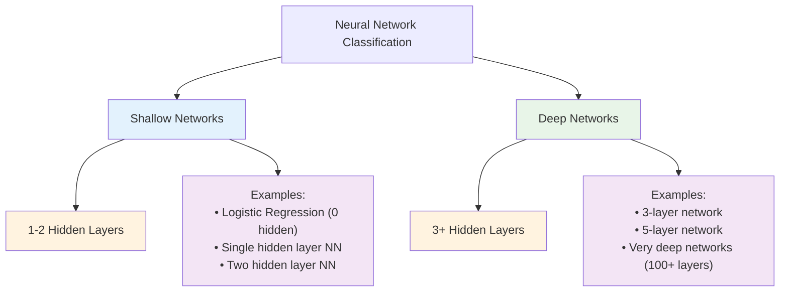

### L-layer Network Notation

For an **L-layer neural network**:

| Symbol    | Description                        | Example (4-layer network)                  |
| --------- | ---------------------------------- | ------------------------------------------ |
| **L**     | Number of layers (excluding input) | L = 4                                      |
| **n^[l]** | Number of units in layer l         | n^[1] = 5, n^[2] = 3, n^[3] = 3, n^[4] = 1 |
| **n^[0]** | Number of input features           | n^[0] = 2 (input layer)                    |
| **g^[l]** | Activation function for layer l    | g^[1] = ReLU, g^[4] = sigmoid              |
| **a^[l]** | Activations for layer l            | a^[0] = X (input), a^[L] = ŷ (output)      |
| **W^[l]** | Weight matrix for layer l          | Shape: (n^[l], n^[l-1])                    |
| **b^[l]** | Bias vector for layer l            | Shape: (n^[l], 1)                          |

### Example: 4-layer Network Architecture

```
Input Layer    Hidden Layer 1   Hidden Layer 2   Hidden Layer 3   Output Layer
   (n⁰=2)         (n¹=5)          (n²=3)          (n³=3)          (n⁴=1)

    x₁  ●           ●               ●               ●               ●
        ●    →      ●       →       ●       →       ●       →      ŷ
    x₂  ●           ●               ●               ●
                    ●
                    ●

  Layer 0         Layer 1        Layer 2        Layer 3        Layer 4
  (Input)        (Hidden)       (Hidden)       (Hidden)       (Output)
```

**Network specification:**

- **L = 4** (4 layers, excluding input)
- **Layer dimensions:** [2, 5, 3, 3, 1]
- **Weight matrices:** W^[1]:(5×2), W^[2]:(3×5), W^[3]:(3×3), W^[4]:(1×3)
- **Bias vectors:** b^[1]:(5×1), b^[2]:(3×1), b^[3]:(3×1), b^[4]:(1×1)

---

## Mathematical Foundation

### General Layer Computation

For any layer **l** in an L-layer network:

$$z^{[l]} = W^{[l]} a^{[l-1]} + b^{[l]}$$
$$a^{[l]} = g^{[l]}(z^{[l]})$$

Where:

- **Input:** $a^{[0]} = X$ (input features)
- **Output:** $a^{[L]} = \hat{y}$ (final prediction)

### Vectorized Form (Multiple Examples)

For **m** training examples:

$$Z^{[l]} = W^{[l]} A^{[l-1]} + b^{[l]}$$
$$A^{[l]} = g^{[l]}(Z^{[l]})$$

**Matrix dimensions:**

- $A^{[l]}$: $(n^{[l]}, m)$ - activations for all examples
- $Z^{[l]}$: $(n^{[l]}, m)$ - linear outputs for all examples
- $W^{[l]}$: $(n^{[l]}, n^{[l-1]})$ - weights
- $b^{[l]}$: $(n^{[l]}, 1)$ - biases (broadcast across examples)

---

# 2. Forward Propagation in Deep Networks

## Algorithm Structure

### 🔄 Sequential Computation Flow

Forward propagation in deep networks requires **systematic layer-by-layer computation** due to inherent dependencies between consecutive layers.

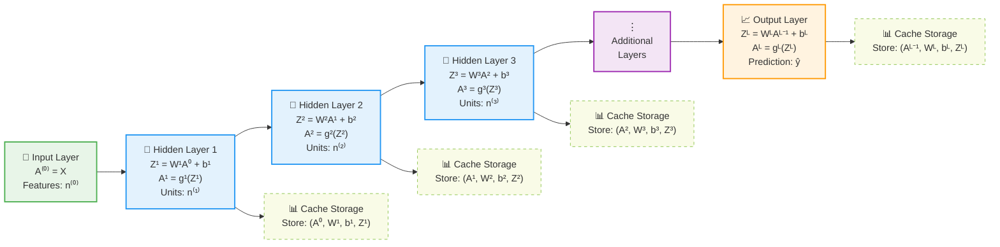

### 🔗 Layer Dependency Chain

**Key Insight**: Each layer **must wait** for the previous layer to complete computation.

$$
\begin{align}
\text{Layer } \ell: \quad A^{[\ell]} &= g^{[\ell]}(Z^{[\ell]}) \\
\text{where } Z^{[\ell]} &= W^{[\ell]} A^{[\ell-1]} + b^{[\ell]}
\end{align}
$$

**Dependencies:**

- $A^{[\ell]}$ depends on $A^{[\ell-1]}$
- $A^{[\ell-1]}$ depends on $A^{[\ell-2]}$
- And so on...

---

## Implementation Patterns

### 🚀 Optimized Deep Network Implementation

```python
def forward_propagation_deep(X, parameters, activations):
    """
    Forward propagation for L-layer neural network

    Arguments:
    X -- input data, shape (n_x, m)
    parameters -- dictionary containing W1, b1, ..., WL, bL
    activations -- list of activation functions for each layer

    Returns:
    AL -- final layer activations (predictions)
    caches -- list of caches containing intermediate values for backprop
    """
    caches = []
    A = X  # Initialize with input activations
    L = len(parameters) // 2  # Number of layers (W and b for each)

    print(f"🔄 Starting forward propagation for {L}-layer network")
    print(f"📊 Input shape: {X.shape}")

    # ================================
    # HIDDEN LAYERS (1 to L-1)
    # ================================
    for l in range(1, L):
        A_prev = A  # Store previous activations

        # Extract current layer parameters
        W = parameters[f'W{l}']
        b = parameters[f'b{l}']

        print(f"\n🧠 Processing Layer {l}:")
        print(f"   📐 W{l} shape: {W.shape}")
        print(f"   📐 b{l} shape: {b.shape}")
        print(f"   📐 A{l-1} shape: {A_prev.shape}")

        # Linear transformation
        Z = np.dot(W, A_prev) + b
        print(f"   ⚡ Linear: Z{l} = W{l} @ A{l-1} + b{l}")
        print(f"   📐 Z{l} shape: {Z.shape}")

        # Activation function
        activation_func = activations[l-1]
        if activation_func == "relu":
            A = np.maximum(0, Z)
        elif activation_func == "tanh":
            A = np.tanh(Z)
        elif activation_func == "sigmoid":
            A = 1 / (1 + np.exp(-np.clip(Z, -250, 250)))  # Numerical stability
        else:
            raise ValueError(f"Unknown activation: {activation_func}")

        print(f"   🎯 Activation: A{l} = {activation_func}(Z{l})")
        print(f"   📐 A{l} shape: {A.shape}")

        # Cache for backpropagation
        cache = (A_prev, W, b, Z)
        caches.append(cache)

    # ================================
    # OUTPUT LAYER (Layer L)
    # ================================
    print(f"\n📈 Processing Output Layer {L}:")
    AL_prev = A
    WL = parameters[f'W{L}']
    bL = parameters[f'b{L}']

    print(f"   📐 W{L} shape: {WL.shape}")
    print(f"   📐 b{L} shape: {bL.shape}")
    print(f"   📐 A{L-1} shape: {AL_prev.shape}")

    # Final linear transformation
    ZL = np.dot(WL, AL_prev) + bL
    print(f"   ⚡ Linear: Z{L} = W{L} @ A{L-1} + b{L}")
    print(f"   📐 Z{L} shape: {ZL.shape}")

    # Final activation (typically sigmoid for binary classification)
    final_activation = activations[L-1]
    if final_activation == "sigmoid":
        AL = 1 / (1 + np.exp(-np.clip(ZL, -250, 250)))
    elif final_activation == "softmax":
        exp_scores = np.exp(ZL - np.max(ZL, axis=0, keepdims=True))
        AL = exp_scores / np.sum(exp_scores, axis=0, keepdims=True)
    else:
        AL = ZL  # Linear output for regression

    print(f"   🎯 Final Activation: A{L} = {final_activation}(Z{L})")
    print(f"   📐 Final Output shape: {AL.shape}")

    # Cache final layer
    cache = (AL_prev, WL, bL, ZL)
    caches.append(cache)

    print(f"\n✅ Forward propagation complete!")
    print(f"📊 Prediction range: [{np.min(AL):.4f}, {np.max(AL):.4f}]")

    return AL, caches

def activation_function(Z, func_name):
    """Apply activation function with numerical stability"""
    if func_name == "relu":
        return np.maximum(0, Z)
    elif func_name == "tanh":
        return np.tanh(Z)
    elif func_name == "sigmoid":
        return 1 / (1 + np.exp(-np.clip(Z, -250, 250)))
    else:
        raise ValueError(f"Unknown activation function: {func_name}")
```

### 🔄 Why For Loops Are Necessary

Unlike vectorization across training examples, **for loops cannot be avoided** when processing layers:

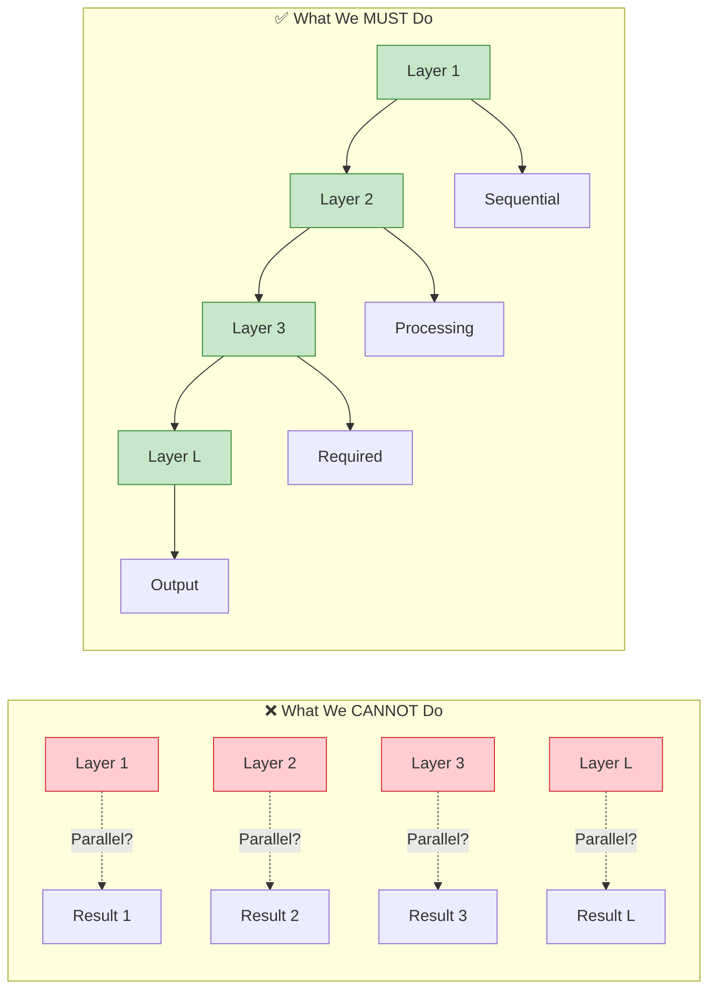

**Mathematical Reason:**
$$\boxed{A^{[\ell]} = g^{[\ell]}(W^{[\ell]} A^{[\ell-1]} + b^{[\ell]})}$$

**Layer $\ell$ cannot be computed until $A^{[\ell-1]}$ is available!**

---

## Concrete 4-Layer Example

### 🏗️ Network Architecture

Let's trace through a **4-layer neural network**:

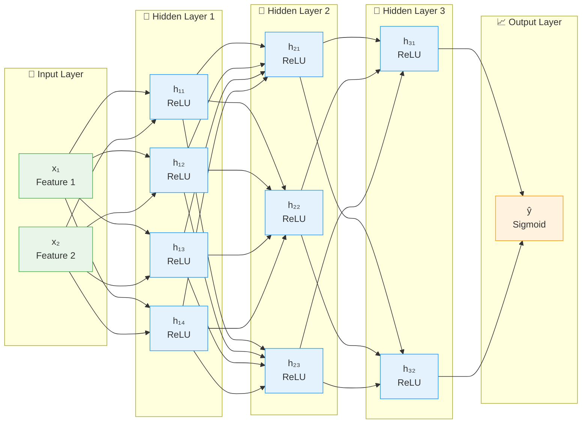

**Architecture Summary:**

- **Input:** 2 features
- **Layer 1:** 2 → 4 neurons (ReLU)
- **Layer 2:** 4 → 3 neurons (ReLU)
- **Layer 3:** 3 → 2 neurons (ReLU)
- **Layer 4:** 2 → 1 neuron (Sigmoid)
- **Training examples:** 3

### 📊 Parameter Setup

```python
import numpy as np

# =======================
# NETWORK PARAMETERS
# =======================

# Layer 1: Input(2) → Hidden(4)
W1 = np.array([
    [0.1, 0.2],   # Neuron 1 weights
    [0.3, 0.4],   # Neuron 2 weights
    [0.5, 0.6],   # Neuron 3 weights
    [0.7, 0.8]    # Neuron 4 weights
])  # Shape: (4, 2)

b1 = np.array([
    [0.1],  # Neuron 1 bias
    [0.2],  # Neuron 2 bias
    [0.3],  # Neuron 3 bias
    [0.4]   # Neuron 4 bias
])  # Shape: (4, 1)

# Layer 2: Hidden(4) → Hidden(3)
W2 = np.array([
    [0.1, 0.2, 0.3, 0.4],   # Neuron 1 weights
    [0.5, 0.6, 0.7, 0.8],   # Neuron 2 weights
    [0.9, 1.0, 1.1, 1.2]    # Neuron 3 weights
])  # Shape: (3, 4)

b2 = np.array([
    [0.1],  # Neuron 1 bias
    [0.2],  # Neuron 2 bias
    [0.3]   # Neuron 3 bias
])  # Shape: (3, 1)

# Layer 3: Hidden(3) → Hidden(2)
W3 = np.array([
    [0.1, 0.2, 0.3],   # Neuron 1 weights
    [0.4, 0.5, 0.6]    # Neuron 2 weights
])  # Shape: (2, 3)

b3 = np.array([
    [0.1],  # Neuron 1 bias
    [0.2]   # Neuron 2 bias
])  # Shape: (2, 1)

# Layer 4: Hidden(2) → Output(1)
W4 = np.array([
    [0.1, 0.2]   # Output neuron weights
])  # Shape: (1, 2)

b4 = np.array([
    [0.1]   # Output bias
])  # Shape: (1, 1)

# Training Data (3 examples)
X = np.array([
    [1.0, 2.0, 3.0],   # Feature 1 for examples 1, 2, 3
    [0.5, 1.5, 2.5]    # Feature 2 for examples 1, 2, 3
])  # Shape: (2, 3)

print("🔍 Parameter Shapes:")
print(f"W1: {W1.shape}, b1: {b1.shape}")
print(f"W2: {W2.shape}, b2: {b2.shape}")
print(f"W3: {W3.shape}, b3: {b3.shape}")
print(f"W4: {W4.shape}, b4: {b4.shape}")
print(f"X:  {X.shape}")
```

### 🧮 Step-by-Step Forward Pass

#### **Layer 1: Input(2) → Hidden(4)**

$$Z^{[1]} = W^{[1]} X + b^{[1]}$$

```python
print("\n" + "="*50)
print("🧠 LAYER 1: Input → Hidden (2 → 4)")
print("="*50)

# Matrix multiplication: (4,2) @ (2,3) = (4,3)
Z1 = np.dot(W1, X) + b1

print("🔢 Computing Z1 = W1 @ X + b1")
print(f"W1 shape: {W1.shape}")
print(f"X shape:  {X.shape}")
print(f"b1 shape: {b1.shape}")

print("\n📊 Detailed Matrix Multiplication:")
print("W1 @ X =")
for i in range(4):
    row_result = []
    for j in range(3):
        calculation = f"{W1[i,0]:.1f}×{X[0,j]:.1f} + {W1[i,1]:.1f}×{X[1,j]:.1f}"
        result = W1[i,0]*X[0,j] + W1[i,1]*X[1,j]
        row_result.append(f"{result:.1f}")
        print(f"  Row {i+1}, Col {j+1}: {calculation} = {result:.1f}")

print(f"\nZ1 (before bias):\n{np.dot(W1, X)}")
print(f"\nZ1 (after adding bias):\n{Z1}")

# Apply ReLU activation
A1 = np.maximum(0, Z1)
print(f"\n🎯 A1 = ReLU(Z1):\n{A1}")
print(f"A1 shape: {A1.shape}")
```

**Manual Calculation for Verification:**

$$
W^{[1]} = \begin{bmatrix}
0.1 & 0.2 \\
0.3 & 0.4 \\
0.5 & 0.6 \\
0.7 & 0.8
\end{bmatrix}, \quad
X = \begin{bmatrix}
1.0 & 2.0 & 3.0 \\
0.5 & 1.5 & 2.5
\end{bmatrix}
$$

**Row-by-row multiplication:**

- **Row 1:** $[0.1×1.0 + 0.2×0.5, 0.1×2.0 + 0.2×1.5, 0.1×3.0 + 0.2×2.5] = [0.2, 0.5, 0.8]$
- **Row 2:** $[0.3×1.0 + 0.4×0.5, 0.3×2.0 + 0.4×1.5, 0.3×3.0 + 0.4×2.5] = [0.5, 1.2, 1.9]$
- **Row 3:** $[0.5×1.0 + 0.6×0.5, 0.5×2.0 + 0.6×1.5, 0.5×3.0 + 0.6×2.5] = [0.8, 1.9, 3.0]$
- **Row 4:** $[0.7×1.0 + 0.8×0.5, 0.7×2.0 + 0.8×1.5, 0.7×3.0 + 0.8×2.5] = [1.1, 2.6, 4.1]$

$$
Z^{[1]} = \begin{bmatrix}
0.2 & 0.5 & 0.8 \\
0.5 & 1.2 & 1.9 \\
0.8 & 1.9 & 3.0 \\
1.1 & 2.6 & 4.1
\end{bmatrix} + \begin{bmatrix}
0.1 \\ 0.2 \\ 0.3 \\ 0.4
\end{bmatrix} = \begin{bmatrix}
0.3 & 0.6 & 0.9 \\
0.7 & 1.4 & 2.1 \\
1.1 & 2.2 & 3.3 \\
1.5 & 3.0 & 4.5
\end{bmatrix}
$$

**Apply ReLU activation:**

$$
A^{[1]} = \text{ReLU}(Z^{[1]}) = \begin{bmatrix}
0.3 & 0.6 & 0.9 \\
0.7 & 1.4 & 2.1 \\
1.1 & 2.2 & 3.3 \\
1.5 & 3.0 & 4.5
\end{bmatrix}
$$

#### **Layer 2: Hidden(4) → Hidden(3)**

```python
print("\n" + "="*50)
print("🧠 LAYER 2: Hidden → Hidden (4 → 3)")
print("="*50)

Z2 = np.dot(W2, A1) + b2
A2 = np.maximum(0, Z2)

print(f"Z2 = W2 @ A1 + b2")
print(f"W2 shape: {W2.shape}")
print(f"A1 shape: {A1.shape}")
print(f"Z2 shape: {Z2.shape}")
print(f"\nZ2:\n{Z2}")
print(f"\nA2 = ReLU(Z2):\n{A2}")
```

#### **Layer 3: Hidden(3) → Hidden(2)**

```python
print("\n" + "="*50)
print("🧠 LAYER 3: Hidden → Hidden (3 → 2)")
print("="*50)

Z3 = np.dot(W3, A2) + b3
A3 = np.maximum(0, Z3)

print(f"Z3 = W3 @ A2 + b3")
print(f"Z3:\n{Z3}")
print(f"A3 = ReLU(Z3):\n{A3}")
```

#### **Layer 4: Hidden(2) → Output(1)**

```python
print("\n" + "="*50)
print("📈 LAYER 4: Hidden → Output (2 → 1)")
print("="*50)

Z4 = np.dot(W4, A3) + b4

# Apply sigmoid activation for binary classification
A4 = 1 / (1 + np.exp(-Z4))

print(f"Z4 = W4 @ A3 + b4")
print(f"Z4:\n{Z4}")
print(f"A4 = Sigmoid(Z4):\n{A4}")
print(f"\n🎯 Final Predictions:")
for i in range(A4.shape[1]):
    print(f"   Example {i+1}: {A4[0,i]:.4f} ({'Positive' if A4[0,i] > 0.5 else 'Negative'})")
```

---

## Mathematical Foundations

### 📐 Dimension Analysis

For a network with layer sizes $n^{[0]} \rightarrow n^{[1]} \rightarrow n^{[2]} \rightarrow \cdots \rightarrow n^{[L]}$:

| Component    | Dimension                    | Description                                   |
| ------------ | ---------------------------- | --------------------------------------------- |
| $W^{[\ell]}$ | $(n^{[\ell]}, n^{[\ell-1]})$ | Weight matrix for layer $\ell$                |
| $b^{[\ell]}$ | $(n^{[\ell]}, 1)$            | Bias vector for layer $\ell$                  |
| $A^{[\ell]}$ | $(n^{[\ell]}, m)$            | Activations for layer $\ell$, $m$ examples    |
| $Z^{[\ell]}$ | $(n^{[\ell]}, m)$            | Linear outputs for layer $\ell$, $m$ examples |

### 🧮 Computational Complexity

**Operations per forward pass** for our 4-layer example:

| Layer           | Operation                   | Multiplications            | Additions                      | Total Ops |
| --------------- | --------------------------- | -------------------------- | ------------------------------ | --------- |
| **Layer 1**     | $W^{[1]} A^{[0]} + b^{[1]}$ | $2 \times 4 \times 3 = 24$ | $4 \times 3 + 4 \times 3 = 24$ | 48        |
| **Layer 2**     | $W^{[2]} A^{[1]} + b^{[2]}$ | $4 \times 3 \times 3 = 36$ | $3 \times 3 + 3 \times 3 = 18$ | 54        |
| **Layer 3**     | $W^{[3]} A^{[2]} + b^{[3]}$ | $3 \times 2 \times 3 = 18$ | $2 \times 3 + 2 \times 3 = 12$ | 30        |
| **Layer 4**     | $W^{[4]} A^{[3]} + b^{[4]}$ | $2 \times 1 \times 3 = 6$  | $1 \times 3 + 1 \times 3 = 6$  | 12        |
| **Activations** | ReLU, Sigmoid               | ~20 function calls         | -                              | ~20       |
| **Total**       | -                           | **84**                     | **60**                         | **164**   |

**General Formula:**
$$\text{Total Operations} = \sum_{\ell=1}^{L} \left[ n^{[\ell-1]} \times n^{[\ell]} \times m + 2 \times n^{[\ell]} \times m \right] + \sum_{\ell=1}^{L} n^{[\ell]} \times m$$

Where:

- First term: matrix multiplications and bias additions
- Second term: activation function evaluations

---

## Performance Considerations

### ⚡ Optimization Strategies

1. **Numerical Stability**

   ```python
   # Clip extreme values to prevent overflow
   Z_clipped = np.clip(Z, -250, 250)
   sigmoid_stable = 1 / (1 + np.exp(-Z_clipped))
   ```

2. **Memory Efficiency**

   ```python
   # In-place operations where possible
   np.maximum(0, Z, out=Z)  # In-place ReLU
   ```

3. **Vectorization**
   ```python
   # Process all examples simultaneously
   # Shape: (n_l, m) instead of loops over m examples
   ```

### 🔍 Common Issues and Solutions

| Issue                   | Problem                            | Solution                                    |
| ----------------------- | ---------------------------------- | ------------------------------------------- |
| **Vanishing Gradients** | Deep networks lose gradient signal | Use ReLU, batch norm, residual connections  |
| **Exploding Values**    | Numerical overflow in sigmoid/tanh | Gradient clipping, careful initialization   |
| **Slow Training**       | Poor convergence                   | Learning rate scheduling, better optimizers |
| **Memory Issues**       | Large networks exceed RAM          | Gradient checkpointing, model parallelism   |

---

## 🎯 Key Takeaways

### ✅ Core Concepts

1. **Sequential Nature**: Forward propagation **must** proceed layer by layer due to dependencies
2. **For Loops Required**: Unlike vectorization across examples, layer processing cannot be parallelized
3. **Cache Everything**: Store intermediate values $(A^{[\ell-1]}, W^{[\ell]}, b^{[\ell]}, Z^{[\ell]})$ for backpropagation
4. **Dimension Consistency**: Always verify matrix dimensions align for multiplication
5. **Numerical Stability**: Use clipping and stable implementations for activation functions

### 🧠 Implementation Best Practices

```python
def forward_propagation_checklist():
    """
    Essential checklist for implementing forward propagation
    """
    checklist = {
        "✅ Dimension Verification": [
            "Check W[l] @ A[l-1] compatibility",
            "Verify bias broadcasting works",
            "Confirm output shapes match expectations"
        ],
        "✅ Numerical Stability": [
            "Clip extreme values before sigmoid/tanh",
            "Use stable activation implementations",
            "Handle edge cases (empty inputs, etc.)"
        ],
        "✅ Caching Strategy": [
            "Store (A_prev, W, b, Z) for each layer",
            "Maintain cache order for backprop",
            "Consider memory vs computation tradeoffs"
        ],
        "✅ Error Handling": [
            "Validate input shapes and types",
            "Check for NaN/Inf values",
            "Provide meaningful error messages"
        ]
    }
    return checklist
```

### 📊 Complete Working Example

Here's a complete, production-ready implementation:

```python
import numpy as np
import matplotlib.pyplot as plt

class DeepNeuralNetwork:
    """
    Complete implementation of deep neural network forward propagation
    """

    def __init__(self, layer_dims, activations):
        """
        Initialize network architecture

        Arguments:
        layer_dims -- list containing dimensions of each layer
        activations -- list of activation functions for each layer
        """
        self.layer_dims = layer_dims
        self.activations = activations
        self.L = len(layer_dims) - 1  # Number of layers (excluding input)
        self.parameters = {}
        self.caches = []

        # Initialize parameters
        self._initialize_parameters()

    def _initialize_parameters(self):
        """Initialize weights and biases with proper scaling"""
        np.random.seed(42)

        for l in range(1, self.L + 1):
            # He initialization for ReLU, Xavier for tanh/sigmoid
            if self.activations[l-1] == 'relu':
                scale = np.sqrt(2.0 / self.layer_dims[l-1])
            else:
                scale = np.sqrt(1.0 / self.layer_dims[l-1])

            self.parameters[f'W{l}'] = np.random.randn(
                self.layer_dims[l],
                self.layer_dims[l-1]
            ) * scale

            self.parameters[f'b{l}'] = np.zeros((self.layer_dims[l], 1))

        print(f"🎯 Initialized {self.L}-layer network:")
        for l in range(1, self.L + 1):
            print(f"   Layer {l}: {self.layer_dims[l-1]} → {self.layer_dims[l]} ({self.activations[l-1]})")

    def _linear_forward(self, A_prev, W, b):
        """
        Compute linear part of forward propagation

        Returns:
        Z -- linear output
        cache -- tuple for backpropagation
        """
        Z = np.dot(W, A_prev) + b
        cache = (A_prev, W, b)
        return Z, cache

    def _activation_forward(self, Z, activation):
        """
        Apply activation function with numerical stability
        """
        if activation == "relu":
            A = np.maximum(0, Z)
        elif activation == "tanh":
            A = np.tanh(Z)
        elif activation == "sigmoid":
            # Numerically stable sigmoid
            Z_clipped = np.clip(Z, -250, 250)
            A = 1 / (1 + np.exp(-Z_clipped))
        elif activation == "softmax":
            # Numerically stable softmax
            exp_scores = np.exp(Z - np.max(Z, axis=0, keepdims=True))
            A = exp_scores / np.sum(exp_scores, axis=0, keepdims=True)
        else:
            raise ValueError(f"Unknown activation: {activation}")

        return A

    def forward_propagation(self, X, verbose=True):
        """
        Complete forward propagation through the network

        Arguments:
        X -- input data of shape (n_x, m)
        verbose -- whether to print detailed information

        Returns:
        AL -- final activations (predictions)
        caches -- list of caches for backpropagation
        """
        if verbose:
            print("\n" + "="*60)
            print("🚀 STARTING FORWARD PROPAGATION")
            print("="*60)
            print(f"📊 Input shape: {X.shape}")
            print(f"🏗️  Network: {' → '.join(map(str, self.layer_dims))}")
            print(f"🎯 Activations: {self.activations}")

        self.caches = []
        A = X

        # Forward propagation through L layers
        for l in range(1, self.L + 1):
            A_prev = A
            W = self.parameters[f'W{l}']
            b = self.parameters[f'b{l}']

            if verbose:
                print(f"\n🧠 Layer {l}:")
                print(f"   📐 Input shape:  {A_prev.shape}")
                print(f"   📐 Weight shape: {W.shape}")
                print(f"   📐 Bias shape:   {b.shape}")

            # Linear forward
            Z, linear_cache = self._linear_forward(A_prev, W, b)

            # Activation forward
            A = self._activation_forward(Z, self.activations[l-1])

            if verbose:
                print(f"   ⚡ Linear output shape: {Z.shape}")
                print(f"   🎯 Activation ({self.activations[l-1]}) output: {A.shape}")
                print(f"   📊 Activation range: [{np.min(A):.4f}, {np.max(A):.4f}]")

            # Store cache
            cache = (linear_cache, Z, self.activations[l-1])
            self.caches.append(cache)

        if verbose:
            print(f"\n✅ Forward propagation complete!")
            print(f"📈 Final predictions shape: {A.shape}")
            print(f"🎯 Prediction summary:")
            print(f"   Min: {np.min(A):.6f}")
            print(f"   Max: {np.max(A):.6f}")
            print(f"   Mean: {np.mean(A):.6f}")

        return A, self.caches

    def predict(self, X, threshold=0.5):
        """Make predictions on new data"""
        probabilities, _ = self.forward_propagation(X, verbose=False)

        if self.activations[-1] == 'sigmoid':
            predictions = (probabilities > threshold).astype(int)
        elif self.activations[-1] == 'softmax':
            predictions = np.argmax(probabilities, axis=0)
        else:
            predictions = probabilities  # Regression case

        return predictions, probabilities

# ================================
# DEMONSTRATION WITH REAL DATA
# ================================

def demonstrate_forward_propagation():
    """Complete demonstration of forward propagation"""

    print("🎓 DEEP NEURAL NETWORK FORWARD PROPAGATION DEMO")
    print("=" * 70)

    # Create sample dataset
    np.random.seed(123)
    m = 5  # Number of examples
    X = np.random.randn(3, m)  # 3 features, 5 examples

    print(f"📊 Sample Data:")
    print(f"   Shape: {X.shape}")
    print(f"   Sample values:\n{X}")

    # Define network architecture
    layer_dims = [3, 4, 3, 2, 1]  # 3→4→3→2→1
    activations = ['relu', 'relu', 'relu', 'sigmoid']

    # Create and run network
    network = DeepNeuralNetwork(layer_dims, activations)

    # Forward propagation
    predictions, caches = network.forward_propagation(X)

    # Make binary predictions
    binary_preds, probabilities = network.predict(X)

    print(f"\n🎯 FINAL RESULTS:")
    print(f"   Probabilities: {probabilities.flatten()}")
    print(f"   Binary predictions: {binary_preds.flatten()}")

    # Performance analysis
    print(f"\n📈 PERFORMANCE ANALYSIS:")
    total_params = sum(p.size for p in network.parameters.values())
    print(f"   Total parameters: {total_params:,}")

    # Calculate theoretical operations
    total_ops = 0
    for l in range(1, len(layer_dims)):
        ops = layer_dims[l-1] * layer_dims[l] * m  # Matrix multiplication
        ops += layer_dims[l] * m  # Bias addition
        ops += layer_dims[l] * m  # Activation function
        total_ops += ops

    print(f"   Operations per forward pass: {total_ops:,}")
    print(f"   Operations per example: {total_ops // m:,}")

# Run the demonstration
if __name__ == "__main__":
    demonstrate_forward_propagation()
```

### 🎯 Practice Exercises

1. **Exercise 1**: Implement forward propagation for a 5-layer network with mixed activations
2. **Exercise 2**: Add batch normalization to the forward pass
3. **Exercise 3**: Implement residual connections
4. **Exercise 4**: Create a network with different layer types (dense, convolutional)
5. **Exercise 5**: Optimize the implementation for GPU execution

---

## 📋 Summary Checklist

Before moving to backpropagation, ensure you understand:

- [ ] **Sequential Processing**: Why layers must be processed in order
- [ ] **Matrix Dimensions**: How to verify shape compatibility
- [ ] **Activation Functions**: Different types and their properties
- [ ] **Numerical Stability**: Techniques to prevent overflow/underflow
- [ ] **Caching Strategy**: What to store for efficient backpropagation
- [ ] **Performance Optimization**: Vectorization and efficiency considerations
- [ ] **Error Handling**: Common issues and debugging techniques

---

_📝 These enhanced notes provide a comprehensive foundation for understanding forward propagation in deep neural networks. Practice implementing these concepts to solidify your understanding!_

# 3. Matrix Dimensions in Deep Networks

## Critical Importance of Dimension Tracking

Getting matrix dimensions right is **essential** for successful deep learning implementation. Wrong dimensions lead to:

- Runtime errors
- Silent bugs producing incorrect results
- Failed gradient computations

---

## General Dimension Rules

### For L-layer Neural Network

| Component               | Dimension              | Notes                          |
| ----------------------- | ---------------------- | ------------------------------ |
| **Input**               | $(n^{[0]}, m)$         | Features × Examples            |
| **Weights W^[l]**       | $(n^{[l]}, n^{[l-1]})$ | Current layer × Previous layer |
| **Biases b^[l]**        | $(n^{[l]}, 1)$         | Current layer × 1              |
| **Linear output Z^[l]** | $(n^{[l]}, m)$         | Current layer × Examples       |
| **Activations A^[l]**   | $(n^{[l]}, m)$         | Current layer × Examples       |

### Memory and Time Complexity

For an L-layer network with layer sizes $[n^{[0]}, n^{[1]}, ..., n^{[L]}]$ and $m$ examples:

**Forward propagation cost:**

- **Time complexity:** $O(\sum_{l=1}^{L} n^{[l]} \cdot n^{[l-1]} \cdot m)$
- **Space complexity:** $O(\sum_{l=1}^{L} n^{[l]} \cdot m)$ for storing activations

**Parameter count:**
$$\text{Total parameters} = \sum_{l=1}^{L} (n^{[l]} \cdot n^{[l-1]} + n^{[l]})$$

---

## Dimension Debugging Strategy

### The "Pencil and Paper" Method

Andrew Ng strongly recommends manually checking dimensions:

```python
def check_dimensions(parameters, layer_dims):
    """
    Verify all parameter dimensions match expected values
    """
    L = len(layer_dims) - 1  # Number of layers (excluding input)

    print(f"Network architecture: {layer_dims}")
    print(f"Number of layers: {L}")

    for l in range(1, L + 1):
        W_expected = (layer_dims[l], layer_dims[l-1])
        b_expected = (layer_dims[l], 1)

        W_actual = parameters[f'W{l}'].shape
        b_actual = parameters[f'b{l}'].shape

        print(f"Layer {l}:")
        print(f"  W{l}: expected {W_expected}, actual {W_actual} ✓" if W_expected == W_actual else f"  W{l}: expected {W_expected}, actual {W_actual} ✗")
        print(f"  b{l}: expected {b_expected}, actual {b_actual} ✓" if b_expected == b_actual else f"  b{l}: expected {b_expected}, actual {b_actual} ✗")

# Example usage
layer_dims = [2, 4, 3, 1]  # [input, hidden1, hidden2, output]
check_dimensions(parameters, layer_dims)
```

### Common Dimension Errors

1. **Wrong weight matrix orientation:** $(n^{[l-1]}, n^{[l]})$ instead of $(n^{[l]}, n^{[l-1]})$
2. **Bias dimension mismatch:** $(1, n^{[l]})$ instead of $(n^{[l]}, 1)$
3. **Input format confusion:** Features as columns instead of rows

---

# 4. Why Deep Representations?

## Intuitive Understanding

Deep networks learn **hierarchical representations** - simple features combine into complex patterns.

### Example 1: Face Recognition

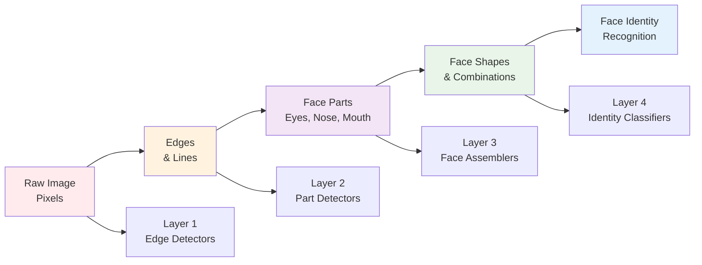

**Layer progression:**

- **Layer 1:** Detects edges and simple patterns
- **Layer 2:** Combines edges into face parts (eyes, nose)
- **Layer 3:** Assembles parts into face shapes
- **Layer 4:** Recognizes specific identities

### Example 2: Speech Recognition

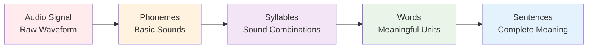

**Feature hierarchy:**

- **Low-level:** Individual sound frequencies
- **Mid-level:** Phonemes and syllables
- **High-level:** Words and sentences

---

## Circuit Theory and Deep Learning

### Theoretical Foundation

Deep networks can compute certain functions much more efficiently than shallow networks.

**Key insight:** Some functions require **exponentially** more hidden units in shallow networks compared to deep networks.

### Mathematical Example: Parity Function

**Problem:** Determine if the number of 1's in a binary input is even or odd.

**Shallow network:** Requires $O(2^n)$ hidden units for $n$ inputs
**Deep network:** Requires $O(n)$ hidden units with $O(\log n)$ layers

```python
# Example: 4-bit parity
def parity_shallow(x1, x2, x3, x4):
    # Requires 16 hidden units to enumerate all cases
    # Each unit checks one of the 16 possible inputs
    pass

def parity_deep(x1, x2, x3, x4):
    # Layer 1: Compute pairwise XOR (2 units)
    h1 = x1 XOR x2
    h2 = x3 XOR x4

    # Layer 2: Compute final XOR (1 unit)
    output = h1 XOR h2
    return output
```

### Practical Benefits of Depth

1. **Parameter efficiency:** Fewer parameters for the same representational power
2. **Better generalization:** Hierarchical features are more transferable
3. **Computational efficiency:** Layer-wise computation enables optimization tricks

---

## Empirical Evidence

### Start Simple, Then Go Deep

Andrew Ng's recommended approach:

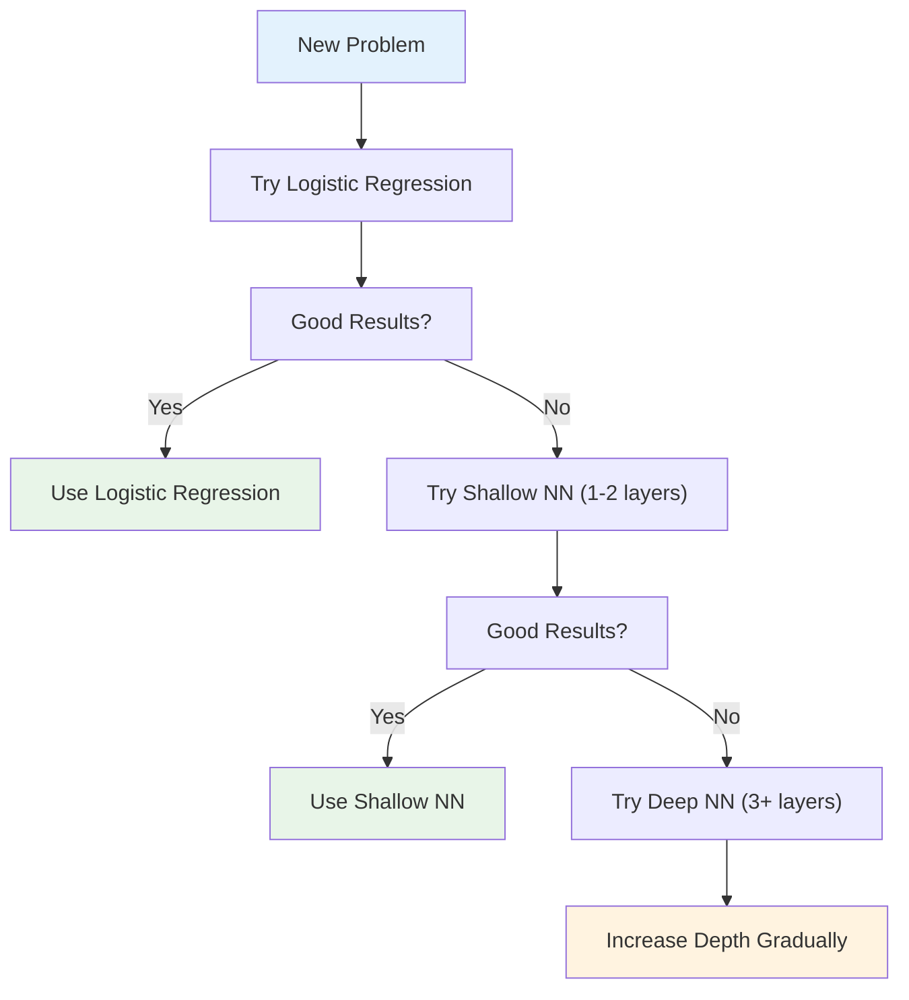

**Reasoning:**

- Simple problems may not need deep representations
- Complexity should match the problem's inherent structure
- Deep networks require more data and careful tuning

---

# 5. Building Blocks of Deep Neural Networks

## Conceptual Framework

Each layer in a deep network follows the same computational pattern, making implementation modular and systematic.

### Layer Block Structure

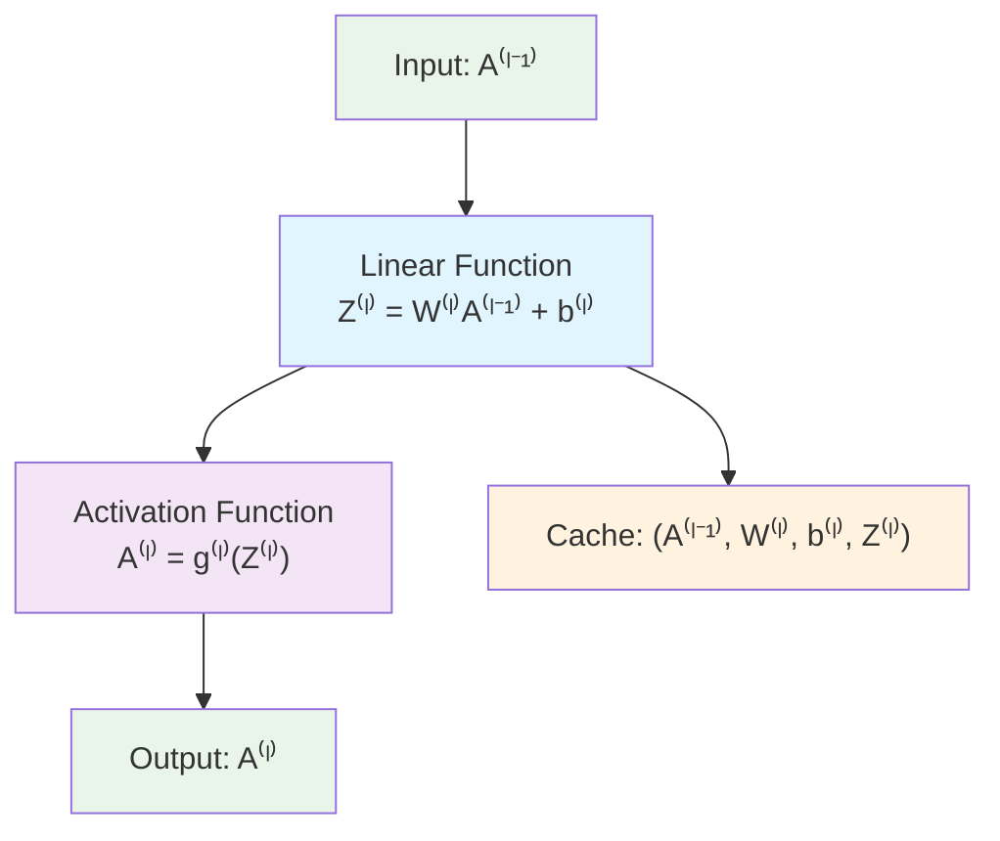

### Forward Propagation Block

**Pseudo-code for layer l:**

```
Input: A[l-1]
Z[l] = W[l] * A[l-1] + b[l]
A[l] = g[l](Z[l])
Cache = (A[l-1], W[l], b[l], Z[l])  # For backpropagation
Output: A[l], Cache
```

### Complete Network Structure

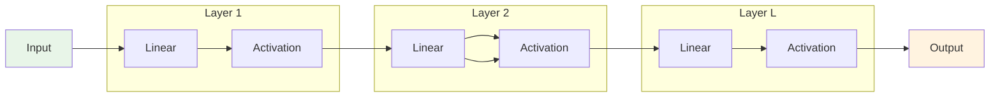

---

## Modular Implementation

### Linear Forward Function

```python
def linear_forward(A, W, b):
    """
    Implement the linear part of a layer's forward propagation

    Arguments:
    A -- activations from previous layer: (size of previous layer, number of examples)
    W -- weights matrix: (size of current layer, size of previous layer)
    b -- bias vector: (size of current layer, 1)

    Returns:
    Z -- the input of the activation function (pre-activation parameter)
    cache -- a python tuple containing "A", "W" and "b"; stored for efficient backward pass
    """
    Z = np.dot(W, A) + b
    cache = (A, W, b)

    return Z, cache
```

### Activation Forward Function

```python
def activation_forward(A_prev, W, b, activation):
    """
    Implement the forward propagation for LINEAR->ACTIVATION layer

    Arguments:
    A_prev -- activations from previous layer
    W -- weights matrix
    b -- bias vector
    activation -- the activation to be used: "sigmoid", "relu", "tanh"

    Returns:
    A -- the output of the activation function
    cache -- tuple containing "linear_cache" and "activation_cache"
    """
    # Linear forward
    Z, linear_cache = linear_forward(A_prev, W, b)

    # Activation forward
    if activation == "sigmoid":
        A = sigmoid(Z)
    elif activation == "relu":
        A = relu(Z)
    elif activation == "tanh":
        A = np.tanh(Z)

    activation_cache = Z
    cache = (linear_cache, activation_cache)

    return A, cache
```

### Complete L-layer Forward Propagation

```python
def forward_propagation_L_layers(X, parameters, activations):
    """
    Implement forward propagation for the L-layer neural network

    Arguments:
    X -- data, shape (input size, number of examples)
    parameters -- output of initialize_parameters_deep()
    activations -- list of activations for each layer (excluding input)

    Returns:
    AL -- last post-activation value
    caches -- list of caches for each layer
    """
    caches = []
    A = X
    L = len(parameters) // 2  # number of layers

    # Implement [LINEAR -> ACTIVATION] * (L-1)
    for l in range(1, L):
        A_prev = A
        A, cache = activation_forward(A_prev,
                                     parameters[f'W{l}'],
                                     parameters[f'b{l}'],
                                     activations[l-1])
        caches.append(cache)

    # Implement LINEAR -> ACTIVATION for output layer
    AL, cache = activation_forward(A,
                                  parameters[f'W{L}'],
                                  parameters[f'b{L}'],
                                  activations[L-1])
    caches.append(cache)

    return AL, caches
```

---

# 6. Forward and Backward Propagation

## Forward Propagation Review

We've covered forward propagation extensively. Here's the mathematical summary:

**For layer l:**
$$Z^{[l]} = W^{[l]} A^{[l-1]} + b^{[l]}$$
$$A^{[l]} = g^{[l]}(Z^{[l]})$$

**Caching for backpropagation:**
Cache = $(A^{[l-1]}, W^{[l]}, b^{[l]}, Z^{[l]})$

---

## Backward Propagation in Deep Networks

### Mathematical Derivation

The goal is to compute $\frac{\partial \mathcal{L}}{\partial W^{[l]}}$ and $\frac{\partial \mathcal{L}}{\partial b^{[l]}}$ for all layers.

#### Chain Rule Application

For layer l, we need:

$$\frac{\partial \mathcal{L}}{\partial W^{[l]}} = \frac{\partial \mathcal{L}}{\partial Z^{[l]}} \frac{\partial Z^{[l]}}{\partial W^{[l]}}$$

$$\frac{\partial \mathcal{L}}{\partial b^{[l]}} = \frac{\partial \mathcal{L}}{\partial Z^{[l]}} \frac{\partial Z^{[l]}}{\partial b^{[l]}}$$

#### Step-by-Step Mathematical Derivation

**Step 1: Compute $dZ^{[l]}$**

Given $dA^{[l]}$ (gradient flowing from layer l+1), we need:

$$dZ^{[l]} = dA^{[l]} \star g'^{[l]}(Z^{[l]})$$

Where $\star$ denotes element-wise multiplication.

**Activation function derivatives:**

For **ReLU**: $g'(z) = \begin{cases} 1 & \text{if } z > 0 \\ 0 & \text{if } z \leq 0 \end{cases}$

For **Sigmoid**: $g'(z) = g(z)(1-g(z)) = A^{[l]}(1-A^{[l]})$

For **Tanh**: $g'(z) = 1 - (g(z))^2 = 1 - (A^{[l]})^2$

**Step 2: Compute $dW^{[l]}$**

Starting from the chain rule:
$$\frac{\partial \mathcal{L}}{\partial W^{[l]}} = \frac{\partial \mathcal{L}}{\partial Z^{[l]}} \frac{\partial Z^{[l]}}{\partial W^{[l]}}$$

Since $Z^{[l]} = W^{[l]} A^{[l-1]} + b^{[l]}$:
$$\frac{\partial Z^{[l]}}{\partial W^{[l]}} = A^{[l-1]}$$

But we need to be careful about dimensions. For the full vectorized case:

$$dW^{[l]} = \frac{1}{m} dZ^{[l]} (A^{[l-1]})^T$$

**Dimensional analysis:**

- $dZ^{[l]}$: $(n^{[l]}, m)$
- $A^{[l-1]}$: $(n^{[l-1]}, m)$
- $(A^{[l-1]})^T$: $(m, n^{[l-1]})$
- $dW^{[l]}$: $(n^{[l]}, n^{[l-1]})$ ✓

**Step 3: Compute $db^{[l]}$**

$$\frac{\partial \mathcal{L}}{\partial b^{[l]}} = \frac{\partial \mathcal{L}}{\partial Z^{[l]}} \frac{\partial Z^{[l]}}{\partial b^{[l]}}$$

Since $\frac{\partial Z^{[l]}}{\partial b^{[l]}} = 1$:

$$db^{[l]} = \frac{1}{m} \sum_{i=1}^{m} dZ^{[l](i)}$$

In NumPy: `db[l] = (1/m) * np.sum(dZ[l], axis=1, keepdims=True)`

**Step 4: Compute $dA^{[l-1]}$ (for propagation to previous layer)**

$$\frac{\partial \mathcal{L}}{\partial A^{[l-1]}} = \frac{\partial \mathcal{L}}{\partial Z^{[l]}} \frac{\partial Z^{[l]}}{\partial A^{[l-1]}}$$

Since $Z^{[l]} = W^{[l]} A^{[l-1]} + b^{[l]}$:
$$\frac{\partial Z^{[l]}}{\partial A^{[l-1]}} = W^{[l]}$$

Therefore:
$$dA^{[l-1]} = (W^{[l]})^T dZ^{[l]}$$

**Dimensional analysis:**

- $(W^{[l]})^T$: $(n^{[l-1]}, n^{[l]})$
- $dZ^{[l]}$: $(n^{[l]}, m)$
- $dA^{[l-1]}$: $(n^{[l-1]}, m)$ ✓

### Complete Backward Propagation Algorithm

```python
def backward_propagation_L_layers(AL, Y, caches, activations):
    """
    Implement the backward propagation for the L-layer neural network

    Arguments:
    AL -- probability vector, output of the forward propagation
    Y -- true "label" vector
    caches -- list of caches containing (linear_cache, activation_cache)
    activations -- list of activation functions used in forward pass

    Returns:
    grads -- A dictionary with the gradients
    """
    grads = {}
    L = len(caches)  # the number of layers
    m = AL.shape[1]
    Y = Y.reshape(AL.shape)

    # Initializing the backpropagation
    # For binary classification with sigmoid output
    dAL = -(np.divide(Y, AL) - np.divide(1 - Y, 1 - AL))

    # Backward propagation for output layer (sigmoid activation)
    current_cache = caches[L-1]
    grads[f"dA{L-1}"], grads[f"dW{L}"], grads[f"db{L}"] = \
        activation_backward(dAL, current_cache, "sigmoid")

    # Loop from l=L-2 to l=0
    for l in reversed(range(L-1)):
        current_cache = caches[l]
        dA_prev_temp, dW_temp, db_temp = \
            activation_backward(grads[f"dA{l+1}"], current_cache, activations[l])

        grads[f"dA{l}"] = dA_prev_temp
        grads[f"dW{l+1}"] = dW_temp
        grads[f"db{l+1}"] = db_temp

    return grads
```

### Detailed Activation Backward Functions

```python
def linear_backward(dZ, cache):
    """
    Implement the linear portion of backward propagation for a single layer

    Arguments:
    dZ -- Gradient of the cost with respect to the linear output
    cache -- tuple of values (A_prev, W, b) from forward propagation

    Returns:
    dA_prev -- Gradient of cost with respect to the activation of previous layer
    dW -- Gradient of cost with respect to W (current layer)
    db -- Gradient of cost with respect to b (current layer)
    """
    A_prev, W, b = cache
    m = A_prev.shape[1]

    dW = (1 / m) * np.dot(dZ, A_prev.T)
    db = (1 / m) * np.sum(dZ, axis=1, keepdims=True)
    dA_prev = np.dot(W.T, dZ)

    return dA_prev, dW, db

def activation_backward(dA, cache, activation):
    """
    Implement backward propagation for LINEAR->ACTIVATION layer

    Arguments:
    dA -- post-activation gradient for current layer
    cache -- tuple of values (linear_cache, activation_cache)
    activation -- the activation function used: "relu", "sigmoid", "tanh"

    Returns:
    dA_prev -- Gradient of cost with respect to activation of previous layer
    dW -- Gradient of cost with respect to W (current layer)
    db -- Gradient of cost with respect to b (current layer)
    """
    linear_cache, activation_cache = cache

    if activation == "relu":
        dZ = relu_backward(dA, activation_cache)
    elif activation == "sigmoid":
        dZ = sigmoid_backward(dA, activation_cache)
    elif activation == "tanh":
        dZ = tanh_backward(dA, activation_cache)

    dA_prev, dW, db = linear_backward(dZ, linear_cache)

    return dA_prev, dW, db

def relu_backward(dA, cache):
    """
    Implement backward propagation for a single RELU unit
    """
    Z = cache
    dZ = np.array(dA, copy=True)
    dZ[Z <= 0] = 0  # When Z <= 0, derivative is 0
    return dZ

def sigmoid_backward(dA, cache):
    """
    Implement backward propagation for a single SIGMOID unit
    """
    Z = cache
    s = 1 / (1 + np.exp(-Z))
    dZ = dA * s * (1 - s)
    return dZ

def tanh_backward(dA, cache):
    """
    Implement backward propagation for a single TANH unit
    """
    Z = cache
    tanh_Z = np.tanh(Z)
    dZ = dA * (1 - tanh_Z**2)
    return dZ
```

### Backpropagation Flow Diagram

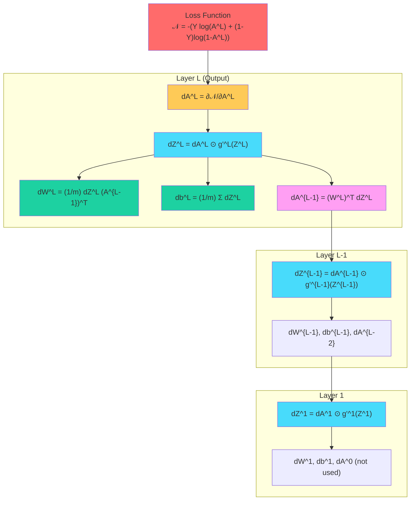

---

## 7. Parameters vs Hyperparameters

Understanding the distinction between parameters and hyperparameters is crucial for effective deep learning.

### Parameters

**Definition:** Variables that the model learns during training.

**Examples:**

- Weight matrices: $W^{[1]}, W^{[2]}, ..., W^{[L]}$
- Bias vectors: $b^{[1]}, b^{[2]}, ..., b^{[L]}$

**Characteristics:**

- Automatically optimized by gradient descent
- Values change during training
- Determine the model's predictions

### Hyperparameters

**Definition:** Configuration settings that control the learning process.

**Categories and Examples:**

#### 1. **Training Hyperparameters**

- **Learning rate (α):** Controls step size in gradient descent
- **Number of iterations/epochs:** How long to train
- **Batch size:** Number of examples per gradient update

#### 2. **Architecture Hyperparameters**

- **Number of hidden layers (L):** Network depth
- **Number of hidden units ($n^{[l]}$):** Layer width
- **Activation functions:** ReLU, sigmoid, tanh, etc.

#### 3. **Regularization Hyperparameters**

- **Dropout rate:** Fraction of neurons to randomly disable
- **L2 regularization parameter (λ):** Weight decay strength

#### 4. **Optimization Hyperparameters**

- **Momentum:** Accelerates gradient descent
- **Learning rate decay:** Reduces α over time
- **Adam parameters:** β₁, β₂, ε for adaptive learning rates

### Hyperparameter Tuning Strategy

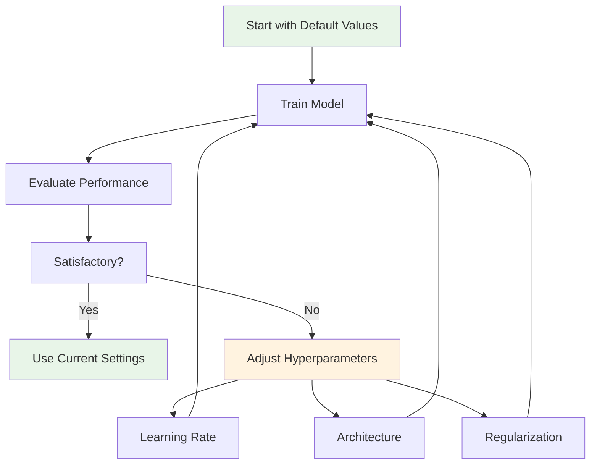

**Recommended tuning order:**

1. **Learning rate:** Most impactful hyperparameter
2. **Architecture:** Number of layers and units
3. **Regularization:** Prevent overfitting
4. **Advanced optimization:** Momentum, Adam, etc.

### Historical Note

In early machine learning literature, the learning rate was sometimes called a "parameter." However, modern terminology consistently refers to it as a hyperparameter since it's not learned by the algorithm but set by the practitioner.

---

## 8. Complete Implementation: L-layer Neural Network

### Full Implementation Framework

```python
import numpy as np
import matplotlib.pyplot as plt

class LLayerNeuralNetwork:
    """
    Complete implementation of L-layer neural network
    """

    def __init__(self, layer_dims, activations, learning_rate=0.0075):
        """
        Initialize the L-layer neural network

        Arguments:
        layer_dims -- list containing input size and each layer size
        activations -- list of activation functions for each layer
        learning_rate -- learning rate for gradient descent
        """
        self.layer_dims = layer_dims
        self.activations = activations
        self.learning_rate = learning_rate
        self.L = len(layer_dims) - 1  # Number of layers
        self.costs = []

        # Initialize parameters
        self.parameters = self.initialize_parameters()

    def initialize_parameters(self):
        """
        Initialize parameters using He initialization for ReLU, Xavier for others
        """
        np.random.seed(42)
        parameters = {}

        for l in range(1, self.L + 1):
            if self.activations[l-1] == "relu":
                # He initialization for ReLU
                parameters[f'W{l}'] = np.random.randn(self.layer_dims[l],
                                                    self.layer_dims[l-1]) * np.sqrt(2 / self.layer_dims[l-1])
            else:
                # Xavier initialization for sigmoid/tanh
                parameters[f'W{l}'] = np.random.randn(self.layer_dims[l],
                                                    self.layer_dims[l-1]) * np.sqrt(1 / self.layer_dims[l-1])

            parameters[f'b{l}'] = np.zeros((self.layer_dims[l], 1))

        return parameters

    def forward_propagation(self, X):
        """
        Implement forward propagation for L-layer neural network
        """
        caches = []
        A = X

        # Forward propagation through L-1 layers
        for l in range(1, self.L):
            A_prev = A
            W = self.parameters[f'W{l}']
            b = self.parameters[f'b{l}']

            Z = np.dot(W, A_prev) + b

            if self.activations[l-1] == "relu":
                A = np.maximum(0, Z)
            elif self.activations[l-1] == "tanh":
                A = np.tanh(Z)
            elif self.activations[l-1] == "sigmoid":
                A = 1 / (1 + np.exp(-np.clip(Z, -500, 500)))

            cache = (A_prev, W, b, Z)
            caches.append(cache)

        # Output layer
        A_prev = A
        W = self.parameters[f'W{self.L}']
        b = self.parameters[f'b{self.L}']

        Z = np.dot(W, A_prev) + b
        A = 1 / (1 + np.exp(-np.clip(Z, -500, 500)))  # Sigmoid for output

        cache = (A_prev, W, b, Z)
        caches.append(cache)

        return A, caches

    def compute_cost(self, AL, Y):
        """
        Implement the cost function for binary classification
        """
        m = Y.shape[1]

        # Clip to prevent log(0)
        AL = np.clip(AL, 1e-8, 1 - 1e-8)

        cost = -1/m * np.sum(Y * np.log(AL) + (1 - Y) * np.log(1 - AL))
        cost = np.squeeze(cost)

        return cost

    def backward_propagation(self, AL, Y, caches):
        """
        Implement backward propagation for L-layer neural network
        """
        grads = {}
        m = AL.shape[1]
        Y = Y.reshape(AL.shape)

        # Initialize backpropagation
        dAL = -(np.divide(Y, AL) - np.divide(1 - Y, 1 - AL))

        # Output layer (sigmoid)
        current_cache = caches[self.L - 1]
        A_prev, W, b, Z = current_cache

        dZ = AL - Y  # Simplified for sigmoid + cross-entropy
        grads[f"dW{self.L}"] = 1/m * np.dot(dZ, A_prev.T)
        grads[f"db{self.L}"] = 1/m * np.sum(dZ, axis=1, keepdims=True)
        grads[f"dA{self.L-1}"] = np.dot(W.T, dZ)

        # Hidden layers
        for l in reversed(range(self.L - 1)):
            current_cache = caches[l]
            A_prev, W, b, Z = current_cache

            dA = grads[f"dA{l+1}"]

            if self.activations[l] == "relu":
                dZ = dA.copy()
                dZ[Z <= 0] = 0
            elif self.activations[l] == "tanh":
                dZ = dA * (1 - np.tanh(Z)**2)
            elif self.activations[l] == "sigmoid":
                s = 1 / (1 + np.exp(-Z))
                dZ = dA * s * (1 - s)

            grads[f"dW{l+1}"] = 1/m * np.dot(dZ, A_prev.T)
            grads[f"db{l+1}"] = 1/m * np.sum(dZ, axis=1, keepdims=True)

            if l > 0:  # Don't compute dA[0]
                grads[f"dA{l}"] = np.dot(W.T, dZ)

        return grads

    def update_parameters(self, grads):
        """
        Update parameters using gradient descent
        """
        for l in range(1, self.L + 1):
            self.parameters[f"W{l}"] -= self.learning_rate * grads[f"dW{l}"]
            self.parameters[f"b{l}"] -= self.learning_rate * grads[f"db{l}"]

    def train(self, X, Y, num_iterations=3000, print_cost=True, print_every=100):
        """
        Train the L-layer neural network
        """
        self.costs = []

        for i in range(num_iterations):
            # Forward propagation
            AL, caches = self.forward_propagation(X)

            # Compute cost
            cost = self.compute_cost(AL, Y)
            self.costs.append(cost)

            # Backward propagation
            grads = self.backward_propagation(AL, Y, caches)

            # Update parameters
            self.update_parameters(grads)

            # Print cost
            if print_cost and i % print_every == 0:
                print(f"Cost after iteration {i}: {cost}")

    def predict(self, X):
        """
        Make predictions using the trained model
        """
        AL, _ = self.forward_propagation(X)
        predictions = (AL > 0.5).astype(int)
        return predictions, AL

    def plot_cost(self):
        """
        Plot the cost function
        """
        plt.figure(figsize=(10, 6))
        plt.plot(self.costs)
        plt.xlabel('Iterations')
        plt.ylabel('Cost')
        plt.title('Learning Curve')
        plt.grid(True)
        plt.show()

# Helper functions for activation functions
def relu(Z):
    return np.maximum(0, Z)

def sigmoid(Z):
    return 1 / (1 + np.exp(-np.clip(Z, -500, 500)))

def tanh(Z):
    return np.tanh(Z)
```

### Usage Example

```python
# Example: 4-layer neural network for binary classification
# Architecture: input -> 20 -> 7 -> 5 -> 1

# Define architecture
layer_dims = [2, 20, 7, 5, 1]  # [input_size, hidden1, hidden2, hidden3, output]
activations = ["relu", "relu", "relu", "sigmoid"]  # activations for each layer

# Create and train model
model = LLayerNeuralNetwork(layer_dims, activations, learning_rate=0.0075)

# Generate sample data (replace with your actual data)
np.random.seed(42)
X = np.random.randn(2, 1000)  # 2 features, 1000 examples
Y = (X[0, :] + X[1, :] > 0).astype(int).reshape(1, -1)  # Simple classification

# Train the model
model.train(X, Y, num_iterations=2500, print_cost=True)

# Make predictions
predictions, probabilities = model.predict(X)

# Calculate accuracy
accuracy = np.mean(predictions == Y)
print(f"Training Accuracy: {accuracy * 100:.2f}%")

# Plot learning curve
model.plot_cost()
```

### Advanced Features

#### 1. **Learning Rate Decay**

```python
def train_with_decay(self, X, Y, num_iterations=3000, decay_rate=0.01):
    """
    Train with exponential learning rate decay
    """
    initial_lr = self.learning_rate

    for i in range(num_iterations):
        # Decay learning rate
        self.learning_rate = initial_lr * np.exp(-decay_rate * i)

        # Standard training step
        AL, caches = self.forward_propagation(X)
        cost = self.compute_cost(AL, Y)
        grads = self.backward_propagation(AL, Y, caches)
        self.update_parameters(grads)

        self.costs.append(cost)
```

#### 2. **Gradient Checking**

```python
def gradient_check(self, X, Y, epsilon=1e-7):
    """
    Check if backward propagation implementation is correct
    """
    # Get gradients from backpropagation
    AL, caches = self.forward_propagation(X)
    grads = self.backward_propagation(AL, Y, caches)

    # Flatten parameters and gradients
    params_vector = self._dictionary_to_vector(self.parameters)
    grads_vector = self._gradients_to_vector(grads)

    # Compute numerical gradients
    num_grads = np.zeros(params_vector.shape)

    for i in range(len(params_vector)):
        # Forward propagation with θ + ε
        theta_plus = params_vector.copy()
        theta_plus[i] += epsilon
        self._vector_to_dictionary(theta_plus)
        AL_plus, _ = self.forward_propagation(X)
        cost_plus = self.compute_cost(AL_plus, Y)

        # Forward propagation with θ - ε
        theta_minus = params_vector.copy()
        theta_minus[i] -= epsilon
        self._vector_to_dictionary(theta_minus)
        AL_minus, _ = self.forward_propagation(X)
        cost_minus = self.compute_cost(AL_minus, Y)

        # Numerical gradient
        num_grads[i] = (cost_plus - cost_minus) / (2 * epsilon)

    # Restore original parameters
    self._vector_to_dictionary(params_vector)

    # Compute difference
    difference = np.linalg.norm(grads_vector - num_grads) / (np.linalg.norm(grads_vector) + np.linalg.norm(num_grads))

    if difference < 1e-7:
        print("✅ Gradient check passed!")
    else:
        print("❌ Gradient check failed!")

    return difference
```

---

## Key Takeaways

### 1. **Deep Networks Enable Hierarchical Learning**

- Each layer learns increasingly complex features
- Depth allows for more efficient representation than width alone
- Start simple, then increase complexity as needed

### 2. **Implementation Principles**

- **Modular design:** Separate linear and activation computations
- **Dimension checking:** Always verify matrix shapes
- **Numerical stability:** Clip values to prevent overflow/underflow

### 3. **Training Best Practices**

- **Initialize weights properly:** He for ReLU, Xavier for sigmoid/tanh
- **Monitor training:** Plot cost function and check for convergence
- **Hyperparameter tuning:** Start with learning rate, then architecture

### 4. **Mathematical Foundation**

- **Forward propagation:** Sequential layer-wise computation
- **Backward propagation:** Chain rule applied layer by layer
- **Parameter updates:** Gradient descent with computed gradients

### 5. **Practical Considerations**

- **Parameters vs hyperparameters:** Understand what the algorithm learns vs what you set
- **Gradient checking:** Verify implementation correctness
- **Architecture design:** Balance between model capacity and overfitting

This completes the comprehensive coverage of Deep Neural Networks for Course 1 Week 4, building upon the shallow network foundations from Week 3 and preparing for more advanced topics in subsequent courses.

---

## What's Next?

In **Course 2**, we'll explore:

- Advanced optimization algorithms (Momentum, Adam)
- Regularization techniques (Dropout, L2)
- Batch normalization
- Hyperparameter tuning strategies

The solid foundation built in these first 4 weeks provides the mathematical and practical understanding needed for these advanced topics.

$$
$$
