# Course 2 Week 1: Practical Aspects of Deep Learning

## Detailed Study Notes with Mathematical Formulations & Real-Life Analogies

---

## Table of Contents

1. [Train/Dev/Test Sets](#traindevtest-sets)
2. [Bias vs Variance](#bias-vs-variance)
3. [Basic Recipe for Machine Learning](#basic-recipe-for-machine-learning)
4. [Regularization Techniques](#regularization-techniques)
5. [Input Normalization](#input-normalization)
6. [Weight Initialization](#weight-initialization)
7. [Gradient Checking](#gradient-checking)

---

## Train/Dev/Test Sets

### The Machine Learning Development Workflow

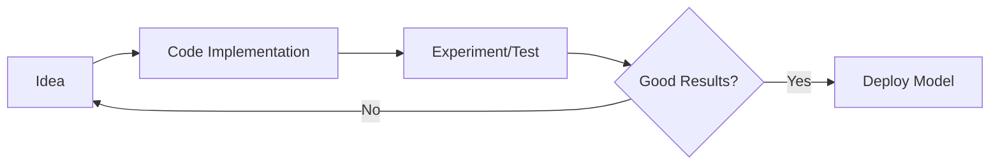

**Real-Life Analogy**: Think of this like cooking a new recipe:

- **Idea**: "Let me try adding spices to this dish"
- **Code**: Actually cooking with the spices
- **Experiment**: Tasting the food
- **Iterate**: Adjust spices based on taste

### Data Splitting Strategy

#### Traditional Approach (Small Datasets: 100-1M examples)

```
Training: 60% | Dev: 20% | Test: 20%
```

#### Modern Approach (Large Datasets: >1M examples)

```
Training: 98% | Dev: 1% | Test: 1%
```

**Mathematical Representation**:
Let $m$ = total number of examples

- $m_{train} = 0.98m$ (for large datasets)
- $m_{dev} = 0.01m$
- $m_{test} = 0.01m$

### Critical Rules for Data Splitting

#### Rule 1: Same Distribution

**Analogy**: Imagine you're training a model to recognize cats. If your training data has professional photos but test data has blurry phone pictures, it's like practicing piano on a grand piano but performing on a toy keyboard!

#### Rule 2: Purpose of Each Set

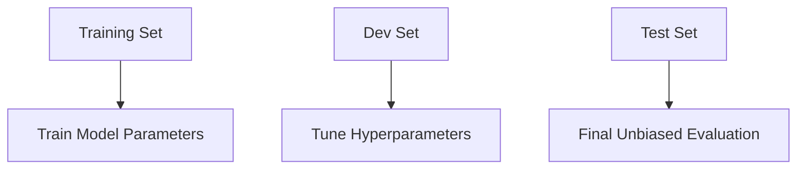

---

## Bias vs Variance

### Understanding the Concepts

**Bias**: How far your average prediction is from the true value

**Variance**: How much your predictions vary from each other

### Mathematical Framework

Given a dataset with optimal error rate (Bayes error) ≈ 0%:

#### High Bias (Underfitting)

```
Training Error: 15%
Dev Error: 16%
```

**Mathematical Insight**: $J_{train} >> \text{optimal error}$

#### High Variance (Overfitting)

```
Training Error: 1%
Dev Error: 11%
```

**Mathematical Insight**: $J_{dev} >> J_{train}$

#### High Bias + High Variance

```
Training Error: 15%
Dev Error: 30%
```

#### Good Model

```
Training Error: 0.5%
Dev Error: 1%
```

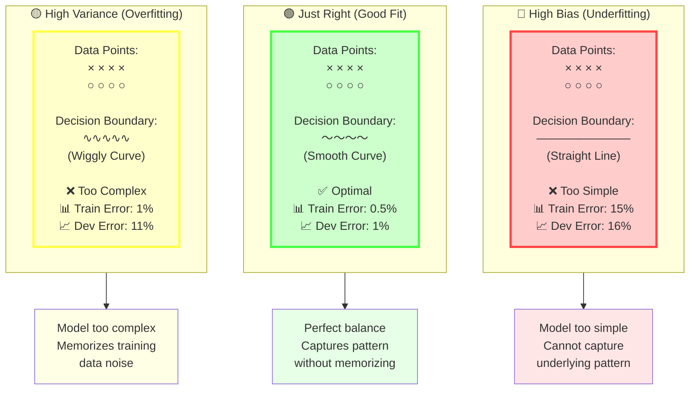

### Real-Life Analogy: Archery Target

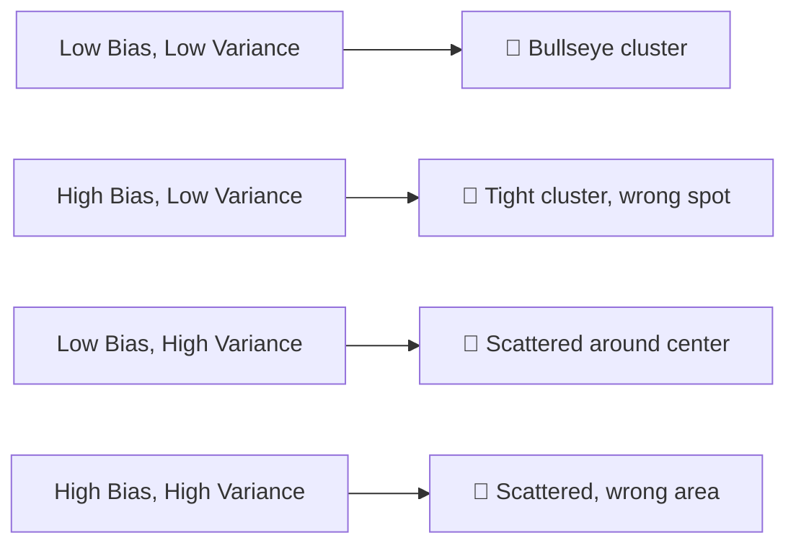

### Error Analysis Formula

For human-level performance baseline:
$$\text{Bias} \approx J_{train} - J_{human}$$
$$\text{Variance} \approx J_{dev} - J_{train}$$

---

## Basic Recipe for Machine Learning

### Decision Tree Approach

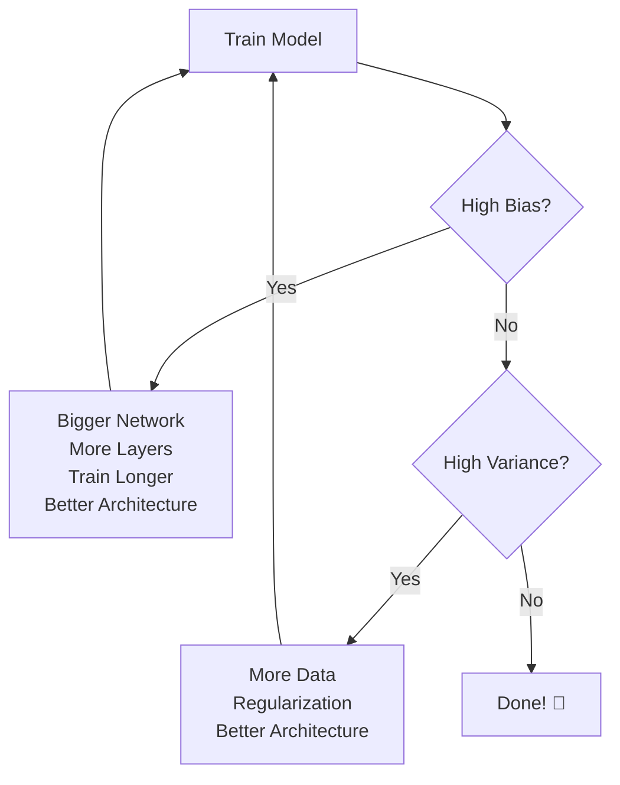

### The Modern Advantage

**Pre-Deep Learning Era**: Bias-Variance tradeoff was real

**Deep Learning Era**: We can tackle bias and variance independently!

**Mathematical Insight**:

- Bigger networks → Reduce bias (usually don't hurt variance)
- More data → Reduce variance (doesn't hurt bias)

---

## Regularization Techniques

### 1. L2 Regularization (Ridge)

#### Mathematical Formulation

**Original Cost Function**:
$$J(W,b) = \frac{1}{m}\sum_{i=1}^{m}L(\hat{y}^{(i)}, y^{(i)})$$

**L2 Regularized Cost Function**:
$$J(W,b) = \frac{1}{m}\sum_{i=1}^{m}L(\hat{y}^{(i)}, y^{(i)}) + \frac{\lambda}{2m}\sum_{l=1}^{L}||W^{[l]}||_F^2$$

Where the Frobenius norm is:
$$||W^{[l]}||_F^2 = \sum_{i=1}^{n^{[l]}} \sum_{j=1}^{n^{[l-1]}} (W_{ij}^{[l]})^2$$

#### Backpropagation Update

**Without Regularization**:
$$dW^{[l]} = \text{(from backprop)}$$

**With L2 Regularization**:
$$dW^{[l]} = \text{(from backprop)} + \frac{\lambda}{m}W^{[l]}$$

**Weight Update**:
$$W^{[l]} := W^{[l]} - \alpha \left[\text{(from backprop)} + \frac{\lambda}{m}W^{[l]}\right]$$

This can be rewritten as:
$$W^{[l]} := \left(1 - \frac{\alpha\lambda}{m}\right)W^{[l]} - \alpha \cdot \text{(from backprop)}$$

**Key Insight**: The term $(1 - \frac{\alpha\lambda}{m})$ causes **weight decay**!

#### Python Implementation

```python
def compute_cost_with_regularization(A3, Y, parameters, lambd):
    m = Y.shape[1]

    # Regular cross-entropy cost
    cross_entropy_cost = compute_cost(A3, Y)

    # L2 regularization cost
    L2_regularization_cost = 0
    for l in range(1, len(parameters)//2 + 1):
        L2_regularization_cost += np.sum(np.square(parameters[f'W{l}']))

    L2_regularization_cost = (lambd / (2 * m)) * L2_regularization_cost

    cost = cross_entropy_cost + L2_regularization_cost
    return cost

def backward_propagation_with_regularization(X, Y, cache, lambd):
    m = X.shape[1]
    # ... (regular backprop calculations)

    # Add regularization term
    dW3 = dW3 + (lambd/m) * W3
    dW2 = dW2 + (lambd/m) * W2
    dW1 = dW1 + (lambd/m) * W1

    return gradients
```

### L2 Regularization: Complete Guide with Mathematical Foundation

#### What is Regularization?

**Regularization** is a technique used to prevent overfitting in machine learning models by adding a penalty term to the cost function. Think of it as adding "rules" to prevent your model from becoming too complex and memorizing the training data instead of learning generalizable patterns.

**Real-Life Analogy: The Speed Limit**

Imagine you're driving a car:

- **Without speed limits (no regularization)**: You might drive extremely fast on every road, which is dangerous and leads to accidents (overfitting)
- **With speed limits (regularization)**: You're forced to drive at reasonable speeds, making your journey safer and more controlled (better generalization)

The regularization parameter λ (lambda) is like setting the speed limit - higher λ means stricter speed limits (more regularization).

#### Understanding Norms

**What is a Norm?**

A **norm** is a mathematical way to measure the "size" or "magnitude" of a vector or matrix. Think of it as different ways to measure distance.

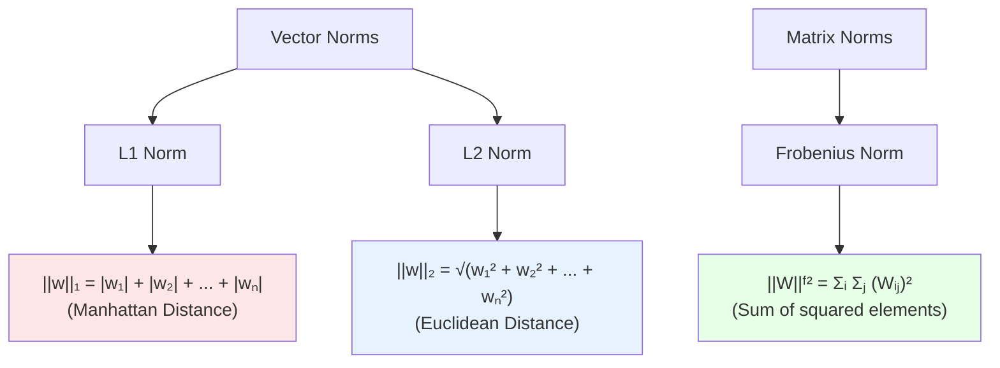

**Visual Comparison: L1 vs L2 Norms**

**Real-Life Analogy**: Different ways to measure distance in a city:

- **L1 Norm (Manhattan)**: Distance walking along city blocks (you can only move horizontally or vertically)
- **L2 Norm (Euclidean)**: Direct "as the crow flies" distance

#### L1 vs L2 Regularization Comparison

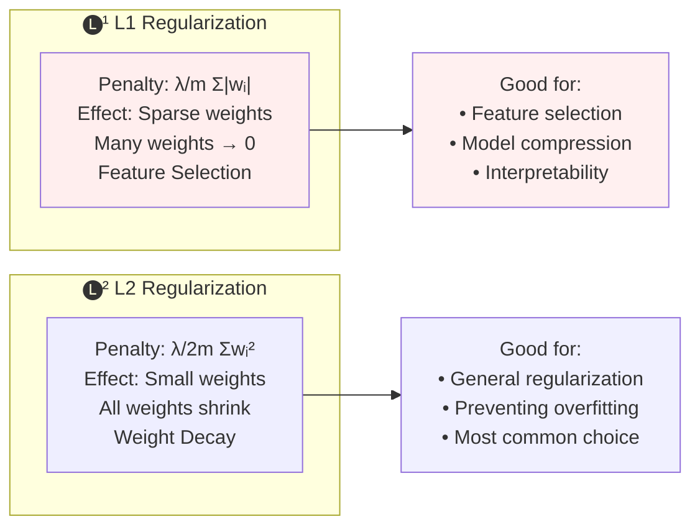

#### L2 Regularization Deep Dive

**Mathematical Foundation**

**For Logistic Regression**

**Original Cost Function**: $$J(w,b) = \frac{1}{m}\sum_{i=1}^{m}L(\hat{y}^{(i)}, y^{(i)})$$

**L2 Regularized Cost Function**: $$J(w,b) = \frac{1}{m}\sum_{i=1}^{m}L(\hat{y}^{(i)}, y^{(i)}) + \frac{\lambda}{2m}\sum_{j=1}^{n_x}w_j^2$$

**Vectorized Form**: $$J(w,b) = \frac{1}{m}\sum_{i=1}^{m}L(\hat{y}^{(i)}, y^{(i)}) + \frac{\lambda}{2m}||w||_2^2$$

Where: $||w||_2^2 = w^T w = \sum_{j=1}^{n_x} w_j^2$

**For Neural Networks**

**L2 Regularized Cost Function**: $$J(W,b) = \frac{1}{m}\sum_{i=1}^{m}L(\hat{y}^{(i)}, y^{(i)}) + \frac{\lambda}{2m}\sum_{l=1}^{L}||W^{[l]}||_F^2$$

**Frobenius Norm Explanation**: $$||W^{[l]}||_F^2 = \sum_{i=1}^{n^{[l]}} \sum_{j=1}^{n^{[l-1]}} (W_{ij}^{[l]})^2$$

**Why Frobenius Norm?**

The **Frobenius norm** is the matrix equivalent of the L2 norm for vectors. It's named after Ferdinand Georg Frobenius (a German mathematician).

**Mathematical Definition**:

- For a matrix $W$ with dimensions $n^{[l]} \times n^{[l-1]}$
- Frobenius norm = sum of squares of all matrix elements
- It measures the "overall size" of the weight matrix

**Quick Example**: For matrix $W = \begin{bmatrix} 1.5 & -0.8 \ 0.4 & 1.2 \end{bmatrix}$:

$||W||_F^2 = (1.5)^2 + (-0.8)^2 + (0.4)^2 + (1.2)^2 = 2.25 + 0.64 + 0.16 + 1.44 = 4.49$

**In Practice**: We simply compute `np.sum(np.square(W))` - same result, simpler code!

**Backpropagation with L2 Regularization**

**The Mathematics**

**Without Regularization**: $$\frac{\partial J}{\partial W^{[l]}} = \text{(from backprop)}$$

**With L2 Regularization**: $$\frac{\partial J}{\partial W^{[l]}} = \text{(from backprop)} + \frac{\lambda}{m}W^{[l]}$$

**Weight Update Derivation**

**Standard Update**: $$W^{[l]} := W^{[l]} - \alpha \cdot dW^{[l]}$$

**With Regularization**: $$W^{[l]} := W^{[l]} - \alpha \left[\text{(from backprop)} + \frac{\lambda}{m}W^{[l]}\right]$$

**Rearranging**: $$W^{[l]} := W^{[l]} - \alpha \cdot \text{(from backprop)} - \alpha \frac{\lambda}{m}W^{[l]}$$

$$W^{[l]} := \left(1 - \frac{\alpha\lambda}{m}\right)W^{[l]} - \alpha \cdot \text{(from backprop)}$$

**Weight Decay Explanation**

The term $\left(1 - \frac{\alpha\lambda}{m}\right)$ is **always less than 1**, which means:

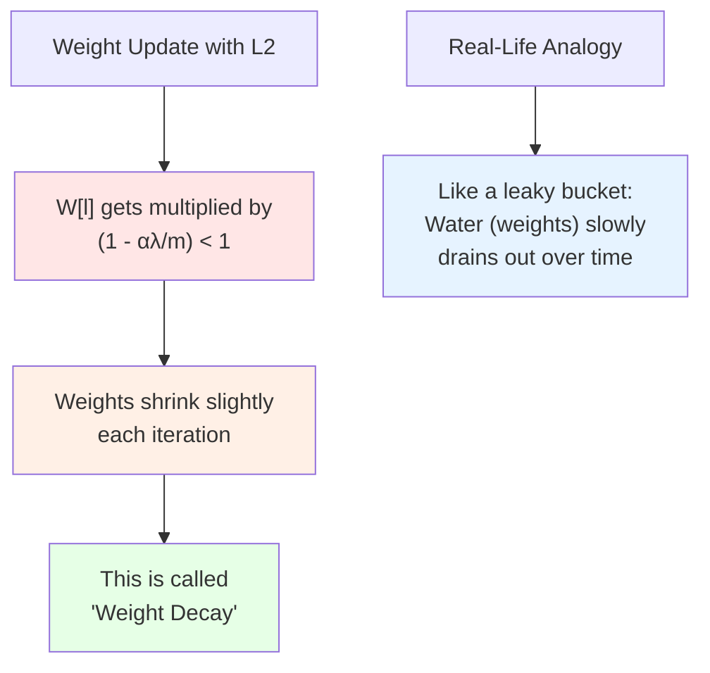

#### Why Does L2 Regularization Prevent Overfitting?

**Intuition 1: Network Simplification**

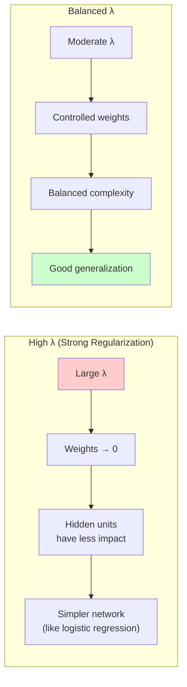

**Real-Life Analogy**: Think of a sports team:

- **High λ**: Some players become so "penalized" they barely participate → simpler team strategy
- **Moderate λ**: All players contribute but with controlled enthusiasm → balanced team performance

**Intuition 2: Linear Activation Regime (for tanh)**

**Mathematical Explanation**

For **tanh activation**: $g(z) = \tanh(z)$

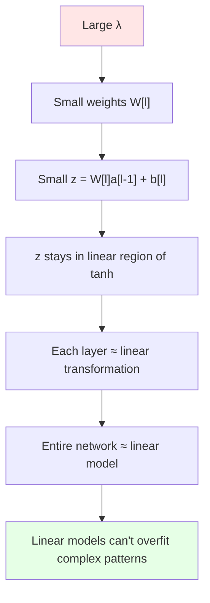

**Visual Representation**

**tanh Function Behavior**:

- **Small z values**: $\tanh(z) \approx z$ (linear region)
- **Large z values**: $\tanh(z)$ saturates (non-linear)

When weights are small → z is small → activation is approximately linear

**The Bias-Variance Impact**

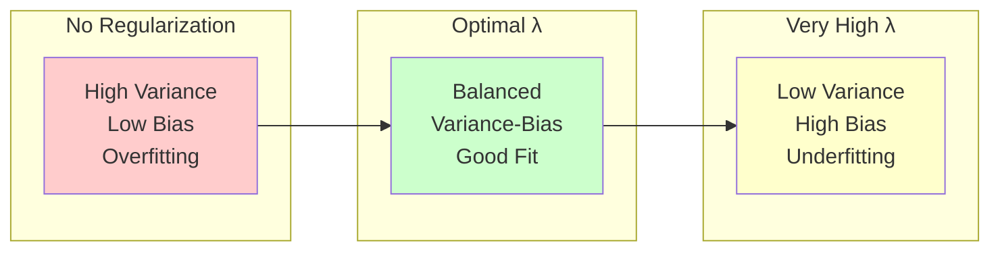

#### Implementation Details

**Python Code with Explanations**

```python
def compute_cost_with_regularization(A3, Y, parameters, lambd):
    """
    Compute cost with L2 regularization

    Arguments:
    A3 -- post-activation, output of forward propagation
    Y -- "true" labels vector
    parameters -- python dictionary containing parameters
    lambd -- regularization hyperparameter

    Returns:
    cost -- value of the regularized loss function
    """
    m = Y.shape[1]

    # Regular cross-entropy cost
    cross_entropy_cost = compute_cost(A3, Y)

    # L2 regularization cost
    L2_regularization_cost = 0
    for l in range(1, len(parameters)//2 + 1):
        L2_regularization_cost += np.sum(np.square(parameters[f'W{l}']))

    L2_regularization_cost = (lambd / (2 * m)) * L2_regularization_cost

    cost = cross_entropy_cost + L2_regularization_cost
    return cost

def backward_propagation_with_regularization(X, Y, cache, lambd):
    """
    Implement backward propagation with L2 regularization

    Arguments:
    X -- input dataset
    Y -- "true" labels vector
    cache -- cache output from forward_propagation()
    lambd -- regularization hyperparameter

    Returns:
    gradients -- A dictionary with the gradients
    """
    m = X.shape[1]

    # Get cached values
    (Z1, A1, W1, b1, Z2, A2, W2, b2, Z3, A3, W3, b3) = cache

    # Backward propagation: calculate gradients
    dZ3 = A3 - Y
    dW3 = (1/m) * np.dot(dZ3, A2.T) + (lambd/m) * W3  # Add regularization
    db3 = (1/m) * np.sum(dZ3, axis=1, keepdims=True)

    dA2 = np.dot(W3.T, dZ3)
    dZ2 = np.multiply(dA2, np.int64(A2 > 0))
    dW2 = (1/m) * np.dot(dZ2, A1.T) + (lambd/m) * W2  # Add regularization
    db2 = (1/m) * np.sum(dZ2, axis=1, keepdims=True)

    dA1 = np.dot(W2.T, dZ2)
    dZ1 = np.multiply(dA1, np.int64(A1 > 0))
    dW1 = (1/m) * np.dot(dZ1, X.T) + (lambd/m) * W1   # Add regularization
    db1 = (1/m) * np.sum(dZ1, axis=1, keepdims=True)

    gradients = {"dZ3": dZ3, "dW3": dW3, "db3": db3,
                 "dA2": dA2, "dZ2": dZ2, "dW2": dW2, "db2": db2,
                 "dA1": dA1, "dZ1": dZ1, "dW1": dW1, "db1": db1}

    return gradients

```

#### L2 Regularization: Complete Dry Run Example

**Network Architecture & Data Setup**

**Neural Network Structure:**

- Input layer: 2 features
- Hidden layer 1: 3 units (ReLU activation)
- Hidden layer 2: 2 units (ReLU activation)
- Output layer: 1 unit (Sigmoid activation)

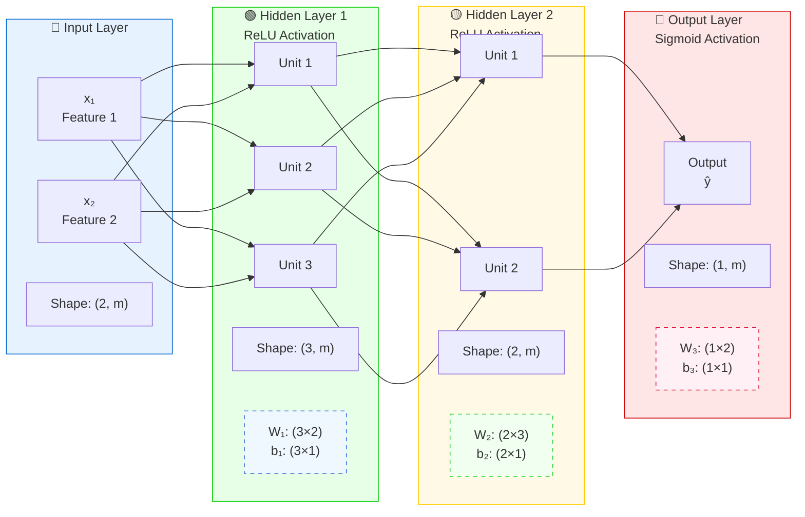

**Layer Details:**

- **Input**: 2 features → X shape: (2, m) where m = number of examples
- **Hidden 1**: 3 units → A₁ shape: (3, m), W₁ shape: (3×2), b₁ shape: (3×1)
- **Hidden 2**: 2 units → A₂ shape: (2, m), W₂ shape: (2×3), b₂ shape: (2×1)
- **Output**: 1 unit → A₃ shape: (1, m), W₃ shape: (1×2), b₃ shape: (1×1)

**Regularization applies to**: W₁, W₂, W₃ (not bias terms)

**Training Data (2 examples):**

```
X = [[1.5, -0.8],     # Example 1: [x1=1.5, x2=-0.8]
     [2.1,  0.4]]     # Example 2: [x1=2.1, x2=0.4]

Y = [1, 0]            # True labels

```

**Hyperparameters:**

- λ (lambda) = 0.1
- m (number of examples) = 2

**Initial Weight Matrices**

```
W1 = [[0.5, -0.3],    # Shape: (3, 2) - 3 units × 2 inputs
      [0.8,  0.2],
      [-0.4, 0.6]]

W2 = [[0.7, -0.5, 0.3],  # Shape: (2, 3) - 2 units × 3 inputs
      [0.1,  0.9, -0.2]]

W3 = [[0.4, -0.6]]       # Shape: (1, 2) - 1 output × 2 inputs

```

**Step 1: Forward Propagation (One Example)**

**Layer 1: Input to Hidden 1**

**Input:** X1 = [1.5, -0.8]

**Linear Transformation:**

```
Z1 = W1 @ X1 = [[0.5, -0.3],   [[1.5],   [[0.5×1.5 + (-0.3)×(-0.8)],   [[0.99],
                 [0.8,  0.2],  @  [-0.8]]  = [0.8×1.5 + 0.2×(-0.8)],   = [1.04],
                 [-0.4, 0.6]]              [(-0.4)×1.5 + 0.6×(-0.8)]]     [-1.08]]

```

**ReLU Activation:**

```
A1 = ReLU(Z1) = ReLU([[0.99],   [[0.99],
                      [1.04],  = [1.04],
                      [-1.08]])   [0.00]]  # ReLU clips negative values to 0

```

**Layer 2: Hidden 1 to Hidden 2**

**Linear Transformation:**

```
Z2 = W2 @ A1 = [[0.7, -0.5, 0.3],   [[0.99],   [[0.7×0.99 + (-0.5)×1.04 + 0.3×0.00],   [[0.173],
                 [0.1,  0.9, -0.2]]  @  [1.04],  = [0.1×0.99 + 0.9×1.04 + (-0.2)×0.00]]   = [1.035]]
                                        [0.00]]

```

**ReLU Activation:**

```
A2 = ReLU(Z2) = ReLU([[0.173],   [[0.173],
                      [1.035]])  = [1.035]]

```

**Layer 3: Hidden 2 to Output**

**Linear Transformation:**

```
Z3 = W3 @ A2 = [[0.4, -0.6]] @ [[0.173],  = [0.4×0.173 + (-0.6)×1.035] = [-0.552]
                                [1.035]]

```

**Sigmoid Activation:**

```
A3 = Sigmoid(Z3) = Sigmoid([-0.552]) = [1/(1+e^0.552)] = [0.365]

```

**Step 2: Compute Cross-Entropy Cost**

**For Example 1 (Y=1, A3=0.365):**

```
Loss₁ = -[Y×log(A3) + (1-Y)×log(1-A3)]
      = -[1×log(0.365) + 0×log(0.635)]
      = -[1×(-1.007) + 0]
      = 1.007

```

**For Example 2 (Y=0, A3=0.421):** _(following similar forward prop)_

```
Loss₂ = -[Y×log(A3) + (1-Y)×log(1-A3)]
      = -[0×log(0.421) + 1×log(0.579)]
      = -[0 + 1×(-0.546)]
      = 0.546

```

**Average Cross-Entropy Cost:**

```
Cross_entropy_cost = (Loss₁ + Loss₂) / m
                   = (1.007 + 0.546) / 2
                   = 1.553 / 2
                   = 0.777

```

**Step 3: Compute L2 Regularization Term**

**Calculate Frobenius Norms**

**For W1:**

```
||W1||²F = (0.5)² + (-0.3)² + (0.8)² + (0.2)² + (-0.4)² + (0.6)²
         = 0.25 + 0.09 + 0.64 + 0.04 + 0.16 + 0.36
         = 1.54

```

**For W2:**

```
||W2||²F = (0.7)² + (-0.5)² + (0.3)² + (0.1)² + (0.9)² + (-0.2)²
         = 0.49 + 0.25 + 0.09 + 0.01 + 0.81 + 0.04
         = 1.69

```

**For W3:**

```
||W3||²F = (0.4)² + (-0.6)²
         = 0.16 + 0.36
         = 0.52

```

**Total L2 Regularization**

```
L2_regularization = (λ/(2m)) × Σ||Wl||²F
                  = (0.1/(2×2)) × (1.54 + 1.69 + 0.52)
                  = 0.025 × 3.75
                  = 0.09375

```

**Step 4: Complete Cost Function (J_total)**

```
J_total = Cross_entropy_cost + L2_regularization
        = 0.777 + 0.09375
        = 0.87075

```

**This J_total is what we:**

- **Monitor during training** (plot cost vs iterations)
- **Use to compute gradients** (∂J_total/∂W includes regularization)
- **Minimize through gradient descent**

**Step 5: Backward Propagation with Regularization**

**Key Insight:** We compute gradients with respect to J_total = 0.87075 The regularization term ∂/∂W[λ/(2m) × ||W||²] = λ/m × W adds to each weight gradient.

**Output Layer Gradients**

```
dZ3 = A3 - Y = [0.365] - [1] = [-0.635]

dW3 = (1/m) × dZ3 @ A2.T + (λ/m) × W3
    = (1/2) × [-0.635] @ [0.173, 1.035] + (0.1/2) × [0.4, -0.6]
    = 0.5 × [-0.110, -0.657] + 0.05 × [0.4, -0.6]
    = [-0.055, -0.329] + [0.020, -0.030]
    = [-0.035, -0.359]

```

**Hidden Layer 2 Gradients**

```
dA2 = W3.T @ dZ3 = [[0.4],   @ [-0.635] = [[-0.254],
                    [-0.6]]                 [0.381]]

dZ2 = dA2 ⊙ (A2 > 0) = [[-0.254],  ⊙ [[1],  = [[-0.254],  # Element-wise multiply
                         [0.381]]      [1]]     [0.381]]    # with ReLU derivative

dW2 = (1/m) × dZ2 @ A1.T + (λ/m) × W2
    = (1/2) × [[-0.254],  @ [0.99, 1.04, 0.00] + (0.1/2) × W2
               [0.381]]
    = 0.5 × [[-0.251, -0.264, 0.000],  + 0.05 × [[0.7, -0.5, 0.3],
             [0.377,  0.396,  0.000]]            [0.1,  0.9, -0.2]]
    = [[-0.126, -0.132, 0.000],  + [[0.035, -0.025, 0.015],
       [0.189,  0.198,  0.000]]     [0.005,  0.045, -0.010]]
    = [[-0.091, -0.157, 0.015],
       [0.194,  0.243, -0.010]]

```

**Hidden Layer 1 Gradients**

```
dA1 = W2.T @ dZ2 = [[0.7,  0.1],   @ [[-0.254],  = [[-0.140],
                    [-0.5, 0.9],      [0.381]]      [0.470],
                    [0.3, -0.2]]                     [-0.152]]

dZ1 = dA1 ⊙ (A1 > 0) = [[-0.140],  ⊙ [[1],  = [[-0.140],
                         [0.470],      [1],     [0.470],
                         [-0.152]]     [0]]     [0.000]]  # Third unit was 0, so gradient is 0

dW1 = (1/m) × dZ1 @ X.T + (λ/m) × W1
    = (1/2) × [[-0.140],  @ [1.5, -0.8] + (0.1/2) × W1
               [0.470],
               [0.000]]
    = 0.5 × [[-0.210, 0.112],  + 0.05 × [[0.5, -0.3],
             [0.705, -0.376],            [0.8,  0.2],
             [0.000,  0.000]]            [-0.4, 0.6]]
    = [[-0.105, 0.056],  + [[0.025, -0.015],
       [0.353, -0.188],     [0.040,  0.010],
       [0.000,  0.000]]     [-0.020, 0.030]]
    = [[-0.080, 0.041],
       [0.393, -0.178],
       [-0.020, 0.030]]

```

**Key Observations**

**1. Regularization Impact on Gradients**

Notice how each weight gradient gets an additional term: `(λ/m) × W`

- This pushes weights toward zero
- Larger weights get larger penalties

**2. Cost Function Impact**

- Cross-entropy cost: 0.777
- L2 regularization: 0.094
- **Total cost (J_total): 0.871** ← This is what we actually minimize
- The penalty (0.094) is ~12% of original cost - significant but balanced

**3. Weight Decay in Action**

Each weight update will be:

```
W_new = W_old - α × dW
      = W_old - α × [(gradient from backprop) + (λ/m) × W_old]
      = (1 - αλ/m) × W_old - α × (gradient from backprop)

```

The factor `(1 - αλ/m)` is less than 1, causing gradual weight shrinkage!

**What L2 Regularization Does:**

**1. Purpose: Prevent Overfitting**

- **Problem**: Neural networks can memorize training data instead of learning patterns
- **Solution**: L2 regularization penalizes large weights to encourage simpler models
- **Result**: Better generalization to new, unseen data

**2. How it Modifies the Cost Function:**

**Original Cost Function (only cares about predictions):**

```
J = (1/m) × Σ Loss(ŷ, y)

```

**With L2 Regularization (also cares about weight sizes):**

```
J = (1/m) × Σ Loss(ŷ, y) + (λ/2m) × Σ||W||²
    ↑                        ↑
    Accuracy term           Complexity penalty

```

**3. The Trade-off:**

- **First term**: "Make predictions as accurate as possible"
- **Second term**: "But don't use weights that are too large"
- **λ (lambda)**: Controls the balance between these two goals

**Real-Life Analogy:**

Think of it like a budget constraint:

- **Without regularization**: "Spend whatever it takes to get perfect accuracy" (leads to overspending/overfitting)
- **With regularization**: "Get good accuracy, but stay within budget" (leads to more efficient/generalizable solutions)

**Why This Helps:**

- **Large weights** → Model is very sensitive to small input changes → Overfitting
- **Small weights** → Model is more stable and generalizes better → Good performance on new data

The L2 term essentially asks: "Is this weight worth the complexity it adds?" If not, it gets shrunk toward zero.

#### Important Implementation Notes

**1. Why We Don't Regularize Bias Terms**

**Mathematical Reasoning**:

- $w$ is typically high-dimensional: $w \in \mathbb{R}^{n_x}$ where $n_x$ could be thousands
- $b$ is just a scalar: $b \in \mathbb{R}$
- Impact: $\frac{\lambda}{2m}b^2$ is negligible compared to $\frac{\lambda}{2m}||w||^2$

**Practical Reasoning**: Almost all parameters are in $W$, not $b$

**2. Lambda (λ) Selection**

**Hyperparameter Tuning**:

- Use development/validation set to choose λ
- Try values: 0, 0.01, 0.02, 0.04, 0.08, 0.16, 0.32, 0.64, 1.28, ...
- Use logarithmic scale for search

**3. Debugging with Regularization**

**Important**: When plotting cost function $J$ vs iterations:

- Plot the **complete** cost function (including regularization term)
- Don't plot just the loss term
- Otherwise, you might not see monotonic decrease

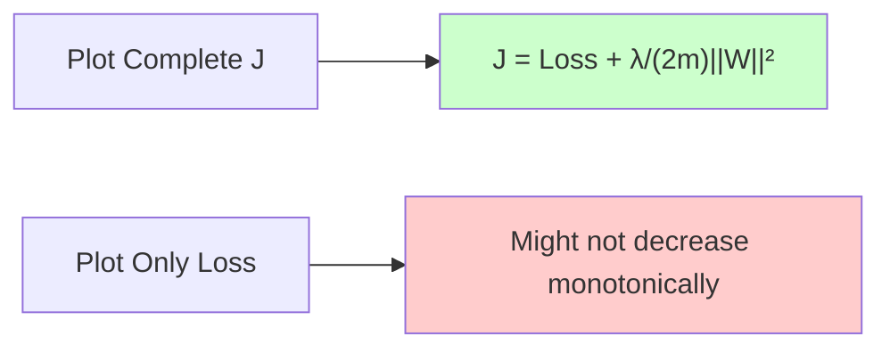

#### Key Takeaways

**Mathematical Summary**

1.  **L2 Regularization adds**: $\frac{\lambda}{2m}\sum_{l=1}^{L}||W^{[l]}||_F^2$ to cost function
2.  **Gradient modification**: $dW^{[l]} = \text{(backprop)} + \frac{\lambda}{m}W^{[l]}$
3.  **Weight decay effect**: $W^{[l]} := (1 - \frac{\alpha\lambda}{m})W^{[l]} - \alpha \cdot \text{(backprop)}$

**Practical Benefits**

- **Most commonly used** regularization technique
- **Prevents overfitting** by penalizing large weights
- **Easy to implement** - just add one term to cost and gradients
- **Hyperparameter λ** controls regularization strength

**Real-World Application**

L2 regularization is like having a "budget constraint" on your model's complexity - it forces the model to be "economical" with its parameters, leading to better generalization!

### 2. Dropout Regularization: Complete Guide

#### What is Dropout?

**Dropout** is a powerful regularization technique that randomly "drops out" (eliminates) neurons during training. Think of it as temporarily removing random parts of your network to prevent it from becoming too dependent on specific neurons.

**Real-Life Analogy: Team Building Exercise**

Imagine you're coaching a basketball team:

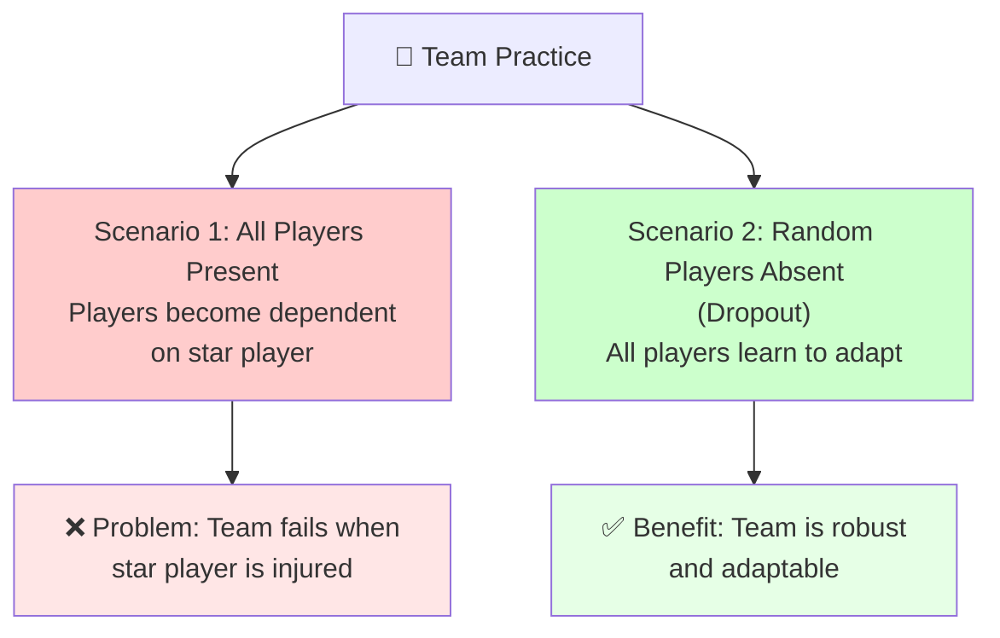

**Key Insight**: Just like players learn to not over-depend on teammates, neurons learn to not over-depend on specific connections!

#### How Dropout Works: Step-by-Step

**Visual Representation**

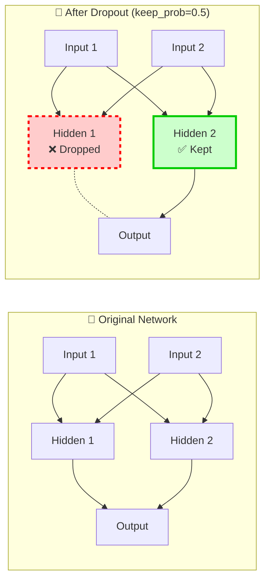

#### The Inverted Dropout Technique: Deep Dive

**What is "Inverted" Dropout?**

**Traditional Dropout**: Scale down at test time (complicated)  
**Inverted Dropout**: Scale up during training (simpler and more elegant)

The "inverted" name comes from inverting when the scaling happens - instead of scaling down during testing, we scale up during training.

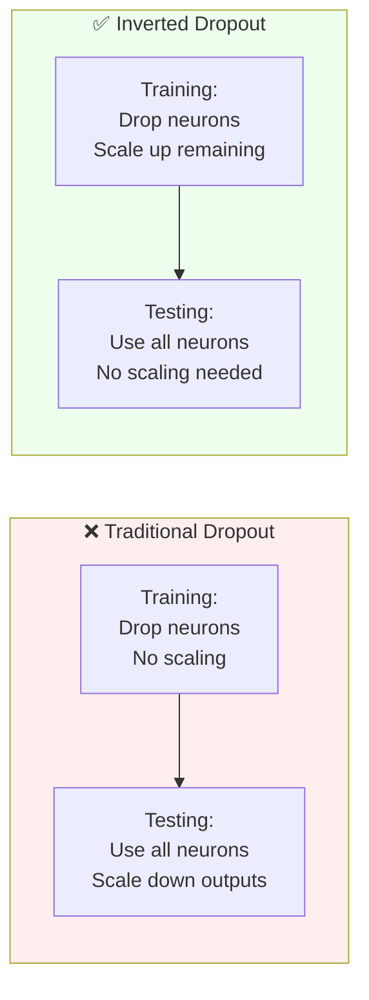

**The Three-Step Process (Detailed)**

**Step 1: Generate Random Mask**

$d^{[l]} \sim \text{Bernoulli}(\text{keep prob})$

**What this means in plain English**:

- Generate random numbers between 0 and 1
- If random number < keep_prob → set mask to 1 (keep neuron)
- If random number ≥ keep_prob → set mask to 0 (drop neuron)

**Concrete Example**:

```python
# For layer with 4 neurons, keep_prob = 0.8
random_numbers = [0.3, 0.9, 0.1, 0.7]  # Random values [0,1)
keep_prob = 0.8

# Generate mask
d = [1, 0, 1, 1]  # 0.3<0.8→1, 0.9≥0.8→0, 0.1<0.8→1, 0.7<0.8→1

```

**Step 2: Apply Mask (Element-wise Multiplication)**

$A^{[l]} = A^{[l]} \odot d^{[l]}$

**What happens**:

```python
# Before applying mask
A = [2.5, 4.0, 1.8, 3.2]  # Original activations

# Apply mask (element-wise multiplication)
A_masked = A * d = [2.5×1, 4.0×0, 1.8×1, 3.2×1] = [2.5, 0.0, 1.8, 3.2]

```

**The symbol ⊙ means**: Element-wise (Hadamard) multiplication, not matrix multiplication

**Step 3: Scale Up (The Heart of Inverted Dropout)**

$A^{[l]} = \frac{A^{[l]}}{\text{keep prob}}$

**What happens**:

```python
# Scale up the remaining activations
A_final = A_masked / keep_prob = [2.5, 0.0, 1.8, 3.2] / 0.8 = [3.125, 0.0, 2.25, 4.0]

```

**Why Do We Need Scaling? (The Mathematical Problem)**

**The Problem: Expected Values Shift**

**Without Scaling** - let's see what happens:

**Original activations**: $A = [2, 4, 6, 8]$ (4 neurons) **Expected sum**: $E[\text{sum}] = 2 + 4 + 6 + 8 = 20$

**With dropout (keep_prob = 0.5)** - on average, 2 neurons survive: **Possible outcomes**:

- Outcome 1: $[2, 0, 6, 0]$ → sum = 8
- Outcome 2: $[0, 4, 0, 8]$ → sum = 12
- Outcome 3: $[2, 4, 0, 0]$ → sum = 6
- Outcome 4: $[0, 0, 6, 8]$ → sum = 14

**Average sum** ≈ $\frac{8 + 12 + 6 + 14 + \text{...}}{6} = 10 = 20 \times 0.5$

🔥 **The sum dropped by exactly the keep_prob factor!**

**Mathematical Proof**

**For any activation $A_i$**: $E[A_i \text{ after dropout}] = E[A_i \times d_i]$

Since $A_i$ and $d_i$ are independent: $E[A_i \times d_i] = E[A_i] \times E[d_i]$

The mask $d_i$ follows Bernoulli(keep_prob): $E[d_i] = 1 \times \text{keep prob} + 0 \times (1-\text{keep prob}) = \text{keep prob}$

Therefore: $E[A_i \text{ after dropout}] = E[A_i] \times \text{keep prob}$

**The expected value is reduced by factor of keep_prob!** ⚠️

**The Solution: Inverted Dropout Scaling**

**How Scaling Fixes the Problem**

**Scale by $\frac{1}{\text{keep prob}}$**: $E\left[\frac{A_i \times d_i}{\text{keep prob}}\right] = \frac{E[A_i \times d_i]}{\text{keep prob}} = \frac{E[A_i] \times \text{keep prob}}{\text{keep prob}} = E[A_i]$

🎯 **Perfect! Expected value is restored!**

**Concrete Example with Numbers**

**Setup**: 4 neurons, keep_prob = 0.8
**Original**: $A = [5, 10, 15, 20]$, sum = 50

**Step-by-step process**:

```python
# Step 1: Generate mask (example outcome)
d = [1, 0, 1, 1]  # Keep 3 out of 4 neurons (75% kept)

# Step 2: Apply mask
A_masked = [5×1, 10×0, 15×1, 20×1] = [5, 0, 15, 20]
# Sum = 40 (reduced from 50)

# Step 3: Scale up
A_final = [5, 0, 15, 20] / 0.8 = [6.25, 0, 18.75, 25]
# Sum = 50 (restored!)

```

**Magic**: Even though we dropped neurons, the total "energy" of the layer is preserved!

**Visual Understanding**

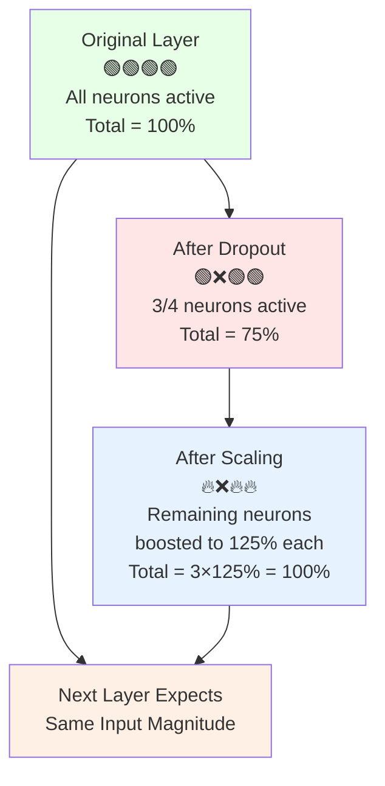

**Why This is Called "Inverted"**

**Traditional Dropout (Harder Way)**

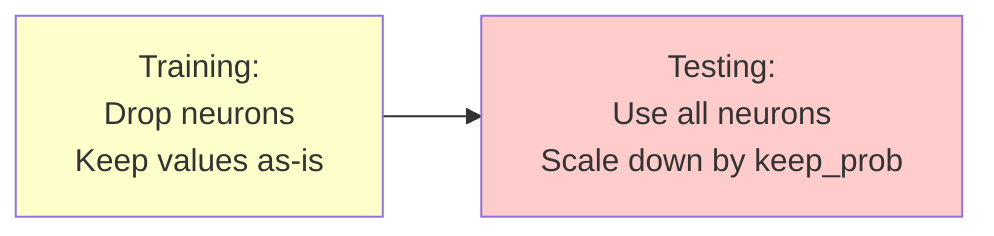

**Problem**: Need to remember to scale at test time!

**Inverted Dropout (Elegant Way)**

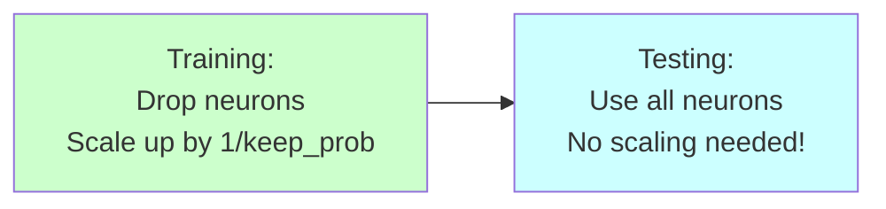

**Benefit**: Test time is simpler and less error-prone!

**The Deeper Intuition**

**Think of it as "Energy Conservation"**

**Physical Analogy**: Imagine neurons as light bulbs contributing to illumination:

1.  **Normal operation**: 10 bulbs × 50 watts = 500 watts total
2.  **With dropout**: 8 bulbs remain (2 dropped)
3.  **Without scaling**: 8 bulbs × 50 watts = 400 watts (dimmer!)
4.  **With scaling**: 8 bulbs × 62.5 watts = 500 watts (same brightness!)

The surviving bulbs work harder to compensate for the missing ones.

#### Implementation Details

**Python Code with Step-by-Step Explanation**

```python
def forward_propagation_with_dropout(X, parameters, keep_prob=0.8):
    """
    Forward propagation with inverted dropout

    Arguments:
    X -- input dataset
    parameters -- dictionary containing weights and biases
    keep_prob -- probability of keeping a neuron (0 < keep_prob <= 1)

    Returns:
    A3 -- last post-activation
    cache -- cache for backward propagation
    """
    np.random.seed(1)  # For reproducible results

    # Layer 1
    Z1 = np.dot(parameters['W1'], X) + parameters['b1']
    A1 = relu(Z1)

    # Dropout on layer 1
    D1 = np.random.rand(A1.shape[0], A1.shape[1])    # Random numbers [0,1)
    D1 = (D1 < keep_prob).astype(int)                # Convert to 0s and 1s
    A1 = A1 * D1                                     # Apply mask (element-wise)
    A1 = A1 / keep_prob                              # Scale up (inverted dropout)

    # Layer 2
    Z2 = np.dot(parameters['W2'], A1) + parameters['b2']
    A2 = relu(Z2)

    # Dropout on layer 2
    D2 = np.random.rand(A2.shape[0], A2.shape[1])
    D2 = (D2 < keep_prob).astype(int)
    A2 = A2 * D2
    A2 = A2 / keep_prob

    # Output layer (usually no dropout)
    Z3 = np.dot(parameters['W3'], A2) + parameters['b3']
    A3 = sigmoid(Z3)

    cache = (Z1, D1, A1, W1, b1, Z2, D2, A2, W2, b2, Z3, A3, W3, b3)
    return A3, cache

def backward_propagation_with_dropout(X, Y, cache, keep_prob=0.8):
    """
    Backward propagation with dropout

    Arguments:
    X -- input dataset
    Y -- "true" labels
    cache -- cache from forward propagation
    keep_prob -- probability of keeping a neuron

    Returns:
    gradients -- dictionary containing gradients
    """
    m = X.shape[1]
    (Z1, D1, A1, W1, b1, Z2, D2, A2, W2, b2, Z3, A3, W3, b3) = cache

    # Output layer
    dZ3 = A3 - Y
    dW3 = (1/m) * np.dot(dZ3, A2.T)
    db3 = (1/m) * np.sum(dZ3, axis=1, keepdims=True)

    # Hidden layer 2
    dA2 = np.dot(W3.T, dZ3)
    dA2 = dA2 * D2              # Apply same dropout mask
    dA2 = dA2 / keep_prob       # Scale gradients
    dZ2 = np.multiply(dA2, np.int64(A2 > 0))  # ReLU derivative
    dW2 = (1/m) * np.dot(dZ2, A1.T)
    db2 = (1/m) * np.sum(dZ2, axis=1, keepdims=True)

    # Hidden layer 1
    dA1 = np.dot(W2.T, dZ2)
    dA1 = dA1 * D1              # Apply same dropout mask
    dA1 = dA1 / keep_prob       # Scale gradients
    dZ1 = np.multiply(dA1, np.int64(A1 > 0))  # ReLU derivative
    dW1 = (1/m) * np.dot(dZ1, X.T)
    db1 = (1/m) * np.sum(dZ1, axis=1, keepdims=True)

    gradients = {"dZ3": dZ3, "dW3": dW3, "db3": db3,
                 "dZ2": dZ2, "dW2": dW2, "db2": db2,
                 "dZ1": dZ1, "dW1": dW1, "db1": db1}

    return gradients

```

#### Why Does Dropout Work? (Intuitive Explanations)

**Intuition 1: Training Smaller Networks**

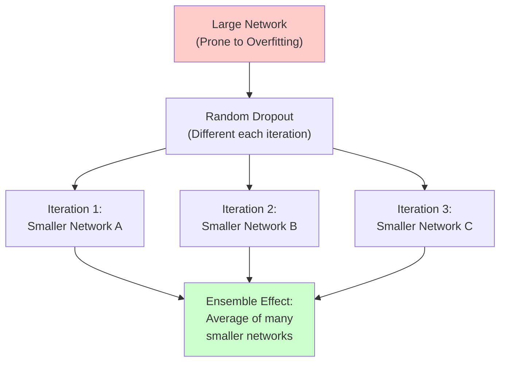

**Intuition 2: Preventing Co-adaptation**

**The Problem**: Neurons become too dependent on each other

```
Neuron A: "I'll detect edges"
Neuron B: "I'll rely on A for everything"
Neuron C: "I'll just follow B"

```

**With Dropout**: Each neuron must learn to be useful independently

```
Neuron A: "I need to be useful even when B is gone"
Neuron B: "I can't always rely on A"
Neuron C: "I must develop my own features"

```

**Mathematical Connection to L2 Regularization**

**Key Insight**: Dropout can be shown to be an adaptive form of L2 regularization!

- **L2 Regularization**: Uniform penalty on all weights
- **Dropout**: Adaptive penalty based on activation magnitudes

The regularization strength varies based on the input activations, making it more sophisticated than standard L2.

#### Different keep_prob for Different Layers

**Layer-Specific Dropout Strategy**

```mermaid
graph LR
    subgraph Input["Input Layer"]
        I["keep_prob = 1.0<br/>(or 0.9)<br/>Don't eliminate input features"]
    end

    subgraph Hidden1["Hidden Layer 1<br/>(Small)"]
        H1["keep_prob = 0.7<br/>Moderate dropout"]
    end

    subgraph Hidden2["Hidden Layer 2<br/>(Large - Most Parameters)"]
        H2["keep_prob = 0.5<br/>Strong dropout"]
    end

    subgraph Output["Output Layer"]
        O["keep_prob = 1.0<br/>No dropout"]
    end

    I --> H1 --> H2 --> O

    style I fill:#e6f3ff
    style H1 fill:#fff9e6
    style H2 fill:#ffe6e6
    style O fill:#e6ffe6

```

**Strategic Guidelines**

**High keep_prob (0.8-1.0)**:

- Input layers (don't want to lose features)
- Layers with few parameters
- When less worried about overfitting

**Low keep_prob (0.5-0.7)**:

- Layers with many parameters (like W2 in example)
- Layers prone to overfitting
- Hidden layers with large weight matrices

#### Dropout at Test Time

**Critical Rule: NO DROPOUT DURING TESTING**

```python
def predict_with_trained_model(X, parameters):
    """
    Make predictions WITHOUT dropout
    """
    # Layer 1 - NO DROPOUT
    Z1 = np.dot(parameters['W1'], X) + parameters['b1']
    A1 = relu(Z1)
    # Notice: No D1 mask, no scaling

    # Layer 2 - NO DROPOUT
    Z2 = np.dot(parameters['W2'], A1) + parameters['b2']
    A2 = relu(Z2)
    # Notice: No D2 mask, no scaling

    # Output layer
    Z3 = np.dot(parameters['W3'], A2) + parameters['b3']
    A3 = sigmoid(Z3)

    return A3

```

**Why No Dropout at Test Time?**

- We want **deterministic** predictions, not random ones
- The **inverted dropout scaling** during training ensures correct expected values
- Using dropout at test time would add unwanted noise

#### Common Applications and Best Practices

**When to Use Dropout**

```mermaid
graph TD
    A["Is your model overfitting?"] --> B["Yes"]
    A --> C["No"]

    B --> D["Computer Vision?"]
    D --> E["Yes - Use dropout<br/>(almost always needed)"]
    D --> F["No - Try dropout<br/>(monitor performance)"]

    C --> G["Don't use dropout<br/>(unnecessary regularization)"]

    style E fill:#ccffcc
    style F fill:#ffffcc
    style G fill:#ffe6e6

```

**Implementation Tips**

**1. Start with keep_prob = 0.8**

```python
# Good starting point for most layers
keep_prob = 0.8  # Drops 20% of neurons

```

**2. Monitor Training Progress**

```python
# Problem: Cost function becomes less interpretable with dropout
# Solution: Train with keep_prob=1.0 first to verify code works

```

**3. Layer-Specific Strategy**

```python
# Different keep_prob for different layers
layer_keep_probs = {
    'input': 1.0,      # Keep all input features
    'hidden1': 0.8,    # Moderate dropout
    'hidden2': 0.5,    # Strong dropout (if layer is large)
    'output': 1.0      # No dropout on output
}

```

#### Debugging with Dropout

**The Challenge**

Dropout makes the cost function less well-defined because you're randomly changing the network structure.

**The Solution**

```python
# Step 1: Train without dropout first
keep_prob = 1.0  # No dropout
# Verify that cost decreases monotonically

# Step 2: Turn on dropout
keep_prob = 0.8  # Now use dropout
# Monitor that training still progresses well

```

#### Key Takeaways

**Mathematical Summary**

1.  **Dropout mechanism**: Randomly zero out neurons with probability (1 - keep_prob)
2.  **Inverted dropout**: Scale remaining activations by 1/keep_prob
3.  **Test time**: Use all neurons without scaling (thanks to inverted dropout)

**Practical Benefits**

- **Prevents overfitting** by reducing co-adaptation
- **Acts like ensemble** of many smaller networks
- **Adaptive regularization** stronger than simple L2
- **Especially useful** in computer vision and large networks

**Real-World Wisdom**

- **Most common** in computer vision (almost always overfitting)
- **Less common** in other domains (use only when overfitting)
- **Always turn off** at test time
- **Start simple** with keep_prob = 0.8, then tune if needed

**Bottom Line**: Dropout is like teaching your neural network to be resilient - no single neuron becomes indispensable, making the whole network more robust and generalizable!

### 3. Other Regularization Methods

Beyond L2 regularization and dropout, there are several other effective techniques to prevent overfitting in neural networks.

#### Data Augmentation

**Core Concept**: Create additional training examples by applying transformations to existing data without collecting new samples.

**Real-Life Analogy**: Think of data augmentation like learning to recognize your friend:

- You've seen them from the front → **Original data**
- You also see them from the side → **Rotated/flipped data**
- You see them closer and farther → **Cropped/scaled data**
- Now you can recognize them from any angle! → **Better generalization**

##### Computer Vision Applications

```mermaid
graph TD
    A["Original Image<br/>🐱"] --> B["Horizontal Flip<br/>🐱 (mirrored)"]
    A --> C["Random Crop<br/>🐱 (zoomed)"]
    A --> D["Rotation<br/>🐱 (tilted)"]
    A --> E["Translation<br/>🐱 (shifted)"]

    B --> F["Augmented<br/>Training Set<br/>(2x - 5x larger)"]
    C --> F
    D --> F
    E --> F

    style A fill:#e6f3ff
    style F fill:#e6ffe6
```

**Mathematical Transformations**:

- **Horizontal flips**: $x \rightarrow \text{flip}_h(x)$
- **Random crops**: $x \rightarrow \text{crop}(x, \text{random position})$
- **Rotations**: $x \rightarrow \text{rotate}(x, \theta)$ where $\theta \sim \mathcal{N}(0, \sigma^2)$
- **Translations**: $x \rightarrow \text{translate}(x, \Delta x, \Delta y)$
- **Scaling**: $x \rightarrow \text{scale}(x, s)$ where $s \in [0.8, 1.2]$

##### Optical Character Recognition (OCR) Applications

**For digit recognition**, apply:

- **Random rotations**: Small angle rotations (±15°)
- **Elastic distortions**: Subtle warping that preserves character structure
- **Noise injection**: Adding small amounts of pixel noise

```python
# Example: Data augmentation for images
def augment_image(image):
    """Apply random augmentations to an image"""
    augmented_images = []

    # Original image
    augmented_images.append(image)

    # Horizontal flip (for objects that look same when flipped)
    if np.random.rand() > 0.5:
        flipped = np.fliplr(image)
        augmented_images.append(flipped)

    # Random rotation (-15 to +15 degrees)
    angle = np.random.uniform(-15, 15)
    rotated = rotate_image(image, angle)
    augmented_images.append(rotated)

    # Random crop (90-100% of original size)
    crop_ratio = np.random.uniform(0.9, 1.0)
    cropped = random_crop(image, crop_ratio)
    augmented_images.append(cropped)

    return augmented_images
```

##### Important Considerations

**What to augment**:

- ✅ **Horizontal flips**: For cats, cars, objects (preserve meaning)
- ❌ **Vertical flips**: Usually not meaningful (upside-down cats aren't cats!)
- ✅ **Small rotations**: Natural variation
- ❌ **Large rotations**: May change meaning (6 → 9)

**Mathematical Insight**: Augmentation tells your algorithm:
$$\text{If } f(x) = y, \text{ then } f(\text{transform}(x)) = y$$

**Quality vs Quantity Trade-off**:

- Augmented data ≠ Independent new data
- But it's **much cheaper** than collecting new samples
- Provides **moderate regularization** at low computational cost

#### Early Stopping

**Core Concept**: Stop training when validation performance starts to degrade, even if training performance is still improving.

##### The Early Stopping Process

```mermaid
graph LR
    subgraph Training["Training Process"]
        A["Epoch 1<br/>High Error"] --> B["Epoch 10<br/>Decreasing Error"]
        B --> C["Epoch 20<br/>Best Validation"]
        C --> D["Epoch 30<br/>Validation Rising"]
        D --> E["Epoch 40<br/>Overfitting"]
    end

    C --> F["🛑 STOP HERE!<br/>Optimal Point"]

    style C fill:#ccffcc
    style F fill:#ffcc99
```

##### Mathematical Analysis

**Training Cost**: $J_{train}(\text{epoch})$ - Generally decreases monotonically

**Validation Cost**: $J_{dev}(\text{epoch})$ - Decreases then increases

**Stopping Condition**:
Stop when: $\frac{d}{d\text{epoch}}J_{dev} > 0$ for several consecutive epochs.

**Alternative formulation**: Track validation cost and stop when:
$$J_{dev}(\text{epoch}) > J_{dev}(\text{epoch} - \text{patience})$$

Where "patience" is number of epochs to wait for improvement.

##### Visual Understanding

```mermaid
graph TD
    A["Training Starts<br/>W ≈ 0 (small weights)"] --> B["Early Training<br/>W grows slowly<br/>Good generalization"]
    B --> C["Optimal Point<br/>W moderate size<br/>Best validation score"]
    C --> D["Continued Training<br/>W gets large<br/>Overfitting begins"]

    E["Early Stopping<br/>Chooses this W"] --> C

    style A fill:#e6f3ff
    style C fill:#ccffcc
    style D fill:#ffcccc
    style E fill:#fff2cc
```

##### Why Early Stopping Works

**Weight Evolution Analysis**:

1. **Initialization**: $W \approx 0$ (random small values)
2. **Early training**: $||W||$ grows slowly, model learns general patterns
3. **Optimal point**: $||W||$ at intermediate size, best generalization
4. **Late training**: $||W||$ becomes large, model memorizes noise

**Mathematical Intuition**:
$$\text{Early stopping} \approx \text{L2 regularization with adaptive } \lambda$$

The effective regularization strength decreases as training progresses.

##### Implementation Details

```python
def early_stopping_training(model, train_data, val_data, patience=10):
    """
    Train with early stopping

    Arguments:
    model -- neural network model
    train_data -- training dataset
    val_data -- validation dataset
    patience -- epochs to wait for improvement

    Returns:
    best_model -- model at best validation performance
    """
    best_val_loss = float('inf')
    epochs_without_improvement = 0
    best_model_weights = None

    for epoch in range(max_epochs):
        # Training step
        train_loss = train_one_epoch(model, train_data)

        # Validation step
        val_loss = validate(model, val_data)

        print(f"Epoch {epoch}: Train Loss = {train_loss:.4f}, Val Loss = {val_loss:.4f}")

        # Check for improvement
        if val_loss < best_val_loss:
            best_val_loss = val_loss
            best_model_weights = model.get_weights().copy()
            epochs_without_improvement = 0
        else:
            epochs_without_improvement += 1

        # Early stopping condition
        if epochs_without_improvement >= patience:
            print(f"Early stopping at epoch {epoch}")
            model.set_weights(best_model_weights)
            break

    return model
```

#### Andrew Ng's Perspective: Orthogonalization Principle

##### The Two Separate Goals

```mermaid
graph LR
    subgraph Goal1["🎯 Goal 1: Optimize Cost Function"]
        A["Tools:<br/>• Gradient Descent<br/>• Adam, RMSprop<br/>• Better architectures"]
    end

    subgraph Goal2["🎯 Goal 2: Prevent Overfitting"]
        B["Tools:<br/>• L2 Regularization<br/>• Dropout<br/>• More data<br/>• Data augmentation"]
    end

    C["❌ Early Stopping<br/>Couples both goals"] --> D["Makes hyperparameter<br/>search more complex"]

    style A fill:#e6f3ff
    style B fill:#e6ffe6
    style C fill:#ffe6e6
    style D fill:#fff0e6
```

##### Orthogonalization Philosophy

**Principle**: Tackle one problem at a time with dedicated tools

**Problem with Early Stopping**:

- Simultaneously tries to optimize cost function AND prevent overfitting
- Makes hyperparameter search more complex
- Couples two independent objectives

**Andrew's Preference**:

```
L2 Regularization + Longer Training > Early Stopping
```

**Reasoning**:

- **Cleaner separation** of concerns
- **Easier hyperparameter search** (tune λ independently)
- **More systematic approach** to optimization

##### Trade-offs Comparison

| Method                 | Pros                                                                            | Cons                                                                                   |
| ---------------------- | ------------------------------------------------------------------------------- | -------------------------------------------------------------------------------------- |
| **Early Stopping**     | • Single hyperparameter<br/>• Computationally efficient<br/>• No need to tune λ | • Couples optimization goals<br/>• Less systematic<br/>• May not find optimal solution |
| **L2 + Long Training** | • Clean separation of goals<br/>• More systematic<br/>• Better optimization     | • Need to tune λ<br/>• More computationally expensive<br/>• Multiple hyperparameters   |

#### Practical Guidelines

##### When to Use Each Method

**Data Augmentation**:

- ✅ **Always consider** for computer vision
- ✅ **When data is limited** and expensive to collect
- ✅ **Domain knowledge exists** about meaningful transformations
- ❌ **When transformations change meaning** (text classification with different languages)

**Early Stopping**:

- ✅ **Limited computational budget**
- ✅ **Quick prototyping** and experimentation
- ✅ **When L2 regularization search is expensive**
- ❌ **When you need systematic hyperparameter optimization**

##### Implementation Strategy

```mermaid
graph TD
    A["Start Here"] --> B["Implement Data Augmentation<br/>(if applicable)"]
    B --> C["Choose Regularization Strategy"]
    C --> D["Limited Compute?"]
    D -->|Yes| E["Use Early Stopping<br/>patience = 10-20 epochs"]
    D -->|No| F["Use L2 Regularization<br/>Search λ systematically"]

    E --> G["Monitor both train/val curves"]
    F --> G

    style B fill:#e6ffe6
    style E fill:#fff2cc
    style F fill:#e6f3ff
    style G fill:#ffe6f3
```

#### Key Takeaways

##### Mathematical Summary

1. **Data Augmentation**: $|\text{Training Set}| \rightarrow k \times |\text{Training Set}|$ where $k \geq 2$
2. **Early Stopping**: Find $\text{epoch}^* = \arg\min_{\text{epoch}} J_{dev}(\text{epoch})$
3. **Both methods**: Provide regularization without explicit penalty terms

##### Practical Wisdom

- **Data augmentation** is almost always beneficial when applicable
- **Early stopping** vs **L2 regularization** is a design choice based on computational budget and optimization philosophy
- **Combine methods**: Data augmentation + (Early stopping OR L2) often works best
- **Domain knowledge matters**: Understand what transformations preserve meaning in your domain

**Bottom Line**: These methods expand your regularization toolkit, giving you more ways to combat overfitting when L2 and dropout aren't sufficient!

## Input Normalization

### What is Input Normalization?

**Input normalization** is a preprocessing technique that standardizes the scale of input features to speed up neural network training. It ensures all features contribute equally to the learning process.

**Real-Life Analogy**: Imagine you're comparing students' performance:

- **Without normalization**: "Student A scored 850/1000 in Math and 7.5/10 in English"
- **With normalization**: "Student A scored 0.85 and 0.75 (both on 0-1 scale)"
- Now you can fairly compare both subjects! 📊

### The Normalization Process

#### Step-by-Step Mathematical Procedure

**Step 1: Compute Mean** (Zero-center the data)
$$\mu = \frac{1}{m}\sum_{i=1}^{m}x^{(i)}$$

**Step 2: Center the Data**
$$x^{(i)} := x^{(i)} - \mu$$

**Step 3: Compute Variance** (After centering)
$$\sigma^2 = \frac{1}{m}\sum_{i=1}^{m}(x^{(i)})^2$$

**Step 4: Normalize Variance** (Scale to unit variance)
$$x^{(i)} := \frac{x^{(i)}}{\sigma}$$

#### Visual Process Flow

```mermaid
graph TD
    A["Original Data<br/>x₁: [1, 1000]<br/>x₂: [0, 1]<br/>Different scales"] --> B["Step 1: Compute Mean<br/>μ₁ = 500.5<br/>μ₂ = 0.5"]

    B --> C["Step 2: Center Data<br/>x₁ - μ₁<br/>x₂ - μ₂<br/>Zero mean"]

    C --> D["Step 3: Compute Std<br/>σ₁ = 288.7<br/>σ₂ = 0.29"]

    D --> E["Step 4: Scale<br/>(x₁ - μ₁)/σ₁<br/>(x₂ - μ₂)/σ₂<br/>Unit variance"]

    E --> F["Normalized Data<br/>Both features:<br/>Mean = 0<br/>Std = 1"]

    style A fill:#ffe6e6
    style F fill:#e6ffe6
    style B fill:#fff0e6
    style C fill:#f0f8ff
    style D fill:#f0fff0
    style E fill:#fff0f5
```

#### Concrete Numerical Example

**Original Data**: 2 features, 4 examples

```
x₁ = [1, 100, 500, 1000]     # Range: 1-1000
x₂ = [0, 0.3, 0.7, 1]        # Range: 0-1
```

**Step 1 - Compute means**:

```
μ₁ = (1 + 100 + 500 + 1000)/4 = 400.25
μ₂ = (0 + 0.3 + 0.7 + 1)/4 = 0.5
```

**Step 2 - Center the data**:

```
x₁_centered = [-399.25, -300.25, 99.75, 599.75]
x₂_centered = [-0.5, -0.2, 0.2, 0.5]
```

**Step 3 - Compute standard deviations**:

```
σ₁ = √[((-399.25)² + (-300.25)² + (99.75)² + (599.75)²)/4] = 367.4
σ₂ = √[((-0.5)² + (-0.2)² + (0.2)² + (0.5)²)/4] = 0.37
```

**Step 4 - Normalize**:

```
x₁_norm = [-1.09, -0.82, 0.27, 1.63]    # Mean ≈ 0, Std ≈ 1
x₂_norm = [-1.35, -0.54, 0.54, 1.35]    # Mean ≈ 0, Std ≈ 1
```

### Python Implementation

```python
def normalize_data(X_train, X_dev, X_test):
    """
    Normalize input features using training set statistics

    Arguments:
    X_train -- training set, shape (n_features, m_train)
    X_dev -- dev set, shape (n_features, m_dev)
    X_test -- test set, shape (n_features, m_test)

    Returns:
    X_train_norm, X_dev_norm, X_test_norm -- normalized datasets
    mu, sigma -- normalization parameters (for later use)
    """
    # Compute statistics ONLY on training set
    mu = np.mean(X_train, axis=1, keepdims=True)        # Shape: (n_features, 1)
    sigma = np.std(X_train, axis=1, keepdims=True)      # Shape: (n_features, 1)

    # Apply same normalization to all sets
    X_train_norm = (X_train - mu) / sigma
    X_dev_norm = (X_dev - mu) / sigma
    X_test_norm = (X_test - mu) / sigma

    return X_train_norm, X_dev_norm, X_test_norm, mu, sigma

# Example usage
np.random.seed(1)
X_train = np.random.randn(3, 1000) * np.array([[100], [1], [50]]) + np.array([[500], [0], [25]])
X_dev = np.random.randn(3, 200) * np.array([[100], [1], [50]]) + np.array([[500], [0], [25]])
X_test = np.random.randn(3, 200) * np.array([[100], [1], [50]]) + np.array([[500], [0], [25]])

print("Before normalization:")
print(f"X_train means: {np.mean(X_train, axis=1)}")
print(f"X_train stds: {np.std(X_train, axis=1)}")

X_train_norm, X_dev_norm, X_test_norm, mu, sigma = normalize_data(X_train, X_dev, X_test)

print("\nAfter normalization:")
print(f"X_train_norm means: {np.mean(X_train_norm, axis=1)}")
print(f"X_train_norm stds: {np.std(X_train_norm, axis=1)}")
```

### Why Normalization Works: Cost Function Shape Analysis

#### The Core Problem: Feature Scale Mismatch

**Scenario**: House price prediction

- **Feature 1**: Square footage (range: 500-5000)
- **Feature 2**: Number of bedrooms (range: 1-5)
- **Feature 3**: Age in years (range: 0-100)

**Mathematical Impact**: Cost function becomes:
$$J(w) = \frac{1}{2m}\sum_{i=1}^{m}(w_1 \cdot x_1^{(i)} + w_2 \cdot x_2^{(i)} + w_3 \cdot x_3^{(i)} - y^{(i)})^2$$

Since $x_1 \gg x_2$, small changes in $w_1$ have huge impact, while $w_2$ needs large changes for any effect.

#### Visual Comparison: Cost Function Contours

```mermaid
graph LR
    subgraph Without["❌ Without Normalization"]
        A["Feature Scales:<br/>x₁: [1, 1000]<br/>x₂: [0, 1]"] --> B["Cost Function Shape:<br/>🥖 Elongated<br/>Hard to optimize"]
    end

    subgraph With["✅ With Normalization"]
        C["Feature Scales:<br/>x₁: [-2, 2]<br/>x₂: [-2, 2]"] --> D["Cost Function Shape:<br/>⭕ Circular<br/>Easy to optimize"]
    end

    B --> E["Gradient Descent:<br/>😵‍💫 Zigzag path<br/>Small learning rate<br/>Slow convergence"]

    D --> F["Gradient Descent:<br/>🎯 Direct path<br/>Large learning rate<br/>Fast convergence"]

    style A fill:#ffe6e6
    style C fill:#e6ffe6
    style E fill:#ffcccc
    style F fill:#ccffcc
```

#### Mathematical Analysis: Condition Number

**The Hessian Matrix**: $H = \nabla^2 J(w)$

**Condition Number**: $\kappa(H) = \frac{\lambda_{max}}{\lambda_{min}}$

**Without Normalization**:

- High condition number ($\kappa >> 1$)
- Eigenvalues span many orders of magnitude
- Optimization is ill-conditioned

**With Normalization**:

- Lower condition number ($\kappa \approx 1$)
- More balanced eigenvalues
- Well-conditioned optimization

### Gradient Descent Behavior Analysis

#### Without Normalization: The Zigzag Problem

```mermaid
graph TD
    A["Start Point<br/>🎯"] --> B["Large gradient in w₁<br/>Small gradient in w₂"]
    B --> C["Step 1: Overshoot in w₁<br/>Undershoot in w₂"]
    C --> D["Step 2: Correction needed<br/>Oscillation begins"]
    D --> E["Step 3: More oscillations<br/>Slow progress"]
    E --> F["Many steps later...<br/>Finally converge 😴"]

    style A fill:#fff0e6
    style F fill:#ffe6e6
```

**Mathematical Insight**:
$$\frac{\partial J}{\partial w_1} \propto \text{scale}(x_1) \times \text{prediction error}$$
$$\frac{\partial J}{\partial w_2} \propto \text{scale}(x_2) \times \text{prediction error}$$

When $\text{scale}(x_1) \gg \text{scale}(x_2)$, gradients are imbalanced!

#### With Normalization: Direct Path

```mermaid
graph TD
    A["Start Point<br/>🎯"] --> B["Balanced gradients<br/>Similar magnitudes"]
    B --> C["Step 1: Proportional progress<br/>in all directions"]
    C --> D["Step 2: Continued<br/>balanced progress"]
    D --> E["Quick convergence!<br/>🚀"]

    style A fill:#fff0e6
    style E fill:#e6ffe6
```

### When Normalization is Critical

#### Decision Framework

```mermaid
graph TD
    A["Check Feature Scales"] --> B{"Dramatically Different?<br/>(e.g., 1-1000 vs 0-1)"}

    B -->|Yes| C["🚨 MUST Normalize<br/>Critical for convergence"]
    B -->|No| D{"Similar Scales?<br/>(e.g., 0-1, -1-1, 1-2)"}

    D -->|Yes| E["🤷‍♀️ Optional<br/>Won't hurt, might help"]
    D -->|No| F["🔍 Consider normalizing<br/>Probably beneficial"]

    C --> G["Use normalization"]
    E --> H["Your choice<br/>(often done anyway)"]
    F --> G

    style C fill:#ffcccc
    style E fill:#ffffcc
    style F fill:#fff2cc
```

#### Practical Examples

**❌ Must Normalize**:

```python
# Example: Mixed scales that hurt optimization
features = {
    'income': [20000, 50000, 100000],      # Range: 20K-100K
    'age': [25, 35, 65],                   # Range: 25-65
    'score': [0.1, 0.7, 0.9]              # Range: 0-1
}
# Income dominates → normalization critical
```

**✅ Optional (but recommended)**:

```python
# Example: Similar scales
features = {
    'feature1': [0.1, 0.5, 0.9],          # Range: 0-1
    'feature2': [-0.8, 0.2, 1.1],         # Range: -1-1
    'feature3': [1.2, 1.8, 2.3]           # Range: 1-2
}
# Similar scales → normalization helps but not critical
```

### Critical Implementation Rule

#### Same Statistics for All Sets

```mermaid
graph LR
    A["Training Set<br/>📊"] --> B["Compute μ & σ<br/>📈"]
    B --> C["Apply to Training<br/>✅"]
    B --> D["Apply to Dev<br/>✅"]
    B --> E["Apply to Test<br/>✅"]

    F["❌ WRONG:<br/>Different μ & σ<br/>for each set"] --> G["Data leakage<br/>Inconsistent scaling"]

    style A fill:#e6f3ff
    style C fill:#ccffcc
    style D fill:#ccffcc
    style E fill:#ccffcc
    style F fill:#ffcccc
    style G fill:#ffe6e6
```

**Why This Matters**:

- **Training statistics** represent the "real world" distribution
- **Test/Dev sets** should be transformed as if they're new, unseen data
- **Data leakage prevention**: Test statistics shouldn't influence training

```python
# ✅ CORRECT
mu_train = np.mean(X_train, axis=1, keepdims=True)
sigma_train = np.std(X_train, axis=1, keepdims=True)

X_train_norm = (X_train - mu_train) / sigma_train
X_test_norm = (X_test - mu_train) / sigma_train    # Same mu & sigma!

# ❌ WRONG
X_train_norm = (X_train - np.mean(X_train)) / np.std(X_train)
X_test_norm = (X_test - np.mean(X_test)) / np.std(X_test)    # Different stats!
```

### Performance Impact Analysis

#### Training Speed Comparison

**Unnormalized Features**:

- 🐌 **Learning rate**: Must be very small (e.g., 0.0001)
- 🔄 **Iterations**: 10,000+ steps for convergence
- ⚠️ **Risk**: Gradient explosion or vanishing
- 📈 **Path**: Zigzag, inefficient

**Normalized Features**:

- 🚀 **Learning rate**: Can be larger (e.g., 0.01)
- ⚡ **Iterations**: 1,000-3,000 steps for convergence
- ✅ **Stability**: Consistent gradient magnitudes
- 🎯 **Path**: Direct, efficient

#### Mathematical Intuition

**Convergence Rate**: Proportional to $\frac{1}{\kappa(H)}$

Where $\kappa(H)$ is the condition number of the Hessian matrix.

**Normalization Effect**: $\kappa(H_{normalized}) \ll \kappa(H_{unnormalized})$

Therefore: **Convergence Rate** ↗️ dramatically

### Key Takeaways

#### Mathematical Summary

1. **Zero mean**: $\mu = 0$ centers the data around origin
2. **Unit variance**: $\sigma^2 = 1$ equalizes feature scales
3. **Condition number**: Improved from $\kappa >> 1$ to $\kappa \approx 1$
4. **Gradient balance**: All features contribute equally to weight updates

#### Practical Benefits

- **Faster convergence**: 3-10x speedup in training
- **Larger learning rates**: More stable optimization
- **Better numerical stability**: Prevents overflow/underflow
- **Algorithm independence**: Helps any gradient-based method

#### Implementation Wisdom

- **Always use training statistics** for all datasets
- **Normalize when in doubt**: Almost never hurts, often helps
- **Critical for mixed scales**: Absolute requirement for very different ranges
- **Standard practice**: Most ML pipelines include normalization by default

**Bottom Line**: Input normalization is like giving your optimization algorithm a well-balanced, easy-to-navigate map instead of a distorted, confusing one! 🗺️✨

## Weight Initialization

### The Vanishing/Exploding Gradient Problem

#### What is the Problem?

In very deep neural networks, gradients can become exponentially small (**vanishing**) or exponentially large (**exploding**) as they propagate through many layers. This makes training extremely difficult or impossible.

**Real-Life Analogy**: Think of passing a message through a long chain of people:

- **Exploding**: Each person makes the message louder → By the end, it's deafeningly loud! 📢
- **Vanishing**: Each person speaks more quietly → By the end, it's a whisper 🤐
- **Just right**: Each person maintains the volume → Message arrives clear! ✅

#### Mathematical Analysis

**Setup**: Deep network with linear activations and $b = 0$
$$\hat{y} = W^{[L]}W^{[L-1]}...W^{[2]}W^{[1]}x$$

**Simplified case**: If all weight matrices are identical: $W^{[l]} = \begin{bmatrix} w & 0 \\ 0 & w \end{bmatrix}$

**Result**: $\hat{y} = w^{L-1} \cdot W^{[L]} \cdot x$

#### The Exponential Problem

```mermaid
graph TD
    A["Weight Value w"] --> B{"w > 1?"}
    A --> C{"w < 1?"}
    A --> D{"w ≈ 1?"}

    B -->|Yes| E["🚀 Exploding Gradients<br/>w^L → ∞<br/>Activations grow exponentially"]
    C -->|Yes| F["💨 Vanishing Gradients<br/>w^L → 0<br/>Activations shrink exponentially"]
    D -->|Yes| G["✅ Stable Gradients<br/>w^L ≈ constant<br/>Activations stay reasonable"]

    E --> H["Training Problems:<br/>• Gradient explosion<br/>• Numerical overflow<br/>• Training instability"]
    F --> I["Training Problems:<br/>• Tiny gradients<br/>• No learning<br/>• Dead neurons"]
    G --> J["Good Training:<br/>• Stable gradients<br/>• Consistent learning<br/>• Deep networks work"]

    style E fill:#ffcccc
    style F fill:#ffcccc
    style G fill:#ccffcc
    style H fill:#ffe6e6
    style I fill:#ffe6e6
    style J fill:#e6ffe6
```

#### Concrete Example: L = 10 Layers

**Exploding Case** ($w = 1.5$):

```
Layer 1: activations × 1.5
Layer 2: activations × 1.5² = 2.25
Layer 3: activations × 1.5³ = 3.375
...
Layer 10: activations × 1.5¹⁰ = 57.67
```

**Result**: Activations grow ~58× in just 10 layers! 💥

**Vanishing Case** ($w = 0.5$):

```
Layer 1: activations × 0.5
Layer 2: activations × 0.5² = 0.25
Layer 3: activations × 0.5³ = 0.125
...
Layer 10: activations × 0.5¹⁰ = 0.001
```

**Result**: Activations shrink to 0.1% in just 10 layers! 🔻

#### Real-World Impact

**Microsoft ResNet-152**: 152 layers!

- Without proper initialization: **impossible to train**
- With careful initialization: **state-of-the-art results**

### The Solution: Smart Weight Initialization

#### Core Insight: Variance Control

**Goal**: Keep activation variance roughly constant across layers
$$\text{Var}(Z^{[l]}) \approx \text{Var}(Z^{[l-1]}) \approx \text{Var}(Z^{[l-2]}) \approx ...$$

#### Single Neuron Analysis

**Setup**: One neuron with $n$ inputs
$$z = w_1x_1 + w_2x_2 + ... + w_nx_n$$

**Key Insight**: More inputs → need smaller weights to prevent explosion

```mermaid
graph LR
    A["More Inputs (n ↗)"] --> B["Each Weight Should Be Smaller"]
    B --> C["Var(w) = 1/n<br/>Balanced Output"]

    D["Fewer Inputs (n ↘)"] --> E["Each Weight Can Be Larger"]
    E --> F["Var(w) = 1/n<br/>Still Balanced"]

    style C fill:#e6ffe6
    style F fill:#e6ffe6
```

**Mathematical Derivation**:
If inputs $x_i$ have variance $\sigma_x^2$ and weights $w_i$ have variance $\sigma_w^2$:

$$\text{Var}(z) = \text{Var}(w_1x_1 + ... + w_nx_n) = n \cdot \sigma_w^2 \cdot \sigma_x^2$$

To keep $\text{Var}(z) = \sigma_x^2$ (same as input):
$$n \cdot \sigma_w^2 \cdot \sigma_x^2 = \sigma_x^2$$
$$\sigma_w^2 = \frac{1}{n}$$

### Initialization Strategies

#### 1. Xavier/Glorot Initialization (for Tanh)

**Formula**: $W^{[l]} \sim \mathcal{N}\left(0, \frac{1}{n^{[l-1]}}\right)$

**Alternative (Bengio variant)**: $W^{[l]} \sim \mathcal{N}\left(0, \frac{2}{n^{[l-1]} + n^{[l]}}\right)$

**When to use**: Tanh or sigmoid activations

#### 2. He Initialization (for ReLU)

**Formula**: $W^{[l]} \sim \mathcal{N}\left(0, \frac{2}{n^{[l-1]}}\right)$

**Why factor of 2?**: ReLU kills half the neurons (sets negative values to 0), so we need 2× variance to compensate

**When to use**: ReLU activations (most common)

#### Visual Comparison

```mermaid
graph TD
    subgraph Tanh["🔵 Tanh/Sigmoid Activations"]
        T1["Xavier: Var = 1/n[l-1]<br/>Accounts for full activation range"]
    end

    subgraph ReLU["🟢 ReLU Activations"]
        R1["He: Var = 2/n[l-1]<br/>Compensates for dead neurons"]
    end

    subgraph Universal["🟡 Universal (Bengio)"]
        U1["Var = 2/(n[l-1] + n[l])<br/>Considers both input and output"]
    end

    T1 --> T2["Symmetric activations<br/>Keep full gradient flow"]
    R1 --> R2["Half neurons die<br/>Double remaining variance"]
    U1 --> U2["Balanced approach<br/>Works for most cases"]

    style T1 fill:#e6f3ff
    style R1 fill:#e6ffe6
    style U1 fill:#fff9e6
```

### Python Implementation

#### Complete Implementation with Multiple Strategies

```python
import numpy as np

def initialize_parameters_he(layer_dims):
    """
    He initialization for ReLU networks

    Arguments:
    layer_dims -- list containing dimensions of each layer

    Returns:
    parameters -- dictionary containing W1, b1, W2, b2, ..., WL, bL
    """
    parameters = {}
    L = len(layer_dims)

    for l in range(1, L):
        # He initialization: variance = 2/n[l-1]
        parameters[f'W{l}'] = np.random.randn(layer_dims[l], layer_dims[l-1]) * np.sqrt(2/layer_dims[l-1])
        parameters[f'b{l}'] = np.zeros((layer_dims[l], 1))

        print(f"W{l} shape: {parameters[f'W{l}'].shape}, std: {np.std(parameters[f'W{l}']):.4f}")

    return parameters

def initialize_parameters_xavier(layer_dims):
    """
    Xavier initialization for Tanh networks

    Arguments:
    layer_dims -- list containing dimensions of each layer

    Returns:
    parameters -- dictionary containing W1, b1, W2, b2, ..., WL, bL
    """
    parameters = {}
    L = len(layer_dims)

    for l in range(1, L):
        # Xavier initialization: variance = 1/n[l-1]
        parameters[f'W{l}'] = np.random.randn(layer_dims[l], layer_dims[l-1]) * np.sqrt(1/layer_dims[l-1])
        parameters[f'b{l}'] = np.zeros((layer_dims[l], 1))

        print(f"W{l} shape: {parameters[f'W{l}'].shape}, std: {np.std(parameters[f'W{l}']):.4f}")

    return parameters

def initialize_parameters_bengio(layer_dims):
    """
    Bengio initialization (universal)

    Arguments:
    layer_dims -- list containing dimensions of each layer

    Returns:
    parameters -- dictionary containing W1, b1, W2, b2, ..., WL, bL
    """
    parameters = {}
    L = len(layer_dims)

    for l in range(1, L):
        # Bengio initialization: variance = 2/(n[l-1] + n[l])
        fan_in = layer_dims[l-1]
        fan_out = layer_dims[l]
        parameters[f'W{l}'] = np.random.randn(layer_dims[l], layer_dims[l-1]) * np.sqrt(2/(fan_in + fan_out))
        parameters[f'b{l}'] = np.zeros((layer_dims[l], 1))

        print(f"W{l} shape: {parameters[f'W{l}'].shape}, std: {np.std(parameters[f'W{l}']):.4f}")

    return parameters

# Example usage
layer_dims = [784, 512, 256, 128, 10]  # MNIST-like network

print("=== He Initialization (for ReLU) ===")
params_he = initialize_parameters_he(layer_dims)

print("\n=== Xavier Initialization (for Tanh) ===")
params_xavier = initialize_parameters_xavier(layer_dims)

print("\n=== Bengio Initialization (Universal) ===")
params_bengio = initialize_parameters_bengio(layer_dims)
```

#### Advanced: Customizable Initialization

```python
def initialize_parameters_custom(layer_dims, activation='relu', scale_factor=1.0):
    """
    Customizable initialization with tunable scale factor

    Arguments:
    layer_dims -- list containing dimensions of each layer
    activation -- 'relu', 'tanh', or 'universal'
    scale_factor -- multiplier for variance (hyperparameter to tune)

    Returns:
    parameters -- dictionary containing initialized parameters
    """
    parameters = {}
    L = len(layer_dims)

    for l in range(1, L):
        fan_in = layer_dims[l-1]
        fan_out = layer_dims[l]

        if activation == 'relu':
            variance = 2 / fan_in
        elif activation == 'tanh':
            variance = 1 / fan_in
        elif activation == 'universal':
            variance = 2 / (fan_in + fan_out)
        else:
            raise ValueError("activation must be 'relu', 'tanh', or 'universal'")

        # Apply custom scale factor
        variance *= scale_factor

        parameters[f'W{l}'] = np.random.randn(fan_out, fan_in) * np.sqrt(variance)
        parameters[f'b{l}'] = np.zeros((fan_out, 1))

    return parameters

# Example: Tuning the scale factor
params_custom = initialize_parameters_custom(layer_dims, activation='relu', scale_factor=1.2)
```

### Mathematical Justification

#### Why These Formulas Work

**For ReLU**: $\text{Var}(W^{[l]}) = \frac{2}{n^{[l-1]}}$

**Reasoning**:

1. ReLU sets ~50% of neurons to 0
2. Remaining neurons need 2× variance to maintain signal
3. Factor of 2 compensates for the "dead" neurons

**For Tanh**: $\text{Var}(W^{[l]}) = \frac{1}{n^{[l-1]}}$

**Reasoning**:

1. Tanh uses full range [-1, 1]
2. No neurons "die" like in ReLU
3. Standard variance scaling sufficient

#### Variance Propagation Analysis

**Goal**: $\text{Var}(Z^{[l]}) \approx \text{Var}(Z^{[l-1]})$

**For layer $l$**: $Z^{[l]} = W^{[l]}A^{[l-1]} + b^{[l]}$

**If we assume**:

- $A^{[l-1]}$ has variance $\sigma_a^2$
- $W^{[l]}$ has variance $\sigma_w^2$
- Independence between activations

**Then**: $\text{Var}(Z^{[l]}) = n^{[l-1]} \cdot \sigma_w^2 \cdot \sigma_a^2$

**For stable propagation**: $\sigma_w^2 = \frac{1}{n^{[l-1]}}$ (approximately)

### Practical Guidelines

#### Choosing the Right Initialization

```mermaid
graph TD
    A["What activation function?"] --> B["ReLU or variants<br/>(most common)"]
    A --> C["Tanh or Sigmoid<br/>(less common)"]
    A --> D["Mixed or unsure"]

    B --> E["✅ Use He Initialization<br/>Var = 2/n[l-1]"]
    C --> F["✅ Use Xavier Initialization<br/>Var = 1/n[l-1]"]
    D --> G["✅ Use Bengio (Universal)<br/>Var = 2/(n[l-1] + n[l])"]

    E --> H["Best for: ResNet, VGG,<br/>most modern architectures"]
    F --> I["Best for: Classical networks,<br/>LSTM gates"]
    G --> J["Best for: Experimental<br/>or mixed architectures"]

    style E fill:#ccffcc
    style F fill:#ccffcc
    style G fill:#ccffcc
```

#### Performance Impact

**Without Proper Initialization**:

- 🚫 **Deep networks fail to train** (gradients vanish/explode)
- 🐌 **Slow convergence** even in shallow networks
- ⚠️ **Numerical instability** and NaN values
- 📉 **Poor final performance**

**With Proper Initialization**:

- ✅ **Deep networks train successfully** (100+ layers possible)
- 🚀 **Faster convergence** (2-5× speedup)
- 🎯 **Stable training** throughout
- 📈 **Better final accuracy**

#### Hyperparameter Tuning

**Priority Order** (Andrew Ng's recommendation):

1. **Learning rate** - Most important
2. **Architecture** (layers, units)
3. **Regularization** (λ, dropout)
4. **Optimization** (Adam, momentum)
5. **Initialization scaling** - Lower priority but can help

**Tuning the scale factor**:

```python
# Try different scale factors
scale_factors = [0.5, 0.8, 1.0, 1.2, 1.5, 2.0]
best_performance = 0
best_scale = 1.0

for scale in scale_factors:
    params = initialize_parameters_custom(layer_dims, 'relu', scale)
    performance = train_and_evaluate(params)
    if performance > best_performance:
        best_performance = performance
        best_scale = scale

print(f"Best scale factor: {best_scale}")
```

### Modern Developments

#### Recent Advances

**LSUV (Layer-wise Sequential Unit-Variance)**:

- Initialize layer by layer
- Adjust based on actual activation statistics
- More sophisticated than simple formulas

**FIXUP Initialization**:

- Allows training very deep networks without normalization
- Carefully balances residual connections

**Lottery Ticket Hypothesis**:

- Good initialization may contain "winning" subnetworks
- Suggests initialization is more important than previously thought

### Key Takeaways

#### Mathematical Summary

1. **Problem**: $w^L$ grows/shrinks exponentially with depth $L$
2. **Solution**: Control weight variance: $\text{Var}(W) \propto \frac{1}{n_{\text{inputs}}}$
3. **ReLU adjustment**: Factor of 2 to compensate for dead neurons
4. **Goal**: $\text{Var}(Z^{[l]}) \approx \text{constant}$ across all layers

#### Practical Wisdom

- **Default choice**: He initialization for ReLU networks
- **When in doubt**: He initialization works well for most cases
- **Deep networks**: Proper initialization is absolutely critical
- **Tuning**: Low priority but can provide modest improvements
- **Never forget**: Always initialize weights randomly (never to same values)

#### Implementation Rules

- **Weights**: Initialize with calculated variance
- **Biases**: Initialize to zero (symmetry breaking not needed)
- **Reproducibility**: Set random seed for consistent results
- **Monitoring**: Check activation/gradient magnitudes during training

**Bottom Line**: Proper weight initialization is like giving your deep network a good "starting posture" - it won't guarantee success, but it makes the journey much easier! 🎯

## Gradient Checking

### What is Gradient Checking?

**Gradient checking** is a debugging technique that verifies whether your backpropagation implementation is computing gradients correctly. It's like having a calculator to double-check your math homework!

**Real-Life Analogy**: Think of gradient checking as a "spell checker" for your neural network:

- **You write code** (like writing an essay)
- **Backprop computes gradients** (like your spelling attempts)
- **Gradient checking verifies** (like spell checker highlighting errors)
- **You fix bugs** (like correcting typos)
- **Final result is correct!** ✅

### Why Do We Need It?

**The Problem**: Backpropagation involves many matrix operations and chain rule applications. **One small mistake** can make your entire network fail silently - it might seem to train but never learn properly.

**Andrew Ng's Experience**: _"Gradient checking has helped me save tons of time and helped me find bugs in my implementations of backpropagation many times."_

```mermaid
graph TD
    A["Write Backprop Code"] --> B["Seems to Work?"]
    B --> C{"Actually Correct?"}
    C -->|❌ Unknown| D["Silent Bugs<br/>Poor Performance<br/>Wasted Time"]
    C -->|✅ Verified| E["Gradient Checking<br/>Catches Bugs<br/>Saves Hours"]

    D --> F["😰 Debugging Nightmare"]
    E --> G["😊 Confident Training"]

    style D fill:#ffcccc
    style E fill:#ccffcc
    style F fill:#ffe6e6
    style G fill:#e6ffe6
```

### Numerical Gradient Approximation

#### From One-Sided to Two-Sided Difference

**The Evolution of Approximation**:

```mermaid
graph LR
    subgraph OneSided["❌ One-Sided (Less Accurate)"]
        A["f'(θ) ≈ [f(θ+ε) - f(θ)] / ε<br/>Error: O(ε) ≈ 0.01"]
    end

    subgraph TwoSided["✅ Two-Sided (Much Better)"]
        B["f'(θ) ≈ [f(θ+ε) - f(θ-ε)] / (2ε)<br/>Error: O(ε²) ≈ 0.0001"]
    end

    A --> C["100× More Error!"]
    B --> D["Much More Accurate"]

    style A fill:#ffe6e6
    style B fill:#e6ffe6
    style C fill:#ffcccc
    style D fill:#ccffcc
```

#### Mathematical Foundation

**Two-Sided Difference Formula**:
$$\frac{\partial J}{\partial \theta} \approx \frac{J(\theta + \epsilon) - J(\theta - \epsilon)}{2\epsilon}$$

**Why It's Better**:

- **One-sided error**: $O(\epsilon)$ - scales linearly with $\epsilon$
- **Two-sided error**: $O(\epsilon^2)$ - scales quadratically with $\epsilon$

**Concrete Example**: $f(\theta) = \theta^3$, $\theta = 1$, $\epsilon = 0.01$

**True derivative**: $f'(1) = 3(1)^2 = 3$

**One-sided approximation**:
$$\frac{f(1.01) - f(1)}{0.01} = \frac{1.01^3 - 1^3}{0.01} = \frac{1.030301 - 1}{0.01} = 3.0301$$
**Error**: $|3.0301 - 3| = 0.0301$

**Two-sided approximation**:
$$\frac{f(1.01) - f(0.99)}{0.02} = \frac{1.030301 - 0.970299}{0.02} = \frac{0.060002}{0.02} = 3.0001$$
**Error**: $|3.0001 - 3| = 0.0001$

**Improvement**: $\frac{0.0301}{0.0001} = 301×$ more accurate! 🎯

#### Visual Understanding

```mermaid
graph TD
    A["Function f(θ) = θ³<br/>🎯 True slope at θ=1 is 3"]

    A --> B["One-sided: Use only right triangle<br/>📐 Slope ≈ 3.0301<br/>Error = 0.0301"]

    A --> C["Two-sided: Use full triangle<br/>📐 Slope ≈ 3.0001<br/>Error = 0.0001"]

    B --> D["❌ Less accurate<br/>Uses local information"]
    C --> E["✅ Much more accurate<br/>Uses symmetric information"]

    style B fill:#ffe6e6
    style C fill:#e6ffe6
    style D fill:#ffcccc
    style E fill:#ccffcc
```

### Implementation Algorithm

#### The Complete Process

**Step 1: Reshape to Vectors**

Convert all parameters and gradients to single vectors:

```mermaid
graph LR
    subgraph Parameters["Neural Network Parameters"]
        A["W¹: (3×2)<br/>b¹: (3×1)<br/>W²: (2×3)<br/>b²: (2×1)<br/>W³: (1×2)<br/>b³: (1×1)"]
    end

    subgraph Reshape["Reshape Operation"]
        B["Flatten each matrix<br/>Concatenate all<br/>Create giant vector θ"]
    end

    subgraph Vector["Single Vector"]
        C["θ: (15×1)<br/>All parameters<br/>in one vector"]
    end

    A --> B --> C

    style A fill:#fff0e6
    style B fill:#f0f8ff
    style C fill:#e6ffe6
```

**Step 2: Compute Numerical Gradients**

For each parameter $\theta_i$:

```python
# For parameter i
theta_plus = theta.copy()
theta_plus[i] += epsilon

theta_minus = theta.copy()
theta_minus[i] -= epsilon

# Compute J at both points
J_plus = compute_cost(theta_plus)
J_minus = compute_cost(theta_minus)

# Numerical gradient
grad_approx[i] = (J_plus - J_minus) / (2 * epsilon)
```

**Step 3: Compare with Backprop**

Check if numerical gradients ≈ backprop gradients

#### Mathematical Check

**Relative Difference Formula**:
$$\text{relative difference} = \frac{||d\theta_{approx} - d\theta||_2}{||d\theta_{approx}||_2 + ||d\theta||_2}$$

**Why Relative?**:

- **Absolute difference**: $||d\theta_{approx} - d\theta||_2$ might be misleading
- **Large gradients**: Absolute difference naturally larger
- **Small gradients**: Need different scale for comparison
- **Relative difference**: Normalizes by gradient magnitudes

#### Interpretation Guidelines

```mermaid
graph TD
    A["Compute Relative Difference"] --> B{"< 10⁻⁷"}
    A --> C{"≈ 10⁻⁵"}
    A --> D{"≥ 10⁻³"}

    B --> E["🎉 Excellent!<br/>Backprop is correct<br/>High confidence"]
    C --> F["⚠️ Okay<br/>Inspect components<br/>Might be acceptable"]
    D --> G["🚨 Bug Alert!<br/>Serious problem<br/>Debug immediately"]

    style E fill:#ccffcc
    style F fill:#ffffcc
    style G fill:#ffcccc
```

**Real-World Interpretation**:

- **$< 10^{-7}$**: Like getting $99.99999\%$ on a test ✅
- **$≈ 10^{-5}$**: Like getting $99.999\%$ on a test ⚠️
- **$≥ 10^{-3}$**: Like getting $99.9\%$ on a test (sounds good but not for gradients!) ❌

### Python Implementation

#### Complete Gradient Checking Function

```python
import numpy as np

def gradient_check_n(parameters, gradients, X, Y, epsilon=1e-7):
    """
    Checks if backward_propagation_n computes correctly the gradient of the cost function.

    Arguments:
    parameters -- python dictionary containing your parameters "W1", "b1", "W2", "b2", "W3", "b3"
    grad -- output of backward_propagation_n, contains gradients of the cost with respect to the parameters.
    X -- input datapoint, of shape (input size, 1)
    Y -- true "label"
    epsilon -- tiny shift to the input to compute approximated gradient with formula(1)

    Returns:
    difference -- difference between the approximated gradient and the backward propagation gradient
    """

    # Set-up variables
    parameters_values, _ = dictionary_to_vector(parameters)
    grad, _ = dictionary_to_vector(gradients)
    num_parameters = parameters_values.shape[0]
    J_plus = np.zeros((num_parameters, 1))
    J_minus = np.zeros((num_parameters, 1))
    gradapprox = np.zeros((num_parameters, 1))

    # Compute gradapprox
    for i in range(num_parameters):

        # Compute J_plus[i]. Inputs: "parameters_values, epsilon". Output = "J_plus[i]".
        thetaplus = np.copy(parameters_values)                                      # Step 1
        thetaplus[i][0] = thetaplus[i][0] + epsilon                                # Step 2
        J_plus[i], _ = forward_propagation_n(X, vector_to_dictionary(thetaplus))   # Step 3

        # Compute J_minus[i]. Inputs: "parameters_values, epsilon". Output = "J_minus[i]".
        thetaminus = np.copy(parameters_values)                                     # Step 1
        thetaminus[i][0] = thetaminus[i][0] - epsilon                              # Step 2
        J_minus[i], _ = forward_propagation_n(X, vector_to_dictionary(thetaminus)) # Step 3

        # Compute gradapprox[i]
        gradapprox[i] = (J_plus[i] - J_minus[i]) / (2 * epsilon)

    # Compare gradapprox to backward propagation gradients by computing difference.
    numerator = np.linalg.norm(grad - gradapprox)                                  # Step 1'
    denominator = np.linalg.norm(grad) + np.linalg.norm(gradapprox)               # Step 2'
    difference = numerator / denominator                                           # Step 3'

    if difference > 2e-7:
        print("\033[93m" + "There is a mistake in the backward propagation! difference = " + str(difference) + "\033[0m")
    else:
        print("\033[92m" + "Your backward propagation works perfectly fine! difference = " + str(difference) + "\033[0m")

    return difference

def dictionary_to_vector(parameters):
    """
    Roll all our parameters dictionary into a single vector satisfying our specific required shape.
    """
    keys = []
    count = 0
    for key in ["W1", "b1", "W2", "b2", "W3", "b3"]:
        # flatten parameter
        new_vector = np.reshape(parameters[key], (-1,1))
        keys = keys + [key]*new_vector.shape[0]

        if count == 0:
            theta = new_vector
        else:
            theta = np.concatenate((theta, new_vector), axis=0)
        count = count + 1

    return theta, keys

def vector_to_dictionary(theta):
    """
    Unroll all our parameters dictionary from a single vector satisfying our specific required shape.
    """
    parameters = {}
    parameters["W1"] = theta[:20].reshape((5,4))
    parameters["b1"] = theta[20:25].reshape((5,1))
    parameters["W2"] = theta[25:40].reshape((3,5))
    parameters["b2"] = theta[40:43].reshape((3,1))
    parameters["W3"] = theta[43:46].reshape((1,3))
    parameters["b3"] = theta[46:47].reshape((1,1))

    return parameters

# Example usage
def debug_neural_network():
    """
    Complete example of using gradient checking
    """
    # Initialize parameters
    np.random.seed(1)
    X = np.random.randn(4,1)
    Y = np.array([[1]])

    parameters = initialize_parameters()

    # Forward propagation
    a3, cache = forward_propagation(X, parameters)

    # Backward propagation
    gradients = backward_propagation(X, Y, cache)

    # Gradient checking
    difference = gradient_check_n(parameters, gradients, X, Y)

    return difference

# Run the check
difference = debug_neural_network()
```

#### Helper Functions for Vector Operations

```python
def reshape_parameters_to_vector(parameters):
    """
    Reshape parameters from dictionary to vector format

    Arguments:
    parameters -- dictionary containing W1, b1, W2, b2, etc.

    Returns:
    theta -- vector containing all parameters
    shapes -- list of original shapes for reconstruction
    """
    theta = []
    shapes = []

    for key in sorted(parameters.keys()):
        param = parameters[key]
        shapes.append(param.shape)
        theta.append(param.flatten())

    theta = np.concatenate(theta)
    return theta, shapes

def reshape_vector_to_parameters(theta, shapes, keys):
    """
    Reshape vector back to parameters dictionary

    Arguments:
    theta -- vector containing all parameters
    shapes -- list of original parameter shapes
    keys -- list of parameter keys

    Returns:
    parameters -- dictionary with original structure
    """
    parameters = {}
    start = 0

    for i, key in enumerate(keys):
        size = np.prod(shapes[i])
        parameters[key] = theta[start:start+size].reshape(shapes[i])
        start += size

    return parameters
```

### Important Implementation Notes

#### 1. Don't Use During Training

```mermaid
graph LR
    A["Training Mode"] --> B["Use Fast Backprop<br/>⚡ Quick gradients"]
    C["Debug Mode"] --> D["Use Grad Check<br/>🐌 Slow but accurate"]

    B --> E["Efficient Training<br/>1000s of iterations"]
    D --> F["Thorough Verification<br/>Once per bug hunt"]

    style A fill:#ccffcc
    style C fill:#ffffcc
    style E fill:#e6ffe6
    style F fill:#fff0e6
```

**Why Gradient Checking is Slow**:

- **Forward pass**: Need to compute $J(\theta + \epsilon)$ and $J(\theta - \epsilon)$
- **For each parameter**: If you have 10,000 parameters, that's 20,000 forward passes!
- **Normal backprop**: Only 1 forward pass + 1 backward pass
- **Time complexity**: $O(\text{num parameters})$ vs $O(1)$

**Real-Life Analogy**: It's like spell-checking every word in a book by looking it up in a dictionary vs using an automated spell checker. The manual way is thorough but too slow for regular use!

#### 2. Component-Wise Debugging

**When gradient check fails**, don't panic! Analyze which components are wrong:

```python
def debug_components(grad_approx, grad_backprop, parameter_names, threshold=1e-5):
    """
    Find which specific parameters have incorrect gradients
    """
    differences = np.abs(grad_approx - grad_backprop)

    print("Component-wise analysis:")
    for i, (diff, name) in enumerate(zip(differences, parameter_names)):
        if diff > threshold:
            print(f"❌ {name}[{i}]: diff = {diff:.2e} (PROBLEM)")
        else:
            print(f"✅ {name}[{i}]: diff = {diff:.2e} (OK)")

    # Find the most problematic components
    worst_indices = np.argsort(differences.flatten())[-5:]
    print(f"\nWorst 5 components: {[parameter_names[i] for i in worst_indices]}")
```

**Debugging Strategy**:

- If **all $dW^{[l]}$ are wrong** but **$db^{[l]}$ are correct** → Bug in weight gradient computation
- If **specific layer** has issues → Check that layer's implementation
- If **random components** are wrong → Likely indexing or reshaping error

#### 3. Remember Regularization

**Common Mistake**: Forgetting to include regularization term in cost function

```python
# ❌ WRONG: Cost function without regularization
def compute_cost_wrong(AL, Y):
    m = Y.shape[1]
    cost = -(1/m) * np.sum(Y * np.log(AL) + (1-Y) * np.log(1-AL))
    return cost

# ✅ CORRECT: Cost function with regularization
def compute_cost_correct(AL, Y, parameters, lambd):
    m = Y.shape[1]

    # Cross-entropy cost
    cross_entropy_cost = -(1/m) * np.sum(Y * np.log(AL) + (1-Y) * np.log(1-AL))

    # L2 regularization cost
    L2_regularization_cost = 0
    for l in range(1, len(parameters)//2 + 1):
        L2_regularization_cost += np.sum(np.square(parameters[f'W{l}']))
    L2_regularization_cost *= (lambd/(2*m))

    cost = cross_entropy_cost + L2_regularization_cost
    return cost
```

**Key Rule**: Your gradient check must use the **exact same cost function** as your training!

#### 4. Dropout Incompatibility

**The Problem**: Dropout randomly changes which neurons are active

```mermaid
graph TD
    A["Iteration 1<br/>Random dropout pattern"] --> B["Cost J₁<br/>Based on active neurons"]
    C["Iteration 2<br/>Different dropout pattern"] --> D["Cost J₂<br/>Different active neurons"]

    B --> E["J₁ ≠ J₂ for same θ<br/>No consistent gradient!"]
    D --> E

    E --> F["❌ Gradient checking fails<br/>Not due to bugs!"]

    style F fill:#ffcccc
```

**Solution Strategy**:

```python
# Step 1: Turn off dropout for grad check
def gradient_check_safe(parameters, gradients, X, Y):
    # Temporarily disable dropout
    keep_prob_original = 1.0  # No dropout

    # Run gradient check
    difference = gradient_check_n(parameters, gradients, X, Y)

    # Turn dropout back on after checking
    return difference

# Step 2: Verify without dropout, then trust dropout implementation
```

**Andrew's Recommendation**:

1. **Implement backprop** without dropout
2. **Verify with gradient checking** (keep_prob = 1.0)
3. **Add dropout** and hope the implementation is correct
4. **Monitor training** to ensure dropout is working as expected

#### 5. Initialization and Runtime Checking

**Timing of Gradient Checking**:

```mermaid
graph LR
    A["Random Initialization<br/>W ≈ 0, b = 0"] --> B["Grad Check #1<br/>✅ Verify basic implementation"]

    B --> C["Train for few iterations<br/>W grows larger"]

    C --> D["Grad Check #2<br/>✅ Verify with larger weights"]

    D --> E["Continue Training<br/>Confident in implementation"]

    style B fill:#e6f3ff
    style D fill:#fff0e6
    style E fill:#e6ffe6
```

**Why Check Twice?**:

- **At initialization**: Catches basic implementation errors
- **After training**: Some bugs only appear when weights are large
- **Edge cases**: Numerical issues might emerge with different weight magnitudes

### Practical Debugging Workflow

#### The Complete Process

```mermaid
graph TD
    A["Implement Forward Prop"] --> B["Implement Backward Prop"]
    B --> C["Run Gradient Check"]
    C --> D{"Pass Check?"}

    D -->|✅ Yes| E["Great! Start Training"]
    D -->|❌ No| F["Debug Time 🔍"]

    F --> G["Analyze Components<br/>Find specific errors"]
    G --> H["Fix Implementation"]
    H --> C

    E --> I["Monitor Training<br/>Check for reasonable progress"]

    style E fill:#ccffcc
    style F fill:#ffffcc
    style I fill:#e6ffe6
```

#### Common Bug Patterns

**1. Matrix Dimension Errors**:

```python
# ❌ Common mistake
dW2 = np.dot(dZ2, A1)      # Wrong! Missing .T

# ✅ Correct
dW2 = np.dot(dZ2, A1.T)    # Correct dimensions
```

**2. Missing Normalization**:

```python
# ❌ Missing 1/m factor
dW1 = np.dot(dZ1, X.T)

# ✅ Correct normalization
dW1 = (1/m) * np.dot(dZ1, X.T)
```

**3. Activation Function Derivatives**:

```python
# ❌ Wrong ReLU derivative
dZ1 = dA1 * (A1 > 0)       # Should use Z1, not A1

# ✅ Correct ReLU derivative
dZ1 = dA1 * (Z1 > 0)       # Use pre-activation values
```

### Key Takeaways

#### Mathematical Summary

1. **Two-sided difference**: $O(\epsilon^2)$ error vs $O(\epsilon)$ for one-sided
2. **Relative difference**: Normalizes for gradient magnitude variations
3. **Threshold interpretation**: $< 10^{-7}$ excellent, $> 10^{-3}$ problematic
4. **Component analysis**: Helps localize bugs to specific layers/parameters

#### Practical Wisdom

- **Debug tool only**: Never use during actual training (too slow)
- **Catch bugs early**: Much easier to fix before complex features added
- **Component analysis**: When it fails, analyze which parts are wrong
- **Include regularization**: Use the exact same cost function as training
- **Disable dropout**: Incompatible with gradient checking

#### Implementation Guidelines

- **Use $\epsilon = 10^{-7}$**: Good balance of accuracy and numerical stability
- **Check at initialization**: Catch basic implementation errors
- **Check after training**: Catch bugs that emerge with larger weights
- **Vector operations**: Reshape all parameters for systematic checking
- **Relative difference**: More reliable than absolute difference

**Bottom Line**: Gradient checking is your neural network's safety net - it catches bugs that could otherwise waste hours of training time. Use it religiously during development, but turn it off for production training! 🛡️✨

## Summary and Key Takeaways

### Week 1 Learning Objectives ✅

1. **Data Management**:

   - Proper train/dev/test splits
   - Same distribution requirement
   - Modern ratios for large datasets

2. **Bias-Variance Analysis**:

   - Diagnostic techniques
   - Systematic approach to improvement

3. **Regularization Mastery**:

   - L2 regularization mathematics
   - Dropout implementation
   - Other regularization methods

4. **Preprocessing**:

   - Input normalization
   - Why it accelerates learning

5. **Initialization**:

   - Xavier/He initialization
   - Mathematical justification

6. **Debugging**:
   - Gradient checking methodology
   - Implementation best practices

### Practical Workflow

```mermaid
flowchart TD
    A[Split Data Properly] --> B[Initialize Weights]
    B --> C[Normalize Inputs]
    C --> D[Train Model]
    D --> E[Analyze Bias/Variance]
    E --> F{High Bias?}
    F -->|Yes| G[Bigger Network]
    F -->|No| H{High Variance?}
    H -->|Yes| I[Add Regularization]
    H -->|No| J[Deploy Model]
    G --> K[Debug with Gradient Check]
    I --> K
    K --> D
```

**Remember**: These are the foundational tools that make deep learning work reliably in practice. Master these concepts as they'll be crucial throughout your deep learning journey! 🚀
