# Course 2 Week 2: Optimization Algorithms - Comprehensive Notes

## Table of Contents

1. [Introduction to Optimization Algorithms](#1-introduction-to-optimization-algorithms)
2. [Mini-batch Gradient Descent](#2-mini-batch-gradient-descent)
3. [Exponentially Weighted Averages](#3-exponentially-weighted-averages)
4. [Bias Correction in Exponentially Weighted Averages](#4-bias-correction-in-exponentially-weighted-averages)
5. [Gradient Descent with Momentum](#5-gradient-descent-with-momentum)
6. [RMSprop Algorithm](#6-rmsprop-algorithm)
7. [Adam Optimization Algorithm](#7-adam-optimization-algorithm)
8. [Learning Rate Decay](#8-learning-rate-decay)
9. [The Problem of Local Optima](#9-the-problem-of-local-optima)
10. [Implementation Examples](#10-implementation-examples)
11. [Performance Comparison and Guidelines](#11-performance-comparison-and-guidelines)

---

## 1. Introduction to Optimization Algorithms

### The Machine Learning Development Cycle

Machine learning, particularly deep learning, is fundamentally an **empirical and highly iterative process**. Success requires training numerous models with different architectures, hyperparameters, and configurations to find the optimal solution.

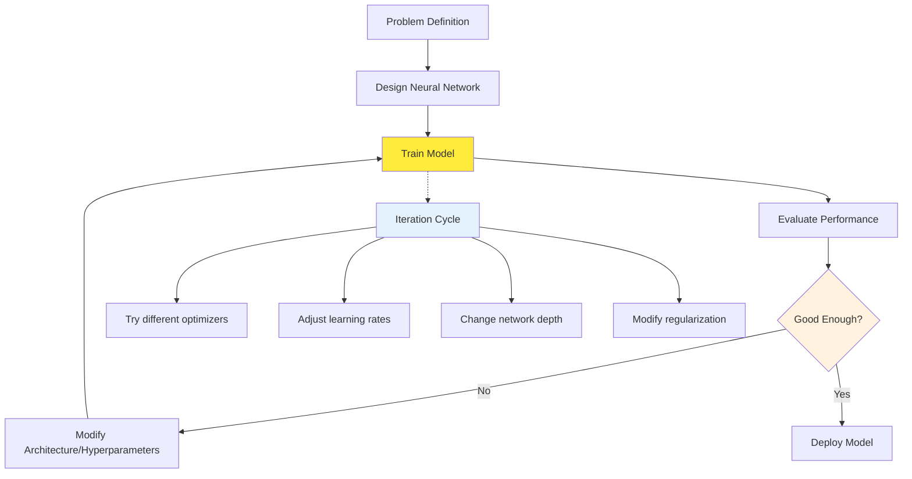

**Key Insight**: The faster you can complete each iteration cycle, the more experiments you can run, leading to better final models.

### The Scale Challenge in Deep Learning

#### Why Deep Learning Demands Big Data

Deep learning's effectiveness scales dramatically with data size, but this creates computational challenges:

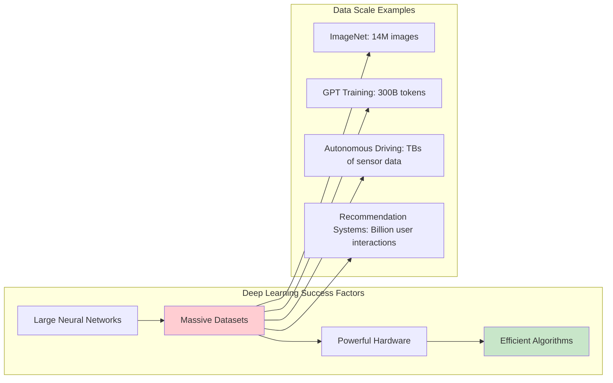

#### The Computational Bottleneck

**Traditional Approach Problems**:

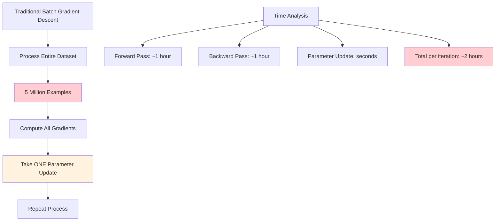

**Real-world Impact**:

- **Training Time**: Days or weeks for a single model
- **Experimentation**: Limited number of trials possible
- **Resource Utilization**: Inefficient use of expensive GPU time
- **Memory Requirements**: May exceed available hardware capacity

### The Evolution of Optimization Algorithms

#### Historical Progression

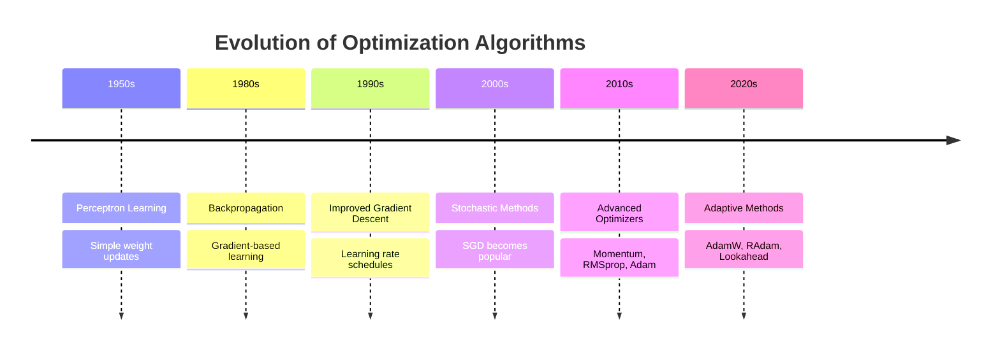

#### Algorithm Complexity vs Performance

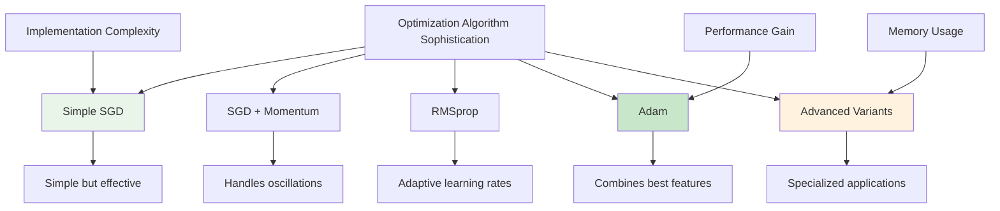

### Fundamental Optimization Challenges

#### Gradient Behavior in Practice

**Real-world Gradient Characteristics**:

- **Stochastic Nature**: Mini-batch gradients are noisy estimates
- **Scale Differences**: Different parameters may need different learning rates
- **Temporal Dynamics**: Optimal learning rates change during training
- **Curvature Variation**: Loss landscape varies dramatically across parameter space

### The Speed-Accuracy Trade-off

#### Optimization Algorithm Selection Criteria

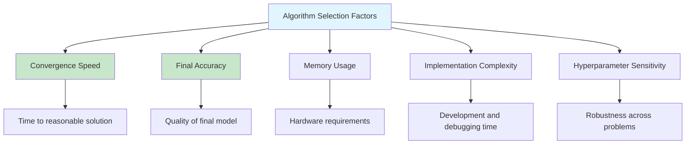

#### Performance Metrics for Optimization

**Key Performance Indicators**:

| Metric                  | Description                              | Typical Values      |
| ----------------------- | ---------------------------------------- | ------------------- |
| **Time to Convergence** | Wall-clock time to reach target accuracy | Hours to days       |
| **Sample Efficiency**   | Examples needed to reach performance     | 10K to 1M+ examples |
| **Final Performance**   | Best achievable accuracy                 | Problem-dependent   |
| **Robustness**          | Performance across different problems    | High variance       |
| **Resource Usage**      | Memory and compute requirements          | GB to TB            |

### Modern Optimization Requirements

#### What Makes a Good Optimization Algorithm Today?

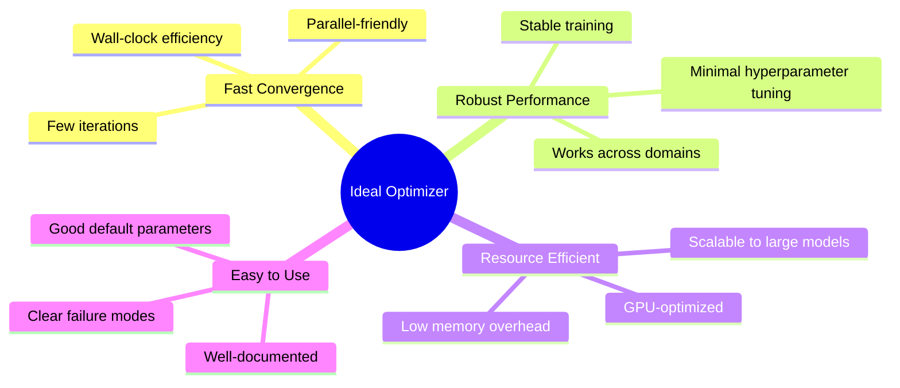

#### The Modern Deep Learning Workflow

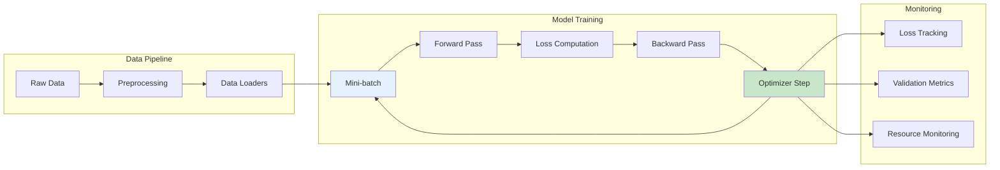

### Setting the Stage for Advanced Optimizers

#### Why Standard Gradient Descent Isn't Enough

**Fundamental Limitations**:

1. **Fixed Learning Rate**: One size doesn't fit all parameters
2. **No Memory**: Each step independent of previous steps
3. **Oscillatory Behavior**: Poor handling of different parameter scales
4. **Slow Convergence**: Linear convergence in best case

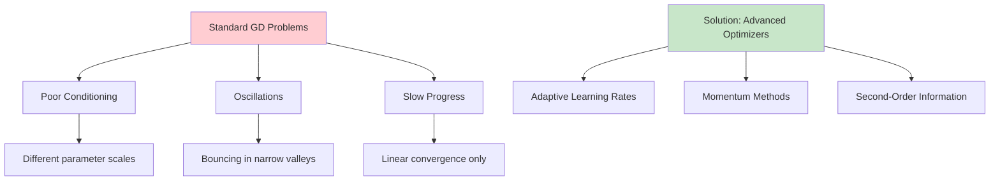

#### Preview of Solutions

The optimization algorithms we'll study address these fundamental challenges:

- **Mini-batch GD**: Enables training on large datasets
- **Momentum**: Accelerates convergence and reduces oscillations
- **RMSprop**: Adapts learning rates per parameter
- **Adam**: Combines momentum and adaptive learning rates
- **Learning Rate Decay**: Improves final convergence

### Practical Impact Demonstration

#### Training Time Comparison

**Hypothetical Example**: Training ResNet-50 on ImageNet

| Method         | Time per Epoch | Epochs to Convergence | Total Time | Final Accuracy |
| -------------- | -------------- | --------------------- | ---------- | -------------- |
| Batch GD       | 8 hours        | 200                   | 1600 hours | 76.1%          |
| SGD            | 15 minutes     | 100                   | 25 hours   | 75.8%          |
| SGD + Momentum | 15 minutes     | 60                    | 15 hours   | 76.2%          |
| Adam           | 18 minutes     | 40                    | 12 hours   | 76.5%          |

#### Real-world Success Stories

**Notable Optimization Breakthroughs**:

- **ImageNet Revolution (2012)**: AlexNet's success partly due to effective SGD + momentum
- **Transformer Training**: Adam optimizer crucial for stable large language model training
- **GANs**: Specific optimizers (RMSprop, Adam) essential for stable adversarial training

### Conclusion: The Optimization Imperative

Modern deep learning success depends critically on efficient optimization algorithms. The choice of optimizer can mean the difference between:

- **Successful training vs. failure to converge**
- **Hours vs. days of training time**
- **Competitive advantage vs. missed opportunities**
- **Research breakthrough vs. incremental progress**

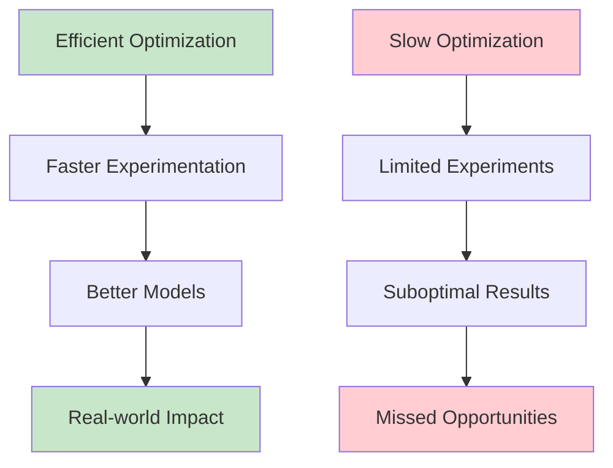

As we dive into specific algorithms, remember that each represents a solution to real problems faced by practitioners training neural networks on massive datasets with limited time and computational resources. The evolution from basic gradient descent to sophisticated adaptive optimizers reflects the maturation of deep learning from academic curiosity to industrial necessity.

## 2. Mini-batch Gradient Descent

### Introduction to Optimization Challenges

In deep learning, training neural networks is a highly iterative process where you need to train many models to find one that works well. **Fast optimization algorithms are crucial** because:

- Deep learning works best with big data (millions of examples)
- Large datasets take prohibitively long to process with traditional methods
- Better optimization = faster iteration cycles = more experiments = better models
- Machine learning is empirical - you need to try many different approaches quickly

**The Fundamental Challenge**: Traditional batch gradient descent processes the **entire** training set before taking one parameter update step. With datasets containing millions of examples, this becomes computationally prohibitive.

### The Evolution from Batch to Mini-batch

#### Traditional Batch Gradient Descent Problem

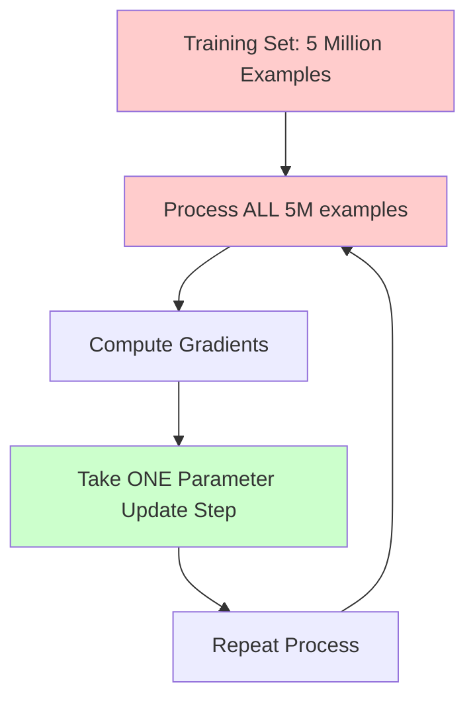

**Key Issues:**

- **Memory constraints**: 5M examples may not fit in GPU memory
- **Slow progress**: One gradient step per full dataset pass
- **Inefficient**: No learning progress until entire dataset is processed

#### Mini-batch Solution Overview

**Core Idea**: Split the large training set into smaller "mini-batches" and process them sequentially, taking gradient steps after each mini-batch.

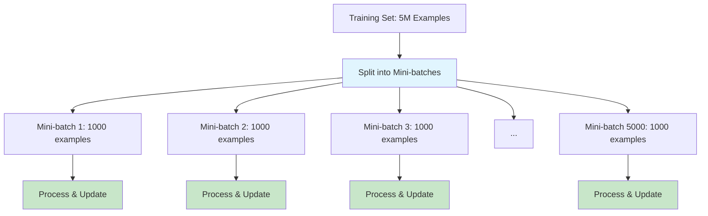

### Mathematical Notation and Data Structures

#### Notation System

Andrew Ng introduces a systematic notation to distinguish between different indexing schemes:

| Notation    | Meaning                    | Example                                   |
| ----------- | -------------------------- | ----------------------------------------- |
| $X^{(i)}$   | $i$-th training example    | $X^{(1)}, X^{(2)}, ..., X^{(m)}$          |
| $Z^{[l]}$   | Activations from layer $l$ | $Z^{[1]}, Z^{[2]}, ..., Z^{[L]}$          |
| $X^{\{t\}}$ | $t$-th mini-batch          | $X^{\{1\}}, X^{\{2\}}, ..., X^{\{5000\}}$ |

#### Data Partitioning Visualization

For a training set with 5 million examples split into mini-batches of 1000:

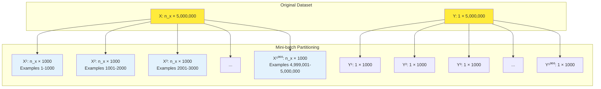

#### Dimensions Verification

**Question**: What are the dimensions of $X^{\{t\}}$ and $Y^{\{t\}}$?

**Answer**:

- $X^{\{t\}}$: $n_x \times 1000$ (number of features × mini-batch size)
- $Y^{\{t\}}$: $1 \times 1000$ (for binary classification)

Where $n_x$ is the number of input features.

### Mini-batch Gradient Descent Algorithm

#### Detailed Algorithm Steps

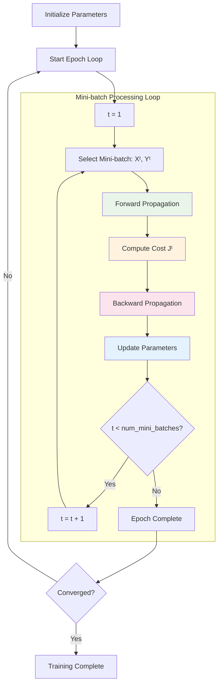

#### Mathematical Formulation

**For each mini-batch $t$ (where $t = 1, 2, ..., 5000$):**

1. **Forward Propagation**:
   $$Z^{[1]} = W^{[1]} X^{\{t\}} + b^{[1]}$$
   $$A^{[1]} = g^{[1]}(Z^{[1]})$$
   $$\vdots$$
   $$Z^{[L]} = W^{[L]} A^{[L-1]} + b^{[L]}$$
   $$A^{[L]} = g^{[L]}(Z^{[L]})$$

2. **Cost Computation**:
   $$J^{\{t\}} = \frac{1}{1000} \sum_{i=1}^{1000} \mathcal{L}(\hat{y}^{(i)}, y^{(i)}) + \frac{\lambda}{2 \times 1000} \sum_{l=1}^{L} ||W^{[l]}||_F^2$$

3. **Backward Propagation**:

   - Compute gradients $dW^{[l]}, db^{[l]}$ using only examples in $X^{\{t\}}, Y^{\{t\}}$

4. **Parameter Updates**:
   $$W^{[l]} = W^{[l]} - \alpha \cdot dW^{[l]}$$
   $$b^{[l]} = b^{[l]} - \alpha \cdot db^{[l]}$$

### Epoch Concept and Training Progress

#### Understanding Epochs

**Definition**: One **epoch** = one complete pass through the entire training set.

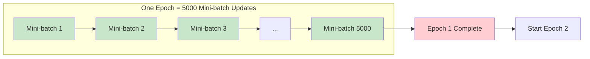

**Key Insight**:

- **Batch Gradient Descent**: 1 epoch = 1 parameter update
- **Mini-batch Gradient Descent**: 1 epoch = 5000 parameter updates

This is why mini-batch gradient descent converges much faster!

#### Training Progress Visualization

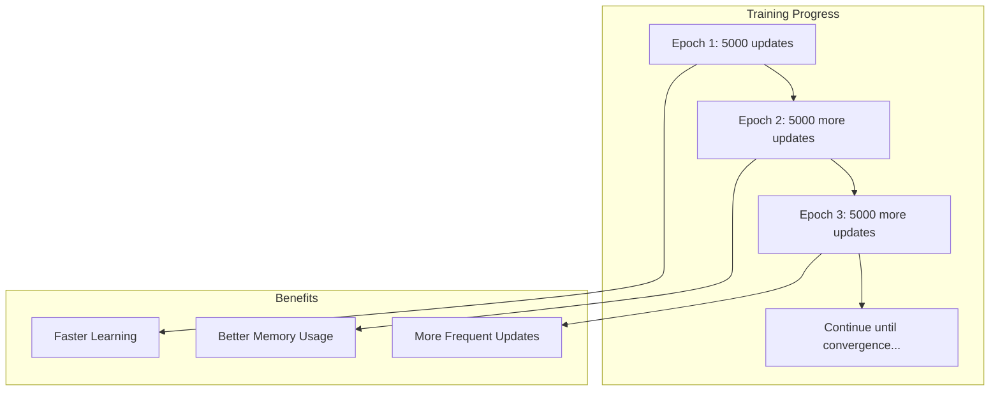

### Practical Implementation Details

#### Vectorization Within Mini-batches

**Critical Point**: Even though we're using mini-batches, we still **vectorize** within each mini-batch.

```python
# Processing mini-batch t
# X{t} has shape (n_x, 1000)
# Y{t} has shape (1, 1000)

# Forward prop - vectorized across 1000 examples
Z1 = np.dot(W1, X_t) + b1  # Shape: (hidden_units, 1000)
A1 = activation_function(Z1)

# This is much faster than:
# for i in range(1000):
#     z1_i = np.dot(W1, X_t[:, i]) + b1  # Slow, non-vectorized
```

#### Memory and Computational Benefits

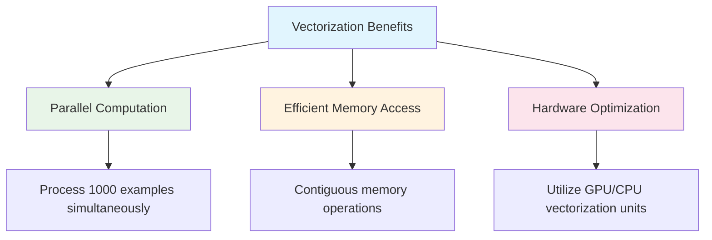

### Cost Function Behavior Analysis

#### Batch vs Mini-batch Cost Curves

One of the most important differences between batch and mini-batch gradient descent is how the cost function behaves:

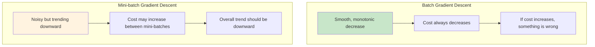

#### Why Mini-batch Costs Are Noisy

**Reason 1: Different Mini-batch Difficulties**

- Some mini-batches contain "easy" examples → Lower cost
- Other mini-batches contain "hard" examples → Higher cost
- Random sampling means difficulty varies between mini-batches

**Reason 2: Training Set Diversity**

- Well-labeled examples vs. mislabeled examples
- Clear patterns vs. ambiguous cases
- Representative samples vs. outliers

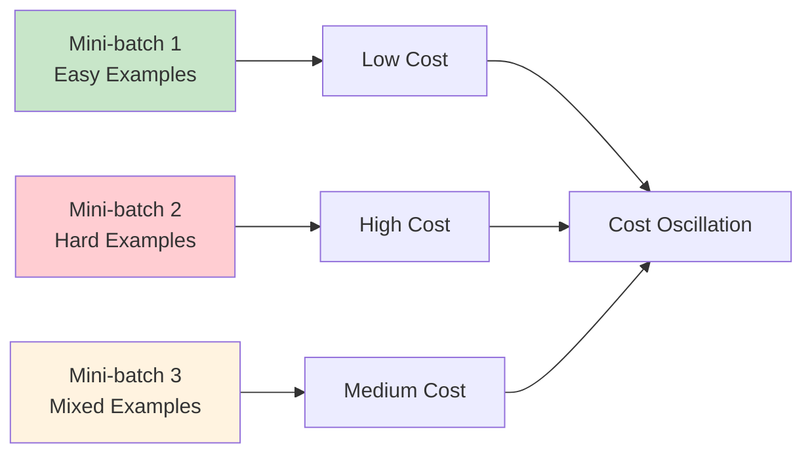

#### Interpreting Cost Curves

**Healthy Mini-batch Training**:

- Overall downward trend ✅
- Some oscillations are normal ✅
- Gradual noise reduction as learning progresses ✅

**Problematic Patterns**:

- No overall downward trend ❌
- Extreme oscillations that don't decrease ❌
- Exploding costs ❌

### Advanced Implementation Considerations

#### Shuffling Strategy

**Why shuffle?** Ensure random distribution of examples across mini-batches to prevent biased sampling.

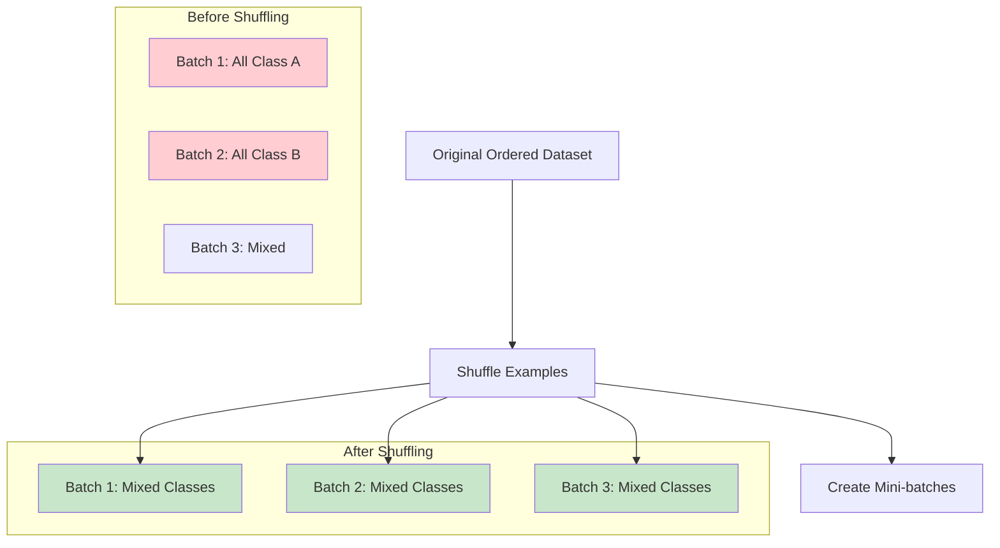

#### Handling Incomplete Final Mini-batch

**Problem**: Dataset size may not be perfectly divisible by mini-batch size.

**Example**: 5,001,000 examples with mini-batch size 1000

- First 5000 mini-batches: 1000 examples each
- Final mini-batch: 1000 examples (incomplete)

**Solutions**:

1. **Drop incomplete batch** (most common)
2. **Use smaller final batch**
3. **Pad with duplicate examples**

```python
def create_mini_batches(X, Y, mini_batch_size):
    m = X.shape[1]  # number of examples
    mini_batches = []

    # Shuffle data
    permutation = np.random.permutation(m)
    X_shuffled = X[:, permutation]
    Y_shuffled = Y[:, permutation]

    # Create complete mini-batches
    num_complete_batches = m // mini_batch_size

    for k in range(num_complete_batches):
        mini_batch_X = X_shuffled[:, k*mini_batch_size:(k+1)*mini_batch_size]
        mini_batch_Y = Y_shuffled[:, k*mini_batch_size:(k+1)*mini_batch_size]
        mini_batch = (mini_batch_X, mini_batch_Y)
        mini_batches.append(mini_batch)

    # Handle incomplete final batch
    if m % mini_batch_size != 0:
        mini_batch_X = X_shuffled[:, num_complete_batches*mini_batch_size:]
        mini_batch_Y = Y_shuffled[:, num_complete_batches*mini_batch_size:]
        mini_batch = (mini_batch_X, mini_batch_Y)
        mini_batches.append(mini_batch)

    return mini_batches
```

### Understanding Different Gradient Descent Variants

Now that we understand mini-batch gradient descent, let's see how it compares to the extremes:

#### Three Variants Comparison

```mermaid
graph TD
    subgraph "Gradient Descent Variants"
        A[Mini-batch Size = m] --> B[Batch Gradient Descent]
        C[Mini-batch Size = 1] --> D[Stochastic Gradient Descent]
        E[1 < Mini-batch Size < m] --> F[Mini-batch Gradient Descent]
    end

    B --> G[One mini-batch = entire dataset]
    D --> H[Every example is its own mini-batch]
    F --> I[Balanced approach]

    style B fill:#ffcdd2
    style D fill:#fff3e0
    style F fill:#c8e6c9
```

#### Optimization Path Visualization

Different mini-batch sizes lead to different optimization paths:

```mermaid
graph TD
    subgraph "Optimization Landscape"
        A[Global Minimum]
        B[Batch GD: Smooth path]
        C[Stochastic GD: Very noisy path]
        D[Mini-batch GD: Moderately noisy path]
    end

    B --> A
    C --> E[Oscillates around minimum]
    D --> A

    style A fill:#4caf50
    style B fill:#2196f3
    style C fill:#ff9800
    style D fill:#9c27b0
```

**Key Insights**:

- **Batch GD**: Smooth but slow progress
- **Stochastic GD**: Fast but erratic, never truly converges
- **Mini-batch GD**: Good balance of speed and stability

### Performance Analysis and Trade-offs

#### Computational Complexity

| Method        | Examples per Update | Vectorization | Memory Usage | Convergence |
| ------------- | ------------------- | ------------- | ------------ | ----------- |
| Batch GD      | m (all)             | ✅ Full       | High         | Smooth      |
| Stochastic GD | 1                   | ❌ Minimal    | Low          | Noisy       |
| Mini-batch GD | 64-1024             | ✅ Partial    | Medium       | Balanced    |

#### Why Mini-batch Works Best

```mermaid
graph TD
    A[Mini-batch Advantages] --> B[Vectorization Benefits]
    A --> C[Frequent Updates]
    A --> D[Memory Efficiency]

    B --> E[Process 1000 examples in parallel]
    C --> F[5000 updates per epoch vs 1]
    D --> G[Fits in GPU memory]

    H[Batch GD Problems] --> I[Too slow per iteration]
    J[Stochastic GD Problems] --> K[Loses vectorization speedup]
    J --> L[Too noisy to converge well]

    style A fill:#e8f5e8
    style H fill:#ffcdd2
    style J fill:#ffcdd2
```

### Practical Guidelines Summary

#### When to Use Each Method

```mermaid
flowchart TD
    A[Choose Gradient Descent Variant] --> B{Dataset Size?}

    B -->|"< 2000 examples"| C[Use Batch Gradient Descent]
    B -->|"> 2000 examples"| D{Available Memory?}

    D -->|Limited| E[Use smaller mini-batches 64-128]
    D -->|Abundant| F[Use larger mini-batches 256-1024]

    C --> G[Simple, effective for small data]
    E --> H[Memory-efficient training]
    F --> I[Faster training with vectorization]

    style C fill:#c8e6c9
    style E fill:#fff3e0
    style F fill:#e3f2fd

```

#### Mini-batch Size Selection Strategy

**Recommended Approach**:

1. Start with powers of 2: 64, 128, 256, 512, 1024
2. Ensure mini-batch fits in GPU memory
3. Monitor training speed and convergence
4. Adjust based on specific problem requirements

**Memory Considerations**:

- **GPU Memory**: Critical constraint for large models
- **Batch Size vs Memory**: Linear relationship
- **Sweet Spot**: Largest batch that fits in memory

This completes our in-depth analysis of mini-batch gradient descent.

## 3. Exponentially Weighted Averages

### Why Are We Learning This? 🤔

**From Andrew Ng**: "I want to show you a few optimization algorithms that are faster than gradient descent. In order to understand those algorithms, you need to understand something called exponentially weighted averages."

This is the **foundation** for understanding:

- Momentum optimization
- RMSprop algorithm
- Adam optimization algorithm

```mermaid
graph LR
    A[Exponentially Weighted Averages] --> B[Momentum]
    A --> C[RMSprop]
    A --> D[Adam]

    style A fill:#ffeb3b
    style B fill:#c8e6c9
    style C fill:#c8e6c9
    style D fill:#c8e6c9
```

### Visual Understanding

<div style="width: 100%; height: 600px; border: 1px solid #ddd; border-radius: 8px; overflow: hidden;">
<iframe src="./exponential_averages_graph.html" width="100%" height="100%" frameborder="0"></iframe>
</div>

📊 **Interactive Graph**: [View the Exponentially Weighted Averages Visualization](./exponential_averages_graph.html)

_Click the link above to see how different β values affect the smoothing of temperature data._

**The Problem**: Raw data is noisy and you want to compute trends or moving averages.

### The Algorithm (Exact from Course)

**Initialization**: $V_0 = 0$

**Daily Updates**:

- Day 1: $V_1 = 0.9 \times V_0 + 0.1 \times \theta_1$
- Day 2: $V_2 = 0.9 \times V_1 + 0.1 \times \theta_2$
- Day 3: $V_3 = 0.9 \times V_2 + 0.1 \times \theta_3$

**General Formula**:
$$V_t = \beta V_{t-1} + (1-\beta)\theta_t$$

Where:

- $V_t$ = exponentially weighted average on day $t$
- $\beta$ = weighting parameter (was 0.9 in example)
- $\theta_t$ = temperature on day $t$
- Initially used $\beta = 0.9$ and $(1-\beta) = 0.1$

### Understanding Different Beta Values (From Course)

Andrew Ng shows three different curves with different $\beta$ values:

#### β = 0.9 (Red Line - Most Common)

- **Averaging window**: $\frac{1}{1-0.9} = \frac{1}{0.1} = 10$ days
- **Characteristics**: Good balance between smoothness and responsiveness
- **Andrew's insight**: "Think of this as averaging over the last 10 days temperature"

#### β = 0.98 (Green Line - Very Smooth)

- **Averaging window**: $\frac{1}{1-0.98} = \frac{1}{0.02} = 50$ days
- **Characteristics**:
  - Much smoother curve (averaging over more days)
  - **Shifted further to the right** (higher latency)
  - **Adapts more slowly** when temperature changes
- **Why slower**: "When β = 0.98, it gives a lot of weight (0.98) to the previous value and much smaller weight (0.02) to current observation"

#### β = 0.5 (Yellow Line - Very Responsive)

- **Averaging window**: $\frac{1}{1-0.5} = \frac{1}{0.5} = 2$ days
- **Characteristics**:
  - Much more noisy
  - More susceptible to outliers
  - **Adapts much more quickly** to temperature changes

```mermaid
graph TD
    subgraph "β = 0.9 (Red Line)"
        A[~10 days memory]
        A --> B[Balanced smoothness]
        A --> C[Good responsiveness]
    end

    subgraph "β = 0.98 (Green Line)"
        D[~50 days memory]
        D --> E[Very smooth]
        D --> F[Higher latency]
        D --> G[Slow adaptation]
    end

    subgraph "β = 0.5 (Yellow Line)"
        H[~2 days memory]
        H --> I[More noisy]
        H --> J[Quick adaptation]
        H --> K[Susceptible to outliers]
    end

    style A fill:#ffcdd2
    style D fill:#c8e6c9
    style H fill:#fff3e0
```

### Mathematical Intuition (From Course Video 2)

**Andrew's Deep Dive**: Let's understand what $V_{100}$ really represents.

**Expanding the recursive formula**:
$$V_{100} = 0.1\theta_{100} + 0.9 \times V_{99}$$

**But what is $V_{99}$?** Substitute:
$$V_{100} = 0.1\theta_{100} + 0.9 \times (0.1\theta_{99} + 0.9 \times V_{98})$$

**Continue expanding**:
$$V_{100} = 0.1\theta_{100} + 0.1 \times 0.9 \times \theta_{99} + 0.1 \times 0.9^2 \times \theta_{98} + 0.1 \times 0.9^3 \times \theta_{97} + ...$$

**Key Insight**: This shows $V_{100}$ is a **weighted sum** of:

- Current day ($\theta_{100}$): weight = $0.1$
- Yesterday ($\theta_{99}$): weight = $0.1 \times 0.9 = 0.09$
- 2 days ago ($\theta_{98}$): weight = $0.1 \times 0.9^2 = 0.081$
- 3 days ago ($\theta_{97}$): weight = $0.1 \times 0.9^3 = 0.073$

```mermaid
graph LR
    A[θ₁₀₀<br/>weight: 0.1] --> B[θ₉₉<br/>weight: 0.09]
    B --> C[θ₉₈<br/>weight: 0.081]
    C --> D[θ₉₇<br/>weight: 0.073]
    D --> E[θ₉₆<br/>weight: 0.066]
    E --> F[Exponentially<br/>decreasing...]

    style A fill:#4caf50
    style B fill:#8bc34a
    style C fill:#cddc39
    style D fill:#ffeb3b
    style E fill:#ffc107
```

### The "1/e" Mathematical Insight (From Course)

**Andrew's Mathematical Explanation**:

**For β = 0.9**:

- $0.9^{10} \approx 0.35 \approx \frac{1}{e}$ (where $e$ is Euler's number)
- **Interpretation**: After 10 days, the weight decays to about 1/3 of the current day's weight
- **Rule**: "$\beta^{1/(1-\beta)} \approx \frac{1}{e}$"

**For β = 0.98**:

- $0.98^{50} \approx \frac{1}{e}$
- After 50 days, weights become very small

**General Formula**: We're averaging over $\frac{1}{1-\beta}$ days because:

- If $\epsilon = 1 - \beta$, then $(1-\epsilon)^{1/\epsilon} \approx \frac{1}{e}$
- This gives the "effective averaging window"

### Practical Implementation (From Course)

**Andrew's Implementation Insight**:

```python
# DON'T store V0, V1, V2, ... as separate variables
# Instead, use ONE variable that gets updated:

v = 0  # Initialize
beta = 0.9

for theta_t in temperature_data:
    v = beta * v + (1 - beta) * theta_t
    # v now contains the exponentially weighted average
```

**Why This Implementation is Brilliant**:

- **Memory efficient**: Only one number in memory
- **Computationally efficient**: One line of code per update
- **Simple**: Just keep overwriting the same variable

### Comparison with Traditional Moving Average (From Course)

**Andrew's Trade-off Analysis**:

**Traditional Moving Window** (e.g., average of last 10 days):

- **Pros**: More accurate estimate
- **Cons**:
  - Requires more memory (store all 10 values)
  - More complicated to implement
  - Computationally more expensive

**Exponentially Weighted Average**:

- **Pros**:
  - Very little memory (one number)
  - One line of code
  - Computationally efficient
  - **"This is why it's used in a lot of machine learning"**
- **Cons**: Not the most accurate (but good approximation)

### Why This Matters for Optimization (Andrew's Setup)

**Course Context**:

> "For things we'll see in the next few videos, where you need to compute averages of a lot of variables, this is a very efficient way to do so from both computation and memory efficiency point of view."

**The Connection**:

- **Neural networks** have millions of parameters
- **Optimization algorithms** need to track averages for each parameter
- **Exponentially weighted averages** make this computationally feasible

```mermaid
graph TD
    A[Neural Network: Million Parameters] --> B[Need Averages for Each Parameter]
    B --> C[Traditional Method: Too Expensive]
    B --> D[Exponential Average: Efficient]
    D --> E[Enables Advanced Optimizers]
    E --> F[Momentum, RMSprop, Adam]

    style C fill:#ffcdd2
    style D fill:#c8e6c9
    style F fill:#c8e6c9
```

### Key Terminology (Exactly from Course)

- **Also called**: "Exponentially weighted moving averages" in statistics literature
- **Course uses**: "Exponentially weighted averages" for short
- **Parameter**: $\beta$ will be a hyperparameter in learning algorithms
- **Common values**: $\beta$ usually between 0.8 to 0.999

### Summary: What We Learned

From Andrew Ng's course, we learned:

1. **Purpose**: Foundation for advanced optimization algorithms
2. **Formula**: $V_t = \beta V_{t-1} + (1-\beta)\theta_t$
3. **Intuition**: Weighted average with exponentially decaying weights
4. **Window size**: Approximately $\frac{1}{1-\beta}$ observations
5. **Implementation**: Single variable, single line of code
6. **Efficiency**: Memory and computationally efficient
7. **Trade-off**: Good approximation vs. exact computation

**Next**: We'll use this concept to build better optimization algorithms than straightforward gradient descent!

## 4. Bias Correction in Exponentially Weighted Averages

### Why Are We Learning This?

**From Andrew Ng**: "There's one technical detail called bias correction that can make your computation of these averages more accurate."

**Why this matters**:

- **Improves early estimates** when your algorithm is "warming up"
- **Essential for understanding** how Adam optimizer works (uses bias correction)
- **Makes algorithms more accurate** in the initial training phases
- **Technical completeness** - understanding both the problem and solution

```mermaid
graph LR
    A[Bias Correction] --> B[Better Early Estimates]
    A --> C[Used in Adam Optimizer]
    A --> D[More Accurate Training Start]

    style A fill:#e1f5fe
    style B fill:#c8e6c9
    style C fill:#c8e6c9
    style D fill:#c8e6c9
```

### The Problem Discovered (From Course)

**Andrew's Key Insight**: "If you implement the formula as written, you won't actually get the green curve when Beta equals 0.98, you actually get the purple curve that starts off really low."

### Visual Understanding of the Problem

📊 **Interactive Graph**: [View the Bias Correction Visualization](./bias_correction_graph.html)

_Click the link above to see how bias correction fixes the early estimation problem. You can adjust β values and see the difference between purple (uncorrected) and green (corrected) lines._

**What you'll see in the visualization**:

- **🟣 Purple line**: Without correction - starts very low due to V₀ = 0 initialization
- **🟢 Green line**: With correction - accurate estimates from day 1
- **🔵 Blue dots**: Raw temperature data points
- **Interactive slider**: Adjust β to see how higher β values need more correction

### The Mathematical Problem (From Course)

**Andrew's Step-by-Step Explanation**:

**Initialization**: $V_0 = 0$

**Day 1 Calculation** (with $\beta = 0.98$):
$$V_1 = 0.98 \times V_0 + 0.02 \times \theta_1 = 0.98 \times 0 + 0.02 \times \theta_1$$

Since $V_0 = 0$, the first term disappears:
$$V_1 = 0.02 \times \theta_1$$

**The Problem**: If $\theta_1 = 40°F$, then $V_1 = 0.02 \times 40 = 0.8°F$

❌ **This is clearly not a good estimate of the first day's temperature!**

### Day 2 Makes It Worse (From Course)

**Day 2 Calculation**:
$$V_2 = 0.98 \times V_1 + 0.02 \times \theta_2$$

**Substituting $V_1$**:
$$V_2 = 0.98 \times (0.02 \times \theta_1) + 0.02 \times \theta_2$$
$$V_2 = 0.0196 \times \theta_1 + 0.02 \times \theta_2$$

**Andrew's insight**: "Assuming $\theta_1$ and $\theta_2$ are positive numbers, when you compute this, $V_2$ will be much less than $\theta_1$ or $\theta_2$, so $V_2$ isn't a very good estimate of the first two days temperature."

### Why This Bias Occurs

**Root Cause Analysis**:

1. **Zero Initialization**: Starting with $V_0 = 0$ creates an artificial "cold start"
2. **High Beta Values**: When $\beta$ is close to 1 (like 0.98), we give huge weight (98%) to the previous estimate
3. **Compounding Effect**: The bias compounds over multiple iterations
4. **Exponential Decay**: The contribution of early true values gets exponentially diminished

```mermaid
graph TD
    A[V₀ = 0 initialization] --> B[V₁ gets very small value]
    B --> C[V₂ still influenced by small V₁]
    C --> D[Bias compounds over iterations]
    D --> E[Takes many iterations to reach true values]

    F[High β values make it worse] --> B
    G[Low initial estimates] --> H[Purple curve starts very low]

    style A fill:#ffcdd2
    style E fill:#ffcdd2
    style H fill:#ffcdd2
```

### The Mathematical Solution (From Course)

**Bias Correction Formula**:
$$V_t^{\text{corrected}} = \frac{V_t}{1 - \beta^t}$$

**Andrew's Concrete Example** (for $t=2, \beta=0.98$):

**Step 1**: Calculate the correction factor
$$1 - \beta^t = 1 - 0.98^2 = 1 - 0.9604 = 0.0396$$

**Step 2**: Apply correction
$$V_2^{\text{corrected}} = \frac{V_2}{0.0396} = \frac{0.0196\theta_1 + 0.02\theta_2}{0.0396}$$

**The Magic**: "You notice that these two things act as denominator, 0.0396. This becomes a weighted average of $\theta_1$ and $\theta_2$ and this removes this bias."

### Why the Correction Works

**Mathematical Intuition**:

1. **Early Days**: $\beta^t$ is significant, so $(1-\beta^t)$ is small → large correction
2. **Later Days**: $\beta^t \to 0$, so $(1-\beta^t) \to 1$ → minimal correction
3. **Proper Weighting**: The correction makes early estimates proper weighted averages

**Numerical Example** (Day 2, $\beta=0.98$):

- **Without correction**: Coefficients don't sum to 1

  - $\theta_1$ coefficient: $0.0196$
  - $\theta_2$ coefficient: $0.02$
  - **Sum**: $0.0196 + 0.02 = 0.0396$ ≠ 1 ❌

- **With correction**: Divide by $0.0396$ to normalize
  - $\theta_1$ coefficient: $0.0196/0.0396 = 0.495$
  - $\theta_2$ coefficient: $0.02/0.0396 = 0.505$
  - **Sum**: $0.495 + 0.505 = 1.0$ ✅

### When Bias Correction Becomes Negligible

**Andrew's Long-term Analysis**: "As $t$ becomes large, $\beta^t$ will approach 0, which is why when $t$ is large enough, the bias correction makes almost no difference. This is why when $t$ is large, the purple line and the green line pretty much overlap."

**Numerical Demonstration** ($\beta = 0.98$):

| Day (t) | $\beta^t$ | $1-\beta^t$ | Correction Factor | Impact                  |
| ------- | --------- | ----------- | ----------------- | ----------------------- |
| 1       | 0.98      | 0.02        | 50.0×             | **Huge correction**     |
| 2       | 0.9604    | 0.0396      | 25.3×             | **Large correction**    |
| 5       | 0.9039    | 0.0961      | 10.4×             | **Moderate correction** |
| 10      | 0.8171    | 0.1829      | 5.5×              | **Some correction**     |
| 20      | 0.6676    | 0.3324      | 3.0×              | **Small correction**    |
| 50      | 0.3642    | 0.6358      | 1.6×              | **Minimal correction**  |

```mermaid
graph LR
    A[Day 1-5: Large Correction Needed] --> B[Day 10-20: Moderate Correction]
    B --> C[Day 50+: Minimal Correction]

    style A fill:#ffcdd2
    style B fill:#fff3e0
    style C fill:#c8e6c9
```

### Practical Implementation

**Simple Implementation**:

```python
def exponential_average_with_bias_correction(data, beta=0.9):
    v = 0
    corrected_values = []

    for t, theta_t in enumerate(data, 1):  # t starts from 1
        # Standard exponential average
        v = beta * v + (1 - beta) * theta_t

        # Bias correction
        v_corrected = v / (1 - beta**t)
        corrected_values.append(v_corrected)

    return corrected_values

# Example usage
temperatures = [40, 49, 45, 38, 52]
corrected_avg = exponential_average_with_bias_correction(temperatures, beta=0.98)
print("Corrected averages:", corrected_avg)
```

### Industry Practice (From Course)

**Andrew's Real-World Insight**: "In machine learning, for most implementations of the exponentially weighted average, people don't often bother to implement bias corrections because most people would rather just wait that initial period and have a slightly more biased assessment and then go from there."

**When to Use Bias Correction**:

```mermaid
graph TD
    A{Do you care about early accuracy?} --> B[Yes: Use bias correction]
    A --> C[No: Skip bias correction]

    B --> D[Adam optimizer - uses bias correction]
    B --> E[Critical early decisions]
    B --> F[Short training runs]

    C --> G[Momentum - often skips bias correction]
    C --> H[Long training runs]
    C --> I[Non-critical early phase]

    style B fill:#c8e6c9
    style C fill:#fff3e0
```

**Trade-offs**:

| Approach               | Pros                                        | Cons                            | Best For                                      |
| ---------------------- | ------------------------------------------- | ------------------------------- | --------------------------------------------- |
| **With Correction**    | Accurate from start, better early estimates | Extra computation, more complex | Adam, short runs, critical early phase        |
| **Without Correction** | Simpler, less computation                   | Biased early estimates          | Momentum, long runs, non-critical early phase |

### Connection to Optimization Algorithms

**Why This Matters for Neural Networks**:

1. **Adam Optimizer**: Uses bias correction for both momentum and RMSprop terms
2. **Training Start**: Better early estimates can lead to faster convergence
3. **Hyperparameter Sensitivity**: Reduces sensitivity to initialization
4. **Consistency**: Makes algorithm behavior more predictable

**Preview of Adam**:

```python
# Adam uses bias correction for both terms
v_corrected = v / (1 - beta1**t)  # Momentum term
s_corrected = s / (1 - beta2**t)  # RMSprop term
```

### Summary: Key Takeaways

**From Andrew Ng's Lecture**:

1. **Problem**: Zero initialization causes biased early estimates
2. **Solution**: Divide by $(1-\beta^t)$ to correct the bias
3. **Effect**: Large correction early, negligible correction later
4. **Practice**: Optional - depends on whether early accuracy matters
5. **Usage**: Essential in Adam, often skipped in Momentum

**Visual Memory Aid**:

- **Purple curve** = biased estimates (starts low)
- **Green curve** = corrected estimates (accurate from start)
- **Convergence** = both curves meet after "warming up" period

## 5. Gradient Descent with Momentum

**Key Idea**: Gradient descent with momentum computes an exponentially weighted average of gradients and uses that average to update weights instead of using the raw gradients directly. This almost always works faster than standard gradient descent.

### The Problem: Oscillations in Standard Gradient Descent

**Visual Example**

Consider optimizing a cost function with elliptical contours:

```
                    Gradient Descent Example

    Vertical axis (want slower learning)
                    ↑
                    │
        ╭───────────┼───────────╮
       ╱            │            ╲
      ╱             │             ╲
     ╱              │              ╲
    ╱    ╱╲╱╲╱╲╱╲╱╲╱●              ╲
   ╱    ╱          ╲ │               ╲   Standard GD Path:
  ╱    ╱            ╲│                ╲  ╱╲╱╲╱╲ (zigzag oscillations)
 ╱    ╱              ╲                 ╲
╱    ╱Start           ╲                 ╲
╲   ▲                  ╲               ╱
 ╲  │                   ╲             ╱   ● = Global Minimum
  ╲ │Purple arrows       ╲           ╱
   ╲│= Gradient           ╲         ╱     Momentum Path:
    ╲│  directions         ╲       ╱      ————————————● (smooth, direct)
     ╲                      ╲     ╱
      ╲                      ╲   ╱
       ╲______________________╲_╱
                    │
                    │
        ←───────────┼───────────→
            Horizontal axis (want faster learning)

    Blue zigzag = Standard Gradient Descent (many oscillations)
    Blue smooth = Momentum (dampened oscillations, direct path)
```

**The Oscillation Problem**

**Issues with this zigzag pattern:**

- **Slow convergence**: Takes many small steps due to oscillations
- **Learning rate limitations**: Can't use larger learning rates without diverging
- **Inefficient direction**: Oscillates vertically (unwanted) while moving slowly horizontally (wanted)

**Why This Happens**

- **Vertical axis**: Need slower learning (don't want oscillations)
- **Horizontal axis**: Want faster learning (aggressive movement toward minimum)
- Standard gradient descent treats both directions equally

### The Solution: Momentum

**Initialization**

```python
# Initialize momentum terms
v_dW = 0  # Same shape as W
v_db = 0  # Same shape as b
```

**Main Algorithm Loop**

```python
# On each iteration t:
for t in range(num_iterations):
    # Step 1: Compute gradients on current mini-batch
    dW, db = compute_gradients(...)
```

**Step 2: Update momentum terms (exponentially weighted averages)**

$$v_{dW} = \beta v_{dW} + (1-\beta) dW$$

$$v_{db} = \beta v_{db} + (1-\beta) db$$

**Step 3: Update parameters using momentum**

$$W = W - \alpha v_{dW}$$

$$b = b - \alpha v_{db}$$

### How Momentum Solves the Oscillation Problem

**Before (Standard GD): Raw gradients**

Iteration 1: $dW = [+2, -1] \rightarrow$ Update: $W = W - \alpha[+2, -1]$

Iteration 2: $dW = [+1, +1] \rightarrow$ Update: $W = W - \alpha[+1, +1]$

Iteration 3: $dW = [+2, -1] \rightarrow$ Update: $W = W - \alpha[+2, -1]$

**After (Momentum): Smoothed gradients**

Iteration 1: $v_{dW} = 0.9 \times [0,0] + 0.1 \times [+2,-1] = [+0.2, -0.1]$

Iteration 2: $v_{dW} = 0.9 \times [+0.2,-0.1] + 0.1 \times [+1,+1] = [+0.28, 0.0]$

Iteration 3: $v_{dW} = 0.9 \times [+0.28,0.0] + 0.1 \times [+2,-1] = [+0.45, -0.1]$

**Result**:

- Vertical oscillations $(+1, -1, +1, -1...)$ → Average out to $\approx 0$
- Horizontal consistency $(+2, +1, +2, +1...)$ → Accumulate to larger values

**Momentum Path vs Standard Gradient Descent**

```
Standard GD:     ╱╲╱╲╱╲╱╲╱╲╱● (many oscillations)
With Momentum:   ╱‾‾‾‾‾‾‾‾‾‾● (smoother, direct path)
```

### Physical Intuition: Ball Rolling Down Hill

Think of optimization as a **ball rolling down a bowl-shaped surface**:

**Components**

- **Cost function contours** = Bowl shape
- **Gradient** $(dW, db)$ = Acceleration force pushing the ball
- **Momentum terms** $(v_{dW}, v_{db})$ = Velocity of the ball
- **$\beta$ parameter** = Friction coefficient (prevents unlimited acceleration)

**Physics Analogy**

$$\text{Ball starts at rest: } v = 0$$
$$\downarrow$$
$$\text{Gradient provides acceleration} \rightarrow \text{Ball speeds up}$$
$$\downarrow$$
$$\text{Momentum builds up} \rightarrow \text{Ball gains velocity in consistent directions}$$
$$\downarrow$$
$$\text{Friction } (\beta < 1) \text{ prevents overshoot} \rightarrow \text{Controlled acceleration}$$
$$\downarrow$$
$$\text{Result: Ball rolls efficiently toward minimum}$$

**Key Insight**: Just like a ball rolling downhill gains speed and momentum, the algorithm accumulates "velocity" in directions that consistently reduce the cost.

### Why Momentum Works

**Mathematical Explanation**

For oscillatory components (like vertical direction):

$$dW_{\text{vertical}} = [+1, -1, +1, -1, +1, -1, ...]$$

$$v_{dW_{\text{vertical}}} = \beta \times v_{\text{prev}} + (1-\beta) \times dW_{\text{current}}$$

$$\approx \text{Average of recent gradients} \approx 0 \text{ (positive and negative cancel out)}$$

For consistent components (like horizontal direction):

$$dW_{\text{horizontal}} = [+2, +2, +2, +2, +2, +2, ...]$$

$$v_{dW_{\text{horizontal}}} = \beta \times v_{\text{prev}} + (1-\beta) \times dW_{\text{current}}$$

$$\approx \text{Accumulation of consistent gradients} \approx \text{Large positive value}$$

**Benefits**

1. **Dampens oscillations**: Conflicting gradients average out
2. **Accelerates consistent directions**: Aligned gradients accumulate
3. **Enables larger learning rates**: Reduced oscillations allow higher $\alpha$
4. **Smoother convergence**: More direct path to minimum

### Hyperparameters

**$\beta$ (Beta) - Momentum Parameter**

- **Common value**: $\beta = 0.9$ (works well in practice)
- **Interpretation**: Averages over last $\sim \frac{1}{1-\beta}$ iterations
  - $\beta = 0.9 \rightarrow$ averages over $\sim 10$ iterations
  - $\beta = 0.99 \rightarrow$ averages over $\sim 100$ iterations
- **Effect**:
  - **Higher $\beta$**: More smoothing, more momentum buildup
  - **Lower $\beta$**: Less smoothing, closer to standard GD
  - **$\beta = 0$**: Reduces to standard gradient descent

**$\alpha$ (Alpha) - Learning Rate**

- Still needs tuning, but can often be set higher than standard GD
- Momentum reduces oscillations → allows more aggressive learning rates

**Bias Correction**

- **Theory**: Should divide by $(1 - \beta^t)$ for first few iterations
- **Practice**: Usually not implemented
- **Reason**: After $\sim 10$ iterations, momentum "warms up" and bias becomes negligible

### Implementation Details

**Initialization**

```python
# Initialize velocity terms as zeros
v_dW = np.zeros_like(W)  # Same shape as W
v_db = np.zeros_like(b)  # Same shape as b
```

**Alternative Formulation**

Sometimes seen in literature (without the $(1-\beta)$ term):

$$v_{dW} = \beta v_{dW} + dW \quad \text{(Note: no $(1-\beta)$ factor)}$$

$$W = W - \alpha v_{dW}$$

**Difference**: This scales $v_{dW}$ by factor of $(1-\beta)$, requiring different $\alpha$ tuning.

**Recommendation**: Use the standard formulation with $(1-\beta)$ term for more intuitive hyperparameter tuning:

$$v_{dW} = \beta v_{dW} + (1-\beta) dW$$

### High-Dimensional Perspective

**Real-World Scenario**

In practice, you're dealing with high-dimensional parameter spaces:

$$W \in \mathbb{R}^{n_{out} \times n_{in}}, \quad b \in \mathbb{R}^{n_{out}}$$

Each element gets its own momentum term:

$$v_{dW_{i,j}} = \beta v_{dW_{i,j}} + (1-\beta) dW_{i,j}$$

$$v_{db_i} = \beta v_{db_i} + (1-\beta) db_i$$

$$W_{i,j} = W_{i,j} - \alpha v_{dW_{i,j}}$$

$$b_i = b_i - \alpha v_{db_i}$$

### Practical Considerations

**When to Use Momentum**

- **Always recommended**: Almost always works better than standard GD
- **Especially useful for**:
  - Cost functions with "ravines" (steep in some directions)
  - High-dimensional parameter spaces
  - Mini-batch gradient descent (reduces mini-batch noise)

**Momentum vs Other Optimizers**

- **Momentum**: Foundation for more advanced optimizers
- **RMSprop**: Adapts learning rate per parameter
- **Adam**: Combines momentum + RMSprop
- **Starting point**: Try momentum first, then consider Adam for more complex problems

### Key Takeaways

1. **Momentum = Exponentially weighted average of gradients**
2. **Solves oscillation problem** by smoothing out conflicting gradient directions
3. **$\beta = 0.9$ is the go-to starting value**
4. **Almost always faster than standard gradient descent**
5. **Enables larger learning rates** due to reduced oscillations
6. **Physical intuition**: Ball rolling downhill with friction
7. **Foundation for advanced optimizers** like Adam

## 6. RMSprop Algorithm

**RMSprop** stands for **Root Mean Square Propagation** and is another optimization algorithm that can significantly speed up gradient descent, similar to momentum.

### The Problem: Same Oscillation Issue

RMSprop addresses the same fundamental problem as momentum - oscillations that slow down gradient descent:

**Visual Example with Parameter Names**

```
                         RMSprop Example

    b axis (want slower learning)
                    ↑
                    │
        ╭───────────┼───────────╮
       ╱            │            ╲
      ╱             │             ╲
     ╱              │              ╲     Standard GD:
    ╱    ╱╲╱╲╱╲╱╲╱╲╱●              ╲    Large db → Big oscillations
   ╱    ╱          ╲ │               ╲   Small dW → Slow horizontal progress
  ╱    ╱            ╲│                ╲
 ╱    ╱Start         ╲                 ╲  RMSprop:
╱    ▲                ╲                 ╲ Large Sdb → Dampens b updates
╲   │                  ╲               ╱  Small SdW → Allows faster W updates
 ╲  │                   ╲             ╱
  ╲ │                    ╲           ╱   ● = Global Minimum
   ╲│                     ╲         ╱
    ╲                      ╲       ╱     Result: More direct path ────────●
     ╲                      ╲     ╱
      ╲______________________╲___╱
                    │
                    │
        ←───────────┼───────────→
                 W axis (want faster learning)

    Large derivatives → Large squares → Large denominators → Smaller updates
    Small derivatives → Small squares → Small denominators → Relatively larger updates
```

### Core Algorithm

**Initialization**

```python
# Initialize squared gradient moving averages
S_dW = 0  # Same shape as W
S_db = 0  # Same shape as b
```

**Main Algorithm Loop**

```python
# On each iteration t:
for t in range(num_iterations):
    # Step 1: Compute gradients on current mini-batch
    dW, db = compute_gradients(...)
```

**Step 2: Compute exponentially weighted averages of squared gradients**

$$S_{dW} = \beta_2 S_{dW} + (1-\beta_2) dW^2 \quad \text{(element-wise squaring)}$$

$$S_{db} = \beta_2 S_{db} + (1-\beta_2) db^2 \quad \text{(element-wise squaring)}$$

**Step 3: Update parameters with adaptive learning rates**

$$W = W - \alpha \cdot \frac{dW}{\sqrt{S_{dW}} + \varepsilon}$$

$$b = b - \alpha \cdot \frac{db}{\sqrt{S_{db}} + \varepsilon}$$

### Key Components Explained

**$S_{dW}$ and $S_{db}$: Exponentially weighted averages of squared gradients**

- Keep track of how large gradients have been historically
- Large gradients → Large squares → Large $S$ values
- Small gradients → Small squares → Small $S$ values

**Square Root in Denominator: $\sqrt{S_{dW}}$**

- Provides the "Root Mean Square" scaling
- Normalizes update sizes based on gradient history

**Epsilon ($\varepsilon$): Numerical stability term**

- Prevents division by zero when $\sqrt{S_{dW}}$ is very small
- Typical value: $\varepsilon = 10^{-8}$

### Intuitive Understanding: How RMSprop Works

**The Gradient Behavior Analysis**

Consider our example where:

- **Vertical direction ($b$ parameter)**: Large oscillating gradients
- **Horizontal direction ($W$ parameter)**: Small consistent gradients

**Example iterations:**

$$\text{Iteration 1: } db = +10, \quad dW = +2$$

$$\text{Iteration 2: } db = -12, \quad dW = +1.8$$

$$\text{Iteration 3: } db = +11, \quad dW = +2.1$$

**After several iterations:**

$$S_{db} \approx \beta_2 S_{db} + (1-\beta_2) \times (\text{large } db)^2 \rightarrow \text{LARGE value}$$

$$S_{dW} \approx \beta_2 S_{dW} + (1-\beta_2) \times (\text{small } dW)^2 \rightarrow \text{SMALL value}$$

**Update sizes:**

$$b_{\text{update}} = \alpha \times \frac{db}{\sqrt{\text{LARGE}} + \varepsilon} \rightarrow \text{SMALL update (dampened)}$$

$$W_{\text{update}} = \alpha \times \frac{dW}{\sqrt{\text{SMALL}} + \varepsilon} \rightarrow \text{LARGER update (maintained)}$$

**Why This Helps**

**For parameters with large, oscillating gradients:**

- Squared gradients accumulate to large values
- Large denominators reduce update sizes
- **Result**: Oscillations are dampened

**For parameters with small, consistent gradients:**

- Squared gradients remain small
- Small denominators preserve update sizes
- **Result**: Consistent progress is maintained

### Detailed Comparison: Before vs After RMSprop

**Standard Gradient Descent**

Parameter updates directly proportional to gradients:

$$W_{\text{update}} = \alpha \times dW$$

$$b_{\text{update}} = \alpha \times db$$

**Problem**: Same learning rate $\alpha$ for all parameters

- Parameters with large gradients → Large, potentially destabilizing updates
- Parameters with small gradients → Small, potentially slow updates

**RMSprop Enhancement**

Parameter updates inversely scaled by gradient history:

$$W_{\text{update}} = \alpha \times \frac{dW}{\sqrt{S_{dW}} + \varepsilon}$$

$$b_{\text{update}} = \alpha \times \frac{db}{\sqrt{S_{db}} + \varepsilon}$$

**Solution**: Adaptive per-parameter learning rates

- Parameters with historically large gradients → Smaller effective learning rate
- Parameters with historically small gradients → Larger effective learning rate

### Hyperparameters

**$\beta_2$ (Beta 2) - Exponential Decay Rate**

- **Purpose**: Controls the exponentially weighted average of squared gradients
- **Typical value**: $\beta_2 = 0.999$ (for Adam), but can vary for standalone RMSprop
- **Note**: Called $\beta_2$ to distinguish from momentum's $\beta$ (which becomes $\beta_1$ in Adam)

**$\alpha$ (Alpha) - Learning Rate**

- **Can often be increased**: RMSprop's adaptive scaling allows for more aggressive learning rates
- **Still requires tuning**: But less sensitive than standard gradient descent

**$\varepsilon$ (Epsilon) - Numerical Stability**

- **Purpose**: Prevents division by very small numbers
- **Typical value**: $\varepsilon = 10^{-8}$
- **Impact**: Usually minimal, but essential for numerical stability

### Implementation Details

**Initialization**

```python
# Initialize all S terms as zeros
S_dW = np.zeros_like(W)  # Same shape as W
S_db = np.zeros_like(b)  # Same shape as b
```

**Element-wise Operations**

```python
# IMPORTANT: All operations are element-wise
dW_squared = dW ** 2                           # Element-wise squaring
S_dW = beta2 * S_dW + (1-beta2) * dW_squared   # Element-wise operations
sqrt_S_dW = np.sqrt(S_dW + epsilon)            # Element-wise square root
W_update = learning_rate * dW / sqrt_S_dW      # Element-wise division
```

### High-Dimensional Perspective

**Real-World Scenario**

In practice, you're not just dealing with two parameters ($W$ and $b$):

$$W \in \mathbb{R}^{n_{out} \times n_{in}}, \quad b \in \mathbb{R}^{n_{out}}$$

Each element gets its own adaptive scaling:

$$W_{i,j} = W_{i,j} - \alpha \times \frac{dW_{i,j}}{\sqrt{S_{dW_{i,j}}} + \varepsilon}$$

$$b_i = b_i - \alpha \times \frac{db_i}{\sqrt{S_{db_i}} + \varepsilon}$$

**Intuition for High Dimensions**

- **Some parameter directions**: Experience large, oscillating gradients → Get dampened
- **Other parameter directions**: Experience small, consistent gradients → Maintain progress
- **RMSprop automatically adapts**: No need to manually tune different learning rates for different parameters

### Benefits of RMSprop

**Primary Advantages**

1. **Adaptive per-parameter learning rates**: Each parameter gets customized scaling
2. **Reduced oscillations**: Large gradients get dampened automatically
3. **Maintained progress**: Small gradients don't get over-dampened
4. **Higher learning rates possible**: Adaptive scaling provides built-in stability
5. **Works well with mini-batches**: Smooths out mini-batch gradient noise

**Compared to Standard Gradient Descent**

```
Standard GD Path:     ╱╲╱╲╱╲╱╲╱╲╱● (oscillatory, slow)
RMSprop Path:         ╱‾‾‾‾‾‾‾‾‾‾● (smoother, faster)
```

### Historical Note: A Coursera Success Story

**Fascinating Origin**: RMSprop wasn't first published in an academic paper!

- **Creator**: Geoffrey Hinton
- **Platform**: Originally presented in a Coursera course
- **Impact**: Became widely adopted from the online course
- **Significance**: Shows how online education can effectively disseminate cutting-edge research
- **Legacy**: Demonstrates that good ideas can come from educational platforms, not just traditional academic venues

This is a wonderful example of how Coursera became an unexpected platform for novel research dissemination!

### Looking Ahead: Combination with Momentum

**Preview**: RMSprop addresses the adaptive learning rate problem, while momentum addresses the oscillation smoothing problem from a different angle.

**Next step**: Combining RMSprop + Momentum = **Adam optimizer**

- **RMSprop**: Adaptive per-parameter scaling
- **Momentum**: Exponentially weighted gradient averages
- **Adam**: Best of both worlds!

### Key Takeaways

1. **RMSprop = Adaptive learning rates per parameter**
2. **Uses squared gradients** to determine parameter-specific scaling
3. **Dampens oscillations** by reducing updates for high-variance parameters
4. **Maintains progress** by preserving updates for low-variance parameters
5. **Allows larger overall learning rates** due to built-in adaptive stability
6. **Works especially well** for problems with different parameter sensitivities
7. **Originated from education**, showing the power of online learning platforms

## 7. Adam Optimization Algorithm

**Adam** = **Ad**aptive **M**oment **E**stimation

### The Problem with Previous Optimization Algorithms

**Historical Context**

During the history of deep learning, many researchers (including well-known ones) proposed optimization algorithms that:

- **Worked well on specific problems** but didn't generalize
- **Failed across diverse neural network architectures**
- Led to **skepticism** in the deep learning community about new optimizers

**Why Adam is Different**

- **Proven track record**: Works well across a **wide range of deep learning architectures**
- **Consistent performance**: Unlike many algorithms that only work on specific problems
- **Widely recommended**: One of the rare algorithms that has truly "stood up" over time

### Core Concept: The Best of Both Worlds

Adam combines two powerful optimization techniques:

**Momentum**: Smooths oscillations by using exponentially weighted averages of gradients

$$v_{dW} = \beta_1 v_{dW} + (1-\beta_1)dW$$

**RMSprop**: Adapts learning rates using exponentially weighted averages of squared gradients

$$S_{dW} = \beta_2 S_{dW} + (1-\beta_2)dW^2$$

**Adam**: Uses both $v_{dW}$ and $S_{dW}$ to get smooth path + adaptive scaling

### Complete Adam Algorithm

**Initialization**

```python
v_dW = 0    # First moment estimate (momentum term)
v_db = 0    # First moment estimate for bias
S_dW = 0    # Second moment estimate (RMSprop term)
S_db = 0    # Second moment estimate for bias
t = 0       # Time step counter
```

**Main Algorithm Loop**

```python
for iteration in range(num_iterations):
    t = t + 1  # Increment time step

    # Step 1: Compute gradients on current mini-batch
    dW, db = compute_gradients(current_mini_batch)
```

**Step 2: Momentum update (First moment estimate)**

$$v_{dW} = \beta_1 v_{dW} + (1 - \beta_1) dW$$

$$v_{db} = \beta_1 v_{db} + (1 - \beta_1) db$$

**Step 3: RMSprop update (Second moment estimate)**

$$S_{dW} = \beta_2 S_{dW} + (1 - \beta_2) dW^2 \quad \text{(element-wise squaring)}$$

$$S_{db} = \beta_2 S_{db} + (1 - \beta_2) db^2 \quad \text{(element-wise squaring)}$$

**Step 4: Bias correction (CRITICAL for Adam)**

$$v_{dW}^{corrected} = \frac{v_{dW}}{1 - \beta_1^t}$$

$$v_{db}^{corrected} = \frac{v_{db}}{1 - \beta_1^t}$$

$$S_{dW}^{corrected} = \frac{S_{dW}}{1 - \beta_2^t}$$

$$S_{db}^{corrected} = \frac{S_{db}}{1 - \beta_2^t}$$

**Step 5: Parameter updates**

$$W = W - \alpha \cdot \frac{v_{dW}^{corrected}}{\sqrt{S_{dW}^{corrected}} + \varepsilon}$$

$$b = b - \alpha \cdot \frac{v_{db}^{corrected}}{\sqrt{S_{db}^{corrected}} + \varepsilon}$$

### Understanding Each Component

**First Moment (v): Momentum Component**

$$v_{dW} = \beta_1 v_{dW} + (1 - \beta_1) dW$$

- **Purpose**: Exponentially weighted average of gradients
- **Effect**: Smooths out oscillations, builds momentum in consistent directions
- **Intuition**: "Which direction have we been moving?"

**Second Moment (S): RMSprop Component**

$$S_{dW} = \beta_2 S_{dW} + (1 - \beta_2) dW^2$$

- **Purpose**: Exponentially weighted average of **squared** gradients
- **Effect**: Adapts learning rate per parameter based on gradient history
- **Intuition**: "How much have gradients been varying?"

**Final Update: Combining Both**

$$W = W - \alpha \cdot \frac{v_{dW}^{corrected}}{\sqrt{S_{dW}^{corrected}} + \varepsilon}$$

- **Numerator**: $v_{dW}^{corrected}$ provides direction and momentum
- **Denominator**: $\sqrt{S_{dW}^{corrected}}$ provides adaptive scaling
- **Result**: Direction from momentum, scaling from RMSprop

### Why Bias Correction is Critical in Adam

**The Problem Without Bias Correction**

At $t=1$:

$$v_{dW} = 0.9 \times 0 + 0.1 \times dW = 0.1 \times dW \quad \text{(too small!)}$$

$$S_{dW} = 0.999 \times 0 + 0.001 \times dW^2 = 0.001 \times dW^2 \quad \text{(too small!)}$$

**The Solution: Bias Correction**

$$v_{dW}^{corrected} = \frac{v_{dW}}{1 - 0.9^1} = \frac{0.1 \times dW}{0.1} = dW \quad \checkmark$$

$$S_{dW}^{corrected} = \frac{S_{dW}}{1 - 0.999^1} = \frac{0.001 \times dW^2}{0.001} = dW^2 \quad \checkmark$$

**Key insight**: Bias correction is especially important in Adam because both momentum and RMSprop components start from zero.

### Hyperparameters: Recommended Values

**Detailed Hyperparameter Guide**

| Parameter           | Symbol        | Recommended Value | Description               | Tuning Priority |
| ------------------- | ------------- | ----------------- | ------------------------- | --------------- |
| Learning Rate       | $\alpha$      | **Needs tuning**  | Overall step size         | **HIGH**        |
| First moment decay  | $\beta_1$     | **0.9**           | Momentum parameter        | **LOW**         |
| Second moment decay | $\beta_2$     | **0.999**         | RMSprop parameter         | **LOW**         |
| Numerical stability | $\varepsilon$ | **$10^{-8}$**     | Prevents division by zero | **NONE**        |

**Practical Tuning Strategy**

1. Use default values: $\beta_1 = 0.9$, $\beta_2 = 0.999$, $\varepsilon = 10^{-8}$
2. Only tune $\alpha$ (learning rate)
3. Try values like: $0.001, 0.003, 0.01, 0.03, 0.1$
4. Rarely need to tune $\beta_1$ and $\beta_2$
5. Almost never tune $\varepsilon$

### The Name: Adaptive Moment Estimation

**Breaking Down "Adaptive Moment Estimation"**

**Adaptive**:

- Learning rates adapt per parameter based on gradient history
- No fixed learning rate for all parameters

**Moment**:

- **First moment**: Mean of gradients ($\beta_1$ controls this)
- **Second moment**: Mean of squared gradients ($\beta_2$ controls this)

**Estimation**:

- We estimate these moments using exponentially weighted averages
- Bias correction improves these estimates

### Visual Comparison: Adam vs Other Optimizers

**Cost Function Landscape (elliptical contours):**

```
Standard GD:     ╱╲╱╲╱╲╱╲╱╲╱● (oscillatory, slow)
Momentum:        ╱‾╲‾╱‾╲‾╱‾● (smoother, but still some oscillation)
RMSprop:         ╱————————————● (direct, but no momentum buildup)
Adam:            ╱————————————● (smooth + direct + fast)

Legend: ● = Global minimum
```

**Performance Comparison Table**

| Optimizer   | Typical Accuracy | Cost Shape       | Speed       | Robustness    |
| ----------- | ---------------- | ---------------- | ----------- | ------------- |
| Standard GD | 79.7%            | Oscillatory      | Slow        | Poor          |
| Momentum    | 79.7%            | Less oscillatory | Medium      | Good          |
| RMSprop     | ~85%             | Adaptive         | Medium-Fast | Good          |
| **Adam**    | **94%**          | **Smooth**       | **Fast**    | **Excellent** |

### Why Adam Works So Well

**Combines Best Features**

1. **From Momentum**:

   - Smooths oscillations
   - Builds up speed in consistent directions
   - Reduces impact of noisy gradients

2. **From RMSprop**:

   - Adaptive per-parameter learning rates
   - Scales down updates for high-variance parameters
   - Scales up updates for low-variance parameters

3. **Bias Correction**:
   - Provides better estimates early in training
   - Prevents underestimation in initial iterations

**Robustness Across Problems**

- **Works on diverse architectures**: CNNs, RNNs, Transformers, etc.
- **Handles different data types**: Images, text, audio, structured data
- **Requires minimal tuning**: Usually just need to tune learning rate
- **Stable across mini-batch sizes**: Works well with different batch sizes

### High-Dimensional Perspective

**Real-World Scenario**

In practice, you're not just dealing with two parameters ($W$ and $b$):

$$W \in \mathbb{R}^{n_{out} \times n_{in}}, \quad b \in \mathbb{R}^{n_{out}}$$

Each element gets its own adaptive scaling:

$$W_{i,j} = W_{i,j} - \alpha \cdot \frac{v_{dW_{i,j}}^{corrected}}{\sqrt{S_{dW_{i,j}}^{corrected}} + \varepsilon}$$

$$b_i = b_i - \alpha \cdot \frac{v_{db_i}^{corrected}}{\sqrt{S_{db_i}^{corrected}} + \varepsilon}$$

**Intuition for High Dimensions**

- **Some parameter directions**: Experience large, oscillating gradients → Get dampened
- **Other parameter directions**: Experience small, consistent gradients → Maintain progress
- **Adam automatically adapts**: No need to manually tune different learning rates for different parameters

### Implementation Details

**Memory Requirements**

Adam requires more memory than basic gradient descent:

$$\text{Standard GD: Only needs gradients } (dW, db)$$

$$\text{Adam needs: gradients } + v_{dW} + v_{db} + S_{dW} + S_{db}$$

$$\text{Memory} \approx 4 \times (\text{parameter count})$$

**Numerical Stability Considerations**

Always add epsilon to prevent division by zero:

$$\text{denominator} = \sqrt{S_{dW}^{corrected}} + \varepsilon$$

Where $\varepsilon = 10^{-8}$ is usually sufficient:

- Too large $\varepsilon$ can interfere with adaptive scaling
- Too small $\varepsilon$ might cause numerical issues

### When to Use Adam

**Strongly Recommended For:**

- **Deep neural networks** (multiple layers)
- **Complex architectures** (ResNets, Transformers, etc.)
- **Limited tuning time** (Adam works well with defaults)
- **Diverse problem types** (computer vision, NLP, etc.)

**Consider Alternatives When:**

- **Extremely memory constrained** (Adam uses ~4x memory of SGD)
- **Very simple problems** (basic logistic regression might not need Adam)
- **Specific domain expertise** suggests other optimizers

### Common Misconceptions and Clarifications

**"Adam Coates" Connection**

**Clarification**: The Adam algorithm has **nothing to do** with Adam Coates (Andrew Ng's collaborator).

- Pure coincidence in naming
- Algorithm name comes from "Adaptive Moment Estimation"
- Adam Coates just happens to use the algorithm sometimes!

**"Always Better" Assumption**

**Reality check**: While Adam is excellent, it's not magic:

- Still need reasonable architecture choices
- Still need proper data preprocessing
- Still need appropriate regularization
- **Adam optimizes whatever objective you give it**

### Key Takeaways

1. **Adam = Momentum + RMSprop + Bias Correction**
2. **Proven across diverse problems** (not just specific cases)
3. **Use default hyperparameters** ($\beta_1=0.9$, $\beta_2=0.999$, $\varepsilon=10^{-8}$)
4. **Only tune learning rate $\alpha$** in most cases
5. **Requires more memory** but provides better performance
6. **Bias correction is crucial** for good early-iteration performance
7. **Has stood the test of time** in the deep learning community

8. **First-choice optimizer** for most deep learning problems

## 8. Learning Rate Decay

**Key Idea**: Slowly reduce the learning rate over time to help the algorithm converge closer to the minimum rather than oscillating around it.

### Motivation: Why Learning Rate Decay Helps

**The Problem with Fixed Learning Rate**

Suppose you're implementing mini-batch gradient descent with a reasonably small mini-batch (maybe 64 or 128 examples):

```
Cost Function Landscape:

    ╭─────────────────╮
   ╱                   ╲
  ╱       ●             ╲  ← Minimum
 ╱    ╱╲╱╲╱╲╱╲         ╲
╱    ╱          ╲        ╲  Fixed α: Algorithm wanders around
╲   ╱            ╲       ╱  Never really converges due to noise
 ╲ ╱              ╲     ╱
  ╲________________╲___╱

With Learning Rate Decay:
Large α initially → Fast learning
Small α later → Fine-tuning, tighter oscillations around minimum
```

**Why This Happens**

- **Mini-batch noise**: Each mini-batch has slightly different gradients
- **Fixed learning rate**: Steps are always the same size
- **Result**: Algorithm oscillates around minimum instead of converging

**The Solution: Learning Rate Decay**

- **Initial phases**: Large $\alpha$ allows fast learning
- **Later phases**: Small $\alpha$ allows smaller, more precise steps
- **Result**: Tighter convergence around the minimum

### Core Implementation: Epochs

**Definition**: One epoch = one complete pass through the entire training set

```
Training Set: [──────────────────────────]

Mini-batches: [──][──][──][──][──][──][──]

Epoch 1: Process all mini-batches once
Epoch 2: Process all mini-batches again
Epoch 3: Process all mini-batches again
...
```

### Learning Rate Decay Formulas

**1. Inverse Time Decay (Most Common)**

$$\alpha = \frac{1}{1 + \text{decay\_rate} \times \text{epoch\_num}} \times \alpha_0$$

Where:

- $\alpha_0$ = initial learning rate
- $\text{decay\_rate}$ = hyperparameter controlling decay speed
- $\text{epoch\_num}$ = current epoch number

**Concrete Example**: $\alpha_0 = 0.2$, $\text{decay\_rate} = 1$

**Epoch 1:**
$$\alpha = \frac{1}{1 + 1 \times 1} \times 0.2 = \frac{0.2}{2} = 0.1$$

**Epoch 2:**
$$\alpha = \frac{1}{1 + 1 \times 2} \times 0.2 = \frac{0.2}{3} = 0.067$$

**Epoch 3:**
$$\alpha = \frac{1}{1 + 1 \times 3} \times 0.2 = \frac{0.2}{4} = 0.05$$

**Epoch 4:**
$$\alpha = \frac{1}{1 + 1 \times 4} \times 0.2 = \frac{0.2}{5} = 0.04$$

**Learning Rate Progression Table**

| Epoch | $\alpha$ Value | Calculation               |
| ----- | -------------- | ------------------------- |
| 1     | 0.1            | $\frac{0.2}{1+1} = 0.1$   |
| 2     | 0.067          | $\frac{0.2}{1+2} = 0.067$ |
| 3     | 0.05           | $\frac{0.2}{1+3} = 0.05$  |
| 4     | 0.04           | $\frac{0.2}{1+4} = 0.04$  |

**2. Exponential Decay**

$$\alpha = r^{\text{epoch\_num}} \times \alpha_0$$

Where $r < 1$ (e.g., $r = 0.95$)

**Example**: $\alpha_0 = 0.2$, $r = 0.95$

$$\alpha = 0.95^{\text{epoch\_num}} \times 0.2$$

This exponentially and quickly decays the learning rate.

**3. Square Root Decay**

$$\alpha = \frac{k}{\sqrt{\text{epoch\_num}}} \times \alpha_0$$

Or based on mini-batch number $t$:

$$\alpha = \frac{k}{\sqrt{t}} \times \alpha_0$$

Where $k$ is a constant hyperparameter.

**4. Discrete Staircase Decay**

```
Learning Rate Schedule:
α₀ ────────────┐
               │
         α₀/2  ──────────┐
                         │
               α₀/4      ──────────┐
                                   │
                        α₀/8       ──────────
    └─────┬─────┴──────┬──┴──────┬──┴────────→
       Steps    Reduce by   Reduce by   Time
                 half        half
```

For some number of steps, use one learning rate, then decrease by half, repeat.

**5. Manual Decay**

**When applicable**: Training one model that takes hours/days
**Process**:

- Monitor training progress manually
- When learning appears to slow down, manually decrease $\alpha$
- Adjust hour-by-hour or day-by-day

**Limitations**: Only practical when training a small number of models

### Implementation Strategy

**Hyperparameters to Tune**

- $\alpha_0$ (initial learning rate)
- $\text{decay\_rate}$ (for inverse time decay)
- Choice of decay formula

**Tuning Process**

1. Try different values of $\alpha_0$
2. Try different values of $\text{decay\_rate}$
3. Find combination that works well for your specific problem

### Andrew Ng's Priority Ranking

**Higher Priority (try first):**

1. **Fixed learning rate $\alpha$**: Getting this well-tuned has huge impact
2. **Basic algorithm implementation**: Make sure everything works
3. **Other core hyperparameters**: Mini-batch size, architecture choices

**Lower Priority (try later):**

- **Learning rate decay**: Can help speed up training and provide final improvements
- **Advanced decay schedules**: Fine-tuning after basics work well

**Key Quote**: "Learning rate decay is usually lower down on the list of things I try."

### When Learning Rate Decay Helps Most

**Scenarios where it's particularly useful:**

- **Long training runs**: Many epochs over the dataset
- **Fine-tuning**: When you need precise convergence
- **Noisy gradients**: Mini-batch gradient descent with small batches
- **Final performance boost**: Can provide that last 1-2% improvement

**When it's less critical:**

- **Short training runs**: Few epochs
- **Well-tuned fixed learning rate**: If fixed $\alpha$ already works well
- **Large batch training**: Less noise, less need for decay

### Practical Implementation

**Pseudocode for Inverse Time Decay**

```python
# Hyperparameters
alpha_0 = 0.1           # Initial learning rate
decay_rate = 0.5        # Decay rate hyperparameter

# Training loop
for epoch in range(num_epochs):
    # Calculate current learning rate
    alpha = alpha_0 / (1 + decay_rate * epoch)

    # Train for one epoch with current learning rate
    for mini_batch in dataset:
        gradients = compute_gradients(mini_batch)
        parameters = parameters - alpha * gradients
```

**Framework Implementation**
Most deep learning frameworks provide built-in learning rate schedulers:

- TensorFlow: `tf.keras.optimizers.schedules`
- PyTorch: `torch.optim.lr_scheduler`

### Mathematical Intuition

**Why Inverse Time Decay Works**

As $\text{epoch\_num}$ increases, the denominator $(1 + \text{decay\_rate} \times \text{epoch\_num})$ grows:

$$\lim_{\text{epoch\_num} \to \infty} \frac{1}{1 + \text{decay\_rate} \times \text{epoch\_num}} = 0$$

This ensures the learning rate gradually approaches zero, allowing fine-tuned convergence.

**Decay Rate Impact**

- **Large decay_rate**: Faster decay, smaller learning rates sooner
- **Small decay_rate**: Slower decay, maintains larger learning rates longer

### Systematic Hyperparameter Search

**Preview for Next Week**: Andrew mentions that systematic hyperparameter tuning methods will be covered, including:

- How to organize all hyperparameters
- Efficient search strategies
- Prioritization of hyperparameter importance

### Key Takeaways

1. **Learning rate decay helps convergence** by reducing oscillations around the minimum
2. **Inverse time decay is most common**: $\alpha = \frac{\alpha_0}{1 + \text{decay\_rate} \times \text{epoch\_num}}$
3. **Lower priority than fixed learning rate tuning**: Get the basics right first
4. **Multiple implementation options**: Exponential, square root, discrete, manual
5. **Epoch-based is most practical**: One epoch = one pass through entire dataset
6. **Can provide final performance boost**: Often that last 1-2% improvement
7. **Don't over-optimize early**: Focus on core algorithm performance first

## 9. The Problem of Local Optima

**Historical Context**: In the early days of deep learning, people worried a lot about optimization algorithms getting stuck in bad local optima. As deep learning theory has advanced, our understanding has dramatically changed.

### The Evolution of Understanding

**Old Misconception vs. Modern Reality**

**What People Used to Think (2D Intuition)**

```
     Cost Function J
         ↑
         │     Local      Local
         │    Optima     Optima
         │  ╱─╲    ╱─╲  ╱─╲    ╱─╲
         │ ╱   ╲  ╱   ╲╱   ╲  ╱   ╲
    ─────┼╱─────╲╱─────────╲╱─────╲╱────→
         │       ╲Global  ╱ ╲
         │        ╲Optima╱   ╲
         │         ╲____╱     ╲
         │                     W₁, W₂

    Fear: "Algorithm will get trapped in local optima!"
```

**Modern Understanding (High-Dimensional Reality)**

In neural networks with thousands or millions of parameters, the optimization landscape is fundamentally different.

### Mathematical Insight: Why Local Optima Are Rare

**The Dimensionality Argument**

Consider a neural network with $n = 20,000$ parameters. At any point where $\nabla J = 0$:

For a point to be a **local optimum**, the Hessian matrix must be positive definite, meaning:
$$\frac{\partial^2 J}{\partial w_i^2} > 0 \quad \text{for all } i = 1, 2, ..., n$$

**Probability Analysis**

If we assume each second derivative has a 50% chance of being positive:
$$P(\text{local optimum}) = P(\text{all 20,000 directions curve upward})$$
$$P(\text{local optimum}) = \left(\frac{1}{2}\right)^{20,000} = 2^{-20,000}$$

This probability is astronomically small - essentially impossible!

### Saddle Points: The Reality

**What Actually Happens**

Most zero-gradient points are **saddle points**, where:

- Some dimensions have $\frac{\partial^2 J}{\partial w_i^2} > 0$ (curve upward)
- Other dimensions have $\frac{\partial^2 J}{\partial w_j^2} < 0$ (curve downward)

**Visual Representation of Saddle Points**

```
    Saddle Point Visualization (3D cross-section)
                J (Cost)
                   ↑
                   │
              ╱────┼────╲
             ╱     │     ╲     Direction 1: Curves UP
            ╱      │      ╲
    ───────╱───────●───────╲─────→ W₁
                   │        ╲
                   │         ╲
                   │      Direction 2:
                   │      Curves DOWN
                   ↓
                  W₂

    ● = Saddle Point (gradient = 0, but NOT a local minimum)
```

**The Horse Saddle Analogy**

Think of a saddle you put on a horse:

```
    Horse Saddle (Side View)        Horse Saddle (Front View)
         ╭─╮                              ╱─╲
        ╱   ╲ ← Curves UP                ╱   ╲ ← Curves UP
       ╱  ●  ╲   (front-back)           ╱  ●  ╲   (left-right)
      ╱       ╲                        ╱_______╲
     ╱_________╲                           │
                                           ↓
    You sit at ● where                 But curves DOWN
    derivative = 0                     in this direction
```

The rider sits at the saddle point ● where the gradient is zero, but the surface curves up in one direction and down in the perpendicular direction.

### High-Dimensional Intuition

**Why Our 2D Intuition Fails**

In high-dimensional spaces:

$$\text{Gradient} = \nabla J = \begin{bmatrix} \frac{\partial J}{\partial w_1} \\ \frac{\partial J}{\partial w_2} \\ \vdots \\ \frac{\partial J}{\partial w_n} \end{bmatrix} = \vec{0}$$

At any zero-gradient point, we have $n$ independent directions. The probability that ALL directions curve upward (local minimum) or ALL curve downward (local maximum) becomes vanishingly small as $n$ increases.

**Typical Scenario for Large $n$**:

- ~50% of directions curve upward: $\frac{\partial^2 J}{\partial w_i^2} > 0$
- ~50% of directions curve downward: $\frac{\partial^2 J}{\partial w_i^2} < 0$
- **Result**: Saddle point, not local optimum

### The Real Problem: Plateaus

**What Are Plateaus?**

Plateaus are regions where the gradient is close to zero for extended periods:
$$\|\nabla J\| \approx 0 \text{ for many iterations}$$

**Visual Representation**

```
    Plateau Problem in Optimization

    Cost Function J
         ↑
         │
         │     Fast descent    Slow plateau region    Fast descent
         │         ↓          ←─────────────→           ↓
         │        ╱│╲         ╱─────────────╲         ╱│╲
         │       ╱ │ ╲       ╱               ╲       ╱ │ ╲
    ─────┼──────╱──│──╲─────╱─────────────────╲─────╱──│──╲───→
         │     ╱   │   ╲   ╱                   ╲   ╱   │   ╲   Parameters
         │    ╱    │    ╲ ╱                     ╲ ╱    │    ╲
         │   ╱     │     ╱                       ╲     │     ╲
         │

    Problem: Gradient ≈ 0 → Very slow progress → Takes forever to escape
```

**Why Plateaus Are Problematic**

1. **Gradient descent updates**: $w := w - \alpha \nabla J$
2. **On plateau**: $\nabla J \approx 0 \Rightarrow$ updates $\approx 0$
3. **Result**: Algorithm barely moves, appears "stuck"

**Mathematical Description**

On a plateau:
$$\|\nabla J(w^{(t)})\| < \epsilon \text{ for many iterations } t$$

Where $\epsilon$ is a small threshold. This leads to:
$$w^{(t+1)} = w^{(t)} - \alpha \nabla J(w^{(t)}) \approx w^{(t)}$$

Very little progress per iteration!

### Why Advanced Optimizers Help

**The Momentum Solution**

Standard gradient descent on plateau:
$$w^{(t+1)} = w^{(t)} - \alpha \underbrace{\nabla J(w^{(t)})}_{\approx 0} \approx w^{(t)}$$

Momentum on plateau:
$$v^{(t+1)} = \beta v^{(t)} + (1-\beta) \underbrace{\nabla J(w^{(t)})}_{\approx 0}$$
$$w^{(t+1)} = w^{(t)} - \alpha v^{(t+1)}$$

Even when current gradient $\approx 0$, momentum $v^{(t+1)}$ retains information from previous gradients, allowing continued progress.

**RMSprop and Adam Benefits**

These algorithms adapt learning rates per parameter, helping to:

- **Amplify weak signals** in flat directions
- **Navigate efficiently** through plateau regions
- **Escape faster** from saddle points

### Implications for Deep Learning

**Key Takeaways from Modern Understanding**

1. **Local optima aren't the enemy**: In high-dimensional spaces, true local optima are extremely rare

2. **Saddle points are common**: Most zero-gradient points are saddle points, which can be escaped

3. **Plateaus are the real challenge**: Flat regions slow down learning significantly

4. **Larger networks are better**: More parameters → higher dimensionality → even less likely to encounter problematic local optima

5. **Advanced optimizers help**: Momentum, RMSprop, and Adam are particularly effective at navigating plateaus

### Practical Implications

**For Neural Network Training**

- **Don't worry about local optima** when using reasonably large networks
- **Expect plateaus** during training - they're normal
- **Use advanced optimizers** (Adam is often a good default choice)
- **Be patient** during plateau phases - the algorithm will eventually escape
- **Monitor gradient norms** to identify plateau regions

### The Bigger Picture

**Evolution of Deep Learning Theory**

Our understanding of optimization in deep learning continues to evolve:

```
Early Days (2000s):        Modern Understanding (2010s+):
"Local optima everywhere!" → "Saddle points everywhere!"
"Getting trapped!"         → "Temporary plateau phases"
"Need special tricks"      → "Advanced optimizers handle it"
```

**Current State of Knowledge**

- **No perfect intuition**: High-dimensional optimization landscapes are still not fully understood
- **Empirical success**: Advanced optimizers work well in practice
- **Ongoing research**: Theory continues to catch up with successful practices

### Mathematical Summary

**Probability of Local Optimum**

For an $n$-dimensional parameter space:
$$P(\text{local optimum at zero-gradient point}) \approx 2^{-n}$$

**Gradient on Plateau**

$$\|\nabla J\| < \epsilon \text{ where } \epsilon \ll 1$$

**Momentum Advantage**

$$\text{Standard GD speed} \propto \|\nabla J\|$$
$$\text{Momentum speed} \propto \|\text{accumulated velocity}\|$$

On plateaus: momentum maintains speed even when current gradients are small.

### Key Takeaways

1. **High-dimensional spaces change everything**: 2D intuition doesn't apply
2. **Local optima are extremely rare**: Probability decreases exponentially with dimension
3. **Saddle points dominate**: Most zero-gradient points can be escaped
4. **Plateaus slow learning**: The real bottleneck in optimization
5. **Advanced optimizers are essential**: Momentum, RMSprop, Adam help navigate plateaus
6. **Larger networks are better**: More parameters mean fewer optimization challenges
7. **Understanding is still evolving**: High-dimensional optimization remains an active research area

## 10. Implementation Examples

### Python Implementation: All Algorithms

```python
import numpy as np

def initialize_parameters(layers_dims):
    """Initialize parameters for neural network"""
    parameters = {}
    L = len(layers_dims)

    for l in range(1, L):
        parameters[f'W{l}'] = np.random.randn(layers_dims[l], layers_dims[l-1]) * 0.01
        parameters[f'b{l}'] = np.zeros((layers_dims[l], 1))

    return parameters

def initialize_velocity(parameters):
    """Initialize velocity for momentum"""
    v = {}
    L = len(parameters) // 2

    for l in range(1, L + 1):
        v[f'dW{l}'] = np.zeros_like(parameters[f'W{l}'])
        v[f'db{l}'] = np.zeros_like(parameters[f'b{l}'])

    return v

def initialize_adam(parameters):
    """Initialize Adam optimizer variables"""
    v = {}  # First moment
    s = {}  # Second moment
    L = len(parameters) // 2

    for l in range(1, L + 1):
        v[f'dW{l}'] = np.zeros_like(parameters[f'W{l}'])
        v[f'db{l}'] = np.zeros_like(parameters[f'b{l}'])
        s[f'dW{l}'] = np.zeros_like(parameters[f'W{l}'])
        s[f'db{l}'] = np.zeros_like(parameters[f'b{l}'])

    return v, s

def update_parameters_with_gd(parameters, grads, learning_rate):
    """Gradient descent parameter update"""
    L = len(parameters) // 2

    for l in range(1, L + 1):
        parameters[f'W{l}'] -= learning_rate * grads[f'dW{l}']
        parameters[f'b{l}'] -= learning_rate * grads[f'db{l}']

    return parameters

def update_parameters_with_momentum(parameters, grads, v, beta, learning_rate):
    """Momentum parameter update"""
    L = len(parameters) // 2

    for l in range(1, L + 1):
        # Update velocity
        v[f'dW{l}'] = beta * v[f'dW{l}'] + (1 - beta) * grads[f'dW{l}']
        v[f'db{l}'] = beta * v[f'db{l}'] + (1 - beta) * grads[f'db{l}']

        # Update parameters
        parameters[f'W{l}'] -= learning_rate * v[f'dW{l}']
        parameters[f'b{l}'] -= learning_rate * v[f'db{l}']

    return parameters, v

def update_parameters_with_adam(parameters, grads, v, s, t, learning_rate=0.01,
                                beta1=0.9, beta2=0.999, epsilon=1e-8):
    """Adam optimizer parameter update"""
    L = len(parameters) // 2
    v_corrected = {}
    s_corrected = {}

    for l in range(1, L + 1):
        # Moving average of gradients (momentum)
        v[f'dW{l}'] = beta1 * v[f'dW{l}'] + (1 - beta1) * grads[f'dW{l}']
        v[f'db{l}'] = beta1 * v[f'db{l}'] + (1 - beta1) * grads[f'db{l}']

        # Moving average of squared gradients (RMSprop)
        s[f'dW{l}'] = beta2 * s[f'dW{l}'] + (1 - beta2) * (grads[f'dW{l}'] ** 2)
        s[f'db{l}'] = beta2 * s[f'db{l}'] + (1 - beta2) * (grads[f'db{l}'] ** 2)

        # Bias correction
        v_corrected[f'dW{l}'] = v[f'dW{l}'] / (1 - beta1 ** t)
        v_corrected[f'db{l}'] = v[f'db{l}'] / (1 - beta1 ** t)
        s_corrected[f'dW{l}'] = s[f'dW{l}'] / (1 - beta2 ** t)
        s_corrected[f'db{l}'] = s[f'db{l}'] / (1 - beta2 ** t)

        # Update parameters
        parameters[f'W{l}'] -= learning_rate * v_corrected[f'dW{l}'] / (np.sqrt(s_corrected[f'dW{l}']) + epsilon)
        parameters[f'b{l}'] -= learning_rate * v_corrected[f'db{l}'] / (np.sqrt(s_corrected[f'db{l}']) + epsilon)

    return parameters, v, s

def learning_rate_decay(learning_rate_0, epoch_num, decay_rate):
    """Compute decayed learning rate"""
    return learning_rate_0 / (1 + decay_rate * epoch_num)

# Example usage
def model_with_optimization(X, Y, layers_dims, optimizer="adam",
                           learning_rate=0.01, num_epochs=1000,
                           beta=0.9, beta1=0.9, beta2=0.999, epsilon=1e-8,
                           decay_rate=0, print_cost=True):
    """
    Neural network model with different optimizers

    Arguments:
    optimizer -- "gd", "momentum", or "adam"
    """

    # Initialize parameters
    parameters = initialize_parameters(layers_dims)

    # Initialize optimizer variables
    if optimizer == "momentum":
        v = initialize_velocity(parameters)
    elif optimizer == "adam":
        v, s = initialize_adam(parameters)
        t = 0  # Adam counter

    costs = []

    for epoch in range(num_epochs):
        # Learning rate decay
        if decay_rate > 0:
            current_lr = learning_rate_decay(learning_rate, epoch, decay_rate)
        else:
            current_lr = learning_rate

        # Forward propagation (implement based on your network)
        # A_last, cache = forward_propagation(X, parameters)

        # Compute cost (implement based on your loss function)
        # cost = compute_cost(A_last, Y)

        # Backward propagation (implement based on your network)
        # grads = backward_propagation(X, Y, cache)

        # Update parameters based on optimizer
        if optimizer == "gd":
            parameters = update_parameters_with_gd(parameters, grads, current_lr)
        elif optimizer == "momentum":
            parameters, v = update_parameters_with_momentum(parameters, grads, v, beta, current_lr)
        elif optimizer == "adam":
            t += 1
            parameters, v, s = update_parameters_with_adam(parameters, grads, v, s, t, current_lr, beta1, beta2, epsilon)

        # Print cost periodically
        if print_cost and epoch % 100 == 0:
            print(f"Cost after epoch {epoch}: {cost}")
            costs.append(cost)

    return parameters, costs
```

---

## 11. Performance Comparison and Guidelines

### Algorithm Comparison Summary

| Algorithm            | Convergence Speed | Memory Usage | Hyperparameters | Best Use Case              |
| -------------------- | ----------------- | ------------ | --------------- | -------------------------- |
| **Gradient Descent** | Slow              | Low          | α               | Small datasets, baseline   |
| **Mini-batch GD**    | Medium            | Low          | α, batch_size   | Large datasets             |
| **Momentum**         | Fast              | Medium       | α, β            | Oscillatory loss surfaces  |
| **RMSprop**          | Fast              | Medium       | α, β₂, ε        | Different parameter scales |
| **Adam**             | **Fastest**       | High         | α, β₁, β₂, ε    | **Most problems**          |

### Practical Guidelines

#### 1. **Algorithm Selection**

```mermaid
flowchart TD
    A[Start] --> B{Dataset size?}
    B -->|< 2000| C[Batch GD]
    B -->|"> 2000"| D{Oscillations?}
    D -->|Yes| E[Try Momentum first]
    D -->|Unsure| F[**Use Adam**]
    E --> G{Still oscillating?}
    G -->|Yes| F
    G -->|No| H[Stick with Momentum]
```

#### 2. **Hyperparameter Tuning Priority**

1. **Learning rate α** (most important)
2. **Mini-batch size** (64, 128, 256, 512, 1024)
3. **Beta parameters** (usually use defaults)
4. **Learning rate decay** (lower priority)

#### 3. **Debugging Tips**

**Cost not decreasing:**

- Check learning rate (try α/10)
- Verify gradient computation
- Check for numerical instabilities

**Slow convergence:**

- Try Adam instead of SGD
- Increase learning rate
- Check for plateaus in cost plot

**Oscillations:**

- Reduce learning rate
- Increase momentum (β closer to 1)
- Use Adam with default parameters

#### 4. **Memory Considerations**

**Memory usage**: Adam > Momentum > Gradient Descent

**For memory-constrained environments:**

- Use momentum instead of Adam
- Reduce mini-batch size
- Consider gradient accumulation

#### 5. **Performance Benchmarks**

Typical improvements with optimization algorithms:

- **Mini-batch vs Batch**: 10-100x speedup
- **Momentum vs SGD**: 2-5x faster convergence
- **Adam vs SGD**: 3-10x faster convergence
- **Learning rate decay**: 1-5% final accuracy improvement

### Final Recommendations

1. **Default choice**: Start with **Adam** optimizer
2. **Hyperparameters**: Use standard defaults, tune only learning rate
3. **Mini-batch size**: Try 64, 128, 256 (powers of 2)
4. **Learning rate**: Start with 0.001, adjust by factors of 3-10
5. **Advanced**: Add learning rate decay for final fine-tuning

**Remember**: The goal is to train neural networks faster and more reliably. These optimization algorithms are tools that help you iterate quicker and achieve better results with less manual tuning.
