# Week 3: Hyperparameter Tuning, Batch Normalization & Programming Frameworks

_Andrew Ng's Deep Learning Course 2 - Comprehensive Study Notes_

---

## Table of Contents

### Part 1: Hyperparameter Tuning

1. [Tuning Process](#1-tuning-process)
2. [Using an Appropriate Scale to Pick Hyperparameters](#2-using-an-appropriate-scale-to-pick-hyperparameters)
3. [Hyperparameters Tuning in Practice: Pandas vs. Caviar](#3-hyperparameters-tuning-in-practice-pandas-vs-caviar)

### Part 2: Batch Normalization

4. [Normalizing Activations in a Network](#4-normalizing-activations-in-a-network)
5. [Fitting Batch Norm into a Neural Network](#5-fitting-batch-norm-into-a-neural-network)
6. [Why does Batch Norm work?](#6-why-does-batch-norm-work)
7. [Batch Norm at Test Time](#7-batch-norm-at-test-time)

### Part 3: Multi-class Classification

8. [Softmax Regression](#8-softmax-regression)
9. [Training a Softmax Classifier](#9-training-a-softmax-classifier)

### Part 4: Introduction to Programming Frameworks

10. [Deep Learning Frameworks](#10-deep-learning-frameworks)
11. [TensorFlow](#11-tensorflow)

---

# Part 1: Hyperparameter Tuning

## 1. Tuning Process

### The Challenge of Deep Learning Hyperparameters

One of the most painful aspects of training deep neural networks is the **sheer number of hyperparameters** you need to deal with. Unlike traditional machine learning where you might tune 2-3 parameters, deep learning requires managing many more.

**Complete Hyperparameter List:**

- Learning rate (α)
- Momentum term (β)
- Adam parameters (β₁, β₂, ε)
- Number of layers
- Number of hidden units per layer
- Learning rate decay
- Mini-batch size
- Regularization parameters
- Activation functions

## The Hyperparameter Hierarchy

**Andrew Ng's Empirical Ranking** (based on practical experience):

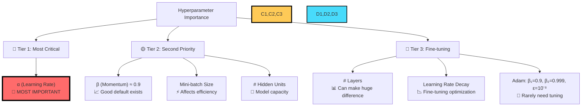

### Key Insights from Andrew's Experience:

**🎯 Learning Rate (α)**:

- **Always the most important** hyperparameter to tune
- Can make or break your model regardless of everything else
- Poor learning rate → no learning at all

**🟡 Second Tier**:

- **Momentum (β)**: 0.9 is usually a good default, but worth trying 0.8-0.95
- **Mini-batch size**: Critical for computational efficiency
- **Hidden units**: Directly affects model capacity

**🔵 Third Tier**:

- **Number of layers**: "Can sometimes make a huge difference"
- **Learning rate decay**: Helpful for final performance gains
- **Adam parameters**: Andrew "pretty much never tunes" β₁, β₂, ε

## Why Random Search Beats Grid Search

### The Grid Search Problem

**Traditional Approach** (works for 2-3 hyperparameters):

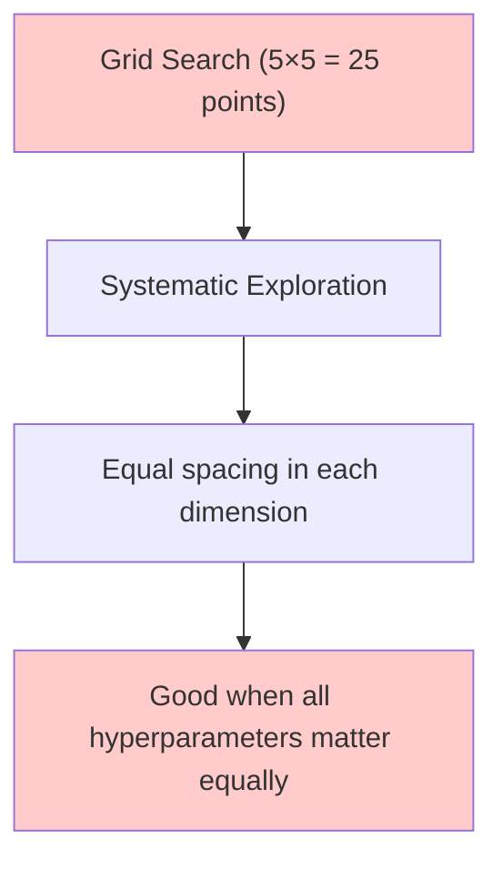

**Visual Representation of Grid Search:**

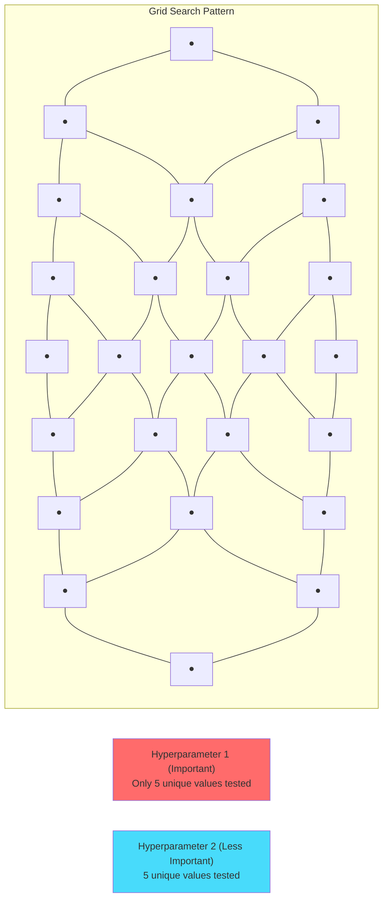

### The Random Search Advantage

**Andrew's Key Insight**: _"It's difficult to know in advance which hyperparameters are going to be the most important for your problem."_

**The Problem with Grid Search:**

- If Hyperparameter 1 = α (learning rate) - **very important**
- If Hyperparameter 2 = ε (Adam epsilon) - **hardly matters**
- Grid search: Only 5 values of α tested across 25 experiments
- Random search: 25 different values of α tested!

**Visual Comparison:**

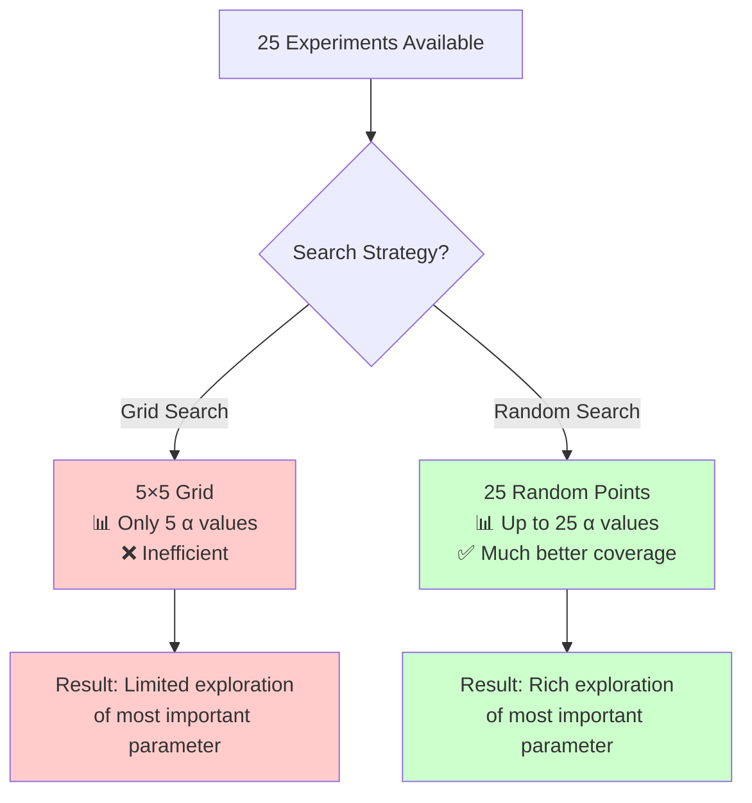

**Random Search Pattern:**

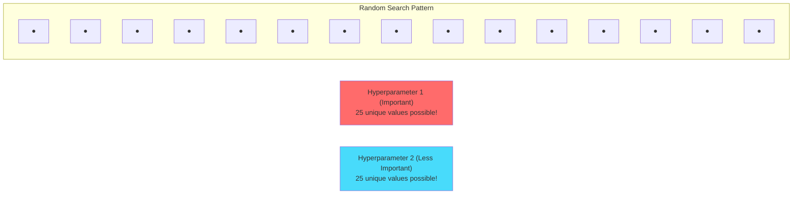

### Extension to Higher Dimensions

**Andrew's Note**: _"In practice, you might be searching over many more hyperparameters than these"_

- **2D**: Search over a square
- **3D**: Search over a cube
- **High-D**: Search over a hypercube

The advantage of random search **increases** with dimensionality because you don't know which dimensions matter most.

## Coarse-to-Fine Search Strategy

### The Two-Phase Approach

**Phase 1: Coarse Search** - _"Broad exploration"_

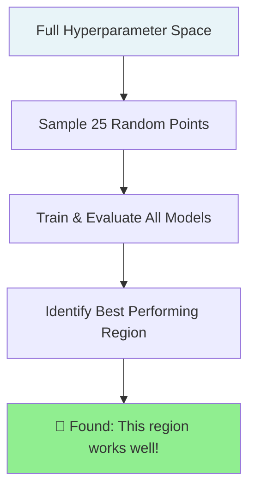

**Phase 2: Fine Search** - _"Zoom in and sample more densely"_

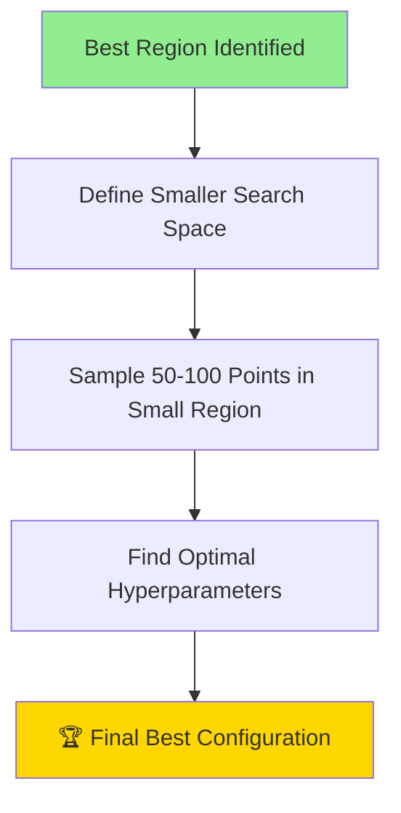

### Visual Representation of Coarse-to-Fine

**Step 1: Coarse Search Across Full Space**

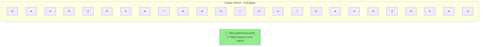

**Step 2: Fine Search in Promising Region**

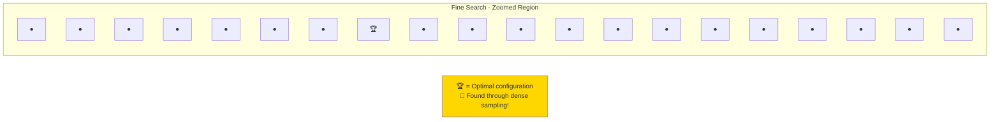

### Strategy Implementation

**Coarse Search Guidelines:**

- Sample 15-25 random configurations
- Use wide hyperparameter ranges
- Quick evaluation (fewer epochs if needed)
- Identify top 20% of results

**Fine Search Guidelines:**

- Focus on promising region only
- Sample 50-100 configurations densely
- Use full training for accurate evaluation
- Typical zoom factor: 10-20% of original range

## Practical Implementation Tips

### What to Optimize For

**Andrew's Guidance**: _"Pick whatever value allows you to do best on your training set objective, or does best on your development set"_

**Evaluation Metrics Priority:**

1. **Primary**: Development set performance
2. **Secondary**: Training efficiency/speed
3. **Tertiary**: Training set performance

### Resource Allocation

**Time Investment Recommendations:**

- **80%** of effort on Tier 1 & 2 hyperparameters
- **20%** of effort on Tier 3 hyperparameters
- **Start simple**: Get basic model working before fine-tuning

### Common Mistakes to Avoid

❌ **Don't**: Use grid search for more than 2-3 hyperparameters  
✅ **Do**: Use random search as default

❌ **Don't**: Tune all hyperparameters simultaneously  
✅ **Do**: Follow the importance hierarchy

❌ **Don't**: Skip coarse search and jump to fine-tuning  
✅ **Do**: Always start with broad exploration

## Key Takeaways

1. **Learning rate (α) is king** - Always tune this first and most carefully
2. **Random search > Grid search** - Especially when you don't know which hyperparameters matter most
3. **Use coarse-to-fine approach** - Broad exploration first, then focused refinement
4. **Follow the hierarchy** - Focus effort on high-impact hyperparameters
5. **Adam defaults usually work** - β₁=0.9, β₂=0.999, ε=10⁻⁸ rarely need changing

The systematic approach of random sampling + coarse-to-fine search makes hyperparameter tuning much more efficient than ad-hoc manual adjustment.

## 2. Using an Appropriate Scale to Pick Hyperparameters

### The Core Insight

**Andrew's Key Point**: _"Sampling at random doesn't mean sampling uniformly at random over the range of valid values. Instead, it's important to pick the appropriate scale on which to explore the hyperparameters."_

The choice of sampling scale can dramatically affect the efficiency of your hyperparameter search. Some parameters should be sampled linearly, others logarithmically.

### When Linear Sampling Works

**Case 1: Number of Hidden Units**

- **Range**: 50 to 100 hidden units
- **Approach**: Linear sampling is perfectly reasonable
- **Why**: Values are all in the same order of magnitude

**Case 2: Number of Layers**

- **Range**: 2 to 4 layers
- **Approach**: Linear sampling or even grid search (2, 3, 4)
- **Why**: Small discrete range, all values matter equally

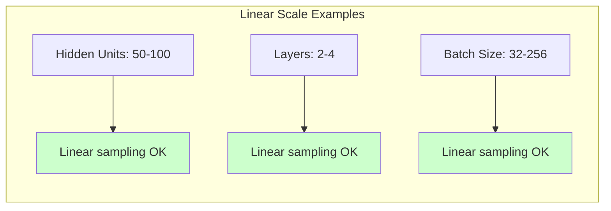

### The Learning Rate Problem

**The Challenge**: Learning rate α ranging from 0.0001 to 1

**Why Linear Sampling Fails:**

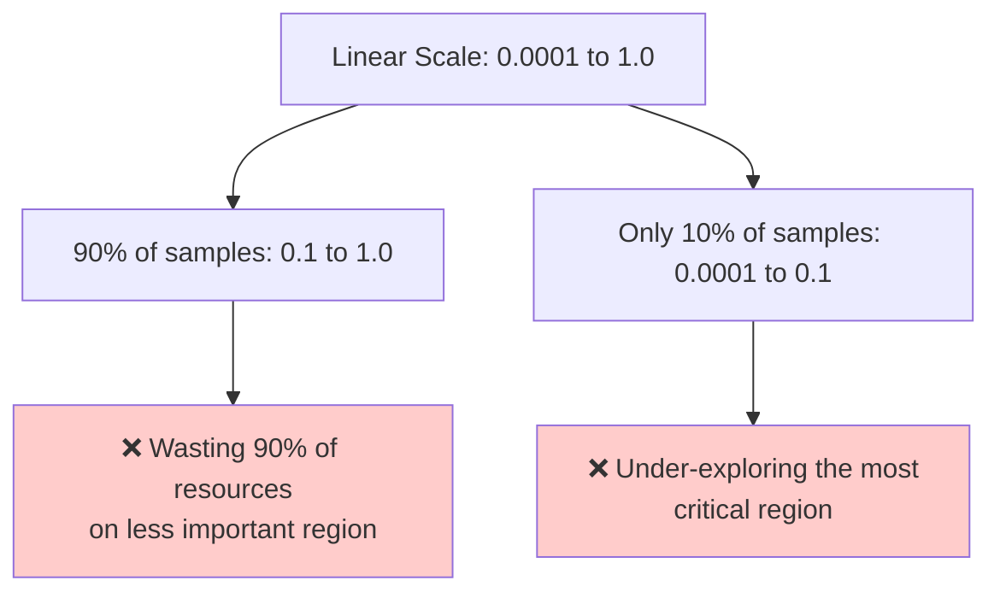

**Visual Representation of the Problem:**

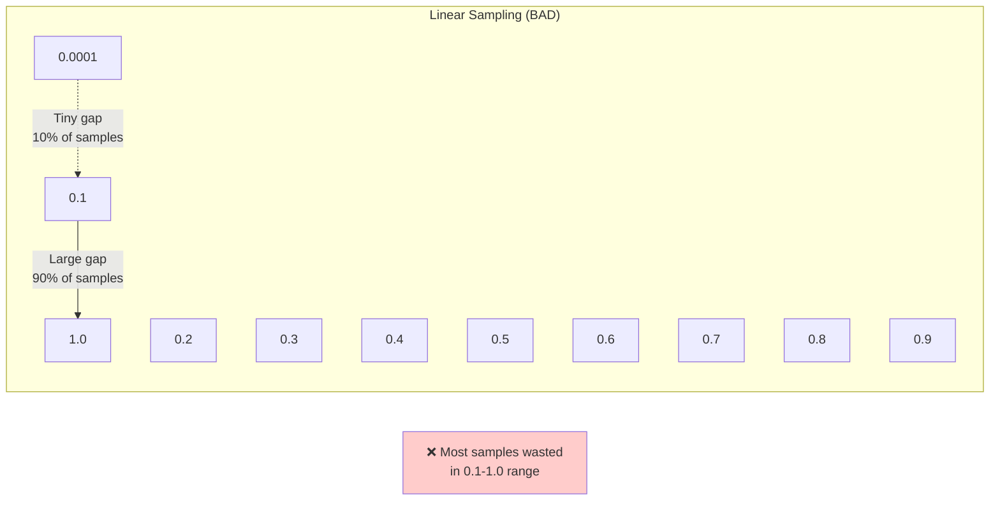

### The Logarithmic Solution

**Andrew's Method**: _"It seems more reasonable to search for hyperparameters on a log scale"_

**Logarithmic Scale Visualization:**

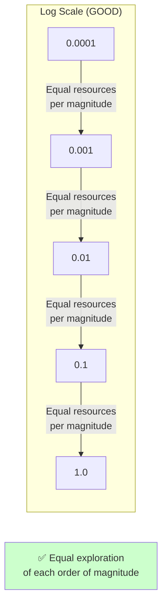

### Mathematical Implementation

**Step-by-Step Process:**

1. **Identify the range**: α ∈ [0.0001, 1]
2. **Convert to log space**:
   - a = log₁₀(0.0001) = -4
   - b = log₁₀(1) = 0
3. **Sample uniformly in log space**: r ~ Uniform(-4, 0)
4. **Convert back**: α = 10^r

**Andrew's Python Implementation:**

```python
# For learning rate sampling between 0.0001 and 1
r = -4 * np.random.rand()  # r is between -4 and 0
alpha = 10 ** r            # alpha is between 10^(-4) and 10^0
```

**General Formula:**

```python
# For sampling between 10^a and 10^b
def sample_log_scale(min_val, max_val):
    # Step 1: Convert bounds to log space
    a = np.log10(min_val)  # e.g., log10(0.0001) = -4
    b = np.log10(max_val)  # e.g., log10(1) = 0

    # Step 2: Sample uniformly in log space
    r = np.random.uniform(a, b)

    # Step 3: Convert back to original space
    return 10 ** r
```

### The Beta Parameter Challenge

**The Special Case**: Momentum β ∈ [0.9, 0.999]

**Why This Is Tricky:**

- **Range is tiny**: Only 0.099 units wide
- **High sensitivity**: Small changes near 1 have huge effects
- **Physical meaning**:
  - β = 0.9 → averages over ~10 values
  - β = 0.999 → averages over ~1000 values

**Andrew's Insight**: _"When beta is close to 1, the sensitivity of the results you get changes, even with very small changes to beta"_

**Sensitivity Analysis:**

- β: 0.9 → 0.9005 = "No big deal, hardly any change"
- β: 0.999 → 0.9995 = "Huge impact on what your algorithm is doing"

**The Mathematical Reason:**

The formula $\frac{1}{1-\beta}$ is **very sensitive** when β is close to 1:

- β = 0.9 → $\frac{1}{1-0.9} = \frac{1}{0.1} = 10$
- β = 0.999 → $\frac{1}{1-0.999} = \frac{1}{0.001} = 1000$
- β = 0.9995 → $\frac{1}{1-0.9995} = \frac{1}{0.0005} = 2000$

### The (1-β) Transformation

**Andrew's Solution**: _"The best way to think about this is that we want to explore the range of values for 1 minus beta"_

**Transformation Process:**

1. **Transform the range**: β ∈ [0.9, 0.999] → (1-β) ∈ [0.1, 0.001]
2. **Apply log sampling to (1-β)**:
   - Note: 0.1 = 10^(-1), 0.001 = 10^(-3)
   - Sample r ~ Uniform(-3, -1)
   - Set (1-β) = 10^r
3. **Convert back**: β = 1 - 10^r

**Visual Representation:**

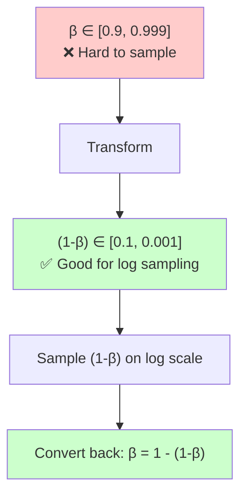

**Andrew's Python Implementation:**

```python
# Sample r uniformly from -3 to -1
r = np.random.uniform(-3, -1)

# Set (1-beta) = 10^r
one_minus_beta = 10 ** r

# Convert back to beta
beta = 1 - one_minus_beta
```

### Resource Distribution Insight

**Andrew's Goal**: _"You spend as much resources exploring the range 0.9 to 0.99, as you would exploring 0.99 to 0.999"_

**With Linear Sampling** (❌ Bad):

- 90% of samples: β ∈ [0.99, 0.999]
- 10% of samples: β ∈ [0.9, 0.99]

**With (1-β) Log Sampling** (✅ Good):

- 50% of samples: β ∈ [0.9, 0.99]
- 50% of samples: β ∈ [0.99, 0.999]

### Decision Framework

**When to Use Each Scale:**

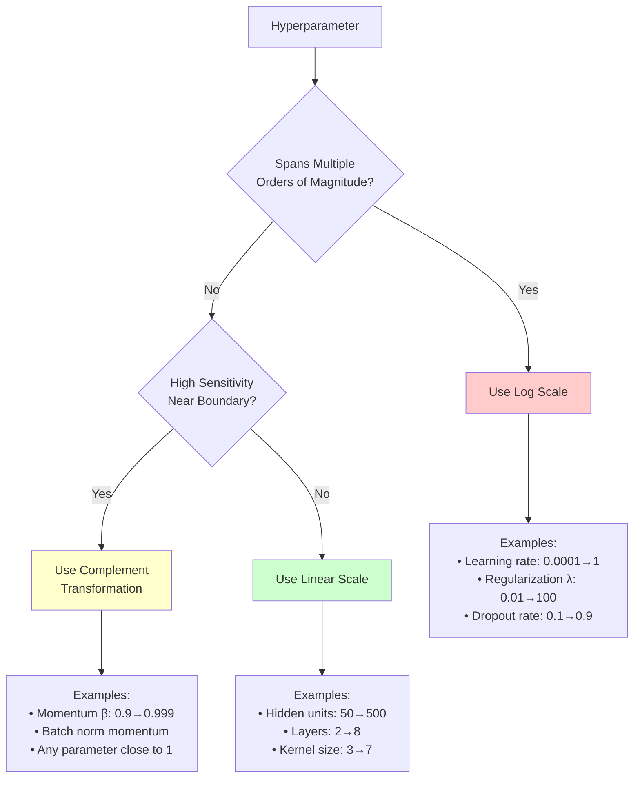

### Practical Implementation Guide

**1. Learning Rate (α)**

```python
# Range: 0.0001 to 1
a = np.log10(0.0001)  # -4
b = np.log10(1)       # 0
r = np.random.uniform(a, b)
alpha = 10 ** r
```

**2. Regularization (λ)**

```python
# Range: 0.01 to 100
a = np.log10(0.01)    # -2
b = np.log10(100)     # 2
r = np.random.uniform(a, b)
lambda_reg = 10 ** r
```

**3. Momentum (β)**

```python
# Range: 0.9 to 0.999
# Work with (1-β) ∈ [0.001, 0.1]
a = np.log10(0.001)   # -3
b = np.log10(0.1)     # -1
r = np.random.uniform(a, b)
one_minus_beta = 10 ** r
beta = 1 - one_minus_beta
```

**4. Hidden Units (linear is fine)**

```python
# Range: 50 to 500
hidden_units = np.random.randint(50, 501)
```

### Andrew's Reassurance

**Don't Worry Too Much**: _"In case you don't end up making the right scaling decision on some hyperparameter choice, don't worry too much about it. Even if you sample on the uniform scale, where some other scale would have been superior, you might still get okay results."_

**Coarse-to-Fine Saves You**: _"Especially if you use a coarse to fine search, so that in later iterations, you focus in more on the most useful range of hyperparameter values to sample."_

### Key Takeaways

1. **Scale matters**: The choice of sampling scale can make your search 10x more efficient
2. **Log scale for wide ranges**: Use when parameters span multiple orders of magnitude
3. **Complement transformation**: Use for parameters with high sensitivity near boundaries
4. **Linear scale for narrow ranges**: Use when all values are roughly equal importance
5. **Don't panic**: Coarse-to-fine search can compensate for sub-optimal scaling choices

The appropriate scale transforms hyperparameter search from random wandering into systematic exploration of the most promising regions.

## 3. Hyperparameters Tuning in Practice: Pandas vs. Caviar

### The Reality of Hyperparameter Transfer

**Cross-Domain Learning**: Deep learning ideas developed in one field often transfer successfully to others:

- Computer vision techniques (ConvNets, ResNets) → Speech recognition
- Speech innovations → Natural Language Processing
- Cross-fertilization is increasingly common across domains

**The Staleness Problem**: Even within the same application, optimal hyperparameters change over time due to:

- **Data drift**: Training data gradually changes over months
- **Infrastructure changes**: Server upgrades, different hardware
- **Algorithm evolution**: Model architecture improvements
- **Recommendation**: Re-evaluate hyperparameters every few months

### Two Schools of Thought

The hyperparameter tuning community has evolved into two distinct approaches, each suited to different resource constraints and project requirements.

### The Panda Approach: Babysitting One Model

**The Scenario**: Limited computational resources - usually one GPU, small team, or budget constraints.

**The Analogy**: _"When pandas have children, they have very few children, usually one child at a time, and then they really put a lot of effort into making sure that the baby panda survives."_

#### Daily Workflow Example

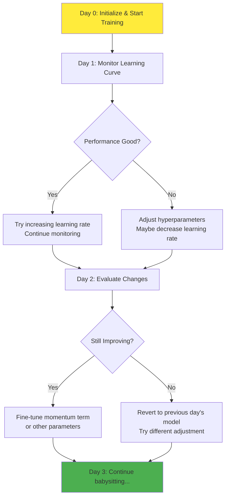

#### The Babysitting Process

**Day-by-Day Example:**

- **Day 0**: Initialize randomly, start training with α = 0.01
- **Day 1**: "Learning quite well, let me try increasing learning rate a little bit"
- **Day 2**: "Still doing well, maybe adjust momentum term or decrease learning rate"
- **Day 3**: "Learning rate was too big, go back to previous day's model"

**Key Characteristics:**

- **Constant vigilance**: Check learning curves daily
- **Gradual adjustments**: Small tweaks based on performance
- **Patience required**: "Nudging up and down parameters" over weeks
- **Deep understanding**: Learn intimate details of your model's behavior

#### When to Use Panda Approach

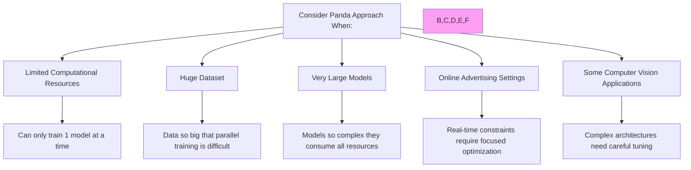

### The Caviar Approach: Training Many Models in Parallel

**The Scenario**: Abundant computational resources - multiple GPUs, cloud clusters, research lab infrastructure.

**The Analogy**: _"There's some fish that lay over 100 million eggs in one mating season... they lay a lot of eggs and don't pay too much attention to any one of them but just see that hopefully one of them will do well."_

#### Parallel Training Workflow

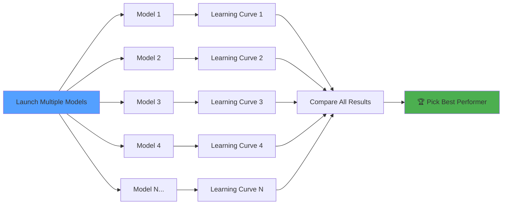

#### Learning Curve Analysis

**Visual Representation of Multiple Models:**

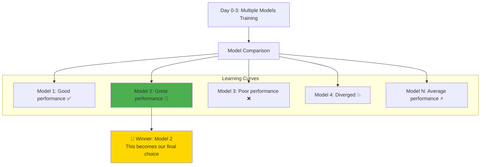

#### The Set-and-Forget Process

**Typical Timeline:**

- **Setup**: Configure 20+ different hyperparameter combinations
- **Launch**: Start all models simultaneously
- **Wait**: Let them run for days without intervention
- **Analyze**: Compare results and pick the winner

**Key Characteristics:**

- **Parallel execution**: Many models train simultaneously
- **Minimal babysitting**: Set parameters and wait
- **Statistical approach**: Try many configurations, trust the best result
- **Quick decision**: Rapid comparison at the end

### Biological Analogy Deep Dive

**Panda Reproduction Strategy:**

- **Few offspring**: Usually 1-2 cubs per pregnancy
- **High parental investment**: Intensive care and attention
- **High survival rate**: Focused effort increases success probability
- **Long-term commitment**: Years of nurturing per offspring

**Fish/Caviar Reproduction Strategy:**

- **Massive offspring**: Millions of eggs at once
- **Low parental investment**: Little to no care per egg
- **Low individual survival rate**: Most eggs don't make it
- **Statistical success**: Success through sheer numbers

### Decision Framework

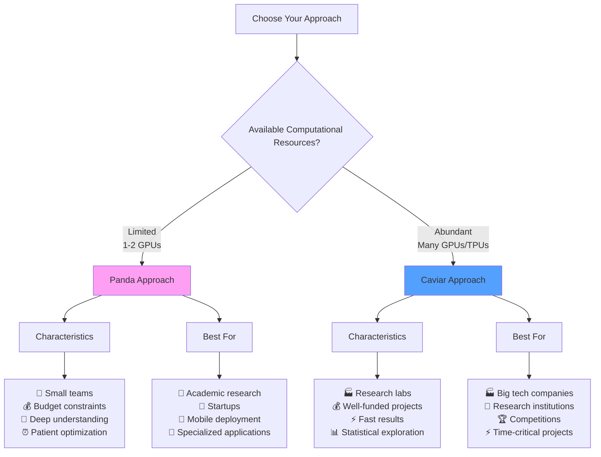

### Application Domain Patterns

**Common in Panda Approach:**

- **Online advertising**: Real-time constraints, continuous data streams
- **Computer vision**: Large models, complex architectures
- **Mobile applications**: Resource constraints, deployment limitations
- **Specialized domains**: Where domain expertise matters more than compute

**Common in Caviar Approach:**

- **Research labs**: Abundant computational resources
- **Image recognition competitions**: Need to try many architectures
- **Language models**: Can parallelize different sizes/configurations
- **Production ML pipelines**: Automated hyperparameter optimization

### Hybrid Strategy: Best of Both Worlds

Many practitioners combine both approaches:

```mermaid
graph LR
    A[Start: Limited Caviar] --> B[Try 5-10 Models in Parallel]
    B --> C[Identify Top 2-3 Performers]
    C --> D[Switch: Panda Mode]
    D --> E[Babysit Best Model]
    E --> F[Fine-tune to Perfection]

    style A fill:#54a0ff
    style D fill:#ff9ff3
    style F fill:#4caf50
```

**Hybrid Approach Benefits:**

- **Broad exploration**: Initial parallel search covers wide space
- **Focused optimization**: Detailed tuning of promising candidates
- **Resource efficient**: Balance between thoroughness and cost
- **Risk mitigation**: Don't put all eggs in one basket initially

### Evolution Beyond Single Lifecycle

**Important Note**: Even panda practitioners don't stick to one model forever.

_"Even pandas can have multiple children in their lifetime, even if they have only one, or a very small number of children, at any one time."_

**Multi-Generation Panda Approach:**

- **Week 1-2**: Babysit Model A to convergence
- **Week 3-4**: Initialize Model B with lessons learned
- **Week 5-6**: Babysit Model B with refined approach
- **Continue**: Each "generation" builds on previous insights

### Practical Implementation Tips

**For Panda Approach:**

- **Set up monitoring**: Automated learning curve tracking
- **Plan adjustments**: Have adjustment schedule ready
- **Document everything**: Track what changes worked/didn't work
- **Be patient**: Results take time but understanding is deep

**For Caviar Approach:**

- **Automate everything**: Minimal manual intervention
- **Design experiments**: Thoughtful hyperparameter combinations
- **Plan analysis**: How will you compare 50+ models?
- **Resource management**: Ensure you have adequate compute budget

### Key Insights

1. **Resource dependency**: Your approach should match your computational budget
2. **Domain influence**: Some fields naturally favor one approach over another
3. **Hybrid solutions**: Most successful practitioners combine both strategies
4. **Evolution over time**: Both approaches benefit from iteration and learning
5. **No wrong choice**: Both can lead to excellent results with proper execution

The choice between panda and caviar approaches reflects the fundamental trade-off between depth and breadth in hyperparameter exploration. Success comes from matching your strategy to your resources and requirements.

# Part 2: Batch Normalization

## 4. Normalizing Activations in a Network

### The Revolutionary Idea

**Batch Normalization** - created by Sergey Ioffe and Christian Szegedy - is one of the most important innovations in deep learning. It fundamentally transforms neural network training by:

- Making hyperparameter search **much easier**
- Making networks **much more robust** to hyperparameter choices
- Enabling **much larger range** of hyperparameters that work well
- Allowing training of **very deep networks** more easily

### From Input Normalization to Internal Normalization

**Input Normalization Success**: We know that normalizing inputs speeds up learning.

**The Process**:

1. **Compute mean**: $\mu = \frac{1}{m}\sum_{i=1}^{m} x^{(i)}$
2. **Subtract mean**: $x := x - \mu$
3. **Compute variance**: $\sigma^2 = \frac{1}{m}\sum_{i=1}^{m} (x^{(i)})^2$ (element-wise)
4. **Normalize**: $x := \frac{x}{\sqrt{\sigma^2 + \epsilon}}$

**Visual Impact**: Transforms elongated contours into circular ones, making gradient descent optimization much easier.

```mermaid
graph LR
    A["Unnormalized Inputs<br/>Elongated contours"] --> B[Normalization Process]
    B --> C["Normalized Inputs<br/>Circular contours"]

    D["Slow, zigzag optimization"] --> B
    B --> E["Fast, direct optimization"]

    style A fill:#ffcccb
    style C fill:#ccffcc
    style D fill:#ffcccb
    style E fill:#ccffcc
```

### The Deep Network Challenge

**The Question**: In a deeper network, can we normalize intermediate activations?

```mermaid
graph LR
    A[Input: x] --> B[Layer 1: a¹]
    B --> C[Layer 2: a²]
    C --> D[Layer 3: w³, b³]

    E["Question: Can we normalize a²<br/>to make training w³, b³ faster?"]

    style E fill:#ffffcc
```

**The Analogy**:

- **Logistic Regression**: Normalizing x₁, x₂, x₃ helps train w, b efficiently
- **Deep Networks**: Normalizing a² should help train w³, b³ efficiently

**Key Insight**: _"Since a² is the input to the next layer, it affects training of w³ and b³"_

### The Batch Normalization Algorithm

**Technical Choice**: Normalize z^[l] (before activation) rather than a^[l] (after activation)

**Why z^[l]?**: While there's debate in the literature, normalizing z^[l] is:

- Done much more often in practice
- The recommended default choice
- What most frameworks implement

#### Step-by-Step Process

**Given**: Mini-batch of hidden unit values z₁, z₂, ..., z_m (from layer l)

**Step 1: Compute Statistics**
$$\mu = \frac{1}{m}\sum_{i=1}^{m} z^{(i)}$$

$$\sigma^2 = \frac{1}{m}\sum_{i=1}^{m} (z^{(i)} - \mu)^2$$

**Step 2: Normalize**
$$z_{norm}^{(i)} = \frac{z^{(i)} - \mu}{\sqrt{\sigma^2 + \epsilon}}$$

_Note: ε added for numerical stability in case σ² = 0_

**Step 3: Scale and Shift**
$$\tilde{z}^{(i)} = \gamma \cdot z_{norm}^{(i)} + \beta$$

Where γ and β are **learnable parameters** updated via gradient descent.

```mermaid
graph TD
    A["Input: z¹, z², ..., z^m"] --> B["Compute μ, σ²"]
    B --> C["Normalize: z_norm<br/>(μ=0, σ²=1)"]
    C --> D["Scale & Shift: γ, β<br/>z̃ = γ·z_norm + β"]
    D --> E["Output: z̃¹, z̃², ..., z̃^m"]

    F["Learnable Parameters<br/>γ, β updated by optimizer"] --> D

    style A fill:#e3f2fd
    style C fill:#fff3e0
    style E fill:#e8f5e8
    style F fill:#fce4ec
```

### The Power of γ and β Parameters

**Flexibility**: These learnable parameters allow the network to learn the optimal distribution for each layer.

**Identity Transformation**: If:

- γ = √(σ² + ε) (the denominator from normalization)
- β = μ (the mean from normalization)

Then: $\tilde{z}^{(i)} = \gamma \cdot z_{norm}^{(i)} + \beta$ exactly inverts the normalization, giving $\tilde{z}^{(i)} = z^{(i)}$

**Mathematical Proof**:
$$\tilde{z}^{(i)} = \gamma \cdot \frac{z^{(i)} - \mu}{\sqrt{\sigma^2 + \epsilon}} + \beta$$

If γ = √(σ² + ε) and β = μ:
$$\tilde{z}^{(i)} = \sqrt{\sigma^2 + \epsilon} \cdot \frac{z^{(i)} - \mu}{\sqrt{\sigma^2 + \epsilon}} + \mu = z^{(i)} - \mu + \mu = z^{(i)}$$

**Any Distribution**: By choosing different γ and β values, the network can learn any mean and variance it wants.

### Why Not Always Force Mean=0, Variance=1?

**The Activation Function Consideration**:

```mermaid
graph TD
    A[Sigmoid Activation Function] --> B{"Always force μ=0, σ²=1?"}
    B -->|Yes| C["Values clustered around 0<br/>❌ Linear regime only"]
    B -->|No| D["Learnable γ, β allow<br/>✅ Better use of nonlinearity"]

    C --> E["Limited expressiveness<br/>Poor gradient flow"]
    D --> F["Full sigmoid range<br/>Rich nonlinear behavior"]

    style C fill:#ffcccb
    style D fill:#ccffcc
    style E fill:#ffcccb
    style F fill:#ccffcc
```

**Example with Sigmoid**:

- **Forced μ=0, σ²=1**: Values always clustered around zero (linear regime)
- **Learnable γ, β**: Can use full sigmoid range for better nonlinearity

### Integration into Neural Network

**Before Batch Norm**:
$$z^{[l]} = W^{[l]}a^{[l-1]} + b^{[l]}$$
$$a^{[l]} = g^{[l]}(z^{[l]})$$

**With Batch Norm**:
$$z^{[l]} = W^{[l]}a^{[l-1]} + b^{[l]}$$
$$\tilde{z}^{[l]} = \text{BatchNorm}(z^{[l]})$$
$$a^{[l]} = g^{[l]}(\tilde{z}^{[l]})$$

**Key Change**: Use $\tilde{z}^{[l]}$ instead of $z^{[l]}$ for subsequent computations.

### The Standardization Insight

**What Batch Norm Really Does**:

- Normalizes hidden unit values to have **standardized mean and variance**
- The mean and variance are **controlled by explicit parameters** γ and β
- The learning algorithm can **set γ and β to whatever it wants**

**Result**: Hidden units have some **fixed mean and variance** (not necessarily 0 and 1), but these are **learnable and controllable**.

### Computational Flow Visualization

```mermaid
graph TD
    A["Previous Layer: a^[l-1]"] --> B["Linear Transform: W^[l]a^[l-1] + b^[l]"]
    B --> C["Raw Activations: z^[l]"]
    C --> D["Batch Statistics: μ, σ²"]
    D --> E["Normalize: z_norm"]
    E --> F["Scale & Shift: γz_norm + β"]
    F --> G["Processed Activations: z̃^[l]"]
    G --> H["Activation Function: g(z̃^[l])"]
    H --> I["Layer Output: a^[l]"]

    J["Learnable: γ, β"] --> F

    style C fill:#ffcccc
    style E fill:#ffffcc
    style G fill:#ccffcc
    style I fill:#ccccff
```

### The Broader Vision

**Core Intuition**:

- Input normalization helps learning → **proven and widely used**
- Batch norm extends this → **normalize values deep in hidden layers**
- Same benefits should apply → **faster, more stable training**

**Key Difference from Input Norm**:

- **Inputs**: We want mean=0, variance=1 (standardization)
- **Hidden layers**: We want **learnable** mean and variance (flexibility)

### Looking Ahead

This covers the **mechanics** of batch normalization - how to implement it for a single layer. The next steps involve:

1. **Integration**: How to fit batch norm into a complete neural network
2. **Intuition**: Why batch norm helps training (the deeper "why")
3. **Implementation**: Practical considerations and best practices

**Promise**: The "why it works" will become much clearer in subsequent discussions - the mechanics are just the foundation for understanding the profound impact batch normalization has on deep learning.

### Key Takeaways

1. **Extension of input normalization**: Apply normalization benefits to intermediate layers
2. **Technical choice**: Normalize z^[l] (before activation) is standard practice
3. **Learnable parameters**: γ and β allow network to learn optimal distributions
4. **Flexibility**: Can recover identity function or learn any mean/variance
5. **Activation consideration**: Don't force all layers to μ=0, σ²=1
6. **Standardization**: Provides controlled, learnable mean and variance for each layer

Batch normalization transforms the internal representations of neural networks from chaotic, shifting distributions to controlled, learnable ones - setting the stage for much more effective training.

## 5. Fitting Batch Norm into a Neural Network

### The Two-Step Computation View

**Understanding Neural Network Units**: Each unit in a neural network performs two distinct operations:

1. **Linear computation**: Compute Z
2. **Nonlinear activation**: Apply activation function to get A

```mermaid
graph TD
    A[Input] --> B["Linear: Z = Wa + b"]
    B --> C["Activation: A = g(Z)"]
    C --> D[Output]

    style B fill:#ffeb3b
    style C fill:#4caf50
```

**Batch Norm Insertion Point**: Batch normalization happens **between** Z computation and activation function.

### Step-by-Step Network Flow

#### Without Batch Norm (Traditional)

```mermaid
graph LR
    A[X] --> B["Z¹ = W¹X + b¹"]
    B --> C["A¹ = g¹(Z¹)"]
    C --> D["Z² = W²A¹ + b²"]
    D --> E["A² = g²(Z²)"]
    E --> F[Continue...]

    style B fill:#ffcccb
    style D fill:#ffcccb
```

#### With Batch Norm (Enhanced)

```mermaid
graph LR
    A[X] --> B["Z¹ = W¹X + b¹"]
    B --> C["BN: Z̃¹ = γ¹Z¹ₙₒᵣₘ + β¹"]
    C --> D["A¹ = g¹(Z̃¹)"]
    D --> E["Z² = W²A¹ + b²"]
    E --> F["BN: Z̃² = γ²Z²ₙₒᵣₘ + β²"]
    F --> G["A² = g²(Z̃²)"]
    G --> H[Continue...]

    style C fill:#4caf50
    style F fill:#4caf50
```

**Key Insight**: _"Instead of using the un-normalized value Z, you use the normalized value Z̃"_

### Complete Parameter Set

**Traditional Network Parameters**:
$$W^{[1]}, b^{[1]}, W^{[2]}, b^{[2]}, \ldots, W^{[L]}, b^{[L]}$$

**With Batch Norm (Initial View)**:
$$W^{[1]}, b^{[1]}, \beta^{[1]}, \gamma^{[1]}, W^{[2]}, b^{[2]}, \beta^{[2]}, \gamma^{[2]}, \ldots$$

**Important Clarification**: The β parameters in Batch Norm are **completely different** from the β hyperparameter used in momentum/Adam optimization algorithms. They just happen to use the same Greek letter.

### Mini-Batch Implementation

**Real-World Usage**: Batch norm is typically applied with mini-batches, not the entire training set.

#### Mini-Batch Processing Flow

```mermaid
graph TD
    A["Mini-batch X⁽¹⁾"] --> B["Compute Z¹ on mini-batch"]
    B --> C["Batch Norm using mini-batch statistics"]
    C --> D["Get Z̃¹, then A¹"]
    D --> E["Compute Z² on same mini-batch"]
    E --> F["Batch Norm using mini-batch statistics"]
    F --> G["Continue forward prop..."]

    H["Mini-batch X⁽²⁾"] --> I["Repeat entire process"]
    I --> J["Use fresh mini-batch statistics"]

    style A fill:#e1f5fe
    style H fill:#e1f5fe
    style C fill:#fff3e0
    style F fill:#fff3e0
```

**Process for Each Mini-batch**:

1. **Forward prop**: Use current mini-batch to compute Z values
2. **Batch norm**: Compute mean/variance using **only current mini-batch**
3. **Normalize**: Apply batch norm with mini-batch statistics
4. **Continue**: Process through activation and next layer

### The b^[l] Parameter Elimination

**The Mathematical Insight**: Batch normalization makes bias parameters b^[l] redundant.

#### Why b^[l] Gets Cancelled Out

**Step-by-step reasoning**:

1. **Original computation**: $Z^{[l]} = W^{[l]}A^{[l-1]} + b^{[l]}$

2. **Mean computation in batch norm**:
   $$\mu = \frac{1}{m}\sum_{i=1}^{m} Z^{[l](i)} = \frac{1}{m}\sum_{i=1}^{m} (W^{[l]}A^{[l-1](i)} + b^{[l]})$$

3. **Distributed sum**:
   $$\mu = \frac{1}{m}\sum_{i=1}^{m} W^{[l]}A^{[l-1](i)} + \frac{1}{m}\sum_{i=1}^{m} b^{[l]}$$

4. **Constant term**:
   $$\mu = \frac{1}{m}\sum_{i=1}^{m} W^{[l]}A^{[l-1](i)} + b^{[l]}$$

5. **Mean subtraction in normalization**:
   $$Z^{[l]} - \mu = (W^{[l]}A^{[l-1]} + b^{[l]}) - (\text{mean of } W^{[l]}A^{[l-1]} + b^{[l]})$$

6. **Cancellation**:
   $$Z^{[l]} - \mu = W^{[l]}A^{[l-1]} - \text{mean of } W^{[l]}A^{[l-1]}$$

**Result**: The constant $b^{[l]}$ completely cancels out during mean subtraction!

#### Updated Parameterization

**New computation**:
$$Z^{[l]} = W^{[l]}A^{[l-1]} \text{ (no bias term)}$$
$$Z_{norm}^{[l]} = \frac{Z^{[l]} - \mu}{\sqrt{\sigma^2 + \epsilon}}$$
$$\tilde{Z}^{[l]} = \gamma^{[l]} Z_{norm}^{[l]} + \beta^{[l]}$$

**Role replacement**: $\beta^{[l]}$ now controls the bias/shift term instead of $b^{[l]}$.

### Tensor Dimensions and Implementation

**For layer l with n^[l] hidden units and mini-batch size m**:

| Parameter      | Dimension      | Purpose                               |
| -------------- | -------------- | ------------------------------------- |
| $Z^{[l]}$      | $(n^{[l]}, m)$ | Raw activations for mini-batch        |
| $\gamma^{[l]}$ | $(n^{[l]}, 1)$ | Scale parameter (one per hidden unit) |
| $\beta^{[l]}$  | $(n^{[l]}, 1)$ | Shift parameter (one per hidden unit) |

**Key Point**: Each hidden unit has its own γ and β parameters, allowing independent control of mean and variance for each unit.

### Framework Implementation

**Single Line of Code**: Most deep learning frameworks make batch norm trivial to implement.

```python
# TensorFlow example (from transcript)
tf.nn.batch_normalization()

# Modern Keras approach
tf.keras.layers.BatchNormalization()
```

**Implementation Abstraction**: While understanding the mechanics is crucial, practical usage is usually one line of code.

### Complete Training Algorithm with Batch Norm

#### Mini-Batch Gradient Descent with Batch Norm

```python
for t in range(1, num_mini_batches + 1):
    # Forward propagation on mini-batch X^{t}
    # In each hidden layer, use Batch Norm to replace Z^[l] with Z̃^[l]

    # Backward propagation
    # Compute gradients: dW^[l], dβ^[l], dγ^[l] for all layers
    # Note: db^[l] is eliminated

    # Parameter updates
    W^[l] = W^[l] - α * dW^[l]
    β^[l] = β^[l] - α * dβ^[l]
    γ^[l] = γ^[l] - α * dγ^[l]
```

#### Compatibility with Other Optimizers

**Beyond Gradient Descent**: Batch norm parameters (β and γ) can be updated using any optimizer:

- **Momentum**: Apply momentum to dβ and dγ
- **RMSprop**: Apply RMSprop updates to β and γ parameters
- **Adam**: Use Adam algorithm for β and γ optimization

```mermaid
graph TD
    A[Compute Gradients] --> B[dW, dβ, dγ]
    B --> C{Choose Optimizer}

    C -->|Gradient Descent| D["W -= α·dW<br/>β -= α·dβ<br/>γ -= α·dγ"]
    C -->|Momentum| E["Apply momentum to<br/>all parameters"]
    C -->|Adam| F["Apply Adam updates to<br/>all parameters"]
    C -->|RMSprop| G["Apply RMSprop to<br/>all parameters"]

    style D fill:#ffeb3b
    style E fill:#4caf50
    style F fill:#2196f3
    style G fill:#ff9800
```

### Practical Implementation Considerations

#### What You Need to Track

**During Training**:

- **Forward prop**: Compute batch statistics for each mini-batch
- **Parameter updates**: Update W, β, γ using chosen optimizer
- **Running averages**: Maintain running statistics for inference (covered later)

#### Framework vs From-Scratch

**Using Frameworks** (Recommended):

- One line of code
- Handles all implementation details
- Optimized and tested

**From Scratch** (Educational):

- Helps understand the mechanics
- Useful for custom implementations
- More complex but educational

### Integration Summary

**Complete Network Architecture**:

```mermaid
graph TD
    A[Input Layer] --> B[Hidden Layer 1]
    B --> C[Batch Norm 1]
    C --> D[Activation 1]
    D --> E[Hidden Layer 2]
    E --> F[Batch Norm 2]
    F --> G[Activation 2]
    G --> H[Output Layer]

    I["Parameters:<br/>W¹, β¹, γ¹<br/>W², β², γ²<br/>W³"] --> B
    I --> E
    I --> H

    style C fill:#4caf50
    style F fill:#4caf50
```

**Key Changes from Traditional Networks**:

1. **Remove bias parameters** b^[l] from linear layers
2. **Add batch norm parameters** β^[l], γ^[l] for each layer
3. **Insert batch norm step** between linear computation and activation
4. **Use mini-batch statistics** for normalization during training

### Looking Forward

This section covered the **implementation mechanics** of batch normalization:

- How to integrate it into network architecture
- Parameter changes and elimination of bias terms
- Mini-batch processing and framework usage

**Next**: Understanding **why** batch normalization works so effectively - the theoretical foundations that make this technique so powerful for training deep networks.

### Key Takeaways

1. **Insertion point**: Batch norm goes between Z computation and activation function
2. **Parameter elimination**: Remove b^[l] parameters (they get cancelled out)
3. **New parameters**: Add β^[l] and γ^[l] for each layer with batch norm
4. **Mini-batch processing**: Use current mini-batch statistics for normalization
5. **Optimizer compatibility**: β and γ can be updated with any optimizer
6. **Framework simplicity**: Usually one line of code in practice
7. **Dimension matching**: β and γ have same dimensions as number of hidden units

Batch normalization transforms the network architecture in a simple but profound way, setting the stage for much more stable and efficient training.

## 6. Why does Batch Norm work?

### Reason 1: Similar to Input Normalization

**The Foundation**: We already know that normalizing input features X can speed up learning dramatically.

**The Problem Without Normalization**:

- Some features range from 0 to 1
- Other features range from 1 to 1,000
- Creates elongated, asymmetric cost function contours
- Requires very small learning rates to avoid instability

**The Solution**: By normalizing all input features to similar ranges, the cost function becomes more symmetric and easier to optimize.

**Batch Norm Extension**: _"This is doing a similar thing, but for hidden layer values, not just input features"_

```mermaid
graph TD
    A[Input Normalization] --> B["Features X₁, X₂, X₃<br/>Different scales → Similar scales"]
    B --> C["Faster learning"]

    D[Batch Normalization] --> E["Hidden units Z^[l]<br/>Different scales → Similar scales"]
    E --> F["Faster learning at every layer"]

    style A fill:#e3f2fd
    style D fill:#e8f5e8
    style C fill:#4caf50
    style F fill:#4caf50
```

**Key Insight**: _"One intuition behind why batch norm works is this is doing a similar thing, but for hidden unit values and not just for your input layer."_

### Reason 2: Reducing Covariate Shift

#### Understanding Covariate Shift

**Definition**: When the distribution of input data X changes, but the true mapping from X to Y remains the same.

**Classic Example**: Cat Detection Model

- **Training**: Model trained on black cats only
- **Testing**: Model tested on colored cats
- **Problem**: Same task (detect cats), but input distribution shifted
- **Result**: Poor performance despite unchanged ground truth

**Visual Representation**:

```mermaid
graph LR
    subgraph "Training Data"
        A[Black Cats: Positive]
        B[Non-cats: Negative]
    end

    subgraph "Test Data"
        C[Colored Cats: Positive]
        D[Non-cats: Negative]
    end

    E["Same ground truth function<br/>Different input distribution"]

    style A fill:#3334
    style C fill:#ff9800
    style E fill:#ffeb3b
```

#### Covariate Shift in Deep Networks

**The Internal Problem**: Consider a deep network from the perspective of the 3rd hidden layer:

```mermaid
graph LR
    A[Layer 1] --> B[Layer 2]
    B --> C["Layer 3: My perspective"]
    C --> D[Layer 4]
    D --> E[Output]

    F["Layer 3 receives:<br/>A₂₁, A₂₂, A₂₃, A₂₄<br/>(might as well be X₁, X₂, X₃, X₄)"] --> C

    style C fill:#4caf50
    style F fill:#ffeb3b
```

**From Layer 3's Perspective**:

- Receives values A₂₁, A₂₂, A₂₃, A₂₄ from earlier layers
- These "might as well be features X₁, X₂, X₃, X₄"
- Layer 3's job: map these values to correct output
- Layer 3 tries to learn parameters W₃, b₃ (and W₄, W₅, etc.)

**The Shifting Problem**:

- **While Layer 3 is learning**: Earlier layers (1 & 2) are also updating their parameters W₁, b₁, W₂, b₂
- **Consequence**: The values A₂ that Layer 3 receives keep changing!
- **Result**: Layer 3 suffers from covariate shift - its "input distribution" constantly shifts

#### How Batch Norm Solves This

**The Stabilization Effect**:

```mermaid
graph TD
    A["Without Batch Norm"] --> B["Hidden unit values shift dramatically<br/>as earlier layers learn"]
    B --> C["Later layers must constantly readjust<br/>❌ Unstable learning"]

    D["With Batch Norm"] --> E["Mean and variance stay controlled<br/>Z₂₁, Z₂₂ can change but μ, σ² remain stable"]
    E --> F["Later layers have stable foundation<br/>✅ Faster learning"]

    style A fill:#ffcccb
    style C fill:#ffcccb
    style D fill:#ccffcc
    style F fill:#ccffcc
```

**Mathematical Constraint**: Even if Z₂₁ and Z₂₂ values change as earlier layers learn, batch norm ensures:

- **Mean**: Remains controlled (by β parameter)
- **Variance**: Remains controlled (by γ parameter)
- **Stability**: Later layers see consistent distribution shape

**Visual Representation of Stabilization**:

```mermaid
graph LR
    subgraph "Layer 2 outputs over time"
        A["Early training:<br/>Z₂₁, Z₂₂ distribution"]
        B["Mid training:<br/>Different Z₂₁, Z₂₂ values"]
        C["Late training:<br/>Again different values"]
    end

    D["Batch Norm ensures:<br/>μ and σ² stay controlled<br/>regardless of exact values"]

    A --> D
    B --> D
    C --> D

    style D fill:#4caf50
```

#### The Independence Effect

**Reduced Coupling**: _"It weakens the coupling between what the early layers' parameters have to do and what the later layers' parameters have to do."_

**Benefits**:

- **Independent Learning**: Each layer can learn more independently
- **Reduced Adaptation**: Later layers don't need to constantly adapt to earlier layer changes
- **Faster Convergence**: Less back-and-forth adjustment between layers
- **Stable Foundation**: Later layers have "more firm ground to stand on"

### Reason 3: Regularization Effect (Unintended But Useful)

#### The Noise Mechanism

**Source of Noise**: Mini-batch statistics are computed on small samples (64, 128, 256 examples), not the entire dataset.

**Why This Creates Noise**:

- **True statistics**: μ_true, σ²_true (computed on entire dataset)
- **Mini-batch statistics**: μ_batch, σ²_batch (computed on current mini-batch only)
- **Difference**: μ_batch ≠ μ_true, σ²_batch ≠ σ²_true due to sampling variation

**The Noisy Transformation**:
$$Z_{norm}^{(i)} = \frac{Z^{(i)} - \mu_{noisy}}{\sqrt{\sigma^2_{noisy} + \epsilon}}$$

Where μ_noisy and σ²_noisy vary between mini-batches.

#### Similarity to Dropout

**Dropout Noise**:

- Multiplies hidden units by 0 (probability p) or 1 (probability 1-p)
- **Multiplicative noise**: Random scaling
- Forces network not to rely too heavily on any single unit

**Batch Norm Noise**:

- **Multiplicative noise**: Division by noisy σ (random scaling)
- **Additive noise**: Subtraction of noisy μ (random shifting)
- Forces downstream units not to rely too heavily on any one hidden unit

```mermaid
graph TD
    A[Dropout] --> B["Multiplicative noise<br/>× 0 or × 1 randomly"]

    C[Batch Norm] --> D["Multiplicative noise: ÷ σ_noisy<br/>Additive noise: - μ_noisy"]

    B --> E["Forces robustness<br/>Don't rely on single units"]
    D --> E

    style A fill:#ff9800
    style C fill:#4caf50
    style E fill:#e8f5e8
```

#### Mini-Batch Size Effect

**The Trade-off**:

```mermaid
graph LR
    A[Mini-batch Size] --> B{Large vs Small?}

    B -->|Large e.g., 512| C["More accurate statistics<br/>Less noise<br/>Less regularization"]
    B -->|Small e.g., 64| D["Less accurate statistics<br/>More noise<br/>More regularization"]

    C --> E["More stable training<br/>Better gradient estimates<br/>Less overfitting protection"]
    D --> F["Less stable training<br/>Noisier gradients<br/>More overfitting protection"]

    style C fill:#e3f2fd
    style D fill:#fff3e0
```

**Counter-intuitive Property**: _"By using a bigger mini-batch size, you reduce the regularization effect."_

This is unusual because typically larger batch sizes are considered "better" - but with batch norm, they reduce the beneficial noise!

#### Important Caveats

**Don't Rely on Batch Norm for Regularization**:

- **Primary purpose**: Normalization to speed up learning
- **Regularization**: "Almost unintended side effect"
- **Better alternatives**: Use L2 regularization, dropout, data augmentation for serious regularization needs

**Combination Strategies**:

- **Batch Norm + Dropout**: Can use together for more powerful regularization
- **Batch Norm + L2**: Combine normalization benefits with explicit regularization
- **Primary vs Secondary**: Use batch norm for stability, other methods for regularization

### The Complete Picture

#### Synergistic Effects

**All Three Reasons Work Together**:

```mermaid
graph TD
    A[Batch Normalization] --> B[Reason 1: Better Optimization]
    A --> C[Reason 2: Reduced Covariate Shift]
    A --> D[Reason 3: Slight Regularization]

    B --> E[Symmetric cost function<br/>Larger learning rates possible]
    C --> F[Independent layer learning<br/>Stable distributions]
    D --> G[Noise injection<br/>Reduced overfitting]

    E --> H[Dramatically Faster Training]
    F --> H
    G --> H

    style A fill:#4caf50
    style H fill:#ffd700
```

#### Why Batch Norm Is So Effective

**Individual Benefits**:

1. **Optimization**: Makes cost function easier to navigate
2. **Stability**: Reduces internal distribution shift
3. **Robustness**: Adds beneficial noise

**Combined Impact**: The three effects multiply together to create dramatic improvements in training speed and network robustness.

### Common Misconceptions Clarified

#### Myth 1: Complete Covariate Shift Elimination

**Reality**: Batch norm _reduces_ covariate shift but doesn't eliminate it completely. The distributions still change, but in a more controlled way.

#### Myth 2: Replaces Good Weight Initialization

**Reality**: Good initialization still helps! Batch norm makes training more robust to poor initialization, but starting with good weights is still beneficial.

#### Myth 3: Primary Purpose Is Regularization

**Reality**: Regularization is a side effect. The main purpose is normalization for faster, more stable learning.

### Practical Implications

#### Hyperparameter Considerations

- **Mini-batch size**: Affects regularization strength (smaller = more regularization)
- **Learning rate**: Can often use larger learning rates with batch norm
- **Other regularization**: Still use dropout, L2, etc. for serious regularization needs

#### Training Strategy

- **Use batch norm**: For normalization and stability
- **Add explicit regularization**: Don't rely solely on batch norm's regularization effect
- **Monitor mini-batch size**: Balance between stability and regularization

#### Architecture Design

- **Where to place**: Between linear layers and activation functions
- **What layers**: Can apply to most hidden layers
- **Integration**: Works well with various optimizers and other techniques

### Looking Forward

**The Foundation Is Set**: Understanding why batch norm works provides the foundation for:

- **Implementation details**: How to handle training vs inference
- **Best practices**: When and where to apply batch norm
- **Advanced techniques**: Variations and improvements on batch normalization

**Next Challenge**: Batch norm computes statistics on mini-batches during training, but what happens at test time when you might process single examples? This requires special handling covered in the next section.

### Key Takeaways

1. **Three complementary reasons**: Better optimization + reduced covariate shift + slight regularization
2. **Not just input normalization**: Extends benefits to every layer in the network
3. **Covariate shift**: Internal distributions shifting less makes layer learning more independent
4. **Unintended regularization**: Mini-batch noise acts like dropout but weaker
5. **Mini-batch size matters**: Affects both stability and regularization strength
6. **Don't rely on regularization**: Use batch norm for normalization, other methods for serious regularization
7. **Synergistic effects**: All three reasons work together for dramatic training improvements

Batch normalization's effectiveness comes from addressing multiple training challenges simultaneously, making it one of the most important innovations in deep learning.

## 7. Batch Norm at Test Time

### The Fundamental Challenge

**Training Reality**: Batch norm processes data one mini-batch at a time (e.g., 64, 128, 256 examples).

**Testing Reality**: You might need to process examples one at a time, or have very different batch compositions.

**The Core Problem**: _"If you have just one example, taking the mean and variance of that one example doesn't make sense."_

```mermaid
graph TD
    A[Training Time] --> B["Mini-batch: 64-256 examples<br/>Compute μ, σ² from batch<br/>✅ Statistically meaningful"]

    C[Test Time] --> D["Single example<br/>μ, σ² from 1 sample?<br/>❌ Doesn't make sense"]

    E[Solution Needed] --> F["Use statistics estimated<br/>during training"]

    style A fill:#4caf50
    style C fill:#ffcccb
    style E fill:#ffeb3b
    style F fill:#4caf50
```

### Training Time: The Complete Equations

**Recall the full batch norm process during training**:

```mermaid
graph LR
    A["Mini-batch Z values<br/>Z₁, Z₂, ..., Z_m"] --> B["Compute Statistics"]
    B --> C["μ = (1/m)Σ Zᵢ<br/>σ² = (1/m)Σ(Zᵢ-μ)²"]
    C --> D["Normalize<br/>Z_norm = (Z-μ)/√(σ²+ε)"]
    D --> E["Scale & Shift<br/>Z̃ = γZ_norm + β"]

    style B fill:#ffeb3b
    style C fill:#ff9800
    style D fill:#2196f3
    style E fill:#4caf50
```

**Mathematical Implementation**:

1. **Mean**: $\mu = \frac{1}{m}\sum_{i=1}^{m} z^{(i)}$ (summing over mini-batch only)
2. **Variance**: $\sigma^2 = \frac{1}{m}\sum_{i=1}^{m} (z^{(i)} - \mu)^2$
3. **Normalize**: $z_{norm}^{(i)} = \frac{z^{(i)} - \mu}{\sqrt{\sigma^2 + \epsilon}}$
4. **Scale & Shift**: $\tilde{z}^{(i)} = \gamma z_{norm}^{(i)} + \beta$

**Key Point**: μ and σ² are computed on the **entire mini-batch**, not the whole training set.

### The Test Time Dilemma

**Scenario 1: Single Example Processing**

- Process one image at a time for real-time inference
- Cannot compute meaningful statistics from single example
- Need pre-computed estimates of μ and σ²

**Scenario 2: Different Batch Composition**

- Test batch might have different size than training batches
- Test data distribution might be slightly different
- Need robust estimates that generalize

### The Solution: Exponentially Weighted Averages

**The Strategy**: _"Estimate this using an exponentially weighted average where the average is across the mini-batches"_

#### Concrete Example Process

**During Training - Layer l**:

```mermaid
graph TD
    A["Mini-batch X¹"] --> B["Compute μ¹[l] for layer l"]
    C["Mini-batch X²"] --> D["Compute μ²[l] for layer l"]
    E["Mini-batch X³"] --> F["Compute μ³[l] for layer l"]

    B --> G["Running Average"]
    D --> G
    F --> G

    G --> H["μ_running[l] = estimate for layer l"]

    style G fill:#4caf50
    style H fill:#ffd700
```

**Mathematical Update Rules**:

For each layer l and each mini-batch:

$$\mu_{running}^{[l]} \leftarrow \beta \cdot \mu_{running}^{[l]} + (1-\beta) \cdot \mu_{batch}^{[l]}$$

$${\sigma^2_{running}}^{[l]} \leftarrow \beta \cdot {\sigma^2_{running}}^{[l]} + (1-\beta) \cdot {\sigma^2_{batch}}^{[l]}$$

Where β is the momentum parameter (typically ~0.99).

#### The Complete Training Process

**What Happens During Each Mini-batch**:

```python
# For each mini-batch and each layer:
# 1. Compute batch statistics (for normalization)
mu_batch = compute_mean(z_current_batch)
sigma2_batch = compute_variance(z_current_batch)

# 2. Update running averages (for future test time)
mu_running = beta * mu_running + (1 - beta) * mu_batch
sigma2_running = beta * sigma2_running + (1 - beta) * sigma2_batch

# 3. Use batch statistics for current training step
z_norm = (z - mu_batch) / sqrt(sigma2_batch + epsilon)
z_tilde = gamma * z_norm + beta
```

### Test Time Implementation

**The Key Substitution**: Replace batch statistics with running averages.

#### Mathematical Transformation

**Training Time**:
$$z_{norm} = \frac{z - \mu_{batch}}{\sqrt{\sigma^2_{batch} + \epsilon}}$$

**Test Time**:
$$z_{norm} = \frac{z - \mu_{running}}{\sqrt{\sigma^2_{running} + \epsilon}}$$

**Complete Test Time Process**:

1. **Use running averages**: $\mu_{running}$, $\sigma^2_{running}$ (computed during training)
2. **Normalize**: $z_{norm} = \frac{z - \mu_{running}}{\sqrt{\sigma^2_{running} + \epsilon}}$
3. **Scale & Shift**: $\tilde{z} = \gamma z_{norm} + \beta$ (using learned γ, β)

#### Visual Comparison

```mermaid
graph TD
    subgraph "Training Time"
        A[Current Mini-batch] --> B[Compute μ, σ²]
        B --> C[Normalize using batch stats]
        C --> D[Apply γ, β]
    end

    subgraph "Test Time"
        E[Single Example/Test Batch] --> F[Use μ_running, σ²_running]
        F --> G[Normalize using running stats]
        G --> H[Apply learned γ, β]
    end

    style B fill:#ff9800
    style F fill:#4caf50
```

### Alternative Approaches (Mentioned but Not Recommended)

**Theoretical Option**: _"You could in theory run your whole training set through your final network to get μ and σ²"_

**Why Not Practical**:

- Computationally expensive
- Requires storing entire training set
- Running averages work just as well

**Standard Practice**: _"What people usually do is implement an exponentially weighted average"_

### Robustness and Practical Considerations

**Good News**: _"This process is pretty robust to the exact way you estimate μ and σ²"_

**Framework Defaults**: _"If you're using a deep learning framework, they'll usually have some default way to estimate the μ and σ² that should work reasonably well"_

**Bottom Line**: _"Any reasonable way to estimate the mean and variance of your hidden unit values Z should work fine at test time"_

### Implementation in Deep Learning Frameworks

#### Automatic Handling

Most frameworks handle the train/test distinction automatically:

```python
# TensorFlow/Keras - Automatic train/test switching
model = tf.keras.Sequential([
    tf.keras.layers.Dense(128),
    tf.keras.layers.BatchNormalization(),  # Handles train/test automatically
    tf.keras.layers.ReLU(),
])

# Training mode - uses batch statistics
model.fit(x_train, y_train, ...)

# Inference mode - uses running averages
predictions = model.predict(x_test)
```

#### Manual Control (if needed)

```python
# Explicit control over training mode
batch_norm_layer = tf.keras.layers.BatchNormalization()

# Training: use batch statistics + update running averages
output_train = batch_norm_layer(input, training=True)

# Testing: use running averages only
output_test = batch_norm_layer(input, training=False)
```

### Under the Hood: What Frameworks Do

**During Training**:

1. Compute batch statistics for current mini-batch
2. Use batch statistics for normalization
3. Update running averages in the background
4. Store running averages in model parameters

**During Inference**:

1. Load running averages from stored model parameters
2. Use running averages instead of batch statistics
3. Apply same γ, β transformations

### Statistical Justification

**Why Running Averages Work**:

1. **Convergence**: Over many mini-batches, running averages converge to true population statistics
2. **Representation**: Training mini-batches are representative samples of the data distribution
3. **Assumption**: Test data comes from the same distribution as training data
4. **Stability**: Running averages provide stable estimates independent of batch composition

**Mathematical Insight**:
$$\lim_{n \to \infty} \mu_{running} \approx \mathbb{E}[Z^{[l]}]$$
$$\lim_{n \to \infty} \sigma^2_{running} \approx \text{Var}[Z^{[l]}]$$

### Common Implementation Details

**Momentum Values**:

- **Typical**: β = 0.99 or β = 0.999
- **Higher β**: More stable, slower adaptation
- **Lower β**: More responsive, potentially noisier

**Initialization**:

- **Running mean**: Usually initialized to 0
- **Running variance**: Usually initialized to 1
- **γ**: Usually initialized to 1
- **β**: Usually initialized to 0

### Troubleshooting Test Time Issues

**If Test Performance Is Poor**:

1. **Check train/test mode**: Ensure proper mode switching
2. **Verify running averages**: Make sure they're being updated during training
3. **Data distribution**: Ensure test data similar to training data
4. **Sufficient training**: Need enough mini-batches for stable running averages

### The Complete Picture

```mermaid
graph TD
    A[Start Training] --> B[For each mini-batch]
    B --> C[Compute batch μ, σ²]
    C --> D[Normalize using batch stats]
    D --> E[Update running averages]
    E --> F[Store running averages]

    F --> G[Training Complete]
    G --> H[Test Time]
    H --> I[Load running averages]
    I --> J[Normalize using running stats]
    J --> K[Make predictions]

    style E fill:#ff9800
    style I fill:#4caf50
    style K fill:#ffd700
```

### Key Takeaways

1. **Core challenge**: Can't compute meaningful statistics from single examples
2. **Solution**: Use running averages of μ and σ² computed during training
3. **Implementation**: Exponentially weighted averages across mini-batches
4. **Robustness**: Process is robust to exact estimation method
5. **Framework support**: Usually handled automatically by deep learning frameworks
6. **Train/test distinction**: Critical to switch between batch stats and running averages
7. **Statistical foundation**: Running averages converge to population statistics

**Bottom Line**: Batch normalization at test time requires using pre-computed statistics from training, but this is handled automatically by most frameworks and works reliably in practice.

This completes the batch normalization story - from motivation through implementation to practical deployment. The technique enables training much deeper networks and significantly speeds up the learning process.

# Part 3: Multi-class Classification

## 8. Softmax Regression

### From Binary to Multi-class Classification

**The Evolution**: Moving beyond "Is it a cat?" to "Is it a cat, dog, baby chick, or something else?"

**Binary Classification Limitations**:

- Only handles two classes (0 or 1)
- Output: Single probability P(y=1|x)
- Decision: Threshold at 0.5

**Multi-class Reality**:

- Need to classify into C classes simultaneously
- Output: Probability distribution over all classes
- Decision: Choose class with highest probability

### Concrete Example: Animal Classification

**The Problem**: Instead of just recognizing cats, recognize multiple animals:

```mermaid
graph TD
    A[Input Image] --> B{Classification}
    B --> C["Class 0: None/Other<br/>🐨 (Koala)"]
    B --> D["Class 1: Cat<br/>🐱"]
    B --> E["Class 2: Dog<br/>🐶"]
    B --> F["Class 3: Baby Chick<br/>🐣"]

    style C fill:#ffcccb
    style D fill:#e8f5e8
    style E fill:#e3f2fd
    style F fill:#fff3e0
```

**Class Encoding System**:

- **C** = total number of classes (4 in this example)
- **Class indices**: 0, 1, 2, ..., C-1
- **Output layer**: Must have C units (one per class)

### Network Architecture Requirements

**Output Layer Design**:

- **Number of units**: n^[L] = C (4 units for 4 classes)
- **Each unit represents**: Probability of one specific class
- **Constraint**: All probabilities must sum to 1

**Desired Outputs**:

```mermaid
graph LR
    A[Output Layer] --> B["Unit 1: P(Other|x)"]
    A --> C["Unit 2: P(Cat|x)"]
    A --> D["Unit 3: P(Dog|x)"]
    A --> E["Unit 4: P(Baby Chick|x)"]

    F["ŷ = 4×1 vector<br/>Sum = 1.0"] --> A

    style F fill:#ffeb3b
```

### The Softmax Activation Function

#### Mathematical Definition

**Standard Neural Network Computation** (up to final layer):
$$z^{[L]} = W^{[L]}a^{[L-1]} + b^{[L]}$$

**Softmax Activation** (unusual - takes vector input, outputs vector):

**Step 1**: Element-wise exponentiation
$$t = e^{z^{[L]}} \text{ (element-wise)}$$

**Step 2**: Normalization to sum to 1
$$a^{[L]}_i = \frac{t_i}{\sum_{j=1}^{C} t_j} = \frac{e^{z^{[L]}_i}}{\sum_{j=1}^{C} e^{z^{[L]}_j}}$$

**Complete Vector Form**:
$$a^{[L]} = \text{softmax}(z^{[L]})$$

#### Concrete Numerical Example

**Given**: $z^{[L]} = [5, 2, -1, 3]$ (4-dimensional vector)

**Step 1**: Compute exponentials
$$t = [e^5, e^2, e^{-1}, e^3] = [148.4, 7.4, 0.4, 20.1]$$

**Step 2**: Sum the exponentials
$$\sum t_j = 148.4 + 7.4 + 0.4 + 20.1 = 176.3$$

**Step 3**: Normalize to get probabilities
$$a^{[L]} = \frac{t}{\sum t_j} = \frac{[148.4, 7.4, 0.4, 20.1]}{176.3} = [0.842, 0.042, 0.002, 0.114]$$

**Interpretation**:

- **84.2%** chance of class 0 (Other)
- **4.2%** chance of class 1 (Cat)
- **0.2%** chance of class 2 (Dog)
- **11.4%** chance of class 3 (Baby Chick)

**Verification**: 0.842 + 0.042 + 0.002 + 0.114 = 1.000 ✓

### Unique Properties of Softmax

#### Vector-to-Vector Function

**Traditional Activations** (element-wise):

- **Sigmoid**: Takes scalar, outputs scalar
- **ReLU**: Takes scalar, outputs scalar
- **Tanh**: Takes scalar, outputs scalar

**Softmax** (vector operation):

- **Input**: C-dimensional vector z^[L]
- **Output**: C-dimensional vector a^[L]
- **Reason**: Must normalize across all classes simultaneously

```mermaid
graph LR
    A["z^[L] ∈ ℝᶜ<br/>(C-dimensional)"] --> B[Softmax Function]
    B --> C["a^[L] ∈ ℝᶜ<br/>(C probabilities)"]

    D["Traditional:<br/>scalar → scalar"] --> E[Element-wise]
    F["Softmax:<br/>vector → vector"] --> G[Cross-element normalization]

    style A fill:#ffcccb
    style C fill:#ccffcc
    style F fill:#ffffcc
```

### Decision Boundaries: What Softmax Can Represent

#### Simple Network (No Hidden Layers)

**Architecture**: Input → Softmax Output

- **Computation**: $z_1 = W_1 \cdot x + b_1$
- **Output**: $\hat{y} = \text{softmax}(z_1)$

#### Linear Decision Boundaries

**With C=3 classes**, softmax creates **linear decision boundaries**:

```mermaid
graph TD
    A["Input Space (x₁, x₂)"] --> B[Linear Decision Boundaries]
    B --> C["Region 1: Class 0<br/>(highest probability)"]
    B --> D["Region 2: Class 1<br/>(highest probability)"]
    B --> E["Region 3: Class 2<br/>(highest probability)"]

    F["Key Insight:<br/>Boundary between any two classes<br/>is always linear"] --> B

    style F fill:#ffeb3b
```

**Mathematical Insight**: The decision boundary between classes i and j is where:
$$P(y=i|x) = P(y=j|x)$$
$$\frac{e^{z_i}}{\sum e^{z_k}} = \frac{e^{z_j}}{\sum e^{z_k}}$$
$$e^{z_i} = e^{z_j} \Rightarrow z_i = z_j$$

Since z_i and z_j are linear functions of x, their equality defines a linear boundary.

#### Scaling to More Classes

**C = 4 classes**: Still linear boundaries, more complex regions
**C = 5 classes**: Even more complex partitioning
**C = 6 classes**: Sophisticated linear decision regions

**Pattern**: Each additional class adds new linear boundaries, creating increasingly complex but still piecewise-linear decision regions.

### Deep Networks with Softmax

**Architecture Enhancement**:

```mermaid
graph LR
    A[Input x] --> B[Hidden Layer 1]
    B --> C[Hidden Layer 2]
    C --> D[Hidden Layer n]
    D --> E["Linear Layer z^(L)"]
    E --> F[Softmax]
    F --> G[Class Probabilities]

    H["Deep Network Benefits:<br/>• Non-linear feature learning<br/>• Complex decision boundaries<br/>• Hierarchical representations"] --> B

    style F fill:#ffeb3b
    style H fill:#e8f5e8
```

**Benefits of Depth**:

- **Hidden layers**: Learn complex non-linear features
- **Final softmax**: Combines features for multi-class decisions
- **Decision boundaries**: Can be highly non-linear and complex

### Mathematical Properties Deep Dive

#### 1. Probability Distribution

$$\sum_{i=1}^{C} a_i^{[L]} = \sum_{i=1}^{C} \frac{e^{z_i^{[L]}}}{\sum_{j=1}^{C} e^{z_j^{[L]}}} = \frac{\sum_{i=1}^{C} e^{z_i^{[L]}}}{\sum_{j=1}^{C} e^{z_j^{[L]}}} = 1$$

#### 2. Order Preservation

If $z_i > z_j$, then $e^{z_i} > e^{z_j}$, so $a_i > a_j$
**Implication**: Relative ranking of z values preserved in probabilities

#### 3. Temperature Effect

**High temperature** (scale z by small factor): More uniform probabilities
**Low temperature** (scale z by large factor): More concentrated probabilities

#### 4. Relationship to Maximum

As temperature → 0, softmax → hardmax (one-hot encoding of argmax)

### Connection to Logistic Regression

**For Binary Classification** (C = 2):

**Softmax formulation**:
$$a_1 = \frac{e^{z_1}}{e^{z_1} + e^{z_2}}, \quad a_2 = \frac{e^{z_2}}{e^{z_1} + e^{z_2}}$$

**Set $z_2 = 0$ (reference class)**:
$$a_1 = \frac{e^{z_1}}{e^{z_1} + e^0} = \frac{e^{z_1}}{e^{z_1} + 1} = \frac{1}{1 + e^{-z_1}} = \sigma(z_1)$$

**Result**: Softmax with C=2 is exactly logistic regression!

### Class Representation Strategies

#### One-Hot Encoding

**Cat example** (4 classes):

- **Cat**: $y = [0, 1, 0, 0]^T$
- **Dog**: $y = [0, 0, 1, 0]^T$
- **Baby Chick**: $y = [0, 0, 0, 1]^T$
- **Other**: $y = [1, 0, 0, 0]^T$

#### Output Interpretation

**Network output**: $\hat{y} = [0.1, 0.7, 0.15, 0.05]^T$
**Interpretation**:

- 10% Other, 70% Cat, 15% Dog, 5% Baby Chick
- **Prediction**: Cat (highest probability)

### Computational Considerations

#### Numerical Stability

**Problem**: Large z values can cause overflow in $e^{z_i}$

**Solution**: Subtract max before exponentiation
$$\text{softmax}(z) = \text{softmax}(z - \max(z))$$

**Why it works**: $\frac{e^{z_i - c}}{\sum_j e^{z_j - c}} = \frac{e^{z_i}e^{-c}}{\sum_j e^{z_j}e^{-c}} = \frac{e^{z_i}}{\sum_j e^{z_j}}$

#### Implementation

```python
def softmax(z):
    """Numerically stable softmax"""
    # Subtract max for stability
    z_stable = z - np.max(z, axis=-1, keepdims=True)

    # Compute exponentials
    exp_z = np.exp(z_stable)

    # Normalize
    return exp_z / np.sum(exp_z, axis=-1, keepdims=True)
```

### Looking Forward

**What We've Covered**:

- Multi-class classification framework
- Softmax activation function mechanics
- Decision boundary characteristics
- Connection to logistic regression

**Next**: How to train networks with softmax (loss functions, backpropagation, optimization)

### Key Takeaways

1. **Multi-class extension**: Softmax generalizes logistic regression to C > 2 classes
2. **Vector function**: Unlike other activations, takes vector input, outputs vector
3. **Probability distribution**: Outputs sum to 1, represent class probabilities
4. **Linear boundaries**: With no hidden layers, creates linear decision boundaries
5. **Order preservation**: Relative ranking of z values maintained in probabilities
6. **Temperature effect**: Scale of z values affects confidence of predictions
7. **Numerical stability**: Subtract max before exponentiation to prevent overflow
8. **Binary reduction**: For C=2, reduces exactly to logistic regression

Softmax regression provides the foundation for multi-class classification in neural networks, enabling sophisticated classification tasks with multiple possible outcomes.

## 9. Training a Softmax Classifier

### Hardmax vs Softmax: The Naming Intuition

**Understanding the "Soft" in Softmax**:

**Hardmax Function**:

- Takes vector z and outputs one-hot vector
- **Example**: z = [5, 2, -1, 3] → [1, 0, 0, 0] (winner takes all)
- **Characteristics**: "Very hard max" - biggest element gets 1, everything else gets 0

**Softmax Function**:

- Takes vector z and outputs probability distribution
- **Example**: z = [5, 2, -1, 3] → [0.842, 0.042, 0.002, 0.114]
- **Characteristics**: "More gentle mapping" - biggest element gets highest probability, others get smaller but non-zero probabilities

```mermaid
graph TD
    A["Input: z = [5, 2, -1, 3]"] --> B{Function Type}

    B -->|Hardmax| C["Output: [1, 0, 0, 0]<br/>❄️ Hard decision"]
    B -->|Softmax| D["Output: [0.842, 0.042, 0.002, 0.114]<br/>🌊 Soft probabilities"]

    E["Hardmax: Discrete<br/>No gradients for training"] --> C
    F["Softmax: Differentiable<br/>Enables gradient-based learning"] --> D

    style C fill:#ffcccb
    style D fill:#ccffcc
```

### Connection to Logistic Regression

**Generalization Insight**: _"Softmax regression generalizes logistic regression to C classes rather than just two classes"_

**For Binary Case (C = 2)**:

**Softmax outputs**: Two numbers that sum to 1 (e.g., [0.842, 0.158])

**Key insight**: _"These two numbers always have to sum to 1, they're actually redundant"_

**Mathematical reduction**: Computing one number reduces to logistic regression's single output

**Conclusion**: Softmax regression is a natural generalization of logistic regression to multiple classes.

### Training Example Walkthrough

#### Concrete Training Example

**Ground Truth**: $y = [0, 1, 0, 0]^T$ (image of a cat, class 1)

**Current Prediction**: $\hat{y} = [0.3, 0.2, 0.1, 0.4]^T$

**Analysis**: _"The neural network's not doing very well because this is actually a cat and assigned only a 20% chance that this is a cat"_

```mermaid
graph LR
    A["True Label: Cat<br/>y = [0, 1, 0, 0]"] --> B[Training Goal]
    C["Current Prediction<br/>ŷ = [0.3, 0.2, 0.1, 0.4]"] --> B

    B --> D["Want: ŷ₂ (cat probability)<br/>to be as large as possible"]

    E["Problem: Only 20% for cat<br/>Should be close to 100%"] --> C

    style A fill:#e8f5e8
    style C fill:#ffcccb
    style D fill:#4caf50
```

### Loss Function: Cross-Entropy

#### Mathematical Definition

**Single Example Loss**:
$$L(\hat{y}, y) = -\sum_{j=1}^{C} y_j \log(\hat{y}_j)$$

**For our example** (C = 4):
$$L(\hat{y}, y) = -\sum_{j=1}^{4} y_j \log(\hat{y}_j)$$

#### The Beautiful Simplification

**Expanding the sum**:
$$L = -[y_1 \log(\hat{y}_1) + y_2 \log(\hat{y}_2) + y_3 \log(\hat{y}_3) + y_4 \log(\hat{y}_4)]$$

**One-hot encoding magic**: Since $y = [0, 1, 0, 0]^T$:

- $y_1 = y_3 = y_4 = 0$ → Those terms become 0
- $y_2 = 1$ → Only this term remains

**Result**: $L = -y_2 \log(\hat{y}_2) = -1 \cdot \log(\hat{y}_2) = -\log(\hat{y}_2)$

**General principle**: _"All the terms with 0 values of y_j become equal to 0. The only term you're left with is -y_j log(ŷ_j) where j is the true class"_

#### Loss Function Intuition

**Goal**: Minimize $L = -\log(\hat{y}_j)$ where j is the true class

**How to minimize**: _"The only way to make this small is to make ŷ_j as big as possible"_

**Constraint**: Probabilities can never be bigger than 1

**Intuition**: _"If x is a picture of a cat, then you want that output probability to be as big as possible"_

#### Mathematical Behavior

```mermaid
graph TD
    A["Loss Function: L = -log(ŷⱼ)"] --> B{Prediction Quality}

    B -->|Perfect: ŷⱼ = 1.0| C["L = -log(1) = 0<br/>✅ No loss"]
    B -->|Good: ŷⱼ = 0.8| D["L = -log(0.8) = 0.22<br/>🙂 Small loss"]
    B -->|Poor: ŷⱼ = 0.2| E["L = -log(0.2) = 1.61<br/>😟 Large loss"]
    B -->|Terrible: ŷⱼ → 0| F["L = -log(0) → ∞<br/>💥 Infinite loss"]

    style C fill:#4caf50
    style D fill:#8bc34a
    style E fill:#ff9800
    style F fill:#f44336
```

### Maximum Likelihood Connection

**Statistical Foundation**: _"If you're familiar with maximum likelihood estimation statistics, this turns out to be a form of maximum likelihood estimation"_

**Intuitive Understanding**: The loss function encourages the model to assign highest probability to the correct class, which is exactly what maximum likelihood estimation does.

### Cost Function for Entire Training Set

**Mathematical Definition**:
$$J = \frac{1}{m} \sum_{i=1}^{m} L(\hat{y}^{(i)}, y^{(i)})$$

**Expanded Form**:
$$J = -\frac{1}{m} \sum_{i=1}^{m} \sum_{j=1}^{C} y_j^{(i)} \log(\hat{y}_j^{(i)})$$

**Training Process**: _"Use gradient descent to try to minimize this cost"_

### Vectorized Implementation

#### Matrix Dimensions

**For C = 4 classes and m training examples**:

**Y Matrix** (true labels):
$$Y = [y^{(1)}, y^{(2)}, \ldots, y^{(m)}] \in \mathbb{R}^{4 \times m}$$

**Example structure**:

```
Y = [[0, 0, 1, ...],    # Class 0 indicators
     [1, 0, 0, ...],    # Class 1 indicators
     [0, 1, 0, ...],    # Class 2 indicators
     [0, 0, 0, ...]]    # Class 3 indicators
```

**Ŷ Matrix** (predictions):
$$\hat{Y} = [\hat{y}^{(1)}, \hat{y}^{(2)}, \ldots, \hat{y}^{(m)}] \in \mathbb{R}^{4 \times m}$$

**Example structure**:

```
Ŷ = [[0.3, 0.1, 0.8, ...],    # P(class 0) for each example
     [0.2, 0.7, 0.1, ...],    # P(class 1) for each example
     [0.1, 0.15, 0.05, ...],  # P(class 2) for each example
     [0.4, 0.05, 0.05, ...]]  # P(class 3) for each example
```

#### Example Interpretation

**First training example**: Cat (class 1)

- **True label**: $y^{(1)} = [0, 1, 0, 0]^T$ (first column of Y)
- **Prediction**: $\hat{y}^{(1)} = [0.3, 0.2, 0.1, 0.4]^T$ (first column of Ŷ)

### Forward and Backward Propagation

#### Forward Propagation

**Complete Process**:

```mermaid
graph LR
    A["Previous Layer: a^[L-1]"] --> B["Linear: z^[L] = W^[L]a^[L-1] + b^[L]"]
    B --> C["Softmax: a^[L] = softmax(z^[L])"]
    C --> D["Cross-entropy: L = -∑yⱼlog(ŷⱼ)"]

    E["z^[L] ∈ ℝ^(C×1)<br/>C=4 in our example"] --> B
    F["a^[L] = ŷ ∈ ℝ^(C×1)<br/>Probabilities sum to 1"] --> C

    style C fill:#ffeb3b
    style D fill:#4caf50
```

#### Backward Propagation: The Elegant Result

**The Key Equation**:
$$\frac{\partial J}{\partial z^{[L]}} = \hat{y} - y$$

**In our notation**: $dz^{[L]} = \hat{y} - y$

**Dimensional analysis**:

- $\hat{y} \in \mathbb{R}^{C \times 1}$ (predictions)
- $y \in \mathbb{R}^{C \times 1}$ (true labels)
- $dz^{[L]} \in \mathbb{R}^{C \times 1}$ (gradients)

**Beautiful simplicity**: _"Just like in binary classification with sigmoid, the gradient is simply the difference between predictions and true labels"_

#### Mathematical Elegance

**Why This Works**: The combination of softmax activation and cross-entropy loss creates mathematical cancellations:

1. **Softmax derivative**: Complex involving Jacobian matrix
2. **Cross-entropy derivative**: Involves reciprocal of predictions
3. **Combined**: Miraculous simplification to $\hat{y} - y$

**Practical Impact**: _"This expression is worth keeping in mind if you ever need to implement softmax regression from scratch"_

### Framework Implementation

#### Modern Deep Learning Practice

**Framework Automation**: _"For deep learning frameworks, usually you just need to focus on getting the forward prop right"_

**Automatic Differentiation**: _"The framework will figure out how to do backprop for you"_

**Implementation Focus**:

- Define forward pass correctly
- Specify loss function
- Framework handles gradient computation

```python
# TensorFlow/Keras example
model = tf.keras.Sequential([
    tf.keras.layers.Dense(128, activation='relu'),
    tf.keras.layers.Dense(C, activation='softmax')  # C classes
])

model.compile(
    optimizer='adam',
    loss='categorical_crossentropy',  # Cross-entropy for one-hot labels
    metrics=['accuracy']
)

# Framework automatically computes gradients!
model.fit(X_train, Y_train, epochs=100)
```

### Complete Training Algorithm

#### From Scratch Implementation

```python
def train_softmax_classifier(X, Y, learning_rate=0.01, epochs=1000):
    """
    Complete training loop for softmax classifier
    """
    m, n_features = X.shape
    n_classes = Y.shape[0]  # C

    # Initialize parameters
    W = np.random.randn(n_classes, n_features) * 0.01
    b = np.zeros((n_classes, 1))

    for epoch in range(epochs):
        # Forward propagation
        Z = np.dot(W, X.T) + b  # (C, m)
        A = softmax(Z)          # (C, m)

        # Compute cost
        cost = cross_entropy_cost(A, Y)

        # Backward propagation
        dZ = A - Y             # The beautiful simplification!
        dW = (1/m) * np.dot(dZ, X)
        db = (1/m) * np.sum(dZ, axis=1, keepdims=True)

        # Update parameters
        W -= learning_rate * dW
        b -= learning_rate * db

        if epoch % 100 == 0:
            print(f"Cost after epoch {epoch}: {cost}")

    return W, b

def softmax(Z):
    """Numerically stable softmax"""
    Z_stable = Z - np.max(Z, axis=0, keepdims=True)
    exp_Z = np.exp(Z_stable)
    return exp_Z / np.sum(exp_Z, axis=0, keepdims=True)

def cross_entropy_cost(A, Y):
    """Cross-entropy cost function"""
    m = Y.shape[1]
    return -(1/m) * np.sum(Y * np.log(A + 1e-8))
```

### Numerical Stability Considerations

#### The Overflow Problem

**Issue**: Large z values cause $e^{z_i}$ to overflow
**Example**: $e^{1000}$ = overflow

**Solution**: Subtract maximum before exponentiation
$$\text{softmax}(z) = \text{softmax}(z - \max(z))$$

**Why it works**:
$$\frac{e^{z_i - c}}{\sum_j e^{z_j - c}} = \frac{e^{z_i}e^{-c}}{\sum_j e^{z_j}e^{-c}} = \frac{e^{z_i}}{\sum_j e^{z_j}}$$

#### Practical Implementation

```python
def stable_softmax(z):
    """Numerically stable softmax implementation"""
    # Subtract max to prevent overflow
    z_max = np.max(z, axis=-1, keepdims=True)
    z_stable = z - z_max

    # Safe exponentiation
    exp_z = np.exp(z_stable)

    # Normalize
    return exp_z / np.sum(exp_z, axis=-1, keepdims=True)
```

### Key Insights Summary

#### Mathematical Beauty

1. **Loss simplification**: One-hot encoding reduces complex sum to single term
2. **Gradient elegance**: Softmax + cross-entropy = $\hat{y} - y$
3. **Generalization**: Natural extension of logistic regression

#### Practical Implementation

1. **Framework automation**: Modern tools handle backpropagation automatically
2. **Numerical stability**: Always subtract max before softmax computation
3. **Vectorization**: Efficient matrix operations for multiple examples

#### Training Mechanics

1. **Forward pass**: Linear → Softmax → Cross-entropy loss
2. **Backward pass**: Simple gradient $dz^{[L]} = \hat{y} - y$
3. **Optimization**: Standard gradient descent or adaptive methods

### Looking Forward

**Foundation Complete**: Understanding softmax training provides the foundation for:

- Multi-class neural networks
- Advanced architectures (CNNs, RNNs)
- Modern deep learning frameworks
- Production deployment considerations

**Next**: Deep learning programming frameworks that make implementing these concepts much more efficient and practical.

### Key Takeaways

1. **Hardmax vs Softmax**: Soft probabilities vs hard decisions enable gradient-based learning
2. **Generalization**: Softmax naturally extends logistic regression to multiple classes
3. **Loss function**: Cross-entropy with one-hot encoding simplifies to $-\log(\hat{y}_j)$ for true class j
4. **Gradient beauty**: Combined softmax + cross-entropy gives clean gradient $\hat{y} - y$
5. **Framework advantage**: Modern tools automate gradient computation, focus on forward pass
6. **Numerical stability**: Always subtract max before softmax to prevent overflow
7. **Maximum likelihood**: Cross-entropy loss implements maximum likelihood estimation
8. **Training goal**: Make probability of correct class as high as possible

Softmax classification provides a principled, mathematically elegant approach to multi-class problems, with beautiful theoretical properties and practical implementation advantages in modern deep learning frameworks.

# Part 4: Introduction to Programming Frameworks

## 10. Deep Learning Frameworks

### The Maturation of Deep Learning

**The Learning Journey**: _"You've learned to implement deep learning algorithms more or less from scratch using Python and NumPy. And I'm glad you did that because I wanted you to understand what these deep learning algorithms are really doing."_

**The Reality Check**: As models become more complex (CNNs, RNNs) and larger, implementing everything from scratch becomes _"increasingly not practical, at least for most people"_

### The Matrix Multiplication Analogy

**The Perfect Analogy**: _"I think that hopefully you understand how to do a matrix multiplication and you should be able to implement how to code to multiply two matrices yourself. But as you build very large applications, you'll probably not want to implement your own matrix multiplication function but instead you want to call a numerical linear algebra library that could do it more efficiently for you."_

```mermaid
graph TD
    A[Understanding Level] --> B[Implementation Level]

    B --> C[Matrix Multiplication]
    B --> D[Deep Learning]

    C --> C1["Understand: How matrix mult works<br/>✅ Educational value"]
    C --> C2["Practice: Use optimized libraries<br/>✅ Efficiency"]

    D --> D1["Understand: How backprop works<br/>✅ Educational value"]
    D --> D2["Practice: Use deep learning frameworks<br/>✅ Efficiency"]

    style C1,D1 fill:#e8f5e8
    style C2,D2 fill:#e3f2fd
```

**Key Insight**: _"But this still helps that you understand how multiplying two matrices work"_ - Understanding fundamentals enables better use of abstractions.

### The Current Framework Landscape

**The Abundance**: _"Today, there are many deep learning frameworks that make it easy for you to implement neural networks"_

**Leading Frameworks** (from video):

- **Caffe/Caffe2**: Computer vision focus
- **CNTK**: Microsoft's offering
- **DL4j**: Java-based framework
- **Keras**: High-level API (now part of TensorFlow)
- **Lasagne**: Theano-based framework
- **MXNet**: Amazon's choice
- **PaddlePaddle**: Baidu's framework
- **TensorFlow**: Google's production framework
- **Theano**: Academic pioneer (now discontinued)
- **Torch/PyTorch**: Research-friendly frameworks

### Framework Selection Philosophy

**Avoiding Endorsements**: _"Rather than too strongly endorsing any of these frameworks I want to share with you the criteria I would recommend you use to choose frameworks."_

**Why This Approach**: _"Many of these frameworks are evolving and getting better very rapidly"_ and _"these frameworks are often evolving and getting better month to month"_

### The Three Critical Criteria

#### 1. Ease of Programming

**Two-Fold Consideration**:

- **Development**: _"Both developing the neural network and iterating on it"_
- **Deployment**: _"As well as deploying it for production, for actual use, by thousands or millions or maybe hundreds of millions of users"_

```mermaid
graph TD
    A[Ease of Programming] --> B[Development Phase]
    A --> C[Deployment Phase]

    B --> B1["Quick prototyping<br/>Easy debugging<br/>Intuitive API"]
    B --> B2["Rapid iteration<br/>Model experimentation<br/>Research workflow"]

    C --> C1["Production scaling<br/>Model serving<br/>Performance optimization"]
    C --> C2["User-facing systems<br/>Real-time inference<br/>Reliability"]

    style B fill:#fff3e0
    style C fill:#e8f5e8
```

#### 2. Running Speed

**Performance Considerations**: _"Especially training on large datasets, some frameworks will let you run and train your neural network more efficiently than others"_

**Speed Dimensions**:

- **Training performance**: How fast can you train large models?
- **Inference speed**: How quickly can you make predictions?
- **Memory efficiency**: How well does it use available RAM/GPU memory?
- **Scalability**: How does performance scale with model size and data?

#### 3. Truly Open

**The Governance Challenge**: _"For a framework to be truly open, it needs not only to be open source but I think it needs good governance as well"_

**The Corporate Risk**: _"Unfortunately, in the software industry some companies have a history of open sourcing software but maintaining single corporation control of the software"_

**The Long-term Concern**: _"Some companies have a history of gradually closing off what was open source, or perhaps moving functionality into their own proprietary cloud services"_

```mermaid
graph TD
    A[Truly Open Framework] --> B[Open Source Code]
    A --> C[Good Governance]
    A --> D[Long-term Trust]

    B --> B1["Public repository<br/>Open license<br/>Community contributions"]

    C --> C1["Multi-stakeholder control<br/>Transparent decisions<br/>Community representation"]

    D --> D1["History of openness<br/>Diverse backing<br/>Independence guarantees"]

    E[❌ Risks to Avoid] --> F["Single corporation control<br/>Gradual feature closure<br/>Cloud service migration"]

    style A fill:#4caf50
    style E fill:#ffcccb
    style F fill:#ffcccb
```

### Framework Selection Strategy

**Application-Dependent Choice**: _"Depending on your preferences of language, whether you prefer Python or Java or C++ or something else, and depending on what application you're working on, whether this can be vision or natural language processing or online advertising or something else, I think multiple of these frameworks could be a good choice"_

#### Decision Matrix

```mermaid
graph TD
    A[Choose Framework] --> B{Primary Language?}
    A --> C{Application Domain?}
    A --> D{Development Stage?}

    B -->|Python| E[TensorFlow, PyTorch, Keras]
    B -->|Java| F[DL4j]
    B -->|C++| G[Caffe, PyTorch C++]

    C -->|Computer Vision| H[PyTorch, TensorFlow]
    C -->|NLP| I[PyTorch, TensorFlow]
    C -->|Online Advertising| J[TensorFlow, specialized systems]

    D -->|Research| K[PyTorch, experimental frameworks]
    D -->|Production| L[TensorFlow, battle-tested options]
    D -->|Education| M[Keras, high-level APIs]

    style E,F,G fill:#e3f2fd
    style H,I,J fill:#fff3e0
    style K,L,M fill:#e8f5e8
```

### The Value of Higher-Level Abstractions

**The Core Benefit**: _"Programming frameworks by providing a higher level of abstraction than just a numerical linear algebra library, any of these program frameworks can make you more efficient as you develop machine learning applications"_

#### Abstraction Levels

```mermaid
graph TD
    A[Abstraction Levels] --> B[Low Level: NumPy/CUDA]
    A --> C[Mid Level: Framework Primitives]
    A --> D[High Level: Model APIs]

    B --> B1["Manual gradient computation<br/>Explicit memory management<br/>Custom CUDA kernels"]

    C --> C1["Automatic differentiation<br/>Built-in layers<br/>Optimizers"]

    D --> D1["Pre-built architectures<br/>Transfer learning<br/>One-line training"]

    E[Development Speed] --> F["Low ← Flexibility/Control → High"]
    E --> G["High ← Ease of Use → Low"]

    style B1 fill:#ffcccb
    style C1 fill:#fff3e0
    style D1 fill:#e8f5e8
```

### Modern Framework Evolution

#### Current State (2024-2025)

**Convergence Trends**:

- **API Standardization**: Most frameworks now offer similar high-level APIs
- **Performance Parity**: Training speeds are comparable across major frameworks
- **Ecosystem Integration**: Better interoperability between frameworks

**Dominant Players**:

1. **PyTorch**: Research and industry standard
2. **TensorFlow**: Production and deployment leader
3. **JAX**: High-performance research
4. **Keras**: Educational and rapid prototyping

#### Framework Characteristics Today

| Framework      | Strengths                                          | Best Use Cases                                  | Learning Curve |
| -------------- | -------------------------------------------------- | ----------------------------------------------- | -------------- |
| **PyTorch**    | Intuitive, dynamic graphs, research-friendly       | Research, experimentation, academic work        | Medium         |
| **TensorFlow** | Production-ready, deployment tools, ecosystem      | Large-scale production, serving models          | Medium-High    |
| **Keras**      | Simple API, beginner-friendly, quick prototyping   | Education, rapid development, beginners         | Low            |
| **JAX**        | Functional programming, performance, composability | High-performance research, scientific computing | High           |

### Practical Framework Selection

#### For Beginners

**Recommendation**: Start with **Keras** or **PyTorch**

- **Keras**: If you want simplicity and quick results
- **PyTorch**: If you want to understand what's happening under the hood

#### For Researchers

**Recommendation**: **PyTorch** or **JAX**

- **PyTorch**: Industry standard for deep learning research
- **JAX**: For cutting-edge performance and functional programming

#### For Production

**Recommendation**: **TensorFlow** or **PyTorch**

- **TensorFlow**: Mature deployment ecosystem (TF Serving, TF Lite)
- **PyTorch**: Growing production support (TorchServe, TorchScript)

### The Framework Advantage

**What Frameworks Provide**:

#### 1. Automatic Differentiation

```python
# Manual gradient computation (painful)
def manual_gradient():
    # Implement chain rule manually
    # Track all intermediate computations
    # Compute partial derivatives
    pass

# Framework automatic differentiation (elegant)
import torch
x = torch.tensor(2.0, requires_grad=True)
y = x**2 + 3*x + 1
y.backward()  # Automatic gradient computation
print(x.grad)  # dy/dx automatically computed
```

#### 2. GPU Acceleration

```python
# Manual GPU programming (complex)
# - Write CUDA kernels
# - Manage GPU memory
# - Handle data transfers

# Framework GPU usage (simple)
device = torch.device('cuda' if torch.cuda.is_available() else 'cpu')
model = MyModel().to(device)
data = data.to(device)
# Framework handles GPU operations automatically
```

#### 3. Optimized Operations

- **Highly tuned BLAS libraries**
- **Optimized convolution implementations**
- **Memory-efficient operations**
- **Parallel computation**

#### 4. Ecosystem Tools

- **Visualization**: TensorBoard, Weights & Biases
- **Model serving**: TF Serving, TorchServe
- **Mobile deployment**: TF Lite, PyTorch Mobile
- **Distributed training**: Native multi-GPU/multi-node support

### Looking Forward

**The Trajectory**: _"Deep learning has now matured to that point where it's actually more practical you'll be more efficient doing some things with some of the deep learning frameworks"_

**Future Considerations**:

- **Framework consolidation**: Fewer, more mature options
- **Standardization**: Common APIs and model formats
- **Cloud integration**: Seamless cloud service integration
- **Edge deployment**: Better mobile and embedded support

### Key Takeaways

1. **Foundation first**: Understanding fundamentals enables better framework usage
2. **Maturity milestone**: Deep learning has matured to where frameworks are essential
3. **Three criteria**: Ease of programming, speed, and true openness
4. **No universal winner**: Choice depends on language, domain, and development stage
5. **Higher-level abstractions**: Frameworks provide essential efficiency gains
6. **Rapid evolution**: Frameworks improve monthly, avoid strong endorsements
7. **Long-term thinking**: Consider governance and openness for sustainability
8. **Practical approach**: Use frameworks for efficiency, understand fundamentals for capability

**Bottom Line**: Modern deep learning requires both foundational understanding (what you've learned) and practical efficiency (what frameworks provide). The combination enables building sophisticated applications that would be impractical to implement from scratch.

## 11. TensorFlow

### Introduction and Philosophy

**The Power Promise**: _"What I hope to do in this video is step through with you the basic structure of a TensorFlow program so that you know how you could use TensorFlow to implement such programs, implement neural networks yourself."_

**Learning Approach**: This video provides foundation understanding, followed by hands-on practice in programming exercises.

**Time Investment**: _"This week's program exercise does require a bit of extra time. Please do plan or budget for a little bit more time to complete it."_

### The Motivating Example: Simple Optimization

**The Problem**: Minimize $J(w) = w^2 - 10w + 25$

**Hidden Insight**: _"You might notice that this function is actually $(w-5)^2$"_

- Expanding: $(w-5)^2 = w^2 - 10w + 25$
- **Analytical solution**: $w = 5$
- **But let's pretend we don't know this** and let TensorFlow figure it out

**The Bigger Picture**: _"A very similar structure can be used to train neural networks where you can have some complicated cost function J(w,b) depending on all the parameters of your neural network"_

### Basic TensorFlow Program Structure

#### Step 1: Import and Setup

**Standard Imports**: _"This is idiomatic. This is what pretty much everyone types exactly to import TensorFlow as TF"_

```python
import numpy as np
import tensorflow as tf
```

#### Step 2: Define Variables

**Parameter Definition**: _"Use tf.Variable to signify that this is a variable"_

```python
w = tf.Variable(0, dtype=tf.float32)
```

**Key Insight**: Variables are what TensorFlow will optimize. They maintain state between operations.

#### Step 3: Define Optimizer

**Modern Optimization**: _"The Adam optimization algorithm"_

```python
optimizer = tf.keras.optimizers.Adam(learning_rate=0.1)
```

#### Step 4: Define Cost Function

**The Core Innovation**: _"The great thing about TensorFlow is you only have to implement forward prop, that is you only have to write the code to compute the value of the cost function. TensorFlow can figure out how to do the backprop or do the gradient computation."_

```python
# Simple cost function
cost = w**2 - 10*w + 25
```

### The GradientTape Concept

**The Metaphor**: _"The intuition behind the name gradient tape is by an analogy to the old-school cassette tapes"_

**How It Works**:

1. **Record**: _"GradientTape will record the sequence of operations as you're computing the cost function in the forward prop step"_
2. **Playback**: _"When you play the tape backwards, in backwards order, it can revisit the order of operations in reverse order"_
3. **Compute**: _"Along the way, compute backprop and the gradients"_

```mermaid
graph LR
    A[Forward Pass] --> B[GradientTape Records]
    B --> C[Operations Sequence]
    C --> D[Reverse Playback]
    D --> E[Automatic Gradients]

    F["🎵 Cassette Tape Analogy:<br/>Record forward → Play backward"] --> B

    style F fill:#ffeb3b
    style E fill:#4caf50
```

### Training Step Implementation

#### Version 1: Manual Gradient Application

```python
def train_step():
    with tf.GradientTape() as tape:
        cost = w**2 - 10*w + 25

    trainable_variables = [w]
    grads = tape.gradient(cost, trainable_variables)
    optimizer.apply_gradients(zip(grads, trainable_variables))
```

**The `zip` function**: _"Takes the list of gradients, takes the list of trainable variables and pairs them up so that the gradients... pairs up the corresponding elements"_

#### Version 2: Simplified Syntax

```python
def train_step():
    with tf.GradientTape() as tape:
        cost = w**2 - 10*w + 25

    # This is equivalent to the manual approach above
    optimizer.minimize(cost, var_list=[w])
```

**Syntax Note**: _"That is a simpler alternative piece of syntax... that's the same thing as these lines up above"_

### Training Execution and Results

#### Initial State and First Step

```python
print(w)  # Initial value: 0
train_step()
print(w)  # After one step: ~0.1
```

**First Result**: _"Now it's increased a little bit from 0 to about 0.1"_

#### Full Training Loop

```python
for i in range(1000):
    train_step()
print(w)  # Final result: ~5
```

**Final Result**: _"Now W is nearly five which we knew was the minimum of this cost function. Isn't that cool? We just specify the cost function. Didn't have to take derivatives and TensorFlow figured out how to minimize this for us."_

### Data-Driven Cost Functions

**The Next Level**: _"What if the function you want to minimize is a function of not just w, but also a function of your training data x, and y"_

#### Parameterized Cost Function

**Setup**: Use data array to control cost function coefficients

```python
w = tf.Variable(0, dtype=tf.float32)
x = tf.constant([1., -10., 25.], dtype=tf.float32)

# Parameterized cost function: x[0]*w² + x[1]*w + x[2]
def cost_function():
    return x[0]*w**2 + x[1]*w + x[2]
```

**Key Insight**: _"These three numbers, 1, negative 10 and 25, will play the role of the coefficients of the cost function. You can think of x as being like data that controls the coefficients of this quadratic cost function."_

#### Complete Training Function

```python
def train_with_data(x, w, optimizer):
    with tf.GradientTape() as tape:
        cost = x[0]*w**2 + x[1]*w + x[2]

    optimizer.minimize(cost, var_list=[w])

# Training loop
for i in range(1000):
    train_with_data(x, w, optimizer)

print(w)  # Result: ~5
```

### The Computational Graph Concept

**What's Really Happening**: _"TensorFlow automatically figures out the derivatives and how to minimize the cost. What this line of code is doing is allowing TensorFlow to construct a computation graph."_

#### Visual Representation

```mermaid
graph TD
    A[x[0]] --> B[w²]
    C[w] --> B
    B --> D[x[0] × w²]
    A --> D

    E[x[1]] --> F[w]
    F --> G[x[1] × w]
    E --> G

    H[x[2]] --> I[Final Sum]
    D --> I
    G --> I

    I --> J[Cost Function]

    K["Forward: Build computation graph<br/>Backward: Automatic gradients"] --> J

    style K fill:#4caf50
```

**The Magic**: _"The nice thing about TensorFlow is that by implementing just the forward prop, through this computation graph, TensorFlow will automatically figure out all the necessary backward calculations."_

### Framework Advantages

#### 1. Automatic Differentiation

**The Big Win**: _"That's why you don't need to explicitly implement back-prop, TensorFlow figures it out for you."_

**Comparison**:

- **Manual**: Implement chain rule, compute partial derivatives, track gradients
- **TensorFlow**: Just write forward pass, get gradients automatically

#### 2. Easy Algorithm Swapping

**Flexibility**: _"If you don't want to use the Adam Optimizer and you want to use a different one, then just change this one line of code and you can quickly swap it out for a different optimization algorithm."_

```python
# Easy to swap optimizers
optimizer = tf.keras.optimizers.Adam(learning_rate=0.1)      # Adam
optimizer = tf.keras.optimizers.SGD(learning_rate=0.01)      # SGD
optimizer = tf.keras.optimizers.RMSprop(learning_rate=0.001) # RMSprop
```

#### 3. Framework Universality

**Broader Impact**: _"All of the popular modern deep learning programming frameworks support things like these and it makes it much easier to develop even pretty complex neural networks."_

### Modern TensorFlow (2.x) Features

#### Eager Execution by Default

```python
# Operations execute immediately (like NumPy)
a = tf.constant([1, 2, 3])
b = tf.constant([4, 5, 6])
c = a + b
print(c)  # No session required!
```

#### tf.function for Performance

```python
@tf.function
def optimized_train_step():
    with tf.GradientTape() as tape:
        cost = w**2 - 10*w + 25

    grads = tape.gradient(cost, [w])
    optimizer.apply_gradients(zip(grads, [w]))
```

#### Keras Integration

```python
# High-level neural network API
model = tf.keras.Sequential([
    tf.keras.layers.Dense(128, activation='relu'),
    tf.keras.layers.BatchNormalization(),
    tf.keras.layers.Dense(10, activation='softmax')
])

model.compile(
    optimizer='adam',
    loss='sparse_categorical_crossentropy',
    metrics=['accuracy']
)

model.fit(x_train, y_train, epochs=100, batch_size=32)
```

### Complete Neural Network Example

#### Building a Multi-layer Network

```python
def create_neural_network(input_size, hidden_sizes, num_classes):
    """Create a neural network with batch normalization"""
    model = tf.keras.Sequential()

    # Input layer
    model.add(tf.keras.layers.Dense(hidden_sizes[0], input_shape=(input_size,)))
    model.add(tf.keras.layers.BatchNormalization())
    model.add(tf.keras.layers.ReLU())

    # Hidden layers
    for hidden_size in hidden_sizes[1:]:
        model.add(tf.keras.layers.Dense(hidden_size))
        model.add(tf.keras.layers.BatchNormalization())
        model.add(tf.keras.layers.ReLU())

    # Output layer
    model.add(tf.keras.layers.Dense(num_classes))

    return model

# Example usage
model = create_neural_network(
    input_size=784,           # 28x28 images flattened
    hidden_sizes=[256, 128, 64],
    num_classes=10            # digit classification
)

model.compile(
    optimizer=tf.keras.optimizers.Adam(learning_rate=0.001),
    loss=tf.keras.losses.SparseCategoricalCrossentropy(from_logits=True),
    metrics=['accuracy']
)
```

### TensorFlow vs NumPy: Key Differences

| Aspect           | NumPy              | TensorFlow                 |
| ---------------- | ------------------ | -------------------------- |
| **Execution**    | Immediate          | Graph-based (can be eager) |
| **GPU Support**  | No                 | Yes                        |
| **Gradients**    | Manual computation | Automatic differentiation  |
| **Scalability**  | Single machine     | Distributed training       |
| **Optimization** | Basic operations   | Highly optimized kernels   |
| **Deployment**   | Development only   | Production-ready serving   |

### Important TensorFlow Features

#### 1. Automatic Differentiation

```python
with tf.GradientTape() as tape:
    predictions = model(x)
    loss = loss_function(y_true, predictions)

gradients = tape.gradient(loss, model.trainable_variables)
```

#### 2. Built-in Optimizers

- **SGD, Adam, RMSprop, Adagrad**
- **Learning rate schedules**
- **Gradient clipping**

#### 3. Loss Functions

```python
# Cross-entropy for classification
loss = tf.keras.losses.CategoricalCrossentropy(from_logits=True)

# Mean squared error for regression
loss = tf.keras.losses.MeanSquaredError()
```

#### 4. Layer Components

```python
# Dense layers
tf.keras.layers.Dense(128, activation='relu')

# Batch normalization
tf.keras.layers.BatchNormalization()

# Dropout for regularization
tf.keras.layers.Dropout(0.5)
```

### Programming Exercise Preview

**What to Expect**: _"Some of these functions that I just used here will become more familiar after you've practiced with it a couple of times by working through the programming exercise."_

**Learning Path**:

1. **Understand concepts**: This video provides the foundation
2. **Practice implementation**: Programming exercises solidify understanding
3. **Build intuition**: Repeated use makes syntax familiar

### Week 3 Summary Integration

**Comprehensive Toolkit**: _"To recap material from this week, you saw how to systematically organize the hyperparameter search process. You also saw batch normalization and how you can use that to speed up your neural network training. We also chatted about deep learning and programming frameworks, and you learned about TensorFlow."_

**The Complete Picture**:

1. **Hyperparameter tuning**: Systematic search strategies
2. **Batch normalization**: Faster, more stable training
3. **Programming frameworks**: Development efficiency
4. **TensorFlow**: Practical implementation tool

### Key Takeaways

1. **Forward-only implementation**: TensorFlow handles backpropagation automatically
2. **GradientTape metaphor**: Records operations for automatic differentiation
3. **Simple syntax**: Complex optimization with minimal code
4. **Data integration**: Easy to incorporate training data into cost functions
5. **Computational graphs**: TensorFlow builds and optimizes execution automatically
6. **Algorithm flexibility**: Easy to swap optimizers and components
7. **Modern features**: Eager execution, Keras integration, production deployment
8. **Learning approach**: Understand concepts, then practice implementation

**The Bottom Line**: TensorFlow transforms neural network development from manual gradient computation to high-level model specification. You focus on **what** the model should compute; TensorFlow figures out **how** to optimize it efficiently.

**Next Steps**: _"I hope that you go on and try out and enjoy this week's programming exercise, which will help you to gain even greater familiarity with these ideas."_

## Week 3 Summary

### Key Takeaways

1. **Hyperparameter Tuning**:

   - Random search > Grid search
   - Use appropriate scales (log for learning rates)
   - Choose Panda vs Caviar based on resources

2. **Batch Normalization**:

   - Normalizes intermediate activations
   - Speeds up training and provides regularization
   - Different handling for training vs test time

3. **Softmax Classification**:

   - Generalizes sigmoid to multiple classes
   - Combined with cross-entropy gives clean gradients
   - Numerical stability considerations important

4. **Programming Frameworks**:
   - Enable focus on high-level design
   - Automatic differentiation is revolutionary
   - TensorFlow provides production-ready solutions

### Next Steps

These concepts form the foundation for more advanced topics in deep learning. The combination of proper hyperparameter tuning, batch normalization, and modern frameworks enables training of much deeper and more powerful networks than previously possible.
