# Course 3 Week 1: ML Strategy 1 - Comprehensive Notes

## Table of Contents

1. [Introduction to ML Strategy](#introduction-to-ml-strategy)
2. [Why ML Strategy Matters](#why-ml-strategy-matters)
3. [Orthogonalization](#orthogonalization)
4. [Setting Up Your Goal](#setting-up-your-goal)
   - [Single Number Evaluation Metric](#single-number-evaluation-metric)
   - [Satisficing and Optimizing Metrics](#satisficing-and-optimizing-metrics)
   - [Train/Dev/Test Distributions](#traindevtest-distributions)
   - [Size of Dev and Test Sets](#size-of-dev-and-test-sets)
   - [When to Change Dev/Test Sets and Metrics](#when-to-change-devtest-sets-and-metrics)
5. [Comparing to Human-Level Performance](#comparing-to-human-level-performance)
   - [Why Human-Level Performance?](#why-human-level-performance)
   - [Avoidable Bias](#avoidable-bias)
   - [Understanding Human-Level Performance](#understanding-human-level-performance)
   - [Surpassing Human-Level Performance](#surpassing-human-level-performance)
   - [Improving Your Model Performance](#improving-your-model-performance)
6. [Week 1 Summary and Best Practices](#week-1-summary-and-best-practices)

---

## Introduction to ML Strategy

Machine learning strategy is the art and science of making the right decisions to successfully deploy ML systems in production. While technical knowledge about algorithms and implementation is crucial, strategic thinking often determines whether projects succeed or fail.

**Key Insight:** Most ML projects fail not due to lack of technical knowledge, but due to poor strategic decisions that waste months or years of development time.

### What Makes ML Strategy Different

Traditional software engineering follows predictable patterns, but ML projects involve uncertainty at every step:

- **Data quality and quantity** are often unknown upfront
- **Performance targets** may be unclear or unrealistic
- **Technical approaches** have complex trade-offs
- **Business requirements** evolve as understanding deepens

**Strategic thinking** helps navigate these uncertainties systematically rather than through trial-and-error.

---

## Why ML Strategy Matters

### The Cat Classifier Dilemma

Imagine you've built a cat classification system with 90% accuracy, but you want to improve it to 95%. You have many potential approaches:

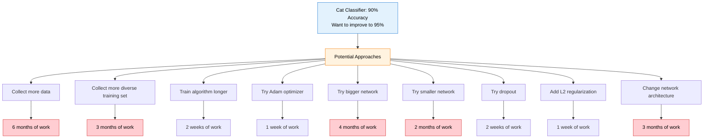

**Without Strategy:**

- Teams often try random approaches
- May spend 6 months collecting more data when the real problem is overfitting
- Could waste months on architectural changes when simple regularization would suffice
- End up with minimal improvement despite massive effort

**With Strategy:**

- Systematically analyze your system to identify the limiting factor
- Choose the approach most likely to yield results
- Save months of development time
- Achieve better results with less effort

### Real-World Impact

Andrew Ng has seen teams waste **months or even years** through not understanding strategic principles. The goal of this course is to save you that time by teaching systematic approaches to ML project decision-making.

---

## Orthogonalization

Orthogonalization is the principle that each control in your system should affect one specific aspect and not interfere with others.

### The Car Analogy

Think about driving a car:

**Well-Designed Controls:**

- **Steering wheel:** Changes direction (not speed)
- **Accelerator:** Increases speed (not direction)
- **Brake:** Decreases speed (not direction)

**Imagine Poorly-Designed Controls:**

- Steering wheel changes both direction AND speed
- Accelerator sometimes slows you down
- Brake occasionally turns the car left

Driving would be nearly impossible! You'd never know which control to adjust for a specific outcome.

### The ML Chain of Assumptions

For a supervised learning system to work well, four things must hold true in sequence:

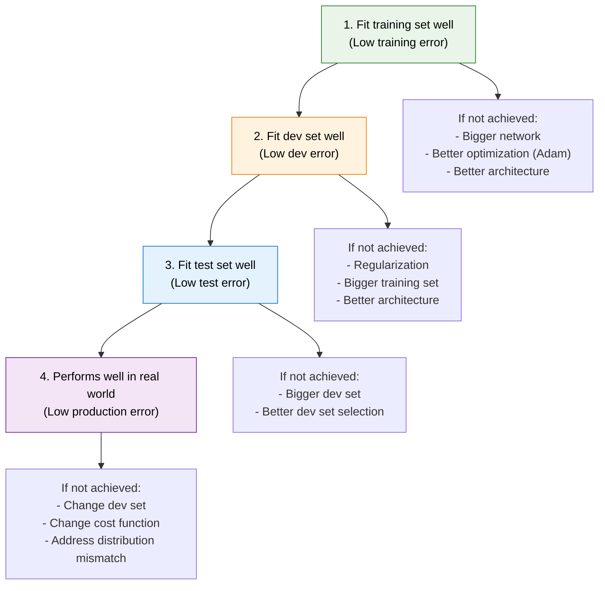

### Orthogonal Controls for Each Problem

**Key Insight:** Each step has specific remedies. Don't use variance-reducing techniques (like regularization) when you have a bias problem, and vice versa.

**Step 1: Training Set Performance**

- **Problem:** High training error (underfitting)
- **Solutions:** Bigger network, better optimization, better architecture
- **Don't use:** Regularization (makes underfitting worse)

**Step 2: Dev Set Performance**

- **Problem:** High dev error but low training error (overfitting)
- **Solutions:** Regularization, more training data, better architecture
- **Don't use:** Bigger network without regularization (makes overfitting worse)

**Step 3: Test Set Performance**

- **Problem:** High test error but low dev error (dev set overfitting)
- **Solutions:** Bigger dev set, better dev set selection
- **Don't use:** Model changes (problem is evaluation, not model)

**Step 4: Real World Performance**

- **Problem:** Good test performance but poor production results
- **Solutions:** Change dev/test sets, change cost function, address data mismatch
- **Don't use:** Model improvements (model is fine, distribution is the issue)

### Why Early Stopping Violates Orthogonalization

**Early stopping** simultaneously affects both training and dev performance, making it harder to isolate whether you have a bias or variance problem.

**Andrew Ng's Preference:** Use L2 regularization instead of early stopping because:

- You can control training set performance and dev set performance independently
- Clearer diagnosis of bias vs variance issues
- Better adherence to orthogonalization principles

---

## Setting Up Your Goal

### Single Number Evaluation Metric

**The Problem:** Multiple metrics make it impossible to rank algorithms objectively.

#### Precision vs Recall Example

**Scenario:** Cat classification system

**Confusion Matrix for 10 images (5 cats, 5 non-cats):**
Classifier identifies 4 images as cats, but 1 is wrong.

|                    | Predicted Cat | Predicted Non-Cat |
| ------------------ | ------------- | ----------------- |
| **Actual Cat**     | 3             | 2                 |
| **Actual Non-Cat** | 1             | 4                 |

**Key Metrics:**

- **Precision:** $P = \frac{3}{3 + 1} = 75\%$ (Of predicted cats, how many are actually cats?)
- **Recall:** $R = \frac{3}{3 + 2} = 60\%$ (Of actual cats, how many did we find?)

#### The Comparison Problem

| Classifier | Precision | Recall |
| ---------- | --------- | ------ |
| A          | 95%       | 90%    |
| B          | 98%       | 85%    |

**Which is better?** It's unclear! This leads to analysis paralysis and endless debates.

#### Solution: F1 Score

Combine precision and recall into a single metric:

$$F1 = \frac{2}{\frac{1}{\text{Precision}} + \frac{1}{\text{Recall}}} = \frac{2 \times \text{Precision} \times \text{Recall}}{\text{Precision} + \text{Recall}}$$

**For our example:**

- **Classifier A:** $F1 = \frac{2 \times 0.95 \times 0.90}{0.95 + 0.90} = 0.924$
- **Classifier B:** $F1 = \frac{2 \times 0.98 \times 0.85}{0.98 + 0.85} = 0.910$

**Clear winner:** Classifier A with higher F1 score.

### Satisficing and Optimizing Metrics

Sometimes combining all metrics into one number isn't practical or meaningful. Use the **satisficing/optimizing framework**.

#### The Accuracy vs Speed Trade-off

**Scenario:** Real-time cat classification for mobile app

| Classifier | F1 Score | Running Time |
| ---------- | -------- | ------------ |
| A          | 90%      | 80 ms        |
| B          | 92%      | 95 ms        |
| C          | 92%      | 1,500 ms     |

**Challenge:** How do you balance accuracy vs speed?

#### Framework: 1 Optimizing + N-1 Satisficing

**Strategy:**

- **Optimize:** F1 score (maximize)
- **Satisfice:** Running time < 100ms (constraint)

**Result:** Choose B (highest F1 among acceptable speed options)

#### General Rule

- **1 optimizing metric** (what you want to maximize/minimize)
- **N-1 satisficing metrics** (constraints that must be met)

**Examples:**

- **Maximize:** Accuracy, **Subject to:** Cost < $100, Latency < 50ms
- **Minimize:** Inference time, **Subject to:** Accuracy > 95%, Memory < 1GB

### Train/Dev/Test Distributions

#### The Golden Rule

**Dev and test sets must come from the same distribution as your expected production data.**

#### Real-World Example: Mobile App Photos

**Scenario:** Building a photo classification app

**Available Data:**

- **High-quality web images:** 200,000 images (professional photos, good lighting)
- **Mobile phone photos:** 10,000 images (target distribution - lower quality, various angles, lighting)

#### Wrong Approach: Random Split

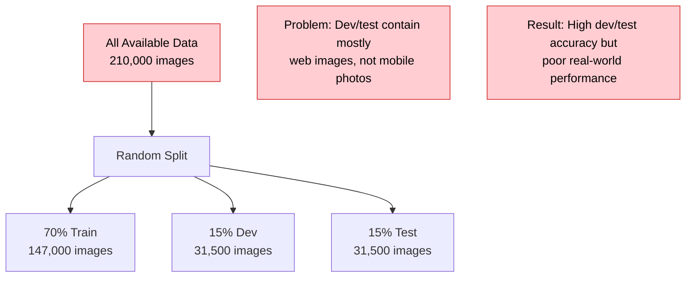

#### Right Approach: Target-Focused Split

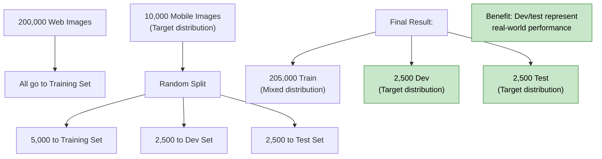

#### Key Principle

**Your dev and test sets should reflect the data you expect to see in production, even if it means your training set has a different distribution.**

### Size of Dev and Test Sets

#### Traditional Approach (Small Datasets)

**For datasets < 100,000 examples:**

- 70% Training, 30% Test, or
- 60% Training, 20% Dev, 20% Test

**Rationale:** Need substantial portions for reliable evaluation

#### Modern Approach (Large Datasets)

**For datasets > 1,000,000 examples:**

- 98% Training, 1% Dev, 1% Test, or
- 99% Training, 0.5% Dev, 0.5% Test

**Key Insight:** With millions of examples, even 1% provides 10,000+ examples for reliable evaluation.

#### Sizing Guidelines

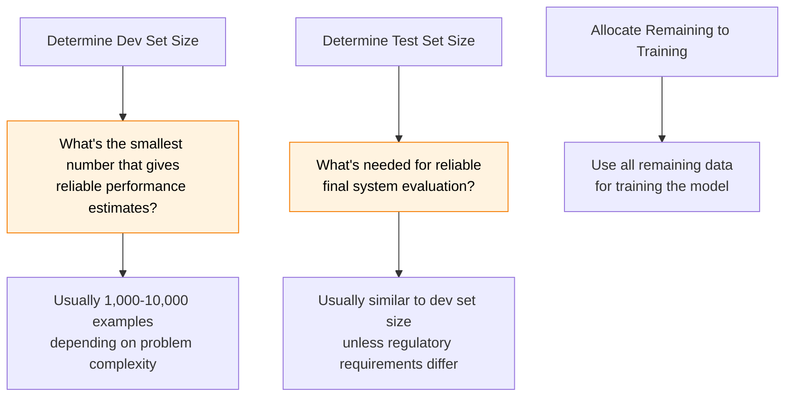

### When to Change Dev/Test Sets and Metrics

#### Case Study: Adult Content Filter

You build a cat classifier with these results:

| Algorithm | Classification Error | Note                                                |
| --------- | -------------------- | --------------------------------------------------- |
| A         | 3%                   | Allows pornographic images to be classified as cats |
| B         | 5%                   | No inappropriate content issues                     |

**Problem:** Your metric says A is better, but users strongly prefer B.

#### Root Cause Analysis

Your current metric doesn't capture what you actually care about:

**Current Metric:**
$$\text{Error} = \frac{1}{m} \sum_{i=1}^{m} \mathbf{1}[y_{\text{pred}}^{(i)} \neq y^{(i)}]$$

This treats all errors equally, but some errors (inappropriate content) are much worse than others.

#### Solution: Weighted Error Metric

**New Metric:**
$$\text{Error} = \frac{1}{\sum_{i=1}^{m} w^{(i)}} \sum_{i=1}^{m} w^{(i)} \cdot \mathbf{1}[y_{\text{pred}}^{(i)} \neq y^{(i)}]$$

Where:

- $w^{(i)} = 1$ if $x^{(i)}$ is not pornographic
- $w^{(i)} = 10$ if $x^{(i)}$ is pornographic

**Result:** Algorithm B now has lower weighted error and matches user preference.

#### Orthogonalization Framework for Metrics

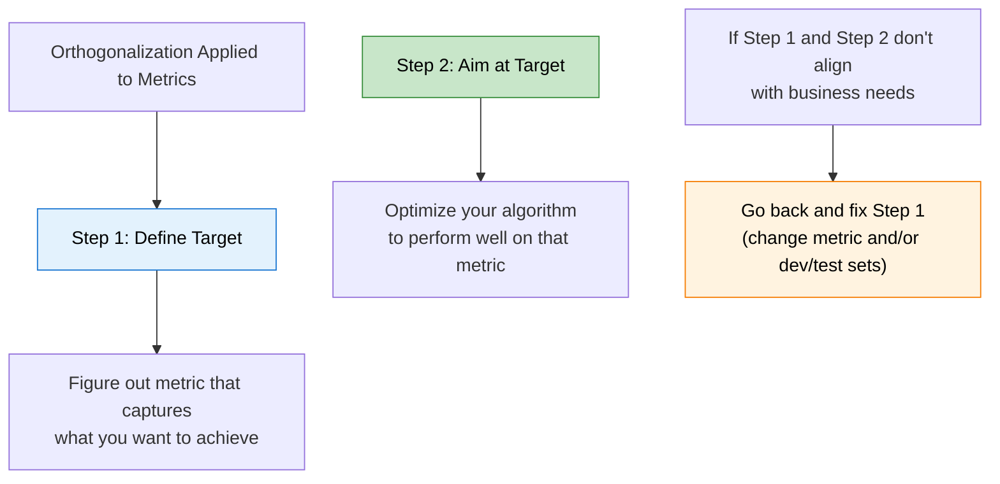

#### When to Change Your Setup

**Change dev/test sets when:**

- Current sets don't represent your target use case
- You discover important edge cases not covered
- Business requirements evolve
- You have access to more representative data

**Change metrics when:**

- Current metric doesn't align with business goals
- Users prefer outcomes that score worse on your metric
- You discover important considerations not captured
- Regulatory or ethical requirements change

---

## Comparing to Human-Level Performance

### Why Human-Level Performance?

Human-level performance has become a crucial benchmark in modern ML for two key reasons:

#### 1. Technical Feasibility

**Recent Progress:** Due to advances in deep learning, ML algorithms are now competitive with human-level performance in many domains for the first time.

**Historical Context:**

- **Pre-2010:** Most ML systems performed far below human level
- **2010-2020:** Rapid progress toward human parity in specific domains
- **2020+:** Surpassing human performance in many applications

#### 2. Workflow Efficiency

The development process is much more efficient when targeting human-level performance because you have access to powerful debugging tools.

### The Performance Progression Pattern

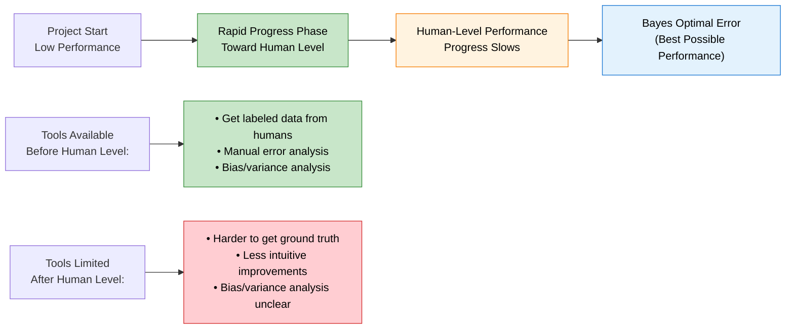

#### Why Progress Slows After Human Level

1. **Bayes Optimal Ceiling:** You can't do better than the theoretical best performance
2. **Human-level ≈ Bayes Optimal:** For natural perception tasks, human performance is often close to optimal
3. **Loss of Debugging Tools:** Harder to get ground truth and intuitive guidance

### Avoidable Bias

**Definition:** The gap between your current performance and the theoretical best possible performance (Bayes optimal error).

#### Using Human-Level as Proxy

Since human-level performance is often close to Bayes optimal error for natural perception tasks, we can use it to estimate avoidable bias:

$$\text{Avoidable Bias} = \text{Training Error} - \text{Human-Level Error}$$
$$\text{Variance} = \text{Dev Error} - \text{Training Error}$$

#### Decision Framework

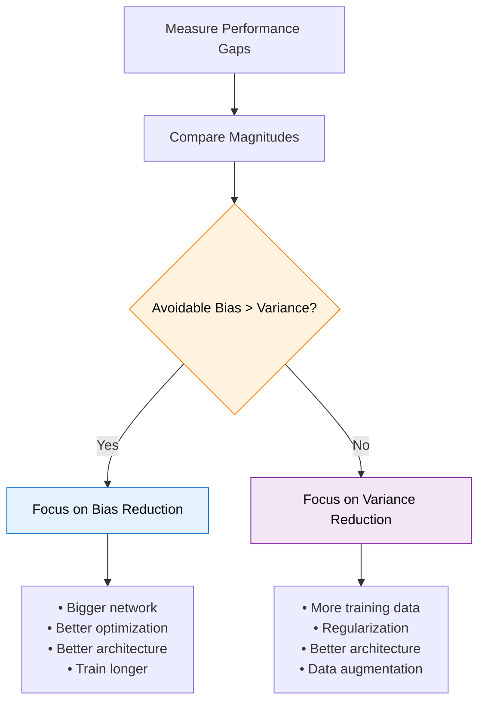

#### Practical Examples

**Scenario 1: Focus on Bias**

- Human-level error: 1%
- Training error: 8%
- Dev error: 10%
- **Analysis:** Avoidable bias (7%) > Variance (2%)
- **Action:** Use bigger network, better optimization, train longer

**Scenario 2: Focus on Variance**

- Human-level error: 7.5%
- Training error: 8%
- Dev error: 10%
- **Analysis:** Avoidable bias (0.5%) < Variance (2%)
- **Action:** Add regularization, get more data, use data augmentation

### Understanding Human-Level Performance

#### Choosing the Right Human Baseline

Different humans have different performance levels. Choose the baseline that makes sense for your application context.

**Medical Diagnosis Example:**

- **Typical doctor:** 3% error
- **Experienced doctor:** 1% error
- **Team of experienced doctors:** 0.5% error

#### Application-Specific Baselines

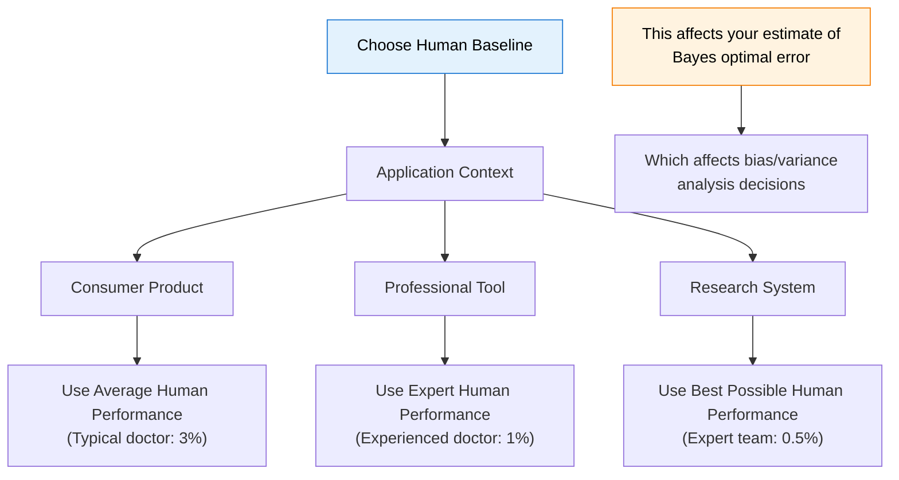

**Guidelines:**

- **General consumer app:** Use typical human performance
- **Professional tool for experts:** Use expert human performance
- **Research/diagnostic aid:** Use best possible human performance

### Surpassing Human-Level Performance

#### Domains Where ML Exceeds Humans

**Successful Applications:**

1. **Online advertising** - Optimizing click-through rates
2. **Product recommendations** - Personalized suggestions
3. **Logistics optimization** - Route planning, inventory management
4. **Loan approvals** - Credit risk assessment

**Common Characteristics:**

- Work with **structured data** (not natural perception)
- Have **large datasets** available
- Use **well-defined objective functions**
- Benefit from **computational speed** and **memory**

#### Challenges in Natural Perception

**Harder Domains for Machines:**

- **Computer vision** - Object recognition, scene understanding
- **Speech recognition** - Natural language in noisy environments
- **Natural language understanding** - Context, nuance, common sense

**Why These Are Harder:**

- Humans evolved specifically for these tasks
- Require common sense and world knowledge
- Have subtle contextual dependencies
- Need robustness to infinite variations

#### What Happens When You Surpass Human-Level

**Challenges:**

- **Bias/variance analysis becomes less clear** - Hard to know if 0.3% vs 0.2% error is meaningful
- **Harder to get additional labeled data** - Humans may not know the right answer
- **Manual error analysis less effective** - Human intuition becomes unreliable
- **Progress typically slows down** - Diminishing returns set in

### Improving Your Model Performance

#### The Two Fundamental Assumptions

For supervised learning to work well, two things must be true:

1. **You can fit the training set pretty well** (low avoidable bias)
2. **Training set performance generalizes to dev/test set** (low variance)

#### Comprehensive Decision Framework

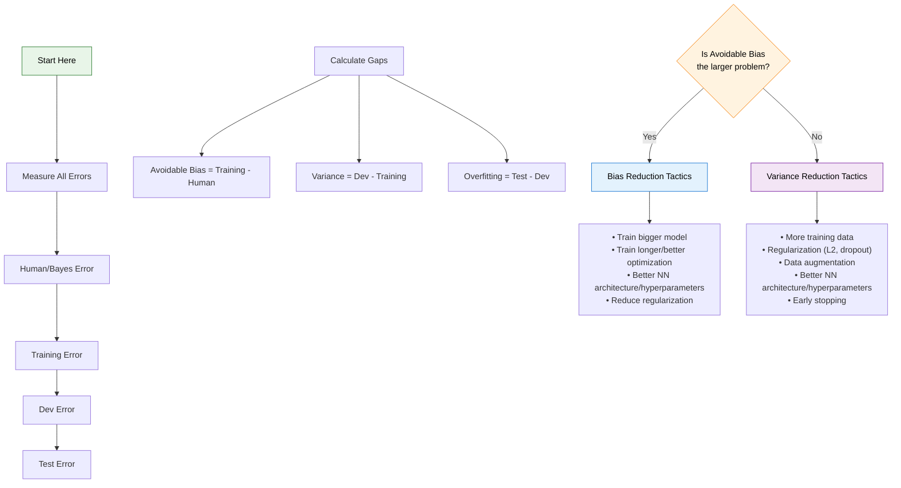

#### Step-by-Step Process

**Step 1: Establish Baseline**

- Determine appropriate human-level performance
- Measure current training and dev errors
- Calculate avoidable bias and variance

**Step 2: Identify Limiting Factor**

- Compare magnitude of avoidable bias vs variance
- Focus on the larger problem first
- Don't try to solve both simultaneously

**Step 3: Apply Targeted Solutions**

- Use bias reduction techniques if avoidable bias > variance
- Use variance reduction techniques if variance > avoidable bias
- Measure impact and iterate

**Step 4: Iterate and Refine**

- Re-measure after each intervention
- Re-calculate bias/variance analysis
- Adjust strategy based on new measurements

---

## Week 1 Summary and Best Practices

### Key Strategic Principles

1. **Orthogonalization First**

   - Each control should affect one specific aspect
   - Don't use variance techniques for bias problems
   - Systematic diagnosis before solutions

2. **Single Number Metrics**

   - Combine multiple metrics into one number when possible
   - Use satisficing/optimizing framework when combination isn't meaningful
   - Align metrics with business objectives

3. **Distribution Alignment**

   - Dev and test sets must represent target application
   - Use target distribution even if training data is different
   - Size sets based on reliable evaluation needs

4. **Human-Level Benchmarking**
   - Use human performance as proxy for Bayes optimal error
   - Choose appropriate human baseline for your application
   - Leverage human-level comparison for bias/variance analysis

### Practical Workflow

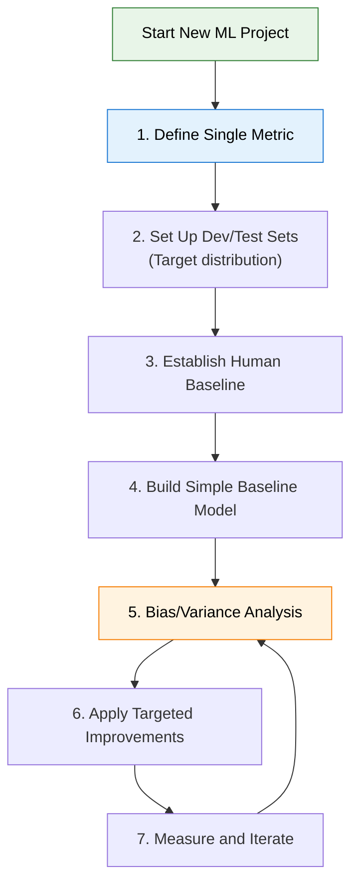

### Common Pitfalls to Avoid

**Metric Mistakes:**

- Using multiple metrics without clear prioritization
- Optimizing metrics that don't align with business goals
- Changing metrics too frequently during development

**Data Distribution Errors:**

- Random splitting when training/target distributions differ
- Using convenient data instead of representative data
- Ignoring distribution shift between development and production

**Strategic Errors:**

- Trying to solve bias and variance simultaneously
- Using complex solutions before systematic diagnosis
- Focusing on technical details before strategic clarity

### Success Checklist

- [ ] Single number evaluation metric defined
- [ ] Dev/test sets represent target distribution
- [ ] Human-level baseline established
- [ ] Current bias/variance analysis completed
- [ ] Next improvement direction identified
- [ ] Success criteria and timeline defined

This systematic approach to ML strategy can save months of development time and significantly improve your chances of building successful ML systems.
