# Course 3 Week 2: ML Strategy 2 - Comprehensive Notes

## Table of Contents

1. [Error Analysis](#error-analysis)
   - [Carrying Out Error Analysis](#carrying-out-error-analysis)
   - [Cleaning Up Incorrectly Labeled Data](#cleaning-up-incorrectly-labeled-data)
   - [Build Your First System Quickly, Then Iterate](#build-your-first-system-quickly-then-iterate)
2. [Mismatched Training and Dev/Test Set](#mismatched-training-and-devtest-set)
   - [Training and Testing on Different Distributions](#training-and-testing-on-different-distributions)
   - [Bias and Variance with Mismatched Data Distributions](#bias-and-variance-with-mismatched-data-distributions)
   - [Addressing Data Mismatch](#addressing-data-mismatch)
3. [Learning from Multiple Tasks](#learning-from-multiple-tasks)
   - [Transfer Learning](#transfer-learning)
   - [Multi-task Learning](#multi-task-learning)
4. [End-to-End Deep Learning](#end-to-end-deep-learning)
   - [What is End-to-End Deep Learning?](#what-is-end-to-end-deep-learning)
   - [Whether to Use End-to-End Deep Learning](#whether-to-use-end-to-end-deep-learning)
5. [Week 2 Summary and Strategic Framework](#week-2-summary-and-strategic-framework)

---

## Error Analysis

Error analysis is the systematic process of manually examining your algorithm's mistakes to gain insights about what to do next. It's one of the most powerful and time-efficient techniques for improving ML systems.

### Carrying Out Error Analysis

#### The Systematic Error Analysis Process

**Goal:** Understand the types of errors your algorithm makes to prioritize improvement efforts effectively.

#### Case Study: Cat Classifier with Dog Problem

**Scenario:** Your cat classifier has 10% error on the dev set. You notice some mislabeled examples are actually dogs that look like cats.

**Question:** Should you spend weeks making your classifier better at distinguishing cats from dogs?

**Traditional Approach (Inefficient):**

- Spend 3-6 months working on the dog problem
- Implement complex dog-specific features
- Retrain entire system
- Discover minimal improvement

**Error Analysis Approach (Efficient):**

#### Step-by-Step Error Analysis Methodology

**Step 1: Sample Collection**

- Get 100 mislabeled dev set examples at random
- Ensure representative sample of errors
- Create systematic examination framework

**Step 2: Manual Examination**

- Go through each example individually
- Categorize the type of error
- Note patterns and edge cases

**Step 3: Quantitative Analysis**

- Count errors in each category
- Calculate percentages
- Rank by potential impact

**Step 4: Ceiling Analysis**

- Calculate maximum possible improvement for each category
- Make data-driven prioritization decisions

#### Practical Error Analysis Example

**Sample Analysis Spreadsheet:**

| Image           | Dog    | Great Cats | Blurry  | Instagram Filters | Comments               |
| --------------- | ------ | ---------- | ------- | ----------------- | ---------------------- |
| 1               | ✓      |            |         | ✓                 | Pitbull looks like cat |
| 2               | ✓      |            | ✓       | ✓                 | Blurry dog in shadows  |
| 3               |        |            |         |                   | Rainy day at zoo       |
| 4               |        | ✓          |         |                   | Lion/tiger confusion   |
| 5               |        | ✓          | ✓       |                   | Blurry leopard         |
| 6               | ✓      |            |         |                   | Small dog, cat-like    |
| 7               |        |            | ✓       | ✓                 | Heavy filter applied   |
| 8               |        | ✓          |         |                   | Cheetah misclassified  |
| ...             | ...    | ...        | ...     | ...               | ...                    |
| **% of errors** | **8%** | **43%**    | **61%** | **12%**           |                        |

#### Decision Framework and Ceiling Analysis

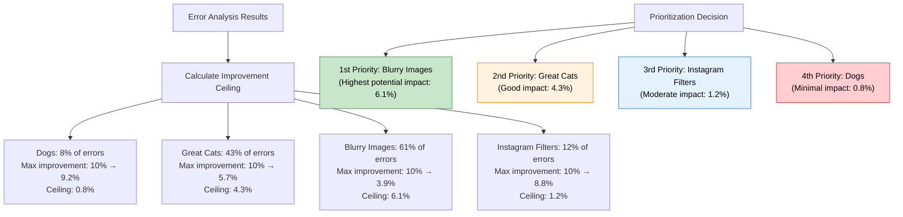
```mermaid
graph TD
    A["Error Analysis Results"] --> B["Calculate Improvement Ceiling"]
    B --> C["Dogs: 8% of errors<br/>Max improvement: 10% → 9.2%<br/>Ceiling: 0.8%"]
    B --> D["Great Cats: 43% of errors<br/>Max improvement: 10% → 5.7%<br/>Ceiling: 4.3%"]
    B --> E["Blurry Images: 61% of errors<br/>Max improvement: 10% → 3.9%<br/>Ceiling: 6.1%"]
    B --> F["Instagram Filters: 12% of errors<br/>Max improvement: 10% → 8.8%<br/>Ceiling: 1.2%"]

    G["Prioritization Decision"] --> H["1st Priority: Blurry Images<br/>(Highest potential impact: 6.1%)"]
    G --> I["2nd Priority: Great Cats<br/>(Good impact: 4.3%)"]
    G --> J["3rd Priority: Instagram Filters<br/>(Moderate impact: 1.2%)"]
    G --> K["4th Priority: Dogs<br/>(Minimal impact: 0.8%)"]

    style H fill:#c8e6c9,stroke:#388e3c,color:#000
    style I fill:#fff3e0,stroke:#f57c00,color:#000
    style J fill:#e3f2fd,stroke:#1976d2,color:#000
    style K fill:#ffcdd2,stroke:#d32f2f,color:#000
```

#### Advanced Error Analysis Techniques

**Multi-Category Analysis:**
Many errors have multiple causes. An image might be both blurry AND have an Instagram filter. Count each category independently to understand the full scope.

**Iterative Refinement:**

1. Start with broad categories (image quality, object confusion, etc.)
2. Refine categories based on discovered patterns
3. Deep-dive into highest-impact categories
4. Repeat process after implementing improvements

**Ceiling Calculation Formula:**
$$\text{Improvement Ceiling} = \text{Current Error} \times \frac{\text{Category Percentage}}{100}$$

#### Benefits of Systematic Error Analysis

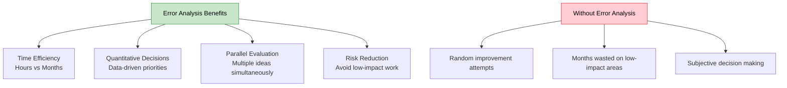
```mermaid
graph TD
    A["Error Analysis Benefits"] --> B["Time Efficiency<br/>Hours vs Months"]
    A --> C["Quantitative Decisions<br/>Data-driven priorities"]
    A --> D["Parallel Evaluation<br/>Multiple ideas simultaneously"]
    A --> E["Risk Reduction<br/>Avoid low-impact work"]

    F["Without Error Analysis"] --> G["Random improvement attempts"]
    F --> H["Months wasted on low-impact areas"]
    F --> I["Subjective decision making"]

    style A fill:#c8e6c9,stroke:#388e3c,color:#000
    style F fill:#ffcdd2,stroke:#d32f2f,color:#000
```

### Cleaning Up Incorrectly Labeled Data

#### Understanding Deep Learning's Robustness

**Key Insight:** Deep learning algorithms have different levels of robustness to different types of label errors.

#### Types of Label Errors

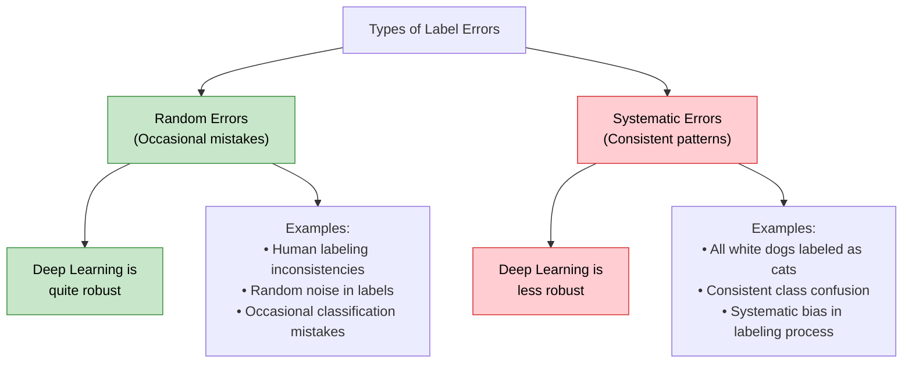
```mermaid
graph TD
    A["Types of Label Errors"] --> B["Random Errors<br/>(Occasional mistakes)"]
    A --> C["Systematic Errors<br/>(Consistent patterns)"]

    B --> D["Deep Learning is<br/>quite robust"]
    B --> E["Examples:<br/>• Human labeling inconsistencies<br/>• Random noise in labels<br/>• Occasional classification mistakes"]

    C --> F["Deep Learning is<br/>less robust"]
    C --> G["Examples:<br/>• All white dogs labeled as cats<br/>• Consistent class confusion<br/>• Systematic bias in labeling process"]

    style B fill:#c8e6c9,stroke:#388e3c,color:#000
    style C fill:#ffcdd2,stroke:#d32f2f,color:#000
    style D fill:#c8e6c9,stroke:#388e3c,color:#000
    style F fill:#ffcdd2,stroke:#d32f2f,color:#000
```

#### Extended Error Analysis for Mislabeled Data

**Enhanced Error Analysis Framework:**

| Image           | Dog    | Great Cats | Blurry  | Mislabeled | Comments                       |
| --------------- | ------ | ---------- | ------- | ---------- | ------------------------------ |
| 1               | ✓      |            |         |            | Correctly identified dog       |
| 2               | ✓      |            | ✓       |            | Blurry dog image               |
| 3               |        |            |         |            | Clear cat image                |
| 4               |        | ✓          |         |            | Tiger vs cat confusion         |
| 5               |        |            |         | ✓          | Actually a dog, labeled as cat |
| 6               |        |            | ✓       | ✓          | Blurry dog, mislabeled         |
| 7               |        | ✓          |         |            | Leopard classification         |
| ...             | ...    | ...        | ...     | ...        | ...                            |
| **% of errors** | **8%** | **43%**    | **61%** | **6%**     |                                |

#### Decision Framework for Label Correction

**Quantitative Analysis Example:**

- Overall dev set error: 10%
- Errors due to incorrect labels: 0.6% (6% of 10%)
- Errors due to other causes: 9.4%

**Decision Framework:**

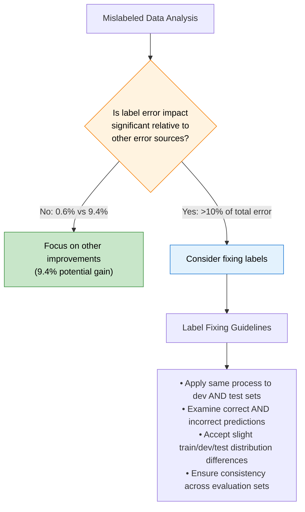
```mermaid
graph TD
    A["Mislabeled Data Analysis"] --> B{"Is label error impact<br/>significant relative to<br/>other error sources?"}
    B -->|No: 0.6% vs 9.4%| C["Focus on other improvements<br/>(9.4% potential gain)"]
    B -->|Yes: >10% of total error| D["Consider fixing labels"]

    D --> E["Label Fixing Guidelines"]
    E --> F["• Apply same process to dev AND test sets<br/>• Examine correct AND incorrect predictions<br/>• Accept slight train/dev/test distribution differences<br/>• Ensure consistency across evaluation sets"]

    style B fill:#fff3e0,stroke:#f57c00,color:#000
    style C fill:#c8e6c9,stroke:#388e3c,color:#000
    style D fill:#e3f2fd,stroke:#1976d2,color:#000
```

#### Label Fixing Best Practices

**When to Fix Labels:**

1. **Significant Impact:** Label errors constitute >10% of total error
2. **Resource Availability:** You have time and budget for systematic correction
3. **Systematic Patterns:** Errors follow consistent, correctable patterns

**Label Fixing Protocol:**

1. **Maintain Consistency:** Apply identical correction process to dev and test sets
2. **Comprehensive Review:** Examine both correct and incorrect algorithm predictions
3. **Distribution Awareness:** Accept that training set may have slightly different distribution
4. **Evaluation Integrity:** Ensure dev and test sets remain from same distribution

**Cost-Benefit Analysis:**

- **Cost:** Time and resources for manual review and correction
- **Benefit:** Maximum possible improvement from label correction
- **Decision:** Only proceed if benefit significantly exceeds cost

### Build Your First System Quickly, Then Iterate

#### The Rapid Prototyping Philosophy

**Core Principle:** Build a working end-to-end system as quickly as possible, then use systematic analysis to guide improvements.

#### Traditional vs Recommended Approach

**Traditional Approach (Avoid):**

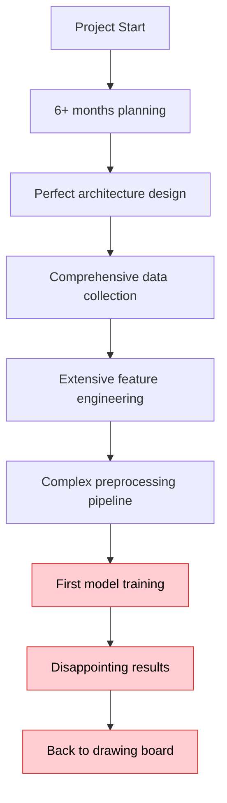
```mermaid
graph TD
    A["Project Start"] --> B["6+ months planning"]
    B --> C["Perfect architecture design"]
    C --> D["Comprehensive data collection"]
    D --> E["Extensive feature engineering"]
    E --> F["Complex preprocessing pipeline"]
    F --> G["First model training"]
    G --> H["Disappointing results"]
    H --> I["Back to drawing board"]

    style G fill:#ffcdd2,stroke:#d32f2f,color:#000
    style H fill:#ffcdd2,stroke:#d32f2f,color:#000
    style I fill:#ffcdd2,stroke:#d32f2f,color:#000
```

**Recommended Approach:**

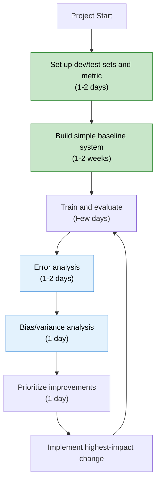
```mermaid
graph TD
    A["Project Start"] --> B["Set up dev/test sets and metric<br/>(1-2 days)"]
    B --> C["Build simple baseline system<br/>(1-2 weeks)"]
    C --> D["Train and evaluate<br/>(Few days)"]
    D --> E["Error analysis<br/>(1-2 days)"]
    E --> F["Bias/variance analysis<br/>(1 day)"]
    F --> G["Prioritize improvements<br/>(1 day)"]
    G --> H["Implement highest-impact change"]
    H --> D

    style B fill:#c8e6c9,stroke:#388e3c,color:#000
    style C fill:#c8e6c9,stroke:#388e3c,color:#000
    style E fill:#e3f2fd,stroke:#1976d2,color:#000
    style F fill:#e3f2fd,stroke:#1976d2,color:#000
```

#### The Three-Step Iterative Process

**Step 1: Setup (Fast)**

- **Goal:** Define your target clearly
- **Actions:**
  - Choose single-number evaluation metric
  - Set up dev/test sets from target distribution
  - Establish human-level baseline if applicable
- **Timeline:** 1-2 days
- **Outcome:** Clear success criteria and evaluation framework

**Step 2: Build Baseline (Fast)**

- **Goal:** Get end-to-end pipeline working
- **Actions:**
  - Implement simplest reasonable approach
  - Use existing architectures/frameworks
  - Focus on working system over optimal performance
- **Timeline:** 1-2 weeks
- **Outcome:** Functioning system with baseline performance

**Step 3: Iterate Systematically (Data-Driven)**

- **Goal:** Improve system based on systematic analysis
- **Actions:**
  - Conduct error analysis
  - Perform bias/variance analysis
  - Identify and address highest-impact limitations
- **Timeline:** Ongoing cycles of 1-2 weeks
- **Outcome:** Continuous, strategic improvements

#### Why This Approach Works

**Empirical over Theoretical:**

- Real data reveals actual problems vs assumed problems
- Avoids over-engineering solutions to non-existent issues
- Builds understanding of problem domain

**Rapid Feedback Loops:**

- Quick validation of core assumptions
- Fast identification of major issues
- Continuous learning and adaptation

**Resource Efficiency:**

- Avoid spending time on low-impact improvements
- Focus effort where it will make the biggest difference
- Minimize risk of project failure

**Risk Mitigation:**

- Fail fast and cheap rather than slow and expensive
- Validate feasibility early in project lifecycle
- Reduce uncertainty through empirical evidence

---

## Mismatched Training and Dev/Test Set

### Training and Testing on Different Distributions

#### The Modern ML Data Reality

**Common Scenario:** Training data comes from different distribution than target application due to data availability constraints.

#### Motivating Example: Mobile Photo Classification

**Available Training Data:**

- **High-quality web images:** 200,000 images
  - Professional photography
  - Good lighting and composition
  - Clear, high-resolution images
  - Controlled environments

**Target Application Data:**

- **Mobile phone photos:** 10,000 images
  - Casual photography
  - Variable lighting conditions
  - Different angles and perspectives
  - Lower resolution, compression artifacts
  - Real-world environments

**The Challenge:** Web images ≠ mobile photos in important characteristics affecting model performance.

#### Two Strategic Approaches

**Option 1: Shuffle All Data (NOT Recommended)**

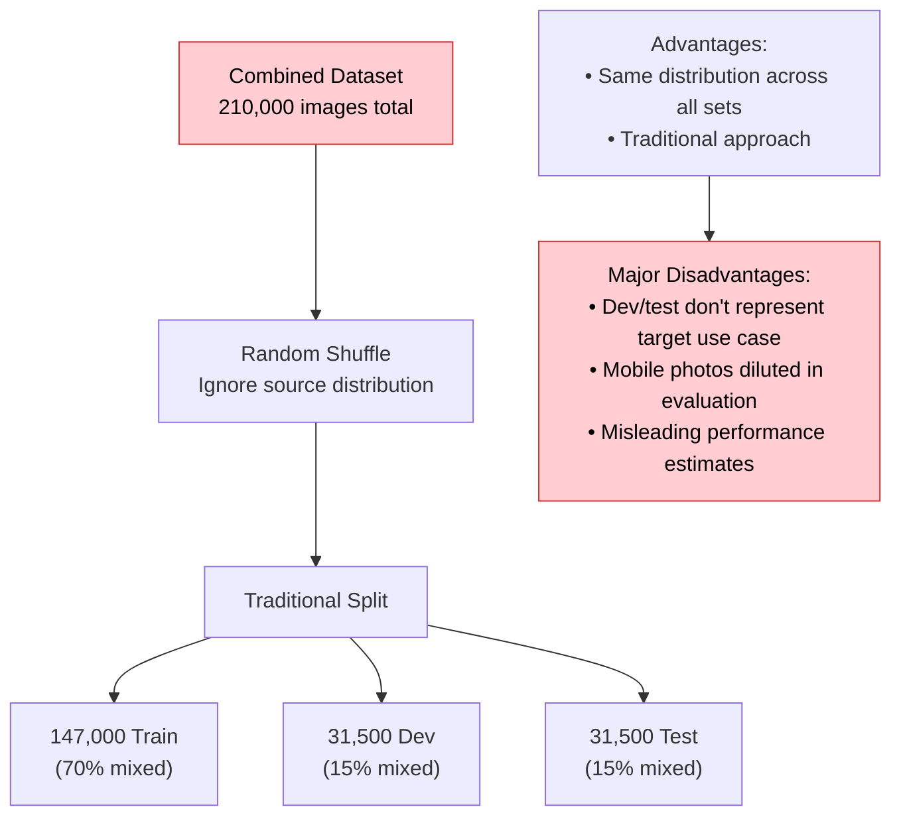
```mermaid
graph TD
    A["Combined Dataset<br/>210,000 images total"] --> B["Random Shuffle<br/>Ignore source distribution"]
    B --> C["Traditional Split"]
    C --> D["147,000 Train<br/>(70% mixed)"]
    C --> E["31,500 Dev<br/>(15% mixed)"]
    C --> F["31,500 Test<br/>(15% mixed)"]

    G["Advantages:<br/>• Same distribution across all sets<br/>• Traditional approach"] --> H["Major Disadvantages:<br/>• Dev/test don't represent target use case<br/>• Mobile photos diluted in evaluation<br/>• Misleading performance estimates"]

    style A fill:#ffcdd2,stroke:#d32f2f,color:#000
    style H fill:#ffcdd2,stroke:#d32f2f,color:#000
```

**Option 2: Target-Focused Split (Recommended)**

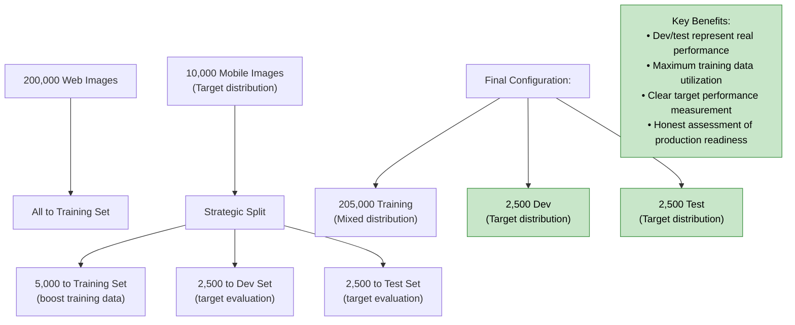
```mermaid
graph TD
    A["200,000 Web Images"] --> B["All to Training Set"]
    C["10,000 Mobile Images<br/>(Target distribution)"] --> D["Strategic Split"]
    D --> E["5,000 to Training Set<br/>(boost training data)"]
    D --> F["2,500 to Dev Set<br/>(target evaluation)"]
    D --> G["2,500 to Test Set<br/>(target evaluation)"]

    H["Final Configuration:"] --> I["205,000 Training<br/>(Mixed distribution)"]
    H --> J["2,500 Dev<br/>(Target distribution)"]
    H --> K["2,500 Test<br/>(Target distribution)"]

    L["Key Benefits:<br/>• Dev/test represent real performance<br/>• Maximum training data utilization<br/>• Clear target performance measurement<br/>• Honest assessment of production readiness"]

    style J fill:#c8e6c9,stroke:#388e3c,color:#000
    style K fill:#c8e6c9,stroke:#388e3c,color:#000
    style L fill:#c8e6c9,stroke:#388e3c,color:#000
```

#### Strategic Principle

**Core Insight:** Your dev and test sets should reflect the data you expect to see in production, even if it means your training set has a different distribution.

**Rationale:**

- **Dev set** guides your development decisions
- **Test set** provides final performance estimate
- Both should represent real-world deployment scenario
- Training set can be augmented with any useful data

### Bias and Variance with Mismatched Data Distributions

#### Why Traditional Analysis Breaks Down

**Traditional Bias/Variance Analysis (Same Distribution):**

- Human error: 0%
- Training error: 1%
- Dev error: 10%
- **Traditional Conclusion:** High variance problem (9% gap)

**The Mismatched Distribution Problem:**
The same numbers could indicate:

1. **High variance:** Model overfits training data
2. **Data mismatch:** Training set was easier than dev set
3. **Both problems:** Overfitting AND distribution shift

**Challenge:** Cannot distinguish between these scenarios with traditional analysis.

#### Introducing the Train-Dev Set

**Solution:** Create a train-dev set as a random subset of the training data that uses the same distribution as training but is held out for evaluation.

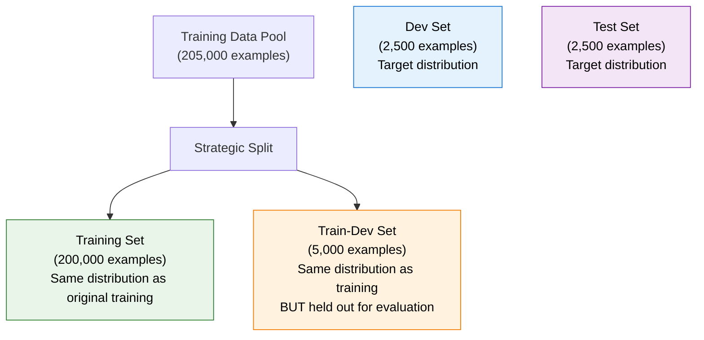
```mermaid
graph TD
    A["Training Data Pool<br/>(205,000 examples)"] --> B["Strategic Split"]
    B --> C["Training Set<br/>(200,000 examples)<br/>Same distribution as original training"]
    B --> D["Train-Dev Set<br/>(5,000 examples)<br/>Same distribution as training<br/>BUT held out for evaluation"]

    E["Dev Set<br/>(2,500 examples)<br/>Target distribution"]
    F["Test Set<br/>(2,500 examples)<br/>Target distribution"]

    style C fill:#e8f5e8,stroke:#2e7d32,color:#000
    style D fill:#fff3e0,stroke:#f57c00,color:#000
    style E fill:#e3f2fd,stroke:#1976d2,color:#000
    style F fill:#f3e5f5,stroke:#7b1fa2,color:#000
```

#### Comprehensive Error Decomposition Framework

**Complete Error Analysis:**

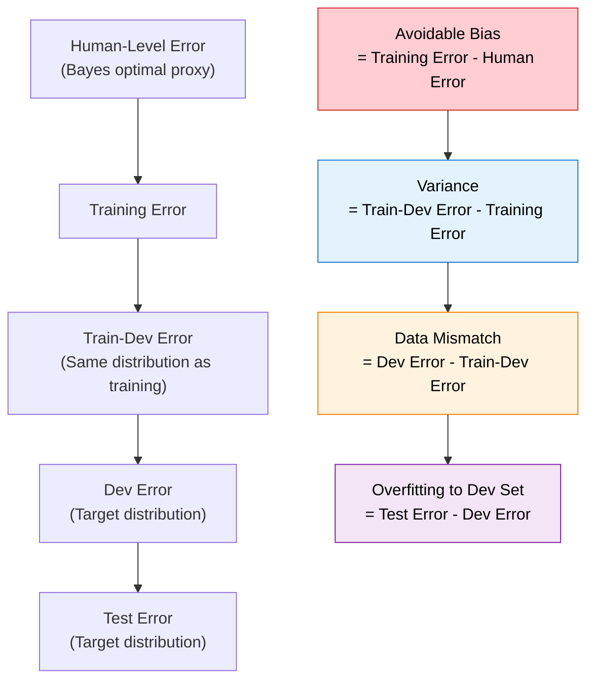
```mermaid
graph TD
    A["Human-Level Error<br/>(Bayes optimal proxy)"] --> B["Training Error"]
    B --> C["Train-Dev Error<br/>(Same distribution as training)"]
    C --> D["Dev Error<br/>(Target distribution)"]
    D --> E["Test Error<br/>(Target distribution)"]

    F["Avoidable Bias<br/>= Training Error - Human Error"] --> G["Variance<br/>= Train-Dev Error - Training Error"]
    G --> H["Data Mismatch<br/>= Dev Error - Train-Dev Error"]
    H --> I["Overfitting to Dev Set<br/>= Test Error - Dev Error"]

    style F fill:#ffcdd2,stroke:#d32f2f,color:#000
    style G fill:#e3f2fd,stroke:#1976d2,color:#000
    style H fill:#fff3e0,stroke:#f57c00,color:#000
    style I fill:#f3e5f5,stroke:#7b1fa2,color:#000
```

#### Practical Scenario Analysis

**Scenario 1: High Variance Problem**

- Human error: 0%
- Training error: 1%
- Train-dev error: 9%
- Dev error: 10%

**Analysis:**

- Avoidable bias: 1%
- Variance: 8% ← **Primary problem**
- Data mismatch: 1%

**Solution:** Focus on variance reduction (regularization, more data, simpler model)

**Scenario 2: Data Mismatch Problem**

- Human error: 0%
- Training error: 1%
- Train-dev error: 1.5%
- Dev error: 10%

**Analysis:**

- Avoidable bias: 1%
- Variance: 0.5%
- Data mismatch: 8.5% ← **Primary problem**

**Solution:** Address distribution differences (data synthesis, domain adaptation)

**Scenario 3: Multiple Problems**

- Human error: 0%
- Training error: 10%
- Train-dev error: 11%
- Dev error: 12%

**Analysis:**

- Avoidable bias: 10% ← **Primary problem**
- Variance: 1%
- Data mismatch: 1%

**Solution:** Focus on bias reduction first (bigger model, better optimization)

#### Decision Framework for Problem Identification

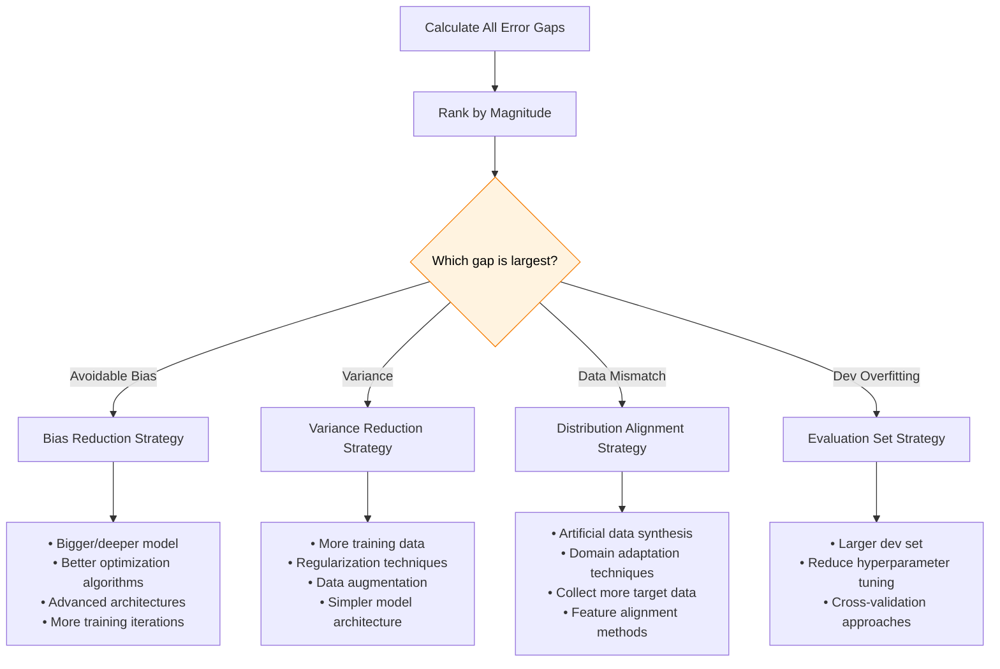
```mermaid
graph TD
    A["Calculate All Error Gaps"] --> B["Rank by Magnitude"]
    B --> C{"Which gap is largest?"}

    C -->|Avoidable Bias| D["Bias Reduction Strategy"]
    C -->|Variance| E["Variance Reduction Strategy"]
    C -->|Data Mismatch| F["Distribution Alignment Strategy"]
    C -->|Dev Overfitting| G["Evaluation Set Strategy"]

    D --> H["• Bigger/deeper model<br/>• Better optimization algorithms<br/>• Advanced architectures<br/>• More training iterations"]
    E --> I["• More training data<br/>• Regularization techniques<br/>• Data augmentation<br/>• Simpler model architecture"]
    F --> J["• Artificial data synthesis<br/>• Domain adaptation techniques<br/>• Collect more target data<br/>• Feature alignment methods"]
    G --> K["• Larger dev set<br/>• Reduce hyperparameter tuning<br/>• Cross-validation approaches"]

    style C fill:#fff3e0,stroke:#f57c00,color:#000
```

### Addressing Data Mismatch

Data mismatch is one of the most challenging problems in modern ML. Unfortunately, there are no completely systematic solutions, but several strategies can help.

#### Understanding the Distribution Mismatch

**Step 1: Manual Error Analysis for Distribution Differences**

**Systematic Comparison Process:**

1. **Sample both distributions:** Get representative examples from training and dev sets
2. **Side-by-side examination:** Look for systematic differences
3. **Categorize differences:** Lighting, background, image quality, angles, etc.
4. **Quantify impact:** Which differences most affect performance?

**Example: Speech Recognition Analysis**

- **Training data:** Clean office recordings, quiet environment
- **Dev/test data:** Car recordings with road noise, wind, engine sounds
- **Key insight:** Background noise is the primary distribution difference

**Example: Image Classification Analysis**

- **Training data:** Professional photos, controlled lighting, centered objects
- **Dev/test data:** Mobile photos, variable lighting, objects at edges
- **Key insights:** Lighting conditions and object positioning are major factors

#### Artificial Data Synthesis

**Concept:** Generate training data that more closely matches the target distribution.

**Success Example: Speech + Noise Synthesis**

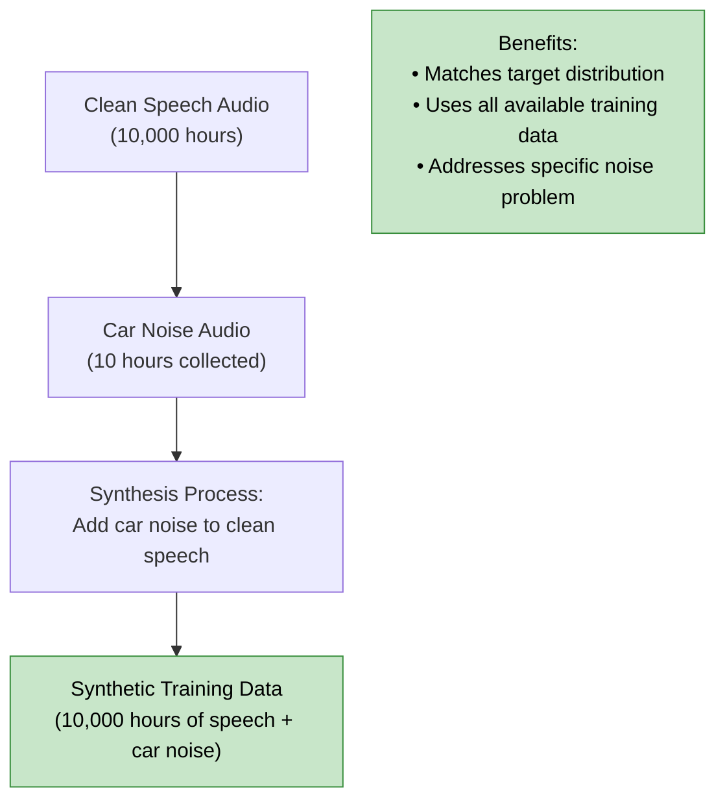
```mermaid
graph TD
    A["Clean Speech Audio<br/>(10,000 hours)"] --> B["Car Noise Audio<br/>(10 hours collected)"]
    B --> C["Synthesis Process:<br/>Add car noise to clean speech"]
    C --> D["Synthetic Training Data<br/>(10,000 hours of speech + car noise)"]

    E["Benefits:<br/>• Matches target distribution<br/>• Uses all available training data<br/>• Addresses specific noise problem"]

    style D fill:#c8e6c9,stroke:#388e3c,color:#000
    style E fill:#c8e6c9,stroke:#388e3c,color:#000
```

**Success Example: Computer Vision with 3D Graphics**

- **Training data:** Real photos of cars
- **Synthesis:** Generate car images using 3D rendering
- **Benefits:** More diverse angles, lighting conditions, backgrounds
- **Result:** Better generalization to real-world car photos

#### Critical Pitfalls of Data Synthesis

**The Overfitting-to-Synthesis Problem:**

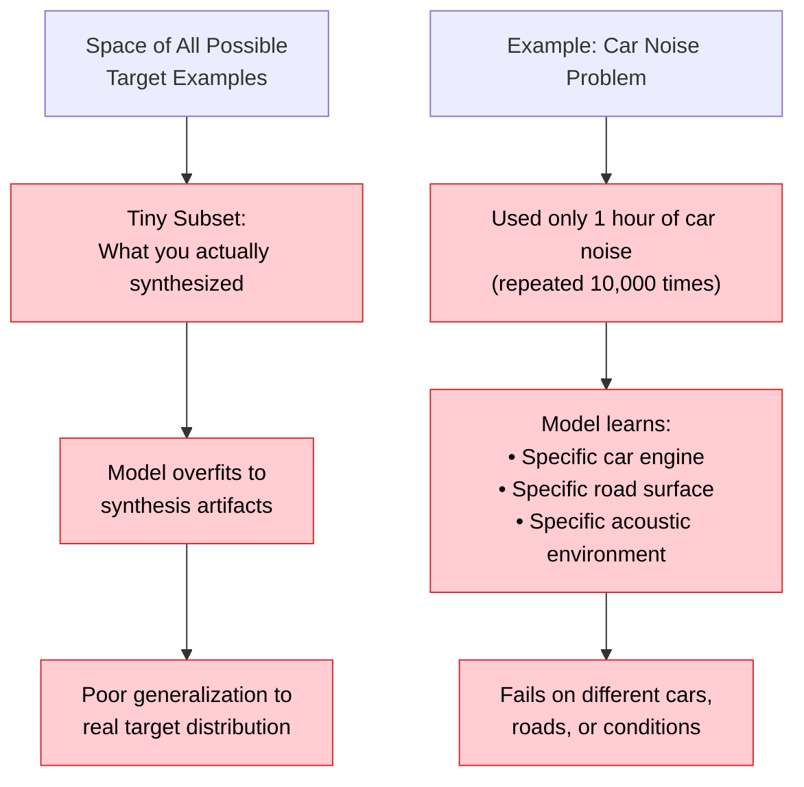
```mermaid
graph TD
    A["Space of All Possible<br/>Target Examples"] --> B["Tiny Subset:<br/>What you actually synthesized"]
    B --> C["Model overfits to<br/>synthesis artifacts"]
    C --> D["Poor generalization to<br/>real target distribution"]

    E["Example: Car Noise Problem"] --> F["Used only 1 hour of car noise<br/>(repeated 10,000 times)"]
    F --> G["Model learns:<br/>• Specific car engine<br/>• Specific road surface<br/>• Specific acoustic environment"]
    G --> H["Fails on different cars,<br/>roads, or conditions"]

    style B fill:#ffcdd2,stroke:#d32f2f,color:#000
    style C fill:#ffcdd2,stroke:#d32f2f,color:#000
    style D fill:#ffcdd2,stroke:#d32f2f,color:#000
    style F fill:#ffcdd2,stroke:#d32f2f,color:#000
    style G fill:#ffcdd2,stroke:#d32f2f,color:#000
    style H fill:#ffcdd2,stroke:#d32f2f,color:#000
```

#### Prevention Strategies for Synthesis Overfitting

**1. Diversify Synthesis Sources**

- Use multiple noise recordings (different cars, roads, conditions)
- Vary synthesis parameters (volume, frequency content, timing)
- Include diverse base materials for generation

**2. Monitor for Synthesis Artifacts**

- Check if performance on synthetic data >> performance on real data
- Look for unrealistic patterns in learned features
- Validate on held-out real data regularly

**3. Gradual Introduction**

- Start with small amounts of synthetic data
- Gradually increase synthesis ratio while monitoring performance
- Balance synthetic and real data appropriately

**4. Validation on Real Data**

- Always test synthesis strategies on real target data
- Use real data as the ultimate validation
- Don't rely solely on synthetic data performance metrics

#### Alternative Strategies for Data Mismatch

**Strategy 1: Domain Adaptation Techniques**

- **Adversarial training:** Make learned features domain-invariant
- **Progressive adaptation:** Gradually bridge source and target domains
- **Feature alignment:** Align statistical properties of learned representations

**Strategy 2: Collect More Target Data**

- Often the most reliable but expensive solution
- Guarantees perfect distribution match
- Can be done progressively as budget allows
- Focus collection on discovered error patterns

**Strategy 3: Multi-Task Learning Approaches**

- Train on both source and target domains simultaneously
- Shared representations can bridge domain gaps
- Requires careful architecture design
- Can leverage complementary information

---

## Learning from Multiple Tasks

### Transfer Learning

Transfer learning allows you to leverage knowledge gained from one task to improve performance on a related task. It's one of the most powerful techniques in modern deep learning.

#### Conceptual Foundation

**Core Principle:** Neural networks learn hierarchical feature representations. Lower layers capture general patterns useful across many tasks, while higher layers become increasingly task-specific.

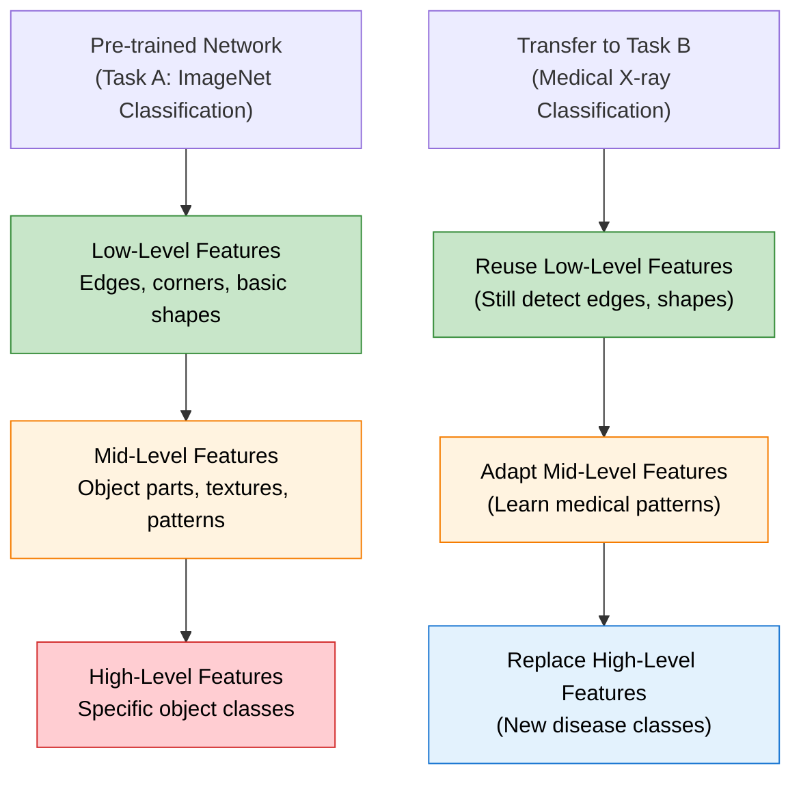
```mermaid
graph TD
    A["Pre-trained Network<br/>(Task A: ImageNet Classification)"] --> B["Low-Level Features<br/>Edges, corners, basic shapes"]
    B --> C["Mid-Level Features<br/>Object parts, textures, patterns"]
    C --> D["High-Level Features<br/>Specific object classes"]

    E["Transfer to Task B<br/>(Medical X-ray Classification)"] --> F["Reuse Low-Level Features<br/>(Still detect edges, shapes)"]
    F --> G["Adapt Mid-Level Features<br/>(Learn medical patterns)"]
    G --> H["Replace High-Level Features<br/>(New disease classes)"]

    style B fill:#c8e6c9,stroke:#388e3c,color:#000
    style C fill:#fff3e0,stroke:#f57c00,color:#000
    style D fill:#ffcdd2,stroke:#d32f2f,color:#000
    style F fill:#c8e6c9,stroke:#388e3c,color:#000
    style G fill:#fff3e0,stroke:#f57c00,color:#000
    style H fill:#e3f2fd,stroke:#1976d2,color:#000
```

#### How to Perform Transfer Learning

**Step 1: Start with Pre-trained Network**

- Use network trained on large dataset (e.g., ImageNet with 1M+ images)
- This stage is called **pre-training**
- Provides rich, general feature representations

**Step 2: Modify Architecture for Target Task**

- Remove the final layer(s) (task-specific components)
- Add new layer(s) appropriate for your task
- Initialize new layers with random weights
- Keep pre-trained weights in earlier layers

**Step 3: Choose Training Strategy Based on Data Size**

#### Training Strategies by Dataset Size

**Small Target Dataset (< 10,000 examples):**

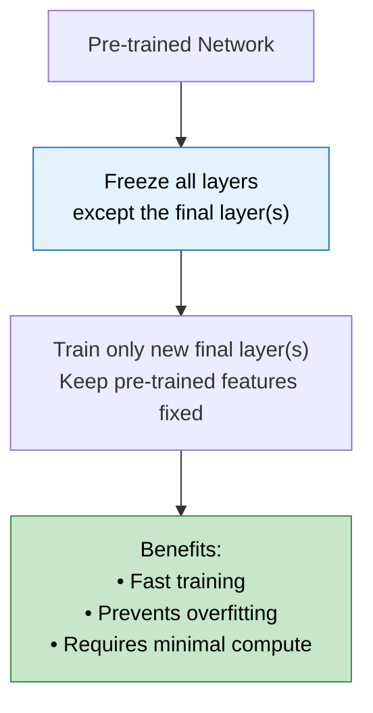
```mermaid
graph TD
    A["Pre-trained Network"] --> B["Freeze all layers<br/>except the final layer(s)"]
    B --> C["Train only new final layer(s)<br/>Keep pre-trained features fixed"]
    C --> D["Benefits:<br/>• Fast training<br/>• Prevents overfitting<br/>• Requires minimal compute"]

    style B fill:#e3f2fd,stroke:#1976d2,color:#000
    style D fill:#c8e6c9,stroke:#388e3c,color:#000
```

**Medium Target Dataset (10,000 - 100,000 examples):**

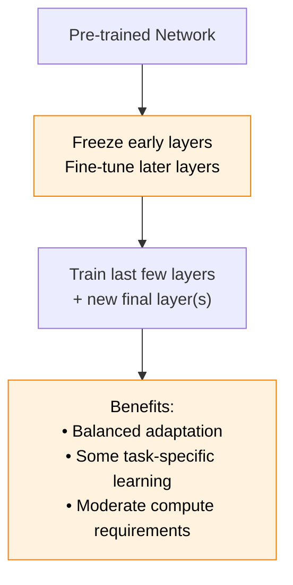
```mermaid
graph TD
    A["Pre-trained Network"] --> B["Freeze early layers<br/>Fine-tune later layers"]
    B --> C["Train last few layers<br/>+ new final layer(s)"]
    C --> D["Benefits:<br/>• Balanced adaptation<br/>• Some task-specific learning<br/>• Moderate compute requirements"]

    style B fill:#fff3e0,stroke:#f57c00,color:#000
    style D fill:#fff3e0,stroke:#f57c00,color:#000
```

**Large Target Dataset (> 100,000 examples):**

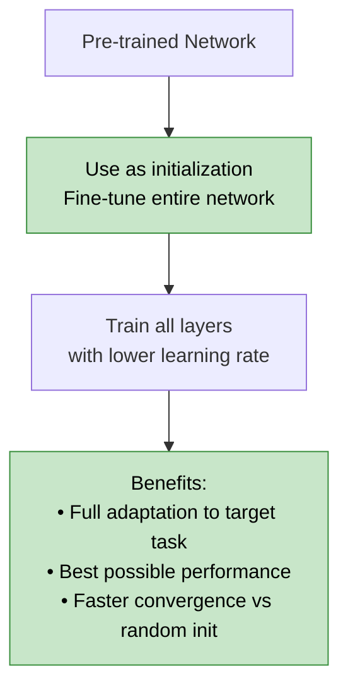
```mermaid
graph TD
    A["Pre-trained Network"] --> B["Use as initialization<br/>Fine-tune entire network"]
    B --> C["Train all layers<br/>with lower learning rate"]
    C --> D["Benefits:<br/>• Full adaptation to target task<br/>• Best possible performance<br/>• Faster convergence vs random init"]

    style B fill:#c8e6c9,stroke:#388e3c,color:#000
    style D fill:#c8e6c9,stroke:#388e3c,color:#000
```

#### When Transfer Learning Makes Sense

**Three Essential Conditions:**

**1. Same Input Modality**

- Task A and B must have the same input type
- **Examples that work:** Both use images, both use audio, both use text
- **Examples that don't work:** Transfer from images to text, audio to images

**2. Data Availability Mismatch**

- Lots of data for Task A (source task)
- Relatively little data for Task B (target task)
- **Typical scenario:** ImageNet (1M+ images) → Medical imaging (5K images)

**3. Shared Low-Level Features**

- Low-level features from Task A help with Task B
- Usually true within the same modality (images, audio, text)
- **Example:** Edge detection useful for both natural images and medical scans

#### Decision Framework for Transfer Learning

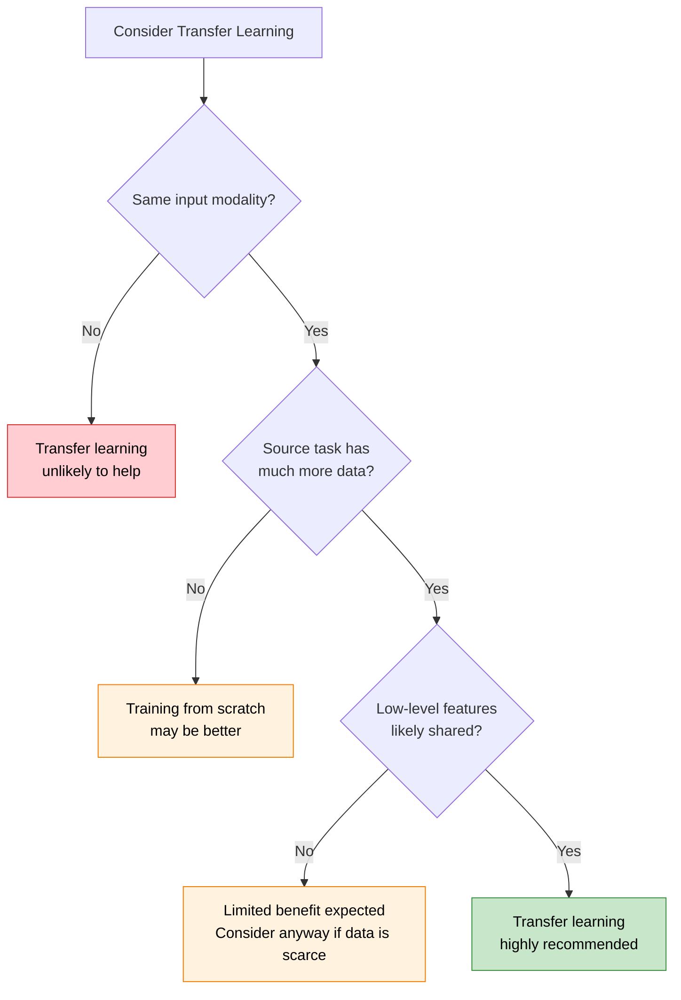
```mermaid
graph TD
    A["Consider Transfer Learning"] --> B{"Same input modality?"}
    B -->|No| C["Transfer learning<br/>unlikely to help"]
    B -->|Yes| D{"Source task has<br/>much more data?"}
    D -->|No| E["Training from scratch<br/>may be better"]
    D -->|Yes| F{"Low-level features<br/>likely shared?"}
    F -->|No| G["Limited benefit expected<br/>Consider anyway if data is scarce"]
    F -->|Yes| H["Transfer learning<br/>highly recommended"]

    style C fill:#ffcdd2,stroke:#d32f2f,color:#000
    style E fill:#fff3e0,stroke:#f57c00,color:#000
    style G fill:#fff3e0,stroke:#f57c00,color:#000
    style H fill:#c8e6c9,stroke:#388e3c,color:#000
```

#### Practical Transfer Learning Examples

**Highly Successful Transfer Learning:**

- **Source:** ImageNet classification (1.2M images, 1000 classes)
- **Target:** Medical X-ray diagnosis (5,000 images, 14 diseases)
- **Result:** 20-30% performance improvement over training from scratch
- **Why it works:** Both involve visual pattern recognition, shared low-level features

**Moderately Successful Transfer Learning:**

- **Source:** English speech recognition (1000 hours)
- **Target:** Mandarin speech recognition (10 hours)
- **Result:** Modest improvement, especially in low-resource scenarios
- **Why limited:** Different languages have different phonetic patterns

**Less Effective Transfer Learning:**

- **Source:** ImageNet natural photos
- **Target:** Astronomical object detection (telescope images)
- **Result:** Minimal improvement
- **Why limited:** Very different image characteristics, lighting, object types

### Multi-task Learning

Multi-task learning trains a single neural network to perform multiple related tasks simultaneously. Unlike transfer learning's sequential approach (Task A → Task B), multi-task learning is parallel.

#### Conceptual Comparison

**Transfer Learning (Sequential):**

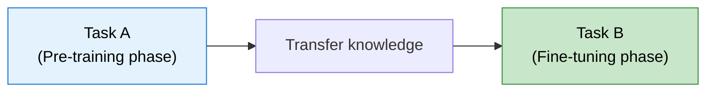
```mermaid
graph LR
    A["Task A<br/>(Pre-training phase)"] --> B["Transfer knowledge"] --> C["Task B<br/>(Fine-tuning phase)"]

    style A fill:#e3f2fd,stroke:#1976d2,color:#000
    style C fill:#c8e6c9,stroke:#388e3c,color:#000
```

**Multi-task Learning (Parallel):**

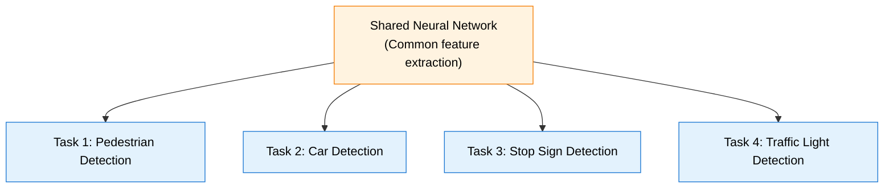
```mermaid
graph TD
    A["Shared Neural Network<br/>(Common feature extraction)"] --> B["Task 1: Pedestrian Detection"]
    A --> C["Task 2: Car Detection"]
    A --> D["Task 3: Stop Sign Detection"]
    A --> E["Task 4: Traffic Light Detection"]

    style A fill:#fff3e0,stroke:#f57c00,color:#000
    style B fill:#e3f2fd,stroke:#1976d2,color:#000
    style C fill:#e3f2fd,stroke:#1976d2,color:#000
    style D fill:#e3f2fd,stroke:#1976d2,color:#000
    style E fill:#e3f2fd,stroke:#1976d2,color:#000
```

#### Practical Example: Autonomous Driving Object Detection

**Unified Object Detection System:**

- **Input:** Road scene image
- **Outputs:** Simultaneously detect pedestrians, cars, stop signs, traffic lights
- **Architecture:** Shared convolutional layers + task-specific output heads

**Label Structure:**
For each training image, the label vector $y$ has the format:
$$y = \begin{bmatrix} y_1 \\ y_2 \\ y_3 \\ y_4 \end{bmatrix} = \begin{bmatrix} \text{Pedestrian present?} \\ \text{Car present?} \\ \text{Stop sign present?} \\ \text{Traffic light present?} \end{bmatrix}$$

Where each $y_i \in \{0, 1\}$ and multiple tasks can be positive simultaneously.

#### Multi-task Loss Function

**Standard Multi-task Loss:**
$$J = \frac{1}{m} \sum_{i=1}^{m} \sum_{j=1}^{k} L(\hat{y}_j^{(i)}, y_j^{(i)})$$

Where:

- $m$ = number of training examples
- $k$ = number of tasks (4 in our example)
- $L(\hat{y}_j^{(i)}, y_j^{(i)}) = -y_j^{(i)} \log(\hat{y}_j^{(i)}) - (1-y_j^{(i)}) \log(1-\hat{y}_j^{(i)})$

#### Handling Missing Labels (Incomplete Data)

**Real-world Challenge:** Often training data has incomplete labels:

$$y^{(1)} = \begin{bmatrix} 1 \\ ? \\ 1 \\ 0 \end{bmatrix}, \quad y^{(2)} = \begin{bmatrix} 0 \\ 0 \\ ? \\ 1 \end{bmatrix}, \quad y^{(3)} = \begin{bmatrix} ? \\ 1 \\ 0 \\ ? \end{bmatrix}$$

**Modified Loss Function (Only sum over labeled examples):**
$$J = \frac{1}{m} \sum_{i=1}^{m} \sum_{j: y_j^{(i)} \neq ?} L(\hat{y}_j^{(i)}, y_j^{(i)})$$

**Implementation Strategy:**

- Use mask to identify labeled entries
- Only compute gradients for labeled tasks
- Different examples contribute to different task learning

#### When Multi-task Learning Makes Sense

**Three Critical Conditions:**

**1. Shared Low-Level Features**

- Tasks must benefit from shared representations
- **Good example:** All object detection tasks benefit from edge/shape detection
- **Bad example:** Sentiment analysis + medical diagnosis (very different domains)

**2. Similar Data Amounts per Task**

- Each task should have roughly similar amounts of training data
- Prevents dominant tasks from overwhelming others
- **Good balance:** 10K, 8K, 12K, 9K examples per task
- **Poor balance:** 100K, 1K, 500, 50K examples per task

**3. Sufficient Network Capacity**

- Network must be large enough to perform well on all tasks
- If too small, tasks interfere with each other
- **Solution:** Use larger networks when doing multi-task learning

#### Multi-task vs Single-task Performance Analysis

**Decision Matrix:**

| Condition           | Multi-task Beneficial            | Single-task Better                    |
| ------------------- | -------------------------------- | ------------------------------------- |
| **Feature Sharing** | ✓ Similar visual/audio patterns  | ✗ Completely different domains        |
| **Data Balance**    | ✓ 10K, 8K, 12K, 9K examples      | ✗ 100K, 1K, 500, 50K examples         |
| **Network Size**    | ✓ Large network capacity         | ✗ Small network, resource constraints |
| **Task Similarity** | ✓ Related object detection tasks | ✗ Unrelated task combinations         |

#### Multi-task vs Transfer Learning Trade-offs

**Multi-task Learning Advantages:**

- **Simultaneous improvement:** All tasks can benefit from shared learning
- **Regularization effect:** Shared representations reduce overfitting
- **Efficiency:** Single model for multiple tasks
- **Real-time deployment:** One forward pass for all predictions

**Multi-task Learning Challenges:**

- **Complex tuning:** Balancing multiple loss functions and learning rates
- **Task interference:** Poor tasks can hurt good tasks
- **Debugging difficulty:** Harder to isolate task-specific issues
- **Architecture constraints:** Must accommodate all tasks in single network

**Transfer Learning Advantages:**

- **Simpler workflow:** Sequential, easier to debug
- **Task isolation:** Problems in one task don't affect others
- **Flexible timing:** Can transfer when target data becomes available
- **Proven effectiveness:** Well-established success patterns

**Current Practice Observation:**
Transfer learning is used much more frequently than multi-task learning in practice due to:

- Simpler implementation and debugging
- More predictable outcomes
- Easier adaptation of existing pre-trained models
- Lower risk of task interference

---

## End-to-End Deep Learning

End-to-end deep learning replaces traditional multi-stage processing pipelines with a single neural network that maps directly from input to output.

### What is End-to-End Deep Learning?

#### Traditional vs End-to-End Paradigms

**Traditional Pipeline Approach:**

- Break complex tasks into multiple sequential stages
- Each stage has hand-designed processing
- Intermediate representations are manually engineered
- Multiple separate systems optimized independently

**End-to-End Approach:**

- Single neural network handles entire task
- Learn intermediate representations automatically
- End-to-end optimization of entire pipeline
- Data-driven feature discovery

#### Detailed Examples Across Domains

**Example 1: Speech Recognition Evolution**

**Traditional Pipeline (1990s-2000s):**

```mermaid
graph LR
    A["Raw Audio Signal"] --> B["Feature Extraction<br/>(MFCC, Spectrograms)"]
    B --> C["Acoustic Model<br/>(Phoneme Detection)"]
    C --> D["Pronunciation Model<br/>(Phonemes → Words)"]
    D --> E["Language Model<br/>(Word Sequences)"]
    E --> F["Final Transcript"]

    style A fill:#e3f2fd,stroke:#1976d2,color:#000
    style F fill:#c8e6c9,stroke:#388e3c,color:#000
```

**End-to-End Approach (2010s+):**

```mermaid
graph LR
    A["Raw Audio Signal"] --> B["Deep Neural Network<br/>(RNN/Transformer)"] --> C["Final Transcript"]

    style A fill:#e3f2fd,stroke:#1976d2,color:#000
    style B fill:#fff3e0,stroke:#f57c00,color:#000
    style C fill:#c8e6c9,stroke:#388e3c,color:#000
```

**Result:** End-to-end approach achieves better performance with sufficient data.

**Example 2: Face Recognition Systems**

**Traditional Multi-stage Approach (Current Best Practice):**

```mermaid
graph LR
    A["Input Image"] --> B["Face Detection<br/>(Locate faces in image)"]
    B --> C["Face Recognition<br/>(Identify specific person)"]

    style A fill:#e3f2fd,stroke:#1976d2,color:#000
    style B fill:#fff3e0,stroke:#f57c00,color:#000
    style C fill:#c8e6c9,stroke:#388e3c,color:#000
```

**Hypothetical End-to-End Approach:**

```mermaid
graph LR
    A["Input Image"] --> B["Deep Neural Network<br/>(Direct person identification)"] --> C["Person Identity"]

    style A fill:#e3f2fd,stroke:#1976d2,color:#000
    style B fill:#ffcdd2,stroke:#d32f2f,color:#000
    style C fill:#c8e6c9,stroke:#388e3c,color:#000
```

**Why Multi-stage Works Better:**

- **Data efficiency:** Easier to get face detection training data
- **Task decomposition:** Face detection + recognition are well-understood subtasks
- **Robustness:** More reliable across different photo compositions
- **Modularity:** Can improve each component independently

**Example 3: Machine Translation Success Story**

**Traditional Approach:**

```mermaid
graph LR
    A["English Text"] --> B["Syntactic Parsing<br/>(Grammar analysis)"]
    B --> C["Semantic Analysis<br/>(Meaning extraction)"]
    C --> D["Cross-language Mapping<br/>(Concept transfer)"]
    D --> E["Target Language Generation<br/>(French construction)"]
    E --> F["French Text"]

    style A fill:#e3f2fd,stroke:#1976d2,color:#000
    style F fill:#c8e6c9,stroke:#388e3c,color:#000
```

**End-to-End Approach:**

```mermaid
graph LR
    A["English Text"] --> B["Sequence-to-Sequence<br/>Neural Network"] --> C["French Text"]

    style A fill:#e3f2fd,stroke:#1976d2,color:#000
    style B fill:#c8e6c9,stroke:#388e3c,color:#000
    style C fill:#c8e6c9,stroke:#388e3c,color:#000
```

**Why End-to-End Succeeds:**

- **Sufficient parallel data:** Large bilingual text corpora available
- **Complex patterns:** Neural networks capture subtle translation nuances
- **Implicit knowledge:** No need to explicitly model linguistic rules

**Example 4: Medical Diagnosis - Where Traditional Wins**

**Traditional Approach (Radiologist + AI):**

```mermaid
graph LR
    A["Hand X-ray"] --> B["Bone Segmentation<br/>(Identify bone regions)"]
    B --> C["Feature Measurement<br/>(Bone length, density, fusion)"]
    C --> D["Age Estimation<br/>(Medical knowledge application)"]

    style A fill:#e3f2fd,stroke:#1976d2,color:#000
    style B fill:#c8e6c9,stroke:#388e3c,color:#000
    style C fill:#c8e6c9,stroke:#388e3c,color:#000
    style D fill:#c8e6c9,stroke:#388e3c,color:#000
```

**End-to-End Approach:**

```mermaid
graph LR
    A["Hand X-ray"] --> B["Deep Neural Network<br/>(Direct age prediction)"] --> C["Age Estimate"]

    style A fill:#e3f2fd,stroke:#1976d2,color:#000
    style B fill:#ffcdd2,stroke:#d32f2f,color:#000
    style C fill:#ffcdd2,stroke:#d32f2f,color:#000
```

**Why Traditional Works Better:**

- **Limited training data:** Few labeled medical examples available
- **Domain expertise:** Medical knowledge about bone development is valuable
- **Interpretability:** Doctors can verify intermediate bone measurements
- **Safety requirements:** Medical decisions need explainable reasoning

### Whether to Use End-to-End Deep Learning

#### The Critical Factor: Data Requirements

**Fundamental Trade-off:**

```mermaid
graph TD
    A["Data Availability Assessment"] --> B{"Large Dataset Available?<br/>(100K+ examples for complex mappings)"}
    B -->|Yes| C["End-to-End Learning<br/>Often Superior"]
    B -->|No| D["Traditional Pipeline<br/>Often Superior"]

    C --> E["Examples:<br/>• Machine Translation (millions of sentence pairs)<br/>• Large-scale Speech Recognition<br/>• ImageNet Classification"]

    D --> F["Examples:<br/>• Medical Diagnosis (few thousand cases)<br/>• Specialized Domain Applications<br/>• Safety-critical Systems"]

    style B fill:#fff3e0,stroke:#f57c00,color:#000
    style C fill:#c8e6c9,stroke:#388e3c,color:#000
    style D fill:#e3f2fd,stroke:#1976d2,color:#000
```

#### Detailed Pros and Cons Analysis

**Advantages of End-to-End Learning:**

**1. Let the Data Speak**

- Neural networks can discover patterns humans miss
- No forced human preconceptions about optimal features
- May find non-obvious but effective solution paths
- **Example:** Machine translation systems learned to handle idioms automatically

**2. Less Hand-Engineering Required**

- Reduces need for domain expertise in feature design
- Eliminates complex pipeline design decisions
- Automatic optimization of entire system
- **Example:** Speech recognition no longer needs phonetic models

**Disadvantages of End-to-End Learning:**

**1. Massive Data Requirements**

- Needs large datasets to learn complex mappings
- May not be feasible for many real-world applications
- Data collection can be extremely expensive
- **Example:** Autonomous driving needs millions of hours of labeled video

**2. Excludes Valuable Human Knowledge**

- Ignores decades of domain expertise
- May be less sample-efficient than informed approaches
- Harder to incorporate known constraints or relationships
- **Example:** Medical diagnosis loses doctor's diagnostic reasoning

#### Comprehensive Decision Framework

**Key Question:** Do you have sufficient data to learn a function of the complexity needed to map X to Y?

```mermaid
graph TD
    A["Evaluate End-to-End Feasibility"] --> B["Assess Data Requirements"]
    B --> C{"Sufficient training data<br/>for direct X→Y mapping?"}

    C -->|Yes| D["Consider End-to-End Learning"]
    C -->|No| E["Use Traditional Pipeline"]

    D --> F["Additional Considerations"]
    F --> G["• Is intermediate representation valuable?<br/>• Do you need interpretability?<br/>• How safety-critical is the application?<br/>• Is there valuable domain knowledge?"]

    E --> H["Pipeline Benefits"]
    H --> I["• Incorporate domain expertise<br/>• More data-efficient training<br/>• Easier debugging and validation<br/>• Interpretable intermediate steps<br/>• Modular component improvements"]

    style C fill:#fff3e0,stroke:#f57c00,color:#000
    style D fill:#c8e6c9,stroke:#388e3c,color:#000
    style E fill:#e3f2fd,stroke:#1976d2,color:#000
```

#### Practical Guidelines for Decision-Making

**Step 1: Define the X→Y Mapping**

- What exactly are you trying to learn?
- How complex is the relationship between input and output?
- Are there natural intermediate steps?

**Step 2: Assess Data Availability**

- How much labeled data do you have?
- How much would you need for reliable end-to-end learning?
- Is more data feasible to collect?

**Step 3: Evaluate Alternative Approaches**

- Can you break the problem into simpler, more data-efficient sub-problems?
- Is there valuable domain knowledge that would be lost?
- Are there regulatory or safety requirements for interpretability?

**Step 4: Consider Hybrid Approaches**

- Use end-to-end for some components, traditional for others
- Combine learned and engineered features
- Progressive end-to-end learning (start simple, add complexity)

#### Strategic Examples of X→Y Mapping Choices

**Autonomous Driving - Multiple Viable Approaches:**

**Option 1:** Image → Steering angle (pure end-to-end)

- **Data needs:** Millions of labeled driving hours
- **Benefits:** Potentially optimal control
- **Risks:** Black box decision making, safety concerns

**Option 2:** Image → Object detection → Path planning → Steering angle

- **Data needs:** Moderate (object detection is well-solved)
- **Benefits:** Interpretable, modular, safer
- **Risks:** May miss subtle patterns

**Option 3:** Image → Semantic segmentation → Driving decision → Control

- **Data needs:** High for segmentation, moderate for decisions
- **Benefits:** Rich scene understanding, interpretable
- **Risks:** Complex pipeline, multiple failure points

---

## Week 2 Summary and Strategic Framework

### The Complete ML Strategy Workflow

```mermaid
graph TD
    A["Project Initiation"] --> B["1. Rapid System Setup"]
    B --> C["• Single evaluation metric<br/>• Dev/test from target distribution<br/>• Simple baseline model"]

    C --> D["2. Systematic Diagnosis"]
    D --> E["• Error analysis (categorize mistakes)<br/>• Bias/variance analysis (with train-dev set)<br/>• Data mismatch evaluation"]

    E --> F["3. Strategic Improvement"]
    F --> G["• Address highest-impact issue first<br/>• Use appropriate techniques for problem type<br/>• Measure impact and iterate"]

    G --> H["4. Advanced Techniques"]
    H --> I["• Consider transfer learning<br/>• Evaluate multi-task opportunities<br/>• Assess end-to-end vs pipeline trade-offs"]

    style B fill:#e3f2fd,stroke:#1976d2,color:#000
    style D fill:#fff3e0,stroke:#f57c00,color:#000
    style F fill:#c8e6c9,stroke:#388e3c,color:#000
    style H fill:#f3e5f5,stroke:#7b1fa2,color:#000
```

### Key Decision Frameworks Summary

**1. Error Analysis Framework**

- Systematic categorization of mistakes
- Quantitative ceiling analysis for prioritization
- Focus on highest-impact improvements first

**2. Bias/Variance/Data Mismatch Framework**

- Use train-dev set to separate variance from data mismatch
- Target solutions to the specific problem type
- Measure gaps systematically before choosing solutions

**3. Transfer Learning Decision Tree**

- Same input modality + source data abundance + shared features = good candidate
- Choose training strategy based on target dataset size
- Validate improvement over training from scratch

**4. Multi-task vs Transfer Learning**

- Multi-task: when you have multiple related tasks with balanced data
- Transfer: when you have sequential task relationship
- Consider network capacity and task interference

**5. End-to-End vs Pipeline Decision**

- Large data + complex mapping = consider end-to-end
- Limited data + domain knowledge = prefer pipeline
- Safety/interpretability needs favor pipeline approaches

### Critical Success Factors

**Time Management:**

- Spend days on systematic analysis, not months on random improvements
- Error analysis can be completed in hours and save months of work
- Bias/variance analysis provides clear direction for effort

**Strategic Thinking:**

- Always diagnose before prescribing solutions
- Understand your limiting factors before optimizing
- Make data-driven rather than intuition-driven decisions

**Systematic Approach:**

- Build simple systems quickly, then improve systematically
- Use quantitative frameworks for all major decisions
- Iterate based on empirical evidence, not theoretical preferences

### Common Anti-Patterns to Avoid

**Analysis Paralysis:**

- Spending months perfecting initial system before getting feedback
- Over-engineering solutions before understanding core problems
- Optimizing multiple aspects simultaneously without clear prioritization

**Random Walk Improvement:**

- Trying random techniques without systematic diagnosis
- Working on low-impact problems because they're easier
- Changing multiple variables simultaneously

**Premature Optimization:**

- Using advanced techniques before mastering basics
- Pursuing complex end-to-end solutions without sufficient data
- Ignoring distribution mismatch in favor of algorithmic improvements

### Final Strategic Recommendations

**1. Start Simple and Systematic**

- Build baseline quickly (1-2 weeks maximum)
- Establish clear evaluation framework upfront
- Use systematic analysis to guide all improvements

**2. Prioritize Based on Impact**

- Error analysis reveals highest-leverage improvements
- Bias/variance analysis prevents working on wrong problems
- Ceiling analysis quantifies maximum possible gains

**3. Leverage Existing Knowledge**

- Transfer learning when you have related pre-trained models
- Multi-task learning when you have multiple related problems
- Traditional pipelines when you have valuable domain expertise

**4. Make Data-Driven Decisions**

- Let empirical evidence guide strategy over theoretical preferences
- Measure everything and iterate based on results
- Change approach when data contradicts assumptions

**The Ultimate Insight:** The difference between successful and unsuccessful ML projects is usually not technical sophistication, but strategic decision-making. By following systematic approaches for error analysis, bias/variance analysis, and strategic planning, you can avoid the common pitfalls that waste months or years of development effort and achieve better results with less work.
