# Course 4 Week 1: Foundations of Convolutional Neural Networks

**Learning Objective:** Implement the foundational layers of CNNs (pooling, convolutions) and stack them properly in a deep network to solve multi-class image classification problems.

---

## Table of Contents

1. [Computer Vision](#1-computer-vision)
2. [Edge Detection Example](#2-edge-detection-example)
3. [More Edge Detection](#3-more-edge-detection)
4. [Padding](#4-padding)
5. [Strided Convolutions](#5-strided-convolutions)
6. [Convolutions Over Volume](#6-convolutions-over-volume)
7. [One Layer of a Convolutional Network](#7-one-layer-of-a-convolutional-network)
8. [Simple Convolutional Network Example](#8-simple-convolutional-network-example)
9. [Pooling Layers](#9-pooling-layers)
10. [CNN Example](#10-cnn-example)
11. [Why Convolutions?](#11-why-convolutions)

---

# 1. Computer Vision

## The Computer Vision Revolution

Computer vision has experienced unprecedented growth thanks to deep learning, transforming numerous industries and enabling applications that seemed impossible just a few years ago.

### Revolutionary Applications

**Autonomous Vehicles:**

- Real-time object detection and classification
- Lane detection and traffic sign recognition
- Pedestrian and vehicle tracking
- Depth estimation and scene understanding

**Medical Imaging:**

- Automated diagnosis from X-rays, MRIs, and CT scans
- Cancer detection in radiology images
- Retinal disease identification from fundus photographs
- Skin cancer classification from dermoscopy images

**Face Recognition:**

- Security systems and access control
- Personal device authentication (Face ID)
- Photo organization and tagging
- Attendance tracking systems

**Creative Applications:**

- Neural style transfer for artistic image generation
- Photo enhancement and restoration
- Content-aware image editing
- Generative art and design

### The Scale Challenge

One of the fundamental challenges in computer vision is the sheer scale of image data:

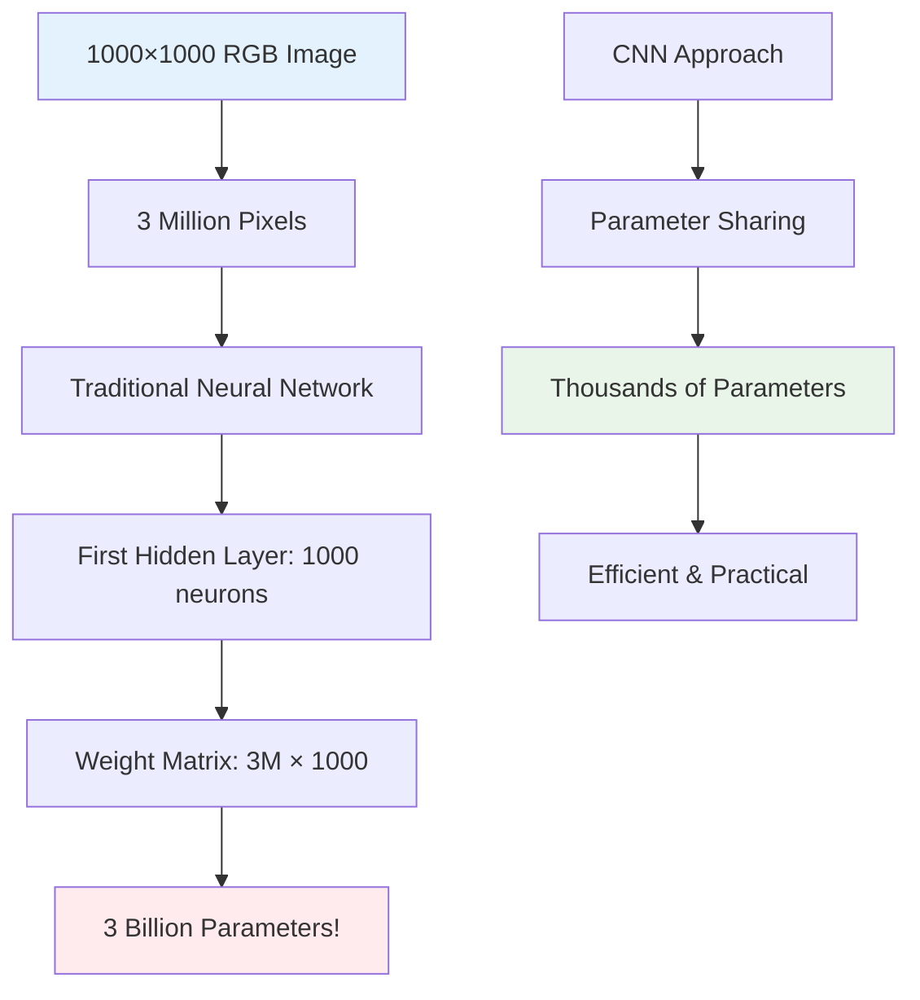
```mermaid
%%{init: {"theme": "default", "themeVariables": {"primaryColor": "#1f2937", "edgeLabelBackground":"#f9fafb", "primaryTextColor":"#000000", "fontSize": 12}}}%%
graph TD
    A["1000×1000 RGB Image"] --> B["3 Million Pixels"]
    B --> C["Traditional Neural Network"]
    C --> D["First Hidden Layer: 1000 neurons"]
    D --> E["Weight Matrix: 3M × 1000"]
    E --> F["3 Billion Parameters!"]

    G["CNN Approach"] --> H["Parameter Sharing"]
    H --> I["Thousands of Parameters"]
    I --> J["Efficient & Practical"]

    style A fill:#e3f2fd
    style F fill:#ffebee
    style I fill:#e8f5e8
```

**The Problem with Traditional Neural Networks:**

- A modest 1000×1000 RGB image contains 3 million pixels
- A single hidden layer with 1000 neurons requires 3 billion parameters
- Computationally prohibitive and highly prone to overfitting
- Ignores spatial structure of images

**The CNN Solution:**

- **Parameter sharing**: Same filter applied across the entire image
- **Local connectivity**: Each neuron connects only to nearby pixels
- **Translation invariance**: Features detected regardless of location
- **Hierarchical learning**: Building from simple to complex features

### Examples of Computer Vision Problems

**Image Classification:**

- Single object per image
- Output: Class label (e.g., "cat", "dog", "car")

**Object Detection:**

- Multiple objects in one image
- Output: Bounding boxes + class labels

**Semantic Segmentation:**

- Pixel-level classification
- Output: Each pixel labeled with its class

**Neural Style Transfer:**

- Artistic style transformation
- Output: Content image rendered in artistic style

---

# 2. Edge Detection Example

## Understanding Convolution Through Edge Detection

Edge detection is fundamental to computer vision and serves as an excellent introduction to convolution operations. As the video explains, in CNN architectures, early layers detect edges, later layers detect parts of objects, and even later layers detect complete objects like faces.

### Why Edge Detection Matters

In the visual processing hierarchy of CNNs:

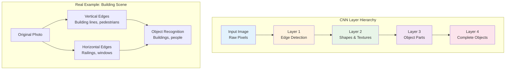
```mermaid
graph TD
    subgraph "CNN Layer Hierarchy"
        A[Input Image<br/>Raw Pixels] --> B[Layer 1<br/>Edge Detection]
        B --> C[Layer 2<br/>Shapes & Textures]
        C --> D[Layer 3<br/>Object Parts]
        D --> E[Layer 4<br/>Complete Objects]
    end

    subgraph "Real Example: Building Scene"
        F[Original Photo] --> G[Vertical Edges<br/>Building lines, pedestrians]
        F --> H[Horizontal Edges<br/>Railings, windows]
        G --> I[Object Recognition<br/>Buildings, people]
        H --> I
    end

    style A fill:#e3f2fd
    style B fill:#fff3e0
    style C fill:#e8f5e8
    style D fill:#f3e5f5
    style E fill:#fce4ec
```

### Mathematical Foundation of Convolution

The convolution operation (\*) takes an image and "convolves" it with a filter/kernel:

$$\text{Output} = \text{Image} * \text{Filter}$$

For discrete 2D images:
$$(I * K)[i,j] = \sum_{m} \sum_{n} I[i+m, j+n] \cdot K[m,n]$$

**Important Note**: The asterisk (\*) denotes convolution, not multiplication (though Python uses \* for both).

### The Convolution Process Visualized

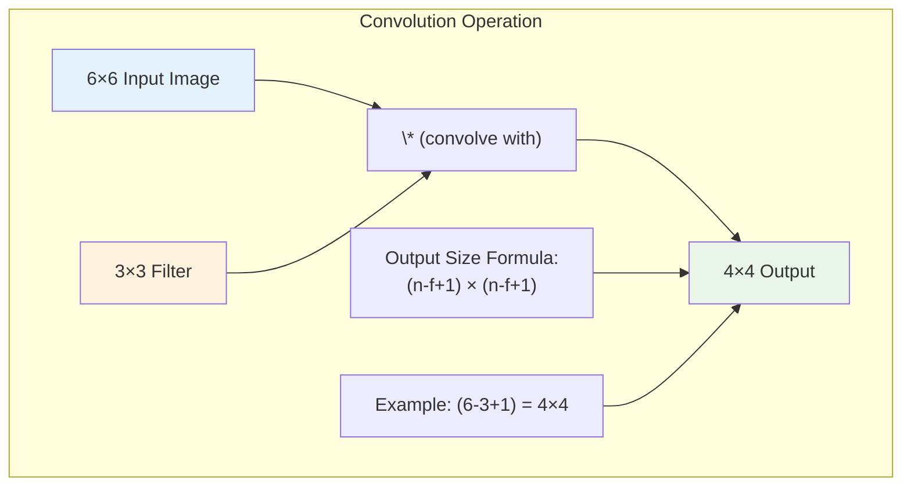
```mermaid
graph TD
    subgraph "Convolution Operation"
        A["6×6 Input Image"] --> B["\* (convolve with)"]
        C["3×3 Filter"] --> B
        B --> D["4×4 Output"]

        E["Output Size Formula:<br/>(n-f+1) × (n-f+1)"] --> D
        F["Example: (6-3+1) = 4×4"] --> D
    end

    style A fill:#e3f2fd
    style C fill:#fff3e0
    style D fill:#e8f5e8
```

### Simplified Example (From Video)

**6×6 Simple Image (Bright left, Dark right):**

```
10  10  10   0   0   0
10  10  10   0   0   0
10  10  10   0   0   0
10  10  10   0   0   0
10  10  10   0   0   0
10  10  10   0   0   0
```

**Visual representation:**

```
████████░░░░
████████░░░░
████████░░░░
████████░░░░
████████░░░░
████████░░░░
```

(■ = bright pixels (10), ░ = dark pixels (0))

**3×3 Vertical Edge Filter:**

```
 1   0  -1
 1   0  -1
 1   0  -1
```

#### Detailed Step-by-Step Calculations:

**Position (0,0):**

```
10  10  10     1   0  -1
10  10  10  ×  1   0  -1
10  10  10     1   0  -1

= 10×1 + 10×0 + 10×(-1) + 10×1 + 10×0 + 10×(-1) + 10×1 + 10×0 + 10×(-1)
= 10 + 0 - 10 + 10 + 0 - 10 + 10 + 0 - 10
= 0
```

**Position (0,1) - The Edge:**

```
10  10   0     1   0  -1
10  10   0  ×  1   0  -1
10  10   0     1   0  -1

= 10×1 + 10×0 + 0×(-1) + 10×1 + 10×0 + 0×(-1) + 10×1 + 10×0 + 0×(-1)
= 10 + 0 + 0 + 10 + 0 + 0 + 10 + 0 + 0
= 30
```

**Position (0,2) - Still at Edge:**

```
10   0   0     1   0  -1
10   0   0  ×  1   0  -1
10   0   0     1   0  -1

= 10×1 + 0×0 + 0×(-1) + 10×1 + 0×0 + 0×(-1) + 10×1 + 0×0 + 0×(-1)
= 10 + 0 + 0 + 10 + 0 + 0 + 10 + 0 + 0
= 30
```

**Position (0,3) - Dark Region:**

```
 0   0   0     1   0  -1
 0   0   0  ×  1   0  -1
 0   0   0     1   0  -1

= 0×1 + 0×0 + 0×(-1) + 0×1 + 0×0 + 0×(-1) + 0×1 + 0×0 + 0×(-1)
= 0
```

### Complete Output Matrix (4×4):

```
 0  30  30   0
 0  30  30   0
 0  30  30   0
 0  30  30   0
```

### Visual Interpretation:

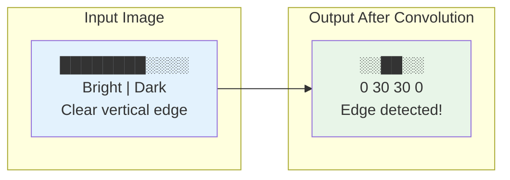
```mermaid
graph LR
    subgraph "Input Image"
        A["████████░░░░<br/>Bright | Dark<br/>Clear vertical edge"]
    end

    subgraph "Output After Convolution"
        B["░░██░░<br/>0 30 30 0<br/>Edge detected!"]
    end

    A --> B

    style A fill:#e3f2fd
    style B fill:#e8f5e8
```

### Why This Works - Intuitive Explanation

The vertical edge filter `[1 0 -1; 1 0 -1; 1 0 -1]` is designed to:

1. **Bright pixels on left** (×1): Add positive values
2. **Middle pixels** (×0): Ignore
3. **Dark pixels on right** (×-1): Subtract (add negative values)

**Result interpretation:**

- **Large positive values**: Bright-to-dark transition (vertical edge)
- **Large negative values**: Dark-to-bright transition
- **Values near zero**: No edge (uniform region)

### Programming Implementation Note

As mentioned in the video, different frameworks use different function names:

- **TensorFlow**: `tf.nn.conv2d`
- **Keras**: `Conv2D` layer
- **Custom implementation**: `conv_forward` function

### Filter Visualization

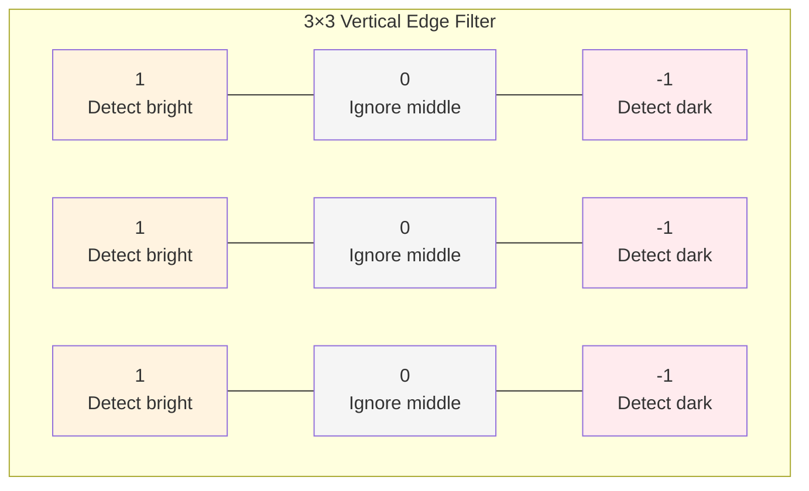
```mermaid
graph TD
    subgraph "3×3 Vertical Edge Filter"
        A["1<br/>Detect bright"]
        B["0<br/>Ignore middle"]
        C["-1<br/>Detect dark"]

        D["1<br/>Detect bright"]
        E["0<br/>Ignore middle"]
        F["-1<br/>Detect dark"]

        G["1<br/>Detect bright"]
        H["0<br/>Ignore middle"]
        I["-1<br/>Detect dark"]
    end

    A --- B --- C
    D --- E --- F
    G --- H --- I

    style A fill:#fff3e0
    style D fill:#fff3e0
    style G fill:#fff3e0
    style B fill:#f5f5f5
    style E fill:#f5f5f5
    style H fill:#f5f5f5
    style C fill:#ffebee
    style F fill:#ffebee
    style I fill:#ffebee
```

### Key Insights

1. **Edge detection finds boundaries** between different intensity regions
2. **Convolution provides a systematic way** to apply this detection across the entire image
3. **The filter design determines what features** are detected
4. **Output values indicate edge strength** and direction

# 3. More Edge Detection

## Understanding Edge Direction and Advanced Detection Patterns

Building on the basic vertical edge detection, this section explores how different edge orientations are detected and how modern CNNs learn optimal filters automatically.

### Positive vs Negative Edges

The direction of intensity transition determines the sign of the convolution output:

#### Light-to-Dark Transition (Positive Edge)

**Original Example from Video:**

```
Input (bright left, dark right):
10  10  10   0   0   0
10  10  10   0   0   0
10  10  10   0   0   0
10  10  10   0   0   0
10  10  10   0   0   0
10  10  10   0   0   0

Filter:               Output:
 1   0  -1            0  30  30   0
 1   0  -1      →     0  30  30   0
 1   0  -1            0  30  30   0
                      0  30  30   0
```

#### Dark-to-Light Transition (Negative Edge)

**Flipped Colors Example:**

```
Input (dark left, bright right):
 0   0   0  10  10  10
 0   0   0  10  10  10
 0   0   0  10  10  10
 0   0   0  10  10  10
 0   0   0  10  10  10
 0   0   0  10  10  10

Same Filter:          Output:
 1   0  -1            0  -30  -30   0
 1   0  -1      →     0  -30  -30   0
 1   0  -1            0  -30  -30   0
                      0  -30  -30   0
```

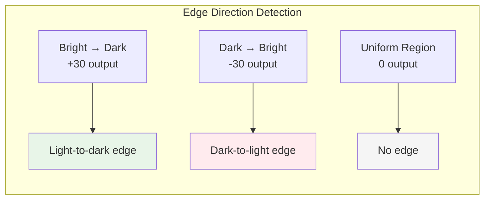
```mermaid
graph LR
    subgraph "Edge Direction Detection"
        A["Bright → Dark<br/>+30 output"] --> C["Light-to-dark edge"]
        B["Dark → Bright<br/>-30 output"] --> D["Dark-to-light edge"]
        E["Uniform Region<br/>0 output"] --> F["No edge"]
    end

    style C fill:#e8f5e8
    style D fill:#ffebee
    style F fill:#f5f5f5
```

**Key Insight**: The sign of the output indicates edge direction:

- **Positive values**: Light-to-dark transition
- **Negative values**: Dark-to-light transition
- **Zero/small values**: No edge (uniform region)

**To ignore direction**: Take absolute value of output: `|output|`

---

### Horizontal Edge Detection

Following the same logic as vertical edges, horizontal edges are detected using a rotated filter:

**Horizontal Edge Detection Filter:**

```
 1   1   1    ← Detect bright regions above
 0   0   0    ← Ignore middle
-1  -1  -1    ← Detect dark regions below
```

#### Complex Example from Video

**Input Image (Checkerboard Pattern):**

```
10  10  10   0   0   0
10  10  10   0   0   0
10  10  10   0   0   0
 0   0   0  10  10  10
 0   0   0  10  10  10
 0   0   0  10  10  10
```

**Visual Representation:**

```
████████░░░░
████████░░░░
████████░░░░
░░░░████████
░░░░████████
░░░░████████
```

**Output After Horizontal Edge Detection:**

```
  0   0  30   0
  0   0  30   0
 30  30   0 -30
  0   0 -30   0
```

#### Understanding the Results

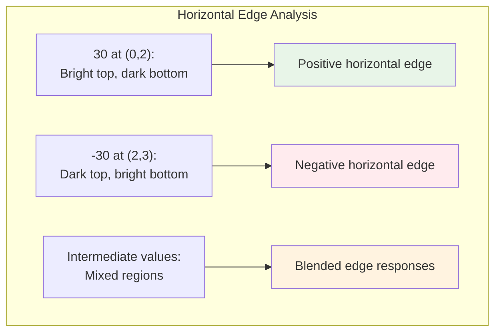
```mermaid
graph TD
    subgraph "Horizontal Edge Analysis"
        A["30 at (0,2):<br/>Bright top, dark bottom"] --> B["Positive horizontal edge"]
        C["-30 at (2,3):<br/>Dark top, bright bottom"] --> D["Negative horizontal edge"]
        E["Intermediate values:<br/>Mixed regions"] --> F["Blended edge responses"]
    end

    style B fill:#e8f5e8
    style D fill:#ffebee
    style F fill:#fff3e0
```

**Analysis of specific values:**

- **+30**: Strong bright-to-dark horizontal transition
- **-30**: Strong dark-to-bright horizontal transition
- **0**: No horizontal edge
- **Intermediate values** (like -10): Partial edge detection due to mixed patterns

---

### Classical Edge Detection Filters

Historical computer vision research developed several hand-crafted filters:

#### Sobel Filters

The **Sobel operators** improve edge detection by weighting the center row/column more heavily:

**Vertical Sobel Filter:**

```
 1   0  -1
 2   0  -2    ← Center row weighted 2x
 1   0  -1
```

**Horizontal Sobel Filter:**

```
 1   2   1    ← Center column weighted 2x
 0   0   0
-1  -2  -1
```

**Advantages:**

- Better noise suppression due to increased weighting
- More robust edge detection
- Standard in classical computer vision

#### Scharr Filters

**Scharr filters** provide even better optimization:

**Vertical Scharr Filter:**

```
 3   0  -3
10   0 -10    ← Even stronger center emphasis
 3   0  -3
```

**Horizontal Scharr Filter:**

```
 3  10   3
 0   0   0
-3 -10  -3
```

**Properties:**

- Optimal weighting for edge detection
- Better directional accuracy
- Reduced sensitivity to noise

### Comparison of Classical Filters

| Filter Type        | Advantages             | Use Cases                   |
| ------------------ | ---------------------- | --------------------------- |
| **Basic [1,0,-1]** | Simple, interpretable  | Learning purposes           |
| **Sobel**          | Good noise suppression | General edge detection      |
| **Scharr**         | Optimal weighting      | High-precision applications |

---

### The Deep Learning Revolution: Learned Filters

The breakthrough insight: **Let the network learn optimal filters automatically!**

#### From Hand-Crafted to Learned

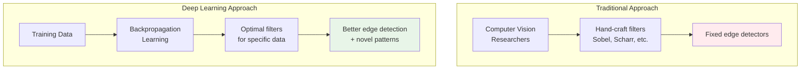
```mermaid
graph TD
    subgraph "Traditional Approach"
        A["Computer Vision<br/>Researchers"] --> B["Hand-craft filters<br/>Sobel, Scharr, etc."]
        B --> C["Fixed edge detectors"]
    end

    subgraph "Deep Learning Approach"
        D["Training Data"] --> E["Backpropagation<br/>Learning"]
        E --> F["Optimal filters<br/>for specific data"]
        F --> G["Better edge detection<br/>+ novel patterns"]
    end

    style C fill:#ffebee
    style G fill:#e8f5e8
```

#### How Filter Learning Works

**Traditional Filter (Fixed):**

```python
# Hand-crafted vertical edge filter
filter = [[1,  0, -1],
          [1,  0, -1],
          [1,  0, -1]]
```

**Learned Filter (Trainable Parameters):**

```python
# 9 learnable parameters
W = tf.Variable([[w11, w12, w13],
                 [w21, w22, w23],
                 [w31, w32, w33]])

# Optimized through backpropagation
# Could learn Sobel: [[1,0,-1], [2,0,-2], [1,0,-1]]
# Or Scharr: [[3,0,-3], [10,0,-10], [3,0,-3]]
# Or something completely novel!
```

#### What Networks Actually Learn

Through training, CNNs discover filters that may detect:

**1. Standard Patterns:**

```
Vertical:        Horizontal:       Diagonal:
 1   0  -1        1   1   1        1   0   0
 1   0  -1        0   0   0        0   0   0
 1   0  -1       -1  -1  -1        0   0  -1
```

**2. Non-Standard Orientations:**

```
45° edge:        73° edge:        Curved edge:
 0.7  0   -0.7   0.9  0.1 -0.2    0.5 -0.8  0.5
 0.5  0   -0.5   0.3  0   -0.8   -0.2  1.6 -0.2
 0.3  0   -0.3  -0.1 -0.5 -0.9    0.1 -0.4  0.1
```

**3. Complex Patterns:**

```
Texture:         Blob:           Corner:
-1   2  -1       -1  -1  -1       1   0  -1
 2  -4   2        -1   8  -1       0   0   0
-1   2  -1       -1  -1  -1      -1   0   1
```

### Advantages of Learned Filters

**1. Data-Specific Optimization:**

- Adapts to characteristics of specific datasets
- Learns patterns most relevant for the task
- Optimizes for the actual loss function

**2. Beyond Human Design:**

- Discovers patterns humans might miss
- Finds optimal combinations of edge directions
- Learns complex, non-intuitive patterns

**3. Automatic Feature Discovery:**

- No need for manual filter engineering
- Scales to detect any orientation (45°, 70°, 73°, etc.)
- Can learn non-edge features if beneficial

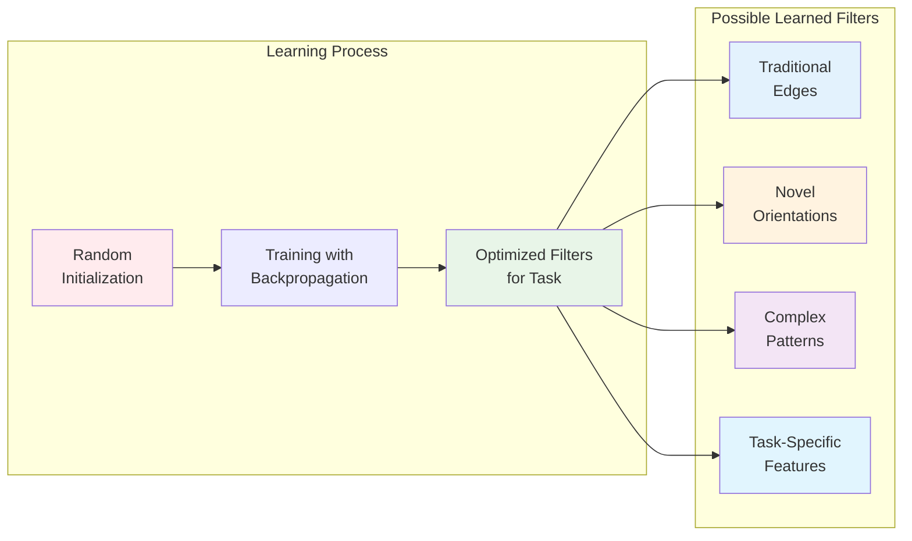
```mermaid
graph LR
    subgraph "Learning Process"
        A[Random<br/>Initialization] --> B[Training with<br/>Backpropagation]
        B --> C[Optimized Filters<br/>for Task]
    end

    subgraph "Possible Learned Filters"
        D[Traditional<br/>Edges]
        E[Novel<br/>Orientations]
        F[Complex<br/>Patterns]
        G[Task-Specific<br/>Features]
    end

    C --> D
    C --> E
    C --> F
    C --> G

    style A fill:#ffebee
    style C fill:#e8f5e8
    style D fill:#e3f2fd
    style E fill:#fff3e0
    style F fill:#f3e5f5
    style G fill:#e1f5fe
```

### Multi-Filter Feature Detection

In practice, CNNs use **multiple filters simultaneously** to detect various patterns:

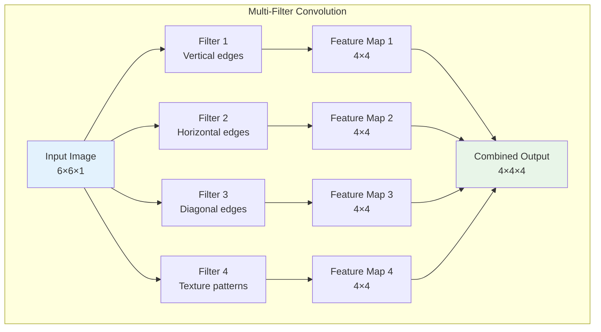
```mermaid
graph TD
    subgraph "Multi-Filter Convolution"
        A[Input Image<br/>6×6×1] --> B[Filter 1<br/>Vertical edges]
        A --> C[Filter 2<br/>Horizontal edges]
        A --> D[Filter 3<br/>Diagonal edges]
        A --> E[Filter 4<br/>Texture patterns]

        B --> F[Feature Map 1<br/>4×4]
        C --> G[Feature Map 2<br/>4×4]
        D --> H[Feature Map 3<br/>4×4]
        E --> I[Feature Map 4<br/>4×4]

        F --> J[Combined Output<br/>4×4×4]
        G --> J
        H --> J
        I --> J
    end

    style A fill:#e3f2fd
    style J fill:#e8f5e8
```

### Key Takeaways

**1. Edge Direction Matters:**

- Positive/negative outputs indicate transition direction
- Absolute value can be used to ignore direction

**2. Filter Orientation Determines Detection:**

- Vertical filters detect vertical edges
- Horizontal filters detect horizontal edges
- Diagonal filters detect diagonal edges

**3. Evolution of Edge Detection:**

- Classical: Hand-crafted filters (Sobel, Scharr)
- Modern: Learned filters through backpropagation
- Future: Task-specific, data-adaptive filters

**4. Learning is Superior:**

- CNNs learn better filters than human experts can design
- Automatically discovers optimal orientations and patterns
- Adapts to specific datasets and tasks

**5. Multiple Filters Enable Rich Representation:**

- Single layer uses many filters simultaneously
- Each filter learns to detect different patterns
- Combined outputs provide comprehensive feature representation

This automatic filter learning has been **one of the most powerful ideas in computer vision**, enabling CNNs to surpass traditional methods and achieve human-level performance on many visual tasks.

# 4. Padding

## Why Padding is Essential for Deep Neural Networks

Padding is a crucial modification to the basic convolution operation that solves fundamental problems when building deep CNNs. As the video explains, without padding, deep networks become impractical due to rapid image shrinkage and edge information loss.

### The Two Critical Problems

#### Problem 1: Progressive Image Shrinkage

**Basic Convolution Formula:**
$$\text{Output Size} = n - f + 1$$

Where $n$ = input size, $f$ = filter size

**Example: 6×6 image with 3×3 filter:**
$$\text{Output} = 6 - 3 + 1 = 4 \times 4$$

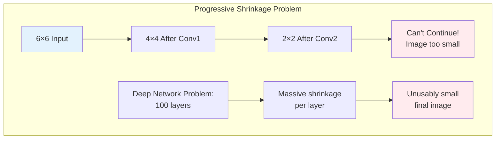
```mermaid
graph TD
    subgraph "Progressive Shrinkage Problem"
        A["6×6 Input"] --> B["4×4 After Conv1"]
        B --> C["2×2 After Conv2"]
        C --> D["Can't Continue!<br/>Image too small"]

        E["Deep Network Problem:<br/>100 layers"] --> F["Massive shrinkage<br/>per layer"]
        F --> G["Unusably small<br/>final image"]
    end

    style A fill:#e3f2fd
    style D fill:#ffebee
    style G fill:#ffebee
```

**Shrinkage in Deep Networks:**

```
Layer 0:  6×6   input
Layer 1:  4×4   (shrunk by 2)
Layer 2:  2×2   (shrunk by 2)
Layer 3:  Can't apply 3×3 filter!
```

For a 100-layer network, this becomes catastrophic!

#### Problem 2: Edge Information Loss

Pixels at different positions are used unequally in convolution:

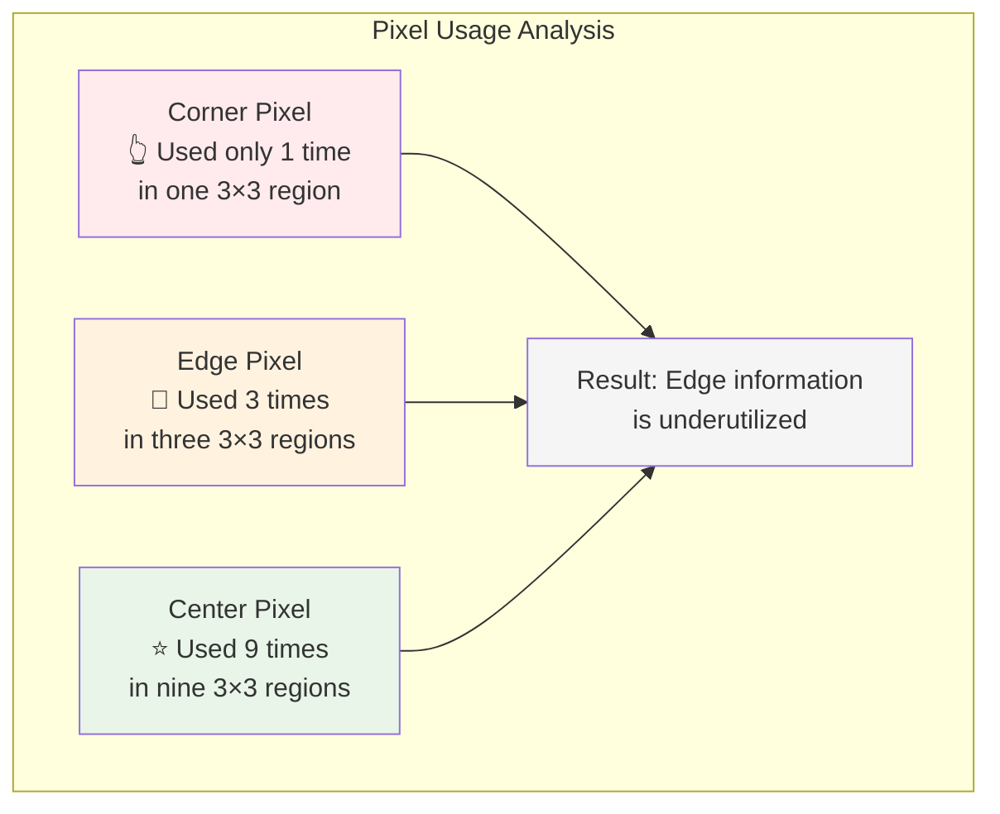
```mermaid
graph TD
    subgraph "Pixel Usage Analysis"
        A["Corner Pixel<br/>👆 Used only 1 time<br/>in one 3×3 region"]
        B["Edge Pixel<br/>📍 Used 3 times<br/>in three 3×3 regions"]
        C["Center Pixel<br/>⭐ Used 9 times<br/>in nine 3×3 regions"]

        D["Result: Edge information<br/>is underutilized"]
    end

    A --> D
    B --> D
    C --> D

    style A fill:#ffebee
    style B fill:#fff3e0
    style C fill:#e8f5e8
    style D fill:#f5f5f5
```

**Visual Example - 6×6 Image with 3×3 Filter:**

```
Usage count for each pixel:
1  2  3  3  2  1
2  4  6  6  4  2
3  6  9  9  6  3
3  6  9  9  6  3
2  4  6  6  4  2
1  2  3  3  2  1
```

Corner pixels are "thrown away" - used much less than center pixels!

---

### The Padding Solution

**Padding** adds border pixels around the image before convolution to solve both problems.

#### Mathematical Foundation

**With Padding Formula:**
$$\text{Output Size} = n + 2p - f + 1$$

Where:

- $n$ = original input size
- $p$ = padding amount (added on all sides)
- $f$ = filter size

#### Step-by-Step Padding Example

**Original 6×6 Image:**

```
3  1  2  1  8  2
1  0  1  2  9  5
2  1  0  4  1  3
1  2  1  1  3  1
0  1  2  2  4  2
2  1  1  0  1  2
```

**After Padding with p=1 (now 8×8):**

```
0  0  0  0  0  0  0  0
0  3  1  2  1  8  2  0
0  1  0  1  2  9  5  0
0  2  1  0  4  1  3  0
0  1  2  1  1  3  1  0
0  0  1  2  2  4  2  0
0  2  1  1  0  1  2  0
0  0  0  0  0  0  0  0
```

**Convolution Calculation:**

- Input after padding: 8×8
- With padding p=1: effective input is $n + 2p = 6 + 2(1) = 8$
- Output: $(6 + 2(1)) - 3 + 1 = 8 - 3 + 1 = 6 \times 6$ ✅

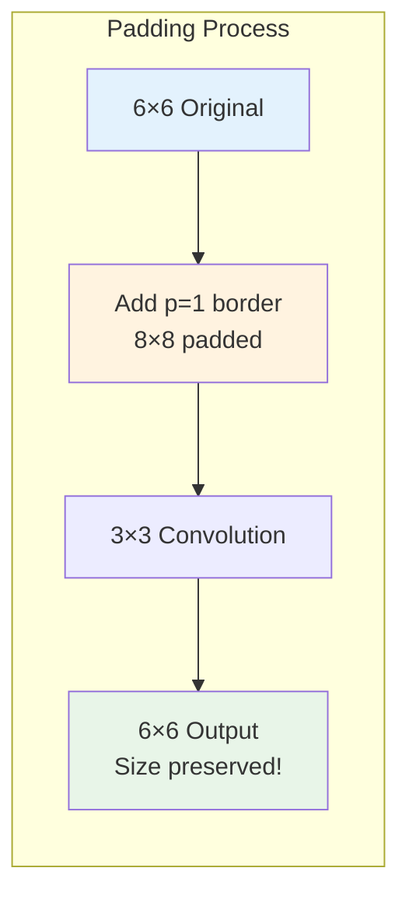
```mermaid
graph LR
    subgraph "Padding Process"
        A["6×6 Original"] --> B["Add p=1 border<br/>8×8 padded"]
        B --> C["3×3 Convolution"]
        C --> D["6×6 Output<br/>Size preserved!"]
    end

    style A fill:#e3f2fd
    style B fill:#fff3e0
    style D fill:#e8f5e8
```

---

### Types of Padding

#### Valid Padding (No Padding)

**Definition:** $p = 0$ (no padding applied)

**Formula:** Output = $n - f + 1$

**Example:**

```
6×6 input → 3×3 filter → 4×4 output
n=6, f=3, p=0
Output = 6 - 3 + 1 = 4×4
```

**Characteristics:**

- ✅ **Advantage**: No artificial borders
- ❌ **Disadvantage**: Progressive shrinkage
- ❌ **Disadvantage**: Edge information loss

```python
# Implementation
Conv2D(filters=32, kernel_size=3, padding='valid')
```

#### Same Padding (Size Preservation)

**Definition:** Choose $p$ to make output size equal input size

**Goal:** $n + 2p - f + 1 = n$

**Solving for p:**
$$n + 2p - f + 1 = n$$
$$2p - f + 1 = 0$$
$$2p = f - 1$$
$$p = \frac{f - 1}{2}$$

**Same Padding Examples:**

| Filter Size | Padding Calculation     | Padding Required |
| ----------- | ----------------------- | ---------------- |
| 3×3         | $p = \frac{3-1}{2} = 1$ | 1 pixel border   |
| 5×5         | $p = \frac{5-1}{2} = 2$ | 2 pixel border   |
| 7×7         | $p = \frac{7-1}{2} = 3$ | 3 pixel border   |

**Verification for 3×3 filter:**

```
Input: 6×6, Filter: 3×3, Padding: 1
Output = 6 + 2(1) - 3 + 1 = 6 + 2 - 3 + 1 = 6×6 ✅
```

**Characteristics:**

- ✅ **Advantage**: Preserves spatial dimensions
- ✅ **Advantage**: Essential for deep networks
- ❌ **Disadvantage**: Introduces artificial zeros

```python
# Implementation
Conv2D(filters=32, kernel_size=3, padding='same')
```

---

### Detailed Padding Calculations

#### Example 1: 3×3 Filter with Same Padding

**Given:**

- Input: 6×6
- Filter: 3×3
- Desired: Same padding

**Calculation:**

```
p = (f-1)/2 = (3-1)/2 = 1

Padded input size: 6 + 2(1) = 8×8
Output size: 8 - 3 + 1 = 6×6 ✅
```

#### Example 2: 5×5 Filter with Same Padding

**Given:**

- Input: 28×28
- Filter: 5×5
- Desired: Same padding

**Calculation:**

```
p = (f-1)/2 = (5-1)/2 = 2

Padded input size: 28 + 2(2) = 32×32
Output size: 32 - 5 + 1 = 28×28 ✅
```

#### Example 3: Multiple Padding Values

**Comparing different padding for 6×6 input with 3×3 filter:**

| Padding | Padded Size | Output Size | Use Case          |
| ------- | ----------- | ----------- | ----------------- |
| p=0     | 6×6         | 4×4         | Valid convolution |
| p=1     | 8×8         | 6×6         | Same convolution  |
| p=2     | 10×10       | 8×8         | Expanded output   |

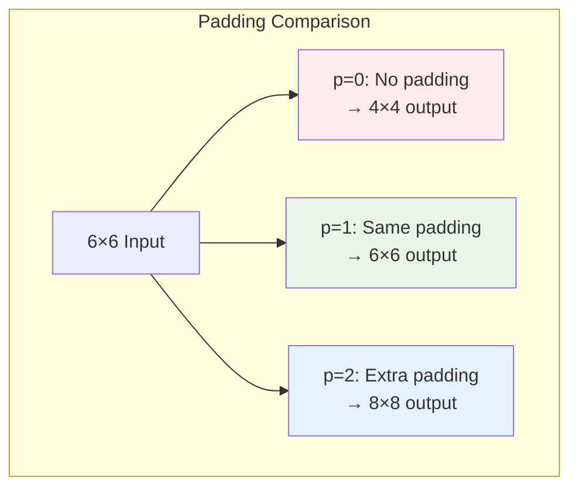
```mermaid
graph TD
    subgraph "Padding Comparison"
        A["6×6 Input"] --> B["p=0: No padding<br/>→ 4×4 output"]
        A --> C["p=1: Same padding<br/>→ 6×6 output"]
        A --> D["p=2: Extra padding<br/>→ 8×8 output"]
    end

    style B fill:#ffebee
    style C fill:#e8f5e8
    style D fill:#e3f2fd
```

---

### Why Odd Filter Sizes?

Computer vision conventionally uses odd filter sizes (3×3, 5×5, 7×7) for two key reasons:

#### Reason 1: Symmetric Padding

**For odd filters:** $p = \frac{f-1}{2}$ gives integer padding

**For even filters:** $p = \frac{f-1}{2}$ gives fractional padding → asymmetric padding needed

**Example with 4×4 filter:**

```
p = (4-1)/2 = 1.5 pixels
Must pad: 1 pixel on left, 2 pixels on right (asymmetric!)
```

#### Reason 2: Central Position

**Odd filters have clear center:**

```
3×3 Filter:       5×5 Filter:
[1][2][3]         [1][2][3][4][5]
[4][5][6]   →     [6][7][8][9][10]
[7][8][9]         [11][12][13][14][15]
Center: 5         [16][17][18][19][20]
                  [21][22][23][24][25]
                  Center: 13
```

**Benefits of having center:**

- Clear reference point for filter position
- Natural semantics for symmetric operations
- Easier mathematical analysis

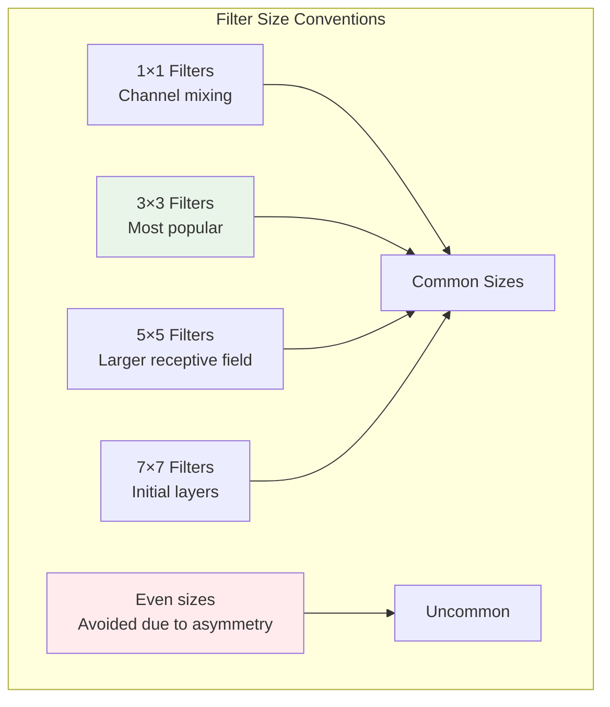
```mermaid
graph TD
    subgraph "Filter Size Conventions"
        A["1×1 Filters<br/>Channel mixing"] --> E["Common Sizes"]
        B["3×3 Filters<br/>Most popular"] --> E
        C["5×5 Filters<br/>Larger receptive field"] --> E
        D["7×7 Filters<br/>Initial layers"] --> E

        F["Even sizes<br/>Avoided due to asymmetry"] --> G["Uncommon"]
    end

    style B fill:#e8f5e8
    style F fill:#ffebee
```

---

### Advanced Padding Strategies

#### Zero Padding (Standard)

**Most common:** Fill border with zeros

```
Original:        With p=1:
[1 2]            [0 0 0 0]
[3 4]      →     [0 1 2 0]
                 [0 3 4 0]
                 [0 0 0 0]
```

#### Reflection Padding

**Mirror image at boundaries:**

```
Original:        With p=1:
[1 2 3]          [2 1 2 3 2]
[4 5 6]    →     [5 4 5 6 5]
[7 8 9]          [8 7 8 9 8]
                 [5 4 5 6 5]
```

#### Replication Padding

**Repeat edge values:**

```
Original:        With p=1:
[1 2 3]          [1 1 2 3 3]
[4 5 6]    →     [1 1 2 3 3]
[7 8 9]          [4 4 5 6 6]
                 [7 7 8 9 9]
                 [7 7 8 9 9]
```

#### Circular Padding

**Wrap image around (for periodic data):**

```
Original:        With p=1:
[1 2 3]          [9 7 8 9 7]
[4 5 6]    →     [3 1 2 3 1]
[7 8 9]          [6 4 5 6 4]
                 [9 7 8 9 7]
                 [3 1 2 3 1]
```

---

### Practical Implementation

#### Framework Syntax

**TensorFlow/Keras:**

```python
# Same padding (most common)
Conv2D(32, (3,3), padding='same')

# Valid padding (no padding)
Conv2D(32, (3,3), padding='valid')

# Custom padding amount
tf.pad(x, paddings=[[0,0], [1,1], [1,1], [0,0]], mode='CONSTANT')
```

**PyTorch:**

```python
# Same padding
nn.Conv2d(in_channels, out_channels, kernel_size=3, padding=1)

# Valid padding
nn.Conv2d(in_channels, out_channels, kernel_size=3, padding=0)

# Custom padding
F.pad(x, (1, 1, 1, 1), mode='constant', value=0)
```

#### Choosing Padding Strategy

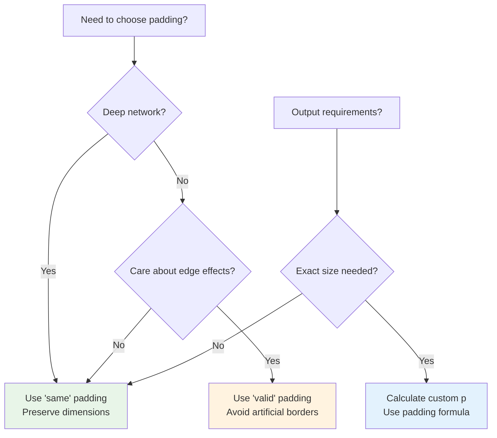
```mermaid
graph TD
    A["Need to choose padding?"] --> B{Deep network?}
    B -->|Yes| C["Use 'same' padding<br/>Preserve dimensions"]
    B -->|No| D{Care about edge effects?}
    D -->|Yes| E["Use 'valid' padding<br/>Avoid artificial borders"]
    D -->|No| C

    F["Output requirements?"] --> G{Exact size needed?}
    G -->|Yes| H["Calculate custom p<br/>Use padding formula"]
    G -->|No| C

    style C fill:#e8f5e8
    style E fill:#fff3e0
    style H fill:#e3f2fd
```

### Key Takeaways

**1. Padding Solves Critical Problems:**

- **Shrinkage**: Prevents progressive size reduction in deep networks
- **Edge Loss**: Preserves information from image boundaries

**2. Two Main Types:**

- **Valid (p=0)**: No padding, output shrinks
- **Same**: Padding preserves input size

**3. Mathematical Relationship:**

- **Formula**: Output = $n + 2p - f + 1$
- **Same padding**: $p = \frac{f-1}{2}$ (for odd filters)

**4. Design Conventions:**

- **Odd filter sizes** (3×3, 5×5, 7×7) are standard
- **Zero padding** is most common
- **Same padding** is essential for deep networks

**5. Practical Impact:**

- Enables construction of very deep networks (100+ layers)
- Maintains spatial resolution throughout network
- Critical for modern CNN architectures (ResNet, DenseNet, etc.)

# 5. Strided Convolutions

## Understanding Stride: Moving Beyond Single-Step Convolutions

**Stride** is another fundamental building block of CNNs that controls how far the filter moves between applications. Instead of moving one pixel at a time, strided convolutions can "hop" multiple pixels, enabling efficient downsampling and feature extraction.

### Basic Concept: From Stride 1 to Stride 2

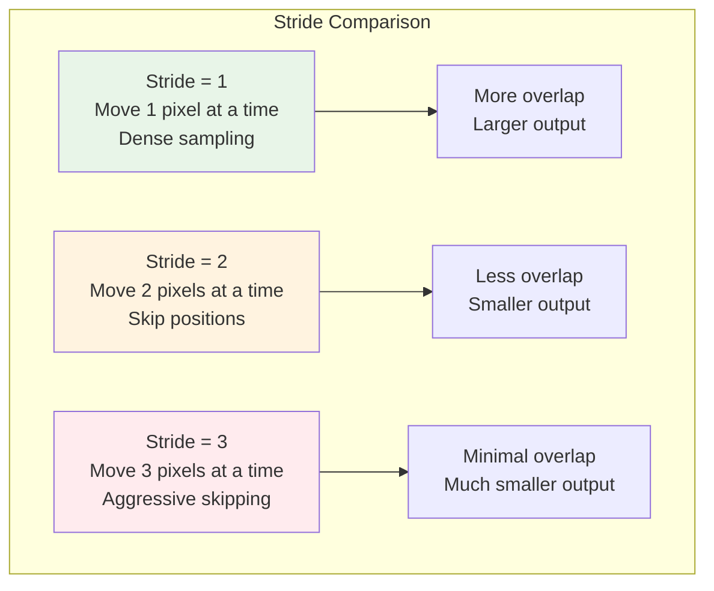
```mermaid
graph TD
    subgraph "Stride Comparison"
        A["Stride = 1<br/>Move 1 pixel at a time<br/>Dense sampling"] --> B["More overlap<br/>Larger output"]
        C["Stride = 2<br/>Move 2 pixels at a time<br/>Skip positions"] --> D["Less overlap<br/>Smaller output"]
        E["Stride = 3<br/>Move 3 pixels at a time<br/>Aggressive skipping"] --> F["Minimal overlap<br/>Much smaller output"]
    end

    style A fill:#e8f5e8
    style C fill:#fff3e0
    style E fill:#ffebee
```

### Step-by-Step Example from Video: 7×7 Input with Stride 2

Let's follow the exact example from the video transcript:

#### Setup

- **Input**: 7×7 image
- **Filter**: 3×3
- **Stride**: 2 (move 2 pixels at a time)
- **Padding**: 0

#### Step-by-Step Calculation

**Input Image (7×7):**

```
Position: (0,0) - Upper left
[a b c]
[d e f]  ← 3×3 region
[g h i]

Position: (0,2) - Skip position (0,1), jump to (0,2)
    [a b c]
    [d e f]  ← 3×3 region
    [g h i]

Position: (0,4) - Skip position (0,3), jump to (0,4)
        [a b c]
        [d e f]  ← 3×3 region
        [g h i]

Position: (2,0) - Skip row 1, jump to row 2
[a b c]
[d e f]  ← 3×3 region
[g h i]

...and so on
```

**Complete Filter Positions:**

```
7×7 Input Grid (X marks filter positions):
X . X . X . .
. . . . . . .
X . X . X . .
. . . . . . .
X . X . X . .
. . . . . . .
. . . . . . .

Result: 3×3 output matrix
```

**As mentioned in video: Output values are 91, 100, 83, 69, 91, 127, 44, 72, 74**

### Mathematical Formula

**Complete Strided Convolution Formula:**
$$\text{Output Size} = \left\lfloor \frac{n + 2p - f}{s} \right\rfloor + 1$$

Where:

- $n$ = input size
- $p$ = padding
- $f$ = filter size
- $s$ = stride
- $\lfloor \cdot \rfloor$ = floor function (round down to nearest integer)

#### Verification with Video Example:

```
n = 7 (input size)
p = 0 (no padding)
f = 3 (filter size)
s = 2 (stride)

Output = ⌊(7 + 2(0) - 3)/2⌋ + 1
       = ⌊(7 - 3)/2⌋ + 1
       = ⌊4/2⌋ + 1
       = ⌊2⌋ + 1
       = 2 + 1
       = 3×3 ✅
```

### Detailed Stride Examples

#### Example 1: Standard Case (Integer Division)

**Given:**

- Input: 6×6
- Filter: 3×3
- Padding: 1
- Stride: 2

**Calculation:**

```
Padded input size: 6 + 2(1) = 8×8
Output = ⌊(8 - 3)/2⌋ + 1 = ⌊5/2⌋ + 1 = ⌊2.5⌋ + 1 = 2 + 1 = 3×3
```

**Visual representation:**

```
8×8 Padded Input (0s are padding):
0 0 0 0 0 0 0 0
0 [x x x] . [x x x] 0   ← Filter positions
0 [x x x] . [x x x] 0
0 [x x x] . [x x x] 0
0 . . . . . . . 0
0 [x x x] . [x x x] 0   ← Next row of positions
0 [x x x] . [x x x] 0
0 [x x x] . [x x x] 0
0 0 0 0 0 0 0 0

Output: 3×3
```

#### Example 2: Non-Integer Division (Floor Function)

**Given:**

- Input: 8×8
- Filter: 3×3
- Padding: 0
- Stride: 3

**Calculation:**

```
Output = ⌊(8 + 0 - 3)/3⌋ + 1 = ⌊5/3⌋ + 1 = ⌊1.67⌋ + 1 = 1 + 1 = 2×2
```

**Why floor function?** As the video explains, we only apply the filter when it's **completely contained** within the image. If part of the filter extends outside, we skip that position.

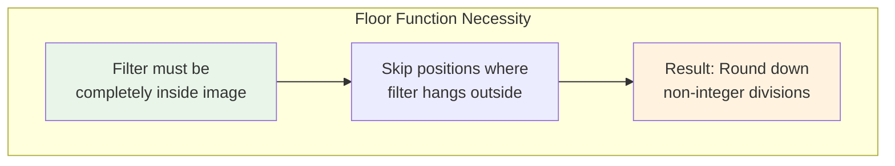
```mermaid
graph TD
    subgraph "Floor Function Necessity"
        A["Filter must be<br/>completely inside image"] --> B["Skip positions where<br/>filter hangs outside"]
        B --> C["Result: Round down<br/>non-integer divisions"]
    end

    style A fill:#e8f5e8
    style C fill:#fff3e0
```

### Stride Effects on Output Dimensions

| Input Size | Filter | Stride | Output Size | Size Reduction |
| ---------- | ------ | ------ | ----------- | -------------- |
| 224×224    | 3×3    | 1      | 222×222     | Minimal        |
| 224×224    | 3×3    | 2      | 111×111     | 50%            |
| 224×224    | 3×3    | 4      | 56×56       | 75%            |
| 224×224    | 7×7    | 2      | 109×109     | ~50%           |

### Common Stride Patterns in CNNs

#### Pattern 1: Progressive Downsampling

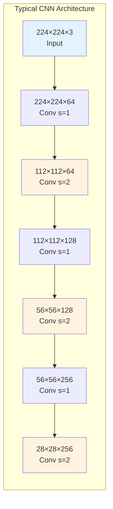
```mermaid
graph LR
    subgraph "Typical CNN Architecture"
        A["224×224×3<br/>Input"] --> B["224×224×64<br/>Conv s=1"]
        B --> C["112×112×64<br/>Conv s=2"]
        C --> D["112×112×128<br/>Conv s=1"]
        D --> E["56×56×128<br/>Conv s=2"]
        E --> F["56×56×256<br/>Conv s=1"]
        F --> G["28×28×256<br/>Conv s=2"]
    end

    style A fill:#e3f2fd
    style C fill:#fff3e0
    style E fill:#fff3e0
    style G fill:#fff3e0
```

**Strategy**: Alternate between stride-1 (feature extraction) and stride-2 (downsampling) convolutions.

#### Pattern 2: Efficient Mobile Architectures

```python
# MobileNet-style separable convolutions
depthwise_conv(stride=2)    # Spatial downsampling
pointwise_conv(stride=1)    # Channel mixing
```

#### Pattern 3: Residual Networks

```python
# ResNet downsampling blocks
conv1(stride=1, same_padding)  # Feature extraction
conv2(stride=2, same_padding)  # Downsample + feature extraction
skip_connection(stride=2)      # Match dimensions
```

### Comparison: Stride vs Other Downsampling Methods

#### Strided Convolution vs Max Pooling

| Aspect                       | Strided Convolution        | Max Pooling                  |
| ---------------------------- | -------------------------- | ---------------------------- |
| **Learnable**                | ✅ Weights are learned     | ❌ Fixed operation           |
| **Feature Extraction**       | ✅ Learns optimal features | ❌ Just selects maximum      |
| **Parameters**               | More parameters            | Zero parameters              |
| **Computational Cost**       | Higher                     | Very low                     |
| **Information Preservation** | Learned selection          | Fixed selection rule         |
| **Flexibility**              | Any stride value           | Typically stride = pool size |

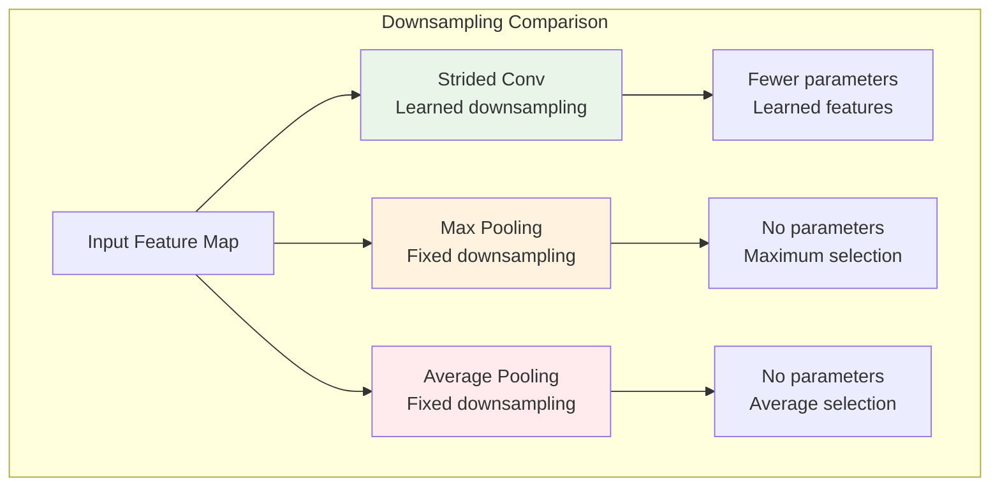
```mermaid
graph TD
    subgraph "Downsampling Comparison"
        A["Input Feature Map"] --> B["Strided Conv<br/>Learned downsampling"]
        A --> C["Max Pooling<br/>Fixed downsampling"]
        A --> D["Average Pooling<br/>Fixed downsampling"]

        B --> E["Fewer parameters<br/>Learned features"]
        C --> F["No parameters<br/>Maximum selection"]
        D --> G["No parameters<br/>Average selection"]
    end

    style B fill:#e8f5e8
    style C fill:#fff3e0
    style D fill:#ffebee
```

### Advanced Applications

#### Dilated/Atrous Convolutions

**Concept**: Increase receptive field without increasing parameters or stride.

```
Standard 3×3:     Dilated 3×3 (rate=2):
[x][x][x]         [x][ ][x][ ][x]
[x][x][x]   →     [ ][ ][ ][ ][ ]
[x][x][x]         [x][ ][x][ ][x]
                  [ ][ ][ ][ ][ ]
                  [x][ ][x][ ][x]
```

**Benefits**:

- Larger receptive field with same parameters
- Maintains resolution while capturing context
- Popular in semantic segmentation

#### Transposed Convolutions (Upsampling)

**Purpose**: Increase spatial dimensions (opposite of strided convolution)

```mermaid
graph LR
    subgraph "Transposed Convolution"
        A["2×2 Input"] --> B["Insert zeros<br/>between pixels"]
        B --> C["Apply standard<br/>convolution"]
        C --> D["4×4 Output<br/>Upsampled"]
    end

    style A fill:#ffebee
    style D fill:#e8f5e8
```

**Applications**:

- Decoders in autoencoders
- Generators in GANs
- Upsampling path in U-Net
- Super-resolution networks

### Cross-Correlation vs Convolution (Technical Note)

As mentioned in the video, deep learning uses **cross-correlation** but calls it "convolution":

#### Mathematical Convolution (True Definition)

```python
# True convolution: flip filter before applying
filter_flipped = np.flip(np.flip(filter, 0), 1)  # Flip both axes
output = correlate(input, filter_flipped)
```

#### Deep Learning "Convolution" (Actually Cross-Correlation)

```python
# What we actually do: no flipping
output = correlate(input, filter)  # Direct correlation
```

```mermaid
graph TD
    subgraph "Mathematical vs Deep Learning Convolution"
        A["Mathematical Convolution"] --> B["1. Flip filter horizontally"]
        B --> C["2. Flip filter vertically"]
        C --> D["3. Apply correlation"]

        E["Deep Learning 'Convolution'"] --> F["Apply correlation directly<br/>(skip flipping)"]
    end

    style A fill:#ffebee
    style E fill:#e8f5e8
```

**Why the difference doesn't matter:**

- **Associativity**: True convolution has nice mathematical properties
- **Deep Learning**: Filters are learned, so flipping doesn't matter
- **Performance**: Skipping flips simplifies implementation
- **Convention**: Everyone calls it "convolution" in ML literature

### Implementation Examples

#### TensorFlow/Keras

```python
# Stride 2 convolution
Conv2D(filters=64, kernel_size=3, strides=2, padding='same')

# Stride 1 (default)
Conv2D(filters=64, kernel_size=3, strides=1, padding='same')

# Custom stride values
Conv2D(filters=64, kernel_size=3, strides=(2,3), padding='valid')  # Different stride per axis
```

#### PyTorch

```python
# Stride 2 convolution
nn.Conv2d(in_channels, out_channels, kernel_size=3, stride=2, padding=1)

# Stride 1 (default)
nn.Conv2d(in_channels, out_channels, kernel_size=3, stride=1, padding=1)

# Functional interface
F.conv2d(input, weight, stride=2, padding=1)
```

### Design Considerations

#### When to Use Strided Convolutions

```mermaid
graph TD
    A["Need downsampling?"] --> B{Learnable features important?}
    B -->|Yes| C["Use strided convolution<br/>Better feature learning"]
    B -->|No| D["Use pooling<br/>Simpler and faster"]

    E["Memory constraints?"] --> F{Speed priority?}
    F -->|Yes| G["Use pooling or stride>2<br/>Aggressive downsampling"]
    F -->|No| H["Use stride=2<br/>Balanced approach"]

    style C fill:#e8f5e8
    style D fill:#fff3e0
    style G fill:#ffebee
    style H fill:#e3f2fd
```

#### Common Architectural Choices

**Early Layers (Large Inputs):**

- Stride 2-4 for rapid downsampling
- Often combined with larger filters (7×7)
- Reduces computational load

**Middle Layers (Feature Extraction):**

- Stride 1 for dense feature extraction
- Stride 2 for periodic downsampling
- Balance between resolution and receptive field

**Late Layers (Small Feature Maps):**

- Primarily stride 1
- Focus on complex feature combinations
- Avoid over-downsampling

### Key Takeaways

**1. Stride Controls Movement:**

- Stride 1: Dense sampling, larger output
- Stride >1: Skip positions, smaller output
- Floor function handles non-integer divisions

**2. Mathematical Formula:**

- Output = ⌊(n + 2p - f)/s⌋ + 1
- Must account for filter fitting completely inside image

**3. Design Trade-offs:**

- **Strided Conv**: Learnable, more parameters, better features
- **Pooling**: Fixed, no parameters, simpler, faster

**4. Common Patterns:**

- Progressive downsampling with stride 2
- Alternate stride 1 (extract) and stride 2 (downsample)
- Mobile architectures use aggressive striding

**5. Technical Detail:**

- Deep learning uses cross-correlation (no filter flipping)
- Called "convolution" by convention
- Doesn't affect performance or implementation

Strided convolutions are essential for building efficient, deep networks that can handle high-resolution inputs while maintaining reasonable computational requirements.

# 6. Convolutions Over Volume

## The Leap from 2D to 3D: Real-World Image Processing

Moving from grayscale (2D) to color images (3D volumes) represents a fundamental shift in how CNNs process real-world visual data. This enables processing RGB images and detecting multiple features simultaneously.

### Understanding 3D Volumes

**RGB Image Structure:**

```
Height: 6    Width: 6    Channels: 3
        ↓         ↓           ↓
     6 × 6 × 3 RGB Image
```

```mermaid
graph TD
    subgraph "3D Volume Concept"
        A["6×6×3 Input Volume"] --> B["Red Channel<br/>6×6 matrix"]
        A --> C["Green Channel<br/>6×6 matrix"]
        A --> D["Blue Channel<br/>6×6 matrix"]

        E["3×3×3 Filter"] --> F["Red Filter<br/>3×3 matrix"]
        E --> G["Green Filter<br/>3×3 matrix"]
        E --> H["Blue Filter<br/>3×3 matrix"]

        B --> I["Element-wise multiply<br/>and sum across ALL channels"]
        C --> I
        D --> I
        F --> I
        G --> I
        H --> I

        I --> J["4×4×1 Output<br/>Single feature map"]
    end

    style A fill:#e3f2fd
    style E fill:#fff3e0
    style J fill:#e8f5e8
```

### Mathematical Foundation of 3D Convolution

**Key Constraint**: Filter depth must match input depth!

For input volume $(n_H, n_W, n_C)$ and filter $(f, f, n_C)$:

$$\text{Output}[i,j] = \sum_{u=0}^{f-1} \sum_{v=0}^{f-1} \sum_{c=0}^{n_C-1} \text{Input}[i+u, j+v, c] \times \text{Filter}[u, v, c]$$

**Output dimension**: $(n_H - f + 1) \times (n_W - f + 1) \times 1$

### Step-by-Step 3D Convolution Example

Following the video's approach, let's work through a complete 6×6×3 → 4×4×1 example:

#### Input: 6×6×3 RGB Image

**Red Channel (6×6):**

```
3  0  1  2  7  4
1  5  8  9  3  1
4  2  1  6  2  8
7  3  2  1  1  3
2  4  5  2  3  1
1  0  3  4  6  2
```

**Green Channel (6×6):**

```
1  5  8  9  3  1
4  2  1  6  2  8
7  3  2  1  1  3
2  4  5  2  3  1
1  0  3  4  6  2
5  2  1  3  4  7
```

**Blue Channel (6×6):**

```
2  1  2  0  1  3
0  2  2  3  4  6
1  1  3  1  7  8
3  2  4  5  1  2
4  3  1  2  5  6
2  1  0  4  3  1
```

#### Filter: 3×3×3 Vertical Edge Detector

**Red Filter:** **Green Filter:** **Blue Filter:**

```
 1   0  -1         1   0  -1          1   0  -1
 1   0  -1         1   0  -1          1   0  -1
 1   0  -1         1   0  -1          1   0  -1
```

#### Detailed Calculation at Position (0,0)

**Step 1: Extract 3×3×3 region from top-left**

**Red region:**

```
3  0  1
1  5  8
4  2  1
```

**Green region:**

```
1  5  8
4  2  1
7  3  2
```

**Blue region:**

```
2  1  2
0  2  2
1  1  3
```

**Step 2: Apply 3D convolution (27 multiplications total)**

```
Red channel calculation:
(3×1) + (0×0) + (1×-1) + (1×1) + (5×0) + (8×-1) + (4×1) + (2×0) + (1×-1)
= 3 + 0 - 1 + 1 + 0 - 8 + 4 + 0 - 1 = -2

Green channel calculation:
(1×1) + (5×0) + (8×-1) + (4×1) + (2×0) + (1×-1) + (7×1) + (3×0) + (2×-1)
= 1 + 0 - 8 + 4 + 0 - 1 + 7 + 0 - 2 = 1

Blue channel calculation:
(2×1) + (1×0) + (2×-1) + (0×1) + (2×0) + (2×-1) + (1×1) + (1×0) + (3×-1)
= 2 + 0 - 2 + 0 + 0 - 2 + 1 + 0 - 3 = -4

Final result: (-2) + (1) + (-4) = -5
```

**Output[0,0] = -5**

📊 **Interactive Visualization**: [View the 3D Convolution Step-by-Step Process](./convolution_3d_visualization.html)

### Specialized Filter Examples from Video

#### Example 1: Red Channel Edge Detector

**Detect edges only in red channel:**

**Red Filter:** **Green Filter:** **Blue Filter:**

```
 1   0  -1         0   0   0          0   0   0
 1   0  -1         0   0   0          0   0   0
 1   0  -1         0   0   0          0   0   0
```

**Result**: Detects vertical edges, but only from red color information.

#### Example 2: Color-Agnostic Edge Detector

**Detect edges regardless of color:**

**Red Filter:** **Green Filter:** **Blue Filter:**

```
 1   0  -1         1   0  -1          1   0  -1
 1   0  -1         1   0  -1          1   0  -1
 1   0  -1         1   0  -1          1   0  -1
```

**Result**: Detects vertical edges in any color combination.

### Multiple Filters: The Power of Parallel Feature Detection

The video emphasizes that we don't want just one feature detector - we want multiple!

```mermaid
graph TD
    subgraph "Multiple Filter Architecture"
        A["6×6×3 Input<br/>RGB Image"] --> B["Filter 1<br/>Vertical edges"]
        A --> C["Filter 2<br/>Horizontal edges"]
        A --> D["Filter 3<br/>45° edges"]
        A --> E["Filter n<br/>Custom patterns"]

        B --> F["4×4 Feature Map 1"]
        C --> G["4×4 Feature Map 2"]
        D --> H["4×4 Feature Map 3"]
        E --> I["4×4 Feature Map n"]

        F --> J["4×4×n Output Volume<br/>Stack all feature maps"]
        G --> J
        H --> J
        I --> J
    end

    style A fill:#e3f2fd
    style J fill:#e8f5e8
```

#### Mathematical Formulation for Multiple Filters

**Input**: $(n_H, n_W, n_C)$
**Filters**: $(f, f, n_C)$ × $n_{filters}$
**Output**: $(n_H - f + 1, n_W - f + 1, n_{filters})$

**Example from video:**

- Input: 6×6×3
- Filters: 3×3×3 (2 different filters)
- Output: 4×4×2

```
Filter 1 (Vertical edges):    Filter 2 (Horizontal edges):
Red   Green  Blue            Red   Green  Blue
 1 0 -1  1 0 -1  1 0 -1      1  1  1   1  1  1   1  1  1
 1 0 -1  1 0 -1  1 0 -1      0  0  0   0  0  0   0  0  0
 1 0 -1  1 0 -1  1 0 -1     -1 -1 -1  -1 -1 -1  -1 -1 -1

Output: 4×4×2 volume
```

### Dimension Summary Formula

As stated in the video:

**Input**: $n \times n \times n_C$

**Filter**: $f \times f \times n_C$ (note: depths must match!)

**Number of filters**: $n_C'$ (next layer's channels)

**Output**: $(n - f + 1) \times (n - f + 1) \times n_C'$

**Key insights:**

1. **Spatial dimensions shrink**: $(n - f + 1)$
2. **Channel dimension changes**: $n_C \rightarrow n_C'$ (number of filters)
3. **Filter depth constraint**: Must equal input channels

### Channel Evolution Through Network Layers

```mermaid
graph LR
    subgraph "Typical CNN Channel Progression"
        A["Input<br/>224×224×3<br/>RGB image"] --> B["Layer 1<br/>220×220×32<br/>Basic features"]
        B --> C["Layer 2<br/>216×216×64<br/>Complex patterns"]
        C --> D["Layer 3<br/>212×212×128<br/>High-level features"]
        D --> E["Layer 4<br/>208×208×256<br/>Abstract concepts"]
    end

    subgraph "Trends"
        F["Spatial size: Decreases"]
        G["Channels: Increases"]
        H["Semantic complexity: Increases"]
    end

    style A fill:#e3f2fd
    style B fill:#fff8e1
    style C fill:#f3e5f5
    style D fill:#e8f5e8
    style E fill:#ffebee
```

**Pattern**: As we go deeper:

- **Spatial dimensions ↓**: Due to convolution (and pooling)
- **Number of channels ↑**: More feature detectors
- **Semantic complexity ↑**: From edges → textures → objects

### Advanced 3D Convolution Concepts

#### Depth-wise Separable Convolutions

**Standard 3D convolution**: $f \times f \times n_C \times n_{filters}$ parameters

**Separable approach**:

1. **Depth-wise**: Apply $f \times f \times 1$ filter to each channel separately
2. **Point-wise**: Apply $1 \times 1 \times n_C$ filter for channel mixing

**Parameter reduction**: Massive efficiency gain (used in MobileNets)

#### Grouped Convolutions

**Concept**: Divide channels into groups, apply convolution within groups only.

```mermaid
graph TD
    subgraph "Grouped Convolution"
        A["Input: 64 channels"] --> B["Group 1: channels 0-31"]
        A --> C["Group 2: channels 32-63"]

        B --> D["Conv with 16 filters"]
        C --> E["Conv with 16 filters"]

        D --> F["Output: 32 channels"]
        E --> F
    end

    style A fill:#e3f2fd
    style F fill:#e8f5e8
```

**Benefits**: Reduced parameters, computational efficiency, feature diversity

### Terminology Clarification

As mentioned in the video, this dimension has multiple names:

| Term             | Usage                        | Context                        |
| ---------------- | ---------------------------- | ------------------------------ |
| **Channels**     | Most common in deep learning | RGB channels, feature maps     |
| **Depth**        | Sometimes used               | Can confuse with network depth |
| **Feature maps** | Output context               | Result of convolution          |
| **Filters**      | Input context                | Number of different detectors  |

**Recommendation**: Use "channels" to avoid confusion with network depth.

### Practical Implementation Examples

#### TensorFlow/Keras

```python
import tensorflow as tf

# Single 3D convolution layer
conv_layer = tf.keras.layers.Conv2D(
    filters=32,              # Number of output channels (n_C')
    kernel_size=(3, 3),      # Spatial filter size (f×f)
    strides=1,               # Stride
    padding='same',          # Padding
    activation='relu',       # Activation function
    input_shape=(28, 28, 3)  # Input shape (H, W, C)
)

# Input: (batch_size, 28, 28, 3)
# Output: (batch_size, 28, 28, 32)
```

#### PyTorch

```python
import torch.nn as nn

# 3D convolution layer
conv_layer = nn.Conv2d(
    in_channels=3,      # Input channels (n_C)
    out_channels=32,    # Output channels (n_C')
    kernel_size=3,      # Filter size (f×f)
    stride=1,           # Stride
    padding=1           # Padding
)

# Input: (batch_size, 3, 28, 28)  # Note: PyTorch uses NCHW format
# Output: (batch_size, 32, 28, 28)
```

### Real-World Applications

#### Computer Vision Tasks

**Object Recognition**:

```
Input: 224×224×3 (RGB photo)
Layer 1: 224×224×64 (edges, colors)
Layer 2: 112×112×128 (textures, patterns)
Layer 3: 56×56×256 (object parts)
Layer 4: 28×28×512 (objects, faces)
Output: 1000 classes
```

**Medical Imaging**:

```
Input: 512×512×1 (grayscale X-ray)
OR
Input: 256×256×3 (RGB histology)
Features: abnormalities, tissue types, anatomical structures
```

**Satellite Imagery**:

```
Input: 1024×1024×12 (multispectral bands)
Features: land use, vegetation, urban areas, water bodies
```

### Key Takeaways

**1. 3D Convolution Fundamentals:**

- Filter depth must match input channels
- Each filter produces one feature map
- Multiple filters create multiple feature maps

**2. Dimension Mathematics:**

- Input: $(n_H, n_W, n_C)$
- Output: $(n_H - f + 1, n_W - f + 1, n_{filters})$
- Spatial shrinkage, channel transformation

**3. Feature Detection Power:**

- Each filter learns different patterns
- Parallel detection of multiple features
- Color-specific or color-agnostic detection

**4. Network Architecture Patterns:**

- Spatial dimensions decrease through layers
- Channel dimensions increase through layers
- Semantic complexity grows with depth

**5. Practical Considerations:**

- Use "channels" terminology for clarity
- Framework differences in dimension ordering
- Efficiency techniques (separable, grouped convolutions)

This 3D convolution capability is what makes CNNs so powerful for real-world image processing, enabling them to handle color images and detect hundreds of different features simultaneously in a single forward pass.

# 7. One Layer of a Convolutional Network

## Introduction: The Foundation of CNN Architecture

A convolutional layer represents the fundamental building block of any Convolutional Neural Network (CNN). Understanding how a single layer processes information is crucial for grasping how deep networks can recognize complex patterns in images. This layer takes a 3D input volume, applies learned filters to detect features, and produces a 3D output volume with potentially different dimensions.

The transformation from input to output involves three critical operations performed in sequence: convolution with learned filters, bias addition, and non-linear activation. Each of these steps serves a specific purpose in the feature learning process, and together they enable the network to learn hierarchical representations of visual data.

```mermaid
%%{init: {"theme": "default", "themeVariables": {"primaryColor": "#1f2937", "edgeLabelBackground":"#f9fafb", "primaryTextColor":"#000000", "fontSize": 12}}}%%
graph LR
    A["Input Volume<br/>6×6×3<br/>(RGB Image)"] --> B["Convolution<br/>Multiple 3×3×3 filters<br/>Feature Detection"]
    B --> C["Bias Addition<br/>One scalar per filter<br/>Learned Offset"]
    C --> D["ReLU Activation<br/>Non-linearity<br/>max(0, x)"]
    D --> E["Output Volume<br/>4×4×2<br/>(Feature Maps)"]

    style A fill:#e3f2fd
    style B fill:#fff3e0
    style C fill:#f3e5f5
    style D fill:#ffeb3b
    style E fill:#e8f5e8
```

## Detailed Step-by-Step Layer Construction

### Understanding the Input: 6×6×3 Volume

The input to our convolutional layer is a 6×6×3 volume, which represents a small RGB image. This three-dimensional structure is fundamental to understanding how CNNs process visual information:

- **Height (6 pixels)**: The vertical dimension of the image
- **Width (6 pixels)**: The horizontal dimension of the image
- **Depth (3 channels)**: The color channels - Red, Green, and Blue

Each channel contains intensity values that represent the amount of that particular color at each pixel location. When we visualize this as a 3D volume, we can think of it as three 6×6 matrices stacked on top of each other, where each matrix represents one color channel.

This 3D representation is essential because real-world images contain color information that is distributed across multiple channels. A grayscale image would have only one channel, while some specialized imaging systems might have more than three channels (such as infrared or multispectral imaging).

```mermaid
%%{init: {"theme": "default", "themeVariables": {"primaryColor": "#1f2937", "edgeLabelBackground":"#f9fafb", "primaryTextColor":"#000000", "fontSize": 12}}}%%
graph TD
    subgraph "6×6×3 RGB Input Volume"
        subgraph "Red Channel (6×6)"
            R1["220 180 160 140 120 100<br/>210 170 150 130 110 90<br/>200 160 140 120 100 80<br/>190 150 130 110 90 70<br/>180 140 120 100 80 60<br/>170 130 110 90 70 50"]
        end

        subgraph "Green Channel (6×6)"
            G1["200 160 140 120 100 80<br/>190 150 130 110 90 70<br/>180 140 120 100 80 60<br/>170 130 110 90 70 50<br/>160 120 100 80 60 40<br/>150 110 90 70 50 30"]
        end

        subgraph "Blue Channel (6×6)"
            B1["180 140 120 100 80 60<br/>170 130 110 90 70 50<br/>160 120 100 80 60 40<br/>150 110 90 70 50 30<br/>140 100 80 60 40 20<br/>130 90 70 50 30 10"]
        end
    end

    subgraph "3D Volume Structure"
        A["Height: 6 pixels<br/>↕️"]
        B["Width: 6 pixels<br/>↔️"]
        C["Depth: 3 channels<br/>🔄"]
    end

    subgraph "Multiple Filters Detect Features"
        F1["Filter 1: Vertical Edges<br/>3×3×3 weights<br/>🔍"]
        F2["Filter 2: Horizontal Edges<br/>3×3×3 weights<br/>🔍"]
        F3["Filter 3: Color Patterns<br/>3×3×3 weights<br/>🔍"]
    end

    R1 -.-> F1
    G1 -.-> F1
    B1 -.-> F1

    R1 -.-> F2
    G1 -.-> F2
    B1 -.-> F2

    R1 -.-> F3
    G1 -.-> F3
    B1 -.-> F3

    F1 --> O1["Feature Map 1<br/>4×4 output<br/>📊"]
    F2 --> O2["Feature Map 2<br/>4×4 output<br/>📊"]
    F3 --> O3["Feature Map 3<br/>4×4 output<br/>📊"]

    O1 --> Final["Final Output<br/>4×4×3 volume<br/>📈"]
    O2 --> Final
    O3 --> Final

    style R1 fill:#ffebee
    style G1 fill:#e8f5e8
    style B1 fill:#e3f2fd
    style F1 fill:#fff3e0
    style F2 fill:#fff3e0
    style F3 fill:#fff3e0
    style O1 fill:#f3e5f5
    style O2 fill:#f3e5f5
    style O3 fill:#f3e5f5
    style Final fill:#e8f5e8
```

### Step 1: Convolution Operation with Multiple Filters

```mermaid
%%{init: {"theme": "default", "themeVariables": {"primaryColor": "#1f2937", "edgeLabelBackground":"#f9fafb", "primaryTextColor":"#000000", "fontSize": 12}}}%%
graph TD
    subgraph "3×3×3 Filter Sliding Across 6×6×3 Input"
        subgraph "Position 1 (0,0)"
            P1["Filter covers:<br/>Top-left 3×3×3 region<br/>27 multiplications<br/>→ Single output value"]
        end

        subgraph "Position 2 (0,1)"
            P2["Filter slides right:<br/>3×3×3 region shifted<br/>27 multiplications<br/>→ Single output value"]
        end

        subgraph "Position 3 (0,2)"
            P3["Continue sliding:<br/>3×3×3 region<br/>27 multiplications<br/>→ Single output value"]
        end

        subgraph "Final Result"
            R["16 positions total<br/>16 output values<br/>= 4×4 feature map"]
        end

        P1 --> P2
        P2 --> P3
        P3 --> R
    end

    subgraph "Mathematical Operation at Each Position"
        M["Element-wise multiply<br/>3×3×3 = 27 values<br/>Sum all products<br/>= 1 output value"]
    end

    style P1 fill:#e3f2fd
    style P2 fill:#fff3e0
    style P3 fill:#f3e5f5
    style R fill:#e8f5e8
    style M fill:#ffeb3b
```

The convolution operation is where the actual feature detection occurs. In our example, we apply two different 3×3×3 filters to the input volume. Each filter is designed to detect specific patterns or features in the image.

#### Understanding Filter Structure

Each filter has the same depth as the input volume (3 channels), but smaller spatial dimensions (3×3). This constraint is fundamental to CNN architecture: **the filter depth must always match the input depth**. The filter essentially slides across the spatial dimensions of the input while maintaining full connectivity across all channels.

When we apply a 3×3×3 filter to our 6×6×3 input:

- The filter examines a 3×3 region across all 3 channels simultaneously
- It performs element-wise multiplication between filter weights and input values
- All 27 (3×3×3) multiplication results are summed to produce a single output value
- The filter then slides to the next position and repeats this process

#### Multi-Filter Feature Detection

Using multiple filters allows the layer to detect different types of features simultaneously:

**Filter 1** might be designed to detect vertical edges by having weights that respond strongly when there's a bright-to-dark transition from left to right.

**Filter 2** might detect horizontal edges by having weights that respond to bright-to-dark transitions from top to bottom.

Each filter produces its own 4×4 output map, representing where that particular feature was detected in the input image.

```mermaid
graph TD
    subgraph "Multi-Filter Convolution Process"
        A["6×6×3 Input Volume"] --> B["Filter 1: Vertical Edge Detector<br/>3×3×3 weights"]
        A --> C["Filter 2: Horizontal Edge Detector<br/>3×3×3 weights"]
        A --> D["Filter N: Other Feature Detector<br/>3×3×3 weights"]

        B --> E["Feature Map 1<br/>4×4 activation map"]
        C --> F["Feature Map 2<br/>4×4 activation map"]
        D --> G["Feature Map N<br/>4×4 activation map"]
    end

    style A fill:#e3f2fd
    style E fill:#fff3e0
    style F fill:#fff3e0
    style G fill:#fff3e0
```

### Step 2: Bias Addition - Learning Appropriate Offsets

```mermaid
%%{init: {"theme": "default", "themeVariables": {"primaryColor": "#1f2937", "edgeLabelBackground":"#f9fafb", "primaryTextColor":"#000000", "fontSize": 12}}}%%
graph LR
    subgraph "Bias Addition Process"
        A["Convolution Output<br/>4×4 Feature Map<br/>[2.1, -0.5, 1.8, 0.3<br/> 1.2, 3.4, -1.1, 2.7<br/> 0.9, -2.3, 1.5, 0.8<br/> 2.2, 1.9, -0.7, 1.4]"]

        B[" (+) Bias Value<br/>b = 0.5<br/>(single scalar)"]

        C["Broadcasted Addition<br/>4×4 Result<br/>[2.6, 0.0, 2.3, 0.8<br/> 1.7, 3.9, -0.6, 3.2<br/> 1.4, -1.8, 2.0, 1.3<br/> 2.7, 2.4, -0.2, 1.9]"]

        A --> B
        B --> C
    end

    subgraph "Broadcasting Concept"
        D["Single bias value<br/>added to EVERY<br/>spatial location<br/>Maintains spatial structure"]
    end

    style A fill:#e3f2fd
    style B fill:#fff3e0
    style C fill:#e8f5e8
    style D fill:#ffeb3b
```

After convolution, each filter's output receives its own bias term. The bias is a single learnable parameter (a real number) that gets added to every element in the corresponding feature map.

#### Purpose of Bias Terms

Bias terms serve several important functions:

1. **Threshold Adjustment**: They allow the network to adjust the activation threshold for each feature detector
2. **Flexibility**: Even if a perfect feature match occurs, the bias can shift the response up or down
3. **Learning Enhancement**: They provide additional degrees of freedom that help the network fit the training data better

For our two-filter example:

- Filter 1 output (4×4) + bias₁ → biased feature map 1
- Filter 2 output (4×4) + bias₂ → biased feature map 2

The bias is broadcast across all spatial locations, meaning the same bias value is added to every position in the feature map. This maintains the spatial structure while providing a learned offset.

#### Mathematical Representation

If we denote the convolution output as Z and the bias as b, then:

```
Z₁ + b₁ = biased output for filter 1
Z₂ + b₂ = biased output for filter 2
```

Each bias is learned through backpropagation, allowing the network to discover optimal offset values for each feature detector.

### Step 3: Non-Linear Activation (ReLU)

```mermaid
%%{init: {"theme": "default", "themeVariables": {"primaryColor": "#1f2937", "edgeLabelBackground":"#f9fafb", "primaryTextColor":"#000000", "fontSize": 12}}}%%
graph TD
    subgraph "ReLU Activation Effect"
        A["Before ReLU<br/>4×4 Feature Map<br/>[2.6, 0.0, 2.3, 0.8<br/> 1.7, 3.9, -0.6, 3.2<br/> 1.4, -1.8, 2.0, 1.3<br/> 2.7, 2.4, -0.2, 1.9]"]

        B["ReLU Function<br/>f(x) = max(0, x)<br/>🔄"]

        C["After ReLU<br/>4×4 Feature Map<br/>[2.6, 0.0, 2.3, 0.8<br/> 1.7, 3.9, 0.0, 3.2<br/> 1.4, 0.0, 2.0, 1.3<br/> 2.7, 2.4, 0.0, 1.9]"]

        A --> B
        B --> C
    end

    subgraph "ReLU Properties"
        D["✅ Sparse Activation<br/>❌ Negative → 0<br/>✅ Positive → Unchanged<br/>🚀 Fast Computation"]
    end

    subgraph "Why ReLU?"
        E["Non-linearity enables<br/>complex pattern learning<br/>Multiple linear layers<br/>= Still just linear!"]
    end

    style A fill:#ffebee
    style B fill:#ffeb3b
    style C fill:#e8f5e8
    style D fill:#e3f2fd
    style E fill:#fff3e0
```

The Rectified Linear Unit (ReLU) activation function is applied element-wise to each biased feature map. ReLU is defined as:

```
ReLU(x) = max(0, x)
```

#### Why Non-Linearity is Essential

Without non-linear activation functions, no matter how deep we make our network, it would still only be capable of learning linear transformations. The composition of multiple linear functions is still just a linear function. Non-linearity is what gives neural networks their power to learn complex patterns and representations.

ReLU specifically offers several advantages:

- **Computational Efficiency**: Very fast to compute (simple max operation)
- **Sparse Activation**: Many neurons output zero, leading to sparse representations
- **Gradient Preservation**: For positive inputs, the gradient is 1, avoiding vanishing gradients
- **Biological Plausibility**: Resembles the behavior of biological neurons

#### Effect on Feature Maps

After applying ReLU:

- All negative values in the feature maps become zero
- Positive values remain unchanged
- This creates sparse, non-negative feature representations

The ReLU operation helps the network focus on the most relevant features while suppressing irrelevant or contradictory signals.

### Step 4: Stacking to Create Output Volume

The final step involves stacking all the processed feature maps along the channel dimension to create the output volume. In our example with two filters, we stack two 4×4 feature maps to create a 4×4×2 output volume.

```mermaid
graph TD
    subgraph "Output Volume Construction"
        A["Feature Map 1<br/>4×4<br/>(after ReLU)"] --> D["Stack Along<br/>Channel Dimension"]
        B["Feature Map 2<br/>4×4<br/>(after ReLU)"] --> D
        C["Feature Map ...<br/>4×4<br/>(if more filters)"] --> D
        D --> E["Final Output Volume<br/>4×4×2<br/>(Height × Width × Channels)"]
    end

    style E fill:#e8f5e8
```

This stacking process creates a new 3D volume where:

- **Height and Width**: Determined by the convolution parameters (input size, filter size, padding, stride)
- **Depth (Channels)**: Exactly equals the number of filters used in the layer

## Mathematical Framework: Connecting to Standard Neural Networks

```mermaid
%%{init: {"theme": "default", "themeVariables": {"primaryColor": "#1f2937", "edgeLabelBackground":"#f9fafb", "primaryTextColor":"#000000", "fontSize": 12}}}%%
graph TD
    subgraph "Traditional Neural Network"
        TI["Input Vector<br/>x (flattened)"]
        TW["Weight Matrix<br/>W"]
        TB["Bias Vector<br/>b"]
        TO["Output Vector<br/>z = Wx + b"]
        TA["Activation<br/>a = g(z)"]

        TI --> TW
        TW --> TB
        TB --> TO
        TO --> TA
    end

    subgraph "Convolutional Neural Network"
        CI["Input Volume<br/>6×6×3"]
        CW["Filter Bank<br/>3×3×3 filters"]
        CB["Bias Terms<br/>one per filter"]
        CO["Feature Maps<br/>z = W * x + b"]
        CA["Activation<br/>a = g(z)"]

        CI --> CW
        CW --> CB
        CB --> CO
        CO --> CA
    end

    subgraph "Key Differences"
        D1["Operation:<br/>Matrix Mult (·) vs Convolution (*)"]
        D2["Structure:<br/>Fully Connected vs Locally Connected"]
        D3["Parameters:<br/>Grows with input vs Fixed"]
        D4["Spatial:<br/>Lost vs Preserved"]
    end

    style TI fill:#ffebee
    style CI fill:#e3f2fd
    style D1 fill:#fff3e0
    style D2 fill:#f3e5f5
    style D3 fill:#e8f5e8
    style D4 fill:#ffeb3b
```

### Traditional Neural Network Layer

In a standard fully connected neural network, one layer's computation follows this pattern:

```
z⁽¹⁾ = W⁽¹⁾ · a⁽⁰⁾ + b⁽¹⁾
a⁽¹⁾ = g(z⁽¹⁾)
```

Where:

- W⁽¹⁾ is the weight matrix
- a⁽⁰⁾ is the input (also called x)
- b⁽¹⁾ is the bias vector
- g() is the activation function

### Convolutional Layer Analogy

The convolutional layer follows a remarkably similar pattern:

```
z⁽¹⁾ = W⁽¹⁾ * a⁽⁰⁾ + b⁽¹⁾
a⁽¹⁾ = g(z⁽¹⁾)
```

The key differences are:

- The operation is convolution (\*) instead of matrix multiplication (·)
- W⁽¹⁾ represents the collection of all filters
- The bias b⁽¹⁾ is applied spatially across each feature map

#### Detailed Correspondence

1. **Input Volume (a⁽⁰⁾)**: Our 6×6×3 input corresponds to the input vector in a standard network
2. **Filters (W⁽¹⁾)**: The collection of all filters plays the role of the weight matrix
3. **Convolution Output**: The result before bias addition corresponds to W⁽¹⁾ · a⁽⁰⁾
4. **Bias Addition**: Each filter gets its own bias, similar to each neuron having its own bias
5. **Activation (a⁽¹⁾)**: The final output after ReLU corresponds to the activated output

This mathematical framework helps us understand that convolutional layers are essentially specialized versions of fully connected layers, optimized for spatial data processing.

## Scaling to More Filters: Increasing Feature Richness

### From Two to Ten Filters

While our example uses two filters, real CNN layers typically use many more. Let's explore what happens when we scale from 2 to 10 filters:

**Two Filters Configuration:**

- Input: 6×6×3
- Filters: 2 filters, each 3×3×3
- Output: 4×4×2

**Ten Filters Configuration:**

- Input: 6×6×3
- Filters: 10 filters, each 3×3×3
- Output: 4×4×10

#### Advantages of More Filters

Using more filters provides several benefits:

1. **Richer Feature Detection**: Each filter can specialize in detecting different patterns (edges, textures, shapes, colors)
2. **Increased Representational Power**: More feature maps mean more ways to represent the input
3. **Better Learning Capacity**: The network can learn more complex combinations of features
4. **Robustness**: Multiple filters provide redundancy and robustness to variations

```mermaid
graph LR
    subgraph "Scaling Filter Count"
        A["6×6×3<br/>Input Volume"] --> B["2 Filters<br/>Basic Features"]
        A --> C["10 Filters<br/>Rich Features"]
        A --> D["64 Filters<br/>Very Rich Features"]

        B --> E["4×4×2<br/>Limited Representation"]
        C --> F["4×4×10<br/>Good Representation"]
        D --> G["4×4×64<br/>Rich Representation"]
    end

    style A fill:#e3f2fd
    style E fill:#ffebee
    style F fill:#fff3e0
    style G fill:#e8f5e8
```

#### Trade-offs in Filter Count

However, increasing the number of filters also comes with costs:

- **More Parameters**: More filters mean more parameters to learn and store
- **Computational Cost**: More convolutions require more computation
- **Memory Usage**: Larger output volumes require more memory
- **Overfitting Risk**: Too many parameters might lead to overfitting on small datasets

## Parameter Calculation: Understanding Model Complexity

```mermaid
%%{init: {"theme": "default", "themeVariables": {"primaryColor": "#1f2937", "edgeLabelBackground":"#f9fafb", "primaryTextColor":"#000000", "fontSize": 12}}}%%
graph TD
    subgraph "Parameter Calculation Breakdown"
        subgraph "Single Filter (3×3×3)"
            SF["Weight Parameters<br/>3 × 3 × 3 = 27"]
            SB["Bias Parameter<br/>1 scalar"]
            ST["Total per Filter<br/>27 + 1 = 28"]

            SF --> ST
            SB --> ST
        end

        subgraph "10 Filters"
            MW["Total Weights<br/>27 × 10 = 270"]
            MB["Total Biases<br/>1 × 10 = 10"]
            MT["Grand Total<br/>270 + 10 = 280"]

            MW --> MT
            MB --> MT
        end

        subgraph "Memory Analysis"
            M1["Float32: 4 bytes/param<br/>280 × 4 = 1,120 bytes"]
            M2["🏷️ Just 1.1 KB!<br/>Extremely efficient"]

            M1 --> M2
        end
    end

    style SF fill:#e3f2fd
    style SB fill:#fff3e0
    style ST fill:#f3e5f5
    style MW fill:#ffeb3b
    style MB fill:#ffeb3b
    style MT fill:#e8f5e8
    style M2 fill:#c8e6c9
```

### Single Filter Parameter Count

For each 3×3×3 filter, we need to count both weights and bias:

**Weight Parameters**: 3 (height) × 3 (width) × 3 (depth) = 27 parameters

**Bias Parameter**: 1 parameter (one per filter)

**Total per Filter**: 27 + 1 = 28 parameters

#### Why This Calculation Matters

Understanding parameter count is crucial for several reasons:

1. **Memory Requirements**: Each parameter needs storage space
2. **Training Time**: More parameters generally mean longer training
3. **Overfitting Assessment**: Too many parameters relative to data can cause overfitting
4. **Model Comparison**: Parameter count helps compare model complexity

### Multiple Filters Parameter Count

For 10 filters of size 3×3×3:

- **Total Weight Parameters**: 27 × 10 = 270
- **Total Bias Parameters**: 1 × 10 = 10
- **Grand Total**: 270 + 10 = 280 parameters

## The Power of Parameter Sharing

One of the most remarkable properties of CNNs is that the parameter count remains fixed regardless of input image size:

```
Small Image (6×6×3) with 10 filters → 280 parameters
Large Image (1000×1000×3) with 10 filters → 280 parameters
Huge Image (5000×5000×3) with 10 filters → 280 parameters
```

```mermaid
%%{init: {"theme": "default", "themeVariables": {"primaryColor": "#1f2937", "edgeLabelBackground":"#f9fafb", "primaryTextColor":"#000000", "fontSize": 12}}}%%
graph TD
    subgraph "Parameter Sharing Demonstration"
        subgraph "Different Input Sizes"
            A["Small Image<br/>6×6×3<br/>108 pixels"]
            B["Medium Image<br/>1000×1000×3<br/>3M pixels"]
            C["Large Image<br/>5000×5000×3<br/>75M pixels"]
        end

        subgraph "Same Filter Bank"
            F["10 Filters<br/>Each 3×3×3<br/>280 total parameters"]
        end

        subgraph "Key Insight"
            I["🔑 Parameter count<br/>independent of<br/>input image size"]
        end

        A --> F
        B --> F
        C --> F

        F --> I

        subgraph "Benefits"
            B1["✅ Scalability<br/>Same model works<br/>on any image size"]
            B2["✅ Overfitting Resistance<br/>Fixed parameters<br/>regardless of input"]
            B3["✅ Translation Invariance<br/>Features detected<br/>anywhere in image"]
            B4["✅ Memory Efficiency<br/>Constant model size<br/>vs growing inputs"]
        end

        I --> B1
        I --> B2
        I --> B3
        I --> B4

        subgraph "Comparison: Fully Connected"
            FC1["6×6×3 → 1000 neurons<br/>108,000 parameters"]
            FC2["1000×1000×3 → 1000 neurons<br/>3 BILLION parameters"]
            FC3["5000×5000×3 → 1000 neurons<br/>75 BILLION parameters"]
        end

        style A fill:#e3f2fd
        style B fill:#fff3e0
        style C fill:#ffebee
        style F fill:#e8f5e8
        style I fill:#fff59d
        style B1 fill:#e8f5e8
        style B2 fill:#e8f5e8
        style B3 fill:#e8f5e8
        style B4 fill:#e8f5e8
        style FC1 fill:#ffcdd2
        style FC2 fill:#f44336
        style FC3 fill:#d32f2f
    end
```

#### Implications of Parameter Independence

This parameter independence has profound implications:

1. **Scalability**: Networks trained on small images can process arbitrarily large images
2. **Overfitting Resistance**: Fixed parameter count means less risk of overfitting with larger inputs
3. **Translation Invariance**: The same feature detectors work everywhere in the image
4. **Computational Efficiency**: While computation increases with image size, the model size stays constant

Compare this with fully connected networks where the parameter count would grow quadratically with input size, making large images computationally prohibitive.

## Comprehensive Layer Notation and Dimensionality

### Hyperparameters for Layer l

Every convolutional layer is characterized by four key hyperparameters:

| Hyperparameter        | Symbol | Description                   | Common Values                |
| --------------------- | ------ | ----------------------------- | ---------------------------- |
| **Filter Size**       | f⁽ˡ⁾   | Spatial dimensions of filters | 1, 3, 5, 7, 11               |
| **Padding**           | p⁽ˡ⁾   | Border pixels added           | 0 (valid), calculated (same) |
| **Stride**            | s⁽ˡ⁾   | Step size for filter movement | 1, 2, occasionally 3         |
| **Number of Filters** | nᶜ⁽ˡ⁾  | Output channel count          | 32, 64, 128, 256, 512        |

#### Understanding Each Hyperparameter

**Filter Size (f⁽ˡ⁾)**: Determines the spatial extent of the receptive field. Larger filters can capture more complex spatial patterns but require more parameters.

**Padding (p⁽ˡ⁾)**: Controls output size and information preservation at borders. "Valid" means no padding; "same" means padding to preserve input dimensions.

**Stride (s⁽ˡ⁾)**: Controls spatial downsampling. Stride 1 preserves spatial resolution; stride 2 halves it.

**Number of Filters (nᶜ⁽ˡ⁾)**: Determines the richness of the learned representation and the output depth.

### Input and Output Dimension Analysis

The transformation from input to output follows predictable mathematical relationships:

**Input Dimensions**: nₕ⁽ˡ⁻¹⁾ × nw⁽ˡ⁻¹⁾ × nᶜ⁽ˡ⁻¹⁾

- nₕ⁽ˡ⁻¹⁾: Height of input from previous layer
- nw⁽ˡ⁻¹⁾: Width of input from previous layer
- nᶜ⁽ˡ⁻¹⁾: Number of channels from previous layer

**Output Dimensions**: nₕ⁽ˡ⁾ × nw⁽ˡ⁾ × nᶜ⁽ˡ⁾

- nₕ⁽ˡ⁾: Height of output from current layer
- nw⁽ˡ⁾: Width of output from current layer
- nᶜ⁽ˡ⁾: Number of channels from current layer

### Mathematical Formulas for Output Dimensions

#### Spatial Dimensions (Height and Width)

The output height and width are calculated using the same formula:

```
nₕ⁽ˡ⁾ = ⌊(nₕ⁽ˡ⁻¹⁾ + 2p⁽ˡ⁾ - f⁽ˡ⁾) / s⁽ˡ⁾⌋ + 1
nw⁽ˡ⁾ = ⌊(nw⁽ˡ⁻¹⁾ + 2p⁽ˡ⁾ - f⁽ˡ⁾) / s⁽ˡ⁾⌋ + 1
```

Where ⌊⌋ denotes the floor function (rounding down to the nearest integer).

#### Channel Dimension (Depth)

The output depth is straightforward:

```
nᶜ⁽ˡ⁾ = number of filters in layer l
```

This means the number of output channels is entirely determined by how many different filters we choose to use in the layer.

#### Worked Example

For our 6×6×3 → 4×4×2 transformation:

- nₕ⁽⁰⁾ = 6, nw⁽⁰⁾ = 6, nᶜ⁽⁰⁾ = 3 (input)
- f⁽¹⁾ = 3, p⁽¹⁾ = 0, s⁽¹⁾ = 1, nᶜ⁽¹⁾ = 2 (layer parameters)

Calculating output dimensions:

```
nₕ⁽¹⁾ = ⌊(6 + 2×0 - 3) / 1⌋ + 1 = ⌊3⌋ + 1 = 4
nw⁽¹⁾ = ⌊(6 + 2×0 - 3) / 1⌋ + 1 = ⌊3⌋ + 1 = 4
nᶜ⁽¹⁾ = 2 (number of filters)
```

Result: 4×4×2 ✓

## Filter Architecture and Constraints

```mermaid
%%{init: {"theme": "default", "themeVariables": {"primaryColor": "#1f2937", "edgeLabelBackground":"#f9fafb", "primaryTextColor":"#000000", "fontSize": 12}}}%%
graph TD
    subgraph "Filter Depth Constraint"
        subgraph "✅ Correct Configuration"
            I1["Input: 6×6×3<br/>(3 channels)"]
            F1["Filter: 3×3×3<br/>(3 channels)"]
            O1["✅ Valid Convolution<br/>Depths Match!"]

            I1 --> F1
            F1 --> O1
        end

        subgraph "❌ Invalid Configuration"
            I2["Input: 6×6×3<br/>(3 channels)"]
            F2["Filter: 3×3×2<br/>(2 channels)"]
            O2["❌ ERROR!<br/>Depth Mismatch"]

            I2 --> F2
            F2 --> O2
        end

        subgraph "Why This Constraint?"
            R1["Complete Information<br/>Filter sees ALL channels"]
            R2["Mathematical Consistency<br/>Dot product requires<br/>matching dimensions"]
            R3["Color Integration<br/>RGB patterns span<br/>multiple channels"]
        end
    end

    style I1 fill:#e8f5e8
    style F1 fill:#e8f5e8
    style O1 fill:#c8e6c9
    style I2 fill:#ffebee
    style F2 fill:#ffebee
    style O2 fill:#ffcdd2
    style R1 fill:#e3f2fd
    style R2 fill:#fff3e0
    style R3 fill:#f3e5f5
```

### Filter Dimension Requirements

Each filter in layer l has very specific dimensional requirements:

**Filter Shape**: f⁽ˡ⁾ × f⁽ˡ⁾ × nᶜ⁽ˡ⁻¹⁾

The critical constraint is that **filter depth must exactly match input depth**. This constraint ensures that each filter can process all channels of the input simultaneously.

#### Why This Constraint Exists

This constraint serves several important purposes:

1. **Complete Information Access**: Each filter needs to see all input channels to make informed feature detection decisions
2. **Mathematical Consistency**: The convolution operation requires matching depths for the dot product calculation
3. **Color/Channel Integration**: For RGB images, filters need to process color information holistically
4. **Feature Correlation**: Patterns often span multiple channels (e.g., skin color involves specific combinations of R, G, B values)

### Complete Parameter Specifications

For layer l with nᶜ⁽ˡ⁾ filters:

**All Weights Combined**: f⁽ˡ⁾ × f⁽ˡ⁾ × nᶜ⁽ˡ⁻¹⁾ × nᶜ⁽ˡ⁾

**All Biases Combined**: nᶜ⁽ˡ⁾

The weight tensor has four dimensions:

1. Filter height (f⁽ˡ⁾)
2. Filter width (f⁽ˡ⁾)
3. Input depth (nᶜ⁽ˡ⁻¹⁾)
4. Number of filters (nᶜ⁽ˡ⁾)

### Activation Tensor Dimensions

#### Single Example Processing

For processing one example at a time:

**Activation Shape**: nₕ⁽ˡ⁾ × nw⁽ˡ⁾ × nᶜ⁽ˡ⁾

#### Batch Processing (Vectorized Implementation)

In practice, we process multiple examples simultaneously for efficiency:

**Batch Activation Shape**: m × nₕ⁽ˡ⁾ × nw⁽ˡ⁾ × nᶜ⁽ˡ⁾

Where m is the batch size (number of examples processed together).

## Framework Conventions: Handling Dimensional Ordering

### The Ordering Challenge

Different deep learning frameworks use different conventions for ordering the dimensions of tensors. This can be a source of confusion when moving between frameworks or reading different codebases.

### Height-Width-Channel (HWC) Convention

**Format**: Height × Width × Channels
**Example**: 224 × 224 × 3
**Used by**: TensorFlow (default), Keras

**Advantages**:

- Intuitive for humans (matches how we think about images)
- Natural for data loading and visualization
- Easier debugging and interpretation

### Channel-Height-Width (CHW) Convention

**Format**: Channels × Height × Width
**Example**: 3 × 224 × 224
**Used by**: PyTorch, Caffe, some optimized libraries

**Advantages**:

- More efficient for some hardware accelerators
- Better memory layout for certain operations
- Closer to how GPUs prefer to process data

```mermaid
graph TD
    subgraph "Framework Dimension Conventions"
        A["Input Image<br/>224×224 RGB"] --> B["TensorFlow/Keras<br/>HWC Format<br/>224×224×3"]
        A --> C["PyTorch<br/>CHW Format<br/>3×224×224"]

        B --> D["Batch Processing<br/>N×224×224×3"]
        C --> E["Batch Processing<br/>N×3×224×224"]

        D --> F["Choose Based on Framework<br/>Maintain Consistency"]
        E --> F
    end

    style F fill:#e8f5e8
```

### Practical Implications

When working with CNNs, you need to be aware of your framework's convention:

1. **Data Loading**: Image loading libraries might return different formats
2. **Model Definition**: Layer definitions assume specific ordering
3. **Debugging**: Tensor shapes will look different in different frameworks
4. **Transfer Learning**: Pre-trained models expect specific input formats

The key is maintaining consistency throughout your entire pipeline.

## Building Intuition: Why This Architecture Works

```mermaid
%%{init: {"theme": "default", "themeVariables": {"primaryColor": "#1f2937", "edgeLabelBackground":"#f9fafb", "primaryTextColor":"#000000", "fontSize": 12}}}%%
graph TD
    subgraph "Hierarchical Feature Learning"
        subgraph "Layer 1: Low-Level Features"
            L1A["Vertical Edges<br/>|  |  |"]
            L1B["Horizontal Edges<br/>---"]
            L1C["Diagonal Edges<br/>/ \\"]
            L1D["Color Blobs<br/>🔴 🟢 🔵"]
        end

        subgraph "Layer 2: Mid-Level Features"
            L2A["Corners<br/>⌐ ⌙"]
            L2B["Textures<br/>░▒▓"]
            L2C["Simple Shapes<br/>⭕ ⬜ △"]
        end

        subgraph "Layer 3: High-Level Features"
            L3A["Object Parts<br/>👁️ 👂 👃"]
            L3B["Complex Patterns<br/>🌸 ⚡ 🌊"]
        end

        subgraph "Layer 4+: Objects"
            L4A["Complete Objects<br/>😀 🐱 🚗 🏠"]
        end

        L1A --> L2A
        L1B --> L2A
        L1A --> L2B
        L1B --> L2B
        L1C --> L2C
        L1D --> L2C

        L2A --> L3A
        L2B --> L3A
        L2C --> L3B

        L3A --> L4A
        L3B --> L4A
    end

    subgraph "Key Principles"
        P1["🔄 Translation Invariance<br/>Same features detected<br/>anywhere in image"]
        P2["🔗 Local Connectivity<br/>Each neuron sees<br/>small local region"]
        P3["📊 Parameter Sharing<br/>Same weights used<br/>across all locations"]
    end

    style L1A fill:#ffebee
    style L1B fill:#ffebee
    style L1C fill:#ffebee
    style L1D fill:#ffebee
    style L2A fill:#fff3e0
    style L2B fill:#fff3e0
    style L2C fill:#fff3e0
    style L3A fill:#e3f2fd
    style L3B fill:#e3f2fd
    style L4A fill:#e8f5e8
    style P1 fill:#f3e5f5
    style P2 fill:#f3e5f5
    style P3 fill:#f3e5f5
```

### Feature Hierarchy Development

Convolutional layers naturally build hierarchical representations:

**Early Layers**: Detect simple features like edges, corners, and color patterns

**Middle Layers**: Combine simple features into more complex patterns like textures and shapes

**Later Layers**: Combine complex patterns into object parts and eventually full objects

### Translation Invariance

The same filter applied across the entire image means features are detected regardless of their position. An edge detector will find edges whether they appear in the top-left corner or bottom-right corner of the image.

### Local Connectivity

Unlike fully connected layers where every input connects to every output, convolutional layers maintain local connectivity. Each output neuron only depends on a small local region of the input, which matches the local nature of visual patterns.

### Parameter Efficiency

By sharing parameters (the same filter weights across all spatial locations), CNNs dramatically reduce the number of parameters compared to fully connected networks while maintaining or improving representational power.

## Summary: The Complete Picture

A single convolutional layer represents a sophisticated yet elegant solution to the problem of learning spatial patterns in visual data. By combining convolution, bias addition, and non-linear activation, these layers can:

1. **Detect Multiple Features Simultaneously**: Each filter specializes in detecting different patterns
2. **Maintain Spatial Relationships**: The convolution operation preserves spatial structure
3. **Scale Efficiently**: Parameter count remains fixed regardless of input size
4. **Build Hierarchical Representations**: Simple features combine to form complex representations

The mathematical framework connecting convolutional layers to standard neural network layers helps us understand that CNNs are not fundamentally different architectures, but rather specialized versions optimized for spatial data processing.

Understanding these principles deeply enables the design of effective CNN architectures that can solve complex computer vision problems across diverse domains, from medical imaging to autonomous driving, while maintaining computational efficiency and avoiding overfitting.

# \* Extra Notes to clarify doubts

## 1. Filter Size (f) vs Number of Filters

These are two completely different concepts:

### Filter Size (f = 3)

- **What it means**: Each individual filter has spatial dimensions of 3×3
- **Controls**: How big of a region each filter looks at in the image
- **Example**: f = 3 means each filter examines a 3×3 area at a time

### Number of Filters (10 filters)

- **What it means**: We have 10 different filters, each of size 3×3
- **Controls**: How many different types of features we can detect
- **Example**: 10 filters means we can detect 10 different patterns simultaneously

```mermaid
%%{init: {"theme": "default", "themeVariables": {"primaryColor": "#1f2937", "edgeLabelBackground":"#f9fafb", "primaryTextColor":"#000000", "fontSize": 12}}}%%
graph TD
    subgraph "Filter Size vs Number of Filters"
        subgraph "Filter Size (f=3)"
            A["Single Filter Dimensions<br/>3×3 spatial size<br/>📏 How big each filter is"]
            A1["3×3 = 9 weights per channel<br/>Determines receptive field<br/>Larger f = sees bigger patterns"]
        end

        subgraph "Number of Filters (10)"
            B["Multiple Different Filters<br/>10 separate detectors<br/>🔢 How many filter types"]
            B1["Filter 1: Vertical edges<br/>Filter 2: Horizontal edges<br/>Filter 3: Diagonal lines<br/>...<br/>Filter 10: Color patterns"]
        end

        subgraph "Combined Result"
            C["10 filters × 3×3 size<br/>= 10 different 3×3 detectors<br/>Each finds different features"]
        end

        A --> C
        B --> C
    end

    style A fill:#e3f2fd
    style B fill:#fff3e0
    style C fill:#e8f5e8

```

### Visual Example:

**If f = 3 and we have 10 filters:**

```
Filter 1 (3×3):          Filter 2 (3×3):          Filter 10 (3×3):
[1  0 -1]               [1  1  1]                [0.2 0.5 0.1]
[1  0 -1]               [0  0  0]                [0.3 0.1 0.4]
[1  0 -1]               [-1 -1 -1]               [0.1 0.2 0.6]
Vertical edge detector   Horizontal edge detector  Some other pattern

All are 3×3 in size, but detect different things!

```

## 2. Filter Depth Must Match Input Depth

This is the **critical constraint** you remembered from the previous video!

### The Rule:

**Filter depth MUST equal input depth (number of channels)**

```mermaid
%%{init: {"theme": "default", "themeVariables": {"primaryColor": "#1f2937", "edgeLabelBackground":"#f9fafb", "primaryTextColor":"#000000", "fontSize": 12}}}%%
graph TD
    subgraph "Filter Depth Constraint"
        subgraph "✅ Correct Example"
            I1["Input: 39×39×3<br/>(3 channels - RGB)"]
            F1["Filter: 3×3×3<br/>(depth = 3)"]
            O1["✅ WORKS!<br/>Depths match: 3 = 3"]

            I1 --> F1 --> O1
        end

        subgraph "❌ Wrong Example"
            I2["Input: 39×39×3<br/>(3 channels)"]
            F2["Filter: 3×3×2<br/>(depth = 2)"]
            O2["❌ ERROR!<br/>Depths don't match: 3 ≠ 2"]

            I2 --> F2 --> O2
        end

        subgraph "Why This Rule?"
            W["Each filter must see<br/>ALL input channels<br/>to make complete decisions"]
        end
    end

    style I1 fill:#e8f5e8
    style F1 fill:#e8f5e8
    style O1 fill:#c8e6c9
    style I2 fill:#ffebee
    style F2 fill:#ffebee
    style O2 fill:#ffcdd2
    style W fill:#fff3e0

```

### Complete Filter Dimensions:

For our example:

- **Input**: 39×39×**3** (height × width × **channels**)
- **Each filter**: 3×3×**3** (height × width × **must match input channels**)
- **Number of filters**: 10
- **Total filter tensor**: 3×3×3×10 (height × width × input_channels × number_of_filters)

### Why This Constraint Exists:

1.  **Complete Information**: Each filter needs to see all color channels to make decisions
2.  **Mathematical Consistency**: Convolution requires matching depths for dot product
3.  **Feature Integration**: Patterns often span multiple channels (e.g., skin color uses R+G+B)

### Layer-by-Layer Example:

```mermaid
%%{init: {"theme": "default", "themeVariables": {"primaryColor": "#1f2937", "edgeLabelBackground":"#f9fafb", "primaryTextColor":"#000000", "fontSize": 12}}}%%
graph LR
    subgraph "Depth Matching Through Network"
        A["Input<br/>39×39×3"]
        B["Layer 1<br/>10 filters of 3×3×3<br/>Output: 37×37×10"]
        C["Layer 2<br/>20 filters of 5×5×10<br/>Output: 17×17×20"]
        D["Layer 3<br/>40 filters of 5×5×20<br/>Output: 7×7×40"]

        A --> B
        B --> C
        C --> D

        subgraph "Key Pattern"
            P["Previous layer output channels<br/>= Next layer filter depth<br/>10 → 10, 20 → 20"]
        end
    end

    style A fill:#e3f2fd
    style B fill:#fff3e0
    style C fill:#f3e5f5
    style D fill:#ffeb3b
    style P fill:#e8f5e8

```

## Summary:

1.  **Filter Size (f)**: Spatial dimensions of each individual filter (3×3, 5×5, etc.)
2.  **Number of Filters**: How many different filters you have (10, 20, 40, etc.)
3.  **Filter Depth**: MUST equal the number of input channels (the constraint you remembered!)

So when we say "f=3 with 10 filters on 39×39×3 input":

- Each of the 10 filters is 3×3×3 in size
- The "3×3" part comes from f=3
- The last "3" comes from the input having 3 channels
- We have 10 such filters, so 10 different 3×3×3 detectors

# 8. Simple Convolutional Network Example

## Building Your First Complete CNN: Cat vs No Cat Classifier

Now that we understand how a single convolutional layer works, let's build a complete CNN that can perform image classification. We'll construct a network that takes an image as input and outputs whether it contains a cat or not - a binary classification problem.

```mermaid
%%{init: {"theme": "default", "themeVariables": {"primaryColor": "#1f2937", "edgeLabelBackground":"#f9fafb", "primaryTextColor":"#000000", "fontSize": 12}}}%%
graph TD
    subgraph "Complete CNN Architecture Overview"
        A["Input Image<br/>39×39×3<br/>🖼️ RGB Photo"]

        B["Conv Layer 1<br/>3×3 filters, stride=1<br/>10 filters, no padding<br/>📊 Feature Detection"]

        C["Conv Layer 2<br/>5×5 filters, stride=2<br/>20 filters, no padding<br/>📈 Pattern Recognition"]

        D["Conv Layer 3<br/>5×5 filters, stride=2<br/>40 filters, no padding<br/>🎯 High-level Features"]

        E["Flatten Layer<br/>Convert 3D → 1D<br/>🔄 Reshape"]

        F["Fully Connected<br/>Logistic/Softmax<br/>🧠 Classification"]

        G["Output<br/>Cat or No Cat<br/>🐱 / ❌"]

        A --> B --> C --> D --> E --> F --> G
    end

    style A fill:#e3f2fd
    style B fill:#fff3e0
    style C fill:#f3e5f5
    style D fill:#ffeb3b
    style E fill:#e8f5e8
    style F fill:#c8e6c9
    style G fill:#ffcdd2
```

## Detailed Layer-by-Layer Construction

### Input Layer: 39×39×3 RGB Image

We start with a relatively small image to make the calculations manageable. The input dimensions are:

- **Height**: 39 pixels
- **Width**: 39 pixels
- **Channels**: 3 (Red, Green, Blue)
- **Notation**: $n_H^{[0]} = n_W^{[0]} = 39$, $n_c^{[0]} = 3$

```mermaid
%%{init: {"theme": "default", "themeVariables": {"primaryColor": "#1f2937", "edgeLabelBackground":"#f9fafb", "primaryTextColor":"#000000", "fontSize": 12}}}%%
graph TD
    subgraph "Input Layer Visualization"
        subgraph "39×39×3 Input Volume"
            R["Red Channel<br/>39×39 matrix<br/>🔴"]
            G["Green Channel<br/>39×39 matrix<br/>🟢"]
            B["Blue Channel<br/>39×39 matrix<br/>🔵"]
        end

        subgraph "Layer 0 Dimensions"
            D["nH[0] = 39<br/>nW[0] = 39<br/>nc[0] = 3<br/>Total: 4,563 pixels"]
        end
    end

    style R fill:#ffebee
    style G fill:#e8f5e8
    style B fill:#e3f2fd
    style D fill:#fff3e0
```

### Layer 1: First Convolutional Layer

**Hyperparameters:**

- Filter size: $f^{[1]} = 3$ (3×3 spatial filters)
- Stride: $s^{[1]} = 1$
- Padding: $p^{[1]} = 0$ (valid convolution)
- Number of filters: $n_c^{[1]} = 10$

**Output Size Calculation:**
$$n_H^{[1]} = n_W^{[1]} = \frac{n_H^{[0]} + 2p^{[1]} - f^{[1]}}{s^{[1]}} + 1 = \frac{39 + 0 - 3}{1} + 1 = 37$$

**Output Dimensions:** $37 \times 37 \times 10$

```mermaid
%%{init: {"theme": "default", "themeVariables": {"primaryColor": "#1f2937", "edgeLabelBackground":"#f9fafb", "primaryTextColor":"#000000", "fontSize": 12}}}%%
graph LR
    subgraph "Layer 1: First Convolution"
        A["Input<br/>39×39×3<br/>4,563 values"]

        B["10 Filters<br/>Each 3×3×3<br/>🔍 Feature Detectors"]

        C["Output<br/>37×37×10<br/>13,690 values"]

        A --> B
        B --> C

        subgraph "Filter Examples"
            F1["Filter 1: Vertical Edges<br/>3×3×3 weights"]
            F2["Filter 2: Horizontal Edges<br/>3×3×3 weights"]
            F3["Filter 3: Diagonal Patterns<br/>3×3×3 weights"]
            F10["... Filter 10<br/>3×3×3 weights"]
        end

        subgraph "Parameters"
            P["Weights: 3×3×3×10 = 270<br/>Biases: 10<br/>Total: 280 parameters"]
        end
    end

    style A fill:#e3f2fd
    style C fill:#fff3e0
    style P fill:#e8f5e8
```

**What Layer 1 Detects:**

- Basic edges and lines
- Simple color patterns
- Basic geometric shapes
- Low-level visual features

### Layer 2: Second Convolutional Layer

**Hyperparameters:**

- Filter size: $f^{[2]} = 5$ (5×5 spatial filters)
- Stride: $s^{[2]} = 2$ (aggressive downsampling)
- Padding: $p^{[2]} = 0$ (valid convolution)
- Number of filters: $n_c^{[2]} = 20$

**Output Size Calculation:**
$$n_H^{[2]} = n_W^{[2]} = \frac{37 + 0 - 5}{2} + 1 = \frac{32}{2} + 1 = 17$$

**Output Dimensions:** $17 \times 17 \times 20$

```mermaid
%%{init: {"theme": "default", "themeVariables": {"primaryColor": "#1f2937", "edgeLabelBackground":"#f9fafb", "primaryTextColor":"#000000", "fontSize": 12}}}%%
graph LR
    subgraph "Layer 2: Second Convolution"
        A["Input<br/>37×37×10<br/>13,690 values"]

        B["20 Filters<br/>Each 5×5×10<br/>🔍 Pattern Detectors"]

        C["Output<br/>17×17×20<br/>5,780 values"]

        A --> B
        B --> C

        subgraph "Key Changes"
            K1["🔽 Spatial Size: 37→17<br/>(Stride 2 effect)"]
            K2["🔼 Channels: 10→20<br/>(More feature types)"]
            K3["📏 Larger Filters: 5×5<br/>(Bigger patterns)"]
        end

        subgraph "Parameters"
            P["Weights: 5×5×10×20 = 5,000<br/>Biases: 20<br/>Total: 5,020 parameters"]
        end
    end

    style A fill:#fff3e0
    style C fill:#f3e5f5
    style P fill:#e8f5e8
    style K1 fill:#ffebee
    style K2 fill:#e8f5e8
    style K3 fill:#e3f2fd
```

**What Layer 2 Detects:**

- Combinations of edges (corners, junctions)
- Textures and patterns
- Simple shapes and curves
- Mid-level visual features

### Layer 3: Third Convolutional Layer

**Hyperparameters:**

- Filter size: $f^{[3]} = 5$ (5×5 spatial filters)
- Stride: $s^{[3]} = 2$ (continued downsampling)
- Padding: $p^{[3]} = 0$ (valid convolution)
- Number of filters: $n_c^{[3]} = 40$

**Output Size Calculation:**
$$n_H^{[3]} = n_W^{[3]} = \frac{17 + 0 - 5}{2} + 1 = \frac{12}{2} + 1 = 7$$

**Output Dimensions:** $7 \times 7 \times 40$

```mermaid
%%{init: {"theme": "default", "themeVariables": {"primaryColor": "#1f2937", "edgeLabelBackground":"#f9fafb", "primaryTextColor":"#000000", "fontSize": 12}}}%%
graph LR
    subgraph "Layer 3: Third Convolution"
        A["Input<br/>17×17×20<br/>5,780 values"]

        B["40 Filters<br/>Each 5×5×20<br/>🔍 Feature Combiners"]

        C["Output<br/>7×7×40<br/>1,960 values"]

        A --> B
        B --> C

        subgraph "Progressive Reduction"
            R["Spatial Dimensions:<br/>39 → 37 → 17 → 7<br/>📉 Getting Smaller"]
            F["Feature Depth:<br/>3 → 10 → 20 → 40<br/>📈 Getting Richer"]
        end

        subgraph "Parameters"
            P["Weights: 5×5×20×40 = 20,000<br/>Biases: 40<br/>Total: 20,040 parameters"]
        end
    end

    style A fill:#f3e5f5
    style C fill:#ffeb3b
    style P fill:#e8f5e8
    style R fill:#ffebee
    style F fill:#e8f5e8
```

**What Layer 3 Detects:**

- Complex object parts (ears, eyes, paws)
- Advanced textures and patterns
- Object-specific features
- High-level visual concepts

### Flattening: 3D to 1D Conversion

Before feeding into the final classification layer, we need to convert the 3D volume into a 1D vector:

**Transformation:** $7 \times 7 \times 40 = 1,960$ units

```mermaid
%%{init: {"theme": "default", "themeVariables": {"primaryColor": "#1f2937", "edgeLabelBackground":"#f9fafb", "primaryTextColor":"#000000", "fontSize": 12}}}%%
graph TD
    subgraph "Flattening Process"
        A["3D Feature Volume<br/>7×7×40<br/>🎯 Spatial Features"]

        B["Unroll/Flatten<br/>🔄 Reshape Operation"]

        C["1D Feature Vector<br/>1,960 elements<br/>📊 Linear Features"]

        A --> B
        B --> C

        subgraph "Visualization"
            V1["Layer 1: [f1, f2, ..., f40]<br/>Layer 2: [f1, f2, ..., f40]<br/>...<br/>Layer 49: [f1, f2, ..., f40]<br/>Total: 7×7=49 layers of 40 features"]
        end

        subgraph "Why Flatten?"
            W["Fully connected layers<br/>expect 1D input<br/>All spatial info combined<br/>Ready for classification"]
        end
    end

    style A fill:#ffeb3b
    style C fill:#e8f5e8
    style V1 fill:#fff3e0
    style W fill:#f3e5f5
```

### Final Layer: Classification

**Purpose:** Convert 1,960 features into class probabilities

**For Binary Classification (Cat vs No Cat):**

- Input: 1,960 features
- Output: 1 unit with sigmoid activation
- Decision: > 0.5 = Cat, < 0.5 = No Cat

**For Multi-class Classification (10 classes):**

- Input: 1,960 features
- Output: 10 units with softmax activation
- Decision: Highest probability class

```mermaid
%%{init: {"theme": "default", "themeVariables": {"primaryColor": "#1f2937", "edgeLabelBackground":"#f9fafb", "primaryTextColor":"#000000", "fontSize": 12}}}%%
graph LR
    subgraph "Final Classification Layer"
        A["Feature Vector<br/>1,960 units<br/>📊 Extracted Features"]

        B["Fully Connected<br/>Dense Layer<br/>🧠 Decision Making"]

        C["Output<br/>Class Probabilities<br/>🎯 Final Prediction"]

        A --> B
        B --> C

        subgraph "Binary Classification"
            B1["1 output unit<br/>Sigmoid activation<br/>P(cat) ∈ [0,1]"]
        end

        subgraph "Multi-class Classification"
            M1["10 output units<br/>Softmax activation<br/>Σ P(class_i) = 1"]
        end

        subgraph "Parameters"
            P["Weights: 1,960 × output_units<br/>Biases: output_units<br/>Binary: 1,961 params<br/>10-class: 19,610 params"]
        end
    end

    style A fill:#e8f5e8
    style C fill:#c8e6c9
    style B1 fill:#fff3e0
    style M1 fill:#f3e5f5
    style P fill:#ffeb3b
```

## Complete Architecture Visualization

```mermaid
%%{init: {"theme": "default", "themeVariables": {"primaryColor": "#1f2937", "edgeLabelBackground":"#f9fafb", "primaryTextColor":"#000000", "fontSize": 12}}}%%
graph TD
    subgraph "Complete CNN Architecture with Dimensions"
        subgraph "Input"
            I["39×39×3<br/>RGB Image<br/>4,563 values<br/>🖼️"]
        end

        subgraph "Conv Layer 1"
            C1["37×37×10<br/>f=3, s=1, p=0<br/>280 parameters<br/>🔍 Edge Detection"]
        end

        subgraph "Conv Layer 2"
            C2["17×17×20<br/>f=5, s=2, p=0<br/>5,020 parameters<br/>🔍 Pattern Recognition"]
        end

        subgraph "Conv Layer 3"
            C3["7×7×40<br/>f=5, s=2, p=0<br/>20,040 parameters<br/>🔍 Feature Combination"]
        end

        subgraph "Flatten"
            F["1,960 units<br/>Reshape 3D→1D<br/>0 parameters<br/>🔄"]
        end

        subgraph "Fully Connected"
            FC["1 or 10 units<br/>Classification<br/>1,961 or 19,610 params<br/>🧠"]
        end

        subgraph "Output"
            O["Prediction<br/>Cat probability<br/>or Class distribution<br/>🎯"]
        end

        I --> C1
        C1 --> C2
        C2 --> C3
        C3 --> F
        F --> FC
        FC --> O

        subgraph "Architecture Patterns"
            AP1["📉 Spatial dimensions decrease<br/>39→37→17→7"]
            AP2["📈 Feature channels increase<br/>3→10→20→40"]
            AP3["🔄 Parameters concentrated<br/>in deeper layers"]
        end
    end

    style I fill:#e3f2fd
    style C1 fill:#fff3e0
    style C2 fill:#f3e5f5
    style C3 fill:#ffeb3b
    style F fill:#e8f5e8
    style FC fill:#c8e6c9
    style O fill:#ffcdd2
    style AP1 fill:#ffebee
    style AP2 fill:#e8f5e8
    style AP3 fill:#fff3e0
```

## Key Architectural Patterns and Design Principles

### 1. Progressive Spatial Reduction

```mermaid
%%{init: {"theme": "default", "themeVariables": {"primaryColor": "#1f2937", "edgeLabelBackground":"#f9fafb", "primaryTextColor":"#000000", "fontSize": 12}}}%%
graph LR
    subgraph "Spatial Dimension Progression"
        A["39×39<br/>Large spatial detail<br/>🔍 Fine-grained"]
        B["37×37<br/>Slight reduction<br/>📊 Still detailed"]
        C["17×17<br/>Major reduction<br/>📈 Mid-level"]
        D["7×7<br/>Compact representation<br/>🎯 High-level"]

        A --> B --> C --> D

        subgraph "Benefits"
            B1["✅ Computational efficiency<br/>✅ Hierarchical features<br/>✅ Translation invariance<br/>✅ Overfitting reduction"]
        end
    end

    style A fill:#e3f2fd
    style B fill:#fff3e0
    style C fill:#f3e5f5
    style D fill:#ffeb3b
    style B1 fill:#e8f5e8
```

### 2. Increasing Feature Depth

```mermaid
%%{init: {"theme": "default", "themeVariables": {"primaryColor": "#1f2937", "edgeLabelBackground":"#f9fafb", "primaryTextColor":"#000000", "fontSize": 12}}}%%
graph LR
    subgraph "Channel Depth Progression"
        A["3 channels<br/>RGB colors<br/>🎨 Basic info"]
        B["10 channels<br/>Basic features<br/>📊 Edge patterns"]
        C["20 channels<br/>Complex patterns<br/>📈 Shape combinations"]
        D["40 channels<br/>High-level features<br/>🎯 Object parts"]

        A --> B --> C --> D

        subgraph "Feature Complexity"
            F1["Low-level: Edges, colors<br/>Mid-level: Textures, shapes<br/>High-level: Object parts<br/>Abstract: Semantic concepts"]
        end
    end

    style A fill:#e3f2fd
    style B fill:#fff3e0
    style C fill:#f3e5f5
    style D fill:#ffeb3b
    style F1 fill:#e8f5e8
```

### 3. Parameter Distribution Analysis

```mermaid
%%{init: {"theme": "default", "themeVariables": {"primaryColor": "#1f2937", "edgeLabelBackground":"#f9fafb", "primaryTextColor":"#000000", "fontSize": 12}}}%%
graph TD
    subgraph "Parameter Count by Layer"
        L1["Conv1: 280 params<br/>0.6% of total<br/>💡 Lightweight"]
        L2["Conv2: 5,020 params<br/>11.2% of total<br/>📊 Moderate"]
        L3["Conv3: 20,040 params<br/>44.6% of total<br/>📈 Heavy"]
        L4["FC: 19,610 params<br/>43.6% of total<br/>🎯 Dominant"]

        subgraph "Insights"
            I1["Early layers: Few parameters<br/>Deep layers: Many parameters<br/>FC layer: Parameter bottleneck<br/>Total: ~45K parameters"]
        end

        subgraph "Modern Improvements"
            M1["Global Average Pooling<br/>reduces FC parameters<br/>ResNet-style architectures<br/>Parameter efficiency"]
        end
    end

    style L1 fill:#e8f5e8
    style L2 fill:#fff3e0
    style L3 fill:#f3e5f5
    style L4 fill:#ffebee
    style I1 fill:#e3f2fd
    style M1 fill:#c8e6c9
```

## Common CNN Layer Types Preview

While our example uses only convolutional and fully connected layers, most modern CNNs incorporate three main layer types:

```mermaid
%%{init: {"theme": "default", "themeVariables": {"primaryColor": "#1f2937", "edgeLabelBackground":"#f9fafb", "primaryTextColor":"#000000", "fontSize": 12}}}%%
graph TD
    subgraph "Three Main CNN Layer Types"
        subgraph "Convolutional (CONV)"
            C1["Feature Detection<br/>Parameter sharing<br/>Spatial hierarchy<br/>🔍 What we've learned"]
        end

        subgraph "Pooling (POOL)"
            P1["Downsampling<br/>Dimension reduction<br/>Translation invariance<br/>🔄 Coming next"]
        end

        subgraph "Fully Connected (FC)"
            F1["Classification<br/>Feature combination<br/>Decision making<br/>🧠 Traditional layers"]
        end

        subgraph "Typical Architecture"
            A["CONV → POOL → CONV → POOL<br/>→ CONV → FC → FC<br/>Alternating pattern"]
        end

        subgraph "Our Example"
            O["CONV → CONV → CONV → FC<br/>Simplified for learning"]
        end
    end

    style C1 fill:#e8f5e8
    style P1 fill:#fff3e0
    style F1 fill:#f3e5f5
    style A fill:#e3f2fd
    style O fill:#ffeb3b
```

## Implementation Example

```python
import tensorflow as tf
from tensorflow.keras import layers, models

def create_simple_cnn(input_shape=(39, 39, 3), num_classes=10):
    """
    Create the simple CNN architecture described in the example.

    Args:
        input_shape: Input image dimensions
        num_classes: Number of output classes (1 for binary, 10 for multi-class)

    Returns:
        Compiled Keras model
    """
    model = models.Sequential([
        # Layer 1: First convolution
        layers.Conv2D(
            filters=10,
            kernel_size=(3, 3),
            strides=1,
            padding='valid',
            activation='relu',
            input_shape=input_shape,
            name='conv1'
        ),

        # Layer 2: Second convolution
        layers.Conv2D(
            filters=20,
            kernel_size=(5, 5),
            strides=2,
            padding='valid',
            activation='relu',
            name='conv2'
        ),

        # Layer 3: Third convolution
        layers.Conv2D(
            filters=40,
            kernel_size=(5, 5),
            strides=2,
            padding='valid',
            activation='relu',
            name='conv3'
        ),

        # Flatten for fully connected layer
        layers.Flatten(name='flatten'),

        # Final classification layer
        layers.Dense(
            units=num_classes,
            activation='softmax' if num_classes > 1 else 'sigmoid',
            name='classifier'
        )
    ])

    return model

# Create and compile the model
model = create_simple_cnn(num_classes=2)  # Binary classification

model.compile(
    optimizer='adam',
    loss='binary_crossentropy',  # or 'sparse_categorical_crossentropy' for multi-class
    metrics=['accuracy']
)

# Display model architecture
print(model.summary())

# Visualize model architecture
tf.keras.utils.plot_model(
    model,
    to_file='simple_cnn.png',
    show_shapes=True,
    show_layer_names=True
)
```

## Why This Architecture Works

### Computational Efficiency

The design balances computational load across layers:

- **Early layers**: Large spatial dimensions (39×39, 37×37) but few channels (3, 10)
- **Later layers**: Small spatial dimensions (17×17, 7×7) but many channels (20, 40)
- **Result**: Roughly consistent computational cost per layer

### Feature Learning Hierarchy

Each layer builds upon the previous:

1. **Layer 1**: Detects basic building blocks (edges, colors)
2. **Layer 2**: Combines building blocks into patterns (corners, textures)
3. **Layer 3**: Combines patterns into object parts (shapes, features)
4. **FC Layer**: Combines object parts into final classification

### Practical Benefits

- **Translation Invariance**: Same features detected regardless of position
- **Parameter Efficiency**: Shared weights across spatial locations
- **Hierarchical Representation**: Natural progression from simple to complex
- **Scalability**: Architecture principles scale to larger, more complex networks

## Design Guidelines

Based on this example, several design principles emerge:

1. **Progressive Downsampling**: Gradually reduce spatial dimensions
2. **Increasing Depth**: More filters in deeper layers
3. **Appropriate Filter Sizes**: 3×3 for details, 5×5 for patterns
4. **Strategic Stride**: Use stride > 1 for efficient downsampling
5. **Final Flattening**: Convert spatial features to vector for classification

These principles form the foundation for understanding more complex architectures like ResNet, VGG, and modern transformer-based vision models.

## Summary

This simple CNN demonstrates the core principles of convolutional neural network design:

- **Hierarchical Feature Learning**: From edges to object parts
- **Spatial Efficiency**: Progressive dimension reduction
- **Parameter Sharing**: Same filters applied across image
- **End-to-End Learning**: Direct optimization for classification task

Understanding this basic architecture provides the foundation for grasping more sophisticated CNN designs used in state-of-the-art computer vision systems.

# 9. Pooling Layers

## Introduction: Why Pooling Layers Are Essential

Pooling layers are crucial components of CNNs that serve three primary purposes: reducing the size of representations, speeding up computation, and making feature detection more robust. While convolutional layers learn features, pooling layers efficiently downsample these features while preserving the most important information.

```mermaid
%%{init: {"theme": "default", "themeVariables": {"primaryColor": "#1f2937", "edgeLabelBackground":"#f9fafb", "primaryTextColor":"#000000", "fontSize": 12}}}%%
graph TD
    subgraph "Why Use Pooling Layers?"
        A["🎯 Reduce Representation Size<br/>Smaller feature maps<br/>Less memory usage"]
        B["⚡ Speed Up Computation<br/>Fewer calculations<br/>Faster training & inference"]
        C["🛡️ Increase Robustness<br/>Translation invariance<br/>Feature stability"]
        D["📊 Prevent Overfitting<br/>Reduce parameters<br/>Better generalization"]
    end

    subgraph "How Pooling Works"
        E["Input Feature Maps<br/>High resolution"] --> F["Apply Pooling Operation<br/>Downsample regions"]
        F --> G["Output Feature Maps<br/>Lower resolution<br/>Same depth"]
    end

    style A fill:#e8f5e8
    style B fill:#fff3e0
    style C fill:#f3e5f5
    style D fill:#e3f2fd
    style G fill:#ffeb3b
```

## Max Pooling: The Dominant Approach

Max pooling is the most commonly used pooling operation, selecting the maximum value from each pooling region. This simple operation has proven remarkably effective across different CNN architectures.

### Basic Max Pooling Example

Let's walk through a concrete example using a 4×4 input with 2×2 max pooling:

```mermaid
%%{init: {"theme": "default", "themeVariables": {"primaryColor": "#1f2937", "edgeLabelBackground":"#f9fafb", "primaryTextColor":"#000000", "fontSize": 12}}}%%
graph TD
    subgraph "Max Pooling Step-by-Step"
        subgraph "Input 4×4"
            I["1  3  2  1<br/>2  9  1  3<br/>5  2  6  8<br/>1  3  7  4"]
        end

        subgraph "2×2 Pooling Windows"
            W1["Window 1 (Red)<br/>1  3<br/>2  9<br/>max = 9"]
            W2["Window 2 (Blue)<br/>2  1<br/>1  3<br/>max = 3"]
            W3["Window 3 (Green)<br/>5  2<br/>1  3<br/>max = 5"]
            W4["Window 4 (Yellow)<br/>6  8<br/>7  4<br/>max = 8"]
        end

        subgraph "Output 2×2"
            O["9  3<br/>5  8"]
        end

        I --> W1
        I --> W2
        I --> W3
        I --> W4

        W1 --> O
        W2 --> O
        W3 --> O
        W4 --> O
    end

    style I fill:#e3f2fd
    style W1 fill:#ffebee
    style W2 fill:#e3f2fd
    style W3 fill:#e8f5e8
    style W4 fill:#fff3e0
    style O fill:#ffeb3b
```

**Hyperparameters:**

- **Filter size (f)**: 2 (examines 2×2 regions)
- **Stride (s)**: 2 (moves 2 steps between windows)
- **Padding (p)**: 0 (no padding, typical for pooling)

### Mathematical Framework

The output dimensions follow the same formula as convolution:

$$\text{Output Height} = \left\lfloor \frac{n_H + 2p - f}{s} \right\rfloor + 1$$
$$\text{Output Width} = \left\lfloor \frac{n_W + 2p - f}{s} \right\rfloor + 1$$

**For our example:**
$$\text{Output Size} = \left\lfloor \frac{4 + 0 - 2}{2} \right\rfloor + 1 = \left\lfloor 1 \right\rfloor + 1 = 2$$

### Intuitive Understanding of Max Pooling

Max pooling operates on the principle that if a feature is detected anywhere within a region, it should be preserved. This creates a form of local translation invariance.

```mermaid
%%{init: {"theme": "default", "themeVariables": {"primaryColor": "#1f2937", "edgeLabelBackground":"#f9fafb", "primaryTextColor":"#000000", "fontSize": 12}}}%%
graph TD
    subgraph "Max Pooling Intuition"
        subgraph "Feature Detection Logic"
            A["High activation value<br/>= Feature detected<br/>📈 Strong signal"]
            B["Low activation value<br/>= No feature<br/>📉 Weak signal"]
        end

        subgraph "Max Operation Effect"
            C["Window contains feature<br/>→ Max preserves it<br/>✅ Feature survives"]
            D["Window lacks feature<br/>→ Max stays low<br/>❌ No false positives"]
        end

        subgraph "Benefits"
            E["Translation Invariance<br/>Feature position doesn't matter<br/>🔄 Robust detection"]
            F["Noise Reduction<br/>Ignores small activations<br/>🛡️ Signal clarity"]
        end

        A --> C
        B --> D
        C --> E
        D --> F
    end

    style A fill:#e8f5e8
    style B fill:#ffebee
    style C fill:#c8e6c9
    style D fill:#ffcdd2
    style E fill:#e3f2fd
    style F fill:#fff3e0
```

**Key Insight**: Max pooling preserves the strongest activations while discarding weaker ones, effectively keeping "evidence" that important features were detected somewhere in each region.

### Max Pooling with Different Hyperparameters

Let's examine a more complex example with overlapping windows:

**Input: 5×5, Filter: 3×3, Stride: 1**

```mermaid
%%{init: {"theme": "default", "themeVariables": {"primaryColor": "#1f2937", "edgeLabelBackground":"#f9fafb", "primaryTextColor":"#000000", "fontSize": 12}}}%%
graph TD
    subgraph "5×5 Input with 3×3 Max Pooling (stride=1)"
        subgraph "Input Matrix"
            I5["1  3  2  1  0<br/>2  9  1  3  1<br/>5  2  6  8  2<br/>1  3  7  4  1<br/>0  1  2  3  1"]
        end

        subgraph "Sliding Window Process"
            S1["Position (0,0):<br/>1  3  2<br/>2  9  1<br/>5  2  6<br/>max = 9"]
            S2["Position (0,1):<br/>3  2  1<br/>9  1  3<br/>2  6  8<br/>max = 9"]
            S3["Position (0,2):<br/>2  1  0<br/>1  3  1<br/>6  8  2<br/>max = 8"]
        end

        subgraph "Output 3×3"
            O3["9  9  8<br/>9  9  8<br/>7  7  4"]
        end

        I5 --> S1
        S1 --> O3
        S2 --> O3
        S3 --> O3
    end

    style I5 fill:#e3f2fd
    style S1 fill:#fff3e0
    style S2 fill:#f3e5f5
    style S3 fill:#ffeb3b
    style O3 fill:#e8f5e8
```

**Output Size Calculation:**
$$\text{Output Size} = \left\lfloor \frac{5 + 0 - 3}{1} \right\rfloor + 1 = 3 \times 3$$

## Max Pooling with 3D Volumes

Real CNNs process 3D volumes (height × width × channels). Max pooling is applied **independently** to each channel, preserving the depth dimension.

```mermaid
%%{init: {"theme": "default", "themeVariables": {"primaryColor": "#1f2937", "edgeLabelBackground":"#f9fafb", "primaryTextColor":"#000000", "fontSize": 12}}}%%
graph TD
    subgraph "3D Max Pooling Process"
        subgraph "Input Volume: 5×5×2"
            I1["Channel 1<br/>5×5 feature map<br/>🔴"]
            I2["Channel 2<br/>5×5 feature map<br/>🔵"]
        end

        subgraph "Independent Processing"
            P1["Max pool Channel 1<br/>f=3, s=1<br/>🔴 → 3×3"]
            P2["Max pool Channel 2<br/>f=3, s=1<br/>🔵 → 3×3"]
        end

        subgraph "Output Volume: 3×3×2"
            O1["Channel 1 output<br/>3×3 feature map<br/>🔴"]
            O2["Channel 2 output<br/>3×3 feature map<br/>🔵"]
        end

        I1 --> P1 --> O1
        I2 --> P2 --> O2

        subgraph "Key Rule"
            R["Input channels = Output channels<br/>Pooling preserves depth<br/>Only spatial dimensions change"]
        end
    end

    style I1 fill:#ffebee
    style I2 fill:#e3f2fd
    style O1 fill:#ffebee
    style O2 fill:#e3f2fd
    style R fill:#e8f5e8
```

**General Rule**: For input $n_H \times n_W \times n_C$, output is $n_H' \times n_W' \times n_C$ where spatial dimensions change but channels remain the same.

## Average Pooling: The Alternative Approach

Average pooling computes the mean value of each pooling window instead of the maximum. While less commonly used in hidden layers, it has specific applications.

### Average Pooling Example

Using the same 4×4 input with 2×2 average pooling:

```mermaid
%%{init: {"theme": "default", "themeVariables": {"primaryColor": "#1f2937", "edgeLabelBackground":"#f9fafb", "primaryTextColor":"#000000", "fontSize": 12}}}%%
graph TD
    subgraph "Average Pooling Calculation"
        subgraph "Input 4×4"
            I["1  3  2  1<br/>2  9  1  3<br/>5  2  6  8<br/>1  3  7  4"]
        end

        subgraph "Average Calculations"
            C1["Window 1:<br/>1+3+2+9 = 15<br/>15÷4 = 3.75"]
            C2["Window 2:<br/>2+1+1+3 = 7<br/>7÷4 = 1.75"]
            C3["Window 3:<br/>5+2+1+3 = 11<br/>11÷4 = 2.75"]
            C4["Window 4:<br/>6+8+7+4 = 25<br/>25÷4 = 6.25"]
        end

        subgraph "Output 2×2"
            O["3.75  1.75<br/>2.75  6.25"]
        end

        I --> C1
        I --> C2
        I --> C3
        I --> C4

        C1 --> O
        C2 --> O
        C3 --> O
        C4 --> O
    end

    style I fill:#e3f2fd
    style O fill:#e8f5e8
    style C1 fill:#fff3e0
    style C2 fill:#f3e5f5
    style C3 fill:#ffeb3b
    style C4 fill:#c8e6c9
```

### Max vs Average Pooling Comparison

```mermaid
%%{init: {"theme": "default", "themeVariables": {"primaryColor": "#1f2937", "edgeLabelBackground":"#f9fafb", "primaryTextColor":"#000000", "fontSize": 12}}}%%
graph TD
    subgraph "Max vs Average Pooling Comparison"
        subgraph "Max Pooling Characteristics"
            M1["✅ Preserves strongest features<br/>✅ Translation invariant<br/>✅ Noise resistant<br/>✅ Sharp feature boundaries"]
            M2["❌ Loses information about<br/>feature distribution<br/>❌ Can be too aggressive"]
        end

        subgraph "Average Pooling Characteristics"
            A1["✅ Preserves overall intensity<br/>✅ Smooth downsampling<br/>✅ Retains spatial relationships<br/>✅ Less information loss"]
            A2["❌ Includes noise in average<br/>❌ May blur important features<br/>❌ Less robust to outliers"]
        end

        subgraph "Usage Guidelines"
            U["Max Pooling: Hidden layers,<br/>feature detection tasks<br/><br/>Average Pooling: Final layers,<br/>global feature aggregation"]
        end

        M1 --> U
        A1 --> U
    end

    style M1 fill:#e8f5e8
    style M2 fill:#ffebee
    style A1 fill:#e3f2fd
    style A2 fill:#ffcdd2
    style U fill:#fff3e0
```

## Key Properties of Pooling Layers

### 1. No Learnable Parameters

Unlike convolutional layers, pooling layers have **zero parameters** to learn:

```mermaid
%%{init: {"theme": "default", "themeVariables": {"primaryColor": "#1f2937", "edgeLabelBackground":"#f9fafb", "primaryTextColor":"#000000", "fontSize": 12}}}%%
graph TD
    subgraph "Parameter Comparison"
        subgraph "Convolutional Layer"
            C1["Weights: f×f×nc_in×nc_out<br/>Biases: nc_out<br/>🔄 Learnable via backprop"]
        end

        subgraph "Pooling Layer"
            P1["Weights: 0<br/>Biases: 0<br/>🔒 Fixed operation"]
        end

        subgraph "Hyperparameters Only"
            H["Filter size (f)<br/>Stride (s)<br/>Padding (p)<br/>Pool type (max/avg)<br/>Set once, never change"]
        end

        C1 --> H
        P1 --> H
    end

    style C1 fill:#ffeb3b
    style P1 fill:#e8f5e8
    style H fill:#e3f2fd
```

**Implications:**

- No gradient descent optimization needed
- Hyperparameters set manually or via cross-validation
- Purely computational operation with no learning

### 2. Common Hyperparameter Choices

```mermaid
%%{init: {"theme": "default", "themeVariables": {"primaryColor": "#1f2937", "edgeLabelBackground":"#f9fafb", "primaryTextColor":"#000000", "fontSize": 12}}}%%
graph TD
    subgraph "Popular Pooling Configurations"
        subgraph "Standard Configuration"
            S1["f=2, s=2<br/>Most common choice<br/>🎯 Exactly halves dimensions"]
            S2["Input: 28×28 → Output: 14×14<br/>Input: 14×14 → Output: 7×7<br/>Clean 2× reduction"]
        end

        subgraph "Overlapping Configuration"
            O1["f=3, s=2<br/>Used in AlexNet<br/>🔄 Overlapping windows"]
            O2["Input: 55×55 → Output: 27×27<br/>Slight overlap between regions<br/>More information preserved"]
        end

        subgraph "Rare Configurations"
            R1["f=2, s=1: Heavy overlap<br/>f=4, s=4: Aggressive downsampling<br/>Usually avoid these"]
        end
    end

    style S1 fill:#e8f5e8
    style S2 fill:#c8e6c9
    style O1 fill:#fff3e0
    style O2 fill:#f3e5f5
    style R1 fill:#ffebee
```

### 3. Padding in Pooling

Unlike convolution, pooling **rarely uses padding**:

**Reasoning:**

- Pooling aims to reduce size, padding counteracts this
- Artificial padding values (usually zeros) can bias pooling results
- Most pooling operations use `p = 0` (valid pooling)

**Exception**: Some specialized architectures may use minimal padding for dimension alignment.

## Global Pooling: Extreme Downsampling

Global pooling reduces each feature map to a single value, providing a bridge between convolutional and classification layers.

### Global Average Pooling (GAP)

```mermaid
%%{init: {"theme": "default", "themeVariables": {"primaryColor": "#1f2937", "edgeLabelBackground":"#f9fafb", "primaryTextColor":"#000000", "fontSize": 12}}}%%
graph TD
    subgraph "Global Average Pooling Process"
        subgraph "Input: 7×7×1000"
            I["Feature Maps<br/>7×7 spatial size<br/>1000 channels deep<br/>49,000 total values"]
        end

        subgraph "GAP Operation"
            G["Average each 7×7 map<br/>across spatial dimensions<br/>🔄 Per-channel averaging"]
        end

        subgraph "Output: 1×1×1000"
            O["Single value per channel<br/>1000 values total<br/>📊 Compact representation"]
        end

        I --> G --> O

        subgraph "Benefits"
            B1["✅ Eliminates flatten step<br/>✅ Reduces overfitting<br/>✅ Translation invariant<br/>✅ Fewer parameters"]
        end

        subgraph "Traditional Alternative"
            T["Flatten: 49,000 units<br/>Dense: 49,000×classes params<br/>💥 Parameter explosion!"]
        end

        O --> B1
        I --> T
    end

    style I fill:#e3f2fd
    style O fill:#e8f5e8
    style B1 fill:#c8e6c9
    style T fill:#ffebee
```

**Mathematical Operation:**
For each channel $c$, compute:
$$\text{GAP}_c = \frac{1}{H \times W} \sum_{i=1}^{H} \sum_{j=1}^{W} \text{FeatureMap}_c[i,j]$$

## Pooling in Modern CNN Architectures

### Traditional Pattern

```
Input → CONV → ReLU → POOL → CONV → ReLU → POOL → ... → FC → Output
```

### Modern Trends

```mermaid
%%{init: {"theme": "default", "themeVariables": {"primaryColor": "#1f2937", "edgeLabelBackground":"#f9fafb", "primaryTextColor":"#000000", "fontSize": 12}}}%%
graph TD
    subgraph "Evolution of Pooling Usage"
        subgraph "Traditional Approach"
            T1["Explicit pooling layers<br/>after each conv block<br/>📊 Clear separation"]
        end

        subgraph "Modern Approach"
            M1["Strided convolutions<br/>replace some pooling<br/>🔄 Learnable downsampling"]
            M2["Global average pooling<br/>replaces flatten + FC<br/>🎯 Parameter reduction"]
            M3["Dilated convolutions<br/>maintain resolution<br/>📈 Preserve spatial info"]
        end

        subgraph "Benefits of Modern Approach"
            B["✅ Learnable downsampling<br/>✅ Better gradient flow<br/>✅ More flexible architectures<br/>✅ Task-specific optimization"]
        end

        T1 --> M1
        T1 --> M2
        T1 --> M3
        M1 --> B
        M2 --> B
        M3 --> B
    end

    style T1 fill:#ffebee
    style M1 fill:#e8f5e8
    style M2 fill:#e3f2fd
    style M3 fill:#fff3e0
    style B fill:#c8e6c9
```

## Complete Implementation Examples

### Basic Pooling Operations

```python
import tensorflow as tf
import numpy as np

# Create sample input
input_data = tf.constant([
    [1, 3, 2, 1],
    [2, 9, 1, 3],
    [5, 2, 6, 8],
    [1, 3, 7, 4]
], dtype=tf.float32)

# Reshape for CNN format: (batch, height, width, channels)
input_4d = tf.reshape(input_data, (1, 4, 4, 1))

# Max pooling 2x2 with stride 2
max_pool = tf.keras.layers.MaxPool2D(
    pool_size=(2, 2),
    strides=2,
    padding='valid'
)

max_result = max_pool(input_4d)
print("Max pooling result:")
print(tf.squeeze(max_result).numpy())
# Output: [[9. 3.]
#          [5. 8.]]

# Average pooling 2x2 with stride 2
avg_pool = tf.keras.layers.AveragePooling2D(
    pool_size=(2, 2),
    strides=2,
    padding='valid'
)

avg_result = avg_pool(input_4d)
print("Average pooling result:")
print(tf.squeeze(avg_result).numpy())
# Output: [[3.75 1.75]
#          [2.75 6.25]]
```

### Complete CNN with Pooling

```python
def create_cnn_with_pooling():
    """Create a CNN that demonstrates different pooling strategies."""

    model = tf.keras.Sequential([
        # First conv block
        tf.keras.layers.Conv2D(32, (3, 3), activation='relu',
                              input_shape=(32, 32, 3)),
        tf.keras.layers.MaxPool2D((2, 2)),  # 32x32 → 16x16

        # Second conv block
        tf.keras.layers.Conv2D(64, (3, 3), activation='relu'),
        tf.keras.layers.MaxPool2D((2, 2)),  # 16x16 → 8x8

        # Third conv block
        tf.keras.layers.Conv2D(128, (3, 3), activation='relu'),
        tf.keras.layers.MaxPool2D((2, 2)),  # 8x8 → 4x4

        # Classification head with global pooling
        tf.keras.layers.GlobalAveragePooling2D(),  # 4x4x128 → 128
        tf.keras.layers.Dense(10, activation='softmax')
    ])

    return model

# Create and display model
model = create_cnn_with_pooling()
model.summary()

# Show parameter count difference
print(f"Total parameters: {model.count_params():,}")

# Compare with traditional flatten approach
traditional_params = 4 * 4 * 128 * 10 + 10  # flatten + dense
gap_params = 128 * 10 + 10  # global average pooling + dense

print(f"Traditional approach: {traditional_params:,} parameters")
print(f"Global average pooling: {gap_params:,} parameters")
print(f"Parameter reduction: {(traditional_params - gap_params):,}")
```

## Summary: The Role of Pooling in CNNs

```mermaid
%%{init: {"theme": "default", "themeVariables": {"primaryColor": "#1f2937", "edgeLabelBackground":"#f9fafb", "primaryTextColor":"#000000", "fontSize": 12}}}%%
graph TD
    subgraph "Pooling Layer Summary"
        subgraph "Core Functions"
            F1["🔽 Dimensionality Reduction<br/>Smaller feature maps"]
            F2["⚡ Computational Efficiency<br/>Faster processing"]
            F3["🛡️ Translation Invariance<br/>Robust feature detection"]
            F4["📊 Overfitting Prevention<br/>Regularization effect"]
        end

        subgraph "Key Properties"
            P1["🔒 No learnable parameters<br/>Fixed mathematical operations"]
            P2["📏 Preserve channel depth<br/>Only spatial dimensions change"]
            P3["🔄 Independent channel processing<br/>Same operation per channel"]
        end

        subgraph "Common Types"
            T1["Max Pooling: Feature preservation<br/>Average Pooling: Smooth aggregation<br/>Global Pooling: Complete reduction"]
        end

        subgraph "Modern Usage"
            M["Often replaced by strided convolutions<br/>Global pooling replaces flatten<br/>Architectural flexibility preferred"]
        end

        F1 --> T1
        F2 --> T1
        F3 --> T1
        F4 --> T1
        P1 --> M
        P2 --> M
        P3 --> M
    end

    style F1 fill:#e8f5e8
    style F2 fill:#fff3e0
    style F3 fill:#f3e5f5
    style F4 fill:#e3f2fd
    style P1 fill:#ffeb3b
    style P2 fill:#ffeb3b
    style P3 fill:#ffeb3b
    style T1 fill:#c8e6c9
    style M fill:#fce4ec
```

**Key Takeaways:**

1. **Pooling reduces spatial dimensions** while preserving important features
2. **Max pooling dominates** in hidden layers due to feature preservation properties
3. **No parameters to learn** - purely computational operations
4. **Common configuration**: f=2, s=2 for clean 2× reduction
5. **Global pooling** provides modern alternative to flatten + dense layers
6. **Modern architectures** often replace pooling with strided convolutions for learnable downsampling

Understanding pooling layers provides the foundation for grasping how CNNs efficiently process high-resolution inputs while maintaining computational tractability and robust feature detection.

# 10. CNN Example

## Building a Complete CNN: LeNet-5 Inspired Architecture

Now that we understand all the building blocks - convolutional layers, pooling layers, and fully connected layers - let's put them together to construct a complete CNN. Our task is handwritten digit recognition, where we need to classify images containing digits 0-9. This is a classic computer vision problem that demonstrates all the key concepts we've learned.

This example is inspired by the famous LeNet-5 architecture created by Yann LeCun in the late 1990s, which was one of the first successful applications of CNNs to real-world problems. While our version isn't exactly LeNet-5, it follows the same fundamental principles and architectural patterns that made the original so influential.

```mermaid
%%{init: {"theme": "default", "themeVariables": {"primaryColor": "#1f2937", "edgeLabelBackground":"#f9fafb", "primaryTextColor":"#000000", "fontSize": 12}}}%%
graph TD
    subgraph "Complete CNN Architecture Overview"
        A["📷 Input Image<br/>32×32×3 RGB<br/>Handwritten digit"]

        B["🔍 LAYER 1: Conv + Pool Block<br/>Feature Detection"]
        C["🔍 LAYER 2: Conv + Pool Block<br/>Pattern Recognition"]
        D["🧠 LAYER 3: Fully Connected<br/>120 neurons"]
        E["🧠 LAYER 4: Fully Connected<br/>84 neurons"]
        F["🎯 Output Layer<br/>10 classes (0-9)<br/>Softmax"]

        A --> B
        B --> C
        C --> D
        D --> E
        E --> F

        subgraph "Layer Counting Convention"
            G["⚠️ Important: Layers with parameters only<br/>Conv+Pool counted as single layer<br/>Pool has no learnable parameters"]
        end
    end

    style A fill:#e3f2fd
    style B fill:#fff3e0
    style C fill:#f3e5f5
    style D fill:#ffeb3b
    style E fill:#ffeb3b
    style F fill:#e8f5e8
    style G fill:#ffcdd2
```

## Layer 1: First Convolutional Block

The first layer establishes the foundation of our feature detection hierarchy. It combines convolution and pooling operations to detect basic features while reducing spatial dimensions for computational efficiency. This layer transforms raw pixel values into meaningful feature representations.

The choice of 6 filters in the first layer might seem small by modern standards, but it's sufficient to capture the basic building blocks of handwritten digits: vertical strokes, horizontal strokes, curves, and diagonal lines. Each filter specializes in detecting a specific type of pattern across the entire image.

### Conv1: Feature Detection

```mermaid
%%{init: {"theme": "default", "themeVariables": {"primaryColor": "#1f2937", "edgeLabelBackground":"#f9fafb", "primaryTextColor":"#000000", "fontSize": 12}}}%%
graph LR
    subgraph "Conv1 Operation Details"
        A["Input<br/>32×32×3<br/>🖼️ RGB Image"]

        B["6 Filters<br/>5×5×3 each<br/>🔍 Feature Detectors"]

        C["Convolution<br/>stride=1, padding=0<br/>⚙️ Valid convolution"]

        D["Add Bias + ReLU<br/>Non-linearity<br/>⚡ Activation"]

        E["Output<br/>28×28×6<br/>📊 Feature Maps"]

        A --> B
        B --> C
        C --> D
        D --> E

        subgraph "Calculation"
            F["Output size:<br/>(32-5+1) × (32-5+1) × 6<br/>= 28×28×6"]
        end

        subgraph "Parameters"
            G["Weights: 5×5×3×6 = 450<br/>Biases: 6<br/>Total: 456 parameters"]
        end
    end

    style A fill:#e3f2fd
    style E fill:#fff3e0
    style F fill:#e8f5e8
    style G fill:#ffeb3b
```

**What Conv1 Detects:**

- Vertical and horizontal edges (essential for digit structure)
- Diagonal lines (needed for digits like 1, 4, 7)
- Simple curves (important for 0, 6, 8, 9)
- Basic color transitions and intensity changes

The 5×5 filter size is large enough to capture meaningful local patterns while remaining computationally manageable. Using stride=1 with no padding (valid convolution) reduces the spatial dimensions from 32×32 to 28×28, providing a modest size reduction while preserving important spatial relationships.

### Pool1: Dimension Reduction

```mermaid
%%{init: {"theme": "default", "themeVariables": {"primaryColor": "#1f2937", "edgeLabelBackground":"#f9fafb", "primaryTextColor":"#000000", "fontSize": 12}}}%%
graph LR
    subgraph "Pool1 Operation"
        A["Input<br/>28×28×6<br/>📊 Feature Maps"]

        B["Max Pooling<br/>2×2 filter, stride=2<br/>📉 Downsampling"]

        C["Output<br/>14×14×6<br/>🎯 Reduced Size"]

        A --> B --> C

        subgraph "Benefits"
            D["✅ 50% size reduction<br/>✅ Translation invariance<br/>✅ Computational efficiency<br/>✅ Feature robustness"]
        end

        subgraph "No Parameters"
            E["Parameters: 0<br/>🔒 Fixed operation<br/>No learning required"]
        end
    end

    style A fill:#fff3e0
    style C fill:#f3e5f5
    style D fill:#e8f5e8
    style E fill:#ffeb3b
```

Max pooling serves as the "dimensionality reduction" step of our first block. By applying 2×2 max pooling with stride 2, we achieve exactly 50% reduction in both height and width dimensions. This aggressive downsampling serves multiple purposes: it reduces computational requirements for subsequent layers, provides translation invariance (small shifts in digit position won't affect the output), and helps the network focus on the most prominent features by discarding weaker activations.

The fact that pooling layers have zero parameters is crucial for computational efficiency - they provide significant functional benefits without adding to the model's learning complexity.

## Layer 2: Second Convolutional Block

The second layer operates on the processed features from Layer 1, combining simple edge and line detectors to recognize more complex patterns. This is where the hierarchical nature of CNNs becomes apparent - we're building increasingly sophisticated representations by combining simpler components.

With 16 filters compared to the previous 6, Layer 2 has significantly more representational capacity. These filters can specialize in detecting specific combinations of edges and curves that commonly appear in handwritten digits. For example, one filter might specialize in detecting the top curve of an "8", while another focuses on the junction pattern found in "4".

### Conv2: Pattern Recognition

```mermaid
%%{init: {"theme": "default", "themeVariables": {"primaryColor": "#1f2937", "edgeLabelBackground":"#f9fafb", "primaryTextColor":"#000000", "fontSize": 12}}}%%
graph LR
    subgraph "Conv2 Operation Details"
        A["Input<br/>14×14×6<br/>📊 Basic Features"]

        B["16 Filters<br/>5×5×6 each<br/>🔍 Pattern Detectors"]

        C["Convolution<br/>stride=1, padding=0<br/>⚙️ Valid convolution"]

        D["Output<br/>10×10×16<br/>📈 Complex Patterns"]

        A --> B --> C --> D

        subgraph "Key Insight"
            E["Filter depth (6) MUST match<br/>input channels (6)<br/>⚠️ Critical constraint"]
        end

        subgraph "Parameters"
            F["Weights: 5×5×6×16 = 2,400<br/>Biases: 16<br/>Total: 2,416 parameters"]
        end

        subgraph "What It Detects"
            G["🔄 Corner combinations<br/>📐 Shape patterns<br/>🎨 Texture arrangements<br/>🧩 Feature assemblies"]
        end
    end

    style A fill:#f3e5f5
    style D fill:#ffeb3b
    style E fill:#ffcdd2
    style F fill:#e8f5e8
    style G fill:#e3f2fd
```

The critical constraint that filter depth must match input channels (6 in this case) ensures that each filter can integrate information from all feature types detected in the previous layer. This allows for sophisticated pattern recognition that considers combinations of different basic features simultaneously.

The output 10×10×16 represents 16 different "views" of the image, each highlighting different types of patterns. Some filters might respond strongly to digit corners, others to curved sections, and still others to specific junction types.

### Pool2: Further Reduction

```mermaid
%%{init: {"theme": "default", "themeVariables": {"primaryColor": "#1f2937", "edgeLabelBackground":"#f9fafb", "primaryTextColor":"#000000", "fontSize": 12}}}%%
graph LR
    subgraph "Pool2 + Flattening"
        A["Input<br/>10×10×16<br/>📈 Complex Patterns"]

        B["Max Pooling<br/>2×2, stride=2<br/>📉 Downsampling"]

        C["Output<br/>5×5×16<br/>🎯 Compact Features"]

        D["Flatten<br/>5×5×16 = 400<br/>🔄 3D → 1D conversion"]

        E["Vector<br/>400 units<br/>📊 Ready for FC layers"]

        A --> B --> C --> D --> E

        subgraph "Spatial to Vector Transition"
            F["Transition point:<br/>Spatial features → Abstract features<br/>🌉 Bridge to classification"]
        end
    end

    style A fill:#ffeb3b
    style C fill:#c8e6c9
    style E fill:#fce4ec
    style F fill:#fff3e0
```

The second pooling operation and subsequent flattening represent a crucial transition point in our network. Up until this point, we've been working with spatial feature maps that preserve the 2D structure of the image. The flattening operation converts our 5×5×16 spatial feature maps into a 400-element vector, marking the transition from spatial feature processing to abstract feature combination.

This 400-element vector contains all the important pattern information extracted from the original image, but in a form that can be processed by traditional fully connected layers. The spatial relationships are no longer explicit, but the important patterns have been captured and encoded in this compact representation.

## Fully Connected Layers: Classification

The fully connected layers represent the "decision-making" portion of our network. While the convolutional layers extracted and processed spatial features, the FC layers combine these features to make final classification decisions. This is where the abstract reasoning happens - combining evidence from different parts of the image to determine which digit is most likely present.

The dramatic jump in parameter count (from 2,416 in Conv2 to 48,120 in FC3) reflects the computational complexity of this abstract reasoning process. Every one of the 400 extracted features is connected to every one of the 120 neurons in FC3, allowing for extremely flexible feature combinations.

### FC3: First Dense Layer (120 neurons)

```mermaid
%%{init: {"theme": "default", "themeVariables": {"primaryColor": "#1f2937", "edgeLabelBackground":"#f9fafb", "primaryTextColor":"#000000", "fontSize": 12}}}%%
graph LR
    subgraph "FC3 Layer Details"
        A["Input<br/>400 units<br/>📊 Flattened Features"]

        B["Dense Connection<br/>Every input → Every output<br/>🕸️ Fully connected"]

        C["120 neurons<br/>+ ReLU activation<br/>🧠 Feature combinations"]

        A --> B --> C

        subgraph "Connection Matrix"
            D["Weight Matrix W³<br/>120 × 400 = 48,000<br/>Bias vector b³<br/>120 values<br/>Total: 48,120 parameters"]
        end

        subgraph "Purpose"
            E["Learn complex combinations<br/>of spatial features<br/>🎯 Abstract representations"]
        end
    end

    style A fill:#fce4ec
    style C fill:#e1f5fe
    style D fill:#ffeb3b
    style E fill:#e8f5e8
```

The choice of 120 neurons in FC3 provides substantial representational capacity for learning complex feature combinations specific to digit recognition. Each neuron can learn to respond to a particular combination of the 400 input features, effectively acting as a "higher-order feature detector" that might recognize patterns like "presence of top curve AND bottom curve AND vertical line" which could indicate an "8" or "B".

### FC4: Second Dense Layer (84 neurons)

```mermaid
%%{init: {"theme": "default", "themeVariables": {"primaryColor": "#1f2937", "edgeLabelBackground":"#f9fafb", "primaryTextColor":"#000000", "fontSize": 12}}}%%
graph LR
    subgraph "FC4 Layer Details"
        A["Input<br/>120 units<br/>🧠 Abstract Features"]

        B["Dense Connection<br/>120 → 84<br/>🔗 Feature refinement"]

        C["84 neurons<br/>+ ReLU activation<br/>🎯 Pre-classification"]

        A --> B --> C

        subgraph "Parameters"
            D["Weights: 120×84 = 10,080<br/>Biases: 84<br/>Total: 10,164 parameters"]
        end

        subgraph "Historical Note"
            E["84 neurons chosen to match<br/>ASCII character encoding<br/>📜 LeNet-5 heritage"]
        end
    end

    style A fill:#e1f5fe
    style C fill:#f3e5f5
    style D fill:#ffeb3b
    style E fill:#fff3e0
```

The second fully connected layer (FC4) with 84 neurons serves as a "refinement" layer, taking the 120 abstract features from FC3 and distilling them into an even more compact and focused representation. This layer helps prevent overfitting by reducing the dimensionality before the final classification.

Interestingly, the choice of 84 neurons has historical significance - in the original LeNet-5, this matched the dimensionality of ASCII character representations, reflecting the broader character recognition goals of the time. While we're only doing digit recognition, this architectural choice has proven effective across many similar tasks.

### Output Layer: Classification (10 classes)

```mermaid
%%{init: {"theme": "default", "themeVariables": {"primaryColor": "#1f2937", "edgeLabelBackground":"#f9fafb", "primaryTextColor":"#000000", "fontSize": 12}}}%%
graph LR
    subgraph "Output Layer Details"
        A["Input<br/>84 units<br/>🎯 Pre-classification"]

        B["Dense Layer<br/>84 → 10<br/>🔢 Digit classes"]

        C["Softmax Activation<br/>Probability distribution<br/>📊 Class probabilities"]

        D["Output<br/>10 probabilities<br/>🎯 Digit prediction"]

        A --> B --> C --> D

        subgraph "Classes"
            E["Class 0: Digit '0'<br/>Class 1: Digit '1'<br/>...<br/>Class 9: Digit '9'<br/>Sum = 1.0"]
        end

        subgraph "Parameters"
            F["Weights: 84×10 = 840<br/>Biases: 10<br/>Total: 850 parameters"]
        end
    end

    style A fill:#f3e5f5
    style D fill:#e8f5e8
    style E fill:#e3f2fd
    style F fill:#ffeb3b
```

The final output layer employs softmax activation to convert the 84 refined features into a probability distribution over our 10 digit classes. The softmax function ensures that all output probabilities sum to 1.0, making the results interpretable as confidence scores. The network's prediction is simply the class with the highest probability.

This probabilistic output is particularly valuable because it provides not just a classification decision, but also confidence information. For instance, if the network outputs [0.1, 0.8, 0.05, 0.02, 0.01, 0.01, 0.01, 0.0, 0.0, 0.0], we can be confident it's a "1" with 80% certainty, with some ambiguity about "0" (10% probability).

## Complete Architecture Visualization

```mermaid
%%{init: {"theme": "default", "themeVariables": {"primaryColor": "#1f2937", "edgeLabelBackground":"#f9fafb", "primaryTextColor":"#000000", "fontSize": 12}}}%%
graph TD
    subgraph "Detailed CNN Architecture Flow"
        subgraph "Input Stage"
            I["32×32×3<br/>3,072 values<br/>📷 RGB Image"]
        end

        subgraph "Layer 1: Feature Detection"
            C1["Conv1: 28×28×6<br/>456 params<br/>🔍 Edge detection"]
            P1["Pool1: 14×14×6<br/>0 params<br/>📉 Downsampling"]
        end

        subgraph "Layer 2: Pattern Recognition"
            C2["Conv2: 10×10×16<br/>2,416 params<br/>🔍 Pattern detection"]
            P2["Pool2: 5×5×16<br/>0 params<br/>📉 Downsampling"]
        end

        subgraph "Transition"
            F["Flatten: 400 units<br/>0 params<br/>🔄 3D→1D"]
        end

        subgraph "Layer 3: Abstract Features"
            FC1["FC3: 120 units<br/>48,120 params<br/>🧠 Feature combination"]
        end

        subgraph "Layer 4: Refinement"
            FC2["FC4: 84 units<br/>10,164 params<br/>🎯 Pre-classification"]
        end

        subgraph "Output Stage"
            O["Output: 10 units<br/>850 params<br/>📊 Classification"]
        end

        I --> C1 --> P1 --> C2 --> P2 --> F --> FC1 --> FC2 --> O

        subgraph "Architecture Patterns"
            AP1["📉 Spatial dims: 32→28→14→10→5<br/>📈 Channels: 3→6→16<br/>🔄 Features: Concrete→Abstract<br/>📊 Parameters: 62,006 total"]
        end
    end

    style I fill:#e3f2fd
    style C1 fill:#fff3e0
    style P1 fill:#fff3e0
    style C2 fill:#f3e5f5
    style P2 fill:#f3e5f5
    style F fill:#ffeb3b
    style FC1 fill:#e1f5fe
    style FC2 fill:#f3e5f5
    style O fill:#e8f5e8
    style AP1 fill:#c8e6c9
```

## Layer Naming Convention and Counting

Understanding layer naming conventions is crucial when reading research papers or implementing architectures. The inconsistency in naming conventions can cause confusion, so it's important to understand both approaches and recognize which one is being used in any given context.

The reason we use Convention 2 (counting only learnable layers) is practical: when researchers report network depth or compare architectures, they're primarily concerned with the learning capacity of the network, which is determined by the number of parameter sets that can be optimized. Pooling layers, while functionally important, don't contribute to this learning capacity since they perform fixed mathematical operations.

```mermaid
%%{init: {"theme": "default", "themeVariables": {"primaryColor": "#1f2937", "edgeLabelBackground":"#f9fafb", "primaryTextColor":"#000000", "fontSize": 12}}}%%
graph TD
    subgraph "Layer Counting Conventions"
        subgraph "Convention 1: Count All Operations"
            A1["Layer 1: Conv1<br/>Layer 2: Pool1<br/>Layer 3: Conv2<br/>Layer 4: Pool2<br/>Layer 5: FC3<br/>Layer 6: FC4<br/>Layer 7: Output"]
        end

        subgraph "Convention 2: Count Only Learnable Layers (Used Here)"
            A2["Layer 1: Conv1 + Pool1<br/>Layer 2: Conv2 + Pool2<br/>Layer 3: FC3<br/>Layer 4: FC4 + Output<br/>⚠️ Pool layers have no parameters"]
        end

        subgraph "Why Convention 2?"
            B["Pooling layers:<br/>❌ No weights to learn<br/>❌ No biases to learn<br/>✅ Only hyperparameters<br/>🔒 Fixed operations"]
        end

        subgraph "Standard Practice"
            C["Research papers typically<br/>count only layers with<br/>learnable parameters<br/>📚 Academic standard"]
        end
    end

    style A1 fill:#ffebee
    style A2 fill:#e8f5e8
    style B fill:#fff3e0
    style C fill:#e3f2fd
```

This naming convention becomes especially important when discussing very deep networks. For example, ResNet-50 has 50 learnable layers (excluding pooling and other fixed operations), which would be much more than 50 if we counted every operation. Understanding this convention helps avoid confusion when comparing different architectural approaches.

## Comprehensive Analysis Tables

### Detailed Layer Summary

| Layer       | Type          | Input Shape | Output Shape | Parameters | Activations | Purpose                 |
| ----------- | ------------- | ----------- | ------------ | ---------- | ----------- | ----------------------- |
| **Input**   | -             | -           | 32×32×3      | 0          | 3,072       | Raw image data          |
| **Conv1**   | Conv2D        | 32×32×3     | 28×28×6      | 456        | 4,704       | Basic feature detection |
| **Pool1**   | MaxPool       | 28×28×6     | 14×14×6      | 0          | 1,176       | Spatial reduction       |
| **Conv2**   | Conv2D        | 14×14×6     | 10×10×16     | 2,416      | 1,600       | Pattern recognition     |
| **Pool2**   | MaxPool       | 10×10×16    | 5×5×16       | 0          | 400         | Further reduction       |
| **Flatten** | Reshape       | 5×5×16      | 400×1        | 0          | 400         | 3D to 1D conversion     |
| **FC3**     | Dense         | 400         | 120          | 48,120     | 120         | Feature combination     |
| **FC4**     | Dense         | 120         | 84           | 10,164     | 84          | Classification prep     |
| **Output**  | Dense+Softmax | 84          | 10           | 850        | 10          | Final classification    |
| **TOTAL**   |               |             |              | **62,006** |             |                         |

### Parameter Distribution Analysis

```mermaid
%%{init: {"theme": "default", "themeVariables": {"primaryColor": "#1f2937", "edgeLabelBackground":"#f9fafb", "primaryTextColor":"#000000", "fontSize": 12}}}%%
graph TD
    subgraph "Parameter Distribution Breakdown"
        subgraph "Convolutional Layers"
            C["Conv1: 456 (0.7%)<br/>Conv2: 2,416 (3.9%)<br/>Total: 2,872 (4.6%)<br/>🔍 Feature detection"]
        end

        subgraph "Fully Connected Layers"
            F["FC3: 48,120 (77.6%)<br/>FC4: 10,164 (16.4%)<br/>Output: 850 (1.4%)<br/>Total: 59,134 (95.4%)<br/>🧠 Classification"]
        end

        subgraph "Key Insights"
            I["✅ Most parameters in FC layers<br/>✅ Most computation in Conv layers<br/>⚠️ FC layers prone to overfitting<br/>🎯 Conv layers more efficient"]
        end

        C --> I
        F --> I
    end

    style C fill:#e8f5e8
    style F fill:#ffeb3b
    style I fill:#e3f2fd
```

The parameter distribution analysis reveals a common characteristic of CNN architectures: the vast majority of parameters reside in the fully connected layers, despite these layers representing only the final portion of the network. This distribution has important implications for both computational efficiency and overfitting susceptibility.

The 95.4% of parameters concentrated in FC layers means this is where most of the model's learning capacity resides, but also where overfitting is most likely to occur. This is why modern architectures often replace large FC layers with global average pooling or other parameter-efficient alternatives.

### Activation Size Progression

```mermaid
%%{init: {"theme": "default", "themeVariables": {"primaryColor": "#1f2937", "edgeLabelBackground":"#f9fafb", "primaryTextColor":"#000000", "fontSize": 12}}}%%
graph LR
    subgraph "Activation Size Through Network"
        A["3,072<br/>📷 Input"]
        B["4,704<br/>📊 Conv1"]
        C["1,176<br/>📉 Pool1"]
        D["1,600<br/>📈 Conv2"]
        E["400<br/>📉 Pool2"]
        F["120<br/>🧠 FC3"]
        G["84<br/>🎯 FC4"]
        H["10<br/>📊 Output"]

        A --> B --> C --> D --> E --> F --> G --> H

        subgraph "Pattern"
            P["Gradual reduction<br/>prevents information<br/>bottlenecks<br/>✅ Good design practice"]
        end
    end

    style A fill:#e3f2fd
    style E fill:#ffeb3b
    style H fill:#e8f5e8
    style P fill:#c8e6c9
```

The activation size progression shows another important design principle: gradual reduction rather than abrupt changes. Notice how the activations decrease from 3,072 to 4,704 to 1,176, etc., rather than dropping dramatically at any single layer. This gradual reduction prevents information bottlenecks and allows the network to progressively abstract and compress the information in a learnable way.

If activations dropped too quickly (say, from 3,072 directly to 120), the network would be forced to compress too much information at once, likely resulting in significant information loss and poor performance.

## Common CNN Design Patterns

Understanding common design patterns helps us recognize why certain architectural choices work well across different problems. These patterns have emerged from extensive experimentation and theoretical understanding of how neural networks learn hierarchical representations.

The conv-pool alternation pattern is particularly effective because it balances feature extraction with computational efficiency. The convolution layers perform the "heavy lifting" of feature detection, while pooling layers provide regularization and dimension reduction without adding parameters that could lead to overfitting.

### Pattern 1: Conv-Pool Alternation

```mermaid
%%{init: {"theme": "default", "themeVariables": {"primaryColor": "#1f2937", "edgeLabelBackground":"#f9fafb", "primaryTextColor":"#000000", "fontSize": 12}}}%%
graph LR
    subgraph "Typical CNN Pattern"
        A["CONV"] --> B["POOL"] --> C["CONV"] --> D["POOL"] --> E["..."] --> F["FC"] --> G["FC"] --> H["OUTPUT"]

        subgraph "Benefits"
            I["✅ Progressive feature extraction<br/>✅ Computational efficiency<br/>✅ Translation invariance<br/>✅ Hierarchical learning"]
        end

        subgraph "Our Example"
            J["Conv1 → Pool1 → Conv2 → Pool2 → FC3 → FC4 → Output<br/>📚 Classic LeNet-5 style"]
        end
    end

    style A fill:#fff3e0
    style B fill:#f3e5f5
    style C fill:#fff3e0
    style D fill:#f3e5f5
    style F fill:#ffeb3b
    style G fill:#ffeb3b
    style H fill:#e8f5e8
    style I fill:#e8f5e8
    style J fill:#e3f2fd
```

### Pattern 2: Spatial Reduction + Channel Increase

```mermaid
%%{init: {"theme": "default", "themeVariables": {"primaryColor": "#1f2937", "edgeLabelBackground":"#f9fafb", "primaryTextColor":"#000000", "fontSize": 12}}}%%
graph TD
    subgraph "Design Philosophy"
        A["As we go deeper:<br/>📉 Height & Width decrease<br/>📈 Number of channels increase<br/>🎯 Computational balance"]

        B["Our Example:<br/>32×32×3 → 28×28×6 → 14×14×6<br/>→ 10×10×16 → 5×5×16<br/>Spatial: 32→28→14→10→5<br/>Channels: 3→6→6→16→16"]

        C["Why This Works:<br/>✅ Early layers: Large spatial, few channels<br/>✅ Late layers: Small spatial, many channels<br/>✅ Balanced computation per layer<br/>✅ Hierarchical abstraction"]

        A --> B --> C
    end

    style A fill:#e3f2fd
    style B fill:#fff3e0
    style C fill:#e8f5e8
```

The spatial-reduction-with-channel-increase pattern reflects a fundamental insight about visual processing: as we move from concrete to abstract representations, we need fewer spatial details but richer feature representations. Early layers need high resolution to detect fine details like edges and corners, while later layers need many channels to represent complex pattern combinations.

This trade-off maintains roughly constant computational cost per layer while enabling increasingly sophisticated feature detection. It's analogous to how human vision works - early visual processing preserves spatial detail, while higher-level processing focuses on object recognition and semantic understanding.

## Implementation and Training

### Complete TensorFlow Implementation

```python
import tensorflow as tf
from tensorflow.keras import layers, models, optimizers
import numpy as np

def create_lenet_style_cnn():
    """
    Create LeNet-5 inspired CNN for digit classification.

    Returns:
        Compiled Keras model
    """
    model = models.Sequential([
        # Layer 1: Conv + Pool block
        layers.Conv2D(
            filters=6,
            kernel_size=(5, 5),
            activation='relu',
            input_shape=(32, 32, 3),
            name='conv1'
        ),
        layers.MaxPooling2D(
            pool_size=(2, 2),
            strides=2,
            name='pool1'
        ),


        # Layer 2: Conv + Pool block
        layers.Conv2D(
            filters=16,
            kernel_size=(5, 5),
            activation='relu',
            name='conv2'
        ),
        layers.MaxPooling2D(
            pool_size=(2, 2),
            strides=2,
            name='pool2'
        ),

        # Transition to fully connected
        layers.Flatten(name='flatten'),

        # Layer 3: First FC layer
        layers.Dense(
            units=120,
            activation='relu',
            name='fc3'
        ),

        # Layer 4: Second FC layer
        layers.Dense(
            units=84,
            activation='relu',
            name='fc4'
        ),

        # Output layer
        layers.Dense(
            units=10,
            activation='softmax',
            name='output'
        )
    ])

    return model

# Create and configure model
model = create_lenet_style_cnn()

# Compile with modern optimization
model.compile(
    optimizer=optimizers.Adam(learning_rate=0.001),
    loss='sparse_categorical_crossentropy',
    metrics=['accuracy', 'top_3_accuracy']
)

# Display detailed architecture
print("="*50)
print("LeNet-5 Inspired CNN Architecture")
print("="*50)
model.summary()

# Calculate model size
total_params = model.count_params()
print(f"\nTotal Parameters: {total_params:,}")
print(f"Model Size (float32): {total_params * 4 / (1024*1024):.2f} MB")
```

### Enhanced Model with Modern Techniques

```python
def create_enhanced_cnn():
    """
    Enhanced version with modern techniques for better performance.
    """
    model = models.Sequential([
        # Data augmentation layer (applied during training)
        layers.RandomRotation(0.1),
        layers.RandomZoom(0.1),
        layers.RandomContrast(0.1),

        # Layer 1: Conv + Batch Norm + Pool
        layers.Conv2D(6, (5, 5), padding='same', name='conv1'),
        layers.BatchNormalization(name='bn1'),
        layers.Activation('relu', name='relu1'),
        layers.MaxPooling2D((2, 2), strides=2, name='pool1'),

        # Layer 2: Conv + Batch Norm + Pool
        layers.Conv2D(16, (5, 5), padding='valid', name='conv2'),
        layers.BatchNormalization(name='bn2'),
        layers.Activation('relu', name='relu2'),
        layers.MaxPooling2D((2, 2), strides=2, name='pool2'),

        # Global Average Pooling instead of large FC layers
        layers.GlobalAveragePooling2D(name='global_pool'),

        # Smaller FC layers with dropout
        layers.Dense(120, activation='relu', name='fc1'),
        layers.Dropout(0.5, name='dropout1'),
        layers.Dense(84, activation='relu', name='fc2'),
        layers.Dropout(0.3, name='dropout2'),
        layers.Dense(10, activation='softmax', name='output')
    ])

    return model
```

## Training Configuration and Data Preparation

### Data Preparation Pipeline

```python
def prepare_cifar10_data():
    """
    Prepare CIFAR-10 dataset for digit-like classification.
    """
    # Load CIFAR-10 dataset
    (X_train, y_train), (X_test, y_test) = tf.keras.datasets.cifar10.load_data()

    # Normalize pixel values to [0, 1]
    X_train = X_train.astype('float32') / 255.0
    X_test = X_test.astype('float32') / 255.0

    # Flatten labels
    y_train = y_train.flatten()
    y_test = y_test.flatten()

    print(f"Training data shape: {X_train.shape}")
    print(f"Training labels shape: {y_train.shape}")
    print(f"Test data shape: {X_test.shape}")
    print(f"Test labels shape: {y_test.shape}")

    return X_train, y_train, X_test, y_test

def prepare_mnist_resized():
    """
    Alternative: Prepare MNIST data resized to 32x32x3 for comparison.
    """
    # Load MNIST
    (X_train, y_train), (X_test, y_test) = tf.keras.datasets.mnist.load_data()

    # Resize to 32x32 and convert to RGB
    X_train = tf.image.resize(X_train[..., np.newaxis], [32, 32])
    X_test = tf.image.resize(X_test[..., np.newaxis], [32, 32])

    # Convert grayscale to RGB by replicating channels
    X_train = tf.repeat(X_train, 3, axis=-1)
    X_test = tf.repeat(X_test, 3, axis=-1)

    # Normalize
    X_train = X_train / 255.0
    X_test = X_test / 255.0

    return X_train.numpy(), y_train, X_test.numpy(), y_test

# Data augmentation for training
def create_data_pipeline(X_train, y_train, batch_size=32):
    """Create optimized data pipeline with augmentation."""

    dataset = tf.data.Dataset.from_tensor_slices((X_train, y_train))

    # Shuffle and batch
    dataset = dataset.shuffle(buffer_size=10000)
    dataset = dataset.batch(batch_size)

    # Prefetch for performance
    dataset = dataset.prefetch(tf.data.AUTOTUNE)

    return dataset
```

### Comprehensive Training Function

```python
def train_cnn_model(model, X_train, y_train, X_test, y_test, epochs=50):
    """
    Train the CNN with comprehensive monitoring and optimization.
    """
    # Callbacks for training optimization
    callbacks = [
        # Early stopping to prevent overfitting
        tf.keras.callbacks.EarlyStopping(
            monitor='val_accuracy',
            patience=10,
            restore_best_weights=True,
            verbose=1
        ),

        # Reduce learning rate when stuck
        tf.keras.callbacks.ReduceLROnPlateau(
            monitor='val_loss',
            factor=0.2,
            patience=5,
            min_lr=1e-7,
            verbose=1
        ),

        # Save best model
        tf.keras.callbacks.ModelCheckpoint(
            'best_cnn_model.h5',
            monitor='val_accuracy',
            save_best_only=True,
            verbose=1
        ),

        # TensorBoard logging
        tf.keras.callbacks.TensorBoard(
            log_dir='./logs',
            histogram_freq=1,
            write_graph=True,
            write_images=True
        ),

        # Custom callback for detailed logging
        tf.keras.callbacks.CSVLogger('training_log.csv')
    ]

    # Train model
    print("Starting training...")
    history = model.fit(
        X_train, y_train,
        batch_size=32,
        epochs=epochs,
        validation_data=(X_test, y_test),
        callbacks=callbacks,
        verbose=1
    )

    # Final evaluation
    test_loss, test_accuracy = model.evaluate(X_test, y_test, verbose=0)
    print(f"\nFinal Test Results:")
    print(f"Test Loss: {test_loss:.4f}")
    print(f"Test Accuracy: {test_accuracy:.4f}")

    return history

# Learning rate scheduling
def create_lr_schedule():
    """Create custom learning rate schedule."""

    def scheduler(epoch, lr):
        if epoch < 10:
            return lr
        elif epoch < 20:
            return lr * 0.5
        else:
            return lr * 0.1

    return tf.keras.callbacks.LearningRateScheduler(scheduler)
```

## Performance Analysis and Visualization

### Training History Analysis

```python
import matplotlib.pyplot as plt

def plot_training_history(history):
    """
    Visualize training progress with comprehensive plots.
    """
    fig, axes = plt.subplots(2, 2, figsize=(15, 10))

    # Plot training & validation accuracy
    axes[0, 0].plot(history.history['accuracy'], label='Training Accuracy')
    axes[0, 0].plot(history.history['val_accuracy'], label='Validation Accuracy')
    axes[0, 0].set_title('Model Accuracy')
    axes[0, 0].set_xlabel('Epoch')
    axes[0, 0].set_ylabel('Accuracy')
    axes[0, 0].legend()
    axes[0, 0].grid(True)

    # Plot training & validation loss
    axes[0, 1].plot(history.history['loss'], label='Training Loss')
    axes[0, 1].plot(history.history['val_loss'], label='Validation Loss')
    axes[0, 1].set_title('Model Loss')
    axes[0, 1].set_xlabel('Epoch')
    axes[0, 1].set_ylabel('Loss')
    axes[0, 1].legend()
    axes[0, 1].grid(True)

    # Plot learning rate if available
    if 'lr' in history.history:
        axes[1, 0].plot(history.history['lr'])
        axes[1, 0].set_title('Learning Rate Schedule')
        axes[1, 0].set_xlabel('Epoch')
        axes[1, 0].set_ylabel('Learning Rate')
        axes[1, 0].set_yscale('log')
        axes[1, 0].grid(True)

    # Plot top-3 accuracy if available
    if 'top_3_accuracy' in history.history:
        axes[1, 1].plot(history.history['top_3_accuracy'], label='Training Top-3')
        axes[1, 1].plot(history.history['val_top_3_accuracy'], label='Validation Top-3')
        axes[1, 1].set_title('Top-3 Accuracy')
        axes[1, 1].set_xlabel('Epoch')
        axes[1, 1].set_ylabel('Top-3 Accuracy')
        axes[1, 1].legend()
        axes[1, 1].grid(True)

    plt.tight_layout()
    plt.show()

def analyze_model_performance(model, X_test, y_test):
    """
    Comprehensive performance analysis.
    """
    # Predictions
    predictions = model.predict(X_test)
    predicted_classes = np.argmax(predictions, axis=1)

    # Confusion matrix
    from sklearn.metrics import confusion_matrix, classification_report
    import seaborn as sns

    cm = confusion_matrix(y_test, predicted_classes)

    plt.figure(figsize=(10, 8))
    sns.heatmap(cm, annot=True, fmt='d', cmap='Blues')
    plt.title('Confusion Matrix')
    plt.xlabel('Predicted Label')
    plt.ylabel('True Label')
    plt.show()

    # Classification report
    print("Classification Report:")
    print(classification_report(y_test, predicted_classes))

    # Per-class accuracy
    class_accuracies = cm.diagonal() / cm.sum(axis=1)
    print("\nPer-class Accuracies:")
    for i, acc in enumerate(class_accuracies):
        print(f"Class {i}: {acc:.4f}")

    return predictions, predicted_classes
```

### Feature Visualization and Interpretation

```python
def visualize_feature_maps(model, image, layer_names=['conv1', 'conv2']):
    """
    Visualize what the CNN learns in different layers.
    """
    # Create model that outputs intermediate activations
    outputs = [model.get_layer(name).output for name in layer_names]
    activation_model = tf.keras.Model(inputs=model.input, outputs=outputs)

    # Get activations
    if len(image.shape) == 3:
        image = image[np.newaxis, ...]

    activations = activation_model.predict(image)

    # Plot feature maps for each layer
    for layer_name, activation in zip(layer_names, activations):
        n_features = activation.shape[-1]
        size = activation.shape[1]

        # Determine grid size
        n_cols = 8
        n_rows = (n_features + n_cols - 1) // n_cols

        fig, axes = plt.subplots(n_rows, n_cols, figsize=(n_cols * 2, n_rows * 2))
        if n_rows == 1:
            axes = axes.reshape(1, -1)

        for i in range(n_features):
            row = i // n_cols
            col = i % n_cols

            # Display feature map
            axes[row, col].imshow(activation[0, :, :, i], cmap='viridis')
            axes[row, col].set_title(f'Feature {i}')
            axes[row, col].axis('off')

        # Hide unused subplots
        for i in range(n_features, n_rows * n_cols):
            row = i // n_cols
            col = i % n_cols
            axes[row, col].axis('off')

        plt.suptitle(f'{layer_name} Feature Maps (Shape: {activation.shape})')
        plt.tight_layout()
        plt.show()

def visualize_filters(model, layer_name='conv1'):
    """
    Visualize the learned filters in a convolutional layer.
    """
    # Get layer weights
    layer = model.get_layer(layer_name)
    filters, biases = layer.get_weights()

    # Normalize filters for visualization
    f_min, f_max = filters.min(), filters.max()
    filters = (filters - f_min) / (f_max - f_min)

    # Plot filters
    n_filters = filters.shape[-1]
    n_cols = 8
    n_rows = (n_filters + n_cols - 1) // n_cols

    fig, axes = plt.subplots(n_rows, n_cols, figsize=(n_cols * 2, n_rows * 2))
    if n_rows == 1:
        axes = axes.reshape(1, -1)

    for i in range(n_filters):
        row = i // n_cols
        col = i % n_cols

        # Get filter weights
        filter_weights = filters[:, :, :, i]

        # Handle RGB filters
        if filter_weights.shape[-1] == 3:
            axes[row, col].imshow(filter_weights)
        else:
            # For filters with more channels, show first channel
            axes[row, col].imshow(filter_weights[:, :, 0], cmap='gray')

        axes[row, col].set_title(f'Filter {i}')
        axes[row, col].axis('off')

    # Hide unused subplots
    for i in range(n_filters, n_rows * n_cols):
        row = i // n_cols
        col = i % n_cols
        axes[row, col].axis('off')

    plt.suptitle(f'{layer_name} Learned Filters')
    plt.tight_layout()
    plt.show()

def predict_with_confidence(model, image, class_names=None):
    """
    Make prediction with confidence analysis.
    """
    if len(image.shape) == 3:
        image = image[np.newaxis, ...]

    predictions = model.predict(image)
    predicted_class = np.argmax(predictions[0])
    confidence = predictions[0][predicted_class]

    # Sort predictions by confidence
    sorted_indices = np.argsort(predictions[0])[::-1]

    print(f"Predicted class: {predicted_class}")
    print(f"Confidence: {confidence:.4f}")
    print("\nTop 5 predictions:")

    for i in range(min(5, len(sorted_indices))):
        idx = sorted_indices[i]
        prob = predictions[0][idx]
        class_name = class_names[idx] if class_names else f"Class {idx}"
        print(f"{i+1}. {class_name}: {prob:.4f}")

    return predicted_class, confidence
```

## Performance Expectations and Benchmarking

### Expected Performance by Dataset

```python
def benchmark_performance():
    """
    Expected performance benchmarks for different datasets.
    """
    benchmarks = {
        'MNIST (28x28 grayscale → 32x32 RGB)': {
            'expected_accuracy': 0.98,
            'training_epochs': 10,
            'notes': 'Easy dataset, high accuracy expected'
        },
        'CIFAR-10 (32x32 RGB)': {
            'expected_accuracy': 0.70,
            'training_epochs': 30,
            'notes': 'More challenging, natural images'
        },
        'Custom Digits (32x32 RGB)': {
            'expected_accuracy': 0.90,
            'training_epochs': 20,
            'notes': 'Performance depends on data quality'
        }
    }

    print("Performance Expectations:")
    print("=" * 50)
    for dataset, info in benchmarks.items():
        print(f"\nDataset: {dataset}")
        print(f"Expected Accuracy: {info['expected_accuracy']:.1%}")
        print(f"Training Epochs: {info['training_epochs']}")
        print(f"Notes: {info['notes']}")

def performance_comparison():
    """Compare with other architectures."""

    architectures = {
        'Our LeNet-style CNN': {
            'parameters': 62006,
            'cifar10_accuracy': 0.70,
            'mnist_accuracy': 0.98,
            'training_time': 'Fast'
        },
        'VGG-16': {
            'parameters': 138000000,
            'cifar10_accuracy': 0.85,
            'mnist_accuracy': 0.99,
            'training_time': 'Slow'
        },
        'ResNet-50': {
            'parameters': 25000000,
            'cifar10_accuracy': 0.92,
            'mnist_accuracy': 0.99,
            'training_time': 'Medium'
        }
    }

    print("\nArchitecture Comparison:")
    print("=" * 60)
    print(f"{'Architecture':<20} {'Parameters':<12} {'CIFAR-10':<10} {'MNIST':<8} {'Speed'}")
    print("-" * 60)

    for name, info in architectures.items():
        params = f"{info['parameters']:,}" if info['parameters'] < 1000000 else f"{info['parameters']/1000000:.1f}M"
        print(f"{name:<20} {params:<12} {info['cifar10_accuracy']:.2f}      {info['mnist_accuracy']:.2f}    {info['training_time']}")
```

## Modern Improvements and Extensions

### Architectural Enhancements

```python
def create_modern_cnn():
    """
    Modern CNN with current best practices.
    """
    model = tf.keras.Sequential([
        # Input normalization
        layers.Normalization(),

        # Block 1: Separable convolutions for efficiency
        layers.SeparableConv2D(32, 3, padding='same', activation='relu'),
        layers.BatchNormalization(),
        layers.MaxPooling2D(2),
        layers.Dropout(0.25),

        # Block 2: Residual-style connections
        layers.SeparableConv2D(64, 3, padding='same', activation='relu'),
        layers.BatchNormalization(),
        layers.SeparableConv2D(64, 3, padding='same', activation='relu'),
        layers.BatchNormalization(),
        layers.MaxPooling2D(2),
        layers.Dropout(0.25),

        # Block 3: Attention mechanism
        layers.Conv2D(128, 1, activation='relu'),  # 1x1 conv for channel reduction
        layers.GlobalAveragePooling2D(),
        layers.Dense(64, activation='relu'),
        layers.Dropout(0.5),
        layers.Dense(10, activation='softmax')
    ])

    return model

# Alternative: Residual connections
def residual_block(x, filters, kernel_size=3, stride=1):
    """Basic residual block implementation."""

    # Main path
    y = layers.Conv2D(filters, kernel_size,
                     strides=stride, padding='same')(x)
    y = layers.BatchNormalization()(y)
    y = layers.Activation('relu')(y)

    y = layers.Conv2D(filters, kernel_size,
                     strides=1, padding='same')(y)
    y = layers.BatchNormalization()(y)

    # Skip connection
    if stride != 1 or x.shape[-1] != filters:
        x = layers.Conv2D(filters, 1, strides=stride, padding='same')(x)
        x = layers.BatchNormalization()(x)

    # Add skip connection
    y = layers.Add()([x, y])
    y = layers.Activation('relu')(y)

    return y

def create_resnet_style_cnn():
    """Small ResNet-style network."""

    inputs = layers.Input(shape=(32, 32, 3))

    # Initial convolution
    x = layers.Conv2D(16, 7, strides=2, padding='same')(inputs)
    x = layers.BatchNormalization()(x)
    x = layers.Activation('relu')(x)
    x = layers.MaxPooling2D(3, strides=2, padding='same')(x)

    # Residual blocks
    x = residual_block(x, 16)
    x = residual_block(x, 32, stride=2)
    x = residual_block(x, 64, stride=2)

    # Global average pooling and classification
    x = layers.GlobalAveragePooling2D()(x)
    x = layers.Dense(10, activation='softmax')(x)

    model = tf.keras.Model(inputs, x)
    return model
```

### Transfer Learning Approach

```python
def create_transfer_learning_model():
    """
    Use pre-trained model for better performance.
    """
    # Load pre-trained MobileNetV2 (efficient for small datasets)
    base_model = tf.keras.applications.MobileNetV2(
        input_shape=(32, 32, 3),
        include_top=False,
        weights='imagenet'
    )

    # Freeze base model
    base_model.trainable = False

    # Add custom classification head
    model = tf.keras.Sequential([
        base_model,
        layers.GlobalAveragePooling2D(),
        layers.Dropout(0.2),
        layers.Dense(10, activation='softmax')
    ])

    return model

def fine_tune_model(model, X_train, y_train, X_test, y_test):
    """
    Fine-tune pre-trained model.
    """
    # Initial training with frozen base
    model.compile(
        optimizer=tf.keras.optimizers.Adam(1e-3),
        loss='sparse_categorical_crossentropy',
        metrics=['accuracy']
    )

    history1 = model.fit(
        X_train, y_train,
        epochs=10,
        validation_data=(X_test, y_test),
        verbose=1
    )

    # Unfreeze top layers for fine-tuning
    model.layers[0].trainable = True

    # Re-compile with lower learning rate
    model.compile(
        optimizer=tf.keras.optimizers.Adam(1e-5),
        loss='sparse_categorical_crossentropy',
        metrics=['accuracy']
    )

    history2 = model.fit(
        X_train, y_train,
        epochs=5,
        validation_data=(X_test, y_test),
        verbose=1
    )

    return history1, history2
```

## Production Deployment Considerations

### Model Optimization for Deployment

```python
def optimize_for_deployment(model):
    """
    Optimize model for production deployment.
    """
    # Convert to TensorFlow Lite
    converter = tf.lite.TFLiteConverter.from_keras_model(model)

    # Apply optimizations
    converter.optimizations = [tf.lite.Optimize.DEFAULT]

    # Quantization for mobile deployment
    converter.representative_dataset = representative_dataset_gen
    converter.target_spec.supported_ops = [tf.lite.OpsSet.TFLITE_BUILTINS_INT8]
    converter.inference_input_type = tf.int8
    converter.inference_output_type = tf.int8

    tflite_model = converter.convert()

    # Save optimized model
    with open('optimized_model.tflite', 'wb') as f:
        f.write(tflite_model)

    # Compare sizes
    original_size = len(model.to_json()) + sum([w.nbytes for w in model.get_weights()])
    optimized_size = len(tflite_model)

    print(f"Original model size: {original_size / 1024:.2f} KB")
    print(f"Optimized model size: {optimized_size / 1024:.2f} KB")
    print(f"Size reduction: {((original_size - optimized_size) / original_size) * 100:.1f}%")

    return tflite_model

def representative_dataset_gen():
    """Generate representative dataset for quantization."""
    for _ in range(100):
        yield [tf.random.normal((1, 32, 32, 3))]

# Performance benchmarking
def benchmark_inference_speed(model, test_data, num_runs=1000):
    """
    Benchmark model inference speed.
    """
    import time

    # Warm-up runs
    for _ in range(10):
        _ = model.predict(test_data[:1], verbose=0)

    # Actual timing
    start_time = time.time()
    for _ in range(num_runs):
        predictions = model.predict(test_data[:1], verbose=0)
    end_time = time.time()

    avg_time = (end_time - start_time) / num_runs
    fps = 1.0 / avg_time

    print(f"Average inference time: {avg_time*1000:.2f} ms")
    print(f"Throughput: {fps:.1f} FPS")
    print(f"Memory usage: {get_model_memory_usage(model):.2f} MB")

    return avg_time

def get_model_memory_usage(model):
    """Estimate model memory usage."""
    total_params = model.count_params()
    return total_params * 4 / (1024 * 1024)  # 4 bytes per float32 parameter
```

## Complete Training and Evaluation Pipeline

```python
def main_training_pipeline():
    """
    Complete pipeline for training and evaluating the CNN.
    """
    print("LeNet-5 Inspired CNN Training Pipeline")
    print("=" * 50)

    # 1. Data preparation
    print("\n1. Loading and preparing data...")
    X_train, y_train, X_test, y_test = prepare_cifar10_data()

    # 2. Model creation
    print("\n2. Creating model...")
    model = create_lenet_style_cnn()

    # 3. Training
    print("\n3. Training model...")
    history = train_cnn_model(model, X_train, y_train, X_test, y_test)

    # 4. Analysis
    print("\n4. Analyzing results...")
    plot_training_history(history)
    predictions, predicted_classes = analyze_model_performance(model, X_test, y_test)

    # 5. Visualization
    print("\n5. Visualizing learned features...")
    sample_image = X_test[0]
    visualize_feature_maps(model, sample_image)
    visualize_filters(model, 'conv1')

    # 6. Performance benchmarking
    print("\n6. Performance benchmarking...")
    benchmark_inference_speed(model, X_test)

    # 7. Model optimization
    print("\n7. Optimizing for deployment...")
    optimized_model = optimize_for_deployment(model)

    print("\nTraining pipeline completed successfully!")
    return model, history, predictions

# Run the complete pipeline
if __name__ == "__main__":
    model, history, predictions = main_training_pipeline()
```

## Key Takeaways and Best Practices

### Design Principles Summary

1. **Start with proven architectures** - Don't reinvent the wheel
2. **Follow hierarchical patterns** - Simple to complex feature progression
3. **Balance spatial and channel dimensions** - Maintain computational efficiency
4. **Use gradual dimension reduction** - Avoid information bottlenecks
5. **Monitor training carefully** - Use callbacks and visualization
6. **Regularize appropriately** - Prevent overfitting with dropout and data augmentation
7. **Optimize for deployment** - Consider production constraints early

### Modern Context and Evolution

While our 62K parameter LeNet-inspired network demonstrates fundamental CNN principles, modern architectures have evolved significantly:

- **Efficiency focus**: MobileNets, EfficientNets optimize parameter usage
- **Depth innovations**: ResNets enable very deep networks with skip connections
- **Attention mechanisms**: Vision Transformers represent the latest evolution
- **Automated design**: Neural Architecture Search discovers optimal architectures

Understanding these fundamentals provides the foundation for working with any CNN architecture, from simple classifiers to state-of-the-art vision systems. The core principles of hierarchical feature learning, spatial-channel trade-offs, and progressive abstraction remain relevant across all modern computer vision approaches.

This complete implementation and analysis framework provides everything needed to build, train, evaluate, and deploy effective CNN models for image classification tasks.

# 11. Why Convolutions?

## The Fundamental Question: Why Do CNNs Work So Well?

After building complete CNN architectures, it's crucial to understand the fundamental principles that make convolutional neural networks so effective for computer vision tasks. CNNs have revolutionized image processing not by accident, but because they embody specific mathematical and structural properties that align perfectly with the nature of visual data.

There are three key advantages that make CNNs superior to fully connected networks for image processing: **parameter sharing**, **sparsity of connections**, and **translation invariance**. Understanding these principles helps us design better architectures and explains why CNNs have become the foundation of modern computer vision.

```mermaid
%%{init: {"theme": "default", "themeVariables": {"primaryColor": "#1f2937", "edgeLabelBackground":"#f9fafb", "primaryTextColor":"#000000", "fontSize": 12}}}%%
graph TD
    subgraph "Why CNNs Dominate Computer Vision"
        A["🎯 Core Question:<br/>Why do CNNs work so much better<br/>than fully connected networks?"]

        A --> B["📊 Parameter Sharing<br/>Same filter used everywhere<br/>Massive parameter reduction"]
        A --> C["🔗 Sparse Connections<br/>Local connectivity only<br/>Computational efficiency"]
        A --> D["🔄 Translation Invariance<br/>Position-independent detection<br/>Robust recognition"]

        B --> E["Benefits"]
        C --> E
        D --> E

        E --> F["✅ Scalable to large images<br/>✅ Resistant to overfitting<br/>✅ Computationally efficient<br/>✅ Biologically inspired<br/>✅ Superior performance"]
    end

    style A fill:#e3f2fd
    style B fill:#fff3e0
    style C fill:#f3e5f5
    style D fill:#ffeb3b
    style E fill:#e8f5e8
    style F fill:#c8e6c9
```

## Advantage 1: Parameter Sharing

### The Parameter Explosion Problem

To understand why parameter sharing is crucial, let's examine what would happen if we used fully connected networks for image processing.

**Example: 32×32×3 RGB Image Analysis**

Let's use the exact example from our previous CNN architecture:

```mermaid
%%{init: {"theme": "default", "themeVariables": {"primaryColor": "#1f2937", "edgeLabelBackground":"#f9fafb", "primaryTextColor":"#000000", "fontSize": 12}}}%%
graph TD
    subgraph "Fully Connected Approach - Parameter Explosion"
        A["Input: 32×32×3<br/>3,072 pixels<br/>📷 RGB Image"]

        B["Hidden Layer: 4,704 neurons<br/>(equivalent to our 28×28×6 output)<br/>🧠 Fully connected"]

        C["Parameter Matrix:<br/>3,072 × 4,704<br/>= 14,450,688 parameters<br/>💥 14.4 MILLION!"]

        A --> B
        B --> C

        D["Problems:<br/>❌ Massive memory usage<br/>❌ Overfitting guaranteed<br/>❌ Slow training<br/>❌ No spatial understanding"]
    end

    style A fill:#e3f2fd
    style C fill:#ffebee
    style D fill:#ffcdd2
```

**Mathematical Breakdown:**

- Input size: $32 \times 32 \times 3 = 3,072$ units
- Output size: $28 \times 28 \times 6 = 4,704$ units
- Parameters needed: $3,072 \times 4,704 = 14,450,688$ parameters

This is just for connecting the first two layers of a simple network! For larger images (1000×1000), this becomes computationally impossible.

### The CNN Solution: Shared Parameters

**Corrected Parameter Calculation for Our CNN Example:**

Using the correct formula: $(f^{[l]} \times f^{[l]} \times n_c^{[l-1]} + 1) \times n_c^{[l]}$

For our 5×5 filters with 6 filters on 32×32×3 input:

```mermaid
%%{init: {"theme": "default", "themeVariables": {"primaryColor": "#1f2937", "edgeLabelBackground":"#f9fafb", "primaryTextColor":"#000000", "fontSize": 12}}}%%
graph TD
    subgraph "CNN Parameter Calculation (Corrected)"
        A["Single Filter:<br/>5×5×3 = 75 weights<br/>+ 1 bias<br/>= 76 parameters per filter"]

        B["Six Filters:<br/>76 × 6 = 456 total parameters<br/>🎯 Correct calculation"]

        C["Comparison:<br/>FC: 14,450,688 parameters<br/>CNN: 456 parameters<br/>Reduction: 31,689× smaller!"]

        A --> B --> C

        D["⚠️ Note: Video had error<br/>Used (5×5+1)×6 = 156<br/>Correct: (5×5×3+1)×6 = 456<br/>Must include ALL input channels"]
    end

    style B fill:#e8f5e8
    style C fill:#c8e6c9
    style D fill:#fff3e0
```

**Detailed Parameter Breakdown:**

- Each filter: $5 \times 5 \times 3 = 75$ weights (must match input channels)
- Plus bias: $75 + 1 = 76$ parameters per filter
- Six filters: $76 \times 6 = 456$ total parameters
- **Reduction factor**:
  $$\frac{14,450,688}{456} = 31,689$$
  times fewer parameters!

### Why Parameter Sharing Works

**Core Insight:** A feature detector that's useful in one part of the image is probably useful in other parts too.

```mermaid
%%{init: {"theme": "default", "themeVariables": {"primaryColor": "#1f2937", "edgeLabelBackground":"#f9fafb", "primaryTextColor":"#000000", "fontSize": 12}}}%%
graph TD
    subgraph "Parameter Sharing in Action"
        A["Vertical Edge Filter<br/>[ 1  0 -1]<br/>[ 1  0 -1]<br/>[ 1  0 -1]<br/>🔍 Single set of 9 weights"]

        B["Applied Everywhere:<br/>Position (0,0): Uses same weights<br/>Position (5,10): Uses same weights<br/>Position (20,25): Uses same weights<br/>🔄 Same 9 parameters everywhere"]

        C["Result:<br/>Vertical edges detected<br/>anywhere in the image<br/>✅ Translation invariant detection"]

        A --> B --> C

        D["Without Sharing:<br/>Need separate edge detector<br/>for each position<br/>❌ Millions of parameters<br/>❌ No generalization"]
    end

    style A fill:#e8f5e8
    style B fill:#fff3e0
    style C fill:#c8e6c9
    style D fill:#ffebee
```

**Examples of Shareable Features:**

- **Edges**: Vertical/horizontal edges are useful everywhere
- **Corners**: L-shapes and T-junctions appear throughout images
- **Textures**: Fabric patterns, wood grain, etc. repeat across images
- **Simple shapes**: Circles, lines, curves are position-independent

### Mathematical Formulation of Parameter Sharing

**Fully Connected Layer:**
$$y_j = \sum_{i=1}^{N} w_{ij} x_i + b_j$$

Each connection has a unique weight $w_{ij}$ → $N \times M$ parameters for $N$ inputs, $M$ outputs.

**Convolutional Layer with Parameter Sharing:**
$$y[i,j] = \sum_{u=0}^{f-1} \sum_{v=0}^{f-1} w[u,v] \cdot x[i+u, j+v] + b$$

Same weights $w[u,v]$ used at every spatial location → only $f \times f$ parameters per filter.

## Advantage 2: Sparsity of Connections

### Dense vs Sparse Connectivity

The second major advantage of CNNs is that each output depends only on a small, local region of the input, rather than the entire input space.

```mermaid
%%{init: {"theme": "default", "themeVariables": {"primaryColor": "#1f2937", "edgeLabelBackground":"#f9fafb", "primaryTextColor":"#000000", "fontSize": 12}}}%%
graph TD
    subgraph "Connectivity Comparison"
        subgraph "Fully Connected Network"
            A1["Every Input Pixel"] --> B1["Connected to Every Output"]
            A2["All 3,072 inputs"] --> B1
            A3["No spatial structure"] --> B1
            B1 --> C1["Each output depends on<br/>ALL input pixels<br/>❌ No locality"]
        end

        subgraph "Convolutional Network"
            D1["Local 5×5×3 Region<br/>75 pixels"] --> E1["Single Output Neuron"]
            D2["Adjacent 5×5×3 Region<br/>75 pixels"] --> E2["Adjacent Output"]
            D3["Spatial locality preserved"] --> E1
            E1 --> F1["Each output depends on<br/>LOCAL region only<br/>✅ Spatial structure"]
        end
    end

    style C1 fill:#ffebee
    style F1 fill:#e8f5e8
```

### Sparse Connectivity in Detail

**Local Receptive Fields:**

For our 5×5 convolution example:

- Each output neuron connects to exactly **75 input pixels** (5×5×3)
- **Ignores** the remaining **2,997 input pixels** (3,072 - 75)
- **Sparsity**: Only 2.4% of possible connections exist

**Benefits of Sparse Connectivity:**

1. **Computational Efficiency**

   - **Operations per output**: 75 multiply-adds vs 3,072
   - **Speedup**: ~41× faster computation
   - **Memory**: Much less activation storage needed

2. **Inductive Bias for Images**

   - **Spatial locality**: Nearby pixels are more related
   - **Hierarchical processing**: Local → global understanding
   - **Biological inspiration**: Visual cortex operates similarly

3. **Gradient Flow**
   - **Cleaner gradients**: Less interference between distant regions
   - **Faster convergence**: More direct error signals
   - **Better learning**: Focus on relevant spatial relationships

### Receptive Field Growth Through Layers

While each layer maintains sparse connectivity, the effective receptive field grows deeper into the network:

```mermaid
%%{init: {"theme": "default", "themeVariables": {"primaryColor": "#1f2937", "edgeLabelBackground":"#f9fafb", "primaryTextColor":"#000000", "fontSize": 12}}}%%
graph TD
    subgraph "Hierarchical Receptive Field Growth"
        A["Layer 1:<br/>5×5 receptive field<br/>Local edge detection<br/>📏 Small scope"]

        B["Layer 2:<br/>9×9 effective field<br/>Shape combinations<br/>📐 Medium scope"]

        C["Layer 3:<br/>13×13 effective field<br/>Object parts<br/>🧩 Large scope"]

        D["Layer 4:<br/>17×17 effective field<br/>Whole objects<br/>🎯 Global scope"]

        A --> B --> C --> D

        E["Key Insight:<br/>Sparse local connections<br/>→ Dense global understanding<br/>🌟 Best of both worlds"]
    end

    style A fill:#e3f2fd
    style B fill:#fff3e0
    style C fill:#f3e5f5
    style D fill:#ffeb3b
    style E fill:#e8f5e8
```

**Receptive Field Calculation:**
For layers with filter size $f$ and stride $s$:
$$\text{RF}_{l+1} = \text{RF}_l + (f - 1) \times \prod_{i=1}^{l} s_i$$

**Example Calculation:**

- Layer 1: RF = 5×5
- Layer 2: RF = 5 + (5-1)×1 = 9×9
- Layer 3: RF = 9 + (5-1)×1 = 13×13
- Layer 4: RF = 13 + (5-1)×1 = 17×17

## Advantage 3: Translation Invariance

### What is Translation Invariance?

**Definition**: The ability to recognize objects regardless of their position in the image.

Translation invariance is crucial for robust computer vision because objects can appear anywhere in an image, and we want our model to recognize them consistently.

```mermaid
%%{init: {"theme": "default", "themeVariables": {"primaryColor": "#1f2937", "edgeLabelBackground":"#f9fafb", "primaryTextColor":"#000000", "fontSize": 12}}}%%
graph TD
    subgraph "Translation Invariance in Action"
        A["Cat in Top-Left<br/>🐱 Position (10,10)"]
        B["Cat in Center<br/>🐱 Position (50,50)"]
        C["Cat in Bottom-Right<br/>🐱 Position (90,90)"]

        D["Same CNN Filter Bank<br/>🔍 Shared parameters<br/>applied everywhere"]

        A --> D
        B --> D
        C --> D

        D --> E["All Recognized as 'Cat'<br/>✅ Position-independent<br/>✅ Robust detection"]

        F["Traditional Approach:<br/>Train separate detectors<br/>for each position<br/>❌ Inefficient & brittle"]
    end

    style A fill:#e3f2fd
    style B fill:#e3f2fd
    style C fill:#e3f2fd
    style E fill:#e8f5e8
    style F fill:#ffebee
```

### How CNNs Achieve Translation Invariance

#### 1. Parameter Sharing Mechanism

**Same Filter Applied Everywhere:**

```python
# Conceptual example: edge detection
edge_filter = [
    [1,  0, -1],
    [1,  0, -1],
    [1,  0, -1]
]

# Applied at every position (i,j) in the image
for i in range(height):
    for j in range(width):
        output[i,j] = apply_filter(image, edge_filter, i, j)
        # Same edge_filter weights used everywhere!
```

**Mathematical Property:**
If $f$ is our convolution operation, then:
$$f(\text{shift}(x)) = \text{shift}(f(x))$$

This is called **translation equivariance** - outputs shift predictably when inputs shift.

#### 2. Pooling Contributions

**Max Pooling Provides Local Translation Invariance:**

```mermaid
%%{init: {"theme": "default", "themeVariables": {"primaryColor": "#1f2937", "edgeLabelBackground":"#f9fafb", "primaryTextColor":"#000000", "fontSize": 12}}}%%
graph TD
    subgraph "Pooling for Translation Invariance"
        A["Feature slightly left:<br/>[3, 9, 2, 1]<br/>max = 9"]

        B["Feature slightly right:<br/>[1, 3, 9, 2]<br/>max = 9"]

        C["Feature in center:<br/>[2, 1, 9, 3]<br/>max = 9"]

        A --> D["Max Pooling Result<br/>Same output: 9<br/>🎯 Position absorbed"]
        B --> D
        C --> D

        E["Small shifts in feature position<br/>don't change pooling output<br/>✅ Local translation invariance"]
    end

    style D fill:#e8f5e8
    style E fill:#c8e6c9
```

#### 3. Hierarchical Invariance Building

**Layer-by-Layer Invariance Growth:**

```
Layer 1: Detects edges (translation equivariant)
↓
Pool 1: Small translation invariance (2×2 regions)
↓
Layer 2: Detects shapes (small shifts absorbed)
↓
Pool 2: Medium translation invariance (4×4 regions)
↓
Layer 3: Detects objects (medium shifts absorbed)
↓
Global Pool: Large translation invariance (whole image)
```

### Practical Examples of Translation Invariance

#### Real-World Applications

**1. Face Recognition:**

```python
# Same person should be recognized regardless of position
face_top_left = load_image("person_position_1.jpg")
face_center = load_image("person_position_2.jpg")
face_bottom_right = load_image("person_position_3.jpg")

# CNN should give same identity prediction
identity_1 = face_model.predict(face_top_left)
identity_2 = face_model.predict(face_center)
identity_3 = face_model.predict(face_bottom_right)

assert identity_1 == identity_2 == identity_3  # Same person
```

**2. Medical Imaging:**

- Tumor detection regardless of location in scan
- Organ identification at different positions
- Abnormality detection across image regions

**3. Autonomous Driving:**

- Traffic sign recognition anywhere in view
- Pedestrian detection at any position
- Vehicle identification regardless of lane

### Limits of Translation Invariance

**Not Perfect Translation Invariance:**
CNNs provide **approximate** translation invariance, which is often sufficient and sometimes preferable:

**Beneficial Limitations:**

- **Position information can be useful**: Objects at image borders vs. center
- **Spatial relationships matter**: Relative positions between objects
- **Context sensitivity**: Same object might mean different things in different positions

**Example Where Perfect Invariance Hurts:**

```python
# In medical imaging, tumor position matters!
tumor_in_lung = scan[100:150, 200:250]     # Concerning
tumor_in_background = scan[0:50, 0:50]     # Artifact

# Perfect translation invariance would treat these the same
# But spatial context is crucial for medical diagnosis
```

## Comprehensive Comparison: CNN vs Fully Connected

### Numerical Comparison for Different Image Sizes

```mermaid
%%{init: {"theme": "default", "themeVariables": {"primaryColor": "#1f2937", "edgeLabelBackground":"#f9fafb", "primaryTextColor":"#000000", "fontSize": 12}}}%%
graph TD
    subgraph "Parameter Scaling Analysis"
        A["Image Size Impact on Parameters"]

        B["32×32×3 → 1000 neurons<br/>FC: 3.1M parameters<br/>CNN: 456 parameters<br/>Ratio: 6,798×"]

        C["224×224×3 → 1000 neurons<br/>FC: 150.5M parameters<br/>CNN: 456 parameters<br/>Ratio: 330,000×"]

        D["1000×1000×3 → 1000 neurons<br/>FC: 3B parameters<br/>CNN: 456 parameters<br/>Ratio: 6.6M×"]

        A --> B
        A --> C
        A --> D

        E["CNN Advantage:<br/>✅ Constant parameters<br/>✅ Scalable to large images<br/>✅ No overfitting explosion"]
    end

    style B fill:#fff3e0
    style C fill:#f3e5f5
    style D fill:#ffeb3b
    style E fill:#e8f5e8
```

### Comprehensive Advantage Table

| Property                    | Fully Connected                | Convolutional Neural Network          |
| --------------------------- | ------------------------------ | ------------------------------------- |
| **Parameters**              | $O(n^2)$ - quadratic explosion | $O(f^2 \cdot d)$ where $f \ll n$      |
| **Computation**             | $O(n^2)$ operations per layer  | $O(f^2 \cdot n)$ operations per layer |
| **Memory**                  | Stores full connection matrix  | Stores small filters only             |
| **Spatial Structure**       | Completely ignored             | Preserved and leveraged               |
| **Translation**             | Position-dependent learning    | Position-independent features         |
| **Scalability**             | Fails for large images         | Scales linearly with image size       |
| **Overfitting**             | Extremely prone                | Resistant due to sharing              |
| **Biological Plausibility** | Unrealistic connectivity       | Mimics visual cortex                  |
| **Interpretability**        | Black box weights              | Hierarchical feature maps             |

### Real-World Performance Impact

**Training Efficiency:**

- **CNN**: Converges in 10-50 epochs typically
- **FC**: May never converge for large images due to overfitting

**Memory Requirements:**

- **CNN**: Constant memory regardless of input size
- **FC**: Memory grows quadratically with image resolution

**Inference Speed:**

- **CNN**: Real-time inference possible
- **FC**: Prohibitively slow for high-resolution images

**Generalization:**

- **CNN**: Good performance on unseen data
- **FC**: Poor generalization due to overfitting

## Modern CNN Evolution: Building on These Principles

### How Modern Architectures Extend These Ideas

#### 1. Enhanced Parameter Sharing

**Depthwise Separable Convolutions (MobileNets):**

```python
# Traditional convolution
standard_conv = Conv2D(64, 3, padding='same')  # Many parameters

# Depthwise separable: even more parameter sharing
depthwise_conv = DepthwiseConv2D(3, padding='same')  # Spatial filtering
pointwise_conv = Conv2D(64, 1)  # Channel mixing
# Dramatically fewer parameters while maintaining performance
```

**Global Parameter Sharing (Vision Transformers):**

- Attention mechanisms share parameters across spatial locations
- Self-attention provides dynamic, content-aware connectivity

#### 2. Advanced Sparsity Patterns

**Dilated Convolutions:**

```python
# Sparse connections with larger receptive fields
dilated_conv = Conv2D(64, 3, dilation_rate=2)
# Same sparsity, larger effective receptive field
```

**Grouped Convolutions:**

```python
# Process channel groups independently
grouped_conv = Conv2D(64, 3, groups=4)
# Reduces connections while maintaining representation power
```

#### 3. Learned Translation Properties

**Spatial Attention:**

```python
# Learn where to focus spatially
attention_weights = compute_spatial_attention(feature_maps)
attended_features = feature_maps * attention_weights
# Translation invariance when beneficial, spatial awareness when needed
```

**Deformable Convolutions:**

```python
# Learn optimal sampling locations
offset_fields = learn_offset_fields(feature_maps)
deformed_features = deformable_conv(feature_maps, offset_fields)
# Adaptive spatial sampling patterns
```

### Why These Principles Matter for Current Research

#### 1. Efficiency Constraints

**Mobile and Edge Computing:**

- Parameter sharing enables deployment on resource-constrained devices
- Sparse connections reduce computational requirements
- Translation invariance maintains performance with efficient architectures

#### 2. Scaling to Larger Problems

**High-Resolution Images:**

- Parameter sharing prevents parameter explosion
- Sparse connectivity maintains computational tractability
- Translation invariance enables consistent performance across scales

#### 3. Domain Transfer

**Transfer Learning:**

- Parameter-shared features transfer well across domains
- Sparse, hierarchical features generalize effectively
- Translation invariance maintains performance across different image distributions

## Training CNNs: Putting It All Together

### Complete Training Framework

Now that we understand why CNNs work, let's see how to train them effectively:

```mermaid
%%{init: {"theme": "default", "themeVariables": {"primaryColor": "#1f2937", "edgeLabelBackground":"#f9fafb", "primaryTextColor":"#000000", "fontSize": 12}}}%%
graph TD
    subgraph "CNN Training Pipeline"
        A["📊 Labeled Dataset<br/>X: Images, Y: Labels<br/>Cat/Dog classification"]

        B["🏗️ CNN Architecture<br/>Conv → Pool → Conv → Pool → FC<br/>Leveraging all three advantages"]

        C["⚙️ Forward Pass<br/>Compute predictions Ŷ<br/>Using shared parameters"]

        D["📉 Loss Function<br/>J = Loss(Y, Ŷ)<br/>Cross-entropy for classification"]

        E["🔄 Backpropagation<br/>Compute gradients ∂J/∂W<br/>Through shared parameters"]

        F["📈 Optimization<br/>Update W using Adam/SGD<br/>Gradient descent variants"]

        A --> B --> C --> D --> E --> F
        F --> C

        G["🎯 Key Insight:<br/>Same optimization algorithms<br/>work with CNN structure<br/>Parameter sharing handled automatically"]
    end

    style A fill:#e3f2fd
    style B fill:#fff3e0
    style D fill:#f3e5f5
    style F fill:#ffeb3b
    style G fill:#e8f5e8
```

### Mathematical Framework for CNN Training

**Loss Function (same as traditional NNs):**
$$J(W, b) = \frac{1}{m} \sum_{i=1}^{m} \mathcal{L}(y^{(i)}, \hat{y}^{(i)}) + \lambda \Omega(W)$$

**Gradient Computation (with parameter sharing):**
$$\frac{\partial J}{\partial w_{uv}} = \sum_{i,j} \frac{\partial J}{\partial z_{ij}} \cdot x_{i+u,j+v}$$

The key difference: gradients are **accumulated across all spatial locations** where the filter is applied.

**Update Rule (standard optimization):**
$$W := W - \alpha \frac{\partial J}{\partial W}$$

### Practical Training Implementation

```python
def train_cnn(model, X_train, y_train, X_val, y_val):
    """
    Train CNN leveraging all three advantages:
    - Parameter sharing: automatic in Conv2D layers
    - Sparse connections: local receptive fields
    - Translation invariance: same filters everywhere
    """

    # Compile model with standard optimization
    model.compile(
        optimizer='adam',              # Works with shared parameters
        loss='categorical_crossentropy', # Standard loss function
        metrics=['accuracy']
    )

    # Training loop - automatic handling of CNN structure
    history = model.fit(
        X_train, y_train,
        validation_data=(X_val, y_val),
        epochs=50,
        batch_size=32,
        callbacks=[
            tf.keras.callbacks.EarlyStopping(patience=10),
            tf.keras.callbacks.ReduceLROnPlateau(patience=5)
        ]
    )

    return history

# The magic: CNN structure provides the advantages automatically!
# - Parameter sharing: Conv2D layers handle this
# - Sparse connections: Local receptive fields built-in
# - Translation invariance: Same filter applied everywhere
```

### Why Standard Optimization Works with CNNs

**Gradient Flow Through Shared Parameters:**

When we compute $\frac{\partial J}{\partial w}$ for a shared parameter $w$:

1. **Collect gradients** from all spatial locations where $w$ is used
2. **Sum these gradients** (automatic accumulation)
3. **Apply single update** to the shared parameter

This is handled automatically by modern deep learning frameworks!

**Backpropagation Through Sparse Connections:**

- Gradients only flow through existing connections (local receptive fields)
- No computation wasted on non-existent connections
- Efficient gradient computation matching forward pass efficiency

## Summary: The Power of CNN Design Principles

### Why These Three Advantages Matter

```mermaid
%%{init: {"theme": "default", "themeVariables": {"primaryColor": "#1f2937", "edgeLabelBackground":"#f9fafb", "primaryTextColor":"#000000", "fontSize": 12}}}%%
graph TD
    subgraph "CNN Success Formula"
        A["🧠 Biological Inspiration<br/>Visual cortex structure<br/>Hierarchical processing"]

        B["📊 Mathematical Elegance<br/>Parameter sharing<br/>Sparse connectivity<br/>Translation equivariance"]

        C["⚡ Computational Efficiency<br/>Linear scaling<br/>Parallel processing<br/>Memory efficiency"]

        D["🎯 Performance Benefits<br/>State-of-the-art accuracy<br/>Robust generalization<br/>Transfer learning capability"]

        A --> E["CNN Success"]
        B --> E
        C --> E
        E --> D

        F["🌟 Result: CNNs dominate<br/>computer vision tasks<br/>across diverse applications"]
    end

    style E fill:#ffeb3b
    style D fill:#e8f5e8
    style F fill:#c8e6c9
```

### Key Takeaways

**1. Parameter Sharing** enables CNNs to:

- Scale to arbitrarily large images with fixed model size
- Learn translation-invariant features automatically
- Avoid overfitting through massive parameter reduction
- **Corrected calculation**: $(5 \times 5 \times 3 + 1) \times 6 = 456$ parameters

**2. Sparse Connections** provide:

- Computational efficiency through local processing
- Preserved spatial structure and relationships
- Hierarchical feature learning from local to global
- Biological plausibility matching visual cortex organization

**3. Translation Invariance** delivers:

- Robust object recognition regardless of position
- Consistent performance across image regions
- Effective data augmentation through position variations
- Foundation for transfer learning across domains

### Modern Impact and Evolution

These fundamental principles continue to influence cutting-edge research:

- **Efficient Architectures**: MobileNets, EfficientNets build on parameter sharing
- **Attention Mechanisms**: Vision Transformers extend sparse connectivity concepts
- **Neural Architecture Search**: Automated discovery of optimal connectivity patterns
- **Self-Supervised Learning**: Translation invariance enables powerful pretext tasks

### Looking Forward

Understanding these principles prepares you for:

- **Advanced architectures** (ResNet, Inception, Transformer)
- **Specialized applications** (object detection, segmentation, generation)
- **Efficiency optimization** (quantization, pruning, knowledge distillation)
- **Novel domains** (medical imaging, satellite imagery, autonomous driving)

The three fundamental advantages of CNNs - parameter sharing, sparse connections, and translation invariance - form the mathematical and structural foundation that has enabled the computer vision revolution. These principles will continue to guide the development of visual AI systems, even as specific architectures evolve and new paradigms emerge.
