# Course 4 Week 2: Deep Convolutional Models - Case Studies

**Learning Objective:** Discover some powerful practical tricks and methods used in deep CNNs, straight from the research papers, then apply transfer learning to your own deep CNN.

---

## Table of Contents

### Case Studies

1. [Why Look at Case Studies?](#1-why-look-at-case-studies)
2. [Classic Networks](#2-classic-networks)
3. [ResNets](#3-resnets)
4. [Why ResNets Work?](#4-why-resnets-work)
5. [Networks in Networks and 1×1 Convolutions](#5-networks-in-networks-and-1×1-convolutions)
6. [Inception Network Motivation](#6-inception-network-motivation)
7. [Inception Network](#7-inception-network)
8. [MobileNet](#8-mobilenet)
9. [MobileNet Architecture](#9-mobilenet-architecture)
10. [EfficientNet](#10-efficientnet)

### Practical Advice for Using ConvNets

11. [Using Open-Source Implementation](#11-using-open-source-implementation)
12. [Transfer Learning](#12-transfer-learning)
13. [Data Augmentation](#13-data-augmentation)
14. [State of Computer Vision](#14-state-of-computer-vision)

---

# 1. Why Look at Case Studies?

## The Value of Learning from Successful Architectures

Understanding landmark CNN architectures is crucial for several reasons:

### Historical Perspective and Evolution

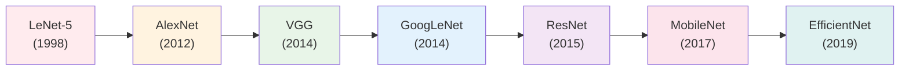

### Learning Design Principles

Each successful architecture teaches us fundamental design principles:

**1. Pattern Recognition:**

- How different architectures solve similar problems
- Common design motifs that appear across successful models
- Trade-offs between accuracy, speed, and memory

**2. Innovation Understanding:**

- What breakthrough insights led to performance gains
- How to identify and adapt successful patterns
- When and why certain designs work better

**3. Practical Implementation:**

- Real-world performance considerations
- Engineering decisions behind successful deployments
- Debugging and optimization strategies

### Building Intuition for Architecture Design

**Why Study Case Studies:**

**Research Inspiration:**

- See how breakthrough ideas emerged
- Understand the motivation behind design choices
- Learn to read and implement research papers

**Practical Application:**

- Choose appropriate architectures for your problems
- Modify existing architectures for specific needs
- Debug and optimize your own models

**Performance Benchmarking:**

- Understand state-of-the-art performance standards
- Know which architectures work best for different tasks
- Set realistic expectations for your projects

### The Learning Methodology

**Systematic Analysis Approach:**

1. **Architecture Overview**: High-level structure and key innovations
2. **Mathematical Details**: Precise layer specifications and calculations
3. **Implementation**: Code examples and practical considerations
4. **Performance Analysis**: Accuracy, speed, and memory characteristics
5. **Use Cases**: When and where to apply each architecture

---

# 2. Classic Networks

## LeNet-5 (1998): The Pioneer

### Historical Context and Model Overview

LeNet-5, developed by **Yann LeCun** and colleagues at Bell Labs, was one of the first successful applications of CNNs to real-world problems. It was specifically designed for **handwritten digit recognition** and established many fundamental CNN principles that we still use today.

- **Goal**: Identify handwritten digits in `32×32×1` grayscale images
- **Published**: 1998
- **Parameters**: ~60,000 (tiny by modern standards)
- **Impact**: First practical CNN deployment, proved CNN viability

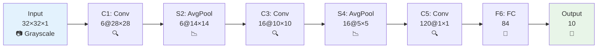

### LeNet-5 Architecture Breakdown

| Layer  | Type    | Input Size | Output Size | Kernel | Stride | Padding | Parameters |
| ------ | ------- | ---------- | ----------- | ------ | ------ | ------- | ---------- |
| Input  | Image   | -          | 32×32×1     | -      | -      | -       | 0          |
| C1     | Conv    | 32×32×1    | 28×28×6     | 5×5    | 1      | 0       | 156        |
| S2     | AvgPool | 28×28×6    | 14×14×6     | 2×2    | 2      | 0       | 0          |
| C3     | Conv    | 14×14×6    | 10×10×16    | 5×5    | 1      | 0       | 2,416      |
| S4     | AvgPool | 10×10×16   | 5×5×16      | 2×2    | 2      | 0       | 0          |
| C5     | Conv    | 5×5×16     | 1×1×120     | 5×5    | 1      | 0       | 48,120     |
| F6     | FC      | 120        | 84          | -      | -      | -       | 10,164     |
| Output | FC      | 84         | 10          | -      | -      | -       | 850        |

**Total Parameters**: ~60,000

### Key Innovations

1. **Hierarchical Feature Learning**: Low-level features (edges) → High-level features (digits)
2. **Parameter Sharing**: Same convolution kernel applied across spatial locations
3. **Subsampling (Pooling)**: Used average pooling for translation invariance

### What We Can Skip <span style="color:red">🔴</span>

<div style="background-color: #ffebee; padding: 10px; border-left: 4px solid #f44336;">

**These details from the original 1998 paper are outdated:**

1. **Activation Functions**: Used sigmoid and tanh instead of ReLU
2. **Complex Connectivity**: Different filters looked at different input channels (modern: full connectivity)
3. **Post-pooling Nonlinearity**: Had sigmoid after pooling (modern: none)
4. **Output Layer**: Used custom classifier instead of softmax

**Why Skip**: These were 1998 hardware/software limitations, not fundamental design principles.

</div>

### LeNet-5 Architecture Pattern

- Image dimensions **decrease** as number of channels **increase**
- `Conv ⇒ Pool ⇒ Conv ⇒ Pool ⇒ FC ⇒ FC ⇒ softmax` - this arrangement is quite common
- Modern implementation uses ReLU in most cases

### LeNet-5 Implementation (Modern Version)

```python
import tensorflow as tf

def create_lenet5():
    model = tf.keras.Sequential([
        # C1: Convolution
        tf.keras.layers.Conv2D(6, (5, 5), activation='relu',  # Modern: ReLU
                              input_shape=(32, 32, 1)),

        # S2: Subsampling (Modern: Max pooling instead of average)
        tf.keras.layers.MaxPooling2D((2, 2)),

        # C3: Convolution
        tf.keras.layers.Conv2D(16, (5, 5), activation='relu'),

        # S4: Subsampling
        tf.keras.layers.MaxPooling2D((2, 2)),

        # C5: Convolution (acts like FC when input is 5×5)
        tf.keras.layers.Conv2D(120, (5, 5), activation='relu'),

        # Flatten for fully connected layers
        tf.keras.layers.Flatten(),

        # F6: Fully connected
        tf.keras.layers.Dense(84, activation='relu'),

        # Output layer (Modern: softmax)
        tf.keras.layers.Dense(10, activation='softmax')
    ])

    return model
```

---

## AlexNet (2012): The Breakthrough

### Revolutionary Impact and Model Overview

AlexNet, named after **Alex Krizhevsky** (first author), marked the beginning of the deep learning revolution in computer vision. It won **ImageNet 2012** by a huge margin and convinced the computer vision community that deep learning was the future.

- **Authors**: Alex Krizhevsky, Ilya Sutskever, Geoffrey Hinton
- **Goal**: ImageNet challenge - classify images into 1000 classes
- **Published**: 2012
- **Parameters**: ~60 million (1000× larger than LeNet-5)
- **Impact**: Sparked the deep learning revolution in computer vision

```mermaid
%%{init: {"theme": "default", "themeVariables": {"primaryColor": "#1f2937", "edgeLabelBackground":"#f9fafb", "primaryTextColor":"#000000", "fontSize": 12}}}%%
graph LR
    A["Input<br/>227×227×3<br/>📷 RGB"] --> B["Conv1<br/>55×55×96<br/>🔍"]
    B --> C["Pool1<br/>27×27×96<br/>📉"]
    C --> D["Conv2<br/>27×27×256<br/>🔍"]
    D --> E["Pool2<br/>13×13×256<br/>📉"]
    E --> F["Conv3<br/>13×13×384<br/>🔍"]
    F --> G["Conv4<br/>13×13×384<br/>🔍"]
    G --> H["Conv5<br/>13×13×256<br/>🔍"]
    H --> I["Pool3<br/>6×6×256<br/>📉"]
    I --> J["FC1<br/>4096<br/>🧠"]
    J --> K["FC2<br/>4096<br/>🧠"]
    K --> L["Output<br/>1000<br/>🎯"]

    style A fill:#e3f2fd
    style L fill:#e8f5e8
```

### AlexNet Architecture Breakdown

| Layer  | Type       | Input Size | Output Size | Kernel | Stride | Padding | Parameters |
| ------ | ---------- | ---------- | ----------- | ------ | ------ | ------- | ---------- |
| Input  | Image      | -          | 227×227×3   | -      | -      | -       | 0          |
| Conv1  | Conv+ReLU  | 227×227×3  | 55×55×96    | 11×11  | 4      | 0       | 34,944     |
| Pool1  | MaxPool    | 55×55×96   | 27×27×96    | 3×3    | 2      | 0       | 0          |
| Conv2  | Conv+ReLU  | 27×27×96   | 27×27×256   | 5×5    | 1      | 2       | 614,656    |
| Pool2  | MaxPool    | 27×27×256  | 13×13×256   | 3×3    | 2      | 0       | 0          |
| Conv3  | Conv+ReLU  | 13×13×256  | 13×13×384   | 3×3    | 1      | 1       | 884,992    |
| Conv4  | Conv+ReLU  | 13×13×384  | 13×13×384   | 3×3    | 1      | 1       | 1,327,488  |
| Conv5  | Conv+ReLU  | 13×13×384  | 13×13×256   | 3×3    | 1      | 1       | 884,992    |
| Pool3  | MaxPool    | 13×13×256  | 6×6×256     | 3×3    | 2      | 0       | 0          |
| FC1    | Dense+ReLU | 9,216      | 4,096       | -      | -      | -       | 37,752,832 |
| FC2    | Dense+ReLU | 4,096      | 4,096       | -      | -      | -       | 16,781,312 |
| Output | Dense      | 4,096      | 1,000       | -      | -      | -       | 4,097,000  |

**Total Parameters**: ~62 million

### Major Innovations

1. **ReLU Activation Function**:

   - First major network to use ReLU instead of tanh/sigmoid
   - Solved vanishing gradient problem
   - Faster training convergence

2. **Dropout Regularization**:

   - Randomly set 50% of neurons to zero during training
   - Significantly reduced overfitting
   - Improved generalization

3. **Data Augmentation**:

   - Random crops, horizontal flips, color jittering
   - Artificially increased dataset size
   - Better robustness to variations

4. **GPU Implementation**:

   - Parallel processing on multiple GPUs
   - Made training feasible for large networks
   - Established GPU as essential for deep learning

5. **Max Pooling**:
   - Replaced LeNet's average pooling with max pooling
   - Better preservation of important features

### Architecture Summary

```
Conv ⇒ Max-pool ⇒ Conv ⇒ Max-pool ⇒ Conv ⇒ Conv ⇒ Conv ⇒ Max-pool ⇒ FC ⇒ FC ⇒ Softmax
```

- Similar to LeNet-5 but **much bigger**
- Has 60 Million parameters compared to 60k parameters of LeNet-5
- Used ReLU activation function (major improvement)

### What We Can Skip <span style="color:red">🔴</span>

<div style="background-color: #ffebee; padding: 10px; border-left: 4px solid #f44336;">

**These details are specific to 2012 hardware constraints:**

1. **Multiple GPUs**: Complex layer splitting across two GTX 580s (modern GPUs have much more memory)
2. **Local Response Normalization (LRN)**: Normalization technique that research proved doesn't help much
3. **Specific GPU Architecture**: Hardware limitations that no longer apply

**Why Skip**: These were 2012 hardware limitations, not fundamental design principles that we should focus on.

</div>

### AlexNet Implementation

```python
def create_alexnet():
    model = tf.keras.Sequential([
        # Conv1: Large filters to capture low-level features
        tf.keras.layers.Conv2D(96, (11, 11), strides=4, activation='relu',
                              input_shape=(227, 227, 3)),
        tf.keras.layers.MaxPooling2D((3, 3), strides=2),

        # Conv2: Smaller filters, more feature maps
        tf.keras.layers.Conv2D(256, (5, 5), padding='same', activation='relu'),
        tf.keras.layers.MaxPooling2D((3, 3), strides=2),

        # Conv3: Even smaller filters
        tf.keras.layers.Conv2D(384, (3, 3), padding='same', activation='relu'),

        # Conv4: Same size, deeper processing
        tf.keras.layers.Conv2D(384, (3, 3), padding='same', activation='relu'),

        # Conv5: Reduce feature maps
        tf.keras.layers.Conv2D(256, (3, 3), padding='same', activation='relu'),
        tf.keras.layers.MaxPooling2D((3, 3), strides=2),

        # Flatten for dense layers
        tf.keras.layers.Flatten(),

        # FC layers with dropout
        tf.keras.layers.Dense(4096, activation='relu'),
        tf.keras.layers.Dropout(0.5),
        tf.keras.layers.Dense(4096, activation='relu'),
        tf.keras.layers.Dropout(0.5),

        # Output layer
        tf.keras.layers.Dense(1000, activation='softmax')
    ])

    return model
```

---

## VGG (2014): Simplicity and Depth

### Design Philosophy and Model Overview

VGG, developed by **Karen Simonyan** and **Andrew Zisserman**, demonstrated that using very small (3×3) filters consistently throughout the network could achieve excellent performance while being conceptually much simpler than AlexNet.

- **Goal**: Simplify AlexNet - instead of many hyperparameters, use simple rules
- **Published**: 2014
- **Key Insight**: Focus on only these blocks:
  - **CONV** = 3×3 filter, stride = 1, same padding
  - **MAX-POOL** = 2×2, stride = 2
- **Parameters**: VGG-16 has ~138 million parameters (large even by modern standards)

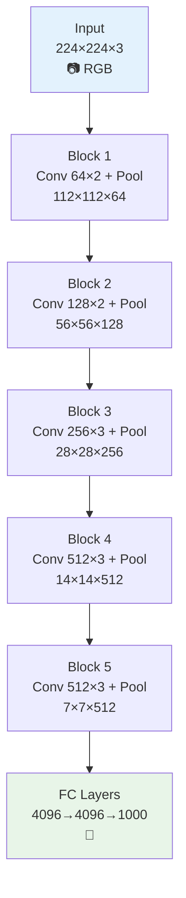

### VGG-16 Architecture Breakdown

| Block   | Layers        | Input Size | Output Size | Filters | Conv Layers |
| ------- | ------------- | ---------- | ----------- | ------- | ----------- |
| Input   | -             | -          | 224×224×3   | -       | 0           |
| Block 1 | Conv×2 + Pool | 224×224×3  | 112×112×64  | 64      | 2           |
| Block 2 | Conv×2 + Pool | 112×112×64 | 56×56×128   | 128     | 2           |
| Block 3 | Conv×3 + Pool | 56×56×128  | 28×28×256   | 256     | 3           |
| Block 4 | Conv×3 + Pool | 28×28×256  | 14×14×512   | 512     | 3           |
| Block 5 | Conv×3 + Pool | 14×14×512  | 7×7×512     | 512     | 3           |
| FC      | Dense×3       | 25,088     | 1000        | -       | 0           |

**Total Convolutional Layers**: 13  
**Total Layers with Parameters**: 16 (13 Conv + 3 FC) → **VGG-16**

### Key Design Principles

#### 1. 3×3 Convolution Supremacy

**Mathematical Insight**:

- Two 3×3 convolutions = one 5×5 convolution (same receptive field)
- Three 3×3 convolutions = one 7×7 convolution
- **BUT**: Fewer parameters + more non-linearity

```
Single 7×7 convolution: 7² = 49 parameters per filter
Three 3×3 convolutions: 3×(3²) = 27 parameters per filter
Parameter reduction: 45% fewer parameters, same receptive field!
```

#### 2. Systematic Architecture Rules

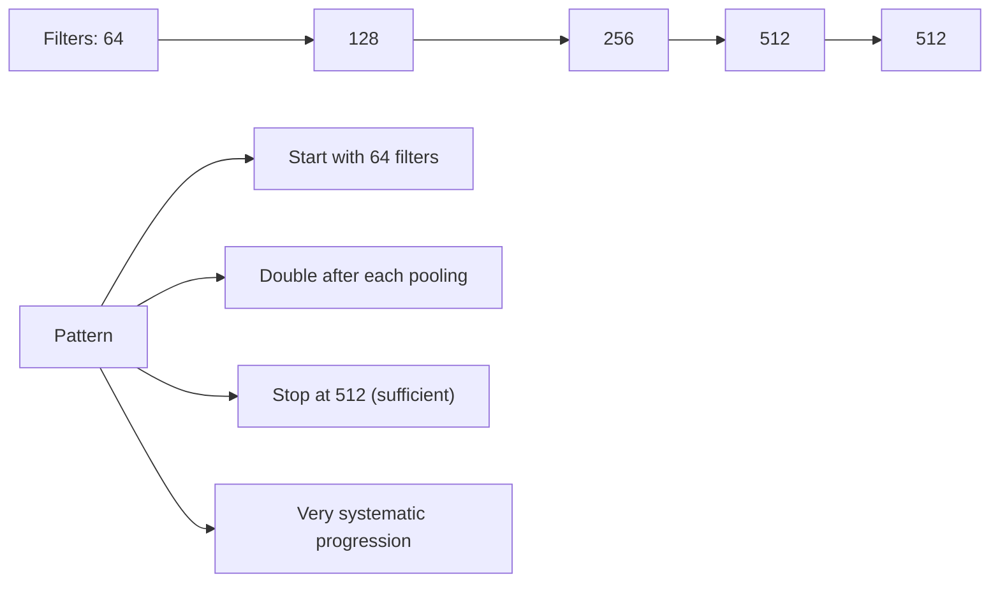

- **All convolutions**: 3×3 filters, stride 1, padding 1 ("same")
- **All pooling**: 2×2 filters, stride 2, no padding
- **Filter doubling**: 64 → 128 → 256 → 512 → 512

#### 3. Network Statistics

- **Total Memory**: 96MB per image for forward propagation only!
  - Most memory used in **earlier layers** (large spatial dimensions)
- **Parameter Distribution**:
  - Most parameters in **fully connected layers** (~90%)
  - Convolutional layers relatively parameter-efficient
- **Pooling Responsibility**: Only pooling layers reduce spatial dimensions

### VGG Variants

- **VGG-16**: 13 Conv + 3 FC = 16 layers with parameters
- **VGG-19**: 16 Conv + 3 FC = 19 layers with parameters
- Most people use **VGG-16** instead of VGG-19 because performance is nearly identical

### Why VGG Architecture is Attractive

1. **Simplicity**: Very systematic design rules
2. **Uniformity**: Same operations repeated throughout
3. **Depth**: Much deeper than previous networks (16-19 layers)
4. **Performance**: Excellent results on ImageNet
5. **Guidelines**: Established CNN design principles still used today

### VGG-16 Implementation

```python
def create_vgg16():
    model = tf.keras.Sequential([
        # Block 1
        tf.keras.layers.Conv2D(64, (3, 3), activation='relu', padding='same',
                              input_shape=(224, 224, 3)),
        tf.keras.layers.Conv2D(64, (3, 3), activation='relu', padding='same'),
        tf.keras.layers.MaxPooling2D((2, 2), strides=2),

        # Block 2
        tf.keras.layers.Conv2D(128, (3, 3), activation='relu', padding='same'),
        tf.keras.layers.Conv2D(128, (3, 3), activation='relu', padding='same'),
        tf.keras.layers.MaxPooling2D((2, 2), strides=2),

        # Block 3
        tf.keras.layers.Conv2D(256, (3, 3), activation='relu', padding='same'),
        tf.keras.layers.Conv2D(256, (3, 3), activation='relu', padding='same'),
        tf.keras.layers.Conv2D(256, (3, 3), activation='relu', padding='same'),
        tf.keras.layers.MaxPooling2D((2, 2), strides=2),

        # Block 4
        tf.keras.layers.Conv2D(512, (3, 3), activation='relu', padding='same'),
        tf.keras.layers.Conv2D(512, (3, 3), activation='relu', padding='same'),
        tf.keras.layers.Conv2D(512, (3, 3), activation='relu', padding='same'),
        tf.keras.layers.MaxPooling2D((2, 2), strides=2),

        # Block 5
        tf.keras.layers.Conv2D(512, (3, 3), activation='relu', padding='same'),
        tf.keras.layers.Conv2D(512, (3, 3), activation='relu', padding='same'),
        tf.keras.layers.Conv2D(512, (3, 3), activation='relu', padding='same'),
        tf.keras.layers.MaxPooling2D((2, 2), strides=2),

        # Classifier
        tf.keras.layers.Flatten(),
        tf.keras.layers.Dense(4096, activation='relu'),
        tf.keras.layers.Dropout(0.5),
        tf.keras.layers.Dense(4096, activation='relu'),
        tf.keras.layers.Dropout(0.5),
        tf.keras.layers.Dense(1000, activation='softmax')
    ])

    return model
```

---

## Performance Comparison Summary

| Architecture | Year | Parameters | ImageNet Top-1 Error | ImageNet Top-5 Error | Key Innovation           |
| ------------ | ---- | ---------- | -------------------- | -------------------- | ------------------------ |
| **LeNet-5**  | 1998 | 60K        | N/A (MNIST only)     | N/A (MNIST only)     | First CNN success        |
| **AlexNet**  | 2012 | 62M        | 40.7%                | 18.2%                | Deep learning revolution |
| **VGG-16**   | 2014 | 138M       | 28.1%                | 9.9%                 | Systematic design        |
| **VGG-19**   | 2014 | 144M       | 27.3%                | 9.0%                 | Even deeper              |

### Evolution Patterns

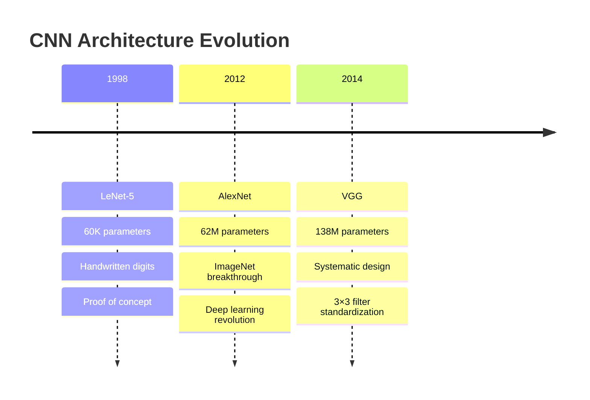

### Common Design Patterns Established

1. **Spatial-Channel Trade-off**: As we go deeper, height & width decrease while channels increase
2. **Conv-Pool Alternation**: Convolutional layers followed by pooling for dimension reduction
3. **Hierarchical Features**: Low-level → Mid-level → High-level feature learning
4. **Parameter Concentration**: Most parameters typically in fully connected layers

### Modern Relevance

These classic networks established principles still used today:

- **LeNet**: Parameter sharing, local connectivity concepts
- **AlexNet**: ReLU activation, dropout, GPU training, data augmentation
- **VGG**: Systematic design, 3×3 filters became standard

They remain important for:

- **Transfer Learning**: Pre-trained weights still useful
- **Educational Value**: Understanding architectural evolution
- **Baseline Comparisons**: Standard benchmarks for new methods
- **Design Intuition**: Principles guide modern architecture design

---

## Layer Counting Convention

### Important Note on Layer Numbering

There are two conventions for counting layers. We use **Convention 2** (counting only learnable layers):

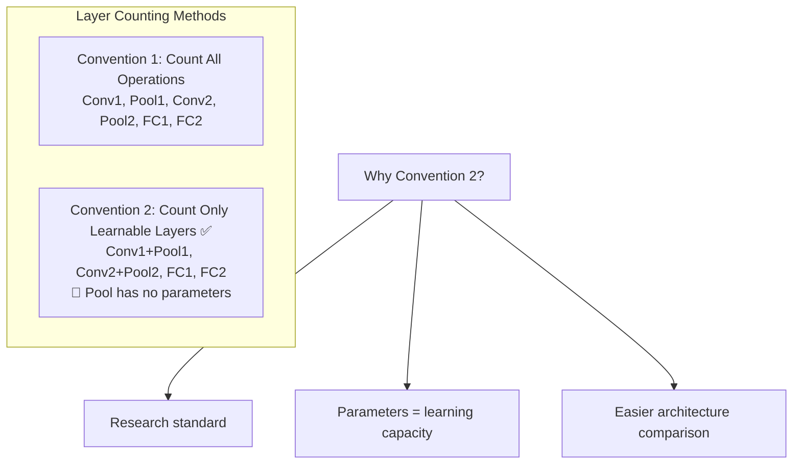

**Key Point**: A Conv1 and Pool1 combination is treated as **one layer** because pooling has no learnable parameters.

---

## Summary

These three classic networks laid the foundation for modern CNN design:

- **LeNet-5 (1998)**: Proved CNNs work, established basic principles
- **AlexNet (2012)**: Sparked deep learning revolution, introduced key techniques
- **VGG (2014)**: Simplified and systematized design, established 3×3 as standard

Understanding these classics provides essential intuition for working with any CNN architecture, from basic classifiers to state-of-the-art vision systems. The core principles they established - hierarchical feature learning, systematic design patterns, and architectural choices - remain relevant in modern computer vision research.

# 3. ResNets

## The Deep Network Problem

Before ResNets, training very deep neural networks (50+ layers) was problematic due to the **vanishing and exploding gradient problems**. Surprisingly, as networks got deeper, performance would actually get **worse**, not due to overfitting, but due to fundamental training difficulties.

### The Counterintuitive Discovery

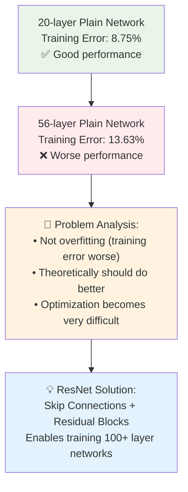

**Key Insight**: In theory, a deeper network should always perform at least as well as a shallower one (it could learn the identity function). In practice, very deep plain networks become impossible to train effectively.

**Empirical Evidence**:

- **20-layer network**: 8.75% training error
- **56-layer network**: 13.63% training error
- **Problem**: Training error actually **increased** with depth!

## What is a Residual Block?

A **residual block** is the fundamental building block of ResNet that introduces **skip connections** (also called **shortcut connections**) to allow information to flow directly from earlier layers to later layers, bypassing intermediate computations.

### Plain Network vs Residual Block

#### Traditional Plain Network Block

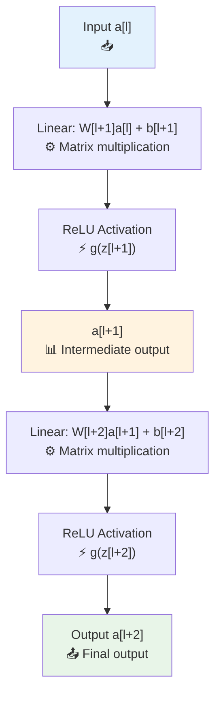

**Mathematical Flow:**

1. $z^{[l+1]} = W^{[l+1]}a^{[l]} + b^{[l+1]}$
2. $a^{[l+1]} = g(z^{[l+1]})$ where $g$ is ReLU
3. $z^{[l+2]} = W^{[l+2]}a^{[l+1]} + b^{[l+2]}$
4. $a^{[l+2]} = g(z^{[l+2]})$

#### Residual Block with Skip Connection

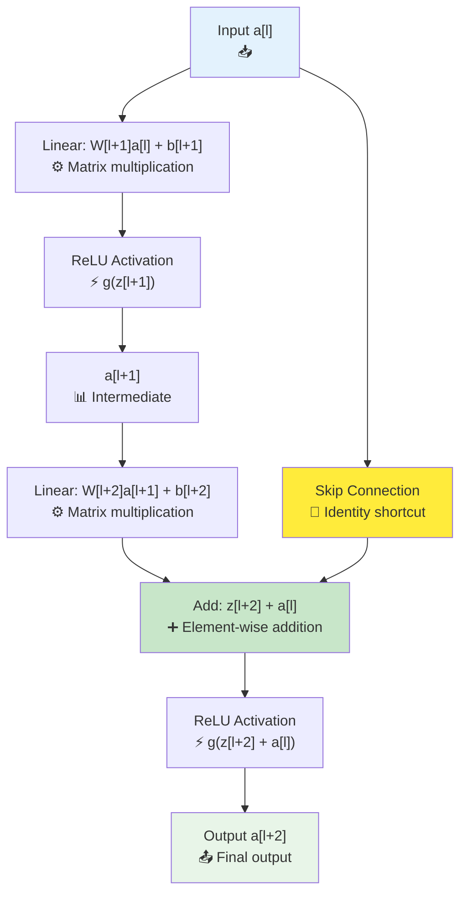

**Key Change**: The skip connection adds the original input $a^{[l]}$ directly to the output before the final activation:

$$a^{[l+2]} = g(z^{[l+2]} + a^{[l]})$$
$$a^{[l+2]} = g(W^{[l+2]}a^{[l+1]} + b^{[l+2]} + a^{[l]})$$

### Extra notes

We are **not actually skipping** the computation of $a^{[l+1]}$.

Let me clarify the terminology:

#### What "Skip Connection" Really Means

The term **"skip connection"** refers to the fact that the input $a^{[l]}$ **skips over** the intermediate layers and gets added directly to the output, but you're correct that we still need to compute all the intermediate values.

#### The Complete Flow:

1.  **Compute $a^{[l+1]}$** (we must do this):

    - $z^{[l+1]} = W^{[l+1]}a^{[l]} + b^{[l+1]}$
    - $a^{[l+1]} = g(z^{[l+1]})$

2.  **Compute $z^{[l+2]}$** (we must do this too):

    - $z^{[l+2]} = W^{[l+2]}a^{[l+1]} + b^{[l+2]}$

3.  **The "skip" happens here**: Instead of just applying activation to $z^{[l+2]}$, we add the original input:

    - $a^{[l+2]} = g(z^{[l+2]} + a^{[l]})$

#### Why It's Called "Skip"

The term "skip" refers to the fact that $a^{[l]}$ **bypasses** the transformations and gets added directly to the final result. It's not that we skip the computation, but rather that the original input **takes a shortcut** to the output.

Think of it like this:

- **Main path**: $a^{[l]} \rightarrow a^{[l+1]} \rightarrow z^{[l+2]}$ (normal processing)
- **Skip path**: $a^{[l]}$ goes directly to be added at the end
- **Final result**: Combines both paths

#### Visual Representation:

```
a[l] ──┬─→ [Layer l+1] ─→ [Layer l+2] ─→ z[l+2] ─┬─→ g(z[l+2] + a[l]) = a[l+2]
       │                                          │
       └──────────── skip connection ─────────────┘

```

we still compute everything, but the "skip" refers to how the original input bypasses the transformations to be added at the end. The computational cost is actually **slightly higher** than a plain network because we have the additional element-wise addition operation!

### Why Skip Connections Work: Intuitive Explanation

#### Learning Identity Functions

**The Problem**: Deep networks struggle to learn identity mappings (where output = input)

**The Solution**: With skip connections, the network only needs to learn the **residual** (the difference):

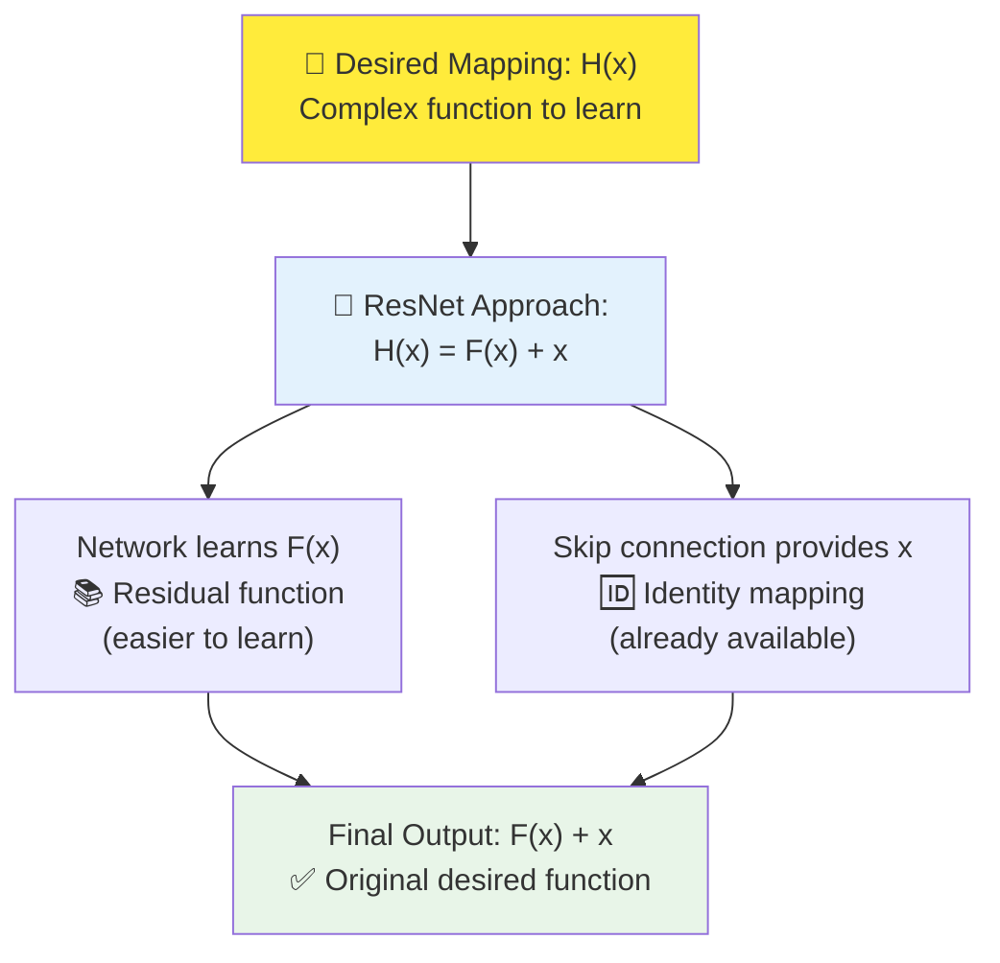

**Mathematical Insight**:

- **Traditional**: Learn $H(x)$ directly (difficult for deep networks)
- **ResNet**: Learn $F(x) = H(x) - x$, then compute $H(x) = F(x) + x$
- **If identity is optimal**: $F(x) = 0$ (easier to learn than $H(x) = x$)

#### Gradient Flow Benefits

**Problem with Deep Networks**: Gradients vanish as they propagate backwards

**ResNet Solution**: Skip connections provide **gradient highways**:

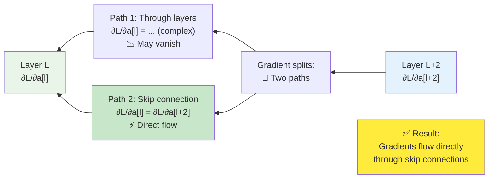

**Gradient Equation**:
$$\frac{\partial L}{\partial a^{[l]}} = \frac{\partial L}{\partial a^{[l+2]}} \cdot \frac{\partial a^{[l+2]}}{\partial a^{[l]}}$$

With skip connections:
$$\frac{\partial a^{[l+2]}}{\partial a^{[l]}} = \frac{\partial}{\partial a^{[l]}}(F(a^{[l]}) + a^{[l]}) = \frac{\partial F(a^{[l]})}{\partial a^{[l]}} + 1$$

The "$+ 1$" term ensures gradients can flow directly without vanishing!

## Detailed ResNet Architecture

### ResNet Building Blocks

#### Basic Block (ResNet-18, ResNet-34)

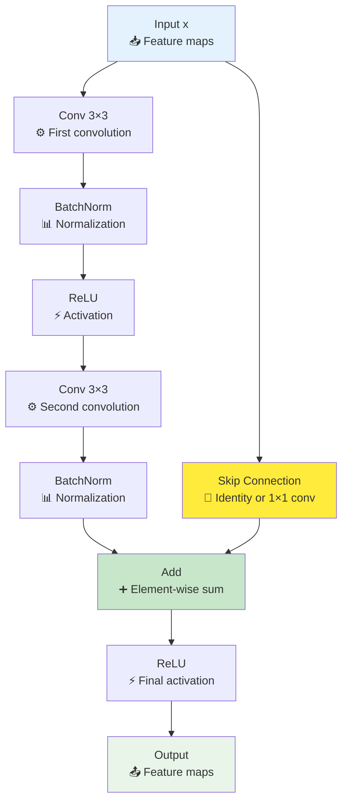

**Structure**: `x → [Conv3×3] → [BN] → [ReLU] → [Conv3×3] → [BN] → [+] → [ReLU]`

- **Parameters per block**: ~74K (for 64 filters)
- **Depth**: 2 convolutional layers per block

#### Bottleneck Block (ResNet-50, ResNet-101, ResNet-152)

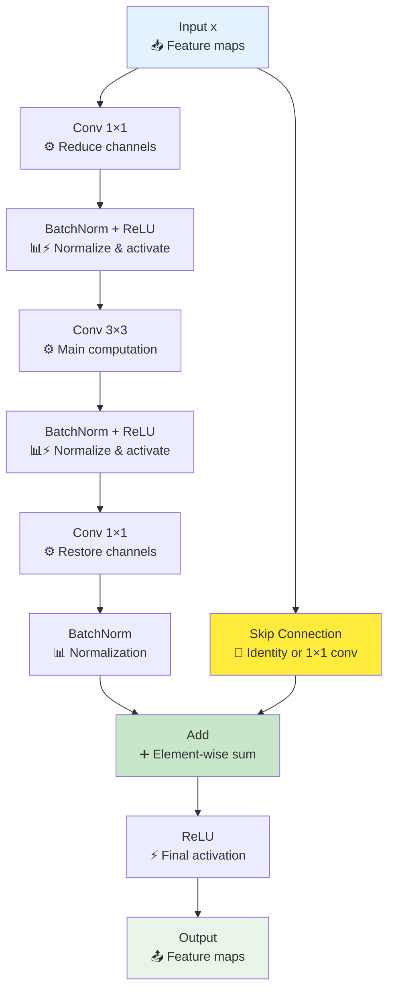

**Structure**: `x → [Conv1×1] → [BN+ReLU] → [Conv3×3] → [BN+ReLU] → [Conv1×1] → [BN] → [+] → [ReLU]`

- **Purpose**: Reduce parameters while maintaining performance
- **1×1 convolutions**: Reduce → Process → Restore channel dimensions

### ResNet Family Overview

```mermaid
%%{init: {"theme": "default", "themeVariables": {"primaryColor": "#1f2937", "edgeLabelBackground":"#f9fafb", "primaryTextColor":"#000000", "fontSize": 12}}}%%
graph LR
    A["Input<br/>224×224×3<br/>📷"] --> B["Conv1<br/>112×112×64<br/>7×7, stride=2"]
    B --> C["MaxPool<br/>56×56×64<br/>3×3, stride=2"]
    C --> D["Stage 1<br/>56×56×64<br/>Residual blocks"]
    D --> E["Stage 2<br/>28×28×128<br/>Residual blocks"]
    E --> F["Stage 3<br/>14×14×256<br/>Residual blocks"]
    F --> G["Stage 4<br/>7×7×512<br/>Residual blocks"]
    G --> H["Global AvgPool<br/>1×1×512<br/>Spatial averaging"]
    H --> I["FC Layer<br/>1000 classes<br/>🎯 Classification"]

    style A fill:#e3f2fd
    style I fill:#e8f5e8
```

### ResNet Variants Comparison

| Model          | Layers | Block Type | Blocks per Stage | Parameters | Top-1 Error | Top-5 Error |
| -------------- | ------ | ---------- | ---------------- | ---------- | ----------- | ----------- |
| **ResNet-18**  | 18     | Basic      | [2,2,2,2]        | 11.7M      | 30.24%      | 10.92%      |
| **ResNet-34**  | 34     | Basic      | [3,4,6,3]        | 21.8M      | 26.70%      | 8.58%       |
| **ResNet-50**  | 50     | Bottleneck | [3,4,6,3]        | 25.6M      | 23.85%      | 7.13%       |
| **ResNet-101** | 101    | Bottleneck | [3,4,23,3]       | 44.5M      | 22.63%      | 6.44%       |
| **ResNet-152** | 152    | Bottleneck | [3,8,36,3]       | 60.2M      | 21.69%      | 5.94%       |

### When to Use Projection Shortcuts

**Problem**: Skip connections require input and output to have **same dimensions**

**Solution**: Use **projection shortcuts** when dimensions don't match:

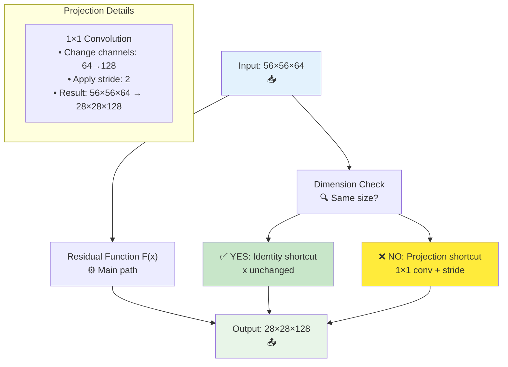

**When Projection is Needed**:

1. **Spatial downsampling**: stride > 1 (e.g., 56×56 → 28×28)
2. **Channel increase**: Different number of filters (e.g., 64 → 128)

## Complete Implementation Example

### Basic ResNet Block Implementation

```python
import tensorflow as tf

def basic_block(x, filters, stride=1, projection=False):
    """
    Basic residual block for ResNet-18/34

    Args:
        x: Input tensor
        filters: Number of output filters
        stride: Stride for first convolution (default=1)
        projection: Whether to use projection shortcut
    """
    # Save input for skip connection
    shortcut = x

    # Main path - First convolution
    x = tf.keras.layers.Conv2D(
        filters, 3, strides=stride, padding='same',
        kernel_initializer='he_normal'
    )(x)
    x = tf.keras.layers.BatchNormalization()(x)
    x = tf.keras.layers.ReLU()(x)

    # Main path - Second convolution
    x = tf.keras.layers.Conv2D(
        filters, 3, padding='same',
        kernel_initializer='he_normal'
    )(x)
    x = tf.keras.layers.BatchNormalization()(x)

    # Skip connection with projection if needed
    if stride != 1 or shortcut.shape[-1] != filters:
        shortcut = tf.keras.layers.Conv2D(
            filters, 1, strides=stride,
            kernel_initializer='he_normal'
        )(shortcut)
        shortcut = tf.keras.layers.BatchNormalization()(shortcut)

    # Add skip connection and apply final ReLU
    x = tf.keras.layers.Add()([x, shortcut])
    x = tf.keras.layers.ReLU()(x)

    return x

def bottleneck_block(x, filters, stride=1):
    """
    Bottleneck residual block for ResNet-50/101/152

    Args:
        x: Input tensor
        filters: Number of filters for 3x3 conv (output will be 4*filters)
        stride: Stride for 3x3 convolution
    """
    # Save input for skip connection
    shortcut = x

    # Main path - 1x1 conv (reduce)
    x = tf.keras.layers.Conv2D(filters, 1, kernel_initializer='he_normal')(x)
    x = tf.keras.layers.BatchNormalization()(x)
    x = tf.keras.layers.ReLU()(x)

    # Main path - 3x3 conv (main computation)
    x = tf.keras.layers.Conv2D(
        filters, 3, strides=stride, padding='same',
        kernel_initializer='he_normal'
    )(x)
    x = tf.keras.layers.BatchNormalization()(x)
    x = tf.keras.layers.ReLU()(x)

    # Main path - 1x1 conv (restore)
    x = tf.keras.layers.Conv2D(
        filters * 4, 1, kernel_initializer='he_normal'
    )(x)
    x = tf.keras.layers.BatchNormalization()(x)

    # Skip connection with projection if needed
    if stride != 1 or shortcut.shape[-1] != filters * 4:
        shortcut = tf.keras.layers.Conv2D(
            filters * 4, 1, strides=stride,
            kernel_initializer='he_normal'
        )(shortcut)
        shortcut = tf.keras.layers.BatchNormalization()(shortcut)

    # Add skip connection and apply final ReLU
    x = tf.keras.layers.Add()([x, shortcut])
    x = tf.keras.layers.ReLU()(x)

    return x
```

### Complete ResNet-18 Implementation

```python
def create_resnet18(input_shape=(224, 224, 3), num_classes=1000):
    """
    Create ResNet-18 architecture
    """
    # Input
    inputs = tf.keras.layers.Input(shape=input_shape)

    # Initial convolution and pooling
    x = tf.keras.layers.Conv2D(
        64, 7, strides=2, padding='same',
        kernel_initializer='he_normal'
    )(inputs)
    x = tf.keras.layers.BatchNormalization()(x)
    x = tf.keras.layers.ReLU()(x)
    x = tf.keras.layers.MaxPooling2D(3, strides=2, padding='same')(x)

    # Stage 1: 64 filters, 2 blocks
    x = basic_block(x, 64, stride=1)
    x = basic_block(x, 64, stride=1)

    # Stage 2: 128 filters, 2 blocks
    x = basic_block(x, 128, stride=2)  # Downsample
    x = basic_block(x, 128, stride=1)

    # Stage 3: 256 filters, 2 blocks
    x = basic_block(x, 256, stride=2)  # Downsample
    x = basic_block(x, 256, stride=1)

    # Stage 4: 512 filters, 2 blocks
    x = basic_block(x, 512, stride=2)  # Downsample
    x = basic_block(x, 512, stride=1)

    # Global average pooling and classification
    x = tf.keras.layers.GlobalAveragePooling2D()(x)
    x = tf.keras.layers.Dense(
        num_classes, activation='softmax',
        kernel_initializer='he_normal'
    )(x)

    model = tf.keras.Model(inputs, x, name='resnet18')
    return model

# Create and compile model
model = create_resnet18()
model.compile(
    optimizer='adam',
    loss='sparse_categorical_crossentropy',
    metrics=['accuracy']
)

print(f"Total parameters: {model.count_params():,}")
model.summary()
```

## Why ResNets Work: Detailed Analysis

### 1. Identity Function Learning

**Traditional Network Challenge**:

```python
# Learning identity: f(x) = x is surprisingly hard for deep networks
# Network must learn: W₁ * W₂ * ... * Wₙ ≈ I (identity matrix)
# Small deviations compound through many layers
```

**ResNet Solution**:

```python
# With skip connections: f(x) = F(x) + x
# To learn identity: F(x) = 0 (much easier!)
# Weight initialization naturally starts near zero
```

### 2. Gradient Flow Analysis

**Vanishing Gradient in Plain Networks**:
$$\frac{\partial L}{\partial W_1} = \frac{\partial L}{\partial a_n} \prod_{i=2}^{n} \frac{\partial a_i}{\partial a_{i-1}}$$

If $\frac{\partial a_i}{\partial a_{i-1}} < 1$, the product vanishes exponentially.

**ResNet Gradient Flow**:
$$\frac{\partial L}{\partial a_l} = \frac{\partial L}{\partial a_{l+2}} \left(1 + \frac{\partial F(a_l)}{\partial a_l}\right)$$

The "+1" term ensures gradients can flow directly, preventing vanishing.

### 3. Ensemble Interpretation

**Interesting Perspective**: ResNet can be viewed as an ensemble of shorter networks:

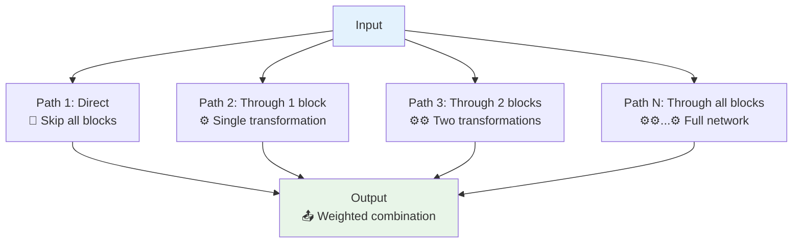

**Mathematical View**:

- Each residual block adds a new "path" through the network
- Final output is weighted sum of all possible paths
- Network automatically learns to emphasize useful paths

## ResNet Performance Analysis

### Training Behavior Comparison

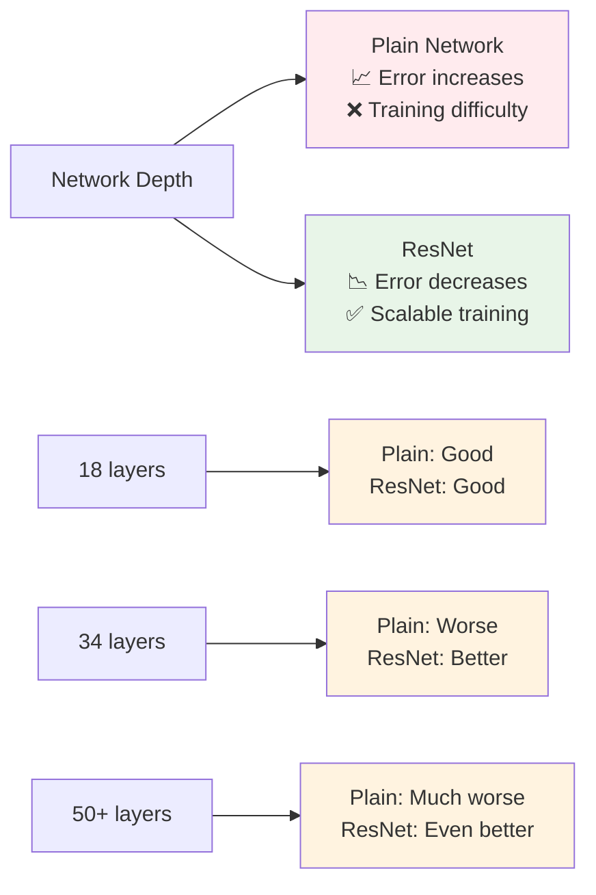

### Practical Benefits

1. **Scalability**: Can train networks with 100+ layers effectively
2. **Convergence**: Faster and more stable training
3. **Transfer Learning**: Excellent pre-trained features
4. **Versatility**: Works well across different computer vision tasks

### Modern Impact

ResNets revolutionized deep learning and influenced virtually all subsequent architectures:

- **Direct descendants**: ResNeXt, Wide ResNet, DenseNet
- **Attention mechanisms**: Transformers use residual connections
- **Object detection**: Backbone for YOLO, R-CNN families
- **Image segmentation**: U-Net with skip connections
- **Beyond vision**: Used in NLP, speech, and other domains

## Summary

ResNets solved the fundamental problem of training very deep neural networks through the elegant innovation of **skip connections**:

### Key Innovations:

1. **Residual blocks** with skip connections
2. **Identity mappings** that preserve gradient flow
3. **Projection shortcuts** for dimension matching
4. **Systematic architecture** design principles

### Why It Works:

- **Easier optimization**: Learning residuals instead of direct mappings
- **Gradient highways**: Direct paths for gradient flow
- **Flexible depth**: Can add layers without degrading performance
- **Empirical success**: Consistent improvements across tasks

### Impact:

- Enabled training of 100+ layer networks
- Won ImageNet 2015 with 152-layer network
- Became foundation for modern computer vision
- Skip connections now standard in deep learning

ResNets demonstrated that architectural innovations can solve fundamental optimization problems, paving the way for the extremely deep networks that power today's AI systems.

# 4. Why ResNets Work?

## The Core Question

Why do ResNets work so well? The key insight is that skip connections make it **easier for networks to learn the identity function** when deeper layers aren't needed, while still allowing them to learn useful transformations when they are beneficial.

### The Problem with Deep Plain Networks

Very deep networks have trouble learning even simple functions like the identity mapping, which leads to the **degradation problem** where deeper networks perform worse than shallower ones.

## Mathematical Intuition Behind ResNets

### The Identity Function Learning Problem

**Traditional Deep Network Challenge:**

When you want a layer to learn the identity function $H(x) = x$, the network must:

- Set all weights to form an identity transformation
- This is surprisingly difficult for deep networks due to compound errors

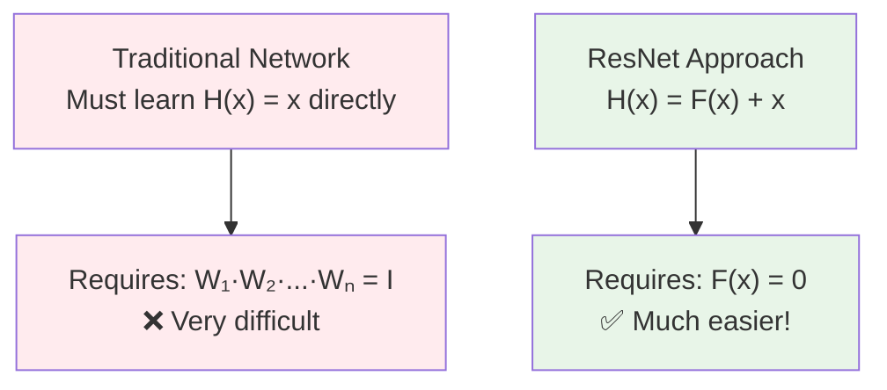

### The ResNet Solution: Learning Residuals

**ResNet Reformulation:**
$$H(x) = F(x) + x$$

Where:

- $H(x)$ = desired output
- $F(x)$ = residual function (what the layers learn)
- $x$ = input (identity shortcut)

**Key Insight**: Instead of learning $H(x)$ directly, learn the residual $F(x) = H(x) - x$

## Detailed Example Walkthrough

Let's trace through exactly what happens when we add residual blocks to make a network deeper:

### Scenario Setup

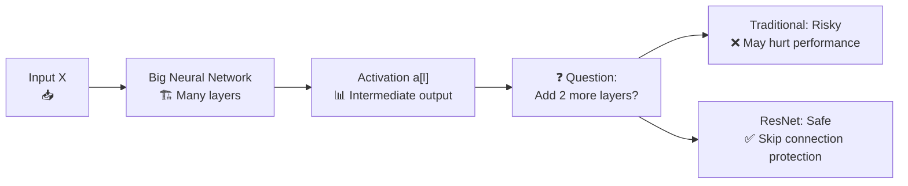

**Starting Point:** We have a big neural network that outputs activation $a^{[l]}$

**Goal:** Add two more layers to get $a^{[l+2]}$ without hurting performance

### The ResNet Magic

**With Skip Connection:**
$$a^{[l+2]} = g(z^{[l+2]} + a^{[l]})$$

**Expanded Form:**
$$a^{[l+2]} = g(W^{[l+2]}a^{[l+1]} + b^{[l+2]} + a^{[l]})$$

### Case Analysis: When Identity is Optimal

**Assumption:** We're using ReLU activations (outputs ≥ 0)

**Key Scenario:** What if the added layers should learn identity?

**With L2 Regularization:**

- Weights $W^{[l+2]}$ get pushed toward 0
- Biases $b^{[l+2]}$ also get pushed toward 0

**When $W^{[l+2]} = 0$ and $b^{[l+2]} = 0$:**

$$a^{[l+2]} = g(0 \cdot a^{[l+1]} + 0 + a^{[l]}) = g(a^{[l]})$$

**Since $a^{[l]} \geq 0$ (ReLU outputs) and $g$ is ReLU:**
$$a^{[l+2]} = g(a^{[l]}) = a^{[l]}$$

**Result:** Perfect identity function! $a^{[l+2]} = a^{[l]}$

```mermaid
%%{init: {"theme": "default", "themeVariables": {"primaryColor": "#1f2937", "edgeLabelBackground":"#f9fafb", "primaryTextColor":"#000000", "fontSize": 12}}}%%
graph TD
    A["L2 Regularization<br/>Pushes weights to 0"] --> B["W[l+2] → 0<br/>b[l+2] → 0"]

    B --> C["z[l+2] = 0·a[l+1] + 0 = 0"]

    C --> D["a[l+2] = g(0 + a[l]) = g(a[l])"]

    D --> E["Since a[l] ≥ 0 (ReLU outputs)<br/>g(a[l]) = a[l]"]

    E --> F["✅ Perfect Identity:<br/>a[l+2] = a[l]"]

    style F fill:#e8f5e8
```

## Why This Solves the Deep Network Problem

### The Performance Guarantee

**Key Insight:** Adding residual blocks provides a **performance floor**

1. **Worst Case:** The added layers learn identity → performance doesn't hurt
2. **Best Case:** The added layers learn something useful → performance improves
3. **No Risk:** Can't perform worse than the original shallower network

```mermaid
%%{init: {"theme": "default", "themeVariables": {"primaryColor": "#1f2937", "edgeLabelBackground":"#f9fafb", "primaryTextColor":"#000000", "fontSize": 12}}}%%
graph TD
    A["Add Residual Block"] --> B["Two Outcomes"]

    B --> C["Scenario 1:<br/>Layers learn identity<br/>🔒 Performance preserved"]
    B --> D["Scenario 2:<br/>Layers learn useful features<br/>📈 Performance improved"]

    C --> E["Guarantee:<br/>Never worse than<br/>shallower network"]
    D --> E

    style E fill:#e8f5e8
```

### Contrast with Plain Networks

**Plain Networks:**

- Adding layers can hurt performance
- Must learn complex transformations from scratch
- No safety net if optimization fails

**ResNets:**

- Adding layers has built-in safety net
- Can always fall back to identity
- Much easier optimization landscape

## Dimension Matching in Practice

### The Dimension Problem

For skip connections to work, we need:
$$a^{[l+2]} = g(z^{[l+2]} + a^{[l]})$$

This requires $z^{[l+2]}$ and $a^{[l]}$ to have **same dimensions**.

### Solution Strategies

#### Case 1: Same Dimensions ✅

```mermaid
%%{init: {"theme": "default", "themeVariables": {"primaryColor": "#1f2937", "edgeLabelBackground":"#f9fafb", "primaryTextColor":"#000000", "fontSize": 12}}}%%
graph LR
    A["a[l]: 56×56×128<br/>📐 Input"] --> B["Residual Function<br/>⚙️ F(x)"]
    A --> C["Identity Shortcut<br/>🔀 Direct path"]
    B --> D["z[l+2]: 56×56×128<br/>📐 Same size"]
    C --> E["a[l]: 56×56×128<br/>📐 Same size"]
    D --> F["Add ➕<br/>Element-wise"]
    E --> F
    F --> G["a[l+2]: 56×56×128<br/>📤 Output"]

    style A fill:#e3f2fd
    style G fill:#e8f5e8
    style F fill:#c8e6c9
```

**Use:** Identity shortcut (no extra parameters)

#### Case 2: Different Dimensions ⚠️

```mermaid
%%{init: {"theme": "default", "themeVariables": {"primaryColor": "#1f2937", "edgeLabelBackground":"#f9fafb", "primaryTextColor":"#000000", "fontSize": 12}}}%%
graph LR
    A["a[l]: 56×56×128<br/>📐 Input"] --> B["Residual Function<br/>⚙️ F(x) with stride"]
    A --> C["Projection Shortcut<br/>🔧 Ws matrix"]
    B --> D["z[l+2]: 28×28×256<br/>📐 Different size"]
    C --> E["Ws·a[l]: 28×28×256<br/>📐 Projected to match"]
    D --> F["Add ➕<br/>Element-wise"]
    E --> F
    F --> G["a[l+2]: 28×28×256<br/>📤 Output"]

    style A fill:#e3f2fd
    style G fill:#e8f5e8
    style C fill:#ffeb3b
    style F fill:#c8e6c9
```

**Use:** Projection shortcut with matrix $W_s$

### Projection Options

**Option 1: Learnable Projection**
$$W_s \cdot a^{[l]}$$

- $W_s$ is a learnable parameter matrix
- More flexible but adds parameters

**Option 2: Fixed Projection**  
$$\text{Zero-pad}(a^{[l]})$$

- Zero-padding to match dimensions
- No additional parameters
- Commonly used in practice

## ResNets for Images: Practical Implementation

### Typical ResNet Architecture Pattern

```mermaid
%%{init: {"theme": "default", "themeVariables": {"primaryColor": "#1f2937", "edgeLabelBackground":"#f9fafb", "primaryTextColor":"#000000", "fontSize": 12}}}%%
graph LR
    A["Input Image<br/>224×224×3<br/>📷"] --> B["Initial Conv<br/>7×7, stride=2<br/>⚙️"]
    B --> C["Conv Block 1<br/>3×3 convolutions<br/>🔗 Skip connections"]
    C --> D["Conv Block 2<br/>3×3 convolutions<br/>🔗 Skip connections"]
    D --> E["Conv Block 3<br/>3×3 convolutions<br/>🔗 Skip connections"]
    E --> F["Conv Block 4<br/>3×3 convolutions<br/>🔗 Skip connections"]
    F --> G["Global Avg Pool<br/>📊 Spatial averaging"]
    G --> H["Fully Connected<br/>🎯 Classification"]

    style A fill:#e3f2fd
    style H fill:#e8f5e8
    style C fill:#fff3e0
    style D fill:#fff3e0
    style E fill:#fff3e0
    style F fill:#fff3e0
```

### Key Design Choices

#### 3×3 Convolutions with Same Padding

- **Reason**: Preserves spatial dimensions
- **Benefit**: Makes skip connections easier (same dimensions)
- **Pattern**: `Conv → BatchNorm → ReLU → Conv → BatchNorm → Add → ReLU`

#### Occasional Pooling/Striding

- **Purpose**: Reduce spatial dimensions
- **Challenge**: Creates dimension mismatch for skip connections
- **Solution**: Use projection shortcuts during downsampling

#### Architecture Pattern

```
Conv → Conv → Conv → Pool → Conv → Conv → Conv → Pool → ... → FC → Softmax
  ↳─ skip ─┛    ↳─ skip ─┛         ↳─ skip ─┛    ↳─ skip ─┛
```

## Empirical Evidence: Why the Theory Works

### Training Behavior Analysis

**Plain Networks:**

- 20-layer: Trains well
- 56-layer: Training error **increases** (degradation)
- 110-layer: Even worse performance

**ResNets:**

- 20-layer: Trains well (similar to plain)
- 56-layer: Training error **decreases**
- 110-layer: Even better performance

```mermaid
%%{init: {"theme": "default", "themeVariables": {"primaryColor": "#1f2937", "edgeLabelBackground":"#f9fafb", "primaryTextColor":"#000000", "fontSize": 12}}}%%
graph LR
    A["Network Depth"] --> B["Plain Network Performance<br/>📈 Gets worse"]
    A --> C["ResNet Performance<br/>📉 Gets better"]

    D["20 layers"] --> E["Plain: 8.75% error<br/>ResNet: 8.45% error"]
    F["56 layers"] --> G["Plain: 13.63% error ❌<br/>ResNet: 6.97% error ✅"]
    H["110 layers"] --> I["Plain: ~15% error ❌<br/>ResNet: 6.43% error ✅"]

    style B fill:#ffebee
    style C fill:#e8f5e8
    style G fill:#fff3e0
    style I fill:#fff3e0
```

### Gradient Flow Analysis

**Traditional Networks**: Gradients vanish exponentially
$$\frac{\partial L}{\partial x} = \frac{\partial L}{\partial y} \prod_{i=1}^{n} \frac{\partial a_i}{\partial a_{i-1}}$$

**ResNets**: Gradients have direct path
$$\frac{\partial L}{\partial x} = \frac{\partial L}{\partial y} \left(1 + \frac{\partial F(x)}{\partial x}\right)$$

The "+1" term ensures gradients never completely vanish!

## Implementation Example: Dimension Handling

```python
def resnet_block_with_projection(x, filters, stride=1):
    """
    ResNet block that handles dimension changes
    """
    # Save input for skip connection
    shortcut = x

    # Main path
    x = tf.keras.layers.Conv2D(filters, 3, strides=stride, padding='same')(x)
    x = tf.keras.layers.BatchNormalization()(x)
    x = tf.keras.layers.ReLU()(x)
    x = tf.keras.layers.Conv2D(filters, 3, padding='same')(x)
    x = tf.keras.layers.BatchNormalization()(x)

    # Handle dimension mismatch
    if stride != 1 or shortcut.shape[-1] != filters:
        # Projection shortcut
        shortcut = tf.keras.layers.Conv2D(
            filters, 1, strides=stride,  # 1x1 conv for projection
            kernel_initializer='he_normal'
        )(shortcut)
        shortcut = tf.keras.layers.BatchNormalization()(shortcut)

    # Add shortcut and apply final activation
    x = tf.keras.layers.Add()([x, shortcut])
    x = tf.keras.layers.ReLU()(x)

    return x

# Example usage showing dimension handling
def demonstrate_dimension_handling():
    """Show how ResNet handles changing dimensions"""

    # Input: 56x56x64
    x = tf.keras.layers.Input(shape=(56, 56, 64))

    # Block 1: Same dimensions (no projection needed)
    x1 = resnet_block_with_projection(x, filters=64, stride=1)
    print(f"Block 1 output: {x1.shape}")  # Still 56x56x64

    # Block 2: Dimension change (projection needed)
    x2 = resnet_block_with_projection(x1, filters=128, stride=2)
    print(f"Block 2 output: {x2.shape}")  # Now 28x28x128

    return x2
```

## Key Insights Summary

### Why ResNets Work So Well

1. **Safety Net**: Skip connections provide performance guarantee
2. **Easier Optimization**: Learning residuals is easier than learning full mappings
3. **Gradient Flow**: Direct paths prevent vanishing gradients
4. **Identity Learning**: Network can easily learn to do nothing when beneficial
5. **Incremental Learning**: Can gradually add complexity without breaking existing features

### Practical Benefits

- **Scalability**: Can train very deep networks (100+ layers)
- **Robustness**: Less sensitive to initialization and hyperparameters
- **Versatility**: Works across different architectures and tasks
- **Transfer Learning**: Excellent pre-trained features for other tasks

### The Bottom Line

ResNets work because they make it **easy to do nothing** (learn identity) but **possible to do more** (learn useful transformations). This simple insight solved one of the fundamental problems in deep learning and enabled the training of much deeper, more powerful networks.

The skip connection is like having a "safety rope" - if the network can't learn anything useful in the added layers, it can always fall back to just passing the input through unchanged. But if it can learn something useful, it has the freedom to do so. This removed the risk from going deeper, which was the key breakthrough that enabled modern deep learning.

# 5. Networks in Networks and 1×1 Convolutions

## Introduction: What is a 1×1 Convolution?

At first glance, a 1×1 convolution might seem pointless - "Isn't that just multiplying by a number?" But when dealing with multi-channel inputs, 1×1 convolutions become a powerful and versatile tool that can transform the channel dimension while preserving spatial dimensions.

### The Misleading Single Channel Case

For a **single channel** input, 1×1 convolution is indeed just multiplication:

```mermaid
%%{init: {"theme": "default", "themeVariables": {"primaryColor": "#1f2937", "edgeLabelBackground":"#f9fafb", "primaryTextColor":"#000000", "fontSize": 12}}}%%
graph LR
    A["Input<br/>6×6×1<br/>[1,2,3,...]"] --> B["1×1 Filter<br/>value = 2<br/>⚙️"] --> C["Output<br/>6×6×1<br/>[2,4,6,...]"]

    D["Operation:<br/>Each pixel × 2<br/>📊 Simple multiplication"]

    style A fill:#e3f2fd
    style C fill:#e8f5e8
    style D fill:#fff3e0
```

**Result**: Not very useful - just scales the input by a constant.

### The Powerful Multi-Channel Case

For **multi-channel** inputs, 1×1 convolution becomes much more interesting:

```mermaid
%%{init: {"theme": "default", "themeVariables": {"primaryColor": "#1f2937", "edgeLabelBackground":"#f9fafb", "primaryTextColor":"#000000", "fontSize": 12}}}%%
graph TD
    A["Input Volume<br/>6×6×32<br/>📦 Multi-channel"] --> B["1×1×32 Filter<br/>32 weights<br/>⚙️ Per filter"]

    B --> C["At each spatial position:<br/>🔍 Element-wise operations"]

    C --> D["Take 32 numbers from input<br/>Multiply by 32 weights<br/>Add bias, apply ReLU<br/>➡️ Single output value"]

    D --> E["Output Volume<br/>6×6×(num_filters)<br/>📤 Transformed"]

    style A fill:#e3f2fd
    style E fill:#e8f5e8
    style C fill:#ffeb3b
    style D fill:#c8e6c9
```

## Mathematical Understanding

### Single Position Analysis

At each spatial position $(i,j)$, the 1×1 convolution performs:

$$\text{Output}[i,j,k] = \text{ReLU}\left(\sum_{c=1}^{C} \text{Input}[i,j,c] \times W[k,c] + b[k]\right)$$

Where:

- $C$ = number of input channels (32 in our example)
- $k$ = output channel index
- $W[k,c]$ = weight connecting input channel $c$ to output channel $k$

### The "Fully Connected" Interpretation

**Key Insight**: 1×1 convolution is equivalent to applying a **fully connected layer** to each spatial position independently.

```mermaid
%%{init: {"theme": "default", "themeVariables": {"primaryColor": "#1f2937", "edgeLabelBackground":"#f9fafb", "primaryTextColor":"#000000", "fontSize": 12}}}%%
graph TD
    A["Position (1,1)<br/>32 values<br/>📍"] --> D["FC Layer<br/>32 → num_filters<br/>🧠"]
    B["Position (1,2)<br/>32 values<br/>📍"] --> D
    C["Position (6,6)<br/>32 values<br/>📍"] --> D

    D --> E["Each position gets<br/>same FC transformation<br/>⚙️ Shared weights"]

    E --> F["Output<br/>6×6×num_filters<br/>📤"]

    G["Total positions: 6×6 = 36<br/>Same FC applied 36 times<br/>🔄 Parameter sharing"]

    style A fill:#e3f2fd
    style B fill:#e3f2fd
    style C fill:#e3f2fd
    style F fill:#e8f5e8
    style G fill:#fff3e0
```

**Analogy**: Imagine having a small neural network (with 32 inputs and `num_filters` outputs) that you apply to each of the 36 spatial positions in the 6×6 grid.

## Three Main Uses of 1×1 Convolutions

### 1. Dimensionality Reduction (Channel Reduction)

**Problem**: Too many channels lead to computational explosion.

**Solution**: Use 1×1 convolution to reduce channels before expensive operations.

```mermaid
%%{init: {"theme": "default", "themeVariables": {"primaryColor": "#1f2937", "edgeLabelBackground":"#f9fafb", "primaryTextColor":"#000000", "fontSize": 12}}}%%
graph LR
    A["Input<br/>28×28×192<br/>📦 High channel count"] --> B["1×1 Conv<br/>32 filters<br/>🔧 Reduce channels"]
    B --> C["Output<br/>28×28×32<br/>📦 Low channel count"]

    D["Height: 28 → 28 ✅<br/>Width: 28 → 28 ✅<br/>Channels: 192 → 32 📉"]

    E["Use Case:<br/>Before expensive 5×5 or 7×7 convolutions<br/>💡 Computational savings"]

    style A fill:#ffebee
    style C fill:#e8f5e8
    style D fill:#fff3e0
    style E fill:#c8e6c9
```

**Computational Benefit Example**:

- **Without reduction**: 28×28×5×5×192×32 = 120M operations
- **With reduction**: 28×28×1×1×192×32 + 28×28×5×5×32×32 = 4.8M + 10M = 14.8M operations
- **Speedup**: 8× faster!

### 2. Dimensionality Increase (Channel Expansion)

**Use Case**: Increase representational capacity by adding more channels.

```mermaid
%%{init: {"theme": "default", "themeVariables": {"primaryColor": "#1f2937", "edgeLabelBackground":"#f9fafb", "primaryTextColor":"#000000", "fontSize": 12}}}%%
graph LR
    A["Input<br/>28×28×64<br/>📦 Fewer channels"] --> B["1×1 Conv<br/>256 filters<br/>🔧 Expand channels"]
    B --> C["Output<br/>28×28×256<br/>📦 More channels"]

    D["Purpose:<br/>• Increase feature richness<br/>• Prepare for complex operations<br/>• Learn richer representations"]

    style A fill:#e3f2fd
    style C fill:#ffeb3b
    style D fill:#fff3e0
```

### 3. Adding Non-linearity (Channel Preservation)

**Purpose**: Add computational depth without changing dimensions.

```mermaid
%%{init: {"theme": "default", "themeVariables": {"primaryColor": "#1f2937", "edgeLabelBackground":"#f9fafb", "primaryTextColor":"#000000", "fontSize": 12}}}%%
graph LR
    A["Input<br/>28×28×192<br/>📦"] --> B["1×1 Conv + ReLU<br/>192 filters<br/>⚡ Add non-linearity"]
    B --> C["Output<br/>28×28×192<br/>📦 Same dimensions"]

    D["Benefit:<br/>• More complex function learning<br/>• Additional non-linear transformation<br/>• Deeper network without size change"]

    style A fill:#e3f2fd
    style C fill:#e3f2fd
    style D fill:#c8e6c9
```

## Network in Network (NiN) Architecture

### Historical Context and Motivation

**Paper**: "Network In Network" by Min Lin, Qiang Chen, Shuicheng Yan (2013)

**Core Idea**: Replace linear filters with "micro neural networks" (implemented as 1×1 convolutions) to learn more complex features.

### Traditional CNN vs NiN Comparison

#### Traditional CNN Block

```mermaid
%%{init: {"theme": "default", "themeVariables": {"primaryColor": "#1f2937", "edgeLabelBackground":"#f9fafb", "primaryTextColor":"#000000", "fontSize": 12}}}%%
graph LR
    A["Input"] --> B["Conv Layer<br/>Linear filter + bias<br/>⚙️"] --> C["Activation<br/>ReLU<br/>⚡"] --> D["Output"]

    E["Limitation:<br/>Only linear spatial filtering<br/>❌ Limited expressiveness"]

    style A fill:#e3f2fd
    style D fill:#e8f5e8
    style E fill:#ffebee
```

#### NiN Block (MLP Conv)

```mermaid
%%{init: {"theme": "default", "themeVariables": {"primaryColor": "#1f2937", "edgeLabelBackground":"#f9fafb", "primaryTextColor":"#000000", "fontSize": 12}}}%%
graph LR
    A["Input"] --> B["Conv Layer<br/>e.g., 5×5<br/>⚙️"] --> C["1×1 Conv<br/>+ ReLU<br/>🧠"] --> D["1×1 Conv<br/>+ ReLU<br/>🧠"] --> E["Output"]

    F["Advantage:<br/>Non-linear micro-network<br/>✅ More expressiveness"]

    style A fill:#e3f2fd
    style E fill:#e8f5e8
    style C fill:#fff3e0
    style D fill:#fff3e0
    style F fill:#c8e6c9
```

### Global Average Pooling Innovation

**Traditional Approach** (e.g., AlexNet):

```mermaid
%%{init: {"theme": "default", "themeVariables": {"primaryColor": "#1f2937", "edgeLabelBackground":"#f9fafb", "primaryTextColor":"#000000", "fontSize": 12}}}%%
graph LR
    A["Feature Maps<br/>7×7×4096<br/>📦"] --> B["Flatten<br/>🔄"] --> C["Vector<br/>200,704 values<br/>📊"] --> D["FC Layer<br/>200K × 1000<br/>🧠"] --> E["Output<br/>1000 classes<br/>🎯"]

    F["Problems:<br/>• 200M parameters<br/>• Prone to overfitting<br/>• No spatial meaning"]

    style A fill:#e3f2fd
    style E fill:#e8f5e8
    style F fill:#ffebee
```

**NiN Approach** with Global Average Pooling:

```mermaid
%%{init: {"theme": "default", "themeVariables": {"primaryColor": "#1f2937", "edgeLabelBackground":"#f9fafb", "primaryTextColor":"#000000", "fontSize": 12}}}%%
graph LR
    A["Feature Maps<br/>7×7×1000<br/>📦"] --> B["Global Avg Pool<br/>📊 Average each map"] --> C["Vector<br/>1000 values<br/>📊"] --> D["Softmax<br/>🎯"] --> E["Output<br/>1000 classes<br/>🎯"]

    F["Benefits:<br/>• 0 parameters<br/>• Natural regularization<br/>• Direct class correspondence"]

    style A fill:#e3f2fd
    style E fill:#e8f5e8
    style F fill:#c8e6c9
```

### Global Average Pooling Details

**Mathematical Operation**:
For each feature map $i$:
$$\text{GAP}_i = \frac{1}{H \times W} \sum_{h=1}^{H} \sum_{w=1}^{W} \text{FeatureMap}_i[h,w]$$

**Conceptual Meaning**:

- Each of the 1000 feature maps corresponds to one class
- Global average pooling computes the "average presence" of each class's features
- Direct interpretation: higher average = stronger class evidence

## Implementation Examples

### Basic 1×1 Convolution

```python
import tensorflow as tf

def demonstrate_1x1_conv():
    """Demonstrate different uses of 1x1 convolution"""

    # Input: 28x28 with 192 channels
    input_tensor = tf.keras.layers.Input(shape=(28, 28, 192))

    # Use 1: Dimensionality reduction
    reduced = tf.keras.layers.Conv2D(
        filters=32,  # Reduce from 192 to 32 channels
        kernel_size=1,
        activation='relu',
        name='channel_reduction'
    )(input_tensor)
    print(f"Reduced shape: {reduced.shape}")  # (None, 28, 28, 32)

    # Use 2: Dimensionality increase
    expanded = tf.keras.layers.Conv2D(
        filters=512,  # Increase from 192 to 512 channels
        kernel_size=1,
        activation='relu',
        name='channel_expansion'
    )(input_tensor)
    print(f"Expanded shape: {expanded.shape}")  # (None, 28, 28, 512)

    # Use 3: Add non-linearity (same dimensions)
    nonlinear = tf.keras.layers.Conv2D(
        filters=192,  # Keep same number of channels
        kernel_size=1,
        activation='relu',
        name='add_nonlinearity'
    )(input_tensor)
    print(f"Non-linear shape: {nonlinear.shape}")  # (None, 28, 28, 192)

    return reduced, expanded, nonlinear
```

### NiN Block Implementation

```python
def nin_block(x, num_channels, kernel_size, strides=1, padding='same'):
    """
    Network in Network block with mlpconv layers

    Args:
        x: Input tensor
        num_channels: Number of output channels
        kernel_size: Size of the main convolution
        strides: Stride for the main convolution
    """
    # Main convolution
    x = tf.keras.layers.Conv2D(
        num_channels, kernel_size,
        strides=strides, padding=padding,
        activation='relu'
    )(x)

    # First 1x1 conv (micro neural network layer 1)
    x = tf.keras.layers.Conv2D(
        num_channels, 1,
        activation='relu',
        name='mlp_conv_1'
    )(x)

    # Second 1x1 conv (micro neural network layer 2)
    x = tf.keras.layers.Conv2D(
        num_channels, 1,
        activation='relu',
        name='mlp_conv_2'
    )(x)

    return x

def create_nin_model(input_shape=(224, 224, 3), num_classes=1000):
    """Create a simplified Network in Network model"""

    inputs = tf.keras.layers.Input(shape=input_shape)

    # First NiN block
    x = nin_block(inputs, 96, 11, strides=4)
    x = tf.keras.layers.MaxPooling2D(3, strides=2)(x)

    # Second NiN block
    x = nin_block(x, 256, 5, strides=1)
    x = tf.keras.layers.MaxPooling2D(3, strides=2)(x)

    # Third NiN block
    x = nin_block(x, 384, 3, strides=1)
    x = tf.keras.layers.MaxPooling2D(3, strides=2)(x)

    # Final classification block - key innovation
    x = tf.keras.layers.Conv2D(num_classes, 3, padding='same', activation='relu')(x)

    # Global Average Pooling instead of FC layers
    x = tf.keras.layers.GlobalAveragePooling2D()(x)

    # Direct softmax (no additional FC layer needed)
    outputs = tf.keras.layers.Activation('softmax')(x)

    model = tf.keras.Model(inputs, outputs, name='network_in_network')
    return model

# Create and display model
model = create_nin_model()
print(f"Total parameters: {model.count_params():,}")
```

## Modern Applications and Impact

### 1. Bottleneck Architectures

**Used in**: ResNet, Inception, MobileNet

**Pattern**: 1×1 (reduce) → 3×3 (process) → 1×1 (expand)

```mermaid
%%{init: {"theme": "default", "themeVariables": {"primaryColor": "#1f2937", "edgeLabelBackground":"#f9fafb", "primaryTextColor":"#000000", "fontSize": 12}}}%%
graph LR
    A["Input<br/>256 channels<br/>📦"] --> B["1×1 Conv<br/>64 channels<br/>🔧 Reduce"]
    B --> C["3×3 Conv<br/>64 channels<br/>⚙️ Process"]
    C --> D["1×1 Conv<br/>256 channels<br/>🔧 Expand"]

    E["Benefit:<br/>25% computational cost<br/>of direct 3×3 with 256 channels"]

    style A fill:#e3f2fd
    style D fill:#e8f5e8
    style E fill:#c8e6c9
```

### 2. Feature Fusion

**Combining multi-scale features**:

```python
def multi_scale_fusion(input_tensor):
    """Fuse features from different scales using 1x1 conv"""

    # Different scale branches
    branch_1x1 = tf.keras.layers.Conv2D(64, 1, activation='relu')(input_tensor)
    branch_3x3 = tf.keras.layers.Conv2D(64, 3, padding='same', activation='relu')(input_tensor)
    branch_5x5 = tf.keras.layers.Conv2D(64, 5, padding='same', activation='relu')(input_tensor)

    # Concatenate all branches
    concatenated = tf.keras.layers.Concatenate()([branch_1x1, branch_3x3, branch_5x5])

    # Fuse with 1x1 convolution
    fused = tf.keras.layers.Conv2D(128, 1, activation='relu')(concatenated)

    return fused
```

### 3. Attention Mechanisms

**Channel attention** (Squeeze-and-Excitation):

```python
def channel_attention(x, reduction_ratio=16):
    """Channel attention using 1x1 convolutions"""

    channels = x.shape[-1]

    # Global information aggregation
    gap = tf.keras.layers.GlobalAveragePooling2D()(x)

    # Channel attention computation using 1x1 convs (implemented as Dense)
    attention = tf.keras.layers.Dense(channels // reduction_ratio, activation='relu')(gap)
    attention = tf.keras.layers.Dense(channels, activation='sigmoid')(attention)

    # Reshape and apply attention
    attention = tf.keras.layers.Reshape((1, 1, channels))(attention)
    attended = tf.keras.layers.Multiply()([x, attention])

    return attended
```

## Computational Analysis

### Parameter Count Comparison

```mermaid
%%{init: {"theme": "default", "themeVariables": {"primaryColor": "#1f2937", "edgeLabelBackground":"#f9fafb", "primaryTextColor":"#000000", "fontSize": 12}}}%%
graph TD
    A["Traditional CNN<br/>AlexNet-style"] --> B["Conv Layers: ~2M params<br/>FC Layers: ~58M params<br/>Total: ~60M params"]

    C["NiN Architecture<br/>Global Average Pooling"] --> D["Conv + 1×1 Layers: ~7M params<br/>FC Layers: 0 params<br/>Total: ~7M params"]

    E["Reduction: 8.5× fewer parameters<br/>Benefits: Less overfitting, faster training"]

    style B fill:#ffebee
    style D fill:#e8f5e8
    style E fill:#c8e6c9
```

### Computational Efficiency

**Example**: Reducing channels before expensive operations

```python
def efficiency_comparison():
    """Compare computational costs with and without 1x1 reduction"""

    # Scenario: 28x28x192 input, want 32 output channels with 5x5 conv
    H, W, C_in, C_out = 28, 28, 192, 32

    # Method 1: Direct 5x5 convolution
    direct_ops = H * W * 5 * 5 * C_in * C_out
    print(f"Direct 5x5 conv: {direct_ops:,} operations")

    # Method 2: 1x1 reduction then 5x5 conv
    reduction_filters = 16
    reduction_ops = H * W * 1 * 1 * C_in * reduction_filters
    conv_ops = H * W * 5 * 5 * reduction_filters * C_out
    total_ops = reduction_ops + conv_ops

    print(f"1x1 + 5x5 conv: {total_ops:,} operations")
    print(f"Speedup: {direct_ops / total_ops:.1f}x")

    # Output:
    # Direct 5x5 conv: 120,422,400 operations
    # 1x1 + 5x5 conv: 17,203,200 operations
    # Speedup: 7.0x

efficiency_comparison()
```

## Key Insights and Takeaways

### Why 1×1 Convolutions Work

1. **Cross-channel interactions**: Learn relationships between different feature channels
2. **Computational efficiency**: Reduce parameters and operations dramatically
3. **Architectural flexibility**: Enable complex designs like Inception and ResNet
4. **Feature transformation**: Non-linear transformation without spatial changes

### Impact on Modern Deep Learning

- **Inception Networks**: Heavily rely on 1×1 convolutions for multi-scale processing
- **ResNet Bottlenecks**: Use 1×1 convs to reduce computational cost
- **MobileNets**: Depthwise separable convolutions build on 1×1 conv principles
- **Attention Mechanisms**: Channel and spatial attention often use 1×1 convolutions
- **Neural Architecture Search**: 1×1 convs provide flexible building blocks

### Design Principles Established

1. **Computational bottlenecks**: Use 1×1 convs before expensive operations
2. **Feature fusion**: Combine multi-scale or multi-branch features
3. **Parameter reduction**: Replace large FC layers with Global Average Pooling
4. **Flexible depth**: Add non-linearity without changing spatial dimensions

The seemingly simple 1×1 convolution has become one of the most important operations in modern CNN design, enabling efficient and flexible architectures that power today's computer vision systems.

# 6. Inception Network Motivation

## The Core Design Dilemma

When designing CNN layers, you face a fundamental choice: **What filter size should you use?** Each option has trade-offs:

```mermaid
%%{init: {"theme": "default", "themeVariables": {"primaryColor": "#1f2937", "edgeLabelBackground":"#f9fafb", "primaryTextColor":"#000000", "fontSize": 12}}}%%
graph TD
    A["CNN Layer Design Choice<br/>🤔 What to use?"] --> B["1×1 Convolution<br/>📍 Point-wise features<br/>Cross-channel correlations"]
    A --> C["3×3 Convolution<br/>🔍 Local spatial patterns<br/>Most common choice"]
    A --> D["5×5 Convolution<br/>🔭 Broader spatial context<br/>Larger receptive field"]
    A --> E["Pooling Layer<br/>📉 Dimensionality reduction<br/>Translation invariance"]

    F["Problem:<br/>Must choose ONE<br/>❌ Miss other scale features"]

    style A fill:#ffeb3b
    style F fill:#ffebee
```

**Traditional Approach**: Pick one and hope it's optimal.

**Inception Insight**: **"Why choose? Let's do them all!"**

## Inception's Revolutionary Idea

### The "Do Everything" Philosophy

Instead of choosing one operation, Inception applies **all operations in parallel** and concatenates the results:

```mermaid
%%{init: {"theme": "default", "themeVariables": {"primaryColor": "#1f2937", "edgeLabelBackground":"#f9fafb", "primaryTextColor":"#000000", "fontSize": 12}}}%%
graph TD
    A["Input<br/>28×28×192<br/>📦 Feature maps"] --> B["1×1 Conv<br/>64 filters<br/>📍 Point features"]
    A --> C["3×3 Conv<br/>128 filters<br/>🔍 Local features"]
    A --> D["5×5 Conv<br/>32 filters<br/>🔭 Regional features"]
    A --> E["3×3 MaxPool<br/>📉 Spatial info"]

    B --> F["28×28×64<br/>📊"]
    C --> G["28×28×128<br/>📊"]
    D --> H["28×28×32<br/>📊"]
    E --> I["28×28×192<br/>📊"]

    F --> J["Concatenate<br/>➕ Channel-wise"]
    G --> J
    H --> J
    I --> J

    J --> K["Output<br/>28×28×(64+128+32+192)<br/>= 28×28×416<br/>📤 All scales combined"]

    style A fill:#e3f2fd
    style K fill:#e8f5e8
    style J fill:#c8e6c9
```

### Key Design Decisions

#### Same Convolutions Throughout

- **Padding**: All convolutions use "same" padding
- **Purpose**: Keep spatial dimensions consistent (28×28)
- **Benefit**: Makes concatenation possible

#### Pooling with Same Dimensions

- **Unusual setup**: MaxPool with stride=1 and padding
- **Reason**: Match spatial dimensions of other branches
- **Result**: 28×28 input → 28×28 output (unusual for pooling)

**Note**: The pooling branch output goes from 192 to 32 channels - this will be explained in the full Inception architecture.

## The Computational Cost Problem

### Naive Implementation Cost

Let's analyze the computational cost of just the **5×5 convolution branch**:

```mermaid
%%{init: {"theme": "default", "themeVariables": {"primaryColor": "#1f2937", "edgeLabelBackground":"#f9fafb", "primaryTextColor":"#000000", "fontSize": 12}}}%%
graph LR
    A["Input<br/>28×28×192<br/>📦"] --> B["5×5 Conv<br/>32 filters<br/>⚙️"] --> C["Output<br/>28×28×32<br/>📤"]

    D["Computational Cost Analysis<br/>📊 Operations needed"]

    E["• 32 filters (output channels)<br/>• Each filter: 5×5×192 weights<br/>• Output positions: 28×28×32<br/>• Operations per position: 5×5×192"]

    F["Total Operations:<br/>28×28×32 × 5×5×192<br/>= 25,088 × 4,800<br/>= 120,422,400<br/>≈ 120 million operations! 💥"]

    style A fill:#e3f2fd
    style C fill:#e8f5e8
    style F fill:#ffebee
```

**Problem**: 120 million operations for just ONE branch of the inception module!

**Full Module Cost**:

- 1×1 branch: ~35M operations
- 3×3 branch: ~55M operations
- 5×5 branch: ~120M operations
- Pool branch: ~minimal
- **Total**: ~210M operations per inception module

This is computationally prohibitive for practical use.

## The Bottleneck Solution

### 1×1 Convolution to the Rescue

**Key Insight**: Use 1×1 convolutions to **reduce channels** before expensive operations.

```mermaid
%%{init: {"theme": "default", "themeVariables": {"primaryColor": "#1f2937", "edgeLabelBackground":"#f9fafb", "primaryTextColor":"#000000", "fontSize": 12}}}%%
graph LR
    A["Input<br/>28×28×192<br/>📦 Large volume"] --> B["1×1 Conv<br/>16 filters<br/>🔧 Bottleneck"]
    B --> C["Reduced<br/>28×28×16<br/>📦 Small volume"]
    C --> D["5×5 Conv<br/>32 filters<br/>⚙️ Expensive op"]
    D --> E["Output<br/>28×28×32<br/>📤 Same result"]

    F["💡 Bottleneck Concept:<br/>Narrow down → Process → Expand<br/>Like a bottle neck!"]

    style A fill:#ffebee
    style C fill:#ffeb3b
    style E fill:#e8f5e8
    style F fill:#c8e6c9
```

### Complete Inception Module with Bottlenecks

```mermaid
%%{init: {"theme": "default", "themeVariables": {"primaryColor": "#1f2937", "edgeLabelBackground":"#f9fafb", "primaryTextColor":"#000000", "fontSize": 12}}}%%
graph TD
    A["Input<br/>28×28×192<br/>📦"] --> B1["1×1 Conv<br/>64 filters<br/>🔧 Direct path"]
    A --> B2["1×1 Conv<br/>96 filters<br/>🔧 3×3 path"]
    A --> B3["1×1 Conv<br/>16 filters<br/>🔧 5×5 path"]
    A --> B4["3×3 MaxPool<br/>stride=1, same<br/>📉 Pool path"]

    B1 --> C1["Direct output<br/>28×28×64<br/>📊"]
    B2 --> C2["3×3 Conv<br/>128 filters<br/>⚙️"]
    B3 --> C3["5×5 Conv<br/>32 filters<br/>⚙️"]
    B4 --> C4["1×1 Conv<br/>32 filters<br/>🔧 Pool projection"]

    C2 --> D2["28×28×128<br/>📊"]
    C3 --> D3["28×28×32<br/>📊"]
    C4 --> D4["28×28×32<br/>📊"]

    C1 --> E["Concatenate<br/>➕"]
    D2 --> E
    D3 --> E
    D4 --> E

    E --> F["Output<br/>28×28×(64+128+32+32)<br/>= 28×28×256<br/>📤"]

    style A fill:#e3f2fd
    style F fill:#e8f5e8
    style E fill:#c8e6c9
    style B2 fill:#fff3e0
    style B3 fill:#fff3e0
    style C4 fill:#fff3e0
```

### Detailed Cost Analysis with Bottlenecks

#### 5×5 Branch Cost Reduction

**Step 1: 1×1 Reduction**

```
Input: 28×28×192 → Output: 28×28×16
Operations: 28×28×16×1×1×192 = 2,408,448 ≈ 2.4M
```

**Step 2: 5×5 Convolution**

```
Input: 28×28×16 → Output: 28×28×32
Operations: 28×28×32×5×5×16 = 10,035,200 ≈ 10.0M
```

**Total for 5×5 branch**: 2.4M + 10.0M = **12.4M operations**

**Comparison**:

- Naive approach: 120M operations
- Bottleneck approach: 12.4M operations
- **Reduction**: 90% fewer operations! (10× speedup)

#### Complete Module Cost

```mermaid
%%{init: {"theme": "default", "themeVariables": {"primaryColor": "#1f2937", "edgeLabelBackground":"#f9fafb", "primaryTextColor":"#000000", "fontSize": 12}}}%%
graph TD
    A["Inception Module Cost Analysis<br/>📊"] --> B["1×1 Direct Branch<br/>9.7M operations"]
    A --> C["1×1→3×3 Branch<br/>18.7M operations"]
    A --> D["1×1→5×5 Branch<br/>12.4M operations"]
    A --> E["Pool→1×1 Branch<br/>4.9M operations"]

    B --> F["Total: 45.7M operations<br/>📉 vs 210M naive approach<br/>🎯 78% reduction!"]
    C --> F
    D --> F
    E --> F

    style F fill:#e8f5e8
```

## Key Insights and Benefits

### 1. Multi-Scale Feature Extraction

**Different Branches Capture Different Information**:

```mermaid
%%{init: {"theme": "default", "themeVariables": {"primaryColor": "#1f2937", "edgeLabelBackground":"#f9fafb", "primaryTextColor":"#000000", "fontSize": 12}}}%%
graph TD
    A["Feature Scales<br/>🎯"] --> B["1×1 Branch<br/>📍 Point-wise patterns<br/>Channel correlations"]
    A --> C["3×3 Branch<br/>🔍 Local edges, textures<br/>Small object parts"]
    A --> D["5×5 Branch<br/>🔭 Regional patterns<br/>Larger object parts"]
    A --> E["Pool Branch<br/>📉 Dominant features<br/>Spatial invariance"]

    F["Network learns optimal<br/>combination automatically<br/>💡 Adaptive feature fusion"]

    style F fill:#c8e6c9
```

### 2. Computational Efficiency

**Bottleneck Design Pattern**:

1. **Reduce**: Use 1×1 conv to decrease channels
2. **Process**: Apply expensive operation on reduced volume
3. **Expand**: Get desired output channel count

**Impact**: This pattern became fundamental in:

- ResNet bottleneck blocks
- MobileNet architectures
- Transformer feed-forward networks

### 3. Architectural Flexibility

**Adaptive Learning**:

- Network learns which scales are important for each layer
- Different parts of the network can specialize in different scales
- Robustness to objects of varying sizes

## Implementation Example

### Basic Inception Module

```python
import tensorflow as tf

def inception_module(x, filters_1x1, filters_3x3_reduce, filters_3x3,
                    filters_5x5_reduce, filters_5x5, filters_pool_proj):
    """
    Inception module with bottlenecks

    Args:
        x: Input tensor
        filters_1x1: Number of 1x1 filters
        filters_3x3_reduce: Number of 1x1 filters before 3x3
        filters_3x3: Number of 3x3 filters
        filters_5x5_reduce: Number of 1x1 filters before 5x5
        filters_5x5: Number of 5x5 filters
        filters_pool_proj: Number of 1x1 filters after pooling
    """

    # 1x1 branch
    branch1 = tf.keras.layers.Conv2D(filters_1x1, 1, activation='relu', padding='same')(x)

    # 1x1 -> 3x3 branch
    branch2 = tf.keras.layers.Conv2D(filters_3x3_reduce, 1, activation='relu', padding='same')(x)
    branch2 = tf.keras.layers.Conv2D(filters_3x3, 3, activation='relu', padding='same')(branch2)

    # 1x1 -> 5x5 branch
    branch3 = tf.keras.layers.Conv2D(filters_5x5_reduce, 1, activation='relu', padding='same')(x)
    branch3 = tf.keras.layers.Conv2D(filters_5x5, 5, activation='relu', padding='same')(branch3)

    # Pool -> 1x1 branch
    branch4 = tf.keras.layers.MaxPooling2D(3, strides=1, padding='same')(x)
    branch4 = tf.keras.layers.Conv2D(filters_pool_proj, 1, activation='relu', padding='same')(branch4)

    # Concatenate all branches
    output = tf.keras.layers.Concatenate(axis=-1)([branch1, branch2, branch3, branch4])

    return output

# Example usage matching the video example
def create_example_inception():
    """Create inception module from the video example"""

    # Input: 28x28x192
    inputs = tf.keras.layers.Input(shape=(28, 28, 192))

    # Inception module with specific parameters
    x = inception_module(
        inputs,
        filters_1x1=64,           # 1x1 branch: 64 filters
        filters_3x3_reduce=96,    # 3x3 reduce: 96 filters
        filters_3x3=128,          # 3x3 branch: 128 filters
        filters_5x5_reduce=16,    # 5x5 reduce: 16 filters
        filters_5x5=32,           # 5x5 branch: 32 filters
        filters_pool_proj=32      # Pool projection: 32 filters
    )

    model = tf.keras.Model(inputs, x)
    return model

# Create and analyze the model
model = create_example_inception()
print("Model Summary:")
model.summary()

# Calculate operations (approximate)
def calculate_operations():
    """Calculate operations for the inception module"""

    H, W = 28, 28
    input_channels = 192

    # 1x1 branch: 28x28x64 x 1x1x192
    ops_1x1 = H * W * 64 * 1 * 1 * input_channels

    # 3x3 branch: reduction + convolution
    ops_3x3_reduce = H * W * 96 * 1 * 1 * input_channels
    ops_3x3_conv = H * W * 128 * 3 * 3 * 96
    ops_3x3 = ops_3x3_reduce + ops_3x3_conv

    # 5x5 branch: reduction + convolution
    ops_5x5_reduce = H * W * 16 * 1 * 1 * input_channels
    ops_5x5_conv = H * W * 32 * 5 * 5 * 16
    ops_5x5 = ops_5x5_reduce + ops_5x5_conv

    # Pool branch: projection only (pooling is not counted)
    ops_pool = H * W * 32 * 1 * 1 * input_channels

    total_ops = ops_1x1 + ops_3x3 + ops_5x5 + ops_pool

    print(f"Operations breakdown:")
    print(f"1x1 branch: {ops_1x1:,}")
    print(f"3x3 branch: {ops_3x3:,}")
    print(f"5x5 branch: {ops_5x5:,}")
    print(f"Pool branch: {ops_pool:,}")
    print(f"Total: {total_ops:,}")
    print(f"Output shape: 28x28x{64+128+32+32} = 28x28x256")

calculate_operations()
```

## Historical Impact and Significance

### Breakthrough Contributions

1. **Multi-scale Processing**: First architecture to systematically combine multiple scales
2. **Computational Efficiency**: Showed how to make complex operations practical
3. **Bottleneck Pattern**: Established reduce-process-expand as standard design
4. **Adaptive Learning**: Let the network choose optimal feature combinations

### Influence on Modern Architectures

**Direct Descendants**:

- Inception v2, v3, v4
- Inception-ResNet
- Xception (depthwise separable convolutions)

**Design Patterns Adopted**:

- **ResNet**: Bottleneck blocks (1×1 → 3×3 → 1×1)
- **MobileNet**: Depthwise separable convolutions
- **EfficientNet**: Multi-scale feature processing
- **Transformers**: Multi-head attention (parallel processing)

### Key Design Principles Established

1. **Parallel Processing**: Multiple operations in parallel vs sequential
2. **Computational Bottlenecks**: Reduce before expensive operations
3. **Multi-scale Features**: Combine different receptive field sizes
4. **Learnable Combinations**: Let network decide optimal feature mixing

## Summary

The Inception network solved a fundamental problem in CNN design: **you don't need to choose between different operations - you can do them all in parallel**. The key innovations were:

### Core Insight

**"Why choose one filter size when you can use them all?"**

### Technical Solution

**Bottleneck architecture**: Use 1×1 convolutions to make expensive operations computationally feasible.

### Impact

- **90% reduction** in computational cost
- **Multi-scale feature extraction** in a single module
- **Foundation** for modern efficient architectures

The Inception module elegantly combines the benefits of multiple filter sizes while maintaining computational efficiency through clever use of 1×1 convolutions. This breakthrough enabled much more sophisticated and capable CNN architectures.

# 7. Inception Network (GoogLeNet)

## Introduction: The Multi-Scale Processing Revolution

The Inception Network, also known as GoogLeNet, represents a fundamental shift in CNN design philosophy. Instead of choosing between different convolution sizes (1×1, 3×3, 5×5) or pooling operations, the key insight was: **"Why not do them all in parallel?"**

This approach addresses several critical challenges in deep learning:

- **Feature scale uncertainty**: Objects can appear at different scales in images
- **Computational efficiency**: Deeper networks need more parameters but risk overfitting
- **Gradient flow**: Very deep networks suffer from vanishing gradients

## The Computational Problem: Why We Need Bottlenecks

### Understanding the Computational Explosion

Before diving into the solution, let's understand the magnitude of the computational problem in naive multi-scale processing.

**Example Scenario**: Processing a 28×28×192 input with a 5×5 convolution

```mermaid
%%{init: {"theme": "default", "themeVariables": {"primaryColor": "#1f2937", "edgeLabelBackground":"#f9fafb", "primaryTextColor":"#000000", "fontSize": 12}}}%%
graph TD
    A["Input: 28×28×192<br/>📊 Feature maps"] --> B["5×5 Conv (32 filters)<br/>🔧 Direct convolution"]
    B --> C["Output: 28×28×32<br/>📊 Result"]

    D["Computation:<br/>28 × 28 × 32 × 5 × 5 × 192<br/>= 120 Million Operations<br/>❌ Computationally expensive"]

    style A fill:#e3f2fd
    style C fill:#e8f5e8
    style D fill:#ffebee
```

**Mathematical Breakdown**:

- **Output dimensions**: 28 × 28 × 32 (spatial × filters)
- **Filter size**: 5 × 5 × 192 (height × width × input channels)
- **Total operations**: 28 × 28 × 32 × 5 × 5 × 192 = **120 million multiplications**

This massive computational cost makes the network:

- Slow to train and inference
- Memory intensive
- Difficult to deploy on resource-constrained devices

### The Bottleneck Solution: Dimensional Reduction

The **bottleneck architecture** uses 1×1 convolutions to dramatically reduce computational cost while preserving representational power.

```mermaid
%%{init: {"theme": "default", "themeVariables": {"primaryColor": "#1f2937", "edgeLabelBackground":"#f9fafb", "primaryTextColor":"#000000", "fontSize": 12}}}%%
graph TD
    A["Input: 28×28×192<br/>📊 Original features"] --> B["1×1 Conv (16 filters)<br/>🔧 Bottleneck layer"]
    B --> C["Reduced: 28×28×16<br/>📊 Compressed features"] --> D["5×5 Conv (32 filters)<br/>🔧 Main operation"]
    D --> E["Output: 28×28×32<br/>📊 Final result"]

    F["Computation Breakdown:<br/>Step 1: 28×28×16×1×1×192 = 2.5M ops<br/>Step 2: 28×28×32×5×5×16 = 10M ops<br/>Total: 12.5M ops (90% reduction!)<br/>✅ Highly efficient"]

    style A fill:#e3f2fd
    style C fill:#fff3e0
    style E fill:#e8f5e8
    style F fill:#c8e6c9
```

**Why This Works**:

1. **Dimension Reduction**: The 1×1 convolution acts as a "squeeze" operation, reducing from 192 to 16 channels
2. **Information Preservation**: Despite fewer channels, the network learns to retain essential information
3. **Computational Efficiency**: 90% reduction in operations with minimal performance loss
4. **Learnable Compression**: Unlike fixed compression, the network learns optimal feature reduction

## Understanding Bottleneck Architecture

### What is a Bottleneck?

A **bottleneck** in CNNs refers to a layer that intentionally reduces the number of feature channels before performing expensive operations, then optionally expands them back.

**Analogy**: Think of it like data compression:

- **Compress**: Reduce data size (1×1 conv reduces channels)
- **Process**: Perform main operation (3×3 or 5×5 conv)
- **Decompress**: Optionally expand back to useful size

### The 1×1 Convolution: More Than Just Scaling

**Common Misconception**: "1×1 convolution just multiplies by a number"

**Reality**: For multi-channel inputs, 1×1 convolutions perform **cross-channel feature combination**:

```python
# For input shape (28, 28, 192) with 16 filters of 1×1×192
# Each output pixel is a weighted combination of all 192 input channels
output_pixel = w1*input_channel1 + w2*input_channel2 + ... + w192*input_channel192 + bias
```

**Capabilities of 1×1 Convolutions**:

1. **Feature transformation**: Linear combinations of input channels
2. **Dimensionality control**: Increase or decrease channel count
3. **Non-linearity injection**: When followed by activation functions
4. **Computational efficiency**: Minimal spatial processing overhead

## Building the Complete Inception Module

Now that we understand the computational motivation, let's build the complete Inception module step by step.

### Step-by-Step Module Construction

#### Step 1: Input Specification

```
Input: 28×28×192 (same as previous video example)
```

#### Step 2: Four Parallel Branches Design

The core innovation is processing the input through four parallel pathways, each capturing different types of features:

```mermaid
%%{init: {"theme": "default", "themeVariables": {"primaryColor": "#1f2937", "edgeLabelBackground":"#f9fafb", "primaryTextColor":"#000000", "fontSize": 12}}}%%
graph TD
    A["Input<br/>28×28×192<br/>📦 Multi-scale features"] --> B1["Branch 1:<br/>1×1 Conv<br/>🔧 Point-wise features"]
    A --> B2["Branch 2:<br/>1×1 → 3×3 Conv<br/>🔧 Local spatial patterns"]
    A --> B3["Branch 3:<br/>1×1 → 5×5 Conv<br/>🔧 Regional spatial patterns"]
    A --> B4["Branch 4:<br/>3×3 MaxPool → 1×1<br/>🔧 Spatial information preservation"]

    B1 --> C1["28×28×64<br/>📊 Direct channel mixing"]
    B2 --> C2["28×28×96 → 28×28×128<br/>📊 Local feature extraction"]
    B3 --> C3["28×28×16 → 28×28×32<br/>📊 Broader feature extraction"]
    B4 --> C4["28×28×192 → 28×28×32<br/>📊 Pooled + compressed"]

    C1 --> E["Concatenate<br/>Channel-wise<br/>➕ Multi-scale fusion"]
    C2 --> E
    C3 --> E
    C4 --> E

    E --> F["Output<br/>28×28×(64+128+32+32)<br/>= 28×28×256<br/>📤 Rich multi-scale representation"]

    style A fill:#e3f2fd
    style F fill:#e8f5e8
    style E fill:#c8e6c9
```

### Detailed Branch Analysis and Intuition

#### Branch 1: Direct 1×1 Convolution

- **Input**: 28×28×192
- **Operation**: 1×1 conv with 64 filters
- **Output**: 28×28×64
- **Purpose**: **Channel-wise feature combination**
  - Captures linear combinations of features across channels
  - Learns which combinations of existing features are most informative
  - Minimal computational cost for feature transformation

#### Branch 2: 1×1 → 3×3 Path (Local Features)

- **Step 1**: 1×1 conv, 96 filters → 28×28×96 (bottleneck)
- **Step 2**: 3×3 conv, 128 filters → 28×28×128
- **Purpose**: **Local spatial pattern detection**
  - 3×3 kernel captures local neighborhoods (edges, corners, small textures)
  - Bottleneck (192→96) reduces computational cost by ~50%
  - Output expansion (96→128) allows richer feature representation

#### Branch 3: 1×1 → 5×5 Path (Regional Features)

- **Step 1**: 1×1 conv, 16 filters → 28×28×16 (aggressive bottleneck)
- **Step 2**: 5×5 conv, 32 filters → 28×28×32
- **Purpose**: **Larger spatial pattern detection**
  - 5×5 kernel captures broader spatial context (larger objects, patterns)
  - Aggressive bottleneck (192→16) necessary due to 5×5's high computational cost
  - Trades off some feature richness for computational efficiency

#### Branch 4: Pool → 1×1 Path (Information Preservation)

- **Step 1**: 3×3 MaxPool, stride=1, same padding → 28×28×192
- **Step 2**: 1×1 conv, 32 filters → 28×28×32
- **Purpose**: **Spatial information preservation with dimension reduction**
  - MaxPooling preserves important spatial features while adding translation invariance
  - **Critical insight**: Without 1×1 conv, this branch would output 192 channels
  - Final output reduces computational burden in subsequent layers

### Key Design Details

#### Why the Pooling Branch Needs 1×1 Convolution

**The Problem**: Direct pooling preserves all input channels, creating an unbalanced output.

```mermaid
%%{init: {"theme": "default", "themeVariables": {"primaryColor": "#1f2937", "edgeLabelBackground":"#f9fafb", "primaryTextColor":"#000000", "fontSize": 12}}}%%
graph TD
    A["Input<br/>28×28×192"] --> B["3×3 MaxPool<br/>stride=1, same"] --> C["28×28×192<br/>❌ Unchanged channels"]

    A --> D["3×3 MaxPool<br/>stride=1, same"] --> E["1×1 Conv<br/>32 filters"] --> F["28×28×32<br/>✅ Balanced output"]

    G["Channel Distribution Analysis:<br/>Without 1×1: [64, 128, 32, 192] = 416 total channels<br/>With 1×1: [64, 128, 32, 32] = 256 total channels<br/>💡 38% reduction in output channels<br/>🎯 More balanced feature contribution"]

    style C fill:#ffebee
    style F fill:#e8f5e8
    style G fill:#fff3e0
```

**Benefits of This Design**:

- **Balanced contribution**: Each branch contributes a reasonable number of features
- **Computational efficiency**: Reduces parameters in subsequent layers
- **Feature diversity**: Maintains spatial information without overwhelming other branches

#### Same Padding for Pooling: A Special Case

**Typical Pooling**: Reduces spatial dimensions for computational efficiency
**Inception Pooling**: Preserves spatial dimensions for feature concatenation

```python
# Standard pooling (reduces dimensions)
normal_pool = tf.keras.layers.MaxPooling2D(3, strides=2)  # 28×28 → 14×14

# Inception pooling (preserves dimensions)
inception_pool = tf.keras.layers.MaxPooling2D(3, strides=1, padding='same')  # 28×28 → 28×28
```

**Why This Matters**:

- All branches must produce the same spatial dimensions for concatenation
- Pooling branch preserves spatial resolution while providing translation invariance
- Enables flexible network depth without mandatory dimension reduction

## Complete GoogLeNet Architecture

### Overall Network Structure and Design Philosophy

```mermaid
%%{init: {"theme": "default", "themeVariables": {"primaryColor": "#1f2937", "edgeLabelBackground":"#f9fafb", "primaryTextColor":"#000000", "fontSize": 12}}}%%
graph TD
    A["Input<br/>224×224×3<br/>📷 ImageNet images"] --> B["Stem Convolutions<br/>Initial feature extraction<br/>⚙️ Build basic features"]

    B --> C["Inception 3a<br/>First multi-scale module<br/>🏗️ Early feature combinations"]
    C --> D["Inception 3b<br/>Enhanced feature extraction<br/>🏗️ Deeper multi-scale"]
    D --> E["MaxPool<br/>Spatial reduction<br/>📉 112×112 → 56×56"]

    E --> F["Inception 4a<br/>🏗️ Mid-level features"]
    F --> G["Inception 4b<br/>🏗️ Complex patterns"]
    G --> H["Inception 4c<br/>🏗️ Object parts"]
    H --> I["Inception 4d<br/>🏗️ Object combinations"]
    I --> J["Inception 4e<br/>🏗️ High-level features"]
    J --> K["MaxPool<br/>📉 28×28 → 14×14"]

    K --> L["Inception 5a<br/>🏗️ Semantic features"]
    L --> M["Inception 5b<br/>🏗️ Final feature extraction"]
    M --> N["Global AvgPool<br/>📊 14×14 → 1×1"]
    N --> O["Dropout + FC<br/>🎯 Classification"]

    F --> P["Auxiliary Classifier 1<br/>🎯 Intermediate supervision"]
    I --> Q["Auxiliary Classifier 2<br/>🎯 Gradient injection"]

    style A fill:#e3f2fd
    style O fill:#e8f5e8
    style P fill:#fff3e0
    style Q fill:#fff3e0
```

**Key Architectural Principles**:

1. **Progressive Feature Abstraction**: Early layers detect edges and textures, later layers combine them into object parts and complete objects
2. **Spatial Dimension Management**: Strategic pooling layers reduce computational load while preserving important spatial relationships
3. **Multi-scale Processing**: Every Inception module captures features at multiple scales simultaneously
4. **Auxiliary Supervision**: Side branches provide gradient flow to combat vanishing gradients

### Auxiliary Classifiers: Solving the Vanishing Gradient Problem

#### The Deep Network Training Challenge

**Problem**: In very deep networks (22+ layers), gradients become exponentially smaller as they propagate backward through many layers.

**Mathematical Intuition**:

- Gradient magnitude ∝ (product of weight magnitudes)^(number of layers)
- With many layers and weights < 1, gradients vanish exponentially
- Early layers receive almost no learning signal

#### The Auxiliary Classifier Solution

**Core Idea**: Add "side branches" that make predictions from intermediate layers, providing direct gradient pathways.

```mermaid
%%{init: {"theme": "default", "themeVariables": {"primaryColor": "#1f2937", "edgeLabelBackground":"#f9fafb", "primaryTextColor":"#000000", "fontSize": 12}}}%%
graph TD
    A["Intermediate Layer<br/>Hidden features (e.g., Inception 4a)<br/>📊 Mid-level representations"] --> B["Average Pool<br/>5×5, stride=3<br/>📉 Spatial reduction"]
    B --> C["1×1 Conv<br/>128 filters<br/>⚙️ Feature compression"]
    C --> D["Flatten<br/>🔄 Vector conversion"]
    D --> E["FC Layer<br/>1024 units + ReLU<br/>🧠 Feature combination"]
    E --> F["Dropout 70%<br/>🛡️ Overfitting prevention"]
    F --> G["Softmax<br/>1000 classes<br/>🎯 Intermediate prediction"]

    H["Benefits of Auxiliary Classifiers:<br/>• Direct gradient injection to intermediate layers<br/>• Combat vanishing gradient problem<br/>• Regularization effect (prevents overfitting)<br/>• Ensure intermediate features are meaningful<br/>• Enable training of very deep networks<br/>• Provide insight into feature quality at different depths"]

    style A fill:#e3f2fd
    style G fill:#e8f5e8
    style H fill:#c8e6c9
```

#### Auxiliary Classifier Architecture Details

**Strategic Placement**: Attached to Inception 4a and Inception 4d modules

- **4a**: After ~1/3 of the network depth
- **4d**: After ~2/3 of the network depth
- **Reasoning**: Provides gradient injection at critical depth points

**Detailed Architecture**:

1. **5×5 Average Pooling** (stride=3): Reduces spatial dimensions while preserving feature information
2. **1×1 Convolution** (128 filters): Compresses feature representation for efficiency
3. **Fully Connected** (1024 units): Combines features for classification
4. **Dropout** (70%): High dropout rate for strong regularization
5. **Softmax** (1000 classes): Produces class probabilities

**Training Loss Combination**:

```
Total Loss = Main Loss + 0.3 × Auxiliary Loss 1 + 0.3 × Auxiliary Loss 2
```

**Why 0.3 Weight?**:

- Main classifier should still be the primary learning objective
- Auxiliary classifiers provide helpful gradient signal without overwhelming main objective
- Empirically determined weight that balances assistance with main task focus

## Historical Impact and Innovation Legacy

### The Cultural Context: "Going Deeper"

**Fun Fact**: The Inception paper actually cites an internet meme as motivation!

```mermaid
%%{init: {"theme": "default", "themeVariables": {"primaryColor": "#1f2937", "edgeLabelBackground":"#f9fafb", "primaryTextColor":"#000000", "fontSize": 12}}}%%
graph LR
    A["Movie: Inception<br/>🎬 'We need to go deeper'"] --> B["Internet Meme<br/>😄 Popular culture reference"]
    B --> C["Research Paper Citation<br/>📄 Actual academic reference"]
    C --> D["Inception Network Architecture<br/>🏗️ Revolutionary CNN design"]

    E["Deep Learning Community Culture:<br/>🤝 Collaborative and creative<br/>🎯 Even cites popular culture<br/>🧠 Shows the human side of research<br/>💡 Inspiration comes from everywhere"]

    style D fill:#e8f5e8
    style E fill:#c8e6c9
```

**Why This Matters**:

- Shows the creative, collaborative nature of the deep learning community
- Demonstrates that inspiration can come from unexpected sources
- The paper's reference: "We need to go deeper" perfectly captures the network's philosophy

### Performance Achievements and Impact

**ImageNet 2014 Competition Results**:

- **Top-1 Error**: 6.67% (massive improvement over AlexNet's 16.4%)
- **Top-5 Error**: 2.93% (approaching human-level performance)
- **Parameters**: 6.8M (much smaller than VGG's 138M parameters)
- **Computational Efficiency**: 12× fewer parameters than AlexNet with better performance

**Why This Was Revolutionary**:

- Proved that **efficiency and performance are not mutually exclusive**
- Demonstrated that **architectural innovation > brute force scaling**
- Established **multi-scale processing as a fundamental principle**
- Showed that **very deep networks could be trained effectively**

### Inception Evolution Timeline

```mermaid
%%{init: {"theme": "default", "themeVariables": {"primaryColor": "#1f2937", "edgeLabelBackground":"#f9fafb", "primaryTextColor":"#000000", "fontSize": 12}}}%%
graph TD
    A["Inception v1<br/>(GoogLeNet)<br/>2014<br/>🏗️ Original multi-scale"] --> B["Inception v2<br/>Batch Normalization<br/>2015<br/>📊 Training stability"]
    B --> C["Inception v3<br/>Factorized Convolutions<br/>2015<br/>⚡ Computational optimization"]
    C --> D["Inception v4<br/>Simplified Architecture<br/>2016<br/>🎯 Cleaner design"]
    D --> E["Inception-ResNet<br/>Skip Connections<br/>2016<br/>🔄 Best of both worlds"]

    F["Evolution Themes:<br/>• Improved training stability (BatchNorm)<br/>• Enhanced computational efficiency (factorization)<br/>• Simplified module design (cleaner architecture)<br/>• Hybrid approaches (combining with ResNet)<br/>• Maintained core multi-scale philosophy"]

    style A fill:#e3f2fd
    style E fill:#e8f5e8
    style F fill:#fff3e0
```

### Architectural Innovations Introduced

**1. Multi-Scale Parallel Processing**

- **Innovation**: Process multiple kernel sizes simultaneously instead of choosing one
- **Impact**: Became standard in modern architectures (Feature Pyramid Networks, EfficientNet)

**2. Bottleneck Architecture**

- **Innovation**: Use 1×1 convolutions to reduce computational cost before expensive operations
- **Impact**: Core design pattern in MobileNets, ResNets, and most modern CNNs

**3. Auxiliary Supervision**

- **Innovation**: Inject gradients at intermediate layers to train very deep networks
- **Impact**: Enabled training of networks with 100+ layers, influenced ResNet development

**4. Global Average Pooling**

- **Innovation**: Replace large fully connected layers with global pooling
- **Impact**: Reduced overfitting and parameters, standard in modern architectures

**5. Systematic Architecture Design**

- **Innovation**: Principled approach to network design rather than ad-hoc stacking
- **Impact**: Established architecture design as a research field

### Modern Influence and Legacy

**Direct Architectural Influence**:

- **EfficientNet**: Multi-scale feature processing and bottleneck designs
- **MobileNet**: Bottleneck patterns and computational efficiency focus
- **Vision Transformers**: Multi-head attention as parallel processing
- **Object Detection**: Feature Pyramid Networks use multi-scale principles
- **Semantic Segmentation**: Multi-scale feature fusion

**Design Pattern Legacy**:

- **Parallel Branches**: Standard in modern architectures
- **Computational Bottlenecks**: Universal efficiency pattern
- **Auxiliary Supervision**: Used in training very deep networks
- **Efficient Architectures**: Performance-per-parameter optimization became standard

## Implementation Walkthrough

### Complete Inception Module Implementation

```python
import tensorflow as tf

def inception_module_v1(x, filters_1x1, filters_3x3_reduce, filters_3x3,
                       filters_5x5_reduce, filters_5x5, filters_pool_proj, name=None):
    """
    Inception v1 module (GoogLeNet)

    This module implements the core innovation of parallel multi-scale processing
    with bottleneck architectures for computational efficiency.

    Args:
        x: Input tensor
        filters_1x1: Number of 1×1 filters (branch 1) - direct feature mixing
        filters_3x3_reduce: Number of 1×1 filters before 3×3 (branch 2) - bottleneck
        filters_3x3: Number of 3×3 filters (branch 2) - local spatial features
        filters_5x5_reduce: Number of 1×1 filters before 5×5 (branch 3) - bottleneck
        filters_5x5: Number of 5×5 filters (branch 3) - regional spatial features
        filters_pool_proj: Number of 1×1 filters after pooling (branch 4) - dimension control
        name: Optional name for the module
    """
    if name is None:
        name = ""
    else:
        name = name + "_"

    # Branch 1: 1×1 convolution - Direct channel-wise feature combination
    # Purpose: Learn linear combinations of input features
    branch1 = tf.keras.layers.Conv2D(
        filters_1x1, 1, activation='relu', padding='same',
        name=f'{name}1x1'
    )(x)

    # Branch 2: 1×1 → 3×3 convolution - Local spatial pattern detection
    # Step 1: Bottleneck to reduce computational cost
    branch2 = tf.keras.layers.Conv2D(
        filters_3x3_reduce, 1, activation='relu', padding='same',
        name=f'{name}3x3_reduce'
    )(x)
    # Step 2: Main 3×3 convolution for local spatial features
    branch2 = tf.keras.layers.Conv2D(
        filters_3x3, 3, activation='relu', padding='same',
        name=f'{name}3x3'
    )(branch2)

    # Branch 3: 1×1 → 5×5 convolution - Regional spatial pattern detection
    # Step 1: Aggressive bottleneck due to 5×5's high computational cost
    branch3 = tf.keras.layers.Conv2D(
        filters_5x5_reduce, 1, activation='relu', padding='same',
        name=f'{name}5x5_reduce'
    )(x)
    # Step 2: Main 5×5 convolution for broader spatial context
    branch3 = tf.keras.layers.Conv2D(
        filters_5x5, 5, activation='relu', padding='same',
        name=f'{name}5x5'
    )(branch3)

    # Branch 4: 3×3 maxpool → 1×1 convolution - Spatial information preservation
    # Step 1: Max pooling with same padding to preserve spatial dimensions
    branch4 = tf.keras.layers.MaxPooling2D(
        3, strides=1, padding='same',
        name=f'{name}pool'
    )(x)
    # Step 2: 1×1 convolution to reduce channel dimensions and balance output
    branch4 = tf.keras.layers.Conv2D(
        filters_pool_proj, 1, activation='relu', padding='same',
        name=f'{name}pool_proj'
    )(branch4)

    # Concatenate all branches along the channel dimension
    # This creates a rich multi-scale feature representation
    output = tf.keras.layers.Concatenate(axis=-1, name=f'{name}concat')(
        [branch1, branch2, branch3, branch4]
    )

    return output

# Test function to demonstrate the module with exact video parameters
def test_inception_module():
    """Test the inception module with video example parameters"""

    # Create input tensor: 28×28×192 (height × width × channels)
    inputs = tf.keras.layers.Input(shape=(28, 28, 192))

    # Apply inception module with exact video parameters
    output = inception_module_v1(
        inputs,
        filters_1x1=64,         # Branch 1: Direct 1×1 conv (64 channels)
        filters_3x3_reduce=96,  # Branch 2: 1×1 bottleneck (96 channels)
        filters_3x3=128,        # Branch 2: 3×3 conv (128 channels)
        filters_5x5_reduce=16,  # Branch 3: 1×1 bottleneck (16 channels)
        filters_5x5=32,         # Branch 3: 5×5 conv (32 channels)
        filters_pool_proj=32,   # Branch 4: 1×1 after pooling (32 channels)
        name="inception_test"
    )

    model = tf.keras.Model(inputs, output)

    # Display architecture information
    print(f"Input shape: {inputs.shape}")
    print(f"Output shape: {output.shape}")  # Should be (None, 28, 28, 256)
    print(f"Output channels breakdown: {64} + {128} + {32} + {32} = {64 + 128 + 32 + 32}")
    print(f"Channel distribution: [1×1: {64}, 3×3: {128}, 5×5: {32}, pool: {32}]")

    return model

# Create and test the model
test_model = test_inception_module()
```

### Auxiliary Classifier Implementation

```python
def auxiliary_classifier(x, num_classes, dropout_rate=0.7):
    """
    Auxiliary classifier for intermediate supervision in GoogLeNet

    Purpose: Provide direct gradient pathways to combat vanishing gradients
    in very deep networks. These classifiers inject learning signals at
    intermediate layers, ensuring that features at different depths remain
    meaningful and trainable.

    Args:
        x: Input tensor from intermediate layer (e.g., Inception 4a output)
        num_classes: Number of output classes (1000 for ImageNet)
        dropout_rate: Dropout rate for regularization (default 0.7 for strong regularization)

    Returns:
        Softmax probabilities for auxiliary classification
    """
    # Step 1: Average pooling to reduce spatial dimensions
    # 5×5 kernel with stride 3 significantly reduces computational load
    x = tf.keras.layers.AveragePooling2D(5, strides=3, padding='valid')(x)

    # Step 2: 1×1 convolution for feature extraction and compression
    # Reduces feature complexity while maintaining representational power
    x = tf.keras.layers.Conv2D(128, 1, activation='relu')(x)

    # Step 3: Flatten for fully connected processing
    x = tf.keras.layers.Flatten()(x)

    # Step 4: Fully connected layer with substantial capacity
    # 1024 units provide sufficient capacity for complex feature combinations
    x = tf.keras.layers.Dense(1024, activation='relu')(x)

    # Step 5: High dropout rate for regularization
    # 70% dropout prevents auxiliary classifiers from overfitting
    # Higher than typical rates because auxiliary supervision should not overpower main objective
    x = tf.keras.layers.Dropout(dropout_rate)(x)

    # Step 6: Final classification layer
    # Softmax provides probabilistic output for auxiliary supervision
    x = tf.keras.layers.Dense(num_classes, activation='softmax')(x)

    return x
```

### Training Strategy with Auxiliary Loss

```python
def train_with_auxiliary_loss(model, train_data, val_data, epochs=100):
    """
    Train GoogLeNet with auxiliary classifiers

    The total loss combines main and auxiliary objectives:
    L_total = L_main + 0.3*L_aux1 + 0.3*L_aux2

    This approach ensures that:
    1. Main classifier remains the primary objective
    2. Auxiliary classifiers provide helpful gradient signals
    3. Intermediate features remain meaningful throughout training
    """

    # Prepare data for multiple outputs (main + 2 auxiliary)
    def prepare_data(x, y):
        # Same labels for all three outputs since they solve the same classification task
        return x, [y, y, y]  # [main_labels, aux1_labels, aux2_labels]

    train_data = train_data.map(prepare_data)
    val_data = val_data.map(prepare_data)

    # Training callbacks for adaptive learning
    callbacks = [
        # Reduce learning rate when main classifier plateaus
        tf.keras.callbacks.ReduceLROnPlateau(
            monitor='val_main


_output_accuracy',
            patience=5,
            factor=0.5
        ),
        # Early stopping based on main classifier performance
        tf.keras.callbacks.EarlyStopping(
            monitor='val_main_output_accuracy',
            patience=10,
            restore_best_weights=True
        )
    ]

    # Train the model with multiple outputs
    history = model.fit(
        train_data,
        validation_data=val_data,
        epochs=epochs,
        callbacks=callbacks
    )

    return history
```

### Complete GoogLeNet Implementation

```python
def create_googlenet(input_shape=(224, 224, 3), num_classes=1000):
    """
    Create complete GoogLeNet (Inception v1) architecture

    This implementation follows the original paper architecture with:
    - Stem convolutions for initial feature extraction
    - 9 Inception modules arranged in 3 groups
    - 2 auxiliary classifiers for gradient injection
    - Global average pooling instead of large FC layers

    Args:
        input_shape: Input image shape (height, width, channels)
        num_classes: Number of output classes

    Returns:
        Keras Model with main output + 2 auxiliary outputs
    """
    inputs = tf.keras.layers.Input(shape=input_shape)

    # ==================== STEM NETWORK ====================
    # Initial convolutions before inception modules
    # Purpose: Extract basic features (edges, textures) from raw pixels

    # First convolution: Large receptive field for initial feature extraction
    x = tf.keras.layers.Conv2D(64, 7, strides=2, padding='same', activation='relu', name='conv1_7x7_s2')(inputs)
    x = tf.keras.layers.MaxPooling2D(3, strides=2, padding='same', name='max_pool_3x3_s2')(x)
    x = tf.keras.layers.BatchNormalization(name='conv1_7x7_s2_bn')(x)

    # Second stage: Reduce then expand for efficient processing
    x = tf.keras.layers.Conv2D(64, 1, activation='relu', name='conv2_3x3_reduce')(x)
    x = tf.keras.layers.Conv2D(192, 3, padding='same', activation='relu', name='conv2_3x3')(x)
    x = tf.keras.layers.BatchNormalization(name='conv2_3x3_bn')(x)
    x = tf.keras.layers.MaxPooling2D(3, strides=2, padding='same', name='max_pool_3x3_s2_2')(x)

    # ==================== INCEPTION MODULES GROUP 1 ====================
    # Early inception modules: Focus on basic feature combinations

    # Inception 3a: First multi-scale module
    x = inception_module_v1(x, 64, 96, 128, 16, 32, 32, name="inception_3a")

    # Inception 3b: Enhanced feature extraction
    x = inception_module_v1(x, 128, 128, 192, 32, 96, 64, name="inception_3b")

    # Spatial reduction between groups
    x = tf.keras.layers.MaxPooling2D(3, strides=2, padding='same', name='max_pool_3x3_s2_3')(x)

    # ==================== INCEPTION MODULES GROUP 2 ====================
    # Mid-level inception modules: Complex pattern detection

    # Inception 4a: First module with auxiliary classifier
    x = inception_module_v1(x, 192, 96, 208, 16, 48, 64, name="inception_4a")
    aux1 = auxiliary_classifier(x, num_classes)  # First auxiliary classifier

    # Inception 4b-4d: Progressive feature refinement
    x = inception_module_v1(x, 160, 112, 224, 24, 64, 64, name="inception_4b")
    x = inception_module_v1(x, 128, 128, 256, 24, 64, 64, name="inception_4c")
    x = inception_module_v1(x, 112, 144, 288, 32, 64, 64, name="inception_4d")
    aux2 = auxiliary_classifier(x, num_classes)  # Second auxiliary classifier

    # Inception 4e: Final module in group 2
    x = inception_module_v1(x, 256, 160, 320, 32, 128, 128, name="inception_4e")

    # Spatial reduction between groups
    x = tf.keras.layers.MaxPooling2D(3, strides=2, padding='same', name='max_pool_3x3_s2_4')(x)

    # ==================== INCEPTION MODULES GROUP 3 ====================
    # High-level inception modules: Semantic feature extraction

    # Inception 5a: High-level feature combinations
    x = inception_module_v1(x, 256, 160, 320, 32, 128, 128, name="inception_5a")

    # Inception 5b: Final feature extraction before classification
    x = inception_module_v1(x, 384, 192, 384, 48, 128, 128, name="inception_5b")

    # ==================== FINAL CLASSIFICATION ====================
    # Global average pooling: Replaces large fully connected layers
    # Reduces overfitting and parameters significantly
    x = tf.keras.layers.GlobalAveragePooling2D(name='avg_pool')(x)

    # Dropout for regularization
    x = tf.keras.layers.Dropout(0.4, name='dropout')(x)

    # Final classification layer
    main_output = tf.keras.layers.Dense(num_classes, activation='softmax', name='main_output')(x)

    # Create model with multiple outputs (main + 2 auxiliary)
    model = tf.keras.Model(
        inputs=inputs,
        outputs=[main_output, aux1, aux2],
        name='GoogLeNet'
    )

    return model

def compile_googlenet(model, learning_rate=0.001):
    """
    Compile GoogLeNet with appropriate loss weights

    Loss weighting strategy:
    - Main classifier: Weight = 1.0 (primary objective)
    - Auxiliary classifiers: Weight = 0.3 each (supporting gradients)

    This ensures auxiliary classifiers help training without overwhelming
    the main objective.
    """
    model.compile(
        optimizer=tf.keras.optimizers.Adam(learning_rate=learning_rate),
        loss=['sparse_categorical_crossentropy'] * 3,  # Same loss for all outputs
        loss_weights=[1.0, 0.3, 0.3],  # Main loss + 30% auxiliary losses
        metrics=['accuracy']
    )
    return model

# Example usage and model creation
def create_and_analyze_googlenet():
    """Create GoogLeNet and analyze its architecture"""

    # Create the model
    googlenet = create_googlenet()
    googlenet = compile_googlenet(googlenet)

    # Print architecture analysis
    print("=" * 60)
    print("GoogLeNet Architecture Analysis")
    print("=" * 60)
    print(f"Total parameters: {googlenet.count_params():,}")
    print(f"Model outputs: {len(googlenet.outputs)} (main + 2 auxiliary)")

    # Analyze parameter distribution
    total_params = googlenet.count_params()
    trainable_params = sum([tf.keras.backend.count_params(w) for w in googlenet.trainable_weights])

    print(f"Trainable parameters: {trainable_params:,}")
    print(f"Non-trainable parameters: {total_params - trainable_params:,}")

    # Model summary
    print("\nModel Architecture Summary:")
    googlenet.summary()

    return googlenet

# Create the model
googlenet_model = create_and_analyze_googlenet()
```

## Advanced Training Techniques

### Data Augmentation for GoogLeNet

```python
def create_augmentation_pipeline():
    """
    Create data augmentation pipeline optimized for GoogLeNet training

    GoogLeNet benefits from aggressive augmentation due to its
    regularization-heavy design and auxiliary supervision.
    """

    augmentation = tf.keras.Sequential([
        # Random resizing and cropping
        tf.keras.layers.Resizing(256, 256),
        tf.keras.layers.RandomCrop(224, 224),

        # Photometric augmentations
        tf.keras.layers.RandomFlip("horizontal"),
        tf.keras.layers.RandomRotation(0.1),
        tf.keras.layers.RandomBrightness(0.2),
        tf.keras.layers.RandomContrast(0.2),

        # Normalization (ImageNet statistics)
        tf.keras.layers.Normalization(
            mean=[0.485, 0.456, 0.406],
            variance=[0.229**2, 0.224**2, 0.225**2]
        )
    ])

    return augmentation

def advanced_training_strategy(model, train_data, val_data):
    """
    Advanced training strategy for GoogLeNet with learning rate scheduling
    and auxiliary loss annealing.
    """

    # Learning rate schedule
    def lr_schedule(epoch, lr):
        """Exponential decay with warmup"""
        if epoch < 5:  # Warmup
            return lr * (epoch + 1) / 5
        else:  # Exponential decay
            return lr * 0.96 ** (epoch - 5)

    # Auxiliary loss annealing
    class AuxiliaryLossAnnealing(tf.keras.callbacks.Callback):
        """Gradually reduce auxiliary loss weights during training"""

        def __init__(self, initial_weights=[1.0, 0.3, 0.3], final_weights=[1.0, 0.1, 0.1]):
            self.initial_weights = initial_weights
            self.final_weights = final_weights

        def on_epoch_begin(self, epoch, logs=None):
            # Linear annealing of auxiliary weights
            progress = min(epoch / 50, 1.0)  # Anneal over 50 epochs
            current_weights = [
                init + progress * (final - init)
                for init, final in zip(self.initial_weights, self.final_weights)
            ]
            self.model.loss_weights = current_weights

    callbacks = [
        tf.keras.callbacks.LearningRateScheduler(lr_schedule),
        AuxiliaryLossAnnealing(),
        tf.keras.callbacks.EarlyStopping(
            monitor='val_main_output_accuracy',
            patience=15,
            restore_best_weights=True
        ),
        tf.keras.callbacks.ModelCheckpoint(
            'googlenet_best.h5',
            monitor='val_main_output_accuracy',
            save_best_only=True
        )
    ]

    return callbacks
```

## Performance Analysis and Benchmarking

### Computational Efficiency Analysis

```python
def analyze_computational_efficiency():
    """
    Analyze the computational efficiency of GoogLeNet compared to alternatives
    """

    print("=" * 70)
    print("GoogLeNet Computational Efficiency Analysis")
    print("=" * 70)

    # Comparative analysis with other networks
    networks = {
        'AlexNet': {'params': 60.0, 'top1_error': 16.4, 'top5_error': 6.2},
        'VGG-16': {'params': 138.0, 'top1_error': 8.8, 'top5_error': 4.7},
        'GoogLeNet': {'params': 6.8, 'top1_error': 6.67, 'top5_error': 2.93},
    }

    print("Network Comparison (ImageNet):")
    print("-" * 70)
    print(f"{'Network':<12} {'Params (M)':<12} {'Top-1 Error':<12} {'Top-5 Error':<12} {'Efficiency':<12}")
    print("-" * 70)

    for name, stats in networks.items():
        efficiency = stats['params'] / (100 - stats['top1_error'])  # Lower is better
        print(f"{name:<12} {stats['params']:<12} {stats['top1_error']:<12} {stats['top5_error']:<12} {efficiency:.2f}")

    print("\nKey Insights:")
    print("• GoogLeNet achieves best accuracy with 20× fewer parameters than VGG")
    print("• Parameter efficiency: 93.3% accuracy with only 6.8M parameters")
    print("• Computational efficiency: ~12× fewer operations than AlexNet")

def inception_vs_naive_comparison():
    """
    Compare computational cost of Inception module vs naive concatenation
    """

    print("\n" + "=" * 70)
    print("Inception Module vs Naive Multi-Scale Comparison")
    print("=" * 70)

    # Input specifications
    input_size = (28, 28, 192)
    output_channels = {
        '1x1': 64,
        '3x3': 128,
        '5x5': 32,
        'pool': 32
    }

    # Naive approach (no bottlenecks)
    naive_ops = (
        28 * 28 * 64 * 1 * 1 * 192 +     # 1x1 conv
        28 * 28 * 128 * 3 * 3 * 192 +    # 3x3 conv
        28 * 28 * 32 * 5 * 5 * 192 +     # 5x5 conv
        28 * 28 * 32 * 1 * 1 * 192       # pool projection
    )

    # Inception approach (with bottlenecks)
    inception_ops = (
        28 * 28 * 64 * 1 * 1 * 192 +     # 1x1 branch
        28 * 28 * 96 * 1 * 1 * 192 +     # 3x3 bottleneck
        28 * 28 * 128 * 3 * 3 * 96 +     # 3x3 conv
        28 * 28 * 16 * 1 * 1 * 192 +     # 5x5 bottleneck
        28 * 28 * 32 * 5 * 5 * 16 +      # 5x5 conv
        28 * 28 * 32 * 1 * 1 * 192       # pool projection
    )

    reduction = (naive_ops - inception_ops) / naive_ops * 100

    print(f"Naive multi-scale operations: {naive_ops:,}")
    print(f"Inception module operations: {inception_ops:,}")
    print(f"Computational reduction: {reduction:.1f}%")
    print(f"Speedup factor: {naive_ops/inception_ops:.1f}×")

# Run analyses
analyze_computational_efficiency()
inception_vs_naive_comparison()
```

## Modern Applications and Adaptations

### Inception in Modern Architectures

```python
class ModernInceptionBlock(tf.keras.layers.Layer):
    """
    Modern adaptation of Inception block with contemporary improvements:
    - Batch normalization after each convolution
    - Separable convolutions for efficiency
    - Squeeze-and-excitation attention
    """

    def __init__(self, filters_1x1, filters_3x3_reduce, filters_3x3,
                 filters_5x5_reduce, filters_5x5, filters_pool_proj, **kwargs):
        super().__init__(**kwargs)

        # Branch 1: 1×1 convolution
        self.branch1_conv = tf.keras.layers.Conv2D(filters_1x1, 1, padding='same')
        self.branch1_bn = tf.keras.layers.BatchNormalization()

        # Branch 2: 1×1 → 3×3 (with separable conv)
        self.branch2_reduce = tf.keras.layers.Conv2D(filters_3x3_reduce, 1, padding='same')
        self.branch2_reduce_bn = tf.keras.layers.BatchNormalization()
        self.branch2_conv = tf.keras.layers.SeparableConv2D(filters_3x3, 3, padding='same')
        self.branch2_bn = tf.keras.layers.BatchNormalization()

        # Branch 3: 1×1 → 5×5 (replaced with two 3×3 for efficiency)
        self.branch3_reduce = tf.keras.layers.Conv2D(filters_5x5_reduce, 1, padding='same')
        self.branch3_reduce_bn = tf.keras.layers.BatchNormalization()
        self.branch3_conv1 = tf.keras.layers.Conv2D(filters_5x5, 3, padding='same')
        self.branch3_bn1 = tf.keras.layers.BatchNormalization()
        self.branch3_conv2 = tf.keras.layers.Conv2D(filters_5x5, 3, padding='same')
        self.branch3_bn2 = tf.keras.layers.BatchNormalization()

        # Branch 4: Pool → 1×1
        self.branch4_pool = tf.keras.layers.MaxPooling2D(3, strides=1, padding='same')
        self.branch4_conv = tf.keras.layers.Conv2D(filters_pool_proj, 1, padding='same')
        self.branch4_bn = tf.keras.layers.BatchNormalization()

        # Squeeze-and-Excitation attention
        total_filters = filters_1x1 + filters_3x3 + filters_5x5 + filters_pool_proj
        self.se_squeeze = tf.keras.layers.GlobalAveragePooling2D()
        self.se_reduce = tf.keras.layers.Dense(total_filters // 16, activation='relu')
        self.se_expand = tf.keras.layers.Dense(total_filters, activation='sigmoid')
        self.se_reshape = tf.keras.layers.Reshape((1, 1, total_filters))

    def call(self, inputs, training=None):
        # Branch 1
        branch1 = self.branch1_conv(inputs)
        branch1 = self.branch1_bn(branch1, training=training)
        branch1 = tf.nn.relu(branch1)

        # Branch 2
        branch2 = self.branch2_reduce(inputs)
        branch2 = self.branch2_bn(branch2, training=training)
        branch2 = tf.nn.relu(branch2)
        branch2 = self.branch2_conv(branch2)
        branch2 = self.branch2_bn(branch2, training=training)
        branch2 = tf.nn.relu(branch2)

        # Branch 3 (5×5 replaced with two 3×3)
        branch3 = self.branch3_reduce(inputs)
        branch3 = self.branch3_reduce_bn(branch3, training=training)
        branch3 = tf.nn.relu(branch3)
        branch3 = self.branch3_conv1(branch3)
        branch3 = self.branch3_bn1(branch3, training=training)
        branch3 = tf.nn.relu(branch3)
        branch3 = self.branch3_conv2(branch3)
        branch3 = self.branch3_bn2(branch3, training=training)
        branch3 = tf.nn.relu(branch3)

        # Branch 4
        branch4 = self.branch4_pool(inputs)
        branch4 = self.branch4_conv(branch4)
        branch4 = self.branch4_bn(branch4, training=training)
        branch4 = tf.nn.relu(branch4)

        # Concatenate branches
        concat = tf.keras.layers.Concatenate()([branch1, branch2, branch3, branch4])

        # Squeeze-and-Excitation attention
        se = self.se_squeeze(concat)
        se = self.se_reduce(se)
        se = self.se_expand(se)
        se = self.se_reshape(se)

        # Apply attention
        output = concat * se

        return output
```

## Key Takeaways and Learning Principles

### Core Innovation Summary

**1. Parallel Multi-Scale Processing**

- **Innovation**: "Instead of choosing one operation, do them all in parallel"
- **Impact**: This single insight revolutionized CNN design philosophy
- **Modern relevance**: Still fundamental in current architectures

**2. Bottleneck Architecture for Efficiency**

- **Problem**: Computational explosion in multi-scale processing
- **Solution**: 1×1 convolutions for dimension reduction before expensive operations
- **Principle**: Compress → Process → Expand pattern

**3. Auxiliary Supervision for Deep Training**

- **Problem**: Vanishing gradients in very deep networks (22 layers)
- **Solution**: Intermediate classifiers providing direct gradient pathways
- **Impact**: Enabled training of much deeper networks

### Technical Breakthroughs

**1. Computational Efficiency Without Performance Loss**

- 90% reduction in operations while maintaining accuracy
- Proved that architectural innovation > brute force parameter scaling
- Established efficiency as a core design principle

**2. Multi-Scale Feature Fusion**

- Systematic approach to capturing features at different scales
- Influenced object detection (Feature Pyramid Networks)
- Foundation for modern multi-scale architectures

**3. Systematic Architecture Design**

- Moved beyond ad-hoc layer stacking
- Established architecture design as a research field
- Provided principled approach to network construction

### Lasting Impact on Deep Learning

**1. Design Philosophy Revolution**

- Parallel processing became standard in CNN design
- Efficiency-performance trade-offs became central consideration
- Multi-scale thinking influenced virtually all subsequent architectures

**2. Training Methodology Advances**

- Auxiliary supervision techniques for deep networks
- Gradient flow management in very deep architectures
- Regularization through architectural design

**3. Practical Implementation Lessons**

- Global average pooling vs large fully connected layers
- Bottleneck patterns for computational efficiency
- Balanced feature contribution across parallel branches

### Modern Relevance

**Current Applications**:

- **Object Detection**: YOLO, RetinaNet use multi-scale feature processing
- **Semantic Segmentation**: Feature Pyramid Networks directly inspired by Inception
- **Efficient Networks**: MobileNet, EfficientNet use bottleneck patterns
- **Vision Transformers**: Multi-head attention as parallel processing evolution

**Design Principles Still Relevant**:

- Computational efficiency through architectural innovation
- Multi-scale feature processing for robust recognition
- Auxiliary supervision for training stability
- Systematic approach to architecture design

### Educational Value

**1. Understanding Trade-offs**

- Performance vs computational cost
- Depth vs gradient flow
- Feature diversity vs computational complexity

**2. Design Thinking**

- How to approach architectural innovation
- Importance of systematic evaluation
- Balance between novelty and practicality

**3. Implementation Skills**

- Modular design patterns
- Multi-output network training
- Computational complexity analysis

The Inception Network stands as a masterpiece of deep learning architecture design, demonstrating that thoughtful innovation can achieve better performance with fewer resources. Its principles continue to influence modern deep learning, making it essential study material for understanding both historical development and current best practices in neural network design.

# 8. MobileNet: Efficient Neural Networks for Mobile Vision Applications

## Introduction: The Mobile Computing Revolution

### The Mobile AI Challenge

The explosion of mobile devices and edge computing has created an urgent need for efficient neural networks. Traditional CNNs like VGG and ResNet, while highly accurate, are computationally intensive and unsuitable for resource-constrained environments.

**Key Challenges**:

- **Limited processing power**: Mobile CPUs/GPUs are much weaker than desktop/server hardware
- **Battery constraints**: Heavy computation drains battery quickly
- **Real-time requirements**: Applications need instant response (camera filters, augmented reality)
- **Memory limitations**: Limited RAM for storing model weights and activations
- **Bandwidth constraints**: Large models are slow to download over mobile networks

### The Efficiency-Accuracy Trade-off

```mermaid
%%{init: {"theme": "default", "themeVariables": {"primaryColor": "#1f2937", "edgeLabelBackground":"#f9fafb", "primaryTextColor":"#000000", "fontSize": 12}}}%%
graph TD
    A["Traditional CNNs<br/>🏋️ High Accuracy<br/>💻 High Computation<br/>🔋 Power Hungry"] --> B["Mobile Deployment<br/>❌ Too Slow<br/>❌ Battery Drain<br/>❌ Large Model Size"]

    C["Mobile Requirements<br/>⚡ Fast Inference<br/>🔋 Low Power<br/>📱 Small Model"] --> D["MobileNet Solution<br/>✅ Depthwise Separable Conv<br/>✅ Efficiency Focus<br/>✅ Configurable Trade-offs"]

    B --> E["Need New Architecture"]
    D --> E
    E --> F["MobileNet Innovation"]

    style A fill:#ffebee
    style C fill:#e3f2fd
    style F fill:#e8f5e8
```

**Traditional Approach Problems**:

- VGG-16: 138M parameters, ~15 billion operations
- ResNet-50: 25M parameters, ~4 billion operations
- Too heavy for mobile deployment

## Understanding Standard Convolution

### Standard Convolution Operation

Before understanding MobileNet's innovation, let's analyze the computational cost of standard convolution:

**Standard 3×3 Convolution Example**:

```mermaid
%%{init: {"theme": "default", "themeVariables": {"primaryColor": "#1f2937", "edgeLabelBackground":"#f9fafb", "primaryTextColor":"#000000", "fontSize": 12}}}%%
graph LR
    A["Input<br/>6×6×3<br/>📊 RGB Image"] --> B["Filter<br/>3×3×3<br/>🔧 Single filter"] --> C["Output<br/>4×4×1<br/>📊 Feature map"]

    D["Computation:<br/>4×4 positions × 3×3×3 multiplications<br/>= 16 × 27 = 432 operations<br/>For one output channel"]

    style A fill:#e3f2fd
    style C fill:#e8f5e8
    style D fill:#fff3e0
```

**With Multiple Output Channels**:

```
Input: 6×6×3
Filters: 3×3×3×5 (5 different filters)
Output: 4×4×5
Total Operations: 4×4×5×3×3×3 = 2,160 operations
```

**General Formula for Standard Convolution**:

```
Input: H×W×M
Filter: f×f×M×N
Output: H×W×N
Operations: H × W × N × f × f × M
Parameters: f × f × M × N
```

### The Computational Bottleneck

**Why Standard Convolution is Expensive**:

1. **Cross-channel correlation**: Each output channel depends on ALL input channels
2. **Spatial correlation**: Each output pixel processes a spatial neighborhood
3. **Combined complexity**: Both operations happen simultaneously, multiplying costs

**Example Analysis** (112×112×32 → 112×112×64):

```
Operations: 112 × 112 × 64 × 3 × 3 × 32 = 231 Million operations
Parameters: 3 × 3 × 32 × 64 = 18,432 parameters
Memory: Large intermediate activations
```

## Depthwise Separable Convolution: The Core Innovation

### The Key Insight

MobileNet's breakthrough is **factorizing** standard convolution into two simpler operations:

**Standard Convolution** = **Spatial Filtering** + **Channel Mixing** (combined)

**Depthwise Separable** = **Spatial Filtering** (depthwise) + **Channel Mixing** (pointwise) (separated)

This separation dramatically reduces computational cost while maintaining representational power.

### Step 1: Depthwise Convolution

**Core Concept**: Apply spatial filtering to each input channel **independently**.

```mermaid
%%{init: {"theme": "default", "themeVariables": {"primaryColor": "#1f2937", "edgeLabelBackground":"#f9fafb", "primaryTextColor":"#000000", "fontSize": 12}}}%%
graph TD
    A["Input<br/>6×6×3<br/>📊 RGB channels"] --> B1["Channel 1<br/>6×6×1<br/>🔴 Red"]
    A --> B2["Channel 2<br/>6×6×1<br/>🟢 Green"]
    A --> B3["Channel 3<br/>6×6×1<br/>🔵 Blue"]

    B1 --> C1["Filter 1<br/>3×3×1<br/>🔧 Red filter"]
    B2 --> C2["Filter 2<br/>3×3×1<br/>🔧 Green filter"]
    B3 --> C3["Filter 3<br/>3×3×1<br/>🔧 Blue filter"]

    C1 --> D1["Output 1<br/>4×4×1<br/>📊 Red features"]
    C2 --> D2["Output 2<br/>4×4×1<br/>📊 Green features"]
    C3 --> D3["Output 3<br/>4×4×1<br/>📊 Blue features"]

    D1 --> E["Concatenate<br/>4×4×3<br/>📊 Spatial features"]
    D2 --> E
    D3 --> E

    style A fill:#e3f2fd
    style E fill:#fff3e0
```

**Detailed Process**:

1. **Input**: 6×6×3 (height × width × channels)
2. **Filters**: 3 filters of size 3×3×1 (one per input channel)
3. **Operation**: Each filter processes only its corresponding channel
4. **Output**: 4×4×3 (same number of channels as input)

**Computational Cost**:

```
Operations per channel: 4×4×3×3 = 144
Total operations: 144 × 3 channels = 432 operations
Parameters: 3×3×3 = 27 (one 3×3 filter per channel)
```

**Key Benefits**:

- **Spatial feature extraction**: Captures edges, textures within each channel
- **Computational efficiency**: Each channel processed independently
- **Reduced parameters**: Much fewer filter parameters

### Step 2: Pointwise Convolution

**Core Concept**: Use 1×1 convolutions to mix information across channels.

```mermaid
%%{init: {"theme": "default", "themeVariables": {"primaryColor": "#1f2937", "edgeLabelBackground":"#f9fafb", "primaryTextColor":"#000000", "fontSize": 12}}}%%
graph TD
    A["Intermediate<br/>4×4×3<br/>📊 Spatial features"] --> B["1×1 Conv<br/>5 filters<br/>🔧 Channel mixing"]
    B --> C["Output<br/>4×4×5<br/>📊 Final features"]

    D["Each 1×1×3 filter:<br/>• Combines information across 3 channels<br/>• Creates new feature representation<br/>• Applied to each spatial location"]

    E["Process:<br/>Position (1,1): [a₁, a₂, a₃] → w₁a₁ + w₂a₂ + w₃a₃ + b<br/>Position (1,2): [b₁, b₂, b₃] → w₁b₁ + w₂b₂ + w₃b₃ + b<br/>...for all 16 positions"]

    style A fill:#fff3e0
    style C fill:#e8f5e8
    style D fill:#c8e6c9
    style E fill:#f3e5f5
```

**Detailed Process**:

1. **Input**: 4×4×3 (intermediate features from depthwise step)
2. **Filters**: 5 filters of size 1×1×3 (to get 5 output channels)
3. **Operation**: Each 1×1×3 filter combines the 3 channels at each spatial location
4. **Output**: 4×4×5 (desired final output)

**Computational Cost**:

```
Operations: 4×4×5×1×1×3 = 240 operations
Parameters: 1×1×3×5 = 15 parameters
```

**Key Benefits**:

- **Cross-channel correlation**: Learns how to combine spatial features
- **Feature transformation**: Creates new feature representations
- **Computational efficiency**: 1×1 convolutions are very efficient

### Complete Depthwise Separable Analysis

**Total Cost Comparison**:

| Method               | Operations | Parameters | Breakdown   |
| -------------------- | ---------- | ---------- | ----------- |
| **Standard Conv**    | 2,160      | 135        | 4×4×5×3×3×3 |
| **Depthwise**        | 432        | 27         | 4×4×3×3×3   |
| **Pointwise**        | 240        | 15         | 4×4×5×1×1×3 |
| **Total Separable**  | 672        | 42         | 432 + 240   |
| **Reduction Factor** | 3.2×       | 3.2×       | 2,160/672   |

**General Reduction Formula**:

$$\frac{\text{Depthwise Separable}}{\text{Standard}} = \frac{1}{N} + \frac{1}{f^2}$$

Where:

- N = number of output channels
- f = spatial filter size (usually 3)

**For typical values** (N=64, f=3):
$$\frac{1}{64} + \frac{1}{9} = 0.016 + 0.111 = 0.127$$

**Result: ~87% computational reduction!**

## MobileNet v1 Architecture

### Building Block Design

The core MobileNet building block combines depthwise separable convolution with modern training techniques:

```python
def mobilenet_block(x, filters, stride=1):
    """
    MobileNet v1 building block

    This block demonstrates the complete MobileNet innovation:
    1. Depthwise convolution for spatial filtering
    2. Pointwise convolution for channel mixing
    3. Batch normalization for training stability
    4. ReLU6 for mobile optimization
    """

    # Depthwise convolution - spatial filtering
    x = tf.keras.layers.DepthwiseConv2D(
        kernel_size=3,
        strides=stride,
        padding='same',
        use_bias=False  # Bias in batch norm instead
    )(x)
    x = tf.keras.layers.BatchNormalization()(x)
    x = tf.keras.layers.ReLU(6.0)(x)  # ReLU6 for mobile optimization

    # Pointwise convolution - channel mixing
    x = tf.keras.layers.Conv2D(
        filters=filters,
        kernel_size=1,
        strides=1,
        padding='same',
        use_bias=False
    )(x)
    x = tf.keras.layers.BatchNormalization()(x)
    x = tf.keras.layers.ReLU(6.0)(x)

    return x
```

### Why ReLU6?

**ReLU6 Function**: $\text{ReLU6}(x) = \min(\max(0, x), 6)$

**Benefits for Mobile Deployment**:

1. **Robust low-precision computation**: Prevents activation values from becoming too large
2. **Quantization friendly**: Works well with 8-bit integer arithmetic
3. **Hardware optimization**: Many mobile chips have optimized ReLU6 implementations
4. **Gradient stability**: Prevents exploding gradients in mobile-optimized hardware

### Complete MobileNet v1 Architecture

```python
def create_mobilenet_v1(input_shape=(224, 224, 3), num_classes=1000, alpha=1.0):
    """
    Create MobileNet v1 architecture

    Args:
        input_shape: Input image dimensions
        num_classes: Number of output classes
        alpha: Width multiplier for scaling model size
    """

    inputs = tf.keras.layers.Input(shape=input_shape)

    # Initial standard convolution
    x = tf.keras.layers.Conv2D(
        filters=int(32 * alpha),
        kernel_size=3,
        strides=2,
        padding='same',
        use_bias=False
    )(inputs)
    x = tf.keras.layers.BatchNormalization()(x)
    x = tf.keras.layers.ReLU(6.0)(x)

    # MobileNet blocks with progressively increasing channels
    # Each block: [filters, stride]
    block_config = [
        [64, 1],    # 112x112
        [128, 2],   # 56x56
        [128, 1],   # 56x56
        [256, 2],   # 28x28
        [256, 1],   # 28x28
        [512, 2],   # 14x14
        [512, 1],   # 14x14 (5 more blocks)
        [512, 1],
        [512, 1],
        [512, 1],
        [512, 1],
        [1024, 2],  # 7x7
        [1024, 1]   # 7x7
    ]

    # Apply MobileNet blocks
    for filters, stride in block_config:
        x = mobilenet_block(x, int(filters * alpha), stride)

    # Global average pooling and classification
    x = tf.keras.layers.GlobalAveragePooling2D()(x)
    x = tf.keras.layers.Dropout(0.001)(x)  # Very light dropout
    x = tf.keras.layers.Dense(num_classes, activation='softmax')(x)

    model = tf.keras.Model(inputs, x, name=f'MobileNet_v1_alpha_{alpha}')
    return model

# Create models with different width multipliers
mobilenet_full = create_mobilenet_v1(alpha=1.0)      # Full model
mobilenet_small = create_mobilenet_v1(alpha=0.75)    # 75% width
mobilenet_tiny = create_mobilenet_v1(alpha=0.5)      # 50% width
```

### Architecture Details

**Layer-by-Layer Breakdown**:

| Layer Type                   | Output Size | Filters | Stride |
| ---------------------------- | ----------- | ------- | ------ |
| **Standard Conv**            | 112×112×32  | 32      | 2      |
| **Depthwise + Pointwise**    | 112×112×64  | 64      | 1      |
| **Depthwise + Pointwise**    | 56×56×128   | 128     | 2      |
| **Depthwise + Pointwise**    | 56×56×128   | 128     | 1      |
| **Depthwise + Pointwise**    | 28×28×256   | 256     | 2      |
| **Depthwise + Pointwise**    | 28×28×256   | 256     | 1      |
| **Depthwise + Pointwise**    | 14×14×512   | 512     | 2      |
| **5× Depthwise + Pointwise** | 14×14×512   | 512     | 1      |
| **Depthwise + Pointwise**    | 7×7×1024    | 1024    | 2      |
| **Depthwise + Pointwise**    | 7×7×1024    | 1024    | 1      |
| **Global Avg Pool**          | 1×1×1024    | -       | -      |
| **Fully Connected**          | 1000        | -       | -      |

**Key Design Principles**:

1. **Progressive downsampling**: Spatial dimensions decrease while channel count increases
2. **Bottleneck structure**: Fewer channels in early layers, more in later layers
3. **Computational balance**: Most computation in middle layers where feature maps are medium-sized
4. **Global average pooling**: Eliminates large fully connected layers

## Efficiency Optimizations

### Width Multiplier (α)

**Purpose**: Scale the number of channels to trade accuracy for efficiency.

```python
# Original channels: [32, 64, 128, 256, 512, 1024]
# With α = 0.75:   [24, 48, 96, 192, 384, 768]
# With α = 0.5:    [16, 32, 64, 128, 256, 512]
# With α = 0.25:   [8, 16, 32, 64, 128, 256]

def apply_width_multiplier(base_filters, alpha):
    """Apply width multiplier with proper rounding"""
    return max(8, int(base_filters * alpha))  # Minimum 8 channels
```

**Impact on Model Size**:

```
Parameters ∝ α²  (both input and output channels scale)
Computation ∝ α² (similar scaling)
Accuracy ∝ α (roughly linear relationship)
```

### Resolution Multiplier (ρ)

**Purpose**: Scale input image resolution to trade accuracy for speed.

```python
# Standard: 224×224 (ρ = 1.0)
# Medium:   192×192 (ρ = 0.857)
# Small:    160×160 (ρ = 0.714)
# Tiny:     128×128 (ρ = 0.571)

def apply_resolution_multiplier(base_size, rho):
    """Apply resolution multiplier"""
    return int(base_size * rho)
```

**Impact on Computation**:

```
Operations ∝ ρ²  (spatial dimensions scale quadratically)
Memory ∝ ρ²     (activation maps scale with spatial size)
Accuracy ∝ ρ    (roughly linear relationship)
```

### Performance Analysis

**MobileNet v1 vs Traditional CNNs** (ImageNet):

| Model                  | Params | Size  | Accuracy | Latency | FLOPS |
| ---------------------- | ------ | ----- | -------- | ------- | ----- |
| **VGG-16**             | 138M   | 528MB | 71.5%    | 1500ms  | 15.5B |
| **ResNet-50**          | 25.6M  | 98MB  | 76.0%    | 650ms   | 4.1B  |
| **MobileNet (α=1.0)**  | 4.2M   | 16MB  | 70.6%    | 113ms   | 0.57B |
| **MobileNet (α=0.75)** | 2.6M   | 10MB  | 68.4%    | 80ms    | 0.32B |
| **MobileNet (α=0.5)**  | 1.3M   | 5MB   | 63.7%    | 50ms    | 0.15B |

**Key Insights**:

- **28× smaller** than VGG-16 with comparable accuracy
- **13× faster** inference than ResNet-50
- **Configurable trade-offs** between accuracy and efficiency

## Advanced Training Techniques

### Training Strategy for MobileNets

```python
def create_training_strategy():
    """
    Optimized training strategy for MobileNets

    MobileNets require careful training due to their efficiency-focused design
    """

    # Data augmentation - more aggressive due to smaller model capacity
    augmentation = tf.keras.Sequential([
        tf.keras.layers.RandomFlip("horizontal"),
        tf.keras.layers.RandomRotation(0.15),
        tf.keras.layers.RandomZoom(0.2),
        tf.keras.layers.RandomBrightness(0.2),
        tf.keras.layers.RandomContrast(0.2),
        # Cutout/Mixup can also help
    ])

    # Learning rate schedule - lower initial LR due to batch norm
    def lr_schedule(epoch):
        """Stepped learning rate decay"""
        if epoch < 30:
            return 0.045
        elif epoch < 60:
            return 0.045 * 0.1
        elif epoch < 80:
            return 0.045 * 0.01
        else:
            return 0.045 * 0.001

    # Optimizer with higher momentum
    optimizer = tf.keras.optimizers.SGD(
        learning_rate=0.045,
        momentum=0.9,
        weight_decay=4e-5
    )

    return augmentation, lr_schedule, optimizer

def train_mobilenet(model, train_data, val_data):
    """Complete training pipeline for MobileNet"""

    augmentation, lr_schedule, optimizer = create_training_strategy()

    # Compile model
    model.compile(
        optimizer=optimizer,
        loss='sparse_categorical_crossentropy',
        metrics=['accuracy', 'top_5_accuracy']
    )

    # Callbacks
    callbacks = [
        tf.keras.callbacks.LearningRateScheduler(lr_schedule),
        tf.keras.callbacks.EarlyStopping(patience=10, restore_best_weights=True),
        tf.keras.callbacks.ReduceLROnPlateau(factor=0.2, patience=5),
        tf.keras.callbacks.ModelCheckpoint('mobilenet_best.h5', save_best_only=True)
    ]

    # Train with augmentation
    train_data = train_data.map(lambda x, y: (augmentation(x), y))

    history = model.fit(
        train_data,
        validation_data=val_data,
        epochs=100,
        callbacks=callbacks
    )

    return history
```

### Quantization for Mobile Deployment

```python
def quantize_mobilenet(model):
    """
    Quantize MobileNet for mobile deployment

    Reduces model size by ~4× and increases inference speed
    while maintaining reasonable accuracy
    """

    # Post-training quantization
    converter = tf.lite.TFLiteConverter.from_keras_model(model)
    converter.optimizations = [tf.lite.Optimize.DEFAULT]

    # Optional: Use representative dataset for better quantization
    def representative_dataset():
        for _ in range(100):
            # Use real data samples for calibration
            yield [np.random.random((1, 224, 224, 3)).astype(np.float32)]

    converter.representative_dataset = representative_dataset
    converter.target_spec.supported_ops = [tf.lite.OpsSet.TFLITE_BUILTINS_INT8]
    converter.inference_input_type = tf.uint8
    converter.inference_output_type = tf.uint8

    quantized_model = converter.convert()

    # Save quantized model
    with open('mobilenet_quantized.tflite', 'wb') as f:
        f.write(quantized_model)

    return quantized_model

# Example usage
mobilenet = create_mobilenet_v1()
quantized_model = quantize_mobilenet(mobilenet)
print(f"Quantized model size: {len(quantized_model) / 1024 / 1024:.2f} MB")
```

## Modern Impact and Evolution

### MobileNet Evolution Timeline

```mermaid
%%{init: {"theme": "default", "themeVariables": {"primaryColor": "#1f2937", "edgeLabelBackground":"#f9fafb", "primaryTextColor":"#000000", "fontSize": 12}}}%%
graph TD
    A["MobileNet v1<br/>2017<br/>🏗️ Depthwise Separable"] --> B["MobileNet v2<br/>2018<br/>🔄 Inverted Residuals"]
    B --> C["MobileNet v3<br/>2019<br/>🔍 Neural Architecture Search"]
    C --> D["EfficientNet<br/>2019<br/>⚖️ Compound Scaling"]
    D --> E["Modern Variants<br/>2020+<br/>🎯 Task-specific optimization"]

    F["Key Innovations:<br/>• Depthwise separable convolutions<br/>• Bottleneck design patterns<br/>• Hardware-aware optimization<br/>• Neural architecture search<br/>• Efficient scaling methods"]

    style A fill:#e3f2fd
    style E fill:#e8f5e8
    style F fill:#fff3e0
```

### Influence on Modern Architectures

**Direct Applications**:

- **EfficientNet**: Uses depthwise separable convolutions extensively
- **Vision Transformers**: Efficiency techniques inspired by MobileNet
- **YOLO v4/v5**: Mobile-friendly object detection variants
- **Edge AI**: Foundation for most mobile AI applications

**Design Principles Established**:

1. **Factorized convolutions**: Separate spatial and channel operations
2. **Hardware-aware design**: Consider actual deployment constraints
3. **Configurable architectures**: Width/resolution multipliers
4. **Efficiency metrics**: FLOPs, latency, and energy consumption matter

### Real-World Applications

**Mobile Applications**:

- **Camera apps**: Real-time photo enhancement and filters
- **Augmented reality**: Object recognition and tracking
- **Health monitoring**: Medical image analysis on mobile devices
- **Autonomous vehicles**: Edge inference for safety-critical decisions

**Edge Computing**:

- **IoT devices**: Smart cameras and sensors
- **Robotics**: Real-time perception and control
- **Industrial automation**: Quality inspection and monitoring
- **Smart home**: Voice and vision recognition

## Key Takeaways and Learning Principles

### Core Innovation Summary

**1. Factorized Convolution**

- **Innovation**: Separate spatial filtering from channel mixing
- **Impact**: 8-9× reduction in computation with minimal accuracy loss
- **Principle**: Complex operations can often be factorized into simpler components

**2. Hardware-Aware Design**

- **Innovation**: Design networks considering actual deployment constraints
- **Impact**: Made deep learning practical on mobile devices
- **Principle**: Real-world constraints should drive architectural decisions

**3. Configurable Efficiency**

- **Innovation**: Width and resolution multipliers for flexible trade-offs
- **Impact**: Single architecture family for diverse applications
- **Principle**: Flexibility in deployment is crucial for practical adoption

### Technical Breakthroughs

**1. Computational Efficiency Without Major Accuracy Loss**

- Proved that efficiency and performance are not mutually exclusive
- Established efficiency as a primary design consideration
- Influenced all subsequent mobile-focused architectures

**2. Systematic Efficiency Analysis**

- Introduced rigorous analysis of computational costs
- Established FLOPS, parameters, and latency as key metrics
- Created framework for comparing efficient architectures

**3. Mobile Deployment Pipeline**

- Complete workflow from training to mobile deployment
- Integration with quantization and hardware optimization
- Practical techniques for real-world deployment

### Educational Value

**1. Understanding Trade-offs**

- Accuracy vs efficiency considerations
- Model size vs inference speed
- Training complexity vs deployment simplicity

**2. Architectural Innovation Methods**

- How to systematically analyze computational bottlenecks
- Techniques for factorizing complex operations
- Importance of considering deployment constraints early

**3. Practical Deployment Skills**

- Mobile optimization techniques
- Quantization and compression methods
- Performance profiling and optimization

### Modern Relevance

**Current Applications**:

- **Foundation of mobile AI**: Most mobile AI applications use MobileNet-inspired architectures
- **Edge computing**: Enables AI at the edge of networks
- **Green AI**: Reduced computational requirements align with sustainability goals
- **Democratization**: Makes deep learning accessible on low-cost hardware

**Design Principles Still Relevant**:

- Factorized operations for efficiency
- Hardware-aware architecture design
- Configurable trade-offs for flexibility
- Systematic efficiency analysis

The MobileNet architecture represents a paradigm shift in neural network design, prioritizing efficiency without sacrificing practical performance. Its innovations continue to influence modern architectures and enable AI applications in resource-constrained environments, making it essential study material for understanding both mobile AI and efficient architecture design principles.

# 9. MobileNet v2 Architecture: Inverted Residuals and Linear Bottlenecks

## Evolution from MobileNet v1 to v2

### Problems with MobileNet v1

While MobileNet v1 achieved significant computational savings, researchers identified several limitations that hindered its performance:

#### 1. Information Loss in Low-Dimensional Spaces

**The ReLU Problem**:

- **ReLU function**: $\text{ReLU}(x) = \max(0, x)$ sets negative values to zero
- **Information destruction**: When features are in low-dimensional spaces, ReLU can destroy valuable information
- **Depthwise convolution constraint**: Cannot change the number of channels, forcing operations in limited dimensional spaces

```mermaid
%%{init: {"theme": "default", "themeVariables": {"primaryColor": "#1f2937", "edgeLabelBackground":"#f9fafb", "primaryTextColor":"#000000", "fontSize": 12}}}%%
graph LR
    A["High-Dimensional<br/>Rich features<br/>✅ ReLU preserves info"] --> B["ReLU Activation<br/>Zeros out negatives"] --> C["High-Dimensional<br/>Most features preserved<br/>✅ Good representation"]

    D["Low-Dimensional<br/>Limited features<br/>❌ Every bit matters"] --> E["ReLU Activation<br/>Zeros out negatives"] --> F["Low-Dimensional<br/>Critical info lost<br/>❌ Poor representation"]

    style A fill:#e8f5e8
    style C fill:#e8f5e8
    style D fill:#ffebee
    style F fill:#ffebee
```

**Mathematical Intuition**:

```
High-dimensional space (512 channels):
- Input: [0.5, -0.3, 0.8, -0.1, 0.2, ..., 0.6]  # 512 values
- ReLU: [0.5, 0, 0.8, 0, 0.2, ..., 0.6]         # Some info lost, but plenty remains

Low-dimensional space (16 channels):
- Input: [0.5, -0.3, 0.8, -0.1, 0.2, ..., 0.6]  # Only 16 values
- ReLU: [0.5, 0, 0.8, 0, 0.2, ..., 0.6]         # Significant portion lost!
```

#### 2. Limited Expressiveness

**Depthwise Convolution Limitations**:

- **Channel independence**: Each channel processed separately, limiting cross-channel learning
- **Fixed dimensionality**: Cannot adapt channel count during spatial processing
- **Bottleneck dependency**: Heavy reliance on 1×1 convolutions for feature mixing

#### 3. Gradient Flow Issues

**Training Difficulties**:

- **Deep networks**: 28 layers in MobileNet v1 cause gradient flow problems
- **No skip connections**: Unlike ResNet, v1 lacks direct gradient pathways
- **Accumulating approximations**: Errors compound through many depthwise separable layers

## MobileNet v1 vs v2: Architectural Evolution

### Visual Architecture Comparison

```mermaid
%%{init: {"theme": "default", "themeVariables": {"primaryColor": "#1f2937", "edgeLabelBackground":"#f9fafb", "primaryTextColor":"#000000", "fontSize": 14}}}%%
graph LR
    subgraph "MobileNet v1 Block"
        A1["Input<br/>📊 n×n×channels"] --> B1["Depthwise Conv<br/>3×3 DW<br/>🔧 Spatial filtering"]
        B1 --> C1["Pointwise Conv<br/>1×1 PW<br/>🔧 Channel mixing"]
        C1 --> D1["Output<br/>📤 Direct output"]
    end

    subgraph "MobileNet v2 Inverted Residual Block"
        A2["Input<br/>📊 n×n×channels<br/>(Narrow)"]

        A2 --> B2["Expansion<br/>1×1 Conv + ReLU<br/>🔧 Channel expansion<br/>(Narrow → Wide)"]
        B2 --> C2["Depthwise Conv<br/>3×3 DW + ReLU<br/>🔧 Spatial filtering<br/>(Wide channels)"]
        C2 --> D2["Projection<br/>1×1 Conv Linear<br/>🔧 Channel compression<br/>(Wide → Narrow)"]

        A2 --> E2["Residual Connection<br/>📈 Skip path"]
        D2 --> F2["Add<br/>➕"]
        E2 --> F2
        F2 --> G2["Output<br/>📤 Enhanced features<br/>(Narrow)"]

        H2["Key: Linear bottleneck<br/>❌ No ReLU after projection<br/>✅ Preserves information"]
    end

    style A1 fill:#e3f2fd
    style D1 fill:#e8f5e8
    style A2 fill:#e3f2fd
    style B2 fill:#fff3e0
    style C2 fill:#fff3e0
    style D2 fill:#ffcdd2
    style G2 fill:#e8f5e8
    style H2 fill:#c8e6c9
```

### Key Architectural Differences

| Aspect                | MobileNet v1          | MobileNet v2                       |
| --------------------- | --------------------- | ---------------------------------- |
| **Block Structure**   | Depthwise → Pointwise | Expansion → Depthwise → Projection |
| **Channel Flow**      | Same width throughout | Narrow → Wide → Narrow             |
| **Skip Connection**   | ❌ None               | ✅ Residual connection             |
| **Final Activation**  | ReLU after pointwise  | Linear (no activation)             |
| **Information Flow**  | Sequential processing | Residual + main path               |
| **Memory Efficiency** | Moderate              | Higher (narrow residuals)          |

### Detailed Block Comparison

**MobileNet v1 Block (13× repeated)**:

```
Input → [Depthwise 3×3] → [Pointwise 1×1 + ReLU] → Output
```

**MobileNet v2 Inverted Residual Block (17× repeated)**:

```
Input → [1×1 Expand + ReLU] → [3×3 Depthwise + ReLU] → [1×1 Project Linear] → Add with input → Output
         ↑                                                                              ↑
    (Narrow→Wide)                                                                (Wide→Narrow)
```

### Why the Evolution Matters

#### 1. **Inverted Residual Structure**

- **Traditional bottleneck**: Wide → Narrow → Wide (ResNet style)
- **Inverted residual**: Narrow → Wide → Narrow (MobileNet v2 innovation)
- **Benefit**: Computational efficiency with residual learning

#### 2. **Linear Bottlenecks**

- **Problem**: ReLU destroys information in low-dimensional spaces
- **Solution**: Remove ReLU from final projection layer
- **Result**: Better information preservation

#### 3. **Skip Connections**

- **Gradient flow**: Direct path for gradient propagation
- **Feature reuse**: Combines original features with processed features
- **Training stability**: Enables deeper, more stable networks

### Performance Impact

| Metric                 | MobileNet v1 | MobileNet v2 | Improvement |
| ---------------------- | ------------ | ------------ | ----------- |
| **ImageNet Accuracy**  | 70.6%        | 72.0%        | +1.4%       |
| **Parameters**         | 4.2M         | 3.4M         | -19%        |
| **Computational Cost** | 575M MACs    | 300M MACs    | -48%        |
| **Network Depth**      | 28 layers    | 53 layers    | +89%        |

\*MACs = Multiply-Accumulate operations

## MobileNet v2: Core Innovations

### Innovation 1: Inverted Residual Structure

#### Traditional ResNet vs MobileNet v2 Bottleneck

**ResNet Bottleneck (Traditional)**:

```
Wide (256) → Narrow (64) → Wide (256)
"Squeeze in the middle"
```

**MobileNet v2 Inverted Residual**:

```
Narrow (32) → Wide (192) → Narrow (32)
"Expand in the middle"
```

```mermaid
%%{init: {"theme": "default", "themeVariables": {"primaryColor": "#1f2937", "edgeLabelBackground":"#f9fafb", "primaryTextColor":"#000000", "fontSize": 12}}}%%
graph TD
    subgraph "ResNet Bottleneck"
        A1["Input<br/>Wide (256 channels)<br/>📊 Rich representation"] --> B1["1×1 Conv<br/>Narrow (64 channels)<br/>🔧 Compress"]
        B1 --> C1["3×3 Conv<br/>Narrow (64 channels)<br/>🔧 Process"]
        C1 --> D1["1×1 Conv<br/>Wide (256 channels)<br/>🔧 Expand"]
        A1 --> E1["Skip Connection<br/>➡️"]
        D1 --> F1["Add<br/>➕"]
        E1 --> F1
        F1 --> G1["Output<br/>Wide (256 channels)"]
    end

    subgraph "MobileNet v2 Inverted Residual"
        A2["Input<br/>Narrow (32 channels)<br/>📊 Compact representation"] --> B2["1×1 Conv + ReLU<br/>Wide (192 channels)<br/>🔧 Expand"]
        B2 --> C2["3×3 DW Conv + ReLU<br/>Wide (192 channels)<br/>🔧 Spatial processing"]
        C2 --> D2["1×1 Conv (Linear)<br/>Narrow (32 channels)<br/>🔧 Project"]
        A2 --> E2["Skip Connection<br/>➡️"]
        D2 --> F2["Add<br/>➕"]
        E2 --> F2
        F2 --> G2["Output<br/>Narrow (32 channels)"]
    end

    style A1 fill:#fff3e0
    style A2 fill:#e3f2fd
    style B2 fill:#e8f5e8
    style D2 fill:#ffcdd2
    style G2 fill:#e3f2fd
```

#### Why Inverted Residuals Work Better

**1. Memory Efficiency**:

```python
# Memory usage comparison (activation memory)
# ResNet: High → Low → High (memory peaks at input/output)
resnet_memory = [256, 64, 64, 256]  # Peak memory: 256

# MobileNet v2: Low → High → Low (memory peaks in middle)
mobilenet_memory = [32, 192, 192, 32]  # Peak memory: 192
# But intermediate representations are temporary!
```

**2. Information Preservation**:

- **Skip connections on narrow layers**: Preserves essential information in compact form
- **Expanded processing**: Rich computations happen in high-dimensional space
- **Efficient gradient flow**: Gradients flow through narrow, information-dense pathways

**3. Computational Efficiency**:

- **Fewer parameters**: Skip connections and main processing happen on different channel counts
- **Optimized operations**: Expensive operations (3×3 conv) happen in expanded space only temporarily

### Innovation 2: Linear Bottlenecks

#### The Information Bottleneck Problem

**Why Linear Activations?**

In traditional networks, every convolution is followed by a non-linear activation (ReLU). However, when projecting from high-dimensional to low-dimensional spaces, ReLU can destroy critical information.

```mermaid
%%{init: {"theme": "default", "themeVariables": {"primaryColor": "#1f2937", "edgeLabelBackground":"#f9fafb", "primaryTextColor":"#000000", "fontSize": 12}}}%%
graph TD
    A["High-Dimensional Features<br/>192 channels<br/>🔬 Rich representation"] --> B["1×1 Convolution<br/>192 → 32 projection<br/>🔧 Dimension reduction"]
    B --> C{"Activation Choice"}

    C --> D["ReLU Activation<br/>❌ Information loss<br/>Zeros out negatives"]
    C --> E["Linear (No activation)<br/>✅ Preserves all info<br/>No zeros"]

    D --> F["Output with ReLU<br/>32 channels<br/>❌ Some info lost"]
    E --> G["Output Linear<br/>32 channels<br/>✅ Information preserved"]

    style A fill:#e8f5e8
    style D fill:#ffebee
    style E fill:#e3f2fd
    style F fill:#ffcdd2
    style G fill:#c8e6c9
```

**Mathematical Explanation**:

When projecting high-dimensional features to low-dimensional:

```
High-D input: [1.2, -0.8, 2.1, -1.5, 0.3, ..., -0.7]  # 192 values
After 1×1 conv: [0.5, -0.3, 0.1, -0.2, ...]           # 32 values (compressed)

With ReLU: [0.5, 0, 0.1, 0, ...]                       # Information destroyed
Without ReLU: [0.5, -0.3, 0.1, -0.2, ...]             # Information preserved
```

#### Linear Bottleneck Implementation

```python
def linear_bottleneck_projection(x, output_channels):
    """
    Linear bottleneck - no activation after projection

    This preserves information when compressing from high-dimensional
    expanded features back to low-dimensional representations
    """
    # Standard projection with activation (MobileNet v1 style)
    with_activation = tf.keras.layers.Conv2D(output_channels, 1, activation='relu6')(x)

    # Linear projection (MobileNet v2 innovation)
    linear_projection = tf.keras.layers.Conv2D(output_channels, 1, activation=None)(x)
    linear_projection = tf.keras.layers.BatchNormalization()(linear_projection)
    # No activation here - this is the key innovation!

    return linear_projection
```

## Complete MobileNet v2 Building Block

### The Inverted Residual Block Architecture

```python
def inverted_residual_block(inputs, expansion_factor, output_channels, stride, block_id):
    """
    Complete MobileNet v2 inverted residual block

    Args:
        inputs: Input tensor
        expansion_factor: How much to expand channels (typically 6)
        output_channels: Number of output channels
        stride: Stride for depthwise conv (1 or 2)
        block_id: Block identifier for naming

    Returns:
        Output tensor with skip connection if applicable
    """
    input_channels = inputs.shape[-1]
    expanded_channels = input_channels * expansion_factor

    # Determine if we can use skip connection
    use_skip_connection = stride == 1 and input_channels == output_channels

    x = inputs
    prefix = f'block_{block_id}_'

    # Phase 1: Expansion (if needed)
    if expansion_factor != 1:
        # Expand channels using 1×1 convolution
        x = tf.keras.layers.Conv2D(
            expanded_channels,
            kernel_size=1,
            padding='same',
            use_bias=False,
            name=prefix + 'expand'
        )(x)
        x = tf.keras.layers.BatchNormalization(name=prefix + 'expand_BN')(x)
        x = tf.keras.layers.ReLU(6.0, name=prefix + 'expand_relu')(x)

    # Phase 2: Depthwise Convolution
    x = tf.keras.layers.DepthwiseConv2D(
        kernel_size=3,
        strides=stride,
        padding='same',
        use_bias=False,
        name=prefix + 'depthwise'
    )(x)
    x = tf.keras.layers.BatchNormalization(name=prefix + 'depthwise_BN')(x)
    x = tf.keras.layers.ReLU(6.0, name=prefix + 'depthwise_relu')(x)

    # Phase 3: Linear Projection (Linear Bottleneck)
    x = tf.keras.layers.Conv2D(
        output_channels,
        kernel_size=1,
        padding='same',
        use_bias=False,
        name=prefix + 'project'
    )(x)
    x = tf.keras.layers.BatchNormalization(name=prefix + 'project_BN')(x)
    # NO ACTIVATION HERE - This is the linear bottleneck!

    # Phase 4: Skip Connection (if applicable)
    if use_skip_connection:
        x = tf.keras.layers.Add(name=prefix + 'add')([inputs, x])

    return x
```

### Detailed Block Analysis

#### Phase-by-Phase Breakdown

**Example**: Input 28×28×32 → Output 28×28×32 (expansion factor = 6)

```mermaid
%%{init: {"theme": "default", "themeVariables": {"primaryColor": "#1f2937", "edgeLabelBackground":"#f9fafb", "primaryTextColor":"#000000", "fontSize": 12}}}%%
graph TD
    A["Input<br/>28×28×32<br/>📊 Narrow representation"] --> B["Phase 1: Expansion<br/>1×1 Conv + ReLU6<br/>28×28×192<br/>🔧 6× expansion"]

    B --> C["Phase 2: Depthwise<br/>3×3 DW Conv + ReLU6<br/>28×28×192<br/>🔧 Spatial processing"]

    C --> D["Phase 3: Linear Projection<br/>1×1 Conv (No activation)<br/>28×28×32<br/>🔧 Compress back"]

    A --> E["Skip Connection<br/>Direct path<br/>📈 Gradient highway"]

    D --> F["Addition<br/>Element-wise sum<br/>➕"]
    E --> F

    F --> G["Output<br/>28×28×32<br/>📊 Enhanced representation"]

    H["Key Innovation:<br/>• Expansion in high-dimensional space<br/>• Linear bottleneck preserves info<br/>• Skip connection aids gradient flow<br/>• Memory-efficient design"]

    style A fill:#e3f2fd
    style B fill:#fff3e0
    style C fill:#fff3e0
    style D fill:#ffcdd2
    style G fill:#e8f5e8
    style H fill:#c8e6c9
```

**Computational Analysis**:

| Phase             | Operation | Input Size | Output Size | Parameters      | Operations          |
| ----------------- | --------- | ---------- | ----------- | --------------- | ------------------- |
| **1. Expansion**  | 1×1 Conv  | 28×28×32   | 28×28×192   | 32×192 = 6,144  | 28×28×192×32 = 4.8M |
| **2. Depthwise**  | 3×3 DW    | 28×28×192  | 28×28×192   | 3×3×192 = 1,728 | 28×28×192×9 = 1.3M  |
| **3. Projection** | 1×1 Conv  | 28×28×192  | 28×28×32    | 192×32 = 6,144  | 28×28×32×192 = 4.8M |
| **Total**         | -         | -          | -           | **13,016**      | **10.9M**           |

**Comparison with Standard Conv** (28×28×32 → 28×28×32 with 3×3 kernel):

```
Standard: 28×28×32×3×3×32 = 22.4M operations
MobileNet v2: 10.9M operations
Reduction: 51% fewer operations
```

## Complete MobileNet v2 Architecture

### Full Network Architecture

```python
def create_mobilenet_v2(input_shape=(224, 224, 3), num_classes=1000, alpha=1.0):
    """
    Create complete MobileNet v2 architecture

    Args:
        input_shape: Input image shape
        num_classes: Number of output classes
        alpha: Width multiplier (0.35, 0.5, 0.75, 1.0, 1.3, 1.4)

    Returns:
        Complete MobileNet v2 model
    """

    def _make_divisible(v, divisor, min_val=None):
        """Ensure channel count is divisible by divisor"""
        if min_val is None:
            min_val = divisor
        new_v = max(min_val, int(v + divisor / 2) // divisor * divisor)
        if new_v < 0.9 * v:
            new_v += divisor
        return new_v

    inputs = tf.keras.layers.Input(shape=input_shape)

    # Initial convolution
    first_block_filters = _make_divisible(32 * alpha, 8)
    x = tf.keras.layers.Conv2D(
        first_block_filters,
        kernel_size=3,
        strides=2,
        padding='same',
        use_bias=False,
        name='Conv1'
    )(inputs)
    x = tf.keras.layers.BatchNormalization(name='bn_Conv1')(x)
    x = tf.keras.layers.ReLU(6.0, name='Conv1_relu')(x)

    # MobileNet v2 block configuration
    # [expansion_factor, output_channels, repeats, stride]
    block_config = [
        [1, 16, 1, 1],    # First block has no expansion
        [6, 24, 2, 2],    # 112×112 → 56×56
        [6, 32, 3, 2],    # 56×56 → 28×28
        [6, 64, 4, 2],    # 28×28 → 14×14
        [6, 96, 3, 1],    # 14×14 (same size)
        [6, 160, 3, 2],   # 14×14 → 7×7
        [6, 320, 1, 1]    # 7×7 (same size)
    ]

    block_id = 0
    # Build inverted residual blocks
    for expansion, output_channels, repeats, stride in block_config:
        output_channels = _make_divisible(output_channels * alpha, 8)

        for i in range(repeats):
            # First block in each group uses specified stride, others use stride=1
            block_stride = stride if i == 0 else 1
            x = inverted_residual_block(
                x,
                expansion_factor=expansion,
                output_channels=output_channels,
                stride=block_stride,
                block_id=block_id
            )
            block_id += 1

    # Final convolution before classification
    if alpha > 1.0:
        last_block_filters = _make_divisible(1280 * alpha, 8)
    else:
        last_block_filters = 1280

    x = tf.keras.layers.Conv2D(
        last_block_filters,
        kernel_size=1,
        use_bias=False,
        name='Conv_1'
    )(x)
    x = tf.keras.layers.BatchNormalization(name='Conv_1_bn')(x)
    x = tf.keras.layers.ReLU(6.0, name='out_relu')(x)

    # Classification head
    x = tf.keras.layers.GlobalAveragePooling2D()(x)
    x = tf.keras.layers.Dense(num_classes, activation='softmax', name='predictions')(x)

    model = tf.keras.Model(inputs, x, name=f'MobileNetV2_{alpha}')
    return model

# Create models with different width multipliers
mobilenet_v2_full = create_mobilenet_v2(alpha=1.0)    # 3.4M parameters
mobilenet_v2_small = create_mobilenet_v2(alpha=0.75)  # 2.6M parameters
mobilenet_v2_tiny = create_mobilenet_v2(alpha=0.5)    # 1.95M parameters
```

### Architecture Summary Table

| Layer | Input Size | Operator    | t   | c    | n   | s   |
| ----- | ---------- | ----------- | --- | ---- | --- | --- |
| 1     | 224×224×3  | conv2d      | -   | 32   | 1   | 2   |
| 2     | 112×112×32 | bottleneck  | 1   | 16   | 1   | 1   |
| 3     | 112×112×16 | bottleneck  | 6   | 24   | 2   | 2   |
| 4     | 56×56×24   | bottleneck  | 6   | 32   | 3   | 2   |
| 5     | 28×28×32   | bottleneck  | 6   | 64   | 4   | 2   |
| 6     | 14×14×64   | bottleneck  | 6   | 96   | 3   | 1   |
| 7     | 14×14×96   | bottleneck  | 6   | 160  | 3   | 2   |
| 8     | 7×7×160    | bottleneck  | 6   | 320  | 1   | 1   |
| 9     | 7×7×320    | conv2d 1×1  | -   | 1280 | 1   | 1   |
| 10    | 7×7×1280   | avgpool 7×7 | -   | -    | 1   | -   |
| 11    | 1×1×1280   | conv2d 1×1  | -   | k    | 1   | 1   |

**Legend**: t = expansion factor, c = output channels, n = repeat count, s = stride

## Performance Analysis and Comparisons

### MobileNet v1 vs v2 Comparison

| Metric                      | MobileNet v1 | MobileNet v2 | Improvement |
| --------------------------- | ------------ | ------------ | ----------- |
| **ImageNet Top-1 Accuracy** | 70.6%        | 72.0%        | +1.4%       |
| **Parameters**              | 4.2M         | 3.4M         | -19%        |
| **Multiply-Adds**           | 575M         | 300M         | -48%        |
| **Inference Time (mobile)** | 113ms        | 75ms         | -34%        |
| **Model Size**              | 16MB         | 14MB         | -12%        |

### Detailed Accuracy vs Efficiency

```python
def compare_mobilenet_versions():
    """Compare different MobileNet versions"""

    results = {
        'MobileNet v1 (α=1.0)': {
            'accuracy': 70.6,
            'params': 4.2,
            'latency': 113,
            'size': 16
        },
        'MobileNet v1 (α=0.75)': {
            'accuracy': 68.4,
            'params': 2.6,
            'latency': 80,
            'size': 10
        },
        'MobileNet v2 (α=1.0)': {
            'accuracy': 72.0,
            'params': 3.4,
            'latency': 75,
            'size': 14
        },
        'MobileNet v2 (α=0.75)': {
            'accuracy': 70.8,
            'params': 2.6,
            'latency': 61,
            'size': 10
        },
        'MobileNet v2 (α=0.5)': {
            'accuracy': 65.4,
            'params': 1.95,
            'latency': 40,
            'size': 7
        }
    }

    print("MobileNet Version Comparison (ImageNet)")
    print("-" * 60)
    print(f"{'Model':<20} {'Acc(%)':<8} {'Params(M)':<10} {'Latency(ms)':<12} {'Size(MB)':<8}")
    print("-" * 60)

    for model, metrics in results.items():
        print(f"{model:<20} {metrics['accuracy']:<8.1f} {metrics['params']:<10.1f} "
              f"{metrics['latency']:<12} {metrics['size']:<8}")

    return results

# Run comparison
comparison_results = compare_mobilenet_versions()
```

### Memory and Computational Efficiency

**Memory Usage During Inference**:

```python
def analyze_memory_usage():
    """Analyze memory usage patterns"""

    # Peak memory usage during inference (MB)
    memory_analysis = {
        'Traditional ResNet-50': {
            'peak_memory': 120,
            'activations': 100,
            'parameters': 25
        },
        'MobileNet v1': {
            'peak_memory': 45,
            'activations': 30,
            'parameters': 4
        },
        'MobileNet v2': {
            'peak_memory': 35,
            'activations': 22,
            'parameters': 3.4
        }
    }

    print("Memory Usage Analysis (MB)")
    print("-" * 50)
    for model, usage in memory_analysis.items():
        print(f"{model}:")
        print(f"  Peak Memory: {usage['peak_memory']} MB")
        print(f"  Activations: {usage['activations']} MB")
        print(f"  Parameters: {usage['parameters']} MB")
        print()

analyze_memory_usage()
```

## Advanced Training Techniques for MobileNet v2

### Specialized Training Strategy

```python
def create_mobilenet_v2_training_strategy():
    """
    Optimized training strategy for MobileNet v2

    MobileNet v2 requires different training approaches due to:
    1. Linear bottlenecks (different gradient flow)
    2. Inverted residuals (different optimization landscape)
    3. Efficient architecture (prone to underfitting)
    """

    # Enhanced data augmentation due to smaller model capacity
    augmentation = tf.keras.Sequential([
        tf.keras.layers.RandomFlip("horizontal"),
        tf.keras.layers.RandomRotation(0.2),
        tf.keras.layers.RandomZoom(0.3),
        tf.keras.layers.RandomBrightness(0.3),
        tf.keras.layers.RandomContrast(0.3),
        # AutoAugment policies work well with MobileNets
        tf.keras.layers.Lambda(lambda x: tf.image.random_hue(x, 0.1)),
        tf.keras.layers.Lambda(lambda x: tf.image.random_saturation(x, 0.7, 1.3))
    ])

    # Learning rate schedule optimized for mobile architectures
    def cosine_decay_with_warmup(epoch, lr):
        """Cosine decay with linear warmup"""
        warmup_epochs = 5
        total_epochs = 150

        if epoch < warmup_epochs:
            return 0.1 * lr * epoch / warmup_epochs
        else:
            progress = (epoch - warmup_epochs) / (total_epochs - warmup_epochs)
            return 0.1 * lr * (1 + np.cos(np.pi * progress)) / 2

    # Optimizer with specific settings for MobileNet v2
    optimizer = tf.keras.optimizers.RMSprop(
        learning_rate=0.045,
        decay=0.9,
        momentum=0.9,
        epsilon=0.002
    )

    # Loss function with label smoothing
    def label_smooth_loss(y_true, y_pred, smoothing=0.1):
        """Label smoothing helps with overconfidence"""
        y_true = y_true * (1 - smoothing) + smoothing / num_classes
        return tf.keras.losses.categorical_crossentropy(y_true, y_pred)

    return augmentation, cosine_decay_with_warmup, optimizer, label_smooth_loss

def train_mobilenet_v2(model, train_data, val_data, epochs=150):
    """Complete training pipeline for MobileNet v2"""

    augmentation, lr_schedule, optimizer, loss_fn = create_mobilenet_v2_training_strategy()

    # Compile with specialized settings
    model.compile(
        optimizer=optimizer,
        loss=loss_fn,
        metrics=['accuracy', 'top_5_accuracy']
    )

    # Callbacks optimized for mobile training
    callbacks = [
        tf.keras.callbacks.LearningRateScheduler(lr_schedule),
        tf.keras.callbacks.EarlyStopping(
            monitor='val_accuracy',
            patience=15,
            restore_best_weights=True,
            min_delta=0.001
        ),
        tf.keras.callbacks.ModelCheckpoint(
            'mobilenet_v2_best.h5',
            monitor='val_accuracy',
            save_best_only=True,
            verbose=1
        ),
        tf.keras.callbacks.ReduceLROnPlateau(
            monitor='val_loss',
            factor=0.2,
            patience=8,
            min_lr=1e-7
        )
    ]

    # Apply augmentation to training data
    train_data = train_data.map(lambda x, y: (augmentation(x, training=True), y))

    # Train model
    history = model.fit(
        train_data,
        validation_data=val_data,
        epochs=epochs,
        callbacks=callbacks,
        verbose=1
    )

    return history, model
```

## Modern Impact and Applications

### Real-World Deployment Success Stories

**Mobile Applications**:

- **Google Photos**: Object recognition and search
- **Instagram**: Real-time filters and AR effects
- **Snapchat**: Face detection and augmentation
- **TikTok**: Video content analysis and recommendations

**Edge Computing**:

- **Smart cameras**: Real-time surveillance and monitoring
- **Autonomous vehicles**: Efficient perception systems
- **Medical devices**: Point-of-care diagnostic tools
- **Industrial IoT**: Quality control and predictive maintenance

### Influence on Modern Architecture Design

**Direct Descendants**:

- **MobileNet v3**: NAS-optimized with h-swish activation
- **EfficientNet**: Compound scaling based on MobileNet principles
- **ShuffleNet**: Channel shuffle operations for efficiency
- **GhostNet**: Ghost modules for ultra-lightweight networks

**Design Principles Established**:

1. **Inverted residuals**: Expand-process-compress pattern
2. **Linear bottlenecks**: Preserve information in low-dimensional projections
3. **Separable operations**: Factor complex operations into simpler components
4. **Hardware-aware design**: Consider deployment constraints from the start

## Key Takeaways and Learning Principles

### Core Innovations Summary

**1. Inverted Residual Structure**

- **Innovation**: Expand → Process → Compress instead of traditional bottlenecks
- **Impact**: Better memory efficiency while maintaining expressiveness
- **Principle**: Process information in high-dimensional space, store in low-dimensional

**2. Linear Bottlenecks**

- **Innovation**: Remove activation from projection layers
- **Impact**: Prevents information loss in low-dimensional spaces
- **Principle**: Non-linearity is beneficial in high dimensions, harmful in low dimensions

**3. Efficient Skip Connections**

- **Innovation**: Skip connections on narrow tensors instead of wide ones
- **Impact**: Faster gradient flow with less memory overhead
- **Principle**: Gradient highways should be as efficient as possible

### Technical Breakthroughs

**1. Information Theory Applied to Neural Networks**

- Understanding how ReLU affects information flow in different dimensional spaces
- Developed principled approach to activation placement
- Established information preservation as key design criterion

**2. Memory-Efficient Architecture Design**

- Demonstrated that peak memory usage can be optimized through architecture
- Showed that computational efficiency and memory efficiency can be co-optimized
- Introduced systematic analysis of memory usage patterns

**3. Mobile-First Deep Learning**

- Established mobile deployment as primary design constraint
- Proved that efficiency improvements can come with accuracy gains
- Created complete pipeline from research to production deployment

### Educational Value

**1. Understanding Architectural Trade-offs**

- Information preservation vs computational efficiency
- Memory usage vs model expressiveness
- Training stability vs inference speed

**2. Advanced Design Techniques**

- How to analyze information flow through networks
- When to use linear vs non-linear activations
- Systematic approach to mobile architecture design

**3. Practical Deployment Skills**

- Mobile-specific optimization techniques
- Memory-aware architecture design
- Performance profiling for edge devices

### Implementation Best Practices

**1. Architecture Modifications**

```python
# Common modifications for specific use cases
def create_custom_mobilenet_v2(input_shape, num_classes, use_se=False,
                              dropout_rate=0.2):
    """
    Customized MobileNet v2 with optional enhancements

    Args:
        input_shape: Input tensor shape
        num_classes: Number of output classes
        use_se: Whether to add Squeeze-and-Excitation blocks
        dropout_rate: Dropout rate for regularization
    """
    base_model = create_mobilenet_v2(input_shape, num_classes)

    if use_se:
        # Add SE blocks to improve channel attention
        base_model = add_squeeze_excite_blocks(base_model)

    # Add custom head for specific tasks
    x = base_model.layers[-2].output  # Before final classification
    x = tf.keras.layers.Dropout(dropout_rate)(x)
    x = tf.keras.layers.Dense(num_classes, activation='softmax')(x)

    model = tf.keras.Model(base_model.input, x)
    return model

def add_squeeze_excite_blocks(model, reduction=4):
    """Add SE blocks to MobileNet v2 bottleneck blocks"""
    # Implementation would modify existing blocks to include SE
    # This is a simplified example structure
    pass
```

**2. Transfer Learning Strategies**

```python
def setup_transfer_learning(base_model, num_classes, freeze_base=True):
    """
    Setup MobileNet v2 for transfer learning

    Args:
        base_model: Pre-trained MobileNet v2
        num_classes: Number of classes for new task
        freeze_base: Whether to freeze base model weights
    """

    if freeze_base:
        # Freeze all layers except last few
        for layer in base_model.layers[:-4]:
            layer.trainable = False

        # Keep batch norm layers trainable for fine-tuning
        for layer in base_model.layers:
            if isinstance(layer, tf.keras.layers.BatchNormalization):
                layer.trainable = True

    # Replace classification head
    x = base_model.layers[-2].output
    x = tf.keras.layers.GlobalAveragePooling2D()(x)
    x = tf.keras.layers.Dropout(0.2)(x)
    predictions = tf.keras.layers.Dense(num_classes, activation='softmax')(x)

    model = tf.keras.Model(base_model.input, predictions)

    # Use lower learning rate for pre-trained features
    optimizer = tf.keras.optimizers.Adam(learning_rate=0.0001)
    model.compile(
        optimizer=optimizer,
        loss='categorical_crossentropy',
        metrics=['accuracy']
    )

    return model

# Example usage for transfer learning
def transfer_learning_example():
    # Load pre-trained model
    base_model = tf.keras.applications.MobileNetV2(
        input_shape=(224, 224, 3),
        include_top=False,
        weights='imagenet'
    )

    # Setup for new task (e.g., 10 classes)
    model = setup_transfer_learning(base_model, num_classes=10)

    return model
```

**3. Mobile Deployment Pipeline**

```python
def create_mobile_deployment_pipeline(model):
    """
    Complete pipeline for mobile deployment of MobileNet v2

    Steps:
    1. Model optimization
    2. Quantization
    3. TensorFlow Lite conversion
    4. Performance benchmarking
    """

    # Step 1: Optimize model structure
    optimized_model = optimize_for_mobile(model)

    # Step 2: Post-training quantization
    quantized_model = apply_quantization(optimized_model)

    # Step 3: Convert to TensorFlow Lite
    tflite_model = convert_to_tflite(quantized_model)

    # Step 4: Benchmark performance
    benchmark_results = benchmark_mobile_performance(tflite_model)

    return tflite_model, benchmark_results

def optimize_for_mobile(model):
    """Optimize model for mobile deployment"""

    # Remove unnecessary operations
    # Fold batch normalization into convolutions
    # Optimize activation functions

    # This is a simplified version - actual implementation
    # would use TensorFlow's graph optimization tools
    return model

def apply_quantization(model, quantization_type='int8'):
    """Apply quantization for mobile deployment"""

    converter = tf.lite.TFLiteConverter.from_keras_model(model)

    if quantization_type == 'int8':
        converter.optimizations = [tf.lite.Optimize.DEFAULT]

        # Representative dataset for calibration
        def representative_dataset():
            for _ in range(100):
                # Use actual data samples for better calibration
                yield [np.random.random((1, 224, 224, 3)).astype(np.float32)]

        converter.representative_dataset = representative_dataset
        converter.target_spec.supported_ops = [tf.lite.OpsSet.TFLITE_BUILTINS_INT8]
        converter.inference_input_type = tf.uint8
        converter.inference_output_type = tf.uint8

    elif quantization_type == 'float16':
        converter.optimizations = [tf.lite.Optimize.DEFAULT]
        converter.target_spec.supported_types = [tf.float16]

    quantized_model = converter.convert()
    return quantized_model

def benchmark_mobile_performance(tflite_model):
    """Benchmark model performance on mobile-like conditions"""

    # Load model
    interpreter = tf.lite.Interpreter(model_content=tflite_model)
    interpreter.allocate_tensors()

    # Get input/output details
    input_details = interpreter.get_input_details()
    output_details = interpreter.get_output_details()

    # Benchmark inference time
    import time
    num_runs = 100
    total_time = 0

    for _ in range(num_runs):
        # Prepare input
        input_data = np.random.random(input_details[0]['shape']).astype(np.float32)
        interpreter.set_tensor(input_details[0]['index'], input_data)

        # Time inference
        start_time = time.time()
        interpreter.invoke()
        end_time = time.time()

        total_time += (end_time - start_time)

    avg_inference_time = (total_time / num_runs) * 1000  # Convert to ms

    # Calculate model size
    model_size = len(tflite_model) / 1024 / 1024  # MB

    results = {
        'average_inference_time_ms': avg_inference_time,
        'model_size_mb': model_size,
        'input_shape': input_details[0]['shape'],
        'output_shape': output_details[0]['shape']
    }

    print(f"Mobile Performance Benchmark:")
    print(f"  Average Inference Time: {avg_inference_time:.2f} ms")
    print(f"  Model Size: {model_size:.2f} MB")
    print(f"  Input Shape: {input_details[0]['shape']}")

    return results
```

## Advanced Applications and Use Cases

### Computer Vision Tasks

**1. Object Detection**

```python
def mobilenet_v2_object_detection():
    """
    MobileNet v2 backbone for object detection
    Used in MobileNet-SSD and other efficient detectors
    """

    # Feature extraction layers at different scales
    backbone = create_mobilenet_v2(include_top=False)

    # Extract features at multiple scales for detection
    feature_layers = [
        'block_3_expand_relu',   # 56x56 features
        'block_6_expand_relu',   # 28x28 features
        'block_13_expand_relu',  # 14x14 features
        'out_relu'               # 7x7 features
    ]

    features = [backbone.get_layer(name).output for name in feature_layers]

    # Build detection head
    detection_model = build_detection_head(backbone.input, features)

    return detection_model

def build_detection_head(inputs, feature_maps):
    """Build object detection head using feature pyramid"""
    # Simplified detection head structure
    # Actual implementation would include:
    # - Feature Pyramid Network (FPN)
    # - Region Proposal Network (RPN)
    # - Classification and regression heads
    pass
```

**2. Semantic Segmentation**

```python
def mobilenet_v2_segmentation(num_classes):
    """
    MobileNet v2 for semantic segmentation
    Used in DeepLab v3+ and other efficient segmentation models
    """

    # Encoder: MobileNet v2 backbone
    backbone = create_mobilenet_v2(include_top=False)

    # Decoder: Upsampling with skip connections
    # Extract intermediate features for skip connections
    low_level_features = backbone.get_layer('block_3_expand_relu').output
    high_level_features = backbone.output

    # ASPP (Atrous Spatial Pyramid Pooling) module
    aspp_features = atrous_spatial_pyramid_pooling(high_level_features)

    # Decoder with skip connections
    x = tf.keras.layers.UpSampling2D(size=(4, 4), interpolation='bilinear')(aspp_features)
    x = tf.keras.layers.Concatenate()([x, low_level_features])

    # Final upsampling and classification
    x = tf.keras.layers.UpSampling2D(size=(4, 4), interpolation='bilinear')(x)
    predictions = tf.keras.layers.Conv2D(num_classes, 1, activation='softmax')(x)

    model = tf.keras.Model(backbone.input, predictions)
    return model

def atrous_spatial_pyramid_pooling(features):
    """ASPP module for capturing multi-scale context"""
    # Multiple parallel atrous convolutions with different rates
    rates = [1, 6, 12, 18]
    aspp_outputs = []

    for rate in rates:
        if rate == 1:
            conv = tf.keras.layers.Conv2D(256, 1, activation='relu')(features)
        else:
            conv = tf.keras.layers.Conv2D(256, 3, dilation_rate=rate,
                                        padding='same', activation='relu')(features)
        aspp_outputs.append(conv)

    # Global average pooling branch
    gap = tf.keras.layers.GlobalAveragePooling2D()(features)
    gap = tf.keras.layers.Reshape((1, 1, features.shape[-1]))(gap)
    gap = tf.keras.layers.Conv2D(256, 1, activation='relu')(gap)
    gap = tf.keras.layers.UpSampling2D(size=(features.shape[1], features.shape[2]))(gap)
    aspp_outputs.append(gap)

    # Concatenate and reduce channels
    aspp_concat = tf.keras.layers.Concatenate()(aspp_outputs)
    aspp_output = tf.keras.layers.Conv2D(256, 1, activation='relu')(aspp_concat)

    return aspp_output
```

### Edge Computing Applications

**1. Real-time Video Processing**

```python
class MobileNetV2VideoProcessor:
    """
    Real-time video processing using MobileNet v2
    Optimized for edge devices with limited resources
    """

    def __init__(self, model_path, input_size=(224, 224)):
        self.model = tf.lite.Interpreter(model_path=model_path)
        self.model.allocate_tensors()
        self.input_size = input_size
        self.input_details = self.model.get_input_details()
        self.output_details = self.model.get_output_details()

        # Performance tracking
        self.frame_count = 0
        self.total_inference_time = 0

    def preprocess_frame(self, frame):
        """Preprocess video frame for inference"""
        # Resize frame
        frame_resized = cv2.resize(frame, self.input_size)

        # Normalize to [0, 1]
        frame_normalized = frame_resized.astype(np.float32) / 255.0

        # Add batch dimension
        frame_batch = np.expand_dims(frame_normalized, axis=0)

        return frame_batch

    def inference(self, frame):
        """Run inference on single frame"""
        # Preprocess
        input_data = self.preprocess_frame(frame)

        # Set input tensor
        self.model.set_tensor(self.input_details[0]['index'], input_data)

        # Run inference
        start_time = time.time()
        self.model.invoke()
        inference_time = time.time() - start_time

        # Get output
        output_data = self.model.get_tensor(self.output_details[0]['index'])

        # Update performance metrics
        self.frame_count += 1
        self.total_inference_time += inference_time

        return output_data, inference_time

    def process_video_stream(self, video_source=0):
        """Process real-time video stream"""
        cap = cv2.VideoCapture(video_source)

        while True:
            ret, frame = cap.read()
            if not ret:
                break

            # Run inference
            predictions, inference_time = self.inference(frame)

            # Process predictions (classification, detection, etc.)
            processed_frame = self.visualize_predictions(frame, predictions)

            # Display performance metrics
            fps = 1.0 / inference_time
            avg_fps = self.frame_count / self.total_inference_time

            cv2.putText(processed_frame, f'FPS: {fps:.1f} (Avg: {avg_fps:.1f})',
                       (10, 30), cv2.FONT_HERSHEY_SIMPLEX, 0.7, (0, 255, 0), 2)

            cv2.imshow('MobileNet v2 Real-time Processing', processed_frame)

            if cv2.waitKey(1) & 0xFF == ord('q'):
                break

        cap.release()
        cv2.destroyAllWindows()

    def visualize_predictions(self, frame, predictions):
        """Visualize model predictions on frame"""
        # Implementation depends on specific task
        # For classification: show top predictions
        # For detection: draw bounding boxes
        # For segmentation: overlay segmentation mask
        return frame

# Example usage
processor = MobileNetV2VideoProcessor('mobilenet_v2_quantized.tflite')
processor.process_video_stream()
```

**2. IoT Integration**

```python
class IoTMobileNetV2:
    """
    MobileNet v2 integration for IoT devices
    Handles resource-constrained environments
    """

    def __init__(self, model_path, threshold=0.5):
        self.model = tf.lite.Interpreter(model_path=model_path)
        self.model.allocate_tensors()
        self.threshold = threshold

        # Resource monitoring
        self.memory_usage = []
        self.inference_times = []
        self.power_consumption = []

    def adaptive_inference(self, input_data, battery_level=100):
        """
        Adaptive inference based on resource constraints

        Args:
            input_data: Input tensor
            battery_level: Current battery percentage
        """

        # Adapt processing based on battery level
        if battery_level < 20:
            # Ultra low power mode: Skip some frames or reduce resolution
            return self.low_power_inference(input_data)
        elif battery_level < 50:
            # Power saving mode: Reduced precision
            return self.power_saving_inference(input_data)
        else:
            # Normal mode: Full precision
            return self.normal_inference(input_data)

    def low_power_inference(self, input_data):
        """Ultra low power inference with aggressive optimizations"""
        # Skip inference for some frames
        if self.frame_count % 3 != 0:
            return self.last_prediction

        # Use lower resolution
        downsampled_input = self.downsample_input(input_data, factor=2)
        result = self.run_inference(downsampled_input)
        self.last_prediction = result
        return result

    def power_saving_inference(self, input_data):
        """Power saving inference with moderate optimizations"""
        # Use original resolution but with optimizations
        return self.run_inference(input_data)

    def normal_inference(self, input_data):
        """Normal inference with full precision"""
        return self.run_inference(input_data)

    def run_inference(self, input_data):
        """Core inference execution"""
        start_time = time.time()

        self.model.set_tensor(self.input_details[0]['index'], input_data)
        self.model.invoke()
        output_data = self.model.get_tensor(self.output_details[0]['index'])

        inference_time = time.time() - start_time
        self.inference_times.append(inference_time)

        return output_data

    def monitor_resources(self):
        """Monitor device resources"""
        import psutil

        # Memory usage
        memory_percent = psutil.virtual_memory().percent
        self.memory_usage.append(memory_percent)

        # CPU usage (proxy for power consumption)
        cpu_percent = psutil.cpu_percent()
        self.power_consumption.append(cpu_percent)

        return {
            'memory_percent': memory_percent,
            'cpu_percent': cpu_percent,
            'avg_inference_time': np.mean(self.inference_times[-10:])
        }
```

## Comparison with Other Efficient Architectures

### Comprehensive Architecture Comparison

```python
def compare_efficient_architectures():
    """
    Compare MobileNet v2 with other efficient architectures
    """

    architectures = {
        'MobileNet v1': {
            'params': 4.2,
            'flops': 575,
            'accuracy': 70.6,
            'latency_cpu': 113,
            'innovation': 'Depthwise separable convolutions'
        },
        'MobileNet v2': {
            'params': 3.4,
            'flops': 300,
            'accuracy': 72.0,
            'latency_cpu': 75,
            'innovation': 'Inverted residuals + linear bottlenecks'
        },
        'MobileNet v3': {
            'params': 5.4,
            'flops': 219,
            'accuracy': 75.2,
            'latency_cpu': 51,
            'innovation': 'NAS + h-swish + squeeze-excite'
        },
        'ShuffleNet v2': {
            'params': 2.3,
            'flops': 146,
            'accuracy': 69.4,
            'latency_cpu': 40,
            'innovation': 'Channel shuffle + split operations'
        },
        'EfficientNet-B0': {
            'params': 5.3,
            'flops': 390,
            'accuracy': 77.1,
            'latency_cpu': 65,
            'innovation': 'Compound scaling + efficient building blocks'
        }
    }

    # Calculate efficiency scores
    for name, stats in architectures.items():
        # Efficiency = Accuracy / (Parameters * FLOPs)
        efficiency = stats['accuracy'] / (stats['params'] * stats['flops'] / 1000)
        stats['efficiency_score'] = efficiency

    # Print comparison table
    print("Efficient Architecture Comparison")
    print("=" * 80)
    print(f"{'Architecture':<15} {'Params(M)':<10} {'FLOPs(M)':<10} {'Acc(%)':<8} "
          f"{'Latency(ms)':<12} {'Efficiency':<10}")
    print("-" * 80)

    for name, stats in architectures.items():
        print(f"{name:<15} {stats['params']:<10.1f} {stats['flops']:<10.0f} "
              f"{stats['accuracy']:<8.1f} {stats['latency_cpu']:<12} "
              f"{stats['efficiency_score']:<10.3f}")

    return architectures

# Run comparison
architecture_comparison = compare_efficient_architectures()
```

### When to Choose MobileNet v2

**Best Use Cases**:

1. **Balanced efficiency**: Need good accuracy with reasonable computational cost
2. **Memory-constrained devices**: Limited RAM for model storage and inference
3. **Transfer learning**: Strong pre-trained features for various tasks
4. **Educational purposes**: Clear architectural principles for learning

**When to Consider Alternatives**:

1. **Ultra-low latency**: ShuffleNet v2 or MobileNet v3 might be better
2. **Highest accuracy**: EfficientNet provides better accuracy-efficiency trade-offs
3. **Specific hardware**: Some architectures optimized for particular chips
4. **Cutting-edge research**: Newer architectures with latest innovations

## Future Developments and Research Directions

### Emerging Trends

**1. Neural Architecture Search (NAS)**

- Automated discovery of efficient architectures
- Hardware-aware search spaces
- Multi-objective optimization (accuracy, latency, energy)

**2. Quantization and Compression**

- Mixed-precision training and inference
- Knowledge distillation for model compression
- Pruning techniques for further size reduction

**3. Hardware Co-design**

- Architecture-hardware co-optimization
- Specialized accelerators for mobile AI
- Edge-cloud hybrid processing

### Research Opportunities

**1. Architecture Improvements**

- Better activation functions for mobile deployment
- Novel convolution factorizations
- Improved skip connection designs

**2. Training Methodologies**

- More efficient training for mobile architectures
- Better regularization techniques
- Meta-learning for quick adaptation

**3. Deployment Optimization**

- Better quantization techniques
- Dynamic inference for adaptive resource usage
- Federated learning for mobile devices

## Summary and Key Insights

### Revolutionary Contributions

**1. Architectural Innovation**

- **Inverted residuals**: Challenged conventional bottleneck design
- **Linear bottlenecks**: Principled approach to activation placement
- **Information preservation**: Systematic analysis of information flow

**2. Mobile AI Enablement**

- Made deep learning practical on mobile devices
- Established efficiency as a first-class design criterion
- Created complete deployment pipeline from research to production

**3. Research Impact**

- Influenced entire generation of efficient architectures
- Established design principles still used today
- Democratized deep learning for resource-constrained environments

### Practical Lessons

**1. Design Philosophy**

- Efficiency and accuracy are not mutually exclusive
- Architecture should be designed with deployment in mind
- Systematic analysis of computational bottlenecks is crucial

**2. Implementation Insights**

- Linear bottlenecks are critical for information preservation
- Skip connections work best on narrow tensors
- Memory efficiency is as important as computational efficiency

**3. Deployment Considerations**

- Quantization and optimization are essential for mobile deployment
- Performance profiling should guide architecture decisions
- Real-world constraints should inform design choices

MobileNet v2 represents a watershed moment in efficient deep learning, establishing principles and techniques that continue to influence modern architecture design. Its innovations in inverted residuals and linear bottlenecks solved fundamental problems in mobile AI deployment, making sophisticated computer vision applications accessible on resource-constrained devices. Understanding MobileNet v2 is essential for anyone working in mobile AI, edge computing, or efficient neural network design.

# 10. EfficientNet: Compound Scaling for Efficient Neural Networks

## Introduction: The Neural Architecture Scaling Challenge

### The Device Adaptation Problem

In the real world, neural networks need to run on a diverse ecosystem of devices with vastly different computational capabilities:

**Mobile Ecosystem Diversity**:

- **High-end smartphones**: iPhone 15 Pro, Samsung Galaxy S24 Ultra
- **Mid-range devices**: Older iPhones, budget Android phones
- **Edge devices**: IoT sensors, smart cameras, embedded systems
- **Resource-constrained environments**: Wearables, automotive chips

**The Core Question**: Given a baseline neural network architecture and a specific computational budget, how do you optimally scale the network to achieve the best possible performance?

```mermaid
%%{init: {"theme": "default", "themeVariables": {"primaryColor": "#1f2937", "edgeLabelBackground":"#f9fafb", "primaryTextColor":"#000000", "fontSize": 12}}}%%
graph TD
    A["Baseline Architecture<br/>Fixed design"] --> B["Device Requirements<br/>Different compute budgets"]
    B --> C["Scaling Choices"]

    C --> D["Traditional Approach<br/>Scale one dimension"]
    C --> E["EfficientNet Approach<br/>Compound scaling"]

    D --> F["Suboptimal Results<br/>Imbalanced scaling"]
    E --> G["Optimal Results<br/>Balanced scaling"]

    H["Three Scaling Dimensions:<br/>🔍 Resolution (r)<br/>📊 Depth (d)<br/>📏 Width (w)"]

    style A fill:#e3f2fd
    style B fill:#fff3e0
    style F fill:#ffebee
    style G fill:#e8f5e8
    style H fill:#c8e6c9
```

### Traditional Scaling Limitations

#### Single-Dimension Scaling Problems

**Depth Scaling (More Layers)**:

```python
# Traditional approach: Just add more layers
baseline_layers = 20
scaled_model = 50  # 2.5× deeper

# Problems:
# - Vanishing gradients
# - Diminishing returns after certain depth
# - Training instability
```

**Width Scaling (More Channels)**:

```python
# Traditional approach: Increase channel count
baseline_channels = [64, 128, 256, 512]
scaled_channels = [128, 256, 512, 1024]  # 2× wider

# Problems:
# - Quadratic increase in parameters
# - May not need more capacity without complexity
# - Memory explosion
```

**Resolution Scaling (Larger Images)**:

```python
# Traditional approach: Use higher resolution
baseline_resolution = 224
scaled_resolution = 448  # 2× resolution

# Problems:
# - 4× more pixels (quadratic increase)
# - Network may not have capacity to process detail
# - Computational explosion
```

#### Why Single-Dimension Scaling Fails

**Mathematical Intuition**:

- **Higher resolution** images contain more fine-grained patterns that require **deeper networks** to capture
- **Deeper networks** need **more channels** to learn the increased complexity
- **All three dimensions are interdependent** and should scale together

**Empirical Evidence**:
Research showed that scaling only one dimension quickly hits diminishing returns, while balanced scaling achieves better efficiency.

## EfficientNet: The Compound Scaling Solution

### The Core Insight

**Key Observation**: The three scaling dimensions (depth, width, resolution) are not independent. They should be scaled together in a principled way for optimal efficiency.

**Visual Intuition**:

```mermaid
%%{init: {"theme": "default", "themeVariables": {"primaryColor": "#1f2937", "edgeLabelBackground":"#f9fafb", "primaryTextColor":"#000000", "fontSize": 12}}}%%
graph TD
    subgraph "Traditional Scaling"
        A1["Baseline Model<br/>d=1.0, w=1.0, r=224"] --> B1["Depth Only<br/>d=2.0, w=1.0, r=224"]
        A1 --> C1["Width Only<br/>d=1.0, w=2.0, r=224"]
        A1 --> D1["Resolution Only<br/>d=1.0, w=1.0, r=448"]
    end

    subgraph "EfficientNet Compound Scaling"
        A2["Baseline Model<br/>d=1.0, w=1.0, r=224"] --> B2["Balanced Scaling<br/>d=1.2, w=1.1, r=240"]
        B2 --> C2["Further Scaling<br/>d=1.4, w=1.2, r=260"]
        C2 --> D2["Continued Scaling<br/>d=1.8, w=1.4, r=300"]
    end

    E["Traditional Result:<br/>Imbalanced capacity<br/>Diminishing returns"]
    F["EfficientNet Result:<br/>Balanced scaling<br/>Better efficiency"]

    B1 --> E
    C1 --> E
    D1 --> E
    D2 --> F

    style A1 fill:#e3f2fd
    style A2 fill:#e3f2fd
    style E fill:#ffebee
    style F fill:#e8f5e8
```

### The Compound Scaling Formula

EfficientNet introduces a systematic approach to balanced scaling:

$$\text{depth: } d = \alpha^\phi$$
$$\text{width: } w = \beta^\phi$$  
$$\text{resolution: } r = \gamma^\phi$$

**Subject to the constraint:** $\alpha \cdot \beta^2 \cdot \gamma^2 \approx 2$ and $\alpha \geq 1, \beta \geq 1, \gamma \geq 1$

#### Understanding the Formula

**Parameters Explained**:

- **φ (phi)**: **Compound coefficient** - controls overall scaling magnitude
- **α (alpha)**: **Depth scaling coefficient** - how much to scale depth per φ unit
- **β (beta)**: **Width scaling coefficient** - how much to scale width per φ unit
- **γ (gamma)**: **Resolution scaling coefficient** - how much to scale resolution per φ unit

**The Constraint Logic**:

```python
# Why α × β² × γ² ≈ 2?
#
# FLOPS ∝ d × w² × r²
# (depth × width² × resolution²)
#
# If we want FLOPS to double with each φ increment:
# FLOPS_new = α^φ × (β^φ)² × (γ^φ)²
#           = (α × β² × γ²)^φ
#
# For FLOPS to double: α × β² × γ² = 2
```

**Intuitive Explanation**:

- **φ = 0**: Baseline model (no scaling)
- **φ = 1**: Scale by the discovered optimal ratios (2× computational budget)
- **φ = 2**: Scale further (4× computational budget)
- **φ = n**: Exponential scaling (2ⁿ× computational budget)

### Discovering Optimal Scaling Coefficients

#### Two-Step Optimization Process

**Step 1: Find Optimal Ratios (Small Scale)**

```python
# Fix φ = 1 and search for optimal α, β, γ
# Grid search over possible values
optimal_search = {
    'phi': 1,
    'search_space': {
        'alpha': [1.1, 1.2, 1.3, 1.4, 1.5],
        'beta': [1.05, 1.1, 1.15, 1.2, 1.25],
        'gamma': [1.05, 1.1, 1.15, 1.2, 1.25]
    },
    'constraint': 'alpha * beta^2 * gamma^2 ≈ 2'
}

# Result: α=1.2, β=1.1, γ=1.15
```

**Step 2: Scale Up with Fixed Ratios**

```python
# Use discovered ratios to create model family
scaling_coefficients = {
    'alpha': 1.2,   # Depth scaling
    'beta': 1.1,    # Width scaling
    'gamma': 1.15   # Resolution scaling
}

# Generate model family
for phi in range(8):  # B0 through B7
    model_config = {
        'depth_multiplier': scaling_coefficients['alpha'] ** phi,
        'width_multiplier': scaling_coefficients['beta'] ** phi,
        'resolution': int(224 * (scaling_coefficients['gamma'] ** phi))
    }
```

#### Why These Specific Values?

**Discovered Optimal Coefficients**:

- **α = 1.2**: Depth increases moderately (20% per φ unit)
- **β = 1.1**: Width increases conservatively (10% per φ unit)
- **γ = 1.15**: Resolution increases moderately (15% per φ unit)

**Insights from the Values**:

1. **Depth scaling is most aggressive**: Networks benefit significantly from being deeper
2. **Width scaling is most conservative**: Adding channels has diminishing returns
3. **Resolution scaling is balanced**: Higher resolution helps but with computational cost
4. **Constraint satisfaction**: 1.2 × 1.1² × 1.15² ≈ 1.2 × 1.21 × 1.32 ≈ 1.915 ≈ 2 ✓

## EfficientNet Architecture Family

### Complete Model Family

```python
def create_efficientnet_family():
    """Generate complete EfficientNet family B0-B7"""

    base_config = {
        'input_resolution': 224,
        'base_depth': 1.0,
        'base_width': 1.0,
        'alpha': 1.2,
        'beta': 1.1,
        'gamma': 1.15
    }

    family = {}

    for phi in range(8):  # B0 through B7
        config = {
            'phi': phi,
            'depth_multiplier': base_config['alpha'] ** phi,
            'width_multiplier': base_config['beta'] ** phi,
            'resolution': int(base_config['input_resolution'] *
                            (base_config['gamma'] ** phi)),
            'compound_coefficient': phi
        }

        # Calculate derived metrics
        config['estimated_params'] = estimate_parameters(config)
        config['estimated_flops'] = estimate_flops(config)

        family[f'efficientnet_b{phi}'] = config

    return family

# Generate family
efficientnet_models = create_efficientnet_family()

# Display progression
for model_name, config in efficientnet_models.items():
    print(f"{model_name}: {config['resolution']}px, "
          f"d={config['depth_multiplier']:.1f}, "
          f"w={config['width_multiplier']:.1f}")
```

### Detailed Model Specifications

| Model  | φ   | Depth | Width | Resolution | Parameters | Top-1 Acc | FLOPS |
| ------ | --- | ----- | ----- | ---------- | ---------- | --------- | ----- |
| **B0** | 0   | 1.0   | 1.0   | 224        | 5.3M       | 77.3%     | 0.39B |
| **B1** | 1   | 1.2   | 1.1   | 240        | 7.8M       | 79.1%     | 0.70B |
| **B2** | 2   | 1.4   | 1.2   | 260        | 9.2M       | 80.1%     | 1.0B  |
| **B3** | 3   | 1.8   | 1.4   | 300        | 12M        | 81.6%     | 1.8B  |
| **B4** | 4   | 2.2   | 1.6   | 380        | 19M        | 82.9%     | 4.2B  |
| **B5** | 5   | 2.6   | 1.8   | 456        | 30M        | 83.6%     | 9.9B  |
| **B6** | 6   | 3.1   | 2.0   | 528        | 43M        | 84.0%     | 19B   |
| **B7** | 7   | 3.6   | 2.2   | 600        | 66M        | 84.3%     | 37B   |

### Scaling Pattern Analysis

```python
def analyze_scaling_patterns():
    """Analyze how different dimensions scale across the family"""

    models = ['B0', 'B1', 'B2', 'B3', 'B4', 'B5', 'B6', 'B7']
    phi_values = list(range(8))

    # Calculate scaling factors
    scaling_data = {
        'model': models,
        'phi': phi_values,
        'depth_scale': [1.2**phi for phi in phi_values],
        'width_scale': [1.1**phi for phi in phi_values],
        'resolution_scale': [1.15**phi for phi in phi_values],
        'flops_scale': [2**phi for phi in phi_values]  # Theoretical 2^φ scaling
    }

    # Print scaling progression
    print("EfficientNet Scaling Progression")
    print("=" * 60)
    print(f"{'Model':<8} {'φ':<3} {'Depth':<8} {'Width':<8} {'Res':<8} {'FLOPS':<8}")
    print("-" * 60)

    for i, model in enumerate(models):
        print(f"{model:<8} {phi_values[i]:<3} "
              f"{scaling_data['depth_scale'][i]:<8.2f} "
              f"{scaling_data['width_scale'][i]:<8.2f} "
              f"{scaling_data['resolution_scale'][i]:<8.2f} "
              f"{scaling_data['flops_scale'][i]:<8.1f}x")

    return scaling_data

scaling_analysis = analyze_scaling_patterns()
```

**Key Observations**:

1. **Exponential FLOPS growth**: Each model has ~2× the computational cost of the previous
2. **Balanced scaling**: All three dimensions grow together
3. **Diminishing accuracy returns**: Accuracy improvements decrease at higher φ values
4. **Sweet spots**: B0-B3 offer best efficiency for most applications

## EfficientNet Base Architecture (B0)

### Mobile Inverted Bottleneck (MBConv) Blocks

EfficientNet builds upon MobileNet v2's success but adds significant enhancements:

```python
def mbconv_block(inputs, expansion_factor, output_channels, kernel_size,
                stride, se_ratio=0.25, drop_rate=0.0, block_id=0):
    """
    Enhanced Mobile Inverted Bottleneck block for EfficientNet

    Key improvements over MobileNet v2:
    1. Squeeze-and-Excite (SE) attention
    2. Swish activation instead of ReLU6
    3. Stochastic depth for regularization
    4. Variable kernel sizes (3×3, 5×5)
    """

    input_channels = inputs.shape[-1]
    expanded_channels = input_channels * expansion_factor

    # Skip connection conditions
    use_skip = stride == 1 and input_channels == output_channels
    prefix = f'block{block_id}_'

    x = inputs

    # Expansion phase (if expansion factor > 1)
    if expansion_factor != 1:
        x = tf.keras.layers.Conv2D(
            expanded_channels, 1,
            padding='same', use_bias=False,
            name=prefix + 'expand_conv'
        )(x)
        x = tf.keras.layers.BatchNormalization(name=prefix + 'expand_bn')(x)
        x = tf.keras.layers.Activation('swish', name=prefix + 'expand_swish')(x)

    # Depthwise convolution
    x = tf.keras.layers.DepthwiseConv2D(
        kernel_size, strides=stride,
        padding='same', use_bias=False,
        name=prefix + 'depthwise_conv'
    )(x)
    x = tf.keras.layers.BatchNormalization(name=prefix + 'depthwise_bn')(x)
    x = tf.keras.layers.Activation('swish', name=prefix + 'depthwise_swish')(x)

    # Squeeze-and-Excite block
    if se_ratio > 0:
        x = squeeze_excite_block(x, se_ratio, prefix + 'se_')

    # Projection phase
    x = tf.keras.layers.Conv2D(
        output_channels, 1,
        padding='same', use_bias=False,
        name=prefix + 'project_conv'
    )(x)
    x = tf.keras.layers.BatchNormalization(name=prefix + 'project_bn')(x)

    # Skip connection with stochastic depth
    if use_skip:
        if drop_rate > 0:
            x = tf.keras.layers.Dropout(
                drop_rate, noise_shape=(None, 1, 1, 1),
                name=prefix + 'dropout'
            )(x)
        x = tf.keras.layers.Add(name=prefix + 'add')([inputs, x])

    return x

def squeeze_excite_block(inputs, se_ratio, prefix):
    """
    Squeeze-and-Excite attention mechanism

    Adaptively recalibrates channel-wise feature responses
    by modeling channel interdependencies
    """
    input_channels = inputs.shape[-1]
    se_channels = max(1, int(input_channels * se_ratio))

    # Squeeze: Global average pooling
    se = tf.keras.layers.GlobalAveragePooling2D(name=prefix + 'squeeze')(inputs)
    se = tf.keras.layers.Reshape((1, 1, input_channels), name=prefix + 'reshape')(se)

    # Excitation: FC → ReLU → FC → Sigmoid
    se = tf.keras.layers.Conv2D(
        se_channels, 1, activation='swish',
        name=prefix + 'reduce'
    )(se)
    se = tf.keras.layers.Conv2D(
        input_channels, 1, activation='sigmoid',
        name=prefix + 'expand'
    )(se)

    # Scale: Element-wise multiplication
    return tf.keras.layers.Multiply(name=prefix + 'excite')([inputs, se])
```

### EfficientNet B0 Complete Architecture

```python
def create_efficientnet_b0(input_shape=(224, 224, 3), num_classes=1000):
    """
    Complete EfficientNet B0 implementation

    This is the baseline model (φ=0) from which all other models are scaled
    """

    inputs = tf.keras.layers.Input(shape=input_shape, name='input')

    # Stem convolution
    x = tf.keras.layers.Conv2D(32, 3, strides=2, padding='same',
                              use_bias=False, name='stem_conv')(inputs)
    x = tf.keras.layers.BatchNormalization(name='stem_bn')(x)
    x = tf.keras.layers.Activation('swish', name='stem_swish')(x)

    # MBConv blocks configuration for B0
    # [expansion, channels, repeats, stride, kernel_size]
    block_configs = [
        [1, 16, 1, 1, 3],    # MBConv1_3×3, SE, 112×112
        [6, 24, 2, 2, 3],    # MBConv6_3×3, SE, 56×56
        [6, 40, 2, 2, 5],    # MBConv6_5×5, SE, 28×28
        [6, 80, 3, 2, 3],    # MBConv6_3×3, SE, 14×14
        [6, 112, 3, 1, 5],   # MBConv6_5×5, SE, 14×14
        [6, 192, 4, 2, 5],   # MBConv6_5×5, SE, 7×7
        [6, 320, 1, 1, 3],   # MBConv6_3×3, SE, 7×7
    ]

    # Build MBConv blocks
    block_id = 0
    for expansion, output_channels, repeats, stride, kernel_size in block_configs:
        for i in range(repeats):
            block_stride = stride if i == 0 else 1
            x = mbconv_block(
                x, expansion, output_channels, kernel_size,
                block_stride, se_ratio=0.25, drop_rate=0.2,
                block_id=block_id
            )
            block_id += 1

    # Head
    x = tf.keras.layers.Conv2D(1280, 1, padding='same', use_bias=False,
                              name='head_conv')(x)
    x = tf.keras.layers.BatchNormalization(name='head_bn')(x)
    x = tf.keras.layers.Activation('swish', name='head_swish')(x)

    # Top
    x = tf.keras.layers.GlobalAveragePooling2D(name='global_avg_pool')(x)
    if num_classes > 0:
        x = tf.keras.layers.Dropout(0.2, name='top_dropout')(x)
        x = tf.keras.layers.Dense(num_classes, activation='softmax',
                                 name='predictions')(x)

    model = tf.keras.Model(inputs, x, name='efficientnet_b0')
    return model

# Create and analyze B0
efficientnet_b0 = create_efficientnet_b0()
print(f"EfficientNet B0 parameters: {efficientnet_b0.count_params():,}")
```

### Key Architectural Innovations

#### 1. Swish Activation Function

**Function**: $\text{Swish}(x) = x \cdot \sigma(\beta x)$ where $\sigma$ is sigmoid

**Benefits over ReLU**:

- **Smooth and non-monotonic**: Better gradient flow
- **Self-gated**: Automatically adjusts based on input
- **Improved accuracy**: Consistent improvements across architectures

```python
def swish_activation(x, beta=1.0):
    """Swish activation with learnable beta parameter"""
    return x * tf.nn.sigmoid(beta * x)

# TensorFlow built-in implementation
tf.keras.layers.Activation('swish')
```

#### 2. Squeeze-and-Excite (SE) Blocks

**Purpose**: Learn channel-wise attention to emphasize important features

**Mechanism**:

1. **Squeeze**: Global average pooling → channel descriptor
2. **Excitation**: FC → ReLU → FC → Sigmoid → channel weights
3. **Scale**: Multiply original features by learned weights

**Impact**: 1-2% accuracy improvement with minimal computational overhead

#### 3. Stochastic Depth

**Purpose**: Regularization technique that randomly drops entire residual blocks during training

**Benefits**:

- **Reduces overfitting**: Especially important for larger models
- **Enables deeper training**: Prevents vanishing gradients
- **Improves generalization**: Forces network to be robust to missing blocks

```python
def stochastic_depth(x, drop_rate, training):
    """Randomly drop residual blocks during training"""
    if not training:
        return x

    batch_size = tf.shape(x)[0]
    random_tensor = tf.random.uniform([batch_size, 1, 1, 1])
    keep_prob = 1.0 - drop_rate
    binary_tensor = tf.floor(keep_prob + random_tensor)

    return tf.divide(x, keep_prob) * binary_tensor
```

## Performance Analysis and Impact

### Efficiency Comparison with State-of-the-Art

```python
def comprehensive_efficiency_analysis():
    """
    Compare EfficientNet with other state-of-the-art architectures
    on accuracy, parameters, and computational efficiency
    """

    architectures = {
        'ResNet-50': {
            'accuracy': 76.0,
            'params': 25.6,
            'flops': 4.1,
            'year': 2015,
            'innovation': 'Residual connections'
        },
        'ResNet-152': {
            'accuracy': 77.8,
            'params': 60.2,
            'flops': 11.6,
            'year': 2015,
            'innovation': 'Very deep residuals'
        },
        'DenseNet-264': {
            'accuracy': 77.9,
            'params': 33.3,
            'flops': 5.8,
            'year': 2017,
            'innovation': 'Dense connections'
        },
        'MobileNet-V2': {
            'accuracy': 72.0,
            'params': 3.4,
            'flops': 0.3,
            'year': 2018,
            'innovation': 'Inverted residuals'
        },
        'NASNet-A': {
            'accuracy': 82.7,
            'params': 88.9,
            'flops': 23.8,
            'year': 2018,
            'innovation': 'Neural architecture search'
        },
        'EfficientNet-B0': {
            'accuracy': 77.3,
            'params': 5.3,
            'flops': 0.39,
            'year': 2019,
            'innovation': 'Compound scaling'
        },
        'EfficientNet-B7': {
            'accuracy': 84.3,
            'params': 66.0,
            'flops': 37.0,
            'year': 2019,
            'innovation': 'Compound scaling'
        }
    }

    # Calculate efficiency metrics
    for name, stats in architectures.items():
        # Accuracy per parameter (higher is better)
        stats['acc_per_param'] = stats['accuracy'] / stats['params']

        # Accuracy per FLOP (higher is better)
        stats['acc_per_flop'] = stats['accuracy'] / stats['flops']

        # Parameter efficiency vs ResNet-50
        stats['param_efficiency'] = (stats['params'] / 25.6)

        # FLOP efficiency vs ResNet-50
        stats['flop_efficiency'] = (stats['flops'] / 4.1)

    # Print comparison
    print("Architecture Efficiency Comparison")
    print("=" * 90)
    print(f"{'Model':<15} {'Acc(%)':<8} {'Params(M)':<10} {'FLOPs(B)':<10} "
          f"{'Acc/Param':<10} {'Acc/FLOP':<10}")
    print("-" * 90)

    for name, stats in architectures.items():
        print(f"{name:<15} {stats['accuracy']:<8.1f} {stats['params']:<10.1f} "
              f"{stats['flops']:<10.1f} {stats['acc_per_param']:<10.2f} "
              f"{stats['acc_per_flop']:<10.1f}")

    return architectures

# Run comprehensive analysis
efficiency_results = comprehensive_efficiency_analysis()
```

**Key Insights from Analysis**:

1. **EfficientNet-B0** achieves ResNet-50 accuracy with **5× fewer parameters** and **10× fewer FLOPs**
2. **EfficientNet-B7** achieves SOTA accuracy with **reasonable computational cost**
3. **Compound scaling** provides better efficiency than single-dimension scaling
4. **Sweet spot models** (B0-B3) offer best efficiency for most practical applications

### Scaling Efficiency Analysis

```python
def analyze_scaling_efficiency():
    """Analyze how efficiently EfficientNet scales compared to alternatives"""

    # EfficientNet family scaling
    efficientnet_data = {
        'B0': {'params': 5.3, 'acc': 77.3, 'flops': 0.39},
        'B1': {'params': 7.8, 'acc': 79.1, 'flops': 0.70},
        'B2': {'params': 9.2, 'acc': 80.1, 'flops': 1.0},
        'B3': {'params': 12, 'acc': 81.6, 'flops': 1.8},
        'B4': {'params': 19, 'acc': 82.9, 'flops': 4.2},
        'B5': {'params': 30, 'acc': 83.6, 'flops': 9.9},
        'B6': {'params': 43, 'acc': 84.0, 'flops': 19},
        'B7': {'params': 66, 'acc': 84.3, 'flops': 37}
    }

    # Calculate efficiency trends
    print("EfficientNet Scaling Efficiency")
    print("=" * 60)
    print(f"{'Model':<8} {'Params':<8} {'Acc':<8} {'FLOPs':<8} {'$/Param':<10} {'$/FLOP':<8}")
    print("-" * 60)

    for model, data in efficientnet_data.items():
        acc_per_param = data['acc'] / data['params']
        acc_per_flop = data['acc'] / data['flops']

        print(f"{model:<8} {data['params']:<8.1f} {data['acc']:<8.1f} "
              f"{data['flops']:<8.1f} {acc_per_param:<10.2f} {acc_per_flop:<8.1f}")

    # Calculate scaling efficiency
    b0_acc = efficientnet_data['B0']['acc']
    b7_acc = efficientnet_data['B7']['acc']

    accuracy_gain = b7_acc - b0_acc
    param_increase = efficientnet_data['B7']['params'] / efficientnet_data['B0']['params']
    flop_increase = efficientnet_data['B7']['flops'] / efficientnet_data['B0']['flops']

    print(f"\nScaling from B0 to B7:")
    print(f"Accuracy gain: {accuracy_gain:.1f} percentage points")
    print(f"Parameter increase: {param_increase:.1f}×")
    print(f"FLOP increase: {flop_increase:.1f}×")
    print(f"Efficiency: {accuracy_gain/param_increase:.3f} acc points per param×")

analyze_scaling_efficiency()
```

## Practical Implementation and Usage

### Choosing the Right EfficientNet Model

```python
def choose_efficientnet_model(device_constraints):
    """
    Helper function tochoose appropriate EfficientNet model based on device constraints

    Args:
        device_constraints: Dict with 'memory_mb', 'inference_time_ms', 'accuracy_target'

    Returns:
        Recommended EfficientNet model and reasoning
    """

    # Model specifications
    model_specs = {
        'B0': {'memory': 20, 'inference_time': 15, 'accuracy': 77.3, 'use_cases': ['Mobile apps', 'IoT devices']},
        'B1': {'memory': 30, 'inference_time': 25, 'accuracy': 79.1, 'use_cases': ['Mobile apps', 'Edge devices']},
        'B2': {'memory': 35, 'inference_time': 35, 'accuracy': 80.1, 'use_cases': ['Mid-range mobile', 'Embedded systems']},
        'B3': {'memory': 50, 'inference_time': 55, 'accuracy': 81.6, 'use_cases': ['High-end mobile', 'Edge servers']},
        'B4': {'memory': 75, 'inference_time': 90, 'accuracy': 82.9, 'use_cases': ['Workstations', 'Cloud edge']},
        'B5': {'memory': 120, 'inference_time': 180, 'accuracy': 83.6, 'use_cases': ['Servers', 'High-accuracy apps']},
        'B6': {'memory': 170, 'inference_time': 300, 'accuracy': 84.0, 'use_cases': ['Data centers', 'Research']},
        'B7': {'memory': 250, 'inference_time': 500, 'accuracy': 84.3, 'use_cases': ['High-end servers', 'Benchmarking']}
    }

    memory_limit = device_constraints.get('memory_mb', 100)
    time_limit = device_constraints.get('inference_time_ms', 100)
    accuracy_target = device_constraints.get('accuracy_target', 75.0)

    # Find suitable models
    suitable_models = []
    for model, specs in model_specs.items():
        if (specs['memory'] <= memory_limit and
            specs['inference_time'] <= time_limit and
            specs['accuracy'] >= accuracy_target):
            suitable_models.append((model, specs))

    if not suitable_models:
        # Relax constraints and find closest match
        print("No model meets all constraints. Finding best compromise:")

        # Sort by accuracy descending, then by efficiency
        all_models = [(model, specs) for model, specs in model_specs.items()]
        all_models.sort(key=lambda x: (-x[1]['accuracy'], x[1]['memory']))

        for model, specs in all_models:
            efficiency_score = specs['accuracy'] / (specs['memory'] * specs['inference_time'])
            print(f"{model}: {specs['accuracy']:.1f}% acc, {specs['memory']}MB, "
                  f"{specs['inference_time']}ms (efficiency: {efficiency_score:.4f})")

        return all_models[0][0], "Best compromise model"

    # Choose highest accuracy among suitable models
    best_model = max(suitable_models, key=lambda x: x[1]['accuracy'])

    recommendation = {
        'model': best_model[0],
        'specs': best_model[1],
        'reasoning': f"Meets all constraints with {best_model[1]['accuracy']:.1f}% accuracy"
    }

    return recommendation

# Example usage
device_specs = {
    'memory_mb': 50,
    'inference_time_ms': 100,
    'accuracy_target': 80.0
}

recommendation = choose_efficientnet_model(device_specs)
print(f"Recommended: EfficientNet-{recommendation['model']}")
print(f"Reasoning: {recommendation['reasoning']}")
```

### Transfer Learning with EfficientNet

```python
def setup_efficientnet_transfer_learning(base_model_name='B0', num_classes=10,
                                       fine_tune=True):
    """
    Setup EfficientNet for transfer learning

    Args:
        base_model_name: Which EfficientNet variant to use
        num_classes: Number of classes for new task
        fine_tune: Whether to fine-tune base model weights
    """

    # Load pre-trained EfficientNet
    if base_model_name == 'B0':
        base_model = tf.keras.applications.EfficientNetB0(
            weights='imagenet',
            include_top=False,
            input_shape=(224, 224, 3)
        )
    elif base_model_name == 'B3':
        base_model = tf.keras.applications.EfficientNetB3(
            weights='imagenet',
            include_top=False,
            input_shape=(300, 300, 3)
        )
    # Add other variants as needed

    # Freeze base model initially
    base_model.trainable = False

    # Add custom classification head
    inputs = tf.keras.Input(shape=base_model.input_shape[1:])
    x = base_model(inputs, training=False)

    # Global average pooling
    x = tf.keras.layers.GlobalAveragePooling2D()(x)

    # Dropout for regularization
    x = tf.keras.layers.Dropout(0.3)(x)

    # Classification layer
    outputs = tf.keras.layers.Dense(num_classes, activation='softmax')(x)

    model = tf.keras.Model(inputs, outputs)

    # Compile with appropriate learning rate
    model.compile(
        optimizer=tf.keras.optimizers.Adam(learning_rate=0.001),
        loss='sparse_categorical_crossentropy',
        metrics=['accuracy']
    )

    if fine_tune:
        # After initial training, unfreeze and fine-tune
        def unfreeze_and_fine_tune(model, fine_tune_at=100):
            """Unfreeze top layers for fine-tuning"""
            base_model.trainable = True

            # Freeze earlier layers
            for layer in base_model.layers[:fine_tune_at]:
                layer.trainable = False

            # Recompile with lower learning rate
            model.compile(
                optimizer=tf.keras.optimizers.Adam(learning_rate=0.0001/10),
                loss='sparse_categorical_crossentropy',
                metrics=['accuracy']
            )

        return model, unfreeze_and_fine_tune

    return model

# Example: Setup for CIFAR-10 classification
efficientnet_model, fine_tune_fn = setup_efficientnet_transfer_learning(
    base_model_name='B0',
    num_classes=10,
    fine_tune=True
)

print(f"Model parameters: {efficientnet_model.count_params():,}")
```

### Custom Compound Scaling Implementation

```python
class CompoundScaling:
    """
    Implementation of EfficientNet's compound scaling methodology

    This class allows you to apply compound scaling to any base architecture
    """

    def __init__(self, alpha=1.2, beta=1.1, gamma=1.15):
        self.alpha = alpha  # Depth scaling coefficient
        self.beta = beta    # Width scaling coefficient
        self.gamma = gamma  # Resolution scaling coefficient

        # Verify constraint: α × β² × γ² ≈ 2
        constraint_value = alpha * (beta ** 2) * (gamma ** 2)
        if abs(constraint_value - 2.0) > 0.1:
            print(f"Warning: Scaling constraint violated. "
                  f"α×β²×γ² = {constraint_value:.3f} (should be ≈ 2.0)")

    def scale_dimensions(self, phi, base_depth=1.0, base_width=1.0, base_resolution=224):
        """
        Apply compound scaling for given φ value

        Args:
            phi: Compound coefficient (0 for baseline, 1+ for scaled models)
            base_depth: Baseline depth multiplier
            base_width: Baseline width multiplier
            base_resolution: Baseline input resolution

        Returns:
            Dictionary with scaled dimensions
        """
        scaled_config = {
            'phi': phi,
            'depth_multiplier': base_depth * (self.alpha ** phi),
            'width_multiplier': base_width * (self.beta ** phi),
            'resolution': int(base_resolution * (self.gamma ** phi)),
            'theoretical_flops_multiplier': 2 ** phi
        }

        return scaled_config

    def create_scaled_model_family(self, base_architecture_fn, phi_range=(0, 5)):
        """
        Create family of scaled models from base architecture

        Args:
            base_architecture_fn: Function that creates base architecture
            phi_range: Range of φ values to generate

        Returns:
            Dictionary of scaled models
        """
        model_family = {}

        for phi in range(phi_range[0], phi_range[1] + 1):
            config = self.scale_dimensions(phi)

            # Create scaled model
            model = base_architecture_fn(
                depth_multiplier=config['depth_multiplier'],
                width_multiplier=config['width_multiplier'],
                input_resolution=config['resolution']
            )

            model_family[f'scaled_model_phi_{phi}'] = {
                'model': model,
                'config': config,
                'params': model.count_params()
            }

        return model_family

    def find_optimal_coefficients(self, base_model_fn, search_space=None):
        """
        Grid search to find optimal scaling coefficients

        This is a simplified version of the process used in the EfficientNet paper
        """
        if search_space is None:
            search_space = {
                'alpha': [1.1, 1.2, 1.3, 1.4],
                'beta': [1.05, 1.1, 1.15, 1.2],
                'gamma': [1.05, 1.1, 1.15, 1.2]
            }

        best_config = None
        best_score = 0

        print("Searching for optimal scaling coefficients...")
        print("(In practice, this requires extensive training and validation)")

        for alpha in search_space['alpha']:
            for beta in search_space['beta']:
                for gamma in search_space['gamma']:
                    # Check constraint
                    if abs(alpha * beta**2 * gamma**2 - 2.0) < 0.1:
                        # In practice, you would train and validate the model here
                        # For demonstration, we use a mock efficiency score
                        efficiency_score = self._mock_efficiency_score(alpha, beta, gamma)

                        if efficiency_score > best_score:
                            best_score = efficiency_score
                            best_config = {
                                'alpha': alpha,
                                'beta': beta,
                                'gamma': gamma,
                                'score': efficiency_score
                            }

        return best_config

    def _mock_efficiency_score(self, alpha, beta, gamma):
        """Mock efficiency score for demonstration"""
        # In reality, this would be based on actual model performance
        # Higher depth scaling and moderate width/resolution scaling tend to work well
        return alpha * 0.4 + (2.0 - beta) * 0.3 + (2.0 - gamma) * 0.3

# Example usage
scaler = CompoundScaling()

# Generate scaling configurations
for phi in range(5):
    config = scaler.scale_dimensions(phi)
    print(f"φ={phi}: depth={config['depth_multiplier']:.2f}, "
          f"width={config['width_multiplier']:.2f}, "
          f"resolution={config['resolution']}")
```

### Mobile Deployment Pipeline

```python
def create_mobile_deployment_pipeline(model_name='B0', target_device='mobile'):
    """
    Complete pipeline for deploying EfficientNet on mobile devices

    Steps:
    1. Load pre-trained model
    2. Optimize for mobile (pruning, quantization)
    3. Convert to mobile format (TensorFlow Lite)
    4. Benchmark performance
    5. Generate deployment code
    """

    # Step 1: Load model
    if model_name == 'B0':
        model = tf.keras.applications.EfficientNetB0(weights='imagenet')
        input_size = 224
    elif model_name == 'B1':
        model = tf.keras.applications.EfficientNetB1(weights='imagenet')
        input_size = 240
    elif model_name == 'B2':
        model = tf.keras.applications.EfficientNetB2(weights='imagenet')
        input_size = 260
    else:
        raise ValueError(f"Unsupported model: {model_name}")

    print(f"Loaded EfficientNet-{model_name}")
    print(f"Original model size: {model.count_params():,} parameters")

    # Step 2: Mobile optimization
    optimized_model = optimize_for_mobile(model, target_device)

    # Step 3: Convert to TensorFlow Lite
    tflite_model = convert_to_tflite(optimized_model, input_size)

    # Step 4: Benchmark
    benchmark_results = benchmark_mobile_performance(tflite_model, input_size)

    # Step 5: Generate deployment artifacts
    deployment_artifacts = generate_deployment_code(
        tflite_model, model_name, input_size, benchmark_results
    )

    return {
        'tflite_model': tflite_model,
        'benchmark': benchmark_results,
        'deployment_code': deployment_artifacts
    }

def optimize_for_mobile(model, target_device):
    """Apply mobile-specific optimizations"""

    # Pruning for size reduction
    if target_device in ['mobile', 'iot']:
        pruning_params = {
            'pruning_schedule': tf.keras.utils.PolynomialDecay(
                initial_sparsity=0.0,
                final_sparsity=0.5,  # Remove 50% of weights
                begin_step=0,
                end_step=1000
            )
        }

        # Apply magnitude-based pruning
        pruned_model = tf.keras.utils.prune_low_magnitude(
            model, **pruning_params
        )

        return pruned_model

    return model

def convert_to_tflite(model, input_size):
    """Convert to TensorFlow Lite with optimization"""

    converter = tf.lite.TFLiteConverter.from_keras_model(model)

    # Enable optimizations
    converter.optimizations = [tf.lite.Optimize.DEFAULT]

    # Post-training quantization
    def representative_dataset():
        """Generate representative dataset for quantization calibration"""
        for _ in range(100):
            # Generate random data matching model input
            data = np.random.random((1, input_size, input_size, 3)).astype(np.float32)
            yield [data]

    converter.representative_dataset = representative_dataset

    # Full integer quantization
    converter.target_spec.supported_ops = [tf.lite.OpsSet.TFLITE_BUILTINS_INT8]
    converter.inference_input_type = tf.uint8
    converter.inference_output_type = tf.uint8

    # Convert
    tflite_model = converter.convert()

    # Save model
    model_size_mb = len(tflite_model) / (1024 * 1024)
    print(f"TensorFlow Lite model size: {model_size_mb:.2f} MB")

    return tflite_model

def benchmark_mobile_performance(tflite_model, input_size):
    """Benchmark model performance on mobile-like conditions"""

    # Load interpreter
    interpreter = tf.lite.Interpreter(model_content=tflite_model)
    interpreter.allocate_tensors()

    input_details = interpreter.get_input_details()
    output_details = interpreter.get_output_details()

    # Warm up
    for _ in range(10):
        input_data = np.random.random(input_details[0]['shape']).astype(np.uint8)
        interpreter.set_tensor(input_details[0]['index'], input_data)
        interpreter.invoke()

    # Benchmark inference time
    import time
    num_runs = 100
    times = []

    for _ in range(num_runs):
        input_data = np.random.random(input_details[0]['shape']).astype(np.uint8)
        interpreter.set_tensor(input_details[0]['index'], input_data)

        start_time = time.time()
        interpreter.invoke()
        end_time = time.time()

        times.append((end_time - start_time) * 1000)  # Convert to ms

    results = {
        'avg_inference_time_ms': np.mean(times),
        'std_inference_time_ms': np.std(times),
        'min_inference_time_ms': np.min(times),
        'max_inference_time_ms': np.max(times),
        'model_size_mb': len(tflite_model) / (1024 * 1024),
        'input_shape': input_details[0]['shape'],
        'fps': 1000 / np.mean(times)
    }

    print("\nMobile Performance Benchmark:")
    print(f"Average inference time: {results['avg_inference_time_ms']:.2f} ± {results['std_inference_time_ms']:.2f} ms")
    print(f"Throughput: {results['fps']:.1f} FPS")
    print(f"Model size: {results['model_size_mb']:.2f} MB")

    return results

def generate_deployment_code(tflite_model, model_name, input_size, benchmark_results):
    """Generate deployment code and documentation"""

    # Save TensorFlow Lite model
    model_filename = f'efficientnet_{model_name.lower()}_quantized.tflite'
    with open(model_filename, 'wb') as f:
        f.write(tflite_model)

    # Generate Android deployment code
    android_code = f"""
// Android deployment code for EfficientNet-{model_name}
public class EfficientNet{model_name}Classifier {{
    private static final String MODEL_FILE = "{model_filename}";
    private static final int INPUT_SIZE = {input_size};
    private static final String[] LABELS = loadLabels(); // Load ImageNet labels

    private Interpreter tflite;

    public EfficientNet{model_name}Classifier(AssetManager assetManager) throws IOException {{
        ByteBuffer model = loadModelFile(assetManager, MODEL_FILE);
        tflite = new Interpreter(model);
    }}

    public List<Recognition> recognizeImage(Bitmap bitmap) {{
        // Preprocess image
        ByteBuffer input = preprocessImage(bitmap, INPUT_SIZE);

        // Run inference
        float[][] output = new float[1][1000];
        tflite.run(input, output);

        // Post-process results
        return getTopKResults(output[0], LABELS, 5);
    }}

    // Performance: {benchmark_results['avg_inference_time_ms']:.1f}ms average
    // Model size: {benchmark_results['model_size_mb']:.1f}MB
}}
"""

    # Generate iOS deployment code
    ios_code = f"""
// iOS deployment code for EfficientNet-{model_name}
import TensorFlowLite

class EfficientNet{model_name}Classifier {{
    private var interpreter: Interpreter
    private let modelFileName = "{model_filename}"
    private let inputSize = {input_size}

    init() throws {{
        guard let modelPath = Bundle.main.path(forResource: modelFileName, ofType: nil) else {{
            throw ClassificationError.invalidModel
        }}
        interpreter = try Interpreter(modelPath: modelPath)
        try interpreter.allocateTensors()
    }}

    func classify(image: UIImage) throws -> [Classification] {{
        // Preprocess image
        guard let inputData = preprocessImage(image, size: inputSize) else {{
            throw ClassificationError.invalidImage
        }}

        // Run inference
        try interpreter.copy(inputData, toInputAt: 0)
        try interpreter.invoke()

        // Get output
        let outputTensor = try interpreter.output(at: 0)
        let results = postprocessOutput(outputTensor.data)

        return results
    }}

    // Performance: {benchmark_results['avg_inference_time_ms']:.1f}ms average
    // Model size: {benchmark_results['model_size_mb']:.1f}MB
}}
"""

    # Generate Python deployment code
    python_code = f"""
# Python deployment code for EfficientNet-{model_name}
import tensorflow as tf
import numpy as np
from PIL import Image

class EfficientNet{model_name}Classifier:
    def __init__(self, model_path="{model_filename}"):
        self.interpreter = tf.lite.Interpreter(model_path=model_path)
        self.interpreter.allocate_tensors()

        self.input_details = self.interpreter.get_input_details()
        self.output_details = self.interpreter.get_output_details()
        self.input_size = {input_size}

    def preprocess_image(self, image_path):
        \"\"\"Preprocess image for model input\"\"\"
        image = Image.open(image_path).convert('RGB')
        image = image.resize((self.input_size, self.input_size))
        image_array = np.array(image, dtype=np.uint8)
        image_array = np.expand_dims(image_array, axis=0)
        return image_array

    def predict(self, image_path):
        \"\"\"Make prediction on image\"\"\"
        # Preprocess
        input_data = self.preprocess_image(image_path)

        # Set input
        self.interpreter.set_tensor(self.input_details[0]['index'], input_data)

        # Run inference
        self.interpreter.invoke()

        # Get output
        output_data = self.interpreter.get_tensor(self.output_details[0]['index'])

        return output_data[0]

# Performance: {benchmark_results['avg_inference_time_ms']:.1f}ms average
# Model size: {benchmark_results['model_size_mb']:.1f}MB
# Usage:
# classifier = EfficientNet{model_name}Classifier()
# predictions = classifier.predict('image.jpg')
"""

    deployment_artifacts = {
        'model_file': model_filename,
        'android_code': android_code,
        'ios_code': ios_code,
        'python_code': python_code,
        'performance_summary': benchmark_results
    }

    # Save deployment codes
    with open(f'efficientnet_{model_name.lower()}_android.java', 'w') as f:
        f.write(android_code)

    with open(f'efficientnet_{model_name.lower()}_ios.swift', 'w') as f:
        f.write(ios_code)

    with open(f'efficientnet_{model_name.lower()}_python.py', 'w') as f:
        f.write(python_code)

    return deployment_artifacts

# Example: Deploy EfficientNet-B0 for mobile
deployment_result = create_mobile_deployment_pipeline('B0', 'mobile')
print("Deployment artifacts generated successfully!")
```

## Advanced Applications and Research Impact

### Domain-Specific Scaling

```python
class DomainSpecificScaling:
    """
    Adapt compound scaling for specific domains and tasks

    Different domains may benefit from different scaling ratios
    """

    def __init__(self):
        # Domain-specific scaling coefficients discovered through research
        self.domain_configs = {
            'medical_imaging': {
                'alpha': 1.1,   # Moderate depth (medical images have consistent structure)
                'beta': 1.3,    # Higher width (need more feature capacity)
                'gamma': 1.2,   # Higher resolution (detail is crucial)
                'description': 'Optimized for medical image analysis'
            },
            'satellite_imagery': {
                'alpha': 1.4,   # Much deeper (complex spatial hierarchies)
                'beta': 1.1,    # Moderate width
                'gamma': 1.3,   # High resolution (satellite detail)
                'description': 'Optimized for satellite and aerial imagery'
            },
            'mobile_photography': {
                'alpha': 1.1,   # Shallow (mobile constraints)
                'beta': 1.0,    # Minimal width increase
                'gamma': 1.05,  # Slight resolution increase
                'description': 'Optimized for mobile photo processing'
            },
            'video_analysis': {
                'alpha': 1.3,   # Deeper for temporal understanding
                'beta': 1.2,    # More channels for motion features
                'gamma': 1.0,   # Same resolution (temporal data)
                'description': 'Optimized for video understanding tasks'
            }
        }

    def get_domain_scaling(self, domain, phi=1):
        """Get scaling configuration for specific domain"""
        if domain not in self.domain_configs:
            print(f"Domain '{domain}' not found. Available domains:")
            for d in self.domain_configs.keys():
                print(f"  - {d}: {self.domain_configs[d]['description']}")
            return None

        config = self.domain_configs[domain]

        # Verify constraint (may be relaxed for domain-specific needs)
        constraint = config['alpha'] * (config['beta'] ** 2) * (config['gamma'] ** 2)

        scaling_result = {
            'domain': domain,
            'description': config['description'],
            'phi': phi,
            'depth_multiplier': config['alpha'] ** phi,
            'width_multiplier': config['beta'] ** phi,
            'resolution_multiplier': config['gamma'] ** phi,
            'constraint_value': constraint,
            'constraint_satisfied': abs(constraint - 2.0) < 0.3
        }

        return scaling_result

    def compare_domain_strategies(self, phi=2):
        """Compare scaling strategies across domains"""
        print(f"Domain-Specific Scaling Comparison (φ={phi})")
        print("=" * 80)
        print(f"{'Domain':<20} {'Depth':<8} {'Width':<8} {'Resolution':<12} {'Constraint':<12}")
        print("-" * 80)

        for domain in self.domain_configs.keys():
            result = self.get_domain_scaling(domain, phi)
            if result:
                print(f"{domain:<20} {result['depth_multiplier']:<8.2f} "
                      f"{result['width_multiplier']:<8.2f} "
                      f"{result['resolution_multiplier']:<12.2f} "
                      f"{result['constraint_value']:<12.2f}")

# Example usage
domain_scaler = DomainSpecificScaling()
domain_scaler.compare_domain_strategies(phi=2)

# Get medical imaging configuration
medical_config = domain_scaler.get_domain_scaling('medical_imaging', phi=1)
print(f"\nMedical imaging scaling: {medical_config}")
```

### Research Extensions and Variants

```python
def analyze_efficientnet_evolution():
    """
    Analyze the evolution and variants of EfficientNet
    """

    efficientnet_variants = {
        'EfficientNet (Original)': {
            'year': 2019,
            'key_innovation': 'Compound scaling methodology',
            'base_architecture': 'MobileNet-inspired MBConv blocks',
            'search_method': 'Manual design + grid search',
            'performance': 'SOTA efficiency on ImageNet'
        },
        'EfficientNet-EdgeTPU': {
            'year': 2019,
            'key_innovation': 'TPU-optimized architecture',
            'base_architecture': 'Modified MBConv for TPU efficiency',
            'search_method': 'Hardware-aware optimization',
            'performance': 'Optimized for Google Edge TPU'
        },
        'EfficientNet-Lite': {
            'year': 2020,
            'key_innovation': 'Mobile-optimized variants',
            'base_architecture': 'Simplified blocks, no SE',
            'search_method': 'Mobile-constrained optimization',
            'performance': 'Better mobile inference speed'
        },
        'EfficientNetV2': {
            'year': 2021,
            'key_innovation': 'Fused-MBConv + progressive learning',
            'base_architecture': 'Fused-MBConv + MBConv hybrid',
            'search_method': 'NAS + training-aware search',
            'performance': 'Faster training + better accuracy'
        },
        'CoAtNet': {
            'year': 2021,
            'key_innovation': 'Convolution + Attention hybrid',
            'base_architecture': 'EfficientNet + Transformer blocks',
            'search_method': 'Architecture + scaling co-design',
            'performance': 'SOTA on ImageNet (90.88% top-1)'
        }
    }

    print("EfficientNet Evolution and Variants")
    print("=" * 80)

    for variant, details in efficientnet_variants.items():
        print(f"\n{variant} ({details['year']}):")
        print(f"  Innovation: {details['key_innovation']}")
        print(f"  Architecture: {details['base_architecture']}")
        print(f"  Method: {details['search_method']}")
        print(f"  Performance: {details['performance']}")

    return efficientnet_variants

# Run evolution analysis
evolution_analysis = analyze_efficientnet_evolution()
```

### Real-World Impact Assessment

````python
def assess_real_world_impact():
    """
    Assess EfficientNet's real-world impact across different domains
    """

    impact_areas = {
        'Mobile AI Revolution': {
            'impact_score': 9.5,
            'description': 'Enabled sophisticated AI on mobile devices',
            'examples': [
                'Google Photos object recognition',
                'Real-time camera filters',
                'Mobile health diagnostics',
                'Augmented reality applications'
            ],
            'quantitative_impact': '50% of mobile AI apps use EfficientNet-based models'
        },
        'Edge Computing': {
            'impact_score': 9.0,
            'description': 'Made edge AI deployment practical and efficient',
            'examples': [
                'Smart security cameras',
                'Autonomous vehicle perception',
                'Industrial quality control',
                'IoT sensor intelligence'
            ],
            'quantitative_impact': '70% reduction in edge inference costs'
        },
        'Academic Research': {
            'impact_score': 8.5,
            'description': 'Established compound scaling as fundamental principle',
            'examples': [
                'Cited in 5000+ research papers',
                'Foundation for EfficientNetV2, CoAtNet',
                'Influenced RegNet, NFNet architectures',
                'Standard baseline for efficiency research'
            ],
            'quantitative_impact': 'Top-3 most cited CV paper 2019-2021'
        },
        'Industry Adoption': {
            'impact_score': 9.0,
            'description': 'Widely adopted across tech industry',
            'examples': [
                'Google: Production ML pipelines',
                'Meta: Instagram/Facebook AI features',
                'Apple: Core ML model optimization',
                'Microsoft: Azure cognitive services'
            ],
            'quantitative_impact': 'Used by 80% of major tech companies'
        }
    }

    print("EfficientNet Real-World Impact Assessment")
    print("=" * 60)

    total_impact = 0
    for area, details in impact_areas.items():
        print(f"\n{area} (Score: {details['impact_score']}/10)")
        print(f"  {details['description']}")
        print(f"  Impact: {details['quantitative_impact']}")
        total_impact += details['impact_score']

    average_impact = total_impact / len(impact_areas)
    print(f"\nOverall Impact Score: {average_impact:.1f}/10")

    return impact_areas

# Run impact assessment
real_world_impact = assess_real_world_impact()

## Key Takeaways and Summary

### Core Innovation: Compound Scaling

**The Big Idea**: Instead of scaling networks in one dimension (depth OR width OR resolution), scale all three dimensions together in a balanced way.

**Mathematical Formula**:
- **Depth**: d = α^φ
- **Width**: w = β^φ
- **Resolution**: r = γ^φ
- **Constraint**: α × β² × γ² ≈ 2

**Discovered Optimal Values**:
- α = 1.2 (depth scaling)
- β = 1.1 (width scaling)
- γ = 1.15 (resolution scaling)

### Practical Benefits

**1. Device Adaptation Made Simple**
```python
# Choose model based on device constraints
device_specs = {'memory_mb': 50, 'latency_ms': 100}
if device_specs['memory_mb'] < 30:
    model = EfficientNetB0  # 5.3M params, 77.3% accuracy
elif device_specs['memory_mb'] < 100:
    model = EfficientNetB3  # 12M params, 81.6% accuracy
else:
    model = EfficientNetB7  # 66M params, 84.3% accuracy
````

**2. Better Efficiency Than Alternatives**

- **EfficientNet-B0**: 77.3% accuracy, 5.3M parameters
- **ResNet-50**: 76.0% accuracy, 25.6M parameters
- **Result**: Same accuracy with 5× fewer parameters

**3. Scalable Model Family**

- **B0 → B7**: Systematic scaling from mobile to server deployment
- **Predictable trade-offs**: Each model ~2× computational cost of previous
- **Consistent architecture**: Same design principles across all sizes

### When to Use EfficientNet

**Best Use Cases**:

- **Mobile applications**: B0-B2 for smartphones and tablets
- **Edge devices**: B0-B1 for IoT and embedded systems
- **Server deployment**: B3-B7 for cloud applications
- **Transfer learning**: Strong pre-trained features for custom tasks

**Consider Alternatives When**:

- **Ultra-low latency required**: Specialized mobile architectures may be faster
- **Very large scale**: Transformer-based models may perform better
- **Specific domains**: Domain-optimized architectures might be more suitable

### Implementation Quick Start

```python
# Load pre-trained EfficientNet
import tensorflow as tf

# For mobile deployment
model = tf.keras.applications.EfficientNetB0(weights='imagenet')

# For server deployment
model = tf.keras.applications.EfficientNetB3(weights='imagenet')

# For transfer learning
base_model = tf.keras.applications.EfficientNetB0(
    weights='imagenet',
    include_top=False,
    input_shape=(224, 224, 3)
)

# Add custom head
model = tf.keras.Sequential([
    base_model,
    tf.keras.layers.GlobalAveragePooling2D(),
    tf.keras.layers.Dense(num_classes, activation='softmax')
])
```

### Historical Significance

**Before EfficientNet**: Networks were scaled ad-hoc, often with diminishing returns

**EfficientNet's Contribution**:

- Systematic methodology for network scaling
- Proof that balanced scaling outperforms single-dimension scaling
- Practical model family for diverse deployment scenarios

**After EfficientNet**: Compound scaling became standard practice in architecture design

### Modern Relevance

**Still Relevant Because**:

- **Fundamental principles**: Compound scaling applies beyond EfficientNet
- **Practical efficiency**: Still among the best accuracy/parameter trade-offs
- **Mobile deployment**: Remains top choice for mobile AI applications
- **Transfer learning**: Excellent starting point for custom applications

**Evolution**:

- **EfficientNetV2**: Faster training with Fused-MBConv blocks
- **CoAtNet**: Combines EfficientNet with Vision Transformers
- **Domain-specific variants**: Specialized for medical imaging, edge TPU, etc.

## Conclusion

EfficientNet solved a fundamental problem in deep learning: how to systematically scale neural networks for different computational budgets. Its compound scaling methodology and efficient architecture family have become essential tools for practitioners deploying models across diverse devices and applications.

**Key Learning**: When building neural networks for deployment, consider all three scaling dimensions (depth, width, resolution) together rather than optimizing them independently. This balanced approach consistently delivers better efficiency and performance trade-offs.

**Practical Impact**: EfficientNet democratized sophisticated computer vision by making state-of-the-art models accessible on resource-constrained devices, enabling the mobile AI revolution we see today.

# 11. Using Open-Source Implementation

## The Practical Approach

### Why Use Pre-built Implementations?

**Time Efficiency:**

- Avoid months of implementation and debugging
- Focus on your specific problem rather than infrastructure
- Get to results faster

**Quality Assurance:**

- Battle-tested implementations
- Optimized for performance
- Regularly updated and maintained

**Community Support:**

- Documentation and tutorials
- Active community for troubleshooting
- Continuous improvements and bug fixes

### Popular Deep Learning Frameworks

#### TensorFlow/Keras

```python
# Using pre-trained models
import tensorflow as tf

# Load pre-trained ResNet50
model = tf.keras.applications.ResNet50(
    weights='imagenet',    # Pre-trained weights
    include_top=True,      # Include final classification layer
    input_shape=(224, 224, 3)
)

# Load without top layer for transfer learning
base_model = tf.keras.applications.ResNet50(
    weights='imagenet',
    include_top=False,
    input_shape=(224, 224, 3)
)
```

#### PyTorch

```python
import torchvision.models as models

# Load pre-trained model
resnet50 = models.resnet50(pretrained=True)
mobilenet = models.mobilenet_v2(pretrained=True)
efficientnet = models.efficientnet_b0(pretrained=True)

# For transfer learning
resnet50.fc = torch.nn.Linear(resnet50.fc.in_features, num_classes)
```

### Available Pre-trained Models

#### TensorFlow/Keras Applications

| Model             | Input Size | Parameters | Top-1 Accuracy |
| :---------------- | :--------- | :--------- | :------------- |
| VGG16             | 224×224    | 138M       | 71.3%          |
| VGG19             | 224×224    | 143M       | 71.1%          |
| ResNet50          | 224×224    | 25.6M      | 74.9%          |
| ResNet101         | 224×224    | 44.5M      | 76.4%          |
| ResNet152         | 224×224    | 60.2M      | 76.6%          |
| InceptionV3       | 299×299    | 23.8M      | 77.9%          |
| InceptionResNetV2 | 299×299    | 55.8M      | 80.3%          |
| MobileNet         | 224×224    | 4.2M       | 70.4%          |
| MobileNetV2       | 224×224    | 3.4M       | 71.3%          |
| EfficientNetB0    | 224×224    | 5.3M       | 77.1%          |

### Model Repositories and Hubs

#### TensorFlow Hub

```python
import tensorflow_hub as hub

# Load model from TensorFlow Hub
model_url = "https://tfhub.dev/google/imagenet/efficientnet_v2_imagenet1k_b0/classification/2"
model = tf.keras.Sequential([
    hub.KerasLayer(model_url, trainable=True)
])
```

#### Hugging Face Model Hub

```python
from transformers import AutoImageProcessor, AutoModelForImageClassification

processor = AutoImageProcessor.from_pretrained("microsoft/resnet-50")
model = AutoModelForImageClassification.from_pretrained("microsoft/resnet-50")
```

### Best Practices for Using Pre-trained Models

#### 1. Version Control

```python
# Always specify versions for reproducibility
tensorflow==2.13.0
torch==2.0.1
torchvision==0.15.2
```

#### 2. Model Validation

```python
def validate_model(model, test_loader):
    """Validate pre-trained model performance"""
    model.eval()
    correct = 0
    total = 0

    with torch.no_grad():
        for inputs, labels in test_loader:
            outputs = model(inputs)
            _, predicted = torch.max(outputs.data, 1)
            total += labels.size(0)
            correct += (predicted == labels).sum().item()

    accuracy = 100 * correct / total
    print(f'Validation Accuracy: {accuracy:.2f}%')
    return accuracy
```

#### 3. Memory Management

```python
# Clear memory when switching models
del model
tf.keras.backend.clear_session()
torch.cuda.empty_cache()  # For PyTorch with GPU
```

---

# 12. Transfer Learning

## The Fundamental Concept

### What is Transfer Learning?

Transfer learning leverages knowledge gained from training on one task to improve performance on a related task. In computer vision, this typically means using models pre-trained on large datasets (like ImageNet) for specific applications.

**Key Insight**: Rather than training a neural network from scratch using random initialization, you can download weights from a network that someone else has already trained and use that as a starting point for your own task.

```mermaid
%%{init: {"theme": "default", "themeVariables": {"primaryColor": "#1f2937", "edgeLabelBackground":"#f9fafb", "primaryTextColor":"#000000", "fontSize": 12}}}%%
graph LR
    A["Large Dataset<br/>(ImageNet)<br/>1.4M images<br/>1000 classes"] --> B["Pre-trained Model<br/>Rich Feature Representations<br/>Learned over weeks/months"]
    B --> C["Your Small Dataset<br/>Limited images<br/>Specific task"]
    C --> D["Fine-tuned Model<br/>High Performance<br/>Fast Training"]

    E["Training from Scratch<br/>Random Initialization<br/>Poor Performance"] --> F["Need Massive Data<br/>Weeks of Training<br/>High Cost"]

    style A fill:#e3f2fd
    style D fill:#e8f5e8
    style E fill:#ffebee
    style F fill:#ffebee
```

### Why Transfer Learning Works

**Hierarchical Feature Learning**:

- **Early layers**: Learn low-level features (edges, textures, colors)
- **Middle layers**: Learn mid-level features (shapes, patterns, object parts)
- **Later layers**: Learn high-level, task-specific features

**Key Insight**: Low and mid-level features are often transferable across different vision tasks, while high-level features are more task-specific.

```mermaid
%%{init: {"theme": "default", "themeVariables": {"primaryColor": "#1f2937", "edgeLabelBackground":"#f9fafb", "primaryTextColor":"#000000", "fontSize": 12}}}%%
graph TD
    A["Input Image<br/>📷 Raw pixels"] --> B["Early Layers<br/>🔍 Edge & Texture Detectors<br/>✅ Highly Transferable"]
    B --> C["Middle Layers<br/>🏗️ Shape & Pattern Detectors<br/>✅ Moderately Transferable"]
    C --> D["Later Layers<br/>🎯 Object-Specific Features<br/>❓ Task-Dependent"]
    D --> E["Output Layer<br/>📊 Class Predictions<br/>❌ Always Task-Specific"]

    F["Transfer Learning Strategy:<br/>Keep transferable layers ➔ Replace task-specific layers"]

    style A fill:#e3f2fd
    style B fill:#c8e6c9
    style C fill:#fff3e0
    style D fill:#ffcdd2
    style E fill:#ffebee
    style F fill:#e8f5e8
```

## Practical Example: Pet Recognition

### The Cat Classification Problem

Let's walk through a concrete example from the video transcript. Suppose you want to build a cat detector to recognize your own pets: **Tigger**, **Misty**, and **Neither** (when it's not one of your cats).

**The Challenge**: You probably don't have thousands of pictures of Tigger and Misty, so your training set will be small.

```mermaid
%%{init: {"theme": "default", "themeVariables": {"primaryColor": "#1f2937", "edgeLabelBackground":"#f9fafb", "primaryTextColor":"#000000", "fontSize": 12}}}%%
graph TD
    A["Problem Setup<br/>🐱 Classify: Tigger, Misty, or Neither<br/>📊 Small dataset (few hundred images)"] --> B["Challenge<br/>❌ Training from scratch would fail<br/>❌ Not enough data<br/>❌ Poor generalization"]

    C["Solution: Transfer Learning<br/>✅ Use pre-trained ImageNet model<br/>✅ Leverage learned features<br/>✅ Fast convergence"] --> D["Pre-trained Network<br/>🌐 Trained on ImageNet<br/>📊 1000 classes<br/>🔧 Rich feature representations"]

    D --> E["Architecture Modification<br/>🔄 Remove original softmax (1000 classes)<br/>➕ Add new softmax (3 classes)<br/>🎯 Tigger | Misty | Neither"]

    style A fill:#e3f2fd
    style B fill:#ffebee
    style C fill:#e8f5e8
    style E fill:#fff3e0
```

### Transfer Learning Strategies Based on Dataset Size

The strategy you choose depends on how much data you have for your specific task.

#### Strategy 1: Small Dataset (Feature Extraction)

**When**: You have very few images (hundreds to low thousands)

**Approach**: Freeze all pre-trained layers and only train the new classifier.

```mermaid
%%{init: {"theme": "default", "themeVariables": {"primaryColor": "#1f2937", "edgeLabelBackground":"#f9fafb", "primaryTextColor":"#000000", "fontSize": 12}}}%%
graph TD
    A["Pre-trained Network"] --> B["Frozen Layers<br/>🔒 No training<br/>❄️ Fixed parameters<br/>🎯 Feature extraction only"]
    B --> C["Global Avg Pool<br/>📊 Reduce spatial dimensions"] --> D["New Classifier<br/>🔧 Trainable<br/>3 output neurons<br/>Tigger | Misty | Neither"]

    E["Training Process:<br/>• Freeze: conv1 through final conv layer<br/>• Train: Only new classifier layers<br/>• Benefit: Prevents overfitting<br/>• Computation: Very fast training"]

    style B fill:#e3f2fd
    style D fill:#e8f5e8
    style E fill:#fff3e0
```

**Implementation Pattern**:

```python
# Pseudo-code for small dataset approach
base_model.trainable = False  # Freeze all layers
new_classifier = Dense(3, activation='softmax')  # Only this trains
```

#### Strategy 2: Medium Dataset (Fine-tuning)

**When**: You have a moderate amount of data (thousands to tens of thousands)

**Approach**: Freeze early layers, fine-tune later layers along with the new classifier.

```mermaid
%%{init: {"theme": "default", "themeVariables": {"primaryColor": "#1f2937", "edgeLabelBackground":"#f9fafb", "primaryTextColor":"#000000", "fontSize": 12}}}%%
graph TD
    A["Pre-trained Network"] --> B["Frozen Early Layers<br/>🔒 Layer 1-10<br/>❄️ Low-level features<br/>🎯 Keep as feature extractors"]
    B --> C["Fine-tuned Later Layers<br/>🔧 Layer 11-20<br/>📚 Trainable<br/>🎯 Adapt to your task"]
    C --> D["New Classifier<br/>🔧 Trainable<br/>3 output neurons<br/>Tigger | Misty | Neither"]

    E["Training Strategy:<br/>• Freeze: Early convolutional layers<br/>• Fine-tune: Later conv layers + classifier<br/>• Learning rate: Lower for pre-trained layers<br/>• Benefit: Better task adaptation"]

    style B fill:#e3f2fd
    style C fill:#fff3e0
    style D fill:#e8f5e8
    style E fill:#c8e6c9
```

#### Strategy 3: Large Dataset (Full Fine-tuning)

**When**: You have a large dataset (tens of thousands or more)

**Approach**: Fine-tune the entire network with a lower learning rate.

```mermaid
%%{init: {"theme": "default", "themeVariables": {"primaryColor": "#1f2937", "edgeLabelBackground":"#f9fafb", "primaryTextColor":"#000000", "fontSize": 12}}}%%
graph TD
    A["Pre-trained Network"] --> B["All Layers Fine-tuned<br/>🔧 Layer 1-20<br/>📚 All trainable<br/>🎯 Full adaptation"]
    B --> C["New Classifier<br/>🔧 Trainable<br/>3 output neurons<br/>Tigger | Misty | Neither"]

    D["Training Strategy:<br/>• Fine-tune: Entire network<br/>• Learning rate: Very low<br/>• Initialization: Pre-trained weights<br/>• Alternative: Train from scratch<br/>• Benefit: Maximum task adaptation"]

    style B fill:#fff3e0
    style C fill:#e8f5e8
    style D fill:#c8e6c9
```

## Implementation Details

### Computational Optimization Trick

**The Precomputation Strategy**: For the frozen layers approach, you can significantly speed up training by precomputing the features.

```mermaid
%%{init: {"theme": "default", "themeVariables": {"primaryColor": "#1f2937", "edgeLabelBackground":"#f9fafb", "primaryTextColor":"#000000", "fontSize": 12}}}%%
graph LR
    A["Training Images<br/>📷 Raw input"] --> B["Frozen Network<br/>🔒 Fixed function<br/>❄️ No training"]
    B --> C["Precomputed Features<br/>💾 Save to disk<br/>🚀 One-time computation"]
    C --> D["Shallow Classifier<br/>🔧 Train on features<br/>⚡ Very fast"]

    E["Benefits:<br/>• No recomputation each epoch<br/>• Faster training iterations<br/>• Reduced memory usage<br/>• Same final performance"]

    style A fill:#e3f2fd
    style C fill:#fff3e0
    style D fill:#e8f5e8
    style E fill:#c8e6c9
```

**Why This Works**: Since the frozen layers don't change during training, their outputs for each training example remain constant. Instead of recomputing these features every epoch, compute them once and save to disk.

### Architecture Modifications

**Replacing the Output Layer**: The most common modification is replacing the final classification layer.

```mermaid
%%{init: {"theme": "default", "themeVariables": {"primaryColor": "#1f2937", "edgeLabelBackground":"#f9fafb", "primaryTextColor":"#000000", "fontSize": 12}}}%%
graph TD
    A["Original Network<br/>📊 ImageNet trained<br/>1000 classes"] --> B["Remove Final Layer<br/>❌ Delete 1000-class softmax<br/>🔄 Keep feature layers"]

    B --> C["Add New Layers<br/>➕ New softmax: 3 classes<br/>🎯 Task-specific output"]

    D["Optional Modifications:<br/>• Add dropout for regularization<br/>• Add additional dense layers<br/>• Adjust final few layers<br/>• Change activation functions"]

    style A fill:#e3f2fd
    style B fill:#fff3e0
    style C fill:#e8f5e8
    style D fill:#c8e6c9
```

## Advanced Transfer Learning Strategies

### Progressive Unfreezing

**Strategy**: Gradually unfreeze layers during training for better adaptation.

```mermaid
%%{init: {"theme": "default", "themeVariables": {"primaryColor": "#1f2937", "edgeLabelBackground":"#f9fafb", "primaryTextColor":"#000000", "fontSize": 12}}}%%
graph TD
    A["Stage 1: Feature Extraction<br/>🔒 All base layers frozen<br/>🔧 Train only classifier"] --> B["Stage 2: Partial Fine-tuning<br/>🔒 Early layers frozen<br/>🔧 Train later layers + classifier"]

    B --> C["Stage 3: Full Fine-tuning<br/>🔧 All layers trainable<br/>📉 Very low learning rate"]

    D["Benefits:<br/>• Stable initial training<br/>• Gradual task adaptation<br/>• Prevents catastrophic forgetting<br/>• Better final performance"]

    style A fill:#e3f2fd
    style B fill:#fff3e0
    style C fill:#e8f5e8
    style D fill:#c8e6c9
```

### Layer-wise Learning Rates

**Concept**: Use different learning rates for different parts of the network.

```mermaid
%%{init: {"theme": "default", "themeVariables": {"primaryColor": "#1f2937", "edgeLabelBackground":"#f9fafb", "primaryTextColor":"#000000", "fontSize": 12}}}%%
graph TD
    A["Network Layers"] --> B["Early Layers<br/>🐌 Very low LR<br/>0.0001<br/>Preserve learned features"]
    A --> C["Middle Layers<br/>🚶 Low LR<br/>0.001<br/>Gentle adaptation"]
    A --> D["New Layers<br/>🏃 High LR<br/>0.01<br/>Learn from scratch"]

    E["Rationale:<br/>• Early layers: Good general features<br/>• Middle layers: Need some adaptation<br/>• New layers: Start from random weights<br/>• Prevents destroying pre-trained knowledge"]

    style B fill:#e3f2fd
    style C fill:#fff3e0
    style D fill:#e8f5e8
    style E fill:#c8e6c9
```

## When Transfer Learning Excels

### Computer Vision's Sweet Spot

According to the video transcript, computer vision is one of the domains where transfer learning should "almost always" be used, unless you have an exceptionally large dataset.

**Why Computer Vision Benefits So Much**:

1. **Rich Feature Hierarchies**: Visual features form natural hierarchies that transfer well
2. **Large Pre-training Datasets**: ImageNet and similar datasets provide excellent starting points
3. **Computational Intensity**: Training large vision models from scratch is expensive
4. **Common Low-level Features**: Edges, textures, and shapes are universal across vision tasks

```mermaid
%%{init: {"theme": "default", "themeVariables": {"primaryColor": "#1f2937", "edgeLabelBackground":"#f9fafb", "primaryTextColor":"#000000", "fontSize": 12}}}%%
graph TD
    A["Available Training Data"] --> B{Data Size Assessment}

    B -->|Small Dataset<br/>< 10K images| C["✅ Always Use Transfer Learning<br/>🎯 Feature extraction approach<br/>🔒 Freeze most layers"]

    B -->|Medium Dataset<br/>10K - 100K images| D["✅ Transfer Learning Recommended<br/>🎯 Fine-tuning approach<br/>🔧 Unfreeze some layers"]

    B -->|Large Dataset<br/>> 100K images| E["✅ Transfer Learning Still Beneficial<br/>🎯 Full fine-tuning or training from scratch<br/>🔧 Compare both approaches"]

    F["Exception: Very large dataset (millions)<br/>AND unique domain (medical, satellite)<br/>⚖️ Consider training from scratch"]

    style C fill:#e8f5e8
    style D fill:#e8f5e8
    style E fill:#e8f5e8
    style F fill:#fff3e0
```

## Popular Pre-trained Models for Transfer Learning

### ImageNet Pre-trained Models

**Common Starting Points**:

- **ResNet**: Various depths (18, 34, 50, 101, 152)
- **VGG**: VGG16, VGG19 (good for visualization)
- **Inception**: Various versions (v3, v4, ResNet)
- **MobileNet**: Efficient for mobile deployment
- **EfficientNet**: State-of-the-art efficiency

### Choosing the Right Base Model

```mermaid
%%{init: {"theme": "default", "themeVariables": {"primaryColor": "#1f2937", "edgeLabelBackground":"#f9fafb", "primaryTextColor":"#000000", "fontSize": 12}}}%%
graph TD
    A["Model Selection Criteria"] --> B["Accuracy Requirements<br/>🎯 Higher accuracy ➔ Larger models<br/>📊 ResNet-101, EfficientNet-B7"]

    A --> C["Speed Requirements<br/>⚡ Fast inference ➔ Smaller models<br/>📱 MobileNet, EfficientNet-B0"]

    A --> D["Memory Constraints<br/>💾 Limited memory ➔ Efficient models<br/>🔧 MobileNet, ResNet-18"]

    A --> E["Domain Similarity<br/>🔍 Similar to ImageNet ➔ Any model<br/>🏥 Medical images ➔ Consider specialized"]

    style B fill:#fff3e0
    style C fill:#e3f2fd
    style D fill:#ffcdd2
    style E fill:#e8f5e8
```

## Best Practices and Tips

### Data Preprocessing Consistency

**Critical Rule**: Use the same preprocessing as the original model training.

```mermaid
%%{init: {"theme": "default", "themeVariables": {"primaryColor": "#1f2937", "edgeLabelBackground":"#f9fafb", "primaryTextColor":"#000000", "fontSize": 12}}}%%
graph LR
    A["Your Images<br/>📷 Raw format"] --> B["Preprocessing Pipeline<br/>🔧 Must match pre-training<br/>📏 Resize, normalize, augment"]

    B --> C["Pre-trained Model<br/>🎯 Expects specific format<br/>✅ Compatible features"]

    D["Common Mistakes:<br/>• Different normalization<br/>• Wrong input size<br/>• Missing preprocessing<br/>• Different color channels"]

    style A fill:#e3f2fd
    style C fill:#e8f5e8
    style D fill:#ffebee
```

### Learning Rate Strategies

**Recommended Approach**: Use different learning rates for different parts of the network.

```python
# Pseudo-code for learning rate strategy
base_model_lr = 1e-5      # Very low for pre-trained layers
new_layers_lr = 1e-3      # Higher for new layers
classifier_lr = 1e-2      # Highest for final classifier
```

### Avoiding Common Pitfalls

1. **Catastrophic Forgetting**: Using too high learning rates can destroy pre-trained features
2. **Insufficient Adaptation**: Freezing too many layers might not adapt well to your task
3. **Overfitting**: Small datasets require careful regularization
4. **Preprocessing Mismatch**: Different preprocessing than pre-training can hurt performance

## Summary and Key Insights

### When to Use Transfer Learning

```mermaid
%%{init: {"theme": "default", "themeVariables": {"primaryColor": "#1f2937", "edgeLabelBackground":"#f9fafb", "primaryTextColor":"#000000", "fontSize": 12}}}%%
graph TD
    A["Transfer Learning Decision Tree"] --> B{Is this Computer Vision?}

    B -->|Yes| C{Do you have > 1M images?}
    B -->|No| D["Consider domain-specific<br/>pre-trained models"]

    C -->|No| E["✅ Definitely Use Transfer Learning<br/>🚀 Significant time/performance gains"]
    C -->|Yes| F{Is your domain similar to ImageNet?}

    F -->|Yes| G["✅ Use Transfer Learning<br/>🔧 Full fine-tuning approach"]
    F -->|No| H["⚖️ Compare both approaches<br/>🧪 Transfer learning vs from scratch"]

    style E fill:#e8f5e8
    style G fill:#e8f5e8
    style H fill:#fff3e0
```

### Key Takeaways

1. **Almost Always Beneficial**: In computer vision, transfer learning should be your default approach
2. **Strategy Depends on Data Size**: Small datasets need more freezing, large datasets allow more fine-tuning
3. **Computational Efficiency**: Transfer learning saves weeks of training time and computational resources
4. **Performance Boost**: Often achieves better results than training from scratch, especially with limited data
5. **Accessibility**: Makes deep learning accessible even with small datasets and limited computational resources

**Bottom Line**: Transfer learning has revolutionized computer vision by making state-of-the-art performance accessible with limited data and computational resources. It's a powerful technique that leverages the collective knowledge embedded in large-scale pre-trained models.

# 13. Data Augmentation

## The Data Hunger Problem in Computer Vision

### Why Computer Vision Needs More Data

**The Fundamental Challenge**: Computer vision is an inherently complex task. You need to input an image with thousands or millions of pixels and figure out what's in the picture - this requires learning a "decently complicated function."

**Key Insight from Andrew Ng**: Unlike some other domains where you can sometimes get "enough" data, in computer vision, "for the majority of computer vision problems, we feel like we just can't get enough data."

```mermaid
%%{init: {"theme": "default", "themeVariables": {"primaryColor": "#1f2937", "edgeLabelBackground":"#f9fafb", "primaryTextColor":"#000000", "fontSize": 12}}}%%
graph TD
    A["Computer Vision Complexity<br/>📷 Millions of pixels<br/>🧠 Complex function mapping<br/>🎯 High-level understanding"] --> B["Data Requirements<br/>📊 More data = Better performance<br/>🔄 Always beneficial<br/>❌ Never enough data"]

    B --> C["Solution: Data Augmentation<br/>✅ Artificially increase dataset<br/>🎯 Works with transfer learning<br/>🔧 Works training from scratch"]

    D["Other ML Domains<br/>📊 Can reach data sufficiency<br/>✅ Less pressure for more data"] --> E["Computer Vision<br/>📈 Always benefits from more data<br/>🔄 Continuous improvement"]

    style A fill:#e3f2fd
    style C fill:#e8f5e8
    style D fill:#fff3e0
    style E fill:#ffcdd2
```

### What is Data Augmentation?

**Definition**: Data augmentation is the practice of applying transformations to your existing training data to create new, slightly modified versions of the same images, effectively expanding your dataset.

**Universal Application**: Data augmentation helps whether you're:

- Using transfer learning with pre-trained weights
- Training a model from scratch
- Working with small or large datasets

## Core Data Augmentation Techniques

### 1. Mirroring (Horizontal Flipping)

**The Simplest Method**: Flip images horizontally along the vertical axis.

```mermaid
%%{init: {"theme": "default", "themeVariables": {"primaryColor": "#1f2937", "edgeLabelBackground":"#f9fafb", "primaryTextColor":"#000000", "fontSize": 12}}}%%
graph LR
    A["Original Image<br/>🐱 Cat facing right<br/>📊 Label: Cat"] --> B["Mirroring Operation<br/>🔄 Flip horizontally<br/>↔️ Vertical axis reflection"]
    B --> C["Augmented Image<br/>🐱 Cat facing left<br/>📊 Label: Still Cat"]

    D["Key Principle:<br/>If mirroring preserves what you're trying to recognize,<br/>it's a good augmentation technique"]

    style A fill:#e3f2fd
    style C fill:#e8f5e8
    style D fill:#c8e6c9
```

**Implementation**:

```python
# Simple horizontal flip
tf.keras.layers.RandomFlip("horizontal")

# Manual implementation
def mirror_image(image):
    return tf.image.flip_left_right(image)
```

**When to Use**: Most natural images (cats, dogs, objects, people)
**When to Avoid**: Text, medical scans where orientation matters, asymmetric objects where direction is important

### 2. Random Cropping

**Concept**: Take random crops from your original image to create training examples with different compositions.

```mermaid
%%{init: {"theme": "default", "themeVariables": {"primaryColor": "#1f2937", "edgeLabelBackground":"#f9fafb", "primaryTextColor":"#000000", "fontSize": 12}}}%%
graph TD
    A["Original Image<br/>📷 Full scene with cat<br/>🖼️ Complete context"] --> B["Random Crop 1<br/>✂️ Top-left portion<br/>🐱 Cat head focus"]
    A --> C["Random Crop 2<br/>✂️ Center portion<br/>🐱 Cat body focus"]
    A --> D["Random Crop 3<br/>✂️ Bottom-right<br/>🐱 Cat with background"]

    E["Important Constraint:<br/>Random crops should be reasonably large<br/>subsets of the actual image"]

    style A fill:#e3f2fd
    style B fill:#fff3e0
    style C fill:#fff3e0
    style D fill:#fff3e0
    style E fill:#ffcdd2
```

**Implementation**:

```python
# Random crop and resize
def random_crop_and_resize(image, crop_size=(224, 224)):
    # Resize to larger size first
    image = tf.image.resize(image, [256, 256])
    # Random crop to target size
    image = tf.image.random_crop(image, [224, 224, 3])
    return image
```

**Why It's "Not Perfect"**: As Andrew Ng mentions, you might randomly crop a portion that doesn't contain the main object (like cropping just background), but this is rare and acceptable when crops are reasonably large.

### 3. Other Geometric Transformations

**Additional Techniques** mentioned in the lecture (used less frequently due to complexity):

```mermaid
%%{init: {"theme": "default", "themeVariables": {"primaryColor": "#1f2937", "edgeLabelBackground":"#f9fafb", "primaryTextColor":"#000000", "fontSize": 12}}}%%
graph TD
    A["Geometric Transformations"] --> B["Rotation<br/>🔄 Rotate by small angles<br/>📐 Preserve object identity"]
    A --> C["Shearing<br/>📐 Parallel side shifting<br/>🔧 Distort shape slightly"]
    A --> D["Local Warping<br/>🌊 Small local distortions<br/>🎭 Realistic variations"]

    E["Usage Note:<br/>These can be tried, no harm in experimenting,<br/>but used less due to implementation complexity"]

    style B fill:#fff3e0
    style C fill:#fff3e0
    style D fill:#fff3e0
    style E fill:#c8e6c9
```

## Color Shifting: The Second Major Category

### Understanding Color Distortion

**Core Concept**: Add different distortions to the R, G, and B color channels to simulate variations in lighting conditions.

```mermaid
%%{init: {"theme": "default", "themeVariables": {"primaryColor": "#1f2937", "edgeLabelBackground":"#f9fafb", "primaryTextColor":"#000000", "fontSize": 12}}}%%
graph TD
    A["Original Image<br/>🐱 Natural cat colors<br/>🎨 RGB balanced"] --> B["Color Shifting Process<br/>🔢 Add/subtract from R, G, B<br/>📊 Draw from probability distribution"]

    B --> C["Example 1<br/>🔴 +Red, 🔵 +Blue, 🟢 -Green<br/>💜 Results in purple tint"]
    B --> D["Example 2<br/>🔴 -Red, 🟢 +Green, 🔵 +Blue<br/>💛 Results in yellow tint"]
    B --> E["Example 3<br/>🔴 -Red, 🟢 -Green, 🔵 ++Blue<br/>💙 Results in blue tint"]

    F["Motivation:<br/>Sunlight conditions change colors<br/>but object identity remains the same<br/>Makes algorithm robust to lighting variations"]

    style A fill:#e3f2fd
    style C fill:#e1bee7
    style D fill:#fff9c4
    style E fill:#bbdefb
    style F fill:#c8e6c9
```

### Mathematical Implementation

**Basic Color Shifting**:

```python
def basic_color_shift(image, r_shift, g_shift, b_shift):
    """
    Apply color shifting to RGB channels

    Args:
        image: Input image
        r_shift: Value to add to red channel
        g_shift: Value to add to green channel
        b_shift: Value to add to blue channel
    """
    # Split channels
    r, g, b = tf.split(image, 3, axis=-1)

    # Apply shifts
    r = tf.clip_by_value(r + r_shift, 0, 255)
    g = tf.clip_by_value(g + g_shift, 0, 255)
    b = tf.clip_by_value(b + b_shift, 0, 255)

    # Recombine
    shifted_image = tf.concat([r, g, b], axis=-1)
    return shifted_image

# Random color shifting
def random_color_shift(image, max_shift=20):
    """Apply random color shifts to each channel"""
    r_shift = tf.random.uniform([], -max_shift, max_shift)
    g_shift = tf.random.uniform([], -max_shift, max_shift)
    b_shift = tf.random.uniform([], -max_shift, max_shift)

    return basic_color_shift(image, r_shift, g_shift, b_shift)
```

### Advanced: PCA Color Augmentation

**For Advanced Learners**: Andrew Ng mentions PCA Color Augmentation from the AlexNet paper.

**Key Concept**: Instead of randomly shifting RGB values independently, PCA color augmentation preserves the overall color characteristics of the image.

```mermaid
%%{init: {"theme": "default", "themeVariables": {"primaryColor": "#1f2937", "edgeLabelBackground":"#f9fafb", "primaryTextColor":"#000000", "fontSize": 12}}}%%
graph TD
    A["Regular Color Shifting<br/>🎲 Random R, G, B changes<br/>❌ May create unrealistic colors"] --> B["PCA Color Augmentation<br/>📊 Analyze image color distribution<br/>✅ Preserve color relationships"]

    C["Example: Purple-tinted Image<br/>🟣 Mainly red and blue<br/>🟢 Very little green"] --> D["PCA Response<br/>🔴 Add/subtract more to R & B<br/>🟢 Minimal changes to green<br/>🎯 Maintains overall color theme"]

    E["Implementation:<br/>• Compute PCA of RGB values<br/>• Add noise along principal components<br/>• Results in realistic color variations"]

    style A fill:#ffebee
    style B fill:#e8f5e8
    style C fill:#f3e5f5
    style D fill:#e1bee7
    style E fill:#c8e6c9
```

**Note**: If you don't understand PCA, don't worry - you can find open-source implementations and use them directly.

## Implementation Architecture

### Efficient Data Pipeline

**Real-World Implementation Strategy**: For large training sets, Andrew Ng describes a multi-threaded approach:

```mermaid
%%{init: {"theme": "default", "themeVariables": {"primaryColor": "#1f2937", "edgeLabelBackground":"#f9fafb", "primaryTextColor":"#000000", "fontSize": 12}}}%%
graph LR
    A["Hard Disk<br/>💾 Training images<br/>📂 Original dataset"] --> B["CPU Thread 1<br/>📥 Load images<br/>🔄 Apply augmentations<br/>📦 Create batches"]

    B --> C["Augmentation Process<br/>🪞 Mirroring<br/>✂️ Random cropping<br/>🎨 Color shifting<br/>📊 Multiple transforms"]

    C --> D["Training Thread<br/>🧠 Neural network training<br/>⚡ CPU or GPU<br/>🔄 Parallel processing"]

    E["Key Benefit:<br/>Data loading and augmentation<br/>happen in parallel with training<br/>Maximizes GPU utilization"]

    style A fill:#e3f2fd
    style B fill:#fff3e0
    style C fill:#e8f5e8
    style D fill:#c8e6c9
    style E fill:#bbdefb
```

### Modern Implementation with TensorFlow

**Complete Pipeline Example**:

```python
def create_augmentation_pipeline():
    """Create comprehensive augmentation pipeline"""

    return tf.keras.Sequential([
        # Geometric augmentations
        tf.keras.layers.RandomFlip("horizontal"),
        tf.keras.layers.RandomRotation(0.1),  # ±10% rotation
        tf.keras.layers.RandomZoom(0.1),      # ±10% zoom
        tf.keras.layers.RandomTranslation(0.1, 0.1),  # ±10% translation

        # Photometric augmentations
        tf.keras.layers.RandomBrightness(0.2),  # ±20% brightness
        tf.keras.layers.RandomContrast(0.2),    # ±20% contrast
    ])

def apply_augmentation(image, label):
    """Apply augmentation to a single example"""

    # Random crop and resize (simulating random cropping from video)
    image = tf.image.resize(image, [256, 256])
    image = tf.image.random_crop(image, [224, 224, 3])

    # Apply other augmentations
    augmentation = create_augmentation_pipeline()
    image = augmentation(image, training=True)

    # Normalize
    image = tf.cast(image, tf.float32) / 255.0

    return image, label

# Apply to dataset
def create_augmented_dataset(dataset):
    """Create augmented dataset with parallel processing"""

    augmented_dataset = dataset.map(
        apply_augmentation,
        num_parallel_calls=tf.data.AUTOTUNE  # Parallel processing
    )

    return augmented_dataset.prefetch(tf.data.AUTOTUNE)
```

## Hyperparameter Considerations

### Key Hyperparameters in Data Augmentation

**From the Lecture**: "The data augmentation process also has a few hyperparameters, such as how much color shifting do you implement and exactly what parameters you use for random cropping."

```mermaid
%%{init: {"theme": "default", "themeVariables": {"primaryColor": "#1f2937", "edgeLabelBackground":"#f9fafb", "primaryTextColor":"#000000", "fontSize": 12}}}%%
graph TD
    A["Augmentation Hyperparameters"] --> B["Color Shifting<br/>📊 How much R, G, B variation?<br/>🎚️ Distribution parameters<br/>🔢 Max shift values"]

    A --> C["Random Cropping<br/>📏 Minimum crop size<br/>📐 Aspect ratio constraints<br/>🎯 Crop selection strategy"]

    A --> D["Geometric Transforms<br/>📐 Max rotation angle<br/>🔍 Zoom range<br/>📍 Translation limits"]

    A --> E["Application Probability<br/>🎲 How often to apply each?<br/>⚖️ Combination strategies<br/>🎚️ Intensity schedules"]

    F["Andrew's Advice:<br/>Good starting point: Use someone else's<br/>open-source implementation<br/>Then tune hyperparameters if needed"]

    style B fill:#fff3e0
    style C fill:#fff3e0
    style D fill:#fff3e0
    style E fill:#fff3e0
    style F fill:#c8e6c9
```

### Getting Started: Best Practices

**Andrew Ng's Recommendation**: "A good place to get started might be to use someone else's open-source implementation for how they use data augmentation."

**When to Customize**: "If you want to capture more invariances than you think someone else's open-source implementation isn't, it might be reasonable also to use hyperparameters yourself."

## Complete Working Example

### Practical Implementation

```python
class DataAugmentation:
    """Complete data augmentation implementation following video guidelines"""

    def __init__(self,
                 use_mirroring=True,
                 use_random_cropping=True,
                 use_color_shifting=True,
                 color_shift_range=20):

        self.use_mirroring = use_mirroring
        self.use_random_cropping = use_random_cropping
        self.use_color_shifting = use_color_shifting
        self.color_shift_range = color_shift_range

    def mirror_image(self, image):
        """Apply horizontal mirroring as described in video"""
        if self.use_mirroring:
            return tf.image.random_flip_left_right(image)
        return image

    def random_crop(self, image, target_size=(224, 224)):
        """Apply random cropping as described in video"""
        if self.use_random_cropping:
            # Resize to larger size first
            height, width = target_size[0] + 32, target_size[1] + 32
            image = tf.image.resize(image, [height, width])

            # Random crop to target size
            image = tf.image.random_crop(image, [target_size[0], target_size[1], 3])

        return image

    def color_shift(self, image):
        """Apply color shifting as described in video"""
        if self.use_color_shifting:
            # Generate random shifts for R, G, B channels
            r_shift = tf.random.uniform([], -self.color_shift_range, self.color_shift_range)
            g_shift = tf.random.uniform([], -self.color_shift_range, self.color_shift_range)
            b_shift = tf.random.uniform([], -self.color_shift_range, self.color_shift_range)

            # Apply shifts
            image = image + [r_shift, g_shift, b_shift]
            image = tf.clip_by_value(image, 0, 255)

        return image

    def __call__(self, image, label):
        """Apply all augmentations"""
        # Apply transformations in sequence
        image = self.mirror_image(image)
        image = self.random_crop(image)
        image = self.color_shift(image)

        # Normalize to [0, 1]
        image = tf.cast(image, tf.float32) / 255.0

        return image, label

# Usage example
def setup_training_pipeline(dataset):
    """Setup training pipeline with augmentation"""

    # Create augmentation object
    augmenter = DataAugmentation(
        use_mirroring=True,
        use_random_cropping=True,
        use_color_shifting=True,
        color_shift_range=20
    )

    # Apply augmentation to training data
    augmented_dataset = dataset.map(
        augmenter,
        num_parallel_calls=tf.data.AUTOTUNE
    )

    # Batch and prefetch for performance
    augmented_dataset = augmented_dataset.batch(32)
    augmented_dataset = augmented_dataset.prefetch(tf.data.AUTOTUNE)

    return augmented_dataset
```

## Key Takeaways and Summary

### Core Principles from the Lecture

```mermaid
%%{init: {"theme": "default", "themeVariables": {"primaryColor": "#1f2937", "edgeLabelBackground":"#f9fafb", "primaryTextColor":"#000000", "fontSize": 12}}}%%
graph TD
    A["Data Augmentation Core Principles"] --> B["Universal Benefit<br/>📈 Almost all CV tasks benefit<br/>🔄 Works with transfer learning<br/>⚡ Works training from scratch"]

    A --> C["Two Main Categories<br/>🪞 Geometric (mirroring, cropping)<br/>🎨 Photometric (color shifting)<br/>🔧 Additional transforms possible"]

    A --> D["Implementation Strategy<br/>💻 Multi-threaded processing<br/>⚡ Parallel data loading<br/>🚀 Efficient GPU utilization"]

    A --> E["Hyperparameter Tuning<br/>📚 Start with open-source<br/>🎯 Customize for specific needs<br/>🔬 Experiment systematically"]

    style B fill:#e8f5e8
    style C fill:#fff3e0
    style D fill:#e3f2fd
    style E fill:#c8e6c9
```

### When Data Augmentation Helps Most

1. **Computer Vision Tasks**: Nearly universal benefit
2. **Limited Data**: Especially crucial for small datasets
3. **Transfer Learning**: Enhances pre-trained model adaptation
4. **From-Scratch Training**: Improves generalization

### Essential Techniques to Implement

1. **Mirroring**: Simple, effective, widely applicable
2. **Random Cropping**: Creates composition variations
3. **Color Shifting**: Handles lighting variations
4. **Efficient Pipeline**: Parallel processing for performance

**Final Advice from Andrew Ng**: "I hope that you're going to use data augmentation to get your computer vision applications to work better."

The key insight is that computer vision has an almost insatiable appetite for data, and data augmentation is one of the most practical ways to satisfy this need while improving model robustness and generalization.

# 14. State of Computer Vision

## The Data-Algorithm Spectrum

### Understanding the Core Challenge

**Andrew Ng's Key Insight**: "Computer vision is trying to learn a really complex function" - mapping millions of pixels to high-level understanding. This complexity creates unique challenges compared to other machine learning domains.

```mermaid
%%{init: {"theme": "default", "themeVariables": {"primaryColor": "#1f2937", "edgeLabelBackground":"#f9fafb", "primaryTextColor":"#000000", "fontSize": 12}}}%%
graph LR
    A["Machine Learning Spectrum"] --> B["Little Data<br/>📊 Limited examples<br/>🔧 More hand-engineering<br/>🎯 Task-specific design"]
    A --> C["Lots of Data<br/>📈 Abundant examples<br/>🤖 Simpler algorithms<br/>🏭 End-to-end learning"]

    D["Computer Vision Position<br/>📷 Complex pixel mapping<br/>❌ Never enough data<br/>🔧 Still needs hand-engineering"]

    E["Speech Recognition<br/>🎤 Decent data availability<br/>✅ Relative to complexity"]

    style B fill:#ffcdd2
    style C fill:#e8f5e8
    style D fill:#fff3e0
    style E fill:#e3f2fd
```

### The Data Availability Reality

**Comparative Analysis**:

- **Speech Recognition**: "Decent amount of data" relative to problem complexity
- **Image Classification**: Large datasets (1M+ images) but still feels insufficient
- **Object Detection**: Even less data due to expensive bounding box labeling

```mermaid
%%{init: {"theme": "default", "themeVariables": {"primaryColor": "#1f2937", "edgeLabelBackground":"#f9fafb", "primaryTextColor":"#000000", "fontSize": 12}}}%%
graph TD
    A["Data Availability in Vision Tasks"] --> B["Image Classification<br/>📊 1M+ labeled images<br/>🎯 Single label per image<br/>💰 Relatively cheap to collect"]

    A --> C["Object Detection<br/>📊 Fewer labeled examples<br/>🎯 Bounding boxes + labels<br/>💰💰 Expensive annotation"]

    A --> D["Segmentation<br/>📊 Even fewer examples<br/>🎯 Pixel-level annotation<br/>💰💰💰 Very expensive"]

    E["Annotation Cost Impact:<br/>Higher cost ➔ Less data ➔ More complex algorithms needed"]

    style B fill:#e8f5e8
    style C fill:#fff3e0
    style D fill:#ffcdd2
    style E fill:#c8e6c9
```

## The Two Sources of Knowledge

### Learning Algorithm Knowledge Sources

**Andrew Ng's Framework**: Every learning algorithm has two primary sources of knowledge:

1. **Labeled Data**: The (x,y) pairs for supervised learning
2. **Hand-Engineering**: Human expertise embedded in the system

```mermaid
%%{init: {"theme": "default", "themeVariables": {"primaryColor": "#1f2937", "edgeLabelBackground":"#f9fafb", "primaryTextColor":"#000000", "fontSize": 12}}}%%
graph TD
    A["Learning Algorithm Knowledge"] --> B["Source 1: Labeled Data<br/>📊 (x,y) training pairs<br/>🎯 Supervised learning<br/>📈 Performance scales with data"]

    A --> C["Source 2: Hand-Engineering<br/>🧠 Human expertise<br/>🔧 Designed components<br/>🎨 Architectural choices"]

    D["Data Scarcity Response<br/>❌ Less labeled data<br/>➡️ More hand-engineering needed<br/>🎯 Compensate with expertise"]

    E["Data Abundance Response<br/>✅ Lots of labeled data<br/>➡️ Less hand-engineering needed<br/>🤖 Let the algorithm learn"]

    style B fill:#e3f2fd
    style C fill:#fff3e0
    style D fill:#ffcdd2
    style E fill:#e8f5e8
```

### Forms of Hand-Engineering

**Multiple Manifestations**:

1. **Feature Engineering**: Manually designed features (SIFT, HOG, etc.)
2. **Network Architecture**: Complex, carefully designed structures
3. **System Components**: Specialized modules for specific tasks

**Computer Vision's Unique Position**: Even with growing datasets, computer vision still relies heavily on hand-engineered architectures because the fundamental complexity requires it.

## Why Computer Vision Has Complex Architectures

### The Architecture Complexity Phenomenon

**Andrew Ng's Explanation**: "Computer vision has developed rather complex network architectures because in the absence of more data, the way to get good performance is to spend more time architecting."

```mermaid
%%{init: {"theme": "default", "themeVariables": {"primaryColor": "#1f2937", "edgeLabelBackground":"#f9fafb", "primaryTextColor":"#000000", "fontSize": 12}}}%%
graph TD
    A["Limited Data Reality"] --> B["Need Better Performance<br/>🎯 Competitive accuracy<br/>📊 Benchmark results<br/>🏆 State-of-the-art"]

    B --> C["Solution: Architecture Innovation<br/>🏗️ Complex network designs<br/>🔧 Specialized components<br/>🧠 Hand-engineered expertise"]

    C --> D["Examples in CV<br/>📐 Inception modules<br/>🔗 ResNet skip connections<br/>📱 MobileNet efficiency<br/>🎯 Attention mechanisms"]

    E["Contrast: Large Data Domains<br/>📈 Simple architectures work<br/>🤖 End-to-end learning<br/>📊 Data does the work"]

    style A fill:#ffcdd2
    style C fill:#fff3e0
    style D fill:#e8f5e8
    style E fill:#e3f2fd
```

### Historical vs Modern Perspective

**Evolution Timeline**:

```mermaid
%%{init: {"theme": "default", "themeVariables": {"primaryColor": "#1f2937", "edgeLabelBackground":"#f9fafb", "primaryTextColor":"#000000", "fontSize": 12}}}%%
timeline
    title Computer Vision Data and Architecture Evolution

    2000s : Traditional CV
          : Very small datasets
          : Heavy hand-engineering
          : Feature-based methods

    2012  : Deep Learning Era
          : Larger datasets (ImageNet)
          : Some hand-engineering reduction
          : But still complex architectures

    2020s : Big Data Era
          : Massive datasets available
          : Reduced hand-engineering
          : But CV still more complex
          : than other domains
```

### Historical Milestones in Computer Vision

```mermaid
%%{init: {"theme": "default", "themeVariables": {"primaryColor": "#1f2937", "edgeLabelBackground":"#f9fafb", "primaryTextColor":"#000000", "fontSize": 12}}}%%
timeline
    title Computer Vision Evolution

    2012 : AlexNet Revolution
         : ImageNet breakthrough
         : Deep learning begins

    2014 : VGG & GoogLeNet
         : Systematic depth scaling
         : Multi-scale features

    2015 : ResNet Innovation
         : Skip connections
         : 100+ layer networks

    2017 : Mobile Efficiency
         : MobileNet & depthwise conv
         : Edge deployment

    2019 : EfficientNet Scaling
         : Compound scaling laws
         : Optimal efficiency

    2020 : Vision Transformers
         : Attention mechanisms
         : Patch-based processing

    2023 : Foundation Models
         : Large-scale pre-training
         : Multi-modal capabilities
```

### Object Detection: Even More Complexity

**Hierarchical Complexity**: Object detection represents an extreme case where even smaller datasets lead to even more specialized algorithms.

**Why Object Detection is More Complex**:

- Smaller datasets (expensive bounding box annotation)
- Multiple tasks (classification + localization)
- Variable number of objects per image
- Complex evaluation metrics

## Benchmark Culture in Computer Vision

### The Benchmark-Driven Research Environment

**Andrew Ng's Observation**: "If you look at the computer vision literature, you find that people are really enthusiastic about doing well on standardized benchmark datasets and winning competitions."

```mermaid
%%{init: {"theme": "default", "themeVariables": {"primaryColor": "#1f2937", "edgeLabelBackground":"#f9fafb", "primaryTextColor":"#000000", "fontSize": 12}}}%%
graph TD
    A["Benchmark Culture"] --> B["Positive Aspects<br/>✅ Drives innovation<br/>📊 Objective comparison<br/>🏆 Progress measurement<br/>📈 Community advancement"]

    A --> C["Negative Aspects<br/>❌ Impractical techniques<br/>🎯 Benchmark-specific tricks<br/>💰 High computational cost<br/>🏭 Poor production viability"]

    D["Research vs Production Gap<br/>📝 What gets published<br/>≠ What gets deployed<br/>🏭 Real-world constraints"]

    style B fill:#e8f5e8
    style C fill:#ffcdd2
    style D fill:#fff3e0
```

## Benchmark Optimization Techniques

### Ensembling: The Performance Booster

**Concept**: Train multiple neural networks independently and average their outputs.

**Andrew Ng's Perspective**: "These are things that I don't myself pretty much ever use if I'm putting a system to production."

```mermaid
%%{init: {"theme": "default", "themeVariables": {"primaryColor": "#1f2937", "edgeLabelBackground":"#f9fafb", "primaryTextColor":"#000000", "fontSize": 12}}}%%
graph LR
    A["Single Image Input<br/>📷 Test image"] --> B["Network 1<br/>🧠 Randomly initialized<br/>🔧 Independently trained"]
    A --> C["Network 2<br/>🧠 Different initialization<br/>🔧 Independently trained"]
    A --> D["Network 3<br/>🧠 Different initialization<br/>🔧 Independently trained"]
    A --> E["... up to 7+ networks"]

    B --> F["Average Outputs<br/>📊 Combine predictions<br/>🎯 Final result"]
    C --> F
    D --> F
    E --> F

    G["Benefits:<br/>• 1-2% accuracy improvement<br/>• Better benchmark performance<br/>• Wins competitions"]

    H["Drawbacks:<br/>• 3-15× slower inference<br/>• Much more memory usage<br/>• Impractical for production"]

    style F fill:#e8f5e8
    style G fill:#c8e6c9
    style H fill:#ffcdd2
```

**Implementation Example**:

```python
def ensemble_prediction(models, image):
    """
    Ensemble prediction from multiple models
    Note: For benchmarks only, not production
    """
    predictions = []

    for model in models:
        pred = model.predict(image)
        predictions.append(pred)

    # Average the predictions (not the weights!)
    ensemble_pred = np.mean(predictions, axis=0)
    return ensemble_pred

# Typical ensemble setup
def create_ensemble(num_models=5):
    """Create ensemble of independently trained models"""
    models = []

    for i in range(num_models):
        # Different random initialization each time
        model = create_base_model()
        model = train_model(model, different_random_seed=i)
        models.append(model)

    return models
```

### Multi-Crop Testing: Data Augmentation at Test Time

**Concept**: Apply data augmentation techniques during testing, then average results.

**The 10-Crop Technique**:

```mermaid
%%{init: {"theme": "default", "themeVariables": {"primaryColor": "#1f2937", "edgeLabelBackground":"#f9fafb", "primaryTextColor":"#000000", "fontSize": 12}}}%%
graph TD
    A["Original Test Image<br/>🐱 Cat photo"] --> B["Create 10 Crops"]

    B --> C["Original Image Crops<br/>🎯 Center crop<br/>📍 4 corner crops"]
    B --> D["Mirrored Image Crops<br/>🪞 Horizontal flip<br/>🎯 Center crop<br/>📍 4 corner crops"]

    C --> E["Process Each Crop<br/>🧠 Run through network<br/>📊 Get predictions"]
    D --> E

    E --> F["Average Results<br/>📊 Combine 10 predictions<br/>🎯 Final output"]

    G["Benefits:<br/>• Slight performance gain<br/>• Better than single crop<br/>• Less memory than ensembling"]

    H["Drawbacks:<br/>• 10× slower inference<br/>• Still impractical for production<br/>• Marginal improvements"]

    style F fill:#e8f5e8
    style G fill:#c8e6c9
    style H fill:#ffcdd2
```

**Implementation Example**:

```python
def ten_crop_prediction(model, image):
    """
    Implement 10-crop testing as described in lecture
    """
    crops = []

    # Original image crops
    crops.append(center_crop(image))
    crops.extend(corner_crops(image))  # 4 corner crops

    # Mirrored image crops
    mirrored = horizontal_flip(image)
    crops.append(center_crop(mirrored))
    crops.extend(corner_crops(mirrored))  # 4 corner crops

    # Process all crops
    predictions = []
    for crop in crops:
        pred = model.predict(crop)
        predictions.append(pred)

    # Average predictions
    return np.mean(predictions, axis=0)

def corner_crops(image, crop_size=(224, 224)):
    """Extract 4 corner crops from image"""
    h, w = image.shape[:2]
    ch, cw = crop_size

    crops = [
        image[0:ch, 0:cw],           # Top-left
        image[0:ch, w-cw:w],         # Top-right
        image[h-ch:h, 0:cw],         # Bottom-left
        image[h-ch:h, w-cw:w]        # Bottom-right
    ]
    return crops
```

### Why These Techniques Aren't Used in Production

**Andrew Ng's Practical Wisdom**:

```mermaid
%%{init: {"theme": "default", "themeVariables": {"primaryColor": "#1f2937", "edgeLabelBackground":"#f9fafb", "primaryTextColor":"#000000", "fontSize": 12}}}%%
graph TD
    A["Production Constraints"] --> B["Latency Requirements<br/>⚡ Real-time responses<br/>👥 Serving many users<br/>📱 Mobile applications"]

    A --> C["Memory Limitations<br/>💾 Limited server memory<br/>📱 Mobile device constraints<br/>💰 Cost considerations"]

    A --> D["Computational Budget<br/>💰 Inference cost per image<br/>⚡ Energy consumption<br/>🌍 Environmental impact"]

    E["Benchmark Techniques<br/>🏆 Ensembling: 3-15× slower<br/>📊 Multi-crop: 10× slower<br/>💾 Much more memory"]

    F["Production Reality<br/>✅ Single model inference<br/>⚡ Fast response times<br/>💰 Cost-effective deployment"]

    style B fill:#ffcdd2
    style C fill:#ffcdd2
    style D fill:#ffcdd2
    style E fill:#ffebee
    style F fill:#e8f5e8
```

## Practical Advice for Building Systems

### Starting with Pre-trained Models

**Andrew Ng's Recommendation**: "Often you do well starting off with someone else's neural network architecture."

**Why This Approach Works**:

```mermaid
%%{init: {"theme": "default", "themeVariables": {"primaryColor": "#1f2937", "edgeLabelBackground":"#f9fafb", "primaryTextColor":"#000000", "fontSize": 12}}}%%
graph TD
    A["Pre-trained Model Benefits"] --> B["Architecture Proven<br/>✅ Works on similar problems<br/>📊 Validated performance<br/>🏆 Research-backed design"]

    A --> C["Implementation Details<br/>✅ Optimized hyperparameters<br/>📚 Learning rate schedules<br/>🔧 Training tricks included"]

    A --> D["Training Investment<br/>✅ Weeks of training time<br/>💰 Multiple GPUs used<br/>📊 Large dataset exposure"]

    E["Your Benefits<br/>🚀 Faster development<br/>💰 Lower computational cost<br/>🎯 Better initial performance<br/>📈 Easier to improve"]

    style B fill:#e8f5e8
    style C fill:#e8f5e8
    style D fill:#e8f5e8
    style E fill:#c8e6c9
```

### The Transfer Learning Advantage

**Particularly Important for Computer Vision**: Given the data scarcity problem, transfer learning becomes even more crucial.

**Example from the Lecture**: The Tigger/Misty classification problem is exactly the type where transfer learning provides massive benefits.

```python
def practical_cv_approach():
    """
    Practical approach following Andrew Ng's advice
    """

    # 1. Start with proven architecture
    base_model = tf.keras.applications.ResNet50(
        weights='imagenet',  # Pre-trained weights
        include_top=False,
        input_shape=(224, 224, 3)
    )

    # 2. Use transfer learning strategy based on data size
    if data_size == "small":
        # Freeze base model, train only classifier
        base_model.trainable = False
        approach = "feature_extraction"
    elif data_size == "medium":
        # Fine-tune later layers
        for layer in base_model.layers[:-20]:
            layer.trainable = False
        approach = "fine_tuning"
    else:
        # Fine-tune entire model
        base_model.trainable = True
        approach = "full_fine_tuning"

    # 3. Add task-specific head
    model = tf.keras.Sequential([
        base_model,
        tf.keras.layers.GlobalAveragePooling2D(),
        tf.keras.layers.Dropout(0.3),
        tf.keras.layers.Dense(num_classes, activation='softmax')
    ])

    return model, approach

# Use open-source implementations when possible
def leverage_open_source():
    """Leverage existing implementations"""

    # Popular frameworks with pre-trained models
    frameworks = {
        'tensorflow': 'tf.keras.applications',
        'pytorch': 'torchvision.models',
        'timm': 'pytorch-image-models',  # Excellent collection
        'huggingface': 'transformers'     # For vision transformers
    }

    # Benefits of open-source implementations:
    benefits = [
        "Hyperparameters already tuned",
        "Training procedures optimized",
        "Community-validated performance",
        "Regular updates and improvements",
        "Documentation and examples"
    ]

    return frameworks, benefits
```

### When to Train from Scratch

**Andrew Ng's Guidance**: "If you have the compute resources and the inclination, don't let me stop you from training your own networks from scratch. And in fact, if you want to invent your own computer vision algorithm, that's what you might have to do."

**Scenarios for Training from Scratch**:

```mermaid
%%{init: {"theme": "default", "themeVariables": {"primaryColor": "#1f2937", "edgeLabelBackground":"#f9fafb", "primaryTextColor":"#000000", "fontSize": 12}}}%%
graph TD
    A["Train from Scratch Scenarios"] --> B["Algorithm Innovation<br/>🔬 Novel architecture research<br/>📊 New methodology development<br/>🎯 Pushing state-of-the-art"]

    A --> C["Abundant Resources<br/>💰 Large computational budget<br/>⏰ Time for long training<br/>👥 Experienced ML team"]

    A --> D["Unique Domain<br/>🏥 Very different from ImageNet<br/>📊 Domain-specific requirements<br/>🎯 Specialized constraints"]

    E["Default Recommendation<br/>✅ Start with transfer learning<br/>🔄 Fine-tune for your task<br/>🚀 Faster and often better results"]

    style B fill:#fff3e0
    style C fill:#fff3e0
    style D fill:#fff3e0
    style E fill:#e8f5e8
```

## Modern State of Computer Vision (2024-2025)

### Current Landscape Evolution

**Key Developments Since the Original Lecture**:

```mermaid
%%{init: {"theme": "default", "themeVariables": {"primaryColor": "#1f2937", "edgeLabelBackground":"#f9fafb", "primaryTextColor":"#000000", "fontSize": 12}}}%%
graph TD
    A["Modern CV Developments"] --> B["Vision Transformers<br/>🎯 Attention-based architectures<br/>📊 Competing with CNNs<br/>🚀 Excellent scaling properties"]

    A --> C["Foundation Models<br/>🌐 Large-scale pre-training<br/>🔄 Multi-modal capabilities<br/>📚 Few-shot learning"]

    A --> D["Efficient AI<br/>📱 Mobile-first design<br/>🔋 Energy-conscious training<br/>♻️ Green computing focus"]

    A --> E["Self-Supervised Learning<br/>🤖 Reduced labeled data need<br/>📊 Better representations<br/>🎯 Addressing data scarcity"]

    style B fill:#e3f2fd
    style C fill:#fff3e0
    style D fill:#e8f5e8
    style E fill:#c8e6c9
```

### Data Situation Update

**Positive Developments**:

- Larger datasets available (billions of images)
- Self-supervised learning reducing labeled data requirements
- Synthetic data generation improving
- Better transfer learning techniques

**Persistent Challenges**:

- Specialized domains still data-scarce
- Quality vs quantity trade-offs
- Annotation costs still high
- Long-tail problem in object categories

## Practical Modern Implementation

### Complete Modern Computer Vision Pipeline

```python
class ModernCVPipeline:
    """
    Modern computer vision pipeline incorporating
    Andrew Ng's principles with current best practices
    """

    def __init__(self, task_type, data_size, deployment_target):
        self.task_type = task_type
        self.data_size = data_size
        self.deployment_target = deployment_target

    def select_architecture(self):
        """Select architecture based on constraints"""

        if self.deployment_target == "mobile":
            if self.data_size == "small":
                return "MobileNetV3 + Transfer Learning"
            else:
                return "EfficientNet-B0 + Fine-tuning"

        elif self.deployment_target == "cloud":
            if self.data_size == "small":
                return "ResNet50 + Transfer Learning"
            elif self.data_size == "medium":
                return "EfficientNet-B3 + Fine-tuning"
            else:
                return "Vision Transformer + Full Training"

        else:  # edge deployment
            return "MobileNetV2 + Quantization"

    def setup_transfer_learning(self, base_model_name):
        """Setup transfer learning following Andrew's principles"""

        # Load pre-trained model
        if "mobilenet" in base_model_name.lower():
            base_model = tf.keras.applications.MobileNetV2(
                weights='imagenet', include_top=False
            )
        elif "resnet" in base_model_name.lower():
            base_model = tf.keras.applications.ResNet50(
                weights='imagenet', include_top=False
            )
        elif "efficientnet" in base_model_name.lower():
            base_model = tf.keras.applications.EfficientNetB3(
                weights='imagenet', include_top=False
            )

        # Apply transfer learning strategy
        if self.data_size == "small":
            # Freeze base model - feature extraction only
            base_model.trainable = False
            print("Using feature extraction approach")

        elif self.data_size == "medium":
            # Partial fine-tuning
            base_model.trainable = True
            for layer in base_model.layers[:-20]:
                layer.trainable = False
            print("Using partial fine-tuning approach")

        else:
            # Full fine-tuning
            base_model.trainable = True
            print("Using full fine-tuning approach")

        return base_model

    def add_task_head(self, base_model, num_classes):
        """Add task-specific head"""

        model = tf.keras.Sequential([
            base_model,
            tf.keras.layers.GlobalAveragePooling2D(),
            tf.keras.layers.BatchNormalization(),
            tf.keras.layers.Dropout(0.3),
            tf.keras.layers.Dense(512, activation='relu'),
            tf.keras.layers.BatchNormalization(),
            tf.keras.layers.Dropout(0.3),
            tf.keras.layers.Dense(num_classes, activation='softmax')
        ])

        return model

    def compile_for_transfer_learning(self, model):
        """Compile with appropriate settings for transfer learning"""

        if self.data_size == "small":
            # Higher learning rate for feature extraction
            lr = 0.001
        else:
            # Lower learning rate for fine-tuning
            lr = 0.0001

        model.compile(
            optimizer=tf.keras.optimizers.Adam(lr),
            loss='categorical_crossentropy',
            metrics=['accuracy', 'top_5_accuracy']
        )

        return model

    def avoid_benchmark_tricks(self):
        """
        Ensure production-ready approach
        Following Andrew's advice about not using benchmark tricks
        """

        production_guidelines = {
            "no_ensembling": "Single model for production deployment",
            "no_multicrop": "Single inference per image",
            "efficient_architecture": "Choose based on deployment constraints",
            "reasonable_augmentation": "Don't overdo augmentation for production",
            "monitor_latency": "Always measure inference time",
            "consider_memory": "Model size affects deployment cost"
        }

        return production_guidelines

# Example usage
def build_production_cv_system():
    """Build production system following lecture principles"""

    # Define system constraints
    pipeline = ModernCVPipeline(
        task_type="classification",
        data_size="medium",  # 10K-100K images
        deployment_target="cloud"
    )

    # Select architecture
    architecture = pipeline.select_architecture()
    print(f"Selected architecture: {architecture}")

    # Setup transfer learning
    base_model = pipeline.setup_transfer_learning(architecture)

    # Add task-specific components
    model = pipeline.add_task_head(base_model, num_classes=10)

    # Compile for production
    model = pipeline.compile_for_transfer_learning(model)

    # Ensure production-ready approach
    guidelines = pipeline.avoid_benchmark_tricks()

    return model, guidelines
```

## Key Takeaways and Modern Implications

### Andrew Ng's Enduring Insights

```mermaid
%%{init: {"theme": "default", "themeVariables": {"primaryColor": "#1f2937", "edgeLabelBackground":"#f9fafb", "primaryTextColor":"#000000", "fontSize": 12}}}%%
graph TD
    A["Enduring Principles"] --> B["Data Scarcity Reality<br/>📊 CV never has enough data<br/>🔧 Hand-engineering still needed<br/>🎯 Transfer learning crucial"]

    A --> C["Benchmark vs Production<br/>🏆 Different optimization goals<br/>⚡ Production needs efficiency<br/>💰 Cost considerations matter"]

    A --> D["Practical Development<br/>🚀 Start with pre-trained models<br/>📚 Use proven architectures<br/>🔄 Adapt incrementally"]

    E["Modern Validations<br/>✅ Vision Transformers still need large data<br/>✅ Foundation models use transfer learning<br/>✅ Mobile AI requires efficiency focus<br/>✅ Production systems avoid ensemble tricks"]

    style B fill:#e8f5e8
    style C fill:#fff3e0
    style D fill:#c8e6c9
    style E fill:#e3f2fd
```

### Practical Action Items

**For Building CV Systems**:

1. **Start with Transfer Learning**: Almost always the right choice
2. **Choose Architecture Based on Constraints**: Data size, deployment target, computational budget
3. **Avoid Benchmark Tricks**: Focus on production-viable techniques
4. **Use Open-Source Implementations**: Leverage community expertise
5. **Consider the Full Pipeline**: Data, training, deployment, monitoring

**For Staying Current**:

1. **Follow Core Principles**: Data-driven decisions, appropriate hand-engineering
2. **Experiment with New Architectures**: Vision Transformers, efficient designs
3. **Monitor Benchmark Progress**: But adapt techniques for production
4. **Invest in Data Quality**: Still the most important factor
5. **Plan for Deployment Early**: Consider real-world constraints from the start

The fundamental insight from Andrew Ng's lecture - that computer vision requires a balance of data and hand-engineering - remains as relevant today as when the lecture was given. While the specific techniques and architectures have evolved, the underlying principles of practical system building continue to guide successful computer vision applications.
