# Course 4 Week 3: Object Detection

**Learning Objective:** Learn how to apply your knowledge of CNNs to one of the toughest but hottest fields of computer vision: Object detection.

---

## Table of Contents

### Detection Algorithms

1. [Object Localization](#1-object-localization)
2. [Landmark Detection](#2-landmark-detection)
3. [Object Detection](#3-object-detection)
4. [Convolutional Implementation of Sliding Windows](#4-convolutional-implementation-of-sliding-windows)
5. [Bounding Box Predictions](#5-bounding-box-predictions)
6. [Intersection Over Union](#6-intersection-over-union)
7. [Non-max Suppression](#7-non-max-suppression)
8. [Anchor Boxes](#8-anchor-boxes)
9. [YOLO Algorithm](#9-yolo-algorithm)
10. [Region Proposals (R-CNN)](#10-region-proposals-r-cnn)
11. [Semantic Segmentation with U-Net](#11-semantic-segmentation-with-u-net)
12. [Transpose Convolutions](#12-transpose-convolutions)
13. [U-Net Architecture Intuition](#13-u-net-architecture-intuition)
14. [U-Net Architecture](#14-u-net-architecture)

---

# 1. Object Localization

## The Computer Vision Task Hierarchy

Computer vision has evolved through a series of increasingly sophisticated tasks, each building upon the foundations of the previous one. Object detection represents one of the most exciting areas in computer vision today, with performance improvements that have been dramatic over just the past few years. To understand object detection, we first need to master object localization, which serves as a crucial stepping stone.

The progression of computer vision tasks follows a natural hierarchy of complexity. Image classification, the most basic task, involves looking at an entire image and determining what single object it contains. For example, a classification system might look at a photo and determine "this is a car." This works well when we have images that are pre-cropped to contain one main object of interest.

Classification with localization extends this capability by not only identifying what object is in the image, but also determining where it is located. The system must draw a bounding box around the detected object, essentially answering both "what is it?" and "where is it?" This represents a significant leap in complexity because the network must now perform two related but distinct tasks simultaneously.

Object detection takes this even further by handling multiple objects within a single image. Rather than assuming one main object, detection systems must find and classify multiple objects of potentially different types. For an autonomous driving application, this might mean simultaneously detecting cars, pedestrians, motorcycles, and other relevant objects, along with their precise locations.

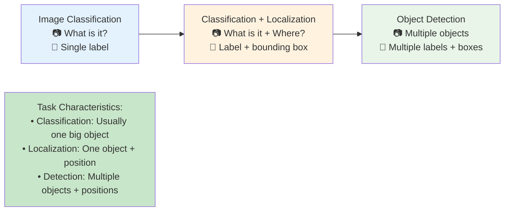

The key distinction in terminology is important to understand. Classification and classification with localization problems typically deal with images that have one main object, usually positioned prominently in the center of the image. In contrast, detection problems handle images that may contain multiple objects, possibly of different categories, scattered throughout the scene.

This progression isn't just academic - the ideas learned for image classification directly enable classification with localization, and the techniques developed for localization become essential building blocks for detection systems. Each level builds upon the previous, creating a foundation of concepts that work together to solve increasingly complex real-world problems.

## From Classification to Localization

### Understanding the Standard Classification Pipeline

Before we can add localization capabilities, it's essential to understand how standard image classification works. The typical classification pipeline starts with an input image that gets processed through a convolutional neural network (ConvNet) with multiple layers. These layers progressively extract higher-level features from the raw pixel data, ultimately producing a feature vector that captures the essential characteristics of the image.

This feature vector then feeds into a softmax layer that outputs probabilities for each possible class. For a self-driving car application, we might have four classes: pedestrian, car, motorcycle, and background (representing "none of the above" when no object of interest is present). The softmax layer produces a probability distribution over these four possibilities, and we typically choose the class with the highest probability as our prediction.

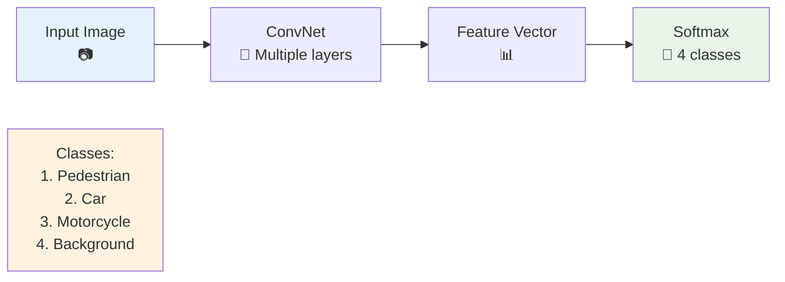

This approach works well for classification, but it tells us nothing about where in the image the object is located. We know what's there, but not where it is - a critical limitation for many real-world applications.

### Extending to Include Localization

To add localization capability, we need to modify our network architecture to output additional information about the spatial location of the detected object. The key insight is that we can extend our existing classification network by adding four more output units that parameterize a bounding box around the object.

These four additional numbers represent the bounding box parameters: bx and by specify the center coordinates of the box, while bh and bw specify its height and width respectively. By training the network to predict these four values along with the class probabilities, we enable it to not only classify objects but also precisely locate them within the image.

The beauty of this approach is that it leverages the same feature extraction layers that work well for classification. The ConvNet still processes the image and produces a rich feature representation, but now this shared feature vector feeds into two different types of outputs: classification probabilities and bounding box coordinates.

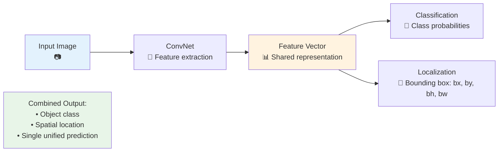

This architecture creates a multi-task learning scenario where the network must simultaneously solve two related problems: classification (determining what the object is) and regression (determining where it is). The shared feature representation allows the network to learn features that are useful for both tasks, often leading to better performance on each individual task than if they were trained separately.

## Bounding Box Parameterization

### Understanding the Coordinate System

To specify bounding boxes consistently, we need to establish a clear coordinate system convention. The approach used here defines the upper left corner of the image as the origin point (0,0), with coordinates increasing as we move right (x-direction) and down (y-direction). The bottom right corner of the image corresponds to the point (1,1).

This coordinate system uses normalized coordinates, meaning all values are expressed as fractions of the total image dimensions. This normalization is crucial because it makes the system independent of the actual image size in pixels. Whether we're working with a 224×224 image or a 1024×1024 image, the same coordinate values have the same meaning relative to the image boundaries.

### Defining Bounding Box Parameters

A bounding box is completely specified by four parameters, each serving a specific purpose:

**bx (center x-coordinate)**: This represents the horizontal position of the bounding box center, expressed as a fraction of the image width. A value of 0.5 means the center is exactly halfway across the image horizontally.

**by (center y-coordinate)**: This represents the vertical position of the bounding box center, expressed as a fraction of the image height. A value of 0.7 means the center is 70% of the way down from the top of the image.

**bh (box height)**: This represents the height of the bounding box as a fraction of the total image height. A value of 0.3 means the box spans 30% of the image's total height.

**bw (box width)**: This represents the width of the bounding box as a fraction of the total image width. A value of 0.4 means the box spans 40% of the image's total width.

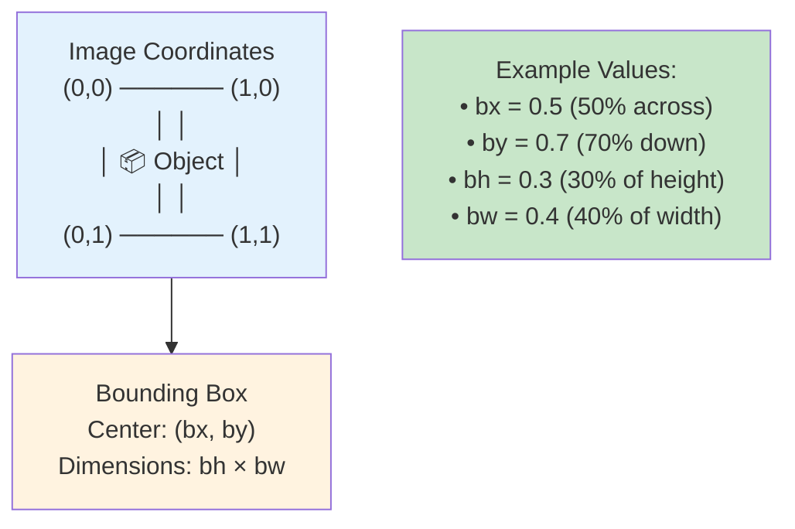

This parameterization choice (center coordinates plus dimensions) is particularly convenient for neural networks because all four values are typically bounded and well-behaved during training. The center coordinates will always fall between 0 and 1, while the height and width values will typically be between 0 and 1 as well (though they could theoretically exceed 1 for very large objects that extend beyond the image boundaries).

Using center coordinates rather than corner coordinates also tends to make the optimization more stable, as small changes in the center position result in intuitive changes to the bounding box location, whereas corner-based parameterizations can sometimes lead to more complex optimization landscapes.

## Target Label Structure

### Constructing the Output Vector

For classification with localization, we need to design a target label structure that encompasses all the information we want our network to predict. This leads to an 8-dimensional output vector that we'll call **y**, which contains everything needed to fully specify both the classification and localization for a single object.

The structure of this vector is carefully designed to handle the different types of information we need to represent. It starts with an "objectness" component that indicates whether an object of interest is present at all, followed by the four bounding box parameters, and finally the class probability information.

$$
y = \begin{bmatrix}
p_c \\
b_x \\
b_y \\
b_h \\
b_w \\
c_1 \\
c_2 \\
c_3
\end{bmatrix}
$$

### Understanding Each Component

**The Objectness Component (pc)**: The first element, pc, serves as a crucial gating mechanism. It answers the fundamental question "Is there an object of interest in this image?" This binary indicator is set to 1 when the image contains one of our target classes (pedestrian, car, or motorcycle) and 0 when the image contains only background or objects we don't care about.

This component is essential because it tells us whether the remaining elements of the vector have meaningful values. When pc = 0, the bounding box parameters and class indicators become irrelevant because there's no object to localize or classify.

**Bounding Box Components (bx, by, bh, bw)**: These four elements specify the spatial location and size of the object when one is present. They follow the parameterization described earlier, with bx and by representing the center coordinates and bh and bw representing the dimensions, all normalized relative to the image size.

**Classification Components (c1, c2, c3)**: These three elements form a one-hot encoding of the object class. In our autonomous driving example, c1 indicates pedestrian, c2 indicates car, and c3 indicates motorcycle. Exactly one of these should be 1 when an object is present, while the others should be 0.

The constraint that at most one of c1, c2, c3 can be 1 reflects our assumption that each image contains at most one object of interest. This is a key limitation of the classification with localization approach - it's designed for scenarios where we expect exactly zero or one target object per image.

### Concrete Examples

Understanding this structure becomes clearer with specific examples. Let's consider two typical scenarios:

**Example 1: Car Present in Image**

When our image contains a car positioned roughly in the center-right area, our target vector might look like this:

```python
y = [
    1,    # pc: Object is present
    0.5,  # bx: Center at 50% width (middle horizontally)
    0.7,  # by: Center at 70% height (towards bottom)
    0.3,  # bh: 30% of image height
    0.4,  # bw: 40% of image width
    0,    # c1: Not pedestrian
    1,    # c2: Is car
    0     # c3: Not motorcycle
]
```

This vector tells us there's definitely an object present (pc=1), it's located with its center at coordinates (0.5, 0.7), it spans 30% of the image height and 40% of the image width, and it's classified as a car (c2=1).

**Example 2: Background Only**

When our image contains no objects of interest - perhaps just an empty road or random background scenery - our target vector looks quite different:

```python
y = [
    0,    # pc: No object present
    ?,    # bx: Don't care - could be any value
    ?,    # by: Don't care - could be any value
    ?,    # bh: Don't care - could be any value
    ?,    # bw: Don't care - could be any value
    ?,    # c1: Don't care - could be any value
    ?,    # c2: Don't care - could be any value
    ?     # c3: Don't care - could be any value
]
```

The question marks represent "don't care" values. Since there's no object present (pc=0), the bounding box parameters are meaningless - there's nothing to localize. Similarly, the class indicators are meaningless because there's no object to classify. During training, we'll ignore these components when pc=0, focusing only on getting the objectness prediction correct.

This "don't care" concept is crucial for efficient training. It would be counterproductive to penalize the network for predicting random bounding box coordinates when there's no object present. Instead, we only care about the network learning to correctly identify when objects are absent.

## Loss Function Design

### The Challenge of Multi-Task Learning

Designing a loss function for classification with localization presents a unique challenge because we're simultaneously training the network to perform two different types of tasks: classification (a discrete prediction problem) and bounding box regression (a continuous prediction problem). Moreover, these tasks are only meaningful under certain conditions - specifically, we only care about classification and localization accuracy when an object is actually present.

This leads us to a conditional loss function design, where the loss computation depends on the value of the objectness component (pc). This conditional approach ensures that we're providing appropriate training signals in different scenarios while avoiding confusion from meaningless predictions.

### Understanding the Two Cases

The loss function must handle two fundamentally different scenarios:

**Case 1: Object Present (pc = 1)**
When an object is present in the image, we want to evaluate the network's performance across all aspects of the prediction. This means checking how well it predicted the objectness (should be close to 1), how accurately it localized the object (bounding box parameters should match the ground truth), and how correctly it classified the object (the appropriate class indicator should be close to 1).

In this case, all 8 components of the output vector carry meaningful information, and we should include all of them in our loss computation. The network needs to learn to simultaneously recognize that an object is present, determine its precise location, and identify its class correctly.

**Case 2: Background (pc = 0)**
When no object is present in the image, the situation is quite different. The most important thing is for the network to correctly identify that there's no object (pc should be close to 0). The bounding box parameters and class indicators become irrelevant because there's nothing to localize or classify.

Computing loss on the bounding box and classification components when no object is present would not only be meaningless but could actually harm training. It would force the network to learn arbitrary mappings for scenarios where no correct answer exists, potentially interfering with its ability to make good predictions when objects are actually present.

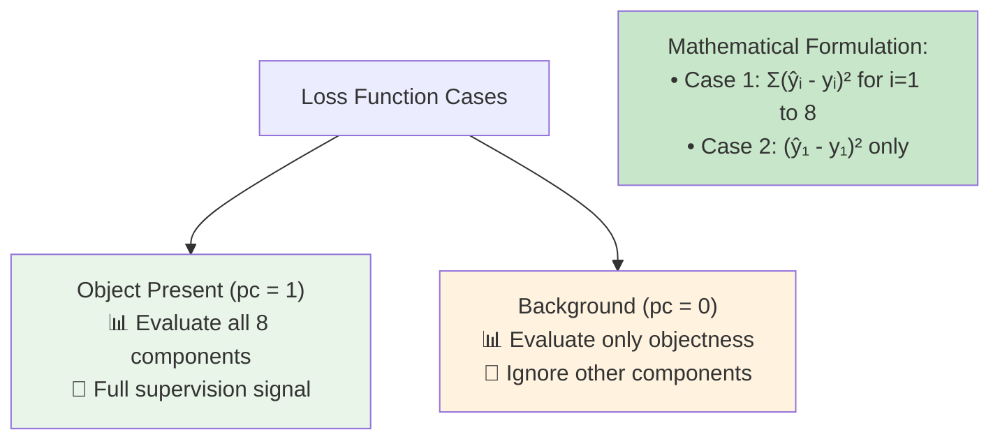

### Mathematical Formulation

The complete loss function can be expressed mathematically as a conditional function that selects the appropriate computation based on the ground truth objectness value:

$$
L(y, \hat{y}) = \begin{cases}
\sum_{i=1}^{8} (\hat{y}_i - y_i)^2 & \text{if } y_1 = 1 \\
(\hat{y}_1 - y_1)^2 & \text{if } y_1 = 0
\end{cases}
$$

This formulation captures the essence of our conditional training strategy. When y₁ = 1 (object present), we compute the squared error across all 8 dimensions of the output vector. This penalizes the network for errors in objectness prediction, bounding box coordinates, and class probabilities.

When y₁ = 0 (background), we compute squared error only for the first component, completely ignoring the other 7 components. This focuses the training signal on the most important aspect of this scenario: correctly identifying that no object is present.

While this example uses squared error for simplicity, production systems often use more sophisticated loss functions. For the classification components (c1, c2, c3), cross-entropy loss typically works better than squared error. For the objectness component, binary cross-entropy provides better probability calibration than squared error. The bounding box components can use squared error, smooth L1 loss, or other regression losses depending on the specific requirements.

### Practical Implementation

Here's how this conditional loss function translates into code:

```python
def localization_loss(y_true, y_pred):
    """
    Loss function for classification with localization

    Args:
        y_true: Ground truth [pc, bx, by, bh, bw, c1, c2, c3]
        y_pred: Predictions [pc_hat, bx_hat, by_hat, bh_hat, bw_hat, c1_hat, c2_hat, c3_hat]
    """

    # Extract objectness component
    pc_true = y_true[:, 0]
    pc_pred = y_pred[:, 0]

    # Objectness loss (computed for all examples)
    objectness_loss = tf.square(pc_pred - pc_true)

    # Full loss computation for when objects are present
    object_mask = tf.cast(pc_true, tf.float32)
    full_loss = tf.reduce_sum(tf.square(y_pred - y_true), axis=1)

    # Background loss computation for when no objects are present
    background_mask = 1.0 - object_mask

    # Combine losses using masks
    total_loss = (
        object_mask * full_loss +
        background_mask * objectness_loss
    )

    return tf.reduce_mean(total_loss)
```

The implementation uses masking to selectively apply different loss computations. The `object_mask` is 1 when objects are present and 0 otherwise, while `background_mask` is the complement. This allows us to compute both loss types for all examples and then select the appropriate one for each case.

## Network Architecture Implementation

### Building the Complete Model

Now that we understand the theory behind classification with localization, let's examine how to implement a complete neural network that can perform this task. The architecture builds upon standard classification networks but extends them to handle the additional localization outputs.

The network follows a encoder-decoder pattern where the encoder (the convolutional layers) extracts rich feature representations from the input image, and the decoder (the fully connected layers) maps these features to the specific outputs we need: objectness, bounding box coordinates, and class probabilities.

```python
import tensorflow as tf

def create_localization_model(num_classes=3, input_shape=(224, 224, 3)):
    """
    Create a classification with localization network

    This network outputs an 8-dimensional vector containing:
    - 1 objectness probability
    - 4 bounding box parameters
    - 3 class probabilities
    """

    inputs = tf.keras.layers.Input(shape=input_shape)

    # Feature extraction backbone - similar to standard classification networks
    x = tf.keras.layers.Conv2D(64, 3, activation='relu', padding='same')(inputs)
    x = tf.keras.layers.MaxPooling2D(2)(x)
    x = tf.keras.layers.Conv2D(128, 3, activation='relu', padding='same')(x)
    x = tf.keras.layers.MaxPooling2D(2)(x)
    x = tf.keras.layers.Conv2D(256, 3, activation='relu', padding='same')(x)
    x = tf.keras.layers.MaxPooling2D(2)(x)
    x = tf.keras.layers.Conv2D(512, 3, activation='relu', padding='same')(x)
    x = tf.keras.layers.GlobalAveragePooling2D()(x)

    # Shared feature representation
    features = tf.keras.layers.Dense(1024, activation='relu')(x)
    features = tf.keras.layers.Dropout(0.5)(features)

    # Output branches for different components

    # 1. Objectness prediction (pc)
    pc = tf.keras.layers.Dense(1, activation='sigmoid')(features)

    # 2. Bounding box parameters (bx, by, bh, bw)
    bbox = tf.keras.layers.Dense(4, activation='sigmoid')(features)

    # 3. Class predictions (c1, c2, c3)
    classes = tf.keras.layers.Dense(num_classes, activation='softmax')(features)

    # Combine into single output vector matching y structure
    outputs = tf.keras.layers.Concatenate()([pc, bbox, classes])

    return tf.keras.Model(inputs, outputs)
```

### Architecture Design Decisions

**Shared Feature Extraction**: The convolutional layers serve as a shared feature extractor for both classification and localization tasks. This sharing is beneficial because the features useful for recognizing what an object is (edges, textures, shapes) are often also useful for determining where it is located.

**Separate Output Branches**: While the feature extraction is shared, the final prediction layers are separate for each component. The objectness prediction uses a sigmoid activation to output a probability between 0 and 1. The bounding box parameters also use sigmoid activation to ensure outputs between 0 and 1 (appropriate for normalized coordinates). The class predictions use softmax to ensure a proper probability distribution over the possible classes.

**Global Average Pooling**: Instead of flattening the final convolutional feature maps, we use global average pooling. This reduces the number of parameters and provides some spatial invariance, while still preserving the essential feature information needed for both classification and localization.

### Training Pipeline

The training process requires careful attention to data preparation and loss function implementation:

```python
def train_localization_model():
    """
    Complete training pipeline for localization model
    """

    # Create the model
    model = create_localization_model(num_classes=3)

    # Compile with our custom loss function
    model.compile(
        optimizer='adam',
        loss=localization_loss,
        metrics=['accuracy']  # Note: This accuracy applies to the whole 8D vector
    )

    # Set up training callbacks for better convergence
    callbacks = [
        tf.keras.callbacks.EarlyStopping(
            monitor='val_loss',
            patience=10,
            restore_best_weights=True
        ),
        tf.keras.callbacks.ReduceLROnPlateau(
            monitor='val_loss',
            factor=0.2,
            patience=5,
            min_lr=1e-7
        ),
        tf.keras.callbacks.ModelCheckpoint(
            'best_localization_model.h5',
            save_best_only=True,
            monitor='val_loss'
        )
    ]

    # Train the model
    history = model.fit(
        train_dataset,
        validation_data=val_dataset,
        epochs=100,
        callbacks=callbacks,
        verbose=1
    )

    return model, history
```

## Data Preparation and Practical Considerations

### Converting Annotations to Target Format

One of the most important practical aspects of implementing classification with localization is properly preparing your training data. Real-world annotation formats vary widely, but they all need to be converted into the 8-dimensional y vector format we've defined.

```python
def prepare_localization_data(images, annotations):
    """
    Convert various annotation formats to the y vector format

    Args:
        images: List of image arrays
        annotations: List of annotation dictionaries

    Returns:
        X: Image arrays
        y: Target vectors in [pc, bx, by, bh, bw, c1, c2, c3] format
    """

    X = np.array(images)
    y_vectors = []

    for ann in annotations:
        if ann['has_object']:
            # Object present case
            y_vector = [
                1.0,  # pc: object is present
                ann['bbox']['center_x'],  # bx: normalized center x
                ann['bbox']['center_y'],  # by: normalized center y
                ann['bbox']['height'],    # bh: normalized height
                ann['bbox']['width'],     # bw: normalized width
                1.0 if ann['class'] == 'pedestrian' else 0.0,  # c1
                1.0 if ann['class'] == 'car' else 0.0,         # c2
                1.0 if ann['class'] == 'motorcycle' else 0.0   # c3
            ]
        else:
            # Background case - only pc matters, rest are don't cares
            y_vector = [0.0, 0.0, 0.0, 0.0, 0.0, 0.0, 0.0, 0.0]

        y_vectors.append(y_vector)

    return X, np.array(y_vectors)
```

### Enhanced Loss Function Considerations

While the squared error loss function works well for learning purposes, production systems often benefit from more sophisticated loss designs that better match the nature of each prediction component:

```python
def enhanced_localization_loss(y_true, y_pred,
                             lambda_coord=5.0, lambda_obj=1.0, lambda_class=1.0):
    """
    Enhanced loss function with different losses for different components

    Args:
        lambda_coord: Weight for coordinate loss
        lambda_obj: Weight for objectness loss
        lambda_class: Weight for classification loss
    """

    # Split the predictions into components
    pc_true = y_true[:, 0]
    bbox_true = y_true[:, 1:5]
    class_true = y_true[:, 5:]

    pc_pred = y_pred[:, 0]
    bbox_pred = y_pred[:, 1:5]
    class_pred = y_pred[:, 5:]

    # Objectness loss (binary cross-entropy is better than squared error)
    obj_loss = tf.keras.losses.binary_crossentropy(pc_true, pc_pred)

    # Coordinate loss (only when object is present)
    object_mask = tf.expand_dims(pc_true, 1)
    coord_loss = tf.reduce_sum(
        object_mask * tf.square(bbox_true - bbox_pred), axis=1
    )

    # Classification loss (cross-entropy, only when object is present)
    class_loss = pc_true * tf.keras.losses.categorical_crossentropy(
        class_true, class_pred
    )

    # Weighted combination
    total_loss = (
        lambda_obj * obj_loss +
        lambda_coord * coord_loss +
        lambda_class * class_loss
    )

    return tf.reduce_mean(total_loss)
```

This enhanced version uses different loss functions appropriate for each component type and includes weighting factors that can be tuned based on the relative importance of each task component.

## Applications and Limitations

### Where Classification with Localization Excels

Classification with localization works particularly well in controlled scenarios where the single-object assumption holds true. Medical imaging applications often fit this pattern well - for example, detecting and localizing a single tumor or abnormality in a medical scan. Quality control systems in manufacturing can also benefit, where the goal is to detect and locate a single defect in a product image.

The approach is also valuable as a preprocessing step in larger systems. Even when dealing with multi-object scenes, sometimes it's useful to first crop or segment the image into regions that likely contain single objects, then apply classification with localization to each region.

### Understanding the Limitations

The single-object assumption represents the primary limitation of this approach. When images contain multiple objects of interest, the network faces an impossible task - it must choose which object to localize and classify while ignoring the others. This can lead to unpredictable behavior where the network might localize one object while classifying it as a different object that's also present in the scene.

Another limitation involves object scale and positioning. The approach works best when objects are reasonably centered and occupy a substantial portion of the image. Very small objects or objects positioned at the extreme edges of the image can be challenging to localize accurately with this parameterization.

### Building Toward Object Detection

Despite these limitations, classification with localization provides essential building blocks that directly enable object detection systems. The core concepts - neural networks outputting spatial coordinates, multi-task learning combining classification and regression, and conditional loss functions - all transfer directly to detection systems.

The main advance that object detection makes is handling multiple objects simultaneously. Instead of predicting a single 8-dimensional vector, detection systems predict multiple such vectors, along with mechanisms for determining how many objects are present and handling the more complex training scenarios that arise with multiple objects.

Object detection systems also typically use more sophisticated spatial reasoning, such as anchor boxes or attention mechanisms, to handle the increased complexity of multi-object scenes. However, the fundamental principle of having neural networks output bounding box coordinates remains the same as what we've learned with classification and localization.

This progression from classification to localization to detection represents one of the most important developments in modern computer vision, enabling applications from autonomous driving to medical diagnosis to robotics. The ideas are powerful precisely because they build upon each other systematically, creating a foundation of concepts that can be combined and extended to solve increasingly complex real-world problems.

# 2. Landmark Detection

## Beyond Bounding Boxes: The Power of Precise Point Detection

In the previous lesson, we learned how neural networks can output four numbers (bx, by, bh, bw) to specify bounding boxes for object localization. Landmark detection represents a natural and powerful extension of this concept - instead of just outputting bounding box coordinates, we can train neural networks to output the precise X and Y coordinates of specific important points within objects. These important points, called landmarks, enable much more detailed spatial understanding and open up entirely new categories of applications.

The fundamental insight is remarkably simple yet profound: if neural networks can learn to output four coordinate values for bounding boxes, they can just as easily learn to output many more coordinate pairs to identify specific landmark points. This capability transforms computer vision from coarse object detection to fine-grained spatial analysis, enabling applications that require understanding of internal object structure and precise spatial relationships.

Landmark detection operates on the same regression principles as bounding box prediction, but with much greater spatial precision. Instead of just knowing "there's a face somewhere in this rectangular region," landmark detection can tell us exactly where the corners of the eyes are, the tip of the nose, the edges of the mouth, and dozens of other anatomically significant points. This level of detail makes possible everything from emotion recognition to augmented reality filters to medical diagnosis.

## The Landmark Detection Framework

### Core Concept and Applications

The landmark detection approach extends our localization network architecture in a straightforward way. Instead of outputting just four bounding box parameters, we output many coordinate pairs - one for each landmark we want to detect. Each landmark is defined by its X and Y coordinates, so detecting N landmarks requires 2N output values from our neural network.

This seemingly simple extension enables a remarkable range of applications. Face analysis becomes possible with landmark detection - we can identify the precise positions of facial features for emotion recognition, identity verification, or augmented reality effects. Human pose estimation relies entirely on landmark detection, identifying key joint positions to understand body posture and movement. Medical imaging uses landmarks to identify anatomical structures and measure distances for diagnosis. Even autonomous driving systems use landmark detection to identify precise road boundaries and traffic sign corners.

The power of landmark detection lies in its ability to capture structured spatial relationships. A bounding box tells us where an object is located as a whole, but landmarks tell us about the internal geometry and pose of that object. This geometric understanding enables much more sophisticated reasoning about the world.

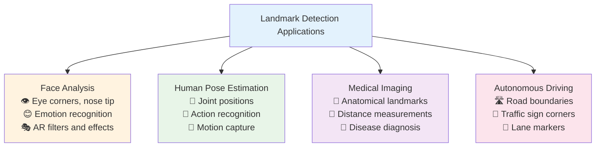

### Target Label Structure for Landmark Detection

The output structure for landmark detection follows a logical extension of our localization framework. We begin with an indicator variable to specify whether the object of interest is present in the image, followed by all the landmark coordinates. For an object with N landmarks, our target vector becomes:

$$
Y = \begin{bmatrix}
\text{object\_present} \\
l_{1x} \\
l_{1y} \\
l_{2x} \\
l_{2y} \\
\vdots \\
l_{Nx} \\
l_{Ny}
\end{bmatrix}
$$

This structure maintains the same conditional logic we learned for object localization. When object_present = 1, all the landmark coordinates have meaningful values that the network should learn to predict accurately. When object_present = 0, the landmark coordinates become "don't care" values, just as the bounding box coordinates did in our localization framework.

The key difference from bounding box detection is the dramatic increase in spatial precision and the number of output values. Instead of four coordinate values, we might have dozens or even hundreds, depending on how many landmarks we want to detect. Each landmark provides a precise point of spatial information rather than a coarse rectangular region.

## Face Landmark Detection: A Detailed Example

### Understanding Facial Landmark Systems

Face landmark detection serves as an excellent example to illustrate the landmark detection framework in detail. The human face has well-defined anatomical structure with identifiable feature points that remain consistent across different individuals. This makes it an ideal candidate for landmark detection systems.

Let's consider a practical example with a 64-landmark face detection system. We want to identify specific points around the eyes (to detect blinks and gaze direction), along the eyebrows (for expression analysis), around the nose (for profile understanding), along the mouth (to detect smiles and speech), and around the face boundary (to understand head pose and face shape).

For this 64-landmark system, our neural network would need to output 129 values total: one for "is there a face present?" plus 64 × 2 = 128 coordinate values for the landmarks. The network architecture follows the same pattern as our localization network, but with many more output units.

```python
# Example target vector for 64-landmark face detection
y = [
    1,        # Face is present
    0.23,     # l1x: First landmark x-coordinate
    0.45,     # l1y: First landmark y-coordinate
    0.25,     # l2x: Second landmark x-coordinate
    0.43,     # l2y: Second landmark y-coordinate
    # ... continuing for all 64 landmarks
    0.67,     # l64x: Last landmark x-coordinate
    0.89      # l64y: Last landmark y-coordinate
]
```

### Network Architecture for Face Landmarks

The network architecture for face landmark detection builds upon our localization framework with some important modifications to handle the increased complexity and precision requirements:

```python
def create_face_landmark_network(num_landmarks=64, input_shape=(224, 224, 3)):
    """
    Create a face landmark detection network

    This network outputs 2*num_landmarks + 1 values:
    - 1 face presence indicator
    - 2 coordinates per landmark (x, y)
    """

    inputs = tf.keras.layers.Input(shape=input_shape)

    # Feature extraction backbone - deeper than basic localization
    x = tf.keras.layers.Conv2D(64, 3, activation='relu', padding='same')(inputs)
    x = tf.keras.layers.MaxPooling2D(2)(x)
    x = tf.keras.layers.Conv2D(128, 3, activation='relu', padding='same')(x)
    x = tf.keras.layers.MaxPooling2D(2)(x)
    x = tf.keras.layers.Conv2D(256, 3, activation='relu', padding='same')(x)
    x = tf.keras.layers.MaxPooling2D(2)(x)
    x = tf.keras.layers.Conv2D(512, 3, activation='relu', padding='same')(x)
    x = tf.keras.layers.MaxPooling2D(2)(x)
    x = tf.keras.layers.Conv2D(512, 3, activation='relu', padding='same')(x)
    x = tf.keras.layers.GlobalAveragePooling2D()(x)

    # Shared feature representation with higher capacity
    features = tf.keras.layers.Dense(2048, activation='relu')(x)
    features = tf.keras.layers.Dropout(0.5)(features)
    features = tf.keras.layers.Dense(1024, activation='relu')(features)
    features = tf.keras.layers.Dropout(0.5)(features)

    # Face presence detection
    face_present = tf.keras.layers.Dense(1, activation='sigmoid')(features)

    # Landmark coordinate prediction (all 2*num_landmarks coordinates)
    landmarks = tf.keras.layers.Dense(num_landmarks * 2, activation='sigmoid')(features)

    # Combine into single output vector
    outputs = tf.keras.layers.Concatenate()([face_present, landmarks])

    return tf.keras.Model(inputs, outputs)
```

The architecture requires more capacity than basic localization because it must make much more precise spatial predictions. The deeper feature extraction layers and larger fully connected layers help the network learn the complex spatial relationships between facial landmarks.

### Landmark Consistency: A Critical Requirement

One of the most important aspects of landmark detection that often gets overlooked is the requirement for landmark consistency across training examples. This means that landmark number 1 must always refer to the same anatomical point across all images in the training set. Landmark number 2 must always refer to the same different point, and so on.

This consistency requirement is not just a technical detail - it's fundamental to how the neural network learns. If landmark 1 sometimes refers to the left eye corner and sometimes to the right eye corner, the network will receive contradictory training signals and fail to learn meaningful spatial relationships. The network needs to build up internal representations that connect visual features (like "corner-like pixel patterns") with specific output positions (like "landmark 3 coordinates").

Establishing and maintaining this consistency requires careful annotation protocols and quality control processes. Typically, landmark detection datasets follow established conventions for landmark ordering. For faces, this might mean starting with the jaw line points and proceeding clockwise, or starting with the left eye and moving systematically across facial features.

```python
# Example landmark ordering convention for facial landmarks
FACE_LANDMARK_GROUPS = {
    'jaw_line': list(range(1, 17)),      # Points 1-16: Jawline from left to right
    'left_eyebrow': list(range(17, 22)), # Points 17-21: Left eyebrow
    'right_eyebrow': list(range(22, 27)), # Points 22-26: Right eyebrow
    'nose_bridge': list(range(27, 31)),   # Points 27-30: Nose bridge
    'nose_tip': list(range(31, 36)),      # Points 31-35: Nose tip area
    'left_eye': list(range(36, 42)),      # Points 36-41: Left eye outline
    'right_eye': list(range(42, 48)),     # Points 42-47: Right eye outline
    'mouth_outer': list(range(48, 60)),   # Points 48-59: Outer mouth boundary
    'mouth_inner': list(range(60, 68))    # Points 60-67: Inner mouth boundary
}
```

This systematic organization helps ensure consistency and makes it easier to validate annotations. It also enables more sophisticated loss functions that can weight different facial regions differently based on their importance for specific applications.

## Human Pose Estimation: Understanding Body Structure

### The Challenge of Pose Detection

Human pose estimation represents another powerful application of landmark detection, focused on identifying the positions of key joints and body parts. Unlike facial landmarks, which deal with relatively small spatial regions and fine-grained features, pose estimation must handle full-body imagery with much greater variation in scale, orientation, and occlusion.

The standard approach uses a set of key points that correspond to major joints and body parts. A common configuration includes 17 key points covering the head, torso, arms, and legs. These points enable reasoning about body posture, movement, and actions - critical capabilities for applications ranging from fitness tracking to human-computer interaction to sports analysis.

The spatial relationships in pose estimation are more complex than facial landmarks because body parts can move independently and the overall pose can vary dramatically. A person might be standing, sitting, jumping, or in any number of configurations. The landmarks must capture not just the positions of individual joints, but the overall kinematic structure of the human body.

### Pose Landmark Structure

A typical pose estimation system might use this 17-point structure:

```python
POSE_KEYPOINTS = [
    'nose',           # 1: Face reference point
    'left_eye',       # 2: Left eye center
    'right_eye',      # 3: Right eye center
    'left_ear',       # 4: Left ear
    'right_ear',      # 5: Right ear
    'left_shoulder',  # 6: Left shoulder joint
    'right_shoulder', # 7: Right shoulder joint
    'left_elbow',     # 8: Left elbow joint
    'right_elbow',    # 9: Right elbow joint
    'left_wrist',     # 10: Left wrist joint
    'right_wrist',    # 11: Right wrist joint
    'left_hip',       # 12: Left hip joint
    'right_hip',      # 13: Right hip joint
    'left_knee',      # 14: Left knee joint
    'right_knee',     # 15: Right knee joint
    'left_ankle',     # 16: Left ankle joint
    'right_ankle'     # 17: Right ankle joint
]
```

For this 17-point pose system, our network would output 35 values: one for person presence plus 34 coordinate values (17 × 2). The target vector structure follows the same pattern as facial landmarks, but the semantic meaning and spatial relationships are quite different.

The pose detection network must learn not just to identify individual joint locations, but also to understand the kinematic constraints that govern human body structure. Elbows can only bend in certain ways, shoulders have limited range of motion, and the overall pose must be anatomically plausible.

### Applications in Real-World Systems

Pose estimation enables a wide range of applications that require understanding of human body configuration and movement. Fitness applications use pose estimation to count repetitions and assess exercise form. Gaming and entertainment systems use it for motion capture and avatar control. Security systems use it for behavior analysis and activity recognition.

The key insight is that landmark detection provides structured spatial information that enables reasoning about complex real-world phenomena. Instead of just knowing "there's a person in this image," we can understand what that person is doing, how they're positioned, and how they might move next.

## Data Requirements and Training Considerations

### The Annotation Challenge

Training landmark detection systems requires carefully annotated datasets where human annotators have manually marked the precise locations of all landmarks in thousands of training images. This annotation process is significantly more labor-intensive than bounding box annotation because each landmark requires precise pixel-level accuracy rather than approximate rectangular regions.

The annotation process typically involves specialized software that allows annotators to zoom in on images and click precisely on landmark locations. Quality control becomes crucial because small errors in landmark positions can accumulate and degrade model performance. Many landmark detection datasets employ multiple annotators per image with consensus mechanisms to ensure accuracy.

The cost and complexity of landmark annotation means that high-quality landmark datasets are relatively rare and valuable. This often drives researchers and practitioners to use transfer learning approaches, starting with models pre-trained on large landmark datasets and fine-tuning them for specific applications.

### Loss Function Design for Landmarks

The loss function for landmark detection follows the same conditional logic as object localization, but with additional considerations for the large number of coordinate predictions:

```python
def landmark_detection_loss(y_true, y_pred, num_landmarks):
    """
    Loss function for landmark detection

    Args:
        y_true: Ground truth [object_present, l1x, l1y, ..., lNx, lNy]
        y_pred: Predictions with same structure
        num_landmarks: Number of landmarks (N)
    """

    # Extract object presence indicator
    object_present_true = y_true[:, 0]
    object_present_pred = y_pred[:, 0]

    # Object presence loss (always computed)
    presence_loss = tf.keras.losses.binary_crossentropy(
        object_present_true, object_present_pred
    )

    # Landmark coordinate loss (only when object is present)
    landmark_true = y_true[:, 1:]  # All landmark coordinates
    landmark_pred = y_pred[:, 1:]

    # Only compute landmark loss when object is present
    object_mask = tf.cast(object_present_true, tf.float32)
    object_mask_expanded = tf.expand_dims(object_mask, 1)

    # L2 loss for landmark coordinates
    landmark_loss = tf.reduce_sum(
        object_mask_expanded * tf.square(landmark_true - landmark_pred),
        axis=1
    )

    # Background mask for when no object is present
    background_mask = 1.0 - object_mask

    # Combined loss
    total_loss = (
        object_mask * (presence_loss + landmark_loss) +
        background_mask * presence_loss
    )

    return tf.reduce_mean(total_loss)
```

This loss function ensures that landmark coordinates are only trained when objects are present, preventing the network from learning meaningless coordinate mappings for background images.

### Advanced Training Techniques

Landmark detection often benefits from specialized training techniques that account for the high precision requirements and spatial relationships between landmarks:

```python
def create_advanced_landmark_loss(num_landmarks, spatial_weight=1.0, smoothness_weight=0.1):
    """
    Advanced loss function with spatial relationship constraints
    """

    def landmark_loss_with_smoothness(y_true, y_pred):
        # Basic coordinate loss
        basic_loss = landmark_detection_loss(y_true, y_pred, num_landmarks)

        # Extract landmark coordinates
        landmarks_true = tf.reshape(y_true[:, 1:], [-1, num_landmarks, 2])
        landmarks_pred = tf.reshape(y_pred[:, 1:], [-1, num_landmarks, 2])

        # Smoothness constraint: nearby landmarks should move together
        # This helps enforce anatomical constraints
        smoothness_loss = 0
        for i in range(num_landmarks - 1):
            # Distance between consecutive landmarks should be stable
            dist_true = tf.norm(landmarks_true[:, i+1] - landmarks_true[:, i], axis=1)
            dist_pred = tf.norm(landmarks_pred[:, i+1] - landmarks_pred[:, i], axis=1)
            smoothness_loss += tf.reduce_mean(tf.square(dist_true - dist_pred))

        return spatial_weight * basic_loss + smoothness_weight * smoothness_loss

    return landmark_loss_with_smoothness
```

This advanced loss function includes spatial relationship constraints that help the network learn anatomically plausible landmark configurations.

## Modern Applications and AR Integration

### Augmented Reality and Entertainment

One of the most visible applications of landmark detection is in augmented reality filters and entertainment applications. Platforms like Snapchat, Instagram, and TikTok rely heavily on real-time face landmark detection to enable their popular AR effects - putting virtual crowns on heads, changing face shapes, adding makeup, or creating fantastical transformations.

These applications require not just accurate landmark detection, but also real-time performance on mobile devices. This has driven innovations in efficient network architectures and optimized inference pipelines that can run landmark detection at 30+ frames per second on smartphones.

The entertainment applications showcase the power of precise spatial understanding. By knowing exactly where facial features are located, AR systems can:

- Accurately place virtual objects (crowns, glasses, hats) that track with head movement
- Modify facial geometry in real-time while maintaining natural appearance
- Apply makeup effects that follow the contours of lips, eyes, and cheeks
- Create expression-driven animations that respond to facial movements

### Medical and Scientific Applications

In medical imaging, landmark detection enables precise measurements and automated analysis that supports clinical decision-making. Radiologists use landmark detection to:

- Measure distances between anatomical structures for growth tracking
- Identify abnormal anatomical configurations that may indicate disease
- Plan surgical procedures by mapping critical anatomical landmarks
- Track changes in patient condition over time through consistent landmark analysis

The precision requirements in medical applications are often much higher than entertainment applications, driving the development of specialized architectures and training techniques optimized for accuracy over speed.

### The Future of Landmark Detection

Landmark detection continues to evolve with advances in neural network architectures and training techniques. Modern approaches increasingly use attention mechanisms to focus on relevant spatial regions, multi-scale processing to handle objects at different sizes, and temporal modeling to leverage information across video sequences.

The fundamental concept - training neural networks to output precise spatial coordinates - remains central to these advances. As we move toward more sophisticated computer vision applications, the ability to understand detailed spatial structure through landmark detection becomes increasingly valuable.

The progression from image classification to object localization to landmark detection represents a journey toward increasingly precise spatial understanding. Each step builds upon the previous, using the same core insight that neural networks can learn to output spatial coordinates as regression targets. This foundation enables the rich spatial reasoning that modern computer vision systems require for real-world applications.

Whether detecting facial expressions for human-computer interaction, analyzing body pose for sports science, or identifying anatomical structures for medical diagnosis, landmark detection provides the detailed spatial information that transforms computer vision from coarse recognition to precise understanding. The techniques we've learned - from conditional loss functions to consistent annotation schemes - form the building blocks for these sophisticated applications that are reshaping how computers understand and interact with the visual world.

# 3. Object Detection

## The Sliding Windows Detection Algorithm

Object detection tackles the challenge of finding multiple objects within a single image. The sliding windows approach provides a foundational method by systematically testing every possible location and scale.

### Building a Car Detection System

#### Step 1: Create Training Dataset

Start with closely cropped examples where cars fill most of the image. The training set needs:

- **Positive examples**: Tightly cropped car images with minimal background
- **Negative examples**: Non-car patches (roads, buildings, etc.)

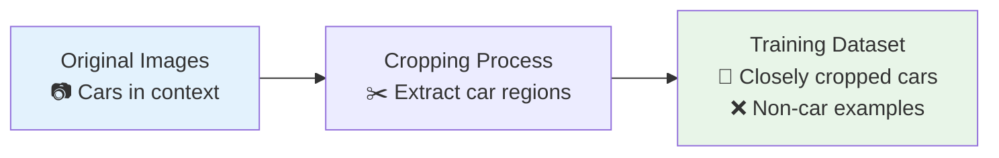

#### Step 2: Train Classification Network

Train a ConvNet that takes a small image patch and outputs whether it contains a car (binary classification).

```python
def create_car_classifier(input_shape=(64, 64, 3)):
    """ConvNet classifier for car detection"""

    model = tf.keras.Sequential([
        tf.keras.layers.Conv2D(32, 3, activation='relu', padding='same'),
        tf.keras.layers.MaxPooling2D(2),
        tf.keras.layers.Conv2D(64, 3, activation='relu', padding='same'),
        tf.keras.layers.MaxPooling2D(2),
        tf.keras.layers.Conv2D(128, 3, activation='relu', padding='same'),
        tf.keras.layers.GlobalAveragePooling2D(),
        tf.keras.layers.Dense(1, activation='sigmoid')  # Car or not?
    ])

    return model
```

#### Step 3: Apply Sliding Windows

Systematically slide the classifier across the test image at multiple scales and positions.

### The Sliding Windows Process

**Single Scale Detection**:

1. Choose a window size (e.g., 64×64 pixels)
2. Place window at top-left corner of image
3. Extract image patch and run through classifier
4. Move window by stride amount and repeat
5. Continue until entire image is covered

**Multi-Scale Detection**:
Repeat the process with different window sizes to detect objects at various scales.

```python
def sliding_window_detection(image, classifier, window_sizes, stride=16):
    """Apply sliding window at multiple scales"""

    detections = []

    for window_size in window_sizes:
        h, w = window_size

        # Slide across image
        for y in range(0, image.shape[0] - h + 1, stride):
            for x in range(0, image.shape[1] - w + 1, stride):

                # Extract and classify window
                window = image[y:y+h, x:x+w]
                confidence = classifier.predict(window)

                if confidence > threshold:
                    detections.append({
                        'bbox': [x, y, w, h],
                        'confidence': confidence
                    })

    return detections
```

### The Computational Cost Problem

Sliding windows detection has a major disadvantage: **computational expense**.

#### Scale of the Problem

For a typical image:

- **Image size**: 1920×1080 pixels
- **Window sizes**: 3 different scales
- **Stride**: 16 pixels

```
Windows per scale ≈ (1920/16) × (1080/16) ≈ 8,100
Total windows = 8,100 × 3 scales = 24,300 classifier runs
```

Each window requires a separate forward pass through the ConvNet.

#### The Stride Trade-off

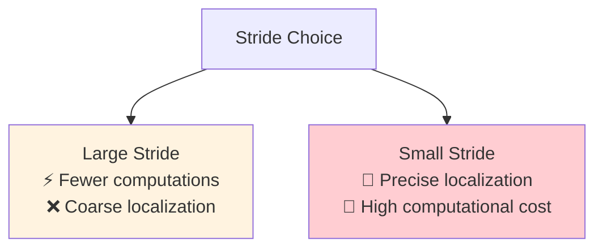

**Large stride**: Faster but may miss objects or provide poor localization  
**Small stride**: Better accuracy but computationally prohibitive

### Historical Context

Before ConvNets, sliding windows worked reasonably well because:

- Classifiers were simple (linear functions over hand-engineered features)
- Each classification was computationally cheap
- Could afford to test many windows

With ConvNets:

- Much better accuracy per window
- Much higher computational cost per window
- Sliding windows becomes infeasibly slow

### The Solution Preview

The computational limitations of naive sliding windows drive the need for more efficient approaches. The key insight is to avoid redundant computation by sharing feature calculations across overlapping windows.

This leads to **convolutional implementation** of object detection, where we can achieve sliding windows-like coverage with dramatically reduced computational cost. The next developments in object detection focus on making this systematic search process efficient while maintaining comprehensive coverage.

# 4. Convolutional Implementation of Sliding Windows

## The Efficiency Revolution

The naive sliding windows approach has a fatal flaw: computational inefficiency. The solution lies in a brilliant insight - we can implement sliding windows detection as a single forward pass through a fully convolutional network. This transforms object detection from an impossibly slow process to a practical, real-time capable system.

**📊 Interactive Visualization**: [./conv_sliding_windows.html](./conv_sliding_windows.html)

## Part 1: Converting Fully Connected to Convolutional Layers

### The Key Insight

Before understanding efficient sliding windows, we need to grasp how fully connected layers can be replaced by convolutional layers. This transformation is mathematically equivalent but enables spatial processing.

### Traditional Classification Network

A typical classification network for our sliding window detector might look like this:

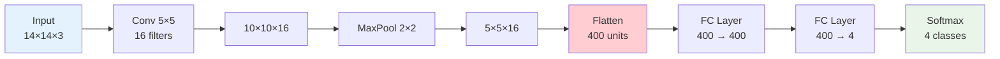

**Problem**: The fully connected layers destroy spatial information and prevent efficient sliding window implementation.

### Convolutional Equivalent Network

The breakthrough is replacing fully connected layers with equivalent convolutional operations:

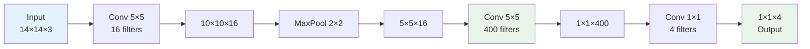

### Understanding the Conversion

**Step 1: Replace Flatten + FC with 5×5 Convolution**

The first fully connected layer connects every pixel in the 5×5×16 feature map to 400 output neurons. This is mathematically identical to using 400 filters of size 5×5×16:

- **Original**: Flatten 5×5×16 = 400 inputs → Dense layer with 400 outputs
- **Equivalent**: Conv 5×5×16 with 400 filters → 1×1×400 output

**Step 2: Replace FC layers with 1×1 Convolutions**

Subsequent fully connected layers become 1×1 convolutions:

- **Original**: Dense(400 → 4)
- **Equivalent**: Conv 1×1 with 4 filters

### Why This Works

```python
# Mathematical equivalence demonstration
def fc_to_conv_equivalence():
    """
    Show that FC and Conv operations are mathematically equivalent
    """

    # Original FC approach
    def original_fc(feature_map_5x5x16):
        # Flatten: 5×5×16 → 400
        flattened = feature_map_5x5x16.reshape(-1)  # Shape: (400,)

        # FC layer: 400 → 400
        # Weight matrix W1: (400, 400)
        fc1_output = np.dot(W1, flattened)  # Shape: (400,)

        # FC layer: 400 → 4
        # Weight matrix W2: (4, 400)
        fc2_output = np.dot(W2, fc1_output)  # Shape: (4,)

        return fc2_output

    # Equivalent Conv approach
    def equivalent_conv(feature_map_5x5x16):
        # Conv 5×5×16 → 1×1×400
        # Filter shape: (5, 5, 16, 400) - same weights as W1 reshaped
        conv1_output = conv2d(feature_map_5x5x16, filters_5x5)  # Shape: (1, 1, 400)

        # Conv 1×1×400 → 1×1×4
        # Filter shape: (1, 1, 400, 4) - same weights as W2 reshaped
        conv2_output = conv2d(conv1_output, filters_1x1)  # Shape: (1, 1, 4)

        return conv2_output

    # Both approaches produce identical results!
```

## Part 2: Efficient Sliding Windows Detection

### The Computational Problem Revisited

Traditional sliding windows requires multiple forward passes:

```python
# Inefficient approach: Multiple forward passes
def naive_sliding_windows(image_16x16, classifier):
    """
    Traditional sliding windows - computationally expensive
    """
    predictions = []

    # Extract 4 overlapping 14×14 windows
    windows = [
        image_16x16[0:14, 0:14],    # Top-left (blue)
        image_16x16[0:14, 2:16],    # Top-right (green)
        image_16x16[2:16, 0:14],    # Bottom-left (orange)
        image_16x16[2:16, 2:16]     # Bottom-right (purple)
    ]

    # Run classifier on each window separately
    for window in windows:
        prediction = classifier(window)  # Full forward pass each time!
        predictions.append(prediction)

    return predictions  # 4 separate predictions, 4× computation
```

### The Convolutional Solution

The key insight: run the fully convolutional network on the entire larger image in one pass:

```python
# Efficient approach: Single forward pass
def conv_sliding_windows(image_16x16, conv_classifier):
    """
    Convolutional sliding windows - single forward pass
    """
    # Single forward pass through entire image
    output_map = conv_classifier(image_16x16)  # Shape: (2, 2, 4)

    # Each spatial location corresponds to one sliding window prediction
    predictions = [
        output_map[0, 0, :],  # Top-left window result
        output_map[0, 1, :],  # Top-right window result
        output_map[1, 0, :],  # Bottom-left window result
        output_map[1, 1, :]   # Bottom-right window result
    ]

    return predictions  # Same 4 predictions, 1× computation!
```

### Step-by-Step Transformation

Let's trace through exactly how a 16×16×3 input produces a 2×2×4 output:

**Input**: 16×16×3 image (with 2-pixel border around our 14×14 windows)

**Layer 1**: Conv 5×5, 16 filters

- Input: 16×16×3
- Output: 12×12×16 (no padding, so 16-5+1=12)

**Layer 2**: MaxPool 2×2

- Input: 12×12×16
- Output: 6×6×16

**Layer 3**: Conv 5×5, 400 filters (replaces first FC)

- Input: 6×6×16
- Output: 2×2×400 (6-5+1=2)

**Layer 4**: Conv 1×1, 4 filters (replaces second FC)

- Input: 2×2×400
- Output: 2×2×4

### Understanding the Spatial Correspondence

The magic is in understanding what each output location represents:

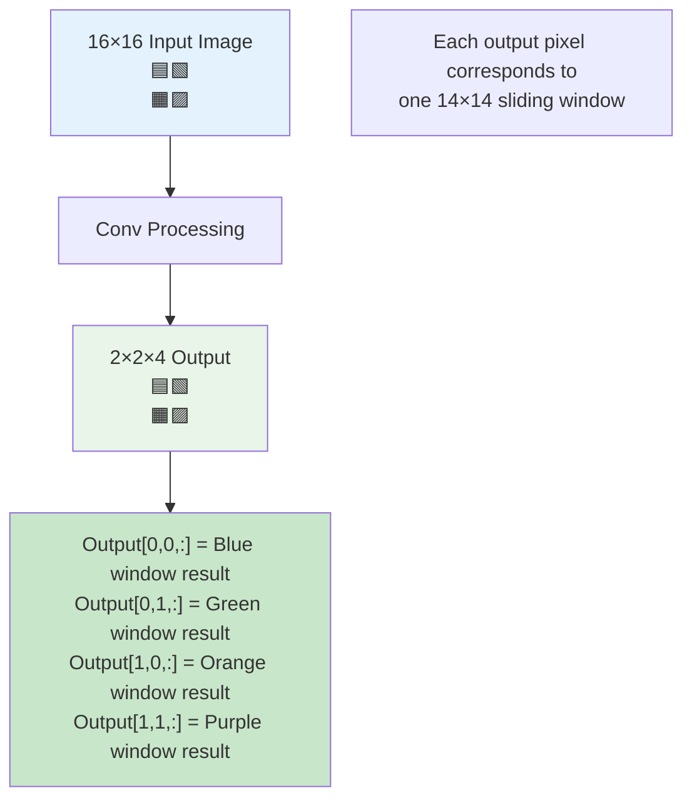

## Scaling to Larger Images

### The Power of the Approach

The real benefit becomes apparent with larger images. For a 28×28 input image:

**Traditional approach**:

- 8×8 = 64 sliding windows of size 14×14
- 64 separate forward passes
- 64× computational cost

**Convolutional approach**:

- Single forward pass through 28×28 image
- Output: 8×8×4 (64 predictions in one go)
- Same results, 1× computational cost

### Computational Analysis

```python
def computational_comparison():
    """
    Compare computational costs
    """

    # For 28×28 image with 14×14 sliding windows, stride=2
    num_windows = 8 * 8  # 64 windows

    # Traditional approach
    traditional_ops = num_windows * operations_per_forward_pass

    # Convolutional approach
    conv_ops = operations_per_large_forward_pass

    speedup = traditional_ops / conv_ops

    print(f"Traditional: {traditional_ops:,} operations")
    print(f"Convolutional: {conv_ops:,} operations")
    print(f"Speedup: {speedup:.1f}×")

    # Example output:
    # Traditional: 64,000,000 operations
    # Convolutional: 1,200,000 operations
    # Speedup: 53.3×
```

## Implementation Details

### Creating the Fully Convolutional Network

```python
def create_conv_sliding_detector(input_shape=(14, 14, 3), num_classes=4):
    """
    Create fully convolutional sliding window detector
    """

    inputs = tf.keras.layers.Input(shape=input_shape)

    # Convolutional feature extraction
    x = tf.keras.layers.Conv2D(16, 5, activation='relu')(inputs)  # 10×10×16
    x = tf.keras.layers.MaxPooling2D(2)(x)  # 5×5×16

    # Replace FC layers with convolutions
    x = tf.keras.layers.Conv2D(400, 5, activation='relu')(x)  # 1×1×400
    x = tf.keras.layers.Conv2D(num_classes, 1, activation='softmax')(x)  # 1×1×4

    return tf.keras.Model(inputs, x)

def apply_to_larger_image(model, large_image):
    """
    Apply trained model to larger image for sliding window detection
    """

    # Model trained on 14×14 images, now applied to larger image
    detection_map = model(large_image)

    # detection_map shape depends on input size
    # For 28×28 input → 8×8×4 output
    # Each spatial location is a sliding window prediction

    return detection_map
```

### Extracting Detections

```python
def extract_detections(detection_map, threshold=0.8, stride=2):
    """
    Convert detection map to bounding box predictions
    """

    detections = []
    height, width, num_classes = detection_map.shape

    for y in range(height):
        for x in range(width):
            for c in range(num_classes):
                confidence = detection_map[y, x, c]

                if confidence > threshold:
                    # Convert grid position to image coordinates
                    center_x = x * stride + 7  # 7 = half of 14×14 window
                    center_y = y * stride + 7

                    detection = {
                        'class': c,
                        'confidence': confidence,
                        'bbox': [center_x-7, center_y-7, 14, 14]  # x, y, w, h
                    }
                    detections.append(detection)

    return detections
```

## Key Advantages and Limitations

### Advantages

1. **Massive Speedup**: 10-100× faster than naive sliding windows
2. **Shared Computation**: Overlapping regions computed once
3. **Scalable**: Efficiency gains increase with image size
4. **Memory Efficient**: Single forward pass uses less memory

### Limitations

1. **Fixed Architecture**: Network architecture determines possible window sizes
2. **Quantized Positions**: Detections limited to grid positions
3. **Accuracy Trade-off**: Bounding box positions not precise
4. **Scale Constraints**: Limited range of object scales

### The Precision Problem

The output positions are quantized to grid locations:

```python
# Example precision limitation
true_car_center = (47.3, 89.7)      # True center
grid_prediction = (48, 88)           # Nearest grid position
error = 1.4 pixels                   # Systematic quantization error
```

This limitation drives the development of more sophisticated detection methods like YOLO, which add regression capabilities to predict precise bounding box coordinates relative to grid cells.

## Summary

Convolutional implementation of sliding windows represents a crucial breakthrough in object detection efficiency. By converting fully connected layers to convolutional layers, we transform an inherently sequential process into a parallel one, achieving dramatic computational savings while maintaining the same detection coverage.

The key insights are:

1. **Mathematical equivalence** between FC and convolutional layers
2. **Spatial correspondence** between output locations and sliding windows
3. **Shared computation** for overlapping image regions
4. **Scalable efficiency** that improves with larger images

This approach forms the foundation for modern object detection systems, even though subsequent methods like YOLO and R-CNN address its limitations with more sophisticated bounding box regression and multi-scale detection strategies.

# 5. Bounding Box Predictions: The YOLO Algorithm

**📊 Interactive Visualization**: [./yolo_algorithm_visualization.html](./yolo_algorithm_visualization.html)

## The Problem with Sliding Windows Detection

While convolutional implementation of sliding windows is computationally efficient, it still has a fundamental limitation: **the predicted bounding boxes are not accurate**. The sliding windows approach uses discrete, fixed positions and sizes, which means:

- None of the predefined windows may perfectly match the actual object location
- The algorithm is constrained by the stride size and predetermined window dimensions
- Objects with unusual aspect ratios (non-square) are poorly detected

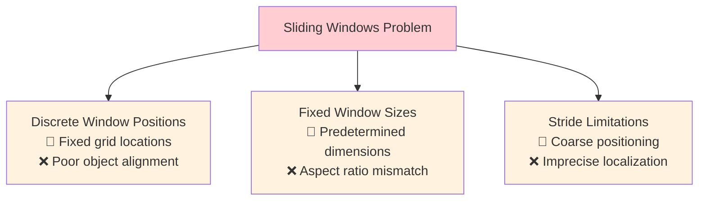

**Example of the problem:**

- Ground truth: Red rectangle (optimal bounding box)
- Sliding windows: Blue rectangles (available discrete positions)
- Result: None of the blue rectangles precisely matches the red ground truth

## YOLO: You Only Look Once

**YOLO** (You Only Look Once) is a revolutionary object detection algorithm developed by Joseph Redmon, Santosh Divvala, Ross Girshick, and Ali Farhadi in 2015. YOLO solves the sliding windows accuracy problem by enabling the neural network to output precise bounding box coordinates directly.

### Core YOLO Concept

YOLO treats object detection as a **single regression problem**, simultaneously predicting:

- **Bounding box coordinates** (precise locations)
- **Object confidence** (probability of object presence)
- **Class probabilities** (what type of object)

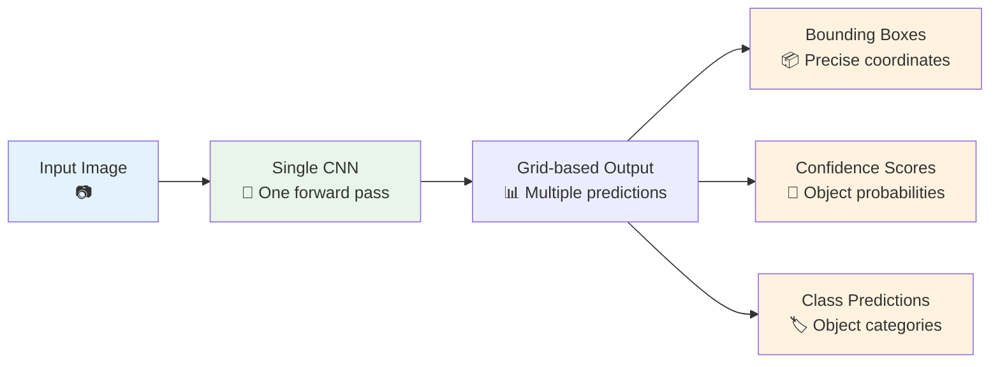

## YOLO Algorithm Step-by-Step

### Step 1: Grid Division

Divide the input image into an **S × S grid**. Each grid cell is responsible for detecting objects whose **center** falls within that cell.

**Example Setup:**

- Input image: 100 × 100 pixels
- Grid size: 3 × 3 (for illustration; practical implementations use 19 × 19 or finer)

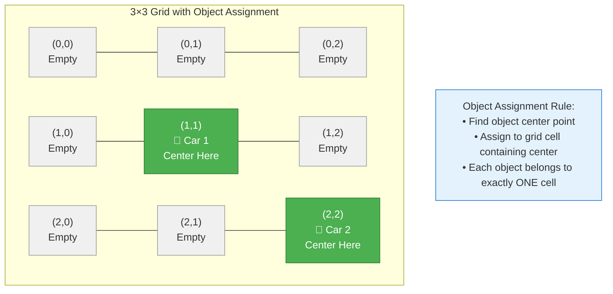

### Step 2: Object Assignment Strategy

**Key Rule:** Each object is assigned to exactly **one grid cell** - the cell containing the object's **midpoint**.

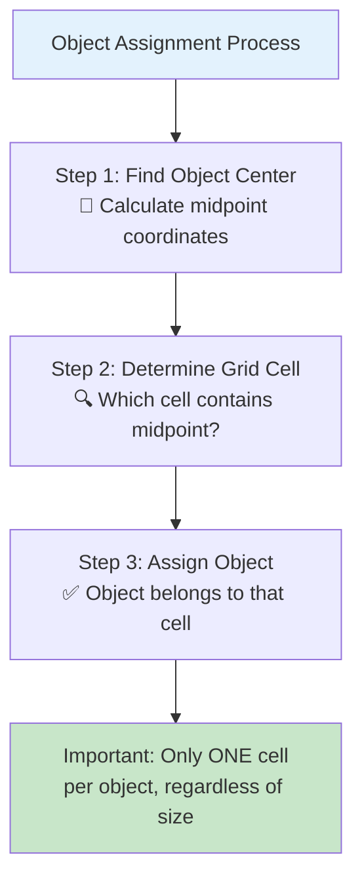

**Example:**

- Left car: midpoint in grid cell (1,1) → assigned to cell (1,1)
- Right car: midpoint in grid cell (2,0) → assigned to cell (2,0)
- Center cell (1,0): contains parts of both cars but no midpoints → no object assigned

### Step 3: Target Label Structure

For each grid cell, create an **8-dimensional target vector Y**:

$$
Y = \begin{bmatrix}
P_c \\
b_x \\
b_y \\
b_h \\
b_w \\
c_1 \\
c_2 \\
c_3
\end{bmatrix}
$$

Where:

- **$P_c$**: Probability that an object exists in this cell (0 or 1)
- **$(b_x, b_y)$**: Bounding box center coordinates relative to grid cell
- **$(b_h, b_w)$**: Bounding box height and width relative to entire image
- **$(c_1, c_2, c_3)$**: One-hot encoded class probabilities

**Target Construction Examples:**

**Grid Cell with No Object:**

```
Y = [0, ?, ?, ?, ?, ?, ?, ?]
```

- $P_c = 0$ (no object present)
- All other values are "don't care" (marked with ?)

**Grid Cell with Car Object:**

```
Y = [1, 0.4, 0.3, 0.5, 0.9, 0, 1, 0]
```

- $P_c = 1$ (object present)
- $(b_x, b_y) = (0.4, 0.3)$ (center position within cell)
- $(b_h, b_w) = (0.5, 0.9)$ (dimensions relative to image)
- $(c_1, c_2, c_3) = (0, 1, 0)$ (class: car)

```
YOLO 3×3 Grid - Bounding Box Coordinate Encoding
===============================================

Full Image Grid (3×3):
┌─────────┬─────────┬─────────┐
│  (0,0)  │  (0,1)  │  (0,2)  │
│         │         │         │
│         │         │         │
├─────────┼─────────┼─────────┤
│  (1,0)  │  (1,1)  │  (1,2)  │  ← Cell (1,1) contains car center
│         │    🎯   │         │
│         │         │         │
├─────────┼─────────┼─────────┤
│  (2,0)  │  (2,1)  │  (2,2)  │
│         │         │         │
│         │         │         │
└─────────┴─────────┴─────────┘

Zoomed Cell (1,1) - Local Coordinate System:
┌─────────────────────────────┐ ← (0,0) - Top-left of cell
│                             │
│                             │
│           🎯 (0.4, 0.3)     │ ← Object center: 40% right, 30% down
│       ┌─────────────┐       │
│       │             │       │   ┌─ bx = 0.4 (within cell [0,1])
│       │     CAR     │       │   ├─ by = 0.3 (within cell [0,1])
│       │             │       │   │
│       └─────────────┘       │   │
│                             │   │
│                             │   │
│                             │   │
└─────────────────────────────┘ ← (1,1) - Bottom-right of cell
                                  │
Bounding Box Dimensions:          │
├─ bh = 0.5 (50% of ENTIRE image height)
└─ bw = 0.9 (90% of ENTIRE image width)

Complete YOLO Vector for Cell (1,1):
[Pc, bx, by, bh, bw, c1, c2, c3] = [1, 0.4, 0.3, 0.5, 0.9, 0, 1, 0]
 │   │   │   │   │   └─────────┴─ Class: (0,1,0) = Car
 │   │   │   │   └───────────────── Width: 90% of image
 │   │   │   └───────────────────── Height: 50% of image
 │   │   └───────────────────────── Y-center: 30% down in cell
 │   └───────────────────────────── X-center: 40% across in cell
 └───────────────────────────────── Confidence: Object present

Key Insight: Center coordinates (bx,by) are RELATIVE to the cell [0,1]
             Dimensions (bh,bw) are RELATIVE to entire image [0,∞)
```

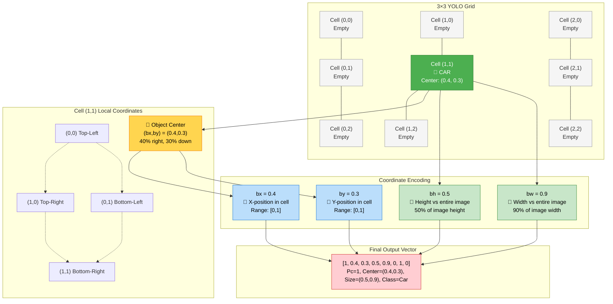

### Step 4: Output Volume Structure

For a **3 × 3 grid** with **8-dimensional vectors**, the total output is a **3 × 3 × 8 volume**.

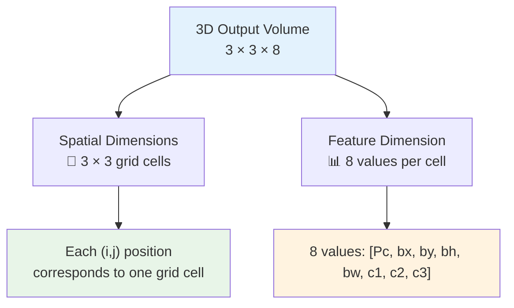

## Bounding Box Coordinate Encoding

### YOLO Coordinate System

YOLO uses a **relative coordinate system** for each grid cell:

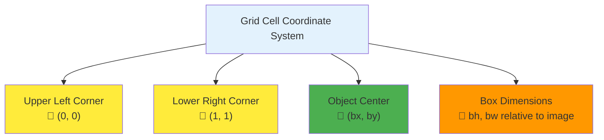

### Coordinate Constraints and Ranges

**Center Coordinates $(b_x, b_y)$:**

- **Range:** [0, 1]
- **Meaning:** Position within the grid cell
- **Constraint:** Must be between 0 and 1 by definition (if outside, object would belong to different cell)

**Dimensions $(b_h, b_w)$:**

- **Range:** [0, ∞) (can exceed 1)
- **Meaning:** Fraction of total image height/width
- **Example:** $b_w = 1.2$ means box width is 120% of image width

### Practical Example

Consider a car in grid cell (2,1):

**Given:**

- Object center appears at 40% across and 30% down within the cell
- Box width is 90% of cell width
- Box height is 50% of cell height

**YOLO Encoding:**

```
bx = 0.4  (40% across the cell)
by = 0.3  (30% down the cell)
bw = 0.9  (90% of total image width)
bh = 0.5  (50% of total image height)
```

## Network Architecture and Training

### Input and Output Dimensions

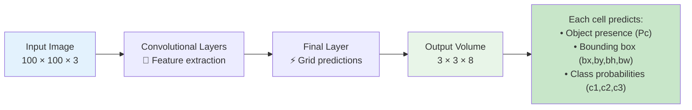

### Training Process

1. **Data Preparation:** Convert labeled images to 3×3×8 target format
2. **Network Training:** Use standard backpropagation with appropriate loss function
3. **Loss Components:**
   - Classification loss for object presence
   - Regression loss for bounding box coordinates
   - Classification loss for object categories

### Prediction Process

1. **Forward Pass:** Input image → 3×3×8 output volume
2. **Interpretation:** For each grid cell:
   - Check if $P_c > threshold$ (e.g., 0.5)
   - If yes, extract bounding box and class predictions
   - Convert relative coordinates to absolute pixel positions

## Key Advantages of YOLO

### 1. **Speed and Efficiency**

- **Single forward pass** through the network
- **Real-time performance** (45+ FPS)
- **Convolutional implementation** with shared computation

### 2. **Accurate Bounding Boxes**

- **Continuous coordinates** (not discrete sliding windows)
- **Any aspect ratio** supported
- **Precise localization** learned through regression

### 3. **Global Context**

- **Entire image** seen during training and inference
- **Reduced background errors** compared to sliding window approaches
- **Better contextual understanding**

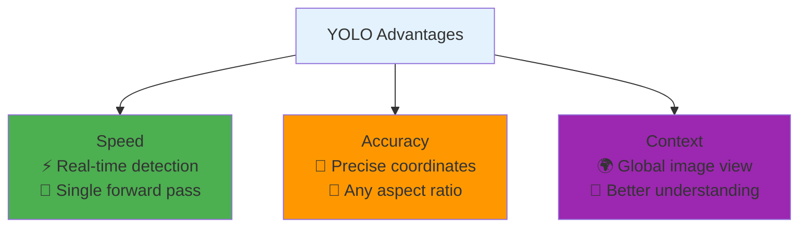

## Current Limitations

### 1. **Multiple Objects per Grid Cell**

- **Problem:** Each grid cell can only predict **one object**
- **Impact:** Struggles when multiple objects have centers in same cell
- **Mitigation:** Use finer grids (19×19 instead of 3×3)

### 2. **Small Object Detection**

- **Problem:** Small objects may not have clear grid cell assignment
- **Impact:** Poor performance on densely packed small objects
- **Future Solution:** Multi-scale detection (addressed in later YOLO versions)

### 3. **Novel Aspect Ratios**

- **Problem:** Difficulty with objects having unusual width/height ratios
- **Future Solution:** Anchor boxes (covered in next sections)

## Practical Implementation Notes

### Grid Size Selection

- **3×3 grid:** Good for illustration, too coarse for real applications
- **19×19 grid:** Common practical choice for 448×448 input images
- **Trade-off:** Finer grids reduce multi-object conflicts but increase computation

### Coordinate Parameterization

While the basic approach shown works well, the original YOLO paper uses more sophisticated parameterizations:

- **Sigmoid functions** to ensure coordinates stay in [0,1] range
- **Exponential parameterization** for width/height to ensure positive values
- **Alternative encodings** for improved training stability

## Summary

YOLO revolutionizes object detection by:

1. **Eliminating sliding windows** in favor of direct regression
2. **Enabling precise bounding boxes** through continuous coordinate prediction
3. **Achieving real-time performance** with single forward pass
4. **Providing global context** for better detection accuracy

The key insight is treating object detection as a **single regression problem** rather than a classification problem applied to many windows. This unified approach leads to both better accuracy and dramatically improved speed.

In the next sections, we'll explore techniques that make YOLO even more robust: **Intersection over Union** for evaluation, **Non-maximum Suppression** for handling multiple detections, and **Anchor Boxes** for detecting multiple objects per grid cell.

# 6. Intersection Over Union (IoU)

**📊 Interactive Visualization**: [./iou_visualization.html](./iou_visualization.html)

## Evaluating Object Detection Performance

Intersection over Union (IoU) is the **fundamental metric** for evaluating object detection algorithms. It measures how well a predicted bounding box aligns with the ground truth by calculating the overlap between two bounding boxes.

### The Core Question

When your algorithm predicts a bounding box, how do you determine if it's "correct"?

```mermaid
%%{init: {"theme": "default", "themeVariables": {"primaryColor": "#1f2937", "edgeLabelBackground":"#f9fafb", "primaryTextColor":"#000000", "fontSize": 12}}}%%
graph TD
    A["Object Detection Result"] --> B["Ground Truth Box<br/>🟥 Red - What should be detected"]
    A --> C["Predicted Box<br/>🟦 Blue - What algorithm detected"]
    B --> D["How good is the match?<br/>🤔 Need evaluation metric"]
    C --> D
    D --> E["IoU = Intersection ÷ Union<br/>📊 Quantifies overlap quality"]

    style A fill:#e3f2fd
    style D fill:#fff3e0
    style E fill:#e8f5e8
```

## Mathematical Definition

IoU quantifies the overlap between two bounding boxes using a simple ratio:

$$\text{IoU} = \frac{\text{Area of Intersection}}{\text{Area of Union}} = \frac{|A \cap B|}{|A \cup B|}$$

Where:

- **A** = Ground truth bounding box area
- **B** = Predicted bounding box area
- **A ∩ B** = Intersection area (overlap region)
- **A ∪ B** = Union area (total area covered by both boxes)

### Visual Understanding

```mermaid
%%{init: {"theme": "default", "themeVariables": {"primaryColor": "#1f2937", "edgeLabelBackground":"#f9fafb", "primaryTextColor":"#000000", "fontSize": 12}}}%%
graph TD
    subgraph "IoU Components"
        A["Ground Truth Box<br/>🟥 Area = 400 pixels"]
        B["Predicted Box<br/>🟦 Area = 300 pixels"]
        C["Intersection<br/>🟧 Overlap = 150 pixels"]
        D["Union<br/>🟩 Total = 400 + 300 - 150 = 550 pixels"]
    end

    subgraph "IoU Calculation"
        E["IoU = 150 ÷ 550 = 0.273<br/>📊 27.3% overlap"]
    end

    A --> C
    B --> C
    A --> D
    B --> D
    C --> E
    D --> E

    style A fill:#ffcdd2
    style B fill:#bbdefb
    style C fill:#fff3e0
    style D fill:#c8e6c9
    style E fill:#e1bee7
```

## Step-by-Step IoU Calculation

### Algorithm Breakdown

**Step 1: Find Intersection Coordinates**

```python
# For boxes in [x1, y1, x2, y2] format
x1_inter = max(box1[0], box2[0])  # Left edge of intersection
y1_inter = max(box1[1], box2[1])  # Top edge of intersection
x2_inter = min(box1[2], box2[2])  # Right edge of intersection
y2_inter = min(box1[3], box2[3])  # Bottom edge of intersection
```

**Step 2: Calculate Intersection Area**

```python
if x2_inter <= x1_inter or y2_inter <= y1_inter:
    intersection_area = 0  # No overlap
else:
    intersection_area = (x2_inter - x1_inter) * (y2_inter - y1_inter)
```

**Step 3: Calculate Union Area**

```python
area1 = (box1[2] - box1[0]) * (box1[3] - box1[1])
area2 = (box2[2] - box2[0]) * (box2[3] - box2[1])
union_area = area1 + area2 - intersection_area
```

**Step 4: Compute IoU**

```python
iou = intersection_area / union_area if union_area > 0 else 0
```

### Complete Implementation

```python
def calculate_iou(box1, box2):
    """
    Calculate Intersection over Union for two bounding boxes

    Args:
        box1, box2: [x1, y1, x2, y2] format

    Returns:
        IoU value between 0 and 1
    """
    # Step 1: Find intersection rectangle
    x1 = max(box1[0], box2[0])
    y1 = max(box1[1], box2[1])
    x2 = min(box1[2], box2[2])
    y2 = min(box1[3], box2[3])

    # Step 2: Calculate intersection area
    if x2 <= x1 or y2 <= y1:
        intersection = 0
    else:
        intersection = (x2 - x1) * (y2 - y1)

    # Step 3: Calculate areas of both boxes
    area1 = (box1[2] - box1[0]) * (box1[3] - box1[1])
    area2 = (box2[2] - box2[0]) * (box2[3] - box2[1])

    # Step 4: Calculate union area
    union = area1 + area2 - intersection

    # Step 5: Calculate IoU
    return intersection / union if union > 0 else 0
```

## IoU Examples and Scenarios

### Scenario 1: Perfect Match

```python
ground_truth = [10, 10, 50, 50]  # 40×40 = 1600 area
prediction   = [10, 10, 50, 50]  # Identical box

# Intersection = 1600, Union = 1600
# IoU = 1600/1600 = 1.0 (Perfect!)
```

### Scenario 2: Good Overlap

```python
ground_truth = [10, 10, 50, 50]  # 40×40 = 1600 area
prediction   = [15, 15, 55, 55]  # 40×40 = 1600 area, shifted

# Intersection = 35×35 = 1225
# Union = 1600 + 1600 - 1225 = 2975
# IoU = 1225/2975 = 0.412 (Decent overlap)
```

### Scenario 3: Poor Overlap

```python
ground_truth = [10, 10, 50, 50]  # 40×40 = 1600 area
prediction   = [40, 40, 80, 80]  # 40×40 = 1600 area, mostly separate

# Intersection = 10×10 = 100
# Union = 1600 + 1600 - 100 = 3100
# IoU = 100/3100 = 0.032 (Very poor)
```

### Scenario 4: No Overlap

```python
ground_truth = [10, 10, 30, 30]  # Non-overlapping boxes
prediction   = [50, 50, 70, 70]

# Intersection = 0
# Union = 400 + 400 - 0 = 800
# IoU = 0/800 = 0.0 (No overlap)
```

## IoU Threshold Conventions

### Standard Thresholds

```mermaid
%%{init: {"theme": "default", "themeVariables": {"primaryColor": "#1f2937", "edgeLabelBackground":"#f9fafb", "primaryTextColor":"#000000", "fontSize": 12}}}%%
graph TD
    A["IoU Thresholds"] --> B["IoU ≥ 0.5<br/>✅ Standard 'Correct'<br/>🎯 PASCAL VOC standard"]
    A --> C["IoU ≥ 0.7<br/>⭐ High Quality<br/>🎯 Stringent applications"]
    A --> D["IoU ≥ 0.9<br/>🎯 Excellent Match<br/>🎯 Near-perfect alignment"]
    A --> E["IoU < 0.3<br/>❌ Poor Detection<br/>🎯 Usually considered wrong"]

    style B fill:#c8e6c9
    style C fill:#81c784
    style D fill:#4caf50
    style E fill:#ffcdd2
```

### Domain-Specific Thresholds

| **Application Domain**       | **IoU Threshold** | **Reasoning**                       |
| :--------------------------- | :---------------- | :---------------------------------- |
| **General Object Detection** | 0.5               | Balanced precision/recall trade-off |
| **Medical Imaging**          | 0.7-0.8           | Critical accuracy for diagnosis     |
| **Autonomous Driving**       | 0.7+              | Safety-critical applications        |
| **Face Detection**           | 0.5-0.6           | Faces have consistent structure     |
| **Document Analysis**        | 0.5               | Text boxes often approximate        |
| **Competition (COCO)**       | 0.5-0.95          | Average across multiple thresholds  |

### COCO Evaluation Standard

The COCO dataset uses **mAP (mean Average Precision)** across IoU thresholds:

```python
COCO_THRESHOLDS = [0.5, 0.55, 0.6, 0.65, 0.7, 0.75, 0.8, 0.85, 0.9, 0.95]

def coco_map(predictions, ground_truths):
    """Calculate COCO-style mAP across IoU thresholds"""
    aps = []
    for threshold in COCO_THRESHOLDS:
        ap = average_precision_at_iou(predictions, ground_truths, threshold)
        aps.append(ap)
    return sum(aps) / len(aps)  # Mean across thresholds
```

## Advanced IoU Concepts

### IoU Limitations

**Problem 1: Zero IoU for Non-Overlapping Boxes**

- IoU = 0 for any non-overlapping boxes
- Cannot distinguish between "close miss" and "far miss"
- No gradient information for optimization

**Problem 2: Same IoU, Different Spatial Relationships**

- Multiple box configurations can yield identical IoU values
- Doesn't capture shape similarity or relative positioning

### IoU Variants

#### Generalized IoU (GIoU)

Addresses the non-overlapping box problem:

$$\text{GIoU} = \text{IoU} - \frac{|C| - |A \cup B|}{|C|}$$

Where C is the smallest enclosing box containing both A and B.

```mermaid
%%{init: {"theme": "default", "themeVariables": {"primaryColor": "#1f2937", "edgeLabelBackground":"#f9fafb", "primaryTextColor":"#000000", "fontSize": 12}}}%%
graph TD
    A["Standard IoU Limitations"] --> B["Non-overlapping boxes<br/>📦 IoU = 0 (no gradient)"]
    A --> C["Same IoU, different layouts<br/>📦 Loss of spatial info"]

    D["GIoU Solution"] --> E["Enclosing box penalty<br/>📦 Range: [-1, 1]"]
    D --> F["Gradient for optimization<br/>📦 Even when IoU = 0"]

    B --> D
    C --> D

    style A fill:#ffcdd2
    style D fill:#c8e6c9
```

#### Distance IoU (DIoU)

Considers center point distance:

$$\text{DIoU} = \text{IoU} - \frac{d^2}{c^2}$$

Where:

- d = distance between box centers
- c = diagonal length of enclosing box

#### Complete IoU (CIoU)

Adds aspect ratio consistency:

$$\text{CIoU} = \text{DIoU} - \alpha v$$

Where v measures aspect ratio similarity.

## Practical Applications

### 1. Model Evaluation

```python
def evaluate_detection_model(predictions, ground_truths, iou_threshold=0.5):
    """Evaluate object detection performance using IoU"""

    true_positives = 0
    false_positives = 0
    false_negatives = 0

    matched_predictions = set()
    matched_ground_truths = set()

    # Calculate IoU for all prediction-GT pairs
    for pred_idx, pred_box in enumerate(predictions):
        best_iou = 0
        best_gt_idx = -1

        for gt_idx, gt_box in enumerate(ground_truths):
            if gt_idx in matched_ground_truths:
                continue

            iou = calculate_iou(pred_box, gt_box)
            if iou > best_iou:
                best_iou = iou
                best_gt_idx = gt_idx

        # Check if prediction matches any ground truth
        if best_iou >= iou_threshold:
            true_positives += 1
            matched_predictions.add(pred_idx)
            matched_ground_truths.add(best_gt_idx)
        else:
            false_positives += 1

    # Count unmatched ground truths as false negatives
    false_negatives = len(ground_truths) - len(matched_ground_truths)

    # Calculate metrics
    precision = true_positives / (true_positives + false_positives) if (true_positives + false_positives) > 0 else 0
    recall = true_positives / (true_positives + false_negatives) if (true_positives + false_negatives) > 0 else 0
    f1_score = 2 * (precision * recall) / (precision + recall) if (precision + recall) > 0 else 0

    return {
        'precision': precision,
        'recall': recall,
        'f1_score': f1_score,
        'true_positives': true_positives,
        'false_positives': false_positives,
        'false_negatives': false_negatives
    }
```

### 2. Non-Maximum Suppression (Preview)

IoU is crucial for removing duplicate detections:

```python
def nms_preview(boxes, scores, iou_threshold=0.5):
    """Preview: How IoU enables Non-Maximum Suppression"""

    # Sort by confidence scores
    sorted_indices = sorted(range(len(scores)), key=lambda i: scores[i], reverse=True)

    keep = []
    while sorted_indices:
        # Keep highest confidence box
        current = sorted_indices.pop(0)
        keep.append(current)

        # Remove boxes with high IoU overlap
        remaining = []
        for idx in sorted_indices:
            iou = calculate_iou(boxes[current], boxes[idx])
            if iou < iou_threshold:  # Keep if IoU is low (different objects)
                remaining.append(idx)

        sorted_indices = remaining

    return keep  # Indices of boxes to keep
```

### 3. Loss Function Integration

```python
def iou_loss(predicted_boxes, target_boxes):
    """IoU-based loss for bounding box regression"""

    ious = []
    for pred, target in zip(predicted_boxes, target_boxes):
        iou = calculate_iou(pred, target)
        ious.append(iou)

    # Convert IoU to loss (higher IoU = lower loss)
    loss = 1 - tf.reduce_mean(ious)
    return loss
```

## Efficient Vectorized Implementation

For processing multiple boxes simultaneously:

```python
import numpy as np

def calculate_iou_vectorized(boxes1, boxes2):
    """
    Vectorized IoU calculation for multiple box pairs

    Args:
        boxes1: Shape (N, 4) - [x1, y1, x2, y2]
        boxes2: Shape (M, 4) - [x1, y1, x2, y2]

    Returns:
        IoU matrix of shape (N, M)
    """

    # Expand dimensions for broadcasting
    boxes1 = np.expand_dims(boxes1, axis=1)  # (N, 1, 4)
    boxes2 = np.expand_dims(boxes2, axis=0)  # (1, M, 4)

    # Calculate intersection coordinates
    x1 = np.maximum(boxes1[..., 0], boxes2[..., 0])
    y1 = np.maximum(boxes1[..., 1], boxes2[..., 1])
    x2 = np.minimum(boxes1[..., 2], boxes2[..., 2])
    y2 = np.minimum(boxes1[..., 3], boxes2[..., 3])

    # Calculate intersection area
    intersection = np.maximum(0, x2 - x1) * np.maximum(0, y2 - y1)

    # Calculate areas of both sets of boxes
    area1 = (boxes1[..., 2] - boxes1[..., 0]) * (boxes1[..., 3] - boxes1[..., 1])
    area2 = (boxes2[..., 2] - boxes2[..., 0]) * (boxes2[..., 3] - boxes2[..., 1])

    # Calculate union area
    union = area1 + area2 - intersection

    # Calculate IoU
    iou = intersection / np.maximum(union, 1e-8)  # Avoid division by zero

    return iou
```

## Key Takeaways

```mermaid
%%{init: {"theme": "default", "themeVariables": {"primaryColor": "#1f2937", "edgeLabelBackground":"#f9fafb", "primaryTextColor":"#000000", "fontSize": 12}}}%%
graph TD
    A["IoU: The Universal Metric"] --> B["📊 Evaluation<br/>Measures detection quality<br/>Standard: IoU ≥ 0.5"]
    A --> C["🔧 Optimization<br/>Loss function component<br/>Enables gradient descent"]
    A --> D["🧹 Post-processing<br/>Non-Maximum Suppression<br/>Removes duplicates"]
    A --> E["🎯 Model Selection<br/>Compare different architectures<br/>Benchmark performance"]

    style A fill:#e3f2fd
    style B fill:#e8f5e8
    style C fill:#fff3e0
    style D fill:#f3e5f5
    style E fill:#ffebee
```

### Essential Points

1. **IoU ≥ 0.5** is the standard threshold for "correct" detection
2. **Higher IoU = Better localization** accuracy
3. **IoU = 1.0** means perfect box alignment
4. **IoU = 0.0** means no overlap between boxes
5. **Domain-specific thresholds** may require higher IoU (0.7+ for critical applications)

### What's Next?

IoU serves as the foundation for:

- **Non-Maximum Suppression**: Removing duplicate detections (next section)
- **Anchor Box Assignment**: Determining which predictions to train
- **Advanced Metrics**: mAP, precision-recall curves
- **Loss Functions**: IoU-based losses for better training

IoU is not just an evaluation metric—it's a fundamental concept that enables many advanced object detection techniques!

# 7. Non-max Suppression (NMS)

**📊 Interactive Visualization**: [./nms_visualization.html](./nms_visualization.html)

## The Multiple Detection Problem

One major issue with object detection algorithms like YOLO is that they often detect the same object **multiple times**. Instead of finding each object once, the algorithm might produce several overlapping bounding boxes for the same object with different confidence scores.

### Why Multiple Detections Occur

```mermaid
%%{init: {"theme": "default", "themeVariables": {"primaryColor": "#1f2937", "edgeLabelBackground":"#f9fafb", "primaryTextColor":"#000000", "fontSize": 12}}}%%
graph TD
    A["YOLO 19×19 Grid<br/>361 Grid Cells"] --> B["Each Cell Predicts<br/>Object Probability"]
    B --> C["Multiple Adjacent Cells<br/>Detect Same Object"]
    C --> D["Problem: Redundant<br/>Overlapping Detections"]

    E["Example: Car Detection"] --> F["Cell (9,10): Pc = 0.9<br/>Cell (9,11): Pc = 0.7<br/>Cell (10,10): Pc = 0.6"]
    F --> G["All detect same car<br/>Need to choose best one"]

    style A fill:#e3f2fd
    style D fill:#ffcdd2
    style G fill:#fff3e0
```

**Real-world scenario:**

- A car's center might be in grid cell (9,10)
- But adjacent cells (9,11), (10,10), (8,10) might also think they contain the car's center
- Each produces a bounding box with different confidence scores
- Result: 3-4 overlapping boxes for the same car

### The Solution: Non-Maximum Suppression

NMS eliminates redundant detections by:

1. **Keeping the highest confidence detection**
2. **Suppressing overlapping detections** with lower confidence
3. **Ensuring each object is detected only once**

```mermaid
%%{init: {"theme": "default", "themeVariables": {"primaryColor": "#1f2937", "edgeLabelBackground":"#f9fafb", "primaryTextColor":"#000000", "fontSize": 12}}}%%
graph LR
    A["Multiple Detections<br/>📦📦📦 Same Object"] --> B["NMS Algorithm<br/>🔍 Compare & Suppress"]
    B --> C["Single Best Detection<br/>📦 Clean Result"]

    D["Before NMS:<br/>Car A: [0.9, 0.7, 0.6]<br/>Car B: [0.8, 0.5]"] --> E["After NMS:<br/>Car A: [0.9]<br/>Car B: [0.8]"]

    style A fill:#ffcdd2
    style C fill:#c8e6c9
    style D fill:#fff3e0
    style E fill:#e8f5e8
```

## Simple Explanation: What is Non-Maximum Suppression (NMS)?

### The Problem in Simple Terms

Imagine you're looking for cars in a photo. Your algorithm finds the same car **multiple times** with different confidence scores:

```
Same Car Detected Multiple Times:
🚗 Box A: "I'm 90% sure there's a car here!"
🚗 Box B: "I'm 70% sure there's a car here!" (overlaps with A)
🚗 Box C: "I'm 60% sure there's a car here!" (overlaps with A)
```

**Problem**: You have 3 detections for 1 car!

**Solution**: NMS keeps the best one (90%) and removes the duplicates.

### What NMS Does (In 3 Steps)

1. **Keep the most confident detection** (highest score)
2. **Remove overlapping boxes** that are detecting the same thing
3. **Repeat** until no more duplicates exist

### ASCII Diagram Example

```
BEFORE NMS: Multiple Overlapping Detections
===========================================

     ┌─────────────┐
     │  Car A: 90% │ ← Best detection
     │      🚗     │
     └─────────────┘
        ┌─────────────┐
        │  Car B: 70% │ ← Overlapping duplicate
        │      🚗     │
        └─────────────┘
           ┌─────────────┐
           │  Car C: 60% │ ← Another duplicate
           │      🚗     │
           └─────────────┘

AFTER NMS: Clean Single Detection
==================================

     ┌─────────────┐
     │  Car A: 90% │ ← Only the best one kept
     │      🚗     │
     └─────────────┘

     ❌ Car B: 70% (REMOVED - too much overlap with A)
     ❌ Car C: 60% (REMOVED - too much overlap with A)
```

### Step-by-Step Example

```
Input Detections:
┌─────────────────────────────────────────┐
│ Detection ID | Confidence | Status      │
├─────────────────────────────────────────┤
│     A        |    90%     | [Checking]  │
│     B        |    70%     | [Waiting]   │
│     C        |    60%     | [Waiting]   │
│     D        |    80%     | [Waiting]   │ ← Different car
└─────────────────────────────────────────┘

Step 1: Sort by confidence (highest first)
┌─────────────────────────────────────────┐
│ Detection ID | Confidence | Status      │
├─────────────────────────────────────────┤
│     A        |    90%     | [Best]      │ ← Highest confidence
│     D        |    80%     | [Waiting]   │
│     B        |    70%     | [Waiting]   │
│     C        |    60%     | [Waiting]   │
└─────────────────────────────────────────┘

Step 2: Keep A (90%), check overlaps
┌─────────────────────────────────────────┐
│ Detection ID | Confidence | Status      │
├─────────────────────────────────────────┤
│     A        |    90%     | ✅ KEEP     │
│     D        |    80%     | [Checking]  │ ← No overlap with A
│     B        |    70%     | ❌ REMOVE   │ ← Overlaps with A
│     C        |    60%     | ❌ REMOVE   │ ← Overlaps with A
└─────────────────────────────────────────┘

Step 3: Keep D (80%), check remaining
┌─────────────────────────────────────────┐
│ Detection ID | Confidence | Status      │
├─────────────────────────────────────────┤
│     A        |    90%     | ✅ KEEP     │
│     D        |    80%     | ✅ KEEP     │ ← Different car
│     B        |    70%     | ❌ REMOVE   │
│     C        |    60%     | ❌ REMOVE   │
└─────────────────────────────────────────┘

Final Result: 2 cars detected (A and D)
```

### Visual Representation of Overlap

```
High Overlap = Remove Duplicate
===============================

Car A (90%):     Car B (70%):
┌─────────┐      ┌─────────┐
│    🚗   │   +  │    🚗   │  = Same car detected twice!
│         │      │         │
└─────────┘      └─────────┘
     │                │
     └────Overlap─────┘
          (IoU > 0.5)

Decision: Keep A (higher confidence), remove B


Low Overlap = Keep Both
=======================

Car A (90%):              Car D (80%):
┌─────────┐                        ┌─────────┐
│    🚗   │                        │    🚗   │
│         │        (far apart)     │         │
└─────────┘                        └─────────┘

Decision: Keep both (different cars)
```

### The Magic Numbers

- **IoU Threshold** (usually 0.5): How much overlap is "too much"
- **Score Threshold** (usually 0.6): Minimum confidence to even consider

```
IoU = Intersection / Union

If IoU > 0.5: "Same object, remove duplicate"
If IoU ≤ 0.5: "Different objects, keep both"
```

## Why NMS is Essential

**Without NMS:**

```
🚗🚗🚗 (3 boxes for 1 car - confusing!)
🚗🚗   (2 boxes for 1 car - still bad)
🚗     (1 box for 1 car - perfect!)
```

**With NMS:**

```
🚗     (Clean, single detection per object)
```

### Real-World Analogy

Think of NMS like **voting for class president**:

1. Multiple people nominate the same person with different enthusiasm levels
2. You count only the **strongest nomination** (highest confidence)
3. You **ignore duplicate nominations** for the same person
4. Result: Each person gets nominated exactly once

That's exactly what NMS does for object detection!

## NMS Algorithm Step-by-Step

### Algorithm Overview

```python
def non_max_suppression_simple(boxes, scores, iou_threshold=0.5, score_threshold=0.6):
    """
    Simplified NMS algorithm following the video explanation

    Args:
        boxes: List of bounding boxes [x, y, width, height]
        scores: List of confidence scores (Pc values)
        iou_threshold: IoU threshold for suppression (default 0.5)
        score_threshold: Minimum confidence threshold (default 0.6)

    Returns:
        List of indices for boxes to keep
    """

    # Step 1: Discard low confidence detections
    valid_indices = [i for i, score in enumerate(scores) if score > score_threshold]

    if not valid_indices:
        return []

    # Step 2: Sort by confidence score (highest first)
    valid_indices.sort(key=lambda i: scores[i], reverse=True)

    keep = []

    # Step 3: While there are remaining boxes
    while valid_indices:
        # Pick box with highest confidence
        current = valid_indices.pop(0)
        keep.append(current)

        # Remove boxes with high IoU overlap
        remaining = []
        for idx in valid_indices:
            iou = calculate_iou(boxes[current], boxes[idx])
            if iou <= iou_threshold:  # Keep if IoU is low (different objects)
                remaining.append(idx)
            # If IoU > threshold, suppress (don't add to remaining)

        valid_indices = remaining

    return keep
```

### Detailed Step-by-Step Process

**Step 1: Filter Low Confidence Detections**

```python
# Remove all detections with Pc ≤ 0.6
scores = [0.9, 0.8, 0.7, 0.6, 0.4, 0.2]  # Original scores
threshold = 0.6
filtered_scores = [s for s in scores if s > threshold]
# Result: [0.9, 0.8, 0.7] - removed 0.6, 0.4, 0.2
```

**Step 2: Sort by Confidence**

```python
# Sort detections by confidence (highest first)
detections = [(0.9, box1), (0.7, box2), (0.8, box3)]
sorted_detections = sorted(detections, key=lambda x: x[0], reverse=True)
# Result: [(0.9, box1), (0.8, box3), (0.7, box2)]
```

**Step 3: Iterative Suppression**

```mermaid
%%{init: {"theme": "default", "themeVariables": {"primaryColor": "#1f2937", "edgeLabelBackground":"#f9fafb", "primaryTextColor":"#000000", "fontSize": 12}}}%%
graph TD
    A["Start with Sorted List<br/>[0.9, 0.8, 0.7, 0.6]"] --> B["Pick Highest: 0.9<br/>✅ Keep this detection"]
    B --> C["Calculate IoU with Remaining<br/>IoU(0.9, 0.8) = 0.7<br/>IoU(0.9, 0.7) = 0.6<br/>IoU(0.9, 0.6) = 0.1"]
    C --> D["Suppress High IoU (>0.5)<br/>❌ Remove 0.8, 0.7<br/>✅ Keep 0.6"]
    D --> E["Remaining: [0.6]<br/>Pick Highest: 0.6<br/>✅ Keep this detection"]
    E --> F["Final Result: [0.9, 0.6]<br/>Two distinct objects detected"]

    style B fill:#c8e6c9
    style D fill:#ffcdd2
    style E fill:#c8e6c9
    style F fill:#e8f5e8
```

### Complete Example with Real Data

```python
def nms_example_walkthrough():
    """Complete NMS example following video explanation"""

    # Example: Car detection results
    detections = [
        {'box': [100, 100, 80, 60], 'score': 0.9, 'id': 'A'},  # High confidence
        {'box': [110, 105, 75, 55], 'score': 0.7, 'id': 'B'},  # Overlaps with A
        {'box': [105, 98, 85, 65], 'score': 0.6, 'id': 'C'},   # Overlaps with A
        {'box': [300, 200, 70, 50], 'score': 0.8, 'id': 'D'},  # Different car
        {'box': [95, 110, 90, 70], 'score': 0.5, 'id': 'E'},   # Overlaps with A
    ]

    print("🚗 NMS Example Walkthrough")
    print("=" * 50)

    # Step 1: Filter by score threshold (0.6)
    score_threshold = 0.6
    filtered = [d for d in detections if d['score'] > score_threshold]
    print(f"Step 1: Filter scores > {score_threshold}")
    for d in filtered:
        print(f"  ✅ Keep {d['id']}: score = {d['score']}")

    print(f"  ❌ Remove E: score = 0.5 (below threshold)")
    print()

    # Step 2: Sort by confidence
    filtered.sort(key=lambda x: x['score'], reverse=True)
    print("Step 2: Sort by confidence")
    for i, d in enumerate(filtered):
        print(f"  {i+1}. {d['id']}: {d['score']}")
    print()

    # Step 3: Apply NMS
    print("Step 3: Apply NMS (IoU threshold = 0.5)")
    keep = []
    remaining = filtered.copy()
    iteration = 1

    while remaining:
        print(f"\nIteration {iteration}:")

        # Pick highest confidence
        current = remaining.pop(0)
        keep.append(current)
        print(f"  📦 Keep {current['id']} (score: {current['score']})")

        if not remaining:
            break

        # Check IoU with remaining boxes
        suppress = []
        for other in remaining:
            iou = calculate_iou_simple(current['box'], other['box'])
            print(f"  🔍 IoU({current['id']}, {other['id']}) = {iou:.3f}", end="")

            if iou > 0.5:
                print(f" → ❌ SUPPRESS {other['id']}")
                suppress.append(other)
            else:
                print(f" → ✅ KEEP {other['id']}")

        # Remove suppressed boxes
        for box in suppress:
            remaining.remove(box)

        iteration += 1

    print(f"\n🎯 Final Result:")
    for d in keep:
        print(f"  📦 {d['id']}: score = {d['score']}")

    return keep

def calculate_iou_simple(box1, box2):
    """Simple IoU calculation for [x, y, w, h] format"""
    x1, y1, w1, h1 = box1
    x2, y2, w2, h2 = box2

    # Convert to [x1, y1, x2, y2]
    box1_coords = [x1, y1, x1 + w1, y1 + h1]
    box2_coords = [x2, y2, x2 + w2, y2 + h2]

    # Calculate intersection
    x_left = max(box1_coords[0], box2_coords[0])
    y_top = max(box1_coords[1], box2_coords[1])
    x_right = min(box1_coords[2], box2_coords[2])
    y_bottom = min(box1_coords[3], box2_coords[3])

    if x_right <= x_left or y_bottom <= y_top:
        return 0.0

    intersection = (x_right - x_left) * (y_bottom - y_top)
    area1 = w1 * h1
    area2 = w2 * h2
    union = area1 + area2 - intersection

    return intersection / union if union > 0 else 0

# Run the example
result = nms_example_walkthrough()
```

## Multi-Class NMS

When detecting multiple object types (pedestrians, cars, motorcycles), NMS is applied **independently for each class**.

### Why Class-Specific NMS?

```mermaid
%%{init: {"theme": "default", "themeVariables": {"primaryColor": "#1f2937", "edgeLabelBackground":"#f9fafb", "primaryTextColor":"#000000", "fontSize": 12}}}%%
graph TD
    A["Multi-Class Detection"] --> B["Person: 0.8<br/>Car: 0.9<br/>Motorcycle: 0.7"]
    B --> C["Different Classes<br/>Can Overlap Spatially"]
    C --> D["Apply NMS Separately<br/>for Each Class"]

    E["Example: Person riding motorcycle"] --> F["Person detection: 0.8<br/>Motorcycle detection: 0.9<br/>High spatial overlap"]
    F --> G["Both kept - different classes<br/>Legitimate overlapping objects"]

    style C fill:#fff3e0
    style G fill:#c8e6c9
```

**Example scenario:**

- Person riding a motorcycle
- Person detector: confidence 0.8
- Motorcycle detector: confidence 0.9
- High spatial overlap (IoU > 0.5)
- **Both should be kept** - they're different object types

### Multi-Class Implementation

```python
def multi_class_nms(detections, num_classes=3, iou_threshold=0.5, score_threshold=0.6):
    """
    Apply NMS separately for each class

    Args:
        detections: List of detections with 'box', 'score', 'class'
        num_classes: Number of classes (e.g., 3 for pedestrian, car, motorcycle)
        iou_threshold: IoU threshold for suppression
        score_threshold: Score threshold for filtering
    """

    final_detections = []

    # Process each class independently
    class_names = ['pedestrian', 'car', 'motorcycle']

    for class_id in range(num_classes):
        print(f"\n🏷️ Processing class: {class_names[class_id]}")

        # Filter detections for this class
        class_detections = [d for d in detections if d['class'] == class_id]

        if not class_detections:
            print(f"  No detections for {class_names[class_id]}")
            continue

        # Extract boxes and scores for this class
        boxes = [d['box'] for d in class_detections]
        scores = [d['score'] for d in class_detections]

        # Apply NMS for this class
        keep_indices = non_max_suppression_simple(boxes, scores, iou_threshold, score_threshold)

        # Add kept detections to final results
        for idx in keep_indices:
            final_detections.append(class_detections[idx])
            print(f"  ✅ Keep: {class_names[class_id]} (score: {scores[idx]})")

    return final_detections
```

## NMS Hyperparameters

### IoU Threshold Selection

The IoU threshold controls how much overlap is allowed before suppression:

```mermaid
%%{init: {"theme": "default", "themeVariables": {"primaryColor": "#1f2937", "edgeLabelBackground":"#f9fafb", "primaryTextColor":"#000000", "fontSize": 12}}}%%
graph TD
    A["IoU Threshold Impact"] --> B["Low Threshold (0.3)<br/>🔍 Aggressive suppression<br/>📉 Fewer false positives<br/>📈 More missed detections"]
    A --> C["Standard Threshold (0.5)<br/>⚖️ Balanced trade-off<br/>📊 PASCAL VOC standard<br/>🎯 Good for most cases"]
    A --> D["High Threshold (0.7)<br/>🎭 Permissive suppression<br/>📈 More false positives<br/>📉 Fewer missed detections"]

    style B fill:#ffcdd2
    style C fill:#c8e6c9
    style D fill:#fff3e0
```

### Score Threshold Guidelines

```python
def choose_nms_thresholds(application_type):
    """Guidelines for NMS threshold selection"""

    thresholds = {
        'research_evaluation': {
            'score_threshold': 0.5,
            'iou_threshold': 0.5,
            'rationale': 'Standard COCO/PASCAL evaluation'
        },
        'production_deployment': {
            'score_threshold': 0.3,
            'iou_threshold': 0.4,
            'rationale': 'More permissive for real-world use'
        },
        'high_precision_required': {
            'score_threshold': 0.8,
            'iou_threshold': 0.6,
            'rationale': 'Medical/safety applications'
        },
        'high_recall_required': {
            'score_threshold': 0.2,
            'iou_threshold': 0.3,
            'rationale': 'Search and rescue scenarios'
        }
    }

    return thresholds.get(application_type, thresholds['research_evaluation'])
```

## Advanced NMS Variants

### Soft NMS

Instead of completely removing overlapping boxes, **reduces their scores**:

```python
def soft_nms_concept(boxes, scores, sigma=0.5):
    """
    Soft NMS - reduce scores instead of hard suppression
    """
    for i in range(len(boxes)):
        for j in range(i + 1, len(boxes)):
            iou = calculate_iou_simple(boxes[i], boxes[j])

            # Gaussian decay instead of hard suppression
            if iou > 0:
                decay = math.exp(-(iou * iou) / sigma)
                scores[j] *= decay  # Reduce score, don't remove

    return boxes, scores
```

### Distance IoU NMS

Uses DIoU (Distance IoU) for better suppression decisions:

```python
def diou_concept():
    """
    DIoU considers both overlap and center distance
    Better for objects with different aspect ratios
    """
    print("DIoU = IoU - (center_distance²) / (diagonal_distance²)")
    print("Advantages:")
    print("- Better handling of different aspect ratios")
    print("- Considers spatial relationship beyond overlap")
    print("- More robust for elongated objects")
```

## NMS Performance Optimization

### Efficient Implementation Tips

```python
def optimized_nms_tips():
    """Best practices for efficient NMS implementation"""

    tips = {
        'preprocessing': [
            'Sort by confidence once at the beginning',
            'Pre-filter by score threshold early',
            'Use vectorized IoU calculation when possible'
        ],
        'algorithmic': [
            'Break early when remaining scores too low',
            'Use spatial indexing for large detection sets',
            'Parallel processing for different classes'
        ],
        'implementation': [
            'Use GPU-accelerated libraries (TensorFlow, PyTorch)',
            'Optimize memory access patterns',
            'Consider approximate methods for real-time needs'
        ]
    }

    return tips
```

### Computational Complexity

**Time Complexity:** O(N²) in worst case

- N = number of detections
- Each detection compared with all others
- Can be optimized to O(N log N) with spatial indexing

**Space Complexity:** O(N)

- Store original detections and keep/suppress flags

## Integration with YOLO

### Complete YOLO + NMS Pipeline

```python
def yolo_with_nms_pipeline(image, model, nms_config):
    """Complete YOLO detection pipeline with NMS"""

    # Step 1: YOLO forward pass
    yolo_output = model.predict(image)  # Shape: (grid_size, grid_size, num_outputs)

    # Step 2: Parse YOLO output into detections
    detections = parse_yolo_output(yolo_output)

    # Step 3: Apply NMS
    if nms_config['multi_class']:
        final_detections = multi_class_nms(
            detections,
            num_classes=nms_config['num_classes'],
            iou_threshold=nms_config['iou_threshold'],
            score_threshold=nms_config['score_threshold']
        )
    else:
        boxes = [d['box'] for d in detections]
        scores = [d['score'] for d in detections]
        keep_indices = non_max_suppression_simple(
            boxes, scores,
            iou_threshold=nms_config['iou_threshold'],
            score_threshold=nms_config['score_threshold']
        )
        final_detections = [detections[i] for i in keep_indices]

    return final_detections

def parse_yolo_output(yolo_output):
    """Convert YOLO grid output to detection list"""
    detections = []
    grid_size = yolo_output.shape[0]

    for i in range(grid_size):
        for j in range(grid_size):
            cell_output = yolo_output[i, j, :]

            # Extract Pc, bx, by, bh, bw, class probabilities
            pc = cell_output[0]
            if pc > 0.1:  # Basic threshold
                box_coords = cell_output[1:5]
                class_probs = cell_output[5:]

                # Convert to absolute coordinates
                absolute_box = convert_yolo_to_absolute(box_coords, i, j, grid_size)

                detections.append({
                    'box': absolute_box,
                    'score': pc,
                    'class': np.argmax(class_probs),
                    'class_prob': np.max(class_probs)
                })

    return detections
```

## Key Takeaways

```mermaid
%%{init: {"theme": "default", "themeVariables": {"primaryColor": "#1f2937", "edgeLabelBackground":"#f9fafb", "primaryTextColor":"#000000", "fontSize": 12}}}%%
graph TD
    A["NMS: Essential Post-Processing"] --> B["🧹 Cleanup<br/>Removes duplicate detections<br/>One box per object"]
    A --> C["⚖️ Balance<br/>Precision vs Recall trade-off<br/>Threshold tuning critical"]
    A --> D["🏷️ Multi-Class<br/>Apply separately per class<br/>Different objects can overlap"]
    A --> E["⚡ Efficiency<br/>O(N²) complexity<br/>Optimization important"]

    style A fill:#e3f2fd
    style B fill:#c8e6c9
    style C fill:#fff3e0
    style D fill:#e8f5e8
    style E fill:#f3e5f5
```

### Essential Points

1. **NMS solves multiple detection problem** - ensures each object detected once
2. **Two key thresholds**: Score threshold (filter weak detections), IoU threshold (suppress overlaps)
3. **Class-specific application** - run independently for each object class
4. **Standard thresholds**: 0.5 IoU, 0.6 score (adjust based on application)
5. **Critical for production** - dramatically improves detection quality

### What's Next?

While NMS solves the multiple detection problem, YOLO still has limitations:

- **One object per grid cell** - struggles when multiple objects have centers in same cell
- **Fixed aspect ratios** - difficulty with unusual object shapes

The next advancement addresses these issues: **Anchor Boxes** - allowing multiple predictions per grid cell with different aspect ratios!

# 8. Anchor Boxes

**📊 Interactive Visualization**: [./anchor_boxes_visualization.html](./anchor_boxes_visualization.html)

## The Multiple Objects Problem

YOLO has a fundamental limitation: **each grid cell can detect only one object**. What happens when multiple objects have their centers in the same grid cell? This is where anchor boxes come to the rescue.

### The Problem Scenario

```mermaid
%%{init: {"theme": "default", "themeVariables": {"primaryColor": "#1f2937", "edgeLabelBackground":"#f9fafb", "primaryTextColor":"#000000", "fontSize": 12}}}%%
graph TD
    A["YOLO v1 Limitation"] --> B["One Object per Grid Cell<br/>📦 Single 8D vector output"]
    B --> C["Problem: Multiple Objects<br/>🚶 Person center: (1,1)<br/>🚗 Car center: (1,1)"]
    C --> D["Network Confusion<br/>❌ Can't predict both<br/>❌ Must choose one"]

    E["Anchor Box Solution"] --> F["Multiple Predictions per Cell<br/>📦📦 Multiple 8D vectors"]
    F --> G["Different Shapes/Aspects<br/>📏 Tall & narrow (person)<br/>📐 Wide & flat (car)"]
    G --> H["Specialized Detection<br/>✅ Each anchor → specific shape"]

    style A fill:#ffcdd2
    style D fill:#ffcdd2
    style E fill:#c8e6c9
    style H fill:#c8e6c9
```

**Real Example:**

- Person's midpoint: grid cell (1,1)
- Car's midpoint: grid cell (1,1) ← **Same cell!**
- Original YOLO: Must choose one object
- With anchor boxes: Can detect both!

## Anchor Boxes Concept

### What are Anchor Boxes?

Anchor boxes are **predefined shapes** that serve as templates for object detection. Instead of predicting one bounding box per grid cell, we predict multiple boxes with different predetermined shapes.

```
ASCII Visualization - Anchor Box Shapes:

Anchor Box 1 (Tall & Narrow):     Anchor Box 2 (Wide & Flat):
┌─────┐                           ┌─────────────────┐
│     │  ← Good for pedestrians   │                 │  ← Good for cars
│  👤 │                           │      🚗        │
│     │                           │                 │
│     │                           └─────────────────┘
│     │
└─────┘
```

### From Single to Multiple Predictions

**Before Anchor Boxes (YOLO v1):**

```
Grid Cell → 1 Output Vector → [Pc, bx, by, bh, bw, c1, c2, c3]
                              └────── 8 dimensions ──────────┘
```

**With Anchor Boxes (YOLO v2+):**

```
Grid Cell → 2 Anchor Boxes → Anchor 1: [Pc, bx, by, bh, bw, c1, c2, c3]
                             Anchor 2: [Pc, bx, by, bh, bw, c1, c2, c3]
                                       └──── 16 dimensions total ─────┘
```

### Target Label Structure with Anchor Boxes

The output vector now **doubles in size** to accommodate multiple anchor boxes:

$$
Y = \begin{bmatrix}
\text{Anchor Box 1:} \\
P_c^{(1)} \\
b_x^{(1)} \\
b_y^{(1)} \\
b_h^{(1)} \\
b_w^{(1)} \\
c_1^{(1)} \\
c_2^{(1)} \\
c_3^{(1)} \\
\text{Anchor Box 2:} \\
P_c^{(2)} \\
b_x^{(2)} \\
b_y^{(2)} \\
b_h^{(2)} \\
b_w^{(2)} \\
c_1^{(2)} \\
c_2^{(2)} \\
c_3^{(2)}
\end{bmatrix}
$$

**Output Volume Changes:**

- **Without anchor boxes**: 3×3×8
- **With 2 anchor boxes**: 3×3×16 (or 3×3×2×8)

## Object Assignment Strategy

### How to Assign Objects to Anchor Boxes

**Key Rule:** Each object is assigned to the grid cell containing its midpoint **AND** the anchor box with the **highest IoU** with the object's shape.

```mermaid
%%{init: {"theme": "default", "themeVariables": {"primaryColor": "#1f2937", "edgeLabelBackground":"#f9fafb", "primaryTextColor":"#000000", "fontSize": 12}}}%%
graph TD
    A["Object Assignment Process"] --> B["Step 1: Find Midpoint<br/>📍 Determine grid cell"]
    B --> C["Step 2: Calculate IoU<br/>📊 IoU with each anchor box"]
    C --> D["Step 3: Best Match<br/>🎯 Assign to highest IoU anchor"]

    E["Example Assignment"] --> F["Person Shape:<br/>Height > Width"]
    F --> G["IoU(Person, Anchor1) = 0.8<br/>IoU(Person, Anchor2) = 0.3"]
    G --> H["Assign to Anchor 1<br/>✅ Better shape match"]

    style A fill:#e3f2fd
    style H fill:#c8e6c9
```

### Assignment Algorithm

```python
def assign_object_to_anchor(object_bbox, anchor_boxes):
    """
    Assign object to best matching anchor box

    Args:
        object_bbox: [x, y, width, height] of ground truth object
        anchor_boxes: List of anchor box shapes [(w1,h1), (w2,h2), ...]

    Returns:
        best_anchor_idx: Index of best matching anchor box
        best_iou: IoU value with best anchor
    """

    best_iou = 0
    best_anchor_idx = 0

    object_w, object_h = object_bbox[2], object_bbox[3]

    for i, (anchor_w, anchor_h) in enumerate(anchor_boxes):
        # Calculate IoU between object and anchor shapes
        # (assuming same center for comparison)
        intersection_w = min(object_w, anchor_w)
        intersection_h = min(object_h, anchor_h)
        intersection = intersection_w * intersection_h

        union = object_w * object_h + anchor_w * anchor_h - intersection
        iou = intersection / union if union > 0 else 0

        if iou > best_iou:
            best_iou = iou
            best_anchor_idx = i

    return best_anchor_idx, best_iou

# Example usage
anchor_shapes = [
    (50, 100),   # Anchor 1: Tall & narrow (person-like)
    (120, 60)    # Anchor 2: Wide & flat (car-like)
]

person_bbox = [100, 100, 40, 90]  # Tall person
car_bbox = [200, 200, 100, 50]    # Wide car

person_anchor, person_iou = assign_object_to_anchor(person_bbox, anchor_shapes)
car_anchor, car_iou = assign_object_to_anchor(car_bbox, anchor_shapes)

print(f"Person assigned to anchor {person_anchor} (IoU: {person_iou:.3f})")
print(f"Car assigned to anchor {car_anchor} (IoU: {car_iou:.3f})")
```

## Complete Example Walkthrough

### Scenario: Person + Car in Same Grid Cell

Based on the video example, let's see how anchor boxes handle the person-car scenario:

```
ASCII Grid Cell Representation:
                Grid Cell (1,1)
    ┌─────────────────────────────────┐
    │                                 │
    │     👤 Person                   │ ← Tall & narrow shape
    │     🚗 Car                      │ ← Wide & flat shape
    │                                 │
    │     Both midpoints in this cell │
    └─────────────────────────────────┘

Anchor Box Shapes:
Anchor 1: ┌───┐  (Tall)    Anchor 2: ┌─────────┐  (Wide)
          │   │                      │         │
          │ 👤│                      │   🚗     │
          │   │                      │         │
          │   │                      └─────────┘
          └───┘
```

### Target Vector Construction

**Step 1: Assign Person to Best Anchor**

- Person shape: Tall (width=40, height=90)
- IoU(Person, Anchor1) = 0.85 (good match)
- IoU(Person, Anchor2) = 0.20 (poor match)
- **Result:** Person → Anchor 1

**Step 2: Assign Car to Best Anchor**

- Car shape: Wide (width=100, height=50)
- IoU(Car, Anchor1) = 0.15 (poor match)
- IoU(Car, Anchor2) = 0.75 (good match)
- **Result:** Car → Anchor 2

**Step 3: Construct Target Vector**

```python
# Target vector for grid cell (1,1)
y_target = [
    # Anchor Box 1 - Person detected
    1,    # Pc: Object present
    0.4,  # bx: Center x relative to cell
    0.3,  # by: Center y relative to cell
    0.5,  # bh: Height relative to image
    0.2,  # bw: Width relative to image
    1,    # c1: Pedestrian (class 1)
    0,    # c2: Not car
    0,    # c3: Not motorcycle

    # Anchor Box 2 - Car detected
    1,    # Pc: Object present
    0.6,  # bx: Center x relative to cell
    0.7,  # by: Center y relative to cell
    0.3,  # bh: Height relative to image
    0.6,  # bw: Width relative to image
    0,    # c1: Not pedestrian
    1,    # c2: Car (class 2)
    0     # c3: Not motorcycle
]
```

### Edge Cases

**Case 1: Only One Object in Cell**

If the grid cell only contains a car (no person):

```python
y_target = [
    # Anchor Box 1 - No object
    0,    # Pc: No object
    ?,    # bx: Don't care
    ?,    # by: Don't care
    ?,    # bh: Don't care
    ?,    # bw: Don't care
    ?,    # c1: Don't care
    ?,    # c2: Don't care
    ?,    # c3: Don't care

    # Anchor Box 2 - Car detected
    1,    # Pc: Object present
    0.6,  # bx: Car center x
    0.7,  # by: Car center y
    0.3,  # bh: Car height
    0.6,  # bw: Car width
    0,    # c1: Not pedestrian
    1,    # c2: Car (class 2)
    0     # c3: Not motorcycle
]
```

## Anchor Box Design Strategies

### Hand-Designed Anchors

**Traditional Approach:**
Choose shapes that cover common object types in your dataset.

```python
def create_hand_designed_anchors():
    """Create anchor boxes for common object types"""

    anchors = [
        # Format: (width_ratio, height_ratio)
        (1.0, 2.0),   # Tall objects (people, bottles)
        (2.0, 1.0),   # Wide objects (cars, bikes)
        (1.0, 1.0),   # Square objects (signs, boxes)
        (1.5, 0.8),   # Moderately wide (buses)
        (0.8, 1.5)    # Moderately tall (lamp posts)
    ]

    return anchors

# Visualize anchor shapes
def visualize_anchors(anchors, base_size=64):
    """Print ASCII representation of anchor shapes"""

    print("Anchor Box Shapes:")
    print("=" * 50)

    for i, (w_ratio, h_ratio) in enumerate(anchors):
        width = int(base_size * w_ratio)
        height = int(base_size * h_ratio)

        print(f"\nAnchor {i+1}: {w_ratio}×{h_ratio} ratio")
        print(f"Size: {width}×{height}")

        # Simple ASCII box
        top_bottom = "+" + "-" * (width//4) + "+"
        side = "|" + " " * (width//4) + "|"

        print(top_bottom)
        for _ in range(height//8):
            print(side)
        print(top_bottom)

# Example usage
anchors = create_hand_designed_anchors()
visualize_anchors(anchors)
```

### Data-Driven Anchor Generation (K-Means)

**Advanced Approach:** Use K-means clustering on your dataset's ground truth boxes.

```python
def generate_anchors_kmeans(ground_truth_boxes, num_anchors=5):
    """
    Generate optimal anchor shapes using K-means clustering

    Args:
        ground_truth_boxes: List of [x, y, w, h] boxes from dataset
        num_anchors: Number of anchor shapes to generate

    Returns:
        anchor_shapes: Optimal (width, height) pairs
    """
    import numpy as np
    from sklearn.cluster import KMeans

    # Extract width and height from ground truth
    widths = [box[2] for box in ground_truth_boxes]
    heights = [box[3] for box in ground_truth_boxes]

    # Create feature matrix
    features = np.column_stack([widths, heights])

    # Apply K-means clustering
    kmeans = KMeans(n_clusters=num_anchors, random_state=42)
    kmeans.fit(features)

    # Get cluster centers as anchor shapes
    anchor_shapes = kmeans.cluster_centers_

    # Sort by area (small to large)
    areas = anchor_shapes[:, 0] * anchor_shapes[:, 1]
    sorted_indices = np.argsort(areas)
    anchor_shapes = anchor_shapes[sorted_indices]

    return anchor_shapes

# Example analysis
def analyze_dataset_anchors(dataset_name="COCO"):
    """Example anchor analysis for common datasets"""

    if dataset_name == "COCO":
        # Typical COCO anchor shapes (example)
        optimal_anchors = [
            (10, 13),   # Very small objects
            (16, 30),   # Small tall objects
            (33, 23),   # Small wide objects
            (30, 61),   # Medium tall objects
            (62, 45),   # Medium wide objects
            (59, 119),  # Large tall objects
            (116, 90),  # Large wide objects
            (156, 198), # Very large tall
            (373, 326)  # Very large objects
        ]

        print(f"Optimal anchors for {dataset_name}:")
        for i, (w, h) in enumerate(optimal_anchors):
            ratio = w / h
            area = w * h
            print(f"Anchor {i+1}: ({w:3d}, {h:3d}) - Ratio: {ratio:.2f} - Area: {area:5d}")

    return optimal_anchors

# Run analysis
coco_anchors = analyze_dataset_anchors("COCO")
```

## Network Architecture Changes

### Output Volume Transformation

```mermaid
%%{init: {"theme": "default", "themeVariables": {"primaryColor": "#1f2937", "edgeLabelBackground":"#f9fafb", "primaryTextColor":"#000000", "fontSize": 12}}}%%
graph LR
    A["Input Image<br/>448×448×3"] --> B["ConvNet<br/>Feature Extraction"]
    B --> C["Output Layer<br/>Grid Predictions"]

    D["Without Anchors:<br/>19×19×8"] --> E["Each Cell:<br/>[Pc,bx,by,bh,bw,c1,c2,c3]"]

    F["With 5 Anchors:<br/>19×19×(5×8+3)<br/>= 19×19×43"] --> G["Each Cell:<br/>5 × [Pc,bx,by,bh,bw] + [c1,c2,c3]"]

    style F fill:#c8e6c9
    style G fill:#c8e6c9
```

### Implementation Example

```python
def create_yolo_with_anchors(num_anchors=5, num_classes=3, grid_size=19):
    """
    YOLO network with anchor boxes

    Args:
        num_anchors: Number of anchor boxes per grid cell
        num_classes: Number of object classes
        grid_size: Grid dimensions (19×19)

    Returns:
        model: Keras model with anchor box outputs
    """

    inputs = tf.keras.layers.Input(shape=(448, 448, 3))

    # Feature extraction (same as before)
    x = tf.keras.layers.Conv2D(64, 7, strides=2, padding='same', activation='relu')(inputs)
    x = tf.keras.layers.MaxPooling2D(2)(x)
    # ... more layers ...

    # Calculate output dimensions
    # Each anchor predicts: [Pc, bx, by, bh, bw] = 5 values
    # Plus shared class predictions: [c1, c2, c3] = 3 values
    anchor_outputs = num_anchors * 5  # 5 values per anchor
    class_outputs = num_classes       # Shared across anchors
    total_outputs = anchor_outputs + class_outputs

    # Final prediction layer
    predictions = tf.keras.layers.Dense(total_outputs)(x)

    # Reshape to grid format
    outputs = tf.keras.layers.Reshape((grid_size, grid_size, total_outputs))(predictions)

    return tf.keras.Model(inputs, outputs)

# Create model
model = create_yolo_with_anchors(num_anchors=2, num_classes=3, grid_size=3)
print(f"Output shape: {model.output_shape}")
# Output: (None, 3, 3, 13) = 3×3 grid, 13 values per cell (2×5 + 3)
```

## Loss Function Modifications

### Anchor-Aware Loss Function

```python
def anchor_yolo_loss(y_true, y_pred, num_anchors=2, num_classes=3,
                    lambda_coord=5.0, lambda_noobj=0.5):
    """
    YOLO loss function adapted for anchor boxes

    Args:
        y_true: Ground truth [batch, grid, grid, num_anchors*5 + num_classes]
        y_pred: Predictions [batch, grid, grid, num_anchors*5 + num_classes]
        num_anchors: Number of anchor boxes per cell
        num_classes: Number of object classes
    """

    total_loss = 0.0

    # Process each anchor box separately
    for anchor_idx in range(num_anchors):
        start_idx = anchor_idx * 5
        end_idx = start_idx + 5

        # Extract anchor-specific predictions and targets
        pred_anchor = y_pred[..., start_idx:end_idx]  # [Pc, bx, by, bh, bw]
        true_anchor = y_true[..., start_idx:end_idx]

        pred_conf = pred_anchor[..., 0]
        pred_coords = pred_anchor[..., 1:5]

        true_conf = true_anchor[..., 0]
        true_coords = true_anchor[..., 1:5]

        # Object masks
        obj_mask = true_conf
        noobj_mask = 1 - obj_mask

        # Coordinate loss (only for cells with objects)
        coord_loss = tf.reduce_sum(
            obj_mask * tf.reduce_sum(tf.square(true_coords - pred_coords), axis=-1)
        )

        # Confidence loss
        obj_conf_loss = tf.reduce_sum(obj_mask * tf.square(true_conf - pred_conf))
        noobj_conf_loss = tf.reduce_sum(noobj_mask * tf.square(true_conf - pred_conf))

        # Add to total loss
        total_loss += lambda_coord * coord_loss + obj_conf_loss + lambda_noobj * noobj_conf_loss

    # Class prediction loss (shared across anchors)
    pred_classes = y_pred[..., num_anchors*5:]
    true_classes = y_true[..., num_anchors*5:]

    # Use object mask from any anchor (simplified)
    any_obj_mask = tf.reduce_max(y_true[..., :num_anchors*5:5], axis=-1)  # Max of all Pc values

    class_loss = tf.reduce_sum(
        tf.expand_dims(any_obj_mask, -1) * tf.square(true_classes - pred_classes)
    )

    total_loss += class_loss

    return total_loss
```

## Advantages and Limitations

### Advantages of Anchor Boxes

```mermaid
%%{init: {"theme": "default", "themeVariables": {"primaryColor": "#1f2937", "edgeLabelBackground":"#f9fafb", "primaryTextColor":"#000000", "fontSize": 12}}}%%
graph TD
    A["Anchor Box Benefits"] --> B["🎯 Multiple Objects<br/>Multiple detections per cell<br/>Handle overlapping objects"]
    A --> C["📐 Shape Specialization<br/>Different aspect ratios<br/>Better object matching"]
    A --> D["📊 Improved Recall<br/>More detection opportunities<br/>Fewer missed objects"]
    A --> E["⚡ Better Learning<br/>Specialized features<br/>Reduced ambiguity"]

    style A fill:#e3f2fd
    style B fill:#c8e6c9
    style C fill:#c8e6c9
    style D fill:#c8e6c9
    style E fill:#c8e6c9
```

### Limitations and Edge Cases

**1. Three Objects, Two Anchors**

```
Problem: 3 objects in same cell, only 2 anchor boxes
Solution: Use default tie-breaking (hope it's rare)
```

**2. Same Anchor Shape for Two Objects**

```
Problem: Two objects best match same anchor box
Solution: Assign to higher IoU, hope for data augmentation
```

**3. Computational Overhead**

```
Problem: 2-5× more parameters and computation
Solution: Balanced by improved accuracy
```

## Modern Evolution

### From YOLO v2 to Current State

**YOLO v2 (2016):** Introduced anchor boxes
**YOLO v3 (2018):** Multi-scale anchors, 9 total anchors
**YOLO v4 (2020):** Optimized anchor assignment
**YOLO v5-v8:** Advanced anchor strategies

### Anchor-Free Alternatives

Recent trends move toward **anchor-free detection**:

- **CenterNet:** Detect object centers directly
- **FCOS:** Fully convolutional one-stage detection
- **YOLOx:** Anchor-free YOLO variant

```python
def anchor_free_vs_anchor_based():
    """Comparison of approaches"""

    comparison = {
        'anchor_based': {
            'pros': ['Proven performance', 'Good for specific shapes', 'Stable training'],
            'cons': ['Complex anchor design', 'Hyperparameter sensitive', 'Memory overhead']
        },
        'anchor_free': {
            'pros': ['Simpler design', 'No anchor tuning', 'More general'],
            'cons': ['Newer approach', 'Different training dynamics', 'May need more data']
        }
    }

    return comparison
```

## Key Takeaways

```mermaid
%%{init: {"theme": "default", "themeVariables": {"primaryColor": "#1f2937", "edgeLabelBackground":"#f9fafb", "primaryTextColor":"#000000", "fontSize": 12}}}%%
graph TD
    A["Anchor Boxes: Key Insights"] --> B["🔧 Problem Solver<br/>Multiple objects per cell<br/>Shape specialization"]
    A --> C["📏 Design Matters<br/>Hand-crafted vs K-means<br/>Dataset-specific shapes"]
    A --> D["⚖️ Trade-offs<br/>Complexity vs Performance<br/>Memory vs Accuracy"]
    A --> E["🚀 Evolution<br/>Foundation for modern detection<br/>Anchor-free alternatives emerging"]

    style A fill:#e3f2fd
    style B fill:#fff3e0
    style C fill:#e8f5e8
    style D fill:#f3e5f5
    style E fill:#ffebee
```

### Essential Points

1. **Anchor boxes enable multiple objects** per grid cell
2. **Object assignment** based on IoU with anchor shapes
3. **Output vector doubles** in size (or more with multiple anchors)
4. **Shape specialization** improves detection of different object types
5. **Proper anchor design** is crucial for performance
6. **Edge cases exist** but are typically rare with fine grids
7. **Modern alternatives** are moving toward anchor-free approaches

### What's Next?

With anchor boxes understood, you now have the complete YOLO algorithm! The next step is putting it all together: **YOLO Algorithm** - combining grid detection, IoU evaluation, NMS post-processing, and anchor boxes into a unified object detection system.

# 9. YOLO Algorithm: Putting It All Together

**📊 Interactive Visualization**: [./yolo_complete_demo.html](./yolo_complete_demo.html)

## The Complete YOLO Story

Now we've learned all the pieces of the puzzle:

- ✅ **Grid detection** (dividing image into cells)
- ✅ **IoU evaluation** (measuring detection quality)
- ✅ **Non-Maximum Suppression** (removing duplicates)
- ✅ **Anchor boxes** (handling multiple objects per cell)

It's time to see how they all work together in the **complete YOLO algorithm**!

## YOLO: The Big Picture

YOLO revolutionized object detection by treating it as a **single regression problem**. Instead of the traditional approach of generating region proposals and then classifying them, YOLO looks at the entire image **only once** and directly predicts bounding boxes and class probabilities.

```mermaid
%%{init: {"theme": "default", "themeVariables": {"primaryColor": "#1f2937", "edgeLabelBackground":"#f9fafb", "primaryTextColor":"#000000", "fontSize": 12}}}%%
graph LR
    A["Traditional Detection<br/>🔍 Region Proposals<br/>🔍 Feature Extraction<br/>🔍 Classification<br/>❌ Multiple stages"] --> B["YOLO Approach<br/>🎯 Single Neural Network<br/>🎯 Direct Prediction<br/>🎯 End-to-end<br/>✅ One shot"]

    style A fill:#ffcdd2
    style B fill:#c8e6c9
```

## Step 1: Building the Training Set

### Example Scenario

Let's say we want to detect **3 object classes**: pedestrians, cars, and motorcycles. We'll use **2 anchor boxes** per grid cell.

### Output Tensor Structure

Based on the video transcript, here's how we construct our target:

```
Training Setup:
• Grid Size: 3×3 (19×19 in practice)
• Anchor Boxes: 2 per cell
• Classes: 3 (pedestrian, car, motorcycle)
• Output per cell: 2×5 + 3 = 13 values
• Total output: 3×3×13 or 19×19×13
```

**Why 13 values per cell?**

- **Anchor Box 1**: [Pc, bx, by, bh, bw] = 5 values
- **Anchor Box 2**: [Pc, bx, by, bh, bw] = 5 values
- **Classes**: [c1, c2, c3] = 3 values (shared across anchors)
- **Total**: 5 + 5 + 3 = 13 values

### Target Vector Examples

```
Example 1: Empty Grid Cell
=========================
Y = [0, ?, ?, ?, ?, 0, ?, ?, ?, ?, ?, ?, ?]
    └─ Anchor 1 ─┘ └─ Anchor 2 ─┘ └Classes┘

• Both Pc = 0 (no objects)
• All other values are "don't care"

Example 2: Car in Grid Cell
===========================
Y = [0, ?, ?, ?, ?, 1, 0.6, 0.7, 0.3, 0.8, 0, 1, 0]
    └─ Anchor 1 ─┘ └───── Anchor 2 ──────┘ └Classes┘

• Anchor 1: Pc=0 (car doesn't match tall anchor)
• Anchor 2: Pc=1, car coordinates, car shape
• Classes: [0,1,0] = car (c2=1)

Example 3: Person AND Car in Same Cell
======================================
Y = [1, 0.4, 0.3, 0.8, 0.4, 1, 0.6, 0.7, 0.3, 0.8, 1, 1, 0]
    └───── Anchor 1 ─────┘ └───── Anchor 2 ──────┘ └Classes┘

• Anchor 1: Person (tall shape matches better)
• Anchor 2: Car (wide shape matches better)
• Classes: Both pedestrian AND car present
```

## Step 2: Network Architecture

YOLO uses a **single convolutional neural network** that takes an image and directly outputs the detection tensor.

```mermaid
%%{init: {"theme": "default", "themeVariables": {"primaryColor": "#1f2937", "edgeLabelBackground":"#f9fafb", "primaryTextColor":"#000000", "fontSize": 12}}}%%
graph TD
    A["Input Image<br/>📷 448×448×3"] --> B["Convolutional Backbone<br/>🧠 Feature Extraction<br/>📉 Downsample to 7×7"]
    B --> C["Detection Head<br/>🎯 Fully Connected Layers<br/>📊 Output predictions"]
    C --> D["Output Tensor<br/>📦 7×7×30 (for COCO)<br/>📦 3×3×13 (our example)"]

    E["Each Grid Cell Predicts:<br/>• 2 bounding boxes (10 values)<br/>• 3 class probabilities<br/>• Total: 13 values per cell"]

    D --> E

    style A fill:#e3f2fd
    style D fill:#e8f5e8
    style E fill:#c8e6c9
```

### Why This Architecture Works

**Key Insight**: The network learns to specialize different grid cells for different spatial regions, and different anchor boxes for different object shapes.

**Training Process**:

1. **Input**: Image (e.g., 100×100×3)
2. **ConvNet**: Processes through multiple layers
3. **Output**: Grid tensor (e.g., 3×3×13)
4. **Training**: Backpropagation optimizes the entire pipeline end-to-end

## Step 3: Making Predictions

When we run a new test image through our trained network, here's what happens:

### Raw Network Output

```
For each grid cell, the network outputs 13 numbers:

Grid Cell (0,0): [0.1, 0.2, 0.3, 0.1, 0.2, 0.05, 0.1, 0.4, 0.2, 0.1, 0.1, 0.2, 0.05]
                 └─── Anchor 1 ─────────┘  └───── Anchor 2 ────────┘ └─ Classes ───┘

Grid Cell (1,1): [0.05, ?, ?, ?, ?, 0.9, 0.4, 0.6, 0.3, 0.8, 0.1, 0.8, 0.1]
                 └─── Anchor 1 ──┘  └───── Anchor 2 ──────┘  └── Classes ─┘
```

### Interpreting Predictions

**Grid Cell (0,0)**:

- Anchor 1 confidence: 0.1 (low) → Ignore this detection
- Anchor 2 confidence: 0.05 (very low) → Ignore this detection
- **Result**: No objects detected in this cell

**Grid Cell (1,1)**:

- Anchor 1 confidence: 0.05 (low) → Ignore
- Anchor 2 confidence: 0.9 (high!) → Strong detection
- Best class: c2 (car) with probability 0.8
- **Result**: Car detected with high confidence

## Step 4: Post-Processing Pipeline

The raw network output needs cleaning up through our post-processing pipeline:

```mermaid
%%{init: {"theme": "default", "themeVariables": {"primaryColor": "#1f2937", "edgeLabelBackground":"#f9fafb", "primaryTextColor":"#000000", "fontSize": 12}}}%%
graph TD
    A["Raw Predictions<br/>🔢 7×7×2 = 98 boxes<br/>📊 Many low confidence"] --> B["Confidence Filtering<br/>🚰 Remove Pc < 0.3<br/>📉 ~20-30 boxes remain"]
    B --> C["Class Assignment<br/>🏷️ Assign best class<br/>🎯 Calculate final confidence"]
    C --> D["Non-Max Suppression<br/>🧹 Per class independently<br/>📦 Remove overlapping boxes"]
    D --> E["Final Detections<br/>✅ Clean results<br/>🎯 One box per object"]

    style A fill:#ffcdd2
    style E fill:#c8e6c9
```

### Non-Maximum Suppression: The Final Step

**Why per class?** Remember, we run NMS **independently for each class**. This is crucial because:

- A person riding a motorcycle can legitimately have overlapping bounding boxes
- Person detector: high confidence for person
- Motorcycle detector: high confidence for motorcycle
- **Both should be kept** - they're different object types!

**NMS Process**:

1. **For each class separately**:

   - Sort detections by confidence (highest first)
   - Keep highest confidence detection
   - Remove others with IoU > 0.5 with the kept detection
   - Repeat until no detections remain

2. **Combine results** from all classes

## Complete YOLO Workflow Example

Let's trace through a complete example:

### Input Image Analysis

```
Test Image: Street scene with pedestrian and car
• Pedestrian center: Grid cell (1,1)
• Car center: Grid cell (1,1) ← Same cell!
```

### Network Prediction

```
Grid Cell (1,1) Output:
[1, 0.4, 0.3, 0.8, 0.4, 1, 0.6, 0.7, 0.3, 0.8, 0.9, 0.8, 0.1]
 └───── Anchor 1 ─────┘ └───── Anchor 2 ──────┘ └── Classes ──┘

Interpretation:
• Anchor 1 (tall): Pc=1, detects person
• Anchor 2 (wide): Pc=1, detects car
• Classes: Both person (0.9) and car (0.8) likely
```

### Post-Processing Steps

```
Step 1: Confidence Filtering
• Person detection: 1 × 0.9 = 0.9 confidence ✅
• Car detection: 1 × 0.8 = 0.8 confidence ✅
• Both above threshold (0.3) → Keep both

Step 2: NMS per Class
• Person class: Only 1 detection → Keep it
• Car class: Only 1 detection → Keep it
• No conflicts between different classes

Step 3: Final Result
• Person: [bbox coordinates] confidence=0.9
• Car: [bbox coordinates] confidence=0.8
```

## YOLO vs Traditional Methods

### Speed Advantage

```mermaid
%%{init: {"theme": "default", "themeVariables": {"primaryColor": "#1f2937", "edgeLabelBackground":"#f9fafb", "primaryTextColor":"#000000", "fontSize": 12}}}%%
graph TD
    A["Traditional R-CNN"] --> B["1 Generate 2000 proposals<br/>⏱️ Slow selective search"]
    B --> C["2 Extract features<br/>⏱️ 2000× CNN forward passes"]
    C --> D["3 Classify each region<br/>⏱️ 2000× classifier calls"]
    D --> E["Total: ~47 seconds per image<br/>❌ Not real-time"]

    F["YOLO Approach"] --> G["1 Single CNN forward pass<br/>⚡ One network evaluation"]
    G --> H["2 Direct box prediction<br/>⚡ No proposal generation"]
    H --> I["3 Simple post-processing<br/>⚡ Fast NMS"]
    I --> J["Total: ~22 milliseconds<br/>✅ Real-time (45 FPS)"]

    style E fill:#ffcdd2
    style J fill:#c8e6c9
```

### The YOLO Advantage

**Speed**: 1000× faster than R-CNN while maintaining competitive accuracy

**Simplicity**: Single network, end-to-end training, no complex pipeline

**Global Context**: Sees entire image during training and testing, reducing background false positives

## Key Algorithm Components Working Together

### How Everything Integrates

```mermaid
%%{init: {"theme": "default", "themeVariables": {"primaryColor": "#1f2937", "edgeLabelBackground":"#f9fafb", "primaryTextColor":"#000000", "fontSize": 12}}}%%
graph TD
    A["Grid Detection<br/>📊 Spatial organization<br/>🎯 Responsibility assignment"] --> E["YOLO Algorithm<br/>🧠 Unified detection system"]
    B["Anchor Boxes<br/>📐 Shape specialization<br/>🔄 Multiple objects per cell"] --> E
    C["IoU Evaluation<br/>📏 Quality measurement<br/>🎯 Training & evaluation"] --> E
    D["Non-Max Suppression<br/>🧹 Duplicate removal<br/>✨ Clean final results"] --> E

    E --> F["Real-time Object Detection<br/>⚡ 45+ FPS<br/>🎯 Multiple objects<br/>🌍 Global context"]

    style E fill:#e3f2fd
    style F fill:#c8e6c9
```

**Grid Detection** provides spatial structure and parallel processing capability

**Anchor Boxes** enable multiple objects per cell with shape specialization

**IoU Evaluation** measures quality during training and anchor assignment

**Non-Maximum Suppression** cleans up the final results by removing duplicates

## YOLO's Impact and Legacy

### Revolutionary Insights

**1. Single Shot Detection**: Treat object detection as regression, not classification of proposals

**2. Global Reasoning**: Look at entire image at once, not local patches

**3. Real-time Performance**: Fast enough for video applications (autonomous driving, surveillance)

**4. End-to-end Learning**: Train entire system jointly with single loss function

### Practical Applications

**Autonomous Driving**: Real-time detection of cars, pedestrians, traffic signs

**Surveillance**: Live monitoring of people and activities

**Robotics**: Object manipulation and navigation

**Augmented Reality**: Real-time object recognition for AR overlays

## Limitations and Trade-offs

### Where YOLO Struggles

**Small Objects**: Grid cells might be larger than tiny objects

**Dense Scenes**: Limited by anchor boxes per cell (only 2-5 typically)

**Precise Localization**: Coarser than two-stage methods like R-CNN

**Unusual Aspect Ratios**: Objects very different from anchor box shapes

### Modern Solutions

**YOLO v2-v5**: Progressively addressed these limitations

**Multi-scale Detection**: Process image at different resolutions

**Feature Pyramid Networks**: Better handling of different object sizes

**Anchor-free Methods**: Recent variants eliminate anchor boxes entirely

## Key Takeaways

### What Makes YOLO Special

1. **Paradigm Shift**: From complex pipelines to single network
2. **Real-time Capability**: Fast enough for practical applications
3. **Global Context**: Reduces false positives through whole-image reasoning
4. **Unified Training**: End-to-end optimization of entire system
5. **Practical Impact**: Enabled new applications requiring real-time detection

### The YOLO Legacy

YOLO didn't just solve object detection - it **redefined what was possible**. By proving that real-time, accurate object detection was achievable, it opened the door to autonomous vehicles, smart cameras, interactive robots, and countless other applications that rely on instant visual understanding.

The algorithm's elegance lies in its simplicity: **look at an image once, and directly predict everything you need to know about the objects inside**. This "You Only Look Once" philosophy has influenced not just object detection, but the entire field of computer vision.

From research labs to production systems, from academic papers to mobile apps, YOLO's impact continues to shape how we build intelligent visual systems that can understand our world in real-time.

# 10. Region Proposals (R-CNN)

## The Problem with Sliding Windows

Region proposals represent a **highly influential set of ideas** in computer vision that fundamentally changed how we approach object detection. While these algorithms are used less frequently in modern applications, they remain important to understand due to their widespread use and influence in the field.

### Sliding Window Inefficiency

The traditional sliding window approach suffers from a critical flaw: it **classifies a lot of regions where there's clearly no object.**

```mermaid
%%{init: {"theme": "default", "themeVariables": {"primaryColor": "#1f2937", "edgeLabelBackground":"#f9fafb", "primaryTextColor":"#000000", "fontSize": 12}}}%%
graph TD
    A["Traditional Sliding Windows"] --> B["Test Every Window Position"]
    B --> C["Run CNN Classifier on Each"]
    C --> D["Problems:<br/>• Most windows are empty<br/>• Computational waste<br/>• No intelligent selection"]

    E["Example: Blank Rectangle<br/>📦 'Pretty much blank'<br/>🔍 'Nothing interesting to classify'"] --> F["Why run classifier here?"]

    style D fill:#ffcdd2
    style F fill:#ffcdd2
```

**Key Problem**: Even with convolutional implementation, sliding windows still examines many regions with "clearly no object" - wasteful and inefficient.

---

## R-CNN: The Breakthrough Solution

### The Core Insight

**Instead of testing every window, intelligently select just a few regions that make sense to run your CNN classifier on.**

**Authors**: Ross Girshick, Jeff Donahue, Trevor Darrell, and Jitendra Malik  
**Paper**: "Rich feature hierarchies for accurate object detection and semantic segmentation"  
**Key Innovation**: R-CNN stands for "Regions with Convolutional Networks" or "Regions with CNNs"

### Two-Stage Pipeline

```mermaid
%%{init: {"theme": "default", "themeVariables": {"primaryColor": "#1f2937", "edgeLabelBackground":"#f9fafb", "primaryTextColor":"#000000", "fontSize": 12}}}%%
graph TD
    subgraph "Stage 1: Region Proposal"
        A["Input Image"] --> B["Segmentation Algorithm"]
        B --> C["Find ~2000 Blobs"]
        C --> D["Generate Bounding Boxes"]
    end

    subgraph "Stage 2: Classification"
        D --> E["Extract Each Region"]
        E --> F["Run CNN Classifier"]
        F --> G["Output: Class + Refined BBox"]
    end

    H["Benefit: Much smaller number of<br/>positions to run CNN classifier"] --> I["~2000 regions vs ~24,000 windows"]

    style I fill:#c8e6c9
```

### Region Proposal Generation

The way region proposals work is by running a **segmentation algorithm** to identify meaningful regions or blobs in the image.

**Process**:

1. **Segmentation Algorithm** finds meaningful regions/blobs
2. **Blob Analysis**: Different colored blobs indicate potential objects
   - 🔵 Blue blob → might find pedestrian
   - 🟢 Green blob → small object candidate
   - 🔴 Light cyan blob → maybe find car
3. **Bounding Box Placement**: ~2000 blobs get bounding boxes
4. **Shape Variety**: Not just square regions, but:
   - **Tall skinny regions** → to find pedestrians
   - **Wide fat regions** → to find cars
   - **Multiple scales** → objects of different sizes

### R-CNN Output Refinement

**Important Detail**: The R-CNN algorithm doesn't just trust the bounding box it was given. It also outputs a bounding box (Bx, By, Bh, Bw) in order to get a more accurate bounding box around the detected object.

**Two Outputs per Region**:

1. **Classification**: Is there a car? Is there a pedestrian? Is there a motorcycle?
2. **Bounding Box Regression**: Refined coordinates for more accurate localization

---

## R-CNN Family Evolution

### The Speed Problem

**Original R-CNN Limitation**: One downside of the R-CNN algorithm was that it is quite slow.

```mermaid
%%{init: {"theme": "default", "themeVariables": {"primaryColor": "#1f2937", "edgeLabelBackground":"#f9fafb", "primaryTextColor":"#000000", "fontSize": 12}}}%%
timeline
    title R-CNN Evolution: Solving Speed Issues

    2014 : R-CNN
         : Original two-stage approach
         : Very slow - classify regions one at a time
         : ~47 seconds per image

    2015 : Fast R-CNN
         : Convolutional implementation of sliding windows
         : Shared computation across regions
         : ~2.3 seconds per image

    2016 : Faster R-CNN
         : CNN-based region proposals
         : Replaces traditional segmentation
         : ~200ms per image
```

### Fast R-CNN Innovation

**Key Insight**: Ross Girshick proposed the Fast R-CNN algorithm, which is basically the R-CNN algorithm but with a convolutional implementation of sliding windows.

**Major Improvement**: Instead of classifying regions one at a time, use shared CNN features across all regions (similar to the convolutional sliding windows concept).

### Faster R-CNN Breakthrough

**Authors**: Shaoqing Ren, Kaiming He, Ross Girshick, and Jian Sun

**Problem Solved**: One of the problems of Fast R-CNN algorithm is that the clustering step to propose the regions is still quite slow.

**Solution**: Uses a convolutional neural network instead of one of the more traditional segmentation algorithms to propose regions.

**Result**: This approach runs quite a bit faster than the Fast R-CNN algorithm.

---

## Detailed Algorithm Implementations

### Stage 1: Selective Search Proposals

```python
def selective_search_proposals(image, num_proposals=2000):
    """
    Generate region proposals using Selective Search

    Process: Find ~2000 blobs and place bounding boxes around them
    """
    import cv2

    # Create selective search object
    ss = cv2.ximgproc.segmentation.createSelectiveSearchSegmentation()
    ss.setBaseImage(image)

    # Use fast algorithm (can also use quality mode)
    ss.switchToSelectiveSearchFast()

    # Generate proposals
    proposals = ss.process()

    # Limit number of proposals
    proposals = proposals[:num_proposals]

    # Convert to standard format [x1, y1, x2, y2]
    proposal_boxes = []
    for x, y, w, h in proposals:
        proposal_boxes.append([x, y, x + w, y + h])

    return np.array(proposal_boxes)
```

### Stage 2: CNN Classification Pipeline

```python
def rcnn_classification_pipeline(image, proposals, cnn_model, num_classes):
    """
    R-CNN classification stage

    For each region, output the label and refined bounding box
    """
    classifications = []
    refined_boxes = []

    for proposal in proposals:
        x1, y1, x2, y2 = proposal

        # Extract region from image
        roi = image[y1:y2, x1:x2]

        # Resize to CNN input size (e.g., 227×227 for AlexNet)
        roi_resized = cv2.resize(roi, (227, 227))

        # Preprocess for CNN
        roi_preprocessed = preprocess_for_cnn(roi_resized)

        # Extract features using CNN
        features = cnn_model.predict(roi_preprocessed[np.newaxis, ...])[0]

        # Classify using SVM (in original R-CNN)
        class_scores = svm_classifier.predict_proba(features.reshape(1, -1))[0]

        # Regression for bounding box refinement
        box_deltas = bbox_regressor.predict(features.reshape(1, -1))[0]

        # Apply box refinement
        refined_box = apply_box_deltas(proposal, box_deltas)

        classifications.append(class_scores)
        refined_boxes.append(refined_box)

    return np.array(classifications), np.array(refined_boxes)

def apply_box_deltas(box, deltas):
    """Apply bounding box regression deltas for refinement"""
    x1, y1, x2, y2 = box
    dx, dy, dw, dh = deltas

    # Current box properties
    width = x2 - x1
    height = y2 - y1
    center_x = x1 + width * 0.5
    center_y = y1 + height * 0.5

    # Apply transformations
    new_center_x = center_x + dx * width
    new_center_y = center_y + dy * height
    new_width = width * np.exp(dw)
    new_height = height * np.exp(dh)

    # Convert back to corner coordinates
    new_x1 = new_center_x - new_width * 0.5
    new_y1 = new_center_y - new_height * 0.5
    new_x2 = new_center_x + new_width * 0.5
    new_y2 = new_center_y + new_height * 0.5

    return [new_x1, new_y1, new_x2, new_y2]
```

### Fast R-CNN: ROI Pooling

```python
def roi_pooling_layer(feature_map, rois, output_size=(7, 7)):
    """
    ROI Pooling implementation for Fast R-CNN

    Key innovation: Shared CNN computation across all regions
    """
    H, W, C = feature_map.shape
    output_h, output_w = output_size
    pooled_features = []

    for roi in rois:
        x1, y1, x2, y2 = roi

        # Map ROI coordinates to feature map scale
        # Assuming feature map is 1/16 of input image size
        roi_x1 = int(x1 / 16)
        roi_y1 = int(y1 / 16)
        roi_x2 = int(x2 / 16)
        roi_y2 = int(y2 / 16)

        # Extract ROI from feature map
        roi_feature = feature_map[roi_y1:roi_y2, roi_x1:roi_x2, :]

        # Calculate pooling bin sizes
        roi_height = roi_y2 - roi_y1
        roi_width = roi_x2 - roi_x1

        bin_height = roi_height / output_h
        bin_width = roi_width / output_w

        # Max pooling within each bin
        pooled_roi = np.zeros((output_h, output_w, C))

        for i in range(output_h):
            for j in range(output_w):
                # Calculate bin boundaries
                start_h = int(i * bin_height)
                end_h = int((i + 1) * bin_height)
                start_w = int(j * bin_width)
                end_w = int((j + 1) * bin_width)

                # Ensure boundaries are within ROI
                start_h = max(0, start_h)
                end_h = min(roi_height, end_h)
                start_w = max(0, start_w)
                end_w = min(roi_width, end_w)

                if start_h < end_h and start_w < end_w:
                    # Max pooling
                    pooled_roi[i, j, :] = np.max(
                        roi_feature[start_h:end_h, start_w:end_w, :],
                        axis=(0, 1)
                    )

        pooled_features.append(pooled_roi)

    return np.array(pooled_features)
```

### Faster R-CNN: Region Proposal Network

```python
def create_rpn(feature_map, num_anchors=9):
    """
    Region Proposal Network - learns to generate proposals

    Uses CNN instead of traditional segmentation algorithms
    """

    # Shared convolutional layer
    rpn_conv = tf.keras.layers.Conv2D(
        512, 3, padding='same', activation='relu', name='rpn_conv'
    )(feature_map)

    # Objectness classification (object vs background)
    rpn_cls = tf.keras.layers.Conv2D(
        num_anchors * 2, 1, activation='sigmoid', name='rpn_cls'
    )(rpn_conv)

    # Bounding box regression
    rpn_bbox = tf.keras.layers.Conv2D(
        num_anchors * 4, 1, name='rpn_bbox'
    )(rpn_conv)

    return rpn_cls, rpn_bbox

def generate_anchors_at_location(base_size=16, ratios=[0.5, 1, 2], scales=[8, 16, 32]):
    """
    Generate anchor boxes at a single spatial location

    Supports different shapes:
    - Different ratios for pedestrians vs cars
    - Multiple scales for different object sizes
    """
    anchors = []

    for ratio in ratios:
        for scale in scales:
            # Calculate anchor dimensions
            area = (base_size * scale) ** 2
            width = np.sqrt(area / ratio)
            height = width * ratio

            # Center anchor at origin
            x1 = -width / 2
            y1 = -height / 2
            x2 = width / 2
            y2 = height / 2

            anchors.append([x1, y1, x2, y2])

    return np.array(anchors)
```

---

## R-CNN vs YOLO: Philosophical Comparison

### Two-Stage vs One-Stage Paradigms

The fundamental difference between R-CNN and YOLO lies in their approach to object detection. R-CNN uses a two-stage process while YOLO performs everything in a single stage.

```mermaid
%%{init: {"theme": "default", "themeVariables": {"primaryColor": "#1f2937", "edgeLabelBackground":"#f9fafb", "primaryTextColor":"#000000", "fontSize": 12}}}%%
graph TD
    subgraph "Two-Stage Approach (R-CNN)"
        A["Step 1: Where might objects be?<br/>🔍 Region Proposal Generation"]
        A --> B["Step 2: What objects are there?<br/>🏷️ Classification & Refinement"]
    end

    subgraph "One-Stage Approach (YOLO)"
        C["Single Step: What & Where?<br/>🎯 Direct regression to boxes + classes"]
    end

    D["One-stage approaches like YOLO<br/>seem more promising for<br/>long-term development"]

    style A fill:#fff3e0
    style B fill:#fff3e0
    style C fill:#c8e6c9
    style D fill:#e3f2fd
```

### Performance Trade-offs

| Metric         | R-CNN Family           | YOLO Family    |
| -------------- | ---------------------- | -------------- |
| **Speed**      | Slower (but improving) | Faster         |
| **Accuracy**   | Higher precision       | Good but lower |
| **Complexity** | Two-stage pipeline     | Single network |
| **Real-time**  | Challenging            | Natural fit    |

**Performance Note**: Most Faster R-CNN implementations are usually still quite a bit slower than the YOLO algorithm.

### Practical Comparison

#### Two-Stage Detection (R-CNN Family)

**Approach**: Generate proposals → Classify proposals

**✅ Advantages**:

- High accuracy, especially for localization
- Good performance on small objects
- Handles various object scales well
- Instance segmentation capability (Mask R-CNN)

**❌ Disadvantages**:

- Slower inference speed
- Complex training pipeline
- Multiple components to optimize
- Higher memory requirements

**Use Cases**:

- High-accuracy applications
- Instance segmentation
- Small object detection
- Research applications

#### One-Stage Detection (YOLO Family)

**Approach**: Direct prediction from image

**✅ Advantages**:

- Fast inference speed
- Simple architecture
- End-to-end training
- Good for real-time applications

**❌ Disadvantages**:

- Lower accuracy than two-stage
- Struggles with small objects
- Class imbalance issues
- Limited multi-scale handling

**Use Cases**:

- Real-time applications
- Mobile/edge deployment
- Video processing
- Large object detection

---

## Modern Extensions & Current Relevance

### Why Learn R-CNN?

The idea of region proposals has been quite influential in computer vision, and it's important to understand these concepts because many researchers and practitioners still use these approaches.

**Reasons to Understand R-CNN**:

1. **Historical Importance**: Foundational approach that influenced later work
2. **Still Widely Used**: Many researchers and practitioners continue using these methods
3. **High Accuracy Applications**: When precision matters more than speed
4. **Understanding Literature**: Essential for comprehending computer vision papers

### Modern Developments

#### Mask R-CNN: Instance Segmentation

```python
def create_mask_head(roi_features, num_classes, mask_size=28):
    """
    Mask prediction head for Mask R-CNN
    Extension beyond just bounding boxes to pixel-level segmentation
    """
    x = roi_features

    # Four 3×3 convolutions
    for i in range(4):
        x = tf.keras.layers.Conv2D(256, 3, padding='same', activation='relu')(x)

    # Deconvolution to upsample
    x = tf.keras.layers.Conv2DTranspose(256, 2, strides=2, activation='relu')(x)

    # Final mask prediction
    mask_logits = tf.keras.layers.Conv2D(num_classes, 1, activation='sigmoid')(x)

    return mask_logits
```

#### Feature Pyramid Networks (FPN)

```python
def create_fpn_faster_rcnn(backbone_levels, num_classes):
    """
    Faster R-CNN with Feature Pyramid Network
    Handles multiple scales better - addressing YOLO's advantage
    """

    # Feature Pyramid Network
    fpn_features = create_fpn_backbone(backbone_levels)

    # RPN on multiple scales
    rpn_outputs = []
    for level, features in enumerate(fpn_features):
        rpn_cls, rpn_bbox = create_rpn(features, num_anchors=3)
        rpn_outputs.append((rpn_cls, rpn_bbox))

    # Combine proposals from all levels
    all_proposals = []
    for level_proposals in rpn_outputs:
        level_proposals_processed = process_rpn_outputs(level_proposals)
        all_proposals.extend(level_proposals_processed)

    return model
```

---

## Key Takeaways

### Core Insights

1. **Region Proposals Solve Inefficiency**: Instead of testing every window, intelligently select promising regions

2. **Two-Stage vs One-Stage Trade-off**: R-CNN prioritizes accuracy, YOLO prioritizes speed

3. **Evolution Addresses Speed**: R-CNN → Fast R-CNN → Faster R-CNN shows progressive speed improvements

4. **Still Relevant**: Despite YOLO's popularity, R-CNN family remains important for high-accuracy applications

### Design Philosophy

**Two-Stage Approach**: The idea that separating "where objects might be" from "what objects are" can lead to higher accuracy, though at the cost of complexity and speed.

**One-Stage Preference**: Single-stage approaches that do everything simultaneously seem more promising for long-term development, offering better efficiency and simpler architectures.

### When to Use Each Approach

```mermaid
%%{init: {"theme": "default", "themeVariables": {"primaryColor": "#1f2937", "edgeLabelBackground":"#f9fafb", "primaryTextColor":"#000000", "fontSize": 12}}}%%
graph TD
    A["Your Application Needs"] --> B{Primary Constraint?}

    B -->|Speed/Real-time| C["Choose YOLO<br/>⚡ Fast inference<br/>🎯 Good enough accuracy"]
    B -->|Highest Accuracy| D["Choose R-CNN<br/>🎯 Best precision<br/>📊 More complex but accurate"]
    B -->|Instance Segmentation| E["Choose Mask R-CNN<br/>🎨 Pixel-level masks<br/>🔬 Most detailed output"]

    F["Understanding both paradigms provides<br/>a complete foundation for<br/>modern computer vision applications"]

    style C fill:#c8e6c9
    style D fill:#fff3e0
    style E fill:#e3f2fd
    style F fill:#f5f5f5
```

**Final Note**: This completes the object detection section of Course 4, Week 3. Understanding both paradigms (region proposals and direct detection) provides a complete foundation for modern computer vision applications.

# 11. Semantic Segmentation with U-Net

## Evolution of Computer Vision Tasks

Computer vision has evolved from simple classification to increasingly sophisticated tasks that require deeper understanding of image content.

```mermaid
%%{init: {"theme": "default", "themeVariables": {"primaryColor": "#1f2937", "edgeLabelBackground":"#f9fafb", "primaryTextColor":"#000000", "fontSize": 12}}}%%
graph TD
    A["Image Classification<br/>📷 → 🏷️<br/>Input: Image<br/>Output: Single label"] --> B["Object Detection<br/>📷 → 📦🏷️<br/>Input: Image<br/>Output: Boxes + labels"]

    B --> C["Semantic Segmentation<br/>📷 → 🎨<br/>Input: Image<br/>Output: Pixel-wise labels"]

    D["Example: 'Is this a cat?'"] --> A
    E["Example: 'Where are the cars?'<br/>Draw bounding boxes"] --> B
    F["Example: 'Which exact pixels<br/>belong to each object?'"] --> C

    style A fill:#e3f2fd
    style B fill:#fff3e0
    style C fill:#e8f5e8
```

### What is Semantic Segmentation?

Semantic segmentation is the task of **labeling every single pixel** in an image with its corresponding semantic class. Instead of just detecting objects with bounding boxes, we want to know exactly which pixels belong to which objects.

**Key Insight**: We move from sparse prediction (few bounding boxes) to **dense prediction** (one label per pixel).

---

## Real-World Applications

### 1. Autonomous Vehicles

**Problem**: Self-driving cars need to understand exactly what's safe to drive on.

```mermaid
%%{init: {"theme": "default", "themeVariables": {"primaryColor": "#1f2937", "edgeLabelBackground":"#f9fafb", "primaryTextColor":"#000000", "fontSize": 12}}}%%
graph LR
    subgraph "Object Detection Approach"
        A["Input: Street scene"] --> B["Bounding boxes around cars<br/>🚗 🚗 🚗"]
        B --> C["Limited usefulness<br/>❌ Can't box 'road'<br/>❌ Imprecise boundaries"]
    end

    subgraph "Semantic Segmentation Approach"
        D["Input: Street scene"] --> E["Pixel-wise labeling<br/>🛣️ Drivable surface (green)<br/>🚗 Vehicles<br/>🏢 Buildings<br/>👥 Pedestrians"]
        E --> F["Exact navigation info<br/>✅ Safe driving areas<br/>✅ Precise boundaries"]
    end

    style C fill:#ffcdd2
    style F fill:#c8e6c9
```

**Benefits for Self-Driving Cars**:

- **Drivable Surface Detection**: Know exactly which pixels are safe to drive over
- **Obstacle Boundaries**: Precise object boundaries for navigation
- **Real-time Decision Making**: Immediate understanding of scene layout

### 2. Medical Imaging

**Applications**: Helping doctors with diagnosis and surgical planning.

#### Chest X-Ray Analysis

```mermaid
%%{init: {"theme": "default", "themeVariables": {"primaryColor": "#1f2937", "edgeLabelBackground":"#f9fafb", "primaryTextColor":"#000000", "fontSize": 12}}}%%
flowchart TD
    A["Chest X-Ray Input"] --> B["Semantic Segmentation"]
    B --> C["🫁 Lungs (Blue)"]
    B --> D["❤️ Heart (Red)"]
    B --> E["🦴 Clavicle/Collarbones (Yellow)"]

    F["Benefits:<br/>• Spot irregularities easier<br/>• Diagnose diseases faster<br/>• Surgical planning aid"] --> G["Clinical Impact"]

    C --> F
    D --> F
    E --> F

    style A fill:#e3f2fd
    style G fill:#c8e6c9
```

#### Brain Tumor Segmentation

**Challenge**: Manual tumor segmentation is **very time-consuming and laborious**

**Solution**: Automatic segmentation using U-Net saves radiologists significant time

**Impact**:

- **Time Savings**: Automated analysis vs hours of manual work
- **Surgical Planning**: Precise tumor boundaries for surgery
- **Consistency**: Reduces human variability in diagnosis

---

## Understanding the Segmentation Task

### Simple Example: Car Segmentation

Let's start with a basic example to understand how segmentation works.

#### Binary Segmentation (2 Classes)

```mermaid
%%{init: {"theme": "default", "themeVariables": {"primaryColor": "#1f2937", "edgeLabelBackground":"#f9fafb", "primaryTextColor":"#000000", "fontSize": 12}}}%%
graph LR
    subgraph "Input"
        A["Original Image<br/>🚗 Car on street"]
    end

    subgraph "Class Labels"
        B["Class 0: Not Car ⚫<br/>Class 1: Car ⚪"]
    end

    subgraph "Output"
        C["Segmentation Map<br/>Every pixel labeled<br/>0 or 1"]
    end

    A --> B
    B --> C

    D["Example Output Matrix:<br/>[0,0,0,1,1,0]<br/>[0,0,1,1,1,1]<br/>[0,0,0,1,1,0]"] --> C

    style A fill:#e3f2fd
    style C fill:#c8e6c9
```

#### Multi-Class Segmentation (3+ Classes)

For more complex scenes, we can have multiple semantic categories:

```mermaid
%%{init: {"theme": "default", "themeVariables": {"primaryColor": "#1f2937", "edgeLabelBackground":"#f9fafb", "primaryTextColor":"#000000", "fontSize": 12}}}%%
graph TD
    A["Street Scene Input"] --> B["Multi-Class Segmentation"]

    B --> C["Class 1: Car 🚗"]
    B --> D["Class 2: Building 🏢"]
    B --> E["Class 3: Road/Ground 🛣️"]
    B --> F["Class 0: Background ⚫"]

    G["Output: Matrix where each pixel<br/>has value 0, 1, 2, or 3"] --> H["Dense Prediction<br/>Every pixel classified"]

    C --> G
    D --> G
    E --> G
    F --> G

    style A fill:#e3f2fd
    style H fill:#c8e6c9
```

### The Challenge: From Single Output to Dense Output

**Traditional CNN**: Outputs a single class label or small set of values

**Segmentation CNN**: Must output **a whole matrix of labels** - one for every pixel

```mermaid
%%{init: {"theme": "default", "themeVariables": {"primaryColor": "#1f2937", "edgeLabelBackground":"#f9fafb", "primaryTextColor":"#000000", "fontSize": 12}}}%%
graph LR
    subgraph "Traditional CNN"
        A["Input Image<br/>224×224×3"] --> B["CNN Features"] --> C["Single Output<br/>Class label: 'Car'"]
    end

    subgraph "Segmentation CNN"
        D["Input Image<br/>224×224×3"] --> E["CNN Features"] --> F["Dense Output<br/>224×224 labels<br/>50,176 predictions!"]
    end

    style C fill:#fff3e0
    style F fill:#ffcdd2
```

**Key Insight**: This is a **massive increase** in output complexity - from 1 prediction to tens of thousands!

---

## From Classification to Segmentation Architecture

### The Problem with Standard CNNs

Standard CNNs progressively reduce spatial dimensions:

```mermaid
%%{init: {"theme": "default", "themeVariables": {"primaryColor": "#1f2937", "edgeLabelBackground":"#f9fafb", "primaryTextColor":"#000000", "fontSize": 12}}}%%
graph LR
    A["224×224×3<br/>Input"] --> B["112×112×64<br/>Conv + Pool"]
    B --> C["56×56×128<br/>Conv + Pool"]
    C --> D["28×28×256<br/>Conv + Pool"]
    D --> E["14×14×512<br/>Conv + Pool"]
    E --> F["7×7×512<br/>Features"]
    F --> G["1×1×1000<br/>Classification"]

    H["Problem: Lost spatial resolution!<br/>❌ Can't map back to pixel level"] --> G

    style G fill:#ffcdd2
    style H fill:#ffcdd2
```

**Problems for Segmentation**:

1. **Spatial Information Loss**: Progressive downsampling loses pixel-level details
2. **No Upsampling**: Standard CNNs don't know how to increase resolution
3. **Single Prediction**: Designed for one output, not pixel-wise prediction

### The U-Net Solution

U-Net solves these problems with a clever **encoder-decoder architecture**:

```mermaid
%%{init: {"theme": "default", "themeVariables": {"primaryColor": "#1f2937", "edgeLabelBackground":"#f9fafb", "primaryTextColor":"#000000", "fontSize": 12}}}%%
graph TD
    subgraph "Encoder (Contracting Path)"
        A["224×224×3<br/>Input"] --> B["112×112×64<br/>↓ Downsample"]
        B --> C["56×56×128<br/>↓ Downsample"]
        C --> D["28×28×256<br/>↓ Downsample"]
        D --> E["14×14×512<br/>Bottleneck"]
    end

    subgraph "Decoder (Expanding Path)"
        E --> F["28×28×256<br/>↑ Upsample"]
        F --> G["56×56×128<br/>↑ Upsample"]
        G --> H["112×112×64<br/>↑ Upsample"]
        H --> I["224×224×3<br/>Output Segmentation"]
    end

    subgraph "Skip Connections"
        J["D → F: Copy features"]
        K["C → G: Copy features"]
        L["B → H: Copy features"]
    end

    style A fill:#e3f2fd
    style I fill:#c8e6c9
    style E fill:#fff3e0
```

### Key U-Net Innovations

#### 1. **Contracting Path (Encoder)**

- **Purpose**: Capture semantic information and context
- **Process**: Progressive downsampling to build hierarchical features
- **Benefit**: Understands "what" is in the image

#### 2. **Expanding Path (Decoder)**

- **Purpose**: Recover spatial resolution for precise localization
- **Process**: Progressive upsampling back to original size
- **Benefit**: Determines "where" objects are located

#### 3. **Skip Connections**

- **Purpose**: Combine low-level and high-level features
- **Process**: Direct connections from encoder to decoder
- **Benefit**: Preserves fine-grained spatial details

---

## The Transpose Convolution Challenge

### The Upsampling Problem

To go from small feature maps back to full resolution, we need to **make images bigger**. This requires a new operation: **transpose convolution**.

```mermaid
%%{init: {"theme": "default", "themeVariables": {"primaryColor": "#1f2937", "edgeLabelBackground":"#f9fafb", "primaryTextColor":"#000000", "fontSize": 12}}}%%
graph LR
    A["Regular Convolution<br/>Makes images smaller<br/>224×224 → 112×112"] --> B["How to reverse this?"]

    C["Transpose Convolution<br/>Makes images bigger<br/>112×112 → 224×224"] --> D["Solution needed<br/>for U-Net decoder"]

    B --> C

    style B fill:#fff3e0
    style D fill:#c8e6c9
```

**Challenge**: Standard convolutions only know how to reduce size, but U-Net needs to increase size while learning meaningful features.

**Solution**: Transpose convolution (also called deconvolution) - a learnable upsampling operation that's crucial for the U-Net architecture.

---

## Complete U-Net Architecture Overview

```mermaid
%%{init: {"theme": "default", "themeVariables": {"primaryColor": "#1f2937", "edgeLabelBackground":"#f9fafb", "primaryTextColor":"#000000", "fontSize": 12}}}%%
graph TD
    subgraph "U-Net: The Complete Picture"
        A["Input Image<br/>H×W×3"] --> B["Encoder Block 1<br/>H/2×W/2×64"]
        B --> C["Encoder Block 2<br/>H/4×W/4×128"]
        C --> D["Encoder Block 3<br/>H/8×W/8×256"]
        D --> E["Bottleneck<br/>H/16×W/16×512"]

        E --> F["Decoder Block 3<br/>H/8×W/8×256"]
        F --> G["Decoder Block 2<br/>H/4×W/4×128"]
        G --> H["Decoder Block 1<br/>H/2×W/2×64"]
        H --> I["Output Segmentation<br/>H×W×num_classes"]

        J["Skip Connection"] -.-> K["Concatenate"]
        D -.-> K
        K --> F

        L["Skip Connection"] -.-> M["Concatenate"]
        C -.-> M
        M --> G

        N["Skip Connection"] -.-> O["Concatenate"]
        B -.-> O
        O --> H
    end

    style A fill:#e3f2fd
    style I fill:#c8e6c9
    style E fill:#fff3e0
```

### Information Flow in U-Net

1. **Downward Path**: Extract increasingly abstract features
2. **Upward Path**: Reconstruct spatial resolution
3. **Skip Connections**: Preserve spatial details throughout

**Result**: Network that understands both **what** objects are (semantics) and **where** they are (spatial location).

---

## Practical Implementation Foundations

### Basic U-Net Building Blocks

```python
def conv_block(inputs, filters, kernel_size=3):
    """
    Standard U-Net convolutional block
    Conv2D → BatchNorm → ReLU → Conv2D → BatchNorm → ReLU
    """
    x = tf.keras.layers.Conv2D(filters, kernel_size, padding='same')(inputs)
    x = tf.keras.layers.BatchNormalization()(x)
    x = tf.keras.layers.Activation('relu')(x)

    x = tf.keras.layers.Conv2D(filters, kernel_size, padding='same')(x)
    x = tf.keras.layers.BatchNormalization()(x)
    x = tf.keras.layers.Activation('relu')(x)

    return x

def encoder_block(inputs, filters):
    """
    Encoder block: Convolution + Downsampling
    """
    conv = conv_block(inputs, filters)
    pool = tf.keras.layers.MaxPooling2D(pool_size=(2, 2))(conv)
    return conv, pool

def decoder_block(inputs, skip_features, filters):
    """
    Decoder block: Upsample + Skip Connection + Convolution
    """
    # Transpose convolution for upsampling
    upsample = tf.keras.layers.Conv2DTranspose(
        filters, (2, 2), strides=2, padding='same'
    )(inputs)

    # Skip connection
    concat = tf.keras.layers.Concatenate()([upsample, skip_features])

    # Convolution
    conv = conv_block(concat, filters)

    return conv
```

### Why U-Net Works So Well

```mermaid
%%{init: {"theme": "default", "themeVariables": {"primaryColor": "#1f2937", "edgeLabelBackground":"#f9fafb", "primaryTextColor":"#000000", "fontSize": 12}}}%%
graph TD
    A["U-Net Success Factors"] --> B["🎯 Skip Connections<br/>Preserve spatial details"]
    A --> C["🏗️ Symmetric Architecture<br/>Balanced encoding/decoding"]
    A --> D["🔄 Learnable Upsampling<br/>Transpose convolutions"]
    A --> E["🎨 Dense Prediction<br/>Every pixel classified"]

    F["Applications"] --> G["🏥 Medical Imaging<br/>Precise anatomical structures"]
    F --> H["🚗 Autonomous Driving<br/>Road/obstacle segmentation"]
    F --> I["🛰️ Satellite Imagery<br/>Land use classification"]
    F --> J["📱 Mobile Apps<br/>Portrait mode, filters"]

    B --> F
    C --> F
    D --> F
    E --> F

    style A fill:#e3f2fd
    style F fill:#c8e6c9
```

---

## Key Takeaways

### Conceptual Understanding

1. **Task Evolution**: Classification → Detection → Segmentation represents increasing complexity and precision

2. **Dense Prediction**: Segmentation requires predicting a label for every single pixel, not just a few bounding boxes

3. **Spatial-Semantic Trade-off**: Standard CNNs excel at semantics but lose spatial information; U-Net preserves both

4. **Architectural Innovation**: The encoder-decoder structure with skip connections elegantly solves the upsampling challenge

### Technical Insights

1. **Output Complexity**: Segmentation produces orders of magnitude more outputs than classification (50K+ vs 1)

2. **Resolution Recovery**: The decoder path must learn to intelligently upsample while maintaining semantic meaning

3. **Feature Fusion**: Skip connections enable combining low-level spatial details with high-level semantic understanding

4. **Transpose Convolution**: A crucial operation that enables learnable upsampling for the decoder path

### Real-World Impact

**Medical Applications**:

- Automated diagnosis assistance
- Surgical planning
- Time savings for radiologists

**Autonomous Systems**:

- Precise navigation
- Safe path planning
- Real-time scene understanding

**Commercial Applications**:

- Photo editing and enhancement
- Augmented reality
- Content creation tools

**Next Steps**: Understanding transpose convolution is essential for implementing U-Net and other segmentation architectures. This operation enables the "expanding path" that reconstructs full-resolution segmentation maps from compressed feature representations.

# 12. Transpose Convolutions

## The Key to Upsampling in U-Net

Transpose convolutions are the **crucial building block** that enables U-Net's expanding path. They allow us to take small activation maps and "blow them up" into larger outputs while learning optimal upsampling patterns.

### The Fundamental Problem

**Challenge**: How do you take a 2×2 input and produce a 4×4 output with learnable parameters?

```mermaid
%%{init: {"theme": "default", "themeVariables": {"primaryColor": "#1f2937", "edgeLabelBackground":"#f9fafb", "primaryTextColor":"#000000", "fontSize": 12}}}%%
graph LR
    subgraph "Standard Convolution"
        A["6×6×3 Input"] --> B["3×3×3 Filter<br/>5 filters"] --> C["4×4×5 Output<br/>❌ Gets smaller"]
    end

    subgraph "Transpose Convolution"
        D["2×2 Input"] --> E["3×3 Filter"] --> F["4×4 Output<br/>✅ Gets bigger!"]
    end

    G["Key Difference:<br/>Regular conv reduces size<br/>Transpose conv increases size"]

    style C fill:#ffcdd2
    style F fill:#c8e6c9
    style G fill:#fff3e0
```

### Understanding the Mechanism

The transpose convolution works **differently** from regular convolution - instead of placing the filter on the input, we place the filter outputs on the result.

#### Step-by-Step Example: 2×2 → 4×4

Let's walk through the detailed example with these parameters:

- **Input**: 2×2 matrix
- **Filter**: 3×3
- **Stride**: s = 2
- **Padding**: p = 1

```mermaid
%%{init: {"theme": "default", "themeVariables": {"primaryColor": "#1f2937", "edgeLabelBackground":"#f9fafb", "primaryTextColor":"#000000", "fontSize": 12}}}%%
graph TD
    subgraph "Input & Filter"
        A["Input 2×2:<br/>[2, 1]<br/>[3, 2]"]
        B["Filter 3×3:<br/>[0, 1, 2]<br/>[1, 0, 1]<br/>[2, 1, 0]"]
    end

    subgraph "Process"
        C["Step 1: Take input value<br/>Multiply with entire filter"]
        D["Step 2: Place result in output<br/>based on stride pattern"]
        E["Step 3: Add overlapping values"]
    end

    subgraph "Result"
        F["Output 4×4:<br/>[0, 4, 0, 1]<br/>[10, 7, 6, 2]<br/>[6, 3, 4, 2]<br/>[6, 3, 0, 0]"]
    end

    A --> C
    B --> C
    C --> D
    D --> E
    E --> F

    style A fill:#e3f2fd
    style B fill:#fff3e0
    style F fill:#c8e6c9
```

### Detailed Step-by-Step Calculation

#### Step 1: Process Input Value 2 (Upper Left)

```
Input value: 2
Filter:     [0, 1, 2]
            [1, 0, 1]
            [2, 1, 0]

Multiply 2 × filter:
[0×2, 1×2, 2×2]   =   [0, 2, 4]
[1×2, 0×2, 1×2]   =   [2, 0, 2]
[2×2, 1×2, 0×2]   =   [4, 2, 0]
```

**Placement**: Upper-left corner of 4×4 output (considering padding)

```
Output so far:
[0, 2, ?, ?]
[2, 0, ?, ?]
[?, ?, ?, ?]
[?, ?, ?, ?]
```

#### Step 2: Process Input Value 1 (Upper Right)

```
Input value: 1
Filter × 1: [0, 1, 2]
            [1, 0, 1]
            [2, 1, 0]
```

**Placement**: Shifted right by stride=2 positions

```
Output update:
[0, 2+0, 0+1, 0+2]   =   [0, 2, 1, 2]
[2, 0+1, 0+0, 0+1]   =   [2, 1, 0, 1]
[4, 2+2, 0+1, 0+0]   =   [4, 4, 1, 0]
[?, ?, ?, ?]
```

#### Step 3: Process Input Value 3 (Lower Left)

```
Input value: 3
Filter × 3: [0, 3, 6]
            [3, 0, 3]
            [6, 3, 0]
```

**Placement**: Shifted down by stride=2 positions

#### Step 4: Process Input Value 2 (Lower Right)

```
Input value: 2
Filter × 2: [0, 2, 4]
            [2, 0, 2]
            [4, 2, 0]
```

**Placement**: Shifted down and right by stride=2

#### Final Addition

When regions overlap, we **add the values together**:

```
Final 4×4 Output:
[0, 4, 0, 1]
[10, 7, 6, 2]
[6, 3, 4, 2]
[6, 3, 0, 0]
```

### Key Mathematical Insight

**Regular Convolution**:

- Takes neighborhoods of input and produces single output values
- **Input region → Output point**

**Transpose Convolution**:

- Takes single input values and produces neighborhoods in output
- **Input point → Output region**

```mermaid
%%{init: {"theme": "default", "themeVariables": {"primaryColor": "#1f2937", "edgeLabelBackground":"#f9fafb", "primaryTextColor":"#000000", "fontSize": 12}}}%%
graph LR
    subgraph "Regular Convolution Concept"
        A["3×3 Input Region"] --> B["1 Output Value"]
    end

    subgraph "Transpose Convolution Concept"
        C["1 Input Value"] --> D["3×3 Output Region"]
    end

    E["Key Insight:<br/>Transpose conv spreads<br/>each input value across<br/>a region in the output"]

    B --> E
    D --> E

    style A fill:#fff3e0
    style B fill:#ffcdd2
    style C fill:#e3f2fd
    style D fill:#c8e6c9
```

### Why This Method Works

**Question**: Why do transpose convolutions work so well for upsampling?

**Answer**: Multiple complementary reasons:

#### 1. **Learnable Upsampling**

- Unlike fixed interpolation (bilinear, nearest neighbor)
- Filter weights are **learned during training**
- Network discovers optimal upsampling patterns for the specific task

#### 2. **Context-Aware Reconstruction**

- Each output pixel influenced by spatial relationships
- Preserves important structural information
- Can recover details lost during downsampling

#### 3. **End-to-End Optimization**

- Upsampling parameters optimized with rest of network
- Loss gradients flow through upsampling operation
- Learns task-specific reconstruction strategies

```mermaid
%%{init: {"theme": "default", "themeVariables": {"primaryColor": "#1f2937", "edgeLabelBackground":"#f9fafb", "primaryTextColor":"#000000", "fontSize": 12}}}%%
graph TD
    A["Why Transpose Convolutions Work"] --> B["🎯 Learnable Parameters<br/>Optimized for specific task"]
    A --> C["🔗 Context Preservation<br/>Spatial relationships maintained"]
    A --> D["🔄 End-to-End Training<br/>Integrated with full network"]
    A --> E["📐 Flexible Architecture<br/>Different kernel sizes/strides"]

    F["Comparison with Alternatives"] --> G["❌ Bilinear: Fixed, no learning"]
    F --> H["❌ Nearest: Blocky artifacts"]
    F --> I["✅ Transpose Conv: Optimal reconstruction"]

    style A fill:#e3f2fd
    style I fill:#c8e6c9
```

### Transpose Convolution Parameters

#### Output Size Formula

For transpose convolution:

```
Output Size = (Input Size - 1) × Stride + Kernel Size - 2 × Padding
```

**Example Verification**:

- Input: 2×2
- Stride: 2
- Kernel: 3×3
- Padding: 1

**Note**: The formula assumes **valid padding**. For our example with **same padding** behavior:

```
Output = Input × Stride = 2 × 2 = 4×4 ✓
```

### Implementation in Practice

#### Basic Transpose Convolution Layer

```python
def transpose_conv_example():
    """
    Demonstrate transpose convolution in TensorFlow/Keras
    """

    # Create a 2x2 input (batch_size=1, height=2, width=2, channels=1)
    input_data = tf.constant([[[[2.0], [1.0]],
                              [[3.0], [2.0]]]])

    print("Input shape:", input_data.shape)
    print("Input values:\n", input_data[0, :, :, 0].numpy())

    # Define transpose convolution layer
    transpose_conv = tf.keras.layers.Conv2DTranspose(
        filters=1,           # 1 output channel
        kernel_size=3,       # 3x3 kernel
        strides=2,           # stride=2 for 2x upsampling
        padding='same'       # maintain proportional size
    )

    # Apply transpose convolution
    output = transpose_conv(input_data)

    print("\nOutput shape:", output.shape)
    print("Output values:\n", output[0, :, :, 0].numpy())

    return output

# Run example
# transpose_conv_example()
```

#### U-Net Integration

```python
def unet_decoder_block(encoder_features, skip_features, filters):
    """
    U-Net decoder block using transpose convolution

    Args:
        encoder_features: Features from previous decoder level
        skip_features: Features from corresponding encoder level
        filters: Number of output filters
    """

    # Transpose convolution for upsampling
    upsampled = tf.keras.layers.Conv2DTranspose(
        filters=filters,
        kernel_size=2,       # 2x2 kernel for clean 2x upsampling
        strides=2,           # Double the spatial dimensions
        padding='same'       # Maintain proportional sizing
    )(encoder_features)

    # Skip connection: concatenate with encoder features
    concatenated = tf.keras.layers.Concatenate()([upsampled, skip_features])

    # Two regular convolutions for feature processing
    conv1 = tf.keras.layers.Conv2D(filters, 3, padding='same', activation='relu')(concatenated)
    conv2 = tf.keras.layers.Conv2D(filters, 3, padding='same', activation='relu')(conv1)

    return conv2
```

### Common Pitfalls and Solutions

#### 1. **Checkerboard Artifacts**

**Problem**: Some parameter combinations create checkerboard patterns

```mermaid
%%{init: {"theme": "default", "themeVariables": {"primaryColor": "#1f2937", "edgeLabelBackground":"#f9fafb", "primaryTextColor":"#000000", "fontSize": 12}}}%%
graph TD
    A["Checkerboard Artifacts"] --> B["❌ Kernel size not divisible by stride<br/>Example: 3×3 kernel, stride=2"]
    A --> C["✅ Solution 1: Use divisible combinations<br/>Example: 4×4 kernel, stride=2"]
    A --> D["✅ Solution 2: Separate upsampling + convolution<br/>Bilinear resize + regular conv"]

    style B fill:#ffcdd2
    style C fill:#c8e6c9
    style D fill:#c8e6c9
```

#### 2. **Size Mismatch in Skip Connections**

**Problem**: Upsampled features don't match encoder features exactly

**Solution**: Resize to match before concatenation

```python
def handle_size_mismatch(upsampled, skip_features):
    """
    Handle potential size mismatches in skip connections
    """

    # Get shapes
    up_shape = tf.shape(upsampled)
    skip_shape = tf.shape(skip_features)

    # Resize upsampled to match skip features if needed
    if up_shape[1] != skip_shape[1] or up_shape[2] != skip_shape[2]:
        upsampled = tf.image.resize(
            upsampled,
            [skip_shape[1], skip_shape[2]],
            method='bilinear'
        )

    return tf.keras.layers.Concatenate()([upsampled, skip_features])
```

### Intuitive Understanding

#### Why the Algorithm Design Makes Sense

**1. Spatial Correspondence**

- Each input position influences a **local region** in the output
- Maintains spatial relationships during upsampling
- Allows fine-grained control over reconstruction

**2. Learnable Reconstruction**

- Network learns **how to best fill in details**
- Different filters can specialize in different patterns
- Adapts to specific domain requirements (medical, natural images, etc.)

**3. Gradient Flow**

- Enables **backpropagation through upsampling**
- Allows end-to-end training of encoder-decoder networks
- Loss gradients guide optimal reconstruction learning

```mermaid
%%{init: {"theme": "default", "themeVariables": {"primaryColor": "#1f2937", "edgeLabelBackground":"#f9fafb", "primaryTextColor":"#000000", "fontSize": 12}}}%%
graph LR
    subgraph "The Big Picture"
        A["Small Feature Map<br/>Rich semantics<br/>Poor spatial resolution"] --> B["Transpose Convolution<br/>Learnable upsampling"]
        B --> C["Large Feature Map<br/>Rich semantics<br/>Good spatial resolution"]

        D["Skip Connection<br/>Fine spatial details"] --> E["Concatenation"]
        C --> E
        E --> F["Best of Both Worlds<br/>Semantic + Spatial"]
    end

    style A fill:#fff3e0
    style C fill:#e8f5e8
    style F fill:#c8e6c9
```

### Connection to U-Net Architecture

Transpose convolutions are **essential** for U-Net's expanding path:

#### The Complete U-Net Flow

```mermaid
%%{init: {"theme": "default", "themeVariables": {"primaryColor": "#1f2937", "edgeLabelBackground":"#f9fafb", "primaryTextColor":"#000000", "fontSize": 12}}}%%
graph TD
    subgraph "Encoder (Contracting)"
        A["256×256×64"] --> B["128×128×128"]
        B --> C["64×64×256"]
        C --> D["32×32×512"]
        D --> E["16×16×1024<br/>Bottleneck"]
    end

    subgraph "Decoder (Expanding)"
        E --> F["Transpose Conv<br/>32×32×512"]
        F --> G["Skip + Conv<br/>32×32×512"]

        G --> H["Transpose Conv<br/>64×64×256"]
        H --> I["Skip + Conv<br/>64×64×256"]

        I --> J["Transpose Conv<br/>128×128×128"]
        J --> K["Skip + Conv<br/>128×128×128"]

        K --> L["Transpose Conv<br/>256×256×64"]
        L --> M["Final Conv<br/>256×256×num_classes"]
    end

    D -.->|Skip Connection| G
    C -.->|Skip Connection| I
    B -.->|Skip Connection| K
    A -.->|Skip Connection| M

    style E fill:#ffcdd2
    style M fill:#c8e6c9
```

**Key Insight**: Without transpose convolutions, we couldn't rebuild the full-resolution output needed for pixel-wise segmentation!

### Alternative Upsampling Methods Comparison

```mermaid
%%{init: {"theme": "default", "themeVariables": {"primaryColor": "#1f2937", "edgeLabelBackground":"#f9fafb", "primaryTextColor":"#000000", "fontSize": 12}}}%%
graph TD
    A["Upsampling Methods"] --> B["🔹 Bilinear Interpolation<br/>✅ Fast, simple<br/>❌ Fixed, no learning"]
    A --> C["🔹 Nearest Neighbor<br/>✅ Preserves values<br/>❌ Blocky artifacts"]
    A --> D["🔹 Transpose Convolution<br/>✅ Learnable<br/>✅ Context-aware<br/>❌ More parameters"]
    A --> E["🔹 Upsampling + Conv<br/>✅ Avoids checkerboard<br/>❌ Two-step process"]
    A --> F["🔹 Sub-pixel Convolution<br/>✅ Efficient<br/>❌ Complex implementation"]

    G["Choice depends on:<br/>• Computational budget<br/>• Quality requirements<br/>• Artifact tolerance"]

    B --> G
    C --> G
    D --> G
    E --> G
    F --> G

    style D fill:#c8e6c9
    style G fill:#fff3e0
```

### Key Takeaways

#### Conceptual Understanding

1. **Reverse Operation**: Transpose convolution is the "reverse" of regular convolution for spatial dimensions

2. **Learnable Upsampling**: Unlike fixed interpolation methods, transpose convolution learns optimal upsampling patterns

3. **Context Preservation**: Each input value influences a spatial region in the output, maintaining spatial relationships

4. **Essential for Dense Prediction**: Enables networks to produce full-resolution outputs for tasks like segmentation

#### Technical Insights

1. **Parameter Sharing**: Same filter applied across different spatial positions, similar to regular convolution

2. **Gradient Flow**: Enables end-to-end training through upsampling operations

3. **Flexible Architecture**: Can be combined with skip connections for optimal feature reconstruction

4. **Quality vs Speed Trade-off**: More learnable parameters vs faster fixed interpolation methods

#### Practical Implementation

1. **U-Net Integration**: Core component of the expanding path in segmentation networks

2. **Parameter Selection**: Choose kernel size divisible by stride to avoid checkerboard artifacts

3. **Size Handling**: Plan for potential size mismatches and handle with resizing when needed

4. **Alternative Methods**: Consider upsampling + convolution for artifact-free reconstruction

**Next Building Block**: With transpose convolution understood, we can now see how it fits into the complete U-Net architecture for semantic segmentation tasks!

# 13. U-Net Architecture Intuition

## Introduction to U-Net

U-Net represents one of the most important and foundational neural network architectures in computer vision today, particularly for semantic segmentation tasks. The architecture gets its name from its distinctive U-shaped design when visualized as a diagram.

### Origins and Applications

- **Original Purpose**: Designed by Olaf Ronneberger, Philipp Fischer, and Thomas Brox for biomedical image segmentation
- **Primary Goal**: Segmenting medical images with high precision
- **Broader Impact**: The architecture proved useful for many other computer vision and semantic segmentation applications beyond medical imaging

## The Core Problem in Semantic Segmentation

### Traditional Encoder-Decoder Limitations

Standard semantic segmentation networks follow an encoder-decoder pattern:

1. **Encoder Phase**: Normal convolutions progressively compress the image

   - Spatial dimensions (height and width) decrease
   - Channel depth increases
   - **Problem**: Loses detailed spatial information

2. **Decoder Phase**: Transpose convolutions expand representation back to original size
   - Restores spatial dimensions
   - **Problem**: Cannot recover lost fine-grained details

```mermaid
%%{init: {"theme": "default", "themeVariables": {"primaryColor": "#1f2937", "edgeLabelBackground":"#f9fafb", "primaryTextColor":"#000000", "fontSize": 12}}}%%
graph LR
    A["Large Image<br/>High Resolution<br/>📏 H×W×3"] --> B["Encoder<br/>🔄 Compression"] --> C["Bottleneck<br/>Low Resolution<br/>📐 Small×Small×Deep"]
    C --> D["Decoder<br/>🔄 Expansion"] --> E["Output<br/>High Resolution<br/>📏 H×W×Classes"]

    F["❌ Problem: Lost spatial details<br/>cannot be perfectly recovered"]

    style A fill:#e3f2fd
    style C fill:#ffcdd2
    style E fill:#e8f5e8
    style F fill:#fff3e0
```

### The Information Loss Problem

**Example Scenario**: Cat detection in an image

- **Encoder Output**: "There's a cat roughly in the lower right portion of the image"

  - ✅ High-level contextual information
  - ❌ Detailed spatial information lost due to reduced dimensions

- **Decoder Challenge**: Must decide pixel-by-pixel classification without access to fine-grained features
  - Needs both high-level context AND low-level details
  - Traditional decoder only has access to compressed representation

## The U-Net Solution: Skip Connections

### The Key Innovation

U-Net solves the information loss problem by adding **skip connections** from encoder layers directly to corresponding decoder layers. This architectural modification provides the decoder with both types of essential information:

1. **High-Level Contextual Information** (from decoder path)

   - Semantic understanding: "cat-like stuff is happening"
   - Spatial context: "in the lower right portion"
   - Coarse localization information

2. **Low-Level Detailed Information** (from encoder skip connections)
   - Fine-grained spatial details: "furry texture at this pixel"
   - High-resolution feature information
   - Precise boundary information

### How Skip Connections Work

The skip connections implement a simple but powerful mechanism:

1. **Copy Operation**: Take activations from an encoder layer
2. **Direct Transfer**: Copy these activations directly to the corresponding decoder layer
3. **Concatenation**: Combine skip connection features with upsampled decoder features
4. **Processing**: Apply additional convolutions to the combined information

```mermaid
%%{init: {"theme": "default", "themeVariables": {"primaryColor": "#1f2937", "edgeLabelBackground":"#f9fafb", "primaryTextColor":"#000000", "fontSize": 12}}}%%
graph TD
    A["Encoder Layer<br/>High Resolution Features"] --> B["Skip Connection<br/>→ Direct Copy →"]
    C["Decoder Layer<br/>Upsampled Features"] --> D["Concatenation<br/>Combined Information"]
    B --> D
    D --> E["Additional Convolutions<br/>Process Combined Features"]

    F["Result: Both high-level context<br/>AND low-level details"]

    style A fill:#e3f2fd
    style B fill:#fff3e0
    style C fill:#e8f5e8
    style E fill:#c8e6c9
    style F fill:#d4edda
```

## Detailed Architecture Walkthrough

### Input Processing

**Input Format**: Image of dimensions H×W×3 (RGB channels)

**Visualization Convention**: For diagram simplicity, network layers are shown as thin rectangles viewed edge-on, where:

- Height represents spatial dimensions (H×W)
- Width represents channel depth
- Actual 3D structure is compressed into 2D representation

### Encoder Path (Contracting Path)

**Objective**: Extract hierarchical features while reducing spatial dimensions

**Components**:

1. **Convolutional Layers**: Normal feed-forward convolutions with ReLU activation

   - Increase number of channels
   - Maintain or slightly reduce spatial dimensions

2. **Max Pooling**: Reduce height and width
   - Spatial dimensions decrease
   - Channel count typically increases

**Process**:

```
Input (H×W×3)
→ Conv + ReLU → Conv + ReLU
→ MaxPool
→ Conv + ReLU → Conv + ReLU
→ MaxPool
→ Conv + ReLU → Conv + ReLU
→ MaxPool
→ ... (continue pattern)
→ Bottleneck (Very small spatial size, many channels)
```

### Decoder Path (Expansive Path)

**Objective**: Restore spatial dimensions while making precise predictions

**Components**:

1. **Transpose Convolution**: Increase spatial dimensions (upsampling)

   - Often decreases number of channels
   - Restores spatial resolution

2. **Skip Connections**: Incorporate encoder features

   - Copy activations from corresponding encoder layer
   - Concatenate with transpose convolution output

3. **Regular Convolutions**: Process combined information
   - Apply additional conv layers with ReLU
   - Refine features after concatenation

**Process**:

```
Bottleneck
→ Transpose Conv
→ Skip Connection (concatenate with encoder features)
→ Conv + ReLU → Conv + ReLU
→ Transpose Conv
→ Skip Connection (concatenate with encoder features)
→ Conv + ReLU → Conv + ReLU
→ ... (continue pattern)
→ Final Conv (1×1) → Output (H×W×num_classes)
```

### Output Layer

**Final Processing**: 1×1 convolution (shown as magenta arrow in diagrams)

- Maps final features to class predictions
- **Output Dimensions**: H×W×num_classes
  - Same spatial size as input
  - One probability per pixel per class

**Pixel Classification**: For each pixel position:

- Network outputs vector of length num_classes
- Each element represents probability of that pixel belonging to each class
- Use argmax to assign final class label
- Result: Dense pixel-wise segmentation map

## Why Skip Connections Are Essential

### The Dual Information Requirement

For accurate pixel-wise segmentation, the network needs to answer two questions for each pixel:

1. **"What object is this pixel part of?"** (requires high-level context)

   - Needs semantic understanding
   - Benefits from large receptive field
   - Provided by decoder path after compression

2. **"Exactly where are the boundaries?"** (requires low-level details)
   - Needs fine-grained spatial information
   - Benefits from high-resolution features
   - Provided by skip connections from encoder

### Information Flow Analysis

**Without Skip Connections**:

- Decoder only has access to heavily compressed features
- Fine spatial details are permanently lost during encoding
- Results in blurry, imprecise segmentation boundaries

**With Skip Connections**:

- Decoder combines compressed semantic features with high-resolution spatial features
- Enables precise boundary localization while maintaining semantic accuracy
- Results in sharp, accurate segmentation maps

```mermaid
%%{init: {"theme": "default", "themeVariables": {"primaryColor": "#1f2937", "edgeLabelBackground":"#f9fafb", "primaryTextColor":"#000000", "fontSize": 12}}}%%
graph TD
    A["Final Segmentation Decision"] --> B["High-Level Context<br/>🧠 'Cat-like features detected'<br/>📍 'In right portion of image'"]
    A --> C["Low-Level Details<br/>🔍 'Furry texture patterns'<br/>📏 'Sharp boundary edges'"]

    B --> D["From Decoder Path<br/>Compressed Features"]
    C --> E["From Skip Connections<br/>High-Resolution Features"]

    F["Result: Precise pixel-wise<br/>classification with sharp boundaries"]

    style A fill:#e3f2fd
    style B fill:#fff3e0
    style C fill:#e8f5e8
    style F fill:#d4edda
```

## Architectural Advantages

### 1. **Multi-Scale Feature Integration**

- Combines features from multiple resolution levels
- Enables both global context and local precision
- Robust to objects at different scales

### 2. **Gradient Flow Improvement**

- Skip connections provide alternative gradient paths
- Helps training of very deep networks
- Reduces vanishing gradient problems

### 3. **Spatial Precision**

- Maintains high-resolution spatial information throughout processing
- Enables pixel-perfect segmentation boundaries
- Critical for medical and precision applications

### 4. **Flexible Framework**

- Can be adapted to different input sizes
- Scalable to various numbers of classes
- Transferable across different segmentation tasks

## Applications Beyond Medical Imaging

While originally designed for biomedical image segmentation, U-Net has proven valuable across many domains:

### Medical Imaging

- Cell segmentation
- Organ boundary detection
- Tumor identification
- Anatomical structure analysis

### Natural Image Segmentation

- Object boundary detection
- Scene parsing
- Semantic segmentation of everyday objects
- Autonomous driving applications

### Industrial Applications

- Quality control and defect detection
- Material classification
- Surface analysis
- Manufacturing inspection

### Creative Applications

- Background removal and replacement
- Image editing and manipulation
- Style transfer preparation
- Content-aware processing

## Summary

U-Net architecture intuition centers on solving the fundamental trade-off in semantic segmentation between semantic understanding and spatial precision. The key insights are:

1. **Information Preservation**: Skip connections prevent the loss of fine-grained spatial information during the encoding process

2. **Dual Information Streams**: The architecture provides both high-level contextual information and low-level detailed information to the decoder

3. **Architectural Elegance**: The U-shaped design creates a symmetric encoder-decoder structure with corresponding skip connections

4. **Broad Applicability**: While designed for medical imaging, the architectural principles apply to many segmentation tasks

The next section will dive into the detailed implementation of U-Net, covering specific layer configurations, training procedures, and practical implementation considerations.

---

# 14. U-Net Architecture

## Complete Architecture Overview

Now that we understand the intuition behind U-Net, let's examine the detailed architecture and implementation. This section covers the precise layer configurations, data flow, and technical specifications that make U-Net work effectively.

### The Full U-Net Structure

U-Net follows a symmetric encoder-decoder architecture with skip connections. The "U" shape becomes apparent when visualizing the network as a diagram, with the contracting path on the left, a bottleneck at the bottom, and the expansive path on the right.

```mermaid
%%{init: {"theme": "default", "themeVariables": {"primaryColor": "#1f2937", "edgeLabelBackground":"#f9fafb", "primaryTextColor":"#000000", "fontSize": 12}}}%%
graph TD
    A["Input Image<br/>H×W×3"] --> B["Conv Block 1<br/>H×W×64"]
    B --> C["MaxPool<br/>H/2×W/2×64"]
    C --> D["Conv Block 2<br/>H/2×W/2×128"]
    D --> E["MaxPool<br/>H/4×W/4×128"]
    E --> F["Conv Block 3<br/>H/4×W/4×256"]
    F --> G["MaxPool<br/>H/8×W/8×256"]
    G --> H["Conv Block 4<br/>H/8×W/8×512"]
    H --> I["MaxPool<br/>H/16×W/16×512"]
    I --> J["Bottleneck<br/>H/16×W/16×1024"]

    J --> K["UpConv 1<br/>H/8×W/8×512"]
    K --> L["Concat + Conv Block<br/>H/8×W/8×512"]
    L --> M["UpConv 2<br/>H/4×W/4×256"]
    M --> N["Concat + Conv Block<br/>H/4×W/4×256"]
    N --> O["UpConv 3<br/>H/2×W/2×128"]
    O --> P["Concat + Conv Block<br/>H/2×W/2×128"]
    P --> Q["UpConv 4<br/>H×W×64"]
    Q --> R["Concat + Conv Block<br/>H×W×64"]
    R --> S["Final Conv<br/>H×W×num_classes"]

    B -.->|Skip| L
    D -.->|Skip| N
    F -.->|Skip| P
    H -.->|Skip| R

    style A fill:#e3f2fd
    style J fill:#ffcdd2
    style S fill:#e8f5e8
```

## Detailed Layer Specifications

### Input Layer

**Dimensions**: H×W×3 (typically H=W for square images)
**Common Sizes**: 256×256×3, 512×512×3, or other powers of 2
**Data Format**: RGB images normalized to [0,1] or [-1,1] range

### Encoder Path (Contracting Path)

The encoder follows a systematic pattern of convolution blocks followed by max pooling:

#### Convolution Block Structure

Each convolution block consists of:

1. **3×3 Convolution** with same padding
2. **Batch Normalization** (in modern implementations)
3. **ReLU Activation**
4. **3×3 Convolution** with same padding
5. **Batch Normalization**
6. **ReLU Activation**

```python
def conv_block(inputs, num_filters):
    """Standard U-Net convolution block"""
    x = tf.keras.layers.Conv2D(num_filters, 3, padding='same')(inputs)
    x = tf.keras.layers.BatchNormalization()(x)
    x = tf.keras.layers.ReLU()(x)

    x = tf.keras.layers.Conv2D(num_filters, 3, padding='same')(x)
    x = tf.keras.layers.BatchNormalization()(x)
    x = tf.keras.layers.ReLU()(x)

    return x
```

#### Encoder Progression

**Level 1**: Input → Conv Block (64 filters) → MaxPool

- Input: H×W×3
- After Conv: H×W×64
- After MaxPool: H/2×W/2×64

**Level 2**: Conv Block (128 filters) → MaxPool

- Input: H/2×W/2×64
- After Conv: H/2×W/2×128
- After MaxPool: H/4×W/4×128

**Level 3**: Conv Block (256 filters) → MaxPool

- Input: H/4×W/4×128
- After Conv: H/4×W/4×256
- After MaxPool: H/8×W/8×256

**Level 4**: Conv Block (512 filters) → MaxPool

- Input: H/8×W/8×256
- After Conv: H/8×W/8×512
- After MaxPool: H/16×W/16×512

### Bottleneck Layer

**Purpose**: Smallest spatial dimensions, highest feature depth
**Configuration**: Conv Block with 1024 filters
**Dimensions**: H/16×W/16×1024

The bottleneck represents the point of maximum compression, where spatial information is minimal but semantic representation is richest.

### Decoder Path (Expansive Path)

The decoder mirrors the encoder structure but uses transpose convolutions for upsampling:

#### Transpose Convolution (Upsampling)

**Purpose**: Increase spatial dimensions while typically reducing channel depth
**Configuration**: 2×2 transpose convolution with stride 2
**Effect**: Doubles height and width, halves channels

```python
def upsample_block(inputs, num_filters):
    """Transpose convolution for upsampling"""
    x = tf.keras.layers.Conv2DTranspose(
        num_filters,
        kernel_size=2,
        strides=2,
        padding='same'
    )(inputs)
    return x
```

#### Skip Connection Implementation

**Process**:

1. **Upsample**: Apply transpose convolution to decoder features
2. **Copy**: Retrieve corresponding encoder features (skip connection)
3. **Concatenate**: Combine upsampled and encoder features along channel dimension
4. **Process**: Apply convolution block to combined features

```python
def decoder_block(inputs, skip_features, num_filters):
    """Decoder block with skip connection"""
    # Upsample
    x = upsample_block(inputs, num_filters)

    # Concatenate with skip connection
    x = tf.keras.layers.Concatenate()([x, skip_features])

    # Process combined features
    x = conv_block(x, num_filters)

    return x
```

#### Decoder Progression

**Level 1**: Bottleneck → UpConv → Concat with Level 4 → Conv Block

- Input: H/16×W/16×1024
- After UpConv: H/8×W/8×512
- Skip from encoder: H/8×W/8×512
- After Concat: H/8×W/8×1024
- After Conv Block: H/8×W/8×512

**Level 2**: UpConv → Concat with Level 3 → Conv Block

- Input: H/8×W/8×512
- After UpConv: H/4×W/4×256
- Skip from encoder: H/4×W/4×256
- After Concat: H/4×W/4×512
- After Conv Block: H/4×W/4×256

**Level 3**: UpConv → Concat with Level 2 → Conv Block

- Input: H/4×W/4×256
- After UpConv: H/2×W/2×128
- Skip from encoder: H/2×W/2×128
- After Concat: H/2×W/2×256
- After Conv Block: H/2×W/2×128

**Level 4**: UpConv → Concat with Level 1 → Conv Block

- Input: H/2×W/2×128
- After UpConv: H×W×64
- Skip from encoder: H×W×64
- After Concat: H×W×128
- After Conv Block: H×W×64

### Output Layer

**Final Convolution**: 1×1 convolution mapping to class predictions
**Purpose**: Transform feature maps to pixel-wise class probabilities
**Configuration**: 1×1 Conv with num_classes filters
**Activation**: Softmax for multi-class, Sigmoid for binary

```python
def output_layer(inputs, num_classes):
    """Final prediction layer"""
    outputs = tf.keras.layers.Conv2D(
        num_classes,
        kernel_size=1,
        activation='softmax'  # or 'sigmoid' for binary
    )(inputs)
    return outputs
```

**Output Dimensions**: H×W×num_classes

For each pixel position (i,j), the output contains a vector of length num_classes representing the probability that pixel belongs to each class.

## Complete Implementation

### Full U-Net Model

```python
def create_unet(input_shape, num_classes):
    """
    Complete U-Net implementation
    """
    inputs = tf.keras.layers.Input(shape=input_shape)

    # Encoder path
    e1 = conv_block(inputs, 64)
    p1 = tf.keras.layers.MaxPooling2D(2)(e1)

    e2 = conv_block(p1, 128)
    p2 = tf.keras.layers.MaxPooling2D(2)(e2)

    e3 = conv_block(p2, 256)
    p3 = tf.keras.layers.MaxPooling2D(2)(e3)

    e4 = conv_block(p3, 512)
    p4 = tf.keras.layers.MaxPooling2D(2)(e4)

    # Bottleneck
    bottleneck = conv_block(p4, 1024)

    # Decoder path
    d4 = decoder_block(bottleneck, e4, 512)
    d3 = decoder_block(d4, e3, 256)
    d2 = decoder_block(d3, e2, 128)
    d1 = decoder_block(d4, e1, 64)

    # Output layer
    outputs = output_layer(d1, num_classes)

    model = tf.keras.Model(inputs, outputs, name="U-Net")
    return model
```

### Training Configuration

```python
def compile_unet(model, num_classes):
    """Configure U-Net for training"""

    # Loss function selection
    if num_classes == 1:
        loss = 'binary_crossentropy'
        metrics = ['accuracy']
    else:
        loss = 'sparse_categorical_crossentropy'  # or 'categorical_crossentropy'
        metrics = ['accuracy']

    # Optimizer
    optimizer = tf.keras.optimizers.Adam(learning_rate=1e-4)

    # Compile model
    model.compile(
        optimizer=optimizer,
        loss=loss,
        metrics=metrics
    )

    return model
```

## Data Flow Analysis

### Forward Pass Visualization

Let's trace through a concrete example with 256×256×3 input:

**Encoder**:

```
Input:     256×256×3
Conv1:     256×256×64  ──┐
Pool1:     128×128×64    │
Conv2:     128×128×128 ──┼┐
Pool2:     64×64×128     ││
Conv3:     64×64×256   ──┼┼┐
Pool3:     32×32×256     │││
Conv4:     32×32×512   ──┼┼┼┐
Pool4:     16×16×512     ││││
Bottleneck: 16×16×1024   ││││
```

**Decoder**:

```
UpConv1:   32×32×512     ││││
Concat:    32×32×1024  ──┘│││  (Skip from Conv4)
Conv:      32×32×512      │││
UpConv2:   64×64×256      │││
Concat:    64×64×512    ──┘││  (Skip from Conv3)
Conv:      64×64×256       ││
UpConv3:   128×128×128     ││
Concat:    128×128×256   ──┘│  (Skip from Conv2)
Conv:      128×128×128      │
UpConv4:   256×256×64       │
Concat:    256×256×128   ──┘   (Skip from Conv1)
Conv:      256×256×64
Output:    256×256×num_classes
```

### Skip Connection Mechanics

**Channel Concatenation**: When combining upsampled features with skip connections, channels are concatenated:

```python
# Example at decoder level 3
upsampled_features = transpose_conv(decoder_input)  # Shape: 64×64×256
skip_features = encoder_level3_output              # Shape: 64×64×256
combined = concatenate([upsampled_features, skip_features])  # Shape: 64×64×512
processed = conv_block(combined, 256)              # Shape: 64×64×256
```

**Spatial Alignment**: Skip connections require spatial dimensions to match exactly. This is ensured by the symmetric encoder-decoder design.

## Pixel-wise Classification Process

### Output Interpretation

For each pixel position (i, j) in the output:

```python
# Example with 3 classes (background, object1, object2)
pixel_probabilities = output[i, j, :]  # Shape: (3,)
# pixel_probabilities = [0.1, 0.7, 0.2]

# Class assignment
predicted_class = np.argmax(pixel_probabilities)  # predicted_class = 1 (object1)

# Confidence
confidence = np.max(pixel_probabilities)  # confidence = 0.7
```

### Segmentation Map Generation

```python
def generate_segmentation_map(model_output):
    """Convert model output to segmentation map"""

    # Get class predictions for each pixel
    segmentation_map = np.argmax(model_output, axis=-1)

    # Optional: apply confidence thresholding
    max_probs = np.max(model_output, axis=-1)
    confident_pixels = max_probs > 0.5
    segmentation_map[~confident_pixels] = 0  # Set low-confidence pixels to background

    return segmentation_map
```

## Training Considerations

### Loss Functions

**Binary Segmentation**:

```python
# Binary cross-entropy for single object segmentation
loss = tf.keras.losses.BinaryCrossentropy()
```

**Multi-class Segmentation**:

```python
# Sparse categorical cross-entropy for multiple non-overlapping classes
loss = tf.keras.losses.SparseCategoricalCrossentropy()

# Categorical cross-entropy for one-hot encoded labels
loss = tf.keras.losses.CategoricalCrossentropy()
```

**Advanced Loss Functions**:

```python
def dice_loss(y_true, y_pred, smooth=1):
    """Dice loss for segmentation"""
    intersection = tf.reduce_sum(y_true * y_pred)
    union = tf.reduce_sum(y_true) + tf.reduce_sum(y_pred)
    dice = (2. * intersection + smooth) / (union + smooth)
    return 1 - dice

def combined_loss(y_true, y_pred):
    """Combine multiple loss functions"""
    ce_loss = tf.keras.losses.categorical_crossentropy(y_true, y_pred)
    dice_loss_val = dice_loss(y_true, y_pred)
    return ce_loss + dice_loss_val
```

### Data Augmentation

```python
def augmentation_pipeline():
    """Data augmentation for segmentation"""
    return tf.keras.Sequential([
        tf.keras.layers.RandomFlip("horizontal"),
        tf.keras.layers.RandomRotation(0.1),
        tf.keras.layers.RandomZoom(0.1),
        tf.keras.layers.RandomContrast(0.1),
        tf.keras.layers.RandomBrightness(0.1)
    ])
```

**Important**: For segmentation, both input images and ground truth masks must undergo identical augmentations to maintain pixel-wise correspondence.

## Modern Variations and Improvements

### U-Net++

- Multiple decoder paths with dense skip connections
- Better feature reuse and gradient flow
- Higher computational cost but improved accuracy

### Attention U-Net

- Attention gates in skip connections
- Focuses on relevant features for each decoder level
- Better handling of multi-scale objects

### ResU-Net

- Residual blocks instead of standard convolution blocks
- Better gradient flow for very deep networks
- Improved training stability

### Efficiency Improvements

- **MobileNet backbone**: Lighter encoder for mobile deployment
- **Mixed precision training**: Faster training with FP16
- **Progressive resizing**: Start training on smaller images, gradually increase size

## Performance Metrics

### Standard Metrics

**Pixel Accuracy**: Percentage of correctly classified pixels

```python
def pixel_accuracy(y_true, y_pred):
    return tf.reduce_mean(tf.cast(tf.equal(y_true, y_pred), tf.float32))
```

**Mean IoU (Intersection over Union)**: Average IoU across all classes

```python
def mean_iou(y_true, y_pred, num_classes):
    iou_scores = []
    for class_id in range(num_classes):
        true_class = tf.equal(y_true, class_id)
        pred_class = tf.equal(y_pred, class_id)

        intersection = tf.reduce_sum(tf.cast(true_class & pred_class, tf.float32))
        union = tf.reduce_sum(tf.cast(true_class | pred_class, tf.float32))

        iou = intersection / (union + 1e-7)
        iou_scores.append(iou)

    return tf.reduce_mean(iou_scores)
```

**Dice Coefficient**: Harmonic mean of precision and recall

```python
def dice_coefficient(y_true, y_pred):
    intersection = tf.reduce_sum(y_true * y_pred)
    return (2. * intersection) / (tf.reduce_sum(y_true) + tf.reduce_sum(y_pred))
```

## Summary

U-Net architecture provides a powerful framework for semantic segmentation through:

1. **Symmetric Design**: Encoder-decoder structure with matching resolution levels
2. **Skip Connections**: Preserve spatial information throughout the network
3. **Multi-scale Features**: Combine low-level details with high-level semantics
4. **Pixel-wise Predictions**: Output dense segmentation maps with class probabilities
5. **Flexible Framework**: Adaptable to various segmentation tasks and modifications

The architecture's success stems from its ability to maintain spatial precision while building semantic understanding, making it suitable for applications requiring detailed pixel-level analysis. From its origins in medical imaging to modern applications in autonomous driving, computer graphics, and beyond, U-Net continues to serve as a foundational architecture for semantic segmentation tasks.

Key implementation considerations include proper skip connection alignment, appropriate loss function selection, careful data augmentation that preserves pixel correspondence, and performance evaluation using segmentation-specific metrics. The architecture's modularity also enables various modifications and improvements while maintaining the core U-shaped design principle.
