# Andrew Ng Deep Learning Specialization

## Course 4: Convolutional Neural Networks

### Week 4: Special Applications - Face Recognition & Neural Style Transfer

**Learning Objective:** Discover how CNNs can be applied to multiple fields, including art generation and face recognition. Implement your own algorithm to generate art and recognize faces!

---

## Table of Contents

### Face Recognition

1. [What is Face Recognition?](#1-what-is-face-recognition)
2. [One Shot Learning](#2-one-shot-learning)
3. [Siamese Network](#3-siamese-network)
4. [Triplet Loss](#4-triplet-loss)
5. [Face Verification and Binary Classification](#5-face-verification-and-binary-classification)

### Neural Style Transfer

6. [What is Neural Style Transfer?](#6-what-is-neural-style-transfer)
7. [What are Deep ConvNets Learning?](#7-what-are-deep-convnets-learning)
8. [Cost Function](#8-cost-function)
9. [Content Cost Function](#9-content-cost-function)
10. [Style Cost Function](#10-style-cost-function)
11. [1D and 3D Generalizations](#11-1d-and-3d-generalizations)

---

# Face Recognition

## 1. What is Face Recognition?

Face recognition represents one of the most successful and transformative applications of deep learning in computer vision. This technology has evolved from a research curiosity to a practical system that powers everything from smartphone unlocking to building security systems.

### 🎯 Introduction and Real-World Impact

Face recognition systems have revolutionized how we think about identity verification and access control. Modern implementations, like those deployed in corporate buildings and smartphones, demonstrate the technology's maturity and reliability. These systems combine multiple sophisticated components to achieve human-level or even superhuman performance in identifying individuals.

### Real-World Example: Building Access Control

Consider a modern building access system that eliminates the need for ID cards:

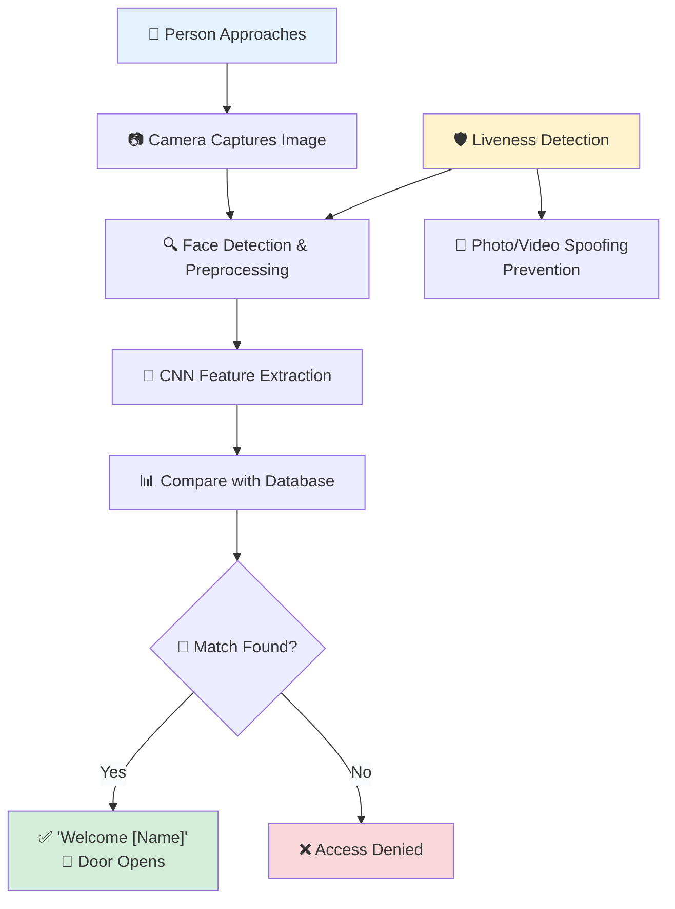

**Key Benefits:**

- **Contactless**: No physical cards or tokens required
- **Secure**: Difficult to forge or steal compared to cards
- **Convenient**: Hands-free operation
- **Scalable**: Easy to add/remove authorized personnel

### 🔧 Core System Architecture

A complete face recognition system consists of multiple interconnected components, each serving a specific purpose in the recognition pipeline:

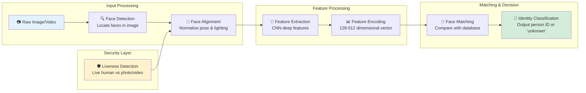

#### Detailed Component Breakdown

##### 1. **Face Detection**

- **Purpose**: Locate and extract face regions from input images
- **Techniques**: MTCNN, RetinaFace, BlazeFace
- **Output**: Bounding box coordinates around detected faces
- **Challenges**: Multiple faces, varying sizes, occlusions

##### 2. **Face Alignment**

- **Purpose**: Normalize facial pose and lighting conditions
- **Process**: Detect facial landmarks (eyes, nose, mouth)
- **Transformation**: Rotate, scale, and crop to standard pose
- **Benefit**: Reduces variance for more consistent feature extraction

##### 3. **Feature Extraction**

- **Core Technology**: Deep Convolutional Neural Networks
- **Architecture**: ResNet, FaceNet, ArcFace, or custom designs
- **Output**: High-dimensional feature vector (typically 128-512 dimensions)
- **Training**: Learned on millions of face images

##### 4. **Face Matching**

- **Method**: Distance computation between feature vectors
- **Metrics**: Euclidean distance, cosine similarity
- **Threshold**: Learned decision boundary for same/different person
- **Optimization**: Efficient database search algorithms

##### 5. **Identity Classification**

- **Decision Logic**: Apply threshold to matching scores
- **Output**: Person ID if match exceeds threshold, "unknown" otherwise
- **Confidence**: Probability scores for decision reliability

### 🔒 Liveness Detection: Anti-Spoofing Measures

Liveness detection is crucial for preventing spoofing attacks where someone tries to use a photo, video, or 3D model to impersonate another person.

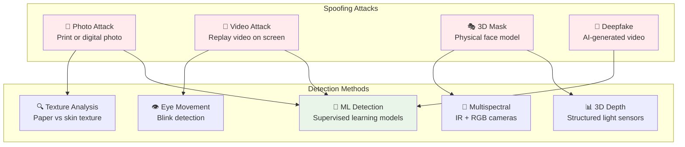

**Liveness Detection Approaches:**

1. **Passive Detection**: Analyze single image for liveness cues

   - Texture analysis (skin vs paper)
   - Reflection patterns
   - Image quality artifacts

2. **Active Detection**: Require user interaction

   - Blink detection
   - Head movement
   - Facial expression changes

3. **Multimodal**: Combine multiple sensor inputs
   - RGB + infrared cameras
   - Depth sensors
   - Thermal imaging

### 🆚 Face Verification vs Face Recognition

Understanding the distinction between verification and recognition is fundamental to grasping the challenges and applications of face recognition technology.

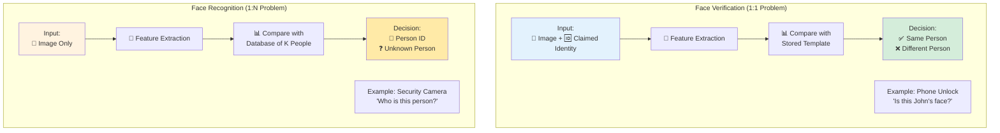

#### Detailed Comparison

| Aspect            | Face Verification (1:1)       | Face Recognition (1:N)            |
| ----------------- | ----------------------------- | --------------------------------- |
| **Input**         | Image + claimed identity      | Image only                        |
| **Question**      | "Is this the claimed person?" | "Who is this person?"             |
| **Comparison**    | Against 1 stored template     | Against K stored templates        |
| **Complexity**    | O(1) comparisons              | O(K) comparisons                  |
| **Accuracy Need** | ~99% might suffice            | Need >99.9% for practical use     |
| **Applications**  | Phone unlock, door access     | Surveillance, photo tagging       |
| **Failure Mode**  | False accept/reject           | Misidentification, unknown person |

#### Mathematical Analysis of Error Propagation

The relationship between verification and recognition accuracy is crucial for system design:

**Verification Accuracy**: P(correct verification) = 99%

**Recognition Challenge**: For K people in database
$$P(\text{correct recognition}) \leq P(\text{correct verification})^K$$

**Example Calculation**:

```
Database size K = 100 people
Verification accuracy = 99% = 0.99

Expected recognition accuracy ≤ (0.99)^100 ≈ 0.366 = 36.6%
```

This means a 99% verification system would only achieve ~37% accuracy in recognizing among 100 people!

**Required Verification Accuracy for Practical Recognition**:

For 95% recognition accuracy with 100 people:
$$0.95 \leq P(\text{verification})^{100}$$
$$P(\text{verification}) \geq (0.95)^{1/100} \approx 99.95\%$$

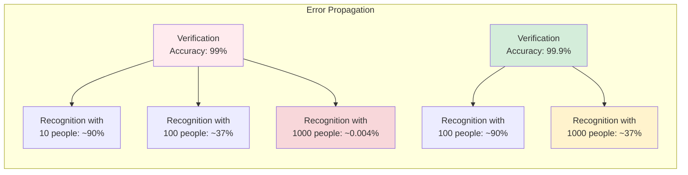

### 🎯 Applications and Use Cases

#### Security and Access Control

- **Building Access**: Contactless entry systems
- **Border Control**: Airport immigration checkpoints
- **Device Security**: Smartphone and laptop authentication
- **Payment Systems**: Biometric payment verification

#### Consumer Applications

- **Photo Organization**: Automatic tagging in photo apps
- **Social Media**: Friend suggestions and auto-tagging
- **Retail**: Personalized shopping experiences
- **Entertainment**: Age verification for content access

#### Law Enforcement and Surveillance

- **Criminal Investigation**: Suspect identification
- **Missing Persons**: Search through surveillance footage
- **Event Security**: VIP identification and threat detection
- **Traffic Monitoring**: Driver identification systems

### 🚀 Technology Evolution and Performance

#### Historical Milestones

1. **Early Systems (1960s-1990s)**: Geometric feature-based methods
2. **Statistical Methods (1990s-2000s)**: PCA, LDA approaches
3. **Machine Learning Era (2000s-2010s)**: SVM, boosting methods
4. **Deep Learning Revolution (2010s-present)**: CNN-based systems

#### Modern Performance Metrics

- **Commercial Systems**: >99.9% accuracy on standard benchmarks
- **Human Performance**: ~97-98% accuracy on challenging datasets
- **Real-time Processing**: 30+ FPS on mobile devices
- **Scale**: Systems handling millions of identities

### 🔮 Future Directions and Challenges

#### Technical Challenges

- **Bias and Fairness**: Equal performance across demographic groups
- **Privacy Concerns**: Balancing security with personal privacy
- **Adversarial Attacks**: Robustness against sophisticated spoofing
- **Cross-domain Recognition**: Performance across different cameras/conditions

#### Emerging Technologies

- **3D Face Recognition**: Using depth information for improved accuracy
- **Multimodal Biometrics**: Combining face with iris, voice, gait
- **Edge Computing**: On-device processing for privacy and speed
- **Federated Learning**: Training without centralizing sensitive data

### 📊 Performance Evaluation

Understanding how face recognition systems are evaluated helps in choosing the right approach:

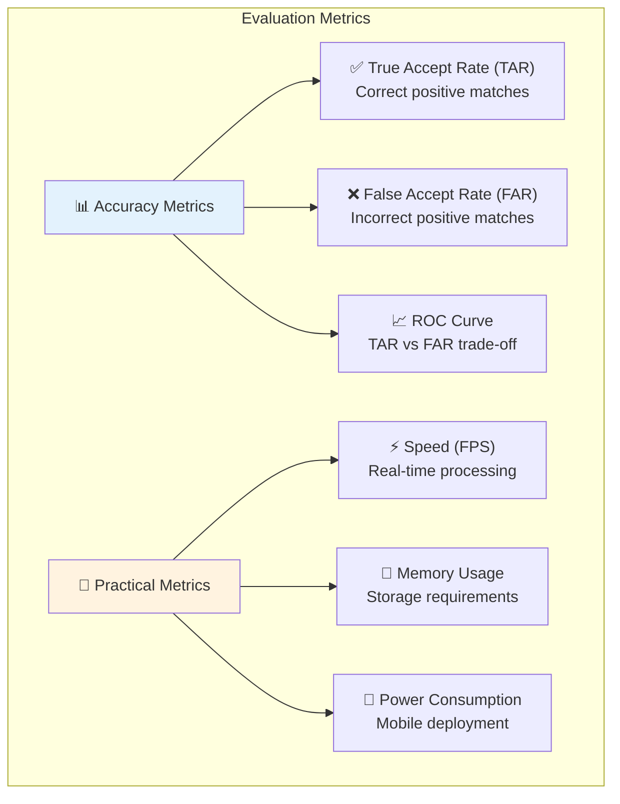

#### Key Performance Indicators

1. **Equal Error Rate (EER)**: Point where false accept = false reject rate
2. **Receiver Operating Characteristic (ROC)**: Trade-off curve between true/false positive rates
3. **Rank-1 Accuracy**: Percentage of queries where correct identity is top match
4. **Processing Speed**: Frames per second for real-time applications
5. **Memory Footprint**: Model size for deployment constraints

This comprehensive understanding of face recognition fundamentals sets the stage for diving deeper into the specific techniques and algorithms that make modern face recognition systems possible. The next challenge we'll explore is how to train these systems effectively with limited data per person - the one-shot learning problem.

## 2. One Shot Learning

One of the fundamental challenges in face recognition is the **one-shot learning problem**: recognizing a person from just one training example. This challenge is particularly critical in real-world face recognition systems where you typically have only a single photo of each person in your database.

### 🎯 Real-World Problem Context

Consider a typical employee access system scenario: You have a database with just one photo each of your employees - Khan, Danielle, Younes, and Thian. When someone approaches the turnstile, the system must:

1. **Recognize known employees** from just their single stored photo
2. **Reject unknown individuals** who aren't in the database
3. **Handle new employees** without retraining the entire system

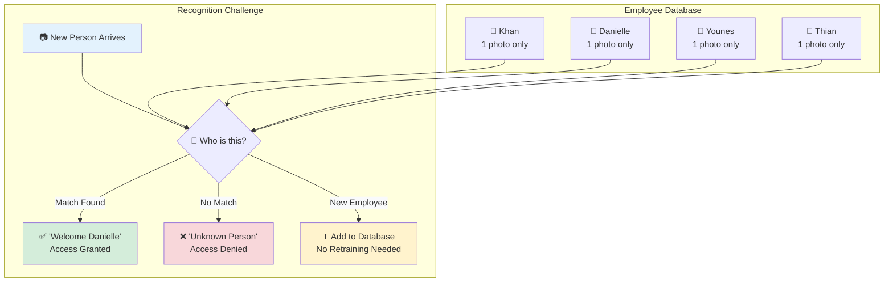

### 🚫 Why Traditional Deep Learning Fails

Traditional CNN classification approach for this scenario would be:

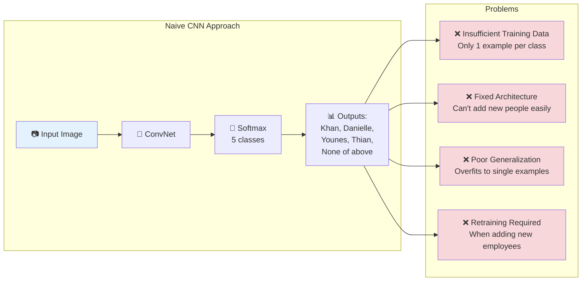

#### Fundamental Issues with Traditional Approach

1. **Insufficient Training Data**

   - Deep networks need hundreds/thousands of examples per class
   - Single photo per person leads to severe overfitting
   - No generalization to new poses, lighting, expressions

2. **Architectural Inflexibility**

   - Softmax layer has fixed number of outputs
   - Adding new employee requires changing network architecture
   - Complete retraining needed for any database changes

3. **Poor Scalability**
   - Performance degrades as database grows
   - Training becomes increasingly difficult
   - Real-world deployment becomes impractical

### ✅ The Similarity Learning Solution

Instead of learning to classify, we learn a **similarity function** that measures how different two images are:

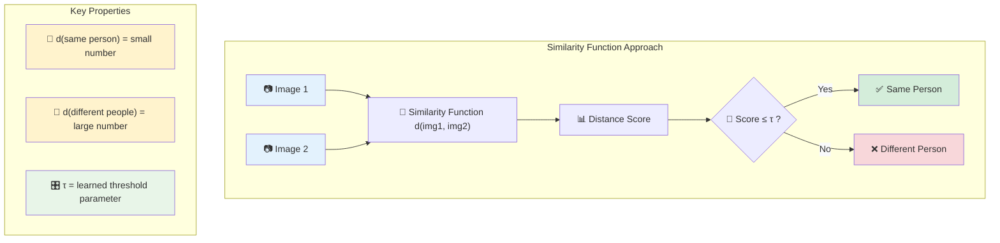

### 🔢 Mathematical Foundation

**Similarity Function Definition:**
$$d(\text{img}_1, \text{img}_2) = \text{degree of difference between images}$$

**Decision Rule:**
$$\text{Same person if } d(\text{img}_1, \text{img}_2) \leq \tau$$

**Mathematical Requirements:**

$$
d(x_i, x_j) = \begin{cases}
\text{small} & \text{if } x_i, x_j \text{ are same person} \\
\text{large} & \text{if } x_i, x_j \text{ are different people}
\end{cases}
$$

**Properties the function must satisfy:**

- **Identity**: $d(x, x) = 0$ (identical images have zero distance)
- **Symmetry**: $d(x_i, x_j) = d(x_j, x_i)$ (order doesn't matter)
- **Triangle Inequality**: $d(x_i, x_k) \leq d(x_i, x_j) + d(x_j, x_k)$ (mathematical consistency)

### 🔄 Face Recognition Pipeline with Similarity Learning

Here's how the similarity function enables practical face recognition:

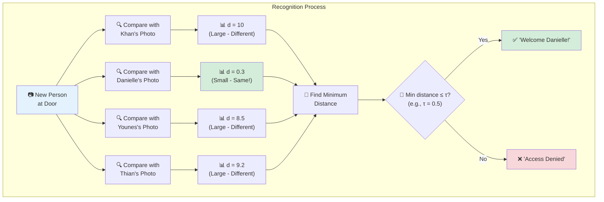

### 🎯 Practical Example Walkthrough

**Scenario 1: Known Employee (Danielle) Arrives**

```
Query Image: [Photo of Danielle at door]

Comparisons:
d(query, Khan)     = 10.0  ← Large distance (different people)
d(query, Danielle) = 0.3   ← Small distance (same person!)
d(query, Younes)   = 8.5   ← Large distance (different people)
d(query, Thian)    = 9.2   ← Large distance (different people)

Decision: min(10.0, 0.3, 8.5, 9.2) = 0.3 ≤ τ(0.5) → "Welcome Danielle!"
```

**Scenario 2: Unknown Person Arrives**

```
Query Image: [Photo of stranger at door]

Comparisons:
d(query, Khan)     = 12.1  ← Large distance
d(query, Danielle) = 11.8  ← Large distance
d(query, Younes)   = 10.9  ← Large distance
d(query, Thian)    = 13.2  ← Large distance

Decision: min(12.1, 11.8, 10.9, 13.2) = 10.9 > τ(0.5) → "Access Denied"
```

### 🚀 Advantages of Similarity Learning

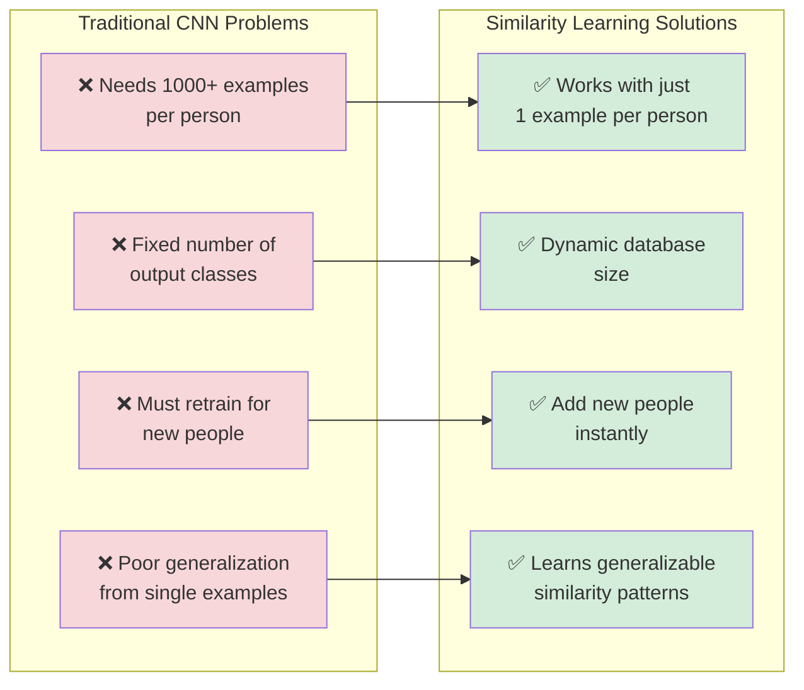

#### Key Benefits

1. **Single Example Sufficiency**

   - Works with just one photo per person
   - No need for extensive training data collection
   - Practical for real-world deployment scenarios

2. **Dynamic Scalability**

   - Add new employees by simply adding their photo to database
   - No network retraining required
   - Instant system updates

3. **Robust Generalization**

   - Learns general similarity patterns across faces
   - Handles variations in lighting, pose, expression
   - Transfers knowledge across different people

4. **Computational Efficiency**
   - O(K) comparisons for K people in database
   - Can pre-compute database embeddings
   - Real-time performance achievable

### 🏗️ Implementation Strategy

The similarity learning approach transforms face recognition from a classification problem to a **metric learning** problem:

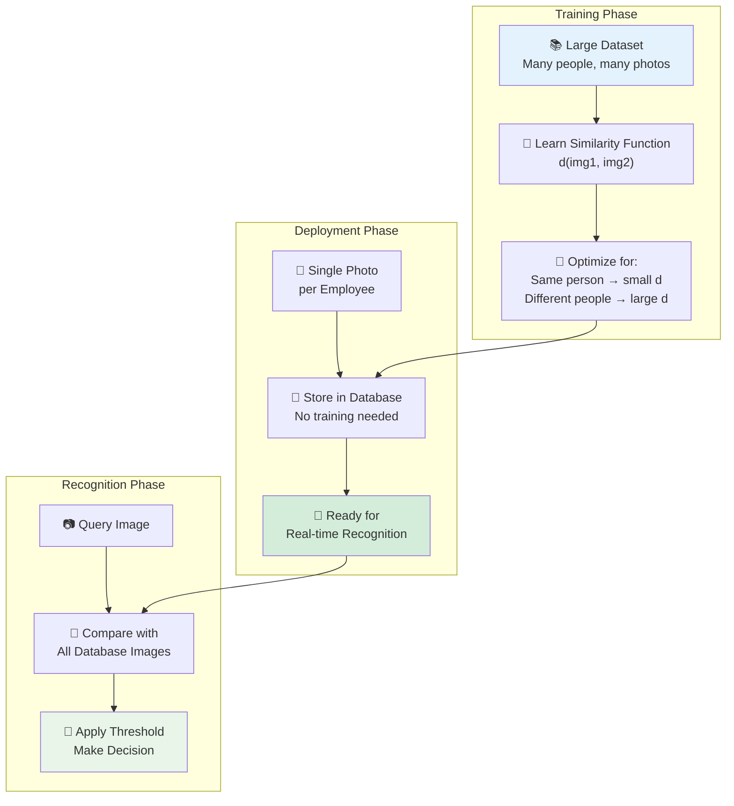

### 🔬 Technical Requirements

**Training Requirements:**

- Large, diverse dataset for learning similarity function
- Pairs of same/different person examples
- Robust architecture (Siamese networks, Triplet networks)

**Deployment Requirements:**

- Single photo per person in database
- Efficient similarity computation
- Optimized threshold selection

**Performance Considerations:**

- **Speed**: O(K) comparisons where K = database size
- **Memory**: Store one embedding per person
- **Accuracy**: Depends on similarity function quality

### 🎓 Learning Objectives Achieved

By using similarity learning for one-shot learning, we achieve:

1. **Practical Deployment**: Works with realistic data constraints
2. **Scalable System**: Easy to add/remove people
3. **Robust Performance**: Generalizes across variations
4. **Cost-Effective**: No need for extensive data collection per person

### 🔮 Next Steps

The next challenge is: **How do we actually train a neural network to learn this similarity function d?**

This leads us to specialized architectures like:

- **Siamese Networks**: Twin networks with shared weights
- **Triplet Loss**: Learning through anchor-positive-negative comparisons
- **Contrastive Loss**: Pushing same/different pairs apart/together

The similarity learning approach transforms an impossible classification problem into a trainable metric learning problem, making practical face recognition systems possible with minimal data per person.

## 3. Siamese Network

Siamese networks implement similarity learning using twin networks with shared parameters, enabling effective one-shot learning for face verification. The name "Siamese" comes from the fact that the network has two identical branches, like Siamese twins joined together.

### 🧠 Core Concept: Learning Face Encodings

The key insight of Siamese networks is to learn a function f(x) that converts any face image into a fixed-size numerical representation (encoding) that captures the essential identity information.

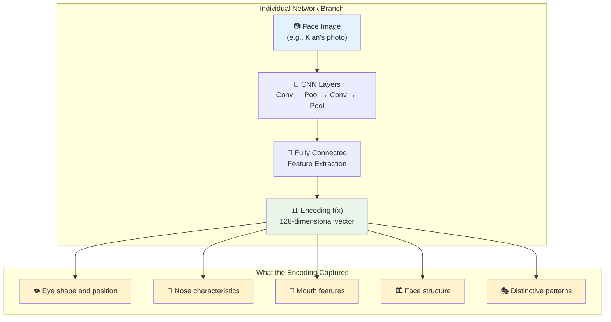

**Key Principle**: If the neural network learns good encodings, then:

- **Same person**: f(x₁) and f(x₂) should be very similar → small distance
- **Different people**: f(x₁) and f(x₂) should be very different → large distance

### 🏗️ Siamese Network Architecture

The Siamese network consists of two identical CNN branches that process different input images but share the exact same parameters:

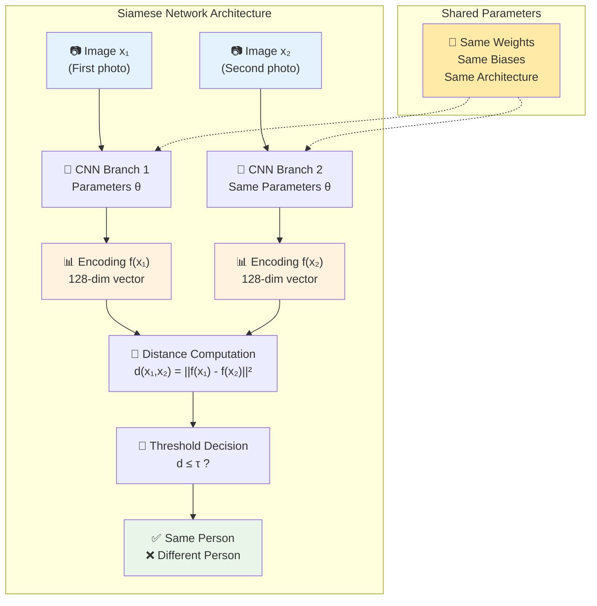

### 🔢 Mathematical Foundation

**Encoding Function:**
$$f(x_i; \theta): \mathbb{R}^{H \times W \times C} \rightarrow \mathbb{R}^{d}$$

Where:

- $x_i$: Input image (height H, width W, channels C)
- $\theta$: Shared network parameters
- $d$: Encoding dimension (typically 128 or 512)

**Distance Function:**
$$d(x_1, x_2) = ||f(x_1; \theta) - f(x_2; \theta)||^2_2$$

**Decision Rule:**

$$
\text{Prediction} = \begin{cases}
\text{Same person} & \text{if } d(x_1, x_2) \leq \tau \\
\text{Different people} & \text{if } d(x_1, x_2) > \tau
\end{cases}
$$

### 🎯 Training Objective

The network must learn to satisfy these conditions:

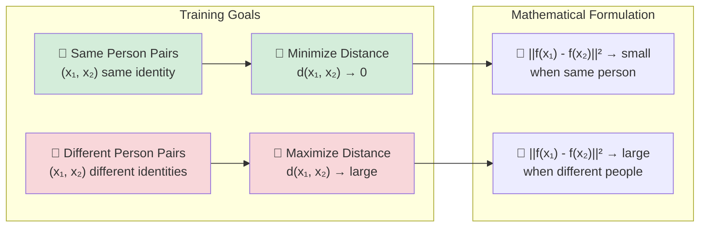

**Training Process:**

1. **Input**: Pairs of images with labels (same/different person)
2. **Forward Pass**: Compute encodings f(x₁) and f(x₂)
3. **Distance**: Calculate d(x₁, x₂) = ||f(x₁) - f(x₂)||²
4. **Loss**: Apply loss function to encourage correct distances
5. **Backpropagation**: Update shared parameters θ

### 🔑 Key Properties and Advantages

#### 1. **Parameter Sharing**

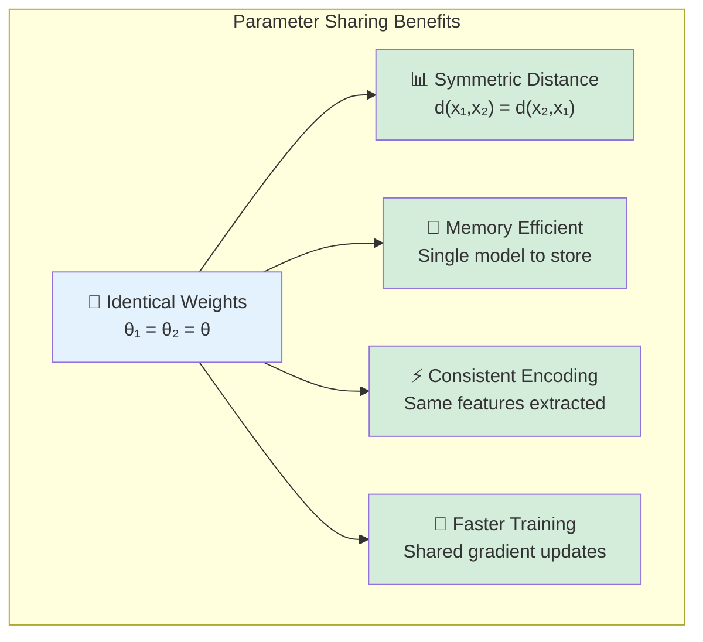

**Why Parameter Sharing is Crucial:**

- **Symmetry**: Ensures d(A,B) = d(B,A) always
- **Consistency**: Same face always gets same encoding
- **Efficiency**: Only need to store one set of parameters
- **Generalization**: Forces network to learn universal face features

#### 2. **Feature Learning Capability**

The network learns to map faces into a **metric space** where:

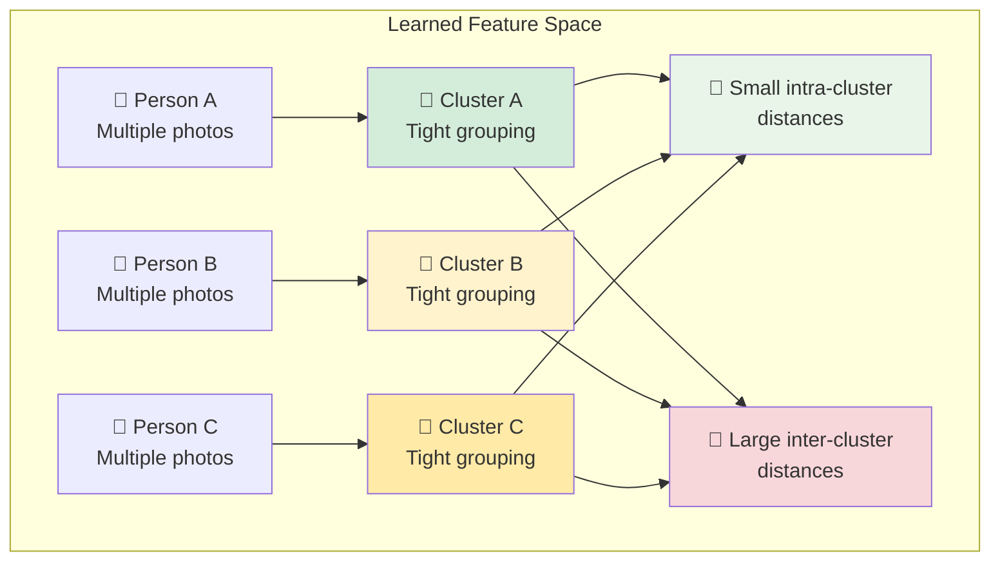

#### 3. **Scalability for Deployment**

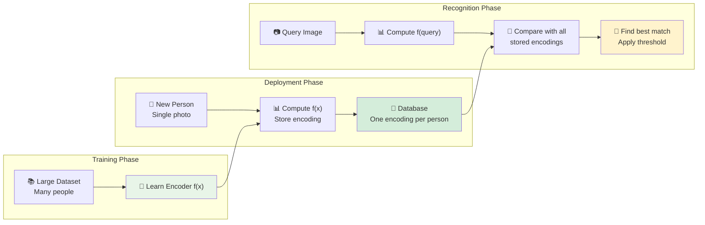

### 🔬 Detailed Implementation Walkthrough

#### Network Architecture Details

```python
# Conceptual Siamese Network Structure
def siamese_network_architecture():
    """
    Detailed breakdown of Siamese network components
    """
    print("Siamese Network Layer-by-Layer:")
    print("=" * 40)

    print("1. Input Layer:")
    print("   - Image 1: Shape (224, 224, 3)")
    print("   - Image 2: Shape (224, 224, 3)")
    print()

    print("2. Convolutional Layers (Shared):")
    print("   - Conv1: 32 filters, 3x3, ReLU")
    print("   - Pool1: 2x2 max pooling")
    print("   - Conv2: 64 filters, 3x3, ReLU")
    print("   - Pool2: 2x2 max pooling")
    print("   - Conv3: 128 filters, 3x3, ReLU")
    print("   - Pool3: 2x2 max pooling")
    print()

    print("3. Feature Extraction (Shared):")
    print("   - Flatten: Convert to 1D")
    print("   - Dense1: 512 units, ReLU")
    print("   - Dense2: 128 units (encoding layer)")
    print()

    print("4. Distance Computation:")
    print("   - L2 distance: ||f(x₁) - f(x₂)||²")
    print("   - Output: Single distance value")
    print()

    print("5. Decision:")
    print("   - Compare distance with threshold τ")
    print("   - Output: Same/Different person")

siamese_network_architecture()
```

#### Training Process Flow

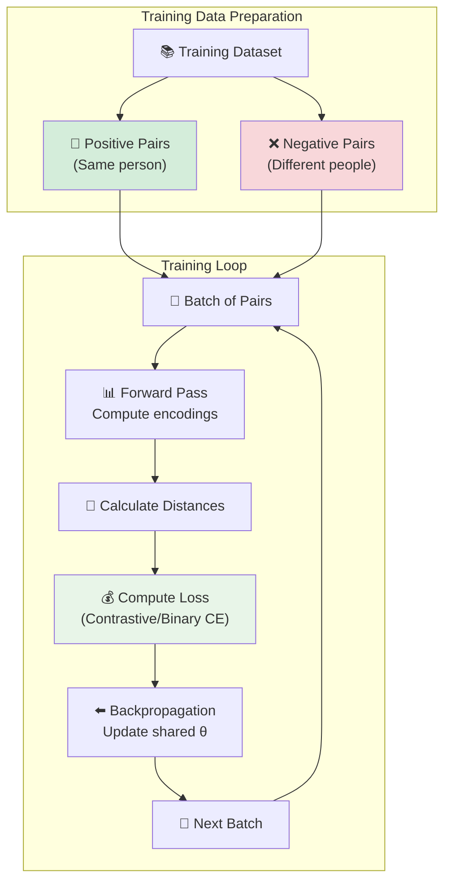

### 📊 Loss Functions for Training

**1. Contrastive Loss:**
$$\mathcal{L}_{\text{contrastive}} = \frac{1}{2}Y \cdot d^2 + \frac{1}{2}(1-Y) \cdot \max(0, \alpha - d)^2$$

Where:

- Y = 1 if same person, 0 if different
- d = distance between encodings
- α = margin parameter

**2. Binary Cross-Entropy (Alternative):**
$$\mathcal{L}_{\text{BCE}} = -Y \log(\sigma(-d)) - (1-Y) \log(1 - \sigma(-d))$$

Where σ is the sigmoid function

### 🎯 Practical Example: Face Verification System

**Scenario**: Employee access system with 4 people

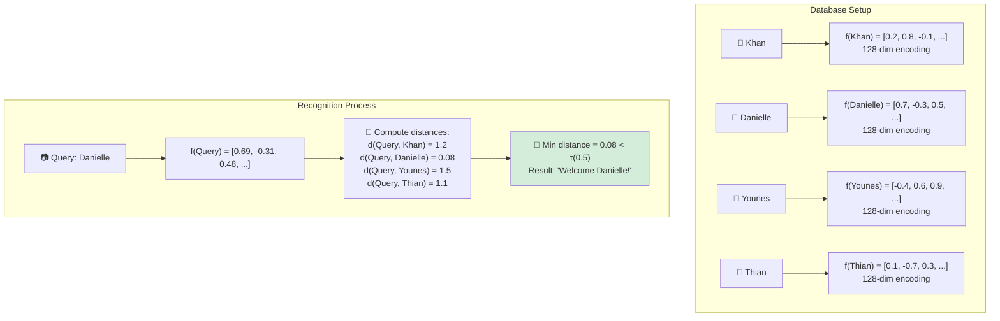

### 🏆 Historical Context and Impact

**DeepFace Paper (2014):**

- Authors: Yaniv Taigman, Ming Yang, Marc'Aurelio Ranzato, Lior Wolf
- Achievement: Human-level performance on face verification
- Key Innovation: Deep CNN + Siamese architecture for similarity learning
- Impact: Sparked the deep learning revolution in face recognition

**Key Contributions:**

1. **Architecture Design**: Effective CNN structure for face encoding
2. **Training Strategy**: Large-scale training on Facebook's dataset
3. **Performance Breakthrough**: 97.35% accuracy on LFW benchmark
4. **Practical Impact**: Enabled real-world face recognition systems

### 🚀 Advantages and Limitations

#### ✅ **Advantages**

1. **One-Shot Learning**: Works with single example per person
2. **Scalable**: Add new people without retraining
3. **Symmetric**: Distance function is naturally symmetric
4. **Interpretable**: Distance values have clear meaning
5. **Efficient**: O(K) comparisons for K people in database

#### ⚠️ **Limitations**

1. **Training Data**: Still needs large paired dataset for training
2. **Threshold Selection**: τ requires careful tuning
3. **Feature Quality**: Performance depends on learned representations
4. **Computational Cost**: K comparisons needed for recognition

### 🔮 Connection to Next Topics

The Siamese network provides the foundation, but the key question remains: **How do we effectively train the network to learn good encodings?**

This leads to advanced training techniques:

- **Triplet Loss**: Using anchor-positive-negative triplets
- **Hard Negative Mining**: Focusing on difficult examples
- **Improved Architectures**: ResNet, attention mechanisms

The Siamese network architecture is the building block, but the training strategy determines the quality of the learned similarity function.

## 4. Triplet Loss

Triplet loss is an advanced training method for face recognition that directly optimizes the embedding space using triplets of images: anchor, positive, and negative.

### Core Concept

**Triplet Components:**

- **Anchor (A)**: Reference image
- **Positive (P)**: Different image of same person as anchor
- **Negative (N)**: Image of different person

```mermaid
graph TD
    subgraph "Triplet Loss Concept"
        A[Anchor Image A<br/>Person X] --> D[CNN f]
        B[Positive Image P<br/>Person X] --> E[CNN f]
        C[Negative Image N<br/>Person Y] --> F[CNN f]

        D --> G["f(A)"]
        E --> H["f(P)"]
        F --> I["f(N)"]

        G --> J["d(A,P)<br/>Minimize"]
        G --> K["d(A,N)<br/>Maximize"]
        H --> J
        I --> K

        J --> L["Triplet Loss<br/>max(0, d(A,P) - d(A,N) + α)"]
        K --> L
    end

    style A fill:#e3f2fd
    style B fill:#e8f5e8
    style C fill:#ffebee
    style L fill:#f3e5f5
```

### Mathematical Foundation

**Learning Objective:**
We want the distance to positive examples to be smaller than distance to negative examples:

$$||f(A) - f(P)||^2 \leq ||f(A) - f(N)||^2$$

**Rearranging:**
$$||f(A) - f(P)||^2 - ||f(A) - f(N)||^2 \leq 0$$

**Adding Margin:**
To prevent the network from outputting zeros, we add a margin $\alpha$:

$$||f(A) - f(P)||^2 - ||f(A) - f(N)||^2 + \alpha \leq 0$$

**Final Triplet Loss:**
$$\mathcal{L}(A, P, N) = \max\left(0, ||f(A) - f(P)||^2 - ||f(A) - f(N)||^2 + \alpha\right)$$

**Total Loss:**
$$J = \sum_{i=1}^{m} \mathcal{L}(A^{(i)}, P^{(i)}, N^{(i)})$$

### Triplet Selection Strategy

**Random Triplet Selection Problem:**

- If triplets are chosen randomly, the constraint is often easily satisfied
- Network doesn't learn effectively
- Training becomes inefficient

**Hard Triplet Mining:**
Choose triplets that violate the desired constraint:
$$d(A, P) + \alpha > d(A, N)$$

**Selection Criteria:**

- **Hard Positive**: Most distant positive example (same person, maximum distance)
- **Hard Negative**: Closest negative example (different person, minimum distance)

### Practical Implementation

```python
def triplet_loss_explanation():
    """
    Explain triplet loss computation and mining strategy
    """
    print("Triplet Loss Training Strategy:")
    print("=" * 35)
    print("1. Dataset Requirements:")
    print("   - Multiple images per person")
    print("   - Large dataset (millions of images)")
    print("   - Balanced representation across identities")
    print()
    print("2. Triplet Mining:")
    print("   - Random: d(A,P) + α ≤ d(A,N) easily satisfied")
    print("   - Hard: Choose violations where d(A,P) + α > d(A,N)")
    print("   - Semi-hard: Negatives closer than positives but respecting margin")
    print()
    print("3. Training Process:")
    print("   - Forward pass for all three images")
    print("   - Compute embeddings f(A), f(P), f(N)")
    print("   - Calculate triplet loss")
    print("   - Backpropagate through shared network")
    print()
    print("4. Deployment:")
    print("   - Pre-compute embeddings for database")
    print("   - Compare new face with stored embeddings")
    print("   - Use threshold on distances for verification")

triplet_loss_explanation()
```

### Commercial Implementations

**Scale Requirements:**

- Commercial systems trained on 10-100 million images
- Require massive computational resources
- Multiple GPUs/TPUs for feasible training time

**Available Pre-trained Models:**

- **FaceNet**: Google's triplet loss implementation
- **OpenFace**: Open-source face recognition
- **DeepFace**: Facebook's implementation
- Many pre-trained models available online

### Historical Reference

This approach was developed in the **FaceNet** paper:
_Schroff et al., 2015. "FaceNet: A unified embedding for face recognition and clustering"_

---

## 5. Face Verification and Binary Classification

Beyond triplet loss, face verification can be approached as a traditional binary classification problem, offering an alternative training strategy.

### Alternative Architecture

```mermaid
graph TD
    subgraph "Binary Classification Approach"
        A[Image 1] --> C[CNN Encoder]
        B[Image 2] --> D[CNN Encoder<br/>Shared Weights]

        C --> E[Feature Vector f of x1]
        D --> F[Feature Vector f of x2]

        E --> G[Feature Combination<br/>Element-wise operations]
        F --> G

        G --> H[Dense Layers<br/>Classification Head]
        H --> I[Sigmoid Output<br/>P same person]
    end

    style A fill:#e3f2fd
    style B fill:#e3f2fd
    style I fill:#e8f5e8
```

### Mathematical Formulation

**Feature Combination Methods:**

**Method 1: Element-wise Subtraction**
$$\hat{y} = \sigma(w^T |f(x^{(i)}) - f(x^{(j)})| + b)$$

**Method 2: Concatenation**
$$\hat{y} = \sigma(w^T [f(x^{(i)}); f(x^{(j)})] + b)$$

**Method 3: Multiple Operations**
$$\hat{y} = \sigma(w^T [f(x^{(i)}); f(x^{(j)}); |f(x^{(i)}) - f(x^{(j)})|; f(x^{(i)}) \odot f(x^{(j)})] + b)$$

Where:

- $\sigma$: Sigmoid activation
- $|\cdot|$: Element-wise absolute value
- $\odot$: Element-wise multiplication
- $[;]$: Concatenation operation

### Similarity Measures

**Manhattan Distance (L1):**
$$d_{L1} = \sum_{k=1}^{d} |f_k(x^{(i)}) - f_k(x^{(j)})|$$

**Euclidean Distance (L2):**
$$d_{L2} = \sqrt{\sum_{k=1}^{d} (f_k(x^{(i)}) - f_k(x^{(j)}))^2}$$

**Chi-square Distance:**
$$d_{\chi^2} = \sum_{k=1}^{d} \frac{(f_k(x^{(i)}) - f_k(x^{(j)}))^2}{f_k(x^{(i)}) + f_k(x^{(j)})}$$

### Deployment Optimization

**Pre-computation Strategy:**

1. **Offline Phase**: Pre-compute embeddings for all database images
   $$\text{Database} = \{f(x_1), f(x_2), \ldots, f(x_N)\}$$

2. **Online Phase**: For new query image
   - Compute $f(x_{\text{query}})$
   - Compare with pre-computed embeddings
   - Apply classification threshold

**Performance Benefits:**

- Reduces online computation time
- Enables real-time face verification
- Scales efficiently with database size

### Comparison: Triplet vs Binary Classification

| Aspect              | Triplet Loss        | Binary Classification   |
| ------------------- | ------------------- | ----------------------- |
| **Training Data**   | Triplets (A,P,N)    | Pairs with labels       |
| **Loss Function**   | Max margin loss     | Binary cross-entropy    |
| **Mining Strategy** | Hard triplet mining | Balanced pair sampling  |
| **Convergence**     | Can be unstable     | More stable training    |
| **Performance**     | Often superior      | Competitive performance |
| **Implementation**  | More complex        | Simpler to implement    |

### Historical Reference

This approach was also explored in the **DeepFace** paper:
_Taigman et al., 2014. "DeepFace: Closing the gap to human level performance"_

---

# Neural Style Transfer

## 6. What is Neural Style Transfer?

Neural Style Transfer is one of the most fun and exciting applications of Convolutional Neural Networks (CNNs) that creates artistic images by combining the content of one image with the artistic style of another. This technique allows you to recreate photographs in the style of famous artists like Van Gogh or Picasso.

### 🎨 Visual Introduction: Real Examples

The power of Neural Style Transfer is best understood through concrete examples:

```mermaid
%%{init: {"theme": "default", "themeVariables": {"primaryColor": "#1f2937", "edgeLabelBackground":"#f9fafb", "primaryTextColor":"#000000", "fontSize": 12}}}%%
graph TD
    subgraph "Example 1: Stanford + Van Gogh"
        A["📷 Content Image<br/>Stanford University Campus<br/>(Real photograph)"] --> D["🎨 Neural Style Transfer"]
        B["🖼️ Style Image<br/>Van Gogh's 'Starry Night'<br/>(Artistic painting)"] --> D
        D --> C["✨ Generated Image<br/>Stanford Campus painted<br/>in Van Gogh's style"]
    end

    subgraph "Example 2: Golden Gate + Picasso"
        E["📷 Content Image<br/>Golden Gate Bridge<br/>(San Francisco photo)"] --> H["🎨 Neural Style Transfer"]
        F["🖼️ Style Image<br/>Pablo Picasso painting<br/>(Artistic style)"] --> H
        H --> G["✨ Generated Image<br/>Golden Gate Bridge<br/>in Picasso's style"]
    end

    style A fill:#e3f2fd
    style B fill:#fff3e0
    style C fill:#e8f5e8
    style E fill:#e3f2fd
    style F fill:#fff3e0
    style G fill:#e8f5e8
```

**What Makes This Remarkable:**

- **Content Preservation**: Recognizable objects and structure remain intact
- **Style Adoption**: Artistic characteristics (brushstrokes, colors, patterns) are transferred
- **Artistic Creation**: Results look like they were painted by the original artist

### 🎯 Core Concept and Notation

Neural Style Transfer operates with three key images:

```mermaid
%%{init: {"theme": "default", "themeVariables": {"primaryColor": "#1f2937", "edgeLabelBackground":"#f9fafb", "primaryTextColor":"#000000", "fontSize": 12}}}%%
graph LR
    subgraph "Three-Image Framework"
        A["📷 Content Image (C)<br/>WHAT to paint<br/>• Objects and structure<br/>• Spatial composition<br/>• Semantic content"]

        B["🎨 Style Image (S)<br/>HOW to paint<br/>• Artistic technique<br/>• Color palette<br/>• Texture patterns<br/>• Brushstroke style"]

        C["✨ Generated Image (G)<br/>RESULT<br/>• Content from C<br/>• Style from S<br/>• Optimized pixel values"]
    end

    D["🧠 Optimization Process<br/>Iteratively adjust G to match<br/>content of C and style of S"]

    A --> D
    B --> D
    D --> C

    style A fill:#e3f2fd
    style B fill:#fff3e0
    style C fill:#e8f5e8
    style D fill:#f3e5f5
```

**Mathematical Notation:**

- **C**: Content image (what you want to paint)
- **S**: Style image (how you want to paint it)
- **G**: Generated image (the artistic result)

### 🔬 The Deep Learning Innovation

#### Transfer Learning Revolution

Neural Style Transfer represents a breakthrough application of **transfer learning**:

```mermaid
%%{init: {"theme": "default", "themeVariables": {"primaryColor": "#1f2937", "edgeLabelBackground":"#f9fafb", "primaryTextColor":"#000000", "fontSize": 12}}}%%
graph TD
    subgraph "Transfer Learning Innovation"
        A["🧠 Pre-trained CNN<br/>(VGG-19 on ImageNet)"] --> B["🎯 Original Task<br/>Image Classification"]
        A --> C["🎨 New Task<br/>Style Transfer"]

        D["💡 Key Insight:<br/>Same features useful for<br/>classification are also<br/>useful for style analysis"]

        E["📊 Feature Hierarchy:<br/>Early layers → Textures, colors<br/>Deep layers → Objects, shapes"]
    end

    style A fill:#e3f2fd
    style C fill:#e8f5e8
    style D fill:#ffeaa7
    style E fill:#fff3cd
```

**Why This Works:**

- **Pre-trained Features**: VGG-19 learned on ImageNet captures universal visual patterns
- **No Retraining**: Use existing weights, no additional training needed
- **Feature Hierarchy**: Different layers capture different aspects useful for style transfer
- **Computational Efficiency**: Leverage millions of hours of training for free

#### CNN Feature Extraction for Style Transfer

```mermaid
%%{init: {"theme": "default", "themeVariables": {"primaryColor": "#1f2937", "edgeLabelBackground":"#f9fafb", "primaryTextColor":"#000000", "fontSize": 12}}}%%
graph TD
    subgraph "CNN Layer Analysis"
        A["📷 Input Image"] --> B["Layer 1-2<br/>🔍 Edges & Textures<br/>Style Information"]
        B --> C["Layer 3-4<br/>🖼️ Patterns & Shapes<br/>Mixed Information"]
        C --> D["Layer 5-6<br/>🏛️ Objects & Structure<br/>Content Information"]

        E["🎨 Style Extraction<br/>Early + Middle Layers"]
        F["📷 Content Extraction<br/>Deep Layers"]

        B --> E
        C --> E
        D --> F
    end

    style E fill:#fff3e0
    style F fill:#e3f2fd
```

**Feature Distribution:**

- **Style Features**: Captured by shallow and middle layers (textures, colors, local patterns)
- **Content Features**: Captured by deep layers (objects, spatial relationships)
- **Optimization Target**: Adjust generated image to match both types of features

### 🎨 The Style Transfer Process

#### Complete Workflow

```mermaid
%%{init: {"theme": "default", "themeVariables": {"primaryColor": "#1f2937", "edgeLabelBackground":"#f9fafb", "primaryTextColor":"#000000", "fontSize": 12}}}%%
graph TD
    subgraph "Neural Style Transfer Pipeline"
        A["📷 Content Image C<br/>Stanford Campus"] --> D["🧠 VGG-19 Features<br/>Extract activations"]
        B["🎨 Style Image S<br/>Van Gogh Painting"] --> E["🧠 VGG-19 Features<br/>Extract activations"]
        C["✨ Generated Image G<br/>Random initialization"] --> F["🧠 VGG-19 Features<br/>Extract activations"]

        D --> G["📊 Content Loss<br/>Compare deep features<br/>G vs C"]
        E --> H["🎨 Style Loss<br/>Compare style features<br/>G vs S"]
        F --> G
        F --> H

        G --> I["💰 Total Loss<br/>α·Content + β·Style + γ·Variation"]
        H --> I

        I --> J["⬅️ Backpropagation<br/>Update G pixel values"]
        J --> K["🔄 Iterate until<br/>convergence"]
        K --> C

        L["🎯 Final Result<br/>Artistic masterpiece"]
        K --> L
    end

    style A fill:#e3f2fd
    style B fill:#fff3e0
    style L fill:#e8f5e8
    style I fill:#f3e5f5
```

### 🔢 Mathematical Framework

#### Complete Objective Function

**Total Loss Function:**
$$\mathcal{L}_{\text{total}}(C, S, G) = \alpha \mathcal{L}_{\text{content}}(C, G) + \beta \mathcal{L}_{\text{style}}(S, G) + \gamma \mathcal{L}_{\text{variation}}(G)$$

**Component Breakdown:**

1. **Content Loss** ($\mathcal{L}_{\text{content}}$): Ensures G preserves the structure and objects from C
2. **Style Loss** ($\mathcal{L}_{\text{style}}$): Ensures G adopts the artistic characteristics from S
3. **Total Variation Loss** ($\mathcal{L}_{\text{variation}}$): Encourages spatial smoothness, reduces noise

**Hyperparameter Control:**

- **α** (alpha): Content weight - higher values preserve more original structure
- **β** (beta): Style weight - higher values create stronger artistic effect
- **γ** (gamma): Variation weight - higher values create smoother images

#### Optimization Process

**Unlike Traditional Deep Learning:**

- **Traditional**: Optimize network weights, fix input images
- **Style Transfer**: Optimize input image pixels, fix network weights

```mermaid
%%{init: {"theme": "default", "themeVariables": {"primaryColor": "#1f2937", "edgeLabelBackground":"#f9fafb", "primaryTextColor":"#000000", "fontSize": 12}}}%%
graph LR
    subgraph "Optimization Comparison"
        A["🔄 Traditional Training<br/>Fixed: Input images<br/>Optimize: Network weights"] --> C["📊 Result: Trained model<br/>for classification/detection"]

        B["🎨 Style Transfer<br/>Fixed: Network weights<br/>Optimize: Generated image pixels"] --> D["✨ Result: Artistic image<br/>combining content + style"]
    end

    style A fill:#e3f2fd
    style B fill:#fff3e0
    style C fill:#e8f5e8
    style D fill:#e8f5e8
```

**Gradient Flow:**
$$G := G - \eta \frac{\partial \mathcal{L}_{\text{total}}}{\partial G}$$

Where η is the learning rate and gradients flow back to pixel values of G.

### 🏗️ Technical Implementation Overview

#### Key Components

```python
def style_transfer_concept():
    """
    Conceptual overview of Neural Style Transfer implementation
    """
    print("Neural Style Transfer Implementation:")
    print("=" * 40)

    print("1. Setup:")
    print("   - Load pre-trained VGG-19 network")
    print("   - Define content and style layers")
    print("   - Initialize generated image G")
    print()

    print("2. Forward Pass:")
    print("   - Extract features from content image C")
    print("   - Extract features from style image S")
    print("   - Extract features from generated image G")
    print()

    print("3. Loss Computation:")
    print("   - Content loss: Compare G vs C at deep layers")
    print("   - Style loss: Compare G vs S at shallow/middle layers")
    print("   - Total variation: Encourage smoothness in G")
    print()

    print("4. Optimization:")
    print("   - Compute gradients ∂L/∂G")
    print("   - Update pixel values of G")
    print("   - Repeat until convergence")
    print()

    print("5. Result:")
    print("   - Generated image G combines content and style")
    print("   - Save artistic masterpiece!")

style_transfer_concept()
```

### 🎯 What Makes Neural Style Transfer Special

#### Revolutionary Aspects

1. **Artistic AI**: First practical method for computational creativity
2. **No Training Required**: Uses pre-trained features out-of-the-box
3. **Flexible Framework**: Works with any content and style images
4. **Interpretable Process**: Can visualize what network layers learn
5. **Practical Applications**: Real-world artistic and commercial uses

#### Applications Beyond Art

```mermaid
%%{init: {"theme": "default", "themeVariables": {"primaryColor": "#1f2937", "edgeLabelBackground":"#f9fafb", "primaryTextColor":"#000000", "fontSize": 12}}}%%
graph TD
    subgraph "Style Transfer Applications"
        A["🎨 Digital Art<br/>Artistic image creation"] --> E["💼 Commercial Uses"]
        B["📱 Photo Filters<br/>Mobile apps & social media"] --> E
        C["🎬 Video Effects<br/>Film and animation"] --> E
        D["🏛️ Cultural Preservation<br/>Historical art recreation"] --> E

        F["🎮 Gaming<br/>Procedural art generation"]
        G["🏠 Interior Design<br/>Style visualization"]
        H["📚 Education<br/>Art history demonstration"]
    end

    style E fill:#e8f5e8
    style F fill:#fff3cd
    style G fill:#fff3cd
    style H fill:#fff3cd
```

### 🔮 Historical Impact and Future

#### Significance in Deep Learning

**Breakthrough Contributions:**

- **2015**: Original Gatys et al. paper introduced the concept
- **Visualization**: Showed what CNN layers actually learn
- **Transfer Learning**: Demonstrated power of pre-trained features
- **Optimization**: Introduced image-space optimization techniques

**Impact on Field:**

- **Research**: Spawned entire subfield of neural artistic applications
- **Industry**: Led to commercial art generation tools
- **Understanding**: Improved comprehension of CNN feature hierarchies
- **Creativity**: Bridged gap between AI and human creativity

#### Modern Developments

**Performance Improvements:**

- **Fast Style Transfer**: Real-time processing using feed-forward networks
- **Arbitrary Style**: Single model that works with any style image
- **Video Style Transfer**: Temporal consistency for video sequences
- **High Resolution**: Scaling to 4K and beyond

**Quality Enhancements:**

- **Photorealistic Style Transfer**: Maintaining photographic quality
- **Semantic Style Transfer**: Style transfer guided by semantic maps
- **Interactive Control**: User-guided style application
- **3D Style Transfer**: Extending to 3D models and virtual environments

### 🎓 Learning Objectives

By understanding Neural Style Transfer, you will:

1. **Grasp Transfer Learning**: How pre-trained networks enable new applications
2. **Understand Feature Hierarchies**: What different CNN layers capture
3. **Learn Optimization Techniques**: How to optimize in image space
4. **Appreciate Multi-objective Learning**: Balancing multiple loss components
5. **Gain Practical Skills**: Implement your own artistic AI system

### 🚀 What's Next

To fully implement Neural Style Transfer, we need to understand:

1. **What ConvNets Learn**: Detailed analysis of feature hierarchies
2. **Content Loss Function**: How to preserve semantic structure
3. **Style Loss Function**: How to capture and transfer artistic characteristics
4. **Total Variation Loss**: How to ensure spatial smoothness
5. **Optimization Strategies**: Efficient techniques for image generation

The next videos will dive deep into each of these components, giving you the knowledge to create your own neural art generator and understand the fascinating world of computational creativity.

**Fun Fact**: Neural Style Transfer democratized art creation, allowing anyone to create images "in the style of" master artists like Van Gogh, Picasso, or Monet - all through the power of deep learning and clever optimization!

## 7. What are Deep ConvNets Learning?

Understanding what different layers of CNNs learn is crucial for Neural Style Transfer, as it informs which layers to use for content vs style representation. This knowledge helps us understand why certain layers are perfect for capturing artistic style while others excel at preserving semantic content.

### 🔬 The Visualization Method

To understand what deep ConvNets really learn, we can use a powerful visualization technique that reveals the hidden patterns each neuron detects:

```mermaid
%%{init: {"theme": "default", "themeVariables": {"primaryColor": "#1f2937", "edgeLabelBackground":"#f9fafb", "primaryTextColor":"#000000", "fontSize": 12}}}%%
graph TD
    subgraph "Feature Visualization Process"
        A["🧠 Pick a Hidden Unit<br/>in Layer l"] --> B["📚 Scan Training Set<br/>Pass all images through network"]
        B --> C["📊 Record Activations<br/>For that specific unit"]
        C --> D["🔍 Find Maximum Activations<br/>Top 9 image patches"]
        D --> E["👁️ Visualize Patterns<br/>What triggers this neuron?"]

        F["🔄 Repeat Process<br/>For multiple units and layers"]
        E --> F
    end

    style A fill:#e3f2fd
    style E fill:#e8f5e8
    style F fill:#fff3cd
```

**Key Insight**: By finding the image patches that **maximally activate** each neuron, we can understand what visual patterns that neuron has learned to detect.

### 🏗️ Layer-by-Layer Feature Hierarchy

#### Layer 1: Simple Edge and Color Detectors

```mermaid
%%{init: {"theme": "default", "themeVariables": {"primaryColor": "#1f2937", "edgeLabelBackground":"#f9fafb", "primaryTextColor":"#000000", "fontSize": 12}}}%%
graph LR
    subgraph "Layer 1 Features"
        A["📷 Small Receptive Field<br/>Only sees tiny image patches"] --> B["🔍 Simple Pattern Detection"]

        C["Hidden Unit 1<br/>Diagonal edge detector"] --> D["📊 9 patches showing<br/>diagonal lines"]
        E["Hidden Unit 2<br/>Vertical line detector"] --> F["📊 9 patches showing<br/>vertical edges"]
        G["Hidden Unit 3<br/>Green-left edge detector"] --> H["📊 9 patches showing<br/>vertical edges with green left side"]
        I["Hidden Unit 4<br/>Orange color detector"] --> J["📊 9 patches showing<br/>orange-colored regions"]
    end

    style D fill:#fff3cd
    style F fill:#fff3cd
    style H fill:#fff3cd
    style J fill:#fff3cd
```

**Layer 1 Characteristics:**

- **Receptive Field**: Very small (typically 3×3 to 7×7 pixels)
- **Features Detected**:
  - Simple edges at various orientations
  - Basic color preferences (orange, green, red)
  - Color-edge combinations (e.g., vertical edge with green on left)
  - Simple texture elements
- **Style Transfer Use**: Perfect for capturing local artistic patterns and brushstrokes

#### Layer 2: Complex Textures and Patterns

```mermaid
%%{init: {"theme": "default", "themeVariables": {"primaryColor": "#1f2937", "edgeLabelBackground":"#f9fafb", "primaryTextColor":"#000000", "fontSize": 12}}}%%
graph LR
    subgraph "Layer 2 Features"
        A["📷 Medium Receptive Field<br/>Sees larger image regions"] --> B["🎨 Texture Pattern Detection"]

        C["Hidden Unit 1<br/>Vertical texture detector"] --> D["📊 9 patches showing<br/>vertical line textures"]
        E["Hidden Unit 2<br/>Rounded shape detector"] --> F["📊 9 patches showing<br/>curved/round patterns"]
        G["Hidden Unit 3<br/>Thin line detector"] --> H["📊 9 patches showing<br/>very thin vertical lines"]
    end

    style D fill:#e8f5e8
    style F fill:#e8f5e8
    style H fill:#e8f5e8
```

**Layer 2 Characteristics:**

- **Receptive Field**: Medium size (7×7 to 15×15 pixels)
- **Features Detected**:
  - Vertical textures with repeated line patterns
  - Rounded shapes and curved elements
  - Thin line patterns and delicate textures
  - More complex color-texture combinations
- **Style Transfer Use**: Captures mid-level artistic textures and patterns

#### Layer 3: Object Parts and Complex Patterns

```mermaid
%%{init: {"theme": "default", "themeVariables": {"primaryColor": "#1f2937", "edgeLabelBackground":"#f9fafb", "primaryTextColor":"#000000", "fontSize": 12}}}%%
graph LR
    subgraph "Layer 3 Features"
        A["📷 Larger Receptive Field<br/>Sees significant image portions"] --> B["🧩 Object Part Detection"]

        C["Hidden Unit 1<br/>Rounded object detector"] --> D["📊 Cars, dogs, people<br/>with round elements"]
        E["Hidden Unit 2<br/>Honeycomb texture detector"] --> F["📊 Square/hexagonal<br/>geometric patterns"]
        G["Hidden Unit 3<br/>Irregular texture detector"] --> H["📊 Complex surface<br/>texture patterns"]
    end

    style D fill:#dbeafe
    style F fill:#dbeafe
    style H fill:#dbeafe
```

**Layer 3 Characteristics:**

- **Receptive Field**: Large (15×15 to 31×31 pixels)
- **Features Detected**:
  - Object parts (car shapes, animal parts)
  - Geometric patterns (honeycomb, squares)
  - Complex irregular textures
  - Beginning of semantic understanding
- **Style Transfer Use**: Bridge between style and content - complex artistic patterns

#### Layer 4: Specific Object Detectors

```mermaid
%%{init: {"theme": "default", "themeVariables": {"primaryColor": "#1f2937", "edgeLabelBackground":"#f9fafb", "primaryTextColor":"#000000", "fontSize": 12}}}%%
graph LR
    subgraph "Layer 4 Features"
        A["📷 Very Large Receptive Field<br/>Sees most of image"] --> B["🐕 Specific Object Detection"]

        C["Hidden Unit 1<br/>Dog breed detector"] --> D["📊 Similar-looking dogs<br/>specific breed patterns"]
        E["Hidden Unit 2<br/>Water detector"] --> F["📊 Water surfaces, lakes<br/>aquatic environments"]
        G["Hidden Unit 3<br/>Bird leg detector"] --> H["📊 Bird legs and feet<br/>specific animal parts"]
    end

    style D fill:#fef3c7
    style F fill:#fef3c7
    style H fill:#fef3c7
```

**Layer 4 Characteristics:**

- **Receptive Field**: Very large (31×31 to 63×63 pixels)
- **Features Detected**:
  - Specific object types (particular dog breeds)
  - Environmental elements (water, natural scenes)
  - Detailed animal parts (bird legs, specific features)
  - High-level semantic concepts
- **Style Transfer Use**: Primary content representation layer

#### Layer 5: Complex Object Categories

```mermaid
%%{init: {"theme": "default", "themeVariables": {"primaryColor": "#1f2937", "edgeLabelBackground":"#f9fafb", "primaryTextColor":"#000000", "fontSize": 12}}}%%
graph LR
    subgraph "Layer 5 Features"
        A["📷 Full Image Receptive Field<br/>Can see entire image"] --> B["🎯 Complex Object Categories"]

        C["Hidden Unit 1<br/>Diverse dog detector"] --> D["📊 Various dog breeds<br/>more variety than Layer 4"]
        E["Hidden Unit 2<br/>Keyboard/text detector"] --> F["📊 Keyboards, dotted patterns<br/>text-like structures"]
        G["Hidden Unit 3<br/>Flower detector"] --> H["📊 Various flowers<br/>floral patterns"]
    end

    style D fill:#dcfce7
    style F fill:#dcfce7
    style H fill:#dcfce7
```

**Layer 5 Characteristics:**

- **Receptive Field**: Full image (can potentially see entire input)
- **Features Detected**:
  - Diverse object categories (varied dogs, not just one breed)
  - Complex manufactured objects (keyboards, text)
  - Natural object categories (flowers, plants)
  - Abstract concept detection
- **Style Transfer Use**: High-level content preservation

### 📊 Complete Feature Hierarchy Visualization

```mermaid
%%{init: {"theme": "default", "themeVariables": {"primaryColor": "#1f2937", "edgeLabelBackground":"#f9fafb", "primaryTextColor":"#000000", "fontSize": 12}}}%%
graph TD
    subgraph "CNN Feature Learning Progression"
        A["📷 Input Image"] --> B["Layer 1<br/>🔍 Edges & Colors<br/>• Diagonal lines<br/>• Color preferences<br/>• Simple textures"]

        B --> C["Layer 2<br/>🎨 Complex Textures<br/>• Vertical textures<br/>• Rounded patterns<br/>• Line combinations"]

        C --> D["Layer 3<br/>🧩 Object Parts<br/>• Car/dog shapes<br/>• Geometric patterns<br/>• Complex textures"]

        D --> E["Layer 4<br/>🐕 Specific Objects<br/>• Dog breeds<br/>• Water scenes<br/>• Bird parts"]

        E --> F["Layer 5<br/>🎯 Object Categories<br/>• Diverse dogs<br/>• Keyboards/text<br/>• Flowers"]

        G["🎨 Style Information<br/>Local artistic patterns"] -.-> B
        G -.-> C
        H["📷 Content Information<br/>Semantic objects"] -.-> D
        H -.-> E
        H -.-> F
    end

    style G fill:#fff3e0
    style H fill:#e3f2fd
    style A fill:#f3f4f6
    style F fill:#e8f5e8
```

### 🔢 Receptive Field Mathematics

#### Understanding Receptive Fields

**Receptive Field Definition**: The region in the input image that can influence a particular neuron's activation.

**Progressive Growth**:

```
Layer 1: Small patches (3×3 to 7×7 pixels)
Layer 2: Medium patches (7×7 to 15×15 pixels)
Layer 3: Large patches (15×15 to 31×31 pixels)
Layer 4: Very large patches (31×31 to 63×63 pixels)
Layer 5: Potentially full image
```

#### Mathematical Calculation

For a neuron in layer $l$, the receptive field size can be calculated:

$$r_l = r_{l-1} + (k_l - 1) \times \prod_{i=1}^{l-1} s_i$$

Where:

- $r_l$: Receptive field size at layer $l$
- $k_l$: Kernel size at layer $l$
- $s_i$: Stride at layer $i$
- $r_0 = 1$ (input pixel)

**Example for AlexNet-style network**:

```
Layer 1: r₁ = 1 + (11-1) × 1 = 11×11
Layer 2: r₂ = 11 + (5-1) × 4 = 27×27
Layer 3: r₃ = 27 + (3-1) × 8 = 43×43
Layer 4: r₄ = 43 + (3-1) × 8 = 59×59
Layer 5: r₅ = 59 + (3-1) × 8 = 75×75
```

### 🎨 Implications for Neural Style Transfer

#### Layer Selection Strategy

```mermaid
%%{init: {"theme": "default", "themeVariables": {"primaryColor": "#1f2937", "edgeLabelBackground":"#f9fafb", "primaryTextColor":"#000000", "fontSize": 12}}}%%
graph TD
    subgraph "Style Transfer Layer Usage"
        A["🎨 Style Representation<br/>Early & Middle Layers"] --> B["Layer 1: Local brushstrokes<br/>Layer 2: Texture patterns<br/>Layer 3: Complex artistic elements"]

        C["📷 Content Representation<br/>Deep Layers"] --> D["Layer 4: Specific objects<br/>Layer 5: Semantic content<br/>Preserve structure & meaning"]

        E["⚖️ Balance<br/>α (content) vs β (style)"] --> F["🎯 Generated Image<br/>Content from deep layers +<br/>Style from shallow layers"]
    end

    style A fill:#fff3e0
    style C fill:#e3f2fd
    style F fill:#e8f5e8
```

#### Why This Hierarchy Works

**For Style Transfer:**

- **Early Layers (1-2)**: Capture local artistic elements (brushstrokes, color patterns)
- **Middle Layers (3)**: Capture artistic textures and medium-scale patterns
- **Deep Layers (4-5)**: Preserve semantic content and object structure

**Scientific Insight**: The natural hierarchy of CNN feature learning aligns perfectly with artistic perception - local details for style, global structure for content.

### 📚 Historical Context: Zeiler & Fergus Paper

**"Visualizing and Understanding Convolutional Networks" (2013)**

```mermaid
%%{init: {"theme": "default", "themeVariables": {"primaryColor": "#1f2937", "edgeLabelBackground":"#f9fafb", "primaryTextColor":"#000000", "fontSize": 12}}}%%
graph TD
    subgraph "Zeiler & Fergus Contributions"
        A["🔬 Visualization Techniques<br/>Deconvolutional networks"] --> D["📊 Understanding CNN Features"]
        B["🧠 Feature Analysis<br/>Layer-by-layer investigation"] --> D
        C["🎯 Practical Insights<br/>Why CNNs work so well"] --> D

        D --> E["🚀 Impact on Field<br/>• Improved architectures<br/>• Better training methods<br/>• Style transfer foundation"]
    end

    style A fill:#e3f2fd
    style D fill:#e8f5e8
    style E fill:#d4edda
```

**Key Innovations:**

1. **Deconvolutional Visualization**: Method to see what activates each neuron
2. **Layer Analysis**: Systematic study of feature hierarchy
3. **Pattern Recognition**: Understanding what CNNs actually learn
4. **Practical Applications**: Foundation for style transfer and other techniques

### 🔍 Practical Implications

#### For Style Transfer Implementation

```python
def layer_selection_for_style_transfer():
    """
    Practical guidance for layer selection in style transfer
    """
    print("Layer Selection Guide for Neural Style Transfer:")
    print("=" * 50)

    print("\n🎨 STYLE LAYERS (Early & Middle):")
    print("Layer 1 (conv1_1):")
    print("  - Use for: Basic brushstrokes and color patterns")
    print("  - Captures: Edge orientations, color preferences")
    print("  - Weight: ~20% of style loss")

    print("\nLayer 2 (conv2_1):")
    print("  - Use for: Texture patterns and artistic elements")
    print("  - Captures: Complex textures, repeated patterns")
    print("  - Weight: ~20% of style loss")

    print("\nLayer 3 (conv3_1):")
    print("  - Use for: Larger artistic patterns")
    print("  - Captures: Object part textures, geometric patterns")
    print("  - Weight: ~20% of style loss")

    print("\n📷 CONTENT LAYERS (Deep):")
    print("Layer 4 (conv4_2):")
    print("  - Use for: Object preservation")
    print("  - Captures: Specific object types and shapes")
    print("  - Weight: Primary content representation")

    print("\nLayer 5 (conv5_2):")
    print("  - Use for: High-level semantic content")
    print("  - Captures: Object categories and relationships")
    print("  - Weight: Alternative content representation")

layer_selection_for_style_transfer()
```

### 🎯 Key Insights for Implementation

#### Feature Hierarchy Table

| Layer       | Receptive Field | Feature Type      | Example Detections                | Style Transfer Use                |
| ----------- | --------------- | ----------------- | --------------------------------- | --------------------------------- |
| **Layer 1** | 3×3 to 7×7      | Edges & Colors    | Diagonal lines, color patches     | **Style** - Brushstrokes          |
| **Layer 2** | 7×7 to 15×15    | Textures          | Vertical patterns, rounded shapes | **Style** - Artistic textures     |
| **Layer 3** | 15×15 to 31×31  | Object Parts      | Car shapes, geometric patterns    | **Style** - Complex patterns      |
| **Layer 4** | 31×31 to 63×63  | Specific Objects  | Dog breeds, water, bird parts     | **Content** - Object preservation |
| **Layer 5** | 63×63+          | Object Categories | Diverse dogs, keyboards, flowers  | **Content** - Semantic meaning    |

### 🔮 Modern Understanding and Extensions

#### Beyond Basic Visualization

**Advanced Techniques:**

- **Gradient-based Visualization**: What input changes maximize activation
- **Class Activation Maps**: Which image regions are important for decisions
- **Feature Inversion**: Reconstruct images from feature representations
- **Adversarial Examples**: Understanding feature robustness

**Applications:**

- **Style Transfer**: Using feature hierarchy for artistic applications
- **Interpretability**: Understanding model decisions and biases
- **Architecture Design**: Informing better CNN designs
- **Transfer Learning**: Knowing which layers to use for different tasks

### 🎓 Educational Takeaways

**Why This Matters:**

1. **Demystifies CNNs**: Shows what "black box" networks actually learn
2. **Informs Design**: Guides which layers to use for different purposes
3. **Enables Innovation**: Understanding enables new applications like style transfer
4. **Builds Intuition**: Helps predict how changes will affect network behavior

**For Style Transfer Specifically:**

- **Early layers** capture artistic style elements (perfect for style loss)
- **Deep layers** capture semantic content (perfect for content loss)
- **Natural hierarchy** aligns with human artistic perception
- **Scientific foundation** for why style transfer works so effectively

This understanding of CNN feature hierarchies provides the crucial foundation for implementing effective neural style transfer, showing us exactly which layers contain the artistic style information we want to transfer and which layers contain the semantic content we want to preserve.

## 8. Cost Function

The cost function for Neural Style Transfer combines multiple objectives to create high-quality artistic images that preserve content while adopting style. This cost function represents the core innovation that makes neural style transfer possible.

### 🎯 Problem Formulation

Neural Style Transfer addresses a unique optimization challenge: how to measure and optimize the "quality" of an artistic image that must satisfy multiple, sometimes competing objectives.

```mermaid
%%{init: {"theme": "default", "themeVariables": {"primaryColor": "#1f2937", "edgeLabelBackground":"#f9fafb", "primaryTextColor":"#000000", "fontSize": 12}}}%%
graph TD
    subgraph "Three-Image Problem Setup"
        A["📷 Content Image (C)<br/>What to paint<br/>• Objects & structure<br/>• Spatial composition"]
        B["🎨 Style Image (S)<br/>How to paint<br/>• Artistic technique<br/>• Color patterns<br/>• Texture style"]
        C["✨ Generated Image (G)<br/>Goal: Combine C + S<br/>• Content from C<br/>• Style from S<br/>• Optimized result"]
    end

    subgraph "Optimization Challenge"
        D["🎯 How do we measure<br/>'quality' of G?"] --> E["💰 Cost Function J(G)<br/>Mathematical definition<br/>of artistic quality"]
        E --> F["⚡ Gradient Descent<br/>Minimize J(G) by<br/>updating pixel values"]
    end

    A --> D
    B --> D
    C --> D

    style A fill:#e3f2fd
    style B fill:#fff3e0
    style C fill:#e8f5e8
    style E fill:#f3e5f5
```

### 🔢 Complete Cost Function

#### Mathematical Formulation

**Total Cost Function:**
$$J(G) = \alpha J_{\text{content}}(C, G) + \beta J_{\text{style}}(S, G) + \gamma J_{\text{variation}}(G)$$

**Component Breakdown:**

1. **Content Cost** $J_{\text{content}}(C, G)$: Measures how well G preserves the structural content of C
2. **Style Cost** $J_{\text{style}}(S, G)$: Measures how well G adopts the artistic style of S
3. **Total Variation Cost** $J_{\text{variation}}(G)$: Encourages spatial smoothness in G

#### Hyperparameter Analysis

```mermaid
%%{init: {"theme": "default", "themeVariables": {"primaryColor": "#1f2937", "edgeLabelBackground":"#f9fafb", "primaryTextColor":"#000000", "fontSize": 12}}}%%
graph LR
    subgraph "Hyperparameter Effects"
        A["α (Alpha)<br/>Content Weight"] --> D["📊 Controls content<br/>preservation"]
        B["β (Beta)<br/>Style Weight"] --> E["🎨 Controls style<br/>transfer strength"]
        C["γ (Gamma)<br/>Variation Weight"] --> F["🔧 Controls image<br/>smoothness"]

        G["⚖️ Balance Challenge:<br/>α vs β determines<br/>content-style trade-off"]
    end

    style A fill:#e3f2fd
    style B fill:#fff3e0
    style C fill:#ffeaa7
    style G fill:#f3e5f5
```

**Typical Hyperparameter Ranges:**

- **α (Content)**: $10^{-3}$ to $10^{-1}$ (0.001 to 0.1)
- **β (Style)**: $10^2$ to $10^6$ (100 to 1,000,000)
- **γ (Variation)**: $10^{-3}$ to $10^{-1}$ (0.001 to 0.1)

**Note from Video**: The original authors (Gatys, Ecker, Bethge) used two separate hyperparameters α and β rather than a single relative weighting parameter, establishing the convention followed in implementations.

### 🚀 The Revolutionary Optimization Approach

#### Key Innovation: Optimizing Image Pixels

**Traditional Deep Learning**:

- **Fixed**: Input images
- **Optimize**: Network weights
- **Goal**: Learn to classify/detect

**Neural Style Transfer**:

- **Fixed**: Network weights (pre-trained VGG)
- **Optimize**: Generated image pixels
- **Goal**: Create artistic image

```mermaid
%%{init: {"theme": "default", "themeVariables": {"primaryColor": "#1f2937", "edgeLabelBackground":"#f9fafb", "primaryTextColor":"#000000", "fontSize": 12}}}%%
graph TD
    subgraph "Traditional ML vs Style Transfer"
        A["🔄 Traditional Training<br/>θ ← θ - η∇θL<br/>Update network weights"] --> C["📊 Learn to classify<br/>Fixed input → Variable model"]

        B["🎨 Style Transfer<br/>G ← G - η∇G J(G)<br/>Update image pixels"] --> D["✨ Generate art<br/>Variable image → Fixed model"]
    end

    style A fill:#e3f2fd
    style B fill:#fff3e0
    style C fill:#e8f5e8
    style D fill:#e8f5e8
```

#### Gradient Descent on Images

**Update Rule:**
$$G := G - \eta \frac{\partial J(G)}{\partial G}$$

Where:

- $G$: Generated image (H×W×3 tensor of pixel values)
- $\eta$: Learning rate for pixel updates
- $\frac{\partial J(G)}{\partial G}$: Gradient with respect to each pixel

### 🔄 Complete Optimization Process

#### Step-by-Step Algorithm

```mermaid
%%{init: {"theme": "default", "themeVariables": {"primaryColor": "#1f2937", "edgeLabelBackground":"#f9fafb", "primaryTextColor":"#000000", "fontSize": 12}}}%%
graph TD
    subgraph "Neural Style Transfer Algorithm"
        A["1️⃣ Initialize G<br/>Random noise or<br/>copy of content image"] --> B["2️⃣ Forward Pass<br/>G, C, S → VGG-19<br/>Extract feature activations"]

        B --> C["3️⃣ Compute Losses<br/>• Content: Compare G vs C<br/>• Style: Compare G vs S<br/>• Variation: Smoothness of G"]

        C --> D["4️⃣ Combine Costs<br/>J(G) = αJ_content + βJ_style + γJ_variation"]

        D --> E["5️⃣ Compute Gradients<br/>∂J(G)/∂G for each pixel"]

        E --> F["6️⃣ Update Pixels<br/>G ← G - η∇_G J(G)"]

        F --> G{"7️⃣ Converged?<br/>Sufficient iterations?"}
        G -->|No| B
        G -->|Yes| H["✨ Final Artistic Image<br/>Content + Style combined"]
    end

    style A fill:#ffebee
    style H fill:#e8f5e8
    style D fill:#f3e5f5
```

#### Practical Implementation Steps

```python
def neural_style_transfer_algorithm():
    """
    Complete Neural Style Transfer algorithm outline
    """
    print("Neural Style Transfer Algorithm:")
    print("=" * 40)

    print("1. INITIALIZATION:")
    print("   - Content image C: Load and preprocess")
    print("   - Style image S: Load and preprocess")
    print("   - Generated image G: Random noise OR copy of C")
    print("   - Dimensions: e.g., 512×512×3 RGB image")
    print()

    print("2. SETUP:")
    print("   - Load pre-trained VGG-19 network")
    print("   - Define content layers (e.g., conv4_2)")
    print("   - Define style layers (e.g., conv1_1, conv2_1, ...)")
    print("   - Set hyperparameters α, β, γ")
    print()

    print("3. OPTIMIZATION LOOP:")
    print("   For iteration in range(max_iterations):")
    print("     a) Forward pass: G, C, S through VGG-19")
    print("     b) Extract activations at chosen layers")
    print("     c) Compute J_content(C, G)")
    print("     d) Compute J_style(S, G)")
    print("     e) Compute J_variation(G)")
    print("     f) Total cost: J(G) = αJ_c + βJ_s + γJ_v")
    print("     g) Compute gradients: ∂J(G)/∂G")
    print("     h) Update: G ← G - η∇_G J(G)")
    print("     i) Optional: Save intermediate results")
    print()

    print("4. OUTPUT:")
    print("   - Final generated image G")
    print("   - Combines content from C with style from S")

neural_style_transfer_algorithm()
```

### 🎨 Visual Evolution Example

From the video transcript, here's how the optimization progresses:

```mermaid
%%{init: {"theme": "default", "themeVariables": {"primaryColor": "#1f2937", "edgeLabelBackground":"#f9fafb", "primaryTextColor":"#000000", "fontSize": 12}}}%%
graph LR
    subgraph "Optimization Evolution"
        A["📷 Content Image<br/>Original photograph"] --> D["Inputs"]
        B["🎨 Style Image<br/>Picasso painting"] --> D

        C["🎲 Initial G<br/>Random white noise<br/>Each pixel random"] --> E["⚡ Gradient Descent<br/>Minimize J(G)"]

        E --> F["🔄 Iteration 100<br/>Slight structure<br/>emerging"]
        F --> G["🔄 Iteration 500<br/>Content visible<br/>Style beginning"]
        G --> H["🔄 Iteration 1000<br/>Clear content<br/>Strong style"]
        H --> I["✨ Final Result<br/>Content + Style<br/>Artistic masterpiece"]
    end

    style A fill:#e3f2fd
    style B fill:#fff3e0
    style C fill:#ffebee
    style I fill:#e8f5e8
```

**Evolution Process:**

1. **Start**: Random noise image (white noise with random pixel values)
2. **Early Iterations**: Gradual emergence of basic structure
3. **Middle Iterations**: Content becomes recognizable, style patterns appear
4. **Late Iterations**: Refinement of details and style integration
5. **Final Result**: High-quality artistic rendering

### ⚖️ Hyperparameter Effects Analysis

#### Content Weight (α) Effects

```mermaid
%%{init: {"theme": "default", "themeVariables": {"primaryColor": "#1f2937", "edgeLabelBackground":"#f9fafb", "primaryTextColor":"#000000", "fontSize": 12}}}%%
graph TD
    subgraph "Content Weight Effects"
        A["High α (α >> β)<br/>Strong content preservation"] --> B["📷 Result looks like<br/>original photo<br/>Minimal style transfer"]

        C["Balanced α ≈ β<br/>Equal weighting"] --> D["🎨 Artistic balance<br/>Content + Style<br/>Most appealing results"]

        E["Low α (α << β)<br/>Weak content preservation"] --> F["🖼️ Heavy stylization<br/>May lose content<br/>Abstract art effect"]
    end

    style B fill:#e3f2fd
    style D fill:#e8f5e8
    style F fill:#fff3e0
```

#### Style Weight (β) Effects

**Low Style Weight (β = 100)**:

- Subtle artistic influence
- Content dominates the result
- Style appears as light filter

**Medium Style Weight (β = 10,000)**:

- Balanced artistic effect
- Clear style adoption
- Content remains recognizable

**High Style Weight (β = 1,000,000)**:

- Dominant style transfer
- Strong artistic transformation
- Risk of content loss

#### Total Variation Weight (γ) Effects

**Low γ**: Allows more noise and artifacts but preserves fine details
**Medium γ**: Good balance between smoothness and detail preservation  
**High γ**: Very smooth results but may blur important details

### 🔧 Implementation Considerations

#### Initialization Strategies

**Random Initialization**:

```python
# Random noise initialization
G = np.random.normal(0, 1, size=(height, width, channels))
```

**Content Initialization** (Often Better):

```python
# Initialize with content image
G = content_image.copy()
```

**Hybrid Initialization**:

```python
# Weighted combination
G = 0.8 * content_image + 0.2 * random_noise
```

#### Learning Rate Selection

**Typical Range**: η = 1.0 to 10.0 (much higher than typical neural network training)

**Adaptive Strategies**:

- Start high, reduce over time
- Monitor cost function convergence
- Adjust based on visual quality

### 🏆 Historical Context: Gatys et al. Paper

**"A Neural Algorithm of Artistic Style" (2015)**

```mermaid
%%{init: {"theme": "default", "themeVariables": {"primaryColor": "#1f2937", "edgeLabelBackground":"#f9fafb", "primaryTextColor":"#000000", "fontSize": 12}}}%%
graph TD
    subgraph "Gatys et al. Contributions"
        A["🧠 Leon Gatys<br/>Alexander Ecker<br/>Matthias Bethge"] --> D["📄 Foundational Paper"]

        B["💡 Key Innovation<br/>Optimize image pixels<br/>not network weights"] --> D

        C["🎨 Practical Success<br/>High-quality artistic<br/>image generation"] --> D

        D --> E["🚀 Impact<br/>• Launched neural art field<br/>• Inspired countless applications<br/>• Democratized art creation"]
    end

    style A fill:#e3f2fd
    style D fill:#e8f5e8
    style E fill:#d4edda
```

**Paper Accessibility**: The original paper is "not too hard to read" and provides deeper mathematical insights into the technique.

### 🎯 Practical Tips for Implementation

#### Successful Training Strategies

1. **Start Simple**: Begin with balanced α and β weights
2. **Monitor Progress**: Save intermediate results every 100 iterations
3. **Adjust Dynamically**: Modify weights based on visual assessment
4. **Quality vs Speed**: Higher resolution takes longer but produces better results
5. **Content Initialization**: Usually converges faster than random initialization

#### Common Pitfalls

**Over-stylization**: β too high → Content becomes unrecognizable
**Under-stylization**: β too low → Minimal artistic effect
**Noise Issues**: γ too low → Artifacts and noise in result
**Over-smoothing**: γ too high → Loss of important details

### 🔮 Modern Extensions

**Performance Improvements**:

- **Fast Style Transfer**: Feed-forward networks for real-time processing
- **Arbitrary Style**: Single model for any style image
- **High Resolution**: Scaling to 4K and beyond

**Quality Enhancements**:

- **Perceptual Losses**: Better content preservation
- **Attention Mechanisms**: Focused style transfer
- **Multi-scale Processing**: Hierarchical optimization

The cost function represents the mathematical heart of neural style transfer, elegantly combining multiple artistic objectives into a single optimizable function that enables the creation of high-quality artistic images through gradient-based optimization.

## 9. Content Cost Function

The content cost function ensures the generated image preserves the semantic content and structure of the original content image. This component of the neural style transfer loss function is responsible for maintaining the "what" of the image while allowing the "how" (style) to change.

### 🎯 Purpose and Intuition

The content cost function answers a fundamental question: **How do we ensure the generated image contains the same objects and structure as the content image?**

```mermaid
%%{init: {"theme": "default", "themeVariables": {"primaryColor": "#1f2937", "edgeLabelBackground":"#f9fafb", "primaryTextColor":"#000000", "fontSize": 12}}}%%
graph TD
    subgraph "Content Preservation Challenge"
        A["📷 Content Image<br/>Original photo with<br/>specific objects & structure"] --> D["🎯 Goal: Preserve Content"]
        B["🎨 Style Image<br/>Artistic style to adopt"] --> D
        C["✨ Generated Image<br/>Must maintain content<br/>while adopting style"] --> D

        D --> E["💰 Content Cost Function<br/>Mathematical measure of<br/>content similarity"]
    end

    style A fill:#e3f2fd
    style C fill:#e8f5e8
    style E fill:#f3e5f5
```

**Key Insight**: If two images have similar content, their representations in deep CNN layers should be similar, regardless of artistic style differences.

### 🔍 Layer Selection: The Critical Choice

The choice of which layer to use for content comparison dramatically affects the type of content preservation:

```mermaid
%%{init: {"theme": "default", "themeVariables": {"primaryColor": "#1f2937", "edgeLabelBackground":"#f9fafb", "primaryTextColor":"#000000", "fontSize": 12}}}%%
graph TD
    subgraph "Layer Selection Effects"
        A["🔍 Shallow Layers (l=1,2)<br/>Layer 1, Layer 2"] --> B["📸 Pixel-Level Matching<br/>Forces exact pixel similarity<br/>❌ Too restrictive"]

        C["⚖️ Middle Layers (l=4,5)<br/>Conv4_2, Conv5_2"] --> D["🎯 Semantic Content<br/>Preserves objects & structure<br/>✅ Just right"]

        E["🌊 Deep Layers (l=6+)<br/>Very deep layers"] --> F["🔮 Abstract Concepts<br/>'If dog in content → dog in result'<br/>⚠️ May lose important details"]
    end

    style B fill:#ffebee
    style D fill:#e8f5e8
    style F fill:#fff3e0
```

**From Video Transcript Examples:**

**Shallow Layer (l=1)**:

- **Effect**: "Really force your generated image to pixel values very similar to your content image"
- **Problem**: Too restrictive, prevents style transfer
- **Result**: Generated image looks almost identical to content image

**Deep Layer (l=6+)**:

- **Effect**: "If there is a dog in your content image, then make sure there is a dog somewhere in your generated image"
- **Problem**: Too abstract, may lose spatial relationships and important structural details
- **Result**: Correct objects but wrong positions/relationships

**Middle Layer (l=4 or 5)**:

- **Effect**: Balances semantic understanding with structural preservation
- **Advantage**: Captures "what" objects are present and roughly "where" they are
- **Result**: Optimal content preservation for style transfer

### 🔢 Mathematical Definition

#### Basic Content Loss Formula

**Content Loss at Layer l:**
$$J_{\text{content}}^{[l]}(C, G) = \frac{1}{2} ||a^{[l](C)} - a^{[l](G)}||^2$$

**Expanded Element-wise Form:**
$$J_{\text{content}}^{[l]}(C, G) = \frac{1}{2} \sum_{i,j,k} (a_{i,j,k}^{[l](C)} - a_{i,j,k}^{[l](G)})^2$$

**Where:**

- $a^{[l](C)}$: Feature activations of content image at layer l
- $a^{[l](G)}$: Feature activations of generated image at layer l
- $(i,j,k)$: Spatial position $(i,j)$ and feature channel $k$
- $\frac{1}{2}$: Normalization constant (can be adjusted by hyperparameter α)

#### Detailed Mathematical Breakdown

```mermaid
%%{init: {"theme": "default", "themeVariables": {"primaryColor": "#1f2937", "edgeLabelBackground":"#f9fafb", "primaryTextColor":"#000000", "fontSize": 12}}}%%
graph LR
    subgraph "Mathematical Process"
        A["📷 Content Image C"] --> B["🧠 VGG Layer l<br/>Extract features"]
        C["✨ Generated Image G"] --> D["🧠 VGG Layer l<br/>Same layer"]

        B --> E["📊 a^[l](C)<br/>Feature activations<br/>Shape: H×W×D"]
        D --> F["📊 a^[l](G)<br/>Feature activations<br/>Shape: H×W×D"]

        E --> G["📏 Element-wise<br/>Squared Differences"]
        F --> G

        G --> H["💰 Content Loss<br/>Sum all differences"]
    end

    style A fill:#e3f2fd
    style C fill:#e8f5e8
    style H fill:#f3e5f5
```

#### Vector Notation Interpretation

**From Video Transcript**: "Using this notation as if both of these have been unrolled into vectors, so then, this becomes the square root of the l_2 norm between this and this, after you've unrolled them both into vectors."

**Vector Form:**
$$J_{\text{content}}^{[l]}(C, G) = \frac{1}{2} ||\text{flatten}(a^{[l](C)}) - \text{flatten}(a^{[l](G)})||_2^2$$

**Where flatten() converts the H×W×D tensor into a 1D vector of length H×W×D**

### 🏗️ Implementation Process

#### Step-by-Step Content Loss Computation

```mermaid
%%{init: {"theme": "default", "themeVariables": {"primaryColor": "#1f2937", "edgeLabelBackground":"#f9fafb", "primaryTextColor":"#000000", "fontSize": 12}}}%%
graph TD
    subgraph "Content Loss Implementation"
        A["1️⃣ Select Content Layer<br/>Typically conv4_2 in VGG-19"] --> B["2️⃣ Forward Pass Content<br/>C → VGG → a^[l](C)"]

        B --> C["3️⃣ Forward Pass Generated<br/>G → VGG → a^[l](G)"]

        C --> D["4️⃣ Compute Differences<br/>diff = a^[l](C) - a^[l](G)"]

        D --> E["5️⃣ Square and Sum<br/>loss = 0.5 × Σ(diff²)"]

        E --> F["6️⃣ Backpropagate<br/>∂loss/∂G → update pixels"]

        G["🔄 Gradient Effect<br/>Pushes G's activations<br/>toward C's activations"]
    end

    style A fill:#e3f2fd
    style F fill:#e8f5e8
    style G fill:#fff3cd
```

#### Practical Implementation Code

```python
def content_loss_detailed():
    """
    Detailed explanation of content loss computation
    """
    print("Content Loss Implementation Details:")
    print("=" * 45)

    print("1. LAYER SELECTION:")
    print("   - VGG-19 conv4_2: Good semantic/spatial balance")
    print("   - Shape example: 28×28×512 for 224×224 input")
    print("   - Middle depth: Not too shallow, not too deep")
    print()

    print("2. FORWARD PASS:")
    print("   content_features = vgg.conv4_2(content_image)")
    print("   generated_features = vgg.conv4_2(generated_image)")
    print("   # Both have same shape: (H, W, D)")
    print()

    print("3. LOSS COMPUTATION:")
    print("   diff = content_features - generated_features")
    print("   squared_diff = diff ** 2")
    print("   content_loss = 0.5 * sum(squared_diff)")
    print("   # Alternatively: 0.5 * ||diff||²")
    print()

    print("4. GRADIENT FLOW:")
    print("   ∂loss/∂G pushes generated features toward content features")
    print("   Result: Generated image adopts content structure")
    print()

    print("5. WHY IT WORKS:")
    print("   - Deep layers encode semantic information")
    print("   - Similar objects → similar activations")
    print("   - L2 loss minimizes activation differences")
    print("   - Preserves 'what' while allowing 'how' to change")

content_loss_detailed()
```

### 🎯 Why Content Loss Works: Deep Learning Intuition

#### Semantic Representation in Deep Layers

**Key Principle**: Deep CNN layers learn to detect and represent semantic content independent of low-level stylistic variations.

```mermaid
%%{init: {"theme": "default", "themeVariables": {"primaryColor": "#1f2937", "edgeLabelBackground":"#f9fafb", "primaryTextColor":"#000000", "fontSize": 12}}}%%
graph TD
    subgraph "Semantic Invariance"
        A["📷 Photo of Dog<br/>Realistic lighting"] --> C["🧠 Conv4_2 Features<br/>Dog detector neurons"]
        B["🎨 Painted Dog<br/>Artistic style"] --> C

        C --> D["📊 Similar Activations<br/>Both trigger 'dog' features"]

        E["💡 Key Insight:<br/>Deep features capture 'what'<br/>independent of 'how'"]
    end

    style A fill:#e3f2fd
    style B fill:#fff3e0
    style D fill:#e8f5e8
    style E fill:#ffeaa7
```

**Scientific Foundation**:

- **Feature Abstraction**: Deep layers abstract away stylistic details
- **Semantic Consistency**: Similar objects activate similar feature patterns
- **Spatial Awareness**: Middle layers maintain spatial relationships
- **Style Invariance**: Content representations robust to artistic variations

### ⚖️ Normalization and Scaling Considerations

#### Standard vs Normalized Content Loss

**Standard Form (from transcript)**:
$$J_{\text{content}}^{[l]}(C, G) = \frac{1}{2} \sum_{i,j,k} (a_{i,j,k}^{[l](C)} - a_{i,j,k}^{[l](G)})^2$$

**Normalized Form**:
$$J_{\text{content}}^{[l]}(C, G) = \frac{1}{2 \cdot n_H^{[l]} \cdot n_W^{[l]} \cdot n_C^{[l]}} \sum_{i,j,k} (a_{i,j,k}^{[l](C)} - a_{i,j,k}^{[l](G)})^2$$

**Normalization Benefits**:

- **Scale Independence**: Loss magnitude independent of layer size
- **Stable Training**: Consistent gradient magnitudes
- **Layer Comparison**: Fair comparison across different layer choices
- **Hyperparameter Tuning**: α values more interpretable

**From Video Transcript**: "You could have a normalization constant in front or not... It doesn't really matter since this can be adjusted as well by this hyperparameter alpha."

### 🎨 Content Loss in Action

#### Gradient Descent Effect

**Optimization Goal**: Find G such that $a^{[l](G)} \approx a^{[l](C)}$

**Gradient Computation**:
$$\frac{\partial J_{\text{content}}}{\partial G} = \frac{\partial J_{\text{content}}}{\partial a^{[l](G)}} \cdot \frac{\partial a^{[l](G)}}{\partial G}$$

**Physical Interpretation**:

- **Gradient Direction**: Points toward content image's feature representation
- **Update Effect**: Each pixel update brings generated activations closer to content activations
- **Convergence**: Generated image develops similar semantic content

#### Visual Evolution Example

```mermaid
%%{init: {"theme": "default", "themeVariables": {"primaryColor": "#1f2937", "edgeLabelBackground":"#f9fafb", "primaryTextColor":"#000000", "fontSize": 12}}}%%
graph LR
    subgraph "Content Loss Evolution"
        A["🎲 Random Noise<br/>No semantic content<br/>High content loss"] --> B["⚡ Gradient Updates<br/>Pixels adjust to match<br/>content activations"]

        B --> C["🔄 Iteration 100<br/>Basic shapes emerge<br/>Medium content loss"]

        C --> D["🔄 Iteration 500<br/>Objects recognizable<br/>Low content loss"]

        D --> E["✅ Convergence<br/>Content preserved<br/>Minimal content loss"]
    end

    style A fill:#ffebee
    style E fill:#e8f5e8
```

### 🔧 Practical Implementation Tips

#### Layer Selection Guidelines

**Recommended Layers for VGG-19**:

- **conv4_2**: Most common choice, good balance
- **conv5_2**: Higher-level semantics, less spatial detail
- **conv3_2**: More spatial detail, less semantic abstraction

**Selection Criteria**:

- **Content Type**: Photos vs artwork may benefit from different layers
- **Style Strength**: Stronger styles may need deeper content layers
- **Spatial Importance**: Detailed spatial layouts need shallower layers

#### Hyperparameter Interaction

**Content Weight (α) Effects**:

- **High α**: Strong content preservation, may resist style
- **Low α**: Weak content preservation, may lose structure
- **Balanced α**: Optimal content-style trade-off

**Layer Depth Interaction**:

- **Shallow layers**: Need higher α to overcome pixel-level differences
- **Deep layers**: Can use lower α due to semantic focus

### 🚀 Advanced Considerations

#### Multi-layer Content Loss

**Extended Formulation**:
$$J_{\text{content}}(C, G) = \sum_{l} w_l \cdot J_{\text{content}}^{[l]}(C, G)$$

**Benefits**:

- **Multi-scale Content**: Preserve content at multiple abstraction levels
- **Robust Preservation**: Less sensitive to single layer choice
- **Flexible Control**: Weight different aspects of content

#### Perceptual Improvements

**Modern Extensions**:

- **Perceptual Losses**: Better alignment with human visual perception
- **Feature Matching**: Match feature statistics rather than exact values
- **Attention Mechanisms**: Focus on most important content regions

The content cost function elegantly captures the essence of "what" makes an image recognizable while allowing the "how" (artistic style) to be freely modified, forming the foundation for high-quality neural style transfer that preserves semantic meaning while enabling artistic transformation.

## 10. Style Cost Function

The style cost function captures artistic patterns by measuring correlations between feature maps, enabling transfer of artistic characteristics independent of spatial location. This is the mathematical heart of how neural style transfer captures and reproduces artistic styles.

### 🎨 What is "Style" in Neural Networks?

**Style Intuition**: Style represents the **correlation between activations across different channels** in a neural network layer, not the specific spatial arrangement of features.

```mermaid
%%{init: {"theme": "default", "themeVariables": {"primaryColor": "#1f2937", "edgeLabelBackground":"#f9fafb", "primaryTextColor":"#000000", "fontSize": 12}}}%%
graph TD
    subgraph "Style as Feature Correlations"
        A["🧠 CNN Layer Activation<br/>H × W × C tensor"] --> B["📊 Different Channels<br/>Different feature detectors"]

        B --> C["🔍 Channel Relationships<br/>How often do features<br/>appear together?"]

        C --> D["🎨 Style Signature<br/>Pattern of feature<br/>co-occurrences"]

        E["Example:<br/>📐 Vertical edges + 🟠 Orange patches<br/>High correlation = Van Gogh style<br/>Low correlation = Different style"]
    end

    style A fill:#e3f2fd
    style D fill:#fff3e0
    style E fill:#e8f5e8
```

**Why Correlations Capture Style:**

- **High correlation**: Features often appear together (e.g., vertical lines with orange tint in Van Gogh)
- **Low correlation**: Features are independent
- **Spatial invariance**: Style patterns occur throughout the image, not at specific locations
- **Artist signature**: Each artist has unique feature correlation patterns

### 🔬 Deep Dive: Style as Channel Correlations

#### Visual Example from Video Transcript

Let's understand with a concrete example using a 5-channel activation:

```mermaid
%%{init: {"theme": "default", "themeVariables": {"primaryColor": "#1f2937", "edgeLabelBackground":"#f9fafb", "primaryTextColor":"#000000", "fontSize": 12}}}%%
graph TD
    subgraph "5-Channel Activation Example"
        A["🟥 Channel 1 (Red)<br/>Vertical texture detector"] --> F["🤝 Correlation Analysis"]
        B["🟨 Channel 2 (Yellow)<br/>Orange patch detector"] --> F
        C["🟦 Channel 3 (Blue)<br/>Horizontal edge detector"] --> F
        D["🟩 Channel 4 (Green)<br/>Curved shape detector"] --> F
        E["🟪 Channel 5 (Purple)<br/>Diagonal line detector"] --> F

        F --> G["📊 Correlation Matrix<br/>5×5 Gram Matrix<br/>Shows which features<br/>co-occur frequently"]

        H["🎯 Style Interpretation:<br/>• High G[1,2]: Vertical texture + Orange = Van Gogh style<br/>• Low G[1,2]: Vertical texture independent of Orange<br/>• Pattern across all pairs = Unique artistic signature"]
    end

    style A fill:#ffcdd2
    style B fill:#fff3b3
    style C fill:#bbdefb
    style D fill:#c8e6c9
    style E fill:#e1bee7
    style G fill:#fff3e0
    style H fill:#e8f5e8
```

#### Mathematical Interpretation

**Channel Correlation Question**: "How correlated are activations in channel k compared to activations in channel k'?"

**Physical Meaning**:

- **High G[k,k']**: Whenever feature k activates strongly, feature k' also tends to activate strongly
- **Low G[k,k']**: Features k and k' activate independently
- **Zero G[k,k']**: Features k and k' never co-occur

### 🔢 Gram Matrix: The Mathematical Foundation

#### Definition and Formula

The **Gram Matrix** (also called Style Matrix) quantifies feature correlations:

$$G_{kk'}^{[l]} = \sum_{i=1}^{n_H^{[l]}} \sum_{j=1}^{n_W^{[l]}} a_{i,j,k}^{[l]} \cdot a_{i,j,k'}^{[l]}$$

**Where:**

- $G_{kk'}^{[l]}$: Correlation between feature channels $k$ and $k'$ at layer $l$
- $a_{i,j,k}^{[l]}$: Activation at spatial position $(i,j)$ in channel $k$ at layer $l$
- $n_H^{[l]}, n_W^{[l]}$: Height and width of feature map at layer $l$

#### Efficient Gram Matrix Computation

```mermaid
%%{init: {"theme": "default", "themeVariables": {"primaryColor": "#1f2937", "edgeLabelBackground":"#f9fafb", "primaryTextColor":"#000000", "fontSize": 12}}}%%
graph LR
    subgraph "Gram Matrix Computation Steps"
        A["📊 Feature Map<br/>H × W × C<br/>3D activation tensor"] --> B["🔄 Reshape<br/>to (H·W) × C<br/>2D matrix F"]

        B --> C["🧮 Matrix Multiplication<br/>G = F^T × F<br/>Result: C × C matrix"]

        C --> D["✅ Gram Matrix<br/>G[i,j] = correlation<br/>between channels i and j"]

        E["💡 Efficient Implementation:<br/>Vectorized operation<br/>instead of nested loops"]
    end

    style A fill:#e3f2fd
    style B fill:#fff3e0
    style C fill:#e8f5e8
    style D fill:#ffeaa7
    style E fill:#f3e5f5
```

**Step-by-step Computation:**

1. **Reshape**: Convert $a^{[l]} \in \mathbb{R}^{H \times W \times C} \rightarrow F \in \mathbb{R}^{HW \times C}$
2. **Matrix Multiply**: $G^{[l]} = F^T F \in \mathbb{R}^{C \times C}$
3. **Each Element**: $G_{kk'}^{[l]} = \sum_{i=1}^{HW} F_{i,k} \cdot F_{i,k'}$

#### Code Implementation Concept

```python
def compute_gram_matrix_concept():
    """
    Conceptual implementation of Gram matrix computation
    """
    print("Gram Matrix Computation:")
    print("=" * 30)

    # Example dimensions
    H, W, C = 64, 64, 512  # Typical conv4_1 dimensions

    print(f"1. Input: Feature map shape {H} × {W} × {C}")
    print(f"2. Reshape: to {H*W} × {C} matrix")
    print(f"3. Gram matrix: {C} × {C} correlation matrix")
    print()

    print("Gram Matrix Interpretation:")
    print("- G[i,j] = how much channels i and j activate together")
    print("- High values = features often co-occur (style signature)")
    print("- Low values = features are independent")
    print("- Diagonal = self-correlation (always highest)")
    print()

    print("Style Transfer Magic:")
    print("- Van Gogh: Swirling + Yellow → specific G pattern")
    print("- Picasso: Geometric + Bold colors → different G pattern")
    print("- Match G patterns → transfer artistic style!")

compute_gram_matrix_concept()
```

### 📐 Style Loss Function

#### Single Layer Style Loss

**Mathematical Formula:**
$$J_{\text{style}}^{[l]}(S, G) = \frac{1}{(2n_H^{[l]}n_W^{[l]}n_C^{[l]})^2} ||G^{[l](S)} - G^{[l](G)}||_F^2$$

**Expanded Form:**
$$J_{\text{style}}^{[l]}(S, G) = \frac{1}{(2n_H^{[l]}n_W^{[l]}n_C^{[l]})^2} \sum_{k=1}^{n_C^{[l]}} \sum_{k'=1}^{n_C^{[l]}} (G_{kk'}^{[l](S)} - G_{kk'}^{[l](G)})^2$$

**Components Explained:**

- $||·||_F^2$: **Frobenius norm squared** (sum of squared element differences)
- $G^{[l](S)}$: Gram matrix of **style image** at layer $l$
- $G^{[l](G)}$: Gram matrix of **generated image** at layer $l$
- **Normalization factor**: Prevents bias toward layers with more neurons

#### Multi-Layer Style Loss

```mermaid
%%{init: {"theme": "default", "themeVariables": {"primaryColor": "#1f2937", "edgeLabelBackground":"#f9fafb", "primaryTextColor":"#000000", "fontSize": 12}}}%%
graph TD
    subgraph "Multi-Layer Style Representation"
        A["🏗️ Layer 1 (conv1_1)<br/>Basic patterns, colors<br/>Local brushstrokes"] --> F["🎨 Combined Style Loss"]
        B["🎨 Layer 2 (conv2_1)<br/>Simple textures<br/>Small-scale patterns"] --> F
        C["🖼️ Layer 3 (conv3_1)<br/>Complex textures<br/>Medium-scale elements"] --> F
        D["🌟 Layer 4 (conv4_1)<br/>Abstract patterns<br/>Large-scale style"] --> F
        E["🎯 Layer 5 (conv5_1)<br/>High-level style<br/>Global characteristics"] --> F

        F --> G["📊 Weighted Combination<br/>Each layer contributes<br/>different style aspects"]

        H["💡 Why Multiple Layers?<br/>• Early: Local artistic details<br/>• Middle: Texture patterns<br/>• Deep: Abstract style elements<br/>• Combined: Complete style signature"]
    end

    style A fill:#ffebee
    style B fill:#fce4ec
    style C fill:#f3e5f5
    style D fill:#e8eaf6
    style E fill:#e3f2fd
    style G fill:#e8f5e8
    style H fill:#fff3e0
```

**Multi-Layer Formula:**
$$J_{\text{style}}(S, G) = \sum_{l} \lambda^{[l]} J_{\text{style}}^{[l]}(S, G)$$

**Typical Layer Weights for VGG-19:**

```python
style_layers_weights = {
    'conv1_1': 0.2,  # 20% - Basic patterns and colors
    'conv2_1': 0.2,  # 20% - Simple textures
    'conv3_1': 0.2,  # 20% - Complex textures
    'conv4_1': 0.2,  # 20% - Abstract patterns
    'conv5_1': 0.2   # 20% - High-level style elements
}
```

### 🎯 Why Style Loss Works: Deep Intuition

#### The Magic of Correlation-Based Style

```mermaid
%%{init: {"theme": "default", "themeVariables": {"primaryColor": "#1f2937", "edgeLabelBackground":"#f9fafb", "primaryTextColor":"#000000", "fontSize": 12}}}%%
graph TD
    subgraph "Style Transfer Process"
        A["🖼️ Style Image<br/>Van Gogh painting"] --> B["🧠 CNN Feature Maps<br/>at multiple layers"]

        B --> C["📊 Gram Matrices<br/>G_style[l] for each layer<br/>Style 'fingerprint'"]

        D["✨ Generated Image<br/>Random initialization"] --> E["🧠 Same CNN Layers<br/>Extract features"]

        E --> F["📊 Gram Matrices<br/>G_generated[l] for each layer"]

        C --> G["🎯 Minimize Difference<br/>||G_style - G_generated||²<br/>Match correlation patterns"]
        F --> G

        G --> H["🔄 Gradient Descent<br/>Update pixel values<br/>to match style correlations"]

        H --> I["🎨 Result: Generated image<br/>has same feature correlations<br/>as style image"]
    end

    style A fill:#fff3e0
    style C fill:#e8f5e8
    style G fill:#f3e5f5
    style I fill:#e3f2fd
```

#### Real-World Analogy

**Style as "Artistic DNA":**

- **Van Gogh**: High correlation between swirling patterns and yellow/blue colors
- **Picasso**: High correlation between geometric shapes and contrasting colors
- **Monet**: High correlation between soft brushstrokes and pastel color transitions
- **Style Transfer**: Copy the "DNA" (correlations) to new content

### 🛠️ Implementation Details and Considerations

#### Normalization Factor Analysis

**Why the complex normalization?**
$$\frac{1}{(2n_H^{[l]}n_W^{[l]}n_C^{[l]})^2}$$

```mermaid
%%{init: {"theme": "default", "themeVariables": {"primaryColor": "#1f2937", "edgeLabelBackground":"#f9fafb", "primaryTextColor":"#000000", "fontSize": 12}}}%%
graph LR
    subgraph "Normalization Benefits"
        A["🔢 Raw Gram Values<br/>Scale with layer size<br/>Larger layers = bigger values"] --> D["⚖️ Normalization Effect"]

        B["📏 Fair Comparison<br/>Between different layers<br/>Independent of dimensions"] --> D

        C["🎛️ Stable Training<br/>Consistent gradient magnitudes<br/>Better optimization"] --> D

        D --> E["✅ Balanced Multi-layer<br/>Style Loss"]
    end

    style A fill:#ffebee
    style B fill:#e8f5e8
    style C fill:#e3f2fd
    style E fill:#fff3e0
```

**Normalization Components:**

- **$(n_H^{[l]} \cdot n_W^{[l]})$**: Spatial dimensions (height × width)
- **$n_C^{[l]}$**: Number of channels
- **Factor of 2**: Convention from original paper
- **Squared**: Because we're computing squared differences

#### Layer Selection Strategy

**Comprehensive Style Capture:**

| Layer Type            | Style Aspect      | Example Features            | Weight |
| --------------------- | ----------------- | --------------------------- | ------ |
| **Early (conv1_1)**   | Local details     | Brushstrokes, color spots   | 0.2    |
| **Shallow (conv2_1)** | Simple textures   | Line patterns, basic shapes | 0.2    |
| **Middle (conv3_1)**  | Complex patterns  | Artistic textures, motifs   | 0.2    |
| **Deep (conv4_1)**    | Abstract elements | Style abstractions          | 0.2    |
| **Deeper (conv5_1)**  | Global style      | High-level characteristics  | 0.2    |

### 🎨 Complete Style Transfer Framework

#### Final Combined Cost Function

**Total Neural Style Transfer Loss:**
$$J_{\text{total}}(G) = \alpha J_{\text{content}}(C, G) + \beta J_{\text{style}}(S, G)$$

**Where:**

- $\alpha$: Content weight (preserves objects and structure)
- $\beta$: Style weight (transfers artistic characteristics)
- **Balance**: $\alpha$ vs $\beta$ controls content-style trade-off

#### Optimization Process

```mermaid
%%{init: {"theme": "default", "themeVariables": {"primaryColor": "#1f2937", "edgeLabelBackground":"#f9fafb", "primaryTextColor":"#000000", "fontSize": 12}}}%%
graph TD
    subgraph "Neural Style Transfer Algorithm"
        A["1️⃣ Initialize<br/>G = random noise<br/>or copy content"] --> B["2️⃣ Forward Pass<br/>G, C, S → VGG-19<br/>Extract activations"]

        B --> C["3️⃣ Compute Gram Matrices<br/>Style: G_S = compute_gram(S)<br/>Generated: G_G = compute_gram(G)"]

        C --> D["4️⃣ Style Loss<br/>J_style = Σ λ[l] ||G_S[l] - G_G[l]||²"]

        D --> E["5️⃣ Total Loss<br/>J = α·J_content + β·J_style"]

        E --> F["6️⃣ Gradients<br/>∂J/∂G → update pixels"]

        F --> G{"7️⃣ Converged?"}
        G -->|No| B
        G -->|Yes| H["✨ Artistic Masterpiece<br/>Content + Style combined"]
    end

    style A fill:#ffebee
    style H fill:#e8f5e8
    style E fill:#f3e5f5
```

### 🔬 Advanced Style Transfer Concepts

#### Style Interpolation

**Combine Multiple Styles:**
$$G_{\text{combined}}^{[l]} = w_1 G_{\text{style1}}^{[l]} + w_2 G_{\text{style2}}^{[l]} + ... + w_n G_{\text{stylen}}^{[l]}$$

Where $\sum w_i = 1$ and each $w_i$ controls the contribution of style $i$.

#### Regional Style Control

**Apply Different Styles to Different Regions:**

- Use segmentation masks to identify regions
- Apply different style losses to different image areas
- Enable fine-grained artistic control

#### Gram Matrix Properties

**Mathematical Properties:**

- **Symmetric**: $G_{kk'} = G_{k'k}$ (correlation is symmetric)
- **Positive Semi-definite**: All eigenvalues ≥ 0
- **Diagonal Dominance**: $G_{kk} \geq G_{kk'}$ for $k \neq k'$
- **Scale Invariant**: Captures patterns independent of absolute activation magnitudes

### 🎓 Key Takeaways

**Style Cost Function Success Factors:**

1. **Correlation Capture**: Gram matrices effectively capture artistic style patterns
2. **Spatial Invariance**: Style measured independent of spatial location
3. **Multi-scale Representation**: Multiple layers capture different style aspects
4. **Mathematical Elegance**: Simple correlation computation with powerful results
5. **Practical Success**: Enables high-quality artistic style transfer

**Why This Approach Works:**

- **Style = Pattern of Feature Relationships**: Not specific feature values
- **Transfer Learning**: Pre-trained VGG features understand visual patterns
- **Optimization in Image Space**: Update pixels, not network weights
- **Multi-objective Balance**: Content preservation + style adoption

The style cost function represents a breakthrough in computational creativity, showing how mathematical analysis of feature correlations can capture and transfer the essence of artistic style across images.

## 11. 1D and 3D Generalizations

While most ConvNet discussions focus on 2D images, the fundamental concepts extend powerfully to 1D and 3D data, opening up exciting applications across diverse domains from medical signal processing to video analysis.

### 🔄 From 2D to Other Dimensions: The Core Concept

The beauty of convolutional neural networks lies in their **dimensional flexibility** - the same principles that work for 2D images can be adapted to handle data of different dimensionalities.

```mermaid
%%{init: {"theme": "default", "themeVariables": {"primaryColor": "#1f2937", "edgeLabelBackground":"#f9fafb", "primaryTextColor":"#000000", "fontSize": 12}}}%%
graph TD
    subgraph "Dimensional Progression"
        A["1D Data<br/>📊 Time Series<br/>• Audio signals<br/>• EKG measurements<br/>• Text sequences"] --> D["🔍 Convolution Concept"]

        B["2D Data<br/>🖼️ Images<br/>• Photographs<br/>• Medical scans<br/>• Satellite imagery"] --> D

        C["3D Data<br/>🧊 Volumes<br/>• CT scans<br/>• Video sequences<br/>• 3D models"] --> D

        D --> E["✨ Same Principles<br/>Feature detection<br/>across different<br/>dimensional spaces"]
    end

    style A fill:#e3f2fd
    style B fill:#e8f5e8
    style C fill:#fff3e0
    style E fill:#f3e5f5
```

**Universal Principle**: Apply the same feature detector (filter) at multiple positions to detect patterns regardless of their location in the data.

### 📈 1D Convolutions: Signals and Sequences

#### Mathematical Foundation

**1D Convolution Operation:**
$$y[i] = \sum_{k=0}^{F-1} w[k] \cdot x[i + k]$$

**Output Size Formula:**
$$\text{Output Length} = \frac{N - F}{S} + 1$$

Where:

- $N$: Input length
- $F$: Filter size
- $S$: Stride
- $w[k]$: Filter weights
- $x[i]$: Input signal

#### Real-World Example: EKG Signal Processing

From the video transcript, let's explore medical signal analysis:

```mermaid
%%{init: {"theme": "default", "themeVariables": {"primaryColor": "#1f2937", "edgeLabelBackground":"#f9fafb", "primaryTextColor":"#000000", "fontSize": 12}}}%%
graph TD
    subgraph "EKG Signal Analysis"
        A["💓 EKG Signal<br/>Electrocardiogram<br/>14-dimensional time series<br/>Measures heart voltage"] --> B["🔍 1D Convolution<br/>5-dimensional filter<br/>Detects heartbeat patterns"]

        B --> C["📊 Feature Maps<br/>10-dimensional output<br/>(14-5)+1 = 10<br/>Each position = potential heartbeat"]

        C --> D["🏥 Medical Diagnosis<br/>Identify heart conditions<br/>Detect arrhythmias<br/>Monitor cardiac health"]

        E["💡 Key Insight:<br/>Same 5D filter applied<br/>at different time positions<br/>to detect heartbeats anywhere"]
    end

    style A fill:#ffebee
    style B fill:#e3f2fd
    style C fill:#e8f5e8
    style D fill:#fff3e0
    style E fill:#ffeaa7
```

**EKG Analysis Benefits:**

- **Temporal Patterns**: Detect heartbeat rhythms and irregularities
- **Position Invariance**: Find cardiac events regardless of timing
- **Feature Reuse**: Same heartbeat detector works across entire signal
- **Medical Applications**: Automated diagnosis and monitoring

#### 1D ConvNet Architecture Example

**Step-by-Step Network Design:**

```mermaid
%%{init: {"theme": "default", "themeVariables": {"primaryColor": "#1f2937", "edgeLabelBackground":"#f9fafb", "primaryTextColor":"#000000", "fontSize": 12}}}%%
graph LR
    subgraph "1D ConvNet Architecture"
        A["📊 Input Signal<br/>Length: 14<br/>Channels: 1<br/>Shape: (14, 1)"] --> B["🔍 Conv Layer 1<br/>16 filters, size 5<br/>Stride: 1<br/>Output: (10, 16)"]

        B --> C["🔍 Conv Layer 2<br/>32 filters, size 5<br/>Stride: 1<br/>Output: (6, 32)"]

        C --> D["🎯 Output<br/>Features for<br/>classification or<br/>regression"]

        E["📐 Calculations:<br/>Layer 1: (14-5)/1 + 1 = 10<br/>Layer 2: (10-5)/1 + 1 = 6"]
    end

    style A fill:#e3f2fd
    style B fill:#e8f5e8
    style C fill:#fff3e0
    style D fill:#f3e5f5
    style E fill:#ffeaa7
```

#### Diverse 1D Applications

**Audio Processing:**

```mermaid
%%{init: {"theme": "default", "themeVariables": {"primaryColor": "#1f2937", "edgeLabelBackground":"#f9fafb", "primaryTextColor":"#000000", "fontSize": 12}}}%%
graph TD
    subgraph "1D Applications Across Domains"
        A["🎵 Audio Signals<br/>• Speech recognition<br/>• Music analysis<br/>• Sound classification"] --> F["🔍 1D ConvNets"]

        B["📈 Financial Data<br/>• Stock price prediction<br/>• Market trend analysis<br/>• Risk assessment"] --> F

        C["🏥 Medical Signals<br/>• EKG analysis<br/>• EEG brain monitoring<br/>• Blood pressure tracking"] --> F

        D["🌊 Sensor Data<br/>• IoT measurements<br/>• Environmental monitoring<br/>• Vibration analysis"] --> F

        E["📝 Text Processing<br/>• Character-level analysis<br/>• Sequence modeling<br/>• Language tasks"] --> F

        F --> G["✨ Pattern Recognition<br/>Across sequential data"]
    end

    style F fill:#f3e5f5
    style G fill:#e8f5e8
```

**1D vs RNNs (From Video Transcript):**

- **1D ConvNets**: Good for local pattern detection, parallel processing
- **RNNs**: Better for long-term dependencies, sequential memory
- **Hybrid Approaches**: Combine both for optimal performance

### 🧊 3D Convolutions: Volumes and Videos

#### Mathematical Foundation

**3D Convolution Operation:**
$$y[i,j,k] = \sum_{a=0}^{F-1} \sum_{b=0}^{F-1} \sum_{c=0}^{F-1} w[a,b,c] \cdot x[i+a, j+b, k+c]$$

**Output Size in Each Dimension:**
$$\text{Output Size} = \frac{\text{Input Size} - \text{Filter Size}}{\text{Stride}} + 1$$

Applied independently to height, width, and depth dimensions.

#### Medical Imaging: CT Scan Analysis

From the video transcript example of CT scans:

```mermaid
%%{init: {"theme": "default", "themeVariables": {"primaryColor": "#1f2937", "edgeLabelBackground":"#f9fafb", "primaryTextColor":"#000000", "fontSize": 12}}}%%
graph TD
    subgraph "3D Medical Imaging Pipeline"
        A["🏥 CT Scan Data<br/>3D X-ray volume<br/>Multiple body slices<br/>14×14×14 volume"] --> B["🔍 3D Convolution<br/>5×5×5 filter<br/>Detects 3D patterns<br/>across body structures"]

        B --> C["📊 3D Feature Maps<br/>10×10×10 output<br/>Each voxel analyzed<br/>for medical features"]

        C --> D["🎯 Medical Diagnosis<br/>• Tumor detection<br/>• Organ segmentation<br/>• Disease classification"]

        E["💡 3D Advantage:<br/>Analyzes spatial relationships<br/>in three dimensions<br/>Better than 2D slice analysis"]
    end

    style A fill:#e3f2fd
    style B fill:#fff3e0
    style C fill:#e8f5e8
    style D fill:#ffebee
    style E fill:#ffeaa7
```

**CT Scan Processing Benefits:**

- **Volumetric Understanding**: Analyzes entire 3D structure, not just 2D slices
- **Spatial Context**: Understands relationships between adjacent slices
- **Medical Accuracy**: More accurate diagnosis than slice-by-slice analysis
- **Automated Detection**: Computer-aided diagnosis and screening

#### 3D ConvNet Architecture Example

**Complete 3D Network Design:**

```mermaid
%%{init: {"theme": "default", "themeVariables": {"primaryColor": "#1f2937", "edgeLabelBackground":"#f9fafb", "primaryTextColor":"#000000", "fontSize": 12}}}%%
graph LR
    subgraph "3D ConvNet Architecture"
        A["🧊 3D Input<br/>14×14×14×1<br/>Single channel<br/>3D volume"] --> B["🔍 3D Conv Layer 1<br/>16 filters: 5×5×5×1<br/>Stride: 1<br/>Output: 10×10×10×16"]

        B --> C["🔍 3D Conv Layer 2<br/>32 filters: 5×5×5×16<br/>Stride: 1<br/>Output: 6×6×6×32"]

        C --> D["🎯 3D Features<br/>Rich volumetric<br/>representations<br/>for analysis"]

        E["📐 Size Calculations:<br/>Each dimension: (14-5)/1 + 1 = 10<br/>Then: (10-5)/1 + 1 = 6"]
    end

    style A fill:#e3f2fd
    style B fill:#e8f5e8
    style C fill:#fff3e0
    style D fill:#f3e5f5
    style E fill:#ffeaa7
```

#### 3D Applications Across Domains

**Video Analysis (From Video Transcript):**

```mermaid
%%{init: {"theme": "default", "themeVariables": {"primaryColor": "#1f2937", "edgeLabelBackground":"#f9fafb", "primaryTextColor":"#000000", "fontSize": 12}}}%%
graph TD
    subgraph "3D Applications Portfolio"
        A["🎬 Video Processing<br/>• Action recognition<br/>• Motion detection<br/>• Video style transfer"] --> G["🧊 3D ConvNets"]

        B["🏥 Medical Imaging<br/>• CT scan analysis<br/>• MRI processing<br/>• 3D organ modeling"] --> G

        C["🌍 Scientific Data<br/>• Climate modeling<br/>• Molecular analysis<br/>• Geological surveys"] --> G

        D["🎮 3D Computer Vision<br/>• Object detection<br/>• Scene understanding<br/>• Augmented reality"] --> G

        E["🔬 Research Applications<br/>• Protein folding<br/>• Material science<br/>• Fluid dynamics"] --> G

        F["📡 Satellite Imagery<br/>• Multi-temporal analysis<br/>• Change detection<br/>• Environmental monitoring"] --> G

        G --> H["✨ 3D Pattern Recognition<br/>Across volumetric data"]
    end

    style G fill:#f3e5f5
    style H fill:#e8f5e8
```

### 🎬 Video Style Transfer: Advanced 3D Application

#### Treating Video as 3D Data

**Video as 3D Volume (From Video Transcript):**

- **Height & Width**: Spatial dimensions of each frame
- **Depth (Time)**: Temporal dimension across frames
- **Channels**: RGB color channels

```mermaid
%%{init: {"theme": "default", "themeVariables": {"primaryColor": "#1f2937", "edgeLabelBackground":"#f9fafb", "primaryTextColor":"#000000", "fontSize": 12}}}%%
graph TD
    subgraph "Video as 3D Volume"
        A["🎬 Video Sequence<br/>Series of 2D frames<br/>over time"] --> B["🧊 3D Representation<br/>Height × Width × Time<br/>+ Color channels"]

        B --> C["🔍 3D Convolutions<br/>Detect motion patterns<br/>and temporal features"]

        C --> D["🎨 Video Style Transfer<br/>Apply artistic style<br/>with temporal consistency"]

        E["⏱️ Temporal Advantage:<br/>Maintains consistency<br/>across video frames<br/>Reduces flickering"]
    end

    style A fill:#e3f2fd
    style B fill:#fff3e0
    style C fill:#e8f5e8
    style D fill:#ffebee
    style E fill:#ffeaa7
```

#### Temporal Consistency Challenge

**Problem**: Frame-by-frame style transfer creates flickering artifacts.

**Solution**: Add temporal consistency constraints:
$$\mathcal{L}_{\text{temporal}} = \sum_{t=1}^{T-1} ||G_t - \text{warp}(G_{t-1}, \text{flow}_{t-1 \rightarrow t})||^2$$

**Components:**

- $G_t$: Generated frame at time $t$
- $\text{flow}_{t-1 \rightarrow t}$: Optical flow between consecutive frames
- $\text{warp}(·)$: Warping operation using optical flow

### 💻 Computational Considerations

#### Memory and Performance Scaling

```mermaid
%%{init: {"theme": "default", "themeVariables": {"primaryColor": "#1f2937", "edgeLabelBackground":"#f9fafb", "primaryTextColor":"#000000", "fontSize": 12}}}%%
graph TD
    subgraph "Computational Complexity Analysis"
        A["1D ConvNets<br/>📊 Linear scaling<br/>Efficient processing<br/>Real-time capable"] --> D["⚡ Performance Comparison"]

        B["2D ConvNets<br/>🖼️ Quadratic scaling<br/>Standard computer vision<br/>Well-optimized"] --> D

        C["3D ConvNets<br/>🧊 Cubic scaling<br/>High memory needs<br/>GPU acceleration required"] --> D

        D --> E["🎯 Optimization Strategies<br/>• Mixed precision training<br/>• Progressive processing<br/>• Separable convolutions"]
    end

    style A fill:#e8f5e8
    style B fill:#fff3e0
    style C fill:#ffebee
    style E fill:#f3e5f5
```

**3D Convolution Complexity:**

- **Parameters**: $O(F^3 \cdot C_{\text{in}} \cdot C_{\text{out}})$
- **Computation**: $O(H \cdot W \cdot D \cdot F^3 \cdot C_{\text{in}} \cdot C_{\text{out}})$
- **Memory**: Scales cubically with spatial dimensions

#### Optimization Strategies

**Memory Optimization:**

1. **Separable Convolutions**: Decompose 3D into spatial + temporal
2. **Progressive Processing**: Process video in chunks
3. **Mixed Precision**: Use FP16 for memory efficiency
4. **Gradient Checkpointing**: Trade computation for memory

**Speed Optimization:**

1. **GPU Acceleration**: Essential for 3D processing
2. **Batch Processing**: Process multiple samples together
3. **Model Pruning**: Remove unnecessary connections
4. **Knowledge Distillation**: Train smaller, faster models

### 🛠️ Implementation Framework

#### Complete Multi-Dimensional ConvNet

```python
def multi_dimensional_convnet_overview():
    """
    Implementation framework for 1D, 2D, and 3D ConvNets
    """
    print("Multi-Dimensional ConvNet Implementation Guide")
    print("=" * 50)

    print("\n1D CONVNETS:")
    print("  Applications: Audio, EKG, time series, text")
    print("  Architecture: Conv1D → BatchNorm → ReLU → Pool")
    print("  Example: [Signal(1000)] → Conv1D(64) → [Features(996)]")
    print("  Benefits: Fast, parallel processing, local patterns")

    print("\n2D CONVNETS:")
    print("  Applications: Images, medical scans, satellite data")
    print("  Architecture: Conv2D → BatchNorm → ReLU → Pool")
    print("  Example: [Image(224,224,3)] → Conv2D(64) → [Features(220,220,64)]")
    print("  Benefits: Spatial feature extraction, translation invariance")

    print("\n3D CONVNETS:")
    print("  Applications: Videos, CT scans, 3D models")
    print("  Architecture: Conv3D → BatchNorm → ReLU → Pool")
    print("  Example: [Volume(64,64,64,1)] → Conv3D(32) → [Features(60,60,60,32)]")
    print("  Benefits: Volumetric understanding, temporal consistency")

    print("\nKEY CONSIDERATIONS:")
    print("  - Memory: 1D < 2D << 3D (cubic scaling)")
    print("  - Speed: 1D fastest, 3D slowest")
    print("  - Accuracy: Higher dimensions can capture more complex patterns")
    print("  - Data: Match convolution dimensionality to data structure")

multi_dimensional_convnet_overview()
```

#### Dimension Selection Guidelines

**When to Use Each Dimension:**

| Dimension | Data Type  | Use Cases                  | Trade-offs                                     |
| --------- | ---------- | -------------------------- | ---------------------------------------------- |
| **1D**    | Sequential | Audio, time series, text   | Fast, simple, limited spatial context          |
| **2D**    | Spatial    | Images, medical scans      | Balanced speed/accuracy, most common           |
| **3D**    | Volumetric | Video, CT scans, 3D models | Rich representation, computationally expensive |

### 🚀 Advanced Applications and Future Directions

#### Neural Style Transfer Across Dimensions

**1D Style Transfer:**

- **Audio Style Transfer**: Apply musical styles to speech
- **Signal Style Transfer**: Modify sensor data characteristics
- **Text Style Transfer**: Change writing style while preserving meaning

**3D Style Transfer:**

- **Video Style Transfer**: Consistent artistic video transformation
- **Medical Image Harmonization**: Standardize imaging protocols
- **3D Art Generation**: Create volumetric artistic content

#### Hybrid Approaches

**2D+1D Combinations:**

- Process spatial features with 2D convolutions
- Handle temporal sequences with 1D convolutions
- Common in video analysis and medical imaging

**Multi-Scale Processing:**

- Combine different dimensional convolutions
- Capture patterns at multiple scales
- Robust feature extraction

### 🎓 Key Takeaways

**Universal ConvNet Principles:**

1. **Dimensional Flexibility**: Same concepts work across 1D, 2D, and 3D
2. **Feature Reuse**: Apply same detector at multiple positions
3. **Hierarchical Learning**: Build complex features from simple ones
4. **Translation Invariance**: Detect patterns regardless of location

**Application Guidelines:**

- **Match Dimensions to Data**: Use 1D for sequences, 2D for images, 3D for volumes
- **Consider Computational Cost**: Higher dimensions require more resources
- **Leverage Domain Knowledge**: Choose appropriate architectures for specific problems
- **Optimize for Hardware**: Consider memory and speed constraints

**From Video Transcript Insight**: "Image data is so pervasive that the vast majority of ConvNets are on 2D data, but these other models will be helpful as well."

The beauty of convolutional neural networks lies in their versatility - the same fundamental principles that revolutionized computer vision can be adapted to virtually any type of structured data, opening up endless possibilities for pattern recognition across diverse domains.

## Week 4 Summary: Special Applications

### Key Concepts Mastered

**Face Recognition:**

1. **One-Shot Learning**: Learning from single examples through similarity functions
2. **Siamese Networks**: Twin networks with shared weights for comparison learning
3. **Triplet Loss**: Learning embeddings through anchor-positive-negative relationships
4. **Binary Classification**: Alternative approach using traditional classification methods

**Neural Style Transfer:**

1. **Content Representation**: Deep layer activations capture semantic content
2. **Style Representation**: Gram matrices capture artistic patterns through feature correlations
3. **Multi-objective Optimization**: Balancing content preservation and style matching
4. **Transfer Learning**: Leveraging pre-trained networks for new applications

### Mathematical Foundations

**Face Recognition:**

- **Similarity Function**: $d(x_1, x_2) = ||f(x_1) - f(x_2)||^2$
- **Triplet Loss**: $\mathcal{L} = \max(0, ||f(A) - f(P)||^2 - ||f(A) - f(N)||^2 + \alpha)$
- **Verification Threshold**: Same person if $d(x_1, x_2) \leq \tau$

**Neural Style Transfer:**

- **Total Loss**: $J = \alpha J_{\text{content}} + \beta J_{\text{style}} + \gamma J_{\text{variation}}$
- **Content Loss**: $J_{\text{content}} = ||a^{[l](C)} - a^{[l](G)}||^2$
- **Style Loss**: $J_{\text{style}} = ||G^{[l](S)} - G^{[l](G)}||^2$
- **Gram Matrix**: $G_{kk'} = \sum_{i,j} a_{i,j,k} \cdot a_{i,j,k'}$

### Practical Applications

**Face Recognition:**

- **Security Systems**: Access control, surveillance
- **Social Media**: Photo tagging, user verification
- **Mobile Devices**: Biometric authentication
- **Retail**: Customer recognition, personalization

**Neural Style Transfer:**

- **Digital Art**: Artistic image creation
- **Entertainment**: Photo filters, video effects
- **Design**: Rapid prototyping of artistic concepts
- **Education**: Art history visualization

### Implementation Insights

**Face Recognition Best Practices:**

1. **Large Datasets**: Commercial systems need millions of images
2. **Hard Mining**: Focus training on difficult examples
3. **Pre-trained Models**: Leverage existing solutions when possible
4. **Evaluation Metrics**: Use precision, recall, and ROC curves

**Style Transfer Optimization:**

1. **Layer Selection**: Content from deep layers, style from multiple layers
2. **Hyperparameter Tuning**: Balance α, β, γ for desired artistic effect
3. **Initialization**: Start with content image for faster convergence
4. **Computational Efficiency**: Consider feed-forward networks for real-time applications

### Looking Forward

**Emerging Trends:**

- **Few-shot Learning**: Extending beyond one-shot to few-shot scenarios
- **Generative Models**: GANs and diffusion models for style transfer
- **3D Applications**: Style transfer for 3D models and virtual environments
- **Real-time Processing**: Mobile and edge device implementations

**Research Frontiers:**

- **Controllable Style Transfer**: Fine-grained control over style aspects
- **Cross-modal Applications**: Style transfer between different data modalities
- **Interpretability**: Understanding what makes styles transferable
- **Efficiency**: Reducing computational requirements for broader deployment

### Core Takeaway

Week 4 demonstrated the versatility of CNNs beyond traditional classification tasks. Face recognition showcases how deep learning can solve complex identification problems with minimal training data per person, while Neural Style Transfer reveals how pre-trained networks can be repurposed for creative applications. These examples illustrate the broader principle that learned visual representations can be leveraged across diverse domains, making CNNs a foundational technology for computer vision applications.

The transition from classification (Weeks 1-2) to detection and segmentation (Week 3) to specialized applications (Week 4) shows the evolution of deep learning from basic pattern recognition to sophisticated, real-world AI systems that can understand, locate, and even create visual content.

---

_This completes Week 4 of Andrew Ng's Deep Learning Specialization Course 4: Convolutional Neural Networks. The journey from basic convolutions to advanced applications demonstrates the remarkable versatility and power of deep learning in computer vision._
