# YOLO Algorithm: In-Depth Technical Analysis

## "You Only Look Once: Unified, Real-Time Object Detection"

---

## Table of Contents

1. [Introduction & Revolutionary Paradigm](#introduction--revolutionary-paradigm)
2. [Core Methodology & Architecture](#core-methodology--architecture)
3. [Mathematical Foundation](#mathematical-foundation)
4. [Training Process & Loss Function](#training-process--loss-function)
5. [Inference & Post-Processing](#inference--post-processing)
6. [Performance Analysis](#performance-analysis)
7. [Evolution: YOLOv2 & YOLOv3](#evolution-yolov2--yolov3)
8. [Implementation Details](#implementation-details)
9. [Limitations & Future Directions](#limitations--future-directions)

---

## Introduction & Revolutionary Paradigm

### The Problem YOLO Solved

Before YOLO (2015), object detection was dominated by **two-stage detectors** like R-CNN, which suffered from:

- **Computational Inefficiency**: R-CNN required ~2000 region proposals per image
- **Multiple Forward Passes**: Each proposal needed separate CNN evaluation
- **Complex Pipeline**: Separate stages for proposal generation, feature extraction, and classification
- **Real-time Impossibility**: 47 seconds per image on powerful hardware

### YOLO's Revolutionary Approach

YOLO reframes object detection as a **single regression problem** to spatially separated bounding boxes and associated class probabilities. A single neural network predicts bounding boxes and class probabilities directly from full images in one evaluation.

**Key Innovation**: Instead of asking "Is there an object in this region?" thousands of times, YOLO asks "What objects are where?" just once.

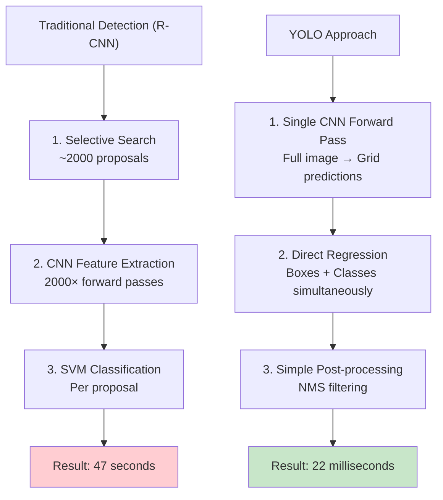

---

## Core Methodology & Architecture

### Grid-Based Detection Framework

YOLO divides the image into an S×S grid of cells. If the center of an object's bounding box falls into a grid cell, that cell is said to "contain" that object.

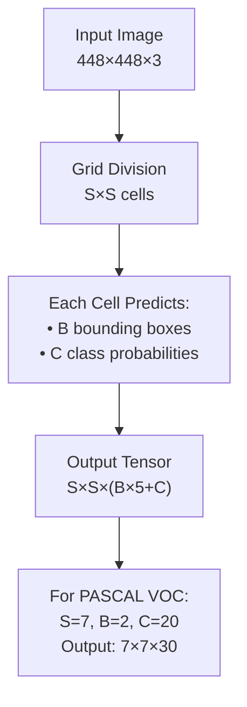

### Detailed Architecture Breakdown

YOLO architecture is similar to GoogleNet. It has 24 convolutional layers followed by 2 fully connected layers.

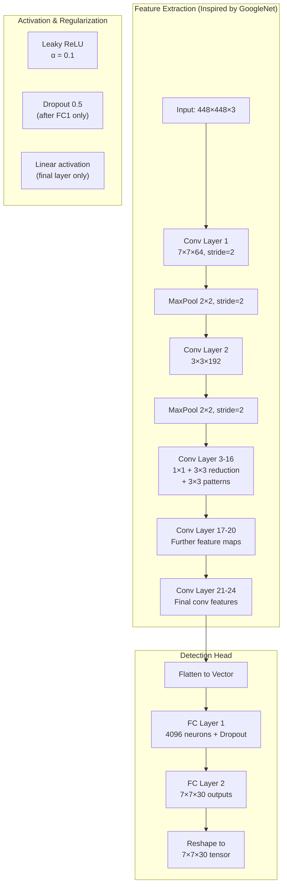

#### Layer-by-Layer Architecture Details

| Layer Type    | Input Size  | Filters | Size/Stride | Output Size   |
| ------------- | ----------- | ------- | ----------- | ------------- |
| Convolutional | 448×448×3   | 64      | 7×7/2       | 224×224×64    |
| Maxpool       | 224×224×64  | -       | 2×2/2       | 112×112×64    |
| Convolutional | 112×112×64  | 192     | 3×3/1       | 112×112×192   |
| Maxpool       | 112×112×192 | -       | 2×2/2       | 56×56×192     |
| Convolutional | 56×56×192   | 128     | 1×1/1       | 56×56×128     |
| Convolutional | 56×56×128   | 256     | 3×3/1       | 56×56×256     |
| Convolutional | 56×56×256   | 256     | 1×1/1       | 56×56×256     |
| Convolutional | 56×56×256   | 512     | 3×3/1       | 56×56×512     |
| Maxpool       | 56×56×512   | -       | 2×2/2       | 28×28×512     |
| ...           | ...         | ...     | ...         | ...           |
| Connected     | 4096        | -       | -           | 4096          |
| Connected     | 4096        | -       | -           | 1470 (7×7×30) |

### Output Tensor Interpretation

Each cell in the 7×7 grid predicts:

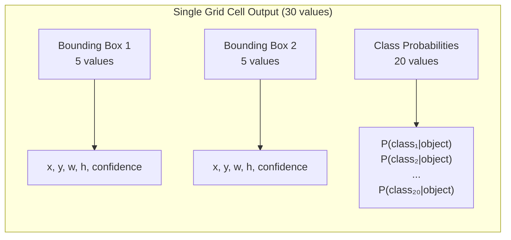

**Coordinate Encoding:**

- `(x, y)`: Center coordinates **relative to grid cell** (0-1 range)
- `(w, h)`: Width and height **relative to entire image** (0-1+ range)
- `confidence`: P(Object) × IoU^truth_pred

---

## Mathematical Foundation

### Bounding Box Representation

Given a grid cell at position (i, j) and image dimensions (W, H):

```
Actual box center = (
    (i + x) × W/S,  # x is relative offset within cell
    (j + y) × H/S   # y is relative offset within cell
)

Actual box dimensions = (
    w × W,  # w is relative to full image width
    h × H   # h is relative to full image height
)
```

### Confidence Score Definition

Formally we define confidence as Pr(Object) × IOU(pred, truth). If no object exists in that cell, the confidence score should be zero. Otherwise we want the confidence score to equal the intersection over union (IOU) between the predicted box and the ground truth.

```
Confidence = {
    0,                          if no object in cell
    IoU(predicted, truth),      if object present
}

where IoU = Area_intersection / Area_union
```

### Class Prediction

Each grid cell also predicts C conditional class probabilities, Pr(Class_i | Object). These probabilities are conditioned on the grid cell containing an object.

Final class-specific confidence scores:

```
Score(class_i, box_j) = Pr(Class_i | Object) × Confidence_j
                      = Pr(Class_i | Object) × Pr(Object) × IoU^truth_pred
                      = Pr(Class_i) × IoU^truth_pred
```

---

## Training Process & Loss Function

### Multi-Part Loss Function

The YOLO loss function is carefully designed to handle the multi-task nature of the problem:

YOLO combines detection and classification into one loss function: the coordinate loss, confidence loss, and classification loss.

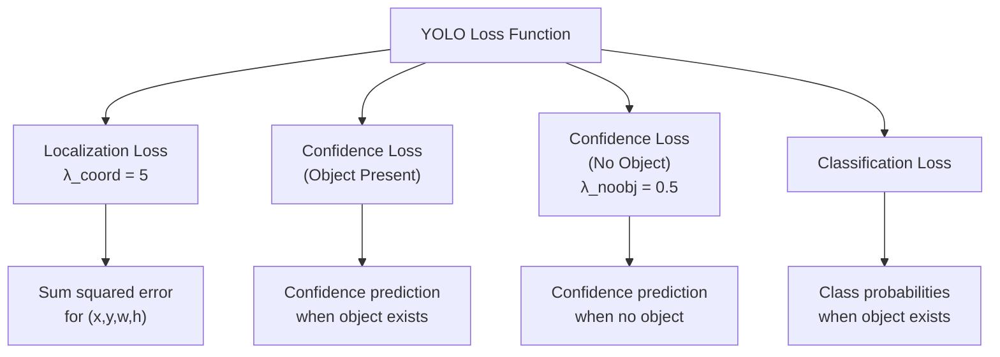

### Complete Loss Function

```
L = λ_coord ∑∑ 𝟙ᵢⱼᵒᵇʲ [(xᵢ - x̂ᵢ)² + (yᵢ - ŷᵢ)²]

    + λ_coord ∑∑ 𝟙ᵢⱼᵒᵇʲ [(√wᵢ - √ŵᵢ)² + (√hᵢ - √ĥᵢ)²]

    + ∑∑ 𝟙ᵢⱼᵒᵇʲ (Cᵢ - Ĉᵢ)²

    + λ_noobj ∑∑ 𝟙ᵢⱼⁿᵒᵒᵇʲ (Cᵢ - Ĉᵢ)²

    + ∑ 𝟙ᵢᵒᵇʲ ∑ (pᵢ(c) - p̂ᵢ(c))²
```

**Where:**

- `𝟙ᵢⱼᵒᵇʲ`: 1 if object appears in cell i and predictor j is "responsible"
- `𝟙ᵢⱼⁿᵒᵒᵇʲ`: 1 if object does not appear in cell i for predictor j
- `𝟙ᵢᵒᵇʲ`: 1 if object appears in cell i
- `λ_coord = 5`: Increases loss from bounding box coordinate predictions
- `λ_noobj = 0.5`: Decreases loss from confidence predictions for boxes not containing objects

### Responsibility Assignment

For each spatial cell, for each box prediction centered in that cell, the loss function finds the box with the best IoU with the object centered in that cell. This distinguishing mechanism between best boxes and all the other boxes is in the heart of the YOLO loss.

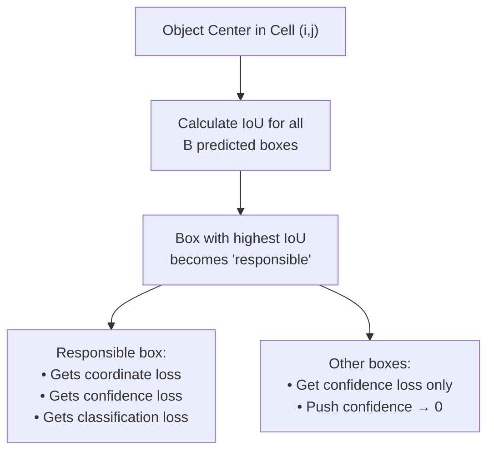

### Loss Function Design Rationale

1. **Square Root for Dimensions**: `√w` and `√h` instead of `w` and `h`

   - Makes loss more sensitive to small boxes
   - Equal importance to small vs large box errors

2. **Weighted Loss Terms**:

   - `λ_coord = 5`: Emphasizes localization accuracy
   - `λ_noobj = 0.5`: Prevents overwhelming gradient from empty cells

3. **Conditional Classification Loss**: Only penalizes classification when object present

---

## Inference & Post-Processing

### Forward Pass Output

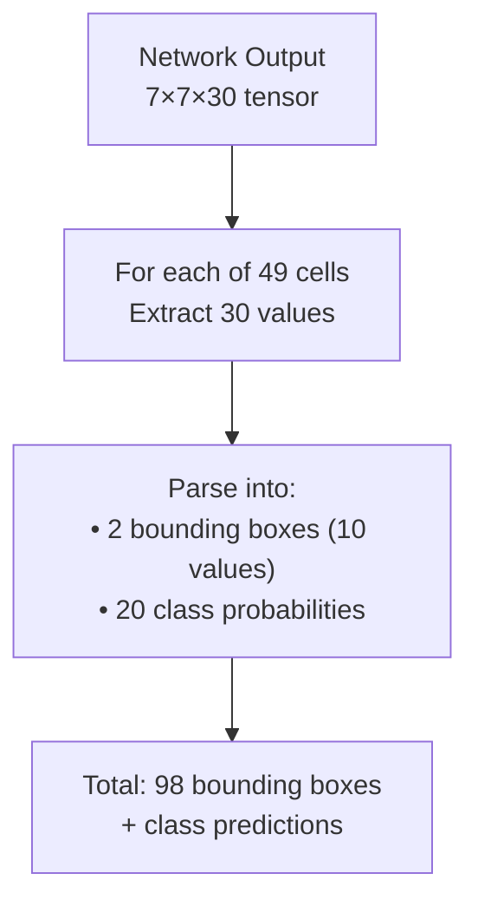

### Post-Processing Pipeline

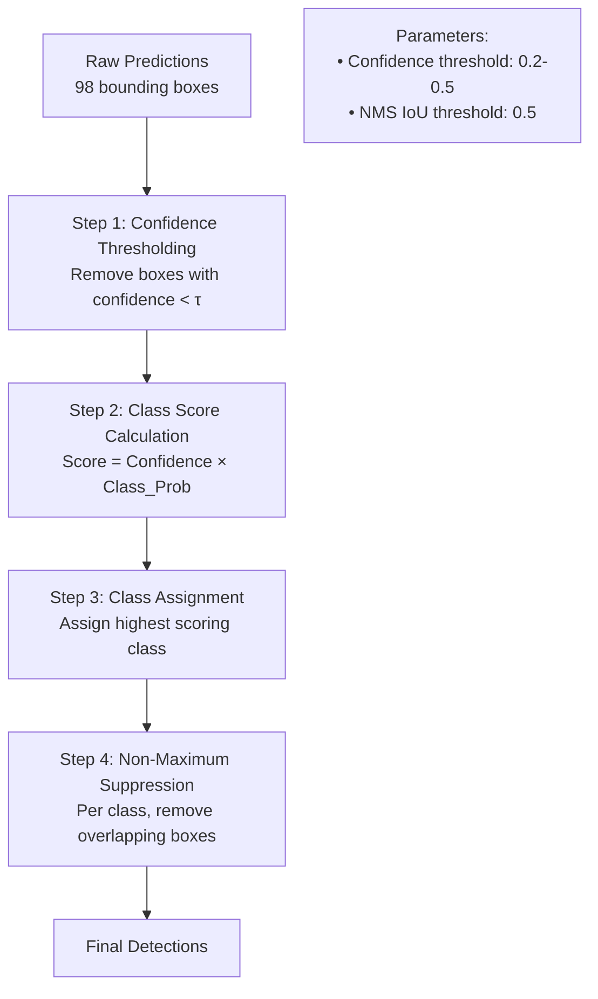

### Non-Maximum Suppression (NMS) Algorithm

```python
def non_max_suppression(boxes, scores, iou_threshold):
    """
    Args:
        boxes: List of [x1, y1, x2, y2] coordinates
        scores: Confidence scores for each box
        iou_threshold: IoU threshold for suppression
    """
    # Sort boxes by confidence score (descending)
    sorted_indices = argsort(scores)[::-1]

    keep = []
    while len(sorted_indices) > 0:
        # Keep highest scoring box
        current = sorted_indices[0]
        keep.append(current)

        # Calculate IoU with remaining boxes
        ious = calculate_iou(boxes[current], boxes[sorted_indices[1:]])

        # Remove boxes with IoU > threshold
        sorted_indices = sorted_indices[1:][ious <= iou_threshold]

    return keep
```

---

## Performance Analysis

### Speed Comparison

Our base YOLO model processes images in real-time at 45 frames per second. A smaller version of the network, Fast YOLO, processes an astounding 155 frames per second while still achieving double the mAP of other real-time detectors.

| Method     | FPS  | mAP   | Forward Pass Time |
| ---------- | ---- | ----- | ----------------- |
| R-CNN      | 0.02 | 66.0% | ~47 seconds       |
| Fast R-CNN | 0.5  | 70.0% | ~2 seconds        |
| YOLO       | 45   | 63.4% | 22 ms             |
| Fast YOLO  | 155  | 52.7% | 6.5 ms            |

### Accuracy Analysis

**Strengths:**

- Far less likely to predict false detections where nothing exists
- Strong performance on large objects
- Excellent generalization to new domains (artwork, etc.)

**Weaknesses:**

- Makes more localization errors compared to state-of-the-art detection systems
- Struggles with small objects
- Limited by grid resolution (7×7)
- Each cell can only detect one object class

### Error Analysis

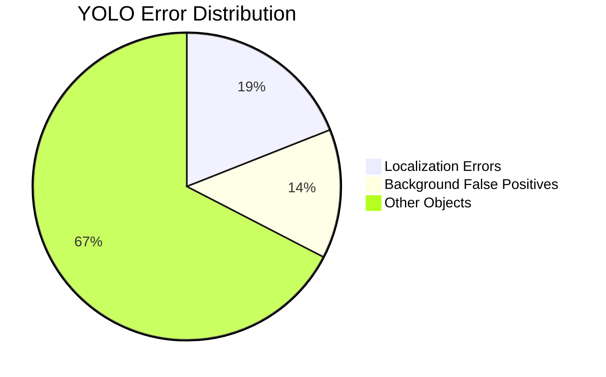

---

## Evolution: YOLOv2 & YOLOv3

### YOLOv2 (YOLO9000) Improvements

YOLOv2 was created in 2016 with the idea of making the YOLO model better, faster and stronger. The improvement includes the use of Darknet-19 as new architecture, batch normalization, higher resolution of inputs, convolution layers with anchors, dimensionality clustering, and fine-grained features.

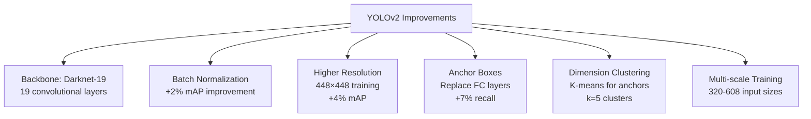

#### Darknet-19 Architecture

| Layer         | Filters | Size/Stride | Output       |
| ------------- | ------- | ----------- | ------------ |
| Convolutional | 32      | 3×3/1       | 224×224×32   |
| Maxpool       | -       | 2×2/2       | 112×112×32   |
| Convolutional | 64      | 3×3/1       | 112×112×64   |
| Maxpool       | -       | 2×2/2       | 56×56×64     |
| ...           | ...     | ...         | ...          |
| Avgpool       | -       | Global      | 1×1×1000     |
| Softmax       | -       | -           | 1000 classes |

### YOLOv3 (Incremental Improvement)

YOLOv3 uses a new network architecture: Darknet-53. This is a 106-layer neural network, with upsampling networks and residual blocks. It is much bigger, faster, and more accurate compared to Darknet-19.

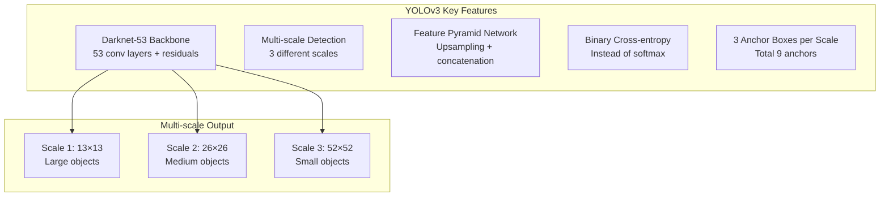

#### Darknet-53 Residual Blocks

Darknet-53 mainly composed of 3×3 and 1×1 filters with skip connections like the residual network in ResNet.

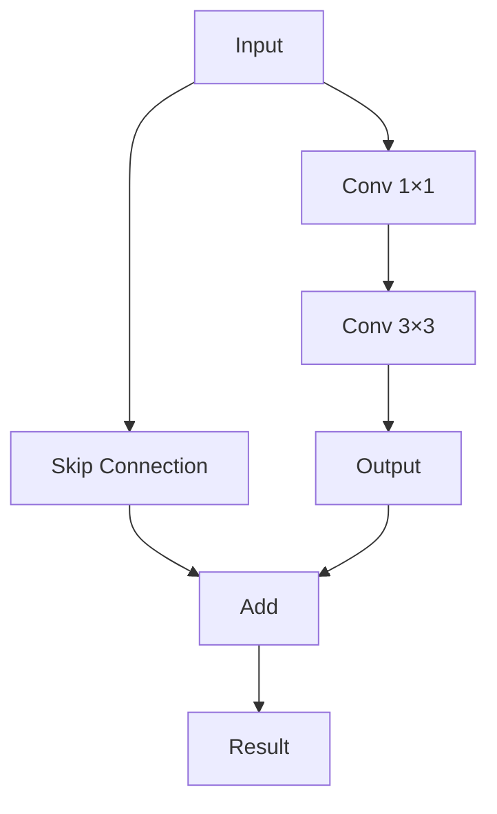

---

## Implementation Details

### Training Configuration

**Data Augmentation:**

- Random scaling up to 20%
- Random translations up to 20%
- Random exposure and saturation adjustments
- Random hue adjustments

**Optimization:**

- SGD with momentum (0.9)
- Learning rate schedule: 0.001 → 0.01 → 0.001 → 0.0001
- Weight decay: 0.0005
- Batch size: 64

**Pre-training Strategy:**

1. Train first 20 conv layers on ImageNet (224×224)
2. Add 4 conv layers + 2 FC layers
3. Increase resolution to 448×448
4. Fine-tune on detection dataset

### Memory and Computational Requirements

**Model Size:**

- Parameters: ~50 million
- Model size: ~200 MB
- Memory usage: ~1 GB GPU memory

**FLOPS Analysis:**

- Forward pass: ~8.52 billion operations
- Compared to VGG-16: ~2× more efficient

---

## Limitations & Future Directions

### Current Limitations

1. **Small Object Detection**

   - Grid resolution limits (7×7 → max 49 objects)
   - Each cell detects only one object class

2. **Spatial Constraints**

   - Objects close together may not be detected
   - Unusual aspect ratios challenging

3. **Localization Accuracy**
   - Coarser than two-stage methods
   - Loss function treats small/large boxes similarly

### Solutions in Later Versions

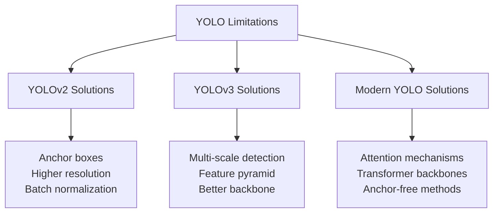

### Impact on Computer Vision

**Real-time Applications Enabled:**

- Autonomous vehicles
- Video surveillance
- Robotics and automation
- Mobile applications
- Augmented reality

**Research Influence:**

- Single-stage detector paradigm
- End-to-end optimization
- Speed-accuracy trade-offs
- Multi-scale feature learning

---

## Technical Deep Dive: Code Architecture

### Network Implementation Structure

```python
class YOLOv1(nn.Module):
    def __init__(self, num_classes=20, num_boxes=2):
        super(YOLOv1, self).__init__()
        self.num_classes = num_classes
        self.num_boxes = num_boxes

        # Feature extraction backbone
        self.backbone = self._make_backbone()

        # Detection head
        self.fc_layers = nn.Sequential(
            nn.Linear(7 * 7 * 1024, 4096),
            nn.LeakyReLU(0.1),
            nn.Dropout(0.5),
            nn.Linear(4096, 7 * 7 * (num_boxes * 5 + num_classes))
        )

    def forward(self, x):
        x = self.backbone(x)  # Shape: [B, 1024, 7, 7]
        x = torch.flatten(x, 1)  # Shape: [B, 7*7*1024]
        x = self.fc_layers(x)  # Shape: [B, 7*7*30]
        x = x.view(-1, 7, 7, 30)  # Shape: [B, 7, 7, 30]
        return x
```

### Loss Function Implementation

```python
def yolo_loss(predictions, targets, lambda_coord=5, lambda_noobj=0.5):
    """
    YOLO loss function implementation

    Args:
        predictions: [batch_size, 7, 7, 30]
        targets: [batch_size, 7, 7, 30]
    """
    batch_size = predictions.size(0)

    # Split predictions
    coord_pred = predictions[..., :8].view(-1, 7, 7, 2, 4)  # [B,7,7,2,4]
    conf_pred = predictions[..., 8:10]  # [B,7,7,2]
    class_pred = predictions[..., 10:]  # [B,7,7,20]

    # Split targets
    coord_target = targets[..., :8].view(-1, 7, 7, 2, 4)
    conf_target = targets[..., 8:10]
    class_target = targets[..., 10:]

    # Object mask (which cells contain objects)
    obj_mask = conf_target > 0  # [B,7,7,2]

    # Coordinate loss (only for responsible boxes)
    coord_loss = lambda_coord * F.mse_loss(
        coord_pred[obj_mask],
        coord_target[obj_mask],
        reduction='sum'
    )

    # Confidence loss (object present)
    conf_obj_loss = F.mse_loss(
        conf_pred[obj_mask],
        conf_target[obj_mask],
        reduction='sum'
    )

    # Confidence loss (no object)
    noobj_mask = ~obj_mask
    conf_noobj_loss = lambda_noobj * F.mse_loss(
        conf_pred[noobj_mask],
        torch.zeros_like(conf_pred[noobj_mask]),
        reduction='sum'
    )

    # Classification loss
    obj_cells = obj_mask.any(dim=-1)  # [B,7,7]
    class_loss = F.mse_loss(
        class_pred[obj_cells],
        class_target[obj_cells],
        reduction='sum'
    )

    total_loss = coord_loss + conf_obj_loss + conf_noobj_loss + class_loss
    return total_loss / batch_size
```

---

## Conclusion

YOLO represents a fundamental paradigm shift in object detection, moving from complex multi-stage pipelines to elegant single-shot regression. Its unified architecture is extremely fast, processing images in real-time at 45 frames per second while maintaining competitive accuracy.

The algorithm's success lies not just in its speed, but in its conceptual simplicity and end-to-end optimization capability. By treating object detection as a spatial regression problem, YOLO opened the door to real-time applications that were previously impossible.

**Key Contributions:**

1. **Unified Architecture**: Single network for detection and classification
2. **Real-time Performance**: 1000× faster than existing methods
3. **Global Context**: Whole image reasoning reduces false positives
4. **End-to-end Training**: Direct optimization for detection performance

The YOLO family continues to evolve, with modern versions addressing the original limitations while maintaining the core philosophy of simplicity and speed. From autonomous vehicles to mobile applications, YOLO's impact extends far beyond academic research, enabling practical computer vision applications in the real world.

**Legacy**: YOLO didn't just solve object detection faster—it redefined what was possible in real-time computer vision, inspiring a generation of single-stage detectors and proving that sometimes, looking once is indeed enough.
