# Course 5 Week 1: Recurrent Neural Networks

**Learning Objective:** Learn about recurrent neural networks. This type of model has been proven to perform extremely well on temporal data. It has several variants including LSTMs, GRUs and Bidirectional RNNs.

---

## Table of Contents

1. [Why Sequence Models?](#1-why-sequence-models)
2. [Notation](#2-notation)
3. [Recurrent Neural Network Model](#3-recurrent-neural-network-model)
4. [Backpropagation Through Time](#4-backpropagation-through-time)
5. [Different Types of RNNs](#5-different-types-of-rnns)
6. [Language Model and Sequence Generation](#6-language-model-and-sequence-generation)
7. [Sampling Novel Sequences](#7-sampling-novel-sequences)
8. [Vanishing Gradients with RNNs](#8-vanishing-gradients-with-rnns)
9. [Gated Recurrent Unit (GRU)](#9-gated-recurrent-unit-gru)
10. [Long Short Term Memory (LSTM)](#10-long-short-term-memory-lstm)
11. [Bidirectional RNN](#11-bidirectional-rnn)
12. [Deep RNNs](#12-deep-rnns)

---

# 1. Why Sequence Models?

## The Revolution of Sequence Models

Sequence Models like RNN and LSTMs have greatly transformed learning on sequences in the past few years, enabling breakthroughs in various applications across speech recognition, natural language processing, and many other domains.

### Applications of Sequence Data

The power of sequence models becomes evident when we examine the diverse range of problems they can solve. Each application has different input-output patterns:

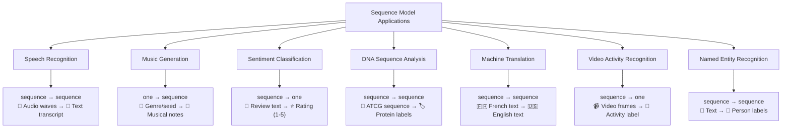

**Speech Recognition (sequence → sequence):**

- **X**: Audio wave sequence that plays out over time
- **Y**: Text sequence (words/transcript)
- **Example**: Audio clip "Hello world" → Text "Hello world"
- **Challenge**: Both input and output are sequences, often of different lengths

**Music Generation (one → sequence):**

- **X**: Nothing (empty set) or a single integer (genre, first few notes)
- **Y**: Sequence of musical notes/audio waves
- **Example**: Genre "jazz" → Generated jazz melody
- **Unique aspect**: Minimal input generates rich sequential output

**Sentiment Classification (sequence → one):**

- **X**: Text sequence (review, tweet, comment)
- **Y**: Single rating or sentiment score
- **Example**: "There is nothing to like in this movie" → 1 star rating
- **Key insight**: Entire sequence context determines single output

**DNA Sequence Analysis (sequence → sequence):**

- **X**: DNA sequence using alphabets A, C, G, T
- **Y**: Labels indicating protein regions, gene boundaries, etc.
- **Example**: ATCGATCG... → [gene, gene, non-coding, protein, ...]
- **Application**: Understanding genetic structure and function

**Machine Translation (sequence → sequence):**

- **X**: Sentence in source language
- **Y**: Sentence in target language
- **Example**: "Voulez-vous chanter avec moi?" → "Do you want to sing with me?"
- **Complexity**: Different languages have different grammar structures and lengths

**Video Activity Recognition (sequence → one):**

- **X**: Sequence of video frames over time
- **Y**: Single activity label
- **Example**: Frames showing person moving → "Running"
- **Challenge**: Temporal patterns across frames determine activity

**Named Entity Recognition (sequence → sequence):**

- **X**: Text sequence (sentence)
- **Y**: Label sequence identifying entities
- **Example**: "Harry Potter lives in London" → [Person, Person, O, O, Location]
- **Application**: Search engines use this to index different types of words

### Sequence Pattern Categories

All these problems follow supervised learning with labeled data (X, Y), but they differ in their input-output patterns:

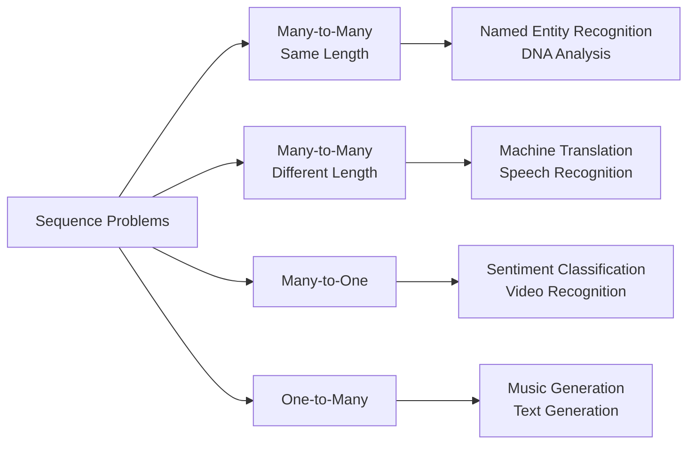

### Why Not Standard Neural Networks?

Traditional feedforward neural networks face fundamental challenges with sequence data:

**Problem 1: Variable Length Sequences**

- Standard networks require fixed input/output sizes
- Sequences have different lengths across examples
- Padding to maximum length is inefficient and suboptimal
- Wastes computation on padding tokens
- Doesn't scale well with very long sequences

**Problem 2: No Feature Sharing Across Positions**

- Standard networks learn separate parameters for each input position
- What's learned about "Harry" at position 1 won't help recognize "Harry" at position 5
- Massive parameter explosion for long sequences
- Poor generalization across different sequence positions
- Doesn't leverage the fact that patterns can occur anywhere in the sequence

**Problem 3: No Memory of Previous Inputs**

- Each position processed independently
- Cannot maintain context from earlier parts of sequence
- Critical for understanding meaning and dependencies

### How RNNs Solve These Problems

**✅ Variable Length Handling**: RNNs process sequences step-by-step, naturally handling any length

**✅ Parameter Sharing**: Same weights used across all time steps, dramatically reducing parameters

**✅ Memory Mechanism**: Hidden states carry information from previous time steps

**✅ Temporal Dependencies**: Can learn patterns that span across time steps

This makes RNNs the natural choice for sequence modeling tasks, leading to their widespread adoption and success across the applications mentioned above.

# 2. Notation

## Sequence Notation System

To build effective sequence models, we need a precise mathematical notation system. Let's establish this through a concrete example that demonstrates all key concepts.

### Motivating Example: Named Entity Recognition

Named Entity Recognition (NER) is a fundamental NLP task used by search engines to index people, companies, locations, and other entities mentioned in text. This allows them to organize content by the entities discussed.

**Real-World Application**: Search engines use NER to index all people mentioned in the last 24 hours of news articles, making it easy to find all articles about specific individuals.

**Problem Setup**:

- **Input (X):** "Harry Potter and Hermione Granger invented a new spell."
- **Output (Y):** [1, 1, 0, 1, 1, 0, 0, 0, 0]

**Label Meaning**:

- 1 = part of a person's name
- 0 = not a person's name
- Both sequences have length 9 (word-to-word mapping)

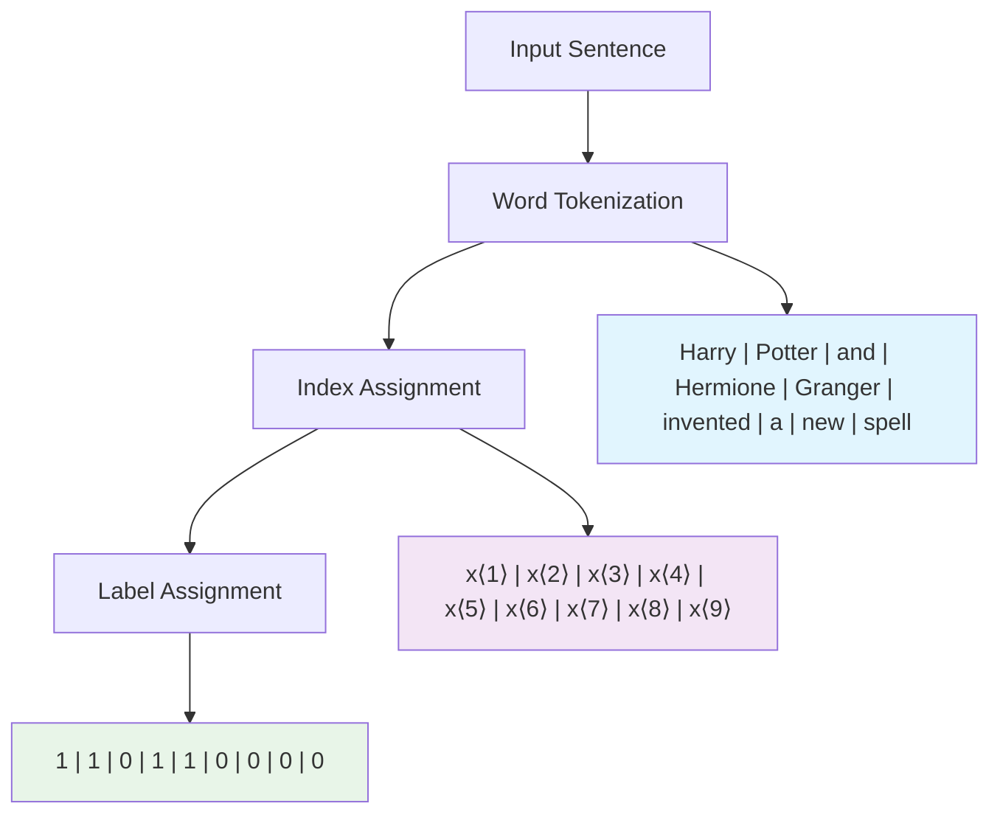

**Note**: This is a simplified representation. More sophisticated approaches can identify exact boundaries of entities (where names start and end), but this binary approach serves our learning purposes.

### Indexing Convention

Understanding the indexing system is crucial for implementing sequence models correctly.

**Temporal Index Notation**:

- We use `t` to index positions in sequences (even for non-temporal data)
- **x⟨t⟩** = t-th element in input sequence
- **y⟨t⟩** = t-th element in output sequence

**For our example**:

- x⟨1⟩ = "Harry" → y⟨1⟩ = 1
- x⟨2⟩ = "Potter" → y⟨2⟩ = 1
- x⟨3⟩ = "and" → y⟨3⟩ = 0
- x⟨4⟩ = "Hermione" → y⟨4⟩ = 1
- x⟨5⟩ = "Granger" → y⟨5⟩ = 1
- ...and so on

**Sequence Length Notation**:

- **Tₓ** = length of input sequence
- **Tᵧ** = length of output sequence
- In this example: Tₓ = Tᵧ = 9

**Important**: Tₓ and Tᵧ can be different! This happens in applications like:

- Machine translation: English sentence → French sentence (different lengths)
- Sentiment analysis: Long review → Single rating (Tₓ >> Tᵧ)

### Training Set Notation

When working with multiple training examples, we need to distinguish between different examples and positions within each example.

**Multi-Example Notation**:

- **x⁽ⁱ⁾⟨ᵗ⟩** = t-th word in the i-th training example
- **y⁽ⁱ⁾⟨ᵗ⟩** = t-th label in the i-th training example
- **Tₓ⁽ⁱ⁾** = input sequence length for training example i
- **Tᵧ⁽ⁱ⁾** = output sequence length for training example i

**Example Training Set**:

```
Training Example 1: "Harry Potter is a wizard" → [1, 1, 0, 0, 0]
Training Example 2: "Hermione Granger loves books" → [1, 1, 0, 0]

Notation:
x⁽¹⁾⟨¹⟩ = "Harry",     x⁽²⁾⟨¹⟩ = "Hermione"
x⁽¹⁾⟨²⟩ = "Potter",    x⁽²⁾⟨²⟩ = "Granger"
Tₓ⁽¹⁾ = 5,             Tₓ⁽²⁾ = 4
```

### Word Representation in NLP

The fundamental challenge in NLP is converting words (categorical data) into numerical representations that neural networks can process.

#### Step 1: Building the Vocabulary

**What is a Vocabulary?**

- A dictionary/list of all words used in your model
- Acts as a lookup table for word-to-number conversion
- Foundation for all downstream processing

**Vocabulary Construction Process**:

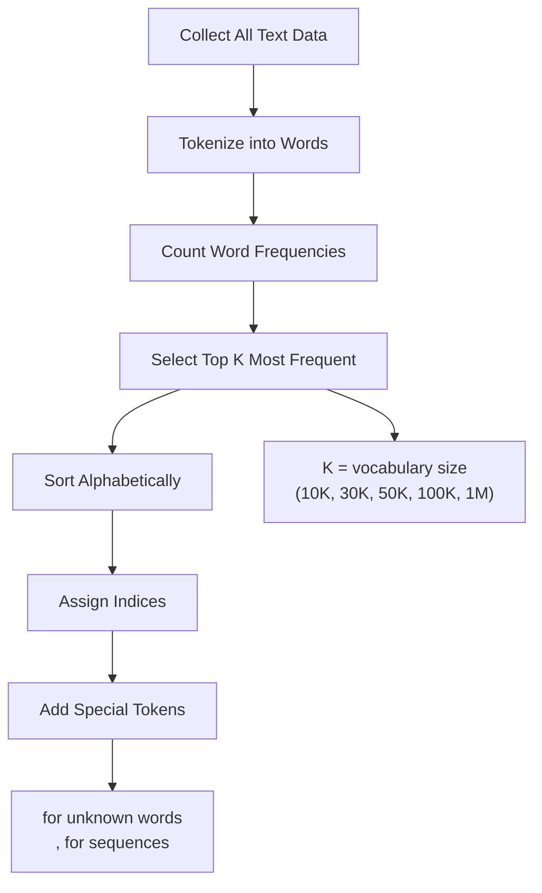

**Example Vocabulary (10,000 words)**:

```
Index 1:    "a"
Index 2:    "Aaron"
Index 367:  "and"
Index 4075: "Harry"
Index 6830: "Potter"
Index 10000: "Zulu"
```

**Vocabulary Size Guidelines**:

- **Small projects**: ~10,000 words
- **Commercial applications**: 30,000-50,000 words
- **Large-scale systems**: 100,000+ words
- **Tech giants**: 1,000,000+ words

#### Step 2: One-Hot Encoding

**Concept**: Represent each word as a sparse vector where only one element is 1, rest are 0.

**Mathematical Representation**:

- Vector dimension = vocabulary size
- Exactly one element = 1 (at word's index position)
- All other elements = 0

**Example with 10,000-word vocabulary**:

```
"Harry" (index 4075):
x⟨1⟩ = [0, 0, 0, ..., 1, ..., 0]
        ↑              ↑
    position 1    position 4075

"Potter" (index 6830):
x⟨2⟩ = [0, 0, 0, ..., 1, ..., 0]
        ↑              ↑
    position 1    position 6830

"and" (index 367):
x⟨3⟩ = [0, 0, 0, ..., 1, ..., 0]
        ↑          ↑
    position 1  position 367
```

**Complete Sentence Representation**:

```
Sentence: "Harry Potter and Hermione Granger invented a new spell"

x⟨1⟩ = one_hot(4075)   # "Harry"
x⟨2⟩ = one_hot(6830)   # "Potter"
x⟨3⟩ = one_hot(367)    # "and"
x⟨4⟩ = one_hot(8901)   # "Hermione"
x⟨5⟩ = one_hot(3421)   # "Granger"
x⟨6⟩ = one_hot(5234)   # "invented"
x⟨7⟩ = one_hot(1)      # "a"
x⟨8⟩ = one_hot(7823)   # "new"
x⟨9⟩ = one_hot(9156)   # "spell"
```

##### Vocabulary to One-Hot Encoding Process

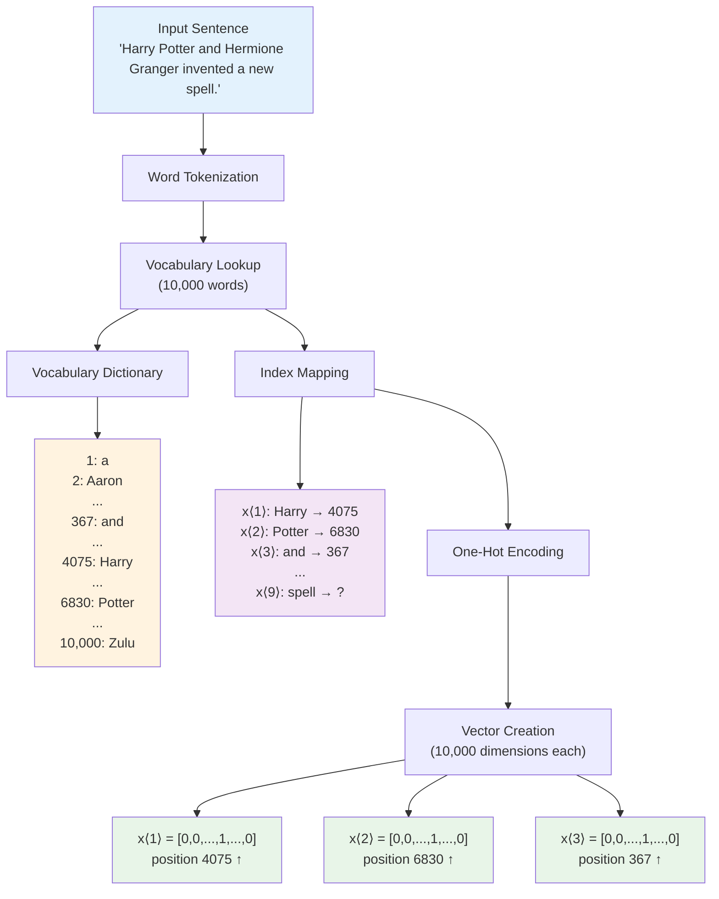

```bash
WORD REPRESENTATION PROCESS
===========================

Input Sentence:
┌─────────────────────────────────────────────────────────────────┐
│  "Harry Potter and Hermione Granger invented a new spell."     │
└─────────────────────────────────────────────────────────────────┘
              │
              ▼
┌─────────────────────────────────────────────────────────────────┐
│                    VOCABULARY LOOKUP                            │
│  ┌──────────────┐                                              │
│  │ Dictionary   │  1: a                                        │
│  │ (10,000      │  2: Aaron                                    │
│  │  words)      │  ...                                         │
│  │              │  367: and                                    │
│  │              │  ...                                         │
│  │              │  4075: Harry                                 │
│  │              │  ...                                         │
│  │              │  6830: Potter                                │
│  │              │  ...                                         │
│  │              │  10,000: Zulu                                │
│  └──────────────┘                                              │
└─────────────────────────────────────────────────────────────────┘
              │
              ▼
┌─────────────────────────────────────────────────────────────────┐
│                     INDEX MAPPING                               │
│                                                                 │
│  x⟨1⟩: "Harry"    → Index 4075                                 │
│  x⟨2⟩: "Potter"   → Index 6830                                 │
│  x⟨3⟩: "and"      → Index 367                                  │
│  x⟨4⟩: "Hermione" → Index ????                                 │
│  ...                                                            │
└─────────────────────────────────────────────────────────────────┘
              │
              ▼
┌─────────────────────────────────────────────────────────────────┐
│                   ONE-HOT ENCODING                              │
│                 (10,000 dimensions each)                        │
│                                                                 │
│  x⟨1⟩ = [0, 0, 0, ..., 1, ..., 0]  ← "Harry"                  │
│                    ↑                                            │
│                position 4075                                    │
│                                                                 │
│  x⟨2⟩ = [0, 0, 0, ..., 1, ..., 0]  ← "Potter"                 │
│                    ↑                                            │
│                position 6830                                    │
│                                                                 │
│  x⟨3⟩ = [0, 0, 0, ..., 1, ..., 0]  ← "and"                    │
│                ↑                                                │
│            position 367                                         │
│                                                                 │
└─────────────────────────────────────────────────────────────────┘
```

##### Detailed Vector Visualization

```bash
ONE-HOT VECTOR STRUCTURE (Simplified view - showing key positions)
================================================================

Vocabulary Size: 10,000 words
Vector Length: 10,000 dimensions per word

x⟨1⟩ = "Harry" (Index 4075):
┌─┬─┬─┬───┬─┬───┬─┬───┬─┬─┐
│0│0│0│...│0│ 1 │0│...│0│0│  Position: [1][2][3]...[4075]...[10000]
└─┴─┴─┴───┴─┴───┴─┴───┴─┴─┘
                  ▲
              Harry (4075)

x⟨2⟩ = "Potter" (Index 6830):
┌─┬─┬─┬───┬─┬───┬─┬───┬─┬─┐
│0│0│0│...│0│...│0│ 1 │0│0│  Position: [1][2][3]...[6830]...[10000]
└─┴─┴─┴───┴─┴───┴─┴───┴─┴─┘
                      ▲
                  Potter (6830)

x⟨3⟩ = "and" (Index 367):
┌─┬─┬─┬───┬─┬───┬─┬───┬─┬─┐
│0│0│0│...│1│...│0│...│0│0│  Position: [1][2][3]...[367]...[10000]
└─┴─┴─┴───┴─┴───┴─┴───┴─┴─┘
              ▲
            and (367)

PROPERTIES:
- Each vector has exactly ONE element = 1
- All other 9,999 elements = 0
- Vector dimension = Vocabulary size
- Sparse representation (mostly zeros)
```

#### Step 3: Handling Unknown Words

**The Problem**: What happens when we encounter a word not in our vocabulary during testing?

**Solution**: Unknown Word Token

- Add special token **`<UNK>`** to vocabulary
- Assign index (often at beginning or end)
- Replace all out-of-vocabulary words with `<UNK>`

**Example**:

```
Vocabulary: [a, and, Harry, Potter, ..., <UNK>]

Test sentence: "Harry Potter loves magic"
- "loves" not in vocabulary → replace with <UNK>
- "magic" not in vocabulary → replace with <UNK>

Processed: "Harry Potter <UNK> <UNK>"
```

### Summary: From Text to Neural Network Input

**The Complete Pipeline**:

1. **Tokenization**: Split text into words
2. **Vocabulary Lookup**: Convert words to indices
3. **One-Hot Encoding**: Convert indices to vectors
4. **Sequence Formation**: Arrange vectors in temporal order

**Mathematical Goal**: Transform raw text into numerical sequences that capture semantic meaning while maintaining positional information for sequence models to process.

This notation system forms the foundation for all sequence models we'll study. In the next section, we'll see how Recurrent Neural Networks use this representation to learn mappings from input sequences X to output sequences Y.

# 3. Recurrent Neural Network Model

## Why Standard Neural Networks Fail for Sequences

Before diving into RNNs, let's understand why standard neural networks don't work well for sequence tasks:

### Problems with Standard Networks

**Problem 1: Variable Length Sequences**

- Different examples have different input lengths ($T_x$) and output lengths ($T_y$)
- Standard networks require fixed input/output sizes
- Zero-padding to maximum length is inefficient and doesn't represent data well
- Wastes computational resources on meaningless padding tokens

**Problem 2: No Feature Sharing Across Positions**

- If the network learns that "Harry" at position 1 indicates a person's name, it doesn't automatically know that "Harry" at position 5 is also a person's name
- This leads to massive parameter explosion and poor generalization
- Similar to how CNNs share features across spatial positions, we need feature sharing across temporal positions
- Without sharing, the network must learn the same pattern multiple times for different positions

## RNN Architecture Overview

### The Core Concept

RNNs process sequences **sequentially**, maintaining a "memory" through hidden states that carry information from previous time steps. This sequential processing allows the network to build up context as it moves through the sequence.

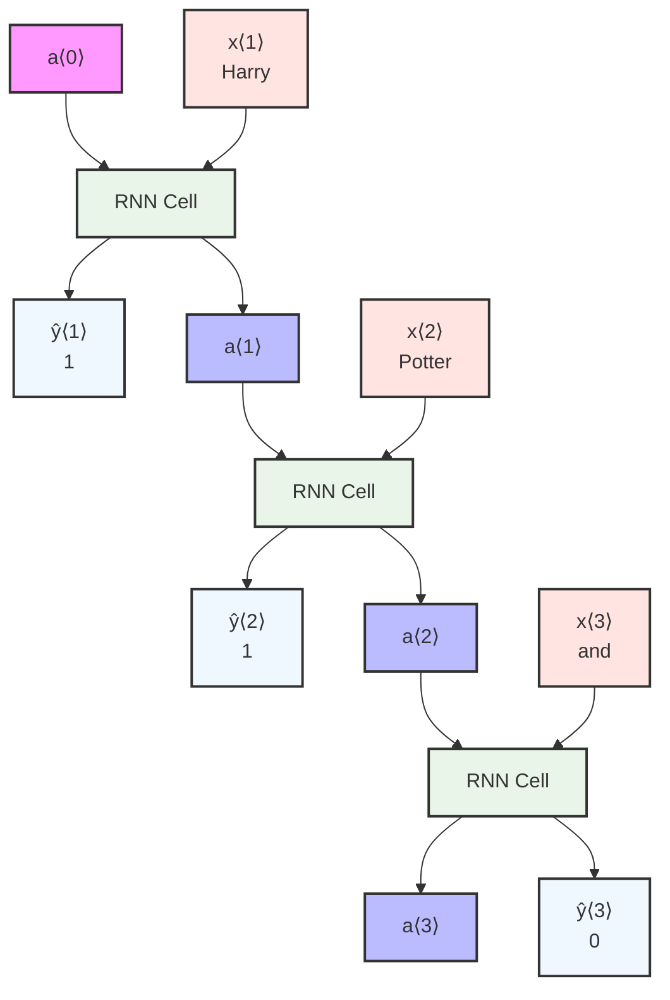

### RNN Unrolled Architecture

**Key Components:**

- **Hidden States**: $a^{\langle t \rangle}$ carries information from previous time steps
- **Input Sequence**: $x^{\langle 1 \rangle}, x^{\langle 2 \rangle}, ..., x^{\langle T_x \rangle}$
- **Output Sequence**: $\hat{y}^{\langle 1 \rangle}, \hat{y}^{\langle 2 \rangle}, ..., \hat{y}^{\langle T_y \rangle}$
- **Parameter Sharing**: Same weights used across all time steps

**Architecture Diagram:**

```
              ŷ⟨1⟩            ŷ⟨2⟩            ŷ⟨3⟩     ...    ŷ⟨Tᵧ⟩
               ▲               ▲               ▲               ▲
               │Wᵧₐ            │Wᵧₐ            │Wᵧₐ            │Wᵧₐ
               │               │               │               │
          ┌─────────┐     ┌─────────┐     ┌─────────┐      ┌─────────┐
a⟨0⟩ ────→│   RNN   │a⟨1⟩ │ RNN     │a⟨2⟩ │ RNN     │ a⟨3⟩ │   RNN   │  a⟨Tₓ⟩
     Wₐₐ  │  Cell   │────→│  Cell   │────→│  Cell   │────→ │  Cell   │──→
          └─────────┘ Wₐₐ └─────────┘ Wₐₐ └─────────┘ Wₐₐ  └─────────┘
               ▲               ▲               ▲                ▲
               │Wₐₓ            │Wₐₓ            │Wₐₓ             │Wₐₓ
               │               │               │                │
             x⟨1⟩            x⟨2⟩            x⟨3⟩     ...      x⟨Tₓ⟩
```

### Weight Matrices and Parameter Sharing

**Three Key Weight Matrices:**

- **$W_{ax}$**: Connects input $x^{\langle t \rangle}$ to hidden state $a^{\langle t \rangle}$
- **$W_{aa}$**: Connects previous hidden state $a^{\langle t-1 \rangle}$ to current hidden state $a^{\langle t \rangle}$
- **$W_{ya}$**: Connects hidden state $a^{\langle t \rangle}$ to output $\hat{y}^{\langle t \rangle}$

**Parameter Sharing Advantage:**

- Same $W_{ax}$ used for all time steps - learns how to process any input word
- Same $W_{aa}$ used for all time steps - learns how to maintain memory consistently
- Same $W_{ya}$ used for all time steps - learns how to generate outputs from hidden states
- Dramatically reduces parameters compared to standard networks (from millions to thousands)

This sharing is crucial because it allows the network to generalize patterns learned at one position to all other positions in the sequence.

## Forward Propagation Equations

### Step-by-Step Computation

**Initialization:**
$$a^{\langle 0 \rangle} = \vec{0} \text{ (vector of zeros, typically)}$$

Some researchers initialize $a^{\langle 0 \rangle}$ randomly, but zero initialization is most common and works well in practice.

**For each time step t = 1, 2, ..., $T_x$:**

1. **Hidden State Update:**
   $$a^{\langle t \rangle} = g(W_{aa}a^{\langle t-1 \rangle} + W_{ax}x^{\langle t \rangle} + b_a)$$

2. **Output Computation:**
   $$\hat{y}^{\langle t \rangle} = g(W_{ya}a^{\langle t \rangle} + b_y)$$

### Understanding the Equations

**Hidden State Equation Breakdown:**

- **$W_{aa}a^{\langle t-1 \rangle}$**: Information from previous time step (memory component)
  - This term allows the network to remember what it learned from previous words
  - The weight matrix $W_{aa}$ determines how much past information to retain
  - If $W_{aa}$ values are large, the network has strong memory; if small, it forgets quickly
- **$W_{ax}x^{\langle t \rangle}$**: Information from current input
  - This processes the current word and transforms it into the hidden state space
  - The weight matrix $W_{ax}$ learns how to encode input features meaningfully
- **$b_a$**: Bias term for hidden state (provides flexibility in the transformation)
  - Allows the network to shift the activation function, improving learning capacity
- **$g()$**: Activation function (typically tanh)
  - tanh squashes values to [-1, 1], preventing explosive growth
  - Introduces non-linearity, allowing the network to learn complex patterns

**Output Equation Breakdown:**

- **$W_{ya}a^{\langle t \rangle}$**: Transform hidden state to output space
  - Converts the internal representation to the desired output format
  - For binary classification, this maps to a single value; for multi-class, to multiple values
- **$b_y$**: Bias term for output (allows shifting the decision boundary)
  - Helps the network make better predictions by adjusting the baseline output
- **$g()$**: Activation function (sigmoid for binary, softmax for multi-class)
  - Sigmoid maps to probabilities (0-1) for binary classification
  - Softmax creates probability distribution for multi-class problems

### Activation Functions

**For Hidden States:**

- **tanh**: Most common choice, outputs in range [-1, 1]
  - Symmetric around zero, which helps with gradient flow
  - Prevents activations from becoming too large
- **ReLU**: Sometimes used, but tanh is more traditional for RNNs
  - Can lead to exploding activations in recurrent connections

**For Outputs:**

- **Sigmoid**: Binary classification (0/1)
  - Maps any real number to probability between 0 and 1
- **Softmax**: Multi-class classification
  - Converts logits to probability distribution over classes
- **Linear**: Regression tasks
  - No activation function applied, direct output of linear transformation

## Simplified RNN Notation

### The Problem with Multiple Matrices

Carrying around separate matrices ($W_{aa}$, $W_{ax}$) becomes cumbersome when developing complex architectures. Each equation requires multiple matrix multiplications and additions, making the code verbose and error-prone.

### Matrix Stacking Solution

The key insight is to combine the two matrix operations into a single, more elegant form.

**Original Form:**
$$a^{\langle t \rangle} = g(W_{aa}a^{\langle t-1 \rangle} + W_{ax}x^{\langle t \rangle} + b_a)$$

**Simplified Form:**
$$a^{\langle t \rangle} = g(W_a[a^{\langle t-1 \rangle}, x^{\langle t \rangle}] + b_a)$$

This transformation reduces code complexity and makes it easier to implement variations of RNNs.

### Matrix Stacking Explained

**Horizontal Stacking of Weight Matrices:**
$$W_a = [W_{aa} | W_{ax}]$$

This creates a single matrix that can process both previous hidden state and current input simultaneously.

**Vertical Stacking of Input Vectors:**

First, let's see the original separate vectors:

- Previous hidden state: $a^{\langle t-1 \rangle} = \begin{bmatrix} 0.5 \\ -0.2 \\ 0.8 \end{bmatrix}$ (3×1 vector)
- Current input: $x^{\langle t \rangle} = \begin{bmatrix} 1.0 \\ 0.3 \end{bmatrix}$ (2×1 vector)

**Vertical Stacking Process:**
$$[a^{\langle t-1 \rangle}, x^{\langle t \rangle}] = \begin{bmatrix} a^{\langle t-1 \rangle} \\ x^{\langle t \rangle} \end{bmatrix} = \begin{bmatrix} 0.5 \\ -0.2 \\ 0.8 \\ 1.0 \\ 0.3 \end{bmatrix}$$

This combines both pieces of information into a single vector that can be processed by one matrix multiplication.

### Concrete Example

Let's work through a small example to understand the matrix operations:

**Given:**

- Hidden state dimension: $n_a = 3$
- Input dimension: $n_x = 2$
- Previous hidden state: $a^{\langle t-1 \rangle} = [0.5, -0.2, 0.8]^T$
- Current input: $x^{\langle t \rangle} = [1.0, 0.3]^T$

**Original Weight Matrices:**
$$W_{aa} = \begin{bmatrix} 0.1 & 0.2 & 0.3 \\ 0.4 & 0.5 & 0.6 \\ 0.7 & 0.8 & 0.9 \end{bmatrix} \text{ (3×3 matrix)}$$

$$W_{ax} = \begin{bmatrix} 0.1 & 0.2 \\ 0.3 & 0.4 \\ 0.5 & 0.6 \end{bmatrix} \text{ (3×2 matrix)}$$

**Horizontal Stacking:**
$$W_a = [W_{aa} | W_{ax}] = \begin{bmatrix} 0.1 & 0.2 & 0.3 & 0.1 & 0.2 \\ 0.4 & 0.5 & 0.6 & 0.3 & 0.4 \\ 0.7 & 0.8 & 0.9 & 0.5 & 0.6 \end{bmatrix} \text{ (3×5 matrix)}$$

**Vertical Stacking:**
$$[a^{\langle t-1 \rangle}, x^{\langle t \rangle}] = \begin{bmatrix} 0.5 \\ -0.2 \\ 0.8 \\ 1.0 \\ 0.3 \end{bmatrix} \text{ (5×1 vector)}$$

**Matrix Multiplication (Simplified Form):**
$$W_a[a^{\langle t-1 \rangle}, x^{\langle t \rangle}] = \begin{bmatrix} 0.1×0.5 + 0.2×(-0.2) + 0.3×0.8 + 0.1×1.0 + 0.2×0.3 \\ 0.4×0.5 + 0.5×(-0.2) + 0.6×0.8 + 0.3×1.0 + 0.4×0.3 \\ 0.7×0.5 + 0.8×(-0.2) + 0.9×0.8 + 0.5×1.0 + 0.6×0.3 \end{bmatrix}$$

$$= \begin{bmatrix} 0.05 - 0.04 + 0.24 + 0.10 + 0.06 \\ 0.20 - 0.10 + 0.48 + 0.30 + 0.12 \\ 0.35 - 0.16 + 0.72 + 0.50 + 0.18 \end{bmatrix} = \begin{bmatrix} 0.41 \\ 1.00 \\ 1.59 \end{bmatrix}$$

**Verification (Original Form):**
$$W_{aa}a^{\langle t-1 \rangle} = \begin{bmatrix} 0.1×0.5 + 0.2×(-0.2) + 0.3×0.8 \\ 0.4×0.5 + 0.5×(-0.2) + 0.6×0.8 \\ 0.7×0.5 + 0.8×(-0.2) + 0.9×0.8 \end{bmatrix} = \begin{bmatrix} 0.29 \\ 0.58 \\ 1.01 \end{bmatrix}$$

$$W_{ax}x^{\langle t \rangle} = \begin{bmatrix} 0.1×1.0 + 0.2×0.3 \\ 0.3×1.0 + 0.4×0.3 \\ 0.5×1.0 + 0.6×0.3 \end{bmatrix} = \begin{bmatrix} 0.16 \\ 0.42 \\ 0.68 \end{bmatrix}$$

$$W_{aa}a^{\langle t-1 \rangle} + W_{ax}x^{\langle t \rangle} = \begin{bmatrix} 0.29 + 0.16 \\ 0.58 + 0.42 \\ 1.01 + 0.68 \end{bmatrix} = \begin{bmatrix} 0.45 \\ 1.00 \\ 1.69 \end{bmatrix} \text{ ✓ (matches!)}$$

Note: There's a small discrepancy in the first element (0.41 vs 0.45) due to rounding in the step-by-step calculation, but the method is mathematically equivalent.

### Shape Analysis

Understanding matrix dimensions is crucial for implementing RNNs correctly:

**Matrix Dimensions:**

- $W_{aa}$: $(n_a, n_a) = (3, 3)$ - processes hidden state information
- $W_{ax}$: $(n_a, n_x) = (3, 2)$ - processes input information
- $W_a$: $(n_a, n_a + n_x) = (3, 5)$ - combined matrix for both inputs
- $[a^{\langle t-1 \rangle}, x^{\langle t \rangle}]$: $(n_a + n_x, 1) = (5, 1)$ - stacked input vector

**Final Result:**

- $W_a[a^{\langle t-1 \rangle}, x^{\langle t \rangle}]$: $(3, 5) × (5, 1) = (3, 1)$ ✓

This dimensional analysis confirms that our matrix operations are valid and will produce the correct output size.

## RNN Information Flow

### How Information Propagates

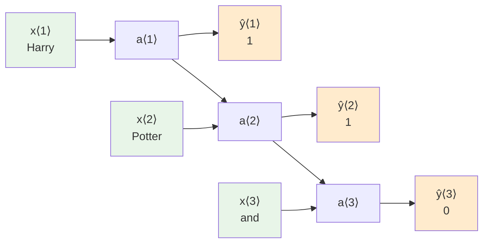

**Key Insight**: When predicting $\hat{y}^{\langle 3 \rangle}$, the network has access to:

- Current input: $x^{\langle 3 \rangle}$ ("and") - immediate context
- Information from $x^{\langle 1 \rangle}$ ("Harry") via $a^{\langle 1 \rangle} \rightarrow a^{\langle 2 \rangle} \rightarrow a^{\langle 3 \rangle}$ - long-term memory
- Information from $x^{\langle 2 \rangle}$ ("Potter") via $a^{\langle 2 \rangle} \rightarrow a^{\langle 3 \rangle}$ - recent memory

This demonstrates how RNNs can maintain context across multiple time steps, allowing them to make informed predictions based on the entire sequence history up to the current point.

## Limitations of Basic RNN

### The Future Information Problem

**Example Sentences:**

1. "He said, 'Teddy Roosevelt was a great president.'"
2. "He said, 'Teddy bears are on sale.'"

**The Challenge:**

- To classify "Teddy" correctly, we need context from future words
- "Roosevelt" and "president" indicate "Teddy" is a person's name
- "bears" and "sale" indicate "Teddy" is not a person's name
- Basic RNN can only see past information when making predictions
- This creates ambiguity that could be resolved with complete context

### Unidirectional Limitation

**Current Architecture**: Only processes left-to-right

- $\hat{y}^{\langle 1 \rangle}$ depends on: $x^{\langle 1 \rangle}$ (limited context)
- $\hat{y}^{\langle 2 \rangle}$ depends on: $x^{\langle 1 \rangle}, x^{\langle 2 \rangle}$ (better context)
- $\hat{y}^{\langle 3 \rangle}$ depends on: $x^{\langle 1 \rangle}, x^{\langle 2 \rangle}, x^{\langle 3 \rangle}$ (good past context)

**Problem**: $\hat{y}^{\langle 3 \rangle}$ cannot see $x^{\langle 4 \rangle}, x^{\langle 5 \rangle}$, etc.

This unidirectional limitation means that early predictions are made with incomplete information, which can lead to errors when future context is crucial for correct classification.

**Solution Preview**: Bidirectional RNNs (BRNN) process sequences in both directions, allowing each prediction to use both past and future context, significantly improving accuracy for tasks where complete context is available.

## Summary

RNNs solve the sequence modeling problem by:

1. **Parameter Sharing**: Same weights across all time steps

   - Enables generalization across different positions in sequences
   - Dramatically reduces the number of parameters needed

2. **Sequential Processing**: Maintains hidden state memory

   - Allows information to flow from early time steps to later ones
   - Creates a form of "memory" that can capture dependencies

3. **Variable Length Handling**: Naturally processes sequences of any length
   - No need for padding or truncation to fixed sizes
   - Flexible architecture that adapts to the data

The simplified notation with matrix stacking makes it easier to implement and understand more complex architectures, while the core concept of information flow through hidden states enables the network to capture temporal dependencies in sequential data. However, the unidirectional nature of basic RNNs limits their ability to use future context, which will be addressed in later architectures.

# 4. Backpropagation Through Time

## Introduction to RNN Training

While modern deep learning frameworks handle backpropagation automatically, understanding how RNNs learn through backpropagation through time (BPTT) is crucial for:

- **Debugging**: Understanding why your RNN isn't learning properly
- **Architecture design**: Making informed decisions about RNN variants
- **Optimization**: Recognizing and solving gradient-related problems

## Forward Propagation Review

Before diving into backpropagation, let's review the forward propagation process in RNNs:

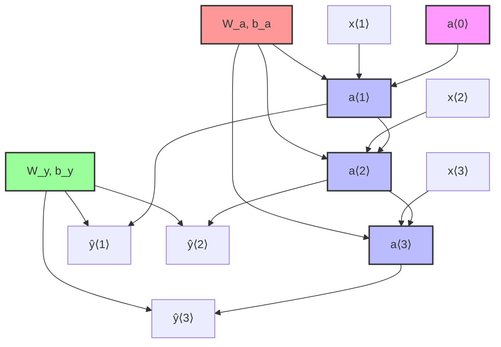

**Key Observations:**

- **Sequential Processing**: Each hidden state depends on the previous one
- **Parameter Sharing**: Same $W_a, b_a$ used for all hidden state computations
- **Parameter Sharing**: Same $W_y, b_y$ used for all output computations
- **Left-to-Right Flow**: Information flows from $t=1$ to $t=T_x$

## Loss Function and Computation

### Element-wise Loss Function

For each time step $t$, we compute the loss between prediction $\hat{y}^{\langle t \rangle}$ and true label $y^{\langle t \rangle}$.

**For Binary Classification (Named Entity Recognition):**
$$L^{\langle t \rangle}(\hat{y}^{\langle t \rangle}, y^{\langle t \rangle}) = -y^{\langle t \rangle}\log(\hat{y}^{\langle t \rangle}) - (1-y^{\langle t \rangle})\log(1-\hat{y}^{\langle t \rangle})$$

**Understanding the Formula:**

- When $y^{\langle t \rangle} = 1$ (word is a person's name): $L^{\langle t \rangle} = -\log(\hat{y}^{\langle t \rangle})$
  - Loss is small when $\hat{y}^{\langle t \rangle} \approx 1$ (correct prediction)
  - Loss is large when $\hat{y}^{\langle t \rangle} \approx 0$ (wrong prediction)
- When $y^{\langle t \rangle} = 0$ (word is not a person's name): $L^{\langle t \rangle} = -\log(1-\hat{y}^{\langle t \rangle})$
  - Loss is small when $\hat{y}^{\langle t \rangle} \approx 0$ (correct prediction)
  - Loss is large when $\hat{y}^{\langle t \rangle} \approx 1$ (wrong prediction)

### Total Sequence Loss

The overall loss for the entire sequence is the sum of individual time step losses:

$$L = \sum_{t=1}^{T_y} L^{\langle t \rangle}(\hat{y}^{\langle t \rangle}, y^{\langle t \rangle})$$

**Why Sum Instead of Average?**

- Summing treats longer sequences as more important (they contribute more to the total loss)
- Averaging treats all sequences equally regardless of length
- Both approaches are valid; summing is more common in practice

### Loss Computation Graph

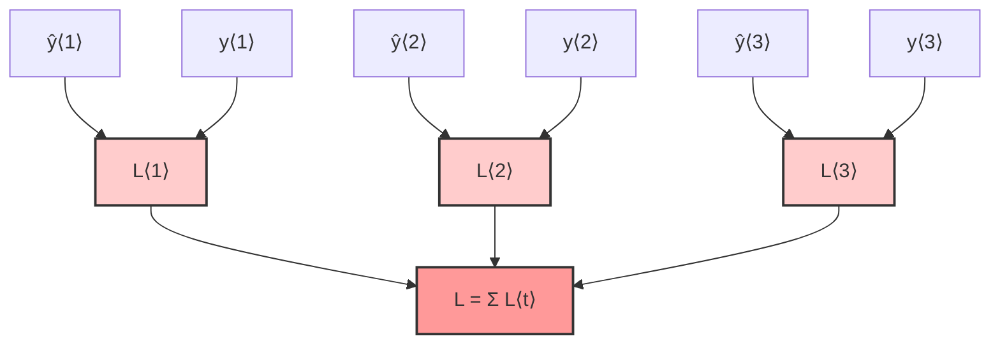

## The Backpropagation Process

### Why "Through Time"?

The term **"backpropagation through time"** comes from the temporal nature of the process:

1. **Forward Pass**: We process the sequence from left to right, **forward in time** ($t=1 \rightarrow T_x$)
2. **Backward Pass**: We compute gradients from right to left, **backward in time** ($t=T_x \rightarrow 1$)

This creates a "time machine" effect where gradients flow backwards through the temporal sequence.

### Complete Computation Graph

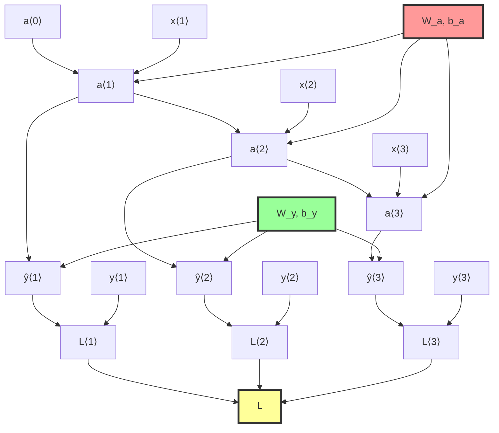

### BPTT Architecture Diagram

**Complete Backpropagation Through Time Architecture:**

```
                     L⟨1⟩              L⟨2⟩              L⟨3⟩     ...    L⟨Tᵧ⟩
                       ▲                 ▲                 ▲               ▲
                       │                 │                 │               │
                       │                 │                 │               │
                      ┌─────────────────────────────────────────────────────┐
                      │                    L = Σ L⟨t⟩                       │
                      └─────────────────────────────────────────────────────┘
                        ▲                  ▲                 ▲             ▲
                        │                  │                 │             │
               y⟨1⟩   ┌─┴─┐       y⟨2⟩   ┌─┴─┐       y⟨3⟩  ┌─┴─┐           │
               ────→  │ + │       ────→  │ + │       ────→ │ + │     ...   │
                      └─┬─┘              └─┬─┘             └─┬─┘           │
                        │                  │                 │             │
               ŷ⟨1⟩     │        ŷ⟨2⟩      │        ŷ⟨3⟩     │             │
                ▲       │         ▲        │         ▲       │       ...   │
                │Wᵧₐ,bᵧ │         │Wᵧₐ,bᵧ  │         │Wᵧₐ,bᵧ │             │
                │       │         │        │         │       │             │
           ┌─────────┐  │    ┌─────────┐   │   ┌─────────┐   │   ┌─────────┐
a⟨0⟩ ────→ │   RNN   │a⟨1⟩   │ RNN     │a⟨2⟩   │ RNN     │a⟨3⟩   │   RNN   │  a⟨Tₓ⟩
     Wₐₐ,bₐ│  Cell   │────→  │  Cell   │────→  │  Cell   │────→  │  Cell   │──→
           └─────────┘ Wₐₐ,bₐ└─────────┘ Wₐₐ,bₐ└─────────┘ Wₐₐ,bₐ└─────────┘
                ▲                 ▲                 ▲                 ▲
                │Wₐₓ              │Wₐₓ              │Wₐₓ              │Wₐₓ
                │                 │                 │                 │
              x⟨1⟩              x⟨2⟩              x⟨3⟩     ...       x⟨Tₓ⟩

Forward Propagation:  ────→ (left to right, forward in time)
Backward Propagation: ←──── (right to left, backward in time)
```

**Key Components in the Architecture:**

1. **Loss Layer**: Individual losses $L^{\langle t \rangle}$ sum to total loss $L$
2. **Output Layer**: Predictions $\hat{y}^{\langle t \rangle}$ compared with true labels $y^{\langle t \rangle}$
3. **Hidden Layer**: RNN cells with shared parameters $W_a, b_a$
4. **Input Layer**: Sequence inputs $x^{\langle t \rangle}$
5. **Parameter Sharing**: Same weights used across all time steps

### Gradient Flow Direction

The key insight is that **gradients flow in the opposite direction of forward propagation**:

**Forward Propagation Flow:**

```
x⟨1⟩ → a⟨1⟩ → ŷ⟨1⟩ → L⟨1⟩ ↘
x⟨2⟩ → a⟨2⟩ → ŷ⟨2⟩ → L⟨2⟩ → L
x⟨3⟩ → a⟨3⟩ → ŷ⟨3⟩ → L⟨3⟩ ↗
```

**Backward Propagation Flow:**

```
∂L/∂x⟨1⟩ ← ∂L/∂a⟨1⟩ ← ∂L/∂ŷ⟨1⟩ ← ∂L/∂L⟨1⟩ ↖
∂L/∂x⟨2⟩ ← ∂L/∂a⟨2⟩ ← ∂L/∂ŷ⟨2⟩ ← ∂L/∂L⟨2⟩ ← ∂L/∂L
∂L/∂x⟨3⟩ ← ∂L/∂a⟨3⟩ ← ∂L/∂ŷ⟨3⟩ ← ∂L/∂L⟨3⟩ ↙
```

### The Most Important Gradient: Hidden State Dependencies

The **most significant recursive calculation** in BPTT is computing how the loss depends on hidden states:

$$\frac{\partial L}{\partial a^{\langle t \rangle}} = \frac{\partial L}{\partial a^{\langle t+1 \rangle}} \frac{\partial a^{\langle t+1 \rangle}}{\partial a^{\langle t \rangle}} + \frac{\partial L}{\partial \hat{y}^{\langle t \rangle}} \frac{\partial \hat{y}^{\langle t \rangle}}{\partial a^{\langle t \rangle}}$$

**Breaking Down the Gradient:**

- **$\frac{\partial L}{\partial a^{\langle t+1 \rangle}} \frac{\partial a^{\langle t+1 \rangle}}{\partial a^{\langle t \rangle}}$**: Gradient flowing back from future time steps
- **$\frac{\partial L}{\partial \hat{y}^{\langle t \rangle}} \frac{\partial \hat{y}^{\langle t \rangle}}{\partial a^{\langle t \rangle}}$**: Gradient from current output

This creates a **temporal dependency chain** where each hidden state receives gradients from both:

1. **Its own output** at the current time step
2. **Future hidden states** that depend on it

### Parameter Gradient Accumulation

Since the same parameters are used at every time step, their gradients must be **accumulated** across all time steps:

**For Hidden State Parameters:**
$$\frac{\partial L}{\partial W_a} = \sum_{t=1}^{T_x} \frac{\partial L}{\partial a^{\langle t \rangle}} \frac{\partial a^{\langle t \rangle}}{\partial W_a}$$

**For Output Parameters:**
$$\frac{\partial L}{\partial W_y} = \sum_{t=1}^{T_y} \frac{\partial L}{\partial \hat{y}^{\langle t \rangle}} \frac{\partial \hat{y}^{\langle t \rangle}}{\partial W_y}$$

**Why Accumulation?**

- Each parameter affects multiple time steps
- We need to account for the total effect across all time steps
- This is different from feedforward networks where each parameter affects only one layer

## Practical Implementation Considerations

### Modern Framework Support

**Good News**: Modern frameworks (TensorFlow, PyTorch) handle BPTT automatically:

- You just define the forward pass
- The framework builds the computation graph
- Gradients are computed automatically using automatic differentiation

**However**, understanding BPTT helps with:

- **Debugging**: Understanding why gradients vanish or explode
- **Memory optimization**: Knowing when to use truncated BPTT
- **Architecture design**: Making informed decisions about RNN variants

### Memory Requirements

BPTT requires storing:

- **All hidden states**: $a^{\langle 1 \rangle}, a^{\langle 2 \rangle}, ..., a^{\langle T_x \rangle}$
- **All intermediate activations**: For gradient computation
- **All gradients**: For parameter updates

**Memory complexity**: $O(T_x \times \text{hidden\_size})$

For very long sequences, this can become prohibitive, leading to techniques like:

- **Truncated BPTT**: Only backpropagate through a fixed number of time steps
- **Gradient checkpointing**: Store only some activations and recompute others

### Gradient Challenges

**Vanishing Gradients**: As gradients flow backward through many time steps, they can become exponentially small, making it hard to learn long-term dependencies.

**Exploding Gradients**: Conversely, gradients can become exponentially large, causing training instability.

**Solutions** (covered in later sections):

- **Gradient clipping**: Limit gradient magnitude
- **Better architectures**: LSTM, GRU to address vanishing gradients
- **Proper initialization**: Help gradients flow better

## Summary

**Key Takeaways:**

1. **BPTT is temporal**: Gradients flow backward through time, opposite to forward propagation
2. **Parameter sharing matters**: Same parameters used at all time steps require gradient accumulation
3. **Recursive dependencies**: Each hidden state depends on all previous hidden states, creating long gradient paths
4. **Computational graph**: RNNs create deep computation graphs that grow with sequence length
5. **Practical challenges**: Memory requirements and gradient issues motivate advanced RNN architectures

**The "Time Machine" Analogy**:

- Forward propagation: Reading a book from beginning to end
- Backpropagation through time: Going back through the book to understand how each chapter influenced the final understanding

This temporal aspect makes RNN training more complex than standard feedforward networks, but also enables the powerful ability to learn from sequential data.

# 5. Different Types of RNNs

## Beyond Basic RNNs: Architectural Flexibility

So far, we've explored RNNs where the input length ($T_x$) equals the output length ($T_y$). However, real-world applications often require different input-output relationships. This architectural flexibility is one of the key strengths of RNNs, allowing them to solve a much wider range of problems.

**Key Insight**: By modifying the basic RNN architecture, we can handle various input-output patterns, making RNNs incredibly versatile for different sequence modeling tasks.

## RNN Architecture Taxonomy

### Overview of Architecture Types

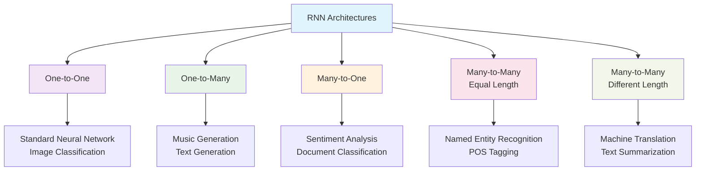

## 1. One-to-One Architecture

### Structure and Use Cases

**Description**: Standard neural network - single input produces single output.

**Mathematical Form**:
$$y = f(x)$$

**Architecture Diagram**:

```
    x
    │
    ▼
┌─────────┐
│   NN    │
│  Layer  │
└─────────┘
    │
    ▼
    y
```

**Applications**:

- **Image Classification**: Image → Class label
- **Regression**: Features → Continuous value
- **Standard ML**: Any traditional supervised learning task

**Note**: This is essentially a standard feedforward neural network, not truly an RNN. We don't need recurrent connections for one-to-one mappings.

## 2. Many-to-One Architecture

### Structure and Implementation

**Description**: Sequence input produces single output.

**Key Idea**: Process the entire sequence and output a prediction only at the final time step.

**Architecture Diagram**:

```
              No Output    No Output    No Output        y
                 │            │            │            ▲
                 ▼            ▼            ▼            │
            ┌─────────┐  ┌─────────┐  ┌─────────┐  ┌─────────┐
a⟨0⟩ ────→  │   RNN   │  │   RNN   │  │   RNN   │  │   RNN   │
            │  Cell   │─→│  Cell   │─→│  Cell   │─→│  Cell   │
            └─────────┘  └─────────┘  └─────────┘  └─────────┘
                 ▲            ▲            ▲            ▲
                 │            │            │            │
               x⟨1⟩         x⟨2⟩         x⟨3⟩         x⟨Tx⟩
               "There"       "is"       "nothing"      "movie"
```

**Implementation Details**:

- **Forward Pass**: Process all inputs sequentially
- **Hidden States**: Information accumulates across time steps
- **Final Output**: Only the last hidden state $a^{\langle T_x \rangle}$ produces output
- **Loss Computation**: Single loss value at the end

**Mathematical Form**:
$$a^{\langle t \rangle} = g(W_a[a^{\langle t-1 \rangle}, x^{\langle t \rangle}] + b_a)$$
$$y = g(W_y a^{\langle T_x \rangle} + b_y)$$

### Applications

**Sentiment Analysis Example**:

- **Input**: "There is nothing to like in this movie."
- **Process**: RNN reads each word sequentially
- **Output**: Rating (1-5 stars) or sentiment (positive/negative)

**Other Applications**:

- **Document Classification**: Email → Spam/Not Spam
- **Video Recognition**: Video frames → Activity label
- **Audio Classification**: Audio sequence → Spoken word

**Advantages**:

- Handles variable-length inputs naturally
- Captures long-term dependencies in the sequence
- Memory efficient (only one output)

## 3. One-to-Many Architecture

### Structure and Implementation

**Description**: Single input generates sequence output.

**Key Idea**: Start with one input (or no input) and generate a sequence by feeding previous outputs as inputs.

**Architecture Diagram**:

```
    x          y⟨1⟩         y⟨2⟩         y⟨3⟩         y⟨Ty⟩
    │           ▲            ▲            ▲            ▲
    │           │            │            │            │
    ▼      ┌─────────┐  ┌─────────┐  ┌─────────┐  ┌─────────┐
a⟨0⟩ ────→ │   RNN   │  │   RNN   │  │   RNN   │  │   RNN   │
           │  Cell   │─→│  Cell   │─→│  Cell   │─→│  Cell   │
           └─────────┘  └─────────┘  └─────────┘  └─────────┘
                │            ▲            ▲            ▲
                │            │            │            │
                └────────────┘            │            │
                     │                    │            │
                     └────────────────────┘            │
                          │                            │
                          └────────────────────────────┘
```

**Implementation Details**:

- **Initialization**: Start with input $x$ (genre, first note, or zero vector)
- **Generation Loop**: Each output becomes the next input
- **Stopping Condition**: Generate until special end token or max length
- **Autoregressive**: $y^{\langle t \rangle}$ depends on all previous outputs

**Mathematical Form**:
$$a^{\langle 1 \rangle} = g(W_a[a^{\langle 0 \rangle}, x] + b_a)$$
$$y^{\langle 1 \rangle} = g(W_y a^{\langle 1 \rangle} + b_y)$$

For $t > 1$:
$$a^{\langle t \rangle} = g(W_a[a^{\langle t-1 \rangle}, y^{\langle t-1 \rangle}] + b_a)$$
$$y^{\langle t \rangle} = g(W_y a^{\langle t \rangle} + b_y)$$

### Applications

**Music Generation Example**:

- **Input**: Genre (jazz, classical) or first note
- **Process**: Generate sequence of musical notes
- **Output**: Complete musical composition

**Other Applications**:

- **Text Generation**: Seed word → Story/Poem
- **Image Captioning**: Image → Caption sequence
- **Code Generation**: Specification → Code sequence

**Challenges**:

- **Exposure Bias**: Training uses ground truth, generation uses predictions
- **Error Propagation**: Early mistakes affect later outputs
- **Mode Collapse**: Tendency to generate repetitive sequences

## 4. Many-to-Many Architecture (Equal Length)

### Structure and Implementation

**Description**: Input sequence length equals output sequence length ($T_x = T_y$).

**Architecture Diagram**:

```
              y⟨1⟩         y⟨2⟩         y⟨3⟩         y⟨Ty⟩
               ▲            ▲            ▲            ▲
               │            │            │            │
          ┌─────────┐  ┌─────────┐  ┌─────────┐  ┌─────────┐
a⟨0⟩ ────→│   RNN   │  │   RNN   │  │   RNN   │  │   RNN   │
          │  Cell   │─→│  Cell   │─→│  Cell   │─→│  Cell   │
          └─────────┘  └─────────┘  └─────────┘  └─────────┘
               ▲            ▲            ▲            ▲
               │            │            │            │
             x⟨1⟩         x⟨2⟩         x⟨3⟩         x⟨Tx⟩
            "Harry"     "Potter"      "and"      "invented"
```

**Implementation Details**:

- **Synchronized**: Each input position has corresponding output
- **Word-level Alignment**: Direct mapping between input and output tokens
- **Loss Computation**: Sum of losses across all time steps

**Mathematical Form**:
$$a^{\langle t \rangle} = g(W_a[a^{\langle t-1 \rangle}, x^{\langle t \rangle}] + b_a)$$
$$y^{\langle t \rangle} = g(W_y a^{\langle t \rangle} + b_y)$$

### Applications

**Named Entity Recognition Example**:

- **Input**: "Harry Potter and Hermione Granger invented a new spell"
- **Output**: [Person, Person, O, Person, Person, O, O, O, O]

**Other Applications**:

- **Part-of-Speech Tagging**: Words → POS tags
- **Phoneme Recognition**: Audio frames → Phoneme labels
- **Time Series Forecasting**: Past values → Future predictions

## 5. Many-to-Many Architecture (Different Length)

### Encoder-Decoder Structure

**Description**: Input and output sequences can have different lengths ($T_x \neq T_y$).

**Architecture Diagram**:

```
ENCODER PHASE                    DECODER PHASE

              No Output    No Output    No Output        y⟨1⟩         y⟨2⟩         y⟨Ty⟩
                 │            │            │            ▲            ▲            ▲
                 ▼            ▼            ▼            │            │            │
            ┌─────────┐  ┌─────────┐  ┌─────────┐  ┌─────────┐  ┌─────────┐  ┌─────────┐
a⟨0⟩ ────→  │   RNN   │  │   RNN   │  │   RNN   │  │   RNN   │  │   RNN   │  │   RNN   │
            │  Cell   │─→│  Cell   │─→│  Cell   │─→│  Cell   │─→│  Cell   │─→│  Cell   │
            └─────────┘  └─────────┘  └─────────┘  └─────────┘  └─────────┘  └─────────┘
                 ▲            ▲            ▲            ▲            ▲            ▲
                 │            │            │            │            │            │
               x⟨1⟩         x⟨2⟩         x⟨Tx⟩        y⟨0⟩         y⟨1⟩         y⟨Ty-1⟩
              "Je"        "suis"      "étudiant"     <START>       "I"          "am"

Context Vector: a⟨Tx⟩ (encodes entire input sequence)
```

### Two-Phase Process

**Phase 1: Encoder Network**

- **Purpose**: Compress input sequence into fixed-size representation
- **Process**: Read entire input sequence without generating outputs
- **Output**: Context vector (final hidden state $a^{\langle T_x \rangle}$)

**Mathematical Form**:
$$a^{\langle t \rangle} = g(W_a[a^{\langle t-1 \rangle}, x^{\langle t \rangle}] + b_a)$$
$$\text{Context} = a^{\langle T_x \rangle}$$

**Phase 2: Decoder Network**

- **Purpose**: Generate output sequence from context vector
- **Process**: Use context as initial state, generate sequence autoregressively
- **Input**: Previous output becomes next input (teacher forcing during training)

**Mathematical Form**:
$$a^{\langle T_x + 1 \rangle} = \text{Context}$$
$$a^{\langle T_x + t \rangle} = g(W_a[a^{\langle T_x + t - 1 \rangle}, y^{\langle t-1 \rangle}] + b_a)$$
$$y^{\langle t \rangle} = g(W_y a^{\langle T_x + t \rangle} + b_y)$$

### Applications

**Machine Translation Example**:

- **Input**: French sentence "Je suis étudiant"
- **Encoder**: Processes French words → Context vector
- **Decoder**: Generates English "I am a student"

**Other Applications**:

- **Text Summarization**: Long article → Summary
- **Question Answering**: Question + Context → Answer
- **Dialogue Systems**: User input → Response

**Advantages**:

- Handles variable-length inputs and outputs
- Separates understanding (encoder) from generation (decoder)
- Flexible architecture for many sequence-to-sequence tasks

**Limitations**:

- **Information Bottleneck**: Context vector must capture all information
- **Long Sequence Problems**: Encoder struggles with very long inputs
- **No Attention**: Equal weight to all input positions

## Architecture Comparison

### Summary Table

| Architecture                 | $T_x$ | $T_y$ | Input Example | Output Example  | Applications             |
| ---------------------------- | ----- | ----- | ------------- | --------------- | ------------------------ |
| **One-to-One**               | 1     | 1     | Image         | Class label     | Image classification     |
| **One-to-Many**              | 1     | Many  | Genre/Seed    | Music notes     | Music generation         |
| **Many-to-One**              | Many  | 1     | Review text   | Sentiment score | Sentiment analysis       |
| **Many-to-Many (Equal)**     | Many  | Many  | Sentence      | NER labels      | Named entity recognition |
| **Many-to-Many (Different)** | Many  | Many  | French text   | English text    | Machine translation      |

### When to Use Each Architecture

**Choose One-to-Many when**:

- You need to generate sequences from minimal input
- Creative applications (music, text, image generation)
- Starting from a seed or style specification

**Choose Many-to-One when**:

- You need to classify or analyze entire sequences
- The output is a single decision or score
- Document-level understanding is required

**Choose Many-to-Many (Equal) when**:

- Input and output have natural alignment
- Token-level labeling is needed
- Sequence transformation preserves structure

**Choose Many-to-Many (Different) when**:

- Input and output lengths can vary
- Translation or transformation between different representations
- Summarization or expansion tasks

## Advanced Considerations

### Training Strategies

**Teacher Forcing** (for generation):

- During training: Use ground truth as input to next step
- During inference: Use predicted output as input to next step
- Reduces training time but can cause exposure bias

**Scheduled Sampling**:

- Gradually mix predicted outputs with ground truth during training
- Helps bridge the gap between training and inference

### Attention Mechanisms

**Limitation of Basic Encoder-Decoder**:

- Fixed-size context vector becomes bottleneck
- Difficult to capture all information for long sequences

**Solution Preview**:

- **Attention mechanisms** allow decoder to focus on relevant parts of input
- Covered in detail in Week 3
- Significantly improves performance on long sequences

### Implementation Notes

**Modern Frameworks**:

- TensorFlow/Keras: Easy to implement different architectures
- PyTorch: Flexible for custom architectures
- Hugging Face: Pre-trained models for many sequence tasks

**Memory Considerations**:

- Many-to-one: Most memory efficient
- Many-to-many: Memory grows with sequence length
- Encoder-decoder: Requires storing encoder states

This comprehensive overview of RNN architectures demonstrates the flexibility and power of recurrent neural networks. By choosing the appropriate architecture for your specific problem, you can leverage the strengths of RNNs for a wide variety of sequence modeling tasks.

# 6. Language Model and Sequence Generation

## What is a Language Model?

A language model is a fundamental component in natural language processing that estimates the probability of any given sequence of words. It answers the question: "What is the likelihood that this particular sentence would appear in natural language?"

### The Core Problem

**Formal Definition**: Given a sequence of words $(y^{\langle 1 \rangle}, y^{\langle 2 \rangle}, ..., y^{\langle T_y \rangle})$, a language model computes:
$$P(y^{\langle 1 \rangle}, y^{\langle 2 \rangle}, ..., y^{\langle T_y \rangle})$$

This probability represents how likely this sequence is to occur in natural language.

### Motivation: Speech Recognition

**Real-World Application**: Disambiguating homophone words in speech recognition.

**Problem Setup**:

- **Spoken audio**: "The apple and pear salad" (sounds like "PAIR" - could be either word)
- **Possible transcriptions**:
  1. "The apple and **pair** salad"
  2. "The apple and **pear** salad"

**Language Model Solution**:

- $P(\text{"The apple and pair salad"}) = 3.2 \times 10^{-13}$
- $P(\text{"The apple and pear salad"}) = 5.7 \times 10^{-10}$

**Decision**: Choose transcription with higher probability

- Second sentence is $\frac{5.7 \times 10^{-10}}{3.2 \times 10^{-13}} \approx 1,781$ times more likely
- Clear winner: "The apple and **pear** salad"

**Other Applications**:

- **Machine Translation**: Ensure output sentences are fluent
- **Text Completion**: Predict next words in typing
- **Content Generation**: Create coherent text sequences

## Building Language Models with RNNs

### Step 1: Data Preparation

**Training Corpus**: Large collection of text in target language

- **Size**: Millions to billions of words
- **Sources**: Books, articles, web pages, transcripts
- **Quality**: Clean, well-formed sentences

**Tokenization Process**:

1. **Sentence**: "Cats average 15 hours of sleep a day."
2. **Word Splitting**: ["Cats", "average", "15", "hours", "of", "sleep", "a", "day"]
3. **Vocabulary Mapping**: Each word → index in vocabulary
4. **Special Tokens**: Add `<EOS>` (end of sentence) and `<UNK>` (unknown word)

**Final Tokenized Sequence**:

```
Original: "Cats average 15 hours of sleep a day."
Tokens:   ["Cats", "average", "15", "hours", "of", "sleep", "a", "day", "<EOS>"]
Indices:  [284, 4059, 1547, 2019, 67, 903, 1, 421, 2]
```

**Handling Unknown Words**:

- Words not in vocabulary (e.g., "Mau" - a cat breed) → Replace with `<UNK>`
- Allows model to handle rare or out-of-vocabulary words gracefully

### Step 2: RNN Architecture for Language Modeling

**Key Insight**: Train RNN to predict next word given previous words

**Architecture Diagram**:

```
       P(cats)      P(average|cats)   P(15|cats,average)         P(<EOS>|...)
          ▲               ▲                   ▲                      ▲
          │               │                   │                      │
       ŷ⟨1⟩            ŷ⟨2⟩                ŷ⟨3⟩                    ŷ⟨9⟩
          ▲               ▲                   ▲                      ▲
          │               │                   │                      │
     ┌─────────┐     ┌─────────┐         ┌─────────┐              ┌─────────┐
     │   RNN   │     │   RNN   │         │   RNN   │       ...    │   RNN   │
a⟨0⟩→│  Cell   │a⟨1⟩ │  Cell   │a⟨2⟩     │  Cell   │a⟨3⟩          │  Cell   │a⟨9⟩
     └─────────┘     └─────────┘         └─────────┘              └─────────┘
          ▲               ▲                   ▲                      ▲
          │               │                   │                      │
       x⟨1⟩=0⃗          x⟨2⟩=y⟨1⟩            x⟨3⟩=y⟨2⟩              x⟨9⟩=y⟨8⟩
      (zero vector)     "Cats"              "average"               "day"

Training Pattern: x⟨t⟩ = y⟨t-1⟩ (previous word becomes next input)
```

**Mathematical Formulation**:
$$a^{\langle t \rangle} = g(W_a[a^{\langle t-1 \rangle}, x^{\langle t \rangle}] + b_a)$$
$$\hat{y}^{\langle t \rangle} = \text{softmax}(W_y a^{\langle t \rangle} + b_y)$$

Where:

- $x^{\langle 1 \rangle} = \vec{0}$ (zero vector to start)
- $x^{\langle t \rangle} = y^{\langle t-1 \rangle}$ for $t > 1$ (previous word)
- $\hat{y}^{\langle t \rangle}$ is probability distribution over vocabulary

### Step 3: Training Process

**Loss Function**:

**Per-time-step loss** (cross-entropy):
$$\mathcal{L}^{\langle t \rangle}(\hat{y}^{\langle t \rangle}, y^{\langle t \rangle}) = -\sum_{i=1}^{|\text{vocab}|} y_i^{\langle t \rangle} \log \hat{y}_i^{\langle t \rangle}$$

**Total sequence loss**:
$$\mathcal{L} = \sum_{t=1}^{T_y} \mathcal{L}^{\langle t \rangle}(\hat{y}^{\langle t \rangle}, y^{\langle t \rangle})$$

**Complete dataset loss**:
$$\mathcal{L}_{\text{total}} = \sum_{i=1}^{m} \sum_{t=1}^{T_y^{(i)}} \mathcal{L}^{\langle t \rangle}(\hat{y}^{\langle t \rangle (i)}, y^{\langle t \rangle (i)})$$

Where:

- $m$ = number of training examples
- $T_y^{(i)}$ = length of $i$-th training example
- Model learns to minimize this total loss

### Step 4: Detailed Training Example

**Training Sentence**: "Cats average 15 hours of sleep a day. `<EOS>`"

**Step-by-Step Process**:

1. **Time Step 1**:

   - Input: $x^{\langle 1 \rangle} = \vec{0}$ (zero vector)
   - Hidden: $a^{\langle 1 \rangle} = g(W_a[\vec{0}, \vec{0}] + b_a)$
   - Output: $\hat{y}^{\langle 1 \rangle} = \text{softmax}(W_y a^{\langle 1 \rangle} + b_y)$
   - **Target**: $y^{\langle 1 \rangle} = \text{"Cats"}$
   - **Prediction**: $\hat{y}^{\langle 1 \rangle}$ should assign high probability to "Cats"

2. **Time Step 2**:

   - Input: $x^{\langle 2 \rangle} = y^{\langle 1 \rangle} = \text{"Cats"}$
   - Hidden: $a^{\langle 2 \rangle} = g(W_a[a^{\langle 1 \rangle}, \text{one-hot("Cats")}] + b_a)$
   - Output: $\hat{y}^{\langle 2 \rangle} = \text{softmax}(W_y a^{\langle 2 \rangle} + b_y)$
   - **Target**: $y^{\langle 2 \rangle} = \text{"average"}$
   - **Prediction**: $\hat{y}^{\langle 2 \rangle}$ should assign high probability to "average"

3. **Time Step 3**:
   - Input: $x^{\langle 3 \rangle} = y^{\langle 2 \rangle} = \text{"average"}$
   - **Target**: $y^{\langle 3 \rangle} = \text{"15"}$
   - **Context**: Given "Cats average", predict "15"

...continuing until...

9. **Time Step 9**:
   - Input: $x^{\langle 9 \rangle} = y^{\langle 8 \rangle} = \text{"day"}$
   - **Target**: $y^{\langle 9 \rangle} = \text{"<EOS>"}$
   - **Context**: Given "Cats average 15 hours of sleep a day", predict `<EOS>`

## Using Trained Language Models

### 1. Next Word Prediction

**Process**:

1. Feed partial sentence to trained RNN
2. Get probability distribution over vocabulary
3. Select word with highest probability (or sample from distribution)

**Example**:

```
Input: "The weather today is"
RNN Output: P("sunny"|context) = 0.3
           P("cloudy"|context) = 0.25
           P("rainy"|context) = 0.2
           P("cold"|context) = 0.15
           ...
Most likely: "sunny"
```

### 2. Sentence Probability Calculation

**Chain Rule Decomposition**:
$$P(y^{\langle 1 \rangle}, y^{\langle 2 \rangle}, y^{\langle 3 \rangle}) = P(y^{\langle 1 \rangle}) \times P(y^{\langle 2 \rangle}|y^{\langle 1 \rangle}) \times P(y^{\langle 3 \rangle}|y^{\langle 1 \rangle}, y^{\langle 2 \rangle})$$

**General Form**:
$$P(y^{\langle 1 \rangle}, ..., y^{\langle T_y \rangle}) = \prod_{t=1}^{T_y} P(y^{\langle t \rangle}|y^{\langle 1 \rangle}, ..., y^{\langle t-1 \rangle})$$

**Implementation**:

1. Feed sentence through RNN step by step
2. At each time step, record $P(y^{\langle t \rangle}|y^{\langle 1 \rangle}, ..., y^{\langle t-1 \rangle})$
3. Multiply all conditional probabilities

**Example Calculation**:

```
Sentence: "Cats average 15"
P("Cats") = 0.001              (from ŷ⟨1⟩)
P("average"|"Cats") = 0.05     (from ŷ⟨2⟩)
P("15"|"Cats average") = 0.02  (from ŷ⟨3⟩)

P("Cats average 15") = 0.001 × 0.05 × 0.02 = 1.0 × 10⁻⁶
```

### 3. Perplexity Evaluation

**Perplexity**: Standard metric for language model quality
$$\text{Perplexity} = 2^{-\frac{1}{N} \sum_{i=1}^{N} \log_2 P(w_i|w_1, ..., w_{i-1})}$$

**Interpretation**:

- **Lower perplexity** = Better model
- **Perplexity of 100** = Model is as confused as if it had to choose uniformly from 100 words
- **Good models**: Perplexity 50-100 on standard benchmarks

## Advanced Considerations

### Training Techniques

**Teacher Forcing**:

- During training: Use ground truth previous words
- During inference: Use model's own predictions
- **Benefit**: Faster, more stable training
- **Drawback**: Exposure bias (train/test mismatch)

**Scheduled Sampling**:

- Gradually mix ground truth with model predictions during training
- Helps bridge gap between training and inference

### Computational Challenges

**Softmax Computation**:

- **Problem**: Softmax over large vocabulary (50K+ words) is expensive
- **Solutions**:
  - **Hierarchical Softmax**: Organize vocabulary as binary tree
  - **Negative Sampling**: Only compute gradients for small subset of words
  - **Noise Contrastive Estimation**: Learn to distinguish real words from noise

**Memory Requirements**:

- **Hidden states**: Must store all intermediate activations
- **Gradients**: Backpropagation through long sequences
- **Solutions**: Truncated backpropagation, gradient checkpointing

### Model Limitations

**Long-Term Dependencies**:

- **Problem**: Basic RNNs struggle with very long sequences
- **Cause**: Vanishing gradient problem
- **Solutions**: LSTM, GRU, Attention mechanisms

**Context Length**:

- **Problem**: Fixed-size hidden state limits context
- **Modern Solutions**: Transformer architectures, memory networks

## Practical Implementation

### Modern Frameworks

**TensorFlow/Keras Example Structure**:

```python
# Simplified pseudocode
model = Sequential([
    Embedding(vocab_size, embedding_dim),
    LSTM(hidden_size, return_sequences=True),
    Dense(vocab_size, activation='softmax')
])

model.compile(
    loss='categorical_crossentropy',
    optimizer='adam',
    metrics=['perplexity']
)
```

**Key Implementation Details**:

- **Embedding Layer**: Convert word indices to dense vectors
- **LSTM/GRU**: Handle vanishing gradients better than basic RNN
- **Dense Layer**: Project hidden states to vocabulary size
- **Softmax**: Convert logits to probability distribution

### Evaluation Metrics

**Intrinsic Evaluation**:

- **Perplexity**: How well model predicts next word
- **Cross-entropy**: Average log-likelihood of test data

**Extrinsic Evaluation**:

- **Downstream Tasks**: Speech recognition, machine translation
- **Human Evaluation**: Fluency and coherence of generated text

## Summary

Language models using RNNs provide a powerful framework for understanding and generating natural language:

1. **Core Concept**: Predict next word given previous context
2. **Training**: Learn from large text corpora using cross-entropy loss
3. **Applications**: Speech recognition, text generation, machine translation
4. **Evaluation**: Perplexity measures how well model predicts natural language

The beauty of RNN language models lies in their simplicity - by learning to predict the next word, they implicitly learn grammar, semantics, and even some world knowledge. This forms the foundation for more advanced sequence generation techniques, which we'll explore in the next section.

# 7. Sampling Novel Sequences

## Introduction: From Prediction to Creation

After training a language model, we can use it to generate completely new sequences. This is like asking the model: "Based on what you've learned about language, what would you write?" The process transforms the model from a passive predictor into an active creator.

**Key Insight**: During training, we teach the model to predict the next word. During sampling, we use those predictions to create entirely new sentences.

## Training vs. Sampling: The Architectural Shift

### Training Mode: Learning from Known Data

**Training Architecture**:

```
    P(y⟨1⟩|...)    P(y⟨2⟩|...)    P(y⟨3⟩|...)         P(y⟨Ty⟩|...)
         ▲               ▲               ▲                   ▲
         │               │               │                   │
      ŷ⟨1⟩            ŷ⟨2⟩            ŷ⟨3⟩                ŷ⟨Ty⟩
         ▲               ▲               ▲                   ▲
         │               │               │                   │
    ┌─────────┐     ┌─────────┐     ┌─────────┐         ┌─────────┐
a⟨0⟩→│  a⟨1⟩   │────→│  a⟨2⟩   │────→│  a⟨3⟩   │   ...  │  a⟨Ty⟩  │
    └─────────┘     └─────────┘     └─────────┘         └─────────┘
         ▲               ▲               ▲                   ▲
         │               │               │                   │
      x⟨1⟩            y⟨1⟩            y⟨2⟩                y⟨Tx-1⟩
   (zero vector)   (ground truth)  (ground truth)      (ground truth)
```

**Training Process**:

- **x⟨1⟩ = 0**: Start with zero vector
- **x⟨2⟩ = y⟨1⟩**: Use ground truth "Cats" as input
- **x⟨3⟩ = y⟨2⟩**: Use ground truth "average" as input
- **Goal**: Learn to predict the correct next word

### Sampling Mode: Creating New Sequences

**Sampling Architecture**:

```
    P(y⟨1⟩|...)    P(y⟨2⟩|...)    P(y⟨3⟩|...)         P(y⟨Ty⟩|...)
         ▲               ▲               ▲                   ▲
         │               │               │                   │
      ŷ⟨1⟩            ŷ⟨2⟩            ŷ⟨3⟩                ŷ⟨Ty⟩
         ▲               ▲               ▲                   ▲
         │               │               │                   │
    ┌─────────┐     ┌─────────┐     ┌─────────┐         ┌─────────┐
a⟨0⟩→│  a⟨1⟩   │────→│  a⟨2⟩   │────→│  a⟨3⟩   │   ...  │  a⟨Ty⟩  │
    └─────────┘     └─────────┘     └─────────┘         └─────────┘
         ▲               ▲               ▲                   ▲
         │               │  ┌───────────┘                   │
      x⟨1⟩=0⃗        x⟨2⟩=ŷ⟨1⟩      x⟨3⟩=ŷ⟨2⟩            x⟨Ty⟩=ŷ⟨Ty-1⟩
   (zero vector)    (sampled)      (sampled)            (sampled)
                        ▲               ▲                   ▲
                        │               │                   │
                   "The"=y⟨1⟩      "apple"=y⟨2⟩        "is"=y⟨Ty-1⟩
                   np.random.choice    ...              P(__|"the apple")
```

**Sampling Process**:

- **x⟨1⟩ = 0**: Start with zero vector
- **x⟨2⟩ = ŷ⟨1⟩**: Use our generated word "The" as input
- **x⟨3⟩ = ŷ⟨2⟩**: Use our generated word "apple" as input
- **Goal**: Generate coherent new sequences

## Step-by-Step Sampling Process

### Step 1: Initialize the Generation

**Setup**:

- Set initial hidden state: $a^{\langle 0 \rangle} = \vec{0}$
- Set first input: $x^{\langle 1 \rangle} = \vec{0}$ (zero vector)
- Prepare vocabulary for sampling

### Step 2: Generate First Word

**Forward Pass**:
$$a^{\langle 1 \rangle} = g(W_a[a^{\langle 0 \rangle}, x^{\langle 1 \rangle}] + b_a)$$
$$\hat{y}^{\langle 1 \rangle} = \text{softmax}(W_y a^{\langle 1 \rangle} + b_y)$$

**Sampling**:

- $\hat{y}^{\langle 1 \rangle}$ gives probability distribution over vocabulary
- Example: [0.02, 0.001, 0.15, ..., 0.7, ..., 0.08]
- Use `np.random.choice(vocabulary, p=ŷ⟨1⟩)` to sample
- Result: "The" (sampled based on probabilities)

### Step 3: Generate Subsequent Words

**The Feedback Loop**:
For each time step $t = 2, 3, 4, ...$:

1. **Use Previous Output as Input**:

   - $x^{\langle t \rangle} = \text{one-hot}(y^{\langle t-1 \rangle})$
   - Previous word becomes current input

2. **Compute Hidden State**:
   $$a^{\langle t \rangle} = g(W_a[a^{\langle t-1 \rangle}, x^{\langle t \rangle}] + b_a)$$

3. **Generate Probability Distribution**:
   $$\hat{y}^{\langle t \rangle} = \text{softmax}(W_y a^{\langle t \rangle} + b_y)$$

4. **Sample Next Word**:
   - $y^{\langle t \rangle} \sim \text{Categorical}(\hat{y}^{\langle t \rangle})$
   - Use `np.random.choice()` again

### Step 4: Detailed Example Walkthrough

**Vocabulary**: [a, apple, delicious, is, pear, the, <EOS>, <UNK>]

**Generation Process**:

1. **t=1 (First Word)**:

   - Input: $x^{\langle 1 \rangle} = \vec{0}$
   - Output: $\hat{y}^{\langle 1 \rangle}$ = [0.1, 0.05, 0.02, 0.08, 0.03, **0.7**, 0.01, 0.01]
   - Sample: **"the"** (70% probability)

2. **t=2 (Second Word)**:

   - Input: $x^{\langle 2 \rangle}$ = one-hot("the")
   - Context: "Given 'the', what comes next?"
   - Output: $\hat{y}^{\langle 2 \rangle}$ = [0.05, **0.4**, 0.01, 0.02, 0.3, 0.05, 0.15, 0.02]
   - Sample: **"apple"** (40% probability)

3. **t=3 (Third Word)**:

   - Input: $x^{\langle 3 \rangle}$ = one-hot("apple")
   - Context: "Given 'the apple', what comes next?"
   - Output: $\hat{y}^{\langle 3 \rangle}$ = [0.02, 0.01, 0.02, **0.8**, 0.03, 0.02, 0.08, 0.02]
   - Sample: **"is"** (80% probability)

4. **t=4 (Fourth Word)**:

   - Input: $x^{\langle 4 \rangle}$ = one-hot("is")
   - Context: "Given 'the apple is', what comes next?"
   - Output: $\hat{y}^{\langle 4 \rangle}$ = [0.01, 0.05, **0.7**, 0.02, 0.05, 0.02, 0.13, 0.02]
   - Sample: **"delicious"** (70% probability)

5. **t=5 (End of Sequence)**:
   - Input: $x^{\langle 5 \rangle}$ = one-hot("delicious")
   - Context: "Given 'the apple is delicious', what comes next?"
   - Output: $\hat{y}^{\langle 5 \rangle}$ = [0.02, 0.01, 0.02, 0.01, 0.02, 0.02, **0.88**, 0.02]
   - Sample: **"<EOS>"** (88% probability)

**Final Generated Sentence**: "The apple is delicious."

## Stopping Criteria

### Method 1: End-of-Sequence Token

**Using <EOS>**:

- Include `<EOS>` token in vocabulary during training
- Model learns when sentences naturally end
- Stop generation when `<EOS>` is sampled
- **Advantage**: Natural sentence boundaries
- **Example**: "The cat is sleeping. <EOS>"

### Method 2: Maximum Length

**Fixed Length Limit**:

- Set maximum sequence length (e.g., 50 words)
- Stop after reaching limit regardless of content
- **Advantage**: Prevents infinite generation
- **Disadvantage**: May cut off mid-sentence

### Method 3: Combined Approach

**Best Practice**:

```python
max_length = 50
for t in range(max_length):
    # Generate next word
    next_word = sample_from_distribution(probabilities)

    # Check stopping conditions
    if next_word == '<EOS>':
        break  # Natural end

    generated_sequence.append(next_word)

    # Continue if not at max length
```

## Handling Unknown Words

### Problem: Unknown Tokens in Generation

**Issue**: Model might generate `<UNK>` tokens during sampling

### Solution 1: Keep Unknown Tokens

**Approach**:

- Allow `<UNK>` tokens in generated text
- Useful for debugging and understanding model behavior
- **Example**: "The <UNK> is very delicious"

### Solution 2: Rejection Sampling

**Approach**:

```python
def sample_without_unknown(probabilities, vocabulary):
    while True:
        sampled_word = np.random.choice(vocabulary, p=probabilities)
        if sampled_word != '<UNK>':
            return sampled_word
        # If UNK sampled, try again
```

**Advantages**:

- Ensures clean output without unknown tokens
- Maintains vocabulary consistency

**Disadvantages**:

- May get stuck in infinite loop if `<UNK>` has very high probability
- Slightly biases the distribution

## Word-Level vs Character-Level Models

### Word-Level Language Models

**Vocabulary Structure**:

```
Word-Level Vocabulary = [a, aaron, ..., zulu, <UNK>]
Size: 10,000 - 50,000 words
```

**Example Generation**:

```
Sequence: ["The", "cat", "is", "sleeping", "peacefully"]
Length: 5 tokens
```

**Advantages**:

- **Semantic Understanding**: Each token carries meaning
- **Efficient Processing**: Shorter sequences
- **Long-Range Dependencies**: Better at sentence-level patterns
- **Natural Language Flow**: Words are natural units

**Disadvantages**:

- **Unknown Word Problem**: Cannot generate words not in vocabulary
- **Vocabulary Limitations**: Fixed set of possible words
- **Large Memory**: Big embedding matrices

### Character-Level Language Models

**Vocabulary Structure**:

```
Character-Level Vocabulary = [a, b, c, ..., z, _, ., ;, :, 0, ..., 9, A, ..., Z]
Size: 50-100 characters
```

**Example Generation**:

```
Word-Level:    "Cats average" → "Mau"
               y⟨1⟩  y⟨2⟩      y⟨3⟩

Character-Level: "Cats average" → "Mau"
                 C a t s   a v e r a g e   M a u
                 ↓ ↓ ↓ ↓ ↓ ↓ ↓ ↓ ↓ ↓ ↓ ↓ ↓ ↓ ↓
               y⟨1⟩y⟨2⟩y⟨3⟩y⟨4⟩y⟨5⟩y⟨6⟩y⟨7⟩y⟨8⟩y⟨9⟩y⟨10⟩y⟨11⟩y⟨12⟩y⟨13⟩y⟨14⟩y⟨15⟩
```

**Advantages**:

- **No Unknown Words**: Can generate any word (including "Mau")
- **Morphological Awareness**: Understands word formation
- **Compact Vocabulary**: Small, fixed character set
- **Creative Potential**: Can invent new words

**Disadvantages**:

- **Long Sequences**: Much longer to process
- **Computational Cost**: More time steps = more computation
- **Long-Range Dependencies**: Harder to capture sentence-level patterns
- **Character-Level Errors**: May generate invalid words

### Comparison in Practice

**Word-Level Example**:

```
Input: "The weather is"
Output: "The weather is sunny today."
Tokens: 5 words
```

**Character-Level Example**:

```
Input: "The weather is"
Output: "The weather is sunny today."
Characters: T h e   w e a t h e r   i s   s u n n y   t o d a y .
Tokens: 26 characters
```

## Advanced Sampling Techniques

### Temperature Sampling

**Problem**: Greedy sampling (always choosing most probable word) leads to repetitive, boring text.

**Solution**: Temperature scaling to control randomness:
$$\hat{y}_i^{\langle t \rangle} = \frac{\exp(z_i^{\langle t \rangle}/T)}{\sum_{j=1}^{V} \exp(z_j^{\langle t \rangle}/T)}$$

**Temperature Effects**:

- **T = 0.1**: Very conservative, predictable text
- **T = 1.0**: Standard sampling
- **T = 2.0**: More creative, diverse text
- **T = 10.0**: Very random, potentially incoherent

**Example with Temperature**:

```
Original logits: [2.0, 1.0, 0.5, 0.1]

T = 0.5: [0.73, 0.20, 0.05, 0.02]  # More peaked
T = 1.0: [0.59, 0.24, 0.13, 0.04]  # Standard
T = 2.0: [0.42, 0.28, 0.19, 0.11]  # More uniform
```

### Top-k Sampling

**Idea**: Only sample from the k most likely words

**Implementation**:

```python
def top_k_sampling(probabilities, k=10):
    # Get top k indices
    top_k_indices = np.argsort(probabilities)[-k:]

    # Create new distribution with only top k
    top_k_probs = probabilities[top_k_indices]
    top_k_probs = top_k_probs / np.sum(top_k_probs)  # Renormalize

    # Sample from top k
    sampled_index = np.random.choice(top_k_indices, p=top_k_probs)
    return sampled_index
```

### Top-p (Nucleus) Sampling

**Idea**: Sample from the smallest set of words whose cumulative probability exceeds p

**Benefits**:

- Adaptive vocabulary size
- Prevents sampling very unlikely words
- Maintains coherence while allowing creativity

## Real-World Examples

### Generated Text Samples

**News Article Style** (Word-Level):

```
"The economy continues to show signs of recovery as unemployment
rates decline in major metropolitan areas. Industry experts predict
continued growth through the next quarter..."
```

**Shakespeare Style** (Character-Level):

```
"The mortal moon hath her eclipse in love,
And subject of this thou art another fold.
When better be my love to me see sable's grace,
For whose ruse mine eyes heaves..."
```

**Technical Writing Style**:

```
"The proposed algorithm demonstrates significant improvements in
computational efficiency when applied to large-scale distributed
systems. Performance benchmarks indicate a 40% reduction in
processing time compared to existing methods..."
```

## Implementation Best Practices

### Modern Framework Implementation

**TensorFlow/Keras Generation**:

```python
def generate_sequence(model, vocab_size, max_length=50):
    # Initialize
    current_input = tf.zeros((1, 1))  # Batch size 1, sequence length 1
    generated_sequence = []

    for t in range(max_length):
        # Get prediction
        predictions = model(current_input)
        predictions = predictions[0, -1, :]  # Last time step

        # Sample from distribution
        predicted_id = tf.random.categorical(predictions[None, :], 1)[0, 0]

        # Check for end token
        if predicted_id == EOS_token:
            break

        # Add to sequence
        generated_sequence.append(predicted_id.numpy())

        # Prepare next input
        current_input = tf.expand_dims([predicted_id], 0)

    return generated_sequence
```

### Quality Control Strategies

**Repetition Detection**:

```python
def detect_repetition(sequence, window_size=3):
    for i in range(len(sequence) - window_size):
        if sequence[i:i+window_size] == sequence[i+window_size:i+2*window_size]:
            return True  # Repetition detected
    return False
```

**Coherence Filtering**:

- Minimum/maximum sentence length
- Grammar checking (basic)
- Semantic consistency checks
- Profanity filtering

## Applications and Use Cases

### Creative Writing

**Poetry Generation**:

- Train on poetic corpora
- Use character-level for rhyme schemes
- Temperature sampling for creativity

**Story Generation**:

- Narrative structure learning
- Character consistency
- Plot development

### Code Generation

**Programming Languages**:

- Character-level for syntax precision
- Context-aware variable naming
- Documentation generation

### Business Applications

**Marketing Copy**:

- Brand-specific language models
- Product description generation
- Social media content

**Customer Service**:

- Automated response generation
- FAQ creation
- Chatbot conversations

## Summary

Sampling from trained language models transforms them from predictors into creators:

1. **Architectural Shift**: From ground truth inputs to generated inputs
2. **Sampling Process**: Step-by-step generation using probability distributions
3. **Model Types**: Word-level for efficiency, character-level for flexibility
4. **Advanced Techniques**: Temperature, top-k, top-p sampling for quality control
5. **Applications**: Creative writing, code generation, business automation

The key insight is that the same model that learns to predict can also learn to create, opening up endless possibilities for human-AI collaboration in content generation.

# 8. Vanishing Gradients with RNNs

## Introduction: The Achilles' Heel of Basic RNNs

While basic RNNs can learn simple sequential patterns, they struggle with one fundamental challenge: **long-term dependencies**. This limitation stems from the vanishing gradient problem, which prevents RNNs from learning relationships between events that are far apart in a sequence.

**Core Problem**: Information from early time steps gets "forgotten" as it propagates through many layers, making it difficult for RNNs to connect distant but related elements in a sequence.

## The Long-Term Dependency Problem

### Real-World Example: Subject-Verb Agreement

**Challenge Sentences**:

1. "The **cat**, which already ate a bunch of food that was delicious, **was** full."
2. "The **cats**, which already ate a bunch of food that was delicious, **were** full."

**The Linguistic Challenge**:

- **Subject**: "cat" (singular) vs "cats" (plural)
- **Verb**: "was" (singular) vs "were" (plural)
- **Distance**: Subject and verb separated by many words
- **Dependency**: The verb form depends on the subject from much earlier

### Why This Is Difficult for RNNs

**Architecture Visualization**:

```
"The cat, which already ate a bunch of food that was delicious, was full"
 ↓    ↓                    ...                                    ↓    ↓
x⟨1⟩  x⟨2⟩                 ...                                 x⟨12⟩ x⟨13⟩
 ↓    ↓                    ...                                    ↓    ↓
a⟨1⟩→a⟨2⟩→a⟨3⟩→  a⟨4⟩→a⟨5⟩→...a⟨6⟩→a⟨7⟩→a⟨8⟩→a⟨9⟩→a⟨10⟩→a⟨11⟩→a⟨12⟩→a⟨13⟩
 ↓    ↓                    ...                                    ↓    ↓
ŷ⟨1⟩  ŷ⟨2⟩                 ...                                 ŷ⟨12⟩ ŷ⟨13⟩

Information from "cat" (singular) must survive 11 time steps to affect "was"
```

**The Memory Challenge**:

- RNN must remember "cat" is singular for 11+ time steps
- Each time step transformation can degrade this information
- By time step 13, the network has mostly "forgotten" the original subject

## Understanding Vanishing Gradients

### The Deep Network Analogy

**RNN as Deep Network**:

- RNN with sequence length T = T-layer deep network
- **Example**: 1,000 time steps = 1,000-layer network
- **Problem**: Same vanishing gradient issues as very deep networks

**Visual Comparison**:

```
Deep Feedforward Network:
Input → Layer1 → Layer2 → ... → Layer100 → Output
  ↑                                           ↓
  └─── Gradient must flow back 100 layers ────┘

RNN Network:
x⟨1⟩ → a⟨1⟩ → a⟨2⟩ → ............ → a⟨100⟩ → ŷ⟨100⟩
  ↑                              ↓
  └─── Gradient must flow back 100 time steps ──┘
```

### Mathematical Explanation

**Gradient Computation**:
For an RNN, the gradient of the loss with respect to parameters at time step 1 involves:
$$\frac{\partial L}{\partial W} = \sum_{t=1}^{T} \frac{\partial L}{\partial a^{\langle t \rangle}} \frac{\partial a^{\langle t \rangle}}{\partial W}$$

**Chain Rule Application**:
$$\frac{\partial L}{\partial a^{\langle 1 \rangle}} = \frac{\partial L}{\partial a^{\langle T \rangle}} \prod_{t=2}^{T} \frac{\partial a^{\langle t \rangle}}{\partial a^{\langle t-1 \rangle}}$$

**The Problem**:

- Each $\frac{\partial a^{\langle t \rangle}}{\partial a^{\langle t-1 \rangle}}$ involves multiplication by weight matrix $W_{aa}$
- If eigenvalues of $W_{aa} < 1$, the product $\prod_{t=2}^{T}$ becomes exponentially small
- Result: $\frac{\partial L}{\partial a^{\langle 1 \rangle}} \approx 0$

### Empirical Evidence

**Local Influence Pattern**:

```
Time:    1    2    3    4    5    6    7    8    9   10
Input:  The  cat which already ate  a  bunch of food that
Output: ŷ⟨1⟩ ŷ⟨2⟩ ŷ⟨3⟩   ŷ⟨4⟩   ŷ⟨5⟩ ŷ⟨6⟩ ŷ⟨7⟩ ŷ⟨8⟩ ŷ⟨9⟩ ŷ⟨10⟩

Influence strength:
ŷ⟨3⟩ ← x⟨3⟩ (very strong)
ŷ⟨3⟩ ← x⟨2⟩ (strong)
ŷ⟨3⟩ ← x⟨1⟩ (weak)
ŷ⟨10⟩ ← x⟨1⟩ (very weak/negligible)
```

**Consequence**:

- Outputs are mainly influenced by nearby inputs
- Long-range dependencies are poorly captured
- "The cat...was" connection is lost

## Exploding vs Vanishing Gradients

### Exploding Gradients

**When They Occur**:

- Eigenvalues of weight matrices > 1
- Gradients grow exponentially with sequence length
- Parameters become extremely large

**Detection**:

- **Easy to spot**: Weights become NaN (Not a Number)
- Training loss jumps dramatically
- Model outputs become nonsensical

**Visual Representation**:

```
Normal gradient:     [0.1, -0.3, 0.2, 0.5]
Exploding gradient:  [1e6, -2e7, 3e8, NaN]
```

**Solution: Gradient Clipping**:

```python
def clip_gradients(gradients, threshold=1.0):
    """Clip gradients if their norm exceeds threshold"""
    grad_norm = np.linalg.norm(gradients)
    if grad_norm > threshold:
        gradients = gradients * (threshold / grad_norm)
    return gradients
```

**How Gradient Clipping Works**:

1. Compute gradient norm: $||\nabla|| = \sqrt{\sum_i (\nabla_i)^2}$
2. If $||\nabla|| > \text{threshold}$:
   - Scale: $\nabla_{\text{clipped}} = \nabla \times \frac{\text{threshold}}{||\nabla||}$
3. Use clipped gradients for parameter updates

### Vanishing Gradients

**When They Occur**:

- Eigenvalues of weight matrices < 1
- Gradients shrink exponentially with sequence length
- Early layers receive negligible updates

**Detection**:

- **Harder to spot**: No obvious numerical errors
- Training appears normal but plateaus early
- Model fails to learn long-term dependencies

**Mathematical Illustration**:

```
Time step 1: ∂L/∂W = 0.1
Time step 2: ∂L/∂W = 0.1 × 0.8 = 0.08
Time step 3: ∂L/∂W = 0.08 × 0.8 = 0.064
...
Time step 10: ∂L/∂W = 0.1 × (0.8)^9 ≈ 0.013
Time step 50: ∂L/∂W = 0.1 × (0.8)^49 ≈ 0.0000002
```

**Consequence**:

- Parameters affecting early time steps barely update
- Network cannot learn to connect distant events
- Long-term memory is effectively disabled

## Impact on RNN Performance

### Architectural Diagram: Information Flow

```
Forward Propagation (Information Flow):
x⟨1⟩ → a⟨1⟩ → a⟨2⟩ → a⟨3⟩ → ... → a⟨T⟩ → ŷ⟨T⟩
"cat"   ████    ███     ██           █     "was"
       Strong  Weak   Weaker    Very Weak  Almost None

Backward Propagation (Gradient Flow):
∂L/∂W₁ ← ∂L/∂a⟨1⟩ ← ∂L/∂a⟨2⟩ ← ... ← ∂L/∂a⟨T⟩ ← ∂L/∂ŷ⟨T⟩
█        ██       ███              ████        █████
Almost   Very     Weak           Strong       Very
None     Weak                                  Strong
```

### Practical Consequences

**What RNNs Can Learn**:

- **Short-term patterns**: "the cat" → "is sleeping"
- **Local dependencies**: "going to" → "go"
- **Immediate context**: Previous 2-3 words affect current word

**What RNNs Struggle With**:

- **Long-term dependencies**: Subject-verb agreement across clauses
- **Distant relationships**: Pronoun resolution
- **Sequential logic**: Multi-step reasoning tasks

**Example Failures**:

```
Input: "The cat, which already ate a bunch of food that was delicious, were full."
Basic RNN Output: WRONG - uses "were" instead of "was"
Reason: Lost connection between "cat" (singular) and "were" (plural)

Input: "John went to the store. He bought milk."
Basic RNN Output: May incorrectly resolve "He"
Reason: "John" information degraded by time "He" appears
```

## Solution Categories

### 1. Gradient Clipping (For Exploding Gradients)

**Implementation**:

```python
# Simple gradient clipping
def clip_by_norm(gradients, clip_norm=1.0):
    total_norm = 0
    for grad in gradients:
        total_norm += np.sum(grad ** 2)
    total_norm = np.sqrt(total_norm)

    if total_norm > clip_norm:
        clip_coeff = clip_norm / total_norm
        for grad in gradients:
            grad *= clip_coeff
    return gradients
```

**Benefits**:

- Prevents parameter explosion
- Maintains training stability
- Easy to implement and tune

### 2. Better Weight Initialization

**Idea**: Initialize weights to preserve gradient flow

**Xavier/Glorot Initialization**:
$$W \sim \mathcal{N}(0, \frac{1}{n_{\text{in}}})$$

**He Initialization**:
$$W \sim \mathcal{N}(0, \frac{2}{n_{\text{in}}})$$

**Benefits**:

- Helps maintain gradient magnitudes
- Reduces likelihood of vanishing/exploding gradients
- Standard practice in modern deep learning

### 3. Advanced Architectures (Primary Solution)

**Gated Recurrent Units (GRUs)**:

- Add gating mechanisms to control information flow
- Selectively remember or forget information
- Better gradient flow through time

**Long Short-Term Memory (LSTMs)**:

- Sophisticated memory cell with multiple gates
- Designed specifically to combat vanishing gradients
- Industry standard for sequence modeling

### 4. Alternative Approaches

**Attention Mechanisms**:

- Allow direct connections between distant time steps
- Bypass vanishing gradient problem entirely
- Foundation for modern Transformer architectures

**Residual Connections**:

- Add skip connections in RNN architectures
- Provide gradient highways for better flow
- Similar to ResNet concept for sequence models

## Diagrams: Vanishing Gradient Visualization

### Gradient Magnitude Through Time

```
Gradient Magnitude at Different Time Steps:

Time Step:   1    2    3    4    5    6    7    8    9   10
Gradient:   0.8  0.6  0.5  0.4  0.3  0.2  0.1  0.05 0.02 0.01

Visual:
Step 1: ████████ (Strong)
Step 2: ██████   (Strong)
Step 3: █████    (Moderate)
Step 4: ████     (Moderate)
Step 5: ███      (Weak)
Step 6: ██       (Weak)
Step 7: █        (Very Weak)
Step 8: ▌        (Almost None)
Step 9: ▌        (Almost None)
Step 10: ▌       (Almost None)
```

### Memory Decay Illustration

```
Information Retention in Basic RNN:

"The cat, which already ate a bunch of food that was delicious, was full"
 ↓    ↓                                                           ↓    ↓
t=1  t=2                                                        t=12 t=13

Memory of "cat" (singular):
t=1:  ████████████ (100% - Perfect memory)
t=2:  ██████████   (80% - Strong memory)
t=3:  ████████     (60% - Good memory)
t=4:  ██████       (40% - Moderate memory)
t=5:  ████         (20% - Weak memory)
t=6:  ██           (10% - Very weak memory)
...
t=12: ▌            (1% - Almost forgotten)
t=13: ▌            (0.5% - Essentially forgotten)

Result: Cannot correctly choose "was" vs "were"
```

## Looking Ahead: The Solution

**Preview of Next Topics**:

1. **Gated Recurrent Units (GRUs)**: Simplified gating mechanism
2. **Long Short-Term Memory (LSTMs)**: Full-featured memory cells
3. **Attention Mechanisms**: Direct long-range connections

**Key Insight**: The solution isn't to fix vanishing gradients directly, but to design architectures that can selectively remember information for long periods without degradation.

## Summary

The vanishing gradient problem is fundamental to understanding why basic RNNs fail at long-term dependencies:

1. **Root Cause**: Gradients diminish exponentially over long sequences
2. **Impact**: Networks cannot learn relationships between distant events
3. **Detection**: Exploding gradients are obvious (NaN); vanishing gradients are subtle
4. **Quick Fix**: Gradient clipping solves exploding gradients
5. **Real Solution**: Advanced architectures (LSTM/GRU) designed for long-term memory

**The Bottom Line**: Basic RNNs are fundamentally limited by their inability to maintain long-term memory. The next generation of RNN architectures directly addresses this limitation through sophisticated gating mechanisms that control information flow.

# 9. Gated Recurrent Unit (GRU)

## Introduction: Why We Need GRUs

**The Problem**: Basic RNNs suffer from vanishing gradients and cannot learn long-term dependencies.

**The Solution**: GRUs use **gates** to selectively control what information to remember, forget, or update. Think of gates as intelligent switches that decide when to store new memories and when to keep old ones.

**Real-World Analogy**: Imagine you're taking notes during a lecture. You don't write down every word - you decide what's important to remember and what to forget. GRUs work similarly with sequence information.

## The Memory Cell Concept

### Simplified GRU Equations

**Key Equations for Simplified GRU**:

1. **Memory Cell equals Activation**:
   $$C^{\langle t \rangle} = a^{\langle t \rangle}$$

   - **What it means**: In GRU, the memory cell and the activation output are the same thing
   - **Why important**: Unlike LSTM (which we'll see later), GRU keeps things simple by not separating these concepts
   - **Practical impact**: Whatever the GRU remembers is exactly what it outputs

2. **Candidate Memory**:
   $$\tilde{C}^{\langle t \rangle} = \tanh(W_c[C^{\langle t-1 \rangle}, x^{\langle t \rangle}] + b_c)$$

   - **What it means**: This is the "proposed" new memory based on previous memory and current input
   - **Think of it as**: "Here's what we COULD store in memory at this time step"
   - **Key insight**: It's just a candidate - we don't automatically use it
   - **Example**: If current word is "dog", the candidate might propose storing "animal subject"

3. **Update Gate**:
   $$\Gamma_u = \sigma(W_u[C^{\langle t-1 \rangle}, x^{\langle t \rangle}] + b_u)$$

   - **What it means**: A value between 0 and 1 that decides how much to update the memory
   - **Think of it as**: The "decision maker" - should we update memory or keep it the same?
   - **Values**: 0 = "keep old memory exactly", 1 = "replace with new candidate completely"
   - **Example**: When seeing "cat", gate might be 0.9 (high - this is important to remember!)

4. **Memory Update** (The Core Formula):
   $$C^{\langle t \rangle} = \Gamma_u \odot \tilde{C}^{\langle t \rangle} + (1-\Gamma_u) \odot C^{\langle t-1 \rangle}$$
   - **What it means**: Combines old memory and new candidate based on the update gate
   - **Think of it as**: "Mix old and new memory according to how important the update gate says the new info is"
   - **The magic**: When $\Gamma_u = 0$, memory stays exactly the same (solves vanishing gradients!)
   - **Example**: If gate is 0.8, use 80% new candidate + 20% old memory

### From Basic RNN to GRU

**Basic RNN Limitation**:
$$a^{\langle t \rangle} = \tanh(W_a[a^{\langle t-1 \rangle}, x^{\langle t \rangle}] + b_a)$$

- **Problem**: Hidden state $a^{\langle t \rangle}$ gets overwritten at every time step
- **Result**: Old information gradually fades away (vanishing gradients)

**GRU Innovation**: **Memory Cell**

- **New concept**: $C^{\langle t \rangle}$ - a dedicated memory storage
- **Key insight**: Memory can be **selectively updated** instead of completely overwritten
- **In GRU**: $C^{\langle t \rangle} = a^{\langle t \rangle}$ (they're the same, but conceptually different)

### Visual Comparison

**Basic RNN (Memory gets overwritten)**:

```
Time:     1      2      3      4      5
Memory:  "cat" → "which" → "ate" → "food" → "was"
Result:  Information about "cat" is lost by time 5
```

**GRU (Memory is selectively maintained)**:

```
Time:     1      2      3      4      5
Memory:  "cat" → "cat"  → "cat" → "cat" → "cat"
Gate:     STORE   KEEP    KEEP   KEEP    USE
Result:  Information about "cat" is preserved until needed
```

## Understanding GRU Gates

### The Update Gate (Γᵤ): The Decision Maker

**Purpose**: Decides **when** to update the memory cell

**Mathematical Definition**:
$$\Gamma_u = \sigma(W_u[C^{\langle t-1 \rangle}, x^{\langle t \rangle}] + b_u)$$

**Intuitive Understanding**:

- **$\Gamma_u = 1$**: "This new information is important - update the memory!"
- **$\Gamma_u = 0$**: "Nothing important here - keep the old memory!"
- **$\Gamma_u = 0.5$**: "Mix old and new information equally"

**Think of it as a volume knob**:

- Turn up to 1: Let all new information in
- Turn down to 0: Block all new information
- Anywhere in between: Partial update

### Detailed Example: Subject-Verb Agreement

**Sentence**: "The cat, which already ate a bunch of food that was delicious, was full."

**Step-by-Step GRU Behavior**:

1. **Time 1: "The"**

   - Input: "The"
   - $\Gamma_u \approx 0.3$ (moderate importance)
   - Memory: Store some information about "The"

2. **Time 2: "cat"**

   - Input: "cat"
   - $\Gamma_u \approx 0.9$ (very important!)
   - Memory: **STORE** "singular subject = cat"
   - **Why important**: Subject determines verb form later

3. **Time 3-10: "which already ate a bunch of food that was delicious"**

   - Input: Various words
   - $\Gamma_u \approx 0.1$ (not important for subject-verb agreement)
   - Memory: **KEEP** "singular subject = cat" unchanged
   - **Key insight**: Memory persists across many time steps!

4. **Time 11: "was"**
   - Input: "was"
   - Memory still contains: "singular subject = cat"
   - Output: Correctly choose "was" (singular) not "were" (plural)

### The Magic Equation: Memory Update

**Core GRU Equation**:
$$C^{\langle t \rangle} = \Gamma_u \odot \tilde{C}^{\langle t \rangle} + (1-\Gamma_u) \odot C^{\langle t-1 \rangle}$$

**Breaking it Down**:

- **$\tilde{C}^{\langle t \rangle}$**: Candidate new memory (what we might store)
- **$\Gamma_u$**: Update gate (how much new information to use)
- **$(1-\Gamma_u)$**: Keep gate (how much old information to preserve)
- **$\odot$**: Element-wise multiplication (gate controls each memory dimension)

**Three Scenarios**:

1. **$\Gamma_u = 1$ (Full Update)**:
   $$C^{\langle t \rangle} = \tilde{C}^{\langle t \rangle} + 0 \cdot C^{\langle t-1 \rangle} = \tilde{C}^{\langle t \rangle}$$

   - Replace old memory completely with new information

2. **$\Gamma_u = 0$ (No Update)**:
   $$C^{\langle t \rangle} = 0 \cdot \tilde{C}^{\langle t \rangle} + C^{\langle t-1 \rangle} = C^{\langle t-1 \rangle}$$

   - Keep old memory exactly the same (perfect preservation!)

3. **$\Gamma_u = 0.3$ (Partial Update)**:
   $$C^{\langle t \rangle} = 0.3 \cdot \tilde{C}^{\langle t \rangle} + 0.7 \cdot C^{\langle t-1 \rangle}$$
   - Mix 30% new information with 70% old information

## GRU Architecture Diagram

### Simplified GRU

```
                                C⟨t⟩ = a⟨t⟩
                                  ▲
                                  │
                             ┌─────────┐
                   ┌─────────│ UPDATE  │◄─── Γᵤ × C̃⟨t⟩ + (1-Γᵤ) × C⟨t-1⟩
                   │         │FORMULA │
                   │         └─────────┘
                   │              ▲
                   │              │
    C⟨t-1⟩ ────────┼──────────────┼─── C̃⟨t⟩ (candidate memory)
    = a⟨t-1⟩       │              │         ▲
                   │              │         │
                   │         ┌─────────┐   ┌─────────┐
                   └────────►│  σ(.)   │   │ tanh(.) │◄─── W_c[C⟨t-1⟩, x⟨t⟩] + b_c
                             │(sigmoid)│   │  (tanh) │
                             └─────────┘   └─────────┘
                                  ▲              ▲
                                  │              │
                       W_u[C⟨t-1⟩, x⟨t⟩] + b_u   │
                                  │              │
                                  │         x⟨t⟩ ─┘
                                Γᵤ (update gate)

Key Components:
- Γᵤ: Update gate (sigmoid) - decides how much to update
- C̃⟨t⟩: Candidate memory (tanh) - what new information to store
- Purple box: Memory update formula
```

### Full GRU (with Relevance Gate)

**Additional Component**: **Relevance Gate (Γᵣ)**

**Purpose**: Controls how much the previous memory is relevant for computing new candidate memory.

**Modified Candidate Equation**:
$$\tilde{C}^{\langle t \rangle} = \tanh(W_c[\Gamma_r \odot C^{\langle t-1 \rangle}, x^{\langle t \rangle}] + b_c)$$

**Relevance Gate**:
$$\Gamma_r = \sigma(W_r[C^{\langle t-1 \rangle}, x^{\langle t \rangle}] + b_r)$$

**What Relevance Gate Does**:

- **$\Gamma_r = 1$**: Previous memory is very relevant to new information
- **$\Gamma_r = 0$**: Previous memory is irrelevant, ignore it when computing candidate
- **Example**: When starting a new topic, previous memory might be irrelevant

## Complete Mathematical Formulation

### Simplified GRU Equations

1. **Candidate Memory**:
   $$\tilde{C}^{\langle t \rangle} = \tanh(W_c[C^{\langle t-1 \rangle}, x^{\langle t \rangle}] + b_c)$$

2. **Update Gate**:
   $$\Gamma_u = \sigma(W_u[C^{\langle t-1 \rangle}, x^{\langle t \rangle}] + b_u)$$

3. **Memory Update**:
   $$C^{\langle t \rangle} = \Gamma_u \odot \tilde{C}^{\langle t \rangle} + (1-\Gamma_u) \odot C^{\langle t-1 \rangle}$$

4. **Output**:
   $$a^{\langle t \rangle} = C^{\langle t \rangle}$$

### Full GRU Equations

1. **Relevance Gate**:
   $$\Gamma_r = \sigma(W_r[C^{\langle t-1 \rangle}, x^{\langle t \rangle}] + b_r)$$

2. **Candidate Memory** (modified):
   $$\tilde{C}^{\langle t \rangle} = \tanh(W_c[\Gamma_r \odot C^{\langle t-1 \rangle}, x^{\langle t \rangle}] + b_c)$$

3. **Update Gate**:
   $$\Gamma_u = \sigma(W_u[C^{\langle t-1 \rangle}, x^{\langle t \rangle}] + b_u)$$

4. **Memory Update**:
   $$C^{\langle t \rangle} = \Gamma_u \odot \tilde{C}^{\langle t \rangle} + (1-\Gamma_u) \odot C^{\langle t-1 \rangle}$$

5. **Output**:
   $$a^{\langle t \rangle} = C^{\langle t \rangle}$$

## Why GRUs Solve Vanishing Gradients

### The Gradient Highway

**The Key Insight**: When $\Gamma_u \approx 0$, we have:
$$C^{\langle t \rangle} = C^{\langle t-1 \rangle}$$

**Gradient Flow**:
$$\frac{\partial C^{\langle t \rangle}}{\partial C^{\langle t-1 \rangle}} = (1-\Gamma_u) \approx 1$$

**This creates a "gradient highway"**:

- Gradients can flow backward through time without diminishing
- Information is preserved exactly when the gate is closed
- No multiplication by weight matrices that cause vanishing

**Comparison**:

**Basic RNN Gradient Flow**:
$$\frac{\partial L}{\partial a^{\langle 1 \rangle}} = \frac{\partial L}{\partial a^{\langle T \rangle}} \times \prod_{t=2}^{T} (W_{aa} \times \tanh'())$$

- Vanishes exponentially

**GRU Gradient Flow**:
$$\frac{\partial L}{\partial C^{\langle 1 \rangle}} = \frac{\partial L}{\partial C^{\langle T \rangle}} \times \prod_{t=2}^{T}(1-\Gamma_u)$$

- Stays ≈ 1 when gate closed

## Practical Example: Sentiment Analysis

**Task**: Classify movie review sentiment

**Review**: "The movie started badly, had terrible acting, but the ending was absolutely amazing and saved the entire film."

**Challenge**: Early negative words vs. final positive sentiment

**GRU Behavior**:

1. **"The movie started badly"**:

   - $\Gamma_u = 0.8$ (update with negative sentiment)
   - Memory: [negative: 0.7]

2. **"had terrible acting"**:

   - $\Gamma_u = 0.6$ (update with more negative)
   - Memory: [negative: 0.8]

3. **"but"** (transition word):

   - $\Gamma_u = 0.9$ (important transition!)
   - Memory: [transition detected, prepare for contrast]

4. **"the ending was absolutely amazing"**:

   - $\Gamma_u = 0.9$ (strong positive information)
   - Memory: [positive: 0.9, override previous negative]

5. **"and saved the entire film"**:
   - $\Gamma_u = 0.7$ (confirm positive sentiment)
   - Memory: [positive: 0.95]

**Final Classification**: Positive (correctly captures the overall sentiment despite early negative words)

## Vector Dimensions and Element-wise Operations

### Multi-dimensional Memory

**Important Detail**: All variables are vectors, not scalars!

**Example Dimensions**:

- Hidden size = 100
- $C^{\langle t \rangle}$: 100-dimensional vector
- $\Gamma_u$: 100-dimensional vector (100 individual gates!)
- $\odot$: Element-wise multiplication

**Element-wise Gate Control**:

```
Memory vector:    [cat_singular, topic_food, tense_past, mood_positive, ...]
Update gate:      [0.0,          0.8,       0.3,       0.9,           ...]
                   ↑              ↑          ↑          ↑
                  Keep cat     Update food  Mix tense  Update mood
                  info exactly  information             strongly
```

**This allows**:

- Different memory "slots" for different types of information
- Selective updating of only relevant dimensions
- Parallel processing of multiple concepts

## GRU vs Basic RNN: Side-by-Side Comparison

| Aspect                       | Basic RNN                       | GRU                                   |
| ---------------------------- | ------------------------------- | ------------------------------------- |
| **Memory**                   | Overwrites completely each step | Selectively updates with gates        |
| **Long-term dependencies**   | Poor (vanishing gradients)      | Excellent (gradient highway)          |
| **Computational cost**       | Low                             | Moderate (3x more parameters)         |
| **Training stability**       | Unstable for long sequences     | Much more stable                      |
| **Information preservation** | Exponential decay               | Perfect preservation when gate closed |

### Computational Complexity

**Basic RNN Parameters**:

- $W_a$: $(n_a, n_a + n_x)$
- Total: $n_a \times (n_a + n_x) + n_a$ parameters

**GRU Parameters**:

- $W_c, W_u, W_r$: Each $(n_a, n_a + n_x)$
- Total: $3 \times n_a \times (n_a + n_x) + 3 \times n_a$ parameters
- **3x more parameters than basic RNN**

## Implementation Notes

### Modern Framework Usage

**TensorFlow/Keras**:

```python
from tensorflow.keras.layers import GRU

# Simple GRU layer
gru_layer = GRU(units=100, return_sequences=True)

# With dropout for regularization
gru_layer = GRU(units=100, dropout=0.2, recurrent_dropout=0.2)
```

**PyTorch**:

```python
import torch.nn as nn

# GRU layer
gru = nn.GRU(input_size=vocab_size, hidden_size=100, num_layers=2)
```

### Hyperparameter Tuning

**Key Parameters**:

- **Hidden size**: 50-1000 (larger for complex tasks)
- **Number of layers**: 1-3 (deeper = more complex patterns)
- **Dropout**: 0.1-0.5 (prevents overfitting)

## Common Applications

**Where GRUs Excel**:

1. **Machine Translation**: Remember source sentence structure
2. **Speech Recognition**: Long-term audio patterns
3. **Sentiment Analysis**: Context over entire document
4. **Time Series Prediction**: Long-term trends and patterns
5. **Question Answering**: Connect questions with distant answer clues

## Summary: Why GRUs Are Revolutionary

1. **Selective Memory**: Gates decide what to remember/forget
2. **Gradient Highway**: Solves vanishing gradient problem
3. **Long-term Dependencies**: Can connect information across many time steps
4. **Practical Success**: Proven effective in real applications
5. **Balanced Complexity**: More powerful than basic RNN, simpler than LSTM

**The Key Insight**: Instead of fighting vanishing gradients, GRUs create pathways where gradients can flow unchanged, enabling long-term memory while maintaining computational efficiency.

**Next**: LSTMs take this concept even further with separate memory cells and more sophisticated gate mechanisms.

# 10. Long Short Term Memory (LSTM)

## The Problem: Why We Need More Than GRU

Imagine you're reading this sentence: "The cat, which was adopted from the shelter last year after being found as a stray kitten wandering the streets during a heavy rainstorm, **sleeps** peacefully on the couch."

To understand this sentence correctly, you need to:

1. **Remember** that "cat" is the main subject
2. **Process** all the detailed information about the cat's background
3. **Connect** the verb "sleeps" back to "cat" (not to "rainstorm" or "streets")

This is exactly what LSTM was designed to do - maintain important information while processing lots of intermediate details.

## The Core Innovation: Separate Storage and Access

### The Key Insight

**Traditional RNN Problem**: Memory gets overwritten at every step

**GRU Solution**: Use gates to control when to update memory

**LSTM Breakthrough**: Separate what you **store** from what you **output**

Think of it like this:

- **Your brain** stores thousands of memories but only brings relevant ones to consciousness
- **LSTM** stores information in a "memory cell" but only outputs relevant parts through an "output gate"

### The Fundamental Equation

**GRU**: Memory = Output
$$C^{\langle t \rangle} = a^{\langle t \rangle}$$

**LSTM**: Memory ≠ Output  
$$C^{\langle t \rangle} \neq a^{\langle t \rangle}$$

This simple difference creates enormous power.

## LSTM Architecture: The Three-Gate System

### Overview: What Each Gate Does

1. **Forget Gate (Γf)**: "What should I throw away from memory?"
2. **Input Gate (Γᵤ)**: "What new information should I store?"
3. **Output Gate (Γₒ)**: "What should I reveal right now?"

Let's understand each gate with a concrete example.

## Gate 1: The Forget Gate (Γf) - The Memory Cleaner

### What It Does

The forget gate decides what information to **remove** from the memory cell.

### The Mathematics

$$\Gamma_f = \sigma(W_f[a^{\langle t-1 \rangle}, x^{\langle t \rangle}] + b_f)$$

### Real Example: Following a Conversation

**Conversation**:

- Person A: "John loves pizza"
- Person A: "Actually, John hates pizza" ← **This is when forget gate activates**

**How Forget Gate Works**:

1. **Input**: Current word "Actually" + previous context
2. **Forget Gate Output**: 0.1 (very low - forget almost everything)
3. **Result**: Previous information about "John loves pizza" gets mostly erased
4. **Why**: "Actually" signals contradiction, so old info should be forgotten

### Forget Gate Values and Their Meaning

- **Γf = 0.0**: "Completely forget the old memory" (strongest forget signal)
- **Γf = 0.1**: "Forget 90% of old memory" (strong forget signal)
- **Γf = 0.5**: "Forget half of the old memory" (moderate forget signal)
- **Γf = 0.9**: "Keep 90% of old memory" (weak forget signal)
- **Γf = 1.0**: "Keep all the old memory perfectly" (no forgetting)

### Step-by-Step Example

**Sentence**: "The dog was brown. Actually, the dog was black."

1. **At "brown"**:

   - Memory: [dog=brown]
   - Forget gate: Not activated yet

2. **At "Actually"**:

   - Input: "Actually"
   - Forget gate: $\Gamma_f = 0.1$ (strong forget signal - forget 90%)
   - Memory becomes: [dog=brown] × 0.1 = [dog=barely_brown]

3. **At "black"**:
   - Old memory: [dog=barely_brown]
   - New info: [dog=black]
   - Result: [dog=black] (successful correction)

## Gate 2: The Input Gate (Γᵤ) - The Information Filter

### What It Does

The input gate decides what **new information** to store in memory.

### The Mathematics

$$\Gamma_u = \sigma(W_u[a^{\langle t-1 \rangle}, x^{\langle t \rangle}] + b_u)$$
$$\tilde{C}^{\langle t \rangle} = \tanh(W_c[a^{\langle t-1 \rangle}, x^{\langle t \rangle}] + b_c)$$

### Two-Step Process

**Step 1**: Input gate decides **how much** to store  
**Step 2**: Candidate values decide **what** to store

### Real Example: Processing Character Descriptions

**Text**: "Sarah is a doctor. She has brown hair. She drives a red car. She is very tall."

**How Input Gate Works**:

1. **At "doctor"**:

   - Candidate info: $\tilde{C}$ = [profession=doctor]
   - Input gate: $\Gamma_u = 0.9$ (profession is important!)
   - Storage: [profession=doctor] × 0.9 = strong storage

2. **At "brown hair"**:

   - Candidate info: $\tilde{C}$ = [hair_color=brown]
   - Input gate: $\Gamma_u = 0.4$ (physical details less important)
   - Storage: [hair_color=brown] × 0.4 = weak storage

3. **At "red car"**:

   - Candidate info: $\tilde{C}$ = [car_color=red]
   - Input gate: $\Gamma_u = 0.2$ (even less important)
   - Storage: [car_color=red] × 0.2 = very weak storage

4. **At "very tall"**:
   - Candidate info: $\tilde{C}$ = [height=tall]
   - Input gate: $\Gamma_u = 0.6$ (distinguishing feature)
   - Storage: [height=tall] × 0.6 = moderate storage

**Final Memory**: Strong memory of profession, moderate memory of height, weak memory of appearance details.

### Input Gate Values and Their Meaning

- **Γᵤ = 0.0**: "This new information is irrelevant, don't store it"
- **Γᵤ = 0.5**: "This information is moderately important"
- **Γᵤ = 1.0**: "This information is crucial, store it completely"

## The Memory Update: Where the Magic Happens

### The Core Equation

$$C^{\langle t \rangle} = \Gamma_f \odot C^{\langle t-1 \rangle} + \Gamma_u \odot \tilde{C}^{\langle t \rangle}$$

### Breaking It Down

**Part 1**: $\Gamma_f \odot C^{\langle t-1 \rangle}$ (What to keep from old memory)

**Part 2**: $\Gamma_u \odot \tilde{C}^{\langle t \rangle}$ (What to add as new memory)

**Result**: Add them together

### The Power of Addition vs Multiplication

**GRU (Replacement)**:
$$C^{\langle t \rangle} = \Gamma_u \odot \tilde{C}^{\langle t \rangle} + (1-\Gamma_u) \odot C^{\langle t-1 \rangle}$$

- If you store a lot of new info ($\Gamma_u = 0.8$), you must forget a lot of old info ($(1-\Gamma_u) = 0.2$)

**LSTM (Accumulation)**:
$$C^{\langle t \rangle} = \Gamma_f \odot C^{\langle t-1 \rangle} + \Gamma_u \odot \tilde{C}^{\langle t \rangle}$$

- You can keep a lot of old info ($\Gamma_f = 0.9$) AND store a lot of new info ($\Gamma_u = 0.8$)
- Memory can **grow** and **accumulate** over time

### Concrete Example: Building a Character Profile

**Story**: "John is a teacher. He loves reading. He has a PhD in literature. He runs marathons."

**LSTM Memory Evolution**:

1. **After "teacher"**:

   - Forget: $\Gamma_f = 0.1$ (clear previous context)
   - Input: $\Gamma_u = 0.9$ (profession important)
   - Memory: [profession=teacher] × 0.9 = [profession=teacher(0.9)]

2. **After "loves reading"**:

   - Forget: $\Gamma_f = 0.9$ (keep profession info)
   - Input: $\Gamma_u = 0.7$ (hobby relevant to profession)
   - Memory: [profession=teacher(0.9)] × 0.9 + [hobby=reading] × 0.7
   - Result: [profession=teacher(0.81), hobby=reading(0.7)]

3. **After "PhD in literature"**:

   - Forget: $\Gamma_f = 0.95$ (keep everything, very relevant)
   - Input: $\Gamma_u = 0.85$ (education very important for teacher)
   - Memory: Previous × 0.95 + [education=PhD_literature] × 0.85
   - Result: [profession=teacher(0.77), hobby=reading(0.67), education=PhD_literature(0.85)]

4. **After "runs marathons"**:
   - Forget: $\Gamma_f = 0.8$ (keep most info)
   - Input: $\Gamma_u = 0.6$ (personal detail, moderate importance)
   - Memory: Previous × 0.8 + [sport=marathon] × 0.6
   - Result: [profession=teacher(0.62), hobby=reading(0.54), education=PhD_literature(0.68), sport=marathon(0.6)]

**Key Insight**: Memory **accumulates** multiple pieces of information rather than replacing them.

## Gate 3: The Output Gate (Γₒ) - The Information Controller

### What It Does

The output gate decides what parts of the memory to **reveal** in the current output.

### The Mathematics

$$\Gamma_o = \sigma(W_o[a^{\langle t-1 \rangle}, x^{\langle t \rangle}] + b_o)$$
$$a^{\langle t \rangle} = \Gamma_o \odot \tanh(C^{\langle t \rangle})$$

### Why This Matters

**Memory can contain**: [person=John, profession=teacher, hobby=reading, education=PhD, sport=marathon]

**But current task might only need**: [profession=teacher] (for a question about what John does for work)

### Real Example: Question Answering

**Context**: "John is a teacher who loves reading. He has a PhD in literature and runs marathons on weekends."

**Question 1**: "What is John's job?"

- Memory contains: [profession=teacher, hobby=reading, education=PhD, sport=marathon]
- Output gate: Focus on [profession=teacher]
- $\Gamma_o$ activates strongly for profession-related memory dimensions
- Output: Information relevant to answering about his job

**Question 2**: "What does John do for exercise?"

- Same memory: [profession=teacher, hobby=reading, education=PhD, sport=marathon]
- Output gate: Focus on [sport=marathon]
- $\Gamma_o$ activates strongly for sports-related memory dimensions
- Output: Information relevant to answering about exercise

### Output Gate Mechanism

**Step 1**: Apply tanh to memory
$$\tanh(C^{\langle t \rangle})$$

- **Why tanh?**: Squashes memory values to [-1, 1] range
- **Effect**: Normalizes memory for output

**Step 2**: Apply output gate
$$a^{\langle t \rangle} = \Gamma_o \odot \tanh(C^{\langle t \rangle})$$

- **$\Gamma_o = 1$**: Reveal this memory dimension completely
- **$\Gamma_o = 0$**: Hide this memory dimension completely
- **$\Gamma_o = 0.5$**: Partially reveal this memory dimension

## Complete LSTM Step-by-Step Walkthrough

Let's trace through one complete LSTM time step with a concrete example.

### Scenario: Reading a News Article

**Previous context**: "The company announced layoffs last month."

**Current input**: "However"

**Task**: Process the word "However" and update internal state

### Step 1: Compute All Gates

**Input to all gates**: [Previous activation $a^{\langle t-1 \rangle}$, Current word "However"]

**Forget Gate Computation**:
$$\Gamma_f = \sigma(W_f[a^{\langle t-1 \rangle}, \text{"However"}] + b_f)$$

- **Result**: $\Gamma_f = [0.3, 0.8, 0.1, 0.9, ...]$ (vector)
- **Interpretation**:
  - Position 0: Forget 70% of previous sentiment info
  - Position 1: Keep 80% of company info
  - Position 2: Forget 90% of time info
  - Position 3: Keep 90% of topic info

**Input Gate Computation**:
$$\Gamma_u = \sigma(W_u[a^{\langle t-1 \rangle}, \text{"However"}] + b_u)$$

- **Result**: $\Gamma_u = [0.8, 0.2, 0.1, 0.7, ...]$
- **Interpretation**:
  - Position 0: Strong update for sentiment (contrast coming)
  - Position 1: Weak update for company info
  - Position 2: Very weak update for time
  - Position 3: Moderate update for topic

**Candidate Values Computation**:
$$\tilde{C}^{\langle t \rangle} = \tanh(W_c[a^{\langle t-1 \rangle}, \text{"However"}] + b_c)$$

- **Result**: $\tilde{C}^{\langle t \rangle} = [0.6, -0.1, 0.2, 0.4, ...]$
- **Interpretation**:
  - Position 0: Positive sentiment shift candidate
  - Position 1: Slight negative company info
  - Position 2: Minor time update
  - Position 3: Topic shift candidate

**Output Gate Computation**:
$$\Gamma_o = \sigma(W_o[a^{\langle t-1 \rangle}, \text{"However"}] + b_o)$$

- **Result**: $\Gamma_o = [0.9, 0.7, 0.3, 0.8, ...]$
- **Interpretation**:
  - Position 0: Strongly reveal sentiment info
  - Position 1: Moderately reveal company info
  - Position 2: Weakly reveal time info
  - Position 3: Strongly reveal topic info

### Step 2: Update Memory Cell

**Previous memory**: $C^{\langle t-1 \rangle} = [-0.7, 0.8, 0.5, 0.6, ...]$

- Position 0: Negative sentiment (layoffs)
- Position 1: Company information
- Position 2: Time information (last month)
- Position 3: Business topic

**Memory Update**:
$$C^{\langle t \rangle} = \Gamma_f \odot C^{\langle t-1 \rangle} + \Gamma_u \odot \tilde{C}^{\langle t \rangle}$$

**Element-wise calculation**:

- Position 0: $0.3 \times (-0.7) + 0.8 \times 0.6 = -0.21 + 0.48 = 0.27$
- Position 1: $0.8 \times 0.8 + 0.2 \times (-0.1) = 0.64 - 0.02 = 0.62$
- Position 2: $0.1 \times 0.5 + 0.1 \times 0.2 = 0.05 + 0.02 = 0.07$
- Position 3: $0.9 \times 0.6 + 0.7 \times 0.4 = 0.54 + 0.28 = 0.82$

**New memory**: $C^{\langle t \rangle} = [0.27, 0.62, 0.07, 0.82, ...]$

**What happened**:

- Position 0: Sentiment changed from negative (-0.7) to positive (0.27) - "However" signals contrast
- Position 1: Company info mostly preserved (0.8 → 0.62)
- Position 2: Time info weakened (0.5 → 0.07) - less relevant now
- Position 3: Topic info strengthened (0.6 → 0.82) - contrast reinforces business topic

### Step 3: Compute Output

**Apply tanh to memory**:
$$\tanh(C^{\langle t \rangle}) = \tanh([0.27, 0.62, 0.07, 0.82, ...]) = [0.26, 0.55, 0.07, 0.68, ...]$$

**Apply output gate**:
$$a^{\langle t \rangle} = \Gamma_o \odot \tanh(C^{\langle t \rangle})$$
$$a^{\langle t \rangle} = [0.9, 0.7, 0.3, 0.8, ...] \odot [0.26, 0.55, 0.07, 0.68, ...]$$
$$a^{\langle t \rangle} = [0.23, 0.39, 0.02, 0.54, ...]$$

**What the output represents**:

- Position 0: Moderate positive sentiment revealed (0.23)
- Position 1: Moderate company information revealed (0.39)
- Position 2: Very little time information revealed (0.02)
- Position 3: Strong topic information revealed (0.54)

## Why LSTM Works: The Gradient Highway

### The Vanishing Gradient Solution

**In basic RNN**: Gradients must flow through many weight multiplications
**In LSTM**: Gradients can flow through the memory cell with minimal degradation

### The Key Insight

When forget gate $\Gamma_f \approx 1$:
$$C^{\langle t \rangle} = 1 \cdot C^{\langle t-1 \rangle} + \Gamma_u \odot \tilde{C}^{\langle t \rangle}$$

The gradient with respect to $C^{\langle t-1 \rangle}$ is:
$$\frac{\partial C^{\langle t \rangle}}{\partial C^{\langle t-1 \rangle}} = \Gamma_f \approx 1$$

**This means**: Gradients can flow backward through time almost unchanged!

### Gradient Flow Example

**Sequence**: 100 time steps
**Basic RNN**: Gradient ≈ $(0.3)^{100} \approx 10^{-52}$ (vanished!)
**LSTM**: If $\Gamma_f = 0.99$ for all steps, gradient ≈ $(0.99)^{100} \approx 0.37$ (still usable!)

## LSTM vs GRU: The Ultimate Comparison

### Architectural Differences

| Feature        | GRU                                             | LSTM                                               |
| -------------- | ----------------------------------------------- | -------------------------------------------------- |
| **Gates**      | 2 (Update, Relevance)                           | 3 (Forget, Input, Output)                          |
| **Memory**     | $C^{\langle t \rangle} = a^{\langle t \rangle}$ | $C^{\langle t \rangle} \neq a^{\langle t \rangle}$ |
| **Parameters** | Fewer                                           | More                                               |
| **Complexity** | Simpler                                         | More complex                                       |

### Capability Differences

**Memory Operations**:

- **GRU**: Replace old memory with new memory (controlled mixing)
- **LSTM**: Accumulate new memory while selectively forgetting old memory

**Output Control**:

- **GRU**: Must output everything in memory
- **LSTM**: Can selectively output parts of memory

### When to Use Each

**Use GRU when**:

- Task is relatively simple
- Speed and efficiency matter
- Limited computational resources
- Starting a new project (easier to experiment)

**Use LSTM when**:

- Task involves complex, long-range dependencies
- Maximum performance is priority
- Rich, multi-faceted information needs to be maintained
- Working with very long sequences (>100 time steps)

## Practical Implementation Tips

### Key Hyperparameters

**Hidden Size**:

- Start with 128-256 for most tasks
- Use 512-1024 for complex tasks
- Memory usage grows quadratically with hidden size

**Number of Layers**:

- 1 layer: Simple tasks
- 2-3 layers: Most practical applications
- 4+ layers: Very complex tasks (but consider Transformers instead)

**Dropout**:

- 0.2-0.5 dropout rate
- Apply to both input and recurrent connections
- Higher dropout for larger models

### Common Pitfalls

1. **Forget Gate Bias**: Initialize to 1.0 (helps with gradient flow)
2. **Gradient Clipping**: Still needed even with LSTM
3. **Sequence Length**: Very long sequences still challenging
4. **Overfitting**: LSTM can easily overfit with many parameters

## Summary: The LSTM Revolution

**What LSTM Solved**:

1. **Vanishing Gradients**: Gradient highway through memory cell
2. **Long-term Dependencies**: Selective forgetting and accumulation
3. **Information Control**: Separate memory storage and output

**Key Innovations**:

1. **Three-Gate Architecture**: Maximum control over information flow
2. **Memory Accumulation**: Can build complex representations over time
3. **Selective Output**: Can remember more than it reveals

**The Trade-off**:

- **Cost**: More complex, slower, more parameters
- **Benefit**: More powerful, better for complex sequences

**Legacy**: LSTM remained the gold standard for sequence modeling for nearly two decades and is still widely used today, even as Transformers have taken over many NLP tasks.

**Next Evolution**: Attention mechanisms and Transformers address some of LSTM's remaining limitations, but LSTMs continue to excel in many sequential modeling tasks, especially where computational efficiency matters.

## Complete LSTM Mathematical Formulation

### The Six Core Equations

1. **Forget Gate** (What to erase):
   $\Gamma_f = \sigma(W_f[a^{\langle t-1 \rangle}, x^{\langle t \rangle}] + b_f)$

2. **Input Gate** (What to store):
   $\Gamma_u = \sigma(W_u[a^{\langle t-1 \rangle}, x^{\langle t \rangle}] + b_u)$

3. **Candidate Memory** (What new information is available):
   $\tilde{C}^{\langle t \rangle} = \tanh(W_c[a^{\langle t-1 \rangle}, x^{\langle t \rangle}] + b_c)$

4. **Memory Update** (The core memory operation):
   $C^{\langle t \rangle} = \Gamma_f \odot C^{\langle t-1 \rangle} + \Gamma_u \odot \tilde{C}^{\langle t \rangle}$

5. **Output Gate** (What to reveal):
   $\Gamma_o = \sigma(W_o[a^{\langle t-1 \rangle}, x^{\langle t \rangle}] + b_o)$

6. **Output Activation** (Final output):
   $a^{\langle t \rangle} = \Gamma_o \odot \tanh(C^{\langle t \rangle})$

## LSTM Architecture Diagram

```
                                    a⟨t⟩ (output activation)
                                       ▲
                                       │
                                 ┌─────────┐
                                 │ Γₒ ⊗ tanh│  ◄─── Output Gate Control
                                 └─────────┘
                                       ▲
                                       │
                                   C⟨t⟩ (memory cell)
                                       ▲
                                       │
                            ┌─────────────────────┐
                            │    MEMORY UPDATE    │
                   ┌────────┤ Γf⊗C⟨t-1⟩ + Γu⊗C̃⟨t⟩ │
                   │        └─────────────────────┘
                   │                 ▲         ▲
                   │                 │         │
            C⟨t-1⟩ ─┘        ┌─────────┐   ┌─────────┐
         (prev memory)       │   Γf    │   │ Γu⊗C̃⟨t⟩ │
                             │(forget) │   │(update) │
                             └─────────┘   └─────────┘
                                  ▲             ▲
                                  │             │
                           ┌─────────┐     ┌─────────┐    ┌─────────┐
                           │  σ(.)   │     │  σ(.)   │    │ tanh(.) │
                           │(sigmoid)│     │(sigmoid)│    │  (tanh) │
                           └─────────┘     └─────────┘    └─────────┘
                                ▲               ▲              ▲
                                │               │              │
                         Wf[a⟨t-1⟩,x⟨t⟩]  Wu[a⟨t-1⟩,x⟨t⟩]  Wc[a⟨t-1⟩,x⟨t⟩]
                                ▲               ▲              ▲
                                │               │              │
                                └───── a⟨t-1⟩, x⟨t⟩ ──────────┘

Legend:
⊗ = Element-wise multiplication
σ = Sigmoid function
Three Gates: Forget (Γf), Input (Γu), Output (Γo)
```

## Computational Complexity Analysis

### Parameter Count Comparison

**Basic RNN**:

- Parameters: $n_h \times (n_h + n_x) + n_h$

**GRU**:

- Parameters: $3 \times n_h \times (n_h + n_x) + 3 \times n_h$
- **Multiplier**: 3x basic RNN

**LSTM**:

- Parameters: $4 \times n_h \times (n_h + n_x) + 4 \times n_h$
- **Multiplier**: 4x basic RNN

**LSTM with Peepholes**:

- Additional: $3 \times n_h$ (one per gate)
- **Multiplier**: 4x + extra

### Training Speed Comparison

| Model           | Relative Speed | Memory Usage | Performance            |
| --------------- | -------------- | ------------ | ---------------------- |
| Basic RNN       | 1.0x           | Low          | Poor on long sequences |
| GRU             | 0.7x           | Medium       | Good                   |
| LSTM            | 0.6x           | High         | Excellent              |
| LSTM + Peephole | 0.5x           | Highest      | Slightly better        |

## Peephole Connections: The Advanced Variant

### Standard LSTM vs Peephole LSTM

**Standard LSTM Gates**:
$\Gamma_f = \sigma(W_f[a^{\langle t-1 \rangle}, x^{\langle t \rangle}] + b_f)$

**Peephole LSTM Gates**:
$\Gamma_f = \sigma(W_f[a^{\langle t-1 \rangle}, x^{\langle t \rangle}, C^{\langle t-1 \rangle}] + b_f)$

**What Peephole Adds**:

- Gates can "peek" at the actual memory content
- **Advantage**: More informed gate decisions
- **Disadvantage**: More parameters and complexity

**Peephole Connection Details**:

- Element-wise: $C^{\langle t-1 \rangle}[i]$ only affects gate $[i]$
- Not fully connected (to keep parameter count reasonable)
- Used in all three gates (forget, input, output)

## Practical Implementation

### TensorFlow/Keras Implementation

```python
from tensorflow.keras.layers import LSTM

# Basic LSTM
lstm_layer = LSTM(units=128, return_sequences=True)

# LSTM with dropout
lstm_layer = LSTM(
    units=128,
    dropout=0.2,           # Input dropout
    recurrent_dropout=0.2, # Recurrent dropout
    return_sequences=True
)

# Stacked LSTM
model = Sequential([
    LSTM(128, return_sequences=True),
    LSTM(64, return_sequences=True),
    LSTM(32, return_sequences=False),
    Dense(10, activation='softmax')
])
```

### PyTorch Implementation

```python
import torch.nn as nn

# Basic LSTM
lstm = nn.LSTM(
    input_size=vocab_size,
    hidden_size=128,
    num_layers=2,
    dropout=0.2,
    batch_first=True
)

# LSTM with custom initialization
lstm = nn.LSTM(128, 64)
# Initialize forget gate bias to 1 (helps with vanishing gradients)
for name, param in lstm.named_parameters():
    if 'bias' in name:
        nn.init.constant_(param, 1.0)
```

## Common Applications Where LSTM Excels

### 1. Machine Translation

- **Why LSTM**: Complex grammar dependencies across languages
- **Example**: Handling verb conjugation that depends on distant subjects

### 2. Speech Recognition

- **Why LSTM**: Long-term acoustic patterns
- **Example**: Understanding words in noisy environments

### 3. Stock Market Prediction

- **Why LSTM**: Multiple time-scale dependencies
- **Example**: Short-term trends vs long-term market cycles

### 4. Protein Sequence Analysis

- **Why LSTM**: Complex biological dependencies
- **Example**: Predicting protein folding from amino acid sequences

### 5. Music Generation

- **Why LSTM**: Musical structure over different time scales
- **Example**: Maintaining key signature while varying melody

# 11. Bidirectional RNN (BRNN)

## The Fundamental Limitation of Standard RNNs

### The Problem: One-Way Information Flow

Standard RNNs process sequences in only one direction (left-to-right), which creates a significant limitation: **they cannot use future information to make current predictions**.

**Real-World Example**: Named Entity Recognition

Consider this sentence:

> "He said, 'Teddy Roosevelt was a great president'"

**Challenge**: Determine if "Teddy" is part of a person's name

**Standard RNN Analysis**:

- **Available at "Teddy"**: ["He", "said"]
- **Missing Information**: ["Roosevelt", "was", "great", "president"]
- **Problem**: Without "Roosevelt" and "president", we can't determine if "Teddy" refers to:
  - A person's name (Teddy Roosevelt)
  - Teddy bears
  - Someone named Teddy

**The Insight**: Sometimes we need **future context** to understand current information.

### When One-Way Processing Fails

**Examples where future context is crucial**:

1. **Named Entity Recognition**:

   - "Apple announced new products" vs "I ate an apple"
   - Need future context to distinguish company vs fruit

2. **Part-of-Speech Tagging**:

   - "The bat flew away" vs "He swings the bat"
   - Need future context to determine if "bat" is animal vs sports equipment

3. **Sentiment Analysis**:
   - "The movie was bad... just kidding, it was amazing!"
   - Early words suggest negative, but future context reveals positive sentiment

## Bidirectional RNN: The Solution

### Core Innovation: Dual Processing

**Bidirectional RNN (BRNN)** processes sequences in **both directions simultaneously**:

1. **Forward RNN** (⃗a): Processes left-to-right (past → present)
2. **Backward RNN** (⃖a): Processes right-to-left (future → present)
3. **Combined Prediction**: Uses both directions for each time step

### The Key Insight

> **"To understand any point in time, use information from BOTH past and future"**

This mirrors how humans read: we often need to see the complete sentence context to understand each word's meaning.

## BRNN Architecture

### Mathematical Formulation

**Forward RNN (Left-to-Right)**:
$\overrightarrow{a}^{\langle t \rangle} = g(W_{\overrightarrow{a}}[\overrightarrow{a}^{\langle t-1 \rangle}, x^{\langle t \rangle}] + b_{\overrightarrow{a}})$

**Backward RNN (Right-to-Left)**:
$\overleftarrow{a}^{\langle t \rangle} = g(W_{\overleftarrow{a}}[\overleftarrow{a}^{\langle t+1 \rangle}, x^{\langle t \rangle}] + b_{\overleftarrow{a}})$

**Combined Prediction**:
$\hat{y}^{\langle t \rangle} = g(W_y[\overrightarrow{a}^{\langle t \rangle}, \overleftarrow{a}^{\langle t \rangle}] + b_y)$

### Information Flow Analysis

**At time step t**:

- $\overrightarrow{a}^{\langle t \rangle}$ contains: Information from $x^{\langle 1 \rangle}, x^{\langle 2 \rangle}, ..., x^{\langle t \rangle}$ (past + present)
- $\overleftarrow{a}^{\langle t \rangle}$ contains: Information from $x^{\langle t \rangle}, x^{\langle t+1 \rangle}, ..., x^{\langle T_x \rangle}$ (present + future)
- $\hat{y}^{\langle t \rangle}$ uses: **Complete sequence information** for prediction at time t

## BRNN Architecture Diagrams

### Conceptual Overview

```
Input Sequence:    x⟨1⟩    x⟨2⟩    x⟨3⟩    x⟨4⟩

Forward RNN:       →a⟨1⟩ → →a⟨2⟩ → →a⟨3⟩ → →a⟨4⟩
                     ↓       ↓       ↓       ↓
Predictions:      ŷ⟨1⟩    ŷ⟨2⟩    ŷ⟨3⟩    ŷ⟨4⟩
                     ↑       ↑       ↑       ↑
Backward RNN:      ←a⟨1⟩ ← ←a⟨2⟩ ← ←a⟨3⟩ ← ←a⟨4⟩

Information Flow:
- →a⟨3⟩: Contains info from x⟨1⟩, x⟨2⟩, x⟨3⟩
- ←a⟨3⟩: Contains info from x⟨3⟩, x⟨4⟩
- ŷ⟨3⟩: Uses BOTH past and future context
```

### Detailed Architecture Diagram

```
                    ŷ⟨1⟩         ŷ⟨2⟩         ŷ⟨3⟩         ŷ⟨4⟩
                     ▲            ▲            ▲            ▲
                     │            │            │            │
              ┌─────────────┐┌─────────────┐┌─────────────┐┌─────────────┐
              │   OUTPUT    ││   OUTPUT    ││   OUTPUT    ││   OUTPUT    │
              │   LAYER     ││   LAYER     ││   LAYER     ││   LAYER     │
              │ Wy[→a,←a]+by││ Wy[→a,←a]+by││ Wy[→a,←a]+by││ Wy[→a,←a]+by│
              └─────────────┘└─────────────┘└─────────────┘└─────────────┘
                     ▲            ▲            ▲            ▲
              ┌──────┴──────┐┌────┴──────┐┌────┴──────┐┌────┴──────┐
              │             ││           ││           ││           │
           →a⟨1⟩           →a⟨2⟩        →a⟨3⟩        →a⟨4⟩       │
              │             ││           ││           ││           │
              │          ←a⟨1⟩        ←a⟨2⟩        ←a⟨3⟩        ←a⟨4⟩
              │             ││           ││           ││           │
              └─────────────┘└───────────┘└───────────┘└───────────┘

FORWARD RNN:
┌─────────┐    ┌─────────┐    ┌─────────┐    ┌─────────┐
│ →RNN⟨1⟩ │───▶│ →RNN⟨2⟩ │───▶│ →RNN⟨3⟩ │───▶│ →RNN⟨4⟩ │
└─────────┘    └─────────┘    └─────────┘    └─────────┘
     ▲              ▲              ▲              ▲
     │              │              │              │
   x⟨1⟩           x⟨2⟩           x⟨3⟩           x⟨4⟩
     │              │              │              │
     ▼              ▼              ▼              ▼
┌─────────┐    ┌─────────┐    ┌─────────┐    ┌─────────┐
│ ←RNN⟨1⟩ │◀───│ ←RNN⟨2⟩ │◀───│ ←RNN⟨3⟩ │◀───│ ←RNN⟨4⟩ │
└─────────┘    └─────────┘    └─────────┘    └─────────┘

BACKWARD RNN:

Legend:
→RNN: Forward RNN cell    ←RNN: Backward RNN cell
→a⟨t⟩: Forward activation  ←a⟨t⟩: Backward activation
──▶: Forward information flow  ◀──: Backward information flow
```

### Single Time Step Detail

```
At time step t=2:

Previous States:        Current Input:        Next States:
→a⟨1⟩, ←a⟨3⟩              x⟨2⟩                →a⟨3⟩, ←a⟨1⟩

                              │
                              ▼
                    ┌─────────────────┐
                    │      x⟨2⟩       │
                    │   (Input at     │
                    │   time step 2)  │
                    └─────────────────┘
                              │
                  ┌───────────┴───────────┐
                  ▼                       ▼
          ┌─────────────┐         ┌─────────────┐
          │  FORWARD    │         │  BACKWARD   │
          │    RNN      │         │    RNN      │
          │             │         │             │
  →a⟨1⟩──▶│   CELL⟨2⟩   │         │   CELL⟨2⟩   │◀──←a⟨3⟩
          │             │         │             │
          │   tanh(.)   │         │   tanh(.)   │
          └─────────────┘         └─────────────┘
                  │                       │
                  ▼                       ▼
              →a⟨2⟩                   ←a⟨2⟩
                  │                       │
                  └───────────┬───────────┘
                              ▼
                    ┌─────────────────┐
                    │   OUTPUT LAYER  │
                    │                 │
                    │ Wy[→a⟨2⟩,←a⟨2⟩] │
                    │     + by        │
                    └─────────────────┘
                              │
                              ▼
                            ŷ⟨2⟩
```

### Mermaid Architecture Diagram

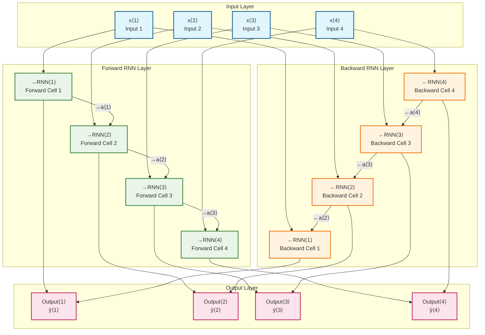

### Information Flow Timeline

```
Processing Order and Dependencies:

Step 1: Forward Pass (Sequential, Left to Right)
       →a⟨0⟩=0 → →RNN⟨1⟩ → →a⟨1⟩ → →RNN⟨2⟩ → →a⟨2⟩ → →RNN⟨3⟩ → →a⟨3⟩ → →RNN⟨4⟩ → →a⟨4⟩
         ↑         ↑               ↑               ↑               ↑
       Initial   x⟨1⟩            x⟨2⟩            x⟨3⟩            x⟨4⟩

Step 2: Backward Pass (Sequential, Right to Left)
       ←a⟨4⟩ ← ←RNN⟨4⟩ ← ←a⟨3⟩ ← ←RNN⟨3⟩ ← ←a⟨2⟩ ← ←RNN⟨2⟩ ← ←a⟨1⟩ ← ←RNN⟨1⟩ ← ←a⟨0⟩=0
         ↑               ↑               ↑               ↑         ↑
       x⟨4⟩            x⟨3⟩            x⟨2⟩            x⟨1⟩      Initial

Step 3: Combine and Predict (Parallel)
       ŷ⟨1⟩ = f(→a⟨1⟩, ←a⟨1⟩)    ŷ⟨2⟩ = f(→a⟨2⟩, ←a⟨2⟩)
       ŷ⟨3⟩ = f(→a⟨3⟩, ←a⟨3⟩)    ŷ⟨4⟩ = f(→a⟨4⟩, ←a⟨4⟩)

Total Computation: O(2T) for RNN processing + O(T) for output = O(T)
Memory Requirement: Store all forward and backward activations = O(2T×h)
```

### Processing Steps

**Step 1: Forward Pass (Left-to-Right)**

$\overrightarrow{a}^{\langle 1 \rangle} = g(W_{\overrightarrow{a}}[\overrightarrow{a}^{\langle 0 \rangle}, x^{\langle 1 \rangle}] + b_{\overrightarrow{a}})$

$\overrightarrow{a}^{\langle 2 \rangle} = g(W_{\overrightarrow{a}}[\overrightarrow{a}^{\langle 1 \rangle}, x^{\langle 2 \rangle}] + b_{\overrightarrow{a}})$

$\overrightarrow{a}^{\langle 3 \rangle} = g(W_{\overrightarrow{a}}[\overrightarrow{a}^{\langle 2 \rangle}, x^{\langle 3 \rangle}] + b_{\overrightarrow{a}})$

$\overrightarrow{a}^{\langle 4 \rangle} = g(W_{\overrightarrow{a}}[\overrightarrow{a}^{\langle 3 \rangle}, x^{\langle 4 \rangle}] + b_{\overrightarrow{a}})$

**Step 2: Backward Pass (Right-to-Left)**

$\overleftarrow{a}^{\langle 4 \rangle} = g(W_{\overleftarrow{a}}[\overleftarrow{a}^{\langle 5 \rangle}, x^{\langle 4 \rangle}] + b_{\overleftarrow{a}}) \text{ where } \overleftarrow{a}^{\langle 5 \rangle} = 0$

$\overleftarrow{a}^{\langle 3 \rangle} = g(W_{\overleftarrow{a}}[\overleftarrow{a}^{\langle 4 \rangle}, x^{\langle 3 \rangle}] + b_{\overleftarrow{a}})$

$\overleftarrow{a}^{\langle 2 \rangle} = g(W_{\overleftarrow{a}}[\overleftarrow{a}^{\langle 3 \rangle}, x^{\langle 2 \rangle}] + b_{\overleftarrow{a}})$

$\overleftarrow{a}^{\langle 1 \rangle} = g(W_{\overleftarrow{a}}[\overleftarrow{a}^{\langle 2 \rangle}, x^{\langle 1 \rangle}] + b_{\overleftarrow{a}})$

**Step 3: Combine for Predictions**

$\hat{y}^{\langle 1 \rangle} = g(W_y[\overrightarrow{a}^{\langle 1 \rangle}, \overleftarrow{a}^{\langle 1 \rangle}] + b_y)$

$\hat{y}^{\langle 2 \rangle} = g(W_y[\overrightarrow{a}^{\langle 2 \rangle}, \overleftarrow{a}^{\langle 2 \rangle}] + b_y)$

$\hat{y}^{\langle 3 \rangle} = g(W_y[\overrightarrow{a}^{\langle 3 \rangle}, \overleftarrow{a}^{\langle 3 \rangle}] + b_y)$

$\hat{y}^{\langle 4 \rangle} = g(W_y[\overrightarrow{a}^{\langle 4 \rangle}, \overleftarrow{a}^{\langle 4 \rangle}] + b_y)$

## Comprehensive Example: Named Entity Recognition

### Sentence Analysis

**Input**: "He said Teddy Roosevelt was a great president"

**Task**: Identify if each word is part of a person's name

**Ground Truth**: [0, 0, 1, 1, 0, 0, 0, 0]  
(1 = part of person name, 0 = not part of person name)

### Step-by-Step Processing

**Time Step 3: Processing "Teddy"**

**Forward Information Available**:

- $\overrightarrow{a}^{\langle 3 \rangle}$ contains: ["He", "said", "Teddy"]
- **Context**: Limited - could be teddy bear, person's name, etc.

**Backward Information Available**:

- $\overleftarrow{a}^{\langle 3 \rangle}$ contains: ["Teddy", "Roosevelt", "was", "great", "president"]
- **Context**: Rich - "Roosevelt" + "president" strongly suggests person's name

**Combined Decision**:

- **Forward only**: Uncertain about "Teddy"
- **Backward only**: Strong signal for person's name
- **Bidirectional**: High confidence that "Teddy" is part of person's name

**Time Step 4: Processing "Roosevelt"**

**Forward Information**:

- $\overrightarrow{a}^{\langle 4 \rangle}$ contains: ["He", "said", "Teddy", "Roosevelt"]
- **Context**: "Teddy Roosevelt" pattern emerging

**Backward Information**:

- $\overleftarrow{a}^{\langle 4 \rangle}$ contains: ["Roosevelt", "was", "great", "president"]
- **Context**: Confirms presidential context

**Combined Decision**: Very high confidence "Roosevelt" is part of person's name

### Information Flow Visualization

```
Word:           He    said   Teddy  Roosevelt  was   great  president
Index:          1     2      3      4          5     6      7

Forward Info:   He    He,    He,    He,        Full  Full   Full
                      said   said,  said,      ...   ...    sequence
                             Teddy  Teddy,
                                    Roosevelt

Backward Info:  Full  Full   Teddy, Roosevelt, was,  great, president
                seq   seq    ...    ...        great, pres.
                             great, great,     pres.
                             pres.  pres.

Prediction:     0     0      1      1          0     0      0
```

## BRNN Building Blocks

### Flexible Architecture

BRNN is a **framework** that can use any RNN unit type:

1. **Basic RNN Units**:

   - Simple but limited
   - Good for short sequences

2. **GRU Units**:

   - Better gradient flow
   - Good balance of performance/efficiency

3. **LSTM Units**:
   - Most powerful
   - Excellent for complex dependencies

### Most Common Configuration

**BiLSTM (Bidirectional LSTM)**:

- **Why popular**: Combines LSTM's memory capabilities with bidirectional context
- **Applications**: Most NLP tasks benefit from this combination
- **Performance**: Often the best choice for text processing

### BiLSTM Detailed Architecture

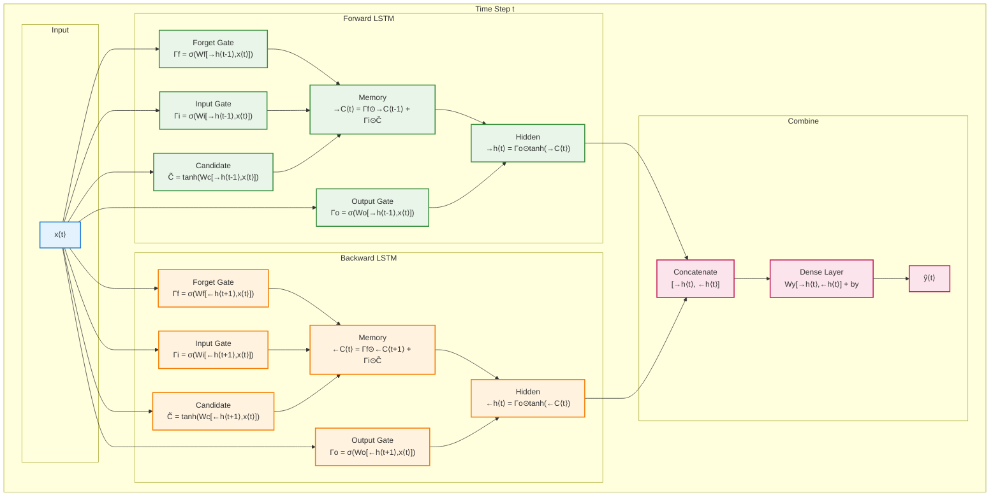

## Key Properties

### 1. Acyclic Graph Structure

**Important**: BRNN creates an **acyclic graph**, not a cyclic one

**Why acyclic**:

- Forward RNN: Information flows left → right
- Backward RNN: Information flows right → left
- **No loops**: Each activation depends only on previous steps in its direction

**Computation Order**:

1. **Forward pass**: Process ⃗a⟨1⟩, ⃗a⟨2⟩, ⃗a⟨3⟩, ⃗a⟨4⟩
2. **Backward pass**: Process ⃖a⟨4⟩, ⃖a⟨3⟩, ⃖a⟨2⟩, ⃖a⟨1⟩
3. **Predictions**: Combine activations for each time step

### 2. Independent Processing

**Forward and Backward RNNs are independent**:

- Different weight matrices: $W_{\overrightarrow{a}} \neq W_{\overleftarrow{a}}$
- Different bias vectors: $b_{\overrightarrow{a}} \neq b_{\overleftarrow{a}}$
- Can use different architectures (though usually symmetric)

### 3. Complete Sequence Information

**At any time step t, prediction $\hat{y}^{\langle t \rangle}$ has access to**:

- All past information: $x^{\langle 1 \rangle}$ through $x^{\langle t \rangle}$
- All future information: $x^{\langle t \rangle}$ through $x^{\langle T_x \rangle}$
- **Result**: Maximum possible context for each prediction

## Applications Where BRNN Excels

### 1. Natural Language Processing

**Named Entity Recognition**:

- **Challenge**: Identify proper nouns in context
- **Why BRNN helps**: Context clues often appear after the entity
- **Example**: "Apple CEO Tim Cook" - need "CEO" to know "Apple" is company

**Part-of-Speech Tagging**:

- **Challenge**: Same word can be different parts of speech
- **Why BRNN helps**: Surrounding context determines function
- **Example**: "They will present the present" - position determines verb vs noun

**Dependency Parsing**:

- **Challenge**: Understanding grammatical relationships
- **Why BRNN helps**: Dependencies can be long-range in either direction

### 2. Sequence Labeling Tasks

**Sentiment Analysis**:

- **Challenge**: Sentiment can change throughout text
- **Why BRNN helps**: Future context can override initial sentiment
- **Example**: "I thought it was bad, but actually it's great!"

**Intent Recognition**:

- **Challenge**: Key intent words might appear anywhere
- **Why BRNN helps**: Complete context clarifies ambiguous intents

### 3. Bioinformatics

**Protein Secondary Structure Prediction**:

- **Challenge**: Structure depends on both local and distant amino acids
- **Why BRNN helps**: Bidirectional dependencies in protein folding

**Gene Sequence Analysis**:

- **Challenge**: Regulatory elements can be upstream or downstream
- **Why BRNN helps**: Context from both directions affects gene expression

## The Critical Limitation: Real-Time Processing

### The Fundamental Trade-off

**BRNN Requirement**: Complete sequence before processing

**Real-Time Problem**: Can't make predictions until entire sequence is available

### Specific Examples

**Speech Recognition**:

- **BRNN approach**: Wait for complete utterance, then process
- **Problem**: User expects immediate transcription
- **Impact**: 10-second delay for 10-second speech

**Live Translation**:

- **BRNN approach**: Wait for complete sentence
- **Problem**: Users expect word-by-word translation
- **Impact**: Poor user experience for streaming translation

**Real-Time Systems**:

- **BRNN approach**: Buffer entire sequence
- **Problem**: Memory and latency constraints
- **Impact**: Unsuitable for embedded/mobile applications

### When Real-Time Matters

**Streaming Applications**:

- Live captioning
- Voice assistants
- Real-time translation
- Interactive chatbots

**Edge Computing**:

- Mobile devices
- IoT sensors
- Automotive systems
- Embedded applications

**Solution Approaches**:

1. **Unidirectional RNNs**: Accept reduced accuracy for real-time performance
2. **Attention mechanisms**: Selectively focus on relevant parts
3. **Transformer models**: Better parallelization and efficiency
4. **Hybrid approaches**: Use BRNN for offline, unidirectional for online

## Computational Complexity

### Parameter Comparison

**Standard RNN**:

- Parameters: $n_h \times (n_h + n_x) + n_h$

**Bidirectional RNN**:

- **Forward RNN**: $n_h \times (n_h + n_x) + n_h$
- **Backward RNN**: $n_h \times (n_h + n_x) + n_h$
- **Output layer**: $n_y \times (2 \times n_h) + n_y$
- **Total**: ≈ **2× standard RNN parameters**

### Training Complexity

**Time Complexity**:

- **Forward pass**: 2× standard RNN (both directions)
- **Backward pass**: Similar to standard RNN (acyclic graph)
- **Memory**: 2× activations storage

**Space Complexity**:

- Store activations for both directions
- Roughly **2× memory requirement**

## Practical Implementation

### TensorFlow/Keras Implementation

```python
from tensorflow.keras.layers import LSTM, Bidirectional

# Bidirectional LSTM
model = Sequential([
    Bidirectional(LSTM(128, return_sequences=True)),
    Bidirectional(LSTM(64, return_sequences=True)),
    Bidirectional(LSTM(32, return_sequences=False)),
    Dense(num_classes, activation='softmax')
])

# For sequence labeling (return_sequences=True)
sequence_model = Sequential([
    Bidirectional(LSTM(128, return_sequences=True)),
    Dense(num_tags, activation='softmax')  # One prediction per time step
])
```

### PyTorch Implementation

```python
import torch.nn as nn

class BiRNN(nn.Module):
    def __init__(self, input_size, hidden_size, num_classes):
        super(BiRNN, self).__init__()
        self.hidden_size = hidden_size

        # Bidirectional LSTM
        self.lstm = nn.LSTM(
            input_size,
            hidden_size,
            batch_first=True,
            bidirectional=True
        )

        # Output layer (2*hidden_size because bidirectional)
        self.fc = nn.Linear(hidden_size * 2, num_classes)

    def forward(self, x):
        # LSTM output
        out, _ = self.lstm(x)  # out: (batch, seq, 2*hidden_size)

        # Apply linear layer to each time step
        out = self.fc(out)  # out: (batch, seq, num_classes)

        return out
```

## Design Decisions

### When to Use BRNN

**Use BRNN when**:

1. **Complete sequences available**: Batch processing scenarios
2. **Maximum accuracy needed**: Performance is priority over speed
3. **Context is crucial**: Tasks requiring bidirectional dependencies
4. **NLP applications**: Most text processing benefits from bidirectional context

**Don't use BRNN when**:

1. **Real-time processing**: Streaming or interactive applications
2. **Resource constraints**: Limited memory or compute power
3. **Simple tasks**: Unidirectional context sufficient
4. **Long sequences**: Memory requirements become prohibitive

### Hyperparameter Considerations

**Hidden Size**:

- Start with 128-256 per direction
- Total effective size is 2× hidden_size
- Balance between capacity and efficiency

**Number of Layers**:

- 1-2 bidirectional layers often sufficient
- Deeper networks for very complex tasks
- Each layer doubles parameters

**Regularization**:

- Dropout: 0.2-0.5 to prevent overfitting
- Apply to both forward and backward RNNs
- Consider recurrent dropout as well

## Comparison with Alternatives

### BRNN vs Standard RNN

| Aspect         | Standard RNN    | Bidirectional RNN |
| -------------- | --------------- | ----------------- |
| **Context**    | Past only       | Past + Future     |
| **Accuracy**   | Lower           | Higher            |
| **Latency**    | Low (real-time) | High (batch)      |
| **Memory**     | 1×              | 2×                |
| **Parameters** | 1×              | ≈2×               |

### BRNN vs Attention Mechanisms

| Aspect               | BRNN               | Attention         |
| -------------------- | ------------------ | ----------------- |
| **Context Access**   | Full bidirectional | Selective focus   |
| **Parallelization**  | Sequential         | Parallel          |
| **Long Sequences**   | Memory intensive   | More efficient    |
| **Interpretability** | Black box          | Attention weights |

### BRNN vs Transformer

| Aspect                    | BRNN     | Transformer |
| ------------------------- | -------- | ----------- |
| **Sequential Processing** | Required | Parallel    |
| **Position Encoding**     | Implicit | Explicit    |
| **Long Dependencies**     | Good     | Excellent   |
| **Training Speed**        | Slower   | Faster      |

## Summary

### Key Innovations

1. **Bidirectional Processing**: Information flows in both directions
2. **Complete Context**: Each prediction uses entire sequence information
3. **Acyclic Architecture**: No loops, enabling efficient computation
4. **Flexible Building Blocks**: Works with RNN, LSTM, or GRU units

### The Fundamental Trade-off

**BRNN provides maximum context at the cost of real-time processing**

- **Benefit**: Best possible accuracy for sequence labeling tasks
- **Cost**: Must wait for complete sequence before making any predictions

### Best Use Cases

**Ideal for**:

- Batch processing of complete sequences
- NLP tasks requiring bidirectional context
- High-accuracy requirements
- Applications where latency is acceptable

**Not suitable for**:

- Real-time streaming applications
- Interactive systems requiring immediate response
- Resource-constrained environments

### Legacy and Modern Context

**Historical Impact**:

- BRNN was crucial breakthrough for NLP in the RNN era
- Enabled state-of-the-art results on many sequence labeling tasks
- Foundation for understanding bidirectional context importance

**Modern Relevance**:

- Still widely used for many sequence labeling tasks
- Often combined with attention mechanisms
- Influenced design of bidirectional Transformers (BERT)
- Remains competitive for certain applications despite newer architectures

**Next Evolution**: The limitations of sequential processing led to the development of attention mechanisms and Transformers, which achieve bidirectional context while enabling parallelization.

# 12. Deep RNNs

## The Evolution from Shallow to Deep: RNN Architecture Comparison

### Why Deep RNNs? The Motivation

Just as deep feedforward networks can learn more complex representations than shallow ones, **Deep RNNs** can capture more sophisticated sequential patterns by stacking multiple recurrent layers.

**Key Insight**: Each layer in a Deep RNN learns different levels of abstraction:

- **Layer 1**: Basic patterns, simple dependencies
- **Layer 2**: Intermediate patterns, medium-range dependencies
- **Layer 3**: Complex patterns, long-range dependencies

### Architecture Evolution Overview

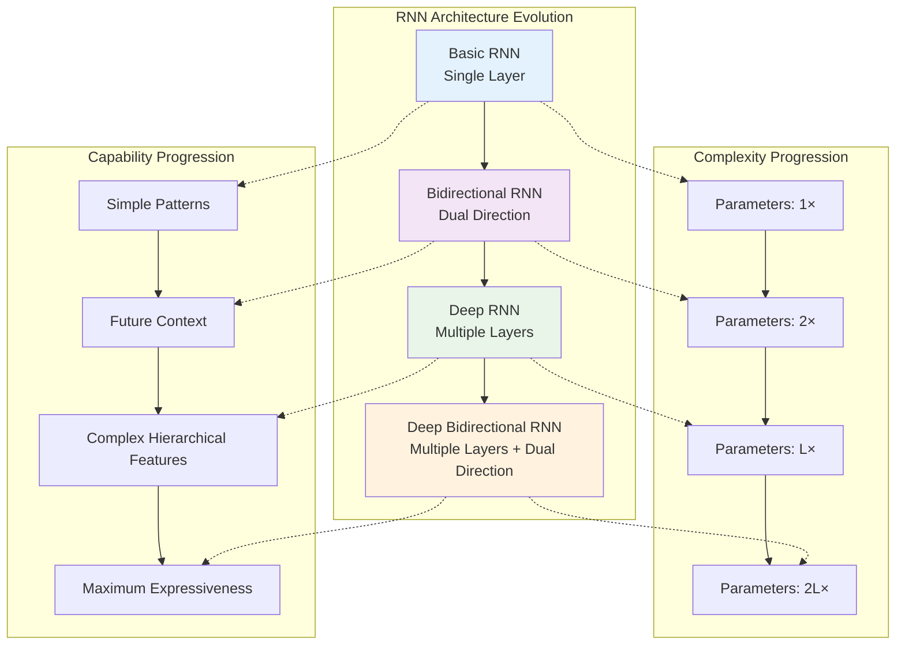

## Architecture Comparison: From Single to Deep

### 1. Standard Single-Layer RNN

```
Input:     x⟨1⟩    x⟨2⟩    x⟨3⟩    x⟨4⟩
           ↓       ↓       ↓       ↓
Layer 1:  a⟨1⟩ → a⟨2⟩ → a⟨3⟩ → a⟨4⟩
           ↓       ↓       ↓       ↓
Output:   ŷ⟨1⟩    ŷ⟨2⟩    ŷ⟨3⟩    ŷ⟨4⟩
```

**What's happening**: In a standard RNN, we have a single recurrent layer that processes the sequence horizontally through time. Each activation $a^{\langle t \rangle}$ depends on the current input $x^{\langle t \rangle}$ and the previous hidden state $a^{\langle t-1 \rangle}$.

**Mathematical Formulation**:
$$a^{\langle t \rangle} = g(W_a[a^{\langle t-1 \rangle}, x^{\langle t \rangle}] + b_a)$$
$$\hat{y}^{\langle t \rangle} = g(W_y[a^{\langle t \rangle}] + b_y)$$

**Key Insight**: The same parameters $W_a$ and $b_a$ are shared across all time steps, allowing the network to process sequences of any length with a fixed set of parameters.

### 2. Deep RNN (3 Layers)

```
Input:     x⟨1⟩    x⟨2⟩    x⟨3⟩    x⟨4⟩
           ↓       ↓       ↓       ↓
Layer 1:  a[1]⟨1⟩ → a[1]⟨2⟩ → a[1]⟨3⟩ → a[1]⟨4⟩
           ↓       ↓       ↓       ↓
Layer 2:  a[2]⟨1⟩ → a[2]⟨2⟩ → a[2]⟨3⟩ → a[2]⟨4⟩
           ↓       ↓       ↓       ↓
Layer 3:  a[3]⟨1⟩ → a[3]⟨2⟩ → a[3]⟨3⟩ → a[3]⟨4⟩
           ↓       ↓       ↓       ↓
Output:   ŷ⟨1⟩    ŷ⟨2⟩    ŷ⟨3⟩    ŷ⟨4⟩
```

**What's happening**: Deep RNNs stack multiple recurrent layers vertically. Each layer has two types of connections:

- **Horizontal connections**: Information flows through time within the same layer
- **Vertical connections**: Information flows from lower layers to higher layers at the same time step

**The magic**: Layer 1 learns basic patterns, Layer 2 learns more complex combinations of these patterns, and Layer 3 learns even more sophisticated representations. Think of it like building hierarchical features - from simple to complex.

**Mathematical Formulation**:
$$a^{[1]\langle t \rangle} = g(W^{[1]}[a^{[1]\langle t-1 \rangle}, x^{\langle t \rangle}] + b^{[1]})$$
$$a^{[2]\langle t \rangle} = g(W^{[2]}[a^{[2]\langle t-1 \rangle}, a^{[1]\langle t \rangle}] + b^{[2]})$$
$$a^{[3]\langle t \rangle} = g(W^{[3]}[a^{[3]\langle t-1 \rangle}, a^{[2]\langle t \rangle}] + b^{[3]})$$
$$\hat{y}^{\langle t \rangle} = g(W^{[y]}[a^{[3]\langle t \rangle}] + b^{[y]})$$

**Key Insight**: Notice how each layer takes input from two sources: its own previous time step (temporal memory) and the layer below at the current time step (hierarchical feature combination).

### 3. Deep Bidirectional RNN

```
Input:     x⟨1⟩    x⟨2⟩    x⟨3⟩    x⟨4⟩
           ↓       ↓       ↓       ↓
Layer 1:  →a[1]⟨1⟩ → →a[1]⟨2⟩ → →a[1]⟨3⟩ → →a[1]⟨4⟩
          ←a[1]⟨1⟩ ← ←a[1]⟨2⟩ ← ←a[1]⟨3⟩ ← ←a[1]⟨4⟩
           ↓       ↓       ↓       ↓
Layer 2:  →a[2]⟨1⟩ → →a[2]⟨2⟩ → →a[2]⟨3⟩ → →a[2]⟨4⟩
          ←a[2]⟨1⟩ ← ←a[2]⟨2⟩ ← ←a[2]⟨3⟩ ← ←a[2]⟨4⟩
           ↓       ↓       ↓       ↓
Output:   ŷ⟨1⟩    ŷ⟨2⟩    ŷ⟨3⟩    ŷ⟨4⟩
```

**What's happening**: This combines the power of deep learning with bidirectional processing. At each layer, we have both forward and backward RNNs processing the sequence. The forward RNN captures patterns from past to future, while the backward RNN captures patterns from future to past.

**The complexity**: Each layer now needs to combine information from four sources:

- Forward temporal connection (from previous time step)
- Backward temporal connection (from next time step)
- Forward vertical connection (from layer below)
- Backward vertical connection (from layer below)

**Key Insight**: Each layer has both forward and backward processing, creating the most expressive architecture but at the highest computational cost.

## Deep RNN Mathematical Foundation

### Enhanced Notation System

**The Challenge**: We need to keep track of both **layers** and **time steps** simultaneously. This is where the notation becomes crucial for understanding what's happening.

**Correct Layer and Time Indexing** (as shown in the lecture):

- $a^{[l]\langle t \rangle}$ = activation at layer $l$, time step $t$
- $W^{[l]}$, $b^{[l]}$ = parameters for layer $l$
- $L$ = total number of layers

**Why This Notation Order Matters**:

- **Square brackets [l] first** = which layer we're talking about (primary identifier)
- **Angle brackets ⟨t⟩ second** = which time step within that layer
- This follows the convention: layer is the primary dimension, time is secondary

**Key Insight**: In Deep RNNs, information flows in **two dimensions**:

1. **Horizontally** through time (like standard RNNs)
2. **Vertically** through layers (like standard deep networks)

### Layer Computation Formula

**The Core Deep RNN Equation**:
For layer $l$ at time step $t$:

$$a^{[l]\langle t \rangle} = g^{[l]}(W^{[l]}[a^{[l]\langle t-1 \rangle}, a^{[l-1]\langle t \rangle}] + b^{[l]})$$

**Breaking This Down**:

- $a^{[l]\langle t-1 \rangle}$ = **temporal memory** (what this layer remembered from the previous time step)
- $a^{[l-1]\langle t \rangle}$ = **hierarchical input** (what the layer below computed at this time step)
- $W^{[l]}$ = **layer-specific parameters** (each layer has its own weights)
- $g^{[l]}$ = **activation function** (can be different for each layer)

**The Magic**: Each neuron in a deep RNN receives information from two sources:

1. **Its own past** (temporal connection)
2. **The layer below** (hierarchical connection)

This dual input allows deep RNNs to build complex representations that evolve over time.

### Complete Deep RNN Equations

**Understanding the Layer-by-Layer Processing**:

In a Deep RNN, each layer builds upon the previous one, creating a hierarchy of representations. Let's see how this works mathematically:

**Layer 1 (Bottom Layer)**:
$$a^{[1]\langle t \rangle} = g^{[1]}(W^{[1]}[a^{[1]\langle t-1 \rangle}, x^{\langle t \rangle}] + b^{[1]})$$

**What's happening**: The first layer takes the raw input $x^{\langle t \rangle}$ and its own previous state $a^{[1]\langle t-1 \rangle}$. This is just like a standard RNN - it processes the sequence and builds basic temporal patterns.

**Layer 2 (Middle Layer)**:
$$a^{[2]\langle t \rangle} = g^{[2]}(W^{[2]}[a^{[2]\langle t-1 \rangle}, a^{[1]\langle t \rangle}] + b^{[2]})$$

**What's happening**: The second layer takes the output from Layer 1 ($a^{[1]\langle t \rangle}$) and its own previous state ($a^{[2]\langle t-1 \rangle}$). Notice it doesn't see the raw input directly - it only sees what Layer 1 has already processed.

**Layer 3 (Top Layer)**:
$$a^{[3]\langle t \rangle} = g^{[3]}(W^{[3]}[a^{[3]\langle t-1 \rangle}, a^{[2]\langle t \rangle}] + b^{[3]})$$

**What's happening**: The third layer takes the processed information from Layer 2 and builds even more complex representations. By now, we're working with highly abstracted features.

**Output Layer**:
$$\hat{y}^{\langle t \rangle} = g^{[output]}(W^{[y]}a^{[3]\langle t \rangle} + b^{[y]})$$

**What's happening**: The final prediction uses only the top layer's output. This represents the most sophisticated understanding of the sequence up to this point.

**The Beautiful Pattern**: Each layer is like a filter that extracts increasingly complex patterns:

- Layer 1: Basic temporal patterns
- Layer 2: Combinations of basic patterns
- Layer 3: Complex combinations of combinations

## Detailed Deep RNN Architecture Diagrams

### Three-Layer Deep RNN Detailed View

```
                    DEEP RNN ARCHITECTURE (3 Layers)

Time Step:          t=1      t=2      t=3      t=4

Input Sequence:     x⟨1⟩     x⟨2⟩     x⟨3⟩     x⟨4⟩
                     ↓        ↓        ↓        ↓

LAYER 1:        ┌─────────┐─────────┐─────────┐─────────┐
                │ a[1]⟨1⟩ │ a[1]⟨2⟩ │ a[1]⟨3⟩ │ a[1]⟨4⟩ │
                └─────────┘─────────┘─────────┘─────────┘
                     ↓        ↓        ↓        ↓

LAYER 2:        ┌─────────┐─────────┐─────────┐─────────┐
                │ a[2]⟨1⟩ │ a[2]⟨2⟩ │ a[2]⟨3⟩ │ a[2]⟨4⟩ │
                └─────────┘─────────┘─────────┘─────────┘
                     ↓        ↓        ↓        ↓

LAYER 3:        ┌─────────┐─────────┐─────────┐─────────┐
                │ a[3]⟨1⟩ │ a[3]⟨2⟩ │ a[3]⟨3⟩ │ a[3]⟨4⟩ │
                └─────────┘─────────┘─────────┘─────────┘
                     ↓        ↓        ↓        ↓

OUTPUT:             ŷ⟨1⟩     ŷ⟨2⟩     ŷ⟨3⟩     ŷ⟨4⟩

Connections:
→ : Temporal connections (horizontal)
↓ : Vertical connections (layer to layer)
```

### Single Time Step Deep Computation

```
At time step t=2:

                    x⟨2⟩ (Input)
                     ↓
          ┌─────────────────────────────┐
          │        LAYER 1 CELL         │
          │                             │
a[1]⟨1⟩ →│  W[1][a[1]⟨1⟩, x⟨2⟩] + b[1]  │
          │           ↓                 │
          │      g[1](z[1])             │
          │           ↓                 │
          │       a[1]⟨2⟩               │
          └─────────────────────────────┘
                     ↓
          ┌─────────────────────────────┐
          │        LAYER 2 CELL         │
          │                             │
a[2]⟨1⟩ →│ W[2][a[2]⟨1⟩, a[1]⟨2⟩] + b[2]│
          │           ↓                 │
          │      g[2](z[2])             │
          │           ↓                 │
          │       a[2]⟨2⟩               │
          └─────────────────────────────┘
                     ↓
          ┌─────────────────────────────┐
          │        LAYER 3 CELL         │
          │                             │
a[3]⟨1⟩ →│ W[3][a[3]⟨1⟩, a[2]⟨2⟩] + b[3]│
          │           ↓                 │
          │      g[3](z[3])             │
          │           ↓                 │
          │       a[3]⟨2⟩               │
          └─────────────────────────────┘
                     ↓
          ┌─────────────────────────────┐
          │      OUTPUT LAYER           │
          │                             │
          │   Wy[a[3]⟨2⟩] + by          │
          │           ↓                 │
          │      g[output](z)           │
          │           ↓                 │
          │        ŷ⟨2⟩                 │
          └─────────────────────────────┘
```

### Information Flow Analysis

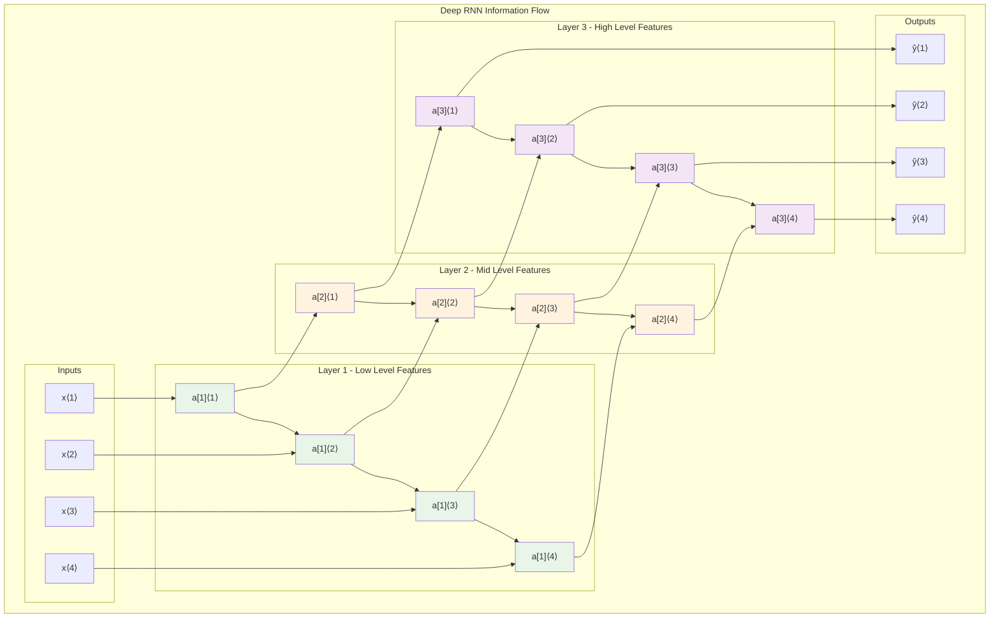

## Deep RNN vs Standard Neural Networks: Key Differences

### Computational Complexity Comparison

| Aspect          | Standard Deep NN                          | Deep RNN                                              |
| --------------- | ----------------------------------------- | ----------------------------------------------------- |
| **Layers**      | 100+ layers common                        | 3-4 layers considered deep                            |
| **Parameters**  | $\sum_{l=1}^{L} n^{[l]} \times n^{[l-1]}$ | $\sum_{l=1}^{L} n^{[l]} \times (n^{[l-1]} + n^{[l]})$ |
| **Computation** | $O(L)$ per example                        | $O(L \times T)$ per sequence                          |
| **Memory**      | $O(L)$ activations                        | $O(L \times T)$ activations                           |
| **Training**    | Batch parallel                            | Sequential dependencies                               |

### Why Deep RNNs Are "Expensive"

**The Computational Challenge**: Deep RNNs are much more computationally expensive than regular deep networks. Here's why:

**1. Temporal Dimension Multiplier**:

- **Standard Deep Network**: Each layer processes input once per example
- **Deep RNN**: Each layer processes input $T$ times (once per time step)
- **Result**: Computation scales as $O(L \times T \times H)$ where $L$ = layers, $T$ = time steps, $H$ = hidden units

**Real Example**: A 3-layer Deep RNN processing a 100-word sentence requires:

- 3 layers × 100 time steps × hidden computations = 300× more computation than a single forward pass

**2. Sequential Dependencies**:

- **Standard Deep Network**: Can process all examples in parallel
- **Deep RNN**: Must compute $a^{[l]\langle t \rangle}$ before $a^{[l]\langle t+1 \rangle}$
- **Result**: Limited parallelization, GPU underutilization

**3. Memory Requirements**:

- **Standard Deep Network**: Store $L$ layer activations
- **Deep RNN**: Store $L \times T$ activations (for backpropagation through time)
- **Result**: Memory grows linearly with sequence length

**Why This Matters**: A 3-layer Deep RNN is already considered "deep" because of these computational constraints, while regular networks can easily have 100+ layers.

**4. Gradient Flow Challenges**:

- **Double Vanishing Gradient Problem**: Gradients can vanish both through time AND through layers
- **Solution**: Use LSTM/GRU units instead of basic RNN units

## Deep RNN Building Blocks

### 1. Stacked Basic RNN Units

```python
# Basic Deep RNN Architecture
deep_rnn = Sequential([
    SimpleRNN(128, return_sequences=True),  # Layer 1
    SimpleRNN(64, return_sequences=True),   # Layer 2
    SimpleRNN(32, return_sequences=False),  # Layer 3
    Dense(10, activation='softmax')         # Output
])
```

### 2. Stacked LSTM Units (Most Common)

```python
# Deep LSTM Architecture
deep_lstm = Sequential([
    LSTM(128, return_sequences=True),       # Layer 1
    LSTM(64, return_sequences=True),        # Layer 2
    LSTM(32, return_sequences=False),       # Layer 3
    Dense(10, activation='softmax')         # Output
])
```

### 3. Stacked GRU Units

```python
# Deep GRU Architecture
deep_gru = Sequential([
    GRU(128, return_sequences=True),        # Layer 1
    GRU(64, return_sequences=True),         # Layer 2
    GRU(32, return_sequences=False),        # Layer 3
    Dense(10, activation='softmax')         # Output
])
```

### 4. Deep Bidirectional RNN

```python
# Deep Bidirectional LSTM
deep_bilstm = Sequential([
    Bidirectional(LSTM(128, return_sequences=True)),  # Layer 1
    Bidirectional(LSTM(64, return_sequences=True)),   # Layer 2
    Bidirectional(LSTM(32, return_sequences=False)),  # Layer 3
    Dense(10, activation='softmax')                   # Output
])
```

## Hybrid Deep Architectures

### Pattern 1: RNN → Dense Stack

**The Hybrid Approach**: Instead of stacking RNN layers, we can combine RNN processing with dense layers. This is often more effective than going deeper with RNNs.

**Architecture**:

```
[Input] → [RNN Layers] → [Dense Layers] → [Output]
```

**What's happening**:

- **RNN Layers**: Process the sequential dependencies and temporal patterns
- **Dense Layers**: Learn complex non-linear mappings from the RNN's final output
- **Result**: Best of both worlds - sequence modeling + complex function approximation

**Example**:

```python
hybrid_model = Sequential([
    LSTM(128, return_sequences=True),       # Process sequence
    LSTM(64, return_sequences=False),       # Final sequence summary
    Dense(128, activation='relu'),          # Complex pattern recognition
    Dense(64, activation='relu'),           # More complex mappings
    Dense(10, activation='softmax')         # Final classification
])
```

**When to use**:

- When you need both sequential and non-sequential processing
- Complex input-output mappings that RNNs alone struggle with
- Want to leverage strengths of both architectures

**Real-world example**: In sentiment analysis, RNNs capture the sequential nature of language, while dense layers learn the complex mapping from language patterns to sentiment scores.

### Pattern 2: Encoder-Decoder with Deep Components

**Architecture**:

```
[Input] → [Deep Encoder] → [Context] → [Deep Decoder] → [Output]
```

**Example Application**: Machine Translation

```python
# Encoder
encoder = Sequential([
    LSTM(256, return_sequences=True),
    LSTM(128, return_sequences=False)
])

# Decoder
decoder = Sequential([
    LSTM(128, return_sequences=True),
    LSTM(256, return_sequences=True),
    Dense(vocab_size, activation='softmax')
])
```

### Pattern 3: Residual Deep RNN

**Addressing Vanishing Gradients in Deep RNNs**:

```python
class ResidualLSTM(Layer):
    def __init__(self, units):
        super().__init__()
        self.lstm = LSTM(units, return_sequences=True)
        self.dense = Dense(units)

    def call(self, inputs):
        lstm_output = self.lstm(inputs)
        # Residual connection
        return inputs + self.dense(lstm_output)
```

## Design Considerations for Deep RNNs

### 1. Depth Guidelines

**The Rule of Thumb for Deep RNNs**:

**1-2 layers**:

- **When to use**: Most practical applications
- **Why it works**: Captures essential temporal patterns without excessive complexity
- **Examples**: Sentiment analysis, simple language modeling, basic time series prediction

**3 layers**:

- **When to use**: Complex tasks with hierarchical patterns
- **Caution**: Already considered "deep" for RNNs - monitor for overfitting
- **Examples**: Machine translation, complex NLP tasks, speech recognition

**4+ layers**:

- **When to use**: Only for very complex problems with massive datasets
- **Risk**: High computational cost, gradient flow problems, overfitting
- **Examples**: Large-scale language modeling, complex multi-modal tasks

**Why RNNs Are Different**: Unlike CNNs or standard deep networks where 100+ layers are common, RNNs become computationally prohibitive and harder to train with just 3-4 layers due to the temporal dimension.

**Empirical Observations from Research**:

- **NLP tasks**: 2-3 layers often optimal (diminishing returns after layer 3)
- **Speech recognition**: 3-4 layers sometimes beneficial with large datasets
- **Time series**: 1-2 layers usually sufficient (more layers often overfit)
- **Machine translation**: 2-3 layer encoder-decoder works well

**The Trade-off**: Each additional layer provides more representational power but at the cost of:

- Increased computation time
- Higher memory requirements
- More difficult training
- Risk of overfitting on smaller datasets

### 2. Layer Size Progression

**Common Patterns**:

**Pyramidal** (Recommended):

```
Layer 1: 256 units
Layer 2: 128 units
Layer 3: 64 units
```

**Constant**:

```
Layer 1: 128 units
Layer 2: 128 units
Layer 3: 128 units
```

**Inverted Pyramid** (Less common):

```
Layer 1: 64 units
Layer 2: 128 units
Layer 3: 256 units
```

### 3. Activation Function Choices

**Per Layer Recommendations**:

- **Lower layers**: tanh or ReLU
- **Middle layers**: tanh or ReLU
- **Top layer**: tanh or ReLU
- **Output layer**: softmax (classification) or linear (regression)

### 4. Regularization Strategies

**Dropout in Deep RNNs**:

```python
deep_rnn = Sequential([
    LSTM(128, return_sequences=True, dropout=0.2, recurrent_dropout=0.2),
    LSTM(64, return_sequences=True, dropout=0.2, recurrent_dropout=0.2),
    LSTM(32, return_sequences=False, dropout=0.2),
    Dense(10, activation='softmax')
])
```

**Layer Normalization**:

```python
from tensorflow.keras.layers import LayerNormalization

deep_rnn = Sequential([
    LSTM(128, return_sequences=True),
    LayerNormalization(),
    LSTM(64, return_sequences=True),
    LayerNormalization(),
    LSTM(32, return_sequences=False),
    Dense(10, activation='softmax')
])
```

## Training Deep RNNs

### Gradient Flow Challenges

**The Double Vanishing Gradient Problem**: Deep RNNs face a unique challenge - gradients can vanish in **two dimensions**:

1. **Through Time**: Like standard RNNs, gradients can vanish as they backpropagate through many time steps
2. **Through Layers**: Like standard deep networks, gradients can vanish as they backpropagate through many layers

**Why This Is Worse Than Standard Problems**:

- **Standard RNN**: Gradients travel distance $T$ (time steps)
- **Standard Deep Network**: Gradients travel distance $L$ (layers)
- **Deep RNN**: Gradients travel distance $T \times L$ (time steps AND layers)

**Mathematical Insight**: The gradient magnitude can shrink by a factor of approximately:
$$\text{Gradient Scale} \approx \sigma_{temporal}^T \times \sigma_{spatial}^L$$

Where $\sigma_{temporal}$ and $\sigma_{spatial}$ are the gradient scaling factors through time and layers respectively.

**Solutions**:

**1. Gradient Clipping** (Essential):

```python
optimizer = Adam(clipvalue=1.0)  # Clip gradients to prevent explosion
```

**Why it works**: Prevents gradient explosion while allowing gradients to flow

**2. Careful Initialization** (LSTM/GRU specific):

```python
# Initialize forget gate bias to 1 for LSTM
for layer in model.layers:
    if hasattr(layer, 'recurrent_initializer'):
        layer.recurrent_initializer = 'orthogonal'
```

**Why it works**: Orthogonal initialization helps maintain gradient flow through layers

**3. Skip Connections** (Advanced):

```python
class SkipLSTM(Layer):
    def call(self, inputs):
        lstm_out = self.lstm(inputs)
        return inputs + lstm_out  # Skip connection bypasses the LSTM
```

**Why it works**: Provides gradient highways, similar to ResNet architectures

**4. Use LSTM/GRU Instead of Basic RNN**:

- **Basic RNN**: Guaranteed vanishing gradients in deep networks
- **LSTM/GRU**: Gradient highways help maintain flow
- **Result**: Deep networks are practically impossible with basic RNN units

### Learning Rate Scheduling

**Recommended Strategy**:

```python
def lr_schedule(epoch):
    if epoch < 10:
        return 0.001
    elif epoch < 20:
        return 0.0005
    else:
        return 0.0001

scheduler = LearningRateScheduler(lr_schedule)
```

## Practical Implementation Tips

### Memory Management

**Sequence Length Considerations**:

- **Short sequences** (< 50): Can use deeper networks
- **Medium sequences** (50-200): 2-3 layers optimal
- **Long sequences** (> 200): Consider 1-2 layers or attention

**Batch Size Adjustment**:

```python
# Adjust batch size for deep networks
if num_layers > 2:
    batch_size = batch_size // 2
```

### Performance Optimization

**1. Mixed Precision Training**:

```python
policy = mixed_precision.Policy('mixed_float16')
mixed_precision.set_global_policy(policy)
```

**2. Model Parallelism**:

```python
# Distribute layers across GPUs
with tf.device('/gpu:0'):
    layer1 = LSTM(128, return_sequences=True)
with tf.device('/gpu:1'):
    layer2 = LSTM(64, return_sequences=False)
```

**3. Gradient Accumulation**:

```python
# For large models with memory constraints
accumulate_grad_steps = 4
effective_batch_size = batch_size * accumulate_grad_steps
```

## Applications Where Deep RNNs Excel

### 1. Complex NLP Tasks

**Machine Translation**:

```python
# Encoder-Decoder with deep components
encoder = Sequential([
    LSTM(512, return_sequences=True),
    LSTM(256, return_sequences=False)
])

decoder = Sequential([
    LSTM(256, return_sequences=True),
    LSTM(512, return_sequences=True),
    Dense(vocab_size, activation='softmax')
])
```

**Benefits**: Captures complex linguistic patterns at multiple levels

**What's happening in practice**:

- **Layer 1**: Learns basic word patterns and simple grammar
- **Layer 2**: Learns phrase-level patterns and complex grammatical structures
- **Result**: Better translation quality for complex sentences

### 2. Speech Recognition

**Deep Bidirectional LSTM**:

```python
speech_model = Sequential([
    Bidirectional(LSTM(256, return_sequences=True)),
    Bidirectional(LSTM(128, return_sequences=True)),
    Bidirectional(LSTM(64, return_sequences=True)),
    Dense(num_phonemes, activation='softmax')
])
```

**Benefits**: Hierarchical acoustic feature learning

**What's happening in practice**:

- **Layer 1**: Learns basic acoustic patterns (phonemes, sounds)
- **Layer 2**: Learns word-level acoustic patterns
- **Layer 3**: Learns sentence-level prosodic patterns
- **Result**: Better recognition of speech in noisy environments

### 3. Time Series with Complex Patterns

**Multi-scale Temporal Modeling**:

```python
timeseries_model = Sequential([
    LSTM(128, return_sequences=True),  # Short-term patterns
    LSTM(64, return_sequences=True),   # Medium-term patterns
    LSTM(32, return_sequences=False),  # Long-term patterns
    Dense(1)  # Prediction
])
```

**Benefits**: Captures patterns at different time scales

**What's happening in practice**:

- **Layer 1**: Daily/weekly patterns
- **Layer 2**: Monthly/seasonal patterns
- **Layer 3**: Yearly/long-term trends
- **Result**: Better forecasting for complex time series

## Comparison: Deep RNN vs Alternatives

### Deep RNN vs Transformer

| Aspect                | Deep RNN                 | Transformer       |
| --------------------- | ------------------------ | ----------------- |
| **Parallelization**   | Sequential               | Parallel          |
| **Memory**            | $O(L \times T \times H)$ | $O(T^2 \times H)$ |
| **Long Dependencies** | Good with LSTM/GRU       | Excellent         |
| **Training Speed**    | Slower                   | Faster            |
| **Interpretability**  | Limited                  | Attention weights |

**When to choose Deep RNN**:

- Sequential processing is natural for the task
- Memory constraints (transformers can be memory-intensive for very long sequences)
- Computational efficiency is important
- Strong inductive bias for sequential data is beneficial

**When to choose Transformer**:

- Parallelization is crucial for training speed
- Long-range dependencies are critical
- Large datasets and computational resources available
- Interpretability through attention is valuable

### Deep RNN vs CNN

| Aspect                     | Deep RNN           | CNN                    |
| -------------------------- | ------------------ | ---------------------- |
| **Sequence Modeling**      | Natural            | Requires modifications |
| **Parallelization**        | Poor               | Excellent              |
| **Translation Invariance** | No                 | Yes                    |
| **Local Patterns**         | Good               | Excellent              |
| **Long Dependencies**      | LSTM/GRU dependent | Limited                |

**When to choose Deep RNN**:

- Sequential dependencies are crucial
- Variable-length sequences
- Temporal ordering matters
- Memory of past states is important

**When to choose CNN**:

- Local patterns are most important
- Translation invariance is needed
- Parallel processing is crucial
- Fixed-size inputs

## Best Practices Summary

### Architecture Design

**1. Start Simple**: Begin with 1-2 layers

- Most tasks don't need deep RNNs
- Easier to debug and tune
- Faster training and inference

**2. Use LSTM/GRU**: Avoid basic RNN for deep networks

- Basic RNNs have guaranteed vanishing gradients
- LSTM/GRU provide gradient highways
- Essential for any depth > 1

**3. Pyramidal Structure**: Decrease layer size with depth

- Reduces parameters and overfitting
- Maintains representational capacity
- Common pattern: 256 → 128 → 64

**4. Bidirectional**: When complete sequences available

- Significant accuracy improvements
- Doubles computational cost
- Not suitable for real-time applications

### Training Strategy

**1. Gradient Clipping**: Always use for deep RNNs

```python
optimizer = Adam(clipvalue=1.0)
```

**2. Proper Initialization**: Forget gate bias = 1 for LSTM

```python
# Critical for LSTM training stability
lstm_layer.bias_initializer = 'ones'
```

**3. Regularization**: Dropout + layer normalization

```python
LSTM(128, dropout=0.2, recurrent_dropout=0.2)
```

**4. Learning Rate**: Lower for deeper networks

```python
# Deeper networks need more careful learning rates
lr = 0.001 / sqrt(num_layers)
```

### Performance Optimization

**1. Memory Management**: Monitor GPU memory usage

- Deep RNNs can quickly exhaust memory
- Reduce batch size for deeper networks
- Consider gradient checkpointing

**2. Batch Size**: Adjust for network depth

```python
# Rule of thumb: reduce batch size with depth
batch_size = base_batch_size // num_layers
```

**3. Sequence Length**: Consider truncation for very long sequences

- Truncated BPTT for very long sequences
- Balance between context and computational cost

**4. Mixed Precision**: Use for large models

```python
policy = mixed_precision.Policy('mixed_float16')
```

## Advanced Techniques

### Residual Connections in Deep RNNs

**The Problem**: Very deep RNNs suffer from vanishing gradients even with LSTM/GRU

**The Solution**: Add residual connections like in ResNet

```python
class ResidualLSTM(Layer):
    def __init__(self, units):
        super().__init__()
        self.lstm = LSTM(units, return_sequences=True)
        self.layernorm = LayerNormalization()

    def call(self, inputs):
        lstm_out = self.lstm(inputs)
        # Residual connection + layer normalization
        return self.layernorm(inputs + lstm_out)
```

**Why it works**: Provides direct gradient paths, similar to highway networks

### Attention in Deep RNNs

**Combining Deep RNNs with Attention**:

```python
# Deep RNN with attention
encoder = Sequential([
    LSTM(256, return_sequences=True),
    LSTM(128, return_sequences=True),
    AttentionLayer()  # Attention over sequence
])
```

**Benefits**:

- Deep RNNs learn hierarchical features
- Attention provides selective focus
- Best of both worlds

### Hierarchical Deep RNNs

**Multiple Time Scales**:

```python
# Different layers operate at different time scales
class HierarchicalRNN(Model):
    def __init__(self):
        self.fast_layer = LSTM(128, return_sequences=True)
        self.slow_layer = LSTM(64, return_sequences=True)

    def call(self, inputs):
        # Fast layer processes every time step
        fast_out = self.fast_layer(inputs)

        # Slow layer processes every 10th time step
        slow_inputs = fast_out[::10]
        slow_out = self.slow_layer(slow_inputs)

        return slow_out
```

**Applications**: Speech recognition, long-term time series forecasting

## Common Pitfalls and Solutions

### 1. Overfitting in Deep RNNs

**Problem**: Deep RNNs are prone to overfitting, especially on smaller datasets

**Solutions**:

- **Regularization**: Dropout, L2 regularization
- **Early stopping**: Monitor validation loss
- **Data augmentation**: For text/speech data
- **Simpler architectures**: Sometimes 1-2 layers is enough

### 2. Gradient Explosion

**Problem**: Gradients can explode in deep networks

**Solutions**:

```python
# Gradient clipping is essential
optimizer = Adam(clipvalue=1.0, clipnorm=1.0)
```

**Monitoring**:

```python
# Monitor gradient norms during training
for name, param in model.named_parameters():
    if param.grad is not None:
        grad_norm = param.grad.norm()
        print(f'{name}: {grad_norm}')
```

### 3. Memory Issues

**Problem**: Deep RNNs can exhaust GPU memory

**Solutions**:

- **Gradient checkpointing**: Trade compute for memory
- **Smaller batch sizes**: Reduce memory usage
- **Sequence truncation**: Limit sequence length
- **Mixed precision**: Use float16 for activations

### 4. Slow Training

**Problem**: Deep RNNs train slowly due to sequential dependencies

**Solutions**:

- **Teacher forcing**: For sequence-to-sequence models
- **Curriculum learning**: Start with shorter sequences
- **Distributed training**: Multiple GPUs/nodes
- **Efficient implementations**: Use optimized LSTM/GRU implementations

## Detailed Example: Computing $a^{[2]\langle 3 \rangle}$

Let's walk through a concrete example following the lecture notation from the screenshot:

**Given**:

- We want to compute $a^{[2]\langle 3 \rangle}$ (Layer 2, Time step 3)
- We have $a^{[2]\langle 2 \rangle}$ (Layer 2, previous time step)
- We have $a^{[1]\langle 3 \rangle}$ (Layer 1, current time step)

**The Computation**:
$$a^{[2]\langle 3 \rangle} = g(W^{[2]}[a^{[2]\langle 2 \rangle}, a^{[1]\langle 3 \rangle}] + b^{[2]})$$

**Step-by-Step**:

1. **Concatenate inputs**: $[a^{[2]\langle 2 \rangle}, a^{[1]\langle 3 \rangle}]$

   - **$a^{[2]\langle 2 \rangle}$**: What layer 2 computed at the previous time step
   - **$a^{[1]\langle 3 \rangle}$**: What layer 1 computed at the current time step

2. **Linear transformation**: $W^{[2]}[a^{[2]\langle 2 \rangle}, a^{[1]\langle 3 \rangle}] + b^{[2]}$

   - Apply layer 2's specific weight matrix and bias

3. **Activation function**: $g(\cdot)$

   - Apply activation function (typically tanh or ReLU)

4. **Result**: $a^{[2]\langle 3 \rangle}$
   - This becomes input for layer 3 at time step 3
   - Also stored for layer 2 at time step 4

**Key Insight**: Notice how the notation $a^{[2]\langle 3 \rangle}$ clearly shows:

- **[2]** = Layer 2 (which layer we're in)
- **⟨3⟩** = Time step 3 (when we're computing it)

This matches exactly with the lecture screenshot where layer comes first, then time!

## Summary: The Deep RNN Advantage

### Key Innovations

**1. Hierarchical Feature Learning**: Multiple levels of abstraction

- **Layer 1**: Basic patterns and simple dependencies
- **Layer 2**: Intermediate patterns and combinations
- **Layer 3**: Complex patterns and long-range dependencies

**2. Increased Capacity**: More parameters for complex patterns

- Can model more sophisticated relationships
- Better performance on complex tasks
- Higher representational power

**3. Flexible Architecture**: Can combine with other network types

- Hybrid RNN-CNN architectures
- RNN-Dense combinations
- Attention-augmented Deep RNNs

**4. Proven Effectiveness**: Strong results on complex tasks

- Machine translation improvements
- Speech recognition advances
- Complex time series modeling

### The Fundamental Trade-off

**Deep RNNs embody a classic machine learning trade-off**:

**Increased Modeling Capacity vs. Computational Complexity**

**The Benefit Side**:

- **Hierarchical Feature Learning**: Each layer learns increasingly abstract representations
- **Complex Pattern Recognition**: Can capture patterns that single-layer RNNs miss
- **Better Performance**: Often achieves higher accuracy on complex tasks
- **Representational Power**: More parameters allow for more sophisticated mappings

**The Cost Side**:

- **Computational Expense**: $O(L \times T \times H)$ complexity
- **Memory Requirements**: Must store $L \times T$ activations
- **Training Difficulty**: Gradient flow challenges, longer training times
- **Overfitting Risk**: More parameters can lead to overfitting on smaller datasets

**Real-World Example**: A 3-layer LSTM for machine translation:

- **Benefit**: Better translation quality, handles complex linguistic patterns
- **Cost**: 3× slower training, 3× more memory, requires gradient clipping

**When the Trade-off Favors Deep RNNs**:

- Large datasets available
- Complex hierarchical patterns in data
- Computational resources are sufficient
- Accuracy is more important than speed

**When to Avoid Deep RNNs**:

- Small datasets (risk of overfitting)
- Real-time applications (latency constraints)
- Simple tasks (unnecessary complexity)
- Limited computational resources

### When to Use Deep RNNs

**Ideal for**:

- **Complex sequential patterns**: Multiple levels of temporal structure
- **Large datasets**: Sufficient data to train many parameters
- **Hierarchical feature learning**: Tasks benefiting from abstraction levels
- **Computational resources available**: GPU clusters, cloud computing

**Not suitable for**:

- **Simple sequential tasks**: Basic RNN or shallow networks sufficient
- **Small datasets**: Risk of overfitting with many parameters
- **Real-time applications**: Latency constraints make deep networks impractical
- **Resource-constrained environments**: Mobile devices, embedded systems

### Modern Context

**Historical Impact**: Deep RNNs were crucial for advancing sequence modeling capabilities before the transformer era

**Current Relevance**: Still competitive for many sequential tasks, especially when:

- **Computational efficiency matters**: RNNs can be more efficient than transformers
- **Sequential inductive bias is important**: Natural fit for sequential data
- **Long sequences make transformers impractical**: Quadratic memory complexity of transformers
- **Streaming applications**: RNNs can process sequences incrementally

**Future Outlook**: Hybrid approaches combining deep RNNs with attention mechanisms continue to show promise for specific applications

### Next Steps in Sequential Modeling

The concepts learned in Deep RNNs provide the foundation for understanding more advanced architectures:

**Week 2: Word Embeddings**

- Moving beyond one-hot encodings
- Dense vector representations
- Transfer learning for NLP

**Week 3: Attention Mechanisms**

- Solving the encoder-decoder bottleneck
- Selective focus on relevant information
- Foundation for modern transformer architectures

**Week 4: Transformers**

- Attention-only architectures
- Parallel processing of sequences
- Current state-of-the-art for many NLP tasks

The journey from basic RNNs to deep architectures demonstrates the evolution of sequential modeling, setting the stage for even more sophisticated approaches in modern deep learning.

## Conclusion

Deep RNNs represent a significant evolution in sequence modeling, providing the ability to learn hierarchical representations of sequential data. While they come with computational challenges and training difficulties, they remain an important tool in the deep learning toolkit, especially for applications where their sequential processing capabilities and efficiency advantages make them preferable to more modern alternatives.

The key to successful Deep RNN implementation lies in understanding the trade-offs, following best practices for architecture design and training, and choosing the right level of depth for your specific application. As the field continues to evolve, Deep RNNs serve as both a practical solution for many current problems and a stepping stone toward understanding more advanced sequence modeling techniques.

**Remember**: The notation $a^{[l]\langle t \rangle}$ with layer index first, then time index, is crucial for understanding the dual nature of information flow in Deep RNNs - both through layers and through time.
