# Course 5 Week 1: RNN Mathematical Deep Dive

## Table of Contents

1. [Backpropagation Through Time (BPTT) - Complete Derivation](#1-backpropagation-through-time-bptt---complete-derivation)
2. [Vanishing Gradients - Mathematical Proof](#2-vanishing-gradients---mathematical-proof)
3. [GRU Gate Mathematics](#3-gru-gate-mathematics)
4. [LSTM Mathematical Foundations](#4-lstm-mathematical-foundations)
5. [Bidirectional RNN Mathematics](#5-bidirectional-rnn-mathematics)

---

## 1. Backpropagation Through Time (BPTT) - Complete Derivation

### The Problem Setup

Just like we derived backpropagation for feedforward networks, we need to derive how RNNs learn through **Backpropagation Through Time (BPTT)**.

#### Network Architecture

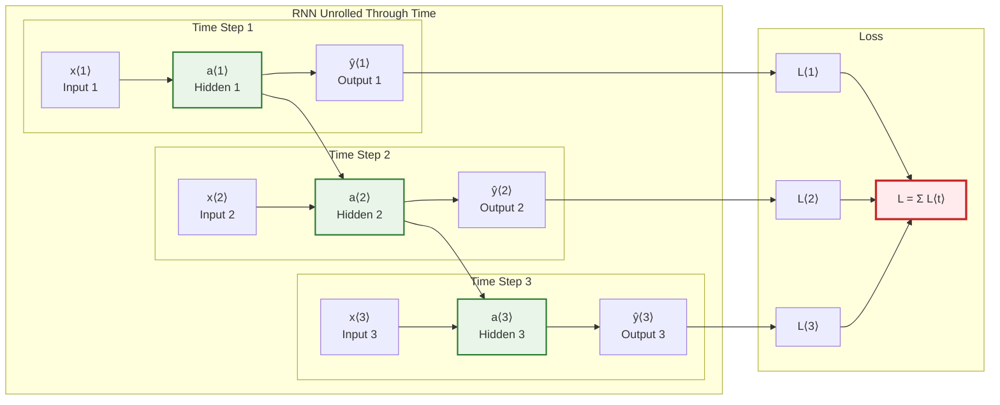

#### Mathematical Setup

**Forward Pass Equations:**
$$a^{\langle t \rangle} = g(W_a[a^{\langle t-1 \rangle}, x^{\langle t \rangle}] + b_a)$$
$$\hat{y}^{\langle t \rangle} = g(W_y a^{\langle t \rangle} + b_y)$$

**Loss Function:**
$$L^{\langle t \rangle} = -(y^{\langle t \rangle} \log(\hat{y}^{\langle t \rangle}) + (1-y^{\langle t \rangle}) \log(1-\hat{y}^{\langle t \rangle}))$$
$$L = \sum_{t=1}^{T} L^{\langle t \rangle}$$

### Step-by-Step BPTT Derivation

#### Step 1: Understanding the Computational Graph

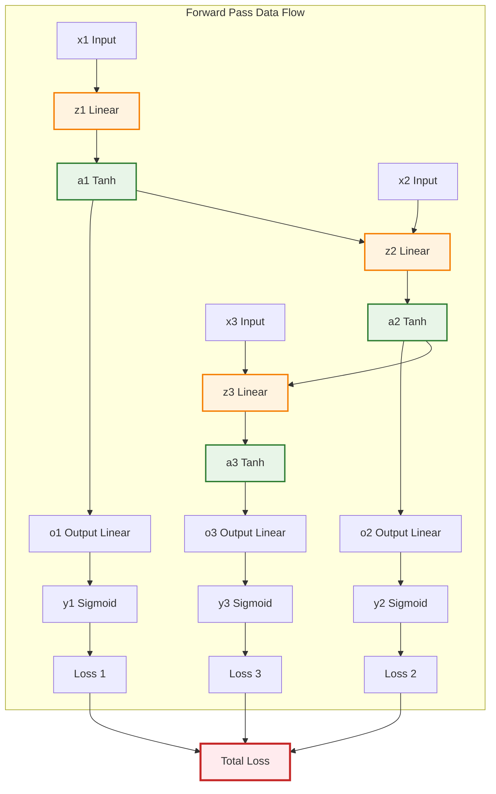

#### Step 2: Gradient Computation for Output Weights (W_y)

**What we want:** $\frac{\partial L}{\partial W_y}$

**Chain Rule Application:**
$$\frac{\partial L}{\partial W_y} = \sum_{t=1}^{T} \frac{\partial L^{\langle t \rangle}}{\partial W_y}$$

**For each time step t:**
$$\frac{\partial L^{\langle t \rangle}}{\partial W_y} = \frac{\partial L^{\langle t \rangle}}{\partial \hat{y}^{\langle t \rangle}} \times \frac{\partial \hat{y}^{\langle t \rangle}}{\partial o^{\langle t \rangle}} \times \frac{\partial o^{\langle t \rangle}}{\partial W_y}$$

**Let's derive each component:**

**Component 1:** $\frac{\partial L^{\langle t \rangle}}{\partial \hat{y}^{\langle t \rangle}}$
$$L^{\langle t \rangle} = -(y^{\langle t \rangle} \log(\hat{y}^{\langle t \rangle}) + (1-y^{\langle t \rangle}) \log(1-\hat{y}^{\langle t \rangle}))$$

$$\frac{\partial L^{\langle t \rangle}}{\partial \hat{y}^{\langle t \rangle}} = -\frac{y^{\langle t \rangle}}{\hat{y}^{\langle t \rangle}} + \frac{(1-y^{\langle t \rangle})}{(1-\hat{y}^{\langle t \rangle})}$$

**Component 2:** $\frac{\partial \hat{y}^{\langle t \rangle}}{\partial o^{\langle t \rangle}}$
$$\hat{y}^{\langle t \rangle} = \sigma(o^{\langle t \rangle}) = \frac{1}{1 + e^{-o^{\langle t \rangle}}}$$

$$\frac{\partial \hat{y}^{\langle t \rangle}}{\partial o^{\langle t \rangle}} = \hat{y}^{\langle t \rangle}(1 - \hat{y}^{\langle t \rangle})$$

**Component 3:** $\frac{\partial o^{\langle t \rangle}}{\partial W_y}$
$$o^{\langle t \rangle} = W_y a^{\langle t \rangle} + b_y$$

$$\frac{\partial o^{\langle t \rangle}}{\partial W_y} = a^{\langle t \rangle}$$

**Combining (Chain Rule Magic!):**
$$\frac{\partial L^{\langle t \rangle}}{\partial W_y} = \left[-\frac{y^{\langle t \rangle}}{\hat{y}^{\langle t \rangle}} + \frac{(1-y^{\langle t \rangle})}{(1-\hat{y}^{\langle t \rangle})}\right] \times [\hat{y}^{\langle t \rangle}(1-\hat{y}^{\langle t \rangle})] \times a^{\langle t \rangle}$$

**Simplifying:**
$$= [-y^{\langle t \rangle}(1-\hat{y}^{\langle t \rangle}) + (1-y^{\langle t \rangle})\hat{y}^{\langle t \rangle}] \times a^{\langle t \rangle}$$
$$= [-y^{\langle t \rangle} + y^{\langle t \rangle}\hat{y}^{\langle t \rangle} + \hat{y}^{\langle t \rangle} - y^{\langle t \rangle}\hat{y}^{\langle t \rangle}] \times a^{\langle t \rangle}$$
$$= [\hat{y}^{\langle t \rangle} - y^{\langle t \rangle}] \times a^{\langle t \rangle}$$

**Beautiful Result:**
$$\frac{\partial L^{\langle t \rangle}}{\partial W_y} = (\hat{y}^{\langle t \rangle} - y^{\langle t \rangle}) \times a^{\langle t \rangle}$$

**Final gradient for $W_y$:**
$$\frac{\partial L}{\partial W_y} = \sum_{t=1}^{T} (\hat{y}^{\langle t \rangle} - y^{\langle t \rangle}) \times a^{\langle t \rangle}$$

#### Step 3: The Challenging Part - Gradient for Recurrent Weights (W_a)

**The Challenge:** $W_a$ affects ALL future time steps through the recurrent connections.

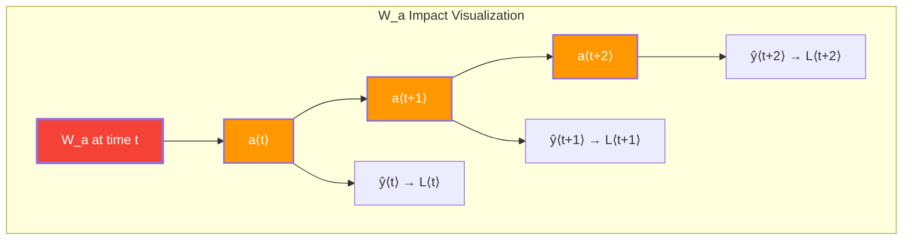

**Mathematical Analysis:**

$W_a$ contributes to the loss through multiple paths:

1. Direct path: $W_a \rightarrow a^{\langle t \rangle} \rightarrow \hat{y}^{\langle t \rangle} \rightarrow L^{\langle t \rangle}$
2. One-step path: $W_a \rightarrow a^{\langle t \rangle} \rightarrow a^{\langle t+1 \rangle} \rightarrow \hat{y}^{\langle t+1 \rangle} \rightarrow L^{\langle t+1 \rangle}$
3. Two-step path: $W_a \rightarrow a^{\langle t \rangle} \rightarrow a^{\langle t+1 \rangle} \rightarrow a^{\langle t+2 \rangle} \rightarrow \hat{y}^{\langle t+2 \rangle} \rightarrow L^{\langle t+2 \rangle}$
4. And so on...

**The Complete Gradient:**
$$\frac{\partial L}{\partial W_a} = \sum_{t=1}^{T} \sum_{k=1}^{T} \frac{\partial L^{\langle k \rangle}}{\partial a^{\langle k \rangle}} \times \frac{\partial a^{\langle k \rangle}}{\partial a^{\langle t \rangle}} \times \frac{\partial a^{\langle t \rangle}}{\partial W_a}$$

**Recursive Relationship:**

$$
\frac{\partial a^{\langle k \rangle}}{\partial a^{\langle t \rangle}} = \begin{cases}
\prod_{j=t+1}^{k} \frac{\partial a^{\langle j \rangle}}{\partial a^{\langle j-1 \rangle}} & \text{if } k > t \\
1 & \text{if } k = t \\
0 & \text{if } k < t
\end{cases}
$$

**Since $a^{\langle j \rangle} = \tanh(W_a[a^{\langle j-1 \rangle}, x^{\langle j \rangle}] + b_a)$:**
$$\frac{\partial a^{\langle j \rangle}}{\partial a^{\langle j-1 \rangle}} = \text{diag}(1 - (a^{\langle j \rangle})^2) \times W_a[:, :\text{hidden\_size}]$$

### Complete BPTT Algorithm

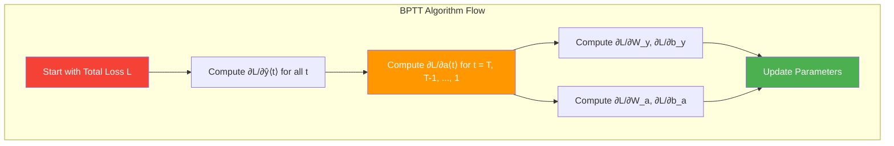

**Backward Pass Equations:**

```bash
# Time flows backward: T → T-1 → ... → 1

# Step 1: Output gradients (easy part)
for t in range(T, 0, -1):
    ∂L/∂ŷ⟨t⟩ = ŷ⟨t⟩ - y⟨t⟩
    ∂L/∂a⟨t⟩ += ∂L/∂ŷ⟨t⟩ × W_y^T

# Step 2: Hidden state gradients (challenging part)
for t in range(T-1, 0, -1):
    ∂L/∂a⟨t⟩ += ∂L/∂a⟨t+1⟩ × ∂a⟨t+1⟩/∂a⟨t⟩

    where:
    ∂a⟨t+1⟩/∂a⟨t⟩ = diag(1 - (a⟨t+1⟩)²) × W_a[:,:hidden_size]

# Step 3: Parameter gradients
∂L/∂W_y = Σ(t=1 to T) ∂L/∂ŷ⟨t⟩ × a⟨t⟩^T
∂L/∂b_y = Σ(t=1 to T) ∂L/∂ŷ⟨t⟩

∂L/∂W_a = Σ(t=1 to T) ∂L/∂a⟨t⟩ × [a⟨t-1⟩, x⟨t⟩]^T
∂L/∂b_a = Σ(t=1 to T) ∂L/∂a⟨t⟩
```

### Numerical Example: BPTT in Action

Let's trace through a tiny example with **2 time steps**, **1 hidden unit**, **1 input feature**.

**Setup:**

```
T = 2 (two time steps)
Hidden size = 1
Input size = 1
Output size = 1

Initial parameters:
W_a = [[0.5, 0.3]]  # [hidden_to_hidden, input_to_hidden]
b_a = [0.1]
W_y = [0.4]
b_y = 0.2

Input sequence:
x⟨1⟩ = [1.0]
x⟨2⟩ = [0.5]

True labels:
y⟨1⟩ = 1
y⟨2⟩ = 0
```

**Forward Pass:**

```bash
# Time step 1
a⟨0⟩ = [0.0]  # Initialize
z⟨1⟩ = W_a[0] × a⟨0⟩ + W_a[1] × x⟨1⟩ + b_a
     = 0.5 × 0.0 + 0.3 × 1.0 + 0.1 = 0.4
a⟨1⟩ = tanh(0.4) = 0.380

o⟨1⟩ = W_y × a⟨1⟩ + b_y = 0.4 × 0.380 + 0.2 = 0.352
ŷ⟨1⟩ = σ(0.352) = 0.587

L⟨1⟩ = -(1 × log(0.587) + 0 × log(0.413)) = 0.532

# Time step 2
z⟨2⟩ = W_a[0] × a⟨1⟩ + W_a[1] × x⟨2⟩ + b_a
     = 0.5 × 0.380 + 0.3 × 0.5 + 0.1 = 0.44
a⟨2⟩ = tanh(0.44) = 0.414

o⟨2⟩ = W_y × a⟨2⟩ + b_y = 0.4 × 0.414 + 0.2 = 0.366
ŷ⟨2⟩ = σ(0.366) = 0.590

L⟨2⟩ = -(0 × log(0.590) + 1 × log(0.410)) = 0.892

Total Loss: L = L⟨1⟩ + L⟨2⟩ = 0.532 + 0.892 = 1.424
```

**Backward Pass:**

```bash
# Step 1: Output gradients
∂L/∂ŷ⟨1⟩ = ŷ⟨1⟩ - y⟨1⟩ = 0.587 - 1 = -0.413
∂L/∂ŷ⟨2⟩ = ŷ⟨2⟩ - y⟨2⟩ = 0.590 - 0 = 0.590

# Step 2: Hidden state gradients (working backward)
# At t=2:
∂L/∂a⟨2⟩ = ∂L/∂ŷ⟨2⟩ × W_y = 0.590 × 0.4 = 0.236

# At t=1:
∂L/∂a⟨1⟩ = ∂L/∂ŷ⟨1⟩ × W_y + ∂L/∂a⟨2⟩ × ∂a⟨2⟩/∂a⟨1⟩
         = (-0.413) × 0.4 + 0.236 × [1 - (a⟨2⟩)²] × W_a[0]
         = -0.165 + 0.236 × (1 - 0.414²) × 0.5
         = -0.165 + 0.236 × 0.829 × 0.5
         = -0.165 + 0.098 = -0.067

# Step 3: Parameter gradients
∂L/∂W_y = ∂L/∂ŷ⟨1⟩ × a⟨1⟩ + ∂L/∂ŷ⟨2⟩ × a⟨2⟩
        = (-0.413) × 0.380 + 0.590 × 0.414
        = -0.157 + 0.244 = 0.087

∂L/∂b_y = ∂L/∂ŷ⟨1⟩ + ∂L/∂ŷ⟨2⟩ = -0.413 + 0.590 = 0.177

∂L/∂W_a[0] = ∂L/∂a⟨1⟩ × a⟨0⟩ + ∂L/∂a⟨2⟩ × a⟨1⟩
           = (-0.067) × 0.0 + 0.236 × 0.380 = 0.090

∂L/∂W_a[1] = ∂L/∂a⟨1⟩ × x⟨1⟩ + ∂L/∂a⟨2⟩ × x⟨2⟩
           = (-0.067) × 1.0 + 0.236 × 0.5 = 0.051

∂L/∂b_a = ∂L/∂a⟨1⟩ + ∂L/∂a⟨2⟩ = -0.067 + 0.236 = 0.169
```

**Parameter Updates (α = 0.1):**

```bash
W_y = 0.4 - 0.1 × 0.087 = 0.391
b_y = 0.2 - 0.1 × 0.177 = 0.182
W_a[0] = 0.5 - 0.1 × 0.090 = 0.491
W_a[1] = 0.3 - 0.1 × 0.051 = 0.295
b_a = 0.1 - 0.1 × 0.169 = 0.083
```

---

## 2. Vanishing Gradients - Mathematical Proof

### The Core Problem

**Why do gradients vanish in RNNs?** Let's prove it mathematically.

#### The Gradient Flow Equation

From our BPTT derivation, the gradient with respect to early hidden states is:

$$\frac{\partial L}{\partial a^{\langle t \rangle}} = \frac{\partial L}{\partial a^{\langle T \rangle}} \times \prod_{k=t+1}^{T} \frac{\partial a^{\langle k \rangle}}{\partial a^{\langle k-1 \rangle}}$$

#### The Jacobian Matrix

Each term $\frac{\partial a^{\langle k \rangle}}{\partial a^{\langle k-1 \rangle}}$ is a **Jacobian matrix**:

$$\frac{\partial a^{\langle k \rangle}}{\partial a^{\langle k-1 \rangle}} = \text{diag}(1 - (a^{\langle k \rangle})^2) \times W_a[:, :\text{hidden\_size}]$$

**Breaking this down:**

- $\text{diag}(1 - (a^{\langle k \rangle})^2)$: Diagonal matrix with tanh derivatives
- $W_a[:, :\text{hidden\_size}]$: The hidden-to-hidden weight matrix

#### The Vanishing Problem

**The product becomes:**
$$\prod_{k=t+1}^{T} \frac{\partial a^{\langle k \rangle}}{\partial a^{\langle k-1 \rangle}} = \prod_{k=t+1}^{T} \text{diag}(1 - (a^{\langle k \rangle})^2) \times W_a[:, :\text{hidden\_size}]$$

**Key insight:** This is a product of $(T-t)$ matrices!

#### Mathematical Analysis

**Scenario 1: Tanh Saturation**
$$\text{If } |a^{\langle k \rangle}| \approx 1 \text{ for most } k, \text{ then: } 1 - (a^{\langle k \rangle})^2 \approx 0$$

**Result:** Each matrix multiplication reduces gradient by $\approx 0$

**Scenario 2: Small Weight Matrix**
$$\text{If max eigenvalue of } W_a[:, :\text{hidden\_size}] < 1, \text{ then:}$$
$$\left\|\prod_{k=t+1}^{T} W_a\right\| \leq (\text{max\_eigenvalue})^{(T-t)}$$

**For long sequences:** $(0.9)^{50} \approx 0.005 \rightarrow \text{vanishing!}$

#### Visual Proof

```mermaid
graph TD
    subgraph "Gradient Magnitude Through Time"
        G1[∂L/∂a⟨T⟩<br/>Magnitude: 1.0]
        G2[∂L/∂a⟨T-1⟩<br/>Magnitude: 0.3]
        G3[∂L/∂a⟨T-2⟩<br/>Magnitude: 0.09]
        G4[∂L/∂a⟨T-3⟩<br/>Magnitude: 0.027]
        G5[∂L/∂a⟨1⟩<br/>Magnitude: ≈ 0]
    end

    G1 -->|×0.3| G2
    G2 -->|×0.3| G3
    G3 -->|×0.3| G4
    G4 -->|...| G5

    style G1 fill:#4caf50
    style G2 fill:#ff9800
    style G3 fill:#f44336
    style G4 fill:#9c27b0
    style G5 fill:#424242
```

**The exponential decay formula:**
$$\left\|\frac{\partial L}{\partial a^{\langle t \rangle}}\right\| \approx \left\|\frac{\partial L}{\partial a^{\langle T \rangle}}\right\| \times \gamma^{(T-t)}$$

Where $\gamma < 1$ is the "shrinkage factor"

**For a sequence of length 50 with $\gamma = 0.3$:**
$$\left\|\frac{\partial L}{\partial a^{\langle 1 \rangle}}\right\| \approx \left\|\frac{\partial L}{\partial a^{\langle 50 \rangle}}\right\| \times (0.3)^{49} \approx \left\|\frac{\partial L}{\partial a^{\langle 50 \rangle}}\right\| \times 10^{-25}$$

**This means the gradient for early time steps is essentially zero!**

---

## 3. GRU Gate Mathematics

### The Problem GRU Solves

**Basic RNN Issue:** Memory gets completely overwritten at each step:
$$a^{\langle t \rangle} = \tanh(W_a[a^{\langle t-1 \rangle}, x^{\langle t \rangle}] + b_a)$$
No selective memory retention!

### GRU Mathematical Innovation

**Key Insight:** Use gates to control information flow.

#### The Update Gate Mathematics

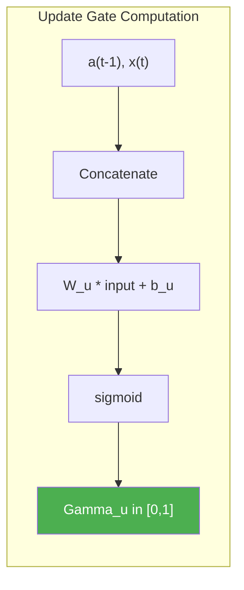

**Mathematical Definition:**
$$\Gamma_u = \sigma(W_u[a^{\langle t-1 \rangle}, x^{\langle t \rangle}] + b_u)$$

**What $\Gamma_u$ controls:**

- $\Gamma_u = 0$: "Keep old memory completely, ignore new info"
- $\Gamma_u = 1$: "Replace old memory completely with new info"
- $\Gamma_u = 0.3$: "Keep 70% old memory, use 30% new info"

#### The Candidate Memory Mathematics

$$\tilde{C}^{\langle t \rangle} = \tanh(W_c[a^{\langle t-1 \rangle}, x^{\langle t \rangle}] + b_c)$$

**This is the "proposed" new memory** - what we COULD store if we wanted to.

#### The Memory Update Mathematics

**The Magic Equation:**
$$C^{\langle t \rangle} = \Gamma_u \odot \tilde{C}^{\langle t \rangle} + (1-\Gamma_u) \odot C^{\langle t-1 \rangle}$$

**Mathematical Breakdown:**

- $\odot$: Element-wise multiplication
- $\Gamma_u \odot \tilde{C}^{\langle t \rangle}$: New information scaled by update gate
- $(1-\Gamma_u) \odot C^{\langle t-1 \rangle}$: Old information scaled by (1 - update gate)

#### Why This Solves Vanishing Gradients

**The Gradient Highway:**

When $\Gamma_u \approx 0$:
$$C^{\langle t \rangle} \approx C^{\langle t-1 \rangle}$$

Therefore: $\frac{\partial C^{\langle t \rangle}}{\partial C^{\langle t-1 \rangle}} \approx 1$

**This creates a "gradient highway"** where gradients can flow backward without diminishing!

#### GRU Gradient Derivation

**For the memory cell gradient:**
$$\frac{\partial L}{\partial C^{\langle t-1 \rangle}} = \frac{\partial L}{\partial C^{\langle t \rangle}} \times \frac{\partial C^{\langle t \rangle}}{\partial C^{\langle t-1 \rangle}}$$

**Taking the derivative of the update equation:**
$$\frac{\partial C^{\langle t \rangle}}{\partial C^{\langle t-1 \rangle}} = (1-\Gamma_u) + \frac{\partial \Gamma_u}{\partial C^{\langle t-1 \rangle}} \odot (\tilde{C}^{\langle t \rangle} - C^{\langle t-1 \rangle}) + \Gamma_u \odot \frac{\partial \tilde{C}^{\langle t \rangle}}{\partial C^{\langle t-1 \rangle}}$$

**Key insight:** The $(1-\Gamma_u)$ term provides the gradient highway!

### GRU Numerical Example

Let's trace through a simple GRU with **1 hidden unit** processing **2 time steps**.

**Setup:**

```
Hidden size = 1
Input size = 1

Parameters:
W_u = [0.8, 0.5]  # [hidden_to_hidden, input_to_hidden] for update gate
b_u = 0.1
W_c = [0.6, 0.4]  # for candidate memory
b_c = 0.2

Input sequence:
x⟨1⟩ = [2.0]
x⟨2⟩ = [1.0]

Initial memory:
C⟨0⟩ = [0.0]
```

**Forward Pass:**

```bash
# Time step 1
# Update gate
Γ_u⟨1⟩ = σ(W_u[0] × C⟨0⟩ + W_u[1] × x⟨1⟩ + b_u)
       = σ(0.8 × 0.0 + 0.5 × 2.0 + 0.1)
       = σ(1.1) = 0.750

# Candidate memory
C̃⟨1⟩ = tanh(W_c[0] × C⟨0⟩ + W_c[1] × x⟨1⟩ + b_c)
     = tanh(0.6 × 0.0 + 0.4 × 2.0 + 0.2)
     = tanh(1.0) = 0.762

# Memory update
C⟨1⟩ = Γ_u⟨1⟩ × C̃⟨1⟩ + (1-Γ_u⟨1⟩) × C⟨0⟩
     = 0.750 × 0.762 + 0.250 × 0.0
     = 0.572

# Time step 2
# Update gate
Γ_u⟨2⟩ = σ(0.8 × 0.572 + 0.5 × 1.0 + 0.1)
       = σ(1.058) = 0.742

# Candidate memory
C̃⟨2⟩ = tanh(0.6 × 0.572 + 0.4 × 1.0 + 0.2)
     = tanh(0.943) = 0.738

# Memory update
C⟨2⟩ = 0.742 × 0.738 + 0.258 × 0.572
     = 0.548 + 0.148 = 0.696
```

**Key Observations:**

1. **Memory persists:** $C^{\langle 0 \rangle} = 0.0 \rightarrow C^{\langle 1 \rangle} = 0.572 \rightarrow C^{\langle 2 \rangle} = 0.696$
2. **Gradual updates:** The update gate controls how much new information is incorporated
3. **No complete overwriting:** Unlike basic RNN, previous memory contributes to current state

---

## 4. LSTM Mathematical Foundations

### The Problem LSTM Solves

**GRU limitation:** Memory and output are the same ($C^{\langle t \rangle} = a^{\langle t \rangle}$)

**LSTM innovation:** Separate memory cell and hidden state

$$C^{\langle t \rangle} \neq h^{\langle t \rangle}$$

### The Three-Gate System

#### Gate 1: Forget Gate

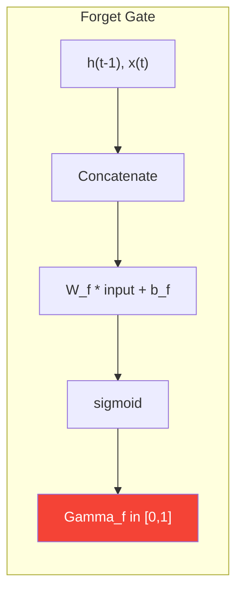

**Mathematical Definition:**
$$\Gamma_f = \sigma(W_f[h^{\langle t-1 \rangle}, x^{\langle t \rangle}] + b_f)$$

**What it does:** Decides what information to **discard** from the cell state.

#### Gate 2: Input Gate

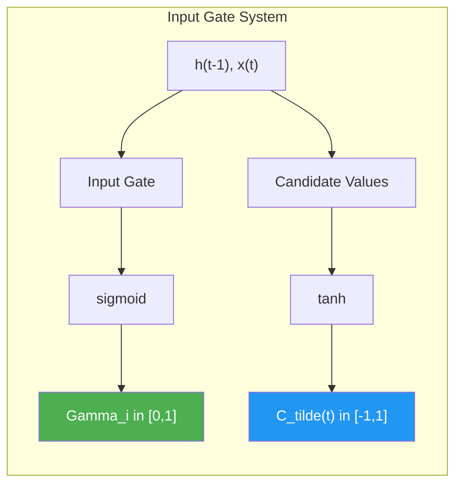

**Mathematical Definitions:**
$$\Gamma_i = \sigma(W_i[h^{\langle t-1 \rangle}, x^{\langle t \rangle}] + b_i)$$
$$\tilde{C}^{\langle t \rangle} = \tanh(W_C[h^{\langle t-1 \rangle}, x^{\langle t \rangle}] + b_C)$$

**What they do:**

- $\Gamma_i$: Decides **how much** new information to store
- $\tilde{C}^{\langle t \rangle}$: **What** new information to store

#### Gate 3: Output Gate

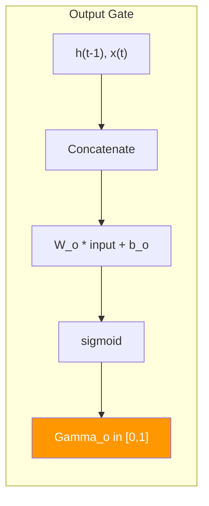

**Mathematical Definition:**
$$\Gamma_o = \sigma(W_o[h^{\langle t-1 \rangle}, x^{\langle t \rangle}] + b_o)$$

**What it does:** Decides what parts of the cell state to **output** as the hidden state.

### LSTM Memory Update Mathematics

#### Cell State Update

**The Core LSTM Equation:**
$$C^{\langle t \rangle} = \Gamma_f \odot C^{\langle t-1 \rangle} + \Gamma_i \odot \tilde{C}^{\langle t \rangle}$$

**Mathematical breakdown:**

- $\Gamma_f \odot C^{\langle t-1 \rangle}$: **Forget** selected parts of old memory
- $\Gamma_i \odot \tilde{C}^{\langle t \rangle}$: **Add** selected new information
- Result: **Selective memory update**

#### Hidden State Update

$$h^{\langle t \rangle} = \Gamma_o \odot \tanh(C^{\langle t \rangle})$$

**Why tanh?** Squashes cell state to $[-1, 1]$ before selective output.

### Complete LSTM Forward Pass

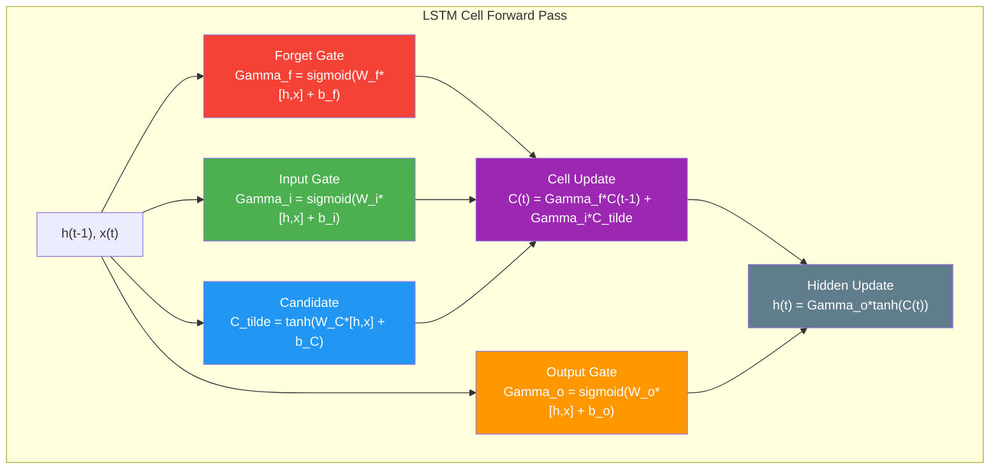

### LSTM vs GRU Mathematical Comparison

| Aspect         | GRU                                                                                             | LSTM                                                                                        |
| -------------- | ----------------------------------------------------------------------------------------------- | ------------------------------------------------------------------------------------------- |
| **Gates**      | 2 (Update, Reset)                                                                               | 3 (Forget, Input, Output)                                                                   |
| **Memory**     | $C^{\langle t \rangle} = a^{\langle t \rangle}$                                                 | $C^{\langle t \rangle} \neq h^{\langle t \rangle}$                                          |
| **Update**     | $C^{\langle t \rangle} = \Gamma_u \odot \tilde{C} + (1-\Gamma_u) \odot C^{\langle t-1 \rangle}$ | $C^{\langle t \rangle} = \Gamma_f \odot C^{\langle t-1 \rangle} + \Gamma_i \odot \tilde{C}$ |
| **Parameters** | Fewer                                                                                           | More                                                                                        |

### LSTM Numerical Example

Let's trace through an LSTM with **1 hidden unit** for **2 time steps**.

**Setup:**

```
Hidden size = 1
Input size = 1

Parameters:
W_f = [0.7, 0.6], b_f = 0.1  # Forget gate
W_i = [0.8, 0.5], b_i = 0.2  # Input gate
W_C = [0.6, 0.4], b_C = 0.1  # Candidate values
W_o = [0.9, 0.3], b_o = 0.0  # Output gate

Input sequence:
x⟨1⟩ = [1.5]
x⟨2⟩ = [0.8]

Initial states:
h⟨0⟩ = [0.0]
C⟨0⟩ = [0.0]
```

**Forward Pass:**

```bash
# Time step 1
# Forget gate
Γ_f⟨1⟩ = σ(0.7×0.0 + 0.6×1.5 + 0.1) = σ(1.0) = 0.731

# Input gate
Γ_i⟨1⟩ = σ(0.8×0.0 + 0.5×1.5 + 0.2) = σ(0.95) = 0.721

# Candidate values
C̃⟨1⟩ = tanh(0.6×0.0 + 0.4×1.5 + 0.1) = tanh(0.7) = 0.604

# Cell state update
C⟨1⟩ = 0.731×0.0 + 0.721×0.604 = 0.435

# Output gate
Γ_o⟨1⟩ = σ(0.9×0.0 + 0.3×1.5 + 0.0) = σ(0.45) = 0.611

# Hidden state
h⟨1⟩ = 0.611 × tanh(0.435) = 0.611 × 0.410 = 0.251

# Time step 2
# Forget gate
Γ_f⟨2⟩ = σ(0.7×0.251 + 0.6×0.8 + 0.1) = σ(0.756) = 0.681

# Input gate
Γ_i⟨2⟩ = σ(0.8×0.251 + 0.5×0.8 + 0.2) = σ(0.801) = 0.690

# Candidate values
C̃⟨2⟩ = tanh(0.6×0.251 + 0.4×0.8 + 0.1) = tanh(0.571) = 0.516

# Cell state update
C⟨2⟩ = 0.681×0.435 + 0.690×0.516 = 0.296 + 0.356 = 0.652

# Output gate
Γ_o⟨2⟩ = σ(0.9×0.251 + 0.3×0.8 + 0.0) = σ(0.466) = 0.615

# Hidden state
h⟨2⟩ = 0.615 × tanh(0.652) = 0.615 × 0.576 = 0.354
```

**Key Observations:**

1. **Cell state accumulates:** $C^{\langle 0 \rangle} = 0.0 \rightarrow C^{\langle 1 \rangle} = 0.435 \rightarrow C^{\langle 2 \rangle} = 0.652$
2. **Hidden state varies:** $h^{\langle 1 \rangle} = 0.251 \rightarrow h^{\langle 2 \rangle} = 0.354$
3. **Independent control:** Gates operate independently, allowing fine-grained control

### Why LSTM Works Better Than Basic RNN

#### Gradient Flow Analysis

**For the cell state gradient:**
$$\frac{\partial C^{\langle t \rangle}}{\partial C^{\langle t-1 \rangle}} = \Gamma_f + \frac{\partial \Gamma_f}{\partial C^{\langle t-1 \rangle}} \odot C^{\langle t-1 \rangle} + \frac{\partial \Gamma_i}{\partial C^{\langle t-1 \rangle}} \odot \tilde{C}^{\langle t \rangle}$$

**Key insight:** The $\Gamma_f$ term can be close to 1, providing an unimpeded gradient path!

**When $\Gamma_f \approx 1$ and other partial derivatives are small:**
$$\frac{\partial C^{\langle t \rangle}}{\partial C^{\langle t-1 \rangle}} \approx 1$$

**This solves the vanishing gradient problem!**

---

## 5. Bidirectional RNN Mathematics

### The Problem with Unidirectional Processing

**Standard RNN limitation:** Only uses past context
$$a^{\langle t \rangle} = f(a^{\langle t-1 \rangle}, x^{\langle t \rangle})$$

**Missing information:** Future context that could be crucial for understanding.

### Bidirectional RNN Mathematical Framework

#### Forward and Backward Components

**Forward RNN (left-to-right):**
$$\overrightarrow{a}^{\langle t \rangle} = g(W_{\overrightarrow{a}}[\overrightarrow{a}^{\langle t-1 \rangle}, x^{\langle t \rangle}] + b_{\overrightarrow{a}})$$

**Backward RNN (right-to-left):**
$$\overleftarrow{a}^{\langle t \rangle} = g(W_{\overleftarrow{a}}[\overleftarrow{a}^{\langle t+1 \rangle}, x^{\langle t \rangle}] + b_{\overleftarrow{a}})$$

**Combined Prediction:**
$$\hat{y}^{\langle t \rangle} = g(W_y[\overrightarrow{a}^{\langle t \rangle}, \overleftarrow{a}^{\langle t \rangle}] + b_y)$$

#### Information Flow Analysis

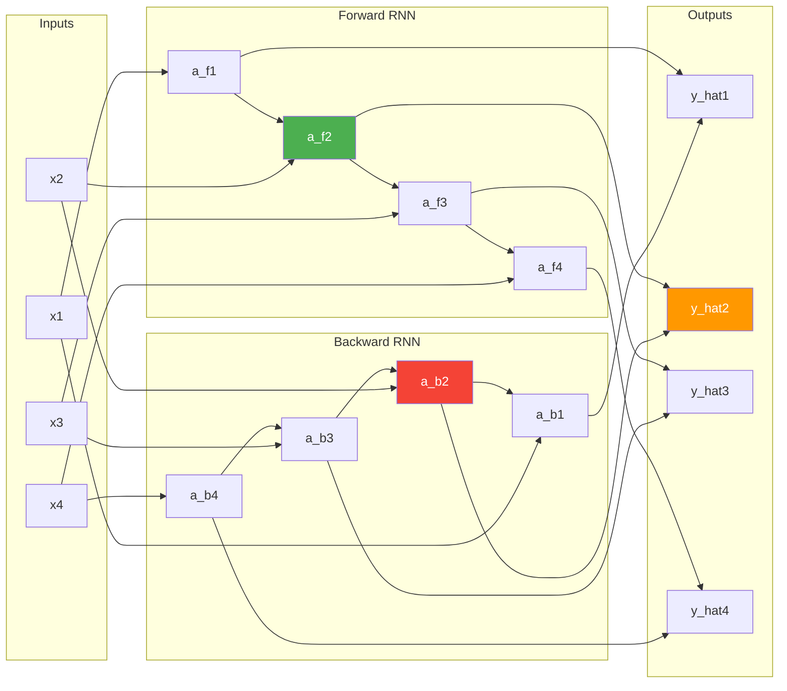

**At time step $t$:**

- $\overrightarrow{a}^{\langle t \rangle}$ contains information from: $x^{\langle 1 \rangle}, x^{\langle 2 \rangle}, \ldots, x^{\langle t \rangle}$
- $\overleftarrow{a}^{\langle t \rangle}$ contains information from: $x^{\langle t \rangle}, x^{\langle t+1 \rangle}, \ldots, x^{\langle T \rangle}$
- $\hat{y}^{\langle t \rangle}$ uses: **Complete sequence information**

### Bidirectional LSTM Mathematics

**Forward LSTM:**
$$\overrightarrow{C}^{\langle t \rangle} = \overrightarrow{\Gamma_f} \odot \overrightarrow{C}^{\langle t-1 \rangle} + \overrightarrow{\Gamma_i} \odot \overrightarrow{\tilde{C}}^{\langle t \rangle}$$
$$\overrightarrow{h}^{\langle t \rangle} = \overrightarrow{\Gamma_o} \odot \tanh(\overrightarrow{C}^{\langle t \rangle})$$

**Backward LSTM:**
$$\overleftarrow{C}^{\langle t \rangle} = \overleftarrow{\Gamma_f} \odot \overleftarrow{C}^{\langle t+1 \rangle} + \overleftarrow{\Gamma_i} \odot \overleftarrow{\tilde{C}}^{\langle t \rangle}$$
$$\overleftarrow{h}^{\langle t \rangle} = \overleftarrow{\Gamma_o} \odot \tanh(\overleftarrow{C}^{\langle t \rangle})$$

**Combined Output:**
$$\hat{y}^{\langle t \rangle} = \text{softmax}(W_y[\overrightarrow{h}^{\langle t \rangle}, \overleftarrow{h}^{\langle t \rangle}] + b_y)$$

### Computational Complexity Analysis

#### Parameter Count

**Standard LSTM:** $4 \times n_h \times (n_h + n_x) + 4 \times n_h$

**Bidirectional LSTM:** $2 \times [4 \times n_h \times (n_h + n_x) + 4 \times n_h] + n_y \times (2 \times n_h)$

**Factor increase:** Approximately **2×** the parameters

#### Training Complexity

**Forward Pass:**

1. Process sequence left-to-right for forward RNN
2. Process sequence right-to-left for backward RNN
3. Combine outputs at each time step

**Backward Pass:**
$$\frac{\partial L}{\partial W_{\overrightarrow{a}}} = \sum_{t=1}^{T} \frac{\partial L}{\partial \overrightarrow{a}^{\langle t \rangle}} \times \frac{\partial \overrightarrow{a}^{\langle t \rangle}}{\partial W_{\overrightarrow{a}}}$$
$$\frac{\partial L}{\partial W_{\overleftarrow{a}}} = \sum_{t=1}^{T} \frac{\partial L}{\partial \overleftarrow{a}^{\langle t \rangle}} \times \frac{\partial \overleftarrow{a}^{\langle t \rangle}}{\partial W_{\overleftarrow{a}}}$$

### Bidirectional RNN Numerical Example

**Setup:**

```
Sequence length: 3
Hidden size: 1
Input size: 1

Parameters:
Forward RNN: W_f = [0.5, 0.3], b_f = 0.1
Backward RNN: W_b = [0.4, 0.6], b_b = 0.2
Output: W_y = [0.7, 0.8], b_y = 0.0

Input sequence: [1.0, 2.0, 0.5]
```

**Forward Pass:**

```bash
# Forward RNN (left-to-right)
→a⟨0⟩ = 0
→a⟨1⟩ = tanh(0.5×0 + 0.3×1.0 + 0.1) = tanh(0.4) = 0.380
→a⟨2⟩ = tanh(0.5×0.380 + 0.3×2.0 + 0.1) = tanh(0.89) = 0.713
→a⟨3⟩ = tanh(0.5×0.713 + 0.3×0.5 + 0.1) = tanh(0.607) = 0.543

# Backward RNN (right-to-left)
←a⟨4⟩ = 0
←a⟨3⟩ = tanh(0.4×0 + 0.6×0.5 + 0.2) = tanh(0.5) = 0.462
←a⟨2⟩ = tanh(0.4×0.462 + 0.6×2.0 + 0.2) = tanh(1.585) = 0.921
←a⟨1⟩ = tanh(0.4×0.921 + 0.6×1.0 + 0.2) = tanh(1.168) = 0.825

# Combined outputs
ŷ⟨1⟩ = σ(0.7×0.380 + 0.8×0.825 + 0.0) = σ(0.926) = 0.716
ŷ⟨2⟩ = σ(0.7×0.713 + 0.8×0.921 + 0.0) = σ(1.236) = 0.775
ŷ⟨3⟩ = σ(0.7×0.543 + 0.8×0.462 + 0.0) = σ(0.750) = 0.679
```

**Key Observations:**

1. **Complete context:** Each prediction uses information from the entire sequence
2. **Richer representations:** Bidirectional activations capture more complex patterns
3. **Better performance:** Usually achieves higher accuracy on sequence labeling tasks

### When to Use Bidirectional RNNs

**✅ Use when:**

- Complete sequence is available (batch processing)
- Maximum accuracy is priority
- Context from both directions is beneficial

**❌ Don't use when:**

- Real-time processing required (streaming)
- Memory/computational constraints
- Sequential decision making (future unknown)

---

## Summary: Mathematical Insights

### Key Takeaways

1. **BPTT is the Foundation:** Understanding how gradients flow through time is crucial for RNN design

2. **Vanishing Gradients are Mathematical:** The product of Jacobians naturally shrinks for long sequences

3. **Gates are Gradient Highways:** GRU and LSTM gates provide pathways for gradient flow

4. **Bidirectional = Complete Context:** Using both directions maximizes available information

### The Evolution of RNN Mathematics

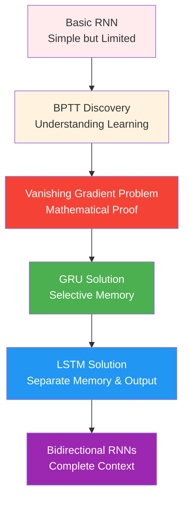

### Mathematical Principles Learned

1. **Chain Rule Mastery:** BPTT shows how chain rule applies through time
2. **Matrix Analysis:** Understanding eigenvalues and their impact on gradient flow
3. **Gate Mathematics:** How sigmoid and tanh functions create controllable information flow
4. **Optimization Theory:** Why certain architectures learn better than others

**These mathematical foundations enable us to understand not just _how_ RNNs work, but _why_ they work!**
