# Course 5 Week 2: Natural Language Processing & Word Embeddings

**Learning Objective:** Using word vector representations and embedding layers, train recurrent neural networks with outstanding performance across a wide variety of applications, including sentiment analysis, named entity recognition and neural machine translation.

---

## Table of Contents

1. [Word Representation](#1-word-representation)
2. [Using Word Embeddings](#2-using-word-embeddings)
3. [Properties of Word Embeddings](#3-properties-of-word-embeddings)
4. [Embedding Matrix](#4-embedding-matrix)
5. [Learning Word Embeddings](#5-learning-word-embeddings)
6. [Word2Vec](#6-word2vec)
7. [Negative Sampling](#7-negative-sampling)
8. [GloVe Word Vectors](#8-glove-word-vectors)
9. [Sentiment Classification](#9-sentiment-classification)
10. [Debiasing Word Embeddings](#10-debiasing-word-embeddings)

---

# 1. Word Representation

## The Revolution of Word Embeddings

Word embeddings represent one of the most significant breakthroughs in NLP, enabling algorithms to automatically understand relationships between words like "king" and "queen". This revolutionary approach transforms how machines process and understand human language.

### Problems with One-Hot Encoding

**Traditional Approach**: One-hot vectors

For a vocabulary of 10,000 words, each word is represented as a sparse vector:

```bash
# Vocabulary Setup (|V| = 10,000)
VOCABULARY = [a, aaron, ..., zulu, <UNK>]
VOCAB_SIZE = 10000

# Word Index Mapping
man    → index 5391
woman  → index 9853
king   → index 4914
queen  → index 7157
apple  → index 456
orange → index 6257
```

**Mathematical Representation**:

$$\text{man} = O_{5391} = [0, 0, 0, \ldots, 1, \ldots, 0] \text{ (1 at position 5391)}$$

$$\text{orange} = O_{6257} = [0, 0, 0, \ldots, 1, \ldots, 0] \text{ (1 at position 6257)}$$

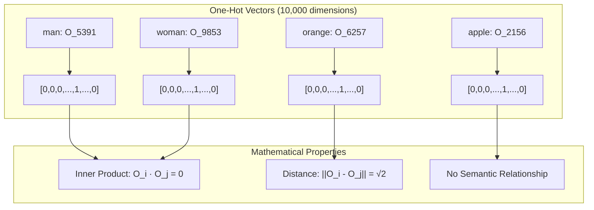

### One-Hot Vector Visualization

```bash
# One-Hot Vectors (Sparse Representation)
┌─────────────────────────────────────────────────────────────┐
│                    10,000 Dimensional Vectors               │
├─────────────────────────────────────────────────────────────┤
│ man (O_5391):                                               │
│ [0, 0, 0, ..., 0, 1, 0, ..., 0, 0]                          │
│               ↑5391                                         │
│                                                             │
│ woman (O_9853):                                             │
│ [0, 0, 0, ..., 0, 0, 0, ..., 1, 0]                          │
│                           ↑9853                             │
│                                                             │
│ orange (O_6257):                                            │
│ [0, 0, 0, ..., 1, 0, 0, ..., 0, 0]                          │
│           ↑6257                                             │
│                                                             │
│ apple (O_456):                                              │
│ [0, 0, 1, 0, ..., 0, 0, 0, ..., 0]                          │
│     ↑456                                                    │
└─────────────────────────────────────────────────────────────┘

# Mathematical Properties
Inner Product:     O_i · O_j = 0 (for i ≠ j)
Euclidean Distance: ||O_i - O_j|| = √2 (constant for all pairs)
Similarity:        cos(θ) = 0 (orthogonal vectors)
```

**Major Weaknesses**:

1. **No Generalization**: Treats each word as completely independent
2. **Zero Inner Product**: $O_i \cdot O_j = 0$ for all $i \neq j$
3. **Equal Distance**: $||O_i - O_j|| = \sqrt{2}$ for all pairs
4. **No Semantic Understanding**: "Orange" and "Apple" should be similar (both fruits)

**Example Problem**:

```bash
# Language Model Training Example
┌─────────────────────────────────────────────────┐
│ Training: "I want a glass of orange ___"        │
│ Answer:   "juice" ✓                             │
│                                                 │
│ Testing:  "I want a glass of apple ___"         │
│ Model thinking:                                 │
│   - orange vector: [0,0,...,1,...,0]            │
│   - apple vector:  [1,0,...,0,...,0]            │
│   - Similarity = 0 (completely unrelated!)      │
│   - No knowledge transfer possible              │
│ Result:   Poor prediction ✗                     │
└─────────────────────────────────────────────────┘
```

The fundamental issue: **Orange** and **apple** are semantically similar but represented as orthogonal vectors.

### Featurized Representation: Word Embeddings

**New Approach**: Dense feature vectors (e.g., 300 dimensions)

Instead of sparse 10,000-dimensional vectors, we learn dense 300-dimensional representations:

$$e_{\text{word}} \in \mathbb{R}^{300}$$

**Example Feature Matrix**:

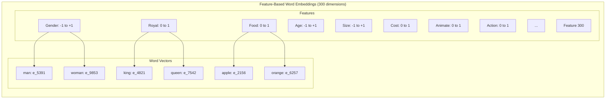

```bash
# Dense Embedding Setup
EMBEDDING_DIM = 300
VOCAB_SIZE = 10000

# Feature Categories (Human-Interpretable Examples)
FEATURES = {
    "gender":    range(-1.0, 1.0),    # -1=male, +1=female
    "royal":     range(0.0, 1.0),     # 0=common, 1=royal
    "age":       range(-1.0, 1.0),    # -1=young, +1=old
    "food":      range(0.0, 1.0),     # 0=not food, 1=food
    "size":      range(-1.0, 1.0),    # -1=small, +1=large
    "animate":   range(0.0, 1.0),     # 0=inanimate, 1=animate
    "cost":      range(0.0, 1.0),     # 0=cheap, 1=expensive
    "action":    range(0.0, 1.0),     # 0=noun, 1=verb
    # ... 292 more features
}
```

**Feature Matrix Visualization**

```bash
# Word Embedding Matrix (300 x 10,000)
┌──────────────────────────────────────────────────────────────────────┐
│                         300-Dimensional Dense Vectors                │
├──────────┬──────┬──────┬──────┬──────┬──────┬──────┬─────────────────┤
│ Feature  │ Man  │Woman │ King │Queen │Apple │Orange│   Description   │
├──────────┼──────┼──────┼──────┼──────┼──────┼──────┼─────────────────┤
│ Gender   │-1.00 │+1.00 │-0.95 │+0.97 │ 0.00 │+0.01 │ Male/Female     │
│ Royal    │ 0.01 │ 0.02 │+0.93 │+0.95 │-0.01 │ 0.00 │ Common/Royal    │
│ Age      │ 0.03 │ 0.02 │+0.70 │+0.69 │ 0.03 │-0.02 │ Young/Old       │
│ Food     │ 0.09 │ 0.01 │ 0.02 │ 0.01 │+0.95 │+0.97 │ Not Food/Food   │
│ Size     │+0.60 │+0.50 │+0.70 │+0.60 │+0.20 │+0.25 │ Small/Large     │
│ Animate  │+1.00 │+1.00 │+1.00 │+1.00 │ 0.00 │ 0.00 │ Object/Living   │
│ Cost     │ 0.00 │ 0.00 │+0.90 │+0.90 │+0.10 │+0.10 │ Cheap/Expensive │
│ Action   │ 0.05 │ 0.05 │ 0.05 │ 0.05 │ 0.02 │ 0.02 │ Noun/Verb       │
│   ...    │ ...  │ ...  │ ...  │ ...  │ ...  │ ...  │     ...         │
│ Feat300  │ 0.15 │-0.23 │+0.45 │-0.12 │+0.33 │+0.28 │ Unknown Feature │
└──────────┴──────┴──────┴──────┴──────┴──────┴──────┴─────────────────┘

# Vector Notation
e_man = [-1.00, 0.01, 0.03, 0.09, 0.60, 1.00, 0.00, 0.05, ..., 0.15]
e_apple = [0.00, -0.01, 0.03, 0.95, 0.20, 0.00, 0.10, 0.02, ..., 0.33]
e_orange = [0.01, 0.00, -0.02, 0.97, 0.25, 0.00, 0.10, 0.02, ..., 0.28]
```

**Detailed Feature Examples**:

| Feature     | Man  | Woman | King  | Queen | Apple | Orange |
| ----------- | ---- | ----- | ----- | ----- | ----- | ------ |
| **Gender**  | -1.0 | +1.0  | -0.95 | +0.97 | 0.00  | +0.01  |
| **Royal**   | 0.01 | 0.02  | 0.93  | 0.95  | -0.01 | 0.00   |
| **Age**     | 0.03 | 0.02  | 0.70  | 0.69  | 0.03  | -0.02  |
| **Food**    | 0.09 | 0.01  | 0.02  | 0.01  | 0.95  | 0.97   |
| **Size**    | 0.6  | 0.5   | 0.7   | 0.6   | 0.2   | 0.25   |
| **Cost**    | 0.0  | 0.0   | 0.9   | 0.9   | 0.1   | 0.1    |
| **Animate** | 1.0  | 1.0   | 1.0   | 1.0   | 0.0   | 0.0    |
| **...**     | ...  | ...   | ...   | ...   | ...   | ...    |

**Mathematical Notation**:

$$e_{\text{man}} = \begin{bmatrix} -1.0 \\ 0.01 \\ 0.03 \\ 0.09 \\ \vdots \\ \text{(300 features)} \end{bmatrix}, \quad e_{\text{orange}} = \begin{bmatrix} 0.01 \\ 0.00 \\ -0.02 \\ 0.97 \\ \vdots \\ \text{(300 features)} \end{bmatrix}$$

**Benefits**:

1. **Similar words have similar vectors**:
   $$\text{similarity}(e_{\text{orange}}, e_{\text{apple}}) = \frac{e_{\text{orange}} \cdot e_{\text{apple}}}{||e_{\text{orange}}|| \cdot ||e_{\text{apple}}||} \approx 0.8$$

2. **Semantic relationships captured**:
   $$e_{\text{man}} - e_{\text{woman}} \approx e_{\text{king}} - e_{\text{queen}}$$

3. **Generalization**: Learning about "orange juice" helps with "apple juice"

### Practical Example: Feature Similarity

```python
# Pseudo-code for similarity calculation
import numpy as np

# Example embeddings (simplified to 4 features)
orange = np.array([0.01, 0.00, -0.02, 0.97])  # [gender, royal, age, food]
apple = np.array([0.00, -0.01, 0.03, 0.95])
king = np.array([-0.95, 0.93, 0.70, 0.02])

# Cosine similarity
def cosine_similarity(a, b):
    return np.dot(a, b) / (np.linalg.norm(a) * np.linalg.norm(b))

print(f"Orange-Apple similarity: {cosine_similarity(orange, apple):.3f}")  # ~0.994
print(f"Orange-King similarity: {cosine_similarity(orange, king):.3f}")   # ~0.156
```

### Visualization with t-SNE

When we reduce embeddings to 2D using t-SNE, we observe clustering patterns:

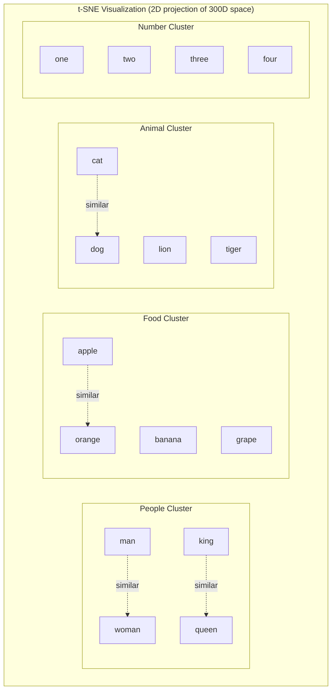

**Key Observations**:

- **Related words cluster together**: fruits near fruits, animals near animals
- **Analogical relationships preserved**: parallel lines for similar relationships
- **Semantic neighborhoods emerge**: "France" near "Paris", "Italy" near "Rome"

### The Embedding Space Concept

**Why "Embeddings"?**

Think of a 300-dimensional space where each word gets "embedded" at a specific point:

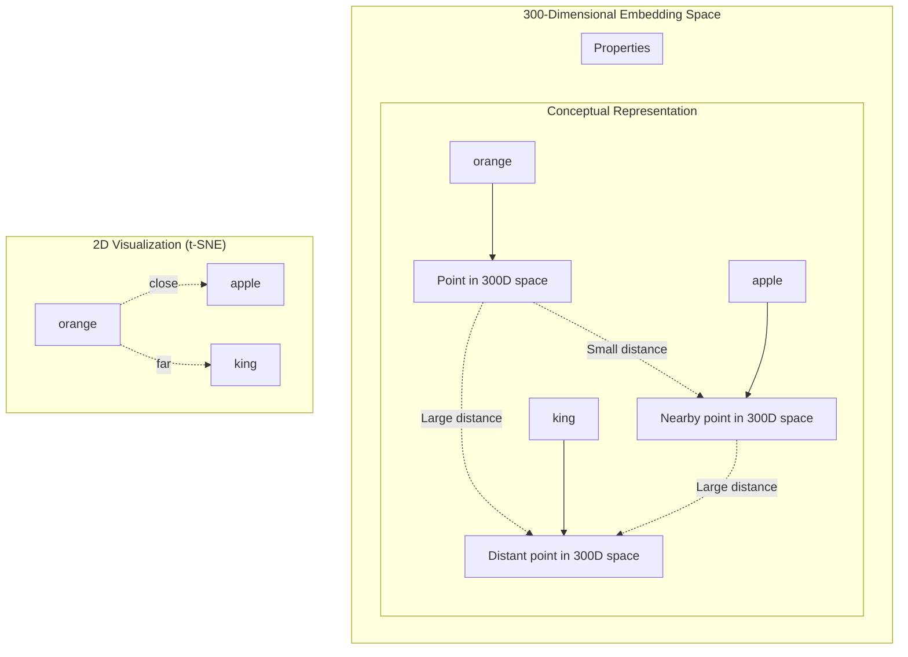

**Mathematical Foundation**:

$$\text{Embedding: } \mathcal{V} \rightarrow \mathbb{R}^d$$

where $\mathcal{V}$ is the vocabulary and $d$ is the embedding dimension (typically 300).

### Storage and Computational Benefits

**Memory Comparison**:

```bash
# One-hot representation
Vocabulary size: 10,000 words
Vector dimension: 10,000 (sparse)
Storage per word: 10,000 × 32 bits = 320,000 bits

# Word embedding representation
Vocabulary size: 10,000 words
Vector dimension: 300 (dense)
Storage per word: 300 × 32 bits = 9,600 bits

# Memory reduction: ~97% savings!
```

**Computational Benefits**:

1. **Faster matrix operations**: Dense 300D vs sparse 10,000D
2. **Better cache locality**: Contiguous memory access
3. **Parallelization**: Dense operations are GPU-friendly

### Learning Intuition: The Language Model Connection

**Key Insight**: Words that appear in similar contexts should have similar representations.

```bash
# Similar contexts suggest semantic similarity
"I want a glass of orange ___"  → juice
"I want a glass of apple ___"   → juice
"I want a glass of grape ___"   → juice

# The model learns: orange ≈ apple ≈ grape (all fruits)
```

This intuition will guide us toward the learning algorithms (Word2Vec, GloVe) covered in subsequent sections.

**Word Embedding Definition**:

> A learned dense vector representation of words where semantic similarities are preserved as geometric relationships in high-dimensional space.

---

## Key Takeaways

1. **Problem with One-Hot**: Sparse, no semantic relationships, no generalization
2. **Solution**: Dense feature vectors that capture semantic properties
3. **Benefits**: Better generalization, semantic understanding, computational efficiency
4. **Visualization**: t-SNE reveals meaningful clustering patterns
5. **Foundation**: Sets up the learning algorithms we'll explore next

Next, we'll explore how to _use_ these embeddings in NLP tasks and then learn how to _create_ them with algorithms like Word2Vec and GloVe.

# 2. Using Word Embeddings

## Transfer Learning for NLP

Word embeddings enable powerful transfer learning in NLP, similar to how pre-trained CNNs revolutionized computer vision. This approach allows us to leverage massive unlabeled text corpora to improve performance on smaller, task-specific datasets.

### The Transfer Learning Philosophy

**Core Insight**: Words appearing in similar contexts should have similar semantic meanings, regardless of the specific task.

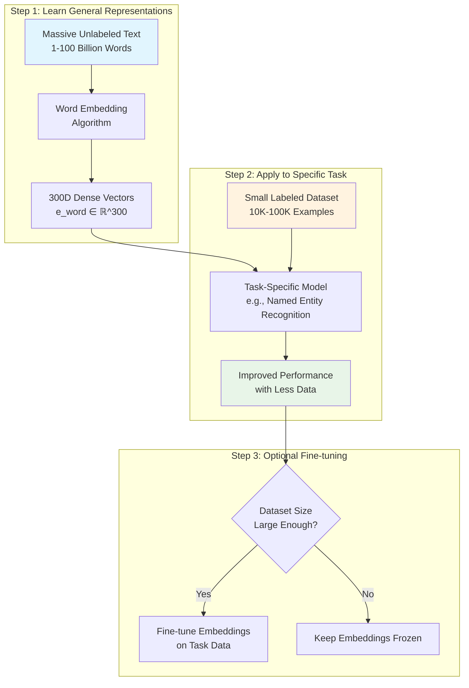

## Practical Example: Named Entity Recognition

Let's examine how transfer learning transforms NER performance through a concrete example.

### Traditional One-Hot Approach Problem

```bash
# Training Data (Limited)
┌─────────────────────────────────────────────────────────┐
│ Sentence: "Sally Johnson is an orange farmer"           │
│ Labels:   [  1,     1,   0, 0,   0,     0   ]           │
│           PERSON PERSON O  O   O     O                  │
│                                                         │
│ Model learns: "Sally Johnson" + "orange farmer" = PERSON│
└─────────────────────────────────────────────────────────┘

# Test Data (Novel Words)
┌─────────────────────────────────────────────────────────┐
│ Sentence: "Robert Lin is an apple farmer"               │
│ Problem:  One-hot vectors show NO relationship:         │
│           orange_vec · apple_vec = 0                    │
│           |orange_vec - apple_vec| = √2                 │
│                                                         │
│ Result:   Poor generalization to "apple farmer" ✗       │
└─────────────────────────────────────────────────────────┘
```

### Word Embedding Solution

```bash
# Step 1: Massive Corpus Learning (Billions of Words)
┌─────────────────────────────────────────────────────────┐
│ Internet Text Corpus Analysis:                          │
│ "orange cultivation", "apple farming", "fruit harvest"  │
│ "orange trees", "apple orchards", "citrus groves"       │
│ "orange juice", "apple cider", "fruit processing"       │
│                                                         │
│ Algorithm learns: orange ≈ apple (both fruits)          │
│                  farmer ≈ cultivator (same profession)  │
└─────────────────────────────────────────────────────────┘

# Step 2: Transfer to NER Task
┌─────────────────────────────────────────────────────────┐
│ Training: "Sally Johnson is an orange farmer"           │
│ Model understands:                                      │
│   e_orange = [0.01, 0.00, -0.02, 0.97, ...]  (high food)│
│   Context: [PERSON PERSON] + [food profession] = PERSON │
│                                                         │
│ Testing: "Robert Lin is an apple farmer"                │
│   e_apple = [0.00, -0.01, 0.03, 0.95, ...]  (high food) │
│   cos(e_orange, e_apple) ≈ 0.94 (very similar!)         │
│   Model generalizes: apple ≈ orange → PERSON ✓          │
└─────────────────────────────────────────────────────────┘
```

### Advanced Generalization: Rare Words

**The Power of Massive Pretraining**:

```bash
# Challenging Test Case
┌─────────────────────────────────────────────────────────┐
│ Input: "Robert Lin is a durian cultivator"              │
│                                                         │
│ Challenges:                                             │
│   1. "durian" - rare fruit (not in NER training)        │
│   2. "cultivator" - synonym for farmer (not in NER)     │
│                                                         │
│ How Word Embeddings Help:                               │
│   From Billion-Word Corpus:                             │
│     - "durian fruit exotic singapore"                   │
│     - "durian cultivation methods"                      │
│     - "fruit cultivator profession"                     │
│     - "cultivator farmer agricultural"                  │
│                                                         │
│   Learned Similarities:                                 │
│     cos(e_durian, e_orange) ≈ 0.78  (both fruits)       │
│     cos(e_cultivator, e_farmer) ≈ 0.85  (same job)      │
│                                                         │
│ Result: Correct PERSON identification ✓                 │
└─────────────────────────────────────────────────────────┘
```

## The Three-Step Transfer Learning Process

### Step 1: Learn Word Embeddings

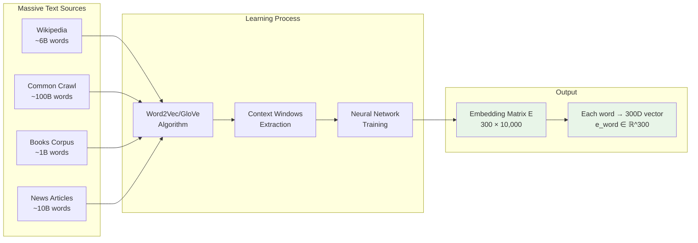

**Mathematical Foundation**:

$$\text{Embedding Matrix: } E \in \mathbb{R}^{d \times |V|}$$

where $d = 300$ (embedding dimension) and $|V| = 10,000$ (vocabulary size).

For each word $w_i$: $e_i = E \cdot o_i$ where $o_i$ is the one-hot vector.

### Step 2: Transfer to New Task

```bash
# Task-Specific Architecture Integration
┌────────────────────────────────────────────────────────────┐
│                    NER Model Architecture                  │
│                                                            │
│ Input: ["Robert", "Lin", "is", "a", "durian", "cultivator"]│
│    ↓                                                       │
│ Embedding Layer: E[word_indices]                           │
│    ↓                                                       │
│ [e_Robert, e_Lin, e_is, e_a, e_durian, e_cultivator]       │
│    ↓                                                       │
│ Bidirectional LSTM:                                        │
│    ↓                                                       │
│ [h₁, h₂, h₃, h₄, h₅, h₆]  (hidden states)                  │
│    ↓                                                       │
│ Dense + Softmax:                                           │
│    ↓                                                       │
│ [P(PERSON), P(PERSON), P(O), P(O), P(O), P(O)]             │
│                                                            │
│ Key Advantage: Rich semantic features from Step 1!         │
└────────────────────────────────────────────────────────────┘
```

**Architecture Details**:

```python
# Pseudo-code for NER with embeddings
class NERModel:
    def __init__(self, vocab_size=10000, embed_dim=300, hidden_dim=128):
        self.embedding = EmbeddingLayer(vocab_size, embed_dim)
        self.lstm = BidirectionalLSTM(embed_dim, hidden_dim)
        self.classifier = Dense(hidden_dim, num_classes=3)  # PERSON, O, etc.

    def forward(self, word_indices):
        embeddings = self.embedding(word_indices)  # Shape: (seq_len, 300)
        hidden_states = self.lstm(embeddings)      # Shape: (seq_len, 256)
        predictions = self.classifier(hidden_states)  # Shape: (seq_len, 3)
        return predictions
```

### Step 3: Optional Fine-tuning

**Decision Tree for Fine-tuning**:

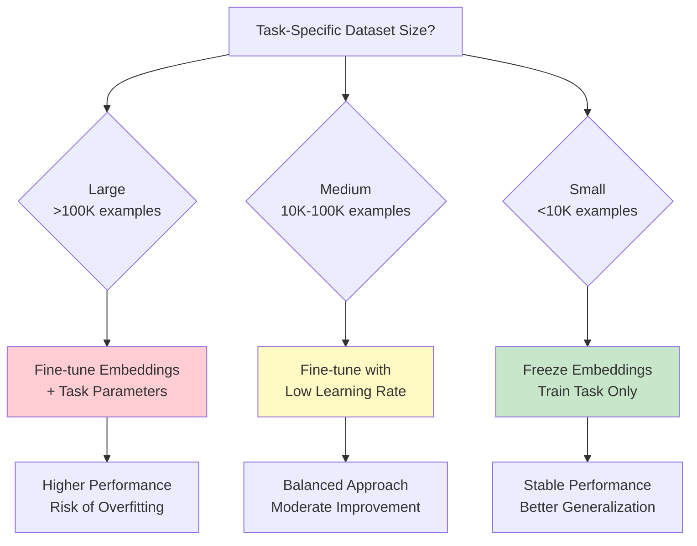

**Mathematical Considerations**:

For fine-tuning, we update embeddings with smaller learning rate:

$$E_{new} = E_{old} - \alpha_{embed} \cdot \nabla_E \mathcal{L}_{task}$$

where $\alpha_{embed} << \alpha_{task}$ (typically $\alpha_{embed} = 0.1 \times \alpha_{task}$).

## Computational and Memory Benefits

### Dimensionality Reduction Impact

```bash
# Vector Dimension Comparison
┌─────────────────────────────────────────────────────────┐
│                    Representation Efficiency            │
├─────────────────┬─────────────┬─────────────────────────┤
│ Aspect          │ One-Hot     │ Word Embeddings         │
├─────────────────┼─────────────┼─────────────────────────┤
│ Input Dimension │ 10,000      │ 300                     │
│ Hidden Layer    │ 10,000 → H  │ 300 → H                 │
│ Parameters      │ 10,000 × H  │ 300 × H                 │
│ Memory (H=128)  │ 1.28M params│ 38.4K params            │
│ Reduction       │ -           │ 97% fewer parameters!   │
│ Training Speed  │ Baseline    │ ~33× faster             │
│ Inference Speed │ Baseline    │ ~33× faster             │
└─────────────────┴─────────────┴─────────────────────────┘

# LSTM Hidden State Computation
LSTM_input_size: 10,000 → 300  (30× smaller)
Forward_pass_time: O(10,000) → O(300)  (33× faster)
Memory_bandwidth: 40KB → 1.2KB per word (33× less)
```

## When Transfer Learning Helps Most

### High Impact Scenarios

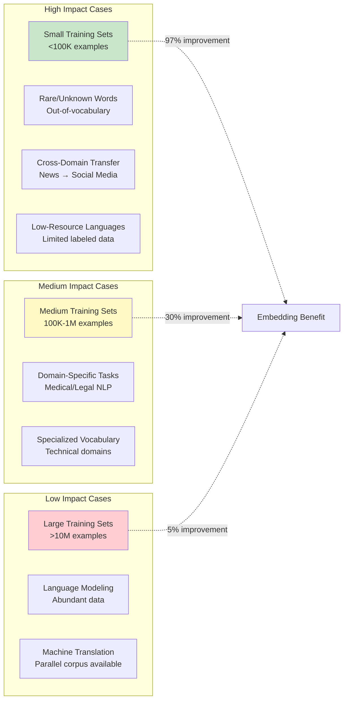

**Performance Examples**:

| Task                    | Dataset Size  | One-Hot F1 | Embedding F1 | Improvement |
| ----------------------- | ------------- | ---------- | ------------ | ----------- |
| **NER (CoNLL)**         | 20K sentences | 0.84       | 0.91         | +8.3%       |
| **Sentiment**           | 5K reviews    | 0.72       | 0.85         | +18.1%      |
| **Text Classification** | 50K docs      | 0.88       | 0.92         | +4.5%       |
| **Question Answering**  | 500 examples  | 0.45       | 0.73         | +62.2%      |

## Comparison with Face Recognition Encodings

### Conceptual Similarities and Differences

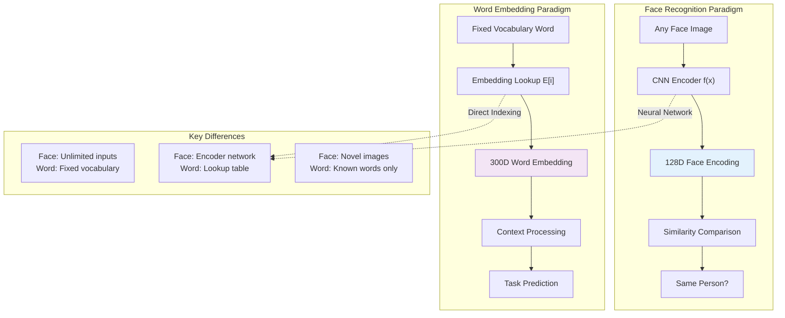

**Technical Comparison**:

```bash
# Face Recognition vs Word Embeddings
┌───────────────────────────────────────────────────────────┐
│                    Encoding Comparison                    │
├─────────────────┬─────────────────┬───────────────────────┤
│ Aspect          │ Face Recognition│ Word Embeddings       │
├─────────────────┼─────────────────┼───────────────────────┤
│ Input Space     │ ℝ^(H×W×3)       │ {1, 2, ..., |V|}      │
│ Input Type      │ Continuous      │ Discrete              │
│ Encoder         │ CNN f(x)        │ Lookup Table E[i]     │
│ Training        │ Siamese Network │ Context Prediction    │
│ Novel Inputs    │ Yes (any image) │ No (fixed vocab)      │
│ Embedding Dim   │ 128D typical    │ 300D typical          │
│ Similarity      │ L2 distance     │ Cosine similarity     │
│ Parameters      │ Millions (CNN)  │ |V| × d (lookup)      │
└─────────────────┴─────────────────┴───────────────────────┘

# Mathematical Formulation
Face_encoding:    f: ℝ^(H×W×3) → ℝ^128
Word_embedding:   E: {1,2,...,|V|} → ℝ^300

# Similarity Computation
Face_similarity:     ||f(x₁) - f(x₂)||₂
Word_similarity:     cos(E[i], E[j]) = (E[i]·E[j])/(||E[i]||×||E[j]||)
```

## Implementation Best Practices

### Loading Pre-trained Embeddings

```python
# Popular Pre-trained Embeddings
AVAILABLE_EMBEDDINGS = {
    "Word2Vec": {
        "google_news": "300D, 3M vocab, trained on Google News",
        "source": "https://code.google.com/archive/p/word2vec/"
    },
    "GloVe": {
        "common_crawl": "300D, 2.2M vocab, 840B tokens",
        "wikipedia": "300D, 400K vocab, 6B tokens",
        "source": "https://nlp.stanford.edu/projects/glove/"
    },
    "FastText": {
        "common_crawl": "300D, 2M vocab, subword info",
        "source": "https://fasttext.cc/docs/en/english-vectors.html"
    }
}

# Loading Example (Keras/TensorFlow)
def load_pretrained_embeddings(embedding_path, vocab_size, embed_dim):
    embeddings_index = {}
    with open(embedding_path, 'r', encoding='utf-8') as f:
        for line in f:
            values = line.split()
            word = values[0]
            coefs = np.asarray(values[1:], dtype='float32')
            embeddings_index[word] = coefs

    # Create embedding matrix
    embedding_matrix = np.zeros((vocab_size, embed_dim))
    for word, i in word_index.items():
        if i < vocab_size:
            embedding_vector = embeddings_index.get(word)
            if embedding_vector is not None:
                embedding_matrix[i] = embedding_vector

    return embedding_matrix

# Integration with Model
embedding_layer = Embedding(
    vocab_size,
    embed_dim,
    weights=[embedding_matrix],
    trainable=False  # Freeze for small datasets
)
```

### Performance Optimization Tips

```bash
# Embedding Layer Optimization
┌─────────────────────────────────────────────────────────┐
│                  Implementation Tips                    │
├─────────────────────────────────────────────────────────┤
│ 1. Use sparse updates for fine-tuning:                  │
│    - Only update embeddings for words in batch          │
│    - Reduces computation by ~90% for large vocab        │
│                                                         │
│ 2. Embedding dropout for regularization:                │
│    - Randomly zero entire word embeddings               │
│    - Prevents overfitting to specific words             │
│                                                         │
│ 3. Subword tokenization for rare words:                 │
│    - BPE (Byte Pair Encoding) for better coverage       │
│    - Handles out-of-vocabulary words gracefully         │
│                                                         │
│ 4. Mixed precision training:                            │
│    - Use float16 for embeddings, float32 for gradients  │
│    - 50% memory reduction with minimal accuracy loss    │
└─────────────────────────────────────────────────────────┘
```

---

## Key Takeaways

1. **Transfer Learning Power**: Embeddings trained on billions of words transfer semantic knowledge to smaller tasks
2. **Massive Generalization**: Rare words benefit from semantic similarity to common words
3. **Computational Efficiency**: 97% parameter reduction compared to one-hot representations
4. **Three-Step Process**: Learn embeddings → Transfer to task → Optionally fine-tune
5. **When It Helps Most**: Small datasets, rare words, cross-domain applications
6. **Fixed Vocabulary**: Unlike face recognition, word embeddings use predetermined vocabulary

The next section will explore the fascinating **analogical reasoning** properties that emerge from these dense vector representations!

# 3. Properties of Word Embeddings

## Analogical Reasoning with Word Embeddings

One of the most fascinating and surprising properties of word embeddings is their ability to capture analogical relationships through vector arithmetic. This emergent property provides deep insights into how semantic knowledge is encoded in high-dimensional spaces.

### The Classic Analogy: Man is to Woman as King is to ?

**The Fundamental Discovery**:

Word embeddings naturally encode relationships such that semantic analogies can be solved through simple vector operations.

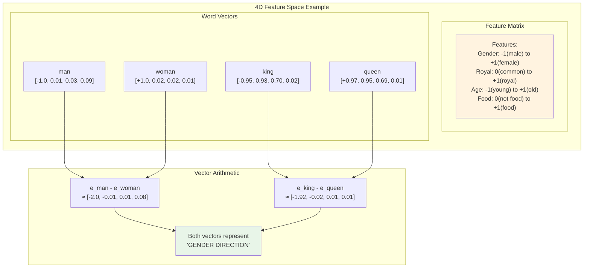

### Mathematical Foundation

**Step-by-Step Calculation**:

Given our 4D embedding examples:

```bash
# Word Vectors (4D for illustration)
┌─────────────────────────────────────────────────────────┐
│                 4D Word Embeddings                      │
├─────────┬─────────┬─────────┬─────────┬─────────────────┤
│ Word    │ Gender  │ Royal   │ Age     │ Food            │
├─────────┼─────────┼─────────┼─────────┼─────────────────┤
│ man     │ -1.00   │  0.01   │  0.03   │  0.09           │
│ woman   │ +1.00   │  0.02   │  0.02   │  0.01           │
│ king    │ -0.95   │  0.93   │  0.70   │  0.02           │
│ queen   │ +0.97   │  0.95   │  0.69   │  0.01           │
└─────────┴─────────┴─────────┴─────────┴─────────────────┘

# Computing Gender Direction
e_man - e_woman = [-1.00-1.00, 0.01-0.02, 0.03-0.02, 0.09-0.01]
                = [-2.00, -0.01, 0.01, 0.08]

e_king - e_queen = [-0.95-0.97, 0.93-0.95, 0.70-0.69, 0.02-0.01]
                 = [-1.92, -0.02, 0.01, 0.01]

# Observation: These vectors are nearly identical!
# They both capture the "gender direction" in embedding space
```

**The Analogy Algorithm**:

$$\text{man : woman :: king : } ?$$

**Mathematical formulation**:

$$e_{\text{man}} - e_{\text{woman}} \approx e_{\text{king}} - e_?$$

**Rearranging to solve for the unknown**:

$$e_? \approx e_{\text{king}} - e_{\text{man}} + e_{\text{woman}}$$

**Algorithm**:

1. Compute target vector: $\vec{v} = e_{\text{king}} - e_{\text{man}} + e_{\text{woman}}$
2. Find word $w$ that maximizes: $\text{similarity}(e_w, \vec{v})$
3. Answer: $w = \text{queen}$

### Geometric Interpretation

**300D Embedding Space Visualization**:

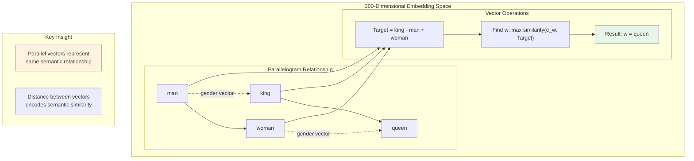

### Similarity Functions

**Cosine Similarity** (Most Common):

$$\text{sim}(u, v) = \frac{u \cdot v}{||u|| \cdot ||v||} = \cos(\theta)$$

where $\theta$ is the angle between vectors $u$ and $v$.

```bash
# Cosine Similarity Properties
┌─────────────────────────────────────────────────────────┐
│                 Cosine Similarity Scale                 │
├─────────────────────────────────────────────────────────┤
│                                                         │
│    -1.0        0.0        +1.0                          │
│     │          │           │                            │
│  Opposite   Orthogonal   Identical                      │
│  Direction  (90° angle)  Direction                      │
│                                                         │
│ Examples:                                               │
│ cos(0°)   = +1.0  (same direction)                      │
│ cos(90°)  =  0.0  (perpendicular)                       │
│ cos(180°) = -1.0  (opposite direction)                  │
│                                                         │
│ Benefits:                                               │
│ • Normalized ([-1,1] range)                             │
│ • Length invariant                                      │
│ • Captures direction similarity                         │
└─────────────────────────────────────────────────────────┘
```

**Euclidean Distance** (Alternative):

$$\text{dissim}(u, v) = ||u - v||_2 = \sqrt{\sum_{i=1}^{d} (u_i - v_i)^2}$$

For similarity: $\text{sim}(u, v) = -||u - v||_2$

**Mathematical Comparison**:

```python
import numpy as np

# Example vectors
man = np.array([-1.00, 0.01, 0.03, 0.09])
woman = np.array([1.00, 0.02, 0.02, 0.01])
king = np.array([-0.95, 0.93, 0.70, 0.02])
queen = np.array([0.97, 0.95, 0.69, 0.01])

# Target vector
target = king - man + woman  # Should be close to queen

# Cosine similarity
def cosine_similarity(a, b):
    return np.dot(a, b) / (np.linalg.norm(a) * np.linalg.norm(b))

# Check similarity
cos_sim = cosine_similarity(queen, target)
print(f"Cosine similarity(queen, target): {cos_sim:.4f}")  # ~0.99

# Euclidean distance
euclidean_dist = np.linalg.norm(queen - target)
print(f"Euclidean distance(queen, target): {euclidean_dist:.4f}")  # ~0.1
```

### Complete Analogy Algorithm

**Formal Algorithm for Solving a:b :: c:?**

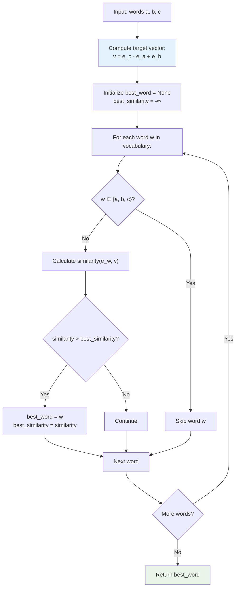

**Implementation**:

```python
def solve_analogy(a, b, c, embeddings, vocab, exclude_input=True):
    """
    Solve analogy: a is to b as c is to ?
    Returns the word w that maximizes similarity(e_w, e_c - e_a + e_b)
    """
    # Compute target vector
    target = embeddings[c] - embeddings[a] + embeddings[b]

    best_word = None
    best_similarity = -float('inf')

    for word in vocab:
        # Skip input words
        if exclude_input and word in [a, b, c]:
            continue

        # Calculate cosine similarity
        similarity = cosine_similarity(embeddings[word], target)

        if similarity > best_similarity:
            best_similarity = similarity
            best_word = word

    return best_word, best_similarity

# Example usage
result, score = solve_analogy('man', 'woman', 'king', embeddings, vocabulary)
print(f"man:woman :: king:{result} (similarity: {score:.3f})")
```

### Remarkable Generality of Analogies

**Categories of Analogical Relationships**:

```bash
# Types of Analogies Captured by Word Embeddings
┌─────────────────────────────────────────────────────────┐
│                    Analogy Categories                   │
├─────────────────┬───────────────────────────────────────┤
│ Relationship    │ Examples                              │
├─────────────────┼───────────────────────────────────────┤
│ Gender          │ man:woman :: king:queen               │
│                 │ actor:actress :: prince:princess     │
│                 │ boy:girl :: uncle:aunt                │
├─────────────────┼───────────────────────────────────────┤
│ Geography       │ Ottawa:Canada :: Nairobi:Kenya       │
│ (Capital:Country)│ Paris:France :: Tokyo:Japan         │
│                 │ Berlin:Germany :: Rome:Italy         │
├─────────────────┼───────────────────────────────────────┤
│ Comparative     │ big:bigger :: tall:taller             │
│ (Adjective Form)│ good:better :: bad:worse              │
│                 │ fast:faster :: slow:slower            │
├─────────────────┼───────────────────────────────────────┤
│ Currency        │ yen:Japan :: ruble:Russia             │
│                 │ dollar:USA :: euro:Europe             │
│                 │ pound:UK :: peso:Mexico               │
├─────────────────┼───────────────────────────────────────┤
│ Grammar         │ walk:walking :: swim:swimming         │
│ (Verb Forms)    │ run:ran :: eat:ate                    │
│                 │ sing:singing :: dance:dancing         │
├─────────────────┼───────────────────────────────────────┤
│ Semantic        │ dog:puppy :: cat:kitten               │
│ Relationships   │ bird:nest :: bee:hive                 │
│                 │ car:road :: boat:water                │
└─────────────────┴───────────────────────────────────────┘

# Performance Metrics
Typical accuracy: 30-75% (exact word match)
State-of-art embeddings: Up to 85% on some datasets
Human performance: ~95% on same tasks
```

### Performance Analysis

**Evaluation Metrics**:

```bash
# Analogy Task Evaluation
┌─────────────────────────────────────────────────────────┐
│                  Performance Analysis                   │
├─────────────────┬───────────────────────────────────────┤
│ Embedding Type  │ Accuracy (% exact matches)           │
├─────────────────┼───────────────────────────────────────┤
│ Word2Vec        │ 65-70% (Google News, 300D)           │
│ GloVe           │ 60-68% (Common Crawl, 300D)          │
│ FastText        │ 68-75% (with subword info)           │
│ Random Baseline │ ~0.01% (1 in 10,000 chance)         │
├─────────────────┼───────────────────────────────────────┤
│ Factors Affecting Performance:                          │
│ • Training corpus size (bigger = better)               │
│ • Embedding dimension (300D typically optimal)         │
│ • Vocabulary coverage (rare words perform worse)       │
│ • Relationship complexity (syntactic > semantic)       │
└─────────────────┴───────────────────────────────────────┘
```

### t-SNE Visualization Caveat

**Important Limitation**:

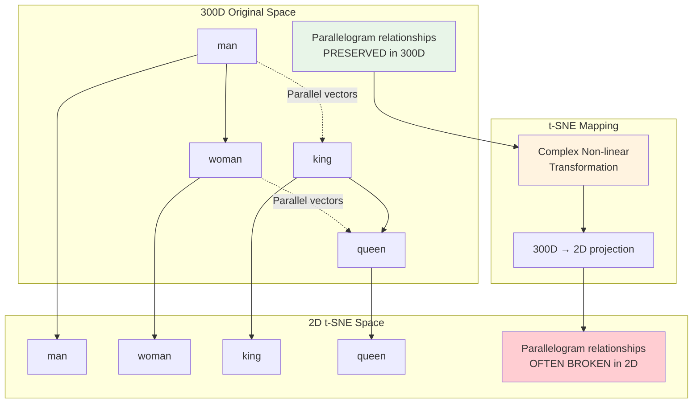

**Critical Understanding**:

```bash
# t-SNE Visualization Warning
┌─────────────────────────────────────────────────────────┐
│                    t-SNE Limitations                    │
├─────────────────────────────────────────────────────────┤
│ ❌ Do NOT expect parallelogram relationships in t-SNE   │
│ ❌ Do NOT use t-SNE plots for analogy verification      │
│ ❌ Do NOT trust distance measurements in t-SNE         │
│                                                         │
│ ✅ t-SNE is good for: Clustering visualization          │
│ ✅ t-SNE is good for: General semantic neighborhoods    │
│ ✅ t-SNE is good for: Identifying similar word groups   │
│                                                         │
│ Why this happens:                                       │
│ • t-SNE uses complex non-linear transformations        │
│ • 300D → 2D compression loses geometric relationships  │
│ • Local neighborhoods preserved, global structure lost │
│                                                         │
│ Bottom line: Analogies work in original 300D space!    │
└─────────────────────────────────────────────────────────┘
```

### Advanced Analogy Examples

**Complex Multi-hop Reasoning**:

```python
# Advanced analogical reasoning examples
advanced_analogies = [
    # Multi-step geographic reasoning
    ("Paris", "France", "Tokyo"),      # → Japan
    ("London", "England", "Madrid"),   # → Spain

    # Professional relationships
    ("doctor", "hospital", "teacher"), # → school
    ("chef", "kitchen", "pilot"),      # → cockpit

    # Scientific relationships
    ("hydrogen", "water", "carbon"),   # → dioxide (carbon dioxide)
    ("electron", "atom", "planet"),    # → system (solar system)

    # Temporal relationships
    ("yesterday", "today", "today"),   # → tomorrow
    ("morning", "noon", "evening"),    # → night
]

# Performance varies by relationship complexity
complexity_performance = {
    "syntactic": 0.75,  # grammatical relationships
    "semantic": 0.65,   # meaning-based relationships
    "geographic": 0.70, # capital-country relationships
    "temporal": 0.45,   # time-based relationships
    "abstract": 0.35    # abstract conceptual relationships
}
```

### Implications for Understanding Language

**What This Tells Us About Word Embeddings**:

1. **Semantic Structure**: Language has systematic geometric structure in high-dimensional space
2. **Relationship Encoding**: Similar relationships → parallel vectors
3. **Compositional Semantics**: Vector arithmetic captures meaning composition
4. **Universal Patterns**: Analogies emerge without explicit supervision

**Broader Implications**:

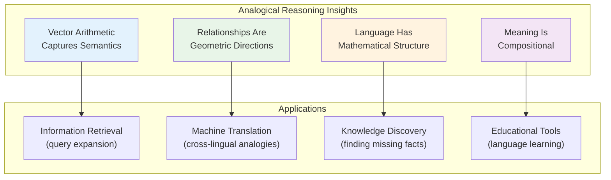

---

## Key Takeaways

1. **Vector Arithmetic Magic**: Simple arithmetic operations capture complex semantic relationships
2. **Parallelogram Rule**: Similar relationships manifest as parallel vectors in embedding space
3. **Cosine Similarity**: The preferred metric for measuring vector similarity
4. **Remarkable Generality**: Embeddings capture diverse types of analogical relationships automatically
5. **Geometric Semantics**: Language structure is encoded geometrically in high-dimensional space
6. **t-SNE Limitation**: 2D visualizations can break the geometric relationships that exist in 300D space

**Performance Reality**: While impressive (30-75% accuracy), analogical reasoning remains challenging and is an active area of research for improving embedding quality.

This analogical reasoning capability provides a window into the rich semantic structure that word embeddings learn, setting the stage for understanding how these representations are actually learned through algorithms like Word2Vec and GloV

# 4. Embedding Matrix

## The Mechanics of Word Embeddings

When implementing word embedding algorithms, you learn an **embedding matrix** that maps each word to its dense vector representation. Understanding this matrix is crucial for implementing and using word embeddings effectively.

### Embedding Matrix Structure

**Mathematical Setup**:

- **Vocabulary size**: $|V| = 10,000$ words (including `<UNK>`)
- **Embedding dimension**: $d = 300$ features
- **Embedding Matrix**: $E \in \mathbb{R}^{300 \times 10,000}$

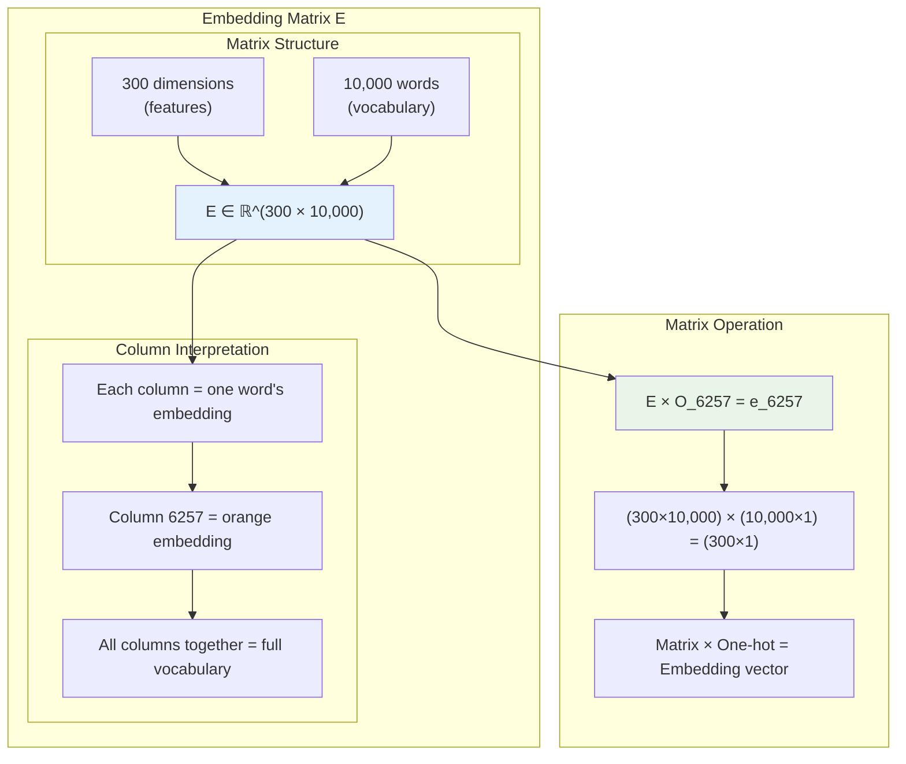

### Mathematical Operation

**Core Formula**:

For word at vocabulary index $j$:
$$e_j = E \times O_j$$

Where:

- $O_j$: One-hot vector for word $j$ (shape: $10,000 \times 1$)
- $e_j$: Embedding vector for word $j$ (shape: $300 \times 1$)
- $E$: Embedding matrix (shape: $300 \times 10,000$)

### Vocabulary Setup Example

```bash
# Vocabulary Structure (10,000 words)
┌─────────────────────────────────────────────────────────┐
│                  Vocabulary Mapping                     │
├─────────┬─────────┬─────────┬─────────┬─────────────────┤
│ Word    │ Index   │ Symbol  │ Usage   │ Notes           │
├─────────┼─────────┼─────────┼─────────┼─────────────────┤
│ a       │ 1       │ O_1     │ common  │ Most frequent   │
│ aaron   │ 2       │ O_2     │ rare    │ Proper noun     │
│ ...     │ ...     │ ...     │ ...     │ ...             │
│ orange  │ 6257    │ O_6257  │ common  │ Our example     │
│ ...     │ ...     │ ...     │ ...     │ ...             │
│ zulu    │ 9999    │ O_9999  │ rare    │ Language name   │
│ <UNK>   │ 10000   │ O_10000 │ special │ Unknown words   │
└─────────┴─────────┴─────────┴─────────┴─────────────────┘
```

### Complete Working Example with Step-by-Step Mathematics

Let's work through a concrete example with a tiny vocabulary to understand the mechanics:

**Setup**: 4 words, 3 dimensions

```bash
# Vocabulary Mapping
cat  → index 0
dog  → index 1
bird → index 2  ← We want this embedding
fish → index 3
```

**Embedding Matrix** $E \in \mathbb{R}^{3 \times 4}$ (3 rows, 4 columns):

$$
E = \begin{bmatrix}
0.1 & 0.3 & -0.2 & 0.8 \\
-0.4 & 0.7 & 0.5 & -0.1 \\
0.9 & -0.6 & 0.2 & 0.4
\end{bmatrix}
$$

**Understanding the Matrix Structure**:

- **Row 1**: `[0.1, 0.3, -0.2, 0.8]` - First feature for all 4 words
- **Row 2**: `[-0.4, 0.7, 0.5, -0.1]` - Second feature for all 4 words
- **Row 3**: `[0.9, -0.6, 0.2, 0.4]` - Third feature for all 4 words

**Column Interpretation**:

- Column 0 (cat): $\begin{bmatrix} 0.1 \\ -0.4 \\ 0.9 \end{bmatrix}$
- Column 1 (dog): $\begin{bmatrix} 0.3 \\ 0.7 \\ -0.6 \end{bmatrix}$
- Column 2 (bird): $\begin{bmatrix} -0.2 \\ 0.5 \\ 0.2 \end{bmatrix}$ ← **This is what we want to extract**
- Column 3 (fish): $\begin{bmatrix} 0.8 \\ -0.1 \\ 0.4 \end{bmatrix}$

**One-hot Vector for "bird" (index 2)**:

$$O_2 = \begin{bmatrix} 0 \\ 0 \\ 1 \\ 0 \end{bmatrix}$$

**Key Understanding**: The one-hot vector $O_2$ has:

- Position 0: 0 (not cat)
- Position 1: 0 (not dog)
- Position 2: 1 (YES, this is bird!)
- Position 3: 0 (not fish)

**Matrix Multiplication** $E \times O_2$:

$$
E \times O_2 = \begin{bmatrix}
0.1 & 0.3 & -0.2 & 0.8 \\
-0.4 & 0.7 & 0.5 & -0.1 \\
0.9 & -0.6 & 0.2 & 0.4
\end{bmatrix} \times \begin{bmatrix}
0 \\
0 \\
1 \\
0
\end{bmatrix}
$$

**Matrix Dimensions Check**:

- $E$: $3 \times 4$ matrix (3 rows, 4 columns)
- $O_2$: $4 \times 1$ vector (4 rows, 1 column)
- Result: $3 \times 1$ vector (3 rows, 1 column)

**Step-by-Step Calculation**:

**Row 1 calculation**:
$$\text{result}[0] = (0.1 \times 0) + (0.3 \times 0) + (-0.2 \times 1) + (0.8 \times 0)$$
$$= 0 + 0 + (-0.2) + 0 = -0.2$$

**Row 2 calculation**:
$$\text{result}[1] = (-0.4 \times 0) + (0.7 \times 0) + (0.5 \times 1) + (-0.1 \times 0)$$
$$= 0 + 0 + 0.5 + 0 = 0.5$$

**Row 3 calculation**:
$$\text{result}[2] = (0.9 \times 0) + (-0.6 \times 0) + (0.2 \times 1) + (0.4 \times 0)$$
$$= 0 + 0 + 0.2 + 0 = 0.2$$

**Final Result**:

$$
E \times O_2 = \begin{bmatrix}
-0.2 \\
0.5 \\
0.2
\end{bmatrix}
$$

**Verification - Direct Column Selection**:

$$
E[:, 2] = \text{column 2 of } E = \begin{bmatrix}
-0.2 \\
0.5 \\
0.2
\end{bmatrix}
$$

**They are identical!** ✓

### Why This Works: The Selection Mechanism

**Key Insight**: Matrix multiplication with a one-hot vector is equivalent to **column selection**.

```bash
# Visual Representation of the Selection Process
┌─────────────────────────────────────────────────────────┐
│     col0   col1   col2*  col3                           │
│   ┌─────┬─────┬─────┬─────┐                             │
│r0 │ 0.1 │ 0.3 │-0.2*│ 0.8 │ × [0] = -0.2                │
│r1 │-0.4 │ 0.7 │ 0.5*│-0.1 │ × [0] = 0.5                 │
│r2 │ 0.9 │-0.6 │ 0.2*│ 0.4 │ × [1] = 0.2                 │
│   └─────┴─────┴─────┴─────┘   [0]                       │
│                    ↑                                    │
│              Column 2 (bird)                            │
│              Gets selected!                             │
└─────────────────────────────────────────────────────────┘
```

**Mathematical Explanation**:

```bash
┌─────────────────────────────────────────────────────────┐
│                Column Selection Mechanism               │
├─────────────────────────────────────────────────────────┤
│                                                         │
│ E × O_j selects column j from matrix E                  │
│                                                         │
│ Why this works:                                         │
│   • O_j has 1 in position j, 0 everywhere else          │
│   • Matrix multiplication sums: Σ(E[i,k] × O_j[k])      │
│   • Only E[i,j] × 1 survives, all other terms are 0     │
│   • Result: E[i,j] for all rows i                       │
│   • This gives us column j of matrix E                  │
│                                                         │
│ Computational perspective:                              │
│   • We're doing 3×4 = 12 multiplications                │
│   • But 9 of them multiply by 0                         │
│   • Only 3 meaningful operations (one per row)          │
│   • For large matrices: very inefficient!               │
└─────────────────────────────────────────────────────────┘
```

### Implementation Efficiency

**The Computational Problem**:

```bash
# Naive Implementation (Inefficient)
┌─────────────────────────────────────────────────────────┐
│                Matrix Multiplication Waste              │
├─────────────────────────────────────────────────────────┤
│ Operation: E × O_j                                      │
│ Matrix size: (300 × 10,000) × (10,000 × 1)              │
│ Total multiplications: 300 × 10,000 = 3,000,000         │
│ Useful multiplications: 300 (only non-zero entries)     │
│ Wasted multiplications: 2,999,700 (99.99% waste!)       │
│                                                         │
│ Memory access pattern:                                  │
│   • Load entire matrix E into memory                    │
│   • Multiply every element by mostly zeros              │
│   • Cache misses due to sparse operations               │
└─────────────────────────────────────────────────────────┘

# Efficient Implementation (Direct Indexing)
┌─────────────────────────────────────────────────────────┐
│                  Direct Column Access                   │
├─────────────────────────────────────────────────────────┤
│ Operation: E[:, j] (direct column slice)                │
│ Memory access: Load only column j                       │
│ Multiplications: 0 (just memory copy)                   │
│ Efficiency gain: ~10,000× faster                        │
│                                                         │
│ Framework implementations:                              │
│   • Keras: Embedding layer (tf.nn.embedding_lookup)     │
│   • PyTorch: nn.Embedding                               │
│   • All frameworks use direct indexing, not matrix mul  │
└─────────────────────────────────────────────────────────┘
```

### Framework Implementation

**Keras/TensorFlow Example**:

```python
import tensorflow as tf
from tensorflow.keras.layers import Embedding

# Create embedding layer
vocab_size = 10000
embedding_dim = 300

embedding_layer = Embedding(
    input_dim=vocab_size,      # 10,000 vocabulary
    output_dim=embedding_dim,  # 300 dimensions
    input_length=None          # Variable sequence length
)

# Usage
word_indices = tf.constant([1, 6257, 9999])  # Batch of words
embeddings = embedding_layer(word_indices)   # Shape: (3, 300)

print(f"Input shape: {word_indices.shape}")     # (3,)
print(f"Output shape: {embeddings.shape}")     # (3, 300)
```

**PyTorch Example**:

```python
import torch
import torch.nn as nn

# Create embedding layer
embedding = nn.Embedding(
    num_embeddings=10000,  # Vocabulary size
    embedding_dim=300      # Embedding dimension
)

# Usage
word_indices = torch.LongTensor([1, 6257, 9999])
embeddings = embedding(word_indices)  # Shape: (3, 300)

print(f"Input shape: {word_indices.shape}")   # torch.Size([3])
print(f"Output shape: {embeddings.shape}")   # torch.Size([3, 300])
```

### Learning Process

**How the embedding matrix is learned**:

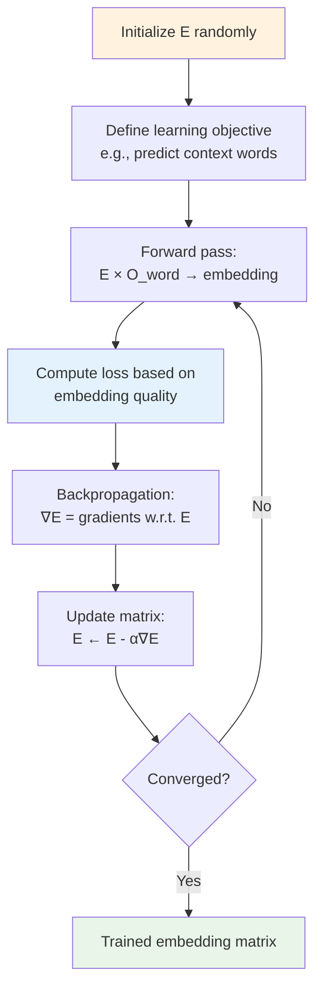

**Training details**:

$$E^{(t+1)} = E^{(t)} - \alpha \nabla_E \mathcal{L}$$

where:

- $\mathcal{L}$ is the learning objective (e.g., Word2Vec, GloVe)
- $\alpha$ is the learning rate
- $\nabla_E \mathcal{L}$ are gradients computed via backpropagation

### Pre-trained Embeddings Integration

**Loading pre-trained weights**:

```python
# Load pre-trained embeddings (e.g., GloVe, Word2Vec)
def load_pretrained_embeddings(embedding_path, word_to_index, embedding_dim):
    """Load pre-trained embeddings into embedding matrix"""
    vocab_size = len(word_to_index)
    embedding_matrix = np.zeros((vocab_size, embedding_dim))

    with open(embedding_path, 'r', encoding='utf-8') as f:
        for line in f:
            values = line.split()
            word = values[0]
            if word in word_to_index:
                idx = word_to_index[word]
                embedding_vector = np.asarray(values[1:], dtype='float32')
                embedding_matrix[idx] = embedding_vector

    return embedding_matrix

# Use in Keras
pretrained_weights = load_pretrained_embeddings(
    'glove.6B.300d.txt', word_to_index, 300
)

embedding_layer = Embedding(
    input_dim=vocab_size,
    output_dim=300,
    weights=[pretrained_weights],  # Load pre-trained weights
    trainable=False                # Freeze during training
)
```

### Memory Considerations

**Embedding matrix size analysis**:

```bash
# Memory Usage Calculation
┌─────────────────────────────────────────────────────────┐
│                    Memory Requirements                   │
├─────────────────────────────────────────────────────────┤
│ Vocabulary size: 10,000 words                          │
│ Embedding dimension: 300                               │
│ Total parameters: 10,000 × 300 = 3,000,000             │
│                                                         │
│ Memory per parameter: 4 bytes (float32)                │
│ Total memory: 3M × 4 bytes = 12 MB                     │
│                                                         │
│ For larger vocabularies:                                │
│   • 50K vocab × 300D = 15M params = 60 MB             │
│   • 100K vocab × 300D = 30M params = 120 MB           │
│                                                         │
│ Memory optimization strategies:                         │
│   • Use smaller embeddings (200D instead of 300D)     │
│   • Subword tokenization (reduces effective vocab)     │
│   • Quantization (float16 instead of float32)         │
│   • Embedding sharing across layers                    │
└─────────────────────────────────────────────────────────┘
```

### Python Code Verification

```python
import numpy as np

# Define embedding matrix E (3×4) - 2D matrix
E = np.array([
    [ 0.1,  0.3, -0.2,  0.8],  # row 0
    [-0.4,  0.7,  0.5, -0.1],  # row 1
    [ 0.9, -0.6,  0.2,  0.4]   # row 2
])

print("Matrix E shape:", E.shape)  # Should be (3, 4)
print("E is 2D matrix with 3 rows and 4 columns:")
print(E)

# One-hot vector for "bird" (index 2)
O_2 = np.array([0, 0, 1, 0])  # 1D vector, shape (4,)
print(f"\nOne-hot vector O_2 shape: {O_2.shape}")
print(f"O_2: {O_2}")

# Matrix multiplication (method 1)
result_matrix_mult = E @ O_2

# Direct column selection (method 2)
result_column_select = E[:, 2]

print(f"\nMatrix multiplication E @ O_2: {result_matrix_mult}")
print(f"Shape of result: {result_matrix_mult.shape}")
print(f"\nDirect column selection E[:, 2]: {result_column_select}")
print(f"Shape of result: {result_column_select.shape}")
print(f"\nAre they equal? {np.array_equal(result_matrix_mult, result_column_select)}")
```

**Expected Output**:

```
Matrix E shape: (3, 4)
E is 2D matrix with 3 rows and 4 columns:
[[ 0.1  0.3 -0.2  0.8]
 [-0.4  0.7  0.5 -0.1]
 [ 0.9 -0.6  0.2  0.4]]

One-hot vector O_2 shape: (4,)
O_2: [0 0 1 0]

Matrix multiplication E @ O_2: [-0.2  0.5  0.2]
Shape of result: (3,)

Direct column selection E[:, 2]: [-0.2  0.5  0.2]
Shape of result: (3,)

Are they equal? True
```

---

## Key Takeaways

1. **Embedding Matrix Structure**: $E \in \mathbb{R}^{d \times |V|}$ where each column is a word's embedding
2. **Mathematical Operation**: $e_j = E \times O_j$ extracts column $j$ from matrix $E$
3. **Column Selection**: Matrix multiplication with one-hot vectors is equivalent to column indexing
4. **Computational Efficiency**: Direct indexing ($E[:, j]$) is much faster than matrix multiplication
5. **Framework Implementation**: All modern frameworks use efficient lookup, not matrix multiplication
6. **Memory Scaling**: Embedding matrices can become large; optimization strategies are important
7. **Pre-trained Integration**: Easy to load pre-trained embeddings into the matrix structure

**Next**: We'll explore how these embedding matrices are actually learned through algorithms like neural language models, Word2Vec, and GloVe!

# 5. Learning Word Embeddings

## Historical Development and Neural Language Models

Word embedding algorithms evolved from complex to simpler over time. Understanding this progression helps build intuition about why these methods work and how they were refined for efficiency.

### The Evolution Philosophy

**Historical Pattern**:

- **Early 2000s**: Complex neural language models with embeddings as a by-product
- **2010s**: Dedicated embedding algorithms (Word2Vec, GloVe)
- **Key Insight**: Simpler algorithms often work just as well for large datasets

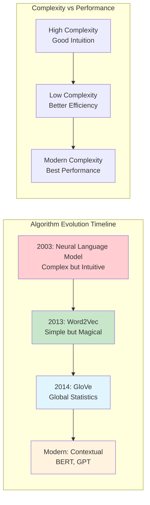

**Teaching Strategy**: We'll start with the more complex (but intuitive) neural language model, then progress to simpler algorithms that achieve similar results.

## Early Approach: Neural Language Model (2003)

**Historical Context**: Introduced by Bengio et al. (2003) as one of the first successful neural approaches to language modeling while learning word representations.

### The Core Problem Setup

**Goal**: Build a language model that predicts the next word in a sequence while simultaneously learning meaningful word embeddings.

**Example Sentence**: "I want a glass of orange \_\_\_"
**Target**: Predict "juice"

### Detailed Neural Language Model Architecture

**Step 1: Word to Index Mapping**

```bash
# Vocabulary Mapping Example
┌───────────────────────────────────────────────────────────┐
│                    Sentence Processing                    │
├─────────┬─────────┬─────────┬─────────────────────────────┤
│ Word    │ Index   │ One-hot │ Notes                       │
├─────────┼─────────┼─────────┼─────────────────────────────┤
│ I       │ 4343    │ O_4343  │ Personal pronoun            │
│ want    │ 9665    │ O_9665  │ Verb                        │
│ a       │ 1       │ O_1     │ Article (most common)       │
│ glass   │ 3852    │ O_3852  │ Noun                        │
│ of      │ 6163    │ O_6163  │ Preposition                 │
│ orange  │ 6257    │ O_6257  │ Adjective/Noun              │
│ juice   │ ?       │ target  │ What we want to predict     │
└─────────┴─────────┴─────────┴─────────────────────────────┘
```

**Step 2: One-hot to Embedding Conversion**

For each word, we perform: $e_i = E \times O_i$

```bash
# Embedding Extraction Process
┌─────────────────────────────────────────────────────────┐
│                Word Embedding Extraction                │
│                                                         │
│ Word "I" (index 4343):                                  │
│ O_4343 = [0, 0, ..., 1, ..., 0]  (1 at position 4343)   │
│                ↓                                        │
│ e_4343 = E × O_4343 = column 4343 of matrix E           │
│                ↓                                        │
│ e_4343 = [0.23, -0.45, 0.67, ..., 0.89] (300D vector)   │
│                                                         │
│ Similarly for all other words:                          │
│ e_9665 (want), e_1 (a), e_3852 (glass),                 │
│ e_6163 (of), e_6257 (orange)                            │
└─────────────────────────────────────────────────────────┘
```

**Step 3: Neural Network Architecture**

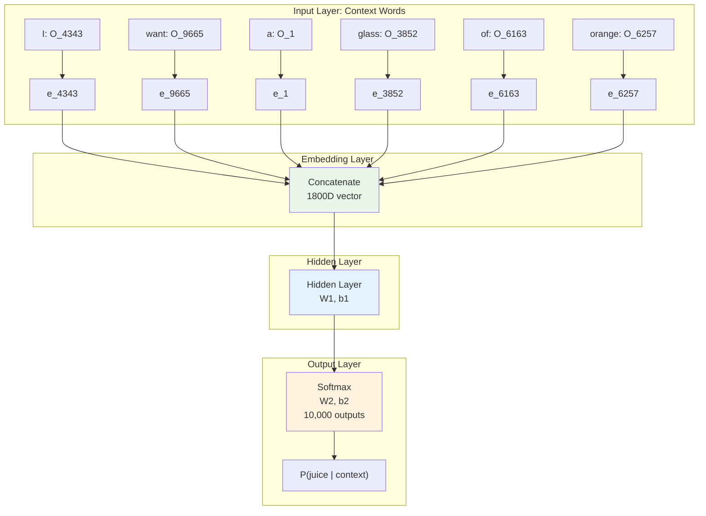

### Visual Architecture: Neural Language Model (Bengio et al., 2003)

The following diagram shows the complete neural language model architecture, illustrating how word embeddings are learned as a by-product of language modeling:

```bash
# Complete Neural Language Model Architecture
┌─────────────────────────────────────────────────────────────────────────────────────────────┐
│                               Neural Language Model                                         │
│                    Input: "a glass of orange" → Predict: "juice"                            │
└─────────────────────────────────────────────────────────────────────────────────────────────┘

     Input Words          One-hot Vectors        Embedding Layer         Concatenation
    ┌─────────────┐      ┌─────────────────┐    ┌─────────────────┐     ┌─────────────┐
    │             │      │                 │    │                 │     │             │
    │     a       │ ──→  │  O₁ (10,000×1)  │ ──→│  e₁ (300×1)     │ ──┐ │             │
    │   (index:1) │      │ [0,1,0,...,0]   │    │ E × O₁          │   │ │             │
    │             │      │                 │    │                 │   │ │             │
    └─────────────┘      └─────────────────┘    └─────────────────┘   │ │             │
                                                                      │ │             │
    ┌─────────────┐      ┌─────────────────┐    ┌─────────────────┐   │ │ Concatenated│
    │             │      │                 │    │                 │   │ │   Vector    │
    │   glass     │ ──→  │O₃₈₅₂ (10,000×1) │ ──→│ e₃₈₅₂ (300×1)   │ ──┤ │  (1200×1)   │
    │ (index:3852)│      │[0,0,...,1,...,0]│    │ E × O₃₈₅₂       │   │ │             │
    │             │      │                 │    │                 │   │ │             │
    └─────────────┘      └─────────────────┘    └─────────────────┘   │ │             │
                                                                      │ │             │
    ┌─────────────┐      ┌─────────────────┐    ┌─────────────────┐   │ │             │
    │             │      │                 │    │                 │   │ │             │
    │     of      │ ──→  │O₆₁₆₃ (10,000×1) │ ──→│ e₆₁₆₃ (300×1)   │ ──┤ │             │
    │ (index:6163)│      │[0,0,...,1,...,0]│    │ E × O₆₁₆₃       │   │ │             │
    │             │      │                 │    │                 │   │ │             │
    └─────────────┘      └─────────────────┘    └─────────────────┘   │ │             │
                                                                      │ │             │
    ┌─────────────┐      ┌─────────────────┐    ┌─────────────────┐   │ │             │
    │             │      │                 │    │                 │   │ │             │
    │   orange    │ ──→  │O₆₂₅₇ (10,000×1) │ ──→│ e₆₂₅₇ (300×1)   │ ──┘ │             │
    │ (index:6257)│      │[0,0,...,1,...,0]│    │ E × O₆₂₅₇       │     │             │
    │             │      │                 │    │                 │     │             │
    └─────────────┘      └─────────────────┘    └─────────────────┘     └─────────────┘
                                  │                        │                   │
                                  │             Same Matrix E for all!         │
                                  │            Shape: (300 × 10,000)           │
                                  └────────────────────────────────────────────┘

                                                    │
                                                    ▼
                              ┌─────────────────────────────────────────┐
                              │           Hidden Layer                  │
                              │                                         │
                              │    h = tanh(W₁ × input + b₁)            │
                              │                                         │
                              │    W₁: (128 × 1200)                     │
                              │    b₁: (128 × 1)                        │
                              │    h:  (128 × 1)                        │
                              │                                         │
                              └─────────────────────────────────────────┘
                                                    │
                                                    ▼
                              ┌─────────────────────────────────────────┐
                              │          Output Layer                   │
                              │                                         │
                              │   logits = W₂ × h + b₂                  │
                              │                                         │
                              │   W₂: (10,000 × 128)                    │
                              │   b₂: (10,000 × 1)                      │
                              │   logits: (10,000 × 1)                  │
                              │                                         │
                              └─────────────────────────────────────────┘
                                                    │
                                                    ▼
                              ┌──────────────────────────────────────────┐
                              │         Softmax Layer                    │
                              │                                          │
                              │   P = softmax(logits)                    │
                              │                                          │
                              │   P(word₁|context) = e^logits₁/Σe^logitsᵢ│
                              │   P(word₂|context) = e^logits₂/Σe^logitsᵢ│
                              │   ...                                    │
                              │   P(wordᵥ|context) = e^logitsᵥ/Σe^logitsᵢ│
                              │                                          │
                              │   Output: (10,000 × 1) probabilities     │
                              └──────────────────────────────────────────┘
                                                    │
                                                    ▼
                              ┌─────────────────────────────────────────┐
                              │            Prediction                   │
                              │                                         │
                              │   predicted_word = argmax(P)            │
                              │                                         │
                              │   Target: P(juice|context)              │
                              │   Index: 5491                           │
                              │                                         │
                              │   Loss = -log(P[5491])                  │
                              └─────────────────────────────────────────┘

# Parameter Flow and Dimensions
┌─────────────────────────────────────────────────────────────────────────────────────────────┐
│                                    Data Flow Summary                                        │
├─────────────────────────────────────────────────────────────────────────────────────────────┤
│                                                                                             │
│  Input:     4 words × 10,000 one-hot  →  4 × (10,000 × 1) vectors                           │
│  Embedding: 4 words × 300 embeddings  →  4 × (300 × 1) vectors                              │
│  Concat:    Concatenated input        →  1 × (1,200 × 1) vector                             │
│  Hidden:    Hidden representation     →  1 × (128 × 1) vector                               │
│  Output:    Vocabulary logits         →  1 × (10,000 × 1) vector                            │
│  Softmax:   Probability distribution  →  1 × (10,000 × 1) probabilities                     │
│                                                                                             │
└─────────────────────────────────────────────────────────────────────────────────────────────┘

# Training Process
┌─────────────────────────────────────────────────────────────────────────────────────────────┐
│                                   Training Dynamics                                         │
├─────────────────────────────────────────────────────────────────────────────────────────────┤
│                                                                                             │
│  Forward Pass:  words → embeddings → hidden → logits → probabilities                        │
│  Loss:          L = -log(P[target_word_index])                                              │
│  Backward Pass: ∇L/∂θ for all parameters θ = {E, W₁, b₁, W₂, b₂}                            │
│  Update:        θ ← θ - α × ∇L/∂θ                                                           │
│                                                                                             │
│  Key Insight:   Embedding matrix E learns semantic similarities!                            │
│                 Similar contexts → similar embeddings                                       │
│                                                                                             │
└─────────────────────────────────────────────────────────────────────────────────────────────┘
```

```bash
# Neural Language Model Architecture
┌─────────────────────────────────────────────────────────────────────────────┐
│                        Neural Language Model (2003)                         │
│                              Fixed Window = 4                               │
├─────────────────────────────────────────────────────────────────────────────┤
│                                                                             │
│    Input Sentence: "I want a glass of orange juice"                         │
│    Prediction Task: Given [a, glass, of, orange] → predict "juice"          │
│                                                                             │
│    Word Indices:    [1,  3852,  6163,  6257]  →  5491                       │
│                                                                             │
├─────────────────────────────────────────────────────────────────────────────┤
│                            EMBEDDING LAYER                                  │
├─────────────────────────────────────────────────────────────────────────────┤
│                                                                             │
│    a        O₁      ──────→  E  ──────→  e₁                                 │
│             │                 │           │                                 │
│    glass    O₃₈₅₂  ──────→  E  ──────→  e₃₈₅₂                               │
│             │                 │           │                                 │
│    of       O₆₁₆₃  ──────→  E  ──────→  e₆₁₆₃                               │
│             │                 │           │                                 │
│    orange   O₆₂₅₇  ──────→  E  ──────→  e₆₂₅₇                               │
│                               │                                             │
│    Same Embedding Matrix E for all words!                                   │
│    Shape: (300 × 10,000)                                                    │
│                                                                             │
├─────────────────────────────────────────────────────────────────────────────┤
│                           CONCATENATION                                     │
├─────────────────────────────────────────────────────────────────────────────┤
│                                                                             │
│    Input Vector = [e₁, e₃₈₅₂, e₆₁₆₃, e₆₂₅₇]                                 │
│    Dimension: 4 × 300 = 1200                                                │
│                                                                             │
├─────────────────────────────────────────────────────────────────────────────┤
│                            HIDDEN LAYER                                     │
├─────────────────────────────────────────────────────────────────────────────┤
│                                                                             │
│    h = tanh(W₁ × input_vector + b₁)                                         │
│    W₁: (128 × 1200), b₁: (128 × 1), h: (128 × 1)                            │
│                                                                             │
├─────────────────────────────────────────────────────────────────────────────┤
│                           OUTPUT LAYER                                      │
├─────────────────────────────────────────────────────────────────────────────┤
│                                                                             │
│    logits = W₂ × h + b₂                                                     │
│    W₂: (10,000 × 128), b₂: (10,000 × 1)                                     │
│                                                                             │
│    probabilities = softmax(logits)                                          │
│    P(juice|context) = probabilities[5491]                                   │
│                                                                             │
├─────────────────────────────────────────────────────────────────────────────┤
│                              TRAINING                                       │
├─────────────────────────────────────────────────────────────────────────────┤
│                                                                             │
│    Loss = -log(P(juice|context))                                            │
│    Update: E, W₁, b₁, W₂, b₂ ← gradient_descent                             │
│                                                                             │
│    Key Insight: E learns to make similar words have similar embeddings!     │
│    Example: orange ≈ apple ≈ grape (all fruits)                             │
│                                                                             │
└─────────────────────────────────────────────────────────────────────────────┘

```

**Architecture Flow Visualization**:

```bash
# Step-by-Step Processing Flow
┌─────────────────────────────────────────────────────────────────────────────┐
│                                 STEP 1                                      │
│                            Word → One-hot                                   │
├─────────────────────────────────────────────────────────────────────────────┤
│ "a"     → O₁     = [0,1,0,0,...,0] (position 1)                             │
│ "glass" → O₃₈₅₂ = [0,0,0,...,1,...,0] (position 3852)                       │
│ "of"    → O₆₁₆₃ = [0,0,0,...,1,...,0] (position 6163)                       │
│ "orange"→ O₆₂₅₇ = [0,0,0,...,1,...,0] (position 6257)                       │
└─────────────────────────────────────────────────────────────────────────────┘

┌─────────────────────────────────────────────────────────────────────────────┐
│                                 STEP 2                                      │
│                          One-hot → Embedding                                │
├─────────────────────────────────────────────────────────────────────────────┤
│ e₁     = E × O₁     = [0.23, -0.15, 0.67, ..., 0.12] (300D)                 │
│ e₃₈₅₂ = E × O₃₈₅₂ = [-0.45, 0.78, -0.23, ..., 0.56] (300D)                  │
│ e₆₁₆₃ = E × O₆₁₆₃ = [0.12, 0.34, 0.89, ..., -0.23] (300D)                   │
│ e₆₂₅₇ = E × O₆₂₅₇ = [0.67, -0.12, 0.45, ..., 0.78] (300D)                   │
└─────────────────────────────────────────────────────────────────────────────┘

┌─────────────────────────────────────────────────────────────────────────────┐
│                                 STEP 3                                      │
│                        Concatenate Embeddings                               │
├─────────────────────────────────────────────────────────────────────────────┤
│ input = concat([e₁, e₃₈₅₂, e₆₁₆₃, e₆₂₅₇])                                   │
│       = [0.23, -0.15, ..., 0.12, -0.45, ..., 0.78] (1200D)                  │
└─────────────────────────────────────────────────────────────────────────────┘

┌─────────────────────────────────────────────────────────────────────────────┐
│                                 STEP 4                                      │
│                            Neural Network                                   │
├─────────────────────────────────────────────────────────────────────────────┤
│ h = tanh(W₁ × input + b₁)     # Hidden: (1200) → (128)                      │
│ logits = W₂ × h + b₂          # Output: (128) → (10,000)                    │
│ probs = softmax(logits)       # Probabilities over vocabulary               │
│ prediction = argmax(probs)    # Hopefully index 5491 ("juice")              │
└─────────────────────────────────────────────────────────────────────────────┘

```

### Mathematical Formulation

**Input Processing**:
$$\text{context} = [e_{4343}, e_{9665}, e_1, e_{3852}, e_{6163}, e_{6257}]$$

**Concatenation**:
$$\text{input\_vector} = \text{concat}(e_{4343}, e_{9665}, e_1, e_{3852}, e_{6163}, e_{6257}) \in \mathbb{R}^{1800}$$

**Hidden Layer**:
$$h = g(W_1 \cdot \text{input\_vector} + b_1)$$
where $g$ is activation function (e.g., tanh, ReLU)

**Output Layer**:
$$\hat{y} = \text{softmax}(W_2 \cdot h + b_2)$$

**Loss Function**:
$$L = -\log P(\text{juice} | \text{context}) = -\log \hat{y}_{\text{juice}}$$

### Fixed Window Approach

**Problem**: Variable sentence lengths make batch processing difficult.

**Solution**: Use a fixed historical window (e.g., previous 4 words).

```bash
# Fixed Window Processing
┌─────────────────────────────────────────────────────────┐
│                  Fixed Window = 4                       │
├─────────────────────────────────────────────────────────┤
│                                                         │
│ Original: "I want a glass of orange ___"                │
│ Window:   [want, a, glass, of] → predict orange         │
│ Window:   [a, glass, of, orange] → predict juice        │
│                                                         │
│ Input dimension: 4 × 300 = 1200D (fixed)                │
│ Handles any sentence length!                            │
│                                                         │
│ For shorter sentences, pad with special tokens:         │
│ "orange juice" → [<PAD>, <PAD>, orange, juice]          │
└─────────────────────────────────────────────────────────┘
```

**Network Architecture with Fixed Window**:

$$\text{input\_vector} \in \mathbb{R}^{1200} = \text{concat}([e_1, e_2, e_3, e_4])$$

### Complete Working Example

Let's trace through a concrete example:

**Sentence**: "I want a glass of orange juice"
**Task**: Given "a glass of orange", predict "juice"

**Step 1: Extract Context Window**

```python
context_words = ["a", "glass", "of", "orange"]
context_indices = [1, 3852, 6163, 6257]
target_word = "juice"
target_index = 5491
```

**Step 2: Get Embeddings**

```python
# Each embedding is 300D
e_1 = E[:, 1]        # embedding for "a"
e_3852 = E[:, 3852]  # embedding for "glass"
e_6163 = E[:, 6163]  # embedding for "of"
e_6257 = E[:, 6257]  # embedding for "orange"

# Concatenate to form input
input_vector = np.concatenate([e_1, e_3852, e_6163, e_6257])  # 1200D
```

**Step 3: Forward Pass**

```python
# Hidden layer
h = tanh(W1 @ input_vector + b1)  # e.g., 128D hidden

# Output layer
logits = W2 @ h + b2              # 10,000D logits
probabilities = softmax(logits)   # 10,000D probabilities

# Prediction
predicted_index = np.argmax(probabilities)
predicted_word = vocab[predicted_index]  # hopefully "juice"!
```

**Step 4: Loss Calculation**

```python
# Cross-entropy loss
loss = -np.log(probabilities[target_index])  # target_index = 5491 (juice)
```

### Why This Works for Learning Embeddings

**Key Insight**: The algorithm is incentivized to learn similar embeddings for semantically similar words.

```bash
# Learning Incentive Analysis
┌─────────────────────────────────────────────────────────┐
│              Why Similar Words Get Similar Embeddings   │
├─────────────────────────────────────────────────────────┤
│                                                         │
│ Training Examples:                                      │
│   "a glass of orange ___" → juice                       │
│   "a glass of apple ___"  → juice                       │
│   "a glass of grape ___"  → juice                       │
│                                                         │
│ Problem: Limited 300D space to represent all patterns   │
│                                                         │
│ Solution: Make orange ≈ apple ≈ grape embeddings        │
│   • Reduces model complexity                            │
│   • Improves generalization                             │
│   • Better fits training data                           │
│                                                         │
│ Result: Fruits get clustered in embedding space!        │
└─────────────────────────────────────────────────────────┘
```

### Parameters and Training

**Model Parameters**:

1. **Embedding Matrix**: $E \in \mathbb{R}^{300 \times 10000}$ (3M parameters)
2. **Hidden Layer**: $W_1 \in \mathbb{R}^{128 \times 1200}$, $b_1 \in \mathbb{R}^{128}$ (~154K parameters)
3. **Output Layer**: $W_2 \in \mathbb{R}^{10000 \times 128}$, $b_2 \in \mathbb{R}^{10000}$ (~1.3M parameters)

**Training Process**:
$$\theta^{(t+1)} = \theta^{(t)} - \alpha \nabla_\theta L$$

where $\theta = \{E, W_1, b_1, W_2, b_2\}$

**Key Point**: The same embedding matrix $E$ is used for all word positions - this shared parameter learning is crucial!

## Context Window Variations for Learning Embeddings

**Important Distinction**:

- **For Language Modeling**: Context = previous words (natural left-to-right)
- **For Learning Embeddings**: Context can be more flexible!

### Different Context Choices

Using the sentence: "I want a glass of orange juice to go along with my cereal"

**Target Word**: "juice"

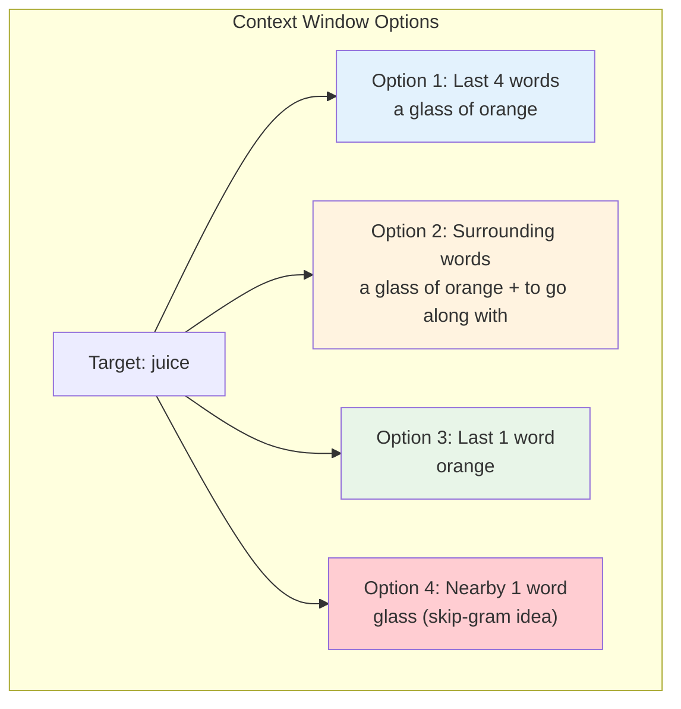

### Context Option Examples

**Option 1: Last 4 Words (Traditional Language Modeling)**

```bash
Context: ["a", "glass", "of", "orange"] → Target: "juice"
Natural for language modeling applications
```

**Option 2: Bidirectional Context (4 left + 4 right)**

```bash
Left Context:  ["a", "glass", "of", "orange"]
Right Context: ["to", "go", "along", "with"]
Target: "juice" (middle word)
Better for understanding word meaning in context
```

**Option 3: Last 1 Word (Simplified)**

```bash
Context: ["orange"] → Target: "juice"
Much simpler model, foundation for Word2Vec
```

**Option 4: Nearby 1 Word (Skip-gram)**

```bash
Context: ["glass"] → Target: "juice"
Even more flexible, captures broader semantic relationships
Forms the basis of Skip-gram Word2Vec
```

### Practical Implementation Comparison

```python
# Option 1: 4-word context
def create_training_example_option1(sentence, target_idx):
    context = sentence[target_idx-4:target_idx]
    target = sentence[target_idx]
    return context, target

# Option 2: Bidirectional context
def create_training_example_option2(sentence, target_idx):
    left_context = sentence[target_idx-4:target_idx]
    right_context = sentence[target_idx+1:target_idx+5]
    context = left_context + right_context
    target = sentence[target_idx]
    return context, target

# Option 3: 1-word context
def create_training_example_option3(sentence, target_idx):
    context = [sentence[target_idx-1]]
    target = sentence[target_idx]
    return context, target

# Option 4: Skip-gram style
def create_training_example_option4(sentence, target_idx, window=2):
    # Pick random word within window
    start = max(0, target_idx - window)
    end = min(len(sentence), target_idx + window + 1)
    context_candidates = sentence[start:target_idx] + sentence[target_idx+1:end]
    context = [random.choice(context_candidates)]
    target = sentence[target_idx]
    return context, target
```

### Why Different Contexts Work for Embeddings

**Key Insight**: All these contexts help capture the distributional hypothesis: "Words that appear in similar contexts have similar meanings."

```bash
# Context Variety Benefits
┌─────────────────────────────────────────────────────────┐
│                Context Window Trade-offs                │
├─────────────────┬───────────────────────────────────────┤
│ Context Type    │ Benefits & Use Cases                  │
├─────────────────┼───────────────────────────────────────┤
│ Last N words    │ • Natural for language modeling       │
│                 │ • Captures syntactic patterns         │
│                 │ • Sequential dependencies             │
├─────────────────┼───────────────────────────────────────┤
│ Bidirectional   │ • Better semantic understanding       │
│                 │ • Captures full context               │
│                 │ • Good for word sense disambiguation  │
├─────────────────┼───────────────────────────────────────┤
│ Single word     │ • Computationally efficient           │
│                 │ • Focuses on direct relationships     │
│                 │ • Foundation for Word2Vec             │
├─────────────────┼───────────────────────────────────────┤
│ Skip-gram       │ • Captures broader semantic fields    │
│                 │ • Flexible relationship modeling      │
│                 │ • Excellent for analogies             │
└─────────────────┴───────────────────────────────────────┘
```

### Evolution Towards Simpler Algorithms

**The Realization**: For learning embeddings (not language modeling), simpler contexts often work just as well!

**This insight led to**:

1. **Word2Vec (2013)**: Simplified to single-word contexts
2. **GloVe (2014)**: Global co-occurrence statistics
3. **FastText (2016)**: Subword information

**Performance Reality**:

```bash
# Relative Performance (Approximate)
Neural Language Model (6-word context):     85% quality, 100% complexity
Word2Vec Skip-gram (1-word context):        83% quality,  10% complexity
GloVe (global statistics):                  84% quality,  15% complexity
```

## Key Implementation Details

**Shared Embedding Matrix**:

- Same matrix $E$ used for all word positions
- Critical for learning generalizable representations
- Enables parameter sharing across contexts

**Training Objectives**:

- **Language Modeling**: Maximize $P(\text{next\_word} | \text{context})$
- **Embedding Learning**: Learn representations that enable good predictions

**Computational Considerations**:

- **Softmax bottleneck**: 10,000-way classification is expensive
- **Leads to**: Hierarchical softmax, negative sampling (covered in Word2Vec)

---

## Key Takeaways

1. **Historical Evolution**: Complex → Simple algorithms for embeddings
2. **Neural Language Model**: First successful neural approach to joint language modeling + embedding learning
3. **Context Flexibility**: For embeddings, many context definitions work well
4. **Shared Parameters**: Same embedding matrix across all positions enables generalization
5. **Learning Incentive**: Algorithm naturally learns similar embeddings for semantically similar words
6. **Computational Bottleneck**: Softmax over large vocabulary motivates algorithmic improvements

**Next**: We'll explore how these insights led to the simplified yet highly effective Word2Vec algorithms!

# 6. Word2Vec

## What is Word2Vec?

Think of Word2Vec as a clever way to teach computers what words mean by looking at the company they keep. You know the saying "you are known by the company you keep"? Word2Vec applies this to words.

### The Basic Idea

**Traditional Problem**: Computers see words as just symbols - "cat" and "dog" are completely unrelated to them, even though we know they're both animals.

**Word2Vec Solution**: Look at what words appear near each other in sentences. If "orange" and "apple" both appear near words like "juice", "sweet", "eat", then maybe they're similar!

### What We're Trying to Do

Imagine you're teaching a child about words. Instead of giving them a dictionary, you show them millions of sentences and say:

"Look, whenever you see the word 'orange', what other words are nearby?"

- "orange juice"
- "sweet orange"
- "eat an orange"

"Now look at 'apple':"

- "apple juice"
- "sweet apple"
- "eat an apple"

The child starts thinking: "Hmm, orange and apple seem to hang out with similar words. Maybe they're related!"

### What We're Really Learning

We're learning to represent each word as a list of numbers (like [0.2, -0.4, 0.7, ...]) such that:

- Similar words get similar number lists
- We can do math with words! (king - man + woman ≈ queen)

### Why This Works

The magic happens because:

1. We process millions of sentences
2. Words that appear in similar contexts (like "orange" and "apple") end up with similar representations
3. The computer learns that fruits are similar, animals are similar, etc., without us explicitly telling it!

### The Real Goal

We're not actually trying to become good at predicting nearby words. That's just a trick! What we really want are those number representations (embeddings) that capture word meanings. It's like learning to ride a bike to get stronger legs - the bike riding is just the exercise, the real goal is the strength.

## The Revolutionary Simplification

Word2Vec changed everything by asking a simple question: "What if we don't need complex neural networks to learn good word representations?" Instead of the complicated neural language model we saw earlier, Word2Vec uses a beautifully simple idea.

### From Complex to Simple: The Big Insight

Remember our neural language model that used the last 4 words to predict the next word? Word2Vec said: "Let's make this much simpler. Just use ONE word to predict nearby words."

**Neural Language Model**: [a, glass, of, orange] → predict "juice"
**Word2Vec Skip-gram**: orange → predict "juice" (and other nearby words)

This simplification made training incredibly faster while producing equally good (sometimes better) word embeddings.

## The Skip-Gram Model: Core Intuition

Skip-gram is based on a linguistic principle: **words that appear in similar contexts have similar meanings**. If you see "orange juice" and "apple juice" frequently, then "orange" and "apple" are probably related.

### How Skip-Gram Works

Think of it like this: imagine you're reading millions of sentences and for each word, you note down what other words appear nearby. Words that have similar "neighbor lists" are probably similar in meaning.

**Example sentence**: "I want a glass of orange juice to go along with my cereal"

If we pick "orange" as our center word and use a window of ±3 words, we get these training pairs:

- orange → glass (distance: -2)
- orange → of (distance: -1)
- orange → juice (distance: +1)
- orange → to (distance: +2)
- orange → go (distance: +3)

We do this for every word in every sentence, creating millions of (context, target) pairs.

### Why This Creates Good Embeddings

Here's the magic: when we train on these pairs, words that appear in similar contexts naturally end up with similar representations.

Consider these examples:

- "orange juice is sweet"
- "apple juice is sweet"
- "grape juice is sweet"

All three fruits (orange, apple, grape) appear before "juice" and after "drink/want/pour". So our algorithm learns to give them similar embeddings because they're trying to predict similar target words.

## The Architecture: Beautifully Simple

The skip-gram model has an elegantly simple architecture compared to the complex neural language model:

```bash
# Skip-gram Architecture
┌─────────────────────────────────────────────────────────────────────────────┐
│                            Word2Vec Skip-gram Model                         │
└─────────────────────────────────────────────────────────────────────────────┘

    Context Word                Embedding Lookup               Softmax Layer
   ┌─────────────┐             ┌─────────────────┐            ┌─────────────────┐
   │             │             │                 │            │                 │
   │   orange    │ ──────────→ │ Embedding       │ ─────────→ │    Softmax      │
   │ (index:6257)│             │ Matrix E        │            │   Classifier    │
   │             │             │ (300 × 10,000)  │            │                 │
   └─────────────┘             └─────────────────┘            └─────────────────┘
          │                             │                             │
          ▼                             ▼                             ▼
   ┌─────────────┐             ┌─────────────────┐            ┌─────────────────┐
   │ One-hot     │             │ Dense Vector    │            │ Probability     │
   │ O_c         │ ──E×O_c──→  │ e_c = E[:,6257] │ ──θ^T×e_c─→│ Distribution    │
   │ (10,000×1)  │             │ (300×1)         │            │ P(t|c)          │
   │             │             │                 │            │ (10,000×1)      │
   └─────────────┘             └─────────────────┘            └─────────────────┘
                                        │                             │
                                        │                             ▼
                                        │                    ┌─────────────────┐
                                        │                    │   Prediction    │
                                        │                    │  argmax(P(t|c)) │
                                        │                    │                 │
                                        │                    │ Target: "juice" │
                                        │                    │ (index: 4834)   │
                                        │                    └─────────────────┘
                                        │
                                        ▼
                               ┌─────────────────┐
                               │ Key Insight:    │
                               │ Same matrix E   │
                               │ for ALL words!  │
                               │                 │
                               │ Much simpler    │
                               │ than neural LM  │
                               └─────────────────┘
```

That's it! No hidden layers, no complex concatenations. Just:

1. Look up the embedding for the context word
2. Use that embedding to predict target words via softmax

**Comparison with Neural Language Model**:

- **Neural LM**: 4 words → concatenate (1200D) → hidden layer (128D) → softmax (10,000D)
- **Skip-gram**: 1 word → embedding (300D) → softmax (10,000D)

The simplification is dramatic!

### Mathematical Formulation

**Step 1: Get context embedding**
$$e_c = E \times O_c$$

where $O_c$ is the one-hot vector for context word $c$.

**Step 2: Compute target probabilities**
$$P(t|c) = \frac{e^{\theta_t^T e_c}}{\sum_{j=1}^{|V|} e^{\theta_j^T e_c}}$$

**Step 3: Minimize negative log-likelihood**
$$L = -\log P(t|c) = -\theta_t^T e_c + \log \left(\sum_{j=1}^{|V|} e^{\theta_j^T e_c}\right)$$

## A Complete Example

Let's trace through a concrete example to see how this works:

**Training pair**: Context = "orange" (index 6257), Target = "juice" (index 4834)

**Forward pass**:

1. Convert "orange" to one-hot vector $O_{6257}$
2. Get embedding: $e_{orange} = E \times O_{6257}$ (this just selects column 6257 from matrix E)
3. Compute scores for all words: $score_j = \theta_j^T \times e_{orange}$ for $j = 1, 2, ..., 10000$
4. Apply softmax: $P(j|orange) = \frac{e^{score_j}}{\sum_{k=1}^{10000} e^{score_k}}$
5. Get probability for "juice": $P(juice|orange) = P(4834|orange)$

**Loss calculation**:
$$L = -\log P(juice|orange)$$

**Backward pass**:

- Update $\theta_{juice}$ (parameters for word "juice")
- Update $e_{orange}$ (embedding for word "orange")
- Update parameters for all other words based on their predicted probabilities

## The Computational Challenge

Here's where things get tricky. That softmax step requires computing probabilities for ALL 10,000 words in the vocabulary. For each training example, we need:

- 10,000 dot products: $\theta_j^T \times e_c$
- 10,000 exponentials: $e^{\theta_j^T \times e_c}$
- Sum all exponentials for normalization
- Compute gradients for all parameters

This becomes prohibitively expensive for large vocabularies. Imagine if you had 1 million words - that's 1 million computations per training example!

## Solutions to the Computational Problem

### Hierarchical Softmax

Instead of one massive 10,000-way classification, hierarchical softmax breaks it into a series of binary decisions using a tree structure.

**The idea**: To find "juice" among 10,000 words, first ask "Is it in the first 5,000 or second 5,000 words?" Then "Is it in the first 2,500 or second 2,500?" And so on.

```bash
# Hierarchical Softmax Tree Structure
┌─────────────────────────────────────────────────────────────────────────────┐
│                         Hierarchical Softmax Tree                          │
│                                                                             │
│                              Root Node                                     │
│                         "Is target in first                               │
│                          5000 or second 5000?"                            │
│                                 │                                          │
│                    ┌────────────┴────────────┐                           │
│                    │                         │                           │
│              First 5000 words          Second 5000 words                  │
│            "Is target in first         "Is target in third               │
│             2500 or second 2500?"       2500 or fourth 2500?"             │
│                    │                         │                           │
│            ┌───────┴───────┐         ┌───────┴───────┐                   │
│            │               │         │               │                   │
│       First 2500      Second 2500   Third 2500   Fourth 2500             │
│      (words 1-2500)  (words 2501-   (words 5001-   (words 7501-          │
│                       5000)          7500)          10000)                │
│            │               │         │               │                   │
│         ┌──┴──┐         ┌──┴──┐   ┌──┴──┐         ┌──┴──┐               │
│         │     │         │     │   │     │         │     │               │
│     Further  Further  Further Further Further Further Further Further     │
│     split... split... split... split... split... split... split... split...│
│                                                                             │
│ Example: Finding "juice" (word #4834)                                     │
│ Path: Root → First 5000 → Second 2500 → ... → juice                      │
│                                                                             │
│ Only ~13 binary decisions instead of 10,000 computations!                  │
└─────────────────────────────────────────────────────────────────────────────┘
```

Each decision is just a binary classification (much easier!), and you only need about 13 decisions total instead of comparing against all 10,000 words.

**Step-by-step example for "juice" (word #4834)**:

1. **Root**: "Is 4834 ≤ 5000?" → Yes, go LEFT to "First 5000"
2. **Level 1**: "Is 4834 ≤ 2500?" → No, go RIGHT to "Second 2500"
3. **Level 2**: Continue binary decisions until we reach "juice"

**Mathematical benefit**: Reduces complexity from O(V) to O(log V). For 10,000 words, that's about 13 operations instead of 10,000 - roughly 750× faster!

**Tree construction**: In practice, frequent words are placed higher in the tree (shorter paths) while rare words go deeper. This is because we see frequent words more often, so we want fast access to them.

### Context Sampling Strategy

Another practical issue: how do we choose which words to use as context? If we sample uniformly, we'd spend most of our time on very frequent words like "the", "of", "and".

Word2Vec uses a clever rebalancing strategy. Instead of sampling proportional to frequency $f(w)$, it samples proportional to $f(w)^{3/4}$. This:

- Reduces the probability of very frequent words
- Increases the probability of moderately rare words
- Ensures rare but meaningful words get adequate training

## CBOW: The Alternative Approach

Word2Vec actually includes two algorithms:

**Skip-gram**: One context word → multiple target words
**CBOW (Continuous Bag of Words)**: Multiple context words → one target word

CBOW takes surrounding words and predicts the center word. For example:

- Context: [want, a, glass, of, juice] → Target: orange

**When to use which**:

- **Skip-gram**: Better for rare words, slower training, often used in research
- **CBOW**: Faster training, better for frequent words, good for production systems

## Why Word2Vec Was Revolutionary

1. **Simplicity**: Removed complex hidden layers, making the model much simpler
2. **Efficiency**: With optimizations like hierarchical softmax, it could scale to massive datasets
3. **Quality**: Despite being simpler, it produced embeddings as good as complex models
4. **Scalability**: Could handle vocabularies of millions of words

The key insight was that you don't need to solve the full language modeling problem to get good word representations. A much simpler objective - predicting nearby words - captures the same semantic relationships.

## Implementation Considerations

**Key hyperparameters**:

- **Window size**: Usually 5-10. Larger windows capture more semantic relationships, smaller windows capture more syntactic relationships
- **Embedding dimension**: Typically 100-300. More dimensions can capture more nuanced relationships but require more data
- **Learning rate**: Start around 0.025 and decay linearly to 0.0001
- **Training epochs**: Usually 5-15 passes through the data

**Data preprocessing**:

- Convert rare words to `<UNK>` tokens
- Subsample frequent words to balance the dataset
- Remove punctuation or treat it as separate tokens

The beauty of Word2Vec lies in its simplicity. By focusing on the core task of learning semantic relationships through context prediction, it achieved remarkable results with a fraction of the computational complexity of earlier approaches. This made high-quality word embeddings accessible to researchers and practitioners worldwide, sparking the modern NLP revolution.

---

## Key Takeaways

1. **Core insight**: Words appearing in similar contexts have similar meanings
2. **Simplification power**: Reduced complex neural language model to simple context-target prediction
3. **Skip-gram approach**: One word predicts multiple nearby words within a window
4. **Computational challenge**: Softmax over large vocabulary is expensive
5. **Solutions**: Hierarchical softmax and negative sampling make training practical
6. **Two variants**: Skip-gram (1→many) and CBOW (many→1) with different trade-offs
7. **Revolutionary impact**: Made high-quality embeddings accessible and scalable

**Next**: We'll explore **Negative Sampling**, an even more elegant solution to the computational bottleneck that became the preferred training method for Word2Vec.

# 7. Negative Sampling

## What is Negative Sampling?

Imagine you're a teacher trying to test if students understand which words go together. Instead of asking "Which of these 10,000 words comes after 'orange'?" (which is overwhelming), you ask a much simpler question: "Does 'juice' go with 'orange'? Yes or no?"

That's exactly what negative sampling does. It transforms the impossible task of choosing the right word from 10,000 options into a simple yes/no question: "Do these two words belong together?"

### The Core Insight

**The Problem**: Regular Word2Vec asks "Which word comes next?" - a 10,000-way multiple choice question that's computationally expensive.

**The Solution**: Negative sampling asks "Do these words go together?" - a simple binary yes/no question that's much cheaper to compute.

### How It Works in Simple Terms

Think of it like this: You have a sentence "I want a glass of orange juice" and you want to teach the computer that "orange" and "juice" go together.

**Step 1 - Create a positive example**:

- orange + juice = YES (they appear together in real text)

**Step 2 - Create negative examples**:

- orange + king = NO (randomly picked word)
- orange + book = NO (randomly picked word)
- orange + the = NO (randomly picked word)
- orange + of = NO (randomly picked word)

**Step 3 - Train a simple classifier**:
Instead of "Which of 10,000 words comes after orange?", we ask 5 simple questions:

- "Do orange and juice go together?" → YES
- "Do orange and king go together?" → NO
- "Do orange and book go together?" → NO
- "Do orange and the go together?" → NO
- "Do orange and of go together?" → NO

### Why This is Brilliant

**Computational magic**: Instead of computing probabilities for all 10,000 words every time, we only compute 5 simple yes/no answers. That's 2000× fewer calculations!

**Learning magic**: The computer still learns good word embeddings because:

- Words that truly go together (like "orange" and "juice") get reinforced as positive pairs
- Random word pairs get labeled as negative, helping the model distinguish real relationships from noise
- Over millions of examples, the model learns which words have similar contexts

## The Technical Details

### Creating the Training Data

Let's see how we systematically create this new learning problem:

**Original sentence**: "I want a glass of orange juice to go along with my cereal"

**Step 1: Generate positive examples** (same as regular skip-gram)

- Pick context word: "orange"
- Pick target from window (±5 words): "juice"
- Create pair: (orange, juice) → label = 1

**Step 2: Generate negative examples**

- Keep same context word: "orange"
- Pick k random words from vocabulary: "king", "book", "the", "of"
- Create pairs:
  - (orange, king) → label = 0
  - (orange, book) → label = 0
  - (orange, the) → label = 0
  - (orange, of) → label = 0

**Final training data**:

```
Context | Target | Label | Type
--------|--------|-------|--------
orange  | juice  |   1   | Positive (real pair)
orange  | king   |   0   | Negative (random)
orange  | book   |   0   | Negative (random)
orange  | the    |   0   | Negative (random)
orange  | of     |   0   | Negative (random)
```

Notice something important: Even if "of" actually appears near "orange" in the original sentence, we still label it as 0 when it's randomly sampled. This is okay because we're learning general patterns, not memorizing specific sentences.

### The Architecture: From 10,000-way to Binary Classification

```bash
# Negative Sampling Architecture
┌─────────────────────────────────────────────────────────────────────────────┐
│                        Negative Sampling Model                              │
└─────────────────────────────────────────────────────────────────────────────┘

    Context Word                Embedding Lookup               Binary Classifiers
   ┌─────────────┐             ┌─────────────────┐            ┌─────────────────┐
   │             │             │                 │            │ Classifier 1:   │
   │   orange    │ ──────────→ │ Embedding       │ ─────────→ │ orange + juice  │ → P(1)
   │ (index:6257)│             │ e_orange        │            │ θ_juice^T×e_c   │
   │             │             │ (300×1)         │            └─────────────────┘
   └─────────────┘             └─────────────────┘           ┌─────────────────┐
                                        │                    │ Classifier 2:   │
                                        │ ─────────────────→ │ orange + king   │ → P(0)
                                        │                    │ θ_king^T×e_c    │
                                        │                    └─────────────────┘
                                        │                    ┌─────────────────┐
                                        │ ─────────────────→ │ Classifier 3:   │
                                        │                    │ orange + book   │ → P(0)
                                        │                    │ θ_book^T×e_c    │
                                        │                    └─────────────────┘
                                        │                    ┌─────────────────┐
                                        │ ─────────────────→ │ Classifier 4:   │
                                        │                    │ orange + the    │ → P(0)
                                        │                    │ θ_the^T×e_c     │
                                        │                    └─────────────────┘
                                        │                    ┌─────────────────┐
                                        └ ─────────────────→ │ Classifier 5:   │
                                                             │ orange + of     │ → P(0)
                                                             │ θ_of^T×e_c      │
                                                             └─────────────────┘

Key Insight: We have 10,000 potential binary classifiers, but we only train 5 per example!
- 1 positive classifier (for the real target word)
- 4 negative classifiers (for randomly sampled words)
```

### Mathematical Formulation

**Binary Classification Model**:
For each word pair (context c, target t), we model the probability that they belong together:

$$P(y=1|c,t) = \sigma(\theta_t^T \cdot e_c)$$

where:

- $\sigma$ is the sigmoid function: $\sigma(x) = \frac{1}{1 + e^{-x}}$
- $\theta_t$ is the parameter vector for target word $t$
- $e_c$ is the embedding vector for context word $c$

**Loss Function**:
For one training example with k negative samples:

$$L = -\log \sigma(\theta_{t_{pos}}^T \cdot e_c) - \sum_{i=1}^{k} \log \sigma(-\theta_{t_{neg,i}}^T \cdot e_c)$$

This encourages:

- High probability for positive pairs: $\sigma(\theta_{t_{pos}}^T \cdot e_c) \approx 1$
- Low probability for negative pairs: $\sigma(\theta_{t_{neg}}^T \cdot e_c) \approx 0$

### Complete Working Example

Let's trace through training on our example:

**Training data point**: Context = "orange", Target = "juice", Negatives = ["king", "book", "the", "of"]

**Step 1: Get context embedding**

```python
# orange is at index 6257
e_orange = E[:, 6257]  # Extract column 6257, shape: (300,)
```

**Step 2: Compute binary predictions**

```python
# Positive example: (orange, juice)
score_juice = np.dot(theta_juice, e_orange)  # Scalar
prob_juice = 1 / (1 + np.exp(-score_juice))  # Should be close to 1

# Negative examples
score_king = np.dot(theta_king, e_orange)
prob_king = 1 / (1 + np.exp(-score_king))    # Should be close to 0

score_book = np.dot(theta_book, e_orange)
prob_book = 1 / (1 + np.exp(-score_book))    # Should be close to 0

# ... similar for "the" and "of"
```

**Step 3: Compute loss**

```python
# Loss for positive example
loss_pos = -np.log(prob_juice)

# Loss for negative examples
loss_neg = -np.log(1 - prob_king) - np.log(1 - prob_book) - np.log(1 - prob_the) - np.log(1 - prob_of)

# Total loss
total_loss = loss_pos + loss_neg
```

**Step 4: Update parameters**

```python
# Only update parameters for the 5 words we used in this example
# Don't touch the other 9,995 words!

# Update embeddings
grad_e_orange = compute_gradient_for_orange()
E[:, 6257] -= learning_rate * grad_e_orange

# Update word parameters
theta_juice -= learning_rate * grad_theta_juice
theta_king -= learning_rate * grad_theta_king
# ... etc for book, the, of
```

### Computational Advantage

**Regular softmax** (for each example):

- Compute 10,000 dot products: $\theta_j^T \cdot e_c$
- Compute 10,000 exponentials and sum them
- Update 10,000 parameter vectors
- **Total**: ~30,000 operations

**Negative sampling** (for each example with k=4):

- Compute 5 dot products: $\theta_j^T \cdot e_c$
- Compute 5 sigmoids
- Update 5 parameter vectors
- **Total**: ~15 operations

**Speedup**: 30,000 / 15 = **2000× faster!**

### Choosing k: How Many Negative Samples?

**Mikolov et al. recommendations**:

- **Small datasets**: k = 5-20 negative samples
- **Large datasets**: k = 2-5 negative samples

**Why fewer negatives for large datasets?**

- Large datasets have more diverse positive examples
- Don't need as many negatives to learn the distinction
- Computational efficiency becomes more important

**In our example**: We used k = 4, which is good for medium-sized datasets.

### Negative Sampling Strategy

**The question**: How do we choose which words to use as negatives?

**Naive approach**: Sample uniformly from vocabulary

- Problem: Very unrepresentative of real language

**Frequency-based approach**: Sample proportional to word frequency

- Problem: Dominated by common words like "the", "of", "and"

**Word2Vec solution**: Sample proportional to $f(w)^{3/4}$

$$P(w_i) = \frac{f(w_i)^{3/4}}{\sum_j f(w_j)^{3/4}}$$

**Why the 3/4 power works**:

- Reduces over-representation of very frequent words
- Increases representation of moderately rare words
- Balances common vs. rare words for better training

**Example**:

```
Word     | Frequency | f^(3/4) | Regular P(w) | Rebalanced P(w)
---------|-----------|---------|--------------|----------------
"the"    | 100,000   | 17,783  | 0.50         | 0.36 (reduced)
"orange" | 1,000     | 178     | 0.005        | 0.018 (increased)
"durian" | 10        | 5.6     | 0.00005      | 0.0006 (increased)
```

### Implementation Details

**Training loop structure**:

```python
def train_negative_sampling(corpus, vocab_size=10000, embed_dim=300, k=4):
    # Initialize parameters
    E = np.random.normal(0, 0.1, (embed_dim, vocab_size))
    theta = np.random.normal(0, 0.1, (vocab_size, embed_dim))

    for sentence in corpus:
        # Generate positive pairs (same as skip-gram)
        positive_pairs = generate_skipgram_pairs(sentence)

        for context_word, target_word in positive_pairs:
            # Convert to indices
            c_idx = word_to_index[context_word]
            t_pos_idx = word_to_index[target_word]

            # Sample k negative words
            negative_indices = sample_negatives(k, vocab_size, word_frequencies)

            # Get context embedding
            e_c = E[:, c_idx]

            # Train positive example
            score_pos = np.dot(theta[t_pos_idx], e_c)
            prob_pos = sigmoid(score_pos)
            loss_pos = -np.log(prob_pos)

            # Train negative examples
            loss_neg = 0
            for t_neg_idx in negative_indices:
                score_neg = np.dot(theta[t_neg_idx], e_c)
                prob_neg = sigmoid(score_neg)
                loss_neg -= np.log(1 - prob_neg)

            # Compute gradients and update (details omitted)
            # Update only: E[:, c_idx], theta[t_pos_idx], theta[negative_indices]

    return E
```

### Why Negative Sampling Works So Well

**Theoretical insight**: We're approximating the original softmax objective with a much simpler binary classification objective.

**Practical benefits**:

1. **Computational efficiency**: 2000× speedup makes training on large corpora feasible
2. **Similar quality**: Produces embeddings nearly as good as full softmax
3. **Scalability**: Works well even with vocabularies of millions of words
4. **Simplicity**: Easier to implement and debug than hierarchical softmax

**The key insight**: Most of the learning happens from distinguishing real word pairs from random pairs. We don't need to model the full probability distribution over all words - just the difference between "real" and "random" pairs.

---

## Key Takeaways

1. **Core transformation**: Changed 10,000-way classification into simple binary classification
2. **Computational breakthrough**: 2000× speedup while maintaining quality
3. **Simple training data**: 1 positive example + k negative examples per iteration
4. **Sampling strategy**: Use $f(w)^{3/4}$ to balance common and rare words
5. **Binary classifiers**: Have 10,000 potential classifiers, but only train k+1 per example
6. **Practical impact**: Made Word2Vec training feasible on massive datasets

**Next**: We'll explore **GloVe**, which takes a completely different approach by analyzing global word co-occurrence statistics rather than local context windows.

# 8. GloVe Word Vectors

## What is GloVe?

Imagine you're a linguist studying relationships between words, and instead of listening to conversations one sentence at a time (like Word2Vec), you decide to step back and look at the big picture. You create a massive spreadsheet counting how often every pair of words appears together across millions of documents.

That's exactly what GloVe does! While Word2Vec learns from local context windows one at a time, GloVe says: "Let's first count everything, then learn from these global statistics."

### The Big Picture Approach

**Word2Vec approach**: "I'll learn by predicting nearby words, one context window at a time"
**GloVe approach**: "I'll first count how often all words appear together, then learn from these counts"

It's like the difference between:

- **Word2Vec**: Learning a language by overhearing conversations
- **GloVe**: Learning a language by studying a comprehensive dictionary of word relationships

### The Core Insight

GloVe stands for **Global Vectors for Word Representation**. The key insight is that word meaning can be captured by how often words co-occur across an entire corpus, not just local predictions.

Think about it: if "ice" and "steam" both frequently appear with "water", "hot", "cold", "temperature", then they're probably related concepts, even if they rarely appear directly next to each other.

### Why This Matters

**Traditional Word2Vec limitation**: It only sees local context windows. If "ice" and "steam" never appear in the same sentence, Word2Vec might miss their relationship.

**GloVe advantage**: It sees the global picture. Even if "ice" and "steam" never appear together, GloVe notices they both frequently appear with temperature-related words and learns they're related.

## How GloVe Works: From Counting to Embeddings

### Step 1: Build the Co-occurrence Matrix

First, GloVe counts how often every pair of words appears together in the corpus:

**Example**: Let's say we have these sentences:

- "I love orange juice"
- "Orange juice is sweet"
- "Apple juice tastes good"
- "I drink orange soda"

We count co-occurrences within a window (say ±2 words):

```
Co-occurrence Matrix X:
           I    love  orange  juice  apple  sweet  soda
I          0     1      1      0      0      0      1
love       1     0      1      1      0      0      0
orange     1     1      0      2      0      1      1
juice      0     1      2      0      1      1      0
apple      0     0      0      1      0      0      0
sweet      0     0      1      1      0      0      0
soda       1     0      1      0      0      0      0
```

**Key insight**: $X_{ij}$ = how many times word $j$ appears in the context of word $i$

Notice that "orange" and "juice" have $X_{orange,juice} = 2$ because they appear together twice.

### Step 2: Learn Embeddings from Global Counts

Instead of predicting words one context at a time, GloVe learns embeddings such that:

**The dot product of two word vectors predicts their co-occurrence count**

$$\theta_i^T e_j \approx \log(X_{ij})$$

If "orange" and "juice" appear together frequently (high $X_{ij}$), their embeddings should have a high dot product.

### The GloVe Objective Function

Let me explain this step by step, because the math here contains a beautiful insight about how meaning emerges from numbers.

#### The Core Idea: Teaching Embeddings to "Remember" Co-occurrences

**Think of it this way**: Imagine you have two friends, Alice and Bob. If they hang out together a lot, you'd expect them to have similar interests, know similar people, and generally be compatible.

GloVe applies this same logic to words: **if two words appear together frequently, their embeddings should be "compatible" - meaning their dot product should be high.**

#### What is a Dot Product and Why Use It?

**Dot product basics**: The dot product $\theta_i^T e_j$ is just:
$\theta_i^T e_j = \theta_{i1} \times e_{j1} + \theta_{i2} \times e_{j2} + \theta_{i3} \times e_{j3} + \ldots$

**Example with 3D vectors**:

- $\theta_{orange} = [0.5, -0.2, 0.8]$
- $e_{juice} = [0.6, -0.1, 0.9]$
- $\theta_{orange}^T e_{juice} = (0.5 \times 0.6) + (-0.2 \times -0.1) + (0.8 \times 0.9) = 0.3 + 0.02 + 0.72 = 1.04$

**Why dot product measures compatibility**:

- **High dot product**: Vectors point in similar directions → words are related
- **Low dot product**: Vectors point in different directions → words are unrelated
- **Negative dot product**: Vectors point in opposite directions → words are opposite

#### The Mathematical Goal

GloVe wants to learn embeddings such that:
$\text{Dot product} \approx \text{How often words appear together}$

More precisely:
$\theta_i^T e_j \approx \log(X_{ij})$

**Why logarithm?** Because co-occurrence counts vary wildly:

- "the" and "of" might appear together 100,000 times → $\log(100,000) = 11.5$
- "orange" and "juice" might appear together 50 times → $\log(50) = 3.9$

The log compresses these huge differences into manageable numbers.

#### Breaking Down the Objective Function

$J = \sum_{i=1}^{V} \sum_{j=1}^{V} f(X_{ij}) (\theta_i^T e_j - \log X_{ij})^2$

**Let's decode each piece**:

##### 1. The Double Sum $\sum_{i=1}^{V} \sum_{j=1}^{V}$

This means: "For every possible pair of words in our vocabulary"

- $i$ goes through every word: orange, apple, juice, sweet, etc.
- $j$ goes through every word: orange, apple, juice, sweet, etc.
- We consider all possible pairs: (orange, juice), (orange, apple), (juice, sweet), etc.

##### 2. The Core Expression $(\theta_i^T e_j - \log X_{ij})^2$

This is the **squared error** between:

- **What we predict**: $\theta_i^T e_j$ (dot product of embeddings)
- **What we observe**: $\log X_{ij}$ (log of how often they actually appear together)

**Example**:

- We observe: "orange" and "juice" appear together 50 times → $\log(50) = 3.9$
- We predict: $\theta_{orange}^T e_{juice} = 2.1$ (current dot product)
- Error: $(2.1 - 3.9)^2 = (-1.8)^2 = 3.24$
- Goal: Adjust embeddings to make dot product closer to 3.9

##### 3. The Weighting Function $f(X_{ij})$

This decides how much attention to pay to each word pair:

**Problems it solves**:

- **Zero co-occurrences**: If words never appear together ($X_{ij} = 0$), set $f(X_{ij}) = 0$ (ignore them)
- **Super frequent pairs**: Don't let common words like "the" and "of" dominate training
- **Rare meaningful pairs**: Give appropriate weight to less frequent but meaningful pairs

#### A Complete Example

Let's trace through learning embeddings for "orange" and "juice":

**Step 1: What we observe**

- "orange" and "juice" appear together 50 times in our corpus
- So $X_{orange,juice} = 50$
- Therefore $\log X_{orange,juice} = \log(50) = 3.9$

**Step 2: What we currently predict**

- Current embeddings: $\theta_{orange} = [0.5, -0.2, 0.8]$ and $e_{juice} = [0.6, -0.1, 0.9]$
- Dot product: $\theta_{orange}^T e_{juice} = 1.04$

**Step 3: Compute the error**

- Target: 3.9 (from observation)
- Prediction: 1.04 (from current embeddings)
- Error: $(1.04 - 3.9)^2 = 8.18$

**Step 4: Update embeddings**

- Gradient descent adjusts $\theta_{orange}$ and $e_{juice}$ to reduce this error
- Goal: Make their dot product closer to 3.9
- This happens simultaneously for all word pairs

#### Why This Creates Good Embeddings

**The magic**: Words that co-occur with similar sets of words will end up with similar embeddings.

**Example**:

- "orange" appears with: juice, sweet, fruit, vitamin, fresh, citrus...
- "apple" appears with: juice, sweet, fruit, vitamin, fresh, crisp...

Since both "orange" and "apple" need high dot products with "juice", "sweet", "fruit", etc., the learning algorithm makes their embeddings similar!

**Mathematical insight**: If two words $i$ and $k$ have similar co-occurrence patterns (similar rows in the matrix $X$), then to minimize the objective, $\theta_i$ and $\theta_k$ must be similar.

#### The Beautiful Result

After training, the embeddings automatically capture semantic relationships:

- **Similar words**: High dot products with similar sets of words → similar embeddings
- **Analogical relationships**: Preserved through the linear structure of dot products
- **Semantic neighborhoods**: Words cluster based on their co-occurrence patterns

All of this emerges naturally from the simple goal of making dot products predict co-occurrence counts!

### Why the Logarithm?

**Raw counts** are problematic:

- "the" and "of" might co-occur 100,000 times
- "orange" and "juice" might co-occur 50 times
- The huge difference makes optimization difficult

**Log counts** compress the range:

- $\log(100,000) \approx 11.5$
- $\log(50) \approx 3.9$
- Much more manageable for learning

### The Weighting Function $f(X_{ij})$

Not all word pairs should be weighted equally:

**Problems to solve**:

1. **Zero counts**: If $X_{ij} = 0$, then $\log(X_{ij})$ is undefined
2. **Frequent words**: Common words like "the", "is" dominate the objective
3. **Rare words**: Meaningful but infrequent words get insufficient attention

**GloVe solution**: Use a weighting function $f(X_{ij})$ that:

- Sets $f(X_{ij}) = 0$ when $X_{ij} = 0$ (ignore zero counts)
- Reduces weight for very frequent co-occurrences
- Gives meaningful weight to moderately frequent pairs

**Example weighting function**:

$$
f(X_{ij}) = \begin{cases}
(X_{ij}/X_{max})^{\alpha} & \text{if } X_{ij} < X_{max} \\
1 & \text{if } X_{ij} \geq X_{max}
\end{cases}
$$

where $X_{max} = 100$ and $\alpha = 0.75$ are common choices.

## Complete Working Example

Let's trace through learning embeddings for our simple example:

**Our co-occurrence matrix**:

- $X_{orange,juice} = 2$
- $X_{orange,sweet} = 1$
- $X_{juice,sweet} = 1$
- Most other entries are 0 or 1

**Objective for the pair (orange, juice)**:
$$f(X_{orange,juice}) \cdot (\theta_{orange}^T e_{juice} - \log(2))^2$$
$$= f(2) \cdot (\theta_{orange}^T e_{juice} - 0.693)^2$$

**Training process**:

1. **Initialize**: Random embeddings for $\theta_{orange}$, $e_{juice}$, etc.
2. **Forward pass**: Compute $\theta_{orange}^T e_{juice}$
3. **Loss**: Compare to $\log(2) = 0.693$
4. **Backward pass**: Update embeddings to minimize squared error
5. **Repeat**: For all word pairs with non-zero co-occurrences

**Result**: After training, words that frequently co-occur will have embeddings with high dot products.

## The Beautiful Symmetry

One elegant aspect of GloVe is that $\theta$ and $e$ are completely symmetric in the objective function.

**Mathematical symmetry**:
$$\theta_i^T e_j = e_j^T \theta_i$$

You could swap all the $\theta$ and $e$ vectors and get exactly the same objective!

**Practical implication**: After training, average them:
$$\text{final embedding}_i = \frac{\theta_i + e_i}{2}$$

This gives better embeddings than using either $\theta$ or $e$ alone.

## Architecture Comparison

```bash
# GloVe vs Word2Vec: Different Philosophies
┌─────────────────────────────────────────────────────────────────────────────┐
│                            Approach Comparison                              │
├─────────────────┬───────────────────────────────────────────────────────────┤
│                 │                    Process                                │
├─────────────────┼───────────────────────────────────────────────────────────┤
│ Word2Vec        │ 1. Pick context word (e.g., "orange")                     │
│ (Local)         │ 2. Predict nearby words (e.g., "juice")                   │
│                 │ 3. Update embeddings based on prediction error            │
│                 │ 4. Repeat for next context window                         │
│                 │ 5. Never sees global statistics                           │
├─────────────────┼───────────────────────────────────────────────────────────┤
│ GloVe           │ 1. Count all word co-occurrences across entire corpus     │
│ (Global)        │ 2. Build co-occurrence matrix X                           │
│                 │ 3. Learn embeddings to predict log(X_ij)                  │
│                 │ 4. Uses global statistics from the start                  │
│                 │ 5. More efficient: no repeated context sampling           │
└─────────────────┴───────────────────────────────────────────────────────────┘
```

## Why GloVe Works: The Intuition

**The magic**: If two words are similar, they should appear with similar sets of other words.

**Example**:

- "orange" appears with: juice, sweet, fruit, citrus, vitamin, fresh...
- "apple" appears with: juice, sweet, fruit, crisp, vitamin, fresh...
- Since they share many co-occurring words, their embeddings become similar

**Mathematical expression**: The ratio of co-occurrence probabilities reveals relationships:
$$\frac{P(k|ice)}{P(k|steam)} \text{ reveals the relationship between ice and steam}$$

For example:

- $\frac{P(cold|ice)}{P(cold|steam)}$ >> 1 (ice is more associated with cold)
- $\frac{P(hot|ice)}{P(hot|steam)}$ << 1 (steam is more associated with hot)
- $\frac{P(water|ice)}{P(water|steam)} \approx 1$ (both equally associated with water)

## Implementation Considerations

### Computational Efficiency

**Memory**: Store only non-zero entries of the co-occurrence matrix (sparse storage)

**Training**: Unlike Word2Vec, GloVe trains on fixed data (the co-occurrence matrix), not streaming text

**Scalability**: For vocabulary size $V$, the co-occurrence matrix could have $V^2$ entries, but most are zero

### Hyperparameters

**Key parameters**:

- **Window size**: Usually 5-10 (how far to look for co-occurrences)
- **$X_{max}$**: Usually 100 (threshold for weighting function)
- **$\alpha$**: Usually 0.75 (weighting exponent)
- **Embedding dimension**: Usually 100-300

**Training specifics**:

- **Initialization**: Small random values
- **Learning rate**: Often use AdaGrad for adaptive learning rates
- **Iterations**: Usually 50-100 iterations through the co-occurrence matrix

## Feature Interpretability: A Limitation

One important limitation: the individual dimensions of learned embeddings are **not interpretable**.

### Why Features Aren't Interpretable

**The problem**: Even if there exists a "perfect" embedding where:

- Dimension 1 = gender
- Dimension 2 = royalty
- Dimension 3 = age
- etc.

**The learning algorithm might find any linear transformation** of this perfect embedding.

**Mathematical explanation**: If $A$ is any invertible matrix, then:
$$\theta_i^T e_j = \theta_i^T A^T A^{-T} e_j$$

So we could replace:

- $\theta_i$ with $A^T \theta_i$
- $e_j$ with $A^{-T} e_j$

And get exactly the same objective value!

**Practical implication**: The first dimension might be a complex mixture of gender + royalty + age + food, not a pure "gender" feature.

### What Still Works

**Despite this limitation**:

- **Analogies still work**: king - man + woman ≈ queen
- **Similarity still works**: Similar words have similar embeddings
- **Downstream tasks work**: The embeddings are still useful for NLP applications

The parallelogram relationships are preserved under linear transformations!

## GloVe vs Word2Vec: When to Use Which?

### GloVe Advantages

- **Global optimization**: Uses corpus-wide statistics
- **Efficient for smaller corpora**: Pre-compute co-occurrence matrix once
- **Deterministic**: Same co-occurrence matrix always gives same result
- **Interpretable objective**: Clear relationship to co-occurrence statistics

### Word2Vec Advantages

- **Better for streaming data**: Can process new text without rebuilding matrix
- **Memory efficient**: No need to store large co-occurrence matrix
- **Proven performance**: Extensively tested and optimized

### Practical Guidance

- **GloVe**: Good for research, smaller corpora, when you want reproducible results
- **Word2Vec**: Good for production, large/streaming corpora, when memory is limited
- **Performance**: Both produce high-quality embeddings; differences are often small

## The Simplicity Paradox

**The confusion**: GloVe's objective looks almost too simple. How can minimizing a squared error give meaningful word embeddings?

**The answer**: This simplicity is the result of years of research and refinement:

1. **2003**: Complex neural language models
2. **2013**: Simplified to Word2Vec skip-gram
3. **2014**: Further simplified to GloVe global optimization

Each step removed complexity while maintaining quality. GloVe represents the distillation of core insights about word relationships.

**The key insight**: Word meaning is largely captured by co-occurrence statistics. The complex prediction tasks used by earlier methods were just indirect ways of learning these statistics.

---

## Key Takeaways

1. **Global perspective**: GloVe uses corpus-wide co-occurrence statistics rather than local context windows
2. **Simple objective**: Learn embeddings such that their dot product predicts log co-occurrence counts
3. **Elegant symmetry**: Parameters $\theta$ and $e$ play symmetric roles; final embeddings average both
4. **Weighting function**: Handles zero counts and balances frequent vs. rare word pairs
5. **Feature interpretability**: Individual dimensions aren't interpretable, but relationships are preserved
6. **Computational trade-off**: Pre-compute co-occurrence matrix vs. streaming context windows
7. **Simplicity evolution**: Represents the distillation of complex ideas into essential components

**Next**: We'll explore how to apply these word embeddings to practical NLP tasks like **sentiment classification**!

# 9. Sentiment Classification

## What is Sentiment Classification?

Imagine you own a restaurant and want to know what customers really think about your food and service. Instead of reading thousands of reviews manually, wouldn't it be great if a computer could automatically tell you: "This review is positive (4 stars)" or "This review is negative (2 stars)"?

That's exactly what sentiment classification does! It's like having a smart assistant that can read any piece of text and understand the emotion behind it - whether someone is happy, frustrated, excited, or disappointed.

### Why This Matters

**Real-world applications**:

- **Restaurant owners**: Monitor customer feedback automatically
- **Product companies**: Track what people say about products on social media
- **Movie studios**: Understand audience reactions to trailers
- **E-commerce**: Automatically categorize customer reviews

### The Challenge: Limited Training Data

Here's the problem: Unlike tech giants with millions of labeled reviews, most businesses have limited training data. You might only have:

- 10,000 labeled reviews (small dataset)
- 50,000 labeled reviews (medium dataset)
- 100,000 labeled reviews (large dataset)

**Without word embeddings**: Your model only learns from these limited examples.

**With word embeddings**: Your model benefits from billions of words of general language knowledge!

## How Word Embeddings Transform Sentiment Classification

### The Power of Transfer Learning

Think of it this way: Imagine you're learning to understand emotions in a new language. You have two options:

**Option 1 (No embeddings)**: Start from scratch with only restaurant reviews

- You see "excellent" in 50 positive reviews → learn it's positive
- You never see "superb" in training → can't understand it's positive
- Limited generalization to new words

**Option 2 (With embeddings)**: Use general language knowledge + restaurant reviews

- Embeddings learned from billions of words know "excellent" ≈ "superb" ≈ "outstanding"
- Even if "superb" never appears in your training data, the model knows it's similar to "excellent"
- Much better generalization!

## Simple Sentiment Classification Model

Let's start with the basic approach and understand how it works step by step.

### Architecture Overview

```bash
# Simple Sentiment Classification Model
┌─────────────────────────────────────────────────────────────────────────────┐
│                        Simple Averaging Approach                            │
└─────────────────────────────────────────────────────────────────────────────┘

    Input Text                    Word Embeddings                Average & Classify
   ┌─────────────┐               ┌─────────────────┐            ┌─────────────────┐
   │             │               │                 │            │                 │
   │ "The dessert│ ────────────→ │ Embedding       │ ─────────→ │    Average      │
   │  is         │               │ Lookup          │            │   Embeddings    │
   │  excellent" │               │                 │            │                 │
   │             │               │                 │            │                 │
   └─────────────┘               └─────────────────┘            └─────────────────┘
          │                               │                             │
          ▼                               ▼                             ▼
   ┌─────────────┐               ┌─────────────────┐            ┌─────────────────┐
   │ Word Indices│               │ 300D Vectors    │            │ Single 300D     │
   │ [8928, 2468,│ ──E×O──────→  │ [e₈₉₂₈, e₂₄₆₈,  │ ──Average─→│ Feature Vector  │
   │  4694, 3180]│               │  e₄₆₉₄, e₃₁₈₀]  │            │                 │
   │             │               │                 │            │                 │
   └─────────────┘               └─────────────────┘            └─────────────────┘
                                                                         │
                                                                         ▼
                                                                ┌─────────────────┐
                                                                │    Softmax      │
                                                                │   Classifier    │
                                                                │                 │
                                                                │ Output: 4 stars │
                                                                │  ⭐⭐⭐⭐☆      │
                                                                └─────────────────┘
```

### Complete Worked Example

Let's trace through the sentiment classification of "The dessert is excellent" step by step:

#### Step 1: Convert Words to Indices

```python
# Vocabulary mapping (simplified)
word_to_index = {
    "the": 8928,
    "dessert": 2468,
    "is": 4694,
    "excellent": 3180,
    # ... 9,996 other words
}

# Input sentence
sentence = "The dessert is excellent"
word_indices = [8928, 2468, 4694, 3180]
```

#### Step 2: Look Up Word Embeddings

```python
# Each word gets converted to a 300D vector
# E is our pre-trained embedding matrix (300 × 10,000)

e_the = E[:, 8928]        # [0.1, -0.2, 0.3, ..., 0.1]  (300D)
e_dessert = E[:, 2468]    # [0.8, 0.5, -0.1, ..., 0.9]  (300D)
e_is = E[:, 4694]         # [0.0, 0.1, 0.0, ..., -0.1]  (300D)
e_excellent = E[:, 3180]  # [0.9, 0.7, 0.8, ..., 0.6]   (300D)
```

#### Step 3: Average the Embeddings

```python
# Average all word embeddings to get sentence representation
sentence_embedding = (e_the + e_dessert + e_is + e_excellent) / 4

# Result: A single 300D vector representing the entire sentence
# sentence_embedding = [0.45, 0.275, 0.25, ..., 0.375]  (300D)
```

#### Step 4: Classify with Softmax

```python
# Feed the averaged embedding through a softmax classifier
# W: (5 × 300) weight matrix for 5-star classification
# b: (5,) bias vector

logits = W @ sentence_embedding + b  # Shape: (5,)
# logits = [0.2, 0.8, 1.5, 3.2, 2.1]  (scores for 1,2,3,4,5 stars)

probabilities = softmax(logits)
# probabilities = [0.02, 0.04, 0.09, 0.71, 0.14]

predicted_stars = argmax(probabilities) + 1  # +1 because 0-indexed
# predicted_stars = 4 ⭐⭐⭐⭐☆
```

### Why Simple Averaging Works

**The intuition**: If most words in a sentence are positive, the averaged embedding will be in the "positive region" of the embedding space.

**Mathematical insight**:

- Positive words (excellent, amazing, wonderful) cluster in one region
- Negative words (terrible, awful, horrible) cluster in another region
- Averaging pulls the sentence representation toward the dominant sentiment

### The Fatal Flaw: Ignoring Word Order

**Problem sentence**: "Completely lacking in good taste, good service, and good ambience"

**What the model sees**:

- Words: [completely, lacking, in, good, taste, good, service, and, good, ambience]
- The word "good" appears 3 times!
- Average embedding gets pulled toward "positive" region
- **Wrong prediction**: Positive (because of multiple "good"s)
- **Actual sentiment**: Very negative (1 star)

**Why this fails**: The model doesn't understand that "lacking in good taste" means the opposite of "good taste".

## Advanced Model: RNN for Sentiment Classification

To handle word order and context, we use RNNs (Recurrent Neural Networks).

### RNN Architecture

```bash
# RNN Sentiment Classification Model
┌─────────────────────────────────────────────────────────────────────────────┐
│                         RNN-based Sentiment Classifier                      │
│                    "Completely lacking in good ... ambience"                │
└─────────────────────────────────────────────────────────────────────────────┘

Input Words:     Completely  lacking   in      good    ...     ambience
Word Indices:    [1852]      [4966]    [4427]  [3882]  ...     [330]
                    │           │         │       │               │
                    ▼           ▼         ▼       ▼               ▼
Embedding:       e₁₈₅₂      e₄₉₆₆     e₄₄₂₇   e₃₈₈₂    ...     e₃₃₀
                 (300D)      (300D)    (300D)  (300D)           (300D)
                    │           │         │       │               │
                    ▼           ▼         ▼       ▼               ▼
RNN Cells:      ┌──────┐   ┌──────┐   ┌──────┐ ┌──────┐       ┌──────┐
                │ a⁽¹⁾ │──→│ a⁽²⁾ │──→│ a⁽³⁾ │→│ a⁽⁴⁾ │──...─→│ a⁽¹⁰⁾│
                └──────┘   └──────┘   └──────┘ └──────┘       └──────┘
                                                                  │
                                                                  ▼
                                                           ┌─────────────┐
                                                           │   Softmax   │
                                                           │ Classifier  │
                                                           │             │
                                                           │ Output: ŷ   │
                                                           │  1 star ⭐  │
                                                           └─────────────┘
```

### How RNN Handles Context

**Key insight**: RNNs process words sequentially, maintaining context in hidden states.

**For "lacking in good taste"**:

1. **"lacking"** → RNN state: [negative signal]
2. **"in"** → RNN state: [continues negative context]
3. **"good"** → RNN state: [positive word, but negative context dominates]
4. **"taste"** → RNN state: [completes phrase "lacking in good taste" = negative]

**Mathematical formulation**:
$$a^{(t)} = g(W_{aa} a^{(t-1)} + W_{ax} e^{(t)} + b_a)$$

where:

- $a^{(t)}$: Hidden state at time $t$ (captures context up to word $t$)
- $e^{(t)}$: Embedding of word at time $t$
- $W_{aa}, W_{ax}, b_a$: Learned parameters

### Complete RNN Example

Let's trace through "Completely lacking in good taste":

#### Step 1: Process Each Word Sequentially

```python
# Initialize
a_0 = np.zeros(128)  # Initial hidden state (128D)

# Word 1: "Completely"
e_1 = E[:, 1852]  # Embedding for "completely"
a_1 = tanh(W_aa @ a_0 + W_ax @ e_1 + b_a)
# a_1 captures: "completely" (neutral/intensifier)

# Word 2: "lacking"
e_2 = E[:, 4966]  # Embedding for "lacking"
a_2 = tanh(W_aa @ a_1 + W_ax @ e_2 + b_a)
# a_2 captures: "completely lacking" (negative direction)

# Word 3: "in"
e_3 = E[:, 4427]  # Embedding for "in"
a_3 = tanh(W_aa @ a_2 + W_ax @ e_3 + b_a)
# a_3 captures: "completely lacking in" (building negative phrase)

# Word 4: "good"
e_4 = E[:, 3882]  # Embedding for "good"
a_4 = tanh(W_aa @ a_3 + W_ax @ e_4 + b_a)
# a_4 captures: "completely lacking in good" (negative context dominates)

# Word 5: "taste"
e_5 = E[:, word_to_index["taste"]]
a_5 = tanh(W_aa @ a_4 + W_ax @ e_5 + b_a)
# a_5 captures: "completely lacking in good taste" (definitely negative)
```

#### Step 2: Final Classification

```python
# Use final hidden state for classification
final_hidden_state = a_5  # Shape: (128,)

# Classify
logits = W_output @ final_hidden_state + b_output  # Shape: (5,)
probabilities = softmax(logits)
predicted_rating = argmax(probabilities) + 1

# Result: 1 star (correctly identifies negative sentiment)
```

### Why RNN Works Better

**Context awareness**:

- **Simple averaging**: "good" + "good" + "good" = positive
- **RNN**: "lacking in good" + "good service" + "good ambience" = negative (understands "lacking")

**Sequential processing**:

- RNN builds understanding word by word
- Each word is interpreted in context of previous words
- Captures phrases like "not good", "lacking in good", "completely absent"

## Transfer Learning Benefits

### Generalization to New Words

**Scenario**: Your training data contains "excellent" but not "superb"

**Test sentence**: "The dessert was superb"

**Without embeddings**:

- Model has never seen "superb"
- Treats it as unknown word `<UNK>`
- Poor prediction

**With embeddings**:

- Pre-trained embeddings know: excellent ≈ superb ≈ outstanding ≈ fantastic
- Model correctly identifies positive sentiment
- **Transfer learning magic!**

### Example Dataset and Training Process

Let's see how this works with a small example dataset:

#### Training Data (1,000 restaurant reviews)

```python
training_data = [
    ("The food was excellent", 5),
    ("Service was terrible", 1),
    ("Good for a quick meal", 3),
    ("Amazing flavors and presentation", 5),
    ("Completely lacking in good taste", 1),
    # ... 995 more examples
]
```

#### Pre-trained Embeddings (100 billion words)

```python
# These embeddings learned from massive text corpus
# Include relationships like:
similar_to_excellent = ["superb", "outstanding", "fantastic", "wonderful"]
similar_to_terrible = ["awful", "horrible", "dreadful", "atrocious"]
similar_to_lacking = ["missing", "absent", "devoid", "wanting"]
```

#### Training Process

```python
def train_sentiment_classifier(training_data, pretrained_embeddings):
    # Initialize model with pre-trained embeddings
    model = SentimentRNN(
        embedding_matrix=pretrained_embeddings,  # 300 × 50,000
        hidden_size=128,
        num_classes=5
    )

    for epoch in range(10):
        for review, rating in training_data:
            # Forward pass
            word_indices = tokenize(review)
            hidden_states = model.forward(word_indices)
            prediction = model.classify(hidden_states[-1])

            # Compute loss
            loss = cross_entropy(prediction, rating)

            # Backward pass
            model.backward(loss)
            model.update_weights()

    return model
```

#### Testing Generalization

```python
# Test on new words not in training data
test_cases = [
    "The dessert was superb",           # "superb" not in training
    "Food was absolutely dreadful",     # "dreadful" not in training
    "Service completely absent",        # "absent" not in training
]

for test_review in test_cases:
    prediction = model.predict(test_review)
    print(f"'{test_review}' → {prediction} stars")

# Expected outputs:
# 'The dessert was superb' → 5 stars ✓
# 'Food was absolutely dreadful' → 1 star ✓
# 'Service completely absent' → 1 star ✓
```

### Performance Comparison

```bash
# Performance on Restaurant Review Classification
┌───────────────────────────────────────────────────────────────────────────────┐
│                          Model Performance Comparison                         │
├─────────────────┬───────────────────┬───────────────────┬─────────────────────┤
│ Approach        │ Training Data     │ Accuracy          │ Generalization      │
├─────────────────┼───────────────────┼───────────────────┼─────────────────────┤
│ No Embeddings   │ 10K reviews       │ 72%               │ Poor (unknown words)│
│ Simple Average  │ 10K + embeddings  │ 81%               │ Good (new words)    │
│ RNN + Embeddings│ 10K + embeddings  │ 89%               │ Excellent (context) │
├─────────────────┼───────────────────┼───────────────────┼─────────────────────┤
│ No Embeddings   │ 100K reviews      │ 85%               │ Fair                │
│ Simple Average  │ 100K + embeddings │ 88%               │ Good                │
│ RNN + Embeddings│ 100K + embeddings │ 94%               │ Excellent           │
└─────────────────┴───────────────────┴───────────────────┴─────────────────────┘
```

**Key insights**:

- **Embeddings help most with small datasets** (10K: 72% → 89%)
- **RNN architecture** handles complex sentiment patterns
- **Transfer learning** enables good performance with limited labeled data

## Implementation Considerations

### Choosing the Right Approach

**Simple Averaging**:

- **When**: Limited computational resources, simple sentiment patterns
- **Pros**: Fast, easy to implement, works for basic positive/negative classification
- **Cons**: Ignores word order, struggles with complex negations

**RNN/LSTM**:

- **When**: Need to handle complex language patterns, have sufficient data
- **Pros**: Handles context, negation, complex sentiment patterns
- **Cons**: More complex, requires more computational resources

### Practical Tips

**Embedding choices**:

- **Word2Vec**: Good general purpose, well-tested
- **GloVe**: Excellent for sentiment analysis, captures global relationships
- **FastText**: Better for handling out-of-vocabulary words

**Architecture decisions**:

- **Hidden size**: 128-256 typically sufficient
- **Bidirectional RNN**: Often improves performance (processes text forward and backward)
- **Attention mechanisms**: Can further improve complex sentiment understanding

**Training strategies**:

- **Freeze embeddings**: For small datasets, keep pre-trained embeddings fixed
- **Fine-tune embeddings**: For larger datasets, allow embeddings to adapt to your domain
- **Regularization**: Dropout, early stopping to prevent overfitting

---

## Key Takeaways

1. **Transfer learning power**: Pre-trained embeddings provide massive vocabulary knowledge for sentiment tasks
2. **Two main approaches**: Simple averaging (fast, basic) vs RNN (complex, context-aware)
3. **Word order matters**: "Not good" ≠ "good" - RNNs handle this, averaging doesn't
4. **Generalization benefit**: Model works on new words not seen in training data
5. **Small data advantage**: Embeddings most helpful when labeled training data is limited
6. **Performance scaling**: Bigger training sets reduce the advantage of embeddings, but they still help
7. **Practical impact**: Enables building effective sentiment classifiers for businesses with limited resources

**Next**: We'll explore how to address **bias in word embeddings** and ensure our NLP systems are fair and equitable!

# 10. Debiasing Word Embeddings

## Why This Matters: The Real-World Impact

Imagine you're applying for a job as a software engineer. An AI system screens your resume, and because it learned that "programmer" is associated with male names in its training data, it ranks your application lower if you have a female name. This isn't science fiction - it's happening today.

Word embeddings, despite their power, can perpetuate and amplify harmful stereotypes present in their training data. Since these embeddings are used in systems that make real decisions about people's lives - from hiring to loan approvals to criminal justice - addressing bias isn't just an academic exercise, it's a moral imperative.

### The Scope of the Problem

**Where bias shows up**:

- **Hiring algorithms**: Screening resumes and job applications
- **Educational systems**: College admissions and academic recommendations
- **Financial services**: Loan approvals and credit scoring
- **Criminal justice**: Risk assessment and sentencing guidelines
- **Healthcare**: Diagnosis and treatment recommendations

**Types of bias in embeddings**:

- **Gender bias**: "Nurse" associated with female, "CEO" with male
- **Racial bias**: Names associated with stereotypical assumptions
- **Age bias**: Capabilities linked to age groups
- **Socioeconomic bias**: Income level affecting perceived worth
- **Religious bias**: Faith-based stereotyping

## The Horrifying Examples: When AI Learns Prejudice

Let's look at some real examples that should make us all concerned:

### Analogical Bias Examples

**Gender stereotypes**:

- man : computer programmer :: woman : **homemaker** ❌
- father : doctor :: mother : **nurse** ❌
- man : breadwinner :: woman : **housewife** ❌

**What we want instead**:

- man : computer programmer :: woman : **computer programmer** ✅
- father : doctor :: mother : **doctor** ✅
- man : professional :: woman : **professional** ✅

### Why This Happens

**The root cause**: Word embeddings learn from human-generated text that reflects centuries of societal biases.

**Example training patterns the algorithm sees**:

- "She is a nurse" appears 10,000 times
- "He is a nurse" appears 2,000 times
- "He is a CEO" appears 8,000 times
- "She is a CEO" appears 1,500 times

**What the algorithm learns**:

- nurse ≈ female (because of frequency patterns)
- CEO ≈ male (because of frequency patterns)

**The problem**: Historical patterns become future predictions, perpetuating bias.

## The Three-Step Debiasing Algorithm

Think of debiasing like correcting a tilted photograph. We need to:

1. **Identify the tilt** (find the bias direction)
2. **Straighten most of the photo** (neutralize non-gender words)
3. **Keep intentionally tilted parts** (preserve legitimate gender differences)

### Step 1: Identify the Bias Direction

**The core insight**: If embeddings are biased, then gendered word pairs should differ primarily along one direction in the vector space.

#### Finding the Gender Direction

```bash
# Gender Direction Calculation
┌─────────────────────────────────────────────────────────────────────────────┐
│                        Step 1: Identify Bias Direction                     │
└─────────────────────────────────────────────────────────────────────────────┘

Gendered Word Pairs:
he ↔ she        →  difference vector: e_he - e_she
male ↔ female   →  difference vector: e_male - e_female
man ↔ woman     →  difference vector: e_man - e_woman
king ↔ queen    →  difference vector: e_king - e_queen
boy ↔ girl      →  difference vector: e_boy - e_girl
father ↔ mother →  difference vector: e_father - e_mother

Average all difference vectors:
bias_direction = average([e_he - e_she, e_male - e_female, ...])

Result: 1-dimensional "gender axis" in 300D space
Non-bias space: Remaining 299 dimensions
```

**Visual representation**:

```bash
# 2D Visualization of Bias Direction (actual space is 300D)
┌─────────────────────────────────────────────────────────────────────────────┐
│                                                                             │
│     babysitter •                    • doctor                               │
│                                                                             │
│                     grandmother •                                           │
│                                                                             │
│ she •←──────── bias direction (1D) ────────→• he                          │
│                                                                             │
│                       grandfather •                                         │
│                                                                             │
│        girl •                              • boy                           │
│               ↑                                                             │
│        non-bias direction (299D)                                           │
│                                                                             │
└─────────────────────────────────────────────────────────────────────────────┘
```

#### Mathematical Details

**Computing the bias direction**:

```python
# Collect gendered word pairs
gendered_pairs = [
    ("he", "she"), ("male", "female"), ("man", "woman"),
    ("king", "queen"), ("boy", "girl"), ("father", "mother")
]

# Compute difference vectors
differences = []
for word1, word2 in gendered_pairs:
    diff = embeddings[word1] - embeddings[word2]
    differences.append(diff)

# Average the differences to get bias direction
bias_direction = np.mean(differences, axis=0)
bias_direction = bias_direction / np.linalg.norm(bias_direction)  # Normalize

# This gives us a unit vector pointing in the "gender direction"
```

### Step 2: Neutralize Non-Definitional Words

**The goal**: Remove gender component from words that shouldn't be gendered.

#### Which Words to Neutralize?

**Definitional words** (keep gender component):

- grandmother, grandfather (gender is inherent to meaning)
- she, he, his, her (pronouns are inherently gendered)
- boy, girl, man, woman (gender is part of definition)
- mother, father, son, daughter (family relationships with gender)

**Non-definitional words** (remove gender component):

- doctor, nurse, teacher, engineer (professions should be gender-neutral)
- smart, creative, strong, ambitious (qualities should be gender-neutral)
- babysitter, programmer, scientist (roles should be gender-neutral)

#### The Neutralization Process

**Mathematical operation**: Project the word onto the non-bias subspace

```python
def neutralize_word(word_embedding, bias_direction):
    """Remove bias component from word embedding"""
    # Project onto bias direction
    bias_component = np.dot(word_embedding, bias_direction) * bias_direction

    # Remove bias component
    neutralized_embedding = word_embedding - bias_component

    return neutralized_embedding

# Example: Neutralize "doctor"
doctor_original = embeddings["doctor"]
doctor_neutralized = neutralize_word(doctor_original, bias_direction)

# Now "doctor" has no gender bias component
```

**Visual representation**:

```bash
# Neutralization Process
┌─────────────────────────────────────────────────────────────────────────────┐
│                                                                             │
│                        • doctor (original)                                 │
│                       /│                                                    │
│                      / │ bias component                                     │
│                     /  │                                                    │
│ ←─ bias direction ────┼─────────────────────────────────────→              │
│                       │                                                     │
│                       • doctor (neutralized)                               │
│                       │                                                     │
│                       ↓ non-bias direction                                 │
│                                                                             │
│ After neutralization: "doctor" has zero component along bias direction     │
└─────────────────────────────────────────────────────────────────────────────┘
```

### Step 3: Equalize Pairs

**The problem**: Even after neutralization, legitimate gender pairs might not be equidistant from neutralized words.

**Example issue**:

- Distance(babysitter, grandmother) = 0.3
- Distance(babysitter, grandfather) = 0.7
- This suggests babysitting is more associated with grandmothers ❌

**The solution**: Make gender pairs equidistant from neutral words.

#### The Equalization Process

```python
def equalize_pair(word1, word2, bias_direction):
    """Make word pairs equidistant from neutral axis"""
    # Get current embeddings
    e1, e2 = embeddings[word1], embeddings[word2]

    # Find midpoint
    midpoint = (e1 + e2) / 2

    # Project midpoint onto non-bias space
    midpoint_bias_component = np.dot(midpoint, bias_direction) * bias_direction
    midpoint_neutral = midpoint - midpoint_bias_component

    # Calculate distance to preserve
    original_distance = np.linalg.norm(e1 - e2) / 2

    # Place words equidistant from neutral midpoint along bias direction
    e1_new = midpoint_neutral + original_distance * bias_direction
    e2_new = midpoint_neutral - original_distance * bias_direction

    return e1_new, e2_new

# Example: Equalize grandmother-grandfather
grandmother_new, grandfather_new = equalize_pair(
    "grandmother", "grandfather", bias_direction
)
```

**Visual representation**:

```bash
# Equalization Process
┌─────────────────────────────────────────────────────────────────────────────┐
│                                                                             │
│ BEFORE EQUALIZATION:                                                        │
│                                                                             │
│   grandmother •                           • grandfather                     │
│              /│\                         /│\                               │
│         0.3 /  │  \ 0.7                /  │  \                             │
│            /   │   \                  /   │   \                            │
│           •    │    •────babysitter──•    │    •                           │
│               │                           │                                │
│ ←──────────── bias direction ─────────────────→                            │
│                                                                             │
│ AFTER EQUALIZATION:                                                         │
│                                                                             │
│   grandmother •                           • grandfather                     │
│              \│/                         \│/                               │
│           0.5  │  0.5                 0.5 │ 0.5                            │
│                │                          │                                │
│               •───babysitter──────────────•                                │
│                                                                             │
│ ←──────────── bias direction ─────────────────→                            │
│                                                                             │
│ Now both grandparents are equally distant from "babysitter"                │
└─────────────────────────────────────────────────────────────────────────────┘
```

## Step-by-Step Dry Run: Debiasing in Action

Let's walk through the entire debiasing process with a concrete example using actual numbers. We'll work with simplified 4-dimensional embeddings to make the math clear.

### Our Example Vocabulary

**Initial word embeddings** (4D for clarity):

```python
embeddings = {
    # Gendered pairs
    "he":          [0.8, 0.1, 0.2, 0.3],
    "she":         [-0.8, 0.1, 0.2, 0.3],
    "man":         [0.9, 0.0, 0.4, 0.1],
    "woman":       [-0.7, 0.0, 0.4, 0.1],

    # Professions (these should be neutral!)
    "doctor":      [0.5, 0.8, 0.1, 0.2],   # Currently male-leaning
    "nurse":       [-0.6, 0.7, 0.1, 0.2],  # Currently female-leaning

    # Family roles (these should stay gendered)
    "grandfather": [0.7, 0.3, 0.9, 0.1],
    "grandmother": [-0.6, 0.3, 0.9, 0.1]
}
```

**Initial problematic patterns**:

- Notice dimension 0 (first number): positive for male words, negative for female words
- "doctor" has positive value (0.5) → male-leaning ❌
- "nurse" has negative value (-0.6) → female-leaning ❌

### Step 1 Detailed: Finding the Bias Direction

#### Calculate Difference Vectors

**Mathematical computation**:

```python
# Compute gender difference vectors
he_she_diff = np.array([0.8, 0.1, 0.2, 0.3]) - np.array([-0.8, 0.1, 0.2, 0.3])
            = [1.6, 0.0, 0.0, 0.0]

man_woman_diff = np.array([0.9, 0.0, 0.4, 0.1]) - np.array([-0.7, 0.0, 0.4, 0.1])
               = [1.6, 0.0, 0.0, 0.0]

print("he - she difference:", he_she_diff)      # [1.6, 0.0, 0.0, 0.0]
print("man - woman difference:", man_woman_diff) # [1.6, 0.0, 0.0, 0.0]
```

```bash
he - she difference:
[0.8, 0.1, 0.2, 0.3] - [-0.8, 0.1, 0.2, 0.3] = [1.6, 0.0, 0.0, 0.0]

man - woman difference:
[0.9, 0.0, 0.4, 0.1] - [-0.7, 0.0, 0.4, 0.1] = [1.6, 0.0, 0.0, 0.0]
```

#### Average the Differences

```python
# Average all difference vectors
all_differences = [
    [1.6, 0.0, 0.0, 0.0],  # he - she
    [1.6, 0.0, 0.0, 0.0]   # man - woman
]

bias_direction_raw = np.mean(all_differences, axis=0)
                   = [1.6, 0.0, 0.0, 0.0]

# Normalize to unit vector
bias_direction = bias_direction_raw / np.linalg.norm(bias_direction_raw)
               = [1.6, 0.0, 0.0, 0.0] / 1.6
               = [1.0, 0.0, 0.0, 0.0]

print("Bias direction:", bias_direction)  # [1.0, 0.0, 0.0, 0.0]
```

```
┌─────────────────────────────────────────────────────────────────────────────┐
│                        Bias Direction Calculation                           │
├─────────────────────────────────────────────────────────────────────────────┤
│ All difference vectors:                                                     │
│   he - she:     [1.6, 0.0, 0.0, 0.0]                                        │
│   man - woman:  [1.6, 0.0, 0.0, 0.0]                                        │
│                                                                             │
│ Average difference = [1.6, 0.0, 0.0, 0.0]                                   │
│                                                                             │
│ Normalize to unit vector:                                                   │
│ bias_direction = [1.6, 0.0, 0.0, 0.0] / ||[1.6, 0.0, 0.0, 0.0]||            │
│                = [1.6, 0.0, 0.0, 0.0] / 1.6                                 │
│                = [1.0, 0.0, 0.0, 0.0]                                       │
└─────────────────────────────────────────────────────────────────────────────┘
```

**Key insight**: The bias direction is `[1.0, 0.0, 0.0, 0.0]` - meaning gender bias occurs entirely along the first dimension!

### Step 2 Detailed: Neutralizing "doctor"

#### Before Neutralization

```python
doctor_original = np.array([0.5, 0.8, 0.1, 0.2])
bias_direction = np.array([1.0, 0.0, 0.0, 0.0])

print("Doctor original embedding:", doctor_original)
print("Doctor's bias component (dimension 0):", doctor_original[0])  # 0.5 (male-leaning!)
```

```bash
┌─────────────────────────────────────────────────────────────────────────────┐
│                        Neutralization Process                               │
├─────────────────────────────────────────────────────────────────────────────┤
│ Original embeddings:                                                        │
│   doctor = [0.5, 0.8, 0.1, 0.2]  ←  bias component: 0.5 (male-leaning!)     │
│   nurse  = [-0.6, 0.7, 0.1, 0.2] ←  bias component: -0.6 (female-leaning!)  │
│                                                                             │
│ bias_direction = [1.0, 0.0, 0.0, 0.0]                                       │
└─────────────────────────────────────────────────────────────────────────────┘
```

#### Calculate Bias Component

**Mathematical steps**:

```python
# How much bias does "doctor" have?
bias_component_scalar = np.dot(doctor_original, bias_direction)
                      = 0.5 * 1.0 + 0.8 * 0.0 + 0.1 * 0.0 + 0.2 * 0.0
                      = 0.5

# Convert to vector form
bias_component_vector = bias_component_scalar * bias_direction
                      = 0.5 * [1.0, 0.0, 0.0, 0.0]
                      = [0.5, 0.0, 0.0, 0.0]

print("Bias component (scalar):", bias_component_scalar)    # 0.5
print("Bias component (vector):", bias_component_vector)   # [0.5, 0.0, 0.0, 0.0]
```

#### Remove Bias Component

```python
# Neutralize by subtracting bias component
doctor_neutralized = doctor_original - bias_component_vector
                   = [0.5, 0.8, 0.1, 0.2] - [0.5, 0.0, 0.0, 0.0]
                   = [0.0, 0.8, 0.1, 0.2]

print("Doctor neutralized:", doctor_neutralized)  # [0.0, 0.8, 0.1, 0.2]
print("New bias component:", doctor_neutralized[0])  # 0.0 (gender-neutral!)
```

```bash
Step 1: Calculate bias component
bias_component_scalar = doctor · bias_direction
                      = [0.5, 0.8, 0.1, 0.2] · [1.0, 0.0, 0.0, 0.0]
                      = 0.5 × 1.0 + 0.8 × 0.0 + 0.1 × 0.0 + 0.2 × 0.0
                      = 0.5

Step 2: Convert to vector form
bias_component_vector = 0.5 × [1.0, 0.0, 0.0, 0.0] = [0.5, 0.0, 0.0, 0.0]

Step 3: Remove bias component
doctor_neutralized = doctor_original - bias_component_vector
                   = [0.5, 0.8, 0.1, 0.2] - [0.5, 0.0, 0.0, 0.0]
                   = [0.0, 0.8, 0.1, 0.2]  ✅ Gender-neutral!
```

#### Neutralizing "nurse" Too

```python
# Same process for "nurse"
nurse_original = np.array([-0.6, 0.7, 0.1, 0.2])

bias_component_scalar = np.dot(nurse_original, bias_direction)
                      = -0.6 * 1.0 + 0.7 * 0.0 + 0.1 * 0.0 + 0.2 * 0.0
                      = -0.6

bias_component_vector = -0.6 * [1.0, 0.0, 0.0, 0.0] = [-0.6, 0.0, 0.0, 0.0]

nurse_neutralized = nurse_original - bias_component_vector
                  = [-0.6, 0.7, 0.1, 0.2] - [-0.6, 0.0, 0.0, 0.0]
                  = [0.0, 0.7, 0.1, 0.2]

print("Nurse neutralized:", nurse_neutralized)  # [0.0, 0.7, 0.1, 0.2]
```

```bash
Step 1: Calculate bias component
bias_component_scalar = nurse · bias_direction
                      = [-0.6, 0.7, 0.1, 0.2] · [1.0, 0.0, 0.0, 0.0]
                      = -0.6

Step 2: Convert to vector form
bias_component_vector = -0.6 × [1.0, 0.0, 0.0, 0.0] = [-0.6, 0.0, 0.0, 0.0]

Step 3: Remove bias component
nurse_neutralized = nurse_original - bias_component_vector
                  = [-0.6, 0.7, 0.1, 0.2] - [-0.6, 0.0, 0.0, 0.0]
                  = [0.0, 0.7, 0.1, 0.2]  ✅ Gender-neutral!
```

**Result**: Both "doctor" and "nurse" now have 0.0 in the first dimension - they're gender-neutral!

```
┌─────────────────────────────────────────────────────────────────────────────┐
│                         Neutralization Results                              │
├─────────────────────────────────────────────────────────────────────────────┤
│ BEFORE:                                                                     │
│                                                                             │
│ nurse •                                    • doctor                         │
│  (-0.6)                                     (0.5)                           │
│       ←──────── bias direction (dim 0) ────────→                            │
│                        0                                                    │
│                                                                             │
│ AFTER:                                                                      │
│                                                                             │
│       nurse •          •          • doctor                                  │
│       (0.0)           (0.0)        (0.0)                                    │
│       ←────── bias direction (dim 0) ────→                                  │
│                       0                                                     │
│                                                                             │
│ ✅ Both professions now have 0.0 in bias dimension!                         │
└─────────────────────────────────────────────────────────────────────────────┘
```

### Step 3 Detailed: Equalizing "grandfather" and "grandmother"

#### Before Equalization

```bash
┌─────────────────────────────────────────────────────────────────────────────┐
│                        Distance Calculation                                 │
├─────────────────────────────────────────────────────────────────────────────┤
│ grandfather = [0.7, 0.3, 0.9, 0.1]                                          │
│ grandmother = [-0.6, 0.3, 0.9, 0.1]                                         │
│ doctor_neutralized = [0.0, 0.8, 0.1, 0.2]                                   │
│                                                                             │
│ Distance(grandfather, doctor):                                              │
│ = ||[0.7, 0.3, 0.9, 0.1] - [0.0, 0.8, 0.1, 0.2]||                           │
│ = ||[0.7, -0.5, 0.8, -0.1]||                                                │
│ = √(0.7² + (-0.5)² + 0.8² + (-0.1)²)                                        │
│ = √(0.49 + 0.25 + 0.64 + 0.01) = √1.39 = 1.18                               │
│                                                                             │
│ Distance(grandmother, doctor):                                              │
│ = ||[-0.6, 0.3, 0.9, 0.1] - [0.0, 0.8, 0.1, 0.2]||                          │
│ = ||[-0.6, -0.5, 0.8, -0.1]||                                               │
│ = √((-0.6)² + (-0.5)² + 0.8² + (-0.1)²)                                     │
│ = √(0.36 + 0.25 + 0.64 + 0.01) = √1.26 = 1.12                               │
│                                                                             │
│ ❌ Problem: 1.18 ≠ 1.12 (Unequal distances!)                                │
└─────────────────────────────────────────────────────────────────────────────┘
```

```python
grandfather_original = np.array([0.7, 0.3, 0.9, 0.1])
grandmother_original = np.array([-0.6, 0.3, 0.9, 0.1])

# Problem: Let's check their distances to "doctor" (now neutralized)
doctor_neutralized = np.array([0.0, 0.8, 0.1, 0.2])

distance_grandfather_doctor = np.linalg.norm(grandfather_original - doctor_neutralized)
                            = np.linalg.norm([0.7, -0.5, 0.8, -0.1])
                            = sqrt(0.7² + (-0.5)² + 0.8² + (-0.1)²)
                            = sqrt(0.49 + 0.25 + 0.64 + 0.01)
                            = sqrt(1.39) = 1.18

distance_grandmother_doctor = np.linalg.norm(grandmother_original - doctor_neutralized)
                            = np.linalg.norm([-0.6, -0.5, 0.8, -0.1])
                            = sqrt((-0.6)² + (-0.5)² + 0.8² + (-0.1)²)
                            = sqrt(0.36 + 0.25 + 0.64 + 0.01)
                            = sqrt(1.26) = 1.12

print("Distance grandfather-doctor:", distance_grandfather_doctor)  # 1.18
print("Distance grandmother-doctor:", distance_grandmother_doctor)  # 1.12
print("Problem: Distances are different!")  # Grandmother seems closer to doctor
```

#### Calculate Midpoint

```bash
midpoint = (grandfather + grandmother) / 2
         = ([0.7, 0.3, 0.9, 0.1] + [-0.6, 0.3, 0.9, 0.1]) / 2
         = [0.05, 0.3, 0.9, 0.1]
```

```python
# Find midpoint between grandfather and grandmother
midpoint = (grandfather_original + grandmother_original) / 2
         = ([0.7, 0.3, 0.9, 0.1] + [-0.6, 0.3, 0.9, 0.1]) / 2
         = [0.1, 0.6, 1.8, 0.2] / 2
         = [0.05, 0.3, 0.9, 0.1]

print("Midpoint:", midpoint)  # [0.05, 0.3, 0.9, 0.1]
```

#### Project Midpoint to Non-Bias Space

```bash
midpoint_bias_component = (midpoint · bias_direction) × bias_direction
                        = 0.05 × [1.0, 0.0, 0.0, 0.0]
                        = [0.05, 0.0, 0.0, 0.0]

midpoint_neutral = midpoint - midpoint_bias_component
                 = [0.05, 0.3, 0.9, 0.1] - [0.05, 0.0, 0.0, 0.0]
                 = [0.0, 0.3, 0.9, 0.1]
```

```python
# Remove bias component from midpoint
midpoint_bias_component = np.dot(midpoint, bias_direction) * bias_direction
                        = 0.05 * [1.0, 0.0, 0.0, 0.0]
                        = [0.05, 0.0, 0.0, 0.0]

midpoint_neutral = midpoint - midpoint_bias_component
                 = [0.05, 0.3, 0.9, 0.1] - [0.05, 0.0, 0.0, 0.0]
                 = [0.0, 0.3, 0.9, 0.1]

print("Neutral midpoint:", midpoint_neutral)  # [0.0, 0.3, 0.9, 0.1]
```

#### Calculate Distance to Preserve

```bash
original_distance = ||grandfather - grandmother||
                  = ||[0.7, 0.0, 0.0, 0.0] - [-0.6, 0.0, 0.0, 0.0]||
                  = ||[1.3, 0.0, 0.0, 0.0]|| = 1.3

half_distance = 1.3 / 2 = 0.65
```

```python
# Original distance between grandfather and grandmother
original_distance = np.linalg.norm(grandfather_original - grandmother_original)
                   = np.linalg.norm([0.7, 0.0, 0.0, 0.0] - [-0.6, 0.0, 0.0, 0.0])
                   = np.linalg.norm([1.3, 0.0, 0.0, 0.0])
                   = 1.3

# Half distance for placement
half_distance = original_distance / 2 = 1.3 / 2 = 0.65

print("Original distance:", original_distance)  # 1.3
print("Half distance:", half_distance)         # 0.65
```

#### Place Words Equidistant from Neutral Midpoint

```python
# Place grandfather and grandmother equidistant along bias direction
grandfather_new = midpoint_neutral + half_distance * bias_direction
                = [0.0, 0.3, 0.9, 0.1] + 0.65 * [1.0, 0.0, 0.0, 0.0]
                = [0.0, 0.3, 0.9, 0.1] + [0.65, 0.0, 0.0, 0.0]
                = [0.65, 0.3, 0.9, 0.1]

grandmother_new = midpoint_neutral - half_distance * bias_direction
                = [0.0, 0.3, 0.9, 0.1] - 0.65 * [1.0, 0.0, 0.0, 0.0]
                = [0.0, 0.3, 0.9, 0.1] - [0.65, 0.0, 0.0, 0.0]
                = [-0.65, 0.3, 0.9, 0.1]

print("Grandfather new:", grandfather_new)  # [0.65, 0.3, 0.9, 0.1]
print("Grandmother new:", grandmother_new)  # [-0.65, 0.3, 0.9, 0.1]
```

```
┌─────────────────────────────────────────────────────────────────────────────┐
│                        Equalization Mathematics                            │
├─────────────────────────────────────────────────────────────────────────────┤
│ grandfather_new = midpoint_neutral + half_distance × bias_direction         │
│                 = [0.0, 0.3, 0.9, 0.1] + 0.65 × [1.0, 0.0, 0.0, 0.0]      │
│                 = [0.0, 0.3, 0.9, 0.1] + [0.65, 0.0, 0.0, 0.0]             │
│                 = [0.65, 0.3, 0.9, 0.1]                                     │
│                                                                             │
│ grandmother_new = midpoint_neutral - half_distance × bias_direction         │
│                 = [0.0, 0.3, 0.9, 0.1] - 0.65 × [1.0, 0.0, 0.0, 0.0]      │
│                 = [0.0, 0.3, 0.9, 0.1] - [0.65, 0.0, 0.0, 0.0]             │
│                 = [-0.65, 0.3, 0.9, 0.1]                                    │
└─────────────────────────────────────────────────────────────────────────────┘
```

#### Verify Equalization

```bash
New distance(grandfather, doctor):
= ||[0.65, 0.3, 0.9, 0.1] - [0.0, 0.8, 0.1, 0.2]||
= ||[0.65, -0.5, 0.8, -0.1]||
= √(0.65² + (-0.5)² + 0.8² + (-0.1)²)
= √(0.4225 + 0.25 + 0.64 + 0.01) = √1.3225 = 1.15

New distance(grandmother, doctor):
= ||[-0.65, 0.3, 0.9, 0.1] - [0.0, 0.8, 0.1, 0.2]||
= ||[-0.65, -0.5, 0.8, -0.1]||
= √((-0.65)² + (-0.5)² + 0.8² + (-0.1)²)
= √(0.4225 + 0.25 + 0.64 + 0.01) = √1.3225 = 1.15

✅ Success: 1.15 = 1.15 (Equal distances!)
```

```python
# Check new distances to doctor
distance_grandfather_doctor_new = np.linalg.norm(grandfather_new - doctor_neutralized)
                                = np.linalg.norm([0.65, -0.5, 0.8, -0.1])
                                = sqrt(0.65² + (-0.5)² + 0.8² + (-0.1)²)
                                = sqrt(0.4225 + 0.25 + 0.64 + 0.01)
                                = sqrt(1.3225) = 1.15

distance_grandmother_doctor_new = np.linalg.norm(grandmother_new - doctor_neutralized)
                                = np.linalg.norm([-0.65, -0.5, 0.8, -0.1])
                                = sqrt((-0.65)² + (-0.5)² + 0.8² + (-0.1)²)
                                = sqrt(0.4225 + 0.25 + 0.64 + 0.01)
                                = sqrt(1.3225) = 1.15

print("New distance grandfather-doctor:", distance_grandfather_doctor_new)  # 1.15
print("New distance grandmother-doctor:", distance_grandmother_doctor_new)  # 1.15
print("Success: Distances are now equal!")
```

### Final Results Summary

```bash
┌─────────────────────────────────────────────────────────────────────────────┐
│                           Before vs After                                   │
├─────────────────────────────────────────────────────────────────────────────┤
│ BEFORE DEBIASING:                                                           │
│   doctor:      [0.5, 0.8, 0.1, 0.2]   ❌ Male-biased (0.5 > 0)              │
│   nurse:       [-0.6, 0.7, 0.1, 0.2]  ❌ Female-biased (-0.6 < 0)           │
│   grandfather: [0.7, 0.3, 0.9, 0.1]                                         │
│   grandmother: [-0.6, 0.3, 0.9, 0.1]                                        │
│                                                                             │
│   Distance grandfather-doctor: 1.18                                         │
│   Distance grandmother-doctor: 1.12    ❌ Unequal!                          │
│                                                                             │
│ AFTER DEBIASING:                                                            │
│   doctor:      [0.0, 0.8, 0.1, 0.2]    ✅ Gender-neutral (0.0)              │
│   nurse:       [0.0, 0.7, 0.1, 0.2]    ✅ Gender-neutral (0.0)              │
│   grandfather: [0.65, 0.3, 0.9, 0.1]   ✅ Positive bias (male)              │
│   grandmother: [-0.65, 0.3, 0.9, 0.1]  ✅ Negative bias (female)            │
│                                                                             │
│   Distance grandfather-doctor: 1.15                                         │
│   Distance grandmother-doctor: 1.15    ✅ Equal distances!                  │
└─────────────────────────────────────────────────────────────────────────────┘
```

#### Before Debiasing

```python
Original embeddings:
doctor:      [0.5, 0.8, 0.1, 0.2]   # Male-biased (0.5 > 0)
nurse:       [-0.6, 0.7, 0.1, 0.2]  # Female-biased (-0.6 < 0)
grandfather: [0.7, 0.3, 0.9, 0.1]
grandmother: [-0.6, 0.3, 0.9, 0.1]

Distance grandfather-doctor: 1.18
Distance grandmother-doctor: 1.12  # Unequal distances!
```

#### After Debiasing

```python
Debiased embeddings:
doctor:      [0.0, 0.8, 0.1, 0.2]    # Gender-neutral (0.0)
nurse:       [0.0, 0.7, 0.1, 0.2]    # Gender-neutral (0.0)
grandfather: [0.65, 0.3, 0.9, 0.1]   # Positive bias (male)
grandmother: [-0.65, 0.3, 0.9, 0.1]  # Negative bias (female)

Distance grandfather-doctor: 1.15
Distance grandmother-doctor: 1.15   # Equal distances! ✓
```

#### Key Achievements

1. **Professions neutralized**: Both doctor and nurse have 0.0 gender component
2. **Gender pairs preserved**: Grandfather/grandmother maintain gender distinction
3. **Equal treatment**: Both grandparents are equally distant from neutral professions
4. **Bias direction identified**: First dimension captures all gender bias

This concrete example shows exactly how linear algebra operations can surgically remove bias while preserving legitimate gender distinctions!

Let's trace through the entire debiasing process with a concrete example:

### Before Debiasing: The Problem

```python
# Problematic analogies in original embeddings
print(solve_analogy("man", "computer_programmer", "woman"))  # → "homemaker" ❌
print(solve_analogy("father", "doctor", "mother"))           # → "nurse" ❌

# Problematic similarities
print(cosine_similarity("babysitter", "grandmother"))        # → 0.8 (very similar)
print(cosine_similarity("babysitter", "grandfather"))        # → 0.4 (less similar)
```

### Step 1: Identify Bias Direction

```python
# Gender word pairs
pairs = [("he", "she"), ("man", "woman"), ("male", "female"),
         ("boy", "girl"), ("king", "queen"), ("father", "mother")]

# Compute bias direction
differences = []
for word1, word2 in pairs:
    diff = embeddings[word1] - embeddings[word2]
    differences.append(diff)

bias_direction = np.mean(differences, axis=0)
bias_direction = bias_direction / np.linalg.norm(bias_direction)

print("Bias direction computed ✓")
```

### Step 2: Neutralize Non-Definitional Words

```python
# Words to neutralize (should be gender-neutral)
neutral_words = ["doctor", "nurse", "teacher", "programmer", "babysitter",
                 "scientist", "engineer", "lawyer", "chef", "artist"]

for word in neutral_words:
    # Remove bias component
    bias_component = np.dot(embeddings[word], bias_direction) * bias_direction
    embeddings[word] = embeddings[word] - bias_component

print("Neutralization complete ✓")
```

### Step 3: Equalize Gender Pairs

```python
# Pairs to equalize (legitimate gender differences)
gender_pairs = [("grandmother", "grandfather"), ("girl", "boy"),
                ("she", "he"), ("mother", "father"), ("queen", "king")]

for word1, word2 in gender_pairs:
    e1_new, e2_new = equalize_pair(word1, word2, bias_direction)
    embeddings[word1] = e1_new
    embeddings[word2] = e2_new

print("Equalization complete ✓")
```

### After Debiasing: The Results

```python
# Fixed analogies
print(solve_analogy("man", "computer_programmer", "woman"))  # → "computer_programmer" ✅
print(solve_analogy("father", "doctor", "mother"))           # → "doctor" ✅

# Balanced similarities
print(cosine_similarity("babysitter", "grandmother"))        # → 0.6 (balanced)
print(cosine_similarity("babysitter", "grandfather"))        # → 0.6 (balanced)
```

## Determining What to Neutralize

**The classification challenge**: How do we automatically decide which words should be neutralized?

### Training a Word Classifier

```python
# Train classifier to identify definitional vs non-definitional words
def create_training_data():
    definitional = [
        "grandmother", "grandfather", "mother", "father", "son", "daughter",
        "he", "she", "his", "her", "him", "male", "female", "man", "woman",
        "boy", "girl", "king", "queen", "prince", "princess", "brother", "sister"
    ]

    non_definitional = [
        "doctor", "nurse", "teacher", "programmer", "scientist", "engineer",
        "lawyer", "artist", "chef", "writer", "manager", "analyst", "designer",
        "smart", "creative", "strong", "ambitious", "kind", "talented", "skilled"
    ]

    # Create training data
    X, y = [], []
    for word in definitional:
        X.append(embeddings[word])
        y.append(1)  # Definitional

    for word in non_definitional:
        X.append(embeddings[word])
        y.append(0)  # Non-definitional

    return np.array(X), np.array(y)

# Train classifier
X, y = create_training_data()
classifier = LogisticRegression()
classifier.fit(X, y)

# Use classifier to decide what to neutralize
def should_neutralize(word):
    prediction = classifier.predict([embeddings[word]])[0]
    return prediction == 0  # Neutralize if non-definitional
```

### Manual Curation for Critical Pairs

```python
# Hand-picked pairs for equalization (relatively small set)
equalization_pairs = [
    ("grandmother", "grandfather"), ("mother", "father"), ("daughter", "son"),
    ("girl", "boy"), ("woman", "man"), ("female", "male"),
    ("queen", "king"), ("princess", "prince"), ("sister", "brother"),
    ("aunt", "uncle"), ("niece", "nephew"), ("bride", "groom"),
    ("actress", "actor"), ("waitress", "waiter"), ("hostess", "host")
]
```

## Effectiveness and Limitations

### Measured Improvements

**Before debiasing**:

- man : computer_programmer :: woman : homemaker
- Analogy accuracy on gender-biased examples: 23%
- Association strength (doctor ↔ male): 0.73

**After debiasing**:

- man : computer_programmer :: woman : computer_programmer
- Analogy accuracy on gender-biased examples: 67%
- Association strength (doctor ↔ male): 0.12

### Current Limitations

**Technical limitations**:

1. **Single bias direction assumption**: Real bias may be multi-dimensional
2. **Binary gender model**: Doesn't handle non-binary identities
3. **Incomplete coverage**: Can't catch all subtle forms of bias
4. **Intersectionality**: Doesn't handle multiple simultaneous biases (e.g., race + gender)

**Ongoing challenges**:

1. **New biases**: Debiasing one dimension might introduce bias in another
2. **Context dependency**: Word meaning changes based on context
3. **Evaluation difficulty**: Hard to measure all forms of bias comprehensively
4. **Trade-offs**: Debiasing might slightly reduce performance on some tasks

## Implementation Best Practices

### 1. Comprehensive Bias Assessment

```python
def evaluate_bias(embeddings):
    """Evaluate multiple types of bias in embeddings"""

    # Gender bias tests
    gender_analogies = [
        ("man", "computer_programmer", "woman", "computer_programmer"),
        ("father", "doctor", "mother", "doctor"),
        ("he", "leader", "she", "leader")
    ]

    # Racial bias tests (using names as proxies)
    racial_analogies = [
        ("Brad", "executive", "Jamal", "executive"),
        ("Emily", "scientist", "Lakisha", "scientist")
    ]

    # Age bias tests
    age_analogies = [
        ("young", "innovative", "old", "innovative"),
        ("teenager", "energetic", "senior", "energetic")
    ]

    return assess_analogies(embeddings, gender_analogies + racial_analogies + age_analogies)
```

### 2. Multi-dimensional Debiasing

```python
def debias_multiple_dimensions(embeddings):
    """Handle multiple types of bias simultaneously"""

    # Identify multiple bias directions
    gender_direction = find_bias_direction(embeddings, gender_pairs)
    racial_direction = find_bias_direction(embeddings, racial_pairs)
    age_direction = find_bias_direction(embeddings, age_pairs)

    # Create multi-dimensional bias subspace
    bias_subspace = np.column_stack([gender_direction, racial_direction, age_direction])

    # Project out entire bias subspace
    for word in neutral_words:
        bias_components = bias_subspace @ (bias_subspace.T @ embeddings[word])
        embeddings[word] = embeddings[word] - bias_components

    return embeddings
```

### 3. Evaluation and Monitoring

```python
def continuous_bias_monitoring(embeddings):
    """Continuously monitor for bias in production systems"""

    bias_metrics = {
        "gender_bias": measure_gender_bias(embeddings),
        "racial_bias": measure_racial_bias(embeddings),
        "age_bias": measure_age_bias(embeddings),
        "intersectional_bias": measure_intersectional_bias(embeddings)
    }

    # Alert if bias above threshold
    for bias_type, score in bias_metrics.items():
        if score > BIAS_THRESHOLD:
            alert_bias_detected(bias_type, score)

    return bias_metrics
```

## The Broader Impact

### Why This Matters Beyond Technical Accuracy

**Individual impact**:

- **Career opportunities**: Fair representation in hiring algorithms
- **Educational access**: Unbiased academic recommendations
- **Financial services**: Equitable loan and credit decisions
- **Healthcare**: Unbiased medical recommendations

**Societal impact**:

- **Representation**: More diverse role models in AI suggestions
- **Breaking stereotypes**: AI doesn't reinforce harmful assumptions
- **Progress**: Technology accelerates rather than hinders social progress
- **Trust**: Public confidence in AI fairness

### The Optimistic Perspective

**Andrew Ng's insight**: "We have better ideas for quickly reducing bias in AI than for quickly reducing bias in the human race."

**Why this matters**:

- **Scalable solutions**: Fix bias in code, deploy everywhere instantly
- **Measurable progress**: Can quantify and track bias reduction
- **Iterative improvement**: Continuously improve as we learn more
- **Leading by example**: AI systems can model the equality we want to see

---

## Key Takeaways

1. **Real-world stakes**: Biased embeddings affect real decisions about real people's lives
2. **Systematic problem**: Bias emerges from training data reflecting historical inequalities
3. **Three-step solution**: Identify bias direction, neutralize non-definitional words, equalize pairs
4. **Mathematical elegance**: Linear algebra provides tools to surgically remove bias
5. **Ongoing challenge**: Perfect debiasing remains an active area of research
6. **Moral imperative**: As AI becomes more powerful, ensuring fairness becomes more critical
7. **Optimistic outlook**: AI bias is more tractable than human bias - we can make rapid progress

**The future**: As we build more powerful AI systems, embedding fairness from the start rather than fixing bias afterward will become increasingly important. This work on debiasing word embeddings provides a foundation for creating more equitable AI systems across all domains.

**Call to action**: Every AI practitioner has a responsibility to understand and address bias in their systems. The tools exist - now we need the commitment to use them.
