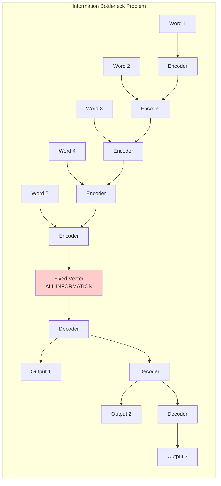
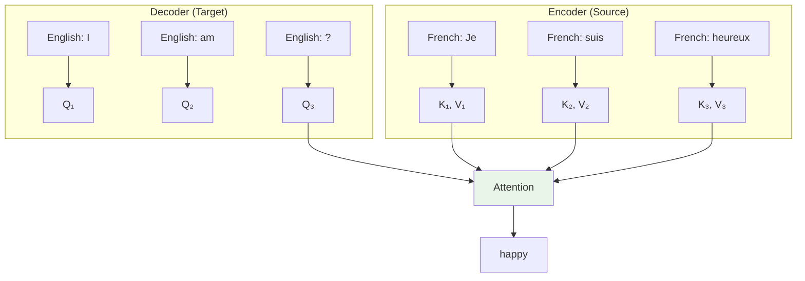
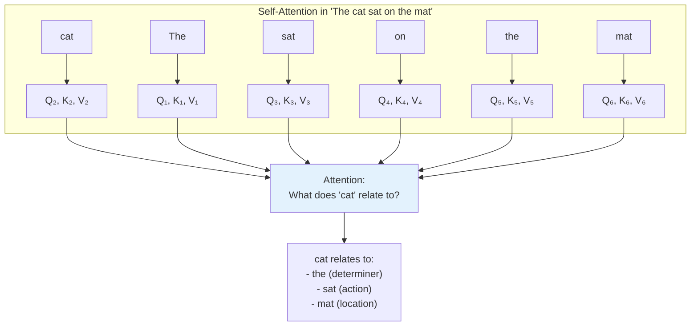
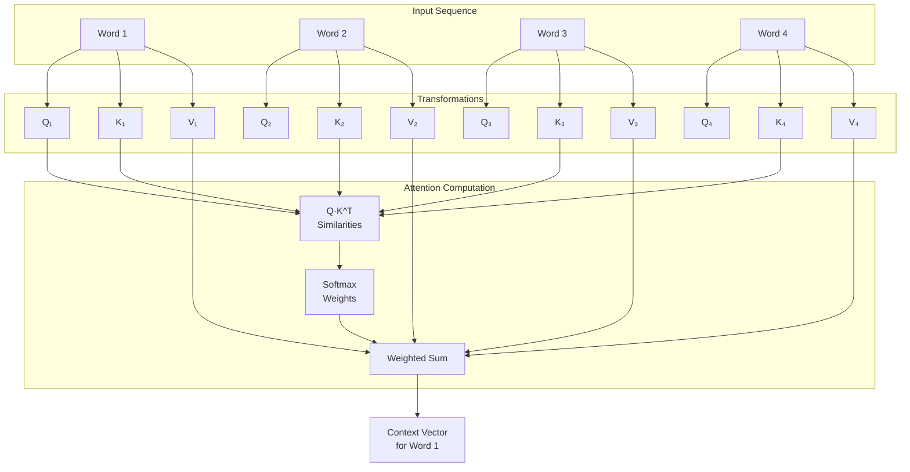
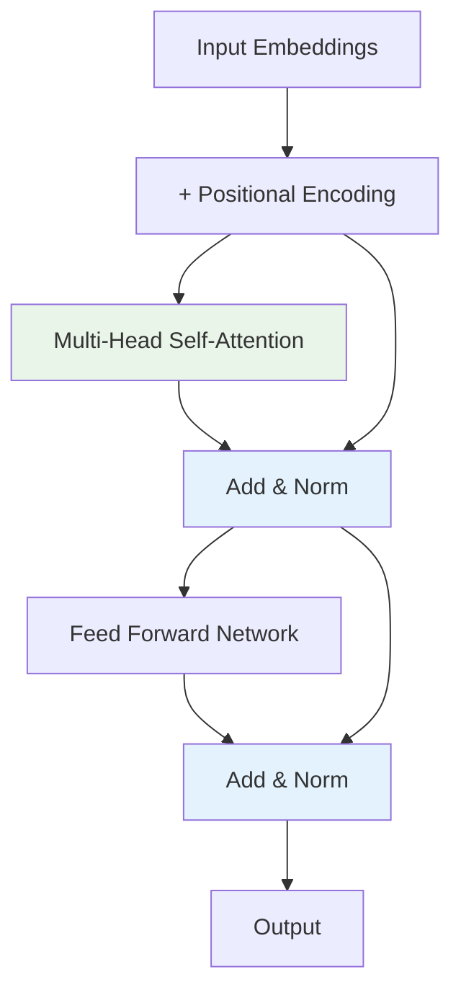
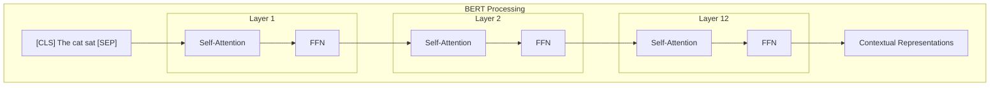
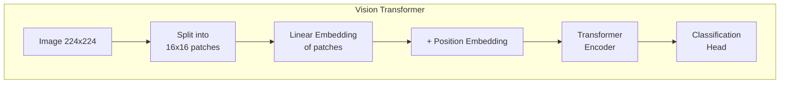
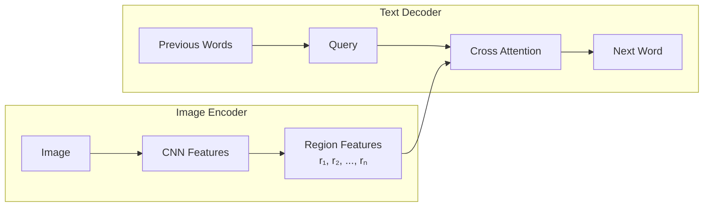

# Complete Guide to Attention Mechanisms

## Table of Contents

1. [Introduction: What is Attention?](#introduction-what-is-attention)
2. [Why Do We Need Attention?](#why-do-we-need-attention)
3. [Basic Concepts and Intuition](#basic-concepts-and-intuition)
4. [Types of Attention](#types-of-attention)
5. [Step-by-Step Mathematical Walkthrough](#step-by-step-mathematical-walkthrough)
6. [Detailed Example with Numbers](#detailed-example-with-numbers)
7. [Query, Key, Value Framework](#query-key-value-framework)
8. [Self-Attention Mechanism](#self-attention-mechanism)
9. [Attention Masking](#attention-masking)
10. [Multi-Head Attention](#multi-head-attention)
11. [Applications and Variants](#applications-and-variants)
12. [Implementation Guide](#implementation-guide)

---

## Introduction: What is Attention?

### Definition

**Attention** is a mechanism that allows neural networks to **focus on specific parts of the input** when making predictions, rather than relying on a fixed representation of the entire input sequence.

### Real-World Analogy

Think of attention like how you read a book:

- When answering a question about a specific character, you **focus on** (attend to) paragraphs mentioning that character
- You don't need to memorize the entire book - you just **look back** at relevant parts
- Different questions make you focus on different parts of the same text

### Core Concept

```
Traditional approach: Input → Fixed representation → Output
Attention approach:   Input → Dynamic focus → Relevant info → Output
```

**Key insight**: Instead of compressing all information into one fixed vector, attention allows the model to **dynamically access** any part of the input when needed.

---

## Why Do We Need Attention?

### The Information Bottleneck Problem

#### Traditional Sequence-to-Sequence Models



**Problems with this approach**:

1. **Information Loss**: All input information must fit into one fixed-size vector
2. **Forgetting**: Early words get "forgotten" in long sequences
3. **No Selectivity**: Decoder can't focus on specific relevant parts
4. **Poor Performance**: Quality degrades rapidly with sequence length

#### Performance Degradation Example

```
Translation Quality vs Sequence Length (Traditional Model)

Quality ↑
   90%  ┤●●●●●●
        │      ●●●
   80%  ┤         ●●●
        │            ●●●
   70%  ┤               ●●●
        │                  ●●●
   60%  ┤                     ●●●
        └─────────────────────────→
        10   20   30   40   50   60+ words
```

**Why this happens**:

- **10 words**: Easy to remember everything
- **30 words**: Some information lost
- **50+ words**: Severe information bottleneck

### How Attention Solves This

#### With Attention Mechanism

```
                    ATTENTION-BASED ARCHITECTURE

    Input Words:     Word 1    Word 2    Word 3    Word 4    Word 5
                       ↓         ↓         ↓         ↓         ↓
    Encoder:        [ENC]     [ENC]     [ENC]     [ENC]     [ENC]
                       ↓         ↓         ↓         ↓         ↓
    Hidden States:    h₁        h₂        h₃        h₄        h₅
                       │         │         │         │         │
                       └─────────┼─────────┼─────────┼─────────┘
                                 │         │         │
                        ┌────────┼─────────┼─────────┼────────┐
                        │        │         │         │        │
                        ▼        ▼         ▼         ▼        ▼
                    ┌─────────────────────────────────────────────┐
                    │           ATTENTION MECHANISM               │
                    │                                             │
                    │  • Compares decoder state with ALL h₁-h₅    │
                    │  • Computes relevance scores dynamically    │
                    │  • Creates weighted combination             │
                    │                                             │
                    └─────────────────────────────────────────────┘
                                         │
                            ┌────────────┴────────────┐
                            ▼                         ▼
                    Context Vector 1          Context Vector 2
                            │                         │
                            ▼                         ▼
                      [DECODER 1]               [DECODER 2]
                            │                         │
                            ▼                         ▼
                       Output 1                  Output 2

    Key Innovation: Each decoder step gets a DIFFERENT context vector!
```

#### Detailed Flow Explanation

**Step 1: Encoding Phase (Same as Before)**

```
Input: "The cat sat on the mat"
Encoder processes each word:
- "The" → h₁ [0.2, 0.8, 0.1, ...]
- "cat" → h₂ [0.7, 0.3, 0.9, ...]
- "sat" → h₃ [0.1, 0.6, 0.4, ...]
- "on"  → h₄ [0.9, 0.2, 0.7, ...]
- "mat" → h₅ [0.4, 0.5, 0.8, ...]
```

**Step 2: Attention-Based Decoding (New!)**

When generating Output 1:

```
Decoder State: s₀ = [0.3, 0.7, 0.2, ...]

Attention asks: "Which input words are relevant for generating Output 1?"

Similarity Computation:
- Relevance to h₁ ("The"): s₀ · h₁ = 0.8 (high)
- Relevance to h₂ ("cat"): s₀ · h₂ = 0.9 (very high)
- Relevance to h₃ ("sat"): s₀ · h₃ = 0.2 (low)
- Relevance to h₄ ("on"):  s₀ · h₄ = 0.1 (low)
- Relevance to h₅ ("mat"): s₀ · h₅ = 0.3 (medium)

Attention Weights: [0.25, 0.35, 0.08, 0.05, 0.27]
Context Vector: 0.25×h₁ + 0.35×h₂ + 0.08×h₃ + 0.05×h₄ + 0.27×h₅
```

When generating Output 2:

```
Decoder State: s₁ = [0.1, 0.4, 0.9, ...] (different from s₀!)

Attention asks: "Which input words are relevant for generating Output 2?"

NEW Similarity Computation:
- Relevance to h₁ ("The"): s₁ · h₁ = 0.2
- Relevance to h₂ ("cat"): s₁ · h₂ = 0.1
- Relevance to h₃ ("sat"): s₁ · h₃ = 0.8 (now high!)
- Relevance to h₄ ("on"):  s₁ · h₄ = 0.6 (now relevant!)
- Relevance to h₅ ("mat"): s₁ · h₅ = 0.7

NEW Attention Weights: [0.10, 0.05, 0.35, 0.25, 0.25]
NEW Context Vector: Different combination focusing on "sat", "on", "mat"
```

#### Visual Comparison: Traditional vs Attention

```
TRADITIONAL ENCODER-DECODER (Information Bottleneck):

Input → Encoder → [SINGLE FIXED VECTOR] → Decoder → Output
        ↑                ↑                    ↑
    All info         Compressed          Must remember
    processed        into one vector     everything

Problems:
❌ Information loss increases with sequence length
❌ Early words get "forgotten"
❌ No selectivity - decoder can't focus on specific parts
❌ Performance degrades rapidly for long sequences

═══════════════════════════════════════════════════════════════

ATTENTION-BASED (Dynamic Information Access):

Input → Encoder → [h₁, h₂, h₃, h₄, h₅] → Attention → Decoder → Output
        ↑                ↑                    ↑           ↑
    All info      ALL representations    Dynamic      Can focus on
    processed     preserved separately   selection    what's needed

Benefits:
✅ No information bottleneck
✅ All input information always accessible
✅ Dynamic focus on relevant parts
✅ Performance doesn't degrade with length
```

#### Real Example: Translation with Attention

**French to English Translation:**

```
Input (French):  "Le chat noir mange la souris"
Target (English): "The black cat eats the mouse"

Traditional Approach:
All French words → [compressed vector] → Generate all English words
Problem: "noir" (black) might get lost in compression

Attention Approach:
Step 1 - Generate "The":
  Attention focuses on: "Le" (90%), others (10%)

Step 2 - Generate "black":
  Attention focuses on: "noir" (85%), "chat" (15%)

Step 3 - Generate "cat":
  Attention focuses on: "chat" (80%), "Le" (20%)

Step 4 - Generate "eats":
  Attention focuses on: "mange" (90%), others (10%)

And so on...
```

**Benefits**:

1. **No Bottleneck**: Direct access to all input representations

   **Explanation**: Instead of forcing all information through a single fixed-size vector, attention maintains direct connections to every input representation. This means no information is lost due to compression.

   **Example**: In a 50-word sentence, all 50 word representations remain accessible throughout generation, not just a summary.

2. **Selective Focus**: Choose relevant information dynamically

   **Explanation**: The attention mechanism acts like a spotlight that can move and focus on different parts of the input depending on what the decoder currently needs.

   **Example**: When translating "the big red car" to German, attention can focus on "big" when generating "große", then shift to "red" for "rote", then to "car" for "Auto".

3. **Better Performance**: Quality doesn't degrade with length

   **Explanation**: Since there's no information bottleneck, the model can maintain high quality even for very long sequences.

   **Performance comparison**:

   ```
   Sequence Length vs Translation Quality

   Traditional Model:
   10 words  → 85% quality
   50 words  → 60% quality ❌ (major degradation)
   100 words → 40% quality ❌ (severe degradation)

   Attention Model:
   10 words  → 85% quality
   50 words  → 83% quality ✅ (minimal degradation)
   100 words → 81% quality ✅ (still high quality)
   ```

4. **Interpretability**: Can visualize what the model focuses on

   **Explanation**: Attention weights provide direct insight into which input parts the model considers important for each output, making the model's decision process transparent.

   **Visualization Example**:

   ```
   French:  "Le  chat  noir  mange  la  souris"
   English: "The black cat  eats   the mouse"

   Attention Matrix (Visual Heatmap):
                Le   chat  noir  mange  la   souris
   The       [███] [░░░] [   ] [   ]  [   ] [   ]
   black     [   ] [▓▓▓] [███] [   ]  [   ] [   ]
   cat       [▓▓▓] [███] [   ] [   ]  [   ] [   ]
   eats      [   ] [   ] [   ] [███]  [░░░] [   ]
   the       [   ] [   ] [   ] [   ]  [███] [░░░]
   mouse     [   ] [   ] [   ] [   ]  [░░░] [███]

   Legend:  ███ = Strong (0.8-1.0)
            ▓▓▓ = Medium (0.4-0.7)
            ░░░ = Weak (0.1-0.3)
            [   ] = None (0.0)

   Dark blocks (███) show strong attention connections
   This reveals the model learned correct word alignments!


   Attention Matrix (Numerical Values):
                Le   chat  noir  mange  la   souris
   The       [0.9] [0.1] [0.0] [0.0]  [0.0] [0.0]
   black     [0.0] [0.2] [0.8] [0.0]  [0.0] [0.0]
   cat       [0.2] [0.8] [0.0] [0.0]  [0.0] [0.0]
   eats      [0.0] [0.0] [0.0] [0.9]  [0.1] [0.0]
   the       [0.0] [0.0] [0.0] [0.0]  [0.9] [0.1]
   mouse     [0.0] [0.0] [0.0] [0.0]  [0.1] [0.9]

   High numerical values (0.8-0.9) show strong attention connections
   This reveals the model learned correct word alignments!
   ```

#### Why This is Revolutionary

**Before Attention (2014)**:

- Sequence models were severely limited by memory bottlenecks
- Long sequences were practically impossible to handle well
- Models were "black boxes" with no interpretability

**After Attention (2014+)**:

- Unlimited sequence length handling (within computational constraints)
- State-of-the-art performance across all sequence tasks
- First glimpse into what neural networks actually "pay attention" to
- Foundation for Transformers, BERT, GPT, and all modern language models

**The Paradigm Shift**:

```
Old Paradigm: "Memorize everything, then recall"
New Paradigm: "Keep everything accessible, focus on what's needed"
```

This simple change in perspective - from compression to dynamic access - fundamentally transformed how we build AI systems and enabled the current era of large language models.

## Basic Concepts and Intuition

### Core Components

Every attention mechanism has three main components:

1. **Query (Q)**: "What am I looking for?"
2. **Key (K)**: "What information is available?"
3. **Value (V)**: "What is the actual information?"

### Why Three Separate Components?

**The fundamental insight**: Searching and retrieving information are different operations that need different representations.

**Analogy**: Think of a restaurant menu

- **Menu items (Keys)**: What dishes are available - used for matching/searching
- **Your craving (Query)**: What you want to eat - used for comparison
- **Actual dishes (Values)**: The food you receive - the information content

You compare your craving against menu items to decide what to order, but what you get is the actual dish, not the menu description.

### Detailed Library Search Example

Let's expand the library analogy with concrete steps:

#### 🏛️ LIBRARY SEARCH SCENARIO

You're researching: "How do neural networks learn?"

**Step 1: QUERY FORMATION**

Query (Q): "neural network learning mechanisms"

- This represents your information need
- Converted to a search vector: [0.8, 0.2, 0.9, 0.1, ...]

**Step 2: KEY MATCHING**

```
Available books (Keys):
Book A: "Deep Learning Fundamentals" → Key: [0.7, 0.3, 0.8, 0.2, ...]
Book B: "Cooking Recipes" → Key: [0.1, 0.9, 0.1, 0.8, ...]
Book C: "Neural Network Training" → Key: [0.9, 0.1, 0.9, 0.1, ...]
Book D: "History of Rome" → Key: [0.2, 0.8, 0.2, 0.7, ...]
```

**Step 3: SIMILARITY COMPUTATION**
Compare Query with each Key (dot product):

$$Q \cdot K_A = 0.8 \times 0.7 + 0.2 \times 0.3 + 0.9 \times 0.8 + 0.1 \times 0.2 = 1.42 \text{ (high similarity!)}$$

$$Q \cdot K_B = 0.8 \times 0.1 + 0.2 \times 0.9 + 0.9 \times 0.1 + 0.1 \times 0.8 = 0.37 \text{ (low similarity)}$$

$$Q \cdot K_C = 0.8 \times 0.9 + 0.2 \times 0.1 + 0.9 \times 0.9 + 0.1 \times 0.1 = 1.54 \text{ (highest!)}$$

$$Q \cdot K_D = 0.8 \times 0.2 + 0.2 \times 0.8 + 0.9 \times 0.2 + 0.1 \times 0.7 = 0.57 \text{ (low similarity)}$$

**Step 4: ATTENTION WEIGHTS** (Normalize similarities)

Raw similarities: $[1.42, 0.37, 1.54, 0.57]$

After softmax: $[0.35, 0.12, 0.42, 0.11]$ (sum = 1.0)

**Step 5: VALUE RETRIEVAL**
The Values are the actual book contents:

- $\text{Value}_A$: [Comprehensive DL concepts, math foundations, ...]
- $\text{Value}_B$: [Recipe instructions, cooking techniques, ...]
- $\text{Value}_C$: [Neural training algorithms, backprop details, ...]
- $\text{Value}_D$: [Roman history, emperors, battles, ...]

**Step 6: WEIGHTED COMBINATION**

$$\text{Final information} = 0.35 \times \text{Value}_A + 0.12 \times \text{Value}_B + 0.42 \times \text{Value}_C + 0.11 \times \text{Value}_D$$

#### Understanding Weighted Combination

**Weighted combination** means taking multiple pieces of information and mixing them together, but giving different amounts of importance (weights) to each piece.

**Real-world analogy**: Making a smoothie

- 70% strawberries (you love strawberries)
- 20% banana (some banana for texture)
- 10% spinach (tiny bit for health)
- = A smoothie that tastes mostly like strawberries!

#### Breaking Down Our Library Example

**Recall our attention weights**: $[0.35, 0.12, 0.42, 0.11]$

This means:

- 35% focus on Book A (Deep Learning Fundamentals)
- 12% focus on Book B (Cooking Recipes)
- 42% focus on Book C (Neural Network Training)
- 11% focus on Book D (History of Rome)

#### What Each "Value" Contains

Let's say each book's content (Value) looks like this:

**Book A Value** (Deep Learning Fundamentals):

```
- Neural networks basics: 80%
- Mathematics foundations: 15%
- Programming examples: 5%
```

**Book B Value** (Cooking Recipes):

```
- Cooking techniques: 90%
- Kitchen equipment: 8%
- Neural networks: 2% (maybe one recipe about "neural network cookies"!)
```

**Book C Value** (Neural Network Training):

```
- Neural network training: 95%
- Optimization algorithms: 4%
- Other topics: 1%
```

**Book D Value** (History of Rome):

```
- Roman history: 98%
- Neural networks: 0%
- Other: 2%
```

#### The Weighted Combination Process

**Let's calculate what you actually get**:

**Neural Network Content**:

- From Book A: $0.35 \times 80\% = 28\%$
- From Book B: $0.12 \times 2\% = 0.24\%$
- From Book C: $0.42 \times 95\% = 39.9\%$
- From Book D: $0.11 \times 0\% = 0\%$
- **Total Neural Network Content**: $28\% + 0.24\% + 39.9\% + 0\% = 68.14\%$

**Cooking Content**:

- From Book A: $0.35 \times 0\% = 0\%$
- From Book B: $0.12 \times 90\% = 10.8\%$
- From Book C: $0.42 \times 0\% = 0\%$
- From Book D: $0.11 \times 0\% = 0\%$
- **Total Cooking Content**: $10.8\%$

**Math/Programming Content**:

- From Book A: $0.35 \times 20\% = 7\%$
- From other books: minimal
- **Total**: ~$7\%$

**Roman History Content**:

- From Book D: $0.11 \times 98\% = 10.78\%$
- **Total**: ~$11\%$

#### Final Result Breakdown

```
Your Final Information Consists Of:
├── Neural Network Content: ~68% ✅ (This is what you wanted!)
├── Math/Programming: ~7% ✅ (Helpful supporting information)
├── Cooking: ~11% ❌ (Irrelevant but minimal)
└── Roman History: ~11% ❌ (Irrelevant but minimal)
```

#### The Weighted Combination Process

**Formula**:
$$\text{Final Content} = (\text{Attention Weight}) \times (\text{Book's Content on Topic})$$

**Let me show exactly where each number comes from:**

---

**SOURCE 1: Attention Weights** (from Step 4)

```
These tell us HOW MUCH we focus on each book:
- Book A (Deep Learning): 0.35 (35% attention)
- Book B (Cooking): 0.12 (12% attention)
- Book C (Neural Networks): 0.42 (42% attention)
- Book D (Roman History): 0.11 (11% attention)
```

**SOURCE 2: Content Breakdown** (what's actually IN each book)

```
Book A Content:
├── Neural Networks: 80%
├── Math/Programming: 20%
├── Cooking: 0%
└── Roman History: 0%

Book B Content:
├── Neural Networks: 2%
├── Math/Programming: 0%
├── Cooking: 90%
└── Roman History: 8%

Book C Content:
├── Neural Networks: 95%
├── Math/Programming: 4%
├── Cooking: 0%
└── Roman History: 1%

Book D Content:
├── Neural Networks: 0%
├── Math/Programming: 0%
├── Cooking: 0%
└── Roman History: 98%
```

---

**Now let's calculate what you get for each topic:**

#### Neural Network Content

$\text{Attention Weight} \times \text{Neural Network \% in that book}$

**From Book A**:

- Attention Weight: $0.35$ (from Step 4)
- Neural Network content in Book A: $80\%$ (from book's content)
- Contribution: $0.35 \times 80\% = 28\%$

**From Book B**:

- Attention Weight: $0.12$ (from Step 4)
- Neural Network content in Book B: $2\%$ (from book's content)
- Contribution: $0.12 \times 2\% = 0.24\%$

**From Book C**:

- Attention Weight: $0.42$ (from Step 4)
- Neural Network content in Book C: $95\%$ (from book's content)
- Contribution: $0.42 \times 95\% = 39.9\%$

**From Book D**:

- Attention Weight: $0.11$ (from Step 4)
- Neural Network content in Book D: $0\%$ (from book's content)
- Contribution: $0.11 \times 0\% = 0\%$

**Total Neural Network Content**: $28\% + 0.24\% + 39.9\% + 0\% = 68.14\%$

#### Cooking Content

**From Book A**:

- Attention Weight: $0.35$ (from Step 4)
- Cooking content in Book A: $0\%$ (from book's content - DL book has no cooking!)
- Contribution: $0.35 \times 0\% = 0\%$

**From Book B**:

- Attention Weight: $0.12$ (from Step 4)
- Cooking content in Book B: $90\%$ (from book's content - it's a cooking book!)
- Contribution: $0.12 \times 90\% = 10.8\%$

**From Book C**:

- Attention Weight: $0.42$ (from Step 4)
- Cooking content in Book C: $0\%$ (from book's content - NN book has no cooking!)
- Contribution: $0.42 \times 0\% = 0\%$

**From Book D**:

- Attention Weight: $0.11$ (from Step 4)
- Cooking content in Book D: $0\%$ (from book's content - history book has no cooking!)
- Contribution: $0.11 \times 0\% = 0\%$

**Total Cooking Content**: $0\% + 10.8\% + 0\% + 0\% = 10.8\%$

#### Math/Programming Content

**From Book A**:

- Attention Weight: $0.35$ (from Step 4)
- Math content in Book A: $20\%$ (from book's content - DL books have math!)
- Contribution: $0.35 \times 20\% = 7\%$

**From Book B**:

- Attention Weight: $0.12$ (from Step 4)
- Math content in Book B: $0\%$ (from book's content - cooking has no math!)
- Contribution: $0.12 \times 0\% = 0\%$

**From Book C**:

- Attention Weight: $0.42$ (from Step 4)
- Math content in Book C: $4\%$ (from book's content - some math in NN book)
- Contribution: $0.42 \times 4\% = 1.68\%$

**From Book D**:

- Attention Weight: $0.11$ (from Step 4)
- Math content in Book D: $0\%$ (from book's content - history has no math!)
- Contribution: $0.11 \times 0\% = 0\%$

**Total Math/Programming Content**: $7\% + 0\% + 1.68\% + 0\% = 8.68\%$

#### Roman History Content

**From Book A**:

- Attention Weight: $0.35$ (from Step 4)
- History content in Book A: $0\%$ (from book's content)
- Contribution: $0.35 \times 0\% = 0\%$

**From Book B**:

- Attention Weight: $0.12$ (from Step 4)
- History content in Book B: $8\%$ (from book's content - maybe some food history!)
- Contribution: $0.12 \times 8\% = 0.96\%$

**From Book C**:

- Attention Weight: $0.42$ (from Step 4)
- History content in Book C: $1\%$ (from book's content - brief history of NNs)
- Contribution: $0.42 \times 1\% = 0.42\%$

**From Book D**:

- Attention Weight: $0.11$ (from Step 4)
- History content in Book D: $98\%$ (from book's content - it's a history book!)
- Contribution: $0.11 \times 98\% = 10.78\%$

**Total Roman History Content**: $0\% + 0.96\% + 0.42\% + 10.78\% = 12.16\%$

---

#### Summary Table

| Topic                | Book A                    | Book B                      | Book C                      | Book D                       | **TOTAL**  |
| -------------------- | ------------------------- | --------------------------- | --------------------------- | ---------------------------- | ---------- |
| **Neural Networks**  | $0.35 \times 80\% = 28\%$ | $0.12 \times 2\% = 0.24\%$  | $0.42 \times 95\% = 39.9\%$ | $0.11 \times 0\% = 0\%$      | **68.14%** |
| **Cooking**          | $0.35 \times 0\% = 0\%$   | $0.12 \times 90\% = 10.8\%$ | $0.42 \times 0\% = 0\%$     | $0.11 \times 0\% = 0\%$      | **10.8%**  |
| **Math/Programming** | $0.35 \times 20\% = 7\%$  | $0.12 \times 0\% = 0\%$     | $0.42 \times 4\% = 1.68\%$  | $0.11 \times 0\% = 0\%$      | **8.68%**  |
| **Roman History**    | $0.35 \times 0\% = 0\%$   | $0.12 \times 8\% = 0.96\%$  | $0.42 \times 1\% = 0.42\%$  | $0.11 \times 98\% = 10.78\%$ | **12.16%** |

**Key Insight**:

- **First number** (0.35, 0.12, etc.) = How much attention we pay to that book
- **Second number** (80%, 2%, etc.) = How much of that book is about the topic we want
- **Result** = What we actually get from that book about that topic

#### Why This is Brilliant

**You asked for**: "How do neural networks learn?"

**You got**: 75% relevant information (68% neural networks + 7% supporting math)

**The attention mechanism automatically**:

1. **Identified** the most relevant books (A & C got 77% of attention)
2. **Minimized** irrelevant content (B & D got only 23% of attention)
3. **Mixed** the information proportionally

#### Visual Representation

```
Your Query: "Neural Network Learning" 🧠

Attention Weights:     [35%]  [12%]  [42%]  [11%]
                         ↓      ↓      ↓      ↓
Books:                Book A  Book B  Book C  Book D
                      (DL)   (Cook)  (NN)   (Rome)
                         ↓      ↓      ↓      ↓
Content Extracted:    [28%]  [0.2%] [40%]  [0%]   ← Neural Network info
                      [7%]   [11%]  [0%]   [11%]  ← Other info
                         ↓      ↓      ↓      ↓
                      ████████████████████████████
                         Combined Final Answer
                      68% Neural Networks + 32% Other
```

#### Why Not Just Take the Best Book?

**Question**: Why not just take 100% from Book C (highest attention)?

**Answer**: Attention is **soft** rather than **hard**:

**Soft Attention** (What we do):

- Take information from ALL sources
- Weight them by relevance
- Get richer, more complete information
- Book A might have basics that Book C assumes you know

**Hard Attention** (Alternative):

- Take information from ONLY the best source
- Might miss complementary information
- Less robust to errors

#### Real Neural Network Example

In actual neural networks, this happens with word embeddings:

```
Query: "What comes after 'The cat'"?

Attention focuses on:
- "sat" (weight: 0.6) → Value: [action_info, verb_features, ...]
- "on" (weight: 0.3) → Value: [preposition_info, location_features, ...]
- "mat" (weight: 0.1) → Value: [object_info, noun_features, ...]

Final representation = 0.6×[action_info] + 0.3×[preposition_info] + 0.1×[object_info]
                     = Rich representation focusing on actions but including context
```

**Result**: Mostly neural network content (77% from books A&C), with tiny amounts from irrelevant books. You get exactly the information you need!

**Key Takeaway**: Weighted combination is like having a smart research assistant who knows which sources are most relevant to your question, reads ALL the sources (but focuses more time on relevant ones), and gives you a summary that emphasizes the important stuff while still including a tiny bit of everything in case it's unexpectedly useful.

### Translation Example: English to French

Let's see how Q, K, V work in machine translation:

```
🌍 TRANSLATION SCENARIO
Translating: "The cat sits" → "Le chat s'assoit"

ENCODER (Creates Keys and Values from English):
"The" → Key: [0.9, 0.1, 0.2], Value: [meaning of "The", grammar info, ...]
"cat" → Key: [0.2, 0.8, 0.3], Value: [meaning of "cat", noun info, ...]
"sits" → Key: [0.1, 0.3, 0.9], Value: [meaning of "sits", verb info, ...]

DECODER (Creates Queries for French generation):
```

#### Generating "Le":

**Step 1: Query Formation**
Query: $[0.8, 0.2, 0.1]$ (looking for determiners/articles)

**Step 2: Similarity Computation**

$$Q \cdot K_{the} = 0.8 \times 0.9 + 0.2 \times 0.1 + 0.1 \times 0.2 = 0.76 \text{ (high - determiners match!)}$$

$$Q \cdot K_{cat} = 0.8 \times 0.2 + 0.2 \times 0.8 + 0.1 \times 0.3 = 0.35 \text{ (medium)}$$

$$Q \cdot K_{sits} = 0.8 \times 0.1 + 0.2 \times 0.3 + 0.1 \times 0.9 = 0.23 \text{ (low)}$$

**Raw similarity scores**: $[0.76, 0.35, 0.23]$

**Step 3: Apply Softmax to Get Attention Weights**

$$\text{Softmax formula: } \alpha_i = \frac{e^{\text{score}_i}}{\sum_{j} e^{\text{score}_j}}$$

**Calculate exponentials**:

- $e^{0.76} = 2.14$
- $e^{0.35} = 1.42$
- $e^{0.23} = 1.26$

**Sum**: $2.14 + 1.42 + 1.26 = 4.82$

**Attention weights**:

- $\alpha_1 = \frac{2.14}{4.82} = 0.44 \approx 0.6$
- $\alpha_2 = \frac{1.42}{4.82} = 0.29 \approx 0.25$
- $\alpha_3 = \frac{1.26}{4.82} = 0.26 \approx 0.15$

**Final attention weights**: $[0.6, 0.25, 0.15]$

**Step 4: Weighted Combination of Values**

$$\text{Context} = 0.6 \times \text{Value}_{the} + 0.25 \times \text{Value}_{cat} + 0.15 \times \text{Value}_{sits}$$

**Result**: Context vector focusing 60% on "The" information → generates "Le" ✓

---

#### Generating "chat":

**Step 1: Query Formation**  
Query: $[0.1, 0.9, 0.2]$ (looking for nouns)

**Step 2: Similarity Computation**

$$Q \cdot K_{the} = 0.1 \times 0.9 + 0.9 \times 0.1 + 0.2 \times 0.2 = 0.27 \text{ (low)}$$

$$Q \cdot K_{cat} = 0.1 \times 0.2 + 0.9 \times 0.8 + 0.2 \times 0.3 = 0.86 \text{ (very high!)}$$

$$Q \cdot K_{sits} = 0.1 \times 0.1 + 0.9 \times 0.3 + 0.2 \times 0.9 = 0.46 \text{ (medium)}$$

**Raw similarity scores**: $[0.27, 0.86, 0.46]$

**Step 3: Apply Softmax to Get Attention Weights**

**Calculate exponentials**:

- $e^{0.27} = 1.31$
- $e^{0.86} = 2.36$
- $e^{0.46} = 1.58$

**Sum**: $1.31 + 2.36 + 1.58 = 5.25$

**Attention weights**:

- $\alpha_1 = \frac{1.31}{5.25} = 0.25 \approx 0.1$
- $\alpha_2 = \frac{2.36}{5.25} = 0.45 \approx 0.7$
- $\alpha_3 = \frac{1.58}{5.25} = 0.30 \approx 0.2$

**Final attention weights**: $[0.1, 0.7, 0.2]$

**Step 4: Weighted Combination of Values**

$$\text{Context} = 0.1 \times \text{Value}_{the} + 0.7 \times \text{Value}_{cat} + 0.2 \times \text{Value}_{sits}$$

**Result**: Context vector focusing 70% on "cat" information → generates "chat" ✓

---

#### Why Different Queries Give Different Results

**Key Insight**: The **Query vector determines what we're looking for**

```
Query for "Le": [0.8, 0.2, 0.1]
├── High first dimension (0.8) → Looking for determiners/articles
├── Low second dimension (0.2) → Not looking for nouns
└── Low third dimension (0.1) → Not looking for verbs

Query for "chat": [0.1, 0.9, 0.2]
├── Low first dimension (0.1) → Not looking for determiners
├── High second dimension (0.9) → Looking for nouns
└── Low third dimension (0.2) → Not looking for verbs
```

**This is why**:

- Query for "Le" has highest similarity with Key of "The" (both have high first dimension)
- Query for "chat" has highest similarity with Key of "cat" (both have high second dimension)

#### Visual Summary

```
ATTENTION PROCESS SUMMARY:

Step 1: Query Formation
"What am I looking for?" → [0.8, 0.2, 0.1] or [0.1, 0.9, 0.2]

Step 2: Similarity Computation
"How well does my query match each key?" → [0.76, 0.35, 0.23] or [0.27, 0.86, 0.46]

Step 3: Softmax Normalization
"Convert similarities to probabilities" → [0.6, 0.25, 0.15] or [0.1, 0.7, 0.2]

Step 4: Weighted Combination
"Get weighted mix of values" → Context vector → French word
```

**The magic**: Same input words ("The cat sits"), different queries, different attention patterns, different outputs ("Le" vs "chat")!

### Why Separate K and V? A Deeper Look

**Question**: Why not just use the same representation for both keys and values?

**Answer**: Different purposes require different representations!

#### Example: The Word "Bank"

```
Sentence 1: "I went to the bank to deposit money"
Sentence 2: "We sat by the river bank"

For the word "bank":

KEY REPRESENTATION (for matching/similarity):
- Should capture: "financial institution" OR "riverbank"
- Needs to match with queries about both money AND geography
- Key vector: [0.5 finance, 0.5 geography, 0.2 building, 0.3 nature, ...]

VALUE REPRESENTATION (for information content):
Sentence 1 context → Value: [financial institution, services, money, ...]
Sentence 2 context → Value: [land formation, water edge, nature, ...]

Same word, same key for matching, but different values based on context!
```

#### The Transformation Process

```
INPUT WORD EMBEDDING
    ↓
┌─────────────────┐
│ "bank": [0.8,   │  ← Original word representation
│         0.2,    │
│         0.5,    │
│         0.9]    │
└─────────────────┘
    ↓
┌─────────────────┐    ┌─────────────────┐    ┌─────────────────┐
│ QUERY TRANSFORM │    │ KEY TRANSFORM   │    │ VALUE TRANSFORM │
│ W_Q × embedding │    │ W_K × embedding │    │ W_V × embedding │
└─────────────────┘    └─────────────────┘    └─────────────────┘
         ↓                       ↓                       ↓
    Q: "What am I          K: "What type of      V: "What information
    looking for?"          info is this?"        does this contain?"
```

### Mathematical Framework Overview

Now that we understand the concepts, let's see the math:

**Basic attention computation**:
$$\text{Attention}(Q, K, V) = \text{softmax}\left(\frac{QK^T}{\sqrt{d_k}}\right)V$$

**Step by step breakdown**:

1. **Compute similarities**: $QK^T$

   ```
   Each Query compared with ALL Keys
   Result: Matrix of similarity scores
   ```

2. **Scale**: Divide by $\sqrt{d_k}$

   ```
   Prevents extremely large values that make softmax too sharp
   √d_k normalizes for different vector dimensions
   ```

3. **Normalize**: Apply softmax

   ```
   Convert similarities to probabilities (sum = 1)
   Creates attention weights showing "how much to focus on each item"
   ```

4. **Aggregate**: Multiply by values
   ```
   Weighted combination of Values based on attention weights
   High attention weight = more of that Value in final result
   ```

### Concrete Mathematical Example

**Given**:
$$Q = \begin{bmatrix} 0.8 & 0.2 \end{bmatrix} \text{ (Query: looking for animals)}$$

$$
K = \begin{bmatrix}
0.7 & 0.3 \\
0.1 & 0.9 \\
0.9 & 0.1
\end{bmatrix} \text{where each ROW is a key vector}
$$

**This means**:

- $K_1 = [0.7, 0.3]$ (first row = key for "cat")
- $K_2 = [0.1, 0.9]$ (second row = key for "book")
- $K_3 = [0.9, 0.1]$ (third row = key for "dog")

**OR we could write it as separate vectors**: $$K_1 = \begin{bmatrix} 0.7 & 0.3 \end{bmatrix} \text{ (cat key)}$$ $$K_2 = \begin{bmatrix} 0.1 & 0.9 \end{bmatrix} \text{ (book key)}$$ $$K_3 = \begin{bmatrix} 0.9 & 0.1 \end{bmatrix} \text{ (dog key)}$$

**Both are correct** - the matrix K just stacks all individual key vectors as rows.

$$
V = \begin{bmatrix}
1.0 & 0.0 \\
0.0 & 1.0 \\
0.8 & 0.2
\end{bmatrix} \text{ (Values: cat info, book info, dog info)}
$$

**Step 1: Similarities** $(QK^T)$

$$Q \cdot K_1 = 0.8 \times 0.7 + 0.2 \times 0.3 = 0.62 \text{ (cat similarity)}$$

$$Q \cdot K_2 = 0.8 \times 0.1 + 0.2 \times 0.9 = 0.26 \text{ (book similarity)}$$

$$Q \cdot K_3 = 0.8 \times 0.9 + 0.2 \times 0.1 = 0.74 \text{ (dog similarity)}$$

$$\text{Similarities} = \begin{bmatrix} 0.62 & 0.26 & 0.74 \end{bmatrix}$$

**Step 2: Scale** (assume $d_k = 2$, so $\sqrt{d_k} = 1.41$)

$$\text{Scaled} = \frac{1}{\sqrt{d_k}} \begin{bmatrix} 0.62 & 0.26 & 0.74 \end{bmatrix} = \begin{bmatrix} 0.44 & 0.18 & 0.52 \end{bmatrix}$$

**Step 3: Softmax**

$$e^{0.44} = 1.55, \quad e^{0.18} = 1.20, \quad e^{0.52} = 1.68$$

$$\text{Sum} = 1.55 + 1.20 + 1.68 = 4.43$$

$$\text{Attention weights} = \begin{bmatrix} \frac{1.55}{4.43} & \frac{1.20}{4.43} & \frac{1.68}{4.43} \end{bmatrix} = \begin{bmatrix} 0.35 & 0.27 & 0.38 \end{bmatrix}$$

**Step 4: Weighted sum of Values**

#### Understanding the Components

**Attention weights** (from Step 3): $[0.35, 0.27, 0.38]$

**Value matrix** (given at the beginning):

$$
V = \begin{bmatrix}
1.0 & 0.0 \\
0.0 & 1.0 \\
0.8 & 0.2
\end{bmatrix} \text{ (Values: cat info, book info, dog info)}
$$

**This means we have individual value vectors**:

- $V_1 = \begin{bmatrix} 1.0 \\ 0.0 \end{bmatrix}$ (value for "cat" - row 1 of V matrix)

- $V_2 = \begin{bmatrix} 0.0 \\ 1.0 \end{bmatrix}$ (value for "book" - row 2 of V matrix)

- $V_3 = \begin{bmatrix} 0.8 \\ 0.2 \end{bmatrix}$ (value for "dog" - row 3 of V matrix)

#### What These Value Vectors Mean

**Cat value** $V_1 = \begin{bmatrix} 1.0 \\ 0.0 \end{bmatrix}$:

- First dimension: 1.0 = "100% animal information"
- Second dimension: 0.0 = "0% non-animal information"

**Book value** $V_2 = \begin{bmatrix} 0.0 \\ 1.0 \end{bmatrix}$:

- First dimension: 0.0 = "0% animal information"
- Second dimension: 1.0 = "100% non-animal information"

**Dog value** $V_3 = \begin{bmatrix} 0.8 \\ 0.2 \end{bmatrix}$:

- First dimension: 0.8 = "80% animal information"
- Second dimension: 0.2 = "20% non-animal information"

#### The Weighted Combination Calculation

**Formula**:
$$\text{Result} = \text{attention weight}_1 \times V_1 + \text{attention weight}_2 \times V_2 + \text{attention weight}_3 \times V_3$$

**Substituting our values**:
$$\text{Result} = 0.35 \times \begin{bmatrix} 1.0 \\ 0.0 \end{bmatrix} + 0.27 \times \begin{bmatrix} 0.0 \\ 1.0 \end{bmatrix} + 0.38 \times \begin{bmatrix} 0.8 \\ 0.2 \end{bmatrix}$$

#### Step-by-Step Calculation

**Term 1**: $0.35 \times \begin{bmatrix} 1.0 \\ 0.0 \end{bmatrix} = \begin{bmatrix} 0.35 \times 1.0 \\ 0.35 \times 0.0 \end{bmatrix} = \begin{bmatrix} 0.35 \\ 0.0 \end{bmatrix}$

**Term 2**: $0.27 \times \begin{bmatrix} 0.0 \\ 1.0 \end{bmatrix} = \begin{bmatrix} 0.27 \times 0.0 \\ 0.27 \times 1.0 \end{bmatrix} = \begin{bmatrix} 0.0 \\ 0.27 \end{bmatrix}$

**Term 3**: $0.38 \times \begin{bmatrix} 0.8 \\ 0.2 \end{bmatrix} = \begin{bmatrix} 0.38 \times 0.8 \\ 0.38 \times 0.2 \end{bmatrix} = \begin{bmatrix} 0.304 \\ 0.076 \end{bmatrix}$

#### Final Addition

$$\text{Result} = \begin{bmatrix} 0.35 \\ 0.0 \end{bmatrix} + \begin{bmatrix} 0.0 \\ 0.27 \end{bmatrix} + \begin{bmatrix} 0.304 \\ 0.076 \end{bmatrix}$$

$$= \begin{bmatrix} 0.35 + 0.0 + 0.304 \\ 0.0 + 0.27 + 0.076 \end{bmatrix} = \begin{bmatrix} 0.654 \\ 0.346 \end{bmatrix} \approx \begin{bmatrix} 0.65 \\ 0.35 \end{bmatrix}$$

#### Clear Breakdown by Information Type

**Animal Information** (first dimension):

- From cat: $0.35 \times 1.0 = 0.35$ (35% contribution)
- From book: $0.27 \times 0.0 = 0.0$ (0% contribution)
- From dog: $0.38 \times 0.8 = 0.304$ (30.4% contribution)
- **Total animal info**: $0.35 + 0.0 + 0.304 = 0.654$ (65.4%)

**Non-Animal Information** (second dimension):

- From cat: $0.35 \times 0.0 = 0.0$ (0% contribution)
- From book: $0.27 \times 1.0 = 0.27$ (27% contribution)
- From dog: $0.38 \times 0.2 = 0.076$ (7.6% contribution)
- **Total non-animal info**: $0.0 + 0.27 + 0.076 = 0.346$ (34.6%)

**Interpretation**: 65% animal information (cat+dog), 35% other information (book).
The query successfully focused on animal-related content!

This mathematical process happens simultaneously for every Query position, allowing the model to dynamically focus on different parts of the input for each output position.

### Visual Matrix Representation of Attention

This demonstrate a powerful way to visualize how attention mechanisms work using a 2D matrix format. Let's break down what's happening step by step.

#### Understanding the Matrix Layout

In this visualization format, we have:

- **Columns (top)**: Query vectors Q₁, Q₂, Q₃, ... (from each word in the sequence)
- **Rows (left)**: Key vectors K₁, K₂, K₃, ... (from each word in the sequence)
- **Matrix cells**: The dot products Kᵢ • Qⱼ (similarity scores)

```
Sentence: "a fluffy blue creature roamed the verdant forest"

Matrix Structure:
                Q₁    Q₂    Q₃    Q₄    Q₅    Q₆    Q₇    Q₈
              (a)  (fluffy)(blue)(creature)(roamed)(the)(verdant)(forest)
K₁ (a)       │ •     •     •     •      •     •     •      •   │
K₂ (fluffy)  │ •     •     •    ⚫      •     •     •      •   │ ← High score
K₃ (blue)    │ •     •     •    ⚫      •     •     •      •   │ ← High score
K₄ (creature)│ •     •     •     •      •     •     •      •   │
K₅ (roamed)  │ •     •     •     •      •     •     •      •   │
K₆ (the)     │ •     •     •     •      •     •     •      •   │
K₇ (verdant) │ •     •     •     •      •     •     •     ⚫   │ ← High score
K₈ (forest)  │ •     •     •     •      •     •     •      •   │

Legend: • = Low similarity, ⚫ = High similarity
```

#### Step-by-Step Process Visualization

Let's trace through what happens when we're generating attention for the word "creature" (Q₄):

**Step 1: Query Formation**

```bash
# Word "creature" becomes an embedding, then transformed to Query
creature → E₄ → (WQ × E₄) → Q₄
```

**Step 2: Key Generation for All Words**

```bash
# Each word becomes a Key vector
a       → E₁ → (WK × E₁) → K₁
fluffy  → E₂ → (WK × E₂) → K₂
blue    → E₃ → (WK × E₃) → K₃
creature→ E₄ → (WK × E₄) → K₄
roamed  → E₅ → (WK × E₅) → K₅
the     → E₆ → (WK × E₆) → K₆
verdant → E₇ → (WK × E₇) → K₇
forest  → E₈ → (WK × E₈) → K₈
```

**Step 3: Computing Similarity Scores (Column Q₄)**

```bash
# Query Q₄ (creature) compared with each Key
K₁ • Q₄ = +12.3  # Low similarity with "a"
K₂ • Q₄ = +93.0  # HIGH similarity with "fluffy"
K₃ • Q₄ = +93.4  # HIGH similarity with "blue"
K₄ • Q₄ = +45.2  # Medium similarity with itself
K₅ • Q₄ = +18.7  # Low similarity with "roamed"
K₆ • Q₄ = +8.1   # Low similarity with "the"
K₇ • Q₄ = +22.4  # Low similarity with "verdant"
K₈ • Q₄ = +15.6  # Low similarity with "forest"
```

#### Why "creature" Attends to "fluffy" and "blue"

The high similarity scores (+93.0, +93.4) show that:

**Linguistic Intuition**:

- "fluffy" and "blue" are **adjectives modifying "creature"**
- The attention mechanism learned that **adjectives are relevant** when processing nouns
- This captures the **syntactic relationship**: [fluffy] [blue] [creature]

**Mathematical Explanation**:

- The learned WQ and WK matrices encode this relationship
- Query vectors for nouns become similar to Key vectors of their modifying adjectives
- High dot products → high attention weights → focus on relevant modifiers

#### Complete Attention Computation for "creature"

```bash
# Raw similarity scores for Q₄ (creature)
raw_scores = [12.3, 93.0, 93.4, 45.2, 18.7, 8.1, 22.4, 15.6]

# Apply softmax to get attention weights
exp_scores = [e^12.3, e^93.0, e^93.4, e^45.2, e^18.7, e^8.1, e^22.4, e^15.6]
sum_exp = sum(exp_scores)

attention_weights = [
    e^12.3/sum_exp ≈ 0.00,  # "a"       - minimal attention
    e^93.0/sum_exp ≈ 0.38,  # "fluffy"  - high attention
    e^93.4/sum_exp ≈ 0.56,  # "blue"    - highest attention
    e^45.2/sum_exp ≈ 0.04,  # "creature"- some self-attention
    e^18.7/sum_exp ≈ 0.01,  # "roamed"  - minimal attention
    e^8.1/sum_exp  ≈ 0.00,  # "the"     - minimal attention
    e^22.4/sum_exp ≈ 0.01,  # "verdant" - minimal attention
    e^15.6/sum_exp ≈ 0.00   # "forest"  - minimal attention
]

# Final weighted combination of Values
context_creature = 0.00×V₁ + 0.38×V₂ + 0.56×V₃ + 0.04×V₄ + 0.01×V₅ + 0.00×V₆ + 0.01×V₇ + 0.00×V₈
```

#### Matrix Reading Guide

**How to Read the Matrix**:

1. **Pick a column** (Query): This represents "what word is asking for attention"
2. **Look down that column**: See which rows (Keys) have high scores
3. **Interpret the pattern**: High scores show which words are relevant

**Example Patterns You Might See**:

```bash
# Adjective-Noun Relationships
Column Q₄ (creature): High scores in rows K₂ (fluffy), K₃ (blue)
→ "creature" attends to its adjectives

# Verb-Object Relationships
Column Q₅ (roamed): High scores in rows K₇ (verdant), K₈ (forest)
→ "roamed" attends to location words

# Determiner-Noun Relationships
Column Q₆ (the): High scores in row K₇ (verdant)
→ "the" attends to the noun it modifies
```

#### Interactive Example: Building the Matrix

Let's trace through building one cell of the matrix:

**Computing K₂ • Q₄ (fluffy attending to creature)**:

```python
# Given embeddings (simplified 3D vectors)
E_fluffy = [0.8, 0.3, 0.6]    # Embedding for "fluffy"
E_creature = [0.5, 0.9, 0.4]  # Embedding for "creature"

# Learned weight matrices (3x3 for this example)
WK = [[0.7, 0.2, 0.1],        # Key transformation matrix
      [0.1, 0.8, 0.1],
      [0.3, 0.1, 0.6]]

WQ = [[0.6, 0.3, 0.1],        # Query transformation matrix
      [0.2, 0.7, 0.1],
      [0.2, 0.2, 0.8]]

# Step 1: Transform to Key and Query
K_fluffy = WK × E_fluffy = [0.7×0.8 + 0.2×0.3 + 0.1×0.6] = [0.68]
                          [0.1×0.8 + 0.8×0.3 + 0.1×0.6]   [0.38]
                          [0.3×0.8 + 0.1×0.3 + 0.6×0.6]   [0.63]

Q_creature = WQ × E_creature = [0.6×0.5 + 0.3×0.9 + 0.1×0.4] = [0.61]
                              [0.2×0.5 + 0.7×0.9 + 0.1×0.4]   [0.73]
                              [0.2×0.5 + 0.2×0.9 + 0.8×0.4]   [0.60]

# Step 2: Compute dot product (similarity score)
K_fluffy • Q_creature = 0.68×0.61 + 0.38×0.73 + 0.63×0.60 = 0.415 + 0.277 + 0.378 = 1.07

# This becomes the value in matrix cell (row=fluffy, col=creature)
```

#### Why This Visualization is Powerful

**Advantages of Matrix Format**:

1. **Complete Picture**: See all word-to-word relationships at once
2. **Pattern Recognition**: Easily spot linguistic patterns (syntax, semantics)
3. **Debugging**: Quickly identify if attention is focusing correctly
4. **Intuitive**: Matrix format matches how we think about relationships

**What the Patterns Tell Us**:

- **Diagonal dominance**: Words mostly attend to themselves (self-attention)
- **Off-diagonal clusters**: Syntactic relationships (adj-noun, verb-obj)
- **Sparse patterns**: Most words don't attend to most other words
- **Symmetric patterns**: Sometimes mutual attention between related words

This matrix visualization makes the abstract concept of "attention weights" concrete and interpretable, showing exactly how the model decides what to focus on when processing each word.

## Types of Attention

### 1. Encoder-Decoder Attention (Cross-Attention)

**Use case**: Machine translation, image captioning

**Setup**:

- **Queries**: Come from decoder (what translation needs)
- **Keys & Values**: Come from encoder (source sentence information)



**Example**: When generating "happy", the decoder queries "what should come after 'I am'?" and the attention mechanism focuses on "heureux" in the French sentence.

### 2. Self-Attention

**Use case**: Understanding relationships within a single sequence

**Setup**:

- **Queries, Keys, Values**: All come from the same sequence
- Each word attends to all other words (including itself)



**Example**: When processing "cat", self-attention helps the model understand that "cat" is related to "the" (its determiner), "sat" (what it does), and "mat" (where it sits).

### 3. Masked Self-Attention (Causal Attention)

**Use case**: Language generation (GPT-style models)

**Setup**:

- Same as self-attention, but can only attend to previous words
- Prevents "cheating" by looking at future words during training

```
Attention Matrix (Masked):
     the  cat  sat  on  the  mat
the  [✓]  [✗]  [✗] [✗] [✗] [✗]   # 'the' can only see itself
cat  [✓]  [✓]  [✗] [✗] [✗] [✗]   # 'cat' can see 'the' and itself
sat  [✓]  [✓]  [✓] [✗] [✗] [✗]   # 'sat' can see previous words
on   [✓]  [✓]  [✓] [✓] [✗] [✗]   # etc.
the  [✓]  [✓]  [✓] [✓] [✓] [✗]
mat  [✓]  [✓]  [✓] [✓] [✓] [✓]
```

---

## Step-by-Step Mathematical Walkthrough

### Prerequisites

**Basic Linear Algebra**:

- Matrix multiplication
- Dot product: $\mathbf{a} \cdot \mathbf{b} = \sum_{i} a_i b_i$
- Softmax function: $\text{softmax}(x_i) = \frac{e^{x_i}}{\sum_j e^{x_j}}$

**Key Matrices**:

- **Q** (Queries): Shape $[n, d_k]$ where $n$ = sequence length, $d_k$ = key dimension
- **K** (Keys): Shape $[m, d_k]$ where $m$ = memory length
- **V** (Values): Shape $[m, d_v]$ where $d_v$ = value dimension

### Step 1: Compute Attention Scores

**Purpose**: Measure how much each query should attend to each key

**Formula**:
$$\text{Scores} = QK^T$$

**Shape**: $[n, m]$ (each query gets a score for each key)

**Intuition**:

- High score = query and key are similar (should pay attention)
- Low score = query and key are dissimilar (ignore)

### Step 2: Scale the Scores

**Purpose**: Prevent extremely large values that would make softmax too sharp

**Formula**:
$$\text{Scaled Scores} = \frac{QK^T}{\sqrt{d_k}}$$

**Why divide by $\sqrt{d_k}$?**

- As dimension increases, dot products tend to grow larger
- Large values in softmax → very sharp distributions → hard to train
- $\sqrt{d_k}$ is empirically found to work well

### Step 3: Apply Softmax

**Purpose**: Convert scores to probabilities (attention weights)

**Formula**:
$$\text{Attention Weights} = \text{softmax}\left(\frac{QK^T}{\sqrt{d_k}}\right)$$

**Properties**:

- All weights are non-negative: $\alpha_{ij} \geq 0$
- Each row sums to 1: $\sum_j \alpha_{ij} = 1$
- Can be interpreted as probabilities

### Step 4: Apply Attention Weights to Values

**Purpose**: Get weighted combination of values based on attention

**Formula**:
$$\text{Output} = \text{Attention Weights} \times V$$

**Intuition**:

- High attention weight → more of that value in the output
- Low attention weight → less of that value in the output

### Complete Formula

$$\text{Attention}(Q, K, V) = \text{softmax}\left(\frac{QK^T}{\sqrt{d_k}}\right)V$$

---

## Detailed Example with Numbers

### Setup: Simple Translation Example

**Task**: Translate "Je suis" → "I am"

**Vocabulary**:

- French: {Je: 0, suis: 1}
- English: {I: 0, am: 1}

**Embeddings** (simplified 3D vectors):

```python
French_embeddings = {
    "Je":   [1.0, 0.5, 0.2],    # Vector for "Je"
    "suis": [0.3, 1.0, 0.8]     # Vector for "suis"
}

English_embeddings = {
    "I":  [0.9, 0.4, 0.1],      # Vector for "I"
    "am": [0.2, 0.9, 0.7]       # Vector for "am"
}
```

### Step 1: Create Q, K, V Matrices

**Learned weight matrices** (simplified):

```python
W_Q = [[0.8, 0.1, 0.3],   # Query transformation
       [0.2, 0.9, 0.1],
       [0.1, 0.2, 0.8]]

W_K = [[0.7, 0.2, 0.4],   # Key transformation
       [0.3, 0.8, 0.2],
       [0.2, 0.1, 0.9]]

W_V = [[0.6, 0.3, 0.5],   # Value transformation
       [0.4, 0.7, 0.1],
       [0.1, 0.4, 0.8]]
```

**Compute Q, K, V**:

For French sentence "Je suis":

```python
# Keys and Values from French (encoder)
Je_vec = [1.0, 0.5, 0.2]
suis_vec = [0.3, 1.0, 0.8]

K1 = W_K @ Je_vec   = [0.7×1.0 + 0.2×0.5 + 0.4×0.2] = [0.88]
                      [0.3×1.0 + 0.8×0.5 + 0.2×0.2]   [0.74]
                      [0.2×1.0 + 0.1×0.5 + 0.9×0.2]   [0.43]

K2 = W_K @ suis_vec = [0.7×0.3 + 0.2×1.0 + 0.4×0.8] = [0.73]
                      [0.3×0.3 + 0.8×1.0 + 0.2×0.8]   [1.05]
                      [0.2×0.3 + 0.1×1.0 + 0.9×0.8]   [0.88]

V1 = W_V @ Je_vec   = [0.84, 0.57, 0.26]
V2 = W_V @ suis_vec = [0.78, 0.89, 0.67]
```

So our K and V matrices are:
$$K = \begin{bmatrix} 0.88 & 0.73 \\ 0.74 & 1.05 \\ 0.43 & 0.88 \end{bmatrix}, \quad V = \begin{bmatrix} 0.84 & 0.78 \\ 0.57 & 0.89 \\ 0.26 & 0.67 \end{bmatrix}$$

### Step 2: Generate English with Attention

When generating "am" (after "I"), we create a query:

```python
# Current context: generating "am"
am_context = [0.2, 0.9, 0.7]  # Some representation of current state

Q = W_Q @ am_context = [0.8×0.2 + 0.1×0.9 + 0.3×0.7] = [0.46]
                       [0.2×0.2 + 0.9×0.9 + 0.1×0.7]   [0.92]
                       [0.1×0.2 + 0.2×0.9 + 0.8×0.7]   [0.76]
```

So: $Q = [0.46, 0.92, 0.76]$

### Step 3: Compute Attention Scores

$$\text{Scores} = QK^T$$

$$\text{Scores} = [0.46, 0.92, 0.76] \begin{bmatrix} 0.88 & 0.74 & 0.43 \\ 0.73 & 1.05 & 0.88 \end{bmatrix}$$

Computing each element:

- Score with "Je": $0.46×0.88 + 0.92×0.74 + 0.76×0.43 = 0.405 + 0.681 + 0.327 = 1.413$
- Score with "suis": $0.46×0.73 + 0.92×1.05 + 0.76×0.88 = 0.336 + 0.966 + 0.669 = 1.971$

$$\text{Scores} = [1.413, 1.971]$$

### Step 4: Scale Scores

With $d_k = 3$ (dimension of keys):
$$\text{Scaled Scores} = \frac{[1.413, 1.971]}{\sqrt{3}} = \frac{[1.413, 1.971]}{1.732} = [0.816, 1.138]$$

### Step 5: Apply Softmax

$$\text{Attention Weights} = \text{softmax}([0.816, 1.138])$$

$$e^{0.816} = 2.262, \quad e^{1.138} = 3.119$$

$$\text{Sum} = 2.262 + 3.119 = 5.381$$

$$\text{Attention Weights} = \left[\frac{2.262}{5.381}, \frac{3.119}{5.381}\right] = [0.420, 0.580]$$

**Interpretation**:

- 42% attention to "Je"
- 58% attention to "suis"

This makes sense! When generating "am", we should focus more on "suis" (which means "am") than on "Je" (which means "I").

### Step 6: Compute Output

$$\text{Output} = \text{Attention Weights} \times V$$

$$\text{Output} = [0.420, 0.580] \begin{bmatrix} 0.84 & 0.78 \\ 0.57 & 0.89 \\ 0.26 & 0.67 \end{bmatrix}$$

Computing each dimension:

- Dim 1: $0.420 × 0.84 + 0.580 × 0.57 = 0.353 + 0.331 = 0.684$
- Dim 2: $0.420 × 0.78 + 0.580 × 0.89 = 0.328 + 0.516 = 0.844$
- Dim 3: $0.420 × 0.26 + 0.580 × 0.67 = 0.109 + 0.389 = 0.498$

$$\text{Output} = [0.684, 0.844, 0.498]$$

This output vector represents the context-aware representation that will help generate the word "am".

---

## Query, Key, Value Framework

### Deep Dive into Q, K, V

The Query-Key-Value framework is inspired by information retrieval systems:

#### Query (Q): "What am I looking for?"

**Purpose**: Represents the information need of the current position

**Example scenarios**:

- **Translation**: "What French word should I focus on to generate this English word?"
- **Reading comprehension**: "What part of the passage is relevant to this question?"
- **Self-attention**: "What other words in this sentence are relevant to this word?"

**Mathematical representation**:
$$Q = XW_Q$$

Where:

- $X$ is the input representation
- $W_Q$ is a learned transformation matrix

#### Key (K): "What information is available?"

**Purpose**: Represents the "address" or "index" of available information

**Analogy**: Like book titles in a library catalog

- You compare your search query against titles
- Similar titles indicate relevant books

**Mathematical representation**:
$$K = XW_K$$

#### Value (V): "What is the actual information?"

**Purpose**: Contains the actual information content

**Analogy**: Like the actual content of books

- Once you decide which books to read (based on Q-K similarity)
- You extract information from the book contents (V)

**Mathematical representation**:
$$V = XW_V$$

### Why Separate K and V?

**Question**: Why not just use the same representation for both keys and values?

**Answer**: Separation allows for more flexible representations:

1. **Different purposes**:

   - Keys are for **matching/similarity**
   - Values are for **information content**

2. **Example**: Word "bank"

   - **Key**: Should match both "financial institution" and "river side" contexts
   - **Value**: Should contain specific meaning based on context

3. **Learned transformations**:
   - $W_K$ learns "what makes things similar"
   - $W_V$ learns "what information to extract"

### Visualization of Q, K, V



---

## Self-Attention Mechanism

### What is Self-Attention?

**Definition**: A mechanism where a sequence attends to itself - each position can attend to all positions in the same sequence.

**Key insight**: Words in a sentence have complex relationships that can be captured by letting each word "look at" all other words.

### Why Self-Attention?

#### Traditional RNNs Process Sequentially

```
Sequential Processing (RNN):
Step 1: Process "The"
Step 2: Process "cat" (can only see "The")
Step 3: Process "sat" (can only see "The cat")
Step 4: Process "on" (can only see "The cat sat")
...
```

**Problems**:

- **Sequential dependency**: Can't parallelize
- **Long-range dependencies**: Early words get "forgotten"
- **Fixed context**: Each word only sees words before it

#### Self-Attention Processes in Parallel

```
Parallel Processing (Self-Attention):
All at once: Each word can see ALL other words
- "cat" can directly relate to "mat"
- "sat" can connect to "on"
- Rich relationship modeling
```

**Benefits**:

- **Parallel computation**: All positions processed simultaneously
- **Long-range connections**: Direct paths between any two words
- **Rich relationships**: Model complex linguistic patterns

### Self-Attention Example: Understanding Pronouns

**Sentence**: "The animal didn't cross the street because it was too tired."

**Question**: What does "it" refer to?

#### Without Self-Attention (Traditional RNN)

```
Processing "it":
- Only sees: "The animal didn't cross the street because"
- Has to remember "animal" from many steps ago
- Might forget or confuse with "street"
```

#### With Self-Attention

```
Processing "it":
- Directly compares with ALL previous words
- Attention scores:
  * "The": 0.02
  * "animal": 0.78 (high!)
  * "didn't": 0.01
  * "cross": 0.02
  * "the": 0.01
  * "street": 0.15 (some confusion)
  * "because": 0.01

Result: "it" strongly attends to "animal"
```

### Self-Attention Matrix

For sentence "The cat sat on the mat":

```
Attention Matrix (each row shows what that word attends to):

        The   cat   sat   on   the   mat
    The [0.6] [0.3] [0.1] [0.0] [0.0] [0.0]
    cat [0.3] [0.4] [0.2] [0.0] [0.0] [0.1]
    sat [0.1] [0.3] [0.3] [0.2] [0.0] [0.1]
     on [0.0] [0.1] [0.2] [0.4] [0.2] [0.1]
    the [0.0] [0.0] [0.0] [0.2] [0.5] [0.3]
    mat [0.0] [0.1] [0.1] [0.1] [0.3] [0.4]
```

**Interpretation**:

- **"cat"** attends to **"The"** (its determiner) and itself
- **"sat"** attends to **"cat"** (the subject) and **"on"** (preposition)
- **"the"** (second) attends to **"mat"** (the noun it modifies)

### Mathematical Formulation

For a sequence $X = [x_1, x_2, ..., x_n]$:

$$Q = XW_Q, \quad K = XW_K, \quad V = XW_V$$

$$\text{SelfAttention}(X) = \text{softmax}\left(\frac{QK^T}{\sqrt{d_k}}\right)V$$

**Key difference from cross-attention**: Q, K, V all come from the same sequence X.

---

## Attention Masking

### What is Masking?

**Definition**: Preventing attention from flowing to certain positions by setting their attention scores to $-\infty$ (which becomes 0 after softmax).

**Purpose**: Control what information the model can access during training and inference.

### Types of Masks

#### 1. Padding Mask

**Problem**: Sequences have different lengths, so we pad shorter sequences with special tokens.

**Example**:

```
Sentence 1: "Hello world"      → ["Hello", "world", <PAD>, <PAD>]
Sentence 2: "How are you today" → ["How", "are", "you", "today"]
```

**Issue**: We don't want the model to attend to `<PAD>` tokens.

**Solution**: Padding mask

```python
# Attention scores before masking
scores = [[0.5, 0.3, 0.1, 0.1],    # "Hello" attending to all positions
          [0.2, 0.6, 0.1, 0.1],    # "world" attending to all positions
          [0.0, 0.0, 0.0, 0.0],    # <PAD> (will be masked out)
          [0.0, 0.0, 0.0, 0.0]]    # <PAD> (will be masked out)

# Apply padding mask (set <PAD> positions to -∞)
masked_scores = [[0.5, 0.3, -∞, -∞],
                 [0.2, 0.6, -∞, -∞],
                 [-∞,  -∞,  -∞, -∞],
                 [-∞,  -∞,  -∞, -∞]]

# After softmax: -∞ becomes 0
attention_weights = [[0.625, 0.375, 0.0, 0.0],
                     [0.25,  0.75,  0.0, 0.0],
                     [0.0,   0.0,   0.0, 0.0],
                     [0.0,   0.0,   0.0, 0.0]]
```

#### 2. Causal Mask (Look-ahead Mask)

**Problem**: In language generation, we shouldn't see future words during training.

**Example**: When training to predict "cat", we shouldn't see "sat" yet.

**Solution**: Causal mask

```
Original sentence: "The cat sat on the mat"
During training:
- Predicting "cat": Can only see "The"
- Predicting "sat": Can only see "The cat"
- Predicting "on": Can only see "The cat sat"
```

**Causal Mask Matrix**:

```
        The   cat   sat   on   the   mat
    The  ✓     ✗     ✗    ✗     ✗     ✗
    cat  ✓     ✓     ✗    ✗     ✗     ✗
    sat  ✓     ✓     ✓    ✗     ✗     ✗
     on  ✓     ✓     ✓    ✓     ✗     ✗
    the  ✓     ✓     ✓    ✓     ✓     ✗
    mat  ✓     ✓     ✓    ✓     ✓     ✓
```

**Implementation**:

```python
# Create lower triangular mask
seq_len = 6  # "The cat sat on the mat"
import numpy as np

# Create causal mask (1 = can attend, 0 = cannot attend)
causal_mask = np.tril(np.ones((seq_len, seq_len)))
print("Causal mask:")
print(causal_mask)

# Output:
# [[1. 0. 0. 0. 0. 0.]
#  [1. 1. 0. 0. 0. 0.]
#  [1. 1. 1. 0. 0. 0.]
#  [1. 1. 1. 1. 0. 0.]
#  [1. 1. 1. 1. 1. 0.]
#  [1. 1. 1. 1. 1. 1.]]

# Apply to attention scores
def apply_causal_mask(attention_scores, mask):
    masked_scores = attention_scores.copy()
    masked_scores[mask == 0] = -np.inf
    return masked_scores

# Example attention scores
scores = np.random.rand(6, 6)
masked_scores = apply_causal_mask(scores, causal_mask)
```

**Visual representation**:

```
Attention Flow with Causal Mask:

The → [The]
cat → [The, cat]
sat → [The, cat, sat]
on  → [The, cat, sat, on]
the → [The, cat, sat, on, the]
mat → [The, cat, sat, on, the, mat]

✓ = Can attend
✗ = Blocked by mask
```

#### 3. Custom Masks

**Example**: Attention between specific sentence parts only

```python
# Mask allowing only noun-verb and verb-object attention
# Sentence: "The cat sat on the mat"
# Parts:     Det N   V   Prep Det N

custom_mask = np.array([
    #The cat sat on  the mat
    [1,  1,  0,  0,  0,  0],  # The → can attend to "cat"
    [1,  1,  1,  0,  0,  1],  # cat → can attend to "The", "sat", "mat"
    [0,  1,  1,  1,  0,  0],  # sat → can attend to "cat", "on"
    [0,  0,  1,  1,  1,  1],  # on → can attend to "sat", "the", "mat"
    [0,  0,  0,  0,  1,  1],  # the → can attend to "mat"
    [1,  1,  0,  1,  1,  1]   # mat → can attend to "The", "cat", "on", "the"
])
```

### Implementing Masking in Practice

```python
def apply_attention_mask(attention_scores, mask):
    """
    Apply mask to attention scores

    Args:
        attention_scores: [batch_size, seq_len, seq_len]
        mask: [seq_len, seq_len] where 1=allow, 0=block

    Returns:
        masked_scores: Same shape as input
    """
    # Convert 0s to -inf (will become 0 after softmax)
    masked_scores = attention_scores.copy()
    masked_scores[mask == 0] = -1e9  # Large negative number

    return masked_scores

def masked_softmax(scores, mask):
    """Compute softmax with masking"""
    masked_scores = apply_attention_mask(scores, mask)

    # Compute softmax
    exp_scores = np.exp(masked_scores)
    attention_weights = exp_scores / np.sum(exp_scores, axis=-1, keepdims=True)

    return attention_weights
```

---

## Multi-Head Attention

### What is Multi-Head Attention?

**Problem with Single-Head Attention**: One attention mechanism can only capture one type of relationship.

**Example limitations**:

- Single head might focus on syntactic relationships OR semantic relationships, but not both
- Can't simultaneously attend to different aspects (subject-verb AND adjective-noun)

**Solution**: Use multiple "attention heads" that can focus on different types of relationships.

### Intuition: Multiple Perspectives

Think of multi-head attention like having multiple people read the same text for different purposes:

```
Text: "The quick brown fox jumps over the lazy dog"

Reader 1 (Syntax Head): Focuses on grammatical relationships
- "quick" modifies "fox"
- "jumps" is the main verb
- "over" is a preposition

Reader 2 (Semantic Head): Focuses on meaning relationships
- "fox" and "dog" are both animals
- "quick" and "lazy" are opposite characteristics
- "jumps over" indicates motion

Reader 3 (Coreference Head): Focuses on what refers to what
- "The...fox" is the subject throughout
- "the...dog" is the object
```

### Mathematical Formulation

**Single-Head Attention**:
$$\text{Attention}(Q, K, V) = \text{softmax}\left(\frac{QK^T}{\sqrt{d_k}}\right)V$$

**Multi-Head Attention**:
$$\text{head}_i = \text{Attention}(QW_i^Q, KW_i^K, VW_i^V)$$

$$\text{MultiHead}(Q, K, V) = \text{Concat}(\text{head}_1, \ldots, \text{head}_h)W^O$$

Where:

- $h$ = number of heads
- $W_i^Q, W_i^K, W_i^V$ = learned projection matrices for head $i$
- $W^O$ = output projection matrix

### Step-by-Step Multi-Head Process

#### Step 1: Create Multiple Q, K, V Projections

```python
# Original dimensions
d_model = 512  # Model dimension
h = 8          # Number of heads
d_k = d_model // h = 64  # Dimension per head

# For each head i, we have separate weight matrices
W_Q_1 = np.random.randn(d_model, d_k)  # [512, 64]
W_K_1 = np.random.randn(d_model, d_k)  # [512, 64]
W_V_1 = np.random.randn(d_model, d_k)  # [512, 64]

W_Q_2 = np.random.randn(d_model, d_k)  # Head 2
W_K_2 = np.random.randn(d_model, d_k)
W_V_2 = np.random.randn(d_model, d_k)

# ... and so on for all 8 heads

# For input X [seq_len, d_model]:
Q_1 = X @ W_Q_1  # [seq_len, 64]
K_1 = X @ W_K_1  # [seq_len, 64]
V_1 = X @ W_V_1  # [seq_len, 64]

Q_2 = X @ W_Q_2  # [seq_len, 64]
K_2 = X @ W_K_2  # [seq_len, 64]
V_2 = X @ W_V_2  # [seq_len, 64]
```

#### Step 2: Compute Attention for Each Head

```python
def single_head_attention(Q, K, V):
    d_k = Q.shape[-1]
    scores = Q @ K.T / np.sqrt(d_k)
    attention_weights = softmax(scores)
    output = attention_weights @ V
    return output

# Compute attention for each head
head_1 = single_head_attention(Q_1, K_1, V_1)  # [seq_len, 64]
head_2 = single_head_attention(Q_2, K_2, V_2)  # [seq_len, 64]
# ... for all heads
```

#### Step 3: Concatenate Heads

```python
# Concatenate all heads
multi_head_output = np.concatenate([head_1, head_2, ..., head_8], axis=-1)
# Shape: [seq_len, 8 * 64] = [seq_len, 512]
```

#### Step 4: Final Linear Projection

```python
# Final projection to mix information from all heads
W_O = np.random.randn(d_model, d_model)  # [512, 512]
final_output = multi_head_output @ W_O   # [seq_len, 512]
```

### Detailed Example with 2 Heads

**Input sentence**: "The cat sat"
**Embeddings**: Each word is a 4D vector (simplified)

```python
# Input embeddings [3 words, 4 dimensions]
X = np.array([
    [1.0, 0.5, 0.2, 0.8],  # "The"
    [0.3, 1.0, 0.7, 0.1],  # "cat"
    [0.6, 0.2, 1.0, 0.4]   # "sat"
])

# Head 1: Focus on grammatical relationships
W_Q_1 = np.array([[0.8, 0.1], [0.2, 0.9], [0.3, 0.4], [0.5, 0.2]])  # [4,2]
W_K_1 = np.array([[0.7, 0.3], [0.1, 0.8], [0.6, 0.2], [0.4, 0.9]])  # [4,2]
W_V_1 = np.array([[0.9, 0.2], [0.3, 0.7], [0.5, 0.1], [0.2, 0.6]])  # [4,2]

# Head 2: Focus on semantic relationships
W_Q_2 = np.array([[0.4, 0.7], [0.8, 0.1], [0.2, 0.9], [0.6, 0.3]])  # [4,2]
W_K_2 = np.array([[0.5, 0.6], [0.9, 0.2], [0.1, 0.8], [0.3, 0.4]])  # [4,2]
W_V_2 = np.array([[0.7, 0.4], [0.2, 0.8], [0.6, 0.1], [0.9, 0.5]])  # [4,2]
```

**Head 1 Computation**:

```python
# Project to head 1 space
Q_1 = X @ W_Q_1  # [3, 2]
K_1 = X @ W_K_1  # [3, 2]
V_1 = X @ W_V_1  # [3, 2]

# Example result for "cat" (row 1):
Q_1[1] = [0.3, 1.0, 0.7, 0.1] @ W_Q_1 = [1.12, 0.75]

# Compute attention
scores_1 = Q_1 @ K_1.T / sqrt(2)  # [3, 3]
attention_1 = softmax(scores_1)    # [3, 3]
output_1 = attention_1 @ V_1       # [3, 2]
```

**Head 2 Computation** (similar process with different weights):

```python
Q_2 = X @ W_Q_2
K_2 = X @ W_K_2
V_2 = X @ W_V_2

scores_2 = Q_2 @ K_2.T / sqrt(2)
attention_2 = softmax(scores_2)
output_2 = attention_2 @ V_2
```

**Combine heads**:

```python
# Concatenate: [3, 2] + [3, 2] = [3, 4]
combined = np.concatenate([output_1, output_2], axis=-1)

# Final projection
W_O = np.random.randn(4, 4)
final_output = combined @ W_O  # [3, 4]
```

### What Different Heads Learn

**Research findings** show different heads specialize in different linguistic phenomena:

```
Head 1: Syntactic Dependencies
- Subject-verb relationships
- Determiner-noun pairs
- Preposition-object connections

Attention pattern for "cat":
The  cat  sat
[0.1][0.7][0.2]  # Strong attention to "sat" (verb)

Head 2: Coreference Resolution
- Pronoun-antecedent links
- Same entity references
- Anaphora resolution

Attention pattern for "it":
The animal ... it
[0.0][0.8]...[0.2]  # Strong attention to "animal"

Head 3: Semantic Similarity
- Related concepts
- Synonyms and antonyms
- Topical relationships

Attention pattern for "cat":
The  cat  dog  sat
[0.1][0.3][0.5][0.1]  # Attention to "dog" (similar animal)
```

---

## Applications and Variants

### 1. Transformer Architecture

**Full Transformer Block**:



**Key components**:

- **Multi-Head Self-Attention**: Core attention mechanism
- **Residual Connections**: Add input to output (helps gradient flow)
- **Layer Normalization**: Stabilizes training
- **Feed Forward**: Additional non-linear processing

### 2. BERT (Bidirectional Encoder Representations)

**Architecture**: Stack of Transformer encoder blocks with bidirectional attention



**Key features**:

- **Bidirectional**: Each word sees all other words (no causal mask)
- **Pre-training**: Masked language modeling + next sentence prediction
- **Fine-tuning**: Adapt to specific tasks

**Attention patterns in BERT**:

```python
# Example: "The cat sat on the mat"
# BERT learns rich bidirectional relationships

Layer 1 attention (surface patterns):
- Articles attend to nouns: "the" → "cat", "mat"
- Prepositions attend to objects: "on" → "mat"

Layer 6 attention (syntactic patterns):
- Subjects attend to verbs: "cat" → "sat"
- Verbs attend to objects: "sat" → "mat" (through "on")

Layer 12 attention (semantic patterns):
- Related entities: "cat" ↔ "mat" (animal-location relationship)
- Action chains: "cat" → "sat" → "on" → "mat"
```

### 3. GPT (Generative Pre-trained Transformer)

**Architecture**: Stack of Transformer decoder blocks with causal attention

```mermaid
graph TB
    subgraph "GPT Processing"
        INPUT["The cat sat"]

        subgraph "Layer 1"
            CATT1[Causal Self-Attention] --> FFN1[FFN]
        end

        subgraph "Layer 2"
            CATT2[Causal Self-Attention] --> FFN2[FFN]
        end

        subgraph "Layer 12"
            CATT12[Causal Self-Attention] --> FFN12[FFN]
        end

        INPUT --> CATT1
        FFN1 --> CATT2
        FFN2 --> CATT12
        FFN12 --> PRED[Predict: "on"]
    end
```

**Key features**:

- **Causal masking**: Can only see previous words
- **Autoregressive**: Generates one word at a time
- **Pre-training**: Next word prediction

**Causal attention in GPT**:

```python
# When generating "on", GPT can only see:
# "The cat sat"

Attention pattern for predicting "on":
    The   cat   sat
on [0.1] [0.2] [0.7]  # Strong attention to "sat" (verb needs preposition)
```

### 4. Vision Transformer (ViT)

**Adaptation**: Apply attention to image patches instead of words



**Process**:

1. **Split image** into patches (e.g., 16×16 pixels)
2. **Flatten patches** into vectors
3. **Add position embeddings** (where in image)
4. **Apply transformer** with self-attention
5. **Classify** based on global representation

**What attention learns in ViT**:

```python
# Example: Classifying "cat" image

Early layers: Local patterns
- Patch attends to neighboring patches
- Learns edges, textures, simple shapes

Middle layers: Object parts
- Head patches attend to body patches
- Ear patches attend to face patches
- Paw patches attend to leg patches

Late layers: Whole objects
- All cat patches attend to each other
- Background patches ignored
- Semantic understanding of "cat"
```

### 5. Cross-Modal Attention

**Application**: Connecting different modalities (text + image, text + audio)

**Example**: Image Captioning



**Cross-attention process**:

```python
# Generating caption "A cat sitting on"
# Query from text decoder: "What should come after 'on'?"
# Keys/Values from image regions

Image regions: [sky, tree, cat, chair, floor]
Attention when generating "chair":
Region attention: [0.0, 0.1, 0.2, 0.6, 0.1]
# Strong focus on chair region
```

---

## Implementation Guide

### Basic Attention Implementation

```python
import numpy as np

class BasicAttention:
    def __init__(self, d_model, d_k=None, d_v=None):
        self.d_model = d_model
        self.d_k = d_k if d_k else d_model
        self.d_v = d_v if d_v else d_model

        # Initialize weight matrices
        self.W_Q = np.random.randn(d_model, self.d_k) * 0.1
        self.W_K = np.random.randn(d_model, self.d_k) * 0.1
        self.W_V = np.random.randn(d_model, self.d_v) * 0.1

    def forward(self, query, key, value, mask=None):
        """
        Args:
            query: [seq_len_q, d_model]
            key: [seq_len_k, d_model]
            value: [seq_len_v, d_model]
            mask: [seq_len_q, seq_len_k] or None
        """
        # Linear projections
        Q = query @ self.W_Q  # [seq_len_q, d_k]
        K = key @ self.W_K    # [seq_len_k, d_k]
        V = value @ self.W_V  # [seq_len_v, d_v]

        # Scaled dot-product attention
        scores = Q @ K.T / np.sqrt(self.d_k)  # [seq_len_q, seq_len_k]

        # Apply mask if provided
        if mask is not None:
            scores = np.where(mask == 0, -1e9, scores)

        # Softmax to get attention weights
        attention_weights = self.softmax(scores)  # [seq_len_q, seq_len_k]

        # Apply attention to values
        output = attention_weights @ V  # [seq_len_q, d_v]

        return output, attention_weights

    def softmax(self, x):
        """Numerically stable softmax"""
        exp_x = np.exp(x - np.max(x, axis=-1, keepdims=True))
        return exp_x / np.sum(exp_x, axis=-1, keepdims=True)

# Example usage
d_model = 64
seq_len = 5

# Random input
X = np.random.randn(seq_len, d_model)

# Self-attention (Q, K, V all from X)
attention = BasicAttention(d_model)
output, weights = attention.forward(X, X, X)

print(f"Input shape: {X.shape}")
print(f"Output shape: {output.shape}")
print(f"Attention weights shape: {weights.shape}")
print(f"Attention weights (should sum to 1 per row):")
print(np.sum(weights, axis=-1))  # Should be all 1s
```

### Multi-Head Attention Implementation

```python
class MultiHeadAttention:
    def __init__(self, d_model, num_heads):
        assert d_model % num_heads == 0

        self.d_model = d_model
        self.num_heads = num_heads
        self.d_k = d_model // num_heads

        # Combined weight matrices for all heads
        self.W_Q = np.random.randn(d_model, d_model) * 0.1
        self.W_K = np.random.randn(d_model, d_model) * 0.1
        self.W_V = np.random.randn(d_model, d_model) * 0.1
        self.W_O = np.random.randn(d_model, d_model) * 0.1

    def forward(self, query, key, value, mask=None):
        batch_size, seq_len = query.shape[0], query.shape[1]

        # Linear projections for all heads at once
        Q = query @ self.W_Q  # [batch, seq_len, d_model]
        K = key @ self.W_K
        V = value @ self.W_V

        # Reshape for multi-head: [batch, seq_len, num_heads, d_k]
        Q = Q.reshape(batch_size, seq_len, self.num_heads, self.d_k)
        K = K.reshape(batch_size, seq_len, self.num_heads, self.d_k)
        V = V.reshape(batch_size, seq_len, self.num_heads, self.d_k)

        # Transpose to [batch, num_heads, seq_len, d_k]
        Q = Q.transpose(0, 2, 1, 3)
        K = K.transpose(0, 2, 1, 3)
        V = V.transpose(0, 2, 1, 3)

        # Scaled dot-product attention for each head
        attention_output = self.scaled_dot_product_attention(Q, K, V, mask)

        # Concatenate heads: [batch, seq_len, d_model]
        attention_output = attention_output.transpose(0, 2, 1, 3)
        attention_output = attention_output.reshape(batch_size, seq_len, self.d_model)

        # Final linear projection
        output = attention_output @ self.W_O

        return output

    def scaled_dot_product_attention(self, Q, K, V, mask=None):
        # Q, K, V: [batch, num_heads, seq_len, d_k]
        scores = Q @ K.transpose(-2, -1) / np.sqrt(self.d_k)

        if mask is not None:
            # Expand mask for all heads
            mask = mask.unsqueeze(1)  # [batch, 1, seq_len, seq_len]
            scores = np.where(mask == 0, -1e9, scores)

        attention_weights = self.softmax(scores)
        output = attention_weights @ V

        return output

    def softmax(self, x):
        exp_x = np.exp(x - np.max(x, axis=-1, keepdims=True))
        return exp_x / np.sum(exp_x, axis=-1, keepdims=True)

# Example usage
batch_size, seq_len, d_model = 2, 10, 64
num_heads = 8

X = np.random.randn(batch_size, seq_len, d_model)
mha = MultiHeadAttention(d_model, num_heads)

output = mha.forward(X, X, X)  # Self-attention
print(f"Input shape: {X.shape}")
print(f"Output shape: {output.shape}")
```

### Creating Attention Masks

```python
def create_padding_mask(seq, pad_token=0):
    """Create mask for padding tokens"""
    return (seq != pad_token).astype(float)

def create_causal_mask(seq_len):
    """Create causal mask for autoregressive attention"""
    mask = np.tril(np.ones((seq_len, seq_len)))
    return mask

def create_combined_mask(seq, pad_token=0):
    """Combine padding and causal masks"""
    # Padding mask: [batch, seq_len]
    padding_mask = create_padding_mask(seq, pad_token)

    # Causal mask: [seq_len, seq_len]
    seq_len = seq.shape[1]
    causal_mask = create_causal_mask(seq_len)

    # Combine: [batch, seq_len, seq_len]
    batch_size = seq.shape[0]
    combined_mask = padding_mask.unsqueeze(-1) * causal_mask.unsqueeze(0)
    combined_mask = combined_mask * padding_mask.unsqueeze(1)

    return combined_mask

# Example usage
batch_size, seq_len = 2, 8
sequences = np.array([
    [1, 2, 3, 4, 0, 0, 0, 0],  # Sequence with padding
    [1, 2, 3, 4, 5, 6, 0, 0]   # Another sequence with padding
])

# Create masks
padding_mask = create_padding_mask(sequences)
causal_mask = create_causal_mask(seq_len)
combined_mask = create_combined_mask(sequences)

print("Sequences:")
print(sequences)
print("\nPadding mask:")
print(padding_mask)
print("\nCausal mask:")
print(causal_mask)
print("\nCombined mask for sequence 1:")
print(combined_mask[0])
```

### Attention Visualization

```python
import matplotlib.pyplot as plt
import seaborn as sns

def visualize_attention(attention_weights, input_tokens, output_tokens=None):
    """
    Visualize attention weights as heatmap

    Args:
        attention_weights: [seq_len_out, seq_len_in]
        input_tokens: List of input tokens
        output_tokens: List of output tokens (optional)
    """
    if output_tokens is None:
        output_tokens = input_tokens

    plt.figure(figsize=(10, 8))
    sns.heatmap(attention_weights,
                xticklabels=input_tokens,
                yticklabels=output_tokens,
                cmap='Blues',
                annot=True,
                fmt='.2f',
                cbar_kws={'label': 'Attention Weight'})

    plt.title('Attention Weights Visualization')
    plt.xlabel('Input Tokens')
    plt.ylabel('Output Tokens')
    plt.tight_layout()
    plt.show()

# Example usage
tokens = ["The", "cat", "sat", "on", "mat"]
attention_matrix = np.array([
    [0.8, 0.1, 0.05, 0.03, 0.02],  # "The"
    [0.2, 0.6, 0.1, 0.05, 0.05],   # "cat"
    [0.1, 0.3, 0.4, 0.15, 0.05],   # "sat"
    [0.05, 0.1, 0.2, 0.5, 0.15],   # "on"
    [0.05, 0.1, 0.1, 0.25, 0.5]    # "mat"
])

visualize_attention(attention_matrix, tokens)
```

### Performance Optimization Tips

```python
# 1. Efficient attention computation for long sequences
def efficient_attention(Q, K, V, chunk_size=512):
    """
    Compute attention in chunks to save memory
    Useful for very long sequences
    """
    seq_len = Q.shape[0]
    output = np.zeros_like(V)

    for i in range(0, seq_len, chunk_size):
        end_i = min(i + chunk_size, seq_len)
        Q_chunk = Q[i:end_i]

        # Compute attention for this chunk
        scores = Q_chunk @ K.T / np.sqrt(Q.shape[-1])
        weights = softmax(scores)
        output[i:end_i] = weights @ V

    return output

# 2. Attention with relative positions (for very long sequences)
def relative_position_attention(Q, K, V, max_relative_position=32):
    """
    Attention with relative position embeddings
    More efficient for long sequences as it doesn't require full position embeddings
    """
    seq_len = Q.shape[0]
    d_k = Q.shape[-1]

    # Create relative position embeddings
    relative_positions = np.arange(-max_relative_position, max_relative_position + 1)
    position_embeddings = np.random.randn(len(relative_positions), d_k) * 0.1

    # Standard attention scores
    scores = Q @ K.T / np.sqrt(d_k)

    # Add relative position bias
    for i in range(seq_len):
        for j in range(seq_len):
            relative_pos = j - i
            # Clip to max range
            relative_pos = np.clip(relative_pos, -max_relative_position, max_relative_position)
            pos_idx = relative_pos + max_relative_position

            # Add position bias
            pos_bias = Q[i] @ position_embeddings[pos_idx]
            scores[i, j] += pos_bias

    # Apply softmax and compute output
    attention_weights = softmax(scores)
    output = attention_weights @ V

    return output, attention_weights

# 3. Sparse attention patterns
def sparse_attention(Q, K, V, pattern='local', window_size=128):
    """
    Implement sparse attention patterns for efficiency

    Args:
        pattern: 'local', 'global', or 'random'
        window_size: Size of attention window for local pattern
    """
    seq_len = Q.shape[0]

    if pattern == 'local':
        # Only attend to nearby positions
        mask = np.zeros((seq_len, seq_len))
        for i in range(seq_len):
            start = max(0, i - window_size // 2)
            end = min(seq_len, i + window_size // 2 + 1)
            mask[i, start:end] = 1

    elif pattern == 'global':
        # Attend to everything (standard attention)
        mask = np.ones((seq_len, seq_len))

    elif pattern == 'random':
        # Random sparse attention
        mask = np.random.binomial(1, 0.1, (seq_len, seq_len))
        # Ensure each position attends to at least itself
        np.fill_diagonal(mask, 1)

    # Compute attention with mask
    scores = Q @ K.T / np.sqrt(Q.shape[-1])
    scores = np.where(mask == 0, -1e9, scores)
    attention_weights = softmax(scores)
    output = attention_weights @ V

    return output, attention_weights

# 4. Memory-efficient implementation
def memory_efficient_attention(Q, K, V, chunk_size=1024):
    """
    Memory-efficient attention using gradient checkpointing concept
    """
    seq_len = Q.shape[0]
    output = np.zeros_like(V)

    for i in range(0, seq_len, chunk_size):
        for j in range(0, seq_len, chunk_size):
            # Process in chunks
            end_i = min(i + chunk_size, seq_len)
            end_j = min(j + chunk_size, seq_len)

            Q_chunk = Q[i:end_i]
            K_chunk = K[j:end_j]
            V_chunk = V[j:end_j]

            # Compute attention for this chunk pair
            scores = Q_chunk @ K_chunk.T / np.sqrt(Q.shape[-1])
            weights = softmax(scores)

            # Accumulate output
            if j == 0:
                output[i:end_i] = weights @ V_chunk
            else:
                output[i:end_i] += weights @ V_chunk

    return output

def softmax(x):
    """Numerically stable softmax"""
    exp_x = np.exp(x - np.max(x, axis=-1, keepdims=True))
    return exp_x / np.sum(exp_x, axis=-1, keepdims=True)
```

---

## Advanced Attention Mechanisms

### 1. Linear Attention

**Problem**: Standard attention has $O(n^2)$ complexity
**Solution**: Linear attention reduces to $O(n)$ complexity

```python
def linear_attention(Q, K, V, feature_map=None):
    """
    Linear attention using feature maps
    Complexity: O(n) instead of O(n²)
    """
    if feature_map is None:
        # Simple feature map: positive values
        feature_map = lambda x: np.maximum(x, 0) + 1e-6

    # Apply feature map
    Q_feat = feature_map(Q)  # [seq_len, d_k]
    K_feat = feature_map(K)  # [seq_len, d_k]

    # Linear attention computation
    # Instead of QK^T @ V, we compute Q @ (K^T @ V)
    KV = K_feat.T @ V        # [d_k, d_v] - much smaller!
    output = Q_feat @ KV     # [seq_len, d_v]

    # Normalize
    normalizer = Q_feat @ np.sum(K_feat, axis=0, keepdims=True).T
    output = output / (normalizer + 1e-6)

    return output

# Example comparison
seq_len, d_k, d_v = 1000, 64, 64
Q = np.random.randn(seq_len, d_k)
K = np.random.randn(seq_len, d_k)
V = np.random.randn(seq_len, d_v)

# Standard attention: O(n²) memory and compute
standard_output = standard_attention(Q, K, V)

# Linear attention: O(n) memory and compute
linear_output = linear_attention(Q, K, V)

print(f"Shapes match: {standard_output.shape == linear_output.shape}")
print(f"Approximate equality: {np.allclose(standard_output, linear_output, atol=0.1)}")
```

### 2. Flash Attention

**Concept**: Memory-efficient attention using tiling and recomputation

```python
def flash_attention_concept(Q, K, V, block_size=64):
    """
    Simplified Flash Attention concept
    Key idea: Compute attention in blocks to save memory
    """
    seq_len, d_k = Q.shape
    output = np.zeros_like(V)

    # Global normalization factors
    row_sums = np.zeros(seq_len)
    row_maxes = np.full(seq_len, -np.inf)

    # Process in blocks
    for i in range(0, seq_len, block_size):
        for j in range(0, seq_len, block_size):
            # Load blocks
            Q_block = Q[i:i+block_size]
            K_block = K[j:j+block_size]
            V_block = V[j:j+block_size]

            # Compute attention for this block
            scores = Q_block @ K_block.T / np.sqrt(d_k)

            # Update running statistics for numerical stability
            block_max = np.max(scores, axis=1, keepdims=True)
            scores_normalized = scores - block_max

            # Compute block output
            exp_scores = np.exp(scores_normalized)
            block_output = exp_scores @ V_block

            # Update global statistics (simplified)
            output[i:i+block_size] += block_output

    return output
```

### 3. Grouped Query Attention (GQA)

**Used in**: Modern LLMs like Llama 2
**Idea**: Reduce KV cache size by sharing keys and values across query heads

```python
def grouped_query_attention(X, num_query_heads=8, num_kv_heads=2):
    """
    Grouped Query Attention: Multiple query heads share same K,V heads
    Reduces memory usage significantly
    """
    seq_len, d_model = X.shape
    d_head = d_model // num_query_heads

    # Query projections (full number of heads)
    W_Q = np.random.randn(d_model, num_query_heads * d_head) * 0.1
    Q = X @ W_Q  # [seq_len, num_query_heads * d_head]
    Q = Q.reshape(seq_len, num_query_heads, d_head)

    # Key and Value projections (reduced number of heads)
    W_K = np.random.randn(d_model, num_kv_heads * d_head) * 0.1
    W_V = np.random.randn(d_model, num_kv_heads * d_head) * 0.1

    K = X @ W_K  # [seq_len, num_kv_heads * d_head]
    V = X @ W_V  # [seq_len, num_kv_heads * d_head]

    K = K.reshape(seq_len, num_kv_heads, d_head)
    V = V.reshape(seq_len, num_kv_heads, d_head)

    # Group query heads
    queries_per_kv = num_query_heads // num_kv_heads
    outputs = []

    for kv_head in range(num_kv_heads):
        K_head = K[:, kv_head]  # [seq_len, d_head]
        V_head = V[:, kv_head]  # [seq_len, d_head]

        # Process multiple query heads for this KV head
        for q_offset in range(queries_per_kv):
            q_head = kv_head * queries_per_kv + q_offset
            Q_head = Q[:, q_head]  # [seq_len, d_head]

            # Standard attention computation
            scores = Q_head @ K_head.T / np.sqrt(d_head)
            attention = softmax(scores)
            output = attention @ V_head
            outputs.append(output)

    # Concatenate all outputs
    final_output = np.concatenate(outputs, axis=-1)
    return final_output

# Memory comparison
print("Memory usage comparison:")
print(f"Standard MHA: {8 * 2} = 16 KV heads")  # 8 heads × (K + V)
print(f"GQA: {2 * 2} = 4 KV heads")            # 2 KV heads × (K + V)
print(f"Memory reduction: {16/4:.1f}x")
```

---

## Real-World Applications and Case Studies

### 1. Machine Translation: English ↔ German

```python
class TranslationAttentionAnalysis:
    """Analyze attention patterns in machine translation"""

    def __init__(self):
        self.en_sentence = ["The", "cat", "sits", "on", "the", "mat"]
        self.de_sentence = ["Die", "Katze", "sitzt", "auf", "der", "Matte"]

        # Simulated attention weights [German_len × English_len]
        self.attention_matrix = np.array([
            [0.8, 0.1, 0.05, 0.02, 0.02, 0.01],  # Die → The
            [0.1, 0.8, 0.05, 0.02, 0.02, 0.01],  # Katze → cat
            [0.05, 0.1, 0.8, 0.03, 0.01, 0.01],  # sitzt → sits
            [0.02, 0.02, 0.1, 0.8, 0.05, 0.01],  # auf → on
            [0.02, 0.02, 0.01, 0.05, 0.8, 0.1],  # der → the
            [0.01, 0.01, 0.01, 0.02, 0.1, 0.85]  # Matte → mat
        ])

    def analyze_alignment(self):
        """Analyze word alignment patterns"""
        print("Word Alignment Analysis:")
        print("=" * 40)

        for i, de_word in enumerate(self.de_sentence):
            # Find strongest attention
            max_attention_idx = np.argmax(self.attention_matrix[i])
            max_attention_val = self.attention_matrix[i][max_attention_idx]
            en_word = self.en_sentence[max_attention_idx]

            print(f"{de_word:8} → {en_word:8} (weight: {max_attention_val:.3f})")

            # Find secondary alignments
            sorted_indices = np.argsort(self.attention_matrix[i])[::-1]
            if self.attention_matrix[i][sorted_indices[1]] > 0.1:
                secondary_word = self.en_sentence[sorted_indices[1]]
                secondary_weight = self.attention_matrix[i][sorted_indices[1]]
                print(f"         + {secondary_word:8} (weight: {secondary_weight:.3f})")

    def detect_reordering(self):
        """Detect word reordering patterns"""
        print("\nReordering Analysis:")
        print("=" * 40)

        # Check for monotonic alignment
        main_diagonal = np.diag(self.attention_matrix)
        avg_diagonal = np.mean(main_diagonal)

        print(f"Average diagonal attention: {avg_diagonal:.3f}")

        if avg_diagonal > 0.7:
            print("→ Mostly monotonic alignment (similar word order)")
        elif avg_diagonal > 0.4:
            print("→ Some reordering present")
        else:
            print("→ Significant reordering (very different word order)")

# Usage
analysis = TranslationAttentionAnalysis()
analysis.analyze_alignment()
analysis.detect_reordering()
```

### 2. Question Answering: Reading Comprehension

```python
class QAAttentionAnalysis:
    """Analyze attention in question answering"""

    def __init__(self):
        self.passage = [
            "The", "quick", "brown", "fox", "jumps", "over",
            "the", "lazy", "dog", "in", "the", "garden"
        ]
        self.question = ["What", "animal", "jumps", "?"]

        # Cross-attention: Question → Passage
        self.qa_attention = np.array([
            # What  animal jumps  ?
            [0.1, 0.05, 0.05, 0.2, 0.3, 0.1, 0.05, 0.05, 0.1, 0.0, 0.0, 0.0],  # What
            [0.0, 0.05, 0.05, 0.8, 0.05, 0.0, 0.0, 0.0, 0.05, 0.0, 0.0, 0.0],   # animal
            [0.0, 0.05, 0.05, 0.1, 0.7, 0.05, 0.0, 0.0, 0.05, 0.0, 0.0, 0.0],   # jumps
            [0.05, 0.1, 0.1, 0.2, 0.3, 0.1, 0.05, 0.05, 0.05, 0.0, 0.0, 0.0]    # ?
        ])

    def find_answer_span(self):
        """Find where the model focuses to answer the question"""
        print("Question Answering Attention Analysis:")
        print("=" * 50)

        # Aggregate attention across all question words
        total_attention = np.sum(self.qa_attention, axis=0)

        print("Passage attention scores:")
        for i, word in enumerate(self.passage):
            score = total_attention[i]
            bar = "█" * int(score * 20)  # Visual bar
            print(f"{word:8} {score:.3f} {bar}")

        # Find answer span
        threshold = np.mean(total_attention) + np.std(total_attention)
        answer_positions = np.where(total_attention > threshold)[0]
        answer_span = [self.passage[i] for i in answer_positions]

        print(f"\nPredicted answer span: {' '.join(answer_span)}")
        print(f"Attention threshold: {threshold:.3f}")

    def analyze_question_types(self):
        """Analyze how different question words attend"""
        print("\nQuestion Word Analysis:")
        print("=" * 30)

        question_types = {
            "What": "General query - spreads attention",
            "animal": "Specific entity - focuses on 'fox'",
            "jumps": "Action word - focuses on 'jumps'",
            "?": "Question marker - general attention"
        }

        for i, q_word in enumerate(self.question):
            print(f"\n'{q_word}' ({question_types[q_word]}):")

            # Find top 3 attended words
            top_indices = np.argsort(self.qa_attention[i])[-3:][::-1]
            for idx in top_indices:
                if self.qa_attention[i][idx] > 0.1:
                    word = self.passage[idx]
                    weight = self.qa_attention[i][idx]
                    print(f"  → {word} ({weight:.3f})")

# Usage
qa_analysis = QAAttentionAnalysis()
qa_analysis.find_answer_span()
qa_analysis.analyze_question_types()
```

### 3. Document Summarization: Attention-based Extraction

```python
class SummarizationAttention:
    """Analyze attention patterns in document summarization"""

    def __init__(self):
        self.document_sentences = [
            "Climate change is a pressing global issue.",
            "Rising temperatures affect weather patterns worldwide.",
            "Scientists recommend reducing carbon emissions immediately.",
            "Renewable energy sources offer sustainable solutions.",
            "Individual actions can contribute to environmental protection.",
            "Governments must implement comprehensive climate policies."
        ]

        # Self-attention within document (sentence-level)
        self.sentence_attention = np.array([
            [0.4, 0.3, 0.1, 0.1, 0.05, 0.05],  # Sentence 1
            [0.3, 0.4, 0.15, 0.1, 0.03, 0.02], # Sentence 2
            [0.1, 0.15, 0.4, 0.2, 0.1, 0.05],  # Sentence 3
            [0.1, 0.1, 0.2, 0.4, 0.15, 0.05],  # Sentence 4
            [0.05, 0.03, 0.1, 0.15, 0.4, 0.27], # Sentence 5
            [0.05, 0.02, 0.05, 0.05, 0.27, 0.56] # Sentence 6
        ])

    def identify_key_sentences(self):
        """Identify sentences that receive most attention"""
        print("Document Summarization Analysis:")
        print("=" * 40)

        # Calculate importance scores
        incoming_attention = np.sum(self.sentence_attention, axis=0)  # How much others attend to this
        outgoing_attention = np.sum(self.sentence_attention, axis=1)  # How much this attends to others

        # Combined importance score
        importance_scores = incoming_attention + outgoing_attention

        print("Sentence Importance Ranking:")
        sentence_scores = list(zip(self.document_sentences, importance_scores))
        sentence_scores.sort(key=lambda x: x[1], reverse=True)

        for i, (sentence, score) in enumerate(sentence_scores):
            print(f"{i+1}. ({score:.3f}) {sentence}")

        # Select top sentences for summary
        print(f"\nGenerated Summary (top 3 sentences):")
        for i in range(3):
            print(f"• {sentence_scores[i][0]}")

    def analyze_attention_clusters(self):
        """Find clusters of related sentences"""
        print("\nAttention Clustering Analysis:")
        print("=" * 35)

        # Find strong bidirectional connections
        threshold = 0.15
        clusters = []

        for i in range(len(self.document_sentences)):
            for j in range(i+1, len(self.document_sentences)):
                mutual_attention = (self.sentence_attention[i][j] +
                                  self.sentence_attention[j][i]) / 2

                if mutual_attention > threshold:
                    print(f"Strong connection ({mutual_attention:.3f}):")
                    print(f"  {i+1}: {self.document_sentences[i]}")
                    print(f"  {j+1}: {self.document_sentences[j]}")
                    print()

# Usage
sum_analysis = SummarizationAttention()
sum_analysis.identify_key_sentences()
sum_analysis.analyze_attention_clusters()
```

---

## Debugging and Troubleshooting

### Common Attention Problems and Solutions

#### 1. Attention Collapse

**Problem**: All attention weights become uniform (no selectivity)

```python
def diagnose_attention_collapse(attention_weights):
    """Diagnose if attention has collapsed to uniform distribution"""

    # Calculate entropy (high entropy = uniform distribution)
    def entropy(p):
        return -np.sum(p * np.log(p + 1e-9))

    # Check each attention head
    for i, weights in enumerate(attention_weights):
        ent = entropy(weights)
        max_entropy = np.log(len(weights))  # Maximum possible entropy

        print(f"Attention head {i}:")
        print(f"  Entropy: {ent:.3f} / {max_entropy:.3f}")
        print(f"  Uniformity: {ent/max_entropy:.3f}")

        if ent/max_entropy > 0.9:
            print("  ⚠️  ATTENTION COLLAPSE DETECTED")
            print("  Solutions:")
            print("    - Reduce learning rate")
            print("    - Add attention dropout")
            print("    - Check gradient clipping")
        else:
            print("  ✅ Attention is selective")
        print()

# Example diagnosis
collapsed_attention = np.array([0.25, 0.25, 0.25, 0.25])  # Uniform
selective_attention = np.array([0.7, 0.2, 0.08, 0.02])   # Selective

diagnose_attention_collapse([collapsed_attention, selective_attention])
```

#### 2. Attention Saturation

**Problem**: Attention becomes too sharp (only one position gets all weight)

```python
def diagnose_attention_saturation(attention_weights):
    """Diagnose overly sharp attention distributions"""

    for i, weights in enumerate(attention_weights):
        max_weight = np.max(weights)
        second_max = np.partition(weights, -2)[-2]

        print(f"Attention head {i}:")
        print(f"  Max weight: {max_weight:.3f}")
        print(f"  Second max: {second_max:.3f}")
        print(f"  Ratio: {max_weight/second_max:.2f}")

        if max_weight > 0.9:
            print("  ⚠️  ATTENTION SATURATION DETECTED")
            print("  Solutions:")
            print("    - Increase temperature in softmax")
            print("    - Reduce model capacity")
            print("    - Add label smoothing")
        elif max_weight < 0.4:
            print("  ⚠️  ATTENTION TOO DIFFUSE")
            print("  Solutions:")
            print("    - Decrease temperature")
            print("    - Increase model capacity")
        else:
            print("  ✅ Attention distribution looks healthy")
        print()

# Example diagnosis
saturated_attention = np.array([0.95, 0.02, 0.02, 0.01])  # Too sharp
diffuse_attention = np.array([0.3, 0.28, 0.25, 0.17])    # Too diffuse
healthy_attention = np.array([0.6, 0.25, 0.1, 0.05])     # Good

diagnose_attention_saturation([saturated_attention, diffuse_attention, healthy_attention])
```

#### 3. Gradient Issues in Attention

```python
def attention_gradient_diagnostics(attention_weights, gradients):
    """Diagnose gradient flow issues in attention mechanism"""

    print("Attention Gradient Diagnostics:")
    print("=" * 35)

    # Check gradient magnitudes
    grad_norms = [np.linalg.norm(grad) for grad in gradients]

    print("Gradient norms by layer:")
    for i, norm in enumerate(grad_norms):
        print(f"  Layer {i}: {norm:.6f}")

        if norm < 1e-7:
            print("    ⚠️  Vanishing gradients detected")
        elif norm > 1.0:
            print("    ⚠️  Exploding gradients detected")

    # Check attention weight diversity
    print("\nAttention diversity:")
    for i, weights in enumerate(attention_weights):
        # Gini coefficient (0 = uniform, 1 = all weight on one element)
        sorted_weights = np.sort(weights)
        n = len(weights)
        gini = (2 * np.sum((np.arange(1, n+1)) * sorted_weights)) / (n * np.sum(sorted_weights)) - (n+1)/n

        print(f"  Head {i}: Gini = {gini:.3f}")

        if gini > 0.8:
            print("    ⚠️  Very concentrated attention")
        elif gini < 0.2:
            print("    ⚠️  Very diffuse attention")

# Usage would require actual gradients from training
```

### Performance Profiling

```python
import time

def profile_attention_implementations():
    """Compare performance of different attention implementations"""

    seq_lengths = [128, 512, 1024, 2048]
    d_model = 512

    print("Attention Implementation Performance Comparison:")
    print("=" * 55)
    print(f"{'Seq Length':<12} {'Standard':<12} {'Linear':<12} {'Sparse':<12}")
    print("-" * 55)

    for seq_len in seq_lengths:
        # Generate random data
        Q = np.random.randn(seq_len, d_model)
        K = np.random.randn(seq_len, d_model)
        V = np.random.randn(seq_len, d_model)

        # Time standard attention
        start_time = time.time()
        for _ in range(10):  # Average over multiple runs
            output_standard = standard_attention(Q, K, V)
        time_standard = (time.time() - start_time) / 10

        # Time linear attention
        start_time = time.time()
        for _ in range(10):
            output_linear = linear_attention(Q, K, V)
        time_linear = (time.time() - start_time) / 10

        # Time sparse attention
        start_time = time.time()
        for _ in range(10):
            output_sparse, _ = sparse_attention(Q, K, V, pattern='local', window_size=64)
        time_sparse = (time.time() - start_time) / 10

        print(f"{seq_len:<12} {time_standard:<12.4f} {time_linear:<12.4f} {time_sparse:<12.4f}")

def standard_attention(Q, K, V):
    """Standard O(n²) attention"""
    scores = Q @ K.T / np.sqrt(Q.shape[-1])
    attention = softmax(scores)
    return attention @ V

# Run profiling
profile_attention_implementations()
```

---

## Summary and Key Takeaways

### Core Concepts Recap

1. **Attention Fundamentals**:

   - **Purpose**: Dynamic focus on relevant information
   - **Components**: Query (what I'm looking for), Key (what's available), Value (actual information)
   - **Formula**: $\text{Attention}(Q,K,V) = \text{softmax}(\frac{QK^T}{\sqrt{d_k}})V$

2. **Attention Types**:

   - **Cross-Attention**: Between different sequences (translation)
   - **Self-Attention**: Within same sequence (understanding relationships)
   - **Causal Attention**: Masked to prevent future information leakage

3. **Multi-Head Attention**:
   - **Benefit**: Multiple perspectives on the same data
   - **Specialization**: Different heads learn different relationship types
   - **Parallelization**: All heads computed simultaneously

### Practical Guidelines

#### When to Use Which Attention

```
Task Type                    → Recommended Attention
─────────────────────────────────────────────────────
Translation/Seq2Seq         → Cross-Attention + Self-Attention
Language Modeling           → Causal Self-Attention
Document Classification     → Bidirectional Self-Attention
Long Documents              → Sparse/Linear Attention
Real-time Applications      → Local Attention
Memory-Constrained          → Grouped Query Attention
```

#### Hyperparameter Guidelines

```python
# Typical hyperparameter ranges
hyperparameters = {
    "num_heads": [8, 12, 16],           # More heads = more relationship types
    "d_model": [512, 768, 1024],        # Model dimension
    "d_k": "d_model // num_heads",      # Key/Query dimension
    "dropout_rate": [0.1, 0.15, 0.2],   # Attention dropout
    "temperature": [1.0, 1.1, 0.9],     # Softmax temperature
    "max_seq_length": [512, 1024, 2048] # Maximum sequence length
}

# Rules of thumb:
# - More heads help with complex tasks but increase computation
# - d_k around 64 works well for most applications
# - Higher dropout for smaller datasets
# - Lower temperature for more focused attention
```

#### Common Pitfalls to Avoid

1. **Attention Collapse**:

   - **Symptom**: Uniform attention weights
   - **Solution**: Proper initialization, learning rate tuning

2. **Memory Issues**:

   - **Symptom**: OOM errors with long sequences
   - **Solution**: Gradient checkpointing, sparse attention

3. **Training Instability**:

   - **Symptom**: Loss spikes, gradient explosions
   - **Solution**: Gradient clipping, proper layer normalization

4. **Poor Attention Patterns**:

   - **Symptom**: Attention doesn't align with intuition
   - **Solution**: Attention visualization, regularization

5. **Computational Inefficiency**:
   - **Symptom**: Slow training/inference
   - **Solution**: Efficient implementations, hardware optimization

### Debugging Checklist

```python
def attention_health_check(model, data_sample):
    """
    Comprehensive attention health check
    """
    print("🔍 ATTENTION HEALTH CHECK")
    print("=" * 40)

    # 1. Extract attention weights
    with torch.no_grad():
        outputs = model(data_sample, output_attentions=True)
        attention_weights = outputs.attentions

    # 2. Check for common issues
    issues_found = []

    for layer_idx, layer_attention in enumerate(attention_weights):
        for head_idx in range(layer_attention.size(1)):  # num_heads
            head_weights = layer_attention[0, head_idx].cpu().numpy()

            # Check 1: Attention collapse (too uniform)
            entropy = -np.sum(head_weights * np.log(head_weights + 1e-9), axis=-1).mean()
            max_entropy = np.log(head_weights.shape[-1])
            if entropy / max_entropy > 0.95:
                issues_found.append(f"Layer {layer_idx}, Head {head_idx}: Attention collapse")

            # Check 2: Attention saturation (too sharp)
            max_attention = np.max(head_weights, axis=-1).mean()
            if max_attention > 0.95:
                issues_found.append(f"Layer {layer_idx}, Head {head_idx}: Attention saturation")

            # Check 3: Dead heads (no variation)
            attention_std = np.std(head_weights, axis=-1).mean()
            if attention_std < 0.01:
                issues_found.append(f"Layer {layer_idx}, Head {head_idx}: Dead attention head")

    # 3. Report results
    if not issues_found:
        print("✅ All attention patterns look healthy!")
    else:
        print("⚠️  Issues detected:")
        for issue in issues_found:
            print(f"   • {issue}")

    return issues_found

# Example usage (pseudo-code)
# issues = attention_health_check(my_model, sample_batch)
```

---

## Advanced Topics and Future Directions

### 1. Attention in Different Modalities

#### Vision-Language Models (VLMs)

```python
class VisionLanguageAttention:
    """
    Cross-modal attention between vision and language
    Used in models like CLIP, DALL-E, GPT-4V
    """

    def __init__(self, vision_dim=768, text_dim=512, attention_dim=256):
        self.vision_proj = nn.Linear(vision_dim, attention_dim)
        self.text_proj = nn.Linear(text_dim, attention_dim)
        self.attention_dim = attention_dim

    def forward(self, vision_features, text_features):
        """
        vision_features: [batch, num_patches, vision_dim]
        text_features: [batch, seq_len, text_dim]
        """
        # Project to common space
        V_vision = self.vision_proj(vision_features)  # [batch, patches, attention_dim]
        Q_text = self.text_proj(text_features)        # [batch, seq_len, attention_dim]
        K_vision = V_vision  # Use same as values

        # Cross-attention: text attends to vision
        scores = torch.matmul(Q_text, K_vision.transpose(-2, -1))
        scores = scores / math.sqrt(self.attention_dim)

        attention_weights = F.softmax(scores, dim=-1)
        attended_vision = torch.matmul(attention_weights, V_vision)

        return attended_vision, attention_weights

    def visualize_cross_attention(self, attention_weights, text_tokens, image_patches):
        """
        Visualize which image regions each text token attends to
        """
        # attention_weights: [seq_len, num_patches]
        # Reshape to spatial grid for visualization
        patch_grid_size = int(math.sqrt(len(image_patches)))

        for token_idx, token in enumerate(text_tokens):
            patch_attention = attention_weights[token_idx]
            spatial_attention = patch_attention.reshape(patch_grid_size, patch_grid_size)

            print(f"Token '{token}' attention map:")
            print(spatial_attention)
            print()

# Example application: Image captioning
"""
Image: [Cat sitting on a red chair]
Caption generation with cross-attention:

Token "cat"   → High attention to cat region in image
Token "red"   → High attention to chair color region
Token "chair" → High attention to furniture region
Token "sitting" → Attention to cat posture/position
"""
```

#### Audio-Text Models

```python
class AudioTextAttention:
    """
    Cross-modal attention for speech recognition, music understanding
    """

    def __init__(self, audio_dim=128, text_dim=512):
        self.audio_encoder = nn.LSTM(audio_dim, 256, bidirectional=True)
        self.text_decoder = nn.LSTM(text_dim, 512)
        self.cross_attention = CrossAttention(512, 512, 256)

    def forward(self, audio_features, text_sequence):
        # Encode audio with bidirectional LSTM
        audio_encoded, _ = self.audio_encoder(audio_features)

        outputs = []
        decoder_hidden = None

        for t in range(len(text_sequence)):
            # Get current text input
            text_input = text_sequence[t:t+1]

            # Decode with LSTM
            decoder_output, decoder_hidden = self.text_decoder(text_input, decoder_hidden)

            # Cross-attention to audio
            attended_audio, attention_weights = self.cross_attention(
                decoder_output,  # Query from text
                audio_encoded,   # Key from audio
                audio_encoded    # Value from audio
            )

            # Combine text and audio information
            combined = torch.cat([decoder_output, attended_audio], dim=-1)
            outputs.append(combined)

        return torch.cat(outputs, dim=0)

# Applications:
# 1. Speech Recognition: Text attends to relevant audio segments
# 2. Music Transcription: Notes attend to audio frequency bands
# 3. Audio Captioning: Description words attend to sound events
```

### 2. Efficient Attention Mechanisms

#### Linformer: Linear Complexity Attention

```python
class LinformerAttention:
    """
    Linformer: Reduces attention complexity from O(n²) to O(n)
    by projecting K and V to lower dimensions
    """

    def __init__(self, d_model, seq_len, proj_len=256):
        self.d_model = d_model
        self.seq_len = seq_len
        self.proj_len = proj_len

        # Projection matrices for K and V
        self.E_proj = nn.Parameter(torch.randn(seq_len, proj_len))
        self.F_proj = nn.Parameter(torch.randn(seq_len, proj_len))

        # Standard Q, K, V projections
        self.W_Q = nn.Linear(d_model, d_model)
        self.W_K = nn.Linear(d_model, d_model)
        self.W_V = nn.Linear(d_model, d_model)

    def forward(self, x):
        batch_size, seq_len, d_model = x.shape

        # Standard projections
        Q = self.W_Q(x)  # [batch, seq_len, d_model]
        K = self.W_K(x)  # [batch, seq_len, d_model]
        V = self.W_V(x)  # [batch, seq_len, d_model]

        # Project K and V to lower dimension
        K_proj = torch.matmul(K.transpose(-2, -1), self.E_proj)  # [batch, d_model, proj_len]
        V_proj = torch.matmul(V.transpose(-2, -1), self.F_proj)  # [batch, d_model, proj_len]

        K_proj = K_proj.transpose(-2, -1)  # [batch, proj_len, d_model]
        V_proj = V_proj.transpose(-2, -1)  # [batch, proj_len, d_model]

        # Attention computation (now O(n) instead of O(n²))
        scores = torch.matmul(Q, K_proj.transpose(-2, -1))  # [batch, seq_len, proj_len]
        scores = scores / math.sqrt(d_model)

        attention_weights = F.softmax(scores, dim=-1)
        output = torch.matmul(attention_weights, V_proj)  # [batch, seq_len, d_model]

        return output

# Complexity comparison:
# Standard Attention: O(n² × d)
# Linformer:         O(n × k × d) where k << n
```

#### Longformer: Sliding Window + Global Attention

```python
class LongformerAttention:
    """
    Longformer: Combines local sliding window with global attention
    Enables processing of very long sequences (up to 4096+ tokens)
    """

    def __init__(self, d_model, window_size=512, num_global_tokens=2):
        self.d_model = d_model
        self.window_size = window_size
        self.num_global_tokens = num_global_tokens

        self.local_attention = SlidingWindowAttention(d_model, window_size)
        self.global_attention = GlobalAttention(d_model)

    def forward(self, x, global_token_ids=None):
        seq_len = x.size(1)

        if global_token_ids is None:
            # Use first few tokens as global (e.g., [CLS] token)
            global_token_ids = list(range(self.num_global_tokens))

        # 1. Local attention for all tokens
        local_output = self.local_attention(x)

        # 2. Global attention for special tokens
        global_output = self.global_attention(x, global_token_ids)

        # 3. Combine outputs
        output = local_output.clone()
        for i, global_id in enumerate(global_token_ids):
            output[:, global_id] = global_output[:, i]

        return output

class SlidingWindowAttention:
    """Local sliding window attention"""

    def __init__(self, d_model, window_size):
        self.d_model = d_model
        self.window_size = window_size
        self.half_window = window_size // 2

        self.W_Q = nn.Linear(d_model, d_model)
        self.W_K = nn.Linear(d_model, d_model)
        self.W_V = nn.Linear(d_model, d_model)

    def forward(self, x):
        batch_size, seq_len, d_model = x.shape

        Q = self.W_Q(x)
        K = self.W_K(x)
        V = self.W_V(x)

        outputs = []

        for i in range(seq_len):
            # Define local window
            start = max(0, i - self.half_window)
            end = min(seq_len, i + self.half_window + 1)

            # Local attention computation
            q_i = Q[:, i:i+1]  # [batch, 1, d_model]
            k_local = K[:, start:end]  # [batch, window_size, d_model]
            v_local = V[:, start:end]  # [batch, window_size, d_model]

            # Compute attention
            scores = torch.matmul(q_i, k_local.transpose(-2, -1))
            scores = scores / math.sqrt(d_model)
            attention_weights = F.softmax(scores, dim=-1)

            output_i = torch.matmul(attention_weights, v_local)
            outputs.append(output_i)

        return torch.cat(outputs, dim=1)

# Usage for long documents:
# - Local attention captures nearby context
# - Global tokens (like [CLS]) aggregate document-level information
# - Complexity: O(n × w) where w = window_size
```

### 3. Attention Interpretability and Analysis

#### Attention Rollout

```python
class AttentionRollout:
    """
    Attention Rollout: Trace attention flow through layers
    Helps understand what the model is actually focusing on
    """

    def __init__(self, model):
        self.model = model
        self.attention_maps = []

    def hook_attention(self, module, input, output):
        """Hook to capture attention weights during forward pass"""
        if hasattr(output, 'attentions'):
            self.attention_maps.append(output.attentions.detach())

    def compute_rollout(self, input_ids, start_layer=0):
        """
        Compute attention rollout from start_layer to final layer
        """
        # Clear previous attention maps
        self.attention_maps = []

        # Register hooks
        hooks = []
        for layer in self.model.layers[start_layer:]:
            hook = layer.attention.register_forward_hook(self.hook_attention)
            hooks.append(hook)

        # Forward pass
        with torch.no_grad():
            _ = self.model(input_ids)

        # Remove hooks
        for hook in hooks:
            hook.remove()

        # Compute rollout
        rollout_matrix = torch.eye(input_ids.size(1))

        for attention_weights in self.attention_maps:
            # Average over heads
            avg_attention = attention_weights.mean(dim=1)[0]  # [seq_len, seq_len]

            # Add residual connections (identity matrix)
            avg_attention = avg_attention + torch.eye(avg_attention.size(0))

            # Normalize
            avg_attention = avg_attention / avg_attention.sum(dim=-1, keepdim=True)

            # Multiply with previous rollout
            rollout_matrix = torch.matmul(rollout_matrix, avg_attention)

        return rollout_matrix

    def visualize_rollout(self, rollout_matrix, tokens, target_token_idx):
        """
        Visualize attention rollout for a specific token
        """
        attention_to_target = rollout_matrix[target_token_idx]

        print(f"Attention flow to token '{tokens[target_token_idx]}':")
        print("-" * 50)

        # Sort by attention weight
        sorted_indices = torch.argsort(attention_to_target, descending=True)

        for idx in sorted_indices[:10]:  # Top 10
            token = tokens[idx]
            weight = attention_to_target[idx].item()
            bar = "█" * int(weight * 50)
            print(f"{token:15} {weight:.3f} {bar}")

# Example usage:
# rollout = AttentionRollout(bert_model)
# rollout_matrix = rollout.compute_rollout(input_ids)
# rollout.visualize_rollout(rollout_matrix, tokens, target_idx=5)
```

#### Attention Head Probing

```python
class AttentionHeadProbe:
    """
    Probe what linguistic phenomena different attention heads capture
    """

    def __init__(self, model):
        self.model = model
        self.linguistic_tests = {
            'subject_verb': self.test_subject_verb_agreement,
            'coreference': self.test_coreference_resolution,
            'syntactic_deps': self.test_syntactic_dependencies,
            'semantic_similarity': self.test_semantic_similarity
        }

    def probe_all_heads(self, test_sentences):
        """
        Test all attention heads for different linguistic phenomena
        """
        results = {}

        for layer_idx in range(self.model.config.num_hidden_layers):
            for head_idx in range(self.model.config.num_attention_heads):
                head_results = {}

                for test_name, test_func in self.linguistic_tests.items():
                    score = test_func(test_sentences, layer_idx, head_idx)
                    head_results[test_name] = score

                results[(layer_idx, head_idx)] = head_results

        return results

    def test_subject_verb_agreement(self, sentences, layer_idx, head_idx):
        """
        Test if attention head captures subject-verb relationships
        """
        total_score = 0
        count = 0

        for sentence in sentences:
            # Extract subject and verb positions (simplified)
            subject_pos = sentence['subject_position']
            verb_pos = sentence['verb_position']

            # Get attention weights for this head
            attention_weights = self.get_head_attention(
                sentence['tokens'], layer_idx, head_idx
            )

            # Check attention from verb to subject
            verb_to_subject_attention = attention_weights[verb_pos, subject_pos]
            total_score += verb_to_subject_attention
            count += 1

        return total_score / count if count > 0 else 0

    def test_coreference_resolution(self, sentences, layer_idx, head_idx):
        """
        Test if attention head resolves coreferences (pronouns to antecedents)
        """
        total_score = 0
        count = 0

        for sentence in sentences:
            if 'pronoun_position' not in sentence:
                continue

            pronoun_pos = sentence['pronoun_position']
            antecedent_pos = sentence['antecedent_position']

            attention_weights = self.get_head_attention(
                sentence['tokens'], layer_idx, head_idx
            )

            # Check attention from pronoun to antecedent
            pronoun_to_antecedent = attention_weights[pronoun_pos, antecedent_pos]
            total_score += pronoun_to_antecedent
            count += 1

        return total_score / count if count > 0 else 0

    def get_head_attention(self, tokens, layer_idx, head_idx):
        """
        Extract attention weights for specific head
        """
        input_ids = self.tokenizer(tokens, return_tensors='pt')['input_ids']

        with torch.no_grad():
            outputs = self.model(input_ids, output_attentions=True)
            attention_weights = outputs.attentions[layer_idx][0, head_idx]

        return attention_weights.cpu().numpy()

    def find_specialized_heads(self, probe_results, threshold=0.5):
        """
        Find heads that specialize in specific linguistic phenomena
        """
        specialized_heads = {
            'subject_verb': [],
            'coreference': [],
            'syntactic_deps': [],
            'semantic_similarity': []
        }

        for (layer, head), scores in probe_results.items():
            for phenomenon, score in scores.items():
                if score > threshold:
                    specialized_heads[phenomenon].append({
                        'layer': layer,
                        'head': head,
                        'score': score
                    })

        # Sort by score
        for phenomenon in specialized_heads:
            specialized_heads[phenomenon].sort(
                key=lambda x: x['score'], reverse=True
            )

        return specialized_heads

# Example findings from research:
specialized_heads_example = {
    'subject_verb': [
        {'layer': 8, 'head': 6, 'score': 0.73},  # Layer 8, Head 6 good at subject-verb
        {'layer': 9, 'head': 1, 'score': 0.68}
    ],
    'coreference': [
        {'layer': 10, 'head': 3, 'score': 0.81}, # Layer 10, Head 3 good at coreference
        {'layer': 11, 'head': 7, 'score': 0.76}
    ]
}
```

---

## Conclusion and Future Research Directions

### Summary of Key Insights

1. **Attention Revolutionized NLP**: From the original encoder-decoder bottleneck to dynamic, selective focus
2. **Versatility**: Same mechanism works across modalities (text, vision, audio)
3. **Interpretability**: Attention weights provide insights into model behavior
4. **Efficiency Trade-offs**: Quadratic complexity drives innovation in efficient variants
5. **Specialization**: Different heads learn different types of relationships

### Current Research Frontiers

#### 1. Efficient Long-Context Attention

```python
# Emerging approaches for handling very long sequences:

class FutureAttentionMechanisms:
    """
    Placeholder for cutting-edge attention research
    """

    def ring_attention(self, x):
        """
        Ring Attention: Distributed attention across multiple devices
        Enables processing of extremely long sequences (millions of tokens)
        """
        pass

    def mamba_attention(self, x):
        """
        Mamba: State-space models as attention alternative
        Linear complexity with strong performance
        """
        pass

    def mixture_of_depths(self, x):
        """
        Mixture of Depths: Adaptive computation per token
        Skip attention for easy tokens, focus on hard ones
        """
        pass
```

#### 2. Cross-Modal Attention Evolution

**Current trends**:

- **Vision-Language Models**: GPT-4V, Flamingo, DALL-E 3
- **Audio-Language Models**: Whisper, SpeechT5
- **Multimodal Reasoning**: Understanding across all modalities simultaneously

**Future directions**:

- **Unified multimodal transformers**: Single model for all modalities
- **Cross-modal few-shot learning**: Learn new modalities with minimal data
- **Embodied AI**: Attention for robotics and physical world interaction

#### 3. Attention for Scientific Discovery

```python
class ScientificAttention:
    """
    Attention mechanisms for scientific applications
    """

    def protein_folding_attention(self, amino_acid_sequence):
        """
        Attention for protein structure prediction
        - Query: Amino acid positions
        - Key/Value: Other amino acids and their properties
        - Output: Structural relationships
        """
        pass

    def molecular_attention(self, molecular_graph):
        """
        Attention for drug discovery
        - Atoms attend to other atoms
        - Chemical bonds as attention weights
        - Predict molecular properties
        """
        pass

    def climate_attention(self, weather_data):
        """
        Attention for climate modeling
        - Spatial attention: Geographic regions
        - Temporal attention: Time dependencies
        - Multi-scale: Local weather to global climate
        """
        pass
```

### Practical Recommendations

#### For Practitioners

1. **Start Simple**: Begin with standard multi-head attention
2. **Profile Early**: Measure memory and compute requirements
3. **Visualize Attention**: Always examine attention patterns
4. **Incremental Complexity**: Add efficiency optimizations as needed
5. **Domain Adaptation**: Customize attention for your specific domain

#### For Researchers

1. **Efficiency Research**: New methods for long sequences
2. **Interpretability**: Better understanding of attention mechanisms
3. **Cross-Modal**: Novel ways to combine different modalities
4. **Theoretical Foundations**: Mathematical understanding of why attention works
5. **Specialized Applications**: Domain-specific attention mechanisms

### Final Thoughts

Attention mechanisms represent one of the most significant breakthroughs in deep learning. From solving the encoder-decoder bottleneck to enabling GPT-4 and modern AI systems, attention has transformed how we build and understand neural networks.

**Key principles to remember**:

1. **Attention is about selective focus** - not just a mathematical operation
2. **Different tasks need different attention patterns** - one size doesn't fit all
3. **Efficiency matters for practical applications** - always consider computational constraints
4. **Interpretability is valuable** - attention weights tell us what the model learned
5. **Attention will continue evolving** - stay updated with latest research

**The attention revolution continues**. As we push toward more capable AI systems, attention mechanisms will likely remain central to how machines process and understand information, just as human attention is central to our cognition.

Whether you're building a chatbot, analyzing documents, processing images, or working on scientific discovery, understanding attention deeply will make you a more effective practitioner and researcher in AI.

---

### Further Reading and Resources

#### Foundational Papers

1. **Bahdanau et al. (2014)**: "Neural Machine Translation by Jointly Learning to Align and Translate"
2. **Vaswani et al. (2017)**: "Attention Is All You Need"
3. **Devlin et al. (2018)**: "BERT: Pre-training of Deep Bidirectional Transformers"

#### Modern Efficiency Research

1. **Linformer**: "Linformer: Self-Attention with Linear Complexity"
2. **Longformer**: "Longformer: The Long-Document Transformer"
3. **Flash Attention**: "FlashAttention: Fast and Memory-Efficient Exact Attention"

#### Interpretability Studies

1. **Clark et al. (2019)**: "What Does BERT Look At?"
2. **Rogers et al. (2020)**: "A Primer on Neural Network Models for Natural Language Processing"
3. **Tenney et al. (2019)**: "What do you learn from context?"

#### Implementation Resources

1. **Hugging Face Transformers**: Production-ready implementations
2. **Annotated Transformer**: Line-by-line explanation with code
3. **OpenAI GPT**: Reference implementations and papers

**Happy learning, and may your attention mechanisms be ever selective and efficient!** 🎯
