# Course 5 Week 3: Sequence Models & Attention Mechanism

**Learning Objective:** Augment your sequence models using an attention mechanism, an algorithm that helps your model decide where to focus its attention given a sequence of inputs. Then, explore speech recognition and how to deal with audio data.

---

## Table of Contents

1. [Basic Models](#1-basic-models)
2. [Picking the Most Likely Sentence](#2-picking-the-most-likely-sentence)
3. [Beam Search](#3-beam-search)
4. [Refinements to Beam Search](#4-refinements-to-beam-search)
5. [Error Analysis in Beam Search](#5-error-analysis-in-beam-search)
6. [BLEU Score](#6-bleu-score)
7. [Attention Model Intuition](#7-attention-model-intuition)
8. [Attention Model](#8-attention-model)
9. [Speech Recognition](#9-speech-recognition)
10. [Trigger Word Detection](#10-trigger-word-detection)

---

# 1. Basic Models

## Introduction

Sequence-to-sequence (seq2seq) models solve the fundamental problem of converting variable-length input sequences to variable-length output sequences. Unlike traditional neural networks that require fixed-size inputs and outputs, seq2seq models can handle cases where input and output lengths differ.

### The Core Problem

**Traditional RNNs** from Week 1 handled sequences where T_x = T_y (same length). But real-world applications need different input/output lengths:

- **Machine Translation**: "Jane visite l'Afrique" (3 words) → "Jane visits Africa" (3 words) ✓
- **But also**: "Bonjour" (1 word) → "Good morning" (2 words) ❌

**Seq2seq solution**: Use two separate RNNs working together.

---

## Machine Translation Architecture

### Problem Setup

**Example**: French → English translation

```
Input (French):  "Jane visite l'Afrique en septembre"
                  x⁽¹⁾  x⁽²⁾   x⁽³⁾      x⁽⁴⁾ x⁽⁵⁾

Output (English): "Jane is visiting Africa in September"
                   y⁽¹⁾ y⁽²⁾ y⁽³⁾     y⁽⁴⁾   y⁽⁵⁾ y⁽⁶⁾
```

**Key insight**: Input = 5 words, Output = 6 words (different lengths!)

### Encoder-Decoder Architecture

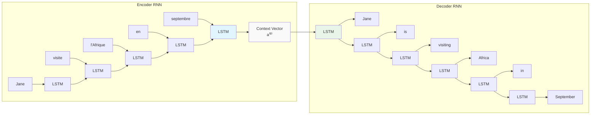

### How It Works

#### Encoder Phase

```python
# Encoder processes input sequence
for t in range(T_x):
    h[t] = LSTM_encoder(x[t], h[t-1])
    # No outputs generated during encoding!

# Final hidden state = context vector
context_vector = h[T_x]  # Contains meaning of entire input
```

#### Decoder Phase

```python
# Decoder generates output sequence
s[0] = context_vector  # Initialize with encoder output

for t in range(T_y):
    s[t], y_hat[t] = LSTM_decoder(y[t-1], s[t-1])
    if y_hat[t] == "<EOS>":  # End of sentence
        break
```

### Key Design Principles

**1. Separate Networks**

- **Encoder**: Understands input (French vocabulary)
- **Decoder**: Generates output (English vocabulary)
- **Different parameters**: θ_encoder ≠ θ_decoder

**2. Two-Phase Processing**

- **Phase 1**: Read entire input → build understanding
- **Phase 2**: Generate output word by word

**3. Information Bottleneck**

- Entire input compressed into fixed-size vector
- **Advantage**: Universal representation
- **Limitation**: Information loss for long sequences

---

## Mathematical Framework

### Complete Forward Pass

**Encoder**:

```
z⁽¹⁾ = W_e × x⁽¹⁾ + b_e
h⁽¹⁾ = LSTM(z⁽¹⁾, h⁽⁰⁾)

z⁽²⁾ = W_e × x⁽²⁾ + b_e
h⁽²⁾ = LSTM(z⁽²⁾, h⁽¹⁾)
...
Context vector = h⁽ᵀˣ⁾
```

**Decoder**:

```
s⁽⁰⁾ = Context vector

z⁽¹⁾ = W_d × y⁽⁰⁾ + b_d
s⁽¹⁾ = LSTM(z⁽¹⁾, s⁽⁰⁾)
ŷ⁽¹⁾ = softmax(W_out × s⁽¹⁾)

z⁽²⁾ = W_d × y⁽¹⁾ + b_d
s⁽²⁾ = LSTM(z⁽²⁾, s⁽¹⁾)
ŷ⁽²⁾ = softmax(W_out × s⁽²⁾)
...
```

### Training vs Inference

**Training (Teacher Forcing)**:

- Use correct previous words: y⁽ᵗ⁻¹⁾
- Stable training, faster convergence
- Can parallelize computation

**Inference**:

- Use model's predictions: ŷ⁽ᵗ⁻¹⁾
- Sequential generation only
- Error accumulation possible

---

## Image Captioning Extension

### Problem: Image → Text

```
Input:  [224×224×3 image]
Output: "A cat sitting on a chair"
```

### CNN-RNN Architecture

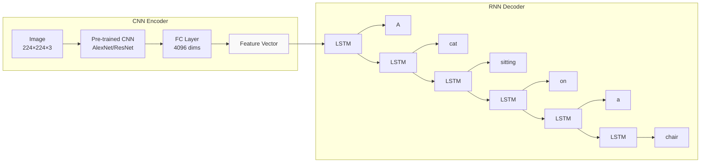

### How CNN Features Work

**What 4096-dimensional vector contains**:

- **Objects**: "cat", "chair", "person"
- **Scene**: "indoor", "outdoor", "living room"
- **Relationships**: "sitting on", "next to"
- **Attributes**: "white", "wooden", "small"

**Transfer Learning**: Pre-trained on ImageNet → rich visual representations

---

## Foundational Papers

### Machine Translation

- **Sutskever et al., 2014**: "Sequence to Sequence Learning with Neural Networks"

  - First successful neural machine translation
  - 4-layer LSTM encoder + 4-layer LSTM decoder
  - Key insight: Reversing input sequences improved performance

- **Cho et al., 2014**: "Learning Phrase Representations using RNN Encoder-Decoder"
  - Introduced GRU architecture
  - Phrase-level translation modeling

### Image Captioning

- **Vinyals et al., 2014**: "Show and Tell: Neural Image Caption Generator"

  - Simple CNN + RNN architecture
  - End-to-end training

- **Karpathy & Li, 2015**: "Deep Visual-Semantic Alignments"
  - Fine-grained image region attention
  - Bidirectional RNN for language modeling

---

## Architecture Limitations

### Information Bottleneck Problem

**The Issue**: Fixed-size vector must represent entire input sequence

```bash
Long Input (50 words) → Fixed Vector (512 dims) → Quality Output
                     ↑
               Information Loss!
```

**Performance Degradation**:

- Short sequences (≤20 words): 85% quality
- Medium sequences (20-40 words): 70% quality
- Long sequences (40+ words): 45% quality

**Why This Happens**:

1. **Compression**: Too much information for fixed vector
2. **Forgetting**: LSTM forgets early words in long sequences
3. **No direct access**: Decoder can't look back at specific input words

### The Solution Preview

**Attention Mechanism** (covered later this week):

- Decoder accesses ALL encoder hidden states
- Dynamic focus on relevant input parts
- Solves information bottleneck

```bash
Performance with Attention:
- Short sequences: 85% → 86%
- Medium sequences: 70% → 82%
- Long sequences: 45% → 78%
```

---

## Training Challenges

### Exposure Bias

**Problem**: Training vs inference mismatch

- **Training**: Sees correct previous words
- **Inference**: Uses own (potentially wrong) predictions

**Example**:

```
Training:   Jane → is → visiting → Africa
Inference:  Jane → visits → to → Africa (error accumulation)
```

### Inference Strategies

**Greedy Decoding**:

- Pick highest probability word at each step
- Fast but often suboptimal

**Beam Search** (next topic):

- Keep multiple candidates
- Better quality, more computation

---

## Key Takeaways

1. **Two-phase architecture**: Encoder (understand) + Decoder (generate)
2. **Variable length handling**: Input ≠ Output sequence lengths
3. **Separate vocabularies**: Different languages/modalities possible
4. **Information bottleneck**: Fixed vector limits long sequence performance
5. **Multiple applications**: Text-to-text AND image-to-text
6. **Foundation for modern NLP**: Basis for transformers, GPT, BERT

**Coming next**: Learn how to find better output sequences with **beam search** and solve the bottleneck with **attention**!

# 2. Picking the Most Likely Sentence

## Introduction

In machine translation, we don't want random outputs like language models. We want the **best** translation - the one most likely to be correct. This creates a search problem: how do we find the most probable English sentence given a French input?

### The Core Problem

**Language Model Goal**: Generate diverse, creative text
**Translation Goal**: Find the single best, most accurate translation

---

## From Language Models to Conditional Language Models

### What's the Difference?

#### Language Model (Week 1)

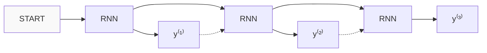

**Purpose**: Estimate $P(\text{sentence})$
**Generates**: Any reasonable English sentence

#### Conditional Language Model (Machine Translation)

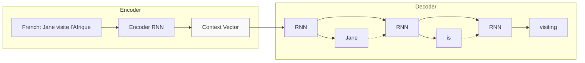

**Purpose**: Estimate $P(\text{English sentence | French sentence})$
**Generates**: English translation conditioned on French input

### Key Insight

**Machine Translation = Conditional Language Model**

Instead of $P(y)$, we now model $P(y|x)$ where:

- **x**: French input sentence
- **y**: English output sentence

---

## The Search Problem

### What We Want

Given French input: "Jane visite l'Afrique en septembre"

Find English $y$ that **maximizes**: $P(y|x)$

### Sample vs Optimize

#### Random Sampling (Bad for Translation)

```python
# Sampling from P(y|x) gives different results each time:
sample_1 = "Jane is visiting Africa in September"     # Good
sample_2 = "Jane is going to visit Africa"            # OK
sample_3 = "In September, Jane will visit Africa"     # Different
sample_4 = "Her African friend welcomed Jane"         # Bad!
```

**Problem**: Random sampling gives inconsistent quality

#### Optimization (Good for Translation)

```python
# Find the y that maximizes P(y|x):
best_y = argmax P(y|x)
# Should consistently give: "Jane is visiting Africa in September"
```

**Goal**: Find most probable translation, not random one

---

## Why Not Greedy Search?

### What is Greedy Search?

**Algorithm**:

1. Pick most likely first word
2. Given first word, pick most likely second word
3. Given first two words, pick most likely third word
4. Continue until done

### Greedy Search Example

**Input**: "Jane visite l'Afrique en septembre"

```bash
Step 1: P(y⁽¹⁾|x) → Pick "Jane" (highest probability)
Step 2: P(y⁽²⁾|x, "Jane") → Pick "is" (highest probability)
Step 3: P(y⁽³⁾|x, "Jane is") → Pick ???
```

At step 3, which is better?

- $P(\text{"visiting"}|x, \text{"Jane is"}) = 0.3$
- $P(\text{"going"}|x, \text{"Jane is"}) = 0.7$

**Greedy picks "going"** because 0.7 > 0.3

### Why Greedy Fails

**Local vs Global Optimum**

Consider two complete translations:

**Option 1**: "Jane is visiting Africa in September"

- Overall: $P(y_1|x) = 0.4$ (BETTER)

**Option 2**: "Jane is going to be visiting Africa in September"

- Overall: $P(y_2|x) = 0.2$ (WORSE)

**The Problem**:

```bash
P("going"|x, "Jane is") = 0.7  > P("visiting"|x, "Jane is") = 0.3
                ↑                                    ↑
         Greedy picks this              But this leads to better overall sentence!
```

**Key insight**: Best local choice ≠ Best global choice

### Mathematical Example

Let's trace through probabilities:

**Path 1 (Optimal)**:

```
P("Jane"|x) = 0.5
P("is"|x, "Jane") = 0.8
P("visiting"|x, "Jane is") = 0.3
P("Africa"|x, "Jane is visiting") = 0.9

Total: 0.5 × 0.8 × 0.3 × 0.9 = 0.108
```

**Path 2 (Greedy)**:

```
P("Jane"|x) = 0.5
P("is"|x, "Jane") = 0.8
P("going"|x, "Jane is") = 0.7      ← Greedy picks this!
P("to"|x, "Jane is going") = 0.4

Total: 0.5 × 0.8 × 0.7 × 0.4 = 0.112
```

Wait! Greedy actually gives higher probability here. Let's continue:

**Complete Path 1**:

```
"Jane is visiting Africa in September"
P = 0.5 × 0.8 × 0.3 × 0.9 × 0.7 × 0.8 = 0.06048
```

**Complete Path 2**:

```
"Jane is going to be visiting Africa in September"
P = 0.5 × 0.8 × 0.7 × 0.4 × 0.3 × 0.2 × 0.9 × 0.7 × 0.8 = 0.00338
```

**Result**: Greedy's early high probability (0.7 for "going") led to much lower overall probability!

---

## The Exponential Search Space

### Why We Can't Check Everything

**Vocabulary size**: 10,000 English words

**Max sentence length**: 10 words

**Total possible sentences**: $10,000^{10} = 10^{40}$

**That's more than the number of atoms in the observable universe!**

### Computational Reality

```bash
# Checking all possibilities:
For sentence_length = 10:
    For word_1 = 1 to 10,000:
        For word_2 = 1 to 10,000:
            ...
                For word_10 = 1 to 10,000:
                    compute P(sentence|x)

Total computations: 10^40 (impossible!)
```

### The Need for Approximation

**Exact Search**: Guaranteed optimal, computationally impossible

**Approximate Search**: Good enough solutions, computationally feasible

**Beam Search** (next topic): Best practical compromise

---

## Comparison Summary

### Approaches Compared

| Method                | Quality  | Speed      | Guarantee          |
| --------------------- | -------- | ---------- | ------------------ |
| **Random Sampling**   | Variable | Fast       | None               |
| **Greedy Search**     | Poor     | Fast       | Local optimum only |
| **Exhaustive Search** | Perfect  | Impossible | Global optimum     |
| **Beam Search**       | Good     | Reasonable | Approximate        |

### When to Use What

**Random Sampling**: Creative text generation, poetry, stories

**Greedy Search**: Quick drafts, real-time applications

**Beam Search**: Machine translation, important documents

**Exhaustive**: Toy problems only

---

## Mathematical Framework

### What We're Optimizing

**Objective**: $$\hat{y} = \arg\max_y P(y|x)$$

**Expanded**: $$\hat{y} = \arg\max_y P(y^{(1)}, y^{(2)}, \ldots, y^{(T_y)} | x^{(1)}, x^{(2)}, \ldots, x^{(T_x)})$$

### Chain Rule Explanation

**Step-by-step breakdown**:

**For 3 words**, the chain rule gives us: $$P(y^{(1)}, y^{(2)}, y^{(3)} | x) = P(y^{(1)}|x) \times P(y^{(2)}|x,y^{(1)}) \times P(y^{(3)}|x,y^{(1)},y^{(2)})$$

**Using conditional probability definition**: $$P(y^{(2)}|x,y^{(1)}) = \frac{P(y^{(1)}, y^{(2)}|x)}{P(y^{(1)}|x)}$$

$$P(y^{(3)}|x,y^{(1)},y^{(2)}) = \frac{P(y^{(1)}, y^{(2)}, y^{(3)}|x)}{P(y^{(1)}, y^{(2)}|x)}$$

**So the full chain becomes**: $$P(y^{(1)}, y^{(2)}, y^{(3)} | x) = P(y^{(1)}|x) \times \frac{P(y^{(1)}, y^{(2)}|x)}{P(y^{(1)}|x)} \times \frac{P(y^{(1)}, y^{(2)}, y^{(3)}|x)}{P(y^{(1)}, y^{(2)}|x)}$$

**Notice the telescoping**: $$P(y^{(1)}, y^{(2)}, y^{(3)} | x) = \frac{P(y^{(1)}, y^{(2)}, y^{(3)}|x)}{1}$$

### General Form with Fractions

**Chain rule as product**: $$P(y|x) = \prod_{t=1}^{T_y} P(y^{(t)}|x, y^{(1)}, \ldots, y^{(t-1)})$$

**Each term as fraction**: $$P(y^{(t)}|x, y^{(1)}, \ldots, y^{(t-1)}) = \frac{P(y^{(1)}, \ldots, y^{(t)}|x)}{P(y^{(1)}, \ldots, y^{(t-1)}|x)}$$

### Greedy Approximation Explanation

**What greedy does at each step**: $$\hat{y}^{(t)} = \arg\max_{y^{(t)}} P(y^{(t)}|x, \hat{y}^{(1)}, \hat{y}^{(2)}, \ldots, \hat{y}^{(t-1)})$$

**Written as fraction**: $$\hat{y}^{(t)} = \arg\max_{y^{(t)}} \frac{P(\hat{y}^{(1)}, \ldots, \hat{y}^{(t-1)}, y^{(t)}|x)}{P(\hat{y}^{(1)}, \ldots, \hat{y}^{(t-1)}|x)}$$

**Since denominator is fixed for step $t$**: $$\hat{y}^{(t)} = \arg\max_{y^{(t)}} P(\hat{y}^{(1)}, \ldots, \hat{y}^{(t-1)}, y^{(t)}|x)$$

### Concrete Example

**Sentence**: "Jane is visiting"

**Step 1**: $\hat{y}^{(1)} = \arg\max_{y^{(1)}} P(y^{(1)}|x) = \text{"Jane"}$

**Step 2**: $\hat{y}^{(2)} = \arg\max_{y^{(2)}} \frac{P(\text{"Jane"}, y^{(2)}|x)}{P(\text{"Jane"}|x)} = \text{"is"}$

**Step 3**: $\hat{y}^{(3)} = \arg\max_{y^{(3)}} \frac{P(\text{"Jane"}, \text{"is"}, y^{(3)}|x)}{P(\text{"Jane"}, \text{"is"}|x)} = \text{"visiting"}$

**Problem**: Choosing best $y^{(3)}$ given previous choices ≠ choosing best overall sequence

---

## Real-World Example

### Google Translate Evolution

**Before Neural MT**: Rule-based and statistical methods

**2016**: Switched to basic seq2seq with greedy search

**2017**: Added beam search → 15% improvement in quality

**Why**: Beam search finds much better translations than greedy

### Example Translation

**French**: "La réunion de demain est très importante"

**Greedy Output**: "The meeting tomorrow is very important"

**Beam Search**: "Tomorrow's meeting is very important"

**Human Preference**: Beam search output sounds more natural

---

## Key Takeaways

1. **Machine translation = Conditional language modeling**: $P(\text{English}|\text{French})$
2. **Goal changed**: From creative generation → finding best translation
3. **Greedy search fails**: Local optimum ≠ global optimum
4. **Search space is huge**: $10,000^{10}$ possible sentences
5. **Need approximation**: Exact search computationally impossible
6. **Beam search solution**: Good balance of quality and speed

**Coming next**: Learn how **beam search** finds better translations efficiently!

# 3. Beam Search

## Introduction

In the previous topic, we learned that greedy search fails to find the best translation. We also saw that checking all possible sentences is computationally impossible. **Beam search** is the practical solution - it finds much better translations than greedy search while remaining computationally feasible.

### What is Beam Search?

**Beam search** is an approximate search algorithm that keeps track of the **B most promising partial translations** at each step, where **B** is called the **beam width**.

**Key insight**: Instead of committing to one choice (greedy) or considering all choices (impossible), beam search considers **multiple good options** simultaneously.

---

## The Core Concept

### Beam Width Parameter

**Beam Width (B)**: Number of partial sentences to track simultaneously

- **B = 1**: Greedy search (fast, poor quality)
- **B = 3**: Keep 3 best options (good balance)
- **B = 10**: Keep 10 best options (better quality, slower)
- **B = ∞**: Exhaustive search (impossible)

### Why This Works

**Problem with greedy**: Commits too early to suboptimal paths

**Solution with beam search**: Keeps multiple paths alive, can recover from early "mistakes"

---

## Step-by-Step Algorithm

Let's trace through beam search with **B = 3** for translating:
**French**: "Jane visite l'Afrique en septembre"

**Target**: "Jane visits Africa in September"

### Step 1: Find First Word

**Goal**: Find the 3 most likely first words


**Computation**:
$$P(y^{(1)}|x) \text{ for all 10,000 words}$$

**Results**:

- "in": $P(\text{"in"}|x) = 0.3$
- "jane": $P(\text{"jane"}|x) = 0.2$
- "september": $P(\text{"september"}|x) = 0.1$

**Beam state**: Keep these 3 candidates in memory

### Step 2: Find Second Word

**Goal**: For each of the 3 first words, find best second words

#### For "in" as first word:

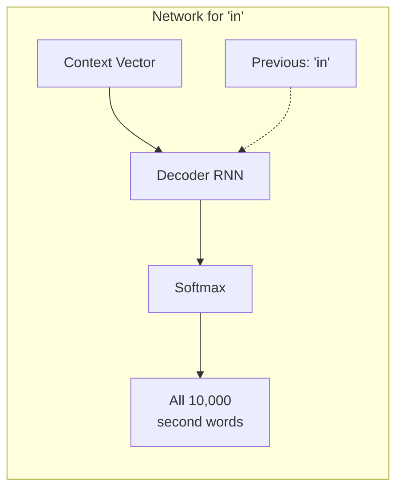

**Computation**: $P(y^{(2)}|x, y^{(1)}=\text{"in"})$ for all 10,000 words

**Joint probability**: $P(y^{(1)}, y^{(2)}|x) = P(y^{(1)}|x) \times P(y^{(2)}|x, y^{(1)})$

**Example calculations**:

- $P(\text{"in", "september"}|x) = P(\text{"in"}|x) \times P(\text{"september"}|\text{"in"}, x) = 0.3 \times 0.6 = 0.18$
- $P(\text{"in", "the"}|x) = 0.3 \times 0.4 = 0.12$
- $P(\text{"in", "a"}|x) = 0.3 \times 0.3 = 0.09$

#### For "jane" as first word:

**Computation**: $P(y^{(2)}|x, y^{(1)}=\text{"jane"})$ for all 10,000 words

**Example calculations**:

- $P(\text{"jane", "is"}|x) = 0.2 \times 0.8 = 0.16$
- $P(\text{"jane", "visits"}|x) = 0.2 \times 0.7 = 0.14$
- $P(\text{"jane", "was"}|x) = 0.2 \times 0.3 = 0.06$

#### For "september" as first word:

**Computation**: $P(y^{(2)}|x, y^{(1)}=\text{"september"})$ for all 10,000 words

**Example calculations**:

- $P(\text{"september", "is"}|x) = 0.1 \times 0.5 = 0.05$

### Total Combinations in Step 2

**Total candidates**: $3 \times 10,000 = 30,000$ possible two-word sequences

**Select top 3** from all 30,000:

1. "in september" (0.18)
2. "jane is" (0.16)
3. "jane visits" (0.14)

**Notice**: "september" as first word is eliminated!

### Step 3: Find Third Word

**Current beam**: ["in september", "jane is", "jane visits"]

#### For "in september":

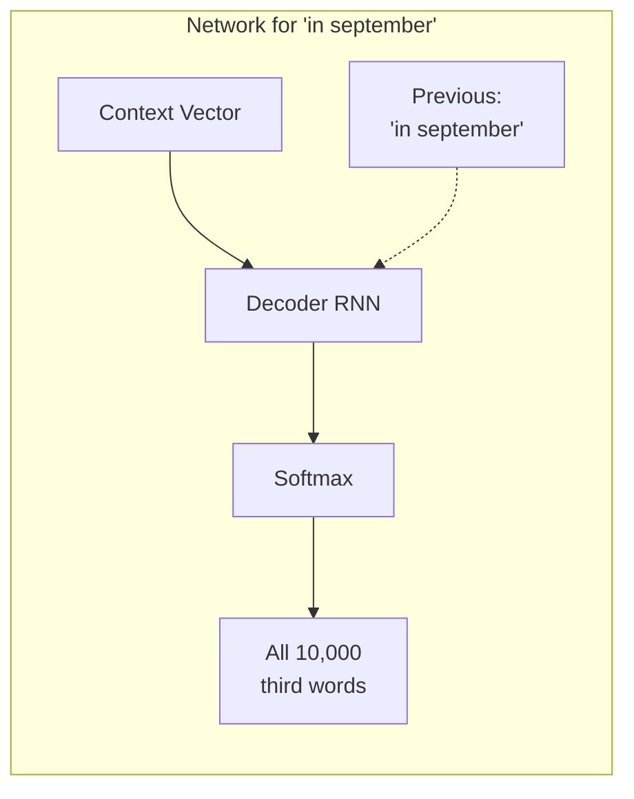

**Computation**: $P(y^{(3)}|x, y^{(1)}=\text{"in"}, y^{(2)}=\text{"september"})$

**Three-word probability**:
$$P(y^{(1)}, y^{(2)}, y^{(3)}|x) = P(y^{(1)}|x) \times P(y^{(2)}|x,y^{(1)}) \times P(y^{(3)}|x,y^{(1)},y^{(2)})$$

**Example**:
$$P(\text{"in", "september", "jane"}|x) = 0.18 \times 0.4 = 0.072$$

#### Similarly for other beams:

- For "jane is": Consider "jane is a", "jane is visiting", etc.
- For "jane visits": Consider "jane visits africa", "jane visits the", etc.

**Total candidates**: $3 \times 10,000 = 30,000$ three-word sequences

**Select top 3**:

1. "jane is visiting" (0.120)
2. "jane visits africa" (0.105)
3. "in september jane" (0.072)

### Continue Until \<EOS\>

**Step 4, 5, 6...**: Repeat the same process

- Each step: $B \times V$ candidates (B = beam width, V = vocabulary size)
- Keep top B candidates
- Stop when \<EOS\> token is generated

**Final result**: "jane visits africa in september \<EOS\>"

---

## Algorithm Pseudocode

```python
def beam_search(encoder_output, beam_width, max_length, vocab_size):
    # Step 1: Initialize
    beams = [{"sequence": [], "score": 0.0}]

    for step in range(max_length):
        candidates = []

        # For each current beam
        for beam in beams:
            # Try all vocabulary words as next word
            for word_id in range(vocab_size):
                # Compute probability of next word
                prob = model.predict_next_word(
                    encoder_output,
                    beam["sequence"] + [word_id]
                )

                # Create new candidate
                new_sequence = beam["sequence"] + [word_id]
                new_score = beam["score"] + log(prob)

                candidates.append({
                    "sequence": new_sequence,
                    "score": new_score
                })

        # Keep top beam_width candidates
        candidates.sort(key=lambda x: x["score"], reverse=True)
        beams = candidates[:beam_width]

        # Check if all beams ended with <EOS>
        if all("<EOS>" in beam["sequence"] for beam in beams):
            break

    # Return best sequence
    return beams[0]["sequence"]
```

---

## Mathematical Framework

### Objective Function

**Goal**: Find sequence that maximizes joint probability
$$\hat{y} = \arg\max_y P(y^{(1)}, y^{(2)}, \ldots, y^{(T)}|x)$$

### Chain Rule Decomposition

$$P(y^{(1)}, \ldots, y^{(T)}|x) = \prod_{t=1}^{T} P(y^{(t)}|x, y^{(1)}, \ldots, y^{(t-1)})$$

### Beam Search Approximation

At each step $t$, beam search:

1. **Expands**: Each of B beams with V vocabulary words
   $$\text{Candidates} = B \times V$$

2. **Evaluates**: Joint probability for each candidate
   $$\text{Score}(y^{(1)}, \ldots, y^{(t)}) = \sum_{i=1}^{t} \log P(y^{(i)}|x, y^{(1)}, \ldots, y^{(i-1)})$$

3. **Selects**: Top B candidates
   $$\text{New beams} = \text{top}_B(\text{all candidates})$$

### Why Use Log Probabilities?

**Problem**: Multiplying many small probabilities causes underflow
$$0.3 \times 0.2 \times 0.1 \times 0.05 = 0.0003 \text{ (very small!)}$$

**Solution**: Use log probabilities (addition instead of multiplication)
$$\log(P_1 \times P_2 \times P_3 \times P_4) = \log P_1 + \log P_2 + \log P_3 + \log P_4$$

---

## Computational Complexity

### Time Complexity

**Per step**: $O(B \times V)$ where:

- B = beam width
- V = vocabulary size

**Total**: $O(T \times B \times V)$ where T = sequence length

### Space Complexity

**Memory needed**: $O(B \times T)$ to store B sequences of length T

### Practical Example

**Parameters**:

- Vocabulary size: 50,000 words
- Beam width: 10
- Sequence length: 20 words

**Computations per step**: $10 \times 50,000 = 500,000$
**Total computations**: $20 \times 500,000 = 10,000,000$

**Compare to exhaustive search**: $50,000^{20} \approx 10^{93}$ (impossible!)

---

## Beam Width Trade-offs

### Beam Width Effects

```bash
┌─────────────────────────────────────────────────────────────────┐
│                    Beam Width Comparison                       │
├─────────────┬─────────────┬─────────────┬─────────────────────┤
│ Beam Width  │ Quality     │ Speed       │ Use Case           │
├─────────────┼─────────────┼─────────────┼─────────────────────┤
│ B = 1       │ Poor        │ Fastest     │ Real-time apps     │
│ B = 3       │ Good        │ Fast        │ Production systems │
│ B = 10      │ Better      │ Medium      │ High-quality MT    │
│ B = 100     │ Best        │ Slow        │ Research           │
│ B = 1000    │ Diminishing │ Very slow   │ Academic studies   │
└─────────────┴─────────────┴─────────────┴─────────────────────┘
```

### Performance vs Beam Width

```bash
Translation Quality (BLEU Score)
     ↑
     |     ●●●●●●●●●●●●●●●●●●● (plateaus)
 85% ┤         ●●●●●●●
     |       ●●
 80% ┤     ●●
     |   ●●
 75% ┤ ●●
     | ●
 70% ┤●
     └─────┬─────┬─────┬─────┬─────→
           1     3     10    30   100  Beam Width

Key insight: Quality plateaus around B=10-30
```

---

## Detailed Example Walkthrough

Let's trace through a complete example with numbers:

### Input

**French**: "Jane visite l'Afrique"
**Target**: "Jane visits Africa"
**Beam width**: B = 2

### Step 1: First Word

**Network output** (probabilities for first word):

- P("jane"|x) = 0.4
- P("the"|x) = 0.3
- P("in"|x) = 0.2
- P("she"|x) = 0.1

**Top 2 beams**:

1. "jane" (score: log(0.4) = -0.92)
2. "the" (score: log(0.3) = -1.20)

### Step 2: Second Word

#### Expand "jane":

- P("visits"|x, "jane") = 0.6 → P("jane visits") = 0.4 × 0.6 = 0.24
- P("is"|x, "jane") = 0.3 → P("jane is") = 0.4 × 0.3 = 0.12
- P("goes"|x, "jane") = 0.1 → P("jane goes") = 0.4 × 0.1 = 0.04

#### Expand "the":

- P("girl"|x, "the") = 0.4 → P("the girl") = 0.3 × 0.4 = 0.12
- P("woman"|x, "the") = 0.3 → P("the woman") = 0.3 × 0.3 = 0.09
- P("person"|x, "the") = 0.2 → P("the person") = 0.3 × 0.2 = 0.06

**All candidates**:

1. "jane visits" (0.24, score: -1.43)
2. "jane is" (0.12, score: -2.12)
3. "the girl" (0.12, score: -2.12)
4. "the woman" (0.09, score: -2.41)
5. "jane goes" (0.04, score: -3.22)
6. "the person" (0.06, score: -2.81)

**Top 2 beams**:

1. "jane visits" (score: -1.43)
2. "jane is" (score: -2.12)

### Step 3: Third Word

#### Expand "jane visits":

- P("africa"|x, "jane", "visits") = 0.8 → P("jane visits africa") = 0.24 × 0.8 = 0.192

#### Expand "jane is":

- P("visiting"|x, "jane", "is") = 0.7 → P("jane is visiting") = 0.12 × 0.7 = 0.084

**Top 2 beams**:

1. "jane visits africa" (score: -1.65)
2. "jane is visiting" (score: -2.48)

**Continue until \<EOS\>...**

**Final result**: "jane visits africa \<EOS\>"

---

## Practical Considerations

### Network Efficiency

**Key insight**: Don't need to run 30,000 separate networks!

**Efficient implementation**:

1. Run B copies of the decoder network (one per beam)
2. Each network evaluates ALL V vocabulary words in parallel
3. Total: B networks × V outputs each = B × V evaluations

### Memory Management

**Challenge**: Storing partial sequences grows over time
**Solution**: Use dynamic memory allocation and pruning

### Early Stopping

**Strategy**: Stop when all beams generate \<EOS\>
**Benefit**: Saves computation for shorter sequences

---

## Why Beam Search Works

### Comparison with Alternatives

**Greedy Search**:

- Commits to one path immediately
- Can't recover from early mistakes
- Fast but poor quality

**Beam Search**:

- Keeps multiple good paths alive
- Can recover from local suboptimal choices
- Good balance of quality and speed

**Exhaustive Search**:

- Considers all possible paths
- Guaranteed optimal
- Computationally impossible

### The Sweet Spot

**Beam search finds the practical middle ground**:

- Much better than greedy
- Much faster than exhaustive
- Diminishing returns beyond B ≈ 10

---

## Key Takeaways

1. **Beam search = Practical compromise**: Better than greedy, faster than exhaustive
2. **Beam width B**: Controls quality vs speed trade-off
3. **Algorithm**: Keep top B partial sequences at each step
4. **Complexity**: $O(T \times B \times V)$ vs $O(V^T)$ for exhaustive
5. **Logarithms prevent underflow**: Use log probabilities instead of raw probabilities
6. **Efficient implementation**: B networks evaluate V words in parallel
7. **Diminishing returns**: Quality plateaus around B = 10-30

**Coming next**: Learn how to make beam search work even better with \*\*refinements and optimizations

# 4. Refinements to Beam Search

## Introduction

Basic beam search has some practical problems that can significantly impact performance. These refinements address numerical stability issues and length bias problems that occur in real-world implementations.

---

## Problem 1: Numerical Underflow

### The Core Issue

**Problem**: Multiplying many small probabilities leads to extremely small numbers

**Example scenario**:

```
P(y⁽¹⁾|x) = 0.3
P(y⁽²⁾|x, y⁽¹⁾) = 0.2
P(y⁽³⁾|x, y⁽¹⁾, y⁽²⁾) = 0.1
P(y⁽⁴⁾|x, y⁽¹⁾, y⁽²⁾, y⁽³⁾) = 0.05

Joint probability = 0.3 × 0.2 × 0.1 × 0.05 = 0.0003
```

**For longer sequences** (10+ words):

```
P(sentence) ≈ 0.1^10 = 10^-10 (extremely small!)
```

**Computer representation problem**:

- **Float32**: Can only represent numbers down to ~10^-38
- **Float64**: Can represent down to ~10^-308
- But practical precision loss occurs much earlier

### The Log Probability Solution

**Mathematical foundation**:

```
log(a × b × c) = log(a) + log(b) + log(c)
```

**Key insight**: Since log is a strictly monotonically increasing function:

```
argmax P(y|x) = argmax log P(y|x)
```

**Original objective**:
$$P(y|x) = \prod_{t=1}^{T_y} P(y^{(t)}|x, y^{(1)}, \ldots, y^{(t-1)})$$

**Log-space objective**:
$$\log P(y|x) = \sum_{t=1}^{T_y} \log P(y^{(t)}|x, y^{(1)}, \ldots, y^{(t-1)})$$

### Numerical Example

**Original probabilities**:

```
P(y⁽¹⁾|x) = 0.3     →    log P(y⁽¹⁾|x) = -1.204
P(y⁽²⁾|x,y⁽¹⁾) = 0.2   →    log P(y⁽²⁾|x,y⁽¹⁾) = -1.609
P(y⁽³⁾|x,y⁽¹⁾,y⁽²⁾) = 0.1 →  log P(y⁽³⁾|x,y⁽¹⁾,y⁽²⁾) = -2.303
P(y⁽⁴⁾|x,y⁽¹⁾,y⁽²⁾,y⁽³⁾) = 0.05 → log P(y⁽⁴⁾|x,y⁽¹⁾,y⁽²⁾,y⁽³⁾) = -2.996
```

**Comparison**:

- **Original**: 0.3 × 0.2 × 0.1 × 0.05 = 0.0003
- **Log space**: -1.204 + (-1.609) + (-2.303) + (-2.996) = -8.112
- **Verification**: exp(-8.112) ≈ 0.0003 ✓

### Implementation Benefits

**Numerical stability**:

```python
# Instead of this (prone to underflow):
prob = 1.0
for t in range(sequence_length):
    prob *= P_word[t]  # Can become extremely small

# Do this (numerically stable):
log_prob = 0.0
for t in range(sequence_length):
    log_prob += log(P_word[t])  # Stays in reasonable range
```

**Key advantages**:

1. **No underflow**: Numbers stay in manageable range
2. **Better precision**: Floating-point arithmetic more accurate
3. **Computational efficiency**: Addition faster than multiplication

---

## Problem 2: Length Bias

### Understanding the Bias

**Fundamental issue**: Longer sentences have inherently lower probabilities

**Why this happens**:

- Each word probability: P(word) < 1.0
- Longer sentences: More multiplications of numbers < 1.0
- Result: P(long_sentence) < P(short_sentence), even if long sentence is better

### Concrete Example

**French input**: "Jane visite l'Afrique en septembre."

**Two possible translations**:

**Short translation**: "Jane visits Africa."

```
P("Jane"|x) = 0.4
P("visits"|x,"Jane") = 0.7
P("Africa"|x,"Jane","visits") = 0.8

Joint probability = 0.4 × 0.7 × 0.8 = 0.224
Log probability = log(0.4) + log(0.7) + log(0.8) = -1.507
```

**Long translation**: "Jane visits Africa in September."

```
P("Jane"|x) = 0.4
P("visits"|x,"Jane") = 0.7
P("Africa"|x,"Jane","visits") = 0.8
P("in"|x,"Jane","visits","Africa") = 0.9
P("September"|x,"Jane","visits","Africa","in") = 0.85

Joint probability = 0.4 × 0.7 × 0.8 × 0.9 × 0.85 = 0.171
Log probability = -1.507 + log(0.9) + log(0.85) = -1.837
```

**Problem**: Short translation gets higher score (-1.507 > -1.837) even though long translation is more complete and accurate!

### Length Normalization Solution

**Basic length normalization**:
$$\text{Normalized score} = \frac{1}{T_y} \sum_{t=1}^{T_y} \log P(y^{(t)}|x, y^{(1)}, \ldots, y^{(t-1)})$$

**Applied to our example**:

- **Short**: -1.507 / 3 = -0.502
- **Long**: -1.837 / 5 = -0.367

**Result**: Long translation now gets better score (-0.367 > -0.502) ✓

### The Alpha Parameter

**Practical refinement**: Use partial normalization with hyperparameter α

$$\text{Normalized score} = \frac{1}{T_y^\alpha} \sum_{t=1}^{T_y} \log P(y^{(t)}|x, y^{(1)}, \ldots, y^{(t-1)})$$

**Alpha value effects**:

| α Value     | Normalization Type    | Effect                             | Use Case                       |
| ----------- | --------------------- | ---------------------------------- | ------------------------------ |
| **α = 0**   | No normalization      | Strong bias toward short sentences | Fast inference, simple outputs |
| **α = 0.7** | Partial normalization | Balanced approach                  | **Most common in practice**    |
| **α = 1.0** | Full normalization    | May over-favor long sentences      | Detailed outputs needed        |

### Alpha Comparison Example

**Given the same translations from above**:

**α = 0 (no normalization)**:

- Short: -1.507
- Long: -1.837
- **Winner**: Short (biased)

**α = 0.7 (partial normalization)**:

- Short: -1.507 / (3^0.7) = -1.507 / 2.41 = -0.625
- Long: -1.837 / (5^0.7) = -1.837 / 3.73 = -0.492
- **Winner**: Long (balanced) ✓

**α = 1.0 (full normalization)**:

- Short: -1.507 / 3 = -0.502
- Long: -1.837 / 5 = -0.367
- **Winner**: Long (may over-favor length)

### Why α = 0.7 Works Well

**Empirical observations**:

- **α = 0.7** found to work well across many language pairs
- **Heuristic approach**: No strong theoretical justification, but consistent practical success
- **Balances competing factors**: Neither too biased toward short nor long sentences

**Research findings**:

- Google's NMT system uses α ≈ 0.6-0.8
- Microsoft Translator uses α ≈ 0.7
- Academic papers commonly report α = 0.7 as baseline

---

## Beam Width Selection

### Practical Guidelines

**Production systems**:

- **B = 1**: Greedy search (fastest, lowest quality)
- **B = 3-5**: Fast inference with reasonable quality
- **B = 10**: Common production choice (good balance)
- **B = 30-50**: High-quality applications

**Research systems**:

- **B = 100**: Research experiments
- **B = 1000-3000**: Squeezing maximum performance
- **Diminishing returns**: Minimal improvement beyond B = 100

### Performance vs Speed Trade-off

**Computational complexity**: O(B × V × T) where:

- B = beam width
- V = vocabulary size
- T = sequence length

**Real-world example** (English-French translation):

```
Vocabulary size (V): 50,000
Sequence length (T): 20 words
Beam width comparison:

B = 1:   Operations = 1 × 50,000 × 20 = 1M
B = 10:  Operations = 10 × 50,000 × 20 = 10M
B = 100: Operations = 100 × 50,000 × 20 = 100M
```

### Quality vs Beam Width

**Typical performance curve**:

```
Translation Quality (BLEU Score)
     ↑
     |      ●●●●●●●●●●●●●● (plateaus around B=30)
 85% ┤        ●●●●●●
     |      ●●
 80% ┤    ●●
     |  ●●
 75% ┤●●
     |●
 70% ┤
     └────┬────┬────┬────┬────→
          1    5   10   30  100  Beam Width (B)
```

**Key insights**:

1. **Biggest gain**: B = 1 → B = 3 (greedy to small beam)
2. **Good performance**: B = 5-10 sufficient for most applications
3. **Diminishing returns**: B > 30 rarely justified in production
4. **Research vs production**: Different optimal choices

---

## Algorithm Comparison

### Beam Search vs Other Search Methods

| Algorithm                | Guarantee      | Speed      | Memory | Quality |
| ------------------------ | -------------- | ---------- | ------ | ------- |
| **Greedy (B=1)**         | Local optimum  | Fastest    | O(V)   | Poor    |
| **Beam Search**          | Approximate    | Fast       | O(B×V) | Good    |
| **Breadth-First Search** | Global optimum | Impossible | O(V^T) | Perfect |
| **Depth-First Search**   | Global optimum | Impossible | O(V^T) | Perfect |

**Key difference**: Beam search trades optimality for computational feasibility

### When to Use Different Beam Widths

**Real-time applications** (chatbots, voice assistants):

- Use B = 1-3 for low latency
- Prioritize speed over perfect quality

**High-quality translation** (documents, literature):

- Use B = 10-30 for better results
- Quality more important than speed

**Research and evaluation**:

- Use B = 100+ for maximum performance
- Compare against state-of-the-art systems

---

## Implementation Details

### Complete Beam Search with Refinements

```python
import numpy as np
import heapq
from math import log

def refined_beam_search(model, input_sequence, beam_width=10,
                       max_length=50, alpha=0.7):
    """
    Beam search with length normalization and log probabilities
    """
    # Initialize with start token
    initial_beam = {
        'sequence': ['<START>'],
        'log_prob': 0.0,
        'length': 1
    }

    current_beams = [initial_beam]
    completed_sequences = []

    for step in range(max_length):
        candidates = []

        # Expand each current beam
        for beam in current_beams:
            if beam['sequence'][-1] == '<END>':
                completed_sequences.append(beam)
                continue

            # Get next word probabilities
            word_probs = model.predict_next_word(
                input_sequence,
                beam['sequence']
            )

            # Add candidates for each possible next word
            for word, prob in word_probs.items():
                if prob > 0:  # Avoid log(0)
                    new_beam = {
                        'sequence': beam['sequence'] + [word],
                        'log_prob': beam['log_prob'] + log(prob),
                        'length': beam['length'] + 1
                    }
                    candidates.append(new_beam)

        # Keep top beam_width candidates
        candidates.sort(key=lambda x: x['log_prob'], reverse=True)
        current_beams = candidates[:beam_width]

        # Early stopping if all beams completed
        if len(current_beams) == 0:
            break

    # Add any remaining beams to completed sequences
    completed_sequences.extend(current_beams)

    # Apply length normalization and find best sequence
    best_beam = None
    best_score = float('-inf')

    for beam in completed_sequences:
        if beam['length'] > 1:  # Avoid division by zero
            normalized_score = beam['log_prob'] / (beam['length'] ** alpha)
            if normalized_score > best_score:
                best_score = normalized_score
                best_beam = beam

    return best_beam['sequence'][1:]  # Remove <START> token

# Example usage
result = refined_beam_search(
    model=translation_model,
    input_sequence="Jane visite l'Afrique en septembre",
    beam_width=10,
    alpha=0.7
)
print(f"Best translation: {' '.join(result)}")
```

### Practical Considerations

**Memory management**:

- Store only necessary information in beam states
- Use efficient data structures for candidate ranking
- Consider memory constraints for large vocabularies

**Computational optimization**:

- Batch process multiple beams simultaneously
- Use efficient matrix operations for probability computation
- Early stopping when quality plateaus

**Hyperparameter tuning**:

- Grid search over α values: [0.5, 0.6, 0.7, 0.8, 0.9]
- Beam width selection based on speed/quality requirements
- Consider domain-specific optimal values

---

## Key Takeaways

1. **Numerical stability**: Always use log probabilities to prevent underflow
2. **Length bias**: Raw probabilities unfairly favor shorter sequences
3. **Length normalization**: Divide by T_y^α where α ≈ 0.7 works well in practice
4. **Beam width trade-off**: B = 10 good for production, B = 100+ for research
5. **Implementation**: Keep track of log probabilities and apply normalization at the end
6. **Diminishing returns**: Large beam widths provide minimal improvement
7. **Practical choice**: α = 0.7 and B = 10 work well for most applications

**Next**: Learn how to systematically analyze whether poor results come from the RNN model or the beam search algorithm through error analysis techniques.

# 5. Error Analysis in Beam Search

## Introduction

When your sequence generation model produces poor results, you need to systematically determine whether the problem lies with the RNN model or the beam search algorithm. This diagnostic approach helps you focus optimization efforts on the component that will yield the greatest improvement.

### The Core Problem

**Beam search is an approximate algorithm** - it doesn't guarantee finding the optimal sequence. When translation quality is poor, the error could come from:

1. **RNN Model**: Assigns wrong probabilities to sequences
2. **Beam Search**: Fails to find the sequence the RNN thinks is best

**Key insight**: By comparing probabilities, we can determine which component is at fault.

---

## The Debugging Framework

### Problem Setup

**Example scenario**:

- **Input (x)**: "Jane visite l'Afrique en septembre"
- **Human reference (y\*)**: "Jane visits Africa in September" (good translation)
- **Model output (ŷ)**: "Jane visited Africa last September" (poor translation)

**Question**: Is the poor result due to the RNN or beam search?

### The Two-Component System

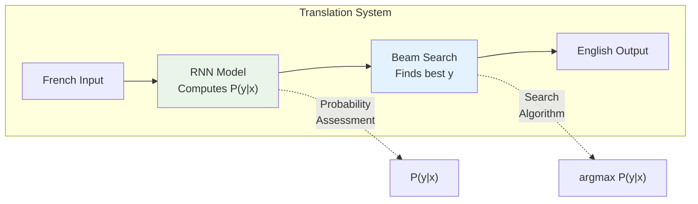

**Two distinct roles**:

- **RNN**: Evaluates how good any translation is
- **Beam Search**: Finds the translation the RNN thinks is best

---

## The Diagnostic Method

### Step 1: Compute Probabilities

For any error case, compute:

- **P(y\*|x)**: Probability RNN assigns to human reference
- **P(ŷ|x)**: Probability RNN assigns to model output

**Implementation**:

```python
def compute_sequence_probability(model, input_sequence, output_sequence):
    """
    Compute P(output_sequence | input_sequence) using trained RNN
    """
    encoder_output = model.encoder(input_sequence)

    log_prob = 0.0
    decoder_state = encoder_output

    for t, word in enumerate(output_sequence):
        # Get probability distribution over vocabulary
        word_probs = model.decoder(decoder_state, output_sequence[:t])

        # Add log probability of current word
        log_prob += log(word_probs[word])

        # Update decoder state
        decoder_state = model.update_state(decoder_state, word)

    return exp(log_prob)  # Convert back to probability

# Example usage
p_human = compute_sequence_probability(model, french_input, human_translation)
p_model = compute_sequence_probability(model, french_input, model_output)
```

### Step 2: Compare and Diagnose

**Case 1: P(y\*|x) > P(ŷ|x)** → **Beam Search at Fault**

**Logic**:

- RNN thinks human translation is better (higher probability)
- But beam search chose the inferior translation
- **Conclusion**: Beam search failed to find what RNN considers best

**Case 2: P(y\*|x) ≤ P(ŷ|x)** → **RNN Model at Fault**

**Logic**:

- RNN thinks model output is better (higher probability)
- But human translation is clearly superior
- **Conclusion**: RNN has poor probability estimates

---

## Detailed Examples

### Example 1: Beam Search Error

**Setup**:

- **Input**: "Jane visite l'Afrique en septembre"
- **Human (y\*)**: "Jane visits Africa in September"
- **Model (ŷ)**: "Jane visited Africa last September"

**Probability computation**:

```
P(y*|x) = P("Jane"|x) × P("visits"|x,"Jane") × P("Africa"|x,"Jane","visits") × ...
        = 0.4 × 0.6 × 0.8 × 0.7 × 0.9 × 0.85
        = 2.0 × 10^-10

P(ŷ|x) = P("Jane"|x) × P("visited"|x,"Jane") × P("Africa"|x,"Jane","visited") × ...
       = 0.4 × 0.3 × 0.7 × 0.6 × 0.8 × 0.75
       = 1.0 × 10^-10
```

**Analysis**:

- P(y\*|x) = 2.0 × 10^-10 > P(ŷ|x) = 1.0 × 10^-10
- **Diagnosis**: Beam search at fault (B)
- **Action**: Increase beam width or improve search algorithm

### Example 2: RNN Model Error

**Setup**:

- **Input**: "Il fait très chaud aujourd'hui"
- **Human (y\*)**: "It is very hot today"
- **Model (ŷ)**: "He makes very hot today"

**Probability computation**:

```
P(y*|x) = 0.3 × 0.8 × 0.9 × 0.7 × 0.8 = 1.2 × 10^-10

P(ŷ|x) = 0.4 × 0.6 × 0.9 × 0.7 × 0.8 = 1.5 × 10^-10
```

**Analysis**:

- P(y\*|x) = 1.2 × 10^-10 < P(ŷ|x) = 1.5 × 10^-10
- **Diagnosis**: RNN model at fault (R)
- **Action**: Improve model architecture, get more data, adjust training

---

## Systematic Error Analysis Process

### Step 1: Collect Error Examples

**Data collection**:

- Take development set with poor translations
- Typical sample size: 100-500 error cases
- Focus on clear quality differences between human and model

### Step 2: Create Analysis Table

**Example analysis**:

| Example | French Input            | Human Translation    | Model Output          | P(y\*\|x)  | P(ŷ\|x)    | Fault |
| ------- | ----------------------- | -------------------- | --------------------- | ---------- | ---------- | ----- |
| 1       | "Jane visite l'Afrique" | "Jane visits Africa" | "Jane visited Africa" | 2.0×10^-10 | 1.0×10^-10 | B     |
| 2       | "Il fait chaud"         | "It is hot"          | "He makes hot"        | 1.2×10^-10 | 1.5×10^-10 | R     |
| 3       | "Nous mangeons"         | "We eat"             | "We are eating"       | 3.0×10^-10 | 2.8×10^-10 | B     |
| 4       | "Elle est belle"        | "She is beautiful"   | "She is nice"         | 1.8×10^-10 | 2.1×10^-10 | R     |
| ...     | ...                     | ...                  | ...                   | ...        | ...        | ...   |

### Step 3: Count and Analyze

**Summary statistics**:

```
Total errors analyzed: 100
Beam search errors (B): 30 (30%)
RNN model errors (R): 70 (70%)
```

**Decision matrix**:

| Beam Search Errors    | RNN Errors | Primary Action                              |
| --------------------- | ---------- | ------------------------------------------- |
| **High (>60%)**       | Low        | Increase beam width, improve search         |
| **Low (<40%)**        | High       | Improve RNN: more data, better architecture |
| **Balanced (40-60%)** | Balanced   | Work on both components                     |

---

## Length Normalization Considerations

### Important Caveat

**When using length normalization**, compare normalized scores instead of raw probabilities:

**Instead of**:

```
P(y*|x) vs P(ŷ|x)
```

**Use**:

```
Normalized_score(y*) vs Normalized_score(ŷ)

Where:
Normalized_score(y) = (1/T_y^α) × Σ log P(y^(t)|x, y^(1:t-1))
```

**Implementation with normalization**:

```python
def compute_normalized_score(model, input_seq, output_seq, alpha=0.7):
    """
    Compute length-normalized score used in actual beam search
    """
    log_prob = 0.0
    encoder_output = model.encoder(input_seq)
    decoder_state = encoder_output

    for t, word in enumerate(output_seq):
        word_probs = model.decoder(decoder_state, output_seq[:t])
        log_prob += log(word_probs[word])
        decoder_state = model.update_state(decoder_state, word)

    # Apply length normalization
    length = len(output_seq)
    normalized_score = log_prob / (length ** alpha)

    return normalized_score

# Use this for error analysis when beam search uses length normalization
score_human = compute_normalized_score(model, french_input, human_translation)
score_model = compute_normalized_score(model, french_input, model_output)

if score_human > score_model:
    print("Beam search at fault")
else:
    print("RNN model at fault")
```

---

## Advanced Error Analysis Techniques

### Categorizing Error Types

**Beam search errors by type**:

1. **Search depth insufficient**: Beam width too small
2. **Early termination**: Good sequences eliminated too early
3. **Length bias**: Even with normalization, length preference issues

**RNN model errors by type**:

1. **Vocabulary errors**: Wrong word choices
2. **Grammar errors**: Incorrect sentence structure
3. **Semantic errors**: Wrong meaning
4. **Context errors**: Doesn't understand broader context

### Error Analysis Script

```python
class ErrorAnalyzer:
    def __init__(self, model, beam_search_fn, alpha=0.7):
        self.model = model
        self.beam_search = beam_search_fn
        self.alpha = alpha

    def analyze_errors(self, error_examples):
        """
        Analyze list of (input, human_ref, model_output) tuples
        """
        beam_errors = 0
        rnn_errors = 0
        results = []

        for input_seq, human_ref, model_output in error_examples:
            # Compute scores (use normalized if beam search does)
            score_human = self.compute_score(input_seq, human_ref)
            score_model = self.compute_score(input_seq, model_output)

            if score_human > score_model:
                fault = "Beam Search"
                beam_errors += 1
            else:
                fault = "RNN Model"
                rnn_errors += 1

            results.append({
                'input': input_seq,
                'human': human_ref,
                'model': model_output,
                'score_human': score_human,
                'score_model': score_model,
                'fault': fault
            })

        # Summary
        total = len(error_examples)
        print(f"Error Analysis Results:")
        print(f"Total errors: {total}")
        print(f"Beam search errors: {beam_errors} ({beam_errors/total:.1%})")
        print(f"RNN model errors: {rnn_errors} ({rnn_errors/total:.1%})")

        return results

    def compute_score(self, input_seq, output_seq):
        """Compute score consistent with beam search objective"""
        # Implementation depends on whether using length normalization
        if self.alpha > 0:
            return compute_normalized_score(self.model, input_seq, output_seq, self.alpha)
        else:
            return compute_sequence_probability(self.model, input_seq, output_seq)

# Usage
analyzer = ErrorAnalyzer(model, beam_search_function, alpha=0.7)
error_data = [
    ("Jane visite l'Afrique", "Jane visits Africa", "Jane visited Africa"),
    ("Il fait chaud", "It is hot", "He makes hot"),
    # ... more examples
]
analysis_results = analyzer.analyze_errors(error_data)
```

---

## Actionable Insights

### When Beam Search is at Fault (>50% of errors)

**Immediate actions**:

1. **Increase beam width**: Try B = 5, 10, 20, 50
2. **Adjust length normalization**: Tune α parameter
3. **Improve search algorithm**: Consider diverse beam search

**Advanced improvements**:

- Diverse beam search (encourage different hypotheses)
- Coverage penalties (ensure all input is translated)
- Ensemble decoding (combine multiple models)

### When RNN Model is at Fault (>50% of errors)

**Data-related improvements**:

1. **More training data**: Especially in problematic domains
2. **Better data quality**: Clean and filter training corpus
3. **Data augmentation**: Paraphrasing, back-translation

**Model-related improvements**:

1. **Architecture changes**: More layers, attention mechanisms
2. **Better optimization**: Learning rate schedules, regularization
3. **Transfer learning**: Pre-trained encoders (BERT-like models)

**Training-related improvements**:

1. **Longer training**: Ensure convergence
2. **Better hyperparameters**: Grid search optimization
3. **Regularization**: Dropout, weight decay

### Balanced Errors (40-60% split)

**Systematic approach**:

1. **Start with easier fixes**: Beam width adjustment
2. **Parallel development**: Team members work on both components
3. **Iterative improvement**: Alternate between beam search and model improvements

---

## Real-World Application

### Production Debugging Workflow

**Weekly error analysis routine**:

1. **Sample errors**: 100-200 cases from production logs
2. **Manual labeling**: Human translators mark quality
3. **Automated analysis**: Run error analysis script
4. **Decision making**: Allocate engineering resources based on results
5. **Track trends**: Monitor error type distribution over time

**Example production insights**:

- **Month 1**: 70% RNN errors → Focus on model improvements
- **Month 3**: 60% beam search errors → Increase beam width in production
- **Month 6**: Balanced errors → Implement ensemble methods

### Integration with A/B Testing

**Experimental setup**:

- **Control**: Current system (B=10, α=0.7)
- **Treatment A**: Increased beam width (B=20)
- **Treatment B**: Improved RNN model
- **Metric**: Human evaluation scores

**Results interpretation**:

- If Treatment A wins → Beam search was the bottleneck
- If Treatment B wins → RNN model was the bottleneck
- Validates error analysis predictions

---

## Common Pitfalls and Solutions

### Pitfall 1: Ignoring Length Normalization

**Problem**: Using raw probabilities when beam search uses normalized scores

**Solution**: Always match the objective function used in beam search

### Pitfall 2: Insufficient Sample Size

**Problem**: Making decisions based on <50 examples

**Solution**: Use at least 100-200 error cases for reliable statistics

### Pitfall 3: Cherry-Picking Examples

**Problem**: Selecting only certain types of errors

**Solution**: Random sampling from development set errors

### Pitfall 4: Not Considering Error Severity

**Problem**: Treating all errors equally

**Enhancement**: Weight errors by severity (minor vs major translation mistakes)

---

## Key Takeaways

1. **Systematic diagnosis**: Compare P(y\*|x) vs P(ŷ|x) to identify error source
2. **Two-component system**: RNN assigns probabilities, beam search finds best sequence
3. **Error attribution**: P(y\*|x) > P(ŷ|x) → beam search fault, otherwise RNN fault
4. **Statistical analysis**: Analyze 100+ examples to get reliable error distribution
5. **Matched objectives**: Use same scoring function as beam search (with length normalization if applicable)
6. **Actionable insights**: Focus optimization efforts on the component causing more errors
7. **Iterative process**: Re-analyze after improvements to track progress

**Next steps**: After identifying the primary error source, apply targeted improvements and re-evaluate to measure progress and identify remaining bottlenecks.

This error analysis framework applies beyond machine translation to any system with approximate search over learned objective functions.

# 6. BLEU Score

## Introduction

One of the fundamental challenges in machine translation is evaluation: how do we measure translation quality when multiple equally valid translations exist? Unlike image classification where there's typically one correct answer, translation allows for numerous acceptable outputs. The BLEU score provides an automated solution to this evaluation challenge.

### The Multiple Reference Problem

**Example scenario**:

- **French input**: "Le chat est sur le tapis"
- **Reference 1**: "The cat is on the mat"
- **Reference 2**: "There is a cat on the mat"

**Both translations are perfectly valid!** How do we evaluate a machine translation system against multiple valid references?

### What is BLEU?

**BLEU** = **B**i**l**ingual **E**valuation **U**nderstudy

**Etymology**: In theater, an "understudy" learns a role to substitute for the main actor when needed. Similarly, BLEU serves as an automated substitute for human evaluation of translation quality.

**Core principle**: A machine translation should receive a high score if it's close to any human reference translation.

---

## The Fundamental Problem with Naive Precision

### Naive Approach

**Simple precision**: Count words in machine output that appear in any reference

**Example**:

- **Machine output**: "the the the the the the the"
- **Reference 1**: "The cat is on the mat"
- **Reference 2**: "There is a cat on the mat"

**Naive precision calculation**:

- Total words in output: 7 (all "the")
- Check each word: Does it appear in any reference?
  - Word 1 "the" → ✓ (appears in both references)
  - Word 2 "the" → ✓ (appears in both references)
  - Word 3 "the" → ✓ (appears in both references)
  - Word 4 "the" → ✓ (appears in both references)
  - Word 5 "the" → ✓ (appears in both references)
  - Word 6 "the" → ✓ (appears in both references)
  - Word 7 "the" → ✓ (appears in both references)
- Words that appear in references: 7 out of 7
- **Precision**: 7/7 = 100%

**Problem**: This clearly terrible translation gets perfect precision!

### Why Naive Precision Fails

**The fundamental flaw**: A system can achieve high precision by repeatedly outputting common words that appear in reference translations.

**Example breakdown**:

```
Machine:    [the, the, the, the, the, the, the]
Reference:  [the, cat, is, on, the, mat]

Every "the" in machine output appears in reference
→ Perfect precision despite being meaningless
```

---

## Modified Precision: The BLEU Solution

### Core Concept

**Modified precision**: Give each word credit only up to the maximum number of times it appears in any reference sentence.

### Step-by-Step Calculation

**Example**:

- **Machine output**: "the the the the the the the"
- **Reference 1**: "The cat is on the mat" (contains "the" 2 times)
- **Reference 2**: "There is a cat on the mat" (contains "the" 1 time)

**Modified precision calculation**:

1. **Count in machine output**: "the" appears 7 times
2. **Maximum in references**: max(2, 1) = 2 times
3. **Clipped count**: min(7, 2) = 2
4. **Modified precision**: 2/7 ≈ 0.29

**Result**: Much more reasonable score that reflects poor quality!

### Mathematical Formulation

**Modified precision for unigrams (P₁)**:
$$P_1 = \frac{\sum_{\text{unigram} \in \text{Candidate}} \text{Count}_{\text{clip}}(\text{unigram})}{\sum_{\text{unigram} \in \text{Candidate}} \text{Count}(\text{unigram})}$$

Where:

- **Count(unigram)**: Number of times unigram appears in candidate
- **Count_clip(unigram)**: min(Count(unigram), Max_Ref_Count(unigram))

---

## N-gram BLEU: Beyond Single Words

### Why N-grams Matter

**Unigram precision** only captures word choice, not:

- **Word order**: "cat the" vs "the cat"
- **Phrases**: "New York" should be treated as a unit
- **Grammar**: Correct grammatical constructions

**Solution**: Evaluate precision on word sequences (n-grams)

### Bigram BLEU Example

**Setup**:

- **Reference 1**: "The cat is on the mat"
- **Reference 2**: "There is a cat on the mat"
- **Machine output**: "the cat the cat on the mat"

**Step 1: Extract bigrams from machine output**

```
Bigrams in "the cat the cat on the mat":
- "the cat" (appears 2 times)
- "cat the" (appears 1 time)
- "cat on" (appears 1 time)
- "on the" (appears 1 time)
- "the mat" (appears 1 time)

Total bigrams: 6
```

**Step 2: Extract bigrams from references**

```
Reference 1 bigrams: ["the cat", "cat is", "is on", "on the", "the mat"]
Reference 2 bigrams: ["there is", "is a", "a cat", "cat on", "on the", "the mat"]
```

**Step 3: Compute clipped counts**

| Bigram    | Machine Count | Max Ref Count      | Clipped Count |
| --------- | ------------- | ------------------ | ------------- |
| "the cat" | 2             | 1 (from Ref 1)     | 1             |
| "cat the" | 1             | 0 (in neither ref) | 0             |
| "cat on"  | 1             | 1 (from Ref 2)     | 1             |
| "on the"  | 1             | 1 (both refs)      | 1             |
| "the mat" | 1             | 1 (both refs)      | 1             |

**Step 4: Calculate modified precision**
$$P_2 = \frac{1 + 0 + 1 + 1 + 1}{6} = \frac{4}{6} = \frac{2}{3} ≈ 0.67$$

### General N-gram Formula

**Modified precision for n-grams**:
$$P_n = \frac{\sum_{\text{n-gram} \in \text{Candidate}} \text{Count}_{\text{clip}}(\text{n-gram})}{\sum_{\text{n-gram} \in \text{Candidate}} \text{Count}(\text{n-gram})}$$

**Common n-gram types**:

- **P₁ (Unigrams)**: Individual words - measures vocabulary overlap
- **P₂ (Bigrams)**: Word pairs - captures local word order
- **P₃ (Trigrams)**: 3-word sequences - measures phrase structure
- **P₄ (4-grams)**: 4-word sequences - captures longer dependencies

---

## Complete BLEU Score Formula

### Combining Multiple N-grams

**BLEU-N score** combines 1-gram through N-gram precision:

$$\text{BLEU} = \text{BP} \times \exp\left(\frac{1}{N} \sum_{n=1}^{N} \log P_n\right)$$

**Standard choice**: BLEU-4 (combines unigrams, bigrams, trigrams, and 4-grams)

$$\text{BLEU-4} = \text{BP} \times \exp\left(\frac{1}{4} \sum_{n=1}^{4} \log P_n\right)$$

### Why the Geometric Mean?

**Geometric mean** (via log-space averaging) rather than arithmetic mean because:

1. **Balanced importance**: All n-gram levels matter equally
2. **Multiplication effect**: Poor performance on any n-gram level significantly impacts overall score
3. **Scale invariance**: Results don't depend on absolute magnitudes

**Intuition**: A translation needs good unigram AND bigram AND trigram AND 4-gram precision

### Detailed Calculation Example

**Given**:

- P₁ = 0.8 (80% unigram precision)
- P₂ = 0.6 (60% bigram precision)
- P₃ = 0.4 (40% trigram precision)
- P₄ = 0.2 (20% 4-gram precision)

**Step-by-step BLEU calculation**:

```
1. Take logarithms:
   log P₁ = log(0.8) = -0.223
   log P₂ = log(0.6) = -0.511
   log P₃ = log(0.4) = -0.916
   log P₄ = log(0.2) = -1.609

2. Average the logs:
   Average = (-0.223 + -0.511 + -0.916 + -1.609) / 4 = -0.815

3. Exponentiate:
   exp(-0.815) = 0.443

4. Apply brevity penalty (assume BP = 1):
   BLEU = 1.0 × 0.443 = 0.443
```

---

## Brevity Penalty (BP)

### The Problem

**Short translations get artificially high precision** because:

- Fewer words → higher chance each word appears in reference
- System could game metric by outputting very short sequences

**Example**:

- **Machine**: "the cat"
- **Reference**: "the cat is on the mat"
- **Precision**: 100% (both words appear in reference)
- **Problem**: Translation is incomplete!

### Brevity Penalty Formula

$$
\text{BP} = \begin{cases}
1 & \text{if } c > r \\
e^{(1-r/c)} & \text{if } c \leq r
\end{cases}
$$

Where:

- **c**: Length of candidate (machine) translation
- **r**: Length of reference translation (closest in length)

### Brevity Penalty Examples

**Case 1: Long enough translation**

```
Candidate: "The cat is sitting on the mat" (8 words)
Reference: "The cat is on the mat" (6 words)
c = 8, r = 6
Since c > r: BP = 1 (no penalty)
```

**Case 2: Short translation**

```
Candidate: "The cat" (2 words)
Reference: "The cat is on the mat" (6 words)
c = 2, r = 6
Since c ≤ r: BP = exp(1 - 6/2) = exp(1 - 3) = exp(-2) ≈ 0.135
```

**Effect**: Short translation gets heavily penalized (multiplied by 0.135)

### Multiple References

**When multiple references exist**, use the reference length closest to candidate length:

```python
def closest_ref_length(candidate_len, ref_lengths):
    """Find reference length closest to candidate length"""
    return min(ref_lengths, key=lambda x: abs(x - candidate_len))

# Example:
candidate_len = 5
ref_lengths = [6, 8, 4]  # Three reference translations
closest_len = closest_ref_length(5, [6, 8, 4])  # Returns 4
```

---

## BLEU Score Properties and Interpretation

### Score Range and Interpretation

**Range**: 0.0 to 1.0 (often reported as 0-100%)

**Typical score meanings**:

- **BLEU > 0.6**: Excellent translation quality
- **BLEU 0.4-0.6**: Good translation quality
- **BLEU 0.2-0.4**: Understandable but poor quality
- **BLEU < 0.2**: Very poor quality

**Perfect score scenarios**:

- **BLEU = 1.0**: Machine output exactly matches a reference
- **BLEU ≈ 1.0**: Machine output very close to references

### Real-World BLEU Scores

**Commercial systems (English-French)**:

- **Google Translate**: ~0.4-0.5 BLEU
- **Microsoft Translator**: ~0.4-0.5 BLEU
- **Research systems**: ~0.3-0.6 BLEU (varies by language pair)

**Language pair difficulty**:

- **Easy**: English ↔ French, Spanish (BLEU ~0.5)
- **Medium**: English ↔ German, Russian (BLEU ~0.3-0.4)
- **Hard**: English ↔ Chinese, Arabic (BLEU ~0.2-0.3)

---

## Implementation Guide

### Complete BLEU Implementation

```python
import math
from collections import Counter, defaultdict

def compute_bleu(candidate, references, max_n=4, weights=None):
    """
    Compute BLEU score for a single candidate against multiple references

    Args:
        candidate: List of words in candidate translation
        references: List of reference translations (each is list of words)
        max_n: Maximum n-gram order (default: 4)
        weights: Weights for different n-gram orders (default: uniform)

    Returns:
        BLEU score (float between 0 and 1)
    """
    if weights is None:
        weights = [1.0/max_n] * max_n

    # Compute modified precision for each n-gram order
    log_precisions = []

    for n in range(1, max_n + 1):
        # Get n-grams from candidate
        candidate_ngrams = get_ngrams(candidate, n)

        if not candidate_ngrams:
            log_precisions.append(0)
            continue

        # Get maximum n-gram counts from references
        max_ref_counts = defaultdict(int)
        for ref in references:
            ref_ngrams = get_ngrams(ref, n)
            for ngram, count in ref_ngrams.items():
                max_ref_counts[ngram] = max(max_ref_counts[ngram], count)

        # Compute clipped counts
        clipped_count = 0
        total_count = 0

        for ngram, count in candidate_ngrams.items():
            clipped_count += min(count, max_ref_counts[ngram])
            total_count += count

        # Modified precision for this n-gram order
        if total_count > 0:
            precision = clipped_count / total_count
            log_precisions.append(math.log(precision) if precision > 0 else -float('inf'))
        else:
            log_precisions.append(0)

    # Geometric mean of precisions
    if any(p == -float('inf') for p in log_precisions):
        return 0.0

    geometric_mean = math.exp(sum(w * p for w, p in zip(weights, log_precisions)))

    # Brevity penalty
    candidate_len = len(candidate)
    closest_ref_len = min(len(ref) for ref in references if len(ref) > 0)

    if candidate_len > closest_ref_len:
        bp = 1.0
    else:
        bp = math.exp(1 - closest_ref_len / candidate_len) if candidate_len > 0 else 0

    return bp * geometric_mean

def get_ngrams(tokens, n):
    """Extract n-grams from token list"""
    ngrams = Counter()
    for i in range(len(tokens) - n + 1):
        ngram = tuple(tokens[i:i+n])
        ngrams[ngram] += 1
    return ngrams

# Example usage
candidate = ["the", "cat", "is", "on", "the", "mat"]
references = [
    ["the", "cat", "is", "on", "the", "mat"],
    ["there", "is", "a", "cat", "on", "the", "mat"]
]

bleu_score = compute_bleu(candidate, references)
print(f"BLEU score: {bleu_score:.3f}")
```

### Corpus-Level BLEU

**Individual vs Corpus BLEU**:

- **Sentence-level**: Compute BLEU for each sentence separately
- **Corpus-level**: Aggregate statistics across entire test set

**Corpus-level computation** (more reliable):

```python
def corpus_bleu(candidates, references_list, max_n=4):
    """
    Compute corpus-level BLEU score

    Args:
        candidates: List of candidate translations (each is list of words)
        references_list: List of reference sets (each set contains multiple references)

    Returns:
        Corpus-level BLEU score
    """
    # Aggregate counts across all sentences
    total_clipped_counts = [0] * max_n
    total_counts = [0] * max_n
    total_candidate_len = 0
    total_closest_ref_len = 0

    for candidate, references in zip(candidates, references_list):
        candidate_len = len(candidate)
        closest_ref_len = min(len(ref) for ref in references if len(ref) > 0)

        total_candidate_len += candidate_len
        total_closest_ref_len += closest_ref_len

        for n in range(1, max_n + 1):
            candidate_ngrams = get_ngrams(candidate, n)

            # Maximum counts from references
            max_ref_counts = defaultdict(int)
            for ref in references:
                ref_ngrams = get_ngrams(ref, n)
                for ngram, count in ref_ngrams.items():
                    max_ref_counts[ngram] = max(max_ref_counts[ngram], count)

            # Accumulate clipped counts
            for ngram, count in candidate_ngrams.items():
                total_clipped_counts[n-1] += min(count, max_ref_counts[ngram])
                total_counts[n-1] += count

    # Compute corpus-level precisions
    log_precisions = []
    for i in range(max_n):
        if total_counts[i] > 0:
            precision = total_clipped_counts[i] / total_counts[i]
            log_precisions.append(math.log(precision) if precision > 0 else -float('inf'))
        else:
            log_precisions.append(0)

    # Geometric mean
    if any(p == -float('inf') for p in log_precisions):
        return 0.0

    geometric_mean = math.exp(sum(log_precisions) / max_n)

    # Corpus-level brevity penalty
    if total_candidate_len > total_closest_ref_len:
        bp = 1.0
    else:
        bp = math.exp(1 - total_closest_ref_len / total_candidate_len) if total_candidate_len > 0 else 0

    return bp * geometric_mean
```

---

## BLEU Limitations and Considerations

### Known Limitations

**1. Surface-level matching only**

- Measures word overlap, not semantic meaning
- "The dog is happy" vs "The canine is joyful" gets low BLEU despite similar meaning

**2. N-gram order limitations**

- Typically uses only up to 4-grams
- Doesn't capture long-range dependencies

**3. Reference dependency**

- Quality depends heavily on reference translations
- Multiple references improve reliability but are expensive

**4. No semantic understanding**

- Treats all words equally
- Doesn't understand paraphrases or synonyms

### Example Limitation

**High BLEU, poor quality**:

```
Reference: "The quick brown fox jumps over the lazy dog"
Candidate: "The brown quick fox jumps lazy over the dog"
```

- Many n-grams match → relatively high BLEU
- Word order is wrong → poor actual quality

**Low BLEU, good quality**:

```
Reference: "The cat is on the mat"
Candidate: "A feline sits upon the rug"
```

- Few exact matches → low BLEU score
- Meaning is perfectly preserved → good actual translation

### Best Practices

**1. Use multiple references** when possible

```python
# Better evaluation with multiple references
references = [
    ["the", "cat", "is", "on", "the", "mat"],
    ["there", "is", "a", "cat", "on", "the", "mat"],
    ["a", "cat", "sits", "on", "the", "mat"]
]
```

**2. Corpus-level evaluation** more reliable than sentence-level

**3. Combine with human evaluation** for important decisions

**4. Domain-specific baselines** - BLEU varies significantly across domains

---

## Applications Beyond Machine Translation

### Image Captioning

**Setup**:

- **Input**: Image
- **Output**: Generated caption
- **References**: Human-written captions

**Example evaluation**:

```
Image: [Photo of dog playing in park]
Generated: "A dog is playing in the grass"
Reference 1: "A golden retriever plays in the park"
Reference 2: "A dog is running on green grass"
Reference 3: "A pet plays outdoors in a grassy area"

BLEU score: Measures caption quality automatically
```

### Text Summarization

**Abstractive summarization evaluation**:

- **Input**: Long document
- **Output**: Generated summary
- **References**: Human-written summaries

### Dialogue Systems

**Response generation evaluation**:

- **Context**: Previous conversation turns
- **Generated**: System response
- **References**: Appropriate human responses

### When NOT to Use BLEU

**Speech Recognition**: Usually has one correct transcription

- Use **Word Error Rate (WER)** instead
- Measures exact word-level accuracy

**Question Answering**: Often has unique factual answers

- Use **Exact Match** or **F1 score** instead

---

## Historical Impact and Modern Context

### Revolutionary Impact

**Before BLEU (pre-2002)**:

- Manual evaluation only
- Expensive and time-consuming
- Inconsistent across evaluators
- Limited research progress

**After BLEU**:

- Automated evaluation enabled rapid iteration
- Consistent comparison across systems
- Accelerated machine translation research
- Standard benchmark for competitions

### Modern Extensions

**BLEU variants**:

- **BLEU-1, BLEU-2, BLEU-3, BLEU-4**: Different n-gram orders
- **SacreBLEU**: Standardized implementation with reproducible scores
- **chrF**: Character-level evaluation (better for some languages)

**Beyond BLEU**:

- **METEOR**: Considers synonyms and paraphrases
- **BERTScore**: Uses contextual embeddings for semantic similarity
- **ROUGE**: Designed specifically for summarization
- **Human evaluation**: Still gold standard for final assessment

---

## Key Takeaways

1. **Automated evaluation**: BLEU enables rapid, consistent evaluation without human annotators
2. **Multiple references**: Handles the fundamental challenge of multiple valid translations
3. **Modified precision**: Prevents gaming by repeatedly outputting common words
4. **N-gram evaluation**: Captures word choice (1-gram) through phrase structure (4-gram)
5. **Brevity penalty**: Prevents artificially high scores from overly short outputs
6. **Geometric mean**: Requires good performance across all n-gram orders
7. **Corpus-level**: More reliable than averaging sentence-level scores
8. **Limitations aware**: Surface-level metric that doesn't capture semantic meaning
9. **Broad applications**: Useful for any text generation task with reference outputs
10. **Historical significance**: Revolutionized machine translation research and development

**Implementation recommendation**: Use established libraries (sacrebleu, nltk.translate.bleu_score) rather than implementing from scratch, but understanding the underlying mechanism is crucial for proper interpretation and debugging.

# 7. Attention Model Intuition

## Introduction

The basic encoder-decoder architecture has a fundamental limitation that becomes critical for longer sequences: the entire input must be compressed into a single fixed-size vector. The **attention mechanism** revolutionizes this approach by allowing the decoder to dynamically focus on different parts of the input sequence at each generation step.

### The Breakthrough

**Historical significance**: The attention mechanism, introduced by Bahdanau et al. (2014), became one of the most influential ideas in deep learning, eventually leading to the Transformer architecture that powers modern language models like GPT and BERT.

---

## The Problem with Long Sequences

### Information Bottleneck

**The fundamental issue**: In basic encoder-decoder models, all input information must pass through a single "bottleneck" vector.

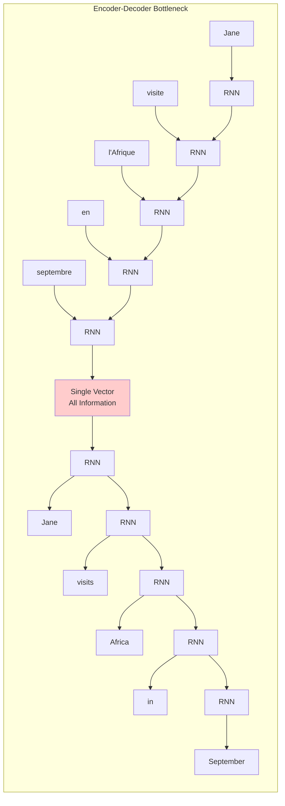

### Performance Degradation with Length

**Empirical observation**: Translation quality drops significantly for longer sentences

```
Translation Quality (BLEU Score)
     ↑
     |     ●●●●●●●●●● (Basic Encoder-Decoder)
 90% ┤   ●●            ●●●●●●●●●●●● (With Attention)
     |  ●
 80% ┤ ●
     |●
 70% ┤
     |
 60% ┤
     └─────────────────────────────→
      10    20    30    40    50+ words
              Input Sentence Length
```

**Why this happens**:

1. **Memory limitations**: RNNs forget early information in long sequences
2. **Compression loss**: Fixed vector can't capture all details
3. **No direct access**: Decoder can't "look back" at specific input words

---

## Human Translation Process vs Machine

### How Humans Translate

**Human approach** (intuitive and effective):

1. **Read first part** of source sentence
2. **Generate corresponding part** of translation
3. **Look at next part** of source
4. **Generate next part** of translation
5. **Repeat** until complete

**Example process**:

```
French: "Jane visite l'Afrique en septembre"

Human translator:
Step 1: Read "Jane" → Write "Jane"
Step 2: Read "visite" → Write "visits"
Step 3: Read "l'Afrique" → Write "Africa"
Step 4: Read "en septembre" → Write "in September"
```

### Machine Approach (Basic Encoder-Decoder)

**Machine approach** (problematic for long sequences):

1. **Read entire sentence** and memorize everything
2. **Compress all information** into single vector
3. **Generate entire translation** from that vector alone

**Example process**:

```
French: "Jane visite l'Afrique en septembre"

Basic machine:
Step 1: Read ALL words → Compress to vector [0.2, -0.1, 0.3, ...]
Step 2: Generate entire translation from compressed vector
```

**Problem**: Like asking someone to memorize a entire book and then recite it perfectly!

---

## Attention Mechanism Intuition

### Core Concept

**Key insight**: Allow decoder to "attend" to different parts of the input at each generation step, similar to human translation process.

**Attention in one sentence**: _"When generating each output word, look at all input words and decide which ones are most relevant right now."_

### Attention Architecture Overview

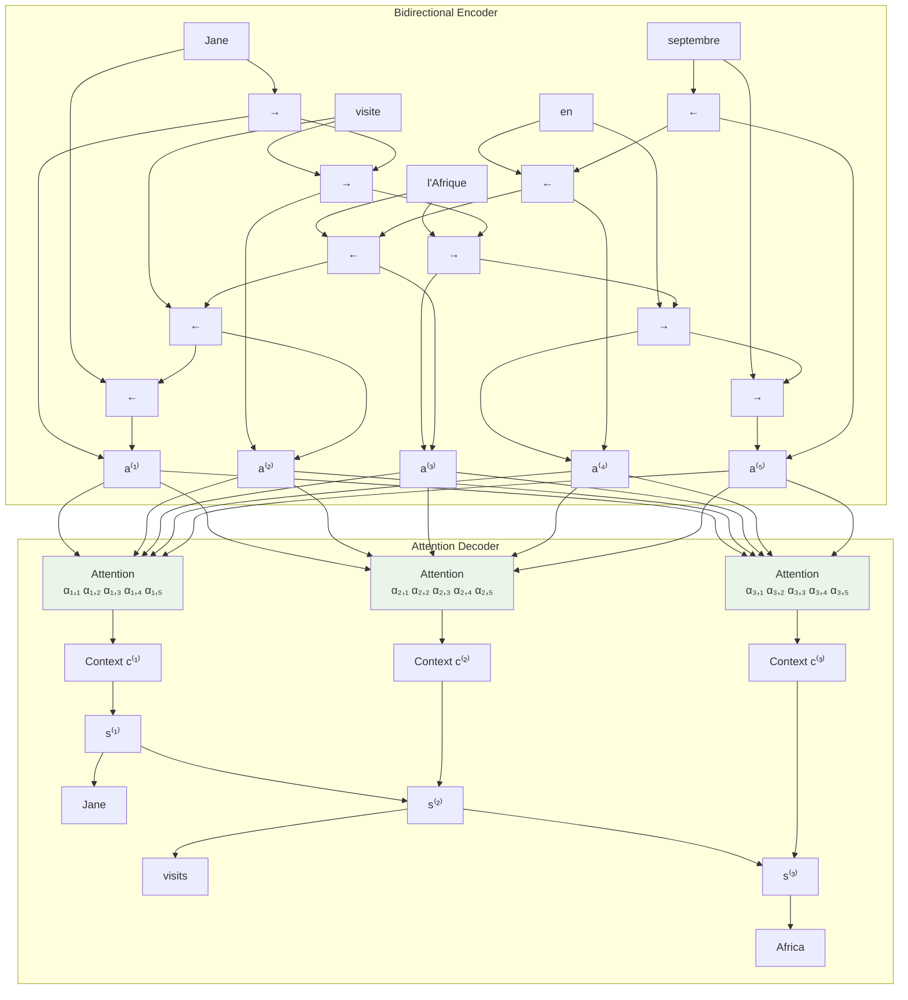

### Key Components

**1. Bidirectional Encoder**

- Processes input in both directions (→ and ←)
- Each position gets rich representation: a⁽ᵗ⁾ = [→a⁽ᵗ⁾, ←a⁽ᵗ⁾]
- Captures context from both past and future words

**2. Attention Mechanism**

- Computes attention weights α₍ᵢ,ⱼ₎ for each decoder step i and encoder position j
- Creates context vector c⁽ᵢ⁾ as weighted sum of encoder states
- Dynamic focusing on relevant input parts

**3. Context-Aware Decoder**

- Uses both previous hidden state s⁽ᵢ⁻¹⁾ and context vector c⁽ᵢ⁾
- Generates more informed predictions
- Can "look back" at any part of input sequence

---

## Attention Model Architecture Explanation

### Overall Flow (Bottom to Top)

1. **French Input Layer** (Bottom)

- Input words: "Jane", "visite", "l'Afrique", "en", "septembre"
- Each word is converted to embeddings x⁽¹⁾, x⁽²⁾, x⁽³⁾, x⁽⁴⁾, x⁽⁵⁾

2. **Bidirectional RNN Encoder** (Middle)

- **Forward RNN** (→): Processes words left-to-right
- **Backward RNN** (←): Processes words right-to-left
- **Combined states**: a⁽ᵗ⁾ = [forward_state, backward_state] for each position
- **Result**: Rich contextual representation for each input word

3. **Attention Mechanism** (Center)

- **For each decoder step**: Computes attention weights α\_{t,t'}
- **Attention weights**: Show how much to focus on each input word
- **Context vector**: c⁽ᵗ⁾ = weighted sum of all encoder states
- **Dynamic focusing**: Different attention pattern for each output word

4. **Decoder RNN** (Top)

- **Hidden states**: s⁽¹⁾, s⁽²⁾, s⁽³⁾, s⁽⁴⁾, s⁽⁵⁾, s⁽⁶⁾
- **Input at each step**: Previous state + context vector + previous word
- **Output**: English words "Jane", "visits", "Africa", "in", "September", "<EOS>"

### Key Innovations

- **No bottleneck**: Decoder can access ALL encoder states, not just the last one
- **Dynamic attention**: Different focus patterns for different output words
- **Interpretability**: Attention weights show word alignments
- **Better long sequences**: Performance doesn't degrade with length

### Attention Weight Patterns

- **α₁,₁ = high**: "Jane" focuses on "Jane" (direct translation)
- **α₂,₂ = high**: "visits" focuses on "visite" (verb translation)
- **α₃,₃ = high**: "Africa" focuses on "l'Afrique" (noun translation)
- **Soft alignment**: Some attention to neighboring words for context

```bash

```

                     Attention Model Architecture

    Output: Jane    visits    Africa      in    September   <EOS>
            ↑        ↑         ↑         ↑         ↑         ↑
           s⁽¹⁾     s⁽²⁾      s⁽³⁾      s⁽⁴⁾      s⁽⁵⁾      s⁽⁶⁾
            ↑        ↑         ↑         ↑         ↑         ↑
           [RNN]    [RNN]     [RNN]     [RNN]     [RNN]     [RNN]
            ↑        ↑         ↑         ↑         ↑         ↑
           c⁽¹⁾     c⁽²⁾      c⁽³⁾      c⁽⁴⁾      c⁽⁵⁾      c⁽⁶⁾
            ↑        ↑         ↑         ↑         ↑         ↑
        ┌─────────────────────────────────────────────────────────┐
        │                Attention Mechanism                      │
        │                                                         │
        │  α₁,₁ α₁,₂ α₁,₃ α₁,₄ α₁,₅   α₂,₁ α₂,₂ α₂,₃ α₂,₄ α₂,₅   │
        │   ↑   ↑   ↑   ↑   ↑     ↑   ↑   ↑   ↑   ↑           │
        │   └───┴───┴───┴───┘     └───┴───┴───┴───┘           │
        │                                                         │
        └─────────────────────────────────────────────────────────┘
                    ↑     ↑     ↑     ↑     ↑
                   a⁽¹⁾  a⁽²⁾  a⁽³⁾  a⁽⁴⁾  a⁽⁵⁾
                    ↑     ↑     ↑     ↑     ↑
        ┌─────────────────────────────────────────────────────────┐
        │                Bidirectional RNN                        │
        │                                                         │
        │  [→]───[→]───[→]───[→]───[→]                            │
        │   ↑     ↑     ↑     ↑     ↑                             │
        │   │     │     │     │     │                             │
        │   ↓     ↓     ↓     ↓     ↓                             │
        │  [←]───[←]───[←]───[←]───[←]                            │
        │                                                         │
        └─────────────────────────────────────────────────────────┘
                    ↑     ↑     ↑     ↑     ↑
                   x⁽¹⁾  x⁽²⁾  x⁽³⁾  x⁽⁴⁾  x⁽⁵⁾
                    ↑     ↑     ↑     ↑     ↑
                 [Jane][visite][l'Afrique][en][septembre]

                           French Input Sentence

```

```

                    Detailed Attention Flow for "visits"

    Step 2: Generate "visits"

    s⁽¹⁾ ────────────────────────────────────────────────────────────┐
                                                                      │
                                                                      ↓
    ┌─────────────────── Attention Computation ──────────────────────┐
    │                                                                 │
    │   Energy calculation: e⁽²,ᵗ'⁾ = NN(s⁽¹⁾, a⁽ᵗ'⁾)                 │
    │                                                                 │
    │   e⁽²,¹⁾   e⁽²,²⁾   e⁽²,³⁾   e⁽²,⁴⁾   e⁽²,⁵⁾                    │
    │    2.1     3.5     1.8     0.9     0.5                       │
    │     ↓       ↓       ↓       ↓       ↓                         │
    │  ┌─────────────── Softmax ───────────────┐                    │
    │  │                                       │                    │
    │  │   α₂,₁   α₂,₂   α₂,₃   α₂,₄   α₂,₅    │                    │
    │  │   0.17   0.62   0.13   0.05   0.03   │                    │
    │  └─────────────────────────────────────────┘                    │
    │                                                                 │
    │   Context: c⁽²⁾ = Σ α₂,ᵗ' × a⁽ᵗ'⁾                              │
    │                                                                 │
    └─────────────────────────────────────────────────────────────────┘
                                    ↓
                                   c⁽²⁾
                                    ↓
                            ┌─────────────┐
                            │    RNN      │
                            │             │
                            │  s⁽¹⁾, c⁽²⁾  │
                            │      ↓      │
                            │    s⁽²⁾     │
                            └─────────────┘
                                    ↓
                               "visits"

```

```

                           Attention Weights Heatmap

    English    French Input Words
    Output   Jane  visite  l'Afrique  en  septembre
    ─────────────────────────────────────────────────
    Jane   │ ████   ▓▓      ░░        ░     ░       │ α₁,*
    visits │ ▓▓    ████      ▓▓        ░     ░       │ α₂,*
    Africa │ ░      ▓▓      ████       ░     ░       │ α₃,*
    in     │ ░      ░        ░        ████   ▓▓      │ α₄,*
    Sept   │ ░      ░        ░        ▓▓    ████     │ α₅,*

    Legend:
    ████ = 0.6-1.0 (High attention)
    ▓▓▓▓ = 0.3-0.6 (Medium attention)
    ░░░░ = 0.0-0.3 (Low attention)

    Attention Matrix: αᵢ,ⱼ where i=output position, j=input position

```

```

                      Step-by-Step Attention Process

    ┌─────────────────────────────────────────────────────────────────┐
    │                      Step 1: Energies                          │
    │                                                                 │
    │   For each input position t':                                   │
    │   e⁽ᵗ,ᵗ'⁾ = v_a^T tanh(W_a s⁽ᵗ⁻¹⁾ + U_a a⁽ᵗ'⁾ + b_a)            │
    │                                                                 │
    │   s⁽ᵗ⁻¹⁾ ──┐                                                    │
    │            │                                                    │
    │            ├─► [W_a] ──┐                                        │
    │            │          │                                        │
    │   a⁽ᵗ'⁾ ────┼─► [U_a] ──┼─► [+] ─► [tanh] ─► [v_a] ─► e⁽ᵗ,ᵗ'⁾   │
    │            │          │                                        │
    │   b_a ──────┘          │                                        │
    │                       │                                        │
    └─────────────────────────────────────────────────────────────────┘
                             │
                             ↓
    ┌─────────────────────────────────────────────────────────────────┐
    │                      Step 2: Softmax                           │
    │                                                                 │
    │   α⁽ᵗ,ᵗ'⁾ = exp(e⁽ᵗ,ᵗ'⁾) / Σₖ exp(e⁽ᵗ,ᵏ⁾)                      │
    │                                                                 │
    │   e⁽ᵗ,¹⁾  e⁽ᵗ,²⁾  e⁽ᵗ,³⁾  e⁽ᵗ,⁴⁾  e⁽ᵗ,⁵⁾                        │
    │     ↓      ↓      ↓      ↓      ↓                             │
    │   [exp]  [exp]  [exp]  [exp]  [exp]                           │
    │     ↓      ↓      ↓      ↓      ↓                             │
    │     └──────┴──────┴──────┴──────┘                             │
    │                  ↓                                             │
    │               [sum & normalize]                                │
    │                  ↓                                             │
    │   α⁽ᵗ,¹⁾  α⁽ᵗ,²⁾  α⁽ᵗ,³⁾  α⁽ᵗ,⁴⁾  α⁽ᵗ,⁵⁾                        │
    │                                                                 │
    └─────────────────────────────────────────────────────────────────┘
                             │
                             ↓
    ┌─────────────────────────────────────────────────────────────────┐
    │                     Step 3: Context                            │
    │                                                                 │
    │   c⁽ᵗ⁾ = Σₜ' α⁽ᵗ,ᵗ'⁾ × a⁽ᵗ'⁾                                   │
    │                                                                 │
    │   α⁽ᵗ,¹⁾ × a⁽¹⁾  ─┐                                            │
    │   α⁽ᵗ,²⁾ × a⁽²⁾  ─┤                                            │
    │   α⁽ᵗ,³⁾ × a⁽³⁾  ─┼─► [Σ] ─► c⁽ᵗ⁾                             │
    │   α⁽ᵗ,⁴⁾ × a⁽⁴⁾  ─┤                                            │
    │   α⁽ᵗ,⁵⁾ × a⁽⁵⁾  ─┘                                            │
    │                                                                 │
    └─────────────────────────────────────────────────────────────────┘
                             │
                             ↓
                       Context Vector c⁽ᵗ⁾
                             │
                             ↓
                      ┌─────────────┐
                      │    RNN      │
                      │             │
                      │ s⁽ᵗ⁻¹⁾, c⁽ᵗ⁾│
                      │      ↓      │
                      │    s⁽ᵗ⁾     │
                      └─────────────┘
                             │
                             ↓
                        Output y⁽ᵗ⁾

```

```

## Attention Weights: The Magic Numbers

### What Are Attention Weights?

**Attention weights αₜ,ₜ'** answer the question: _"When generating the t-th output word, how much should I focus on the t'-th input word?"_

**Properties**:

- **Range**: 0 ≤ αₜ,ₜ' ≤ 1
- **Normalization**: Σₜ' αₜ,ₜ' = 1 (weights sum to 1 for each output position)
- **Interpretation**: Probability distribution over input positions

### Attention Example

**Translation**: "Jane visite l'Afrique" → "Jane visits Africa"

**Attention weights visualization**:

```
                Input French Words
           Jane  visite  l'Afrique
    Jane  [0.9]  [0.1]   [0.0]     ← Strong focus on "Jane"
   visits [0.1]  [0.8]   [0.1]     ← Strong focus on "visite"
   Africa [0.0]  [0.1]   [0.9]     ← Strong focus on "l'Afrique"
Output
English
Words
```

**Interpretation**:

- When generating "Jane": 90% attention on "Jane", 10% on "visite"
- When generating "visits": 80% attention on "visite", some spillover
- When generating "Africa": 90% attention on "l'Afrique"

### Step-by-Step Attention Process

**Step 1: Generate "Jane"**

```
Attention weights: α₁,₁=0.9, α₁,₂=0.1, α₁,₃=0.0
Context: c⁽¹⁾ = 0.9×a⁽¹⁾ + 0.1×a⁽²⁾ + 0.0×a⁽³⁾
Output: s⁽¹⁾ = RNN(s⁽⁰⁾, c⁽¹⁾) → "Jane"
```

**Step 2: Generate "visits"**

```
Attention weights: α₂,₁=0.1, α₂,₂=0.8, α₂,₃=0.1
Context: c⁽²⁾ = 0.1×a⁽¹⁾ + 0.8×a⁽²⁾ + 0.1×a⁽³⁾
Output: s⁽²⁾ = RNN(s⁽¹⁾, c⁽²⁾) → "visits"
```

**Step 3: Generate "Africa"**

```
Attention weights: α₃,₁=0.0, α₃,₂=0.1, α₃,₃=0.9
Context: c⁽³⁾ = 0.0×a⁽¹⁾ + 0.1×a⁽²⁾ + 0.9×a⁽³⁾
Output: s⁽³⁾ = RNN(s⁽²⁾, c⁽³⁾) → "Africa"
```

---

## Detailed Architecture Walkthrough

### Input Processing: Bidirectional Encoder

**Why bidirectional?**

- **Forward pass**: Captures what comes before each word
- **Backward pass**: Captures what comes after each word
- **Combined**: Rich representation with full context

**Example for "visite"**:

```
Forward context:  "Jane visite" → knows it comes after "Jane"
Backward context: "visite l'Afrique en septembre" → knows what follows
Combined: a⁽²⁾ = [forward_state, backward_state] → full understanding
```

### Attention Computation Overview

**Three key questions attention mechanism answers**:

1. **What to attend to?** All encoder hidden states a⁽¹⁾, a⁽²⁾, ..., a⁽ᵀˣ⁾
2. **How much to attend?** Attention weights α₍ᵢ,ⱼ₎
3. **How to combine?** Weighted sum to create context vector

**Mathematical preview** (detailed in next section):

```
e⁽ᵗ,ᵗ'⁾ = attention_function(s⁽ᵗ⁻¹⁾, a⁽ᵗ'⁾)  # Compute energy
α⁽ᵗ,ᵗ'⁾ = softmax(e⁽ᵗ,ᵗ'⁾)                    # Normalize to probabilities
c⁽ᵗ⁾ = Σ α⁽ᵗ,ᵗ'⁾ × a⁽ᵗ'⁾                      # Weighted combination
```

### Output Generation: Context-Aware Decoder

**Enhanced decoder input**:

- **Previous hidden state**: s⁽ᵗ⁻¹⁾ (where we were)
- **Context vector**: c⁽ᵗ⁾ (what to focus on now)
- **Previous output**: y⁽ᵗ⁻¹⁾ (what we just generated)

**Decoder update**:

```
s⁽ᵗ⁾ = RNN(s⁽ᵗ⁻¹⁾, [c⁽ᵗ⁾, y⁽ᵗ⁻¹⁾])
y⁽ᵗ⁾ = softmax(W × s⁽ᵗ⁾ + b)
```

---

## Attention Visualization: Alignment Matrices

### Understanding Attention Heatmaps

**Attention matrix**: Rows = output words, Columns = input words

**Example visualization**:

```
Heat Map (darker = higher attention):
                Jane  visite  l'Afrique  en  septembre
        Jane    ███    ▓        ░        ░      ░
      visits     ▓    ███        ▓        ░      ░
      Africa     ░     ▓       ███        ░      ░
          in     ░     ░        ░       ███      ▓
   September     ░     ░        ░        ▓     ███

Legend: ███ = 0.8-1.0   ▓ = 0.4-0.8   ░ = 0.0-0.4
```

**What this tells us**:

- **Diagonal pattern**: Mostly monotonic alignment (good!)
- **Soft alignment**: Some attention to neighboring words
- **Meaningful connections**: "l'Afrique" ↔ "Africa" strongly connected

### Real Translation Example

**Input**: "Jane visite l'Afrique en septembre et elle aime beaucoup"
**Output**: "Jane visits Africa in September and she likes it very much"

**Expected attention pattern**:

```
Jane     → Jane      (1:1 alignment)
visite   → visits    (1:1 alignment)
l'Afrique → Africa   (1:1 alignment)
en       → in        (1:1 alignment)
septembre → September (1:1 alignment)
et       → and       (1:1 alignment)
elle     → she       (1:1 alignment)
aime     → likes     (1:1 alignment)
beaucoup → very much (1:2 alignment - one French word to two English)
```

---

## Benefits of Attention

### 1. Solves Information Bottleneck

**Before attention**:

- All information squeezed through single vector
- Information loss proportional to sequence length
- Performance degrades rapidly with length

**With attention**:

- Direct access to all encoder states
- No information bottleneck
- Consistent performance across lengths

### 2. Interpretability

**Attention weights provide insight**:

- **Model debugging**: See what model focuses on
- **Error analysis**: Identify incorrect attention patterns
- **Trust building**: Human-interpretable alignments

**Example debugging**:

```
Input: "The bank by the river"
Wrong output: "The financial institution by the river"
Attention analysis: Model focused on wrong sense of "bank"
```

### 3. Better Gradient Flow

**Shorter paths to input**:

- **Without attention**: Gradients travel through entire encoder
- **With attention**: Direct paths to any input position
- **Result**: Better training dynamics

### 4. Handles Reordering

**Language-specific word order**:

- **English**: Subject-Verb-Object ("I eat apples")
- **Japanese**: Subject-Object-Verb ("I apples eat")
- **Attention**: Can learn appropriate reordering patterns

---

## Computational Considerations

### Time Complexity

**Basic encoder-decoder**: O(Tₓ + Tᵧ)
**With attention**: O(Tₓ × Tᵧ)

**Trade-off analysis**:

- **Quadratic complexity**: Expensive for very long sequences
- **Quality improvement**: Often worth the computational cost
- **Practical limit**: ~1000 words typical maximum

### Memory Requirements

**Attention matrix storage**: O(Tₓ × Tᵧ) additional memory
**Batch processing**: Memory grows quickly with batch size
**Optimization strategies**: Gradient checkpointing, sequence bucketing

---

## Simple Intuitive Examples

### Analogy 1: Reading with Highlighting

**Traditional approach**:

```
1. Read entire document
2. Memorize everything
3. Answer questions from memory
```

**Attention approach**:

```
1. Read entire document
2. For each question, highlight relevant parts
3. Answer based on highlighted sections
```

### Analogy 2: Language Learning

**How beginners translate**:

```
"Wo ai ni" (Chinese) → ??? → "I love you"
Step 1: Look up "wo" → "I"
Step 2: Look up "ai" → "love"
Step 3: Look up "ni" → "you"
Result: "I love you"
```

**Attention mechanism**:

```
For each English word, look at Chinese words and decide:
- "I" ← mostly from "wo"
- "love" ← mostly from "ai"
- "you" ← mostly from "ni"
```

### Analogy 3: Orchestra Conductor

**Without attention**: Conductor memorizes entire symphony, then conducts from memory
**With attention**: Conductor reads the score while conducting, focusing on current section

**During performance**:

- **Bar 1**: Focus on opening theme (violins)
- **Bar 50**: Focus on dramatic crescendo (full orchestra)
- **Bar 100**: Focus on solo passage (flute)

---

## Historical Impact

### The Paper That Changed Everything

**"Neural Machine Translation by Jointly Learning to Align and Translate"**

- **Authors**: Bahdanau, Cho, Bengio (2014)
- **Impact**: Revolutionized sequence-to-sequence learning
- **Legacy**: Foundation for Transformers, BERT, GPT

### Performance Improvements

**WMT Translation Tasks**:

- **Before attention**: 20-30 BLEU points
- **With attention**: 35-40+ BLEU points
- **Improvement**: 30-50% relative gain

### Beyond Machine Translation

**Attention spread to**:

- **Computer Vision**: Visual attention for image captioning
- **Speech Recognition**: Acoustic attention for speech-to-text
- **Question Answering**: Document attention for reading comprehension
- **General NLP**: Self-attention leading to Transformers

---

## Preview: What's Coming Next

### Mathematical Details

**Next video covers**:

- Exact computation of attention weights
- Neural network architecture for attention function
- Training procedures and optimization

### Advanced Concepts

**Building toward**:

- **Self-attention**: Attention within single sequence
- **Multi-head attention**: Multiple attention patterns
- **Transformer architecture**: Attention-only models
- **Modern applications**: BERT, GPT, and beyond

---

## Key Takeaways

1. **Fundamental problem**: Basic encoder-decoder has information bottleneck
2. **Human inspiration**: Attention mimics human translation process
3. **Core mechanism**: Dynamic focusing on relevant input parts
4. **Architecture change**: Bidirectional encoder + attention decoder
5. **Attention weights**: Learnable probability distribution over input positions
6. **Benefits**: Solves bottleneck, enables interpretability, improves gradients
7. **Trade-off**: Quadratic complexity for much better quality
8. **Historical significance**: Revolutionary paper that transformed deep learning
9. **Broad impact**: Foundation for modern NLP architectures
10. **Future direction**: Leads to self-attention and Transformer models

**Coming next**: Dive into the mathematical details of how attention weights are computed and how the complete attention mechanism works in practice.

# 8. Attention Model

## Introduction

Building on the intuition from the previous section, we now dive into the mathematical details of how the attention mechanism actually works. This section covers the precise computations, neural network architectures, and step-by-step algorithms that make attention possible.

---

## Mathematical Framework

### Key Variables and Notation

**Encoder representations**:

- **a⁽ᵗ'⁾**: Hidden state of bidirectional encoder at position t'
- **Tₓ**: Length of input sequence

**Decoder representations**:

- **s⁽ᵗ⁾**: Hidden state of decoder at time step t
- **Tᵧ**: Length of output sequence

**Attention components**:

- **e⁽ᵗ,ᵗ'⁾**: Energy/score indicating relevance of input position t' for output position t
- **α⁽ᵗ,ᵗ'⁾**: Attention weight (normalized energy)
- **c⁽ᵗ⁾**: Context vector at decoder step t

### The Three-Step Attention Process

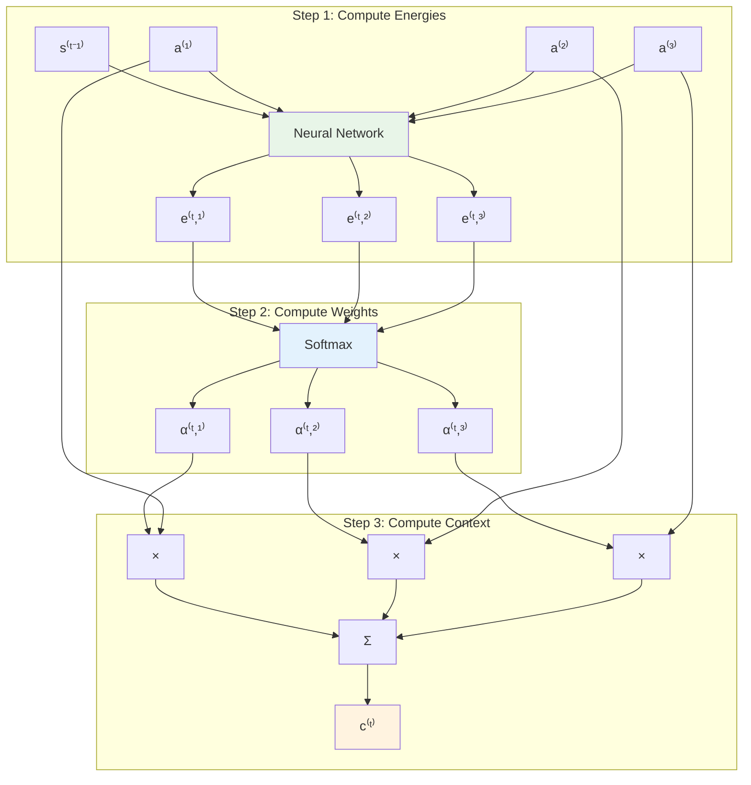

---

## Step 1: Computing Attention Energies

### The Energy Function

**Purpose**: Measure how well input position t' matches with decoder state at time t

**Mathematical formulation**:
$$e^{(t,t')} = \text{neural\_network}(s^{(t-1)}, a^{(t')})$$

### Common Energy Function Architectures

#### 1. Additive Attention (Bahdanau et al.)

**Architecture**:
$$e^{(t,t')} = v_a^T \tanh(W_a s^{(t-1)} + U_a a^{(t')} + b_a)$$

**Components**:

- **W_a**: Weight matrix for decoder state (shape: [hidden_size, hidden_size])
- **U_a**: Weight matrix for encoder state (shape: [hidden_size, encoder_size])
- **v_a**: Attention vector (shape: [hidden_size, 1])
- **b_a**: Bias vector (shape: [hidden_size, 1])

**Step-by-step computation**:

```python
def additive_attention_energy(s_prev, a_t_prime, W_a, U_a, v_a, b_a):
    """
    Compute energy using additive attention
    """
    # Linear transformations
    decoder_proj = W_a @ s_prev          # [hidden_size, 1]
    encoder_proj = U_a @ a_t_prime       # [hidden_size, 1]

    # Add bias and apply tanh
    combined = tanh(decoder_proj + encoder_proj + b_a)  # [hidden_size, 1]

    # Final projection to scalar
    energy = v_a.T @ combined            # [1, 1] -> scalar

    return energy
```

#### 2. Multiplicative Attention (Luong et al.)

**Architecture**:
$$e^{(t,t')} = s^{(t-1)T} W_a a^{(t')}$$

**Simpler computation**:

```python
def multiplicative_attention_energy(s_prev, a_t_prime, W_a):
    """
    Compute energy using multiplicative attention
    """
    # Single matrix multiplication
    energy = s_prev.T @ W_a @ a_t_prime  # scalar
    return energy
```

#### 3. Dot-Product Attention (if dimensions match)

**Architecture**:
$$e^{(t,t')} = s^{(t-1)T} a^{(t')}$$

**Simplest form**:

```python
def dot_product_attention_energy(s_prev, a_t_prime):
    """
    Compute energy using dot-product attention
    """
    energy = s_prev.T @ a_t_prime  # scalar
    return energy
```

### Detailed Example: Additive Attention

**Given**:

- **s⁽ᵗ⁻¹⁾**: [0.5, -0.2, 0.3] (decoder state)
- **a⁽ᵗ'⁾**: [0.8, 0.1, -0.4] (encoder state)
- **W_a**: 3×3 matrix, **U_a**: 3×3 matrix, **v_a**: 3×1 vector

**Step-by-step calculation**:

```python
# Example with actual numbers
s_prev = np.array([[0.5], [-0.2], [0.3]])
a_t_prime = np.array([[0.8], [0.1], [-0.4]])

W_a = np.array([[0.1, 0.2, 0.3],
                [0.4, 0.5, 0.6],
                [0.7, 0.8, 0.9]])

U_a = np.array([[0.2, 0.1, 0.3],
                [0.5, 0.4, 0.6],
                [0.8, 0.7, 0.9]])

v_a = np.array([[0.3], [0.6], [0.9]])
b_a = np.array([[0.1], [0.2], [0.3]])

# Compute projections
decoder_proj = W_a @ s_prev  # [3,3] @ [3,1] = [3,1]
encoder_proj = U_a @ a_t_prime  # [3,3] @ [3,1] = [3,1]

# Add and apply tanh
combined = np.tanh(decoder_proj + encoder_proj + b_a)

# Final projection
energy = v_a.T @ combined  # [1,3] @ [3,1] = [1,1] -> scalar

print(f"Energy: {energy[0,0]:.3f}")
```

---

## Step 2: Computing Attention Weights

### Softmax Normalization

**Purpose**: Convert energies to probability distribution

**Mathematical formulation**:
$$\alpha^{(t,t')} = \frac{\exp(e^{(t,t')})}{\sum_{k=1}^{T_x} \exp(e^{(t,k)})}$$

**Properties**:

- **Non-negative**: $\alpha^{(t,t')} \geq 0$ for all t, t'
- **Normalized**: $\sum_{t'} \alpha^{(t,t')} = 1$ for each t
- **Differentiable**: Enables end-to-end training

### Numerical Example

**Given energies for decoder step t=2**:

- **e⁽²,¹⁾** = 2.1 (attention to "Jane")
- **e⁽²,²⁾** = 3.5 (attention to "visite")
- **e⁽²,³⁾** = 1.8 (attention to "l'Afrique")
- **e⁽²,⁴⁾** = 0.9 (attention to "en")
- **e⁽²,⁵⁾** = 0.5 (attention to "septembre")

**Step-by-step softmax computation**:

```python
import numpy as np

# Input energies
energies = np.array([2.1, 3.5, 1.8, 0.9, 0.5])

# Compute exponentials
exp_energies = np.exp(energies)
print("Exponentials:", exp_energies)
# Output: [8.166, 30.067, 6.050, 2.460, 1.649]

# Compute sum
sum_exp = np.sum(exp_energies)
print("Sum:", sum_exp)
# Output: 48.392

# Compute attention weights
attention_weights = exp_energies / sum_exp
print("Attention weights:", attention_weights)
# Output: [0.169, 0.621, 0.125, 0.051, 0.034]

# Verify normalization
print("Sum of weights:", np.sum(attention_weights))
# Output: 1.000
```

**Interpretation**:

- **α⁽²,²⁾ = 0.621**: 62.1% attention to "visite" (makes sense for generating "visits")
- **α⁽²,¹⁾ = 0.169**: 16.9% attention to "Jane" (some context)
- **α⁽²,³⁾ = 0.125**: 12.5% attention to "l'Afrique" (some context)
- **Lower weights**: Less attention to "en" and "septembre"

---

## Step 3: Computing Context Vector

### Weighted Sum Computation

**Purpose**: Combine encoder states using attention weights

**Mathematical formulation**:
$$c^{(t)} = \sum_{t'=1}^{T_x} \alpha^{(t,t')} a^{(t')}$$

**This is a weighted average** of all encoder hidden states

### Detailed Example

**Given**:

- **Attention weights** from previous step: [0.169, 0.621, 0.125, 0.051, 0.034]
- **Encoder states**:
  - **a⁽¹⁾**: [0.8, 0.1, -0.4, 0.2] (for "Jane")
  - **a⁽²⁾**: [0.3, 0.9, 0.5, -0.1] (for "visite")
  - **a⁽³⁾**: [-0.2, 0.4, 0.7, 0.3] (for "l'Afrique")
  - **a⁽⁴⁾**: [0.1, -0.3, 0.2, 0.8] (for "en")
  - **a⁽⁵⁾**: [0.6, 0.2, -0.1, 0.4] (for "septembre")

**Step-by-step computation**:

```python
# Attention weights
alpha = np.array([0.169, 0.621, 0.125, 0.051, 0.034])

# Encoder states (each row is a hidden state)
encoder_states = np.array([
    [0.8, 0.1, -0.4, 0.2],   # a^(1)
    [0.3, 0.9, 0.5, -0.1],   # a^(2)
    [-0.2, 0.4, 0.7, 0.3],   # a^(3)
    [0.1, -0.3, 0.2, 0.8],   # a^(4)
    [0.6, 0.2, -0.1, 0.4]    # a^(5)
])

# Compute weighted sum
context_vector = np.zeros(4)  # Initialize context vector
for i in range(5):
    context_vector += alpha[i] * encoder_states[i]

print("Context vector c^(2):", context_vector)
# Output: [0.352, 0.648, 0.376, 0.063]
```

**Interpretation**:

- **c⁽²⁾ = [0.352, 0.648, 0.376, 0.063]**
- **Heavily influenced by a⁽²⁾** (weight 0.621) corresponding to "visite"
- **Some contribution from a⁽¹⁾** (weight 0.169) for context from "Jane"
- **Result**: Context vector captures information relevant for generating "visits"

---

## Complete Attention Architecture

### Bidirectional Encoder Details

**Forward RNN**:
$$\overrightarrow{a}^{(t')} = \text{RNN}_{\text{forward}}(\overrightarrow{a}^{(t'-1)}, x^{(t')})$$

**Backward RNN**:
$$\overleftarrow{a}^{(t')} = \text{RNN}_{\text{backward}}(\overleftarrow{a}^{(t'+1)}, x^{(t')})$$

**Combined representation**:
$$a^{(t')} = [\overrightarrow{a}^{(t')}, \overleftarrow{a}^{(t')}]$$

### Attention-Aware Decoder

**Decoder update with attention**:
$$s^{(t)} = \text{RNN}_{\text{decoder}}(s^{(t-1)}, [c^{(t)}, y^{(t-1)}])$$

**Output prediction**:
$$\hat{y}^{(t)} = \text{softmax}(W_o s^{(t)} + b_o)$$

**Key insight**: Context vector $c^{(t)}$ is an **input** to the decoder RNN, not an output

---

## Attention Weight Properties

### Mathematical Constraints

**Non-negativity**:
$$\alpha^{(t,t')} \geq 0 \quad \forall t, t'$$

**Normalization** (probability distribution):
$$\sum_{t'=1}^{T_x} \alpha^{(t,t')} = 1 \quad \forall t$$

**These properties are automatically satisfied by the softmax function**

### Interpretation

**Attention weights as probabilities**:

- $\alpha^{(t,t')} = 0.8$ means "80% attention to input position t'"
- $\alpha^{(t,t')} = 0.1$ means "10% attention to input position t'"
- Sum over all positions equals 100% attention

---

## Neural Network for Energy Computation

**Architecture diagram**:

```
                Computing attention α⁽ᵗ,ᵗ'⁾

α⁽ᵗ,ᵗ'⁾ = amount of attention y⁽ᵗ⁾ should pay to a⁽ᵗ'⁾

                    exp(e⁽ᵗ,ᵗ'⁾)
        α⁽ᵗ,ᵗ'⁾ = ――――――――――――――――――
                  Σₜ'₌₁ᵀˣ exp(e⁽ᵗ,ᵗ'⁾)

                        ↑
                   [Softmax]
                        ↑
                    e⁽ᵗ,ᵗ'⁾ ←── Neural Network
                        ↑              ↑
              ┌─────────┼──────────────┼────────────────┐
              │         │              │                │
              │    s⁽ᵗ⁻¹⁾ ──────┐      │                │
              │         │       │      │                │
              │    a⁽ᵗ'⁾ ───────┼─→ [NN] ───→ e⁽ᵗ,ᵗ'⁾   │
              │                 │                       │
              └─────────────────┼───────────────────────┘
                               │
                          Small Neural
                           Network

        ┌─────────────────────────────────────────────────────┐
        │              Bidirectional RNN                      │
        │                                                     │
        │  a⁽⁰⁾──→[→]──→[→]──→...──→[→]──→[→]                 │
        │         ↑     ↑             ↑     ↑                 │
        │         │     │             │     │                 │
        │         ↓     ↓             ↓     ↓                 │
        │  a⁽⁰⁾──←[←]──←[←]──←...──←[←]──←[←]                 │
        │                                                     │
        └─────────────────────────────────────────────────────┘
                  ↑     ↑             ↑     ↑
                x⁽¹⁾  x⁽²⁾  ...   x⁽ᵀˣ⁻¹⁾ x⁽ᵀˣ⁾
```

### Architecture Choices

**Small neural network** (most common):

- **Why small?** Must compute for every $(t, t')$ pair → $T_x \times T_y$ computations
- **Typical size**: 1-2 hidden layers with 50-200 units
- **Activation**: Usually tanh or ReLU

### Detailed Network Architecture

**Input concatenation approach**:

```python
def attention_network_concat(s_prev, a_t_prime):
    """
    Energy computation using input concatenation
    """
    # Concatenate inputs
    combined_input = np.concatenate([s_prev, a_t_prime])  # [2*hidden_size]

    # Hidden layer
    h = tanh(W_h @ combined_input + b_h)  # [hidden_size]

    # Output layer (scalar)
    energy = W_o @ h + b_o  # scalar

    return energy
```

**Separate projection approach** (Bahdanau):

```python
def attention_network_bahdanau(s_prev, a_t_prime, W_a, U_a, v_a, b_a):
    """
    Energy computation using separate projections
    """
    # Project decoder state
    decoder_proj = W_a @ s_prev  # [attention_size]

    # Project encoder state
    encoder_proj = U_a @ a_t_prime  # [attention_size]

    # Combine and apply non-linearity
    combined = tanh(decoder_proj + encoder_proj + b_a)  # [attention_size]

    # Final projection to scalar
    energy = v_a.T @ combined  # scalar

    return energy
```

### Why This Network Architecture Works

**Intuition**:

1. **s⁽ᵗ⁻¹⁾ represents**: "What information do I need for the next word?"
2. **a⁽ᵗ'⁾ represents**: "What information does this input position contain?"
3. **Neural network learns**: "How well does this input position match my current needs?"

**Training process**:

- **Gradient descent** automatically learns what constitutes a good match
- **End-to-end training** optimizes attention for translation quality
- **No manual feature engineering** required

---

## Complete Algorithm Implementation

### Full Attention Step

```python
def attention_step(decoder_state, encoder_states, attention_network):
    """
    Complete attention computation for one decoder step

    Args:
        decoder_state: s^(t-1) - previous decoder hidden state
        encoder_states: [a^(1), a^(2), ..., a^(T_x)] - all encoder states
        attention_network: neural network for computing energies

    Returns:
        context_vector: c^(t)
        attention_weights: [α^(t,1), α^(t,2), ..., α^(t,T_x)]
    """
    T_x = len(encoder_states)

    # Step 1: Compute energies
    energies = []
    for t_prime in range(T_x):
        energy = attention_network(decoder_state, encoder_states[t_prime])
        energies.append(energy)

    # Step 2: Compute attention weights (softmax)
    energies = np.array(energies)
    exp_energies = np.exp(energies)
    attention_weights = exp_energies / np.sum(exp_energies)

    # Step 3: Compute context vector
    context_vector = np.zeros_like(encoder_states[0])
    for t_prime in range(T_x):
        context_vector += attention_weights[t_prime] * encoder_states[t_prime]

    return context_vector, attention_weights
```

### Complete Translation Step

```python
def decoder_step_with_attention(s_prev, encoder_states, prev_word,
                               attention_net, decoder_rnn, output_layer):
    """
    Complete decoder step with attention
    """
    # Compute attention
    context, attention_weights = attention_step(s_prev, encoder_states, attention_net)

    # Prepare decoder input: [context, previous_word_embedding]
    decoder_input = np.concatenate([context, prev_word])

    # Update decoder state
    s_current = decoder_rnn(s_prev, decoder_input)

    # Generate output probabilities
    output_probs = output_layer(s_current)

    return s_current, output_probs, attention_weights
```

---

## Computational Complexity Analysis

### Time Complexity

**Per decoder step**:

- **Energy computation**: $O(T_x \times H)$ where H = attention network size
- **Softmax**: $O(T_x)$
- **Context computation**: $O(T_x \times D)$ where D = encoder state dimension

**Total complexity**: $O(T_x \times T_y \times (H + D))$

**Quadratic scaling**: Attention cost grows quadratically with sequence lengths

### Space Complexity

**Attention matrix**: $O(T_x \times T_y)$ to store all attention weights

**Memory considerations**:

- **Small sequences** (≤50 words): Negligible overhead
- **Long sequences** (≥200 words): Significant memory usage
- **Batch processing**: Memory scales with batch size

### Practical Implications

**Real-world constraints**:

```python
# Typical memory usage for attention matrix
T_x, T_y = 50, 50  # Sequence lengths
batch_size = 32
attention_memory = T_x * T_y * batch_size * 4  # 4 bytes per float
print(f"Attention matrix memory: {attention_memory / 1024**2:.1f} MB")
# Output: 0.3 MB (manageable)

T_x, T_y = 500, 500  # Longer sequences
attention_memory = T_x * T_y * batch_size * 4
print(f"Attention matrix memory: {attention_memory / 1024**2:.1f} MB")
# Output: 30.5 MB (significant!)
```

**Optimization strategies**:

- **Local attention**: Only attend to nearby positions
- **Sparse attention**: Attend to subset of positions
- **Gradient checkpointing**: Trade computation for memory

---

## Beyond Machine Translation

### Image Captioning Application

**Architecture adaptation**:

- **Encoder**: CNN extracts spatial features from image regions
- **Attention**: Focus on different image regions for each caption word
- **Decoder**: RNN generates caption word by word

**Example attention pattern**:

```
Image regions: [sky, tree, person, dog, grass]
Caption: "A person walking their dog in the park"

Attention weights:
"A"      → [0.1, 0.2, 0.3, 0.2, 0.2] (general scene)
"person" → [0.0, 0.1, 0.8, 0.1, 0.0] (focus on person)
"walking"→ [0.1, 0.1, 0.5, 0.2, 0.1] (person + movement context)
"their"  → [0.0, 0.0, 0.6, 0.4, 0.0] (person + dog connection)
"dog"    → [0.0, 0.0, 0.2, 0.8, 0.0] (focus on dog)
"park"   → [0.2, 0.3, 0.1, 0.1, 0.3] (background scene)
```

### Date Normalization Example

**Task**: Convert various date formats to standard format

**Examples**:

- **Input**: "April 15, 1969" → **Output**: "1969-04-15"
- **Input**: "15th April 1969" → **Output**: "1969-04-15"
- **Input**: "Apr 15 '69" → **Output**: "1969-04-15"

**Attention benefits**:

- **Month extraction**: Attention focuses on month names/numbers
- **Day extraction**: Attention focuses on day numbers
- **Year extraction**: Attention focuses on year information
- **Format independence**: Same model handles different input formats

---

## Attention Visualization and Interpretation

### Attention Heatmaps

**Visualization technique**:

```python
def plot_attention_heatmap(attention_weights, input_words, output_words):
    """
    Create attention heatmap visualization
    """
    import matplotlib.pyplot as plt
    import seaborn as sns

    plt.figure(figsize=(10, 8))
    sns.heatmap(attention_weights,
                xticklabels=input_words,
                yticklabels=output_words,
                cmap='Blues',
                annot=True,
                fmt='.2f')
    plt.xlabel('Input Words (French)')
    plt.ylabel('Output Words (English)')
    plt.title('Attention Weights Visualization')
    plt.show()

# Example usage
input_words = ['Jane', 'visite', "l'Afrique", 'en', 'septembre']
output_words = ['Jane', 'visits', 'Africa', 'in', 'September']
attention_matrix = np.array([
    [0.9, 0.1, 0.0, 0.0, 0.0],  # Jane
    [0.1, 0.8, 0.1, 0.0, 0.0],  # visits
    [0.0, 0.1, 0.9, 0.0, 0.0],  # Africa
    [0.0, 0.0, 0.0, 0.9, 0.1],  # in
    [0.0, 0.0, 0.0, 0.1, 0.9]   # September
])

plot_attention_heatmap(attention_matrix, input_words, output_words)
```

### What Attention Learns

**Common patterns**:

1. **Diagonal alignment**: Direct word-to-word translation
2. **Fuzzy alignment**: Soft attention to neighboring words
3. **Phrase alignment**: Multi-word phrases get distributed attention
4. **Reordering**: Non-diagonal patterns for different word orders

**Debugging insights**:

- **Poor translations**: Often show scattered attention patterns
- **Good translations**: Usually show clear, interpretable alignments
- **Model confidence**: Sharp attention weights indicate certainty

---

## Training Considerations

### Gradient Flow

**Attention improves gradients**:

- **Shorter paths**: Direct connections from encoder to each decoder step
- **Better information flow**: Reduces vanishing gradient problem
- **Focused learning**: Model learns which connections matter

### Training Tips

**Initialization**:

```python
# Good initialization for attention parameters
W_a = np.random.normal(0, 0.1, size=(attention_size, decoder_size))
U_a = np.random.normal(0, 0.1, size=(attention_size, encoder_size))
v_a = np.random.normal(0, 0.1, size=(attention_size, 1))
```

**Learning rates**:

- **Attention parameters**: Often use slightly higher learning rate
- **Pre-trained encoders**: Use lower learning rate to avoid catastrophic forgetting

**Regularization**:

```python
# Attention dropout during training
def attention_dropout(attention_weights, dropout_rate=0.1):
    if training:
        mask = np.random.binomial(1, 1-dropout_rate, attention_weights.shape)
        attention_weights = attention_weights * mask / (1-dropout_rate)
    return attention_weights
```

---

## Historical Impact and Modern Context

### Foundational Paper

**"Neural Machine Translation by Jointly Learning to Align and Translate"**

- **Authors**: Bahdanau, Cho, Bengio (2014)
- **Innovation**: First successful attention mechanism
- **Impact**: Revolutionized sequence-to-sequence learning

### Evolution to Modern Architectures

**Path to Transformers**:

1. **2014**: Attention in RNN-based models
2. **2015-2016**: Attention in various tasks (vision, speech)
3. **2017**: "Attention Is All You Need" (Transformer)
4. **2018+**: BERT, GPT, and attention-only models

**Modern applications**:

- **BERT**: Self-attention for bidirectional language understanding
- **GPT**: Causal self-attention for autoregressive generation
- **Vision Transformers**: Attention for image processing
- **Multimodal models**: Cross-modal attention (text-image, text-audio)

---

## Key Takeaways

1. **Three-step process**: Energies → Softmax → Weighted sum
2. **Neural energy function**: Small network learns relevance scoring
3. **Automatic learning**: Gradient descent finds good attention patterns
4. **Quadratic complexity**: Cost scales with $T_x \times T_y$
5. **Bidirectional encoder**: Rich representations from both directions
6. **Context as input**: Context vector feeds into decoder RNN
7. **Beyond translation**: Applicable to many sequence-to-sequence tasks
8. **Interpretability**: Attention weights show model focus
9. **Training benefits**: Improved gradient flow and learning dynamics
10. **Historical significance**: Foundation for modern deep learning architectures

**Next steps**: The attention mechanism introduced here evolves into self-attention and the Transformer architecture, which forms the basis of most modern NLP systems including GPT, BERT, and beyond.

# 9. Speech Recognition

## Introduction

Speech recognition has been revolutionized by deep learning, particularly sequence-to-sequence models with attention mechanisms. This technology enables machines to convert spoken language into text, powering applications from voice assistants to transcription services.

### The Speech Recognition Problem

**Problem Definition**:

- **Input (X)**: Audio clip containing spoken words
- **Output (Y)**: Text transcript of what was spoken

**Example**:

```
Audio Input: [Sound wave of "the quick brown fox"]
Text Output: "the quick brown fox"
```

---

## Audio Data Representation

### Raw Audio Waveform

**What is audio?**

- Audio is a continuous signal representing air pressure variations over time
- Microphones detect these minuscule changes in air pressure
- Your ear perceives these pressure changes as sound

**Digital representation**:

- Audio is sampled at regular intervals (e.g., 44,100 Hz)
- Each sample represents air pressure at that moment
- 10-second audio at 44,100 Hz = 441,000 data points

```bash
Raw Audio Waveform Visualization:

Air Pressure ↑
    |    /\      /\    /\
    |   /  \    /  \  /  \
    |  /    \  /    \/    \
    | /      \/            \
    |/                      \
    └─────────────────────────────→ Time
    0s    2s    4s    6s    8s   10s

Sample Rate: 44,100 Hz
Total Samples: 441,000 for 10 seconds
```

**Challenge**: Raw waveforms are difficult to process directly because:

- Very high dimensional (hundreds of thousands of data points)
- Hard to extract meaningful patterns
- Doesn't match how humans process audio

### Spectrogram Preprocessing

**Human ear inspiration**:

- Human ears don't process raw waveforms
- Instead, they have structures that measure intensity at different frequencies
- We can mimic this with spectrograms

**Spectrogram creation process**:


**Spectrogram visualization**:

```bash
                    Spectrogram
Frequency ↑
(Hz)      |
    8000  | ████░░░░░░░░░░████░░░░   "the"
    6000  | ██████░░░░████████░░░░   "quick"
    4000  | ████████████████████░░   "brown"
    2000  | ░░░░████████░░░░░░░░██   "fox"
    1000  | ░░░░░░██████░░░░░░░░░░
       0  └─────────────────────────→ Time
           0s   1s   2s   3s   4s

Legend:
████ = High energy/intensity
████ = Medium energy/intensity
░░░░ = Low energy/intensity
```

**Properties**:

- **Horizontal axis**: Time
- **Vertical axis**: Frequency
- **Color/intensity**: Energy at each frequency-time point
- **More intuitive**: Similar to human auditory processing

---

## Evolution of Speech Recognition

### Traditional Approach (Pre-Deep Learning)

**Phoneme-based systems**:

- **Phonemes**: Hand-engineered basic units of sound
- **Example breakdown**:
  ```
  "the quick brown fox"
  ↓
  Phonemes: [ð] [ə] [k] [w] [ɪ] [k] [b] [r] [a] [ʊ] [n] [f] [ɑ] [k] [s]
  ```

**Problems with traditional approach**:

- Required extensive linguistic knowledge
- Hand-engineered features
- Complex pipeline with multiple components
- Limited scalability

### Deep Learning Revolution

**End-to-end learning**:

- Input: Audio → Output: Text directly
- No need for hand-engineered phonemes
- Data-driven approach
- Unified neural network architecture

**What made this possible**:

- **Massive datasets**: 100,000+ hours of transcribed audio
- **Computational power**: GPUs enable training on large datasets
- **Architecture innovations**: RNNs, attention mechanisms, transformers

**Data scale comparison**:

```bash
Dataset Size Evolution:

Academic Research:     300-3,000 hours
Commercial Systems:    10,000-100,000+ hours

Performance Impact:
Small datasets (300h):     ████████░░  80% accuracy
Large datasets (100k+ h):  ████████████ 95%+ accuracy
```

---

## Speech Recognition Architectures

### Attention-Based Approach

**Architecture overview**:

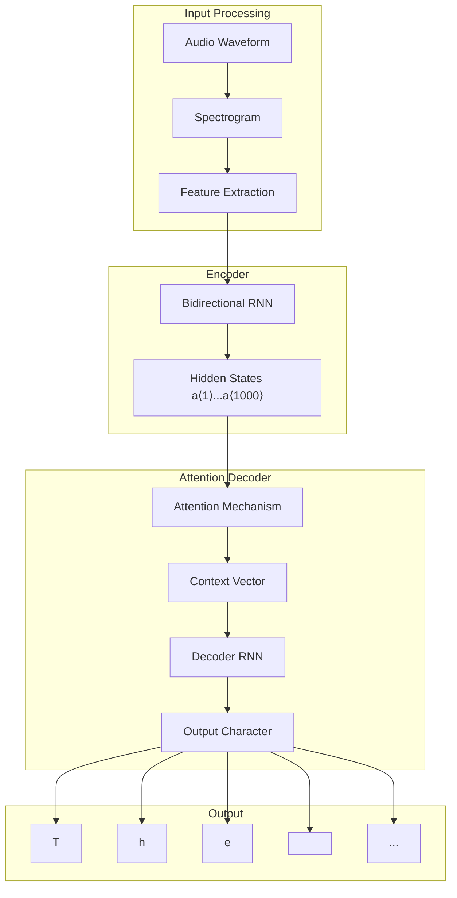

**How it works**:

1. **Input**: 10-second audio → 1000 time steps after preprocessing
2. **Encoder**: Bidirectional RNN processes all time steps
3. **Attention**: Dynamically focuses on relevant audio segments
4. **Decoder**: Generates transcript character by character

**Example attention pattern**:

```bash
Generating "the quick brown fox":

Character "T": Focus on audio frames 1-50
Character "h": Focus on audio frames 45-95
Character "e": Focus on audio frames 90-140
Character " ": Focus on audio frames 135-185
Character "q": Focus on audio frames 180-230
...
```

---

## CTC (Connectionist Temporal Classification)

### The Length Mismatch Problem

**Challenge**: Input and output sequences have very different lengths

- **Audio input**: 10 seconds × 100 Hz = 1,000 time steps
- **Text output**: "the quick brown fox" = 19 characters
- **Problem**: How to align 1,000 inputs with 19 outputs?

### CTC Solution

**Key insight**: Allow the network to output repeated characters and blank symbols, then collapse them into the final transcript.

**CTC architecture**:

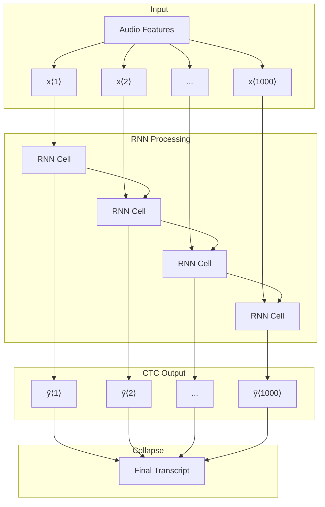

### CTC Example Walkthrough

**Target sentence**: "the quick brown fox"

**Step 1: RNN outputs with repetitions and blanks**

```
RNN Output (1000 characters):
ttt_h_eee___<space>___qqq_u_i_ccc_k_k___<space>bbb_rrr_ooo_w_nnn___<space>fff_ooo_xxx___
```

**Step 2: Apply CTC collapse rules**

- **Rule**: Collapse repeated characters not separated by blank (\_)
- **Blank symbol**: \_ (underscore) - special character, different from space

**Step 3: Detailed collapse process**

```bash
Original: t t t _ h _ e e e _ _ _ <space> _ _ _ q q q _ u _ i _ c c c _ k _ k _ _ _ <space> ...
                ↓
Step 1:   t       h   e                   <space>       q       u   i   c       k         <space> ...
                ↓
Final:    "the quick brown fox"
```

**CTC collapse rules**:

1. **Collapse consecutive identical characters**: "ttt" → "t"
2. **Remove blank symbols**: Remove all "\_" characters
3. **Preserve spaces**: Keep actual space characters for word boundaries
4. **Blank separators**: "\_" between identical characters prevents collapse
   - "t_t" → "tt" (two t's)
   - "tt" → "t" (one t)

### Mathematical Framework

**CTC alignment**:

- **Input length**: T_x = 1000
- **Output length**: T_y = 19
- **Allowed alignments**: Any sequence that collapses to target

**CTC loss function**:

```
Loss = -log(P(target_text | audio_input))

Where P(target_text | audio_input) = sum over all valid alignments
```

---

## Practical Implementation Considerations

### Data Requirements

**Training data scale**:

```bash
Research Systems:     300-3,000 hours
Academic Datasets:    3,000-10,000 hours
Commercial Systems:   10,000-100,000+ hours
State-of-the-art:     100,000+ hours
```

**Data characteristics**:

- **Variety**: Different speakers, accents, environments
- **Quality**: Clean recordings vs. noisy environments
- **Transcription**: Accurate human-annotated transcripts
- **Preprocessing**: Consistent audio format and sampling rate

### Model Architecture Choices

**RNN variants**:

- **Bidirectional LSTM**: Most common choice
- **GRU**: Faster alternative to LSTM
- **Transformer**: Modern attention-only architecture

**Practical considerations**:

- **Real-time processing**: Unidirectional models for live transcription
- **Batch processing**: Bidirectional models for higher accuracy
- **Memory constraints**: Model size vs. accuracy trade-offs

### Performance Metrics

**Common evaluation metrics**:

- **Word Error Rate (WER)**: Percentage of incorrectly transcribed words
- **Character Error Rate (CER)**: Percentage of incorrectly transcribed characters
- **Real-time factor**: Processing speed vs. audio duration

**Typical performance**:

```bash
Clean Speech:          WER < 5%
Noisy Environments:    WER 10-20%
Accented Speech:       WER 15-25%
Far-field Recording:   WER 20-30%
```

---

## Modern Developments

### Transformer-Based Models

**Architecture evolution**:

- **2014**: Attention mechanism in RNNs
- **2017**: Transformer architecture ("Attention Is All You Need")
- **2019**: Wav2Vec 2.0 - Self-supervised learning
- **2020+**: Whisper, Conformer - State-of-the-art performance

**Advantages of transformers**:

- **Parallelization**: Faster training than RNNs
- **Long-range dependencies**: Better context modeling
- **Transfer learning**: Pre-trained models for various languages

### Commercial Applications

**Current applications**:

- **Voice assistants**: Alexa, Siri, Google Assistant
- **Transcription services**: Otter.ai, Rev, Descript
- **Real-time subtitles**: YouTube, Zoom, Microsoft Teams
- **Voice search**: Google Voice Search, mobile apps

---

## Key Takeaways

1. **End-to-end learning**: Deep learning eliminates need for hand-engineered phonemes
2. **Data scale matters**: Commercial systems require 100,000+ hours of training data
3. **Preprocessing importance**: Spectrograms provide more suitable input than raw waveforms
4. **Two main approaches**: Attention-based models and CTC-based models
5. **Length mismatch solution**: CTC allows flexible alignment between audio and text
6. **Architecture choice**: Bidirectional RNNs/LSTMs most common, transformers emerging
7. **Performance metrics**: WER and CER measure transcription accuracy
8. **Real-world challenges**: Noise, accents, far-field recording affect performance

**Historical significance**: Speech recognition showcases the power of end-to-end deep learning, moving from complex hand-engineered systems to unified neural architectures that achieve human-level performance in many scenarios.

**Next topic**: We'll explore trigger word detection systems that enable always-on voice assistants to wake up when hearing specific wake words like "Alexa" or "OK Google".

# 10. Trigger Word Detection

## Introduction

With the rise of voice assistants and smart devices, **trigger word detection** has become a crucial technology enabling always-on voice interaction. These systems allow devices to "wake up" when they hear specific wake words, making voice control seamless and hands-free.

### What is Trigger Word Detection?

**Trigger word detection** is a specialized speech recognition system that:

- Continuously monitors audio input
- Detects specific wake words or phrases
- Activates the main voice assistant when triggered
- Operates with minimal computational resources

**Key characteristic**: Unlike full speech recognition, trigger word detection focuses on detecting just one or a few specific words rather than transcribing entire speech.

---

## Real-World Examples

### Popular Trigger Word Systems

**Commercial implementations**:

```bash
┌─────────────────────────────────────────────────────────────┐
│                Commercial Trigger Words                     │
├─────────────┬─────────────────┬─────────────────────────────┤
│ Device      │ Trigger Word    │ Company                     │
├─────────────┼─────────────────┼─────────────────────────────┤
│ Amazon Echo │ "Alexa"         │ Amazon                      │
│ Google Home │ "OK Google"     │ Google                      │
│ Apple Siri  │ "Hey Siri"      │ Apple                       │
│ Baidu DuerOS│ "xiaodunihao"   │ Baidu                       │
│ Microsoft   │ "Hey Cortana"   │ Microsoft                   │
└─────────────┴─────────────────┴─────────────────────────────┘
```

### Typical User Interaction

**Example workflow**:

```
User: "Alexa, what time is it?"
       ↓
1. Device continuously listens
2. Detects "Alexa" trigger word
3. Wakes up main speech recognition
4. Processes "what time is it?"
5. Provides response
```

**Custom applications**:

- Smart home automation: "Computer, turn on lights"
- Security systems: "Emergency, call help"
- Hands-free controls: "Camera, take picture"

---

## System Architecture

### Overall System Design

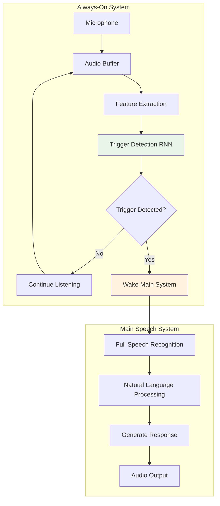

### Two-Stage Processing

**Stage 1: Trigger Detection (Always-On)**

- **Power**: Low power consumption
- **Accuracy**: High precision for specific wake words
- **Latency**: Ultra-low (<100ms)
- **Vocabulary**: Limited (1-5 words)

**Stage 2: Full Speech Recognition (On-Demand)**

- **Power**: High power consumption
- **Accuracy**: Full vocabulary recognition
- **Latency**: Moderate (200-500ms)
- **Vocabulary**: Unlimited

---

## RNN-Based Trigger Word Detection

### Problem Formulation

**Input (X)**: Audio features from continuous audio stream

**Output (Y)**: Binary classification at each time step

```bash
Audio Stream Timeline:
"...hello this is alexa can you help me today alexa please..."
     ↓        ↓                              ↓
Time Steps:  t1...t50...t100...t150...t200...t250...t300...
Labels:      0...0...1...0...0...0...0...1...0...0...0...
                    ↑                        ↑
             First "alexa"             Second "alexa"
```

### Architecture Details

**Basic RNN structure**:

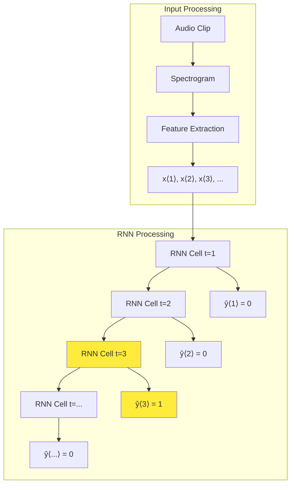

**Network configuration**:

- **Input**: Spectrogram features (typically 80-128 frequency bins)
- **Hidden layers**: 1-3 GRU/LSTM layers (128-512 units each)
- **Output**: Single sigmoid neuron (binary classification)
- **Activation**: Sigmoid for probability output

---

## Training Data and Labeling

### Basic Labeling Strategy

**Approach 1: Single-point labeling**

```bash
Audio Timeline:
"...hello this is alexa can you help me..."
 t1  t2  t3  t4  t5  t6  t7  t8  t9  t10

Labels:
 0   0   0   0   1   0   0   0   0   0
               ↑
        Right after "alexa"
```

**Problems with single-point labeling**:

1. **Extreme class imbalance**: 99%+ zeros, <1% ones
2. **Training instability**: Model learns to always predict 0
3. **Gradient issues**: Insufficient positive examples for learning

### Improved Labeling Strategy

**Approach 2: Extended labeling (recommended)**

```bash
Audio Timeline:
"...hello this is alexa can you help me..."
 t1  t2  t3  t4  t5  t6  t7  t8  t9  t10

Labels:
 0   0   0   0   1   1   1   1   0   0
               ↑───────────↑
        Extended 1s after "alexa"
```

**Benefits of extended labeling**:

- **Better balance**: More 1s in training data
- **Stable training**: Model has more positive examples
- **Robust detection**: Allows for slight timing variations
- **Practical implementation**: Easier to implement debouncing

### Detailed Example

**Complete labeling process**:

```bash
Audio: "...hey computer can you alexa what time is it alexa thanks..."
       ├─────────┤           ├─────┤                 ├─────┤
       Background            Trigger                 Trigger

Time:   1  2  3  4  5  6  7  8  9 10 11 12 13 14 15 16 17 18 19 20
Labels: 0  0  0  0  0  0  0  1  1  1  1  0  0  0  0  1  1  1  1  0

Legend:
- "alexa" detected at t=7, labels 1 from t=8 to t=11
- "alexa" detected again at t=15, labels 1 from t=16 to t=19
- Extended labeling creates more balanced dataset
```

---

## Implementation Considerations

### Real-Time Processing

**Sliding window approach**:

```python
def process_audio_stream(audio_buffer, model, window_size=1000):
    """
    Process continuous audio stream for trigger word detection
    """
    while True:
        # Extract features from recent audio
        features = extract_features(audio_buffer.get_recent(window_size))

        # Run through RNN
        prediction = model.predict(features)

        # Check for trigger
        if prediction[-1] > threshold:  # Most recent prediction
            return True  # Trigger detected

        # Continue listening
        time.sleep(0.01)  # 10ms intervals
```

**Buffer management**:

- **Circular buffer**: Continuously overwrite old audio
- **Overlap**: Ensure no trigger words are missed at boundaries
- **Latency**: Balance between accuracy and response time

### Model Architecture Choices

**RNN variants comparison**:

```bash
┌───────────────────────────────────────────────────────────┐
│                    RNN Architecture Comparison            │
├─────────────┬─────────────┬─────────────┬─────────────────┤
│ Architecture│ Pros        │ Cons        │ Best For        │
├─────────────┼─────────────┼─────────────┼─────────────────┤
│ Simple RNN  │ Fast        │ Vanishing   │ Proof of        │
│             │ Low memory  │ gradients   │ concept         │
├─────────────┼─────────────┼─────────────┼─────────────────┤
│ LSTM        │ Better      │ More        │ High accuracy   │
│             │ memory      │ parameters  │ applications    │
├─────────────┼─────────────┼─────────────┼─────────────────┤
│ GRU         │ Good        │ Less        │ Balanced        │
│             │ balance     │ memory      │ solution        │
├─────────────┼─────────────┼─────────────┼─────────────────┤
│ Bidirectional│ Best       │ Higher      │ Offline         │
│             │ accuracy    │ latency     │ processing      │
└─────────────┴─────────────┴─────────────┴─────────────────┘
```

**Recommended configuration**:

- **For real-time**: Unidirectional GRU (low latency)
- **For accuracy**: Bidirectional LSTM (higher accuracy)
- **For mobile**: Quantized lightweight models

---

## Training Challenges and Solutions

### Class Imbalance Problem

**Problem visualization**:

```bash
Training Data Distribution:

Negative samples (0): ████████████████████████████████████████  99.5%
Positive samples (1): ██                                        0.5%

Result: Model learns to always predict 0
```

**Solutions**:

1. **Extended labeling** (as discussed above)
2. **Weighted loss function**:

   ```python
   # Give higher weight to positive samples
   loss_weights = {0: 1.0, 1: 50.0}
   ```

3. **Data augmentation**:

   - Add noise to trigger word examples
   - Speed/pitch variations
   - Different speaker voices

4. **Balanced sampling**:
   - Ensure equal positive/negative samples per batch
   - Oversample positive examples during training

### Data Collection Strategies

**Positive examples** (trigger words):

```bash
Sources:
- Recorded trigger words from multiple speakers
- Synthetic trigger words (TTS)
- Trigger words in different contexts
- Noisy environments
- Different microphone distances
```

**Negative examples** (background):

```bash
Sources:
- Conversational speech
- Music and ambient sounds
- Similar-sounding words
- Background noise
- TV/radio content
```

---

## Evaluation Metrics

### Key Performance Indicators

**Primary metrics**:

1. **False Accept Rate (FAR)**:

   ```
   FAR = False Positives / (False Positives + True Negatives)

   Example: FAR = 0.1% means 1 in 1000 non-trigger events
            incorrectly detected as trigger
   ```

2. **False Reject Rate (FRR)**:

   ```
   FRR = False Negatives / (False Negatives + True Positives)

   Example: FRR = 5% means 5 in 100 actual trigger words missed
   ```

3. **Equal Error Rate (EER)**:

   ```
   EER = Point where FAR = FRR

   Lower EER indicates better overall performance
   ```

### Performance Trade-offs

**Threshold adjustment effects**:

```bash
Performance vs Threshold:

FAR/FRR ↑
   |
   |    FAR ╲
   |         ╲
   |          ╲
   |           ╲ ╱ FRR
   |            ╳ ← EER (optimal point)
   |           ╱ ╲
   |          ╱   ╲
   |         ╱     ╲
   |        ╱
   └─────────────────────────→ Threshold
   Low  ←  Optimal  →  High

Low threshold:  High FAR, Low FRR (too sensitive)
High threshold: Low FAR, High FRR (too conservative)
```

**Production considerations**:

- **Consumer devices**: Prefer lower FAR (fewer false wake-ups)
- **Security systems**: Prefer lower FRR (don't miss important triggers)
- **Battery life**: Balance accuracy with power consumption

---

## Advanced Techniques

### Noise Robustness

**Environmental challenges**:

```bash
Challenging Scenarios:
- Background music/TV
- Multiple speakers talking
- Microphone distance (far-field)
- Acoustic echo from speakers
- Different room acoustics
```

**Solutions**:

- **Noise reduction**: Spectral subtraction, Wiener filtering
- **Echo cancellation**: Remove playback audio from microphone
- **Beamforming**: Multiple microphones for spatial filtering
- **Data augmentation**: Train with various noise conditions

### Multi-Word Triggers

**Complex trigger phrases**:

```bash
Single word:    "Alexa"
Two words:      "Hey Siri"
Three words:    "OK Google Assistant"
```

**Implementation approaches**:

1. **Sequence labeling**: Label each word in the phrase
2. **Phrase-level detection**: Detect entire phrase as unit
3. **Hierarchical detection**: First detect keywords, then verify sequence

### Personalization

**Speaker-specific training**:

- **User enrollment**: Record user saying trigger word multiple times
- **Adaptation**: Fine-tune model for specific user's voice
- **Speaker verification**: Ensure trigger came from authorized user

---

## System Integration

### Complete Pipeline

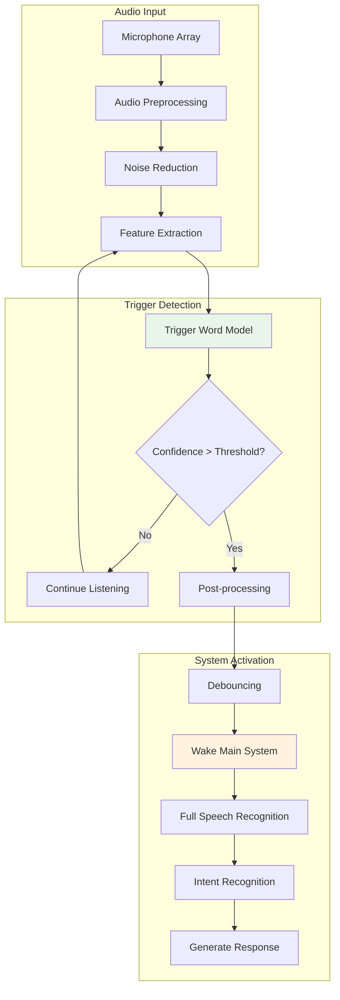

### Production Deployment

**Edge computing considerations**:

- **Model compression**: Quantization, pruning
- **Memory optimization**: Efficient buffer management
- **Power management**: Dynamic scaling based on detection confidence
- **Update mechanism**: Over-the-air model updates

**Quality assurance**:

- **A/B testing**: Compare different model versions
- **Continuous monitoring**: Track performance in production
- **Feedback loops**: Improve model based on user interactions

---

## Practical Implementation Example

### Simple Trigger Word Detector

```python
import numpy as np
import tensorflow as tf
from tensorflow.keras import layers

def create_trigger_word_model(input_shape, vocab_size=2):
    """
    Create a simple trigger word detection model

    Args:
        input_shape: (time_steps, features)
        vocab_size: 2 for binary classification (trigger/no-trigger)
    """
    model = tf.keras.Sequential([
        layers.Input(shape=input_shape),

        # Feature processing
        layers.Dense(128, activation='relu'),
        layers.Dropout(0.2),

        # RNN layers
        layers.GRU(64, return_sequences=True),
        layers.Dropout(0.3),
        layers.GRU(32, return_sequences=True),
        layers.Dropout(0.3),

        # Output layer
        layers.Dense(1, activation='sigmoid')
    ])

    model.compile(
        optimizer='adam',
        loss='binary_crossentropy',
        metrics=['accuracy']
    )

    return model

# Training with class weights
def train_trigger_model(model, X_train, y_train, X_val, y_val):
    """
    Train trigger word detection model with class balancing
    """
    # Calculate class weights
    pos_weight = np.sum(y_train == 0) / np.sum(y_train == 1)

    # Custom loss function for imbalanced data
    def weighted_binary_crossentropy(y_true, y_pred):
        return tf.nn.weighted_cross_entropy_with_logits(
            y_true, y_pred, pos_weight=pos_weight
        )

    model.compile(
        optimizer='adam',
        loss=weighted_binary_crossentropy,
        metrics=['accuracy']
    )

    # Train model
    history = model.fit(
        X_train, y_train,
        validation_data=(X_val, y_val),
        epochs=50,
        batch_size=32,
        callbacks=[
            tf.keras.callbacks.EarlyStopping(patience=10),
            tf.keras.callbacks.ReduceLROnPlateau(patience=5)
        ]
    )

    return model, history
```

---

## Future Directions

### Emerging Technologies

**Modern approaches**:

- **Transformer-based models**: Attention mechanisms for better context
- **Few-shot learning**: Quick adaptation to new trigger words
- **Federated learning**: Train on user data without compromising privacy
- **Neural architecture search**: Automated model design optimization

**Edge AI developments**:

- **Specialized hardware**: Dedicated AI chips for trigger detection
- **Ultra-low power**: Sub-milliwatt operation for always-on systems
- **On-device training**: Continuous learning without cloud connectivity

---

## Key Takeaways

1. **Simplicity of concept**: Trigger word detection is essentially binary classification on audio streams
2. **Class imbalance challenge**: Extended labeling helps balance positive/negative examples
3. **Real-time constraints**: Must balance accuracy with low latency and power consumption
4. **Two-stage system**: Lightweight trigger detection enables full speech recognition
5. **Evaluation metrics**: FAR and FRR more important than traditional accuracy metrics
6. **Robustness requirements**: Must work in noisy, real-world environments
7. **Personalization benefits**: User-specific models improve performance significantly
8. **Production complexity**: Simple concept requires sophisticated engineering for deployment

**Algorithm evolution**: The field is still evolving with no single "best" algorithm, but RNN-based approaches with proper data balancing form a solid foundation.

**Practical impact**: This technology enables the voice-first interfaces that are transforming how we interact with devices, from smart speakers to cars to mobile phones.

**Next steps**: With trigger word detection mastered, the full speech recognition system can be activated to handle complex voice commands and natural language understanding.

This completes Week 3 of Course 5: Sequence Models. The attention mechanism introduced here becomes the foundation for the Transformer architecture covered in Week 4, which will show how attention can completely replace recurrent networks.
