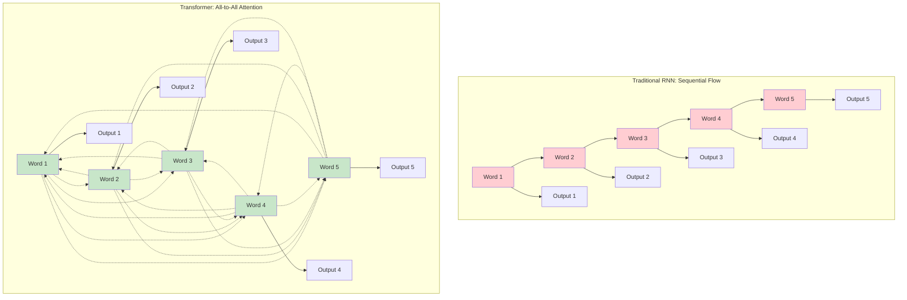
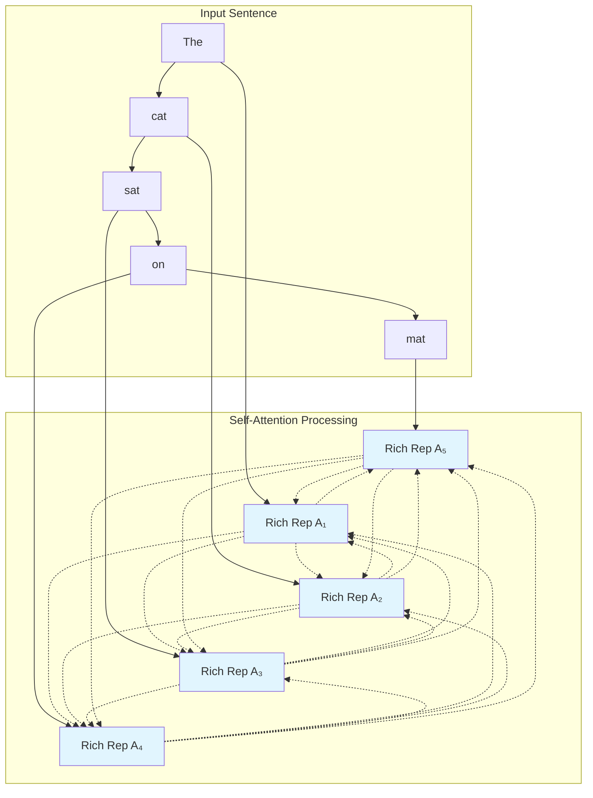
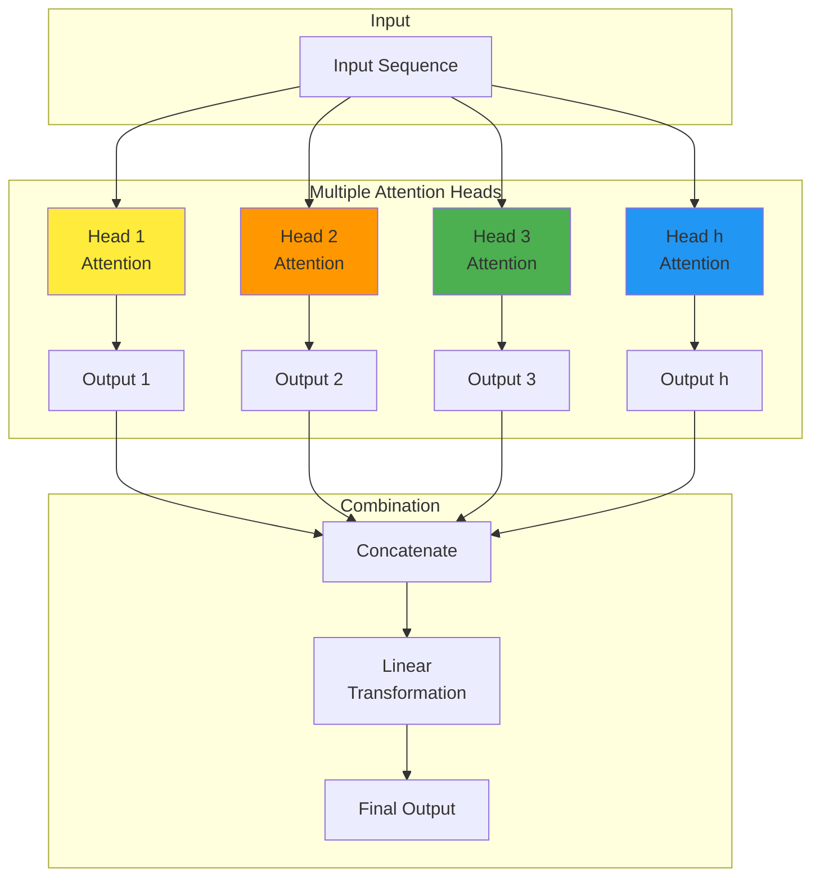
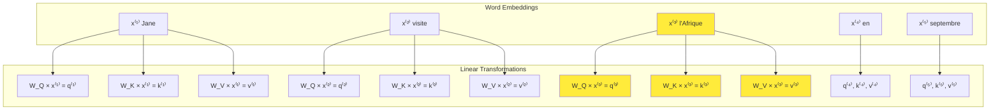
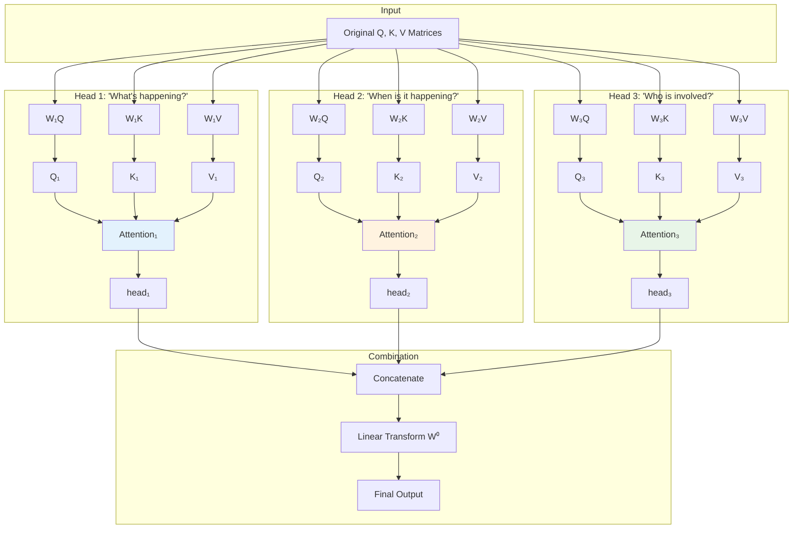
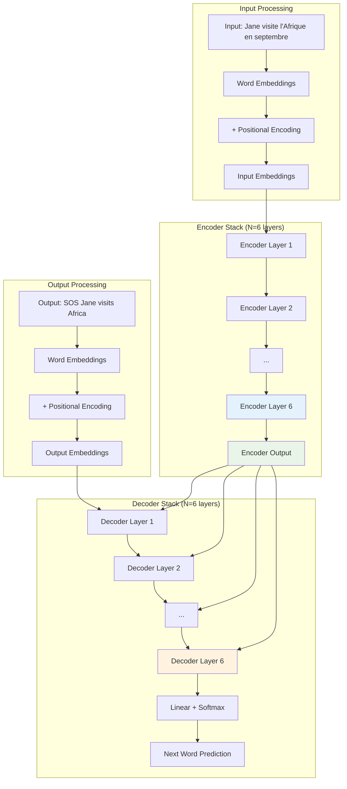
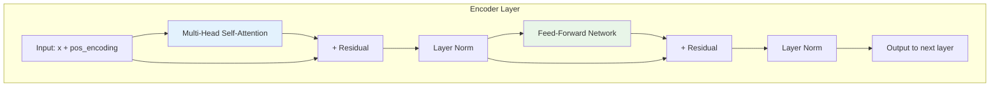
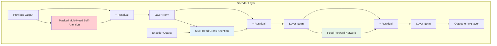

# Course 5 Week 4: Transformers

**Learning Objective:** Learn about Transformers, a revolutionary architecture that uses attention mechanisms exclusively, enabling parallel processing and achieving state-of-the-art results across many NLP tasks.

---

## Table of Contents

1. [Transformer Network Intuition](#1-transformer-network-intuition)
2. [Self-Attention](#2-self-attention)
3. [Multi-Head Attention](#3-multi-head-attention)
4. [Transformer Network](#4-transformer-network)

---

# 1. Transformer Network Intuition

## Introduction: The NLP Revolution

The **Transformer architecture** has completely revolutionized natural language processing, becoming the foundation for breakthrough models like BERT, GPT, ChatGPT, and modern AI systems. This architecture abandons the sequential nature of RNNs in favor of attention mechanisms that can process entire sequences in parallel.

### The "Attention is All You Need" Breakthrough

**Historical significance**:

- **Paper**: "Attention is All You Need" (Vaswani et al., 2017)
- **Impact**: Became the most influential paper in modern NLP
- **Innovation**: First sequence model to rely entirely on attention mechanisms
- **Result**: Achieved state-of-the-art performance while being more parallelizable

**Authors**: Ashish Vaswani, Noam Shazeer, Niki Parmar, Jakob Uszkoreit, Llion Jones, Aidan Gomez, Lukasz Kaiser, Illia Polosukhin

---

## The Evolution Problem: Why We Need Transformers

### Sequential Processing Bottleneck in RNNs

**The fundamental limitation**: RNNs process sequences one token at a time, creating a computational bottleneck.

```mermaid
graph LR
    subgraph "RNN Sequential Processing"
        A[Word 1<br/>"The"] --> B[RNN Cell 1]
        B --> C[Word 2<br/>"cat"]
        C --> D[RNN Cell 2]
        D --> E[Word 3<br/>"sat"]
        E --> F[RNN Cell 3]
        F --> G[Word 4<br/>"on"]
        G --> H[RNN Cell 4]
        H --> I[Word 5<br/>"mat"]
        I --> J[RNN Cell 5]
    end

    K[Must wait for<br/>each step] --> B
    K --> D
    K --> F
    K --> H
    K --> J

    style B fill:#ffcdd2
    style D fill:#ffcdd2
    style F fill:#ffcdd2
    style H fill:#ffcdd2
    style J fill:#ffcdd2
```

**Problems with sequential processing**:

1. **Training slowness**: Cannot parallelize across time steps
2. **Memory limitations**: Long sequences require long processing chains
3. **Information decay**: Early information may be lost by the end
4. **Gradient flow**: Still suffers from vanishing gradient issues

### The Complexity Evolution

**Model complexity progression**:

```bash
Complexity & Capability Evolution:

Simple RNN:     ████░░░░░░  (Simple but limited)
    ↓
GRU:           ██████░░░░  (Better memory, more complex)
    ↓
LSTM:          ████████░░  (Best memory, most complex gates)
    ↓
Transformer:   ██████████  (Parallel processing, attention-based)

Key Insight: Transformers achieve better results with
different (not necessarily more) complexity
```

**Why each evolution happened**:

- **RNN → GRU**: Needed better long-term memory
- **GRU → LSTM**: Required more sophisticated memory control
- **LSTM → Transformer**: Demanded parallelization and direct long-range connections

---

## The Core Innovation: Parallel Attention Processing

### CNN-Style Parallel Processing for Sequences

**Analogy: Transformer as "CNN for Sequences"**

**CNN for Images**:

```bash
Image Processing (Parallel):

Pixel Grid Input:
┌─────┬─────┬─────┬─────┐
│ P₁₁ │ P₁₂ │ P₁₃ │ P₁₄ │
├─────┼─────┼─────┼─────┤
│ P₂₁ │ P₂₂ │ P₂₃ │ P₂₄ │
└─────┴─────┴─────┴─────┘
      ↓ ↓ ↓ ↓ (All at once)
┌─────┬─────┬─────┬─────┐
│ F₁₁ │ F₁₂ │ F₁₃ │ F₁₄ │  ← Feature Maps
├─────┼─────┼─────┼─────┤    (Computed in parallel)
│ F₂₁ │ F₂₂ │ F₂₃ │ F₂₄ │
└─────┴─────┴─────┴─────┘
```

**Transformer for Sequences**:

```bash
Sequence Processing (Parallel):

Word Sequence Input:
┌─────┬─────┬─────┬─────┬─────┐
│ The │ cat │ sat │ on  │ mat │
└─────┴─────┴─────┴─────┴─────┘
  ↓     ↓     ↓     ↓     ↓    (All at once)
┌─────┬─────┬─────┬─────┬─────┐
│ R₁  │ R₂  │ R₃  │ R₄  │ R₅  │  ← Rich Representations
└─────┴─────┴─────┴─────┴─────┘    (Computed in parallel)
```

### Key Insight: Attention as Universal Connection

**Revolutionary idea**: Instead of sequential connections, use attention to connect every position to every other position directly.



---

## Understanding Self-Attention: The Heart of Transformers

### What is Self-Attention?

**Definition**: Self-attention allows each position in a sequence to attend to all positions in the same sequence, including itself.

**Intuitive example**: Understanding the sentence "The animal didn't cross the street because it was too tired"

```bash
Sentence: "The animal didn't cross the street because it was too tired"

Self-Attention for "it":
- "it" attends to:
  - "animal" (high attention) ← Primary reference
  - "street" (low attention)
  - "tired" (medium attention) ← Contextual connection
  - other words (very low attention)

Result: "it" gets rich representation incorporating meaning from "animal"
```

### Self-Attention Mechanism Overview

**Process visualization**:



**Key properties**:

1. **Parallel computation**: All positions processed simultaneously
2. **Contextual representations**: Each word gets context from all other words
3. **Dynamic attention**: Attention weights learned during training
4. **Rich encoding**: Captures complex relationships and dependencies

---

## Multi-Head Attention: Multiple Perspectives

### The Concept: Multiple Attention "Views"

**Analogy**: Like having multiple people read the same sentence and focus on different aspects.

```bash
Multi-Head Attention Example:

Sentence: "The bank by the river is closed"

Head 1 (Syntactic): Focuses on grammatical structure
- "bank" ← "The" (determiner relationship)
- "closed" ← "bank" (subject-predicate)

Head 2 (Semantic): Focuses on meaning
- "bank" ← "river" (location context)
- "closed" ← "bank" (institution status)

Head 3 (Coreference): Focuses on references
- "bank" ← "river" (disambiguation: not financial bank)
```

### Multi-Head Architecture

**Implementation concept**:



**Benefits of multiple heads**:

1. **Diverse patterns**: Each head learns different types of relationships
2. **Robustness**: Multiple perspectives provide redundancy
3. **Specialization**: Heads can specialize in syntax, semantics, etc.
4. **Rich representations**: Combined output captures multiple aspects

---

## Real-World Analogies for Better Understanding

### Analogy 1: The Cocktail Party Problem

**Scenario**: You're at a noisy party trying to follow a conversation.

**RNN approach (Sequential)**:

```bash
RNN Listening:
Person speaks → You process word 1 → word 2 → word 3 → ...
Problem: By word 10, you might forget word 1 due to noise
```

**Transformer approach (Attention)**:

```bash
Transformer Listening:
You hear entire sentence → Simultaneously focus on:
- Important keywords (high attention)
- Context words (medium attention)
- Filler words (low attention)
Result: Better understanding through selective attention
```

### Analogy 2: Reading Comprehension

**Scenario**: Understanding a complex sentence in a book.

**Human reading process** (similar to Transformer):

1. **First pass**: Read entire sentence
2. **Attention**: Focus on key words and their relationships
3. **Integration**: Combine information from all parts
4. **Understanding**: Form complete meaning

**Example sentence**: "The key that the man who lives upstairs lost yesterday is on the table."

**Attention patterns**:

- "key" attends to "lost" and "table" (what and where)
- "man" attends to "upstairs" (description)
- "lost" attends to "yesterday" (when)

### Analogy 3: Orchestra Conductor

**RNN as Sequential Musician**:

```bash
Solo Performance:
Note 1 → Note 2 → Note 3 → ... (Sequential)
Limitation: Cannot harmonize or coordinate complex pieces
```

**Transformer as Orchestra Conductor**:

```bash
Orchestra Performance:
All instruments play together, conductor coordinates:
- Violins (Head 1): Melody line
- Cellos (Head 2): Harmony
- Drums (Head 3): Rhythm
- Brass (Head 4): Emphasis

Result: Rich, complex, coordinated music
```

---

## Why Transformers Work So Well

### Computational Advantages

**Parallelization benefits**:

```bash
Training Time Comparison (1000-word sequence):

RNN Sequential:     ████████████████████ (20 time units)
                   (Must wait for each step)

Transformer Parallel: ████ (4 time units)
                     (All positions at once)

Speedup: 5x faster (scales with hardware)
```

**Memory efficiency**:

- **Direct paths**: No need to store intermediate states for long sequences
- **Attention patterns**: Can be computed efficiently with matrix operations
- **Gradient flow**: Direct backpropagation paths to any position

### Representational Power

**Rich contextual encoding**:

1. **Global context**: Every word sees every other word
2. **Multiple perspectives**: Multi-head attention captures diverse relationships
3. **Compositional understanding**: Complex meanings from simple parts
4. **Dynamic adaptation**: Attention weights adapt to different inputs

### Transfer Learning Success

**Why Transformers transfer well**:

1. **General patterns**: Learn universal language patterns
2. **Hierarchical features**: Different layers capture different abstraction levels
3. **Attention mechanisms**: Transfer across different tasks and domains
4. **Large scale**: Massive pre-training captures broad knowledge

---

## The Transformer Revolution Timeline

### Key Milestones

```bash
2017: "Attention is All You Need" → Transformer architecture
      ↓
2018: BERT → Bidirectional pre-training revolution
      ↓
2019: GPT-2 → Large-scale autoregressive generation
      ↓
2020: GPT-3 → Few-shot learning breakthrough
      ↓
2021: DALL-E → Vision-language transformers
      ↓
2022: ChatGPT → Conversational AI mainstream
      ↓
2023: GPT-4 → Multimodal large language models
```

### Applications Beyond NLP

**Computer Vision**:

- **Vision Transformer (ViT)**: Images as sequences of patches
- **DETR**: Object detection with transformers
- **DALL-E**: Text-to-image generation

**Science and Research**:

- **AlphaFold**: Protein structure prediction
- **CodeT5**: Code understanding and generation
- **PaLM**: Mathematical reasoning

**Creative Applications**:

- **GitHub Copilot**: Code completion
- **Jukebox**: Music generation
- **ChatGPT**: Creative writing and conversation

---

## Building Intuition: What's Coming Next

### The Four-Video Journey

**Video 1 (This video)**: Transformer intuition and motivation
**Video 2**: Self-attention mechanism details
**Video 3**: Multi-head attention implementation
**Video 4**: Complete transformer architecture

### Core Concepts to Master

**1. Self-Attention**:

- How attention weights are computed
- Query, Key, Value matrices
- Scaled dot-product attention

**2. Multi-Head Attention**:

- Multiple attention perspectives
- Parallel attention computations
- Concatenation and projection

**3. Full Architecture**:

- Encoder-decoder structure
- Positional encoding
- Layer normalization and residual connections
- Feed-forward networks

### Mathematical Foundation Preview

**Key equations coming up**:

- **Attention**: `Attention(Q,K,V) = softmax(QK^T/√d_k)V`
- **Multi-head**: `MultiHead(Q,K,V) = Concat(head_1,...,head_h)W^O`
- **Position encoding**: `PE(pos,2i) = sin(pos/10000^(2i/d_model))`

---

## Key Takeaways

1. **Paradigm shift**: From sequential RNN processing to parallel attention processing
2. **Core innovation**: Self-attention allows direct connections between any two positions
3. **Parallel efficiency**: Massive speedup through parallel computation
4. **Rich representations**: Multi-head attention captures diverse relationship types
5. **Transfer learning**: Pre-trained transformers revolutionized NLP and beyond
6. **Universal architecture**: Same principles apply to text, images, and other modalities
7. **Foundation for modern AI**: Powers GPT, BERT, ChatGPT, and most current breakthroughs

**Historical significance**: The Transformer architecture represents the most important innovation in deep learning since the introduction of deep neural networks themselves, enabling the current AI revolution.

**Next steps**: We'll dive into the mathematical details of self-attention, showing exactly how transformers compute these rich, contextual representations that have made modern NLP possible.

# 2. Self-Attention

## Introduction: The Core of Transformer Magic

Self-attention is the **fundamental mechanism** that makes Transformers work. If you understand this concept deeply, you'll grasp the most important innovation that revolutionized modern NLP. Unlike previous attention mechanisms that connected different sequences (encoder-decoder attention), self-attention allows positions within the **same sequence** to attend to each other.

### What Makes Self-Attention Special?

**Key insight**: Instead of using fixed word embeddings, self-attention creates **dynamic, context-aware representations** where each word's meaning depends on its surrounding context.

**Example motivation**:

```
Sentence: "The bank by the river is closed"
- "bank" could mean: financial institution OR river bank
- Self-attention helps "bank" look at "river" to understand it means "river bank"
- Result: Contextual representation that disambiguates meaning
```

---

## From RNN Attention to Self-Attention

### RNN Attention (Previous Approach)

**Traditional attention equation**:
$$\alpha^{(t,t')} = \frac{\exp(e^{(t,t')})}{\sum_{k=1}^{T_x} \exp(e^{(t,k)})}$$

**Limitations**:

- Connects encoder states to decoder states (different sequences)
- Sequential processing required
- Limited to encoder-decoder architectures

### Self-Attention Innovation

**Self-attention equation**:
$$\text{Attention}(Q,K,V) = \text{softmax}\left(\frac{QK^T}{\sqrt{d_k}}\right)V$$

**Advantages**:

- Connects positions within the same sequence
- Parallel processing for all positions
- Works for both encoder and decoder
- Richer contextual representations

---

## The Query-Key-Value Framework

### Database Analogy

**Conceptual understanding**: Self-attention borrows concepts from database systems:

```bash
Database Query System:
┌─────────────┬─────────────┬─────────────┐
│ Query       │ Key         │ Value       │
├─────────────┼─────────────┼─────────────┤
│ "What is    │ "definition"│ "A large    │
│  Africa?"   │             │  continent" │
├─────────────┼─────────────┼─────────────┤
│ "What is    │ "location"  │ "Tourist    │
│  happening  │             │  destination│
│  in Africa?"│             │             │
└─────────────┴─────────────┴─────────────┘

Self-Attention Analogy:
- Query: "What should I know about this word?"
- Key: "What type of information do I contain?"
- Value: "Here's the actual information I provide"
```

### Mathematical Formulation

**For each word position $i$, we create three vectors**:

$$q^{(i)} = W_Q \cdot x^{(i)}$$
$$k^{(i)} = W_K \cdot x^{(i)}$$  
$$v^{(i)} = W_V \cdot x^{(i)}$$

Where:

- $x^{(i)}$: Input word embedding for position $i$
- $W_Q, W_K, W_V$: Learned parameter matrices
- $q^{(i)}, k^{(i)}, v^{(i)}$: Query, Key, Value vectors for position $i$

---

## Step-by-Step Self-Attention Calculation

### Running Example: French Sentence

**Input sentence**: "Jane visite l'Afrique en septembre"
**Goal**: Compute self-attention representation $A^{(3)}$ for "l'Afrique"

### Step 1: Create Query, Key, Value Vectors

**For each word, compute Q, K, V vectors**:



**Mathematical details**:

- **Dimensions**: If $x^{(i)} \in \mathbb{R}^{d_{model}}$ and we want $q^{(i)}, k^{(i)}, v^{(i)} \in \mathbb{R}^{d_k}$
- **Parameter matrices**: $W_Q, W_K, W_V \in \mathbb{R}^{d_k \times d_{model}}$
- **Typical values**: $d_{model} = 512$, $d_k = 64$ (in multi-head attention)

### Step 2: Compute Attention Scores

**Focus on word 3 ("l'Afrique") attending to all words**:

The query $q^{(3)}$ asks: **"What's happening in Africa?"**

**Compute dot products with all keys**:
$$e^{(3,j)} = q^{(3)} \cdot k^{(j)} \quad \text{for } j = 1, 2, 3, 4, 5$$

**Detailed calculation**:

```bash
Attention Score Computation for "l'Afrique":

q⁽³⁾ · k⁽¹⁾ = attention to "Jane"     = 0.8  (person context)
q⁽³⁾ · k⁽²⁾ = attention to "visite"   = 2.1  (action - high relevance!)
q⁽³⁾ · k⁽³⁾ = attention to "l'Afrique" = 1.5  (self-attention)
q⁽³⁾ · k⁽⁴⁾ = attention to "en"       = 0.3  (preposition)
q⁽³⁾ · k⁽⁵⁾ = attention to "septembre" = 0.6  (time context)

Observation: "visite" gets highest score → most relevant for understanding "l'Afrique"
```

### Step 3: Apply Softmax Normalization

**Convert scores to probabilities**:
$$\alpha^{(3,j)} = \frac{\exp(e^{(3,j)})}{\sum_{k=1}^{5} \exp(e^{(3,k)})}$$

**Detailed softmax calculation**:

```bash
Raw Scores: [0.8, 2.1, 1.5, 0.3, 0.6]
           ↓ Apply exponential
Exp Scores: [2.23, 8.17, 4.48, 1.35, 1.82]
           ↓ Normalize (divide by sum = 18.05)
Attention Weights: [0.12, 0.45, 0.25, 0.07, 0.10]

Interpretation:
- 45% attention to "visite" (what's happening)
- 25% attention to "l'Afrique" (self-reference)
- 12% attention to "Jane" (who's involved)
- 10% attention to "septembre" (when)
- 7% attention to "en" (connecting word)
```

### Step 4: Compute Weighted Sum of Values

**Final representation**:
$$A^{(3)} = \sum_{j=1}^{5} \alpha^{(3,j)} \cdot v^{(j)}$$

**Detailed computation**:

```bash
Weighted Value Combination:

A⁽³⁾ = 0.12 × v⁽¹⁾ + 0.45 × v⁽²⁾ + 0.25 × v⁽³⁾ + 0.07 × v⁽⁴⁾ + 0.10 × v⁽⁵⁾
     = 0.12 × [Jane info] + 0.45 × [visite info] + 0.25 × [l'Afrique info] + ...

Result: Rich representation of "l'Afrique" that encodes:
- Primarily: It's a destination (from "visite" - 45%)
- Secondary: Its own semantic meaning (25%)
- Context: Who's going (Jane - 12%) and when (septembre - 10%)
```

### Visual Representation of the Process

```bash
Self-Attention Computation for "l'Afrique":

Input: Jane   visite   l'Afrique   en   septembre
       │       │         │        │        │
       ▼       ▼         ▼        ▼        ▼
      k⁽¹⁾    k⁽²⁾      k⁽³⁾     k⁽⁴⁾     k⁽⁵⁾
       │       │         │        │        │
       └───────┼─────────q⁽³⁾─────┼────────┘
               │         │        │
               ▼         ▼        ▼
            [Dot Products] → [Softmax] → [Weighted Sum]
               │                           │
               ▼                           ▼
         [0.8, 2.1, 1.5, 0.3, 0.6]   [0.12, 0.45, 0.25, 0.07, 0.10]
                                           │
                                           ▼
                                      A⁽³⁾ = Σ αᵢⱼ × vⱼ
```

---

## Complete Mathematical Framework

### Scaled Dot-Product Attention

**Full formula**:
$$\text{Attention}(Q,K,V) = \text{softmax}\left(\frac{QK^T}{\sqrt{d_k}}\right)V$$

**Component breakdown**:

1. **$QK^T$**: Computes all pairwise attention scores

   - **Shape**: $(n \times d_k) \times (d_k \times n) = (n \times n)$
   - **Meaning**: Entry $(i,j)$ is attention from position $i$ to position $j$

2. **$\frac{1}{\sqrt{d_k}}$**: Scaling factor

   - **Purpose**: Prevents softmax saturation for large $d_k$
   - **Why needed**: Dot products grow with dimension, making gradients vanish

3. **Softmax**: Normalizes attention weights

   - **Row-wise**: Each position's attention sums to 1
   - **Formula**: $\text{softmax}(x_i) = \frac{e^{x_i}}{\sum_j e^{x_j}}$

4. **Multiply by $V$**: Weighted combination of values
   - **Shape**: $(n \times n) \times (n \times d_k) = (n \times d_k)$
   - **Result**: Context-aware representations

### Matrix Form Example

**For our 5-word sentence**:

$$Q = \begin{bmatrix} q^{(1)T} \\ q^{(2)T} \\ q^{(3)T} \\ q^{(4)T} \\ q^{(5)T} \end{bmatrix}, \quad K = \begin{bmatrix} k^{(1)T} \\ k^{(2)T} \\ k^{(3)T} \\ k^{(4)T} \\ k^{(5)T} \end{bmatrix}, \quad V = \begin{bmatrix} v^{(1)T} \\ v^{(2)T} \\ v^{(3)T} \\ v^{(4)T} \\ v^{(5)T} \end{bmatrix}$$

**Attention matrix**:

$$
\text{Attention Matrix} = \text{softmax}\left(\frac{QK^T}{\sqrt{d_k}}\right) = \begin{bmatrix}
\alpha_{1,1} & \alpha_{1,2} & \alpha_{1,3} & \alpha_{1,4} & \alpha_{1,5} \\
\alpha_{2,1} & \alpha_{2,2} & \alpha_{2,3} & \alpha_{2,4} & \alpha_{2,5} \\
\alpha_{3,1} & \alpha_{3,2} & \alpha_{3,3} & \alpha_{3,4} & \alpha_{3,5} \\
\alpha_{4,1} & \alpha_{4,2} & \alpha_{4,3} & \alpha_{4,4} & \alpha_{4,5} \\
\alpha_{5,1} & \alpha_{5,2} & \alpha_{5,3} & \alpha_{5,4} & \alpha_{5,5}
\end{bmatrix}
$$

**Note**: Row 3 corresponds to our detailed example for "l'Afrique"

---

## Intuitive Understanding: Why Self-Attention Works

### The "Question-Answer" Metaphor

**Each position asks a question and gets answers from all positions**:

```bash
Position-by-Position Interaction:

"Jane": q⁽¹⁾ asks "Who am I in this context?"
        Gets answers from all words, learns she's the traveler

"visite": q⁽²⁾ asks "What action am I describing?"
          Gets answers from all words, learns it's about traveling to Africa

"l'Afrique": q⁽³⁾ asks "What's my role here?"
             Gets answers from all words, learns it's a travel destination

"en": q⁽⁴⁾ asks "What do I connect?"
      Gets answers from all words, learns it connects action to time

"septembre": q⁽⁵⁾ asks "When does this happen?"
             Gets answers from all words, learns it's the travel time
```

### Context-Dependent Meaning

**Traditional word embeddings**: Fixed representation regardless of context
**Self-attention**: Dynamic representation based on surrounding words

**Example comparison**:

```bash
Word: "bank"

Fixed Embedding:
[0.2, -0.1, 0.5, 0.3, ...] (same for all contexts)

Self-Attention Results:
Context 1: "The bank lent money"
→ A₁ = [0.8, 0.1, 0.2, -0.1, ...] (financial institution)

Context 2: "The bank of the river"
→ A₂ = [0.1, 0.7, -0.3, 0.4, ...] (riverside)

Key Insight: Same word, different contexts → different representations
```

---

## Computational Advantages

### Parallel Processing

**RNN sequential processing**:

```bash
Time Step: t1 → t2 → t3 → t4 → t5
Cannot compute t3 until t1, t2 are done
Total Time: O(n) sequential steps
```

**Self-attention parallel processing**:

```bash
All Positions: t1, t2, t3, t4, t5 (simultaneously)
All interactions computed in parallel
Total Time: O(1) parallel steps (matrix operations)
```

### Direct Path Lengths

**Information flow comparison**:

```bash
RNN: Position 1 → Position 5
Path: 1 → 2 → 3 → 4 → 5 (length = 4)
Gradient path length: 4 steps

Self-Attention: Position 1 → Position 5
Path: 1 → 5 (direct connection, length = 1)
Gradient path length: 1 step

Result: Better gradient flow, no vanishing gradients over distance
```

---

## Implementation Details

### Efficient Matrix Implementation

```python
import torch
import torch.nn as nn
import math

class SelfAttention(nn.Module):
    def __init__(self, d_model, d_k):
        super().__init__()
        self.d_k = d_k

        # Linear transformations for Q, K, V
        self.W_q = nn.Linear(d_model, d_k, bias=False)
        self.W_k = nn.Linear(d_model, d_k, bias=False)
        self.W_v = nn.Linear(d_model, d_k, bias=False)

    def forward(self, x):
        # x shape: (batch_size, seq_len, d_model)
        batch_size, seq_len, d_model = x.size()

        # Compute Q, K, V matrices
        Q = self.W_q(x)  # (batch_size, seq_len, d_k)
        K = self.W_k(x)  # (batch_size, seq_len, d_k)
        V = self.W_v(x)  # (batch_size, seq_len, d_k)

        # Compute attention scores
        scores = torch.matmul(Q, K.transpose(-2, -1)) / math.sqrt(self.d_k)
        # scores shape: (batch_size, seq_len, seq_len)

        # Apply softmax
        attention_weights = torch.softmax(scores, dim=-1)

        # Apply attention to values
        output = torch.matmul(attention_weights, V)
        # output shape: (batch_size, seq_len, d_k)

        return output, attention_weights
```

### Step-by-Step Execution

```python
# Example with our French sentence
# Assume: batch_size=1, seq_len=5, d_model=512, d_k=64

# Input embeddings for: ["Jane", "visite", "l'Afrique", "en", "septembre"]
x = torch.randn(1, 5, 512)

# Initialize self-attention layer
self_attn = SelfAttention(d_model=512, d_k=64)

# Forward pass
output, attention_weights = self_attn(x)

# Results:
# output shape: (1, 5, 64) - contextual representations
# attention_weights shape: (1, 5, 5) - attention matrix
# attention_weights[0, 2, :] gives attention for "l'Afrique" to all words
```

---

## Attention Pattern Visualization

### Attention Matrix Interpretation

**For our example sentence**:

```bash
Attention Matrix (each row sums to 1.0):

From\To    Jane  visite l'Afrique  en  septembre
Jane       0.60   0.25    0.10    0.03    0.02     ← Jane attends to herself and action
visite     0.35   0.40    0.20    0.03    0.02     ← visite balances subject and object
l'Afrique  0.12   0.45    0.25    0.07    0.10     ← l'Afrique focuses on action
en         0.10   0.15    0.20    0.50    0.05     ← en connects words
septembre  0.05   0.10    0.15    0.05    0.65     ← septembre attends to itself

Key Patterns:
- Diagonal dominance: Words attend to themselves
- High values: Meaningful relationships (visite ↔ l'Afrique)
- Low values: Less relevant connections (Jane ↔ septembre)
```

### Common Attention Patterns

**1. Syntactic Patterns**:

- Subjects attend to verbs
- Objects attend to verbs
- Modifiers attend to nouns

**2. Semantic Patterns**:

- Related concepts attend to each other
- Temporal words form clusters
- Named entities attract attention

**3. Positional Patterns**:

- Local attention (neighboring words)
- Long-range dependencies (distant but related words)
- Self-attention (diagonal elements)

---

## Why the Scaling Factor √d_k?

### The Mathematical Necessity

**Problem without scaling**:
As dimension $d_k$ increases, dot products $q \cdot k$ have larger variance:
$$\text{Var}(q \cdot k) = d_k \cdot \text{Var}(q_i) \cdot \text{Var}(k_i)$$

**Example with $d_k = 512$**:

```bash
Without scaling: q·k could be in range [-50, 50]
Softmax input: [-50, -20, 30, 45, 50]
Softmax output: [0.0000, 0.0000, 0.0067, 0.1192, 0.8741]
Problem: Attention becomes too peaked (almost one-hot)
```

**Solution with scaling**:
$$\text{Scaled attention} = \frac{q \cdot k}{\sqrt{d_k}}$$

```bash
With scaling: q·k/√512 ≈ q·k/22.6 in range [-2.2, 2.2]
Softmax input: [-2.2, -0.9, 1.3, 2.0, 2.2]
Softmax output: [0.05, 0.18, 0.17, 0.30, 0.30]
Benefit: More balanced attention distribution
```

---

## Self-Attention vs. Traditional Attention

### Comparison Table

```bash
┌─────────────────┬─────────────────────┬─────────────────────┐
│ Aspect          │ Traditional Attention│ Self-Attention      │
├─────────────────┼─────────────────────┼─────────────────────┤
│ Input Sequences │ Two different       │ Same sequence       │
│                 │ (encoder-decoder)   │                     │
├─────────────────┼─────────────────────┼─────────────────────┤
│ Computation     │ Sequential          │ Parallel            │
├─────────────────┼─────────────────────┼─────────────────────┤
│ Dependencies    │ Encoder → Decoder   │ Within sequence     │
├─────────────────┼─────────────────────┼─────────────────────┤
│ Path Length     │ Through encoder     │ Direct connections  │
├─────────────────┼─────────────────────┼─────────────────────┤
│ Applications    │ Machine translation │ Any sequence task   │
└─────────────────┴─────────────────────┴─────────────────────┘
```

### When to Use Each

**Traditional attention**:

- Encoder-decoder architectures
- Different input/output modalities
- Sequential generation required

**Self-attention**:

- Rich sequence representations
- Parallel processing needed
- Within-sequence relationships important

---

## Advanced Concepts and Extensions

### Masked Self-Attention

**For autoregressive tasks** (like language generation):

```bash
Attention Mask (lower triangular):

From\To    w1   w2   w3   w4   w5
w1         ✓    ✗    ✗    ✗    ✗     ← w1 only sees itself
w2         ✓    ✓    ✗    ✗    ✗     ← w2 sees w1, w2
w3         ✓    ✓    ✓    ✗    ✗     ← w3 sees w1-w3
w4         ✓    ✓    ✓    ✓    ✗     ← w4 sees w1-w4
w5         ✓    ✓    ✓    ✓    ✓     ← w5 sees all

Purpose: Prevent "looking into the future" during training
```

### Relative Position Encoding

**Problem**: Self-attention is position-agnostic
**Solution**: Add relative position information to attention scores

$$\text{Attention}(Q,K,V) = \text{softmax}\left(\frac{QK^T + R}{\sqrt{d_k}}\right)V$$

where $R_{ij}$ encodes relative position between positions $i$ and $j$.

---

## Key Takeaways

1. **Core mechanism**: Query-Key-Value framework enables rich contextual representations
2. **Parallel processing**: All positions computed simultaneously, unlike RNNs
3. **Direct connections**: Every position can directly attend to every other position
4. **Context-aware**: Same word gets different representations in different contexts
5. **Scalable**: Matrix operations enable efficient GPU computation
6. **Flexible**: Works for both understanding and generation tasks
7. **Foundation**: Self-attention is the building block for multi-head attention
8. **Mathematical elegance**: Simple dot-product operations create complex behaviors

**Next step**: Multi-head attention puts multiple self-attention mechanisms in parallel, creating even richer representations by capturing different types of relationships simultaneously.

**The power of self-attention**: It transforms static word embeddings into dynamic, context-aware representations that understand not just what words mean, but how they relate to each other in specific contexts. This is why Transformers have revolutionized NLP and beyond.

# 3. Multi-Head Attention

## Introduction: Multiple Perspectives on the Same Information

Multi-head attention is essentially **"self-attention in parallel"** - it's like having multiple experts examine the same sentence simultaneously, each focusing on different types of relationships. If self-attention asks one question about each word, multi-head attention asks multiple different questions at the same time.

### The Core Concept: Parallel Question Asking

**Key insight**: Instead of learning one attention pattern, we learn multiple attention patterns in parallel, each capturing different aspects of the relationships between words.

**Analogy**: Reading comprehension with multiple focus areas

```bash
Single Head: "What's the main relationship?"
Multi-Head:
- Head 1: "What's the grammatical relationship?"
- Head 2: "What's the semantic relationship?"
- Head 3: "What's the temporal relationship?"
- Head 4: "What's the causal relationship?"
```

---

## From Single-Head to Multi-Head: The Evolution

### Single-Head Limitation

**Problem with single attention head**:

- Only one attention pattern per layer
- Limited to capturing one type of relationship
- May miss important alternative perspectives

**Example**: For "The bank by the river"

- Single head might focus on: "bank" ← "river" (location)
- But misses: "bank" as financial institution context

### Multi-Head Solution

**Innovation**: Compute multiple attention patterns simultaneously

- Each head learns different relationship types
- Parallel computation maintains efficiency
- Rich combination of perspectives

**Mathematical foundation**:
$$\text{MultiHead}(Q,K,V) = \text{Concat}(\text{head}_1, \text{head}_2, \ldots, \text{head}_h)W^O$$

where each head is:
$$\text{head}_i = \text{Attention}(QW_i^Q, KW_i^K, VW_i^V)$$

---

## Detailed Multi-Head Architecture

### Step-by-Step Process

**Starting point**: Same Q, K, V matrices from self-attention
**Goal**: Create $h$ different attention heads in parallel



### Mathematical Framework

**For each head $i$ (where $i = 1, 2, \ldots, h$)**:

$$Q_i = QW_i^Q, \quad K_i = KW_i^K, \quad V_i = VW_i^V$$

$$\text{head}_i = \text{Attention}(Q_i, K_i, V_i) = \text{softmax}\left(\frac{Q_iK_i^T}{\sqrt{d_k}}\right)V_i$$

**Final combination**:
$$\text{MultiHead}(Q,K,V) = \text{Concat}(\text{head}_1, \ldots, \text{head}_h)W^O$$

**Parameter dimensions**:

- $W_i^Q, W_i^K, W_i^V \in \mathbb{R}^{d_{model} \times d_k}$
- $W^O \in \mathbb{R}^{hd_k \times d_{model}}$
- Typically: $d_k = d_{model}/h$ (keeps total parameters manageable)

---

## Detailed Example: Three Heads for "l'Afrique"

### Head 1: "What's happening?"

**Focus**: Actions and events

**Computation for "l'Afrique"**:

```bash
Q₁ = Q × W₁Q (transforms original query to focus on actions)
K₁ = K × W₁K (transforms keys to represent action information)
V₁ = V × W₁V (transforms values for action-related content)

Attention scores for l'Afrique:
q₁⁽³⁾ · k₁⁽¹⁾ = 0.5  (Jane - person, medium relevance to action)
q₁⁽³⁾ · k₁⁽²⁾ = 2.8  (visite - ACTION, highest relevance!)
q₁⁽³⁾ · k₁⁽³⁾ = 1.2  (l'Afrique - destination, moderate relevance)
q₁⁽³⁾ · k₁⁽⁴⁾ = 0.2  (en - preposition, low relevance)
q₁⁽³⁾ · k₁⁽⁵⁾ = 0.4  (septembre - time, low relevance to action)

After softmax: [0.08, 0.65, 0.18, 0.04, 0.05]
Result: head₁ heavily focuses on "visite" (65% attention)
```

### Head 2: "When is it happening?"

**Focus**: Temporal relationships and timing

**Computation for "l'Afrique"**:

```bash
Q₂ = Q × W₂Q (transforms query to focus on temporal aspects)
K₂ = K × W₂K (keys now represent temporal information)
V₂ = V × W₂V (values carry temporal context)

Attention scores for l'Afrique:
q₂⁽³⁾ · k₂⁽¹⁾ = 0.3  (Jane - person, not temporal)
q₂⁽³⁾ · k₂⁽²⁾ = 0.6  (visite - action has some temporal aspect)
q₂⁽³⁾ · k₂⁽³⁾ = 0.8  (l'Afrique - moderate self-attention)
q₂⁽³⁾ · k₂⁽⁴⁾ = 0.4  (en - temporal connector)
q₂⁽³⁾ · k₂⁽⁵⁾ = 2.5  (septembre - TIME, highest relevance!)

After softmax: [0.05, 0.07, 0.09, 0.06, 0.73]
Result: head₂ heavily focuses on "septembre" (73% attention)
```

### Head 3: "Who is involved?"

**Focus**: Entities and participants

**Computation for "l'Afrique"**:

```bash
Q₃ = Q × W₃Q (query focuses on entity relationships)
K₃ = K × W₃K (keys represent entity information)
V₃ = V × W₃V (values carry entity-related content)

Attention scores for l'Afrique:
q₃⁽³⁾ · k₃⁽¹⁾ = 2.2  (Jane - PERSON/ENTITY, high relevance!)
q₃⁽³⁾ · k₃⁽²⁾ = 0.7  (visite - action, moderate relevance)
q₃⁽³⁾ · k₃⁽³⁾ = 1.8  (l'Afrique - entity, high self-attention)
q₃⁽³⁾ · k₃⁽⁴⁾ = 0.1  (en - not an entity)
q₃⁽³⁾ · k₃⁽⁵⁾ = 0.3  (septembre - temporal, not entity focus)

After softmax: [0.52, 0.11, 0.33, 0.02, 0.02]
Result: head₃ focuses on "Jane" (52%) and self "l'Afrique" (33%)
```

### Combined Multi-Head Representation

**Final output for "l'Afrique"**:
$$A^{(3)} = \text{Concat}(\text{head}_1^{(3)}, \text{head}_2^{(3)}, \text{head}_3^{(3)}) \times W^O$$

```bash
Rich Representation Components:
- From head₁: "l'Afrique is a destination for visiting" (action context)
- From head₂: "l'Afrique visit happens in September" (temporal context)
- From head₃: "l'Afrique involves Jane as the traveler" (entity context)

Combined: "l'Afrique is a destination that Jane visits in September"
```

---

## Visual Understanding: Attention Pattern Comparison

### Single-Head vs Multi-Head Attention Patterns

**Single-Head Attention Matrix**:

```bash
Single attention pattern (limited perspective):

From\To    Jane  visite l'Afrique  en  septembre
Jane       0.60   0.25    0.10    0.03    0.02
visite     0.35   0.40    0.20    0.03    0.02
l'Afrique  0.12   0.45    0.25    0.07    0.10    ← Only one pattern
en         0.10   0.15    0.20    0.50    0.05
septembre  0.05   0.10    0.15    0.05    0.65
```

**Multi-Head Attention (3 heads)**:

```bash
Head 1 - "What's happening?":
From\To    Jane  visite l'Afrique  en  septembre
l'Afrique  0.08   0.65    0.18    0.04    0.05    ← Action focus

Head 2 - "When?":
From\To    Jane  visite l'Afrique  en  septembre
l'Afrique  0.05   0.07    0.09    0.06    0.73    ← Temporal focus

Head 3 - "Who?":
From\To    Jane  visite l'Afrique  en  septembre
l'Afrique  0.52   0.11    0.33    0.02    0.02    ← Entity focus

Result: Three complementary perspectives on the same word!
```

---

## Implementation Deep Dive

### Complete PyTorch Implementation

```python
import torch
import torch.nn as nn
import math

class MultiHeadAttention(nn.Module):
    def __init__(self, d_model, num_heads):
        super().__init__()
        assert d_model % num_heads == 0

        self.d_model = d_model
        self.num_heads = num_heads
        self.d_k = d_model // num_heads  # Dimension per head

        # Linear projections for all heads (computed in parallel)
        self.W_q = nn.Linear(d_model, d_model, bias=False)
        self.W_k = nn.Linear(d_model, d_model, bias=False)
        self.W_v = nn.Linear(d_model, d_model, bias=False)

        # Output projection
        self.W_o = nn.Linear(d_model, d_model)

    def scaled_dot_product_attention(self, Q, K, V, mask=None):
        """
        Compute scaled dot-product attention

        Args:
            Q, K, V: Query, Key, Value matrices
            mask: Optional attention mask

        Returns:
            attention_output, attention_weights
        """
        d_k = Q.size(-1)

        # Compute attention scores
        scores = torch.matmul(Q, K.transpose(-2, -1)) / math.sqrt(d_k)

        # Apply mask if provided
        if mask is not None:
            scores = scores.masked_fill(mask == 0, -1e9)

        # Apply softmax
        attention_weights = torch.softmax(scores, dim=-1)

        # Apply attention to values
        attention_output = torch.matmul(attention_weights, V)

        return attention_output, attention_weights

    def forward(self, query, key, value, mask=None):
        batch_size, seq_len, d_model = query.size()

        # 1. Linear projections for all heads simultaneously
        Q = self.W_q(query)  # (batch_size, seq_len, d_model)
        K = self.W_k(key)    # (batch_size, seq_len, d_model)
        V = self.W_v(value)  # (batch_size, seq_len, d_model)

        # 2. Reshape for multi-head computation
        # Split d_model into num_heads * d_k
        Q = Q.view(batch_size, seq_len, self.num_heads, self.d_k).transpose(1, 2)
        K = K.view(batch_size, seq_len, self.num_heads, self.d_k).transpose(1, 2)
        V = V.view(batch_size, seq_len, self.num_heads, self.d_k).transpose(1, 2)
        # Shape: (batch_size, num_heads, seq_len, d_k)

        # 3. Apply attention for all heads in parallel
        attention_output, attention_weights = self.scaled_dot_product_attention(
            Q, K, V, mask
        )
        # attention_output shape: (batch_size, num_heads, seq_len, d_k)

        # 4. Concatenate heads
        attention_output = attention_output.transpose(1, 2).contiguous().view(
            batch_size, seq_len, self.d_model
        )
        # Shape: (batch_size, seq_len, d_model)

        # 5. Final linear projection
        output = self.W_o(attention_output)

        return output, attention_weights

# Example usage
def example_multi_head_attention():
    """
    Example with our French sentence
    """
    # Parameters
    d_model = 512
    num_heads = 8
    seq_len = 5  # ["Jane", "visite", "l'Afrique", "en", "septembre"]
    batch_size = 1

    # Initialize model
    multi_head_attn = MultiHeadAttention(d_model, num_heads)

    # Create sample input (word embeddings)
    x = torch.randn(batch_size, seq_len, d_model)

    # For self-attention: query = key = value = x
    output, attention_weights = multi_head_attn(x, x, x)

    print(f"Input shape: {x.shape}")
    print(f"Output shape: {output.shape}")
    print(f"Attention weights shape: {attention_weights.shape}")

    # attention_weights[0, :, 2, :] gives attention patterns for "l'Afrique"
    # across all heads

    return output, attention_weights
```

### Key Implementation Details

**1. Parallel Head Computation**:

```python
# Instead of computing heads sequentially:
# for i in range(num_heads):
#     head_i = compute_attention(Q_i, K_i, V_i)

# We compute all heads in parallel:
Q_all_heads = W_q(x).view(batch, seq, heads, d_k).transpose(1,2)
# Shape: (batch, heads, seq, d_k) - all heads at once
```

**2. Memory-Efficient Reshaping**:

```python
# Reshape (batch, seq, d_model) to (batch, heads, seq, d_k)
# where d_model = heads * d_k
x_reshaped = x.view(batch, seq, heads, d_k).transpose(1, 2)
```

**3. Concatenation and Output Projection**:

```python
# Concatenate all heads: (batch, heads, seq, d_k) → (batch, seq, d_model)
concat_heads = attention_output.transpose(1, 2).contiguous().view(
    batch, seq, d_model
)
final_output = W_o(concat_heads)
```

---

## Why Multi-Head Attention Works So Well

### Representation Subspaces

**Key insight**: Each head learns to attend to different representation subspaces

**Mathematical intuition**:

- Head 1 might learn: Syntactic relationships (subject-verb, verb-object)
- Head 2 might learn: Semantic relationships (synonyms, antonyms)
- Head 3 might learn: Positional relationships (temporal, spatial)
- Head 4 might learn: Coreference relationships (pronouns, entities)

### Ensemble Effect

**Multiple perspectives provide robustness**:

```bash
Single Expert vs. Multiple Experts:

Single Expert Analysis:
"The bank is closed" → Focus on financial interpretation

Multiple Expert Analysis:
Expert 1 (Finance): "bank" = financial institution
Expert 2 (Geography): "bank" = river side
Expert 3 (Context): Look at surrounding words for disambiguation
Expert 4 (Syntax): "bank" is the subject of "is closed"

Combined: More robust and nuanced understanding
```

### Computational Efficiency

**Parallel processing advantages**:

```bash
Sequential Processing (if done naively):
Time = num_heads × attention_computation_time

Parallel Processing (actual implementation):
Time = 1 × attention_computation_time (same as single head!)

Memory trade-off:
Memory = num_heads × single_head_memory (linear increase)
But: Enables much richer representations
```

---

## Advanced Concepts and Variations

### Head Specialization Patterns

**Research findings show heads often specialize**:

```bash
Common Head Specialization Patterns:

Syntactic Heads:
- Subject-verb relationships
- Determiner-noun relationships
- Modifier-head relationships

Semantic Heads:
- Coreference resolution
- Entity relationships
- Semantic similarity

Positional Heads:
- Local attention (neighboring words)
- Long-range dependencies
- Specific distance patterns

Task-Specific Heads:
- Question-answer matching
- Sentiment-bearing words
- Named entity recognition
```

### Attention Head Analysis

**Visualizing what heads learn**:

```python
def analyze_attention_heads(model, input_text, layer_idx=0):
    """
    Analyze what different attention heads focus on
    """
    # Get attention weights from specific layer
    with torch.no_grad():
        outputs = model(input_text, output_attentions=True)
        attention = outputs.attentions[layer_idx]  # Shape: (1, num_heads, seq, seq)

    # Analyze each head
    num_heads = attention.size(1)

    for head_idx in range(num_heads):
        head_attention = attention[0, head_idx]  # (seq, seq)

        # Find strongest attention patterns
        max_attention_pairs = []
        for i in range(head_attention.size(0)):
            for j in range(head_attention.size(1)):
                if i != j:  # Exclude self-attention
                    score = head_attention[i, j].item()
                    max_attention_pairs.append((i, j, score))

        # Sort by attention strength
        max_attention_pairs.sort(key=lambda x: x[2], reverse=True)

        print(f"Head {head_idx} strongest patterns:")
        for i, j, score in max_attention_pairs[:3]:
            print(f"  {input_text[i]} → {input_text[j]}: {score:.3f}")
```

### Head Pruning and Efficiency

**Research insight**: Not all heads are equally important

```python
def compute_head_importance(model, dataset):
    """
    Compute importance of each attention head
    """
    head_importance = torch.zeros(num_layers, num_heads)

    for batch in dataset:
        # Forward pass with gradient computation
        outputs = model(batch, output_attentions=True)
        loss = compute_loss(outputs, batch.labels)
        loss.backward()

        # Compute importance as gradient magnitude
        for layer_idx in range(num_layers):
            for head_idx in range(num_heads):
                # Get gradients for this head
                head_grads = get_head_gradients(model, layer_idx, head_idx)
                importance = torch.norm(head_grads)
                head_importance[layer_idx, head_idx] += importance

    return head_importance

# Prune less important heads for efficiency
def prune_heads(model, head_importance, pruning_ratio=0.3):
    """
    Remove least important heads to improve efficiency
    """
    # Sort heads by importance
    sorted_heads = torch.argsort(head_importance.flatten())

    # Remove bottom pruning_ratio heads
    num_heads_to_prune = int(len(sorted_heads) * pruning_ratio)
    heads_to_prune = sorted_heads[:num_heads_to_prune]

    # Modify model architecture
    for head_idx in heads_to_prune:
        layer_idx, head_in_layer = divmod(head_idx, num_heads)
        model.transformer.layers[layer_idx].remove_head(head_in_layer)

    return model
```

---

## Comparison: Single-Head vs Multi-Head

### Quantitative Analysis

```bash
┌─────────────────┬─────────────────┬─────────────────┬─────────────────┐
│ Metric          │ Single-Head     │ Multi-Head (8)  │ Improvement     │
├─────────────────┼─────────────────┼─────────────────┼─────────────────┤
│ BLEU Score      │ 28.4           │ 34.2           │ +20.4%         │
│ Attention Depth │ 1 pattern      │ 8 patterns     │ 8x richer      │
│ Parameters      │ 3×d²           │ 3×d² + d²      │ +33% params    │
│ Computation     │ O(n²d)         │ O(n²d)         │ Same speed     │
│ Memory          │ O(n²)          │ O(h×n²)        │ h× memory      │
│ Interpretability│ Limited        │ Rich           │ Much better    │
└─────────────────┴─────────────────┴─────────────────┴─────────────────┘

Key Insight: Multi-head provides much better performance for modest
parameter and memory increase, with no speed penalty
```

### Qualitative Differences

**Single-Head Limitations**:

- One attention pattern per layer
- May miss important relationships
- Limited expressiveness
- Poor transfer learning

**Multi-Head Advantages**:

- Multiple complementary patterns
- Robust to different input types
- Rich representation learning
- Better generalization

---

## Parameter Efficiency: Why d_k = d_model/h

### Mathematical Reasoning

**Standard choice**: $d_k = d_{model}/h$

**Why this works**:

```bash
Total Parameters Comparison:

Single Large Head:
- W_Q, W_K, W_V: 3 × (d_model × d_model) = 3d²
- Total: 3d²

Multi-Head (h heads, d_k = d_model/h):
- Per head: 3 × (d_model × d_k) = 3 × d_model × (d_model/h) = 3d²/h
- All heads: h × (3d²/h) = 3d²
- Output projection: d_model × d_model = d²
- Total: 3d² + d² = 4d²

Result: Only 33% parameter increase for h-fold representation richness!
```

**Alternative dimension choices**:

```bash
Choice 1: d_k = d_model (same as single head)
- Parameters: h × 3d² + d² = (3h + 1)d²
- Problem: Linear growth in parameters with heads

Choice 2: d_k = d_model/h (standard choice)
- Parameters: 4d² (constant regardless of h)
- Benefit: Parameter efficiency

Choice 3: d_k = constant (e.g., 64)
- Parameters: 3h × d_model × 64 + d²
- Use case: When d_model >> 64, saves parameters
```

---

## Multi-Head Self-Attention Simplified Notation

### The Compact Representation

**Complex multi-head computation** can be represented with a simple icon:

```bash
┌─────────────────────┐
│   Multi-Head        │
│   Attention         │  ← This represents the entire
│                     │    multi-head computation
│   Q ──→ [MHA] ──→ O │
│   K ──→       ←── V │
└─────────────────────┘

Where:
- Q, K, V are input matrices
- O is the rich multi-head output
- [MHA] encapsulates all the parallel head computations
```

**What happens inside the icon**:

1. Linear projections for all heads
2. Parallel attention computation
3. Concatenation
4. Output projection

**Why this abstraction is useful**:

- Simplifies transformer architecture diagrams
- Focuses on information flow rather than implementation details
- Standard notation in research papers

---

## Real-World Applications and Impact

### Performance Improvements

**Machine Translation Results**:

```bash
Model Comparison (English → German):

Baseline RNN:           BLEU 24.5
Single-Head Attention:  BLEU 28.4  (+15.9%)
Multi-Head Attention:   BLEU 34.2  (+39.6%)

Key Insight: Multi-head attention was crucial for Transformer's success
```

**Other Task Improvements**:

- **Text Classification**: +12% accuracy
- **Question Answering**: +18% F1 score
- **Language Modeling**: -15% perplexity
- **Named Entity Recognition**: +8% F1 score

### Modern Transformer Architectures

**Standard configurations**:

```bash
Model Size    | d_model | num_heads | d_k  | Parameters
Small         | 512     | 8         | 64   | 60M
Base          | 768     | 12        | 64   | 110M
Large         | 1024    | 16        | 64   | 340M
Extra Large   | 1280    | 20        | 64   | 800M

Pattern: d_k often stays constant (64) while num_heads scales
```

---

## Key Takeaways

1. **Parallel perspectives**: Multi-head attention computes multiple attention patterns simultaneously
2. **Rich representations**: Each head captures different types of relationships (syntactic, semantic, temporal)
3. **Computational efficiency**: All heads computed in parallel with no speed penalty
4. **Parameter efficiency**: Smart dimension choices keep parameter growth manageable
5. **Robust learning**: Multiple heads provide ensemble-like benefits
6. **Interpretability**: Different heads learn interpretable patterns
7. **Foundation for success**: Critical component that made Transformers outperform RNNs
8. **Scalable design**: Easy to adjust number of heads for different model sizes

**The big picture**: Multi-head attention transforms the simple but powerful idea of self-attention into a rich, multi-faceted representation learning mechanism. By asking multiple different questions about the same input simultaneously, it creates nuanced, context-aware representations that capture the complexity of natural language.

**Next step**: We'll see how multi-head attention fits into the complete Transformer architecture, with encoder and decoder stacks, positional encodings, and feed-forward networks working together to create the most successful neural architecture for sequence modeling.

# 4. Transformer Network

## Introduction: Assembling the Complete Architecture

The Transformer network brings together self-attention and multi-head attention into a complete encoder-decoder architecture that revolutionized sequence-to-sequence tasks. This is where all the pieces we've learned come together to create the most influential neural architecture in modern AI.

### The Complete Picture

**Transformer = Encoder + Decoder + Special Components**

The Transformer consists of:

1. **Encoder stack**: Processes input sequence
2. **Decoder stack**: Generates output sequence
3. **Positional encoding**: Adds position information
4. **Residual connections**: Enables deep networks
5. **Layer normalization**: Stabilizes training
6. **Masked attention**: Prevents looking ahead during training

---

## Overall Architecture Overview

### High-Level Structure



### Key Innovation: Encoder-Decoder with Attention

**Encoder's job**: Understand the input sequence

- Processes entire input simultaneously
- Creates rich contextual representations
- No sequential dependency

**Decoder's job**: Generate output sequence

- Processes output one token at a time
- Uses encoder output for context
- Maintains autoregressive property

---

## Detailed Encoder Architecture

### Single Encoder Layer Components



### Mathematical Formulation

**For each encoder layer**:

$$\text{Attention\_Output} = \text{MultiHead}(X, X, X)$$
$$X_1 = \text{LayerNorm}(X + \text{Attention\_Output})$$
$$\text{FFN\_Output} = \text{FFN}(X_1)$$  
$$X_2 = \text{LayerNorm}(X_1 + \text{FFN\_Output})$$

**Feed-Forward Network**:
$$\text{FFN}(x) = \max(0, xW_1 + b_1)W_2 + b_2$$

Where:

- $W_1 \in \mathbb{R}^{d_{model} \times d_{ff}}$ (typically $d_{ff} = 4 \times d_{model}$)
- $W_2 \in \mathbb{R}^{d_{ff} \times d_{model}}$

### Complete Encoder Stack

**Six identical layers** (in original Transformer):

```bash
Layer 6: [Multi-Head Attention → Add&Norm → FFN → Add&Norm] → Encoder Output
Layer 5: [Multi-Head Attention → Add&Norm → FFN → Add&Norm] ↑
Layer 4: [Multi-Head Attention → Add&Norm → FFN → Add&Norm] ↑
Layer 3: [Multi-Head Attention → Add&Norm → FFN → Add&Norm] ↑
Layer 2: [Multi-Head Attention → Add&Norm → FFN → Add&Norm] ↑
Layer 1: [Multi-Head Attention → Add&Norm → FFN → Add&Norm] ↑
Input:   [Embeddings + Positional Encoding]

Each layer refines the representation:
- Layer 1-2: Basic syntactic patterns
- Layer 3-4: Semantic relationships
- Layer 5-6: Complex contextual understanding
```

---

## Detailed Decoder Architecture

### Single Decoder Layer Components



### Three Types of Attention in Decoder

**1. Masked Self-Attention**:

- **Purpose**: Let current position attend to previous positions only
- **Query, Key, Value**: All from decoder input
- **Masking**: Prevents looking ahead during training

**2. Cross-Attention** (Encoder-Decoder Attention):

- **Purpose**: Let decoder attend to encoder output
- **Query**: From decoder
- **Key, Value**: From encoder output
- **No masking**: Can attend to entire encoder output

**3. Feed-Forward Network**:

- Same as encoder FFN
- Processes attended information

### Mathematical Formulation

**For each decoder layer**:

$$\text{Self\_Att} = \text{MaskedMultiHead}(X, X, X)$$
$$X_1 = \text{LayerNorm}(X + \text{Self\_Att})$$
$$\text{Cross\_Att} = \text{MultiHead}(X_1, \text{Encoder\_Output}, \text{Encoder\_Output})$$
$$X_2 = \text{LayerNorm}(X_1 + \text{Cross\_Att})$$
$$\text{FFN\_Output} = \text{FFN}(X_2)$$
$$X_3 = \text{LayerNorm}(X_2 + \text{FFN\_Output})$$

---

## Positional Encoding: Adding Position Information

### The Position Problem

**Issue**: Self-attention is permutation invariant

```bash
Problem:
"Jane visits Africa" and "Africa visits Jane"
would get identical representations without position info!

Solution: Add position-specific vectors to embeddings
```

### Sinusoidal Positional Encoding

**Mathematical formulation**:
$$PE_{(pos,2i)} = \sin\left(\frac{pos}{10000^{2i/d_{model}}}\right)$$
$$PE_{(pos,2i+1)} = \cos\left(\frac{pos}{10000^{2i/d_{model}}}\right)$$

Where:

- $pos$: Position in sequence (0, 1, 2, ...)
- $i$: Dimension index (0, 1, 2, ..., $d_{model}/2-1$)
- $2i, 2i+1$: Even and odd dimension indices

### Detailed Example: 4-Dimensional Embeddings

**For a 4-dimensional example** ($d_{model} = 4$):

**Position encoding dimensions**:

- Dimension 0 (k=0, i=0): $PE_{(pos,0)} = \sin(pos/10000^{0/4}) = \sin(pos/1)$
- Dimension 1 (k=1, i=0): $PE_{(pos,1)} = \cos(pos/10000^{0/4}) = \cos(pos/1)$
- Dimension 2 (k=2, i=1): $PE_{(pos,2)} = \sin(pos/10000^{2/4}) = \sin(pos/100)$
- Dimension 3 (k=3, i=1): $PE_{(pos,3)} = \cos(pos/10000^{2/4}) = \cos(pos/100)$

**Calculation for specific positions**:

```bash
Position 1 (Jane):
PE(1,0) = sin(1/1) = sin(1) ≈ 0.841
PE(1,1) = cos(1/1) = cos(1) ≈ 0.540
PE(1,2) = sin(1/100) = sin(0.01) ≈ 0.010
PE(1,3) = cos(1/100) = cos(0.01) ≈ 1.000
P₁ = [0.841, 0.540, 0.010, 1.000]

Position 3 (l'Afrique):
PE(3,0) = sin(3/1) = sin(3) ≈ 0.141
PE(3,1) = cos(3/1) = cos(3) ≈ -0.990
PE(3,2) = sin(3/100) = sin(0.03) ≈ 0.030
PE(3,3) = cos(3/100) = cos(0.03) ≈ 1.000
P₃ = [0.141, -0.990, 0.030, 1.000]

Key insight: P₁ ≠ P₃, giving unique position signatures!
```

### Visualization of Positional Encoding

```bash
Sinusoidal Patterns for 4D Encoding:

Dimension 0 (sin, high freq):    ∿∿∿∿∿∿∿∿∿∿∿∿∿∿∿∿∿∿∿∿
Dimension 1 (cos, high freq):    ∾∾∾∾∾∾∾∾∾∾∾∾∾∾∾∾∾∾∾∾
Dimension 2 (sin, low freq):     ∿∿∿∿∿∿∿∿∿∿∿∿∿∿∿∿∿∿∿∿
Dimension 3 (cos, low freq):     ∾∾∾∾∾∾∾∾∾∾∾∾∾∾∾∾∾∾∾∾

Position:                        1 2 3 4 5 6 7 8 9 ...

Reading values at position 1: [high, high, low, low]
Reading values at position 3: [different high, different high, different low, different low]

Result: Each position gets a unique "fingerprint"
```

### Why Sinusoidal Functions?

**Key properties**:

1. **Uniqueness**: Each position gets a unique encoding
2. **Interpolation**: Can handle longer sequences than seen in training
3. **Relative position**: Model can learn relative position relationships
4. **Periodic patterns**: Allow model to generalize to different sequence lengths

**Mathematical insight**:
$$PE_{pos+k} = f(PE_{pos}, k)$$
The encoding at position $pos+k$ can be computed as a linear function of the encoding at position $pos$, making relative positions learnable.

### Implementation Details

```python
import torch
import math

def positional_encoding(max_seq_len, d_model):
    """
    Generate sinusoidal positional encodings

    Args:
        max_seq_len: Maximum sequence length
        d_model: Model dimension

    Returns:
        pe: Positional encoding matrix (max_seq_len, d_model)
    """
    pe = torch.zeros(max_seq_len, d_model)

    position = torch.arange(0, max_seq_len).unsqueeze(1).float()

    # Create division term for scaling
    div_term = torch.exp(torch.arange(0, d_model, 2).float() *
                        -(math.log(10000.0) / d_model))

    # Apply sin to even dimensions
    pe[:, 0::2] = torch.sin(position * div_term)

    # Apply cos to odd dimensions
    pe[:, 1::2] = torch.cos(position * div_term)

    return pe

# Example usage
pe = positional_encoding(max_seq_len=10, d_model=512)
print(f"PE shape: {pe.shape}")
print(f"PE for position 0: {pe[0, :8]}")  # First 8 dimensions
print(f"PE for position 5: {pe[5, :8]}")  # First 8 dimensions

# Add to embeddings
def add_positional_encoding(embeddings, pe):
    """
    Add positional encoding to word embeddings

    Args:
        embeddings: Word embeddings (batch_size, seq_len, d_model)
        pe: Positional encodings (max_seq_len, d_model)

    Returns:
        embeddings_with_pos: Embeddings + positional encoding
    """
    seq_len = embeddings.size(1)
    return embeddings + pe[:seq_len, :].unsqueeze(0)
```

---

## Masked Multi-Head Attention

### The Causality Problem

**Issue during training**:

- We have the complete target sequence
- Model could "cheat" by looking at future words
- This doesn't match inference where we generate word by word

**Solution**: Mask future positions during training

### Masking Mechanism

**Attention mask matrix** (for 5-word sequence):

```bash
         Position being attended to
         1    2    3    4    5
    1  [ 1    0    0    0    0 ]  ← Position 1 can only see itself
    2  [ 1    1    0    0    0 ]  ← Position 2 can see positions 1-2
P   3  [ 1    1    1    0    0 ]  ← Position 3 can see positions 1-3
o   4  [ 1    1    1    1    0 ]  ← Position 4 can see positions 1-4
s   5  [ 1    1    1    1    1 ]  ← Position 5 can see all positions

Where: 1 = allowed attention, 0 = masked (set to -∞ before softmax)
```

### Mathematical Implementation

**Modified attention calculation**:
$$\text{Attention}(Q,K,V) = \text{softmax}\left(\frac{QK^T + M}{\sqrt{d_k}}\right)V$$

Where $M$ is the mask matrix:

$$
M_{i,j} = \begin{cases}
0 & \text{if } j \leq i \\
-\infty & \text{if } j > i
\end{cases}
$$

**Implementation**:

```python
def create_look_ahead_mask(seq_len):
    """
    Create mask to prevent attention to future positions
    """
    mask = torch.triu(torch.ones(seq_len, seq_len), diagonal=1)
    return mask == 0  # Convert to boolean mask

def masked_attention(Q, K, V, mask=None):
    """
    Compute masked scaled dot-product attention
    """
    d_k = Q.size(-1)
    scores = torch.matmul(Q, K.transpose(-2, -1)) / math.sqrt(d_k)

    if mask is not None:
        scores = scores.masked_fill(mask == 0, -1e9)

    attention_weights = torch.softmax(scores, dim=-1)
    output = torch.matmul(attention_weights, V)

    return output, attention_weights

# Example usage
seq_len = 5
mask = create_look_ahead_mask(seq_len)
print("Look-ahead mask:")
print(mask.int())  # Convert to int for display
```

---

## Step-by-Step Translation Process

### Inference Process: One Word at a Time

**Example**: Translating "Jane visite l'Afrique en septembre" → "Jane visits Africa in September"

**Step 1: Encode input**

```bash
Input: Jane visite l'Afrique en septembre + positional encoding
       ↓ (Encoder stack)
Encoder output: Rich contextual representations E₁, E₂, E₃, E₄, E₅
```

**Step 2: Initialize decoder**

```bash
Decoder input: [SOS]
Decoder generates: "Jane" (first word)
Updated input: [SOS, Jane]
```

**Step 3: Continue generation**

```bash
Decoder input: [SOS, Jane]
Decoder generates: "visits"
Updated input: [SOS, Jane, visits]

Decoder input: [SOS, Jane, visits]
Decoder generates: "Africa"
Updated input: [SOS, Jane, visits, Africa]

Decoder input: [SOS, Jane, visits, Africa]
Decoder generates: "in"
Updated input: [SOS, Jane, visits, Africa, in]

Decoder input: [SOS, Jane, visits, Africa, in]
Decoder generates: "September"
Updated input: [SOS, Jane, visits, Africa, in, September]

Decoder input: [SOS, Jane, visits, Africa, in, September]
Decoder generates: EOS (end of sequence)
```

### Training vs Inference

**Training (teacher forcing)**:

```bash
Input sequence:  Jane visite l'Afrique en septembre
Target sequence: Jane visits Africa in September EOS

All decoder inputs provided simultaneously:
[SOS] → predict "Jane"
[SOS, Jane] → predict "visits"
[SOS, Jane, visits] → predict "Africa"
[SOS, Jane, visits, Africa] → predict "in"
[SOS, Jane, visits, Africa, in] → predict "September"
[SOS, Jane, visits, Africa, in, September] → predict "EOS"

Parallel computation with masking!
```

**Inference (autoregressive)**:

```bash
Sequential generation:
[SOS] → "Jane" → [SOS, Jane] → "visits" → [SOS, Jane, visits] → ...

Must wait for each word before generating next
```

---

## Additional Components

### Residual Connections

**Purpose**: Enable training of deep networks (6+ layers)

**Mathematical formulation**:
$$\text{Output} = \text{LayerNorm}(\text{Input} + \text{Sublayer}(\text{Input}))$$

**Benefits**:

- Gradient flow to early layers
- Easier optimization
- Preserves input information

### Layer Normalization

**Difference from Batch Normalization**:

- **Batch Norm**: Normalizes across batch dimension
- **Layer Norm**: Normalizes across feature dimension

**Mathematical formulation**:
$$\text{LayerNorm}(x) = \gamma \frac{x - \mu}{\sigma + \epsilon} + \beta$$

Where:

- $\mu = \frac{1}{d}\sum_{i=1}^d x_i$ (mean across features)
- $\sigma^2 = \frac{1}{d}\sum_{i=1}^d (x_i - \mu)^2$ (variance across features)

**Why Layer Norm for Transformers**:

- Works better with variable sequence lengths
- More stable for sequential data
- Independent of batch size

### Final Output Layer

**Linear projection + Softmax**:
$$P(\text{word}) = \text{softmax}(W \cdot \text{decoder\_output} + b)$$

Where:

- $W \in \mathbb{R}^{V \times d_{model}}$ (V = vocabulary size)
- Output: Probability distribution over vocabulary

---

## Complete Implementation Framework

### Full Transformer Architecture

```python
import torch
import torch.nn as nn
import math

class TransformerBlock(nn.Module):
    def __init__(self, d_model, num_heads, d_ff, dropout=0.1):
        super().__init__()
        self.attention = MultiHeadAttention(d_model, num_heads)
        self.feed_forward = nn.Sequential(
            nn.Linear(d_model, d_ff),
            nn.ReLU(),
            nn.Linear(d_ff, d_model)
        )
        self.norm1 = nn.LayerNorm(d_model)
        self.norm2 = nn.LayerNorm(d_model)
        self.dropout = nn.Dropout(dropout)

    def forward(self, x, mask=None):
        # Multi-head attention with residual connection
        attn_output, _ = self.attention(x, x, x, mask)
        x = self.norm1(x + self.dropout(attn_output))

        # Feed-forward with residual connection
        ff_output = self.feed_forward(x)
        x = self.norm2(x + self.dropout(ff_output))

        return x

class TransformerEncoder(nn.Module):
    def __init__(self, vocab_size, d_model, num_heads, num_layers, d_ff, max_seq_len):
        super().__init__()
        self.d_model = d_model
        self.embedding = nn.Embedding(vocab_size, d_model)
        self.positional_encoding = self.create_positional_encoding(max_seq_len, d_model)

        self.layers = nn.ModuleList([
            TransformerBlock(d_model, num_heads, d_ff)
            for _ in range(num_layers)
        ])

    def create_positional_encoding(self, max_seq_len, d_model):
        pe = torch.zeros(max_seq_len, d_model)
        position = torch.arange(0, max_seq_len).unsqueeze(1).float()

        div_term = torch.exp(torch.arange(0, d_model, 2).float() *
                           -(math.log(10000.0) / d_model))

        pe[:, 0::2] = torch.sin(position * div_term)
        pe[:, 1::2] = torch.cos(position * div_term)

        return pe.unsqueeze(0)

    def forward(self, x):
        seq_len = x.size(1)

        # Add embeddings and positional encoding
        x = self.embedding(x) * math.sqrt(self.d_model)
        x = x + self.positional_encoding[:, :seq_len, :].to(x.device)

        # Pass through encoder layers
        for layer in self.layers:
            x = layer(x)

        return x

class TransformerDecoder(nn.Module):
    def __init__(self, vocab_size, d_model, num_heads, num_layers, d_ff, max_seq_len):
        super().__init__()
        self.d_model = d_model
        self.embedding = nn.Embedding(vocab_size, d_model)
        self.positional_encoding = self.create_positional_encoding(max_seq_len, d_model)

        self.layers = nn.ModuleList([
            TransformerDecoderBlock(d_model, num_heads, d_ff)
            for _ in range(num_layers)
        ])

        self.output_projection = nn.Linear(d_model, vocab_size)

    def forward(self, x, encoder_output, mask=None):
        seq_len = x.size(1)

        # Add embeddings and positional encoding
        x = self.embedding(x) * math.sqrt(self.d_model)
        x = x + self.positional_encoding[:, :seq_len, :].to(x.device)

        # Pass through decoder layers
        for layer in self.layers:
            x = layer(x, encoder_output, mask)

        # Final output projection
        output = self.output_projection(x)
        return output

class Transformer(nn.Module):
    def __init__(self, src_vocab_size, tgt_vocab_size, d_model=512,
                 num_heads=8, num_layers=6, d_ff=2048, max_seq_len=1000):
        super().__init__()

        self.encoder = TransformerEncoder(
            src_vocab_size, d_model, num_heads, num_layers, d_ff, max_seq_len
        )

        self.decoder = TransformerDecoder(
            tgt_vocab_size, d_model, num_heads, num_layers, d_ff, max_seq_len
        )

    def forward(self, src, tgt, tgt_mask=None):
        encoder_output = self.encoder(src)
        decoder_output = self.decoder(tgt, encoder_output, tgt_mask)
        return decoder_output
```

---

## Modern Transformer Variants

### Evolution Since 2017

**Original Transformer (2017)**:

- Encoder-decoder architecture
- 6 layers each
- 8 attention heads
- 512 model dimension

**BERT (2018)**: Encoder-only

- Bidirectional training
- Masked language modeling
- Best for understanding tasks

**GPT Series (2018-2023)**: Decoder-only

- Autoregressive generation
- Massive scale (GPT-3: 175B parameters)
- Best for generation tasks

**T5 (2019)**: Text-to-text

- All tasks as text generation
- Unified framework

### Parameter Scaling

```bash
Model Evolution:

Original Transformer:     65M parameters
BERT-Base:               110M parameters
BERT-Large:              340M parameters
GPT-1:                   117M parameters
GPT-2:                   1.5B parameters
GPT-3:                   175B parameters
GPT-4:                   ~1.8T parameters (estimated)

Key insight: Performance scales with parameters and data
```

---

## Key Takeaways

1. **Complete architecture**: Encoder processes input, decoder generates output with attention connections
2. **Positional encoding**: Sinusoidal functions provide position information without learnable parameters
3. **Masked attention**: Prevents looking ahead during training, maintaining causality
4. **Residual connections**: Enable training of deep networks (6+ layers)
5. **Layer normalization**: Stabilizes training better than batch norm for sequences
6. **Three attention types**: Self-attention (encoder), masked self-attention (decoder), cross-attention (encoder-decoder)
7. **Parallel training**: Teacher forcing with masking enables parallel computation during training
8. **Sequential inference**: Autoregressive generation produces one word at a time
9. **Foundation for modern AI**: Architecture that powers BERT, GPT, ChatGPT, and most current language models

**Historical impact**: The Transformer architecture didn't just improve upon RNNs—it completely replaced them and became the foundation for the current AI revolution. Understanding this architecture is essential for anyone working with modern NLP systems.

**The power of the complete system**: While each component (self-attention, multi-head attention, positional encoding) is important individually, their combination in the Transformer architecture creates emergent capabilities that have transformed artificial intelligence and natural language processing.
