# Web Development Learning Repository

A comprehensive collection of web development learning projects and resources.

## 📚 Repository Structure

This repository is organized into separate learning modules, each in its own directory:

```
WebDevLearning/
├── 01-kubernetes-learning/     # 90-day Kubernetes mastery program
└── [future learning modules]    # More to come...
```

## 🚀 Current Learning Modules

### 01. Kubernetes Learning (In Progress)

A structured 90-day roadmap to master Kubernetes from beginner to advanced level.

**Quick Links:**

- 📖 [Full Kubernetes Roadmap](./01-kubernetes-learning/README.md)
- 📝 [Learning Notes](./01-kubernetes-learning/notes/)
- 🏗️ [Hands-on Projects](./01-kubernetes-learning/projects/)
- 📅 [Weekly Progress](./01-kubernetes-learning/week-01/)

**What's Included:**

- 13 weeks of structured learning
- 90 detailed note files
- 8 major hands-on projects
- Complete Kubernetes manifests
- Helm charts and GitOps examples

**Start Here:** Navigate to [`01-kubernetes-learning/`](./01-kubernetes-learning/) and read the comprehensive README.

---

## 🎯 Learning Philosophy

- **Structured Learning**: Follow organized roadmaps with clear milestones
- **Hands-on Practice**: Build real projects, not just tutorials
- **Documentation**: Detailed notes for future reference
- **Progressive Complexity**: Start simple, gradually increase difficulty
- **Production Ready**: Learn industry best practices from day one

## 🗂️ Future Modules (Planned)

- 02-advanced-kubernetes/ (Service Mesh, Operators, Multi-cloud)
- 03-kubernetes-certifications/ (CKA, CKAD, CKS prep)
- [More learning modules to be added...]

## 📝 Note-Taking Convention

Each learning module follows a consistent structure:

- **notes/**: Numbered markdown files for sequential learning
- **week-XX/**: Daily organized practice and exercises
- **projects/**: Hands-on projects with complete code
- **manifests/**: Reusable configuration files
- **resources/**: Cheatsheets, diagrams, and references

## 🏆 Progress Tracking

| Module                  | Status         | Start Date       | Completion | Certification |
| ----------------------- | -------------- | ---------------- | ---------- | ------------- |
| **Kubernetes Learning** | 🔄 In Progress | 16 December 2025 | -          | -             |

## Colors we will use for notes

A **clean, high-contrast, dark-mode-safe** color set that works well with **white text in VS Code**:

- Red → `#BD6464`
- Green → `#31705F`
- Blue → `#3A6EA5`
- Purple → `#6B5CA5`
- Orange → `#C97A3D`
- Amber → `#9E7C2F`
- Cyan → `#2F7F8B`
- Teal → `#2E6F6A`
- Pink → `#A35D79`
- Gray → `#5F6A72`

### Colors in action - mermaid diagram

```mermaid
flowchart TB
    Red["Red<br/>#BD6464"]
    Green["Green<br/>#31705F"]
    Blue["Blue<br/>#3A6EA5"]
    Purple["Purple<br/>#6B5CA5"]
    Orange["Orange<br/>#C97A3D"]
    Amber["Amber<br/>#9E7C2F"]
    Cyan["Cyan<br/>#2F7F8B"]
    Teal["Teal<br/>#2E6F6A"]
    Pink["Pink<br/>#A35D79"]
    Gray["Gray<br/>#5F6A72"]

    classDef red fill:#BD6464,color:#FFFFFF,stroke:#000000
    classDef green fill:#31705F,color:#FFFFFF,stroke:#000000
    classDef blue fill:#3A6EA5,color:#FFFFFF,stroke:#000000
    classDef purple fill:#6B5CA5,color:#FFFFFF,stroke:#000000
    classDef orange fill:#C97A3D,color:#FFFFFF,stroke:#000000
    classDef amber fill:#9E7C2F,color:#FFFFFF,stroke:#000000
    classDef cyan fill:#2F7F8B,color:#FFFFFF,stroke:#000000
    classDef teal fill:#2E6F6A,color:#FFFFFF,stroke:#000000
    classDef pink fill:#A35D79,color:#FFFFFF,stroke:#000000
    classDef gray fill:#5F6A72,color:#FFFFFF,stroke:#000000

    class Red red
    class Green green
    class Blue blue
    class Purple purple
    class Orange orange
    class Amber amber
    class Cyan cyan
    class Teal teal
    class Pink pink
    class Gray gray

```



## 🤝 About This Repository

This is a personal learning repository tracking my journey in web development and cloud-native technologies. The goal is to:

1. Master Kubernetes and container orchestration
2. Build production-grade applications
3. Document everything for future reference
4. Create a portfolio of real-world projects

## 📫 Connect

- GitHub: [@sanjoypator1](https://github.com/SanjoyPator1)
- LinkedIn: [Sanjoy Pator](https://www.linkedin.com/in/sanjoy-pator-91a41a182/)
- Portfolio: [devlopea.com](https://www.devlopea.com/portfolio/664c69d16fa0291b35450281)

---

**Currently Learning:** Kubernetes Fundamentals → [Go to Module](./01-kubernetes-learning/)

**Last Updated:** December 2024
