# Deep Learning Specialization

## Course 1: Neural Networks and Deep Learning

### Week 1: Introduction to Deep Learning

---

## Table of Contents

1. [Welcome - Course Introduction](#1-welcome---course-introduction)
2. [What is a Neural Network? - Understanding the Basic Building Block](#2-what-is-a-neural-network---understanding-the-basic-building-block)
3. [Supervised Learning with Neural Networks - From Data to Predictions](#3-supervised-learning-with-neural-networks---from-data-to-predictions)
4. [Why is Deep Learning Taking Off? - The Perfect Storm](#4-why-is-deep-learning-taking-off---the-perfect-storm)
5. [About this Course - What You'll Learn](#5-about-this-course---what-youll-learn)

---

# 1. Welcome - Course Introduction

## Overview: Entering the AI Revolution

Welcome to the **Deep Learning Specialization**, your gateway to understanding one of the most transformative technologies of our time. This specialization will take you from fundamental concepts to building sophisticated AI systems that can see, understand language, and make intelligent decisions.

### The Electricity Analogy: AI as the New Electricity

> **"AI is the new electricity"** - Andrew Ng

Just as electricity transformed every major industry about 100 years ago, AI is bringing about an equally revolutionary transformation today.

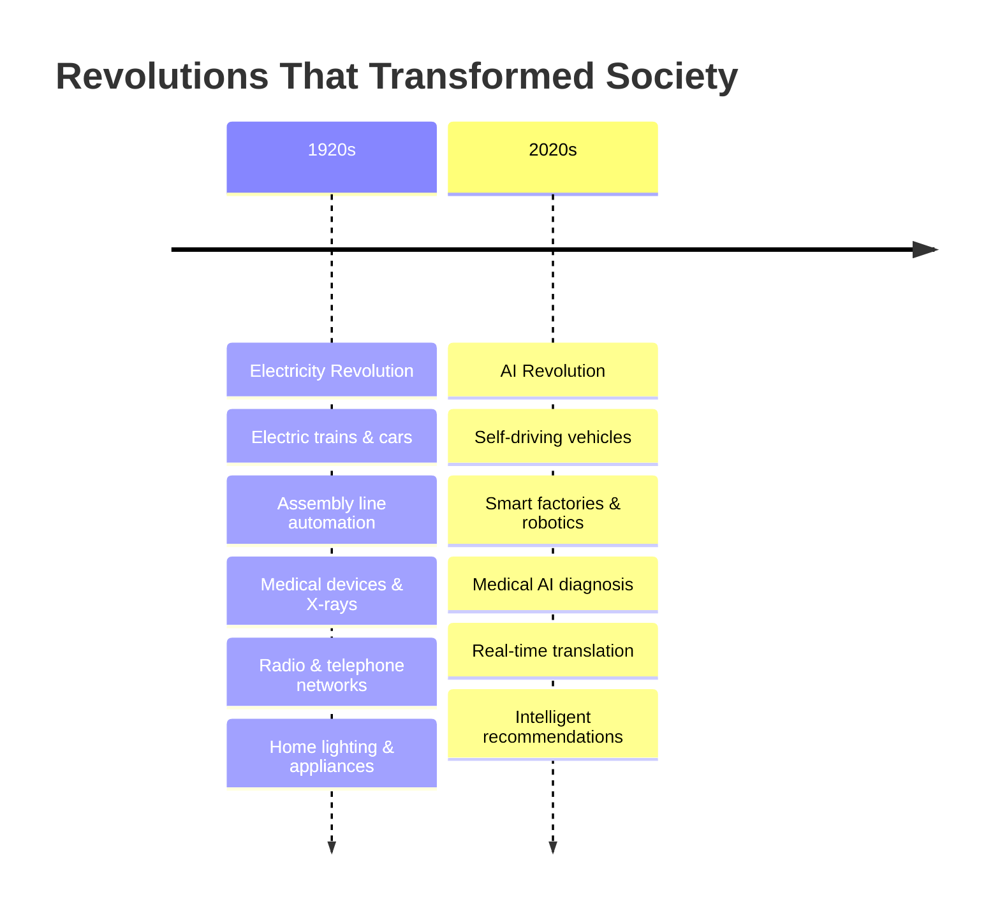

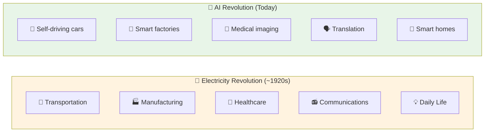

### Real-World Impact: What Deep Learning is Already Enabling

#### **Traditional Internet Businesses (Already Transformed)**

- **Web Search**: Google's search algorithm uses deep learning to understand context and intent
- **Advertising**: Personalized ads that know what you're likely to buy before you do
- **Social Media**: News feeds that show content you'll actually want to see

#### **Brand New Possibilities (Emerging Now)**

**🏥 Better Healthcare**

- **Medical Imaging**: AI systems that can detect cancer in X-rays with accuracy matching or exceeding human radiologists
- **Drug Discovery**: Finding new medicines 10x faster than traditional methods
- **Personalized Treatment**: Customizing treatment plans based on individual genetic profiles

**🎓 Personalized Education**

- **Adaptive Learning**: Educational systems that adjust to each student's pace and learning style
- **Intelligent Tutoring**: AI tutors available 24/7 to help with homework and concepts
- **Skill Assessment**: Real-time evaluation of student understanding and progress

**🌾 Precision Agriculture**

- **Crop Monitoring**: Drones with computer vision detecting disease before it spreads
- **Yield Optimization**: AI predicting optimal planting, watering, and harvesting times
- **Resource Management**: Minimizing water and fertilizer use while maximizing output

**🚗 Autonomous Vehicles**

- **Perception Systems**: Cars that can "see" and understand their environment
- **Decision Making**: AI that can navigate complex traffic scenarios safely
- **Traffic Optimization**: Smart city systems that reduce congestion and accidents

### What Makes This Journey Special?

Think of learning deep learning like learning to drive a car:

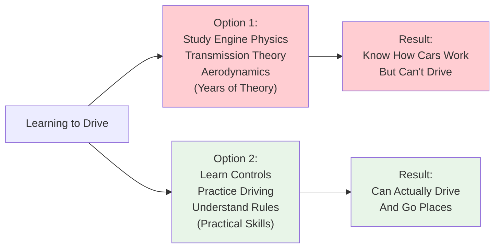

**This specialization takes the practical approach** - you'll learn to build and deploy AI systems while understanding the key principles that make them work.

### Your Career Transformation

By completing this specialization, you'll be able to:

✅ **Put "Deep Learning" on your resume with confidence**  
✅ **Build AI systems that solve real-world problems**  
✅ **Join the ranks of one of the most sought-after skills in tech**  
✅ **Contribute to building an AI-powered society**

## Course Sequence Overview: Your Learning Journey

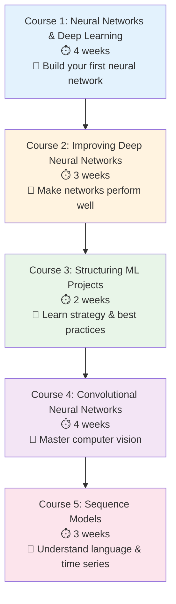

### Detailed Course Breakdown

#### **Course 1: Neural Networks and Deep Learning** 🧠

**Duration**: 4 weeks  
**What You'll Build**: A cat recognizer (following the deep learning tradition!)

**Key Skills**:

- Understand how neural networks work from the ground up
- Build your first neural network from scratch
- Train deep neural networks on real data
- Master the mathematics behind backpropagation

**Real-World Connection**: The fundamentals you learn here power everything from Google's search algorithm to Tesla's autopilot system.

#### **Course 2: Improving Deep Neural Networks** ⚡

**Duration**: 3 weeks  
**Focus**: From "it works" to "it works really well"

**What You'll Master**:

- **Hyperparameter Tuning**: The art and science of getting optimal performance
- **Regularization**: Preventing your network from memorizing instead of learning
- **Bias vs Variance**: Diagnosing what's wrong and how to fix it
- **Advanced Optimizers**: Momentum, RMSprop, Adam - the tools that make training faster

**The "Black Magic" Demystified**: This course reveals the secrets that separate hobbyist projects from production-ready systems.

#### **Course 3: Structuring Machine Learning Projects** 📋

**Duration**: 2 weeks  
**Focus**: Strategy and real-world best practices

**Unique Content You Won't Find in Universities**:

- **New Data Splitting Rules**: How train/dev/test splits have changed in the deep learning era
- **Mismatched Data Distributions**: What to do when your training and real-world data don't match
- **End-to-End Deep Learning**: When to use it and when traditional approaches work better
- **Hard-Won Lessons**: Battle-tested insights from shipping real deep learning products

**Why This Matters**: Technical skills alone aren't enough. This course teaches you to think strategically about ML projects.

#### **Course 4: Convolutional Neural Networks** 👁️

**Duration**: 4 weeks  
**Focus**: Computer vision and image understanding

**Applications You'll Build**:

- **Image Classification**: Teaching computers to recognize objects
- **Face Recognition**: Building security and photo-tagging systems
- **Style Transfer**: Creating artistic AI that can paint in different styles
- **Object Detection**: Finding and identifying multiple objects in images

**Real-World Impact**: These techniques power autonomous vehicles, medical imaging, and augmented reality.

#### **Course 5: Sequence Models** 🔤

**Duration**: 3 weeks  
**Focus**: Understanding sequences and natural language

**Model Types You'll Master**:

- **Recurrent Neural Networks (RNNs)**: For sequential data processing
- **Long Short-Term Memory (LSTM)**: For remembering long-term dependencies
- **Sequence-to-Sequence Models**: For translation and text generation

**Applications You'll Build**:

- **Language Translation**: Breaking down communication barriers
- **Speech Recognition**: Converting speech to text
- **Music Generation**: AI that can compose original music
- **Sentiment Analysis**: Understanding emotions in text

### The Deep Learning Skills Gap

```bash
# Current Job Market Reality
echo "Deep Learning Skills Demand: 📈 Exponentially Growing"
echo "Available Skilled Professionals: 📉 Critically Short"
echo "Your Opportunity: 🎯 Perfect Timing to Enter the Field"
```

**Market Statistics**:

- Deep learning job postings have grown 650% over the past 3 years
- Average salary premium for deep learning skills: $30,000+ annually
- Companies struggling to find qualified candidates in AI/ML roles

### Your Mission: Building an AI-Powered Society

Over the next decade, we have an unprecedented opportunity to build an amazing, AI-powered society. This isn't just about technology - it's about:

🌍 **Solving Global Challenges**: Climate change, healthcare, education, poverty  
🚀 **Unlocking Human Potential**: Augmenting human capabilities, not replacing them  
🤝 **Creating Inclusive Technology**: AI that works for everyone, everywhere  
🔬 **Advancing Scientific Discovery**: Accelerating research across all fields

### Your Learning Philosophy

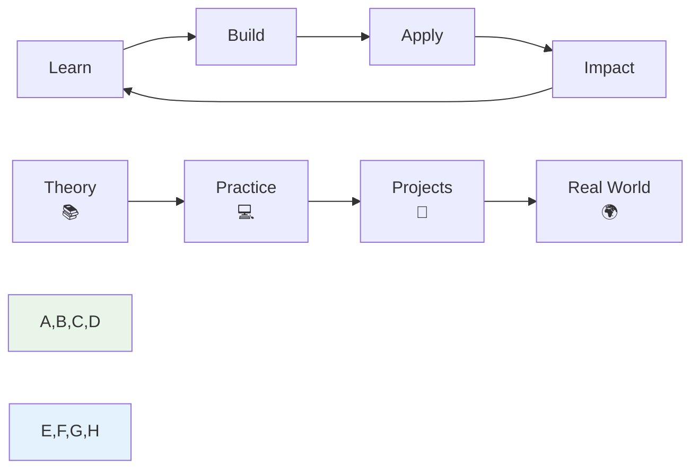

**The Cycle of Mastery**:

1. **Learn** the fundamental concepts and mathematics
2. **Build** working implementations and projects
3. **Apply** your skills to solve real problems
4. **Create Impact** that makes a difference in the world

### Getting Started: Your First Step

You're about to embark on a journey that will fundamentally change how you think about technology and problem-solving. The skills you'll develop here aren't just technical - they're a new way of approaching complex challenges.

**What Makes a Successful Deep Learning Practitioner?**:

- **Curiosity**: Always asking "what if?" and "how can this be better?"
- **Persistence**: Deep learning requires iteration and patience
- **Practical Mindset**: Focus on building things that work and matter
- **Continuous Learning**: The field evolves rapidly; embrace the journey

### Next Steps

Ready to dive in? The next video will explore supervised learning - the foundation that powers most of the deep learning applications you see today. You'll discover how neural networks learn from data and why this approach is so powerful for solving complex problems.

**Remember**: Every expert was once a beginner. Every breakthrough started with someone learning the fundamentals. Your journey into deep learning starts now.

---

_"The best time to plant a tree was 20 years ago. The second best time is now."_ - The same applies to learning deep learning. Let's begin! 🚀

# 2. What is a Neural Network? - Understanding the Basic Building Block

## Overview: From Simple Functions to Intelligent Systems

Deep Learning refers to training Neural Networks - sometimes very large ones. But what exactly **is** a neural network? Think of it as nature's solution to pattern recognition, reimagined through mathematics and computation.

### The Journey from Linear to Intelligent

We'll explore neural networks through a practical example that transforms a simple prediction problem into an intelligent system that can discover hidden patterns in data.

## The Foundation: A Simple Prediction Problem

### Housing Price Prediction - The Linear Approach

Imagine you're a real estate agent with data on 6 houses. You know their sizes and prices, and you want to predict future house prices.

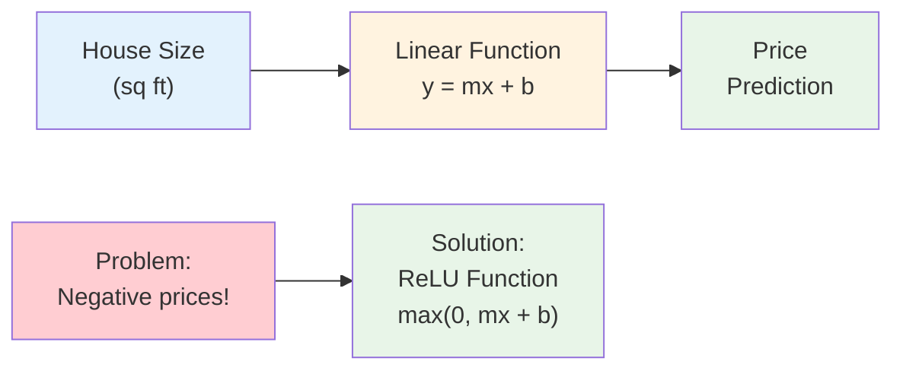

**The Problem with Linear Regression**: A straight line will eventually predict negative prices for very small houses - which doesn't make sense in the real world!

**The Neural Network Solution**: We "bend" the function so it never goes below zero.

### The Birth of Your First Neuron

```bash
# Single Neuron Architecture
Input: [House_Size] ──→ [●] ──→ Output: [Price]
                        │
                   ReLU Function
                  max(0, wx + b)
```

This simple circle is a **neuron** - the fundamental building block of all neural networks!

### Understanding ReLU: The Rectified Linear Unit

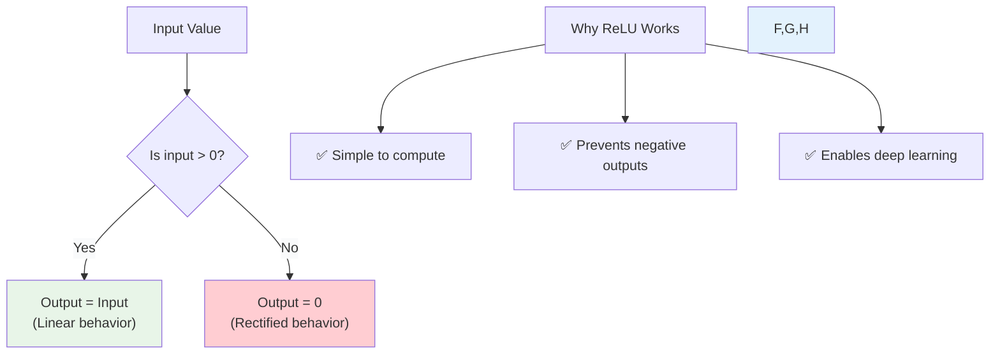

**ReLU Function Behavior**:

- **When input ≤ 0**: Output is 0 (like a "gate" that blocks negative values)
- **When input > 0**: Output equals input (linear passthrough)
- **Result**: A function that looks like a hockey stick ⚡

### Real-World Analogy: The Smart Thermostat

Think of a ReLU neuron like a smart thermostat:

- **Input**: Temperature difference (desired - actual)
- **ReLU Logic**: If difference ≤ 0, don't heat (output = 0)
- **If difference > 0**: Heat proportionally (output = input)
- **Result**: Never "negative heating" (cooling), just smart heating or nothing

## Building Complexity: From One Neuron to Neural Networks

### The Lego Brick Analogy

```bash
# Neural Network = Lego Construction
Single Neuron: [●] (One Lego brick)
Neural Network: [●]──[●]──[●] (Many bricks stacked together)
                 │   │   │
            Pattern  │  Final
           Detection │ Output
                  Complex
                 Function
```

**Key Insight**: Just as complex Lego structures are built from simple bricks, powerful neural networks are built from simple neurons!

### Multi-Feature Housing Prediction

Now let's make our housing predictor smarter by considering multiple factors:

```bash
# Enhanced Housing Prediction Model
┌─────────────────┐    ┌─────────────────┐    ┌─────────────┐
│ Input Features  │    │ Hidden Neurons  │    │   Output    │
│                 │    │                 │    │             │
│ • Size         ────→ │ ● Family Size  ────→ │             │
│ • #Bedrooms    ────→ │ ● Walkability  ────→ │ ● Price     │
│ • Zip Code     ────→ │ ● School Quality───→ │             │
│ • Wealth       ────→ │                 │    │             │
│                 │    │                 │    │             │
└─────────────────┘    └─────────────────┘    └─────────────┘
     Input Layer          Hidden Layer           Output Layer
```

### The Hidden Layer: Where Intelligence Emerges

Each hidden neuron automatically learns to detect meaningful patterns:

**🏠 Family Size Neuron** (combines Size + #Bedrooms):

- Large house + many bedrooms → High family size score
- Small house + few bedrooms → Low family size score

**🚶 Walkability Neuron** (uses Zip Code):

- Urban zip codes → High walkability score
- Suburban zip codes → Medium walkability score
- Rural zip codes → Low walkability score

**🎓 School Quality Neuron** (combines Zip Code + Wealth):

- Wealthy neighborhood + good zip code → High school quality
- Mixed indicators → Moderate school quality

### The Magic of Dense Connections

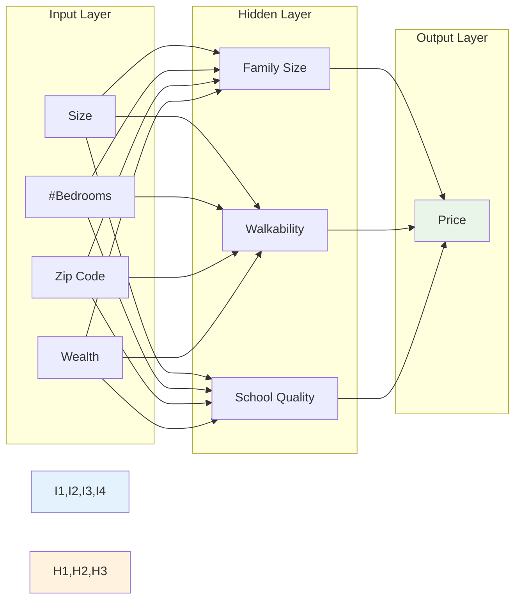

**Why Dense Connections Matter**:

- Each hidden neuron receives ALL input features
- The network decides what each neuron should represent
- **You don't manually assign meanings** - the network learns them automatically!

### Complete Neural Network Architecture

```bash
# Full Housing Price Neural Network
╭─────────────────────────────────────────────────────────────╮
│                   NEURAL NETWORK ARCHITECTURE               │
├─────────────────────────────────────────────────────────────┤
│                                                             │
│  Input(4) ──→ Hidden(3) ──→ Output(1)                       │
│                                                             │
│  ┌─────────┐   ┌─────────────┐   ┌─────────────┐            │
│  │ Size    │──→│ ● (Family)  │──→│             │            │
│  │ Bedroom │──→│ ● (Walking) │──→│ ● Price     │            │
│  │ ZipCode │──→│ ● (School)  │──→│             │            │
│  │ Wealth  │──→│             │   │             │            │
│  └─────────┘   └─────────────┘   └─────────────┘            │
│                                                             │
│  Features ──→ Pattern Detection ──→ Final Prediction        │
│                                                             │
├─────────────────────────────────────────────────────────────┤
│ Key Properties:                                             │
│ • Dense connections (every input to every hidden neuron)    │
│ • ReLU activation functions                                 │
│ • Learned representations (not hand-crafted)                │
│ • End-to-end learning from data                             │
╰─────────────────────────────────────────────────────────────╯
```

## The Remarkable Learning Process

### What Makes Neural Networks Special?

**Traditional Programming**:

```bash
Input + Rules → Output
[Size, Bedrooms] + [Human-designed formula] → [Price]
```

**Neural Network Learning**:

```bash
Input + Output → Rules (automatically discovered)
[Size, Bedrooms] + [Actual prices] → [Optimal prediction function]
```

### The Three-Layer Learning System

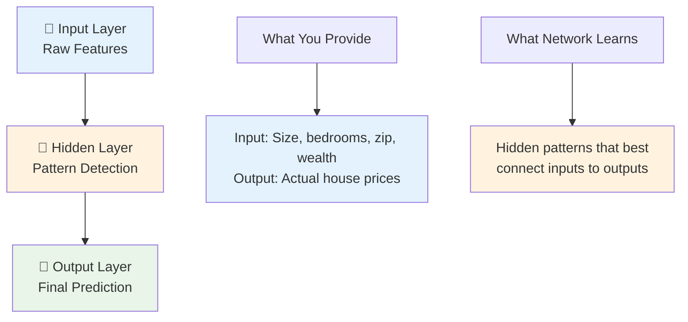

### The Training Process: Learning from Examples

**Step 1**: Feed the network many examples (training data)

```bash
Example 1: [2000 sq ft, 3 bedrooms, 90210, wealthy] → $800,000
Example 2: [1200 sq ft, 2 bedrooms, 12345, middle] → $400,000
Example 3: [3000 sq ft, 4 bedrooms, 90210, wealthy] → $1,200,000
...thousands more examples...
```

**Step 2**: Network automatically discovers optimal patterns

- Which combinations of features matter most?
- How should different features be weighted?
- What intermediate concepts (family size, walkability) are useful?

**Step 3**: Network becomes an expert predictor

- Can predict prices for houses it has never seen
- Learns complex relationships humans might miss
- Generalizes beyond the training examples

## Key Insights and Takeaways

### 🎯 **Core Concept**: Neural networks are **universal function approximators**

- Give them enough data and examples
- They'll find the pattern that best maps inputs to outputs
- No need to manually specify the rules!

### 🧩 **Building Block Principle**:

- Start with simple neurons (Lego bricks)
- Stack them into layers
- Connect them densely
- Let learning find the optimal configuration

### 🎨 **Automatic Feature Discovery**:

- You provide raw inputs (size, bedrooms, etc.)
- Network automatically creates useful intermediate concepts
- These learned features often capture insights humans miss

### 🚀 **Scalability**:

- Same principles work for 4 features or 4 million features
- Same architecture adapts to different problem types
- Complexity emerges from simple, repeated patterns

## Real-World Applications: Beyond Housing

This same neural network architecture can be applied to countless domains:

**🏥 Medical Diagnosis**:

```bash
Input: [Symptoms, Lab Results, Age, History] → Hidden: [Disease Patterns] → Output: [Diagnosis]
```

**📧 Email Classification**:

```bash
Input: [Email Text, Sender, Time, Headers] → Hidden: [Spam Patterns] → Output: [Spam/Not Spam]
```

**🛒 Product Recommendations**:

```bash
Input: [User History, Product Features, Context] → Hidden: [Preference Patterns] → Output: [Recommendation Score]
```

**🚗 Autonomous Driving**:

```bash
Input: [Camera Images, Sensor Data, GPS] → Hidden: [Object Detection] → Output: [Steering Commands]
```

## Next Steps: Expanding the Foundation

Now that you understand the basic building block, you're ready to explore:

1. **Different types of neural networks** for different data types
2. **How training actually works** (the learning algorithm)
3. **Why deep networks** (many layers) are so powerful
4. **Real implementation details** and practical considerations

**Remember**: Every breakthrough in AI - from image recognition to language translation to game-playing - is built on this same fundamental concept of stacking simple neurons into powerful learning systems.

The magic isn't in complexity - it's in the elegant simplicity of letting data teach the network what patterns matter most! 🌟

# 3. Supervised Learning with Neural Networks - From Data to Predictions

## Overview: The Economic Engine of AI

While there's been tremendous hype about neural networks, **almost all the economic value** created by neural networks has come through one specific type of machine learning: **supervised learning**. This is where you have input data (X) and want to learn a function that maps to some desired output (Y).

### The Supervised Learning Formula

```bash
# The Universal Pattern
Input (X) + Learning Algorithm + Training Data → Function that predicts Output (Y)

# Real-World Translation
[Features] + [Neural Network] + [Examples] → [Intelligent Predictions]
```

## High-Impact Supervised Learning Applications

### 💰 Online Advertising - The Most Lucrative Application

**The Business Problem**: Show users ads they're most likely to click on

This might not be the most inspiring application, but it's certainly the most lucrative use of neural networks today. The core challenge is predicting whether a specific user will click on a specific ad. This seemingly simple yes/no prediction has transformed entire industries.

**How It Works**: When you visit a website, the advertising system has milliseconds to decide which ad to show you. It considers information about the ad (product type, price, category) and information about you (age, location, browsing history, time of day). The neural network processes all these features and outputs a probability score - maybe 0.1% for an irrelevant ad or 15% for something you're genuinely interested in.

**Why This Creates Massive Value**: Even small improvements in click prediction translate to enormous revenue increases. If a company can improve their click-through rate from 2% to 2.1% across billions of ad impressions, that 0.1% improvement can generate millions in additional revenue. This is why companies like Google and Facebook invest heavily in neural network research.

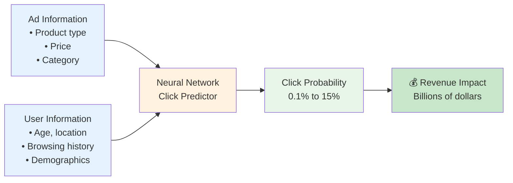

**Why This Works**:

- Every 1% improvement in click prediction = millions in additional revenue
- Neural networks found patterns humans never discovered
- Real-time optimization across billions of ad impressions daily

```bash
# Online Advertising Neural Network
╭─────────────────────────────────────────────────────────────╮
│                    AD CLICK PREDICTOR                       │
├─────────────────────────────────────────────────────────────┤
│                                                             │
│  Input Features:                    Output:                 │
│  ┌─────────────────┐               ┌─────────────────┐     │
│  │ • Ad category   │──┐            │                 │     │
│  │ • Ad price      │  │            │ Click Probability│     │
│  │ • User age      │  ├──→ [NN] ──→│ (0.0 to 1.0)    │     │
│  │ • User location │  │            │                 │     │
│  │ • Time of day   │──┘            │                 │     │
│  │ • Device type   │               └─────────────────┘     │
│  └─────────────────┘                                       │
│                                                             │
│  Business Impact: $100B+ annual revenue optimization       │
╰─────────────────────────────────────────────────────────────╯
```

### 👁️ Computer Vision - Seeing Like Humans

**The Challenge**: Recognize and understand visual content

Computer vision represents one of the most dramatic breakthroughs in neural networks. For decades, computers struggled with tasks that humans do effortlessly - like recognizing objects in photos or detecting diseases in medical scans.

**The Traditional Problem**: Before neural networks, computer vision relied on hand-crafted features and rigid rules. Programmers had to manually specify what edges, shapes, and patterns the computer should look for. This approach worked poorly because real-world images are incredibly complex and varied.

**The Neural Network Solution**: Convolutional Neural Networks (CNNs) automatically learn to detect the most useful visual features. They start by detecting simple edges and gradually build up to recognize complex objects, faces, or medical conditions. The network discovers these patterns automatically from training data, often finding features that human engineers never thought to look for.

**Real-World Impact**: Modern computer vision systems can now match or exceed human performance in many tasks. In medical imaging, AI systems can detect certain cancers more accurately than experienced radiologists. In manufacturing, they can spot defects too small for human eyes to see reliably.

```bash
# Image Recognition Pipeline
Input: Image (millions of pixels) → CNN → Output: "Golden Retriever (97% confidence)"

# Applications:
• Photo tagging (Facebook, Google Photos)
• Medical imaging (X-ray diagnosis)
• Quality control (manufacturing defects)
• Security systems (face recognition)
```

**Real-World Example**: Medical X-Ray Analysis

```bash
┌─────────────────────────────────────────────────────────────┐
│                    MEDICAL IMAGING AI                       │
│                                                             │
│  Input: Chest X-Ray Image                                   │
│         ┌─────────────────┐                                 │
│         │ [X-Ray pixels]  │                                 │
│         │ 512 x 512 x 1   │──→ CNN ──→ Diagnosis Probability│
│         │ grayscale values│             • Normal: 85%       │
│         └─────────────────┘             • Pneumonia: 12%    │
│                                         • Other: 3%         │
│                                                             │
│  Performance: Matches radiologist accuracy (94%+)           │
│  Speed: Diagnosis in seconds vs. hours                     │
└─────────────────────────────────────────────────────────────┘
```

### 🗣️ Speech Recognition - From Sound to Text

**The Transformation**: Convert audio waves into readable text

Speech recognition has made remarkable progress thanks to neural networks. Just a few years ago, voice assistants struggled with accents, background noise, and natural speech patterns. Today, systems like Siri, Alexa, and Google Assistant can understand speech with near-human accuracy.

**Why Speech is Challenging**: Audio is a complex, one-dimensional sequence of sound waves that varies dramatically between speakers. People speak at different speeds, with different accents, and often with background noise or interruptions. Traditional systems tried to break this down into phonemes (basic sound units) and then assemble words, but this approach was brittle and error-prone.

**The Neural Network Breakthrough**: Recurrent Neural Networks (RNNs) can process sequential audio data while maintaining memory of what they've heard before. This allows them to use context to resolve ambiguities - for example, distinguishing between "to," "too," and "two" based on the surrounding words and meaning.

**Applications Beyond Voice Assistants**: Speech recognition now enables real-time transcription for meetings, accessibility tools for hearing-impaired individuals, and automated customer service systems that can understand natural language queries.

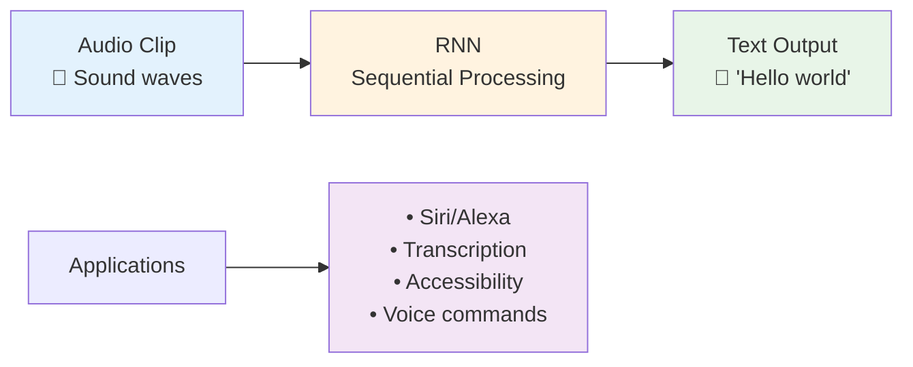

### 🌐 Machine Translation - Breaking Language Barriers

**The Breakthrough**: Direct language-to-language translation

Machine translation has undergone a revolution thanks to neural networks. Traditional translation systems were complex pipelines that analyzed grammar, looked up words in dictionaries, and tried to apply language rules. The results were often stilted and unnatural.

**The Old Way Was Complicated**: Traditional systems had to explicitly model the grammar of both languages, maintain massive dictionaries, and handle countless special cases and exceptions. This approach worked for simple sentences but struggled with idioms, context, and the natural flow of language.

**The Neural Network Revolution**: Modern neural translation systems learn to map meaning directly from one language to another. They don't explicitly learn grammar rules - instead, they develop an internal representation of meaning that transcends specific languages. This allows them to produce much more natural, contextually appropriate translations.

**Why This Matters**: Real-time translation is breaking down communication barriers worldwide. Google Translate now supports over 100 languages and processes billions of translations daily, enabling global commerce, education, and cultural exchange that was previously impossible.

```bash
# Traditional Approach (Pre-Neural Networks)
English → English Grammar Analysis → Dictionary Lookup →
Chinese Grammar Rules → Chinese (Often awkward)

# Neural Network Approach
English Sentence → RNN Encoder → Meaning Representation →
RNN Decoder → Natural Chinese

Example:
Input:  "The weather is beautiful today"
Output: "今天天气很好" (Natural, contextual translation)
```

### 🚗 Autonomous Driving - Intelligent Navigation

**The Multi-Modal Challenge**: Process multiple data types simultaneously

Autonomous driving represents one of the most complex applications of neural networks because it requires processing and integrating multiple types of sensor data in real-time to make life-critical decisions.

**Why Driving is So Complex**: Human drivers constantly process visual information (road signs, other cars, pedestrians), spatial information (distances, speeds, trajectories), and contextual information (traffic rules, weather conditions). They must predict the behavior of other drivers and react appropriately within split seconds.

**The Multi-Sensor Approach**: Self-driving cars use cameras for visual recognition, radar for distance measurement, LIDAR for precise 3D mapping, GPS for location, and various other sensors. Neural networks must fuse all this information into a coherent understanding of the environment.

**The Neural Network Architecture**: This requires a hybrid approach combining CNNs (for processing camera images), RNNs (for tracking objects over time), and custom architectures for sensor fusion. The system must identify objects, predict their movements, plan safe paths, and execute precise control actions.

**Current Progress**: While fully autonomous driving remains challenging, neural networks have enabled features like adaptive cruise control, automatic emergency braking, and lane-keeping assistance that are already saving lives on roads today.

```bash
# Autonomous Vehicle Perception System
╭─────────────────────────────────────────────────────────────╮
│                   SELF-DRIVING CAR AI                       │
├─────────────────────────────────────────────────────────────┤
│                                                             │
│  Multiple Inputs:                 Neural Network:           │
│  ┌─────────────────┐             ┌─────────────────┐       │
│  │ • Camera images │──┐          │                 │       │
│  │ • Radar data    │  │          │   Hybrid CNN +  │       │
│  │ • LIDAR points  │  ├────────→ │   RNN + Custom  │────┐  │
│  │ • GPS location  │  │          │   Architecture  │    │  │
│  │ • Speed data    │──┘          │                 │    │  │
│  └─────────────────┘             └─────────────────┘    │  │
│                                                          │  │
│  Outputs:                                                │  │
│  ┌─────────────────────────────────────────────────────────┴┐ │
│  │ • Other car positions (x, y coordinates)               │ │
│  │ • Lane boundaries                                      │ │
│  │ • Traffic signs and signals                           │ │
│  │ • Pedestrian locations                                │ │
│  │ • Steering angle recommendations                      │ │
│  └────────────────────────────────────────────────────────┘ │
╰─────────────────────────────────────────────────────────────╯
```

## Neural Network Architectures for Different Data Types

### The Architecture Decision Tree

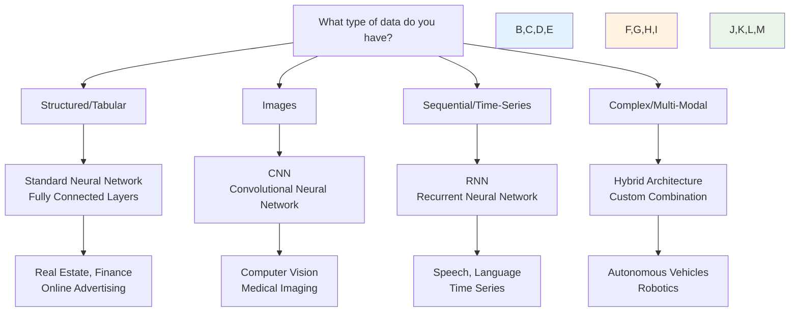

### Standard Neural Network (Fully Connected)

**When to Use**: Standard neural networks work best with structured, tabular data where each feature has a clear, well-defined meaning.

**How It Works**: In a fully connected network, every neuron in one layer connects to every neuron in the next layer. This architecture is perfect for data that doesn't have spatial or temporal structure - like a database record with columns for age, income, credit score, etc.

**Why It's Effective**: Each neuron can consider all input features when making its contribution to the final prediction. This allows the network to discover complex interactions between features that might not be obvious to human analysts.

**Real-World Examples**: Predicting house prices based on size, location, and amenities; determining loan approval based on financial history; or optimizing online ad targeting based on user demographics and behavior patterns.

```bash
# Architecture: Every neuron connects to every neuron in next layer
┌─────────────────────────────────────────────────────────────┐
│                  STANDARD NEURAL NETWORK                    │
│                                                             │
│  Input Layer    Hidden Layer(s)    Output Layer            │
│     ●               ●                  ●                    │
│     ●            ●  ●  ●               ●                    │
│     ●               ●                  ●                    │
│     ●            ●  ●  ●                                    │
│                     ●                                       │
│                                                             │
│  Best for: Structured data (numbers, categories)           │
│  Examples: Spreadsheet data, database records              │
└─────────────────────────────────────────────────────────────┘
```

### Convolutional Neural Network (CNN)

```bash
# Architecture: Specialized for spatial patterns in images
┌─────────────────────────────────────────────────────────────┐
│               CONVOLUTIONAL NEURAL NETWORK                  │
│                                                             │
│  Input Image → Conv Layers → Pooling → Conv → Pool → FC    │
│                                                             │
│  ┌─────────┐   ┌─────────┐   ┌─────┐   ┌───┐   ┌─────┐    │
│  │ 224x224 │──→│ Filters │──→│ Max │──→│...│──→│Class│    │
│  │ x 3     │   │ Detect  │   │Pool │   │   │   │     │    │
│  │ (RGB)   │   │ Edges   │   │     │   │   │   │     │    │
│  └─────────┘   └─────────┘   └─────┘   └───┘   └─────┘    │
│                                                             │
│  Best for: Images, spatial data                            │
│  Examples: Photo recognition, medical scans                │
└─────────────────────────────────────────────────────────────┘
```

### Recurrent Neural Network (RNN)

```bash
# Architecture: Memory for sequential patterns
┌─────────────────────────────────────────────────────────────┐
│                 RECURRENT NEURAL NETWORK                    │
│                                                             │
│  Time →  t1    t2    t3    t4    t5                        │
│         ┌─┐   ┌─┐   ┌─┐   ┌─┐   ┌─┐                       │
│  Input: │A│ → │u│ → │d│ → │i│ → │o│                       │
│         └─┘   └─┘   └─┘   └─┘   └─┘                       │
│          ↓     ↓     ↓     ↓     ↓                         │
│         ┌─┐   ┌─┐   ┌─┐   ┌─┐   ┌─┐                       │
│  RNN:   │●│ → │●│ → │●│ → │●│ → │●│                       │
│         └─┘   └─┘   └─┘   └─┘   └─┘                       │
│          ↓     ↓     ↓     ↓     ↓                         │
│ Output: "Speech recognition result"                        │
│                                                             │
│  Best for: Sequential data with temporal patterns          │
│  Examples: Speech, text, time series                       │
└─────────────────────────────────────────────────────────────┘
```

## Structured vs Unstructured Data: The Great Divide

### Understanding the Data Types

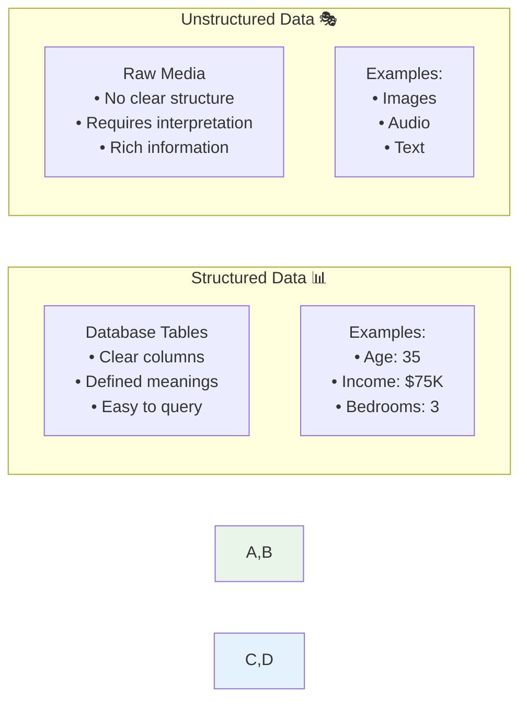

### Structured Data Applications

```bash
# Structured Data Examples
┌─────────────────────────────────────────────────────────────┐
│                    STRUCTURED DATA USES                     │
├─────────────────────────────────────────────────────────────┤
│                                                             │
│  Housing Prediction:                                        │
│  ┌─────────────┬─────────────┬─────────────┬─────────────┐  │
│  │    Size     │  Bedrooms   │  Location   │    Price    │  │
│  ├─────────────┼─────────────┼─────────────┼─────────────┤  │
│  │   2000 sq   │      3      │   90210     │   $800K     │  │
│  │   1500 sq   │      2      │   12345     │   $400K     │  │
│  └─────────────┴─────────────┴─────────────┴─────────────┘  │
│                                                             │
│  Customer Analytics:                                        │
│  ┌─────────────┬─────────────┬─────────────┬─────────────┐  │
│  │     Age     │   Income    │   Clicks    │  Will Buy?  │  │
│  ├─────────────┼─────────────┼─────────────┼─────────────┤  │
│  │     25      │    $50K     │     15      │     Yes     │  │
│  │     45      │    $80K     │      3      │     No      │  │
│  └─────────────┴─────────────┴─────────────┴─────────────┘  │
│                                                             │
│  Key Feature: Each column has clear, defined meaning       │
└─────────────────────────────────────────────────────────────┘
```

### Unstructured Data Revolution

**The Historic Challenge**: Computers struggled with unstructured data that humans naturally understand.

```bash
# Human vs Computer Evolution
┌─────────────────────────────────────────────────────────────┐
│                 UNSTRUCTURED DATA MASTERY                   │
├─────────────────────────────────────────────────────────────┤
│                                                             │
│  Humans (Evolved over millions of years):                  │
│  ✅ Instantly recognize faces in photos                     │
│  ✅ Understand speech in noisy environments                 │
│  ✅ Read emotions from text                                 │
│  ✅ Interpret context and meaning                           │
│                                                             │
│  Computers (Traditional programming):                       │
│  ❌ Failed at image recognition                             │
│  ❌ Poor speech understanding                               │
│  ❌ No text comprehension                                   │
│  ❌ No contextual awareness                                 │
│                                                             │
│  Computers (With Neural Networks):                         │
│  ✅ Human-level image recognition                           │
│  ✅ Excellent speech transcription                          │
│  ✅ Advanced language understanding                         │
│  ✅ Context-aware processing                                │
│                                                             │
│  Result: Massive new opportunities in AI applications      │
└─────────────────────────────────────────────────────────────┘
```

### The Media Appeal vs Business Reality

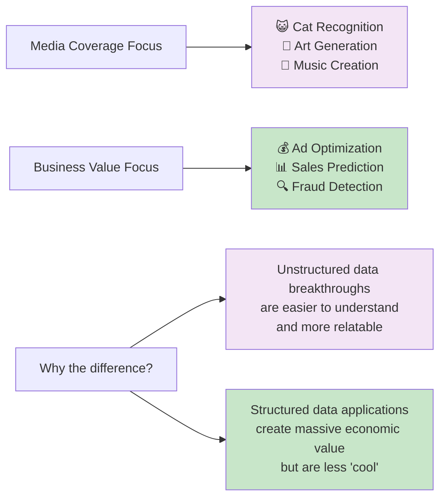

## Economic Impact: The Numbers Behind the Hype

### Short-Term Economic Value (Current)

```bash
# Current Economic Winners
┌─────────────────────────────────────────────────────────────┐
│               NEURAL NETWORK ECONOMIC IMPACT                │
├─────────────────────────────────────────────────────────────┤
│                                                             │
│  STRUCTURED DATA APPLICATIONS:                             │
│  💰 Online Advertising: $100B+ annual market               │
│  🏪 Recommendation Systems: $300B+ e-commerce influence     │
│  🏦 Financial Services: $50B+ in fraud detection/trading   │
│  📊 Business Analytics: $200B+ in optimized decisions      │
│                                                             │
│  UNSTRUCTURED DATA APPLICATIONS:                           │
│  📱 Voice Assistants: $20B+ market                         │
│  🚗 Autonomous Vehicles: $100B+ future market              │
│  🏥 Medical Imaging: $30B+ healthcare market               │
│  🔒 Security Systems: $40B+ surveillance market            │
│                                                             │
│  Key Insight: Both categories create massive value!        │
└─────────────────────────────────────────────────────────────┘
```

### Strategic Application Framework

For implementing neural networks in your organization:

```bash
# Strategic Decision Framework
╭─────────────────────────────────────────────────────────────╮
│                   NEURAL NETWORK STRATEGY                   │
├─────────────────────────────────────────────────────────────┤
│                                                             │
│  Step 1: Identify Your Data Type                           │
│  ┌─────────────────┐              ┌─────────────────┐      │
│  │ Structured Data │    or        │Unstructured Data│      │
│  │ • Databases     │              │ • Images        │      │
│  │ • Spreadsheets  │              │ • Audio         │      │
│  │ • Metrics       │              │ • Text          │      │
│  └─────────────────┘              └─────────────────┘      │
│                                                             │
│  Step 2: Define X and Y                                    │
│  • What are your input features? (X)                       │
│  • What do you want to predict? (Y)                        │
│                                                             │
│  Step 3: Choose Architecture                               │
│  • Standard NN (structured)                                │
│  • CNN (images)                                            │
│  • RNN (sequences)                                         │
│  • Hybrid (complex problems)                               │
│                                                             │
│  Step 4: Integrate into Larger System                      │
│  • Neural network is often one component                   │
│  • Consider full business workflow                         │
│                                                             │
╰─────────────────────────────────────────────────────────────╯
```

## Key Takeaways and Strategic Insights

### 🎯 **The Supervised Learning Success Formula**:

1. **Clearly define X (inputs) and Y (outputs)**
2. **Choose the right architecture for your data type**
3. **Gather high-quality training examples**
4. **Integrate into business processes**

### 💡 **Architecture Selection Guide**:

- **Structured/Tabular Data** → Standard Neural Networks
- **Images/Spatial Data** → Convolutional Neural Networks (CNNs)
- **Sequential/Time Data** → Recurrent Neural Networks (RNNs)
- **Complex/Multi-Modal** → Hybrid Architectures

### 📈 **Economic Value Creation**:

- **Immediate ROI**: Optimize existing business processes
- **New Capabilities**: Enable previously impossible applications
- **Competitive Advantage**: Better predictions than traditional methods

### 🚀 **Implementation Strategy**:

- Start with clear business problems
- Focus on data quality and quantity
- Consider both structured and unstructured opportunities
- Think beyond the neural network to full system integration

## What's Next?

You now understand **what** neural networks can do and **where** they create value. But a crucial question remains: **Why now?** The basic ideas behind neural networks have existed for decades, so why are they only now becoming incredibly powerful?

In the next section, we'll explore the three key factors that have converged to make this the golden age of deep learning! 🌟

# 4. Why is Deep Learning Taking Off? - The Perfect Storm

## Overview: The Convergence of Three Critical Forces

The basic technical ideas behind neural networks have existed for decades - so why are they only now achieving remarkable success? The answer lies in the convergence of three powerful forces that have created the perfect conditions for deep learning to flourish.

This isn't just an academic question. Understanding these driving forces will help you spot the best opportunities to apply deep learning within your own organization and predict where the technology is headed next.

## The Fundamental Performance Relationship

### The Data-Performance Curve: A New Understanding

The key insight comes from plotting algorithm performance against the amount of available data. This reveals a fundamental shift in how we should think about machine learning approaches.

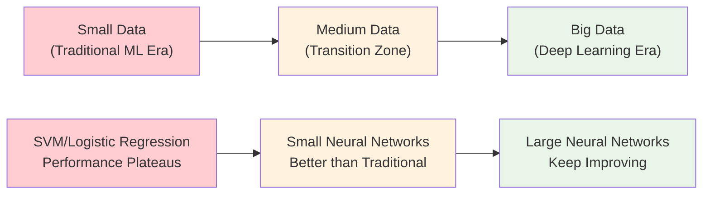

### Understanding the Performance Curves

**Traditional Machine Learning Algorithms** (SVM, Logistic Regression):
These algorithms show a characteristic pattern - their performance improves as you add more data, but only up to a point. After reaching a certain amount of data, additional examples don't help much. The algorithm essentially "runs out of capacity" to learn from more information.

Why does this happen? Traditional algorithms have fixed complexity. A logistic regression model with 10 features will always have the same number of parameters, regardless of whether you train it on 1,000 or 1,000,000 examples. Once it has learned the basic relationships, more data doesn't provide additional benefit.

**Small Neural Networks**:
Small neural networks perform similarly to traditional algorithms but with slightly different characteristics. They can learn more complex patterns than linear models, but they still have limited capacity due to their size.

**Large Neural Networks**:
This is where the magic happens. Large neural networks demonstrate a fundamentally different relationship with data. Their performance keeps improving as you add more data, often without plateauing. The larger the network, the more it can benefit from additional training examples.

### The Scale Revolution

```bash
# The Scale Equation for Deep Learning Success
Success = f(Network Scale × Data Scale × Computational Scale)

Where:
• Network Scale = Number of layers, neurons, parameters, connections
• Data Scale = Amount of labeled training examples (m)
• Computational Scale = Processing power, memory, specialized hardware
```

## Force #1: The Data Explosion

### Society's Digital Transformation

Over the past two decades, human society has undergone massive digitization. This transformation has created an unprecedented explosion of data that traditional algorithms couldn't effectively utilize.

**The Digitization Sources**:

**Human Digital Activity**:

- **Web Browsing**: Every click, search, and page view generates data
- **Social Media**: Billions of posts, likes, shares, and interactions daily
- **E-commerce**: Purchase history, browsing patterns, product reviews
- **Mobile Apps**: Location data, usage patterns, user interactions
- **Email and Messaging**: Communication patterns and content

**Internet of Things (IoT)**:

- **Smartphones**: Built-in cameras capturing billions of photos daily
- **Sensors**: Accelerometers, gyroscopes, temperature sensors everywhere
- **Smart Devices**: Home automation systems, wearables, fitness trackers
- **Connected Vehicles**: GPS data, driving patterns, traffic information
- **Industrial Sensors**: Manufacturing equipment, supply chain monitoring

### The Data Volume Revolution

```bash
# Data Generation Scale (Daily)
╭─────────────────────────────────────────────────────────────╮
│                    DAILY DATA CREATION                      │
├─────────────────────────────────────────────────────────────┤
│                                                             │
│  • 2.5 quintillion bytes of data created daily             │
│  • 95 million photos uploaded to Instagram                 │
│  • 500 million tweets sent                                 │
│  • 4 billion hours of video watched on YouTube             │
│  • 306 billion emails sent                                 │
│  • 5 billion searches on Google                            │
│  • 1 billion hours of content watched on TikTok            │
│                                                             │
│  Historical Context:                                        │
│  • 2000: Total global data = ~12 exabytes                  │
│  • 2020: Daily data creation = ~2.5 exabytes               │
│  • 2025: Projected daily = ~463 exabytes                   │
│                                                             │
╰─────────────────────────────────────────────────────────────╯
```

### From Data-Poor to Data-Rich Applications

**The Historical Problem**: For decades, most machine learning applications were data-starved. Collecting and labeling training data was expensive and time-consuming. A typical dataset might have hundreds or thousands of examples.

**The Modern Reality**: Many applications now have access to millions or billions of labeled examples. This abundance of data has fundamentally changed what's possible with machine learning.

**Real-World Examples**:

**Image Recognition**: Google Photos processes over 95 million photos uploaded daily, creating massive datasets for training computer vision systems.

**Language Translation**: Google Translate processes billions of translation requests daily, each providing feedback that improves the system.

**Speech Recognition**: Voice assistants process millions of voice commands daily, continuously learning from real usage patterns.

## Force #2: Computational Power Revolution

### The Hardware Evolution

The second critical force has been the dramatic improvement in computational capabilities, particularly through specialized hardware optimized for neural network training.

**CPU vs GPU: A Fundamental Shift**

Traditional CPUs are designed for sequential processing - doing one complex calculation at a time very quickly. Neural networks, however, involve massive parallel computations - millions of simple mathematical operations that can be done simultaneously.

```bash
# Processing Architecture Comparison
┌─────────────────────────────────────────────────────────────┐
│                 CPU vs GPU ARCHITECTURE                     │
├─────────────────────────────────────────────────────────────┤
│                                                             │
│  CPU (Central Processing Unit):                             │
│  ┌─────────────────────────────────────────────────────┐   │
│  │ [Core] [Core] [Core] [Core]                         │   │
│  │   ↓      ↓      ↓      ↓                            │   │
│  │ Complex Sequential Tasks                            │   │
│  │ • High per-core performance                         │   │
│  │ • 4-16 cores typical                               │   │
│  │ • Optimized for logic and control                  │   │
│  └─────────────────────────────────────────────────────┘   │
│                                                             │
│  GPU (Graphics Processing Unit):                            │
│  ┌─────────────────────────────────────────────────────┐   │
│  │ [●][●][●][●][●][●][●][●] ... (thousands of cores)  │   │
│  │                                                     │   │
│  │ Parallel Mathematical Operations                    │   │
│  │ • Lower per-core performance                        │   │
│  │ • 2000-5000+ cores typical                         │   │
│  │ • Optimized for matrix operations                  │   │
│  └─────────────────────────────────────────────────────┘   │
│                                                             │
│  Result: GPUs are 10-100x faster for neural network        │
│          training compared to CPUs                          │
╰─────────────────────────────────────────────────────────────╯
```

### The Training Time Revolution

**Historical Context**: In the early 2000s, training a moderately complex neural network could take weeks or months on available hardware. This made experimentation extremely slow and limited the complexity of networks that were practical to train.

**Modern Reality**: What once took months now takes hours or minutes. This dramatic speedup has enabled:

- Training much larger, more complex networks
- Rapid experimentation and iteration
- Real-time applications that require fast inference

**Specialized Hardware Evolution**:

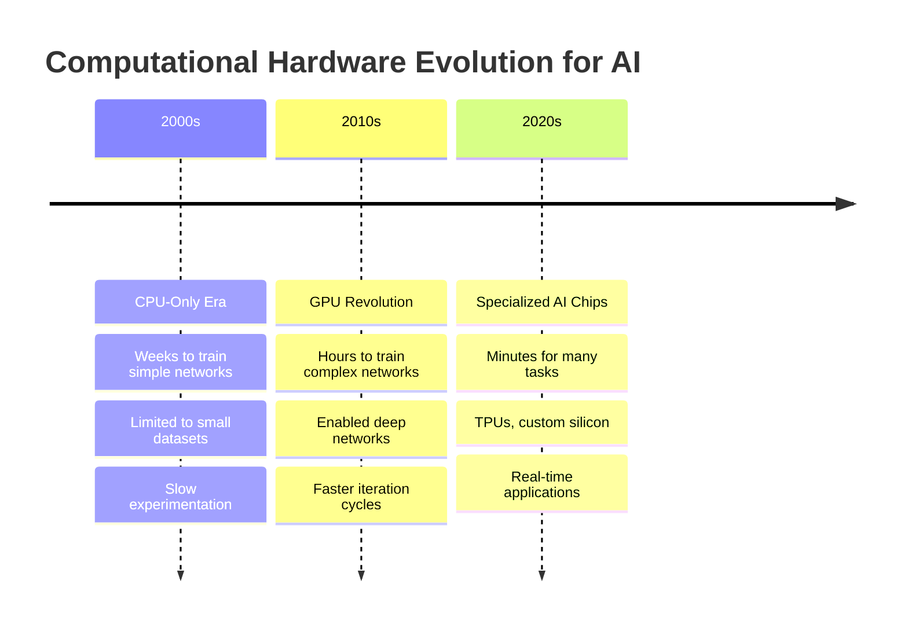

## Force #3: Algorithmic Breakthroughs

### Beyond Just Scale: Smart Innovations

While scale (more data and computation) provided the foundation, crucial algorithmic innovations have made neural networks dramatically more effective and practical to train.

**The Innovation Focus**: Interestingly, many of the most important algorithmic breakthroughs have focused on making neural networks train faster and more efficiently, rather than just making them more accurate.

### The ReLU Revolution: A Simple Change with Massive Impact

One of the most significant breakthroughs was surprisingly simple: changing the activation function from sigmoid to ReLU (Rectified Linear Unit).

**The Sigmoid Problem**:

The sigmoid function, while mathematically elegant, created a serious practical problem called the "vanishing gradient problem."

```bash
# Sigmoid Function Behavior
╭─────────────────────────────────────────────────────────────╮
│                    SIGMOID ACTIVATION                       │
│                                                             │
│   f(x) = 1/(1 + e^(-x))                                    │
│                                                             │
│        1.0 ┤                ╭─────                         │
│            │              ╭─╯                              │
│        0.5 ┤          ╭───╯                                │
│            │      ╭───╯                                    │
│        0.0 ┤──────╯                                        │
│            └─────────────────────────                      │
│           -5     0     5                                   │
│                                                             │
│   Problem Areas: [    Flat regions    ]                    │
│   • Gradient ≈ 0 in saturated regions                      │
│   • Learning becomes extremely slow                        │
│   • Deep networks couldn't train effectively               │
│                                                             │
╰─────────────────────────────────────────────────────────────╯
```

**The ReLU Solution**:

The ReLU function solved this problem with elegant simplicity: f(x) = max(0, x)

```bash
# ReLU Function Behavior
╭─────────────────────────────────────────────────────────────╮
│                     ReLU ACTIVATION                         │
│                                                             │
│   f(x) = max(0, x)                                         │
│                                                             │
│        5 ┤                   ╱                             │
│          │                 ╱                               │
│        3 ┤               ╱                                 │
│          │             ╱                                   │
│        1 ┤           ╱                                     │
│          │         ╱                                       │
│        0 ┤─────────                                        │
│          └─────────────────────────                        │
│         -3   -1    0    2                                  │
│                                                             │
│   Advantages:                                               │
│   • Gradient = 1 for positive inputs (no vanishing)        │
│   • Gradient = 0 for negative inputs (simple)              │
│   • Extremely fast to compute                              │
│   • Enables training of deep networks                      │
│                                                             │
╰─────────────────────────────────────────────────────────────╯
```

### Why This Simple Change Was Revolutionary

**Computational Efficiency**: ReLU is much faster to compute than sigmoid. Instead of expensive exponential calculations, it's just a simple comparison: if the input is positive, output the input; otherwise, output zero.

**Gradient Flow**: The constant gradient of 1 for positive inputs means that gradients can flow backward through the network without diminishing, enabling the training of much deeper networks.

**Training Speed**: Networks with ReLU activations train significantly faster, allowing for more experimentation and larger models.

### Other Key Algorithmic Innovations

**Better Optimization Algorithms**:

- **Adam Optimizer**: Adaptive learning rates that adjust during training
- **Batch Normalization**: Stabilizes training of deep networks
- **Dropout**: Prevents overfitting in large networks

**Architectural Innovations**:

- **Skip Connections**: Allow training of very deep networks (100+ layers)
- **Attention Mechanisms**: Enable models to focus on relevant information
- **Transformer Architecture**: Revolutionary approach to sequence processing

## The Rapid Experimentation Advantage

### The Innovation Cycle

One of the most underappreciated aspects of the computational revolution is how it has accelerated the pace of innovation itself.

**The Deep Learning Development Cycle**:

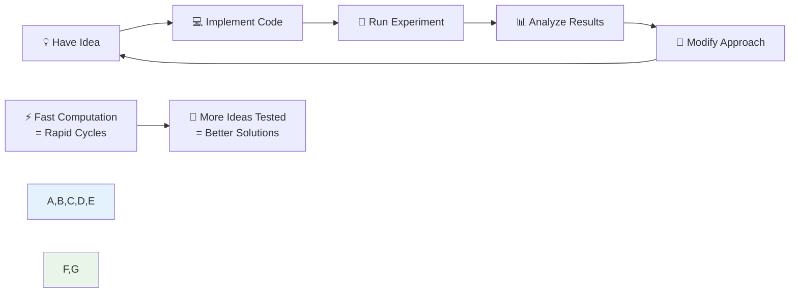

### The Productivity Revolution

**Historical Timeline**: When training took weeks or months, researchers and practitioners could only test a few ideas per year. The long feedback cycles severely limited innovation.

**Modern Timeline**: When you can test an idea and get results in minutes or hours, you can explore dozens of approaches in a single day. This has created an explosion of innovation.

**Real-World Impact**:

- **Research Acceleration**: Academic research cycles have shortened from years to months
- **Industry Development**: Companies can rapidly prototype and deploy new solutions
- **Collaborative Innovation**: Ideas can be shared, tested, and improved by global communities within days

## The Continuing Momentum: Why Deep Learning Will Keep Improving

### Force #1: Data Continues Growing

**Exponential Data Growth**: Global data creation continues to accelerate. We're not approaching a plateau - if anything, the rate of data generation is increasing with IoT expansion, higher resolution sensors, and new digital behaviors.

**New Data Sources**:

- **Synthetic Data**: AI-generated training data
- **Edge Computing**: Local data collection and processing
- **Multimodal Data**: Combining text, images, audio, and sensor data
- **Real-Time Streams**: Continuous learning from live data feeds

### Force #2: Hardware Keeps Advancing

**Specialized AI Hardware**:

- **Google's TPUs**: Designed specifically for tensor operations
- **NVIDIA's Latest GPUs**: Continued performance improvements
- **Custom Silicon**: Companies building their own AI chips
- **Quantum Computing**: Potential future game-changer

**Distributed Computing**:

- **Cloud AI Services**: Making powerful hardware accessible
- **Edge AI**: Bringing AI processing to devices
- **Federated Learning**: Training across distributed devices

### Force #3: Algorithmic Innovation Accelerates

**Research Community Growth**: The deep learning research community has exploded in size, with thousands of researchers worldwide contributing improvements.

**Open Source Culture**: Most breakthroughs are quickly shared, accelerating adoption and further innovation.

**Cross-Pollination**: Techniques developed for one domain (like computer vision) often prove useful in others (like natural language processing).

## Strategic Implications for Organizations

### Identifying Opportunities

**The Scale Assessment Framework**:

```bash
# Opportunity Evaluation Checklist
╭─────────────────────────────────────────────────────────────╮
│              DEEP LEARNING OPPORTUNITY ASSESSMENT           │
├─────────────────────────────────────────────────────────────┤
│                                                             │
│  1. Data Scale Assessment:                                  │
│     □ Do you have access to large datasets?                │
│     □ Can you collect more data over time?                  │
│     □ Is your data digitized and accessible?               │
│                                                             │
│  2. Performance Requirements:                               │
│     □ Would significant accuracy improvements create value? │
│     □ Are traditional methods plateauing?                   │
│     □ Do you need to handle unstructured data?             │
│                                                             │
│  3. Computational Resources:                                │
│     □ Can you access cloud computing resources?            │
│     □ Is the training time acceptable for your use case?   │
│     □ Do you have technical expertise or access to it?     │
│                                                             │
│  4. Business Impact:                                        │
│     □ Would improvements directly impact revenue/costs?     │
│     □ Could this enable new products or services?          │
│     □ Is there competitive advantage potential?            │
│                                                             │
╰─────────────────────────────────────────────────────────────╯
```

### Timing Considerations

**The Advantage of Acting Now**:

- **Data Accumulation**: Start collecting data now for future applications
- **Capability Building**: Develop internal expertise while the technology is still evolving
- **Competitive Position**: Early movers often establish lasting advantages

**Risk Mitigation**:

- **Pilot Projects**: Start with small, contained experiments
- **Hybrid Approaches**: Combine deep learning with existing systems
- **Continuous Learning**: Expect to iterate and improve over time

## Key Takeaways

### The Perfect Storm Has Created Lasting Change

The convergence of massive data availability, computational power, and algorithmic innovations has created a self-reinforcing cycle that continues to accelerate deep learning progress.

### Scale Drives Success

In the big data regime, the most reliable way to improve performance is often to either train a bigger network or use more data. This simple principle has powered much of the recent progress in AI.

### Speed Enables Innovation

Fast computation isn't just about efficiency - it's about enabling rapid experimentation, which accelerates the discovery of new techniques and applications.

### The Future Looks Bright

All three driving forces continue to strengthen, suggesting that deep learning will continue improving for years to come. Organizations that position themselves to take advantage of these trends will be well-positioned for success.

## What's Next

Understanding why deep learning is taking off provides crucial context for learning how to build and deploy these systems effectively. In the final section of this week, we'll explore what specific skills and knowledge you'll develop throughout this specialization and how they'll prepare you to build real-world AI applications.

The revolution is just beginning, and you're getting in at the perfect time to be part of it! 🚀

# 5. About this Course - What You'll Learn

## Overview: Building Your Deep Learning Foundation

This first course provides the fundamental building blocks of deep learning. By the end, you'll know how to build and deploy deep neural networks from scratch.

## Course Structure: 4-Week Journey

```bash
# Course 1: Neural Networks and Deep Learning
╭─────────────────────────────────────────────────────────────╮
│                    4-WEEK LEARNING PATH                     │
├─────────────────────────────────────────────────────────────┤
│                                                             │
│  Week 1: Introduction to Deep Learning ✓                   │
│  • What neural networks are and how they work              │
│  • Real-world applications and impact                      │
│  • Why deep learning is taking off now                     │
│                                                             │
│  Week 2: Neural Network Programming Basics                 │
│  • Forward propagation algorithm                           │
│  • Backpropagation algorithm                              │
│  • Efficient implementation techniques                     │
│  • First programming assignment                           │
│                                                             │
│  Week 3: Single Hidden Layer Network                       │
│  • Implement a complete neural network                     │
│  • Key concepts for practical networks                     │
│  • Hands-on coding experience                             │
│                                                             │
│  Week 4: Deep Neural Networks                             │
│  • Build multi-layer networks                             │
│  • See deep learning work on real problems                │
│  • Complete neural network implementation                  │
│                                                             │
╰─────────────────────────────────────────────────────────────╯
```

## Learning Components

### Weekly Structure

- **Video Content**: Core concepts and theory
- **Programming Exercises**: Hands-on implementation (Weeks 2-4)
- **Quiz Questions**: 10 multiple-choice questions per week
- **Practical Application**: Build working neural networks

### The Programming Journey


## Key Skills You'll Develop

**Technical Skills**:

- Forward and backward propagation
- Neural network architecture design
- Efficient programming techniques
- Deep learning implementation

**Practical Skills**:

- Building complete AI systems
- Debugging neural networks
- Performance optimization
- Real-world problem solving

## What's Next

After completing Week 1, take the quiz to check your understanding. The programming exercises in Weeks 2-4 will give you hands-on experience implementing the algorithms you're learning about.

By Week 4, you'll have built a complete deep neural network and seen it work on real problems - a truly satisfying experience that transforms theoretical knowledge into practical capability.
