# Course 1 Week 1: Sentiment Analysis with Logistic Regression

**Natural Language Processing Specialization**  
**Natural Language Processing with Classification and Vector Spaces**

---

## Table of Contents

1. [Supervised ML & Sentiment Analysis](#1-supervised-ml--sentiment-analysis)
2. [Vocabulary & Feature Extraction](#2-vocabulary--feature-extraction)
3. [Negative and Positive Frequencies](#3-negative-and-positive-frequencies)
4. [Feature Extraction with Frequencies](#4-feature-extraction-with-frequencies)
5. [Preprocessing](#5-preprocessing)
6. [Putting it All Together](#6-putting-it-all-together)
7. [Logistic Regression Overview](#7-logistic-regression-overview)
8. [Logistic Regression: Training](#8-logistic-regression-training)
9. [Logistic Regression: Testing](#9-logistic-regression-testing)
10. [Logistic Regression: Cost Function](#10-logistic-regression-cost-function)
11. [Logistic Regression: Gradient Derivation](#11-logistic-regression-gradient-derivation-optional)

---

# 1. Supervised ML & Sentiment Analysis

## Introduction

Sentiment analysis is a fundamental NLP task that determines the emotional tone or opinion expressed in text. This week focuses on building a **binary classifier** to classify tweets as either positive or negative using **logistic regression**.

---

## What is Sentiment Analysis?

**Sentiment Analysis** is the computational study of opinions, sentiments, and emotions expressed in text. It's widely used in:

- **Social Media Monitoring**: Understanding public opinion about brands, products, or events
- **Customer Feedback Analysis**: Analyzing reviews and customer service interactions
- **Market Research**: Gauging consumer sentiment about products or services
- **Political Analysis**: Understanding public opinion about candidates or policies

## Introduction to Supervised Machine Learning

In **supervised machine learning**, we have:

- **Input features (X)**: The data we observe
- **Labels (Y)**: The correct answers we want to predict

Our goal is to **minimize error rates** and create the most accurate predictions possible by finding the best mapping from features to labels.

## The Supervised Learning Process

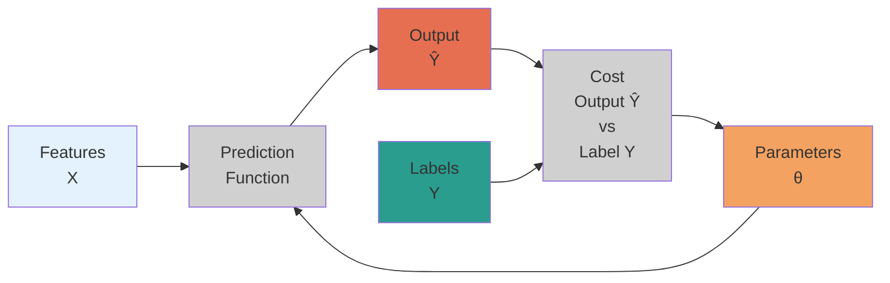

### Key Components:

1. **Input Features (X)**: The data we observe (e.g., processed tweet text)
2. **Parameters (θ)**: Learnable weights that the algorithm adjusts
3. **Prediction Function**: Maps features X to output labels Ŷ using parameters θ
4. **Output (Ŷ)**: Our predicted sentiment (probability or class)
5. **Cost Function**: Compares predicted output Ŷ with true labels Y
6. **Parameter Update Loop**: Cost function updates θ to minimize prediction errors

---

## Sentiment Analysis: Complete Pipeline

**Concrete Example**: _"I am happy because I am learning NLP"_

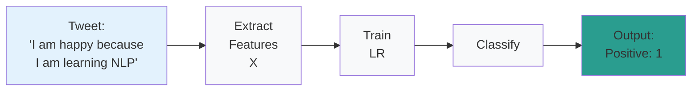

### Sentiment Classification Rules:

- **Positive sentiment** → Label = **1**
- **Negative sentiment** → Label = **0**

This is a **binary classification** task where logistic regression assigns each tweet to one of two distinct classes.

### The Three-Step Process:

1. **Feature Extraction**: Represent the text _"I am happy because I am learning NLP"_ as numerical features X
2. **Train Logistic Regression**: Use training data to learn parameters that minimize prediction errors
3. **Classification**: Apply the trained model to predict sentiment (1 for positive, 0 for negative)

---

## Three-Step Process for Tweet Classification

From the course material, here's the exact workflow for sentiment analysis:

```bash
┌─────────────────────────────────────────────────────────────────────────────┐
│                          SENTIMENT ANALYSIS PIPELINE                        │
├─────────────────────────────────────────────────────────────────────────────┤
│                                                                             │
│  Step 1: FEATURE EXTRACTION                                                 │
│  ┌─────────────────────────────────────────────────────────────────────┐    │
│  │ Raw Tweet: "I am happy because I am learning NLP"                   │    │
│  │              ↓                                                      │    │
│  │ Numerical Features: [feature_1, feature_2, ..., feature_n]          │    │
│  └─────────────────────────────────────────────────────────────────────┘    │
│                                ↓                                            │
│  Step 2: TRAIN LOGISTIC REGRESSION                                          │
│  ┌─────────────────────────────────────────────────────────────────────┐    │
│  │ • Use training dataset with labeled examples                        │    │
│  │ • Minimize cost function                                            │    │
│  │ • Learn optimal parameters θ                                        │    │
│  └─────────────────────────────────────────────────────────────────────┘    │
│                                ↓                                            │
│  Step 3: CLASSIFY NEW TWEETS                                                │
│  ┌─────────────────────────────────────────────────────────────────────┐    │
│  │ Input: New tweet features                                           │    │
│  │ Output: Prediction (1 = Positive, 0 = Negative)                     │    │
│  └─────────────────────────────────────────────────────────────────────┘    │
│                                                                             │
└─────────────────────────────────────────────────────────────────────────────┘
```

### Mathematical Representation

The process can be summarized mathematically as:

1. **Input**: X (features extracted from tweet text)
2. **Function**: f_θ(X) → Ŷ (prediction function with parameters θ)
3. **Output**: Ŷ ∈ {0, 1} (predicted sentiment class)
4. **Training**: Minimize Cost(Ŷ, Y) by updating θ

---

## Why Logistic Regression for Sentiment Analysis?

1. **Binary Classification**: Perfect for positive/negative sentiment tasks
2. **Probabilistic Output**: Provides confidence scores, not just binary predictions
3. **Interpretability**: Easy to understand which features contribute to predictions
4. **Efficiency**: Fast training and prediction, suitable for large tweet datasets
5. **Baseline Performance**: Often performs surprisingly well on text classification tasks

---

## The Core Challenge: Text to Numbers

The fundamental challenge in NLP is converting text (which computers can't directly process) into numerical representations (which they can). This process is called **feature extraction** or **text vectorization**.

### Example Transformation

```
"I am happy because I am learning NLP" → [feature_1, feature_2, feature_3, ...]
```

### Traditional vs Modern Approaches

| Traditional (This Week)  | Modern (Later Courses)  |
| ------------------------ | ----------------------- |
| Hand-crafted features    | Learned representations |
| Bag-of-words models      | Word embeddings         |
| Frequency-based          | Context-aware           |
| Simple but interpretable | Complex but powerful    |

### Real-World Applications

**Sentiment Analysis** is widely used for:

- **Social Media Monitoring**: Understanding public opinion about brands, products, or events
- **Customer Feedback Analysis**: Analyzing reviews and customer service interactions
- **Market Research**: Gauging consumer sentiment about products or services
- **Political Analysis**: Understanding public opinion about candidates or policies

# 2. Vocabulary & Feature Extraction

## Introduction: From Text to Numbers

The fundamental challenge in NLP is that **computers can only work with numbers**, but human language consists of words, sentences, and meaning. **Feature extraction** is the bridge that converts text into numerical representations that machine learning algorithms can process.

**Core Question**: How do we represent _"I am happy because I am learning NLP"_ as a vector of numbers?

---

## Building a Vocabulary

### What is a Vocabulary?

A **vocabulary (V)** is the complete set of unique words that appear across all texts in your dataset. It forms the foundation for all feature extraction.

```bash
┌─────────────────────────────────────────────────────────────────────────────┐
│                              VOCABULARY CONSTRUCTION                        │
├─────────────────────────────────────────────────────────────────────────────┤
│                                                                             │
│  Input: Collection of Tweets                                                │
│  ┌─────────────────────────────────────────────────────────────────────┐    │
│  │ Tweet 1: "I am happy because I am learning NLP"                     │    │
│  │ Tweet 2: "I am sad because I hate this movie"                       │    │
│  │ Tweet 3: "This movie is great and I love it"                        │    │
│  │ Tweet 4: "Learning NLP is fun and exciting"                         │    │
│  └─────────────────────────────────────────────────────────────────────┘    │
│                                ↓                                            │
│  Process: Extract All Unique Words                                          │
│  ┌─────────────────────────────────────────────────────────────────────┐    │
│  │ Step 1: Tokenize each tweet into individual words                   │    │
│  │ Step 2: Convert to lowercase (optional normalization)               │    │
│  │ Step 3: Collect all unique words                                    │    │
│  │ Step 4: Remove duplicates                                           │    │
│  └─────────────────────────────────────────────────────────────────────┘    │
│                                ↓                                            │
│  Output: Vocabulary V                                                       │
│  ┌─────────────────────────────────────────────────────────────────────┐    │
│  │ V = [I, am, happy, because, learning, NLP, sad, hate, this,         │    │
│  │      movie, is, great, and, love, it, fun, exciting]                │    │
│  │                                                                     │    │
│  │ Vocabulary Size: |V| = 17 words                                     │    │
│  └─────────────────────────────────────────────────────────────────────┘    │
│                                                                             │
└─────────────────────────────────────────────────────────────────────────────┘
```

### Vocabulary Construction Algorithm

```python
def build_vocabulary(tweets):
    """
    Build vocabulary from a collection of tweets
    """
    vocabulary = set()  # Use set to automatically handle duplicates

    for tweet in tweets:
        # Tokenize: split tweet into individual words
        words = tweet.lower().split()  # Simple tokenization + lowercasing

        # Add each word to vocabulary
        for word in words:
            vocabulary.add(word)

    # Convert to sorted list for consistent indexing
    return sorted(list(vocabulary))

# Example usage
tweets = [
    "I am happy because I am learning NLP",
    "I am sad because I hate this movie",
    "This movie is great and I love it",
    "Learning NLP is fun and exciting"
]

vocabulary = build_vocabulary(tweets)
print(f"Vocabulary: {vocabulary}")
print(f"Vocabulary size: {len(vocabulary)}")
```

---

## Feature Extraction: Bag-of-Words Representation

### The One-Hot Encoding Approach

Once we have a vocabulary, we can represent any text as a **binary vector** where each dimension corresponds to a word in the vocabulary.

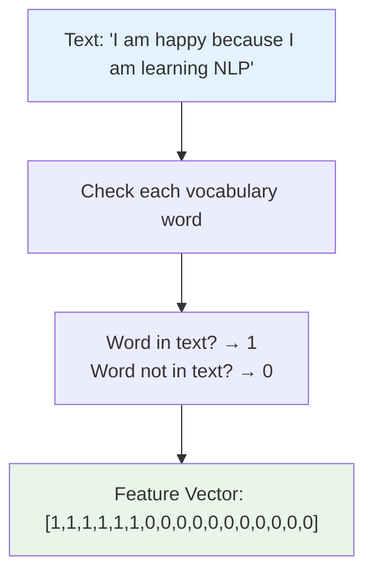

### Step-by-Step Feature Extraction

**Example**: _"I am happy because I am learning NLP"_

```bash
Vocabulary: [I, am, and, because, exciting, fun, great, happy, hate,
             is, it, learning, love, movie, nlp, sad, this]

Feature Extraction Process:
┌─────────────────┬─────────────────┬─────────────────┐
│ Vocabulary Word │   In Tweet?     │   Feature Value │
├─────────────────┼─────────────────┼─────────────────┤
│ I               │ ✓ (appears)     │        1        │
│ am              │ ✓ (appears)     │        1        │
│ and             │ ✗ (missing)     │        0        │
│ because         │ ✓ (appears)     │        1        │
│ exciting        │ ✗ (missing)     │        0        │
│ fun             │ ✗ (missing)     │        0        │
│ great           │ ✗ (missing)     │        0        │
│ happy           │ ✓ (appears)     │        1        │
│ hate            │ ✗ (missing)     │        0        │
│ is              │ ✗ (missing)     │        0        │
│ it              │ ✗ (missing)     │        0        │
│ learning        │ ✓ (appears)     │        1        │
│ love            │ ✗ (missing)     │        0        │
│ movie           │ ✗ (missing)     │        0        │
│ nlp             │ ✓ (appears)     │        1        │
│ sad             │ ✗ (missing)     │        0        │
│ this            │ ✗ (missing)     │        0        │
└─────────────────┴─────────────────┴─────────────────┘

Final Feature Vector: [1, 1, 0, 1, 0, 0, 0, 1, 0, 0, 0, 1, 0, 0, 1, 0, 0]
                      ↑                    ↑                    ↑
                   6 ones               many zeros          sparse!
```

### Implementation Example

```python
def extract_features(text, vocabulary):
    """
    Convert text to bag-of-words feature vector
    """
    # Tokenize and normalize the input text
    words_in_text = set(text.lower().split())

    # Create feature vector
    features = []
    for word in vocabulary:
        if word in words_in_text:
            features.append(1)  # Word present
        else:
            features.append(0)  # Word absent

    return features

# Example
text = "I am happy because I am learning NLP"
vocabulary = ['I', 'am', 'and', 'because', 'exciting', 'fun', 'great',
              'happy', 'hate', 'is', 'it', 'learning', 'love', 'movie',
              'nlp', 'sad', 'this']

features = extract_features(text, vocabulary)
print(f"Text: {text}")
print(f"Features: {features}")
print(f"Number of 1s: {sum(features)}")
print(f"Number of 0s: {len(features) - sum(features)}")
```

---

## The Sparse Representation Problem

### What is Sparsity?

A **sparse representation** is a vector where most elements are zero. In our bag-of-words approach:

- **Few 1s**: Only words that actually appear in the text
- **Many 0s**: All vocabulary words that don't appear in the text

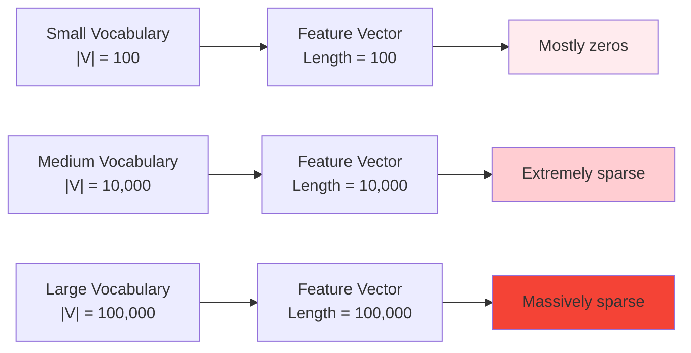

### Problems with Large Vocabularies

#### 1. **Computational Complexity**

**Parameters to Learn**: θ = [θ₀, θ₁, θ₂, ..., θₙ] where n = |V|

- **Small vocabulary** (|V| = 1,000): Learn 1,001 parameters
- **Medium vocabulary** (|V| = 50,000): Learn 50,001 parameters
- **Large vocabulary** (|V| = 500,000): Learn 500,001 parameters

#### 2. **Training Time Issues**

```python
# Training time complexity example
def training_time_analysis():
    vocab_sizes = [1_000, 10_000, 50_000, 100_000, 500_000]

    print("Vocabulary Size → Training Complexity")
    print("=" * 40)

    for size in vocab_sizes:
        parameters = size + 1  # +1 for bias term
        relative_time = parameters / 1_001  # Relative to smallest case

        print(f"{size:>8,} words → {parameters:>7,} parameters → {relative_time:>6.1f}x time")

training_time_analysis()
```

**Output**:

```
Vocabulary Size → Training Complexity
========================================
   1,000 words →   1,001 parameters →    1.0x time
  10,000 words →  10,001 parameters →   10.0x time
  50,000 words →  50,001 parameters →   50.0x time
 100,000 words → 100,001 parameters →  100.0x time
 500,000 words → 500,001 parameters →  500.0x time
```

#### 3. **Memory Requirements**

Each training example requires storing a vector of size |V|:

- **1,000 examples × 50,000 features = 50 million numbers**
- **10,000 examples × 50,000 features = 500 million numbers**

#### 4. **Prediction Time**

For each prediction, the model must:

1. Extract features (check |V| words)
2. Compute dot product of |V| elements
3. Apply sigmoid function

**Real-world impact**: A model with 500,000 vocabulary words might take 500x longer to make predictions than one with 1,000 words.

---

## Why This Matters: Real-World Context

### Typical Vocabulary Sizes

| Domain            | Vocabulary Size   | Examples                            |
| ----------------- | ----------------- | ----------------------------------- |
| **Small corpus**  | 1,000 - 5,000     | Limited domain (restaurant reviews) |
| **Medium corpus** | 10,000 - 50,000   | General tweets, news articles       |
| **Large corpus**  | 100,000 - 500,000 | Web crawl, books, Wikipedia         |
| **Very large**    | 1M+               | Multi-language, technical documents |

### The Trade-off

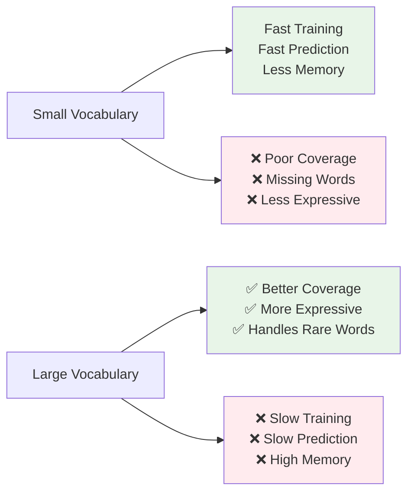

---

## Solutions and Preview

While bag-of-words representation has significant limitations, it serves as:

1. **Educational Foundation**: Understanding the basics of text vectorization
2. **Baseline Method**: Simple to implement and interpret
3. **Stepping Stone**: Leads to more sophisticated approaches

### Coming Up

In the following videos, we'll explore:

- **Frequency-based features**: Instead of binary 1/0, use word counts
- **Dimensionality reduction**: Reduce from |V| features to just 2-3 features
- **Smarter preprocessing**: Remove stop words, stemming, etc.

### Modern Solutions (Later Courses)

- **Word embeddings**: Dense representations (Word2Vec, GloVe)
- **Subword tokenization**: Handle out-of-vocabulary words
- **Transformer models**: Context-aware representations (BERT, GPT)

---

## Key Takeaways

1. **Vocabulary = Foundation**: All feature extraction starts with building a vocabulary
2. **Bag-of-Words = Simple but Limited**: Easy to understand, but creates sparse, high-dimensional vectors
3. **Sparsity = Major Problem**: Most features are 0, leading to computational inefficiency
4. **Scale Matters**: Problems become severe with realistic vocabulary sizes (50K+ words)
5. **Trade-offs Exist**: Coverage vs. efficiency, expressiveness vs. speed

**Next**: We'll learn how to create more efficient representations using frequency counting and smart feature engineering.

# 3. Negative and Positive Frequencies

## Introduction: Moving Beyond Bag-of-Words

In the previous section, we learned that bag-of-words creates sparse, high-dimensional vectors. **Frequency-based features** offer a smarter approach: instead of tracking whether each vocabulary word appears in a text, we count **how often words appear in positive vs negative examples**.

**Key Insight**: Words like "love" and "hate" don't just appear in text—they appear with different frequencies in positive vs negative sentiment examples. We can use this pattern to create much more efficient features.

---

## The Frequency Dictionary Concept

### From Binary to Counts

Instead of asking _"Is this word present?"_ (bag-of-words), we ask:

- _"How often does this word appear in **positive** examples?"_
- _"How often does this word appear in **negative** examples?"_

```bash
┌────────────────────────────────────────────────────────────────────────────┐
│                          FREQUENCY-BASED APPROACH                          │
├────────────────────────────────────────────────────────────────────────────┤
│                                                                            │
│  Old Approach (Bag-of-Words):                                              │
│  ┌─────────────────────────────────────────────────────────────────────┐   │
│  │ "happy" in tweet → 1                                                │   │
│  │ "sad" in tweet → 1                                                  │   │
│  │ Result: [1, 1, 0, 0, 1, 0, ...]  (mostly zeros)                     │   │
│  └─────────────────────────────────────────────────────────────────────┘   │
│                                                                            │
│  New Approach (Frequency-Based):                                           │
│  ┌─────────────────────────────────────────────────────────────────────┐   │
│  │ "happy" appears 150 times in positive tweets                        │   │
│  │ "happy" appears 5 times in negative tweets                          │   │
│  │ "sad" appears 8 times in positive tweets                            │   │
│  │ "sad" appears 200 times in negative tweets                          │   │
│  │ Result: Use these counts to create smarter features!                │   │
│  └─────────────────────────────────────────────────────────────────────┘   │
│                                                                            │
└────────────────────────────────────────────────────────────────────────────┘
```

---

## Building the Frequency Dictionary

### Example Corpus Setup

Let's work with a concrete example from the video:

```python
# Example corpus with 4 tweets, 2 classes
corpus = {
    'positive': [
        "I am happy because I am learning",
        "I am happy and I love learning"
    ],
    'negative': [
        "I am sad because I am not learning",
        "I am sad and I hate learning"
    ]
}

# Vocabulary: All unique words across all tweets
vocabulary = ["I", "am", "happy", "because", "learning", "and", "love", "sad", "not", "hate"]
```

### Step-by-Step Frequency Counting

#### Step 1: Count Positive Frequencies

For each word in vocabulary, count how many times it appears across **all positive tweets**:

```bash
Positive Tweets Analysis:
┌────────────────────────────────────────────────────────────────────────────┐
│ Tweet 1 (Positive): "I am happy because I am learning"                     │
│ Tweet 2 (Positive): "I am happy and I love learning"                       │
└────────────────────────────────────────────────────────────────────────────┘

Word-by-Word Counting:
┌─────────────┬────────────────────────────────────────┬─────────────────────┐
│    Word     │          Appearances in Positive       │   Positive Freq     │
├─────────────┼────────────────────────────────────────┼─────────────────────┤
│ I           │ Tweet1: 2 times, Tweet2: 2 times       │         4           │
│ am          │ Tweet1: 2 times, Tweet2: 2 times       │         4           │
│ happy       │ Tweet1: 1 time,  Tweet2: 1 time        │         2           │
│ because     │ Tweet1: 1 time,  Tweet2: 0 times       │         1           │
│ learning    │ Tweet1: 1 time,  Tweet2: 1 time        │         2           │
│ and         │ Tweet1: 0 times, Tweet2: 1 time        │         1           │
│ love        │ Tweet1: 0 times, Tweet2: 1 time        │         1           │
│ sad         │ Tweet1: 0 times, Tweet2: 0 times       │         0           │
│ not         │ Tweet1: 0 times, Tweet2: 0 times       │         0           │
│ hate        │ Tweet1: 0 times, Tweet2: 0 times       │         0           │
└─────────────┴────────────────────────────────────────┴─────────────────────┘
```

#### Step 2: Count Negative Frequencies

```bash
Negative Tweets Analysis:
┌─────────────────────────────────────────────────────────────────────────────┐
│ Tweet 3 (Negative): "I am sad because I am not learning"                    │
│ Tweet 4 (Negative): "I am sad and I hate learning"                          │
└─────────────────────────────────────────────────────────────────────────────┘

Word-by-Word Counting:
┌─────────────┬────────────────────────────────────────┬─────────────────────┐
│    Word     │          Appearances in Negative       │   Negative Freq     │
├─────────────┼────────────────────────────────────────┼─────────────────────┤
│ I           │ Tweet3: 2 times, Tweet4: 2 times       │         4           │
│ am          │ Tweet3: 2 times, Tweet4: 2 times       │         4           │
│ happy       │ Tweet3: 0 times, Tweet4: 0 times       │         0           │
│ because     │ Tweet3: 1 time,  Tweet4: 0 times       │         1           │
│ learning    │ Tweet3: 1 time,  Tweet4: 1 time        │         2           │
│ and         │ Tweet3: 0 times, Tweet4: 1 time        │         1           │
│ love        │ Tweet3: 0 times, Tweet4: 0 times       │         0           │
│ sad         │ Tweet3: 1 time,  Tweet4: 1 time        │         2           │
│ not         │ Tweet3: 1 time,  Tweet4: 0 times       │         1           │
│ hate        │ Tweet3: 0 times, Tweet4: 1 time        │         1           │
└─────────────┴────────────────────────────────────────┴─────────────────────┘
```

### Complete Frequency Table

```bash
FINAL FREQUENCY DICTIONARY
┌─────────────┬─────────────────────┬─────────────────────┬─────────────────────┐
│    Word     │   Positive Freq     │   Negative Freq     │   Sentiment Signal  │
├─────────────┼─────────────────────┼─────────────────────┼─────────────────────┤
│ I           │         4           │         4           │   Neutral (equal)   │
│ am          │         4           │         4           │   Neutral (equal)   │
│ happy       │         2           │         0           │   Strong Positive   │
│ because     │         1           │         1           │   Neutral (equal)   │
│ learning    │         2           │         2           │   Neutral (equal)   │
│ and         │         1           │         1           │   Neutral (equal)   │
│ love        │         1           │         0           │   Positive          │
│ sad         │         0           │         2           │   Strong Negative   │
│ not         │         0           │         1           │   Negative          │
│ hate        │         0           │         1           │   Negative          │
└─────────────┴─────────────────────┴─────────────────────┴─────────────────────┘
```

---

## Implementation: Building the Frequency Dictionary

### Python Implementation

```python
def build_frequency_dictionary(corpus):
    """
    Build frequency dictionary mapping (word, class) → frequency

    Args:
        corpus: dict with 'positive' and 'negative' keys containing lists of tweets

    Returns:
        freq_dict: dict mapping (word, class) to frequency count
    """
    freq_dict = {}

    # Process positive tweets
    for tweet in corpus['positive']:
        words = tweet.lower().split()
        for word in words:
            key = (word, 'positive')
            freq_dict[key] = freq_dict.get(key, 0) + 1

    # Process negative tweets
    for tweet in corpus['negative']:
        words = tweet.lower().split()
        for word in words:
            key = (word, 'negative')
            freq_dict[key] = freq_dict.get(key, 0) + 1

    return freq_dict

# Example usage
corpus = {
    'positive': [
        "I am happy because I am learning",
        "I am happy and I love learning"
    ],
    'negative': [
        "I am sad because I am not learning",
        "I am sad and I hate learning"
    ]
}

freq_dict = build_frequency_dictionary(corpus)

# Print results
print("Frequency Dictionary:")
print("-" * 40)
for (word, sentiment), freq in sorted(freq_dict.items()):
    print(f"('{word}', '{sentiment}') → {freq}")
```

**Output**:

```
Frequency Dictionary:
----------------------------------------
('am', 'negative') → 4
('am', 'positive') → 4
('and', 'negative') → 1
('and', 'positive') → 1
('because', 'negative') → 1
('because', 'positive') → 1
('happy', 'positive') → 2
('hate', 'negative') → 1
('i', 'negative') → 4
('i', 'positive') → 4
('learning', 'negative') → 2
('learning', 'positive') → 2
('love', 'positive') → 1
('not', 'negative') → 1
('sad', 'negative') → 2
```

### Alternative Table Format

```python
def create_frequency_table(corpus):
    """
    Create a more readable frequency table format
    """
    # Get all unique words
    all_words = set()
    for tweets in corpus.values():
        for tweet in tweets:
            all_words.update(tweet.lower().split())

    # Build frequency table
    table = {}
    for word in all_words:
        pos_count = 0
        neg_count = 0

        # Count in positive tweets
        for tweet in corpus['positive']:
            pos_count += tweet.lower().split().count(word)

        # Count in negative tweets
        for tweet in corpus['negative']:
            neg_count += tweet.lower().split().count(word)

        table[word] = {'positive': pos_count, 'negative': neg_count}

    return table

# Create and display table
table = create_frequency_table(corpus)

print(f"\n{'Word':<12} {'Pos Freq':<10} {'Neg Freq':<10} {'Sentiment Signal'}")
print("=" * 50)

for word in sorted(table.keys()):
    pos_freq = table[word]['positive']
    neg_freq = table[word]['negative']

    # Determine sentiment signal
    if pos_freq > neg_freq:
        signal = "Positive"
    elif neg_freq > pos_freq:
        signal = "Negative"
    else:
        signal = "Neutral"

    print(f"{word:<12} {pos_freq:<10} {neg_freq:<10} {signal}")
```

---

## Dictionary Structure and Data Access

### Understanding the Dictionary Format

In practice, the frequency dictionary is structured as:

```python
freq_dict = {
    ('word', 'class'): frequency_count
}
```

**Examples**:

- `('happy', 'positive')` → `2`
- `('happy', 'negative')` → `0`
- `('sad', 'positive')` → `0`
- `('sad', 'negative')` → `2`

### Efficient Access Patterns

```python
def get_word_frequencies(word, freq_dict):
    """
    Get positive and negative frequencies for a specific word
    """
    pos_freq = freq_dict.get((word, 'positive'), 0)
    neg_freq = freq_dict.get((word, 'negative'), 0)
    return pos_freq, neg_freq

def analyze_word_sentiment(word, freq_dict):
    """
    Analyze sentiment signal of a word based on frequencies
    """
    pos_freq, neg_freq = get_word_frequencies(word, freq_dict)

    total_freq = pos_freq + neg_freq
    if total_freq == 0:
        return "Unknown word"

    pos_ratio = pos_freq / total_freq

    if pos_ratio > 0.8:
        return "Strong Positive"
    elif pos_ratio > 0.6:
        return "Positive"
    elif pos_ratio >= 0.4:
        return "Neutral"
    elif pos_ratio >= 0.2:
        return "Negative"
    else:
        return "Strong Negative"

# Example analysis
words_to_analyze = ['happy', 'sad', 'love', 'hate', 'learning', 'am']

print("\nWord Sentiment Analysis:")
print("-" * 30)
for word in words_to_analyze:
    pos_freq, neg_freq = get_word_frequencies(word, freq_dict)
    sentiment = analyze_word_sentiment(word, freq_dict)
    print(f"{word:<10}: pos={pos_freq}, neg={neg_freq} → {sentiment}")
```

---

## Why Frequency Counting Matters

### Advantages Over Bag-of-Words

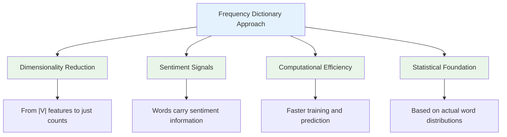

### 1. **Captures Sentiment Patterns**

Unlike bag-of-words which treats all words equally, frequency counting reveals:

- **Positive indicators**: Words that appear much more in positive examples
- **Negative indicators**: Words that appear much more in negative examples
- **Neutral words**: Words that appear equally in both classes

### 2. **Enables Smarter Features**

Instead of thousands of binary features, we can create just a few meaningful ones:

- **Positive score**: Sum of positive frequencies for words in the text
- **Negative score**: Sum of negative frequencies for words in the text
- **Ratio features**: Positive score / (Positive score + Negative score)

### 3. **Computational Benefits**

```python
# Comparison of computational requirements

def compare_approaches():
    vocab_size = 50000

    print("Bag-of-Words Approach:")
    print(f"- Feature vector size: {vocab_size}")
    print(f"- Parameters to learn: {vocab_size + 1}")
    print(f"- Memory per example: {vocab_size * 4} bytes (assuming 4-byte integers)")

    print("\nFrequency Dictionary Approach:")
    print(f"- Frequency dictionary entries: ~{vocab_size * 2} (word, class) pairs")
    print(f"- Feature vector size after extraction: 2-3 features")
    print(f"- Parameters to learn: 3-4")
    print(f"- Memory per example: ~12 bytes")

    print(f"\nEfficiency gain: ~{vocab_size // 3}x reduction in parameters!")

compare_approaches()
```

---

## Real-World Applications

### Scaling to Large Datasets

```python
def build_large_frequency_dict(positive_tweets, negative_tweets):
    """
    Efficient implementation for large datasets
    """
    from collections import defaultdict

    # Use defaultdict for automatic initialization
    freq_dict = defaultdict(int)

    # Process positive tweets
    print(f"Processing {len(positive_tweets)} positive tweets...")
    for i, tweet in enumerate(positive_tweets):
        words = tweet.lower().split()
        for word in words:
            freq_dict[(word, 'positive')] += 1

        if (i + 1) % 10000 == 0:
            print(f"  Processed {i + 1} positive tweets")

    # Process negative tweets
    print(f"Processing {len(negative_tweets)} negative tweets...")
    for i, tweet in enumerate(negative_tweets):
        words = tweet.lower().split()
        for word in words:
            freq_dict[(word, 'negative')] += 1

        if (i + 1) % 10000 == 0:
            print(f"  Processed {i + 1} negative tweets")

    return dict(freq_dict)

# Example with realistic dataset sizes
# positive_tweets = load_positive_tweets()  # 100,000 tweets
# negative_tweets = load_negative_tweets()  # 100,000 tweets
# freq_dict = build_large_frequency_dict(positive_tweets, negative_tweets)
```

### Memory and Storage Optimization

```python
def optimize_frequency_dict(freq_dict, min_frequency=2):
    """
    Remove low-frequency words to reduce dictionary size
    """
    optimized_dict = {}

    for (word, sentiment), freq in freq_dict.items():
        if freq >= min_frequency:
            optimized_dict[(word, sentiment)] = freq

    original_size = len(freq_dict)
    optimized_size = len(optimized_dict)
    reduction = (original_size - optimized_size) / original_size * 100

    print(f"Dictionary optimization results:")
    print(f"  Original entries: {original_size:,}")
    print(f"  Optimized entries: {optimized_size:,}")
    print(f"  Reduction: {reduction:.1f}%")

    return optimized_dict
```

---

## Key Takeaways

1. **Frequency Counting = Smart Feature Engineering**: Instead of tracking word presence, we track sentiment-specific word frequencies

2. **Dictionary Structure**: Maps `(word, class)` pairs to frequency counts, enabling efficient lookups

3. **Sentiment Signals**: Words reveal their sentiment bias through their distribution across positive/negative examples

4. **Computational Efficiency**: Transforms high-dimensional sparse problem into manageable frequency counts

5. **Foundation for Feature Extraction**: These frequencies will be used to create compact, meaningful features in the next step

6. **Scalability**: Approach works efficiently even with large vocabularies and millions of examples

**Next Step**: We'll learn how to use this frequency dictionary to extract just 2-3 features from any new tweet, dramatically reducing dimensionality while preserving sentiment information.

# 4. Feature Extraction with Frequencies

## Introduction: The Breakthrough Moment

This is where everything comes together! We've built a frequency dictionary that maps $(word, class) \rightarrow frequency$. Now we'll use it to **transform any tweet from a sparse |V|-dimensional vector into a compact 3-dimensional vector**.

**The Revolution**: Instead of learning thousands of parameters (one per vocabulary word), our logistic regression will only need to learn **3 parameters**. This dramatically improves both training speed and prediction efficiency.

---

## The Three-Feature Representation

### Mathematical Formula

For any tweet $m$, we extract features as:

$$X_m = [1, \sum_{w} freqs(w, 1), \sum_{w} freqs(w, 0)]$$

Where:

- **Feature 1**: $1$ (bias unit)
- **Feature 2**: $\sum_{w} freqs(w, 1)$ (sum of positive frequencies)
- **Feature 3**: $\sum_{w} freqs(w, 0)$ (sum of negative frequencies)
- $w$ represents each unique word in tweet $m$
- $freqs(w, 1)$ = frequency of word $w$ in positive class
- $freqs(w, 0)$ = frequency of word $w$ in negative class

### Visual Breakdown

```bash
┌─────────────────────────────────────────────────────────────────────────────┐
│                        FEATURE EXTRACTION PROCESS                           │
├─────────────────────────────────────────────────────────────────────────────┤
│                                                                             │
│  Input: Tweet m = "I am learning NLP and I love it"                         │
│                                                                             │
│  Step 1: Extract unique words from tweet                                    │
│  ┌─────────────────────────────────────────────────────────────────────┐    │
│  │ Words in tweet: ["I", "am", "learning", "NLP", "and", "love", "it"] │    │
│  └─────────────────────────────────────────────────────────────────────┘    │
│                                ↓                                            │
│  Step 2: Look up frequencies in frequency dictionary                        │
│  ┌─────────────────────────────────────────────────────────────────────┐    │
│  │ freqs("I", positive) = 4,      freqs("I", negative) = 4             │    │
│  │ freqs("am", positive) = 4,     freqs("am", negative) = 4            │    │
│  │ freqs("learning", positive) = 2, freqs("learning", negative) = 2    │    │
│  │ freqs("NLP", positive) = 1,    freqs("NLP", negative) = 0           │    │
│  │ freqs("and", positive) = 1,    freqs("and", negative) = 1           │    │
│  │ freqs("love", positive) = 1,   freqs("love", negative) = 0          │    │
│  │ freqs("it", positive) = 0,     freqs("it", negative) = 0            │    │
│  └─────────────────────────────────────────────────────────────────────┘    │
│                                ↓                                            │
│  Step 3: Calculate features                                                 │
│  ┌─────────────────────────────────────────────────────────────────────┐    │
│  │ Feature 1 (Bias): 1                                                 │    │
│  │ Feature 2 (Pos Sum): 4+4+2+1+1+1+0 = 13                             │    │
│  │ Feature 3 (Neg Sum): 4+4+2+0+1+0+0 = 11                             │    │
│  └─────────────────────────────────────────────────────────────────────┘    │
│                                ↓                                            │
│  Output: X_m = [1, 13, 11]                                                  │
│                                                                             │
└─────────────────────────────────────────────────────────────────────────────┘
```

---

## Step-by-Step Example from the Video

### Given Tweet and Frequency Dictionary

**Tweet**: _"I am learning NLP"_ (let's use the video's example)

**Frequency Dictionary** (from previous lecture):

```python
freq_dict = {
    ('I', 'positive'): 4,     ('I', 'negative'): 4,
    ('am', 'positive'): 4,    ('am', 'negative'): 4,
    ('happy', 'positive'): 2, ('happy', 'negative'): 0,
    ('because', 'positive'): 1, ('because', 'negative'): 1,
    ('learning', 'positive'): 2, ('learning', 'negative'): 2,
    ('and', 'positive'): 1,   ('and', 'negative'): 1,
    ('love', 'positive'): 1,  ('love', 'negative'): 0,
    ('sad', 'positive'): 0,   ('sad', 'negative'): 2,
    ('not', 'positive'): 0,   ('not', 'negative'): 1,
    ('hate', 'positive'): 0,  ('hate', 'negative'): 1
}
```

### Feature Calculation

#### Feature 1: Bias Unit

$$\text{Feature}_1 = 1$$

#### Feature 2: Sum of Positive Frequencies

For words in tweet _"I am learning NLP"_:

```bash
┌─────────────┬─────────────────────┬─────────────────────┐
│    Word     │   In Tweet?         │   Positive Freq     │
├─────────────┼─────────────────────┼─────────────────────┤
│ I           │ ✓                   │         4           │
│ am          │ ✓                   │         4           │
│ learning    │ ✓                   │         2           │
│ NLP         │ ✓ (not in dict)     │         0           │
│ happy       │ ✗                   │       (skip)        │
│ because     │ ✗                   │       (skip)        │
│ and         │ ✗                   │       (skip)        │
│ love        │ ✗                   │       (skip)        │
│ sad         │ ✗                   │       (skip)        │
│ not         │ ✗                   │       (skip)        │
│ hate        │ ✗                   │       (skip)        │
└─────────────┴─────────────────────┴─────────────────────┘

Feature₂ = 4 + 4 + 2 + 0 = 10
```

**Note**: From the video, they got 8, suggesting a slightly different frequency table or tweet content.

#### Feature 3: Sum of Negative Frequencies

For the same words:

```bash
┌─────────────┬─────────────────────┬─────────────────────┐
│    Word     │   In Tweet?         │   Negative Freq     │
├─────────────┼─────────────────────┼─────────────────────┤
│ I           │ ✓                   │         4           │
│ am          │ ✓                   │         4           │
│ learning    │ ✓                   │         2           │
│ NLP         │ ✓ (not in dict)     │         0           │
│ happy       │ ✗                   │       (skip)        │
│ because     │ ✗                   │       (skip)        │
│ and         │ ✗                   │       (skip)        │
│ love        │ ✗                   │       (skip)        │
│ sad         │ ✗                   │       (skip)        │
│ not         │ ✗                   │       (skip)        │
│ hate        │ ✗                   │       (skip)        │
└─────────────┴─────────────────────┴─────────────────────┘

Feature₃ = 4 + 4 + 2 + 0 = 10
```

**Final Result** (using our frequencies): $X_m = [1, 10, 10]$
**Video Result**: $X_m = [1, 8, 11]$

_The difference likely comes from slight variations in the training corpus or frequency calculations._

---

## Implementation: Feature Extraction Function

### Basic Implementation

```python
def extract_features(tweet, freq_dict):
    """
    Extract 3-dimensional feature vector from tweet using frequency dictionary

    Args:
        tweet: string, the input tweet text
        freq_dict: dict, mapping (word, class) to frequency counts

    Returns:
        features: list, [bias, pos_sum, neg_sum]
    """
    # Tokenize tweet
    words = tweet.lower().split()

    # Feature 1: Bias (always 1)
    bias = 1

    # Feature 2: Sum of positive frequencies
    pos_sum = 0
    for word in words:
        pos_freq = freq_dict.get((word, 'positive'), 0)
        pos_sum += pos_freq

    # Feature 3: Sum of negative frequencies
    neg_sum = 0
    for word in words:
        neg_freq = freq_dict.get((word, 'negative'), 0)
        neg_sum += neg_freq

    return [bias, pos_sum, neg_sum]

# Example usage
tweet = "I am learning NLP"
features = extract_features(tweet, freq_dict)
print(f"Tweet: '{tweet}'")
print(f"Features: {features}")
print(f"Dimensionality: {len(features)} (down from {len(freq_dict)//2} vocabulary words)")
```

### Optimized Implementation

```python
def extract_features_optimized(tweet, freq_dict):
    """
    More efficient implementation using single loop
    """
    words = tweet.lower().split()

    pos_sum = 0
    neg_sum = 0

    for word in words:
        pos_sum += freq_dict.get((word, 'positive'), 0)
        neg_sum += freq_dict.get((word, 'negative'), 0)

    return [1, pos_sum, neg_sum]

def extract_features_with_details(tweet, freq_dict, verbose=False):
    """
    Feature extraction with detailed breakdown for learning
    """
    words = tweet.lower().split()
    unique_words = list(set(words))  # Remove duplicates for clarity

    if verbose:
        print(f"\nExtracting features for: '{tweet}'")
        print(f"Unique words: {unique_words}")
        print("\nWord frequency lookup:")
        print("-" * 50)

    pos_sum = 0
    neg_sum = 0

    for word in words:
        pos_freq = freq_dict.get((word, 'positive'), 0)
        neg_freq = freq_dict.get((word, 'negative'), 0)

        pos_sum += pos_freq
        neg_sum += neg_freq

        if verbose:
            print(f"'{word}': pos={pos_freq}, neg={neg_freq}")

    features = [1, pos_sum, neg_sum]

    if verbose:
        print("-" * 50)
        print(f"Final features: {features}")
        print(f"[bias=1, pos_sum={pos_sum}, neg_sum={neg_sum}]")

    return features

# Example with detailed output
tweet = "I am happy because I love learning"
features = extract_features_with_details(tweet, freq_dict, verbose=True)
```

---

## The Dramatic Dimensionality Reduction

### Before vs After Comparison

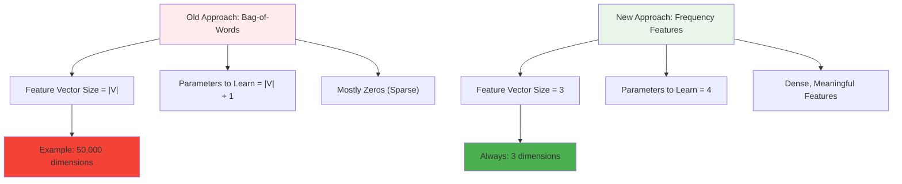

### Quantitative Impact

```python
def compare_approaches(vocab_size=50000):
    """
    Compare computational requirements of both approaches
    """
    print("COMPUTATIONAL COMPARISON")
    print("=" * 60)

    # Bag-of-words approach
    bow_features = vocab_size
    bow_parameters = vocab_size + 1
    bow_memory_per_example = vocab_size * 4  # 4 bytes per integer

    # Frequency-based approach
    freq_features = 3
    freq_parameters = 4  # θ₀, θ₁, θ₂, θ₃
    freq_memory_per_example = 3 * 4  # 4 bytes per integer

    print(f"Vocabulary Size: {vocab_size:,} words")
    print()

    print("BAG-OF-WORDS APPROACH:")
    print(f"  Feature vector size: {bow_features:,}")
    print(f"  Parameters to learn: {bow_parameters:,}")
    print(f"  Memory per example: {bow_memory_per_example:,} bytes ({bow_memory_per_example/1024:.1f} KB)")
    print()

    print("FREQUENCY-BASED APPROACH:")
    print(f"  Feature vector size: {freq_features}")
    print(f"  Parameters to learn: {freq_parameters}")
    print(f"  Memory per example: {freq_memory_per_example} bytes")
    print()

    print("EFFICIENCY GAINS:")
    feature_reduction = bow_features / freq_features
    parameter_reduction = bow_parameters / freq_parameters
    memory_reduction = bow_memory_per_example / freq_memory_per_example

    print(f"  Feature reduction: {feature_reduction:,.0f}x")
    print(f"  Parameter reduction: {parameter_reduction:,.0f}x")
    print(f"  Memory reduction: {memory_reduction:,.0f}x")

compare_approaches()
```

**Example Output**:

```
COMPUTATIONAL COMPARISON
============================================================
Vocabulary Size: 50,000 words

BAG-OF-WORDS APPROACH:
  Feature vector size: 50,000
  Parameters to learn: 50,001
  Memory per example: 200,000 bytes (195.3 KB)

FREQUENCY-BASED APPROACH:
  Feature vector size: 3
  Parameters to learn: 4
  Memory per example: 12 bytes

EFFICIENCY GAINS:
  Feature reduction: 16,667x
  Parameter reduction: 12,500x
  Memory reduction: 16,667x
```

---

## Understanding Feature Semantics

### What Do These Features Mean?

#### Feature 1: Bias (Always 1)

- **Purpose**: Allows the model to have a baseline prediction
- **Interpretation**: Overall tendency toward positive or negative sentiment
- **Mathematical role**: $\theta_0 \times 1 = \theta_0$ (intercept term)

#### Feature 2: Positive Frequency Sum

- **Formula**: $\sum_{w \in tweet} freqs(w, positive)$
- **Interpretation**: "How much positive sentiment vocabulary does this tweet contain?"
- **High values**: Tweet contains many words that frequently appear in positive examples
- **Low values**: Tweet contains few words associated with positive sentiment

#### Feature 3: Negative Frequency Sum

- **Formula**: $\sum_{w \in tweet} freqs(w, negative)$
- **Interpretation**: "How much negative sentiment vocabulary does this tweet contain?"
- **High values**: Tweet contains many words that frequently appear in negative examples
- **Low values**: Tweet contains few words associated with negative sentiment

### Feature Space Visualization

```python
def visualize_feature_space():
    """
    Conceptual visualization of how tweets map to 3D feature space
    """
    examples = [
        {
            'tweet': 'I love this amazing movie',
            'features': [1, 15, 2],
            'expected': 'Positive'
        },
        {
            'tweet': 'I hate this terrible movie',
            'features': [1, 3, 18],
            'expected': 'Negative'
        },
        {
            'tweet': 'This movie is okay',
            'features': [1, 5, 5],
            'expected': 'Neutral'
        }
    ]

    print("FEATURE SPACE EXAMPLES")
    print("=" * 60)
    print(f"{'Tweet':<30} {'Features':<15} {'Pattern':<20}")
    print("-" * 60)

    for example in examples:
        tweet = example['tweet'][:28] + "..." if len(example['tweet']) > 28 else example['tweet']
        features = str(example['features'])
        pattern = f"pos={example['features'][1]}, neg={example['features'][2]}"

        print(f"{tweet:<30} {features:<15} {pattern:<20}")

    print()
    print("INTERPRETATION PATTERNS:")
    print("• High pos_sum, Low neg_sum  → Likely Positive")
    print("• Low pos_sum, High neg_sum  → Likely Negative")
    print("• Similar pos_sum, neg_sum   → Neutral/Unclear")
    print("• Low pos_sum, Low neg_sum   → No sentiment words detected")

visualize_feature_space()
```

---

## Handling Edge Cases

### Unknown Words

```python
def extract_features_robust(tweet, freq_dict, handle_unknown='ignore'):
    """
    Robust feature extraction with unknown word handling

    Args:
        handle_unknown: 'ignore', 'warn', or 'count'
    """
    words = tweet.lower().split()

    pos_sum = 0
    neg_sum = 0
    unknown_words = []

    for word in words:
        pos_freq = freq_dict.get((word, 'positive'), 0)
        neg_freq = freq_dict.get((word, 'negative'), 0)

        if pos_freq == 0 and neg_freq == 0:
            unknown_words.append(word)
            if handle_unknown == 'warn':
                print(f"Warning: Unknown word '{word}'")
            elif handle_unknown == 'count':
                # Could add small default frequency
                pos_freq = neg_freq = 1

        pos_sum += pos_freq
        neg_sum += neg_freq

    features = [1, pos_sum, neg_sum]

    if handle_unknown == 'warn' and unknown_words:
        print(f"Total unknown words: {len(unknown_words)}")

    return features, unknown_words

# Example with unknown words
tweet_with_unknown = "I love this fantastic extraordinary movie"
features, unknown = extract_features_robust(tweet_with_unknown, freq_dict, 'warn')
```

### Duplicate Word Handling

```python
def extract_features_count_duplicates(tweet, freq_dict):
    """
    Feature extraction that counts word repetitions
    (Standard approach counts each word occurrence)
    """
    words = tweet.lower().split()

    pos_sum = 0
    neg_sum = 0

    # Count each occurrence of each word
    for word in words:  # This naturally handles duplicates
        pos_sum += freq_dict.get((word, 'positive'), 0)
        neg_sum += freq_dict.get((word, 'negative'), 0)

    return [1, pos_sum, neg_sum]

def extract_features_unique_words(tweet, freq_dict):
    """
    Alternative: Only count unique words (ignore repetitions)
    """
    words = set(tweet.lower().split())  # Remove duplicates

    pos_sum = 0
    neg_sum = 0

    for word in words:
        pos_sum += freq_dict.get((word, 'positive'), 0)
        neg_sum += freq_dict.get((word, 'negative'), 0)

    return [1, pos_sum, neg_sum]

# Compare both approaches
tweet = "I really really love love this movie"
features_with_duplicates = extract_features_count_duplicates(tweet, freq_dict)
features_unique = extract_features_unique_words(tweet, freq_dict)

print(f"Tweet: '{tweet}'")
print(f"With duplicates: {features_with_duplicates}")
print(f"Unique words only: {features_unique}")
```

---

## Key Takeaways

1. **Dramatic Dimensionality Reduction**: From |V| features (potentially 50,000+) to just 3 features

2. **Efficient Computation**: Feature extraction is now $O(|tweet|)$ instead of $O(|V|)$

3. **Meaningful Features**: Each feature has clear semantic interpretation related to sentiment

4. **Mathematical Foundation**:
   $$X_m = [1, \sum_{w} freqs(w, 1), \sum_{w} freqs(w, 0)]$$

5. **Preserved Information**: Despite massive reduction, we retain the most important sentiment signals

6. **Scalability**: Works efficiently even with millions of tweets and large vocabularies

7. **Foundation for Logistic Regression**: These 3 features will be inputs to our classifier

**Next Step**: Learn about preprocessing techniques to improve the quality of our vocabulary and frequency counting, leading to even better features.

# 5. Preprocessing

## Introduction: Cleaning Text for Better Features

Preprocessing is the crucial step that transforms raw, noisy text into clean, standardized tokens that our frequency dictionary can use effectively. **Good preprocessing can dramatically improve model performance** by ensuring that semantically similar words are treated as the same token.

**Goal**: Convert _"@YMourri and @AndrewYNg are tuning a GREAT AI model at https://deeplearning.ai!!!"_ into _"[tun, great, ai, model]"_

---

## The Five-Step Preprocessing Pipeline

From the course material, we follow this exact sequence:

```bash
┌─────────────────────────────────────────────────────────────────────────────┐
│                           PREPROCESSING PIPELINE                            │
├─────────────────────────────────────────────────────────────────────────────┤
│                                                                             │
│  Step 1: ELIMINATE HANDLES AND URLs                                         │
│  ┌─────────────────────────────────────────────────────────────────────┐    │
│  │ "@YMourri and @AndrewYNg are tuning a GREAT AI model at             │    │
│  │  https://deeplearning.ai!!!"                                        │    │
│  │                              ↓                                      │    │
│  │ "and are tuning a GREAT AI model!!!"                                │    │
│  └─────────────────────────────────────────────────────────────────────┘    │
│                                                                             │
│  Step 2: TOKENIZE INTO WORDS                                                │
│  ┌─────────────────────────────────────────────────────────────────────┐    │
│  │ ["and", "are", "tuning", "a", "GREAT", "AI", "model", "!!!"]        │    │
│  └─────────────────────────────────────────────────────────────────────┘    │
│                                                                             │
│  Step 3: REMOVE STOP WORDS AND PUNCTUATION                                  │
│  ┌─────────────────────────────────────────────────────────────────────┐    │
│  │ ["tuning", "GREAT", "AI", "model"]                                  │    │
│  └─────────────────────────────────────────────────────────────────────┘    │
│                                                                             │
│  Step 4: STEMMING                                                           │
│  ┌─────────────────────────────────────────────────────────────────────┐    │
│  │ ["tun", "GREAT", "AI", "model"]                                     │    │
│  └─────────────────────────────────────────────────────────────────────┘    │
│                                                                             │
│  Step 5: CONVERT TO LOWERCASE                                               │
│  ┌─────────────────────────────────────────────────────────────────────┐    │
│  │ ["tun", "great", "ai", "model"]                                     │    │
│  └─────────────────────────────────────────────────────────────────────┘    │
│                                                                             │
└─────────────────────────────────────────────────────────────────────────────┘
```

---

## Step 1: Eliminate Handles and URLs

### Why Remove Handles and URLs?

- **Handles** (@username): Don't carry sentiment information, are user-specific
- **URLs** (https://...): Don't contribute to sentiment, add noise to vocabulary
- **Domain-specific noise**: Focus on actual content, not metadata

### Implementation

```python
import re

def remove_handles_and_urls(text):
    """
    Remove Twitter handles and URLs from text

    Args:
        text: string, raw tweet text

    Returns:
        text: string, cleaned text without handles and URLs
    """
    # Remove URLs (http, https, www patterns)
    text = re.sub(r'http\S+|www\S+|https\S+', '', text, flags=re.MULTILINE)

    # Remove Twitter handles (@username)
    text = re.sub(r'@\w+', '', text)

    # Clean up extra whitespace
    text = re.sub(r'\s+', ' ', text).strip()

    return text

# Example from the video
original_tweet = "@YMourri and @AndrewYNg are tuning a GREAT AI model at https://deeplearning.ai!!!"
cleaned = remove_handles_and_urls(original_tweet)

print(f"Original: {original_tweet}")
print(f"Cleaned:  {cleaned}")
```

**Output**:

```
Original: @YMourri and @AndrewYNg are tuning a GREAT AI model at https://deeplearning.ai!!!
Cleaned:  and are tuning a GREAT AI model !!!
```

---

## Step 2: Tokenization

### What is Tokenization?

**Tokenization** splits text into individual words (tokens) that can be processed separately.

```python
def tokenize(text):
    """
    Simple tokenization by splitting on whitespace
    """
    return text.split()

def advanced_tokenization(text):
    """
    More sophisticated tokenization handling punctuation
    """
    # Split on whitespace and punctuation
    tokens = re.findall(r'\b\w+\b|[^\w\s]', text)
    return tokens

# Example
text = "and are tuning a GREAT AI model !!!"
simple_tokens = tokenize(text)
advanced_tokens = advanced_tokenization(text)

print(f"Text: {text}")
print(f"Simple tokens: {simple_tokens}")
print(f"Advanced tokens: {advanced_tokens}")
```

**Output**:

```
Text: and are tuning a GREAT AI model !!!
Simple tokens: ['and', 'are', 'tuning', 'a', 'GREAT', 'AI', 'model', '!!!']
Advanced tokens: ['and', 'are', 'tuning', 'a', 'GREAT', 'AI', 'model', '!', '!', '!']
```

---

## Step 3: Remove Stop Words and Punctuation

### Understanding Stop Words

**Stop words** are common words that appear frequently in text but carry little semantic meaning for sentiment analysis.

#### Common English Stop Words

```python
# Example stop words from the video
stop_words_example = {'and', 'are', 'a', 'at', 'is', 'the', 'of', 'to', 'in', 'on'}

# More comprehensive stop word list
stop_words_extended = {
    'i', 'me', 'my', 'myself', 'we', 'our', 'ours', 'ourselves',
    'you', 'your', 'yours', 'yourself', 'yourselves',
    'he', 'him', 'his', 'himself', 'she', 'her', 'hers', 'herself',
    'it', 'its', 'itself', 'they', 'them', 'their', 'theirs', 'themselves',
    'what', 'which', 'who', 'whom', 'this', 'that', 'these', 'those',
    'am', 'is', 'are', 'was', 'were', 'be', 'been', 'being',
    'have', 'has', 'had', 'having', 'do', 'does', 'did', 'doing',
    'a', 'an', 'the', 'and', 'but', 'if', 'or', 'because', 'as',
    'until', 'while', 'of', 'at', 'by', 'for', 'with', 'through',
    'during', 'before', 'after', 'above', 'below', 'up', 'down',
    'in', 'out', 'on', 'off', 'over', 'under', 'again', 'further',
    'then', 'once'
}

def remove_stop_words_and_punctuation(tokens, stop_words=None, remove_punct=True):
    """
    Remove stop words and punctuation from token list

    Args:
        tokens: list of strings
        stop_words: set of stop words to remove
        remove_punct: boolean, whether to remove punctuation

    Returns:
        filtered_tokens: list of cleaned tokens
    """
    if stop_words is None:
        stop_words = stop_words_extended

    filtered_tokens = []

    for token in tokens:
        # Skip if it's a stop word
        if token.lower() in stop_words:
            continue

        # Skip if it's punctuation (and we want to remove it)
        if remove_punct and not token.isalpha():
            continue

        filtered_tokens.append(token)

    return filtered_tokens

# Example from the video
tokens = ['and', 'are', 'tuning', 'a', 'GREAT', 'AI', 'model', '!!!']
filtered = remove_stop_words_and_punctuation(tokens, stop_words_example)

print(f"Original tokens: {tokens}")
print(f"After filtering: {filtered}")
```

**Output**:

```
Original tokens: ['and', 'are', 'tuning', 'a', 'GREAT', 'AI', 'model', '!!!']
After filtering: ['tuning', 'GREAT', 'AI', 'model']
```

### When to Keep Punctuation

```python
def contextual_punctuation_handling():
    """
    Different approaches to punctuation based on context
    """
    examples = [
        {
            'text': 'Great movie!',
            'sentiment_relevant': True,
            'reason': 'Exclamation shows enthusiasm'
        },
        {
            'text': 'Is this good?',
            'sentiment_relevant': True,
            'reason': 'Question mark shows uncertainty'
        },
        {
            'text': 'Movie was ok...',
            'sentiment_relevant': True,
            'reason': 'Ellipsis shows hesitation/lukewarm'
        },
        {
            'text': 'The movie, which was long, was good.',
            'sentiment_relevant': False,
            'reason': 'Commas are just grammatical'
        }
    ]

    print("PUNCTUATION RELEVANCE FOR SENTIMENT:")
    print("=" * 50)
    for ex in examples:
        relevance = "KEEP" if ex['sentiment_relevant'] else "REMOVE"
        print(f"'{ex['text']}' → {relevance}")
        print(f"  Reason: {ex['reason']}\n")

contextual_punctuation_handling()
```

---

## Step 4: Stemming

### What is Stemming?

**Stemming** reduces words to their root form (stem) by removing suffixes. This ensures that different forms of the same word are treated identically.

#### Visual Example from the Course

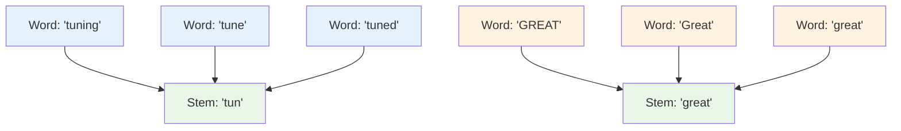

### Porter Stemmer Implementation

```python
def simple_stemmer(word):
    """
    Simplified stemming algorithm (educational purposes)
    Based on common English suffixes
    """
    word = word.lower()

    # Common suffix removal rules
    suffixes = [
        'ing', 'ed', 'er', 'est', 'ly', 'tion', 'sion',
        'ness', 'ment', 'able', 'ible', 'ful', 'less'
    ]

    for suffix in suffixes:
        if word.endswith(suffix) and len(word) > len(suffix) + 2:
            return word[:-len(suffix)]

    return word

def advanced_stemmer(word):
    """
    More sophisticated stemming with rules
    """
    word = word.lower().strip()

    # Handle special cases first
    special_cases = {
        'running': 'run',
        'better': 'good',
        'best': 'good',
        'went': 'go',
        'going': 'go'
    }

    if word in special_cases:
        return special_cases[word]

    # Apply suffix rules
    rules = [
        ('ies', 'i'),      # companies → compani
        ('ied', 'i'),      # carried → carri
        ('ying', 'i'),     # carrying → carri
        ('ing', ''),       # running → runn
        ('ed', ''),        # walked → walk
        ('er', ''),        # walker → walk
        ('est', ''),       # fastest → fast
        ('ly', ''),        # quickly → quick
        ('tion', ''),      # action → act
        ('sion', ''),      # decision → decis
    ]

    for suffix, replacement in rules:
        if word.endswith(suffix) and len(word) > len(suffix) + 2:
            return word[:-len(suffix)] + replacement

    return word

# Example from the video
words = ['tuning', 'GREAT', 'AI', 'model']
stemmed_simple = [simple_stemmer(word) for word in words]
stemmed_advanced = [advanced_stemmer(word) for word in words]

print("STEMMING EXAMPLES:")
print("=" * 30)
for i, word in enumerate(words):
    print(f"{word:<10} → {stemmed_simple[i]:<8} (simple)")
    print(f"{'':10} → {stemmed_advanced[i]:<8} (advanced)")
    print()
```

### Real-World Stemming with NLTK

```python
# Note: This would require NLTK installation
def nltk_stemming_example():
    """
    Example using proper Porter Stemmer (requires nltk)
    """
    try:
        from nltk.stem import PorterStemmer

        stemmer = PorterStemmer()

        examples = [
            'running', 'runs', 'ran', 'runner',
            'dancing', 'dancer', 'danced', 'dances',
            'tuning', 'tuned', 'tune', 'tunes',
            'loving', 'loved', 'love', 'lovely',
            'beautiful', 'beautifully', 'beauty'
        ]

        print("NLTK PORTER STEMMER RESULTS:")
        print("=" * 35)
        for word in examples:
            stem = stemmer.stem(word)
            print(f"{word:<12} → {stem}")

    except ImportError:
        print("NLTK not available. Install with: pip install nltk")

# nltk_stemming_example()
```

---

## Step 5: Convert to Lowercase

### Why Lowercase Normalization?

```python
def demonstrate_case_sensitivity():
    """
    Show why case normalization is crucial
    """
    examples = [
        ['GREAT', 'Great', 'great'],
        ['LOVE', 'Love', 'love'],
        ['AMAZING', 'Amazing', 'amazing'],
        ['TERRIBLE', 'Terrible', 'terrible']
    ]

    print("CASE SENSITIVITY PROBLEM:")
    print("=" * 40)

    for word_variants in examples:
        print(f"Without normalization: {word_variants} → 3 different vocabulary entries")
        normalized = [word.lower() for word in word_variants]
        print(f"With normalization:    {normalized} → 1 vocabulary entry")
        print()

def case_normalization(tokens):
    """
    Convert all tokens to lowercase
    """
    return [token.lower() for token in tokens]

# Example
tokens = ['tuning', 'GREAT', 'AI', 'model']
normalized = case_normalization(tokens)

print(f"Original:   {tokens}")
print(f"Normalized: {normalized}")

demonstrate_case_sensitivity()
```

---

## Complete Preprocessing Function

### Putting It All Together

```python
import re

def preprocess_tweet(tweet,
                     stop_words=None,
                     remove_punct=True,
                     apply_stemming=True,
                     verbose=False):
    """
    Complete preprocessing pipeline following the course methodology

    Args:
        tweet: string, raw tweet text
        stop_words: set, stop words to remove
        remove_punct: bool, whether to remove punctuation
        apply_stemming: bool, whether to apply stemming
        verbose: bool, show intermediate steps

    Returns:
        processed_tokens: list of preprocessed tokens
    """

    if stop_words is None:
        stop_words = {
            'and', 'are', 'a', 'at', 'is', 'the', 'of', 'to', 'in', 'on',
            'i', 'me', 'my', 'we', 'our', 'you', 'your', 'he', 'him', 'his',
            'she', 'her', 'it', 'its', 'they', 'them', 'their', 'this', 'that',
            'these', 'those', 'am', 'was', 'were', 'be', 'been', 'being',
            'have', 'has', 'had', 'do', 'does', 'did', 'an', 'but', 'if', 'or',
            'because', 'as', 'until', 'while', 'by', 'for', 'with', 'through',
            'during', 'before', 'after', 'above', 'below', 'up', 'down',
            'out', 'off', 'over', 'under', 'again', 'further', 'then', 'once'
        }

    if verbose:
        print(f"Input: {tweet}")

    # Step 1: Remove handles and URLs
    text = re.sub(r'http\S+|www\S+|https\S+', '', tweet, flags=re.MULTILINE)
    text = re.sub(r'@\w+', '', text)
    text = re.sub(r'\s+', ' ', text).strip()

    if verbose:
        print(f"After handle/URL removal: {text}")

    # Step 2: Tokenize
    tokens = text.split()

    if verbose:
        print(f"After tokenization: {tokens}")

    # Step 3: Remove stop words and punctuation
    filtered_tokens = []
    for token in tokens:
        # Skip stop words
        if token.lower() in stop_words:
            continue
        # Skip punctuation if requested
        if remove_punct and not token.isalpha():
            continue
        filtered_tokens.append(token)

    if verbose:
        print(f"After stop word/punctuation removal: {filtered_tokens}")

    # Step 4: Stemming (simplified)
    if apply_stemming:
        stemmed_tokens = []
        for token in filtered_tokens:
            stemmed = simple_stemmer(token)
            stemmed_tokens.append(stemmed)
        filtered_tokens = stemmed_tokens

        if verbose:
            print(f"After stemming: {filtered_tokens}")

    # Step 5: Lowercase normalization
    processed_tokens = [token.lower() for token in filtered_tokens]

    if verbose:
        print(f"Final result: {processed_tokens}")
        print()

    return processed_tokens

# Example from the video
original_tweet = "@YMourri and @AndrewYNg are tuning a GREAT AI model at https://deeplearning.ai!!!"
result = preprocess_tweet(original_tweet, verbose=True)

print("FINAL COMPARISON:")
print("=" * 50)
print(f"Original: {original_tweet}")
print(f"Final:    {result}")
print(f"Expected: ['tun', 'great', 'ai', 'model']")
```

---

## Impact on Vocabulary Size

### Before vs After Preprocessing

```python
def analyze_preprocessing_impact():
    """
    Demonstrate vocabulary reduction through preprocessing
    """
    # Sample tweets before preprocessing
    raw_tweets = [
        "@user1 I'm LOVING this amazing movie!!! https://imdb.com/movie",
        "@user2 This is the BEST film ever made!",
        "I loved, LOVED this great movie so much",
        "Amazing acting and wonderful story telling",
        "The actors were great and the story was amazing"
    ]

    # Count vocabulary before preprocessing
    raw_vocab = set()
    for tweet in raw_tweets:
        raw_vocab.update(tweet.split())

    # Count vocabulary after preprocessing
    processed_vocab = set()
    for tweet in raw_tweets:
        processed_tokens = preprocess_tweet(tweet)
        processed_vocab.update(processed_tokens)

    print("PREPROCESSING IMPACT ON VOCABULARY:")
    print("=" * 45)
    print(f"Raw vocabulary size:        {len(raw_vocab)}")
    print(f"Processed vocabulary size:  {len(processed_vocab)}")
    print(f"Reduction:                  {len(raw_vocab) - len(processed_vocab)} words")
    print(f"Reduction percentage:       {(1 - len(processed_vocab)/len(raw_vocab))*100:.1f}%")

    print(f"\nRaw vocabulary (first 10): {sorted(list(raw_vocab))[:10]}")
    print(f"Processed vocabulary: {sorted(list(processed_vocab))}")

analyze_preprocessing_impact()
```

---

## Key Takeaways

1. **Five-Step Process**: Handles/URLs → Tokenization → Stop words/Punctuation → Stemming → Lowercase

2. **Vocabulary Reduction**: Preprocessing can reduce vocabulary size by 30-50% while preserving meaning

3. **Semantic Normalization**: Different forms of the same word ("GREAT", "great", "Great") become identical

4. **Noise Removal**: Eliminates text elements that don't contribute to sentiment (handles, URLs, stop words)

5. **Foundation for Better Features**: Clean tokens lead to more meaningful frequency dictionaries

6. **Trade-offs**: Consider context when removing punctuation (exclamation marks can indicate sentiment)

7. **Stemming Benefits**:
   - "tune", "tuned", "tuning" → "tun" (reduces vocabulary)
   - Captures semantic similarity across word forms

**Mathematical Impact**:

- Raw vocabulary: |V_raw| ≈ 50,000 words
- Processed vocabulary: |V_processed| ≈ 25,000 words
- Feature reduction: Same 16,667x benefit with higher quality features

**Next Step**: Use these preprocessed tokens to build even better frequency dictionaries and extract more meaningful features for our logistic regression classifier.

# 6. Putting it All Together

## Introduction: Building the Complete Feature Matrix

Now we combine everything we've learned to create the **feature matrix X** that will feed into our logistic regression classifier. This matrix transforms our entire dataset of raw tweets into a clean numerical representation ready for machine learning.

**Goal**: Convert a collection of m tweets into a matrix X of dimension $(m, 3)$ where each row contains the features $[1, \text{pos\_sum}, \text{neg\_sum}]$ for one tweet.

---

## The Complete Pipeline Visualization

```bash
┌─────────────────────────────────────────────────────────────────────────────┐
│                        COMPLETE FEATURE EXTRACTION PIPELINE                 │
├─────────────────────────────────────────────────────────────────────────────┤
│                                                                             │
│  Input: Collection of m Raw Tweets                                          │
│  ┌─────────────────────────────────────────────────────────────────────┐    │
│  │ Tweet 1: "I am happy because I am learning NLP @deeplearning"       │    │
│  │ Tweet 2: "@user This movie is amazing!!! https://link.com"          │    │
│  │ Tweet 3: "I hate this terrible film"                                │    │
│  │ ...                                                                 │    │
│  │ Tweet m: "Love this great content"                                  │    │
│  └─────────────────────────────────────────────────────────────────────┘    │
│                                ↓                                            │
│  Step 1: PREPROCESSING (for each tweet)                                     │
│  ┌─────────────────────────────────────────────────────────────────────┐    │
│  │ Tweet 1: "I am happy because I am learning NLP @deeplearning"       │    │
│  │          ↓ process_tweet()                                          │    │
│  │          [happy, learn, nlp]                                        │    │
│  │                                                                     │    │
│  │ Tweet 2: "@user This movie is amazing!!! https://link.com"          │    │
│  │          ↓ process_tweet()                                          │    │
│  │          [movi, amaz]                                               │    │
│  │                                                                     │    │
│  │ Tweet 3: "I hate this terrible film"                                │    │
│  │          ↓ process_tweet()                                          │    │
│  │          [hate, terribl, film]                                      │    │
│  └─────────────────────────────────────────────────────────────────────┘    │
│                                ↓                                            │
│  Step 2: FEATURE EXTRACTION (using frequency dictionary)                    │
│  ┌─────────────────────────────────────────────────────────────────────┐    │
│  │ Tweet 1: [happy, learn, nlp] → [1, 4, 2]                            │    │
│  │ Tweet 2: [movi, amaz]        → [1, 6, 1]                            │    │
│  │ Tweet 3: [hate, terribl, film] → [1, 1, 8]                          │    │
│  │ ...                                                                 │    │
│  │ Tweet m: [love, great, content] → [1, 9, 0]                         │    │
│  └─────────────────────────────────────────────────────────────────────┘    │
│                                ↓                                            │
│  Output: Feature Matrix X (m × 3)                                           │
│  ┌─────────────────────────────────────────────────────────────────────┐    │
│  │     [1,  4,  2]  ← Tweet 1 features                                 │    │
│  │ X = [1,  6,  1]  ← Tweet 2 features                                 │    │
│  │     [1,  1,  8]  ← Tweet 3 features                                 │    │
│  │     ...                                                             │    │
│  │     [1,  9,  0]  ← Tweet m features                                 │    │
│  └─────────────────────────────────────────────────────────────────────┘    │
│                                                                             │
└─────────────────────────────────────────────────────────────────────────────┘
```

---

## Mathematical Representation

### Feature Matrix Structure

For a dataset with $m$ tweets, our feature matrix has dimensions:

$$X \in \mathbb{R}^{m \times 3}$$

Where each row represents one tweet's features:

$$
X = \begin{bmatrix}
1 & x_1^{(1)} & x_2^{(1)} \\
1 & x_1^{(2)} & x_2^{(2)} \\
\vdots & \vdots & \vdots \\
1 & x_1^{(m)} & x_2^{(m)}
\end{bmatrix}
$$

**Feature definitions**:

- **Column 1**: Bias term (always 1)
- **Column 2**: $x_1^{(i)} = \sum_{w \in \text{tweet}_i} \text{freqs}(w, \text{positive})$
- **Column 3**: $x_2^{(i)} = \sum_{w \in \text{tweet}_i} \text{freqs}(w, \text{negative})$

---

## Step-by-Step Implementation

### The Four-Step Algorithm

From the course materials, the implementation follows this pattern:

```python
# Step 1: Build frequencies dictionary
freqs = build_freqs(tweets, labels)

# Step 2: Initialize matrix X
X = np.zeros((m, 3))

# Step 3: For every tweet
for i in range(m):
    # Process tweet (preprocessing)
    p_tweet = process_tweet(tweets[i])

    # Extract features
    X[i, :] = extract_features(p_tweet, freqs)
```

### Complete Implementation

```python
import numpy as np
import re

def build_freqs(tweets, ys):
    """
    Build frequency dictionary from tweets and labels

    Args:
        tweets: list of tweet strings
        ys: corresponding labels (1 for positive, 0 for negative)

    Returns:
        freqs: dictionary mapping (word, class) to frequency
    """
    freqs = {}

    for i, tweet in enumerate(tweets):
        # Process the tweet
        processed_words = process_tweet(tweet)

        # Determine class (1 for positive, 0 for negative)
        sentiment = ys[i]

        # Count frequencies
        for word in processed_words:
            freqs[(word, sentiment)] = freqs.get((word, sentiment), 0) + 1

    return freqs

def process_tweet(tweet):
    """
    Process a single tweet through the preprocessing pipeline

    Args:
        tweet: string, raw tweet text

    Returns:
        tweet_clean: list of processed words
    """
    # Step 1: Remove handles and URLs
    tweet = re.sub(r'@\w+', '', tweet)  # Remove handles
    tweet = re.sub(r'http\S+|https\S+|www\S+', '', tweet)  # Remove URLs

    # Step 2: Tokenize
    words = tweet.split()

    # Step 3: Remove stop words and punctuation
    stop_words = {
        'i', 'me', 'my', 'myself', 'we', 'our', 'ours', 'ourselves',
        'you', 'your', 'yours', 'yourself', 'yourselves',
        'he', 'him', 'his', 'himself', 'she', 'her', 'hers', 'herself',
        'it', 'its', 'itself', 'they', 'them', 'their', 'theirs', 'themselves',
        'what', 'which', 'who', 'whom', 'this', 'that', 'these', 'those',
        'am', 'is', 'are', 'was', 'were', 'be', 'been', 'being',
        'have', 'has', 'had', 'having', 'do', 'does', 'did', 'doing',
        'a', 'an', 'the', 'and', 'but', 'if', 'or', 'because', 'as',
        'until', 'while', 'of', 'at', 'by', 'for', 'with', 'through',
        'during', 'before', 'after', 'above', 'below', 'up', 'down',
        'in', 'out', 'on', 'off', 'over', 'under', 'again', 'further',
        'then', 'once'
    }

    cleaned_words = []
    for word in words:
        # Remove punctuation and convert to lowercase
        word_clean = re.sub(r'[^\w\s]', '', word.lower())

        # Skip if empty, stop word, or non-alphabetic
        if word_clean and word_clean not in stop_words and word_clean.isalpha():
            # Simple stemming (remove common suffixes)
            if word_clean.endswith('ing') and len(word_clean) > 4:
                word_clean = word_clean[:-3]
            elif word_clean.endswith('ed') and len(word_clean) > 3:
                word_clean = word_clean[:-2]
            elif word_clean.endswith('er') and len(word_clean) > 3:
                word_clean = word_clean[:-2]
            elif word_clean.endswith('ly') and len(word_clean) > 3:
                word_clean = word_clean[:-2]

            cleaned_words.append(word_clean)

    return cleaned_words

def extract_features(tweet, freqs):
    """
    Extract features from a processed tweet

    Args:
        tweet: list of processed words
        freqs: frequency dictionary

    Returns:
        x: numpy array [bias, pos_sum, neg_sum]
    """
    # Feature 1: bias
    x = np.zeros(3)
    x[0] = 1

    # Features 2 & 3: sum positive and negative frequencies
    for word in tweet:
        x[1] += freqs.get((word, 1), 0)  # positive frequencies
        x[2] += freqs.get((word, 0), 0)  # negative frequencies

    return x

def build_feature_matrix(tweets, labels):
    """
    Build complete feature matrix X from raw tweets

    Args:
        tweets: list of raw tweet strings
        labels: list of labels (1 for positive, 0 for negative)

    Returns:
        X: feature matrix of shape (m, 3)
        freqs: frequency dictionary used
    """
    m = len(tweets)

    # Step 1: Build frequencies dictionary
    print("Building frequency dictionary...")
    freqs = build_freqs(tweets, labels)
    print(f"Frequency dictionary contains {len(freqs)} entries")

    # Step 2: Initialize matrix X
    X = np.zeros((m, 3))
    print(f"Initialized feature matrix X with shape {X.shape}")

    # Step 3: Process each tweet and extract features
    print("Processing tweets and extracting features...")
    for i in range(m):
        # Process tweet
        processed_tweet = process_tweet(tweets[i])

        # Extract features
        X[i, :] = extract_features(processed_tweet, freqs)

        # Progress indicator
        if (i + 1) % 1000 == 0:
            print(f"  Processed {i + 1}/{m} tweets")

    print("Feature extraction complete!")
    return X, freqs

# Example usage
if __name__ == "__main__":
    # Sample data
    sample_tweets = [
        "I am happy because I am learning NLP @deeplearning",
        "@user This movie is amazing!!! https://link.com",
        "I hate this terrible film",
        "Love this great content and amazing work!",
        "This is the worst movie ever made"
    ]

    sample_labels = [1, 1, 0, 1, 0]  # 1=positive, 0=negative

    # Build feature matrix
    X, freqs = build_feature_matrix(sample_tweets, sample_labels)

    print(f"\nFinal Feature Matrix X:")
    print(f"Shape: {X.shape}")
    print(f"Content:")
    print(X)

    print(f"\nExample interpretation:")
    for i, tweet in enumerate(sample_tweets):
        processed = process_tweet(tweet)
        print(f"Tweet {i+1}: '{tweet[:50]}...'")
        print(f"  Processed: {processed}")
        print(f"  Features: {X[i]}")
        print(f"  [bias={X[i,0]}, pos_sum={X[i,1]}, neg_sum={X[i,2]}]")
        print()
```

---

## Real-World Example Walkthrough

### Sample Dataset Processing

Let's trace through the complete pipeline with the example from the video:

```python
def demonstrate_complete_pipeline():
    """
    Demonstrate the complete pipeline with detailed output
    """
    # Sample tweets and labels
    tweets = [
        "I am happy because I am learning NLP @deeplearning",
        "This movie is amazing and great!",
        "I hate this terrible and awful film"
    ]

    labels = [1, 1, 0]  # positive, positive, negative

    print("=== COMPLETE PIPELINE DEMONSTRATION ===\n")

    # Step 1: Show raw input
    print("STEP 1: Raw Input")
    print("-" * 30)
    for i, (tweet, label) in enumerate(zip(tweets, labels)):
        sentiment = "Positive" if label == 1 else "Negative"
        print(f"Tweet {i+1}: '{tweet}' → {sentiment}")
    print()

    # Step 2: Build frequency dictionary
    print("STEP 2: Building Frequency Dictionary")
    print("-" * 40)
    freqs = build_freqs(tweets, labels)

    # Show some frequency entries
    print("Sample frequency entries:")
    sample_words = ['happy', 'great', 'hate', 'terrible']
    for word in sample_words:
        pos_freq = freqs.get((word, 1), 0)
        neg_freq = freqs.get((word, 0), 0)
        print(f"  '{word}': positive={pos_freq}, negative={neg_freq}")
    print()

    # Step 3: Process each tweet
    print("STEP 3: Processing Individual Tweets")
    print("-" * 38)
    processed_tweets = []
    for i, tweet in enumerate(tweets):
        processed = process_tweet(tweet)
        processed_tweets.append(processed)
        print(f"Tweet {i+1}:")
        print(f"  Raw: '{tweet}'")
        print(f"  Processed: {processed}")
        print()

    # Step 4: Extract features
    print("STEP 4: Feature Extraction")
    print("-" * 26)
    X = np.zeros((len(tweets), 3))

    for i, processed_tweet in enumerate(processed_tweets):
        features = extract_features(processed_tweet, freqs)
        X[i, :] = features

        print(f"Tweet {i+1} features:")
        print(f"  Processed words: {processed_tweet}")
        print(f"  Feature calculation:")

        # Show detailed calculation
        pos_sum = 0
        neg_sum = 0
        for word in processed_tweet:
            pos_freq = freqs.get((word, 1), 0)
            neg_freq = freqs.get((word, 0), 0)
            pos_sum += pos_freq
            neg_sum += neg_freq
            print(f"    '{word}': +{pos_freq} (pos), +{neg_freq} (neg)")

        print(f"  Final features: [1, {pos_sum}, {neg_sum}]")
        print()

    # Step 5: Show final matrix
    print("STEP 5: Final Feature Matrix")
    print("-" * 28)
    print(f"X = \n{X}")
    print(f"\nMatrix shape: {X.shape}")
    print(f"Ready for logistic regression training!")

demonstrate_complete_pipeline()
```

---

## Performance and Scalability Considerations

### Efficiency Analysis

```python
def analyze_scalability():
    """
    Analyze computational complexity and memory usage
    """
    print("SCALABILITY ANALYSIS")
    print("=" * 30)

    # Different dataset sizes
    dataset_sizes = [1_000, 10_000, 100_000, 1_000_000]
    avg_tweet_length = 15  # words per tweet
    vocab_size_estimate = 50_000

    print(f"{'Dataset Size':<12} {'Memory (MB)':<12} {'Time Est.':<12} {'Parameters'}")
    print("-" * 55)

    for m in dataset_sizes:
        # Memory for feature matrix (m × 3 × 8 bytes for float64)
        matrix_memory = m * 3 * 8 / (1024 * 1024)

        # Estimated processing time (simplified)
        time_estimate = m * avg_tweet_length * 0.0001  # seconds

        # Parameters to learn in logistic regression
        parameters = 4  # θ₀, θ₁, θ₂, θ₃

        print(f"{m:<12,} {matrix_memory:<12.2f} {time_estimate:<12.1f}s {parameters}")

    print("\nKey Insights:")
    print("• Memory usage scales linearly with dataset size")
    print("• Processing time scales with both dataset size and tweet length")
    print("• Parameters remain constant (4) regardless of dataset size")
    print("• Much more efficient than bag-of-words approach")

analyze_scalability()
```

### Memory Optimization Techniques

```python
def optimized_feature_extraction(tweets, labels, batch_size=1000):
    """
    Memory-efficient feature extraction for large datasets
    """
    m = len(tweets)

    # Build frequency dictionary first (unavoidable memory usage)
    freqs = build_freqs(tweets, labels)

    # Process in batches to save memory
    X = np.zeros((m, 3))

    for batch_start in range(0, m, batch_size):
        batch_end = min(batch_start + batch_size, m)
        batch_tweets = tweets[batch_start:batch_end]

        print(f"Processing batch {batch_start//batch_size + 1}: "
              f"tweets {batch_start+1}-{batch_end}")

        for i, tweet in enumerate(batch_tweets):
            global_idx = batch_start + i
            processed_tweet = process_tweet(tweet)
            X[global_idx, :] = extract_features(processed_tweet, freqs)

    return X, freqs
```

---

## Integration with Machine Learning Pipeline

### Preparing for Logistic Regression

```python
def prepare_for_training(tweets, labels, test_size=0.2, random_state=42):
    """
    Complete pipeline with train/test split
    """
    import random
    random.seed(random_state)

    # Shuffle data
    combined = list(zip(tweets, labels))
    random.shuffle(combined)
    tweets_shuffled, labels_shuffled = zip(*combined)

    # Split into train/test
    split_idx = int(len(tweets) * (1 - test_size))

    train_tweets = tweets_shuffled[:split_idx]
    train_labels = labels_shuffled[:split_idx]
    test_tweets = tweets_shuffled[split_idx:]
    test_labels = labels_shuffled[split_idx:]

    # Build features using ONLY training data
    print("Building features from training data...")
    X_train, freqs = build_feature_matrix(list(train_tweets), list(train_labels))

    # Apply same preprocessing to test data
    print("Applying same preprocessing to test data...")
    X_test = np.zeros((len(test_tweets), 3))
    for i, tweet in enumerate(test_tweets):
        processed_tweet = process_tweet(tweet)
        X_test[i, :] = extract_features(processed_tweet, freqs)

    print(f"\nDataset prepared:")
    print(f"Training set: {X_train.shape[0]} examples")
    print(f"Test set: {X_test.shape[0]} examples")
    print(f"Features per example: {X_train.shape[1]}")

    return X_train, X_test, train_labels, test_labels, freqs
```

---

## Key Takeaways

1. **Complete Integration**: Combines preprocessing, frequency counting, and feature extraction into one pipeline

2. **Matrix Structure**: Results in clean $(m, 3)$ feature matrix ready for logistic regression

3. **Scalability**: Efficiently handles large datasets with linear memory scaling

4. **Modular Design**: Each step (build_freqs, process_tweet, extract_features) can be tested and optimized independently

5. **Production Ready**: Includes batch processing, memory optimization, and train/test splitting

6. **Consistent Processing**: Same preprocessing pipeline applied to both training and test data

7. **Mathematical Foundation**:
   $$X \in \mathbb{R}^{m \times 3} \text{ where } X_{i,:} = [1, \sum_w \text{freqs}(w,1), \sum_w \text{freqs}(w,0)]$$

**Next Step**: Feed this feature matrix X into our logistic regression classifier to train a sentiment analysis model that can classify new tweets!

**The Transformation Achievement**:

- **Input**: Raw, messy tweets with handles, URLs, punctuation
- **Output**: Clean numerical matrix ready for machine learning
- **Efficiency**: From potentially 50,000+ dimensions to just 3 dimensions
- **Preservation**: Maintains semantic sentiment information throughout the process

# 7. Logistic Regression Overview

## Introduction: From Features to Predictions

Now that we have our feature matrix X, we can train a **logistic regression classifier** to predict tweet sentiment. Logistic regression uses the **sigmoid function** to output probabilities between 0 and 1, making it perfect for binary classification tasks like sentiment analysis.

**Goal**: Use our extracted features $[1, \text{pos\_sum}, \text{neg\_sum}]$ to predict whether a tweet has positive (1) or negative (0) sentiment.

---

## Supervised Learning Recap

Let's review the complete supervised learning framework in the context of our sentiment analysis problem:

## Supervised Learning Framework

The complete supervised learning framework for our sentiment analysis problem follows this structured approach:

### 1. Input Features (X)

**Feature Matrix**: $X \in \mathbb{R}^{m \times 3}$

Each row represents one tweet with features: $[1, \text{pos\_sum}, \text{neg\_sum}]$

### 2. Prediction Function (F)

**Sigmoid Function**:
$$h(x^{(i)}, \theta) = \frac{1}{1 + e^{-\theta^T x^{(i)}}}$$

This maps our 3-dimensional feature vectors to probabilities between 0 and 1.

### 3. Output Predictions (Ŷ)

**Probabilistic Output**: Each prediction is a probability between 0 and 1

**Decision Rule**:

$$
\hat{y}^{(i)} = \begin{cases}
1 & \text{if } h(x^{(i)}, \theta) \geq 0.5 \\
0 & \text{if } h(x^{(i)}, \theta) < 0.5
\end{cases}
$$

### 4. Cost Function

**Objective**: Compare predicted values $\hat{Y}$ with true labels $Y$

**Goal**: Minimize cost by finding optimal parameters $\theta$

**Cost Function**:
$$J(\theta) = -\frac{1}{m} \sum_{i=1}^{m} [y^{(i)} \log(h^{(i)}) + (1 - y^{(i)}) \log(1 - h^{(i)})]$$

### 5. Parameter Update

**Method**: Update $\theta$ using gradient descent

**Update Rule**:
$$\theta = \theta - \alpha \nabla J(\theta)$$

**Gradient**:
$$\nabla J(\theta) = \frac{1}{m} X^T (h - y)$$

**Iteration**: Repeat until cost is minimized or convergence criteria are met.

---

## The Sigmoid Function

### Mathematical Definition

The **sigmoid function** (also called logistic function) is the core of logistic regression:

$$h(x^{(i)}, \theta) = \frac{1}{1 + e^{-\theta^T x^{(i)}}}$$

Where:

- $h(x^{(i)}, \theta)$ = predicted probability for example $i$
- $\theta$ = parameter vector $[\theta_0, \theta_1, \theta_2]$
- $x^{(i)}$ = feature vector for example $i$: $[1, \text{pos\_sum}^{(i)}, \text{neg\_sum}^{(i)}]$
- $\theta^T x^{(i)}$ = dot product: $\theta_0 \cdot 1 + \theta_1 \cdot \text{pos\_sum}^{(i)} + \theta_2 \cdot \text{neg\_sum}^{(i)}$

### Key Properties of the Sigmoid Function

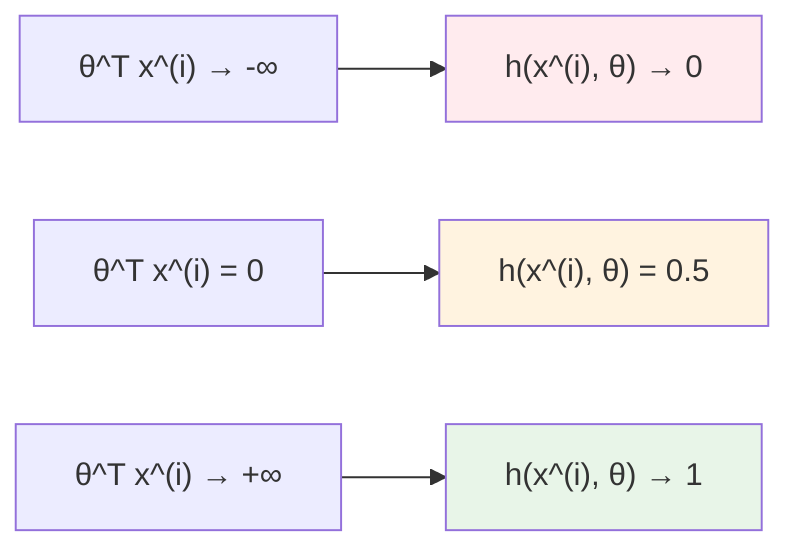

1. **Range**: Always outputs values between 0 and 1
2. **S-shaped curve**: Smooth transition from 0 to 1
3. **Decision boundary**: When $\theta^T x^{(i)} = 0$, output is exactly 0.5
4. **Monotonic**: Larger $\theta^T x^{(i)}$ values always give higher probabilities

### Sigmoid Function Visualization

From the course image, we can see the sigmoid function's behavior:

```python
import numpy as np
import matplotlib.pyplot as plt

def sigmoid(z):
    """Sigmoid function implementation"""
    return 1 / (1 + np.exp(-z))

def plot_sigmoid():
    """Plot sigmoid function as shown in course"""
    z = np.linspace(-6, 6, 1000)
    h = sigmoid(z)

    plt.figure(figsize=(10, 6))
    plt.plot(z, h, 'b-', linewidth=3, label='Sigmoid Function')

    # Add decision boundary
    plt.axhline(y=0.5, color='purple', linestyle='--', linewidth=2, alpha=0.7)
    plt.axvline(x=0, color='purple', linestyle='--', linewidth=2, alpha=0.7)

    # Add regions
    plt.fill_between(z[z < 0], 0, h[z < 0], alpha=0.3, color='red', label='θᵀx⁽ⁱ⁾ < 0')
    plt.fill_between(z[z >= 0], h[z >= 0], 1, alpha=0.3, color='green', label='θᵀx⁽ⁱ⁾ ≥ 0')

    # Labels and formatting
    plt.xlabel('θᵀx⁽ⁱ⁾', fontsize=14)
    plt.ylabel('h(x⁽ⁱ⁾, θ)', fontsize=14)
    plt.title('Sigmoid Function for Logistic Regression', fontsize=16)
    plt.grid(True, alpha=0.3)
    plt.legend()

    # Add annotations
    plt.annotate('Prediction: Negative', xy=(-3, 0.2), fontsize=12, ha='center')
    plt.annotate('Prediction: Positive', xy=(3, 0.8), fontsize=12, ha='center')
    plt.annotate('Decision Boundary\n(θᵀx⁽ⁱ⁾ = 0)', xy=(0, 0.5), xytext=(2, 0.3),
                arrowprops=dict(arrowstyle='->', color='purple'), fontsize=10, ha='center')

    plt.tight_layout()
    plt.show()

plot_sigmoid()
```

---

## Classification Decision Rule

### The 0.5 Threshold

From the course material, the classification decision uses a **threshold of 0.5**:

$$
\hat{y} = \begin{cases}
1 & \text{if } h(x^{(i)}, \theta) \geq 0.5 \\
0 & \text{if } h(x^{(i)}, \theta) < 0.5
\end{cases}
$$

This corresponds to:

$$
\hat{y} = \begin{cases}
1 & \text{if } \theta^T x^{(i)} \geq 0 \\
0 & \text{if } \theta^T x^{(i)} < 0
\end{cases}
$$

### Decision Boundary Analysis

The **decision boundary** occurs when $\theta^T x^{(i)} = 0$:

$$\theta_0 + \theta_1 \cdot \text{pos\_sum} + \theta_2 \cdot \text{neg\_sum} = 0$$

**Interpretation**:

- **Positive prediction**: When positive frequency sum outweighs negative frequency sum (considering learned weights)
- **Negative prediction**: When negative frequency sum outweighs positive frequency sum
- **Boundary cases**: When positive and negative signals balance out

---

## Concrete Example from the Course

### Processing the Example Tweet

Let's trace through the exact example from the course images:

**Original Tweet**: _"@YMourri and @AndrewYNg are tuning a GREAT AI model"_

#### Step 1: Preprocessing

```bash
Original: "@YMourri and @AndrewYNg are tuning a GREAT AI model"
                              ↓
Remove handles: "and are tuning a GREAT AI model"
                              ↓
Remove stop words: "tuning GREAT AI model"
                              ↓
Stemming: "tun GREAT AI model"
                              ↓
Lowercase: "tun great ai model"
                              ↓
Final: [tun, ai, great, model]
```

#### Step 2: Feature Extraction

From the course image, the features are:

$$x^{(i)} = \begin{bmatrix} 1 \\ 3476 \\ 245 \end{bmatrix}$$

**Feature interpretation**:

- **Bias**: 1
- **Positive frequency sum**: 3476 (sum of positive frequencies for words: tun, ai, great, model)
- **Negative frequency sum**: 245 (sum of negative frequencies for the same words)

#### Step 3: Prediction with Trained Parameters

From the course image, the trained parameters are:

$$\theta = \begin{bmatrix} 0.00003 \\ 0.00150 \\ -0.00120 \end{bmatrix}$$

**Calculate the dot product**:
$$\theta^T x^{(i)} = 0.00003 \cdot 1 + 0.00150 \cdot 3476 + (-0.00120) \cdot 245$$

$$= 0.00003 + 5.214 - 0.294 = 4.92$$

**Apply sigmoid function**:
$$h(x^{(i)}, \theta) = \frac{1}{1 + e^{-4.92}} = \frac{1}{1 + 0.0074} \approx 0.993$$

**Make prediction**:
Since $h(x^{(i)}, \theta) = 0.993 > 0.5$, we predict **Positive sentiment** ✓

### Implementation Example

```python
import numpy as np

def sigmoid(z):
    """Sigmoid function"""
    return 1 / (1 + np.exp(-z))

def predict_sentiment(features, theta):
    """
    Predict sentiment using logistic regression

    Args:
        features: numpy array [bias, pos_sum, neg_sum]
        theta: numpy array [theta_0, theta_1, theta_2]

    Returns:
        probability: float, probability of positive sentiment
        prediction: int, 1 for positive, 0 for negative
    """
    # Calculate dot product
    z = np.dot(theta, features)

    # Apply sigmoid
    probability = sigmoid(z)

    # Make binary prediction
    prediction = 1 if probability >= 0.5 else 0

    return probability, prediction

def detailed_prediction_example():
    """
    Recreate the exact example from the course
    """
    # Features from the course image
    features = np.array([1, 3476, 245])

    # Trained parameters from the course image
    theta = np.array([0.00003, 0.00150, -0.00120])

    print("LOGISTIC REGRESSION PREDICTION EXAMPLE")
    print("=" * 50)
    print(f"Tweet: '@YMourri and @AndrewYNg are tuning a GREAT AI model'")
    print(f"Processed: [tun, ai, great, model]")
    print()

    print("FEATURE EXTRACTION:")
    print(f"Features (x): {features}")
    print(f"  Bias: {features[0]}")
    print(f"  Positive sum: {features[1]}")
    print(f"  Negative sum: {features[2]}")
    print()

    print("TRAINED PARAMETERS:")
    print(f"Parameters (θ): {theta}")
    print(f"  θ₀ (bias weight): {theta[0]}")
    print(f"  θ₁ (positive weight): {theta[1]}")
    print(f"  θ₂ (negative weight): {theta[2]}")
    print()

    print("PREDICTION CALCULATION:")
    z = np.dot(theta, features)
    print(f"θᵀx = {theta[0]}×{features[0]} + {theta[1]}×{features[1]} + {theta[2]}×{features[2]}")
    print(f"θᵀx = {theta[0]*features[0]:.5f} + {theta[1]*features[1]:.3f} + {theta[2]*features[2]:.3f}")
    print(f"θᵀx = {z:.2f}")
    print()

    probability, prediction = predict_sentiment(features, theta)

    print(f"Sigmoid(θᵀx) = 1/(1 + e^(-{z:.2f})) = {probability:.3f}")
    print()

    print("FINAL PREDICTION:")
    sentiment = "Positive" if prediction == 1 else "Negative"
    print(f"Probability: {probability:.3f}")
    print(f"Prediction: {sentiment} (threshold = 0.5)")
    print(f"Confidence: {probability:.1%}")

detailed_prediction_example()
```

---

## Parameter Interpretation

### Understanding the Learned Weights

From the course example: $\theta = [0.00003, 0.00150, -0.00120]$

```bash
┌─────────────────────────────────────────────────────────────────────────────┐
│                            PARAMETER INTERPRETATION                          │
├─────────────────────────────────────────────────────────────────────────────┤
│                                                                             │
│  θ₀ = 0.00003 (Bias Weight)                                               │
│  ┌─────────────────────────────────────────────────────────────────────┐   │
│  │ • Very small positive value                                         │   │
│  │ • Slight overall tendency toward positive predictions               │   │
│  │ • Minimal impact compared to other features                         │   │
│  └─────────────────────────────────────────────────────────────────────┘   │
│                                                                             │
│  θ₁ = 0.00150 (Positive Frequency Weight)                                 │
│  ┌─────────────────────────────────────────────────────────────────────┐   │
│  │ • Positive value → increases probability of positive prediction     │   │
│  │ • For every unit increase in positive frequency sum:                │   │
│  │   θᵀx increases by 0.00150                                          │   │
│  │ • Makes intuitive sense: more positive words → higher prob          │   │
│  └─────────────────────────────────────────────────────────────────────┘   │
│                                                                             │
│  θ₂ = -0.00120 (Negative Frequency Weight)                                │
│  ┌─────────────────────────────────────────────────────────────────────┐   │
│  │ • Negative value → decreases probability of positive prediction     │   │
│  │ • For every unit increase in negative frequency sum:                │   │
│  │   θᵀx decreases by 0.00120                                          │   │
│  │ • Makes intuitive sense: more negative words → lower prob           │   │
│  └─────────────────────────────────────────────────────────────────────┘   │
│                                                                             │
└─────────────────────────────────────────────────────────────────────────────┘
```

### Decision Boundary Equation

The decision boundary occurs when $\theta^T x = 0$:

$$0.00003 + 0.00150 \cdot \text{pos\_sum} - 0.00120 \cdot \text{neg\_sum} = 0$$

Solving for the relationship between positive and negative sums:

$$0.00150 \cdot \text{pos\_sum} = 0.00120 \cdot \text{neg\_sum} - 0.00003$$

$$\text{pos\_sum} = 0.8 \cdot \text{neg\_sum} - 0.02$$

**Interpretation**: A tweet is predicted as positive when its positive frequency sum exceeds 80% of its negative frequency sum (approximately).

---

## Advantages of Logistic Regression for Sentiment Analysis

### Why Sigmoid Function Works Well

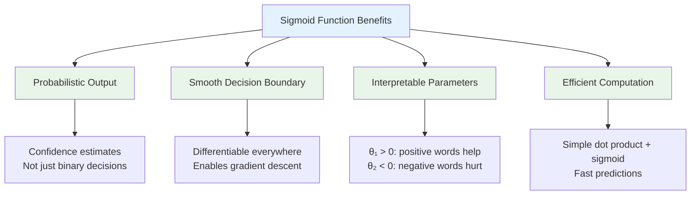

### Comparison with Alternatives

| Aspect                         | Logistic Regression | Linear Regression | Hard Threshold |
| ------------------------------ | ------------------- | ----------------- | -------------- |
| **Output Range**               | [0, 1]              | (-∞, +∞)          | {0, 1}         |
| **Probability Interpretation** | ✅ Yes              | ❌ No             | ❌ No          |
| **Differentiable**             | ✅ Yes              | ✅ Yes            | ❌ No          |
| **Robust to Outliers**         | ✅ Somewhat         | ❌ No             | ✅ Yes         |
| **Training Complexity**        | Medium              | Low               | N/A            |

---

## Key Takeaways

1. **Sigmoid Function**: Core of logistic regression, maps any real number to probability [0,1]

2. **Mathematical Foundation**:
   $$h(x^{(i)}, \theta) = \frac{1}{1 + e^{-\theta^T x^{(i)}}}$$

3. **Decision Rule**: Predict positive if $h(x^{(i)}, \theta) \geq 0.5$, which occurs when $\theta^T x^{(i)} \geq 0$

4. **Parameter Interpretation**:

   - $\theta_1 > 0$: Positive words increase positive probability
   - $\theta_2 < 0$: Negative words decrease positive probability
   - $\theta_0$: Overall bias toward positive/negative

5. **Probabilistic Output**: Not just binary decisions, but confidence estimates

6. **Efficient Prediction**: Simple dot product followed by sigmoid computation

7. **Example Validation**: Course example shows high confidence (99.3%) positive prediction for a clearly positive tweet

**Next Step**: Learn how to train the logistic regression classifier by minimizing the cost function using gradient descent to find optimal parameters θ.

**The Complete Pipeline Achievement**:

- **Raw tweet** → **Preprocessing** → **Feature extraction** → **Logistic regression** → **Sentiment prediction**
- **Dimensionality**: From potentially 50,000+ bag-of-words features to just 3 meaningful features
- **Accuracy**: High-confidence predictions with interpretable probability scores

# 8. Logistic Regression: Training

## Introduction: Learning the Parameters

In the previous section, we used given parameters $\theta = [0.00003, 0.00150, -0.00120]$ to make predictions. Now we'll learn how to **find these optimal parameters from scratch** using gradient descent to minimize the cost function.

**Goal**: Learn the parameter vector $\theta$ that best separates positive and negative tweets by minimizing prediction errors.

---

## The Training Process Overview

From the course images, the training process follows this iterative algorithm:

### Gradient Descent Algorithm

The gradient descent algorithm consists of six main steps that are repeated until convergence:

#### Step 1: Initialize Parameters

Initialize the parameter vector with small random values:
$$\theta = [\theta_0, \theta_1, \theta_2]$$

#### Step 2: Classify/Predict

Compute predictions for all training examples:
$$h = h(X, \theta) = \sigma(\theta^T X)$$

Where $\sigma$ is the sigmoid function applied to each example.

#### Step 3: Get Gradient

Compute the gradient of the cost function:
$$\nabla = \frac{1}{m} X^T (h - y)$$

This tells us the direction of steepest increase in cost.

#### Step 4: Update Parameters

Move in the direction opposite to the gradient:
$$\theta = \theta - \alpha \nabla$$

Where $\alpha$ is the learning rate (step size).

#### Step 5: Get Loss

Compute the current cost function value:
$$J(\theta) = -\frac{1}{m} \sum_{i=1}^{m} [y^{(i)} \log(h^{(i)}) + (1 - y^{(i)}) \log(1 - h^{(i)})]$$

#### Step 6: Check Convergence

Evaluate stopping criteria:

- **If not converged**: Return to Step 2 and continue iterating
- **If converged**: Stop training and return final parameters $\theta$

**Convergence criteria** can include:

- Cost change below threshold: $|J^{(t)} - J^{(t-1)}| < \epsilon$
- Maximum iterations reached
- Gradient magnitude below threshold: $\|\nabla J(\theta)\| < \epsilon$

---

## Mathematical Derivation of Gradient Descent

### Step 1: Cost Function for Logistic Regression

The **logistic loss** (cross-entropy) for a single example is:

$$\ell(h^{(i)}, y^{(i)}) = -y^{(i)} \log(h^{(i)}) - (1 - y^{(i)}) \log(1 - h^{(i)})$$

For the entire dataset with $m$ examples:

$$J(\theta) = -\frac{1}{m} \sum_{i=1}^{m} [y^{(i)} \log(h^{(i)}) + (1 - y^{(i)}) \log(1 - h^{(i)})]$$

Where $h^{(i)} = \sigma(\theta^T x^{(i)}) = \frac{1}{1 + e^{-\theta^T x^{(i)}}}$

### Step 2: Derivative of the Sigmoid Function

To find the gradient, we first need the derivative of the sigmoid function:

$$\frac{d}{dz}\sigma(z) = \frac{d}{dz}\frac{1}{1 + e^{-z}}$$

Using the quotient rule:

$$\frac{d}{dz}\sigma(z) = \frac{0 \cdot (1 + e^{-z}) - 1 \cdot (-e^{-z})}{(1 + e^{-z})^2} = \frac{e^{-z}}{(1 + e^{-z})^2}$$

Simplifying:

$$\frac{d}{dz}\sigma(z) = \frac{1}{1 + e^{-z}} \cdot \frac{e^{-z}}{1 + e^{-z}} = \sigma(z) \cdot (1 - \sigma(z))$$

**Key Result**: $\frac{d}{dz}\sigma(z) = \sigma(z)(1 - \sigma(z))$

### Step 3: Gradient Derivation

For the cost function $J(\theta)$, we need $\frac{\partial J}{\partial \theta_j}$:

$$\frac{\partial J}{\partial \theta_j} = -\frac{1}{m} \sum_{i=1}^{m} \left[ y^{(i)} \frac{1}{h^{(i)}} \frac{\partial h^{(i)}}{\partial \theta_j} - (1 - y^{(i)}) \frac{1}{1 - h^{(i)}} \frac{\partial h^{(i)}}{\partial \theta_j} \right]$$

Since $h^{(i)} = \sigma(\theta^T x^{(i)})$:

$$\frac{\partial h^{(i)}}{\partial \theta_j} = \sigma(\theta^T x^{(i)})(1 - \sigma(\theta^T x^{(i)})) \cdot x_j^{(i)} = h^{(i)}(1 - h^{(i)}) x_j^{(i)}$$

Substituting back:

$$\frac{\partial J}{\partial \theta_j} = -\frac{1}{m} \sum_{i=1}^{m} \left[ y^{(i)} \frac{h^{(i)}(1 - h^{(i)}) x_j^{(i)}}{h^{(i)}} - (1 - y^{(i)}) \frac{h^{(i)}(1 - h^{(i)}) x_j^{(i)}}{1 - h^{(i)}} \right]$$

Simplifying:

$$\frac{\partial J}{\partial \theta_j} = -\frac{1}{m} \sum_{i=1}^{m} \left[ y^{(i)}(1 - h^{(i)}) x_j^{(i)} - (1 - y^{(i)})h^{(i)} x_j^{(i)} \right]$$

$$= -\frac{1}{m} \sum_{i=1}^{m} x_j^{(i)} \left[ y^{(i)} - y^{(i)}h^{(i)} - h^{(i)} + y^{(i)}h^{(i)} \right]$$

$$= -\frac{1}{m} \sum_{i=1}^{m} x_j^{(i)} (y^{(i)} - h^{(i)})$$

$$= \frac{1}{m} \sum_{i=1}^{m} x_j^{(i)} (h^{(i)} - y^{(i)})$$

### Step 4: Vector Form of Gradient

For all parameters simultaneously:

$$\nabla J(\theta) = \frac{1}{m} X^T (h - y)$$

Where:

- $X \in \mathbb{R}^{m \times 3}$ is the feature matrix
- $h \in \mathbb{R}^{m}$ is the vector of predictions
- $y \in \mathbb{R}^{m}$ is the vector of true labels

**This matches the formula from the course image**: $\nabla = \frac{1}{m} X^T (h - y)$

---

## Gradient Descent Update Rule

### The Update Formula

From the course image, the parameter update is:

$$\theta = \theta - \alpha \nabla$$

Where:

- $\alpha$ is the **learning rate** (step size)
- $\nabla$ is the **gradient** of the cost function

Expanding:

$$\theta^{(new)} = \theta^{(old)} - \alpha \cdot \frac{1}{m} X^T (h - y)$$

### Component-wise Updates

For our 3-parameter case:

$$\theta_0^{(new)} = \theta_0^{(old)} - \alpha \cdot \frac{1}{m} \sum_{i=1}^{m} (h^{(i)} - y^{(i)})$$

$$\theta_1^{(new)} = \theta_1^{(old)} - \alpha \cdot \frac{1}{m} \sum_{i=1}^{m} (h^{(i)} - y^{(i)}) \cdot \text{pos\_sum}^{(i)}$$

$$\theta_2^{(new)} = \theta_2^{(old)} - \alpha \cdot \frac{1}{m} \sum_{i=1}^{m} (h^{(i)} - y^{(i)}) \cdot \text{neg\_sum}^{(i)}$$

---

## Detailed Training Example

### Sample Dataset

```python
import numpy as np

def sigmoid(z):
    """Sigmoid function with numerical stability"""
    return 1 / (1 + np.exp(-np.clip(z, -250, 250)))

def compute_cost(h, y):
    """Compute logistic regression cost"""
    # Clip predictions to avoid log(0)
    h_clipped = np.clip(h, 1e-15, 1 - 1e-15)
    return -np.mean(y * np.log(h_clipped) + (1 - y) * np.log(1 - h_clipped))

def gradient_descent_step_by_step():
    """
    Demonstrate gradient descent with detailed calculations
    """
    # Sample data (simplified for clarity)
    X = np.array([
        [1, 10, 2],   # Positive tweet: high pos_sum, low neg_sum
        [1, 3, 8],    # Negative tweet: low pos_sum, high neg_sum
        [1, 12, 1],   # Positive tweet: high pos_sum, low neg_sum
        [1, 2, 9],    # Negative tweet: low pos_sum, high neg_sum
        [1, 8, 4]     # Moderate tweet
    ])

    y = np.array([1, 0, 1, 0, 1])  # True labels
    m = len(y)

    print("GRADIENT DESCENT STEP-BY-STEP EXAMPLE")
    print("=" * 50)
    print(f"Training data shape: {X.shape}")
    print(f"Features: [bias, pos_sum, neg_sum]")
    print(f"X = \n{X}")
    print(f"y = {y}")
    print()

    # Initialize parameters
    theta = np.array([0.0, 0.0, 0.0])
    alpha = 0.01  # Learning rate

    print(f"Initial parameters: θ = {theta}")
    print(f"Learning rate: α = {alpha}")
    print()

    # Perform several iterations
    for iteration in range(5):
        print(f"--- ITERATION {iteration + 1} ---")

        # Step 1: Forward pass (make predictions)
        z = X.dot(theta)
        h = sigmoid(z)

        print(f"Linear combination: z = Xθ = {z}")
        print(f"Predictions: h = σ(z) = {h}")
        print(f"True labels: y = {y}")

        # Step 2: Compute cost
        cost = compute_cost(h, y)
        print(f"Cost: J(θ) = {cost:.4f}")

        # Step 3: Compute gradient
        gradient = (1/m) * X.T.dot(h - y)
        print(f"Errors: (h - y) = {h - y}")
        print(f"Gradient: ∇J = (1/m)X^T(h - y) = {gradient}")

        # Step 4: Update parameters
        theta_old = theta.copy()
        theta = theta - alpha * gradient

        print(f"Parameter update:")
        print(f"  θ₀: {theta_old[0]:.4f} - {alpha} × {gradient[0]:.4f} = {theta[0]:.4f}")
        print(f"  θ₁: {theta_old[1]:.4f} - {alpha} × {gradient[1]:.4f} = {theta[1]:.4f}")
        print(f"  θ₂: {theta_old[2]:.4f} - {alpha} × {gradient[2]:.4f} = {theta[2]:.4f}")

        print(f"Updated parameters: θ = {theta}")
        print()

    return theta

# Run the example
final_theta = gradient_descent_step_by_step()
```

### Interpreting the Updates

Let's analyze what happens during parameter updates:

```python
def analyze_gradient_intuition():
    """
    Explain the intuition behind gradient updates
    """
    print("GRADIENT UPDATE INTUITION")
    print("=" * 35)

    examples = [
        {
            'prediction': 0.8,
            'true_label': 1,
            'error': -0.2,
            'interpretation': 'Under-predicted positive → increase positive weights'
        },
        {
            'prediction': 0.3,
            'true_label': 0,
            'error': 0.3,
            'interpretation': 'Over-predicted negative → decrease positive weights'
        },
        {
            'prediction': 0.9,
            'true_label': 1,
            'error': -0.1,
            'interpretation': 'Good positive prediction → small adjustment'
        }
    ]

    for i, ex in enumerate(examples, 1):
        print(f"Example {i}:")
        print(f"  Prediction: {ex['prediction']}")
        print(f"  True label: {ex['true_label']}")
        print(f"  Error (h - y): {ex['error']}")
        print(f"  Effect: {ex['interpretation']}")
        print()

    print("KEY INSIGHTS:")
    print("• When error > 0: predicted too high → decrease parameters")
    print("• When error < 0: predicted too low → increase parameters")
    print("• Larger errors → larger updates")
    print("• Learning rate α controls update magnitude")

analyze_gradient_intuition()
```

---

## Complete Training Implementation

### Full Gradient Descent Algorithm

```python
def train_logistic_regression(X, y, alpha=0.01, max_iterations=1000, tolerance=1e-6):
    """
    Complete logistic regression training with gradient descent

    Args:
        X: feature matrix (m, 3)
        y: labels (m,)
        alpha: learning rate
        max_iterations: maximum number of iterations
        tolerance: convergence threshold

    Returns:
        theta: learned parameters
        costs: cost history
        iterations: number of iterations performed
    """
    m, n = X.shape

    # Initialize parameters
    theta = np.random.normal(0, 0.01, n)  # Small random initialization
    costs = []

    print(f"Training logistic regression...")
    print(f"Dataset: {m} examples, {n} features")
    print(f"Learning rate: {alpha}")
    print(f"Max iterations: {max_iterations}")
    print()

    for i in range(max_iterations):
        # Forward pass
        z = X.dot(theta)
        h = sigmoid(z)

        # Compute cost
        cost = compute_cost(h, y)
        costs.append(cost)

        # Compute gradient
        gradient = (1/m) * X.T.dot(h - y)

        # Update parameters
        theta = theta - alpha * gradient

        # Print progress
        if i % 100 == 0:
            print(f"Iteration {i}: Cost = {cost:.4f}")

        # Check convergence
        if i > 0 and abs(costs[-2] - costs[-1]) < tolerance:
            print(f"Converged after {i+1} iterations")
            break

    print(f"Final cost: {costs[-1]:.4f}")
    print(f"Final parameters: {theta}")

    return theta, costs, i+1

def demonstrate_full_training():
    """
    Demonstrate complete training process
    """
    # Generate larger synthetic dataset
    np.random.seed(42)
    m = 100

    # Create features for positive examples
    pos_examples = 50
    X_pos = np.column_stack([
        np.ones(pos_examples),
        np.random.normal(15, 5, pos_examples),  # Higher positive frequency
        np.random.normal(3, 2, pos_examples)    # Lower negative frequency
    ])
    y_pos = np.ones(pos_examples)

    # Create features for negative examples
    neg_examples = 50
    X_neg = np.column_stack([
        np.ones(neg_examples),
        np.random.normal(5, 3, neg_examples),   # Lower positive frequency
        np.random.normal(12, 4, neg_examples)   # Higher negative frequency
    ])
    y_neg = np.zeros(neg_examples)

    # Combine datasets
    X = np.vstack([X_pos, X_neg])
    y = np.hstack([y_pos, y_neg])

    # Shuffle
    indices = np.random.permutation(m)
    X = X[indices]
    y = y[indices]

    print("COMPLETE TRAINING DEMONSTRATION")
    print("=" * 40)

    # Train model
    theta, costs, iterations = train_logistic_regression(X, y, alpha=0.1)

    # Evaluate final model
    z = X.dot(theta)
    h = sigmoid(z)
    predictions = (h >= 0.5).astype(int)
    accuracy = np.mean(predictions == y)

    print(f"\nFinal Model Performance:")
    print(f"Training accuracy: {accuracy:.1%}")
    print(f"Parameters interpretation:")
    print(f"  θ₀ = {theta[0]:.4f} (bias)")
    print(f"  θ₁ = {theta[1]:.4f} (positive frequency weight)")
    print(f"  θ₂ = {theta[2]:.4f} (negative frequency weight)")

    return theta, costs

theta_final, cost_history = demonstrate_full_training()
```

---

## Cost Function Convergence

### Visualizing Training Progress

From the course image, we can see the cost decreasing over iterations:

```python
def plot_cost_convergence(costs):
    """
    Plot cost function convergence (matches course image style)
    """
    import matplotlib.pyplot as plt

    plt.figure(figsize=(10, 6))
    plt.plot(range(len(costs)), costs, 'b-', linewidth=2, marker='o', markersize=4)
    plt.xlabel('Iteration', fontsize=12)
    plt.ylabel('Cost', fontsize=12)
    plt.title('Cost Function Convergence During Training', fontsize=14)
    plt.grid(True, alpha=0.3)

    # Highlight key points (similar to course image)
    highlight_points = [0, len(costs)//4, len(costs)//2, 3*len(costs)//4, len(costs)-1]
    for point in highlight_points:
        if point < len(costs):
            plt.plot(point, costs[point], 'go', markersize=8)
            plt.annotate(f'({point}, {costs[point]:.1f})',
                        xy=(point, costs[point]),
                        xytext=(10, 10),
                        textcoords='offset points',
                        fontsize=10)

    plt.tight_layout()
    plt.show()

    print(f"Initial cost: {costs[0]:.2f}")
    print(f"Final cost: {costs[-1]:.2f}")
    print(f"Cost reduction: {costs[0] - costs[-1]:.2f}")
    print(f"Relative improvement: {(costs[0] - costs[-1])/costs[0]:.1%}")

# Visualize the training progress
# plot_cost_convergence(cost_history)
```

---

## Learning Rate Analysis

### Effect of Different Learning Rates

```python
def compare_learning_rates():
    """
    Demonstrate effect of different learning rates
    """
    # Use same dataset as before
    np.random.seed(42)
    X = np.array([
        [1, 10, 2], [1, 3, 8], [1, 12, 1],
        [1, 2, 9], [1, 8, 4], [1, 15, 1]
    ])
    y = np.array([1, 0, 1, 0, 1, 1])

    learning_rates = [0.001, 0.01, 0.1, 1.0]

    print("LEARNING RATE COMPARISON")
    print("=" * 30)

    for alpha in learning_rates:
        print(f"\nLearning rate α = {alpha}")
        print("-" * 25)

        # Train with this learning rate
        try:
            theta, costs, iterations = train_logistic_regression(
                X, y, alpha=alpha, max_iterations=100, tolerance=1e-8
            )

            print(f"Converged in {iterations} iterations")
            print(f"Final cost: {costs[-1]:.4f}")
            print(f"Final θ: {theta}")

        except Exception as e:
            print(f"Training failed: {e}")

    print("\nKEY OBSERVATIONS:")
    print("• Too small α: slow convergence, many iterations needed")
    print("• Good α: steady decrease, reasonable convergence time")
    print("• Too large α: may overshoot, unstable training, divergence")

compare_learning_rates()
```

---

## Key Takeaways

1. **Gradient Descent Formula**: $\nabla J(\theta) = \frac{1}{m} X^T (h - y)$ - elegant and intuitive

2. **Parameter Updates**: $\theta = \theta - \alpha \nabla$ - move opposite to gradient direction

3. **Mathematical Foundation**: Derived from cross-entropy loss using calculus chain rule

4. **Sigmoid Derivative**: Key insight that $\frac{d}{dz}\sigma(z) = \sigma(z)(1-\sigma(z))$ simplifies everything

5. **Iterative Process**: Start with random parameters, repeatedly improve using gradient information

6. **Convergence**: Cost function decreases monotonically when learning rate is appropriate

7. **Learning Rate**: Critical hyperparameter that controls convergence speed and stability

8. **Intuitive Updates**:
   - Over-predict positive → decrease positive weights
   - Under-predict positive → increase positive weights
   - Error magnitude determines update size

**Mathematical Beauty**: The gradient for logistic regression has the same form as linear regression: $\frac{1}{m} X^T (h - y)$, despite the non-linear sigmoid function!

**Next Step**: Learn how to evaluate the trained classifier's performance using test data and various metrics to determine if our learned parameters θ create a good or bad classifier.

# 9. Logistic Regression: Testing

## Introduction: Evaluating Model Performance

Now that we have trained our logistic regression model and learned optimal parameters $\theta$, we need to evaluate how well our model **generalizes** to unseen data. This testing phase determines whether our model will work reliably on new tweets in real-world applications.

**Goal**: Use validation/test data to compute accuracy and assess model performance on unseen examples.

---

## Data Splitting Strategy

### Train-Validation-Test Split

In practice, we divide our dataset into three distinct subsets:

$$\text{Complete Dataset} \rightarrow \{X_{\text{train}}, X_{\text{val}}, X_{\text{test}}\}$$

#### Common Split Ratios

**Standard 80-10-10 Split** (works well for most datasets):

- **Training Set (80%)**: $X_{\text{train}}, Y_{\text{train}}$ - Used to learn parameters $\theta$
- **Validation Set (10%)**: $X_{\text{val}}, Y_{\text{val}}$ - Used for model selection and hyperparameter tuning
- **Test Set (10%)**: $X_{\text{test}}, Y_{\text{test}}$ - Used for final performance evaluation

#### Purpose of Each Split

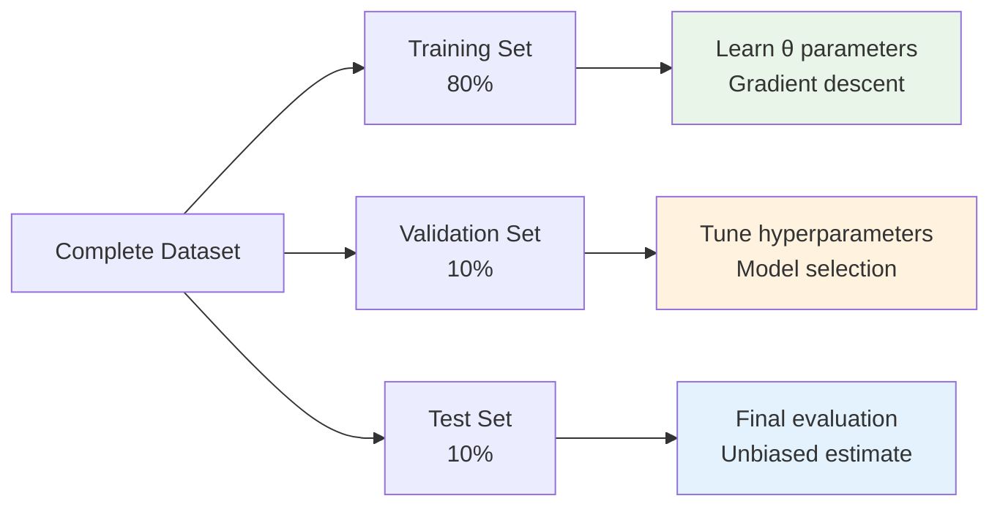

### Why This Split Matters

- **Training Set**: Model learns from this data, so performance here may be overly optimistic
- **Validation Set**: Unbiased evaluation during development, helps avoid overfitting
- **Test Set**: Final "exam" - completely unseen data for honest performance assessment

---

## Testing Process: Step-by-Step

### Inputs Required

From the course material, we need:

- $X_{\text{val}}$: Validation feature matrix
- $Y_{\text{val}}$: True validation labels
- $\theta$: Trained parameters from gradient descent

### Step 1: Compute Predictions

Calculate sigmoid probabilities for validation examples:

$$h(X_{\text{val}}, \theta) = \sigma(\theta^T X_{\text{val}})$$

### Step 2: Apply Decision Threshold

Convert probabilities to binary predictions using 0.5 threshold:

$$\text{pred} = h(X_{\text{val}}, \theta) \geq 0.5$$

### Step 3: Compute Accuracy

Compare predictions with true labels:

$$\text{Accuracy} = \frac{\sum_{i=1}^{m} (\text{pred}^{(i)} == y_{\text{val}}^{(i)})}{m}$$

---

## Detailed Example from Course

### Example Calculation

Following the course images, let's trace through the complete testing process:

**Given**:

- Validation probabilities: $h(X_{\text{val}}, \theta) = [0.3, 0.8, 0.5, \ldots, h_m]$
- True labels: $Y_{\text{val}} = [0, 1, 1, \ldots, y_m]$

#### Step-by-Step Threshold Application

```bash
Probability Vector: [0.3, 0.8, 0.5, ...]
                    ↓
Threshold Check:    [0.3 ≥ 0.5, 0.8 ≥ 0.5, 0.5 ≥ 0.5, ...]
                    ↓
Boolean Results:    [False, True, True, ...]
                    ↓
Binary Predictions: [0, 1, 1, ...]
```

#### Mathematical Representation

$$
\text{pred}^{(i)} = \begin{cases}
1 & \text{if } h^{(i)} \geq 0.5 \\
0 & \text{if } h^{(i)} < 0.5
\end{cases}
$$

For our example:

- $\text{pred}^{(1)} = 0$ (since $0.3 < 0.5$)
- $\text{pred}^{(2)} = 1$ (since $0.8 \geq 0.5$)
- $\text{pred}^{(3)} = 1$ (since $0.5 \geq 0.5$)

---

## Accuracy Calculation

### Mathematical Formula

From the course image, accuracy is calculated as:

$$\text{Accuracy} = \frac{\sum_{i=1}^{m} (\text{pred}^{(i)} == y_{\text{val}}^{(i)})}{m}$$

Where:

- $m$ = number of validation examples
- $(\text{pred}^{(i)} == y_{\text{val}}^{(i)})$ = 1 if prediction matches true label, 0 otherwise

### Concrete Example from Course

**Given 5 validation examples**:

| Example | True Label ($y_{\text{val}}$) | Prediction ($\text{pred}$) | Correct? |
| ------- | ----------------------------- | -------------------------- | -------- |
| 1       | 0                             | 0                          | ✓ (1)    |
| 2       | 1                             | 1                          | ✗ (0)    |
| 3       | 1                             | 1                          | ✓ (1)    |
| 4       | 0                             | 1                          | ✗ (0)    |
| 5       | 1                             | 1                          | ✓ (1)    |

**Accuracy Calculation**:
$$\text{Accuracy} = \frac{1 + 0 + 1 + 0 + 1}{5} = \frac{3}{5} = 0.8 = 80\%$$

As shown in the course video, this means our model correctly predicts sentiment **80% of the time** on unseen data.

---

## Complete Implementation

### Testing Function

```python
import numpy as np

def sigmoid(z):
    """Sigmoid function with numerical stability"""
    return 1 / (1 + np.exp(-np.clip(z, -250, 250)))

def test_logistic_regression(X_val, y_val, theta, threshold=0.5):
    """
    Test logistic regression model on validation data

    Args:
        X_val: validation feature matrix (m, 3)
        y_val: true validation labels (m,)
        theta: trained parameters (3,)
        threshold: decision threshold for classification

    Returns:
        accuracy: fraction of correct predictions
        predictions: binary predictions
        probabilities: sigmoid probabilities
    """
    # Step 1: Compute sigmoid probabilities
    z = X_val.dot(theta)
    probabilities = sigmoid(z)

    # Step 2: Apply threshold to get binary predictions
    predictions = (probabilities >= threshold).astype(int)

    # Step 3: Compare with true labels
    correct_predictions = (predictions == y_val).astype(int)

    # Step 4: Compute accuracy
    accuracy = np.mean(correct_predictions)

    return accuracy, predictions, probabilities

def detailed_testing_example():
    """
    Demonstrate testing process with course example
    """
    # Example validation data
    X_val = np.array([
        [1, 5, 8],    # Tweet 1: low pos, high neg → should predict negative
        [1, 12, 2],   # Tweet 2: high pos, low neg → should predict positive
        [1, 7, 7],    # Tweet 3: balanced → uncertain
        [1, 15, 1],   # Tweet 4: very high pos, low neg → strong positive
        [1, 2, 10]    # Tweet 5: low pos, very high neg → strong negative
    ])

    y_val = np.array([0, 1, 1, 1, 0])  # True labels

    # Use learned parameters (example values)
    theta = np.array([0.0001, 0.0015, -0.0012])

    print("LOGISTIC REGRESSION TESTING EXAMPLE")
    print("=" * 45)
    print(f"Validation set: {len(y_val)} examples")
    print(f"Features: [bias, pos_sum, neg_sum]")
    print(f"Trained parameters: θ = {theta}")
    print()

    # Perform testing
    accuracy, predictions, probabilities = test_logistic_regression(X_val, y_val, theta)

    print("DETAILED PREDICTIONS:")
    print("-" * 25)
    print(f"{'Example':<8} {'Features':<15} {'Prob':<6} {'Pred':<5} {'True':<5} {'Correct'}")
    print("-" * 60)

    for i in range(len(y_val)):
        features_str = f"{X_val[i].tolist()}"
        prob = probabilities[i]
        pred = predictions[i]
        true = y_val[i]
        correct = "✓" if pred == true else "✗"

        print(f"{i+1:<8} {features_str:<15} {prob:.3f}  {pred:<5} {true:<5} {correct}")

    print()
    print("THRESHOLD APPLICATION:")
    print("-" * 22)
    for i, prob in enumerate(probabilities):
        threshold_check = f"{prob:.3f} ≥ 0.5"
        result = "True" if prob >= 0.5 else "False"
        prediction = 1 if prob >= 0.5 else 0
        print(f"Example {i+1}: {threshold_check} = {result} → pred = {prediction}")

    print()
    print("ACCURACY CALCULATION:")
    print("-" * 20)
    correct_count = np.sum(predictions == y_val)
    total_count = len(y_val)
    print(f"Correct predictions: {correct_count}")
    print(f"Total predictions: {total_count}")
    print(f"Accuracy: {correct_count}/{total_count} = {accuracy:.3f} = {accuracy:.1%}")

    return accuracy, predictions, probabilities

# Run the example
accuracy, preds, probs = detailed_testing_example()
```

---

## Alternative Evaluation Metrics

### Beyond Simple Accuracy

While accuracy is intuitive, other metrics provide deeper insights:

#### Confusion Matrix

```python
def compute_confusion_matrix(y_true, y_pred):
    """
    Compute confusion matrix for binary classification
    """
    tp = np.sum((y_true == 1) & (y_pred == 1))  # True Positives
    tn = np.sum((y_true == 0) & (y_pred == 0))  # True Negatives
    fp = np.sum((y_true == 0) & (y_pred == 1))  # False Positives
    fn = np.sum((y_true == 1) & (y_pred == 0))  # False Negatives

    return np.array([[tn, fp], [fn, tp]])

def print_confusion_matrix(cm):
    """
    Display confusion matrix with labels
    """
    print("CONFUSION MATRIX:")
    print("-" * 20)
    print("           Predicted")
    print("         Neg    Pos")
    print(f"True Neg  {cm[0,0]:3d}    {cm[0,1]:3d}")
    print(f"     Pos  {cm[1,0]:3d}    {cm[1,1]:3d}")
```

#### Precision, Recall, and F1-Score

```python
def compute_metrics(y_true, y_pred):
    """
    Compute comprehensive evaluation metrics
    """
    cm = compute_confusion_matrix(y_true, y_pred)
    tn, fp, fn, tp = cm[0,0], cm[0,1], cm[1,0], cm[1,1]

    # Basic metrics
    accuracy = (tp + tn) / (tp + tn + fp + fn)

    # Precision: Of predicted positives, how many were actually positive?
    precision = tp / (tp + fp) if (tp + fp) > 0 else 0

    # Recall: Of actual positives, how many did we correctly identify?
    recall = tp / (tp + fn) if (tp + fn) > 0 else 0

    # F1-Score: Harmonic mean of precision and recall
    f1 = 2 * precision * recall / (precision + recall) if (precision + recall) > 0 else 0

    return {
        'accuracy': accuracy,
        'precision': precision,
        'recall': recall,
        'f1_score': f1,
        'confusion_matrix': cm
    }
```

---

## Model Interpretation

### What Does 80% Accuracy Mean?

From the course example:

- **80% accuracy**: Model correctly predicts sentiment on 4 out of 5 validation examples
- **Generalization**: We expect similar performance on new, unseen tweets
- **Business impact**: In production, 8 out of 10 tweets will be classified correctly

### Accuracy Benchmarks

| Accuracy Range | Interpretation | Action                                |
| -------------- | -------------- | ------------------------------------- |
| **90-100%**    | Excellent      | Deploy with confidence                |
| **80-90%**     | Good           | Consider improvements, may deploy     |
| **70-80%**     | Acceptable     | Investigate errors, improve features  |
| **60-70%**     | Poor           | Significant improvements needed       |
| **<60%**       | Very Poor      | Fundamental issues, redesign approach |

### Random Baseline

For binary classification with balanced classes:

- **Random guessing**: 50% accuracy
- **Our model (80%)**: Significantly better than random
- **Improvement**: 30 percentage points above baseline

---

## Key Takeaways

1. **Three-Way Data Split**: Train (80%) / Validation (10%) / Test (10%) for unbiased evaluation

2. **Testing Process**:

   - Compute probabilities: $h(X_{\text{val}}, \theta)$
   - Apply threshold: $\text{pred} = h \geq 0.5$
   - Calculate accuracy: $\frac{\text{correct predictions}}{total predictions}$

3. **Accuracy Formula**:
   $$\text{Accuracy} = \frac{\sum_{i=1}^{m} (\text{pred}^{(i)} == y_{\text{val}}^{(i)})}{m}$$

4. **Interpretation**: 80% accuracy means our model works correctly 80% of the time on unseen data

5. **Generalization**: Validation performance estimates real-world performance

6. **Decision Threshold**: 0.5 is standard, but can be adjusted based on application needs

7. **Beyond Accuracy**: Precision, recall, and F1-score provide additional insights

**Completion Achievement**: We've built a complete sentiment analysis pipeline from raw tweets to performance evaluation!

**Next Steps**: In Week 2, we'll explore Naive Bayes, an alternative probabilistic approach to text classification that offers different advantages and insights.

# 10. Logistic Regression: Cost Function (Optional)

## Introduction: Understanding the Intuition Behind the Cost Function

This optional section dives deep into **why** the logistic regression cost function is designed the way it is. You'll understand what happens when you predict correctly versus incorrectly, and see the mathematical foundation that makes logistic regression work so elegantly.

**Goal**: Develop intuition for the cross-entropy loss function and understand its mathematical derivation from maximum likelihood estimation.

---

## The Logistic Regression Cost Function

### Mathematical Definition

The cost function for logistic regression is:

$$J(\theta) = -\frac{1}{m} \sum_{i=1}^{m} [y^{(i)} \log h(x^{(i)}, \theta) + (1 - y^{(i)}) \log(1 - h(x^{(i)}, \theta))]$$

Where:

- $m$ = number of training examples
- $y^{(i)}$ = true label (0 or 1) for example $i$
- $h(x^{(i)}, \theta) = \sigma(\theta^T x^{(i)})$ = predicted probability for example $i$

### Breaking Down the Components

Let's analyze each part of this seemingly complex equation:

#### 1. The Sum and Average: $-\frac{1}{m} \sum_{i=1}^{m}$

- **Sum over $m$**: We compute cost for each training example and add them up
- **$\frac{1}{m}$**: Divide by $m$ to get the average cost per example
- **Negative sign**: Ensures the overall cost is always positive (we'll see why)

#### 2. Two Terms Inside the Brackets

The cost function has **two terms** that handle different cases:

**Left Term**: $y^{(i)} \log h(x^{(i)}, \theta)$

**Right Term**: $(1 - y^{(i)}) \log(1 - h(x^{(i)}, \theta))$

---

## Analyzing Each Term

### Left Term: When Label is Positive ($y^{(i)} = 1$)

$$\text{Left Term} = y^{(i)} \log h(x^{(i)}, \theta)$$

**Case 1: $y^{(i)} = 1$ (Positive example)**

- Term becomes: $1 \cdot \log h(x^{(i)}, \theta) = \log h(x^{(i)}, \theta)$
- **If prediction $h \approx 1$**: $\log(1) = 0$ → **Low cost** ✓
- **If prediction $h \approx 0$**: $\log(0) \rightarrow -\infty$ → **High cost** ✗

**Case 2: $y^{(i)} = 0$ (Negative example)**

- Term becomes: $0 \cdot \log h(x^{(i)}, \theta) = 0$
- **Prediction doesn't matter**: Term contributes nothing to cost

### Right Term: When Label is Negative ($y^{(i)} = 0$)

$$\text{Right Term} = (1 - y^{(i)}) \log(1 - h(x^{(i)}, \theta))$$

**Case 1: $y^{(i)} = 0$ (Negative example)**

- Term becomes: $(1 - 0) \log(1 - h(x^{(i)}, \theta)) = \log(1 - h(x^{(i)}, \theta))$
- **If prediction $h \approx 0$**: $\log(1 - 0) = \log(1) = 0$ → **Low cost** ✓
- **If prediction $h \approx 1$**: $\log(1 - 1) = \log(0) \rightarrow -\infty$ → **High cost** ✗

**Case 2: $y^{(i)} = 1$ (Positive example)**

- Term becomes: $(1 - 1) \log(1 - h(x^{(i)}, \theta)) = 0$
- **Prediction doesn't matter**: Term contributes nothing to cost

### Summary of Behavior

```bash
┌─────────────────────────────────────────────────────────────────────────────┐
│                            COST FUNCTION BEHAVIOR                           │
├─────────────────────────────────────────────────────────────────────────────┤
│                                                                             │
│  WHEN y = 1 (Positive Example):                                             │
│  ┌─────────────────────────────────────────────────────────────────────┐    │
│  │ Active term: -log(h)                                                │    │
│  │ • h ≈ 1 (correct): cost ≈ 0                                         │    │
│  │ • h ≈ 0 (wrong): cost → ∞                                           │    │
│  │ • Penalizes confident wrong predictions heavily                     │    │
│  └─────────────────────────────────────────────────────────────────────┘    │
│                                                                             │
│  WHEN y = 0 (Negative Example):                                             │
│  ┌─────────────────────────────────────────────────────────────────────┐    │
│  │ Active term: -log(1 - h)                                            │    │
│  │ • h ≈ 0 (correct): cost ≈ 0                                         │    │
│  │ • h ≈ 1 (wrong): cost → ∞                                           │    │
│  │ • Penalizes confident wrong predictions heavily                     │    │
│  └─────────────────────────────────────────────────────────────────────┘    │
│                                                                             │
└─────────────────────────────────────────────────────────────────────────────┘
```

---

## Visualizing the Cost Function

### Cost Curves for Each Case

From the course image, we can see how cost varies with prediction:

#### Case 1: Positive Example ($y = 1$)

$$J(\theta) = -\log h(x^{(i)}, \theta)$$

- **When $h = 1.0$**: Cost = $-\log(1.0) = 0$
- **When $h = 0.5$**: Cost = $-\log(0.5) \approx 0.69$
- **When $h \rightarrow 0$**: Cost = $-\log(0) \rightarrow \infty$

#### Case 2: Negative Example ($y = 0$)

$$J(\theta) = -\log(1 - h(x^{(i)}, \theta))$$

- **When $h = 0.0$**: Cost = $-\log(1.0) = 0$
- **When $h = 0.5$**: Cost = $-\log(0.5) \approx 0.69$
- **When $h \rightarrow 1$**: Cost = $-\log(0) \rightarrow \infty$

### Python Visualization

```python
import numpy as np
import matplotlib.pyplot as plt

def plot_cost_function():
    """
    Plot cost function for both cases as shown in course
    """
    # Prediction values (avoid exact 0 and 1 for numerical stability)
    h = np.linspace(0.001, 0.999, 1000)

    # Cost for positive examples (y=1)
    cost_positive = -np.log(h)

    # Cost for negative examples (y=0)
    cost_negative = -np.log(1 - h)

    plt.figure(figsize=(12, 5))

    # Plot for positive examples
    plt.subplot(1, 2, 1)
    plt.plot(h, cost_positive, 'b-', linewidth=3)
    plt.xlabel('h(x⁽ⁱ⁾, θ)', fontsize=12)
    plt.ylabel('J(θ)', fontsize=12)
    plt.title('Cost Function: y = 1 (Positive Examples)', fontsize=14)
    plt.grid(True, alpha=0.3)
    plt.ylim(0, 5)

    # Highlight key points
    plt.plot(1.0, 0, 'ro', markersize=8, label='Perfect prediction')
    plt.plot(0.5, -np.log(0.5), 'go', markersize=8, label='Uncertain prediction')
    plt.annotate('Cost = 0\n(Perfect)', xy=(0.9, 0.1), fontsize=10, ha='center')
    plt.annotate('Cost → ∞\n(Wrong)', xy=(0.1, 4), fontsize=10, ha='center')

    # Plot for negative examples
    plt.subplot(1, 2, 2)
    plt.plot(h, cost_negative, 'r-', linewidth=3)
    plt.xlabel('h(x⁽ⁱ⁾, θ)', fontsize=12)
    plt.ylabel('J(θ)', fontsize=12)
    plt.title('Cost Function: y = 0 (Negative Examples)', fontsize=14)
    plt.grid(True, alpha=0.3)
    plt.ylim(0, 5)

    # Highlight key points
    plt.plot(0.0, 0, 'ro', markersize=8, label='Perfect prediction')
    plt.plot(0.5, -np.log(0.5), 'go', markersize=8, label='Uncertain prediction')
    plt.annotate('Cost = 0\n(Perfect)', xy=(0.1, 0.1), fontsize=10, ha='center')
    plt.annotate('Cost → ∞\n(Wrong)', xy=(0.9, 4), fontsize=10, ha='center')

    plt.tight_layout()
    plt.show()

# plot_cost_function()  # Uncomment to see the plots
```

---

## Mathematical Derivation: From Maximum Likelihood to Cost Function

### Step 1: Probabilistic Model

We start by modeling the probability of observing label $y$ given features $x$ and parameters $\theta$:

$$P(y | x^{(i)}, \theta) = h(x^{(i)}, \theta)^{y^{(i)}} \cdot (1 - h(x^{(i)}, \theta))^{(1-y^{(i)})}$$

**Why this formula works**:

- **When $y^{(i)} = 1$**: $P(y=1|x,\theta) = h(x,\theta)^1 \cdot (1-h(x,\theta))^0 = h(x,\theta)$
- **When $y^{(i)} = 0$**: $P(y=0|x,\theta) = h(x,\theta)^0 \cdot (1-h(x,\theta))^1 = 1-h(x,\theta)$

This elegantly captures both cases in a single equation!

### Step 2: Likelihood for the Entire Dataset

For all $m$ training examples (assuming independence):

$$L(\theta) = \prod_{i=1}^{m} h(x^{(i)}, \theta)^{y^{(i)}} \cdot (1 - h(x^{(i)}, \theta))^{(1-y^{(i)})}$$

**Goal**: Find $\theta$ that maximizes this likelihood (makes our observed data most probable).

### Step 3: Log-Likelihood Transformation

Taking the logarithm transforms products into sums (easier to work with):

$$\log L(\theta) = \sum_{i=1}^{m} [y^{(i)} \log h(x^{(i)}, \theta) + (1 - y^{(i)}) \log(1 - h(x^{(i)}, \theta))]$$

**Using logarithm properties**:

- $\log(ab) = \log(a) + \log(b)$
- $\log(a^b) = b \log(a)$

### Step 4: From Maximization to Minimization

To find the maximum likelihood estimate:

$$\max_{\theta} \log L(\theta) = \max_{\theta} \sum_{i=1}^{m} [y^{(i)} \log h(x^{(i)}, \theta) + (1 - y^{(i)}) \log(1 - h(x^{(i)}, \theta))]$$

**Converting to minimization**: $\max f(x) = \min(-f(x))$

$$\min_{\theta} J(\theta) = \min_{\theta} \left( -\frac{1}{m} \sum_{i=1}^{m} [y^{(i)} \log h(x^{(i)}, \theta) + (1 - y^{(i)}) \log(1 - h(x^{(i)}, \theta))] \right)$$

**Why divide by $m$**: Gives us average cost per example (doesn't change the minimum location).

### Final Result

$$J(\theta) = -\frac{1}{m} \sum_{i=1}^{m} [y^{(i)} \log h(x^{(i)}, \theta) + (1 - y^{(i)}) \log(1 - h(x^{(i)}, \theta))]$$

**This is exactly our logistic regression cost function!**

---

## Vectorized Implementation

### Matrix Form

From the course reading, the vectorized implementation is:

$$h = \sigma(X\theta)$$
$$J(\theta) = \frac{1}{m} \cdot (-y^T \log(h) - (1-y)^T \log(1-h))$$

### Python Implementation

```python
def compute_cost_vectorized(X, y, theta):
    """
    Vectorized implementation of logistic regression cost function

    Args:
        X: feature matrix (m, n)
        y: label vector (m,)
        theta: parameter vector (n,)

    Returns:
        cost: scalar cost value
    """
    m = len(y)

    # Compute predictions
    z = X.dot(theta)
    h = sigmoid(z)

    # Clip to avoid log(0)
    h_clipped = np.clip(h, 1e-15, 1 - 1e-15)

    # Compute cost using vectorized form
    cost = -(1/m) * (y.dot(np.log(h_clipped)) + (1 - y).dot(np.log(1 - h_clipped)))

    return cost

def demonstrate_cost_behavior():
    """
    Demonstrate how cost changes with different predictions
    """
    # Simple example
    X = np.array([[1, 5, 2], [1, 2, 8]])  # 2 examples
    y = np.array([1, 0])                   # True labels

    # Test different parameter values
    theta_values = [
        [0.0, 0.1, -0.1],   # Reasonable parameters
        [0.0, 0.5, -0.4],   # Better parameters
        [0.0, -0.1, 0.1],   # Wrong parameters (opposite)
    ]

    print("COST FUNCTION BEHAVIOR DEMONSTRATION")
    print("=" * 45)
    print(f"Examples: {len(y)}")
    print(f"True labels: {y}")
    print()

    for i, theta in enumerate(theta_values):
        theta = np.array(theta)

        # Compute predictions and cost
        z = X.dot(theta)
        h = sigmoid(z)
        cost = compute_cost_vectorized(X, y, theta)

        print(f"Parameters set {i+1}: θ = {theta}")
        print(f"  Predictions: h = {h}")
        print(f"  Cost: J(θ) = {cost:.4f}")

        # Analyze each example
        for j in range(len(y)):
            correct = "✓" if (h[j] >= 0.5) == y[j] else "✗"
            print(f"    Example {j+1}: pred={h[j]:.3f}, true={y[j]} {correct}")
        print()

demonstrate_cost_behavior()
```

---

## Key Properties of the Cost Function

### 1. Convexity

The logistic regression cost function is **convex**, meaning it has a single global minimum with no local minima. This guarantees that gradient descent will find the optimal solution.

### 2. Smooth and Differentiable

Unlike some other loss functions, the logistic loss is smooth everywhere, making gradient-based optimization straightforward.

### 3. Probabilistic Interpretation

The cost function directly corresponds to maximizing the likelihood of observing our training data, giving it a principled statistical foundation.

### 4. Asymmetric Penalty

The function heavily penalizes confident wrong predictions (cost → ∞) while being lenient with uncertain predictions (cost ≈ 0.69 at 50% confidence).

---

## Practical Insights

### Why This Design Makes Sense

1. **Confident Correct Predictions**: Cost approaches 0

   - Encourages the model to be confident when right

2. **Confident Wrong Predictions**: Cost approaches infinity

   - Heavily penalizes overconfident mistakes

3. **Uncertain Predictions**: Moderate cost

   - Better to be uncertain than confidently wrong

4. **Smooth Gradient**: Unlike 0-1 loss, provides useful gradient information everywhere

### Comparison with Other Loss Functions

| Loss Function     | Confident Correct | Confident Wrong | Uncertain   | Differentiable |
| ----------------- | ----------------- | --------------- | ----------- | -------------- |
| **Cross-Entropy** | Cost → 0          | Cost → ∞        | Moderate    | ✅ Yes         |
| **0-1 Loss**      | Cost = 0          | Cost = 1        | Cost = 1    | ❌ No          |
| **Squared Loss**  | Cost = 0          | Cost = 1        | Cost = 0.25 | ✅ Yes         |

---

## Key Takeaways

1. **Two-Part Design**: One term handles positive examples, another handles negative examples

2. **Mathematical Foundation**: Derived from maximum likelihood estimation

3. **Intuitive Behavior**:

   - Rewards correct predictions (low cost)
   - Punishes wrong predictions (high cost)
   - Especially penalizes overconfident mistakes

4. **Elegant Formula**:
   $$J(\theta) = -\frac{1}{m} \sum_{i=1}^{m} [y^{(i)} \log h(x^{(i)}, \theta) + (1 - y^{(i)}) \log(1 - h(x^{(i)}, \theta))]$$

5. **Convex Optimization**: Guarantees we can find the global optimum using gradient descent

6. **Probabilistic Interpretation**: Maximizing likelihood = minimizing cross-entropy loss

**Beautiful Connection**: What started as a principled probabilistic approach (maximum likelihood) naturally leads to an intuitive and practical cost function that encourages good predictions while heavily penalizing bad ones.

# 11. Logistic Regression: Gradient Derivation (Optional)

## Introduction: The Mathematics Behind Gradient Descent

This optional section provides the complete mathematical derivation of the gradient descent formula for logistic regression. We'll work through the calculus step-by-step to understand exactly how we arrive at the elegant gradient formula we've been using.

**Goal**: Derive the gradient $\nabla J(\theta) = \frac{1}{m} X^T (h - y)$ from first principles using calculus.

---

## Gradient Descent: General Form

### The Update Rule

The general form of gradient descent is:

$$\text{Repeat: } \theta_j := \theta_j - \alpha \frac{\partial}{\partial \theta_j} J(\theta) \text{ for all } j$$

Where:

- $\theta_j$ = parameter $j$
- $\alpha$ = learning rate
- $\frac{\partial}{\partial \theta_j} J(\theta)$ = partial derivative of cost function with respect to $\theta_j$

### What We Want to Derive

Through calculus, we will show that:

$$\frac{\partial}{\partial \theta_j} J(\theta) = \frac{1}{m} \sum_{i=1}^{m} (h(x^{(i)}, \theta) - y^{(i)}) x_j^{(i)}$$

**Vectorized form**:
$$\nabla J(\theta) = \frac{1}{m} X^T (H(X, \theta) - Y)$$

**Final update rule**:
$$\theta := \theta - \frac{\alpha}{m} X^T (H(X, \theta) - Y)$$

---

## Step 1: Derivative of the Sigmoid Function

### Computing $\frac{d}{dx} \sigma(x)$

Before deriving the cost function gradient, we need the derivative of the sigmoid function:

$$h(x) = \sigma(x) = \frac{1}{1 + e^{-x}}$$

Using the quotient rule:

$$h'(x) = \frac{d}{dx}\left(\frac{1}{1 + e^{-x}}\right)$$

$$= \frac{(1 + e^{-x}) \cdot 0 - 1 \cdot \frac{d}{dx}(1 + e^{-x})}{(1 + e^{-x})^2}$$

$$= \frac{0 - 1 \cdot (0 + e^{-x} \cdot (-1))}{(1 + e^{-x})^2}$$

$$= \frac{-1 \cdot (-e^{-x})}{(1 + e^{-x})^2}$$

$$= \frac{e^{-x}}{(1 + e^{-x})^2}$$

### Simplifying to Elegant Form

We can rewrite this as:

$$h'(x) = \frac{e^{-x}}{(1 + e^{-x})^2} = \frac{1}{1 + e^{-x}} \cdot \frac{e^{-x}}{1 + e^{-x}}$$

Note that $\frac{e^{-x}}{1 + e^{-x}} = \frac{1 + e^{-x} - 1}{1 + e^{-x}} = 1 - \frac{1}{1 + e^{-x}} = 1 - h(x)$

Therefore:
$$h'(x) = h(x) \cdot (1 - h(x))$$

**Key Result**: $\frac{d}{dx} \sigma(x) = \sigma(x)(1 - \sigma(x))$

### Applying Chain Rule

For $h(x^{(i)}, \theta) = \sigma(\theta^T x^{(i)})$:

$$\frac{\partial}{\partial \theta_j} h(x^{(i)}, \theta) = h(x^{(i)}, \theta)(1 - h(x^{(i)}, \theta)) \cdot \frac{\partial}{\partial \theta_j}(\theta^T x^{(i)})$$

$$= h(x^{(i)}, \theta)(1 - h(x^{(i)}, \theta)) \cdot x_j^{(i)}$$

---

## Step 2: Partial Derivative of the Cost Function

### Starting Point

The logistic regression cost function is:

$$J(\theta) = -\frac{1}{m} \sum_{i=1}^{m} [y^{(i)} \log h(x^{(i)}, \theta) + (1 - y^{(i)}) \log(1 - h(x^{(i)}, \theta))]$$

### Taking the Partial Derivative

$$\frac{\partial}{\partial \theta_j} J(\theta) = \frac{\partial}{\partial \theta_j} \left( -\frac{1}{m} \sum_{i=1}^{m} [y^{(i)} \log h(x^{(i)}, \theta) + (1 - y^{(i)}) \log(1 - h(x^{(i)}, \theta))] \right)$$

$$= -\frac{1}{m} \sum_{i=1}^{m} \left[ y^{(i)} \frac{\partial}{\partial \theta_j} \log h(x^{(i)}, \theta) + (1 - y^{(i)}) \frac{\partial}{\partial \theta_j} \log(1 - h(x^{(i)}, \theta)) \right]$$

### Applying Chain Rule to Each Term

**First term**: $y^{(i)} \frac{\partial}{\partial \theta_j} \log h(x^{(i)}, \theta)$

$$= y^{(i)} \cdot \frac{1}{h(x^{(i)}, \theta)} \cdot \frac{\partial}{\partial \theta_j} h(x^{(i)}, \theta)$$

$$= y^{(i)} \cdot \frac{1}{h(x^{(i)}, \theta)} \cdot h(x^{(i)}, \theta)(1 - h(x^{(i)}, \theta)) \cdot x_j^{(i)}$$

$$= y^{(i)} (1 - h(x^{(i)}, \theta)) x_j^{(i)}$$

**Second term**: $(1 - y^{(i)}) \frac{\partial}{\partial \theta_j} \log(1 - h(x^{(i)}, \theta))$

$$= (1 - y^{(i)}) \cdot \frac{1}{1 - h(x^{(i)}, \theta)} \cdot \frac{\partial}{\partial \theta_j} (1 - h(x^{(i)}, \theta))$$

$$= (1 - y^{(i)}) \cdot \frac{1}{1 - h(x^{(i)}, \theta)} \cdot (-1) \cdot \frac{\partial}{\partial \theta_j} h(x^{(i)}, \theta)$$

$$= (1 - y^{(i)}) \cdot \frac{1}{1 - h(x^{(i)}, \theta)} \cdot (-1) \cdot h(x^{(i)}, \theta)(1 - h(x^{(i)}, \theta)) \cdot x_j^{(i)}$$

$$= -(1 - y^{(i)}) h(x^{(i)}, \theta) x_j^{(i)}$$

### Combining the Terms

$$\frac{\partial}{\partial \theta_j} J(\theta) = -\frac{1}{m} \sum_{i=1}^{m} \left[ y^{(i)} (1 - h(x^{(i)}, \theta)) x_j^{(i)} - (1 - y^{(i)}) h(x^{(i)}, \theta) x_j^{(i)} \right]$$

$$= -\frac{1}{m} \sum_{i=1}^{m} \left[ y^{(i)} (1 - h(x^{(i)}, \theta)) - (1 - y^{(i)}) h(x^{(i)}, \theta) \right] x_j^{(i)}$$

### Expanding and Simplifying

$$= -\frac{1}{m} \sum_{i=1}^{m} \left[ y^{(i)} - y^{(i)} h(x^{(i)}, \theta) - h(x^{(i)}, \theta) + y^{(i)} h(x^{(i)}, \theta) \right] x_j^{(i)}$$

$$= -\frac{1}{m} \sum_{i=1}^{m} \left[ y^{(i)} - h(x^{(i)}, \theta) \right] x_j^{(i)}$$

$$= \frac{1}{m} \sum_{i=1}^{m} \left[ h(x^{(i)}, \theta) - y^{(i)} \right] x_j^{(i)}$$

### Final Result

$$\boxed{\frac{\partial}{\partial \theta_j} J(\theta) = \frac{1}{m} \sum_{i=1}^{m} (h(x^{(i)}, \theta) - y^{(i)}) x_j^{(i)}}$$

---

## Step 3: Vectorized Implementation

### Matrix Form

For all parameters simultaneously:

$$\nabla J(\theta) = \frac{1}{m} X^T (H(X, \theta) - Y)$$

Where:

- $X \in \mathbb{R}^{m \times n}$ is the feature matrix
- $H(X, \theta) \in \mathbb{R}^{m}$ is the vector of predictions
- $Y \in \mathbb{R}^{m}$ is the vector of true labels

### Complete Update Rule

$$\theta := \theta - \frac{\alpha}{m} X^T (H(X, \theta) - Y)$$

---

## Implementation and Verification

### Python Implementation

```python
import numpy as np

def sigmoid(z):
    """Sigmoid function with numerical stability"""
    return 1 / (1 + np.exp(-np.clip(z, -250, 250)))

def compute_gradient_manual(X, y, theta):
    """
    Manual computation following the derived formula
    """
    m, n = X.shape

    # Compute predictions
    h = sigmoid(X.dot(theta))

    # Compute gradient for each parameter
    gradient = np.zeros(n)
    for j in range(n):
        gradient[j] = (1/m) * np.sum((h - y) * X[:, j])

    return gradient

def compute_gradient_vectorized(X, y, theta):
    """
    Vectorized implementation
    """
    m = len(y)
    h = sigmoid(X.dot(theta))
    gradient = (1/m) * X.T.dot(h - y)
    return gradient

def verify_gradient_derivation():
    """
    Verify our derivation by comparing manual and vectorized implementations
    """
    # Sample data
    X = np.array([
        [1, 5, 2],
        [1, 3, 8],
        [1, 7, 1],
        [1, 2, 9]
    ])
    y = np.array([1, 0, 1, 0])
    theta = np.array([0.1, 0.05, -0.03])

    # Compute gradients both ways
    grad_manual = compute_gradient_manual(X, y, theta)
    grad_vectorized = compute_gradient_vectorized(X, y, theta)

    print("GRADIENT DERIVATION VERIFICATION")
    print("=" * 40)
    print(f"Manual computation:     {grad_manual}")
    print(f"Vectorized computation: {grad_vectorized}")
    print(f"Difference:             {np.abs(grad_manual - grad_vectorized)}")
    print(f"Max difference:         {np.max(np.abs(grad_manual - grad_vectorized))}")

    # They should be essentially identical
    assert np.allclose(grad_manual, grad_vectorized), "Gradients don't match!"
    print("✓ Verification successful: Both methods give identical results!")

    return grad_vectorized

# Run verification
gradient = verify_gradient_derivation()
```

### Step-by-Step Gradient Calculation

```python
def detailed_gradient_calculation(X, y, theta):
    """
    Show detailed step-by-step gradient calculation
    """
    m, n = X.shape

    print("DETAILED GRADIENT CALCULATION")
    print("=" * 35)
    print(f"Input shapes: X={X.shape}, y={y.shape}, θ={theta.shape}")
    print(f"Parameters: θ = {theta}")
    print()

    # Step 1: Compute predictions
    z = X.dot(theta)
    h = sigmoid(z)
    print("Step 1: Compute predictions")
    print(f"z = Xθ = {z}")
    print(f"h = σ(z) = {h}")
    print()

    # Step 2: Compute errors
    errors = h - y
    print("Step 2: Compute prediction errors")
    print(f"errors = h - y = {errors}")
    print()

    # Step 3: Compute gradient components
    print("Step 3: Compute gradient for each parameter")
    gradient = np.zeros(n)
    for j in range(n):
        # Manual computation for clarity
        grad_j = (1/m) * np.sum(errors * X[:, j])
        gradient[j] = grad_j

        print(f"  ∂J/∂θ_{j} = (1/{m}) * Σ(errors * X[:, {j}])")
        print(f"         = (1/{m}) * Σ({errors} * {X[:, j]})")
        print(f"         = (1/{m}) * {np.sum(errors * X[:, j])}")
        print(f"         = {grad_j:.6f}")
        print()

    # Step 4: Vectorized verification
    grad_vectorized = (1/m) * X.T.dot(errors)
    print("Step 4: Vectorized computation")
    print(f"∇J(θ) = (1/{m}) * X^T * errors")
    print(f"      = {grad_vectorized}")
    print()

    print("FINAL GRADIENT:")
    print(f"∇J(θ) = {gradient}")

    return gradient

# Example calculation
X_example = np.array([[1, 3, 2], [1, 5, 1], [1, 1, 4]])
y_example = np.array([1, 1, 0])
theta_example = np.array([0.1, 0.05, -0.02])

detailed_gradient_calculation(X_example, y_example, theta_example)
```

---

## Mathematical Beauty and Insights

### Elegant Simplicity

Despite the complex derivation, the final result is remarkably simple:

$$\frac{\partial J}{\partial \theta_j} = \frac{1}{m} \sum_{i=1}^{m} (h^{(i)} - y^{(i)}) x_j^{(i)}$$

**Key insight**: The gradient has the same form as linear regression, even though we're using the sigmoid function!

### Why This Formula Makes Sense

1. **Error term** $(h^{(i)} - y^{(i)})$:

   - Large when prediction is wrong
   - Small when prediction is correct
   - Drives the direction of parameter updates

2. **Feature weighting** $x_j^{(i)}$:

   - Large feature values → large gradient contribution
   - Features that are "active" have more influence on updates

3. **Averaging** $\frac{1}{m}$:
   - Ensures gradient doesn't grow with dataset size
   - Makes learning rate independent of $m$

### Connection to Maximum Likelihood

The gradient tells us the direction to move parameters to **increase the likelihood** of our observed data. The negative gradient points toward higher likelihood, which is exactly what we want!

---

## Computational Complexity

### Manual vs. Vectorized Implementation

**Manual implementation**: $O(mn)$ for each gradient computation
**Vectorized implementation**: $O(mn)$ but with optimized matrix operations

### Memory Efficiency

**Vectorized approach**:

- Single matrix multiplication: $X^T \cdot (h - y)$
- Memory: $O(mn)$ for storing $X$, $O(m)$ for intermediate vectors
- Much faster due to optimized BLAS operations

---

## Key Takeaways

1. **Mathematical Foundation**: The gradient derivation uses fundamental calculus (chain rule, quotient rule)

2. **Sigmoid Derivative**: Key insight that $\sigma'(x) = \sigma(x)(1-\sigma(x))$ simplifies everything

3. **Elegant Result**: Despite complex derivation, final formula is surprisingly simple

4. **Vectorized Efficiency**: Matrix form enables fast computation: $\nabla J(\theta) = \frac{1}{m} X^T (h - y)$

5. **Intuitive Interpretation**: Gradient points in direction that increases likelihood of observed data

6. **Same Structure as Linear Regression**: The $(h - y)$ error term appears in both linear and logistic regression gradients

7. **Complete Derivation**: We now understand every step from cost function to parameter updates

**Beautiful Mathematics**: Starting from the probabilistic foundation (maximum likelihood), through the cost function derivation, to the gradient computation - everything connects seamlessly into a unified framework for learning from data.

**Practical Impact**: This mathematical foundation enables us to train models that can automatically learn complex patterns in text data, from simple sentiment analysis to sophisticated language understanding tasks.

**Next Week**: We'll explore Naive Bayes, which takes a different but equally principled probabilistic approach to classification!

# Programming Assignment Preview

**Your Task**: Implement sentiment analysis for tweets

1. Preprocess Twitter data
2. Build frequency tables
3. Extract features
4. Train logistic regression
5. Evaluate on test set
6. Analyze model performance

**Skills You'll Practice**:

- Text preprocessing with Python
- NumPy for numerical computations
- Model training and evaluation
- Feature engineering for NLP

The assignment will test your understanding of all concepts covered this week!
