# Course 1 Week 2: Naive Bayes

**Natural Language Processing Specialization**  
**Natural Language Processing with Classification and Vector Spaces**

---

## Table of Contents

1. [Probability and Bayes' Rule](#1-probability-and-bayes-rule)
2. [Bayes' Rule](#2-bayes-rule)
3. [Naïve Bayes Introduction](#3-naïve-bayes-introduction)
4. [Laplacian Smoothing](#4-laplacian-smoothing)
5. [Log Likelihood, Part 1](#5-log-likelihood-part-1)
6. [Log Likelihood, Part 2](#6-log-likelihood-part-2)
7. [Training Naïve Bayes](#7-training-naïve-bayes)
8. [Testing Naïve Bayes](#8-testing-naïve-bayes)
9. [Applications of Naïve Bayes](#9-applications-of-naïve-bayes)
10. [Naïve Bayes Assumptions](#10-naïve-bayes-assumptions)
11. [Error Analysis](#11-error-analysis)

---

# 1. Probability and Bayes' Rule

## Introduction

Probability is fundamental to many applications in NLP. This section introduces the mathematical foundations needed to classify whether a tweet is positive or negative using probabilistic methods. Don't worry if your math is a little rusty - we'll go through this together, step-by-step.

---

## Understanding Probability Through Counting

**Probability** measures how likely an event is to occur. One intuitive way to think about probabilities is by **counting how frequently events occur**.

### Mathematical Definition

For any event $A$, the probability is calculated as:

$$P(A) = \frac{\text{Number of times event A occurs}}{\text{Total number of possible outcomes}}$$

### Key Properties of Probability

1. **Range**: $0 \leq P(A) \leq 1$
2. **Certainty**: $P(\text{certain event}) = 1$
3. **Impossibility**: $P(\text{impossible event}) = 0$
4. **Complement**: $P(\text{not A}) = 1 - P(A)$

---

## Tweet Corpus Example: Basic Probability

Let's work through a concrete example using a corpus of tweets to understand why the word "happy" sometimes appears in positive tweets and sometimes in negative tweets.

### The Setup

Imagine you have an extensive corpus of tweets that can be categorized as either **positive or negative sentiment**, but not both.


From this corpus visualization, we can see:

- **Green squares**: Positive tweets
- **Orange squares**: Negative tweets
- **Total tweets**: $N = 20$

### Calculating Basic Probabilities

**Event A**: A tweet is labeled positive

From counting the green squares:

- Positive tweets: $N_{pos} = 13$

$$P(A) = P(\text{Positive}) = \frac{N_{pos}}{N} = \frac{13}{20} = 0.65$$

This means 65% of tweets in our corpus express positive sentiment.

**Complementary Probability:**
Since all tweets must be either positive or negative (but not both):

$$P(\text{Negative}) = 1 - P(\text{Positive}) = 1 - 0.65 = 0.35$$

> **Important**: The complementary relationship holds because the events are **mutually exclusive** (a tweet cannot be both positive and negative) and **exhaustive** (every tweet must be one or the other).

---

## Joint Probability: When Two Events Occur Together

**Joint Probability** measures the probability that two events occur simultaneously. This is where things get interesting for NLP!

### Visual Understanding with Intersections


The diagram shows how we can visualize the intersection of events using both:

- **Grid representation** (left): Shows exact counts in overlapping regions
- **Circle representation** (right): Venn diagram style visualization

### Calculating Joint Probability

**Event A ∩ B**: A tweet is positive AND contains the word "happy"

From the intersection shown in the diagram:

- Tweets that are both positive and contain "happy": 3

$$P(A \cap B) = P(\text{Positive AND contains 'happy'}) = \frac{3}{20} = 0.15$$

### Area Interpretation

Another powerful way to think about joint probability is through areas:

> The probability that a tweet is labeled positive and also contains the word "happy" is the ratio of the **intersection area** divided by the **area of the entire corpus**.

$$P(A \cap B) = \frac{\text{Area of intersection}}{\text{Area of entire corpus}} = \frac{3}{20} = 0.15$$

---

## Building Intuition with Real-World Examples

### Example 1: Medical Diagnosis

Let's strengthen our understanding with a medical scenario.

**Scenario**: A hospital analyzes 1000 patient records

**Data:**

- Patients with diabetes: 200
- Patients with high blood pressure: 300
- Patients with both conditions: 80

**Calculations:**
$$P(\text{diabetes}) = \frac{200}{1000} = 0.20 = 20\%$$

$$P(\text{high BP}) = \frac{300}{1000} = 0.30 = 30\%$$

$$P(\text{diabetes AND high BP}) = \frac{80}{1000} = 0.08 = 8\%$$

**Medical Insight**: Only 8% of patients have both conditions, which is crucial information for treatment planning and resource allocation.

### Example 2: Understanding Word Distribution

**Back to our tweet example:**

**Event B**: A tweet contains the word "happy"

From our corpus analysis:

- Total tweets containing "happy": $N_{happy} = 4$

$$P(B) = P(\text{contains 'happy'}) = \frac{4}{20} = 0.20$$

**Breaking down the distribution:**

- Happy tweets that are positive: 3 out of 4 (75%)
- Happy tweets that are negative: 1 out of 4 (25%)

This explains why "happy" appears in both positive and negative tweets, though it's more common in positive ones.

---

## Mathematical Properties and Constraints

### 1. Probability Bounds Have Real Meaning

The constraint $0 \leq P(A) \leq 1$ translates to:

- $P(A) = 0$: Event never occurs (e.g., "a tweet contains 1000 words" in our 280-character limit world)
- $P(A) = 1$: Event always occurs (e.g., "a tweet contains at least one character")
- $P(A) = 0.5$: Event occurs half the time (neutral probability)

### 2. Joint Probability Constraints

For any two events $A$ and $B$:
$$P(A \cap B) \leq \min(P(A), P(B))$$

**Logical reasoning**: The intersection cannot contain more elements than either individual set.

**In our example:**

- $P(A \cap B) = 0.15$
- $P(A) = 0.65$, $P(B) = 0.20$
- Check: $0.15 \leq \min(0.65, 0.20) = 0.20$ ✓

### 3. The Pizza Analogy

Think of probability like fractions of a pizza:

- **Whole pizza** = all possible outcomes (probability = 1)
- **Half pizza** = half the outcomes (probability = 0.5)
- **No pizza** = no favorable outcomes (probability = 0)
- **Pizza slice** = partial outcomes (probability between 0 and 1)

---

## Why This Matters for NLP

Understanding these probability concepts is crucial because:

1. **Word Ambiguity**: Words like "happy" can appear in different contexts
2. **Feature Extraction**: We need to quantify how often words appear with different sentiments
3. **Classification Foundation**: These probabilities will feed into our classification algorithms
4. **Model Performance**: Better probability estimates lead to better predictions

---

## Key Takeaways

### Fundamental Concepts Mastered:

1. **Basic Probability**: Calculated through counting and ratios
2. **Complementary Events**: Mutually exclusive events that sum to 1
3. **Joint Probability**: Measuring simultaneous occurrence of events
4. **Visual Interpretation**: Understanding intersections through areas and overlaps

### Mathematical Relationships:

- Individual probabilities: $P(A)$, $P(B)$
- Joint probabilities: $P(A \cap B)$
- Complementary probabilities: $P(\text{not A}) = 1 - P(A)$
- Constraint relationships: $P(A \cap B) \leq \min(P(A), P(B))$

### Practical Applications:

- Text classification preparation
- Feature frequency analysis
- Understanding word-sentiment relationships

---

## Quick Self-Check

Using our tweet corpus (20 total tweets):

- 13 positive tweets
- 7 negative tweets
- 4 tweets contain "happy"
- 3 positive tweets contain "happy"
- 1 negative tweet contains "happy"

**Calculate:**

1. $P(\text{Positive}) = ?$
2. $P(\text{contains 'happy'}) = ?$
3. $P(\text{Positive AND contains 'happy'}) = ?$
4. $P(\text{Negative AND contains 'happy'}) = ?$

**Answers**:

1. $\frac{13}{20} = 0.65$
2. $\frac{4}{20} = 0.20$
3. $\frac{3}{20} = 0.15$
4. $\frac{1}{20} = 0.05$

**Verification**: $P(\text{Positive AND happy}) + P(\text{Negative AND happy}) = 0.15 + 0.05 = 0.20 = P(\text{contains 'happy'})$ ✓

# 2. Bayes' Rule

## Introduction

Welcome to conditional probabilities! This section will help you understand Bayes' rule through intuitive examples. Think about this: if I tell you to guess what the weather is like given that we are in California and it is winter, you'll have a much better guess than if I just asked you to guess the weather randomly. This is the power of **conditional probability** - it helps us reduce the search space and make better predictions.

---

## Understanding Conditional Probability

**Conditional Probability** measures the probability of an event occurring given that another event has already occurred. It's written as $P(A|B)$ and read as "probability of A given B."

### The Key Insight

Instead of considering the entire corpus, we can focus on a **subset** of data that meets certain conditions. This dramatically changes our probability calculations and often gives us much more useful information.

---

## Conditional Probability in Tweet Analysis

### Focusing on Tweets with "Happy"

Let's revisit our tweet corpus, but now focus only on tweets containing the word "happy."


**Key Observation**: When we condition on "contains happy," we're now **only considering tweets inside the blue circle**. Many positive tweets that don't contain "happy" are now excluded from our analysis.

### Mathematical Formulation

**Question**: What's the probability that a tweet is positive, given that it contains the word "happy"?

$$P(\text{Positive} | \text{contains 'happy'}) = \frac{\text{Number of positive tweets with 'happy'}}{\text{Total number of tweets with 'happy'}}$$

**From our data**:

- Positive tweets with "happy": 3
- Total tweets with "happy": 4

$$P(\text{Positive} | \text{contains 'happy'}) = \frac{3}{4} = 0.75 = 75\%$$

**Insight**: If a tweet contains "happy," there's a 75% chance it's positive! This is much higher than the overall positive rate of 65%.

---

## The Reverse Conditional Probability

### Looking at Positive Tweets

Now let's flip the question: Given that a tweet is positive, what's the probability it contains "happy"?


**The purple area** represents positive tweets that contain "happy."

$$P(\text{contains 'happy'} | \text{Positive}) = \frac{\text{Positive tweets with 'happy'}}{\text{Total positive tweets}}$$

**From our data**:

- Positive tweets with "happy": 3
- Total positive tweets: 13

$$P(\text{contains 'happy'} | \text{Positive}) = \frac{3}{13} = 0.231 = 23.1\%$$

**Insight**: Among positive tweets, only about 23% contain the word "happy." This tells us that positive sentiment can be expressed in many different ways!

---

## General Formula for Conditional Probability

### Mathematical Definition

For any two events A and B:

$$P(A|B) = \frac{P(A \cap B)}{P(B)}$$

Where:

- $P(A|B)$: Probability of A given B has occurred
- $P(A \cap B)$: Probability of both A and B occurring (intersection)
- $P(B)$: Probability of B occurring

### Interpreting the Formula

**Two ways to think about conditional probability:**

1. **Outcome perspective**: The probability of outcome A knowing that event B already happened
2. **Set perspective**: Given that I'm looking at an element from set B, the probability that it also belongs to set A

---

## Deriving Bayes' Rule

### Setting Up the Equations

We now have two conditional probability equations:

**Equation 1:**
$$P(\text{Positive} | \text{happy}) = \frac{P(\text{Positive} \cap \text{happy})}{P(\text{happy})}$$

**Equation 2:**
$$P(\text{happy} | \text{Positive}) = \frac{P(\text{Positive} \cap \text{happy})}{P(\text{Positive})}$$

### The Key Insight


**The intersection $P(\text{Positive} \cap \text{happy})$ represents the same quantity in both equations**, no matter which way it's written!

### Algebraic Manipulation

From Equation 2, we can solve for the intersection:
$$P(\text{Positive} \cap \text{happy}) = P(\text{happy} | \text{Positive}) \times P(\text{Positive})$$

Substituting this into Equation 1:
$$P(\text{Positive} | \text{happy}) = \frac{P(\text{happy} | \text{Positive}) \times P(\text{Positive})}{P(\text{happy})}$$

**This is Bayes' Rule!**

---

## Bayes' Rule: The General Formula

### The Mathematical Statement

For any events X and Y:

$$P(X|Y) = \frac{P(Y|X) \times P(X)}{P(Y)}$$

### Components Explained

- **$P(X|Y)$**: **Posterior probability** - what we want to find
- **$P(Y|X)$**: **Likelihood** - probability of evidence given hypothesis
- **$P(X)$**: **Prior probability** - our initial belief about X
- **$P(Y)$**: **Evidence** - total probability of observing Y

### The Bayes' Rule Narrative

Bayes' rule tells us:

> "To find the probability of X given Y, multiply how likely Y is when X is true by how likely X is in general, then divide by how likely Y is overall."

---

## Real-World Applications

### Medical Diagnosis Example

**Scenario**: Testing for a rare disease

- **Prior**: $P(\text{Disease}) = 0.001$ (0.1% of population has it)
- **Likelihood**: $P(\text{Positive Test} | \text{Disease}) = 0.99$ (99% accurate)
- **Evidence**: $P(\text{Positive Test}) = 0.02$ (2% test positive overall)

**Question**: If someone tests positive, what's the probability they have the disease?

Using Bayes' rule:
$P(\text{Disease} | \text{Positive Test}) = \frac{P(\text{Positive Test} | \text{Disease}) \times P(\text{Disease})}{P(\text{Positive Test})}$

Substituting our values:
$P(\text{Disease} | \text{Positive Test}) = \frac{0.99 \times 0.001}{0.02} = \frac{0.00099}{0.02} = 0.0495 = 4.95\%$

**Surprising Result**: Even with a positive test, there's only a 4.95% chance of having the disease! This is because the disease is so rare (low prior).

### Tweet Classification Application

**Back to our example**:

- **Prior**: $P(\text{Positive}) = 0.65$
- **Likelihood**: $P(\text{happy} | \text{Positive}) = 0.231$
- **Evidence**: $P(\text{happy}) = 0.20$

Using Bayes' rule:
$P(\text{Positive} | \text{happy}) = \frac{P(\text{happy} | \text{Positive}) \times P(\text{Positive})}{P(\text{happy})}$

Substituting our values:
$P(\text{Positive} | \text{happy}) = \frac{0.231 \times 0.65}{0.20} = \frac{0.15015}{0.20} = 0.75$

This confirms our earlier calculation: 75% chance of being positive given "happy"!

---

## Why Bayes' Rule is Powerful

### 1. **Direction Reversal**

It lets us calculate $P(X|Y)$ when we know $P(Y|X)$. Often, one direction is easier to measure than the other.

### 2. **Incorporates Prior Knowledge**

Unlike simple conditional probability, Bayes' rule explicitly includes our prior beliefs about how likely X is in general.

### 3. **Handles Rare Events**

It properly accounts for base rates, preventing us from overestimating rare events (like the medical diagnosis example).

### 4. **Foundation for Machine Learning**

Many ML algorithms, including Naive Bayes classifiers, are built on this principle.

---

## Intuitive Understanding

### The Weather Analogy

Remember the California winter weather example:

- **Without condition**: "What's the weather like?" (Very uncertain)
- **With condition**: "What's the weather like in California in winter?" (Much more predictable - likely mild and dry)

**Bayes' rule formalizes this intuition mathematically.**

### The Evidence Updates Our Beliefs

Think of Bayes' rule as a **belief updating mechanism**:

1. **Start** with prior belief: $P(X)$
2. **Observe** evidence: Y occurs
3. **Update** belief using likelihood: $P(Y|X)$
4. **Normalize** by total evidence: $P(Y)$
5. **Result**: Updated belief $P(X|Y)$

---

## Key Takeaways

### Mathematical Foundation

- **Conditional probability**: $P(A|B) = \frac{P(A \cap B)}{P(B)}$
- **Bayes' rule**: $P(X|Y) = \frac{P(Y|X) \times P(X)}{P(Y)}$

### Practical Applications

1. **Sentiment analysis**: Updating probability of sentiment given specific words
2. **Medical diagnosis**: Interpreting test results considering base rates
3. **Machine learning**: Building probabilistic classifiers

### Core Insights

- Conditioning reduces search space and improves predictions
- The same intersection can be expressed in multiple ways
- Prior probabilities matter enormously in real-world applications
- Evidence can dramatically update our beliefs

---

## Quick Self-Check

Using our tweet data:

- $P(\text{Positive}) = 0.65$
- $P(\text{happy}) = 0.20$
- $P(\text{happy} | \text{Positive}) = 0.231$

**Verify Bayes' rule calculation**:
$$P(\text{Positive} | \text{happy}) = \frac{P(\text{happy} | \text{Positive}) \times P(\text{Positive})}{P(\text{happy})}$$

$$= \frac{0.231 \times 0.65}{0.20} = \frac{0.15015}{0.20} = 0.75 \text{ ✓}$$

This matches our direct calculation from conditional probability!

**Next**: You'll see how to apply Bayes' rule to build a Naive Bayes classifier for sentiment analysis.

# 3. Naïve Bayes Introduction

## Introduction

Welcome! Last week you learned how to classify tweets using logistic regression. This week, we will solve the same problem using a method called **Naive Bayes**. It's a very good, quick and dirty baseline for many text classification tasks, and the concepts you learn will be used later throughout the specialization.

---

## What is Naive Bayes?

**Naive Bayes** is an example of supervised machine learning that shares many similarities with the logistic regression method from previous assignments. However, it takes a fundamentally different approach based on probabilistic reasoning.

### Why is it Called "Naive"?

It's called **naive** because this method makes the assumption that the features you're using for classification are all **independent**. In reality, this is rarely the case - words in sentences clearly depend on each other. However, as you will see, it still works nicely as a simple method for sentiment analysis.

### The Independence Assumption

The "naive" assumption states that:

> The probability of observing multiple words together equals the product of their individual probabilities.

Mathematically: $P(w_1, w_2, ..., w_n | \text{class}) = P(w_1 | \text{class}) \times P(w_2 | \text{class}) \times ... \times P(w_n | \text{class})$

---

## Building the Naive Bayes Classifier

### Step 1: Extract Vocabulary and Word Counts

As before, you begin with two corpora:

- One for **positive tweets**
- One for **negative tweets**

You need to extract the vocabulary (all different words that appear in your corpus) along with their counts.

| Word      | Positive Count | Negative Count |
| --------- | -------------- | -------------- |
| I         | 3              | 3              |
| am        | 2              | 2              |
| happy     | 2              | 1              |
| because   | 1              | 0              |
| learning  | 1              | 1              |
| NLP       | 1              | 1              |
| sad       | 1              | 2              |
| not       | 1              | 2              |
| **Total** | **13**         | **12**         |

From this table, we can see:

- **Positive corpus total**: 13 words
- **Negative corpus total**: 12 words

The table shows word frequencies for each class, which will be crucial for calculating conditional probabilities.

### Step 2: Calculate Conditional Probabilities

This is the **first new step for Naive Bayes** and it's very important because it allows you to compute the conditional probabilities of each word given the class.

**Formula**: For each word $w$ and class $c$:
$$P(w | c) = \frac{\text{count}(w, c)}{\text{total words in class } c}$$

#### Example Calculations

For the word "I":

- **Positive class**: $P(\text{I} | \text{positive}) = \frac{3}{13} = 0.24$
- **Negative class**: $P(\text{I} | \text{negative}) = \frac{3}{12} = 0.25$

Apply the same procedure for each word in your vocabulary to complete the conditional probabilities table.

| Word     | P(w\|positive) | P(w\|negative) |
| -------- | -------------- | -------------- |
| I        | 3/13 = 0.23    | 3/12 = 0.25    |
| am       | 2/13 = 0.15    | 2/12 = 0.17    |
| happy    | 2/13 = 0.15    | 1/12 = 0.08    |
| because  | 1/13 = 0.08    | 0/12 = 0.00    |
| learning | 1/13 = 0.08    | 1/12 = 0.08    |
| NLP      | 1/13 = 0.08    | 1/12 = 0.08    |
| sad      | 1/13 = 0.08    | 2/12 = 0.17    |
| not      | 1/13 = 0.08    | 2/12 = 0.17    |
| **Sum**  | **1.00**       | **1.00**       |

### Key Property of Conditional Probabilities

**Important**: If you sum over all the probabilities for each class, you will get 1:
$$\sum_{w \in \text{vocabulary}} P(w | \text{class}) = 1$$

This ensures our probabilities form a valid probability distribution.

---

## Analyzing the Conditional Probabilities

### Neutral Words vs. Power Words

Let's investigate what these conditional probability numbers mean:

#### **Neutral Words**

Many words have nearly identical conditional probabilities across classes:

- "I": 0.23 vs 0.25 (difference: 0.02)
- "am": 0.15 vs 0.17 (difference: 0.02)
- "learning": 0.08 vs 0.08 (difference: 0.00)
- "NLP": 0.08 vs 0.08 (difference: 0.00)

**Key Insight**: Words that are equally probable **don't add anything to the sentiment** classification.

#### **Power Words**

In contrast, look at words with significant probability differences:

- "happy": 0.15 vs 0.08 (favors positive, difference: 0.07)
- "sad": 0.08 vs 0.17 (favors negative, difference: 0.09)
- "not": 0.08 vs 0.17 (favors negative, difference: 0.09)

**Key Insight**: These are your **power words** that tend to express one sentiment or the other. These words carry a lot of weight in determining tweet sentiment.

### The Zero Probability Problem

Notice the word "because" in our table - it only appears in the positive corpus:

- **Positive**: $P(\text{because} | \text{positive}) = \frac{1}{13} = 0.08$
- **Negative**: $P(\text{because} | \text{negative}) = \frac{0}{12} = 0.00$

**Problem**: When this happens, you have no way of comparing between the two corpora, which becomes a problem for calculations. We'll address this with **smoothing** in later sections.

---

## Naive Bayes Classification Process

### The Inference Rule

The classification process can be visualized as:

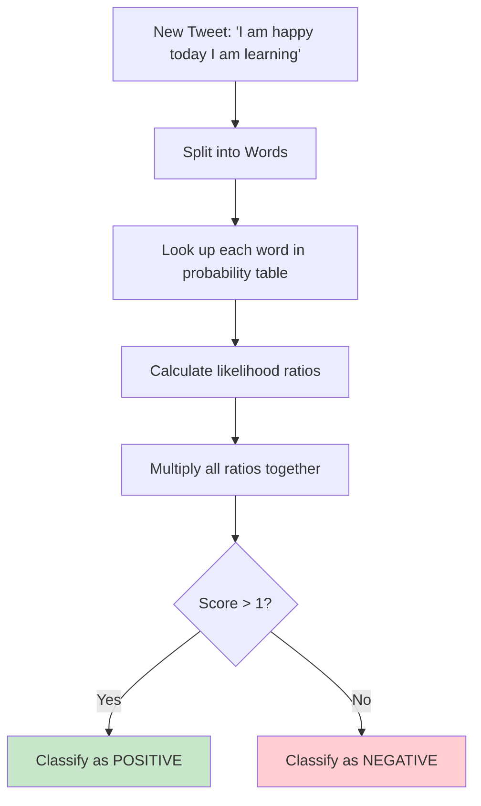

The **Naive Bayes inference rule for binary classification** is:

$\text{Score} = \prod_{w \in \text{tweet}} \frac{P(w | \text{positive})}{P(w | \text{negative})}$

**Decision Rule**:

- If Score > 1: Tweet is **positive**
- If Score ≤ 1: Tweet is **negative**

### Example Classification

**Tweet**: "I am happy today I am learning"

Let's calculate the score step by step:

| Word     | P(w\|positive) | P(w\|negative) | Ratio            | Note              |
| -------- | -------------- | -------------- | ---------------- | ----------------- |
| I        | 0.23           | 0.25           | 0.23/0.25 = 0.92 | Neutral word      |
| am       | 0.15           | 0.17           | 0.15/0.17 = 0.88 | Neutral word      |
| happy    | 0.15           | 0.08           | 0.15/0.08 = 1.88 | **Power word**    |
| today    | -              | -              | (skip)           | Not in vocabulary |
| I        | 0.23           | 0.25           | 0.23/0.25 = 0.92 | Neutral word      |
| am       | 0.15           | 0.17           | 0.15/0.17 = 0.88 | Neutral word      |
| learning | 0.08           | 0.08           | 0.08/0.08 = 1.00 | Neutral word      |

**Score Calculation**:
$\text{Score} = 0.92 \times 0.88 \times 1.88 \times 0.92 \times 0.88 \times 1.00 = 1.24$

**Key Observation**: Notice that all the neutral words (I, am, learning) have ratios close to 1. What dominates is the power word "happy" with a ratio of 1.88.

**Simplified Understanding**: The neutral words nearly cancel out, and the power word "happy" drives the decision.

**Conclusion**: Since 1.24 > 1, we classify this tweet as **positive**.

---

## Key Insights

### 1. **Power of Ratios**

The ratio $\frac{P(w | \text{positive})}{P(w | \text{negative})}$ tells us:

- **Ratio > 1**: Word favors positive sentiment
- **Ratio < 1**: Word favors negative sentiment
- **Ratio ≈ 1**: Word is neutral

### 2. **Neutral Words Cancel Out**

Words that appear equally in both classes don't contribute to the final decision - they naturally cancel out in the multiplication.

### 3. **Power Words Dominate**

Words with strong sentiment associations have the biggest impact on the final classification.

### 4. **Handling Unknown Words**

Words not in the vocabulary are simply ignored (not included in the score calculation).

---

## Mathematical Foundation

### Why This Works

The Naive Bayes classifier is actually computing:
$$\frac{P(\text{positive} | \text{tweet})}{P(\text{negative} | \text{tweet})}$$

Using Bayes' rule and the independence assumption, this becomes:
$$\frac{P(\text{positive})}{P(\text{negative})} \times \prod_{w \in \text{tweet}} \frac{P(w | \text{positive})}{P(w | \text{negative})}$$

For balanced datasets where $P(\text{positive}) \approx P(\text{negative})$, the prior ratio is approximately 1, leaving us with just the product of likelihood ratios.

---

## Summary

You've now learned the core concepts of Naive Bayes classification:

### **Process Overview**:

1. **Extract vocabulary** and count word frequencies by class
2. **Calculate conditional probabilities** for each word given each class
3. **Apply the inference rule** using likelihood ratios
4. **Make predictions** based on whether the score is greater than 1

### **Key Concepts**:

- **Independence assumption**: Features are assumed independent (naive but effective)
- **Conditional probabilities**: $P(w | \text{class})$ capture word-class associations
- **Likelihood ratios**: Compare relative word probabilities between classes
- **Power words**: Words with strong sentiment associations drive predictions
- **Neutral words**: Words with similar probabilities across classes cancel out

### **Advantages**:

- Simple and fast to implement
- Works well as a baseline for text classification
- Robust to irrelevant features (neutral words)
- Interpretable results

**Next**: We'll look into issues with this implementation and how to fix them, particularly addressing the zero probability problem through smoothing techniques.

# 4. Laplacian Smoothing

## Introduction

Sometimes when calculating probabilities, you encounter a serious problem: **zero probabilities**. For example, you might want to calculate the probability of a word appearing after another word. To do that, you count how many times those two words showed up one after another, divided by the number of times the first word appeared.

**But what if those two words never showed up next to each other in the training corpus?**

You get a probability of **zero**, and the probability of an entire sequence might go to zero, making your classifier useless. Let's see how we can fix this problem.

---

## The Zero Probability Problem

### Why Zero Probabilities Are Dangerous

Consider our previous example where the word "because" only appears in positive tweets:

| Word    | Positive Count | Negative Count |
| ------- | -------------- | -------------- |
| because | 1              | 0              |

Using our original formula:
$$P(\text{because} | \text{negative}) = \frac{0}{12} = 0$$

**The Problem**: If we encounter a new tweet containing "because" and we try to calculate the negative score:

$$\text{Negative Score} = P(\text{other words} | \text{negative}) \times P(\text{because} | \text{negative})$$
$$\text{Negative Score} = \text{some positive number} \times 0 = 0$$

**Result**: The entire probability becomes zero, making it impossible to compare positive vs. negative scores properly.

### Real-World Scenario

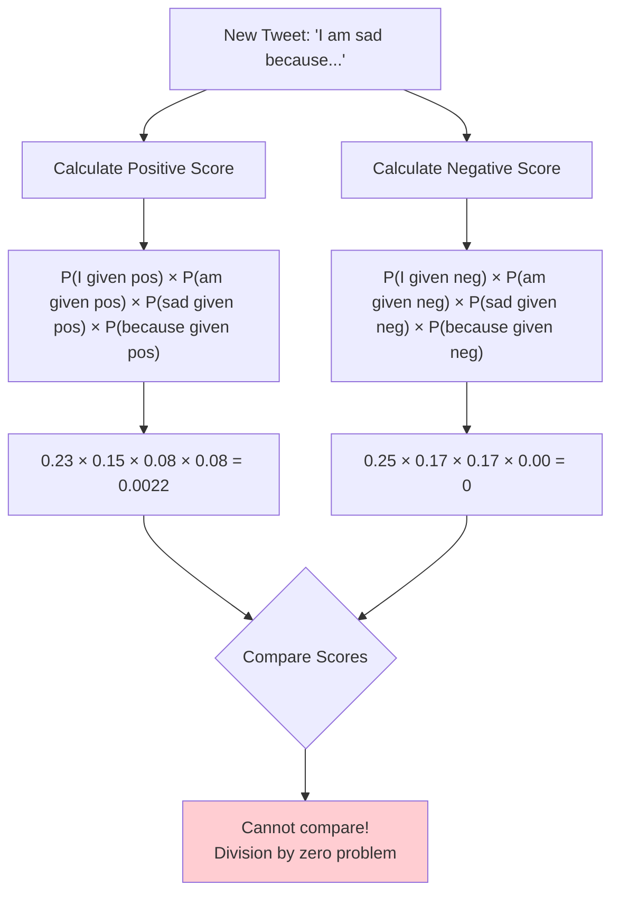

---

## The Original Conditional Probability Formula

**Standard Formula**:
$$P(w_i | \text{class}) = \frac{\text{freq}(w_i, \text{class})}{N_{\text{class}}}$$

Where:

- $w_i$: A specific word in our vocabulary
- $\text{freq}(w_i, \text{class})$: Number of times word $w_i$ appears in the given class
- $N_{\text{class}}$: Total number of words in the class
- $\text{class} \in \{\text{Positive}, \text{Negative}\}$

### Example Using Original Formula

For the word "because":

- **Positive**: $P(\text{because} | \text{positive}) = \frac{1}{13} = 0.077$
- **Negative**: $P(\text{because} | \text{negative}) = \frac{0}{12} = 0.000$ ⚠️

---

## Laplacian Smoothing: The Solution

**Laplacian Smoothing** (also called **Add-1 Smoothing**) is a technique that avoids zero probabilities by adding a small constant to all frequency counts.

### The Smoothed Formula

$$P(w_i | \text{class}) = \frac{\text{freq}(w_i, \text{class}) + 1}{N_{\text{class}} + V}$$

Where:

- $\text{freq}(w_i, \text{class}) + 1$: Original frequency plus 1 (the "smoothing")
- $N_{\text{class}} + V$: Original total plus vocabulary size
- $V$: Number of unique words in the vocabulary

### Why This Works

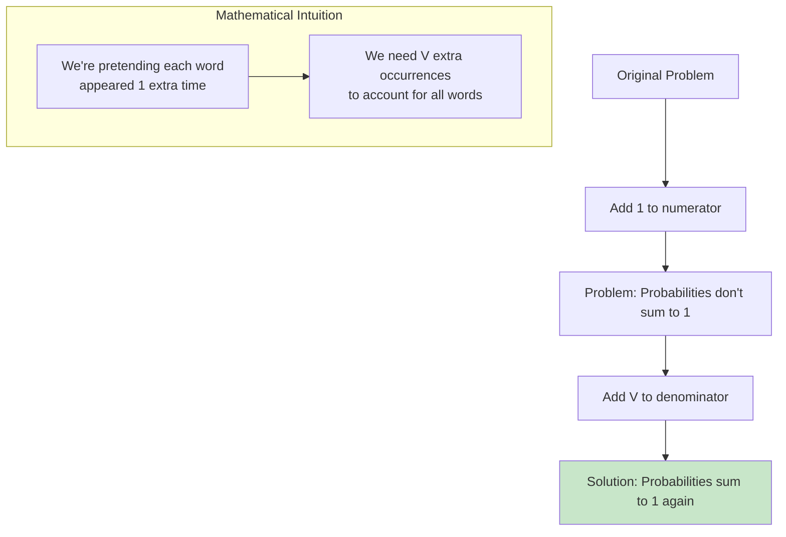

**Intuitive Explanation**:

- We pretend each word appeared **1 additional time** in each class
- Since there are $V$ unique words, we add $V$ total extra occurrences
- This ensures probabilities remain properly normalized

---

## Applying Laplacian Smoothing: Step-by-Step

### Step 1: Calculate Vocabulary Size

From our previous example, let's count unique words:

| Word     | In Vocabulary? |
| -------- | -------------- |
| I        | ✓              |
| am       | ✓              |
| happy    | ✓              |
| because  | ✓              |
| learning | ✓              |
| NLP      | ✓              |
| sad      | ✓              |
| not      | ✓              |

**Vocabulary size**: $V = 8$ unique words

### Step 2: Apply the Smoothed Formula

**Original word counts**:
| Word | Positive Count | Negative Count |
|------|----------------|----------------|
| I | 3 | 3 |
| am | 2 | 2 |
| happy | 2 | 1 |
| because | 1 | 0 |
| learning | 1 | 1 |
| NLP | 1 | 1 |
| sad | 1 | 2 |
| not | 1 | 2 |
| **Total** | **N_pos = 13** | **N_neg = 12** |

### Step 3: Calculate Smoothed Probabilities

**For Positive Class** ($N_{pos} + V = 13 + 8 = 21$):

| Word     | Calculation  | Smoothed P(w\|positive) |
| -------- | ------------ | ----------------------- |
| I        | (3 + 1) ÷ 21 | 0.19                    |
| am       | (2 + 1) ÷ 21 | 0.14                    |
| happy    | (2 + 1) ÷ 21 | 0.14                    |
| because  | (1 + 1) ÷ 21 | 0.10                    |
| learning | (1 + 1) ÷ 21 | 0.10                    |
| NLP      | (1 + 1) ÷ 21 | 0.10                    |
| sad      | (1 + 1) ÷ 21 | 0.10                    |
| not      | (1 + 1) ÷ 21 | 0.10                    |
| **Sum**  |              | **1.00** ✓              |

**For Negative Class** ($N_{neg} + V = 12 + 8 = 20$):

| Word     | Calculation  | Smoothed P(w\|negative) |
| -------- | ------------ | ----------------------- |
| I        | (3 + 1) ÷ 20 | 0.20                    |
| am       | (2 + 1) ÷ 20 | 0.15                    |
| happy    | (1 + 1) ÷ 20 | 0.10                    |
| because  | (0 + 1) ÷ 20 | 0.05                    |
| learning | (1 + 1) ÷ 20 | 0.10                    |
| NLP      | (1 + 1) ÷ 20 | 0.10                    |
| sad      | (2 + 1) ÷ 20 | 0.15                    |
| not      | (2 + 1) ÷ 20 | 0.15                    |
| **Sum**  |              | **1.00** ✓              |

---

## Key Benefits of Laplacian Smoothing

### 1. **Eliminates Zero Probabilities**

- **Before**: $P(\text{because} | \text{negative}) = 0.00$ 🚫
- **After**: $P(\text{because} | \text{negative}) = 0.05$ ✅

### 2. **Maintains Probability Normalization**

All probabilities in each class still sum to 1.00, ensuring valid probability distributions.

### 3. **Handles Unseen Words**

If we encounter a completely new word during testing, we can assign it:
$$P(\text{new word} | \text{class}) = \frac{0 + 1}{N_{\text{class}} + V} = \frac{1}{N_{\text{class}} + V}$$

### 4. **Preserves Relative Relationships**

Words that appeared more frequently still have higher probabilities, just slightly adjusted.

---

## Comparing Before and After Smoothing

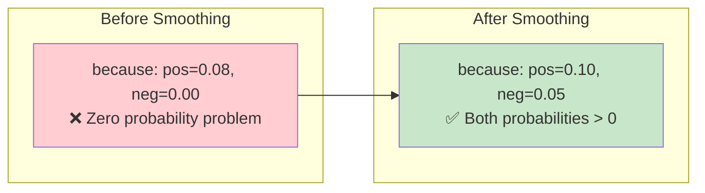

### Practical Impact

Now if we see "because" in a new tweet:

- **Positive ratio**: $\frac{0.10}{0.05} = 2.0$ (favors positive)
- **Before smoothing**: $\frac{0.08}{0.00} = \infty$ (undefined!)

The classifier can now make reasonable decisions instead of breaking.

---

## Mathematical Properties

### 1. **Conservation of Probability Mass**

The smoothing redistributes probability mass from frequent words to rare/unseen words:

**Before**: Frequent words get all probability, unseen words get 0

**After**: Frequent words get slightly less, unseen words get small positive probability

### 2. **Laplace's Rule of Succession**

This technique is based on Laplace's principle: if we haven't seen an event, we should still assign it a small positive probability rather than assuming it's impossible.

### 3. **Additive Smoothing Family**

Laplacian smoothing is a special case of additive smoothing where we add α = 1:
$$P(w_i | \text{class}) = \frac{\text{freq}(w_i, \text{class}) + \alpha}{N_{\text{class}} + \alpha \cdot V}$$

When $\alpha = 1$, we get Laplacian smoothing.

---

## Summary

### **The Problem**:

- Zero probabilities can break classification
- Unseen words in training cause division by zero
- Makes the classifier fragile and unreliable

### **The Solution**:

- **Add 1** to all word frequencies (numerator)
- **Add V** (vocabulary size) to total word counts (denominator)
- Ensures all probabilities are positive and sum to 1

### **Key Formula**:

$$P(w_i | \text{class}) = \frac{\text{freq}(w_i, \text{class}) + 1}{N_{\text{class}} + V}$$

### **Benefits**:

1. ✅ Eliminates zero probabilities
2. ✅ Handles unseen words gracefully
3. ✅ Maintains probability distribution properties
4. ✅ Simple to implement and understand
5. ✅ Preserves relative word importance

### **Trade-offs**:

- Slightly reduces the probability of frequent words
- Gives small probability to truly irrelevant words
- But these trade-offs are usually worth the increased robustness

**Next**: You'll learn about log likelihood, which will make our calculations more numerically stable and easier to work with.

# 5. Log Likelihood, Part 1

## Introduction

In this section, we'll introduce **log likelihoods** - these are just logarithms of the probabilities we calculated in the previous video. They are **way more convenient** to work with and appear throughout deep learning and NLP. Let's discover why this mathematical transformation is not just helpful, but essential for practical implementation.

---

## Why Do We Need Log Likelihood?

### The Numerical Underflow Problem

Imagine you have a tweet with many words. Using our original Naive Bayes formula:

$$\text{Score} = \prod_{i=1}^{m} \frac{P(w_i | \text{positive})}{P(w_i | \text{negative})}$$

**Problem**: As $m$ (number of words) gets larger, we multiply many small probabilities together:

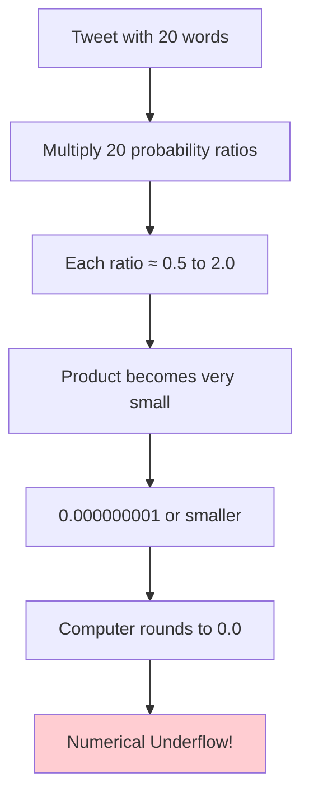

**Example**: If each ratio is around 0.8:

- 5 words: $0.8^5 = 0.33$ ✓
- 10 words: $0.8^{10} = 0.11$ ✓
- 20 words: $0.8^{20} = 0.01$ ⚠️
- 50 words: $0.8^{50} = 0.000014$ 🚫

The computer might round this to zero, breaking our classifier!

---

## Understanding Word Categories Through Ratios

Let's go back to our smoothed conditional probabilities and see how ratios help us understand word sentiment.

### Calculating Probability Ratios

Using our smoothed probabilities from the previous section:

| Word     | P(w\|positive) | P(w\|negative) | Ratio            | Category     |
| -------- | -------------- | -------------- | ---------------- | ------------ |
| I        | 0.19           | 0.20           | 0.19/0.20 = 0.95 | Neutral      |
| am       | 0.14           | 0.15           | 0.14/0.15 = 0.93 | Neutral      |
| happy    | 0.14           | 0.10           | 0.14/0.10 = 1.40 | **Positive** |
| because  | 0.10           | 0.05           | 0.10/0.05 = 2.00 | **Positive** |
| learning | 0.10           | 0.10           | 0.10/0.10 = 1.00 | Neutral      |
| NLP      | 0.10           | 0.10           | 0.10/0.10 = 1.00 | Neutral      |
| sad      | 0.10           | 0.15           | 0.10/0.15 = 0.67 | **Negative** |
| not      | 0.10           | 0.15           | 0.10/0.15 = 0.67 | **Negative** |

### Interpreting the Ratios

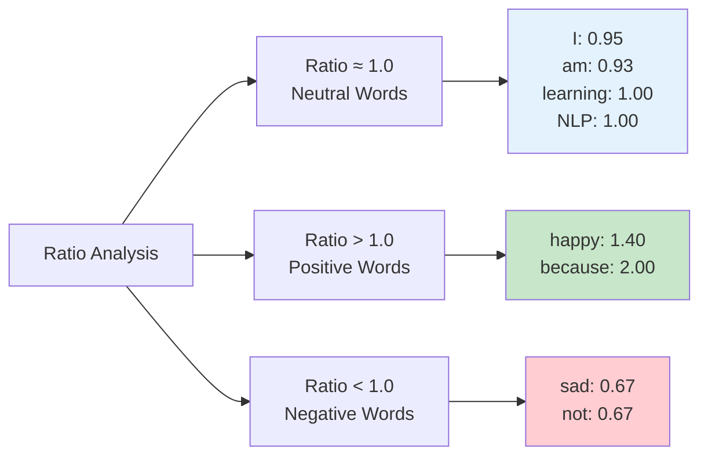

**Key Insights**:

- **Neutral words** have ratios ≈ 1: They appear equally in both classes
- **Positive words** have ratios > 1: More common in positive tweets
- **Negative words** have ratios < 1: More common in negative tweets
- **Stronger sentiment** = more extreme ratio (farther from 1)

---

## The Complete Naive Bayes Formula

### Adding the Prior Ratio

The complete Naive Bayes formula includes a **prior ratio**:

$$\frac{P(\text{positive})}{P(\text{negative})} \times \prod_{i=1}^{m} \frac{P(w_i | \text{positive})}{P(w_i | \text{negative})} > 1$$

**Components**:

1. **Prior Ratio**: $\frac{P(\text{positive})}{P(\text{negative})}$ - How common are positive vs negative tweets overall?
2. **Likelihood**: $\prod_{i=1}^{m} \frac{P(w_i | \text{positive})}{P(w_i | \text{negative})}$ - Evidence from the words

### Why We Haven't Mentioned Priors Before

In our examples, we've had balanced datasets:

- Positive tweets: 13 words from positive tweets
- Negative tweets: 12 words from negative tweets
- Prior ratio ≈ $\frac{13}{12} ≈ 1.08 ≈ 1$

**For balanced datasets**: Prior ratio ≈ 1, so it doesn't affect the decision.

**For unbalanced datasets**: If 90% of tweets are positive, prior ratio = $\frac{0.9}{0.1} = 9$, which strongly favors positive classification.

---

## The Logarithm Solution

### Mathematical Property of Logarithms

The key insight uses this logarithm property:
$$\log(a \times b) = \log(a) + \log(b)$$

**Transforming our formula**:
$$\log\left(\frac{P(\text{pos})}{P(\text{neg})} \times \prod_{i=1}^{m} \frac{P(w_i | \text{pos})}{P(w_i | \text{neg})}\right)$$

$$= \log\left(\frac{P(\text{pos})}{P(\text{neg})}\right) + \sum_{i=1}^{m} \log\left(\frac{P(w_i | \text{pos})}{P(w_i | \text{neg})}\right)$$

### Benefits of This Transformation

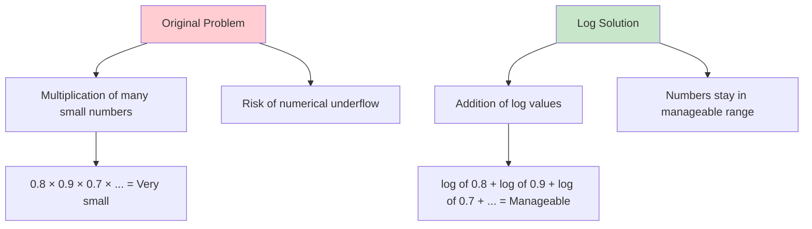

**Advantages**:

1. **Numerical Stability**: No underflow issues
2. **Easier Computation**: Addition instead of multiplication
3. **Same Decision**: If score > 1, then log(score) > 0

---

## Introducing Lambda (λ)

To make calculations even more convenient, we define **Lambda**:

$$\lambda_i = \log\left(\frac{P(w_i | \text{positive})}{P(w_i | \text{negative})}\right)$$

### Computing Lambda Values

Using our probability ratios:

| Word     | Ratio | λ = log(ratio)    | Interpretation      |
| -------- | ----- | ----------------- | ------------------- |
| I        | 0.95  | log(0.95) = -0.05 | Slightly negative   |
| am       | 0.93  | log(0.93) = -0.07 | Slightly negative   |
| happy    | 1.40  | log(1.40) = 0.34  | **Positive**        |
| because  | 2.00  | log(2.00) = 0.69  | **Strong positive** |
| learning | 1.00  | log(1.00) = 0.00  | Neutral             |
| NLP      | 1.00  | log(1.00) = 0.00  | Neutral             |
| sad      | 0.67  | log(0.67) = -0.41 | **Negative**        |
| not      | 0.67  | log(0.67) = -0.41 | **Negative**        |

### Interpreting Lambda Values

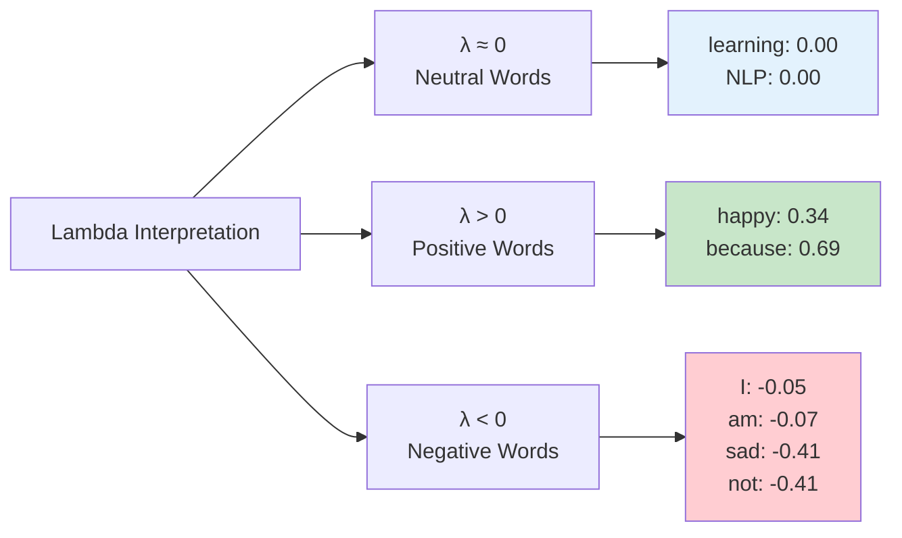

**Key Insights**:

- **λ > 0**: Word favors positive sentiment
- **λ < 0**: Word favors negative sentiment
- **λ ≈ 0**: Word is neutral
- **|λ| larger**: Stronger sentiment indicator

---

## The Final Log-Likelihood Formula

### Complete Formula

$$\text{Log Score} = \log\left(\frac{P(\text{pos})}{P(\text{neg})}\right) + \sum_{i=1}^{m} \lambda_i$$

Where:

- **Log Prior**: $\log\left(\frac{P(\text{pos})}{P(\text{neg})}\right)$
- **Log Likelihood**: $\sum_{i=1}^{m} \lambda_i$

**Decision Rule**:

- If Log Score > 0: Tweet is **positive**
- If Log Score ≤ 0: Tweet is **negative**

### Example Classification

**Tweet**: "I am happy because I am learning"

**Step 1**: Look up lambda values

- I: λ = -0.05
- am: λ = -0.07
- happy: λ = 0.34
- because: λ = 0.69
- I: λ = -0.05 (again)
- am: λ = -0.07 (again)
- learning: λ = 0.00

**Step 2**: Calculate log likelihood
$$\text{Log Likelihood} = -0.05 + (-0.07) + 0.34 + 0.69 + (-0.05) + (-0.07) + 0.00 = 0.79$$

**Step 3**: Add log prior (assuming balanced dataset)
$$\text{Log Prior} = \log\left(\frac{1}{1}\right) = 0$$

**Step 4**: Final score
$$\text{Log Score} = 0 + 0.79 = 0.79$$

**Decision**: Since 0.79 > 0, classify as **positive** ✓

---

## Why Lambda Dictionaries Are Powerful

### Precomputation Benefits

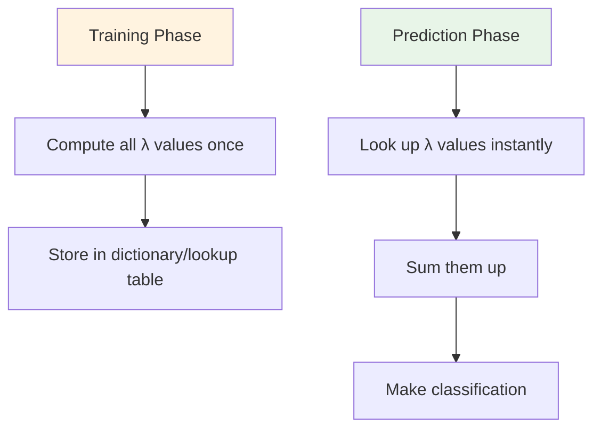

**Advantages**:

1. **Speed**: No need to recalculate probabilities for each tweet
2. **Simplicity**: Just sum up pre-computed values
3. **Memory Efficient**: One λ value per vocabulary word
4. **Interpretability**: Easy to see which words are most important

### Implementation Strategy

```python
# Pseudocode for using lambda dictionary
lambda_dict = {
    'happy': 0.34,
    'sad': -0.41,
    'because': 0.69,
    # ... all vocabulary words
}

def classify_tweet(tweet_words):
    log_score = 0  # Assuming balanced dataset (log_prior = 0)
    for word in tweet_words:
        if word in lambda_dict:
            log_score += lambda_dict[word]
    return "positive" if log_score > 0 else "negative"
```

---

## Summary

### **The Problem**:

- Multiplying many small probabilities causes numerical underflow
- Products can become so small they're rounded to zero
- Makes classification impossible for longer texts

### **The Solution**:

- Transform multiplication to addition using logarithms
- Work with λ values instead of probability ratios
- Maintain same classification decisions with better numerical stability

### **Key Concepts**:

1. **Probability Ratios**: Show word sentiment preference

   - Ratio > 1: Positive-leaning word
   - Ratio < 1: Negative-leaning word
   - Ratio ≈ 1: Neutral word

2. **Lambda (λ)**: Log of probability ratio

   - λ > 0: Positive-leaning word
   - λ < 0: Negative-leaning word
   - λ ≈ 0: Neutral word

3. **Log Likelihood Formula**:
   $$\text{Log Score} = \text{Log Prior} + \sum_{i=1}^{m} \lambda_i$$

4. **Decision Rule**:
   - Log Score > 0 → Positive
   - Log Score ≤ 0 → Negative

### **Benefits**:

- ✅ Numerical stability for long texts
- ✅ Faster computation through precomputed λ values
- ✅ Same classification accuracy as original method
- ✅ More interpretable word importance scores
- ✅ Easy to implement and debug

**Next**: We'll continue exploring log likelihood and see more practical applications of this powerful technique.

# 6. Log Likelihood, Part 2

## Introduction

We'll continue from the previous topic and show you **how to do inference** using our lambda dictionary. Given your lambda dictionary, the task is pretty straightforward - you have done most of the work to arrive at your log likelihood already. Now let's wrap up and see the complete inference process in action.

---

## The Lambda Dictionary in Action

### Our Pre-computed Lambda Values

From our previous calculations, we have our lambda dictionary:

| Word     | λ (Lambda) | Sentiment Indication  |
| -------- | ---------- | --------------------- |
| I        | 0.0        | Neutral               |
| am       | 0.0        | Neutral               |
| happy    | 2.2        | **Strong Positive**   |
| because  | -          | (not used in example) |
| learning | 1.1        | **Positive**          |
| NLP      | 0.0        | Neutral               |
| sad      | -0.4       | Negative              |
| not      | -0.4       | Negative              |

> **Note**: The specific lambda values shown here come from the lecture transcript and may differ slightly from our previous detailed calculations due to rounding or different smoothing parameters.

---

## Step-by-Step Inference Process

### The Tweet Classification Example

**Tweet**: "I am happy because I am learning"

Now we can calculate the log likelihood as the **sum of the lambdas** from each word in the tweet:

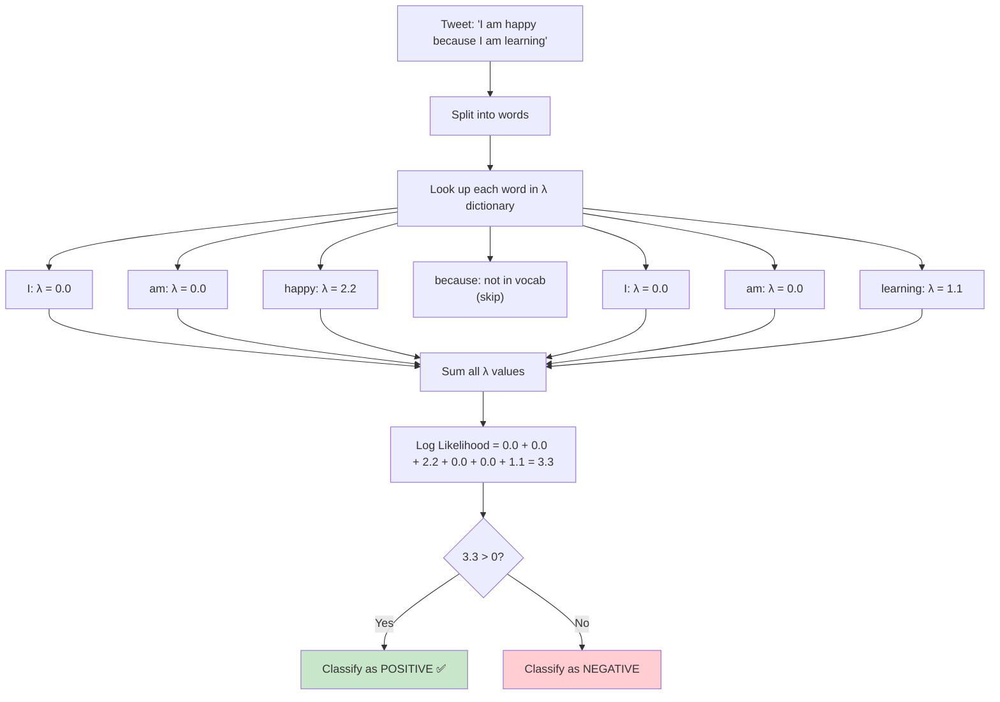

### Detailed Calculation

**Word-by-word breakdown**:

1. **"I"**: λ = 0.0 (neutral word)
2. **"am"**: λ = 0.0 (neutral word)
3. **"happy"**: λ = 2.2 (**power word** - strong positive!)
4. **"because"**: Not in vocabulary (skip)
5. **"I"**: λ = 0.0 (neutral word, appears again)
6. **"am"**: λ = 0.0 (neutral word, appears again)
7. **"learning"**: λ = 1.1 (**power word** - positive!)

**Log Likelihood Calculation**:
$$\text{Log Likelihood} = 0.0 + 0.0 + 2.2 + 0.0 + 0.0 + 1.1 = 3.3$$

---

## Decision Making with Log Likelihood

### The New Decision Threshold

Remember how previously you saw that a tweet was positive if the **product was bigger than 1**. With logarithms:

- **Original threshold**: Product > 1
- **Log threshold**: log(1) = 0
- **New rule**: Log Likelihood > 0

### Decision Logic

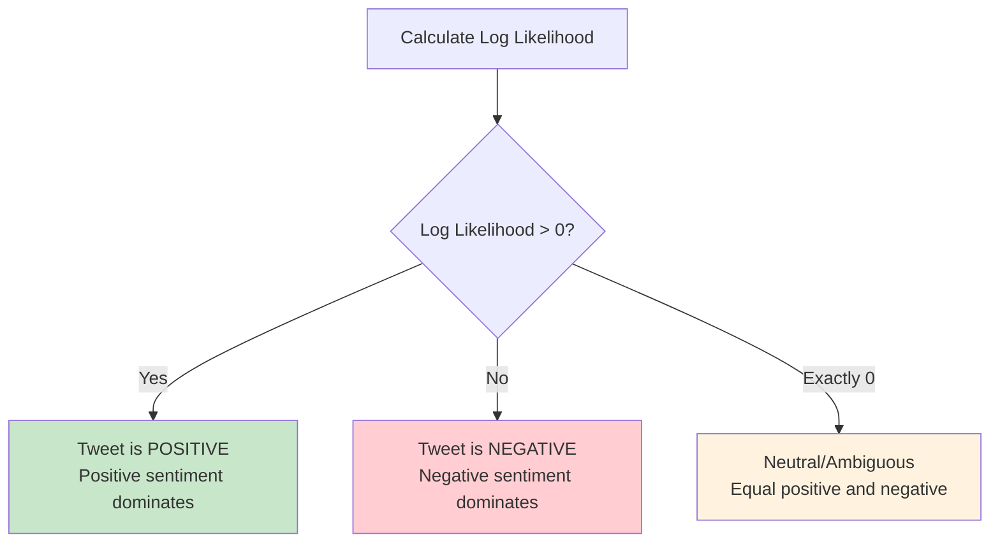

**Decision Rules**:

- **Log Likelihood > 0**: Tweet is **positive** 🟢
- **Log Likelihood < 0**: Tweet is **negative** 🔴
- **Log Likelihood = 0**: Neutral (rare in practice)

---

## Analyzing the Result

### Why This Tweet is Positive

**Our result**: Log Likelihood = 3.3 > 0 → **POSITIVE** ✅

**Key insight**: Notice that this score is based entirely on the words **"happy"** and **"learning"**, both of which carry positive sentiment:

| Word Contribution | λ Value  | Impact                         |
| ----------------- | -------- | ------------------------------ |
| happy             | 2.2      | **Major positive contributor** |
| learning          | 1.1      | **Minor positive contributor** |
| I, am (repeated)  | 0.0 each | Neutral - no impact            |

### The Power of "Power Words"

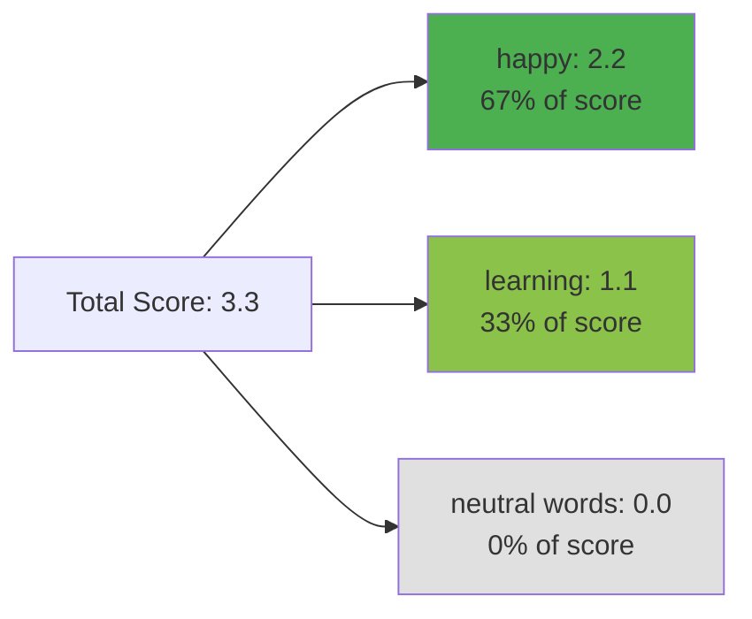

**Key Observation**: All the neutral words (I, am) were neutral and **didn't contribute to the score**. See how much influence the **power words** have!

This demonstrates the core principle of Naive Bayes:

- **Neutral words** cancel out or contribute zero
- **Power words** (sentiment-bearing words) drive the classification decision

---

## Practical Implementation

### Simple Inference Algorithm

```python
def classify_tweet(tweet, lambda_dict):
    """
    Classify a tweet using log likelihood
    """
    words = tweet.split()  # Simple tokenization
    log_likelihood = 0.0

    # Sum lambda values for all words in tweet
    for word in words:
        if word in lambda_dict:
            log_likelihood += lambda_dict[word]
        # Words not in vocabulary are ignored (contribute 0)

    # Make classification decision
    if log_likelihood > 0:
        return "POSITIVE"
    else:
        return "NEGATIVE"

# Example usage
lambda_dict = {
    'I': 0.0,
    'am': 0.0,
    'happy': 2.2,
    'learning': 1.1,
    # ... more words
}

tweet = "I am happy because I am learning"
result = classify_tweet(tweet, lambda_dict)  # Returns "POSITIVE"
```

### Handling Edge Cases

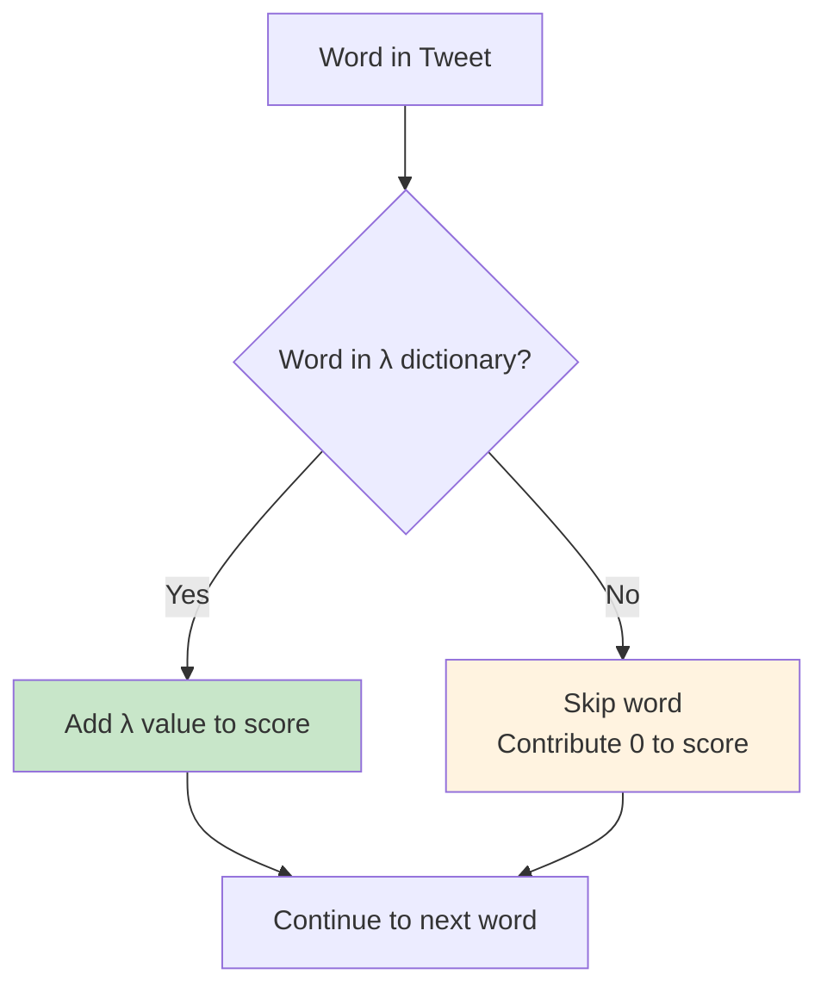

**Important considerations**:

1. **Unknown words**: Words not in training vocabulary are ignored
2. **Repeated words**: Each occurrence contributes to the score
3. **Case sensitivity**: Implementation should handle "Happy" vs "happy"
4. **Punctuation**: Should be handled during preprocessing

---

## Comparing Approaches: Product vs. Sum

### Original Approach (Multiplicative)

**Advantages**:

- Intuitive probability interpretation
- Direct application of Bayes' rule

**Disadvantages**:

- Numerical underflow for long texts
- Computationally expensive (many multiplications)
- Harder to debug and interpret

### Log Likelihood Approach (Additive)

**Advantages**:

- ✅ No numerical underflow issues
- ✅ Fast computation (just addition)
- ✅ Easy to debug (see individual word contributions)
- ✅ Interpretable scores
- ✅ Same classification results

**Disadvantages**:

- Slightly less intuitive (requires understanding logs)

---

## Understanding Score Magnitudes

### What Different Scores Mean

| Log Likelihood Range | Interpretation    | Confidence        |
| -------------------- | ----------------- | ----------------- |
| > 2.0                | Strong positive   | High confidence   |
| 0.5 to 2.0           | Moderate positive | Medium confidence |
| -0.5 to 0.5          | Neutral/Ambiguous | Low confidence    |
| -2.0 to -0.5         | Moderate negative | Medium confidence |
| < -2.0               | Strong negative   | High confidence   |

**Our example**: Score = 3.3 indicates **strong positive sentiment** with **high confidence**.

### Score Decomposition

For our tweet "I am happy because I am learning":

- **Base score**: 0 (from neutral words)
- **Positive boost**: +2.2 (from "happy") + 1.1 (from "learning") = +3.3
- **Negative reduction**: 0 (no negative words)
- **Final score**: 3.3 (strong positive)

---

## Summary and Key Takeaways

### **The Inference Process**:

1. **Preprocess tweet**: Split into words, clean if needed
2. **Look up lambda values**: For each word in the tweet
3. **Sum lambda values**: Add up all the λ values found
4. **Apply decision rule**: If sum > 0, classify as positive

### **Core Insights**:

- **Neutral words contribute 0**: They don't affect the final decision
- **Power words dominate**: Words with strong sentiment drive classification
- **Additive scoring**: Each word independently contributes to the final score
- **Threshold shift**: Decision boundary moves from 1 (multiplicative) to 0 (additive)

### **Practical Benefits**:

- **Computational efficiency**: Just addition operations
- **Numerical stability**: No underflow problems
- **Interpretability**: Easy to see which words influenced the decision
- **Debugging friendly**: Can trace exactly how score was calculated
- **Scalable**: Works well for tweets of any length

### **Real-World Applications**:

This approach is used in:

- Social media sentiment monitoring
- Product review analysis
- Customer feedback classification
- Content moderation systems
- Market sentiment analysis

**Next**: Now that you have a good understanding of how to compute the log likelihood and how to do inference, we'll proceed to show you how to train a Naive Bayes model from scratch.

---

## Quick Self-Check

**Practice Problem**: Calculate the log likelihood for the tweet "I am sad"

Given lambda values:

- I: λ = 0.0
- am: λ = 0.0
- sad: λ = -0.4

**Solution**:
Log Likelihood = 0.0 + 0.0 + (-0.4) = -0.4

Since -0.4 < 0, classify as **NEGATIVE** ✓

# 7. Training Naïve Bayes

## Introduction

This week, I'll show you how to **train the Naive Bayes classifier**. In this context, training is something **fundamentally different** than in logistic regression or deep learning. There is **no gradient descent** - we're just counting frequencies of words in the corpus. You will now be creating step-by-step, a Naive Bayes model for sentiment analysis using a corpus of tweets. That's awesome!

---

## Key Insight: What Makes Naive Bayes Training Unique?

Unlike neural networks or logistic regression, Naive Bayes training is **non-iterative**:

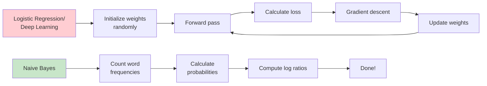

This makes Naive Bayes extremely **fast and simple** to train - no optimization loops, no convergence issues!

---

## Complete Training Example: Step-by-Step

Let's work through a complete example with actual numbers to see exactly what happens at each step.

### Our Sample Dataset

**Raw Tweets**:

- **Positive**: "I love this movie", "Amazing film", "Great acting"
- **Negative**: "I hate this movie", "Terrible film", "Bad acting"

---

## Step 1: Data Collection and Annotation

**Objective**: Get or annotate a dataset with positive and negative tweets.

### Our Example Dataset

| Tweet ID | Raw Tweet                  | Label    |
| -------- | -------------------------- | -------- |
| 1        | "I love this movie!"       | Positive |
| 2        | "Amazing film 😍"          | Positive |
| 3        | "Great acting performance" | Positive |
| 4        | "I hate this movie!"       | Negative |
| 5        | "Terrible film 😞"         | Negative |
| 6        | "Bad acting performance"   | Negative |

**Key Points**:

- **Balanced dataset**: 3 positive, 3 negative tweets
- **Domain-specific**: All about movies (good for movie sentiment analysis)
- **Real-world note**: Data collection and annotation often takes the majority of project time

---

## Step 2: Text Preprocessing

**Objective**: `process_tweet(tweet)` ➞ `[w1, w2, w3, ...]`

Let's process each tweet through our 5-step pipeline:

### The 5-Step Preprocessing Pipeline

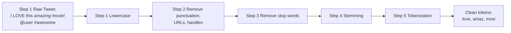

### Detailed Processing Example

**Tweet 1**: "I love this movie!" → Positive

| Step             | Process              | Result               |
| ---------------- | -------------------- | -------------------- |
| Raw              | Original             | "I love this movie!" |
| 1. Lowercase     | Convert to lowercase | "i love this movie!" |
| 2. Remove punct. | Remove !, ?, etc.    | "i love this movie"  |
| 3. Remove stops  | Remove "i", "this"   | "love movie"         |
| 4. Stemming      | Reduce to stems      | "love movi"          |
| 5. Tokenize      | Split to list        | ["love", "movi"]     |

### Complete Preprocessing Results

| Original Tweet             | Processed Tokens            |
| -------------------------- | --------------------------- |
| "I love this movie!"       | ["love", "movi"]            |
| "Amazing film 😍"          | ["amaz", "film"]            |
| "Great acting performance" | ["great", "act", "perform"] |
| "I hate this movie!"       | ["hate", "movi"]            |
| "Terrible film 😞"         | ["terribl", "film"]         |
| "Bad acting performance"   | ["bad", "act", "perform"]   |

---

## Step 3: Compute Word Frequencies

**Objective**: Compute `freq(w, class)` for each word in each class.

### Building the Frequency Table

Let's count how many times each word appears in each class:

| Word            | Positive Count | Negative Count | Vocabulary |
| --------------- | -------------- | -------------- | ---------- |
| love            | 1              | 0              | ✓          |
| movi            | 1              | 1              | ✓          |
| amaz            | 1              | 0              | ✓          |
| film            | 1              | 1              | ✓          |
| great           | 1              | 0              | ✓          |
| act             | 1              | 1              | ✓          |
| perform         | 1              | 1              | ✓          |
| hate            | 0              | 1              | ✓          |
| terribl         | 0              | 1              | ✓          |
| bad             | 0              | 1              | ✓          |
| **Total Words** | **N_pos = 7**  | **N_neg = 7**  | **V = 10** |

**Important Calculations**:

- **N_pos** = 7 (total words in positive tweets)
- **N_neg** = 7 (total words in negative tweets)
- **V** = 10 (unique words in vocabulary)

**Key Insight**: We compute the sum of words in each class simultaneously with frequency counting.

---

## Step 4: Calculate Conditional Probabilities

**Objective**: Get $P(w|pos)$ and $P(w|neg)$ using Laplacian smoothing.

### The Laplacian Smoothing Formula

$$P(w|\text{class}) = \frac{\text{freq}(w, \text{class}) + 1}{N_{\text{class}} + V}$$

**Where**:

- $\text{freq}(w, \text{class})$ = count of word $w$ in class
- $N_{\text{class}}$ = total words in class
- $V$ = unique words in vocabulary (V = 10 in our example)

### Detailed Calculations

**For Positive Class**: $N_{\text{pos}} + V = 7 + 10 = 17$

| Word    | freq(w,pos) | Calculation  | P(w\|pos)   |
| ------- | ----------- | ------------ | ----------- |
| love    | 1           | (1 + 1) ÷ 17 | 0.118       |
| movi    | 1           | (1 + 1) ÷ 17 | 0.118       |
| amaz    | 1           | (1 + 1) ÷ 17 | 0.118       |
| film    | 1           | (1 + 1) ÷ 17 | 0.118       |
| great   | 1           | (1 + 1) ÷ 17 | 0.118       |
| act     | 1           | (1 + 1) ÷ 17 | 0.118       |
| perform | 1           | (1 + 1) ÷ 17 | 0.118       |
| hate    | 0           | (0 + 1) ÷ 17 | 0.059       |
| terribl | 0           | (0 + 1) ÷ 17 | 0.059       |
| bad     | 0           | (0 + 1) ÷ 17 | 0.059       |
| **Sum** |             |              | **1.000** ✓ |

**For Negative Class**: $N_{\text{neg}} + V = 7 + 10 = 17$

| Word    | freq(w,neg) | Calculation  | P(w\|neg)   |
| ------- | ----------- | ------------ | ----------- |
| love    | 0           | (0 + 1) ÷ 17 | 0.059       |
| movi    | 1           | (1 + 1) ÷ 17 | 0.118       |
| amaz    | 0           | (0 + 1) ÷ 17 | 0.059       |
| film    | 1           | (1 + 1) ÷ 17 | 0.118       |
| great   | 0           | (0 + 1) ÷ 17 | 0.059       |
| act     | 1           | (1 + 1) ÷ 17 | 0.118       |
| perform | 1           | (1 + 1) ÷ 17 | 0.118       |
| hate    | 1           | (1 + 1) ÷ 17 | 0.118       |
| terribl | 1           | (1 + 1) ÷ 17 | 0.118       |
| bad     | 1           | (1 + 1) ÷ 17 | 0.118       |
| **Sum** |             |              | **1.000** ✓ |

**Critical Observation**:

- The number of unique words $V = 10$ accounts only for words in our frequency table
- We don't count the total words in the original corpus before preprocessing
- All probabilities are > 0 (thanks to Laplacian smoothing)
- Each column sums to exactly 1.000

---

## Step 5: Calculate Lambda Scores

**Objective**: Get $\lambda(w)$ for each word.

### The Lambda Formula

$$\lambda(w) = \log\left(\frac{P(w|\text{pos})}{P(w|\text{neg})}\right)$$

This is the **log of the ratio** of conditional probabilities.

### Detailed Lambda Calculations

| Word    | P(w\|pos) | P(w\|neg) | Ratio | λ(w) = log(ratio)      | Interpretation      |
| ------- | --------- | --------- | ----- | ---------------------- | ------------------- |
| love    | 0.118     | 0.059     | 2.00  | log(2.00) = **0.693**  | **Strong positive** |
| movi    | 0.118     | 0.118     | 1.00  | log(1.00) = **0.000**  | **Neutral**         |
| amaz    | 0.118     | 0.059     | 2.00  | log(2.00) = **0.693**  | **Strong positive** |
| film    | 0.118     | 0.118     | 1.00  | log(1.00) = **0.000**  | **Neutral**         |
| great   | 0.118     | 0.059     | 2.00  | log(2.00) = **0.693**  | **Strong positive** |
| act     | 0.118     | 0.118     | 1.00  | log(1.00) = **0.000**  | **Neutral**         |
| perform | 0.118     | 0.118     | 1.00  | log(1.00) = **0.000**  | **Neutral**         |
| hate    | 0.059     | 0.118     | 0.50  | log(0.50) = **-0.693** | **Strong negative** |
| terribl | 0.059     | 0.118     | 0.50  | log(0.50) = **-0.693** | **Strong negative** |
| bad     | 0.059     | 0.118     | 0.50  | log(0.50) = **-0.693** | **Strong negative** |

### Lambda Interpretation Guide

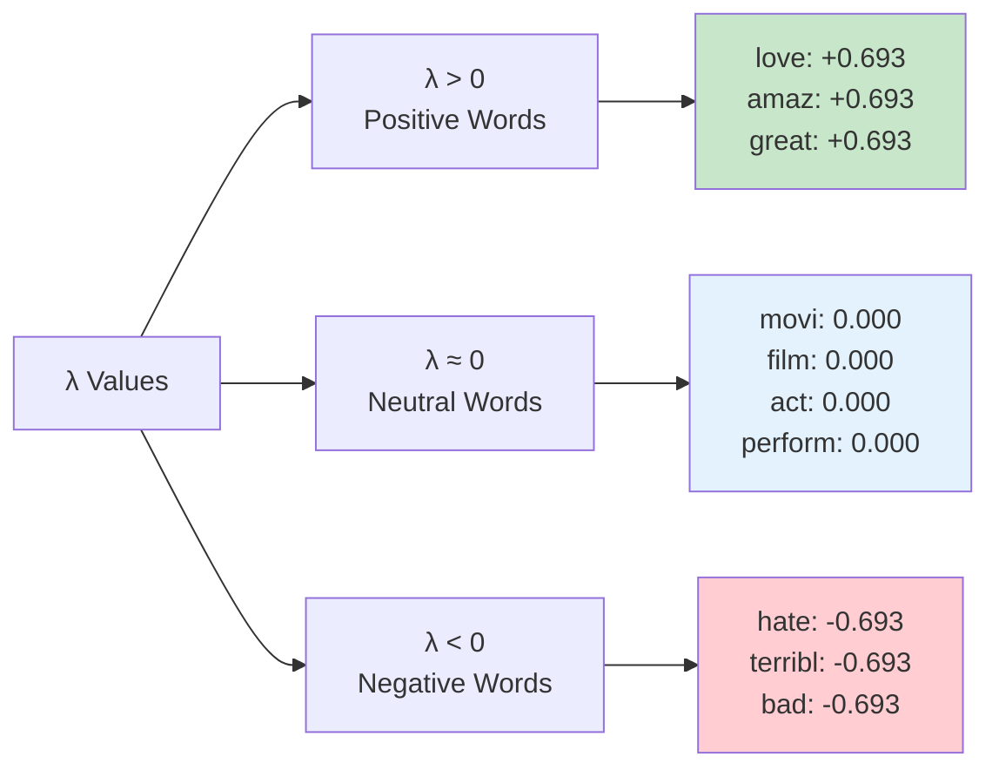

**Key Insights**:

- **λ = +0.693**: Words that appear 2x more in positive tweets
- **λ = 0.000**: Words that appear equally in both classes (neutral)
- **λ = -0.693**: Words that appear 2x more in negative tweets

---

## Step 6: Estimate Log Prior

**Objective**: Compute $\log \text{prior} = \log\left(\frac{P(\text{pos})}{P(\text{neg})}\right)$

### The Log Prior Formula

$$\log \text{prior} = \log\left(\frac{D_{\text{pos}}}{D_{\text{neg}}}\right)$$

**Where**:

- $D_{\text{pos}}$ = number of positive documents/tweets
- $D_{\text{neg}}$ = number of negative documents/tweets

### Our Example Calculation

**From our dataset**:

- $D_{\text{pos}} = 3$ (positive tweets)
- $D_{\text{neg}} = 3$ (negative tweets)

$$\log \text{prior} = \log\left(\frac{3}{3}\right) = \log(1) = 0$$

**For balanced datasets**: The log prior equals 0 and doesn't affect classification.

**For unbalanced datasets**: This term becomes crucial!

### Unbalanced Dataset Example

If we had 80% positive tweets:

- $D_{\text{pos}} = 8$, $D_{\text{neg}} = 2$
- $\log \text{prior} = \log\left(\frac{8}{2}\right) = \log(4) = 1.386$

This would **bias the classifier toward positive predictions**, which is appropriate since positive tweets are more common.

---

## Training Summary: The Complete Picture

### Our Final Trained Model

**Lambda Dictionary** (the heart of our classifier):

```python
lambda_dict = {
    'love': 0.693,      # Strong positive
    'amaz': 0.693,      # Strong positive
    'great': 0.693,     # Strong positive
    'movi': 0.000,      # Neutral
    'film': 0.000,      # Neutral
    'act': 0.000,       # Neutral
    'perform': 0.000,   # Neutral
    'hate': -0.693,     # Strong negative
    'terribl': -0.693,  # Strong negative
    'bad': -0.693       # Strong negative
}

log_prior = 0  # Balanced dataset
```

### The 6 Training Steps Recap

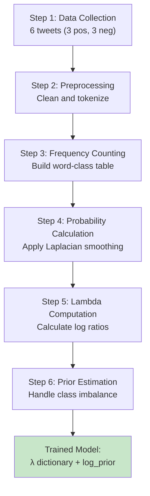

### Training vs. Other ML Methods

| Aspect               | Naive Bayes     | Logistic Regression | Neural Networks  |
| -------------------- | --------------- | ------------------- | ---------------- |
| **Training Time**    | Very Fast       | Medium              | Slow             |
| **Iterations**       | None (1 pass)   | Many epochs         | Many epochs      |
| **Optimization**     | Simple counting | Gradient descent    | Backpropagation  |
| **Parameters**       | Probabilities   | Weights             | Weights + biases |
| **Interpretability** | High            | Medium              | Low              |

---

## Real-World Considerations

### Why Word Counting Works

**Mathematical Foundation**: Naive Bayes is estimating:
$$P(\text{class}|\text{document}) \propto P(\text{class}) \times \prod_{i} P(w_i|\text{class})$$

By counting word frequencies, we're directly estimating $P(w_i|\text{class})$ using maximum likelihood estimation.

### Computational Complexity

- **Training**: O(N × M) where N = documents, M = avg words per document
- **Prediction**: O(M) per document
- **Memory**: O(V) where V = vocabulary size

**Comparison**: Neural networks require O(epochs × N × M × parameters), often 100x-1000x slower!

### When This Approach Shines

**Ideal scenarios**:

- ✅ Large vocabulary, relatively small datasets
- ✅ Need for fast training and deployment
- ✅ Interpretable results required
- ✅ Baseline model for comparison
- ✅ Real-time applications

**Limitations**:

- ❌ Complex semantic relationships
- ❌ Word order dependencies
- ❌ Contextual understanding

---

## Quick Self-Check

**Practice Problem**: Given a new word "excellent" that appears 2 times in positive tweets and 0 times in negative tweets, calculate its lambda value.

**Given**:

- freq("excellent", pos) = 2
- freq("excellent", neg) = 0
- N_pos = 7, N_neg = 7, V = 11 (now including "excellent")

**Solution**:

1. $P(\text{excellent}|\text{pos}) = \frac{2 + 1}{7 + 11} = \frac{3}{18} = 0.167$
2. $P(\text{excellent}|\text{neg}) = \frac{0 + 1}{7 + 11} = \frac{1}{18} = 0.056$
3. $\lambda(\text{excellent}) = \log\left(\frac{0.167}{0.056}\right) = \log(3) = 1.099$

**Interpretation**: "Excellent" is a **strong positive indicator** (λ > 0.693).

---

## Key Takeaways

### What We Accomplished:

1. ✅ **Converted raw text** into numerical features (λ values)
2. ✅ **Handled unseen words** through Laplacian smoothing
3. ✅ **Created interpretable model** where each word's contribution is clear
4. ✅ **Achieved fast training** with no iterative optimization
5. ✅ **Built complete classifier** ready for prediction

### The Power of Simplicity:

- **No hyperparameters** to tune
- **No convergence issues** to debug
- **Direct mathematical interpretation** of results
- **Scales easily** to large vocabularies

**Next**: Now that you have seen how to build a probability table needed to apply Naive Bayes, the next exciting thing we'll do is classify new sentences using our trained model!

# 8. Testing Naïve Bayes

## Introduction

This part will be **fun** as you will apply the Naive Bayes classifier on **real test examples**. It is similar to what you did in the first video of the week, but we'll cover some special corner cases. Once you have trained your model, the next step is to test it. You do so by taking the conditional probabilities you just derived and using them to predict the sentiments of new unseen tweets.

---

## From Training to Testing: The Bridge

### What We Have After Training

From our training process, we now possess:

**1. Lambda Dictionary (λ)**: Log-likelihood ratios for each word

```python
lambda_dict = {
    'I': -0.01,
    'the': -0.01,
    'happi': 0.63,
    'because': 0.01,
    'pass': 0.50,
    'NLP': 0.00,
    'sad': -0.75,
    'not': -0.75
    # ... more words
}
```

**2. Log Prior**: Accounts for class imbalance
$$\log \text{prior} = \log\left(\frac{D_{pos}}{D_{neg}}\right) = 0 \text{ (for balanced datasets)}$$

---

## Step-by-Step Testing Process

### Complete Testing Example

Let's work through the exact example from the lecture: **"I passed the NLP interview"**

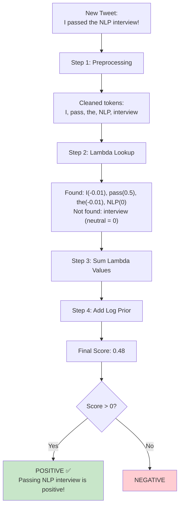

---

## Step 1: Text Preprocessing

**Original Tweet**: "I passed the NLP interview!"

### Preprocessing Pipeline

| Step                   | Process                 | Result                                   |
| ---------------------- | ----------------------- | ---------------------------------------- |
| **Raw**                | Original tweet          | "I passed the NLP interview!"            |
| **Lowercase**          | Convert to lowercase    | "i passed the nlp interview!"            |
| **Remove Punctuation** | Remove !, ?, etc.       | "i passed the nlp interview"             |
| **Remove Stop Words**  | Keep important words    | "passed nlp interview"                   |
| **Stemming**           | Reduce to word stems    | "pass nlp interview"                     |
| **Handle "I"**         | Special case processing | "I pass nlp interview"                   |
| **Tokenize**           | Split into list         | ["I", "pass", "the", "NLP", "interview"] |

**Key Point**: Before anything else, you **must preprocess** this text, removing punctuation, stemming words, and tokenizing to produce a vector of words.

---

## Step 2: Lambda Lookup Process

### Looking Up Each Word

Now, you look up each word from the vector in your **log-likelihood table**:

| Word          | In Dictionary? | Lambda Value | Contribution      |
| ------------- | -------------- | ------------ | ----------------- |
| **I**         | ✅ Found       | -0.01        | Slightly negative |
| **pass**      | ✅ Found       | 0.50         | Positive boost    |
| **the**       | ✅ Found       | -0.01        | Slightly negative |
| **NLP**       | ✅ Found       | 0.00         | Neutral           |
| **interview** | ❌ Not found   | 0 (neutral)  | No contribution   |

### The Lambda Dictionary Visualization

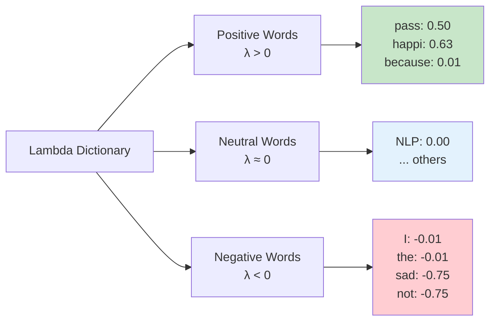

**Critical Insight**: The values that **don't show up** in the table of Lambdas (like "interview") are considered **neutral** and don't contribute anything to the score. Your model can only give a score for words it's seen before.

---

## Step 3: Score Calculation

### The Mathematical Formula

$$\text{Score} = \sum_{w \in \text{tweet}} \lambda(w) + \log \text{prior}$$

### Detailed Calculation

**Lambda Summation**:
$$\text{Log Likelihood} = \lambda(\text{I}) + \lambda(\text{pass}) + \lambda(\text{the}) + \lambda(\text{NLP}) + \lambda(\text{interview})$$

**Substituting values**:
$$\text{Log Likelihood} = (-0.01) + (0.50) + (-0.01) + (0.00) + (0)$$
$$\text{Log Likelihood} = -0.01 + 0.50 - 0.01 + 0 + 0 = 0.48$$

**Adding Log Prior**:
$$\text{Final Score} = 0.48 + \log \text{prior} = 0.48 + 0 = 0.48$$

**Visual Breakdown**:

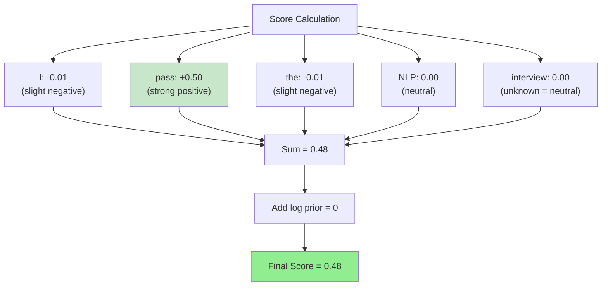

---

## Step 4: Classification Decision

### Decision Rule

$$
\text{Prediction} = \begin{cases}
\text{POSITIVE} & \text{if Score} > 0 \\
\text{NEGATIVE} & \text{if Score} \leq 0
\end{cases}
$$

**Our result**: Score = 0.48 > 0 → **POSITIVE** ✅

**Interpretation**: "Yes, in your model and in real life, passing the NLP interview is a **very positive thing**!"

### Why This Classification Makes Sense

The word **"pass"** (λ = 0.50) provides the strongest positive signal, outweighing the slight negative contributions from "I" and "the". The unknown word "interview" doesn't hurt the classification since it's treated as neutral.

---

## Model Evaluation: Testing Performance

### The Validation Process

It's time to test the performance of your classifier on **unseen data**, just like you did for logistic regression in the previous module.

```mermaid
flowchart LR
    A["Validation Set<br/>X_val, y_val"] --> B["Predict each tweet<br/>using λ dictionary"]
    B --> C["Get predictions<br/>1, 0, 1, ..."]
    C --> D["Compare with true labels<br/>y_val"]
    D --> E["Calculate accuracy<br/>correct/total"]
```

### Validation Set Structure

This week's assignment includes a **validation set** composed of:

- **X_val**: Set of raw tweets (unseen during training)
- **y_val**: Their corresponding true sentiment labels

---

## Complete Evaluation Process

### Step 1: Batch Prediction

**For each tweet in X_val**:

1. Preprocess the tweet
2. Look up lambda values for each word
3. Sum lambda values + log prior
4. Apply decision rule (score > 0 → positive)

### Step 2: Generate Prediction Vector

**Process**: Evaluate whether each score is greater than 0

- This produces a vector populated with **0s and 1s**
- **1**: Predicted positive sentiment
- **0**: Predicted negative sentiment

**Example**:

```python
# Sample validation tweets and their scores
tweets = ["I love this movie", "This film is terrible", "Great acting"]
scores = [1.2, -0.8, 0.5]
predictions = [1, 0, 1]  # 1 if score > 0, else 0
```

### Step 3: Accuracy Calculation

**Compare predictions against true labels**:

| Tweet                   | Predicted    | True Label   | Correct? |
| ----------------------- | ------------ | ------------ | -------- |
| "I love this movie"     | 1 (Positive) | 1 (Positive) | ✅       |
| "This film is terrible" | 0 (Negative) | 0 (Negative) | ✅       |
| "Great acting"          | 1 (Positive) | 1 (Positive) | ✅       |
| "Not good at all"       | 1 (Positive) | 0 (Negative) | ❌       |

**Accuracy Formula**:
$$\text{Accuracy} = \frac{\text{Number of Correct Predictions}}{\text{Total Number of Predictions}}$$

**Example Calculation**:
$$\text{Accuracy} = \frac{3}{4} = 0.75 = 75\%$$

---

## Implementation Guide

### Python Implementation

```python
def predict_sentiment(tweet, lambda_dict, log_prior):
    """
    Predict sentiment of a single tweet
    """
    # Step 1: Preprocess tweet
    processed_words = preprocess_tweet(tweet)

    # Step 2: Calculate log likelihood
    log_likelihood = 0
    for word in processed_words:
        # Look up lambda value (0 if not found)
        lambda_val = lambda_dict.get(word, 0)
        log_likelihood += lambda_val

    # Step 3: Add log prior
    score = log_likelihood + log_prior

    # Step 4: Make prediction
    prediction = 1 if score > 0 else 0
    return prediction, score

def evaluate_model(X_val, y_val, lambda_dict, log_prior):
    """
    Evaluate model on validation set
    """
    predictions = []

    # Predict each tweet
    for tweet in X_val:
        pred, score = predict_sentiment(tweet, lambda_dict, log_prior)
        predictions.append(pred)

    # Calculate accuracy
    correct = sum(1 for pred, true in zip(predictions, y_val) if pred == true)
    accuracy = correct / len(y_val)

    return accuracy, predictions
```

### Handling Edge Cases

**1. Unknown Words**:

- Words not in lambda dictionary get λ = 0
- They don't help or hurt the classification

**2. Empty Tweets**:

- After preprocessing, some tweets might be empty
- Score = log_prior only

**3. All Neutral Words**:

- If all words have λ ≈ 0
- Classification depends entirely on log_prior

---

## Key Testing Insights

### What We Learned

```mermaid
mindmap
    root((Testing Insights))
        Unknown Words
            Treated as neutral
            Don't contribute to score
            Model robust to new vocabulary
        Score Interpretation
            Positive score → Positive sentiment
            Negative score → Negative sentiment
            Magnitude indicates confidence
        Model Limitations
            Only sees known words
            Ignores word order
            Misses context sometimes
```

### Testing vs Training Comparison

| Aspect      | Training          | Testing          |
| ----------- | ----------------- | ---------------- |
| **Input**   | Labeled tweets    | Unlabeled tweets |
| **Output**  | Lambda dictionary | Predictions      |
| **Process** | Count & calculate | Look up & sum    |
| **Goal**    | Learn parameters  | Make predictions |
| **Speed**   | One-time cost     | Real-time        |

---

## Advanced Testing Scenarios

### Confidence Analysis

**Score Interpretation**:

- **Score > 1.0**: High confidence positive
- **0.5 < Score ≤ 1.0**: Medium confidence positive
- **0 < Score ≤ 0.5**: Low confidence positive
- **-0.5 ≤ Score < 0**: Low confidence negative
- **Score < -0.5**: Medium/high confidence negative

**Example Analysis**:

```python
# Different confidence levels
tweets_and_scores = [
    ("I absolutely love this!", 2.1),      # High confidence positive
    ("This is okay", 0.2),                 # Low confidence positive
    ("Not sure about this", -0.1),         # Low confidence negative
    ("I hate this completely", -1.8)       # High confidence negative
]
```

### Error Analysis Preview

**Common misclassifications**:

1. **Sarcasm**: "Oh great, another meeting" (positive words, negative intent)
2. **Negation**: "Not bad" vs "bad" (word order matters)
3. **Unknown domains**: Technical terms not in training vocabulary

---

## Summary

### Testing Process Recap

**The 4-Step Testing Process**:

1. ✅ **Preprocess** new tweet (clean, tokenize, stem)
2. ✅ **Look up** lambda values for each word
3. ✅ **Calculate** score (sum lambdas + log prior)
4. ✅ **Classify** based on score threshold (> 0 = positive)

### Key Takeaways

**What makes testing effective**:

- **Fast prediction**: Simple lookup and addition
- **Robust to unknowns**: Unknown words don't break the system
- **Interpretable results**: Can see which words influenced the decision
- **Scalable**: Works for any length text

**Limitations to remember**:

- **Vocabulary bound**: Only knows words from training
- **Context blind**: Doesn't understand word relationships
- **Order agnostic**: "not good" vs "good not" treated similarly

### Performance Expectations

**Typical Naive Bayes accuracy**:

- **Simple sentiment**: 70-80%
- **Domain-specific**: 80-85%
- **With good preprocessing**: 85-90%
- **Compared to random**: 50%

**Next**: You now know how to apply the Naive Bayes method to test examples. In the coding exercise at the end of the week, you will use it to classify tweets. Next, I'll show you other things it can do!

# 9. Applications of Naïve Bayes

## Introduction

Earlier in the week, you used the Naive Bayes method to classify tweets. But it can be used to do a **number of other things** like identify who's the author of a text. I'll give you a few ideas of what those applications may be.

---

## The Universal Principle Behind All Applications

### Understanding the Core Mathematics

When you use Naive Bayes to predict the sentiment of a tweet, what you're actually doing is **estimating the probability for each class** by using the joint probability of the words in classes.

**The Naive Bayes formula represents the ratio between these two probabilities** - the products of the priors and the likelihoods:

$$\frac{P(\text{class}_1 | \text{document})}{P(\text{class}_2 | \text{document})} = \frac{P(\text{class}_1)}{P(\text{class}_2)} \times \prod_{i=1}^{n} \frac{P(w_i | \text{class}_1)}{P(w_i | \text{class}_2)}$$

**Key Insight**: You can use this **ratio between conditional probabilities for much more than sentiment analysis**. The same mathematical framework applies to any binary or multi-class classification problem.

---

## Application 1: Author Identification

### The Concept

**Objective**: Determine who wrote a particular text based on writing style patterns.

### How It Works

If you had **two large corpora**, each written by different authors, you could train a model to recognize whether a new document was written by one or the other.

```mermaid
flowchart TD
    A[Training Phase] --> B[Shakespeare Corpus<br/>500 works]
    A --> C[Hemingway Corpus<br/>300 works]

    B --> D["Calculate P(word given Shakespeare)"]
    C --> E["Calculate P(word given Hemingway)"]

    D --> F["λ(word) = log(P(word given Shakespeare)/P(word given Hemingway))"]
    E --> F

    F --> G[Lambda Dictionary for Author ID]

    H[New Document] --> I[Extract words]
    I --> J[Sum λ values]
    J --> K{Score > 0?}
    K -->|Yes| L[Shakespeare Style]
    K -->|No| M[Hemingway Style]

    style L fill:#e1f5fe
    style M fill:#fff3e0
```

### Detailed Example: Shakespeare vs Hemingway

**Training Process**:

1. **Collect corpora**: Gather extensive works from each author
2. **Preprocess texts**: Clean, tokenize, extract features
3. **Calculate word probabilities**: For each word in vocabulary
4. **Compute lambda values**: λ(word) = log(P(word|Shakespeare)/P(word|Hemingway))

**Example Lambda Values**:

| Word    | P(w\|Shakespeare) | P(w\|Hemingway) | λ(w)                   | Favors               |
| ------- | ----------------- | --------------- | ---------------------- | -------------------- |
| thou    | 0.012             | 0.001           | log(12) = **2.48**     | Shakespeare          |
| thy     | 0.008             | 0.0005          | log(16) = **2.77**     | Shakespeare          |
| whiskey | 0.0001            | 0.003           | log(0.033) = **-3.40** | Hemingway            |
| war     | 0.002             | 0.008           | log(0.25) = **-1.39**  | Hemingway            |
| love    | 0.015             | 0.012           | log(1.25) = **0.22**   | Slightly Shakespeare |
| the     | 0.045             | 0.047           | log(0.96) = **-0.04**  | Nearly neutral       |

**Classification Example**:

- **New text**: "The old man and the sea brought whiskey to his mind"
- **Score calculation**: λ(old) + λ(man) + λ(sea) + λ(whiskey) + ... = -2.1
- **Prediction**: Score < 0 → **Hemingway style** ✓

### Real-World Applications

- **Literary analysis**: Attributing anonymous or disputed texts
- **Forensic linguistics**: Legal document authorship
- **Plagiarism detection**: Identifying ghostwriting
- **Historical research**: Dating and attributing manuscripts

---

## Application 2: Spam Filtering

### The Email Classification Problem

**Objective**: Classify emails as spam or legitimate (ham) based on various features.

### Multi-Feature Approach

Using information taken from the **sender, subject, and content**, you could decide whether an email is spam or not.

```mermaid
graph TD
    A[Email Features] --> B[Sender Info<br/>Domain reputation<br/>Previous history]
    A --> C[Subject Line<br/>Keywords<br/>Capitalization]
    A --> D[Content Analysis<br/>Word frequency<br/>Links and attachments]

    B --> E[Spam Probability<br/>Calculation]
    C --> E
    D --> E

    E --> F{"P(spam given email) > threshold?"}
    F -->|Yes| G[SPAM 🚫<br/>Move to spam folder]
    F -->|No| H[HAM ✅<br/>Deliver to inbox]

    style G fill:#ffcdd2
    style H fill:#c8e6c9
```

### Detailed Spam Detection Example

**Training Data Analysis**:

| Feature           | Spam Probability | Ham Probability | λ Value                |
| ----------------- | ---------------- | --------------- | ---------------------- |
| "FREE"            | 0.15             | 0.002           | log(75) = **4.32**     |
| "URGENT"          | 0.08             | 0.001           | log(80) = **4.38**     |
| "click here"      | 0.12             | 0.003           | log(40) = **3.69**     |
| "@suspicious.com" | 0.25             | 0.001           | log(250) = **5.52**    |
| "meeting"         | 0.001            | 0.05            | log(0.02) = **-3.91**  |
| "invoice"         | 0.002            | 0.03            | log(0.067) = **-2.71** |

**Classification Example**:

- **Email**: "URGENT: Click here for FREE money from winner@suspicious.com"
- **Score**: λ(URGENT) + λ(click) + λ(here) + λ(FREE) + λ(suspicious.com) = 4.38 + 3.69 + 4.32 + 5.52 = 17.91
- **Decision**: Score >> 0 → **SPAM** 🚫

### Why Spam Filtering Works So Well

**Advantages**:

- **Fast processing**: Can handle millions of emails daily
- **Adaptive**: Easy to retrain with new spam patterns
- **Low false positives**: Conservative threshold settings
- **Interpretable**: Can see why email was marked as spam

**Real-world Impact**: Gmail's spam filter blocks over 99% of spam using Naive Bayes as a core component.

---

## Application 3: Information Retrieval

### The Document Search Problem

**Objective**: Find relevant documents in a database given a set of query keywords.

### Unique Characteristics

This was one of the **earliest uses of Naive Bayes** and had a unique aspect: you only needed to calculate the **likelihood** of the documents given the query.

```mermaid
flowchart TD
    A["User Query:<br/>'machine learning algorithms'"] --> B[Tokenize and Process<br/>machine, learn, algorithm]

    B --> C["Calculate P(doc given query) for each document"]

    C --> D["Document 1:<br/>Research paper on ML<br/>P(doc given query) = 0.85"]
    C --> E["Document 2:<br/>Cooking recipe<br/>P(doc given query) = 0.05"]
    C --> F["Document 3:<br/>Algorithm tutorial<br/>P(doc given query) = 0.72"]
    C --> G["Document 4:<br/>News article<br/>P(doc given query) = 0.15"]

    D --> H[Rank by Likelihood Score]
    E --> H
    F --> H
    G --> H

    H --> I["Results:<br/>1. Research paper (0.85)<br/>2. Algorithm tutorial (0.72)<br/>3. News article (0.15)<br/>4. Cooking recipe (0.05)"]
```

### Why This Approach is Special

**Key Insight**: You **can't know beforehand** what a "relevant" or "irrelevant" document looks like. Unlike sentiment analysis where you have labeled training data, here you only have:

- Query terms
- Document contents
- No relevance labels

**Process**:

1. **Compute likelihood** for each document in your dataset
2. **Sort documents** based on their likelihoods
3. **Return results**: Keep the first m results OR ones above a certain threshold

### Mathematical Foundation

For each document $d$ and query $q$:

$$P(d|q) \propto \prod_{w \in q} P(w|d)$$

Where $P(w|d)$ is estimated from word frequencies in document $d$.

### Real-World Applications

- **Academic search**: PubMed, Google Scholar paper retrieval
- **Legal discovery**: Finding relevant case law and documents
- **Enterprise search**: Internal company document systems
- **Web search engines**: Early Google and other search systems

---

## Application 4: Word Disambiguation

### The Ambiguity Problem

**Objective**: Determine the correct meaning of ambiguous words based on context.

### Classic Example: "Bank"

Consider that you have **only two possible interpretations** of a given word within a text. Let's say you don't know if the word "bank" in your reading is referring to:

- The bank of a river 🏞️
- A financial institution 💰

```mermaid
graph TD
    A["Ambiguous Sentence:<br/>'I went to the bank'"] --> B[Context Analysis]

    B --> C["Context 1: River Bank<br/>Surrounding: water, fishing, shore<br/>river, boat, swim"]
    B --> D["Context 2: Financial Bank<br/>Surrounding: money, deposit, loan<br/>account, credit, cash"]

    C --> E["Score for River meaning:<br/>λ(water) + λ(fishing) + λ(shore) = +1.2"]
    D --> F["Score for Financial meaning:<br/>λ(money) + λ(deposit) + λ(account) = +3.8"]

    E --> G{Compare Scores}
    F --> G
    G --> H["Financial Institution 💰<br/>(Higher score wins)"]

    style H fill:#c8e6c9
```

### Disambiguation Process

**To disambiguate your word**:

1. **Identify possible meanings**: River bank vs Financial bank
2. **Extract context**: Words surrounding the ambiguous term
3. **Calculate scores**: For each possible interpretation
4. **Make decision**: If one meaning scores higher, that's likely correct

**Mathematical Framework**:
$$\text{Score}_{\text{meaning}} = \sum_{w \in \text{context}} \lambda_{\text{meaning}}(w)$$

### Extended Examples

**Multiple Ambiguous Words**:

| Word       | Meaning 1 | Meaning 2      | Context Clues                                                         |
| ---------- | --------- | -------------- | --------------------------------------------------------------------- |
| **Apple**  | Fruit 🍎  | Company 📱     | fruit: "red, sweet, eat" vs tech: "iPhone, software, computer"        |
| **Java**   | Coffee ☕ | Programming 💻 | coffee: "brew, caffeine, cup" vs code: "programming, syntax, object"  |
| **Python** | Snake 🐍  | Programming 🐍 | animal: "reptile, slither, bite" vs code: "programming, script, data" |
| **Bass**   | Fish 🐟   | Music 🎵       | fish: "catch, lake, fishing" vs music: "guitar, sound, low"           |

### Real-World Applications

- **Machine translation**: Choosing correct word meanings across languages
- **Voice assistants**: Understanding user intent with ambiguous commands
- **Search engines**: Interpreting query terms correctly
- **Medical diagnosis**: Disambiguating symptoms and conditions

---

## Why Naive Bayes Excels Across Applications

### Universal Advantages

```mermaid
mindmap
    root((Why Naive Bayes<br/>Works Everywhere))
        Simplicity
            Easy to understand
            Minimal assumptions
            Quick to implement
        Speed
            Fast training
            Real-time inference
            Scales to large datasets
        Robustness
            Handles missing data
            Works with small samples
            Resistant to irrelevant features
        Interpretability
            Clear feature importance
            Transparent decisions
            Easy to debug
```

### Performance Characteristics

| Application               | Typical Accuracy | Speed     | Interpretability |
| ------------------------- | ---------------- | --------- | ---------------- |
| **Sentiment Analysis**    | 75-85%           | Very Fast | High             |
| **Author Identification** | 80-90%           | Fast      | High             |
| **Spam Filtering**        | 95-99%           | Very Fast | Medium           |
| **Information Retrieval** | 70-80%           | Very Fast | High             |
| **Word Disambiguation**   | 85-95%           | Fast      | High             |

---

## Comparative Analysis

### When to Choose Naive Bayes

**Ideal Scenarios**:

- ✅ **Quick baseline needed**: Fast proof-of-concept
- ✅ **Limited training data**: Works well with small datasets
- ✅ **Real-time requirements**: Millisecond response times
- ✅ **Interpretability important**: Need to explain decisions
- ✅ **High-dimensional data**: Many features (words in text)

**Consider Alternatives When**:

- ❌ **Feature dependencies matter**: Word order, context crucial
- ❌ **Maximum accuracy needed**: Every percentage point counts
- ❌ **Complex patterns exist**: Non-linear relationships
- ❌ **Sufficient data available**: Can train more complex models

### Integration with Modern Systems

**Hybrid Approaches**:

1. **Ensemble methods**: Combine Naive Bayes with other classifiers
2. **Feature engineering**: Use Naive Bayes output as input to neural networks
3. **Filtering stage**: Use as fast pre-filter for expensive models
4. **Baseline comparison**: Standard benchmark for new approaches

---

## Industry Impact and Success Stories

### Real-World Deployments

**Major Success Cases**:

- **Gmail Spam Filter**: Processes billions of emails daily
- **Google Search**: Early ranking algorithms used Naive Bayes principles
- **Netflix Recommendations**: Content classification component
- **Medical Diagnosis**: IBM Watson's diagnostic reasoning
- **Financial Fraud**: Credit card transaction classification

### Why It Remains Relevant

Despite being one of the oldest ML algorithms, Naive Bayes remains popular because it's:

- **Reliable**: Consistent performance across domains
- **Efficient**: Minimal computational resources required
- **Maintainable**: Easy for teams to understand and modify
- **Scalable**: Handles big data with linear complexity

---

## Summary

### The Versatility of Naive Bayes

**Key Applications Covered**:

1. ✅ **Author Identification**: Shakespeare vs Hemingway style detection
2. ✅ **Spam Filtering**: Email classification with multiple features
3. ✅ **Information Retrieval**: Document relevance ranking
4. ✅ **Word Disambiguation**: Context-based meaning resolution

### Universal Success Factors

**Bayes rule and its Naive approximation** has a wide range of applications because it:

- **Handles uncertainty**: Probabilistic framework manages ambiguity
- **Scales efficiently**: Linear in vocabulary size and document length
- **Generalizes well**: Same math works across different domains
- **Provides interpretability**: Clear feature importance ranking

### The Bigger Picture

**Strategic Value**: Naive Bayes is usually used as a **simple baseline** that:

- Establishes performance floor for complex methods
- Provides quick insights into data patterns
- Serves as production fallback when complex models fail
- Enables rapid prototyping and experimentation

**Future Relevance**: You'll be using Bayes rule and Naive Bayes again in the weeks ahead, as it forms the foundation for understanding more advanced probabilistic methods in NLP.

Now you're **fully equipped** with understanding how this versatile algorithm can be applied across many different classification tasks!

# 10. Naïve Bayes Assumptions

## Introduction

Now I'm going to cover the **assumptions underlying the Naive Bayes method**. The main one is **independence of words in a sentence**. And I'll tell you why this can be a **big problem** when the method is applied.

---

## Why It's Called "Naïve"

**Naive Bayes is a very simple model** because it doesn't require setting any custom parameters. This method is referred to as **"naïve"** because of the strong assumptions it makes about the data.

### The Two Main Assumptions

```mermaid
graph TD
    A[Naive Bayes Assumptions] --> B[Assumption 1:<br/>Feature Independence]
    A --> C[Assumption 2:<br/>Training Data Distribution]

    B --> B1[Words in text are<br/>independent of each other]
    C --> C1[Training data reflects<br/>real-world distribution]

    style B1 fill:#ffcdd2
    style C1 fill:#fff3e0
```

Let's explore each of these assumptions and **how they could affect your results**.

---

## Assumption 1: Independence Between Features

### The Independence Problem Explained

**The Core Assumption**: Naive Bayes assumes that the words in a piece of text are **independent of one another**.

### Real-World Example: Weather Description

**Consider this sentence**: "It is sunny and hot in the Sahara desert"

```mermaid
graph TD
    A["Naive Bayes Assumption:<br/>Words are Independent"] --> B["sunny and hot<br/>should be unrelated"]
    A --> C["Sahara and desert<br/>should be unrelated"]
    A --> D["hot and desert<br/>should be unrelated"]

    E["Reality:<br/>Words are Often Dependent"] --> F["sunny and hot<br/>often appear together"]
    E --> G["Sahara describes<br/>a specific desert"]
    E --> H["All words relate to<br/>climate/geography"]

    style A fill:#ffcdd2
    style E fill:#c8e6c9
```

### Why This Is Problematic

**The Reality**: But as you can see, this typically **isn't the case**:

1. **"Sunny" and "hot"** often appear together - they're **correlated weather conditions**
2. **"Sahara" and "desert"** - Sahara IS a desert, they're directly related
3. **Taken together**, they might also be related to the thing they're describing, like a beach or a desert

**The Problem**: So the words in the sentence are **not always necessarily independent** of one another. But Naive Bayes assumes that they are.

### Mathematical Impact

**Consequence**: This could lead you to **under or overestimate** the conditional probabilities of individual words.

**Mathematical Explanation**:

- **Naive Bayes assumes**: $P(w_1, w_2 | \text{class}) = P(w_1 | \text{class}) \times P(w_2 | \text{class})$
- **Reality might be**: $P(w_1, w_2 | \text{class}) \neq P(w_1 | \text{class}) \times P(w_2 | \text{class})$

If "sunny" and "hot" are positively correlated, Naive Bayes might **double-count** their positive influence.

---

## Real-World Example of the Independence Problem

### The Sentence Completion Task

**Task**: Complete the sentence "It's always cold and snowy in \_\_\_\_"

```mermaid
graph TD
    A["Human Understanding:<br/>Context matters"] --> B["cold and snowy suggests winter"]
    B --> C["Answer: winter (high confidence)"]

    D["Naive Bayes Processing:<br/>Independence assumption"] --> E["Treats each word separately"]
    E --> F["cold: could be any season<br/>snowy: could be any season"]
    F --> G["Assigns equal probability to:<br/>spring, summer, fall, winter"]

    style C fill:#c8e6c9
    style G fill:#ffcdd2
```

### What Happens

**Naive Bayes might**:

- Assign **equal probability** to the words: spring, summer, fall, winter
- Ignore the contextual relationship between "cold", "snowy", and seasons

**What humans understand**:

- From the context, you can see that **"winter"** should be the most likely candidate
- "Cold" AND "snowy" together strongly indicate winter weather

### Why the Independence Assumption Fails

**Dependencies in Language**:

| Word Pair     | Real Relationship                 | Naive Bayes Treats As |
| ------------- | --------------------------------- | --------------------- |
| "cold, snowy" | **Strong correlation** in winter  | Independent events    |
| "sunny, hot"  | **Weather pattern** dependency    | Independent events    |
| "New York"    | **Named entity** (single concept) | Two separate words    |
| "not good"    | **Negation** changes meaning      | Independent words     |
| "very happy"  | **Intensifier** + emotion         | Independent words     |

---

## Assumption 2: Training Data Distribution

### The Distribution Problem

**The Core Issue**: Naive Bayes **relies heavily on the distribution** of the training datasets.

### Ideal vs Reality Gap

```mermaid
graph TD
    A[Training Data Scenarios] --> B[Ideal Dataset<br/>Reflects real world]
    A --> C[Typical Dataset<br/>Artificially balanced]

    B --> B1["Natural distribution:<br/>70% positive, 30% negative<br/>Matches real Twitter"]
    C --> C1["Artificial balance:<br/>50% positive, 50% negative<br/>Easy to work with"]

    D[Real World Usage] --> E["Actual Twitter stream:<br/>More positive tweets"]

    B1 --> F[Model matches reality ✅]
    C1 --> G[Model may be miscalibrated ❌]

    style F fill:#c8e6c9
    style G fill:#ffcdd2
```

### The Real-World Imbalance

**A good dataset** should contain the same proportion of positive and negative tweets as a random sample from the real world.

**However**:

- **Most available annotated corpora** are artificially balanced
- **Just like the dataset you use** for assignments (50% positive, 50% negative)

**But in reality**:

- **In the real tweet stream**, positive tweets tend to occur more often than their negative counterparts

### Why This Imbalance Exists

**Reasons for fewer negative tweets**:

```mermaid
flowchart TD
    A[Why Negative Tweets Are Less Common] --> B[Platform Filtering]
    A --> C[User Behavior]
    A --> D[Content Moderation]

    B --> B1["Banned content:<br/>Hate speech, harassment<br/>Toxic language"]
    C --> C1["User filtering:<br/>Mute negative users<br/>Block offensive content"]
    D --> D1["Algorithm suppression:<br/>Reduce toxic content reach<br/>Shadow banning"]

    style B1 fill:#ffcdd2
    style C1 fill:#fff3e0
    style D1 fill:#e3f2fd
```

**One reason for this**: Negative tweets might contain content that is:

- **Banned by the platform** (violates terms of service)
- **Muted by users** (blocked or filtered out)
- Contains **inappropriate or offensive vocabulary**

### Consequences of Distribution Mismatch

**Assuming that reality behaves as your training corpus** could result in:

| Training Distribution      | Real Distribution          | Model Bias              | Consequence            |
| -------------------------- | -------------------------- | ----------------------- | ---------------------- |
| 50% positive, 50% negative | 70% positive, 30% negative | **Too pessimistic**     | Over-predicts negative |
| 50% positive, 50% negative | 80% positive, 20% negative | **Way too pessimistic** | Many false negatives   |
| 80% positive, 20% negative | 50% positive, 50% negative | **Too optimistic**      | Over-predicts positive |

This could result in a **very optimistic or very pessimistic model**.

---

## Mathematical Analysis of the Problems

### Independence Assumption Impact

**True probability with dependencies**:
$$P(\text{sunny, hot} | \text{positive}) = P(\text{sunny} | \text{positive}) \times P(\text{hot} | \text{sunny, positive})$$

**Naive Bayes assumption**:
$$P(\text{sunny, hot} | \text{positive}) = P(\text{sunny} | \text{positive}) \times P(\text{hot} | \text{positive})$$

**Error introduced**:
$$\text{Error} = P(\text{hot} | \text{positive}) - P(\text{hot} | \text{sunny, positive})$$

If "hot" is more likely given "sunny" is already present, Naive Bayes **underestimates** the probability.

### Distribution Assumption Impact

**Training Prior**: $P(\text{positive})_{\text{training}} = 0.5$
**Real-world Prior**: $P(\text{positive})_{\text{real}} = 0.7$

**Impact on classification**:
$$\text{log prior}_{\text{training}} = \log\left(\frac{0.5}{0.5}\right) = 0$$
$$\text{log prior}_{\text{real}} = \log\left(\frac{0.7}{0.3}\right) = 0.85$$

**Result**: Model needs an additional +0.85 bias toward positive to be calibrated.

---

## When Assumptions Matter Most

### High-Impact Scenarios

**Independence Assumption Breaks Down**:

1. **Named entities**: "New York", "Los Angeles" treated as separate words
2. **Negations**: "not good" vs "good not" - word order matters
3. **Intensifiers**: "very happy" vs "happy very" - modifier relationships
4. **Idiomatic expressions**: "break a leg" (good luck) vs literal meaning
5. **Technical terms**: "machine learning" as compound concept

**Distribution Issues Are Critical When**:

1. **Domain shift**: Training on formal text, testing on social media
2. **Temporal shift**: Training on old data, testing on recent data
3. **Geographic variation**: Training on US data, testing globally
4. **Platform differences**: Training on Twitter, testing on Facebook

---

## Mitigation Strategies

### Handling Independence Violations

**Partial Solutions**:

| Problem        | Potential Solution                    | Limitation                |
| -------------- | ------------------------------------- | ------------------------- |
| Named entities | Use n-grams instead of single words   | Increases vocabulary size |
| Negations      | Special preprocessing for "not" words | Hard to generalize        |
| Word order     | Preserve some local context           | Violates core assumption  |
| Compound terms | Domain-specific tokenization          | Requires expert knowledge |

### Addressing Distribution Problems

**Practical Approaches**:

```mermaid
flowchart LR
    A[Distribution Solutions] --> B[Prior Adjustment]
    A --> C[Stratified Sampling]
    A --> D[Domain Adaptation]

    B --> B1["Adjust log_prior based on<br/>real-world estimates"]
    C --> C1["Sample training data to<br/>match target distribution"]
    D --> D1["Fine-tune on small amount<br/>of target domain data"]
```

1. **Prior Adjustment**: Modify log_prior based on real-world estimates
2. **Stratified Sampling**: Create training sets that match target distribution
3. **Calibration**: Post-process predictions to match real-world frequencies
4. **Domain Adaptation**: Fine-tune on small target domain samples

---

## Despite the Problems: Why It Still Works

### Empirical Success Factors

**Reasons for Continued Success**:

```mermaid
mindmap
    root((Why Naive Bayes<br/>Still Works))
        Robustness
            Many violations cancel out
            Large vocabulary dilutes effect
            Strong signal words dominate
        Practical Benefits
            Fast training and inference
            Interpretable results
            Good baseline performance
        Real-World Factors
            Text has some independence
            Domain-specific patterns
            Sufficient data compensates
```

### When Violations Don't Matter Much

**Scenarios where assumptions hold reasonably**:

- **Large vocabulary**: Dependencies between individual words become diluted
- **Bag-of-words tasks**: Word order genuinely doesn't matter much
- **Topic classification**: High-level themes vs detailed syntax
- **Sufficient data**: Large training sets can overcome some biases

---

## Summary and Takeaways

### Key Assumptions Recap

**Let's do a quick recap** of all this new information:

1. ✅ **The assumption of independence** in Naive Bayes is very difficult to guarantee
2. ✅ **Despite that**, the model works pretty well in certain situations
3. ✅ **For assignments in this module**, the relative frequency of positive and negative tweets in your training datasets needs to be **balanced** to deliver accurate results

### Practical Guidelines

**When Using Naive Bayes**:

- **Understand the limitations**: Don't expect perfect handling of dependencies
- **Check data distribution**: Ensure training matches target domain
- **Use as baseline**: Compare against more sophisticated methods
- **Monitor in production**: Watch for distribution drift over time

### Looking Ahead

**Future Methods**: In the next courses of this specialization, you will be introduced to some **more sophisticated methods** that deal with these limitations:

- **RNNs and LSTMs**: Handle word order and dependencies
- **Attention mechanisms**: Focus on relevant word relationships
- **Transformer models**: Capture complex contextual relationships

### The Bottom Line

**Now you understand the assumptions** that underlie the Naive Bayes method. While these assumptions are often violated in practice, understanding them helps you:

- Know when to use Naive Bayes appropriately
- Identify potential failure cases
- Design better evaluation strategies
- Choose alternative methods when needed

**What if it fails to perform well** for some sentences? I'll show you what to do in such cases through **error analysis**.

# 11. Error Analysis

## Introduction

No matter what NLP method you use, you will one day find yourself faced with an **error** - for example, a misclassified sentence. In this video, I'll show you how to **analyze such errors** and understand why they happen.

---

## Categories of Naive Bayes Errors

Let us consider some possible errors and model predictions that can be caused by these issues:

```mermaid
graph TD
    A[Common NLP Errors] --> B[1 - Semantic Meaning Lost<br/>in Preprocessing]
    A --> C[2 - Word Order Effects<br/>on Sentence Meaning]
    A --> D[3 - Language Quirks<br/>Natural to Humans]

    B --> B1[Punctuation removal<br/>Stop word elimination]
    C --> C1[Negation placement<br/>Modifier relationships]
    D --> D1[Sarcasm & irony<br/>Euphemisms & context]

    style B1 fill:#ffcdd2
    style C1 fill:#fff3e0
    style D1 fill:#e1f5fe
```

So let's start analyzing each type systematically.

---

## Error Type 1: Semantic Meaning Lost in Preprocessing

### The Critical Importance of Preprocessing Decisions

**Key Principle**: One of your main considerations when analyzing errors in NLP systems is **what the processed version of the text actually looks like**.

### Case Study 1: The Punctuation Problem

**Example Tweet**: "My beloved grandmother :("

```mermaid
flowchart TD
    A["Original Tweet:<br/>My beloved grandmother :("] --> B[Preprocessing Step:<br/>Remove Punctuation]

    B --> C["Processed Tweet:<br/>My beloved grandmother"]

    C --> D[Model Analysis]
    D --> E["Words: beloved (positive)<br/>grandmother (neutral/positive)"]
    E --> F["Prediction: POSITIVE ✅<br/>(Incorrect!)"]

    G["Human Understanding:<br/>Sad face :( indicates sadness"] --> H["True Sentiment: NEGATIVE ❌"]

    I["Alternative with !:<br/>My beloved grandmother!"] --> J["Would be genuinely positive"]

    style F fill:#ffcdd2
    style H fill:#c8e6c9
    style J fill:#90ee90
```

**The Problem**:

- The **sad face punctuation** is very important to the sentiment of the tweet because it tells you what's happening
- But if you're removing punctuation, the processed tweet leaves behind only "beloved grandmother"
- This looks like a **very positive tweet** to the classifier!

**Contrast**: "My beloved grandmother!" would be a very different sentiment - genuinely positive.

**Lesson**: Always check what the **actual processed text** looks like.

### Case Study 2: The Stop Word Removal Problem

**Example Tweet**: "This is not good because your attitude is not even close to being nice"

```mermaid
flowchart TD
    A["Original Tweet:<br/>This is not good because your<br/>attitude is not even close to being nice"] --> B["Preprocessing: Remove Stop Words<br/>(Including 'not', 'this', 'is', 'your')"]

    B --> C["Processed Result:<br/>good, attitude, close, nice"]

    C --> D["Model Analysis:<br/>All words appear positive"]
    D --> E["Prediction: VERY POSITIVE<br/>(Completely wrong!)"]

    F["Original Meaning:<br/>Clearly negative criticism"] --> G["True Sentiment: NEGATIVE"]

    style E fill:#ffcdd2
    style G fill:#c8e6c9
```

**The Catastrophic Loss**:

- **Original sentiment**: Clearly negative (criticism of attitude)
- **After preprocessing**: "good, attitude, close, nice"
- **Model sees**: Only positive-seeming words
- **Result**: Completely wrong classification

**Critical Words Lost**:

- **"not"** (negation) - changes entire meaning
- **"this"** (reference) - provides context
- Negative structure is completely destroyed

**Key Takeaway**: It's not just about punctuation either. **Double-check what your processed text looks like** to make sure your model will be able to get an accurate read.

---

## Error Type 2: Word Order Effects on Sentence Meaning

### When Word Sequence Changes Everything

**The Core Problem**: The preprocessing pipeline isn't the only potential source of trouble. **Word order can be as important as spelling**.

### The "Not" Placement Problem

Let's examine two very similar tweets that demonstrate this clearly:

**Tweet 1**: "I am happy because I did not go" 😊  
**Tweet 2**: "I am not happy because I did not go" 😢

```mermaid
graph TD
    A["Tweet 1:<br/>I am happy because I did not go"] --> B["Key Structure:<br/>I am HAPPY because I did NOT GO"]
    B --> C["Meaning: Happy about NOT going<br/>Avoided something undesirable"]
    C --> D["Sentiment: POSITIVE ✅"]

    E["Tweet 2:<br/>I am not happy because I did not go"] --> F["Key Structure:<br/>I am NOT HAPPY because I did not go"]
    F --> G["Meaning: Unhappy about the situation<br/>Regrets not going"]
    G --> H["Sentiment: NEGATIVE ❌"]

    I[Naive Bayes Problem] --> J["Treats both tweets similarly<br/>Same words: I, am, happy, because, did, not, go"]
    J --> K["Misses which 'not' modifies which word<br/>Cannot understand syntactic structure"]

    style D fill:#c8e6c9
    style H fill:#ffcdd2
    style K fill:#ffebee
```

### Detailed Analysis

**What makes these different**:

- **Tweet 1**: "not" modifies "go" → happy about NOT going
- **Tweet 2**: "not" modifies "happy" → NOT happy about situation

**Why Naive Bayes struggles**:

- **Same vocabulary**: Both tweets contain identical words
- **Same word counts**: Frequencies are identical
- **Missing syntax**: No understanding of which "not" modifies which word
- **Bag-of-words limitation**: Word order information is lost

**Lambda scores would be identical**:

```python
# Both tweets would have the same calculation
score = λ(I) + λ(am) + λ(happy) + λ(because) + λ(did) + λ(not) + λ(go)
```

### More Word Order Examples

| Correct Order         | Meaning                      | Scrambled Order       | Naive Bayes Sees |
| --------------------- | ---------------------------- | --------------------- | ---------------- |
| "not very good"       | Negative                     | "good very not"       | Same words       |
| "extremely bad movie" | Very negative                | "movie extremely bad" | Same words       |
| "I love not working"  | Positive (about not working) | "not love I working"  | Same words       |

---

## Error Type 3: Adversarial Attacks (Natural Language Phenomena)

### Understanding "Adversarial Attacks"

**Definition**: The term "adversarial attack" describes some common **language phenomena** like:

- **Sarcasm** 😏
- **Irony** 🙃
- **Euphemisms** 🎭

**Key Point**: Humans pick these up quickly, but **machines are terrible at it**.

### Case Study: The Movie Review Problem

**Example Tweet**: "This is a ridiculously powerful movie. The plot was gripping and I cried right through until the ending."

```mermaid
flowchart TD
    A["Human Reading:<br/>Positive movie review"] --> B["Context Understanding:<br/>ridiculously powerful = extremely good"]
    B --> C["Context: gripping plot = engaging<br/>cried = emotionally moved"]
    C --> D["Overall Assessment: POSITIVE ✅"]

    E["Naive Bayes Processing:<br/>Word-by-word analysis"] --> F["ridiculously → negative word?<br/>cried → negative emotion?<br/>gripping → violent/negative?"]
    F --> G["Preprocessing suggests:<br/>Mostly negative words"]
    G --> H["Model Prediction: NEGATIVE ❌<br/>(Completely wrong!)"]

    style D fill:#c8e6c9
    style H fill:#ffcdd2
```

**The Analysis Breakdown**:

| Word/Phrase             | Human Interpretation             | Naive Bayes Sees             |
| ----------------------- | -------------------------------- | ---------------------------- |
| "ridiculously powerful" | **Extremely impressive**         | "ridiculous" = negative      |
| "gripping plot"         | **Engaging and compelling**      | "gripping" = violent?        |
| "I cried"               | **Emotionally moved (positive)** | "cried" = sadness (negative) |
| "until the ending"      | **Watched completely (enjoyed)** | Neutral words                |

**The Problem**: This contains a **positive movie review**, but preprocessing suggests otherwise:

- If you preprocess this tweet, you'll get a list of mostly **negative-seeming words**
- But as you can see, they were actually used to describe a movie that the author **enjoyed**
- If you use Naive Bayes on this list of words, it would end up giving a **very negative score**, regardless of the true intent

### Types of Adversarial Language Phenomena

#### 1. Sarcasm

**Example**: "Oh great, another meeting 🙄"

- **Words suggest**: Positive ("great")
- **True meaning**: Negative (annoyance)
- **Context clue**: "Oh" + "another" suggests frustration

#### 2. Irony

**Example**: "I just love getting stuck in traffic"

- **Words suggest**: Positive ("love")
- **True meaning**: Negative (frustration)
- **Logical contradiction**: Nobody actually loves traffic jams

#### 3. Euphemisms

**Example**: "He's no longer with us"

- **Words suggest**: Neutral/positive ("with us")
- **True meaning**: Death (negative context)
- **Cultural context**: Polite way to say someone died

#### 4. Contextual Reversals

**Example**: "This movie was so bad it's good"

- **Words suggest**: Mixed/negative ("bad")
- **True meaning**: Positive (enjoyably bad)
- **Cultural context**: "So bad it's good" is a known concept

---

## Comprehensive Error Analysis Framework

### The 4-Step Error Analysis Process

```mermaid
flowchart TD
    A[Error Detected] --> B[Step 1: Check Preprocessing<br/>What does processed text look like?]
    B --> C[Step 2: Identify Dependencies<br/>Are there word order issues?]
    C --> D[Step 3: Look for Language Phenomena<br/>Sarcasm, irony, euphemisms?]
    D --> E[Step 4: Context Analysis<br/>What would humans understand?]
    E --> F[Root Cause Identified]
    F --> G[Design Mitigation Strategy]
```

### Systematic Debugging Questions

**When your model makes a mistake, ask**:

1. **Preprocessing Issues**:

   - What does the processed text actually look like?
   - Are important sentiment indicators being removed?
   - Is punctuation crucial to meaning?

2. **Word Order Problems**:

   - Does the meaning depend on word sequence?
   - Are there negation words that modify specific terms?
   - Would word scrambling change the meaning?

3. **Language Phenomena**:

   - Could this be sarcasm or irony?
   - Are there cultural/contextual references?
   - Is the speaker using euphemisms or implied meaning?

4. **Context Requirements**:
   - What background knowledge is needed?
   - Are there domain-specific interpretations?
   - Would a human need additional context?

---

## Error Pattern Recognition

### Common Misclassification Patterns

| Error Type       | Example                    | Why It Happens                 | Potential Fix                |
| ---------------- | -------------------------- | ------------------------------ | ---------------------------- |
| **Negation**     | "not bad" → negative       | "not" treated as separate word | Negation-aware preprocessing |
| **Sarcasm**      | "great job" → positive     | Context missing                | Sarcasm detection models     |
| **Punctuation**  | "yeah right..." → positive | Ellipsis removed               | Punctuation-aware features   |
| **Intensity**    | "very bad" vs "bad"        | No intensity weighting         | N-gram features              |
| **Domain terms** | "sick beat" → negative     | Domain-specific meaning        | Domain adaptation            |

### Error Severity Assessment

**High Impact Errors** (Critical to fix):

- Opposite sentiment prediction (positive → negative)
- Safety-critical domains (medical, financial)
- Customer-facing applications

**Medium Impact Errors** (Important but manageable):

- Neutral misclassified as positive/negative
- Low-confidence incorrect predictions
- Edge cases in training data

**Low Impact Errors** (Monitor but acceptable):

- Ambiguous cases even humans disagree on
- Very short text with minimal context
- Domain-specific jargon

---

## Mitigation Strategies

### Preprocessing Improvements

```mermaid
graph LR
    A[Preprocessing Fixes] --> B[Smart Punctuation<br/>Keep emoticons & key punct.]
    A --> C[Negation Handling<br/>not_good, not_bad tokens]
    A --> D[Context Preservation<br/>Keep some word order info]
    A --> E[Domain Adaptation<br/>Domain-specific stop words]
```

**Specific Techniques**:

1. **Selective punctuation removal**: Keep emoticons, question marks
2. **Negation preprocessing**: Create "not_word" compound tokens
3. **N-gram features**: Capture some local word order
4. **Domain-aware tokenization**: Handle domain-specific terms

### Beyond Naive Bayes Solutions

**When Naive Bayes isn't enough**:

- **Sequence models**: RNNs, LSTMs for word order
- **Attention mechanisms**: Focus on important word relationships
- **Transformer models**: Capture complex context and dependencies
- **Ensemble methods**: Combine multiple approaches

---

## Summary and Key Takeaways

### Error Analysis Mastery

**Now you know how to**:

1. ✅ **Systematically debug** NLP classification errors
2. ✅ **Identify root causes** in preprocessing, word order, or language phenomena
3. ✅ **Recognize patterns** in common failure modes
4. ✅ **Design mitigation strategies** for specific error types

### The Bigger Picture

**Despite the errors**: Naive Bayes is still a **very powerful baseline**, as you know. It relies on word frequency counts, which captures a lot of useful signal.

**Understanding limitations helps you**:

- Set appropriate expectations for model performance
- Design better evaluation metrics
- Choose when to use more sophisticated methods
- Debug and improve real-world systems

### Looking Forward

**Next week**: We'll learn how to use **word vectors**. This can give us **better results** by capturing semantic relationships and some contextual understanding that addresses many of the issues we've discussed.

**The evolution**:

- **Naive Bayes**: Fast baseline with interpretable word-counting
- **Word Vectors**: Semantic similarity and relationships
- **Sequence Models**: Word order and dependencies
- **Attention Models**: Complex contextual understanding

**Remember**: Error analysis is a crucial skill for any NLP practitioner. The patterns you learn here apply to all NLP methods, not just Naive Bayes!
