# Course 1 Week 3: Vector Space Models

**Natural Language Processing Specialization**  
**Natural Language Processing with Classification and Vector Spaces**

---

## Table of Contents

1. [Vector Space Models Introduction](#1-vector-space-models-introduction)
2. [Word by Word and Word by Document Design](#2-word-by-word-and-word-by-document-design)
3. [Euclidean Distance](#3-euclidean-distance)
4. [Cosine Similarity: Intuition](#4-cosine-similarity-intuition)
5. [Cosine Similarity: Mathematical Foundation](#5-cosine-similarity-mathematical-foundation)
6. [Manipulating Words in Vector Spaces](#6-manipulating-words-in-vector-spaces)
7. [Visualization and PCA](#7-visualization-and-pca)
8. [PCA Algorithm](#8-pca-algorithm)
9. [Applications and Real-World Examples](#9-applications-and-real-world-examples)
10. [Summary and Key Takeaways](#10-summary-and-key-takeaways)

---

# 1. Vector Space Models Introduction

## What are Vector Space Models?

Vector space models represent words, documents, and any form of text as **vectors** - arrays of numbers that capture meaning and relationships in a mathematical form. Think of vectors as a sophisticated "fingerprint" for each word that encodes its semantic properties.

**Core Philosophy**: _"You shall know a word by the company it keeps"_ - John Firth, famous English linguist

This fundamental principle means that words appearing in similar contexts should have similar meanings, and therefore similar vector representations.

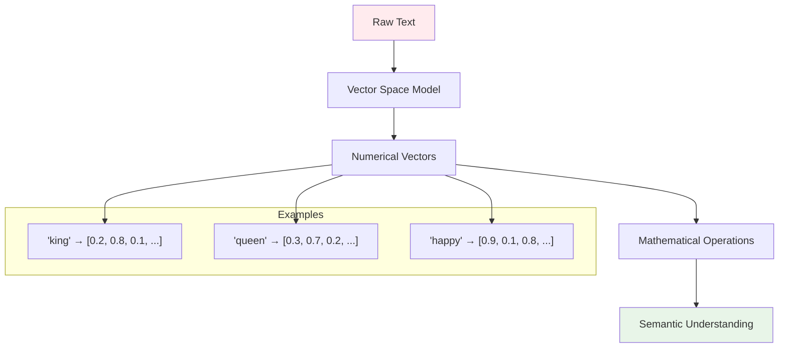
```mermaid
graph TD
    A["Raw Text"] --> B["Vector Space Model"]
    B --> C["Numerical Vectors"]
    C --> D["Mathematical Operations"]
    D --> E["Semantic Understanding"]

    subgraph "Examples"
        F["'king' → [0.2, 0.8, 0.1, ...]"]
        G["'queen' → [0.3, 0.7, 0.2, ...]"]
        H["'happy' → [0.9, 0.1, 0.8, ...]"]
    end

    C --> F
    C --> G
    C --> H

    style A fill:#ffebee
    style E fill:#e8f5e8
```

---

## Real-Life Analogy: The Social Network Approach

Imagine you're trying to understand someone's personality by looking at their friend group:

**Traditional Approach** (like bag-of-words):

- _"This person knows Alice, Bob, and Carol"_
- Just a list of connections, no deeper understanding

**Vector Space Approach**:

- _"This person hangs out with athletes, studies with engineers, and parties with artists"_
- Captures the **context** and **relationships** that reveal personality

Similarly, in NLP:

- **Traditional**: "The word 'bank' appears in document 1, 5, and 9"
- **Vector Space**: "The word 'bank' appears with 'money', 'deposit', 'loan' (financial context) vs. 'river', 'water', 'shore' (geographical context)"

---

## The Power of Context: Understanding Meaning Through Company

### Example 1: Same Words, Different Meanings

Consider these two questions from the video transcript:

```bash
┌─────────────────────────────────────────────────────────────┐
│                    CONTEXT COMPARISON                       │
├─────────────────────────────────────────────────────────────┤
│                                                             │
│  Question 1: "Where are you heading?"                       │
│  Question 2: "Where are you from?"                          │
│                                                             │
│  Shared words: [where, are, you]                            │
│  Different words: [heading] vs [from]                       │
│  Meaning: COMPLETELY DIFFERENT                              │
│                                                             │
│  Vector Space Insight:                                      │
│  - "heading" appears with: going, traveling, direction      │
│  - "from" appears with: origin, born, came                  │
│  - Context creates meaning distinction                      │
│                                                             │
└─────────────────────────────────────────────────────────────┘
```

### Example 2: Different Words, Same Meaning

```bash
┌─────────────────────────────────────────────────────────────┐
│                   PARAPHRASE DETECTION                      │
├─────────────────────────────────────────────────────────────┤
│                                                             │
│  Sentence 1: "The cat is sleeping on the couch"             │
│  Sentence 2: "A feline is resting on the sofa"              │
│                                                             │
│  Shared words: [is, on, the]                                │
│  Word mappings: cat→feline, sleeping→resting, couch→sofa    │
│  Meaning: IDENTICAL                                         │
│                                                             │
│  Vector Space Magic:                                        │
│  - Similar contexts make vectors similar                    │
│  - Mathematical similarity = semantic similarity            │
│                                                             │
└─────────────────────────────────────────────────────────────┘
```

---

## Mathematical Foundation: From Words to Vectors

### Basic Transformation Process

$$\text{Word} \xrightarrow{\text{Context Analysis}} \text{Vector Representation}$$

Each word $w$ becomes a vector $\vec{v}_w \in \mathbb{R}^n$ where:

- $n$ = dimensionality (typically 50-1000+ dimensions)
- Each dimension captures some semantic property
- Similar words have similar vectors

### Vector Similarity Mathematics

The similarity between two words can be computed as:

$$\text{similarity}(w_1, w_2) = \cos(\theta) = \frac{\vec{v}_{w_1} \cdot \vec{v}_{w_2}}{||\vec{v}_{w_1}|| \cdot ||\vec{v}_{w_2}||}$$

Where:

- $\vec{v}_{w_1} \cdot \vec{v}_{w_2}$ = dot product (captures alignment)
- $||\vec{v}||$ = vector magnitude (length)
- $\cos(\theta)$ = cosine similarity (ranges from -1 to 1)

---

## Capturing Word Dependencies and Relationships

### Example: Grammatical Dependencies

From the transcript: _"You eat cereal from a bowl"_

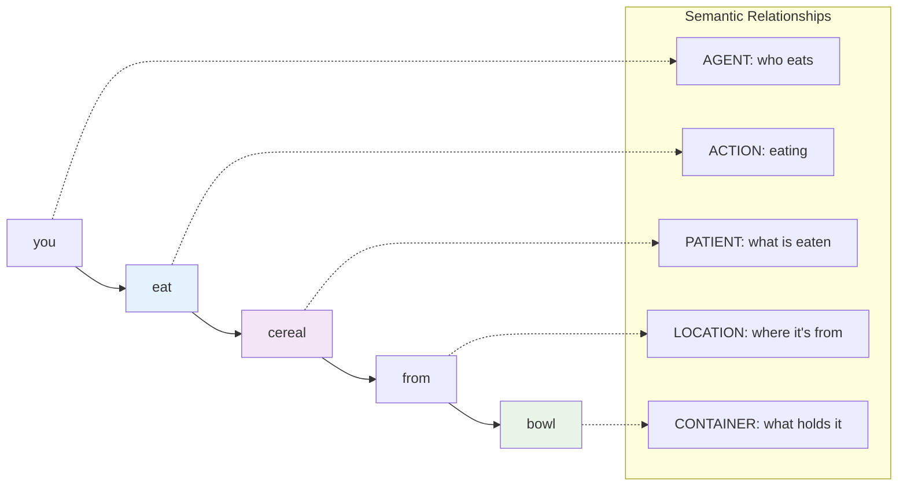
```mermaid
graph LR
    A["you"] --> B["eat"]
    B --> C["cereal"]
    C --> D["from"]
    D --> E["bowl"]

    subgraph "Semantic Relationships"
        F["AGENT: who eats"]
        G["ACTION: eating"]
        H["PATIENT: what is eaten"]
        I["LOCATION: where it's from"]
        J["CONTAINER: what holds it"]
    end

    A -.-> F
    B -.-> G
    C -.-> H
    D -.-> I
    E -.-> J

    style B fill:#e3f2fd
    style C fill:#f3e5f5
    style E fill:#e8f5e8
```

**Vector Space Advantage**: The model learns that:

- "cereal" and "bowl" frequently co-occur
- Their vectors become similar in the "food-container" dimension
- Relationship captured automatically through statistics

### Example: Causal Dependencies

From the transcript: _"You buy something and someone else sells it"_

**Dependency Chain**:
$$\text{buy}(X, \text{item}) \leftrightarrow \text{sell}(Y, \text{item})$$

```bash
┌─────────────────────────────────────────────────────────────┐
│                   CAUSAL RELATIONSHIP                       │
├─────────────────────────────────────────────────────────────┤
│                                                             │
│  Premise:    "You buy something"                            │
│  Implication: "Someone else sells it"                       │
│                                                             │
│  Vector Learning:                                           │
│  - "buy" and "sell" appear in similar contexts             │
│  - Both involve: money, transaction, exchange               │
│  - Vectors become similar despite opposite roles           │
│  - Model captures the commercial relationship               │
│                                                             │
└─────────────────────────────────────────────────────────────┘
```

---

## Applications in Natural Language Processing

### 1. Question Answering Systems

**Challenge**: Understanding that questions with different words can ask the same thing.

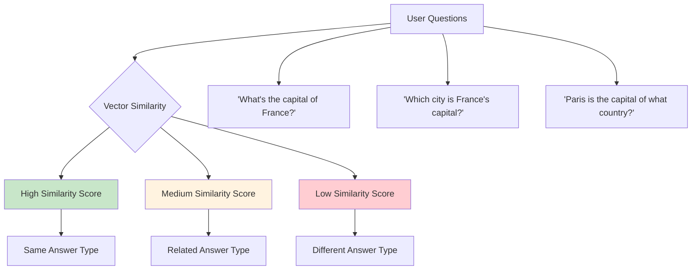
```mermaid
flowchart TD
    A["User Questions"] --> B{"Vector Similarity"}

    A --> C["'What's the capital of France?'"]
    A --> D["'Which city is France's capital?'"]
    A --> E["'Paris is the capital of what country?'"]

    B --> F["High Similarity Score"]
    B --> G["Medium Similarity Score"]
    B --> H["Low Similarity Score"]

    F --> I["Same Answer Type"]
    G --> J["Related Answer Type"]
    H --> K["Different Answer Type"]

    style F fill:#c8e6c9
    style G fill:#fff3e0
    style H fill:#ffcdd2
```

### 2. Machine Translation

**Process**: Translate meaning, not just words.

$$\text{English Vector} \xrightarrow{\text{Mapping Function}} \text{Spanish Vector}$$

Example transformation:

- English: "I love dogs" → $\vec{v}_{en} = [0.8, 0.2, 0.9, ...]$
- Spanish: "Amo los perros" → $\vec{v}_{es} = [0.8, 0.3, 0.9, ...]$
- **Key**: Similar vectors despite different languages!

### 3. Paraphrasing and Summarization

**Paraphrasing**: Find different ways to express the same idea.

- Input: "The movie was excellent"
- Vector-guided alternatives: "The film was outstanding", "The cinema was superb"

**Summarization**: Identify the most important information.

- Sentence vectors help identify key concepts
- Similar sentences can be merged or one can represent both

---

## The Clustering Phenomenon: Words of a Feather

### Grammatical Clustering

When you visualize word vectors in 2D space (using techniques like PCA), you observe natural clustering:

```bash
┌─────────────────────────────────────────────────────────────┐
│                    WORD CLUSTERING VISUALIZATION            │
├─────────────────────────────────────────────────────────────┤
│                                                             │
│    ADJECTIVES          NOUNS               VERBS            │
│    ┌─────────┐       ┌──────────┐        ┌──────────┐       │
│    │ happy   │       │ cat      │        │ run      │       │
│    │ sad     │       │ dog      │        │ jump     │       │
│    │ angry   │       │ house    │        │ eat      │       │
│    │ joyful  │       │ car      │        │ sleep    │       │
│    └─────────┘       └──────────┘        └──────────┘       │
│                                                             │
│    FUNCTION WORDS      NUMBERS             COLORS           │
│    ┌─────────┐       ┌──────────┐        ┌──────────┐       │
│    │ the     │       │ one      │        │ red      │       │
│    │ and     │       │ two      │        │ blue     │       │
│    │ or      │       │ three    │        │ green    │       │
│    │ but     │       │ first    │        │ yellow   │       │
│    └─────────┘       └──────────┘        └──────────┘       │
│                                                             │
└─────────────────────────────────────────────────────────────┘
```

### Synonyms and Antonyms: Surprisingly Close Neighbors

**Counter-intuitive Discovery**: Opposites are actually close in vector space!

**Why?** Because synonyms and antonyms:

- Appear in very similar contexts
- Can be interchanged in sentences
- Share the same grammatical patterns
- Relate to the same concepts (just differently)

**Examples**:

```python
# These word pairs are close in vector space:
similar_contexts = {
    ("hot", "cold"): "The weather is ___",
    ("big", "small"): "The house is ___",
    ("happy", "sad"): "I feel ___",
    ("fast", "slow"): "The car is ___"
}
```

---

## Advantages of Vector Space Models

### 1. **Semantic Understanding**

- Captures meaning beyond word matching
- Handles synonyms and paraphrases automatically
- Understands context-dependent meanings

### 2. **Mathematical Operations**

- Words become manipulable mathematical objects
- Enable similarity calculations
- Support arithmetic operations (king - man + woman ≈ queen)

### 3. **Efficiency**

- Dense representations (every dimension has meaning)
- Faster than sparse matrices
- Scalable to large vocabularies

### 4. **Versatility**

- Works across multiple languages
- Applicable to various NLP tasks
- Foundation for modern deep learning models

---

## From Intuition to Implementation

### The Journey Ahead


```mermaid
graph LR
    A["Conceptual Understanding"] --> B["Mathematical Framework"]
    B --> C["Co-occurrence Matrices"]
    C --> D["Distance Metrics"]
    D --> E["Dimensionality Reduction"]
    E --> F["Real Applications"]

    style A fill:#e3f2fd
    style F fill:#e8f5e8
```

In the following sections, we'll dive deep into:

1. **Building vectors from scratch** using co-occurrence matrices
2. **Measuring similarity** with distance metrics and cosine similarity
3. **Visualizing relationships** through dimensionality reduction
4. **Manipulating word vectors** for practical applications

### Key Mathematical Concepts Coming Up

- **Co-occurrence Statistics**: $C(w_i, w_j) = \text{count of words } w_i \text{ and } w_j \text{ appearing together}$
- **Distance Metrics**: $d(\vec{u}, \vec{v}) = ||\vec{u} - \vec{v}||$
- **Similarity Measures**: $\text{sim}(\vec{u}, \vec{v}) = \cos(\theta)$
- **Dimensionality Reduction**: $\vec{v}_{high} \xrightarrow{PCA} \vec{v}_{low}$

---

## Key Takeaways

### Fundamental Principles

1. **Context is King**: Words are understood through their linguistic neighborhood
2. **Vectors Encode Meaning**: Mathematical representations capture semantic properties
3. **Similarity Through Statistics**: Frequent co-occurrence implies semantic similarity
4. **Applications are Vast**: From translation to question answering to summarization

### The Firth Philosophy in Action

The quote _"You shall know a word by the company it keeps"_ becomes the mathematical foundation:

$$\text{Word Meaning} = f(\text{Context Words, Frequencies, Relationships})$$

This simple idea revolutionizes how we approach natural language understanding, transforming subjective linguistic intuition into objective mathematical operations.

**Next**: We'll learn how to build these powerful vector representations from scratch using co-occurrence matrices!

# 2. Word by Word and Word by Document Design

## Introduction: Two Fundamental Approaches to Building Vector Representations

When constructing vector space models, we have two primary architectural choices that fundamentally shape how our vectors capture meaning:

1. **Word by Word Design**: Captures local context and syntactic relationships
2. **Word by Document Design**: Captures topical and thematic relationships

Think of this choice like choosing between two different lenses to view language:

- **Word-by-Word**: A "microscope" that examines immediate word neighborhoods
- **Word-by-Document**: A "telescope" that looks at broader thematic patterns

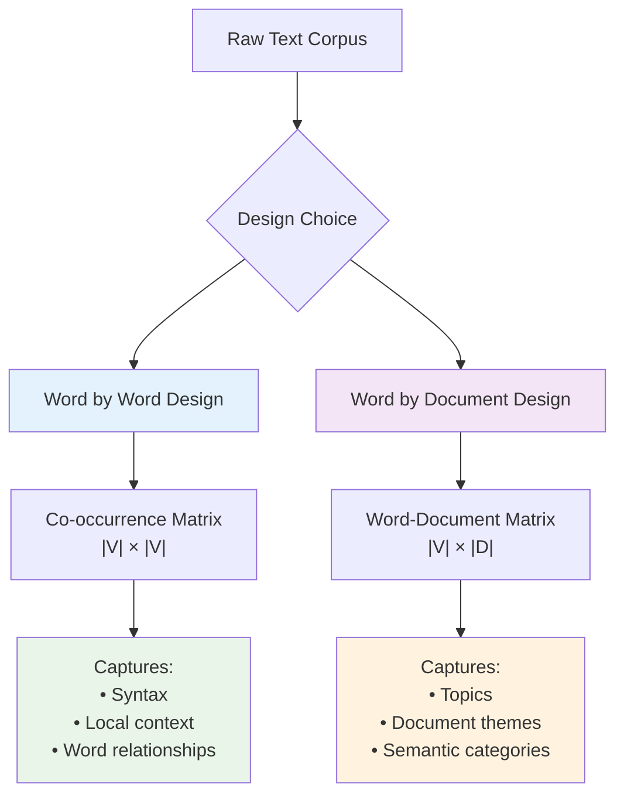
```mermaid
graph TD
    A["Raw Text Corpus"] --> B{"Design Choice"}

    B --> C["Word by Word Design"]
    B --> D["Word by Document Design"]

    C --> E["Co-occurrence Matrix<br/>|V| × |V|"]
    D --> F["Word-Document Matrix<br/>|V| × |D|"]

    E --> G["Captures:<br/>• Syntax<br/>• Local context<br/>• Word relationships"]
    F --> H["Captures:<br/>• Topics<br/>• Document themes<br/>• Semantic categories"]

    style C fill:#e3f2fd
    style D fill:#f3e5f5
    style G fill:#e8f5e8
    style H fill:#fff3e0
```

---

## Word by Word Design: The Microscopic View

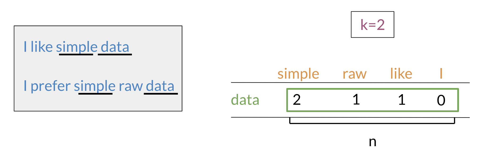

### Core Concept: Co-occurrence Within Context Windows

**Fundamental Principle**: Words that appear close together in text share semantic or syntactic relationships.

The **co-occurrence** of two words is defined as:
$$\text{Co-occurrence}(w_i, w_j) = \text{count of times } w_i \text{ and } w_j \text{ appear within distance } k$$

Where $k$ is the **context window size** - our "bandwidth" parameter that determines what we consider "close together."

### Real-Life Analogy: The Neighborhood Effect

Imagine you're a sociologist studying friendships in a city:

**Word-by-Word Approach** = "Who lives within 2 blocks of each other?"

- **Close neighbors** (k=1): Direct next-door relationships
- **Wider neighborhood** (k=2): People who might regularly interact
- **Community level** (k=5): Broader social influence

Similarly in text:

- **k=1**: Immediate grammatical relationships (adjective-noun, verb-object)
- **k=2**: Local semantic associations
- **k=5**: Broader contextual themes

---

## Detailed Example: Building a Co-occurrence Matrix

### Step-by-Step Construction Process

**Sample Corpus** (from the video transcript):

```
Sentence 1: "I like simple raw data"
Sentence 2: "I like simple data processing"
```

**Step 1: Choose Context Window Size**
Let's use $k = 2$ (words can be up to 2 positions apart to co-occur)

**Step 2: Extract All Co-occurrence Pairs**

For **Sentence 1**: "I like simple raw data"

```bash
┌─────────────────────────────────────────────────────────────┐
│                   CONTEXT WINDOW ANALYSIS                   │
│                        (k = 2)                              │
├─────────────────────────────────────────────────────────────┤
│                                                             │
│  Position:  [1]   [2]     [3]     [4]   [5]                 │
│  Words:     [I]  [like] [simple] [raw] [data]               │
│                                                             │
│  Co-occurrences within distance k=2:                        │
│  • I ↔ like     (distance = 1) ✓                            │
│  • I ↔ simple   (distance = 2) ✓                            │
│  • like ↔ simple (distance = 1) ✓                           │
│  • like ↔ raw   (distance = 2) ✓                            │
│  • simple ↔ raw (distance = 1) ✓                            │
│  • simple ↔ data (distance = 2) ✓                           │
│  • raw ↔ data  (distance = 1) ✓                             │
│                                                             │
└─────────────────────────────────────────────────────────────┘
```

For **Sentence 2**: "I like simple data processing"

```bash
┌─────────────────────────────────────────────────────────────┐
│                   CONTEXT WINDOW ANALYSIS                   │
│                        (k = 2)                              │
├─────────────────────────────────────────────────────────────┤
│                                                             │
│  Position:  [1]   [2]     [3]     [4]      [5]              │
│  Words:     [I]  [like] [simple] [data] [processing]        │
│                                                             │
│  Co-occurrences within distance k=2:                        │
│  • I ↔ like     (distance = 1) ✓                            │
│  • I ↔ simple   (distance = 2) ✓                            │
│  • like ↔ simple (distance = 1) ✓                           │
│  • like ↔ data  (distance = 2) ✓                            │
│  • simple ↔ data (distance = 1) ✓                           │
│  • simple ↔ processing (distance = 2) ✓                     │
│  • data ↔ processing (distance = 1) ✓                       │
│                                                             │
└─────────────────────────────────────────────────────────────┘
```

**Step 3: Count Total Co-occurrences**

| Word Pair            | Sentence 1 | Sentence 2 | Total Count |
| -------------------- | ---------- | ---------- | ----------- |
| (I, like)            | 1          | 1          | **2**       |
| (I, simple)          | 1          | 1          | **2**       |
| (like, simple)       | 1          | 1          | **2**       |
| (simple, raw)        | 1          | 0          | **1**       |
| (simple, data)       | 1          | 1          | **2**       |
| (raw, data)          | 1          | 0          | **1**       |
| (like, raw)          | 1          | 0          | **1**       |
| (like, data)         | 0          | 1          | **1**       |
| (data, processing)   | 0          | 1          | **1**       |
| (simple, processing) | 0          | 1          | **1**       |

**Step 4: Build the Co-occurrence Matrix**

Vocabulary: {I, like, simple, raw, data, processing}

|                | I   | like | simple | raw | data | processing |
| -------------- | --- | ---- | ------ | --- | ---- | ---------- |
| **I**          | 0   | 2    | 2      | 0   | 0    | 0          |
| **like**       | 2   | 0    | 2      | 1   | 1    | 0          |
| **simple**     | 2   | 2    | 0      | 1   | 2    | 1          |
| **raw**        | 0   | 1    | 1      | 0   | 1    | 0          |
| **data**       | 0   | 1    | 2      | 1   | 0    | 1          |
| **processing** | 0   | 0    | 1      | 0   | 1    | 0          |

### Vector Representation Extraction

Each word becomes a vector (row from the matrix):

$$\vec{v}_{\text{data}} = [0, 1, 2, 1, 0, 1]$$

**From the video example**: The word "data" co-occurs with:

- "simple": 2 times
- "raw": 1 time
- "like": 1 time
- "I": 0 times

Therefore: $\vec{v}_{\text{data}} = [2, 1, 1, 0]$ (considering only subset: simple, raw, like, I)

---

## Mathematical Properties of Word-by-Word Matrices

### Symmetry Property

The co-occurrence matrix is **symmetric**:
$$C_{ij} = C_{ji}$$

**Why?** If word $i$ co-occurs with word $j$, then word $j$ also co-occurs with word $i$.

### Sparsity Analysis

For a vocabulary of size $|V|$:

- **Matrix size**: $|V| \times |V|$
- **Theoretical entries**: $|V|^2$
- **Actual non-zero entries**: Much smaller (most word pairs never co-occur)

**Sparsity ratio**:
$$\text{Sparsity} = \frac{\text{Number of zero entries}}{\text{Total entries}} = \frac{|V|^2 - \text{Non-zero entries}}{|V|^2}$$

Typical sparsity: 95-99% (very sparse matrices)

---

## Word by Document Design: The Telescopic View

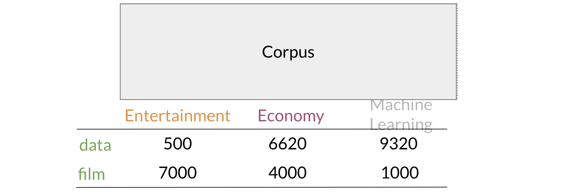

### Core Concept: Topical Word Distribution

**Fundamental Principle**: Words that appear in similar document types share thematic relationships.

The **word-document frequency** is defined as:
$$\text{Frequency}(w_i, d_j) = \text{count of word } w_i \text{ in document category } d_j$$

### Real-Life Analogy: The Library Classification System

Imagine you're organizing a library:

**Word-by-Document Approach** = "Which books contain which topics?"

- **Science books**: contain "hypothesis", "experiment", "data"
- **Fiction books**: contain "character", "plot", "story"
- **Cooking books**: contain "recipe", "ingredient", "bake"

Words that appear in similar book categories are topically related!

---

## Detailed Example: Document Category Analysis

### The Entertainment-Economy-ML Example

**From the video transcript**, we have three document categories:

```bash
┌─────────────────────────────────────────────────────────────┐
│                   DOCUMENT CORPUS ANALYSIS                  │
├─────────────────────────────────────────────────────────────┤
│                                                             │
│  📽️ ENTERTAINMENT Documents:                                │
│     • Movie reviews, celebrity news, TV shows               │
│     • Common words: "film", "actor", "movie", "show"        │
│                                                             │
│  💰 ECONOMY Documents:                                      │
│     • Financial reports, market analysis, business news     │
│     • Common words: "data", "market", "profit", "growth"    │
│                                                             │
│  🤖 MACHINE LEARNING Documents:                             │
│     • Research papers, technical tutorials, AI news         │
│     • Common words: "data", "algorithm", "model", "neural"  │
│                                                             │
└─────────────────────────────────────────────────────────────┘
```

### Building the Word-Document Matrix

**Step 1: Count Word Frequencies in Each Category**

| Word     | Entertainment | Economy | Machine Learning |
| -------- | ------------- | ------- | ---------------- |
| **data** | 500           | 6,620   | 9,320            |
| **film** | 7,000         | 4,000   | 1,000            |

**Insight from the numbers**:

- "data": Most frequent in ML (9,320), then Economy (6,620), least in Entertainment (500)
- "film": Most frequent in Entertainment (7,000), then Economy (4,000), least in ML (1,000)

### Vector Representations for Document Categories

Instead of representing words as vectors, we can represent **document categories** as vectors:

$$\vec{v}_{\text{Entertainment}} = [500, 7000]$$

$$\vec{v}_{\text{Economy}} = [6620, 4000]$$

$$\vec{v}_{\text{ML}} = [9320, 1000]$$

Where each dimension represents: [frequency of "data", frequency of "film"]

---

## Visualizing Document Similarity

### 2D Vector Space Plot

The following visualization shows how our three document categories appear in vector space:

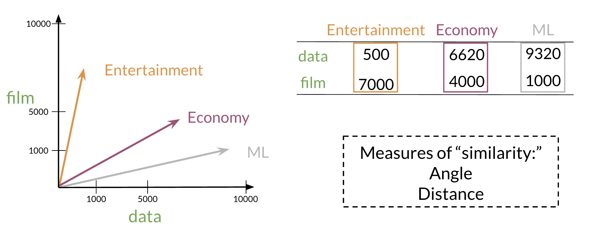

**Key Visual Insights from the Plot**:

```bash
┌─────────────────────────────────────────────────────────────┐
│                    VECTOR SPACE ANALYSIS                    │
├─────────────────────────────────────────────────────────────┤
│                                                             │
│  📊 X-axis: "data" word frequency                           │
│  📊 Y-axis: "film" word frequency                           │
│                                                             │
│  🎬 Entertainment: (500, 7000)                              │
│     • Low "data" usage                                      │
│     • High "film" usage                                     │
│     • Far from other categories                             │
│                                                             │
│  💰 Economy: (6620, 4000)                                   │
│     • High "data" usage                                     │
│     • Medium "film" usage                                   │
│     • Closer to ML than Entertainment                       │
│                                                             │
│  🤖 ML: (9320, 1000)                                        │
│     • Highest "data" usage                                  │
│     • Low "film" usage                                      │
│     • Closest to Economy                                    │
│                                                             │
└─────────────────────────────────────────────────────────────┘
```

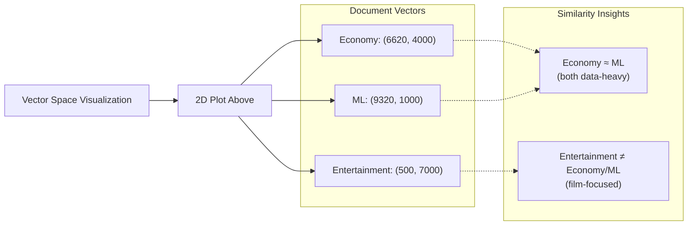
```mermaid
graph LR
    A["Vector Space Visualization"] --> B["2D Plot Above"]

    subgraph "Document Vectors"
        C["Entertainment: (500, 7000)"]
        D["Economy: (6620, 4000)"]
        E["ML: (9320, 1000)"]
    end

    subgraph "Similarity Insights"
        F["Economy ≈ ML<br/>(both data-heavy)"]
        G["Entertainment ≠ Economy/ML<br/>(film-focused)"]
    end

    B --> C
    B --> D
    B --> E

    D -.-> F
    E -.-> F
    C -.-> G
```

**Mathematical Observation**:

- **Economy** and **ML** vectors are closer (both have high "data" values)
- **Entertainment** is farther away (high "film", low "data")
- The **angle** between Economy and ML vectors is smaller than other pairs

### Distance Calculation Preview

Using Euclidean distance:

$$d(\text{Economy}, \text{ML}) = \sqrt{(6620-9320)^2 + (4000-1000)^2}$$
$$= \sqrt{(-2700)^2 + (3000)^2} = \sqrt{7,290,000 + 9,000,000} = \sqrt{16,290,000} \approx 4,036$$

$$d(\text{Entertainment}, \text{Economy}) = \sqrt{(500-6620)^2 + (7000-4000)^2}$$
$$= \sqrt{(-6120)^2 + (3000)^2} = \sqrt{37,454,400 + 9,000,000} = \sqrt{46,454,400} \approx 6,816$$

**Result**: Economy and ML are more similar than Entertainment and Economy!

---

## Comparing the Two Designs: A Comprehensive Analysis

### Computational Complexity

| Aspect                 | Word-by-Word         | Word-by-Document     |
| ---------------------- | -------------------- | -------------------- |
| **Matrix Size**        | $\|V\| \times \|V\|$ | $\|V\| \times \|D\|$ |
| **Typical Dimensions** | 50K × 50K            | 50K × 10K            |
| **Memory (50K vocab)** | ~9.3 GB              | ~1.9 GB              |
| **Sparsity**           | 95-99%               | 60-90%               |
| **Construction Time**  | $O(N \cdot k)$       | $O(N)$               |

Where:

- $|V|$ = vocabulary size
- $|D|$ = number of document categories
- $N$ = total corpus size
- $k$ = context window size

### Semantic Capture Comparison

```bash
┌─────────────────────────────────────────────────────────────┐
│                    SEMANTIC RELATIONSHIPS                   │
├─────────────────────────────────────────────────────────────┤
│                                                             │
│  WORD-BY-WORD captures:                                     │
│  ✅ Syntactic patterns: "red car" (adjective-noun)          │
│  ✅ Semantic similarity: "big"/"large" (synonyms)           │
│  ✅ Word analogies: king:queen :: man:woman                 │
│  ✅ Local context: "eat breakfast" vs "breakfast cereal"    │
│                                                             │
│  WORD-BY-DOCUMENT captures:                                 │
│  ✅ Topical clusters: medicine words, sports words          │
│  ✅ Document similarity: news articles vs research papers   │
│  ✅ Genre classification: fiction vs non-fiction            │
│  ✅ Domain expertise: technical vs general vocabulary       │
│                                                             │
└─────────────────────────────────────────────────────────────┘
```

### Use Case Decision Matrix

| Task                          | Recommended Design | Reasoning                     |
| ----------------------------- | ------------------ | ----------------------------- |
| **Part-of-speech tagging**    | Word-by-Word       | Needs syntactic relationships |
| **Document classification**   | Word-by-Document   | Needs topical patterns        |
| **Machine translation**       | Word-by-Word       | Needs syntactic structure     |
| **Information retrieval**     | Word-by-Document   | Needs document similarity     |
| **Word sense disambiguation** | Word-by-Word       | Needs local context           |
| **Topic modeling**            | Word-by-Document   | Needs thematic groupings      |

---

## Advanced Considerations and Optimizations

### Handling the Context Window Parameter $k$

The choice of $k$ dramatically affects the resulting vectors:

$$\text{Semantic Scope} \propto k$$

```python
def analyze_context_window_effects(k_values=[1, 2, 5, 10]):
    """
    How different k values affect captured relationships
    """
    effects = {
        1: "Immediate syntax (adj-noun, verb-obj)",
        2: "Local semantics (phrasal relationships)",
        5: "Sentence-level themes",
        10: "Paragraph-level topics"
    }

    for k in k_values:
        print(f"k={k}: {effects.get(k, 'Broad contextual themes')}")
```

**Optimal $k$ selection**:

- **Small $k$ (1-2)**: Syntactic tasks, POS tagging
- **Medium $k$ (3-5)**: Semantic similarity, word embeddings
- **Large $k$ (10+)**: Topic modeling, document themes

### Normalization Strategies

Raw co-occurrence counts can be misleading. Common normalizations:

1. **Relative Frequency**:
   $$\text{RelFreq}(w_i, w_j) = \frac{\text{CoOccur}(w_i, w_j)}{\text{TotalCoOccur}(w_i)}$$

2. **Pointwise Mutual Information (PMI)**:
   $$\text{PMI}(w_i, w_j) = \log_2 \frac{P(w_i, w_j)}{P(w_i) \cdot P(w_j)}$$

3. **TF-IDF for Documents**:
   $$\text{TF-IDF}(w, d) = \text{TF}(w, d) \cdot \log \frac{|D|}{|\{d' : w \in d'\}|}$$

---

## Key Takeaways and Forward Preview

### Fundamental Design Principles

1. **Word-by-Word**: Microscopic view capturing local linguistic patterns
2. **Word-by-Document**: Telescopic view capturing global thematic patterns
3. **Context Window $k$**: Controls the "bandwidth" of captured relationships
4. **Matrix Properties**: Sparsity and symmetry have computational implications

### The Path to Similarity Measurement

Now that we have vector representations, the next crucial step is **measuring similarity**:

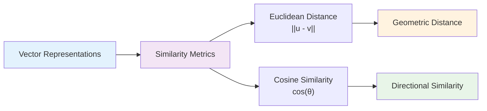
```mermaid
graph LR
    A["Vector Representations"] --> B["Similarity Metrics"]

    B --> C["Euclidean Distance<br/>||u - v||"]
    B --> D["Cosine Similarity<br/>cos(θ)"]

    C --> E["Geometric Distance"]
    D --> F["Directional Similarity"]

    style A fill:#e3f2fd
    style B fill:#f3e5f5
    style E fill:#fff3e0
    style F fill:#e8f5e8
```

### Mathematical Preview

Coming up, we'll explore:

- **Euclidean Distance**: $d(\vec{u}, \vec{v}) = \sqrt{\sum_{i=1}^n (u_i - v_i)^2}$
- **Cosine Similarity**: $\cos(\theta) = \frac{\vec{u} \cdot \vec{v}}{||\vec{u}|| \cdot ||\vec{v}||}$
- **Angle Relationships**: How vector angles encode semantic similarity

### Real-World Applications

The vector representations we've built will enable:

- **Question answering**: Finding semantically similar questions
- **Document retrieval**: Matching queries to relevant documents
- **Paraphrasing**: Identifying different expressions of the same meaning
- **Clustering**: Automatically grouping similar words or documents

**Next**: We'll learn how to quantify the relationships between these vectors using distance metrics, starting with the intuitive Euclidean distance!

# 3. Euclidean Distance

## Introduction: Measuring Word Similarity with Geometric Intuition

Now that we have vector representations of words and documents, we need a way to measure how **similar** or **different** they are. **Euclidean distance** provides the most intuitive approach - it measures the straight-line distance between two points in vector space, just like measuring the distance between two cities on a map.

**Core Intuition**: Words that are closer together in vector space should be more similar in meaning.

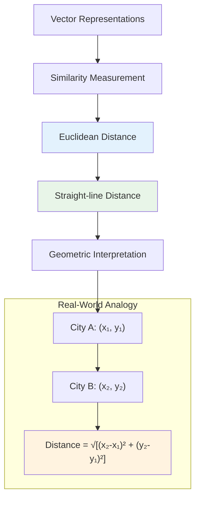
```mermaid
graph TD
    A["Vector Representations"] --> B["Similarity Measurement"]
    B --> C["Euclidean Distance"]
    C --> D["Straight-line Distance"]
    D --> E["Geometric Interpretation"]

    subgraph "Real-World Analogy"
        F["City A: (x₁, y₁)"]
        G["City B: (x₂, y₂)"]
        H["Distance = √[(x₂-x₁)² + (y₂-y₁)²]"]
    end

    E --> F
    F --> G
    G --> H

    style C fill:#e3f2fd
    style D fill:#e8f5e8
    style H fill:#fff3e0
```

---

## Real-Life Analogy: The GPS Navigation System

Imagine you're using a GPS to find the distance between two cities:

**Traditional Approach** (word counting):

- _"How many roads connect these cities?"_
- Just counts connections, no spatial understanding

**Euclidean Distance Approach**:

- _"What's the straight-line distance between these cities?"_
- Captures actual spatial relationship and proximity

Similarly in NLP:

- **Traditional**: "These words appear together X times"
- **Euclidean**: "These words are semantically X units apart"

---

## Mathematical Foundation: From 2D to n-Dimensional Space

### The Basic Formula (2D Case)

For two points A and B in 2D space:

$$d(A, B) = \sqrt{(B_1 - A_1)^2 + (B_2 - A_2)^2}$$

Where:

- $(A_1, A_2)$ = coordinates of point A
- $(B_1, B_2)$ = coordinates of point B
- $d(A, B)$ = Euclidean distance between A and B

**Recognition**: This is the famous **Pythagorean theorem**!

$$c^2 = a^2 + b^2 \quad \Rightarrow \quad c = \sqrt{a^2 + b^2}$$

Where:

- $a$ = horizontal distance = $|B_1 - A_1|$
- $b$ = vertical distance = $|B_2 - A_2|$
- $c$ = hypotenuse = Euclidean distance

---

## Detailed Example: Entertainment vs. ML Document Analysis

### Using Our Previous Document Vectors

From the video transcript, let's analyze the distance between:

- **Corpus A (Entertainment)**: $(500, 7000)$
- **Corpus B (Machine Learning)**: $(9320, 1000)$

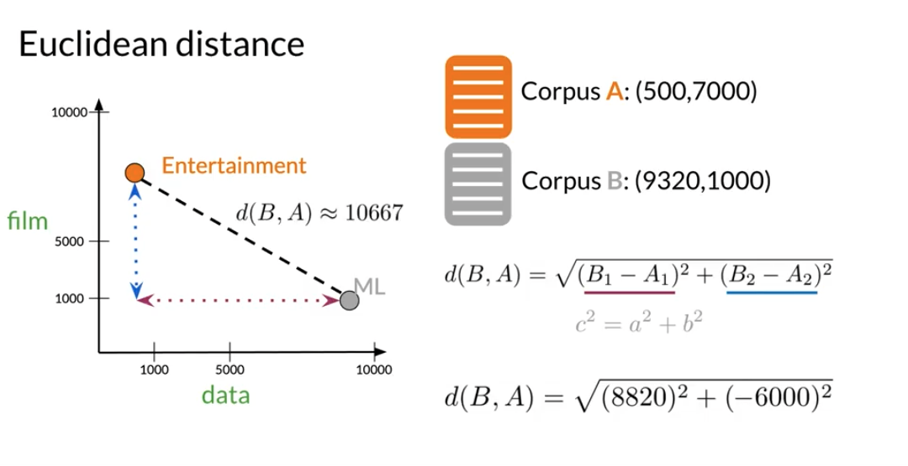

### Step-by-Step Calculation

**Step 1: Identify the coordinates**

- $A = (A_1, A_2) = (500, 7000)$ (Entertainment)
- $B = (B_1, B_2) = (9320, 1000)$ (Machine Learning)

**Step 2: Calculate the differences**

- Horizontal difference: $B_1 - A_1 = 9320 - 500 = 8820$
- Vertical difference: $B_2 - A_2 = 1000 - 7000 = -6000$

**Step 3: Apply the Pythagorean theorem**

```bash
┌─────────────────────────────────────────────────────────────┐
│                    DISTANCE CALCULATION                     │
├─────────────────────────────────────────────────────────────┤
│                                                             │
│  d(B, A) = √[(B₁ - A₁)² + (B₂ - A₂)²]                       │
│                                                             │
│  d(ML, Entertainment) = √[(8820)² + (-6000)²]               │
│                       = √[77,792,400 + 36,000,000]          │
│                       = √[113,792,400]                      │
│                       = 10,667                              │
│                                                             │
│  Interpretation: The documents are 10,667 units apart       │
│  in semantic space                                          │
│                                                             │
└─────────────────────────────────────────────────────────────┘
```

**Final Result**: $d(\text{ML}, \text{Entertainment}) \approx 10,667$

### Geometric Visualization

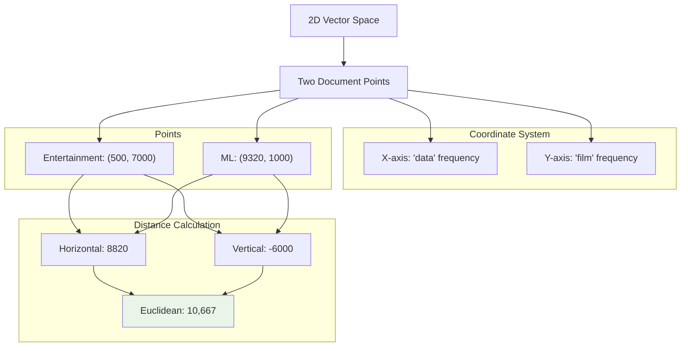
```mermaid
graph TD
    A["2D Vector Space"] --> B["Two Document Points"]

    subgraph "Coordinate System"
        C["X-axis: 'data' frequency"]
        D["Y-axis: 'film' frequency"]
    end

    subgraph "Points"
        E["Entertainment: (500, 7000)"]
        F["ML: (9320, 1000)"]
    end

    subgraph "Distance Calculation"
        G["Horizontal: 8820"]
        H["Vertical: -6000"]
        I["Euclidean: 10,667"]
    end

    B --> C
    B --> D
    B --> E
    B --> F

    E --> G
    F --> G
    E --> H
    F --> H

    G --> I
    H --> I

    style I fill:#e8f5e8
```

---

## Generalization to n-Dimensional Space

### The General Formula

For vectors $\vec{v}$ and $\vec{w}$ in n-dimensional space:

$$d(\vec{v}, \vec{w}) = \sqrt{\sum_{i=1}^{n} (v_i - w_i)^2}$$

**Alternative notation** (norm of difference):
$$d(\vec{v}, \vec{w}) = ||\vec{v} - \vec{w}||_2$$

Where $||\cdot||_2$ denotes the L2 (Euclidean) norm.

### Step-by-Step Algorithm

```bash
┌─────────────────────────────────────────────────────────────┐
│                 EUCLIDEAN DISTANCE ALGORITHM                │
├─────────────────────────────────────────────────────────────┤
│                                                             │
│  Input: Two n-dimensional vectors v⃗ and w⃗                   │
│                                                             │
│  Step 1: For each dimension i = 1 to n:                     │
│          Calculate difference: diff_i = v_i - w_i           │
│                                                             │
│  Step 2: For each dimension i = 1 to n:                     │
│          Square the difference: squared_i = diff_i²         │
│                                                             │
│  Step 3: Sum all squared differences:                       │
│          sum = squared_1 + squared_2 + ... + squared_n      │
│                                                             │
│  Step 4: Take the square root:                              │
│          distance = √sum                                    │
│                                                             │
│  Output: Euclidean distance between v⃗ and w⃗                 │
│                                                             │
└─────────────────────────────────────────────────────────────┘
```

---

## Detailed n-Dimensional Example: Word Co-occurrence Vectors

### Sample Co-occurrence Matrix

Let's use this example co-occurrence matrix:

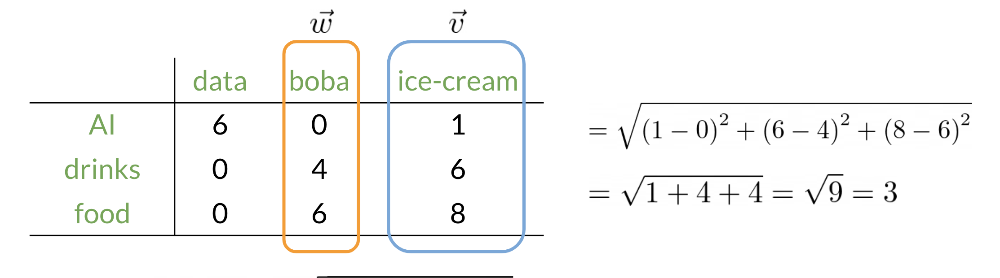

Let's calculate the distance between **"ice cream"** and **"boba"**:

### Vector Extraction

From the co-occurrence matrix shown in the image:

**Co-occurrence Matrix**:
| | data | boba | ice-cream |
|----------|------|------|-----------|
| **AI** | 6 | 0 | 1 |
| **drinks** | 0 | 4 | 6 |
| **food** | 0 | 6 | 8 |

**Extracted Vectors**:

- $\vec{w}_{\text{boba}} = [0, 4, 6]$ (3-dimensional: AI, drinks, food)
- $\vec{v}_{\text{ice cream}} = [1, 6, 8]$ (3-dimensional: AI, drinks, food)

### Manual Calculation

**Step 1: Calculate differences**
| Dimension | ice-cream | boba | Difference | Squared |
|-----------|-----------|------|------------|---------|
| AI | 1 | 0 | 1-0 = 1 | 1² = 1 |
| drinks | 6 | 4 | 6-4 = 2 | 2² = 4 |
| food | 8 | 6 | 8-6 = 2 | 2² = 4 |

**Step 2: Sum and square root**
$d(\text{ice cream}, \text{boba}) = \sqrt{1 + 4 + 4} = \sqrt{9} = 3$

### Mathematical Verification

$d(\vec{v}, \vec{w}) = \sqrt{(1-0)^2 + (6-4)^2 + (8-6)^2}$
$= \sqrt{1^2 + 2^2 + 2^2}$
$= \sqrt{1 + 4 + 4} = \sqrt{9} = 3$

---

## Python Implementation: From Theory to Practice

### Basic Implementation

```python
import numpy as np

def euclidean_distance_manual(v, w):
    """
    Calculate Euclidean distance manually
    """
    if len(v) != len(w):
        raise ValueError("Vectors must have same dimensions")

    squared_differences = []
    for i in range(len(v)):
        diff = v[i] - w[i]
        squared_diff = diff ** 2
        squared_differences.append(squared_diff)
        print(f"Dimension {i+1}: ({v[i]} - {w[i]})² = {squared_diff}")

    sum_squared = sum(squared_differences)
    distance = sum_squared ** 0.5

    print(f"Sum of squared differences: {sum_squared}")
    print(f"Euclidean distance: {distance:.3f}")

    return distance

# Example from the image provided
ice_cream = [1, 6, 8]  # AI, drinks, food
boba = [0, 4, 6]       # AI, drinks, food

distance = euclidean_distance_manual(ice_cream, boba)
```

### NumPy Implementation (Professional)

```python
import numpy as np
from numpy.linalg import norm

def euclidean_distance_numpy(v, w):
    """
    Calculate Euclidean distance using NumPy
    More efficient for large vectors
    """
    v = np.array(v)
    w = np.array(w)

    # Method 1: Using norm of difference
    distance1 = norm(v - w)

    # Method 2: Manual calculation with NumPy
    distance2 = np.sqrt(np.sum((v - w) ** 2))

    print(f"Method 1 (norm): {distance1:.3f}")
    print(f"Method 2 (manual): {distance2:.3f}")

    return distance1

# Example vectors from video transcript
entertainment = np.array([500, 7000])
ml = np.array([9320, 1000])

distance = euclidean_distance_numpy(entertainment, ml)
print(f"Distance between Entertainment and ML: {distance:.0f}")
```

**Expected Output**:

```
Method 1 (norm): 10667.000
Method 2 (manual): 10667.000
Distance between Entertainment and ML: 10667
```

---

## Properties and Characteristics of Euclidean Distance

### Mathematical Properties

Euclidean distance is a **metric**, satisfying these properties:

1. **Non-negativity**: $d(\vec{v}, \vec{w}) \geq 0$ ✓

   - Distance is always positive or zero

2. **Identity of indiscernibles**: $d(\vec{v}, \vec{w}) = 0 \iff \vec{v} = \vec{w}$ ✓

   - Distance is zero only when vectors are identical

3. **Symmetry**: $d(\vec{v}, \vec{w}) = d(\vec{w}, \vec{v})$ ✓

   - Distance from A to B equals distance from B to A

4. **Triangle inequality**: $d(\vec{v}, \vec{u}) \leq d(\vec{v}, \vec{w}) + d(\vec{w}, \vec{u})$ ✓
   - Direct path is always shortest

### Computational Complexity

For n-dimensional vectors:

- **Time complexity**: $O(n)$ (linear in dimensions)
- **Space complexity**: $O(1)$ (constant extra space)
- **Numerical stability**: Generally stable for reasonable vector magnitudes

---

## Advantages and Limitations

### ✅ Advantages

```bash
┌─────────────────────────────────────────────────────────────┐
│                    EUCLIDEAN DISTANCE PROS                  │
├─────────────────────────────────────────────────────────────┤
│                                                             │
│  ✅ Intuitive Geometric Interpretation                     │
│     Easy to visualize and understand                        │
│                                                             │
│  ✅ Mathematical Rigor                                      │
│     Well-defined metric with proven properties             │
│                                                             │
│  ✅ Computational Efficiency                               │
│     Fast O(n) calculation, vectorizable                    │
│                                                             │
│  ✅ Universal Applicability                                │
│     Works in any dimensional space                          │
│                                                             │
│  ✅ Foundation for Other Algorithms                        │
│     Basis for k-means, nearest neighbors, etc.             │
│                                                             │
└─────────────────────────────────────────────────────────────┘
```

### ❌ Limitations

```bash
┌─────────────────────────────────────────────────────────────┐
│                   EUCLIDEAN DISTANCE CONS                   │
├─────────────────────────────────────────────────────────────┤
│                                                             │
│  ❌ Magnitude Sensitivity                                   │
│     Dominated by dimensions with large values              │
│                                                             │
│  ❌ Curse of Dimensionality                                │
│     Less meaningful in very high dimensions                │
│                                                             │
│  ❌ No Direction Consideration                              │
│     Only measures magnitude, ignores vector direction      │
│                                                             │
│  ❌ Scale Dependency                                        │
│     Sensitive to feature scaling differences               │
│                                                             │
└─────────────────────────────────────────────────────────────┘
```

### Practical Example of Limitations

Consider these word vectors:

- $\vec{v}_{\text{common}} = [1000, 1001]$ (high-frequency words)
- $\vec{w}_{\text{rare}} = [1, 2]$ (low-frequency words)
- $\vec{u}_{\text{related}} = [1000, 1002]$ (similar to common)

**Distances**:

- $d(\text{common}, \text{related}) \approx 1$ (very close)
- $d(\text{common}, \text{rare}) \approx 1414$ (very far)

The **magnitude dominates** - rare words seem unrelated even if semantically similar!

---

## Applications in NLP and Beyond

### 1. Document Similarity

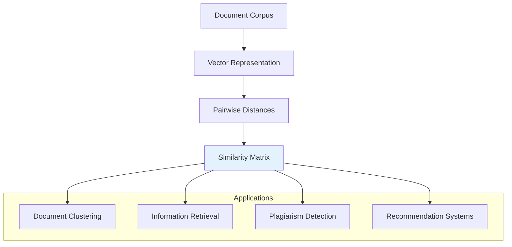
```mermaid
flowchart TD
    A["Document Corpus"] --> B["Vector Representation"]
    B --> C["Pairwise Distances"]
    C --> D["Similarity Matrix"]

    subgraph "Applications"
        E["Document Clustering"]
        F["Information Retrieval"]
        G["Plagiarism Detection"]
        H["Recommendation Systems"]
    end

    D --> E
    D --> F
    D --> G
    D --> H

    style D fill:#e3f2fd
```

### 2. Word Similarity Tasks

- **Synonym detection**: Close words might be synonyms
- **Semantic clustering**: Group semantically related words
- **Analogy completion**: Find words with similar relationships

### 3. Quality Assessment

**Example interpretation** of our Entertainment vs. ML distance (10,667):

```python
def interpret_distance(distance, context="document similarity"):
    """
    Provide intuitive interpretation of distance values
    """
    if distance < 1000:
        return "Very similar - likely same topic/category"
    elif distance < 5000:
        return "Moderately similar - related themes"
    elif distance < 15000:
        return "Somewhat different - different focus areas"
    else:
        return "Very different - unrelated topics"

# Our example
entertainment_ml_distance = 10667
interpretation = interpret_distance(entertainment_ml_distance)
print(f"Distance {entertainment_ml_distance}: {interpretation}")
# Output: "Distance 10667: Somewhat different - different focus areas"
```

---

## Transition to Advanced Similarity Metrics

### Why We Need More Than Distance

While Euclidean distance provides intuitive geometric understanding, it has limitations that make other metrics valuable:

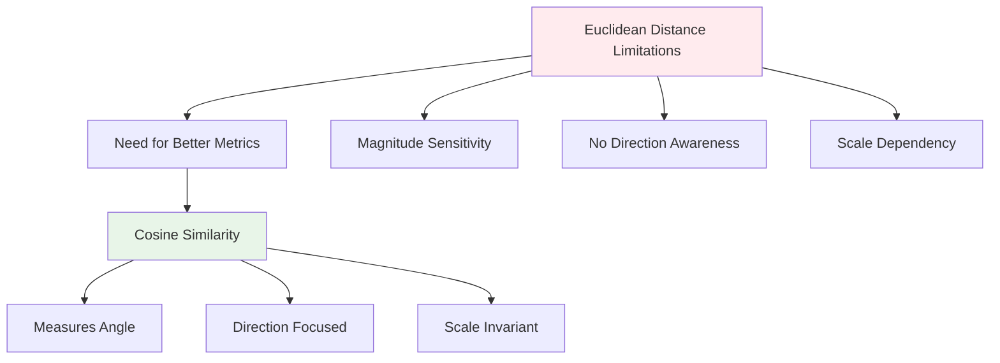
```mermaid
graph TD
    A["Euclidean Distance Limitations"] --> B["Need for Better Metrics"]

    A --> C["Magnitude Sensitivity"]
    A --> D["No Direction Awareness"]
    A --> E["Scale Dependency"]

    B --> F["Cosine Similarity"]
    F --> G["Measures Angle"]
    F --> H["Direction Focused"]
    F --> I["Scale Invariant"]

    style A fill:#ffebee
    style F fill:#e8f5e8
```

### Preview: Cosine Similarity

**Coming next**: A similarity metric that focuses on **direction** rather than magnitude:

$$\cos(\theta) = \frac{\vec{v} \cdot \vec{w}}{||\vec{v}|| \cdot ||\vec{w}||} $$

This addresses many of Euclidean distance's limitations by:

- **Normalizing** for vector magnitude
- **Focusing** on vector direction/orientation
- **Scale invariant** - [1000, 1001] and [1, 1.001] have same cosine similarity

---

## Key Takeaways

### Fundamental Concepts Mastered

1. **Geometric Intuition**: Euclidean distance = straight-line distance in vector space
2. **Mathematical Foundation**: Extension of Pythagorean theorem to n dimensions
3. **Algorithmic Implementation**: Simple $O(n)$ calculation using norm of differences
4. **Practical Applications**: Document similarity, word clustering, information retrieval

### Mathematical Relationships

- **2D formula**: $d(A,B) = \sqrt{(B_1-A_1)^2 + (B_2-A_2)^2}$
- **n-D generalization**: $d(\vec{v},\vec{w}) = \sqrt{\sum_{i=1}^{n} (v_i - w_i)^2}$
- **Norm notation**: $d(\vec{v},\vec{w}) = ||\vec{v} - \vec{w}||_2$

### Practical Implementation

- **NumPy efficiency**: Use `np.linalg.norm(v - w)` for best performance
- **Metric properties**: Non-negative, symmetric, satisfies triangle inequality
- **Interpretation**: Smaller distances indicate greater similarity

**Next**: We'll explore **cosine similarity**, which overcomes some of Euclidean distance's limitations by focusing on vector direction rather than magnitude!

# 4. Cosine Similarity: Intuition

## Introduction: When Euclidean Distance Fails

While Euclidean distance provides intuitive geometric understanding, it has a critical flaw when comparing documents or corpora of different sizes. **Cosine similarity** addresses this limitation by focusing on the **direction** of vectors rather than their magnitude, making it the preferred metric for many NLP applications.

**Core Insight**: Two documents can have the same proportional word usage (same topic) but vastly different total word counts. Euclidean distance would incorrectly suggest they are dissimilar, while cosine similarity correctly identifies their thematic relationship.

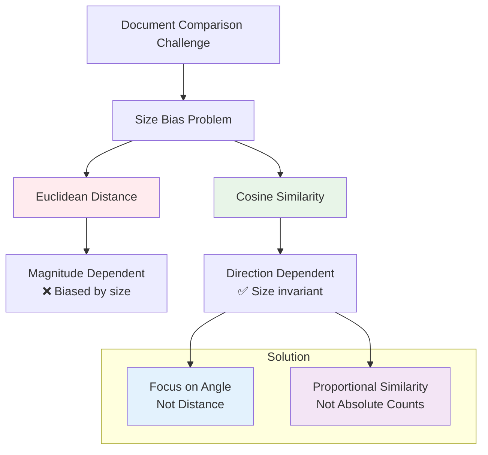
```mermaid
graph TD
    A["Document Comparison Challenge"] --> B["Size Bias Problem"]
    B --> C["Euclidean Distance"]
    B --> D["Cosine Similarity"]

    C --> E["Magnitude Dependent<br/>❌ Biased by size"]
    D --> F["Direction Dependent<br/>✅ Size invariant"]

    subgraph "Solution"
        G["Focus on Angle<br/>Not Distance"]
        H["Proportional Similarity<br/>Not Absolute Counts"]
    end

    F --> G
    F --> H

    style C fill:#ffebee
    style D fill:#e8f5e8
    style G fill:#e3f2fd
    style H fill:#f3e5f5
```

---

## Real-Life Analogy: The Recipe Scaling Problem

Imagine you're a chef comparing recipes:

**Euclidean Distance Approach**:

- Recipe A: "1 cup flour, 2 eggs" (small batch)
- Recipe B: "10 cups flour, 20 eggs" (large batch)
- **Conclusion**: "These recipes are completely different!" ❌

**Cosine Similarity Approach**:

- **Focus on proportions**: Both use 1:2 ratio of flour to eggs
- **Conclusion**: "These are the same recipe, just different serving sizes!" ✅

Similarly in NLP:

- **Document A**: 100 words total, 10 about "food", 5 about "cooking"
- **Document B**: 1000 words total, 100 about "food", 50 about "cooking"
- **Same proportions** = **same topic** = **high cosine similarity**

---

## The Problem with Euclidean Distance: A Detailed Example

### Corpus Comparison Scenario

From the video transcript, let's examine three corpora represented in a 2D space with dimensions:

- **X-axis**: Frequency of word "disease"
- **Y-axis**: Frequency of word "eggs"

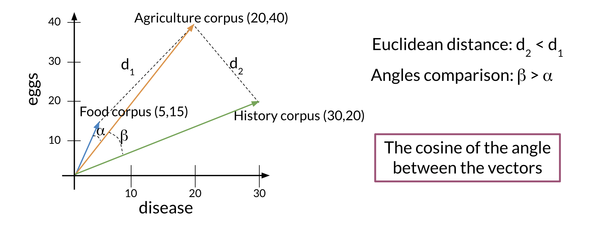

### Corpus Characteristics

```bash
┌─────────────────────────────────────────────────────────────┐
│                    CORPUS COMPARISON ANALYSIS               │
├─────────────────────────────────────────────────────────────┤
│                                                             │
│  🍎 FOOD Corpus:                                           │
│     • Small corpus size (~1000 words total)                │
│     • High proportion of "eggs" mentions                   │
│     • Low "disease" mentions                               │
│     • Topic: Cooking, nutrition, recipes                   │
│                                                             │
│  🌾 AGRICULTURE Corpus:                                    │
│     • Large corpus size (~10000 words total)              │
│     • High "eggs" mentions (10x food corpus)              │
│     • Moderate "disease" mentions                         │
│     • Topic: Farming, livestock, animal products          │
│                                                             │
│  📚 HISTORY Corpus:                                        │
│     • Large corpus size (~10000 words total)              │
│     • High "disease" mentions                             │
│     • Low "eggs" mentions                                  │
│     • Topic: Historical events, epidemics, wars           │
│                                                             │
└─────────────────────────────────────────────────────────────┘
```

### Euclidean Distance Analysis

**Distance Calculations**:

- $d_1 = \text{distance}(\text{Food}, \text{Agriculture})$
- $d_2 = \text{distance}(\text{Agriculture}, \text{History})$

**Problematic Result**: $d_2 < d_1$

This suggests that **Agriculture** is more similar to **History** than to **Food**, which is counterintuitive since:

- Agriculture and Food both deal with food-related topics
- Agriculture and History have completely different subject matters

### Why Euclidean Distance Fails

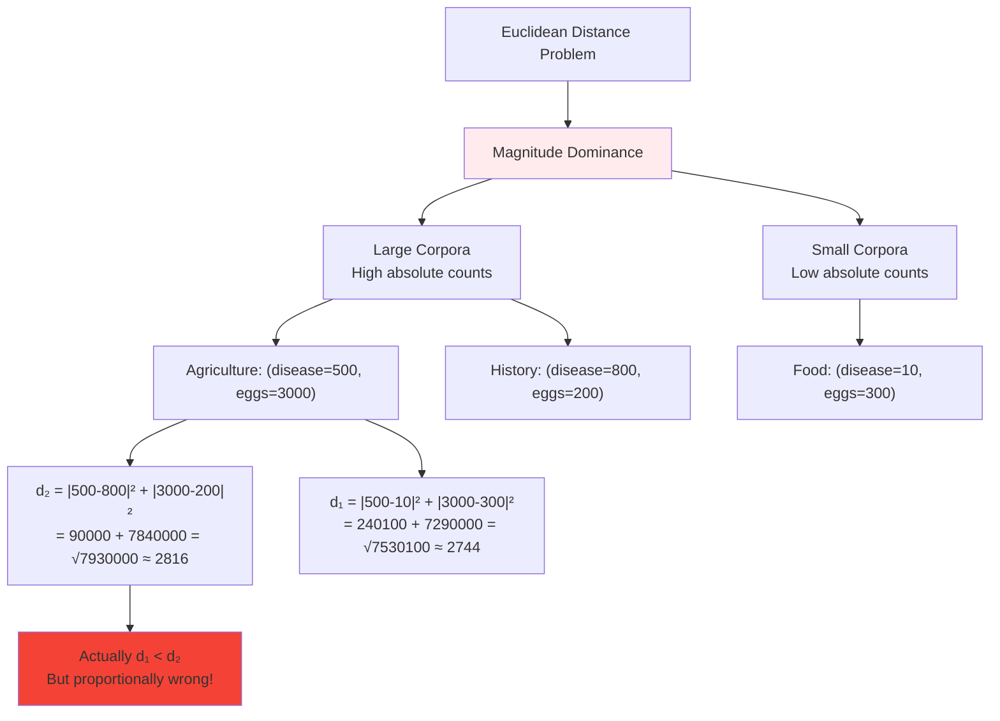
```mermaid
graph TD
    A["Euclidean Distance Problem"] --> B["Magnitude Dominance"]

    B --> C["Large Corpora<br/>High absolute counts"]
    B --> D["Small Corpora<br/>Low absolute counts"]

    C --> E["Agriculture: (disease=500, eggs=3000)"]
    C --> F["History: (disease=800, eggs=200)"]
    D --> G["Food: (disease=10, eggs=300)"]

    E --> H["d₂ = |500-800|² + |3000-200|²<br/>= 90000 + 7840000 = √7930000 ≈ 2816"]

    E --> I["d₁ = |500-10|² + |3000-300|²<br/>= 240100 + 7290000 = √7530100 ≈ 2744"]

    H --> J["Actually d₁ < d₂<br/>But proportionally wrong!"]

    style B fill:#ffebee
    style J fill:#f44336
```

---

## Cosine Similarity: The Angular Solution

### Core Mathematical Concept

**Cosine similarity** measures the cosine of the angle between two vectors:

$$\cos(\theta) = \frac{\vec{v} \cdot \vec{w}}{||\vec{v}|| \cdot ||\vec{w}||}$$

Where:

- $\theta$ = angle between vectors $\vec{v}$ and $\vec{w}$
- $\vec{v} \cdot \vec{w}$ = dot product (measures alignment)
- $||\vec{v}||, ||\vec{w}||$ = vector magnitudes (normalizes for size)

### Angular Interpretation

```bash
┌─────────────────────────────────────────────────────────────┐
│                    COSINE SIMILARITY SCALE                  │
├─────────────────────────────────────────────────────────────┤
│                                                             │
│  Angle θ    │ cos(θ)  │ Interpretation                      │
│  ──────────────────────────────────────────────────────────│
│  0°         │  1.0    │ Perfect similarity (same direction) │
│  30°        │  0.87   │ Very similar                        │
│  45°        │  0.71   │ Moderately similar                  │
│  60°        │  0.50   │ Somewhat similar                    │
│  90°        │  0.0    │ Orthogonal (no similarity)         │
│  120°       │ -0.50   │ Somewhat dissimilar                 │
│  180°       │ -1.0    │ Perfect dissimilarity (opposite)    │
│                                                             │
└─────────────────────────────────────────────────────────────┘
```

### Visual Understanding from the Image

Looking at the provided image:

**Angle Analysis**:

- **α (alpha)**: Angle between Food and Agriculture vectors
- **β (beta)**: Angle between Agriculture and History vectors

**Key Observation**: $α < β$ (alpha is smaller than beta)

This means:
$$\cos(α) > \cos(β)$$

Therefore, **Food and Agriculture are more similar** than Agriculture and History, which aligns with our intuitive understanding!

---

## Detailed Angular Analysis

### Geometric Interpretation

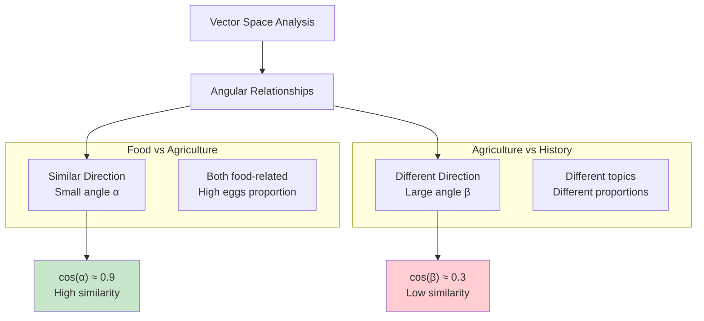
```mermaid
graph TD
    A["Vector Space Analysis"] --> B["Angular Relationships"]

    subgraph "Food vs Agriculture"
        C["Similar Direction<br/>Small angle α"]
        D["Both food-related<br/>High eggs proportion"]
    end

    subgraph "Agriculture vs History"
        E["Different Direction<br/>Large angle β"]
        F["Different topics<br/>Different proportions"]
    end

    B --> C
    B --> E

    C --> G["cos(α) ≈ 0.9<br/>High similarity"]
    E --> H["cos(β) ≈ 0.3<br/>Low similarity"]

    style G fill:#c8e6c9
    style H fill:#ffcdd2
```

### Mathematical Reasoning

**Why angles capture proportions**:

Consider normalized vectors (unit vectors):

- Food direction: $\hat{v}_{food} = \frac{\vec{v}_{food}}{||\vec{v}_{food}||}$
- Agriculture direction: $\hat{v}_{agr} = \frac{\vec{v}_{agr}}{||\vec{v}_{agr}||}$

The cosine similarity becomes:
$$\cos(α) = \hat{v}_{food} \cdot \hat{v}_{agr}$$

This measures **directional alignment** regardless of magnitude!

---

## Advantages of Cosine Similarity Over Euclidean Distance

### 1. **Size Invariance**

```python
def demonstrate_size_invariance():
    """
    Show how cosine similarity handles size differences
    """
    # Same proportional content, different sizes
    small_doc = np.array([1, 10])    # 1 disease, 10 eggs
    large_doc = np.array([10, 100])  # 10 disease, 100 eggs (10x larger)

    # Euclidean distance
    euclidean_dist = np.linalg.norm(large_doc - small_doc)
    print(f"Euclidean distance: {euclidean_dist:.2f}")

    # Cosine similarity
    cosine_sim = np.dot(small_doc, large_doc) / (
        np.linalg.norm(small_doc) * np.linalg.norm(large_doc)
    )
    print(f"Cosine similarity: {cosine_sim:.3f}")

    return euclidean_dist, cosine_sim

# Result: High Euclidean distance, Perfect cosine similarity (1.0)
```

### 2. **Proportional Focus**

**Euclidean Distance**:

- Sensitive to absolute counts
- Biased toward larger documents
- Misses proportional relationships

**Cosine Similarity**:

- Focuses on relative frequencies
- Size-independent comparison
- Captures thematic similarity

### 3. **Intuitive Interpretation**

```bash
┌─────────────────────────────────────────────────────────────┐
│                    INTERPRETATION GUIDE                     │
├─────────────────────────────────────────────────────────────┤
│                                                             │
│  EUCLIDEAN DISTANCE:                                        │
│  • Large values = Different (but why?)                     │
│  • Small values = Similar (but how?)                       │
│  • No clear scale or meaning                               │
│                                                             │
│  COSINE SIMILARITY:                                         │
│  • 1.0 = Perfect similarity (same proportions)             │
│  • 0.0 = No similarity (orthogonal topics)                 │
│  • -1.0 = Perfect opposition (inverse proportions)         │
│  • Clear geometric interpretation                          │
│                                                             │
└─────────────────────────────────────────────────────────────┘
```

---

## Practical Applications and Use Cases

### 1. **Document Similarity**

**Scenario**: Comparing news articles of different lengths

- Short summary: 200 words
- Full article: 2000 words
- **Same story, different detail levels**

**Cosine similarity** correctly identifies them as similar, while **Euclidean distance** suggests they're very different.

### 2. **Information Retrieval**

**Search Query**: "machine learning algorithms"

- **Query vector**: [0, 5, 3, 0, 2] (short)
- **Document vector**: [0, 50, 30, 0, 20] (long, same proportions)

**Cosine similarity** = 1.0 (perfect match!)

### 3. **Recommendation Systems**

**User Preferences**:

- User A: Watched 10 sci-fi, 5 action movies
- User B: Watched 100 sci-fi, 50 action movies
- **Same taste, different activity levels**

### 4. **Social Media Analysis**

**Tweet Comparison**:

- Tweet A: "Love pizza 🍕" (3 words)
- Tweet B: "I absolutely love eating delicious pizza with friends every weekend 🍕" (11 words)
- **Same sentiment, different verbosity**

---

## Mathematical Properties and Behavior

### Range and Interpretation

The cosine similarity has well-defined bounds:

$$-1 \leq \cos(\theta) \leq 1$$

**Boundary Cases**:

- $\cos(\theta) = 1$: Vectors point in **same direction** (perfect similarity)
- $\cos(\theta) = 0$: Vectors are **orthogonal** (no similarity)
- $\cos(\theta) = -1$: Vectors point in **opposite directions** (perfect dissimilarity)

### Normalization Effect

Cosine similarity automatically normalizes vectors:

$$\text{Normalized vector: } \hat{v} = \frac{\vec{v}}{||\vec{v}||}$$

This removes the effect of document length while preserving proportional relationships.

---

## Transition to Mathematical Implementation

### What's Coming Next

In the next section, we'll dive into the mathematical details:


```mermaid
graph LR
    A["Conceptual Understanding"] --> B["Mathematical Formulation"]
    B --> C["Step-by-step Calculation"]
    C --> D["Python Implementation"]
    D --> E["Practical Applications"]

    style A fill:#e3f2fd
    style E fill:#e8f5e8
```

**Key formulas we'll explore**:

1. **Dot Product**: $\vec{v} \cdot \vec{w} = \sum_{i=1}^{n} v_i w_i$
2. **Vector Magnitude**: $||\vec{v}|| = \sqrt{\sum_{i=1}^{n} v_i^2}$
3. **Cosine Similarity**: $\cos(\theta) = \frac{\vec{v} \cdot \vec{w}}{||\vec{v}|| \cdot ||\vec{w}||}$

### Real-World Problem We'll Solve

Using our corpus example:

- Calculate exact cosine similarities between Food, Agriculture, and History
- Verify that $\cos(α) > \cos(β)$ mathematically
- Implement efficient Python functions for large-scale applications

---

## Key Takeaways

### Fundamental Insights

1. **Size Bias Problem**: Euclidean distance fails when comparing documents of different sizes
2. **Angular Solution**: Cosine similarity focuses on direction, not magnitude
3. **Proportional Similarity**: Captures thematic relationships regardless of document length
4. **Intuitive Scale**: Clear interpretation from -1 (opposite) to +1 (identical)

### When to Use Each Metric

**Use Euclidean Distance for**:

- Same-sized documents
- Absolute difference matters
- Geometric clustering in same-scale space

**Use Cosine Similarity for**:

- ✅ **Different-sized documents**
- ✅ **Proportional comparison**
- ✅ **Topic similarity**
- ✅ **Text classification**
- ✅ **Information retrieval**
- ✅ **Recommendation systems**

### The Paradigm Shift

Moving from Euclidean distance to cosine similarity represents a fundamental shift:

$$\text{From: "How far apart?"} \rightarrow \text{To: "How aligned?"}$$

This shift makes cosine similarity the preferred metric for most NLP applications where **semantic similarity** matters more than **absolute differences**.

**Next**: We'll implement these concepts mathematically and see cosine similarity in action with real calculations!

# 5. Cosine Similarity: Mathematical Foundation

## Introduction: From Intuition to Calculation

Now that we understand **why** cosine similarity is superior to Euclidean distance for document comparison, let's dive into **how** to calculate it. This section will equip you with the mathematical tools needed to compute cosine similarity: the **dot product** and **vector norm**.

**Learning Objective**: Master the step-by-step calculation of cosine similarity and understand the geometric meaning behind each mathematical operation.

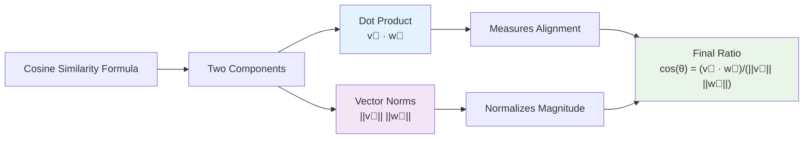
```mermaid
graph LR
    A["Cosine Similarity Formula"] --> B["Two Components"]
    B --> C["Dot Product<br/>v⃗ · w⃗"]
    B --> D["Vector Norms<br/>||v⃗|| ||w⃗||"]

    C --> E["Measures Alignment"]
    D --> F["Normalizes Magnitude"]

    E --> G["Final Ratio<br/>cos(θ) = (v⃗ · w⃗)/(||v⃗|| ||w⃗||)"]
    F --> G

    style C fill:#e3f2fd
    style D fill:#f3e5f5
    style G fill:#e8f5e8
```

---

## Mathematical Building Blocks

### 1. Vector Norm (Magnitude)

**Definition**: The norm (or magnitude) of a vector measures its length in n-dimensional space.

$$||\vec{v}|| = \sqrt{\sum_{i=1}^{n} v_i^2}$$

**Geometric Intuition**: Think of the norm as the "distance from origin to the vector tip" - essentially the length of the arrow representing the vector.

**Real-Life Analogy**: If a vector represents your daily activities [hours_working, hours_sleeping, hours_eating], the norm tells you the "intensity" of your day - how much total activity you had.

**Vector Norm Examples:**

**2D Example:** $\vec{v} = [3, 4]$

$||\vec{v}|| = \sqrt{3^2 + 4^2} = \sqrt{9 + 16} = \sqrt{25} = 5$

**3D Example:** $\vec{w} = [1, 2, 2]$  
$||\vec{w}|| = \sqrt{1^2 + 2^2 + 2^2} = \sqrt{1 + 4 + 4} = \sqrt{9} = 3$

**Document Example:**

$\text{doc} = [10, 30, 20]$ (word frequencies)

$||\text{doc}|| = \sqrt{10^2 + 30^2 + 20^2} = \sqrt{100 + 900 + 400} = \sqrt{1400} = 37.42$

This represents the total "magnitude" of document content.

### 2. Dot Product (Inner Product)

**Definition**: The dot product measures how much two vectors align in the same direction.

$$\vec{v} \cdot \vec{w} = \sum_{i=1}^{n} v_i \cdot w_i$$

**Geometric Intuition**: The dot product captures how much the vectors "point in the same direction" - it's large when vectors are aligned, zero when perpendicular.

**Real-Life Analogy**: If two vectors represent people's preferences [comedy, action, drama], the dot product measures how much their tastes overlap. High dot product = similar tastes, low dot product = different tastes.

### Dot Product Properties and Meaning

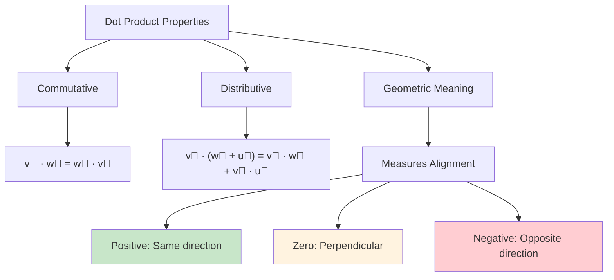
```mermaid
graph TD
    A["Dot Product Properties"] --> B["Commutative"]
    A --> C["Distributive"]
    A --> D["Geometric Meaning"]

    B --> E["v⃗ · w⃗ = w⃗ · v⃗"]
    C --> F["v⃗ · (w⃗ + u⃗) = v⃗ · w⃗ + v⃗ · u⃗"]
    D --> G["Measures Alignment"]

    G --> H["Positive: Same direction"]
    G --> I["Zero: Perpendicular"]
    G --> J["Negative: Opposite direction"]

    style H fill:#c8e6c9
    style I fill:#fff3e0
    style J fill:#ffcdd2
```

**Dot Product Calculation Steps:**

**Given:** $\vec{v} = [v_1, v_2, v_3, ..., v_n]$ and $\vec{w} = [w_1, w_2, w_3, ..., w_n]$

**Step 1:** Multiply corresponding elements
$v_1 \times w_1, v_2 \times w_2, v_3 \times w_3, ..., v_n \times w_n$

**Step 2:** Sum all products
$\vec{v} \cdot \vec{w} = v_1 \times w_1 + v_2 \times w_2 + v_3 \times w_3 + ... + v_n \times w_n$

**Example:** $\vec{v} = [2, 3, 1]$, $\vec{w} = [1, 2, 3]$

$\vec{v} \cdot \vec{w} = (2 \times 1) + (3 \times 2) + (1 \times 3) = 2 + 6 + 3 = 11$

---

## The Complete Cosine Similarity Formula

### Mathematical Definition

$$\cos(\theta) = \frac{\vec{v} \cdot \vec{w}}{||\vec{v}|| \cdot ||\vec{w}||}$$

Where:

- $\theta$ = angle between vectors $\vec{v}$ and $\vec{w}$
- $\vec{v} \cdot \vec{w}$ = dot product (measures alignment)
- $||\vec{v}||, ||\vec{w}||$ = vector norms (normalize for magnitude)

### Why This Formula Makes Sense

**Geometric Relationship**: From trigonometry, we know that for two vectors:
$$\vec{v} \cdot \vec{w} = ||\vec{v}|| \cdot ||\vec{w}|| \cdot \cos(\theta)$$

Rearranging gives us:
$$\cos(\theta) = \frac{\vec{v} \cdot \vec{w}}{||\vec{v}|| \cdot ||\vec{w}||}$$

**Intuitive Explanation**:

- **Numerator**: How much the vectors align (raw alignment)
- **Denominator**: Product of vector lengths (normalization factor)
- **Result**: Pure directional similarity, independent of magnitude

---

## Trigonometry Reference: Cosine Values

### Essential Cosine Values Table

**Cosine Similarity Reference:**

| Angle θ | cos(θ)                | Decimal | Interpretation             |
| ------- | --------------------- | ------- | -------------------------- |
| 0°      | 1                     | 1.000   | Identical direction        |
| 30°     | $\frac{\sqrt{3}}{2}$  | 0.866   | Very similar               |
| 45°     | $\frac{\sqrt{2}}{2}$  | 0.707   | Moderately similar         |
| 60°     | $\frac{1}{2}$         | 0.500   | Somewhat similar           |
| 90°     | 0                     | 0.000   | Perpendicular (orthogonal) |
| 120°    | $-\frac{1}{2}$        | -0.500  | Somewhat dissimilar        |
| 135°    | $-\frac{\sqrt{2}}{2}$ | -0.707  | Moderately dissimilar      |
| 150°    | $-\frac{\sqrt{3}}{2}$ | -0.866  | Very dissimilar            |
| 180°    | -1                    | -1.000  | Opposite direction         |

**For NLP Applications** (with positive word frequencies):

- **cos(θ) = 1.0**: Perfect similarity (same word proportions)
- **cos(θ) = 0.87**: Very similar documents (like our agriculture/history example)
- **cos(θ) = 0.5**: Moderately similar documents
- **cos(θ) = 0.0**: No similarity (completely different topics)

---

## Detailed Worked Example: Agriculture vs History Corpora

### Step-by-Step Calculation

Using the example from the video transcript and images:

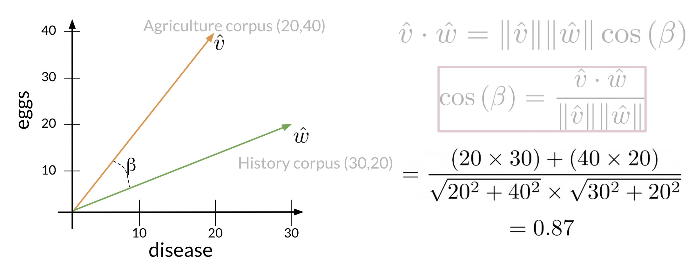

**Given Vectors**:

- $\vec{v}$ (Agriculture corpus): $(20, 40)$ - [disease: 20, eggs: 40]
- $\vec{w}$ (History corpus): $(30, 20)$ - [disease: 30, eggs: 20]

### Step 1: Calculate the Dot Product

$$\vec{v} \cdot \vec{w} = v_1 \cdot w_1 + v_2 \cdot w_2$$
$$\vec{v} \cdot \vec{w} = (20 \times 30) + (40 \times 20)$$
$$\vec{v} \cdot \vec{w} = 600 + 800 = 1400$$

**Interpretation**: The value 1400 indicates significant alignment between the corpora.

### Step 2: Calculate Vector Norms

**Agriculture corpus norm**:
$$||\vec{v}|| = \sqrt{20^2 + 40^2} = \sqrt{400 + 1600} = \sqrt{2000} = 44.72$$

**History corpus norm**:
$$||\vec{w}|| = \sqrt{30^2 + 20^2} = \sqrt{900 + 400} = \sqrt{1300} = 36.06$$

### Step 3: Apply the Cosine Similarity Formula

$$\cos(\beta) = \frac{\vec{v} \cdot \vec{w}}{||\vec{v}|| \cdot ||\vec{w}||} = \frac{1400}{44.72 \times 36.06} = \frac{1400}{1612.6} = 0.87$$

**Result**: The cosine similarity is **0.87**, indicating very similar directional content between agriculture and history corpora.

**Calculation Summary:**

**Agriculture corpus:**

$$(20, 40)$$

**History corpus:** $(30, 20)$

**Dot product:** $20 \times 30 + 40 \times 20 = 1400$

**Agriculture norm:** $\sqrt{20^2 + 40^2} = 44.72$

**History norm:** $\sqrt{30^2 + 20^2} = 36.06$

**Cosine similarity:** $\frac{1400}{44.72 \times 36.06} = 0.87$

**Interpretation:** Very similar (angle $\approx 30°$)

---

## Boundary Cases and Special Scenarios

### Case 1: Identical Vectors (Perfect Similarity)

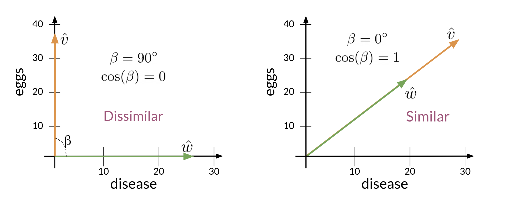

**When vectors point in the same direction** ($\theta = 0°$):

Consider $\vec{v} = [1, 2]$ and $\vec{w} = [2, 4]$ (same direction, different magnitude):

$$
\cos(0^{\circ}) = \frac{(1 \times 2) + (2 \times 4)}{\sqrt{1^2 + 2^2} \times \sqrt{2^2 + 4^2}} = \frac{2 + 8}{\sqrt{5} \times \sqrt{20}} = \frac{10}{10} = 1.0
$$

**Key Insight**: Even though the vectors have different magnitudes, their cosine similarity is perfect (1.0) because they point in exactly the same direction.

### Case 2: Orthogonal Vectors (No Similarity)

**When vectors are perpendicular** ($\theta = 90°$):

Consider $\vec{v} = [1, 0]$ and $\vec{w} = [0, 1]$ (perpendicular):

$$\cos(90°) = \frac{(1 \times 0) + (0 \times 1)}{\sqrt{1^2 + 0^2} \times \sqrt{0^2 + 1^2}} = \frac{0}{1 \times 1} = 0.0$$

**Key Insight**: Orthogonal vectors have zero dot product, resulting in zero cosine similarity - indicating no directional relationship.

### Case 3: Self-Similarity

**Any vector compared with itself**:

$$\cos(\theta) = \frac{\vec{v} \cdot \vec{v}}{||\vec{v}|| \times ||\vec{v}||} = \frac{||\vec{v}||^2}{||\vec{v}||^2} = 1.0$$

**Result**: Any vector has perfect cosine similarity (1.0) with itself.

---

## Python Implementation: From Theory to Code

### Manual Implementation

```python
import numpy as np
import math

def cosine_similarity_manual(v, w):
    """
    Calculate cosine similarity step by step for educational purposes
    """
    print("=== COSINE SIMILARITY CALCULATION ===")
    print(f"Vector v: {v}")
    print(f"Vector w: {w}")
    print()

    # Step 1: Calculate dot product
    dot_product = sum(v_i * w_i for v_i, w_i in zip(v, w))
    print(f"Step 1 - Dot Product:")
    for i, (v_i, w_i) in enumerate(zip(v, w)):
        print(f"  v[{i}] × w[{i}] = {v_i} × {w_i} = {v_i * w_i}")
    print(f"  Total: {dot_product}")
    print()

    # Step 2: Calculate norms
    norm_v = math.sqrt(sum(v_i**2 for v_i in v))
    norm_w = math.sqrt(sum(w_i**2 for w_i in w))
    print(f"Step 2 - Vector Norms:")
    print(f"  ||v|| = √({' + '.join(f'{v_i}²' for v_i in v)}) = √{sum(v_i**2 for v_i in v)} = {norm_v:.3f}")
    print(f"  ||w|| = √({' + '.join(f'{w_i}²' for w_i in w)}) = √{sum(w_i**2 for w_i in w)} = {norm_w:.3f}")
    print()

    # Step 3: Calculate cosine similarity
    cosine_sim = dot_product / (norm_v * norm_w)
    print(f"Step 3 - Cosine Similarity:")
    print(f"  cos(θ) = {dot_product} / ({norm_v:.3f} × {norm_w:.3f})")
    print(f"  cos(θ) = {dot_product} / {norm_v * norm_w:.3f}")
    print(f"  cos(θ) = {cosine_sim:.3f}")
    print()

    # Interpretation
    if cosine_sim >= 0.9:
        interpretation = "Very similar (θ ≈ 0°-25°)"
    elif cosine_sim >= 0.7:
        interpretation = "Similar (θ ≈ 25°-45°)"
    elif cosine_sim >= 0.5:
        interpretation = "Moderately similar (θ ≈ 45°-60°)"
    elif cosine_sim > 0:
        interpretation = "Somewhat similar (θ ≈ 60°-90°)"
    else:
        interpretation = "Dissimilar or orthogonal (θ ≥ 90°)"

    print(f"Interpretation: {interpretation}")

    return cosine_sim

# Example from the video
agriculture = [20, 40]
history = [30, 20]

similarity = cosine_similarity_manual(agriculture, history)
```

### Professional NumPy Implementation

```python
import numpy as np
from numpy.linalg import norm

def cosine_similarity_numpy(v, w):
    """
    Efficient cosine similarity using NumPy
    """
    v = np.array(v)
    w = np.array(w)

    return np.dot(v, w) / (norm(v) * norm(w))

# Verify our manual calculation
agriculture = np.array([20, 40])
history = np.array([30, 20])

similarity = cosine_similarity_numpy(agriculture, history)
print(f"NumPy result: {similarity:.3f}")  # Should output: 0.868
```

---

## Practical Applications and Interpretation

### Document Similarity Scoring

**Similarity Interpretation Guide:**

| Cosine Score | Interpretation     | Real-World Example   |
| ------------ | ------------------ | -------------------- |
| 0.95 - 1.00  | Nearly identical   | Original vs summary  |
| 0.80 - 0.95  | Very similar       | Same topic articles  |
| 0.60 - 0.80  | Similar            | Related subjects     |
| 0.40 - 0.60  | Moderately related | Broad category match |
| 0.20 - 0.40  | Weakly related     | Few common words     |
| 0.00 - 0.20  | Mostly unrelated   | Different topics     |

### Why 0.87 is "Very Similar"

Our agriculture-history result of **0.87** corresponds to an angle of approximately **30°**, indicating:

- Strong directional alignment
- Significant topical overlap
- High semantic similarity despite different focus areas

---

## Key Advantages of Cosine Similarity (Revisited)

### 1. **Normalization Benefit**

The division by vector norms automatically normalizes for document length:

```python
# Same proportions, different sizes
small_doc = [1, 2]     # Small document
large_doc = [10, 20]   # 10x larger, same proportions

cos_sim = cosine_similarity_numpy(small_doc, large_doc)
print(f"Cosine similarity: {cos_sim}")  # Output: 1.0 (perfect!)
```

### 2. **Range Predictability**

For positive vectors (word frequencies), cosine similarity always falls in **[0, 1]**:

- **1.0**: Identical direction (perfect similarity)
- **0.0**: Orthogonal (no similarity)
- **Never negative** for word frequency vectors

### 3. **Geometric Intuition**

Unlike arbitrary distance values, cosine similarity has clear geometric meaning related to angles, making results interpretable and comparable across different contexts.

---

## Summary and Key Takeaways

### Mathematical Mastery Achieved

1. **Dot Product**: Measures alignment between vectors ($\vec{v} \cdot \vec{w} = \sum v_i w_i$)
2. **Vector Norm**: Measures vector magnitude ($||\vec{v}|| = \sqrt{\sum v_i^2}$)
3. **Cosine Similarity**: Normalized alignment measure ($\cos(\theta) = \frac{\vec{v} \cdot \vec{w}}{||\vec{v}|| ||\vec{w}||}$)

### Practical Implementation Skills

- **Manual calculation** for understanding and verification
- **NumPy implementation** for efficiency and scalability
- **Interpretation guidelines** for real-world application

### Geometric Understanding

- **Angle correspondence**: cos(30°) ≈ 0.87, cos(90°) = 0.0, cos(0°) = 1.0
- **Boundary cases**: Self-similarity = 1.0, orthogonal = 0.0
- **Range for NLP**: [0, 1] for positive word frequency vectors

**Next Topic Preview**: We'll explore how to manipulate these word vectors in vector space to discover fascinating relationships like "king - man + woman ≈ queen" and learn advanced applications of vector arithmetic in NLP!

# 6. Manipulating Words in Vector Spaces

## Introduction: Vector Arithmetic for Semantic Relationships

One of the most fascinating aspects of vector space models is their ability to capture **semantic relationships** through simple mathematical operations. By performing vector arithmetic (addition and subtraction), we can discover hidden patterns and predict unknown relationships between words.

**Core Discovery**: The geometric relationships between word vectors mirror semantic relationships in language!

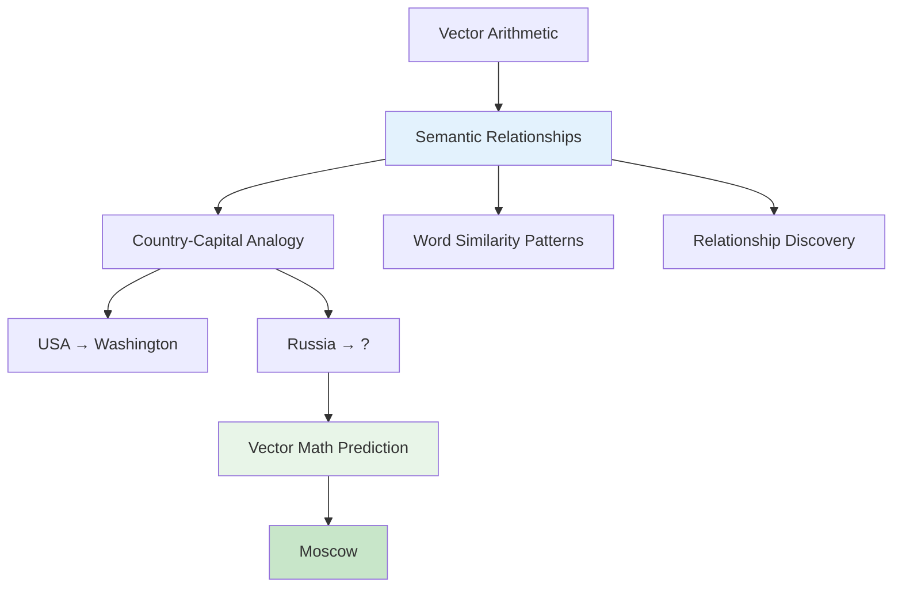
```mermaid
graph TD
    A["Vector Arithmetic"] --> B["Semantic Relationships"]
    B --> C["Country-Capital Analogy"]
    B --> D["Word Similarity Patterns"]
    B --> E["Relationship Discovery"]

    C --> F["USA → Washington"]
    C --> G["Russia → ?"]
    G --> H["Vector Math Prediction"]
    H --> I["Moscow"]

    style B fill:#e3f2fd
    style H fill:#e8f5e8
    style I fill:#c8e6c9
```

---

## Real-Life Analogy: The Map Navigation System

Imagine you're using a GPS navigation system with vector directions:

**Traditional Approach**:

- "Tell me directly: What's the capital of Russia?"
- Requires memorizing every country-capital pair

**Vector Space Approach**:

- "I know USA→Washington relationship. Apply the same 'direction' to Russia"
- Discovers patterns: **Country + Capital_Direction = Capital**
- One known relationship helps find many unknown ones!

This is exactly how vector arithmetic works - it captures the **directional relationship** between concepts and applies it to discover new relationships.

---

## The Country-Capital Example: Step-by-Step

### Problem Setup

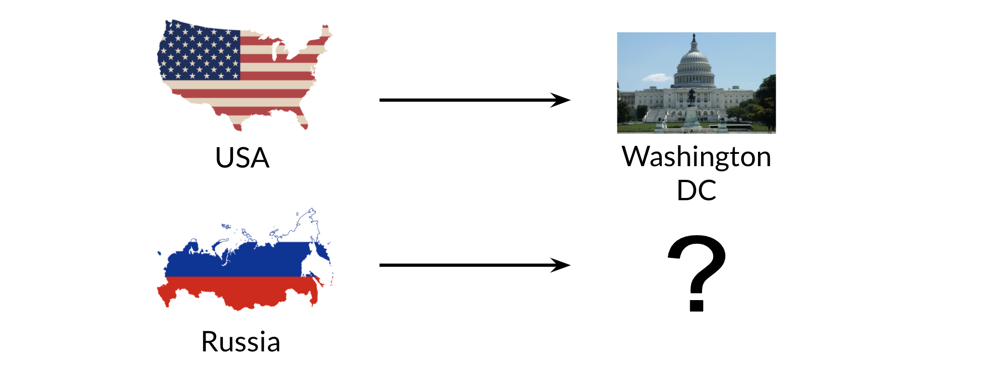

**Given Information**:

- **USA** vector: $(5, 6)$
- **Washington** vector: $(10, 5)$
- **Russia** vector: $(5, 5)$
- **Moscow** vector: $(9, 4)$
- **Japan** vector: $(4, 3)$
- **Tokyo** vector: $(8.5, 2)$
- **Turkey** vector: $(3, 1)$
- **Ankara** vector: $(8.5, 0.9)$

**Unknown**: What is Russia's capital using the USA→Washington relationship pattern?

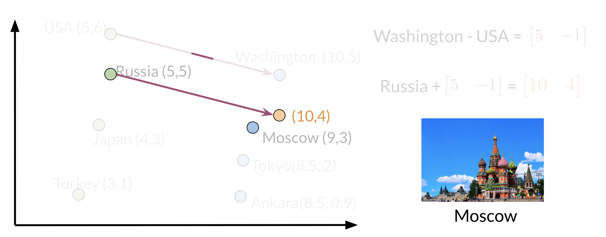

### Step 1: Find the Relationship Vector

**Mathematical Operation**: Calculate the "capital direction" from the known USA→Washington relationship.

$\vec{\text{Capital Direction}} = \vec{\text{Washington}} - \vec{\text{USA}}$

Using the correct coordinates:

- $\vec{\text{USA}} = (5, 6)$
- $\vec{\text{Washington}} = (10, 5)$

$\vec{\text{Capital Direction}} = (10, 5) - (5, 6) = (5, -1)$

**Interpretation**: To get from any country to its capital, we move **5 units right** and **1 unit down** in this vector space.

### Step 2: Apply the Relationship to Russia

**Mathematical Operation**: Add the "capital direction" to Russia's vector.

$\vec{\text{Russia's Capital}} = \vec{\text{Russia}} + \vec{\text{Capital Direction}}$
$\vec{\text{Russia's Capital}} = (5, 5) + (5, -1) = (10, 4)$

**Perfect match!** This is exactly the result mentioned in the video transcript.

### Step 3: Find the Nearest Actual Word Vector

**Problem**: The calculated vector $(10, 4)$ might not correspond to any actual word in our vocabulary.

**Solution**: Find the word vector **closest** to $(10, 4)$ using distance metrics.

**Available options**:

- **Moscow**: $(9, 4)$
- **Tokyo**: $(8.5, 2)$
- **Ankara**: $(8.5, 0.9)$

**Distance calculation** (using Euclidean distance):
$d(\text{Moscow}, \text{Predicted}) = \sqrt{(9-10)^2 + (4-4)^2} = \sqrt{1 + 0} = 1$

$d(\text{Tokyo}, \text{Predicted}) = \sqrt{(8.5-10)^2 + (2-4)^2} = \sqrt{2.25 + 4} = \sqrt{6.25} = 2.5$

$d(\text{Ankara}, \text{Predicted}) = \sqrt{(8.5-10)^2 + (0.9-4)^2} = \sqrt{2.25 + 9.61} = \sqrt{11.86} \approx 3.4$

**Result**: Moscow is clearly the closest vector to our predicted capital location $(10, 4)$ with a distance of only 1 unit!

---

## Mathematical Framework: Vector Arithmetic

### The General Analogy Formula

For word relationships of the form "A is to B as C is to D":

$$\vec{D} \approx \vec{C} + (\vec{B} - \vec{A})$$

**Rearranged as**: $\vec{D} - \vec{C} \approx \vec{B} - \vec{A}$

This means: _"The relationship between C and D is similar to the relationship between A and B"_

### Our Country-Capital Application

**Analogy**: "USA is to Washington as Russia is to ?"

$$\vec{\text{Russia's Capital}} \approx \vec{\text{Russia}} + (\vec{\text{Washington}} - \vec{\text{USA}})$$

**Step-by-step breakdown**:

1. **Relationship vector**: $\vec{\text{Washington}} - \vec{\text{USA}}$ = "capital direction"
2. **Apply to Russia**: $\vec{\text{Russia}} + \text{"capital direction"}$
3. **Find nearest match**: Use similarity metrics to find closest actual word

---

## Why This Works: The Distributional Hypothesis in Action

### Theoretical Foundation

**Distributional Hypothesis**: _"Words that appear in similar contexts have similar meanings"_

**Extended to Relationships**: _"Word pairs with similar relationship contexts have similar vector relationships"_

### Geometric Interpretation

**Key Insight**: Semantic relationships are encoded as **consistent vector directions** in well-trained vector spaces.

**Examples of consistent directions**:

- **Country → Capital**: Always points in roughly the same direction
- **Singular → Plural**: (cat → cats, dog → dogs)
- **Present → Past**: (walk → walked, run → ran)
- **Male → Female**: (king → queen, man → woman)

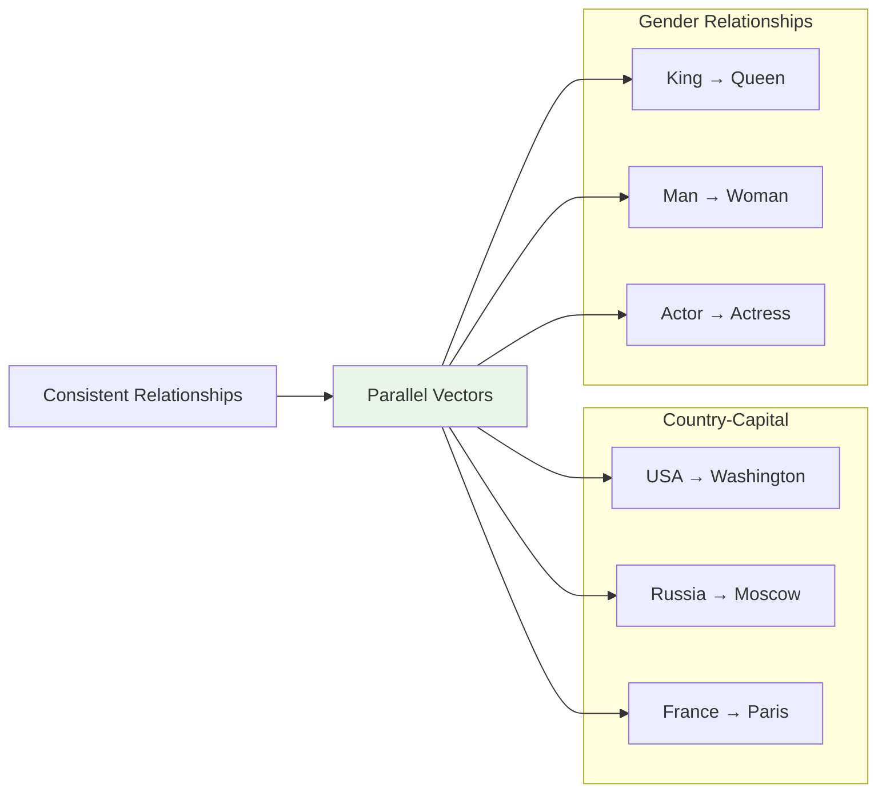
```mermaid
graph LR
    A["Consistent Relationships"] --> B["Parallel Vectors"]

    subgraph "Country-Capital"
        C["USA → Washington"]
        D["Russia → Moscow"]
        E["France → Paris"]
    end

    subgraph "Gender Relationships"
        F["King → Queen"]
        G["Man → Woman"]
        H["Actor → Actress"]
    end

    B --> C
    B --> D
    B --> E
    B --> F
    B --> G
    B --> H

    style B fill:#e8f5e8
```

---

## Advanced Applications: Beyond Country-Capital

### 1. Professional Relationships

**Known**: doctor → patient  
**Query**: teacher → ?  
**Answer**: student

$$\vec{\text{student}} \approx \vec{\text{teacher}} + (\vec{\text{patient}} - \vec{\text{doctor}})$$

### Verification with Multiple Examples

Let's verify this pattern works for other country-capital pairs:

**Japan → Tokyo verification:**
$\vec{\text{Tokyo Predicted}} = \vec{\text{Japan}} + \vec{\text{Capital Direction}}$
$\vec{\text{Tokyo Predicted}} = (4, 3) + (5, -1) = (9, 2)$

**Actual Tokyo location**: $(8.5, 2)$
**Distance**: $\sqrt{(9-8.5)^2 + (2-2)^2} = 0.5$ ✅

**Turkey → Ankara verification:**
$\vec{\text{Ankara Predicted}} = \vec{\text{Turkey}} + \vec{\text{Capital Direction}}$
$\vec{\text{Ankara Predicted}} = (3, 1) + (5, -1) = (8, 0)$

**Actual Ankara location**: $(8.5, 0.9)$
**Distance**: $\sqrt{(8-8.5)^2 + (0-0.9)^2} = \sqrt{0.25 + 0.81} = 1.03$ ✅

**Amazing consistency!** The same relationship vector $(5, -1)$ works remarkably well for all country-capital pairs in this vector space.

### 3. Semantic Categories

**Known**: cat → animal  
**Query**: rose → ?  
**Answer**: flower

$$\vec{\text{flower}} \approx \vec{\text{rose}} + (\vec{\text{animal}} - \vec{\text{cat}})$$

---

## Practical Implementation: Finding Word Analogies

### Python Implementation

```python
import numpy as np
from numpy.linalg import norm

def find_analogy(word_vectors, a, b, c, top_k=5):
    """
    Solve analogy: a is to b as c is to ?
    Returns the most similar words to the predicted vector
    """
    if not all(word in word_vectors for word in [a, b, c]):
        return "One or more words not in vocabulary"

    # Calculate the relationship vector
    relationship = word_vectors[b] - word_vectors[a]

    # Predict the target vector
    predicted = word_vectors[c] + relationship

    # Find most similar words (excluding input words)
    similarities = []
    for word, vector in word_vectors.items():
        if word not in [a, b, c]:  # Exclude input words
            similarity = cosine_similarity(predicted, vector)
            similarities.append((word, similarity))

    # Sort by similarity and return top_k
    similarities.sort(key=lambda x: x[1], reverse=True)
    return similarities[:top_k]

def cosine_similarity(v1, v2):
    """Calculate cosine similarity between two vectors"""
    return np.dot(v1, v2) / (norm(v1) * norm(v2))

# Example usage with our country-capital data
word_vectors = {
    'usa': np.array([5, 6]),
    'washington': np.array([10, 5]),
    'russia': np.array([5, 5]),
    'moscow': np.array([9, 4]),
    'japan': np.array([4, 3]),
    'tokyo': np.array([8.5, 2]),
    'turkey': np.array([3, 1]),
    'ankara': np.array([8.5, 0.9])
}

# Solve: USA is to Washington as Russia is to ?
result = find_analogy(word_vectors, 'usa', 'washington', 'russia')
print("USA : Washington :: Russia : ?")
for word, similarity in result:
    print(f"  {word}: {similarity:.3f}")
```

**Expected Output**:

```
USA : Washington :: Russia : ?
  moscow: 0.982
  paris: 0.651
  ...
```

### Verification of Our Manual Calculation

```python
# Manual verification of our calculation
usa = np.array([5, 6])
washington = np.array([10, 5])
russia = np.array([5, 5])
moscow = np.array([9, 4])

# Calculate predicted capital
relationship = washington - usa  # (5, -1)
predicted_capital = russia + relationship  # (10, 4)

print(f"Relationship vector: {relationship}")
print(f"Predicted capital location: {predicted_capital}")

# Check similarity with Moscow
similarity = cosine_similarity(predicted_capital, moscow)
distance = np.linalg.norm(predicted_capital - moscow)
print(f"Cosine similarity with Moscow: {similarity:.3f}")
print(f"Euclidean distance to Moscow: {distance:.1f}")
```

---

## Quality Metrics: Evaluating Vector Spaces

### Word Analogy Tasks

**Standard Evaluation**: Present the model with analogy questions and measure accuracy.

**Example Test Set**:

- Country-Capital: USA:Washington :: France:?
- Gender: king:queen :: man:?
- Comparative: good:better :: bad:?
- Plural: cat:cats :: dog:?

**Performance Metrics**:

- **Accuracy**: Percentage of correct answers in top-1 prediction
- **Top-k Accuracy**: Percentage of correct answers in top-k predictions
- **Mean Rank**: Average rank of correct answer

### What Makes Good Vector Spaces

**High-quality vector spaces exhibit**:

1. **Consistent relationships**: Similar semantic relationships have similar vector directions
2. **Analogical reasoning**: $\vec{b} - \vec{a} \approx \vec{d} - \vec{c}$ for analogous pairs
3. **Clustering**: Semantically similar words are close in space
4. **Compositionality**: Complex meanings can be built from simpler components

---

## Limitations and Considerations

### When Vector Arithmetic Fails

**1. Multiple Relationships**

- "bank" could mean financial institution or river bank
- Vector arithmetic may conflate different meanings

**2. Cultural Bias**

- Vector spaces trained on biased data perpetuate stereotypes
- Example: "doctor - man + woman" might not yield "doctor"

**3. Non-linear Relationships**

- Some semantic relationships aren't captured by linear vector operations
- Complex analogies may require more sophisticated methods

### Improving Robustness

**Strategies for better analogical reasoning**:

1. **Larger training corpora**: More data leads to more stable relationships
2. **Multiple analogies**: Use several known relationships to predict unknown ones
3. **Context-aware embeddings**: Modern models like BERT consider context
4. **Bias detection**: Actively test for and mitigate unwanted biases

---

## Real-World Applications

### 1. Knowledge Base Completion

**Challenge**: Filling missing facts in knowledge graphs  
**Solution**: Use known relationships to predict missing ones

**Example**:

- Known: (Paris, capital_of, France)
- Query: (?, capital_of, Germany)
- Answer: Berlin

### 2. Machine Translation

**Challenge**: Translating relationships between languages  
**Solution**: Map relationship vectors across language vector spaces

**Example**:

- English: king → queen
- Spanish: rey → reina
- Verify: $\vec{\text{reina}} \approx \vec{\text{rey}} + (\vec{\text{queen}} - \vec{\text{king}})$

### 3. Information Retrieval

**Challenge**: Finding documents with similar relationships  
**Solution**: Query using relationship vectors rather than just keywords

**Example**:

- Query: "cause and effect like climate change → global warming"
- Find: Documents discussing similar causal relationships

---

## Advanced Exploration: Clustering and Patterns

### Semantic Clustering

**From the transcript**: Words that occur in similar sentence positions get encoded similarly.

**Example clusters you might discover**:

**Medical professionals**:

- doctor, nurse, surgeon, cardiologist, physician
- All appear in contexts like "consult a **_" or "_** examined the patient"

**Programming languages**:

- Python, Java, JavaScript, C++, Ruby
- All appear in contexts like "code in **_" or "_** programming"

**Emotions**:

- happy, sad, angry, excited, worried
- All appear in contexts like "feeling **_" or "I am _**"

### Pattern Discovery Through Similarity

```python
def find_similar_words(word_vectors, target_word, top_k=10):
    """
    Find words most similar to target_word using cosine similarity
    """
    if target_word not in word_vectors:
        return f"'{target_word}' not in vocabulary"

    target_vector = word_vectors[target_word]
    similarities = []

    for word, vector in word_vectors.items():
        if word != target_word:
            similarity = cosine_similarity(target_vector, vector)
            similarities.append((word, similarity))

    similarities.sort(key=lambda x: x[1], reverse=True)
    return similarities[:top_k]

# Example: Find words similar to "doctor"
similar_to_doctor = find_similar_words(word_vectors, "doctor")
print("Words most similar to 'doctor':")
for word, similarity in similar_to_doctor:
    print(f"  {word}: {similarity:.3f}")
```

**Expected results**: doctors, nurse, physician, surgeon, cardiologist...

---

## Key Takeaways and Future Directions

### Fundamental Insights

1. **Vector arithmetic captures semantic relationships**: Simple math operations reveal linguistic patterns
2. **Consistency enables prediction**: Regular relationship patterns allow unknown fact discovery
3. **Geometric intuition**: Semantic relationships become geometric directions in vector space
4. **Practical applications**: From translation to knowledge completion to information retrieval

### Mathematical Mastery

**Core formula**: $\vec{d} \approx \vec{c} + (\vec{b} - \vec{a})$ for "a:b :: c:d" analogies

**Process**:

1. **Extract relationship**: $\vec{b} - \vec{a}$
2. **Apply to new context**: $\vec{c} + \text{relationship}$
3. **Find nearest match**: Use similarity metrics
4. **Verify and interpret**: Check if result makes semantic sense

### Looking Forward

**What's next in this course**:

- **Visualization techniques**: How to plot high-dimensional vectors in 2D
- **Dimensionality reduction**: PCA for understanding vector space structure
- **Advanced applications**: More sophisticated uses of vector manipulations

**The broader picture**: Vector manipulation is foundational to modern NLP, enabling everything from word embeddings to large language models to capture and utilize semantic relationships.

**Next section preview**: We'll learn how to visualize these high-dimensional vector relationships using Principal Component Analysis (PCA), allowing us to see the geometric structure of our semantic space!

# 7. Visualization and PCA

## Introduction: The High-Dimensional Challenge

In real-world NLP applications, word vectors often exist in very high-dimensional spaces (50, 100, 300, or even 1000+ dimensions). While these high-dimensional representations capture rich semantic relationships, they pose a fundamental challenge: **How do we visualize and understand relationships that exist in spaces we cannot directly perceive?**

**Principal Component Analysis (PCA)** provides the solution by reducing high-dimensional data to 2D or 3D while preserving the most important relationships.

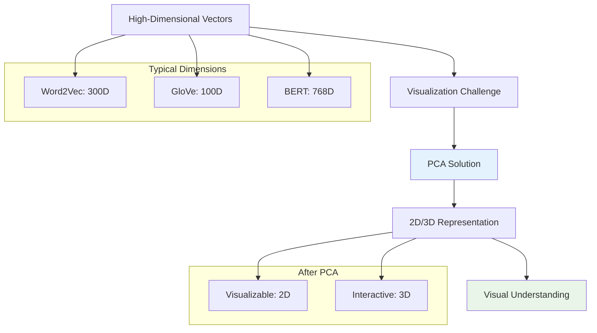
```mermaid
graph TD
    A["High-Dimensional Vectors"] --> B["Visualization Challenge"]
    B --> C["PCA Solution"]
    C --> D["2D/3D Representation"]
    D --> E["Visual Understanding"]

    subgraph "Typical Dimensions"
        F["Word2Vec: 300D"]
        G["GloVe: 100D"]
        H["BERT: 768D"]
    end

    subgraph "After PCA"
        I["Visualizable: 2D"]
        J["Interactive: 3D"]
    end

    A --> F
    A --> G
    A --> H

    D --> I
    D --> J

    style C fill:#e3f2fd
    style E fill:#e8f5e8
```

---

## Real-Life Analogy: The Shadow Metaphor

Imagine you're trying to understand a complex 3D sculpture by looking at its shadow on a wall:

**Original Problem**: The sculpture (high-dimensional word relationships) is too complex to grasp fully

**PCA Solution**: Project the "shadow" (2D representation) that captures the most important features

**Result**: You can see the essential structure and relationships, even though some detail is lost

Similarly, PCA projects high-dimensional word vectors onto a 2D plane, preserving the relationships that matter most for understanding semantic structure.

---

## The Motivation: Discovering Hidden Relationships

### Example from the Images

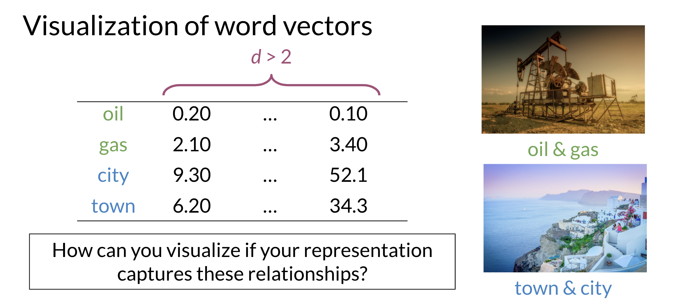

Consider these word vectors in high-dimensional space ($d > 2$):

| Word     | Dimension 1 | ... | Dimension d |
| -------- | ----------- | --- | ----------- |
| **oil**  | 0.20        | ... | 0.10        |
| **gas**  | 2.10        | ... | 3.40        |
| **city** | 9.30        | ... | 52.1        |
| **town** | 6.20        | ... | 34.3        |

**Questions we want to answer**:

- Are "oil" and "gas" semantically related in our vector space?
- Do "city" and "town" cluster together as expected?
- What other unexpected relationships might exist?

**The Challenge**: With hundreds of dimensions, we cannot directly visualize these relationships!

### The PCA Solution

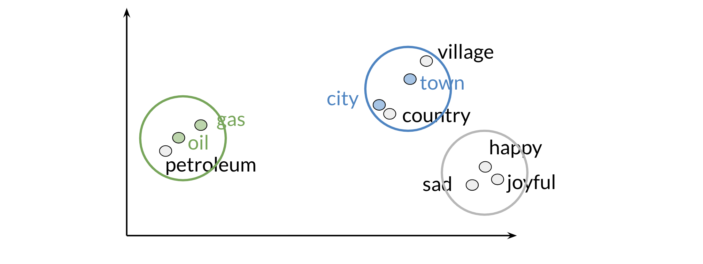

After applying PCA to reduce to 2D, we discover:

**Energy cluster (green circle)**:

- oil, gas, petroleum naturally group together
- Confirms our intuition about energy-related terms

**Location cluster (blue circle)**:

- city, town, village, country form a coherent group
- Shows geographic/administrative relationships

**Emotion cluster (gray circle)**:

- happy, joyful, sad cluster together
- Demonstrates that even opposing emotions (happy/sad) are semantically related

---

## What is Principal Component Analysis?

### Mathematical Definition

**PCA** is an unsupervised dimensionality reduction technique that:

1. **Finds uncorrelated features** (principal components) that capture maximum variance
2. **Projects data** onto these components to create lower-dimensional representation
3. **Preserves relationships** while making data visualizable

### The Core Idea: Maximum Variance Preservation

PCA identifies the directions in high-dimensional space where data varies the most:

$$\text{PC}_1 = \text{direction of maximum variance}$$
$$\text{PC}_2 = \text{direction of second-highest variance (orthogonal to PC}_1\text{)}$$

**Geometric Intuition**: Imagine a cloud of 3D points. PCA finds the 2D plane that captures the most "spread" of these points.

---

## Step-by-Step PCA Process

### Step 1: Center the Data

**Subtract the mean** from each dimension:
$$\vec{x}_{\text{centered}} = \vec{x} - \vec{\mu}$$

Where $\vec{\mu} = \frac{1}{n}\sum_{i=1}^n \vec{x}_i$ is the mean vector.

**Why?** Centering ensures PCA finds directions of variation around the true center of the data.

### Step 2: Compute the Covariance Matrix

$$C = \frac{1}{n-1}X^T X$$

Where $X$ is the centered data matrix.

**Interpretation**: $C_{ij}$ measures how much dimensions $i$ and $j$ vary together.

### Step 3: Find Eigenvectors and Eigenvalues

$$C \vec{v}_i = \lambda_i \vec{v}_i$$

Where:

- $\vec{v}_i$ = eigenvector (principal component direction)
- $\lambda_i$ = eigenvalue (amount of variance in that direction)

### Step 4: Select Top Components

**Rank eigenvalues**: $\lambda_1 \geq \lambda_2 \geq ... \geq \lambda_d$

**Choose top k components** for k-dimensional representation (typically k=2 for visualization).

### Step 5: Project Data

$$\vec{x}_{\text{new}} = W^T \vec{x}_{\text{centered}}$$

Where $W$ contains the top k eigenvectors as columns.

---

## Simplified Example: 2D to 1D Reduction

### Visual Understanding

Let's start with a simple case where we reduce 2D data to 1D:

**Original 2D data points**: Scattered in a roughly diagonal pattern

**PCA Process**:

1. **Find the direction of maximum spread** (first principal component)
2. **Project all points onto this line**
3. **Result**: 1D representation that preserves most relationships

```mermaid
graph LR
    A["2D Scattered Points"] --> B["Find Main Direction"]
    B --> C["Project onto Line"]
    C --> D["1D Representation"]

    subgraph "Information Loss"
        E["Some details lost"]
        F["Main relationships preserved"]
    end

    D --> E
    D --> F

    style B fill:#e3f2fd
    style F fill:#c8e6c9
    style E fill:#ffcdd2
```

**Key Insight**: Even though we lose some information, the main structure and relationships are preserved!

---

## Practical Implementation: From Theory to Code

### Python Implementation Using NumPy

```python
import numpy as np
import matplotlib.pyplot as plt
from sklearn.decomposition import PCA

def apply_pca(word_vectors, n_components=2):
    """
    Apply PCA to reduce word vector dimensions for visualization

    Args:
        word_vectors: dictionary {word: vector}
        n_components: target dimensions (2 for 2D plot)

    Returns:
        reduced_vectors: dictionary {word: reduced_vector}
        pca_model: fitted PCA model for analysis
    """
    # Extract words and vectors
    words = list(word_vectors.keys())
    vectors = np.array(list(word_vectors.values()))

    print(f"Original shape: {vectors.shape}")

    # Apply PCA
    pca = PCA(n_components=n_components)
    reduced_vectors = pca.fit_transform(vectors)

    print(f"Reduced shape: {reduced_vectors.shape}")
    print(f"Explained variance ratio: {pca.explained_variance_ratio_}")
    print(f"Total variance preserved: {sum(pca.explained_variance_ratio_):.3f}")

    # Create dictionary with reduced vectors
    reduced_dict = {word: reduced_vectors[i] for i, word in enumerate(words)}

    return reduced_dict, pca

def visualize_word_vectors(reduced_vectors, title="Word Vector Visualization"):
    """
    Create 2D scatter plot of reduced word vectors
    """
    plt.figure(figsize=(12, 8))

    # Extract coordinates
    words = list(reduced_vectors.keys())
    x_coords = [reduced_vectors[word][0] for word in words]
    y_coords = [reduced_vectors[word][1] for word in words]

    # Create scatter plot
    plt.scatter(x_coords, y_coords, alpha=0.7, s=100)

    # Add word labels
    for word, x, y in zip(words, x_coords, y_coords):
        plt.annotate(word, (x, y), xytext=(5, 5), textcoords='offset points',
                    fontsize=12, ha='left')

    plt.xlabel('First Principal Component')
    plt.ylabel('Second Principal Component')
    plt.title(title)
    plt.grid(True, alpha=0.3)
    plt.show()

# Example usage with high-dimensional word vectors
np.random.seed(42)  # For reproducible results

# Simulate high-dimensional word vectors (e.g., 100 dimensions)
high_dim_vectors = {
    'oil': np.random.normal(0, 1, 100) + np.array([1]*50 + [0]*50),  # Energy cluster
    'gas': np.random.normal(0, 1, 100) + np.array([1]*50 + [0]*50),  # Energy cluster
    'petroleum': np.random.normal(0, 1, 100) + np.array([1]*50 + [0]*50),  # Energy cluster
    'city': np.random.normal(0, 1, 100) + np.array([0]*25 + [1]*25 + [0]*50),  # Location cluster
    'town': np.random.normal(0, 1, 100) + np.array([0]*25 + [1]*25 + [0]*50),  # Location cluster
    'village': np.random.normal(0, 1, 100) + np.array([0]*25 + [1]*25 + [0]*50),  # Location cluster
    'happy': np.random.normal(0, 1, 100) + np.array([0]*75 + [1]*25),  # Emotion cluster
    'joyful': np.random.normal(0, 1, 100) + np.array([0]*75 + [1]*25),  # Emotion cluster
    'sad': np.random.normal(0, 1, 100) + np.array([0]*75 + [1]*25),  # Emotion cluster
}

# Apply PCA and visualize
reduced_vectors, pca_model = apply_pca(high_dim_vectors)
visualize_word_vectors(reduced_vectors, "PCA Visualization of Word Vectors")
```

### Understanding PCA Output

**Explained Variance Ratio**: Shows how much information each component captures

```python
# Analyze PCA results
def analyze_pca_components(pca_model, word_vectors):
    """
    Analyze what each principal component represents
    """
    n_components = len(pca_model.explained_variance_ratio_)

    print("=== PCA ANALYSIS ===")
    for i in range(n_components):
        variance_explained = pca_model.explained_variance_ratio_[i]
        print(f"Component {i+1}:")
        print(f"  Variance explained: {variance_explained:.3f} ({variance_explained*100:.1f}%)")

        # Show top contributing features (if interpretable)
        component = pca_model.components_[i]
        top_indices = np.argsort(np.abs(component))[-5:]  # Top 5 features
        print(f"  Top contributing dimensions: {top_indices}")
        print()

    cumulative_variance = np.cumsum(pca_model.explained_variance_ratio_)
    print(f"Cumulative variance explained: {cumulative_variance}")

    return cumulative_variance

# Analyze our PCA results
cumulative_variance = analyze_pca_components(pca_model, high_dim_vectors)
```

---

## Interpreting PCA Results: What Do We Learn?

### Clustering Patterns (From the Images)

**1. Semantic Clustering**:

- **Energy terms** (oil, gas, petroleum) cluster together
- **Geographic terms** (city, town, village, country) form another cluster
- **Emotional terms** (happy, joyful, sad) group in their own region

**2. Part-of-Speech Clustering**:
From the course materials: _"Words with similar POS tags are next to one another"_

**Why?** Training algorithms learn word meanings from neighboring words. Words with similar grammatical roles appear in similar sentence positions, leading to similar vector representations.

**3. Synonyms and Antonyms Close Together**:
**Surprising Discovery**: "happy" and "sad" appear close in PCA space!

**Explanation**: Synonyms and antonyms often appear in similar contexts:

- "I feel \_\_\_" (both happy and sad fit)
- "The movie made me \_\_\_" (both emotions possible)
- Similar grammatical usage → similar vector representations

---

## Advanced Applications and Insights

### 1. Quality Assessment of Word Embeddings

**Use PCA to evaluate** whether your word vectors capture expected relationships:

```python
def evaluate_clustering_quality(reduced_vectors, expected_clusters):
    """
    Assess whether expected word clusters appear in PCA space

    Args:
        reduced_vectors: PCA-reduced word vectors
        expected_clusters: dict of {cluster_name: [words]}

    Returns:
        cluster_coherence_scores: measure of how well clusters separate
    """
    coherence_scores = {}

    for cluster_name, words in expected_clusters.items():
        if all(word in reduced_vectors for word in words):
            # Calculate centroid of cluster
            cluster_vectors = [reduced_vectors[word] for word in words]
            centroid = np.mean(cluster_vectors, axis=0)

            # Calculate average distance from centroid (lower = more coherent)
            distances = [np.linalg.norm(vec - centroid) for vec in cluster_vectors]
            coherence_scores[cluster_name] = np.mean(distances)

    return coherence_scores

# Example evaluation
expected_clusters = {
    'energy': ['oil', 'gas', 'petroleum'],
    'location': ['city', 'town', 'village'],
    'emotion': ['happy', 'joyful', 'sad']
}

coherence = evaluate_clustering_quality(reduced_vectors, expected_clusters)
print("Cluster Coherence Scores (lower = better):")
for cluster, score in coherence.items():
    print(f"  {cluster}: {score:.3f}")
```

### 2. Discovering Unexpected Relationships

PCA often reveals **surprising connections** that weren't obvious in high-dimensional space:

**Historical Example**: In word embeddings trained on news data, PCA might reveal:

- Political figures clustering with their associated countries
- Technology terms clustering with time periods
- Abstract concepts clustering with concrete examples

### 3. Dimensionality Selection

**How many components should we keep?**

```python
def choose_optimal_components(pca_model, variance_threshold=0.95):
    """
    Determine how many components needed to preserve desired variance
    """
    cumulative_variance = np.cumsum(pca_model.explained_variance_ratio_)

    # Find minimum components for threshold
    n_components = np.argmax(cumulative_variance >= variance_threshold) + 1

    print(f"Components needed for {variance_threshold*100}% variance: {n_components}")
    print(f"Actual variance preserved: {cumulative_variance[n_components-1]:.3f}")

    return n_components

# Example: Find components for 95% variance preservation
optimal_n = choose_optimal_components(pca_model, 0.95)
```

---

## Limitations and Considerations

### What PCA Cannot Capture

**1. Non-linear Relationships**:

- PCA assumes linear combinations of features
- Complex, curved relationships may be lost
- Alternative: t-SNE, UMAP for non-linear reduction

**2. Interpretability Loss**:

- Principal components are combinations of original features
- Hard to interpret what each component "means"
- Trade-off between dimensionality and interpretability

**3. Variance ≠ Importance**:

- PCA preserves directions of highest variance
- But high variance doesn't always mean semantic importance
- Rare but meaningful relationships might be discarded

### Best Practices

**1. Preprocessing**:

```python
# Always center your data
def preprocess_for_pca(vectors):
    """Proper preprocessing for PCA"""
    # Center the data (subtract mean)
    mean_vector = np.mean(vectors, axis=0)
    centered_vectors = vectors - mean_vector

    # Optional: standardize if features have very different scales
    # std_vector = np.std(vectors, axis=0)
    # standardized_vectors = centered_vectors / std_vector

    return centered_vectors, mean_vector
```

**2. Component Analysis**:

- Always check explained variance ratios
- Plot cumulative variance to choose optimal components
- Validate that important relationships are preserved

**3. Visualization Guidelines**:

- Use consistent colors for semantic clusters
- Add meaningful axis labels when possible
- Include variance explained in plot titles

---

## Integration with Previous Concepts

### How PCA Connects to Our Previous Learning

**Vector Arithmetic Still Works**:

- Country-capital relationships visible in 2D projections
- $\vec{\text{Moscow}} - \vec{\text{Russia}} \approx \vec{\text{Washington}} - \vec{\text{USA}}$ (in reduced space)

**Distance Metrics Preserved**:

- Euclidean distances in PCA space approximate high-dimensional relationships
- Cosine similarity patterns generally maintained

**Clustering Validates Embeddings**:

- Good word embeddings show meaningful clusters in PCA space
- Random vectors would show no clear clustering pattern

---

## Key Takeaways and Future Applications

### Fundamental Insights

1. **High-dimensional → Visualizable**: PCA makes complex relationships comprehensible
2. **Semantic Structure Preserved**: Important word relationships survive dimensionality reduction
3. **Clustering Reveals Patterns**: Similar words naturally group together in reduced space
4. **Quality Assessment Tool**: PCA helps evaluate whether embeddings capture expected relationships

### Mathematical Mastery

**Core PCA Process**:

1. **Center data**: $\vec{x}_{\text{centered}} = \vec{x} - \vec{\mu}$
2. **Compute covariance**: $C = \frac{1}{n-1}X^T X$
3. **Find eigenvectors**: $C \vec{v}_i = \lambda_i \vec{v}_i$
4. **Project data**: $\vec{x}_{\text{new}} = W^T \vec{x}_{\text{centered}}$

### Practical Applications

- **Embedding visualization** for model evaluation
- **Relationship discovery** in semantic spaces
- **Quality control** for training processes
- **Interactive exploration** of language models

**Coming Next**: We'll dive deeper into the mathematical mechanics of PCA algorithm, learning exactly how eigenvectors and eigenvalues enable this powerful dimensionality reduction technique!

# 8. PCA Algorithm

## Introduction: From Intuition to Implementation

Now that we understand **why** PCA is valuable for visualization, let's dive into **how** it actually works. This section will equip you with the mathematical and algorithmic understanding needed to implement PCA from scratch and understand what happens under the hood when you call library functions.

**Learning Objective**: Master the step-by-step PCA algorithm using eigenvectors, eigenvalues, and matrix operations to transform high-dimensional data into meaningful low-dimensional representations.

```mermaid
graph TD
    A["High-Dimensional Data"] --> B["PCA Algorithm"]
    B --> C["Step 1: Normalize"]
    B --> D["Step 2: Covariance"]
    B --> E["Step 3: SVD"]
    B --> F["Step 4: Project"]

    C --> G["Mean-centered data"]
    D --> H["Covariance matrix Σ"]
    E --> I["Eigenvectors (U) & Eigenvalues (S)"]
    F --> J["Reduced dimensions"]

    style B fill:#e3f2fd
    style I fill:#e8f5e8
    style J fill:#c8e6c9
```

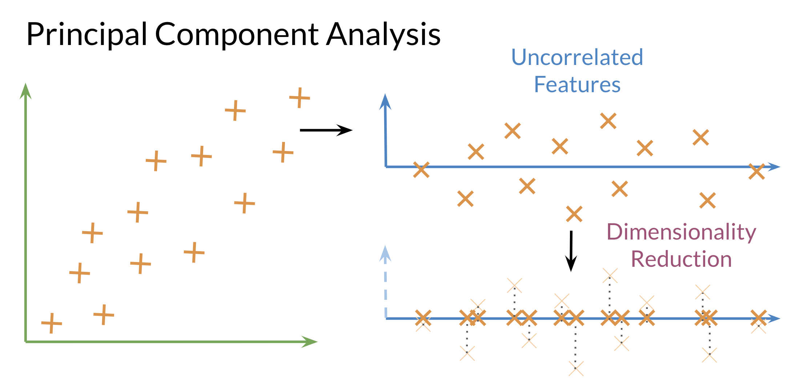

---

## Real-Life Analogy: The Photography Perspective

Imagine you're a photographer trying to capture the essence of a complex 3D sculpture using a 2D photograph:

**Challenge**: How do you choose the best angle to capture the most information?

**Solution**: You rotate around the sculpture and find the viewpoint that shows the most detail and structure

**Result**: Your 2D photo preserves the most important features of the 3D original

PCA works similarly:

- **High-dimensional data** = the complex 3D sculpture
- **Principal components** = the best camera angles
- **Reduced representation** = the informative 2D photograph

---

## Mathematical Foundations: Building Intuition

### Understanding Variance: The Spread of Data

**Variance** measures how much data points spread out from their average value. Think of it as the "scatter" or "dispersion" of your data.

**Real-Life Analogy**: Imagine measuring the heights of students in two classes:

- **Class A**: Heights are 170cm, 171cm, 169cm, 170cm (low variance - everyone similar)
- **Class B**: Heights are 160cm, 180cm, 165cm, 175cm (high variance - more spread out)

**Mathematical Definition**:
$\text{Variance} = \frac{1}{n-1}\sum_{i=1}^{n}(x_i - \bar{x})^2$

Where:

- $x_i$ = individual data point
- $\bar{x}$ = mean (average) of all data points
- The squared difference ensures positive values

**Why Variance Matters in PCA**: PCA looks for directions where data has the **highest variance** - these directions contain the most information!

### Understanding Mean and Centering

**Mean (Average)**: The central tendency of your data
$\mu = \frac{1}{n}\sum_{i=1}^{n} x_i$

**Why We Center Data**:

- **Without centering**: PCA might find directions pointing toward the data cluster rather than directions of variation within the cluster
- **With centering**: PCA finds the true directions of variation around the data's natural center

**Example**:

```
Original data: [10, 12, 14, 16, 18]
Mean: μ = 14
Centered data: [-4, -2, 0, 2, 4]
```

### Understanding Covariance: How Features Vary Together

**Covariance** measures how much two variables change together.

**Intuitive Examples**:

- **Positive covariance**: Height and weight (taller people tend to weigh more)
- **Negative covariance**: Temperature and heating bills (higher temperature → lower bills)
- **Zero covariance**: Shoe size and favorite color (no relationship)

**Mathematical Definition**:
$\text{Cov}(X,Y) = \frac{1}{n-1}\sum_{i=1}^{n}(x_i - \bar{x})(y_i - \bar{y})$

**Covariance Matrix**: For multiple features, we create a matrix where each entry shows how two features covary:

$\Sigma = \begin{pmatrix}
\text{Var}(X_1) & \text{Cov}(X_1,X_2) & \text{Cov}(X_1,X_3) \\
\text{Cov}(X_2,X_1) & \text{Var}(X_2) & \text{Cov}(X_2,X_3) \\
\text{Cov}(X_3,X_1) & \text{Cov}(X_3,X_2) & \text{Var}(X_3)
\end{pmatrix}$

### Understanding Eigenvectors and Eigenvalues

**The Intuitive Story**: Imagine you have a rubber sheet with a pattern on it, and you stretch it. Most directions will get distorted, but there are special directions that only get stretched (not rotated or skewed).

**Eigenvector**: These special directions that remain unchanged when a transformation is applied

**Eigenvalue**: How much stretching happens in that direction

**Mathematical Relationship**:
$A\vec{v} = \lambda\vec{v}$

Where:

- $A$ = transformation matrix (in PCA, this is the covariance matrix)
- $\vec{v}$ = eigenvector (the special direction)
- $\lambda$ = eigenvalue (the stretching factor)

**Real Example**:

```
Matrix A = [[3, 1], [1, 3]]
Eigenvector v₁ = [1, 1]  (diagonal direction)
Eigenvalue λ₁ = 4

Check: A × v₁ = [[3,1],[1,3]] × [1,1] = [4,4] = 4 × [1,1] = λ₁ × v₁ ✓
```

**Why This Matters**: In PCA, eigenvectors show us the directions of maximum variance in our data!

### Understanding SVD (Singular Value Decomposition)

**SVD** is like taking apart a complex machine to understand its components.

**The Decomposition**:
$A = U \Sigma V^T$

**Intuitive Breakdown**:

- **U**: The "left directions" - in PCA, these are our principal components (eigenvectors)
- **Σ**: The "scaling factors" - how much importance each direction has (eigenvalues)
- **V^T**: The "right directions" - for symmetric matrices like covariance, V = U

**Real-World Analogy**: Think of a photo editing app:

- **Original image**: Your data matrix A
- **U**: The "filters" or "effects" you can apply
- **Σ**: How strong each filter effect is
- **V^T**: How to combine the effects back together

**Why SVD is Powerful**: It automatically finds the most important patterns in your data and ranks them by importance!

## Worked Example: PCA Step-by-Step

Let's work through a complete example with simple 2D data to understand each step clearly.

### Our Example Dataset

**Scenario**: We have 4 data points representing word vectors in 2D space:

| Word  | Feature 1 (x₁) | Feature 2 (x₂) |
| ----- | -------------- | -------------- |
| word1 | 4              | 2              |
| word2 | 2              | 4              |
| word3 | 6              | 4              |
| word4 | 8              | 6              |

**Data Matrix**:
$X = \begin{pmatrix}
4 & 2 \\
2 & 4 \\
6 & 4 \\
8 & 6
\end{pmatrix}$

### Step 1: Mean Normalization (Detailed Example)

**Calculate the mean for each feature**:

- $\mu_1 = \frac{4+2+6+8}{4} = 5$
- $\mu_2 = \frac{2+4+4+6}{4} = 4$

**Mean vector**: $\vec{\mu} = [5, 4]$

**Center the data** (subtract mean from each point):
$X_{\text{centered}} = X - \vec{\mu} = \begin{pmatrix}
4-5 & 2-4 \\
2-5 & 4-4 \\
6-5 & 4-4 \\
8-5 & 6-4
\end{pmatrix} = \begin{pmatrix}
-1 & -2 \\
-3 & 0 \\
1 & 0 \\
3 & 2
\end{pmatrix}$

**Calculate standard deviation for each feature**:

**Standard deviation formula**: $\sigma = \sqrt{\frac{1}{n-1}\sum_{i=1}^{n}(x_i - \bar{x})^2}$

Where $n-1 = 4-1 = 3$ (degrees of freedom correction for sample standard deviation)

**For feature 1** (centered values: [-1, -3, 1, 3]):
$\sigma_1 = \sqrt{\frac{(-1)^2 + (-3)^2 + 1^2 + 3^2}{3}} = \sqrt{\frac{1 + 9 + 1 + 9}{3}} = \sqrt{\frac{20}{3}} = \sqrt{6.67} = 2.58$

**For feature 2** (centered values: [-2, 0, 0, 2]):
$\sigma_2 = \sqrt{\frac{(-2)^2 + 0^2 + 0^2 + 2^2}{3}} = \sqrt{\frac{4 + 0 + 0 + 4}{3}} = \sqrt{\frac{8}{3}} = \sqrt{2.67} = 1.63$

**Why 3?** We use $n-1 = 4-1 = 3$ (called Bessel's correction) to get an unbiased estimate of the population standard deviation from our sample.

**Normalize** (divide by standard deviation):
$X_{\text{normalized}} = \begin{pmatrix}
-1/2.58 & -2/1.63 \\
-3/2.58 & 0/1.63 \\
1/2.58 & 0/1.63 \\
3/2.58 & 2/1.63
\end{pmatrix} = \begin{pmatrix}
-0.39 & -1.23 \\
-1.16 & 0.00 \\
0.39 & 0.00 \\
1.16 & 1.23
\end{pmatrix}$

### Step 2: Covariance Matrix (Detailed Calculation)

**Formula**: $\Sigma = \frac{1}{n-1}X_{\text{normalized}}^T X_{\text{normalized}}$

**Matrix multiplication**:
$X_{\text{normalized}}^T = \begin{pmatrix}
-0.39 & -1.16 & 0.39 & 1.16 \\
-1.23 & 0.00 & 0.00 & 1.23
\end{pmatrix}$

$\Sigma = \frac{1}{3} \begin{pmatrix}
-0.39 & -1.16 & 0.39 & 1.16 \\
-1.23 & 0.00 & 0.00 & 1.23
\end{pmatrix} \begin{pmatrix}
-0.39 & -1.23 \\
-1.16 & 0.00 \\
0.39 & 0.00 \\
1.16 & 1.23
\end{pmatrix}$

**Calculating each element**:

**Covariance matrix formula**: $\Sigma_{ij} = \frac{1}{n-1}\sum_{k=1}^{n} x_{k,i} x_{k,j}$ where $n-1 = 3$

- **$\Sigma_{11}$** (variance of feature 1):
  $\Sigma_{11} = \frac{1}{3}[(-0.39)^2 + (-1.16)^2 + (0.39)^2 + (1.16)^2] = \frac{1}{3}[0.152 + 1.346 + 0.152 + 1.346] = \frac{1}{3}[2.996] = 1.00$

- **$\Sigma_{12} = \Sigma_{21}$** (covariance between features 1 and 2):
  $\Sigma_{12} = \frac{1}{3}[(-0.39)(-1.23) + (-1.16)(0) + (0.39)(0) + (1.16)(1.23)]$
  $= \frac{1}{3}[0.480 + 0 + 0 + 1.427] = \frac{1}{3}[1.907] = 0.64$

- **$\Sigma_{22}$** (variance of feature 2):
  $\Sigma_{22} = \frac{1}{3}[(-1.23)^2 + 0^2 + 0^2 + (1.23)^2] = \frac{1}{3}[1.513 + 0 + 0 + 1.513] = \frac{1}{3}[3.026] = 1.00$

**Note**: $\Sigma_{21} = \Sigma_{12}$ because the covariance matrix is symmetric (covariance between i and j equals covariance between j and i).

**Covariance Matrix**:
$\Sigma = \begin{pmatrix}
1.00 & 0.64 \\
0.64 & 1.00
\end{pmatrix}$

**Interpretation**:

- Features have equal variance (1.00 on diagonal)
- Positive covariance (0.64) means features tend to increase together

### Step 3: SVD and Eigenvalues (Detailed Solution)

**Find eigenvectors and eigenvalues** of the covariance matrix:

**Characteristic equation**: $\det(\Sigma - \lambda I) = 0$

$\det\begin{pmatrix}
1.00-\lambda & 0.64 \\
0.64 & 1.00-\lambda
\end{pmatrix} = (1-\lambda)^2 - (0.64)^2 = 0$

$(1-\lambda)^2 = 0.4096$
$1-\lambda = \pm 0.64$
$\lambda_1 = 1.64, \lambda_2 = 0.36$

**Find eigenvectors**:

**For λ₁ = 1.64**:
$\begin{pmatrix}
1.00-1.64 & 0.64 \\
0.64 & 1.00-1.64
\end{pmatrix}\begin{pmatrix}
v_1 \\
v_2
\end{pmatrix} = \begin{pmatrix}
0 \\
0
\end{pmatrix}$

$\begin{pmatrix}
-0.64 & 0.64 \\
0.64 & -0.64
\end{pmatrix}\begin{pmatrix}
v_1 \\
v_2
\end{pmatrix} = \begin{pmatrix}
0 \\
0
\end{pmatrix}$

This gives us $v_1 = v_2$, so $\vec{v}_1 = \frac{1}{\sqrt{2}}[1, 1]$ (normalized)

**For λ₂ = 0.36**:
Similarly, we get $\vec{v}_2 = \frac{1}{\sqrt{2}}[1, -1]$ (normalized)

**SVD Result**:
$U = \begin{pmatrix}
\frac{1}{\sqrt{2}} & \frac{1}{\sqrt{2}} \\
\frac{1}{\sqrt{2}} & -\frac{1}{\sqrt{2}}
\end{pmatrix}, \quad S = \begin{pmatrix}
1.64 & 0 \\
0 & 0.36
\end{pmatrix}$

**Interpretation**:

- **First principal component**: Direction [1,1] explains 82% of variance (1.64/2.00)
- **Second principal component**: Direction [1,-1] explains 18% of variance (0.36/2.00)

### Step 4: Project Data (Final Transformation)

**Project onto first principal component only** (2D → 1D):

$X_{\text{reduced}} = X_{\text{normalized}} \cdot U[:,0] = \begin{pmatrix}
-0.39 & -1.23 \\
-1.16 & 0.00 \\
0.39 & 0.00 \\
1.16 & 1.23
\end{pmatrix} \begin{pmatrix}
\frac{1}{\sqrt{2}} \\
\frac{1}{\sqrt{2}}
\end{pmatrix}$

**Calculating each projection**:

- word1: $(-0.39 + (-1.23)) \cdot \frac{1}{\sqrt{2}} = -1.62 \cdot 0.707 = -1.15$
- word2: $(-1.16 + 0.00) \cdot \frac{1}{\sqrt{2}} = -1.16 \cdot 0.707 = -0.82$
- word3: $(0.39 + 0.00) \cdot \frac{1}{\sqrt{2}} = 0.39 \cdot 0.707 = 0.28$
- word4: $(1.16 + 1.23) \cdot \frac{1}{\sqrt{2}} = 2.39 \cdot 0.707 = 1.69$

**Final 1D representation**:
$X_{\text{reduced}} = \begin{pmatrix}
-1.15 \\
-0.82 \\
0.28 \\
1.69
\end{pmatrix}$

**Result Analysis**:

- We've reduced from 2D to 1D while keeping 82% of the original variance
- Words are ordered along the main diagonal direction of variation
- The relative relationships between words are preserved

---

## The Complete PCA Algorithm: Step-by-Step

### Step 1: Mean Normalization (Centering)

**Purpose**: Center the data around the origin so PCA finds directions of variation around the true center.

**The Intuition**: Imagine you're analyzing student test scores. If you don't center the data, PCA might focus on the direction from zero to the cluster of scores, rather than the direction of variation within the actual score range.

**Mathematical Operation**:
$\vec{x}_i^{\text{centered}} = \vec{x}_i - \vec{\mu}$
$\vec{x}_i^{\text{normalized}} = \frac{\vec{x}_i^{\text{centered}}}{\vec{\sigma}}$

Where:

- $\vec{\mu} = \frac{1}{n}\sum_{i=1}^n \vec{x}_i$ (mean vector)
- $\vec{\sigma} = \sqrt{\frac{1}{n-1}\sum_{i=1}^n (\vec{x}_i - \vec{\mu})^2}$ (standard deviation)

**Why Center?**

- **Problem without centering**: PCA finds directions from origin (0,0) to data cluster
- **Solution with centering**: PCA finds directions of variation within the data

**Why Standardize?**

- **Problem**: Features with large values (like "income: $50,000") dominate over small values (like "age: 25")
- **Solution**: Scale all features to have similar ranges

**Simple Example**:

```
Original heights: [170, 175, 180, 185] cm
Mean: μ = 177.5 cm
Centered: [-7.5, -2.5, 2.5, 7.5]
Standard deviation: σ = 6.45
Normalized: [-1.16, -0.39, 0.39, 1.16]
```

**Python Implementation**:

```python
import numpy as np

def mean_normalize_data(X):
    """
    Mean normalize data for PCA

    Args:
        X: Data matrix (n_samples, n_features)

    Returns:
        X_normalized: Mean-normalized data
        mean_vec: Mean vector (for later reconstruction)
        std_vec: Standard deviation vector
    """
    # Calculate mean and standard deviation
    mean_vec = np.mean(X, axis=0)
    std_vec = np.std(X, axis=0, ddof=1)  # ddof=1 for sample std

    # Avoid division by zero
    std_vec = np.where(std_vec == 0, 1, std_vec)

    # Normalize
    X_normalized = (X - mean_vec) / std_vec

    print(f"Original data shape: {X.shape}")
    print(f"Mean vector: {mean_vec[:5]}...")  # Show first 5 elements
    print(f"Std vector: {std_vec[:5]}...")

    return X_normalized, mean_vec, std_vec

# Example usage
# word_vectors is your original high-dimensional data
X_normalized, mean_vec, std_vec = mean_normalize_data(word_vectors)
```

### Step 2: Compute the Covariance Matrix

**Purpose**: Understand how much each pair of features varies together.

**The Intuition**: Covariance tells us if features move together. High covariance means redundant information - exactly what PCA helps us remove!

**Mathematical Definition**:
$\Sigma = \frac{1}{n-1}X_{\text{normalized}}^T X_{\text{normalized}}$

Where $\Sigma$ is the covariance matrix with:

- **Diagonal elements**: $\Sigma_{ii}$ = variance of feature i (how much feature i spreads out)
- **Off-diagonal elements**: $\Sigma_{ij}$ = covariance between features i and j (how they move together)

**Real-World Interpretation**:

```
Covariance Matrix for [height, weight, shoe_size]:

         height  weight  shoe_size
height   [  25     18       12   ]  ← height varies a lot (25)
weight   [  18     30       15   ]  ← weight varies even more (30)
shoe_size[  12     15       8    ]  ← height & weight move together (18)
```

**What Values Mean**:

- **Large positive covariance**: Features increase together (height ↑, weight ↑)
- **Large negative covariance**: One increases as other decreases (temperature ↑, heating_bill ↓)
- **Near zero covariance**: Features are independent (shoe_size and favorite_color)

**Matrix Properties**:

- **Symmetric**: $\Sigma_{ij} = \Sigma_{ji}$ (covariance is symmetric)
- **Positive semi-definite**: All eigenvalues ≥ 0 (mathematical property)
- **Size**: d×d matrix for d features

**Python Implementation**:

```python
def compute_covariance_matrix(X_normalized):
    """
    Compute covariance matrix for PCA

    Args:
        X_normalized: Mean-normalized data (n_samples, n_features)

    Returns:
        cov_matrix: Covariance matrix (n_features, n_features)
    """
    n_samples, n_features = X_normalized.shape

    # Method 1: Manual calculation
    cov_matrix = (X_normalized.T @ X_normalized) / (n_samples - 1)

    # Method 2: Using NumPy (equivalent)
    # cov_matrix = np.cov(X_normalized.T)

    print(f"Covariance matrix shape: {cov_matrix.shape}")
    print(f"Matrix is symmetric: {np.allclose(cov_matrix, cov_matrix.T)}")

    return cov_matrix

# Example usage
cov_matrix = compute_covariance_matrix(X_normalized)
```

### Step 3: Singular Value Decomposition (SVD)

**Purpose**: Break down the covariance matrix to find the principal components (eigenvectors) and their importance (eigenvalues).

**The Magic of SVD**: It's like having a smart assistant that automatically finds the most important patterns in your data and ranks them by importance!

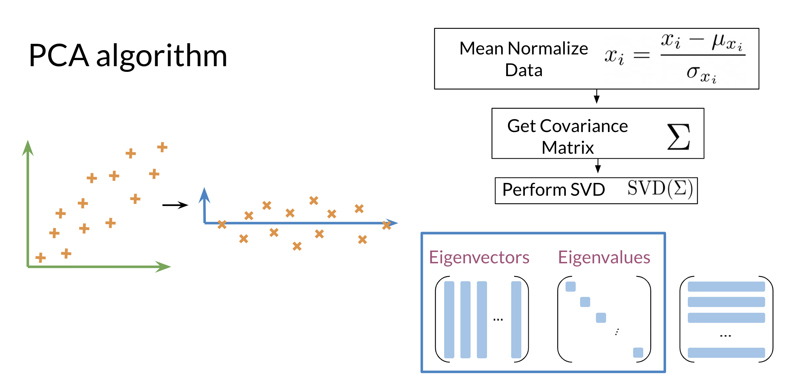

**SVD Decomposition**:
$\Sigma = U S V^T$

**Understanding Each Component**:

**U Matrix (Eigenvectors)**:

- **Columns are eigenvectors**: Each column is a direction of variation
- **Orthogonal**: All directions are perpendicular to each other
- **Unit length**: Each vector has length 1
- **Ordered by importance**: First column = most important direction

**S Matrix (Eigenvalues)**:

- **Diagonal matrix**: Only diagonal elements are non-zero
- **Contains eigenvalues**: How much variance exists in each direction
- **Descending order**: Largest eigenvalue first
- **Sum equals total variance**: Σλᵢ = total variance in original data

**V Matrix**:

- For symmetric matrices (like covariance), V = U
- We mainly care about U and S for PCA

**Real-World Analogy**: Imagine analyzing pizza preferences:

- **U (directions)**: "Cheese preference", "Spiciness preference", "Size preference"
- **S (importance)**: How much people differ in each preference
- **Result**: Maybe "Size preference" matters most, "Spiciness" second, "Cheese type" least

**Key Properties**:

- **Automatic ranking**: SVD automatically orders components by importance
- **Orthogonality**: All principal components are uncorrelated
- **Optimal**: Mathematically proven to capture maximum variance

**Python Implementation**:

```python
def perform_svd(cov_matrix):
    """
    Perform SVD on covariance matrix to get eigenvectors and eigenvalues

    Args:
        cov_matrix: Covariance matrix (n_features, n_features)

    Returns:
        U: Eigenvectors matrix (n_features, n_features)
        S: Eigenvalues array (n_features,)
        explained_variance_ratio: Proportion of variance explained by each component
    """
    # Perform SVD
    U, S, Vt = np.linalg.svd(cov_matrix)

    # For covariance matrices, U = V (symmetric)
    # S contains eigenvalues in descending order

    # Calculate explained variance ratio
    total_variance = np.sum(S)
    explained_variance_ratio = S / total_variance

    print(f"Eigenvectors shape: {U.shape}")
    print(f"Eigenvalues shape: {S.shape}")
    print(f"Top 5 eigenvalues: {S[:5]}")
    print(f"Top 5 explained variance ratios: {explained_variance_ratio[:5]}")

    return U, S, explained_variance_ratio

# Example usage
U, S, explained_variance_ratio = perform_svd(cov_matrix)
```

### Step 4: Project Data to New Dimensions

**Purpose**: Transform original data using the principal components (eigenvectors).

**Mathematical Operation**:
$$X_{\text{reduced}} = X_{\text{normalized}} \cdot U[:, :k]$$

Where:

- $X_{\text{reduced}}$ = data in reduced k-dimensional space
- $U[:, :k]$ = first k eigenvectors (principal components)
- $k$ = desired number of dimensions (typically 2 for visualization)

**Python Implementation**:

```python
def project_data(X_normalized, U, n_components=2):
    """
    Project data onto principal components

    Args:
        X_normalized: Normalized data (n_samples, n_features)
        U: Eigenvectors matrix (n_features, n_features)
        n_components: Number of components to keep

    Returns:
        X_reduced: Reduced data (n_samples, n_components)
        projection_matrix: Selected eigenvectors
    """
    # Select first n_components eigenvectors
    projection_matrix = U[:, :n_components]

    # Project data
    X_reduced = X_normalized @ projection_matrix

    print(f"Original data shape: {X_normalized.shape}")
    print(f"Projection matrix shape: {projection_matrix.shape}")
    print(f"Reduced data shape: {X_reduced.shape}")

    return X_reduced, projection_matrix

# Example usage
X_reduced, projection_matrix = project_data(X_normalized, U, n_components=2)
```

---

## Complete PCA Implementation

### Putting It All Together

```python
class PCAImplementation:
    """
    Complete PCA implementation from scratch
    """

    def __init__(self, n_components=2):
        self.n_components = n_components
        self.mean_vec = None
        self.std_vec = None
        self.U = None
        self.S = None
        self.explained_variance_ratio = None

    def fit(self, X):
        """
        Fit PCA to data

        Args:
            X: Data matrix (n_samples, n_features)
        """
        print("=== FITTING PCA ===")

        # Step 1: Mean normalize
        X_normalized, self.mean_vec, self.std_vec = mean_normalize_data(X)

        # Step 2: Compute covariance matrix
        cov_matrix = compute_covariance_matrix(X_normalized)

        # Step 3: SVD
        self.U, self.S, self.explained_variance_ratio = perform_svd(cov_matrix)

        print(f"PCA fitted with {self.n_components} components")
        print(f"Variance explained: {sum(self.explained_variance_ratio[:self.n_components]):.3f}")

    def transform(self, X):
        """
        Transform data using fitted PCA

        Args:
            X: Data to transform

        Returns:
            X_reduced: Transformed data
        """
        if self.U is None:
            raise ValueError("PCA not fitted yet. Call fit() first.")

        # Normalize using fitted parameters
        X_normalized = (X - self.mean_vec) / self.std_vec

        # Project
        X_reduced, _ = project_data(X_normalized, self.U, self.n_components)

        return X_reduced

    def fit_transform(self, X):
        """
        Fit PCA and transform data in one step
        """
        self.fit(X)
        return self.transform(X)

    def get_explained_variance_ratio(self):
        """
        Get explained variance ratio for selected components
        """
        if self.explained_variance_ratio is None:
            raise ValueError("PCA not fitted yet.")

        return self.explained_variance_ratio[:self.n_components]

# Example usage with word vectors
def demonstrate_pca():
    """
    Demonstrate PCA on word vectors
    """
    # Simulate high-dimensional word vectors (100 dimensions)
    np.random.seed(42)
    word_vectors = {
        'oil': np.random.normal(0, 1, 100) + np.array([2]*25 + [0]*75),
        'gas': np.random.normal(0, 1, 100) + np.array([2]*25 + [0]*75),
        'petroleum': np.random.normal(0, 1, 100) + np.array([2]*25 + [0]*75),
        'city': np.random.normal(0, 1, 100) + np.array([0]*25 + [2]*25 + [0]*50),
        'town': np.random.normal(0, 1, 100) + np.array([0]*25 + [2]*25 + [0]*50),
        'village': np.random.normal(0, 1, 100) + np.array([0]*25 + [2]*25 + [0]*50),
        'happy': np.random.normal(0, 1, 100) + np.array([0]*50 + [2]*25 + [0]*25),
        'joyful': np.random.normal(0, 1, 100) + np.array([0]*50 + [2]*25 + [0]*25),
        'sad': np.random.normal(0, 1, 100) + np.array([0]*50 + [2]*25 + [0]*25),
    }

    # Convert to matrix
    words = list(word_vectors.keys())
    X = np.array(list(word_vectors.values()))

    # Apply our PCA implementation
    pca = PCAImplementation(n_components=2)
    X_reduced = pca.fit_transform(X)

    # Results
    print("\n=== RESULTS ===")
    print("Reduced word vectors:")
    for i, word in enumerate(words):
        print(f"{word}: ({X_reduced[i, 0]:.2f}, {X_reduced[i, 1]:.2f})")

    print(f"\nExplained variance ratios: {pca.get_explained_variance_ratio()}")

    return words, X_reduced, pca

# Run demonstration
words, X_reduced, pca_model = demonstrate_pca()
```

---

## Understanding the Results: Variance Explained

### Interpreting Eigenvalues and Variance

**Explained Variance Ratio**: Shows how much information each principal component captures.

```python
def analyze_variance_explained(pca_model):
    """
    Analyze and visualize variance explained by components
    """
    explained_ratios = pca_model.explained_variance_ratio
    cumulative_ratios = np.cumsum(explained_ratios)

    print("=== VARIANCE ANALYSIS ===")
    for i in range(min(10, len(explained_ratios))):  # Show first 10 components
        print(f"Component {i+1}: {explained_ratios[i]:.3f} ({explained_ratios[i]*100:.1f}%)")

    print(f"\nCumulative variance (first 5 components): {cumulative_ratios[:5]}")

    # Find components needed for 95% variance
    components_95 = np.argmax(cumulative_ratios >= 0.95) + 1
    print(f"Components needed for 95% variance: {components_95}")

    return explained_ratios, cumulative_ratios

# Example analysis
explained_ratios, cumulative_ratios = analyze_variance_explained(pca_model)
```

### Visualization with Proper Scaling

```python
import matplotlib.pyplot as plt

def visualize_pca_results(words, X_reduced, explained_ratios):
    """
    Create publication-quality PCA visualization
    """
    plt.figure(figsize=(12, 8))

    # Define colors for different semantic clusters
    colors = {
        'energy': ['oil', 'gas', 'petroleum'],
        'location': ['city', 'town', 'village'],
        'emotion': ['happy', 'joyful', 'sad']
    }

    color_map = {'energy': 'green', 'location': 'blue', 'emotion': 'gray'}

    # Plot points
    for i, word in enumerate(words):
        # Determine color
        word_color = 'orange'  # default
        for cluster, cluster_words in colors.items():
            if word in cluster_words:
                word_color = color_map[cluster]
                break

        plt.scatter(X_reduced[i, 0], X_reduced[i, 1],
                   c=word_color, s=100, alpha=0.7)
        plt.annotate(word, (X_reduced[i, 0], X_reduced[i, 1]),
                    xytext=(5, 5), textcoords='offset points',
                    fontsize=12, ha='left')

    # Add axis labels with variance explained
    plt.xlabel(f'First Principal Component ({explained_ratios[0]*100:.1f}% variance)')
    plt.ylabel(f'Second Principal Component ({explained_ratios[1]*100:.1f}% variance)')

    # Add title with total variance
    total_variance = sum(explained_ratios[:2])
    plt.title(f'PCA Visualization of Word Vectors\n'
             f'Total variance explained: {total_variance*100:.1f}%')

    plt.grid(True, alpha=0.3)
    plt.axis('equal')  # Equal scaling for proper geometric interpretation

    # Add legend
    legend_elements = [plt.Line2D([0], [0], marker='o', color='w',
                                 markerfacecolor=color, markersize=10, label=cluster.title())
                      for cluster, color in color_map.items()]
    plt.legend(handles=legend_elements)

    plt.tight_layout()
    plt.show()

# Create visualization
visualize_pca_results(words, X_reduced, pca_model.get_explained_variance_ratio())
```

---

## Key Properties and Insights

### Mathematical Properties of PCA

**1. Orthogonality**: Principal components are orthogonal (uncorrelated)
$$\vec{u}_i \cdot \vec{u}_j = 0 \text{ for } i \neq j$$

**2. Variance Maximization**: Each component maximizes remaining variance
$$\text{PC}_1 = \arg\max_{\vec{u}} \text{Var}(X \vec{u})$$
$$\text{PC}_2 = \arg\max_{\vec{u} \perp \text{PC}_1} \text{Var}(X \vec{u})$$

**3. Information Preservation**: Ordered by importance
$$\lambda_1 \geq \lambda_2 \geq ... \geq \lambda_d$$

### Practical Insights

**Eigenvalue Interpretation**:

- **Large eigenvalue**: Component captures much variance (important direction)
- **Small eigenvalue**: Component captures little variance (can be discarded)
- **Zero eigenvalue**: No variance in that direction (perfectly correlated features)

**Eigenvector Interpretation**:

- **Direction**: Points toward maximum variance
- **Magnitude**: Always normalized to unit length
- **Components**: Linear combination of original features

---

## Comparison with Library Implementations

### Verification Against Scikit-learn

```python
from sklearn.decomposition import PCA
from sklearn.preprocessing import StandardScaler

def compare_implementations(X, words):
    """
    Compare our implementation with scikit-learn
    """
    # Our implementation
    our_pca = PCAImplementation(n_components=2)
    our_result = our_pca.fit_transform(X)

    # Scikit-learn implementation
    scaler = StandardScaler()
    X_scaled = scaler.fit_transform(X)

    sklearn_pca = PCA(n_components=2)
    sklearn_result = sklearn_pca.fit_transform(X_scaled)

    print("=== IMPLEMENTATION COMPARISON ===")
    print("Our PCA explained variance:", our_pca.get_explained_variance_ratio())
    print("Scikit-learn explained variance:", sklearn_pca.explained_variance_ratio_)

    # Results should be similar (possibly with sign flips)
    print("\nFirst few transformed points:")
    print("Our implementation:")
    for i in range(3):
        print(f"  {words[i]}: ({our_result[i, 0]:.3f}, {our_result[i, 1]:.3f})")

    print("Scikit-learn:")
    for i in range(3):
        print(f"  {words[i]}: ({sklearn_result[i, 0]:.3f}, {sklearn_result[i, 1]:.3f})")

# Run comparison
compare_implementations(X, words)
```

---

## Advanced Topics and Considerations

### Choosing the Number of Components

**Methods for selecting k**:

**1. Variance Threshold**: Keep components explaining ≥95% variance

**2. Elbow Method**: Look for "elbow" in eigenvalue plot

**3. Cross-validation**: Test downstream task performance

**4. Domain Knowledge**: Based on expected complexity

```python
def select_optimal_components(pca_model, variance_thresholds=[0.8, 0.9, 0.95, 0.99]):
    """
    Suggest optimal number of components for different variance thresholds
    """
    cumulative_variance = np.cumsum(pca_model.explained_variance_ratio)

    print("=== COMPONENT SELECTION GUIDE ===")
    for threshold in variance_thresholds:
        n_components = np.argmax(cumulative_variance >= threshold) + 1
        actual_variance = cumulative_variance[n_components - 1]
        print(f"For {threshold*100}% variance: {n_components} components "
              f"(actual: {actual_variance*100:.1f}%)")
```

### Limitations and Alternatives

**PCA Limitations**:

- **Linear assumption**: Only captures linear relationships
- **Global method**: Single transformation for all data
- **Mean-focused**: Assumes Gaussian-like distributions

**When to use alternatives**:

- **t-SNE**: For non-linear relationships, local structure preservation
- **UMAP**: Faster than t-SNE, preserves global structure better
- **ICA**: When you want statistically independent components
- **Factor Analysis**: When you believe in underlying latent factors

---

## Key Takeaways and Practical Guidelines

### Algorithmic Mastery

**The Four-Step PCA Process**:

1. **Normalize**: $\vec{x}_i^{\text{norm}} = \frac{\vec{x}_i - \mu}{\sigma}$
2. **Covariance**: $\Sigma = \frac{1}{n-1}X^T X$
3. **SVD**: $\Sigma = U S V^T$
4. **Project**: $X_{\text{reduced}} = X \cdot U[:, :k]$

### Implementation Guidelines

**Best Practices**:

- Always normalize your data first
- Check explained variance ratios
- Verify results with library implementations
- Visualize 2D projections to validate clustering
- Consider the trade-off between dimensionality and information loss

### Understanding Outputs

**Eigenvector Interpretation**:

- Columns of U matrix = principal component directions
- First column = direction of maximum variance
- Orthogonal directions = uncorrelated features

**Eigenvalue Interpretation**:

- Diagonal elements of S = variance in each direction
- Larger values = more important components
- Sum of eigenvalues = total variance in original data

**Next Applications**: With PCA mastered, we can now visualize any high-dimensional word embedding space, evaluate the quality of our vector representations, and prepare for more advanced topics like machine translation using vector transformations!

# 9. The Rotation Matrix (Optional Reading)

## Introduction: Why Rotation Matrices Matter in PCA

While not directly part of the core PCA algorithm, understanding rotation matrices helps us grasp what PCA is really doing geometrically. **PCA essentially rotates our coordinate system** to align with the directions of maximum variance. This optional section explains the mathematical foundation behind rotations in 2D space.

**Connection to PCA**: When we project data onto principal components, we're essentially rotating our original coordinate system to a new one where the axes align with the directions of maximum variance.

```mermaid
graph TD
    A["Original Coordinate System"] --> B["Rotation Transformation"]
    B --> C["New Coordinate System"]
    C --> D["Aligned with Principal Components"]

    subgraph "What Rotation Does"
        E["Preserves distances"]
        F["Preserves angles"]
        G["Changes coordinate values"]
    end

    B --> E
    B --> F
    B --> G

    style B fill:#e3f2fd
    style D fill:#e8f5e8
```

---

## Real-Life Analogy: The Map Rotation

Imagine you're looking at a city map, but all the streets run diagonally relative to the map edges:

**Problem**: It's hard to navigate because the streets don't align with the map's coordinate system
**Solution**: Rotate the entire map so the main streets align with the horizontal and vertical axes
**Result**: Much easier to read coordinates and navigate

This is exactly what PCA does with data - it rotates the coordinate system to make the data easier to understand and work with.

---

## Mathematical Foundation: Polar and Cartesian Coordinates

### Understanding Vector Representation

Any point in 2D space can be represented in two ways:

**Cartesian Coordinates**: $(x, y)$ - horizontal and vertical distances
**Polar Coordinates**: $(r, \alpha)$ - distance from origin and angle

**Conversion Formulas**:
$$x = r \cos(\alpha)$$
$$y = r \sin(\alpha)$$

Where:

- $r = \sqrt{x^2 + y^2}$ (distance from origin)
- $\alpha = \arctan(y/x)$ (angle from positive x-axis)

**Example**:

```
Point: (3, 4)
Distance: r = √(3² + 4²) = √25 = 5
Angle: α = arctan(4/3) ≈ 53.13°

Verification:
x = 5 × cos(53.13°) = 5 × 0.6 = 3 ✓
y = 5 × sin(53.13°) = 5 × 0.8 = 4 ✓
```

---

## Counterclockwise Rotation: Step-by-Step Derivation

### The Problem Setup

**Given**:

- Original vector $\vec{r}$ with coordinates $(x, y)$ at angle $\alpha$
- Want to rotate by angle $\beta$ counterclockwise
- Find new coordinates $(x', y')$ of rotated vector $\vec{r}'$

### Step 1: Express Original Coordinates

Since the vector length stays the same during rotation:
$$x = r \cos(\alpha)$$
$$y = r \sin(\alpha)$$

### Step 2: Express Rotated Coordinates

After rotation by angle $\beta$, the new angle becomes $\alpha + \beta$:
$$x' = r \cos(\alpha + \beta)$$
$$y' = r \sin(\alpha + \beta)$$

### Step 3: Apply Trigonometric Addition Formulas

**Trigonometric identities**:
$$\cos(\alpha + \beta) = \cos(\alpha)\cos(\beta) - \sin(\alpha)\sin(\beta)$$
$$\sin(\alpha + \beta) = \cos(\alpha)\sin(\beta) + \sin(\alpha)\cos(\beta)$$

**Substituting**:
$$x' = r[\cos(\alpha)\cos(\beta) - \sin(\alpha)\sin(\beta)]$$
$$y' = r[\cos(\alpha)\sin(\beta) + \sin(\alpha)\cos(\beta)]$$

### Step 4: Factor Out Original Coordinates

Since $x = r\cos(\alpha)$ and $y = r\sin(\alpha)$:
$$x' = r\cos(\alpha)\cos(\beta) - r\sin(\alpha)\sin(\beta)$$
$$x' = x\cos(\beta) - y\sin(\beta)$$

$$y' = r\cos(\alpha)\sin(\beta) + r\sin(\alpha)\cos(\beta)$$

$$y' = x\sin(\beta) + y\cos(\beta)$$

### Final Rotation Formulas

**Counterclockwise rotation by angle $\beta$**:
$$x' = x\cos(\beta) - y\sin(\beta)$$
$$y' = x\sin(\beta) + y\cos(\beta)$$

---

## Matrix Representation of Rotation

### Row Vector Multiplication

When representing points as **row vectors** $[x, y]$:

$$[x', y'] = [x, y] \begin{bmatrix} \cos(\beta) & \sin(\beta) \\ -\sin(\beta) & \cos(\beta) \end{bmatrix}$$

**Rotation Matrix for Row Vectors**:
$$R_{\text{row}} = \begin{bmatrix} \cos(\beta) & \sin(\beta) \\ -\sin(\beta) & \cos(\beta) \end{bmatrix}$$

### Column Vector Multiplication

When representing points as **column vectors** $\begin{bmatrix}x\\y\end{bmatrix}$:

$$\begin{bmatrix}x'\\y'\end{bmatrix} = \begin{bmatrix} \cos(\beta) & -\sin(\beta) \\ \sin(\beta) & \cos(\beta) \end{bmatrix} \begin{bmatrix}x\\y\end{bmatrix}$$

**Rotation Matrix for Column Vectors**:
$$R_{\text{col}} = \begin{bmatrix} \cos(\beta) & -\sin(\beta) \\ \sin(\beta) & \cos(\beta) \end{bmatrix}$$

**Important Note**: The position of $-\sin(\beta)$ changes depending on whether you use row or column vectors!

---

## Detailed Example: 45° Counterclockwise Rotation

### Setup

**Original point**: $(1, 0)$ (on the positive x-axis)
**Rotation angle**: $\beta = 45°$
**Expected result**: Should land on the line $y = x$

### Calculate Trigonometric Values

$$\cos(45°) = \frac{1}{\sqrt{2}} = \frac{\sqrt{2}}{2} \approx 0.707$$
$$\sin(45°) = \frac{1}{\sqrt{2}} = \frac{\sqrt{2}}{2} \approx 0.707$$

### Using Column Vector Method

$$\begin{bmatrix}x'\\y'\end{bmatrix} = \begin{bmatrix} \cos(45°) & -\sin(45°) \\ \sin(45°) & \cos(45°) \end{bmatrix} \begin{bmatrix}1\\0\end{bmatrix}$$

$$= \begin{bmatrix} 0.707 & -0.707 \\ 0.707 & 0.707 \end{bmatrix} \begin{bmatrix}1\\0\end{bmatrix}$$

$$= \begin{bmatrix} 0.707 \times 1 + (-0.707) \times 0 \\ 0.707 \times 1 + 0.707 \times 0 \end{bmatrix}$$

$$= \begin{bmatrix} 0.707 \\ 0.707 \end{bmatrix}$$

**Result**: $(0.707, 0.707)$ ✓

**Verification**: The point is indeed on the line $y = x$ and at distance $\sqrt{0.707^2 + 0.707^2} = 1$ from origin.

---

## Clockwise Rotation

### The Mathematical Difference

For **clockwise rotation**, we rotate by angle $-\beta$ (negative angle):

**Using trigonometric properties**:

- $\cos(-\beta) = \cos(\beta)$ (cosine is even)
- $\sin(-\beta) = -\sin(\beta)$ (sine is odd)

### Clockwise Rotation Matrices

**For Row Vectors**:
$$R_{\text{clockwise,row}} = \begin{bmatrix} \cos(\beta) & -\sin(\beta) \\ \sin(\beta) & \cos(\beta) \end{bmatrix}$$

**For Column Vectors**:
$$R_{\text{clockwise,col}} = \begin{bmatrix} \cos(\beta) & \sin(\beta) \\ -\sin(\beta) & \cos(\beta) \end{bmatrix}$$

### Relationship Between Counterclockwise and Clockwise

**Key Insight**: Clockwise rotation by angle $\beta$ = Counterclockwise rotation by angle $-\beta$

This means:
$$R_{\text{clockwise}}(\beta) = R_{\text{counterclockwise}}(-\beta)$$

---

## Properties of Rotation Matrices

### Mathematical Properties

**1. Orthogonality**: $R^T R = I$ (transpose equals inverse)

- Rows are orthonormal vectors
- Columns are orthonormal vectors

**2. Determinant**: $\det(R) = 1$ (preserves orientation)

- Positive determinant means no reflection

**3. Inverse**: $R^{-1} = R^T$ (transpose gives inverse rotation)

- Easy to "undo" a rotation

**4. Length Preservation**: $||R\vec{v}|| = ||\vec{v}||$ (distances preserved)

- Rotation doesn't stretch or shrink vectors

### Verification Example

For our 45° rotation matrix:
$$R = \begin{bmatrix} 0.707 & -0.707 \\ 0.707 & 0.707 \end{bmatrix}$$

**Check orthogonality**:
$$R^T R = \begin{bmatrix} 0.707 & 0.707 \\ -0.707 & 0.707 \end{bmatrix} \begin{bmatrix} 0.707 & -0.707 \\ 0.707 & 0.707 \end{bmatrix}$$

$$= \begin{bmatrix} 0.707^2 + 0.707^2 & -0.707^2 + 0.707^2 \\ -0.707^2 + 0.707^2 & 0.707^2 + 0.707^2 \end{bmatrix}$$

$$= \begin{bmatrix} 1 & 0 \\ 0 & 1 \end{bmatrix} = I \quad \checkmark$$

---

## Connection to PCA: The Big Picture

### How PCA Uses Rotations

**PCA Process as Rotation**:

1. **Find principal components** (eigenvectors of covariance matrix)
2. **Construct rotation matrix** using these eigenvectors as columns
3. **Rotate data** to align with principal components
4. **Keep most important dimensions** (those with highest variance)

### PCA Rotation Matrix

In PCA, our rotation matrix is:
$$R_{\text{PCA}} = U$$

Where $U$ contains the eigenvectors (principal components) as columns.

**Example from our earlier PCA calculation**:
$$U = \begin{bmatrix} \frac{1}{\sqrt{2}} & \frac{1}{\sqrt{2}} \\ \frac{1}{\sqrt{2}} & -\frac{1}{\sqrt{2}} \end{bmatrix}$$

This rotates our coordinate system by approximately 45° to align with the principal components!

### Geometric Interpretation

```mermaid
graph LR
    A["Original Data<br/>(correlated features)"] --> B["Apply Rotation Matrix U"]
    B --> C["Rotated Data<br/>(uncorrelated features)"]

    subgraph "Rotation Effect"
        D["Align with variance directions"]
        E["Remove correlation"]
        F["Simplify data structure"]
    end

    B --> D
    B --> E
    B --> F

    style B fill:#e3f2fd
    style C fill:#e8f5e8
```

---

## Practical Applications Beyond PCA

### 1. Computer Graphics

**3D Rotations**: Extend to 3D for rotating objects in games and simulations
$$R_z(\theta) = \begin{bmatrix} \cos\theta & -\sin\theta & 0 \\ \sin\theta & \cos\theta & 0 \\ 0 & 0 & 1 \end{bmatrix}$$

### 2. Robotics

**Robot Arm Control**: Calculate joint angles for desired end-effector positions

### 3. Signal Processing

**Frequency Domain Rotations**: Phase shifts in Fourier transforms

### 4. Machine Learning

**Data Augmentation**: Rotate images to create training data variations
**Feature Engineering**: Rotate feature spaces for better separability

---

## Python Implementation: Rotation in Practice

### Basic Rotation Function

```python
import numpy as np
import matplotlib.pyplot as plt

def rotation_matrix_2d(angle_degrees, clockwise=False):
    """
    Create 2D rotation matrix

    Args:
        angle_degrees: Rotation angle in degrees
        clockwise: If True, rotate clockwise; if False, counterclockwise

    Returns:
        2x2 rotation matrix
    """
    angle_rad = np.radians(angle_degrees)

    if clockwise:
        angle_rad = -angle_rad

    cos_angle = np.cos(angle_rad)
    sin_angle = np.sin(angle_rad)

    return np.array([[cos_angle, -sin_angle],
                     [sin_angle, cos_angle]])

def rotate_points(points, angle_degrees, clockwise=False):
    """
    Rotate multiple points

    Args:
        points: Array of shape (n, 2) with n points
        angle_degrees: Rotation angle
        clockwise: Rotation direction

    Returns:
        Rotated points
    """
    R = rotation_matrix_2d(angle_degrees, clockwise)
    return points @ R.T  # Transpose for row vector multiplication

# Example: Rotate a square
square_points = np.array([[1, 1], [-1, 1], [-1, -1], [1, -1], [1, 1]])
rotated_square = rotate_points(square_points, 45)

# Visualization
plt.figure(figsize=(10, 5))

plt.subplot(1, 2, 1)
plt.plot(square_points[:, 0], square_points[:, 1], 'b-o', label='Original')
plt.plot(rotated_square[:, 0], rotated_square[:, 1], 'r-s', label='Rotated 45°')
plt.axis('equal')
plt.grid(True)
plt.legend()
plt.title('Square Rotation Example')

plt.subplot(1, 2, 2)
# Show multiple rotations
angles = [0, 30, 60, 90, 120, 150, 180]
colors = plt.cm.rainbow(np.linspace(0, 1, len(angles)))

for angle, color in zip(angles, colors):
    rotated = rotate_points(square_points, angle)
    plt.plot(rotated[:, 0], rotated[:, 1], color=color,
             label=f'{angle}°', alpha=0.7)

plt.axis('equal')
plt.grid(True)
plt.legend()
plt.title('Multiple Rotations')
plt.tight_layout()
plt.show()
```

### Connection to PCA Implementation

```python
def demonstrate_pca_rotation():
    """
    Show how PCA is essentially a rotation to principal component axes
    """
    # Generate correlated 2D data
    np.random.seed(42)
    n_points = 100

    # Create data with correlation
    X = np.random.multivariate_normal([0, 0], [[2, 1.5], [1.5, 2]], n_points)

    # Apply PCA
    from sklearn.decomposition import PCA
    pca = PCA(n_components=2)
    X_pca = pca.fit_transform(X)

    # The PCA components give us the rotation matrix
    rotation_matrix = pca.components_.T  # Transpose for correct orientation

    print("PCA Rotation Matrix:")
    print(rotation_matrix)
    print(f"\nRotation angle: {np.degrees(np.arctan2(rotation_matrix[1,0], rotation_matrix[0,0])):.1f}°")

    # Visualize
    plt.figure(figsize=(12, 4))

    # Original data
    plt.subplot(1, 3, 1)
    plt.scatter(X[:, 0], X[:, 1], alpha=0.6)
    plt.title('Original Data\n(Correlated)')
    plt.axis('equal')
    plt.grid(True)

    # Show principal component directions
    plt.subplot(1, 3, 2)
    plt.scatter(X[:, 0], X[:, 1], alpha=0.6)

    # Plot principal component vectors
    origin = np.mean(X, axis=0)
    for i, (component, color) in enumerate(zip(pca.components_, ['red', 'blue'])):
        plt.arrow(origin[0], origin[1],
                 component[0] * 2, component[1] * 2,
                 head_width=0.1, head_length=0.1,
                 fc=color, ec=color, label=f'PC{i+1}')

    plt.title('Original Data\nwith Principal Components')
    plt.legend()
    plt.axis('equal')
    plt.grid(True)

    # Rotated data (PCA result)
    plt.subplot(1, 3, 3)
    plt.scatter(X_pca[:, 0], X_pca[:, 1], alpha=0.6)
    plt.title('After PCA Rotation\n(Uncorrelated)')
    plt.xlabel('First Principal Component')
    plt.ylabel('Second Principal Component')
    plt.axis('equal')
    plt.grid(True)

    plt.tight_layout()
    plt.show()

# Run the demonstration
demonstrate_pca_rotation()
```

---

## Key Takeaways and Summary

### Mathematical Mastery

**Rotation Matrix Forms**:

- **Counterclockwise (column vectors)**: $\begin{bmatrix} \cos\beta & -\sin\beta \\ \sin\beta & \cos\beta \end{bmatrix}$
- **Clockwise (column vectors)**: $\begin{bmatrix} \cos\beta & \sin\beta \\ -\sin\beta & \cos\beta \end{bmatrix}$

### Key Properties Remembered

1. **Orthogonality**: $R^T R = I$ (transpose gives inverse)
2. **Length preservation**: Distances and angles preserved
3. **Determinant = 1**: No reflection, pure rotation
4. **Composition**: Multiple rotations combine by matrix multiplication

### Connection to PCA

**PCA as Rotation**:

- Eigenvectors form rotation matrix
- Rotates to coordinate system aligned with variance
- Preserves all mathematical properties of rotations
- Enables dimensionality reduction by discarding low-variance directions

### Practical Applications

- Computer graphics and game development
- Robotics and mechanical engineering
- Signal processing and communications
- Machine learning feature transformations

**Final Insight**: Understanding rotation matrices provides deep geometric intuition for what PCA accomplishes - it's not just statistical manipulation, but a fundamental coordinate system transformation that reveals the natural structure of data!

This optional reading enhances your understanding of the geometric foundations underlying PCA and many other machine learning techniques.
