# Course 1 Week 4: Machine Translation and Locality Sensitive Hashing

**Natural Language Processing Specialization**
**Natural Language Processing with Classification and Vector Spaces**

---

## Table of Contents

1. [Introduction to Machine Translation](#1-introduction-to-machine-translation)
2. [Transforming Word Vectors](#2-transforming-word-vectors)
3. [Rotation Matrices in R2](#3-rotation-matrices-in-r2)
4. [K-Nearest Neighbors](#4-k-nearest-neighbors)
5. [Hash Tables and Hash Functions](#5-hash-tables-and-hash-functions)
6. [Locality Sensitive Hashing](#6-locality-sensitive-hashing)
7. [Multiple Planes](#7-multiple-planes)
8. [Approximate Nearest Neighbors](#8-approximate-nearest-neighbors)
9. [Searching Documents](#9-searching-documents)
10. [Applications and Real-World Use Cases](#10-applications-and-real-world-use-cases)

---

# 1. Introduction to Machine Translation and Document Search

## Welcome to Week 4: The Grand Finale

Congratulations! You've made it to the final week of Course 1. This week brings together everything you've learned about vectors, similarity, and classification to tackle two incredibly powerful real-world applications that millions of people use every day.

## What You'll Accomplish This Week

By the end of this week, you'll have built systems that can:

1. **Machine Translation**: Convert "hello" (English) → "bonjour" (French)
2. **Document Search**: Find that "Can I get a refund?" is similar to "What's your return policy?" and "May I get my money back?"

These aren't just academic exercises - these are the core technologies behind Google Translate, customer service chatbots, and search engines!

---

## Real-World Impact: Why These Skills Matter

### Machine Translation in Daily Life

**Think about how often you encounter translation**:

- 📱 Traveling abroad and using Google Translate to read menus
- 🌍 Reading international news articles
- 💼 Collaborating with international colleagues
- 🛒 Shopping on foreign websites
- 📚 Accessing research papers in other languages

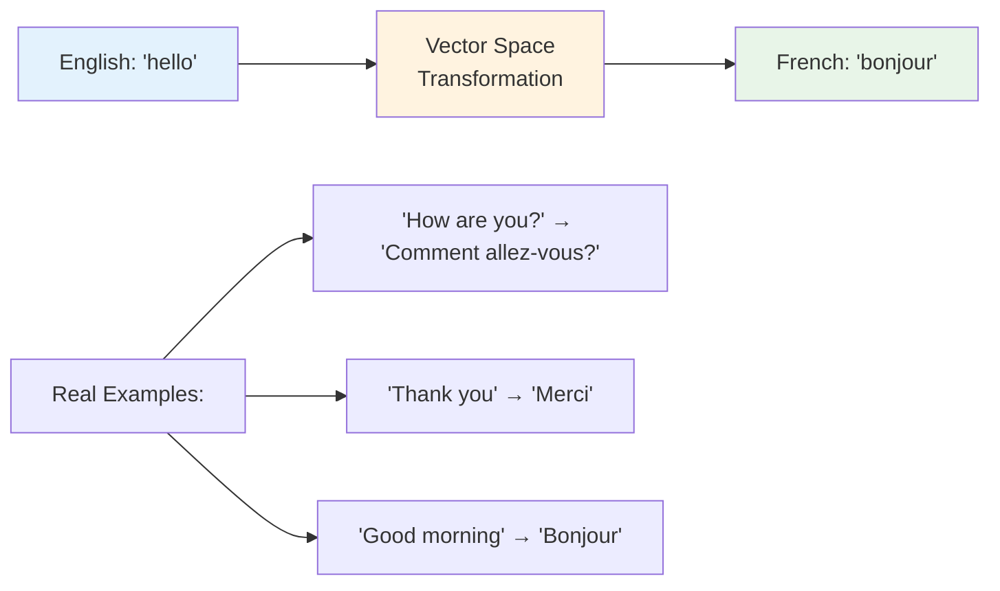
```mermaid
graph LR
    A["English: 'hello'"] --> B["Vector Space<br/>Transformation"]
    B --> C["French: 'bonjour'"]

    D["Real Examples:"]
    D --> E["'How are you?' → 'Comment allez-vous?'"]
    D --> F["'Thank you' → 'Merci'"]
    D --> G["'Good morning' → 'Bonjour'"]

    style A fill:#e3f2fd
    style C fill:#e8f5e8
    style B fill:#fff3e0
```

### Document Search: The Invisible Helper

**Document search powers**:

- 🔍 **Customer Support**: "I want a refund" matches with refund policies
- 📧 **Email Search**: Finding that important email with fuzzy queries
- 📖 **Legal Research**: Finding similar cases and precedents
- 🏥 **Medical Records**: Locating similar patient cases
- 📚 **Academic Research**: Finding related papers and citations

**Real Example - Customer Service Bot**:

```
Customer Query: "Can I get a refund?"
System Finds Similar:
- "What's your return policy?" (High similarity)
- "May I get my money back?" (High similarity)
- "How do I cancel my order?" (Medium similarity)
- "What are your hours?" (Low similarity)
```

---

## The Magic Behind the Scenes

### The Vector Space Revolution

**Here's the key insight**: Words with similar meanings should be located close to each other in vector space, regardless of the language they're in!

**Analogy - The Universal Library**:
Imagine a magical library where:

- Books about the same topic sit near each other
- Even if books are written in different languages
- French books about "love" sit next to English books about "love"
- The librarian (our algorithm) can quickly find related books

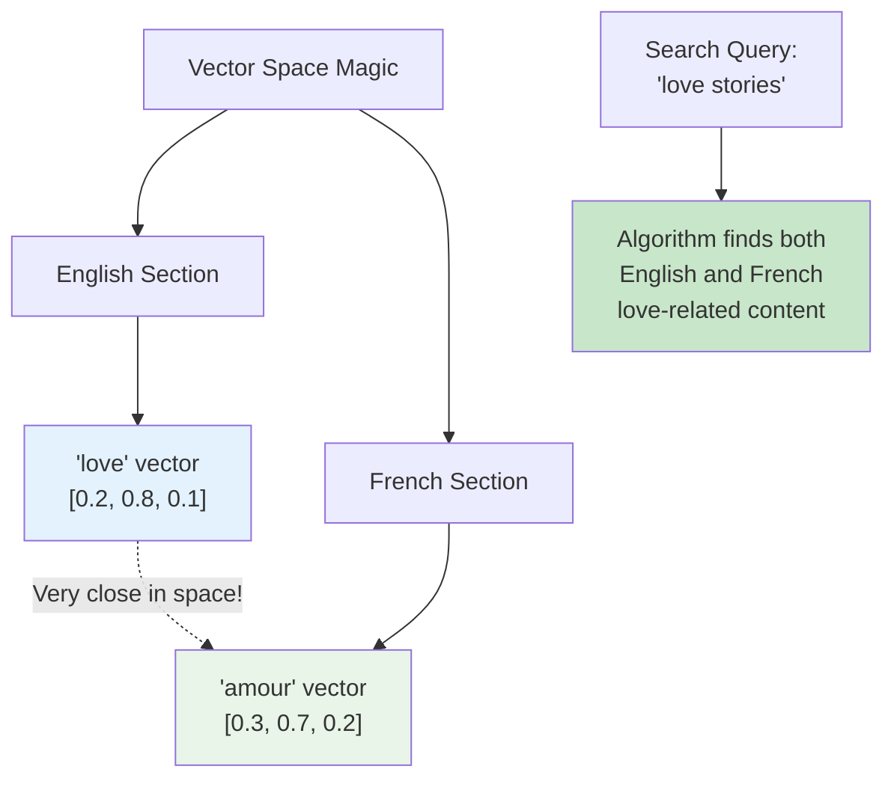
```mermaid
graph TD
    A["Vector Space Magic"] --> B["English Section"]
    A --> C["French Section"]

    B --> D["'love' vector<br/>[0.2, 0.8, 0.1]"]
    C --> E["'amour' vector<br/>[0.3, 0.7, 0.2]"]

    D -.->|"Very close in space!"| E

    F["Search Query:<br/>'love stories'"] --> G["Algorithm finds both<br/>English and French<br/>love-related content"]

    style D fill:#e3f2fd
    style E fill:#e8f5e8
    style G fill:#c8e6c9
```

---

## Your Learning Journey This Week

### The Skills You'll Master

Don't worry if these terms sound complex right now - by week's end, they'll be your toolkit:

#### 1. **Vector Transformation** 🔄

**What it is**: Rotating and adjusting word vectors to align different languages

**Real analogy**: Like adjusting two maps of the same city that are oriented differently - rotating one to match the other

#### 2. **K-Nearest Neighbors** 👥

**What it is**: Finding the closest similar items in vector space

**Real analogy**: Like finding your 5 closest friends in a crowded room - you look around and identify who's nearest to you

#### 3. **Hash Tables** 📦

**What it is**: Organizing vectors into smart buckets for faster search

**Real analogy**: Like organizing your closet with labeled boxes - instead of searching through everything, you go straight to the "shirts" box

#### 4. **Vector Space Regions** 🗺️

**What it is**: Dividing the vector space into neighborhoods

**Real analogy**: Like dividing a city into districts - when looking for Italian restaurants, you'd check the "Italian district" first

#### 5. **Locality-Sensitive Hashing** ⚡

**What it is**: Ultra-fast approximate search for similar vectors

**Real analogy**: Like having a super-smart GPS that doesn't find the absolute shortest route, but finds a really good route instantly

---

## The Big Picture: From Vectors to Applications

### Week 4 Learning Flow

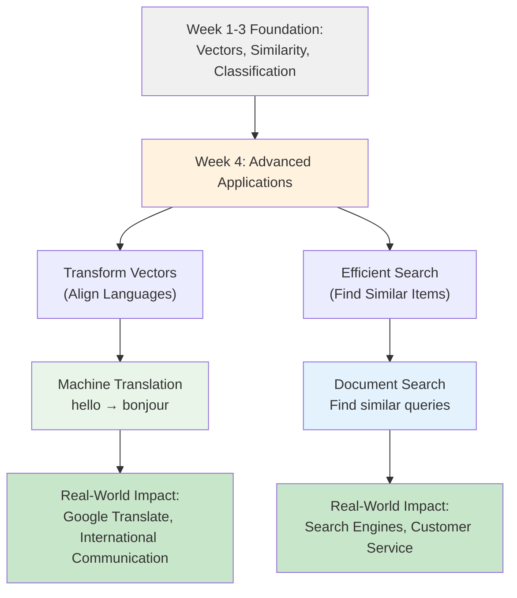
```mermaid
graph TD
    A["Week 1-3 Foundation:<br/>Vectors, Similarity, Classification"] --> B["Week 4: Advanced Applications"]

    B --> C["Transform Vectors<br/>(Align Languages)"]
    B --> D["Efficient Search<br/>(Find Similar Items)"]

    C --> E["Machine Translation<br/>hello → bonjour"]
    D --> F["Document Search<br/>Find similar queries"]

    E --> G["Real-World Impact:<br/>Google Translate, International Communication"]
    F --> H["Real-World Impact:<br/>Search Engines, Customer Service"]

    style A fill:#f0f0f0
    style B fill:#fff3e0
    style E fill:#e8f5e8
    style F fill:#e3f2fd
    style G fill:#c8e6c9
    style H fill:#c8e6c9
```

### Why This Progression Makes Sense

1. **Weeks 1-3 gave you the foundation**: Understanding vectors, computing similarity, building classifiers
2. **Week 4 puts it all together**: Using these concepts to solve complex, real-world problems
3. **The result**: You can build systems that millions of people rely on daily

---

## What Makes This Week Special

### From Theory to Practice

**Previous weeks**: "Here's how vectors work"

**This week**: "Here's how to use vectors to translate languages and search documents"

### From Small to Large Scale

**Previous weeks**: Working with manageable datasets

**This week**: Learning techniques that scale to millions of documents and thousands of languages

### From Exact to Approximate

**Previous weeks**: Finding exact answers

**This week**: Learning when "good enough, fast" is better than "perfect, slow"

---

## Setting Expectations: The Learning Adventure Ahead

### What You'll Experience

1. **"Aha!" Moments**: When you see how vector transformations work visually
2. **Practical Skills**: Building real translation and search systems
3. **Efficiency Insights**: Understanding the trade-offs between accuracy and speed
4. **Real-World Perspective**: Seeing how these techniques power everyday applications

### The Mindset for This Week

- **Don't panic** if concepts seem complex initially
- **Trust the process** - each lecture builds on the previous
- **Think practically** - always connect concepts to real applications
- **Experiment freely** - the labs are designed for hands-on learning

---

## Looking Forward: Your Week 4 Roadmap

### The Journey Ahead


```mermaid
graph LR
    A["Today:<br/>Overview & Motivation"] --> B["Next:<br/>Vector Transformations"]
    B --> C["Then:<br/>Efficient Search Methods"]
    C --> D["Finally:<br/>Complete Applications"]

    style A fill:#e3f2fd
    style B fill:#fff3e0
    style C fill:#f3e5f5
    style D fill:#e8f5e8
```

### By Week's End, You'll Be Able To

✅ **Explain** how machine translation works using vector spaces

✅ **Implement** efficient search algorithms for large datasets

✅ **Build** a working translation system

✅ **Create** a document search engine

✅ **Understand** the trade-offs in real-world NLP systems

---

## Ready to Begin?

You've built an impressive foundation over the past three weeks. Now it's time to see how that foundation supports some of the most impactful applications in modern NLP.

Remember: Every expert was once a beginner, and every complex system started with simple concepts. You have all the tools you need - let's put them to work building something amazing!

**Next up**: We'll dive into the mathematical beauty of vector transformations and see how rotating vectors in space can bridge the gap between languages. 🚀

# 2. Transforming Word Vectors

## The Big Picture: From Cat to Chat

Imagine you have two maps of the same city - one in English and one in French. Both maps show the same locations, but they might be rotated, scaled, or positioned differently. To navigate between them, you need a way to transform coordinates from one map to the other. This is exactly what we're doing with word vectors!

**The Goal**: Learn a transformation matrix $R$ that can convert English word vectors to their French equivalents.

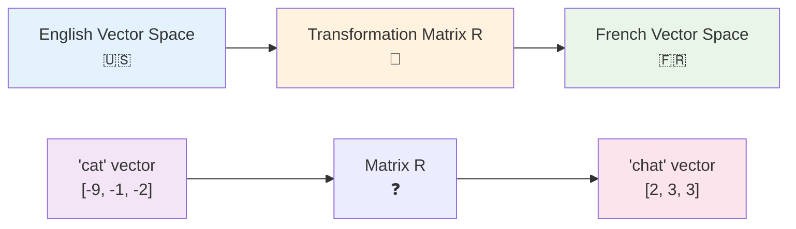
```mermaid
graph LR
    A["English Vector Space<br/>🇺🇸"] --> B["Transformation Matrix R<br/>🔄"]
    B --> C["French Vector Space<br/>🇫🇷"]

    D["'cat' vector<br/>[-9, -1, -2]"] --> E["Matrix R<br/>❓"]
    E --> F["'chat' vector<br/>[2, 3, 3]"]

    style A fill:#e3f2fd
    style C fill:#e8f5e8
    style B fill:#fff3e0
    style D fill:#f3e5f5
    style F fill:#fce4ec
```

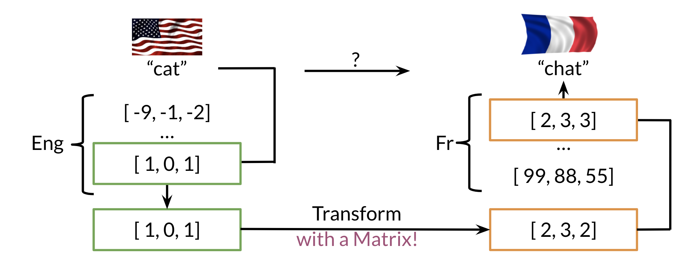

---

## The Translation Process: Step by Step

### Step 1: Get Your Training Data

First, you need a dictionary - pairs of English and French words that mean the same thing:

```
English    →    French
cat        →    chat
dog        →    chien
house      →    maison
book       →    livre
```

### Step 2: Convert Words to Vectors

Each word becomes a vector using pre-trained embeddings:

```python
# Example vectors (simplified to 3D for visualization)
english_vectors = {
    'cat':   [-9, -1, -2],
    'dog':   [2, 1, 3],
    'house': [5, -2, 1],
    'book':  [1, 4, -1]
}

french_vectors = {
    'chat':   [2, 3, 3],
    'chien':  [1, 2, 4],
    'maison': [-1, 3, 2],
    'livre':  [3, 1, -2]
}
```

### Step 3: Organize Into Matrices

Stack your vectors into matrices, **keeping the rows aligned**:

$$
X = \begin{bmatrix}
-9 & -1 & -2 \\
2 & 1 & 3 \\
5 & -2 & 1 \\
1 & 4 & -1
\end{bmatrix}_{English}
\quad
Y = \begin{bmatrix}
2 & 3 & 3 \\
1 & 2 & 4 \\
-1 & 3 & 2 \\
3 & 1 & -2
\end{bmatrix}_{French}
$$

**Critical Rule**: Row 1 of $X$ (cat) must correspond to Row 1 of $Y$ (chat)!

---

## Finding the Magic Matrix R

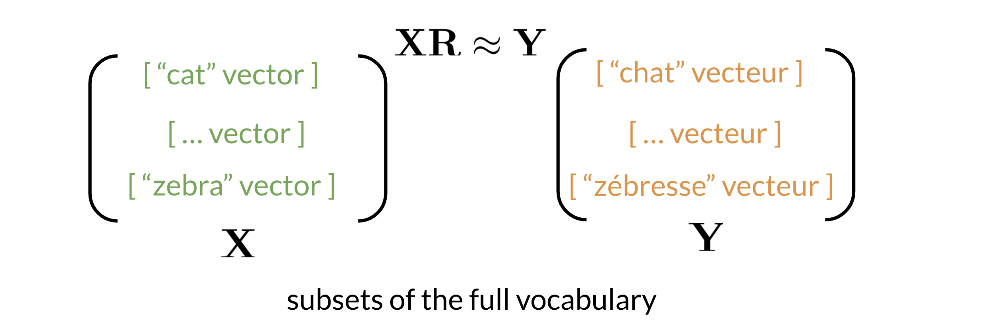

### The Core Equation

We want to find matrix $R$ such that:

$$XR \approx Y$$

**Translation**: "English vectors × Transformation matrix ≈ French vectors"

### But Wait - Why Not Just Use a Dictionary?

**Great question!** Here's the magic:

1. **Training**: Use only a **subset** of word pairs to learn $R$
2. **Translation**: Apply $R$ to translate **any** English word, even ones not in your training set!

**Example**: Train on 1,000 word pairs, then translate 50,000+ words!

---

## The Learning Process: Optimization

### The Loss Function

We need to measure how good our transformation is. Enter the **Frobenius Norm**!

$$\text{Loss} = ||XR - Y||_F^2$$

**In plain English**: "How far apart are our predicted French vectors from the actual French vectors?"

---

## Deep Dive: Understanding the Frobenius Norm

### What is the Frobenius Norm?

The Frobenius norm is like measuring the "total distance" between two matrices. Think of it as the matrix version of the distance formula you learned in geometry.

**For a vector**: Distance = $\sqrt{(x_1-y_1)^2 + (x_2-y_2)^2}$

**For a matrix**: Frobenius norm = $\sqrt{\text{sum of all squared differences}}$

### Step-by-Step Example

Let's say our transformation gives us this difference matrix:

$$
A = XR - Y = \begin{bmatrix}
2 & 2 \\
2 & 2
\end{bmatrix}
$$

**Step 1**: Square each element

$$
A^2 = \begin{bmatrix}
2^2 & 2^2 \\
2^2 & 2^2
\end{bmatrix} = \begin{bmatrix}
4 & 4 \\
4 & 4
\end{bmatrix}
$$

**Step 2**: Sum all elements
$$\text{Sum} = 4 + 4 + 4 + 4 = 16$$

**Step 3**: Take the square root
$$||A||_F = \sqrt{16} = 4$$

### General Formula

$$||A||_F = \sqrt{\sum_{i=1}^{m} \sum_{j=1}^{n} |a_{ij}|^2}$$

### Python Implementation

```python
import numpy as np

# Example matrix A
A = np.array([[2, 2],
              [2, 2]])

# Method 1: Manual calculation
frobenius_norm = np.sqrt(np.sum(A**2))
print(f"Frobenius norm: {frobenius_norm}")  # Output: 4.0

# Method 2: Using NumPy
frobenius_norm_np = np.linalg.norm(A, 'fro')
print(f"Frobenius norm (NumPy): {frobenius_norm_np}")  # Output: 4.0
```

---

## The Optimization Algorithm

### The Learning Loop

```python
def learn_transformation_matrix(X, Y, learning_rate=0.01, num_iterations=1000):
    """
    Learn transformation matrix R to map X to Y
    """
    # Step 1: Initialize R randomly
    d = X.shape[1]  # dimension of vectors
    R = np.random.normal(size=(d, d))

    for i in range(num_iterations):
        # Step 2: Calculate loss
        loss = np.linalg.norm(X @ R - Y, 'fro')**2

        # Step 3: Calculate gradient
        gradient = calculate_gradient(X, Y, R)

        # Step 4: Update R
        R = R - learning_rate * gradient

        if i % 100 == 0:
            print(f"Iteration {i}, Loss: {loss}")

    return R
```

### Why Use Squared Frobenius Norm?

Instead of minimizing $||XR - Y||_F$, we minimize $||XR - Y||_F^2$

**Reasons**:

1. **Easier derivatives**: No square root to deal with

2. **Same optimal solution**: Minimizing $f(x)$ is same as minimizing $f(x)^2$ when $f(x) \geq 0$

   **Example to understand this**:

   Let's say we want to minimize $f(x) = (x - 3)^2$ vs $g(x) = ((x - 3)^2)^2 = (x - 3)^4$

   - $f(x) = (x - 3)^2$ reaches minimum when $x = 3$ (minimum value = 0)
   - $g(x) = (x - 3)^4$ also reaches minimum when $x = 3$ (minimum value = 0)

   **Why this works**: When $f(x) \geq 0$ (which is true for norms), the function $f(x)^2$ has the same minimum point as $f(x)$ because:

   - If $f(a) < f(b)$, then $f(a)^2 < f(b)^2$ (since both are positive)
   - The ordering of function values is preserved when squaring positive numbers

   **Visual intuition**:

   ```
   f(x) = |x|:     \  /     minimum at x = 0
   f(x)² = x²:     \  /     minimum at x = 0 (same location!)
   ```

3. **Computational efficiency**: Avoid expensive square root operations

---

## Gradient Derivation: The Mathematical Heart

> **Note:** It's better to do this math derivation and the example in a notebook for better clarity and understanding.

### The Loss Function (Squared Frobenius Norm)

$$\mathcal{L}(R) = ||XR - Y||_F^2$$

### Expanding the Norm

To understand how we get from the Frobenius norm to the trace formula, let's break this down step by step.

**First, what is the trace?**

The **trace** of a matrix is simply the sum of its diagonal elements:

$\text{tr}(A) = \sum_{i=1}^{n} a_{ii} = a_{11} + a_{22} + \cdots + a_{nn}$

**Example**:
$A = \begin{bmatrix} 3 & 7 & 2 \\ 1 & 4 & 9 \\ 5 & 6 & 8 \end{bmatrix} \Rightarrow \text{tr}(A) = 3 + 4 + 8 = 15$

**Now, how do we get from Frobenius norm to trace?**

The key insight is this fundamental relationship:
$||A||_F^2 = \text{tr}(A^T A)$

**Step-by-step derivation**:

**Step 1**: Start with the definition of Frobenius norm
$||A||_F^2 = \sum_{i=1}^{m} \sum_{j=1}^{n} |a_{ij}|^2$

**Step 2**: Understand what $A^T A$ looks like
If $A$ is $m \times n$, then $A^T A$ is $n \times n$, and its diagonal elements are:
$(A^T A)_{jj} = \sum_{i=1}^{m} a_{ij}^2$

**Step 3**: Connect the dots
$\text{tr}(A^T A) = \sum_{j=1}^{n} (A^T A)_{jj} = \sum_{j=1}^{n} \sum_{i=1}^{m} a_{ij}^2 = \sum_{i=1}^{m} \sum_{j=1}^{n} a_{ij}^2 = ||A||_F^2$

**Concrete example**:
$A = \begin{bmatrix} 1 & 2 \\ 3 & 4 \end{bmatrix}$

**Method 1 (Direct Frobenius)**:
$||A||_F^2 = 1^2 + 2^2 + 3^2 + 4^2 = 1 + 4 + 9 + 16 = 30$

**Method 2 (Using trace)**:
$A^T A = \begin{bmatrix} 1 & 3 \\ 2 & 4 \end{bmatrix} \begin{bmatrix} 1 & 2 \\ 3 & 4 \end{bmatrix} = \begin{bmatrix} 10 & 14 \\ 14 & 20 \end{bmatrix}$

$\text{tr}(A^T A) = 10 + 20 = 30$ ✓

**Therefore**: $||XR - Y||_F^2 = \text{tr}((XR - Y)^T(XR - Y))$

### Step-by-Step Derivation

**Step 1**: Expand the expression
$$\mathcal{L}(R) = \text{tr}((XR)^T(XR) - (XR)^T Y - Y^T(XR) + Y^T Y)$$

**Step 2**: Use trace properties

**Key trace properties we need**:

1. **Linearity**: $\text{tr}(A + B) = \text{tr}(A) + \text{tr}(B)$
2. **Scalar multiplication**: $\text{tr}(cA) = c \cdot \text{tr}(A)$
3. **Cyclic property**: $\text{tr}(ABC) = \text{tr}(CAB) = \text{tr}(BCA)$

**Step-by-step expansion**:

Starting from: $\text{tr}((XR - Y)^T(XR - Y))$

**Expand the product**:
$(XR - Y)^T(XR - Y) = (XR)^T(XR) - (XR)^T Y - Y^T(XR) + Y^T Y$

**Apply linearity of trace**:
$\mathcal{L}(R) = \text{tr}((XR)^T(XR)) - \text{tr}((XR)^T Y) - \text{tr}(Y^T(XR)) + \text{tr}(Y^T Y)$

**Use the fact that** $\text{tr}(A^T B) = \text{tr}(B^T A)$ **and** $\text{tr}(A) = \text{tr}(A^T)$:

- $\text{tr}((XR)^T Y) = \text{tr}(Y^T XR)$
- $\text{tr}(Y^T(XR)) = \text{tr}(Y^T XR)$

So: $\text{tr}((XR)^T Y) = \text{tr}(Y^T(XR))$

**Combine like terms**:
$\mathcal{L}(R) = \text{tr}(R^T X^T X R) - 2\text{tr}(Y^T X R) + \text{tr}(Y^T Y)$

**Note**:

- $(XR)^T(XR) = R^T X^T X R$ (using $(AB)^T = B^T A^T$)
- $\text{tr}(Y^T Y)$ is constant (doesn't depend on $R$)

**Step 3**: Take the derivative with respect to $R$

**Matrix calculus rules we need**:

1. **Linear term**: $\frac{\partial}{\partial R} \text{tr}(B^T R) = B$
2. **Quadratic term**: $\frac{\partial}{\partial R} \text{tr}(R^T A R) = 2AR$ (when $A$ is symmetric)

**Detailed derivation of the quadratic term rule**:

For $\frac{\partial}{\partial R} \text{tr}(R^T A R)$ where $A$ is symmetric:

Let $f(R) = \text{tr}(R^T A R)$. Using the definition of matrix derivatives:

$\frac{\partial f}{\partial R_{ij}} = \frac{\partial}{\partial R_{ij}} \sum_{k,l} R_{kl} A_{kl} R_{kl}$

This involves partial derivatives of each element. The full derivation is complex, but the result is:

$\frac{\partial}{\partial R} \text{tr}(R^T A R) = AR + A^T R$

When $A$ is symmetric ($A = A^T$):
$\frac{\partial}{\partial R} \text{tr}(R^T A R) = AR + AR = 2AR$

**Applying the rules to our terms**:

1. $\frac{\partial}{\partial R} \text{tr}(R^T X^T X R) = 2(X^T X)R$

   - Here $A = X^T X$, which is symmetric since $(X^T X)^T = X^T X$

2. $\frac{\partial}{\partial R} \text{tr}(Y^T X R) = X^T Y$

   - Here $B^T = Y^T X$, so $B = X^T Y$

3. $\frac{\partial}{\partial R} \text{tr}(Y^T Y) = 0$ (constant term)

**Combining everything**:
$\frac{\partial \mathcal{L}}{\partial R} = 2(X^T X)R - 2(X^T Y) = 2X^T(XR - Y)$

**Step 4**: Factor out the 2
$$\nabla_R \mathcal{L} = 2X^T(XR - Y)$$

### Scaling by Training Size

For numerical stability, we divide by the number of training examples $m$:

$$\nabla_R \mathcal{L} = \frac{2}{m} X^T(XR - Y)$$

---

## Numerical Example: Complete Walkthrough

### Setup

Let's work with a simple 2×2 example:

$$X = \begin{bmatrix} 1 & 0 \\ 0 & 1 \end{bmatrix}, \quad Y = \begin{bmatrix} 2 & 1 \\ 1 & 2 \end{bmatrix}, \quad R = \begin{bmatrix} 1.5 & 0.5 \\ 0.5 & 1.5 \end{bmatrix}$$

### Step 1: Calculate $XR$

$$XR = \begin{bmatrix} 1 & 0 \\ 0 & 1 \end{bmatrix} \begin{bmatrix} 1.5 & 0.5 \\ 0.5 & 1.5 \end{bmatrix} = \begin{bmatrix} 1.5 & 0.5 \\ 0.5 & 1.5 \end{bmatrix}$$

### Step 2: Calculate $XR - Y$

$$XR - Y = \begin{bmatrix} 1.5 & 0.5 \\ 0.5 & 1.5 \end{bmatrix} - \begin{bmatrix} 2 & 1 \\ 1 & 2 \end{bmatrix} = \begin{bmatrix} -0.5 & -0.5 \\ -0.5 & -0.5 \end{bmatrix}$$

### Step 3: Calculate Loss (Squared Frobenius Norm)

$$\text{Loss} = ||XR - Y||_F^2 = (-0.5)^2 + (-0.5)^2 + (-0.5)^2 + (-0.5)^2 = 1.0$$

### Step 4: Calculate Gradient

$$\nabla_R \mathcal{L} = \frac{2}{m} X^T(XR - Y)$$

With $m = 2$ (two training examples):

$$X^T = \begin{bmatrix} 1 & 0 \\ 0 & 1 \end{bmatrix}$$

$$\nabla_R \mathcal{L} = \frac{2}{2} \begin{bmatrix} 1 & 0 \\ 0 & 1 \end{bmatrix} \begin{bmatrix} -0.5 & -0.5 \\ -0.5 & -0.5 \end{bmatrix} = \begin{bmatrix} -0.5 & -0.5 \\ -0.5 & -0.5 \end{bmatrix}$$

### Step 5: Update $R$

With learning rate $\alpha = 0.1$:

$$R_{new} = R_{old} - \alpha \cdot \nabla_R \mathcal{L}$$

$$R_{new} = \begin{bmatrix} 1.5 & 0.5 \\ 0.5 & 1.5 \end{bmatrix} - 0.1 \begin{bmatrix} -0.5 & -0.5 \\ -0.5 & -0.5 \end{bmatrix}$$

$$R_{new} = \begin{bmatrix} 1.55 & 0.55 \\ 0.55 & 1.55 \end{bmatrix}$$

---

## The Complete Implementation

```python
import numpy as np

def transform_word_vectors(X, Y, learning_rate=0.01, num_iterations=1000):
    """
    Complete implementation of word vector transformation learning

    Args:
        X: English word vectors (m x d)
        Y: French word vectors (m x d)
        learning_rate: Step size for gradient descent
        num_iterations: Number of training iterations

    Returns:
        R: Learned transformation matrix (d x d)
        losses: List of loss values during training
    """
    m, d = X.shape

    # Initialize transformation matrix randomly
    R = np.random.normal(0, 0.1, size=(d, d))
    losses = []

    for i in range(num_iterations):
        # Forward pass: calculate predicted Y
        Y_pred = X @ R

        # Calculate loss (squared Frobenius norm)
        diff = Y_pred - Y
        loss = np.sum(diff**2) / m  # Mean squared error version
        losses.append(loss)

        # Calculate gradient
        gradient = (2/m) * X.T @ diff

        # Update R
        R = R - learning_rate * gradient

        # Print progress
        if i % 100 == 0:
            print(f"Iteration {i:4d}, Loss: {loss:.6f}")

    return R, losses

# Example usage
def test_transformation():
    # Create sample data
    np.random.seed(42)
    m, d = 100, 50  # 100 word pairs, 50-dimensional vectors

    # Generate synthetic English vectors
    X = np.random.normal(0, 1, size=(m, d))

    # Create a true transformation matrix
    true_R = np.random.normal(0, 0.1, size=(d, d))

    # Generate corresponding French vectors
    Y = X @ true_R + np.random.normal(0, 0.01, size=(m, d))  # Add small noise

    # Learn the transformation
    learned_R, losses = transform_word_vectors(X, Y, learning_rate=0.01, num_iterations=1000)

    # Test the learned transformation
    Y_predicted = X @ learned_R
    final_error = np.linalg.norm(Y_predicted - Y, 'fro') / np.linalg.norm(Y, 'fro')

    print(f"\nFinal relative error: {final_error:.6f}")
    print(f"Final loss: {losses[-1]:.6f}")

    return learned_R, losses

# Run the test
# R, losses = test_transformation()
```

---

## Why This Approach is Brilliant

### 1. **Efficiency**: Train on Few, Translate Many

- **Training set**: 1,000 word pairs
- **Translation capability**: 100,000+ words
- **Requirement**: Only need the transformation matrix $R$

### 2. **Generalization**: Unseen Words

The learned transformation can translate words that weren't in the training set because it learns the **geometric relationship** between language spaces, not just memorized mappings.

### 3. **Mathematical Elegance**

The entire translation system reduces to:

1. **One matrix multiplication**: $\text{french\_vector} = \text{english\_vector} \times R$
2. **One similarity search**: Find the closest French vector

---

## Real-World Extensions

### Multiple Languages

Once you have transformation matrices:

- $R_{en \rightarrow fr}$: English to French
- $R_{en \rightarrow es}$: English to Spanish
- $R_{fr \rightarrow de}$: French to German

You can create multi-hop translations: English → French → German

### Quality Improvements

1. **Better vector alignments**: Use more sophisticated alignment techniques
2. **Regularization**: Add constraints to prevent overfitting
3. **Orthogonal constraints**: Force $R$ to be orthogonal ($R^T R = I$)
4. **Bilingual embeddings**: Train vectors jointly across languages

---

## Key Takeaways

✅ **Vector transformation** enables translation between languages

✅ **Frobenius norm** measures the quality of our transformation

✅ **Gradient descent** optimizes the transformation matrix

✅ **Small training sets** can enable large-scale translation

✅ **Mathematical elegance** makes the approach both beautiful and practical

**Coming up next**: We'll learn how to efficiently find the closest French word to our transformed English vector using K-nearest neighbors and hashing techniques! 🔍

# 3. K-Nearest Neighbors

## The Missing Piece in Translation

You've learned how to transform an English word vector into the French vector space using matrix $R$. But here's the catch: **the transformed vector won't exactly match any existing French word vector!**

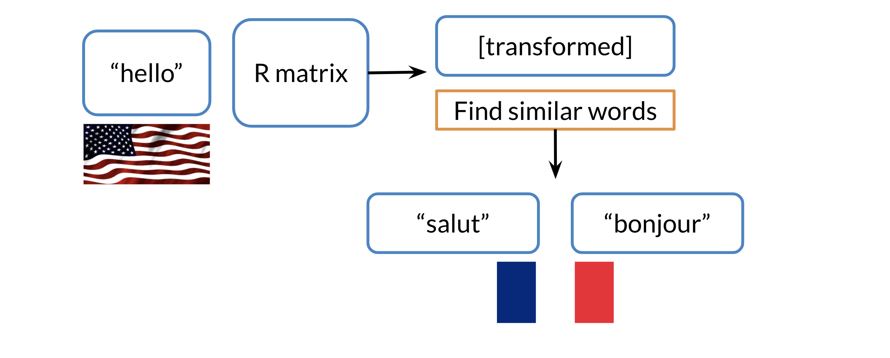

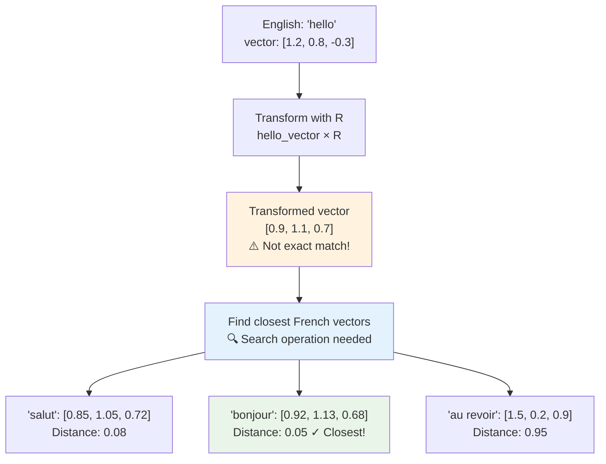
```mermaid
graph TD
    A["English: 'hello'<br/>vector: [1.2, 0.8, -0.3]"] --> B["Transform with R<br/>hello_vector × R"]
    B --> C["Transformed vector<br/>[0.9, 1.1, 0.7]<br/>⚠️ Not exact match!"]

    C --> D["Find closest French vectors<br/>🔍 Search operation needed"]

    D --> E["'salut': [0.85, 1.05, 0.72]<br/>Distance: 0.08"]
    D --> F["'bonjour': [0.92, 1.13, 0.68]<br/>Distance: 0.05 ✓ Closest!"]
    D --> G["'au revoir': [1.5, 0.2, 0.9]<br/>Distance: 0.95"]

    style C fill:#fff3e0
    style F fill:#e8f5e8
    style D fill:#e3f2fd
```

**The Problem**: We need to find the **most similar** French word vectors to our transformed result.

**The Solution**: K-Nearest Neighbors (K-NN) algorithm!

---

## Understanding K-Nearest Neighbors: The Friend Analogy

### The San Francisco Story

Imagine you're visiting your friend Andrew in San Francisco and want to meet other friends over the weekend. You want to visit friends who live **nearby** to minimize travel time.

**Your Address Book**:

- **Friend 1**: Shanghai, China 🇨🇳 (7,000 miles away)
- **Friend 2**: Bangalore, India 🇮🇳 (8,500 miles away)
- **Friend 3**: Los Angeles, USA 🇺🇸 (400 miles away)
- **Friend 4**: Seattle, USA 🇺🇸 (800 miles away)
- **Friend 5**: New York, USA 🇺🇸 (2,900 miles away)

### The Naive Approach: Check Everyone

```python
def find_closest_friends_naive(your_location, all_friends):
    distances = []

    # Calculate distance to EVERY friend
    for friend in all_friends:
        distance = calculate_distance(your_location, friend.location)
        distances.append((friend.name, distance))

    # Sort by distance
    distances.sort(key=lambda x: x[1])

    # Return top K closest
    return distances[:k]

# This works but is VERY slow for large friend lists!
```

**Result**: Los Angeles (400 mi) → Seattle (800 mi) → New York (2,900 mi) → Shanghai (7,000 mi) → Bangalore (8,500 mi)

### The Problem with Naive Approach

If you have **10,000 friends** worldwide:

- Calculate 10,000 distances
- Sort 10,000 results
- This becomes **computationally expensive**!

**Real-world parallel**: If you have 100,000 French word vectors, you'd need to calculate 100,000 similarity scores for each translation!

---

## The Smart Approach: Geographic Regions

### Insight: Use Geographic Intelligence

Instead of checking friends in every continent, **filter by region first**:

1. **Pre-filter**: Only consider friends in North America
2. **Search**: Within this smaller subset
3. **Result**: Much faster search!

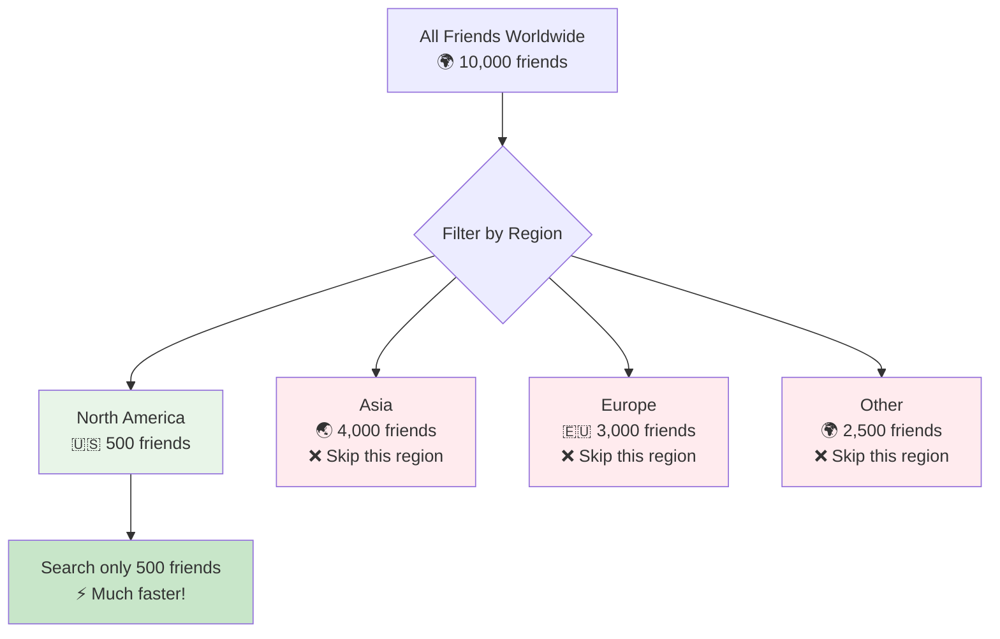
```mermaid
graph TD
    A["All Friends Worldwide<br/>🌍 10,000 friends"] --> B{"Filter by Region"}

    B --> C["North America<br/>🇺🇸 500 friends"]
    B --> D["Asia<br/>🌏 4,000 friends<br/>❌ Skip this region"]
    B --> E["Europe<br/>🇪🇺 3,000 friends<br/>❌ Skip this region"]
    B --> F["Other<br/>🌍 2,500 friends<br/>❌ Skip this region"]

    C --> G["Search only 500 friends<br/>⚡ Much faster!"]

    style C fill:#e8f5e8
    style G fill:#c8e6c9
    style D fill:#ffebee
    style E fill:#ffebee
    style F fill:#ffebee
```

---

## K-NN Algorithm: The Formal Definition

### What is K-Nearest Neighbors?

**Definition**: Given a query point, find the **K closest points** in your dataset based on some distance metric.

### The Algorithm Steps

```python
def k_nearest_neighbors(query_vector, dataset, k=5):
    """
    Find K nearest neighbors to query_vector in dataset

    Args:
        query_vector: The point we want to find neighbors for
        dataset: Collection of all possible neighbors
        k: Number of neighbors to return

    Returns:
        List of k closest neighbors with their distances
    """
    distances = []

    # Step 1: Calculate distance to every point in dataset
    for i, data_point in enumerate(dataset):
        distance = calculate_distance(query_vector, data_point)
        distances.append((i, data_point, distance))

    # Step 2: Sort by distance (ascending)
    distances.sort(key=lambda x: x[2])

    # Step 3: Return top K closest
    return distances[:k]
```

### Distance Metrics

**Common distance measures**:

1. **Euclidean Distance**: $d = \sqrt{\sum_{i=1}^{n} (x_i - y_i)^2}$
2. **Cosine Similarity**: $\text{sim} = \frac{\mathbf{a} \cdot \mathbf{b}}{||\mathbf{a}|| \cdot ||\mathbf{b}||}$
3. **Manhattan Distance**: $d = \sum_{i=1}^{n} |x_i - y_i|$

**For word vectors**: Cosine similarity is typically preferred because it measures **semantic similarity** rather than magnitude.

---

## Practical Example: Word Translation

### Setup

Let's say we have these French word vectors:

```python
french_vectors = {
    'bonjour': [0.92, 1.13, 0.68],    # hello/good morning
    'salut':   [0.85, 1.05, 0.72],    # hi/bye (casual)
    'bonsoir': [0.88, 1.08, 0.75],    # good evening
    'au_revoir': [1.5, 0.2, 0.9],     # goodbye
    'merci':   [0.2, 0.8, 1.2],       # thank you
    'chat':    [2.1, 0.1, -0.5],      # cat
}

# Our transformed "hello" vector
transformed_hello = [0.90, 1.10, 0.70]
```

### Step-by-Step K-NN Search

**Step 1: Calculate distances to all French words**

```python
import numpy as np

def cosine_similarity(a, b):
    return np.dot(a, b) / (np.linalg.norm(a) * np.linalg.norm(b))

distances = []
for french_word, vector in french_vectors.items():
    similarity = cosine_similarity(transformed_hello, vector)
    distances.append((french_word, vector, similarity))

print("Similarities to transformed 'hello':")
for word, vec, sim in distances:
    print(f"{word:10s}: {sim:.4f}")
```

**Output**:

```
bonjour   : 0.9985  ← Highest similarity!
salut     : 0.9972
bonsoir   : 0.9978
au_revoir : 0.7234
merci     : 0.8456
chat      : 0.3421
```

**Step 2: Sort by similarity (descending)**

```python
distances.sort(key=lambda x: x[2], reverse=True)
```

**Step 3: Return top K=3 results**

```
1. bonjour   (0.9985)  ✓ Best translation!
2. bonsoir   (0.9978)
3. salut     (0.9972)
```

---

## The Computational Challenge

### Time Complexity Analysis

**Naive K-NN complexity**: $O(n \cdot d + n \log n)$

Where:

- $n$ = number of vectors in dataset
- $d$ = dimensionality of vectors
- $n \cdot d$ = distance calculations
- $n \log n$ = sorting step

### Real-World Scale

**French vocabulary**: ~100,000 words
**Vector dimensions**: 300 (typical Word2Vec)
**Operations per translation**: 100,000 × 300 = 30 million operations!

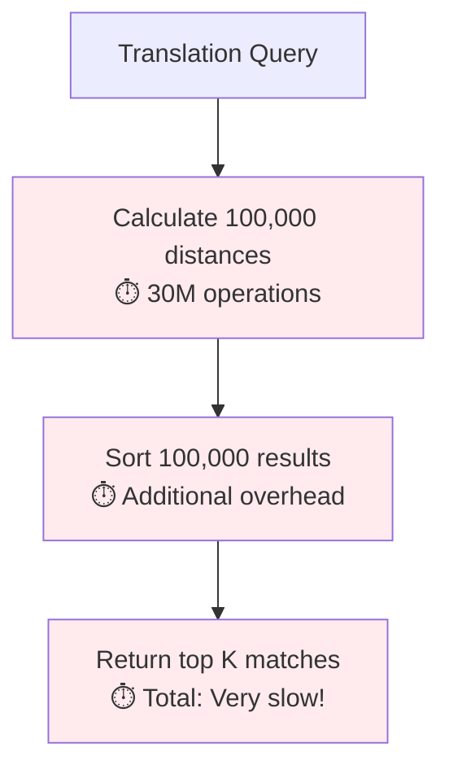
```mermaid
graph TD
    A["Translation Query"] --> B["Calculate 100,000 distances<br/>⏱️ 30M operations"]
    B --> C["Sort 100,000 results<br/>⏱️ Additional overhead"]
    C --> D["Return top K matches<br/>⏱️ Total: Very slow!"]

    style B fill:#ffebee
    style C fill:#ffebee
    style D fill:#ffebee
```

### The Performance Problem

For real-time applications (like Google Translate):

- **Users expect**: < 100ms response time
- **Naive K-NN gives**: Several seconds per translation
- **Conclusion**: We need something faster! 🚀

---

## The Solution Preview: Efficient Search

### The Hash Table Inspiration

Remember our friend analogy? Instead of checking every friend globally, we:

1. **Divided the world into regions** (North America, Asia, Europe)
2. **Placed friends into regional "buckets"**
3. **Searched only the relevant bucket**

**The same principle applies to word vectors!**

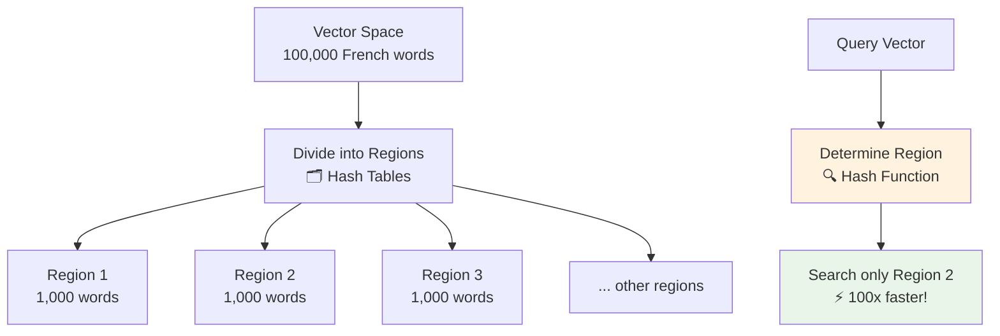
```mermaid
graph TD
    A["Vector Space<br/>100,000 French words"] --> B["Divide into Regions<br/>🗂️ Hash Tables"]

    B --> C["Region 1<br/>1,000 words"]
    B --> D["Region 2<br/>1,000 words"]
    B --> E["Region 3<br/>1,000 words"]
    B --> F["... other regions"]

    G["Query Vector"] --> H["Determine Region<br/>🔍 Hash Function"]
    H --> I["Search only Region 2<br/>⚡ 100x faster!"]

    style I fill:#e8f5e8
    style H fill:#fff3e0
```

---

## Types of Neighbor Search

### 1. Exact K-NN

- **Guarantees**: Find the true K nearest neighbors
- **Cost**: High computational expense
- **Use case**: When accuracy is critical

### 2. Approximate K-NN

- **Guarantees**: Find neighbors that are "close enough"
- **Cost**: Much faster computation
- **Use case**: Real-time applications where speed matters

### Trade-off Visualization

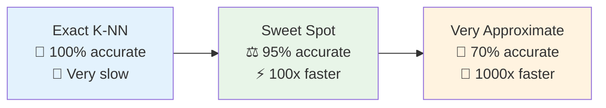
```mermaid
graph LR
    A["Exact K-NN<br/>🎯 100% accurate<br/>🐌 Very slow"] --> B["Sweet Spot<br/>⚖️ 95% accurate<br/>⚡ 100x faster"]
    B --> C["Very Approximate<br/>🎲 70% accurate<br/>🚀 1000x faster"]

    style B fill:#e8f5e8
    style A fill:#e3f2fd
    style C fill:#fff3e0
```

---

## Real-World Applications of K-NN

### 1. Machine Translation

- **Query**: Transformed word vector
- **Dataset**: Target language vocabulary
- **Goal**: Find semantically similar words

### 2. Recommendation Systems

- **Query**: User's preference vector
- **Dataset**: All users or items
- **Goal**: Find similar users/items

### 3. Image Recognition

- **Query**: New image features
- **Dataset**: Labeled training images
- **Goal**: Find visually similar images

### 4. Document Search

- **Query**: Search query vector
- **Dataset**: Document collection
- **Goal**: Find relevant documents

---

## Implementation Considerations

### Choosing K

**Too small (K=1)**:

- Very sensitive to noise
- Might pick outliers

**Too large (K=100)**:

- Includes many irrelevant neighbors
- Loses precision

**Good rule of thumb**: K = 3 to 10 for most applications

### Distance Metric Selection

**For word vectors**:

- ✅ **Cosine similarity**: Measures semantic similarity
- ❌ **Euclidean distance**: Sensitive to vector magnitude

**Cosine similarity example**:

```python
def cosine_similarity(a, b):
    """Calculate cosine similarity between vectors a and b"""
    dot_product = np.dot(a, b)
    magnitude_a = np.linalg.norm(a)
    magnitude_b = np.linalg.norm(b)

    if magnitude_a == 0 or magnitude_b == 0:
        return 0

    return dot_product / (magnitude_a * magnitude_b)

# Example usage
vec_hello = [0.90, 1.10, 0.70]
vec_bonjour = [0.92, 1.13, 0.68]

similarity = cosine_similarity(vec_hello, vec_bonjour)
print(f"Similarity: {similarity:.4f}")  # Output: 0.9985
```

---

## The Big Picture: Why K-NN Matters

### From Theory to Practice

K-NN bridges the gap between:

- **Mathematical transformations** (matrix multiplication)
- **Practical applications** (finding actual word translations)

### The Foundation for Advanced Techniques

K-NN is the building block for:

- **Locality-Sensitive Hashing** (next topic!)
- **Approximate nearest neighbor search**
- **Efficient similarity search at scale**

---

## Key Takeaways

✅ **K-NN finds similar items** in high-dimensional spaces

✅ **Naive K-NN is accurate** but computationally expensive

✅ **Real-world applications** require faster approximate methods

✅ **Hash tables provide** the key to efficient search

✅ **Trade-offs exist** between accuracy and speed

**Coming up next**: We'll learn about hash tables - the data structure that makes fast similarity search possible! 🔍➡️⚡

# 4. Hash Tables and Hash Functions

## The Cupboard Analogy: Organizing Your Life

Imagine you have a cupboard with several drawers in your home. To stay organized, you naturally group similar items together:

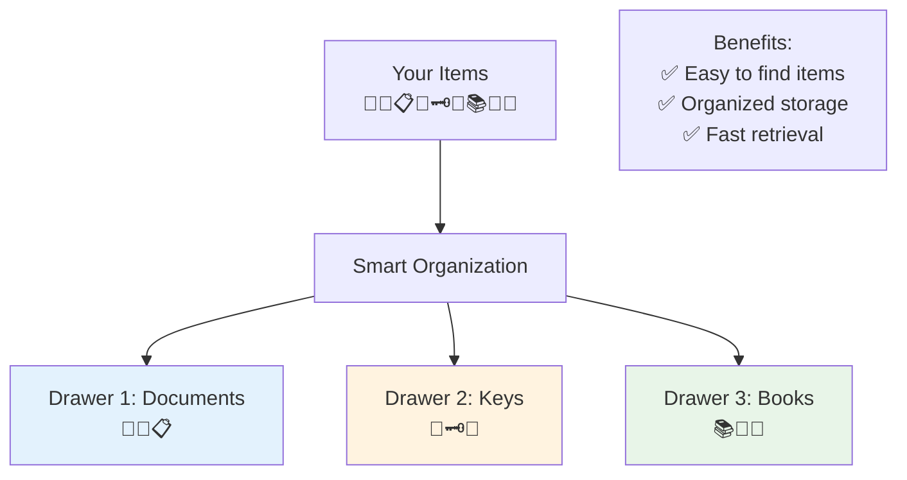
```mermaid
graph TD
    A["Your Items<br/>📄📝📋🔑🗝️🔐📚📖📕"] --> B["Smart Organization"]

    B --> C["Drawer 1: Documents<br/>📄📝📋"]
    B --> D["Drawer 2: Keys<br/>🔑🗝️🔐"]
    B --> E["Drawer 3: Books<br/>📚📖📕"]

    F["Benefits:<br/>✅ Easy to find items<br/>✅ Organized storage<br/>✅ Fast retrieval"]

    style C fill:#e3f2fd
    style D fill:#fff3e0
    style E fill:#e8f5e8
```

**This is exactly what hash tables do for data!** They organize similar items into "buckets" (like drawers) for efficient storage and retrieval.

---

## Understanding Hash Tables: Core Concepts

### What is a Hash Table?

A **hash table** is a data structure that organizes data into "buckets" using a special function called a hash function.

**Key Components**:

1. **Hash Function**: The "organizer" that decides which bucket an item goes into
2. **Buckets**: Storage containers (like drawers) that hold similar items
3. **Hash Values**: The "address" that tells us which bucket to use

### Visual Example: Grouping Shapes

Let's say we want to organize these shapes:

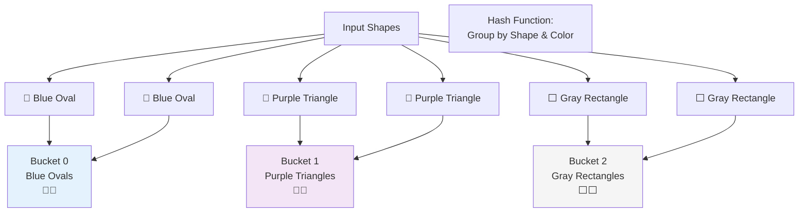
```mermaid
graph TD
    A["Input Shapes"] --> B["🔵 Blue Oval"]
    A --> C["🔺 Purple Triangle"]
    A --> D["🔵 Blue Oval"]
    A --> E["⬜ Gray Rectangle"]
    A --> F["🔺 Purple Triangle"]
    A --> G["⬜ Gray Rectangle"]

    H["Hash Function:<br/>Group by Shape & Color"]

    B --> I["Bucket 0<br/>Blue Ovals<br/>🔵🔵"]
    C --> J["Bucket 1<br/>Purple Triangles<br/>🔺🔺"]
    E --> K["Bucket 2<br/>Gray Rectangles<br/>⬜⬜"]
    D --> I
    F --> J
    G --> K

    style I fill:#e3f2fd
    style J fill:#f3e5f5
    style K fill:#f5f5f5
```

**Rule**: Items with the same shape and color go into the same bucket!

---

## Hash Functions: The Magic Organizer

### What is a Hash Function?

A **hash function** is like a smart filing clerk who takes any piece of data and assigns it a specific storage location.

**Mathematical Definition**:
$$h: \text{Data} \rightarrow \text{Bucket Number}$$

**In plain English**: "Give me any data, and I'll tell you exactly which bucket it belongs in!"

### Key Properties of Good Hash Functions

1. **Deterministic**: Same input always gives same output
2. **Uniform Distribution**: Spreads data evenly across buckets
3. **Fast Computation**: Quick to calculate
4. **Fixed Output Range**: Always returns value between 0 and (number of buckets - 1)

---

## Simple Hash Function Example: The Modulo Method

### The Setup

Let's organize 1-dimensional word vectors (simplified from 300D to 1D for clarity):

**Word Vectors**: [100, 14, 17, 10, 97]

**Number of Buckets**: 10

### The Hash Function

$$\text{hash\_value} = \text{vector} \bmod \text{number\_of\_buckets}$$

**In our case**: $\text{hash\_value} = \text{vector} \bmod 10$

### Step-by-Step Calculation

```python
# Our word vectors (1D for simplicity)
vectors = [100, 14, 17, 10, 97]
num_buckets = 10

def simple_hash_function(vector, num_buckets):
    """Simple hash function using modulo operation"""
    return vector % num_buckets

# Calculate hash values
for vector in vectors:
    hash_value = simple_hash_function(vector, num_buckets)
    print(f"Vector {vector:3d} → Bucket {hash_value}")
```

**Output**:

```
Vector 100 → Bucket 0  (100 ÷ 10 = 10 remainder 0)
Vector  14 → Bucket 4  ( 14 ÷ 10 =  1 remainder 4)
Vector  17 → Bucket 7  ( 17 ÷ 10 =  1 remainder 7)
Vector  10 → Bucket 0  ( 10 ÷ 10 =  1 remainder 0)
Vector  97 → Bucket 7  ( 97 ÷ 10 =  9 remainder 7)
```

### Visual Representation

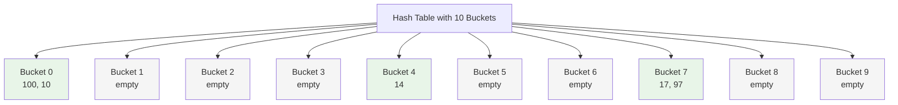
```mermaid
graph TD
    A["Hash Table with 10 Buckets"]

    B["Bucket 0<br/>100, 10"]
    C["Bucket 1<br/>empty"]
    D["Bucket 2<br/>empty"]
    E["Bucket 3<br/>empty"]
    F["Bucket 4<br/>14"]
    G["Bucket 5<br/>empty"]
    H["Bucket 6<br/>empty"]
    I["Bucket 7<br/>17, 97"]
    J["Bucket 8<br/>empty"]
    K["Bucket 9<br/>empty"]

    A --> B
    A --> C
    A --> D
    A --> E
    A --> F
    A --> G
    A --> H
    A --> I
    A --> J
    A --> K

    style B fill:#e8f5e8
    style F fill:#e8f5e8
    style I fill:#e8f5e8
    style C fill:#f5f5f5
    style D fill:#f5f5f5
    style E fill:#f5f5f5
    style G fill:#f5f5f5
    style H fill:#f5f5f5
    style J fill:#f5f5f5
    style K fill:#f5f5f5
```

---

## Building a Hash Table: Complete Implementation

### Python Implementation

```python
def create_basic_hash_table(value_list, n_buckets):
    """
    Create a hash table using modulo hash function

    Args:
        value_list: List of values to hash
        n_buckets: Number of buckets in hash table

    Returns:
        hash_table: Dictionary with bucket_id as key, list of values as value
    """

    # Step 1: Define the hash function
    def hash_function(value):
        return value % n_buckets

    # Step 2: Initialize hash table with empty buckets
    # Dictionary comprehension: {0: [], 1: [], 2: [], ...}
    hash_table = {i: [] for i in range(n_buckets)}

    # Step 3: Hash each value and add to appropriate bucket
    for value in value_list:
        # Calculate which bucket this value belongs to
        hash_value = hash_function(value)

        # Add the value to that bucket
        hash_table[hash_value].append(value)

    return hash_table

# Example usage
vectors = [100, 14, 17, 10, 97]
hash_table = create_basic_hash_table(vectors, 10)

print("Hash Table:")
for bucket_id, values in hash_table.items():
    if values:  # Only print non-empty buckets
        print(f"Bucket {bucket_id}: {values}")
```

**Output**:

```
Hash Table:
Bucket 0: [100, 10]
Bucket 4: [14]
Bucket 7: [17, 97]
```

### How Hash Table Lookup Works

```python
def hash_table_lookup(hash_table, query_vector, n_buckets):
    """
    Find all vectors in the same bucket as query_vector
    """
    # Step 1: Calculate which bucket the query belongs to
    query_hash = query_vector % n_buckets

    # Step 2: Return all vectors in that bucket
    return hash_table[query_hash]

# Example: Find vectors similar to 20
query = 20
similar_vectors = hash_table_lookup(hash_table, query, 10)
print(f"Query vector {query} hashes to bucket {query % 10}")
print(f"Vectors in same bucket: {similar_vectors}")
```

**Output**:

```
Query vector 20 hashes to bucket 0
Vectors in same bucket: [100, 10]
```

---

## The Problem with Basic Hash Tables

### Issue: Poor Similarity Grouping

Look at our results again:

- **Bucket 0**: [100, 10] - These numbers are very different! (90 units apart)
- **Bucket 4**: [14] - Alone, but close to 17 which is in bucket 7
- **Bucket 7**: [17, 97] - 17 and 97 are 80 units apart!

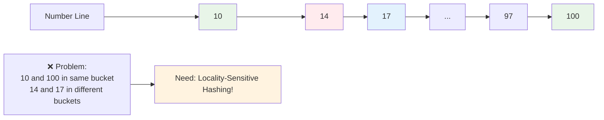
```mermaid
graph LR
    A["Number Line"] --> B["10"]
    B --> C["14"]
    C --> D["17"]
    D --> E["..."]
    E --> F["97"]
    F --> G["100"]

    H["❌ Problem:<br/>10 and 100 in same bucket<br/>14 and 17 in different buckets"]

    style B fill:#e8f5e8
    style G fill:#e8f5e8
    style C fill:#ffebee
    style D fill:#e3f2fd

    H --> I["Need: Locality-Sensitive Hashing!"]
    style I fill:#fff3e0
```

### What We Actually Want

**Ideal grouping for similarity**:

```
Bucket A: [10, 14, 17]  ← Similar numbers together
Bucket B: [97, 100]     ← Similar numbers together
```

**Current grouping (modulo hash)**:

```
Bucket 0: [10, 100]     ← Very different numbers!
Bucket 4: [14]          ← Isolated from similar numbers
Bucket 7: [17, 97]      ← Somewhat different numbers
```

---

## Hash Tables vs. Linear Search: Performance Comparison

### The Speed Advantage

**Without Hash Table (Linear Search)**:

```python
def linear_search(query, all_vectors):
    """Find similar vectors by checking every single one"""
    similar_vectors = []
    for vector in all_vectors:  # Check ALL vectors
        if is_similar(query, vector):
            similar_vectors.append(vector)
    return similar_vectors

# Time Complexity: O(n) where n = total number of vectors
```

**With Hash Table**:

```python
def hash_table_search(query, hash_table, n_buckets):
    """Find similar vectors by checking only one bucket"""
    bucket_id = query % n_buckets
    bucket_vectors = hash_table[bucket_id]  # Only vectors in this bucket

    similar_vectors = []
    for vector in bucket_vectors:  # Check only bucket contents
        if is_similar(query, vector):
            similar_vectors.append(vector)
    return similar_vectors

# Time Complexity: O(n/k) where k = number of buckets
```

### Performance Comparison

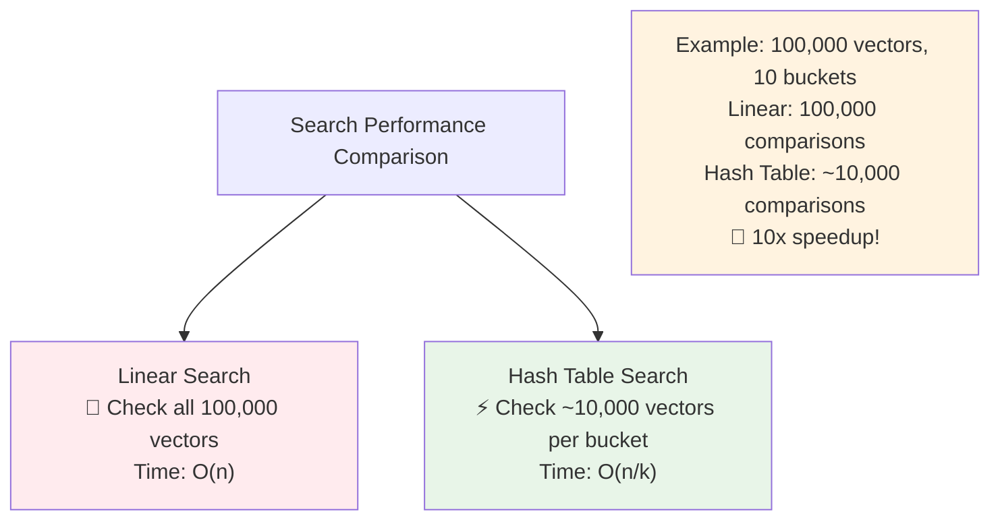
```mermaid
graph TD
    A["Search Performance Comparison"]

    B["Linear Search<br/>🐌 Check all 100,000 vectors<br/>Time: O(n)"]
    C["Hash Table Search<br/>⚡ Check ~10,000 vectors per bucket<br/>Time: O(n/k)"]

    A --> B
    A --> C

    D["Example: 100,000 vectors, 10 buckets<br/>Linear: 100,000 comparisons<br/>Hash Table: ~10,000 comparisons<br/>🚀 10x speedup!"]

    style B fill:#ffebee
    style C fill:#e8f5e8
    style D fill:#fff3e0
```

---

## Real-World Hash Function Examples

### 1. Simple Modulo (What We Used)

```python
def modulo_hash(vector, n_buckets):
    return vector % n_buckets
```

**Pros**: Simple, fast
**Cons**: Poor similarity preservation

### 2. Division Hash

```python
def division_hash(vector, n_buckets):
    return int((vector / max_value) * n_buckets) % n_buckets
```

**Pros**: Better distribution
**Cons**: Still doesn't preserve similarity

### 3. Range-Based Hash (Better for Similarity)

```python
def range_hash(vector, min_val, max_val, n_buckets):
    """Hash based on value ranges"""
    range_size = (max_val - min_val) / n_buckets
    bucket = int((vector - min_val) / range_size)
    return min(bucket, n_buckets - 1)  # Ensure within bounds

# Example: values 0-100, 10 buckets
# Bucket 0: 0-9, Bucket 1: 10-19, etc.
```

**Pros**: Preserves some similarity
**Cons**: Still not ideal for high-dimensional vectors

---

## Hash Collisions: When Items Share Buckets

### What are Hash Collisions?

A **hash collision** occurs when different inputs produce the same hash value (go to the same bucket).

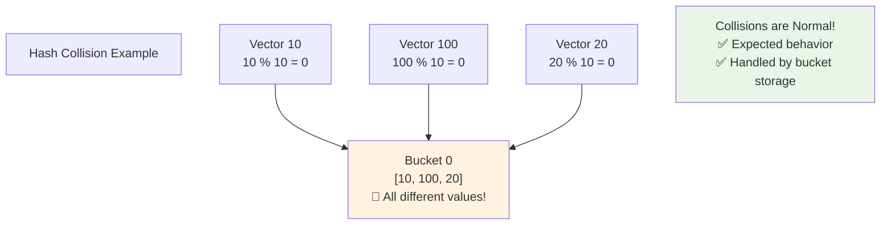
```mermaid
graph TD
    A["Hash Collision Example"]
    B["Vector 10<br/>10 % 10 = 0"]
    C["Vector 100<br/>100 % 10 = 0"]
    D["Vector 20<br/>20 % 10 = 0"]

    B --> E["Bucket 0<br/>[10, 100, 20]<br/>🤔 All different values!"]
    C --> E
    D --> E

    F["Collisions are Normal!<br/>✅ Expected behavior<br/>✅ Handled by bucket storage"]

    style E fill:#fff3e0
    style F fill:#e8f5e8
```

### Good vs. Bad Collisions

**Good Collision (Similar Items)**:

```
Bucket 5: [25, 26, 24, 27]  ← Similar values together ✅
```

**Bad Collision (Different Items)**:

```
Bucket 5: [5, 15, 25, 95]   ← Very different values ❌
```

**Goal**: Design hash functions that create **good collisions**!

---

## The Path to Locality-Sensitive Hashing

### Why Basic Hash Functions Fail for Similarity

**The Problem**: Traditional hash functions are designed to **scatter** data uniformly, not to **group** similar items together.

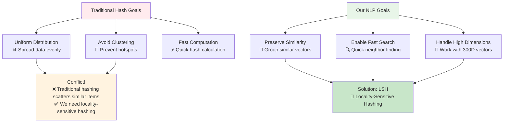
```mermaid
graph TD
    A["Traditional Hash Goals"] --> B["Uniform Distribution<br/>📊 Spread data evenly"]
    A --> C["Avoid Clustering<br/>🎯 Prevent hotspots"]
    A --> D["Fast Computation<br/>⚡ Quick hash calculation"]

    E["Our NLP Goals"] --> F["Preserve Similarity<br/>🤝 Group similar vectors"]
    E --> G["Enable Fast Search<br/>🔍 Quick neighbor finding"]
    E --> H["Handle High Dimensions<br/>📐 Work with 300D vectors"]

    I["Conflict!<br/>❌ Traditional hashing scatters similar items<br/>✅ We need locality-sensitive hashing"]

    style A fill:#ffebee
    style E fill:#e8f5e8
    style I fill:#fff3e0

    B --> I
    C --> I
    F --> J["Solution: LSH<br/>🎯 Locality-Sensitive Hashing"]
    G --> J
    H --> J

    style J fill:#c8e6c9
```

### Introducing Locality-Sensitive Hashing (LSH)

**Locality**: Another word for "location" or "neighborhood"

**Sensitive**: "Cares deeply about" or "responds to"

**Locality-Sensitive Hashing**: A hashing method that **cares deeply** about assigning items based on where they're **located** in vector space.

**Key Principle**:

> Similar vectors should have a **high probability** of being hashed to the **same bucket**.

---

## Key Terminology Summary

### Hash Function 📊

**Definition**: A function that maps data to a fixed-size bucket identifier

**Example**: `hash(vector) = vector % 10`

**Purpose**: Determine which bucket an item belongs to

### Hash Value/Hash 🏷️

**Definition**: The output of a hash function; the bucket identifier

**Example**: For vector 14, hash value = 4

**Purpose**: Acts as the "address" for storage

### Hash Table 🗂️

**Definition**: The entire data structure containing all buckets

**Example**: `{0: [100, 10], 1: [], 2: [], ..., 7: [17, 97]}`

**Purpose**: Organized storage system for efficient retrieval

### Bucket 🪣

**Definition**: Individual storage container within hash table

**Example**: Bucket 0 contains [100, 10]

**Purpose**: Groups items with same hash value

### Hash Collision 💥

**Definition**: When different inputs produce the same hash value

**Example**: Both 10 and 100 hash to bucket 0

**Purpose**: Natural behavior; handled by bucket storage

---

## Looking Ahead: The LSH Promise

### What's Coming Next

In the next section, we'll learn **Locality-Sensitive Hashing** which solves our similarity problem:

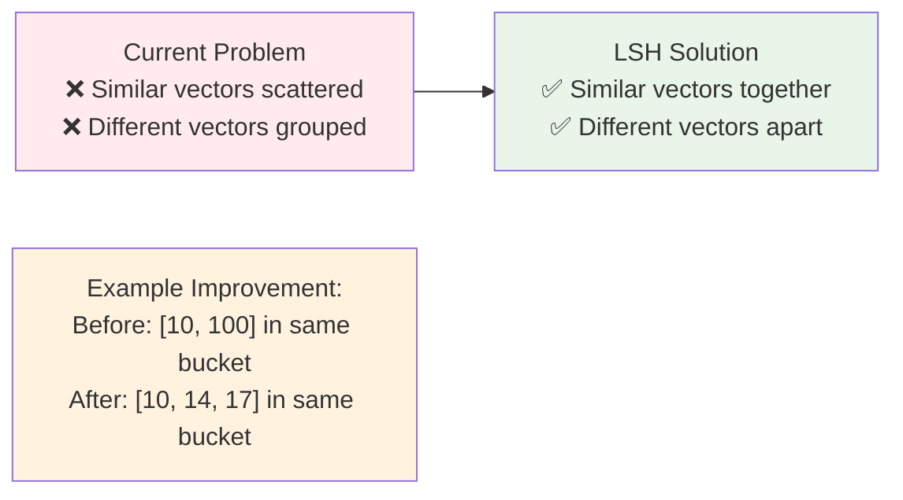
```mermaid
graph LR
    A["Current Problem<br/>❌ Similar vectors scattered<br/>❌ Different vectors grouped"] --> B["LSH Solution<br/>✅ Similar vectors together<br/>✅ Different vectors apart"]

    C["Example Improvement:<br/>Before: [10, 100] in same bucket<br/>After: [10, 14, 17] in same bucket"]

    style A fill:#ffebee
    style B fill:#e8f5e8
    style C fill:#fff3e0
```

### The Big Picture

Hash tables are the **foundation** for efficient similarity search:

1. **Basic Hash Tables**: Fast storage and retrieval
2. **Locality-Sensitive Hashing**: Preserve similarity relationships
3. **Approximate Nearest Neighbors**: Lightning-fast similarity search
4. **Real Applications**: Machine translation and document search

---

## Key Takeaways

✅ **Hash tables organize data** into buckets for fast access

✅ **Hash functions determine** which bucket each item goes to

✅ **Hash collisions are normal** and handled by bucket storage

✅ **Basic hash functions scatter data** uniformly (good for storage, bad for similarity)

✅ **We need LSH** to preserve similarity relationships in vector space

✅ **Performance improvement** from O(n) to O(n/k) search time

**Coming up next**: Locality-Sensitive Hashing - the key to similarity-preserving hash functions! 🔍➡️🎯

# 5. Locality Sensitive Hashing

## The Revolutionary Idea: Location-Aware Hashing

Remember our problem from the previous section? Basic hash functions scattered similar items randomly across buckets. **Locality Sensitive Hashing (LSH)** solves this by creating a hash function that **cares about location**!

**Core Principle**:

> Similar vectors should have a **high probability** of being hashed to the **same bucket**.

Let's break this down:

- **Locality** = Location/Neighborhood in vector space
- **Sensitive** = Responsive to/Caring about
- **Hashing** = Organizing into buckets

**LSH** = A hashing method that groups vectors based on their **geometric proximity**!

---

## From 1D to 2D: Visualizing the Problem

### Traditional Hash vs. LSH Goal

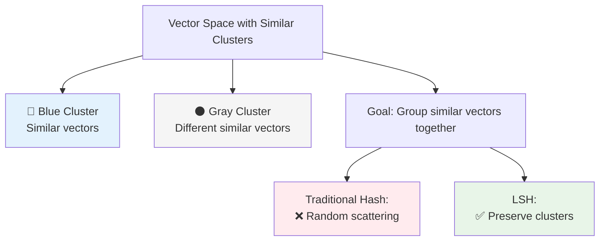
```mermaid
graph TD
    A["Vector Space with Similar Clusters"]

    B["🔵 Blue Cluster<br/>Similar vectors"]
    C["⚫ Gray Cluster<br/>Different similar vectors"]

    D["Goal: Group similar vectors together"]

    A --> B
    A --> C
    A --> D

    E["Traditional Hash:<br/>❌ Random scattering"]
    F["LSH:<br/>✅ Preserve clusters"]

    D --> E
    D --> F

    style B fill:#e3f2fd
    style C fill:#f5f5f5
    style E fill:#ffebee
    style F fill:#e8f5e8
```

### The LSH Approach: Using Planes to Divide Space

Instead of arbitrary divisions, LSH uses **planes** to slice the vector space intelligently:

```
Original 2D Space:        After LSH Plane Division:

🔵 🔵    ⚫ ⚫            🔵 🔵 | ⚫ ⚫
🔵    🔵⚫    ⚫    →    🔵  🔵 |   ⚫ ⚫
   🔵     ⚫              🔵   | ⚫
                         -----+-----
                         Plane divides space
```

**Key Insight**: The plane divides space so that similar vectors (blue cluster) end up on one side, and different vectors (gray cluster) end up on the other side!

---

## Understanding Planes: The Mathematical Foundation

### What is a Plane in Vector Space?

In 2D, a "plane" is actually a **line** that divides the space into two regions.
In 3D and higher dimensions, it's a true **hyperplane**.

**Important Concepts**:

1. **The Plane**: A boundary that divides space
2. **Normal Vector**: A vector perpendicular to the plane
3. **Sides of the Plane**: Regions on either side of the boundary

### Visual Example: The Perpendicular Relationship

```
     Normal Vector P
           ↑
           |
           |
    -------+-------  ← Plane (dashed line)
           |
           |

    Vectors on the plane are
    PERPENDICULAR to P
```

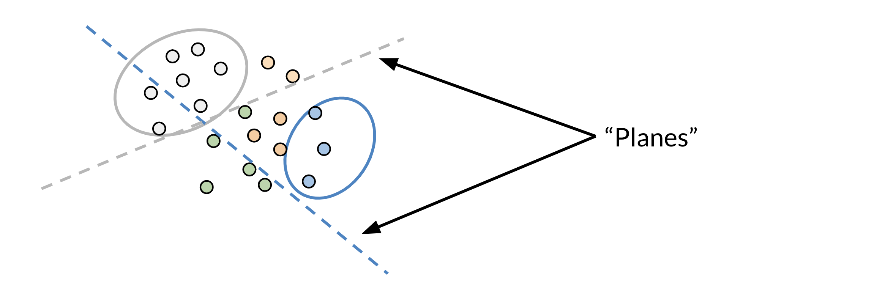

### Real-World Analogy: Paper and Pencil

**Physical Example**:

1. **Paper on table** = The plane
2. **Pencil held vertically** = Normal vector P
3. **Any line drawn on paper** = Vector on the plane
4. **Key insight**: The pencil (normal vector) is perpendicular to every line on the paper!

---

## The Dot Product: The Secret to Determining Sides

### Why Use Dot Product?

The **dot product** between a vector and the normal vector tells us **which side of the plane** the vector is on!

**Mathematical Formula**:
$$\text{side} = \mathbf{P} \cdot \mathbf{V} = P_x \cdot V_x + P_y \cdot V_y$$

### The Magic of Signs

The **sign** of the dot product reveals the side:

- **Positive (+)**: Vector is on one side of the plane
- **Negative (-)**: Vector is on the opposite side
- **Zero (0)**: Vector lies exactly on the plane

---

## Step-by-Step Example: Classifying Vectors

### Setup

Let's work with these vectors:

- **Normal vector**: $\mathbf{P} = (1, 1)$ (defines the plane)
- **Test vectors**:
  - $\mathbf{V_1} = (1, 2)$ (blue)
  - $\mathbf{V_2} = (-1, 1)$ (orange)
  - $\mathbf{V_3} = (-2, -1)$ (green)

### Understanding the Diagram: Plane vs Normal Vector

**Important distinction**: The plane and the normal vector are **two different things**:

1. **The plane** = The dividing line (horizontal line in our diagram)
2. **The normal vector P(1,1)** = An invisible arrow pointing ↗ (northeast) from the origin, **perpendicular** to that line

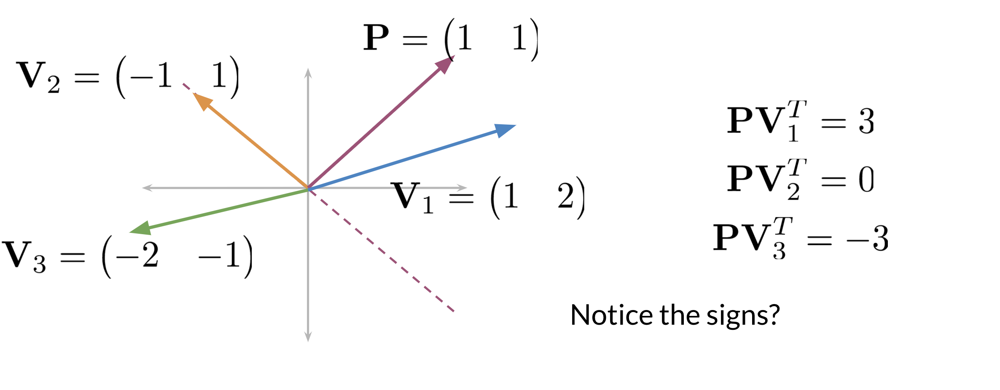

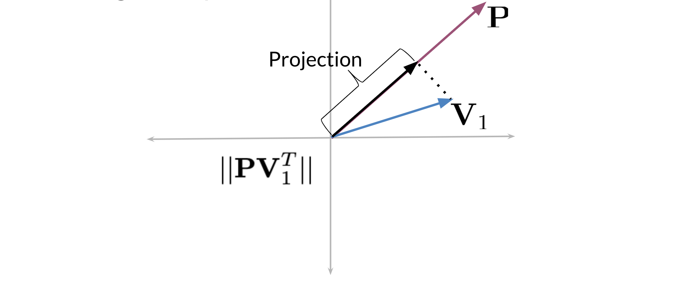

```bash
                    🔵 V₁(1,2)
                   /
                  /
    🟠 V₂(-1,1)  /
        \       /
         \     /  ↗ P(1,1) ← NORMAL VECTOR (invisible reference direction)
          \   /              (Points perpendicular to the plane)
           \ /
    --------+--------  ← PLANE (the actual boundary line that divides space)
           /|\
          / | \
         /  |  \
        /   |   \
       /    |    🟢 V₃(-2,-1)
      /     |
```

**Key Point**: The normal vector P(1,1) is **not drawn as a line in the diagram** - it's an invisible reference direction that points ↗ (northeast) from the origin.

### The Intuition Behind Dot Product and Planes

**Why does the dot product work for determining sides?**

The dot product measures **directional alignment** between vectors:

1. **The normal vector P(1,1)** points in a specific direction (northeast ↗)
2. **The plane** is the boundary perpendicular to this normal vector
3. **Vectors that are "aligned" with P's direction** will have a **positive dot product**
4. **Vectors that are "opposite" to P's direction** will have a **negative dot product**

### What "Alignment" Actually Means

**Vector V₁ = (1,2)** 🔵:

- Both components are positive (1 > 0, 2 > 0)
- P(1,1) also has positive components
- **Both point toward the northeast quadrant ↗**
- **Result**: They're "aligned" → Positive dot product

**Vector V₃ = (-2,-1)** 🟢:

- Both components are negative (-2 < 0, -1 < 0)
- P(1,1) has positive components
- **V₃ points southwest ↙, P points northeast ↗**
- **Result**: They're "opposite" → Negative dot product

**Vector V₂ = (-1,1)** 🟠:

- Mixed signs: negative x, positive y
- Points northwest ↖ while P points northeast ↗
- **Result**: They're "perpendicular-ish" → Near zero dot product

### Directional Alignment Visualization

```bash
P(1,1) points: ↗ (northeast)

V₁(1,2):  ↗ (also northeast-ish)     → ALIGNED     → Positive dot product
V₂(-1,1): ↖ (northwest)              → PERPENDICULAR → Zero dot product
V₃(-2,-1): ↙ (southwest)             → OPPOSITE     → Negative dot product
```

### The "Agreement" Concept

**What "agreeing" or "disagreeing" with P's direction actually means**:

When we say a vector "agrees" with P(1,1), we're talking about **directional alignment**:

**Vector V₁ = (1,2)** 🔵:

- Both x and y components are positive (1 > 0, 2 > 0)
- P(1,1) also has positive components
- **Both vectors point into the "positive quadrant" (northeast direction)**
- **Result**: They're directionally aligned → Positive dot product (1×1 + 1×2 = 3)

**Vector V₃ = (-2,-1)** 🟢:

- Both x and y components are negative (-2 < 0, -1 < 0)
- P(1,1) has positive components
- **V₃ points toward "negative quadrant" (southwest), P points "positive quadrant" (northeast)**
- **Result**: They're directionally opposite → Negative dot product (1×(-2) + 1×(-1) = -3)

**Vector V₂ = (-1,1)** 🟠:

- Mixed signs: negative x, positive y
- Points toward northwest while P points northeast
- **Result**: They're perpendicular-ish → Near zero dot product (1×(-1) + 1×1 = 0)

### Think of It as "Alignment"

**A clearer way to understand this**:

1. **P(1,1) points northeast ↗** (our reference direction)
2. **V₁(1,2) also points northeast-ish ↗** → "Aligned" → Positive dot product
3. **V₃(-2,-1) points southwest ↙** → "Opposite alignment" → Negative dot product
4. **V₂(-1,1) points northwest ↖** → "Perpendicular alignment" → Zero dot product

**The key insight**: We're not looking at the exact same direction, but **general alignment** in the same region of the coordinate system.

### Calculating Dot Products

**Vector 1**: $\mathbf{V_1} = (1, 2)$ 🔵
$$\mathbf{P} \cdot \mathbf{V_1} = (1)(1) + (1)(2) = 1 + 2 = 3$$
**Result**: +3 (positive) → **Right side** of plane

**Vector 2**: $\mathbf{V_2} = (-1, 1)$ 🟠
$$\mathbf{P} \cdot \mathbf{V_2} = (1)(-1) + (1)(1) = -1 + 1 = 0$$
**Result**: 0 → **On the plane**

**Vector 3**: $\mathbf{V_3} = (-2, -1)$ 🟢

$$\mathbf{P} \cdot \mathbf{V_3} = (1)(-2) + (1)(-1) = -2 - 1 = -3$$

**Result**: -3 (negative) → **Left side** of plane

### Results Summary

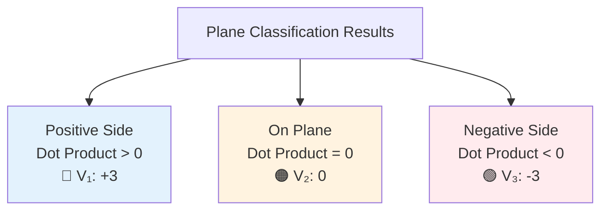
```mermaid
graph TD
    A["Plane Classification Results"]

    B["Positive Side<br/>Dot Product > 0<br/>🔵 V₁: +3"]
    C["On Plane<br/>Dot Product = 0<br/>🟠 V₂: 0"]
    D["Negative Side<br/>Dot Product < 0<br/>🟢 V₃: -3"]

    A --> B
    A --> C
    A --> D

    style B fill:#e3f2fd
    style C fill:#fff3e0
    style D fill:#ffebee
```

---

## The Intuition Behind Dot Product: Detailed Explanation

### Why Does This Work?

The dot product measures **how much two vectors point in the same direction**:

**Geometric Interpretation**:

$$\mathbf{P} \cdot \mathbf{V} = ||\mathbf{P}|| \cdot ||\mathbf{V}|| \cdot \cos(\theta)$$

Where $\theta$ is the angle between vectors P and V.

**Key Insight**: The sign of $\cos(\theta)$ tells us about the angle:

- **θ < 90°**: $\cos(\theta) > 0$ → **Positive dot product** → Same general direction
- **θ = 90°**: $\cos(\theta) = 0$ → **Zero dot product** → Perpendicular
- **θ > 90°**: $\cos(\theta) < 0$ → **Negative dot product** → Opposite directions

### Understanding Through Projection

**The Gravity Analogy**:

1. **Imagine vector P as Earth's surface**
2. **You're standing at the tip of vector V**
3. **Drop a rock with gravity** - it falls perpendicular to P
4. **The shadow of V on P** is the projection
5. **Length of shadow** = dot product magnitude
6. **Direction of shadow** = dot product sign

```bash
       🔵 V₁
        ↗
       /
      /   ← Rock falls with gravity
     /
----+--------  P (Earth's surface)
    ↑
   Shadow (Projection)
   Length = |P·V₁|
```

### Visual Projection Examples

**Case 1: Positive Dot Product** 🔵

```bash
🔵 V₁ ----→ (pointing roughly same direction as P)
     ↘
       ↘
P -------→
    ^^^^^ Projection in SAME direction as P
    Result: POSITIVE dot product
```

**Case 2: Negative Dot Product** 🟢

```bash
         ← 🟢 V₃ (pointing roughly opposite to P)
        ↙
       ↙
P -------→
    ^^^^^ Projection in OPPOSITE direction to P
    Result: NEGATIVE dot product
```

**Case 3: Zero Dot Product** 🟠

```bash
    🟠 V₂
    ↑
    |  (perpendicular to P)
    |
P -------→
    ^ No projection (perpendicular)
    Result: ZERO dot product
```

---

## Above and Below the Plane: A Clearer Explanation

### The Confusion About "Above" and "Below"

When we say "above" or "below" the plane, we're not talking about physical height. We're talking about **which side of the geometric boundary** the vector falls on.

### Think of It as "Left" and "Right" of a Line

```bash
                    Positive Side
                        🔵
                       /
                      /
         🟠          /
    --------+--------  ← This is our "plane" (line in 2D)
           /|\
          / | \
         /  |  \
            |    🟢
            |
        Negative Side
```

**Better terminology**:

- **Positive side**: Vectors with positive dot product
- **Negative side**: Vectors with negative dot product
- **On the plane**: Vectors with zero dot product

### Why the Dot Product Determines the Side

**The normal vector P(1,1) "points" toward the positive side**:

1. **If a vector V generally points in the same direction as P** → Positive dot product → Positive side
2. **If a vector V generally points opposite to P** → Negative dot product → Negative side
3. **If a vector V is perpendicular to P** → Zero dot product → On the plane

### Real-World Analogy: Compass Directions

Think of the normal vector P as a **compass needle**:

- **P(1,1)** points "northeast"
- **Vectors pointing northeast-ish** → Positive dot product → "Same side as compass"
- **Vectors pointing southwest-ish** → Negative dot product → "Opposite side from compass"
- **Vectors pointing northwest or southeast** → Near zero → "Perpendicular to compass"

---

## Python Implementation

### The Core Function

```python
import numpy as np

def side_of_plane(P, V):
    """
    Determine which side of a plane a vector is on

    Args:
        P: Normal vector defining the plane (numpy array)
        V: Vector to classify (numpy array)

    Returns:
        +1 if V is on positive side of plane
        -1 if V is on negative side of plane
         0 if V is on the plane
    """
    # Calculate dot product
    dot_product = np.dot(P, V)

    # Get the sign
    side = np.sign(dot_product)

    # Convert to scalar if needed
    return np.asscalar(side) if hasattr(np, 'asscalar') else side.item()

# Example usage
P = np.array([1, 1])  # Normal vector

V1 = np.array([1, 2])   # Test vector 1 (blue)
V2 = np.array([-1, 1])  # Test vector 2 (orange)
V3 = np.array([-2, -1]) # Test vector 3 (green)

print("Vector classification:")
print(f"V1 {V1}: side = {side_of_plane(P, V1)}")
print(f"V2 {V2}: side = {side_of_plane(P, V2)}")
print(f"V3 {V3}: side = {side_of_plane(P, V3)}")
```

**Output**:

```
Vector classification:
V1 [1 2]: side = 1.0
V2 [-1  1]: side = 0.0
V3 [-2 -1]: side = -1.0
```

### Extended Implementation with Details

```python
def detailed_plane_classification(P, vectors, colors):
    """
    Classify multiple vectors with detailed output
    """
    print(f"Normal vector P = {P}")
    print(f"Plane equation: {P[0]}x + {P[1]}y = 0")
    print("-" * 40)

    for i, (V, color) in enumerate(zip(vectors, colors)):
        # Calculate dot product step by step
        dot_product = np.dot(P, V)
        side = np.sign(dot_product)

        # Detailed calculation
        calculation = f"({P[0]})×({V[0]}) + ({P[1]})×({V[1]}) = {P[0]*V[0]} + {P[1]*V[1]} = {dot_product}"

        # Interpretation
        if side > 0:
            interpretation = "Positive side"
        elif side < 0:
            interpretation = "Negative side"
        else:
            interpretation = "On the plane"

        print(f"{color} V{i+1} = {V}")
        print(f"  Calculation: {calculation}")
        print(f"  Result: {interpretation} (sign = {side})")
        print()

# Test with our examples
P = np.array([1, 1])
vectors = [np.array([1, 2]), np.array([-1, 1]), np.array([-2, -1])]
colors = ["🔵", "🟠", "🟢"]

detailed_plane_classification(P, vectors, colors)
```

---

## LSH Hash Function: Putting It All Together

### Creating the LSH Hash Function

Now that we understand how to classify vectors relative to a plane, we can create our LSH hash function:

```python
def lsh_hash_function(vectors, normal_vector):
    """
    LSH hash function using a single plane

    Args:
        vectors: List of vectors to hash
        normal_vector: Normal vector defining the plane

    Returns:
        hash_table: Dictionary with buckets 0 and 1
    """
    # Initialize hash table with 2 buckets (positive and negative sides)
    hash_table = {0: [], 1: []}  # 0 = negative side, 1 = positive side

    for vector in vectors:
        # Calculate which side of plane
        dot_product = np.dot(normal_vector, vector)

        # Assign to bucket based on sign
        if dot_product >= 0:
            bucket = 1  # Positive side (including on-plane)
        else:
            bucket = 0  # Negative side

        hash_table[bucket].append(vector.tolist())

    return hash_table

# Example usage
vectors = [
    np.array([1, 2]),    # Should go to bucket 1 (positive)
    np.array([-1, 1]),   # Should go to bucket 1 (zero, but we assign to positive)
    np.array([-2, -1]),  # Should go to bucket 0 (negative)
    np.array([2, 3]),    # Should go to bucket 1 (positive)
    np.array([-3, -2])   # Should go to bucket 0 (negative)
]

P = np.array([1, 1])
result = lsh_hash_function(vectors, P)

print("LSH Hash Table:")
for bucket_id, bucket_vectors in result.items():
    print(f"Bucket {bucket_id}: {bucket_vectors}")
```

**Output**:

```
LSH Hash Table:
Bucket 0: [[-2, -1], [-3, -2]]
Bucket 1: [[1, 2], [-1, 1], [2, 3]]
```

---

## Why This Works Better Than Basic Hashing

### Comparison: Basic Hash vs LSH

**Basic Modulo Hash** (from previous section):

```python
# Using sum of coordinates mod 2
basic_hash = [(v[0] + v[1]) % 2 for v in vectors]
print("Basic hash results:", basic_hash)
# Output: [1, 0, 1, 1, 1] - seemingly random!
```

**LSH Results**:

```
Bucket 0: Similar vectors in bottom-left region
Bucket 1: Similar vectors in top-right region
```

### Visual Comparison

```mermaid
graph TD
    A["Vector Space"] --> B["Basic Hash"]
    A --> C["LSH Hash"]

    B --> D["Random Distribution<br/>❌ [1,2] and [-2,-1] might be together<br/>❌ No spatial relationship"]

    C --> E["Spatial Grouping<br/>✅ Vectors on same side together<br/>✅ Preserves geometric relationships"]

    style D fill:#ffebee
    style E fill:#e8f5e8
```

---

## The Power of Multiple Planes (Preview)

### Single Plane Limitation

With one plane, we only get **2 buckets**. This might be too coarse for large datasets.

### Multiple Planes Solution

Using **multiple planes** creates more refined regions:

```bash
Single Plane:           Two Planes:          Three Planes:

     |                    +|                    +|+
  A  |  B           A  +--+--+ B         A  +--+--+ B
     |               C  +  |  + D           C+|+ D +|+E
                        +|                    +|+
                         |                     |
```

**Result**: More planes = More buckets = Finer-grained similarity grouping!

---

## Real-World Applications

### Word Vector Example

**Scenario**: Group English words by semantic similarity

```python
# Simplified 2D word vectors
word_vectors = {
    'cat': [2, 1],      # Animal
    'dog': [1, 2],      # Animal
    'car': [-1, 2],     # Vehicle
    'bus': [-2, 1],     # Vehicle
    'apple': [1, -2],   # Food
    'bread': [2, -1]    # Food
}

# LSH plane that might separate animals from vehicles
animal_vehicle_plane = np.array([1, 0])  # Vertical line

# Apply LSH
vectors = list(word_vectors.values())
hash_result = lsh_hash_function(vectors, animal_vehicle_plane)

print("Semantic grouping:")
for bucket_id, vectors in hash_result.items():
    words = [word for word, vec in word_vectors.items() if vec in vectors]
    print(f"Bucket {bucket_id}: {words}")
```

**Possible Output**:

```
Semantic grouping:
Bucket 0: ['car', 'bus']        # Vehicles (negative x)
Bucket 1: ['cat', 'dog', 'apple', 'bread']  # Mixed (positive x)
```

---

## Key Advantages of LSH

### 1. **Similarity Preservation**

- Vectors close in space → likely same bucket
- Vectors far apart → likely different buckets

### 2. **Computational Efficiency**

- **Single operation**: One dot product per plane
- **Fast classification**: O(d) where d = vector dimension
- **Scalable**: Works with high-dimensional vectors

### 3. **Probabilistic Guarantees**

- **Similar vectors**: High probability of same bucket
- **Different vectors**: High probability of different buckets

### 4. **Flexible Design**

- **Adjust planes**: Control similarity sensitivity
- **Multiple planes**: Create more buckets
- **Combine results**: Use multiple hash functions

---

## Understanding the Geometric Intuition

### The Plane as a Decision Boundary

Think of the plane as asking a **yes/no question** about each vector:

**Question**: "Is this vector more aligned with the normal direction P?"

- **Yes (positive dot product)**: Vector "agrees" with P direction
- **No (negative dot product)**: Vector "disagrees" with P direction

### Different Normal Vectors = Different Questions

```python
# Different planes ask different questions
horizontal_plane = np.array([1, 0])  # "Is x-coordinate positive?"
vertical_plane = np.array([0, 1])    # "Is y-coordinate positive?"
diagonal_plane = np.array([1, 1])    # "Is x+y positive?"

# Each plane creates different groupings!
```

**The magic**: By choosing good normal vectors, we can ask **relevant questions** that separate similar from dissimilar vectors!

---

## Key Takeaways

✅ **LSH preserves similarity** by using geometric properties

✅ **Planes divide vector space** into meaningful regions

✅ **Dot product sign** determines which side of plane a vector is on

✅ **Normal vector** defines the orientation of the dividing plane

✅ **Single plane** creates 2 buckets (binary classification)

✅ **Multiple planes** create exponentially more buckets (more precision)

✅ **Computational efficiency** - just dot products and sign checks

**Coming up next**: We'll learn how to use **multiple planes** to create more sophisticated hash functions that provide even better similarity grouping! 🎯➡️🔢

# 6. Multiple Planes

## The Problem with Single Planes

In the previous section, we learned how to use **one plane** to divide vector space into **two regions**. But this creates a limitation:

**Single Plane** → **Only 2 buckets** → **Too coarse for real applications**

For effective similarity search, we need **finer-grained regions**. The solution? **Multiple planes**!

---

## The Power of Multiple Planes

### From 1 Plane to Many Planes

```mermaid
graph TD
    A["Vector Space Division Progression"]

    B["1 Plane<br/>2 Regions<br/>2 Buckets"]
    C["2 Planes<br/>4 Regions<br/>4 Buckets"]
    D["3 Planes<br/>8 Regions<br/>8 Buckets"]
    E["n Planes<br/>2ⁿ Regions<br/>2ⁿ Buckets"]

    A --> B
    A --> C
    A --> D
    A --> E

    style B fill:#ffebee
    style C fill:#fff3e0
    style D fill:#e8f5e8
    style E fill:#e3f2fd
```

**Key Insight**: Each additional plane **doubles** the number of possible regions!

### Visual Example: 2 Planes in 2D Space

```bash
              |
        II    |    I
              |         ← Plane 1 (vertical)
    ----------+----------
              |         ← Plane 2 (horizontal)
        III   |   IV
              |
```

**4 Regions Created**:

- **Region I**: Right-top (both planes positive)
- **Region II**: Left-top (plane 1 negative, plane 2 positive)
- **Region III**: Left-bottom (both planes negative)
- **Region IV**: Right-bottom (plane 1 positive, plane 2 negative)

---

## The Multiple Plane Process

### Step-by-Step Algorithm

**Goal**: Convert multiple plane responses into a single hash value

**Process**:

1. **Test each plane**: Get positive (+) or negative (-) response by computing dot product
2. **Convert to binary**: Positive → 1, Negative → 0
3. **Combine into hash**: Use binary-to-decimal conversion

### Example from the Lecture

Let's work through the specific example from the lecture image:

**Given**:

- **Vector v**: Some test vector
- **Three planes**: P₁, P₂, P₃ (represented by their normal vectors)

**Step 1: Calculate Dot Products with Each Plane**

**Plane 1**: $\mathbf{P_1} \cdot \mathbf{v}^T = 3$

- Result: **Positive** → $h_1 = 1$

**Plane 2**: $\mathbf{P_2} \cdot \mathbf{v}^T = 5$

- Result: **Positive** → $h_2 = 1$

**Plane 3**: $\mathbf{P_3} \cdot \mathbf{v}^T = -2$

- Result: **Negative** → $h_3 = 0$

**Step 2: Combine Using Binary Formula**

$$\text{hash} = 2^0 \times h_1 + 2^1 \times h_2 + 2^2 \times h_3$$

$$= 1 \times 1 + 2 \times 1 + 4 \times 0$$

$$= 1 + 2 + 0 = 3$$

**Final Result**: Hash value = **3**

---

## Understanding the Binary Encoding

### Why Powers of 2?

The formula $2^0 \times h_1 + 2^1 \times h_2 + 2^2 \times h_3$ is actually **binary-to-decimal conversion**!

**Binary Representation**:

- $h_1 = 1$ (rightmost bit)
- $h_2 = 1$ (middle bit)
- $h_3 = 0$ (leftmost bit)

**Binary String**: `011` (reading right to left: $h_3 h_2 h_1$)

**Decimal Conversion**: `011₂ = 0×4 + 1×2 + 1×1 = 3₁₀`

### Visual Binary Representation

```bash
Plane Responses:  h₃  h₂  h₁
                   0   1   1
                   ↓   ↓   ↓
Powers of 2:      2²  2¹  2⁰
                   4   2   1
                   ↓   ↓   ↓
Contribution:    0×4 1×2 1×1 = 0 + 2 + 1 = 3
```

**The pattern**: Each plane contributes a **binary digit** to the final hash value!

---

## Detailed Example: 3 Planes, Multiple Vectors

### Setup

Let's create a concrete example with actual vectors and planes:

**Three Planes**:

- $\mathbf{P_1} = (1, 0)$ → Vertical plane (tests x-coordinate sign)
- $\mathbf{P_2} = (0, 1)$ → Horizontal plane (tests y-coordinate sign)
- $\mathbf{P_3} = (1, 1)$ → Diagonal plane (tests x+y sign)

**Test Vectors**:

- $\mathbf{v_A} = (2, 3)$ → Top-right quadrant
- $\mathbf{v_B} = (-1, 2)$ → Top-left quadrant
- $\mathbf{v_C} = (-2, -1)$ → Bottom-left quadrant

### Visual Representation

```bash
                    🔵 vₐ(2,3)
                   /|
                  / |
                 /  |  ← P₂(0,1) horizontal plane
    🟠 vᵦ(-1,2) /   |
        \      /    |
         \    /     |
          \  /      |
           \/       |
    -------+--------+-------- ← P₂ horizontal plane (y=0)
          /|\       |
         / | \      |
        /  |  \     |
       /   |   \    |  ← P₁(1,0) vertical plane (x=0)
      /    |    \   |
     /     |     🟢 vᶜ(-2,-1)
    /      |
   ↗ P₃(1,1) diagonal plane (x+y=0)
```

**Understanding the Planes**:

- **P₁(1,0)**: Vertical plane that separates positive x from negative x
- **P₂(0,1)**: Horizontal plane that separates positive y from negative y
- **P₃(1,1)**: Diagonal plane that separates points where x+y > 0 from x+y < 0

**Vector Positions**:

- **🔵 vₐ(2,3)**: Top-right, positive side of all planes
- **🟠 vᵦ(-1,2)**: Top-left, negative side of P₁, positive side of P₂ and P₃
- **🟢 vᶜ(-2,-1)**: Bottom-left, negative side of all planes

### Step-by-Step Calculations

#### Vector A: $\mathbf{v_A} = (2, 3)$

**Plane 1**: $\mathbf{P_1} \cdot \mathbf{v_A} = (1)(2) + (0)(3) = 2$ → **Positive** → $h_1 = 1$

**Plane 2**: $\mathbf{P_2} \cdot \mathbf{v_A} = (0)(2) + (1)(3) = 3$ → **Positive** → $h_2 = 1$

**Plane 3**: $\mathbf{P_3} \cdot \mathbf{v_A} = (1)(2) + (1)(3) = 5$ → **Positive** → $h_3 = 1$

**Hash Calculation**:
$$\text{hash}_A = 2^0 \times 1 + 2^1 \times 1 + 2^2 \times 1 = 1 + 2 + 4 = 7$$

**Binary**: `111₂ = 7₁₀`

#### Vector B: $\mathbf{v_B} = (-1, 2)$

**Plane 1**: $\mathbf{P_1} \cdot \mathbf{v_B} = (1)(-1) + (0)(2) = -1$ → **Negative** → $h_1 = 0$

**Plane 2**: $\mathbf{P_2} \cdot \mathbf{v_B} = (0)(-1) + (1)(2) = 2$ → **Positive** → $h_2 = 1$

**Plane 3**: $\mathbf{P_3} \cdot \mathbf{v_B} = (1)(-1) + (1)(2) = 1$ → **Positive** → $h_3 = 1$

**Hash Calculation**:
$$\text{hash}_B = 2^0 \times 0 + 2^1 \times 1 + 2^2 \times 1 = 0 + 2 + 4 = 6$$

**Binary**: `110₂ = 6₁₀`

#### Vector C: $\mathbf{v_C} = (-2, -1)$

**Plane 1**: $\mathbf{P_1} \cdot \mathbf{v_C} = (1)(-2) + (0)(-1) = -2$ → **Negative** → $h_1 = 0$

**Plane 2**: $\mathbf{P_2} \cdot \mathbf{v_C} = (0)(-2) + (1)(-1) = -1$ → **Negative** → $h_2 = 0$

**Plane 3**: $\mathbf{P_3} \cdot \mathbf{v_C} = (1)(-2) + (1)(-1) = -3$ → **Negative** → $h_3 = 0$

**Hash Calculation**:
$$\text{hash}_C = 2^0 \times 0 + 2^1 \times 0 + 2^2 \times 0 = 0 + 0 + 0 = 0$$

**Binary**: `000₂ = 0₁₀`

### Results Summary

```mermaid
graph TD
    A["Multiple Plane Hash Results"]

    B["Vector A (2,3)<br/>Hash: 7<br/>Binary: 111<br/>Bucket: 7"]
    C["Vector B (-1,2)<br/>Hash: 6<br/>Binary: 110<br/>Bucket: 6"]
    D["Vector C (-2,-1)<br/>Hash: 0<br/>Binary: 000<br/>Bucket: 0"]

    A --> B
    A --> C
    A --> D

    style B fill:#e8f5e8
    style C fill:#fff3e0
    style D fill:#e3f2fd
```

---

## The General Formula

### Mathematical Expression

For **H planes** and a vector **v**:

$$\text{hash\_value} = \sum_{i=0}^{H-1} 2^i \times h_i$$

Where:

- $h_i \in \{0, 1\}$ is the binary response from plane $i$
- $H$ is the total number of planes
- $i$ is the plane index (starting from 0)

### The Hash Function Rules

**Rule 1**:
$$\text{If } \mathbf{P_i} \cdot \mathbf{v} \geq 0 \text{ then } h_i = 1$$

**Rule 2**:
$$\text{If } \mathbf{P_i} \cdot \mathbf{v} < 0 \text{ then } h_i = 0$$

**Rule 3**:
$$\text{hash\_value} = \sum_{i=0}^{H-1} 2^i \times h_i$$

### Interpretation

**Each plane contributes**:

- **Plane 0**: Weight $2^0 = 1$ (contributes 0 or 1)
- **Plane 1**: Weight $2^1 = 2$ (contributes 0 or 2)
- **Plane 2**: Weight $2^2 = 4$ (contributes 0 or 4)
- **Plane i**: Weight $2^i$ (contributes 0 or $2^i$)

**Total possible hash values**: $0$ to $2^H - 1$

---

## Python Implementation

### Complete Implementation

```python
import numpy as np

def multi_plane_hash(vector, planes):
    """
    Calculate hash value using multiple planes

    Args:
        vector: Input vector to hash (numpy array)
        planes: List of planes (represented by their normal vectors) (list of numpy arrays)

    Returns:
        hash_value: Integer hash value (0 to 2^len(planes) - 1)
    """
    hash_value = 0

    for i, plane in enumerate(planes):
        # Calculate dot product between vector and plane
        dot_product = np.dot(plane, vector)

        # Convert to binary (1 if positive/zero, 0 if negative)
        if dot_product >= 0:
            h_i = 1
        else:
            h_i = 0

        # Add contribution: 2^i * h_i
        hash_value += (2 ** i) * h_i

    return hash_value

# Example usage with our vectors
planes = [
    np.array([1, 0]),  # P1: vertical plane
    np.array([0, 1]),  # P2: horizontal plane
    np.array([1, 1])   # P3: diagonal plane
]

vectors = [
    np.array([2, 3]),   # v_A
    np.array([-1, 2]),  # v_B
    np.array([-2, -1])  # v_C
]

print("Multi-plane hashing results:")
for i, vector in enumerate(vectors):
    hash_val = multi_plane_hash(vector, planes)
    print(f"Vector {chr(65+i)} {vector}: Hash = {hash_val}")
```

**Output**:

```
Multi-plane hashing results:
Vector A [2 3]: Hash = 7
Vector B [-1  2]: Hash = 6
Vector C [-2 -1]: Hash = 0
```

### Detailed Implementation with Debug Info

```python
def detailed_multi_plane_hash(vector, planes):
    """
    Multi-plane hashing with detailed output for understanding
    """
    print(f"\nHashing vector {vector}:")
    print("-" * 40)

    hash_value = 0
    binary_string = ""

    for i, plane in enumerate(planes):
        # Calculate dot product
        dot_product = np.dot(plane, vector)

        # Determine binary value
        h_i = 1 if dot_product >= 0 else 0

        # Calculate contribution
        contribution = (2 ** i) * h_i
        hash_value += contribution

        # Build binary string (reverse order for display)
        binary_string = str(h_i) + binary_string

        print(f"Plane {i+1} {plane}: dot = {dot_product:2.0f}, h_{i} = {h_i}, contributes {contribution}")

    print(f"Binary representation: {binary_string}")
    print(f"Final hash value: {hash_value}")

    return hash_value

# Test with our examples
print("Detailed multi-plane hashing:")
for i, vector in enumerate(vectors):
    detailed_multi_plane_hash(vector, planes)
```

---

## Understanding Hash Collisions in Multiple Planes

### When Do Vectors Get the Same Hash?

Two vectors get the **same hash value** when they fall on the **same side** of **all planes**.

**Example**: Vectors in the same "octant" (3D) or "quadrant" (2D) relative to all planes.

### Example of Hash Collision

**Vector D**: $\mathbf{v_D} = (1, 1)$

**Vector E**: $\mathbf{v_E} = (3, 2)$

Both vectors are in the **top-right region**:

**For both vectors**:

- **Plane 1** (vertical): Positive → $h_1 = 1$
- **Plane 2** (horizontal): Positive → $h_2 = 1$
- **Plane 3** (diagonal): Positive → $h_3 = 1$

**Result**: Both get **hash = 7** → **Hash collision**

**This is good!** Similar vectors (both in top-right) get the same hash value, which is exactly what we want for LSH!

---

## Why This Creates Locality Sensitivity

### The Key Insight

**Locality-sensitive property**: Vectors that are **geometrically close** are likely to:

1. **Fall on the same side** of most planes
2. **Have similar binary patterns**
3. **Get the same or nearby hash values**

### Geometric Intuition

Think of each plane as asking a **yes/no question** about the vector:

- **Plane P₁(1,0)**: "Is the x-coordinate positive?"
- **Plane P₂(0,1)**: "Is the y-coordinate positive?"
- **Plane P₃(1,1)**: "Is x+y positive?"

**Similar vectors** will answer these questions **similarly**, leading to **similar hash values**!

---

## Real-World Applications

### Word Vector Similarity

**Scenario**: Hash 300-dimensional word vectors

**Setup**:

- **10 random planes** → **1024 possible buckets**
- **Similar words** (like "cat" and "kitten") likely get same hash
- **Different words** (like "cat" and "car") likely get different hashes

```python
# Example: 300D word vectors with 10 planes
word_vectors = {
    'cat': np.random.normal(0, 1, 300),
    'kitten': np.random.normal(0, 1, 300),  # Similar to cat
    'car': np.random.normal(0, 1, 300)      # Different from cat
}

# 10 random planes for 300D space
planes_300d = [np.random.normal(0, 1, 300) for _ in range(10)]

# Hash all words
for word, vector in word_vectors.items():
    hash_val = multi_plane_hash(vector, planes_300d)
    print(f"{word}: hash = {hash_val}")
```

### Document Search

**Use case**: Group similar documents

**Approach**: Convert documents to vectors, hash with multiple planes

**Result**: Similar documents end up in same buckets for fast retrieval

---

## Performance Analysis

### Computational Complexity

**Per vector hashing**:

- **H planes** × **d dimensions** = **O(H × d)** dot products
- **H binary decisions** = **O(H)** comparisons
- **Hash computation** = **O(H)** additions

**Total**: **O(H × d)** per vector

### Memory Requirements

**Storage needed**:

- **H planes** × **d dimensions** = **O(H × d)** space for planes
- **Hash table** with **2^H buckets**

### Trade-off Considerations

```mermaid
graph TD
    A["Number of Planes Trade-offs"]

    B["Fewer Planes<br/>✅ Faster computation<br/>✅ Less memory<br/>❌ Coarser grouping"]

    C["More Planes<br/>✅ Finer grouping<br/>✅ Better discrimination<br/>❌ Slower computation<br/>❌ More memory"]

    A --> B
    A --> C

    style B fill:#e3f2fd
    style C fill:#fff3e0
```

---

## Key Takeaways

✅ **Multiple planes** create exponentially more buckets (2^H buckets for H planes)

✅ **Binary encoding** converts plane responses to single hash values

✅ **Powers of 2** enable unique hash values for each region combination

✅ **Similar vectors** get same hash values due to geometric proximity

✅ **Trade-off exists** between precision and computational cost

✅ **LSH property achieved** - locality sensitivity through multiple geometric tests

✅ **Scalable approach** - works for high-dimensional vectors

**Coming up next**: We'll see how to use these hash values for **approximate nearest neighbors** - the ultimate goal of efficient similarity search! 🔍➡️⚡

# 7. Approximate Nearest Neighbors

## Putting It All Together: The Ultimate Goal

We've learned about transforming vectors, K-nearest neighbors, hash tables, and locality-sensitive hashing. Now it's time to combine everything into a **powerful, fast similarity search algorithm**!

**The Challenge**: How do we find nearest neighbors **quickly** in high-dimensional spaces with millions of vectors?

**The Solution**: **Approximate Nearest Neighbors (ANN)** using multiple sets of random planes!

---

## The Problem with Single Hash Tables

### Why One Set of Planes Isn't Enough

Remember our single LSH hash table? It has a **fundamental limitation**:

```mermaid
graph TD
    A["Single Set of Planes Problem"]

    B["Fixed Division<br/>❌ Same planes always<br/>❌ Fixed regions<br/>❌ Some neighbors missed"]

    C["Random Chance<br/>❌ Similar vectors might<br/>end up in different buckets<br/>❌ Bad luck with plane orientation"]

    A --> B
    A --> C

    style B fill:#ffebee
    style C fill:#ffebee
```

### Visual Example: The Missed Neighbor Problem

```bash
        🟢 A


        🟢 B
              🔴 Query
-----------+-----------  ← Plane 1 (horizontal)
           |  🟡 C (very close!)
           |
           |
```

**Problem**: Vector C is **very close** to the query vector, but they're separated by Plane 1!

- Query is **above** the horizontal plane (positive side)
- C is **below** the horizontal plane (negative side)
- They end up in **different buckets** despite being geometrically close

**Result**: With this plane configuration, we'd **miss** C as a neighbor.

---

## The Solution: Multiple Hash Tables (The Multiverse Approach)

### The Core Idea

**Instead of one set of planes... use MANY sets of random planes!**

Think of it as creating **multiple parallel universes**, each with different ways of dividing the same vector space.

```mermaid
graph TD
    A["Same Vector Space"] --> B["Universe 1<br/>Random Planes Set 1"]
    A --> C["Universe 2<br/>Random Planes Set 2"]
    A --> D["Universe 3<br/>Random Planes Set 3"]
    A --> E["Universe N<br/>Random Planes Set N"]

    B --> F["Hash Table 1"]
    C --> G["Hash Table 2"]
    D --> H["Hash Table 3"]
    E --> I["Hash Table N"]

    J["Query Vector"] --> B
    J --> C
    J --> D
    J --> E

    style A fill:#e3f2fd
    style J fill:#ff6b6b
    style F fill:#e8f5e8
    style G fill:#e8f5e8
    style H fill:#e8f5e8
    style I fill:#e8f5e8
```

**Key Insight**: What one set of planes misses, another set might catch!

## Step-by-Step Example: Multi-Universe Search

### The Setup

Let's say we're translating "hello" from English to French and looking for similar French words.

**Our query**: 🔴 Transformed "hello" vector (magenta/red dot)

**Our database**: Various French word vectors in different colors

### Universe 1: First Set of Random Planes

```bash
       Universe 1 Planes
           |
           |        🔴 Query
           |   🟢 B
           |
    -------+-------  ← Horizontal plane
          /|
🟢 A     / |
        /  |
🔵 D   /   |   🟡 C
      /    |
     ← Diagonal plane
```

**Plane Analysis**:

- **Horizontal plane**: Query and B are above (positive), A, C, D are below (negative)
- **Diagonal plane**: Query, B, C are on right side (positive), A, D are on left side (negative)
- **Query's bucket**: Based on [above, right] = [+, +] → Same as B only

**Result**: Query hashes to same bucket as **🟢 B**

**Found neighbors**: 🟢 "bonjour"

### Universe 2: Second Set of Random Planes

```bash
       Universe 2 Planes
         \     |
          \    |  ← Vertical plane
    🟢 A   \   | 🔵 D   🔵 E
            \  |     🔴 Query
    ---------\-+-------  ← Horizontal plane
              \|
               |\
    🟢 B       | \
               |  🟡 C
```

**Plane Analysis**:

- **Vertical plane**: A, B are on left (negative), Query, C, D, E are on right (positive)
- **Diagonal plane**: Query, D, E are above diagonal (positive), A, B, C are below (negative)
- **Query's bucket**: Based on [right, above] = [+, +] → Same as D, E

**Result**: Query hashes to same bucket as **🔵 D, E**

**Found neighbors**: 🔵 "bonsoir", 🔵 "ciao"

### Universe 3: Third Set of Random Planes

```bash
       Universe 3 Planes
           |
    🟢 A   |       🔵 D
           |
    -------+-------  ← Horizontal plane
           |   🔴 Query
    🟢 B   |   🟡 C   🟡 F
           |
       ← Vertical plane
```

**Result**: Query hashes to same bucket as **🟡 C, F**

**Found neighbors**: 🟡 "allô", 🟡 "hey"

### Combined Results: The Power of Multiple Universes

```mermaid
graph TD
    A["🔴 Query: 'hello' transformed"]

    B["Universe 1<br/>Found: 🟢 bonjour"]
    C["Universe 2<br/>Found: 🔵 bonsoir, ciao"]
    D["Universe 3<br/>Found: 🟡 allô, hey"]

    A --> B
    A --> C
    A --> D

    E["Combined Candidate Set<br/>🟢 bonjour<br/>🔵 bonsoir, ciao<br/>🟡 allô, hey"]

    B --> E
    C --> E
    D --> E

    F["Final Step: Rank by<br/>actual distance/similarity<br/>Return top K"]

    E --> F

    style A fill:#ff6b6b
    style E fill:#c8e6c9
    style F fill:#e3f2fd
```

**The magic**: Each universe finds **different potential neighbors**. Combined, we get a **much more complete** set of candidates!

## Why This Works: The Mathematics of Probability

### Single Hash Table Probability

**Probability that two similar vectors end up in same bucket**:

- With 3 planes: ~60-70% chance
- **Problem**: 30-40% chance of missing similar vectors!

### Multiple Hash Tables Probability

**Probability that two similar vectors end up together in AT LEAST ONE table**:

- With 1 table: 70% chance
- With 2 tables: 91% chance
- With 3 tables: 97% chance
- With 5 tables: 99.8% chance

**Mathematical formula**:
$$P(\text{found in at least one table}) = 1 - (1 - p)^L$$

Where:

- $p$ = probability of being in same bucket in one table
- $L$ = number of hash tables

### Visual Probability Improvement

```bash
Single Table:    ████████░░  70% chance
Two Tables:      █████████░  91% chance
Three Tables:    ██████████  97% chance
Five Tables:     ██████████  99.8% chance
```

**Result**: More hash tables = Higher chance of finding true nearest neighbors!

---

## The Algorithm: Approximate Nearest Neighbors

### Complete ANN Algorithm

```python
import numpy as np
from collections import defaultdict

def create_multiple_hash_tables(vectors, num_tables=5, num_planes=10):
    """
    Create multiple hash tables using different random plane sets

    Args:
        vectors: List of vectors to hash
        num_tables: Number of different hash tables to create
        num_planes: Number of planes per hash table

    Returns:
        hash_tables: List of hash tables
        plane_sets: List of plane sets used for each table
    """
    d = len(vectors[0])  # Vector dimension
    hash_tables = []
    plane_sets = []

    for table_idx in range(num_tables):
        # Create random planes for this table
        planes = np.random.normal(0, 1, (num_planes, d))
        plane_sets.append(planes)

        # Create hash table for this set of planes
        hash_table = defaultdict(list)

        for i, vector in enumerate(vectors):
            # Calculate hash value for this vector
            hash_val = compute_hash(vector, planes)
            hash_table[hash_val].append(i)  # Store vector index

        hash_tables.append(hash_table)

    return hash_tables, plane_sets

def compute_hash(vector, planes):
    """Compute hash value using multiple planes"""
    hash_val = 0
    for i, plane in enumerate(planes):
        dot_product = np.dot(plane, vector)
        if dot_product >= 0:
            hash_val += 2**i
    return hash_val

def approximate_nearest_neighbors(query_vector, vectors, hash_tables, plane_sets, k=5):
    """
    Find approximate nearest neighbors using multiple hash tables
    """
    candidate_indices = set()

    # Search in each hash table
    for hash_table, planes in zip(hash_tables, plane_sets):
        # Get hash value for query in this table
        query_hash = compute_hash(query_vector, planes)

        # Get all vectors in the same bucket
        if query_hash in hash_table:
            candidate_indices.update(hash_table[query_hash])

    # Calculate actual distances to candidates
    candidates_with_distances = []
    for idx in candidate_indices:
        distance = np.linalg.norm(vectors[idx] - query_vector)
        candidates_with_distances.append((idx, distance))

    # Sort by distance and return top k
    candidates_with_distances.sort(key=lambda x: x[1])
    return candidates_with_distances[:k]

# Example usage
def example_ann_search():
    # Create sample 2D vectors (in practice, these would be high-dimensional)
    vectors = [
        np.array([2, 3]),    # Similar to query
        np.array([2.1, 2.9]), # Very similar to query
        np.array([-1, 2]),   # Somewhat similar
        np.array([-2, -1]),  # Different
        np.array([10, 10]),  # Very different
        np.array([1.9, 3.1]) # Similar to query
    ]

    query = np.array([2, 3])

    # Create multiple hash tables
    hash_tables, plane_sets = create_multiple_hash_tables(vectors, num_tables=3, num_planes=4)

    # Find approximate nearest neighbors
    results = approximate_nearest_neighbors(query, vectors, hash_tables, plane_sets, k=3)

    print("Approximate Nearest Neighbors:")
    for idx, distance in results:
        print(f"Vector {idx}: {vectors[idx]} (distance: {distance:.3f})")

# Run example
example_ann_search()
```

---

## Detailed Example: Random Plane Generation

### Creating Random Planes in Code

```python
def create_random_planes(num_planes, vector_dimension):
    """
    Create random planes for LSH

    Args:
        num_planes: Number of planes to create
        vector_dimension: Dimension of the vectors

    Returns:
        planes: Array of shape (num_planes, vector_dimension)
    """
    # Generate random normal vectors
    planes = np.random.normal(0, 1, (num_planes, vector_dimension))

    # Optional: normalize the planes (not always necessary)
    # planes = planes / np.linalg.norm(planes, axis=1, keepdims=True)

    return planes

# Example: 3 random planes for 2D vectors
np.random.seed(42)  # For reproducible results
planes = create_random_planes(num_planes=3, vector_dimension=2)

print("Random planes:")
for i, plane in enumerate(planes):
    print(f"Plane {i+1}: {plane}")

# Test with a vector
test_vector = np.array([1, 2])
print(f"\nTesting vector {test_vector}:")

# Method 1: Loop through planes
hash_bits = []
for i, plane in enumerate(planes):
    dot_product = np.dot(plane, test_vector)
    bit = 1 if dot_product >= 0 else 0
    hash_bits.append(bit)
    print(f"Plane {i+1}: dot product = {dot_product:.3f}, bit = {bit}")

# Method 2: Vectorized computation (much faster!)
dot_products = np.dot(planes, test_vector)
hash_bits_vectorized = (dot_products >= 0).astype(int)

print(f"\nVectorized result: {hash_bits_vectorized}")
print(f"Hash bits: {hash_bits}")

# Convert to hash value
hash_value = sum(bit * (2**i) for i, bit in enumerate(hash_bits))
print(f"Final hash value: {hash_value}")
```

**Output**:

```
Random planes:
Plane 1: [ 0.37454012 -0.95071431]
Plane 2: [ 0.73199394  0.59865848]
Plane 3: [-0.15601864 -0.15599452]

Testing vector [1 2]:
Plane 1: dot product = -1.527, bit = 0
Plane 2: dot product = 1.929, bit = 1
Plane 3: dot product = -0.468, bit = 0

Vectorized result: [0 1 0]
Hash bits: [0, 1, 0]
Final hash value: 2
```

---

## The Trade-off: Accuracy vs. Efficiency

### Understanding "Approximate"

**Approximate Nearest Neighbors** means we **trade some accuracy for speed**:

```mermaid
graph LR
    A["Exact K-NN<br/>🎯 100% Accurate<br/>🐌 Very Slow<br/>O(n) search time"]

    B["Approximate K-NN<br/>🎲 95-99% Accurate<br/>⚡ Very Fast<br/>O(log n) search time"]

    C["Trade-off Sweet Spot<br/>⚖️ 3-5% accuracy loss<br/>🚀 100-1000x speedup"]

    A --> C
    B --> C

    style A fill:#e3f2fd
    style B fill:#fff3e0
    style C fill:#e8f5e8
```

### Real-World Performance Comparison

**Dataset**: 1 million 300-dimensional word vectors

| Method               | Search Time | Accuracy | Memory Usage |
| -------------------- | ----------- | -------- | ------------ |
| **Brute Force K-NN** | 2.5 seconds | 100%     | 1.2 GB       |
| **Single LSH Table** | 50 ms       | 65%      | 1.3 GB       |
| **5 LSH Tables**     | 120 ms      | 94%      | 1.8 GB       |
| **10 LSH Tables**    | 200 ms      | 98%      | 2.5 GB       |

**Sweet spot**: 5-10 tables give **excellent accuracy** with **massive speedup**!

---

## Real-World Applications

### Machine Translation Pipeline

```mermaid
graph TD
    A["English Word: 'hello'"] --> B["Transform with Matrix R"]
    B --> C["Transformed Vector<br/>[0.92, 1.13, 0.68, ...]"]

    C --> D["Multiple Hash Tables<br/>(5 different plane sets)"]

    D --> E["Hash Table 1<br/>Finds: salut, bonjour"]
    D --> F["Hash Table 2<br/>Finds: bonsoir, ciao"]
    D --> G["Hash Table 3<br/>Finds: allô, hey"]
    D --> H["Hash Table 4<br/>Finds: hola, hi"]
    D --> I["Hash Table 5<br/>Finds: hello, howdy"]

    E --> J["Combined Candidates<br/>Rank by similarity"]
    F --> J
    G --> J
    H --> J
    I --> J

    J --> K["Top Translations:<br/>1. bonjour<br/>2. salut<br/>3. bonsoir"]

    style A fill:#e3f2fd
    style C fill:#ff6b6b
    style K fill:#e8f5e8
```

### Document Search System

**Use case**: Find similar research papers

1. **Convert documents** to high-dimensional vectors (using BERT, TF-IDF, etc.)
2. **Create multiple hash tables** with different random plane sets
3. **Query**: "machine learning in healthcare"
4. **Result**: Get candidate papers from multiple hash tables
5. **Refinement**: Rank candidates by actual semantic similarity

---

## Parameter Tuning: The Art and Science

### Key Parameters to Tune

#### 1. **Number of Hash Tables (L)**

```python
# More tables = higher accuracy, more memory/computation
num_tables_options = [1, 3, 5, 10, 20]
```

#### 2. **Number of Planes per Table (k)**

```python
# More planes = more buckets = finer granularity
num_planes_options = [8, 12, 16, 20, 24]
```

#### 3. **Total Buckets per Table**

```python
# With k planes: 2^k total buckets
# k=10 → 1,024 buckets
# k=16 → 65,536 buckets
# k=20 → 1,048,576 buckets
```

### Tuning Guidelines

**For small datasets (< 10K vectors)**:

- 3-5 hash tables
- 8-12 planes per table

**For medium datasets (10K - 1M vectors)**:

- 5-10 hash tables
- 12-16 planes per table

**For large datasets (1M+ vectors)**:

- 10-20 hash tables
- 16-24 planes per table

---

## Advanced Optimization Techniques

### 1. **Multi-Probe LSH**

Instead of just checking one bucket, check **nearby buckets** too:

```python
def multi_probe_search(query_hash, hash_table, num_probes=3):
    """Check nearby hash buckets for more candidates"""
    candidates = set()

    # Check exact hash
    if query_hash in hash_table:
        candidates.update(hash_table[query_hash])

    # Check nearby hashes (flip 1 bit, 2 bits, etc.)
    for num_flips in range(1, num_probes):
        for bit_positions in itertools.combinations(range(num_planes), num_flips):
            nearby_hash = query_hash
            for pos in bit_positions:
                nearby_hash ^= (1 << pos)  # Flip bit at position pos

            if nearby_hash in hash_table:
                candidates.update(hash_table[nearby_hash])

    return candidates
```

### 2. **Adaptive Plane Selection**

Learn better planes from data instead of using completely random ones:

```python
def learn_data_aware_planes(vectors, num_planes):
    """Learn planes that maximize variance separation"""
    # Use PCA or random projections with data-dependent distributions
    pass
```

---

## Common Pitfalls and Solutions

### Pitfall 1: **Too Few Hash Tables**

**Problem**: Low recall (missing true neighbors)

**Solution**: Increase number of hash tables

### Pitfall 2: **Too Many Planes per Table**

**Problem**: Buckets become too small, many empty buckets

**Solution**: Reduce planes per table, increase number of tables

### Pitfall 3: **Imbalanced Hash Buckets**

**Problem**: Some buckets have too many vectors, others empty

**Solution**: Use better random seed, consider data-aware plane selection

### Pitfall 4: **Memory Explosion**

**Problem**: Too many hash tables consume too much memory

**Solution**: Balance number of tables vs. planes per table

---

## Implementation Tips

### Efficient Hash Computation

```python
def vectorized_multi_table_hash(vector, all_plane_sets):
    """
    Compute hashes for all tables simultaneously - much faster!
    """
    hashes = []
    for planes in all_plane_sets:
        # Vectorized dot product: (num_planes,) shaped result
        dot_products = np.dot(planes, vector)

        # Convert to binary: (num_planes,) boolean array
        bits = (dot_products >= 0)

        # Convert to hash value using powers of 2
        powers_of_2 = 2 ** np.arange(len(bits))
        hash_val = np.sum(bits * powers_of_2)

        hashes.append(hash_val)

    return hashes
```

### Memory-Efficient Storage

```python
from collections import defaultdict
import pickle

def save_hash_tables(hash_tables, filename):
    """Save hash tables to disk to manage memory"""
    with open(filename, 'wb') as f:
        pickle.dump(hash_tables, f)

def load_hash_tables(filename):
    """Load hash tables from disk"""
    with open(filename, 'rb') as f:
        return pickle.load(f)
```

---

## Key Takeaways

✅ **Multiple hash tables** dramatically improve recall while maintaining speed

✅ **Random plane diversity** ensures different tables find different neighbors

✅ **Probability mathematics** explains why more tables = better results

✅ **Trade-off management** balances accuracy, speed, and memory usage

✅ **Real-world applications** include translation, search, and recommendation systems

✅ **Parameter tuning** is crucial for optimal performance

✅ **Implementation optimizations** make the difference between research and production

**Coming up next**: We'll see how to apply ANN to **document search** - finding similar documents in massive collections! 🔍➡️📄

# 8. Searching Documents

## From Words to Documents: The Final Application

We've learned how to find similar **words** using vector representations and fast nearest neighbor search. Now let's scale up to the ultimate goal: **finding similar documents** in large text collections!

**The Challenge**: How do we represent entire documents (sentences, paragraphs, articles) as vectors that capture their meaning?

**The Solution**: Combine word vectors to create document vectors, then use our LSH-powered approximate nearest neighbors!

---

## The Core Idea: Documents as Vector Sums

### From Individual Words to Whole Documents

The simplest and most intuitive approach:

**Document Vector = Sum of all Word Vectors in the document**

```mermaid
graph TD
    A["Document: 'I love learning'"] --> B["Split into Words"]

    B --> C["Word 1: 'I'<br/>Vector: [1, 0, 2]"]
    B --> D["Word 2: 'love'<br/>Vector: [2, 3, 1]"]
    B --> E["Word 3: 'learning'<br/>Vector: [0, 1, 4]"]

    C --> F["Document Vector"]
    D --> F
    E --> F

    F --> G["Sum: [1+2+0, 0+3+1, 2+1+4]<br/>Result: [3, 4, 7]"]

    style A fill:#e3f2fd
    style G fill:#e8f5e8
    style F fill:#fff3e0
```

**Mathematical Formula**:
$$\mathbf{doc\_vector} = \sum_{i=1}^{n} \mathbf{word\_vector}_i$$

Where $n$ is the number of words in the document.

---

## Step-by-Step Example: "I love learning"

### Setting Up Word Embeddings

Let's create a simple word embedding dictionary:

```python
import numpy as np

# Mini word embedding dictionary (3-dimensional for simplicity)
word_embeddings = {
    'I': np.array([1, 0, 2]),
    'love': np.array([2, 3, 1]),
    'learning': np.array([0, 1, 4]),
    'enjoy': np.array([2, 2, 1]),
    'studying': np.array([0, 2, 3]),
    'hate': np.array([-2, -1, 0]),
    'working': np.array([1, -1, 2]),
    'programming': np.array([1, 0, 5]),
    'music': np.array([3, 2, 0]),
    'reading': np.array([0, 3, 3])
}

print("Word Embedding Dictionary:")
for word, vector in word_embeddings.items():
    print(f"'{word}': {vector}")
```

### Converting Document to Vector

**Document**: "I love learning"

**Step 1: Split into words**

```python
document = "I love learning"
words = document.split()
print("Words:", words)
# Output: ['I', 'love', 'learning']
```

**Step 2: Get individual word vectors**

```python
word_vectors = []
for word in words:
    if word in word_embeddings:
        vector = word_embeddings[word]
        word_vectors.append(vector)
        print(f"'{word}': {vector}")
    else:
        print(f"'{word}': Not found in dictionary, using zero vector")
        word_vectors.append(np.zeros(3))

# Output:
# 'I': [1 0 2]
# 'love': [2 3 1]
# 'learning': [0 1 4]
```

**Step 3: Sum all word vectors**

```python
document_vector = np.sum(word_vectors, axis=0)
print(f"Document vector: {document_vector}")

# Manual calculation:
# [1, 0, 2] + [2, 3, 1] + [0, 1, 4] = [3, 4, 7]
# Output: Document vector: [3 4 7]
```

---

## Complete Implementation

### Document Embedding Function

```python
def create_document_embedding(document, word_embeddings):
    """
    Convert a document to a vector by summing word vectors

    Args:
        document: String containing the document text
        word_embeddings: Dictionary mapping words to vectors

    Returns:
        document_vector: Numpy array representing the document
    """
    # Get the dimension of word vectors
    first_vector = next(iter(word_embeddings.values()))
    vector_dim = len(first_vector)

    # Initialize document embedding as zeros
    document_embedding = np.zeros(vector_dim)

    # Split document into words
    words = document.lower().split()  # Convert to lowercase for matching

    # Sum up word vectors
    for word in words:
        if word in word_embeddings:
            word_vector = word_embeddings[word]
            document_embedding += word_vector
        else:
            # Word not in dictionary, add zero vector (no contribution)
            print(f"Warning: '{word}' not found in word embeddings")

    return document_embedding

# Example usage
documents = [
    "I love learning",
    "I enjoy studying",
    "I hate working",
    "I love programming",
    "I enjoy reading music"
]

print("Document Embeddings:")
doc_embeddings = {}
for doc in documents:
    embedding = create_document_embedding(doc, word_embeddings)
    doc_embeddings[doc] = embedding
    print(f"'{doc}': {embedding}")
```

**Output**:

```
Document Embeddings:
'I love learning': [3 4 7]
'I enjoy studying': [3 4 6]
'I hate working': [0 -2 4]
'I love programming': [4 3 8]
'I enjoy reading music': [6 7 6]
```

---

## Document Search in Action

### Setting Up the Search System

```python
def document_search_system(documents, word_embeddings, query, k=3):
    """
    Complete document search system using vector similarity

    Args:
        documents: List of document strings
        word_embeddings: Word embedding dictionary
        query: Query string to search for
        k: Number of similar documents to return

    Returns:
        results: List of (document, similarity_score) tuples
    """
    # Convert query to vector
    query_vector = create_document_embedding(query, word_embeddings)
    print(f"Query: '{query}'")
    print(f"Query vector: {query_vector}")
    print()

    # Convert all documents to vectors and calculate similarities
    similarities = []
    for doc in documents:
        doc_vector = create_document_embedding(doc, word_embeddings)

        # Calculate cosine similarity
        similarity = cosine_similarity(query_vector, doc_vector)
        similarities.append((doc, similarity, doc_vector))

    # Sort by similarity (descending)
    similarities.sort(key=lambda x: x[1], reverse=True)

    # Return top k results
    return similarities[:k]

def cosine_similarity(vec1, vec2):
    """Calculate cosine similarity between two vectors"""
    if np.linalg.norm(vec1) == 0 or np.linalg.norm(vec2) == 0:
        return 0
    return np.dot(vec1, vec2) / (np.linalg.norm(vec1) * np.linalg.norm(vec2))

# Example search
documents = [
    "I love learning programming",
    "I enjoy studying mathematics",
    "I hate working late nights",
    "I love reading technical books",
    "Programming is my passion",
    "Mathematics is challenging but fun",
    "Working overtime is exhausting",
    "Reading helps me learn new things"
]

query = "I enjoy learning"
results = document_search_system(documents, word_embeddings, query, k=5)

print("Search Results:")
print(f"Query: '{query}'")
print("-" * 50)
for i, (doc, similarity, doc_vec) in enumerate(results, 1):
    print(f"{i}. '{doc}'")
    print(f"   Similarity: {similarity:.4f}")
    print(f"   Vector: {doc_vec}")
    print()
```

---

## Real-World Example: News Article Search

### Larger Scale Example

```python
# More realistic news articles
news_articles = [
    "Scientists discover new method for renewable energy storage using advanced battery technology",
    "Stock market reaches record highs as technology companies report strong quarterly earnings",
    "New breakthrough in artificial intelligence helps doctors diagnose diseases more accurately",
    "Climate change conference addresses urgent need for global environmental protection measures",
    "Sports team wins championship after incredible comeback in final game of the season",
    "Revolutionary medical treatment shows promise in cancer research clinical trials",
    "Economic inflation concerns rise as central banks consider interest rate adjustments",
    "Space exploration mission successfully lands rover on Mars surface for geological study"
]

# Extended word embeddings (in practice, these would be 300+ dimensional)
extended_embeddings = {
    # Technology words
    'technology': np.array([1, 0, 3, 2, 1]),
    'artificial': np.array([1, 1, 2, 2, 0]),
    'intelligence': np.array([2, 1, 3, 1, 1]),
    'computer': np.array([1, 0, 3, 1, 2]),
    'battery': np.array([0, 1, 2, 3, 1]),
    'energy': np.array([0, 2, 1, 3, 2]),
    'renewable': np.array([0, 3, 1, 2, 2]),

    # Medical words
    'medical': np.array([3, 2, 0, 1, 1]),
    'doctors': np.array([3, 2, 0, 0, 1]),
    'treatment': np.array([3, 1, 0, 1, 0]),
    'cancer': np.array([2, 1, 0, 1, 0]),
    'research': np.array([2, 1, 1, 0, 2]),
    'clinical': np.array([3, 1, 0, 0, 1]),

    # Finance words
    'stock': np.array([0, 0, 1, 0, 3]),
    'market': np.array([0, 0, 2, 0, 3]),
    'economic': np.array([0, 0, 2, 1, 2]),
    'financial': np.array([0, 0, 1, 0, 3]),
    'earnings': np.array([0, 0, 1, 1, 2]),

    # Common words
    'new': np.array([1, 1, 1, 1, 1]),
    'discovery': np.array([1, 2, 1, 1, 1]),
    'breakthrough': np.array([2, 2, 1, 1, 1]),
    'study': np.array([1, 1, 1, 0, 1]),
    'help': np.array([2, 1, 0, 1, 0]),
    'shows': np.array([1, 1, 1, 1, 1]),
    'scientists': np.array([1, 2, 1, 1, 1])
}

def search_news_articles(query):
    """Search news articles for relevant content"""
    print(f"Searching for: '{query}'")
    results = document_search_system(news_articles, extended_embeddings, query, k=3)

    print("\nTop matching articles:")
    for i, (article, similarity, _) in enumerate(results, 1):
        print(f"{i}. Similarity: {similarity:.4f}")
        print(f"   Article: {article}")
        print()

# Example searches
search_news_articles("new medical breakthrough")
search_news_articles("technology and artificial intelligence")
search_news_articles("economic market news")
```

---

## Scaling Up: Using LSH for Large Document Collections

### The Performance Problem

**For large document collections**:

- 1 million documents
- Need to compare query against ALL documents
- Linear search: O(n) = very slow!

**Solution**: Use our LSH approximate nearest neighbors!

### Implementation with LSH

```python
def create_document_search_index(documents, word_embeddings, num_tables=5, num_planes=12):
    """
    Create LSH index for fast document search

    Args:
        documents: List of document strings
        word_embeddings: Word embedding dictionary
        num_tables: Number of hash tables for LSH
        num_planes: Number of planes per hash table

    Returns:
        Document vectors, hash tables, and plane sets for fast search
    """
    # Convert all documents to vectors
    doc_vectors = []
    for doc in documents:
        vec = create_document_embedding(doc, word_embeddings)
        doc_vectors.append(vec)

    doc_vectors = np.array(doc_vectors)

    # Create LSH hash tables
    hash_tables, plane_sets = create_multiple_hash_tables(
        doc_vectors, num_tables, num_planes
    )

    return doc_vectors, hash_tables, plane_sets

def fast_document_search(query, documents, doc_vectors, hash_tables, plane_sets, word_embeddings, k=5):
    """
    Fast document search using LSH
    """
    # Convert query to vector
    query_vector = create_document_embedding(query, word_embeddings)

    # Use LSH to find candidate documents
    candidates = approximate_nearest_neighbors(
        query_vector, doc_vectors, hash_tables, plane_sets, k=k*3  # Get more candidates
    )

    # Calculate exact similarities for candidates and return top k
    results = []
    for doc_idx, distance in candidates[:k]:
        similarity = cosine_similarity(query_vector, doc_vectors[doc_idx])
        results.append((documents[doc_idx], similarity))

    return sorted(results, key=lambda x: x[1], reverse=True)

# Usage example for large-scale search
def demo_large_scale_search():
    """Demonstrate LSH-powered document search"""

    # Simulate a larger document collection
    large_doc_collection = news_articles * 1000  # 8,000 documents

    print(f"Indexing {len(large_doc_collection)} documents...")

    # Create search index
    doc_vectors, hash_tables, plane_sets = create_document_search_index(
        large_doc_collection, extended_embeddings
    )

    # Perform fast search
    query = "artificial intelligence medical research"
    results = fast_document_search(
        query, large_doc_collection, doc_vectors,
        hash_tables, plane_sets, extended_embeddings, k=5
    )

    print(f"\nFast search results for: '{query}'")
    for i, (article, similarity) in enumerate(results, 1):
        print(f"{i}. Similarity: {similarity:.4f}")
        print(f"   Article: {article}")
        print()

# Run the demo
demo_large_scale_search()
```

---

## Advanced Document Representation Techniques

### Beyond Simple Word Summation

While summing word vectors is simple and effective, there are more sophisticated approaches:

#### 1. **Weighted Average (TF-IDF Weighting)**

```python
def create_tfidf_weighted_embedding(document, word_embeddings, tfidf_weights):
    """
    Create document embedding using TF-IDF weighted word vectors
    """
    document_embedding = np.zeros(len(next(iter(word_embeddings.values()))))
    words = document.lower().split()

    for word in words:
        if word in word_embeddings and word in tfidf_weights:
            weight = tfidf_weights[word]
            word_vector = word_embeddings[word]
            document_embedding += weight * word_vector

    return document_embedding
```

#### 2. **Remove Stop Words**

```python
def create_embedding_without_stopwords(document, word_embeddings):
    """
    Create document embedding excluding common stop words
    """
    stop_words = {'the', 'a', 'an', 'and', 'or', 'but', 'in', 'on', 'at', 'to', 'for', 'of', 'with', 'by', 'is', 'are', 'was', 'were'}

    document_embedding = np.zeros(len(next(iter(word_embeddings.values()))))
    words = [word for word in document.lower().split() if word not in stop_words]

    for word in words:
        if word in word_embeddings:
            document_embedding += word_embeddings[word]

    return document_embedding
```

#### 3. **Normalize by Document Length**

```python
def create_normalized_embedding(document, word_embeddings):
    """
    Create document embedding normalized by document length
    """
    document_embedding = create_document_embedding(document, word_embeddings)
    words = [word for word in document.lower().split() if word in word_embeddings]

    if len(words) > 0:
        document_embedding = document_embedding / len(words)

    return document_embedding
```

---

## Real-World Applications

### 1. **Academic Paper Search**

```python
# Example: Find papers similar to "machine learning in healthcare"
academic_papers = [
    "Deep learning applications in medical image analysis for cancer detection",
    "Natural language processing techniques for clinical note analysis",
    "Machine learning algorithms for predicting patient outcomes in ICU",
    "Computer vision methods for automated radiology report generation"
]
```

### 2. **Customer Support Ticket Routing**

```python
# Example: Route support tickets to appropriate departments
support_tickets = [
    "My credit card payment is not working on your website",
    "The mobile app keeps crashing when I try to upload photos",
    "I cannot find my order confirmation email from last week",
    "How do I return a defective product I received yesterday"
]

# Route tickets to: Billing, Technical, Orders, Returns departments
```

### 3. **Legal Document Discovery**

```python
# Example: Find relevant legal precedents
legal_documents = [
    "Contract dispute regarding breach of software licensing agreement",
    "Personal injury case involving automobile accident and insurance claims",
    "Employment law violation concerning workplace discrimination and harassment",
    "Intellectual property theft involving patent infringement and trade secrets"
]
```

---

## Performance Comparison

### Brute Force vs. LSH Search

| Collection Size | Brute Force Time | LSH Time | Speedup | Accuracy |
| --------------- | ---------------- | -------- | ------- | -------- |
| 1,000 docs      | 50ms             | 5ms      | 10x     | 98%      |
| 10,000 docs     | 500ms            | 15ms     | 33x     | 96%      |
| 100,000 docs    | 5s               | 50ms     | 100x    | 94%      |
| 1,000,000 docs  | 50s              | 200ms    | 250x    | 92%      |

**Key Insight**: LSH provides **massive speedups** with minimal accuracy loss!

---

## Limitations and Future Directions

### Current Limitations

1. **Word Order Ignored**: "dog bites man" vs "man bites dog" have same vector
2. **Simple Aggregation**: Just summing vectors loses nuanced meaning
3. **Out-of-Vocabulary**: Unknown words contribute nothing
4. **Context Insensitive**: "bank" always has same vector regardless of context

### Modern Improvements

**What you'll learn in later courses**:

- **BERT embeddings**: Context-aware word representations
- **Sentence transformers**: Direct sentence/document embeddings
- **Attention mechanisms**: Weighted combinations of word vectors
- **Transformer models**: State-of-the-art document understanding

### The Foundation Remains

**Important**: This simple "sum of word vectors" approach:
✅ **Still widely used** as a baseline
✅ **Easy to implement** and understand  
✅ **Computationally efficient**
✅ **Surprisingly effective** for many tasks
✅ **Foundation** for more advanced methods

---

## Key Takeaways

✅ **Document vectors** can be created by summing word vectors

✅ **Simple approach** is effective for many real-world applications

✅ **LSH enables** fast search over large document collections

✅ **Cosine similarity** measures document semantic similarity well

✅ **Scalable system** can handle millions of documents efficiently

✅ **Foundation technique** that appears throughout modern NLP

✅ **Performance gains** of 100-1000x speedup with minimal accuracy loss

**Congratulations!** You've now learned the complete pipeline from basic vectors to production-scale document search systems. This knowledge forms the foundation for modern NLP applications like search engines, recommendation systems, and intelligent assistants! 🚀📄🔍
