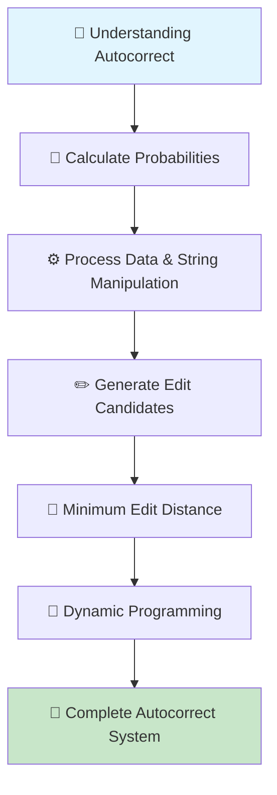
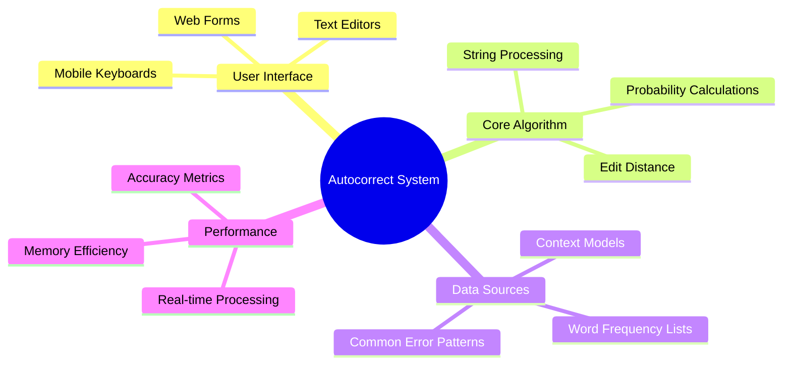
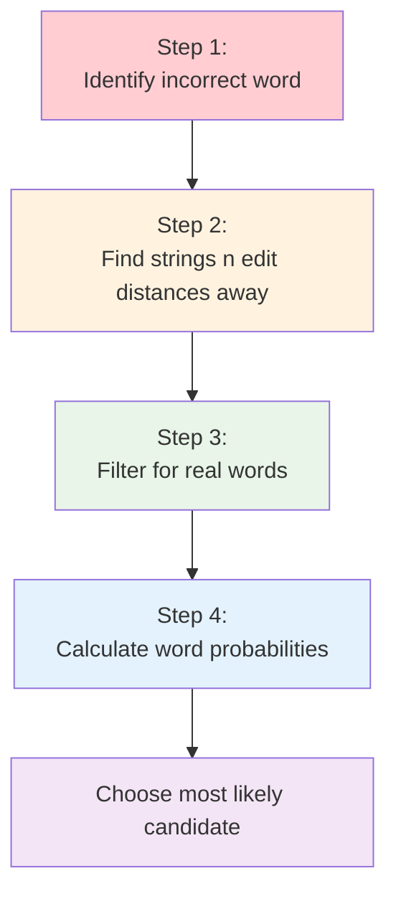
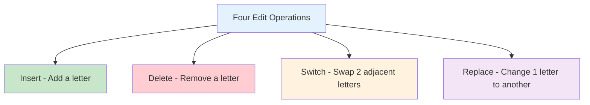
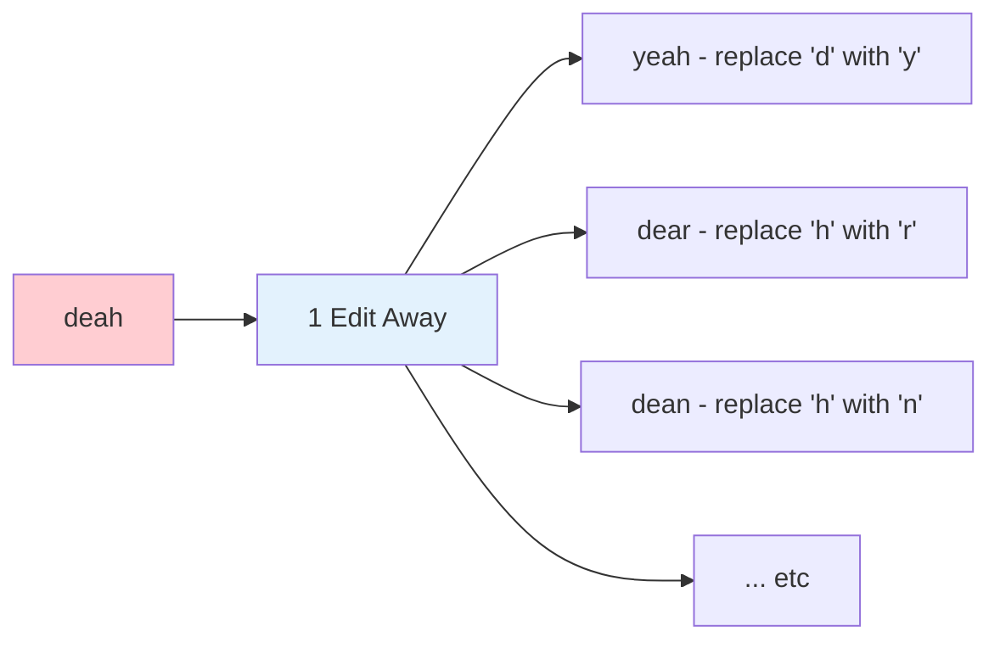
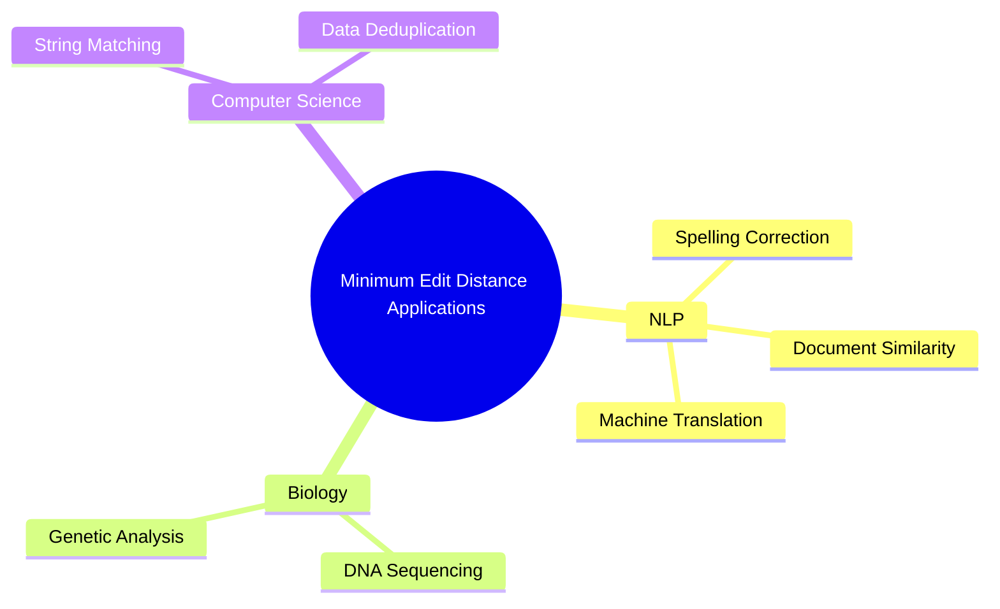
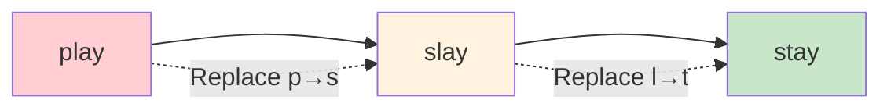
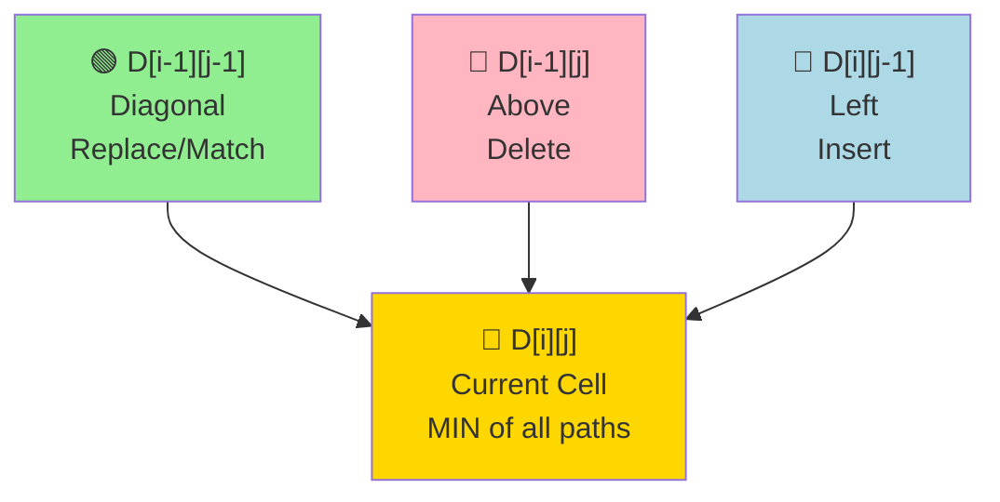
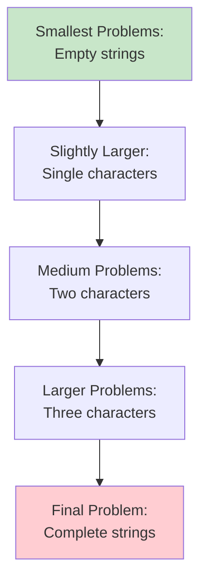

# Course 2 Week 1: Autocorrect and Minimum Edit Distance

**Natural Language Processing Specialization**
**Natural Language Processing with Probabilistic Models**

---

## Table of Contents

## Table of Contents

1. [Course Introduction and Week Overview](#1-course-introduction-and-week-overview)
2. [Autocorrect Fundamentals](#2-autocorrect-fundamentals)
3. [Building the Autocorrect Model](#3-building-the-autocorrect-model)
4. [Building the Model II](#4-building-the-model-ii)
5. [Understanding Dynamic Programming](#5-understanding-dynamic-programming)
6. [Minimum Edit Distance](#6-minimum-edit-distance)
7. [Minimum Edit Distance Algorithm](#7-minimum-edit-distance-algorithm)
8. [Minimum Edit Distance Algorithm II](#8-minimum-edit-distance-algorithm-ii)
9. [Minimum Edit Distance Algorithm III](#9-minimum-edit-distance-algorithm-iii)

---

# 1. Course Introduction and Week Overview

## Week Introduction

### The Algorithm You Use Every Day

Welcome to Week 1, where we explore an algorithm that has become **ubiquitous in modern digital communication** - autocorrect. This technology silently works behind the scenes in:

- 📱 **Mobile phones** - Every text message you send
- 💻 **Computers** - Word processors and text editors
- 🌐 **Web browsers** - Search queries and forms
- 📧 **Email clients** - Professional and personal communication
- 💬 **Messaging apps** - Social media and chat platforms

### Real-Life Analogy: The Digital Proofreader

Think of autocorrect as your **personal proofreader** who:

- Never gets tired or loses focus
- Instantly recognizes common typing mistakes
- Suggests corrections based on context and probability
- Works at the speed of thought (real-time processing)

Just like a human proofreader uses experience to spot errors, autocorrect uses **statistical patterns** learned from massive text datasets.

### Week Learning Journey



### Key Skills You'll Master

1. **Probability Calculations** - Finding the most likely correction for typos
2. **Data Processing** - String manipulation and text preprocessing
3. **Edit Generation** - Creating possible corrections for misspelled words
4. **Minimum Edit Distance** - Measuring similarity between strings
5. **Dynamic Programming** - Efficient algorithmic approach for optimization

### Why This Matters

- **Practical Application**: Build technology you use daily
- **Interview Relevance**: Dynamic programming is a common technical interview topic
- **Foundation Building**: Prepares you for more advanced NLP concepts
- **Problem-Solving**: Learn systematic approaches to complex problems

---

## Overview

### What Makes This Week Special?

Autocorrect represents a perfect intersection of:

- **Theoretical Computer Science** (algorithms and data structures)
- **Practical Engineering** (real-time performance requirements)
- **Linguistic Understanding** (language patterns and context)
- **Statistical Modeling** (probability and machine learning)

### Learning Objectives Deep Dive

#### 1. Conceptual Understanding of Autocorrect

**What you'll discover:**

- Autocorrect means different things in different contexts
- Mobile keyboards vs. word processors have different requirements
- Context-sensitive vs. context-free correction approaches

**Real-world example:**

```
User types: "I love you to"
Context-aware autocorrect: "I love you too" ✅
Simple autocorrect: No change ❌
```

#### 2. Building the Autocorrect Model

**Step-by-step approach:**

- **Input Processing**: Handle user text and identify potential errors
- **Candidate Generation**: Create list of possible corrections
- **Probability Ranking**: Score candidates based on likelihood
- **Output Selection**: Choose and present the best correction

#### 3. String Distance Measurement

**Core question**: How different are two strings?

**Mathematical foundation:**
$$\text{EditDistance}(s_1, s_2) = \min(\text{operations to transform } s_1 \text{ into } s_2)$$

**Practical example:**

```
"hello" → "helo" (1 deletion)
"hello" → "hallo" (1 substitution)
"hello" → "helllo" (1 insertion)
```

#### 4. Dynamic Programming Mastery

**Why Dynamic Programming?**

- **Efficiency**: Solves complex problems by breaking them into simpler subproblems
- **Optimization**: Finds optimal solutions systematically
- **Reusability**: Stores intermediate results to avoid redundant calculations

**Classic Interview Connection:**
Dynamic programming appears in many technical interviews because it tests:

- Problem decomposition skills
- Optimization thinking
- Algorithm design capabilities
- Mathematical reasoning

### The Bigger Picture



### Real-World Impact Statistics

- **Billions of corrections** made daily across all platforms
- **30-50% reduction** in typing errors on mobile devices
- **Significant improvement** in communication efficiency
- **Accessibility benefits** for users with motor difficulties

### Technical Challenges We'll Address

1. **Speed vs. Accuracy**: Balancing quick responses with correct suggestions
2. **Context Understanding**: Knowing when NOT to correct (proper nouns, slang)
3. **Language Variations**: Handling different dialects and writing styles
4. **User Adaptation**: Learning from individual typing patterns

### What Makes This Approach Unique?

Unlike simple dictionary lookups, our probabilistic approach considers:

- **Frequency of words** in natural language
- **Common typing error patterns**
- **Distance calculations** for systematic ranking
- **Dynamic programming optimization** for efficiency

This foundation will prepare you for advanced NLP topics in later courses while giving you immediately applicable skills for building real-world text processing systems.

# 2. Autocorrect Fundamentals

## What is Autocorrect?

**Definition**: Autocorrect is an application that changes misspelled words into the correct ones.

### Where You Use It

You probably know autocorrect very well already. You have it on:

- 📱 **Your phone**
- 📟 **Tablet**
- 💻 **Computer** (inside document editors and email applications)

### Real Example: The "Deah" Case

**Input:**

```
"Happy birthday deah friend"
```

**Output:**

```
"Happy birthday dear friend"
```

**What happened:** The misspelled word "deah" was corrected to "dear" (D-E-A-R), which is what you probably intended to write in this context.

---

## Important Limitation: Spelling vs Context

### What We Handle This Week ✅

**Spelling Errors** - Words that are misspelled:

```
"deah" → "dear" (corrected because "deah" isn't a real word)
```

### What We DON'T Handle This Week ❌

**Contextual Errors** - Real words in wrong context:

```
"deer" → stays "deer" (even though "dear" might be intended)
```

**Why not?** The word "deer" is spelled correctly, but contextually incorrect (unless your friend happens to be an actual deer!). This is a more sophisticated problem that you'll learn about another time.

---

## The Four-Step Autocorrect Process



### Step 1: Identify an Incorrect Word

**Goal:** Detect misspelling as one way to identify incorrect words.

### Step 2: Find Strings n Edit Distances Away

**Key concept:** If a string is **one edit distance away** from the string you typed, it's **more similar** to your string compared to a string that is **two edit distances away**.

**Don't worry** - you will learn about minimum edit distance shortly!

### Step 3: Filter the Strings for Real Words

**Goal:** Keep only words that are spelled correctly from all the candidate strings generated in step 2.

### Step 4: Calculate Word Probabilities

**Goal:** Determine how likely each word is to appear in this context and choose the most likely candidate as the replacement.

**Process:** Calculate word probabilities that tell you how likely each word is to appear in this context.

---

## What You'll Learn Next

In the coding exercise of this week, you will implement autocorrect and see for yourself that this works really well.

**Coming up:** How to speed up edit distance computation using dynamic programming techniques.

---

## Simple but Powerful

This week involves a **simple, yet powerful model** that effectively handles spelling corrections through systematic probability calculations and edit distance measurements.

# 3. Building the Autocorrect Model

## Deep Dive into the Four Steps

Now it's time to look at each step in detail. You'll be implementing each of these steps in this week's assignments.

---

## Step 1: Identify a Misspelled Word

### How do you know it's misspelled?

**Simple Check**: If it's spelled correctly, you will find it in the dictionary. If not, then it's probably a misspelled word.

**Rule**: If a word is not given in a dictionary, flag it for correction.

### Example Process

```
Input word: "deah"
Dictionary check: "deah" ∉ dictionary
Result: Flag for correction ❌

Input word: "deer"
Dictionary check: "deer" ∈ dictionary
Result: No correction needed ✅
```

### Important Note

- We're **only** searching for spelling errors, **not** contextual errors
- Words like "deer" will pass through this filter just fine as it is spelled correctly, regardless of how the context may seem
- This is a simple and powerful model that works well

### More Sophisticated Techniques

There are much more sophisticated techniques for identifying words that are probably incorrect by looking at the words surrounding them. Some of which you'll visit later in the course.

---

## Step 2: Find Strings n Edit Distance Away

### What is Edit Distance?

**Edit**: An operation performed on a string to change it into another string

**Edit Distance**: Counts the number of these operations, so the n edit distance tells you how many operations away one string is from another

**For autocorrect**: n is usually 1-3 edits

### The Four Edit Operations



#### Insert Operation (Add a letter)

**Definition**: Adds a letter to the string in any position

**Examples with "to":**

- Insert 'p' at the end: "to" → "top"
- Insert 'w' in the middle: "to" → "two"

#### Delete Operation (Remove a letter)

**Definition**: Removes a letter from the string

**Examples with "hat":**

- Delete 't' from the end: "hat" → "ha"
- Delete 'h' from the front: "hat" → "at"
- Delete 'a' from the middle: "hat" → "ht"

#### Switch Operation (Swap 2 adjacent letters)

**Definition**: Swap two adjacent letters

**Examples with "eta":**

- Switch 't' and 'a': "eta" → "eat"
- Switch 'e' and 't': "eta" → "tea"

**Important**: You are switching two letters that are **next to each other**. This does **not** include switching two letters that are not next to each other, such as switching the 'e' and the 'a' to make "ate".

#### Replace Operation (Change 1 letter to another)

**Definition**: Changes one letter to another

**Examples with "jaw":**

- Change 'w' to 'r': "jaw" → "jar"
- Change 'j' to 'p': "jaw" → "paw"

### Combining Edit Operations

Using the four edits (insert, delete, switch, and replace), you can modify any string. By combining these edits, you can find a list of all possible strings that are n edits away.

**You'll implement**: Each of these edits in this week's programming exercise and combine edits to get a list of two edit distances from the original input string.

### Real Example: "deah" → Possible Corrections



---

## Step 3: Filter Candidates

### The Problem

Notice how many of the strings that are generated do not look like actual words.

### The Solution

To filter these strings and keep ones that are real words, you only want to consider real and correctly spelled words from your candidate lists.

### Process

**Step 3a**: Compare candidates to a known dictionary or vocabulary (just like in Step 1)

**Step 3b**: If the string does not appear in the dictionary, remove it from the list of candidates

**Result**: When you're left with a list of actual words only, then that is good progress.

### Example Filtering Process

```
Generated candidates for "deah":
✅ yeah (real word - keep)
✅ dear (real word - keep)
✅ dean (real word - keep)
❌ deag (not a real word - remove)
❌ deax (not a real word - remove)
❌ xeah (not a real word - remove)

Final filtered list: [yeah, dear, dean, ...]
```

---

## Summary: First Three Steps Complete

You learned about **three of the four steps** required to implement autocorrect:

**Step 1**: ✅ Identifying the misspelled word

**Step 2**: ✅ Finding the strings that are n edit distances away

**Step 3**: ✅ Filtering the candidates that are actual words

**Step 4**: ⏳ Calculating the probabilities (coming in the next video)

The last step is calculating the probabilities, which you will learn about in the next video.

# 4. Building the Model II

Now that you have a list of actual words, you can move on to **Step 4: Calculate word probabilities**.

## Step 4: Calculate Word Probabilities

### The Goal

The final step is to calculate word probabilities and find the **most likely word** from the candidates.

### Why Probabilities Matter

**Key Insight**: Some words are more common than others in any given body of text (also called a **corpus**).

**Example**: Some words (like "the", "and", "is") are more common than others (like "zebra", "quantum", "xylophone") in any given body of text.

**This is how autocorrect knows which word to substitute for the incorrect one.**

---

## Understanding Word Probabilities Through Example

### Sample Corpus

Let's look at this example sentence:

```
"I am happy because I am learning"
```

### Step-by-Step Calculation Process

#### Step 1: Calculate Word Frequencies

To calculate the probability of a word in the sentence, you need to first calculate the **word frequencies**.

#### Step 2: Count Total Words

In addition, you want to count the **total number of words** in the body of text or corpus.

**Note**: Normally a corpus would be much larger. Imagine every issue of a certain magazine ever published or all of the Harry Potter books. To keep this example as simple as possible, the corpus here is defined as this one sentence.

### Frequency Analysis

**Word count breakdown:**

- The word "I" appears **twice**
- The word "am" appears **twice** also
- And so on for the rest of the words
- The **total number of words** in this corpus is **seven**

| Word      | Count |
| --------- | ----- |
| I         | 2     |
| am        | 2     |
| happy     | 1     |
| because   | 1     |
| learning  | 1     |
| **Total** | **7** |

---

## The Probability Formula

### Mathematical Definition

The probability of any word within the corpus is:

$$P(w) = \frac{C(w)}{V}$$

Where:

- $P(w)$ = Probability of a word
- $C(w)$ = Number of times the word appears
- $V$ = Total size of the corpus

### Example Calculation

For the word "am":

- $C(\text{am}) = 2$ (appears twice)
- $V = 7$ (total words in corpus)
- $P(\text{am}) = \frac{2}{7}$

$$P(\text{am}) = \frac{C(\text{am})}{V} = \frac{2}{7}$$

---

## How Autocorrect Uses Probabilities

**For autocorrect**: You find the word candidate with the **highest probability** and choose that word as the replacement. And that's it!

### Example Application

```
Candidates for "deah": [dear, yeah, dean, ...]

Calculate probabilities:
- P(dear) = higher probability
- P(yeah) = lower probability
- P(dean) = lower probability

Result: Choose "dear" ✅
```

---

## Complete Autocorrect Process Summary

### The Full Workflow

You entered a word to correct, for example the misspelled word "deah". Then follow the four steps inside the autocorrect model to get its replacement:

**Step 1**: ✅ You identified "deah" as being misspelled by checking it against known words

**Step 2**: ✅ Then you made a list of all the strings that are n edits away

**Step 3**: ✅ You filter this list of strings to include only the ones that are actual words in a given dictionary

**Step 4**: ✅ And then you calculate the word probabilities for each of these words

**Final Result**: You selected the word with the **highest probability** as the autocorrect replacement. And that was it!

---

## Key Insights

### What You've Accomplished

- **Breaking it down step by step** gives you a good intuition for how to implement autocorrect
- This understanding will **come in very handy for the assignment**
- You now understand **edit and edit distance** and how they can be used to measure similarity between words

### Advanced Note: More Sophisticated Approaches

**For this week**: You are storing the count of words and then you can use that to generate the probabilities. You will be implementing the probabilities by just using the word frequencies.

**Future enhancement**: If you want to build a slightly more sophisticated autocorrect, you can keep track of **two words occurring next to each other** instead. You can then use the previous word to decide. For example, which combo is more likely: "there friend" or "their friend"?

# 5. Understanding Dynamic Programming

## What is Dynamic Programming?

**Dynamic Programming (DP)** is a powerful algorithmic technique that solves complex problems by breaking them down into simpler, overlapping subproblems and storing their solutions to avoid redundant calculations.

### Core Concept: "Remember What You've Already Solved"

Think of dynamic programming like **building a house**:

- You don't rebuild the foundation every time you add a new room
- You **reuse** what you've already built
- Each new step **builds upon** previous work

---

## Why Do We Need Dynamic Programming?

### The Problem: Exponential Time Complexity

Without DP, many problems require checking **all possible combinations**, leading to:

- **Exponential time complexity**: $O(2^n)$ or worse
- **Massive computational cost** for larger inputs
- **Impractical solutions** for real-world problems

### The Solution: Polynomial Time Complexity

With DP, we can often reduce complexity to:

- **Polynomial time**: $O(n^2)$, $O(n^3)$, etc.
- **Practical solutions** for large inputs
- **Efficient memory usage** through strategic storage

---

## Key Principles of Dynamic Programming

### 1. Optimal Substructure

The optimal solution to the problem contains **optimal solutions to subproblems**.

**Example**: Finding the shortest path from A to C through B

- If A→B→C is the shortest path
- Then A→B must be the shortest path from A to B
- And B→C must be the shortest path from B to C

### 2. Overlapping Subproblems

The same subproblems are solved **multiple times** in a naive recursive approach.

**Example**: Calculating Fibonacci numbers

```
fib(5) = fib(4) + fib(3)
fib(4) = fib(3) + fib(2)
fib(3) = fib(2) + fib(1)
```

Notice: `fib(3)` is calculated multiple times!

---

## Simple Example: Fibonacci Numbers

### Naive Recursive Approach (Inefficient)

```python
def fib_naive(n):
    if n <= 1:
        return n
    return fib_naive(n-1) + fib_naive(n-2)
```

**Time Complexity**: $O(2^n)$ - **Exponential!**

### Visualization of Redundant Calculations

```
fib(5)
├── fib(4)
│   ├── fib(3)
│   │   ├── fib(2)
│   │   │   ├── fib(1) = 1
│   │   │   └── fib(0) = 0
│   │   └── fib(1) = 1
│   └── fib(2)  ← REPEATED!
│       ├── fib(1) = 1
│       └── fib(0) = 0
└── fib(3)      ← REPEATED!
    ├── fib(2)  ← REPEATED!
    │   ├── fib(1) = 1
    │   └── fib(0) = 0
    └── fib(1) = 1
```

### Dynamic Programming Approach (Efficient)

```python
def fib_dp(n):
    if n <= 1:
        return n

    # Store solutions in a table
    dp = [0] * (n + 1)
    dp[0] = 0
    dp[1] = 1

    # Build up from smaller problems
    for i in range(2, n + 1):
        dp[i] = dp[i-1] + dp[i-2]

    return dp[n]
```

**Time Complexity**: $O(n)$ - **Linear!**

### Step-by-Step Calculation for fib(5)

```
Step 0: dp = [0, 1, ?, ?, ?, ?]
Step 1: dp[2] = dp[1] + dp[0] = 1 + 0 = 1
        dp = [0, 1, 1, ?, ?, ?]
Step 2: dp[3] = dp[2] + dp[1] = 1 + 1 = 2
        dp = [0, 1, 1, 2, ?, ?]
Step 3: dp[4] = dp[3] + dp[2] = 2 + 1 = 3
        dp = [0, 1, 1, 2, 3, ?]
Step 4: dp[5] = dp[4] + dp[3] = 3 + 2 = 5
        dp = [0, 1, 1, 2, 3, 5]

Result: fib(5) = 5
```

---

## The DP Table Concept

### What is a DP Table?

A **DP table** (or matrix) is a data structure that stores solutions to subproblems so we can:

- **Look up** previously computed results instantly
- **Build** larger solutions from smaller ones
- **Avoid** redundant calculations

### Table Structure Example

For Fibonacci, our table looks like:

```
Index:  0  1  2  3  4  5
Value:  0  1  1  2  3  5
```

Each cell `dp[i]` contains the solution to the subproblem "What is fib(i)?"

---

## More Complex Example: Longest Common Subsequence (LCS)

### Problem Definition

Given two strings, find the length of the longest subsequence that appears in both.

**Example**:

- String 1: "ABCDGH"
- String 2: "AEDFHR"
- LCS: "ADH" (length = 3)

### Why This Needs DP

**Subproblems**: For each position in both strings, we need to decide:

- If characters match: include in LCS
- If they don't match: take the better of two options

### Setting Up the DP Table

```
    ""  A  E  D  F  H  R
""   0  0  0  0  0  0  0
A    0  ?  ?  ?  ?  ?  ?
B    0  ?  ?  ?  ?  ?  ?
C    0  ?  ?  ?  ?  ?  ?
D    0  ?  ?  ?  ?  ?  ?
G    0  ?  ?  ?  ?  ?  ?
H    0  ?  ?  ?  ?  ?  ?
```

### Recurrence Relation

$$
dp[i][j] = \begin{cases}
dp[i-1][j-1] + 1 & \text{if } s1[i-1] = s2[j-1] \\
\max(dp[i-1][j], dp[i][j-1]) & \text{otherwise}
\end{cases}
$$

### Step-by-Step Calculation

**Step 1**: Initialize base cases (empty string vs any string = 0)

```
    ""  A  E  D  F  H  R
""   0  0  0  0  0  0  0
A    0
B    0
C    0
D    0
G    0
H    0
```

**Step 2**: Fill first row (A vs AEDFHR)

```
    ""  A  E  D  F  H  R
""   0  0  0  0  0  0  0
A    0  1  1  1  1  1  1
B    0
C    0
D    0
G    0
H    0
```

**Calculation for A row**:

- A vs A: match! dp[1][1] = dp[0][0] + 1 = 0 + 1 = 1
- A vs E: no match, dp[1][2] = max(dp[0][2], dp[1][1]) = max(0, 1) = 1
- A vs D: no match, dp[1][3] = max(dp[0][3], dp[1][2]) = max(0, 1) = 1
- And so on...

**Step 3**: Continue filling the table

```
    ""  A  E  D  F  H  R
""   0  0  0  0  0  0  0
A    0  1  1  1  1  1  1
B    0  1  1  1  1  1  1
C    0  1  1  1  1  1  1
D    0  1  1  2  2  2  2
G    0  1  1  2  2  2  2
H    0  1  1  2  2  3  3
```

**Final Answer**: dp[6][6] = 3 (length of LCS is 3)

---

## Key Insights: Why DP Works

### 1. Bottom-Up Approach

- Start with **smallest subproblems** (base cases)
- **Build up** to larger problems using previous solutions
- Each step **reuses** work from previous steps

### 2. Memoization (Top-Down Alternative)

Instead of building bottom-up, we can:

- Start with the **original problem**
- **Recursively break down** into subproblems
- **Store results** in a memo table to avoid recalculation

### 3. State Transition

Each cell in the DP table represents a **state**, and we have **rules** (recurrence relations) for moving between states.

---

## Common DP Patterns

### 1. Linear DP

**Pattern**: Each state depends on a **fixed number of previous states**
**Examples**: Fibonacci, climbing stairs, house robber

### 2. 2D DP

**Pattern**: Two dimensions, often comparing two sequences
**Examples**: Edit distance, longest common subsequence, knapsack

### 3. State Machine DP

**Pattern**: Multiple states with transitions between them
**Examples**: Stock buying/selling with cooldown

---

## DP Problem-Solving Strategy

### Step 1: Identify if it's a DP problem

- **Optimal substructure**: Can you break the problem into smaller subproblems?
- **Overlapping subproblems**: Are the same subproblems solved multiple times?

### Step 2: Define the state

- What does `dp[i]` (or `dp[i][j]`) represent?
- What are the dimensions of your DP table?

### Step 3: Write the recurrence relation

- How do you compute `dp[i]` from previous states?
- What are the base cases?

### Step 4: Determine the order of computation

- Bottom-up: Start from base cases, build up
- Top-down: Start from the answer, recurse with memoization

### Step 5: Implement and optimize

- Code the solution
- Consider space optimization if possible

---

## Connection to Edit Distance

### Why Edit Distance Needs DP

When comparing two strings of length m and n:

- **Naive approach**: Try all possible edit sequences → $O(3^{\max(m,n)})$
- **DP approach**: Build table systematically → $O(m \times n)$

### The Insight

For strings "play" and "stay":

- To find edit distance between "play" and "stay"
- We can use solutions for smaller subproblems:
  - "pla" vs "sta"
  - "pla" vs "stay"
  - "play" vs "sta"

This is **exactly** what we'll implement in the next section!

---

## Summary

### What We Learned

1. **Dynamic Programming** breaks complex problems into simpler subproblems
2. **Memoization** avoids redundant calculations
3. **DP tables** store intermediate results for quick lookup
4. **Recurrence relations** define how to build larger solutions from smaller ones

### Key Benefits

- ✅ **Dramatic performance improvement** (exponential → polynomial)
- ✅ **Systematic approach** to complex optimization problems
- ✅ **Foundation** for many NLP and computer science algorithms

### Ready for Edit Distance!

Now that you understand DP fundamentals, you're ready to see how it revolutionizes minimum edit distance calculation!

# 6. Minimum Edit Distance

## What is Minimum Edit Distance?

**Definition**: Given two strings, the minimum edit distance is the **lowest number of operations** needed to transform one string into the other.

### Why It Matters

Minimum Edit Distance has a **wide variety of applications**. It allows you to implement:

- ✅ **Spelling correction**
- ✅ **Document similarity**
- ✅ **Machine translation**
- ✅ **DNA sequencing**
- ✅ **And more...**

---

## The Core Problem

### Evaluating String Similarity

**Question**: What if you are given two words, strings, or even whole documents and you wanted to evaluate how similar they are?

**Answer**: Minimum edit distance can be used to do this!

### Applications in Different Fields



---

## The Three Edit Operations

For calculating minimum edit distance, you will use **three types of edit operations** (all operations you already know):

### 1. Insert (add a letter)

**Examples with "to":**

- "to" → "top" (insert 'p')
- "to" → "two" (insert 'w')

### 2. Delete (remove a letter)

**Examples with "hat":**

- "hat" → "ha" (delete 't')
- "hat" → "at" (delete 'h')
- "hat" → "ht" (delete 'a')

### 3. Replace (change 1 letter to another)

**Examples with "jaw":**

- "jaw" → "jar" (replace 'w' with 'r')
- "jaw" → "paw" (replace 'j' with 'p')

---

## Working Example: "play" → "stay"

### Step-by-Step Transformation



**Detailed breakdown:**

1. **"play" → "slay"**: Replace 'p' with 's'
2. **"slay" → "stay"**: Replace 'l' with 't'
3. **"a" and "y"**: No changes needed (already match)

**Total edits needed**: 2 operations

---

## Edit Costs and Distance Calculation

### Until Now: Equal Costs

Until this point, you've considered **all edit operations to cost the same** - that is, a cost of 1.

### New Approach: Different Costs

Now you will consider a **different cost for each type of operation**:

| Operation | Cost |
| --------- | ---- |
| Insert    | 1    |
| Delete    | 1    |
| Replace   | 2    |

### Why Replace Costs More?

**Intuitive reasoning**: Replacement can be thought of as a **delete followed by an insert**.

- Delete old letter: cost = 1
- Insert new letter: cost = 1
- **Total**: cost = 2

### Recalculating Our Example

**"play" → "stay" with costs:**

- Replace 'p' → 's': cost = 2
- Replace 'l' → 't': cost = 2
- **Total edit distance**: 2 + 2 = 4

```
Edit distance = 2 + 2 = 4
```

---

## Additional Examples for Better Understanding

### Example 1: "cat" → "bat"

```
Source: c a t
Target: b a t

Operation: Replace 'c' → 'b'
Cost: 2
Total edit distance: 2
```

### Example 2: "dog" → "dogs"

```
Source: d o g
Target: d o g s

Operation: Insert 's' at the end
Cost: 1
Total edit distance: 1
```

### Example 3: "hello" → "help"

```
Source: h e l l o
Target: h e l p

Operations:
1. Delete 'l' (cost = 1)
2. Replace 'o' → 'p' (cost = 2)
Total edit distance: 1 + 2 = 3
```

### Example 4: "kitten" → "sitting"

```
Source: k i t t e n
Target: s i t t i n g

Operations:
1. Replace 'k' → 's' (cost = 2)
2. Replace 'e' → 'i' (cost = 2)
3. Insert 'g' at end (cost = 1)
Total edit distance: 2 + 2 + 1 = 5
```

---

## The Computational Challenge

### Simple vs. Complex Cases

This example with "play" → "stay" was **relatively simple** and it was possible to find the minimum edit distance just by looking at it.

### Real-World Complexity

**But imagine** the number of operations between:

- 📄 **Much longer strings**
- 📚 **Large blocks of text**
- 🧬 **DNA strings**

### Brute Force Problems

You **could** try to solve these problems by brute force:

- Adding one edit distance at a time
- Enumerating all possibilities until one string changes to the other

**But this could take a very, very long time!**

### Exponential Complexity

**Problem**: By solving this way, the computational complexity **increases exponentially** as each string grows in length.

---

## The Solution: Dynamic Programming

### A Much Faster Way

A **much faster way** is by using a **tabular approach**.

### What You'll Learn Next

The tabular approach allows you to:

- ⚡ **Speed up** the enumeration of all possible strings and edits
- 🧠 Learn about a new concept known as **dynamic programming**

### Preview

In doing so, you will also be learning about **dynamic programming** - a powerful algorithmic technique that will be covered in the next video.

---

## Key Takeaways

### Remember the Core Concept

**Minimum edit distance** allows you to:

- ✅ Evaluate similarity between two strings
- ✅ Find the minimum number of edits between two strings
- ✅ Implement various NLP and computational biology applications

### Scaling Challenge

As your strings get **larger**, it gets **much harder** to calculate the minimum edit distance manually.

**Hence**: You will now learn about the **minimum edit distance algorithm** using dynamic programming!

# 7. Minimum Edit Distance Algorithm

## Introduction to the Tabular Approach

Welcome! In this section, I will teach you about **dynamic programming** applied to minimum edit distance. Once you understand this example, you'll be able to apply dynamic programming to many other problems.

---

## Setting Up the Problem

### The Matrix Layout

We start by laying out the problem in a **distance matrix D**, where:

- **Source word**: "play" (down the left column)
- **Target word**: "stay" (along the top row)
- **Empty string placeholder**: Represented by the **#** symbol at the start of each string

```
    #  s  t  a  y
#
p
l
a
y
```

### Why the Empty String?

The **#** symbol represents an empty string placeholder. The reason for this will make more sense in the steps ahead, but it helps us handle the base cases of our dynamic programming solution.

### Row and Column Indices

We also include row and column indices to make things easier to follow along:

```
     0  1  2  3  4
     #  s  t  a  y
0 #
1 p
2 l
3 a
4 y
```

---

## Understanding the Distance Matrix D

### What Each Cell Represents

The goal is to fill out this **distance matrix D** such that:

$$D[i][j] = \text{minimum edit distance from source[0:i] to target[0:j]}$$

### Example: D[2][3]

**D[2][3]** refers to the minimum edit distance from **"pl"** to **"sta"**:

- **"pl"**: First 2 letters of source word "play"
- **"sta"**: First 3 letters of target word "stay"

### General Formula

For any element in the matrix:

- **Row i, Column j**: $D[i][j]$
- **Source substring**: First $i$ characters of source
- **Target substring**: First $j$ characters of target

### The Final Answer

For a source of length $m$ and target of length $n$:

- **$D[m][n]$** (bottom-right corner) = minimum edit distance between the two complete strings

---

## The Dynamic Programming Strategy

### Building from Smallest to Largest

You will compute this **from the shortest substring to the full string**:

1. Start with the **shortest strings** in the top-left corner
2. Work **down** then to the **right**
3. Build upon each sub-problem by **combining solutions**

### The Core Intuition

**The intuition**: You can build upon each sub-problem by combining solutions.

**Example**:

- Finding minimum edit distance between **2 letters** is easy
- Then increase the problem size **one letter at a time**
- **Build on what you already know**

If this seems confusing at first, don't worry! It will start to make more sense as you work through the examples.

---

## Edit Operation Costs (Recap)

Before we get started, recall the **cost for each edit**:

| Operation | Cost |
| --------- | ---- |
| Insert    | 1    |
| Delete    | 1    |
| Replace   | 2    |

---

## Step-by-Step Calculation

### Step 1: Empty String to Empty String

**Problem**: Transform source empty string (#) to target empty string (#)

**Solution**: The edit distance is **0** (no operations needed)

```
     0  1  2  3  4
     #  s  t  a  y
0 #  0
1 p
2 l
3 a
4 y
```

**Logic**: To change nothing to nothing, you do nothing!

### Step 2: "p" to Empty String

**Problem**: Transform "p" to empty string (#)

**Solution**: **Delete** "p" at cost of **1**

```
     0  1  2  3  4
     #  s  t  a  y
0 #  0
1 p  1
2 l
3 a
4 y
```

### Step 3: Empty String to "s"

**Problem**: Transform empty string (#) to "s"

**Solution**: **Insert** "s" at cost of **1**

```
     0  1  2  3  4
     #  s  t  a  y
0 #  0  1
1 p  1
2 l
3 a
4 y
```

### Step 4: "p" to "s" (The Complex Case)

**Problem**: Transform "p" to "s"

This is where it gets interesting! There are **multiple possible paths**:

#### Visualizing the Dependencies with Color Coding

```
     0    1   2  3  4
     #    s   t  a  y
0 # 🟢0  🔴1  2  3  4
1 p 🔵1  🎯?
2 l  2
3 a  3
4 y  4
```

Where:

- 🟢 **Green cell** D[0][0] = 0 (diagonal: # → #)
- 🔴 **Red cell** D[0][1] = 1 (above: # → "s")
- 🔵 **Blue cell** D[1][0] = 1 (left: "p" → #)
- 🎯 **Target cell** D[1][1] = ? ("p" → "s")

#### Path 1: Insert then Delete (using red cell)

```
🟢0 🔴1 ← Use this value (cost of # → "s")
🔵1 🎯?
```

1. Start with "p"
2. **Insert** "s" at the end → "ps" (cost = 1)
3. **Delete** "p" from beginning → "s" (cost = 1)
4. **Total cost**: 1 + 1 = 2

**DP Logic**: We already calculated cost of (# → "s") = 1 (**red cell above**). We just add the cost of deleting "p" = 1.

#### Path 2: Delete then Insert (using blue cell)

```
🟢0 🔴1
🔵1 🎯? ← Use this value (cost of "p" → #)
```

1. Start with "p"
2. **Delete** "p" → "#" (empty string) (cost = 1)
3. **Insert** "s" → "s" (cost = 1)
4. **Total cost**: 1 + 1 = 2

**DP Logic**: We already calculated cost of ("p" → #) = 1 (**blue cell to the left**). We just add the cost of inserting "s" = 1.

#### Path 3: Replace (using green cell)

```
🟢0 🔴1
🔵1 🎯?
   ↖️ Use this value (cost of # → #)
```

1. Start with "p"
2. **Replace** "p" with "s" → "s" (cost = 2)
3. **Total cost**: 2

**DP Logic**: We start from the cost of (# → #) = 0 (**green cell diagonally**). We add the cost of replacement = 2.

#### Final Calculation

$$
D[1][1] = \min \begin{cases}
D[0][1] + 1 & = 1 + 1 = 2 \text{ (insert+delete)} \\
D[1][0] + 1 & = 1 + 1 = 2 \text{ (delete+insert)} \\
D[0][0] + 2 & = 0 + 2 = 2 \text{ (replace)}
\end{cases} = 2
$$

**Choose the minimum**: min(2, 2, 2) = **2**

```
     0  1  2  3  4
     #  s  t  a  y
0 #  0  1  2  3  4
1 p  1  2
2 l  2
3 a  3
4 y  4
```

---

## The General DP Recurrence Relation

### Mathematical Formula

$$
D[i][j] = \min \begin{cases}
D[i-1][j] + \text{delete\_cost} & \text{(deletion)} \\
D[i][j-1] + \text{insert\_cost} & \text{(insertion)} \\
D[i-1][j-1] + \text{replace\_cost} & \text{(replacement)}
\end{cases}
$$

### With Our Specific Costs

$$
D[i][j] = \min \begin{cases}
D[i-1][j] + 1 & \text{(delete from source)} \\
D[i][j-1] + 1 & \text{(insert into source)} \\
D[i-1][j-1] + 2 & \text{(replace, if chars different)} \\
D[i-1][j-1] + 0 & \text{(no change, if chars same)}
\end{cases}
$$

---

## Dependency Pattern: The Three-Cell Rule

### The Three Dependencies

To fill in any cell `D[i][j]`, you need its three neighbors:

```
     j-1  j
i-1  🟢  🔴
i    🔵  🎯
```

- 🟢 **Diagonal** (D[i-1][j-1]): Replace operation (or match if characters are same)
- 🔴 **Above** (D[i-1][j]): Delete from source
- 🔵 **Left** (D[i][j-1]): Insert into source
- 🎯 **Current** (D[i][j]): The cell we're calculating

### Why This Works

This dependency pattern ensures that by the time we calculate `D[i][j]`, we already have all the information we need from previously solved subproblems.

---

## Filling the First Row and Column

### Strategy

Before we can use the general formula, we need to fill out the **first column** and **first row** so that every remaining cell has its dependencies (red, blue, and green cells) available.

### First Column: Source to Empty String

```
     0  1  2  3  4
     #  s  t  a  y
0 #  0
1 p  1  ← cost of "p" → "#" = 1 delete
2 l  2  ← cost of "pl" → "#" = 2 deletes
3 a  3  ← cost of "pla" → "#" = 3 deletes
4 y  4  ← cost of "play" → "#" = 4 deletes
```

### First Row: Empty String to Target

```
     0  1  2  3  4
     #  s  t  a  y
0 #  0  1  2  3  4
     ↑  ↑  ↑  ↑  ↑
     0  1  2  3  4
   inserts inserts
```

**Pattern**:

- `D[i][0] = i` (i deletions to get to empty string)
- `D[0][j] = j` (j insertions from empty string)

---

## Visual Summary of the Process



---

## Benefits of This Approach

### Computational Efficiency

- **Naive approach**: Exponential time $O(3^{\max(m,n)})$
- **DP approach**: Polynomial time $O(m \times n)$

### Reusing Calculations

Each cell calculation **benefits from previous work**, avoiding redundant computations that would occur in a naive recursive approach.

### Systematic Solution

The tabular approach provides a **systematic way** to solve the problem that scales efficiently to longer strings.

---

## What's Coming Next

In the next video, you will learn about a **much faster way to populate your table** using the complete dynamic programming algorithm with the recurrence relation we've established.

### Key Takeaways

1. ✅ **Cost of operations**: Insert/Delete = 1, Replace = 2
2. ✅ **DP table setup**: Source vs Target with empty string placeholders
3. ✅ **Three-cell dependency**: Each cell depends on green (diagonal), red (above), and blue (left) neighbors
4. ✅ **Base cases**: First row and column represent simple insert/delete sequences
5. ✅ **Color-coded logic**: Visual pattern helps understand which previous calculation to reuse
6. ✅ **Building blocks**: Complex problems solved using simpler subproblem solutions

This foundation prepares you for implementing the complete minimum edit distance algorithm efficiently!

# 8. Minimum Edit Distance Algorithm II

## Translating to Code: The Formulaic Approach

In this video, we are going to translate how to populate the table mentioned previously used to change from one word into another with some code. By the end of the video, you'll see the finished product.

Earlier, you used an **intuitive approach** to fill out the upper left corner of the minimum edit distance table. Now, I'll show you how to use a **formulaic approach** to fill out the rest.

---

## Starting Point: Partially Filled Table

So you filled out some of the table already and it looks like this:

```
     0  1  2  3  4
     #  s  t  a  y
0 #  0  1
1 p  1  2
2 l  2
3 a  3
4 y  4
```

---

## Step 1: Fill the Leftmost Column

### The Pattern: Deleting Letters

To fill out the rest of the table, you must first fill out the remaining cells of the **leftmost column** and **top row**.

**Key Insight**: To transform "play" into an empty string, you can just **delete each letter**.

### Formula for Leftmost Column

You can fill out these cells **top to bottom** by following this formula:

$$D[i][0] = D[i-1][0] + \text{delete\_cost}$$

For each cell, look at the **cell above** and add the cost of an extra delete edit, which will be **1**.

### Step-by-Step Calculation

**D[1][0]: "p" → "#"**

- Previous: D[0][0] = 0 (# → #)
- Add delete cost: 0 + 1 = 1
- **Result**: D[1][0] = 1

**D[2][0]: "pl" → "#"**

- Previous: D[1][0] = 1 (p → #)
- Add delete cost: 1 + 1 = 2
- **Result**: D[2][0] = 2 (delete "p" and delete "l")

**D[3][0]: "pla" → "#"**

- Previous: D[2][0] = 2 (pl → #)
- Add delete cost: 2 + 1 = 3
- **Result**: D[3][0] = 3

**D[4][0]: "play" → "#"**

- Previous: D[3][0] = 3 (pla → #)
- Add delete cost: 3 + 1 = 4
- **Result**: D[4][0] = 4 (cost of 4 deletes)

### Updated Table

```
     0  1  2  3  4
     #  s  t  a  y
0 #  0  1
1 p  1  2
2 l  2
3 a  3
4 y  4
```

---

## Step 2: Fill the Top Row

### The Pattern: Inserting Letters

You can use the same idea in the first row by transforming the **empty string to "stay"** by inserting one letter at a time.

### Formula for Top Row

$$D[0][j] = D[0][j-1] + \text{insert\_cost}$$

Working from **left to right**, look at the previous cell and add a further insert cost of **1**.

### Step-by-Step Calculation

**D[0][1]: "#" → "s"**

- Previous: D[0][0] = 0 (# → #)
- Add insert cost: 0 + 1 = 1
- **Result**: D[0][1] = 1

**D[0][2]: "#" → "st"**

- Previous: D[0][1] = 1 (# → s)
- Add insert cost: 1 + 1 = 2
- **Result**: D[0][2] = 2

**D[0][3]: "#" → "sta"**

- Previous: D[0][2] = 2 (# → st)
- Add insert cost: 2 + 1 = 3
- **Result**: D[0][3] = 3

**D[0][4]: "#" → "stay"**

- Previous: D[0][3] = 3 (# → sta)
- Add insert cost: 3 + 1 = 4
- **Result**: D[0][4] = 4

### Updated Table

```
     0  1  2  3  4
     #  s  t  a  y
0 #  0  1  2  3  4
1 p  1  2
2 l  2
3 a  3
4 y  4
```

---

## Step 3: The General Formula

### The Complete Recurrence Relation

Now you can fill the rest using this **"big, scary-looking formula"**:

$$
D[i][j] = \min \begin{cases}
D[i-1][j] + \text{del\_cost} & \text{(deletion)} \\
D[i][j-1] + \text{ins\_cost} & \text{(insertion)} \\
D[i-1][j-1] + \text{rep\_cost} & \text{(replacement)}
\end{cases}
$$

### Breaking Down the Formula

**The distance to any cell is the minimum distance to reach it from any of the previous three cells.**

1. **From cell above**: Add a **delete cost** (just like in the first column)
2. **From cell to the left**: Add an **insert cost** (just like in the top row)
3. **From cell diagonally above-left**: Add **replace cost** OR **nothing**
   - **Replace cost (2)** if source[i] ≠ target[j]
   - **No cost (0)** if source[i] = target[j] (letters already match)

---

## Example: Calculating D[1][1] Using the Formula

### The Three Paths for "p" → "s"

```
      0    1   2  3  4
      #    s   t  a  y
0 #  🟢0  🔴1  2  3  4
1 p  🔵1  🎯?
2 l   2
3 a   3
4 y   4
```

### Path 1: From Above (Delete)

$$D[1][1] = D[0][1] + \text{delete\_cost} = 1 + 1 = 2$$

### Path 2: From Left (Insert)

$$D[1][1] = D[1][0] + \text{insert\_cost} = 1 + 1 = 2$$

### Path 3: From Diagonal (Replace)

Since "p" ≠ "s", we need replacement:
$$D[1][1] = D[0][0] + \text{replace\_cost} = 0 + 2 = 2$$

### Final Calculation

$$D[1][1] = \min(2, 2, 2) = 2$$

This matches our previous intuitive calculation!

---

## Complete Table Population

### Filling the Remaining Cells

You can then fill out the rest of the table the same way. Let me show a few more examples:

**D[1][2]: "p" → "st"**

```
🟢1 🔴2
🔵2 🎯?
```

- From above: D[0][2] + 1 = 2 + 1 = 3
- From left: D[1][1] + 1 = 2 + 1 = 3
- From diagonal: D[0][1] + 2 = 1 + 2 = 3 (p ≠ t)
- **Result**: min(3, 3, 3) = 3

**D[2][1]: "pl" → "s"**

```
🟢1 🔴2
🔵2 🎯?
```

- From above: D[1][1] + 1 = 2 + 1 = 3
- From left: D[2][0] + 1 = 2 + 1 = 3
- From diagonal: D[1][0] + 2 = 1 + 2 = 3 (l ≠ s)
- **Result**: min(3, 3, 3) = 3

### The Complete Filled Table

```
     0  1  2  3  4
     #  s  t  a  y
0 #  0  1  2  3  4
1 p  1  2  3  4  5
2 l  2  3  4  5  6
3 a  3  4  5  4  5
4 y  4  5  6  5  4
```

**The final answer**: D[4][4] = **4** (minimum edit distance from "play" to "stay")

---

## Heat Map Visualization and Patterns

### Color Coding Reveals Interesting Patterns

Looking at the completed table with color coding (like a heat map), you can see some interesting patterns:

```
     0  1  2  3  4
     #  s  t  a  y
0 #  0  1  2  3  4
1 p  1  2  3  4  5
2 l  2  3  4  5  6
3 a  3  4  5 🎯4  5
4 y  4  5  6  5 🎯4
```

### The Diagonal Pattern

**Key Observation**: Once you get from "pl" to "st", the **suffix of both words is the same** ("a", "y").

- At D[3][3]: "pla" → "sta" has cost 4
- At D[4][4]: "play" → "stay" also has cost 4

**Why?** Since the suffixes "ay" are identical, **no more edits are needed**. That's why this **4 carries down the diagonal**.

---

## The Three Core Equations

### Summary of the Three Paths

1. **D[i,j] = D[i-1, j] + del_cost**: Populate current cell (i,j) using the cost in the cell **directly above**

2. **D[i,j] = D[i, j-1] + ins_cost**: Populate current cell (i,j) using the cost in the cell **directly to its left**

3. **D[i,j] = D[i-1, j-1] + rep_cost**: The rep_cost can be **2 or 0** depending on whether you actually need to replace or not

### The Decision Process

**At every time step**: Check the **three possible paths** where you can come from and **select the least expensive one**.

---

## Implementation Benefits

### Computational Efficiency

- **Systematic approach**: Fill table row by row, column by column
- **Time complexity**: O(m × n) where m and n are string lengths
- **Space complexity**: O(m × n) for the table

### Code Readiness

This formulaic approach translates directly to code that you will be using in the programming assignments.

### Pattern Recognition

The visual patterns (like the diagonal carrying values) help verify correctness and understand the algorithm's behavior.

---

## Key Takeaways

1. ✅ **Base cases**: First row and column use simple insert/delete patterns
2. ✅ **Three equations**: Delete (above), Insert (left), Replace/Match (diagonal)
3. ✅ **Minimum selection**: Always choose the path with lowest cost
4. ✅ **Character matching**: Replace cost is 0 when characters are identical
5. ✅ **Final answer**: Bottom-right cell contains the minimum edit distance
6. ✅ **Pattern recognition**: Identical suffixes create diagonal patterns

### What's Next

Congratulations! Now you have seen the complete algorithm that you will be using in the programming assignments. In the next video, you'll learn some more tricks that will help you with the programming assignments.

Well done! You now know how to build a minimum edit distance algorithm efficiently using a table.

# 9. Minimum Edit Distance Algorithm III

## Complete Overview and Advanced Concepts

This video gives you a complete overview of minimum edit distance and shows you what to do if you want to **reconstruct the path** you took when doing the edits.

---

## Key Implementation Notes

### Levenshtein Distance

**What you've been using**: Measuring the edit distance by using the **three edits** with costs:

- **Insert**: cost = 1
- **Delete**: cost = 1
- **Replace**: cost = 2

This specific cost scheme is known as **Levenshtein distance**. That's what you've used here.

### Alternative Distance Metrics

There are also **well-known alternatives** that have different edit rules and cost structures. You can look these up for more details if you like.

---

## Backtracing: Reconstructing the Edit Path

### Why Backtracing Matters

Finding the minimum edit distance **on its own doesn't always solve the whole problem**. You sometimes need to know **how you got there** too.

### What is Backtrace?

**Backtrace** is simply a **pointer in each cell** letting you know where you came from to get there, so you know the **path taken across the table** from the top-left corner to the bottom-right corner.

### How Backtrace Works

#### Setting Up Pointers

During table filling, for each cell D[i][j], store a pointer indicating which of the three paths gave the minimum cost:

```
     0  1  2  3  4
     #  s  t  a  y
0 #  0  ↓  ↓  ↓  ↓
1 p  ↓  ↘  →  →  →
2 l  ↓  ↓  ↘  →  →
3 a  ↓  ↓  ↓  ↘  →
4 y  ↓  ↓  ↓  →  ↘
```

Where:

- **↓** = came from above (delete operation)
- **→** = came from left (insert operation)
- **↘** = came from diagonal (replace/match operation)

#### Example: "play" → "stay" Backtrace

**Starting from D[4][4] and following pointers backward:**

```
Path: D[4][4] ← D[3][3] ← D[2][2] ← D[1][1] ← D[0][0]
Operations:
1. D[0][0] → D[1][1]: Replace 'p' with 's'
2. D[1][1] → D[2][2]: Replace 'l' with 't'
3. D[2][2] → D[3][3]: Keep 'a' (no change)
4. D[3][3] → D[4][4]: Keep 'y' (no change)

Result: "play" → "stay" using 2 replacements
```

### Applications of Backtrace

This tells you the **edits taken** and is particularly useful in problems dealing with **string alignment**. But that's a discussion for another time.

---

## Dynamic Programming: The Core Technique

### What is Dynamic Programming?

This **tabular method for computation** instead of brute force is a technique known as **dynamic programming**.

### The Intuitive Definition

**Dynamic Programming** just means:

1. **Solving the smallest subproblem first**
2. **Reusing that result** to solve the next biggest subproblem
3. **Saving that result**
4. **Reusing it again** and so on

### How You Applied DP

This is **exactly what you did** by solving each cell in order:



### DP in Computer Science

It's a **well-known technique** in computer science and will **appear again and again** in the coming weeks of this course.

---

## Implementation Example with Backtrace

### Enhanced Algorithm

```python
def min_edit_distance_with_backtrace(source, target):
    m, n = len(source), len(target)

    # Initialize DP table and backtrace table
    D = [[0] * (n + 1) for _ in range(m + 1)]
    backtrace = [[None] * (n + 1) for _ in range(m + 1)]

    # Fill base cases
    for i in range(m + 1):
        D[i][0] = i
        backtrace[i][0] = 'DELETE' if i > 0 else None

    for j in range(n + 1):
        D[0][j] = j
        backtrace[0][j] = 'INSERT' if j > 0 else None

    # Fill the table
    for i in range(1, m + 1):
        for j in range(1, n + 1):
            # Calculate three options
            delete_cost = D[i-1][j] + 1
            insert_cost = D[i][j-1] + 1
            replace_cost = D[i-1][j-1] + (0 if source[i-1] == target[j-1] else 2)

            # Choose minimum and store backtrace
            if delete_cost <= insert_cost and delete_cost <= replace_cost:
                D[i][j] = delete_cost
                backtrace[i][j] = 'DELETE'
            elif insert_cost <= replace_cost:
                D[i][j] = insert_cost
                backtrace[i][j] = 'INSERT'
            else:
                D[i][j] = replace_cost
                backtrace[i][j] = 'REPLACE' if source[i-1] != target[j-1] else 'MATCH'

    return D[m][n], backtrace
```

### Reconstructing the Path

```python
def reconstruct_path(backtrace, source, target):
    path = []
    i, j = len(source), len(target)

    while i > 0 or j > 0:
        operation = backtrace[i][j]

        if operation == 'DELETE':
            path.append(f"Delete '{source[i-1]}' at position {i-1}")
            i -= 1
        elif operation == 'INSERT':
            path.append(f"Insert '{target[j-1]}' at position {i}")
            j -= 1
        elif operation == 'REPLACE':
            path.append(f"Replace '{source[i-1]}' with '{target[j-1]}' at position {i-1}")
            i -= 1
            j -= 1
        elif operation == 'MATCH':
            path.append(f"Keep '{source[i-1]}' at position {i-1}")
            i -= 1
            j -= 1

    return list(reversed(path))
```

---

## Week 1 Complete Summary

### What You've Accomplished

**A long lesson, so well done!** You should be proud of yourself. You took the problem of solving minimum edit distance and **broke it down into parts**. Then used the **tabular-based approach step-by-step** for a very efficient implementation. Great work.

### Real-World Applications Learned

In the past few lessons, you learned about **real-world applications of NLP** that you're probably using every day:

1. ✅ **Autocorrect**: What it is and how it works its magic
2. ✅ **Autocorrect Model**: Step-by-step building using edit distance and word probabilities
3. ✅ **String Similarity**: The problem and metric of minimum edit distance
4. ✅ **Dynamic Programming**: A cool algorithmic technique for solving minimum edit distance

### Skills Ready for Practice

You now have the **know-how to practice** all these new skills in the **Week 1 programming assignment**.

---

## Programming Assignment Preview

### What You'll Code

In the programming assignment, you will:

- **Code up this example** with the complete minimum edit distance algorithm
- **Optional challenge**: Build a backtrace tool to reconstruct edit paths
- **Apply your knowledge** to real autocorrect scenarios

### Techniques You'll Use

- Dynamic programming table filling
- Three-path minimum selection
- Backtrace pointer management (optional)
- String manipulation and cost calculation

---

## Looking Ahead

### Week 2 Preview

**Minimum edit distance introduces your first application of dynamic programming.** In the next week, you'll learn about the **Viterbi algorithm**, which also makes use of dynamic programming.

### The Journey Continues

What a journey, and you're just getting started here. The **weeks ahead are loaded with more exciting stuff**.

### Dynamic Programming Applications

This technique will **appear again and again** throughout the course in various NLP algorithms and optimization problems.

---

## Key Takeaways

### Core Concepts Mastered

1. ✅ **Levenshtein Distance**: Standard edit distance with costs (1, 1, 2)
2. ✅ **Backtrace Mechanism**: Reconstructing the optimal edit sequence
3. ✅ **Dynamic Programming**: Building solutions from smallest to largest subproblems
4. ✅ **Tabular Computation**: Efficient O(m×n) algorithm vs. exponential brute force

### Practical Skills

1. ✅ **Algorithm Implementation**: Translating mathematical concepts to code
2. ✅ **Path Reconstruction**: Tracking how optimal solutions were achieved
3. ✅ **Problem Decomposition**: Breaking complex problems into manageable parts
4. ✅ **Optimization Thinking**: Choosing between multiple solution paths

### Foundation for Advanced Topics

This week's learning provides the foundation for:

- More sophisticated NLP algorithms
- Advanced dynamic programming applications
- String alignment and sequence analysis
- Probabilistic models in upcoming weeks

**Congratulations on finishing the week!** Have fun and good luck with the programming assignment.
