# Course 2 Week 2: Part of Speech Tagging and Hidden Markov Models

**Natural Language Processing Specialization**
**Natural Language Processing with Probabilistic Models**

---

## Table of Contents

1. [Introduction to Part of Speech Tagging](#1-introduction-to-part-of-speech-tagging)
2. [Markov Chains Fundamentals](#2-markov-chains-fundamentals)
3. [Markov Chains and POS Tags](#3-markov-chains-and-pos-tags)
4. [Hidden Markov Models](#4-hidden-markov-models)
5. [Calculating Probabilities](#5-calculating-probabilities)
6. [Populating the Transition Matrix](#6-populating-the-transition-matrix)
7. [Populating the Emission Matrix](#7-populating-the-emission-matrix)
8. [The Viterbi Algorithm](#8-the-viterbi-algorithm)
9. [Viterbi Initialization](#9-viterbi-initialization)
10. [Viterbi Forward Pass](#10-viterbi-forward-pass)
11. [Viterbi Backward Pass](#11-viterbi-backward-pass)

---

# 1. Introduction to Part of Speech Tagging

## Week Introduction: Welcome to Week 2

### The Mission: Automatic Grammar Detection

Welcome to Week 2! This week is focused on **part of speech tagging** using the **Viterbi algorithm**. You're about to learn how computers can automatically identify whether a word is a noun, verb, adjective, or any other part of speech.

### Real-Life Analogy: The Smart Language Assistant

Think of part of speech tagging like training a **smart assistant** that needs to understand the difference between these commands:

```bash
Command 1: "Book the flight"
├── Book → ACTION (verb)
└── Assistant thinks: "Make a reservation"

Command 2: "Give me that book"
├── Book → OBJECT (noun)
└── Assistant thinks: "Hand over the physical item"
```

The same word "book" has completely different meanings depending on its grammatical role!

### The Core Algorithm: Viterbi

The **Viterbi algorithm** is our main tool this week. Here's what makes it special:

#### What is Viterbi?

The Viterbi algorithm makes use of **dynamic programming**, which is an optimization technique that:

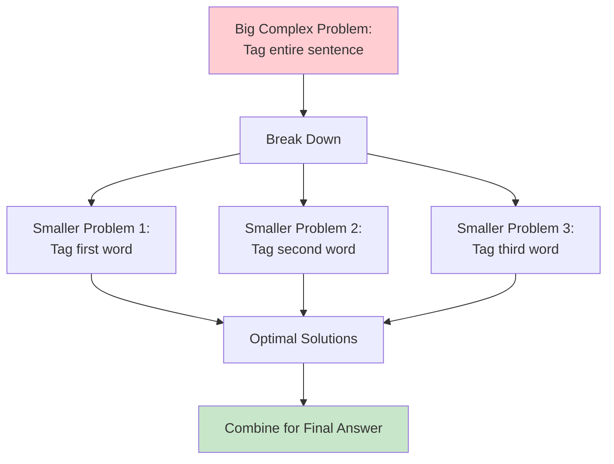

#### The Dynamic Programming Approach

- **Breaks down a big problem** into smaller problems
- **Makes use of the optimal solution** of those mini problems
- **Solves the whole one** by combining the optimal mini-solutions

It sounds complicated, but it's actually a **simple and straightforward concept** that you can use to solve many problems.

### Why This Matters: Real-World Impact

#### The Robot Communication Example

Imagine you're talking to a robot:

**Scenario 1:**

```bash
Human: "Book the flight"
Robot's Analysis:
├── "Book" → Verb (action to perform)
├── "the" → Determiner
├── "flight" → Noun (object of action)
└── Robot Action: Opens flight booking system
```

**Scenario 2:**

```bash
Human: "Give me that book"
Robot's Analysis:
├── "Give" → Verb (action to perform)
├── "me" → Pronoun (recipient)
├── "that" → Determiner
├── "book" → Noun (object to retrieve)
└── Robot Action: Looks for physical book to hand over
```

#### Why Context Changes Everything

The word **"book"** has a different meaning in each case:

- **First command**: It's a **verb** (action word)
- **Second command**: It's a **noun** (thing/object)

Knowing what the part of speech tag of a word is **changes the meaning of a sentence** and can help you when:

- **Displaying search results**
- **Responding to a query**

### Broader Applications: Where POS Tagging is Used

This week you'll be assigning part of speech tags to different words in a sentence. This technique is used in:

#### 1. **Identifying Named Entities** 🏷️

```bash
"Apple released a new iPhone"
├── Apple → NNP (Proper Noun) → Company name
├── released → VBD (Past Verb) → Action
├── iPhone → NNP (Proper Noun) → Product name
```

#### 2. **Speech Recognition** 🎤

```bash
Audio input: /bʊk/
Context: "Please ___ the meeting room"
├── Expected POS: Verb needed here
└── Output: "book" (not "buck" or other sounds)
```

#### 3. **Coreference Resolution** 🔗

```bash
"John bought a car. He loves it."
├── POS helps identify:
├── "He" → Pronoun referring to "John" (Noun)
└── "it" → Pronoun referring to "car" (Noun)
```

### Beyond Just This Course: Viterbi's Versatility

Although we are going to use the Viterbi algorithm to **assign part of speech tags to different words**, Viterbi is also used in:

- **Speech recognition** systems
- **Many other sequence prediction problems**

This makes it a valuable algorithm to master!

### What You'll Accomplish This Week

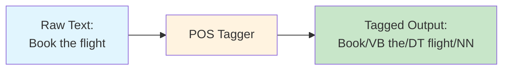

By the end of this week, you'll build a system that can:

- ✅ Take any sentence as input
- ✅ Automatically assign POS tags to each word
- ✅ Handle ambiguous words like "book", "run", "bank"
- ✅ Use the powerful Viterbi algorithm with dynamic programming

### The Learning Journey Ahead

This week covers:

1. **Part of Speech Tagging fundamentals**
2. **Markov Chains** - how word patterns connect
3. **Hidden Markov Models** - the mathematical framework
4. **Viterbi Algorithm** - the dynamic programming solution

### Getting Excited!

**Sounds exciting. Let's start tagging some words!** 🚀

You're about to learn a fundamental NLP technique that powers everything from Google Search to Siri's language understanding. The combination of linguistic knowledge and algorithmic thinking will give you powerful tools for analyzing and understanding human language.

# 2. Markov Chains Fundamentals

## The Foundation of Statistical Language Modeling

### Why Markov Chains Matter

In this video, you're going to learn about **Markov chains**. Markov chains are really important because:

- They are used in **speech recognition**
- They're also used for **parts of speech tagging**
- They form the mathematical foundation for understanding sequence patterns

In this section, we're going to learn about **transition probabilities** and **states**.

### Real-Life Analogy: The Weather Prediction System

Think of Markov chains like a **weather forecasting system**:

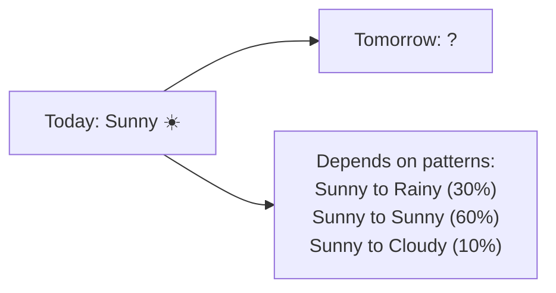

Just like weather patterns, **grammatical patterns** in language follow predictable sequences!

## The Core Problem: Predicting the Next Word's Grammar

### Starting with a Simple Example

Let's start with a small example to show what you want to accomplish, and then you will see how Markov chains can help accomplish the task.

#### Example Sentence Analysis

Consider the sentence: **"Why not learn"**

```bash
Sentence: "Why not learn"
                    ↑
                  VERB
Question: What comes next?
```

The word **"learn"** is a **verb**. The question you want to answer is: **What type of word is likely to follow?**

- A noun?
- Another verb?
- Some other part of speech?

#### The Language Pattern Discovery

If you're familiar with the English language, you might guess that if you see a **verb** in the sentence, the following word is **more likely to be a noun** rather than another verb.

**Key Insight:** The likelihood of the next word's part of speech tag in a sentence tends to **depend on the part of speech tag of the previous word**.

Makes sense, right?

### Visual Representation: From Words to Diagrams

#### The Grammar Flow Chart

You can represent these different likelihoods visually:

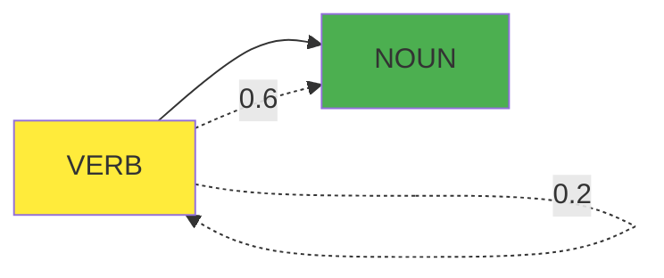

**Explanation:**

- **Circle 1**: Represents a VERB state
- **Circle 2**: Represents a NOUN state
- **Arrow 1**: Goes from VERB → NOUN (probability 0.6)
- **Arrow 2**: Goes from VERB → VERB (probability 0.2)

#### Real Examples in Action

**Example 1: "Why not learn swimming?"**

```bash
learn (VERB) → swimming (NOUN) ✓
Probability: 0.6 (higher likelihood)
```

**Example 2: "Why not learn swim?"**

```bash
learn (VERB) → swim (VERB) ✗
Probability: 0.2 (lower likelihood)
```

The higher number of **0.6** means that it's **more likely to go from a verb to a noun** as opposed to from a verb to another verb.

## Understanding Markov Chains: The Mathematical Framework

### Definition and Key Terminology

#### What are Markov Chains?

**Markov chains** are a type of **stochastic model** that describes a sequence of possible events. To get the probability for each event, it needs only the states of the previous events.

#### Terminology Breakdown

**🎲 Stochastic**

- **Definition**: The word "stochastic" just means **random** or **randomness**
- **Real-world analogy**: Like rolling dice - you can't predict the exact outcome, but you can calculate probabilities
- **In context**: A stochastic model incorporates and models processes that have a random component to them

**📊 States**

- **Definition**: A state refers to a **certain condition of the present moment**
- **Real-world analogy**: Like describing your current mood (happy, sad, excited) - it's your condition right now
- **In POS tagging**: States represent different parts of speech (NOUN, VERB, ADJECTIVE, etc.)

### Visual Representation: Directed Graphs

#### Graph Theory Basics

A Markov chain can be depicted as a **directed graph**.

**🔗 Graph (Computer Science Context)**

- **Definition**: A kind of data structure that is visually represented as a set of circles connected by lines
- **Components**: Circles (nodes) + Lines (edges)

**➡️ Directed Graph**

- **Definition**: When the lines that connect the circles have arrows that indicate a certain direction
- **Purpose**: Shows the flow from one state to another

#### Three-State Example: Complete POS System

Let's model a simple language system with three parts of speech:

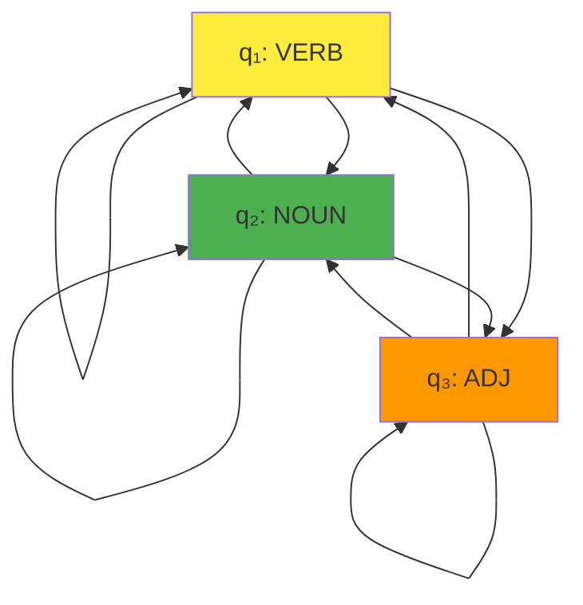

**State Definitions:**

- **q₁**: VERB state
- **q₂**: NOUN state
- **q₃**: ADJECTIVE state

The **set of all states**: $Q = \{q_1, q_2, q_3\}$

#### Real-World State Example: Water Phases

To better understand states, consider modeling water:

```bash
Water State Model:
┌─────────────┬──────────────┬───────────────┐
│    State    │   Condition  │   Example     │
├─────────────┼──────────────┼───────────────┤
│     q₁      │    Frozen    │   Ice cube    │
│     q₂      │    Liquid    │   Water       │
│     q₃      │     Gas      │   Steam       │
└─────────────┴──────────────┴───────────────┘
```

Each circle represents a **state** - the condition water can be in **at the present moment**.

### Practical Examples: Language Patterns

#### Example 1: Simple Verb-Noun Pattern

**Sentence**: "Dogs run fast"

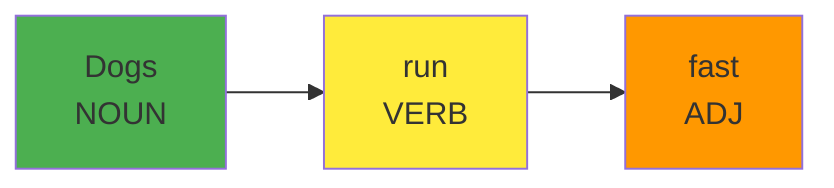

**Transition Analysis:**

- NOUN → VERB: Common pattern (subject-predicate)
- VERB → ADJECTIVE: Common pattern (verb-adverb/adjective)

#### Example 2: Complex Sentence Pattern

**Sentence**: "The beautiful cat sleeps peacefully"

```bash
State Sequence:
The (DET) → beautiful (ADJ) → cat (NOUN) → sleeps (VERB) → peacefully (ADV)

Transitions:
DET → ADJ: P = 0.4 (determiners often precede adjectives)
ADJ → NOUN: P = 0.8 (adjectives often modify nouns)
NOUN → VERB: P = 0.7 (nouns often are subjects of verbs)
VERB → ADV: P = 0.3 (verbs can be modified by adverbs)
```

#### Example 3: Ambiguous Word Resolution

**Sentence**: "I book the flight"

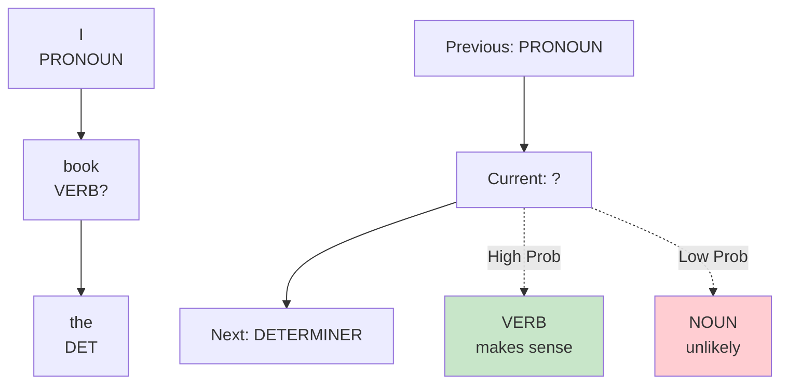

**Logic**: PRONOUN → VERB → DETERMINER is a common pattern, so "book" is likely a VERB.

### Connecting to POS Tagging

#### States as POS Tags

You now learned about the **states** in your model. We said that the states represent the condition of the present moment. These states could be thought of as **part of speech tags**:

- **One state** could correspond to **verbs**
- **Another state** could correspond to **nouns**
- **And so forth** for all POS categories

#### The Big Picture

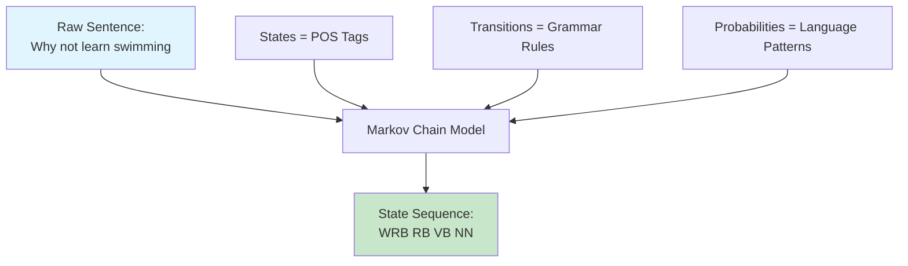

## Key Terminology Summary

### Essential Terms

**📊 Stochastic Model**

- Models that incorporate randomness
- Can predict probabilities, not exact outcomes
- Like weather forecasting or stock market prediction

**🔄 Markov Chain**

- A sequence model where next state depends only on current state
- "Memoryless" property - doesn't need full history
- Perfect for modeling grammatical patterns

**⭕ State**

- Current condition or situation
- In POS tagging: the grammatical category of current word
- Represented as circles in diagrams

**➡️ Directed Graph**

- Visual representation with arrows showing direction
- Circles = states, Arrows = possible transitions
- Foundation for understanding state relationships

**🔢 Transition Probability**

- Likelihood of moving from one state to another
- Higher numbers = more likely transitions
- Forms the core of prediction power

### Real-World Applications Preview

This foundational understanding of Markov chains will enable you to:

✅ **Build POS taggers** that understand grammatical flow  
✅ **Improve speech recognition** by predicting likely word sequences  
✅ **Create language models** that generate natural-sounding text  
✅ **Develop parsing systems** that understand sentence structure

# 3. Markov Chains and POS Tags

## From Abstract States to Real Grammar

### Connecting the Dots: States as POS Tags

Now, you know what states are. In this video, we're going to introduce **parts of speech tags**. In other words, you will see how you can go from one state to another state. In doing so, we will define a term that we call **transition probabilities**.

### Real-Life Analogy: The Grammar Traffic System

Think of POS tags like a **traffic control system** in a busy city:

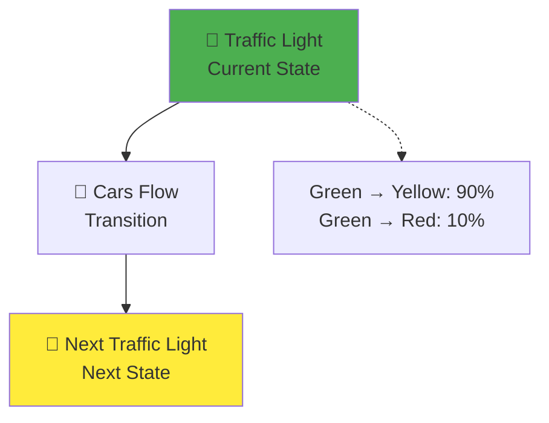

Just like traffic flows follow predictable patterns, **words in sentences follow grammatical patterns** with measurable probabilities!

## Understanding Transition Probabilities

### Definition and Purpose

**Transition probabilities** tell you about the **chances of going from one POS tag to another**.

If you think about a sentence as a **sequence of words with associated part of speech tags**, you can represent that sequence with a graph where:

- The **parts of speech tags** are events that can occur
- **Depicted by the state** of our model graph

### The Three-State POS System

#### Visual Representation

Let's examine the specific example from the video:

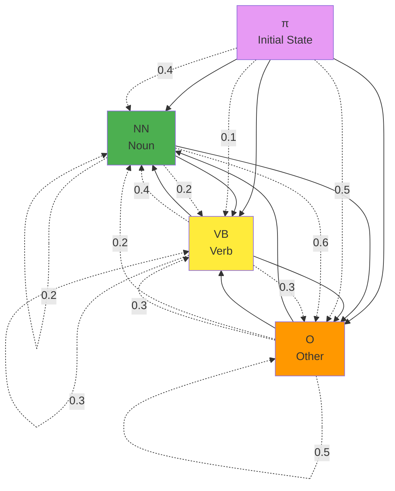

#### State Definitions

**State Labels:**

- **NN**: Noun (things, people, places)
- **VB**: Verb (actions, states of being)
- **O**: Other (all other POS tags - adjectives, prepositions, etc.)

### The Transition Matrix: Mathematical Representation

#### From Graph to Table

The **edges of the graph have weights or transition probabilities** associated with them, which define the probability of going from one state to another.

You can also use a **table to store the states and transition probabilities**. A table is an **equivalent but more compact representation** of the Markov chain model.

#### Complete Transition Matrix

```bash
Transition Matrix A:
┌─────────────┬─────┬─────┬─────┐
│             │ NN  │ VB  │  O  │
├─────────────┼─────┼─────┼─────┤
│ π (initial) │ 0.4 │ 0.1 │ 0.5 │
│ NN (noun)   │ 0.2 │ 0.2 │ 0.6 │
│ VB (verb)   │ 0.4 │ 0.3 │ 0.3 │
│ O (other)   │ 0.2 │ 0.3 │ 0.5 │
└─────────────┴─────┴─────┴─────┘
```

**Mathematical Notation:**

$$
A = \begin{pmatrix}
0.4 & 0.1 & 0.5 \\
0.2 & 0.2 & 0.6 \\
0.4 & 0.3 & 0.3 \\
0.2 & 0.3 & 0.5
\end{pmatrix}
$$

#### Understanding the Matrix Structure

This table is called a **transition matrix**. A transition matrix is an **N by N matrix**, with N being the number of states in the graph.

**Row Interpretation:**

- Each **row** in the matrix represents **transition probabilities of one state to all other states**
- **First row**: Initial state probabilities
- **Second row**: Transitions from NOUN state
- **Third row**: Transitions from VERB state
- **Fourth row**: Transitions from OTHER state

**Column Interpretation:**

- The **columns represent the possible future states** that might come next
- Column 1: Probability of transitioning TO noun
- Column 2: Probability of transitioning TO verb
- Column 3: Probability of transitioning TO other

## The Markov Property: The Memory-Free Rule

### Definition and Importance

There is one **important property** that Markov chains possess: the so-called **Markov property**.

**The Markov Property** states that: **The probability of the next event only depends on the current event.**

### Why This Matters

#### Simplicity Advantage

The Markov property helps **keep the model simple** by saying: **All you need to determine the next state is the current state**. It doesn't need information from any of the previous states.

#### Real-World Analogy: Water State Transitions

Going back to the analogy where water is in **solid, liquid, or gas states**:

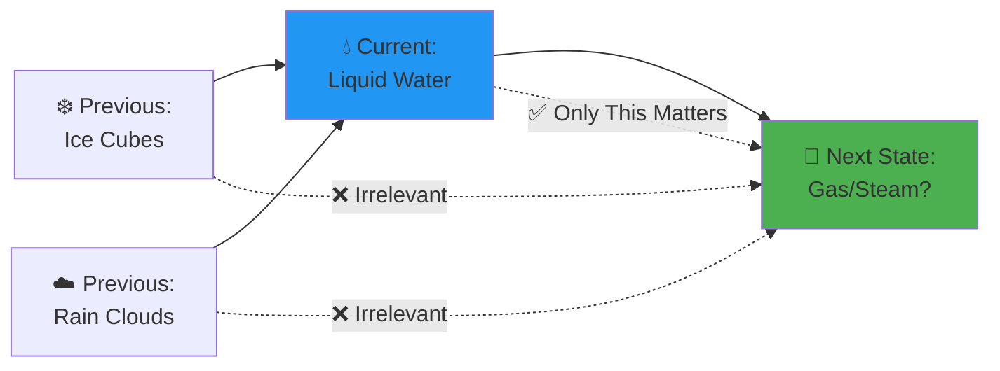

If you look at a **cup of water that is sitting outside**, the current state of the water is a **liquid state**. When modeling the probability that the water in the cup will transition into the **gas state**:

**You don't need to know the previous history of the water:**

- Whether it previously came from **ice cubes**
- Whether it previously came from **rain clouds**

**That makes sense, right?**

### Applying Markov Property to Language

#### Sentence Analysis Example

Let's revisit the sentence example from earlier. If you look at this sentence again and want to know the probability that the next word following **"learn"** is a noun:

**Sentence**: "Why not learn ?"

```bash
Sequence Analysis:
Why (WRB) → not (RB) → learn (VB) → ?

Question: What's P(next word = NOUN)?
```

#### The Markov Solution

**This just depends on the current state that you're in.** In this case, the **verb state denoted by VB**, because the current word **"learn"** is a verb.

So, the **probability of the next word being a noun** is the **transition probability for going from the verb to the noun (NN) state**.

**From our matrix**: VB → NN = **0.4**

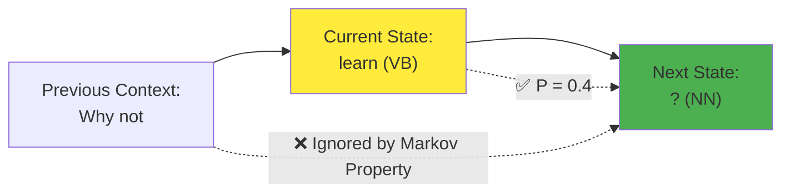

**The transition probability is written on the arrow that goes from VB to NN. And as you can see, it's 0.4.**

## Practical Examples: Reading the Matrix

### Example 1: Sentence Beginning

**Question**: What's the probability a sentence starts with a noun?

```bash
From Initial State (π):
π → NN = 0.4 (40% chance)

Real Example:
"Dogs run fast" ✓ (starts with noun)
"Running is fun" ✗ (starts with verb)
```

### Example 2: Noun Following Verb

**Question**: After seeing a verb, what's most likely next?

```bash
From VB row:
VB → NN = 0.4 (40%)
VB → VB = 0.3 (30%)
VB → O  = 0.3 (30%)

Winner: NOUN (most probable)

Example: "Dogs run fast"
         VB → ADJ (classified as "O")
```

### Example 3: Complete Sentence Probability

**Sentence**: "Dogs run"

```bash
Probability Calculation:
P(sentence) = P(start with NN) × P(NN → VB)
            = 0.4 × 0.2
            = 0.08 (8% probability)

Step-by-step:
1. π → NN: 0.4 ("Dogs" as sentence starter)
2. NN → VB: 0.2 ("run" after "Dogs")
```

## Matrix Properties and Constraints

### The Probability Sum Rule

**Critical Property**: For all the outgoing transition probabilities from a given state, the **sum of these transition probabilities should always be one**.

#### Mathematical Verification

```bash
Row Verification:
π (initial): 0.4 + 0.1 + 0.5 = 1.0 ✓
NN (noun):   0.2 + 0.2 + 0.6 = 1.0 ✓
VB (verb):   0.4 + 0.3 + 0.3 = 1.0 ✓
O (other):   0.2 + 0.3 + 0.5 = 1.0 ✓
```

**Why this makes sense**: From any given state, you MUST transition to some other state, so all possibilities must add up to 100%.

### Matrix Dimensions

**Equivalently** in the transition matrix: **All of the transition probabilities in each row should add up to one**.

## Handling the First Word: Initial State Solution

### The Bootstrap Problem

**Some of you may have noted one little flaw in this model**: It doesn't tell you how to assign a part of speech tag to the **first word in the sentence**.

This is because **all of the states in the model correspond to words**. But what do you do when **there is no previous word**? As in the case when **beginning a sentence**.

### The Initial State Innovation

#### Solution: Add a Special Starting State

To handle this, you can introduce what is known as an **initial state** (π).

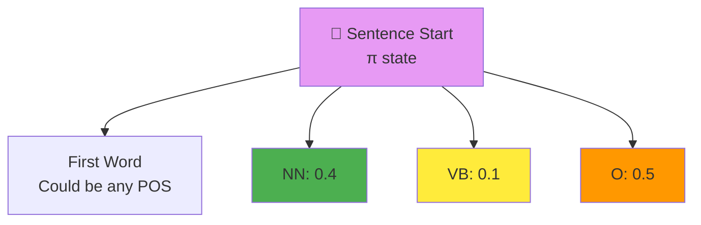

#### Matrix Dimension Impact

**By including these probabilities in the table A**, so now it has dimensions **N+1 by N**.

**Explanation:**

- **N**: Number of actual POS states (3: NN, VB, O)
- **+1**: The additional initial state (π)
- **Final dimensions**: 4×3 matrix

## Mathematical Summary

### Complete Model Definition

**To recap**, Markov chains consist of:

#### 1. State Set

**A set Q of N states**: $Q = \{q_1, q_2, \ldots, q_N\}$

In our example: $Q = \{NN, VB, O\}$ (N = 3)

#### 2. Transition Matrix

**The transition matrix A** has the dimensions **(N+1) by N**, with the **initial probabilities in the first row**.

$$
A = \begin{pmatrix}
a_{1,1} & \cdots & a_{1,N} \\
\vdots & \ddots & \vdots \\
a_{N+1,1} & \cdots & a_{N+1,N}
\end{pmatrix}
$$

Where:

- **Row 1**: Initial state probabilities (π → all states)
- **Rows 2 to N+1**: State-to-state transition probabilities

### Key Terminology Mastered

**🔄 Transition Probabilities**

- Numerical values representing likelihood of state changes
- Always between 0 and 1
- Row sums always equal 1

**📊 Transition Matrix**

- Compact mathematical representation of all transitions
- Dimensions: (N+1) × N for N states
- First row handles sentence initialization

**🧠 Markov Property**

- "Memoryless" characteristic
- Next state depends only on current state
- Simplifies computation dramatically

**🏁 Initial State**

- Special starting state (π) for sentence beginnings
- Solves the "first word" problem
- Has its own probability distribution

## Looking Forward

**Nice work so far!** In this video, you learned about **initial probability distributions** and you learned about **transition probabilities**.

In the next video, you're going to learn about **hidden Markov models**, which are used to **decode the hidden states of a word**. In our case, that would be **the part of speech of that word**.

The journey from states and transitions to actually predicting POS tags is accelerating! 🚀

# 4. Hidden Markov Models

## The Mystery Solver: When States Become Hidden

### Introduction: Decoding the Invisible

In this video, you're going to learn about **Hidden Markov models** and you will use them to **decode the hidden states of a word**. In our case, the **hidden states** is just the **parts of speech of that word**.

You will also learn about **emission probabilities** in this video.

### Real-Life Analogy: The Detective's Dilemma

Think of Hidden Markov Models like a **detective story**:

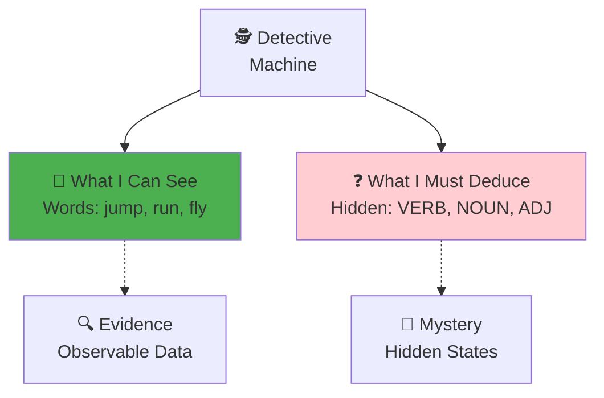

The detective (machine) can **see the evidence** (words) but must **deduce the hidden truth** (POS tags)!

## Understanding "Hidden" in Hidden Markov Models

### What Makes States Hidden?

The name **Hidden Markov model** implies that **states are hidden or not directly observable**.

Going back to the Markov model that has the **states for the parts of speech**, such as **noun, verb, or other**, you can now think of these as **hidden states** because these are **not directly observable from the text data**.

### The Human vs. Machine Perspective

#### Human Perspective (Easy!)

It may seem a little confusing to think that this data is hidden, because if you look at a certain word such as **"jump"**:

```bash
Human Analysis:
Word: "jump"
👁️ Human sees: "jump"
🧠 Human knows: This is a VERB
✅ Easy recognition!
```

**As a human who is familiar with the English language**, you can see that this is a verb.

#### Machine Perspective (Challenging!)

**From a machine's perspective, however**:

```bash
Machine Analysis:
Input: "jump"
👁️ Machine sees: j-u-m-p (just characters)
❓ Machine wonders: VERB? NOUN? Something else?
🤖 Needs statistical help!
```

**It only sees the text "jump" and doesn't know whether it is a verb or a noun.**

### Observable vs. Hidden: The Core Distinction

#### What Machines Can Observe

**For a machine looking at the text data**, what it's going to **observe** are the **actual words** such as:

```bash
Observable Words (What machines see):
├── "jump"
├── "run"
├── "fly"
├── "going"
├── "to"
└── "eat"
```

**These words are said to be observable because they can be seen by the machine.**

#### What Machines Must Deduce

```bash
Hidden States (What machines must figure out):
├── NOUN (NN)
├── VERB (VB)
└── OTHER (O)
```

**The POS tags are hidden** - they're the mystery the machine needs to solve!

## The Two-Matrix System: Transitions + Emissions

### Review: Transition Matrix (Matrix A)

**The Markov chain model and Hidden Markov model have transition probabilities**, which can be represented by a **matrix A of dimensions N+1 by N**, where N is the number of hidden states.

This is what we learned before - how POS tags transition to other POS tags.

### New Addition: Emission Matrix (Matrix B)

**The Hidden Markov model also has additional probabilities known as emission probabilities.**

#### What Are Emission Probabilities?

**Emission probabilities** describe the transition **from the hidden states** of your Hidden Markov model (which are parts of speech, seen here as circles for noun, verb, and other) **to the observables** or the words of your corpus (shown here inside rectangles).

### Visual Representation: From Hidden to Observable

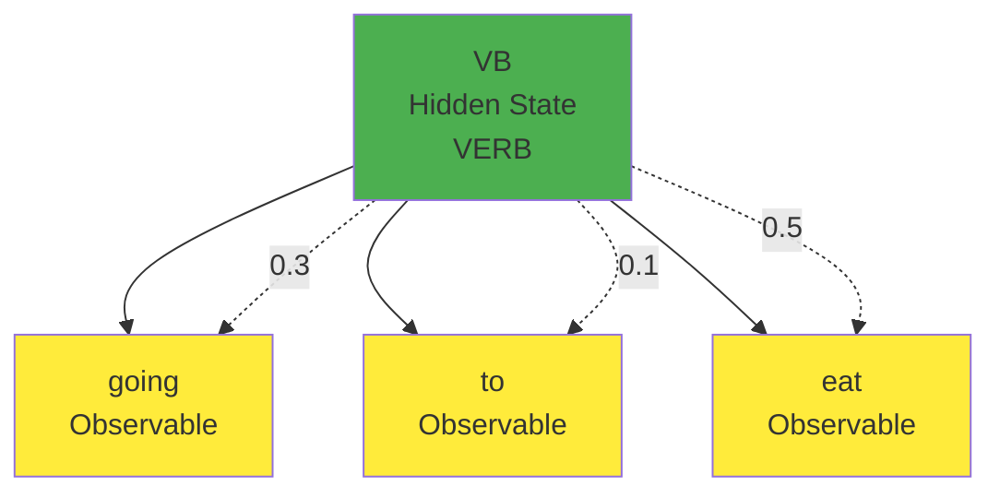

**Here, for example, are the observables for the hidden state VB**, which are the words: **going, to, eat**.

### Understanding Emission Probability Values

#### Concrete Example

**The emission probability from the hidden state, verb to the observable, eat, is 0.5.**

**This means**: When the model is **currently at the hidden state for a verb**, there is a **50 percent chance** that the observable the model will emit is the word **"eat"**.

#### Real-World Translation

```bash
Scenario: Machine is in VERB state
Question: What word will it produce?

Possibilities:
├── "going" → 30% chance (0.3)
├── "to" → 10% chance (0.1)
└── "eat" → 50% chance (0.5)

Most Likely: "eat" (highest probability)
```

## The Emission Matrix: Tabular Representation

### From Graph to Table

**Here's an equivalent representation of the emission probabilities in the form of a table.**

#### Matrix Structure

```bash
Emission Matrix B:
┌─────────┬────────┬─────┬─────┬─────┐
│         │ going  │ to  │ eat │ ... │
├─────────┼────────┼─────┼─────┼─────┤
│ NN      │  0.5   │ 0.1 │0.02 │ ... │
│ VB      │  0.3   │ 0.1 │ 0.5 │ ... │
│ O       │  0.3   │ 0.5 │0.68 │ ... │
└─────────┴────────┴─────┴─────┴─────┘
```

#### Reading the Matrix

**Each row is designated for one of the hidden states.**
**A column is designated for each of the observables.**

**For example**: The row for the hidden state **"verb"** intersects with the column for the observable **"eat"**. The value **0.5** is the emission probability of going from the state **verb** to emitting the observable **"eat"**.

### Mathematical Representation

**The emission matrix represents the probabilities for the transition of your N hidden states representing your parts of speech tags to the M words in your corpus.**

$$
B = \begin{pmatrix}
b_{11} & \cdots & b_{1V} \\
\vdots & \ddots & \vdots \\
b_{N1} & \cdots & b_{NV}
\end{pmatrix}
$$

Where:

- **N**: Number of hidden states (POS tags)
- **V**: Size of vocabulary (number of unique words)
- **$b_{ij}$**: Probability of state i emitting word j

### Row Sum Property

**Again, the row sum of probabilities is one.**

#### Verification Example

```bash
VB (Verb) Row Verification:
0.3 (going) + 0.1 (to) + 0.5 (eat) + ... = 1.0

Why: From any POS state, the machine MUST
     emit some word, so all probabilities
     must sum to 100%
```

## The Power of Ambiguity: Why Words Have Multiple Tags

### The Ambiguity Revelation

**What you might have realized in this example is that there are emission probabilities greater than zero for all three of our parts of speech tags.**

This is because **words can have different parts of speech tag assigned depending on the context in which they appear**.

### Real-World Example: The Word "Back"

#### Context Changes Everything

**For example, the word "back" should have different parts of speech tag in each of the sentences:**

**Example 1: Noun Usage**

```bash
Sentence: "He lay on his back"
Analysis: back → NOUN (body part)
Context: Following possessive pronoun "his"
```

**Example 2: Adverb Usage**

```bash
Sentence: "I'll be back"
Analysis: back → ADVERB (returning)
Context: Following verb "be"
```

#### Emission Matrix Representation

```bash
Word "back" in Emission Matrix:
┌─────────┬──────┐
│  State  │ back │
├─────────┼──────┤
│ NN      │ 0.4  │ ← "his back"
│ VB      │ 0.0  │ ← never a verb
│ ADV     │ 0.3  │ ← "be back"
│ ADJ     │ 0.1  │ ← "back door"
└─────────┴──────┘
```

**This flexibility allows the model to handle real language ambiguity!**

## Complete HMM Architecture: The Big Picture

### System Components

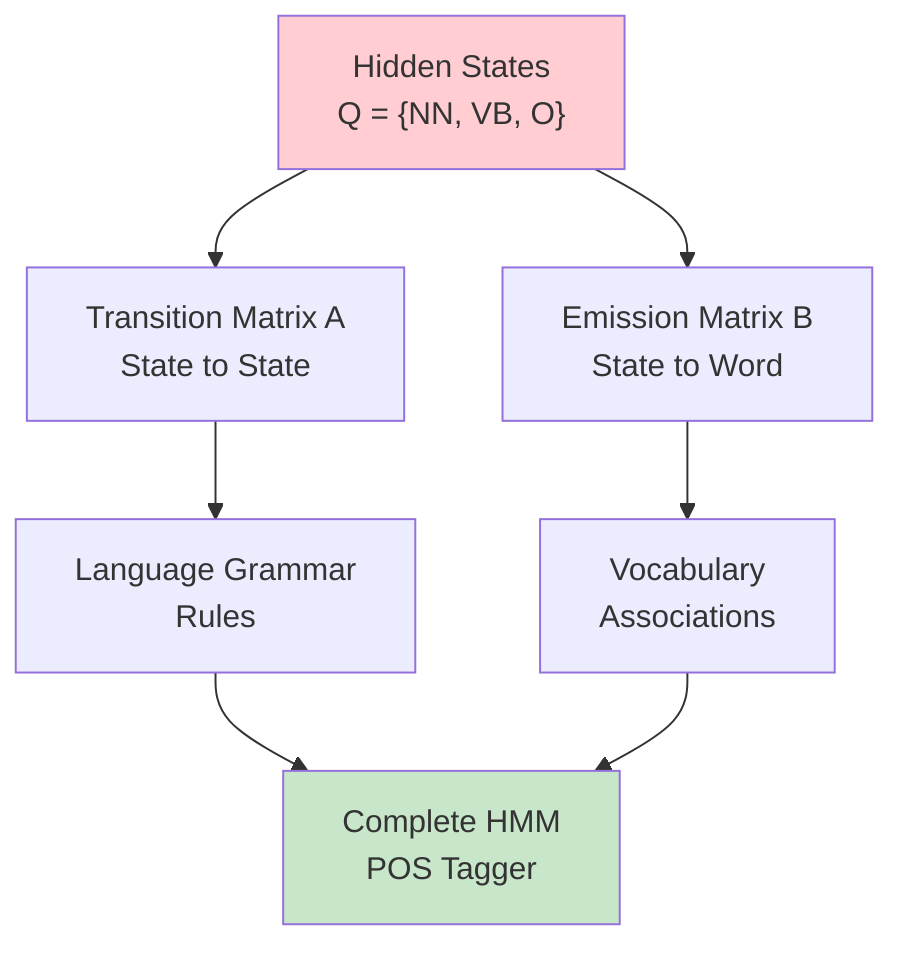

### Mathematical Summary

**A quick recap of Hidden Markov models. They consist of:**

#### 1. State Set

**A set of N states, Q**
$$Q = \{q_1, q_2, \ldots, q_N\}$$

In our example: $Q = \{NN, VB, O\}$

#### 2. Transition Matrix

**The transition matrix A has dimension N+1 by N**
$$A_{(N+1) \times N}$$

- Handles state-to-state transitions
- Includes initial state probabilities

#### 3. Emission Matrix

**The emission matrix B has dimension N by V**
$$B_{N \times V}$$

Where:

- **N**: Number of hidden states
- **V**: Vocabulary size (number of unique words)

### The Two-Step Process

```bash
HMM Process:
1. Transition: Which POS tag comes next?
   └── Uses Matrix A (grammar patterns)

2. Emission: Which word appears for this POS?
   └── Uses Matrix B (vocabulary associations)
```

## Practical Applications: Building the Model

### Data Requirements

**To populate your matrix B**, you can just have a **labelled dataset** and compute the probabilities of going from a POS to each word in your vocabulary.

#### Training Data Example

```bash
Training Corpus:
"I/PRP eat/VB apples/NNS"
"Dogs/NNS eat/VB bones/NNS"
"We/PRP will/MD eat/VB lunch/NN"

Emission Counts for "eat":
├── VB → eat: 3 times
├── NN → eat: 0 times
└── PRP → eat: 0 times

Result: P(eat|VB) = high, P(eat|NN) = 0
```

### Model Constraints

**Note that the sum of each row in your A and B matrix has to be 1.**

#### Matrix A (Transitions)

```bash
Each row: Σ P(next_state|current_state) = 1
Reason: Must transition to some state
```

#### Matrix B (Emissions)

```bash
Each row: Σ P(word|state) = 1
Reason: Must emit some word
```

## Looking Forward

**You have seen the notation for Hidden Markov models. You've also learned how to compute the transition and emission probabilities.**

### Skills Mastered

✅ **Hidden vs. Observable distinction**  
✅ **Emission probability concept**  
✅ **Two-matrix HMM architecture**  
✅ **Word ambiguity handling**  
✅ **Mathematical foundations**

### Next Steps

In the coming videos, you'll learn:

- How to **calculate these probabilities** from real data
- How to use **both matrices together** for POS tagging
- The **Viterbi algorithm** for finding optimal tag sequences

**The foundation is set - now we build the actual tagger!** 🚀

---

## Extra Notes

Let me clarify the difference between **transition** and **emission** probabilities - they serve completely different purposes:

### Transition Matrix (A) - "Grammar Flow"

**Purpose**: Predicts what **POS tag** comes after the current **POS tag**

- **From**: Current POS tag (like VERB)
- **To**: Next POS tag (like NOUN)
- **Question**: "If I'm currently in a VERB state, what's the probability the next word will be a NOUN?"

```bash
Example: "Dogs run fast"
Transition: NOUN(Dogs) → VERB(run) → ADJ(fast)
```

### Emission Matrix (B) - "Word Generation"

**Purpose**: Determines which **actual word** gets produced from a given **POS tag**

- **From**: POS tag (like VERB)
- **To**: Actual word (like "eat", "run", "jump")
- **Question**: "If I'm in a VERB state, what's the probability I'll see the word 'eat'?"

```bash
Example: VERB state can emit:
├── "eat" (50% chance)
├── "run" (30% chance)
└── "jump" (20% chance)
```

### Why Do We Need Both?

Think of it like a **two-step dance**:

1. **Transition**: "What type of word comes next?" (grammar rules)
2. **Emission**: "Which specific word of that type?" (vocabulary choice)

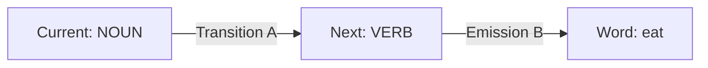

### Real Example:

**Sentence**: "Dogs eat food"

```bash
Step 1 - Transitions (Grammar):
START → NOUN → VERB → NOUN

Step 2 - Emissions (Words):
NOUN emits "Dogs"
VERB emits "eat"
NOUN emits "food"
```

**The key insight**: We need emission because **multiple words can have the same POS tag**. The transition tells us we need a VERB, but emission tells us whether it's "eat", "run", "jump", etc.

# 5. Calculating Probabilities

## From Theory to Practice: Building Real Matrices

### Introduction: The Data-Driven Approach

Hi again. You'll now learn how to **compute the probabilities for your transition and emission matrices**. Given a corpus, you'll be able to **populate these two matrices**.

### Real-Life Analogy: The Sports Statistics Analyst

Think of calculating probabilities like a **sports analyst** studying game patterns:

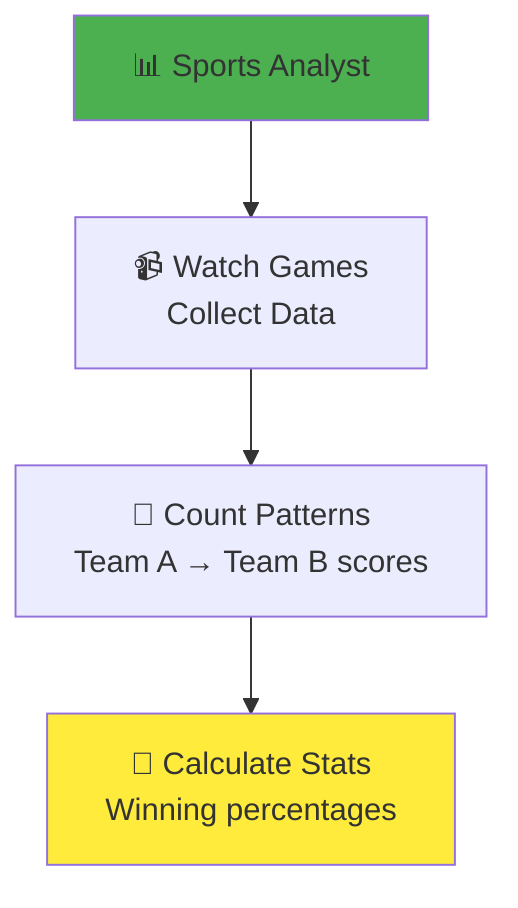

Just like an analyst counts how often one event leads to another, we'll count how often one POS tag follows another!

## Understanding Transition Probability Calculation

### Starting with the Visual Example

Let's start with how to populate the **transition matrix**, which holds all the **transition probabilities between states** of your Markov model.

First, let's explore how to **calculate the transition probabilities on a conceptual level** using this very small training corpus as you can see.

#### The Color-Coded Corpus

From the image, we have a simple corpus where:

- **Blue squares** = one type of POS tag
- **Purple squares** = another type of POS tag
- **Green squares** = a third type of POS tag

```bash
Visual Corpus:
Row 1: [Blue] [Purple]
Row 2: [Blue] [Green]
Row 3: [Blue] [Purple]

Background colors = POS tags for each word
```

### Step-by-Step Calculation Process

#### Step 1: Focus Only on POS Tags

**The associated parts of speech tags are depicted by the background color.**

To calculate the transition probabilities, **you actually only use the parts of speech tags from your training corpus**.

```bash
Extracted Tag Sequence:
Blue → Purple
Blue → Green
Blue → Purple

We ignore the actual words, focus only on tag patterns!
```

#### Step 2: Count Tag Pair Occurrences

So to calculate **the probability of the blue parts of speech tag transitioning to the purple one**, you first have to **count the occurrences of that tag combination in your corpus**, which is **two**.

```bash
Counting Blue → Purple transitions:
Row 1: Blue → Purple ✓ (count: 1)
Row 2: Blue → Green ✗ (not what we want)
Row 3: Blue → Purple ✓ (count: 2)

Total Blue → Purple occurrences: 2
```

#### Step 3: Count Total Occurrences of Starting Tag

**The number of all tag pairs starting with a blue tag is three for this corpus** at least.

```bash
Counting all transitions FROM Blue:
Row 1: Blue → Purple ✓ (count: 1)
Row 2: Blue → Green ✓ (count: 2)
Row 3: Blue → Purple ✓ (count: 3)

Total transitions starting with Blue: 3
```

#### Step 4: Calculate the Probability

**Two out of three tag sequences in your training corpus starts with the blue parts of speech tag.**

In other words, **the transition probability for a blue tag following a purple one is two out of three**.

$$P(\text{Purple}|\text{Blue}) = \frac{\text{Count}(\text{Blue} \rightarrow \text{Purple})}{\text{Count}(\text{Blue} \rightarrow \text{anything})} = \frac{2}{3}$$

## The Mathematical Framework

### Formal Definition of Counting Function

**More formally**, in order to calculate **all the transition probabilities of your Markov model**, you'd first have to **count all occurrences of tag pairs in your training corpus**.

#### The Counting Function

**I'll define this as the function C** of the tags $t_{i-1}, t_i$ which **returns the counts for the tag $t_{i-1}$ followed by the tag $t_i$ in your training corpus**.

$$C(t_{i-1}, t_i) = \text{number of times } t_{i-1} \text{ is followed by } t_i$$

### The Probability Formula

#### General Formula

**Next, you calculate the probability of a tag $t_i$ following another tag, $t_{i-1}$ as $P(t_i | t_{i-1})$.**

$$P(t_i | t_{i-1}) = \frac{C(t_{i-1}, t_i)}{\sum_{j=1}^{N} C(t_{i-1}, t_j)}$$

#### Breaking Down the Formula

**This counts of $t_{i-1}, t_i$ in the numerator**, which is the **number of occurrences of $t_{i-1}, t_i$ in the corpus** divided by **the sum of all occurrences of the tag $t_{i-1}$ together with all the other tags $t_j$**.

```bash
Numerator: C(t_{i-1}, t_i)
└── "How many times does t_{i-1} lead to t_i?"

Denominator: Σ C(t_{i-1}, t_j) for all possible t_j
└── "How many times does t_{i-1} lead to ANYTHING?"
```

#### Simplified Version

**I'll write this as P for the probability of $t_i$ given $t_{i-1}$.**

This probability is given by:

- **The total number of times tag $t_i$ occurred after tag $t_{i-1}$**, which is given by the function **counts of $t_i, t_{i-1}$ in the numerator**
- **And then divide it by the number of total occurrences of the tag $t_{i-1}$**, given by the **function counts of $t_{i-1}$ in the divisor**

$$P(t_i | t_{i-1}) = \frac{C(t_{i-1}, t_i)}{C(t_{i-1})}$$

Where $C(t_{i-1})$ represents the total count of tag $t_{i-1}$ appearing before any tag.

## Real-World Example: The Haiku Corpus

### Introduction to the Training Data

**Say you want to train a model for haiku**, a type of short Japanese poetry. **Your training corpus will be the following haiku from Ezra Pound written in 1913.**

```bash
Original Haiku (Ezra Pound, 1913):
"The apparition of these faces in the crowd;
Petals on a wet, black bough."
```

### Corpus Preprocessing Steps

**In the programming assignments, you'll be given a prepared corpus. Here, you'll make some changes to the corpus in order to calculate the correct probabilities.**

#### Step 1: Sentence Segmentation

**Consider each line of the corpus as a separate sentence.**

```bash
Before:
"The apparition of these faces in the crowd; Petals on a wet, black bough."

After:
Sentence 1: "The apparition of these faces in the crowd;"
Sentence 2: "Petals on a wet, black bough."
```

#### Step 2: Add Start Tokens

**First, add the start token to each line or sentence in order to be able to calculate the initial probabilities using the previous defined formula.**

```bash
After Adding Start Tokens:
Sentence 1: "<s> The apparition of these faces in the crowd;"
Sentence 2: "<s> Petals on a wet, black bough."
```

**Why this matters**: The start token `<s>` acts as the "previous tag" for calculating initial probabilities - how likely is each POS tag to begin a sentence?

#### Step 3: Convert to Lowercase

**Then transform all words in the corpus to lowercase so the model becomes case insensitive.**

```bash
After Lowercasing:
Sentence 1: "<s> the apparition of these faces in the crowd;"
Sentence 2: "<s> petals on a wet, black bough."
```

**Reasoning**: "The" and "the" should be treated as the same word, not different vocabulary items.

#### Step 4: Handle Punctuation

**The punctuation you should leave intact because it doesn't make a difference for a toy model, and there aren't tags for different kinds of punctuation included here.**

```bash
Final Preprocessed Corpus:
Sentence 1: "<s> the apparition of these faces in the crowd;"
Sentence 2: "<s> petals on a wet, black bough."

Punctuation (;, .) remains unchanged
```

## Practical Example: Calculating Real Probabilities

### Example Corpus with POS Tags

Let's work with a concrete example:

```bash
Tagged Corpus:
Sentence 1: <s>/START the/DT apparition/NN of/IN these/DT faces/NNS
Sentence 2: <s>/START petals/NNS on/IN a/DT wet/JJ bough/NN

Tag Sequence:
START → DT → NN → IN → DT → NNS
START → NNS → IN → DT → JJ → NN
```

### Step-by-Step Calculation Example

#### Calculate P(DT | START)

**Question**: What's the probability that a sentence starts with a determiner?

```bash
Step 1 - Count C(START, DT):
Sentence 1: START → DT ✓ (count: 1)
Sentence 2: START → NNS ✗ (different)
Total: C(START, DT) = 1

Step 2 - Count C(START, anything):
Sentence 1: START → DT ✓ (count: 1)
Sentence 2: START → NNS ✓ (count: 2)
Total: C(START) = 2

Step 3 - Calculate Probability:
P(DT | START) = C(START, DT) / C(START) = 1/2 = 0.5
```

#### Calculate P(NN | DT)

**Question**: What's the probability that a noun follows a determiner?

```bash
Step 1 - Count C(DT, NN):
"the/DT apparition/NN" ✗ (NN, not what we want)
"these/DT faces/NNS" ✗ (NNS, not NN)
"a/DT wet/JJ" ✗ (JJ, not NN)
Total: C(DT, NN) = 0

Step 2 - Count C(DT, anything):
"the/DT apparition/NN" ✓ (count: 1)
"these/DT faces/NNS" ✓ (count: 2)
"a/DT wet/JJ" ✓ (count: 3)
Total: C(DT) = 3

Step 3 - Calculate Probability:
P(NN | DT) = C(DT, NN) / C(DT) = 0/3 = 0.0
```

### Building the Complete Transition Matrix

#### Counting All Tag Pairs

```bash
Complete Tag Pair Counts:
C(START, DT) = 1    | C(START, NNS) = 1
C(DT, NN) = 0       | C(DT, NNS) = 1    | C(DT, JJ) = 1
C(NN, IN) = 1       | C(NNS, IN) = 1
C(IN, DT) = 2       | C(JJ, NN) = 1
```

#### Resulting Transition Matrix

```bash
Transition Matrix A:
┌───────┬─────┬─────┬─────┬─────┬─────┐
│       │ DT  │ NN  │ NNS │ IN  │ JJ  │
├───────┼─────┼─────┼─────┼─────┼─────┤
│ START │ 0.5 │ 0.0 │ 0.5 │ 0.0 │ 0.0 │
│ DT    │ 0.0 │ 0.0 │ 0.33│ 0.0 │ 0.33│
│ NN    │ 0.0 │ 0.0 │ 0.0 │ 1.0 │ 0.0 │
│ NNS   │ 0.0 │ 0.0 │ 0.0 │ 1.0 │ 0.0 │
│ IN    │ 1.0 │ 0.0 │ 0.0 │ 0.0 │ 0.0 │
│ JJ    │ 0.0 │ 1.0 │ 0.0 │ 0.0 │ 0.0 │
└───────┴─────┴─────┴─────┴─────┴─────┘
```

## Key Insights and Properties

### Row Sum Verification

**Each row must sum to 1.0:**

```bash
START row: 0.5 + 0.0 + 0.5 + 0.0 + 0.0 = 1.0 ✓
DT row: 0.0 + 0.0 + 0.33 + 0.0 + 0.33 = 0.66 ✗

Note: This example has incomplete data, causing some
      rows to not sum to 1. In practice, larger
      corpora provide more complete coverage.
```

### The Data Sparsity Challenge

```bash
Problem: Small corpus leads to:
├── Many zero probabilities
├── Incomplete grammatical patterns
└── Unreliable probability estimates

Solution: Use larger, more diverse training corpora
```

## Summary: The Recipe for Transition Probabilities

### The Complete Process

```bash
Recipe for Transition Matrix Population:
1. 📚 Collect tagged corpus
2. 🧹 Preprocess (add start tokens, lowercase, etc.)
3. 🔢 Count all tag pair occurrences: C(t_{i-1}, t_i)
4. 📊 Calculate probabilities: P(t_i | t_{i-1}) = C(t_{i-1}, t_i) / C(t_{i-1})
5. 📋 Fill transition matrix with calculated probabilities
6. ✅ Verify all rows sum to 1.0
```

### What You've Learned

**There you have it and nicely prepared corpus. You learned how to calculate the probability of a tag showing up after another tag. You saw how you can get the counts, and then you can use those counts and transform them into probabilities.**

✅ **Counting methodology** for tag pair occurrences  
✅ **Mathematical formula** for probability calculation  
✅ **Corpus preprocessing** techniques  
✅ **Real-world example** with haiku data  
✅ **Matrix population** process

### Looking Forward

**This is useful because it allows you to populate your transition matrix. This is what you'll be learning next.**

In the next section, we'll learn how to:

- Apply the same counting principles to **emission probabilities**
- Handle the relationship between **POS tags and actual words**
- Build the complete **emission matrix B**

The foundation for data-driven probability calculation is now solid! 🚀

# 6. Populating the Transition Matrix

## From Theory to Implementation: Building Real Matrices

### Introduction: The Practical Challenge

**To populate the transition matrix, you need to calculate the probability of a tagging happening, given that another tag already happened.** You also need to calculate the **probability that a tag happens at the beginning of the sentence.**

You will also learn about a new concept known as **smoothing**.

### Real-Life Analogy: The Traffic Engineer's Counting System

Think of populating the transition matrix like a **traffic engineer** analyzing intersection patterns:

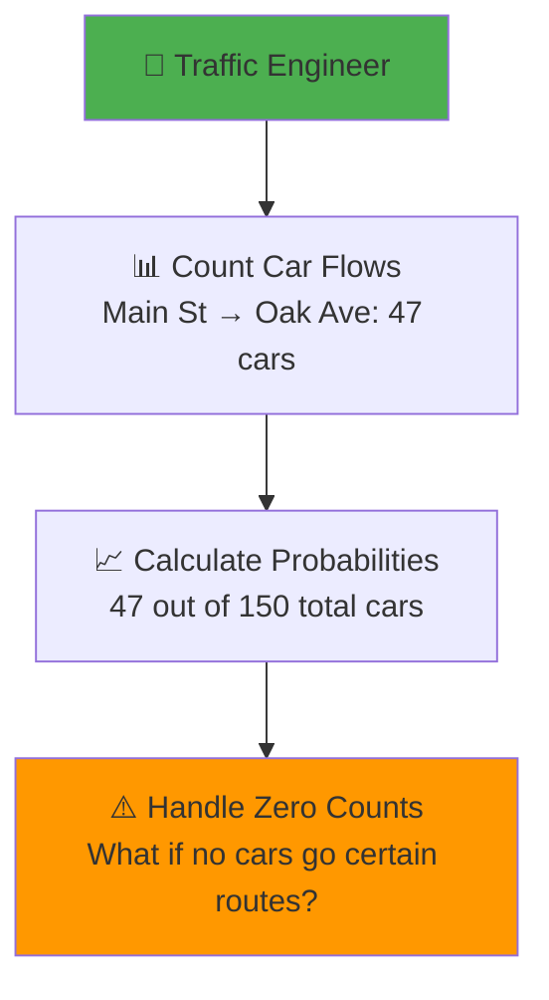

Just like counting traffic patterns, we'll count POS tag transitions and handle missing data!

## Step-by-Step Matrix Population

### Understanding the Matrix Structure

**Begin by filling the first column of your matrix with the counts of the associated tags.**

**Remember:**

- The **rows** in the matrix represent the **current states**
- The **columns** represent the **next states**
- The **values** represent the **transition probabilities** of going from the current state to the next state
- The **states** for this use case are the **parts of speech tags**

### The Color-Coded Corpus Analysis

**As you can see, the defined tags and the elements in the corpus are marked with corresponding colors:**

From the haiku corpus:

```bash
Corpus with Color Coding:
<s> in a station of the metro
<s> the apparition of these faces in the crowd ;
<s> petals on a wet , black bough .

Color Legend:
🟠 π (START) - Orange
🟢 NN (Noun) - Green
🟣 VB (Verb) - Purple
🔵 O (Other) - Blue
```

### Counting Tag Combinations: Column by Column

#### First Column: Transitions to NN (Noun)

**For the first column, you'll count the occurrences of the following tag combinations:**

```bash
Counting Transitions to NN:
┌─────────────────────────────────┬───────┐
│ Transition Type                 │ Count │
├─────────────────────────────────┼───────┤
│ π (START) → NN                  │   1   │
│ NN → NN                         │   0   │
│ VB → NN                         │   0   │
│ O → NN                          │   6   │
└─────────────────────────────────┴───────┘
```

**As you see here:**

- **A noun following a start token occurs once** in our corpus
- **A noun following a noun doesn't occur at all**
- **A noun following a verb doesn't occur either**
- **A noun following another tag occurs six times**

#### The VB Column: A Special Case

**The rest of the matrix is populated accordingly. But I'll take a little shortcut.**

```bash
VB Column (Verb transitions):
┌─────────────────────────────────┬───────┐
│ Transition Type                 │ Count │
├─────────────────────────────────┼───────┤
│ π (START) → VB                  │   0   │
│ NN → VB                         │   0   │
│ VB → VB                         │   0   │
│ O → VB                          │   0   │
└─────────────────────────────────┴───────┘
```

**The corpus, as you can see, is a verbless haiku, because there are no tag combinations with the tag VB, they are all 0.**

⚠️ **Unfortunately, there is no such shortcuts in the programming assignments. You've been warned.**

#### Third Column: Transitions to O (Other)

```bash
O Column (Other transitions):
┌─────────────────────────────────┬───────┐
│ Transition Type                 │ Count │
├─────────────────────────────────┼───────┤
│ π (START) → O                   │   2   │
│ NN → O                          │   6   │
│ VB → O                          │   0   │
│ O → O                           │   8   │
└─────────────────────────────────┴───────┘
```

**Detailed breakdown:**

- **The O tag following a start token occurs twice**
- **The O tag following a noun tag (NN) occurs six times**
- **The last entry** in the transition matrix of **an O tag following an O tag has a count of eight**

#### Counting the Tricky Cases

**In the last line, you have to take into account the tagged words "on", "a", "wet", "wet", and "back" to calculate the correct counts.**

```bash
Example Analysis for O → O transitions:
"on" (O) → "a" (O) ✓
"a" (O) → "wet" (O) ✓
"," (O) → "black" (O) ✓
... (continuing through the corpus)

Total O → O count: 8
```

### The Complete Count Matrix

**Now that you have calculated the counts of all tag combinations in the matrix:**

```bash
Raw Count Matrix A:
┌─────┬─────┬─────┬─────┬─────────┐
│     │ NN  │ VB  │  O  │Row Sum │
├─────┼─────┼─────┼─────┼─────────┤
│  π  │  1  │  0  │  2  │    3    │
│ NN  │  0  │  0  │  6  │    6    │
│ VB  │  0  │  0  │  0  │    0    │ ← Problem!
│  O  │  6  │  0  │  8  │   14    │
└─────┴─────┴─────┴─────┴─────────┘
```

## Converting Counts to Probabilities

### The Division Process

**You can calculate the transition probabilities. So far, you've calculated and entered the counts in the matrix, which corresponds to the numerator in our formula.**

**Now, you just have to divide each count by the sum, which is actually the corresponding row sum.**

#### Understanding Row Sums

**Remember what this row sum represents:**

**For the row where the current state is a noun part of speech**, this sum across that row represents **all pairs of words where the current state is a noun, and the next state is any parts of speech**, whether it's a noun, a verb, or other.

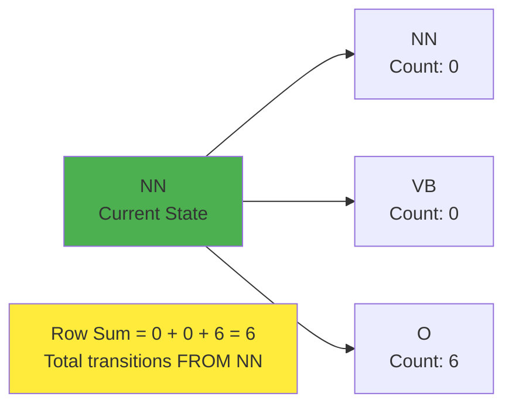

#### Sample Calculations

**For the transition probability of a noun tag (NN) following a start token**, or in other words, **the initial probability of NN tag**:

$$P(NN|\pi) = \frac{C(\pi, NN)}{C(\pi)} = \frac{1}{3}$$

**For the transition probability of an other tag followed by a noun tag**:

$$P(NN|O) = \frac{C(O, NN)}{\sum_{j=1}^{N} C(O, t_j)} = \frac{6}{14}$$

```bash
Detailed Calculation for P(NN|O):
Numerator: C(O, NN) = 6
Denominator: C(O, NN) + C(O, VB) + C(O, O) = 6 + 0 + 8 = 14
Result: P(NN|O) = 6/14 ≈ 0.429
```

## The Zero Probability Problem

### Identifying the Issues

**You may have realized that there are two problems here:**

#### Problem 1: Division by Zero

**One is that the row sum of the VB tag is 0, which would lead to a division by 0 using this formula.**

```bash
VB Row Problem:
P(NN|VB) = C(VB, NN) / C(VB) = 0 / 0 = undefined!
P(VB|VB) = C(VB, VB) / C(VB) = 0 / 0 = undefined!
P(O|VB) = C(VB, O) / C(VB) = 0 / 0 = undefined!
```

#### Problem 2: Zero Probabilities Everywhere

**The other is that lots of entries in the transition matrix are 0, meaning that these transitions will have probability 0.**

**This won't work if you want the model to generalize to other haikus, which might actually contain verbs.**

```bash
Generalization Problem:
Current model: P(VB appears anywhere) = 0
Real world: Haikus can contain verbs!
Result: Model fails on new data
```

### Real-World Impact

```mermaid
graph TD
    A[Training: Verbless Haiku] --> B["Model: P(verb) = 0"]
    B --> C[New Haiku with Verb]
    C --> D["❌ Model Breaks<br/>Can't handle unseen pattern"]

    style A fill:#e1f5fe
    style D fill:#ffcdd2
```

## The Smoothing Solution

### Introducing Smoothing

**To handle this, change your formula slightly by adding a small value epsilon (ε) to each of the counts in the numerator and add N times epsilon to the divisor such that the row sums still add up to one.**

**This operation is also referred to as smoothing, which you might remember from previous lessons.**

### The Smoothing Formula

#### Modified Probability Calculation

$$P(t_i | t_{i-1}) = \frac{C(t_{i-1}, t_i) + \varepsilon}{\sum_{j=1}^{N} C(t_{i-1}, t_j) + N \times \varepsilon}$$

Where:

- **ε (epsilon)**: Small smoothing parameter
- **N**: Number of possible next states
- **Numerator**: Original count + small buffer
- **Denominator**: Total count + N buffers (maintains probability sum = 1)

#### Visual Representation of Smoothing

```bash
Smoothing Applied to Count Matrix:
┌─────┬─────────┬─────────┬─────────┬─────────────┐
│     │   NN    │   VB    │    O    │  Row Sum    │
├─────┼─────────┼─────────┼─────────┼─────────────┤
│  π  │  1+ε    │  0+ε    │  2+ε    │  3+3×ε      │
│ NN  │  0+ε    │  0+ε    │  6+ε    │  6+3×ε      │
│ VB  │  0+ε    │  0+ε    │  0+ε    │  0+3×ε      │ ← Fixed!
│  O  │  6+ε    │  0+ε    │  8+ε    │ 14+3×ε      │
└─────┴─────────┴─────────┴─────────┴─────────────┘
```

### Concrete Example with ε = 0.001

**If you substitute the epsilon with a small value, say 0.001, then you'll get the following transition matrix:**

```bash
Final Transition Matrix (ε = 0.001):
┌─────┬─────────┬─────────┬─────────┐
│     │   NN    │   VB    │    O    │
├─────┼─────────┼─────────┼─────────┤
│  π  │  0.333  │  0.000  │  0.667  │
│ NN  │  0.000  │  0.000  │  1.000  │
│ VB  │  0.333  │  0.333  │  0.333  │ ← Equal probs!
│  O  │  0.429  │  0.000  │  0.571  │
└─────┴─────────┴─────────┴─────────┘
```

**The values shown here are shown up to the third decimal digits, so don't worry if the row sums don't add up to one exactly.**

### Benefits of Smoothing

#### 1. Eliminates Zero Probabilities

**The result of smoothing is, as you can see, that you no longer have any 0-valued entries in A.**

#### 2. Equal Treatment for Unknown Patterns

**Further, since the transition probabilities from the VB state are actually one-third for all outgoing transitions, they are equally likely.**

```bash
VB State After Smoothing:
P(NN|VB) = 0.333 (33.3%)
P(VB|VB) = 0.333 (33.3%)
P(O|VB) = 0.333 (33.3%)

Interpretation: Since we have no data about verb
transitions, we assume all are equally likely.
```

**That's reasonable, since you didn't have any data to estimate these transition probabilities.**

## Special Consideration: Initial Probabilities

### When NOT to Apply Smoothing

**One more thing before you go: in a real-world example, you might not want to apply smoothing to the initial probabilities in the first row of the transition matrix.**

#### The Problem with Smoothing Initial States

**That's because if you apply smoothing to that row by adding a small value to possibly zero-valued entries, you'll effectively allow a sentence to start with any parts of speech tag, including punctuation.**

```bash
Example Problem:
Without smoothing: P(sentence starts with ",") = 0 ✓
With smoothing: P(sentence starts with ",") = 0.001 ✗

Result: Model might generate: ", the dog runs"
```

#### Practical Recommendation

```mermaid
graph TD
    A[Transition Matrix Smoothing] --> B[Apply to State Transitions<br/>Rows 2-N]
    A --> C[Skip Initial Probabilities<br/>Row 1]

    B --> D[✅ Handles unseen transitions]
    C --> E[✅ Maintains realistic sentence starts]

    style D fill:#c8e6c9
    style E fill:#c8e6c9
```

## Complete Implementation Process

### The Full Pipeline

```bash
Transition Matrix Population Pipeline:
1. 📚 Parse corpus and extract POS tag sequences
2. 🔢 Count all tag pair occurrences: C(t_{i-1}, t_i)
3. 📊 Calculate raw probabilities: P(t_i | t_{i-1}) = C(t_{i-1}, t_i) / C(t_{i-1})
4. 🔍 Identify zero probability problems
5. ✨ Apply smoothing (except to initial probabilities)
6. ✅ Verify all rows sum to 1.0
7. 🚀 Deploy matrix for POS tagging
```

### Smoothing Decision Tree

```mermaid
graph TD
    A[Processing Matrix Row] --> B{Is this initial state row?}
    B -->|Yes| C[Skip Smoothing<br/>Keep realistic sentence starts]
    B -->|No| D{Contains zero counts?}
    D -->|Yes| E[Apply Smoothing<br/>Add ε to all entries]
    D -->|No| F[Use Raw Probabilities<br/>No smoothing needed]

    C --> G[Final Matrix Entry]
    E --> G
    F --> G

    style C fill:#fff3e0
    style E fill:#e8f5e8
    style F fill:#e3f2fd
```

## Key Insights and Takeaways

### Why Smoothing is Critical

**You just learned about smoothing and why it is important:**

✅ **Prevents division by zero** when some states have no transitions  
✅ **Eliminates zero probabilities** that break the model  
✅ **Enables generalization** to unseen data patterns  
✅ **Provides reasonable defaults** for unknown transition patterns  
✅ **Maintains probability constraints** (rows still sum to 1)

### Mathematical Elegance

The smoothing formula elegantly balances:

- **Data-driven estimates** (original counts)
- **Uncertainty handling** (small epsilon additions)
- **Probability conservation** (maintaining row sums = 1)

### Real-World Applications

```bash
Smoothing Applications:
├── Speech Recognition: Handle unseen word sequences
├── Machine Translation: Deal with rare language patterns
├── Text Generation: Avoid impossible transitions
└── POS Tagging: Generalize to new text domains
```

## Looking Forward

**This is great. Now in the next video, we will move on and see how you can populate another type of matrix known as the emissions matrix.**

### Skills Mastered

✅ **Practical matrix population** from real corpus data  
✅ **Smoothing technique** for handling sparse data  
✅ **Row sum calculations** and probability normalization  
✅ **Zero probability problem** identification and solution  
✅ **Initial state special handling**

### Next Challenge

The emission matrix will present new challenges:

- Mapping from **POS tags to actual words**
- Handling **vocabulary size** (potentially thousands of words)
- **Word ambiguity** across multiple POS categories

**The transition matrix foundation is solid - now we tackle word generation!** 🚀

# 7. Populating the Emission Matrix

## From POS Tags to Actual Words: The Final Piece

### Introduction: Bridging States and Observations

**In the previous video I showed you how to calculate the transition matrix. However, knowing the probability of going from one part of speech tag to another alone will not help us much.**

**We need to be able to somehow get words into the equation. Hence we will introduce a new type of matrix that tells you about the probability of going from one word to a part of speech tag.**

### Real-Life Analogy: The Restaurant Menu System

Think of the emission matrix like a **restaurant's menu system**:

```mermaid
graph TD
    A[🍴 Restaurant Categories<br/>Appetizers, Mains, Desserts] --> B[📋 Specific Menu Items<br/>Caesar Salad, Steak, Ice Cream]

    C[POS Categories<br/>NOUN, VERB, OTHER] --> D[Actual Words<br/>station, apparition, in]

    A -.-> |Similar to| C
    B -.-> |Similar to| D

    style A fill:#4caf50
    style C fill:#4caf50
    style B fill:#ffeb3b
    style D fill:#ffeb3b
```

Just like knowing a dish is a "Main Course" doesn't tell you if it's steak or pasta, knowing a word is a "NOUN" doesn't tell you if it's "station" or "apparition"!

## Understanding Emission vs. Transition

### The Key Distinction

#### Transition Matrix (A): Grammar Flow

- **From**: POS tag → POS tag
- **Question**: "What grammatical category comes next?"

#### Emission Matrix (B): Word Generation

- **From**: POS tag → Actual word
- **Question**: "Which specific word appears for this grammatical category?"

```bash
Example Sentence: "The dog runs"
Transition: DT → NN → VB (grammar structure)
Emission: DT emits "the", NN emits "dog", VB emits "runs"
```

## The Simple Example: Understanding Co-occurrence

### Working with the Small Corpus

**Going back to your very small training corpus which has the associated parts of speech tags depicted by the background color.**

**In contrast to the transition probabilities here, you would want to count the co-occurrences of a part of speech tag with a specific word.**

#### Concrete Example: The Word "in"

From the simple corpus, let's analyze the word "in":

```bash
Simple Corpus Analysis:
Sentence 1: [blue] [purple]
Sentence 2: [blue] [green]
Sentence 3: [blue] [purple]

Focus on word "in":
- Appears X times tagged as blue (O tag)
- Blue tag appears Y times total
- Emission probability = X/Y
```

**For example, the word "in" appears two times in your corpus tagged with the blue parts of speech tag.**

**And the blue parts of speech tag appears 3 times.**

**So the emission probability for the word "in" following the blue part of speech tag is 2/3.**

$$P(\text{"in"}|\text{blue tag}) = \frac{C(\text{blue tag}, \text{"in"})}{C(\text{blue tag})} = \frac{2}{3}$$

## Real-World Application: The Haiku Corpus

### Setting Up the Emission Matrix

**Let's continue with a more complicated example: the haiku you processed in the previous lesson. You have the same tags and can start to fill in the counts.**

**But instead of counting pairs of tags, you will now count how often a word is tagged with a specific tag like noun, verb, or the other tag.**

#### The Haiku Corpus Reference

```bash
Tagged Haiku Corpus:
<s> in/O a/O station/NN of/O the/O metro/NN
<s> the/O apparition/NN of/O these/O faces/NN in/O the/O crowd/NN ;/O
<s> petals/NN on/O a/O wet/O ,/O black/O bough/NN ./O

Color Coding:
🟢 NN (Noun) - Green
🟣 VB (Verb) - Purple
🔵 O (Other) - Blue
```

### Counting Word-Tag Associations

#### Example: The Word "in"

**As it is shown in the first column of the emission matrix for the tag and the word:**

```bash
Counting "in" across POS tags:
┌─────────────────────────────────┬───────┐
│ Tag-Word Association            │ Count │
├─────────────────────────────────┼───────┤
│ NN tag associated with "in"     │   0   │
│ VB tag associated with "in"     │   0   │
│ O tag associated with "in"      │   2   │
└─────────────────────────────────┴───────┘
```

**Detailed breakdown:**

- **The noun tag is associated zero times with the word "in"**
- **The verb tag is associated zero times with the word "in"**
- **The O tag is associated two times with the word "in" in the corpus**

#### Visual Matrix Representation

From the image, we can see the emission matrix B structure:

```bash
Emission Matrix B (Partial):
┌─────────────┬─────┬─────┬─────┬─────┐
│             │ in  │  a  │ ... │     │
├─────────────┼─────┼─────┼─────┼─────┤
│ NN (noun)   │  0  │     │     │     │
│ VB (verb)   │  0  │     │     │     │
│ O (other)   │  2  │     │     │     │
└─────────────┴─────┴─────┴─────┴─────┘
```

### Complete Word Counting Process

#### Systematic Counting Method

```bash
Word-by-Word Analysis:
Word "in":
├── Tagged as NN: 0 times
├── Tagged as VB: 0 times
└── Tagged as O: 2 times (lines 1 & 2)

Word "a":
├── Tagged as NN: 0 times
├── Tagged as VB: 0 times
└── Tagged as O: 2 times (lines 1 & 3)

Word "station":
├── Tagged as NN: 1 time (line 1)
├── Tagged as VB: 0 times
└── Tagged as O: 0 times

... (continuing for all words)
```

#### Building the Complete Matrix

```bash
Complete Emission Matrix Counts:
┌─────┬─────┬─────┬─────────┬─────┬─────┬────────┬─────┐
│     │ in  │  a  │station  │ of  │ the │ metro  │ ... │
├─────┼─────┼─────┼─────────┼─────┼─────┼────────┼─────┤
│ NN  │  0  │  0  │    1    │  0  │  0  │   1    │ ... │
│ VB  │  0  │  0  │    0    │  0  │  0  │   0    │ ... │
│ O   │  2  │  2  │    0    │  2  │  2  │   0    │ ... │
└─────┴─────┴─────┴─────────┴─────┴─────┴────────┴─────┘
```

## The Mathematical Framework

### The Emission Probability Formula

**The formula with smoothing for the emission probabilities P(w_i | t_i) for the word is given by:**

$$P(w_i | t_i) = \frac{C(t_i, w_i) + \varepsilon}{\sum_{j=1}^{V} C(t_i, w_j) + N \times \varepsilon}$$

**Which simplifies to:**

$$P(w_i | t_i) = \frac{C(t_i, w_i) + \varepsilon}{C(t_i) + N \times \varepsilon}$$

### Breaking Down the Formula

#### Components Explained

```bash
Formula Components:
├── C(t_i, w_i): Count of tag t_i associated with word w_i
├── ε (epsilon): Smoothing parameter
├── V: Vocabulary size (total unique words)
├── N: Number of POS tags
└── C(t_i): Total count of tag t_i with any word
```

#### The Denominator Explanation

**The counts of t_i and the word w_i divided by the corresponding row sum in the emission matrix, which is the same as dividing by the total count of the tag t_i.**

```mermaid
graph TD
    A["C(t_i, w_i)<br/>Specific word count"] --> B["Numerator<br/>+ smoothing"]
    C["C(t_i)<br/>Total tag count"] --> D["Denominator<br/>+ smoothing"]

    B --> E["P(w_i | t_i)<br/>Emission Probability"]
    D --> E

    style A fill:#4caf50
    style C fill:#ffeb3b
    style E fill:#ff9800
```

### Parameter Definitions

**With:**

- **Capital N**: Being the number of tags
- **Capital V**: Being the size of our vocabulary

```bash
Example Values:
N = 3 (NN, VB, O)
V = 15 (unique words in haiku corpus)
ε = 0.001 (small smoothing value)
```

## Practical Calculation Examples

### Example 1: P("in" | O)

**Calculate the probability of emitting "in" given we're in the O (other) state:**

```bash
Step 1 - Count C(O, "in"):
"in" tagged as O: 2 times
Result: C(O, "in") = 2

Step 2 - Count C(O):
Total O tag occurrences: 10 times
Result: C(O) = 10

Step 3 - Apply smoothing formula:
P("in" | O) = (2 + 0.001) / (10 + 3 × 0.001)
            = 2.001 / 10.003
            ≈ 0.200
```

### Example 2: P("station" | NN)

**Calculate the probability of emitting "station" given we're in the NN (noun) state:**

```bash
Step 1 - Count C(NN, "station"):
"station" tagged as NN: 1 time
Result: C(NN, "station") = 1

Step 2 - Count C(NN):
Total NN tag occurrences: 6 times
Result: C(NN) = 6

Step 3 - Apply smoothing formula:
P("station" | NN) = (1 + 0.001) / (6 + 3 × 0.001)
                  = 1.001 / 6.003
                  ≈ 0.167
```

### Example 3: P("station" | VB) - Zero Count Case

**Calculate the probability of emitting "station" given we're in the VB (verb) state:**

```bash
Step 1 - Count C(VB, "station"):
"station" tagged as VB: 0 times (never happens)
Result: C(VB, "station") = 0

Step 2 - Count C(VB):
Total VB tag occurrences: 0 times (verbless haiku)
Result: C(VB) = 0

Step 3 - Apply smoothing formula:
P("station" | VB) = (0 + 0.001) / (0 + 3 × 0.001)
                  = 0.001 / 0.003
                  ≈ 0.333
```

**Note**: Smoothing prevents division by zero and gives reasonable default probabilities!

## The Smoothing Benefits in Emission Matrix

### Why Smoothing is Critical for Emissions

```bash
Problems Without Smoothing:
1. Zero probabilities for unseen word-tag combinations
2. Division by zero for tags with no words (like VB in haiku)
3. Model breaks on new vocabulary
4. No generalization to unseen text

Solutions With Smoothing:
1. All word-tag combinations have non-zero probability
2. Reasonable defaults for unknown patterns
3. Model handles new words gracefully
4. Better generalization to new domains
```

### Vocabulary Size Impact

The emission matrix is much larger than the transition matrix:

```bash
Matrix Size Comparison:
Transition Matrix A: (N+1) × N = 4 × 3 = 12 entries
Emission Matrix B: N × V = 3 × 15 = 45 entries

Real-world example:
N = 45 POS tags
V = 50,000 vocabulary
Emission Matrix: 45 × 50,000 = 2.25M entries!
```

## Complete Example: Building Both Matrices

### The Full HMM System

```bash
Complete HMM for Haiku:
1. States Q = {NN, VB, O}
2. Vocabulary W = {in, a, station, of, the, metro, ...}
3. Transition Matrix A: 4×3 (includes initial state)
4. Emission Matrix B: 3×15 (3 states, 15 words)
```

### Matrix Integration

```mermaid
graph TD
    A["Sentence Input:<br/>in a station"] --> B["Transition Matrix A<br/>Predicts POS sequence"]
    A --> C["Emission Matrix B<br/>Links words to POS"]

    B --> D["Most Likely POS:<br/>O O NN"]
    C --> D

    D --> E["Tagged Output:<br/>in/O a/O station/NN"]

    style A fill:#e1f5fe
    style E fill:#c8e6c9
```

## Summary and Looking Forward

### What You've Accomplished

**To recap, you now can calculate both transition and emission matrices. And also apply smoothing for better generalization of the model.**

✅ **Transition Matrix (A)**: POS tag sequences and grammar flow  
✅ **Emission Matrix (B)**: Word generation from POS tags  
✅ **Smoothing**: Handling sparse data and zero probabilities  
✅ **Complete HMM**: Both matrices working together

### The Mathematical Foundation

```bash
Complete HMM Probability:
P(words, tags) = P(initial_tag) ×
                 ∏ P(tag_i | tag_{i-1}) ×    [Transition]
                 ∏ P(word_i | tag_i)        [Emission]
```

### Skills Mastered

**You've come a long way this week. Great work!**

✅ **Word-tag association counting**  
✅ **Emission probability calculation**  
✅ **Vocabulary handling** with large matrices  
✅ **Smoothing application** to prevent zero probabilities  
✅ **Matrix population** from real corpus data

### The Next Challenge

**Given the emission and transition matrices, you will now learn how to use them together in order for you to deduce the part of speech tags of a given sentence.**

This is where the **Viterbi algorithm** comes in - the dynamic programming solution that finds the most likely sequence of POS tags for any given sentence!

```bash
Next Steps:
Current: Two matrices (A and B) ✓
Goal: Use them to tag new sentences
Tool: Viterbi algorithm (dynamic programming)
Result: Automatic POS tagger system
```

**The foundation is complete - now we build the intelligent tagger!** 🚀

# 8. The Viterbi Algorithm

## The Grand Finale: Bringing Everything Together

### Introduction: The Ultimate Challenge

**You will now bring everything together and see how the Viterbi algorithm works. Just a heads up, this video is a little bit complicated, but I'll walk you through it step-by-step, and by the end, you'll be able to understand exactly how the Viterbi algorithm works.**

### Real-Life Analogy: The GPS Navigation System

Think of the Viterbi algorithm like a **GPS navigation system** finding the optimal route:

```mermaid
graph TD
    A[🚗 GPS System] --> B[📍 Multiple Route Options<br/>Different paths to destination]
    B --> C[⚖️ Evaluate Each Route<br/>Consider traffic, distance, time]
    C --> D[🎯 Choose Optimal Path<br/>Best overall route]

    E[🔤 Viterbi Algorithm] --> F[📝 Multiple Tag Sequences<br/>Different POS combinations]
    F --> G[📊 Evaluate Each Sequence<br/>Transition + emission probabilities]
    G --> H[✅ Choose Most Likely<br/>Best tag sequence]

    A -.-> |Similar to| E
    D -.-> |Similar to| H

    style A fill:#4caf50
    style E fill:#4caf50
    style D fill:#ffeb3b
    style H fill:#ffeb3b
```

Just like GPS considers all possible routes and picks the best one, Viterbi considers all possible tag sequences and picks the most probable!

## The Problem: From Individual Probabilities to Sequences

### What We've Built So Far

**So far you've calculated the transition and emission probabilities for the Markov chain and the hidden Markov model.**

**Given a part of speech tag and these probabilities, you can easily select:**

- The **most likely next parts of speech tag** (using transition matrix)
- The **most probable word** (using emission matrix)

**You can do so by looking up the correct entry in the respective row of the transition or emission matrix.**

### The New Challenge

**But what if you're given a sentence like "Why not learn something?"**

**What is the most likely sequence of parts of speech tags given the sentence and your model?**

```bash
Input: "Why not learn something?"
Goal: Find optimal POS sequence
Challenge: Exponential number of possibilities

Possible sequences:
1. WRB RB VB NN
2. WRB RB NN NN
3. WRB VB VB NN
4. ... (many more combinations)

Question: Which sequence has highest probability?
```

### The Combinatorial Explosion

```mermaid
graph TD
    A[Word 1<br/>4 possible tags] --> B[Word 2<br/>4 possible tags]
    B --> C[Word 3<br/>4 possible tags]
    C --> D[Word 4<br/>4 possible tags]

    E[Total Combinations:<br/>4 × 4 × 4 × 4 = 256 sequences]

    style E fill:#ffcdd2
```

**The sequence can be computed using the Viterbi algorithm.**

## Understanding Viterbi as a Graph Algorithm

### The Key Insight

**You're about to see lots of formulas which are all based on matrices representing our hidden Markov model, but the Viterbi algorithm is actually a graph algorithm.**

**Picturing the problem we want to solve on the graph will make it much easier for us to understand the formulas and the algorithm.**

### The Toy Model Setup

**Let's look at this toy model and the sentence "I love to learn" with a leading start token.**

#### Model Components

From the images, we can see:

```bash
States: π (start), NN (noun), VB (verb), O (other)

Emission Examples:
NN can emit: "love", "pony", "sweets"
VB can emit: "love", "eat", "learn"
O can emit: "I", "to", "you"

Key Insight: "love" can be emitted by BOTH NN and VB!
```

#### The Sentence Analysis

**Sentence**: `<s> I love to learn`

```bash
Target: Find sequence of hidden states (POS tags)
Goal: Maximize P(tag_sequence | word_sequence)
Challenge: Handle word ambiguity (like "love")
```

## Step-by-Step Viterbi Walkthrough

### The Problem Statement

**You want to find the sequence of hidden states or parts of speech tags that have the highest probability for this sequence.**

**Be aware that the word "love" can be emitted by both the noun state (NN) and the verb state (VB).**

### Step 1: Start Token → "I"

**You're starting from the initial state π, selecting the next most probable hidden state, which here is the O state as the word "I" cannot be emitted from any other states in this toy model.**

```mermaid
graph LR
    A[π<br/>Start] -->|0.3| B[O<br/>State]
    B -->|0.5| C["I"<br/>Word]

    D[Joint Probability:<br/>0.3 × 0.5 = 0.15]

    style A fill:#9c27b0
    style B fill:#2196f3
    style C fill:#ffeb3b
```

**This involves:**

- **Transition probability** (shown in green): **0.3**
- **Emission probability** (shown in orange): **0.5**

**The joint probability for observing the word "I" with a transition through the O state is 0.15**, which you calculate by **multiplying the transition probability 0.3 and the emission probability 0.5**.

### Step 2: "I" → "love" (The Ambiguity Challenge)

**Now, there are two possibilities for having observed the word "love". It is either by traversing through the hidden state NN or the hidden state VB.**

#### Path Analysis

```bash
Option 1: O → NN → "love"
├── Transition: O → NN (probability needed)
└── Emission: NN → "love" (probability needed)

Option 2: O → VB → "love"
├── Transition: O → VB (probability needed)
└── Emission: VB → "love" (higher probability)
```

#### The Decision Process

**The transition probabilities are the same for going through either of the two hidden states.**

**The emission probability for the word "love" is higher from the VB state, so you should choose that path, with a combined probability of 0.25.**

```mermaid
graph TD
    A[Previous: O state] --> B[NN option]
    A --> C[VB option ✓]

    B --> D["Lower emission<br/>for love"]
    C --> E["Higher emission<br/>for love<br/>Combined: 0.25"]

    style C fill:#4caf50
    style E fill:#4caf50
```

### Step 3: "love" → "to"

**Next you return to the O state, as there is no other hidden state with a non-zero emission probability for the word "to".**

```bash
Transition: VB → O
Emission: O → "to"
Combined probability: 0.08
```

**The combined probability here is 0.08.**

### Step 4: "to" → "learn"

**At last, return to the VB state again, as there is no other option for this toy model.**

```bash
Transition: O → VB
Emission: VB → "learn"
Combined probability: 0.1
```

**This step has a combined probability of 0.1.**

### Final Calculation: Total Sequence Probability

**The total probability is the product of all the probabilities for the single steps you've chosen, which is 0.0003 here.**

$$P(\text{sequence}) = 0.15 \times 0.25 \times 0.08 \times 0.1 = 0.0003$$

```bash
Complete Path Analysis:
<s> → I → love → to → learn
π → O → VB → O → VB

Step probabilities:
1. π → O, emit "I": 0.15
2. O → VB, emit "love": 0.25
3. VB → O, emit "to": 0.08
4. O → VB, emit "learn": 0.1

Total: 0.15 × 0.25 × 0.08 × 0.1 = 0.0003
```

## The Systematic Approach: Why We Need an Algorithm

### The Brute Force Problem

**The Viterbi algorithm actually computes several such paths at the same time in order to find the most likely sequence of hidden states.**

```bash
Manual Approach Problems:
├── Exponential number of paths to check
├── Easy to miss optimal solution
├── Computationally expensive
└── Error-prone for complex sentences

Viterbi Solution:
├── Systematic exploration of all paths
├── Dynamic programming efficiency
├── Guaranteed optimal solution
└── Handles complex sentences automatically
```

### Matrix Representation

**It uses the matrix representation of the hidden Markov model.**

## The Three-Phase Algorithm Structure

### Overview of Viterbi Phases

**The algorithm can be split into three main steps:**

1. **The initialization step**
2. **The forward pass**
3. **The backward pass**

```mermaid
graph TD
    A[🚀 Initialization<br/>Set up first column] --> B[➡️ Forward Pass<br/>Fill probability matrix]
    B --> C[⬅️ Backward Pass<br/>Trace optimal path]

    D[Input:<br/>Sentence words] --> A
    C --> E[Output:<br/>POS tag sequence]

    style A fill:#e3f2fd
    style B fill:#e8f5e8
    style C fill:#fff3e0
    style E fill:#c8e6c9
```

### The Auxiliary Matrices

**Given your transition and emission probabilities, you first populate and then use the auxiliary matrices C and D.**

#### Matrix Purposes

```bash
Matrix C: Holds intermediate optimal probabilities
├── Tracks best probability to reach each state
├── At each time step for each word
└── Used for finding optimal path

Matrix D: Holds indices of visited states
├── Tracks which previous state led to current state
├── Creates "breadcrumb trail"
└── Used for reconstructing optimal path
```

#### Matrix Dimensions

**As you're traversing the model graph to find the most likely sequence of parts of speech tags for the given sequence of words W₁ all the way to Wₖ:**

**These two matrices have:**

- **n rows**: where n is the number of parts of speech tags or hidden states in our model
- **k columns**: where k is the number of words in the given sequence

```bash
Matrix Structure Example:
Sentence: "I love to learn" (4 words)
States: NN, VB, O (3 states)

Matrix C (probabilities): 3 × 4
Matrix D (backpointers): 3 × 4

┌─────┬─────┬─────┬─────┬─────┐
│     │ I   │love │ to  │learn│
├─────┼─────┼─────┼─────┼─────┤
│ NN  │ c₁₁ │ c₁₂ │ c₁₃ │ c₁₄ │
│ VB  │ c₂₁ │ c₂₂ │ c₂₃ │ c₂₄ │
│ O   │ c₃₁ │ c₃₂ │ c₃₃ │ c₃₄ │
└─────┴─────┴─────┴─────┴─────┘
```

## The Dynamic Programming Advantage

### Why Dynamic Programming Works

```mermaid
graph TD
    A[Dynamic Programming<br/>Core Principle] --> B[Optimal Substructure<br/>Best path to state includes<br/>best path to previous state]
    A --> C[Overlapping Subproblems<br/>Same state calculations<br/>reused multiple times]

    B --> D[Viterbi Benefit:<br/>Only track best path to each state]
    C --> D

    style A fill:#4caf50
    style D fill:#ffeb3b
```

### Efficiency Comparison

```bash
Brute Force Approach:
├── Check all possible sequences: N^K paths
├── For 4 words, 3 states: 3⁴ = 81 sequences
├── Time complexity: O(N^K) - exponential!
└── Computationally infeasible for long sentences

Viterbi Algorithm:
├── Track only best path to each state at each step
├── Time complexity: O(N² × K) - polynomial!
├── For 4 words, 3 states: 3² × 4 = 36 operations
└── Scales to real-world applications
```

## Summary and Preview

### What You've Learned

**You now know the three steps required to implement the Viterbi. You also saw the two matrices that you will be populating:**

✅ **Graph-based understanding** of the sequence tagging problem  
✅ **Three-phase algorithm structure** (initialization, forward, backward)  
✅ **Two auxiliary matrices** (C for probabilities, D for backpointers)  
✅ **Dynamic programming efficiency** vs. brute force  
✅ **Real example walkthrough** with actual probability calculations

### The Matrix Roles

**One will allow you to compute the probabilities of each path and the other will tell you the path you ended up taking.**

```bash
Matrix Summary:
├── Matrix C: "What's the best probability?"
│   └── Stores optimal probability to reach each state
├── Matrix D: "How did we get here?"
│   └── Stores which previous state led to current state
└── Together: Enable optimal path reconstruction
```

### Looking Forward

**To recap: The three steps required are the initialization, the forward pass, and the backward pass. In the next video, we will start with the initialization.**

### Skills Mastered

✅ **Problem formulation** as graph traversal  
✅ **Ambiguity handling** (words with multiple possible tags)  
✅ **Probability calculation** for complete sequences  
✅ **Algorithm structure** understanding  
✅ **Matrix setup** for dynamic programming

### The Journey Continues

```bash
Next Steps:
1. 🚀 Initialization: Set up the starting conditions
2. ➡️ Forward Pass: Fill the probability matrix systematically
3. ⬅️ Backward Pass: Trace back the optimal path
4. 🎯 Result: Complete POS tagger system
```

**The foundation is laid - now we implement the algorithm step by step!** 🚀

---

### Key Takeaway

The Viterbi algorithm transforms an impossible brute-force problem (checking exponentially many sequences) into a tractable dynamic programming solution that guarantees finding the optimal POS tag sequence for any sentence. It's the bridge between our statistical models (transition and emission matrices) and practical POS tagging applications.

# 9. Viterbi Initialization

## Setting the Stage: The First Step

### Introduction: Building the Foundation

**Hello. I will now show you how you can initialize a matrix that can tell you the parts of speech tag of every word.**

**This matrix will tell you the probability that every word belongs to a certain parts of speech tag.**

### Real-Life Analogy: The Race Starting Line

Think of Viterbi initialization like setting up a **multi-lane race track**:

```mermaid
graph TD
    A[🏁 Race Starting Line] --> B[🏃 Lane 1: Runner NN<br/>Starting energy level]
    A --> C[🏃 Lane 2: Runner VB<br/>Starting energy level]
    A --> D[🏃 Lane 3: Runner O<br/>Starting energy level]

    E[📊 Viterbi Initialization] --> F[📈 State 1: NN<br/>Initial probability]
    E --> G[📈 State 2: VB<br/>Initial probability]
    E --> H[📈 State 3: O<br/>Initial probability]

    A -.-> |Similar to| E
    B -.-> |Similar to| F

    style A fill:#4caf50
    style E fill:#4caf50
```

Just like each runner starts with different energy levels for the first word, each POS tag starts with different probabilities!

## The Three-Step Context

### Where We Are in Viterbi

**As you just saw, the initialization step is one of three steps to populate the auxiliary matrices C and D.**

```bash
Viterbi Algorithm Steps:
1. 🚀 Initialization ← We are here
2. ➡️ Forward Pass
3. ⬅️ Backward Pass
```

**In the initialization step, the first column of each of our matrices C and D is populated.**

### Matrix Overview

From the images, we can see the matrix structures:

```bash
Matrix C (Probabilities):
┌─────┬─────┬─────┬─────┬─────┐
│     │ w₁  │ w₂  │ ... │ wₖ  │
├─────┼─────┼─────┼─────┼─────┤
│ t₁  │c₁,₁ │     │     │     │ ← We initialize this
│ ... │     │     │     │     │    column only
│ tₙ  │cₙ,₁ │     │     │     │
└─────┴─────┴─────┴─────┴─────┘

Matrix D (Backpointers):
┌─────┬─────┬─────┬─────┬─────┐
│     │ w₁  │ w₂  │ ... │ wₖ  │
├─────┼─────┼─────┼─────┼─────┤
│ t₁  │d₁,₁ │     │     │     │ ← We initialize this
│ ... │     │     │     │     │    column only
│ tₙ  │dₙ,₁ │     │     │     │
└─────┴─────┴─────┴─────┴─────┘
```

## Understanding Matrix C: The Probability Matrix

### What the First Column Represents

**The first column of C represents the probability of the transitions from the start state π in the graph to the first tag t_i and word w₁.**

**Meaning we're trying to go from the initial state to tag i and emit word w₁.**

### The Mathematical Foundation

**This is shown here for a model with three hidden states for the sake of clarity.**

#### The Formula Breakdown

**The first column entries c\_{i,1} are the products of:**

1. **The transition probabilities of the initial state**
2. **Their respective emission probabilities**

$$c_{i,1} = \pi_i \times b_{i,\text{cindex}(w_1)}$$

**As your initial probabilities are contained in the first row of the transition matrix A, this is the same as:**

$$c_{i,1} = a_{1,i} \times b_{i,\text{cindex}(w_1)}$$

### Breaking Down the Components

#### Component 1: Initial Transition Probability

```bash
π_i or a_{1,i}:
├── Probability that sentence starts with tag i
├── Comes from first row of transition matrix A
└── Answers: "How likely is this POS tag to start a sentence?"
```

#### Component 2: Emission Probability

```bash
b_{i,cindex(w₁)}:
├── Probability that tag i emits word w₁
├── Comes from emission matrix B
└── Answers: "How likely is this tag to produce this word?"
```

#### The cindex Function

**The cindex function simply returns the column index in the matrix B for the given word, here w₁.**

```bash
cindex Function Purpose:
├── Maps word to its column position in emission matrix
├── Example: cindex("love") = 3 (if "love" is 3rd word in vocabulary)
└── Enables matrix lookup: B[tag_i, cindex(word)]
```

## Concrete Example: Initialization in Action

### Example Setup

Let's work with a concrete example:

```bash
Sentence: "I love to learn"
First word: w₁ = "I"
States: t₁ = NN, t₂ = VB, t₃ = O
```

### Step-by-Step Calculation

#### For State NN (t₁):

```bash
c₁,₁ = a₁,₁ × b₁,cindex("I")
     = P(sentence starts with NN) × P(NN emits "I")
     = 0.2 × 0.0  (NN rarely emits "I")
     = 0.0
```

#### For State VB (t₂):

```bash
c₂,₁ = a₁,₂ × b₂,cindex("I")
     = P(sentence starts with VB) × P(VB emits "I")
     = 0.1 × 0.0  (VB never emits "I")
     = 0.0
```

#### For State O (t₃):

```bash
c₃,₁ = a₁,₃ × b₃,cindex("I")
     = P(sentence starts with O) × P(O emits "I")
     = 0.7 × 0.5  (O commonly emits "I")
     = 0.35
```

#### Resulting First Column

```bash
Matrix C after initialization:
┌─────┬─────┬─────┬─────┬─────┐
│     │ I   │love │ to  │learn│
├─────┼─────┼─────┼─────┼─────┤
│ NN  │ 0.0 │     │     │     │
│ VB  │ 0.0 │     │     │     │
│ O   │0.35 │     │     │     │
└─────┴─────┴─────┴─────┴─────┘
```

### Interpretation

```bash
Results Interpretation:
├── Only O state has non-zero probability for "I"
├── Makes sense: "I" is typically tagged as O (other/pronoun)
└── Sets up foundation for forward pass algorithm
```

## Understanding Matrix D: The Backpointer Matrix

### Purpose of Matrix D

**In the D matrix, you store the labels that represent the different states you're traversing when finding the most likely sequence of parts of speech tags for the given sequence of words w₁ all the way to wₖ.**

### Initialization Logic

**In the first column, you simply set all entries to zero as there are no preceding parts of speech tags we have traversed.**

$$d_{i,1} = 0 \text{ for all } i$$

### Why Start with Zero?

```bash
Logic for d_{i,1} = 0:
├── First word has no predecessor
├── No previous state to point back to
├── Zero serves as "null" or "start" indicator
└── Foundation for backtracking algorithm
```

### Matrix D After Initialization

```bash
Matrix D after initialization:
┌─────┬─────┬─────┬─────┬─────┐
│     │ I   │love │ to  │learn│
├─────┼─────┼─────┼─────┼─────┤
│ NN  │  0  │     │     │     │
│ VB  │  0  │     │     │     │
│ O   │  0  │     │     │     │
└─────┴─────┴─────┴─────┴─────┘
```

## Visual Understanding: The Graph Perspective

### Connecting Graph to Matrices

```mermaid
graph TD
    A["π<br/>Start State"] -->|"a₁,₁"| B["t₁<br/>NN"]
    A -->|"a₁,₂"| C["t₂<br/>VB"]
    A -->|"a₁,₃"| D["t₃<br/>O"]

    B -->|"b₁,cindex(I)"| E["I<br/>Word"]
    C -->|"b₂,cindex(I)"| E
    D -->|"b₃,cindex(I)"| E

    F["c₁,₁ = a₁,₁ × b₁,cindex(I)"]
    G["c₂,₁ = a₁,₂ × b₂,cindex(I)"]
    H["c₃,₁ = a₁,₃ × b₃,cindex(I)"]

    style A fill:#9c27b0
    style E fill:#ffeb3b
```

### The Two-Step Process

```bash
Initialization Calculation:
Step 1: How likely to start with this tag?
└── Use initial probabilities (π or first row of A)

Step 2: How likely for this tag to emit first word?
└── Use emission probabilities (column for w₁ in B)

Result: Combined probability for each tag-word pair
```

## Complete Initialization Algorithm

### The Step-by-Step Process

```bash
Initialization Algorithm:
1. 📝 Identify first word w₁
2. 🔍 Find cindex(w₁) - column index for w₁ in emission matrix
3. 📊 For each state i = 1 to N:
   ├── c_{i,1} = a_{1,i} × b_{i,cindex(w₁)}
   └── d_{i,1} = 0
4. ✅ First column of both matrices completed
```

### Pseudocode Implementation

```bash
function initialize_viterbi(word_sequence, transition_matrix, emission_matrix):
    N = number_of_states
    K = length(word_sequence)

    // Initialize matrices
    C = zeros(N, K)
    D = zeros(N, K)

    // Get first word index
    w1_index = cindex(word_sequence[0])

    // Fill first column
    for i in range(N):
        C[i, 0] = transition_matrix[0, i] * emission_matrix[i, w1_index]
        D[i, 0] = 0

    return C, D
```

## Why This Step Matters

### Foundation for Dynamic Programming

```mermaid
graph TD
    A[🚀 Initialization<br/>Sets starting probabilities] --> B[➡️ Forward Pass<br/>Builds on initial values]
    B --> C[⬅️ Backward Pass<br/>Uses accumulated values]
    C --> D[🎯 Optimal Sequence<br/>Final POS tags]

    style A fill:#e3f2fd
    style D fill:#c8e6c9
```

### Mathematical Significance

```bash
Why Initialization is Critical:
├── Establishes base case for dynamic programming
├── Captures sentence-starting probabilities
├── Filters impossible starting combinations
├── Sets up correct probability propagation
└── Enables efficient forward pass computation
```

## Common Patterns and Insights

### Typical Initialization Results

```bash
Common Patterns:
├── Determiners (the, a): High probability for starting
├── Proper nouns: Moderate probability for starting
├── Verbs: Lower probability for starting (unless imperative)
├── Pronouns (I, you): High probability for starting
└── Punctuation: Zero probability for starting (with proper smoothing)
```

### Sparse Matrix Reality

```bash
Real-world Reality:
├── Many c_{i,1} values will be 0 or very small
├── Only a few states viable for first word
├── Sparsity continues throughout forward pass
└── Efficient implementations exploit this sparsity
```

## Summary and Looking Forward

### What You've Accomplished

**That's it for step 1. You now know how to initialize your matrices.**

✅ **Matrix C initialization** with combined transition and emission probabilities  
✅ **Matrix D initialization** with zero backpointers  
✅ **Understanding of cindex function** for vocabulary mapping  
✅ **Base case establishment** for dynamic programming  
✅ **Foundation setup** for forward pass algorithm

### Skills Mastered

```bash
Technical Skills:
├── Matrix dimension understanding (N × K)
├── Probability multiplication (transition × emission)
├── Index mapping (word → column position)
├── Base case initialization
└── Algorithm step sequencing
```

### The Next Challenge

**In the next video, you're going to learn how to continue populating your matrices. You can use that to decode the parts of speech of a certain sentence.**

**You'll learn about the Viterbi algorithm, which you can use for part-of-speech tagging and also speech recognition.**

### Looking Ahead

```bash
Next Steps:
Current: First column initialized ✓
Next: Forward pass - fill remaining columns
Goal: Complete probability matrix
Method: Dynamic programming with max operations
```

### Key Insight

The initialization step transforms the abstract HMM problem into concrete numbers, giving each possible starting state its appropriate probability based on both grammatical likelihood (transition) and word-specific evidence (emission). This sets the stage for the systematic exploration of all possible tag sequences.

**The race has begun - each state starts with its initial energy, ready for the dynamic programming journey ahead!** 🚀

# 10. Viterbi Forward Pass

## The Heart of the Algorithm: Dynamic Programming in Action

### Introduction: Building on the Foundation

**Hi again. You will now use the Viterbi algorithm to continue populating the two matrices you initialized in the previous video.**

**You'll see how you can assign part of speech tags to certain words in the sentence.**

### Real-Life Analogy: The Relay Race Strategy

Think of the forward pass like a **strategic relay race**:

```mermaid
graph TD
    A[🏃 Runner 1<br/>Completes leg 1<br/>Hands off baton] --> B[🏃 Runner 2<br/>Chooses best strategy<br/>Based on position]

    C[📊 Previous Column<br/>All possible states<br/>With probabilities] --> D[📈 Current Column<br/>Choose best predecessor<br/>For each state]

    A -.-> |Similar to| C
    B -.-> |Similar to| D

    style A fill:#4caf50
    style C fill:#4caf50
    style B fill:#ffeb3b
    style D fill:#ffeb3b
```

Just like each runner chooses the best strategy based on their teammates' positions, each state chooses the best predecessor based on accumulated probabilities!

## The Forward Pass Overview

### Where We Are in the Algorithm

**The forward pass is the second of three steps to populate your matrices, C and D.**

```bash
Viterbi Algorithm Progress:
1. ✅ Initialization: First column populated
2. 🔄 Forward Pass: Fill remaining columns ← We are here
3. ⬅️ Backward Pass: Reconstruct optimal path
```

**Now that you have initialized the matrices C and D, all the remaining entries in the two matrices C and D are populated column by column during the forward pass.**

### The Column-by-Column Process

```bash
Matrix Filling Strategy:
┌─────┬─────┬─────┬─────┬─────┐
│     │ w₁  │ w₂  │ w₃  │ w₄  │
├─────┼─────┼─────┼─────┼─────┤
│ t₁  │  ✅ │  ?  │  ?  │  ?  │
│ t₂  │  ✅ │  ?  │  ?  │  ?  │
│ t₃  │  ✅ │  ?  │  ?  │  ?  │
└─────┴─────┴─────┴─────┴─────┘
       ↑     ↑     ↑     ↑
     Done   Next  Then  Finally

Process: Left to right, filling each column completely
```

## The Core Formula: Understanding c\_{i,j}

### The "Complicated Looking Function"

**For the C matrix, the entries are calculated by this complicated looking function:**

$$c_{i,j} = \max_k \left[ c_{k,j-1} \times a_{k,i} \times b_{i,\text{cindex}(w_j)} \right]$$

### Breaking Down the Formula

**Let's picture the next step on the graph, so this becomes clear.**

#### Visual Understanding

From the image, we can see the formula components:

```bash
Formula Components (color-coded in image):
🔵 c_{k,j-1}: Previous column probability (blue box)
🟢 a_{k,i}: Transition probability (green box)
🟠 b_{i,cindex(w_j)}: Emission probability (orange box)
```

### Step-by-Step Formula Analysis

#### Example: Calculating c\_{1,2}

**Let's say you want to calculate the entry c\_{1,2}, then you can fill in the values to the formula starting from the last term.**

```mermaid
graph LR
    A["c_{k,1}<br/>Previous best<br/>to state k"] --> B[×]
    B --> C["a_{k,1}<br/>Transition k to 1"] --> D[×]
    D --> E["b_{1,cindex(w₂)}<br/>State 1 emits w₂"]

    F["Take MAX over all k<br/>Choose best predecessor"]

    style A fill:#2196f3
    style C fill:#4caf50
    style E fill:#ff9800
    style F fill:#9c27b0
```

#### Component 1: Emission Probability

**The last term of the formula is simply the emission probability from tag t₁ towards w₂.**

```bash
b_{1,cindex(w₂)}:
├── Probability that state t₁ emits word w₂
├── Fixed for given state and word
└── Comes from emission matrix B
```

#### Component 2: Transition Probability

**You have the a\_{k,1}, which is the transition probability from the part of speech tag t_k to the current tag t₁.**

```bash
a_{k,1}:
├── Probability of transitioning FROM state k TO state 1
├── Captures grammar rules (which POS follows which)
└── Comes from transition matrix A
```

#### Component 3: Previous Path Probability

**And c\_{k,1}, which represents the probability for the preceding path you've traversed.**

```bash
c_{k,1}:
├── Best probability to reach state k at previous position
├── Accumulated evidence from start of sentence
└── Result of previous forward pass calculations
```

#### The Maximization Step

**You choose the k which maximizes the entire formula.**

**In this case, there are three states that are not the initial state. So k is either one, two, or three.**

## Concrete Example: Forward Pass in Action

### Example Setup

Let's work through a specific example:

```bash
Sentence: "I love to learn"
Current position: j = 2 (word "love")
Current state: i = 1 (state t₁, could be NN)
```

### Calculating c\_{1,2}

#### Option 1: Coming from state t₁ (k=1)

```bash
Path: t₁ → t₁, emit "love"
c_{1,2}^{(k=1)} = c_{1,1} × a_{1,1} × b_{1,cindex("love")}
                = 0.2 × 0.3 × 0.1
                = 0.006
```

#### Option 2: Coming from state t₂ (k=2)

```bash
Path: t₂ → t₁, emit "love"
c_{1,2}^{(k=2)} = c_{2,1} × a_{2,1} × b_{1,cindex("love")}
                = 0.0 × 0.4 × 0.1
                = 0.000
```

#### Option 3: Coming from state t₃ (k=3)

```bash
Path: t₃ → t₁, emit "love"
c_{1,2}^{(k=3)} = c_{3,1} × a_{3,1} × b_{1,cindex("love")}
                = 0.35 × 0.2 × 0.1
                = 0.007
```

#### Final Decision

```bash
c_{1,2} = max(0.006, 0.000, 0.007) = 0.007
Best predecessor: k = 3 (state t₃)
```

### The Dynamic Programming Insight

```mermaid
graph TD
    A[All possible<br/>previous states] --> B[Evaluate each<br/>transition option]
    B --> C[Choose maximum<br/>probability path]
    C --> D["Store best probability<br/>in c_{i,j}"]

    style C fill:#4caf50
    style D fill:#ffeb3b
```

## Understanding Matrix D: The Backpointer Matrix

### Purpose of Matrix D

**In each d*{i,j}, you simply save the k which maximizes the entry in c*{i,j}.**

**Here, there are three states that are not the initial state. So k is either one, two, or three.**

### The argmax Formula

$$d_{i,j} = \arg\max_k \left[ c_{k,j-1} \times a_{k,i} \times b_{i,\text{cindex}(w_j)} \right]$$

**This is defined by the scary looking formula, which is the same as for c\_{i,j}, except the leading argmax.**

**The argmax function returns the k which maximizes the function arguments instead of the maximum value.**

### Key Difference: max vs. argmax

```bash
Difference between C and D matrices:
├── C matrix: Stores the MAXIMUM probability value
├── D matrix: Stores the INDEX that achieved the maximum
└── Same calculation, different output

Example:
c_{1,2} = 0.007 (the best probability value)
d_{1,2} = 3 (state 3 gave us this best probability)
```

## Complete Forward Pass Algorithm

### The Systematic Process

```bash
Forward Pass Algorithm:
for j = 2 to K:  // For each word position
    for i = 1 to N:  // For each current state
        best_prob = 0
        best_prev = 0

        for k = 1 to N:  // For each previous state
            prob = c[k,j-1] * a[k,i] * b[i,cindex(w[j])]
            if prob > best_prob:
                best_prob = prob
                best_prev = k

        c[i,j] = best_prob
        d[i,j] = best_prev
```

### Visual Matrix Population

```bash
Matrix C progression:
Column 1 (Initialized):
┌─────┬─────┬─────┬─────┬─────┐
│     │ I   │love │ to  │learn│
├─────┼─────┼─────┼─────┼─────┤
│ NN  │ 0.0 │  ?  │  ?  │  ?  │
│ VB  │ 0.0 │  ?  │  ?  │  ?  │
│ O   │0.35 │  ?  │  ?  │  ?  │
└─────┴─────┴─────┴─────┴─────┘

Column 2 (After forward pass):
┌─────┬─────┬─────┬─────┬─────┐
│     │ I   │love │ to  │learn│
├─────┼─────┼─────┼─────┼─────┤
│ NN  │ 0.0 │0.007│  ?  │  ?  │
│ VB  │ 0.0 │0.025│  ?  │  ?  │
│ O   │0.35 │0.001│  ?  │  ?  │
└─────┴─────┴─────┴─────┴─────┘
```

## The Graph Perspective: Why This Works

### Visualizing the Decision Process

```mermaid
graph TD
    A[t₁ at position 1<br/>prob: 0.0] --> D[t₁ at position 2<br/>prob: ?]
    B[t₂ at position 1<br/>prob: 0.0] --> D
    C[t₃ at position 1<br/>prob: 0.35] --> D

    A -.-> |a₁,₁ × b₁,love| E[Option 1: 0.000]
    B -.-> |a₂,₁ × b₁,love| F[Option 2: 0.000]
    C -.-> |a₃,₁ × b₁,love| G[Option 3: 0.007]

    H[Choose MAX: 0.007<br/>Store predecessor: 3]

    style C fill:#4caf50
    style G fill:#4caf50
    style H fill:#ffeb3b
```

### The Trellis Structure

```bash
Dynamic Programming Trellis:
Position:    1      2      3      4
States:
NN     ●------●------●------●
       |    ↗ |    ↗ |    ↗ |
VB     ●------●------●------●
       |  ↗   |  ↗   |  ↗   |
O      ●------●------●------●

Each arrow represents a possible transition
Forward pass finds best path to each position
```

## Computational Complexity and Efficiency

### Time Complexity Analysis

```bash
Forward Pass Complexity:
├── Outer loop: K positions (sentence length)
├── Middle loop: N states (POS tags)
├── Inner loop: N previous states
└── Total: O(K × N × N) = O(K × N²)

Example:
├── Sentence length: 10 words
├── POS tags: 45 states
└── Operations: 10 × 45² = 20,250 calculations

vs. Brute Force: 45¹⁰ ≈ 2.8 × 10¹⁶ combinations!
```

### Memory Efficiency

```bash
Space Complexity:
├── Matrix C: N × K values
├── Matrix D: N × K indices
├── Total: O(N × K) space
└── Very manageable for real applications
```

## Common Patterns and Insights

### Probability Flow Patterns

```bash
Typical Forward Pass Behavior:
├── Early positions: Sparse, few viable states
├── Middle positions: More distributed probabilities
├── Later positions: Probabilities may concentrate
└── Final position: Clear winners often emerge
```

### Numerical Stability Considerations

```bash
Real Implementation Issues:
├── Probability underflow: Use log probabilities
├── Zero transitions: Handle with smoothing
├── Sparse matrices: Optimize for non-zero entries
└── Large vocabularies: Efficient word indexing
```

## Summary and Looking Forward

### What You've Accomplished

**You now computed the probability matrix using the Viterbi algorithm.**

✅ **Forward pass algorithm** understanding and implementation  
✅ **Dynamic programming** max operation for optimization  
✅ **Matrix C population** with optimal probabilities  
✅ **Matrix D population** with backpointer indices  
✅ **Computational efficiency** over brute force methods

### Skills Mastered

```bash
Technical Skills:
├── Dynamic programming implementation
├── Max/argmax operation understanding
├── Matrix indexing and population
├── Probability calculation chains
└── Algorithmic complexity analysis
```

### The Final Challenge

**In the next video, you're going to see how you can use this probability matrix that you just created to reconstruct the path, so that you can identify each word with the parts of speech.**

### Looking Ahead: The Backward Pass

```bash
Current Status:
✅ Initialization: Starting probabilities set
✅ Forward Pass: All probabilities computed
🔄 Backward Pass: Reconstruct optimal path

What's Next:
├── Find highest probability in final column
├── Follow backpointers through matrix D
├── Reconstruct complete POS sequence
└── Output final tagged sentence
```

### Key Insight

The forward pass is where the "intelligence" of the Viterbi algorithm lives. By systematically considering all possible predecessor states and choosing the best one at each step, it builds up a complete picture of the most probable paths through the state space. The result is not just a single optimal path, but a matrix containing the optimal sub-paths to every possible state at every position.

**Almost there - just one more step to unlock the complete POS tagging solution!** 🚀

# 11. Viterbi Backward Pass

## The Final Revelation: Reconstructing the Optimal Path

### Introduction: From Probabilities to Tags

**In this video, I'm going to show you how you can use the probability matrix, the one that you learned in the previous video. I'll show you how you can use it to create a path so that you can assign a parts of speech tag to every word.**

### Real-Life Analogy: The Treasure Hunt Solution

Think of the backward pass like **solving a treasure map**:

```mermaid
graph TD
    A[🗺️ Treasure Map<br/>Matrix D with clues] --> B[🎯 Final Treasure<br/>Highest probability in last column]
    B --> C[👣 Follow Breadcrumbs<br/>Trace back through clues]
    C --> D[💰 Complete Path<br/>POS tag sequence]

    E[📊 Backward Pass<br/>Matrix D with backpointers] --> F[🎯 Best Final State<br/>argmax of final column]
    F --> G[🔙 Follow Pointers<br/>Trace optimal path]
    G --> H[🏷️ Tagged Sentence<br/>Complete POS sequence]

    A -.-> |Similar to| E
    D -.-> |Similar to| H

    style A fill:#4caf50
    style E fill:#4caf50
    style D fill:#ffeb3b
    style H fill:#ffeb3b
```

Just like following treasure map clues backward from the treasure, we follow backpointers from the best final state to reconstruct the optimal path!

## The Final Step of Viterbi

### Where We Are in the Algorithm

**The backward pass is the last of three steps of the Viterbi algorithm, where you will retrieve the most likely sequence of parts of speech tags for your given sequence of words.**

```bash
Viterbi Algorithm Completion:
1. ✅ Initialization: Starting probabilities set
2. ✅ Forward Pass: All probabilities computed
3. 🔄 Backward Pass: Reconstruct optimal path ← We are here
```

**By now, you've populated the matrices C and D. Now you just have to extract the path through your graph from the matrix D, which represents the sequence of hidden states that's most likely to have generated our sequence w₁ all the way to wₖ.**

### The Two-Step Process

```bash
Backward Pass Strategy:
Step 1: Find the best ending state (highest probability in final column)
Step 2: Follow breadcrumbs backward through matrix D
Result: Complete optimal POS tag sequence
```

## Step 1: Finding the Best Ending State

### The Starting Point

**First, calculate the index of the entry c\_{i,K} with the highest probability in the last column of C.**

**The probability at this index is the probability of the most likely sequence of hidden states generating the given sequence of words.**

### Mathematical Formula

$$s = \arg\max_i c_{i,K}$$

Where:

- **s**: Index of the best final state
- **c\_{i,K}**: Probability of reaching state i at final position K
- **argmax**: Function that returns the index (not value) of the maximum

### Concrete Example from the Image

From Matrix C in the image:

```bash
Final Column (K=5) Probabilities:
┌─────┬────────┐
│ t₁  │  0.01  │ ← Highest!
│ t₂  │ 0.003  │
│ t₃  │ 0.0000 │
│ t₄  │ 0.0003 │
└─────┴────────┘

s = argmax(0.01, 0.003, 0.0000, 0.0003) = 1
```

**The entry with the highest probability is the first one with 0.01.**

**Written as a formula, s is the argmax*i of c*{i,K}, which in this case is equal to 1.**

### Interpretation

**That index represents the last hidden state you traversed when you observe the word w₅.**

**The most likely state of word w₅ is the t₁ parts of speech tag.**

```bash
Starting Point for Backward Pass:
├── Word w₅ is most likely tagged as t₁
├── We have probability 0.01 for this assignment
└── Now we need to find how we got here
```

## Step 2: Following the Breadcrumb Trail

### The Backtracking Process

**You use this index s to traverse backwards through the matrix D to reconstruct the sequence of parts of speech tags.**

### Understanding Matrix D Structure

**Let's look at a simple example for a matrix D. For a model with four states and a given word sequence of length five.**

From the image, we can see Matrix D:

```bash
Matrix D (Backpointer Matrix):
┌─────┬─────┬─────┬─────┬─────┬─────┐
│     │ w₁  │ w₂  │ w₃  │ w₄  │ w₅  │
├─────┼─────┼─────┼─────┼─────┼─────┤
│ t₁  │  0  │  1  │  3  │  2  │  3  │
│ t₂  │  0  │  2  │  4  │  1  │  3  │
│ t₃  │  0  │  2  │  4  │  1  │  4  │
│ t₄  │  0  │  4  │  4  │  3  │  1  │
└─────┴─────┴─────┴─────┴─────┴─────┘
```

**The matrix D stores all the labels of the hidden states you've traversed in the forward pass.**

### Step-by-Step Backtracking

#### Step 1: Start with Final State

**You add t₁ to the end of the sequence and look up the next index in D, which tells you where you came from.**

```bash
Current: w₅ → t₁ (final state)
Look up: D[1, 5] = 3
Meaning: We came from state t₃ for word w₄
```

#### Step 2: Move to Previous Position

**This next index is three. Now move on to the fourth word in the sequence, which means you're now looking at the fourth column in the matrix D.**

**To decide which row of the matrix to look at, recall that in matrix D, column 5, the top row holds the value three, where three represents the previous state with the highest probability, so t₃ is the most likely state for word number 4.**

```bash
Current: w₄ → t₃ (came from D[1,5] = 3)
Look up: D[3, 4] = 1
Meaning: We came from state t₁ for word w₃
```

#### Step 3: Continue the Chain

**You would associate word number 4 with the state number 3, which is the parts of speech label number 3.**

**You can keep walking left to each column of the matrix D. Since the value stored in column 4, row 3 is the number 1, you can assign the parts of speech tag t₁ to the previous word, word number 3.**

```bash
Current: w₃ → t₁ (came from D[3,4] = 1)
Look up: D[1, 3] = 3
Meaning: We came from state t₃ for word w₂
```

#### Step 4: Near the Beginning

**Also, when you go left to column 3, you will look for row 1, representing state 1, which you see highlighted in green. The value stored in column 3, row 1 is three. This means that the previous word has parts of speech tag number 3 associated with it. So associate word number 2 with parts of speech tag 3.**

```bash
Current: w₂ → t₃ (came from D[1,3] = 3)
Look up: D[3, 2] = 2
Meaning: We came from state t₂ for word w₁
```

#### Step 5: Reach the Beginning

**Now walk left one column in the matrix to column 2. Since the value stored in the green cell in column 3 is three, go to row 3 of column 2. In column 2, the value stored in row 3 is two. This means that for word 1, the most likely state is parts of speech tag number 2.**

```bash
Current: w₁ → t₂ (came from D[3,2] = 2)
Look up: D[2, 1] = 0
Meaning: We started from initial state (0 = start)
```

**The algorithm stops as you have arrived at the start token with the value stored in the second row of the first column being zero.**

### Complete Path Reconstruction

```bash
Backward Pass Results:
Position: w₁  w₂  w₃  w₄  w₅
POS Tags: t₂  t₃  t₁  t₃  t₁

Reading order: t₁ ← t₃ ← t₁ ← t₃ ← t₂ ← π (start)
Final sequence: π → t₂ → t₃ → t₁ → t₃ → t₁
```

**The sequence of t_i that you have recovered in the backward pass is the sequence of parts of speech tags with the highest probability.**

## Visual Trace Through the Example

### The Complete Journey

```mermaid
graph LR
    A["π<br/>Start"] --> B["t₂<br/>w₁"]
    B --> C["t₃<br/>w₂"]
    C --> D["t₁<br/>w₃"]
    D --> E["t₃<br/>w₄"]
    E --> F["t₁<br/>w₅"]

    G["Step 1: Find best final state<br/>argmax c_{i,5} = 1"]
    H["Step 2: D[1,5] = 3 go to t₃"]
    I["Step 3: D[3,4] = 1 go to t₁"]
    J["Step 4: D[1,3] = 3 go to t₃"]
    K["Step 5: D[3,2] = 2 go to t₂"]
    L["Step 6: D[2,1] = 0 go to start"]

    style F fill:#4caf50
    style A fill:#9c27b0
```

### The Backpointer Chain

```bash
Backtracking Chain:
1. Start: s = 1 (best final state)
2. w₅ → t₁, next: D[1,5] = 3
3. w₄ → t₃, next: D[3,4] = 1
4. w₃ → t₁, next: D[1,3] = 3
5. w₂ → t₃, next: D[3,2] = 2
6. w₁ → t₂, next: D[2,1] = 0 (stop)

Final Path: t₂ → t₃ → t₁ → t₃ → t₁
```

## Implementation Considerations

### Critical Implementation Issues

**Before you go, there are two implementation-specific issues to be aware of.**

#### Issue 1: Zero-Based Indexing

**When you implement the Viterbi algorithm in the programming assignments, be careful with the indices. As list or matrix indices in Python start with zero instead of one.**

```bash
Indexing Translation:
Mathematical notation: states t₁, t₂, t₃, t₄ (1-based)
Python implementation: states t[0], t[1], t[2], t[3] (0-based)

Example:
Math: s = argmax_i c_{i,K} = 1
Python: s = argmax(c[:,K]) = 0 (subtract 1)
```

#### Issue 2: Numerical Stability

**Another implementation-specific issue is when you multiply many very small numbers like probabilities, this will lead to numerical issues. You should use log probabilities instead, where numbers are summed instead of multiplying.**

```bash
Probability Underflow Problem:
0.1 × 0.1 × 0.1 × ... (many terms) → 0.0000...01 → underflow

Log Probability Solution:
log(0.1) + log(0.1) + log(0.1) + ... → manageable numbers

Conversion:
c[i,j] = max_k(c[k,j-1] × a[k,i] × b[i,w])
log_c[i,j] = max_k(log_c[k,j-1] + log_a[k,i] + log_b[i,w])
```

**Don't worry. I'll be revisiting this concept later in the course.**

## Complete Backward Pass Algorithm

### Pseudocode Implementation

```bash
function backward_pass(C, D):
    K = number_of_words
    N = number_of_states

    // Step 1: Find best final state
    s = argmax(C[:, K-1])  // Last column (0-indexed)
    path = [s]

    // Step 2: Trace backward
    current_state = s
    for j from K-1 down to 1:  // Right to left
        previous_state = D[current_state, j]
        path.append(previous_state)
        current_state = previous_state

    // Step 3: Reverse to get forward sequence
    path.reverse()
    return path[1:]  // Remove initial state
```

### Error Handling Considerations

```bash
Robust Implementation:
├── Check for zero probabilities in final column
├── Handle ties in argmax (choose first occurrence)
├── Validate matrix dimensions
├── Ensure backpointer indices are valid
└── Handle empty sequences gracefully
```

## Algorithm Complexity Analysis

### Time and Space Complexity

```bash
Backward Pass Complexity:
├── Time: O(K) - linear in sentence length
├── Space: O(K) - store path of length K
├── Total Viterbi: O(K × N²) - dominated by forward pass
└── Very efficient compared to brute force O(N^K)

Example Performance:
├── Sentence: 20 words
├── States: 45 POS tags
├── Backward pass: 20 operations
└── Total Viterbi: 20 × 45² = 40,500 operations
```

### Comparison to Alternatives

```bash
Alternative Approaches:
├── Brute force: Check all N^K sequences
├── Greedy: Pick best local choice (suboptimal)
├── Beam search: Keep top-k paths (approximation)
└── Viterbi: Guaranteed optimal with O(K×N²) complexity
```

## Real-World Applications

### Where Viterbi Shines

**Congratulations on finishing this week. You now know about the Viterbi algorithm and specifically, you've used this for part-of-speech tagging.**

**You can use part-of-speech tagging in:**

#### 1. Search Engines 🔍

```bash
Query: "apple stock price"
POS Analysis: apple(NN) stock(NN) price(NN)
Understanding: Financial query, not fruit query
```

#### 2. Machine Translation 🌍

```bash
Source: "I saw a bank"
POS: I(PRP) saw(VBD) a(DT) bank(NN)
Translation: Maintains "financial institution" meaning
```

#### 3. Speech Recognition 🎤

```bash
Audio: /bæŋk/ (ambiguous pronunciation)
Context: "I went to the ___"
POS expectation: Noun likely
Output: "bank" (not "bang")
```

#### 4. Parsing 📝

```bash
Sentence: "The big dog runs fast"
POS: DT JJ NN VBZ RB
Parse tree: Uses POS as foundation for syntax analysis
```

## Summary and Looking Forward

### Week Accomplishments

✅ **Complete Viterbi algorithm** understanding and implementation  
✅ **Three-phase process** mastery (initialization, forward, backward)  
✅ **Dynamic programming** principles and efficiency gains  
✅ **Matrix operations** for probability tracking and path reconstruction  
✅ **Real-world applications** in multiple NLP domains

### Technical Skills Mastered

```bash
Core Competencies:
├── Hidden Markov Model implementation
├── Dynamic programming algorithm design
├── Matrix manipulation and indexing
├── Probability calculation and optimization
├── Path reconstruction from backpointers
├── Numerical stability considerations
└── Computational complexity analysis
```

### The Journey Continues

**Next week you're going to learn about a different type of task, which is known as n-gram language models.**

### Key Insights

The Viterbi algorithm represents a perfect marriage of mathematical elegance and computational efficiency. By using dynamic programming principles, it transforms an intractable optimization problem (finding the best among exponentially many sequences) into a practical algorithm that can tag sentences in real-time.

### Final Encouragement

**You will be implementing this in this week's programming assignment. Good luck!**

The backward pass is often the most satisfying part of the Viterbi algorithm - after all the complex probability calculations, you finally get to see the concrete result: actual POS tags assigned to real words. It's the moment when abstract mathematics becomes practical natural language processing.

**From mathematical theory to working POS tagger - congratulations on completing this journey!** 🚀
