# Natural Language Processing Specialization

## Course 2: Natural Language Processing with Probabilistic Models

### Week 4: Word Embeddings

---

## Table of Contents

1. [Week Introduction - Word Embeddings Overview](#1-week-introduction---word-embeddings-overview)
2. [Basic Word Representations - Traditional Approaches](#2-basic-word-representations---traditional-approaches)
3. [Word Embeddings - Dense Vector Representations](#3-word-embeddings---dense-vector-representations)
4. [How to Create Word Embeddings - Methods and Approaches](#4-how-to-create-word-embeddings---methods-and-approaches)
5. [Word Embedding Methods - Skip-gram, CBOW, GloVe](#5-word-embedding-methods---skip-gram-cbow-glove)
6. [Continuous Bag-of-Words Model - Architecture Overview](#6-continuous-bag-of-words-model---architecture-overview)
7. [Cleaning and Tokenization - Data Preprocessing](#7-cleaning-and-tokenization---data-preprocessing)
8. [Sliding Window of Words - Context Generation](#8-sliding-window-of-words---context-generation)
9. [Transforming Words into Vectors - One-hot Encoding](#9-transforming-words-into-vectors---one-hot-encoding)
10. [Architecture of the CBOW Model - Network Structure](#10-architecture-of-the-cbow-model---network-structure)
11. [Architecture Dimensions - Layer Sizes and Parameters](#11-architecture-dimensions---layer-sizes-and-parameters)
12. [Architecture Dimensions 2 - Batch Processing](#12-architecture-dimensions-2---batch-processing)
13. [Architecture Activation Functions - Linear and Softmax](#13-architecture-activation-functions---linear-and-softmax)
14. [Training Cost Function - Cross-Entropy Loss](#14-training-cost-function---cross-entropy-loss)
15. [Training Forward Propagation - Computing Predictions](#15-training-forward-propagation---computing-predictions)
16. [Training Backpropagation and Gradient Descent - Parameter Updates](#16-training-backpropagation-and-gradient-descent---parameter-updates)
17. [Extracting Word Embedding Vectors - Final Representations](#17-extracting-word-embedding-vectors---final-representations)
18. [Evaluating Word Embeddings: Intrinsic Evaluation - Similarity Tasks](#18-evaluating-word-embeddings-intrinsic-evaluation---similarity-tasks)
19. [Evaluating Word Embeddings: Extrinsic Evaluation - Downstream Tasks](#19-evaluating-word-embeddings-extrinsic-evaluation---downstream-tasks)
20. [Week Conclusion - Word Embeddings Summary](#20-week-conclusion---word-embeddings-summary)

---

## Learning Objectives

By the end of this week, you will be able to:

- **Identify the key concepts of word representations** and understand the evolution from sparse to dense vectors
- **Generate word embeddings from scratch** using the Continuous Bag-of-Words (CBOW) model
- **Prepare text for machine learning** through comprehensive preprocessing and tokenization
- **Implement complete neural network training** including forward propagation, backpropagation, and gradient descent
- **Extract and evaluate word embeddings** using both intrinsic and extrinsic evaluation methods
- **Visualize and analyze semantic relationships** captured in learned word vectors

## Course Structure Overview

**Week Structure**: 20 comprehensive sections covering theory, implementation, and evaluation

**Total Content**: Complete pipeline from basic representations to advanced evaluation methods

**Practical Focus**: Hands-on implementation of all components from scratch

**Real-World Application**: Integration with downstream NLP tasks and modern frameworks

---

### Section Progression

#### **Foundation (Sections 1-5)**

Building understanding of word representations and embedding methods

#### **CBOW Architecture (Sections 6-13)**

Deep dive into model structure, data processing, and neural network components

#### **Training Process (Sections 14-16)**

Complete implementation of loss functions, propagation, and optimization

#### **Application (Sections 17-20)**

Embedding extraction, evaluation methods, and practical deployment

---

## Key Topics Covered

### **Theoretical Foundations**

- Distributional hypothesis and semantic similarity
- Vector space models and mathematical operations
- Self-supervised learning paradigms

### **Implementation Skills**

- Neural network architecture design
- Batch processing and vectorization
- Gradient computation and optimization

### **Evaluation Methods**

- Intrinsic evaluation (analogies, clustering, visualization)
- Extrinsic evaluation (downstream task performance)
- Statistical validation and comparison

### **Practical Applications**

- Text preprocessing pipelines
- Embedding integration in NLP systems
- Quality assessment and debugging

> **Note:** This comprehensive guide provides complete coverage of word embeddings from fundamental concepts through advanced implementation and evaluation techniques.

---

# 1. Week Introduction - Word Embeddings Overview

## Introduction to Word Vectors

This week introduces one of the most foundational concepts in modern NLP: **word embeddings** (also called word vectors). Unlike previous weeks where pre-trained embeddings were used, this week focuses on building word vectors from scratch using the **Continuous Bag-of-Words (CBOW)** model.

## Core Concept

**Word embeddings** are numerical representations of words that capture semantic meaning and relationships. The CBOW model works by:

- **Input**: Context words surrounding a target word
- **Output**: Prediction of the target word
- **Learning**: The model weights become the word vectors

The training process creates two sets of weights:

1. **Context word weights** - for surrounding words
2. **Target word weights** - for the word being predicted

You can choose either set or combine them to create the final word embeddings.

## Applications of Word Embeddings

Word embeddings serve as the foundation for most consumer and enterprise NLP applications:

### Basic Applications

- **Sentiment Analysis**: Combining embeddings with classifiers
- **Text Classification**: Customer reviews, user feedback surveys
- **Semantic Analogies**: Finding relationships between words (king - man + woman = queen)
- **Word Similarity**: Computing semantic similarity between words

### Advanced Applications

- **Machine Translation Systems**: Cross-lingual word representations
- **Information Extraction**: Entity recognition and relationship extraction
- **Question Answering Systems**: Understanding context and meaning
- **Search and Retrieval**: Semantic search capabilities

## Learning Objectives

By the end of this week, you will be able to:

### 1. Identify Key Concepts of Word Representations

- Understand different approaches to representing words numerically
- Recognize benefits of dense vector representations over sparse methods
- Compare traditional methods (one-hot encoding) with modern embeddings

### 2. Generate Word Embeddings

- Learn the general framework for training embeddings from data
- Understand commonly used methods (Word2Vec, GloVe, CBOW)
- Implement embedding generation from scratch

### 3. Prepare Text for Machine Learning

- Transform raw text corpora into training datasets
- Apply preprocessing techniques to diverse text sources (books, tweets, etc.)
- Handle vocabulary creation and text tokenization

### 4. Implement the Continuous Bag-of-Words Model

- Build the CBOW architecture from ground up
- Understand the mathematical foundations
- Train embeddings using neural network techniques

## Why Word Embeddings Matter

Word embeddings revolutionized NLP by solving key limitations of traditional approaches:

**Traditional Problems:**

- **Sparse Representations**: One-hot vectors are mostly zeros
- **No Semantic Understanding**: Similar words have orthogonal vectors
- **High Dimensionality**: Vocabulary-sized vectors are inefficient
- **Limited Generalization**: Cannot capture word relationships

**Embedding Solutions:**

- **Dense Vectors**: Compact, meaningful representations
- **Semantic Similarity**: Similar words have similar vectors
- **Mathematical Operations**: Analogies through vector arithmetic
- **Transfer Learning**: Pre-trained embeddings work across tasks

## Technical Foundation Required

To fully understand this week's content, familiarity with neural networks is helpful:

- **Recommended**: Complete the Deep Learning Specialization Course 1
- **Alternative**: Basic understanding of neural networks, backpropagation, and gradient descent
- **Review Available**: Neural network concepts will be reviewed during lectures

## CBOW vs Other Methods

While multiple techniques exist for creating word embeddings, this week focuses on **CBOW** because:

- **Simplicity**: Easy to understand and implement
- **Efficiency**: Computationally straightforward
- **Historical Importance**: Popularized the use of word embeddings
- **Educational Value**: Demonstrates core principles clearly

**Other Methods** (covered conceptually):

- **Word2Vec**: Skip-gram and CBOW variants
- **GloVe**: Global Vectors for Word Representation
- **FastText**: Subword-aware embeddings

## Week Structure Preview

The week progresses logically through:

1. **Foundations**: Basic representations and embedding concepts
2. **Methods**: Different approaches to creating embeddings
3. **CBOW Deep Dive**: Architecture, training, and implementation
4. **Practical Skills**: Data preparation and text processing
5. **Evaluation**: Methods to assess embedding quality
6. **Implementation**: Hands-on coding with real text data

## Key Takeaway

Word embeddings are not just a technical tool—they are the **cornerstone of modern NLP**. Understanding how to create them from scratch provides:

- **Deep Understanding**: How embeddings capture meaning
- **Practical Skills**: Ability to customize embeddings for specific domains
- **Foundation Knowledge**: Preparation for advanced NLP techniques
- **Problem-Solving**: Tools to handle diverse text processing challenges

This week transforms you from a user of pre-trained embeddings to a creator who understands the underlying mathematics and can build custom solutions for specific NLP problems.

# 2. Basic Word Representations - Traditional Approaches

## Introduction

Before the advent of modern word embeddings, natural language processing relied on basic methods to convert words into numerical representations that computers could process. This section explores three fundamental approaches: integers, one-hot vectors, and introduces the concept of word embeddings as the solution to traditional limitations.

## Three Types of Basic Word Representations

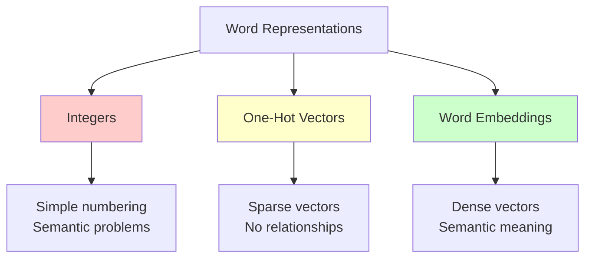

## Method 1: Integer Representation

### Concept

The simplest approach assigns a unique integer to each word in the vocabulary based on some ordering system (typically alphabetical).

### Example Implementation

```bash
# Vocabulary of 1000 basic English words
Word        Integer
─────────────────────
a           1
able        2
about       3
...         ...
hand        615
...         ...
happy       621
...         ...
zebra       1000
```

### Mathematical Representation

For a vocabulary $V = \{w_1, w_2, ..., w_n\}$:
$$\text{word}(w_i) = i \quad \text{where } i \in \{1, 2, ..., |V|\}$$

### Problems with Integer Representation

**Semantic Nonsense**: The ordering (alphabetical) has no semantic meaning

- Why should "happy" (621) be "greater" than "hand" (615)?
- Why should "zebra" (1000) be the "largest" word?
- Mathematical operations like $\text{happy} > \text{hand}$ are meaningless

**Implied Relationships**: Integers suggest mathematical relationships that don't exist

- Distance between "happy" and "hand" = |621 - 615| = 6
- Distance between "a" and "able" = |1 - 2| = 1
- This implies "a" and "able" are more similar than "happy" and "hand"

## Method 2: One-Hot Vectors

### Concept

Represent each word as a binary vector where only one element is 1 (hot) and all others are 0 (cold).

### Mathematical Definition

For vocabulary size $|V| = n$, word $w_i$ is represented as:
$$\mathbf{e}_i = [0, 0, ..., \underbrace{1}_{i\text{th position}}, ..., 0]^T \in \{0,1\}^n$$

### Visual Representation

```bash
Vocabulary: [a, able, about, ..., hand, ..., happy, ..., zebra]
Size: 1000 words

Word "happy" (position 621):
┌─────────────────────────────────────┐
│ Position  │  Value  │  Word Label   │
├─────────────────────────────────────┤
│    1      │    0    │      a        │
│    2      │    0    │     able      │
│    3      │    0    │    about      │
│   ...     │   ...   │     ...       │
│   615     │    0    │     hand      │
│   ...     │   ...   │     ...       │
│   621     │    1    │    happy      │ ← Only this is 1
│   ...     │   ...   │     ...       │
│  1000     │    0    │    zebra      │
└─────────────────────────────────────┘
```

### Conversion Between Integers and One-Hot

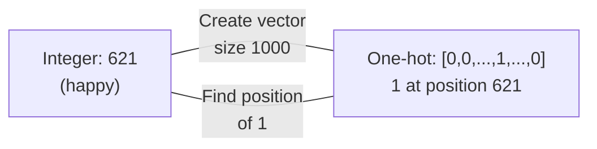

**Integer to One-Hot**:

```python
def integer_to_onehot(word_index, vocab_size):
    vector = [0] * vocab_size
    vector[word_index] = 1
    return vector

# happy = word #621 in 1000-word vocabulary
happy_onehot = integer_to_onehot(621, 1000)
# Result: [0, 0, 0, ..., 1, ..., 0] with 1 at index 621
```

**One-Hot to Integer**:

```python
def onehot_to_integer(onehot_vector):
    return onehot_vector.index(1)

# Find which word this one-hot represents
word_index = onehot_to_integer(happy_onehot)  # Returns 621
```

## Advantages of One-Hot Vectors

### 1. Simplicity

- Easy to understand and implement
- Direct mapping between words and vectors
- No complex calculations required

### 2. No Implied Ordering

- Unlike integers, one-hot vectors don't suggest any ranking
- Each word is treated as equally distinct
- No false mathematical relationships

### 3. Categorical Nature

One-hot vectors perfectly represent words as categorical variables:

- "Is this word 'happy'?" → Yes (1) or No (0)
- "Is this word 'zebra'?" → Yes (1) or No (0)
- Clear binary decisions for each vocabulary word

## Major Limitations of One-Hot Vectors

### 1. Enormous Dimensionality

**Problem Scale**:

- Basic English vocabulary: ~1,000 words → 1,000-dimensional vectors
- Full English vocabulary: ~1,000,000 words → 1,000,000-dimensional vectors
- Each word requires massive storage space

**Storage Impact**:

```bash
# For 1 million word vocabulary:
# Each word = 1 million floats = 4MB per word
# 100,000 words in document = 400GB just for word vectors!
```

### 2. Extreme Sparsity

- Each vector has exactly 1 non-zero element out of thousands/millions
- 99.9999% of each vector is wasted zeros
- Computationally inefficient for processing

### 3. No Semantic Meaning

**Distance Problem**: All pairwise distances are identical
$$d(\mathbf{e}_i, \mathbf{e}_j) = \sqrt{2} \quad \forall i \neq j$$

**Similarity Problem**: Dot product is always zero
$$\mathbf{e}_i \cdot \mathbf{e}_j = 0 \quad \forall i \neq j$$

**Real-World Example**:

```bash
Words: happy, excited, paper, zebra

Using one-hot vectors:
distance(happy, excited) = √2
distance(happy, paper)   = √2
distance(happy, zebra)   = √2

# All distances are identical!
# "happy" appears equally similar to "excited" and "paper"
# This contradicts human intuition about word similarity
```

## The Need for Word Embeddings

### Problems Summary

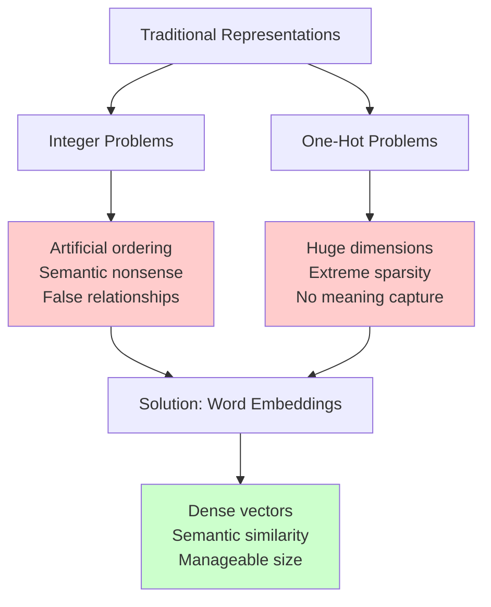

### What We Need

1. **Compact Representation**: Much smaller than vocabulary size
2. **Semantic Meaning**: Similar words should have similar vectors
3. **Meaningful Distances**: Vector similarity should reflect word similarity
4. **Computational Efficiency**: Dense vectors that are practical to use

## Comparison Table

| Feature                      | Integers       | One-Hot Vectors | Word Embeddings |
| ---------------------------- | -------------- | --------------- | --------------- |
| **Simplicity**               | ✅ Very simple | ✅ Simple       | ❌ Complex      |
| **Size**                     | ✅ Minimal     | ❌ Huge         | ✅ Compact      |
| **Semantic Meaning**         | ❌ None        | ❌ None         | ✅ Rich         |
| **Similarity Computation**   | ❌ Meaningless | ❌ All equal    | ✅ Meaningful   |
| **Computational Efficiency** | ✅ Fast        | ❌ Slow         | ✅ Fast         |
| **Memory Usage**             | ✅ Minimal     | ❌ Massive      | ✅ Reasonable   |

## Mathematical Limitations Illustrated

### One-Hot Vector Properties

For any two different words $w_i$ and $w_j$ with one-hot representations $\mathbf{e}_i$ and $\mathbf{e}_j$:

**Euclidean Distance**:
$$||\mathbf{e}_i - \mathbf{e}_j||_2 = \sqrt{\sum_{k=1}^{|V|} (e_{i,k} - e_{j,k})^2} = \sqrt{1^2 + 1^2} = \sqrt{2}$$

**Cosine Similarity**:
$$\cos(\mathbf{e}_i, \mathbf{e}_j) = \frac{\mathbf{e}_i \cdot \mathbf{e}_j}{||\mathbf{e}_i|| \cdot ||\mathbf{e}_j||} = \frac{0}{1 \cdot 1} = 0$$

**Dot Product**:
$$\mathbf{e}_i \cdot \mathbf{e}_j = \sum_{k=1}^{|V|} e_{i,k} \cdot e_{j,k} = 0$$

These identical results for all word pairs demonstrate the complete inability of one-hot vectors to capture semantic relationships.

## Key Takeaways

1. **Integer representations** are simple but create meaningless semantic orderings
2. **One-hot vectors** solve the ordering problem but create massive dimensionality and sparsity issues
3. **Neither method captures semantic meaning** - similar words are not represented similarly
4. **Word embeddings emerge as the solution** to these fundamental limitations
5. **The stage is set** for learning dense, meaningful word representations

The limitations of traditional approaches directly motivate the development of word embeddings, which will be covered in the next section. Understanding these problems is crucial for appreciating why word embeddings revolutionized NLP.

# 3. Word Embeddings - Dense Vector Representations

## Introduction

Word embeddings solve the fundamental problems of traditional word representations by creating **dense, low-dimensional vectors that encode semantic meaning**. Unlike one-hot vectors that are sparse and carry no meaning, word embeddings place similar words close together in a continuous vector space.

## Core Concept: From Sparse to Dense

### The Transformation

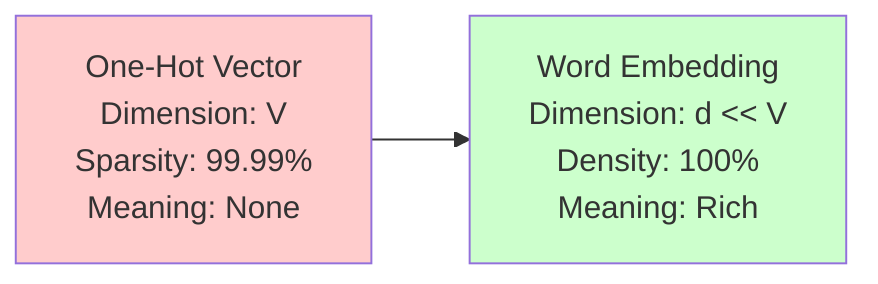

**Traditional Approach**: Vocabulary-sized sparse vectors with no semantic relationships

**Word Embeddings**: Compact dense vectors where position encodes meaning

## 2D Word Embedding Visualization

### Semantic Space Representation

The provided diagram shows how word embeddings map words into a meaningful 2D space:

```bash
                    ↑ concrete (physical objects)
                    |
    paper (0.03, 0.79) •
                    |
    spider (-1.53, 0.41) •        • puppy (0.98, 0.57)  • kitten (1.09, 0.57)
    snake (-1.53, 0.41) •         |
                    |
negative ←─────────────────────────────────────────────────────→ positive
                    |
    rage (-2.52, -0.54) •      thought (0.03, -0.93) •    happy (1.75, -0.81) •
    anger (-2.08, -0.71) •        |                        excited (2.31, -0.54) •
                    boring •      |
                    |
                    ↓ abstract (ideas, concepts)
```

### Dimensional Interpretation

**X-axis (Sentiment)**: Represents emotional valence

- **Negative values**: Words with negative connotations (rage, anger, spider)
- **Positive values**: Words with positive connotations (happy, excited, puppy)
- **Near zero**: Neutral words (paper, thought)

**Y-axis (Concreteness)**: Represents abstractness vs. concreteness

- **Positive values**: Concrete, physical objects (paper, puppy, kitten)
- **Negative values**: Abstract concepts (happy, excited, thought)
- **Near zero**: Mixed or neutral concepts

## Mathematical Representation

### Vector Definition

For vocabulary $V$ with $|V|$ words and embedding dimension $d$:
$$\mathbf{w}_i \in \mathbb{R}^d \quad \text{where } d \ll |V|$$

### Example 2D Embeddings

From the visualization:

- **happy** = $[1.75, -0.81]$
- **excited** = $[2.31, -0.54]$
- **puppy** = $[0.98, 0.57]$
- **paper** = $[0.03, 0.79]$

### Decimal Precision Advantage

Unlike one-hot vectors limited to $\{0, 1\}$, embeddings use continuous values:
$$\mathbf{w}_i \in [-\infty, +\infty]^d$$

This allows for **fine-grained distinctions** between similar concepts.

## Semantic Similarity Through Distance

### Distance-Based Similarity

**Euclidean Distance** between words:
$$d(\mathbf{w}_i, \mathbf{w}_j) = ||\mathbf{w}_i - \mathbf{w}_j||_2 = \sqrt{\sum_{k=1}^{d} (w_{i,k} - w_{j,k})^2}$$

### Real Examples from the Diagram

**Similar Words (Close Distance)**:

```bash
happy = [1.75, -0.81]
excited = [2.31, -0.54]
distance(happy, excited) = √[(2.31-1.75)² + (-0.54-(-0.81))²]
                         = √[0.56² + 0.27²] = √[0.31 + 0.07] = 0.62
```

**Dissimilar Words (Large Distance)**:

```bash
happy = [1.75, -0.81]
paper = [0.03, 0.79]
distance(happy, paper) = √[(0.03-1.75)² + (0.79-(-0.81))²]
                       = √[(-1.72)² + (1.60)²] = √[2.96 + 2.56] = 2.35
```

**Result**: happy is much closer to excited (0.62) than to paper (2.35), reflecting semantic intuition!

## Clustering of Semantic Categories

### Positive Emotions Cluster

- **happy** = $[1.75, -0.81]$
- **excited** = $[2.31, -0.54]$
- Distance: 0.62 (very close)

### Cute Animals Cluster

- **puppy** = $[0.98, 0.57]$
- **kitten** = $[1.09, 0.57]$
- Distance: $|1.09 - 0.98| = 0.11$ (extremely close)

### Scary Creatures Cluster

- **spider** = $[-1.53, 0.41]$
- **snake** = $[-1.53, 0.41]$
- Distance: 0 (identical location - potential precision loss)

## Advantages of Word Embeddings

### 1. **Low Dimensionality**

- **Traditional**: One-hot vectors of size $|V|$ (often 100K+ dimensions)
- **Embeddings**: Typical dimensions 50-300 (massive reduction)
- **Benefit**: Computational efficiency and memory savings

### 2. **Semantic Meaning Encoding**

- **Position matters**: Location in vector space encodes meaning
- **Relationships preserved**: Similar words cluster together
- **Interpretable dimensions**: Each coordinate captures semantic properties

### 3. **Continuous Representation**

- **Fine-grained distinctions**: Decimal values allow nuanced differences
- **Interpolation possible**: Points between words have meaning
- **Smooth semantic space**: Gradual transitions between concepts

## Precision vs. Meaning Trade-off

### What We Gain

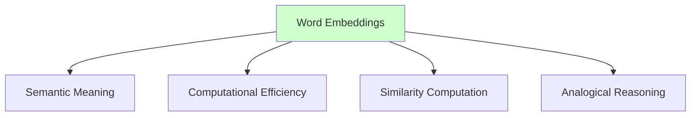

### What We Lose

- **Perfect Distinctness**: Two words might have identical embeddings (snake/spider example)
- **Exact Representation**: Some semantic nuances might be lost in low dimensions
- **Interpretability**: Higher dimensions become harder to visualize

### The Trade-off Equation

$$\text{Semantic Richness} \propto \text{Embedding Dimension}$$
$$\text{Computational Cost} \propto \text{Embedding Dimension}$$

**Optimal Point**: Balance between meaning capture and computational practicality (typically 100-300 dimensions)

## Analogical Reasoning

### Mathematical Foundation

Word embeddings enable analogical reasoning through vector arithmetic:
$$\mathbf{w}_{\text{Paris}} - \mathbf{w}_{\text{France}} + \mathbf{w}_{\text{Rome}} \approx \mathbf{w}_{\text{Italy}}$$

### Why This Works

- **Relationship vectors**: $\mathbf{w}_{\text{Paris}} - \mathbf{w}_{\text{France}}$ captures "capital-of" relationship
- **Transfer relationships**: Adding this to Rome should yield Italy
- **Semantic algebra**: Mathematical operations on meaning

### Example from Embedding Space

```bash
# If we had country-capital relationships in our 2D space:
Paris - France + Rome = [capital_offset] + Rome ≈ Italy
```

## Multi-Dimensional Semantic Properties

### Beyond 2D: Real-World Embeddings

**2D Example** (from diagram):

- Dimension 1: Positive ↔ Negative sentiment
- Dimension 2: Concrete ↔ Abstract concepts

**Higher Dimensions** (typical real-world):

- Dimension 1: Animacy (living vs. non-living)
- Dimension 2: Size (big vs. small)
- Dimension 3: Gender (masculine vs. feminine)
- Dimension 4: Temporal (past vs. future)
- ...and hundreds more semantic properties

### Dimension Interpretation

$$\mathbf{w}_{\text{word}} = [d_1, d_2, d_3, ..., d_n]$$

Where each $d_i$ represents some learned semantic property (often not explicitly interpretable).

## Applications Enabled by Word Embeddings

### 1. **Similarity Computation**

```python
def word_similarity(word1, word2):
    return cosine_similarity(embedding[word1], embedding[word2])

# forest ≈ tree (high similarity)
# forest ≠ ticket (low similarity)
```

### 2. **Sentence-Level Meaning**

- Average word embeddings for sentence representation
- Foundation for more complex sentence encoders
- Enables document similarity and search

### 3. **Transfer Learning**

- Pre-trained embeddings work across different tasks
- Fine-tune for specific domains
- Reduces training time and data requirements

## Terminology Clarification

### Word Vectors vs. Word Embeddings

**Technical Distinction**:

- **Word Vectors**: Any vector representation of words (including one-hot)
- **Word Embeddings**: Specifically dense, learned vector representations

**Common Usage**:

- Terms often used interchangeably in practice
- "Word embeddings" more commonly refers to dense representations
- Context usually clarifies the intended meaning

### Alternative Names

- Word vectors
- Word embeddings
- Distributed representations
- Dense word representations
- Semantic vectors

## Key Mathematical Properties

### Cosine Similarity

$$\cos(\mathbf{w}_i, \mathbf{w}_j) = \frac{\mathbf{w}_i \cdot \mathbf{w}_j}{||\mathbf{w}_i|| \cdot ||\mathbf{w}_j||}$$

**Range**: $[-1, 1]$ where:

- 1 = identical meaning
- 0 = orthogonal (unrelated)
- -1 = opposite meaning

### Embedding Matrix

For vocabulary of size $|V|$ and embedding dimension $d$:
$$\mathbf{E} \in \mathbb{R}^{d \times |V|}$$

Where each column $\mathbf{E}_{:,i}$ is the embedding for word $w_i$.

## Summary

Word embeddings represent a paradigm shift from sparse, meaningless representations to dense, semantically rich vectors. They solve the fundamental problems of traditional approaches while enabling powerful NLP applications through:

1. **Semantic encoding**: Similar words have similar vectors
2. **Computational efficiency**: Much smaller than vocabulary size
3. **Mathematical operations**: Enable analogical reasoning
4. **Foundation for complex tasks**: Sentence understanding, translation, Q&A

The next challenge: **How do we learn these meaningful embeddings from text data?**

# 4. How to Create Word Embeddings - Methods and Approaches

## The Complete Word Embedding Creation Process

Creating meaningful word embeddings requires a systematic approach combining the right data, methods, and parameters. The process transforms raw text into dense semantic vectors through machine learning.

## Essential Components

### Two Fundamental Requirements

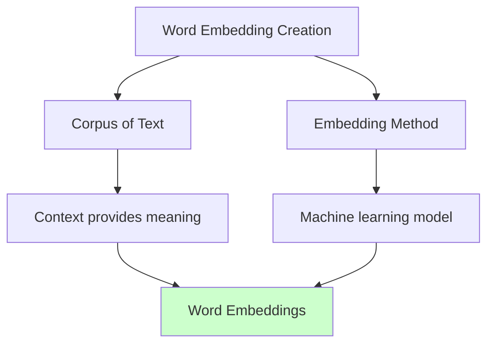

**Every word embedding approach requires:**

1. **Corpus**: Text data containing words in their natural context
2. **Method**: Machine learning approach to learn vector representations

## 1. Corpus: The Foundation of Meaning

### What is a Corpus?

A **corpus** is a large collection of text that represents how words are used in context. The quality and nature of your corpus directly determines the quality of your embeddings.

### Context is Everything

**Context Definition**: The surrounding words or combinations of words that tend to occur around a particular word.

**Why Context Matters**:

- Context gives meaning to word embeddings
- Words appearing in similar contexts develop similar embeddings
- Without context, embeddings cannot capture semantic relationships

### Corpus Examples and Applications

#### General-Purpose Corpora

```bash
Wikipedia Articles
├── Broad coverage of topics
├── Encyclopedic writing style
├── Factual, neutral tone
└── Good for general NLP tasks

News Articles
├── Current events and topics
├── Journalistic writing style
├── Time-sensitive information
└── Good for current affairs tasks
```

#### Specialized Domain Corpora

```bash
Legal Domain
├── Contracts and legal documents
├── Law books and case studies
├── Legal terminology and phrases
└── Captures legal language nuances

Medical Domain
├── Medical journals and papers
├── Clinical notes and reports
├── Drug and treatment descriptions
└── Captures medical terminology

Shakespeare Corpus
├── Original complete works
├── Elizabethan English usage
├── Poetic and dramatic language
└── Period-specific language patterns
```

### Corpus Quality Requirements

**What Makes a Good Corpus**:

- **Authentic Usage**: Words used in natural, realistic contexts
- **Sufficient Size**: Large enough to capture word usage patterns
- **Representative**: Covers the domain/use case adequately
- **Diverse Contexts**: Same words appearing in varied situations

**What Doesn't Work**:

- Simple vocabulary lists (no context)
- Study notes or summaries (processed, not natural)
- Keywords or bullet points (fragmented context)
- Machine-translated text (unnatural patterns)

### Context Impact on Embeddings

**Example: Word "bank"**

```bash
Financial Corpus Context:
"I went to the bank to deposit money"
"The bank approved my loan application"
"Bank interest rates are rising"
→ Embedding captures financial meaning

River/Geography Corpus Context:
"We sat by the river bank"
"The bank was covered with flowers"
"Fish swim near the bank"
→ Embedding captures geographical meaning

Mixed Corpus:
→ Embedding captures both meanings (or creates confusion)
```

## 2. Embedding Method: Learning from Context

### Machine Learning Approach

Modern word embeddings use **machine learning models** that learn vector representations as a byproduct of performing a learning task.

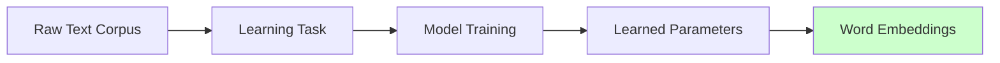

### Self-Supervised Learning Paradigm

**Definition**: Self-supervised learning combines aspects of both supervised and unsupervised learning.

#### Characteristics of Self-Supervised Learning

**Unsupervised Aspect**:

- Input data (corpus) is **unlabeled**
- No manual annotation required
- No explicit target labels provided

**Supervised Aspect**:

- Data itself provides the **supervision signal**
- Context creates implicit labels
- Learning task has clear input-output pairs

### Example Learning Tasks

#### Task 1: Context → Target Word (CBOW)

```bash
Input:  "I think [???] I am"
Output: "therefore"

Context: ["I", "think", "I", "am"]
Target:  "therefore"
```

#### Task 2: Target → Context Words (Skip-gram)

```bash
Input:  "therefore"
Output: ["I", "think", "I", "am"]

Target:  "therefore"
Context: ["I", "think", "I", "am"]
```

### Mathematical Framework

**Learning Objective**: Maximize the probability of predicting correct words given context

For CBOW model:
$$P(\text{target word} | \text{context words})$$

**Self-Supervision Mechanism**:
$$\text{Sentence: } w_1, w_2, w_3, w_4, w_5$$
$$\text{Training pair: } ([w_1, w_2, w_4, w_5], w_3)$$

The sentence provides both input (context) and target (center word) automatically.

## Data Transformation Pipeline

### From Words to Numbers

Before feeding text into machine learning models, words must be converted to numerical representations.

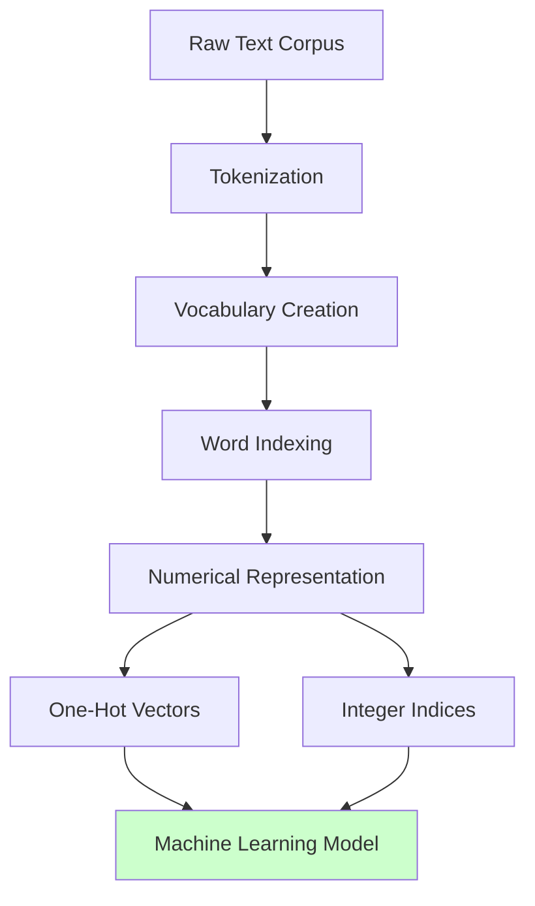

### Transformation Steps

**Step 1: Tokenization**

```bash
"To be or not to be" → ["To", "be", "or", "not", "to", "be"]
```

**Step 2: Vocabulary Creation**

```bash
Unique words: {"To", "be", "or", "not", "to"}
Case handling: {"to", "be", "or", "not"} (lowercase)
```

**Step 3: Word Indexing**

```bash
Word → Index mapping:
"to"  → 1
"be"  → 2
"or"  → 3
"not" → 4
```

**Step 4: Numerical Representation**

```bash
One-hot vectors:
"to"  → [1, 0, 0, 0]
"be"  → [0, 1, 0, 0]
"or"  → [0, 0, 1, 0]
"not" → [0, 0, 0, 1]
```

## Hyperparameters in Word Embeddings

### Key Hyperparameters

#### 1. **Embedding Dimension**

```bash
Typical Ranges:
- Small: 50-100 dimensions
- Medium: 100-300 dimensions
- Large: 300-1000 dimensions
- Very Large: 1000+ dimensions
```

**Trade-offs**:

$$
\text{Higher Dimensions} \begin{cases}
\text{+ More nuanced meanings} \\
\text{+ Better semantic capture} \\
\text{- More computational cost} \\
\text{- Longer training time} \\
\text{- Risk of overfitting}
\end{cases}
$$

#### 2. **Context Window Size**

```bash
Window Size Examples:
Size 1: [word] target [word]
Size 2: [word, word] target [word, word]
Size 5: [w, w, w, w, w] target [w, w, w, w, w]
```

**Impact**:

- **Smaller windows**: Capture syntactic relationships
- **Larger windows**: Capture broader semantic relationships

#### 3. **Learning Rate**

- Controls how quickly model parameters update
- Too high: Unstable training
- Too low: Slow convergence

#### 4. **Training Epochs**

- Number of times model sees entire corpus
- Balance between learning and overfitting

### Diminishing Returns

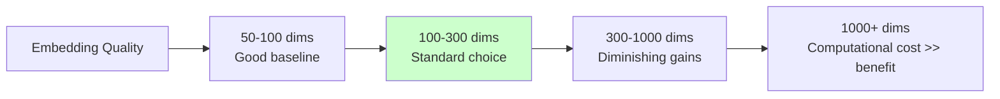

**Optimal Range**: Most applications use 100-300 dimensions as the sweet spot between semantic richness and computational efficiency.

## Complete Pipeline Example

### Shakespeare Word Embeddings

**Step 1: Corpus Preparation**

```bash
Original Text: "To be, or not to be, that is the question"
Preprocessing: "to be or not to be that is the question"
Tokenization: ["to", "be", "or", "not", "to", "be", "that", "is", "the", "question"]
```

**Step 2: Context-Target Pairs** (Window size = 2)

```bash
Context: ["to", "be", "not", "to"] → Target: "or"
Context: ["be", "or", "to", "be"] → Target: "not"
Context: ["or", "not", "be", "that"] → Target: "to"
```

**Step 3: Model Training**

- Convert words to one-hot vectors
- Feed context vectors to neural network
- Predict target word
- Update weights using backpropagation

**Step 4: Extract Embeddings**

- Trained model weights become word embeddings
- Each word gets dense vector representation

## Self-Supervised Learning Deep Dive

### Why "Self-Supervised"?

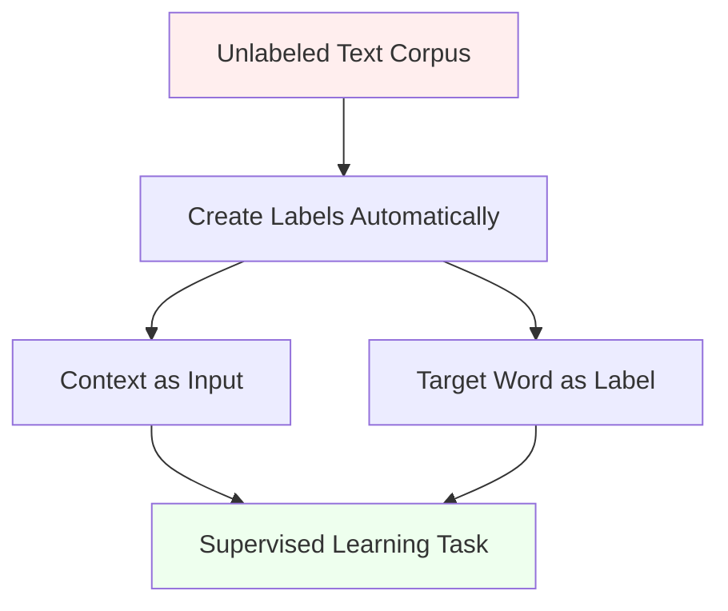

**The Genius**: The text corpus contains both the training data AND the supervision signal!

### Comparison with Other Learning Types

| Learning Type       | Data Required  | Labels            | Examples             |
| ------------------- | -------------- | ----------------- | -------------------- |
| **Supervised**      | Input + Labels | Manual annotation | Image classification |
| **Unsupervised**    | Input only     | None              | Clustering           |
| **Self-Supervised** | Input only     | Auto-generated    | Word embeddings      |

### Benefits of Self-Supervised Approach

1. **No Manual Labeling**: Saves enormous annotation costs
2. **Scalable**: Can use any text corpus
3. **Natural Supervision**: Context provides meaningful learning signal
4. **Domain Adaptable**: Works for any domain with sufficient text

## Key Insights

### Context Drives Meaning

- **Distributional Hypothesis**: Words appearing in similar contexts have similar meanings
- **Context Window**: Defines what "similar context" means
- **Corpus Choice**: Determines what contexts the model learns from

### Task Design Matters

- **Learning objective** shapes what embeddings capture
- **CBOW**: Focuses on predictability from context
- **Skip-gram**: Focuses on context generation
- **Different tasks** create different embedding properties

### Quality Factors

1. **Corpus size**: More data → better embeddings
2. **Corpus quality**: Natural usage → meaningful embeddings
3. **Hyperparameters**: Proper tuning → optimal performance
4. **Training duration**: Sufficient epochs → convergence

## Summary

Creating word embeddings is a systematic process that transforms raw text into meaningful vector representations through self-supervised learning. The key components work together:

- **Corpus** provides context and meaning
- **Method** learns patterns through machine learning
- **Hyperparameters** control the learning process
- **Self-supervision** eliminates need for manual labeling

The resulting embeddings capture semantic relationships that enable powerful NLP applications, with the quality depending on careful choices in corpus selection, method design, and parameter tuning.

# 5. Word Embedding Methods - Skip-gram, CBOW, GloVe

## Evolution of Word Embedding Methods

Word embedding methods have evolved rapidly, with each new approach addressing limitations of previous methods and capturing increasingly sophisticated semantic relationships. This section surveys the major approaches from classical methods to modern transformer-based embeddings.

## Timeline of Development

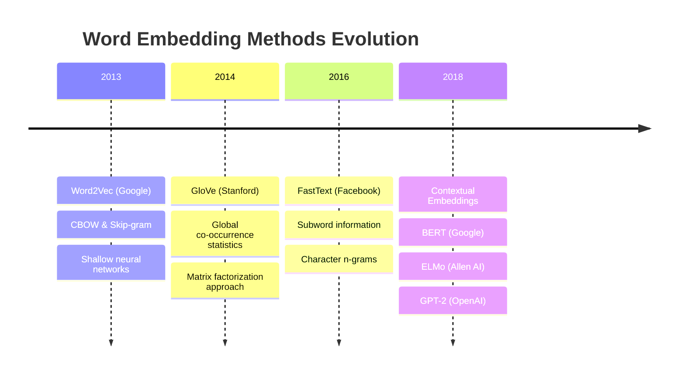

## Classical Methods (2013-2016)

### 1. Word2Vec (Google, 2013)

**Overview**: Word2Vec uses shallow neural networks to learn word embeddings through two complementary architectures.

#### Architecture 1: Continuous Bag-of-Words (CBOW)

**Objective**: Predict center word given surrounding context words

```bash
Input Context: ["I", "think", "I", "am"]
Target Word:   "therefore"

Task: Given context words → Predict center word
```

**Mathematical Formulation**:
$$P(w_t | w_{t-n}, ..., w_{t-1}, w_{t+1}, ..., w_{t+n})$$

Where:

- $w_t$ = target word at position $t$
- $w_{t-n}, ..., w_{t+n}$ = context words in window of size $n$

**Architecture Diagram**:

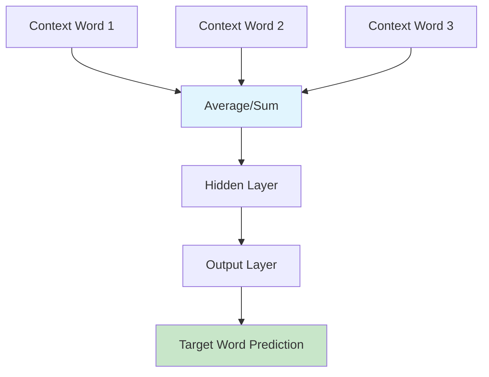

**Key Characteristics**:

- **Simple and efficient**: Computationally lightweight
- **Fast training**: Suitable for large corpora
- **Focus on prediction**: Learn embeddings as byproduct of word prediction task

#### Architecture 2: Continuous Skip-gram (Skip-gram with Negative Sampling)

**Objective**: Predict surrounding context words given center word (reverse of CBOW)

```bash
Input Word:    "therefore"
Target Context: ["I", "think", "I", "am"]

Task: Given center word → Predict surrounding words
```

**Mathematical Formulation**:
$$P(w_{t-n}, ..., w_{t-1}, w_{t+1}, ..., w_{t+n} | w_t)$$

**Architecture Diagram**:

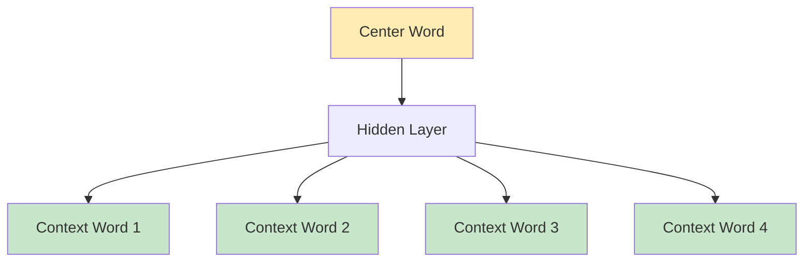

### CBOW vs Skip-gram Comparison

| Aspect              | CBOW                            | Skip-gram                     |
| ------------------- | ------------------------------- | ----------------------------- |
| **Input**           | Context words                   | Center word                   |
| **Output**          | Center word                     | Context words                 |
| **Training Speed**  | Faster                          | Slower                        |
| **Data Efficiency** | Better for frequent words       | Better for rare words         |
| **Use Case**        | Large corpora, efficiency focus | Small corpora, accuracy focus |

### 2. GloVe - Global Vectors (Stanford, 2014)

**Key Innovation**: Combines global corpus statistics with local context window methods

#### Methodology

**Step 1**: Create word co-occurrence matrix

```bash
Co-occurrence Matrix X where X[i,j] =
number of times word j appears in context of word i
```

**Step 2**: Factorize logarithm of co-occurrence matrix
$$\log(X_{ij}) = w_i^T \tilde{w}_j + b_i + \tilde{b}_j$$

Where:

- $w_i$ = word vector for word $i$
- $\tilde{w}_j$ = context vector for word $j$
- $b_i, \tilde{b}_j$ = bias terms

#### Objective Function

**GloVe Loss Function**:
$$J = \sum_{i,j=1}^{V} f(X_{ij})(w_i^T \tilde{w}_j + b_i + \tilde{b}_j - \log X_{ij})^2$$

Where $f(X_{ij})$ is a weighting function that handles frequent vs. rare word pairs.

#### Advantages

- **Global perspective**: Uses entire corpus statistics
- **Efficient**: Pre-computes co-occurrence matrix
- **Balanced**: Combines benefits of matrix factorization and local context

### 3. FastText (Facebook, 2016)

**Key Innovation**: Incorporates subword information using character n-grams

#### Character N-gram Approach

**Concept**: Represent words as bags of character n-grams

```bash
Word: "kitten"

Character trigrams (n=3):
<ki, kit, itt, tte, ten, en>

Word representation = sum of n-gram embeddings
```

#### Mathematical Representation

**Traditional Word2Vec**:
$$s(w, c) = \sum_{g \in G_w} z_g^T v_c$$

Where:

- $G_w$ = set of n-grams for word $w$
- $z_g$ = vector representation of n-gram $g$
- $v_c$ = context word vector

#### Key Advantages

**1. Out-of-Vocabulary (OOV) Support**:

```bash
Training words: ["kitten", "cat", "dog"]
New word: "kitty"

FastText can infer "kitty" embedding from:
- Character n-grams: <ki, kit, itt, tty, ty>
- Similar to "kitten": <ki, kit, itt, tte, en>
- Shared n-grams provide meaningful representation
```

**2. Morphological Awareness**:

- Captures word structure and morphology
- Similar words with similar spelling get similar embeddings
- Beneficial for morphologically rich languages

**3. Phrase and Sentence Representations**:

- Average word embeddings to create phrase/sentence vectors
- Compositional meaning representation

#### Example Applications

```bash
Morphological Relationships:
"play" → "playing" → "played" → "player"
All share character n-grams, creating related embeddings

Cross-lingual Transfer:
English "cat" ↔ Spanish "gato"
May share some character patterns in multilingual training
```

## Deep Learning & Contextual Embeddings (2018+)

### Paradigm Shift: Context-Dependent Embeddings

**Traditional Problem**: Static embeddings - same word always has same vector

```bash
Static Embedding Problem:
"plant" in "water the plant" (organism)
"plant" in "nuclear plant"  (factory)
→ Same embedding for different meanings!
```

**Contextual Solution**: Dynamic embeddings that change based on context

```bash
Contextual Embeddings:
"plant" in "water the plant" → embedding_1 (organism-focused)
"plant" in "nuclear plant"  → embedding_2 (factory-focused)
→ Different embeddings capture different meanings!
```

### Polysemy Handling

**Polysemy**: Words with multiple related meanings

**Examples**:

```bash
"bank":
- Financial institution: "I went to the bank"
- River edge: "sat by the river bank"
- Verb (rely): "I bank on your support"

"plant":
- Organism: "water the plant"
- Factory: "nuclear plant"
- Verb (place): "plant the seed"
```

**Contextual Embeddings Solution**:

- Generate different vectors for each context
- Capture nuanced meanings based on surrounding words
- Handle semantic ambiguity automatically

### Major Contextual Models

#### 1. BERT - Bidirectional Encoder Representations from Transformers (Google, 2018)

**Key Features**:

- **Bidirectional**: Considers both left and right context
- **Transformer architecture**: Self-attention mechanisms
- **Pre-training tasks**: Masked language modeling + next sentence prediction

```bash
BERT Example:
"The [MASK] sat on the mat"
→ Model predicts "cat" using bidirectional context
```

#### 2. ELMo - Embeddings from Language Models (Allen Institute, 2018)

**Key Features**:

- **Deep contextualized**: Multiple layers of LSTM
- **Character-based**: Handles OOV words
- **Bidirectional**: Forward and backward language models

#### 3. GPT-2 - Generative Pre-training 2 (OpenAI, 2018)

**Key Features**:

- **Generative**: Trained to predict next words
- **Transformer decoder**: Unidirectional attention
- **Scalable**: Larger models show better performance

### Comparison: Classical vs Contextual

| Feature                 | Classical (Word2Vec, GloVe) | Contextual (BERT, ELMo)            |
| ----------------------- | --------------------------- | ---------------------------------- |
| **Embedding Type**      | Static (fixed per word)     | Dynamic (context-dependent)        |
| **Polysemy**            | Single meaning per word     | Multiple meanings supported        |
| **Architecture**        | Shallow networks            | Deep transformers/LSTMs            |
| **Training Complexity** | Simple, fast                | Complex, computationally intensive |
| **Memory Usage**        | Low                         | High                               |
| **Performance**         | Good baseline               | State-of-the-art                   |

## Practical Usage Recommendations

### When to Use Classical Methods

**Word2Vec CBOW**:

- Large training corpus available
- Computational efficiency is priority
- Simple downstream tasks
- Learning/educational purposes

**Skip-gram**:

- Small corpus or rare words
- Higher quality embeddings needed
- Research applications

**GloVe**:

- Need global corpus statistics
- Balanced approach between speed and quality
- Reproducible results important

**FastText**:

- Out-of-vocabulary words expected
- Morphologically rich languages
- Subword information valuable

### When to Use Contextual Methods

**BERT/ELMo/GPT-2**:

- State-of-the-art performance required
- Complex downstream tasks (QA, translation)
- Polysemy handling critical
- Computational resources available
- Pre-trained models can be fine-tuned

## Implementation Approach

### This Week's Focus: CBOW

**Why CBOW for Learning**:

1. **Conceptual Clarity**: Simple to understand and implement
2. **Educational Value**: Demonstrates core embedding principles
3. **Historical Importance**: Foundation for modern methods
4. **Computational Feasibility**: Can be implemented from scratch

**CBOW Implementation Benefits**:

- Learn neural network fundamentals
- Understand embedding training process
- Build intuition for advanced methods
- Practical coding experience

### Modern Practice Recommendation

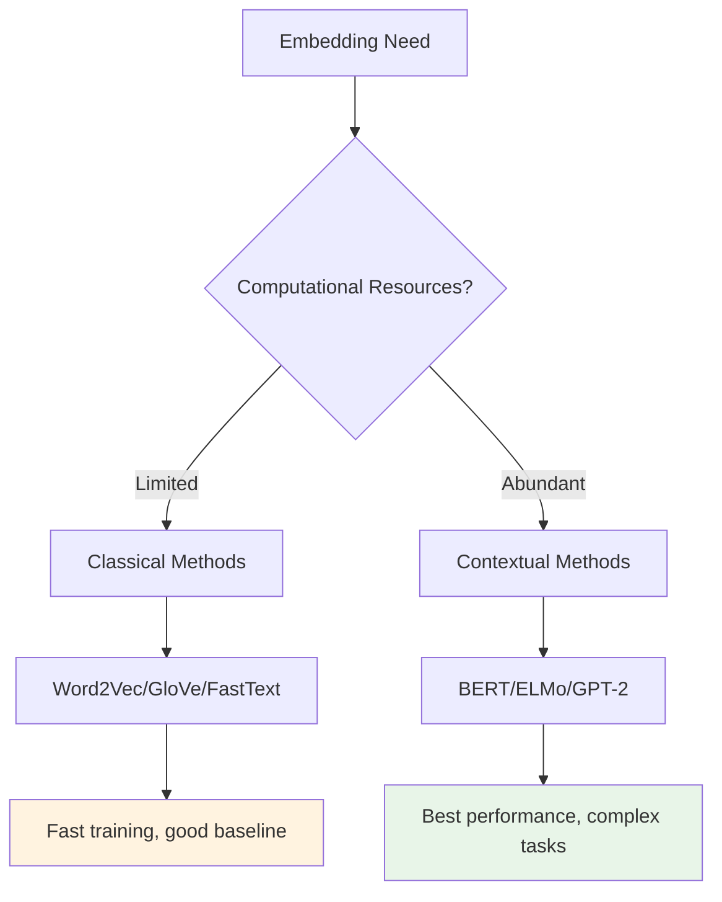

**Best Practice**:

1. **Start with pre-trained embeddings** (Word2Vec, GloVe, FastText)
2. **Evaluate performance** on your specific task
3. **Upgrade to contextual** if performance gains justify computational cost
4. **Fine-tune pre-trained models** rather than training from scratch

## Key Takeaways

### Evolution Pattern

1. **Word2Vec**: Introduced neural embedding learning
2. **GloVe**: Added global statistical information
3. **FastText**: Incorporated subword structure
4. **Contextual**: Solved polysemy with dynamic embeddings

### Core Principles

- **Context drives meaning**: All methods use surrounding words
- **Self-supervised learning**: Text provides its own supervision
- **Trade-offs exist**: Speed vs. quality, simplicity vs. sophistication
- **Task-dependent choice**: Different methods suit different applications

### Future Directions

- **Transformer architectures**: Currently state-of-the-art
- **Multimodal embeddings**: Combining text with images/audio
- **Cross-lingual**: Universal embeddings across languages
- **Efficiency improvements**: Maintaining quality while reducing computation

The foundation built by classical methods like CBOW provides essential understanding for appreciating and effectively using modern contextual embeddings.

# 6. Continuous Bag-of-Words Model - Architecture Overview

## Introduction to CBOW

The **Continuous Bag-of-Words (CBOW)** model is a neural network architecture that learns word embeddings by predicting a target word based on its surrounding context words. This approach leverages the distributional hypothesis: words that appear in similar contexts tend to have similar meanings.

## Core Concept

### The Prediction Task

**Objective**: Given surrounding context words, predict the center (target) word

```bash
Example:
Context words: ["I", "am", "because", "I"]
Target word:   "happy"

Task: [I, am, because, I] → predict "happy"
```

### Semantic Learning Rationale

**Key Insight**: If two unique words are frequently surrounded by similar sets of words across various sentences, those words tend to be semantically related.

**Example Learning**:

```bash
Sentence 1: "The little [something] is barking"
Sentence 2: "My small [something] loves to play"
Sentence 3: "The cute [something] wagged its tail"

With sufficient corpus, model learns to predict:
[something] = dog, puppy, hound, terrier, etc.
→ All semantically related words!
```

## CBOW Architecture Components

### Overall Process Flow

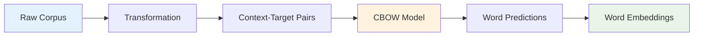

### Required Components

1. **Corpus**: Text data containing words in natural context
2. **Transformation**: Convert text to suitable model input format
3. **CBOW Model**: Neural network performing prediction task
4. **Embeddings**: Learned word vectors as byproduct

## Window and Context Definitions

### Key Terminology

From the provided examples, we can see the fundamental concepts:

#### Center Word

**Definition**: The target word that the model attempts to predict

```bash
Sentence: "I am happy because I am learning"
Center word: "happy" (highlighted in orange)
```

#### Context Words

**Definition**: Words surrounding the center word within a specified distance

```bash
Context words for "happy": ["I", "am", "because", "I"]
(shown in purple/pink in the diagram)
```

#### Context Half-Size (C)

**Definition**: Number of words to include before AND after the center word

```bash
C = 2 means:
- 2 words before center word
- 2 words after center word
- Total context words = 2 + 2 = 4
```

#### Window Size

**Definition**: Total number of words including center word and all context words

```bash
Window size = Center word + Context words
Window size = 1 + (C × 2) = 1 + (2 × 2) = 5
```

### Visual Representation

Based on the provided diagram:

```bash
Context Half-size: C = 2
Window Size: 5

┌───────────────────────────────────────────────┐
│    Context Words    │Center │ Context Words   │
├─────────────────────┼───────┼─────────────────┤
│     "I"    "am"     │"happy"│"because"  "I"   │
└─────────────────────┴───────┴─────────────────┘
│←────── C=2 words ──→│       │←── C=2 words ──→│
│←─────────────── Window Size = 5 ─────────────→│
```

## Training Data Generation

### Sliding Window Approach

The CBOW model generates multiple training examples by sliding a fixed-size window across the corpus.

#### Example Corpus

```bash
Original sentence: "I am happy because I am learning"
(ignoring punctuation)
```

#### Training Example Generation

**Example 1**: Window positioned on "happy"

```bash
Window: ["I", "am", "happy", "because", "I"]
Context: ["I", "am", "because", "I"]
Target:  "happy"
```

**Example 2**: Slide window right by 1 position

```bash
Window: ["am", "happy", "because", "I", "am"]
Context: ["am", "happy", "I", "am"]
Target:  "because"
```

**Example 3**: Slide window right by 1 position

```bash
Window: ["happy", "because", "I", "am", "learning"]
Context: ["happy", "because", "am", "learning"]
Target:  "I"
```

### Complete Training Set Generation

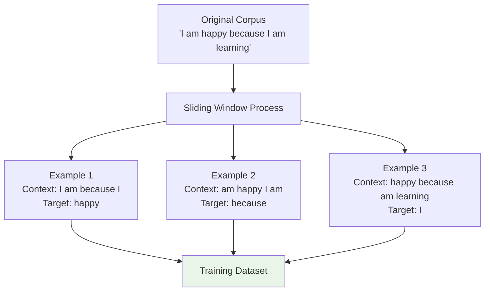

### Mathematical Representation

For a corpus of length $N$ and window size $W$:

- **Number of training examples**: $N - W + 1$
- **Each example**: $(context\_words, target\_word)$
- **Context size**: $2 \times C$ words (C before + C after)

**Training Example Format**:
$$(\{w_{t-C}, w_{t-C+1}, ..., w_{t-1}, w_{t+1}, ..., w_{t+C}\}, w_t)$$

Where:

- $w_t$ = target word at position $t$
- $\{w_{t-C}, ..., w_{t+C}\} \setminus \{w_t\}$ = context words

## CBOW Model Architecture

### High-Level Architecture

From the original paper architecture shown in the images:

```bash
Input Layer:     [Context Words] (multiple one-hot vectors)
                      ↓
Hidden Layer:    [Averaged/Summed Context Representations]
                      ↓
Output Layer:    [Target Word Prediction] (softmax over vocabulary)
```

### Input-Output Flow

**Input**: Context words as one-hot vectors or indices

**Processing**: Neural network combines context information

**Output**: Probability distribution over vocabulary for center word

**Learning**: Backpropagation adjusts weights to improve predictions

**Byproduct**: Learned weights become word embeddings

## Hyperparameters

### Context Half-Size (C)

**Impact on Learning**:

- **Smaller C (1-2)**: Captures syntactic relationships, local patterns
- **Larger C (5-10)**: Captures semantic relationships, broader context

**Trade-offs**:

```bash
Small Context (C=1):
- Faster training
- Local syntactic patterns
- May miss broader semantic relationships

Large Context (C=5):
- Slower training
- Broader semantic capture
- May dilute local patterns
```

### Window Size Effects

**Fixed Context Size**: As context size increases, window size increases
$$Window\_Size = 1 + 2 \times C$$

**Training Examples**: Larger windows mean fewer training examples per corpus
$$Examples = Corpus\_Length - Window\_Size + 1$$

## Learning Process

### Distributional Hypothesis in Action

**Core Principle**: Words appearing in similar contexts develop similar embeddings

```bash
Similar Contexts → Similar Embeddings

Context for "dog": ["the", "barks", "runs", "plays"]
Context for "puppy": ["the", "barks", "runs", "plays"]
→ "dog" and "puppy" develop similar embeddings

Context for "car": ["drive", "fast", "road", "engine"]
Context for "vehicle": ["drive", "fast", "road", "engine"]
→ "car" and "vehicle" develop similar embeddings
```

### Training Process

1. **Initialize**: Random word embeddings for all vocabulary words
2. **For each training example**:
   - Feed context words to model
   - Predict center word
   - Compare prediction with actual center word
   - Update embeddings to improve prediction
3. **Repeat**: Until embeddings converge or training completes

### Byproduct Learning

**Key Insight**: The model's primary task is word prediction, but the valuable output is the learned word representations.

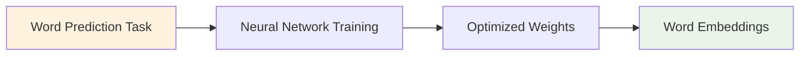

## Advantages of CBOW

### 1. **Computational Efficiency**

- Simpler than more complex architectures
- Faster training than skip-gram on large corpora
- Suitable for educational implementation

### 2. **Semantic Learning**

- Captures meaningful word relationships
- Learns from natural language context
- No manual labeling required

### 3. **Scalability**

- Works with large vocabularies
- Parallelizable training process
- Efficient memory usage during inference

### 4. **Self-Supervised Learning**

- Uses text as both input and supervision
- No external labels needed
- Leverages natural language structure

## CBOW vs Skip-gram Comparison

| Aspect                            | CBOW          | Skip-gram     |
| --------------------------------- | ------------- | ------------- |
| **Input**                         | Context words | Center word   |
| **Output**                        | Center word   | Context words |
| **Training Speed**                | Faster        | Slower        |
| **Performance on Frequent Words** | Better        | Worse         |
| **Performance on Rare Words**     | Worse         | Better        |
| **Implementation Complexity**     | Simpler       | More complex  |

## Implementation Overview

### Data Preparation Steps

1. **Corpus Preprocessing**: Clean and tokenize text
2. **Vocabulary Creation**: Build word-to-index mappings
3. **Training Pair Generation**: Create (context, target) pairs using sliding window
4. **Numerical Encoding**: Convert words to indices or one-hot vectors

### Model Training Steps

1. **Architecture Definition**: Define neural network layers
2. **Forward Pass**: Compute predictions from context
3. **Loss Calculation**: Measure prediction accuracy
4. **Backward Pass**: Update weights via backpropagation
5. **Embedding Extraction**: Extract learned word vectors

## Key Takeaways

### Fundamental Concept

- **CBOW predicts center words from context words**
- **Word embeddings emerge as a byproduct of this prediction task**
- **Similar contexts lead to similar embeddings**

### Technical Details

- **Context half-size (C)** controls how much surrounding context to use
- **Window size** determines total words per training example
- **Sliding window** generates multiple training examples from corpus

### Learning Process

- **Self-supervised**: Text provides both input and supervision
- **Distributional**: Meaning comes from usage patterns
- **Efficient**: Simple architecture enables fast training

The CBOW model provides an elegant solution to learning word embeddings through a simple prediction task, making it ideal for understanding the fundamentals of neural word embedding approaches.

# 7. Cleaning and Tokenization - Data Preprocessing

## Introduction

Before implementing any NLP algorithm, especially word embedding models like CBOW, raw text must be cleaned and tokenized. This preprocessing step transforms unstructured text into a consistent, machine-readable format that enables effective learning of word representations.

## Why Preprocessing Matters

**Raw Text Challenges**:

- Inconsistent capitalization
- Various punctuation patterns
- Mixed number formats
- Special characters and symbols
- Modern text artifacts (emojis, hashtags)

**Preprocessing Goals**:

- Create consistent word representations
- Reduce vocabulary size
- Handle edge cases systematically
- Preserve meaningful information
- Enable effective tokenization

## Core Preprocessing Steps

### 1. Letter Case Normalization

**Problem**: Same words with different cases are treated as different tokens

```bash
"The", "the", "THE" → should be treated as same word
```

**Solution**: Convert entire corpus to consistent case (typically lowercase)

```python
# Case normalization
text = "The Quick Brown Fox"
normalized = text.lower()  # "the quick brown fox"
```

**Rationale**:

- "The" at sentence beginning vs "the" in middle should have same embedding
- Reduces vocabulary size significantly
- Maintains semantic consistency

### 2. Punctuation Handling

#### Interrupting Punctuation

**Definition**: Punctuation that breaks sentence flow (periods, commas, question marks)

**Strategy**: Replace with a single special token

```bash
Input:  "Hello, world! How are you?"
Output: "Hello . world . How are you ."
```

#### Non-Interrupting Punctuation

**Definition**: Punctuation that doesn't break flow (quotation marks, parentheses)

**Strategy**: Remove entirely

```bash
Input:  'He said "Hello world"'
Output: "He said Hello world"
```

#### Multiple Punctuation Marks

**Strategy**: Collapse to single mark

```bash
Input:  "Really??? Amazing!!!"
Output: "Really . Amazing ."
```

**Implementation Example**:

```python
import re

# Collapse interrupting punctuation
text = re.sub(r'[,.!?;:-]+', '.', text)
```

### 3. Number Handling

#### Strategy 1: Remove All Numbers

**When to Use**: Numbers carry no semantic meaning for the task

```bash
Input:  "I bought 5 apples in 2023"
Output: "I bought apples in"
```

#### Strategy 2: Keep Meaningful Numbers

**When to Use**: Numbers have specific semantic value

```bash
Examples of meaningful numbers:
- 3.14159 (Pi - mathematical constant)
- 90210 (TV show name, area code)
- 1984 (book title, historical year)
```

#### Strategy 3: Replace with Special Token

**When to Use**: Numbers are important but too diverse

```bash
Input:  "Call me at 555-1234 or 555-5678"
Output: "Call me at <NUMBER> or <NUMBER>"
```

### Number Handling Decision Tree

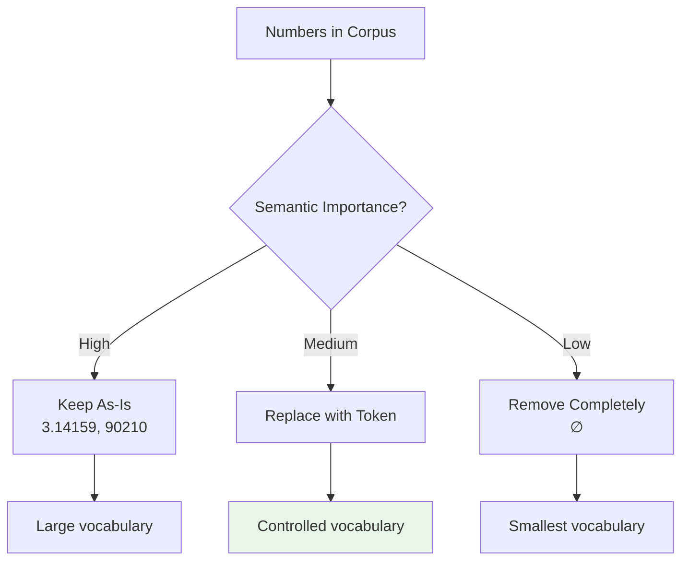

### 4. Special Characters

**Types to Handle**:

- Mathematical symbols: ∇, $, €, §, ¶
- Currency symbols: $, €, ¥, £
- Online markup: HTML tags, markdown
- Technical symbols: \*\*, ++, --

**Default Strategy**: Remove unless domain-specific importance

```bash
Input:  "Price: $19.99 (≈ €18.50)"
Output: "Price (approximately)"
```

**Domain-Specific Considerations**:

```bash
Mathematical Corpus: Keep ∇, ∫, ∑
Financial Corpus: Keep $, €, %
Programming Corpus: Keep ++, --, **
```

### 5. Modern Text Elements

#### Emojis

**Strategy Options**:

1. **Treat as Individual Words**: Each emoji = one token
2. **Convert to Text**: 😊 → ":happy:"
3. **Remove Entirely**: Depends on use case

```python
# Using emoji library
import emoji

# Option 1: Keep as tokens
tokens.append('😊')

# Option 2: Convert to text
text = emoji.demojize(text)  # 😊 → ":smiling_face_with_smiling_eyes:"

# Option 3: Remove
text = emoji.get_emoji_regexp().sub(r'', text)
```

#### Hashtags

**Strategy**: Treat as individual words, optionally remove '#'

```bash
Input:  "Learning #NLP is fun! #MachineLearning"
Output: ["Learning", "nlp", "is", "fun", "machinelearning"]
```

## Practical Implementation Example

### Complete Preprocessing Pipeline

Based on the provided code example:

```python
import re
import nltk
import emoji
from nltk.tokenize import word_tokenize

# Download required NLTK data
nltk.download('punkt')

def preprocess_corpus(corpus):
    """
    Complete preprocessing pipeline for word embeddings
    """

    # Step 1: Handle punctuation - collapse interrupting marks
    # Replace multiple punctuation with single period
    data = re.sub(r'[,.!?;:-]+', '.', corpus)

    # Step 2: Tokenization using NLTK
    # Punkt tokenizer handles abbreviations intelligently
    data = nltk.word_tokenize(data)

    # Step 3: Filter and normalize tokens
    cleaned_tokens = []
    for token in data:
        token_lower = token.lower()  # Normalize case

        # Keep token if it meets criteria:
        if (token_lower.isalpha() or          # Alphabetical words
            token_lower == '.' or             # Sentence markers
            emoji.get_emoji_regexp().search(token_lower)):  # Emojis

            cleaned_tokens.append(token_lower)

    return cleaned_tokens

# Example usage
original = 'Who ❤️ "word embeddings" in 2020? I do!!!'
processed = preprocess_corpus(original)
print(processed)
# Output: ['who', '❤️', 'word', 'embeddings', 'in', '.', 'i', 'do', '.']
```

### Step-by-Step Transformation

**Original Text**:

```bash
'Who ❤️ "word embeddings" in 2020? I do!!!'
```

**Step 1 - Punctuation Normalization**:

```bash
'Who ❤️ "word embeddings" in 2020. I do.'
# Multiple punctuation (? and !!!) → single period
```

**Step 2 - Tokenization**:

```bash
['Who', '❤️', '"', 'word', 'embeddings', '"', 'in', '2020', '.', 'I', 'do', '.']
# Split into individual tokens, punctuation separated
```

**Step 3 - Filtering and Normalization**:

```bash
['who', '❤️', 'word', 'embeddings', 'in', '.', 'i', 'do', '.']
# Removed: quotation marks, numbers
# Kept: alphabetical words, periods, emojis
# Normalized: lowercase
```

## Advanced Preprocessing Considerations

### NLTK Punkt Tokenizer Intelligence

**Smart Abbreviation Handling**:

```bash
"Dr. Smith went to the U.S.A. He was happy."
# Punkt knows these periods don't end sentences:
# Dr. → abbreviation
# U.S.A. → abbreviation
# Only final period ends sentence
```

**Middle Name Handling**:

```bash
"John F. Kennedy was president."
# F. recognized as middle initial, not sentence end
```

### Regex Pattern Explanation

```python
# Pattern: r'[,.!?;:-]+'
# [,.!?;:-]  → Character class matching any of these punctuation marks
# +          → One or more occurrences
# Result     → All consecutive punctuation replaced with single '.'

Examples:
"Hello!!!" → "Hello."
"What???"  → "What."
"Yes, no, maybe..." → "Yes. no. maybe."
```

### Customizable Filter Conditions

The green highlighted section in the code shows extensible filtering:

```python
# Basic conditions
if (token.isalpha() or                    # Alphabetical
    token == '.' or                       # Periods
    emoji.get_emoji_regexp().search(token)):  # Emojis

# Extended conditions (customizable)
if (token.isalpha() or
    token == '.' or
    emoji.get_emoji_regexp().search(token) or
    token.startswith('#') or              # Hashtags
    token.startswith('@') or              # Mentions
    token in custom_vocabulary or         # Domain-specific terms
    re.match(r'\d+\.\d+', token)):        # Decimal numbers
```

## Domain-Specific Preprocessing

### General Text (News, Books)

```python
preprocessing_config = {
    'lowercase': True,
    'remove_punctuation': True,
    'remove_numbers': True,
    'remove_special_chars': True,
    'handle_emojis': 'remove'
}
```

### Social Media Text (Tweets, Comments)

```python
preprocessing_config = {
    'lowercase': True,
    'collapse_punctuation': True,
    'keep_hashtags': True,
    'keep_mentions': True,
    'handle_emojis': 'keep_as_tokens',
    'remove_urls': True
}
```

### Technical Documentation

```python
preprocessing_config = {
    'lowercase': True,
    'keep_technical_symbols': ['++', '--', '**'],
    'remove_numbers': False,
    'keep_code_blocks': True
}
```

## Impact on Word Embeddings

### Vocabulary Size Effects

**Before Preprocessing**:

```bash
Vocabulary: {"The", "the", "THE", "dog", "dog.", "dog!", "123", "456"}
Size: 8 unique tokens
```

**After Preprocessing**:

```bash
Vocabulary: {"the", "dog", "."}
Size: 3 unique tokens
```

**Benefits**:

- Smaller vocabulary → faster training
- Consistent representations → better embeddings
- More training examples per word → improved quality

### Semantic Consistency

**Problem Without Preprocessing**:

```bash
"The dog barks." vs "the dog barks"
→ Different embeddings for same semantic content
```

**Solution With Preprocessing**:

```bash
Both become: ["the", "dog", "barks", "."]
→ Consistent embeddings for same meaning
```

## Best Practices

### 1. **Preserve Meaningful Information**

- Don't over-clean if information is relevant
- Consider domain-specific requirements
- Balance vocabulary size vs information loss

### 2. **Consistent Processing**

- Apply same preprocessing to training and inference data
- Document preprocessing decisions
- Version control preprocessing pipelines

### 3. **Iterative Refinement**

- Start with basic preprocessing
- Analyze results and adjust
- Monitor vocabulary size and coverage

### 4. **Handle Edge Cases**

- Plan for unseen punctuation patterns
- Consider multilingual text
- Handle encoding issues

## Common Pitfalls

### Over-Aggressive Cleaning

```bash
# Too aggressive
"Dr. Smith's 3.14 theorem" → ["theorem"]
# Information loss: title, possessive, mathematical constant

# Balanced approach
"Dr. Smith's 3.14 theorem" → ["dr", "smith", "theorem"] or
                              ["dr", "smith", "<NUMBER>", "theorem"]
```

### Inconsistent Processing

```bash
# Training data: lowercase
# Test data: mixed case
→ Vocabulary mismatch, poor performance
```

### Ignoring Domain Context

```bash
# Financial corpus
"$100 profit" → ["profit"]  # Lost important $ symbol
# Better: ["$", "100", "profit"] or ["<CURRENCY>", "<NUMBER>", "profit"]
```

## Summary

Effective preprocessing is crucial for word embedding quality:

1. **Case Normalization**: Ensures consistent word representations
2. **Punctuation Handling**: Reduces noise while preserving sentence structure
3. **Number Processing**: Balances vocabulary size with semantic preservation
4. **Special Character Management**: Removes noise or preserves domain-relevant symbols
5. **Modern Text Elements**: Handles emojis and hashtags appropriately

The goal is creating clean, consistent tokens that enable the CBOW model to learn meaningful word embeddings while maintaining semantic information relevant to the target application.

# 8. Sliding Window of Words - Context Generation

## Introduction

After cleaning and tokenizing the corpus, the next crucial step is extracting context-target word pairs for training the CBOW model. The sliding window technique systematically moves through the corpus to generate training examples by pairing each center word with its surrounding context words.

## Sliding Window Concept

### Purpose

Transform a linear sequence of words into training pairs:

- **Input**: Clean tokenized word array
- **Output**: (context_words, center_word) pairs for CBOW training

### Core Mechanism

A fixed-size window "slides" across the corpus, extracting training examples at each position.

## Implementation Analysis

### Function Signature

```python
def get_windows(words, C):
    """
    Extract context-center word pairs using sliding window

    Args:
        words: List of tokenized words
        C: Context half-size (words before/after center)

    Yields:
        (context_words, center_word) tuples
    """
```

### Parameter Explanation

**`words`**: Tokenized corpus as array

```bash
Example: ["I", "am", "happy", "because", "I", "am", "learning"]
Indices:  [0,   1,    2,       3,        4,   5,    6      ]
```

**`C`**: Context half-size

- Number of words to take on **each side** of center word
- `C = 2` means 2 words before + 2 words after center
- Total context words = `2 × C = 4`

## Step-by-Step Code Analysis

### Initialization

```python
i = C
```

**Purpose**: Start from first valid center word position

**Logic**: Center word needs `C` words before it to form complete context

**Example with C=2**:

```bash
Words:   ["I", "am", "happy", "because", "I", "am", "learning"]
Indices: [ 0,   1,    2,       3,        4,   5,    6      ]

i = C = 2  # Start at index 2 ("happy")
# "happy" has 2 words before: ["I", "am"]
# First valid center word position
```

### Loop Condition

```python
while i < len(words) - C:
```

**Purpose**: Stop before reaching words without sufficient context after

**Logic**: Center word needs `C` words after it

**Boundary Analysis**:

```bash
Array length: 7
C = 2
Loop condition: i < 7 - 2 = 5

Valid center positions: i = 2, 3, 4
- i = 2: "happy"   (indices 0,1 before; 3,4 after) ✓
- i = 3: "because" (indices 1,2 before; 4,5 after) ✓
- i = 4: "I"       (indices 2,3 before; 5,6 after) ✓
- i = 5: "am"      (indices 3,4 before; 6,? after) ✗ (insufficient after)
```

### Center Word Extraction

```python
center_word = words[i]
```

**Simple indexing**: Current position is center word

### Context Words Extraction

```python
context_words = words[i-C:i] + words[i+1:i+C+1]
```

**Breakdown**:

- `words[i-C:i]`: Words **before** center (from position i-C to i-1)
- `words[i+1:i+C+1]`: Words **after** center (from position i+1 to i+C)
- `+`: Concatenate before and after context

**Visual Representation**:

```bash
For i=2, C=2:
Center word: words[2] = "happy"

Before context: words[2-2:2] = words[0:2] = ["I", "am"]
After context:  words[2+1:2+2+1] = words[3:5] = ["because", "I"]

context_words = ["I", "am"] + ["because", "I"] = ["I", "am", "because", "I"]
```

### Generator Pattern with Yield

```python
yield context_words, center_word
```

**Why `yield` instead of `return`?**

- **`return`**: Exits function immediately, returns single value
- **`yield`**: Pauses function, returns value, can resume later

**Benefits of Generator**:

- **Memory Efficient**: Generates examples on-demand
- **Lazy Evaluation**: Only computes when needed
- **Streaming**: Can handle large corpora without loading all pairs into memory

### Index Increment

```python
i += 1
```

**Purpose**: Move sliding window one position to the right for next iteration

## Complete Execution Trace

### Example Input

```python
words = ["I", "am", "happy", "because", "I", "am", "learning"]
C = 2
```

### Execution Steps

**Iteration 1** (i = 2):

```bash
center_word = words[2] = "happy"
context_words = words[0:2] + words[3:5] = ["I", "am"] + ["because", "I"]
                                        = ["I", "am", "because", "I"]
yield (["I", "am", "because", "I"], "happy")
i = 3
```

**Iteration 2** (i = 3):

```bash
center_word = words[3] = "because"
context_words = words[1:3] + words[4:6] = ["am", "happy"] + ["I", "am"]
                                         = ["am", "happy", "I", "am"]
yield (["am", "happy", "I", "am"], "because")
i = 4
```

**Iteration 3** (i = 4):

```bash
center_word = words[4] = "I"
context_words = words[2:4] + words[5:7] = ["happy", "because"] + ["am", "learning"]
                                         = ["happy", "because", "am", "learning"]
yield (["happy", "because", "am", "learning"], "I")
i = 5
```

**Iteration 4** (i = 5):

```bash
i = 5, len(words) - C = 7 - 2 = 5
Condition: 5 < 5 → False
Loop exits
```

### Final Output

```python
# Training pairs generated:
x1 = ["I", "am", "because", "I"]        , y1 = "happy"
x2 = ["am", "happy", "I", "am"]         , y2 = "because"
x3 = ["happy", "because", "am", "learning"], y3 = "I"
```

## Visual Window Movement

### Sliding Window Visualization

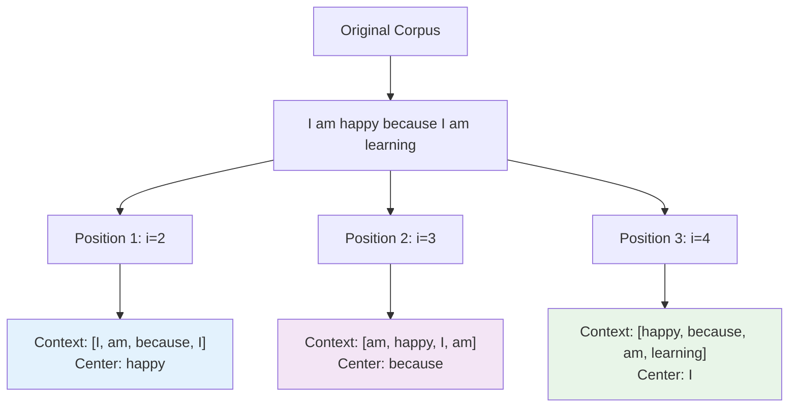

### Array Index Visualization

From the provided diagram:

```bash
Array:    [  I  |  am  | happy | because |  I  |  am  | learning ]
Indices:  [  0  |   1  |   2   |    3    |  4  |   5  |    6     ]

Window Position 1 (i=2, C=2):
┌───────────────────────────────────────────────────────┐
│   Before   │ Center │   After       │  Unused         │
├────────────┼────────┼───────────────┼─────────────────┤
│  I(0) am(1)│happy(2)│because(3) I(4)│am(5) learning(6)│
└────────────┴────────┴───────────────┴─────────────────┘

Window Position 2 (i=3, C=2):
┌──────────────────────────────────────────────────────────────────┐
│ Unused │   Before      │ Center     │   After       │ Unused.    │
├────────┼───────────────┼────────────┼───────────────┼────────────┤
│  I(0)  │ am(1) happy(2)│because(3)  │ I(4) am(5)    │learning(6).│
└────────┴───────────────┴────────────┴───────────────┴────────────┘
```

## Using the Generator Function

### Basic Usage Pattern

```python
# Method 1: Direct iteration
for context_words, center_word in get_windows(words, C=2):
    print(f"Context: {context_words}")
    print(f"Center: {center_word}")
    print("---")

# Method 2: Collect all pairs
training_pairs = list(get_windows(words, C=2))

# Method 3: Get one pair at a time
generator = get_windows(words, C=2)
first_pair = next(generator)  # Get first pair
second_pair = next(generator)  # Get second pair
```

### Machine Learning Notation

```python
# Standard ML convention: X = features, y = targets
for X, y in get_windows(words, C=2):
    # X = context_words (features/input)
    # y = center_word (target/output)
    print(f"Features (X): {X}")
    print(f"Target (y): {y}")
```

## Advantages of Generator Pattern

### Memory Efficiency

```bash
# Without generator (eager evaluation):
def get_all_windows(words, C):
    all_pairs = []
    for i in range(C, len(words) - C):
        # ... extract pairs ...
        all_pairs.append((context_words, center_word))
    return all_pairs

# Memory usage: O(n) where n = number of training pairs

# With generator (lazy evaluation):
def get_windows(words, C):
    for i in range(C, len(words) - C):
        # ... extract pairs ...
        yield (context_words, center_word)

# Memory usage: O(1) - only current pair in memory
```

### Streaming Processing

```python
# Can process large corpora without loading all pairs
for batch_num, (X, y) in enumerate(get_windows(large_corpus, C=2)):
    if batch_num % 1000 == 0:
        print(f"Processing batch {batch_num}")

    # Train model on single example
    model.train_step(X, y)
```

## Parameter Impact Analysis

### Effect of Context Size (C)

**Small Context (C=1)**:

```bash
Window size = 1 + 2*1 = 3
More training examples per corpus
Captures local syntactic patterns

Example: "I am happy"
Context: ["I", "happy"], Center: "am"
```

**Large Context (C=5)**:

```bash
Window size = 1 + 2*5 = 11
Fewer training examples per corpus
Captures broader semantic relationships

Example with 11-word window
Context: [5 words before, 5 words after], Center: middle word
```

### Training Data Quantity

**Formula**: For corpus length $N$ and context size $C$:
$$\text{Number of training examples} = N - 2C$$

**Example**:

```bash
Corpus length: 100 words
C = 2: Training examples = 100 - 2*2 = 96
C = 5: Training examples = 100 - 2*5 = 90
C = 10: Training examples = 100 - 2*10 = 80
```

## Common Implementation Pitfalls

### Index Boundary Errors

```python
# Wrong: Can cause index out of bounds
context_words = words[i-C:i] + words[i+1:i+C]  # Missing +1

# Correct: Proper slicing
context_words = words[i-C:i] + words[i+1:i+C+1]
```

### Incorrect Loop Bounds

```python
# Wrong: May include invalid positions
while i < len(words):  # Can go beyond valid range

# Correct: Ensure sufficient context after
while i < len(words) - C:
```

### Generator Exhaustion

```python
# Wrong: Generator can only be used once
gen = get_windows(words, C=2)
list1 = list(gen)  # Exhausts generator
list2 = list(gen)  # Empty! Generator already exhausted

# Correct: Create new generator each time
gen1 = get_windows(words, C=2)
gen2 = get_windows(words, C=2)  # Fresh generator
```

## Summary

The sliding window implementation provides an efficient way to generate CBOW training data:

1. **Systematic Extraction**: Slides through corpus to create (context, target) pairs
2. **Memory Efficient**: Uses generator pattern for lazy evaluation
3. **Configurable**: Context size parameter controls window behavior
4. **Boundary Safe**: Properly handles start/end of corpus
5. **ML Ready**: Outputs in standard (X, y) format for training

This foundation enables the next step: converting word pairs into numerical vectors that the CBOW neural network can process.

# 9. Transforming Words into Vectors - One-hot Encoding

## Introduction

After extracting context-center word pairs through the sliding window, the next step is converting these words into numerical vectors that the CBOW neural network can process. This transformation involves creating one-hot vectors for individual words and averaging them for context representation.

## The Transformation Challenge

### From Words to Numbers

```bash
Problem: Neural networks require numerical input
Current state: Words as strings ["I", "am", "because", "I"]
Goal: Mathematical vectors that preserve word identity
```

**Two Components Need Vectorization**:

1. **Context Words**: Multiple words → Single context vector
2. **Center Word**: Single word → Target vector

## Vocabulary Creation

### Building the Word-to-Index Mapping

**Step 1**: Extract unique words from entire corpus

```bash
Original corpus: "I am happy because I am learning"
Unique words: {"I", "am", "happy", "because", "learning"}
Vocabulary size: 5 words
```

**Step 2**: Create ordered vocabulary (typically alphabetical)

```bash
Ordered vocabulary:
Index 0: "am"
Index 1: "because"
Index 2: "happy"
Index 3: "I"
Index 4: "learning"
```

**Note**: Order doesn't affect model performance, but consistency is crucial.

## One-Hot Vector Encoding

### Mathematical Definition

For vocabulary size $V$, word $w_i$ at index $i$ is represented as:
$$\mathbf{e}_i = [0, 0, ..., \underbrace{1}_{i\text{th position}}, ..., 0]^T \in \{0,1\}^V$$

### Individual Word Vectors

Based on the vocabulary ordering:

```bash
"am"      → [1, 0, 0, 0, 0]^T  (index 0)
"because" → [0, 1, 0, 0, 0]^T  (index 1)
"happy"   → [0, 0, 1, 0, 0]^T  (index 2)
"I"       → [0, 0, 0, 1, 0]^T  (index 3)
"learning"→ [0, 0, 0, 0, 1]^T  (index 4)
```

## Center Word Representation

### Simple One-Hot Encoding

**Center words** are encoded directly as one-hot vectors:

```bash
Center word: "happy"
Center word vector: [0, 0, 1, 0, 0]^T

This vector will be the target output for the CBOW model.
```

## Context Words Representation

### The Averaging Approach

**Challenge**: Multiple context words need to be combined into single vector

**Solution**: Average the one-hot vectors of all context words

### Step-by-Step Context Vector Creation

**Example Context**: ["I", "am", "because", "I"]

**Step 1**: Convert each context word to one-hot vector

```bash
"I"       → [0, 0, 0, 1, 0]^T
"am"      → [1, 0, 0, 0, 0]^T
"because" → [0, 1, 0, 0, 0]^T
"I"       → [0, 0, 0, 1, 0]^T  (appears twice)
```

**Step 2**: Sum all one-hot vectors

```bash
Sum = [0, 0, 0, 1, 0] + [1, 0, 0, 0, 0] + [0, 1, 0, 0, 0] + [0, 0, 0, 1, 0]
    = [1, 1, 0, 2, 0]
```

**Step 3**: Divide by number of context words (4)

```bash
Average = [1, 1, 0, 2, 0] / 4 = [0.25, 0.25, 0, 0.5, 0]
```

### Mathematical Formulation

For context words $\{w_1, w_2, ..., w_C\}$ with one-hot vectors $\{\mathbf{e}_1, \mathbf{e}_2, ..., \mathbf{e}_C\}$:

$$\mathbf{c} = \frac{1}{C} \sum_{i=1}^{C} \mathbf{e}_i$$

Where:

- $\mathbf{c}$ = context vector
- $C$ = number of context words
- $\mathbf{e}_i$ = one-hot vector for word $w_i$

## Visual Representation Analysis

### Breaking Down the Diagram

From the provided images, we can see the complete transformation:

```bash
Context Words: ["I", "am", "because", "I"]

Individual One-hot Vectors:
       am  because  happy   I   learning
"I"  = [0,    0,     0,    1,     0]
"am" = [1,    0,     0,    0,     0]
"because" = [0,    1,     0,    0,     0]
"I"  = [0,    0,     0,    1,     0]

Sum: [1, 1, 0, 2, 0]
Average (÷4): [0.25, 0.25, 0, 0.5, 0]
```

### Result Interpretation

**Context Vector**: `[0.25, 0.25, 0, 0.5, 0]`

- Position 0 ("am"): 0.25 (appears 1/4 times)
- Position 1 ("because"): 0.25 (appears 1/4 times)
- Position 2 ("happy"): 0 (doesn't appear)
- Position 3 ("I"): 0.5 (appears 2/4 times)
- Position 4 ("learning"): 0 (doesn't appear)

**Insight**: Values represent relative frequency of each word in the context.

## Complete Training Example

### Final Vector Representations

From the transformation process:

**Training Pair**:

```bash
Input (Context):  [0.25, 0.25, 0, 0.5, 0]      # Averaged context vector
Output (Target):  [0, 0, 1, 0, 0]               # Center word "happy"
```

**Model Task**: Given context vector → Predict center word vector

## Implementation Details

### Vocabulary-to-Vector Mapping

```python
def create_vocabulary(corpus):
    """Create ordered vocabulary from corpus"""
    unique_words = set(corpus)
    vocabulary = sorted(list(unique_words))  # Alphabetical order

    word_to_index = {word: i for i, word in enumerate(vocabulary)}
    index_to_word = {i: word for i, word in enumerate(vocabulary)}

    return vocabulary, word_to_index, index_to_word

def word_to_one_hot(word, word_to_index, vocab_size):
    """Convert word to one-hot vector"""
    vector = [0] * vocab_size
    if word in word_to_index:
        vector[word_to_index[word]] = 1
    return vector
```

### Context Vector Generation

```python
def create_context_vector(context_words, word_to_index, vocab_size):
    """Create averaged context vector from context words"""

    # Convert each word to one-hot
    one_hot_vectors = []
    for word in context_words:
        one_hot = word_to_one_hot(word, word_to_index, vocab_size)
        one_hot_vectors.append(one_hot)

    # Calculate average
    context_vector = [0] * vocab_size
    for vector in one_hot_vectors:
        for i in range(vocab_size):
            context_vector[i] += vector[i]

    # Normalize by number of context words
    num_context_words = len(context_words)
    context_vector = [x / num_context_words for x in context_vector]

    return context_vector
```

### Complete Example Implementation

```python
# Example usage
corpus = ["I", "am", "happy", "because", "I", "am", "learning"]
vocabulary, word_to_index, index_to_word = create_vocabulary(corpus)

# Training example: context=["I", "am", "because", "I"], center="happy"
context_words = ["I", "am", "because", "I"]
center_word = "happy"

# Create vectors
context_vector = create_context_vector(context_words, word_to_index, len(vocabulary))
center_vector = word_to_one_hot(center_word, word_to_index, len(vocabulary))

print(f"Context vector: {context_vector}")   # [0.25, 0.25, 0, 0.5, 0]
print(f"Center vector: {center_vector}")     # [0, 0, 1, 0, 0]
```

## Properties of Context Vectors

### Non-Binary Values

Unlike individual one-hot vectors, context vectors contain decimal values:

- **One-hot**: Only 0s and 1s
- **Context**: Real numbers between 0 and 1
- **Interpretation**: Relative frequency of words in context

### Normalization Property

Context vectors are naturally normalized:
$$\sum_{i=1}^{V} c_i = \frac{1}{C} \sum_{j=1}^{C} \sum_{i=1}^{V} e_{j,i} = \frac{1}{C} \sum_{j=1}^{C} 1 = 1$$

**Verification**:

```bash
Context vector: [0.25, 0.25, 0, 0.5, 0]
Sum: 0.25 + 0.25 + 0 + 0.5 + 0 = 1.0 ✓
```

### Sparsity Characteristics

- **Individual one-hot**: Extremely sparse (1 non-zero out of V)
- **Context vector**: Less sparse (multiple non-zero values)
- **Density**: Depends on vocabulary diversity in context

## Alternative Approaches

### Sum Instead of Average

```python
# Alternative: Sum context vectors (without averaging)
context_vector_sum = [1, 1, 0, 2, 0]  # Not normalized

# Trade-offs:
# + Preserves word count information
# - Values not bounded between 0 and 1
# - May cause numerical instability in training
```

### Weighted Averaging

```python
# Advanced: Weight context words by distance from center
def weighted_context_vector(context_words, positions, center_position):
    weights = []
    for pos in positions:
        distance = abs(pos - center_position)
        weight = 1.0 / (1.0 + distance)  # Closer words get higher weight
        weights.append(weight)

    # Apply weights during averaging
    # Implementation details...
```

## Impact on Model Training

### Input Representation

```bash
CBOW Model Input:
- Context vector: [0.25, 0.25, 0, 0.5, 0]  (real-valued, dense)
- Target vector:  [0, 0, 1, 0, 0]           (binary, sparse)
```

### Learning Objective

The model learns to map context vectors to target vectors:
$$f(\mathbf{c}) \approx \mathbf{t}$$

Where:

- $\mathbf{c}$ = averaged context vector
- $\mathbf{t}$ = target center word one-hot vector
- $f$ = CBOW neural network function

## Key Insights

### Why Averaging Works

1. **Distributional Hypothesis**: Words in similar contexts have similar meanings
2. **Context Representation**: Average captures typical context composition
3. **Dimensionality**: Reduces multiple vectors to single fixed-size representation
4. **Training Efficiency**: Single input vector per training example

### Limitations

1. **Word Order**: Average loses positional information
2. **Repeated Words**: Multiple occurrences only increase weight
3. **Context Size**: Different numbers of context words may need normalization
4. **Rare Words**: Infrequent words may not learn good representations

## Summary

The word-to-vector transformation creates the numerical foundation for CBOW training:

1. **Vocabulary Creation**: Establishes word-to-index mappings
2. **One-Hot Encoding**: Converts words to sparse binary vectors
3. **Context Averaging**: Combines multiple context words into single vector
4. **Training Pairs**: Creates (context_vector, target_vector) pairs

This transformation preserves word identity while enabling mathematical operations, setting the stage for neural network training where the model learns to predict center words from context representations.

# 10. Architecture of the CBOW Model - Network Structure

## Introduction

The Continuous Bag-of-Words (CBOW) model is implemented as a **shallow dense neural network** with three layers. This architecture learns word embeddings as a byproduct of predicting center words from context. Understanding this architecture is crucial for implementing and training the model effectively.

## Overall Architecture Overview

### High-Level Structure

The CBOW model consists of three main components:

1. **Input Layer**: Receives averaged context word vectors
2. **Hidden Layer**: Learns dense word representations (embeddings)
3. **Output Layer**: Predicts center word probability distribution

### Architecture Diagram (Mermaid)

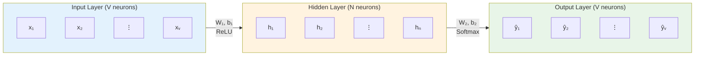

### Architecture Diagram (ASCII)

```bash
                CBOW Neural Network Architecture

Context Vector     Input Layer      Hidden Layer     Output Layer    Prediction
     (V×1)            (V×1)            (N×1)           (V×1)          (word)

     ┌───┐             ┌───┐             ┌───┐           ┌───┐
     │x₁ │ ────────→   │ ○ │ ────────→   │h₁ │ ────────→ │ŷ₁ │
     │x₂ │   \    /    │ ○ │   \    /    │h₂ │   \    /  │ŷ₂ │
     │ ⋮ │    \  /    │ ⋮ │    \  /    │ ⋮ │    \  /   │ ⋮ │  ──→ argmax ──→ "happy"
     │xᵥ │     \/      │ ○ │     \/      │hₙ │     \/    │ŷᵥ │
     └───┘             └───┘             └───┘           └───┘
                         │                 │               │
                    W₁(V×N) + b₁       ReLU           W₂(N×V) + b₂
                                                        Softmax

     Context:        Dense             Word              Probability   Center
  "I am because I"  Connections     Embeddings         Distribution    Word
```

## Layer-by-Layer Analysis

### Input Layer

- **Purpose**: Receive the averaged context vector
- **Dimension**: V neurons (vocabulary size)
- **Input**: Context vector **x** ∈ ℝᵛ

```bash
Example with V=5 vocabulary:
Input vector x = [0.25, 0.25, 0, 0.5, 0]ᵀ

Neurons:
○ x₁ = 0.25  (word "am")
○ x₂ = 0.25  (word "because")
○ x₃ = 0     (word "happy")
○ x₄ = 0.5   (word "I")
○ x₅ = 0     (word "learning")
```

**Key Properties**:

- Size always equals vocabulary size (V)
- Values are real numbers between 0 and 1
- Sum of all inputs equals 1 (due to averaging)

### Hidden Layer

- **Purpose**: Learn dense word representations (the actual embeddings)
- **Dimension**: N neurons (embedding size - hyperparameter)
- **Activation**: ReLU (Rectified Linear Unit)

```bash
Hidden layer computation:
z₁ = W₁ᵀx + b₁     (linear transformation)
h = ReLU(z₁)       (activation function)

Where:
- W₁ ∈ ℝᵛˣᴺ (weight matrix)
- b₁ ∈ ℝᴺ (bias vector)
- h ∈ ℝᴺ (hidden layer output)
```

**Embedding Dimension Selection**:

```bash
Typical Ranges:
- Small models: N = 50-100
- Standard models: N = 100-300
- Large models: N = 300-1000

Trade-offs:
Larger N → More expressive embeddings, higher computational cost
Smaller N → Faster training, potential information loss
```

### Output Layer

- **Purpose**: Predict probability distribution over vocabulary
- **Dimension**: V neurons (same as vocabulary size)
- **Activation**: Softmax

```bash
Output layer computation:
z₂ = W₂ᵀh + b₂     (linear transformation)
ŷ = Softmax(z₂)    (probability distribution)

Where:
- W₂ ∈ ℝᴺˣᵛ (weight matrix)
- b₂ ∈ ℝᵛ (bias vector)
- ŷ ∈ ℝᵛ (probability distribution)
```

## Mathematical Formulation

### Forward Pass Equations

**Step 1: Input to Hidden**
$$\mathbf{z}_1 = \mathbf{W}_1^T \mathbf{x} + \mathbf{b}_1$$
$$\mathbf{h} = \text{ReLU}(\mathbf{z}_1) = \max(0, \mathbf{z}_1)$$

**Step 2: Hidden to Output**
$$\mathbf{z}_2 = \mathbf{W}_2^T \mathbf{h} + \mathbf{b}_2$$
$$\hat{\mathbf{y}} = \text{Softmax}(\mathbf{z}_2) = \frac{e^{\mathbf{z}_2}}{\sum_{i=1}^V e^{z_{2,i}}}$$

**Complete Forward Pass**:
$$\hat{\mathbf{y}} = \text{Softmax}(\mathbf{W}_2^T \text{ReLU}(\mathbf{W}_1^T \mathbf{x} + \mathbf{b}_1) + \mathbf{b}_2)$$

### Matrix Dimensions Summary

```bash
Component              Dimension        Description
────────────────────────────────────────────────────────
Input vector (x)        V × 1           Context word vector
Weight matrix W₁        V × N           Input to hidden weights
Bias vector b₁          N × 1           Hidden layer biases
Hidden vector (h)       N × 1           Hidden layer activations
Weight matrix W₂        N × V           Hidden to output weights
Bias vector b₂          V × 1           Output layer biases
Output vector (ŷ)       V × 1           Predicted probabilities
```

## Detailed Architecture Flow

### Information Flow Diagram

```mermaid
flowchart TD
    A["Context Words<br/>['I', 'am', 'because', 'I']"] --> B["Average to Context Vector<br/>[0.25, 0.25, 0, 0.5, 0]"]

    B --> C["Input Layer (V=5)<br/>x ∈ ℝ⁵"]

    C --> D["Linear Transform<br/>z₁ = W₁ᵀx + b₁<br/>W₁ ∈ ℝ⁵ˣᴺ"]

    D --> E["ReLU Activation<br/>h = max(0, z₁)<br/>h ∈ ℝᴺ"]

    E --> F["Linear Transform<br/>z₂ = W₂ᵀh + b₂<br/>W₂ ∈ ℝᴺˣ⁵"]

    F --> G["Softmax Activation<br/>ŷ = softmax(z₂)<br/>ŷ ∈ ℝ⁵"]

    G --> H["Prediction<br/>argmax(ŷ) → 'happy'"]

    style A fill:#e3f2fd
    style E fill:#fff3e0
    style H fill:#e8f5e8
```

## Activation Functions

### Hidden Layer: ReLU (Rectified Linear Unit)

**Mathematical Definition**:

$$
\text{ReLU}(x) = \max(0, x) = \begin{cases}
x & \text{if } x > 0 \\
0 & \text{if } x \leq 0
\end{cases}
$$

**Properties**:

- **Non-linear**: Enables learning complex patterns
- **Computational efficiency**: Simple max operation
- **Gradient friendly**: Derivative is 0 or 1 (no vanishing gradient for positive values)
- **Sparsity**: Sets negative values to zero

**Why ReLU for Hidden Layer?**

```bash
Advantages:
✓ Computationally efficient
✓ Reduces vanishing gradient problem
✓ Introduces non-linearity
✓ Creates sparse representations (some neurons = 0)

Disadvantages:
✗ "Dying ReLU" problem (neurons stuck at 0)
✗ Not differentiable at x = 0
```

### Output Layer: Softmax

**Mathematical Definition**:
$$\text{Softmax}(\mathbf{z})_i = \frac{e^{z_i}}{\sum_{j=1}^V e^{z_j}}$$

**Properties**:

- **Probability distribution**: All outputs sum to 1
- **Exponential emphasis**: Amplifies differences between values
- **Differentiable**: Enables gradient-based learning

**Why Softmax for Output?**

```bash
Requirements for word prediction:
✓ Multi-class classification (V possible words)
✓ Probability interpretation
✓ Differentiable for backpropagation
✓ Emphasizes most likely word

Softmax provides:
- P(word_i | context) for each word i
- Σᵢ P(word_i | context) = 1
- Highest probability → predicted word
```

## Network Properties

### Fully Connected Architecture

**Dense Connections**: Every neuron in one layer connects to every neuron in the next layer

```bash
Input to Hidden Connections:
Each of V input neurons connects to each of N hidden neurons
Total connections: V × N

Hidden to Output Connections:
Each of N hidden neurons connects to each of V output neurons
Total connections: N × V

Total Parameters: V×N + N + N×V + V = N(V + 1) + V(N + 1) = 2NV + N + V
```

### Shallow Network

**Definition**: Only one hidden layer between input and output
**Implications**:

- **Simplicity**: Easier to understand and implement
- **Training speed**: Faster than deep networks
- **Expressiveness**: Limited compared to deep architectures
- **Historical significance**: Proved effective for word embeddings

## Learning Process

### Training Objective

The network learns by minimizing prediction error:
$$\mathcal{L} = -\log P(\text{center word} | \text{context words})$$

### Parameter Learning

**Learnable Parameters**:

1. **W₁**: Input-to-hidden weights (V × N matrix)
2. **b₁**: Hidden layer biases (N × 1 vector)
3. **W₂**: Hidden-to-output weights (N × V matrix)
4. **b₂**: Output layer biases (V × 1 vector)

**Total Parameters**: 2NV + N + V

### Word Embeddings Extraction

**Key Insight**: Word embeddings are derived from the learned weight matrices

**Primary Source**: Rows of W₁ᵀ (or columns of W₁)

```bash
Word embedding for word i = W₁[i, :] (i-th row of W₁)
Embedding dimension = N
```

**Alternative**: Average of W₁ and W₂ᵀ representations

```bash
Word embedding for word i = (W₁[i, :] + W₂ᵀ[:, i]) / 2
```

## Example Walkthrough

### Concrete Example

**Given**:

- Vocabulary: ["am", "because", "happy", "I", "learning"] (V = 5)
- Embedding dimension: N = 3
- Context: ["I", "am", "because", "I"]
- Target: "happy"

**Step 1**: Context vector

```bash
x = [0.25, 0.25, 0, 0.5, 0]ᵀ
```

**Step 2**: Hidden layer computation

```bash
Assume W₁ = [[0.1, 0.2, 0.3],
             [0.4, 0.5, 0.6],
             [0.7, 0.8, 0.9],
             [0.2, 0.1, 0.4],
             [0.3, 0.6, 0.2]]  (5×3 matrix)

b₁ = [0.1, 0.1, 0.1]ᵀ

z₁ = W₁ᵀx + b₁ = [0.1 0.4 0.7 0.2 0.3] [0.25]   [0.1]
                  [0.2 0.5 0.8 0.1 0.6] [0.25] + [0.1]
                  [0.3 0.6 0.9 0.4 0.2] [0.0 ]   [0.1]
                                        [0.5 ]
                                        [0.0 ]

                = [0.325] + [0.1] = [0.425]
                  [0.425]   [0.1]   [0.525]
                  [0.475]   [0.1]   [0.575]

h = ReLU(z₁) = [0.425, 0.525, 0.575]ᵀ
```

**Step 3**: Output layer computation

```bash
Assume W₂ and b₂, compute:
z₂ = W₂ᵀh + b₂
ŷ = Softmax(z₂)

Expected: ŷ ≈ [0, 0, 1, 0, 0]ᵀ (one-hot for "happy")
```

## Architectural Advantages

### Why This Architecture Works

1. **Dimensionality Reduction**: V → N → V (bottleneck forces learning)
2. **Shared Representations**: Words with similar contexts get similar hidden representations
3. **Non-linearity**: ReLU enables learning complex word relationships
4. **Probabilistic Output**: Softmax provides interpretable predictions

### Comparison with Alternatives

| Architecture       | Layers | Parameters  | Training Speed | Embedding Quality       |
| ------------------ | ------ | ----------- | -------------- | ----------------------- |
| **CBOW (Shallow)** | 3      | 2NV + N + V | Fast           | Good                    |
| Deep Network       | 5+     | Much larger | Slow           | Potentially better      |
| Linear Model       | 2      | NV + V      | Very fast      | Poor (no non-linearity) |

## Summary

The CBOW architecture elegantly solves the word embedding learning problem through:

1. **Input Layer (V)**: Receives averaged context vectors
2. **Hidden Layer (N)**: Learns dense word representations with ReLU activation
3. **Output Layer (V)**: Predicts word probabilities with Softmax activation

**Key Insights**:

- **Shallow but effective**: Single hidden layer sufficient for word embeddings
- **Bottleneck design**: Forces compression of word information into dense vectors
- **Fully connected**: Dense connections enable learning word relationships
- **Dual purpose**: Prediction task generates useful word embeddings as byproduct

The next step is understanding the specific dimensions and mathematical details of each component, which will enable practical implementation of this architecture.

# 11. Architecture Dimensions - Layer Sizes and Parameters

## Introduction

Understanding the dimensional analysis of the CBOW model is crucial for implementation and debugging. This section provides a detailed breakdown of matrix and vector dimensions throughout the forward pass, ensuring mathematical consistency and helping prevent dimension mismatch errors.

## Key Dimension Variables

### Fundamental Parameters

- **V**: Vocabulary size (number of unique words)
- **N**: Embedding dimension (hidden layer size - hyperparameter)
- **Batch size**: Number of training examples processed simultaneously (often = 1 for single example)

```bash
Example Dimensions:
V = 5 (vocabulary: ["am", "because", "happy", "I", "learning"])
N = 3 (embedding dimension chosen as hyperparameter)
```

## Layer-by-Layer Dimensional Analysis

### Input Layer

**Input Vector (x)**:

```bash
Dimension: V × 1 (column vector)
Content: Averaged context word vector
Values: Real numbers between 0 and 1
Sum: Always equals 1.0 (normalized)

Example:
x = [0.25]  ← V × 1 = 5 × 1
    [0.25]
    [0.0 ]
    [0.5 ]
    [0.0 ]
```

### Input to Hidden Transformation

#### Weight Matrix W₁

**Dimensions**: N × V

```bash
W₁ ∈ ℝᴺˣᵛ

Physical Interpretation:
- N rows: One for each hidden neuron
- V columns: One for each vocabulary word
- Each column represents a word's "input embedding"

Example with N=3, V=5:
W₁ = [w₁₁ w₁₂ w₁₃ w₁₄ w₁₅]  ← 3 × 5 matrix
     [w₂₁ w₂₂ w₂₃ w₂₄ w₂₅]
     [w₃₁ w₃₂ w₃₃ w₃₄ w₃₅]
```

#### Bias Vector b₁

**Dimensions**: N × 1

```bash
b₁ ∈ ℝᴺˣ¹

Purpose: One bias term per hidden neuron

Example:
b₁ = [b₁₁]  ← 3 × 1 vector
     [b₁₂]
     [b₁₃]
```

#### Linear Transformation z₁

**Computation**: z₁ = W₁x + b₁

**Dimensional Verification**:

```bash
Operation: W₁x + b₁
Dimensions: (N × V)(V × 1) + (N × 1) = (N × 1) + (N × 1) = N × 1

Step-by-step:
W₁x: (3 × 5)(5 × 1) = 3 × 1
b₁:                    3 × 1
z₁: (3 × 1) + (3 × 1) = 3 × 1 ✓

Result:
z₁ = [z₁₁]  ← 3 × 1 vector
     [z₁₂]
     [z₁₃]
```

#### Hidden Layer Activation h

**Computation**: h = ReLU(z₁)

**Dimensional Property**: ReLU preserves dimensions

```bash
Input: z₁ ∈ ℝᴺˣ¹
Output: h ∈ ℝᴺˣ¹

ReLU applied element-wise:
h = [max(0, z₁₁)]  ← 3 × 1 vector
    [max(0, z₁₂)]
    [max(0, z₁₃)]
```

### Hidden to Output Transformation

#### Weight Matrix W₂

**Dimensions**: V × N

```bash
W₂ ∈ ℝᵛˣᴺ

Physical Interpretation:
- V rows: One for each vocabulary word (output neurons)
- N columns: One for each hidden neuron
- Each row represents a word's "output embedding"

Example with V=5, N=3:
W₂ = [w₁₁ w₁₂ w₁₃]  ← 5 × 3 matrix
     [w₂₁ w₂₂ w₂₃]
     [w₃₁ w₃₂ w₃₃]
     [w₄₁ w₄₂ w₄₃]
     [w₅₁ w₅₂ w₅₃]
```

#### Bias Vector b₂

**Dimensions**: V × 1

```bash
b₂ ∈ ℝᵛˣ¹

Purpose: One bias term per output neuron (vocabulary word)

Example:
b₂ = [b₂₁]  ← 5 × 1 vector
     [b₂₂]
     [b₂₃]
     [b₂₄]
     [b₂₅]
```

#### Linear Transformation z₂ (Logits)

**Computation**: z₂ = W₂h + b₂

**Dimensional Verification**:

```bash
Operation: W₂h + b₂
Dimensions: (V × N)(N × 1) + (V × 1) = (V × 1) + (V × 1) = V × 1

Step-by-step:
W₂h: (5 × 3)(3 × 1) = 5 × 1
b₂:                    5 × 1
z₂: (5 × 1) + (5 × 1) = 5 × 1 ✓

Result:
z₂ = [z₂₁]  ← 5 × 1 vector (logits)
     [z₂₂]
     [z₂₃]
     [z₂₄]
     [z₂₅]
```

**Note**: z₂ values are called "logits" - raw prediction scores before softmax

#### Output Layer Activation ŷ

**Computation**: ŷ = Softmax(z₂)

**Dimensional Property**: Softmax preserves dimensions

```bash
Input: z₂ ∈ ℝᵛˣ¹ (logits)
Output: ŷ ∈ ℝᵛˣ¹ (probabilities)

Softmax applied:
ŷ = [exp(z₂₁)/Σexp(z₂ⱼ)]  ← 5 × 1 probability vector
    [exp(z₂₂)/Σexp(z₂ⱼ)]
    [exp(z₂₃)/Σexp(z₂ⱼ)]
    [exp(z₂₄)/Σexp(z₂ⱼ)]
    [exp(z₂₅)/Σexp(z₂ⱼ)]

Property: Σᵢ ŷᵢ = 1.0
```

## Complete Forward Pass Equations with Dimensions

### Mathematical Formulation

```bash
Forward Pass Equations:

1. z₁ = W₁x + b₁     (N×V)(V×1) + (N×1) = (N×1)
2. h = ReLU(z₁)      (N×1) → (N×1)
3. z₂ = W₂h + b₂     (V×N)(N×1) + (V×1) = (V×1)
4. ŷ = Softmax(z₂)   (V×1) → (V×1)
```

### Dimension Flow Diagram

```mermaid
graph LR
    A["x<br/>(V×1)"] --> B["W₁x<br/>(N×1)"]
    C["b₁<br/>(N×1)"] --> D["z₁<br/>(N×1)"]
    B --> D
    D --> E["h = ReLU(z₁)<br/>(N×1)"]
    E --> F["W₂h<br/>(V×1)"]
    G["b₂<br/>(V×1)"] --> H["z₂<br/>(V×1)"]
    F --> H
    H --> I["ŷ = Softmax(z₂)<br/>(V×1)"]

    style A fill:#e3f2fd
    style E fill:#fff3e0
    style I fill:#e8f5e8
```

## Detailed Matrix Multiplication Analysis

### W₁x Multiplication

```bash
Matrix Multiplication: W₁x
Left operand: W₁ (N × V)
Right operand: x (V × 1)
Result: (N × 1)

Element-wise computation:
(W₁x)ᵢ = Σⱼ₌₁ᵛ W₁[i,j] × x[j]

For each hidden neuron i:
z₁[i] = W₁[i,1]×x[1] + W₁[i,2]×x[2] + ... + W₁[i,V]×x[V]

Example with N=3, V=5:
z₁[1] = W₁[1,1]×0.25 + W₁[1,2]×0.25 + W₁[1,3]×0.0 + W₁[1,4]×0.5 + W₁[1,5]×0.0
z₁[2] = W₁[2,1]×0.25 + W₁[2,2]×0.25 + W₁[2,3]×0.0 + W₁[2,4]×0.5 + W₁[2,5]×0.0
z₁[3] = W₁[3,1]×0.25 + W₁[3,2]×0.25 + W₁[3,3]×0.0 + W₁[3,4]×0.5 + W₁[3,5]×0.0
```

### W₂h Multiplication

```bash
Matrix Multiplication: W₂h
Left operand: W₂ (V × N)
Right operand: h (N × 1)
Result: (V × 1)

Element-wise computation:
(W₂h)ᵢ = Σⱼ₌₁ᴺ W₂[i,j] × h[j]

For each output neuron (vocabulary word) i:
z₂[i] = W₂[i,1]×h[1] + W₂[i,2]×h[2] + ... + W₂[i,N]×h[N]

Example with V=5, N=3:
z₂[1] = W₂[1,1]×h[1] + W₂[1,2]×h[2] + W₂[1,3]×h[3]  (for word "am")
z₂[2] = W₂[2,1]×h[1] + W₂[2,2]×h[2] + W₂[2,3]×h[3]  (for word "because")
z₂[3] = W₂[3,1]×h[1] + W₂[3,2]×h[2] + W₂[3,3]×h[3]  (for word "happy")
z₂[4] = W₂[4,1]×h[1] + W₂[4,2]×h[2] + W₂[4,3]×h[3]  (for word "I")
z₂[5] = W₂[5,1]×h[1] + W₂[5,2]×h[2] + W₂[5,3]×h[3]  (for word "learning")
```

## Row vs Column Vector Considerations

### Column Vector Implementation (Standard)

**Standard Approach** (as shown above):

```bash
Forward pass with column vectors:
z₁ = W₁x + b₁    where x, b₁ are column vectors
h = ReLU(z₁)     where h is column vector
z₂ = W₂h + b₂    where h, b₂ are column vectors
ŷ = Softmax(z₂)  where ŷ is column vector
```

### Row Vector Implementation (Alternative)

**Alternative Approach** with row vectors:

```bash
Forward pass with row vectors:
z₁ᵀ = xᵀW₁ᵀ + b₁ᵀ    where x, b₁ are row vectors
hᵀ = ReLU(z₁ᵀ)        where h is row vector
z₂ᵀ = hᵀW₂ᵀ + b₂ᵀ    where h, b₂ are row vectors
ŷᵀ = Softmax(z₂ᵀ)     where ŷ is row vector

Dimensions:
xᵀ: (1 × V), W₁ᵀ: (V × N), b₁ᵀ: (1 × N)
hᵀ: (1 × N), W₂ᵀ: (N × V), b₂ᵀ: (1 × V)
ŷᵀ: (1 × V)
```

**Implementation Note**: Most deep learning frameworks use column vectors by default.

## Batch Processing Dimensions

### Single Example (Current Focus)

```bash
Batch size = 1:
x: (V × 1)
h: (N × 1)
ŷ: (V × 1)
```

### Multiple Examples (Batch Processing)

```bash
Batch size = B:
X: (V × B)  ← B context vectors side by side
H: (N × B)  ← B hidden representations
Ŷ: (V × B)  ← B predictions

Forward pass:
Z₁ = W₁X + b₁    (b₁ broadcasted)
H = ReLU(Z₁)
Z₂ = W₂H + b₂    (b₂ broadcasted)
Ŷ = Softmax(Z₂)
```

## Parameter Count Analysis

### Total Learnable Parameters

```bash
Parameter Breakdown:
W₁: N × V parameters
b₁: N × 1 parameters
W₂: V × N parameters
b₂: V × 1 parameters

Total: N×V + N + V×N + V = 2NV + N + V

Example with V=5, N=3:
W₁: 3 × 5 = 15 parameters
b₁: 3 × 1 = 3 parameters
W₂: 5 × 3 = 15 parameters
b₂: 5 × 1 = 5 parameters
Total: 15 + 3 + 15 + 5 = 38 parameters
```

### Memory Requirements

```bash
Training Memory (per example):
Forward pass vectors: V + N + V = 2V + N values
Gradients (backprop): Same dimensions as parameters
Weight matrices: 2NV + N + V values

Example with V=10,000, N=300:
Parameters: 2×300×10,000 + 300 + 10,000 = 6,010,300
Memory per example: ~6M float32 values ≈ 24MB
```

## Common Dimension Errors and Debugging

### Typical Mistakes

1. **Transposed Weight Matrices**:

```bash
Error: Using W₁ᵀ instead of W₁
Wrong: z₁ = W₁ᵀx  # (V×N)(V×1) = undefined
Right: z₁ = W₁x   # (N×V)(V×1) = (N×1) ✓
```

2. **Bias Broadcasting Issues**:

```bash
Error: Wrong bias dimensions
Wrong: b₁ has V elements (should be N)
Right: b₁ has N elements ✓
```

3. **Matrix Order Confusion**:

```bash
Error: Wrong multiplication order
Wrong: z₂ = hW₂  # (N×1)(V×N) = undefined
Right: z₂ = W₂h  # (V×N)(N×1) = (V×1) ✓
```

### Debugging Checklist

```bash
✓ Input x: V × 1 (context vector)
✓ W₁: N × V (input-to-hidden weights)
✓ b₁: N × 1 (hidden biases)
✓ z₁ = W₁x + b₁: N × 1 (hidden pre-activation)
✓ h = ReLU(z₁): N × 1 (hidden activation)
✓ W₂: V × N (hidden-to-output weights)
✓ b₂: V × 1 (output biases)
✓ z₂ = W₂h + b₂: V × 1 (output logits)
✓ ŷ = Softmax(z₂): V × 1 (output probabilities)
```

## Summary

Understanding CBOW dimensions is essential for:

1. **Correct Implementation**: Avoiding dimension mismatch errors
2. **Memory Planning**: Estimating computational requirements
3. **Architecture Design**: Choosing appropriate V and N values
4. **Debugging**: Quick identification of shape-related bugs

**Key Dimension Rules**:

- **Input/Output**: Always V × 1 (vocabulary size)
- **Hidden**: Always N × 1 (embedding dimension)
- **W₁**: N × V (embeds vocabulary into hidden space)
- **W₂**: V × N (projects hidden space back to vocabulary)
- **Biases**: Match their respective layer sizes

The next step is understanding the specific activation functions (ReLU and Softmax) that make this architecture work effectively.

# 12. Architecture Dimensions 2 - Batch Processing

## Introduction

While the previous section focused on processing single training examples, real-world neural network training uses **batch processing** - feeding multiple examples simultaneously through the network. This approach significantly improves training efficiency and enables better gradient estimates. Understanding batch dimensions is crucial for implementing practical CBOW models.

## From Single Examples to Batches

### Why Batch Processing?

**Advantages of Batch Processing**:

1. **Computational Efficiency**: Better GPU/CPU utilization through parallelization
2. **Stable Gradients**: Averaging gradients across examples reduces noise
3. **Memory Bandwidth**: More efficient memory access patterns
4. **Training Speed**: Faster convergence due to more stable updates

### Batch Size Parameter

**Batch Size (m)**: Number of training examples processed simultaneously

- **Hyperparameter**: Set at training time
- **Typical Values**: 32, 64, 128, 256, 512
- **Trade-offs**: Larger batches → more stable gradients, more memory usage

## Batch Dimension Analysis

### Input Matrix X

**Single Example** (Previous):

```bash
x ∈ ℝᵛˣ¹    (column vector)
Example: x = [0.25, 0.25, 0, 0.5, 0]ᵀ
```

**Batch of Examples**:

```bash
X ∈ ℝᵛˣᵐ    (matrix with m columns)

X = [x⁽¹⁾  x⁽²⁾  ...  x⁽ᵐ⁾]

Where each x⁽ⁱ⁾ is a context vector for example i
```

**Visual Representation**:

```bash
Batch Matrix X (V × m):

      Example 1  Example 2  ...  Example m
    ┌─────────────────────────────────────┐
x₁  │   0.25      0.0      ...    0.3     │ ← Word 1 ("am")
x₂  │   0.25      0.5      ...    0.1     │ ← Word 2 ("because")
x₃  │   0.0       0.0      ...    0.4     │ ← Word 3 ("happy")
x₄  │   0.5       0.25     ...    0.2     │ ← Word 4 ("I")
x₅  │   0.0       0.25     ...    0.0     │ ← Word 5 ("learning")
    └─────────────────────────────────────┘
      V rows, m columns
```

### Batch Forward Pass Equations

#### Step 1: Input to Hidden (Batch)

**Linear Transformation**:
$$\mathbf{Z}_1 = \mathbf{W}_1 \mathbf{X} + \mathbf{B}_1$$

**Dimensional Analysis**:

```bash
W₁X: (N × V)(V × m) = N × m
B₁: N × m (broadcasted from b₁)
Z₁: (N × m) + (N × m) = N × m

Matrix Computation:
Z₁ = [W₁x⁽¹⁾  W₁x⁽²⁾  ...  W₁x⁽ᵐ⁾] + [b₁  b₁  ...  b₁]
```

**Bias Broadcasting**:

```bash
Original bias: b₁ ∈ ℝᴺˣ¹
Broadcasted bias: B₁ ∈ ℝᴺˣᵐ

B₁ = [b₁  b₁  b₁  ...  b₁]  (b₁ repeated m times)

NumPy automatically broadcasts:
Z₁ = W₁X + b₁  # b₁ automatically expanded to match dimensions
```

#### Step 2: Hidden Layer Activation (Batch)

**ReLU Activation**:
$$\mathbf{H} = \text{ReLU}(\mathbf{Z}_1)$$

**Dimensional Property**: Element-wise operation preserves dimensions

```bash
Input: Z₁ ∈ ℝᴺˣᵐ
Output: H ∈ ℝᴺˣᵐ

H = [h⁽¹⁾  h⁽²⁾  ...  h⁽ᵐ⁾]

Where h⁽ⁱ⁾ = ReLU(W₁x⁽ⁱ⁾ + b₁) for each example i
```

#### Step 3: Hidden to Output (Batch)

**Linear Transformation**:
$$\mathbf{Z}_2 = \mathbf{W}_2 \mathbf{H} + \mathbf{B}_2$$

**Dimensional Analysis**:

```bash
W₂H: (V × N)(N × m) = V × m
B₂: V × m (broadcasted from b₂)
Z₂: (V × m) + (V × m) = V × m

Matrix Computation:
Z₂ = [W₂h⁽¹⁾  W₂h⁽²⁾  ...  W₂h⁽ᵐ⁾] + [b₂  b₂  ...  b₂]
```

#### Step 4: Output Layer Activation (Batch)

**Softmax Activation**:
$$\hat{\mathbf{Y}} = \text{Softmax}(\mathbf{Z}_2)$$

**Column-wise Softmax**:

```bash
Input: Z₂ ∈ ℝᵛˣᵐ (logits for m examples)
Output: Ŷ ∈ ℝᵛˣᵐ (probabilities for m examples)

Softmax applied to each column independently:
ŷ⁽ⁱ⁾ = Softmax(z₂⁽ⁱ⁾) for each example i

Property: Σⱼ ŷⱼ⁽ⁱ⁾ = 1 for each column i
```

## Complete Batch Architecture Diagram

### Dimension Flow Visualization

```mermaid
graph LR
    subgraph Input["Input Batch"]
        A["X<br/>(V × m)"]
    end

    subgraph Layer1["Input → Hidden"]
        B["W₁<br/>(N × V)"]
        C["B₁<br/>(N × m)"]
        D["Z₁ = W₁X + B₁<br/>(N × m)"]
        E["H = ReLU(Z₁)<br/>(N × m)"]
    end

    subgraph Layer2["Hidden → Output"]
        F["W₂<br/>(V × N)"]
        G["B₂<br/>(V × m)"]
        H["Z₂ = W₂H + B₂<br/>(V × m)"]
        I["Ŷ = Softmax(Z₂)<br/>(V × m)"]
    end

    A --> D
    B --> D
    C --> D
    D --> E
    E --> H
    F --> H
    G --> H
    H --> I

    style A fill:#e3f2fd
    style E fill:#fff3e0
    style I fill:#e8f5e8
```

### ASCII Representation

```bash
                    CBOW Batch Processing Architecture

Input Batch         Input Layer      Hidden Layer     Output Layer      Output Batch
   (V×m)              (V×m)            (N×m)            (V×m)              (V×m)

  ┌──────────┐        ┌─────────┐      ┌──────────┐      ┌─────────┐       ┌──────────┐
  │x⁽¹⁾ x⁽²⁾ │        │ ○   ○   │      │h⁽¹⁾ h⁽²⁾ │      │ ○   ○   │       │ŷ⁽¹⁾ ŷ⁽²⁾ │
  │  ⋮   ⋮ │ ────→  │ ○   ○    │ ───→│  ⋮   ⋮  │ ───→ │ ○   ○   │ ────→ │  ⋮   ⋮  │
  │x⁽ᵐ⁾   ⋮ │        │ ○   ○    │     │h⁽ᵐ⁾  ⋮   │      │ ○   ○   │       │ŷ⁽ᵐ⁾  ⋮  │
  └─────────┘         └─────────┘      └──────────┘      └─────────┘       └──────────┘
                          │               │               │                    │
                     W₁(N×V) + B₁      ReLU          W₂(V×N) + B₂         Softmax
                                                                              │
  m Context          Dense            Word            Probability           m Center
  Vectors          Connections      Embeddings      Distributions          Words
```

## Detailed Matrix Operations

### W₁X Multiplication (Batch)

```bash
Matrix Multiplication: W₁X
Left operand: W₁ (N × V)
Right operand: X (V × m)
Result: (N × m)

Element-wise computation:
(W₁X)[i,j] = Σₖ₌₁ᵛ W₁[i,k] × X[k,j]

For each hidden neuron i and example j:
Z₁[i,j] = Σₖ₌₁ᵛ W₁[i,k] × X[k,j]

This computes all m examples simultaneously!
```

### Broadcasting Mechanics

```bash
Bias Broadcasting Example:
b₁ = [0.1]  (N × 1 = 3 × 1)
     [0.2]
     [0.3]

Broadcasted to B₁ (3 × 4 for batch size m=4):
B₁ = [0.1  0.1  0.1  0.1]
     [0.2  0.2  0.2  0.2]
     [0.3  0.3  0.3  0.3]

NumPy Broadcasting (automatic):
Z₁ = W₁X + b₁  # b₁ automatically expanded
# Equivalent to: Z₁ = W₁X + B₁
```

## Input-Output Correspondence

### Column-to-Column Mapping

**Key Insight**: Each column in input matrix corresponds to same column in output matrix

```bash
Input-Output Correspondence:
X[:, 0] → Ŷ[:, 0]  (1st example)
X[:, 1] → Ŷ[:, 1]  (2nd example)
⋮
X[:, m-1] → Ŷ[:, m-1]  (mth example)

Mathematical Relation:
ŷ⁽ⁱ⁾ = f(x⁽ⁱ⁾)  where f is the CBOW network function
```

### Example with Batch Size 3

```bash
Input Batch X (5 × 3):
Context 1: [0.25, 0.25, 0.0, 0.5, 0.0]ᵀ → Target: "happy"
Context 2: [0.0, 0.5, 0.25, 0.25, 0.0]ᵀ → Target: "because"
Context 3: [0.33, 0.0, 0.33, 0.0, 0.33]ᵀ → Target: "I"

X = [0.25  0.0   0.33]
    [0.25  0.5   0.0 ]
    [0.0   0.25  0.33]
    [0.5   0.25  0.0 ]
    [0.0   0.0   0.33]

Output Batch Ŷ (5 × 3):
Ŷ = [0.1   0.05  0.2 ]  ← P("am" | context)
    [0.2   0.8   0.1 ]  ← P("because" | context)
    [0.6   0.1   0.1 ]  ← P("happy" | context)
    [0.05  0.04  0.5 ]  ← P("I" | context)
    [0.05  0.01  0.1 ]  ← P("learning" | context)

Predictions:
Column 1: argmax → "happy" (index 2)
Column 2: argmax → "because" (index 1)
Column 3: argmax → "I" (index 3)
```

## Memory and Computational Considerations

### Memory Usage

```bash
Single Example vs Batch:

Single (m=1):
- Input: V × 1 values
- Hidden: N × 1 values
- Output: V × 1 values
- Total: 2V + N values per forward pass

Batch (m examples):
- Input: V × m values
- Hidden: N × m values
- Output: V × m values
- Total: m(2V + N) values per forward pass

Memory scales linearly with batch size!
```

### Computational Efficiency

```bash
Matrix Multiplication Efficiency:

Sequential (m separate forward passes):
- m × (W₁x): m operations of (N×V)(V×1)
- m × (W₂h): m operations of (V×N)(N×1)
- Total: m separate matrix-vector products

Batch (single forward pass):
- 1 × (W₁X): 1 operation of (N×V)(V×m)
- 1 × (W₂H): 1 operation of (V×N)(N×m)
- Total: 1 matrix-matrix product

Matrix-matrix multiplication is much more efficient than
multiple matrix-vector multiplications!
```

### GPU Acceleration Benefits

```bash
Why Batching Improves GPU Performance:

Single Examples:
- Low GPU utilization (many cores idle)
- Memory bandwidth underutilized
- Frequent kernel launches (overhead)

Batch Processing:
- High GPU utilization (all cores busy)
- Efficient memory access patterns
- Fewer kernel launches (less overhead)
- Better parallelization across examples
```

## Implementation Considerations

### NumPy Broadcasting

```python
import numpy as np

# Automatic broadcasting example
W1 = np.random.randn(N, V)  # (N × V)
X = np.random.randn(V, m)   # (V × m)
b1 = np.random.randn(N, 1)  # (N × 1)

# These are equivalent:
Z1_manual = W1 @ X + np.tile(b1, (1, m))  # Manual broadcasting
Z1_auto = W1 @ X + b1                     # Automatic broadcasting

# NumPy automatically expands b1 to (N × m)
```

### Batch Training Loop

```python
def train_batch(X_batch, Y_batch):
    """
    Train CBOW model on a batch of examples

    Args:
        X_batch: Input context vectors (V × m)
        Y_batch: Target center words (V × m, one-hot)
    """
    # Forward pass
    Z1 = W1 @ X_batch + b1  # (N × V)(V × m) + (N × 1) = (N × m)
    H = relu(Z1)            # (N × m)
    Z2 = W2 @ H + b2        # (V × N)(N × m) + (V × 1) = (V × m)
    Y_pred = softmax(Z2)    # (V × m)

    # Loss computation (averaged over batch)
    loss = -np.mean(np.sum(Y_batch * np.log(Y_pred + 1e-8), axis=0))

    # Backward pass (gradients computed for entire batch)
    # ... backpropagation code ...

    return loss, Y_pred
```

## Batch Size Selection

### Trade-offs

```bash
Small Batch Sizes (m = 1-32):
✓ Less memory usage
✓ More frequent parameter updates
✓ Better generalization (noisy gradients)
✗ Less computational efficiency
✗ Unstable gradient estimates

Large Batch Sizes (m = 256-1024):
✓ More computational efficiency
✓ Stable gradient estimates
✓ Better GPU utilization
✗ High memory requirements
✗ Risk of overfitting
✗ May get stuck in poor local minima

Typical Choice: m = 64-128 (good balance)
```

### Practical Guidelines

```bash
Batch Size Selection Factors:

1. Available Memory:
   - GPU memory limits batch size
   - Estimate: batch_size ≤ GPU_memory / (4 × model_size)

2. Dataset Size:
   - Small datasets: smaller batches (16-64)
   - Large datasets: larger batches (128-512)

3. Learning Rate:
   - Larger batches often need higher learning rates
   - Rule of thumb: lr ∝ √batch_size

4. Training Stability:
   - Start with moderate batch size (64-128)
   - Increase if training is stable
   - Decrease if gradients are unstable
```

## Summary

Batch processing transforms CBOW from single-example to multi-example processing:

1. **Dimension Changes**: All vectors become matrices with m columns
2. **Broadcasting**: Bias vectors automatically expand to match batch dimensions
3. **Efficiency Gains**: Matrix-matrix multiplication much faster than multiple matrix-vector operations
4. **Memory Scaling**: Linear increase in memory usage with batch size
5. **Implementation**: NumPy/PyTorch handle broadcasting automatically

**Key Insight**: Each column in the input batch independently flows through the network to produce the corresponding column in the output batch, enabling parallel processing of multiple training examples.

The next step is understanding the activation functions (ReLU and Softmax) that make this architecture work effectively for word prediction.

# 13. Architecture Activation Functions - Linear and Softmax

## Introduction

Activation functions are crucial components that introduce non-linearity into neural networks and shape the output distributions. The CBOW model uses two key activation functions: **ReLU** for the hidden layer and **Softmax** for the output layer. Understanding these functions is essential for implementing and training the model effectively.

## Neural Network Activation Process

### General Activation Pattern

Each layer in a neural network follows a two-step process:

1. **Linear Transformation**: Compute weighted sum of inputs plus bias
2. **Activation Function**: Apply non-linear transformation to the result

```bash
General Pattern:
Step 1: z = Wx + b     (linear transformation)
Step 2: a = f(z)       (activation function)

Where f(·) is the activation function
```

## ReLU (Rectified Linear Unit) Function

### Mathematical Definition

**Formula**:

$$
\text{ReLU}(x) = \max(0, x) = \begin{cases}
x & \text{if } x > 0 \\
0 & \text{if } x \leq 0
\end{cases}
$$

### Visual Representation

```bash
ReLU Function Graph:

    f(x) |
       5 |    ∗
       4 |   ∗
       3 |  ∗
       2 | ∗
       1 |∗
    ---0-+---∗---∗---∗--- x
      -4 -3 -2 -1  0  1  2  3  4

Key Properties:
- Zero for all negative inputs
- Identity function for positive inputs
- Non-differentiable at x = 0 (but practically ignored)
- Computationally efficient (simple comparison)
```

### Element-wise Application

**For Vectors**: ReLU is applied element-wise to each component

```bash
Input vector z₁:     Output vector h:
┌─────┐             ┌─────┐
│ 5.1 │             │ 5.1 │  ← max(0, 5.1) = 5.1
│-0.3 │  ──ReLU──→  │ 0.0 │  ← max(0, -0.3) = 0.0
│ ⋮  │             │ ⋮   │
│-4.6 │             │ 0.0 │  ← max(0, -4.6) = 0.0
│ 0.2 │             │ 0.2 │  ← max(0, 0.2) = 0.2
└─────┘             └─────┘

Mathematical notation:
h[i] = max(0, z₁[i]) for each element i
```

### Why ReLU for Hidden Layer?

#### Advantages

1. **Computational Efficiency**:

```python
# ReLU implementation
def relu(x):
    return np.maximum(0, x)  # Very fast operation
```

2. **Gradient Properties**:
   $$
   \frac{d}{dx} \text{ReLU}(x) = \begin{cases}
   1 & \text{if } x > 0 \\
   0 & \text{if } x < 0
   \end{cases}
   $$

- **No vanishing gradient** for positive values
- **Clear gradient signal** (either 0 or 1)

3. **Sparsity Induction**:

```bash
Example activation pattern:
h = [2.1, 0, 1.5, 0, 0, 3.2, 0, 0.8]
     ↑     ↑          ↑       ↑
   Active neurons   Inactive neurons

Sparsity = 4/8 = 50% neurons inactive
→ More efficient computation and storage
```

4. **Biological Inspiration**:

- Mimics neuron firing patterns (all-or-nothing)
- Neurons either activate or remain silent

#### Potential Issues

1. **Dying ReLU Problem**:

```bash
If a neuron's weights push inputs consistently negative:
z₁[i] < 0 for all training examples
→ h[i] = 0 always
→ Gradient = 0 always
→ No learning occurs for this neuron

Solution: Proper weight initialization and learning rate tuning
```

2. **Non-differentiability at Zero**:

```bash
Mathematically: derivative undefined at x = 0
Practically: Usually ignored or set to 0 or 1
Most implementations handle this automatically
```

## Softmax Function

### Mathematical Definition

**For vector z with V elements**:
$$\text{Softmax}(\mathbf{z})_i = \frac{e^{z_i}}{\sum_{j=1}^{V} e^{z_j}}$$

**Where**:

- $z_i$ = logit (raw score) for class i
- $e^{z_i}$ = exponential transforms to positive values
- $\sum_{j=1}^{V} e^{z_j}$ = normalization term ensures probabilities sum to 1

### Step-by-Step Computation

**Example from the transcript**:

**Step 1**: Input logits

```bash
z = [z₁, z₂, z₃, z₄, z₅]ᵀ  (raw prediction scores)
```

**Step 2**: Apply exponential function

```bash
exp(z) = [e^z₁, e^z₂, e^z₃, e^z₄, e^z₅]ᵀ

Properties of exponential:
- Converts all values to positive numbers
- Amplifies differences between large and small values
- Maintains relative ordering
```

**Step 3**: Compute normalization constant

```bash
Σ = e^z₁ + e^z₂ + e^z₃ + e^z₄ + e^z₅ = 97,899 (from example)
```

**Step 4**: Normalize to get probabilities

```bash
ŷ = [e^z₁/Σ, e^z₂/Σ, e^z₃/Σ, e^z₄/Σ, e^z₅/Σ]ᵀ

Example result:
ŷ = [0.083, 0.030, 0.610, 0.247, 0.030]ᵀ

Verification: 0.083 + 0.030 + 0.610 + 0.247 + 0.030 = 1.000 ✓
```

### Detailed Numerical Example

**Given vocabulary**: ["am", "because", "happy", "I", "learning"]

**Logits z**: [2.1, 1.5, 3.8, 2.9, 1.5]

**Step-by-step calculation**:

```bash
Step 1: Exponentials
e^2.1 ≈ 8.17
e^1.5 ≈ 4.48
e^3.8 ≈ 44.70
e^2.9 ≈ 18.17
e^1.5 ≈ 4.48

Step 2: Sum of exponentials
Σ = 8.17 + 4.48 + 44.70 + 18.17 + 4.48 = 80.00

Step 3: Probabilities
P("am") = 8.17/80.00 = 0.102
P("because") = 4.48/80.00 = 0.056
P("happy") = 44.70/80.00 = 0.559  ← Highest probability
P("I") = 18.17/80.00 = 0.227
P("learning") = 4.48/80.00 = 0.056

Prediction: argmax(ŷ) = "happy" (index 2)
```

### Why Softmax for Output Layer?

#### Perfect for Multi-class Classification

1. **Probability Distribution**:

```bash
Properties:
✓ All outputs ∈ [0, 1]
✓ Sum of all outputs = 1.0
✓ Can interpret as P(word_i | context)
✓ Highest probability → predicted word
```

2. **Exponential Emphasis**:

```bash
Input logits: [1.0, 2.0, 3.0]
Linear normalization: [0.167, 0.333, 0.500]  (uniform-ish)
Softmax: [0.090, 0.245, 0.665]  (emphasizes largest)

Softmax amplifies the difference between high and low scores
```

3. **Differentiable**:

```bash
Gradient of softmax:
∂/∂z_i Softmax(z)_j = {
  ŷ_i(1 - ŷ_i)     if i = j
  -ŷ_i * ŷ_j       if i ≠ j
}

Enables backpropagation for learning
```

### Softmax vs Alternatives

#### Comparison Table

| Function    | Output Range | Sum Property | Differentiable | Use Case                   |
| ----------- | ------------ | ------------ | -------------- | -------------------------- |
| **Softmax** | [0, 1]       | Σ = 1        | ✓              | Multi-class classification |
| **Sigmoid** | [0, 1]       | Σ ≠ 1        | ✓              | Binary classification      |
| **Linear**  | (-∞, ∞)      | Any          | ✓              | Regression                 |
| **Hardmax** | {0, 1}       | Σ = 1        | ✗              | Discrete selection         |

#### Why Not Alternatives?

```bash
Linear Output:
z = [2.1, 1.5, 3.8, 2.9, 1.5]
→ Raw scores, not probabilities
→ No natural interpretation as confidence

Hardmax (argmax):
z = [2.1, 1.5, 3.8, 2.9, 1.5]
→ ŷ = [0, 0, 1, 0, 0]  (one-hot)
→ Not differentiable, can't train with gradient descent

Softmax:
z = [2.1, 1.5, 3.8, 2.9, 1.5]
→ ŷ = [0.102, 0.056, 0.559, 0.227, 0.056]
→ Differentiable probabilities, enables learning
```

## Implementation Details

### Numerical Stability

**Problem**: Exponentials can cause overflow

```python
# Problematic for large values
z = [1000, 1001, 1002]
np.exp(z)  # Results in [inf, inf, inf]
```

**Solution**: Subtract maximum before softmax

```python
def stable_softmax(z):
    """Numerically stable softmax implementation"""
    z_shifted = z - np.max(z)  # Shift by maximum
    exp_z = np.exp(z_shifted)
    return exp_z / np.sum(exp_z)

# Mathematical justification:
# softmax(z - c) = softmax(z) for any constant c
```

### Vectorized Implementation

```python
def relu(z):
    """ReLU activation function"""
    return np.maximum(0, z)

def softmax(z):
    """Softmax activation function"""
    # Handle both single vectors and batches
    if z.ndim == 1:
        z_shifted = z - np.max(z)
        exp_z = np.exp(z_shifted)
        return exp_z / np.sum(exp_z)
    else:  # Batch processing
        z_shifted = z - np.max(z, axis=0, keepdims=True)
        exp_z = np.exp(z_shifted)
        return exp_z / np.sum(exp_z, axis=0, keepdims=True)

# Usage in CBOW forward pass
def forward_pass(X, W1, b1, W2, b2):
    # Hidden layer
    z1 = W1 @ X + b1
    h = relu(z1)

    # Output layer
    z2 = W2 @ h + b2
    y_pred = softmax(z2)

    return y_pred, h
```

## Activation Function Synergy

### Complementary Roles

```bash
ReLU (Hidden Layer):
Purpose: Feature extraction and representation learning
Effect: Creates sparse, non-linear hidden representations
Output: Positive real numbers (or zero)

Softmax (Output Layer):
Purpose: Multi-class probability prediction
Effect: Converts raw scores to interpretable probabilities
Output: Probability distribution over vocabulary
```

### Information Flow

```mermaid
graph LR
    A["Context Vector<br/>[0.25, 0.25, 0, 0.5, 0]"] --> B["Linear Transform<br/>z₁ = W₁x + b₁"]
    B --> C["ReLU Activation<br/>h = max(0, z₁)"]
    C --> D["Sparse Hidden Features<br/>[5.1, 0, 0, 0.2, 3.4]"]
    D --> E["Linear Transform<br/>z₂ = W₂h + b₂"]
    E --> F["Softmax Activation<br/>ŷ = softmax(z₂)"]
    F --> G["Word Probabilities<br/>[0.083, 0.030, 0.610, 0.247, 0.030]"]
    G --> H["Prediction<br/>argmax → 'happy'"]

    style C fill:#fff3e0
    style F fill:#e8f5e8
```

## Alternative Activation Functions

### For Hidden Layer

#### Leaky ReLU

```python
def leaky_relu(x, alpha=0.01):
    return np.where(x > 0, x, alpha * x)

# Addresses dying ReLU problem
# Small gradient for negative values
```

#### ELU (Exponential Linear Unit)

```python
def elu(x, alpha=1.0):
    return np.where(x > 0, x, alpha * (np.exp(x) - 1))

# Smooth activation, negative values allowed
# Better gradient flow than ReLU
```

#### Swish

```python
def swish(x):
    return x * sigmoid(x)

# Self-gated activation
# Often outperforms ReLU in practice
```

### For Output Layer

#### Log Softmax

```python
def log_softmax(z):
    return z - np.log(np.sum(np.exp(z)))

# More numerically stable for cross-entropy loss
# Output: log probabilities instead of probabilities
```

## Gradient Analysis

### ReLU Gradients

```bash
Forward: h = ReLU(z₁)
Backward: ∂L/∂z₁ = ∂L/∂h * ∂h/∂z₁

Where ∂h/∂z₁ = {1 if z₁ > 0, 0 if z₁ ≤ 0}

Effect:
- Active neurons (h > 0): Full gradient flows through
- Inactive neurons (h = 0): No gradient flows through
- Creates natural feature selection during training
```

### Softmax Gradients

```bash
More complex due to normalization term:

∂/∂z_i softmax(z)_j = ŷ_j(δᵢⱼ - ŷᵢ)

Where δᵢⱼ = 1 if i=j, 0 otherwise

For cross-entropy loss with softmax:
∂L/∂z = ŷ - y_true  (remarkably simple!)
```

## Summary

The CBOW model's activation functions work together to create an effective word prediction system:

### ReLU (Hidden Layer)

- **Purpose**: Non-linear feature extraction
- **Properties**: Sparse activation, efficient computation, good gradients
- **Effect**: Learns meaningful word representations through selective neuron activation

### Softmax (Output Layer)

- **Purpose**: Probability distribution over vocabulary
- **Properties**: Normalized outputs, differentiable, emphasizes best predictions
- **Effect**: Converts hidden representations to interpretable word probabilities

### Key Benefits

1. **Computational Efficiency**: Both functions are fast to compute
2. **Training Stability**: Good gradient properties enable effective learning
3. **Interpretability**: Softmax outputs have clear probabilistic meaning
4. **Sparsity**: ReLU creates efficient sparse representations

The combination of these activation functions enables the CBOW model to learn meaningful word embeddings while efficiently predicting center words from context, making it both practical and effective for natural language processing tasks.

# 14. Training Cost Function - Cross-Entropy Loss

## Introduction

The cost function defines what the model learns to optimize during training. For the CBOW model's multi-class word prediction task, we use **cross-entropy loss**, which measures the difference between predicted probability distributions and true word labels. Understanding this cost function is crucial for training effective word embeddings.

## Machine Learning Training Framework

### General Training Setup

```bash
Training Components:
1. Input: X (context words vector)
2. True Target: y (actual center word, one-hot)
3. Model Prediction: ŷ (predicted probabilities)
4. Loss Function: J(y, ŷ) (measures prediction error)
5. Parameters: W₁, b₁, W₂, b₂ (what we optimize)

Goal: Find parameters that minimize loss across all training examples
```

### CBOW-Specific Components

- **Input**: Context vector $\mathbf{x} \in \mathbb{R}^V$ (averaged one-hot vectors)
- **True Target**: $\mathbf{y} \in \{0,1\}^V$ (one-hot vector for center word)
- **Prediction**: $\hat{\mathbf{y}} \in [0,1]^V$ (probability distribution from softmax)
- **Parameters**: $\mathbf{W}_1, \mathbf{b}_1, \mathbf{W}_2, \mathbf{b}_2$

## Cross-Entropy Loss Function

### Mathematical Definition

**For a single training example**:
$$J = -\sum_{k=1}^{V} y_k \log(\hat{y}_k)$$

**Where**:

- $V$ = vocabulary size
- $y_k$ = true label (0 or 1) for word $k$
- $\hat{y}_k$ = predicted probability for word $k$
- $\log$ = natural logarithm

### Why Cross-Entropy for Classification?

#### Perfect Match with Softmax Output

```bash
Softmax Properties:
✓ Output: Probability distribution (Σ ŷₖ = 1)
✓ Range: [0, 1] for each element
✓ Differentiable: Enables gradient-based learning

Cross-Entropy Properties:
✓ Input: Probability distributions
✓ Asymmetric penalty: Heavily penalizes confident wrong predictions
✓ Convex: Single global minimum for linear models
✓ Information-theoretic: Measures "surprise" or "information content"
```

#### Information Theory Interpretation

```bash
Cross-entropy measures the "surprise" of the true outcome given predictions:
- High confidence in correct prediction → Low surprise → Low loss
- High confidence in wrong prediction → High surprise → High loss
- Low confidence (uncertain) → Medium surprise → Medium loss
```

## Detailed Loss Calculation Examples

### Example 1: Correct Prediction

**Setup**:

- Context: ["I", "am", "because", "I"]
- True center word: "happy" (index 2)
- True vector: $\mathbf{y} = [0, 0, 1, 0, 0]^T$

**Good Prediction**:
$$\hat{\mathbf{y}} = [0.083, 0.030, 0.610, 0.247, 0.030]^T$$

**Step-by-Step Calculation**:

**Step 1**: Apply logarithm to predictions

```bash
log(ŷ) = [log(0.083), log(0.030), log(0.610), log(0.247), log(0.030)]
        = [-2.49, -3.51, -0.49, -1.40, -3.51]
```

**Step 2**: Element-wise multiplication with true labels

```bash
y ⊙ log(ŷ) = [0×(-2.49), 0×(-3.51), 1×(-0.49), 0×(-1.40), 0×(-3.51)]
             = [0, 0, -0.49, 0, 0]
```

**Step 3**: Sum and negate

```bash
Sum = 0 + 0 + (-0.49) + 0 + 0 = -0.49
J = -(-0.49) = 0.49
```

**Result**: Loss = 0.49 (relatively low, good prediction)

### Example 2: Incorrect Prediction

**Setup**:

- Same context and true word: "happy"
- True vector: $\mathbf{y} = [0, 0, 1, 0, 0]^T$

**Bad Prediction** (predicts "am" instead):
$$\hat{\mathbf{y}} = [0.96, 0.01, 0.01, 0.01, 0.01]^T$$

**Step-by-Step Calculation**:

**Step 1**: Apply logarithm

```bash
log(ŷ) = [log(0.96), log(0.01), log(0.01), log(0.01), log(0.01)]
        = [-0.04, -4.61, -4.61, -4.61, -4.61]
```

**Step 2**: Element-wise multiplication

```bash
y ⊙ log(ŷ) = [0×(-0.04), 0×(-4.61), 1×(-4.61), 0×(-4.61), 0×(-4.61)]
             = [0, 0, -4.61, 0, 0]
```

**Step 3**: Sum and negate

```bash
Sum = 0 + 0 + (-4.61) + 0 + 0 = -4.61
J = -(-4.61) = 4.61
```

**Result**: Loss = 4.61 (much higher, bad prediction)

### Key Insight: Only True Word Matters

**Simplified Formula**: Since $\mathbf{y}$ is one-hot, only one term survives:
$$J = -\log(\hat{y}_{\text{true word}})$$

**Why this works**:

```bash
For one-hot vector y with 1 at position i:
J = -Σₖ yₖ log(ŷₖ) = -y₁log(ŷ₁) - y₂log(ŷ₂) - ... - yᵥlog(ŷᵥ)
  = -0×log(ŷ₁) - ... - 1×log(ŷᵢ) - ... - 0×log(ŷᵥ)
  = -log(ŷᵢ)

Only the true word's predicted probability affects the loss!
```

## Loss Function Behavior Analysis

### Mathematical Properties

- **Domain**: $\hat{y}_k \in (0, 1]$ (softmax ensures positive values)
- **Range**: $J \in [0, +\infty)$
- **Minimum**: $J = 0$ when $\hat{y}_{\text{true}} = 1$ (perfect prediction)
- **Maximum**: $J \to +\infty$ as $\hat{y}_{\text{true}} \to 0$ (worst prediction)

### Loss Curve Visualization

From the provided graph, we can analyze the loss behavior:

```bash
Cross-Entropy Loss: J = -log(ŷ_actual)

Key Points:
- ŷ_actual = 1.0 → J = -log(1.0) = 0.0     (perfect prediction)
- ŷ_actual = 0.6 → J = -log(0.6) ≈ 0.51    (good prediction)
- ŷ_actual = 0.2 → J = -log(0.2) ≈ 1.61    (poor prediction)
- ŷ_actual = 0.01 → J = -log(0.01) ≈ 4.61  (very poor prediction)
- ŷ_actual → 0 → J → +∞                     (catastrophic)
```

### Loss Curve Properties

```mermaid
graph LR
    A["Perfect Prediction<br/>ŷ = 1.0<br/>Loss = 0"] --> B["Good Prediction<br/>ŷ = 0.6<br/>Loss ≈ 0.5"]
    B --> C["Poor Prediction<br/>ŷ = 0.2<br/>Loss ≈ 1.6"]
    C --> D["Very Poor<br/>ŷ = 0.01<br/>Loss ≈ 4.6"]
    D --> E["Catastrophic<br/>ŷ → 0<br/>Loss → ∞"]

    style A fill:#e8f5e8
    style E fill:#ffebee
```

### Penalty Structure

**Correct Predictions (Green Region)**:

```bash
High confidence in correct word (ŷ_true ≈ 1):
- Small loss (reward)
- Gentle gradient (stable learning)
- Encourages confident correct predictions
```

**Incorrect Predictions (Red Region)**:

```bash
High confidence in wrong word (ŷ_true ≈ 0):
- Large loss (severe penalty)
- Steep gradient (strong learning signal)
- Strongly discourages confident wrong predictions
```

## Gradient Properties

### Why Cross-Entropy Works Well

**Loss Gradient**:
$$\frac{\partial J}{\partial \hat{y}_k} = -\frac{y_k}{\hat{y}_k}$$

**Combined with Softmax**: When using softmax output with cross-entropy loss:
$$\frac{\partial J}{\partial z_k} = \hat{y}_k - y_k$$

**This gradient is remarkably simple**:

```bash
Gradient = Prediction - Truth

Examples:
- Correct prediction: ŷ = 0.9, y = 1 → gradient = -0.1 (small update)
- Wrong prediction: ŷ = 0.1, y = 1 → gradient = -0.9 (large update)
- Overconfident wrong: ŷ = 0.9, y = 0 → gradient = +0.9 (large correction)
```

## Batch Loss Computation

### Multiple Training Examples

**For batch of m examples**:
$$J_{\text{batch}} = \frac{1}{m} \sum_{i=1}^{m} J^{(i)} = -\frac{1}{m} \sum_{i=1}^{m} \sum_{k=1}^{V} y_k^{(i)} \log(\hat{y}_k^{(i)})$$

**Simplified for one-hot targets**:
$$J_{\text{batch}} = -\frac{1}{m} \sum_{i=1}^{m} \log(\hat{y}_{\text{true word}}^{(i)})$$

### Implementation

```python
def cross_entropy_loss(y_true, y_pred, epsilon=1e-15):
    """
    Compute cross-entropy loss

    Args:
        y_true: One-hot encoded true labels (V × m)
        y_pred: Predicted probabilities (V × m)
        epsilon: Small value to prevent log(0)

    Returns:
        Average loss across batch
    """
    # Clip predictions to prevent log(0)
    y_pred = np.clip(y_pred, epsilon, 1 - epsilon)

    # For one-hot targets, only true class contributes
    if y_true.ndim == 2:  # Batch processing
        # Extract probability of true class for each example
        true_class_probs = np.sum(y_true * y_pred, axis=0)
        loss = -np.mean(np.log(true_class_probs))
    else:  # Single example
        loss = -np.sum(y_true * np.log(y_pred))

    return loss

# Usage example
def compute_loss(context_vectors, center_words, W1, b1, W2, b2):
    # Forward pass
    z1 = W1 @ context_vectors + b1
    h = relu(z1)
    z2 = W2 @ h + b2
    y_pred = softmax(z2)

    # Compute loss
    loss = cross_entropy_loss(center_words, y_pred)
    return loss, y_pred
```

## Alternative Loss Functions

### Why Not Other Loss Functions?

#### Mean Squared Error (MSE)

```bash
MSE: J = Σ(ŷₖ - yₖ)²

Problems:
✗ Not designed for probability distributions
✗ Treats all prediction errors equally
✗ Poor gradient properties with softmax
✗ No probabilistic interpretation
```

#### Mean Absolute Error (MAE)

```bash
MAE: J = Σ|ŷₖ - yₖ|

Problems:
✗ Constant gradients (not adaptive to error size)
✗ No probabilistic interpretation
✗ Less sensitive to confident wrong predictions
```

#### Comparison Table

| Loss Function     | Output Type   | Gradient Properties           | Probabilistic | Best Use Case              |
| ----------------- | ------------- | ----------------------------- | ------------- | -------------------------- |
| **Cross-Entropy** | Probabilities | Adaptive, simple with softmax | ✓             | Multi-class classification |
| **MSE**           | Any           | Complex with softmax          | ✗             | Regression                 |
| **MAE**           | Any           | Constant                      | ✗             | Robust regression          |
| **Hinge**         | Margins       | Non-smooth                    | ✗             | SVM-style classification   |

## Regularization Considerations

### Overfitting Prevention

**L2 Regularization** (Weight Decay):
$$J_{\text{total}} = J_{\text{cross-entropy}} + \lambda \sum_{i,j} (W_1^{(i,j)})^2 + \lambda \sum_{i,j} (W_2^{(i,j)})^2$$

**L1 Regularization** (Sparsity):
$$J_{\text{total}} = J_{\text{cross-entropy}} + \lambda \sum_{i,j} |W_1^{(i,j)}| + \lambda \sum_{i,j} |W_2^{(i,j)}|$$

### Label Smoothing

**Problem**: One-hot targets can cause overconfident predictions
**Solution**: Smooth the target distribution

```python
def label_smoothing(y_onehot, alpha=0.1):
    """Apply label smoothing to one-hot targets"""
    n_classes = y_onehot.shape[0]
    smooth_targets = y_onehot * (1 - alpha) + alpha / n_classes
    return smooth_targets

# Example:
# Original: [0, 0, 1, 0, 0]
# Smoothed: [0.02, 0.02, 0.92, 0.02, 0.02]
```

## Summary

Cross-entropy loss is the optimal choice for CBOW's multi-class word prediction:

### Key Properties

1. **Perfect for Classification**: Designed for probability distributions from softmax
2. **Asymmetric Penalties**: Heavily penalizes confident wrong predictions
3. **Simple Gradients**: Combined with softmax gives clean ∂J/∂z = ŷ - y
4. **Information-Theoretic**: Measures "surprise" of true outcome
5. **Convex**: Guarantees global minimum for convex models

### Training Dynamics

- **Rewards**: High confidence in correct predictions (low loss)
- **Penalizes**: High confidence in wrong predictions (high loss)
- **Encourages**: Properly calibrated confidence levels
- **Enables**: Efficient gradient-based learning

### Implementation Considerations

- **Numerical Stability**: Clip predictions to prevent log(0)
- **Batch Processing**: Average loss across multiple examples
- **Regularization**: Add weight penalties to prevent overfitting

The cross-entropy loss function provides the learning signal that enables the CBOW model to adjust its parameters (W₁, b₁, W₂, b₂) to make better word predictions, ultimately learning meaningful word embeddings as a byproduct of this prediction task.

# 15. Training Forward Propagation - Computing Predictions

## Introduction

Forward propagation is the process of passing input data through the neural network to generate predictions. In the CBOW model, this involves transforming context word matrices through multiple layers to produce probability distributions over the vocabulary. Understanding forward propagation is essential for implementing and training the model.

## Forward Propagation Overview

### Definition and Purpose

**Forward Propagation**: The process of computing output predictions by passing input values through successive layers of the neural network, calculating intermediate values at each layer.

**Purpose in CBOW**:

1. **Transform context vectors** into hidden representations
2. **Generate probability predictions** for center words
3. **Provide basis for loss computation** and parameter updates
4. **Extract word embeddings** from learned representations

### Information Flow Direction

```bash
Data Flow: Input → Hidden → Output
Direction: Left to right through network layers
Computation: Sequential layer-by-layer processing
Result: Predictions ready for loss calculation
```

## Batch Processing Architecture

### Input and Output Matrices

**Input Matrix X**:

```bash
Dimension: V × m
Content: m context vectors (columns)
Example: X = [x⁽¹⁾, x⁽²⁾, ..., x⁽ᵐ⁾]

Where each x⁽ⁱ⁾ is a context vector for training example i
```

**Output Matrix Ŷ**:

```bash
Dimension: V × m
Content: m prediction vectors (columns)
Example: Ŷ = [ŷ⁽¹⁾, ŷ⁽²⁾, ..., ŷ⁽ᵐ⁾]

Where each ŷ⁽ⁱ⁾ is a probability distribution over vocabulary
```

### Matrix Correspondence

**Key Insight**: Each column in input matrix corresponds to same column in output matrix

```bash
Column-wise Processing:
X[:, 0] → Network → Ŷ[:, 0]  (1st training example)
X[:, 1] → Network → Ŷ[:, 1]  (2nd training example)
⋮
X[:, m-1] → Network → Ŷ[:, m-1]  (mth training example)

Parallel Processing: All m examples processed simultaneously
```

## Forward Propagation Equations

### Complete Mathematical Formulation

**Step 1: Input to Hidden Layer**
$$\mathbf{Z}_1 = \mathbf{W}_1 \mathbf{X} + \mathbf{B}_1$$
$$\mathbf{H} = \text{ReLU}(\mathbf{Z}_1)$$

**Step 2: Hidden to Output Layer**
$$\mathbf{Z}_2 = \mathbf{W}_2 \mathbf{H} + \mathbf{B}_2$$
$$\hat{\mathbf{Y}} = \text{Softmax}(\mathbf{Z}_2)$$

### Detailed Layer Analysis

#### Layer 1: Input to Hidden

**Linear Transformation**:

```bash
Z₁ = W₁X + B₁

Dimensions:
- W₁: N × V (weight matrix)
- X: V × m (input batch)
- B₁: N × m (broadcasted bias)
- Z₁: N × m (pre-activation values)

Operation: (N×V)(V×m) + (N×m) = (N×m)
```

**Activation Function**:

```bash
H = ReLU(Z₁)

Element-wise operation:
H[i,j] = max(0, Z₁[i,j]) for all i,j

Properties:
- Preserves dimensions: N × m
- Introduces sparsity (some neurons = 0)
- Enables non-linear learning
```

#### Layer 2: Hidden to Output

**Linear Transformation**:

```bash
Z₂ = W₂H + B₂

Dimensions:
- W₂: V × N (weight matrix)
- H: N × m (hidden activations)
- B₂: V × m (broadcasted bias)
- Z₂: V × m (logits)

Operation: (V×N)(N×m) + (V×m) = (V×m)
```

**Activation Function**:

```bash
Ŷ = Softmax(Z₂)

Column-wise operation:
ŷ⁽ⁱ⁾ = Softmax(z₂⁽ⁱ⁾) for each example i

Properties:
- Preserves dimensions: V × m
- Creates probability distributions
- Each column sums to 1
```

## Step-by-Step Forward Pass Example

### Setup

**Parameters**:

- Vocabulary size: V = 5
- Embedding dimension: N = 3
- Batch size: m = 2

**Input Batch**:

```bash
X = [0.25  0.0 ]  (V × m = 5 × 2)
    [0.25  0.5 ]
    [0.0   0.25]
    [0.5   0.25]
    [0.0   0.0 ]

Example 1: x⁽¹⁾ = [0.25, 0.25, 0.0, 0.5, 0.0]ᵀ
Example 2: x⁽²⁾ = [0.0, 0.5, 0.25, 0.25, 0.0]ᵀ
```

### Step 1: Input to Hidden

**Weight Matrix W₁** (N × V = 3 × 5):

```bash
W₁ = [0.1  0.2  0.3  0.4  0.5]
     [0.6  0.7  0.8  0.9  1.0]
     [1.1  1.2  1.3  1.4  1.5]
```

**Bias Vector b₁** (N × 1 = 3 × 1):

```bash
b₁ = [0.1]
     [0.2]
     [0.3]
```

**Linear Transformation**:

```bash
Z₁ = W₁X + B₁

Z₁ = [0.1  0.2  0.3  0.4  0.5] [0.25  0.0 ] + [0.1  0.1]
     [0.6  0.7  0.8  0.9  1.0] [0.25  0.5 ] + [0.2  0.2]
     [1.1  1.2  1.3  1.4  1.5] [0.0   0.25] + [0.3  0.3]
                                [0.5   0.25]
                                [0.0   0.0 ]

Calculation for column 1:
z₁⁽¹⁾ = W₁x⁽¹⁾ + b₁ = [0.1×0.25 + 0.2×0.25 + 0.3×0.0 + 0.4×0.5 + 0.5×0.0] + [0.1]
                     [0.6×0.25 + 0.7×0.25 + 0.8×0.0 + 0.9×0.5 + 1.0×0.0]   [0.2]
                     [1.1×0.25 + 1.2×0.25 + 1.3×0.0 + 1.4×0.5 + 1.5×0.0]   [0.3]
                   = [0.275] + [0.1] = [0.375]
                     [0.775]   [0.2]   [0.975]
                     [1.275]   [0.3]   [1.575]

Result: Z₁ = [0.375  0.450]
             [0.975  1.225]
             [1.575  1.800]
```

**ReLU Activation**:

```bash
H = ReLU(Z₁) = [max(0, 0.375)  max(0, 0.450)] = [0.375  0.450]
               [max(0, 0.975)  max(0, 1.225)]   [0.975  1.225]
               [max(0, 1.575)  max(0, 1.800)]   [1.575  1.800]

All values positive → No change from ReLU
```

### Step 2: Hidden to Output

**Weight Matrix W₂** (V × N = 5 × 3):

```bash
W₂ = [0.1  0.2  0.3]
     [0.4  0.5  0.6]
     [0.7  0.8  0.9]
     [1.0  1.1  1.2]
     [1.3  1.4  1.5]
```

**Bias Vector b₂** (V × 1 = 5 × 1):

```bash
b₂ = [0.1]
     [0.2]
     [0.3]
     [0.4]
     [0.5]
```

**Linear Transformation**:

```bash
Z₂ = W₂H + B₂

For column 1:
z₂⁽¹⁾ = W₂h⁽¹⁾ + b₂ = [0.1×0.375 + 0.2×0.975 + 0.3×1.575] + [0.1]
                       [0.4×0.375 + 0.5×0.975 + 0.6×1.575]   [0.2]
                       [0.7×0.375 + 0.8×0.975 + 0.9×1.575]   [0.3]
                       [1.0×0.375 + 1.1×0.975 + 1.2×1.575]   [0.4]
                       [1.3×0.375 + 1.4×0.975 + 1.5×1.575]   [0.5]

Result: Z₂ = [0.765  0.885]
             [1.285  1.515]
             [1.805  2.145]
             [2.325  2.775]
             [2.845  3.405]
```

**Softmax Activation**:

```bash
Ŷ = Softmax(Z₂)

For column 1:
ŷ⁽¹⁾ = Softmax([0.765, 1.285, 1.805, 2.325, 2.845]ᵀ)

Step 1: Compute exponentials
exp_vals = [e^0.765, e^1.285, e^1.805, e^2.325, e^2.845]
         = [2.15, 3.62, 6.08, 10.22, 17.20]

Step 2: Compute sum
sum_exp = 2.15 + 3.62 + 6.08 + 10.22 + 17.20 = 39.27

Step 3: Normalize
ŷ⁽¹⁾ = [2.15/39.27, 3.62/39.27, 6.08/39.27, 10.22/39.27, 17.20/39.27]
     = [0.055, 0.092, 0.155, 0.260, 0.438]

Similarly for column 2...

Final Result: Ŷ = [0.055  0.042]
                  [0.092  0.071]
                  [0.155  0.125]
                  [0.260  0.215]
                  [0.438  0.547]
```

## Batch Cost Computation

### From Loss to Cost

**Individual Loss** (single example):
$$J^{(i)} = -\sum_{j=1}^{V} y_j^{(i)} \log(\hat{y}_j^{(i)})$$

**Batch Cost** (multiple examples):
$$J_{\text{batch}} = \frac{1}{m} \sum_{i=1}^{m} J^{(i)}$$

### Expanded Batch Cost Formula

**Complete Mathematical Expression**:
$$J_{\text{batch}} = -\frac{1}{m} \sum_{i=1}^{m} \sum_{j=1}^{V} y_j^{(i)} \log(\hat{y}_j^{(i)})$$

**Double Summation Interpretation**:

```bash
Outer sum (i=1 to m): Iterate over training examples
Inner sum (j=1 to V): Iterate over vocabulary words
Average: Divide by m to get mean loss
```

### Matrix-Based Cost Computation

**For One-Hot Targets** (simplified):
$$J_{\text{batch}} = -\frac{1}{m} \sum_{i=1}^{m} \log(\hat{y}_{\text{true word}}^{(i)})$$

**Implementation**:

```python
def batch_cross_entropy_cost(Y_true, Y_pred):
    """
    Compute batch cross-entropy cost

    Args:
        Y_true: True labels (V × m, one-hot)
        Y_pred: Predictions (V × m, probabilities)

    Returns:
        Average cross-entropy cost across batch
    """
    m = Y_true.shape[1]  # Batch size

    # Element-wise multiplication and sum over vocabulary
    individual_losses = -np.sum(Y_true * np.log(Y_pred + 1e-15), axis=0)

    # Average over batch
    batch_cost = np.mean(individual_losses)

    return batch_cost
```

## Implementation Details

### Complete Forward Pass Function

```python
def forward_propagation(X, W1, b1, W2, b2):
    """
    Complete forward pass for CBOW model

    Args:
        X: Input context vectors (V × m)
        W1: Input-to-hidden weights (N × V)
        b1: Hidden layer bias (N × 1)
        W2: Hidden-to-output weights (V × N)
        b2: Output layer bias (V × 1)

    Returns:
        Y_pred: Predictions (V × m)
        H: Hidden activations (N × m)
        Z1: Pre-activation hidden (N × m)
        Z2: Pre-activation output (V × m)
    """
    # Input to hidden
    Z1 = W1 @ X + b1  # Broadcasting b1 across columns
    H = relu(Z1)

    # Hidden to output
    Z2 = W2 @ H + b2  # Broadcasting b2 across columns
    Y_pred = softmax(Z2)  # Column-wise softmax

    return Y_pred, H, Z1, Z2

def relu(Z):
    """ReLU activation function"""
    return np.maximum(0, Z)

def softmax(Z):
    """Softmax activation (column-wise for batches)"""
    Z_shifted = Z - np.max(Z, axis=0, keepdims=True)  # Numerical stability
    exp_Z = np.exp(Z_shifted)
    return exp_Z / np.sum(exp_Z, axis=0, keepdims=True)
```

### Training Loop Integration

```python
def train_step(X_batch, Y_batch, W1, b1, W2, b2, learning_rate):
    """
    Single training step with forward propagation

    Args:
        X_batch: Context vectors (V × m)
        Y_batch: True center words (V × m, one-hot)
        W1, b1, W2, b2: Model parameters
        learning_rate: Learning rate for updates

    Returns:
        cost: Batch cost
        gradients: Parameter gradients
        predictions: Model predictions
    """
    # Forward propagation
    Y_pred, H, Z1, Z2 = forward_propagation(X_batch, W1, b1, W2, b2)

    # Compute cost
    cost = batch_cross_entropy_cost(Y_batch, Y_pred)

    # Backward propagation (covered in next section)
    gradients = backward_propagation(X_batch, Y_batch, Y_pred, H, Z1, Z2, W1, W2)

    return cost, gradients, Y_pred
```

## Forward Propagation Benefits

### Vectorized Computation

**Efficiency Gains**:

```bash
Sequential Processing (m separate forward passes):
- Time complexity: O(m × operations_per_example)
- Memory access: m separate matrix-vector products
- GPU utilization: Poor (many small operations)

Batch Processing (single forward pass):
- Time complexity: O(operations_per_batch)
- Memory access: Single matrix-matrix product
- GPU utilization: Excellent (large parallel operations)

Speedup: Often 10-100x faster than sequential processing
```

### Stable Gradient Estimation

**Individual Example Gradients**: Noisy, high variance
**Batch Gradients**: Smoothed, lower variance, more stable learning

### Memory Efficiency

**Shared Computations**: Same weight matrices used for all examples
**Parallel Processing**: All examples processed simultaneously
**Reduced Overhead**: Single function call vs. multiple calls

## Numerical Considerations

### Stability Issues and Solutions

#### Softmax Overflow Prevention

```python
# Problem: Large logits cause exp() overflow
Z2 = [100, 101, 102]  # Large values
exp(Z2)  # [inf, inf, inf] - overflow!

# Solution: Subtract maximum before softmax
def stable_softmax(Z):
    Z_shifted = Z - np.max(Z, axis=0, keepdims=True)
    exp_Z = np.exp(Z_shifted)
    return exp_Z / np.sum(exp_Z, axis=0, keepdims=True)
```

#### Log Zero Prevention

```python
# Problem: log(0) = -inf
Y_pred = [0.0, 0.1, 0.9]  # Zero probability
log(Y_pred[0])  # -inf - numerical issue!

# Solution: Add small epsilon
def safe_log(x, eps=1e-15):
    return np.log(np.clip(x, eps, 1.0))
```

## Summary

Forward propagation in the CBOW model transforms context word matrices into probability predictions through a systematic layer-by-layer process:

### Key Steps

1. **Input Processing**: Context vectors organized in batch matrix (V × m)
2. **Hidden Layer**: Linear transformation + ReLU activation creates embeddings
3. **Output Layer**: Linear transformation + Softmax creates probability distributions
4. **Batch Cost**: Average cross-entropy loss across all examples

### Mathematical Flow

$$\mathbf{X} \xrightarrow{W_1, b_1} \mathbf{Z}_1 \xrightarrow{\text{ReLU}} \mathbf{H} \xrightarrow{W_2, b_2} \mathbf{Z}_2 \xrightarrow{\text{Softmax}} \hat{\mathbf{Y}}$$

### Implementation Benefits

- **Vectorized Operations**: Efficient batch processing
- **Parallel Computation**: All examples processed simultaneously
- **Stable Numerics**: Proper handling of potential overflow/underflow
- **Memory Efficient**: Shared parameters across batch

### Next Steps

Forward propagation provides the predictions needed for:

- **Cost Computation**: Measuring prediction accuracy
- **Backpropagation**: Computing parameter gradients
- **Parameter Updates**: Improving model performance
- **Embedding Extraction**: Obtaining word vectors from trained weights

The forward pass establishes the foundation for the complete training process, enabling the CBOW model to learn meaningful word embeddings through iterative prediction and optimization.

# 16. Training Backpropagation and Gradient Descent - Parameter Updates

## Introduction

After forward propagation generates predictions and computes the cost, the model must learn by adjusting its parameters. This learning process involves two key techniques: **backpropagation** (computing gradients) and **gradient descent** (updating parameters). These methods enable the CBOW model to iteratively improve its word predictions and learn meaningful embeddings.

## Two-Stage Learning Process

### Stage 1: Backpropagation

**Purpose**: Calculate how much each parameter contributes to the total cost
**Method**: Compute partial derivatives of cost with respect to all parameters
**Direction**: Work backward from output to input (hence "back"propagation)

### Stage 2: Gradient Descent

**Purpose**: Update parameters to reduce cost
**Method**: Move parameters in direction opposite to their gradients
**Goal**: Find parameter values that minimize the cost function

## Backpropagation Overview

### Mathematical Foundation

**Core Principle**: Use the chain rule of calculus to compute gradients efficiently

**Chain Rule Application**: For composite function $J = f(g(h(x)))$:
$$\frac{\partial J}{\partial x} = \frac{\partial J}{\partial f} \cdot \frac{\partial f}{\partial g} \cdot \frac{\partial g}{\partial h} \cdot \frac{\partial h}{\partial x}$$

**CBOW Application**: Cost depends on parameters through multiple layers:
$$J_{\text{batch}} = f(\hat{\mathbf{Y}}) \text{ where } \hat{\mathbf{Y}} = \text{Softmax}(\mathbf{W}_2 \text{ReLU}(\mathbf{W}_1 \mathbf{X} + \mathbf{b}_1) + \mathbf{b}_2)$$

### Why "Back" Propagation?

**Forward Direction**: Input → Hidden → Output → Cost
**Backward Direction**: Cost → Output gradients → Hidden gradients → Input gradients

```mermaid
graph LR
    subgraph Forward["Forward Propagation"]
        A[X] --> B[Z₁] --> C[H] --> D[Z₂] --> E[Ŷ] --> F[J]
    end

    subgraph Backward["Backpropagation"]
        F2[∂J/∂J] --> E2[∂J/∂Ŷ] --> D2[∂J/∂Z₂] --> C2[∂J/∂H] --> B2[∂J/∂Z₁] --> A2[∂J/∂X]
    end

    style Forward fill:#e3f2fd
    style Backward fill:#fff3e0
```

### Dynamic Programming Connection

**Key Insight**: Backpropagation reuses previously computed gradients to avoid redundant calculations

**Example**: When computing $\frac{\partial J}{\partial \mathbf{W}_1}$, we reuse $\frac{\partial J}{\partial \mathbf{H}}$ that was computed for $\frac{\partial J}{\partial \mathbf{W}_2}$

**Efficiency**: Without this reuse, gradient computation would be exponentially expensive

## Required Gradients for CBOW

### Four Parameter Gradients Needed

To update all CBOW parameters, we must compute:

1. $\frac{\partial J_{\text{batch}}}{\partial \mathbf{W}_1}$ - Input-to-hidden weight gradients
2. $\frac{\partial J_{\text{batch}}}{\partial \mathbf{W}_2}$ - Hidden-to-output weight gradients
3. $\frac{\partial J_{\text{batch}}}{\partial \mathbf{b}_1}$ - Hidden layer bias gradients
4. $\frac{\partial J_{\text{batch}}}{\partial \mathbf{b}_2}$ - Output layer bias gradients

### Gradient Dimensions

**Consistency Principle**: Each gradient has the same dimensions as its corresponding parameter

```bash
Parameter Dimensions → Gradient Dimensions:
W₁: (N × V) → ∂J/∂W₁: (N × V)
W₂: (V × N) → ∂J/∂W₂: (V × N)
b₁: (N × 1) → ∂J/∂b₁: (N × 1)
b₂: (V × 1) → ∂J/∂b₂: (V × 1)
```

## Backpropagation Derivation Process

### Computational Graph Approach

**Step 1**: Express cost as function of final layer
$$J_{\text{batch}} = -\frac{1}{m} \sum_{i=1}^{m} \sum_{j=1}^{V} y_j^{(i)} \log(\hat{y}_j^{(i)})$$

**Step 2**: Work backward through softmax
$$\frac{\partial J_{\text{batch}}}{\partial \mathbf{Z}_2} = \frac{1}{m}(\hat{\mathbf{Y}} - \mathbf{Y})$$

**Step 3**: Continue backward through hidden layer
$$\frac{\partial J_{\text{batch}}}{\partial \mathbf{H}} = \mathbf{W}_2^T \frac{\partial J_{\text{batch}}}{\partial \mathbf{Z}_2}$$

**Step 4**: Apply ReLU gradient
$$\frac{\partial J_{\text{batch}}}{\partial \mathbf{Z}_1} = \frac{\partial J_{\text{batch}}}{\partial \mathbf{H}} \odot \mathbf{I}(\mathbf{Z}_1 > 0)$$

Where $\mathbf{I}(\mathbf{Z}_1 > 0)$ is indicator function (1 if $Z_1 > 0$, 0 otherwise).

### Final Gradient Formulas

**Without showing full derivations**, the final gradient formulas are:

#### Weight Matrix Gradients

**W₂ Gradient**:
$$\frac{\partial J_{\text{batch}}}{\partial \mathbf{W}_2} = \frac{1}{m}(\hat{\mathbf{Y}} - \mathbf{Y})\mathbf{H}^T$$

**W₁ Gradient**:
$$\frac{\partial J_{\text{batch}}}{\partial \mathbf{W}_1} = \frac{1}{m} \left[\mathbf{W}_2^T(\hat{\mathbf{Y}} - \mathbf{Y}) \odot \mathbf{I}(\mathbf{Z}_1 > 0)\right] \mathbf{X}^T$$

#### Bias Vector Gradients

**b₂ Gradient**:
$$\frac{\partial J_{\text{batch}}}{\partial \mathbf{b}_2} = \frac{1}{m}(\hat{\mathbf{Y}} - \mathbf{Y})\mathbf{1}_m$$

**b₁ Gradient**:
$$\frac{\partial J_{\text{batch}}}{\partial \mathbf{b}_1} = \frac{1}{m} \left[\mathbf{W}_2^T(\hat{\mathbf{Y}} - \mathbf{Y}) \odot \mathbf{I}(\mathbf{Z}_1 > 0)\right] \mathbf{1}_m$$

### The $\mathbf{1}_m$ Vector

**Definition**: Row vector of ones with m elements: $\mathbf{1}_m = [1, 1, ..., 1]_{1 \times m}$

**Purpose**: Sum across batch dimension when computing bias gradients

**Matrix Operation**: For matrix $\mathbf{A}$ with m columns:
$$\mathbf{A}\mathbf{1}_m^T = \begin{bmatrix} \sum_j A_{1,j} \\ \sum_j A_{2,j} \\ \vdots \\ \sum_j A_{n,j} \end{bmatrix}$$

**NumPy Implementation**:

```python
# Instead of using 1_m vector explicitly
gradient_b2 = np.sum(Y_pred - Y_true, axis=1, keepdims=True) / m

# This automatically sums across columns (axis=1)
# keepdims=True preserves column vector shape for broadcasting
```

## Gradient Descent Updates

### Update Rule Formula

**General Form**: For parameter $\theta$ with gradient $\frac{\partial J}{\partial \theta}$:
$$\theta_{\text{new}} = \theta_{\text{old}} - \alpha \frac{\partial J}{\partial \theta}$$

**Where**:

- $\alpha$ = learning rate (hyperparameter)
- $\frac{\partial J}{\partial \theta}$ = gradient from backpropagation
- Negative sign = move opposite to gradient direction

### CBOW Parameter Updates

**Weight Matrix Updates**:
$$\mathbf{W}_1 := \mathbf{W}_1 - \alpha \frac{\partial J_{\text{batch}}}{\partial \mathbf{W}_1}$$
$$\mathbf{W}_2 := \mathbf{W}_2 - \alpha \frac{\partial J_{\text{batch}}}{\partial \mathbf{W}_2}$$

**Bias Vector Updates**:
$$\mathbf{b}_1 := \mathbf{b}_1 - \alpha \frac{\partial J_{\text{batch}}}{\partial \mathbf{b}_1}$$
$$\mathbf{b}_2 := \mathbf{b}_2 - \alpha \frac{\partial J_{\text{batch}}}{\partial \mathbf{b}_2}$$

### Why Subtract the Gradient?

**Intuition**: Gradient points in direction of **steepest increase** in cost
**Goal**: We want to **decrease** cost
**Solution**: Move in **opposite direction** (hence the minus sign)

```bash
Gradient Direction: ↗ (cost increases)
Update Direction:   ↙ (move opposite to decrease cost)
```

## Learning Rate (α) Analysis

### Role of Learning Rate

**Mathematical Effect**:
$$\text{Parameter Change} = \alpha \times \text{Gradient Magnitude}$$

**Larger α**: Bigger steps, faster updates
**Smaller α**: Smaller steps, more gradual updates

### Learning Rate Trade-offs

#### Too Large (α > optimal)

```bash
Problems:
- Overshooting minima
- Oscillating around optimum
- Divergent behavior
- No learning (cost increases)

Example: α = 10
Update too aggressive → jumps past minimum → higher cost
```

#### Too Small (α << optimal)

```bash
Problems:
- Very slow convergence
- Gets stuck in plateaus
- Requires many epochs
- May not reach optimum in reasonable time

Example: α = 0.0001
Update too conservative → barely moves → slow learning
```

#### Just Right (α ≈ optimal)

```bash
Benefits:
- Steady cost reduction
- Reasonable convergence speed
- Stable learning dynamics
- Reaches good local minimum

Example: α = 0.01
Balanced updates → consistent progress → effective learning
```

### Learning Rate Selection Guidelines

```bash
Typical Ranges:
- Adam optimizer: α = 0.001 (default)
- SGD: α = 0.01 to 0.1
- CBOW: α = 0.01 to 0.05

Selection Strategy:
1. Start with α = 0.01
2. Monitor cost during training
3. If cost increases: reduce α by factor of 10
4. If cost decreases very slowly: increase α by factor of 2-5
5. Use learning rate scheduling for best results
```

## Complete Training Implementation

### Backpropagation Function

```python
def backpropagation(X, Y_true, Y_pred, H, Z1, W1, W2):
    """
    Compute gradients for CBOW model

    Args:
        X: Input context vectors (V × m)
        Y_true: True center words (V × m, one-hot)
        Y_pred: Predictions (V × m, probabilities)
        H: Hidden activations (N × m)
        Z1: Pre-activation hidden (N × m)
        W1: Input-to-hidden weights (N × V)
        W2: Hidden-to-output weights (V × N)

    Returns:
        Dictionary of gradients
    """
    m = X.shape[1]  # Batch size

    # Output layer gradients
    dZ2 = (Y_pred - Y_true) / m  # (V × m)
    dW2 = dZ2 @ H.T              # (V × m)(m × N) = (V × N)
    db2 = np.sum(dZ2, axis=1, keepdims=True)  # (V × 1)

    # Hidden layer gradients
    dH = W2.T @ dZ2              # (N × V)(V × m) = (N × m)
    dZ1 = dH * (Z1 > 0)          # ReLU gradient: element-wise
    dW1 = dZ1 @ X.T              # (N × m)(m × V) = (N × V)
    db1 = np.sum(dZ1, axis=1, keepdims=True)  # (N × 1)

    gradients = {
        'dW1': dW1, 'db1': db1,
        'dW2': dW2, 'db2': db2
    }

    return gradients
```

### Gradient Descent Function

```python
def gradient_descent_update(parameters, gradients, learning_rate):
    """
    Update parameters using gradient descent

    Args:
        parameters: Dict of current parameters
        gradients: Dict of gradients from backpropagation
        learning_rate: Step size for updates

    Returns:
        Updated parameters
    """
    # Update weights and biases
    parameters['W1'] -= learning_rate * gradients['dW1']
    parameters['b1'] -= learning_rate * gradients['db1']
    parameters['W2'] -= learning_rate * gradients['dW2']
    parameters['b2'] -= learning_rate * gradients['db2']

    return parameters
```

### Complete Training Step

```python
def training_step(X_batch, Y_batch, parameters, learning_rate):
    """
    Complete training step: forward pass + backprop + updates

    Args:
        X_batch: Context vectors (V × m)
        Y_batch: True center words (V × m)
        parameters: Model parameters
        learning_rate: Learning rate

    Returns:
        Updated parameters and cost
    """
    # Forward propagation
    Y_pred, H, Z1, Z2 = forward_propagation(
        X_batch, parameters['W1'], parameters['b1'],
        parameters['W2'], parameters['b2']
    )

    # Compute cost
    cost = batch_cross_entropy_cost(Y_batch, Y_pred)

    # Backpropagation
    gradients = backpropagation(
        X_batch, Y_batch, Y_pred, H, Z1,
        parameters['W1'], parameters['W2']
    )

    # Parameter updates
    parameters = gradient_descent_update(parameters, gradients, learning_rate)

    return parameters, cost
```

## Training Loop Example

### Full Training Process

```python
def train_cbow_model(training_data, vocab_size, embedding_dim,
                     learning_rate=0.01, epochs=100, batch_size=64):
    """
    Train CBOW model from scratch

    Args:
        training_data: List of (context, target) pairs
        vocab_size: V (vocabulary size)
        embedding_dim: N (hidden layer size)
        learning_rate: Learning rate for gradient descent
        epochs: Number of training epochs
        batch_size: Batch size for training

    Returns:
        Trained parameters and cost history
    """
    # Initialize parameters
    parameters = initialize_parameters(vocab_size, embedding_dim)
    cost_history = []

    # Training loop
    for epoch in range(epochs):
        epoch_cost = 0
        num_batches = 0

        # Process data in batches
        for X_batch, Y_batch in get_batches(training_data, batch_size):
            # Single training step
            parameters, batch_cost = training_step(
                X_batch, Y_batch, parameters, learning_rate
            )

            epoch_cost += batch_cost
            num_batches += 1

        # Average cost for epoch
        avg_cost = epoch_cost / num_batches
        cost_history.append(avg_cost)

        # Print progress
        if epoch % 10 == 0:
            print(f"Epoch {epoch}: Cost = {avg_cost:.4f}")

    return parameters, cost_history

def initialize_parameters(vocab_size, embedding_dim):
    """Initialize weights and biases"""
    np.random.seed(42)

    parameters = {
        'W1': np.random.randn(embedding_dim, vocab_size) * 0.01,
        'b1': np.zeros((embedding_dim, 1)),
        'W2': np.random.randn(vocab_size, embedding_dim) * 0.01,
        'b2': np.zeros((vocab_size, 1))
    }

    return parameters
```

## Advanced Optimization Techniques

### Beyond Basic Gradient Descent

#### Momentum

```python
# Add momentum to smooth updates
v_W1 = beta * v_W1 + (1 - beta) * dW1
W1 -= learning_rate * v_W1
```

#### Adam Optimizer

```python
# Adaptive learning rates with momentum
m_W1 = beta1 * m_W1 + (1 - beta1) * dW1
v_W1 = beta2 * v_W1 + (1 - beta2) * dW1**2
W1 -= learning_rate * m_W1 / (np.sqrt(v_W1) + epsilon)
```

#### Learning Rate Scheduling

```python
# Reduce learning rate over time
learning_rate = initial_lr * (decay_rate ** (epoch // decay_steps))
```

## Gradient Checking and Debugging

### Numerical Gradient Verification

```python
def numerical_gradient(f, x, h=1e-5):
    """Compute numerical gradient for verification"""
    grad = np.zeros_like(x)
    for i in range(x.size):
        x_plus = x.copy()
        x_minus = x.copy()
        x_plus.flat[i] += h
        x_minus.flat[i] -= h

        grad.flat[i] = (f(x_plus) - f(x_minus)) / (2 * h)

    return grad

# Verify analytical gradients match numerical gradients
numerical_dW1 = numerical_gradient(lambda W1: compute_cost(W1, ...), W1)
relative_error = np.linalg.norm(dW1 - numerical_dW1) / np.linalg.norm(dW1 + numerical_dW1)
print(f"Gradient check relative error: {relative_error}")  # Should be < 1e-7
```

## Summary

Backpropagation and gradient descent enable the CBOW model to learn by iteratively improving its parameters:

### Backpropagation Process

1. **Compute output gradients**: Start from cost function derivatives
2. **Propagate backward**: Use chain rule through each layer
3. **Calculate parameter gradients**: Determine how much each parameter affects cost
4. **Maintain dimensions**: Ensure gradients match parameter shapes

### Gradient Descent Process

1. **Apply update rule**: $\theta := \theta - \alpha \nabla_\theta J$
2. **Choose learning rate**: Balance speed vs stability
3. **Iterate until convergence**: Repeat until cost stops decreasing
4. **Monitor progress**: Track cost reduction over epochs

### Key Mathematical Results

- **Simple gradients**: Cross-entropy + softmax gives clean $\hat{\mathbf{Y}} - \mathbf{Y}$ terms
- **Efficient computation**: Backpropagation reuses calculations via dynamic programming
- **Automatic differentiation**: Modern frameworks handle gradient computation automatically
- **Parameter sharing**: Same gradients used for batch updates

### Training Dynamics

- **Learning rate critical**: Too large causes divergence, too small causes slow learning
- **Batch processing**: More stable gradients than single-example updates
- **Convergence patterns**: Cost should decrease monotonically with proper hyperparameters

The combination of backpropagation and gradient descent transforms the CBOW model from random parameters to meaningful word embeddings through systematic optimization of the word prediction task.

# 17. Extracting Word Embedding Vectors - Final Representations

## Introduction

After training the CBOW model, word embeddings must be extracted from the learned weight matrices. The model doesn't directly output embeddings—they emerge as a byproduct of the word prediction task. This section explains three methods for extracting meaningful word vectors from the trained neural network parameters.

## Word Embeddings as Byproducts

### Key Insight

- **Primary Task**: Predict center words from context
- **Byproduct**: Weight matrices that capture semantic word relationships
- **Extraction**: Transform learned weights into usable word vectors

### Why Embeddings Aren't Direct Outputs

```bash
Training Process:
Input: Context vectors → Neural Network → Output: Word probabilities
Goal: Minimize prediction error through parameter updates

Embedding Emergence:
As model learns better predictions:
→ Weight matrices develop semantic structure
→ Similar words get similar representations
→ Word relationships encoded in parameter values
```

## Three Extraction Methods

### Overview of Options

After training, we have two key weight matrices:

- **W₁**: Input-to-hidden weights (N × V)
- **W₂**: Hidden-to-output weights (V × N)

**Three extraction approaches**:

1. **Use W₁ columns** as word embeddings
2. **Use W₂ rows** as word embeddings
3. **Average both representations**

## Method 1: W₁ Column Extraction

### Matrix Structure Analysis

**W₁ Dimensions**: N × V (embedding_dim × vocab_size)

```bash
W₁ Structure:
      Word 1  Word 2  ...  Word V
    ┌─────────────────────────────┐
Dim1│  w₁₁    w₁₂    ...   w₁ᵥ   │
Dim2│  w₂₁    w₂₂    ...   w₂ᵥ   │
 ⋮  │   ⋮      ⋮     ⋱     ⋮    │
DimN│  wₙ₁    wₙ₂    ...   wₙᵥ   │
    └─────────────────────────────┘
```

**Column Interpretation**: Each column represents one word's embedding

### Extraction Process

**Word-to-Column Mapping**: Uses same order as input vector construction

```bash
Vocabulary Order (from preprocessing):
Position 0: "am"
Position 1: "because"
Position 2: "happy"
Position 3: "I"
Position 4: "learning"

W₁ Column Mapping:
Column 0: embedding for "am"
Column 1: embedding for "because"
Column 2: embedding for "happy"
Column 3: embedding for "I"
Column 4: embedding for "learning"
```

**Mathematical Extraction**:
$$\text{embedding}(\text{word}_i) = \mathbf{W}_1[:, i] \in \mathbb{R}^N$$

### Implementation

```python
def extract_embeddings_W1(W1, word_to_index):
    """
    Extract word embeddings from W1 columns

    Args:
        W1: Input-to-hidden weight matrix (N × V)
        word_to_index: Dictionary mapping words to indices

    Returns:
        Dictionary mapping words to embedding vectors
    """
    embeddings = {}

    for word, index in word_to_index.items():
        # Extract column for this word
        embedding_vector = W1[:, index]  # Shape: (N,)
        embeddings[word] = embedding_vector

    return embeddings

# Usage example
word_embeddings = extract_embeddings_W1(trained_W1, word_to_index)
happy_embedding = word_embeddings["happy"]  # N-dimensional vector
```

### Why W₁ Works

**Learning Process**: During training, W₁ learns to map one-hot input vectors to meaningful hidden representations

**Semantic Development**: Words appearing in similar contexts develop similar column vectors in W₁

**Information Flow**: Input words → W₁ columns → Hidden layer → Predictions

## Method 2: W₂ Row Extraction

### Matrix Structure Analysis

**W₂ Dimensions**: V × N (vocab_size × embedding_dim)

```bash
W₂ Structure:
           Dim1   Dim2   ...  DimN
         ┌─────────────────────────┐
Word 1   │ w₁₁    w₁₂    ...  w₁ₙ │
Word 2   │ w₂₁    w₂₂    ...  w₂ₙ │
  ⋮      │  ⋮      ⋮     ⋱    ⋮  │
Word V   │ wᵥ₁    wᵥ₂    ...  wᵥₙ │
         └─────────────────────────┘
```

**Row Interpretation**: Each row represents one word's embedding

### Extraction Process

**Word-to-Row Mapping**: Same vocabulary order as W₁

```bash
W₂ Row Mapping:
Row 0: embedding for "am"
Row 1: embedding for "because"
Row 2: embedding for "happy"
Row 3: embedding for "I"
Row 4: embedding for "learning"
```

**Mathematical Extraction**:
$$\text{embedding}(\text{word}_i) = \mathbf{W}_2[i, :] \in \mathbb{R}^N$$

### Implementation

```python
def extract_embeddings_W2(W2, word_to_index):
    """
    Extract word embeddings from W2 rows

    Args:
        W2: Hidden-to-output weight matrix (V × N)
        word_to_index: Dictionary mapping words to indices

    Returns:
        Dictionary mapping words to embedding vectors
    """
    embeddings = {}

    for word, index in word_to_index.items():
        # Extract row for this word
        embedding_vector = W2[index, :]  # Shape: (N,)
        embeddings[word] = embedding_vector

    return embeddings

# Usage example
word_embeddings = extract_embeddings_W2(trained_W2, word_to_index)
happy_embedding = word_embeddings["happy"]  # N-dimensional vector
```

### Why W₂ Works

**Learning Process**: W₂ learns to map hidden representations to output predictions for each word

**Semantic Development**: Words that are predicted in similar contexts develop similar row vectors in W₂

**Information Flow**: Hidden layer → W₂ rows → Output predictions

## Method 3: Averaged Representation

### Motivation for Averaging

**Complementary Information**:

- **W₁**: Captures how words **appear as context**
- **W₂**: Captures how words **appear as targets**
- **Average**: Combines both perspectives for richer representation

### Mathematical Formulation

**For Column Vectors** (as shown in transcript):
$$\mathbf{W}_3 = \frac{1}{2}(\mathbf{W}_1 + \mathbf{W}_2^T)$$

**Dimensions**: W₃ has same dimensions as W₁ (N × V)

**For Row Vectors** (assignment version):
$$\mathbf{W}_3 = \frac{1}{2}(\mathbf{W}_1^T + \mathbf{W}_2)$$

**Dimensions**: W₃ has same dimensions as W₂ (V × N)

### Visual Representation

From the provided diagrams:

```bash
Column Vector Approach:
W₁: (N × V) - each column is a word embedding
W₂ᵀ: (N × V) - transpose W₂ to match W₁ dimensions
W₃ = 0.5(W₁ + W₂ᵀ): (N × V) - averaged embeddings as columns

Row Vector Approach (Assignment):
W₁ᵀ: (V × N) - transpose W₁ to match W₂ dimensions
W₂: (V × N) - each row is a word embedding
W₃ = 0.5(W₁ᵀ + W₂): (V × N) - averaged embeddings as rows
```

### Implementation

```python
def extract_embeddings_averaged_columns(W1, W2, word_to_index):
    """
    Extract averaged word embeddings as column vectors

    Args:
        W1: Input-to-hidden weights (N × V)
        W2: Hidden-to-output weights (V × N)
        word_to_index: Dictionary mapping words to indices

    Returns:
        Dictionary mapping words to embedding vectors
    """
    # Average W1 and W2 transpose
    W3 = 0.5 * (W1 + W2.T)  # Shape: (N × V)

    embeddings = {}
    for word, index in word_to_index.items():
        # Extract column for this word
        embedding_vector = W3[:, index]  # Shape: (N,)
        embeddings[word] = embedding_vector

    return embeddings

def extract_embeddings_averaged_rows(W1, W2, word_to_index):
    """
    Extract averaged word embeddings as row vectors (assignment version)

    Args:
        W1: Input-to-hidden weights (N × V)
        W2: Hidden-to-output weights (V × N)
        word_to_index: Dictionary mapping words to indices

    Returns:
        Dictionary mapping words to embedding vectors
    """
    # Average W1 transpose and W2
    W3 = 0.5 * (W1.T + W2)  # Shape: (V × N)

    embeddings = {}
    for word, index in word_to_index.items():
        # Extract row for this word
        embedding_vector = W3[index, :]  # Shape: (N,)
        embeddings[word] = embedding_vector

    return embeddings
```

### Why Averaging Works

**Theoretical Justification**:

- **Richer Representation**: Combines complementary information from both matrices
- **Reduced Noise**: Averaging can reduce overfitting to specific roles
- **Empirical Success**: Often performs better than single-matrix extraction

**Information Fusion**:

```bash
W₁ learns: "What hidden representation should word X activate?"
W₂ learns: "When should word X be predicted as output?"
Average: "Complete semantic profile combining both roles"
```

## Comparison of Methods

### Theoretical Differences

| Method         | Source         | Perspective  | Information Captured        |
| -------------- | -------------- | ------------ | --------------------------- |
| **W₁ Columns** | Input weights  | Context role | How words appear in context |
| **W₂ Rows**    | Output weights | Target role  | How words are predicted     |
| **Averaged**   | Both matrices  | Combined     | Complete semantic profile   |

### Practical Considerations

#### Computational Cost

```bash
W₁ extraction: O(1) - direct column access
W₂ extraction: O(1) - direct row access
Averaged: O(N×V) - requires matrix operation + storage
```

#### Memory Usage

```bash
W₁/W₂ alone: Store original matrix only
Averaged: Store original matrices + computed W₃
Memory increase: ~50% for averaged approach
```

#### Performance Trade-offs

```bash
Single Matrix:
+ Faster extraction
+ Less memory usage
+ Simpler implementation
- May miss complementary information

Averaged:
+ Often better semantic quality
+ More robust representations
+ Combines multiple perspectives
- Higher computational/memory cost
```

## Practical Extraction Example

### Complete Workflow

```python
def complete_embedding_extraction(trained_params, word_to_index, method='averaged'):
    """
    Complete word embedding extraction workflow

    Args:
        trained_params: Dictionary with 'W1', 'W2', etc.
        word_to_index: Word-to-index mapping
        method: 'W1', 'W2', or 'averaged'

    Returns:
        Word embeddings dictionary
    """
    W1 = trained_params['W1']  # (N × V)
    W2 = trained_params['W2']  # (V × N)

    if method == 'W1':
        embeddings = extract_embeddings_W1(W1, word_to_index)
    elif method == 'W2':
        embeddings = extract_embeddings_W2(W2, word_to_index)
    elif method == 'averaged':
        embeddings = extract_embeddings_averaged_rows(W1, W2, word_to_index)
    else:
        raise ValueError(f"Unknown method: {method}")

    return embeddings

# Usage example
trained_model = train_cbow_model(training_data, vocab_size, embedding_dim)
word_embeddings = complete_embedding_extraction(
    trained_model['parameters'],
    word_to_index,
    method='averaged'
)

# Access individual embeddings
happy_vec = word_embeddings['happy']
sad_vec = word_embeddings['sad']

# Compute similarity
similarity = cosine_similarity(happy_vec, sad_vec)
print(f"Similarity between 'happy' and 'sad': {similarity:.3f}")
```

### Embedding Quality Verification

```python
def verify_embedding_quality(embeddings, word_pairs):
    """
    Verify embedding quality using word pair similarities

    Args:
        embeddings: Dictionary of word embeddings
        word_pairs: List of (word1, word2, expected_similarity) tuples

    Returns:
        Quality metrics
    """
    results = []

    for word1, word2, expected in word_pairs:
        if word1 in embeddings and word2 in embeddings:
            vec1 = embeddings[word1]
            vec2 = embeddings[word2]

            actual_similarity = cosine_similarity(vec1, vec2)
            results.append({
                'pair': (word1, word2),
                'expected': expected,
                'actual': actual_similarity,
                'error': abs(actual_similarity - expected)
            })

    return results

def cosine_similarity(vec1, vec2):
    """Compute cosine similarity between two vectors"""
    dot_product = np.dot(vec1, vec2)
    norm1 = np.linalg.norm(vec1)
    norm2 = np.linalg.norm(vec2)
    return dot_product / (norm1 * norm2)

# Test embedding quality
test_pairs = [
    ('happy', 'excited', 0.8),   # Should be similar
    ('happy', 'sad', -0.2),      # Should be dissimilar
    ('king', 'queen', 0.6),      # Related concepts
    ('cat', 'dog', 0.4),         # Same category
]

quality_results = verify_embedding_quality(word_embeddings, test_pairs)
```

## Best Practices

### Method Selection Guidelines

```bash
Choose W₁ when:
- Focused on context relationships
- Memory/speed constraints important
- Simple implementation preferred

Choose W₂ when:
- Focused on predictive relationships
- Target-centric applications
- Simple implementation preferred

Choose Averaged when:
- Best possible embedding quality needed
- Computational resources available
- Comprehensive semantic coverage desired
```

### Implementation Tips

1. **Normalization**: Consider L2-normalizing final embeddings

```python
embedding_normalized = embedding / np.linalg.norm(embedding)
```

2. **Dimension Verification**: Always check extracted dimensions match expectations

```python
assert embedding.shape == (embedding_dim,), f"Wrong shape: {embedding.shape}"
```

3. **Vocabulary Consistency**: Ensure word-to-index mapping matches training

```python
assert len(word_to_index) == W1.shape[1], "Vocabulary size mismatch"
```

## Summary

Extracting word embeddings from trained CBOW models involves choosing the appropriate representation from learned weight matrices:

### Three Extraction Methods

1. **W₁ Columns**: Context-focused embeddings from input weights
2. **W₂ Rows**: Target-focused embeddings from output weights
3. **Averaged**: Combined embeddings incorporating both perspectives

### Key Considerations

- **Quality vs. Efficiency**: Averaged often better quality, single matrices more efficient
- **Semantic Focus**: W₁ captures context roles, W₂ captures target roles
- **Implementation**: All methods require consistent vocabulary ordering
- **Evaluation**: Quality should be verified using similarity tests

### Next Steps

Once embeddings are extracted, they can be:

- **Evaluated**: Using intrinsic and extrinsic metrics
- **Applied**: To downstream NLP tasks
- **Analyzed**: For semantic relationships and analogies
- **Visualized**: Using dimensionality reduction techniques

The choice of extraction method depends on specific application needs, computational constraints, and desired semantic properties of the final word representations.

# 18. Evaluating Word Embeddings: Intrinsic Evaluation - Similarity Tasks

## Introduction

After extracting word embeddings from the trained CBOW model, we need to evaluate their quality. **Intrinsic evaluation** assesses how well embeddings capture semantic and syntactic relationships between words, independent of any downstream application. This evaluation provides direct insight into the embeddings' ability to represent linguistic knowledge.

## Intrinsic vs. Extrinsic Evaluation

### Evaluation Types Overview

```bash
Intrinsic Evaluation:
- Tests embeddings in isolation
- Measures linguistic relationships directly
- Task-independent assessment
- Examples: analogies, similarity, clustering

Extrinsic Evaluation:
- Tests embeddings on downstream tasks
- Measures task-specific performance
- Application-dependent assessment
- Examples: sentiment analysis, NER, translation
```

### When to Use Intrinsic Evaluation

**Advantages**:

- **Fast Assessment**: Quick evaluation without training downstream models
- **Linguistic Insight**: Direct measurement of captured relationships
- **Development Guidance**: Helps tune embedding training parameters
- **Comparative Analysis**: Easy comparison between different embedding methods

**Limitations**:

- **Task Disconnect**: May not correlate with downstream performance
- **Evaluation Bias**: Tests specific types of relationships
- **Human Judgment**: Some methods require subjective assessment

## Core Intrinsic Evaluation Methods

### 1. Analogical Reasoning

#### Semantic Analogies

**Definition**: Test whether embeddings capture meaningful relationships between concepts

**Classic Examples**:

```bash
Country-Capital Relationships:
"France" : "Paris" :: "Italy" : ?
Answer: "Rome"

Gender Relationships:
"king" : "queen" :: "man" : ?
Answer: "woman"

Comparative Forms:
"good" : "better" :: "bad" : ?
Answer: "worse"
```

#### Syntactic Analogies

**Definition**: Test whether embeddings capture grammatical relationships

**Grammar Examples**:

```bash
Verb Tenses:
"seen" : "saw" :: "been" : ?
Answer: "was"

Pluralization:
"cat" : "cats" :: "dog" : ?
Answer: "dogs"

Comparative Adjectives:
"tall" : "taller" :: "small" : ?
Answer: "smaller"
```

#### Mathematical Framework

**Vector Arithmetic Approach**:
$$\vec{answer} = \vec{Paris} - \vec{France} + \vec{Italy}$$

**Find Closest Word**:
$$\text{answer} = \arg\max_{w \in V \setminus \{Italy, France, Paris\}} \cos(\vec{w}, \vec{Paris} - \vec{France} + \vec{Italy})$$

**Implementation**:

```python
def solve_analogy(embeddings, word_a, word_b, word_c):
    """
    Solve analogy: word_a is to word_b as word_c is to ?
    Using vector arithmetic: word_b - word_a + word_c

    Args:
        embeddings: Dictionary of word embeddings
        word_a, word_b, word_c: Analogy components

    Returns:
        Most similar word (answer) and similarity score
    """
    if not all(word in embeddings for word in [word_a, word_b, word_c]):
        return None, 0.0

    # Vector arithmetic
    vec_a = embeddings[word_a]
    vec_b = embeddings[word_b]
    vec_c = embeddings[word_c]

    target_vector = vec_b - vec_a + vec_c

    # Find most similar word (excluding input words)
    exclude_words = {word_a, word_b, word_c}
    best_word = None
    best_similarity = -1

    for word, embedding in embeddings.items():
        if word in exclude_words:
            continue

        similarity = cosine_similarity(target_vector, embedding)
        if similarity > best_similarity:
            best_similarity = similarity
            best_word = word

    return best_word, best_similarity

def cosine_similarity(vec1, vec2):
    """Compute cosine similarity between vectors"""
    return np.dot(vec1, vec2) / (np.linalg.norm(vec1) * np.linalg.norm(vec2))

# Example usage
answer, score = solve_analogy(word_embeddings, "France", "Paris", "Italy")
print(f"France : Paris :: Italy : {answer} (score: {score:.3f})")
```

### Analogy Evaluation Challenges

#### Ambiguity Problem

**Multiple Valid Answers**: Some analogies have several correct solutions

```bash
Ambiguous Example:
"wolf" : "pack" :: "bee" : ?

Valid Answers:
- "swarm" (most common collective noun)
- "colony" (also correct collective noun)
- "hive" (their dwelling place)

Challenge: Which answer should be considered "correct"?
```

**Solutions**:

- **Accept Multiple Answers**: Score positively if any valid answer is found
- **Rank-Based Evaluation**: Check if correct answer is in top-k predictions
- **Human Annotation**: Create gold standard with multiple acceptable answers

#### Evaluation Limitations

**Real-World Example from Word2Vec Research**:

```bash
Chemical Elements → Symbols:
"copper" : "Cu" :: "zinc" : ?
Expected: "Zn"
Actual: "plutonium" ❌

Analysis: Model failed to capture this specific domain knowledge
Conclusion: Embeddings may miss specialized relationships
```

### 2. Clustering Analysis

#### Methodology

**Process**:

1. **Apply Clustering**: Group word embeddings using clustering algorithms
2. **Semantic Coherence**: Check if clusters contain semantically related words
3. **Reference Comparison**: Compare against human-made categorizations (thesaurus, WordNet)

**Implementation**:

```python
from sklearn.cluster import KMeans
from sklearn.metrics import silhouette_score

def cluster_word_embeddings(embeddings, n_clusters=10):
    """
    Cluster word embeddings and analyze semantic coherence

    Args:
        embeddings: Dictionary of word embeddings
        n_clusters: Number of clusters to create

    Returns:
        Cluster assignments and quality metrics
    """
    words = list(embeddings.keys())
    vectors = np.array([embeddings[word] for word in words])

    # Apply K-means clustering
    kmeans = KMeans(n_clusters=n_clusters, random_state=42)
    cluster_labels = kmeans.fit_predict(vectors)

    # Organize results
    clusters = {}
    for word, label in zip(words, cluster_labels):
        if label not in clusters:
            clusters[label] = []
        clusters[label].append(word)

    # Compute silhouette score (clustering quality)
    silhouette = silhouette_score(vectors, cluster_labels)

    return clusters, silhouette

def analyze_cluster_coherence(clusters, reference_categories):
    """
    Analyze semantic coherence of clusters against reference

    Args:
        clusters: Dictionary of cluster_id -> [words]
        reference_categories: Dictionary of category -> [words]

    Returns:
        Coherence metrics
    """
    coherence_scores = []

    for cluster_id, cluster_words in clusters.items():
        # Find best matching reference category
        best_overlap = 0
        for category, ref_words in reference_categories.items():
            overlap = len(set(cluster_words) & set(ref_words))
            best_overlap = max(best_overlap, overlap)

        # Coherence = overlap / cluster_size
        coherence = best_overlap / len(cluster_words) if cluster_words else 0
        coherence_scores.append(coherence)

    return np.mean(coherence_scores)

# Example usage
clusters, quality = cluster_word_embeddings(word_embeddings, n_clusters=8)
print(f"Clustering quality (silhouette): {quality:.3f}")

# Print sample clusters
for cluster_id, words in list(clusters.items())[:3]:
    print(f"Cluster {cluster_id}: {words[:10]}")  # Show first 10 words
```

#### Clustering Examples

**From Research Literature**:

```bash
High-Quality Clusters:
Cluster 1: [city, town, village, country] (Geographic entities)
Cluster 2: [happy, joyful, sad, depressed] (Emotions)
Cluster 3: [oil, gas, petroleum] (Energy sources)

Analysis: Words in each cluster share semantic themes
Quality: High semantic coherence indicates good embeddings
```

### 3. Visualization

#### Dimensionality Reduction

**Challenge**: Word embeddings typically have 100-300 dimensions, but humans can only visualize 2-3D

**Solution**: Use dimensionality reduction techniques

**Common Methods**:

- **PCA**: Principal Component Analysis (linear)
- **t-SNE**: t-Distributed Stochastic Neighbor Embedding (non-linear)
- **UMAP**: Uniform Manifold Approximation and Projection (non-linear)

#### Implementation

```python
from sklearn.decomposition import PCA
from sklearn.manifold import TSNE
import matplotlib.pyplot as plt

def visualize_embeddings_2d(embeddings, method='tsne', sample_size=500):
    """
    Create 2D visualization of word embeddings

    Args:
        embeddings: Dictionary of word embeddings
        method: 'pca' or 'tsne'
        sample_size: Number of words to visualize (for performance)

    Returns:
        2D coordinates and corresponding words
    """
    # Sample words for visualization
    words = list(embeddings.keys())[:sample_size]
    vectors = np.array([embeddings[word] for word in words])

    # Apply dimensionality reduction
    if method == 'pca':
        reducer = PCA(n_components=2, random_state=42)
    elif method == 'tsne':
        reducer = TSNE(n_components=2, random_state=42, perplexity=30)
    else:
        raise ValueError(f"Unknown method: {method}")

    coordinates_2d = reducer.fit_transform(vectors)

    return coordinates_2d, words

def plot_embedding_visualization(coordinates, words, title="Word Embeddings Visualization"):
    """
    Plot 2D visualization with word labels

    Args:
        coordinates: 2D coordinates array
        words: Corresponding word labels
        title: Plot title
    """
    plt.figure(figsize=(12, 8))
    plt.scatter(coordinates[:, 0], coordinates[:, 1], alpha=0.6)

    # Add word labels (sample to avoid overcrowding)
    for i, word in enumerate(words[::20]):  # Show every 20th word
        plt.annotate(word, (coordinates[i*20, 0], coordinates[i*20, 1]))

    plt.title(title)
    plt.xlabel('Dimension 1')
    plt.ylabel('Dimension 2')
    plt.grid(True, alpha=0.3)
    plt.show()

# Example usage
coords, words = visualize_embeddings_2d(word_embeddings, method='tsne')
plot_embedding_visualization(coords, words, "CBOW Word Embeddings (t-SNE)")
```

#### Visual Quality Assessment

**Good Embeddings Show**:

```bash
Semantic Clustering:
- Similar words appear close together
- Related concepts form visible groups
- Clear separation between different domains

Examples:
- Colors cluster together: [red, blue, green, yellow]
- Animals cluster together: [cat, dog, bird, fish]
- Numbers cluster together: [one, two, three, four]
```

**Poor Embeddings Show**:

```bash
Random Distribution:
- No clear semantic clustering
- Related words scattered randomly
- No interpretable structure

Warning Signs:
- All words uniformly distributed
- No visible clusters or patterns
- Related words far apart
```

## Comprehensive Evaluation Framework

### Multi-Method Assessment

```python
def comprehensive_intrinsic_evaluation(embeddings):
    """
    Comprehensive intrinsic evaluation using multiple methods

    Args:
        embeddings: Dictionary of word embeddings

    Returns:
        Evaluation results dictionary
    """
    results = {}

    # 1. Analogy Evaluation
    analogy_test_cases = [
        ("France", "Paris", "Italy", "Rome"),
        ("king", "queen", "man", "woman"),
        ("good", "better", "bad", "worse"),
        ("cat", "cats", "dog", "dogs"),
    ]

    correct_analogies = 0
    total_analogies = 0

    for word_a, word_b, word_c, expected in analogy_test_cases:
        answer, score = solve_analogy(embeddings, word_a, word_b, word_c)
        total_analogies += 1
        if answer == expected:
            correct_analogies += 1

    results['analogy_accuracy'] = correct_analogies / total_analogies

    # 2. Clustering Evaluation
    clusters, silhouette = cluster_word_embeddings(embeddings, n_clusters=10)
    results['clustering_quality'] = silhouette

    # 3. Semantic Similarity Tests
    similarity_test_cases = [
        ("happy", "joyful", 0.7),    # Should be similar
        ("cat", "dog", 0.4),         # Somewhat similar
        ("happy", "sad", -0.1),      # Should be dissimilar
    ]

    similarity_errors = []
    for word1, word2, expected_sim in similarity_test_cases:
        if word1 in embeddings and word2 in embeddings:
            actual_sim = cosine_similarity(embeddings[word1], embeddings[word2])
            error = abs(actual_sim - expected_sim)
            similarity_errors.append(error)

    results['similarity_mae'] = np.mean(similarity_errors)

    return results

# Example usage
evaluation_results = comprehensive_intrinsic_evaluation(word_embeddings)
print("Intrinsic Evaluation Results:")
print(f"Analogy Accuracy: {evaluation_results['analogy_accuracy']:.3f}")
print(f"Clustering Quality: {evaluation_results['clustering_quality']:.3f}")
print(f"Similarity MAE: {evaluation_results['similarity_mae']:.3f}")
```

### Benchmarking Datasets

#### Standard Evaluation Sets

**Analogy Datasets**:

```bash
Google Analogy Dataset:
- 19,544 analogy questions
- Semantic and syntactic categories
- Standard benchmark for comparison

Microsoft Research Analogy Dataset:
- 8,000 analogy questions
- Focus on morphological relationships
- Complementary to Google dataset
```

**Word Similarity Datasets**:

```bash
WordSim-353:
- 353 word pairs with human similarity ratings
- Scale: 0-10 similarity scores
- Widely used benchmark

SimLex-999:
- 999 word pairs focusing on genuine similarity
- Distinguishes similarity from relatedness
- More challenging evaluation
```

## Best Practices

### Evaluation Design

1. **Multiple Methods**: Use complementary evaluation approaches
2. **Diverse Test Cases**: Include various semantic and syntactic relationships
3. **Statistical Significance**: Test on sufficient examples for reliable results
4. **Comparative Analysis**: Evaluate against baseline methods

### Interpretation Guidelines

```bash
Analogy Performance:
- >70%: Excellent embedding quality
- 50-70%: Good embedding quality
- 30-50%: Moderate embedding quality
- <30%: Poor embedding quality

Clustering Quality (Silhouette Score):
- >0.5: Well-separated clusters
- 0.3-0.5: Moderate cluster separation
- <0.3: Poor cluster separation

Similarity Correlation:
- >0.7: Strong correlation with human judgments
- 0.5-0.7: Moderate correlation
- <0.5: Weak correlation
```

### Limitations and Considerations

#### Evaluation Biases

```bash
Cultural Bias:
- Analogies may reflect cultural assumptions
- Word associations vary across cultures
- Results may not generalize globally

Domain Specificity:
- General embeddings may fail on specialized domains
- Medical/legal/technical terms need domain-specific evaluation
- Standard benchmarks may not cover all use cases

Language Variation:
- Evaluation primarily designed for English
- Other languages may have different relationship patterns
- Cross-lingual evaluation requires adapted methods
```

## Summary

Intrinsic evaluation provides valuable insights into word embedding quality through direct assessment of linguistic relationships:

### Key Methods

1. **Analogical Reasoning**: Tests semantic and syntactic relationships through vector arithmetic
2. **Clustering Analysis**: Evaluates semantic coherence through unsupervised grouping
3. **Visualization**: Enables qualitative assessment through dimensionality reduction
4. **Similarity Testing**: Compares embedding similarities with human judgments

### Evaluation Benefits

- **Fast Feedback**: Quick assessment during embedding development
- **Linguistic Insight**: Direct measurement of captured relationships
- **Method Comparison**: Standardized benchmarks for comparing approaches
- **Parameter Tuning**: Guidance for optimizing embedding training

### Implementation Considerations

- **Multiple Metrics**: Use diverse evaluation methods for comprehensive assessment
- **Benchmark Datasets**: Leverage standard evaluation sets for comparison
- **Statistical Rigor**: Ensure sufficient test cases for reliable results
- **Bias Awareness**: Consider cultural, domain, and linguistic limitations

### Next Steps

While intrinsic evaluation provides valuable insights, **extrinsic evaluation** on downstream tasks ultimately determines practical utility. The combination of both evaluation types gives a complete picture of embedding quality and applicability.

# 19. Evaluating Word Embeddings: Extrinsic Evaluation - Downstream Tasks

## Introduction

While intrinsic evaluation tests word embeddings in isolation, **extrinsic evaluation** assesses their practical utility by measuring performance on real-world downstream tasks. This evaluation method determines whether embeddings actually improve the applications they were designed to support, providing the ultimate test of embedding quality.

## Extrinsic vs. Intrinsic Evaluation

### Fundamental Differences

```bash
Intrinsic Evaluation:
- Tests embeddings directly
- Measures linguistic relationships
- Fast and isolated assessment
- May not correlate with practical utility

Extrinsic Evaluation:
- Tests embeddings through applications
- Measures task-specific performance
- Slower but more realistic assessment
- Directly measures practical utility
```

### Evaluation Philosophy

**Intrinsic Approach**: "Do embeddings capture semantic relationships?"
**Extrinsic Approach**: "Do embeddings help solve real problems?"

**Example Analogy**:

```bash
Speech Recognition System:
Intrinsic: Test individual components (microphone, processor, etc.)
Extrinsic: Test complete system on actual speech recognition task

The only way to know if the system works is to test it as a whole!
```

## Extrinsic Evaluation Framework

### General Methodology

1. **Step 1**: Choose a downstream NLP task
2. **Step 2**: Build a model using the word embeddings as features
3. **Step 3**: Train the model on task-specific training data
4. **Step 4**: Evaluate model performance on test data
5. **Step 5**: Use task performance as proxy for embedding quality

### Mathematical Framework

**Task Performance as Embedding Quality**:
$$\text{Embedding Quality} = f(\text{Performance}(\text{Task}(\text{Embeddings})))$$

Where:

- Task uses embeddings as input features
- Performance measured by task-specific metrics
- Higher task performance indicates better embeddings

## Common Extrinsic Evaluation Tasks

### 1. Named Entity Recognition (NER)

#### Task Definition

**Objective**: Identify and classify named entities in text

**Named Entity Types**:

- **PERSON**: Individual names (Andrew, Maria, Einstein)
- **ORGANIZATION**: Companies, institutions (deeplearning.ai, Google, MIT)
- **LOCATION**: Geographic entities (New York, France, Mount Everest)
- **MISCELLANEOUS**: Other proper nouns (iPhone, Python, Christmas)

#### Example Analysis

**Input Sentence**: "Andrew works at deeplearning.ai"

**NER Labels**:

```bash
Word       Label
----       -----
Andrew     B-PERSON  (Beginning of person entity)
works      O         (Outside any entity)
at         O         (Outside any entity)
deeplearning.ai B-ORG (Beginning of organization entity)
```

**BIO Tagging Scheme**:

- **B-TYPE**: Beginning of entity type
- **I-TYPE**: Inside (continuation of) entity type
- **O**: Outside any entity

#### Implementation Framework

```python
def ner_extrinsic_evaluation(embeddings, training_data, test_data):
    """
    Evaluate embeddings using Named Entity Recognition task

    Args:
        embeddings: Dictionary of word embeddings
        training_data: List of (sentence, labels) tuples for training
        test_data: List of (sentence, labels) tuples for testing

    Returns:
        NER performance metrics (F1, precision, recall)
    """
    from sklearn.linear_model import LogisticRegression
    from sklearn.metrics import classification_report

    # Convert words to embedding features
    def sentence_to_features(sentence):
        features = []
        for word in sentence:
            if word.lower() in embeddings:
                features.append(embeddings[word.lower()])
            else:
                # Handle unknown words with zero vector
                features.append(np.zeros(len(next(iter(embeddings.values())))))
        return features

    # Prepare training data
    X_train, y_train = [], []
    for sentence, labels in training_data:
        word_features = sentence_to_features(sentence)
        X_train.extend(word_features)
        y_train.extend(labels)

    # Prepare test data
    X_test, y_test = [], []
    for sentence, labels in test_data:
        word_features = sentence_to_features(sentence)
        X_test.extend(word_features)
        y_test.extend(labels)

    # Train classifier
    classifier = LogisticRegression(max_iter=1000)
    classifier.fit(X_train, y_train)

    # Make predictions
    y_pred = classifier.predict(X_test)

    # Compute metrics
    report = classification_report(y_test, y_pred, output_dict=True)

    return {
        'f1_macro': report['macro avg']['f1-score'],
        'precision_macro': report['macro avg']['precision'],
        'recall_macro': report['macro avg']['recall'],
        'accuracy': report['accuracy']
    }

# Example usage
# ner_results = ner_extrinsic_evaluation(word_embeddings, train_data, test_data)
# print(f"NER F1 Score: {ner_results['f1_macro']:.3f}")
```

### 2. Part-of-Speech (POS) Tagging

#### Task Definition

**Objective**: Assign grammatical categories to each word in a sentence

**Common POS Tags**:

```bash
NN    - Noun, singular
NNS   - Noun, plural
VB    - Verb, base form
VBD   - Verb, past tense
JJ    - Adjective
RB    - Adverb
DT    - Determiner
IN    - Preposition
```

#### Example Analysis

**Input Sentence**: "The quick brown fox jumps"

**POS Labels**:

```bash
Word    POS Tag
----    -------
The     DT      (Determiner)
quick   JJ      (Adjective)
brown   JJ      (Adjective)
fox     NN      (Noun, singular)
jumps   VBZ     (Verb, 3rd person singular present)
```

#### Implementation

```python
def pos_extrinsic_evaluation(embeddings, training_data, test_data):
    """
    Evaluate embeddings using Part-of-Speech tagging task

    Similar structure to NER evaluation but with POS tags
    """
    # Implementation similar to NER but with POS-specific metrics
    # Focus on grammatical category classification
    pass
```

### 3. Sentiment Analysis

#### Task Definition

**Objective**: Classify text sentiment as positive, negative, or neutral

**Embedding Integration**: Use word embeddings to represent text, then classify sentiment

#### Example Implementation

```python
def sentiment_extrinsic_evaluation(embeddings, training_data, test_data):
    """
    Evaluate embeddings using sentiment analysis task

    Args:
        embeddings: Word embeddings dictionary
        training_data: List of (text, sentiment_label) tuples
        test_data: List of (text, sentiment_label) tuples

    Returns:
        Sentiment classification performance metrics
    """
    def text_to_embedding(text):
        """Convert text to averaged word embeddings"""
        words = text.lower().split()
        word_vectors = []

        for word in words:
            if word in embeddings:
                word_vectors.append(embeddings[word])

        if word_vectors:
            return np.mean(word_vectors, axis=0)
        else:
            # Return zero vector for texts with no known words
            return np.zeros(len(next(iter(embeddings.values()))))

    # Prepare features
    X_train = [text_to_embedding(text) for text, _ in training_data]
    y_train = [label for _, label in training_data]

    X_test = [text_to_embedding(text) for text, _ in test_data]
    y_test = [label for _, label in test_data]

    # Train classifier
    from sklearn.svm import SVC
    classifier = SVC(kernel='rbf')
    classifier.fit(X_train, y_train)

    # Evaluate
    y_pred = classifier.predict(X_test)

    from sklearn.metrics import accuracy_score, f1_score
    return {
        'accuracy': accuracy_score(y_test, y_pred),
        'f1_score': f1_score(y_test, y_pred, average='macro')
    }
```

### 4. Text Classification

#### Task Variants

**Document Classification**:

- News categorization (sports, politics, technology)
- Spam detection
- Topic classification

**Short Text Classification**:

- Tweet sentiment
- Product review rating
- Intent classification

#### Implementation Framework

```python
def text_classification_evaluation(embeddings, train_texts, train_labels,
                                 test_texts, test_labels):
    """
    General framework for text classification using embeddings

    Args:
        embeddings: Word embeddings dictionary
        train_texts: Training text documents
        train_labels: Training labels
        test_texts: Test text documents
        test_labels: Test labels

    Returns:
        Classification performance metrics
    """
    def document_to_embedding(text):
        """Convert document to averaged word embeddings"""
        words = text.lower().split()
        embeddings_list = []

        for word in words:
            if word in embeddings:
                embeddings_list.append(embeddings[word])

        if embeddings_list:
            # Average pooling
            return np.mean(embeddings_list, axis=0)
        else:
            # Zero vector for empty documents
            return np.zeros(len(next(iter(embeddings.values()))))

    # Convert texts to embeddings
    X_train = [document_to_embedding(text) for text in train_texts]
    X_test = [document_to_embedding(text) for text in test_texts]

    # Train classifier
    from sklearn.ensemble import RandomForestClassifier
    classifier = RandomForestClassifier(n_estimators=100, random_state=42)
    classifier.fit(X_train, train_labels)

    # Evaluate
    y_pred = classifier.predict(X_test)

    from sklearn.metrics import classification_report
    report = classification_report(test_labels, y_pred, output_dict=True)

    return report
```

## Advanced Extrinsic Evaluation Tasks

### 1. Machine Translation

- **Task**: Use embeddings in neural machine translation systems
- **Metric**: BLEU score comparing translated output to reference translations
- **Challenge**: Requires large parallel corpora and complex models

### 2. Question Answering

- **Task**: Answer questions based on text passages using embedding-based models
- **Metrics**: Exact match, F1 score on answer spans
- **Challenge**: Requires sophisticated reasoning capabilities

### 3. Text Summarization

- **Task**: Generate summaries using embedding-based encoder-decoder models
- **Metrics**: ROUGE scores comparing generated summaries to references
- **Challenge**: Requires understanding of document structure and importance

## Evaluation Methodology

### Baseline Comparisons

**Essential Baselines**:

```bash
Random Embeddings:
- Initialize embeddings randomly
- Shows if learned embeddings provide any benefit
- Performance should be significantly better than random

Bag-of-Words Features:
- Use traditional sparse features
- Compare dense embeddings vs sparse representations
- Shows benefits of distributed representations

Pre-trained Embeddings:
- Compare against Word2Vec, GloVe, FastText
- Shows relative quality of custom embeddings
- Standard benchmarking approach
```

### Statistical Significance

```python
def compare_embedding_methods(method1_results, method2_results, metric='f1_score'):
    """
    Compare two embedding methods with statistical significance testing

    Args:
        method1_results: List of metric scores for method 1
        method2_results: List of metric scores for method 2
        metric: Metric name for comparison

    Returns:
        Statistical comparison results
    """
    from scipy import stats

    scores1 = [result[metric] for result in method1_results]
    scores2 = [result[metric] for result in method2_results]

    # Paired t-test
    t_stat, p_value = stats.ttest_rel(scores1, scores2)

    return {
        'method1_mean': np.mean(scores1),
        'method2_mean': np.mean(scores2),
        'difference': np.mean(scores1) - np.mean(scores2),
        't_statistic': t_stat,
        'p_value': p_value,
        'significant': p_value < 0.05
    }
```

### Cross-Validation Framework

```python
def cross_validate_embeddings(embeddings, task_data, n_folds=5):
    """
    Cross-validate embedding quality on downstream task

    Args:
        embeddings: Word embeddings to evaluate
        task_data: Task-specific dataset
        n_folds: Number of cross-validation folds

    Returns:
        Cross-validation results with confidence intervals
    """
    from sklearn.model_selection import KFold

    kfold = KFold(n_splits=n_folds, shuffle=True, random_state=42)
    fold_results = []

    for train_idx, test_idx in kfold.split(task_data):
        train_data = [task_data[i] for i in train_idx]
        test_data = [task_data[i] for i in test_idx]

        # Evaluate on this fold (using appropriate task evaluation)
        fold_result = evaluate_on_task(embeddings, train_data, test_data)
        fold_results.append(fold_result)

    # Compute statistics
    metrics = fold_results[0].keys()
    cv_results = {}

    for metric in metrics:
        scores = [result[metric] for result in fold_results]
        cv_results[metric] = {
            'mean': np.mean(scores),
            'std': np.std(scores),
            'confidence_interval': np.percentile(scores, [2.5, 97.5])
        }

    return cv_results
```

## Advantages and Disadvantages

### Advantages of Extrinsic Evaluation

**1. Real-World Relevance**

```bash
Direct Utility: Measures actual usefulness for intended applications
Practical Value: Shows whether embeddings solve real problems
End-to-End Assessment: Tests complete pipeline performance
```

**2. Ultimate Quality Test**

```bash
Ground Truth: Task performance is what ultimately matters
Application-Specific: Tailored to specific use case requirements
Objective Metrics: Standard evaluation metrics provide clear comparisons
```

**3. Comprehensive Assessment**

```bash
Holistic View: Tests embeddings in realistic contexts
Interaction Effects: Captures how embeddings work with other components
Robustness: Tests performance across diverse examples
```

### Disadvantages of Extrinsic Evaluation

**1. Time and Computational Cost**

```bash
Training Overhead: Requires training downstream models
Data Requirements: Needs labeled datasets for each task
Computational Resources: More expensive than intrinsic evaluation
```

**2. Debugging Difficulty**

```bash
Attribution Problem: Hard to isolate embedding quality from other factors
Multiple Components: Poor performance could be due to:
- Bad embeddings
- Poor classifier design
- Insufficient training data
- Inappropriate hyperparameters
```

**3. Task Dependency**

```bash
Specific Metrics: Performance depends on chosen evaluation task
Limited Generalizability: Good performance on one task doesn't guarantee success on others
Evaluation Bias: Some embeddings may be better suited for specific tasks
```

## Best Practices

### Evaluation Design

**1. Multiple Tasks**: Evaluate on diverse downstream tasks

```python
def comprehensive_extrinsic_evaluation(embeddings):
    """Evaluate embeddings on multiple downstream tasks"""
    results = {}

    # NER evaluation
    results['ner'] = ner_extrinsic_evaluation(embeddings, ner_train, ner_test)

    # POS tagging evaluation
    results['pos'] = pos_extrinsic_evaluation(embeddings, pos_train, pos_test)

    # Sentiment analysis evaluation
    results['sentiment'] = sentiment_extrinsic_evaluation(embeddings, sent_train, sent_test)

    # Text classification evaluation
    results['classification'] = text_classification_evaluation(embeddings, class_train, class_test)

    return results
```

**2. Proper Baselines**: Always compare against meaningful baselines
**3. Statistical Testing**: Use appropriate significance tests
**4. Cross-Validation**: Ensure robust performance estimates

### Interpretation Guidelines

**Performance Thresholds**:

```bash
Named Entity Recognition (F1 Score):
- >85%: Excellent embeddings
- 75-85%: Good embeddings
- 65-75%: Moderate embeddings
- <65%: Poor embeddings

Sentiment Analysis (Accuracy):
- >90%: Excellent embeddings
- 80-90%: Good embeddings
- 70-80%: Moderate embeddings
- <70%: Poor embeddings

Note: Exact thresholds depend on dataset difficulty and domain
```

## Integration with Intrinsic Evaluation

### Complementary Assessment

**Recommended Approach**: Use both intrinsic and extrinsic evaluation

```bash
Development Workflow:
1. Start with intrinsic evaluation for fast feedback
2. Tune embedding parameters based on intrinsic results
3. Validate with extrinsic evaluation on target tasks
4. Iterate between intrinsic and extrinsic assessment

Benefits:
- Fast development cycle with intrinsic evaluation
- Reliable validation with extrinsic evaluation
- Comprehensive quality assessment
```

### Correlation Analysis

```python
def analyze_intrinsic_extrinsic_correlation(embeddings_list, task_results):
    """
    Analyze correlation between intrinsic and extrinsic evaluation results

    Args:
        embeddings_list: List of different embedding methods
        task_results: Extrinsic evaluation results for each method

    Returns:
        Correlation analysis between evaluation types
    """
    intrinsic_scores = []
    extrinsic_scores = []

    for embeddings in embeddings_list:
        # Compute intrinsic scores
        intrinsic_result = comprehensive_intrinsic_evaluation(embeddings)
        intrinsic_scores.append(intrinsic_result['overall_score'])

        # Get corresponding extrinsic score
        extrinsic_result = task_results[embeddings]
        extrinsic_scores.append(extrinsic_result['overall_score'])

    # Compute correlation
    from scipy.stats import pearsonr
    correlation, p_value = pearsonr(intrinsic_scores, extrinsic_scores)

    return {
        'correlation': correlation,
        'p_value': p_value,
        'significant': p_value < 0.05
    }
```

## Summary

Extrinsic evaluation provides the ultimate test of word embedding quality by measuring performance on real-world applications:

### Key Characteristics

- **Application-Focused**: Tests embeddings through downstream tasks
- **Realistic Assessment**: Measures practical utility rather than abstract properties
- **Comprehensive Testing**: Evaluates complete pipeline performance
- **Task-Specific**: Tailored to specific use case requirements

### Common Evaluation Tasks

- **Named Entity Recognition**: Identifying and classifying entities in text
- **Part-of-Speech Tagging**: Assigning grammatical categories to words
- **Sentiment Analysis**: Classifying emotional tone of text
- **Text Classification**: Categorizing documents into predefined classes

### Implementation Framework

- **Feature Extraction**: Convert words/documents to embedding representations
- **Model Training**: Train classifiers using embeddings as features
- **Performance Measurement**: Evaluate using task-specific metrics
- **Statistical Validation**: Use cross-validation and significance testing

### Trade-offs

**Advantages**: Real-world relevance, ultimate quality test, comprehensive assessment
**Disadvantages**: Time-consuming, difficult debugging, task-dependent results

### Best Practices

- **Multiple Tasks**: Evaluate on diverse downstream applications
- **Proper Baselines**: Compare against meaningful reference methods
- **Statistical Rigor**: Use cross-validation and significance testing
- **Combined Approach**: Integrate with intrinsic evaluation for comprehensive assessment

Extrinsic evaluation complements intrinsic evaluation to provide a complete picture of word embedding quality, ensuring that embeddings not only capture linguistic relationships but also contribute to solving real-world NLP problems effectively.

# 20. Week Conclusion - Word Embeddings Summary

## Congratulations on Completing Week 4!

You have successfully mastered one of the most fundamental and powerful concepts in modern NLP: **word embeddings**. This week transformed you from a user of pre-trained embeddings to someone who understands the complete pipeline of creating, training, and evaluating word vectors from scratch.

## What You've Accomplished

### Core Knowledge Gained

**From Theory to Practice**: You now understand both the mathematical foundations and practical implementation of word embeddings, giving you deep insight into how modern NLP systems work.

**Complete Pipeline Mastery**: You've learned every step from raw text to meaningful word vectors:

- Data preprocessing and tokenization
- Mathematical foundations of neural networks
- Training algorithms and optimization
- Evaluation methods and quality assessment

## Weekly Learning Journey Recap

### 1. **Foundational Understanding**

```bash
✓ Basic word representations (integers, one-hot vectors)
✓ Limitations of traditional approaches
✓ Word embedding concepts and advantages
✓ Semantic similarity and vector arithmetic
```

### 2. **CBOW Architecture Mastery**

```bash
✓ Neural network design (input → hidden → output)
✓ Dimensional analysis and matrix operations
✓ Activation functions (ReLU, Softmax)
✓ Batch processing and vectorization
```

### 3. **Training and Optimization**

```bash
✓ Cross-entropy loss function
✓ Forward propagation algorithms
✓ Backpropagation and gradient computation
✓ Gradient descent parameter updates
```

### 4. **Practical Implementation Skills**

```bash
✓ Data preprocessing and cleaning
✓ Sliding window context generation
✓ Word-to-vector transformations
✓ Embedding extraction methods
```

### 5. **Quality Assessment**

```bash
✓ Intrinsic evaluation (analogies, clustering, visualization)
✓ Extrinsic evaluation (downstream task performance)
✓ Statistical validation and comparison methods
```

## Assignment Skills Practice

### What You'll Implement

Your final assignment will consolidate all these skills into a complete working system:

#### **1. Data Preparation**

```python
# Skills you'll practice:
- Read and tokenize a corpus
- Build vocabulary from text
- Handle text cleaning and preprocessing
- Create word-to-index mappings
```

#### **2. Word Representation Creation**

```python
# Skills you'll practice:
- Map words to indices
- Convert indices to one-hot vectors
- Generate context-target pairs
- Handle batch processing
```

#### **3. CBOW Model Implementation**

```python
# Skills you'll practice:
- Build neural network architecture
- Implement forward propagation
- Implement backpropagation
- Train the model with gradient descent
- Extract word embedding vectors
```

#### **4. Evaluation and Visualization**

```python
# Skills you'll practice:
- Visualize word embeddings in 2D
- Perform intrinsic evaluation
- Analyze semantic relationships
- Assess embedding quality
```

### Assignment Learning Outcomes

**By completing the assignment, you will**:

1. **Train Word Vectors from Scratch**: Implement the complete CBOW pipeline
2. **Master Batch Processing**: Handle multiple training examples efficiently
3. **Understand Backpropagation**: See gradient computation in action
4. **Visualize Embeddings**: Create meaningful 2D plots of word relationships

## Real-World Applications

### Beyond Simple Word Counting

**Traditional Approach**:

```bash
Sentiment Analysis (Old Way):
- Count positive words: happy, good, excellent → +3
- Count negative words: sad, bad, terrible → -2
- Overall sentiment: +3 - 2 = +1 (positive)

Problems:
- Ignores word relationships
- Misses context and nuance
- Cannot handle unseen word combinations
```

**Embedding Approach**:

```bash
Sentiment Analysis (New Way):
- Represent each word as dense vector
- Capture semantic and syntactic relationships
- Use vector similarities for classification
- Handle context-dependent meanings

Benefits:
- Richer representation of meaning
- Better generalization to new text
- Captures subtle semantic relationships
```

### Syntactic and Semantic Structure Capture

**Word embeddings enable understanding of**:

```bash
Syntactic Relationships:
- walk → walked (past tense)
- good → better (comparative)
- cat → cats (pluralization)

Semantic Relationships:
- king → queen (gender relations)
- France → Paris (country-capital)
- happy → joyful (synonyms)
```

## Transition to Advanced Methods

### What's Next

**Current Achievement**: You've mastered the foundational CBOW approach

**Future Directions**: More sophisticated methods await:

#### **1. Advanced Word Embedding Methods**

```bash
Limitations of CBOW:
- Single embedding per word (no polysemy handling)
- Fixed context window
- Cannot handle out-of-vocabulary words

Advanced Solutions:
- FastText: Subword information
- ELMo: Contextualized embeddings
- BERT: Bidirectional context understanding
- GPT: Generative pre-training approaches
```

#### **2. Out-of-Vocabulary (OOV) Support**

```bash
Current Limitation:
- Unknown words → zero vectors or random initialization
- No handling of rare or new words

Advanced Solutions:
- Character-level embeddings
- Subword tokenization (BPE, SentencePiece)
- Morphological analysis
```

#### **3. Multiple Word Meanings (Polysemy)**

```bash
Current Limitation:
- "bank" always has same embedding
- Cannot distinguish "river bank" vs "financial bank"

Advanced Solutions:
- Contextualized embeddings (ELMo, BERT)
- Multi-prototype embeddings
- Attention mechanisms
```

### Course Progression

**From Probabilistic to Sequential Models**:

```bash
Current Course (NLP with Probabilistic Models):
✓ Week 1: Autocorrect and Edit Distance
✓ Week 2: Part-of-Speech Tagging with HMMs
✓ Week 3: N-gram Language Models
✓ Week 4: Word Embeddings with CBOW

Next Course (NLP with Sequence Models):
→ Recurrent Neural Networks (RNNs)
→ Long Short-Term Memory (LSTM)
→ Gated Recurrent Units (GRUs)
→ Attention mechanisms
→ Transformer architectures
```

## Practical Implementation Tools

### Industry Libraries

**While you've implemented everything from scratch for learning**, real-world applications use optimized libraries:

#### **Keras/TensorFlow**

```python
# Add embedding layer with single line
model.add(Embedding(vocab_size, embedding_dim, input_length=max_length))
```

#### **PyTorch**

```python
# Create embedding layer easily
embedding = nn.Embedding(vocab_size, embedding_dim)
```

#### **Specialized Libraries**

```bash
Gensim: Pre-trained Word2Vec, FastText, Doc2Vec
Hugging Face: BERT, GPT, and transformer embeddings
spaCy: Industrial-strength NLP with pre-trained embeddings
FastText: Facebook's subword-aware embeddings
```

### Why Learn from Scratch?

**Understanding Benefits**:

```bash
Deep Knowledge:
- Know exactly how embeddings work
- Can debug problems effectively
- Understand hyperparameter effects
- Can customize for specific needs

Practical Skills:
- Implement custom architectures
- Modify existing approaches
- Optimize for specific domains
- Troubleshoot embedding quality issues
```

## Key Takeaways

### Technical Mastery

**You now understand**:

1. **Mathematical Foundations**: Vector arithmetic, neural networks, optimization
2. **Implementation Details**: Data processing, model training, evaluation
3. **Quality Assessment**: Multiple evaluation approaches and interpretation
4. **Practical Applications**: Real-world usage and integration methods

### Conceptual Understanding

**Core Insights Gained**:

```bash
Distributional Hypothesis:
"Words that occur in similar contexts tend to have similar meanings"
→ Foundation of all embedding approaches

Self-Supervised Learning:
Text provides both input and supervision signal
→ No manual labeling required

Vector Arithmetic:
Mathematical operations on embeddings capture semantic relationships
→ king - man + woman ≈ queen

Byproduct Learning:
Word prediction task generates useful representations
→ Embeddings emerge from optimization process
```

### Problem-Solving Skills

**You can now**:

- Diagnose embedding quality issues
- Choose appropriate evaluation methods
- Design custom embedding approaches
- Integrate embeddings into NLP pipelines

## Looking Ahead

### Immediate Next Steps

1. **Complete the Assignment**: Practice all learned skills in integrated project
2. **Experiment Further**: Try different hyperparameters and datasets
3. **Explore Libraries**: Use Keras/PyTorch for rapid prototyping
4. **Apply Knowledge**: Use embeddings in personal NLP projects

### Long-Term Learning Path

**Course Sequence**:

```bash
Current: Probabilistic Models → Sequential Models → Attention Models
Skills: Statistical NLP → Neural Networks → Transformers
Applications: Basic tasks → Complex reasoning → State-of-the-art systems
```

**Career Applications**:

- Machine Learning Engineer roles
- NLP Research positions
- Data Science applications
- AI product development

## Final Encouragement

### What Makes This Knowledge Valuable

- **Foundational Understanding**: Word embeddings are the building blocks of modern NLP
- **Transferable Skills**: Concepts apply to advanced architectures (BERT, GPT, etc.)
- **Practical Utility**: Immediate application to real-world NLP problems
- **Future-Proof Learning**: Understanding fundamentals enables adaptation to new methods

### Your Achievement

**From User to Creator**: You've transformed from someone who uses embeddings to someone who can create them

**Complete Pipeline Mastery**: You understand every step from raw text to meaningful representations

**Evaluation Expertise**: You can assess embedding quality using multiple complementary approaches

## Congratulations!

You've completed one of the most important weeks in the NLP specialization. The knowledge and skills you've gained this week will serve as the foundation for all advanced NLP techniques you'll learn in future courses.

**You now possess**:

- Deep understanding of word embeddings
- Practical implementation skills
- Quality assessment capabilities
- Real-world application knowledge

**Most importantly**: You've developed the ability to learn and understand complex NLP systems by building them from first principles.

Good luck with your programming assignment, and congratulations on this significant achievement in your NLP le
