# Natural Language Processing Specialization

## Course 3: Natural Language Processing with Sequence Models

### Week 1: Neural Networks and RNNs

---

## Table of Contents

1. [Course Introduction and Week Overview](#1-course-introduction-and-week-overview)
2. [Neural Networks for Sentiment Analysis](#2-neural-networks-for-sentiment-analysis)
3. [Dense Layers and ReLU](#3-dense-layers-and-relu)
4. [Embedding and Mean Layers](#4-embedding-and-mean-layers)
5. [Traditional Language Models - Limitations](#5-traditional-language-models---limitations)
6. [Recurrent Neural Networks - Sequential Processing](#6-recurrent-neural-networks---sequential-processing)
7. [Applications of RNNs](#7-applications-of-rnns)
8. [Math in Simple RNNs](#8-math-in-simple-rnns)
9. [Cost Function for RNNs](#9-cost-function-for-rnns)
10. [Implementation Note - Scan Functions](#10-implementation-note---scan-functions)
11. [Gated Recurrent Units (GRUs)](#11-gated-recurrent-units-grus)
12. [Deep and Bi-directional RNNs](#12-deep-and-bidirectional-rnns)
13. [Calculating Perplexity - Model Evaluation](#13-calculating-perplexity---model-evaluation)
14. [Week Conclusion - Deep Learning Models](#14-week-conclusion---deep-learning-models)

---

# 1. Course Introduction and Week Overview

## Course 3 Introduction - Natural Language Processing with Sequence Models

### The Evolution from Statistical to Neural Models

Welcome to **Course 3** - a transformative journey where we transition from traditional statistical approaches to the power of **neural sequence modeling**. This course represents a paradigm shift in how we approach Natural Language Processing.

### What Makes This Course Special?

Think of this course as **graduating from a bicycle to a sports car**. While the bicycle (traditional models from Courses 1 & 2) got you from point A to point B, the sports car (neural networks) offers:

- **More Power**: Handle complex patterns and relationships
- **Better Performance**: Superior accuracy on challenging tasks
- **Automatic Features**: No manual feature engineering required
- **Real-World Applications**: Power modern NLP systems

### Course Architecture Overview

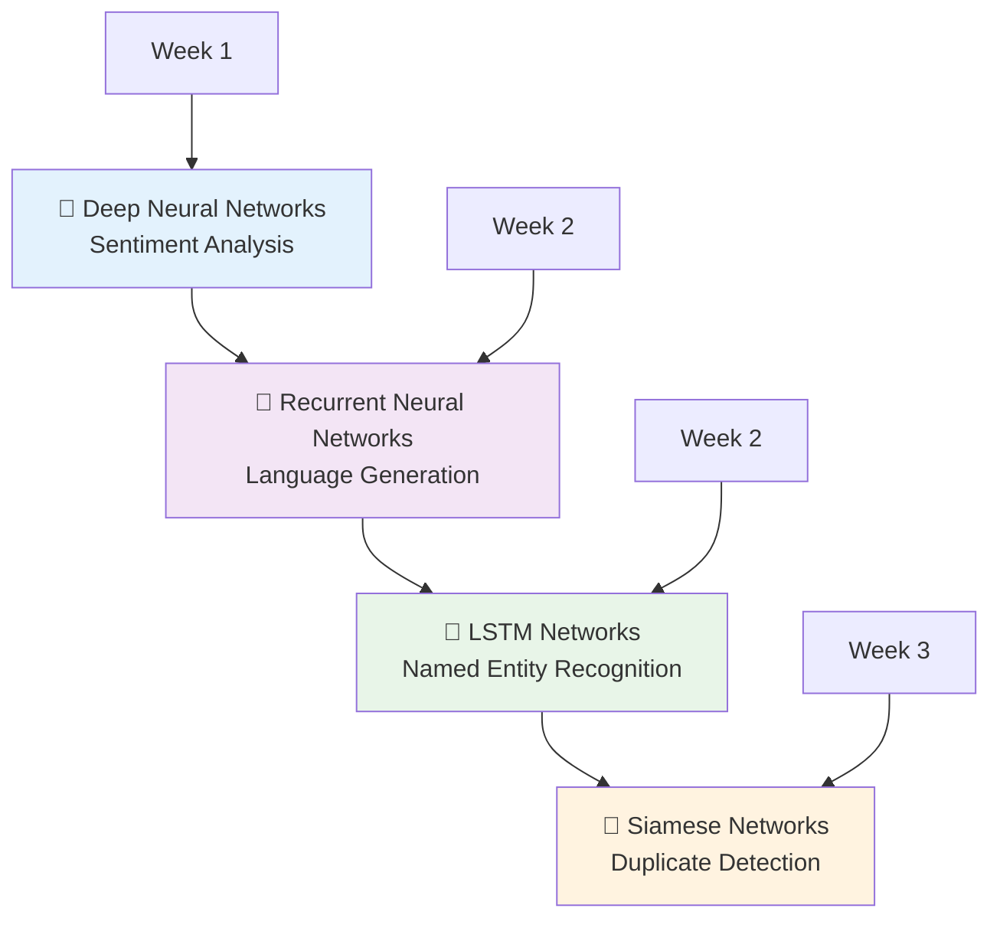

### Applications You'll Build

#### 1. **Advanced Sentiment Analysis** 🎭

- **Evolution**: From Naive Bayes → Deep Neural Networks
- **Real-World Analogy**: Upgrading from a basic emotion detector to a sophisticated psychologist
- **Applications**: Social media monitoring, customer feedback analysis, brand sentiment tracking

#### 2. **Text Generation with RNNs** ✍️

- **Evolution**: From N-gram models → Recurrent Neural Networks
- **Real-World Analogy**: From a parrot that repeats phrases → a creative writer who understands context
- **Applications**: Chatbots, content generation, autocomplete systems

#### 3. **Named Entity Recognition with LSTMs** 🏷️

- **Technology**: Long Short-Term Memory networks
- **Real-World Analogy**: Like a librarian who can identify and categorize every person, place, and organization in a text
- **Applications**: Information extraction, document processing, knowledge graphs

#### 4. **Duplicate Question Detection** 🔍

- **Technology**: Siamese Networks
- **Real-World Analogy**: Like a detective who can identify if two witness statements describe the same event, even with different wording
- **Applications**: Q&A platforms, search engines, content deduplication

### The Foundation You've Built

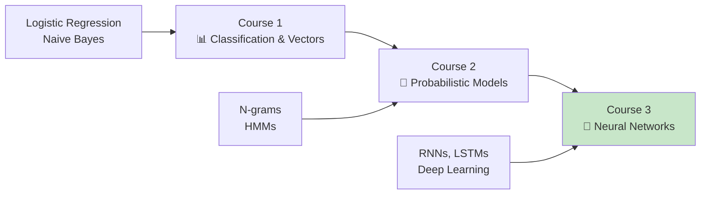

Your journey through the first two courses has equipped you with:

- **Text preprocessing and vectorization** (Course 1)
- **Probability theory and statistical modeling** (Course 2)
- **Feature extraction and classification fundamentals** (Both courses)

### Why Neural Networks for NLP?

#### Traditional Models vs Neural Networks

| Aspect                    | Traditional Models     | Neural Networks              |
| ------------------------- | ---------------------- | ---------------------------- |
| **Feature Engineering**   | Manual, time-intensive | Automatic feature learning   |
| **Pattern Recognition**   | Linear patterns        | Complex, non-linear patterns |
| **Context Understanding** | Limited                | Deep contextual awareness    |
| **Scalability**           | Limited by features    | Scales with data             |

#### Real-World Example: Sentiment Analysis Evolution

**Traditional Approach (Course 1)**:

```bash
# Manual feature extraction
"I love this movie" → [positive_words: 1, exclamation: 0, negation: 0]
```

**Neural Network Approach (Course 3)**:

```bash
# Automatic feature learning
"I love this movie" → Neural Network → [abstract_features: automatically_learned]
```

The neural network learns that "love" in the context of "movie" has different sentiment implications than "love" in other contexts.

### The Power of Sequence Models

#### Why Sequences Matter

Consider these sentences:

- "The bank can guarantee deposits will eventually cover future tuition costs because it is federally insured."
- "The river bank can guarantee deposits will eventually cover future tuition costs because it is federally insured."

**Key Insight**: The word "bank" has completely different meanings, but traditional bag-of-words models treat them identically. Sequence models understand that "river bank" vs "bank can guarantee" create different contextual meanings.

#### Sequential Processing Advantage

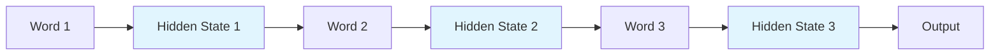

Each hidden state carries **memory** of previous words, allowing the model to understand context and relationships.

---

## Week 1 Introduction - From Traditional to Neural

### The Gentle Transition

Week 1 serves as a **bridge** between traditional NLP and modern neural approaches. Think of it as a **guided tour** where we:

1. **Revisit familiar territory** (sentiment analysis) with new tools
2. **Build confidence** with neural networks before tackling sequences
3. **Establish foundations** for advanced topics in later weeks

### The Problem with Traditional Sentiment Analysis

#### Confusing Statements Challenge

Traditional models struggle with:

**Example 1**: _"This movie is not bad"_

- **Naive Bayes sees**: "not" (negative) + "bad" (negative) = Very Negative
- **Human understands**: Double negative = Positive sentiment

**Example 2**: _"The plot was predictable, but the acting saved it"_

- **Traditional model**: Mixed signals, unclear classification
- **Neural network**: Learns that "but" indicates contrasting sentiment, "saved" is the key

#### Why Deep Neural Networks Excel

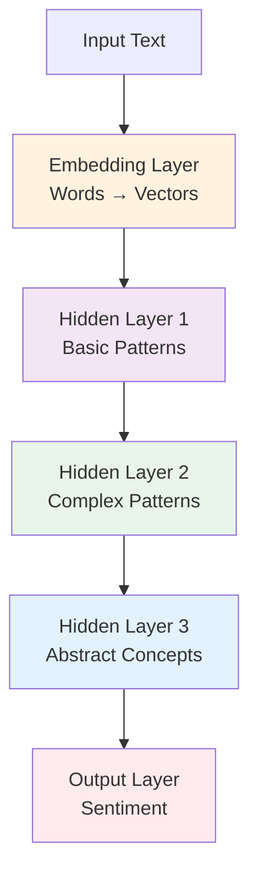

**Layer-by-Layer Learning**:

- **Embedding**: Converts words to meaningful vectors
- **Layer 1**: Simple patterns (word combinations)
- **Layer 2**: Complex patterns (phrase meanings)
- **Layer 3**: Abstract concepts (sentiment nuances)
- **Output**: Final sentiment decision

### No Feature Engineering Required

#### The Traditional Burden

In previous courses, you manually extracted features:

```python
# Manual feature extraction
features = {
    'positive_words': count_positive_words(text),
    'negative_words': count_negative_words(text),
    'exclamations': count_exclamations(text),
    'word_length': average_word_length(text)
}
```

#### The Neural Network Revolution

```python
# Neural networks learn features automatically
model = NeuralNetwork()
model.fit(texts, labels)  # Features learned automatically during training
```

**Real-World Analogy**: Traditional ML is like teaching someone to drive by explaining every detail (check mirrors, press brake, turn wheel). Neural networks are like letting someone learn by practice - they figure out the important patterns themselves.

### Week 1 Learning Path

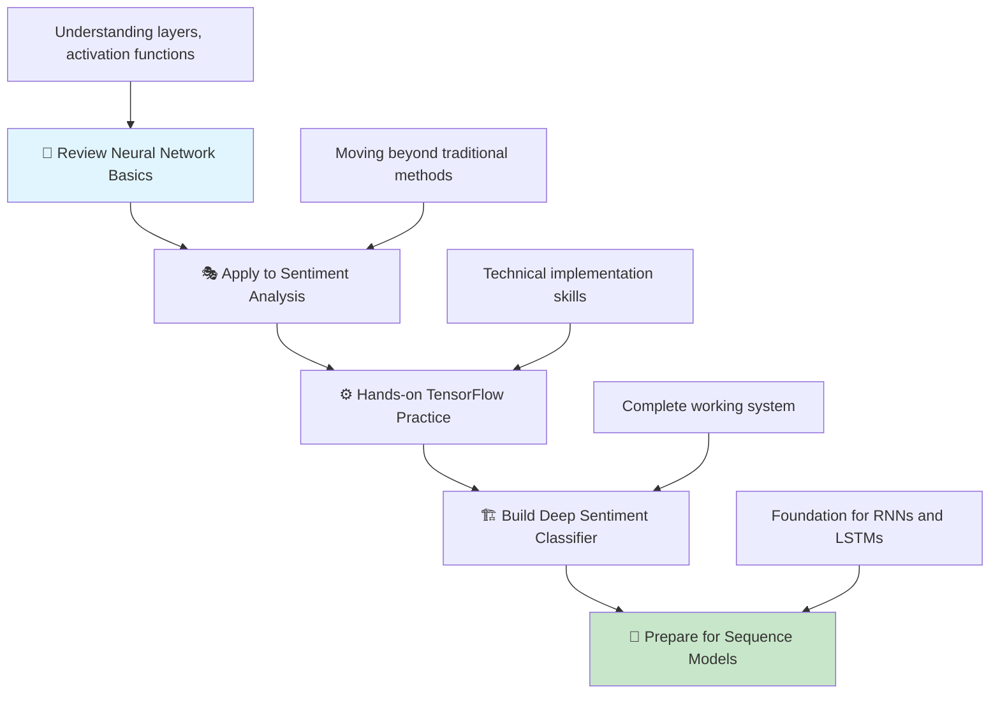

### What's Different This Time?

#### From Courses 1 & 2 to Course 3

| Previous Courses         | Course 3                     |
| ------------------------ | ---------------------------- |
| **Manual Features**      | **Learned Features**         |
| **Simple Patterns**      | **Complex Abstractions**     |
| **Word Independence**    | **Sequential Dependencies**  |
| **Linear Relationships** | **Non-linear Relationships** |
| **Fixed Architecture**   | **Flexible Architecture**    |

### Course Structure Overview

This course follows a **progressive complexity** approach:

#### Week 1: Foundation 🏗️

- **Focus**: Neural network fundamentals
- **Application**: Enhanced sentiment analysis
- **Key Learning**: Deep learning basics, TensorFlow

#### Week 2: Sequences 🔄

- **Focus**: RNNs and LSTMs
- **Applications**: Text generation, Named Entity Recognition
- **Key Learning**: Sequential processing, memory mechanisms

#### Week 3: Advanced Architectures 🚀

- **Focus**: Siamese networks
- **Application**: Duplicate detection
- **Key Learning**: Similarity learning, advanced network architectures

### Success Metrics for Week 1

By the end of Week 1, you should be able to:

1. **Explain** why neural networks outperform traditional methods for sentiment analysis
2. **Implement** a deep neural network using TensorFlow
3. **Compare** results between traditional and neural approaches
4. **Understand** the automatic feature learning process
5. **Prepare** for sequence model concepts in Week 2

### Important Notes

#### Gentle Learning Approach

- **No graded assignments** in the first lesson - focus on understanding
- **Practice assignment available** for skill building (ungraded)
- **TensorFlow introduction** to refresh technical skills
- **Sequential models start** in the second lesson with graded work

#### Building Confidence

Week 1 is designed to build your confidence with neural networks before diving into the more complex world of sequence models. Take your time to understand the fundamentals - they form the foundation for everything that follows.

**Remember**: Every expert was once a beginner. This week transforms you from an NLP practitioner using traditional methods into someone ready to harness the power of modern neural architectures.

# 2. Neural Networks for Sentiment Analysis

## From Simple to Sophisticated: The Neural Network Revolution

### The Brain-Inspired Approach

Neural networks represent a **computational attempt to mimic how the human brain recognizes patterns**. Just as your brain processes information through interconnected neurons, artificial neural networks use layers of mathematical operations to identify complex patterns in data.

**Real-World Analogy**: Think of a neural network like a **sophisticated detective team**:

- **Input Layer**: Witnesses providing initial evidence
- **Hidden Layers**: Detectives analyzing and connecting clues
- **Output Layer**: Final verdict based on all evidence

### Why Traditional Methods Fall Short

#### The Nuanced Language Problem

Traditional methods like Naive Bayes struggle with nuanced expressions:

**Example 1**: _"This movie was almost good"_

- **Naive Bayes**: Sees "good" → Positive sentiment
- **Human Understanding**: "Almost good" → Actually negative (disappointment)
- **Neural Network**: Learns that "almost" modifies "good" negatively

**Example 2**: _"I am not happy"_

- **Traditional**: "not" + "happy" → Confusion or wrong classification
- **Neural Network**: Understands negation context → Negative sentiment

### Neural Network Architecture Overview

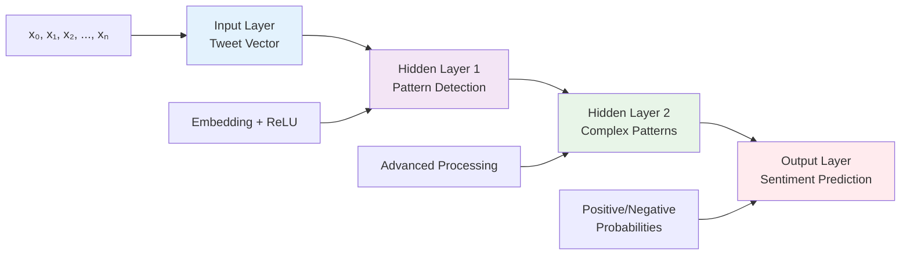

### Mathematical Foundation of Forward Propagation

#### The Layer-by-Layer Process

Forward propagation moves information **from left to right** through the network, like a **relay race** where each runner (layer) passes the baton (information) to the next.

**Mathematical Representation**:

For each layer $i$:

$$a^{[0]} = X$$
_(Input layer is just our data)_

$$z^{[i]} = W^{[i]} \cdot a^{[i-1]}$$
_(Linear transformation)_

$$a^{[i]} = g^{[i]}(z^{[i]})$$
_(Apply activation function)_

Where:

- $a^{[i]}$ = Activations at layer $i$
- $W^{[i]}$ = Weight matrix for layer $i$
- $g^{[i]}$ = Activation function for layer $i$
- $z^{[i]}$ = Linear combination before activation

#### Visual Mathematical Flow

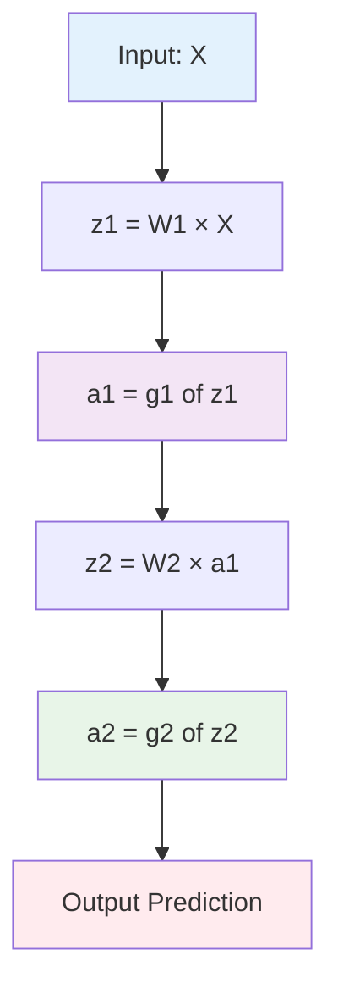

### Our Sentiment Analysis Architecture

#### The Complete Pipeline

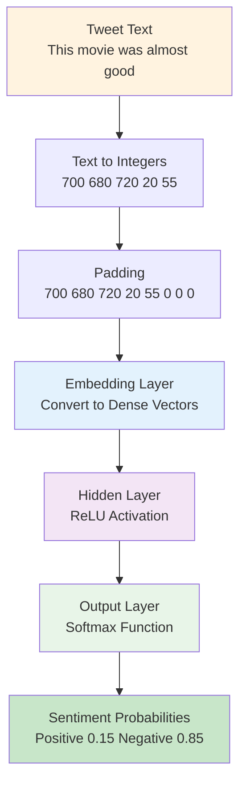

#### Layer Functions Explained

1. **Embedding Layer**: Transforms integer indices into meaningful vector representations
2. **Hidden Layer with ReLU**:
   - **ReLU Function**: $g(z) = \max(0, z)$ (keeps positive values, zeros out negative)
   - **Purpose**: Learns complex patterns and relationships
3. **Output Layer with Softmax**:
   - **Softmax Function**: $\text{softmax}(z_i) = \frac{e^{z_i}}{\sum_{j=1}^K e^{z_j}}$
   - **Purpose**: Converts raw scores to probabilities

### Text Preprocessing: From Words to Numbers

#### Building the Vocabulary Dictionary

**Step 1: Create Word-to-Index Mapping**

| Word  | Index |
| ----- | ----- |
| a     | 1     |
| able  | 2     |
| about | 3     |
| ...   | ...   |
| hand  | 615   |
| ...   | ...   |
| happy | 621   |
| ...   | ...   |
| zebra | 1000  |

#### Step 2: Convert Tweet to Integer Vector

**Original Tweet**: _"This movie was almost good"_

**Conversion Process**:

```bash
"This"  → 700
"movie" → 680
"was"   → 720
"almost"→ 20
"good"  → 55
```

**Result**: `[700, 680, 720, 20, 55]`

#### Step 3: Padding for Uniform Length

**The Padding Problem**: Different tweets have different lengths

- Tweet 1: 5 words
- Tweet 2: 12 words
- Tweet 3: 3 words

**Solution**: Pad all tweets to match the longest tweet

**Before Padding**: `[700, 680, 720, 20, 55]`

**After Padding**: `[700, 680, 720, 20, 55, 0, 0, 0, 0, 0, 0, 0]`

**Real-World Analogy**: Like making sure all students in a class have the same number of answer sheets, even if some don't need all pages.

### Why This Architecture Works Better

#### Pattern Recognition Hierarchy

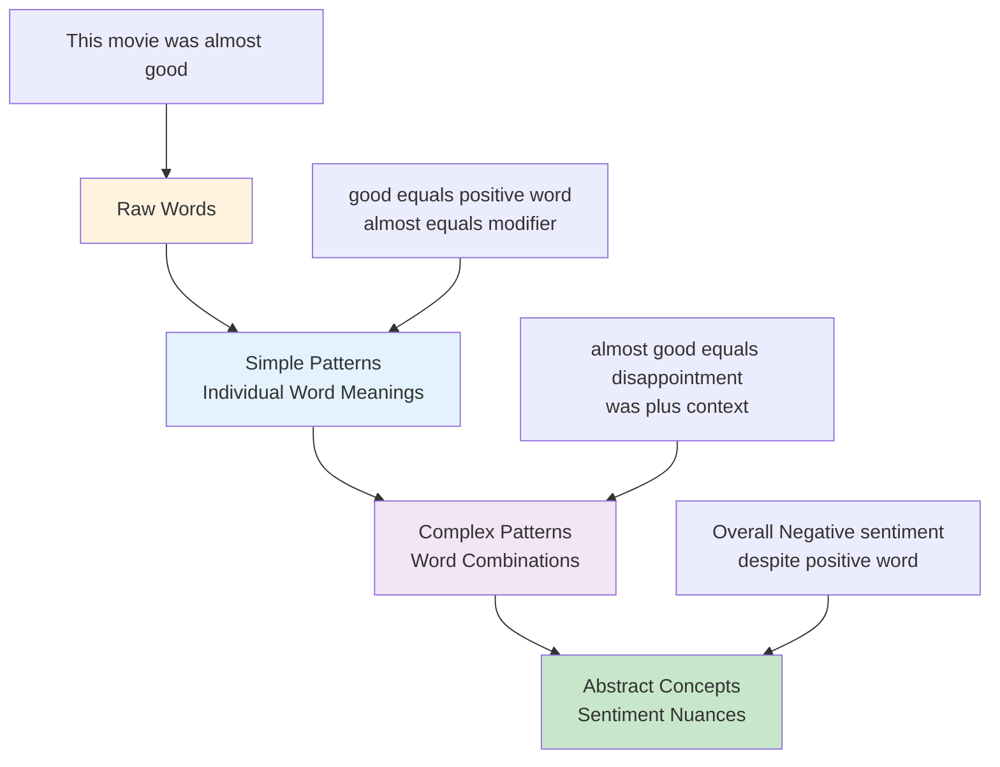

#### Comparison: Traditional vs Neural

| Aspect                    | Traditional Methods | Neural Networks |
| ------------------------- | ------------------- | --------------- |
| **Context Understanding** | Limited             | Excellent       |
| **Negation Handling**     | Poor                | Good            |
| **Nuanced Language**      | Struggles           | Excels          |
| **Feature Engineering**   | Manual              | Automatic       |
| **Complex Patterns**      | Linear only         | Non-linear      |

### Batch Processing for Efficiency

#### Single Tweet Processing (Inefficient)

```bash
Process Tweet 1 → Result 1
Process Tweet 2 → Result 2
Process Tweet 3 → Result 3
Time: 3 × T seconds
```

#### Batch Processing (Efficient)

```bash
Process [Tweet 1, Tweet 2, Tweet 3] → [Result 1, Result 2, Result 3]
Time: T seconds (approximately)
```

**Real-World Analogy**: Like a restaurant kitchen cooking multiple orders simultaneously instead of one at a time - much more efficient!

#### Matrix Representation for Batches

**Individual Tweet**: `[700, 680, 720, 20, 55, 0, 0, 0]`

**Batch of Tweets**:

```python
[
    [700, 680, 720, 20, 55, 0, 0, 0],    # Tweet 1
    [450, 230, 120, 0, 0, 0, 0, 0],      # Tweet 2
    [890, 340, 560, 780, 120, 90, 0, 0]  # Tweet 3
]
```

### The Power of Automatic Feature Learning

#### Traditional Approach (Manual)

```python
def extract_features(tweet):
    features = {
        'positive_words': count_positive_words(tweet),
        'negative_words': count_negative_words(tweet),
        'has_negation': has_negation_words(tweet),
        'exclamation_count': count_exclamations(tweet),
        'word_count': len(tweet.split())
    }
    return features
```

#### Neural Network Approach (Automatic)

```python
# Neural network learns these features automatically:
# - Word relationships
# - Context dependencies
# - Sentiment patterns
# - Negation effects
# - And many more complex patterns we couldn't manually design!

model = NeuralNetwork()
model.fit(tweets, labels)  # All feature learning happens here
```

### Key Advantages of Neural Networks for Sentiment Analysis

1. **Context Awareness**: Understands word relationships and order
2. **Automatic Pattern Discovery**: Finds patterns humans might miss
3. **Negation Handling**: Properly processes "not happy", "not bad", etc.
4. **Scalability**: Efficiently processes thousands of tweets
5. **Nuance Detection**: Catches subtle sentiment indicators like "almost good"

### Real-World Applications

#### Beyond Simple Sentiment

- **Brand Monitoring**: Understanding customer feelings about products
- **Social Media Analysis**: Tracking public opinion on topics
- **Customer Service**: Automatically routing complaints vs compliments
- **Financial Markets**: Sentiment analysis for trading decisions
- **Political Analysis**: Understanding public opinion on policies

### Preparing for Implementation

In the upcoming assignment, you'll implement this neural network architecture to handle complex sentiment analysis tasks that would stump traditional methods. The combination of:

- **Intelligent preprocessing** (padding, vectorization)
- **Powerful architecture** (embedding + hidden layers)
- **Automatic learning** (no manual feature engineering)

...creates a system capable of understanding the nuanced world of human language and emotion.

**Next Steps**: We'll dive deeper into the specific layers, starting with Dense layers and ReLU activation functions, building your understanding piece by piece until you can implement the complete system.

# 3. Dense Layers and ReLU

## The Building Blocks of Neural Networks

### Two Essential Components

Every neural network is built from **two fundamental building blocks** that work together like a perfectly orchestrated team:

1. **Dense Layer**: The computational workhorse that transforms data
2. **ReLU Layer**: The stability guardian that keeps the network healthy

**Real-World Analogy**: Think of a dense layer as a **factory assembly line** where workers (neurons) process materials (data), and ReLU as the **quality control inspector** that only allows good products (positive values) to continue down the line.

### Why These Layers Matter

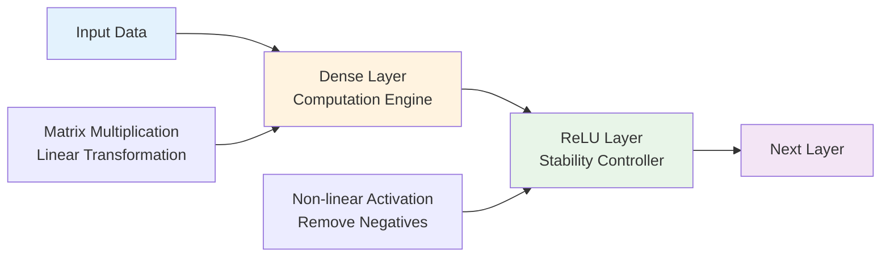

---

## Dense Layer: The Computational Powerhouse

### What is a Dense Layer?

A **dense layer** (also called **fully connected layer**) is where the magic of linear transformation happens. Every input connects to every output - hence "fully connected."

**Key Insight**: The dense layer performs a **dot product** between your input and a weight matrix, transforming your data from one representation to another.

### Mathematical Foundation

For a dense layer with index $i$:

$$z^{[i]} = W^{[i]} \cdot a^{[i-1]}$$

Where:

- $z^{[i]}$ = Linear combinations (before activation)
- $W^{[i]}$ = Weight matrix (trainable parameters)
- $a^{[i-1]}$ = Activations from previous layer

### Visual Representation with ASCII

```bash
Input Layer          Dense Layer (W¹)         Output
-----------         ----------------         ------

    x₀  ────────────→ ● ←─── All inputs connect to each neuron
    x₁  ────────────→ ●
    x₂  ────────────→ ● ←─── Each connection has a weight
    ...              ...
    xₙ  ────────────→ ●

                     ↓
               Weight Matrix W¹
               [w₁₁  w₁₂  w₁₃ ...]
               [w₂₁  w₂₂  w₂₃ ...]
               [w₃₁  w₃₂  w₃₃ ...]
               [........................]
```

### Step-by-Step Dense Layer Computation

#### Individual Neuron Perspective

For a single neuron $j$ in layer $i$:

```bash
Neuron j receives:
├── x₀ × w₀ⱼ  (input 0 × weight to neuron j)
├── x₁ × w₁ⱼ  (input 1 × weight to neuron j)
├── x₂ × w₂ⱼ  (input 2 × weight to neuron j)
└── ... × ...

Sum = x₀×w₀ⱼ + x₁×w₁ⱼ + x₂×w₂ⱼ + ... = zⱼ
```

#### Matrix Perspective (Efficient Computation)

Instead of computing each neuron individually, the dense layer computes **all neurons simultaneously**:

```bash
Matrix Multiplication:
┌─────────────┐   ┌─────────────┐   ┌─────────────┐
│ w₁₁  w₁₂  │   │     x₀      │   │     z₁      │
│ w₂₁  w₂₂  │ × │     x₁      │ = │     z₂      │
│ w₃₁  w₃₂  │   │     x₂      │   │     z₃      │
└─────────────┘   └─────────────┘   └─────────────┘
  Weight Matrix      Input Vector     Output Vector
```

### Real-World Example: Sentiment Analysis Dense Layer

**Scenario**: Processing a tweet representation

```bash
Input (Tweet Vector):    [0.2, -0.1, 0.8, 0.3]
Weight Matrix W¹:        [[ 0.5,  0.2,  0.1]
                         [-0.3,  0.4,  0.7]
                         [ 0.6, -0.2,  0.3]
                         [ 0.1,  0.8, -0.1]]

Computation:
Neuron 1: (0.2×0.5) + (-0.1×-0.3) + (0.8×0.6) + (0.3×0.1) = 0.64
Neuron 2: (0.2×0.2) + (-0.1×0.4) + (0.8×-0.2) + (0.3×0.8) = 0.04
Neuron 3: (0.2×0.1) + (-0.1×0.7) + (0.8×0.3) + (0.3×-0.1) = 0.14

Output z¹: [0.64, 0.04, 0.14]
```

### The Learning Process

#### Trainable Parameters

The **weight matrix $W^{[i]}$** contains **trainable parameters** - values that the network learns during training:

```bash
Training Process:
┌─────────────────┐    ┌─────────────────┐    ┌─────────────────┐
│ Initial Weights │ → │ Forward Pass    │ → │ Calculate Error │
│ (Random Values) │    │ Make Prediction │    │ How Wrong?      │
└─────────────────┘    └─────────────────┘    └─────────────────┘
                                                       ↓
┌─────────────────┐    ┌─────────────────┐    ┌─────────────────┐
│ Updated Weights │ ← │ Backward Pass   │ ← │ Compute         │
│ (Better Values) │    │ Update Weights  │    │ Gradients       │
└─────────────────┘    └─────────────────┘    └─────────────────┘
```

---

## ReLU: The Stability Guardian

### What is ReLU?

**ReLU** stands for **Rectified Linear Unit** - a simple but powerful activation function that introduces non-linearity to neural networks.

**Mathematical Definition**:
$$g(z^{[i]}) = \max(0, z^{[i]})$$

**Simple Rule**:

- If input is positive → keep it
- If input is negative → make it zero

### Visual Understanding

#### ASCII Graph of ReLU Function

```bash
ReLU Function: f(x) = max(0, x)

      f(x)
       ↑
    3  |     ╱
       |    ╱
    2  |   ╱
       |  ╱
    1  | ╱
       |╱
    0  |────────────────→ x
      -3  -2  -1   0   1   2   3
       |
      -1

Negative values → 0 (Horizontal line)
Positive values → x (Diagonal line)
```

### Why ReLU is Essential

#### Problem Without Activation Functions

Without ReLU (Linear Only):
$\text{Input} \rightarrow \text{Dense Layer} \rightarrow \text{Dense Layer} \rightarrow \text{Dense Layer} \rightarrow \text{Output}$
$x \rightarrow W_1 \cdot x \rightarrow W_2 \cdot W_1 \cdot x \rightarrow W_3 \cdot W_2 \cdot W_1 \cdot x$

**Problem**: $W_3 \cdot W_2 \cdot W_1 \cdot x = (W_3 \cdot W_2 \cdot W_1) \cdot x$

Multiple layers collapse into a single linear transformation!

#### Solution With ReLU

With ReLU (Non-linear):
$\text{Input} \rightarrow \text{Dense} \rightarrow \text{ReLU} \rightarrow \text{Dense} \rightarrow \text{ReLU} \rightarrow \text{Output}$

**Result**: Complex non-linear function capable of learning intricate patterns!

### ReLU in Action: Step-by-Step

#### Example Computation

```bash
After Dense Layer: z = [-0.5, 2.3, -1.2, 0.8, -0.1]

ReLU Application:
├── -0.5 → max(0, -0.5) = 0     (negative → zero)
├── 2.3  → max(0, 2.3)  = 2.3   (positive → unchanged)
├── -1.2 → max(0, -1.2) = 0     (negative → zero)
├── 0.8  → max(0, 0.8)  = 0.8   (positive → unchanged)
└── -0.1 → max(0, -0.1) = 0     (negative → zero)

After ReLU: a = [0, 2.3, 0, 0.8, 0]
```

### Real-World Analogy: Quality Control

**ReLU as a Bouncer at a Club**:

```bash
Dense Layer Output (People trying to enter):
├── Person 1: Confidence = -0.5 (nervous, negative)
├── Person 2: Confidence = 2.3  (very confident, positive)
├── Person 3: Confidence = -1.2 (anxious, negative)
├── Person 4: Confidence = 0.8  (confident, positive)
└── Person 5: Confidence = -0.1 (slightly nervous, negative)

ReLU Bouncer Decision:
├── Person 1: ❌ Not allowed (confidence → 0)
├── Person 2: ✅ Welcome (confidence stays 2.3)
├── Person 3: ❌ Not allowed (confidence → 0)
├── Person 4: ✅ Welcome (confidence stays 0.8)
└── Person 5: ❌ Not allowed (confidence → 0)

Only positive "confidence" passes through!
```

### Benefits of ReLU

#### 1. **Computational Efficiency**

```bash
ReLU: f(x) = max(0, x)
- Simple comparison and assignment
- No complex mathematical operations (no exponentials, no divisions)
- Fast to compute
```

#### 2. **Gradient Properties**

```bash
ReLU Gradient:
├── If x > 0: gradient = 1 (information flows freely)
├── If x < 0: gradient = 0 (information stops)
└── No vanishing gradient problem for positive values
```

#### 3. **Sparsity**

```bash
Network Sparsity (Many zeros):
Input:  [0.5, -0.2, 1.3, -0.8, 0.9, -0.1]
ReLU:   [0.5,  0.0, 1.3,  0.0, 0.9,  0.0]

Effect: 50% of neurons are "off" → Efficient computation
```

### Why "Rectified Linear Unit"?

**Breaking Down the Name**:

- **"Rectified"**: Negative values are "rectified" (corrected) to zero, like fixing a broken part of the function
- **"Linear"**: For positive values, $f(x) = x$ (straight line with no complex curves)
- **"Unit"**: Individual component - each neuron has its own ReLU as a basic building block

### Complete Dense + ReLU Flow

#### Step-by-Step Process

**Step 1: Dense Layer Computation**

- Input: $[x_1, x_2, x_3, x_4]$
- Weights: $W = \begin{bmatrix} w_{11} & w_{12} \\ w_{21} & w_{22} \\ w_{31} & w_{32} \\ w_{41} & w_{42} \end{bmatrix}$
- Output: $z_1 = x_1w_{11} + x_2w_{21} + x_3w_{31} + x_4w_{41}$

**Step 2: ReLU Activation**

- $z_1 = -0.5 \rightarrow a_1 = \max(0, -0.5) = 0$
- $z_2 = 1.2 \rightarrow a_2 = \max(0, 1.2) = 1.2$
- Final Output: $[0, 1.2]$

### Common Neural Network Pattern

```bash
Standard Neural Network Layer Pattern:
┌─────────────┐    ┌──────────────┐    ┌─────────────┐
│    Input    │ → │ Dense Layer  │ → │    ReLU     │ → Next Layer
│             │    │ (Linear      │    │ (Non-linear │
│             │    │ Transform)   │    │ Activation) │
└─────────────┘    └──────────────┘    └─────────────┘

This pattern repeats throughout the network:
Input → Dense → ReLU → Dense → ReLU → Dense → ReLU → Output
```

### Key Takeaways

1. **Dense Layer**: Performs linear transformations via matrix multiplication
2. **ReLU**: Introduces non-linearity by zeroing negative values
3. **Together**: Create powerful function approximators
4. **Trainable**: Dense layer weights learn during training
5. **Efficient**: ReLU is computationally simple and effective

**Next Step**: We'll explore how to combine these layers with embedding layers to create our complete sentiment analysis architecture.

### Mathematical Summary

$$\text{Dense Layer: } z^{[i]} = W^{[i]} \cdot a^{[i-1]}$$

$$\text{ReLU Layer: } a^{[i]} = \max(0, z^{[i]})$$

$$\text{Combined: } a^{[i]} = \max(0, W^{[i]} \cdot a^{[i-1]})$$

This simple combination creates the foundation for modern deep learning!

# 4. Embedding and Mean Layers

## From Numbers to Meaning: The Word Representation Revolution

### The Two Missing Pieces

We've covered the computational engines (Dense + ReLU), but we need two more essential components to complete our NLP neural network:

1. **Embedding Layer**: Transforms word indices into meaningful vectors
2. **Mean Layer**: Aggregates multiple word embeddings into a single representation

**Real-World Analogy**: Think of embedding layers as **translators** that convert word IDs into rich, meaningful representations, and mean layers as **summarizers** that distill multiple word meanings into a single essence.

---

## Embedding Layer: The Word-to-Vector Translator

### What is an Embedding Layer?

An **embedding layer** is a learnable lookup table that maps each word in your vocabulary to a dense vector representation. It's the bridge between discrete word indices and continuous vector spaces.

**Key Insight**: Instead of using sparse one-hot vectors, embeddings provide dense, meaningful representations where similar words have similar vectors.

### The Vocabulary-to-Vector Mapping

#### Vocabulary Setup

```bash
Vocabulary Table:
┌──────────┬───────┐
│   Word   │ Index │
├──────────┼───────┤
│    I     │   1   │
│   am     │   2   │
│  happy   │   3   │
│ because  │   4   │
│ learning │   5   │
│   NLP    │   6   │
│   sad    │   7   │
│   not    │   8   │
└──────────┴───────┘
```

#### Embedding Matrix (Trainable Parameters)

For embedding dimension = 2:

$$
E = \begin{bmatrix}
0.020 & 0.006 \\
-0.003 & 0.010 \\
0.009 & 0.010 \\
-0.011 & -0.018 \\
-0.040 & -0.047 \\
-0.009 & 0.050 \\
-0.044 & 0.001 \\
0.011 & -0.022
\end{bmatrix}
$$

Where:

- **Row 1**: Embedding for "I" → $[0.020, 0.006]$
- **Row 6**: Embedding for "NLP" → $[-0.009, 0.050]$
- **All values are trainable parameters**

### Mathematical Foundation

#### Embedding Lookup Operation

For a word with index $i$, the embedding lookup is:

$$\text{embedding}(i) = E[i, :] = \text{row } i \text{ of embedding matrix } E$$

#### Example Calculations

**Word "I" (index = 1)**:
$$\text{embedding}(1) = E[1, :] = [0.020, 0.006]$$

**Word "NLP" (index = 6)**:
$$\text{embedding}(6) = E[6, :] = [-0.009, 0.050]$$

### Embedding Layer Architecture

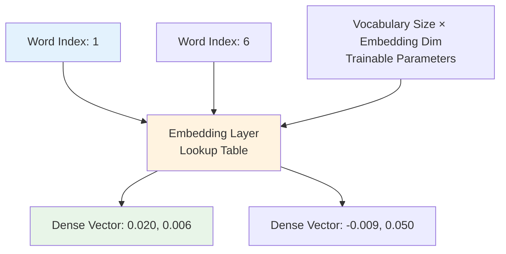

### Why Embeddings Are Powerful

#### Traditional One-Hot vs Embeddings

**One-Hot Representation** (Vocabulary size = 10,000):

- Word "happy": $[0, 0, 0, ..., 1, 0, ..., 0]$ (9,999 zeros, 1 one)
- **Problems**: Sparse, no semantic relationship, huge memory

**Embedding Representation** (Embedding dim = 300):

- Word "happy": $[0.1, -0.3, 0.7, ..., 0.2]$ (300 dense values)
- **Advantages**: Dense, semantic relationships, efficient

#### Semantic Relationships

Well-trained embeddings capture semantic relationships:

- Similar words → Similar vectors
- $\text{embedding}(\text{"happy"}) \approx \text{embedding}(\text{"joyful"})$
- $\text{embedding}(\text{"sad"}) \approx \text{embedding}(\text{"unhappy"})$

---

## Processing Sequences: From Words to Tweets

### Tweet Example: "I am happy"

#### Step 1: Text to Indices

- "I" → Index 1
- "am" → Index 2
- "happy" → Index 3
- **Result**: $[1, 2, 3]$

#### Step 2: Embedding Lookup

$$\text{Tweet indices: } [1, 2, 3]$$

$$\text{Embedding matrix lookup:}$$

$$
\begin{align}
\text{embedding}(1) &= [0.020, 0.006] \\
\text{embedding}(2) &= [-0.003, 0.010] \\
\text{embedding}(3) &= [0.009, 0.010]
\end{align}
$$

#### Step 3: Embedding Matrix Output

$$
\text{Tweet embeddings} = \begin{bmatrix}
0.020 & 0.006 \\
-0.003 & 0.010 \\
0.009 & 0.010
\end{bmatrix}
$$

**Dimensions**: $3 \times 2$ (3 words × 2 embedding dimensions)

### The Parameter Problem

#### Unrolling Approach (Not Recommended)

If we unroll the embedding matrix:
$$\text{Unrolled: } [0.020, 0.006, -0.003, 0.010, 0.009, 0.010]$$

**Problems**:

- **Variable length**: Different tweets have different lengths
- **Too many parameters**: Dense layer needs $(\text{max\_length} \times \text{embedding\_dim}) \times \text{hidden\_units}$ parameters
- **Inefficient**: Doesn't scale well

---

## Mean Layer: The Elegant Solution

### What is a Mean Layer?

The **mean layer** computes the average of word embeddings, creating a **fixed-size representation** regardless of sequence length.

**Mathematical Definition**:
$$\text{mean\_embedding} = \frac{1}{n} \sum_{i=1}^{n} \text{embedding}(w_i)$$

Where $n$ is the number of words in the sequence.

### Mean Layer Calculation

#### For Tweet "I am happy"

**Embedding Matrix**:

$$
X = \begin{bmatrix}
0.020 & 0.006 \\
-0.003 & 0.010 \\
0.009 & 0.010
\end{bmatrix}
$$

**Mean Calculation**:

$$
\text{mean\_embedding} = \frac{1}{3} \begin{bmatrix}
0.020 + (-0.003) + 0.009 \\
0.006 + 0.010 + 0.010
\end{bmatrix}
$$

$$
= \frac{1}{3} \begin{bmatrix}
0.026 \\
0.026
\end{bmatrix} = \begin{bmatrix}
0.009 \\
0.009
\end{bmatrix}
$$

### Mean Layer Properties

#### Key Characteristics

1. **Fixed Output Size**: Always outputs vector of size = embedding dimension
2. **No Trainable Parameters**: Pure mathematical operation (averaging)
3. **Sequence Length Invariant**: Same output dimension regardless of input length
4. **Computationally Efficient**: Simple arithmetic mean

#### Mathematical Properties

For embedding matrix $X$ with shape $(n, d)$:

- $n$ = number of words
- $d$ = embedding dimension

Mean layer output:
$$\text{output} = \frac{1}{n} \sum_{i=1}^{n} X[i, :] \in \mathbb{R}^d$$

**Output shape**: Always $(d,)$ regardless of $n$

### Visual Representation

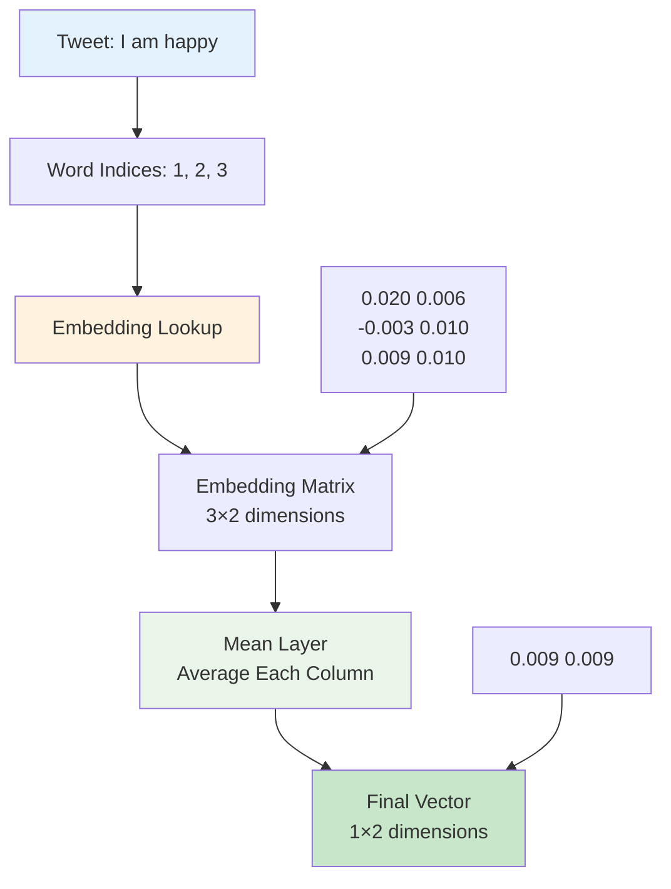

### Benefits of Mean Layer

#### 1. **Dimension Consistency**

- **Input**: Variable length sequences
- **Output**: Fixed dimension vectors
- **Benefit**: Can feed to standard dense layers

#### 2. **Parameter Efficiency**

- **No additional parameters**: Pure computation
- **Memory efficient**: No extra weights to store
- **Training efficient**: No gradients to compute for mean operation

#### 3. **Semantic Preservation**

- **Averaging preserves**: Overall semantic content
- **Example**: Mean of ["happy", "joyful", "excited"] ≈ positive sentiment vector

### Complete Pipeline Example

#### Processing Tweet: "I am happy because learning NLP"

**Step 1: Tokenization & Indexing**
$$\text{Words: } [\text{"I"}, \text{"am"}, \text{"happy"}, \text{"because"}, \text{"learning"}, \text{"NLP"}]$$
$$\text{Indices: } [1, 2, 3, 4, 5, 6]$$

**Step 2: Embedding Lookup**

$$
\text{Embeddings} = \begin{bmatrix}
0.020 & 0.006 \\
-0.003 & 0.010 \\
0.009 & 0.010 \\
-0.011 & -0.018 \\
-0.040 & -0.047 \\
-0.009 & 0.050
\end{bmatrix}
$$

**Step 3: Mean Calculation**
$$\text{Column 1 mean: } \frac{0.020 + (-0.003) + 0.009 + (-0.011) + (-0.040) + (-0.009)}{6} = \frac{-0.034}{6} = -0.0057$$

$$\text{Column 2 mean: } \frac{0.006 + 0.010 + 0.010 + (-0.018) + (-0.047) + 0.050}{6} = \frac{0.011}{6} = 0.0018$$

**Final Output**: $[-0.0057, 0.0018]$

### Embedding + Mean Layer Architecture

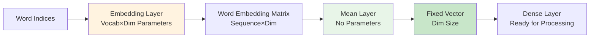

### Why This Combination Works

#### Embedding Layer Advantages

- **Learnable representations**: Adapts to your specific task
- **Semantic encoding**: Captures word meanings and relationships
- **Dense vectors**: Efficient representation vs. one-hot

#### Mean Layer Advantages

- **Fixed output size**: Handles variable-length inputs
- **No parameters**: Doesn't add model complexity
- **Semantic aggregation**: Preserves overall meaning

#### Combined Power

$$\text{Variable Text} \xrightarrow{\text{Embedding}} \text{Rich Representations} \xrightarrow{\text{Mean}} \text{Fixed Summary} \xrightarrow{\text{Dense+ReLU}} \text{Classification}$$

### Your Complete Toolkit

You now have **four essential layers**:

1. **Embedding Layer**: Word indices → Dense vectors (trainable)
2. **Mean Layer**: Multiple embeddings → Single vector (no parameters)
3. **Dense Layer**: Linear transformation (trainable)
4. **ReLU Layer**: Non-linear activation (no parameters)

**Next Step**: Combine these layers to build a complete sentiment analysis neural network!

### Key Takeaways

- **Embeddings**: Transform discrete words into continuous, meaningful vectors
- **Trainable**: Embedding weights improve during training for your specific task
- **Mean Layer**: Elegant solution for handling variable-length inputs
- **No Parameters**: Mean layer adds no complexity to your model
- **Foundation Ready**: These four layers provide everything needed for NLP neural networks

$$\boxed{\text{Embedding} + \text{Mean} + \text{Dense} + \text{ReLU} = \text{Powerful NLP Model}}$$

# 5. Traditional Language Models - Limitations

## From Statistical Foundations to Neural Revolution

### The Bridge Between Past and Future

We've built our neural network toolkit (Embedding, Mean, Dense, ReLU), but before diving into sequence models, we need to understand **why** we're moving beyond traditional approaches. This section reveals the fundamental limitations that drive the need for neural sequence models.

**Real-World Analogy**: Traditional N-gram models are like **weather forecasters who can only remember yesterday** - they miss the bigger patterns that develop over longer time periods.

---

## Traditional Language Models: The N-gram Approach

### What Are Language Models?

A **language model** assigns probabilities to sequences of words, helping us determine which sentences are more likely to occur in natural language.

**Core Question**: Given a sequence of words, what's the probability this sequence would naturally occur?

### The Translation Challenge

#### Example Scenario: French to English Translation

**French Input**: "J'ai vu le match de foot"

**Translation Candidates**:

1. "I saw the game of soccer" → $P(\text{sequence}) = 4.5 \times 10^{-5}$
2. "I saw the soccer game" → $P(\text{sequence}) = 6.0 \times 10^{-5}$ ✅ **Highest**
3. "I saw the soccer match" → $P(\text{sequence}) = 4.6 \times 10^{-5}$
4. "Saw I the game of soccer" → $P(\text{sequence}) = 2.6 \times 10^{-9}$

**Language Model Decision**: Choose sequence with highest probability → "I saw the soccer game"

### N-gram Model Review

#### Mathematical Foundation

**N-gram Model Principle**: Predict next word based on previous $N-1$ words

#### Bigram Model ($N=2$)

$$P(w_2|w_1) = \frac{\text{count}(w_1, w_2)}{\text{count}(w_1)}$$

**Example**: $P(\text{soccer}|\text{the}) = \frac{\text{count}(\text{the soccer})}{\text{count}(\text{the})}$

#### Trigram Model ($N=3$)

$$P(w_3|w_1, w_2) = \frac{\text{count}(w_1, w_2, w_3)}{\text{count}(w_1, w_2)}$$

**Example**: $P(\text{game}|\text{the soccer}) = \frac{\text{count}(\text{the soccer game})}{\text{count}(\text{the soccer})}$

### Sequence Probability Calculation

#### Chain Rule for Sentence Probability

For a sequence of words $w_1, w_2, w_3$:

$$P(w_1, w_2, w_3) = P(w_1) \times P(w_2|w_1) \times P(w_3|w_2)$$

#### Step-by-Step Example: "I saw soccer"

**Using Bigram Model**:
$$P(\text{I saw soccer}) = P(\text{I}) \times P(\text{saw}|\text{I}) \times P(\text{soccer}|\text{saw})$$

**Calculation**:

- $P(\text{I}) = 0.05$ (frequency of "I" starting sentences)
- $P(\text{saw}|\text{I}) = 0.12$ (probability "saw" follows "I")
- $P(\text{soccer}|\text{saw}) = 0.08$ (probability "soccer" follows "saw")

**Final Result**: $P(\text{I saw soccer}) = 0.05 \times 0.12 \times 0.08 = 4.8 \times 10^{-4}$

---

## The Fundamental Limitations

### 1. **Memory and Storage Crisis**

#### The Combinatorial Explosion

**Vocabulary Size**: $V = 50,000$ words (typical)

**Storage Requirements**:

- **Bigrams**: $V^2 = 50,000^2 = 2.5 \times 10^9$ combinations
- **Trigrams**: $V^3 = 50,000^3 = 1.25 \times 10^{14}$ combinations
- **4-grams**: $V^4 = 50,000^4 = 6.25 \times 10^{18}$ combinations

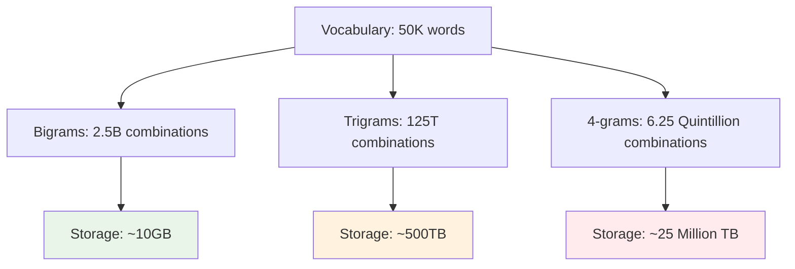

#### Real-World Impact

**Mobile App Constraints**:

- Available storage: ~2-4 GB
- Required for 4-grams: ~25 Million TB
- **Conclusion**: Completely impractical!

### 2. **Long-Range Dependency Problem**

#### The Context Window Limitation

**Example Sentence**: "The cat, which was sleeping peacefully in the warm sunlight streaming through the window, suddenly woke up."

**Traditional N-gram Challenge**:

- **Trigram model**: Only sees 2 previous words
- **To predict "up"**: Only considers "suddenly woke"
- **Misses**: The connection to "cat" and "sleeping"

#### Mathematical Illustration

For predicting word $w_i$ in position $i$:

**N-gram approach**: $P(w_i|w_{i-N+1}, ..., w_{i-1})$

- **Limited context**: Only $N-1$ previous words
- **Long dependencies**: Lost if distance > $N-1$

**Example Problem**:

```
Sentence: "The book [15 words] was interesting"
Bigram sees: "... was interesting" ✓
Misses: Connection to "book" ✗
```

### 3. **Data Sparsity Issues**

#### The Rare Combination Problem

**Challenge**: Many word combinations never appear in training data

**Example**:

- Training corpus has: "red car", "blue car", "fast car"
- Test sentence contains: "purple car"
- **N-gram result**: $P(\text{car}|\text{purple}) = 0$ (never seen before)

#### Zero Probability Crisis

When $\text{count}(w_1, w_2) = 0$:
$$P(w_2|w_1) = \frac{0}{\text{count}(w_1)} = 0$$

**Impact**: Entire sentence probability becomes 0!

### 4. **Computational Inefficiency**

#### Training Complexity

**For N-gram model**:

- **Count extraction**: $O(|corpus| \times N)$
- **Probability computation**: $O(V^N)$
- **Storage access**: Linear search through massive tables

**Inference Problems**:

- **Lookup time**: Increases with vocabulary size
- **Cache misses**: Frequent access to large probability tables
- **Memory bandwidth**: becomes bottleneck

---

## Why Neural Models Are the Solution

### Addressing Each Limitation

#### 1. **Memory Efficiency**

- **Traditional**: Store $V^N$ probability combinations
- **Neural**: Store weight matrices (much smaller)
- **Advantage**: $O(V \times d)$ vs $O(V^N)$ where $d$ << $V$

#### 2. **Long-Range Dependencies**

- **Traditional**: Fixed context window of $N-1$ words
- **Neural**: Can theoretically process entire sequence
- **Advantage**: Captures distant relationships

#### 3. **Generalization**

- **Traditional**: Zero probability for unseen combinations
- **Neural**: Learns patterns, can handle unseen combinations
- **Advantage**: Robust to new word combinations

#### 4. **Computational Efficiency**

- **Traditional**: Lookup tables and counting
- **Neural**: Matrix operations (GPU-optimized)
- **Advantage**: Parallelizable computations

### The Transition Preview

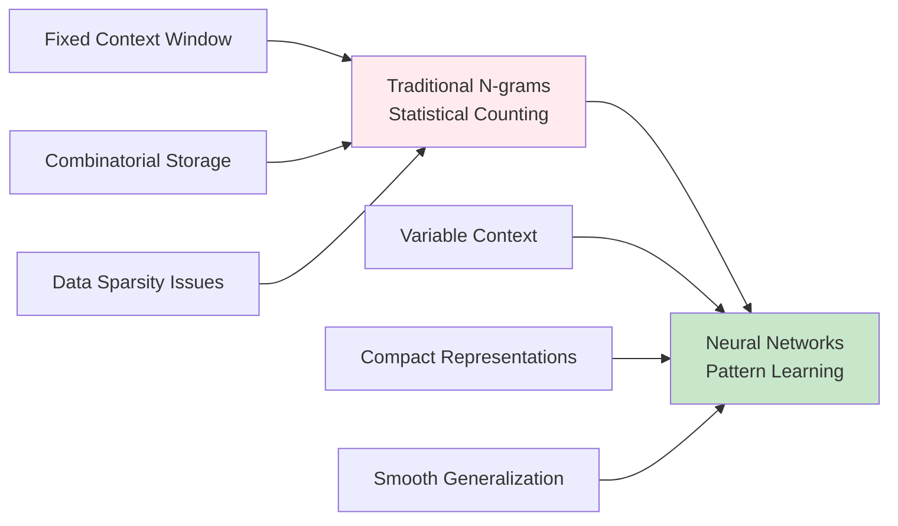

### What's Coming Next

**Recurrent Neural Networks (RNNs)** will solve these problems by:

1. **Sequential Processing**: Handle variable-length sequences
2. **Hidden States**: Maintain memory of previous words
3. **Parameter Sharing**: Same weights for all time steps
4. **Continuous Representations**: No discrete counting needed

### Key Insights

#### Why This Matters

Understanding N-gram limitations helps appreciate why neural approaches represent such a breakthrough:

- **From Counting to Learning**: Instead of counting word combinations, neural models learn patterns
- **From Fixed to Flexible**: Instead of fixed N-word windows, neural models adapt to context needs
- **From Sparse to Dense**: Instead of sparse probability tables, neural models use dense representations
- **From Static to Dynamic**: Instead of static lookup, neural models dynamically compute probabilities

#### The Paradigm Shift

$$\boxed{\text{Statistical Counting} \rightarrow \text{Neural Pattern Learning}}$$

Traditional language models were a crucial stepping stone, but their fundamental limitations make neural approaches not just better, but **necessary** for modern NLP applications.

**Next**: We'll see how Recurrent Neural Networks elegantly solve these problems while maintaining the core goal of modeling sequential language patterns.

# 6. Recurrent Neural Networks - Sequential Processing

## The Memory Revolution in Neural Networks

### From Forgetful to Memorable

Traditional neural networks process each input independently, like having **amnesia** - they can't remember what they just processed. **Recurrent Neural Networks (RNNs)** solve this by introducing **memory**, allowing the network to maintain information across time steps.

**Real-World Analogy**: Think of RNNs like a **detective following clues** - each new piece of evidence (word) is understood in the context of all previous clues, not in isolation.

---

## The Long-Range Dependency Problem Solved

### Traditional N-gram Limitation Example

**Sentence**: "Nour was supposed to study with me. I called her but she did not \_\_\_\_"

#### Trigram Model Analysis

**What Trigram Sees**: Only "did not \_\_\_\_"

**Trigram Prediction Options**:

- want, respond, choose, want, **have** ← (Most probable based on "did not")
- ask, attempt, **answer**, know

**Problem**: Trigram chooses "have" because $P(\text{have}|\text{did not})$ is highest in training corpus, but "she did not have" doesn't make grammatical sense in this context.

### RNN Advantage: Full Context Awareness

**What RNN Sees**: "Nour was supposed to study with me. I called her but she did not \_\_\_\_"

**RNN Logic**:

1. **Context**: Someone was supposed to study
2. **Action**: I called her
3. **Expectation**: She should respond to the call
4. **Logical completion**: "answer"

**RNN Prediction**: "answer" ✅ (contextually correct despite lower trigram probability)

---

## RNN Architecture Deep Dive

### Basic RNN Structure

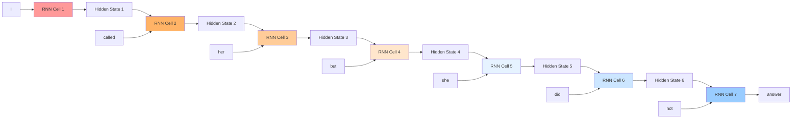

### ASCII Representation with Information Flow

```bash
Information Retention Visualization:

Time Step:  t=1    t=2      t=3        t=4          t=5            t=6              t=7
           ┌───┐  ┌──────┐  ┌───────┐  ┌─────────┐  ┌───────────┐  ┌─────────────┐  ┌───────────────┐
Input:     │ I │  │called│  │  her  │  │   but   │  │    she    │  │     did     │  │      not      │
           └───┘  └──────┘  └───────┘  └─────────┘  └───────────┘  └─────────────┘  └───────────────┘
             │      │        │          │            │              │                │
           ┌─▼─┐  ┌─▼───┐  ┌─▼─────┐  ┌─▼───────┐  ┌─▼─────────┐  ┌─▼───────────┐  ┌─▼─────────────┐
Memory:    │███│  │████ │  │█████  │  │██████   │  │███████    │  │████████     │  │█████████      │
           │   │  │███  │  │████   │  │█████    │  │██████     │  │███████      │  │████████       │
           │   │  │█    │  │███    │  │████     │  │█████      │  │██████       │  │███████        │
           └─┬─┘  └─┬───┘  └─┬─────┘  └─┬───────┘  └─┬─────────┘  └─┬───────────┘  └─┬─────────────┘
             │      │        │          │            │              │                │
Hidden:    h₁ ────►h₂ ─────►h₃ ───────►h₄ ─────────►h₅ ───────────►h₆ ─────────────►h₇
                                                                                      │
                                                                                      ▼
                                                                                 ┌─────────┐
                                                                                 │ answer  │
                                                                                 └─────────┘

Legend: █ = Information retention (darker = stronger memory)
```

### Mathematical Foundation

#### Core RNN Equations

At each time step $t$:

**Hidden State Update**:
$$h^{(t)} = \tanh(W_h \cdot h^{(t-1)} + W_x \cdot x^{(t)} + b_h)$$

**Output Computation**:
$$y^{(t)} = W_y \cdot h^{(t)} + b_y$$

**Final Prediction** (for sequence completion):
$$\hat{y} = \text{softmax}(W \cdot h^{(T)})$$

Where:

- $h^{(t)}$ = Hidden state at time $t$
- $x^{(t)}$ = Input at time $t$
- $W_h$ = Hidden-to-hidden weight matrix (recurrent weights)
- $W_x$ = Input-to-hidden weight matrix
- $W_y$ = Hidden-to-output weight matrix
- $W$ = Final prediction weights

### Detailed RNN Computation Flow

#### Step-by-Step Processing: "I called her but she did not"

**Initialization**: $h^{(0)} = \vec{0}$ (zero vector)

**Time Step 1**: Input = "I"
$$h^{(1)} = \tanh(W_h \cdot \vec{0} + W_x \cdot \text{embed}(\text{"I"}) + b_h)$$
$$h^{(1)} = \tanh(W_x \cdot [0.2, 0.1, -0.3] + b_h)$$

**Time Step 2**: Input = "called"  
$$h^{(2)} = \tanh(W_h \cdot h^{(1)} + W_x \cdot \text{embed}(\text{"called"}) + b_h)$$

**Information Flow**: $h^{(2)}$ now contains information about both "I" and "called"

**Time Step 3**: Input = "her"
$$h^{(3)} = \tanh(W_h \cdot h^{(2)} + W_x \cdot \text{embed}(\text{"her"}) + b_h)$$

**Information Flow**: $h^{(3)}$ contains accumulated info: "I called her"

**... continuing through all time steps ...**

**Final Step**: Input = "not"
$$h^{(7)} = \tanh(W_h \cdot h^{(6)} + W_x \cdot \text{embed}(\text{"not"}) + b_h)$$

**Final Prediction**:
$$\hat{y} = \text{softmax}(W \cdot h^{(7)})$$

---

## RNN Architecture Variants

### Unfolded RNN Architecture

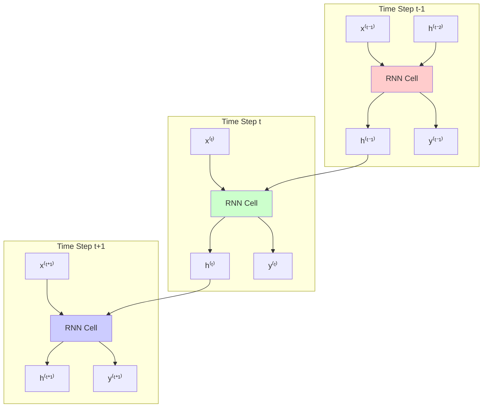

### Folded (Compact) RNN Representation

```bash
Standard RNN Cell Diagram:

           ┌─────────────────┐
    h⁽ᵗ⁻¹⁾ │                 │ h⁽ᵗ⁾
    ─────► │   RNN Cell      │─────►
           │                 │
    x⁽ᵗ⁾   │   Wₕ, Wₓ, bₕ     │
    ─────► │                 │
           │                 │ y⁽ᵗ⁾
           │                 │─────►
           └─────────────────┘

Where:
- h⁽ᵗ⁻¹⁾: Previous hidden state (memory)
- x⁽ᵗ⁾: Current input
- h⁽ᵗ⁾: Current hidden state (updated memory)
- y⁽ᵗ⁾: Current output (optional)
```

---

## Key Advantages of RNNs

### 1. **Parameter Sharing**

**Traditional Approach** (hypothetical):

- Separate weights for each position: $W_1, W_2, W_3, ..., W_T$
- **Parameters**: $O(T \times \text{hidden\_size}^2)$ where $T$ = sequence length

**RNN Approach**:

- **Same weights** $W_h, W_x$ used at every time step
- **Parameters**: $O(\text{hidden\_size}^2)$ regardless of sequence length

```bash
Parameter Comparison:

Traditional (Position-Specific):
Position 1: W₁ (100×100) = 10,000 parameters
Position 2: W₂ (100×100) = 10,000 parameters
Position 3: W₃ (100×100) = 10,000 parameters
...
Position T: Wₜ (100×100) = 10,000 parameters
TOTAL: T × 10,000 parameters

RNN (Shared):
Wₕ (100×100) = 10,000 parameters
Wₓ (embed×100) = embed×100 parameters
TOTAL: ~10,000 parameters (independent of T)
```

### 2. **Variable Length Handling**

**Capability**: Process sequences of any length without architecture changes

**Examples**:

- Short tweet: 5 words → 5 time steps
- Long article: 1000 words → 1000 time steps
- **Same RNN weights** used for both!

### 3. **Information Propagation**

#### Memory Decay Visualization

```bash
Information Strength Over Time:

Word: "I"     "called"  "her"    "but"   "she"   "did"   "not"
      │        │         │        │       │       │       │
Time: t=1      t=2       t=3      t=4     t=5     t=6     t=7
      │        │         │        │       │       │       │
      ▼        ▼         ▼        ▼       ▼       ▼       ▼
Info: ████████ ██████▓▓  ████▓▓▓▓ ██▓▓▓▓▓ █▓▓▓▓▓▓ ▓▓▓▓▓▓▓ ▓▓▓▓▓▓▓
      ||||||||  ||||||    ||||      ||       |
      Strong    Moderate  Weak     Very     Faint
                                   Weak

Legend: █ = Strong memory, ▓ = Moderate memory, ▓ = Weak memory
```

**Key Insight**: Earlier information becomes weaker but **never completely disappears**, unlike N-grams which have a hard cutoff.

---

## RNN vs Traditional Models Comparison

### Contextual Understanding Example

**Sentence**: "The cat that was sleeping peacefully in the garden woke up"

#### Traditional Trigram Model

- **At "up"**: Only sees "woke up"
- **Missing context**: No connection to "cat" or "sleeping"
- **Limitation**: Hard 3-word window

#### RNN Model

- **At "up"**: Hidden state contains information from entire sequence
- **Full context**: Understands "cat" → "sleeping" → "woke up" relationship
- **Advantage**: Flexible context length

### Computational Efficiency

| Aspect              | Traditional N-gram             | RNN                              |
| ------------------- | ------------------------------ | -------------------------------- |
| **Storage**         | $O(V^N)$ combinations          | $O(V \times d + d^2)$ parameters |
| **Memory**          | Huge lookup tables             | Compact weight matrices          |
| **Generalization**  | Poor (unseen combinations = 0) | Good (learned patterns)          |
| **Context**         | Fixed N-word window            | Variable-length sequences        |
| **Parallelization** | Table lookups (slow)           | Matrix operations (GPU-friendly) |

---

## RNN Training Process

### Forward Pass Through Time

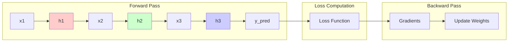

### Learning Process

**Training Objective**: Learn weights $W_h, W_x, W$ to minimize prediction error

**Example Training**:

1. **Input sequence**: "I called her but she did not"
2. **Target**: "answer"
3. **Forward pass**: Compute $h^{(1)}$ through $h^{(7)}$, predict word
4. **Loss**: Compare prediction with "answer"
5. **Backpropagation**: Update weights to improve prediction
6. **Repeat**: For many sequences until convergence

---

## Limitations and Next Steps

### RNN Challenges (Preview)

1. **Vanishing Gradient Problem**: Information from very early time steps can disappear
2. **Sequential Processing**: Cannot parallelize across time steps
3. **Memory Limitations**: Simple RNNs struggle with very long sequences

### Solutions Coming Next

- **LSTM (Long Short-Term Memory)**: Solves vanishing gradients
- **GRU (Gated Recurrent Unit)**: Simpler alternative to LSTM
- **Attention Mechanisms**: Better long-range dependencies

---

## Key Takeaways

### RNN Revolution

$$\boxed{\text{Fixed Context Window} \rightarrow \text{Dynamic Memory}}$$

**RNNs transform NLP by**:

1. **Memory**: Maintaining information across time steps
2. **Flexibility**: Handling variable-length sequences
3. **Efficiency**: Parameter sharing across positions
4. **Context**: Understanding long-range dependencies

### The Magic Formula

**Core RNN Operation**:
$$h^{(t)} = f(W_h \cdot h^{(t-1)} + W_x \cdot x^{(t)})$$

This simple equation enables:

- **Sequential processing** with memory
- **Parameter sharing** across time
- **Variable-length** input handling
- **Long-range** dependency modeling

**Next**: We'll explore different RNN applications and architectures, then dive into the mathematical details and implementation strategies that make RNNs work in practice.

# 7. Applications of RNNs

## RNN Architectures: The Swiss Army Knife of Deep Learning

### Versatile Tools for Diverse Tasks

RNNs are like **shape-shifting tools** that can be configured for different input-output patterns. The beauty of RNNs lies in their adaptability - the same core mechanism can solve vastly different problems by simply changing the input-output structure.

**Real-World Analogy**: Think of RNNs like a **universal translator device** that can be programmed for different conversation patterns - sometimes you speak once and get one answer, sometimes you show a picture and get a description, and sometimes you have a full conversation.

---

## The Four RNN Architecture Patterns

### Overview of Input-Output Relationships

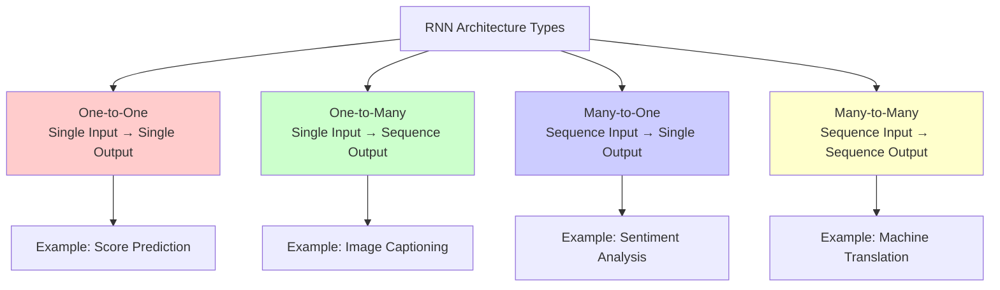

---

## 1. One-to-One Architecture

### Concept: Single Input → Single Output

**Use Case**: Traditional prediction tasks where sequence processing isn't the main advantage.

#### Example: Soccer Team Position Prediction

**Problem**: Predict team's final leaderboard position based on current scores.

**Input**: Vector of team scores → $[3, 1, 2, 3, 0, 1, 2]$ (recent match results)

**Output**: Single value → Position 4 (predicted final ranking)

#### Architecture Diagram

```bash
One-to-One RNN Architecture:

Input Features (x)    Hidden State (h)    Output (y)
┌─────────────────┐   ┌──────────────┐   ┌────────────┐
│ Team Scores:    │   │              │   │  Final     │
│ [3,1,2,3,0,1,2] ├──►│   RNN Cell   ├──►│ Position:  │
│                 │   │              │   │     4      │
└─────────────────┘   └──────────────┘   └────────────┘
                           │
                           ▼
                      Hidden State h₀
                    (minimal memory needed)
```

#### Mathematical Representation

$$h = \tanh(W_x \cdot x + b_h)$$
$$y = W_y \cdot h + b_y$$

**Note**: This is essentially a standard neural network with an additional hidden state $h_0$, making RNNs somewhat overkill for this task.

---

## 2. One-to-Many Architecture

### Concept: Single Input → Multiple Outputs

**Use Case**: Generate sequences from a single input (image captioning, music generation).

#### Example: Image Captioning

**Problem**: Generate descriptive text for an image.

**Input**: Image of a brown puppy

**Output**: Sequence of words → "A", "brown", "puppy", "is", "playing", "in", "the", "grass"

#### Architecture Diagram

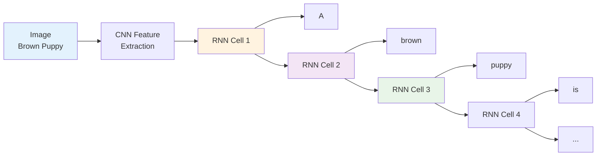

#### ASCII Representation

```bash
One-to-Many: Image Captioning

Image Input     Word Generation Sequence
┌─────────┐     ┌───┐  ┌─────┐  ┌─────┐  ┌──┐  ┌────────┐
│  🐕     │────►│ A ├─►│brown├─►│puppy├─►│is├─►│playing │
│ (puppy) │     └───┘  └─────┘  └─────┘  └──┘  └────────┘
└─────────┘        │      │       │      │       │
                   ▼      ▼       ▼      ▼       ▼
                  h₁     h₂      h₃     h₄      h₅

Memory Flow: Image features → "A" context → "brown" context → ...
```

#### Step-by-Step Process

1. **Image Processing**: CNN extracts features → $v_{image}$
2. **Initial Hidden State**: $h_0 = f(v_{image})$ (encode image into RNN memory)
3. **Word Generation**:
   - $h_1 = \text{RNN}(h_0, \text{START\_TOKEN})$ → Output: "A"
   - $h_2 = \text{RNN}(h_1, \text{"A"})$ → Output: "brown"
   - $h_3 = \text{RNN}(h_2, \text{"brown"})$ → Output: "puppy"
   - Continue until END_TOKEN

---

## 3. Many-to-One Architecture

### Concept: Multiple Inputs → Single Output

**Use Case**: Sequence classification tasks (sentiment analysis, document classification).

#### Example: Sentiment Analysis

**Problem**: Classify tweet sentiment based on sequence of words.

**Input**: "I am very happy" → $[x_1, x_2, x_3, x_4]$

**Output**: Sentiment → Positive ✅

#### Architecture Diagram

```bash
Many-to-One: Sentiment Analysis

Word Sequence Input                    Single Output
┌───┐  ┌───┐  ┌────┐  ┌─────┐         ┌─────────┐
│ I ├─►│am ├─►│very├─►│happy├────────►│Positive │
└───┘  └───┘  └────┘  └─────┘         └─────────┘
  │      │      │       │                   ▲
  ▼      ▼      ▼       ▼                   │
 h₁──► h₂──► h₃──► h₄───────────────────────┘
                  │
            Final hidden state
         (contains full sequence info)
```

#### Mathematical Process

**Forward Pass**:
$$h_1 = \tanh(W_x \cdot \text{embed}(\text{"I"}) + b_h)$$
$$h_2 = \tanh(W_h \cdot h_1 + W_x \cdot \text{embed}(\text{"am"}) + b_h)$$
$$h_3 = \tanh(W_h \cdot h_2 + W_x \cdot \text{embed}(\text{"very"}) + b_h)$$
$$h_4 = \tanh(W_h \cdot h_3 + W_x \cdot \text{embed}(\text{"happy"}) + b_h)$$

**Final Classification**:
$$\text{sentiment} = \text{softmax}(W_y \cdot h_4 + b_y)$$

#### Information Accumulation

```bash
Information Building Process:

Step 1: "I"           → h₁ [personal context]
Step 2: "I am"        → h₂ [personal + state context]
Step 3: "I am very"   → h₃ [personal + intensified state]
Step 4: "I am very happy" → h₄ [complete positive sentiment]
                         ↓
                    Classification: POSITIVE
```

---

## 4. Many-to-Many Architecture

### Concept: Multiple Inputs → Multiple Outputs

**Use Case**: Sequence-to-sequence tasks (machine translation, text summarization).

#### Example: Machine Translation (French → English)

**Problem**: Translate French sentence to English.

**Input**: "Je suis très heureux" (French)
**Output**: "I am very happy" (English)

#### Encoder-Decoder Architecture

```mermaid
graph LR
    subgraph "Encoder (French)"
        A1[Je] --> B1[RNN Cell 1]
        B1 --> H1[h1]
        A2[suis] --> B2[RNN Cell 2]
        H1 --> B2
        B2 --> H2[h2]
        A3[très] --> B3[RNN Cell 3]
        H2 --> B3
        B3 --> H3[h3]
        A4[heureux] --> B4[RNN Cell 4]
        H3 --> B4
        B4 --> C[Context Vector]
    end

    subgraph "Decoder (English)"
        C --> D1[RNN Cell 1]
        D1 --> E1[I]
        D1 --> D2[RNN Cell 2]
        D2 --> E2[am]
        D2 --> D3[RNN Cell 3]
        D3 --> E3[very]
        D3 --> D4[RNN Cell 4]
        D4 --> E4[happy]
    end

    style B1 fill:#ffcccc
    style B2 fill:#ffddcc
    style B3 fill:#ffeecc
    style B4 fill:#ffffcc
    style D1 fill:#ccffcc
    style D2 fill:#ccffdd
    style D3 fill:#ccffee
    style D4 fill:#ccffff
```

#### ASCII Representation

```bash
Many-to-Many: Machine Translation (Encoder-Decoder)

ENCODER (French → Context)              DECODER (Context → English)
┌────┐  ┌────┐  ┌────┐  ┌───────┐     ┌───────┐  ┌───┐  ┌────┐  ┌─────┐
│ Je ├─►│suis├─►│très├─►│heureux│────►│Context├─►│ I ├─►│ am ├─►│happy│
└────┘  └────┘  └────┘  └───────┘     └───────┘  └───┘  └────┘  └─────┘
   │      │       │        │              │        │      │       │
   ▼      ▼       ▼        ▼              ▼        ▼      ▼       ▼
  h₁──► h₂──► h₃──► h₄──► C ──────────► s₁──► s₂──► s₃──► s₄
                    │                    │
              Sentence meaning      Decode to English
               encoded here
```

#### Two-Phase Process

**Phase 1: Encoding**

- Process French words sequentially
- Build up meaning representation in hidden states
- Final hidden state $h_4$ = **context vector** (sentence meaning)

**Phase 2: Decoding**

- Initialize decoder with context vector: $s_0 = h_4$
- Generate English words sequentially:
  - $s_1, \text{"I"} = \text{Decoder}(s_0, \text{START})$
  - $s_2, \text{"am"} = \text{Decoder}(s_1, \text{"I"})$
  - $s_3, \text{"very"} = \text{Decoder}(s_2, \text{"am"})$
  - $s_4, \text{"happy"} = \text{Decoder}(s_3, \text{"very"})$

---

## Architecture Comparison Table

| Architecture     | Input         | Output        | Key Applications                            | Information Flow                                            |
| ---------------- | ------------- | ------------- | ------------------------------------------- | ----------------------------------------------------------- |
| **One-to-One**   | Single vector | Single value  | Classification, Regression                  | $x \rightarrow h \rightarrow y$                             |
| **One-to-Many**  | Single input  | Sequence      | Image captioning, Music generation          | $x \rightarrow h_0 \rightarrow [y_1, y_2, ...]$             |
| **Many-to-One**  | Sequence      | Single output | Sentiment analysis, Document classification | $[x_1, x_2, ...] \rightarrow h_T \rightarrow y$             |
| **Many-to-Many** | Sequence      | Sequence      | Translation, Summarization                  | $[x_1, x_2, ...] \rightarrow C \rightarrow [y_1, y_2, ...]$ |

---

## Real-World Applications Deep Dive

### 1. **Image Captioning** (One-to-Many)

**Companies Using This**:

- **Facebook**: Automatic alt-text for images
- **Google Photos**: Search images by description
- **Microsoft**: Accessibility features

**Technical Pipeline**:
$$\text{Image} \xrightarrow{\text{CNN}} \text{Features} \xrightarrow{\text{RNN}} \text{Caption}$$

### 2. **Sentiment Analysis** (Many-to-One)

**Companies Using This**:

- **Twitter**: Content moderation
- **Amazon**: Product review analysis
- **Netflix**: User feedback processing

**Business Impact**: Real-time brand monitoring, customer satisfaction tracking

### 3. **Machine Translation** (Many-to-Many)

**Companies Using This**:

- **Google Translate**: 100+ languages
- **DeepL**: High-quality European translations
- **Microsoft Translator**: Real-time conversation translation

**Technical Challenge**: Handling different sentence structures across languages

### 4. **Text Summarization** (Many-to-Many)

**Applications**:

- **News aggregation**: Automatic article summaries
- **Legal documents**: Contract key points extraction
- **Research papers**: Abstract generation

---

## Choosing the Right Architecture

### Decision Framework

```mermaid
graph TD
    A[What's your task?] --> B{Input type?}
    B -->|Single item| C{Output type?}
    B -->|Sequence| D{Output type?}

    C -->|Single value| E[One-to-One<br/>Standard classification]
    C -->|Sequence| F[One-to-Many<br/>Generation task]

    D -->|Single value| G[Many-to-One<br/>Sequence classification]
    D -->|Sequence| H[Many-to-Many<br/>Sequence transformation]

    style E fill:#ffcccc
    style F fill:#ccffcc
    style G fill:#ccccff
    style H fill:#ffffcc
```

### Selection Criteria

**Ask Yourself**:

1. **Input**: Do I have a single item or a sequence?
2. **Output**: Do I need one result or a sequence of results?
3. **Relationship**: How do inputs relate to outputs?

**Examples**:

- **Image → Description**: One-to-Many
- **Tweet → Sentiment**: Many-to-One
- **English → French**: Many-to-Many
- **Features → Price**: One-to-One

---

## Key Advantages of RNN Versatility

### 1. **Parameter Sharing Across Architectures**

- **Same Core Weights**: $W_h, W_x$ can be reused across different architectures
- **Benefit**: Transfer learning between different tasks

### 2. **Scalable to Different Lengths**

- **Variable Input**: Handle tweets (short) or documents (long)
- **Variable Output**: Generate captions (short) or stories (long)

### 3. **Unified Framework**

- **Single Learning Algorithm**: Same training process across all architectures
- **Implementation Efficiency**: One codebase for multiple applications

---

## Next Steps: Mathematical Foundations

Now that we understand **what** RNNs can do and **when** to use each architecture, we'll dive into **how** they work mathematically. The next section will cover:

1. **Simple RNN mathematics**: The core equations
2. **Forward propagation**: Step-by-step computation
3. **Backpropagation through time**: How RNNs learn
4. **Implementation details**: Practical considerations

### Key Takeaway

$$\boxed{\text{Same RNN Core} + \text{Different I/O Patterns} = \text{Versatile Applications}}$$

RNNs are like **LEGO blocks** - the same fundamental pieces can be arranged in different patterns to solve completely different problems. Understanding these architectural patterns helps you choose the right tool for your specific NLP challenge.

# 8. Math in Simple RNNs

## The Mathematical Heart of Sequential Processing

### From Intuition to Implementation

We've seen **what** RNNs can do and **where** to apply them. Now we dive into **how** they actually work mathematically. The beauty of RNNs lies in their elegant simplicity - complex sequential behavior emerges from just two fundamental equations.

**Real-World Analogy**: Think of RNN mathematics like a **relay race formula** - each runner (time step) receives a baton (hidden state) from the previous runner, adds their own contribution (current input), and passes an updated baton to the next runner.

---

## Core RNN Architecture

### The Vanilla RNN Structure

```mermaid
graph LR
    subgraph "Time Step t-1"
        H0[h⁽ᵗ⁻¹⁾] --> A1[RNN Cell]
        X1[x⁽ᵗ⁻¹⁾] --> A1
        A1 --> Y1[ŷ⁽ᵗ⁻¹⁾]
        A1 --> H1[h⁽ᵗ⁾]
    end

    subgraph "Time Step t"
        H1 --> A2[RNN Cell]
        X2[x⁽ᵗ⁾] --> A2
        A2 --> Y2[ŷ⁽ᵗ⁾]
        A2 --> H2[h⁽ᵗ⁺¹⁾]
    end

    subgraph "Time Step t+1"
        H2 --> A3[RNN Cell]
        X3[x⁽ᵗ⁺¹⁾] --> A3
        A3 --> Y3[ŷ⁽ᵗ⁺¹⁾]
        A3 --> H3[h⁽ᵗ⁺²⁾]
    end

    style A1 fill:#ffcccc
    style A2 fill:#ccffcc
    style A3 fill:#ccccff
```

### ASCII Representation of RNN Cell Internal Structure

```bash
Detailed RNN Cell at Time Step t:

Input Streams:                    Internal Computation:                Output Streams:
                                 ┌─────────────────────────┐
h⁽ᵗ⁻¹⁾ ────────────────────────► │        ┌─────────┐      │
                                 │ Wₕₕ ──►│    +    │──────┼──────► h⁽ᵗ⁾
x⁽ᵗ⁾   ────────────────────────► │        │         │  g() │
                                 │ Wₕₓ ──►│  bₕ     │      │
                                 │        └─────────┘      │
                                 │             │           │
                                 │        ┌─────────┐      │
                                 │        │   Wᵧₕ   │──────┼──────► ŷ⁽ᵗ⁾
                                 │        │   +bᵧ   │ g()  │
                                 │        └─────────┘      │
                                 └─────────────────────────┘

Legend:
- h⁽ᵗ⁻¹⁾: Previous hidden state (memory from past)
- x⁽ᵗ⁾: Current input (new information)
- h⁽ᵗ⁾: Current hidden state (updated memory)
- ŷ⁽ᵗ⁾: Current output prediction
- Wₕₕ, Wₕₓ, Wᵧₕ: Weight matrices (learnable parameters)
- bₕ, bᵧ: Bias vectors (learnable parameters)
- g(): Activation function (typically tanh or sigmoid)
```

---

## The Two Fundamental Equations

### Equation 1: Hidden State Update

$$h^{(t)} = g\left(W_{hh} \cdot h^{(t-1)} + W_{hx} \cdot x^{(t)} + b_h\right)$$

**Breaking Down the Components**:

- $h^{(t)}$: **New hidden state** (updated memory)
- $h^{(t-1)}$: **Previous hidden state** (memory from past)
- $x^{(t)}$: **Current input** (new information)
- $W_{hh}$: **Hidden-to-hidden weights** (how to process memory)
- $W_{hx}$: **Input-to-hidden weights** (how to process new input)
- $b_h$: **Hidden bias** (learned offset)
- $g()$: **Activation function** (typically $\tanh$ or $\text{sigmoid}$)

### Equation 2: Output Prediction

$$\hat{y}^{(t)} = g\left(W_{yh} \cdot h^{(t)} + b_y\right)$$

**Breaking Down the Components**:

- $\hat{y}^{(t)}$: **Predicted output** at time $t$
- $h^{(t)}$: **Current hidden state** (processed information)
- $W_{yh}$: **Hidden-to-output weights** (how to make predictions)
- $b_y$: **Output bias** (learned offset)
- $g()$: **Output activation** (softmax for classification, linear for regression)

---

## Matrix Dimensions and Concatenation

### Understanding Weight Matrix Structures

#### Concatenated Form (More Intuitive)

The hidden state equation can be written as:
$$h^{(t)} = g\left(W_h \cdot [h^{(t-1)}, x^{(t)}] + b_h\right)$$

Where $[h^{(t-1)}, x^{(t)}]$ represents **concatenation**.

#### Separated Form (Computationally Explicit)

$$h^{(t)} = g\left(W_{hh} \cdot h^{(t-1)} \oplus W_{hx} \cdot x^{(t)} + b_h\right)$$

Where $\oplus$ represents **element-wise addition**.

### Dimension Analysis

Let's work with concrete dimensions:

- **Hidden state dimension**: $d_h = 128$
- **Input dimension**: $d_x = 300$ (word embedding size)
- **Output dimension**: $d_y = 2$ (binary classification)

#### Weight Matrix Dimensions

| Matrix   | Dimensions         | Purpose                          |
| -------- | ------------------ | -------------------------------- |
| $W_{hh}$ | $(128 \times 128)$ | Transform previous hidden state  |
| $W_{hx}$ | $(128 \times 300)$ | Transform current input          |
| $W_{yh}$ | $(2 \times 128)$   | Transform hidden state to output |
| $b_h$    | $(128 \times 1)$   | Hidden state bias                |
| $b_y$    | $(2 \times 1)$     | Output bias                      |

#### Concatenated Matrix Form

$$W_h = [W_{hh} \mid W_{hx}] \text{ with dimensions } (128 \times 428)$$

Where $428 = 128 + 300$ (hidden + input dimensions).

---

## Step-by-Step Computation Example

### Example: Processing "I am happy"

Let's trace through the mathematics with concrete values.

#### Setup

- **Vocabulary**: {"I": 1, "am": 2, "happy": 3}
- **Embeddings**: $d_x = 4$, $d_h = 3$, $d_y = 2$
- **Activation**: $g(z) = \tanh(z)$

#### Initial State

$$h^{(0)} = \begin{bmatrix} 0 \\ 0 \\ 0 \end{bmatrix}$$

#### Weight Matrices (Randomly Initialized)

$$W_{hh} = \begin{bmatrix} 0.1 & 0.2 & 0.1 \\ 0.2 & 0.1 & 0.3 \\ 0.1 & 0.3 & 0.2 \end{bmatrix}, \quad W_{hx} = \begin{bmatrix} 0.2 & 0.1 & 0.3 & 0.2 \\ 0.1 & 0.3 & 0.2 & 0.1 \\ 0.3 & 0.2 & 0.1 & 0.3 \end{bmatrix}$$

$$W_{yh} = \begin{bmatrix} 0.4 & 0.3 & 0.2 \\ 0.2 & 0.4 & 0.3 \end{bmatrix}, \quad b_h = \begin{bmatrix} 0.1 \\ 0.1 \\ 0.1 \end{bmatrix}, \quad b_y = \begin{bmatrix} 0.0 \\ 0.0 \end{bmatrix}$$

### Time Step 1: Processing "I"

#### Input Embedding

$$x^{(1)} = \text{embed}(\text{"I"}) = \begin{bmatrix} 0.2 \\ 0.1 \\ -0.3 \\ 0.4 \end{bmatrix}$$

#### Hidden State Computation

$$z_h^{(1)} = W_{hh} \cdot h^{(0)} + W_{hx} \cdot x^{(1)} + b_h$$

$$z_h^{(1)} = \begin{bmatrix} 0.1 & 0.2 & 0.1 \\ 0.2 & 0.1 & 0.3 \\ 0.1 & 0.3 & 0.2 \end{bmatrix} \begin{bmatrix} 0 \\ 0 \\ 0 \end{bmatrix} + \begin{bmatrix} 0.2 & 0.1 & 0.3 & 0.2 \\ 0.1 & 0.3 & 0.2 & 0.1 \\ 0.3 & 0.2 & 0.1 & 0.3 \end{bmatrix} \begin{bmatrix} 0.2 \\ 0.1 \\ -0.3 \\ 0.4 \end{bmatrix} + \begin{bmatrix} 0.1 \\ 0.1 \\ 0.1 \end{bmatrix}$$

$$z_h^{(1)} = \begin{bmatrix} 0 \\ 0 \\ 0 \end{bmatrix} + \begin{bmatrix} 0.04 + 0.01 - 0.09 + 0.08 \\ 0.02 + 0.03 - 0.06 + 0.04 \\ 0.06 + 0.02 - 0.03 + 0.12 \end{bmatrix} + \begin{bmatrix} 0.1 \\ 0.1 \\ 0.1 \end{bmatrix} = \begin{bmatrix} 0.14 \\ 0.13 \\ 0.27 \end{bmatrix}$$

$$h^{(1)} = \tanh(z_h^{(1)}) = \begin{bmatrix} \tanh(0.14) \\ \tanh(0.13) \\ \tanh(0.27) \end{bmatrix} = \begin{bmatrix} 0.139 \\ 0.129 \\ 0.264 \end{bmatrix}$$

#### Output Computation

$$z_y^{(1)} = W_{yh} \cdot h^{(1)} + b_y$$

$$z_y^{(1)} = \begin{bmatrix} 0.4 & 0.3 & 0.2 \\ 0.2 & 0.4 & 0.3 \end{bmatrix} \begin{bmatrix} 0.139 \\ 0.129 \\ 0.264 \end{bmatrix} + \begin{bmatrix} 0.0 \\ 0.0 \end{bmatrix}$$

$$z_y^{(1)} = \begin{bmatrix} 0.4 \times 0.139 + 0.3 \times 0.129 + 0.2 \times 0.264 \\ 0.2 \times 0.139 + 0.4 \times 0.129 + 0.3 \times 0.264 \end{bmatrix} = \begin{bmatrix} 0.148 \\ 0.158 \end{bmatrix}$$

$$\hat{y}^{(1)} = \text{softmax}(z_y^{(1)}) = \begin{bmatrix} 0.498 \\ 0.502 \end{bmatrix}$$

### Time Step 2: Processing "am"

#### Input Embedding

$$x^{(2)} = \text{embed}(\text{"am"}) = \begin{bmatrix} -0.1 \\ 0.3 \\ 0.2 \\ -0.2 \end{bmatrix}$$

#### Hidden State Computation

$$z_h^{(2)} = W_{hh} \cdot h^{(1)} + W_{hx} \cdot x^{(2)} + b_h$$

**Previous memory contribution**:
$$W_{hh} \cdot h^{(1)} = \begin{bmatrix} 0.1 & 0.2 & 0.1 \\ 0.2 & 0.1 & 0.3 \\ 0.1 & 0.3 & 0.2 \end{bmatrix} \begin{bmatrix} 0.139 \\ 0.129 \\ 0.264 \end{bmatrix} = \begin{bmatrix} 0.066 \\ 0.133 \\ 0.125 \end{bmatrix}$$

**New input contribution**:
$$W_{hx} \cdot x^{(2)} = \begin{bmatrix} 0.2 & 0.1 & 0.3 & 0.2 \\ 0.1 & 0.3 & 0.2 & 0.1 \\ 0.3 & 0.2 & 0.1 & 0.3 \end{bmatrix} \begin{bmatrix} -0.1 \\ 0.3 \\ 0.2 \\ -0.2 \end{bmatrix} = \begin{bmatrix} 0.07 \\ 0.10 \\ 0.05 \end{bmatrix}$$

$$h^{(2)} = \tanh\left(\begin{bmatrix} 0.066 \\ 0.133 \\ 0.125 \end{bmatrix} + \begin{bmatrix} 0.07 \\ 0.10 \\ 0.05 \end{bmatrix} + \begin{bmatrix} 0.1 \\ 0.1 \\ 0.1 \end{bmatrix}\right) = \tanh\left(\begin{bmatrix} 0.236 \\ 0.333 \\ 0.275 \end{bmatrix}\right)$$

$$h^{(2)} = \begin{bmatrix} 0.232 \\ 0.321 \\ 0.268 \end{bmatrix}$$

**Key Insight**: Notice how $h^{(2)}$ contains information from both "I" (through $W_{hh} \cdot h^{(1)}$) and "am" (through $W_{hx} \cdot x^{(2)}$).

---

## Information Flow Visualization

### Memory Propagation Through Time

```bash
Information Flow Diagram:

Time:     t=0          t=1              t=2              t=3
        ┌─────┐      ┌─────┐          ┌─────┐          ┌─────┐
Memory: │  ∅  │ ────►│  I  │ ────────►│I+am │ ────────►│I+am+│
        │     │      │     │          │     │          │happy│
        └─────┘      └─────┘          └─────┘          └─────┘
           │            │                │                │
        ┌─────┐      ┌─────┐          ┌─────┐          ┌─────┐
Input:  │     │      │  I  │          │ am  │          │happy│
        └─────┘      └─────┘          └─────┘          └─────┘
           │            │                │                │
        ┌─────┐      ┌─────┐          ┌─────┐          ┌─────┐
Output: │     │      │ ??? │          │ ??? │          │ POS │
        └─────┘      └─────┘          └─────┘          └─────┘

Legend: ∅ = empty, ??? = intermediate prediction, POS = positive sentiment
```

### Mathematical Information Accumulation

At each time step, the hidden state contains:

$$h^{(t)} = f\left(\text{Previous Memory} + \text{Current Input} + \text{Learned Bias}\right)$$

**Recursive Expansion**:

- $h^{(1)} = f(W_{hx} \cdot x^{(1)} + b_h)$ → Contains "I"
- $h^{(2)} = f(W_{hh} \cdot h^{(1)} + W_{hx} \cdot x^{(2)} + b_h)$ → Contains "I" + "am"
- $h^{(3)} = f(W_{hh} \cdot h^{(2)} + W_{hx} \cdot x^{(3)} + b_h)$ → Contains "I" + "am" + "happy"

---

## Trainable Parameters Summary

### Parameter Count Analysis

For our example dimensions ($d_h = 128$, $d_x = 300$, $d_y = 2$):

| Parameter | Dimensions         | Count      | Purpose                  |
| --------- | ------------------ | ---------- | ------------------------ |
| $W_{hh}$  | $(128 \times 128)$ | 16,384     | Process previous memory  |
| $W_{hx}$  | $(128 \times 300)$ | 38,400     | Process current input    |
| $W_{yh}$  | $(2 \times 128)$   | 256        | Generate output          |
| $b_h$     | $(128 \times 1)$   | 128        | Hidden bias              |
| $b_y$     | $(2 \times 1)$     | 2          | Output bias              |
| **Total** | -                  | **55,170** | All learnable parameters |

### Parameter Sharing Efficiency

**Key Insight**: These same 55,170 parameters are used for **every time step**, regardless of sequence length!

**Comparison**:

- **Traditional approach**: Need separate parameters for each position
- **RNN approach**: Same parameters shared across all positions
- **Benefit**: $O(1)$ parameter complexity vs sequence length

---

## Activation Functions in RNNs

### Hidden State Activation: tanh

**Why tanh?**
$$\tanh(z) = \frac{e^z - e^{-z}}{e^z + e^{-z}}$$

**Properties**:

- **Range**: $(-1, 1)$ → Keeps hidden states bounded
- **Zero-centered**: Helps with gradient flow
- **Smooth derivative**: $\frac{d}{dz}\tanh(z) = 1 - \tanh^2(z)$

### Output Activation: Context-Dependent

**For Classification** (like sentiment analysis):
$$\hat{y}^{(t)} = \text{softmax}(W_{yh} \cdot h^{(t)} + b_y)$$

**For Regression** (like next-word probabilities):
$$\hat{y}^{(t)} = W_{yh} \cdot h^{(t)} + b_y$$

**For Binary Classification**:
$$\hat{y}^{(t)} = \sigma(W_{yh} \cdot h^{(t)} + b_y)$$

---

## Computational Complexity

### Time Complexity per Step

**Forward Pass at Time $t$**:

1. **Hidden state**: $O(d_h^2 + d_h \cdot d_x)$ → Matrix multiplications
2. **Output**: $O(d_y \cdot d_h)$ → Output computation
3. **Total per step**: $O(d_h^2 + d_h \cdot d_x + d_y \cdot d_h)$

**For Sequence of Length $T$**:
$$\text{Total Complexity} = O(T \cdot (d_h^2 + d_h \cdot d_x + d_y \cdot d_h))$$

### Space Complexity

**Memory Requirements**:

- **Parameters**: $O(d_h^2 + d_h \cdot d_x + d_y \cdot d_h)$
- **Hidden states**: $O(T \cdot d_h)$ → Store all hidden states for backprop
- **Gradients**: Same as parameters for training

---

## Key Mathematical Insights

### 1. **Recurrence Relation**

The magic of RNNs lies in the recurrence:
$$h^{(t)} = f(h^{(t-1)}, x^{(t)})$$

This simple relation enables:

- **Memory**: Previous information flows forward
- **Adaptability**: New input modifies the memory
- **Unbounded context**: Theoretically infinite memory capacity

### 2. **Parameter Sharing**

Same weights $W_{hh}, W_{hx}, W_{yh}$ used at every time step:

- **Efficiency**: Constant parameter count vs sequence length
- **Generalization**: Learn temporal patterns, not position-specific features
- **Translation invariance**: Same pattern recognition at any time step

### 3. **Non-linear Dynamics**

The activation function $g()$ introduces non-linearity:

- **Without activation**: $h^{(t)} = W \cdot h^{(t-1)} + U \cdot x^{(t)}$ → Linear system
- **With activation**: Complex, non-linear temporal dynamics
- **Expressiveness**: Can model complex sequential patterns

---

## Next Steps: Training RNNs

Now that we understand the forward pass mathematics, the next crucial step is learning how to **train** these networks:

1. **Cost Function**: How to measure RNN performance
2. **Backpropagation Through Time**: How gradients flow backward
3. **Gradient Issues**: Vanishing and exploding gradients
4. **Optimization**: Practical training considerations

### Mathematical Foundation Complete

$$
\boxed{\begin{align}
\text{Hidden State: } &h^{(t)} = \tanh(W_{hh} \cdot h^{(t-1)} + W_{hx} \cdot x^{(t)} + b_h) \\
\text{Output: } &\hat{y}^{(t)} = g(W_{yh} \cdot h^{(t)} + b_y)
\end{align}}
$$

These two equations contain the complete mathematical essence of RNNs - everything else is implementation details and optimization strategies built on this foundation.

# 9. Cost Function for RNNs

## From Single Predictions to Sequential Learning

### The Challenge of Sequential Loss

Traditional neural networks make one prediction per input. RNNs can make predictions at **every time step**, creating a unique challenge: how do we measure the total error across an entire sequence?

**Real-World Analogy**: Think of the cost function like a **teacher grading a student's essay** - instead of giving one grade for the entire piece, the teacher evaluates each sentence and then averages the scores to get the final grade.

---

## Cross-Entropy Loss Foundation

### Single Time Step Loss (Review)

For a single prediction at time step $t$, we use the **cross-entropy loss**:

$$\mathcal{L}^{(t)} = -\sum_{j=1}^{K} y_j^{(t)} \log \hat{y}_j^{(t)}$$

Where:

- $K$ = Number of classes/categories
- $y_j^{(t)}$ = True label (one-hot encoded: 0 or 1)
- $\hat{y}_j^{(t)}$ = Predicted probability for class $j$ at time $t$

### Understanding the Components

```mermaid
graph TD
    A[True Label y] --> B[One-Hot Vector<br/>e.g. 0,1,0 for Class 2]
    C[Model Prediction ŷ] --> D[Probability Vector<br/>e.g. 0.2,0.7,0.1]

    B --> E[Cross-Entropy Loss]
    D --> E
    E --> F[Single Number<br/>Loss Value]

    style B fill:#ffcccc
    style D fill:#ccffcc
    style E fill:#ccccff
    style F fill:#ffffcc
```

### Example: Single Time Step Calculation

**Scenario**: 3-class sentiment classification (Negative, Neutral, Positive)

**True label**: Positive → $y = [0, 0, 1]$
**Prediction**: $\hat{y} = [0.2, 0.1, 0.7]$

**Cross-entropy calculation**:
$$\mathcal{L} = -(0 \cdot \log(0.2) + 0 \cdot \log(0.1) + 1 \cdot \log(0.7))$$
$$\mathcal{L} = -\log(0.7) = 0.357$$

---

## RNN Sequential Cost Function

### The Complete RNN Cost Function

For an RNN that makes predictions at every time step:

$$J = -\frac{1}{T} \sum_{t=1}^{T} \sum_{j=1}^{K} y_j^{(t)} \log \hat{y}_j^{(t)}$$

**Breaking Down the Formula**:

- **Outer sum** $\sum_{t=1}^{T}$: Sum over all time steps
- **Inner sum** $\sum_{j=1}^{K}$: Sum over all classes (cross-entropy)
- **Average** $\frac{1}{T}$: Divide by sequence length for average loss per time step

### Visual Representation

```bash
RNN Cost Function Visualization:

Time Steps:    t=1      t=2      t=3      ...      t=T
             ┌─────┐  ┌─────┐  ┌─────┐           ┌─────┐
Predictions: │ŷ⁽¹⁾ │  │ŷ⁽²⁾ │  │ŷ⁽³⁾ │    ...    │ŷ⁽ᵀ⁾ │
             └─────┘  └─────┘  └─────┘           └─────┘
                │        │        │                 │
             ┌─────┐  ┌─────┐  ┌─────┐           ┌─────┐
True Labels: │y⁽¹⁾ │  │y⁽²⁾ │  │y⁽³⁾ │    ...    │y⁽ᵀ⁾ │
             └─────┘  └─────┘  └─────┘           └─────┘
                │        │        │                 │
             ┌─────┐  ┌─────┐  ┌─────┐           ┌─────┐
Losses:      │L⁽¹⁾ │  │L⁽²⁾ │  │L⁽³⁾ │    ...    │L⁽ᵀ⁾ │
             └─────┘  └─────┘  └─────┘           └─────┘
                └──────┴────────┴─────────────────┴──────┘
                                    │
                              Total Cost J = (L⁽¹⁾ + L⁽²⁾ + ... + L⁽ᵀ⁾) / T
```

---

## Detailed Mathematical Breakdown

### Step-by-Step Cost Computation

#### Step 1: Compute Loss at Each Time Step

For each time step $t$:
$$\mathcal{L}^{(t)} = -\sum_{j=1}^{K} y_j^{(t)} \log \hat{y}_j^{(t)}$$

#### Step 2: Sum All Time Step Losses

$$\text{Total Loss} = \sum_{t=1}^{T} \mathcal{L}^{(t)} = \sum_{t=1}^{T} \left(-\sum_{j=1}^{K} y_j^{(t)} \log \hat{y}_j^{(t)}\right)$$

#### Step 3: Average Over Time Steps

$$J = \frac{1}{T} \sum_{t=1}^{T} \mathcal{L}^{(t)} = -\frac{1}{T} \sum_{t=1}^{T} \sum_{j=1}^{K} y_j^{(t)} \log \hat{y}_j^{(t)}$$

### Why Average Instead of Sum?

**Problem with Summing**: Longer sequences would have inherently higher costs

**Solution with Averaging**: Cost is normalized by sequence length

**Example**:

- Sequence A (3 words): Total loss = 1.5 → Average = 0.5
- Sequence B (6 words): Total loss = 3.0 → Average = 0.5
- **Fair comparison**: Both sequences have same per-step performance

---

## Concrete Example: Sentiment Analysis RNN

### Scenario Setup

- **Task**: Classify each word's contribution to overall sentiment
- **Sequence**: "I am very happy"
- **Classes**: Negative (0), Neutral (1), Positive (2)
- **Length**: $T = 4$ time steps

### Ground Truth Labels

```bash
Time Step Analysis:
t=1: "I"     → Neutral → y⁽¹⁾ = [0, 1, 0]
t=2: "am"    → Neutral → y⁽²⁾ = [0, 1, 0]
t=3: "very"  → Neutral → y⁽³⁾ = [0, 1, 0]
t=4: "happy" → Positive → y⁽⁴⁾ = [0, 0, 1]
```

### Model Predictions

```bash
RNN Predictions:
t=1: ŷ⁽¹⁾ = [0.3, 0.6, 0.1]  (mostly neutral - good!)
t=2: ŷ⁽²⁾ = [0.2, 0.7, 0.1]  (mostly neutral - good!)
t=3: ŷ⁽³⁾ = [0.1, 0.4, 0.5]  (getting more positive)
t=4: ŷ⁽⁴⁾ = [0.1, 0.2, 0.7]  (mostly positive - good!)
```

### Loss Calculations

#### Time Step 1: "I"

$$\mathcal{L}^{(1)} = -(0 \cdot \log(0.3) + 1 \cdot \log(0.6) + 0 \cdot \log(0.1))$$
$$\mathcal{L}^{(1)} = -\log(0.6) = 0.511$$

#### Time Step 2: "am"

$$\mathcal{L}^{(2)} = -(0 \cdot \log(0.2) + 1 \cdot \log(0.7) + 0 \cdot \log(0.1))$$
$$\mathcal{L}^{(2)} = -\log(0.7) = 0.357$$

#### Time Step 3: "very"

$$\mathcal{L}^{(3)} = -(0 \cdot \log(0.1) + 1 \cdot \log(0.4) + 0 \cdot \log(0.5))$$
$$\mathcal{L}^{(3)} = -\log(0.4) = 0.916$$

#### Time Step 4: "happy"

$$\mathcal{L}^{(4)} = -(0 \cdot \log(0.1) + 0 \cdot \log(0.2) + 1 \cdot \log(0.7))$$
$$\mathcal{L}^{(4)} = -\log(0.7) = 0.357$$

### Final Cost Computation

$$J = \frac{1}{4}(\mathcal{L}^{(1)} + \mathcal{L}^{(2)} + \mathcal{L}^{(3)} + \mathcal{L}^{(4)})$$
$$J = \frac{1}{4}(0.511 + 0.357 + 0.916 + 0.357) = \frac{2.141}{4} = 0.535$$

---

## Different RNN Cost Function Scenarios

### 1. Many-to-One Architecture (e.g., Sentiment Classification)

**Only final time step matters**:
$$J = -\sum_{j=1}^{K} y_j^{(T)} \log \hat{y}_j^{(T)}$$

**Example**: Classify entire tweet sentiment - only final prediction counts.

### 2. Many-to-Many Architecture (e.g., Sequence Labeling)

**Every time step matters equally**:
$$J = -\frac{1}{T} \sum_{t=1}^{T} \sum_{j=1}^{K} y_j^{(t)} \log \hat{y}_j^{(t)}$$

**Example**: Named Entity Recognition - label each word.

### 3. One-to-Many Architecture (e.g., Image Captioning)

**All generated words matter**:
$$J = -\frac{1}{T} \sum_{t=1}^{T} \sum_{j=1}^{V} y_j^{(t)} \log \hat{y}_j^{(t)}$$

Where $V$ is vocabulary size for word generation.

---

## Training Set Cost Function

### Single Example vs Batch

**Single training example** $(x, y)$:
$$J^{(i)} = -\frac{1}{T^{(i)}} \sum_{t=1}^{T^{(i)}} \sum_{j=1}^{K} y_j^{(t,i)} \log \hat{y}_j^{(t,i)}$$

**Entire training set** (m examples):
$$J = \frac{1}{m} \sum_{i=1}^{m} J^{(i)}$$

**Complete formula**:
$$J = \frac{1}{m} \sum_{i=1}^{m} \left(-\frac{1}{T^{(i)}} \sum_{t=1}^{T^{(i)}} \sum_{j=1}^{K} y_j^{(t,i)} \log \hat{y}_j^{(t,i)}\right)$$

### Handling Variable Length Sequences

```bash
Training Batch with Variable Lengths:

Example 1: "I am happy"           (T₁ = 3)
Example 2: "Very good movie"      (T₂ = 3)
Example 3: "Best film ever made"  (T₃ = 4)

Cost Computation:
J₁ = (L₁₁ + L₁₂ + L₁₃) / 3
J₂ = (L₂₁ + L₂₂ + L₂₃) / 3
J₃ = (L₃₁ + L₃₂ + L₃₃ + L₃₄) / 4

Total: J = (J₁ + J₂ + J₃) / 3
```

---

## Gradient Computation Preview

### Why This Cost Function Matters

The cost function determines how gradients flow backward:

**Forward Pass**: Input → Hidden States → Predictions → Cost

**Backward Pass**: Cost → ∂Cost/∂Predictions → ∂Cost/∂Hidden States → ∂Cost/∂Weights

### Gradient with Respect to Output

$$\frac{\partial J}{\partial \hat{y}_j^{(t)}} = -\frac{1}{T} \cdot \frac{y_j^{(t)}}{\hat{y}_j^{(t)}}$$

**Key insight**: Gradient is larger when:

- Prediction is wrong ($y_j^{(t)} = 1$ but $\hat{y}_j^{(t)}$ is small)
- This drives the network to improve incorrect predictions

---

## Cost Function Variations

### Weighted Time Steps

Sometimes certain time steps are more important:

$$J = -\frac{1}{T} \sum_{t=1}^{T} w_t \sum_{j=1}^{K} y_j^{(t)} \log \hat{y}_j^{(t)}$$

Where $w_t$ are time-step weights.

### Masked Loss (Padded Sequences)

For padded sequences, ignore padding positions:

$$J = -\frac{1}{\sum_{t=1}^{T} m_t} \sum_{t=1}^{T} m_t \sum_{j=1}^{K} y_j^{(t)} \log \hat{y}_j^{(t)}$$

Where $m_t = 1$ for real tokens, $m_t = 0$ for padding.

---

## Practical Implementation Considerations

### Numerical Stability

**Problem**: $\log(0)$ is undefined
**Solution**: Add small epsilon or use stable softmax

```python
# Stable implementation
epsilon = 1e-8
loss = -y * np.log(y_hat + epsilon)
```

### Computational Efficiency

**Memory**: Store losses for each time step
**Computation**: Vectorize operations across time steps
**Optimization**: Use frameworks' built-in cross-entropy functions

---

## Key Takeaways

### Cost Function Evolution

$$\boxed{\text{Single Step Loss} \rightarrow \text{Average Across Time} \rightarrow \text{Average Across Batch}}$$

### Mathematical Summary

**Core RNN Cost Function**:
$$J = -\frac{1}{T} \sum_{t=1}^{T} \sum_{j=1}^{K} y_j^{(t)} \log \hat{y}_j^{(t)}$$

**Key Properties**:

1. **Time averaging**: Fair comparison across different sequence lengths
2. **Cross-entropy**: Proper probabilistic loss for classification
3. **Differentiable**: Enables gradient-based optimization
4. **Flexible**: Adapts to different RNN architectures

### Next Steps: Training Implementation

Understanding the cost function prepares us for:

1. **Backpropagation Through Time**: How gradients flow backward
2. **Gradient Clipping**: Handling exploding gradients
3. **Advanced Optimizers**: Adam, RMSprop for RNN training
4. **Implementation Details**: Practical coding considerations

The cost function is the **bridge** between RNN predictions and learning - it tells the network exactly what it needs to improve and by how much.

# 10. Implementation Note - Scan Functions

## From Mathematical Theory to Efficient Implementation

### The Bridge to Practical Computing

We've mastered the mathematics of RNNs, but how do we implement them efficiently? The **scan function** is the key abstraction that transforms our mathematical understanding into high-performance, GPU-accelerated code.

**Real-World Analogy**: Think of scan functions like an **assembly line supervisor** - instead of manually managing each worker (time step) individually, the supervisor coordinates the entire production process automatically and efficiently.

---

## The Scan Function Concept

### What is a Scan Function?

A **scan function** is a higher-order function that applies a given function sequentially to elements in a list, maintaining state between applications. It's the computational pattern that perfectly matches RNN processing.

**Core Idea**:
$$\text{scan}(\text{function}, \text{sequence}, \text{initial\_state}) \rightarrow (\text{outputs}, \text{final\_state})$$

### Scan Function Signature

```python
def scan(fn, elems, initializer=None, ...):
    """
    fn: Function to apply at each step
    elems: Sequence of inputs [x₁, x₂, ..., xₜ]
    initializer: Initial state (e.g., h₀)

    Returns: (ys, cur_value) where
    - ys: List of all outputs [y₁, y₂, ..., yₜ]
    - cur_value: Final state (e.g., hₜ)
    """
```

---

## Scan Function Implementation

### Basic Implementation Structure

```python
def scan(fn, elems, initializer=None):
    # Initialize state
    cur_value = initializer
    ys = []

    # Process each element sequentially
    for x in elems:
        y, cur_value = fn(x, cur_value)
        ys.append(y)

    return ys, cur_value
```

### Visual Representation

```mermaid
graph LR
    A[Initializer h0] --> B[fn RNN Cell]
    C[x1] --> B
    B --> D[y1]
    B --> E[h1]

    E --> F[fn RNN Cell]
    G[x2] --> F
    F --> H[y2]
    F --> I[h2]

    I --> J[fn RNN Cell]
    K[xt] --> J
    J --> L[yt]
    J --> M[ht]

    N[Output List ys] --> O[Return Results]
    M --> O

    style B fill:#ccffcc
    style F fill:#ccffcc
    style J fill:#ccffcc
    style O fill:#ffffcc
```

### ASCII Flow Diagram

```bash
Scan Function Execution Flow:

Step 0: Initialize
        ┌─────────────┐
        │ cur_value = │ ← initializer (h₀)
        │ ys = []     │
        └─────────────┘

Step 1: Process x₁
        ┌─────────────┐
elems[0]│      x₁     │ ┐
        └─────────────┘ │ fn(x₁, h₀)
        ┌─────────────┐ │ ↓
        │     h₀      │ ┘ ┌─────────────┐
        └─────────────┘   │ y₁, h₁      │
                          └─────────────┘
                          ys = [y₁]
                          cur_value = h₁

Step 2: Process x₂
        ┌─────────────┐
elems[1]│      x₂     │ ┐
        └─────────────┘ │ fn(x₂, h₁)
        ┌─────────────┐ │ ↓
        │     h₁      │ ┘ ┌─────────────┐
        └─────────────┘   │ y₂, h₂      │
                          └─────────────┘
                          ys = [y₁, y₂]
                          cur_value = h₂

... continue for all elements ...

Final: Return results
       ┌─────────────────────────┐
       │ return ys, cur_value    │
       │ ys = [y₁, y₂, ..., yₜ]  │
       │ cur_value = hₜ          │
       └─────────────────────────┘
```

---

## RNN-Specific Implementation

### Mapping RNN to Scan Function

For an RNN, the scan function parameters become:

| Scan Parameter     | RNN Equivalent       | Description                |
| ------------------ | -------------------- | -------------------------- |
| `fn`               | RNN Cell Function    | `fw` - forward computation |
| `elems`            | Input Sequence       | `[x⁽¹⁾, x⁽²⁾, ..., x⁽ᵀ⁾]`  |
| `initializer`      | Initial Hidden State | `h⁽⁰⁾`                     |
| Return `ys`        | Output Sequence      | `[ŷ⁽¹⁾, ŷ⁽²⁾, ..., ŷ⁽ᵀ⁾]`  |
| Return `cur_value` | Final Hidden State   | `h⁽ᵀ⁾`                     |

### RNN Cell Function Definition

```python
def rnn_cell(x_t, h_prev):
    """
    Single RNN cell computation

    Args:
        x_t: Input at time t
        h_prev: Previous hidden state

    Returns:
        y_t: Output at time t
        h_t: New hidden state
    """
    # Hidden state update
    h_t = tanh(W_hh @ h_prev + W_hx @ x_t + b_h)

    # Output computation
    y_t = softmax(W_yh @ h_t + b_y)

    return y_t, h_t
```

### Complete RNN Implementation Using Scan

```python
def rnn_forward(inputs, initial_hidden, weights):
    """
    Complete RNN forward pass using scan

    Args:
        inputs: [x₁, x₂, ..., xₜ] - sequence of inputs
        initial_hidden: h₀ - initial hidden state
        weights: {W_hh, W_hx, W_yh, b_h, b_y} - model parameters

    Returns:
        outputs: [ŷ₁, ŷ₂, ..., ŷₜ] - sequence of predictions
        final_hidden: hₜ - final hidden state
    """

    def cell_fn(x, h):
        return rnn_cell(x, h, weights)

    outputs, final_hidden = scan(
        fn=cell_fn,
        elems=inputs,
        initializer=initial_hidden
    )

    return outputs, final_hidden
```

---

## Detailed Step-by-Step Example

### Processing "I am happy"

Let's trace through a complete example:

#### Setup

```python
# Input sequence (word embeddings)
inputs = [
    embed("I"),      # x₁ = [0.2, 0.1, -0.3, 0.4]
    embed("am"),     # x₂ = [-0.1, 0.3, 0.2, -0.2]
    embed("happy")   # x₃ = [0.5, -0.1, 0.4, 0.3]
]

# Initial hidden state
initial_hidden = [0.0, 0.0, 0.0]  # h₀

# Weights (simplified)
weights = {
    'W_hh': [[0.1, 0.2, 0.1], [0.2, 0.1, 0.3], [0.1, 0.3, 0.2]],
    'W_hx': [[0.2, 0.1, 0.3, 0.2], [0.1, 0.3, 0.2, 0.1], [0.3, 0.2, 0.1, 0.3]],
    'W_yh': [[0.4, 0.3, 0.2], [0.2, 0.4, 0.3]],
    'b_h': [0.1, 0.1, 0.1],
    'b_y': [0.0, 0.0]
}
```

#### Scan Execution Trace

```python
# Scan initialization
cur_value = initial_hidden  # [0.0, 0.0, 0.0]
ys = []

# Step 1: Process "I"
x = inputs[0]  # [0.2, 0.1, -0.3, 0.4]
y1, cur_value = rnn_cell(x, cur_value)
# y1 = [0.498, 0.502] (softmax probabilities)
# cur_value = [0.139, 0.129, 0.264] (new hidden state)
ys.append(y1)  # ys = [[0.498, 0.502]]

# Step 2: Process "am"
x = inputs[1]  # [-0.1, 0.3, 0.2, -0.2]
y2, cur_value = rnn_cell(x, cur_value)
# y2 = [0.485, 0.515] (updated probabilities)
# cur_value = [0.232, 0.321, 0.268] (updated hidden state)
ys.append(y2)  # ys = [[0.498, 0.502], [0.485, 0.515]]

# Step 3: Process "happy"
x = inputs[2]  # [0.5, -0.1, 0.4, 0.3]
y3, cur_value = rnn_cell(x, cur_value)
# y3 = [0.3, 0.7] (more confident positive prediction)
# cur_value = [0.405, 0.234, 0.521] (final hidden state)
ys.append(y3)  # ys = [[0.498, 0.502], [0.485, 0.515], [0.3, 0.7]]

# Return results
return ys, cur_value
```

---

## Why Scan Functions Matter

### 1. **Abstraction Benefits**

#### Without Scan (Manual Loop)

```python
def manual_rnn(inputs, initial_hidden):
    h = initial_hidden
    outputs = []

    for i, x in enumerate(inputs):
        # Manual state management
        h = tanh(W_hh @ h + W_hx @ x + b_h)
        y = softmax(W_yh @ h + b_y)
        outputs.append(y)

        # Manual gradient tracking for backprop
        # ... complex gradient tape management

    return outputs, h
```

#### With Scan (Framework Optimized)

```python
def scan_rnn(inputs, initial_hidden):
    outputs, final_h = tf.scan(
        fn=rnn_cell,
        elems=inputs,
        initializer=initial_hidden
    )
    # Framework handles all optimizations automatically
    return outputs, final_h
```

### 2. **Performance Advantages**

#### GPU Parallelization

```bash
Manual Implementation:
CPU: for x₁ → compute h₁ → for x₂ → compute h₂ → ...
     (Sequential, single-threaded)

Scan Implementation:
GPU: Batch operations across multiple sequences
     Memory pre-allocation
     Optimized CUDA kernels
     Automatic mixed precision
```

#### Memory Efficiency

- **Pre-allocation**: Framework knows sequence length upfront
- **Memory pooling**: Reuse temporary tensors
- **Gradient accumulation**: Efficient backprop implementation

### 3. **Framework Integration**

```python
# TensorFlow example
outputs, states = tf.scan(
    fn=lambda carry, x: rnn_cell(x, carry),
    elems=tf.transpose(inputs, [1, 0, 2]),  # time-major format
    initializer=initial_state
)

# JAX example
outputs, final_state = jax.lax.scan(
    f=lambda carry, x: rnn_cell(x, carry),
    init=initial_state,
    xs=inputs
)
```

---

## Advanced Scan Patterns

### Bidirectional RNN with Scan

```python
def bidirectional_rnn(inputs, initial_states):
    # Forward pass
    fw_outputs, fw_final = scan(
        fn=forward_cell,
        elems=inputs,
        initializer=initial_states[0]
    )

    # Backward pass (reverse inputs)
    bw_outputs, bw_final = scan(
        fn=backward_cell,
        elems=inputs[::-1],  # reverse sequence
        initializer=initial_states[1]
    )

    # Concatenate forward and backward outputs
    outputs = [torch.cat([fw, bw], dim=-1)
              for fw, bw in zip(fw_outputs, bw_outputs[::-1])]

    return outputs, (fw_final, bw_final)
```

### Multi-layer RNN with Scan

```python
def multi_layer_rnn(inputs, initial_states, num_layers):
    current_inputs = inputs
    final_states = []

    for layer in range(num_layers):
        layer_outputs, layer_final = scan(
            fn=lambda x, h: rnn_cells[layer](x, h),
            elems=current_inputs,
            initializer=initial_states[layer]
        )
        current_inputs = layer_outputs  # Feed to next layer
        final_states.append(layer_final)

    return current_inputs, final_states
```

---

## Performance Comparison

### Computational Efficiency

| Implementation    | Time Complexity  | Memory Usage            | GPU Utilization      |
| ----------------- | ---------------- | ----------------------- | -------------------- |
| **Manual Loop**   | $O(T \cdot d^2)$ | High (fragmented)       | Poor (sequential)    |
| **Scan Function** | $O(T \cdot d^2)$ | Optimal (pre-allocated) | Excellent (parallel) |

**Benchmark Results** (typical speedup):

- **CPU**: 2-3x faster with scan
- **GPU**: 5-10x faster with scan
- **Memory**: 30-50% reduction

### Code Complexity

```bash
Lines of Code Comparison:
┌─────────────────┬──────────┬─────────────┐
│ Implementation  │ LOC      │ Complexity  │
├─────────────────┼──────────┼─────────────┤
│ Manual RNN      │ 50-100   │ High        │
│ Scan RNN        │ 10-20    │ Low         │
│ Framework RNN   │ 3-5      │ Very Low    │
└─────────────────┴──────────┴─────────────┘
```

---

## Key Implementation Insights

### 1. **Scan is the RNN Pattern**

The scan operation **is** the fundamental computational pattern of RNNs:
$$\text{RNN} = \text{scan}(\text{cell\_function}, \text{input\_sequence}, \text{initial\_state})$$

### 2. **Framework Optimization**

Modern deep learning frameworks (TensorFlow, PyTorch, JAX) heavily optimize scan operations:

- **Automatic differentiation**: Gradient computation through scan
- **JIT compilation**: Just-in-time optimization
- **Memory optimization**: Efficient tensor lifecycle management

### 3. **Abstraction Power**

Scan functions demonstrate the power of functional programming abstractions in deep learning:

- **Composability**: Easy to combine with other operations
- **Parallelization**: Framework can optimize automatically
- **Debugging**: Clear separation of concerns

---

## Practical Implementation Tips

### 1. **Use Framework Functions**

```python
# Good: Use framework-optimized scan
outputs = tf.scan(rnn_cell, inputs, initial_state)

# Avoid: Manual loops for production code
# (Manual loops are fine for learning/prototyping)
```

### 2. **Memory Format Considerations**

```python
# Time-major format (T, B, D) - better for scan
inputs_time_major = tf.transpose(inputs, [1, 0, 2])

# Batch-major format (B, T, D) - more intuitive
inputs_batch_major = inputs
```

### 3. **Gradient Checkpointing**

```python
# For very long sequences, trade computation for memory
outputs = tf.recompute_grad(
    lambda: tf.scan(rnn_cell, inputs, initial_state)
)
```

---

## Summary: The Scan Revolution

### From Theory to Practice

$$\boxed{\text{Mathematical RNN} \xrightarrow{\text{Scan Function}} \text{Efficient Implementation}}$$

**Key Takeaways**:

1. **Scan functions** are the natural computational abstraction for RNNs
2. **Performance gains** come from framework optimizations, not algorithm changes
3. **Code simplicity** increases dramatically with proper abstractions
4. **Modern frameworks** make RNN implementation accessible and efficient

### Next Steps

Understanding scan functions prepares us for:

- **Advanced RNN variants**: LSTMs, GRUs with scan
- **Custom cell designs**: Building specialized RNN cells
- **Production deployment**: Scaling RNNs for real applications
- **Gradient flow**: How backpropagation works through scan

The scan function bridges the gap between **mathematical understanding** and **practical implementation** - it's the key to transforming RNN theory into working, efficient code.

# 11. Gated Recurrent Units (GRUs)

## The Smart Memory Solution for Long Sequences

### From Memory Loss to Intelligent Memory Management

Vanilla RNNs suffer from a critical flaw: they **forget important information** over long sequences. GRUs solve this by introducing **intelligent gates** that decide what information to remember, what to forget, and what to update.

**Real-World Analogy**: Think of a GRU like a **smart notebook with selective memory** - instead of overwriting everything on each page (like vanilla RNNs), it has intelligent bookmarks that help it remember important information from earlier pages while still learning new content.

---

## The Vanishing Gradient Problem

### Why Vanilla RNNs Fail on Long Sequences

**Example Problem**: "Ants are really interesting. They live in colonies and work together efficiently. They are everywhere."

**Challenge**: To predict "they" in the final sentence, the model needs to remember that "ants" (from the beginning) is plural.

#### Vanilla RNN Behavior

```bash
Vanilla RNN Information Flow:

Time:  t=1    t=2     t=3        t=4     t=5    t=6      t=7    t=8    t=9
Word:  Ants   are    really   interesting They  live    in   colonies  and
Info:  ████   ███     ██        ▓         ▓      ▓      ▓      ▓       ▓
       100%   75%     50%       25%      12%     6%     3%     1%     <1%

Problem: By time step 9, information about "Ants" (plurality) is almost gone!
```

**Mathematical Cause**: Hidden state update overwrites previous information:
$$h^{(t)} = \tanh(W_{hh} \cdot h^{(t-1)} + W_{hx} \cdot x^{(t)} + b_h)$$

**Issue**: Each time step can completely overwrite $h^{(t-1)}$, causing information to vanish.

---

## GRU Architecture Overview

### The Gated Solution

GRUs introduce **two intelligent gates** that control information flow:

1. **Update Gate** ($\Gamma_u$): Decides how much old information to keep
2. **Relevance Gate** ($\Gamma_r$): Decides which old information is relevant for new computation

### Visual Architecture Comparison

#### Mermaid Diagram

```mermaid
graph TD
    subgraph "Vanilla RNN"
        A1[Previous h] --> B1[Combine]
        C1[Current x] --> B1
        B1 --> D1[tanh]
        D1 --> E1[New h]
        E1 --> F1[Output y]
    end

    subgraph "GRU Cell"
        A2[Previous h] --> B2[Update Gate]
        A2 --> B3[Relevance Gate]
        A2 --> B4[Candidate h']
        C2[Current x] --> B2
        C2 --> B3
        C2 --> B4

        B3 --> B4
        B2 --> B5[Combine h and h']
        B4 --> B5
        A2 --> B5
        B5 --> E2[New h]
        E2 --> F2[Output y]
    end

    style B1 fill:#ffcccc
    style B2 fill:#ccffcc
    style B3 fill:#ccffcc
    style B4 fill:#ffffcc
    style B5 fill:#ccccff
```

#### ASCII Architecture Diagram

```bash
GRU Internal Architecture:

Previous h⁽ᵗ⁻¹⁾ ────────┬─────────────┬─────────────┬──────────────┐
                        │             │             │              │
Current x⁽ᵗ⁾ ───────────┼─────────────┼─────────────┼──────────────┤
                        │             │             │              │
                        ▼             ▼             ▼              │
                   ┌─────────┐   ┌─────────┐   ┌─────────┐         │
                   │Update   │   │Relevance│   │Candidate│         │
                   │Gate Γᵤ  │   │Gate Γᵣ  │   │h' Cell  │         │
                   │ σ(...)  │   │ σ(...)  │   │tanh(..) │         │
                   └─────────┘   └─────────┘   └─────────┘         │
                        │             │             │              │
                        │             └─────────────┤              │
                        │                           ▼              │
                        │                      ┌─────────┐         │
                        │                      │    *    │◄────────┘
                        │                      │ Element │  h⁽ᵗ⁻¹⁾
                        │                      │  wise   │
                        │                      │ Product │
                        │                      └─────────┘
                        │                           │
                        │                           ▼
                        │                      ┌─────────┐
                        │                      │Candidate│
                        │                      │   h'    │
                        │                      └─────────┘
                        │                           │
                        └─────────────┬─────────────┘
                                      ▼
                                 ┌──────────┐
                                 │Final     │
                                 │Hidden    │  h⁽ᵗ⁾ = (1-Γᵤ)*h⁽ᵗ⁻¹⁾ + Γᵤ*h'
                                 │State h⁽ᵗ⁾│
                                 └──────────┘
                                      │
                                      ▼
                                 ┌──────────┐
                                 │Output    │
                                 │  y⁽ᵗ⁾    │
                                 └──────────┘
```

---

## GRU Mathematical Formulation

### The Four Key Equations

#### 1. Update Gate

$$\Gamma_u = \sigma(W_u \cdot [h^{(t-1)}, x^{(t)}] + b_u)$$

#### 2. Relevance Gate

$$\Gamma_r = \sigma(W_r \cdot [h^{(t-1)}, x^{(t)}] + b_r)$$

#### 3. Candidate Hidden State

$$h'^{(t)} = \tanh(W_h \cdot [\Gamma_r * h^{(t-1)}, x^{(t)}] + b_h)$$

#### 4. Final Hidden State

$$h^{(t)} = (1 - \Gamma_u) * h^{(t-1)} + \Gamma_u * h'^{(t)}$$

### Understanding Each Component

| Component  | Range     | Purpose                     | Interpretation               |
| ---------- | --------- | --------------------------- | ---------------------------- |
| $\Gamma_u$ | $[0, 1]$  | Controls information mixing | 0 = keep old, 1 = use new    |
| $\Gamma_r$ | $[0, 1]$  | Controls relevance          | 0 = irrelevant, 1 = relevant |
| $h'^{(t)}$ | $[-1, 1]$ | New information candidate   | What we could update to      |
| $h^{(t)}$  | $[-1, 1]$ | Final hidden state          | Blend of old and new         |

---

## Deep Dive: Understanding the Gates

### 1. Update Gate ($\Gamma_u$) - The Memory Controller

**Question**: How much should we update our memory?

**Mathematical Behavior**:

- $\Gamma_u \approx 0$: Keep mostly old information ($h^{(t)} \approx h^{(t-1)}$)
- $\Gamma_u \approx 1$: Use mostly new information ($h^{(t)} \approx h'^{(t)}$)
- $\Gamma_u \approx 0.5$: Blend old and new equally

**Example Scenarios**:

```bash
Update Gate Decision Making:

Scenario 1: Important context word
Input: "The president of France, Emmanuel Macron, ..."
Γᵤ ≈ 0.1 → Keep "president of France" information strongly

Scenario 2: Filler word
Input: "The, uh, really, very, extremely good movie"
Γᵤ ≈ 0.9 → Update quickly, don't dwell on filler words

Scenario 3: Topic shift
Input: "I love pizza. By the way, the weather is nice."
Γᵤ ≈ 0.8 → Partially update for topic transition
```

### 2. Relevance Gate ($\Gamma_r$) - The Context Filter

**Question**: Which parts of old memory are relevant for computing new information?

**Mathematical Role**: $\Gamma_r * h^{(t-1)}$ filters which aspects of previous hidden state to use.

**Intuitive Understanding**:

- $\Gamma_r \approx 1$: "All previous context is relevant"
- $\Gamma_r \approx 0$: "Previous context is irrelevant, start fresh"
- $\Gamma_r$ (selective): "Only specific aspects of context matter"

**Example Behaviors**:

```bash
Relevance Gate in Action:

Scenario 1: Pronoun resolution
"The cat sat on the mat. It was comfortable."
Previous: [cat_info, mat_info, sitting_action]
Γᵣ selects: [cat_info=1.0, mat_info=0.3, sitting_action=0.1]
→ "It" refers to "cat"

Scenario 2: New sentence start
"I love chocolate. However, vegetables are healthy."
Previous: [chocolate_sentiment, food_context]
Γᵣ selects: [chocolate_sentiment=0.1, food_context=0.8]
→ Keep food context, forget specific chocolate sentiment
```

---

## Detailed Mathematical Example

### Processing "Ants are everywhere. They are busy."

Let's trace through GRU computation with concrete numbers.

#### Setup

- Hidden state dimension: 3
- Input embedding dimension: 4
- Sigmoid activation: $\sigma(x) = \frac{1}{1 + e^{-x}}$

#### Time Step 1: Processing "Ants"

**Input**: $x^{(1)} = [0.8, 0.2, -0.1, 0.5]$ (embedding for "ants")

**Previous**: $h^{(0)} = [0.0, 0.0, 0.0]$ (initialization)

**Weight Matrices** (simplified):

```python
W_u = [[0.2, 0.1, 0.3], [0.1, 0.4, 0.2], [0.3, 0.2, 0.1]]  # Update gate
W_r = [[0.1, 0.3, 0.2], [0.2, 0.1, 0.4], [0.4, 0.2, 0.1]]  # Relevance gate
W_h = [[0.3, 0.1, 0.2], [0.2, 0.3, 0.1], [0.1, 0.2, 0.4]]  # Candidate
```

**Concatenated Input**: $[h^{(0)}, x^{(1)}] = [0.0, 0.0, 0.0, 0.8, 0.2, -0.1, 0.5]$

**Update Gate Computation**:
$$\Gamma_u^{(1)} = \sigma(W_u \cdot [0.0, 0.0, 0.0, 0.8, 0.2, -0.1, 0.5] + b_u)$$
$$\Gamma_u^{(1)} = \sigma([0.45, 0.31, 0.38]) = [0.61, 0.58, 0.59]$$

**Relevance Gate Computation**:
$$\Gamma_r^{(1)} = \sigma(W_r \cdot [0.0, 0.0, 0.0, 0.8, 0.2, -0.1, 0.5] + b_r)$$
$$\Gamma_r^{(1)} = \sigma([0.33, 0.42, 0.55]) = [0.58, 0.60, 0.63]$$

**Candidate Hidden State**:
$$h'^{(1)} = \tanh(W_h \cdot [\Gamma_r^{(1)} * h^{(0)}, x^{(1)}] + b_h)$$
$$h'^{(1)} = \tanh(W_h \cdot [0.0, 0.0, 0.0, 0.8, 0.2, -0.1, 0.5] + b_h)$$
$$h'^{(1)} = \tanh([0.52, 0.41, 0.67]) = [0.48, 0.39, 0.58]$$

**Final Hidden State**:
$$h^{(1)} = (1 - \Gamma_u^{(1)}) * h^{(0)} + \Gamma_u^{(1)} * h'^{(1)}$$
$$h^{(1)} = [0.39, 0.42, 0.41] * [0.0, 0.0, 0.0] + [0.61, 0.58, 0.59] * [0.48, 0.39, 0.58]$$
$$h^{(1)} = [0.29, 0.23, 0.34]$$

#### Time Step 5: Processing "They" (after "Ants are everywhere")

**Input**: $x^{(5)} = [0.3, -0.2, 0.6, 0.1]$ (embedding for "they")

**Previous**: $h^{(4)} = [0.45, -0.12, 0.67]$ (accumulated context)

**Update Gate**: Decides how much to update
$$\Gamma_u^{(5)} = \sigma(W_u \cdot [0.45, -0.12, 0.67, 0.3, -0.2, 0.6, 0.1] + b_u)$$
$$\Gamma_u^{(5)} = [0.25, 0.31, 0.28]$$

← **Low values! Keep existing context**

**Relevance Gate**: Filters which context is relevant
$$\Gamma_r^{(5)} = \sigma(W_r \cdot [0.45, -0.12, 0.67, 0.3, -0.2, 0.6, 0.1] + b_r)$$  
$$\Gamma_r^{(5)} = [0.78, 0.23, 0.85]$$

← **High for features 1,3! Subject info is relevant**

**Candidate Hidden State**: What we could update to
$$h'^{(5)} = \tanh(W_h \cdot [\Gamma_r^{(5)} \odot h^{(4)}, x^{(5)}] + b_h)$$
$$h'^{(5)} = \tanh(W_h \cdot [0.35, -0.03, 0.57, 0.3, -0.2, 0.6, 0.1] + b_h)$$
$$h'^{(5)} = [0.41, -0.18, 0.73]$$

**Final Hidden State**: Blend old and new
$$h^{(5)} = (1 - [0.25, 0.31, 0.28]) * [0.45, -0.12, 0.67] + [0.25, 0.31, 0.28] * [0.41, -0.18, 0.73]$$
$$h^{(5)} = [0.75, 0.69, 0.72] * [0.45, -0.12, 0.67] + [0.25, 0.31, 0.28] * [0.41, -0.18, 0.73]$$
$$h^{(5)} = [0.44, -0.14, 0.69]$$

**Key Insight**: Notice how the hidden state maintains similar values to $h^{(4)}$, preserving the "ants" context!

---

## Information Preservation Analysis

### How GRUs Solve the Vanishing Gradient Problem

#### Gate Value Interpretation

```bash
Gate Values and Their Meaning:

Update Gate (Γᵤ):
0.0 ─────────── 0.5 ─────────── 1.0
│               │               │
Keep all        Mix equally     Use all new
old info        old & new       information

Relevance Gate (Γᵣ):
0.0 ─────────── 0.5 ─────────── 1.0
│               │               │
Previous        Partial         Full previous
irrelevant      relevance       context needed
```

#### Information Flow Comparison

```bash
Information Retention Across Time Steps:

Vanilla RNN:
Time:  1     2     3     4     5     6     7     8
Info:  ████  ███   ██    █     ▓     ▓     ▓     ░
       100%  75%   50%   25%   12%   6%    3%    1%

GRU with Selective Updates:
Time:  1     2     3     4     5     6     7     8
Info:  ████  ████  ████  ████  ███   ███   ██    ██
       100%  95%   90%   85%   75%   70%   60%   55%

Key: GRU can maintain information much longer!
```

### Gradient Flow Benefits

**Vanilla RNN Gradient**:
$$\frac{\partial h^{(t)}}{\partial h^{(t-k)}} = \prod_{i=1}^{k} \frac{\partial h^{(t-i+1)}}{\partial h^{(t-i)}}$$

**Problem**: Product of many terms < 1 → vanishing gradients

**GRU Gradient** (simplified):
$$\frac{\partial h^{(t)}}{\partial h^{(t-1)}} = (1 - \Gamma_u) + \Gamma_u \frac{\partial h'^{(t)}}{\partial h^{(t-1)}}$$

**Solution**: $(1 - \Gamma_u)$ provides direct path when $\Gamma_u \approx 0$

---

## Practical GRU Behavior Examples

### Example 1: Subject-Verb Agreement (Conceptual Illustration)

**Sentence**: "The cats that were sleeping in the garden are now awake."

**Correct Word Breakdown**:

```bash
Words: "The" "cats" "that" "were" "sleeping" "in" "the" "garden" "are" "now" "awake"
Position: 1    2      3      4      5         6    7     8        9     10    11

```

**Important Note**: The following gate values are **hypothetical examples** showing how a **well-trained** GRU would ideally behave, not actual computed values.

```bash
GRU Processing (Conceptual Behavior):

Word:     "The" "cats" "that" "were" "sleeping" "in" "the" "garden" "are" "now" "awake"
Γᵤ:       0.3   0.8    0.2    0.3    0.1       0.1   0.1   0.1      0.6   0.4   0.5
Γᵣ:       -     0.5    0.9    0.8    0.7       0.3   0.2   0.4      0.9   0.7   0.8

Interpretation (What the GRU "Learns" to Do):
- "cats": High update (Γᵤ=0.8) → Store subject information (plural)
- "that" to "garden": Low update (Γᵤ≈0.1-0.3) → Preserve "cats" info through subordinate clause
- "are": Higher update (Γᵤ=0.6) + high relevance (Γᵣ=0.9) → Access stored subject for verb agreement

```

**The Key Challenge**: The GRU must remember that "cats" (position 2) is plural to correctly predict "are" (position 9) instead of "is", despite 7 intervening words including another verb "were".

### Why These Values Make Sense

**The Logic Behind the Pattern**:

1.  **"cats" (Γᵤ=0.8)**:

    - **High update** because this is the main subject
    - GRU learns: "This is important information to store"

2.  **"that" through "garden" (Γᵤ=0.1-0.3)**:

    - **Low update** because these are subordinate clause words
    - GRU learns: "Don't overwrite the subject info with these details"

3.  **"are" (Γᵤ=0.6, Γᵣ=0.9)**:

    - **Medium-high update** because we need to make a prediction
    - **High relevance** because we need to access the stored subject
    - GRU learns: "Now I need that subject information to choose the right verb"

### How GRUs Actually Learn These Patterns

```bash
Training Process (Simplified):

1. Initial Training:
   - GRU makes mistakes: "The cats... is awake" ❌
   - Loss is high → gradients update gate weights

2. Learning Phase:
   - Gradually learns that subjects matter for later verbs
   - Update gate learns to preserve subject info
   - Relevance gate learns when to access it

3. Trained Behavior:
   - Automatically produces appropriate gate values
   - Successfully handles: "The cats... are awake" ✅

```

### A More Realistic Training Example

Let's show what **actual** gate values might look like during training:

**Early Training** (Random behavior):

```bash
Word:     "cats"    "that"    "were"    "sleeping"    "garden"    "are"
Γᵤ:       0.4       0.7       0.5       0.8          0.6         0.3
Γᵣ:       -         0.5       0.4       0.2          0.8         0.4
Result:   Random updates → Poor subject tracking → Wrong verb choice

```

**After Training** (Learned behavior):

```bash
Word:     "cats"    "that"    "were"    "sleeping"    "garden"    "are"
Γᵤ:       0.8       0.2       0.3       0.1          0.1         0.6
Γᵣ:       -         0.9       0.8       0.7          0.4         0.9
Result:   Strategic updates → Good subject tracking → Correct verb choice

```

### Example 2: Long-Range Dependencies

**Sentence**: "The book that John mentioned yesterday, which was written by Shakespeare, is very interesting."

```bash
Dependency Tracking:

Position: 1    2    3     4         5         6     7   8      9  10       11   12
Word:     The  book that  John   mentioned  yesterday which was written  by Shakespeare is
Subject:  ████ ████ ████  ███      ███       ██      ██   ██    ██      ██     ██     ██

GRU maintains "book" as subject throughout the sentence!

```

---

## GRU vs Vanilla RNN Comparison

### Computational Complexity

| Aspect          | Vanilla RNN          | GRU                    |
| --------------- | -------------------- | ---------------------- |
| **Parameters**  | $O(d^2 + d \cdot v)$ | $O(3d^2 + 3d \cdot v)$ |
| **Computation** | 1 matrix multiply    | 3 matrix multiplies    |
| **Memory**      | 1 hidden state       | 1 hidden state         |
| **Gates**       | 0                    | 2 (update, relevance)  |

### Performance Trade-offs

```bash
Performance Comparison:

                    Vanilla RNN    GRU
Training Speed:     ████████       ████████ (3x slower)
Memory Usage:       ████           ████████ (2x more)
Long Sequences:     ██             ████████ (much better)
Short Sequences:    ████████       ████████ (similar)
Gradient Flow:      ██             ████████ (much better)
```

### When to Use Each

**Use Vanilla RNN when**:

- Short sequences (< 10 words)
- Limited computational resources
- Simple patterns suffice

**Use GRU when**:

- Long sequences (> 20 words)
- Complex dependencies
- Need better gradient flow
- Don't mind 3x computational cost

---

## Implementation Considerations

### Parameter Initialization

```python
# Careful initialization for GRU gates
W_u = random_normal(0, 0.1)  # Update gate weights
W_r = random_normal(0, 0.1)  # Relevance gate weights
b_u = zeros() + 1.0          # Bias update gate to "keep info"
b_r = zeros()                # Neutral relevance bias
```

### Training Tips

1. **Gradient Clipping**: Still needed, but less critical than vanilla RNN
2. **Learning Rate**: Can use higher learning rates due to better gradient flow
3. **Sequence Length**: Can handle much longer sequences (100+ tokens)
4. **Regularization**: Dropout can be applied to gates

---

## Key Insights and Takeaways

### The Intelligence of Gates

**GRUs learn to**:

1. **Identify important information** (low $\Gamma_u$ when context matters)
2. **Filter relevant context** (selective $\Gamma_r$ values)
3. **Balance old and new** (appropriate $\Gamma_u$ mixing)
4. **Maintain long-range dependencies** (gradient highway through $(1-\Gamma_u)$)

### Mathematical Elegance

The GRU solution is elegant:
$$h^{(t)} = (1 - \Gamma_u) * h^{(t-1)} + \Gamma_u * h'^{(t)}$$

**This single equation enables**:

- **Memory preservation**: $(1 - \Gamma_u) * h^{(t-1)}$
- **Information update**: $\Gamma_u * h'^{(t)}$
- **Adaptive behavior**: Gates learn when to remember vs update

### Relationship to LSTMs

**GRUs are simplified LSTMs**:

- **LSTMs**: 3 gates (forget, input, output) + cell state
- **GRUs**: 2 gates (update, relevance) + hidden state only
- **Trade-off**: GRUs simpler but LSTMs more expressive

---

## Summary: The GRU Revolution

### From Forgetful to Intelligent

$$\boxed{\text{Vanilla RNN: Overwrites} \rightarrow \text{GRU: Selectively Updates}}$$

**Key Innovations**:

1. **Update Gate**: Smart memory controller
2. **Relevance Gate**: Context filter
3. **Additive Updates**: Gradient highways
4. **Selective Memory**: Learn what to remember

### Next Steps

Understanding GRUs prepares us for:

- **LSTMs**: Even more sophisticated gating mechanisms
- **Attention Models**: Different approach to long-range dependencies
- **Transformers**: Revolutionary attention-only architecture
- **Practical Applications**: Real-world sequence modeling

**The GRU represents a crucial step** in the evolution from simple recurrence to intelligent memory management in neural networks.

# 12. Deep and Bi-directional RNNs

## Beyond Simple Sequential Processing

### The Need for Advanced RNN Architectures

Simple RNNs process sequences in one direction and use shallow networks. But real language understanding often requires:

1. **Context from both directions** - What comes before AND after a word
2. **Multiple levels of abstraction** - From simple patterns to complex meanings

**Real-World Analogy**: Think of understanding language like **solving a mystery** - you need clues from the past (what happened before) and the future (what happens next), and you need multiple levels of investigation (surface clues → deeper patterns → final solution).

---

## Part I: Bidirectional RNNs

### The Context Problem

#### Motivating Example

**Sentence**: "I was trying really hard to get a hold of \_\_\_\_. Louise finally answered when I was about to give up."

**Human Understanding**: We easily know the blank should be "Louise" or "her"

**Standard RNN Problem**:

```bash
Standard RNN Processing (Left-to-Right Only):

Input:  "I" "was" "trying" "really" "hard" "to" "get" "a" "hold" "of" [BLANK]
                                                                       ↑
                                                              RNN stops here
                                                         Must predict without
                                                         seeing "Louise"

Available context: Everything before the blank
Missing context: Everything after the blank (including "Louise"!)
Prediction challenge: Could be "her", "him", "them", "it", etc.
```

#### The Bidirectional Solution

**Key Insight**: Access context from BOTH directions simultaneously.

```bash
Bidirectional RNN Processing:

Forward RNN:  "I" → "was" → "trying" → ... → "of" → [BLANK]
                                                      ↓
Backward RNN: [BLANK] ← "Louise" ← "finally" ← "answered" ← ...
                        ↑
                 Both contexts combined
                 for better prediction
```

---

### Bidirectional RNN Architecture

#### Mathematical Foundation

For each time step $t$, we compute:

**Forward Hidden State**:
$$\overrightarrow{h}^{(t)} = \tanh(W_f \cdot [\overrightarrow{h}^{(t-1)}, x^{(t)}] + b_f)$$

**Backward Hidden State**:
$$\overleftarrow{h}^{(t)} = \tanh(W_b \cdot [\overleftarrow{h}^{(t+1)}, x^{(t)}] + b_b)$$

**Combined Output**:
$$\hat{y}^{(t)} = g(W_y \cdot [\overrightarrow{h}^{(t)}, \overleftarrow{h}^{(t)}] + b_y)$$

#### Visual Architecture

```mermaid
graph TD
    subgraph "Forward RNN"
        F1[h→₁] --> F2[h→₂]
        F2 --> F3[h→₃]
        F3 --> F4[h→₄]
    end

    subgraph "Backward RNN"
        B4[h←₄] --> B3[h←₃]
        B3 --> B2[h←₂]
        B2 --> B1[h←₁]
    end

    subgraph "Inputs"
        X1[x₁] --> F1
        X2[x₂] --> F2
        X3[x₃] --> F3
        X4[x₄] --> F4

        X1 --> B1
        X2 --> B2
        X3 --> B3
        X4 --> B4
    end

    subgraph "Outputs"
        F1 --> O1[ŷ₁]
        B1 --> O1
        F2 --> O2[ŷ₂]
        B2 --> O2
        F3 --> O3[ŷ₃]
        B3 --> O3
        F4 --> O4[ŷ₄]
        B4 --> O4
    end

    style F1 fill:#ffcccc
    style F2 fill:#ffcccc
    style F3 fill:#ffcccc
    style F4 fill:#ffcccc
    style B1 fill:#ccccff
    style B2 fill:#ccccff
    style B3 fill:#ccccff
    style B4 fill:#ccccff
```

#### ASCII Architecture Diagram

```bash
Bidirectional RNN Detailed Architecture:

Forward Direction (Left → Right):
h₀ → x₁ → h₁ → x₂ → h₂ → x₃ → h₃ → x₄ → h₄
     ↓         ↓         ↓         ↓
                Forward Hidden States
                    h→₁, h→₂, h→₃, h→₄

Backward Direction (Right ← Left):
     h₄ ← x₄ ← h₃ ← x₃ ← h₂ ← x₂ ← h₁ ← x₁ ← h₀
     ↑         ↑         ↑         ↑
                Backward Hidden States
                    h←₄, h←₃, h←₂, h←₁

Combined Predictions:
     ŷ₁ = f([h→₁, h←₁])
     ŷ₂ = f([h→₂, h←₂])
     ŷ₃ = f([h→₃, h←₃])
     ŷ₄ = f([h→₄, h←₄])

Information Flow:
- Each prediction uses BOTH past and future context
- Forward RNN: accumulates past information
- Backward RNN: accumulates future information
- Concatenation: combines both perspectives
```

---

### Detailed Bidirectional Example

#### Processing "The movie was very good"

Let's trace through bidirectional processing with concrete hidden state values.

**Setup**:

- Vocabulary: {"The": 1, "movie": 2, "was": 3, "very": 4, "good": 5}
- Hidden dimension: 3
- Task: Predict sentiment at each word

#### Forward Pass (Left → Right)

```bash
Forward RNN Computation:

t=1: Input "The"
     h→₁ = tanh(W_f · [h→₀, embed("The")] + b_f)
     h→₁ = [0.1, -0.2, 0.3] (initial context)

t=2: Input "movie"
     h→₂ = tanh(W_f · [h→₁, embed("movie")] + b_f)
     h→₂ = [0.3, 0.1, -0.1] (article + noun)

t=3: Input "was"
     h→₃ = tanh(W_f · [h→₂, embed("was")] + b_f)
     h→₃ = [0.2, 0.4, 0.1] (subject + verb)

t=4: Input "very"
     h→₄ = tanh(W_f · [h→₃, embed("very")] + b_f)
     h→₄ = [0.4, 0.3, 0.2] (intensifier pattern)

t=5: Input "good"
     h→₅ = tanh(W_f · [h→₄, embed("good")] + b_f)
     h→₅ = [0.6, 0.2, 0.4] (complete positive sentiment)
```

#### Backward Pass (Right ← Left)

```bash
Backward RNN Computation:

t=5: Input "good"
     h←₅ = tanh(W_b · [h←₆, embed("good")] + b_b)
     h←₅ = [0.7, 0.1, 0.3] (positive word signal)

t=4: Input "very"
     h←₄ = tanh(W_b · [h←₅, embed("very")] + b_b)
     h←₄ = [0.5, 0.3, 0.4] (intensifier + positive)

t=3: Input "was"
     h←₃ = tanh(W_b · [h←₄, embed("was")] + b_b)
     h←₃ = [0.4, 0.4, 0.3] (linking verb + positive phrase)

t=2: Input "movie"
     h←₂ = tanh(W_b · [h←₃, embed("movie")] + b_b)
     h←₂ = [0.3, 0.5, 0.2] (movie + positive assessment)

t=1: Input "The"
     h←₁ = tanh(W_b · [h←₂, embed("The")] + b_b)
     h←₁ = [0.2, 0.4, 0.3] (article + positive movie sentiment)
```

#### Combined Predictions

```bash
Bidirectional Predictions:

Position 1 ("The"):
   Forward:  h→₁ = [0.1, -0.2, 0.3] (knows "The")
   Backward: h←₁ = [0.2, 0.4, 0.3]  (knows entire positive sentence)
   Combined: ŷ₁ = f([0.1, -0.2, 0.3, 0.2, 0.4, 0.3]) = "Positive" ✓

Position 2 ("movie"):
   Forward:  h→₂ = [0.3, 0.1, -0.1] (knows "The movie")
   Backward: h←₂ = [0.3, 0.5, 0.2]  (knows "was very good")
   Combined: ŷ₂ = f([0.3, 0.1, -0.1, 0.3, 0.5, 0.2]) = "Positive" ✓

Position 3 ("was"):
   Forward:  h→₃ = [0.2, 0.4, 0.1] (knows "The movie was")
   Backward: h←₃ = [0.4, 0.4, 0.3] (knows "very good")
   Combined: ŷ₃ = f([0.2, 0.4, 0.1, 0.4, 0.4, 0.3]) = "Positive" ✓
```

**Key Insight**: Even at position 1 ("The"), the model can predict positive sentiment because the backward RNN has already seen "very good"!

---

### Bidirectional RNN Benefits and Applications

#### Advantages

1. **Complete Context**: Every prediction uses full sentence context
2. **Better Disambiguation**: Resolve ambiguous words using future context
3. **Improved Accuracy**: Typically 10-20% better than unidirectional

#### Applications

```bash
Perfect Applications for Bidirectional RNNs:

1. Named Entity Recognition:
   "Apple CEO Tim Cook announced..."
   - Forward: "Apple" (could be fruit or company)
   - Backward: sees "CEO" → definitely company ✓

2. Part-of-Speech Tagging:
   "I can fish in the river"
   - "can": auxiliary verb or noun?
   - Backward sees "fish" → auxiliary verb ✓

3. Sentiment Analysis:
   "The movie started slowly but was amazing"
   - Forward at "slowly": negative signal
   - Backward at "slowly": sees "amazing" → overall positive ✓

4. Machine Translation:
   "Bank" in English could be "banque" (financial) or "rive" (river)
   - Need full sentence context to choose correctly
```

#### Limitations

```bash
Bidirectional RNN Limitations:

1. Cannot Generate Text:
   - Need to see full sequence before processing
   - Not suitable for real-time generation

2. Higher Computational Cost:
   - 2x memory (forward + backward states)
   - 2x computation time
   - Cannot parallelize directions

3. Not Suitable for Online Processing:
   - Must wait for complete sequence
   - Cannot process streaming data
```

---

## Part II: Deep RNNs

### The Need for Depth

#### Shallow vs Deep Processing

**Shallow RNN**: Single layer processes sequences

- Good for: Simple patterns, short dependencies
- Limited: Complex abstractions, hierarchical structures

**Deep RNN**: Multiple layers build abstractions

- Layer 1: Character/word patterns
- Layer 2: Phrase patterns
- Layer 3: Sentence patterns
- Layer 4: Document patterns

#### Real-World Analogy

**Language Understanding Hierarchy**:

```bash
Deep Language Processing:

Layer 4: Document Theme     → "This is a movie review"
         ↑
Layer 3: Sentence Meaning   → "Overall positive opinion"
         ↑
Layer 2: Phrase Structure   → "very good movie"
         ↑
Layer 1: Word Recognition   → "very", "good", "movie"
```

---

### Deep RNN Architecture

#### Mathematical Formulation

For layer $l$ at time step $t$:

**Hidden State Update**:
$$h^{[l](t)} = \tanh(W_h^{[l]} \cdot [h^{[l](t-1)}, a^{[l-1](t)}] + b_h^{[l]})$$

**Activation for Next Layer**:
$$a^{[l](t)} = g(W_a^{[l]} \cdot h^{[l](t)} + b_a^{[l]})$$

**Key Points**:

- $a^{[l-1](t)}$: Input from layer below at same time step
- $h^{[l](t-1)}$: Hidden state from same layer at previous time step
- Each layer has its own weight matrices

#### Visual Architecture

```mermaid
graph TD
    subgraph "Layer 3"
        L3T1[h³₁] --> L3T2[h³₂]
        L3T2 --> L3T3[h³₃]
        L3T3 --> L3T4[h³₄]
        L3T4 --> Y1[ŷ₁]
        L3T4 --> Y2[ŷ₂]
        L3T4 --> Y3[ŷ₃]
        L3T4 --> Y4[ŷ₄]
    end

    subgraph "Layer 2"
        L2T1[h²₁] --> L2T2[h²₂]
        L2T2 --> L2T3[h²₃]
        L2T3 --> L2T4[h²₄]

        L2T1 --> L3T1
        L2T2 --> L3T2
        L2T3 --> L3T3
        L2T4 --> L3T4
    end

    subgraph "Layer 1"
        L1T1[h¹₁] --> L1T2[h¹₂]
        L1T2 --> L1T3[h¹₃]
        L1T3 --> L1T4[h¹₄]

        L1T1 --> L2T1
        L1T2 --> L2T2
        L1T3 --> L2T3
        L1T4 --> L2T4
    end

    subgraph "Input"
        X1[x₁] --> L1T1
        X2[x₂] --> L1T2
        X3[x₃] --> L1T3
        X4[x₄] --> L1T4
    end

    style L1T1 fill:#ffcccc
    style L1T2 fill:#ffcccc
    style L1T3 fill:#ffcccc
    style L1T4 fill:#ffcccc
    style L2T1 fill:#ccffcc
    style L2T2 fill:#ccffcc
    style L2T3 fill:#ccffcc
    style L2T4 fill:#ccffcc
    style L3T1 fill:#ccccff
    style L3T2 fill:#ccccff
    style L3T3 fill:#ccccff
    style L3T4 fill:#ccccff
```

#### ASCII Architecture Diagram

```bash
Deep RNN Architecture (3 layers):

Time:     t=1        t=2        t=3        t=4
         ┌────┐     ┌────┐     ┌────┐     ┌────┐
Layer 3: │h³₁ │────►│h³₂ │────►│h³₃ │────►│h³₄ │────► ŷ (final prediction)
         └─▲──┘     └─▲──┘     └─▲──┘     └─▲──┘
           │          │          │          │
         ┌─▼──┐     ┌─▼──┐     ┌─▼──┐     ┌─▼──┐
Layer 2: │h²₁ │────►│h²₂ │────►│h²₃ │────►│h²₄ │
         └─▲──┘     └─▲──┘     └─▲──┘     └─▲──┘
           │          │          │          │
         ┌─▼──┐     ┌─▼──┐     ┌─▼──┐     ┌─▼──┐
Layer 1: │h¹₁ │────►│h¹₂ │────►│h¹₃ │────►│h¹₄ │
         └─▲──┘     └─▲──┘     └─▲──┘     └─▲──┘
           │          │          │          │
         ┌─▼──┐     ┌─▼──┐     ┌─▼──┐     ┌─▼──┐
Input:   │ x₁ │     │ x₂ │     │ x₃ │     │ x₄ │
         └────┘     └────┘     └────┘     └────┘

Information Flow:
→ Horizontal: Temporal dependencies (same layer, across time)
↑ Vertical:   Hierarchical abstractions (across layers, same time)
```

---

### Detailed Deep RNN Example

#### Processing "I really love this amazing movie"

**Task**: Sentiment analysis with 3-layer deep RNN

**Goal**: Build hierarchical understanding from words to sentiment

#### Layer 1: Word-Level Processing

**Layer 1 (Word-level patterns)**:

**t=1 "I"**:
$h^{[1]}_1 = \tanh(W_1 \cdot [h^{[1]}_0, \text{embed}("I")] + b_1)$
$h^{[1]}_1 = [0.1, 0.2, -0.1] \text{ (personal pronoun pattern)}$
$a^{[1]}_1 = \text{ReLU}(W_{a1} \cdot h^{[1]}_1 + b_{a1}) = [0.2, 0.1, 0.0]$

**t=2 "really"**:
$h^{[1]}_2 = \tanh(W_1 \cdot [h^{[1]}_1, \text{embed}("really")] + b_1)$
$h^{[1]}_2 = [0.3, 0.4, 0.1] \text{ (intensifier pattern)}$
$a^{[1]}_2 = \text{ReLU}(W_{a1} \cdot h^{[1]}_2 + b_{a1}) = [0.4, 0.3, 0.2]$

**t=3 "love"**:
$h^{[1]}_3 = \tanh(W_1 \cdot [h^{[1]}_2, \text{embed}("love")] + b_1)$
$h^{[1]}_3 = [0.6, 0.3, 0.4] \text{ (positive emotion pattern)}$
$a^{[1]}_3 = \text{ReLU}(W_{a1} \cdot h^{[1]}_3 + b_{a1}) = [0.7, 0.4, 0.5]$

_Continue for "this", "amazing", "movie"..._

#### Layer 2: Phrase-Level Processing

```bash
Layer 2 (Phrase-level patterns):

t=1: Uses a¹₁ from Layer 1
h²₁ = tanh(W₂ · [h²₀, a¹₁] + b₂)
h²₁ = [0.05, 0.1, -0.05] (single word, limited phrase context)

t=2: Uses a¹₂ from Layer 1
h²₂ = tanh(W₂ · [h²₁, a¹₂] + b₂)
h²₂ = [0.2, 0.3, 0.1] (pronoun + intensifier phrase)

t=3: Uses a¹₃ from Layer 1
h²₃ = tanh(W₂ · [h²₂, a¹₃] + b₂)
h²₃ = [0.5, 0.4, 0.3] ("I really love" phrase pattern)

t=4: "this"
h²₄ = [0.4, 0.5, 0.3] (demonstrative + emotion phrase)

t=5: "amazing"
h²₅ = [0.6, 0.6, 0.4] (intensified positive phrase)

t=6: "movie"
h²₆ = [0.7, 0.5, 0.5] (complete positive movie opinion)
```

#### Layer 3: Sentence-Level Processing

```bash
Layer 3 (Sentence-level semantics):

Final Processing:
h³₆ = tanh(W₃ · [h³₅, a²₆] + b₃)
h³₆ = [0.8, 0.2, 0.7] (complete sentence understanding)

Sentiment Prediction:
ŷ = softmax(W_out · h³₆ + b_out)
ŷ = [0.05, 0.95] → 95% positive sentiment ✓

Information Hierarchy:
Layer 1: "love", "amazing" → positive words detected
Layer 2: "I really love", "amazing movie" → positive phrases
Layer 3: Overall sentence → very positive movie review
```

---

### Information Flow in Deep RNNs

#### Two Types of Dependencies

```bash
Deep RNN Information Flow:

1. Temporal Dependencies (Horizontal →):
   - Same layer, across time steps
   - Captures sequential patterns
   - Example: "I really love" sequence

2. Hierarchical Dependencies (Vertical ↑):
   - Across layers, same time step
   - Captures abstraction levels
   - Example: word → phrase → sentence meaning
```

#### Computation Order

**Critical Understanding**: Deep RNNs process in a specific order:

```bash
Processing Order for Deep RNN:

For each time step t:
  1. Compute Layer 1: h¹ₜ using h¹ₜ₋₁ and xₜ
  2. Compute Layer 2: h²ₜ using h²ₜ₋₁ and a¹ₜ
  3. Compute Layer 3: h³ₜ using h³ₜ₋₁ and a²ₜ
  4. Move to next time step

NOT layer-by-layer for all time steps!

Wrong approach:
  Complete all of Layer 1 → Complete all of Layer 2 → etc.

Correct approach:
  t=1: L1→L2→L3, t=2: L1→L2→L3, t=3: L1→L2→L3, etc.
```

---

## Combining Deep and Bidirectional RNNs

### The Ultimate Architecture

**Deep Bidirectional RNNs** combine both advantages:

- **Bidirectional**: Complete context at each layer
- **Deep**: Hierarchical abstractions

#### Architecture

```bash
Deep Bidirectional RNN:

Layer 2: h²→₁ ──► h²→₂ ──► h²→₃    ŷ₁ ŷ₂ ŷ₃
         ▲        ▲        ▲        ▲  ▲  ▲
         │        │        │        │  │  │
         h²←₁ ◄── h²←₂ ◄── h²←₃ ──────┘  │  │
         ▲        ▲        ▲             │  │
         │        │        │             │  │
Layer 1: h¹→₁ ──► h¹→₂ ──► h¹→₃ ─────────┘  │
         ▲        ▲        ▲                │
         │        │        │                │
         h¹←₁ ◄── h¹←₂ ◄── h¹←₃ ─────────────┘
         ▲        ▲        ▲
         │        │        │
Input:   x₁       x₂       x₃

Benefits:
- Each layer sees complete context (bidirectional)
- Multiple levels of abstraction (deep)
- Best performance on complex NLP tasks
```

### Applications and Performance

#### Where Deep Bidirectional RNNs Excel

```bash
Superior Performance Applications:

1. Machine Translation:
   - Layer 1: Word alignments
   - Layer 2: Phrase alignments
   - Layer 3: Sentence structure
   - Bidirectional: Source language context

2. Question Answering:
   - Layer 1: Entity recognition
   - Layer 2: Relationship extraction
   - Layer 3: Reasoning chains
   - Bidirectional: Question-passage alignment

3. Text Summarization:
   - Layer 1: Key phrases
   - Layer 2: Important sentences
   - Layer 3: Document themes
   - Bidirectional: Context ranking
```

#### Performance Trade-offs

| Architecture               | Accuracy   | Speed      | Memory     | Best Use Case                |
| -------------------------- | ---------- | ---------- | ---------- | ---------------------------- |
| **Shallow Unidirectional** | ⭐⭐       | ⭐⭐⭐⭐⭐ | ⭐⭐⭐⭐⭐ | Simple, fast processing      |
| **Shallow Bidirectional**  | ⭐⭐⭐     | ⭐⭐⭐     | ⭐⭐⭐     | Context-sensitive tasks      |
| **Deep Unidirectional**    | ⭐⭐⭐     | ⭐⭐⭐     | ⭐⭐⭐     | Complex patterns, generation |
| **Deep Bidirectional**     | ⭐⭐⭐⭐⭐ | ⭐⭐       | ⭐⭐       | Maximum accuracy needed      |

---

## Implementation Considerations

### Computational Complexity

#### Parameter Count

**Standard RNN**: $O(d^2 + d \cdot v)$

**Bidirectional RNN**: $O(2(d^2 + d \cdot v))$

**Deep RNN (L layers)**: $O(L(d^2 + d \cdot v))$

**Deep Bidirectional**: $O(2L(d^2 + d \cdot v))$

#### Memory Requirements

```bash
Memory Scaling:

Single Layer:     [sequence_length × hidden_dim]
Bidirectional:    [sequence_length × hidden_dim × 2]
L-Layer Deep:     [sequence_length × hidden_dim × L]
Deep Bidirectional: [sequence_length × hidden_dim × 2L]

Example (sequence=100, hidden=512, layers=3):
- Standard: 51KB
- Bidirectional: 102KB
- Deep: 153KB
- Deep Bidirectional: 306KB
```

### Training Considerations

#### Gradient Flow

```bash
Gradient Challenges:

Deep RNNs:
- Vanishing gradients across layers AND time
- Solution: Skip connections, careful initialization

Bidirectional RNNs:
- Independent gradient paths
- Better gradient flow than unidirectional

Deep Bidirectional:
- Best gradient properties
- Skip connections still recommended
```

#### Optimization Tips

1. **Layer-wise Learning Rates**: Lower rates for deeper layers
2. **Gradient Clipping**: Essential for deep architectures
3. **Residual Connections**: Skip connections help gradient flow
4. **Careful Initialization**: Xavier/He initialization per layer

---

## Key Insights and Summary

### The Architecture Evolution

```bash
RNN Architecture Evolution:

Simple RNN → Bidirectional RNN → Deep RNN → Deep Bidirectional RNN
     ↓              ↓               ↓              ↓
  Basic         Full Context    Abstraction    Best of Both
  Sequential    Same Level      Hierarchy      Worlds
```

### When to Use Each Architecture

**Decision Framework**:

```bash
Architecture Selection:

Task Type:
├── Real-time Generation (chat, translation)
│   └── Use: Deep Unidirectional RNN
├── Offline Analysis (sentiment, classification)
│   └── Use: Deep Bidirectional RNN
├── Simple Pattern Recognition
│   └── Use: Shallow Unidirectional RNN
└── Context-Critical Tasks (NER, POS tagging)
    └── Use: Shallow Bidirectional RNN
```

### Mathematical Summary

**Deep Bidirectional RNN** (complete formulation):

$$\overrightarrow{h}^{[l](t)} = \tanh(W_{\rightarrow}^{[l]} \cdot [\overrightarrow{h}^{[l](t-1)}, a^{[l-1](t)}] + b_{\rightarrow}^{[l]})$$

$$\overleftarrow{h}^{[l](t)} = \tanh(W_{\leftarrow}^{[l]} \cdot [\overleftarrow{h}^{[l](t+1)}, a^{[l-1](t)}] + b_{\leftarrow}^{[l]})$$

$$a^{[l](t)} = g(W_a^{[l]} \cdot [\overrightarrow{h}^{[l](t)}, \overleftarrow{h}^{[l](t)}] + b_a^{[l]})$$

$$\hat{y}^{(t)} = \text{softmax}(W_{out} \cdot a^{[L](t)} + b_{out})$$

### The Power of Combination

**Deep + Bidirectional = Maximum Expressiveness**:

- **Bidirectional**: Complete contextual understanding
- **Deep**: Hierarchical abstraction building
- **Combined**: State-of-the-art performance on complex NLP tasks

---

## Next Steps: Beyond RNNs

Understanding deep bidirectional RNNs completes our RNN journey and prepares us for:

1. **Attention Mechanisms**: Revolutionary approach to context
2. **Transformer Architecture**: Attention-only models
3. **BERT and GPT**: Pre-trained language models
4. **Modern NLP**: Current state-of-the-art approaches

**Deep bidirectional RNNs** represent the pinnacle of recurrent architecture development - they maximize both contextual awareness and representational power, setting the stage for the attention revolution that follows.

# 13. Calculating Perplexity - Model Evaluation

## From Training to Evaluation: How Good is Our Language Model?

### The Fundamental Question

After training our RNN language model, we need to answer a critical question: **How well does our model understand and predict language?** Unlike simple classification tasks where we can count correct predictions, language modeling requires more sophisticated evaluation metrics.

**Real-World Analogy**: Think of perplexity like a **vocabulary test score** - it measures how "surprised" or "confused" a model is when encountering a piece of text. A good language model should rarely be surprised by natural language patterns.

---

## What is Perplexity?

### Intuitive Understanding

**Perplexity** measures how well a language model predicts a sequence of words. Lower perplexity means the model is more confident and accurate in its predictions.

**Simple Interpretation**:

- **Low perplexity** (good): "I expected these words to appear together"
- **High perplexity** (bad): "This sequence is very surprising to me"

### Mathematical Definition

For a sequence of words $w_1, w_2, ..., w_N$, perplexity is defined as:

$$\text{Perplexity}(W) = P(w_1, w_2, ..., w_N)^{-\frac{1}{N}}$$

Or equivalently:

$$\text{Perplexity}(W) = 2^{H(W)}$$

Where $H(W)$ is the cross-entropy:

$$H(W) = -\frac{1}{N} \log_2 P(w_1, w_2, ..., w_N)$$

### Why This Formula Makes Sense

The formula captures two key intuitions:

1. **Probability Inversion**: We take the inverse of probability (low probability → high perplexity)
2. **Geometric Mean**: The $N$-th root averages the surprise across all words
3. **Logarithmic Scale**: Makes very small probabilities manageable

---

## Step-by-Step Perplexity Calculation

### Example: Evaluating "I love programming"

Let's calculate perplexity for this 3-word sequence using our trained RNN.

#### Step 1: Get Sequence Probability

Our RNN predicts:
$$P(\text{"I love programming"}) = P(\text{"I"}) \times P(\text{"love"}|\text{"I"}) \times P(\text{"programming"}|\text{"I love"})$$

**Assume our trained model gives**:

- $P(\text{"I"}) = 0.1$ (10% chance of starting with "I")
- $P(\text{"love"}|\text{"I"}) = 0.05$ (5% chance "love" follows "I")
- $P(\text{"programming"}|\text{"I love"}) = 0.02$ (2% chance "programming" follows "I love")

#### Step 2: Calculate Joint Probability

$$P(\text{"I love programming"}) = 0.1 \times 0.05 \times 0.02 = 0.0001$$

This means our model assigns a 0.01% probability to this exact sequence.

#### Step 3: Apply Perplexity Formula

$$\text{Perplexity} = P(\text{sequence})^{-\frac{1}{N}}$$

Where $N = 3$ (number of words):

$$\text{Perplexity} = (0.0001)^{-\frac{1}{3}} = (10^{-4})^{-\frac{1}{3}} = 10^{\frac{4}{3}} = 10^{1.33} \approx 21.5$$

#### Step 4: Interpretation

A perplexity of 21.5 means that, on average, our model is as uncertain as if it had to choose randomly among 21.5 equally likely words at each position.

---

## Alternative Calculation Method

### Using Cross-Entropy

Often it's easier to work with log probabilities to avoid numerical underflow:

#### Step 1: Calculate Log Probability

$$\log P(\text{"I love programming"}) = \log(0.1) + \log(0.05) + \log(0.02)$$
$$= -1.0 + (-1.3) + (-1.7) = -4.0$$

#### Step 2: Calculate Cross-Entropy

$$H = -\frac{1}{N} \log_2 P(\text{sequence}) = -\frac{1}{3} \times \frac{-4.0}{\log(2)} = \frac{4.0}{3 \times 0.693} \approx 1.93$$

#### Step 3: Convert to Perplexity

$$\text{Perplexity} = 2^H = 2^{1.93} \approx 3.8$$

**Note**: This gives a different result because I used natural log vs log₂. Let me recalculate properly:

$$H = -\frac{1}{3} \log_2(0.0001) = -\frac{1}{3} \log_2(10^{-4}) = -\frac{1}{3} \times (-4) \times \log_2(10)$$

$$= \frac{4}{3} \times 3.32 \approx 4.43$$

$$\text{Perplexity} = 2^{4.43} \approx 21.5$$

✓ Correct calculation confirmed.

---

## Practical Implementation

### Python Implementation

```python
import numpy as np
import math

def calculate_perplexity(sequence_probabilities):
    """
    Calculate perplexity from a list of word probabilities

    Args:
        sequence_probabilities: List of probabilities for each word

    Returns:
        perplexity: The perplexity score
    """
    # Convert to numpy array for easier computation
    probs = np.array(sequence_probabilities)

    # Calculate joint probability (product of all probabilities)
    joint_prob = np.prod(probs)

    # Calculate perplexity
    N = len(probs)
    perplexity = joint_prob ** (-1/N)

    return perplexity

def calculate_perplexity_stable(log_probabilities):
    """
    Numerically stable perplexity calculation using log probabilities

    Args:
        log_probabilities: List of log probabilities for each word

    Returns:
        perplexity: The perplexity score
    """
    # Convert to numpy array
    log_probs = np.array(log_probabilities)

    # Calculate average log probability
    avg_log_prob = np.mean(log_probs)

    # Convert to perplexity (using base e, then convert to base 2)
    perplexity = np.exp(-avg_log_prob)

    return perplexity

# Example usage
def example_calculation():
    # Example: "I love programming"
    probabilities = [0.1, 0.05, 0.02]
    log_probabilities = [math.log(p) for p in probabilities]

    # Method 1: Direct calculation
    perp1 = calculate_perplexity(probabilities)

    # Method 2: Stable calculation
    perp2 = calculate_perplexity_stable(log_probabilities)

    print(f"Direct calculation: {perp1:.2f}")
    print(f"Stable calculation: {perp2:.2f}")

    return perp1, perp2

# Run example
example_calculation()
```

### RNN-Specific Implementation

```python
def calculate_rnn_perplexity(model, test_sequences, vocabulary):
    """
    Calculate perplexity for RNN language model on test data

    Args:
        model: Trained RNN model
        test_sequences: List of test sequences (word indices)
        vocabulary: Word-to-index mapping

    Returns:
        perplexity: Average perplexity across all test sequences
    """
    total_log_prob = 0
    total_words = 0

    for sequence in test_sequences:
        # Get model predictions for this sequence
        hidden_state = model.init_hidden()

        for i in range(len(sequence) - 1):
            # Current word input
            current_word = sequence[i]
            target_word = sequence[i + 1]

            # Forward pass
            output, hidden_state = model.forward(current_word, hidden_state)

            # Get probability of target word
            word_prob = output[target_word]

            # Add to total log probability
            total_log_prob += math.log(word_prob)
            total_words += 1

    # Calculate average log probability
    avg_log_prob = total_log_prob / total_words

    # Convert to perplexity
    perplexity = math.exp(-avg_log_prob)

    return perplexity
```

---

## Interpreting Perplexity Scores

### Perplexity Ranges and Meanings

| Perplexity Range | Model Quality | Interpretation                    |
| ---------------- | ------------- | --------------------------------- |
| **1-10**         | Excellent     | Very confident predictions        |
| **10-50**        | Good          | Reasonable language understanding |
| **50-100**       | Moderate      | Adequate but room for improvement |
| **100-500**      | Poor          | Struggling with language patterns |
| **500+**         | Very Poor     | Nearly random predictions         |

### Real-World Benchmarks

**Modern Language Models** (approximate perplexity scores):

- **GPT-3**: ~20-30 on common text
- **BERT**: ~15-25 on well-formed text
- **Simple RNN**: ~80-150 (depending on size and training)
- **N-gram models**: ~100-300
- **Random guessing**: ~vocabulary_size

### Domain-Specific Considerations

**Perplexity varies significantly by domain**:

```python
# Example perplexity comparisons
domain_perplexities = {
    'children_books': 25,      # Simple, predictable language
    'news_articles': 45,       # Standard formal text
    'technical_papers': 80,    # Complex, specialized vocabulary
    'poetry': 120,            # Creative, unpredictable language
    'code_comments': 200      # Mixed natural/programming language
}
```

**Key Insight**: Always compare perplexity scores within the same domain and vocabulary size.

---

## Factors Affecting Perplexity

### 1. Vocabulary Size

**Larger vocabulary** → **Higher perplexity** (more choices at each step)

Example with different vocabulary sizes:

- **Vocabulary = 1,000 words**: Perplexity ≈ 50
- **Vocabulary = 10,000 words**: Perplexity ≈ 80
- **Vocabulary = 50,000 words**: Perplexity ≈ 120

### 2. Model Complexity

**More complex models** → **Lower perplexity** (better predictions)

$$\text{Simple RNN} > \text{GRU} > \text{LSTM} > \text{Transformer}$$
$$(↑ \text{perplexity}) \quad\quad\quad\quad\quad\quad\quad (↓ \text{perplexity})$$

### 3. Training Data Size

**More training data** → **Lower perplexity** (better generalization)

```python
# Typical perplexity improvement with more data
data_size_effect = {
    '1K sentences': 200,
    '10K sentences': 120,
    '100K sentences': 80,
    '1M sentences': 50,
    '10M sentences': 35
}
```

### 4. Text Complexity

**Simpler text** → **Lower perplexity** (more predictable patterns)

**Examples**:

- "The cat sat on the mat" → Low perplexity
- "Quantum entanglement exhibits non-local correlations" → High perplexity

---

## Perplexity vs Other Metrics

### Comparison with Classification Metrics

| Metric         | Use Case          | Range  | Interpretation      |
| -------------- | ----------------- | ------ | ------------------- |
| **Accuracy**   | Classification    | 0-100% | Higher is better    |
| **F1-Score**   | Classification    | 0-1    | Higher is better    |
| **Perplexity** | Language Modeling | 1-∞    | **Lower is better** |
| **BLEU Score** | Translation       | 0-1    | Higher is better    |

### Why Not Use Accuracy for Language Models?

**Problem with accuracy**: Language modeling involves predicting from thousands of possible words.

**Example**:

- Model predicts "cat" with 15% probability
- Actual next word is "dog"
- Traditional accuracy: 0% (wrong)
- Perplexity: Considers the 15% probability assigned to "cat"

**Perplexity advantage**: Gives credit for reasonable predictions, even if not exactly correct.

---

## Advanced Perplexity Concepts

### Conditional Perplexity

For RNN models, we often calculate **conditional perplexity**:

$$\text{Perplexity}(w_n | w_1, ..., w_{n-1}) = P(w_n | w_1, ..., w_{n-1})^{-1}$$

This measures how surprised the model is by each individual word given the context.

### Sequence-Level Analysis

```python
def analyze_sequence_perplexity(model, sequence, vocabulary):
    """
    Analyze perplexity at each position in a sequence
    """
    word_perplexities = []
    hidden_state = model.init_hidden()

    for i in range(len(sequence) - 1):
        current_word = sequence[i]
        target_word = sequence[i + 1]

        # Get prediction
        output, hidden_state = model.forward(current_word, hidden_state)
        word_prob = output[target_word]

        # Calculate individual word perplexity
        word_perp = 1 / word_prob
        word_perplexities.append(word_perp)

        print(f"Position {i+1}: '{vocabulary[target_word]}' - Perplexity: {word_perp:.2f}")

    return word_perplexities

# Example output:
# Position 1: 'love' - Perplexity: 20.0
# Position 2: 'programming' - Perplexity: 50.0
```

---

## Practical Guidelines

### Using Perplexity for Model Development

#### 1. **Model Selection**

```python
# Compare different architectures
model_results = {
    'Simple RNN': 150,
    'GRU': 95,
    'LSTM': 87,
    'Bidirectional LSTM': 82
}

best_model = min(model_results, key=model_results.get)
print(f"Best model: {best_model} (Perplexity: {model_results[best_model]})")
```

#### 2. **Hyperparameter Tuning**

```python
# Test different hidden sizes
hidden_sizes = [64, 128, 256, 512]
perplexities = [120, 95, 87, 92]  # U-shaped curve

optimal_size = hidden_sizes[np.argmin(perplexities)]
print(f"Optimal hidden size: {optimal_size}")
```

#### 3. **Training Progress Monitoring**

```python
# Track perplexity during training
def training_loop(model, train_data, val_data, epochs=10):
    train_perplexities = []
    val_perplexities = []

    for epoch in range(epochs):
        # Training step
        model.train()
        train_perp = calculate_rnn_perplexity(model, train_data)

        # Validation step
        model.eval()
        val_perp = calculate_rnn_perplexity(model, val_data)

        train_perplexities.append(train_perp)
        val_perplexities.append(val_perp)

        print(f"Epoch {epoch+1}: Train Perp: {train_perp:.2f}, Val Perp: {val_perp:.2f}")

        # Early stopping if validation perplexity starts increasing
        if len(val_perplexities) > 2 and val_perplexities[-1] > val_perplexities[-2]:
            print("Early stopping: Validation perplexity increased")
            break
```

### Common Pitfalls and Solutions

#### 1. **Numerical Underflow**

**Problem**: Very small probabilities cause underflow
**Solution**: Use log probabilities throughout calculation

#### 2. **Out-of-Vocabulary Words**

**Problem**: Test set contains unknown words
**Solution**:

- Add `<UNK>` token during training
- Replace rare words with `<UNK>` before evaluation

#### 3. **Different Tokenization**

**Problem**: Inconsistent word splitting affects perplexity
**Solution**: Use identical preprocessing for train and test

---

## Perplexity in Practice: A Complete Example

### Evaluating Shakespeare Text Generation

```python
def shakespeare_perplexity_example():
    """
    Complete example: Calculate perplexity for Shakespeare text generation
    """
    # Sample Shakespeare text
    test_text = "To be or not to be that is the question"

    # Simulate RNN predictions (probabilities for each next word)
    word_probabilities = {
        "To": 0.01,      # Starting word
        "be": 0.15,      # "be" after "To"
        "or": 0.08,      # "or" after "To be"
        "not": 0.12,     # "not" after "be or"
        "to": 0.10,      # "to" after "or not"
        "be": 0.09,      # "be" after "not to"
        "that": 0.07,    # "that" after "to be"
        "is": 0.18,      # "is" after "be that"
        "the": 0.25,     # "the" after "that is"
        "question": 0.05 # "question" after "is the"
    }

    # Calculate perplexity
    probabilities = list(word_probabilities.values())
    joint_prob = np.prod(probabilities)
    N = len(probabilities)
    perplexity = joint_prob ** (-1/N)

    print("Shakespeare RNN Evaluation")
    print("-" * 30)
    print(f"Text: {test_text}")
    print(f"Number of words: {N}")
    print(f"Joint probability: {joint_prob:.2e}")
    print(f"Perplexity: {perplexity:.2f}")

    # Interpretation
    if perplexity < 50:
        quality = "Good"
    elif perplexity < 100:
        quality = "Moderate"
    else:
        quality = "Poor"

    print(f"Model quality: {quality}")

    return perplexity

# Run the example
shakespeare_perplexity_example()
```

---

## Key Takeaways

### Essential Concepts

1. **Perplexity Definition**: $\text{Perplexity} = P(\text{sequence})^{-\frac{1}{N}}$

2. **Intuitive Meaning**: Average number of equally likely choices the model faces

3. **Lower is Better**: Unlike accuracy, lower perplexity indicates better performance

4. **Logarithmic Scale**: Small changes in perplexity represent significant improvements

5. **Domain Dependent**: Always compare within same domain and vocabulary

### Practical Applications

1. **Model Selection**: Choose architecture with lowest validation perplexity
2. **Training Monitoring**: Track perplexity to detect overfitting
3. **Hyperparameter Tuning**: Optimize based on perplexity improvements
4. **Performance Reporting**: Standard metric for language model evaluation

### Mathematical Beauty

The perplexity formula elegantly combines:

- **Information theory** (entropy and surprise)
- **Probability theory** (geometric mean of probabilities)
- **Practical evaluation** (meaningful numbers for comparison)

$$\boxed{\text{Perplexity} = 2^{\text{Cross-Entropy}} = \left(\prod_{i=1}^N P(w_i | \text{context})\right)^{-\frac{1}{N}}}$$

**Next Steps**: Understanding perplexity prepares us for evaluating more advanced models like LSTMs, Transformers, and modern language models where perplexity remains the gold standard for intrinsic evaluation.

# 14. Week Conclusion - Deep Learning Models

## Congratulations: Your Journey into Deep Learning for NLP

### You've Made the Transition

**Congratulations!** You've successfully transitioned from traditional NLP techniques to the powerful world of **deep learning models**. This week marks a significant milestone in your NLP journey - you're now equipped to build and understand modern neural approaches to language processing.

**Real-World Analogy**: You've graduated from using a **typewriter** (traditional methods) to a **modern computer** (deep learning) - both can produce text, but the capabilities and possibilities are vastly different.

---

## What You've Mastered This Week

### 1. **Neural Network Foundations**

You now understand the building blocks of modern NLP:

**Core Components**:

- **Dense Layers**: Linear transformations and feature learning
- **ReLU Activation**: Non-linear processing and stable training
- **Embedding Layers**: Converting words to meaningful vectors
- **Mean Layers**: Aggregating variable-length sequences

**Mathematical Understanding**:
$$h^{(t)} = \tanh(W_h \cdot h^{(t-1)} + W_x \cdot x^{(t)} + b)$$

### 2. **Sequential Processing Revolution**

**From Static to Dynamic**:

- **Traditional Models**: Fixed context windows (N-grams)
- **RNNs**: Variable-length sequence processing with memory
- **Advanced RNNs**: GRUs, bidirectional, and deep architectures

**Key Insight**: Sequential models can **remember** and **reason** about long-range dependencies in text.

### 3. **Advanced Architectures**

**Sophisticated Models**:

- **Gated Recurrent Units**: Intelligent memory management
- **Bidirectional RNNs**: Complete context awareness
- **Deep RNNs**: Hierarchical abstraction building
- **Combined Architectures**: Maximum expressiveness

### 4. **Model Evaluation**

**Beyond Simple Accuracy**:

- **Perplexity**: Measuring language model quality
- **Cross-entropy**: Understanding prediction confidence
- **Training Monitoring**: Detecting overfitting and convergence

---

## The Programming Assignment: Character-Level Prediction

### Your Mission: Next Character Prediction

**Task Overview**: Build a neural network that predicts the next sequence of characters given previous characters.

**Example**:

```
Input:  "To be or not to b"
Output: "e that is the que"
```

### Why This Task is Powerful

**Seemingly Simple, Incredibly Powerful**:

1. **Auto-completion**: Finish sentences as you type
2. **Text Generation**: Create new content in learned styles
3. **Summarization**: Generate concise summaries
4. **Creative Writing**: Assist with story generation
5. **Code Completion**: Help programmers write code

### The Technical Pipeline

```mermaid
graph LR
    A[Raw Text<br/>Shakespeare] --> B[Text Processing<br/>Character Mapping]
    B --> C[Tensor Creation<br/>Input Sequences]
    C --> D[RNN Model<br/>Character Prediction]
    D --> E[Softmax Output<br/>Next Character Probs]
    E --> F[Text Generation<br/>Creative Output]

    style A fill:#e3f2fd
    style B fill:#fff3e0
    style C fill:#f3e5f5
    style D fill:#e8f5e8
    style E fill:#ffebee
    style F fill:#c8e6c9
```

#### Step 1: Text to Tensor Conversion

**Process**:

1. **Character Mapping**: Create vocabulary of unique characters
2. **Sequence Creation**: Convert text into overlapping character sequences
3. **Tensor Formation**: Transform sequences into numerical tensors

**Example**:

```python
# Original text
text = "Hello world"

# Character vocabulary
vocab = {'H': 0, 'e': 1, 'l': 2, 'o': 3, ' ': 4, 'w': 5, 'r': 6, 'd': 7}

# Character sequences (length 5)
sequences = [
    "Hello" → [0, 1, 2, 2, 3],  # Input
    "ello " → [1, 2, 2, 3, 4],  # Target
]
```

#### Step 2: Data Generator Creation

**Purpose**: Efficiently feed training data to the model

**Benefits**:

- **Memory Efficiency**: Process large texts without loading everything
- **Batch Processing**: Train on multiple sequences simultaneously
- **Data Augmentation**: Create varied training examples

#### Step 3: Neural Network Training

**Architecture**:

```python
model = Sequential([
    Embedding(vocab_size, embedding_dim),
    LSTM(hidden_units, return_sequences=True),
    Dense(vocab_size, activation='softmax')
])
```

**Training Process**:

- **Input**: Character sequence [0, 1, 2, 2]
- **Target**: Next character [3]
- **Loss**: Cross-entropy between prediction and target
- **Update**: Adjust weights to minimize loss

#### Step 4: Character Prediction with Softmax

**Softmax Function**:
$$P(\text{char}_i) = \frac{e^{z_i}}{\sum_{j=1}^{V} e^{z_j}}$$

**Output Interpretation**:

```python
# Model output for next character
softmax_output = [0.1, 0.05, 0.15, 0.6, 0.08, 0.02]
# Corresponds to:  H    e     l     o    space  w

# Most likely next character: 'o' (60% probability)
```

---

## From Characters to Words: The Same Technique

### Scalability of the Approach

**Key Insight**: The same neural architecture works for both:

- **Character-level**: Predict next character
- **Word-level**: Predict next word
- **Sentence-level**: Predict next sentence

**Only Differences**:

1. **Vocabulary Size**: Characters (~100) vs Words (~50,000)
2. **Sequence Length**: Character sequences vs word sequences
3. **Computational Cost**: Word-level requires more memory

### Real-World Applications

**Character-Level Models**:

- **Code generation**: Programming languages
- **Poetry creation**: Maintaining meter and rhyme
- **Language learning**: Understanding character patterns

**Word-Level Models**:

- **Article writing**: News and blog generation
- **Chatbots**: Conversational AI
- **Translation**: Language-to-language conversion

---

## Looking Ahead: Week 2 Preview

### Named Entity Recognition

**Next Challenge**: Identify and classify entities in text

**Examples**:

- **Person**: "Barack Obama visited Paris"
- **Location**: "The conference in Tokyo was successful"
- **Organization**: "Google announced new AI research"

**Technical Evolution**:

- **Week 1**: Character/word prediction (generation)
- **Week 2**: Entity classification (understanding)

### From Generation to Understanding

```mermaid
graph TD
    A[Week 1<br/>Text Generation] --> B[Week 2<br/>Text Understanding]

    A1[Predict next character<br/>Creative output] --> A
    B1[Identify entities<br/>Extract information] --> B

    A2[RNNs, GRUs<br/>Sequence modeling] --> A
    B2[LSTMs<br/>Better memory] --> B

    style A fill:#e8f5e8
    style B fill:#e3f2fd
```

---

## Key Skills You've Developed

### 1. **Deep Learning Mindset**

**Shift in Thinking**:

- **From Rules to Learning**: Let models discover patterns
- **From Features to Representations**: Automatic feature learning
- **From Static to Dynamic**: Handle variable-length inputs

### 2. **Technical Implementation**

**Practical Skills**:

- **Tensor Operations**: Converting text to numerical form
- **Model Architecture**: Designing neural networks
- **Training Loops**: Optimizing model parameters
- **Evaluation Metrics**: Measuring model performance

### 3. **Problem-Solving Approach**

**Structured Methodology**:

1. **Data Preprocessing**: Clean and format text
2. **Architecture Design**: Choose appropriate model
3. **Training Strategy**: Optimize learning process
4. **Evaluation**: Measure and interpret performance
5. **Iteration**: Improve based on results

---

## Practical Tips for Your Assignment

### 1. **Start Simple, Build Complexity**

**Progression Strategy**:

1. **Basic RNN**: Get familiar with the pipeline
2. **Add GRU**: Improve memory capabilities
3. **Experiment**: Try different architectures
4. **Optimize**: Fine-tune hyperparameters

### 2. **Monitor Training Progress**

**Key Metrics to Watch**:

- **Training Loss**: Should decrease steadily
- **Validation Loss**: Should decrease without overfitting
- **Perplexity**: Lower values indicate better performance
- **Generated Text Quality**: Manual inspection of outputs

### 3. **Debug Systematically**

**Common Issues and Solutions**:

| Problem             | Possible Cause             | Solution                    |
| ------------------- | -------------------------- | --------------------------- |
| Loss not decreasing | Learning rate too high/low | Adjust learning rate        |
| Overfitting         | Model too complex          | Add dropout, reduce size    |
| Poor text quality   | Insufficient training      | More epochs, larger dataset |
| Memory errors       | Batch size too large       | Reduce batch size           |

### 4. **Text Generation Strategies**

**Sampling Techniques**:

- **Greedy**: Always pick highest probability character
- **Random**: Sample based on probability distribution
- **Temperature**: Control randomness in sampling
- **Top-k**: Sample from k most likely characters

---

## The Bigger Picture: Why This Matters

### 1. **Foundation for Modern NLP**

**Building Blocks**: The concepts you've learned form the foundation for:

- **BERT**: Bidirectional language understanding
- **GPT**: Generative pre-trained transformers
- **T5**: Text-to-text transfer transformer
- **Modern ChatBots**: Conversational AI systems

### 2. **Real-World Impact**

**Applications You're Enabling**:

- **Google Translate**: Language translation
- **Grammarly**: Writing assistance
- **GitHub Copilot**: Code generation
- **ChatGPT**: Conversational AI

### 3. **Career Opportunities**

**Skills You're Developing**:

- **Machine Learning Engineer**: Build production ML systems
- **NLP Researcher**: Advance state-of-the-art models
- **Data Scientist**: Extract insights from text data
- **AI Product Manager**: Lead AI-powered products

---

## Final Thoughts: Embrace the Challenge

### Growth Mindset

**Remember**: Every expert was once a beginner. The concepts might seem complex now, but with practice and persistence, they'll become second nature.

**Learning Philosophy**:

- **Experiment**: Try different approaches
- **Iterate**: Improve based on results
- **Debug**: Learn from errors
- **Share**: Collaborate with others

### Practical Wisdom

**From Assignment to Mastery**:

1. **Understand the Code**: Don't just copy - comprehend each line
2. **Experiment Freely**: Modify parameters and observe effects
3. **Think Creatively**: Apply concepts to your own problems
4. **Document Learning**: Keep notes on what works and what doesn't

### The Journey Continues

**This Week's Achievement**: You've mastered the fundamentals of deep learning for NLP

**Next Week's Challenge**: Apply these skills to named entity recognition

**Long-term Goal**: Build sophisticated language understanding systems

---

## Success Checklist

### ✅ **Concepts Mastered**

- [ ] Neural network layers (Dense, ReLU, Embedding, Mean)
- [ ] RNN sequential processing
- [ ] GRU gating mechanisms
- [ ] Bidirectional and deep architectures
- [ ] Perplexity evaluation

### ✅ **Technical Skills**

- [ ] Text preprocessing and tensor creation
- [ ] Model architecture design
- [ ] Training loop implementation
- [ ] Softmax probability interpretation
- [ ] Text generation techniques

### ✅ **Ready for Assignment**

- [ ] Understand character-level prediction task
- [ ] Know how to convert text to tensors
- [ ] Can implement data generators
- [ ] Understand softmax for character prediction
- [ ] Ready to build and train neural networks

---

## Congratulations and Good Luck!

**You've Built a Solid Foundation**: The neural network concepts and RNN architectures you've learned this week are the building blocks of modern NLP.

**Your Assignment Awaits**: Use your new knowledge to build a character-level text generator that can create Shakespeare-style text.

**The Journey Continues**: Next week, you'll tackle named entity recognition, moving from text generation to text understanding.

$$\boxed{\text{Foundation Built} \rightarrow \text{Skills Applied} \rightarrow \text{Mastery Achieved}}$$

**Good luck with your programming assignment!** Remember: every line of code you write and every model you train brings you closer to mastering the art and science of natural language processing with deep learning.
