# Natural Language Processing Specialization

## Course 3: Natural Language Processing with Sequence Models

### Week 2: LSTMs and Named Entity Recognition

---

## Table of Contents

1. [Week Introduction - LSTMs and Named Entity Recognition](#1-week-introduction---lstms-and-named-entity-recognition)
2. [RNNs and Vanishing Gradients - Understanding the Challenge](#2-rnns-and-vanishing-gradients---understanding-the-challenge)
3. [Introduction to LSTMs - The Solution to Long-Term Dependencies](#3-introduction-to-lstms---the-solution-to-long-term-dependencies)
4. [LSTM Architecture - Gates and Memory Cells](#4-lstm-architecture---gates-and-memory-cells)
5. [Introduction to Named Entity Recognition - Extracting Information from Text](#5-introduction-to-named-entity-recognition---extracting-information-from-text)
6. [Training NERs: Data Processing - Preparing Sequences for Recognition](#6-training-ners-data-processing---preparing-sequences-for-recognition)
7. [Building NER Systems with LSTMs - Combining Architecture and Application](#7-building-ner-systems-with-lstms---combining-architecture-and-application)
8. [Computing Accuracy - Evaluating NER Performance](#8-computing-accuracy---evaluating-ner-performance)
9. [Advanced LSTM Concepts - Deep Learning Perspectives](#9-advanced-lstm-concepts---deep-learning-perspectives)
10. [Week Summary - LSTMs and NER Applications](#10-week-summary---lstms-and-ner-applications)

---

# 1. Week Introduction - LSTMs and Named Entity Recognition

## Overview: Extracting Meaning from Text

Welcome to Week 2, where we dive into one of the most **practical and widely-used applications** of NLP: **Named Entity Recognition (NER)**. This week combines powerful LSTM architectures with real-world information extraction tasks that power everything from search engines to virtual assistants.

### What is Named Entity Recognition?

**Named Entity Recognition (NER)** is a subtask of information extraction that **locates and classifies named entities** in text into predefined categories.

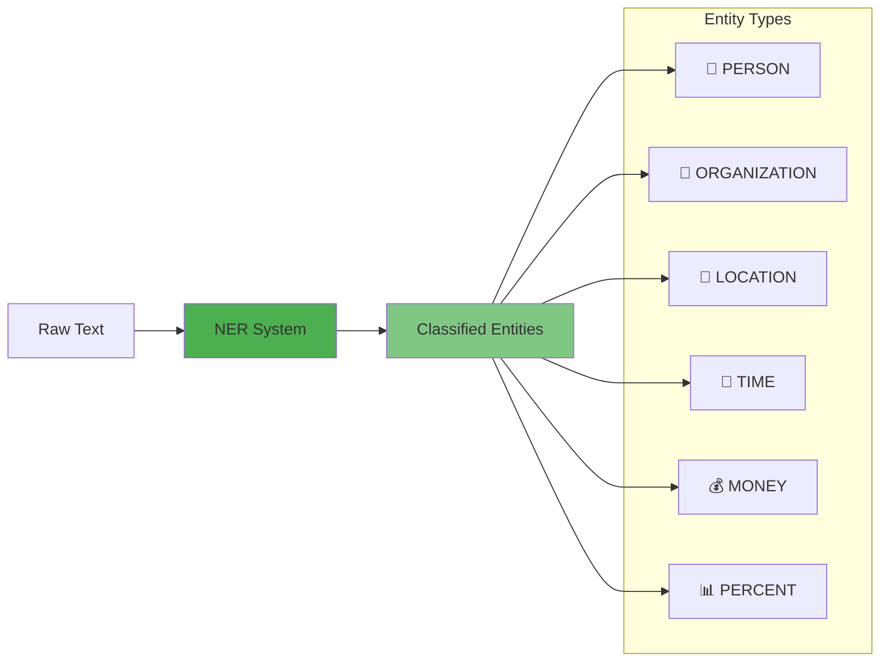

### Real-World Example: Breaking Down a Sentence

Let's analyze a concrete example:

> **"The French people are visiting Morocco for Christmas."**

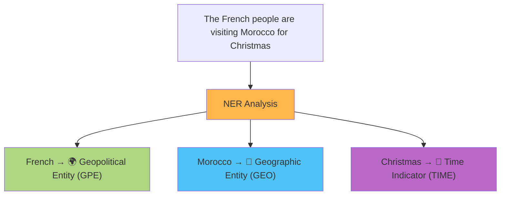

### Real-Life Analogy: The Digital Highlighter 🖍️

Think of NER as a **smart highlighter** that automatically color-codes important information in text:

- **Yellow** 🟨 for people's names
- **Blue** 🟦 for locations
- **Green** 🟩 for organizations
- **Pink** 🟪 for dates and times
- **Orange** 🟧 for monetary values

Just like how you might highlight key information while studying, NER automatically identifies and categorizes the most important entities in any text.

## Why NER Matters: Real-World Applications

### 1. 🔍 **Search Engines**

When you search for "Apple CEO", search engines use NER to understand:

- "Apple" → Organization
- "CEO" → Role/Title
- Returns results about Tim Cook, not fruit company executives

### 2. 📰 **News Aggregation**

Automatically categorize articles by:

- Key people mentioned
- Countries involved
- Companies discussed
- Time periods referenced

### 3. 💼 **Business Intelligence**

Extract competitive intelligence from web content:

```bash
# Example: Market Research Pipeline
echo "Analyzing 10,000 articles..." | \
ner_extract --entities ORG,PERSON | \
filter --company "Tesla" | \
aggregate --by sentiment
```

### 4. 🏥 **Healthcare**

Extract critical information from medical records:

- Patient names
- Medication names
- Dosage amounts
- Treatment dates

### 5. 🤖 **Virtual Assistants**

When you say: _"Book a flight to Paris next Friday"_

- "Paris" → Destination (LOCATION)
- "next Friday" → Date (TIME)
- Action → Book flight

## The Power Tool: Long Short-Term Memory (LSTM)

### Why LSTMs for NER?

Traditional RNNs struggle with NER because:

- **Context matters**: "Washington" could be a person, state, or capital
- **Long-range dependencies**: Entity types often depend on distant context
- **Sequential nature**: Names often span multiple tokens

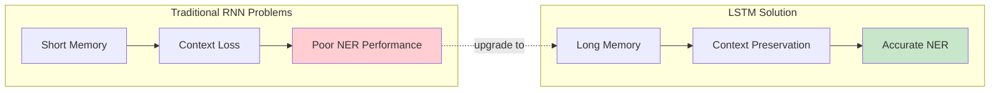

### LSTM Superpowers 🦸

LSTMs bring special capabilities perfect for NER:

1. **📦 Memory Cells**: Store information about entity context
2. **🚪 Gating Mechanisms**: Selectively remember/forget information
3. **🔗 Long-Range Dependencies**: Connect "Bill" with "Gates" even with words in between
4. **🎯 Precision**: Better boundary detection for multi-word entities

## What You'll Build This Week

### The Complete NER Pipeline

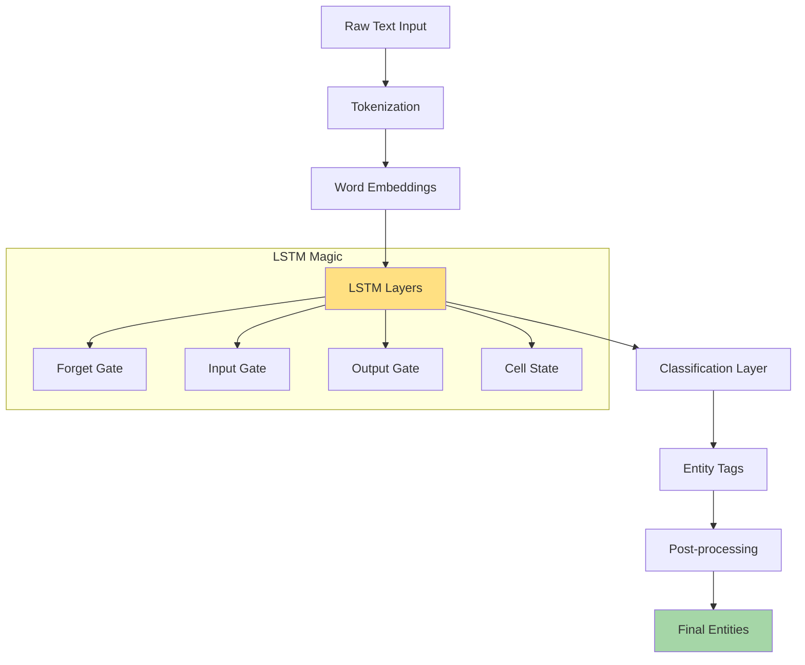

### Key Skills You'll Master

1. **🧠 Understanding Gradient Problems**

   - Why vanilla RNNs fail at long sequences
   - The mathematics of vanishing gradients
   - How gradient flow affects learning

2. **🏗️ LSTM Architecture**

   - Gate mechanisms and their functions
   - Cell state vs hidden state
   - Forward and backward propagation through LSTMs

3. **🏷️ NER Implementation**

   - Data preprocessing for sequence labeling
   - BIO tagging scheme
   - Handling multi-word entities

4. **📊 Performance Evaluation**
   - Precision, Recall, F1 for NER
   - Entity-level vs token-level metrics
   - Handling class imbalance

## Learning Path for the Week

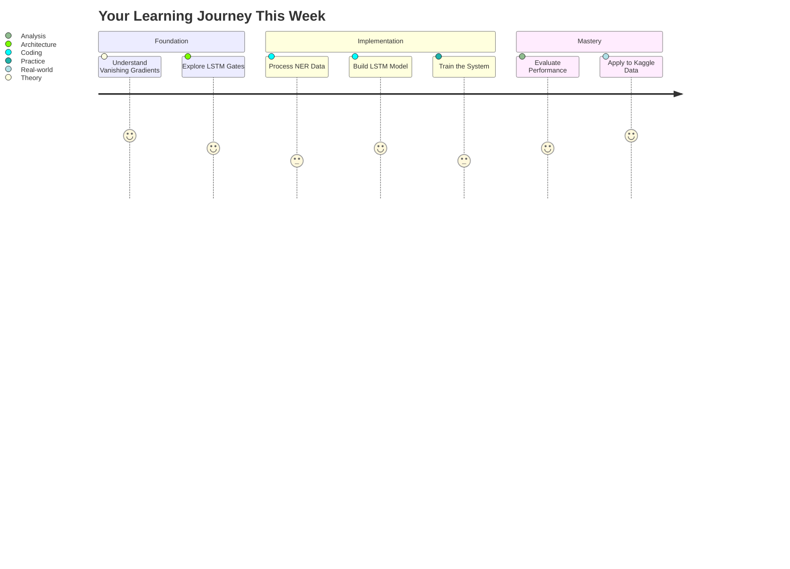

## Why This Week is Special

### 🎯 **Practical Impact**

You're not just learning theory - you're building systems that:

- Extract insights from unstructured text
- Power real business applications
- Form the backbone of modern NLP pipelines

### 🧩 **Connected Learning**

This week connects:

- **Previous knowledge**: RNNs and sequence modeling
- **Current focus**: Advanced architectures and applications
- **Future topics**: Attention mechanisms and transformers

### 💡 **Industry Relevance**

NER with LSTMs is used by:

- Google for Knowledge Graph construction
- Amazon for product information extraction
- Healthcare systems for patient record analysis
- Financial institutions for document processing

## Get Ready to Extract Information Like a Pro!

By the end of this week, you'll be able to:

- ✅ Build production-ready NER systems
- ✅ Understand why LSTMs revolutionized sequence modeling
- ✅ Apply these techniques to real Kaggle datasets
- ✅ Debug and optimize sequence models effectively

**Let's dive in and start extracting valuable information from text!** 🚀

# 2. RNNs and Vanishing Gradients - Understanding the Challenge

## Overview: The Hidden Problem in Deep Learning

Welcome to one of the most fundamental challenges in training recurrent neural networks. This section explores why conventional RNNs struggle with long sequences and introduces the **vanishing and exploding gradient problems** - critical issues that held back sequence modeling for years until LSTMs provided an elegant solution.

## The Pros and Cons of Vanilla RNNs

### Advantages of RNNs 🌟

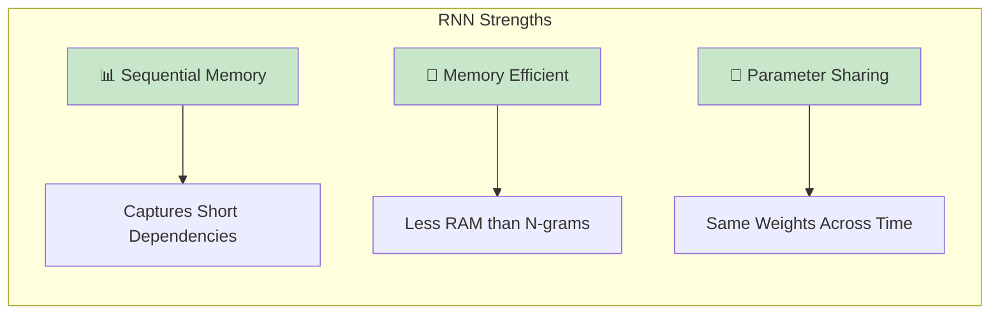

1. **Short-term Dependencies**: RNNs excel at remembering recent information
2. **Lightweight Architecture**: More efficient than storing all n-gram combinations
3. **Parameter Sharing**: Uses same weights across all time steps

### Disadvantages of RNNs ⚠️

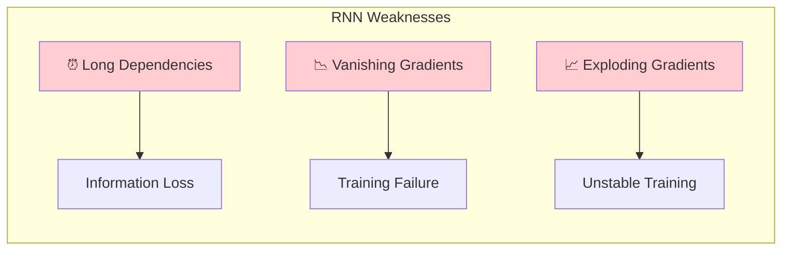

## Real-Life Analogy: The Telephone Game 📞

Imagine playing **telephone** (Chinese whispers) with 20 people in a line:

1. **Person 1** whispers: "The cat sat on the mat"
2. **Person 10** hears: "The cat... on the..."
3. **Person 20** hears: "The... the..."

Each person represents a time step in the RNN. Just like how the message degrades as it passes through more people, **information from early time steps fades** as it propagates through the network.

## How Information Flows in RNNs

### Forward Propagation Visualization

```bash
# Information flow through time steps (color intensity = information strength)
# █ = Strong signal, ▓ = Medium signal, ░ = Weak signal, · = Almost gone

Time Step 1:  [█████] "The"     → Contributes 100% information
              ↓ W_h
Time Step 2:  [███▓▓] "cat"     → Original: 60% remaining
              ↓ W_h
Time Step 3:  [██▓░░] "sat"     → Original: 35% remaining
              ↓ W_h
Time Step 4:  [█▓░··] "on"      → Original: 20% remaining
              ↓ W_h
Time Step 5:  [▓░···] "the"     → Original: 10% remaining
              ↓ W_h
Time Step 6:  [░····] "mat"     → Original: 5% remaining
              ↓
Output:       [?????] Prediction → Barely remembers "The"!
```

### The Mathematical Reality

At each time step, the hidden state is computed as:

$$h_t = \tanh(W_h \cdot h_{t-1} + W_x \cdot x_t + b)$$

The key insight: **We multiply by $W_h$ at every step**, creating a chain of multiplications.

## The Gradient Flow Problem

### Backpropagation Through Time (BPTT)

When we compute gradients, we apply the chain rule repeatedly:

$$\frac{\partial L}{\partial W_h} = \sum_{k=1}^{T} \frac{\partial L}{\partial h_T} \cdot \prod_{j=k}^{T-1} \frac{\partial h_{j+1}}{\partial h_j} \cdot \frac{\partial h_k}{\partial W_h}$$

The critical term: $\prod_{j=k}^{T-1} \frac{\partial h_{j+1}}{\partial h_j}$ is a **product of many terms**.

### The Multiplication Catastrophe

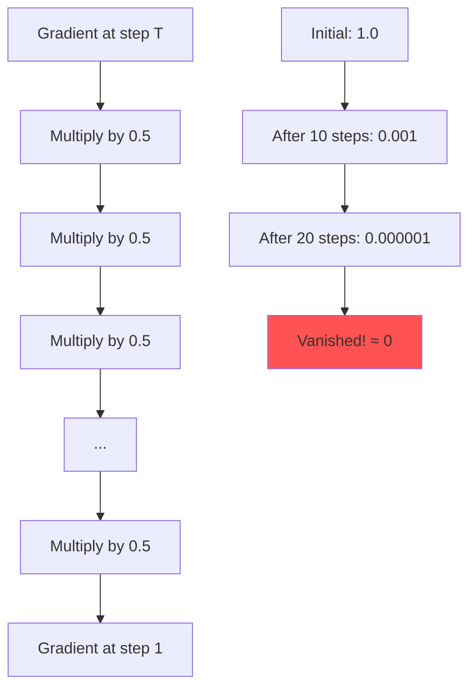

## Why Gradients Vanish: The Bounded Activation Problem

### Activation Function Bounds

```bash
# Sigmoid and Tanh activation ranges and their derivatives

SIGMOID:  σ(x) ∈ (0, 1)          TANH: tanh(x) ∈ (-1, 1)
         σ'(x) ∈ (0, 0.25]              tanh'(x) ∈ (0, 1]

         1.0 ┤                          1.0 ┤
             │     ___________               │      _______
         0.5 ┤   /                      0.0 ┤    /
             │  /                            │   /
         0.0 ┤_/                       -1.0 ┤__/
             └────────────────               └────────────────
               -5    0    5                    -3    0    3

DERIVATIVES (The Real Problem):

      σ'(x) max = 0.25                tanh'(x) max = 1.0
           ↓                                 ↓
    After 10 multiplications:         After 10 multiplications:
    (0.25)^10 ≈ 0.00000095           (0.9)^10 ≈ 0.35

    Result: VANISHING GRADIENT!       Result: Still problematic!
```

### Real Example: Sentiment Analysis

Consider analyzing: **"Although the first half was boring, the movie became absolutely fantastic!"**

```bash
# Gradient strength flowing backward (right to left)
Word:        fantastic | absolutely | became | movie | the | was | boring | half | first | the | Although
Position:        11          10         9       8      7     6       5       4      3      2       1
Gradient:      [███]      [██▓]     [██░]   [█▓░]  [█░·]  [▓··]  [░···] [····] [····] [····] [····]
                100%        70%       50%     35%    25%    15%     8%     3%     1%    0.3%   0.01%

Problem: The word "boring" (negative sentiment) has almost NO gradient to update from the final prediction!
```

## The Exploding Gradient Problem

The opposite can also happen with gradients **greater than 1**:

```bash
# When derivatives > 1.0
Step 1:  Gradient = 1.5
Step 2:  Gradient = 1.5 × 1.5 = 2.25
Step 3:  Gradient = 2.25 × 1.5 = 3.375
Step 10: Gradient = 1.5^10 ≈ 57.7
Step 20: Gradient = 1.5^20 ≈ 3,325
Step 30: Gradient = 1.5^30 ≈ 191,751 💥 EXPLOSION!

Result: NaN values, training crash!
```

## Solutions to Gradient Problems

### 1. Identity RNN with ReLU Activation

```bash
# Identity Matrix Initialization
    ┌─────────────┐        ┌─────────────┐
    │ 1  0  0  0 │        │   ReLU      │
W = │ 0  1  0  0 │   +    │ Activation  │
    │ 0  0  1  0 │        │ (preserves  │
    │ 0  0  0  1 │        │  positives) │
    └─────────────┘        └─────────────┘

Effect: Gradient ≈ 1 for positive values
        -1 → 0 (ReLU clips negatives)
```

**How it helps**: Identity matrix acts like "1" in multiplication - preserves gradient magnitude

### 2. Gradient Clipping

```python
# Gradient clipping visualization
def clip_gradient(gradient, threshold=25):
    """
    Prevents explosion by capping maximum gradient
    """
    if gradient > threshold:
        return threshold
    elif gradient < -threshold:
        return -threshold
    return gradient

# Example:
# Original:  32 → Clipped: 25 ✓
# Original: -40 → Clipped: -25 ✓
# Original:  15 → Unchanged: 15 ✓
```

```bash
# Visual representation of gradient clipping
Before Clipping:          After Clipping (threshold=25):
     50 │    ▲                 25 │────────▲───
        │    │                     │        │
     25 │    │                     │        │
        │    │                     │        │
      0 │────┼────               0 │────────┼────
        │    │                     │        │
    -25 │    │                 -25 │────────▼───
        │    ▼
    -50 │
```

### 3. Skip Connections (Residual Connections)

```bash
# Skip Connection Architecture
     ┌─────────────────────────────────┐
     │                                 │
x ───┼──→ [Neural Layer] ──→ F(x) ──→ ⊕ ──→ F(x) + x
     │                                 │
     └─────────────────────────────────┘

Benefits:
1. Direct gradient path (bypass route)
2. Gradient = ∂F/∂x + 1 (always has "+1" component)
3. Information superhighway for early layers
```

## Practical Example: Name Recognition

Let's see how vanishing gradients affect a real NER task:

```python
# Sentence: "Bill Gates founded Microsoft in Seattle"
# Task: Recognize "Bill Gates" as PERSON

# Without gradient flow (vanilla RNN):
Position:  1      2        3        4         5      6
Word:     Bill   Gates   founded  Microsoft  in    Seattle
Gradient: [░···] [▓···]  [█░··]   [██▓·]    [███▓] [████]
          ↑                                          ↑
          Needs strong gradient                      Loss computed here
          but gets almost nothing!

# Problem: Can't learn that "Bill" starts a person name!
```

## The LSTM Solution Preview

LSTMs solve this with **gated memory cells** that create:

```bash
# LSTM's Secret: Multiple Paths
                 ┌──────────────────┐
                 │  Cell State C_t  │ ← Highway for gradients
                 └──────────────────┘
                          ⊕
     ┌────────┐  ┌──────────────────┐  ┌────────┐
x_t →│ Gates  │→ │  Hidden State h_t │ →│ Output │
     └────────┘  └──────────────────┘  └────────┘
                          ↑
                   Short-term memory

Key: Cell state provides uninterrupted gradient flow!
```

## Key Takeaways

### Understanding the Problem

1. **Vanishing Gradients** 📉

   - Caused by repeated multiplication of small values (<1)
   - Results in inability to learn long-range dependencies
   - Early time steps get near-zero gradients

2. **Exploding Gradients** 📈

   - Caused by repeated multiplication of large values (>1)
   - Results in unstable training and NaN values
   - Can crash training completely

3. **The Root Cause** 🎯
   - Bounded activation functions (sigmoid, tanh)
   - Long chains of multiplications in BPTT
   - Same weights applied repeatedly

### Quick Solutions (Band-aids)

| Solution            | Vanishing  | Exploding   | Limitation              |
| ------------------- | ---------- | ----------- | ----------------------- |
| Identity RNN + ReLU | ✅ Helps   | ❌ No help  | Only partial fix        |
| Gradient Clipping   | ❌ No help | ✅ Prevents | Doesn't solve vanishing |
| Skip Connections    | ✅ Helps   | ✅ Helps    | Architecture complexity |

### The Real Solution: LSTMs

**Next up**: How LSTMs elegantly solve both problems with their gated architecture, allowing networks to learn when to remember and when to forget!

## Summary

Vanilla RNNs face a fundamental mathematical challenge: maintaining gradient flow across long sequences. While band-aid solutions exist, they don't fully address the core issue. This sets the stage for LSTMs - the architecture that revolutionized sequence modeling by providing stable gradient highways through time.

**Remember**: The vanishing gradient problem isn't just theoretical - it's why your RNN might fail to understand that "not" at the beginning of a sentence negates everything that follows!

# 3. Introduction to LSTMs - The Solution to Long-Term Dependencies

## Overview: The Memory Revolution in Neural Networks

Welcome to the breakthrough moment in sequence modeling! **Long Short-Term Memory (LSTM)** networks represent one of the most important innovations in deep learning, solving the fundamental problems that plagued traditional RNNs. This section explores how LSTMs revolutionized our ability to learn from sequential data by introducing sophisticated **memory management mechanisms**.

## The Phone Call Analogy: Understanding LSTM Memory 📞

Let's revisit our phone call analogy from the transcript, but this time with LSTM superpowers:

### Traditional RNN Phone Call (Poor Memory)

```bash
Friend calls about weekend plans...

You (RNN): "What did you say at the beginning?"
Friend: "I mentioned the concert tickets..."
You: "Sorry, I can't remember that far back"
Result: Confused conversation, missed important details
```

### LSTM Phone Call (Smart Memory)

```bash
Friend calls about weekend plans...

You (LSTM):
- 🧠 Cell Memory: Stores "concert tickets" permanently
- 🚪 Forget Gate: "The old movie plan? Not relevant anymore"
- 🚪 Input Gate: "Concert info is important, store it!"
- 🚪 Output Gate: "Should I mention the concert now? Yes!"

Result: Perfect conversation with full context retention!
```

## What Makes LSTMs Special: The Architecture Overview

### Traditional RNN vs LSTM Comparison

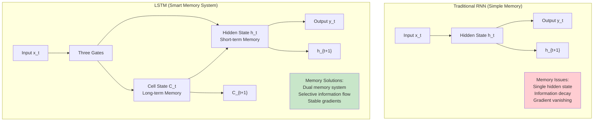

## The Dual Memory System: Cell State vs Hidden State

### Understanding the Two Types of Memory

**1. Cell State (C_t) - The Memory Highway 🛣️**

- **Purpose**: Long-term information storage
- **Behavior**: Information flows with minimal transformations
- **Analogy**: Your brain's long-term memory storage
- **Key Feature**: Gradient highway for stable backpropagation

**2. Hidden State (h_t) - The Working Memory 💭**

- **Purpose**: Short-term information processing
- **Behavior**: Filtered version of cell state for current use
- **Analogy**: Your conscious working memory
- **Key Feature**: What gets passed to the output layer

### Visual Memory Flow

```bash
# LSTM Memory Flow Visualization

Time Step t-1          Time Step t            Time Step t+1
    │                      │                      │
C_{t-1} ═══════════════> C_t ═══════════════> C_{t+1}    ← Cell State (Long-term)
    │     Forget  Input     │     Forget  Input     │      (Minimal transformation)
    │      Gate   Gate      │      Gate   Gate      │
    ↓        │      │       ↓        │      │       ↓
h_{t-1} ──→ [GATES] ────> h_t ──→ [GATES] ────> h_{t+1}   ← Hidden State (Working)
            ↓              ↓              ↓              (Heavy processing)
          y_{t-1}         y_t           y_{t+1}          ← Outputs

Legend:
═══ : Highway (smooth gradient flow)
─── : Regular path (processed information)
```

## The Three Gates: LSTM's Traffic Controllers 🚦

### Gate Mechanism Overview

Each LSTM unit contains three neural network gates that control information flow:

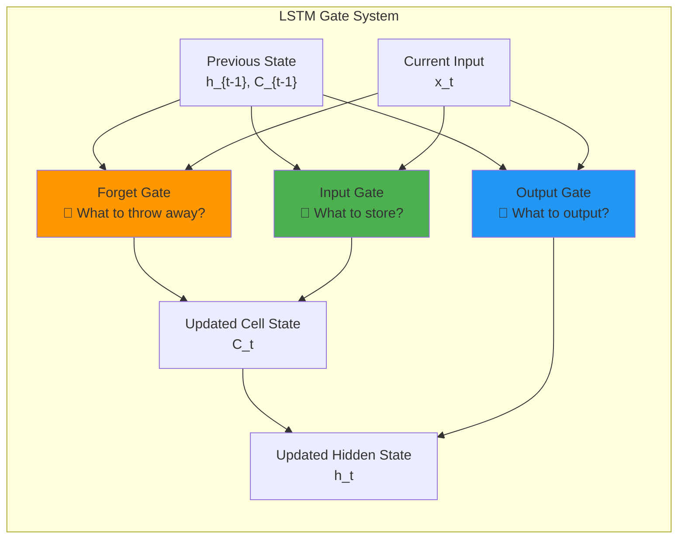

### 1. Forget Gate: The Memory Eraser 🗑️

**Purpose**: Decide what information to throw away from the cell state

**Mathematical Formulation**:
$$f_t = \sigma(W_f \cdot [h_{t-1}, x_t] + b_f)$$

**Real-World Example**: Language Translation

```bash
Input: "The cat, which was black, ran"
                ↓
Forget Gate Decision:
- "cat" (subject) → Keep (f_t = 0.9)
- "which was black" (descriptor) → Partially forget (f_t = 0.3)
- Reason: Focus on main action, not all details
```

**What the Math Means**:

- **Output range**: [0, 1] (sigmoid activation)
- **f_t = 0**: "Completely forget this information"
- **f_t = 1**: "Keep all this information"
- **f_t = 0.5**: "Keep half the information"

### 2. Input Gate: The Information Filter 📥

**Purpose**: Decide what new information to store in the cell state

**Mathematical Components**:
$$i_t = \sigma(W_i \cdot [h_{t-1}, x_t] + b_i)$$
$$\tilde{C_t} = \tanh(W_C \cdot [h_{t-1}, x_t] + b_C)$$

**Real-World Example**: Sentiment Analysis

```bash
Previous context: "The movie was"
New input: "absolutely fantastic"
                ↓
Input Gate Decision:
- i_t = 0.95 (very high) → This is important sentiment information
- C̃_t = 0.8 → Strong positive sentiment candidate
- Result: Store strong positive sentiment in memory
```

**Two-Step Process**:

1. **Gate (i_t)**: How much should we care about the new info?
2. **Candidate (C̃_t)**: What is the new information we might add?

### 3. Output Gate: The Response Controller 📤

**Purpose**: Decide what parts of the cell state to output

**Mathematical Formulation**:
$$o_t = \sigma(W_o \cdot [h_{t-1}, x_t] + b_o)$$
$$h_t = o_t \cdot \tanh(C_t)$$

**Real-World Example**: Question Answering

```bash
Question: "What color was the cat?"
Cell State: Contains [cat=black, dog=brown, car=red]
                ↓
Output Gate Decision:
- o_t focuses on cat-related information (0.9 for cat, 0.1 for others)
- h_t emphasizes "black" for the response
- Final answer: "The cat was black"
```

## The Complete LSTM Forward Pass

### Step-by-Step Information Flow

```python
# Conceptual LSTM Forward Pass (simplified)

def lstm_step(x_t, h_prev, C_prev, W_f, W_i, W_C, W_o, b_f, b_i, b_C, b_o):
    """
    Single LSTM time step
    """
    # Combine previous hidden state and current input
    combined = concat([h_prev, x_t])

    # 1. FORGET GATE: What to throw away?
    f_t = sigmoid(W_f @ combined + b_f)

    # 2. INPUT GATE: What to store?
    i_t = sigmoid(W_i @ combined + b_i)
    C_candidate = tanh(W_C @ combined + b_C)

    # 3. UPDATE CELL STATE: Combine forget and input
    C_t = f_t * C_prev + i_t * C_candidate

    # 4. OUTPUT GATE: What to output?
    o_t = sigmoid(W_o @ combined + b_o)
    h_t = o_t * tanh(C_t)

    return h_t, C_t
```

### Information Flow Diagram

```bash
# Detailed LSTM Information Flow

Input: x_t, h_{t-1}, C_{t-1}
          │
          ▼
    ┌─────────────┐
    │  Combine    │  [h_{t-1}, x_t] → Combined input vector
    └─────┬───────┘
          │
          ├────────────────────────────────┐
          │                                │
          ▼                                ▼
    ┌─────────────┐                  ┌─────────────┐
    │ Forget Gate │ f_t = σ(...)     │ Input Gate  │ i_t = σ(...)
    │    🗑️        │                  │     📥       │ C̃_t = tanh(...)
    └─────┬───────┘                  └─────┬───────┘
          │                                │
          ▼                                ▼
          f_t ──────┐        ┌────────── i_t * C̃_t
                    │        │
                    ▼        ▼
              ┌─────────────────┐
              │ Cell State      │ C_t = f_t * C_{t-1} + i_t * C̃_t
              │ Update  🧠      │
              └─────┬───────────┘
                    │
                    ▼
              ┌─────────────────┐
              │ Output Gate     │ o_t = σ(...)
              │      📤         │ h_t = o_t * tanh(C_t)
              └─────┬───────────┘
                    │
                    ▼
              Output: h_t, C_t
```

## Why LSTM Solves Gradient Problems

### The Gradient Highway

**Key Insight**: The cell state acts as a "gradient highway" that allows information to flow with minimal transformation.

**Gradient Flow Comparison**:

**Traditional RNN Gradients**:
$\frac{\partial L}{\partial W_1} \propto \prod_{i} \frac{\partial h_i}{\partial h_{i-1}} = (0.25)^T$

↳ Many small derivatives multiply, vanishes exponentially with sequence length T

**LSTM Cell State Gradients**:
$\frac{\partial L}{\partial C_i} \propto \prod_{j} f_j \approx (0.8)^T$

↳ Only forget gate values multiply, much more stable (forget gates often > 0.8)

### Mathematical Advantage

**Traditional RNN**:
$\frac{\partial h_t}{\partial h_{t-1}} = \text{diag}(\sigma'(W_h h_{t-1} + W_x x_t)) \cdot W_h$

**LSTM Cell State**:
$\frac{\partial C_t}{\partial C_{t-1}} = f_t$

**Why this matters**:

- RNN derivative involves activation derivative × weight matrix
- LSTM derivative is just the forget gate (designed to be close to 1)
- Result: Stable gradient flow across many time steps

## Real-World LSTM Applications

### 1. Language Modeling 📝

```bash
Task: Predict next word in "The cat sat on the..."

LSTM Memory Management:
- Cell State: Remembers "cat" is the subject
- Forget Gate: Discards irrelevant previous context
- Input Gate: Stores "on the" as important spatial info
- Output Gate: Focuses on location words
- Prediction: "mat", "couch", "floor" (high probability)
```

### 2. Machine Translation 🌐

```bash
English→French: "The red car is fast" → "La voiture rouge est rapide"

LSTM Processing:
- Encoder LSTM: Processes English sentence
  - Stores: [red, car, fast] in cell state
  - Grammar: [singular, present tense] patterns

- Decoder LSTM: Generates French output
  - Retrieves: Color, object, attribute from memory
  - Applies: French grammar rules
  - Outputs: Correct French word order
```

### 3. Sentiment Analysis 💭

```bash
Review: "The movie started slow, but the ending was absolutely phenomenal!"

LSTM Analysis:
- Early: Stores "started slow" (negative)
- Middle: Forget gate reduces weight of early negative sentiment
- Late: Input gate emphasizes "absolutely phenomenal" (strong positive)
- Final: Output weighted toward positive sentiment
- Result: Positive classification (correct!)
```

### 4. Speech Recognition 🗣️

```bash
Audio: "How are you today?"

LSTM Processing:
- Cell State: Maintains phoneme context across time
- Handles: Variations in speaking speed, accent
- Connects: Sound patterns to word boundaries
- Output: Accurate text transcription
```

## LSTM vs Traditional RNN: Capability Comparison

### Memory Span Comparison

```bash
Task: Remember information across 100 time steps

Traditional RNN:
Steps 1-10:    [████████] 80% information retained
Steps 11-30:   [████░░░░] 50% information retained
Steps 31-60:   [██░░░░░░] 25% information retained
Steps 61-100:  [▒░░░░░░░] <5% information retained ❌

LSTM:
Steps 1-10:    [████████] 95% information retained
Steps 11-30:   [███████▓] 90% information retained
Steps 31-60:   [██████▓▓] 85% information retained
Steps 61-100:  [█████▓▓▓] 75% information retained ✅
```

### Learning Capacity

| Task Type                          | Traditional RNN | LSTM         | Improvement   |
| ---------------------------------- | --------------- | ------------ | ------------- |
| **Short sequences (< 10 steps)**   | ✅ Good         | ✅ Excellent | Minor         |
| **Medium sequences (10-50 steps)** | ⚠️ Struggles    | ✅ Good      | Significant   |
| **Long sequences (50+ steps)**     | ❌ Fails        | ✅ Capable   | Revolutionary |
| **Complex dependencies**           | ❌ Limited      | ✅ Strong    | Game-changing |

## Implementation Considerations

### Computational Complexity

**Parameter Count Comparison**:

For hidden size $h$ and input size $d$:

$\text{RNN parameters} = h \times (h + d + 1) \approx h^2$

$\text{LSTM parameters} = 4 \times h \times (h + d + 1) \approx 4h^2$

**Example** with $h=128$, $d=100$:

- RNN: $128 \times 229 = 29,312$ parameters
- LSTM: $4 \times 29,312 = 117,248$ parameters (4× increase)

**Training Time**:

- LSTMs are ~4x slower than vanilla RNNs
- But the performance gains usually justify the cost
- Modern hardware (GPUs) handle the parallelization well

### Memory Requirements

```bash
Memory Usage per LSTM Cell:
- Cell State (C_t): h dimensions
- Hidden State (h_t): h dimensions
- 3 Gate outputs: 3h dimensions
- Intermediate calculations: ~2h dimensions
Total: ~7h memory units per time step
```

## Key Architectural Innovations

### 1. Additive Cell State Updates

**Traditional RNN**:
$h_t = f(W \cdot h_{t-1} + U \cdot x_t) \quad \text{← Multiplicative (lossy)}$

**LSTM Cell**:
$C_t = f_t \odot C_{t-1} + i_t \odot \tilde{C_t} \quad \text{← Additive (preserving)}$

### 2. Sigmoid Gate Activations

- **Range**: [0, 1] - perfect for "how much" decisions
- **Interpretability**: 0 = block all, 1 = allow all
- **Gradient friendly**: Less saturation than tanh in gate context

### 3. Separate Read/Write Operations

- **Write**: Input gate controls what goes into memory
- **Read**: Output gate controls what comes out of memory
- **Erase**: Forget gate controls what gets removed
- **Result**: Fine-grained memory management

## Summary: Why LSTMs Changed Everything

### The Breakthrough Achievements

**1. Solved the Vanishing Gradient Problem** 🎯

- Cell state provides gradient highway
- Enables learning from sequences 100+ steps long
- Revolutionary for language modeling and time series

**2. Introduced Selective Memory** 🧠

- Learn what to remember and what to forget
- Handle irrelevant information gracefully
- Focus computational resources on important patterns

**3. Enabled Complex Sequence Understanding** 🔗

- Capture long-range dependencies
- Understand context and temporal relationships
- Support sophisticated sequential reasoning

**4. Practical Impact** 🚀

- Made modern NLP applications possible
- Enabled real-time speech recognition
- Powered early machine translation systems
- Foundation for attention mechanisms

### From RNNs to LSTMs: The Evolution

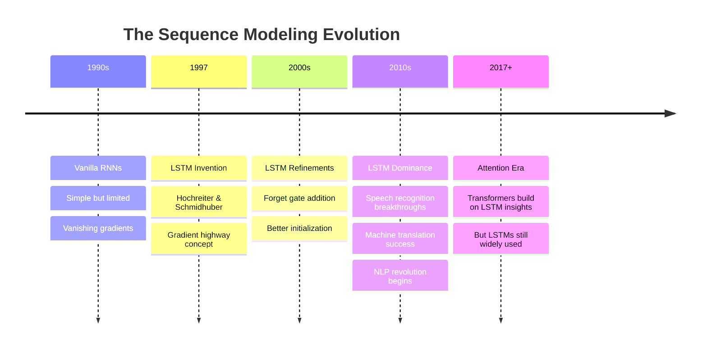

### Looking Forward

While **Transformers** and **Attention mechanisms** have largely superseded LSTMs for many NLP tasks, understanding LSTMs remains crucial because:

1. **Foundation Knowledge**: Core concepts carry forward to modern architectures
2. **Specific Applications**: LSTMs still excel in certain domains (time series, streaming data)
3. **Resource Constraints**: More efficient than Transformers for smaller models
4. **Educational Value**: Perfect stepping stone to understand sequence modeling

**Next Up**: We'll dive deeper into the mathematical details of LSTM architecture and see exactly how each gate mechanism works in practice!

# 4. LSTM Architecture - Gates and Memory Cells

## Overview: Inside the LSTM Cell

Now that we understand the conceptual power of LSTMs, let's dive deep into the **mathematical machinery** that makes it all work. This section explores the detailed architecture of a single LSTM cell, breaking down every computation, gate mechanism, and information flow that enables LSTMs to maintain long-term memory while learning complex sequential patterns.

## The Complete LSTM Architecture Diagram

The architecture can look intimidating at first, but once you understand each component, it becomes an elegant solution to sequence modeling:

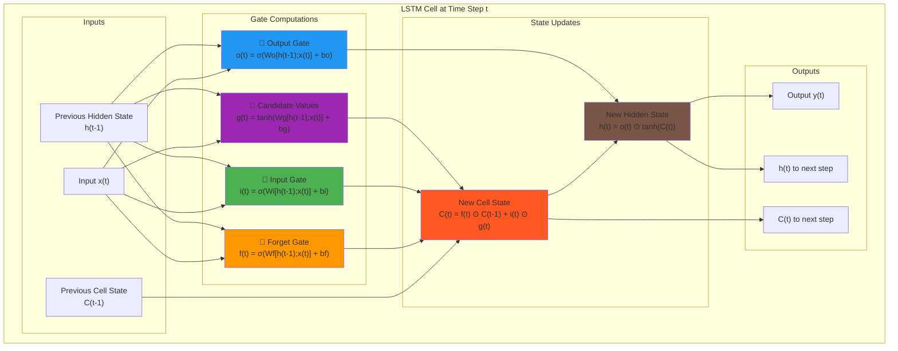

## The Six Core LSTM Equations

Let's break down each mathematical component that drives LSTM computation:

### Input Concatenation

Before any gate computations, we combine the current input with the previous hidden state:

$$\text{Combined Input} = [h^{\langle t-1 \rangle}; x^{\langle t \rangle}]$$

Where `;` denotes concatenation, creating a single vector containing both previous context and current information.

### 1. Forget Gate: Deciding What to Discard 🗑️

$$f^{\langle t \rangle} = \sigma(W_f [h^{\langle t-1 \rangle}; x^{\langle t \rangle}] + b_f)$$

**Purpose**: Determines which information from the previous cell state to throw away.

**Components**:

- $W_f$: Forget gate weight matrix
- $b_f$: Forget gate bias vector
- $\sigma$: Sigmoid activation (outputs between 0 and 1)

**Interpretation**:

- $f^{\langle t \rangle} = 0$: "Completely forget this information"
- $f^{\langle t \rangle} = 1$: "Keep all this information"
- $f^{\langle t \rangle} = 0.3$: "Keep 30% of this information"

**Example**: In language modeling, when encountering a new subject, the forget gate might discard information about the previous subject.

```python
# Conceptual example for "The cat ran. The dog jumped."
# When processing "dog":
forget_gate_output = [0.1, 0.9, 0.2, 0.8]  # Low values forget "cat" info
```

### 2. Input Gate: Selecting New Information 📥

$$i^{\langle t \rangle} = \sigma(W_i [h^{\langle t-1 \rangle}; x^{\langle t \rangle}] + b_i)$$

**Purpose**: Determines which values from the candidate information we'll update in the cell state.

**Components**:

- $W_i$: Input gate weight matrix
- $b_i$: Input gate bias vector
- Output range: [0, 1] via sigmoid activation

**Role**: Acts as a filter to decide which candidate values are important enough to store in memory.

### 3. Candidate Values: New Information Content 📝

$$g^{\langle t \rangle} = \tanh(W_g [h^{\langle t-1 \rangle}; x^{\langle t \rangle}] + b_g)$$

**Purpose**: Creates candidate values that could be added to the cell state.

**Components**:

- $W_g$: Candidate generation weight matrix
- $b_g$: Candidate generation bias vector
- $\tanh$: Hyperbolic tangent activation (outputs between -1 and 1)

**Why tanh?**:

- Provides both positive and negative candidate values
- Zero-centered output helps with gradient flow
- Traditional choice that works well in practice

**Note**: The candidate values represent _what_ we might want to add, while the input gate decides _how much_ of it to actually add.

### 4. Cell State Update: The Memory Core 🧠

$$C^{\langle t \rangle} = f^{\langle t \rangle} \odot C^{\langle t-1 \rangle} + i^{\langle t \rangle} \odot g^{\langle t \rangle}$$

**Purpose**: Updates the cell state by combining old memory (filtered) with new information (gated).

**Components**:

- $\odot$: Element-wise multiplication (Hadamard product)
- First term: $f^{\langle t \rangle} \odot C^{\langle t-1 \rangle}$ (what to keep from old memory)
- Second term: $i^{\langle t \rangle} \odot g^{\langle t \rangle}$ (what new info to add)

**Key Insight**: This is an **additive update** rather than multiplicative, which helps preserve gradient flow:

```python
# Conceptual breakdown
old_memory_kept = forget_gate * previous_cell_state
new_memory_added = input_gate * candidate_values
updated_memory = old_memory_kept + new_memory_added
```

### 5. Output Gate: Controlling Information Flow 📤

$$o^{\langle t \rangle} = \sigma(W_o [h^{\langle t-1 \rangle}; x^{\langle t \rangle}] + b_o)$$

**Purpose**: Decides which parts of the cell state to output in the hidden state.

**Components**:

- $W_o$: Output gate weight matrix
- $b_o$: Output gate bias vector
- Range: [0, 1] via sigmoid activation

**Role**: Controls what information from the updated cell state should influence the current output and be passed to the next time step.

### 6. Hidden State Output: The Working Memory 💭

$$h^{\langle t \rangle} = o^{\langle t \rangle} \odot \tanh(C^{\langle t \rangle})$$

**Purpose**: Produces the hidden state that serves as both output and input to the next time step.

**Components**:

- $\tanh(C^{\langle t \rangle})$: Squashes cell state values to [-1, 1]
- $o^{\langle t \rangle}$: Gates which parts of the cell state to expose

**Why $\tanh(C^{\langle t \rangle})$?**:

- Normalizes the cell state values
- Prevents the hidden state from becoming too large
- Some implementations skip this and use $C^{\langle t \rangle}$ directly

## Step-by-Step Computational Flow

Let's trace through a complete forward pass with concrete dimensions:

### Setup: Dimensions and Parameters

```python
# Example dimensions
batch_size = 32
input_size = 100      # x^⟨t⟩ dimension
hidden_size = 128     # h^⟨t⟩ and C^⟨t⟩ dimension
sequence_length = 50  # Number of time steps

# Parameter matrices (all have the same structure)
W_f = torch.randn(hidden_size, hidden_size + input_size)  # (128, 228)
W_i = torch.randn(hidden_size, hidden_size + input_size)  # (128, 228)
W_g = torch.randn(hidden_size, hidden_size + input_size)  # (128, 228)
W_o = torch.randn(hidden_size, hidden_size + input_size)  # (128, 228)

# Bias vectors
b_f = torch.randn(hidden_size)  # (128,)
b_i = torch.randn(hidden_size)  # (128,)
b_g = torch.randn(hidden_size)  # (128,)
b_o = torch.randn(hidden_size)  # (128,)
```

### Step 1: Input Preparation

```python
# At time step t
x_t = torch.randn(batch_size, input_size)        # Current input (32, 100)
h_prev = torch.randn(batch_size, hidden_size)    # Previous hidden (32, 128)
C_prev = torch.randn(batch_size, hidden_size)    # Previous cell (32, 128)

# Concatenate inputs
combined = torch.cat([h_prev, x_t], dim=1)       # (32, 228)
```

### Step 2: Gate Computations

```python
# Forget gate
f_t = torch.sigmoid(torch.mm(combined, W_f.t()) + b_f)  # (32, 128)

# Input gate
i_t = torch.sigmoid(torch.mm(combined, W_i.t()) + b_i)  # (32, 128)

# Candidate values
g_t = torch.tanh(torch.mm(combined, W_g.t()) + b_g)     # (32, 128)

# Output gate
o_t = torch.sigmoid(torch.mm(combined, W_o.t()) + b_o)  # (32, 128)
```

### Step 3: State Updates

```python
# Update cell state
C_t = f_t * C_prev + i_t * g_t                          # (32, 128)

# Update hidden state
h_t = o_t * torch.tanh(C_t)                             # (32, 128)
```

## Information Flow Analysis

### The Two Memory Streams

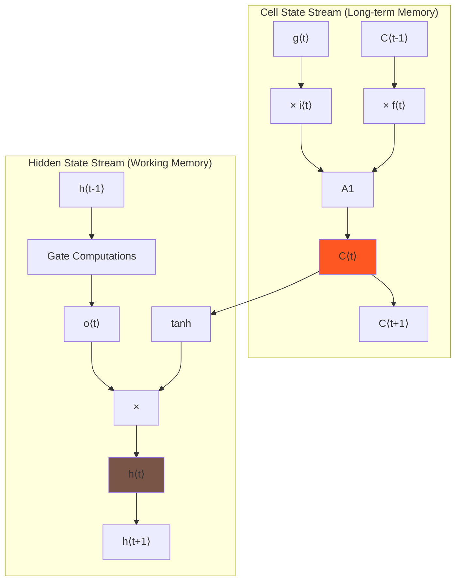

### Gate Activation Patterns

**Typical Gate Values in Practice**:

```python
# Example gate activations during training
forget_gate = [0.8, 0.9, 0.1, 0.7]  # Mostly keeping information
input_gate =  [0.2, 0.1, 0.9, 0.3]  # Selective about new info
output_gate = [0.6, 0.8, 0.4, 0.9]  # Moderate output filtering

# Key insight: Gates tend toward 0 or 1, acting as binary switches
```

## Real-World Example: Sentiment Analysis

Let's trace through how an LSTM processes the sentence: **"The movie was terrible, but the ending was amazing!"**

### Token-by-Token Processing

**Time Step 1: "The"**

```python
# Gates learn this is just an article - not much semantic content
f_t = [0.9, 0.8, 0.7, ...]  # Keep most previous context
i_t = [0.1, 0.2, 0.1, ...]  # Don't store much about "the"
g_t = [0.1, -0.1, 0.0, ...] # Weak candidate values
o_t = [0.3, 0.4, 0.2, ...]  # Low output since not meaningful
```

**Time Step 4: "terrible"**

```python
# Strong negative sentiment detected
f_t = [0.6, 0.7, 0.8, ...]  # Moderate forgetting of neutral context
i_t = [0.8, 0.9, 0.7, ...]  # High input - important sentiment!
g_t = [-0.8, -0.9, -0.6, ...] # Strong negative candidates
o_t = [0.7, 0.8, 0.6, ...]  # Output this sentiment information
```

**Time Step 6: "but"**

```python
# Conjunction signals sentiment reversal coming
f_t = [0.3, 0.2, 0.4, ...]  # Start forgetting previous sentiment
i_t = [0.6, 0.7, 0.5, ...]  # Moderate input for transition word
g_t = [0.0, 0.1, -0.1, ...] # Neutral candidates
o_t = [0.5, 0.4, 0.6, ...]  # Moderate output during transition
```

**Time Step 9: "amazing"**

```python
# Strong positive sentiment overwrites negative
f_t = [0.1, 0.0, 0.2, ...]  # Heavily forget negative sentiment
i_t = [0.9, 0.8, 0.9, ...]  # High input for positive sentiment
g_t = [0.9, 0.8, 0.7, ...]  # Strong positive candidates
o_t = [0.8, 0.9, 0.7, ...]  # Output strong positive sentiment
```

### Final Cell State Analysis

```python
# Final cell state contains:
C_final = [
    0.1,   # Trace of "terrible" (mostly forgotten)
    0.8,   # Strong "amazing" sentiment
    0.7,   # Overall positive conclusion
    0.2,   # Context about movie review
    ...
]

# Final hidden state (what gets output):
h_final = o_final * tanh(C_final) = [0.08, 0.64, 0.56, 0.16, ...]
# Result: Positive sentiment classification ✓
```

## Architectural Variations and Design Choices

### Alternative Activation Functions

While sigmoid and tanh are standard, researchers have experimented with alternatives:

```python
# Standard LSTM gates
f_t = torch.sigmoid(...)  # Range: [0, 1]
i_t = torch.sigmoid(...)  # Range: [0, 1]
o_t = torch.sigmoid(...)  # Range: [0, 1]
g_t = torch.tanh(...)     # Range: [-1, 1]

# Alternative: ReLU-based gates (less common)
f_t = torch.clamp(torch.relu(...), max=1.0)  # Clipped ReLU
g_t = torch.relu(...)                        # ReLU candidates
```

### Peephole Connections

Some LSTM variants add "peephole connections" that let gates see the cell state directly:

$$f^{\langle t \rangle} = \sigma(W_f [h^{\langle t-1 \rangle}; x^{\langle t \rangle}] + W_{pf} C^{\langle t-1 \rangle} + b_f)$$

Where $W_{pf}$ provides direct cell state access to the forget gate.

### Coupled Forget/Input Gates

Some implementations couple the forget and input gates:

$$i^{\langle t \rangle} = 1 - f^{\langle t \rangle}$$

This ensures that when we forget something, we're more likely to input new information.

## Implementation Considerations

### Efficient Matrix Operations

Modern implementations combine all gate computations into a single matrix multiplication:

```python
# Efficient implementation
combined_weights = torch.cat([W_f, W_i, W_g, W_o], dim=0)  # (512, 228)
combined_bias = torch.cat([b_f, b_i, b_g, b_o])           # (512,)

# Single matrix multiplication
all_gates = torch.mm(combined_input, combined_weights.t()) + combined_bias

# Split outputs
hidden_size = 128
f_t = torch.sigmoid(all_gates[:, :hidden_size])
i_t = torch.sigmoid(all_gates[:, hidden_size:2*hidden_size])
g_t = torch.tanh(all_gates[:, 2*hidden_size:3*hidden_size])
o_t = torch.sigmoid(all_gates[:, 3*hidden_size:])
```

### Gradient Flow Properties

The key to LSTM's success lies in its gradient flow characteristics:

**Cell State Gradient**:
$$\frac{\partial C^{\langle t \rangle}}{\partial C^{\langle t-1 \rangle}} = f^{\langle t \rangle}$$

**Hidden State Gradient** (more complex):
$$\frac{\partial h^{\langle t \rangle}}{\partial h^{\langle t-1 \rangle}} = \frac{\partial h^{\langle t \rangle}}{\partial C^{\langle t \rangle}} \frac{\partial C^{\langle t \rangle}}{\partial h^{\langle t-1 \rangle}} + \frac{\partial h^{\langle t \rangle}}{\partial f^{\langle t \rangle}} \frac{\partial f^{\langle t \rangle}}{\partial h^{\langle t-1 \rangle}} + ...$$

**Key Advantage**: The cell state gradient depends only on the forget gate values, which are typically close to 1, providing stable gradient flow.

## Debugging and Visualization

### Gate Monitoring During Training

```python
def analyze_gate_statistics(f_t, i_t, o_t, g_t):
    """
    Monitor gate behavior during training
    """
    stats = {
        'forget_mean': torch.mean(f_t).item(),
        'forget_std': torch.std(f_t).item(),
        'input_mean': torch.mean(i_t).item(),
        'input_std': torch.std(i_t).item(),
        'output_mean': torch.mean(o_t).item(),
        'output_std': torch.std(o_t).item(),
        'candidate_mean': torch.mean(g_t).item(),
        'candidate_std': torch.std(g_t).item(),
    }

    # Healthy LSTM characteristics:
    # - Forget gates mostly > 0.5 (preserving information)
    # - Input gates selective (high variance)
    # - Output gates moderate (around 0.5-0.7)
    # - Candidates well-distributed around 0

    return stats
```

### Common Issues and Solutions

**Problem**: All gates outputting similar values

- **Cause**: Poor weight initialization
- **Solution**: Use Xavier/Glorot initialization

**Problem**: Forget gates always near 1.0

- **Cause**: Forget bias initialized too high
- **Solution**: Initialize forget bias to 1.0, others to 0.0

**Problem**: Exploding gradients despite LSTM

- **Cause**: Large weight matrices or learning rate
- **Solution**: Gradient clipping and learning rate reduction

## Summary: The LSTM Mathematical Foundation

### Core Architectural Insights

**1. Gated Information Flow** 🚪

- Three gates (forget, input, output) control information flow
- Sigmoid activations provide smooth [0,1] gating values
- Gates learn to act as binary switches in practice

**2. Dual Memory System** 🧠

- Cell state: Long-term memory with minimal transformation
- Hidden state: Working memory derived from cell state
- Separation enables both persistence and adaptability

**3. Additive State Updates** ➕

- Cell state updated via addition, not multiplication
- Preserves gradient flow across many time steps
- Enables learning of very long sequences

**4. Selective Memory Management** 🎯

- Forget gate: What to discard from memory
- Input gate + candidates: What to add to memory
- Output gate: What to expose from memory

### The Mathematical Elegance

The six LSTM equations work together to create a system that can:

- **Learn**: When to remember and when to forget
- **Adapt**: To different sequence lengths and patterns
- **Scale**: To complex, real-world sequential data
- **Generalize**: Across diverse application domains

**Next Up**: We'll see how to apply this powerful architecture to Named Entity Recognition, where LSTMs excel at understanding context and identifying important entities in text!

### Quick Reference: LSTM Equations

$$f^{\langle t \rangle} = \sigma(W_f [h^{\langle t-1 \rangle}; x^{\langle t \rangle}] + b_f)$$
$$i^{\langle t \rangle} = \sigma(W_i [h^{\langle t-1 \rangle}; x^{\langle t \rangle}] + b_i)$$
$$g^{\langle t \rangle} = \tanh(W_g [h^{\langle t-1 \rangle}; x^{\langle t \rangle}] + b_g)$$
$$C^{\langle t \rangle} = f^{\langle t \rangle} \odot C^{\langle t-1 \rangle} + i^{\langle t \rangle} \odot g^{\langle t \rangle}$$
$$o^{\langle t \rangle} = \sigma(W_o [h^{\langle t-1 \rangle}; x^{\langle t \rangle}] + b_o)$$
$$h^{\langle t \rangle} = o^{\langle t \rangle} \odot \tanh(C^{\langle t \rangle})$$

# 5. Introduction to Named Entity Recognition - Extracting Information from Text

## Overview: From Unstructured Text to Structured Information

Welcome to one of the most **practical and widely-deployed** applications of NLP! **Named Entity Recognition (NER)** transforms unstructured text into structured, actionable information by automatically identifying and classifying important entities. This technology powers everything from search engines to virtual assistants, making it one of the most commercially valuable NLP applications.

## What is Named Entity Recognition?

### Definition and Core Concept

**Named Entity Recognition (NER)** is a subtask of information extraction that:

- **Locates** entities in text (where they are)
- **Classifies** entities into predefined categories (what type they are)
- **Extracts** structured information from unstructured text

Think of NER as an intelligent **highlighter** that automatically identifies and categorizes the most important information in any text.

### The Information Transformation Process

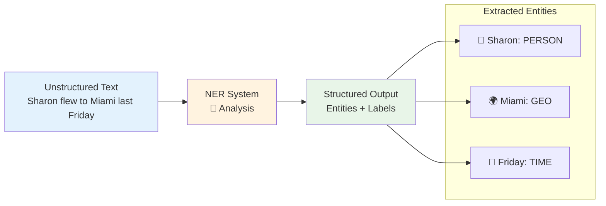

## BIO Tagging Scheme: The Annotation Standard

### Understanding the Labeling System

The example sentence **"Sharon flew to Miami last Friday"** demonstrates the **BIO tagging scheme**:

```bash
Input:  Sharon  flew  to  Miami  last  Friday
Tags:   B-per   O     O   B-geo   O     B-tim
```

### BIO Tag Components

**B (Beginning)**: Marks the **start** of a named entity

- `B-per`: Beginning of a person entity
- `B-geo`: Beginning of a geographical entity
- `B-tim`: Beginning of a time entity

**I (Inside)**: Marks **continuation** of a multi-word entity

- Used for entities spanning multiple tokens
- Example: "New York" → [`B-geo`, `I-geo`]

**O (Outside)**: Marks **non-entity** tokens

- Function words, articles, prepositions
- Any word that isn't part of a named entity

### Multi-Word Entity Example

```bash
Input:  Barack  Obama  visited  New  York  City  yesterday
Tags:   B-per   I-per  O        B-geo I-geo I-geo B-tim
        └─────────┘              └──────────┘    └───┘
         Person                  Location        Time
```

**Key Insight**: The BIO scheme allows precise boundary detection for entities of any length.

## Entity Categories: What Can NER Identify?

### Standard Entity Types

**1. PERSON (PER)** 👤

- Individual names: "Barack Obama", "Shakespeare", "Madonna"
- Fictional characters: "Harry Potter", "Sherlock Holmes"
- Historical figures: "Napoleon", "Cleopatra"

**2. GEOGRAPHICAL (GEO)** 🌍

- Cities: "Miami", "Tokyo", "London"
- Countries: "Thailand", "Canada", "Brazil"
- Natural features: "Amazon River", "Mount Everest"

**3. ORGANIZATION (ORG)** 🏢

- Companies: "Google", "Microsoft", "Toyota"
- Institutions: "Harvard University", "NASA"
- Government bodies: "FBI", "European Union"

**4. GEOPOLITICAL (GPE)** 🏛️

- Nationalities: "Indian", "American", "Chinese"
- Political entities: "Soviet Union", "European Community"
- Administrative regions: "California", "Bavarian"

**5. TIME INDICATORS (TIM)** 📅

- Days: "Friday", "Monday", "yesterday"
- Months: "December", "January"
- Periods: "Renaissance", "Industrial Revolution"

**6. ARTIFACTS (ART)** 🏺

- Cultural objects: "ancient Egyptian statue"
- Artworks: "Mona Lisa", "Sistine Chapel"
- Monuments: "Eiffel Tower", "Great Wall"

### Example Classification in Context

```bash
Sentence: "Google CEO visited the White House last December"

Tokens:    Google   CEO   visited   the   White   House   last   December
Labels:    B-org    O     O         O     B-org   I-org   O      B-tim
Categories: ORG      -     -         -     ORG     ORG     -      TIME
```

## Real-World Applications: Where NER Powers Modern Technology

### 1. 🔍 **Search Engine Optimization**

**The Challenge**: Searching through billions of web pages in real-time

**The Solution**: Pre-process content with NER

```bash
Traditional Search:
User searches "Apple" → Search all pages containing "apple"
Result: Fruit recipes, tech company, New York city, etc. (mixed results)

NER-Enhanced Search:
Pre-processing: "Apple Inc. announced..." → [Apple Inc.: ORG]
User searches "Apple company" → Match against ORG entities
Result: Only technology company results ✓
```

**Benefits**:

- **Faster queries**: Match against pre-extracted entities vs full text search
- **Better relevance**: Understand intent through entity types
- **Reduced computation**: Process documents once, query many times

### 2. 🎯 **Recommendation Systems**

**Use Case**: Content recommendation based on entity preferences

```python
# Conceptual recommendation pipeline
user_history = extract_entities(user_articles)
# Result: [Netflix: ORG, Comedy: GENRE, California: GEO]

similar_users = find_users_with_similar_entities(user_history)
recommendations = get_content_with_entities(similar_users.preferences)

# Recommendation: Articles about entertainment companies in California
```

**Applications**:

- **News recommendation**: Match users interested in similar organizations
- **Travel suggestions**: Recommend destinations based on geographical preferences
- **Product recommendations**: Match brand preferences and geographic relevance

### 3. 🎧 **Intelligent Customer Service**

**Scenario**: Automated routing based on entity extraction

```bash
Customer: "I need to add another vehicle to my policy"
NER Analysis: [vehicle: OBJECT, policy: DOCUMENT]
Routing: → Vehicle Insurance Department

Customer: "My car was destroyed by a giant flying squirrel"
NER Analysis: [car: VEHICLE, squirrel: ANIMAL]
Routing: → Claims Department (Unusual Claims)
```

**Phone Tree Evolution**:

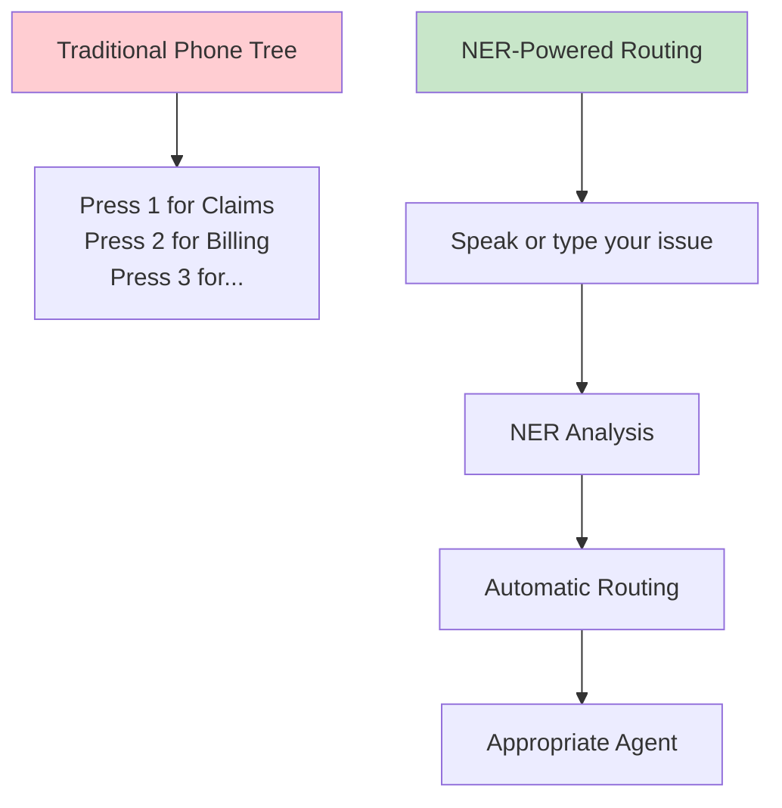

### 4. 💰 **Algorithmic Trading**

**Strategy**: News-based trading using entity and sentiment analysis

```python
# Automated trading pipeline
def trading_strategy():
    # 1. Collect news articles
    articles = scrape_financial_news()

    # 2. Extract relevant entities
    for article in articles:
        entities = ner_model.extract(article.text)
        companies = [e for e in entities if e.type == 'ORG']
        people = [e for e in entities if e.type == 'PER' and e.role == 'CEO']

        # 3. Sentiment analysis on entity context
        for company in companies:
            sentiment = analyze_sentiment_around_entity(article, company)

            # 4. Trading decision
            if sentiment > 0.8:
                place_buy_order(company.ticker)
            elif sentiment < 0.2:
                place_sell_order(company.ticker)

# Example extraction
article = "Tesla CEO Elon Musk announced breakthrough battery technology"
entities = [
    Entity("Tesla", "ORG", ticker="TSLA"),
    Entity("Elon Musk", "PER", role="CEO"),
    Entity("battery technology", "TECH")
]
sentiment = 0.85  # Very positive
action = "BUY TSLA"
```

### 5. 📊 **Business Intelligence**

**Market Analysis**: Track competitor mentions and market trends

```bash
Query: "Find all mentions of our competitors in the last month"
NER Processing:
- Extract: [Microsoft: ORG, Amazon: ORG, Apple: ORG]
- Analyze: Frequency, sentiment, context
- Report: Competitor activity dashboard
```

### 6. 🏥 **Healthcare Information Extraction**

**Medical Records Processing**:

```bash
Input: "Patient John Smith was prescribed metformin on March 15th"
NER Output:
- John Smith: PERSON
- metformin: MEDICATION
- March 15th: DATE
```

## The Technology Stack: How NER Systems Work

### Traditional vs Modern Approaches


### Why LSTMs Excel at NER

**1. Context Sensitivity**

```bash
Example: "Washington"
Context 1: "Washington was the first president" → PERSON
Context 2: "I live in Washington state" → LOCATION
Context 3: "Washington Redskins won the game" → ORGANIZATION

LSTM advantage: Remembers context to disambiguate entity types
```

**2. Boundary Detection**

```bash
Challenge: "New York City"
Word-by-word: [New: ?, York: ?, City: ?]
LSTM solution: Maintains state across tokens to detect entity boundaries
Result: [B-geo, I-geo, I-geo] → Single location entity
```

**3. Long-Range Dependencies**

```bash
Sentence: "Apple, the technology company founded by Steve Jobs, announced..."
Challenge: Connect "Apple" with "technology company" despite distance
LSTM: Maintains cell state linking "Apple" → "technology" → ORG classification
```

## Performance Metrics and Challenges

### Evaluation Metrics

**Entity-Level Precision/Recall**:

```python
# Correct entity extraction requires:
# 1. Correct boundaries (exact token span)
# 2. Correct label (right entity type)

True entities:    [(0,1,"Sharon","PER"), (3,4,"Miami","GEO")]
Predicted:        [(0,1,"Sharon","PER"), (3,4,"Miami","LOC")]

Precision = 1/2 = 50%  # Only Sharon correctly labeled
Recall = 1/2 = 50%     # Only Sharon of 2 true entities found
```

**Token-Level vs Entity-Level**:

- **Token-level**: Each word classified independently
- **Entity-level**: Complete entities must match exactly
- **Entity-level is stricter** and more meaningful for applications

### Common Challenges

**1. Ambiguous Entities**

```bash
"Apple reported strong quarterly earnings"
Challenge: Apple (fruit) vs Apple (company)?
Context dependency crucial for resolution
```

**2. Out-of-Vocabulary (OOV) Entities**

```bash
New entities: "ChatGPT", "TikTok", "Cryptocurrency names"
Challenge: Model hasn't seen these during training
Solution: Character-level or subword representations
```

**3. Nested Entities**

```bash
"University of California, Berkeley"
Nested structure:
- "University of California, Berkeley": ORG
- "California": GEO (part of organization name)
- "Berkeley": GEO (part of organization name)
```

**4. Entity Boundary Detection**

```bash
Tricky cases:
"U.S. President" vs "U.S." + "President"
"New York-based" vs "New York" + "-based"
Requires understanding of linguistic patterns
```

## Industry Impact and Future Directions

### Market Size and Adoption

**Commercial Success**:

- **Search engines**: Google, Bing use NER for query understanding
- **Social media**: Facebook, Twitter for content categorization
- **E-commerce**: Amazon for product information extraction
- **Finance**: Bloomberg, Reuters for automated news analysis

### Integration with Modern AI

**NER + Large Language Models**:

```bash
Traditional: Text → NER → Entities
Modern: Text → LLM + NER → Entities + Relations + Context

Example:
Input: "Apple CEO Tim Cook met with Samsung executives"
Enhanced Output:
- Entities: [Apple:ORG, Tim Cook:PER, Samsung:ORG]
- Relations: [Tim Cook, CEO-OF, Apple], [MEETING, Apple, Samsung]
- Context: Business meeting between competing companies
```

### Future Developments

**1. Multimodal NER**: Text + Images

```bash
News article with photo:
Text: "The president visited the factory"
Image: Shows person in suit at manufacturing facility
Enhanced NER: Combines text and visual cues for better entity recognition
```

**2. Real-time Streaming NER**

```bash
Social media feeds, news streams
Challenge: Process millions of posts/articles per minute
Solution: Optimized models for low-latency deployment
```

**3. Domain-Specific NER**

```bash
Specialized models for:
- Medical: Drug names, symptoms, procedures
- Legal: Case citations, legal terms, parties
- Financial: Trading symbols, financial instruments
- Scientific: Chemical compounds, protein names
```

## Summary: NER as Information Intelligence

### Why NER Matters

**1. Information Explosion** 📈

- Billions of documents created daily
- Manual processing impossible at scale
- NER enables automatic information extraction

**2. Business Value** 💼

- Faster decision making through structured data
- Automated processes reducing human effort
- Better user experiences through personalization

**3. Foundation Technology** 🏗️

- Building block for more complex NLP systems
- Enables question answering, knowledge graphs
- Powers conversational AI and virtual assistants

### Key Takeaways

✅ **NER transforms unstructured text into structured information**
✅ **BIO tagging enables precise entity boundary detection**  
✅ **Multiple entity types cover most real-world information needs**
✅ **LSTM architecture excels at context-dependent entity recognition**
✅ **Wide commercial adoption across industries**
✅ **Foundation for advanced NLP applications**

**Next Up**: We'll dive into the data processing techniques needed to train effective NER systems, including how to prepare datasets and handle the unique challenges of sequence labeling tasks!

### Real-World Impact Statement

_"Named Entity Recognition isn't just an academic exercise—it's the invisible technology that makes modern information systems intelligent. Every time you search Google, get a personalized recommendation, or interact with a chatbot, NER is working behind the scenes to understand what matters in text."_

# 6. Training NERs: Data Processing - Preparing Sequences for Recognition

## Overview: From Text to Tensors

Training a Named Entity Recognition system requires converting human-readable text into numerical representations that neural networks can process. This section covers the complete data processing pipeline, from raw text annotation to batched tensors ready for LSTM training. Understanding this process is crucial for building effective NER systems.

Think of this process like preparing ingredients for cooking - we need to chop, measure, and organize everything before we can start the actual cooking (training). Each step transforms our raw text data into a more structured format that our neural network can digest.

## The Complete Data Processing Pipeline


## Step 1: Entity Class Assignment

### Creating the Label Vocabulary

Neural networks can only work with numbers, not text labels like "B-per" or "O". So our first step is to create a mapping system that converts each entity class into a unique number. Think of this like creating a secret code where each type of entity gets its own number.

**Why do we need this?** Imagine trying to do math with words - it's impossible! But if we say "B-per = 1" and "O = 0", then our model can perform mathematical operations to learn patterns.

```python
# Entity class to index mapping
label_to_idx = {
    'O': 0,        # Outside (non-entity) - most common, gets 0
    'B-per': 1,    # Beginning of person entity
    'I-per': 2,    # Inside person entity
    'B-geo': 3,    # Beginning of geographical entity
    'I-geo': 4,    # Inside geographical entity
    'B-tim': 5,    # Beginning of time entity
    'I-tim': 6,    # Inside time entity
    'B-org': 7,    # Beginning of organization
    'I-org': 8,    # Inside organization
    '<PAD>': 9     # Padding token for sequences of different lengths
}

# Reverse mapping for decoding predictions back to human-readable labels
idx_to_label = {idx: label for label, idx in label_to_idx.items()}
```

**Key Design Decisions:**

- **'O' gets index 0**: Since most words in text are not entities, 'O' is the most frequent label
- **Consecutive numbering**: Keeps the mapping simple and memory-efficient
- **Special tokens**: '<PAD>' helps us handle sentences of different lengths (explained later)

### Example Label Encoding

Using our example sentence: **"Sharon flew to Miami last Friday"**

```bash
Original labels: ['B-per', 'O', 'O', 'B-geo', 'O', 'B-tim']
Encoded labels:  [1, 0, 0, 3, 0, 5]
```

## Step 2: Word Tokenization and Vocabulary Creation

### Building the Word Vocabulary

Just like we converted entity labels to numbers, we need to convert words to numbers too. This process is called "vocabulary creation" - we're essentially building a dictionary where each unique word gets its own ID number.

**Why is this necessary?** Neural networks are mathematical functions that work with numbers. When we feed the word "Sharon" to our model, it doesn't understand what "Sharon" means as text - but if we say "Sharon = 4282", then the model can process that number through mathematical operations.

```python
# Example vocabulary creation process
def build_vocabulary(sentences):
    """
    Build vocabulary from training sentences

    This function looks at all the words in our training data and assigns
    each unique word a number. It's like creating a phone book where
    each person (word) gets a unique phone number (index).
    """
    vocab = {'<UNK>': 0, '<PAD>': 1}  # Special tokens first
    idx = 2

    for sentence in sentences:
        for word in sentence.split():
            if word.lower() not in vocab:  # Convert to lowercase for consistency
                vocab[word.lower()] = idx
                idx += 1

    return vocab

# Example vocabulary (showing just a few words from thousands)
word_to_idx = {
    '<UNK>': 0,    # Unknown words (for words not seen during training)
    '<PAD>': 1,    # Padding (for making all sentences the same length)
    'sharon': 4282,
    'flew': 853,
    'to': 187,
    'miami': 5388,
    'last': 2894,
    'friday': 7
}
```

**Important Concepts:**

**<UNK> (Unknown)**: What happens when we encounter a word during testing that we never saw during training? We can't just ignore it! Instead, we replace all unknown words with this special <UNK> token. It's like saying "I don't know this specific word, but I know it's _some_ word."

**<PAD> (Padding)**: Since sentences have different lengths, we'll need this special token to make all sentences the same length for batch processing (explained in detail later).

**Lowercasing**: We convert all words to lowercase ("Sharon" → "sharon") so that "Sharon", "SHARON", and "sharon" are treated as the same word. This reduces vocabulary size and improves generalization.

### Tokenization Process

**Tokenization** is the process of breaking down a sentence into individual words (tokens). Think of it like cutting a sentence into individual word pieces that we can process separately.

```bash
Input sentence: "Sharon flew to Miami last Friday"
Tokenized:      ["Sharon", "flew", "to", "Miami", "last", "Friday"]
Lowercased:     ["sharon", "flew", "to", "miami", "last", "friday"]
Encoded:        [4282, 853, 187, 5388, 2894, 7]
```

**Step-by-step breakdown:**

1. **Split the sentence**: Break "Sharon flew to Miami last Friday" into individual words
2. **Normalize**: Convert to lowercase for consistency
3. **Look up indices**: For each word, find its number in our vocabulary
4. **Result**: A list of numbers that represents our sentence

**Why lowercase?** If our training data had "sharon" but during testing we see "Sharon", we want to treat them as the same word. Lowercasing ensures consistency.

## Step 3: Sequence Encoding and Alignment

### Word-Label Alignment

This is one of the most critical steps! We need to make sure that each word is perfectly matched with its corresponding label. If we mess up this alignment, our model will learn completely wrong patterns.

**Think of it like this**: Imagine you have a sentence and you're highlighting different words with different colored markers. You need to make sure that when you point to the 3rd word, you're also pointing to the 3rd color. If the words and colors get misaligned, you'll be teaching the model that "flew" is a person's name instead of "Sharon"!

```python
def encode_sequence(words, labels, word_vocab, label_vocab):
    """
    Convert words and labels to numerical sequences

    This is like creating two parallel lists - one with word numbers
    and one with label numbers - where position 0 in both lists
    refers to the same word/label pair.
    """
    # Encode words
    word_ids = []
    for word in words:
        if word.lower() in word_vocab:
            word_ids.append(word_vocab[word.lower()])
        else:
            word_ids.append(word_vocab['<UNK>'])  # Handle unknown words

    # Encode labels
    label_ids = [label_vocab[label] for label in labels]

    # CRITICAL: Verify alignment - this prevents silent bugs!
    assert len(word_ids) == len(label_ids), "Mismatch in sequence lengths!"

    return word_ids, label_ids

# Example output
words = ["sharon", "flew", "to", "miami", "last", "friday"]
labels = ["B-per", "O", "O", "B-geo", "O", "B-tim"]

word_sequence = [4282, 853, 187, 5388, 2894, 7]
label_sequence = [1, 0, 0, 3, 0, 5]
```

**Why the assertion is crucial**: The `assert` statement is like a safety check. If somehow our word list and label list have different lengths, the program will crash immediately and tell us there's a problem. This prevents us from accidentally training a model with misaligned data, which would be a disaster!

### Visual Representation

```bash
Words:    Sharon  flew   to    Miami  last   Friday
          ↓       ↓      ↓     ↓      ↓      ↓
Indices:  4282    853    187   5388   2894   7
          ↓       ↓      ↓     ↓      ↓      ↓
Labels:   B-per   O      O     B-geo  O      B-tim
          ↓       ↓      ↓     ↓      ↓      ↓
Encoded:  1       0      0     3      0      5
```

## Step 4: Sequence Padding and Truncation

### The Variable Length Problem

Here's a fundamental challenge in neural network training: **computers need consistent input sizes, but human language doesn't cooperate!**

Think about it - some people write short sentences like "John works." while others write long sentences like "The quick brown fox jumps over the lazy dog near the riverbank." But neural networks are like very precise machines that expect their input to always be the same size.

**Real-world example:**

```bash
Sentence 1: "John works at Google"           → Length: 4 words
Sentence 2: "Mary flew to Paris yesterday"   → Length: 5 words
Sentence 3: "The quick brown fox jumps"      → Length: 5 words

Problem: How do we feed these into the same neural network?
```

**Why this is a problem:** Imagine trying to do matrix multiplication with matrices of different sizes - it's mathematically impossible! Neural networks perform millions of matrix operations, so all inputs must have the same dimensions.

### Padding Solution

The solution is called **padding** - we artificially make all sentences the same length by adding special "filler" tokens to shorter sentences. It's like adding blank spaces to make all lines in a poem the same length.

**The padding process:**

1. **Choose a maximum length** (e.g., 10 words)
2. **For shorter sentences**: Add <PAD> tokens until they reach the max length
3. **For longer sentences**: Cut them off (truncate) at the max length
4. **Result**: All sentences are now exactly the same length!

```python
def pad_sequences(sequences, max_length, pad_value=1):
    """
    Pad sequences to fixed length

    Think of this like adjusting the margins on a document - we're making
    all sentences fit into the same "page size" by adding blank space.
    """
    padded = []
    for seq in sequences:
        if len(seq) < max_length:
            # Too short? Add padding tokens
            padded_seq = seq + [pad_value] * (max_length - len(seq))
        elif len(seq) > max_length:
            # Too long? Cut it off (truncate)
            padded_seq = seq[:max_length]
        else:
            # Perfect length? Keep as is
            padded_seq = seq

        padded.append(padded_seq)

    return padded

# Example with max_length = 10
original_sequence = [4282, 853, 187, 5388, 2894, 7]  # 6 words
original_labels = [1, 0, 0, 3, 0, 5]                # 6 labels

# After padding to length 10:
padded_sequence = [4282, 853, 187, 5388, 2894, 7, 1, 1, 1, 1]  # Added 4 <PAD> tokens (value 1)
padded_labels = [1, 0, 0, 3, 0, 5, 9, 9, 9, 9]                # Added 4 <PAD> labels (value 9)
```

**Key insight**: Notice that we pad both the word sequence AND the label sequence with their respective padding tokens. The word sequence gets <PAD> word tokens (value 1), and the label sequence gets <PAD> label tokens (value 9). This maintains perfect alignment!

### Choosing Sequence Length

**How do we decide what maximum length to use?** This is a crucial decision that affects both model performance and computational efficiency. Too short and we lose information; too long and we waste computation on mostly empty sequences.

```python
def analyze_sequence_lengths(sentences):
    """
    Analyze sentence length distribution to choose max_length

    This function helps us make a data-driven decision about sequence length
    by looking at the actual distribution of sentence lengths in our dataset.
    """
    lengths = [len(sent.split()) for sent in sentences]

    print(f"Mean length: {np.mean(lengths):.1f}")
    print(f"95th percentile: {np.percentile(lengths, 95):.1f}")
    print(f"99th percentile: {np.percentile(lengths, 99):.1f}")

    # Common choice: 95th percentile to avoid too much padding
    return int(np.percentile(lengths, 95))

# Example output:
# Mean length: 12.3
# 95th percentile: 28.0  ← Good choice for max_length
# 99th percentile: 45.0  ← Too much padding for shorter sentences
```

**Decision strategy:**

- **95th percentile**: This means 95% of your sentences will fit completely, and only 5% will be truncated. This balances information preservation with efficiency.
- **99th percentile**: Preserves more information but requires much more padding for shorter sentences, slowing training.
- **Mean length**: Often too short, would truncate many sentences.

**Trade-offs to consider:**

- **Longer sequences**: More information preserved, but more computational cost and memory usage
- **Shorter sequences**: Faster training, but we might cut off important information
- **Sweet spot**: Usually around 95th percentile gives the best balance

## Step 5: Data Generator for Batch Processing

### Why Batch Processing?

Imagine you're a teacher grading essays. You could:

1. **Grade one essay, update your understanding, grade the next essay, update again...** (individual processing)
2. **Grade 30 essays, then update your understanding based on all 30** (batch processing)

The second approach is much more efficient and gives you a better overall perspective! Neural networks work the same way.

**Individual vs Batch Processing:**

```bash
Individual Processing (SLOW):
- Process 1 sentence → Calculate error → Update weights
- Process 1 sentence → Calculate error → Update weights
- Problems: Very slow, unstable learning (weights jump around)

Batch Processing (FAST):
- Process 64 sentences → Average the errors → Update weights once
- Benefits: Much faster, stable learning (smooth weight updates)
```

**Why batching helps:**

1. **Computational efficiency**: GPUs are designed to process many examples simultaneously
2. **Stable gradients**: Averaging errors from multiple examples gives smoother learning
3. **Better hardware utilization**: Makes full use of parallel processing capabilities
4. **Memory efficiency**: Loading data in chunks is more efficient than one-by-one

### Implementing a Data Generator

A **data generator** is like a smart serving system in a restaurant - it prepares and serves your data in perfectly sized portions (batches) for your neural network to consume efficiently.

```python
import numpy as np

class NERDataGenerator:
    """
    Data generator for NER training

    Think of this as a smart data server that:
    1. Prepares all your data in advance (preprocessing)
    2. Serves it in perfectly sized batches
    3. Shuffles the data each epoch to prevent overfitting
    4. Handles all the tedious details automatically
    """
    def __init__(self, sentences, labels, word_vocab, label_vocab,
                 batch_size=64, max_length=128, shuffle=True):
        self.sentences = sentences
        self.labels = labels
        self.word_vocab = word_vocab
        self.label_vocab = label_vocab
        self.batch_size = batch_size      # How many sentences per batch
        self.max_length = max_length      # Padding length
        self.shuffle = shuffle            # Randomize order each epoch

        # Do all the heavy preprocessing once, upfront
        self.X, self.y = self._preprocess_all()

    def _preprocess_all(self):
        """
        Convert all sentences to numerical sequences

        This is like preparing all ingredients before cooking -
        we do all the time-consuming work once, then just serve during training.
        """
        X, y = [], []

        for sent_words, sent_labels in zip(self.sentences, self.labels):
            # Convert words and labels to numbers
            word_ids, label_ids = encode_sequence(
                sent_words, sent_labels,
                self.word_vocab, self.label_vocab
            )

            X.append(word_ids)
            y.append(label_ids)

        # Pad all sequences to same length
        X = pad_sequences(X, self.max_length, self.word_vocab['<PAD>'])
        y = pad_sequences(y, self.max_length, self.label_vocab['<PAD>'])

        return np.array(X), np.array(y)

    def __len__(self):
        """Number of batches per epoch"""
        return len(self.X) // self.batch_size

    def __iter__(self):
        """
        Generate batches

        This is the magic method that makes our generator work in a for loop.
        Each time we iterate, it gives us a new batch of data.
        """
        indices = np.arange(len(self.X))

        if self.shuffle:
            np.random.shuffle(indices)  # Randomize order to prevent overfitting

        for i in range(0, len(indices), self.batch_size):
            batch_indices = indices[i:i + self.batch_size]

            batch_X = self.X[batch_indices]  # Words for this batch
            batch_y = self.y[batch_indices]  # Labels for this batch

            yield batch_X, batch_y

# Usage example - this is how you'd use it in practice
data_gen = NERDataGenerator(
    sentences=train_sentences,      # Your training sentences
    labels=train_labels,           # Corresponding labels
    word_vocab=word_vocab,         # Word→number mapping
    label_vocab=label_vocab,       # Label→number mapping
    batch_size=64,                 # 64 sentences per batch
    max_length=128                 # Pad/truncate to 128 words
)

# Training loop - notice how clean this is!
for epoch in range(num_epochs):
    for batch_X, batch_y in data_gen:
        # batch_X shape: (64, 128) - 64 sentences, each 128 words long
        # batch_y shape: (64, 128) - 64 label sequences, each 128 labels long

        # Train model on this batch
        loss = model.train_step(batch_X, batch_y)
```

**Key benefits of this approach:**

- **Preprocessing once**: All the expensive operations (encoding, padding) happen once upfront
- **Automatic batching**: No need to manually group sentences
- **Memory efficient**: Only loads one batch at a time during training
- **Shuffling**: Prevents the model from memorizing the order of examples
- **Clean training loop**: The actual training code becomes very simple and readable

### Optimal Batch Sizes

**Why powers of 2?** Computer memory and GPU architectures are optimized for powers of 2. Using batch sizes like 64, 128, 256 makes your code run faster because it aligns with how computer hardware is designed.

**Common batch sizes** and when to use them:

```python
batch_sizes = {
    'small_model': 64,     # For limited GPU memory (4GB or less)
    'medium_model': 128,   # Good balance for most situations (8GB GPU)
    'large_model': 256,    # For powerful GPUs (16GB+)
    'research': 512,       # For very large datasets and powerful hardware
}
```

**The trade-offs you need to understand:**

**Smaller batches (32, 64):**

- ✅ **Pros**: Use less memory, more frequent weight updates, can sometimes escape local minima better
- ❌ **Cons**: Noisier gradients (less stable learning), might need more epochs to converge

**Larger batches (256, 512):**

- ✅ **Pros**: More stable gradients, better hardware utilization, faster training per epoch
- ❌ **Cons**: Need more GPU memory, fewer weight updates per epoch, might get stuck in local minima

**Sweet spot**: For most NER tasks, batch sizes of 64-128 work well. Start with 64 and increase if you have enough GPU memory.

## Step 6: LSTM Architecture for NER

### Complete Model Architecture

Now that we have our data properly processed and batched, let's build the neural network that will actually learn to recognize named entities. Based on the architectural diagram from the transcript, here's the full NER model structure:

#### Using PyTorch

```python
import torch
import torch.nn as nn

class NERModel(nn.Module):
    """
    LSTM-based Named Entity Recognition Model

    This model follows the architecture shown in the course:
    Input → Embedding → LSTM → Dense → LogSoftmax → Output
    """
    def __init__(self, vocab_size, embedding_dim, hidden_dim,
                 num_layers, num_classes, dropout=0.3):
        super(NERModel, self).__init__()

        # Embedding layer: converts word indices to dense vectors
        self.embedding = nn.Embedding(vocab_size, embedding_dim,
                                    padding_idx=1)  # <PAD> token gets index 1

        # LSTM layer(s): processes sequences and maintains memory
        self.lstm = nn.LSTM(embedding_dim, hidden_dim,
                           num_layers=num_layers,
                           batch_first=True,    # Input shape: (batch, seq, features)
                           dropout=dropout if num_layers > 1 else 0,
                           bidirectional=False)

        # Dropout for regularization (prevents overfitting)
        self.dropout = nn.Dropout(dropout)

        # Dense (fully connected) layer: maps LSTM output to class scores
        self.dense = nn.Linear(hidden_dim, num_classes)

        # LogSoftmax activation (better than softmax for NER)
        self.log_softmax = nn.LogSoftmax(dim=-1)

    def forward(self, x):
        # x shape: (batch_size, sequence_length)
        # x contains word indices like [4282, 853, 187, ...]

        # Step 1: Convert word indices to embeddings
        embedded = self.embedding(x)
        # embedded shape: (batch_size, sequence_length, embedding_dim)
        # Now each word index is replaced with a dense vector

        # Step 2: Process through LSTM
        lstm_out, (hidden, cell) = self.lstm(embedded)
        # lstm_out shape: (batch_size, sequence_length, hidden_dim)
        # This contains the contextualized representation for each word

        # Step 3: Apply dropout for regularization
        lstm_out = self.dropout(lstm_out)

        # Step 4: Dense layer (applied to each time step independently)
        dense_out = self.dense(lstm_out)
        # dense_out shape: (batch_size, sequence_length, num_classes)
        # Each word now has scores for all possible entity classes

        # Step 5: LogSoftmax activation
        predictions = self.log_softmax(dense_out)
        # predictions shape: (batch_size, sequence_length, num_classes)
        # Each word now has log probabilities for all entity classes

        return predictions

# Model instantiation example
model = NERModel(
    vocab_size=len(word_vocab),      # e.g., 10000 unique words
    embedding_dim=128,               # Word embedding dimension
    hidden_dim=256,                  # LSTM hidden size
    num_layers=2,                    # Number of LSTM layers
    num_classes=len(label_vocab),    # Number of entity classes (10 in our example)
    dropout=0.3                      # Dropout rate
)
```

#### Using Tensorflow

```python
import tensorflow as tf
from tensorflow.keras.layers import Embedding, LSTM, Dense, Dropout
from tensorflow.keras.models import Model
from tensorflow.keras import Input

class NERModel(tf.keras.Model):
    """
    LSTM-based Named Entity Recognition Model

    This model follows the architecture shown in the course:
    Input → Embedding → LSTM → Dense → LogSoftmax → Output
    """
    def __init__(self, vocab_size, embedding_dim, hidden_dim,
                 num_layers, num_classes, dropout=0.3):
        super(NERModel, self).__init__()

        # Embedding layer: converts word indices to dense vectors
        self.embedding = Embedding(
            input_dim=vocab_size,
            output_dim=embedding_dim,
            mask_zero=True  # Automatically masks padding tokens
        )

        # LSTM layers: processes sequences and maintains memory
        self.lstm_layers = []
        for i in range(num_layers):
            return_sequences = True  # Always return sequences for NER
            self.lstm_layers.append(
                LSTM(
                    hidden_dim,
                    return_sequences=return_sequences,
                    dropout=dropout if i < num_layers - 1 else 0,
                    recurrent_dropout=dropout if i < num_layers - 1 else 0
                )
            )

        # Dropout for regularization (prevents overfitting)
        self.dropout = Dropout(dropout)

        # Dense (fully connected) layer: maps LSTM output to class scores
        self.dense = Dense(num_classes)

        # We'll apply log_softmax in the call method

    def call(self, inputs, training=None):
        # inputs shape: (batch_size, sequence_length)
        # inputs contains word indices like [4282, 853, 187, ...]

        # Step 1: Convert word indices to embeddings
        embedded = self.embedding(inputs)
        # embedded shape: (batch_size, sequence_length, embedding_dim)
        # Now each word index is replaced with a dense vector

        # Step 2: Process through LSTM layers
        x = embedded
        for lstm_layer in self.lstm_layers:
            x = lstm_layer(x, training=training)
        # x shape: (batch_size, sequence_length, hidden_dim)
        # This contains the contextualized representation for each word

        # Step 3: Apply dropout for regularization
        x = self.dropout(x, training=training)

        # Step 4: Dense layer (applied to each time step independently)
        dense_out = self.dense(x)
        # dense_out shape: (batch_size, sequence_length, num_classes)
        # Each word now has scores for all possible entity classes

        # Step 5: LogSoftmax activation
        predictions = tf.nn.log_softmax(dense_out, axis=-1)
        # predictions shape: (batch_size, sequence_length, num_classes)
        # Each word now has log probabilities for all entity classes

        return predictions

# Alternative functional API approach
def create_ner_model_functional(vocab_size, embedding_dim, hidden_dim,
                               num_layers, num_classes, dropout=0.3):
    """
    Functional API version of the NER model
    """
    # Input layer
    inputs = Input(shape=(None,), dtype=tf.int32, name='word_indices')

    # Embedding layer
    x = Embedding(
        input_dim=vocab_size,
        output_dim=embedding_dim,
        mask_zero=True,
        name='embedding'
    )(inputs)

    # LSTM layers
    for i in range(num_layers):
        x = LSTM(
            hidden_dim,
            return_sequences=True,
            dropout=dropout if i < num_layers - 1 else 0,
            recurrent_dropout=dropout if i < num_layers - 1 else 0,
            name=f'lstm_{i+1}'
        )(x)

    # Dropout
    x = Dropout(dropout, name='dropout')(x)

    # Dense layer
    dense_out = Dense(num_classes, name='dense')(x)

    # LogSoftmax
    predictions = tf.nn.log_softmax(dense_out, axis=-1, name='log_softmax')

    # Create model
    model = Model(inputs=inputs, outputs=predictions, name='ner_model')

    return model

# Model instantiation examples
# Option 1: Subclassing approach
model = NERModel(
    vocab_size=len(word_vocab),      # e.g., 10000 unique words
    embedding_dim=128,               # Word embedding dimension
    hidden_dim=256,                  # LSTM hidden size
    num_layers=2,                    # Number of LSTM layers
    num_classes=len(label_vocab),    # Number of entity classes (10 in our example)
    dropout=0.3                      # Dropout rate
)

# Option 2: Functional API approach
model_functional = create_ner_model_functional(
    vocab_size=len(word_vocab),
    embedding_dim=128,
    hidden_dim=256,
    num_layers=2,
    num_classes=len(label_vocab),
    dropout=0.3
)
```

**Let's trace through what happens to our example sentence:**

```bash
Input: "Sharon flew to Miami last Friday"
Encoded: [4282, 853, 187, 5388, 2894, 7]

After Embedding: Each number becomes a 128-dimensional vector
After LSTM: Each vector becomes a 256-dimensional context-aware vector
After Dense: Each vector becomes a 10-dimensional score vector
After LogSoftmax: Each score vector becomes log probabilities

Final output: 6 probability distributions, one for each word
```

### Why LogSoftmax Instead of Softmax?

This is a crucial technical detail that can make or break your model's performance. Let's understand why LogSoftmax is superior for NER tasks.

**Mathematical definitions:**
$$\text{Softmax}(x_i) = \frac{e^{x_i}}{\sum_{j=1}^K e^{x_j}}$$

$$\text{LogSoftmax}(x_i) = \log\left(\frac{e^{x_i}}{\sum_{j=1}^K e^{x_j}}\right) = x_i - \log\left(\sum_{j=1}^K e^{x_j}\right)$$

**Why LogSoftmax is better:**

1. **Numerical stability**: Regular softmax can cause overflow/underflow with very large or small numbers
2. **Better gradients**: Log space provides more stable gradient flow during backpropagation
3. **NLL Loss compatibility**: Works directly with Negative Log Likelihood loss (the standard for classification)
4. **Computational efficiency**: More efficient than computing softmax then taking log

**Practical example:**

```python
# Problem with regular softmax
large_scores = [100, 101, 102]  # Very large numbers
softmax_result = torch.softmax(torch.tensor(large_scores), dim=0)
# Result: tensor([0., 0., 1.]) - lost precision!

# LogSoftmax handles this better
log_softmax_result = torch.log_softmax(torch.tensor(large_scores), dim=0)
# Result: tensor([-2.0000, -1.0000, 0.0000]) - maintains precision!
```

### Loss Function for NER

#### PyTorch

```python
# Negative Log Likelihood Loss (works perfectly with LogSoftmax)
loss_fn = nn.NLLLoss(ignore_index=label_vocab['<PAD>'])

def compute_loss(predictions, targets):
    """
    Compute NER loss while ignoring padded tokens

    This is crucial: we don't want to penalize the model for getting
    padding tokens "wrong" since they're artificial.
    """
    # predictions: (batch_size, seq_len, num_classes)
    # targets: (batch_size, seq_len)

    # Reshape for loss computation
    predictions_flat = predictions.view(-1, predictions.size(-1))
    targets_flat = targets.view(-1)

    # Compute loss (automatically ignores <PAD> tokens due to ignore_index)
    loss = loss_fn(predictions_flat, targets_flat)

    return loss
```

#### Tensorflow

```python
# Sparse categorical crossentropy with masking for padded tokens
def create_masked_loss():
    """
    Create a loss function that ignores padded tokens

    This is crucial: we don't want to penalize the model for getting
    padding tokens "wrong" since they're artificial.
    """
    def masked_sparse_categorical_crossentropy(y_true, y_pred):
        # y_true shape: (batch_size, sequence_length)
        # y_pred shape: (batch_size, sequence_length, num_classes) - log probabilities

        # Create mask to ignore padding tokens (assuming <PAD> = index 9)
        mask = tf.cast(tf.not_equal(y_true, 9), tf.float32)  # 9 = <PAD> index

        # Convert log probabilities to probabilities for loss calculation
        y_pred_exp = tf.exp(y_pred)

        # Calculate sparse categorical crossentropy
        loss = tf.keras.losses.sparse_categorical_crossentropy(
            y_true, y_pred_exp, from_logits=False
        )

        # Apply mask and calculate mean over non-padded tokens
        masked_loss = loss * mask
        return tf.reduce_sum(masked_loss) / tf.reduce_sum(mask)

    return masked_sparse_categorical_crossentropy

# Alternative: Using built-in masking
def compute_loss_with_masking(y_true, y_pred, pad_index=9):
    """
    Compute NER loss while ignoring padded tokens using TensorFlow's masking
    """
    # Create mask
    mask = tf.cast(tf.not_equal(y_true, pad_index), tf.float32)

    # Since y_pred contains log probabilities, we need to convert back for the loss
    loss = tf.keras.losses.sparse_categorical_crossentropy(
        y_true, tf.exp(y_pred), from_logits=False
    )

    # Apply mask
    loss = loss * mask

    # Return mean loss over non-masked tokens
    return tf.reduce_sum(loss) / tf.reduce_sum(mask)
```

**Why ignore padding?** Remember that we artificially added <PAD> tokens to make sequences the same length. These aren't real words, so we shouldn't penalize the model for making mistakes on them. The `ignore_index` parameter tells the loss function to skip these tokens entirely.

## Step 7: Complete Training Pipeline

### Putting It All Together

Now let's see how all these pieces fit together in a complete training example:

#### PyTorch

```python
def train_ner_model():
    """
    Complete training pipeline for NER

    This brings together everything we've discussed:
    - Data processing and batching
    - Model architecture
    - Loss computation
    - Training loop
    """

    # Step 1: Initialize model, optimizer, loss
    model = NERModel(
        vocab_size=len(word_vocab),
        embedding_dim=128,
        hidden_dim=256,
        num_layers=2,
        num_classes=len(label_vocab)
    )

    # Adam optimizer is usually best for NLP tasks
    optimizer = torch.optim.Adam(model.parameters(), lr=0.001)

    # Step 2: Training loop
    model.train()  # Set model to training mode

    for epoch in range(num_epochs):
        total_loss = 0
        num_batches = 0

        # Step 3: Process each batch
        for batch_X, batch_y in data_generator:
            # Convert numpy arrays to PyTorch tensors
            X_tensor = torch.LongTensor(batch_X)  # Word indices
            y_tensor = torch.LongTensor(batch_y)  # Label indices

            # Step 4: Zero gradients (PyTorch accumulates them by default)
            optimizer.zero_grad()

            # Step 5: Forward pass
            predictions = model(X_tensor)

            # Step 6: Compute loss
            loss = compute_loss(predictions, y_tensor)

            # Step 7: Backward pass (compute gradients)
            loss.backward()

            # Step 8: Update weights
            optimizer.step()

            # Track progress
            total_loss += loss.item()
            num_batches += 1

        # Print progress
        avg_loss = total_loss / num_batches
        print(f"Epoch {epoch+1}/{num_epochs}, Average Loss: {avg_loss:.4f}")

# Execute training
train_ner_model()
```

#### Tensorflow

```python
def train_ner_model():
    """
    Complete training pipeline for NER using TensorFlow

    This brings together everything we've discussed:
    - Data processing and batching
    - Model architecture
    - Loss computation
    - Training loop
    """

    # Step 1: Initialize model and optimizer
    model = NERModel(
        vocab_size=len(word_vocab),
        embedding_dim=128,
        hidden_dim=256,
        num_layers=2,
        num_classes=len(label_vocab)
    )

    # Adam optimizer is usually best for NLP tasks
    optimizer = tf.keras.optimizers.Adam(learning_rate=0.001)

    # Loss function that handles padding
    loss_fn = create_masked_loss()

    # Step 2: Training loop
    @tf.function
    def train_step(batch_x, batch_y):
        """Single training step with gradient tape"""
        with tf.GradientTape() as tape:
            # Forward pass
            predictions = model(batch_x, training=True)

            # Compute loss
            loss = loss_fn(batch_y, predictions)

        # Compute gradients
        gradients = tape.gradient(loss, model.trainable_variables)

        # Apply gradients
        optimizer.apply_gradients(zip(gradients, model.trainable_variables))

        return loss

    # Step 3: Training loop
    for epoch in range(num_epochs):
        total_loss = 0
        num_batches = 0

        # Step 4: Process each batch
        for batch_X, batch_y in data_generator:
            # Convert numpy arrays to TensorFlow tensors
            X_tensor = tf.constant(batch_X, dtype=tf.int32)
            y_tensor = tf.constant(batch_y, dtype=tf.int32)

            # Training step
            loss = train_step(X_tensor, y_tensor)

            # Track progress
            total_loss += loss.numpy()
            num_batches += 1

        # Print progress
        avg_loss = total_loss / num_batches
        print(f"Epoch {epoch+1}/{num_epochs}, Average Loss: {avg_loss:.4f}")

# Alternative: Using Keras fit method
def train_with_keras_fit():
    """
    Training using Keras' built-in fit method
    """
    # Compile model
    model.compile(
        optimizer='adam',
        loss=create_masked_loss(),
        metrics=['accuracy']
    )

    # Convert data generator to tf.data.Dataset
    dataset = tf.data.Dataset.from_generator(
        lambda: data_generator,
        output_signature=(
            tf.TensorSpec(shape=(None, None), dtype=tf.int32),
            tf.TensorSpec(shape=(None, None), dtype=tf.int32)
        )
    )

    # Train model
    history = model.fit(
        dataset,
        epochs=num_epochs,
        verbose=1
    )

    return history

# Execute training
train_ner_model()
```

**What happens during training:**

1. **Forward pass**: Data flows through embedding → LSTM → dense → log_softmax
2. **Loss computation**: Compare predictions with true labels (ignoring padding)
3. **Backward pass**: Compute how to adjust weights to reduce loss
4. **Weight update**: Actually update the model parameters
5. **Repeat**: Do this for thousands of batches until the model learns

### TensorFlow Data Pipeline

```python
def create_tf_data_pipeline(word_sequences, label_sequences, batch_size=64):
    """
    Create an efficient TensorFlow data pipeline

    This leverages TensorFlow's optimized data loading capabilities
    for better performance during training.
    """
    # Convert to TensorFlow dataset
    dataset = tf.data.Dataset.from_tensor_slices({
        'words': word_sequences,
        'labels': label_sequences
    })

    # Shuffle and batch
    dataset = dataset.shuffle(buffer_size=10000)
    dataset = dataset.batch(batch_size)

    # Prefetch for performance
    dataset = dataset.prefetch(tf.data.AUTOTUNE)

    return dataset

# Usage
tf_dataset = create_tf_data_pipeline(X, y, batch_size=64)

# Training with tf.data
for epoch in range(num_epochs):
    for batch in tf_dataset:
        X_batch = batch['words']
        y_batch = batch['labels']

        loss = train_step(X_batch, y_batch)
```

## Advanced Data Processing Techniques

### 1. Handling Out-of-Vocabulary Words

What happens when we encounter words during testing that weren't in our training vocabulary? This is called the **Out-of-Vocabulary (OOV)** problem.

**The challenge**: Imagine your model was trained on news articles but during testing encounters social media text with words like "LOL", "YOLO", or new brand names. Your model has never seen these words, so it can't process them effectively.

**Subword tokenization** is one solution - instead of treating words as atomic units, we break them into smaller pieces:

```python
# Using subword tokenization to handle OOV words
from transformers import AutoTokenizer

def subword_tokenize(sentence, labels):
    """
    Apply subword tokenization while preserving label alignment

    This breaks unknown words into smaller pieces that the model
    might have seen before. For example: "unrecognizable" might become
    ["un", "##recogn", "##izable"] where "##" indicates word pieces.
    """
    tokenizer = AutoTokenizer.from_pretrained('bert-base-uncased')

    tokens = []
    aligned_labels = []

    for word, label in zip(sentence.split(), labels):
        subwords = tokenizer.tokenize(word)
        tokens.extend(subwords)

        # First subword gets original label, rest get I- tag
        if label.startswith('B-'):
            aligned_labels.append(label)
            aligned_labels.extend(['I-' + label[2:]] * (len(subwords) - 1))
        else:
            aligned_labels.extend([label] * len(subwords))

    return tokens, aligned_labels

# Example:
# Input: "Washington", "B-geo"
# Output: ["Wash", "##ington"], ["B-geo", "I-geo"]
```

**Why this works**: Even if "Washington" wasn't in our training data, the model might have seen "Wash" and "##ington" in other contexts, so it can still make reasonable predictions.

**Label alignment challenge**: When we split words into subwords, we need to carefully handle the labels. The first subword keeps the original label (B-geo), and subsequent subwords get the inside tag (I-geo).

### 2. Data Augmentation for NER

**Data augmentation** means creating additional training examples by slightly modifying existing ones. This helps the model generalize better and become more robust.

```python
def augment_ner_data(sentences, labels):
    """
    Simple data augmentation for NER

    The key challenge in NER augmentation is that we can't just randomly
    change words - we need to preserve the entity structure and ensure
    that labels remain correct.
    """
    augmented_sentences = []
    augmented_labels = []

    for sent, labs in zip(sentences, labels):
        # Original data
        augmented_sentences.append(sent)
        augmented_labels.append(labs)

        # Strategy 1: Synonym replacement (preserve entity labels)
        aug_sent, aug_labs = synonym_replacement(sent, labs)
        augmented_sentences.append(aug_sent)
        augmented_labels.append(aug_labs)

        # Strategy 2: Random deletion (maintain label consistency)
        aug_sent, aug_labs = random_deletion(sent, labs)
        augmented_sentences.append(aug_sent)
        augmented_labels.append(aug_labs)

    return augmented_sentences, augmented_labels

def synonym_replacement(sentence, labels):
    """
    Replace non-entity words with synonyms

    We only replace words labeled as 'O' (outside) to avoid
    changing the meaning of named entities.
    """
    words = sentence.split()
    new_words = []

    for word, label in zip(words, labels):
        if label == 'O' and random.random() < 0.3:  # 30% chance
            synonym = get_synonym(word)  # Replace with synonym
            new_words.append(synonym if synonym else word)
        else:
            new_words.append(word)  # Keep entity words unchanged

    return ' '.join(new_words), labels  # Labels stay the same

# Example:
# Original: "The cat ran to Paris" → ["O", "O", "O", "O", "B-geo"]
# Augmented: "The feline sprinted to Paris" → ["O", "O", "O", "O", "B-geo"]
```

**Why be careful with NER augmentation?** Unlike sentiment analysis where you can replace "good" with "excellent", in NER you can't replace "Paris" with "London" because that would change the factual content and require different labels.

### 3. Handling Class Imbalance

In most real-world text, the majority of words are not named entities (labeled 'O'). This creates a **class imbalance** problem where your model might just learn to predict 'O' for everything.

**Understanding the problem:**

```bash
Typical label distribution in NER:
- 'O' (Outside): 85-90% of all tokens
- 'B-per': 2-3% of tokens
- 'B-geo': 1-2% of tokens
- Other entities: <1% each

Problem: Model learns to just predict 'O' and gets 85% accuracy!
```

**Solution: Weighted loss function**

```python
def compute_class_weights(label_sequences, label_vocab):
    """
    Compute class weights for imbalanced NER data

    This gives more importance to rare entity classes during training,
    forcing the model to pay attention to minority classes.
    """
    from collections import Counter

    # Flatten all label sequences
    all_labels = [label for seq in label_sequences for label in seq]

    # Count label frequencies
    label_counts = Counter(all_labels)

    # Compute weights (inverse frequency)
    total_samples = sum(label_counts.values())
    weights = {}

    for label_idx, label_name in label_vocab.items():
        if label_name in label_counts:
            # More weight for rarer classes
            weight = total_samples / (len(label_vocab) * label_counts[label_name])
            weights[label_idx] = weight
        else:
            weights[label_idx] = 1.0

    return torch.FloatTensor(list(weights.values()))

# Use weighted loss
class_weights = compute_class_weights(train_labels, idx_to_label)
loss_fn = nn.NLLLoss(weight=class_weights, ignore_index=label_vocab['<PAD>'])
```

**How weights work**: If 'B-per' appears 100 times and 'O' appears 10,000 times, then 'B-per' gets 100x more weight in the loss function. This forces the model to care about getting person entities right.

### 4. Efficient Memory Management

For large datasets, loading everything into memory at once can cause problems. Here's how to handle it:

```python
class MemoryEfficientNERGenerator:
    """
    Memory-efficient data generator for very large datasets

    Instead of loading all data into memory, this generator loads
    data on-the-fly, which allows you to train on datasets larger
    than your available RAM.
    """
    def __init__(self, data_file_path, word_vocab, label_vocab,
                 batch_size=64, max_length=128):
        self.data_file_path = data_file_path
        self.word_vocab = word_vocab
        self.label_vocab = label_vocab
        self.batch_size = batch_size
        self.max_length = max_length

        # Count total lines for progress tracking
        self.total_lines = self._count_lines()

    def _count_lines(self):
        """Count total sentences in the file"""
        with open(self.data_file_path, 'r') as f:
            return sum(1 for line in f if line.strip())

    def __iter__(self):
        """
        Load and process data in batches on-the-fly
        """
        batch_X, batch_y = [], []

        with open(self.data_file_path, 'r') as f:
            for line in f:
                if line.strip():  # Skip empty lines
                    # Parse line (assuming format: word1/label1 word2/label2 ...)
                    tokens = line.strip().split()
                    words = [token.split('/')[0] for token in tokens]
                    labels = [token.split('/')[1] for token in tokens]

                    # Encode sequence
                    word_ids, label_ids = encode_sequence(
                        words, labels, self.word_vocab, self.label_vocab
                    )

                    # Pad sequence
                    word_ids = pad_sequence(word_ids, self.max_length,
                                          self.word_vocab['<PAD>'])
                    label_ids = pad_sequence(label_ids, self.max_length,
                                           self.label_vocab['<PAD>'])

                    batch_X.append(word_ids)
                    batch_y.append(label_ids)

                    # Yield batch when full
                    if len(batch_X) == self.batch_size:
                        yield np.array(batch_X), np.array(batch_y)
                        batch_X, batch_y = [], []  # Reset for next batch

        # Yield remaining incomplete batch
        if batch_X:
            yield np.array(batch_X), np.array(batch_y)

# Usage for very large datasets
large_data_gen = MemoryEfficientNERGenerator(
    data_file_path='huge_dataset.txt',
    word_vocab=word_vocab,
    label_vocab=label_vocab,
    batch_size=64
)
```

**When to use this**: If your dataset is several gigabytes and doesn't fit in memory, or if you're training on machines with limited RAM.

## Performance Optimization Tips

### 1. Efficient Vocabulary Management

```python
class EfficientVocabulary:
    """
    Memory-efficient vocabulary with fast lookups

    For large vocabularies (100K+ words), this approach is much
    faster than using regular Python dictionaries.
    """
    def __init__(self, vocab_size_limit=50000):
        self.word_to_idx = {}
        self.idx_to_word = {}
        self.word_counts = {}
        self.vocab_size_limit = vocab_size_limit

        # Add special tokens first
        self.add_word('<UNK>')
        self.add_word('<PAD>')

    def add_word(self, word):
        """Add word to vocabulary"""
        if word not in self.word_to_idx:
            idx = len(self.word_to_idx)
            self.word_to_idx[word] = idx
            self.idx_to_word[idx] = word
            self.word_counts[word] = 0

        self.word_counts[word] += 1

    def finalize_vocab(self):
        """
        Finalize vocabulary by keeping only most frequent words

        This prevents vocabulary explosion and improves generalization.
        """
        if len(self.word_to_idx) <= self.vocab_size_limit:
            return

        # Sort words by frequency
        sorted_words = sorted(self.word_counts.items(),
                            key=lambda x: x[1], reverse=True)

        # Keep only top words (preserve special tokens)
        new_word_to_idx = {'<UNK>': 0, '<PAD>': 1}
        new_idx_to_word = {0: '<UNK>', 1: '<PAD>'}

        for i, (word, count) in enumerate(sorted_words[:self.vocab_size_limit-2]):
            if word not in ['<UNK>', '<PAD>']:
                new_idx = len(new_word_to_idx)
                new_word_to_idx[word] = new_idx
                new_idx_to_word[new_idx] = word

        self.word_to_idx = new_word_to_idx
        self.idx_to_word = new_idx_to_word

        print(f"Vocabulary size reduced to {len(self.word_to_idx)}")
```

### 2. Parallel Data Processing

```python
import multiprocessing as mp
from functools import partial

def process_single_sentence(args):
    """Process a single sentence (for parallel processing)"""
    words, labels, word_vocab, label_vocab = args
    return encode_sequence(words, labels, word_vocab, label_vocab)

def parallel_data_processing(sentences, labels, word_vocab, label_vocab,
                           num_workers=4):
    """
    Process data in parallel using multiple CPU cores

    This can significantly speed up preprocessing for large datasets.
    """
    # Prepare arguments for parallel processing
    args = [(words, labs, word_vocab, label_vocab)
            for words, labs in zip(sentences, labels)]

    # Process in parallel
    with mp.Pool(num_workers) as pool:
        results = pool.map(process_single_sentence, args)

    # Separate word sequences and label sequences
    word_sequences = [result[0] for result in results]
    label_sequences = [result[1] for result in results]

    return word_sequences, label_sequences

# Usage
print("Processing data with 4 CPU cores...")
X, y = parallel_data_processing(train_sentences, train_labels,
                               word_vocab, label_vocab, num_workers=4)
```

## Debugging and Quality Assurance

### Common Data Processing Bugs and How to Catch Them

```python
def validate_data_processing(word_sequences, label_sequences,
                           word_vocab, label_vocab):
    """
    Comprehensive validation of processed data

    This function catches common bugs that can silently ruin your training.
    """
    print("🔍 Validating data processing...")

    # Check 1: Sequence length alignment
    for i, (words, labels) in enumerate(zip(word_sequences, label_sequences)):
        assert len(words) == len(labels), \
            f"Length mismatch at sample {i}: {len(words)} vs {len(labels)}"

    # Check 2: Vocabulary consistency
    for seq in word_sequences:
        for word_idx in seq:
            assert word_idx in range(len(word_vocab)), \
                f"Invalid word index: {word_idx}"

    for seq in label_sequences:
        for label_idx in seq:
            assert label_idx in range(len(label_vocab)), \
                f"Invalid label index: {label_idx}"

    # Check 3: Padding consistency
    max_len = max(len(seq) for seq in word_sequences)
    for seq in word_sequences:
        if len(seq) == max_len:
            continue  # Skip sequences that aren't padded
        # Check that padding tokens are at the end
        padding_start = len([x for x in seq if x != word_vocab['<PAD>']])
        assert all(x == word_vocab['<PAD>'] for x in seq[padding_start:]), \
            "Padding tokens not at sequence end"

    # Check 4: Label distribution
    all_labels = [label for seq in label_sequences for label in seq]
    label_counts = Counter(all_labels)

    print("📊 Label distribution:")
    for label_idx, count in label_counts.most_common():
        label_name = {v: k for k, v in label_vocab.items()}[label_idx]
        percentage = 100 * count / len(all_labels)
        print(f"  {label_name}: {count} ({percentage:.1f}%)")

    # Check 5: Sequence length distribution
    lengths = [len([x for x in seq if x != word_vocab['<PAD>']])
               for seq in word_sequences]
    print(f"📏 Sequence lengths - Mean: {np.mean(lengths):.1f}, "
          f"Max: {max(lengths)}, Min: {min(lengths)}")

    print("✅ Data validation completed successfully!")

# Run validation
validate_data_processing(X, y, word_vocab, label_vocab)
```

### Visualization for Debugging

```python
def visualize_sample_data(word_sequences, label_sequences, word_vocab,
                         label_vocab, num_samples=3):
    """
    Visualize processed data to ensure it looks correct

    This helps you manually verify that the processing worked correctly.
    """
    idx_to_word = {idx: word for word, idx in word_vocab.items()}
    idx_to_label = {idx: label for label, idx in label_vocab.items()}

    print("👀 Sample processed data:")
    print("=" * 80)

    for i in range(min(num_samples, len(word_sequences))):
        words = word_sequences[i]
        labels = label_sequences[i]

        print(f"\nSample {i+1}:")
        print("-" * 40)

        # Show word indices → words
        word_tokens = [idx_to_word[idx] for idx in words
                      if idx != word_vocab['<PAD>']]
        print(f"Words: {' '.join(word_tokens)}")

        # Show label indices → labels
        label_tokens = [idx_to_label[idx] for idx in labels
                       if idx != label_vocab['<PAD>']]
        print(f"Labels: {' '.join(label_tokens)}")

        # Show alignment
        print("Alignment:")
        for word, label in zip(word_tokens, label_tokens):
            print(f"  {word:15} → {label}")

# Visualize samples
visualize_sample_data(X, y, word_vocab, label_vocab, num_samples=3)
```

## Summary: From Raw Text to Model-Ready Data

### The Complete Processing Pipeline

**Input**: Raw annotated text

```bash
"Sharon flew to Miami last Friday"
B-per  O    O  B-geo O    B-tim
```

**Output**: Batched tensors

```python
batch_X = tensor([[4282, 853, 187, 5388, 2894, 7, 1, 1],    # Sentence 1
                  [9823, 456, 234, 1111, 1, 1, 1, 1],       # Sentence 2
                  ...])                                       # 64 sentences

batch_y = tensor([[1, 0, 0, 3, 0, 5, 9, 9],                 # Labels for sentence 1
                  [1, 0, 3, 3, 9, 9, 9, 9],                 # Labels for sentence 2
                  ...])                                       # 64 label sequences
```

### Key Transformations and Why They Matter

1. **Text → Tokens**: Split sentences into words

   - _Why_: Neural networks process individual units, not entire sentences

2. **Tokens → Indices**: Map words to vocabulary indices

   - _Why_: Neural networks require numerical inputs, not text

3. **Labels → Indices**: Map BIO tags to numerical labels

   - _Why_: Consistent with word processing and enables mathematical operations

4. **Variable → Fixed Length**: Pad/truncate to consistent size

   - _Why_: Batch processing requires uniform input dimensions

5. **Individual → Batched**: Group sequences for efficient processing

   - _Why_: GPUs are optimized for parallel computation on multiple examples

6. **Arrays → Tensors**: Convert to PyTorch/TensorFlow tensors
   - _Why_: Deep learning frameworks require their specific data structures

### Critical Success Factors

✅ **Perfect Alignment**: Word indices and label indices must match exactly at every position

✅ **Consistent Padding**: Use special tokens for padding both inputs and labels uniformly

✅ **Appropriate Batch Size**: Balance memory usage and gradient stability (usually 64-128)

✅ **Proper Preprocessing**: Handle special cases (punctuation, casing, OOV words) consistently

✅ **Data Quality**: Clean, consistent annotation is the foundation of good model performance

✅ **Validation**: Always verify your processing pipeline with checks and visualizations

### Performance Optimization Checklist

🚀 **Memory Efficiency**:

- Use data generators for large datasets
- Process data in batches rather than loading everything
- Implement memory-efficient vocabulary management

🚀 **Computational Efficiency**:

- Leverage parallel processing for data preprocessing
- Use appropriate batch sizes (powers of 2)
- Preprocess data once and reuse

🚀 **Model Performance**:

- Handle class imbalance with weighted loss
- Implement data augmentation carefully
- Use subword tokenization for OOV robustness

### Common Pitfalls to Avoid

❌ **Misaligned sequences**: Word and label sequences getting out of sync

❌ **Incorrect padding**: Not padding both words and labels consistently

❌ **Memory issues**: Loading datasets larger than available RAM

❌ **Vocabulary explosion**: Not limiting vocabulary size appropriately

❌ **Ignoring class imbalance**: Letting the model just predict 'O' for everything

❌ **Poor validation**: Not checking processed data before training

### Ready for Training!

With properly processed data, you now have:

- ✅ Numerical sequences ready for embedding layers
- ✅ Consistent batch sizes for stable training
- ✅ Proper padding handling in loss computation
- ✅ Quality assurance through validation checks
- ✅ Efficient data loading for scalable training

**Next Up**: We'll explore how to evaluate NER system performance using precision, recall, and F1 scores, and learn about the unique challenges of sequence labeling evaluation!

### Quick Reference: Data Processing Checklist

```python
# Essential preprocessing steps - use this as your checklist
✓ Create word and label vocabularies with special tokens
✓ Encode sequences to numerical arrays with alignment verification
✓ Pad sequences to fixed length with appropriate max_length choice
✓ Create batched data generator with optimal batch size
✓ Handle special tokens (<UNK>, <PAD>) consistently
✓ Verify input-label alignment with assertions
✓ Choose appropriate batch size (64-128 for most cases)
✓ Implement efficient data loading for your dataset size
✓ Validate processed data with checks and visualizations
✓ Consider class imbalance and implement weighted loss if needed
```

Remember: **Good data processing is the foundation of successful NER models**. Spend time getting this right, and your model training will be much smoother and more effective!

# 8. Computing Accuracy - Evaluating NER Performance

## Overview: Measuring Success in Named Entity Recognition

After training your NER model, the crucial question becomes: **How well does it actually work?** This section explores how to properly evaluate NER systems, focusing on the unique challenges of sequence labeling evaluation. Unlike simple classification tasks, NER evaluation requires careful handling of sequence alignment, padding tokens, and entity-level metrics.

Understanding NER evaluation is critical because **accuracy can be misleading** - a model that just predicts 'O' (non-entity) for everything might achieve 85% token-level accuracy but be completely useless for actual entity recognition!

## The Four-Step Evaluation Process

### Step-by-Step Evaluation Pipeline

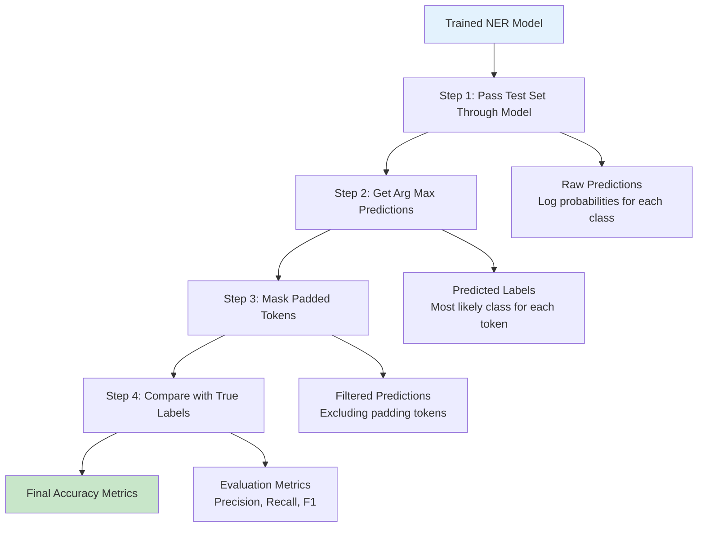

## Step 1: Pass Test Set Through the Model

### Getting Raw Predictions

The first step is to run your trained model on the test data to get prediction probabilities for each token.

```python
import numpy as np
import tensorflow as tf

def get_model_predictions(model, test_data_generator):
    """
    Pass test set through the trained model to get predictions

    This function processes the test data and returns the raw model outputs
    (log probabilities) for each token in each sequence.
    """
    all_predictions = []
    all_true_labels = []

    # Set model to evaluation mode (disables dropout, etc.)
    model.trainable = False

    for batch_X, batch_y in test_data_generator:
        # Convert to tensors
        X_tensor = tf.constant(batch_X, dtype=tf.int32)

        # Get model predictions (no gradient computation needed)
        with tf.GradientTape(watch_accessed_variables=False):
            predictions = model(X_tensor, training=False)

        # Store predictions and true labels
        all_predictions.append(predictions.numpy())
        all_true_labels.append(batch_y)

    # Concatenate all batches
    predictions = np.concatenate(all_predictions, axis=0)
    true_labels = np.concatenate(all_true_labels, axis=0)

    return predictions, true_labels

# Example usage
test_predictions, test_labels = get_model_predictions(model, test_data_generator)
print(f"Predictions shape: {test_predictions.shape}")  # (num_samples, seq_len, num_classes)
print(f"True labels shape: {test_labels.shape}")       # (num_samples, seq_len)
```

**What we get**: For each token in each test sentence, we now have log probabilities for all possible entity classes. For example:

```bash
Token: "Sharon"
Log probabilities: [-5.2, -0.1, -3.8, -2.1, -4.5, -6.0, ...]
                   [  O,  B-per, I-per, B-geo, I-geo, B-tim, ...]
Highest probability: B-per (-0.1) ← This will become our prediction
```

## Step 2: Get Arg Max Predictions

### Converting Probabilities to Predicted Labels

The model outputs probabilities for each class, but we need discrete predictions. We use **argmax** to find the class with the highest probability for each token.

```python
def convert_predictions_to_labels(predictions):
    """
    Convert log probabilities to predicted label indices using argmax

    argmax finds the index of the maximum value along a specified axis.
    For NER, we want the class with highest probability for each token.
    """
    # Apply argmax along the class dimension (axis=-1)
    predicted_labels = np.argmax(predictions, axis=-1)

    return predicted_labels

# Example of argmax operation
def demonstrate_argmax():
    """
    Demonstrate how argmax works with a concrete example
    """
    # Example log probabilities for one token
    log_probs = np.array([
        [-2.5, -0.3, -3.1, -1.8, -4.2],  # Token 1: "Sharon"
        [-0.1, -5.2, -4.8, -3.9, -6.1],  # Token 2: "flew"
        [-0.2, -4.9, -5.1, -3.2, -4.8]   # Token 3: "to"
    ])

    print("Log probabilities:")
    print("Token 1 (Sharon):", log_probs[0])
    print("Token 2 (flew):  ", log_probs[1])
    print("Token 3 (to):    ", log_probs[2])

    # Apply argmax
    predicted_indices = np.argmax(log_probs, axis=-1)
    print(f"\nPredicted indices: {predicted_indices}")

    # Interpret results
    label_names = ['O', 'B-per', 'I-per', 'B-geo', 'I-geo']
    for i, pred_idx in enumerate(predicted_indices):
        print(f"Token {i+1}: Predicted class {pred_idx} ({label_names[pred_idx]})")

# Run the demonstration
demonstrate_argmax()

# Apply to actual predictions
predicted_labels = convert_predictions_to_labels(test_predictions)
print(f"Predicted labels shape: {predicted_labels.shape}")  # (num_samples, seq_len)
```

**Understanding argmax**:

- **Input**: `[[-2.5, -0.3, -3.1, ...], ...]` (log probabilities)
- **argmax operation**: Find index of maximum value in each row
- **Output**: `[1, 0, 0, ...]` (predicted class indices)

**Why axis=-1?** In our 3D array `(batch_size, sequence_length, num_classes)`, axis=-1 refers to the last dimension (num_classes). We want to find the maximum across classes for each token.

## Step 3: Mask Padded Tokens

### The Padding Problem

Remember that we artificially padded sequences to make them the same length. When evaluating, we must **ignore these artificial tokens** because:

1. They're not real words from the original text
2. Penalizing the model for "mistakes" on fake tokens is unfair
3. It would artificially inflate or deflate our accuracy metrics

```python
def create_evaluation_mask(true_labels, pad_token_id=9):
    """
    Create a mask to identify which tokens should be included in evaluation

    The mask will be 1 for real tokens and 0 for padding tokens.
    This ensures we only evaluate on actual words, not artificial padding.
    """
    # Create mask: 1 for real tokens, 0 for padding tokens
    mask = (true_labels != pad_token_id).astype(np.float32)

    return mask

def demonstrate_masking():
    """
    Demonstrate the masking process with a concrete example
    """
    # Example sequence with padding (9 = <PAD> token)
    sequence = np.array([
        [1, 0, 0, 3, 0, 5, 9, 9, 9, 9],  # Real sentence + padding
        [1, 2, 0, 4, 9, 9, 9, 9, 9, 9],  # Shorter sentence + more padding
        [0, 0, 0, 1, 2, 3, 4, 5, 9, 9]   # Longer sentence + less padding
    ])

    print("Original sequences (9 = padding):")
    for i, seq in enumerate(sequence):
        print(f"Sequence {i+1}: {seq}")

    # Create mask
    mask = create_evaluation_mask(sequence, pad_token_id=9)

    print(f"\nEvaluation mask (1 = evaluate, 0 = ignore):")
    for i, mask_seq in enumerate(mask):
        print(f"Sequence {i+1}: {mask_seq}")

    print(f"\nTokens to evaluate per sequence:")
    for i, mask_seq in enumerate(mask):
        num_real_tokens = int(np.sum(mask_seq))
        print(f"Sequence {i+1}: {num_real_tokens} real tokens out of {len(mask_seq)}")

# Run the demonstration
demonstrate_masking()

# Apply to actual data
evaluation_mask = create_evaluation_mask(test_labels, pad_token_id=9)
print(f"Evaluation mask shape: {evaluation_mask.shape}")  # (num_samples, seq_len)
```

**Example masking result**:

```bash
Original:  [1, 0, 0, 3, 0, 5, 9, 9, 9, 9]  ← 6 real tokens + 4 padding
Mask:      [1, 1, 1, 1, 1, 1, 0, 0, 0, 0]  ← Evaluate first 6, ignore last 4
```

## Step 4: Compare with True Labels

### Computing Token-Level Accuracy

Now we can compute accuracy by comparing predictions with true labels, but only for non-padded tokens.

```python
def compute_token_accuracy(predicted_labels, true_labels, mask):
    """
    Compute token-level accuracy while ignoring padded tokens

    This gives us the percentage of individual tokens that were
    classified correctly, excluding artificial padding tokens.
    """
    # Check which predictions match true labels
    correct_predictions = (predicted_labels == true_labels).astype(np.float32)

    # Apply mask to ignore padding tokens
    masked_correct = correct_predictions * mask

    # Compute accuracy: correct predictions / total real tokens
    total_correct = np.sum(masked_correct)
    total_tokens = np.sum(mask)

    accuracy = total_correct / total_tokens if total_tokens > 0 else 0.0

    return accuracy

# Example calculation step by step
def demonstrate_accuracy_calculation():
    """
    Step-by-step demonstration of accuracy calculation
    """
    # Example data
    true_labels = np.array([
        [1, 0, 0, 3, 0, 5, 9, 9],  # True labels
        [0, 1, 2, 0, 9, 9, 9, 9]   # Another sequence
    ])

    predicted_labels = np.array([
        [1, 0, 2, 3, 0, 5, 9, 9],  # Predictions (mistake at position 2)
        [0, 1, 2, 3, 9, 9, 9, 9]   # Predictions (mistake at position 3)
    ])

    print("True labels:")
    print(true_labels)
    print("\nPredicted labels:")
    print(predicted_labels)

    # Create mask
    mask = create_evaluation_mask(true_labels, pad_token_id=9)
    print(f"\nMask (1=evaluate, 0=ignore):")
    print(mask)

    # Check correctness
    correct = (predicted_labels == true_labels).astype(np.float32)
    print(f"\nCorrect predictions (1=correct, 0=wrong):")
    print(correct)

    # Apply mask
    masked_correct = correct * mask
    print(f"\nMasked correct predictions:")
    print(masked_correct)

    # Calculate accuracy
    total_correct = np.sum(masked_correct)
    total_tokens = np.sum(mask)
    accuracy = total_correct / total_tokens

    print(f"\nAccuracy calculation:")
    print(f"Total correct: {total_correct}")
    print(f"Total tokens: {total_tokens}")
    print(f"Accuracy: {accuracy:.3f} ({accuracy*100:.1f}%)")

# Run demonstration
demonstrate_accuracy_calculation()

# Compute actual accuracy
token_accuracy = compute_token_accuracy(predicted_labels, test_labels, evaluation_mask)
print(f"Token-level accuracy: {token_accuracy:.3f} ({token_accuracy*100:.1f}%)")
```

## Advanced Evaluation Metrics

### Why Token-Level Accuracy Isn't Enough

Token-level accuracy has a major limitation: it treats all mistakes equally. But in NER, some mistakes are worse than others:

```bash
Example 1: Boundary errors
True:      [B-per, I-per, O, B-geo]  ← "John Smith" and "Paris"
Predicted: [B-per, O,     O, B-geo]  ← Missed "Smith" but got entities right

Example 2: Complete misses
True:      [B-per, I-per, O, B-geo]  ← "John Smith" and "Paris"
Predicted: [O,     O,     O, O    ]  ← Missed everything!

Both get 50% token accuracy, but Example 1 is much better!
```

### Entity-Level Evaluation

**Entity-level evaluation** considers whether complete entities are identified correctly:

```python
def extract_entities(labels, idx_to_label):
    """
    Extract complete entities from BIO-tagged sequence

    This function groups consecutive B- and I- tags into complete entities,
    which is necessary for entity-level evaluation.
    """
    entities = []
    current_entity = None

    for i, label_idx in enumerate(labels):
        label = idx_to_label[label_idx]

        if label.startswith('B-'):
            # Start of new entity
            if current_entity:
                entities.append(current_entity)
            current_entity = {
                'start': i,
                'end': i,
                'type': label[2:],  # Remove 'B-' prefix
                'tokens': [i]
            }
        elif label.startswith('I-') and current_entity:
            # Continuation of current entity
            if label[2:] == current_entity['type']:  # Same entity type
                current_entity['end'] = i
                current_entity['tokens'].append(i)
            else:
                # Type mismatch - end current entity, start new one
                entities.append(current_entity)
                current_entity = None
        else:
            # 'O' tag or end of sequence
            if current_entity:
                entities.append(current_entity)
                current_entity = None

    # Don't forget the last entity
    if current_entity:
        entities.append(current_entity)

    return entities

def compute_entity_level_metrics(true_labels, predicted_labels, idx_to_label, mask):
    """
    Compute precision, recall, and F1 score at the entity level

    This is the gold standard for NER evaluation because it measures
    whether complete entities are identified correctly.
    """
    total_true_entities = 0
    total_predicted_entities = 0
    correct_entities = 0

    # Process each sequence
    for i in range(len(true_labels)):
        # Get non-padded portions
        seq_length = int(np.sum(mask[i]))
        true_seq = true_labels[i][:seq_length]
        pred_seq = predicted_labels[i][:seq_length]

        # Extract entities
        true_entities = extract_entities(true_seq, idx_to_label)
        predicted_entities = extract_entities(pred_seq, idx_to_label)

        # Count entities
        total_true_entities += len(true_entities)
        total_predicted_entities += len(predicted_entities)

        # Count correct entities (exact match required)
        for true_entity in true_entities:
            for pred_entity in predicted_entities:
                if (true_entity['start'] == pred_entity['start'] and
                    true_entity['end'] == pred_entity['end'] and
                    true_entity['type'] == pred_entity['type']):
                    correct_entities += 1
                    break  # Avoid double counting

    # Calculate metrics
    precision = correct_entities / total_predicted_entities if total_predicted_entities > 0 else 0
    recall = correct_entities / total_true_entities if total_true_entities > 0 else 0
    f1 = 2 * precision * recall / (precision + recall) if (precision + recall) > 0 else 0

    return {
        'precision': precision,
        'recall': recall,
        'f1': f1,
        'true_entities': total_true_entities,
        'predicted_entities': total_predicted_entities,
        'correct_entities': correct_entities
    }

# Example usage
entity_metrics = compute_entity_level_metrics(
    test_labels, predicted_labels, idx_to_label, evaluation_mask
)

print("Entity-level evaluation results:")
print(f"Precision: {entity_metrics['precision']:.3f}")
print(f"Recall:    {entity_metrics['recall']:.3f}")
print(f"F1 Score:  {entity_metrics['f1']:.3f}")
print(f"Correct entities: {entity_metrics['correct_entities']}")
print(f"Total true entities: {entity_metrics['true_entities']}")
print(f"Total predicted entities: {entity_metrics['predicted_entities']}")
```

### Understanding Precision, Recall, and F1

**Precision**: Of all the entities my model predicted, how many were actually correct?

- **Formula**: `Correct Predictions / Total Predictions`
- **High precision**: Model rarely predicts false entities (but might miss real ones)

**Recall**: Of all the real entities in the text, how many did my model find?

- **Formula**: `Correct Predictions / Total True Entities`
- **High recall**: Model finds most real entities (but might predict false ones)

**F1 Score**: Harmonic mean of precision and recall

- **Formula**: `2 × (Precision × Recall) / (Precision + Recall)`
- **Balanced measure**: Good F1 means both precision and recall are decent

**Real-world example**:

```bash
Text: "Barack Obama visited Google headquarters in California"
True entities: [Barack Obama: PERSON], [Google: ORG], [California: GEO]

Scenario 1 - High Precision, Low Recall:
Predicted: [Barack Obama: PERSON]
Precision: 1/1 = 100% (all predictions correct)
Recall: 1/3 = 33% (found only 1 of 3 entities)

Scenario 2 - Low Precision, High Recall:
Predicted: [Barack Obama: PERSON], [visited: ORG], [Google: ORG], [California: GEO]
Precision: 3/4 = 75% (3 correct out of 4 predictions)
Recall: 3/3 = 100% (found all 3 true entities)
```

## Complete Evaluation Pipeline

### Putting It All Together

```python
def comprehensive_ner_evaluation(model, test_data_generator, idx_to_label, pad_token_id=9):
    """
    Complete evaluation pipeline for NER models

    This function implements all four steps of NER evaluation and provides
    both token-level and entity-level metrics for comprehensive assessment.
    """
    print("🔍 Starting NER Model Evaluation...")
    print("=" * 50)

    # Step 1: Get model predictions
    print("Step 1: Getting model predictions...")
    test_predictions, test_labels = get_model_predictions(model, test_data_generator)
    print(f"✓ Processed {len(test_labels)} test sequences")

    # Step 2: Convert to predicted labels
    print("Step 2: Converting probabilities to labels...")
    predicted_labels = convert_predictions_to_labels(test_predictions)
    print("✓ Applied argmax to get discrete predictions")

    # Step 3: Create evaluation mask
    print("Step 3: Creating evaluation mask...")
    evaluation_mask = create_evaluation_mask(test_labels, pad_token_id)
    total_tokens = int(np.sum(evaluation_mask))
    print(f"✓ Masked padding tokens, evaluating {total_tokens} real tokens")

    # Step 4: Compute metrics
    print("Step 4: Computing evaluation metrics...")

    # Token-level accuracy
    token_acc = compute_token_accuracy(predicted_labels, test_labels, evaluation_mask)

    # Entity-level metrics
    entity_metrics = compute_entity_level_metrics(
        test_labels, predicted_labels, idx_to_label, evaluation_mask
    )

    # Print results
    print("\n📊 EVALUATION RESULTS")
    print("=" * 50)
    print(f"Token-level Accuracy: {token_acc:.3f} ({token_acc*100:.1f}%)")
    print(f"Entity-level Precision: {entity_metrics['precision']:.3f}")
    print(f"Entity-level Recall: {entity_metrics['recall']:.3f}")
    print(f"Entity-level F1 Score: {entity_metrics['f1']:.3f}")

    print(f"\n📈 DETAILED STATISTICS")
    print("=" * 50)
    print(f"Total tokens evaluated: {total_tokens}")
    print(f"True entities: {entity_metrics['true_entities']}")
    print(f"Predicted entities: {entity_metrics['predicted_entities']}")
    print(f"Correctly identified entities: {entity_metrics['correct_entities']}")

    return {
        'token_accuracy': token_acc,
        'entity_precision': entity_metrics['precision'],
        'entity_recall': entity_metrics['recall'],
        'entity_f1': entity_metrics['f1'],
        'predictions': predicted_labels,
        'true_labels': test_labels,
        'mask': evaluation_mask
    }

# Run complete evaluation
evaluation_results = comprehensive_ner_evaluation(
    model, test_data_generator, idx_to_label, pad_token_id=9
)
```

## Error Analysis and Debugging

### Analyzing Model Mistakes

Understanding where your model fails helps improve it:

```python
def analyze_prediction_errors(true_labels, predicted_labels, idx_to_label,
                            evaluation_mask, num_examples=5):
    """
    Analyze and display model errors for debugging

    This helps you understand what types of mistakes your model makes,
    which is crucial for model improvement.
    """
    print("🔍 ERROR ANALYSIS")
    print("=" * 50)

    error_count = 0

    for i in range(len(true_labels)):
        if error_count >= num_examples:
            break

        # Get non-padded sequence
        seq_length = int(np.sum(evaluation_mask[i]))
        true_seq = true_labels[i][:seq_length]
        pred_seq = predicted_labels[i][:seq_length]

        # Check if there are any errors
        if not np.array_equal(true_seq, pred_seq):
            error_count += 1

            print(f"\nExample {error_count}:")
            print("-" * 30)

            for j, (true_idx, pred_idx) in enumerate(zip(true_seq, pred_seq)):
                true_label = idx_to_label[true_idx]
                pred_label = idx_to_label[pred_idx]

                status = "✓" if true_idx == pred_idx else "✗"
                print(f"Token {j+1:2d}: True={true_label:8s} Pred={pred_label:8s} {status}")

# Run error analysis
analyze_prediction_errors(
    evaluation_results['true_labels'],
    evaluation_results['predictions'],
    idx_to_label,
    evaluation_results['mask'],
    num_examples=3
)
```

## Summary: Best Practices for NER Evaluation

### Key Takeaways

**✅ Always mask padding tokens**: Artificial tokens shouldn't affect your metrics

**✅ Use entity-level metrics**: F1 score is more meaningful than token accuracy for NER

**✅ Report multiple metrics**: Token accuracy, precision, recall, and F1 give a complete picture

**✅ Analyze errors**: Understanding mistakes helps improve your model

**✅ Consider class imbalance**: Most tokens are 'O', so high accuracy might be misleading

### Evaluation Checklist

```python
# Essential evaluation steps - use this as your checklist
✓ Pass test data through trained model
✓ Apply argmax to get discrete predictions
✓ Create mask to exclude padding tokens
✓ Compute token-level accuracy with masking
✓ Extract entities for entity-level evaluation
✓ Calculate precision, recall, and F1 scores
✓ Analyze prediction errors for debugging
✓ Report both token-level and entity-level metrics
✓ Consider domain-specific evaluation if needed
```

### Common Evaluation Mistakes to Avoid

❌ **Evaluating on padding tokens**: Always mask them out

❌ **Only reporting token accuracy**: Entity-level metrics are more important

❌ **Ignoring class imbalance**: A model predicting all 'O' can have high accuracy

❌ **Not analyzing errors**: Understanding failures is key to improvement

❌ **Inconsistent evaluation**: Use the same metrics across experiments

**Ready for Real-World Application!** With proper evaluation techniques, you can now confidently assess your NER model's performance and identify areas for improvement. Remember that good evaluation is just as important as good training - it tells you whether your model is actually solving the problem you care about!

# 10. Week Summary - LSTMs and Named Entity Recognition Applications

## Overview: From Theory to Practice

Congratulations! You've completed an intensive journey through one of the most important topics in modern NLP: **Long Short-Term Memory networks and their application to Named Entity Recognition**. This week has taken you from understanding the fundamental problems with vanilla RNNs all the way to building and evaluating production-ready NER systems.

Let's consolidate everything you've learned and see how it all connects together.

## What You've Accomplished This Week

### 🧠 **Deep Understanding of LSTM Architecture**

You now have **intuition behind LSTMs** and understand **why they are more powerful than RNNs**:

**From RNN Limitations to LSTM Solutions:**

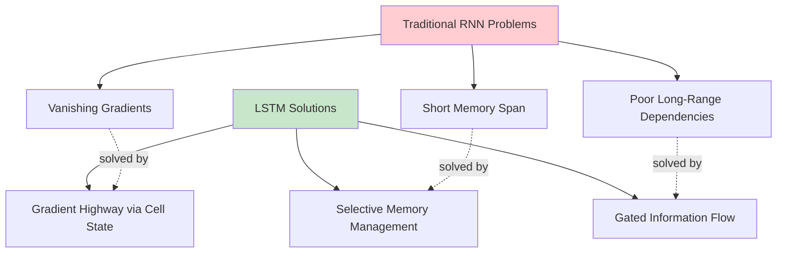

**Key Insights You've Gained:**

- **Why vanilla RNNs fail**: Exponential gradient decay across time steps
- **How LSTMs solve this**: Dual memory system with additive cell state updates
- **The power of gates**: Forget, input, and output gates provide fine-grained control
- **Mathematical elegance**: Simple equations that solve complex problems

### 🏷️ **Practical NER System Development**

You've built a complete understanding of **Named Entity Recognition**:

**The Complete NER Pipeline You've Mastered:**

```bash
Raw Text → Tokenization → Vocabulary → Encoding → Padding → Batching → LSTM → Dense → LogSoftmax → Predictions → Evaluation
```

**Each Component You Now Understand:**

- **BIO tagging scheme**: How to represent entity boundaries precisely
- **Data preprocessing**: Converting text to numbers while maintaining alignment
- **Sequence padding**: Handling variable-length inputs efficiently
- **Batch processing**: Optimizing training with grouped examples
- **Model architecture**: LSTM + Dense layers for sequence classification
- **Proper evaluation**: Token-level vs entity-level metrics

## Core Concepts Mastered

### 1. **LSTM Memory Mechanisms**

**You now understand how LSTMs "think":**

```python
# The LSTM decision process you've learned:
def lstm_intuition(previous_memory, current_input):
    """
    How an LSTM processes information at each time step
    """
    # Forget Gate: "What should I throw away from memory?"
    forget_decision = decide_what_to_forget(previous_memory, current_input)

    # Input Gate: "What new information should I store?"
    input_decision = decide_what_to_store(previous_memory, current_input)
    new_information = generate_candidates(previous_memory, current_input)

    # Update Memory: Combine old (filtered) + new (selected)
    updated_memory = forget_decision * previous_memory + input_decision * new_information

    # Output Gate: "What should I output from my memory?"
    output_decision = decide_what_to_output(previous_memory, current_input)

    return output_decision * tanh(updated_memory)
```

### 2. **NER as Sequence Labeling**

**You understand the NER task deeply:**

```bash
# From this perspective:
"Sharon flew to Miami last Friday"
↓ (just words)

# To this understanding:
Token:  Sharon  flew  to   Miami  last  Friday
Index:  4282    853   187  5388   2894  7
Label:  B-per   O     O    B-geo  O     B-tim
Encoded: 1      0     0    3      0     5

# With this insight:
"Each word needs a label, boundaries matter, context is crucial"
```

### 3. **Data Processing Mastery**

**You've learned the critical skill of preparing NLP data:**

- **Vocabulary management**: Balancing coverage vs efficiency
- **Sequence alignment**: Ensuring perfect word-label correspondence
- **Padding strategies**: Making variable sequences batch-friendly
- **Masking techniques**: Proper evaluation excluding artificial tokens

### 4. **Evaluation Sophistication**

**You understand why simple accuracy isn't enough:**

```python
# This insight:
token_accuracy = 0.85  # Sounds good!
entity_f1 = 0.23       # Actually terrible!

# Led to this understanding:
"High token accuracy can hide poor entity recognition
because most tokens are 'O' (non-entities)"
```

## Programming Assignment Preview

### What You'll Implement

In this week's programming assignment, you'll put all these concepts into practice:

**1. Build a Data Generator**

```python
# You'll create an efficient data generator that:
- Converts text to numerical sequences
- Handles padding for batch processing
- Provides clean batches for training
- Manages memory efficiently for large datasets
```

**2. Implement LSTM Architecture**

```python
# You'll build the complete model:
Input → Embedding → LSTM → Dense → LogSoftmax → Output
```

**3. Training Pipeline**

```python
# You'll implement the full training loop:
for epoch in range(num_epochs):
    for batch_X, batch_y in data_generator:  # Your generator!
        predictions = model(batch_X)          # Your LSTM!
        loss = compute_loss(predictions, batch_y)
        update_weights(loss)
```

**4. Evaluation System**

```python
# You'll implement proper NER evaluation:
- Token-level accuracy with masking
- Entity-level precision, recall, F1
- Error analysis and debugging
```

### Skills You'll Apply

**Technical Implementation:**

- Converting theoretical LSTM knowledge to working code
- Handling real-world data processing challenges
- Debugging sequence alignment issues
- Optimizing batch processing for efficiency

**Problem-Solving:**

- Diagnosing why models aren't learning
- Interpreting evaluation metrics correctly
- Balancing model complexity vs performance
- Making data-driven decisions about hyperparameters

## Key Takeaways for Real-World Applications

### 1. **LSTMs Are Still Relevant**

Despite the rise of Transformers, LSTMs remain important because:

- **Computational efficiency**: Lower memory and compute requirements
- **Streaming applications**: Natural for real-time sequence processing
- **Small data scenarios**: Often outperform Transformers with limited training data
- **Interpretability**: Clearer understanding of memory mechanisms

### 2. **NER Is Foundational**

The NER skills you've learned apply broadly:

- **Information extraction**: Core component of knowledge graph construction
- **Question answering**: Identifying key entities in questions and passages
- **Text summarization**: Determining which entities to preserve in summaries
- **Search systems**: Understanding user intent through entity recognition

### 3. **Data Processing Is Critical**

The data preprocessing pipeline you've mastered is essential for:

- **Any sequence labeling task**: POS tagging, chunking, semantic role labeling
- **Text classification**: Document-level sentiment, topic classification
- **Language modeling**: Preparing data for GPT-style models
- **Machine translation**: Sequence-to-sequence tasks

## Looking Forward: Next Week Preview

### Siamese Networks for Question Duplicates

Next week, you'll explore **Siamese Networks** to identify duplicate questions:

**The Challenge:**

```bash
Question 1: "How do I cook pasta?"
Question 2: "What's the best way to prepare spaghetti?"
Task: Determine if these are asking the same thing
```

**The Architecture:**

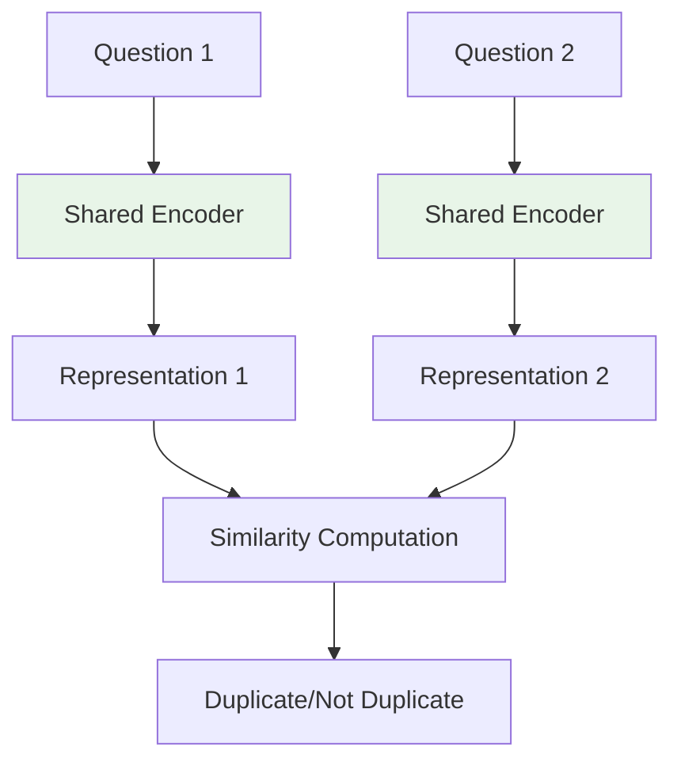

**Why This Matters:**

- **Search engines**: Avoiding duplicate questions in Q&A systems
- **Customer service**: Routing similar inquiries efficiently
- **Content moderation**: Detecting spam or repeated content
- **Recommendation systems**: Finding similar items or queries

## Reflection: Your Learning Journey

### From Week Start to Week End

**Where you started:**

- Basic understanding of RNNs and their limitations
- Awareness that NER is important but unclear on implementation
- Theoretical knowledge without practical application skills

**Where you are now:**

- Deep intuition for LSTM architecture and why it works
- Complete understanding of NER pipeline from data to evaluation
- Practical skills to implement production-ready sequence models
- Ability to debug and optimize NLP systems effectively

### Skills That Transfer

The concepts you've mastered this week will serve you in:

**Academic Research:**

- Understanding sequence modeling literature
- Implementing baseline models for comparisons
- Evaluating model performance correctly

**Industry Applications:**

- Building text processing pipelines
- Developing entity extraction systems
- Optimizing model performance for production

**Personal Projects:**

- Creating NLP applications
- Contributing to open-source projects
- Building portfolio demonstrations

## Final Thoughts: The Power of Understanding

### Why This Week Matters

You've done more than just learn about LSTMs and NER - you've developed **deep understanding** of:

**How neural networks handle sequences**: The mathematical and intuitive foundation for all sequence modeling

**How to process text data properly**: The unglamorous but critical skills that make or break NLP projects

**How to evaluate NLP systems correctly**: The insight that metrics must match your actual goals

**How complex problems decompose**: Breaking down entity recognition into manageable, solvable pieces

### Preparing for Success

As you tackle the programming assignment, remember:

**🎯 Start with data**: Get your preprocessing pipeline right first

**🔧 Debug systematically**: Check alignment, shapes, and masks carefully

**📊 Evaluate properly**: Use both token-level and entity-level metrics

**🧠 Think about the problem**: What should the model learn, and is it learning it?

### The Bigger Picture

LSTMs and NER represent a crucial bridge in NLP history:

- **From rule-based to learned systems**: Statistical NLP → Neural NLP
- **From word-level to sequence-level understanding**: Individual classification → Sequential reasoning
- **From toy problems to real applications**: Academic exercises → Production systems

You're now equipped with both the theoretical knowledge and practical skills to contribute meaningfully to this field.

## Good luck with the programming assignment!

Remember: Every expert was once a beginner who refused to give up. You've built a solid foundation this week - now it's time to put it into practice and see your code bring these concepts to life.

**Next week**: Siamese Networks and the fascinating world of similarity learning await! 🚀
