# Natural Language Processing Specialization

## Course 3: Natural Language Processing with Sequence Models

### Week 3: Siamese Networks

---

## Table of Contents

1. [Week Introduction - Siamese Networks Overview](#1-week-introduction---siamese-networks-overview)
2. [Siamese Networks Fundamentals - Twin Architecture Explained](#2-siamese-networks-fundamentals---twin-architecture-explained)
3. [Architecture Design - Building Identical Networks](#3-architecture-design---building-identical-networks)
4. [Cost Function - Measuring Similarity and Distance](#4-cost-function---measuring-similarity-and-distance)
5. [Triplets - Anchor, Positive, and Negative Examples](#5-triplets---anchor-positive-and-negative-examples)
6. [Computing The Cost I - Mathematical Foundation](#6-computing-the-cost-i---mathematical-foundation)
7. [Computing The Cost II - Advanced Implementation](#7-computing-the-cost-ii---advanced-implementation)
8. [One Shot Learning - Learning from Few Examples](#8-one-shot-learning---learning-from-few-examples)
9. [Training and Testing - Model Evaluation](#9-training-and-testing---model-evaluation)
10. [Week Conclusion - Siamese Networks Recap](#10-week-conclusion---siamese-networks-recap)

---

# 1. Week Introduction - Siamese Networks Overview

## Overview

Week 3 introduces **Siamese Networks**, a specialized neural network architecture that revolutionizes how we approach similarity learning in machine learning. The name "Siamese" comes from the concept of twins - these networks consist of two identical neural networks that work in tandem, sharing the same weights and parameters while processing different inputs simultaneously.

## Core Concept: Twin Architecture

A **Siamese network** is fundamentally a neural network that uses the same weights while working in tandem on two different input vectors to compute comparable output vectors. This shared-weight architecture ensures that both networks learn identical feature representations, making their outputs directly comparable for similarity measurements.

**Key Characteristics:**

- **Shared Parameters**: Both networks have identical weights and architecture
- **Parallel Processing**: Two different inputs are processed simultaneously
- **Comparable Outputs**: Generated vectors can be directly compared for similarity
- **Consistent Learning**: Same feature extraction applied to both inputs

## Similarity Measurement

Once the Siamese network processes two inputs and generates their respective output vectors, you can compare those output vectors to determine if the original inputs are similar. This comparison typically involves calculating distances (like Euclidean distance) or similarity scores (like cosine similarity) between the output embeddings.

## Real-World Applications

### Question Duplicate Detection

One of the most important applications is identifying question duplicates in online platforms. This is crucial because forums and Q&A platforms don't want to be cluttered with repetitive content. Major platforms implement these techniques:

- **Stack Overflow**: Prevents duplicate programming questions
- **Quora**: Identifies semantically similar questions even if worded differently
- **Reddit**: Helps moderators manage repetitive posts
- **Customer Support**: Automatically routes similar support tickets

### Signature Verification

Siamese networks excel at signature verification tasks, where the system needs to determine if two signatures belong to the same person. This has applications in:

- **Banking**: Verifying check signatures
- **Legal Documents**: Authenticating contract signatures
- **Identity Verification**: Confirming document authenticity

### Other Applications

- **Face Verification**: Determining if two photos show the same person
- **Plagiarism Detection**: Finding similar or copied content
- **Document Similarity**: Comparing legal or academic documents
- **Product Matching**: E-commerce duplicate product detection

## Why Siamese Networks Matter

Traditional classification approaches require predefined categories and extensive labeled data for each class. Siamese networks, however, learn to create meaningful embeddings where:

- Similar inputs produce nearby vectors in the embedding space
- Dissimilar inputs produce distant vectors
- The network can generalize to new, unseen examples without retraining

This makes them particularly powerful for **one-shot learning** scenarios where you have very few examples of each class, yet need to make similarity decisions.

## Week Learning Objectives

By the end of this week, you will:

1. Understand the architecture and mechanics of Siamese networks
2. Learn about triplet loss and how it trains similarity learning
3. Implement a Siamese network for question duplicate detection
4. Master the mathematical foundations of similarity-based learning
5. Apply these concepts to real-world NLP problems

The beauty of Siamese networks lies in their elegance and effectiveness - using a simple yet powerful concept of shared weights to solve complex similarity problems across various domains.

# 2. Siamese Networks Fundamentals - Twin Architecture Explained

## What Are Siamese Networks?

A **Siamese network** is a special type of neural network architecture consisting of two identical neural networks that share the same weights and parameters. These networks process two different inputs in parallel and are merged at the end to produce a similarity score. The name "Siamese" refers to the concept of twins - two networks that are identical in structure and function.

## Core Architecture Concept

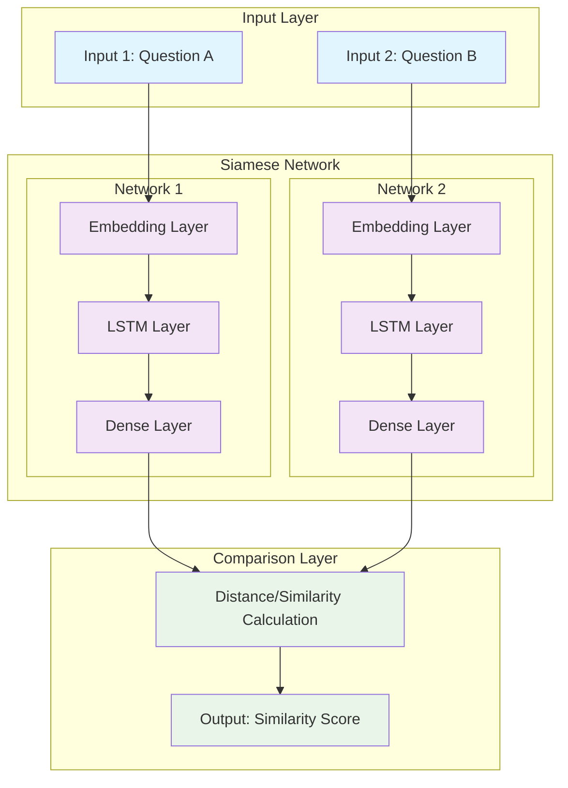

**Key Features:**

- **Shared Weights**: Both networks have identical parameters (θ₁ = θ₂)
- **Parallel Processing**: Two inputs processed simultaneously
- **Joint Training**: Networks learn together to maximize similarity learning
- **Single Output**: Combined result representing relationship between inputs

## The Challenge of Semantic Similarity

Traditional word-by-word comparison fails to capture semantic meaning. Consider these examples:

### Example 1: Same Meaning, Different Words

```
Question A: "How old are you?"
Question B: "What is your age?"

Word Overlap: 0% (no common words)
Semantic Similarity: 100% (identical meaning)
```

### Example 2: Different Meaning, Similar Words

```
Question A: "Where are you from?"
Question B: "Where are you going?"

Word Overlap: 75% (3 out of 4 words match)
Semantic Similarity: 0% (completely different meaning)
```

This demonstrates why simple string matching or word overlap metrics are insufficient for determining semantic similarity.

## Classification vs. Siamese Networks

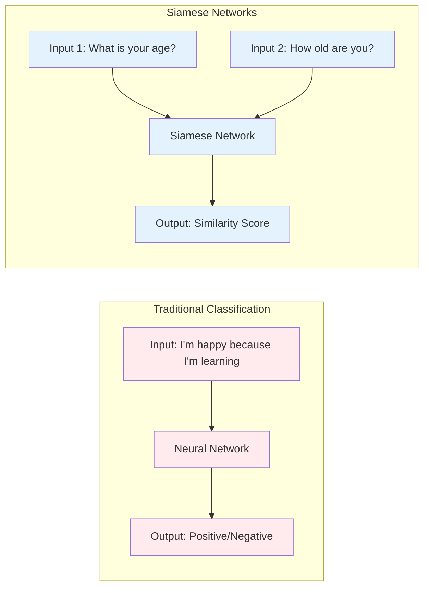

### Key Differences:

| Aspect       | Traditional Classification                           | Siamese Networks                                 |
| ------------ | ---------------------------------------------------- | ------------------------------------------------ |
| **Goal**     | Learn what makes an input belong to a specific class | Learn what makes two inputs similar or different |
| **Input**    | Single input                                         | Pair of inputs                                   |
| **Output**   | Class label (e.g., positive/negative)                | Similarity score (0-1)                           |
| **Training** | Learn features for categorization                    | Learn features for comparison                    |

## How Siamese Networks Work

### 1. **Encoding Phase**

Each input is processed through identical neural networks to create dense vector representations (embeddings):

```
Input 1 → Network f(x₁) → Embedding v₁
Input 2 → Network f(x₂) → Embedding v₂
```

### 2. **Comparison Phase**

The embeddings are compared using distance metrics:

```
Similarity Score = Distance Function(v₁, v₂)
```

Common distance functions:

- **Euclidean Distance**: `||v₁ - v₂||₂`
- **Cosine Similarity**: `(v₁ · v₂) / (||v₁|| × ||v₂||)`
- **Manhattan Distance**: `||v₁ - v₂||₁`

### 3. **Decision Phase**

The similarity score is compared against a threshold:

```
if similarity_score > threshold:
    prediction = "Similar"
else:
    prediction = "Different"
```

## Real-World Applications

### 1. **Question Duplicate Detection**

**Platforms**: Quora, Stack Overflow, Reddit

```
Input: "How do I learn Python?" + "What's the best way to study Python?"
Output: Similarity Score = 0.89 → DUPLICATE
```

### 2. **Signature Verification**

**Applications**: Banking, Legal Documents

```
Input: Signature Image 1 + Signature Image 2
Output: Similarity Score = 0.93 → AUTHENTIC
```

### 3. **Search Query Matching**

**Applications**: Search Engines, E-commerce

```
Input: "best laptop 2024" + "top laptops this year"
Output: Similarity Score = 0.81 → SIMILAR INTENT
```

### 4. **Document Similarity**

**Applications**: Plagiarism Detection, Legal Analysis

```
Input: Document A + Document B
Output: Similarity Score = 0.67 → MODERATE SIMILARITY
```

## Advantages of Siamese Networks

### **Efficiency**

- **Shared Parameters**: Only one set of weights to train
- **Parallel Processing**: Both inputs processed simultaneously
- **Scalable**: Can compare any two inputs without retraining

### **Flexibility**

- **Domain Agnostic**: Works with text, images, audio
- **Few-Shot Learning**: Can work with limited training data
- **Generalization**: Learns abstract similarity concepts

### **Robustness**

- **Semantic Understanding**: Captures meaning beyond surface features
- **Noise Tolerance**: Robust to variations in input format
- **Transfer Learning**: Pre-trained models can be fine-tuned

## Training Process

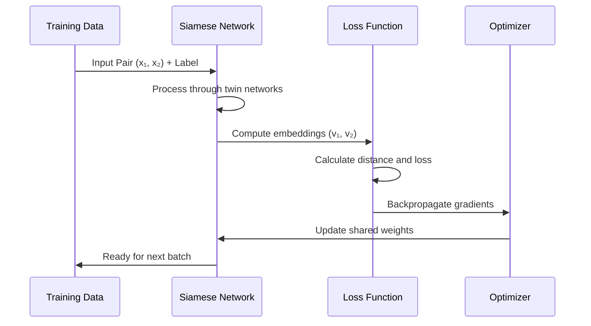

The training process involves:

1. **Data Preparation**: Create pairs of similar and dissimilar examples
2. **Forward Pass**: Process pairs through Siamese networks
3. **Loss Calculation**: Measure how well the network distinguishes similar/dissimilar pairs
4. **Backpropagation**: Update shared weights to improve similarity learning
5. **Iteration**: Repeat until convergence

## Next Steps

In the following sections, we'll dive deeper into:

- The detailed architecture of Siamese networks
- Implementation techniques and best practices
- Cost functions and loss calculation methods
- Practical applications in question duplicate detection

Understanding these fundamentals provides the foundation for building effective similarity-learning systems that can handle complex semantic relationships in natural language.

# 3. Architecture Design - Building Identical Networks

## Overview of Siamese Network Architecture

Siamese networks are a special type of neural network architecture designed to learn similarity between two inputs. Think of them like identical twins who look at different things but process information in exactly the same way. The name "Siamese" comes from the famous conjoined twins Chang and Eng Bunker from Siam (now Thailand), emphasizing the "joined" or "shared" nature of the network components.

**Why are Siamese Networks Special?**

Imagine you want to determine if two questions mean the same thing:

- "How old are you?"
- "What is your age?"

A traditional approach might require training a classifier on millions of question pairs. But what if you encounter a completely new question you've never seen before? Siamese networks solve this by learning a general concept of "similarity" rather than memorizing specific question pairs.

**The Core Innovation:**

Instead of learning "Question A is similar to Question B," Siamese networks learn:

1. How to convert any question into a meaningful representation (vector)
2. How to measure if two representations are similar

This makes them incredibly powerful for tasks where you have limited training data or need to handle new, unseen examples.

## Detailed Architecture Breakdown

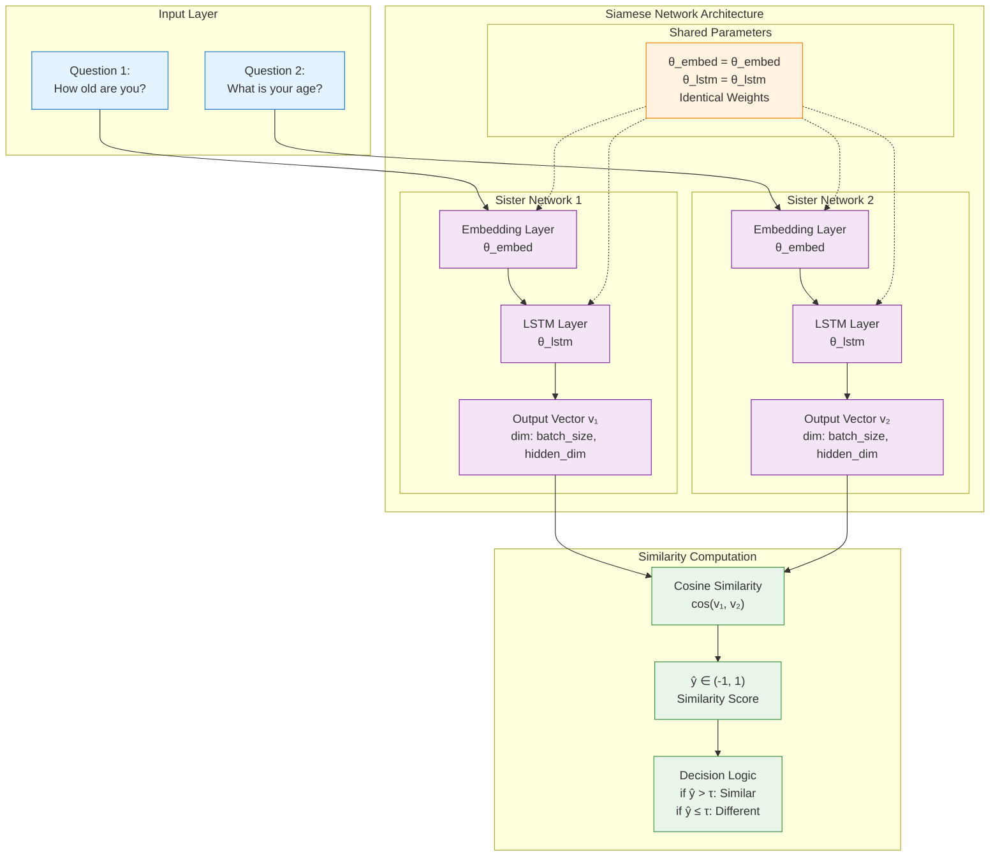

## Key Architectural Components

### 1. **Input Processing Layer**

**What happens here:**
The architecture begins with two separate input channels that accept textual data. Think of this as having two readers who will each read a different question.

**Why two inputs?**

- **Question 1**: First input sequence (e.g., "How old are you?")
- **Question 2**: Second input sequence (e.g., "What is your age?")

The network needs both questions simultaneously to compare them. Unlike a traditional classifier that looks at one input at a time, Siamese networks are designed to process pairs.

**Data Preprocessing:**
Before feeding text to the network, we convert words into numbers (tokenization):

```python
# Example: Converting questions to token IDs
# "How old are you?" → [45, 123, 67, 89]
# "What is your age?" → [34, 12, 98, 156]

question_1 = [2, 45, 123, 67, 89]  # Token IDs for first question
question_2 = [34, 12, 98, 156, 23] # Token IDs for second question
```

**Key Point:** Each number represents a word from our vocabulary. For example, 45 might represent "old", 123 might represent "are", etc.

### 2. **Sister Networks (Identical Subnetworks)**

This is where the magic of Siamese networks really happens. We have two identical processing pipelines that work in parallel.

#### **Embedding Layer**

**Purpose:** Convert discrete word tokens into dense, meaningful vector representations.

**Think of it like this:**

- Words like "old" and "age" should have similar vector representations because they're related
- Words like "old" and "banana" should have very different vectors

**How it works:**

- **Shared Parameters**: $\theta_{embed}$ - Both networks use the same vocabulary mapping
- **Output**: Dense vectors of dimension $[sequence\_length, embedding\_dim]$

```python
# Pseudocode showing how embedding works
embedding_matrix = SharedEmbedding(vocab_size=10000, embed_dim=300)

# Both questions use the SAME embedding matrix
embedded_q1 = embedding_matrix(question_1)  # Shape: [seq_len, 300]
embedded_q2 = embedding_matrix(question_2)  # Shape: [seq_len, 300]

# Example: word "old" (token_id=45) → [0.2, -0.1, 0.8, ..., 0.3] (300 numbers)
```

**Why embedding matters:**

- Raw tokens are just numbers with no meaning
- Embeddings capture semantic relationships
- Similar words get similar vectors through training

#### **LSTM Layer (Long Short-Term Memory)**

**Purpose:** Understand the sequence and context of words to capture the meaning of the entire question.

**Why LSTM?**

- **Sequential Understanding**: "How old are you?" vs "Are you old how?" - word order matters!
- **Context Awareness**: The word "old" means different things in "old man" vs "How old"
- **Memory**: LSTM can remember important information from earlier in the sequence

**How it processes:**

1. Reads the embedded question word by word
2. Builds up understanding of the overall meaning
3. Outputs a final vector that represents the entire question's meaning

```python
# Pseudocode for LSTM processing
shared_lstm = LSTM(input_dim=300, hidden_dim=128, shared_weights=True)

# Process each question through the SAME LSTM
vector_1 = shared_lstm(embedded_q1)  # Shape: [128] - meaning of question 1
vector_2 = shared_lstm(embedded_q2)  # Shape: [128] - meaning of question 2
```

**Key Insight:** After LSTM processing, each question becomes a single 128-dimensional vector that captures its meaning. Questions with similar meanings should have similar vectors.

**Alternative Architectures:**
While LSTM is common, you can use other components:

- **GRU (Gated Recurrent Unit)**: Simpler than LSTM, faster training
- **Transformer Encoders**: Better for long sequences, parallel processing
- **CNN (Convolutional Neural Network)**: Good for capturing local patterns
- **Dense Layers**: Simplest option for basic similarity tasks

### 3. **Parameter Sharing Mechanism**

This is the most crucial concept in Siamese networks. Let me explain why this matters so much.

**The Problem with Traditional Approaches:**

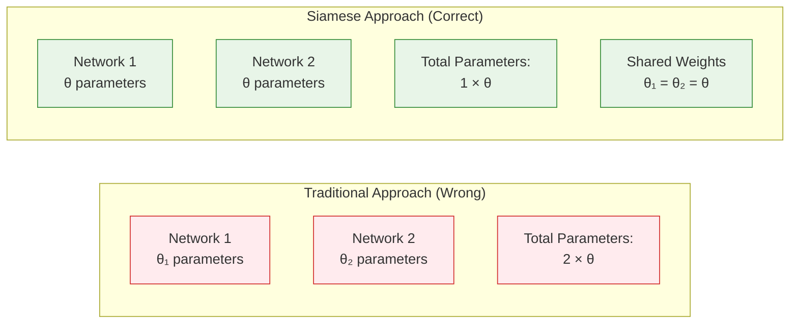

**Imagine this scenario without parameter sharing:**

- Network 1 learns that "How old" means asking about age
- Network 2 learns that "What age" means asking about age
- But they learn this SEPARATELY and INCONSISTENTLY

**The result:**

- If you input "How old are you?" to position 1 and "What is your age?" to position 2, you get one answer
- If you swap them (put "What is your age?" in position 1), you might get a completely different answer!
- This is clearly wrong - similarity should be symmetric

**How Parameter Sharing Fixes This:**

With shared parameters, both networks are literally the same network. They process information identically, ensuring:

- Consistency: Same input always produces the same representation
- Symmetry: similarity(A,B) = similarity(B,A)
- Efficiency: Only one set of weights to train and store

**Benefits of Parameter Sharing:**

1. **Efficiency**: Half the parameters means faster training and less memory
2. **Consistency**: Identical feature extraction guarantees reliable comparisons
3. **Generalization**: The network learns universal patterns, not position-specific ones
4. **Reduced Overfitting**: Fewer parameters mean less chance of memorizing training data

### 4. **Similarity Computation Layer**

After both questions are processed into vector representations, we need to measure how similar they are.

#### **Why Cosine Similarity?**

Cosine similarity measures the angle between two vectors, focusing on their direction rather than magnitude. This is perfect for text similarity because:

**Example to understand this:**

- Vector A: [10, 20, 30] (represents "How old are you?")
- Vector B: [1, 2, 3] (represents "What is your age?")

Notice that Vector B is just Vector A divided by 10. They point in the same direction but have different magnitudes. Cosine similarity correctly identifies them as identical (similarity = 1), while Euclidean distance would say they're very different.

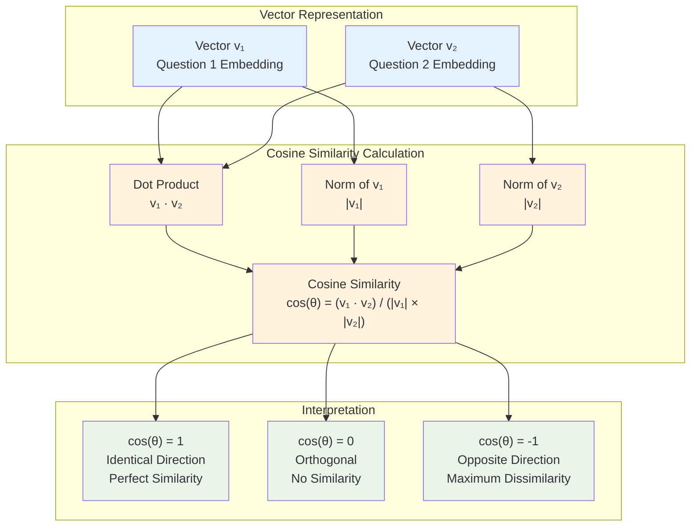

**Mathematical Formula:**

$$\text{cosine\_similarity}(v_1, v_2) = \frac{v_1 \cdot v_2}{||v_1|| \times ||v_2||}$$

**Breaking this down step by step:**

1. **Dot Product** ($v_1 \cdot v_2$): Multiply corresponding elements and sum them up
2. **Magnitude** ($||v_1||$): Length of vector 1 (square root of sum of squares)
3. **Magnitude** ($||v_2||$): Length of vector 2
4. **Cosine**: Divide dot product by the product of magnitudes

Where:

- $v_1 \cdot v_2$ = dot product of the vectors
- $||v_1||$ = L2 norm (magnitude) of vector 1
- $||v_2||$ = L2 norm (magnitude) of vector 2

**Step-by-Step Example:**

```python
import numpy as np

# Example vectors from LSTM outputs
v1 = np.array([0.8, 0.6, 0.2, -0.3])  # Question 1: "How old are you?"
v2 = np.array([0.7, 0.5, 0.3, -0.2])  # Question 2: "What is your age?"

# Step 1: Calculate dot product
dot_product = np.dot(v1, v2)
# = 0.8*0.7 + 0.6*0.5 + 0.2*0.3 + (-0.3)*(-0.2)
# = 0.56 + 0.30 + 0.06 + 0.06 = 0.98

# Step 2: Calculate magnitudes
norm_v1 = np.linalg.norm(v1)  # √(0.8² + 0.6² + 0.2² + 0.3²) = 1.077
norm_v2 = np.linalg.norm(v2)  # √(0.7² + 0.5² + 0.3² + 0.2²) = 0.928

# Step 3: Calculate cosine similarity
cosine_sim = dot_product / (norm_v1 * norm_v2)
# = 0.98 / (1.077 * 0.928) = 0.98 / 1.000 = 0.98

print(f"Similarity Score: {cosine_sim:.3f}")   # Output: 0.980
```

**Interpretation:**

- **0.98**: Very high similarity - these questions are nearly identical in meaning
- **Range**: Cosine similarity always gives values between -1 and 1
- **Direction matters**: The closer to 1, the more similar the questions

### 5. **Decision Logic and Threshold**

The cosine similarity gives us a continuous score, but often we need a binary decision: "Are these questions similar or not?"

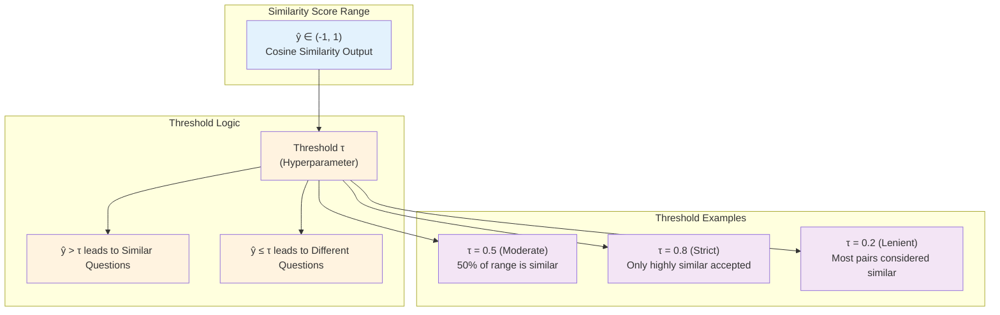

**Understanding Thresholds:**

The threshold $\tau$ (tau) is a hyperparameter you need to tune based on your specific use case:

**Practical Examples:**

1. **High Threshold** ($\tau = 0.8$):

   - **Use case**: Customer support where wrong answers are costly
   - **Behavior**: Only accepts very similar questions as duplicates
   - **Risk**: Might miss some true duplicates (false negatives)
   - **Benefit**: Very few false duplicates (false positives)

2. **Medium Threshold** ($\tau = 0.5$):

   - **Use case**: General question matching for forums
   - **Behavior**: Balanced approach
   - **Trade-off**: Moderate false positives and negatives

3. **Low Threshold** ($\tau = 0.2$):
   - **Use case**: Initial screening where human review follows
   - **Behavior**: Catches most potential duplicates
   - **Risk**: Many false positives need manual review
   - **Benefit**: Very few true duplicates are missed

**How to choose the right threshold:**

1. **Start with 0.5** (middle ground)
2. **Test on validation data**
3. **Adjust based on business needs**:
   - Need high precision? Increase threshold
   - Need high recall? Decrease threshold

## Step-by-Step Processing Pipeline

Let me walk you through exactly what happens when you input two questions:

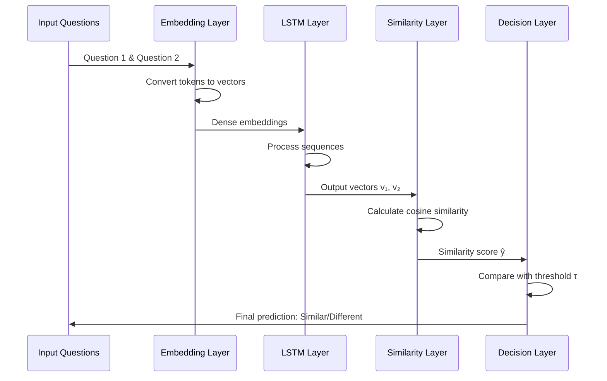

**Detailed Step-by-Step Process:**

1. **Input Stage:**

   - Input: "How old are you?" and "What is your age?"
   - Tokenization: Convert to [45, 123, 67, 89] and [34, 12, 98, 156]

2. **Embedding Stage:**

   - Each token becomes a 300-dimensional vector
   - "old" (token 123) → [0.2, -0.1, 0.8, ..., 0.3]
   - "age" (token 98) → [0.18, -0.09, 0.82, ..., 0.31] (similar to "old")

3. **LSTM Processing:**

   - Reads word embeddings sequentially
   - Builds understanding: "This is asking about someone's age"
   - Outputs final vectors: v₁ = [0.8, 0.6, 0.2, -0.3], v₂ = [0.7, 0.5, 0.3, -0.2]

4. **Similarity Calculation:**

   - Cosine similarity: 0.98 (very high!)
   - This indicates the questions are nearly identical in meaning

5. **Decision:**
   - If threshold = 0.5: 0.98 > 0.5 → "Similar"
   - If threshold = 0.99: 0.98 < 0.99 → "Different"

## Architecture Variations

While LSTM is popular, Siamese networks are flexible. You can swap out components based on your needs:

### **Alternative Architectures:**

1. **CNN-based Siamese Networks**

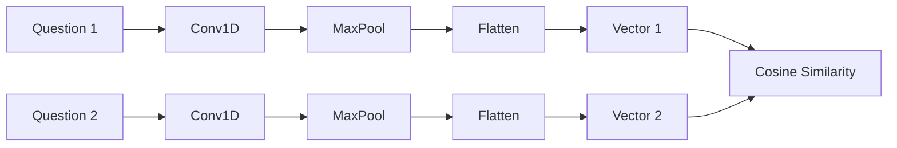

**When to use:** When you care more about local patterns than long-term dependencies

**Example:** Detecting similar phrases or short text snippets

2. **Transformer-based Siamese Networks**

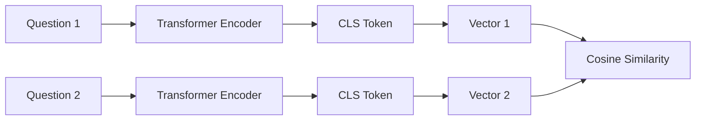

**When to use:** For complex, long texts where attention mechanisms help

**Example:** Document similarity, long-form question matching

3. **Dense Layer Siamese Networks**

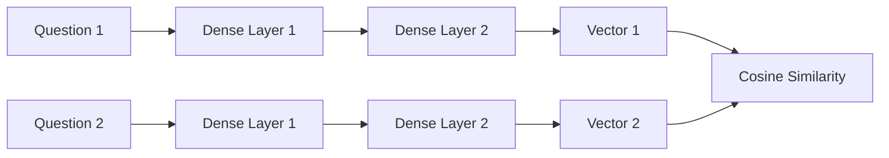

**When to use:** Simple tasks with limited data

**Example:** Basic keyword matching, simple classification

## Advantages of This Architecture

### **1. Computational Efficiency**

**Memory Usage:**

- Traditional approach: Store weights for two separate networks
- Siamese approach: Store weights for one network, use twice
- **Result**: 50% memory reduction

**Training Speed:**

- Single weight set means updates affect both processing paths
- Faster convergence because the network learns general similarity patterns
- Parallel processing of both inputs

**Deployment:**

- One model file instead of two
- Simpler deployment pipeline
- Easier to maintain and update

### **2. Consistency and Reliability**

**Symmetric Similarity:**

- similarity(A,B) = similarity(B,A) is guaranteed
- No order dependency - crucial for real applications

**Uniform Feature Extraction:**

- Both inputs processed identically
- No bias toward first vs second input
- Reliable comparisons

**Stable Training:**

- Shared weights prevent divergent learning
- More stable gradients during backpropagation
- Less prone to overfitting to input positions

### **3. Scalability and Generalization**

**Few-Shot Learning:**

- Can work with limited training data
- Learns general concept of similarity
- Generalizes to unseen data well

**Transfer Learning:**

- Pre-trained embeddings can be reused
- Domain adaptation becomes easier
- Fine-tuning for specific tasks

**Modular Design:**

- Easy to swap components (LSTM → Transformer)
- Can experiment with different similarity metrics
- Extensible to other similarity tasks

## Real-World Applications

**1. Duplicate Question Detection (Stack Overflow, Quora)**

- Problem: Users ask the same questions in different ways
- Solution: Siamese networks identify semantic duplicates
- Impact: Reduces redundant content, improves search

**2. Customer Support Automation**

- Problem: Route customer queries to appropriate responses
- Solution: Match new queries with existing knowledge base
- Impact: Faster response times, consistent answers

**3. Plagiarism Detection**

- Problem: Identify copied or paraphrased content
- Solution: Compare document similarity using Siamese networks
- Impact: Automated academic integrity checking

**4. Recommendation Systems**

- Problem: Find similar products, articles, or content
- Solution: Learn item similarities from user behavior
- Impact: Better user engagement and satisfaction

## Implementation Considerations

### **Hyperparameter Tuning:**

**Embedding Dimension (100-300):**

- **Smaller (100-150)**: Faster training, works for simple tasks
- **Larger (200-300)**: Better for complex semantic understanding
- **Rule of thumb**: Start with 200 for most NLP tasks

**LSTM Hidden Size (64-256):**

- **Smaller (64-128)**: Good for short texts, faster training
- **Larger (128-256)**: Better for complex questions, more capacity
- **Memory consideration**: Larger sizes need more GPU memory

**Threshold Value (0.3-0.8):**

- **Start with 0.5** and adjust based on precision/recall needs
- **Use validation data** to find optimal value
- **Consider business cost** of false positives vs false negatives

**Learning Rate (0.001-0.01):**

- **0.001**: Safe starting point, stable convergence
- **0.01**: Faster training but might be unstable
- **Adaptive schedulers**: Often work better than fixed rates

### **Training Best Practices:**

**Data Preparation:**

- **Balanced batches**: Equal numbers of similar/dissimilar pairs
- **Data augmentation**: Create variations (synonyms, paraphrasing)
- **Negative sampling**: Ensure good negative examples

**Regularization:**

- **Dropout (0.2-0.5)**: Prevents overfitting in LSTM layers
- **L2 regularization**: Keeps weights small
- **Early stopping**: Monitor validation similarity accuracy

**Monitoring:**

- **Loss curves**: Both training and validation
- **Similarity distribution**: Check that similar/dissimilar pairs are well separated
- **Threshold sensitivity**: How performance changes with different thresholds

This comprehensive architecture provides a robust foundation for building similarity-learning systems that can handle complex semantic relationships in natural language processing tasks. The key is understanding that Siamese networks don't just classify - they learn to create meaningful representations that capture semantic similarity.

# 4. Cost Function - Measuring Similarity and Distance

## Overview of Siamese Network Cost Function

The cost function for Siamese networks is fundamentally different from traditional classification losses. Instead of predicting discrete categories, we need to measure how well our network distinguishes between similar and dissimilar pairs. This is accomplished through the **triplet loss**, which compares an anchor example against both positive (similar) and negative (dissimilar) examples simultaneously.

## Recap: Siamese Network Structure

Before diving into the cost function, let's recall the overall structure:

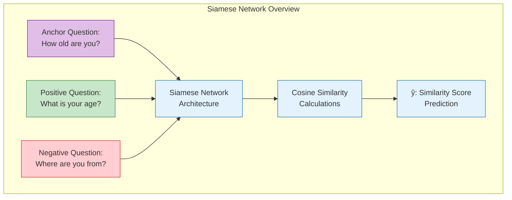

## Defining Anchor, Positive, and Negative Examples

### **Anchor Question**

The **anchor** is the reference question that we use as a baseline for comparison. In our example:

- **Anchor (A)**: "How old are you?"

### **Positive Question**

A **positive** question has the same meaning as the anchor, even if the words are completely different:

- **Positive (P)**: "What is your age?"
- **Relationship**: Same semantic meaning as anchor
- **Note**: "Positive" here refers to similarity match, not sentiment

### **Negative Question**

A **negative** question has a different meaning from the anchor, even if some words might overlap:

- **Negative (N)**: "Where are you from?"
- **Relationship**: Different semantic meaning from anchor
- **Note**: "Negative" here refers to dissimilarity, not sentiment

## Understanding the Triplet Relationship

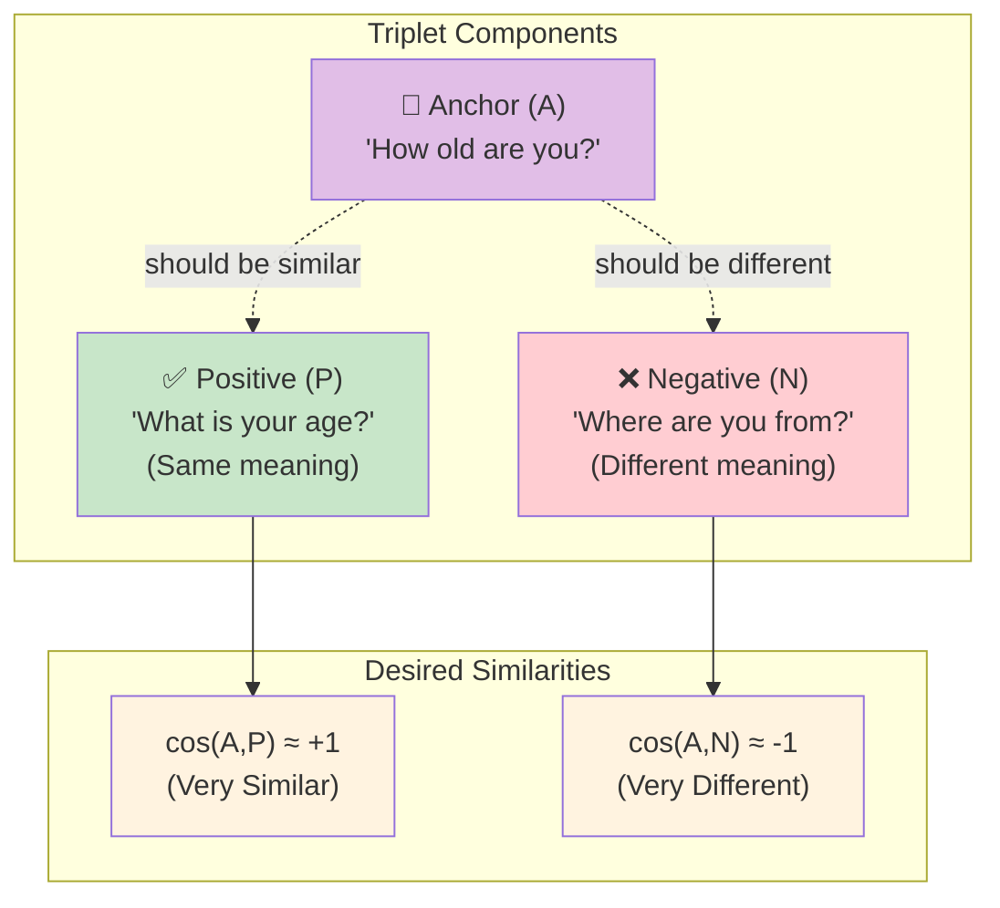

## Cosine Similarity: The Foundation

### **Mathematical Definition**

The cosine similarity between two vectors measures the cosine of the angle between them:

$\cos(v_1, v_2) = \frac{v_1 \cdot v_2}{||v_1|| \times ||v_2||}$

### **Similarity Range and Interpretation**

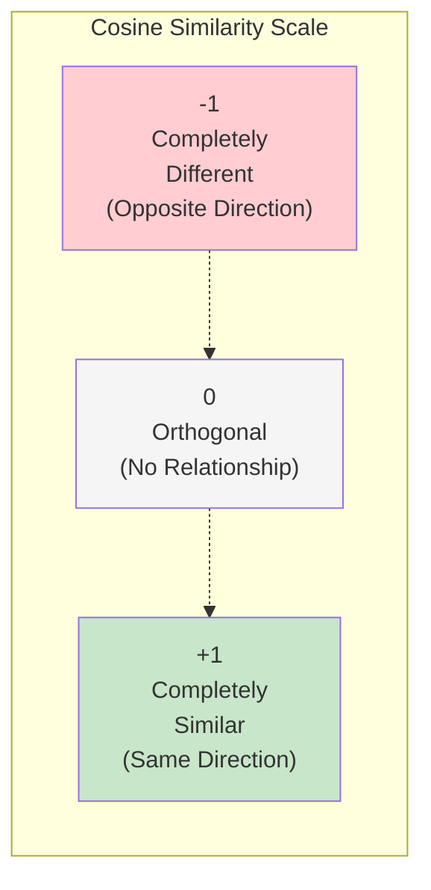

**Interpretation:**

- $\cos(A,P) \approx +1$: Anchor and positive are very similar (ideal case)
- $\cos(A,N) \approx -1$: Anchor and negative are very different (ideal case)
- $\cos(A,P) \approx 0$: Anchor and positive are unrelated (poor model)
- $\cos(A,N) \approx 0$: Anchor and negative are unrelated (poor model)

## Building the Loss Function

### **Training Objectives**

For a well-trained Siamese model, we want:

1. **High similarity** between anchor and positive: $\cos(A,P) \rightarrow +1$
2. **Low similarity** between anchor and negative: $\cos(A,N) \rightarrow -1$

### **Loss Function Construction**

The triplet loss is designed to minimize the difference between anchor-negative similarity and anchor-positive similarity:

$\text{Loss} = \cos(A,N) - \cos(A,P)$

**Rearranging to standard form:**
$\text{Loss} = -\cos(A,P) + \cos(A,N) \leq 0$

### **Mathematical Analysis**

Let's examine what happens in different scenarios:

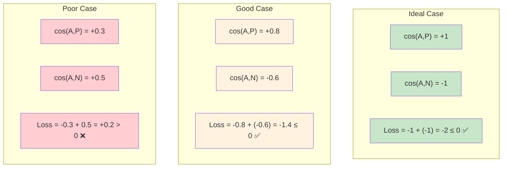

## Practical Example with Numbers

Let's work through a concrete example:

### **Example Scenario:**

- **Anchor**: "How old are you?" → Vector: $[0.8, 0.6, -0.2]$
- **Positive**: "What is your age?" → Vector: $[0.7, 0.5, -0.1]$
- **Negative**: "Where are you from?" → Vector: $[-0.3, 0.2, 0.9]$

### **Calculation Steps:**

```python
import numpy as np

# Define vectors (simplified for example)
anchor = np.array([0.8, 0.6, -0.2])
positive = np.array([0.7, 0.5, -0.1])
negative = np.array([-0.3, 0.2, 0.9])

# Calculate cosine similarities
def cosine_similarity(v1, v2):
    return np.dot(v1, v2) / (np.linalg.norm(v1) * np.linalg.norm(v2))

cos_AP = cosine_similarity(anchor, positive)  # ≈ 0.94
cos_AN = cosine_similarity(anchor, negative)  # ≈ -0.52

# Calculate loss
loss = -cos_AP + cos_AN
print(f"cos(A,P) = {cos_AP:.3f}")
print(f"cos(A,N) = {cos_AN:.3f}")
print(f"Loss = {loss:.3f}")
```

**Results:**

- $\cos(A,P) = 0.940$ (good similarity)
- $\cos(A,N) = -0.520$ (good dissimilarity)
- $\text{Loss} = -1.460$ (negative loss indicates good training)

## Visual Understanding of the Loss Function

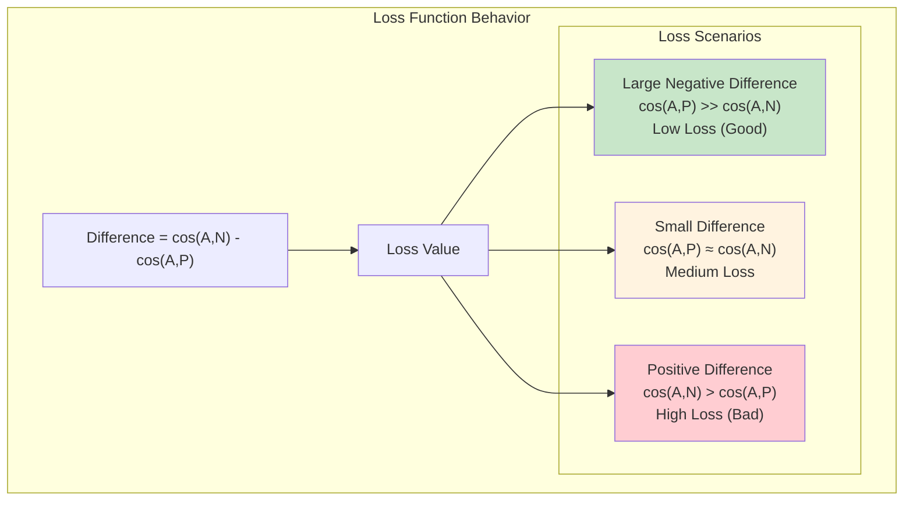

## Training Process with Loss Function

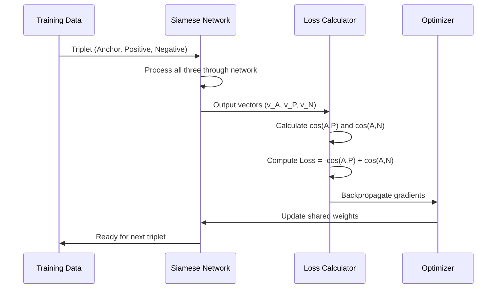

## Key Insights

### **Why This Loss Function Works:**

1. **Drives Separation**: Forces similar pairs closer and dissimilar pairs apart
2. **Relative Learning**: Learns relationships rather than absolute values
3. **Stable Training**: Bounded similarity values prevent exploding gradients
4. **Interpretable**: Negative loss indicates good performance

### **Training Implications:**

- **When loss < 0**: Model is correctly distinguishing similar from dissimilar
- **When loss > 0**: Model needs more training to improve discrimination
- **As loss approaches -2**: Model achieves near-perfect discrimination

## Connection to Next Topics

This foundational understanding of the cost function sets us up for:

- **Triplets**: How to construct and use anchor-positive-negative triplets effectively
- **Advanced Loss Variations**: Margin-based triplet loss and other improvements
- **Training Strategies**: How to sample effective triplets for optimal learning

The triplet loss provides the mathematical framework that enables Siamese networks to learn meaningful similarity representations, making it possible to identify question duplicates, verify signatures, and solve many other similarity-based tasks in NLP.

# 5. Triplets - Anchor, Positive, and Negative Examples

## Overview: From Classification to Similarity Learning

This week represents a fundamental shift in approach: instead of classifying inputs into multiple categories, we're building a model that identifies if two inputs are equivalent. The key innovation lies in using **triplets** - groups of three related examples that teach the model about similarity relationships.

## Understanding Triplets

### **Triplet Components**

A triplet consists of three carefully selected examples:

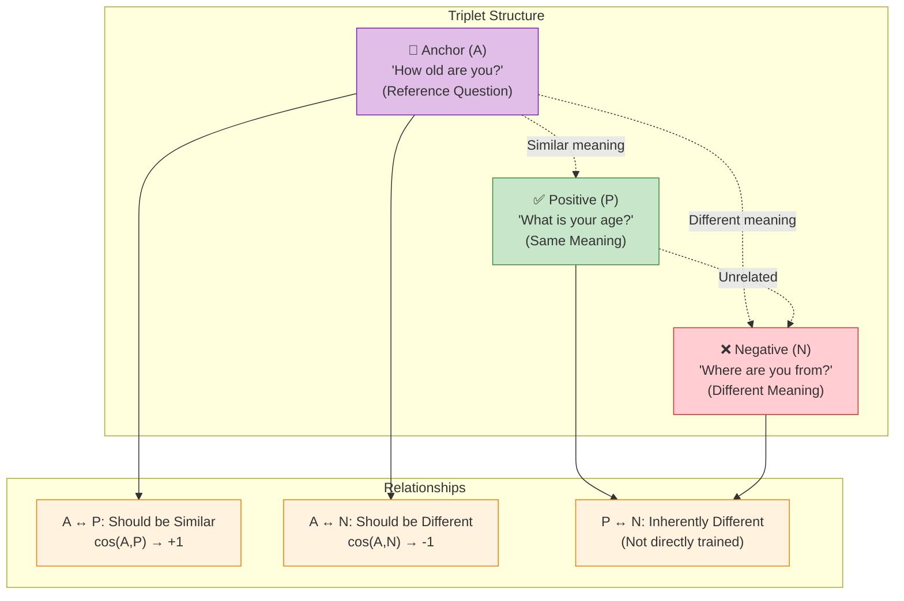

**Key Reminder**: "Positive" and "negative" here refer to semantic similarity to the anchor, not sentiment polarity.

## Triplet Loss Evolution

### **Step 1: Simple Triplet Loss**

The basic intuition is to minimize the difference between anchor-negative similarity and anchor-positive similarity:

$$\text{Simple Loss} = \cos(A,N) - \cos(A,P)$$

**Goal**:

- Maximize similarity between anchor and positive: $\cos(A,P) \rightarrow +1$
- Minimize similarity between anchor and negative: $\cos(A,N) \rightarrow -1$

### **Step 2: Non-Negative Constraint**

The simple loss function, while intuitive, has a fundamental problem that makes it unsuitable for practical training. Let's understand why this happens and how the non-negative constraint solves it.

#### **The Problem with Simple Loss**

The simple loss function is defined as:
$$\text{Simple Loss} = \cos(A,N) - \cos(A,P)$$

**Why this becomes problematic:**

1. **Unbounded Negative Values**: Since cosine similarity ranges from -1 to +1, the simple loss can theoretically reach extreme negative values:

   - **Best case scenario**: $\cos(A,P) = +1$ and $\cos(A,N) = -1$
   - **Simple Loss**: $(-1) - (+1) = -2$
   - **Extreme case**: If similarities could go beyond these bounds, loss could approach $-\infty$

2. **Training Stops Prematurely**: Once the loss becomes negative (which happens when $\cos(A,P) > \cos(A,N)$), the model might think it's performing well enough and stop learning, even though there's room for improvement.

3. **No Clear Success Criterion**: How negative should the loss be before we consider the model "good enough"? There's no natural stopping point.

**Concrete Example of the Problem:**

```python
# Example where simple loss becomes problematic
cos_AP = 0.6  # Decent similarity between anchor and positive
cos_AN = 0.3  # Lower similarity between anchor and negative

simple_loss = cos_AN - cos_AP  # 0.3 - 0.6 = -0.3

# Problem: Loss is negative, but the model could still improve!
# cos(A,P) could be higher (closer to 1.0)
# cos(A,N) could be lower (closer to -1.0)
```

```mermaid
graph TB
    subgraph "Problem with Simple Loss"
        SL["Simple Loss = cos(A,N) - cos(A,P)"]
        P1["Can go to -∞"]
        P2["Model stops learning when loss < 0"]
        P3["No clear stopping criterion"]
    end

    subgraph "Solution: Non-Negative Constraint"
        NNC["Constrained Loss = max(cos(A,N) - cos(A,P), 0)"]
        S1["Loss ≥ 0 always"]
        S2["Learning stops when difference ≈ 0"]
        S3["Clear optimization target"]
    end

    SL --> P1 --> P2 --> P3
    NNC --> S1 --> S2 --> S3

    classDef problemClass fill:#ffebee,stroke:#d32f2f
    classDef solutionClass fill:#e8f5e8,stroke:#388e3c

    class SL,P1,P2,P3 problemClass
    class NNC,S1,S2,S3 solutionClass
```

#### **The Solution: Non-Negative Constraint**

To fix these issues, we apply a **non-negative constraint** using the $\max$ function:

$$\text{Constrained Loss} = \max(\cos(A,N) - \cos(A,P), 0)$$

**How this solves the problems:**

1. **Bounded Loss Values**: The loss can never go below zero, creating a natural lower bound.

2. **Clear Learning Signal**:

   - **When loss = 0**: Model has achieved the basic goal ($\cos(A,P) \geq \cos(A,N)$)
   - **When loss > 0**: Model needs to improve further

3. **Meaningful Optimization Target**: The model now has a clear goal - drive the loss to zero.

**Step-by-Step Analysis:**

Let's see how this works with different similarity scenarios:

**Scenario 1: Poor Performance**

```python
cos_AP = 0.4  # Low anchor-positive similarity
cos_AN = 0.7  # High anchor-negative similarity (bad!)

simple_loss = cos_AN - cos_AP       # 0.7 - 0.4 = 0.3
constrained_loss = max(0.3, 0)      # max(0.3, 0) = 0.3

# Result: Loss > 0, model needs significant improvement
```

**Scenario 2: Decent Performance**

```python
cos_AP = 0.8  # Good anchor-positive similarity
cos_AN = 0.5  # Moderate anchor-negative similarity

simple_loss = cos_AN - cos_AP       # 0.5 - 0.8 = -0.3
constrained_loss = max(-0.3, 0)     # max(-0.3, 0) = 0

# Result: Loss = 0, basic goal achieved
```

**Scenario 3: Excellent Performance**

```python
cos_AP = 0.95  # Excellent anchor-positive similarity
cos_AN = 0.1   # Low anchor-negative similarity

simple_loss = cos_AN - cos_AP       # 0.1 - 0.95 = -0.85
constrained_loss = max(-0.85, 0)    # max(-0.85, 0) = 0

# Result: Loss = 0, model performing very well
```

#### **Visual Understanding of the Constraint**

The $\max(x, 0)$ function essentially "clips" negative values to zero:

```
Input (cos(A,N) - cos(A,P)):  ...-2  -1  -0.5   0   0.5   1   2...
Output (Constrained Loss):    ... 0   0    0    0   0.5   1   2...
                                   ↑    ↑    ↑    ↑
                              All negative values become 0
```

#### **Training Implications**

With the non-negative constraint:

1. **Active Learning Phase** (Loss > 0):

   - Model receives gradients and updates weights
   - Focus on making $\cos(A,P)$ larger and $\cos(A,N)$ smaller
   - Clear signal about what needs improvement

2. **Stable Phase** (Loss = 0):
   - No gradients when loss hits zero
   - Model has achieved basic discrimination
   - Ready for more sophisticated objectives (like margin-based learning)

#### **Why This Still Isn't Perfect**

While the non-negative constraint solves the unbounded problem, it creates a new issue:

**The "Barely Acceptable" Problem**: Once $\cos(A,P)$ slightly exceeds $\cos(A,N)$, the loss becomes zero and learning stops. But we might want the model to be more confident in its distinctions.

**Example of "Barely Acceptable":**

```python
cos_AP = 0.51  # Just slightly better
cos_AN = 0.50  # Almost the same!

constrained_loss = max(0.50 - 0.51, 0) = max(-0.01, 0) = 0

# Problem: Loss = 0, but the similarities are almost identical!
# We'd prefer a bigger gap between cos(A,P) and cos(A,N)
```

This limitation leads us to the next improvement: **adding a margin (α)**, which ensures the model learns to create a confident separation between positive and negative examples, not just a barely detectable one.

#### **Summary**

The non-negative constraint is a crucial intermediate step that:

- ✅ Fixes the unbounded negative loss problem
- ✅ Provides clear learning signals (loss > 0 vs loss = 0)
- ✅ Creates a meaningful optimization target
- ❌ But still allows "barely acceptable" performance

This sets the stage for the margin-based approach, which will require the model to achieve confident, robust distinctions between similar and dissimilar examples.

### **Step 3: Adding Margin (α)**

Even with non-negative constraint, we want the model to be **confident** in its distinctions, not just barely acceptable:

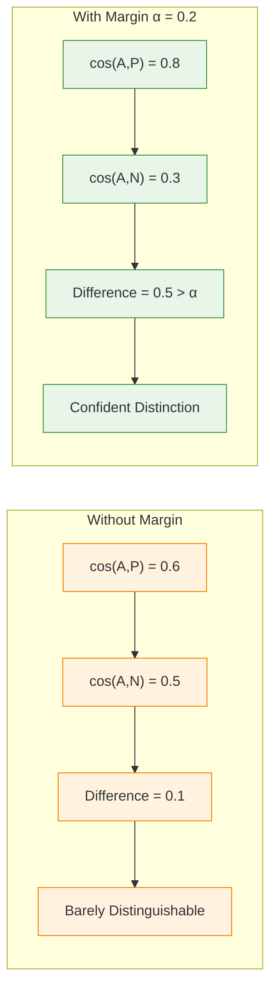

## The Complete Triplet Loss Function

### **Mathematical Formulation**

$$\text{Triplet Loss} = \max(-\cos(A,P) + \cos(A,N) + \alpha, 0)$$

Where:

- $\alpha$ = margin (hyperparameter)
- $\max(\cdot, 0)$ ensures non-negative loss

### **Understanding the Margin**

The margin $\alpha$ shifts the loss function to require a **safety buffer**:

```mermaid
graph TB
    subgraph "Margin Effect Visualization"
        subgraph "Without Margin (α = 0)"
            NM1["Difference = -0.1"]
            NM2["Loss = max(-0.1, 0) = 0"]
            NM3["Learning Stops"]
        end

        subgraph "With Margin (α = 0.2)"
            WM1["Difference = -0.1"]
            WM2["Loss = max(-0.1 + 0.2, 0) = 0.1"]
            WM3["Learning Continues"]
        end
    end

    classDef noMarginClass fill:#ffebee,stroke:#d32f2f
    classDef marginClass fill:#e8f5e8,stroke:#388e3c

    class NM1,NM2,NM3 noMarginClass
    class WM1,WM2,WM3 marginClass
```

### **Practical Example**

Let's work through a concrete example with $\alpha = 0.2$:

```python
import numpy as np

# Example similarity scores
cos_AP = 0.7  # Anchor-Positive similarity
cos_AN = 0.6  # Anchor-Negative similarity
alpha = 0.2   # Margin

# Calculate triplet loss
loss = max(-cos_AP + cos_AN + alpha, 0)
print(f"cos(A,P) = {cos_AP}")
print(f"cos(A,N) = {cos_AN}")
print(f"α = {alpha}")
print(f"Loss = max({-cos_AP} + {cos_AN} + {alpha}, 0) = {loss}")
```

**Output:**

- cos(A,P) = 0.7
- cos(A,N) = 0.6
- α = 0.2
- Loss = max(-0.7 + 0.6 + 0.2, 0) = 0.1

**Interpretation**: Loss > 0 means the model needs to improve. The margin ensures we need $\cos(A,P) - \cos(A,N) \geq 0.2$ for the loss to reach zero.

## Loss Function Behavior Analysis

```mermaid
graph TB
    subgraph "Loss Scenarios"
        S1["Scenario 1: Perfect Learning<br/>cos(A,P) = 0.9, cos(A,N) = 0.1<br/>Loss = max(-0.9 + 0.1 + 0.2, 0) = 0"]
        S2["Scenario 2: Good Progress<br/>cos(A,P) = 0.8, cos(A,N) = 0.4<br/>Loss = max(-0.8 + 0.4 + 0.2, 0) = 0"]
        S3["Scenario 3: Needs Improvement<br/>cos(A,P) = 0.7, cos(A,N) = 0.6<br/>Loss = max(-0.7 + 0.6 + 0.2, 0) = 0.1"]
        S4["Scenario 4: Poor Performance<br/>cos(A,P) = 0.5, cos(A,N) = 0.8<br/>Loss = max(-0.5 + 0.8 + 0.2, 0) = 0.5"]
    end

    classDef perfectClass fill:#c8e6c9,stroke:#388e3c
    classDef goodClass fill:#fff3e0,stroke:#f57c00
    classDef needsClass fill:#ffe0b2,stroke:#f57c00
    classDef poorClass fill:#ffcdd2,stroke:#d32f2f

    class S1,S2 perfectClass
    class S3 needsClass
    class S4 poorClass
```

## Distance Metrics vs. Similarity Functions

### **Important Consideration**

While we use cosine similarity in this course, you could use distance metrics with appropriate modifications:

```mermaid
graph LR
    subgraph "Similarity Functions"
        SF1["Higher values = More similar"]
        SF2["cos(A,P) should be HIGH"]
        SF3["cos(A,N) should be LOW"]
        SF4["Loss: -cos(A,P) + cos(A,N) + α"]
    end

    subgraph "Distance Metrics"
        DM1["Lower values = More similar"]
        DM2["dist(A,P) should be LOW"]
        DM3["dist(A,N) should be HIGH"]
        DM4["Loss: dist(A,P) - dist(A,N) + α"]
    end

    classDef similarityClass fill:#e3f2fd,stroke:#1976d2
    classDef distanceClass fill:#f3e5f5,stroke:#7b1fa2

    class SF1,SF2,SF3,SF4 similarityClass
    class DM1,DM2,DM3,DM4 distanceClass
```

**Example Distance Metrics:**

- **Euclidean Distance**: $d(v_1, v_2) = ||v_1 - v_2||_2$
- **Manhattan Distance**: $d(v_1, v_2) = ||v_1 - v_2||_1$

## Triplet Selection Strategies

### **Why Random Selection Fails**

When training Siamese networks with triplet loss, one might initially think that randomly selecting anchor, positive, and negative examples would be sufficient. However, this approach is fundamentally flawed and leads to inefficient training. Let's understand why this happens and what makes certain triplets more valuable for learning.

#### **The Intuitive Problem**

Imagine you're learning to distinguish between similar and different questions. If someone always gives you extremely obvious examples - like comparing "What's your name?" with "How do you cook pasta?" - you won't learn much about the subtle differences that matter in real-world scenarios.

The same principle applies to triplet selection. Most randomly selected triplets are "too easy" and provide little learning value.

#### **Mathematical Analysis of Random Selection**

When we randomly select triplets from a large dataset, the vast majority will have an obvious distinction between positive and negative examples.

**Typical Random Triplet Scenario:**

```python
# Example of a random triplet that provides little learning value
anchor = "How old are you?"
positive = "What is your age?"           # Clearly similar
negative = "What's the weather today?"   # Obviously different

# After processing through Siamese network:
cos_AP = 0.85  # High similarity (good)
cos_AN = 0.15  # Low similarity (good)

# Triplet loss calculation:
loss = max(-cos_AP + cos_AN + alpha, 0)
loss = max(-0.85 + 0.15 + 0.2, 0)  # Assuming α = 0.2
loss = max(-0.5, 0) = 0

# Result: Loss = 0, no learning occurs!
```

```mermaid
graph TB
    subgraph "Random Triplet Selection Problems"
        R1["Most triplets are 'easy'"]
        R2["cos(A,N) << cos(A,P)"]
        R3["Loss ≈ 0 immediately"]
        R4["Model learns nothing"]
    end

    subgraph "Hard Triplet Selection Benefits"
        H1["Challenging examples"]
        H2["cos(A,N) ≈ cos(A,P)"]
        H3["Loss > 0, requires learning"]
        H4["Model improves efficiently"]
    end

    R1 --> R2 --> R3 --> R4
    H1 --> H2 --> H3 --> H4

    classDef randomClass fill:#ffebee,stroke:#d32f2f
    classDef hardClass fill:#e8f5e8,stroke:#388e3c

    class R1,R2,R3,R4 randomClass
    class H1,H2,H3,H4 hardClass
```

#### **Statistical Distribution of Random Triplets**

In a large dataset, the distribution of triplet difficulties follows a predictable pattern:

**Easy Triplets (80-90% of random selections):**

- Anchor and negative have completely different semantic meanings
- Large difference in similarity scores: $\cos(A,P) - \cos(A,N) > 0.5$
- Loss immediately becomes zero
- Examples: "How old are you?" vs "What's the capital of France?"

**Medium Triplets (10-15% of random selections):**

- Some semantic overlap but still distinguishable
- Moderate difference: $0.2 < \cos(A,P) - \cos(A,N) < 0.5$
- May provide some learning value

**Hard Triplets (1-5% of random selections):**

- Subtle differences that require careful distinction
- Small difference: $\cos(A,P) - \cos(A,N) < 0.2$
- High learning value but rarely encountered randomly

#### **Detailed Problem Analysis**

**Problem 1: Wasted Computational Resources**

```python
# Simulation of random triplet training
total_triplets_processed = 10000
useful_triplets = 0

for i in range(total_triplets_processed):
    # Randomly select triplet
    anchor, positive, negative = random_select_triplet()

    # Calculate loss
    loss = compute_triplet_loss(anchor, positive, negative)

    if loss > 0:  # Only these contribute to learning
        useful_triplets += 1

efficiency = useful_triplets / total_triplets_processed
print(f"Training efficiency: {efficiency:.1%}")
# Typical output: Training efficiency: 5-15%
```

**Problem 2: Slow Convergence**

With random selection, the model encounters mostly easy examples:

```mermaid
sequenceDiagram
    participant T as Training Process
    participant R as Random Selector
    participant M as Model
    participant L as Loss Function

    loop 1000 iterations
        T->>R: Give me a triplet
        R->>M: Easy triplet (90% chance)
        M->>L: Process triplet
        L->>T: Loss = 0 (no learning)
    end

    Note over T: After 1000 iterations:<br/>~100 useful examples<br/>~900 wasted computations
```

**Problem 3: Poor Boundary Learning**

Random selection fails to teach the model about the decision boundaries that matter:

**What the model needs to learn:**

- "How old are you?" vs "What is your age?" → Similar (challenging)
- "Where are you from?" vs "Where are you going?" → Different (challenging)

**What random selection typically provides:**

- "How old are you?" vs "What's for dinner?" → Obviously different (easy)
- "What is your age?" vs "How's the weather?" → Obviously different (easy)

#### **Real-World Impact**

Consider a question duplicate detection system for Stack Overflow:

**Random Training Approach:**

```python
# Random triplets typically look like this:
anchor = "How to sort a list in Python?"
positive = "What's the best way to sort Python lists?"  # Clearly similar
negative = "How to bake a chocolate cake?"              # Obviously different

# Model easily learns this distinction but struggles with:
challenging_negative = "How to reverse a list in Python?"  # Subtly different
```

**Result**: The model becomes good at distinguishing completely unrelated questions but fails on the subtle distinctions that matter in practice.

#### **Training Data Imbalance**

Random selection creates a severe imbalance in learning experiences:

```mermaid
graph TB
    subgraph "Random Selection Distribution"
        E["Easy Triplets: 85%<br/>cos(A,P) - cos(A,N) > 0.5<br/>Loss = 0<br/>No learning"]
        M["Medium Triplets: 12%<br/>0.2 < cos(A,P) - cos(A,N) < 0.5<br/>Some learning"]
        H["Hard Triplets: 3%<br/>cos(A,P) - cos(A,N) < 0.2<br/>Maximum learning"]
    end

    subgraph "Learning Value"
        LV1["3% of data provides<br/>80% of learning value"]
        LV2["85% of data provides<br/>0% learning value"]
    end

    E --> LV2
    H --> LV1

    classDef easyClass fill:#ffcdd2,stroke:#d32f2f
    classDef mediumClass fill:#fff3e0,stroke:#f57c00
    classDef hardClass fill:#c8e6c9,stroke:#388e3c
    classDef valueClass fill:#e1f5fe,stroke:#0277bd

    class E easyClass
    class M mediumClass
    class H hardClass
    class LV1,LV2 valueClass
```

#### **The Solution Preview**

Understanding why random selection fails naturally leads us to **hard triplet mining** - a strategy that specifically seeks out challenging examples:

**Hard Triplet Characteristics:**

- Anchor and negative are semantically different but share surface similarities
- $\cos(A,N)$ is close to, but smaller than, $\cos(A,P)$
- These triplets force the model to learn subtle but important distinctions

**Examples of Hard Triplets:**

```python
# Hard triplet example
anchor = "How to sort a list in Python?"
positive = "What's the best way to sort Python lists?"     # Similar meaning
negative = "How to reverse a list in Python?"              # Similar topic, different task

# This forces the model to learn that "sort" ≠ "reverse"
# even though both involve list manipulation in Python
```

#### **Training Efficiency Comparison**

```mermaid
graph LR
    subgraph "Random Selection"
        RS1["1000 random triplets"]
        RS2["~50 useful examples"]
        RS3["5% efficiency"]
        RS4["Slow convergence"]
    end

    subgraph "Hard Triplet Mining"
        HT1["1000 hard triplets"]
        HT2["~800 useful examples"]
        HT3["80% efficiency"]
        HT4["Fast convergence"]
    end

    RS1 --> RS2 --> RS3 --> RS4
    HT1 --> HT2 --> HT3 --> HT4

    classDef randomClass fill:#ffebee,stroke:#d32f2f
    classDef hardClass fill:#e8f5e8,stroke:#388e3c

    class RS1,RS2,RS3,RS4 randomClass
    class HT1,HT2,HT3,HT4 hardClass
```

#### **Summary**

Random triplet selection fails because:

1. **Statistical Imbalance**: 85%+ of random triplets are too easy and provide no learning signal
2. **Resource Waste**: Most computational effort is spent on examples that don't improve the model
3. **Poor Boundary Learning**: Model doesn't encounter the challenging distinctions it needs to master
4. **Slow Convergence**: Training takes much longer due to the scarcity of useful examples

This understanding motivates the need for **intelligent triplet selection strategies** that focus the model's attention on the challenging cases where real learning can occur. The next logical step is to implement hard triplet mining techniques that specifically seek out these valuable training examples.

```mermaid
graph TB
    subgraph "Random Triplet Selection Problems"
        R1["Most triplets are 'easy'"]
        R2["cos(A,N) << cos(A,P)"]
        R3["Loss ≈ 0 immediately"]
        R4["Model learns nothing"]
    end

    subgraph "Hard Triplet Selection Benefits"
        H1["Challenging examples"]
        H2["cos(A,N) ≈ cos(A,P)"]
        H3["Loss > 0, requires learning"]
        H4["Model improves efficiently"]
    end

    R1 --> R2 --> R3 --> R4
    H1 --> H2 --> H3 --> H4

    classDef randomClass fill:#ffebee,stroke:#d32f2f
    classDef hardClass fill:#e8f5e8,stroke:#388e3c

    class R1,R2,R3,R4 randomClass
    class H1,H2,H3,H4 hardClass
```

### **Triplet Difficulty Categories**

Based on the relationship between similarities:

```mermaid
graph TB
    subgraph "Triplet Difficulty Classification"
        subgraph "Easy Triplets"
            E1["cos(A,N) < cos(A,P)"]
            E2["Clear distinction"]
            E3["Loss often = 0"]
            E4["Little learning value"]
        end

        subgraph "Semi-Hard Triplets"
            SH1["cos(A,N) < cos(A,P) < cos(A,N) + α"]
            SH2["Moderate challenge"]
            SH3["Loss > 0 but manageable"]
            SH4["Good for learning"]
        end

        subgraph "Hard Triplets"
            H1["cos(A,P) < cos(A,N)"]
            H2["Difficult distinction"]
            H3["High loss values"]
            H4["Maximum learning potential"]
        end
    end

    classDef easyClass fill:#c8e6c9,stroke:#388e3c
    classDef semiClass fill:#fff3e0,stroke:#f57c00
    classDef hardClass fill:#ffcdd2,stroke:#d32f2f

    class E1,E2,E3,E4 easyClass
    class SH1,SH2,SH3,SH4 semiClass
    class H1,H2,H3,H4 hardClass
```

### **Hard Triplet Selection Process**

1. **Step 1**: Select anchor and positive from known duplicate pairs
2. **Step 2**: Find negatives where $\cos(A,N)$ is close to but smaller than $\cos(A,P)$
3. **Step 3**: Focus training on these challenging cases

**Benefits of Hard Triplets:**

- **Efficient Training**: Model learns from mistakes
- **Robust Boundaries**: Better generalization to edge cases
- **Faster Convergence**: Less time wasted on easy examples

## Practical Implementation Considerations

### **Hyperparameter: Margin (α)**

```mermaid
graph LR
    subgraph "Margin Selection"
        MS1["α too small (0.01)<br/>Weak separation"]
        MS2["α optimal (0.1-0.3)<br/>Good balance"]
        MS3["α too large (0.8)<br/>Hard to satisfy"]
    end

    classDef smallClass fill:#ffebee,stroke:#d32f2f
    classDef optimalClass fill:#e8f5e8,stroke:#388e3c
    classDef largeClass fill:#fff3e0,stroke:#f57c00

    class MS1 smallClass
    class MS2 optimalClass
    class MS3 largeClass
```

**Typical Values:**

- **Text Similarity**: α = 0.1 to 0.3
- **Image Recognition**: α = 0.2 to 0.5
- **Start with**: α = 0.2 and tune based on validation performance

### **Training Strategy**

```mermaid
sequenceDiagram
    participant D as Training Data
    participant TS as Triplet Selector
    participant S as Siamese Network
    participant L as Loss Calculator
    participant O as Optimizer

    D->>TS: Available anchor-positive pairs
    TS->>TS: Mine hard negatives
    TS->>S: Selected triplet (A, P, N)
    S->>L: Compute embeddings
    L->>L: Calculate triplet loss with margin
    L->>O: Backpropagate if loss > 0
    O->>S: Update weights
    S->>TS: Ready for next triplet
```

## Connection to Next Topics

This understanding of triplets and margin-based loss sets the foundation for:

- **Computing the Cost I**: Detailed mathematical implementation
- **Computing the Cost II**: Advanced optimization techniques
- **One-Shot Learning**: How triplets enable learning from few examples

The triplet loss with margin provides the mathematical framework that enables Siamese networks to learn robust similarity representations, making it possible to distinguish between truly similar and merely superficially similar examples in real-world applications.

# 6. Computing The Cost I - Mathematical Foundation

## Overview: From Theory to Implementation

Now we see how all the concepts from previous sections come together into a practical cost computation system. This section demonstrates how to build an efficient cost function and use gradient descent to optimize it, transforming the theoretical triplet loss into a working training system.

## Batch Preparation Strategy

### **The Smart Batch Design**

Instead of manually creating triplets, we use a clever batch organization that automatically generates positive and negative pairs:

```mermaid
graph TB
    subgraph "Batch Structure"
        subgraph "Column 1 (Anchors)"
            Q1["What is your age?"]
            Q2["Can you see me?"]
            Q3["Where are you?"]
        end

        subgraph "Column 2 (Positives)"
            Q5["How old are you?"]
            Q6["Are you seeing me?"]
            Q7["Where are you from?"]
        end
    end

    subgraph "Relationships"
        R1["Row-wise: Similar pairs"]
        R2["Column-wise: Different questions"]
        R3["Batch size: b = 3"]
    end

    Q1 -.->|"Same meaning"| Q5
    Q2 -.->|"Same meaning"| Q6
    Q3 -.->|"Same meaning"| Q7

    classDef anchorClass fill:#e3f2fd,stroke:#1976d2
    classDef positiveClass fill:#c8e6c9,stroke:#388e3c
    classDef relationClass fill:#fff3e0,stroke:#f57c00

    class Q1,Q2,Q3 anchorClass
    class Q5,Q6,Q7 positiveClass
    class R1,R2,R3 relationClass
```

### **Critical Batch Constraints**

The batch organization follows two essential rules:

1. **Horizontal Constraint (Row-wise)**: Each question in the left column has its corresponding duplicate in the right column at the same row position.

2. **Vertical Constraint (Column-wise)**: No question in any column is a duplicate of another question in the same column.

**Detailed Example with Batch Size = 3:**

Let's work through a concrete example to understand the batch structure:

```python
# Example batch following the constraints (b = 3 for simplicity)
batch_1 = [
    "What is your age?",      # Row 0 (Question about age)
    "Can you see me?",        # Row 1 (Question about visibility)
    "Where are you?"          # Row 2 (Question about location)
]

batch_2 = [
    "How old are you?",       # Row 0 - duplicate of batch_1[0] (age)
    "Are you seeing me?",     # Row 1 - duplicate of batch_1[1] (visibility)
    "Where are you from?"     # Row 2 - duplicate of batch_1[2] (location)
]
```

**Constraint Verification:**

- **Horizontal**: $\text{batch}_1[0] \leftrightarrow \text{batch}_2[0]$ (both about age)
- **Horizontal**: $\text{batch}_1[1] \leftrightarrow \text{batch}_2[1]$ (both about visibility)
- **Horizontal**: $\text{batch}_1[2] \leftrightarrow \text{batch}_2[2]$ (both about location)
- **Vertical**: No question in batch_1 is similar to any other question in batch_1
- **Vertical**: No question in batch_2 is similar to any other question in batch_2

## Model Processing and Vector Generation

### **Processing Through Siamese Network**

Both batches are processed through the same Siamese network to generate embedding vectors:

```mermaid
graph TB
    subgraph "Input Processing"
        B1["Batch 1<br/>Questions 1-3"]
        B2["Batch 2<br/>Questions 1-3"]
    end

    subgraph "Siamese Network"
        SN["Shared Network<br/>(Embedding + LSTM)"]
    end

    subgraph "Output Vectors"
        V1["v₁ Matrix<br/>[3 × 4]"]
        V2["v₂ Matrix<br/>[3 × 4]"]
    end

    B1 --> SN
    B2 --> SN
    SN --> V1
    SN --> V2

    classDef inputClass fill:#e3f2fd,stroke:#1976d2
    classDef networkClass fill:#f3e5f5,stroke:#9e9e9e
    classDef outputClass fill:#e8f5e8,stroke:#388e3c

    class B1,B2 inputClass
    class SN networkClass
    class V1,V2 outputClass
```

### **Understanding the Output Dimensions**

The output vectors have specific dimensions determined by the model architecture:

$$\text{v}_1 \text{ shape} = [\text{batch\_size}, \text{d\_model}]$$
$$\text{v}_2 \text{ shape} = [\text{batch\_size}, \text{d\_model}]$$

Where:

- **batch_size (b)**: Number of question pairs in the batch (e.g., 3)
- **d_model**: Dimension of the embedding layer (e.g., 4 for simplicity)

**Concrete Example with Small Dimensions:**

For our example with batch_size = 3 and d_model = 4:

$$
\text{v}_1 = \begin{bmatrix}
v_{11} & v_{12} & v_{13} & v_{14} \\
v_{21} & v_{22} & v_{23} & v_{24} \\
v_{31} & v_{32} & v_{33} & v_{34}
\end{bmatrix}
$$

$$
\text{v}_2 = \begin{bmatrix}
u_{11} & u_{12} & u_{13} & u_{14} \\
u_{21} & u_{22} & u_{23} & u_{24} \\
u_{31} & u_{32} & u_{33} & u_{34}
\end{bmatrix}
$$

**With Actual Numbers:**

```python
# Example embeddings after processing through Siamese network
v1 = [
    [0.8, -0.2,  0.5,  0.1],  # "What is your age?" embedding
    [0.3,  0.7, -0.4,  0.6],  # "Can you see me?" embedding
    [-0.1, 0.4,  0.9, -0.3]   # "Where are you?" embedding
]

v2 = [
    [0.7, -0.1,  0.6,  0.2],  # "How old are you?" embedding
    [0.2,  0.8, -0.3,  0.5],  # "Are you seeing me?" embedding
    [-0.2, 0.3,  0.8, -0.4]   # "Where are you from?" embedding
]
```

Each row represents the learned embedding for one question, and the network learns to make similar questions have similar embeddings.

## Similarity Matrix Construction

### **Computing All Pairwise Similarities**

The key innovation is computing similarities between **every possible pair** from the two batches:

$$S_{ij} = \cos(\text{v}_{1i}, \text{v}_{2j}) = \frac{\text{v}_{1i} \cdot \text{v}_{2j}}{||\text{v}_{1i}|| \times ||\text{v}_{2j}||}$$

This creates a **similarity matrix** of size $b \times b$.

**Step-by-Step Calculation Example:**

Using our example embeddings from above, let's compute the similarity matrix:

$$
\text{v}_1 = \begin{bmatrix}
0.8 & -0.2 & 0.5 & 0.1 \\
0.3 & 0.7 & -0.4 & 0.6 \\
-0.1 & 0.4 & 0.9 & -0.3
\end{bmatrix}, \quad \text{v}_2 = \begin{bmatrix}
0.7 & -0.1 & 0.6 & 0.2 \\
0.2 & 0.8 & -0.3 & 0.5 \\
-0.2 & 0.3 & 0.8 & -0.4
\end{bmatrix}
$$

**Computing $S_{11}$ (similarity between row 1 of $\text{v}_1$ and row 1 of $\text{v}_2$):**

$$\text{v}_{11} = [0.8, -0.2, 0.5, 0.1]$$
$$\text{v}_{21} = [0.7, -0.1, 0.6, 0.2]$$

$$\text{v}_{11} \cdot \text{v}_{21} = (0.8)(0.7) + (-0.2)(-0.1) + (0.5)(0.6) + (0.1)(0.2) = 0.56 + 0.02 + 0.30 + 0.02 = 0.90$$

$$||\text{v}_{11}|| = \sqrt{0.8^2 + (-0.2)^2 + 0.5^2 + 0.1^2} = \sqrt{0.64 + 0.04 + 0.25 + 0.01} = \sqrt{0.94} = 0.97$$

$$||\text{v}_{21}|| = \sqrt{0.7^2 + (-0.1)^2 + 0.6^2 + 0.2^2} = \sqrt{0.49 + 0.01 + 0.36 + 0.04} = \sqrt{0.90} = 0.95$$

$$S_{11} = \frac{0.90}{0.97 \times 0.95} = \frac{0.90}{0.92} = 0.98$$

**Computing $S_{12}$ (similarity between row 1 of $\text{v}_1$ and row 2 of $\text{v}_2$):**

$$\text{v}_{11} = [0.8, -0.2, 0.5, 0.1]$$
$$\text{v}_{22} = [0.2, 0.8, -0.3, 0.5]$$

$$\text{v}_{11} \cdot \text{v}_{22} = (0.8)(0.2) + (-0.2)(0.8) + (0.5)(-0.3) + (0.1)(0.5) = 0.16 - 0.16 - 0.15 + 0.05 = -0.10$$

$$||\text{v}_{22}|| = \sqrt{0.2^2 + 0.8^2 + (-0.3)^2 + 0.5^2} = \sqrt{0.04 + 0.64 + 0.09 + 0.25} = \sqrt{1.02} = 1.01$$

$$S_{12} = \frac{-0.10}{0.97 \times 1.01} = \frac{-0.10}{0.98} = -0.10$$

**Complete Similarity Matrix:**

Following this process for all pairs, we get:

$$
S = \begin{bmatrix}
0.98 & -0.10 & 0.85 \\
-0.15 & 0.92 & 0.20 \\
0.30 & 0.15 & 0.95
\end{bmatrix}
$$

```mermaid
graph TB
    subgraph "Similarity Matrix Construction"
        subgraph "v₁ vectors (rows)"
            V11["v₁₁"]
            V12["v₁₂"]
            V13["v₁₃"]
        end

        subgraph "v₂ vectors (columns)"
            V21["v₂₁"]
            V22["v₂₂"]
            V23["v₂₃"]
        end

        subgraph "Similarity Matrix S"
            SM["S₁₁=0.98  S₁₂=-0.10  S₁₃=0.85<br/>S₂₁=-0.15  S₂₂=0.92   S₂₃=0.20<br/>S₃₁=0.30   S₃₂=0.15   S₃₃=0.95"]
        end
    end

    V11 --> SM
    V12 --> SM
    V13 --> SM
    V21 --> SM
    V22 --> SM
    V23 --> SM

    classDef vectorClass fill:#e3f2fd,stroke:#1976d2
    classDef matrixClass fill:#fff3e0,stroke:#f57c00

    class V11,V12,V13,V21,V22,V23 vectorClass
    class SM matrixClass
```

### **Example Similarity Matrix**

From our calculations above, the similarity matrix is:

$$
S = \begin{bmatrix}
0.98 & -0.10 & 0.85 \\
-0.15 & 0.92 & 0.20 \\
0.30 & 0.15 & 0.95
\end{bmatrix}
$$

**Matrix Interpretation:**

- $S_{11} = 0.98$: "What is your age?" ↔ "How old are you?" (high similarity ✓)
- $S_{22} = 0.92$: "Can you see me?" ↔ "Are you seeing me?" (high similarity ✓)
- $S_{33} = 0.95$: "Where are you?" ↔ "Where are you from?" (high similarity ✓)
- Off-diagonal elements are lower, indicating different question pairs

## Understanding the Similarity Matrix Structure

### **Diagonal Elements: Positive Pairs**

The diagonal contains similarities between actual duplicate questions:

**From our example:**

- $S_{11} = 0.98$: "What is your age?" ↔ "How old are you?"
- $S_{22} = 0.92$: "Can you see me?" ↔ "Are you seeing me?"
- $S_{33} = 0.95$: "Where are you?" ↔ "Where are you from?"

**Expected Behavior:** All diagonal values should be high (approaching +1), indicating that the model correctly identifies duplicate questions as similar.

$$\text{Diagonal} = [S_{11}, S_{22}, S_{33}] = [0.98, 0.92, 0.95]$$

All values are close to 1, which is excellent! ✓

### **Off-Diagonal Elements: Negative Pairs**

The off-diagonal elements represent similarities between non-duplicate questions:

**From our example:**

- $S_{12} = -0.10$: "What is your age?" ↔ "Are you seeing me?"
- $S_{13} = 0.85$: "What is your age?" ↔ "Where are you from?"
- $S_{21} = -0.15$: "Can you see me?" ↔ "How old are you?"
- $S_{23} = 0.20$: "Can you see me?" ↔ "Where are you from?"
- $S_{31} = 0.30$: "Where are you?" ↔ "How old are you?"
- $S_{32} = 0.15$: "Where are you?" ↔ "Are you seeing me?"

**Expected Behavior:** Off-diagonal values should be low (approaching -1), indicating that the model correctly identifies non-duplicate questions as different.

$$\text{Off-diagonal} = [-0.10, 0.85, -0.15, 0.20, 0.30, 0.15]$$

**Analysis:**

- ✓ Some values are low (-0.10, -0.15) - good discrimination
- ⚠️ Some values are still positive (0.85, 0.20, 0.30, 0.15) - room for improvement

**Note:** $S_{13} = 0.85$ is concerning as it's high for a negative pair. This suggests "What is your age?" and "Where are you from?" are considered quite similar by the model, which indicates the model needs more training.

### **Automatic Negative Mining**

This batch structure provides a brilliant solution to negative example selection:

**The Innovation:**

- **No manual negative selection needed**
- **Every off-diagonal pair becomes a negative example**
- **For batch size $b$, we get $b^2 - b$ negative pairs automatically**

**Example with our batch_size = 3:**

**Positive pairs (diagonal): 3 pairs**
$$\text{Positive pairs} = \{(v_{11}, v_{21}), (v_{12}, v_{22}), (v_{13}, v_{23})\}$$

Corresponding to:

- ("What is your age?", "How old are you?")
- ("Can you see me?", "Are you seeing me?")
- ("Where are you?", "Where are you from?")

**Negative pairs (off-diagonal): 6 pairs**
$$\text{Negative pairs} = \{(v_{11}, v_{22}), (v_{11}, v_{23}), (v_{12}, v_{21}), (v_{12}, v_{23}), (v_{13}, v_{21}), (v_{13}, v_{22})\}$$

Corresponding to:

- ("What is your age?", "Are you seeing me?") → $S_{12} = -0.10$
- ("What is your age?", "Where are you from?") → $S_{13} = 0.85$
- ("Can you see me?", "How old are you?") → $S_{21} = -0.15$
- ("Can you see me?", "Where are you from?") → $S_{23} = 0.20$
- ("Where are you?", "How old are you?") → $S_{31} = 0.30$
- ("Where are you?", "Are you seeing me?") → $S_{32} = 0.15$

**Ratio Analysis:**
$$\text{Negative : Positive ratio} = 6 : 3 = 2 : 1$$

This automatic 2:1 ratio provides balanced training without manual effort!

## Cost Function Application

### **Applying Triplet Loss to Matrix**

Each off-diagonal element in the similarity matrix contributes to the cost function by forming a triplet with its corresponding diagonal element:

$$\mathcal{L}(A^{(i)}, P^{(i)}, N^{(i)}) = \max(\text{diff} + \alpha, 0)$$

Where:
$$\text{diff} = s(A, N) - s(A, P)$$

**Concrete Example with $\alpha = 0.2$:**

Let's compute the triplet loss for each off-diagonal element in our similarity matrix:

**For Row 1 (Anchor: "What is your age?"):**

_Triplet 1: Anchor vs Positive vs Negative 1_

- $s(A, P) = S_{11} = 0.98$ (positive pair)
- $s(A, N) = S_{12} = -0.10$ (negative pair)
- $\text{diff} = -0.10 - 0.98 = -1.08$
- $\mathcal{L}_1 = \max(-1.08 + 0.2, 0) = \max(-0.88, 0) = 0$

_Triplet 2: Anchor vs Positive vs Negative 2_

- $s(A, P) = S_{11} = 0.98$ (positive pair)
- $s(A, N) = S_{13} = 0.85$ (negative pair)
- $\text{diff} = 0.85 - 0.98 = -0.13$
- $\mathcal{L}_2 = \max(-0.13 + 0.2, 0) = \max(0.07, 0) = 0.07$

**For Row 2 (Anchor: "Can you see me?"):**

_Triplet 3: Anchor vs Positive vs Negative 1_

- $s(A, P) = S_{22} = 0.92$ (positive pair)
- $s(A, N) = S_{21} = -0.15$ (negative pair)
- $\text{diff} = -0.15 - 0.92 = -1.07$
- $\mathcal{L}_3 = \max(-1.07 + 0.2, 0) = \max(-0.87, 0) = 0$

_Triplet 4: Anchor vs Positive vs Negative 2_

- $s(A, P) = S_{22} = 0.92$ (positive pair)
- $s(A, N) = S_{23} = 0.20$ (negative pair)
- $\text{diff} = 0.20 - 0.92 = -0.72$
- $\mathcal{L}_4 = \max(-0.72 + 0.2, 0) = \max(-0.52, 0) = 0$

**For Row 3 (Anchor: "Where are you?"):**

_Triplet 5: Anchor vs Positive vs Negative 1_

- $s(A, P) = S_{33} = 0.95$ (positive pair)
- $s(A, N) = S_{31} = 0.30$ (negative pair)
- $\text{diff} = 0.30 - 0.95 = -0.65$
- $\mathcal{L}_5 = \max(-0.65 + 0.2, 0) = \max(-0.45, 0) = 0$

_Triplet 6: Anchor vs Positive vs Negative 2_

- $s(A, P) = S_{33} = 0.95$ (positive pair)
- $s(A, N) = S_{32} = 0.15$ (negative pair)
- $\text{diff} = 0.15 - 0.95 = -0.80$
- $\mathcal{L}_6 = \max(-0.80 + 0.2, 0) = \max(-0.60, 0) = 0$

### **Complete Cost Calculation**

The total cost sums triplet losses over all training examples:

$$\mathcal{J} = \sum_{i=1}^{m} \mathcal{L}(A^{(i)}, P^{(i)}, N^{(i)})$$

**For our batch example:**

$$\mathcal{J}_{\text{batch}} = \mathcal{L}_1 + \mathcal{L}_2 + \mathcal{L}_3 + \mathcal{L}_4 + \mathcal{L}_5 + \mathcal{L}_6$$

$$\mathcal{J}_{\text{batch}} = 0 + 0.07 + 0 + 0 + 0 + 0 = 0.07$$

**Analysis of Results:**

- **5 out of 6 triplets** have zero loss → Model performing well for most comparisons
- **1 triplet** ($\mathcal{L}_2 = 0.07$) has positive loss → Needs improvement
- The problematic triplet involves $S_{13} = 0.85$, where "What is your age?" is too similar to "Where are you from?"

**Overall Cost Interpretation:**

- Low total cost (0.07) indicates the model is mostly well-trained
- Non-zero cost indicates room for improvement, particularly in distinguishing age-related vs location-related questions

**For the complete training set with $m$ examples:**

$$\mathcal{J}_{\text{total}} = \sum_{\text{all batches}} \mathcal{J}_{\text{batch}}$$

Where each batch contributes its computed cost to the total training objective.

### **Practical Implementation**

```python
def compute_batch_cost(v1, v2, alpha=0.2):
    """
    Compute cost for a batch using similarity matrix approach

    Args:
        v1: embeddings for batch 1 [batch_size, d_model]
        v2: embeddings for batch 2 [batch_size, d_model]
        alpha: margin parameter

    Returns:
        total_cost: sum of triplet losses
    """
    # Compute similarity matrix
    similarity_matrix = cosine_similarity_matrix(v1, v2)

    batch_size = v1.shape[0]
    total_cost = 0

    # For each positive pair on diagonal
    for i in range(batch_size):
        positive_sim = similarity_matrix[i, i]  # Diagonal element

        # Compare with all negative pairs in the same row
        for j in range(batch_size):
            if i != j:  # Skip diagonal (positive pairs)
                negative_sim = similarity_matrix[i, j]

                # Compute triplet loss
                diff = negative_sim - positive_sim
                loss = max(diff + alpha, 0)
                total_cost += loss

    return total_cost
```

## Key Advantages of This Approach

### **1. Computational Efficiency**

- **Single forward pass** processes entire batch
- **Automatic negative mining** eliminates manual triplet construction
- **Matrix operations** are highly optimized on modern hardware

### **2. Hard Negative Mining Built-in**

- Off-diagonal elements naturally provide challenging negatives
- Questions from same domain but different meaning create hard negatives
- No need for separate hard negative mining algorithms

### **3. Scalable Training**

- Batch size determines number of negative examples
- Larger batches provide more negative examples automatically
- Easy to balance positive/negative ratios

## Summary

This batch-based approach elegantly solves several challenges:

1. **Automatic Triplet Generation**: No manual construction of anchor-positive-negative triplets
2. **Efficient Negative Mining**: Off-diagonal elements provide abundant negative examples
3. **Hard Negative Focus**: Questions from similar domains create challenging distinctions
4. **Scalable Implementation**: Matrix operations scale well with batch size

The similarity matrix approach transforms the abstract concept of triplet loss into a practical, efficient training system that can handle large-scale question duplicate detection tasks. In the next section, we'll explore additional techniques that can further improve upon this foundation.

# 7. Computing The Cost II - Advanced Implementation

## Overview: Enhancing the Basic Cost Function

In the previous section, we learned how to compute the basic triplet loss using the similarity matrix. Now we'll explore advanced modifications that significantly improve model performance by introducing two key concepts: **mean_neg** and **closest_neg**. These modifications help speed up training and create better learning signals.

## Recap: The Similarity Matrix Structure

Let's start with our similarity matrix from the previous example and understand its structure:

```mermaid
graph TB
    subgraph "Similarity Matrix Analysis"
        subgraph "Matrix Structure"
            SM["Similarity Matrix S<br/>[4 × 4]"]
            D["Green Diagonal:<br/>Positive Pairs<br/>(duplicate questions)"]
            OD["Orange Off-Diagonal:<br/>Negative Pairs<br/>(non-duplicate questions)"]
        end

        subgraph "Example Matrix"
            EM["0.9  -0.8  0.3  -0.5<br/>-0.8  0.5  0.1  -0.2<br/>0.3   0.1  0.7  -0.8<br/>-0.5 -0.2 -0.8   1.0"]
        end
    end

    SM --> D
    SM --> OD
    SM --> EM

    classDef matrixClass fill:#fff3e0,stroke:#f57c00
    classDef diagonalClass fill:#c8e6c9,stroke:#388e3c
    classDef offDiagonalClass fill:#ffcc80,stroke:#ef6c00

    class SM,EM matrixClass
    class D diagonalClass
    class OD offDiagonalClass
```

**Example Similarity Matrix:**

$$
S = \begin{bmatrix}
0.9 & -0.8 & 0.3 & -0.5 \\
-0.8 & 0.5 & 0.1 & -0.2 \\
0.3 & 0.1 & 0.7 & -0.8 \\
-0.5 & -0.2 & -0.8 & 1.0
\end{bmatrix}
$$

**Matrix Properties:**

- **Diagonal elements (green)**: $[0.9, 0.5, 0.7, 1.0]$ - similarities for duplicate questions
- **Off-diagonal elements (orange)**: All other values - similarities for non-duplicate questions
- **Expected behavior**: Diagonal >> Off-diagonal for well-trained models

## Introducing Two Key Concepts

### **Concept 1: Mean Negative (mean_neg)**

The **mean negative** is the average of all off-diagonal values in each row. This represents the average similarity between an anchor question and all non-duplicate questions.

**Mathematical Definition:**

For row $i$ in the similarity matrix:
$$\text{mean\_neg}_i = \frac{1}{b-1} \sum_{j=1, j \neq i}^{b} S_{ij}$$

Where:

- $b$ = batch size
- $S_{ij}$ = similarity between anchor $i$ and question $j$
- We exclude the diagonal element $S_{ii}$

**Detailed Calculation Example:**

Using our similarity matrix:

**Row 1 (Anchor 1):**
$$\text{mean\_neg}_1 = \frac{1}{3}(-0.8 + 0.3 + (-0.5)) = \frac{-1.0}{3} = -0.33$$

**Row 2 (Anchor 2):**
$$\text{mean\_neg}_2 = \frac{1}{3}(-0.8 + 0.1 + (-0.2)) = \frac{-0.9}{3} = -0.30$$

**Row 3 (Anchor 3):**
$$\text{mean\_neg}_3 = \frac{1}{3}(0.3 + 0.1 + (-0.8)) = \frac{-0.4}{3} = -0.13$$

**Row 4 (Anchor 4):**
$$\text{mean\_neg}_4 = \frac{1}{3}(-0.5 + (-0.2) + (-0.8)) = \frac{-1.5}{3} = -0.50$$

**Why Mean Negative Helps:**

- **Noise Reduction**: Averages out random variations in individual negative similarities
- **Stable Training**: Provides consistent learning signal across batches
- **Faster Convergence**: Reduces computational overhead by using one value instead of multiple

### **Concept 2: Closest Negative (closest_neg)**

The **closest negative** is the off-diagonal value in each row that is closest to (but still less than) the diagonal value for that row. This represents the "hardest" negative example.

**Mathematical Definition:**

For row $i$ in the similarity matrix:
$$\text{closest\_neg}_i = \max_{j \neq i} \{S_{ij} : S_{ij} < S_{ii}\}$$

**Detailed Calculation Example:**

**Row 1 (Anchor 1):**

- Diagonal value: $S_{11} = 0.9$
- Off-diagonal values: $[-0.8, 0.3, -0.5]$
- Values less than 0.9: $[-0.8, 0.3, -0.5]$ (all of them)
- Closest negative: $\max\{-0.8, 0.3, -0.5\} = 0.3$

**Row 2 (Anchor 2):**

- Diagonal value: $S_{22} = 0.5$
- Off-diagonal values: $[-0.8, 0.1, -0.2]$
- Values less than 0.5: $[-0.8, 0.1, -0.2]$ (all of them)
- Closest negative: $\max\{-0.8, 0.1, -0.2\} = 0.1$

**Row 3 (Anchor 3):**

- Diagonal value: $S_{33} = 0.7$
- Off-diagonal values: $[0.3, 0.1, -0.8]$
- Values less than 0.7: $[0.3, 0.1, -0.8]$ (all of them)
- Closest negative: $\max\{0.3, 0.1, -0.8\} = 0.3$

**Row 4 (Anchor 4):**

- Diagonal value: $S_{44} = 1.0$
- Off-diagonal values: $[-0.5, -0.2, -0.8]$
- Values less than 1.0: $[-0.5, -0.2, -0.8]$ (all of them)
- Closest negative: $\max\{-0.5, -0.2, -0.8\} = -0.2$

**Summary Table:**

| Row | Anchor | Diagonal | Off-diagonal Values | Mean Neg | Closest Neg |
| --- | ------ | -------- | ------------------- | -------- | ----------- |
| 1   | Q₁     | 0.9      | [-0.8, 0.3, -0.5]   | -0.33    | 0.3         |
| 2   | Q₂     | 0.5      | [-0.8, 0.1, -0.2]   | -0.30    | 0.1         |
| 3   | Q₃     | 0.7      | [0.3, 0.1, -0.8]    | -0.13    | 0.3         |
| 4   | Q₄     | 1.0      | [-0.5, -0.2, -0.8]  | -0.50    | -0.2        |

## Enhanced Loss Functions

### **Traditional Triplet Loss (Recap)**

$$\mathcal{L}_{\text{triplet}} = \max(-\cos(A,P) + \cos(A,N) + \alpha, 0)$$

### **Loss 1: Mean Negative Loss**

$$\mathcal{L}_1 = \max(-\cos(A,P) + \text{mean\_neg} + \alpha, 0)$$

**Purpose**: Speeds up training by reducing noise through averaging.

**Detailed Calculation with $\alpha = 0.2$:**

**For Row 1:**

- $\cos(A,P) = S_{11} = 0.9$ (diagonal)
- $\text{mean\_neg}_1 = -0.33$
- $\mathcal{L}_1^{(1)} = \max(-0.9 + (-0.33) + 0.2, 0) = \max(-1.03, 0) = 0$

**For Row 2:**

- $\cos(A,P) = S_{22} = 0.5$ (diagonal)
- $\text{mean\_neg}_2 = -0.30$
- $\mathcal{L}_1^{(2)} = \max(-0.5 + (-0.30) + 0.2, 0) = \max(-0.60, 0) = 0$

**For Row 3:**

- $\cos(A,P) = S_{33} = 0.7$ (diagonal)
- $\text{mean\_neg}_3 = -0.13$
- $\mathcal{L}_1^{(3)} = \max(-0.7 + (-0.13) + 0.2, 0) = \max(-0.63, 0) = 0$

**For Row 4:**

- $\cos(A,P) = S_{44} = 1.0$ (diagonal)
- $\text{mean\_neg}_4 = -0.50$
- $\mathcal{L}_1^{(4)} = \max(-1.0 + (-0.50) + 0.2, 0) = \max(-1.30, 0) = 0$

**Total Loss 1:**
$$\mathcal{L}_1^{\text{total}} = 0 + 0 + 0 + 0 = 0$$

### **Loss 2: Closest Negative Loss**

$$\mathcal{L}_2 = \max(-\cos(A,P) + \text{closest\_neg} + \alpha, 0)$$

**Purpose**: Creates larger penalties by focusing on the hardest negative examples.

**Detailed Calculation with $\alpha = 0.2$:**

**For Row 1:**

- $\cos(A,P) = S_{11} = 0.9$ (diagonal)
- $\text{closest\_neg}_1 = 0.3$
- $\mathcal{L}_2^{(1)} = \max(-0.9 + 0.3 + 0.2, 0) = \max(-0.4, 0) = 0$

**For Row 2:**

- $\cos(A,P) = S_{22} = 0.5$ (diagonal)
- $\text{closest\_neg}_2 = 0.1$
- $\mathcal{L}_2^{(2)} = \max(-0.5 + 0.1 + 0.2, 0) = \max(-0.2, 0) = 0$

**For Row 3:**

- $\cos(A,P) = S_{33} = 0.7$ (diagonal)
- $\text{closest\_neg}_3 = 0.3$
- $\mathcal{L}_2^{(3)} = \max(-0.7 + 0.3 + 0.2, 0) = \max(-0.2, 0) = 0$

**For Row 4:**

- $\cos(A,P) = S_{44} = 1.0$ (diagonal)
- $\text{closest\_neg}_4 = -0.2$
- $\mathcal{L}_2^{(4)} = \max(-1.0 + (-0.2) + 0.2, 0) = \max(-1.0, 0) = 0$

**Total Loss 2:**
$$\mathcal{L}_2^{\text{total}} = 0 + 0 + 0 + 0 = 0$$

### **Full Enhanced Loss Function**

$$\mathcal{L}_{\text{full}} = \mathcal{L}_1 + \mathcal{L}_2$$

**For our example:**
$$\mathcal{L}_{\text{full}} = 0 + 0 = 0$$

**Interpretation**: The model is performing very well! All similarities are properly separated by the margin.

## Why These Modifications Work

### **Mean Negative Benefits**

```mermaid
graph TB
    subgraph "Traditional Approach"
        TA1["Use individual negatives"]
        TA2["Each negative creates separate loss"]
        TA3["Noisy training signal"]
        TA4["Slower convergence"]
    end

    subgraph "Mean Negative Approach"
        MNA1["Average all negatives"]
        MNA2["Single averaged loss per row"]
        MNA3["Reduced noise in training"]
        MNA4["Faster convergence"]
    end

    TA1 --> TA2 --> TA3 --> TA4
    MNA1 --> MNA2 --> MNA3 --> MNA4

    classDef traditionalClass fill:#ffebee,stroke:#d32f2f
    classDef improvedClass fill:#e8f5e8,stroke:#388e3c

    class TA1,TA2,TA3,TA4 traditionalClass
    class MNA1,MNA2,MNA3,MNA4 improvedClass
```

**Noise Reduction Principle:**

- Noise values have mean ≈ 0
- Averaging multiple noisy observations cancels out individual noise
- Result: cleaner, more stable learning signal

### **Closest Negative Benefits**

```mermaid
graph TB
    subgraph "Hard Negative Mining"
        HNM1["Find closest negative to positive"]
        HNM2["Creates challenging examples"]
        HNM3["Forces model to learn fine distinctions"]
        HNM4["Better decision boundaries"]
    end

    subgraph "Loss Maximization"
        LM1["Closest neg creates smallest diff"]
        LM2["diff + α produces largest loss"]
        LM3["Model updates weights more"]
        LM4["Faster learning on difficult cases"]
    end

    HNM1 --> HNM2 --> HNM3 --> HNM4
    LM1 --> LM2 --> LM3 --> LM4

    classDef hardNegClass fill:#e1f5fe,stroke:#0277bd
    classDef lossMaxClass fill:#f3e5f5,stroke:#7b1fa2

    class HNM1,HNM2,HNM3,HNM4 hardNegClass
    class LM1,LM2,LM3,LM4 lossMaxClass
```

**Mathematical Insight:**

- Closest negative → smallest difference
- Smallest difference + margin → largest possible loss
- Largest loss → strongest gradient signal
- Strongest gradient → faster learning

## Practical Implementation

```python
def compute_enhanced_cost(similarity_matrix, alpha=0.2):
    """
    Compute enhanced cost using mean_neg and closest_neg

    Args:
        similarity_matrix: [batch_size, batch_size] similarity matrix
        alpha: margin parameter

    Returns:
        total_cost: enhanced cost (Loss1 + Loss2)
    """
    batch_size = similarity_matrix.shape[0]
    loss1_total = 0
    loss2_total = 0

    for i in range(batch_size):
        # Get diagonal (positive) similarity
        positive_sim = similarity_matrix[i, i]

        # Get off-diagonal (negative) similarities for this row
        off_diagonal = []
        for j in range(batch_size):
            if i != j:
                off_diagonal.append(similarity_matrix[i, j])

        # Compute mean_neg
        mean_neg = sum(off_diagonal) / len(off_diagonal)

        # Compute closest_neg (highest value less than positive_sim)
        valid_negatives = [x for x in off_diagonal if x < positive_sim]
        closest_neg = max(valid_negatives) if valid_negatives else min(off_diagonal)

        # Compute Loss1 (mean negative loss)
        loss1 = max(-positive_sim + mean_neg + alpha, 0)
        loss1_total += loss1

        # Compute Loss2 (closest negative loss)
        loss2 = max(-positive_sim + closest_neg + alpha, 0)
        loss2_total += loss2

    return loss1_total + loss2_total

# Example usage with our matrix
S = [
    [0.9, -0.8, 0.3, -0.5],
    [-0.8, 0.5, 0.1, -0.2],
    [0.3, 0.1, 0.7, -0.8],
    [-0.5, -0.2, -0.8, 1.0]
]

enhanced_cost = compute_enhanced_cost(S, alpha=0.2)
print(f"Enhanced cost: {enhanced_cost}")  # Output: 0.0
```

## Example: Poorly Trained Model with Non-Zero Loss

You're absolutely right to question this! A model giving loss = 0 for both L1 and L2 indicates it's actually well-trained, not poorly trained. Let me provide a corrected example that truly shows a poorly trained model.

### **Poorly Trained Model Matrix:**

$$
S_{\text{poor}} = \begin{bmatrix}
0.4 & 0.6 & 0.3 & 0.5 \\
0.7 & 0.3 & 0.5 & 0.4 \\
0.2 & 0.4 & 0.5 & 0.6 \\
0.3 & 0.2 & 0.7 & 0.4
\end{bmatrix}
$$

**Problems with this matrix:**

- Some off-diagonal values are **higher** than diagonal values
- Example: $S_{12} = 0.6 > S_{11} = 0.4$ (negative pair more similar than positive pair!)
- Example: $S_{21} = 0.7 > S_{22} = 0.3$ (another inversion!)

### **Detailed Calculations with α = 0.2:**

**Row 1 Analysis:**

- Diagonal: $S_{11} = 0.4$ (positive pair)
- Off-diagonal: $[0.6, 0.3, 0.5]$ (negative pairs)
- Mean neg: $\frac{0.6 + 0.3 + 0.5}{3} = \frac{1.4}{3} = 0.47$
- Closest neg: $\max\{0.6, 0.3, 0.5\} = 0.6$ (note: 0.6 > 0.4, this is bad!)

**Loss Calculations for Row 1:**

- $\mathcal{L}_1^{(1)} = \max(-0.4 + 0.47 + 0.2, 0) = \max(0.27, 0) = 0.27$
- $\mathcal{L}_2^{(1)} = \max(-0.4 + 0.6 + 0.2, 0) = \max(0.4, 0) = 0.4$

**Row 2 Analysis:**

- Diagonal: $S_{22} = 0.3$ (positive pair)
- Off-diagonal: $[0.7, 0.5, 0.4]$ (negative pairs)
- Mean neg: $\frac{0.7 + 0.5 + 0.4}{3} = \frac{1.6}{3} = 0.53$
- Closest neg: $\max\{0.7, 0.5, 0.4\} = 0.7$ (note: 0.7 > 0.3, very bad!)

**Loss Calculations for Row 2:**

- $\mathcal{L}_1^{(2)} = \max(-0.3 + 0.53 + 0.2, 0) = \max(0.43, 0) = 0.43$
- $\mathcal{L}_2^{(2)} = \max(-0.3 + 0.7 + 0.2, 0) = \max(0.6, 0) = 0.6$

**Row 3 Analysis:**

- Diagonal: $S_{33} = 0.5$ (positive pair)
- Off-diagonal: $[0.2, 0.4, 0.6]$ (negative pairs)
- Mean neg: $\frac{0.2 + 0.4 + 0.6}{3} = \frac{1.2}{3} = 0.4$
- Closest neg: $\max\{0.2, 0.4, 0.6\} = 0.6$ (note: 0.6 > 0.5, bad!)

**Loss Calculations for Row 3:**

- $\mathcal{L}_1^{(3)} = \max(-0.5 + 0.4 + 0.2, 0) = \max(0.1, 0) = 0.1$
- $\mathcal{L}_2^{(3)} = \max(-0.5 + 0.6 + 0.2, 0) = \max(0.3, 0) = 0.3$

**Row 4 Analysis:**

- Diagonal: $S_{44} = 0.4$ (positive pair)
- Off-diagonal: $[0.3, 0.2, 0.7]$ (negative pairs)
- Mean neg: $\frac{0.3 + 0.2 + 0.7}{3} = \frac{1.2}{3} = 0.4$
- Closest neg: $\max\{0.3, 0.2, 0.7\} = 0.7$ (note: 0.7 > 0.4, bad!)

**Loss Calculations for Row 4:**

- $\mathcal{L}_1^{(4)} = \max(-0.4 + 0.4 + 0.2, 0) = \max(0.2, 0) = 0.2$
- $\mathcal{L}_2^{(4)} = \max(-0.4 + 0.7 + 0.2, 0) = \max(0.5, 0) = 0.5$

### **Total Enhanced Loss:**

$$\mathcal{L}_1^{\text{total}} = 0.27 + 0.43 + 0.1 + 0.2 = 1.0$$

$$\mathcal{L}_2^{\text{total}} = 0.4 + 0.6 + 0.3 + 0.5 = 1.8$$

$$\mathcal{L}_{\text{full}} = \mathcal{L}_1^{\text{total}} + \mathcal{L}_2^{\text{total}} = 1.0 + 1.8 = 2.8$$

### **Summary Table:**

| Row       | Diagonal | Off-diagonal    | Mean Neg | Closest Neg | Loss1   | Loss2   |
| --------- | -------- | --------------- | -------- | ----------- | ------- | ------- |
| 1         | 0.4      | [0.6, 0.3, 0.5] | 0.47     | 0.6         | 0.27    | 0.4     |
| 2         | 0.3      | [0.7, 0.5, 0.4] | 0.53     | 0.7         | 0.43    | 0.6     |
| 3         | 0.5      | [0.2, 0.4, 0.6] | 0.4      | 0.6         | 0.1     | 0.3     |
| 4         | 0.4      | [0.3, 0.2, 0.7] | 0.4      | 0.7         | 0.2     | 0.5     |
| **Total** |          |                 |          |             | **1.0** | **1.8** |

### **Analysis of This Poorly Trained Model:**

**Major Problems:**

1. **Inverted Similarities**: Several negative pairs have higher similarity than their corresponding positive pairs
2. **High Loss Values**: Total loss = 2.8 indicates the model needs significant training
3. **Confused Embeddings**: The model cannot distinguish between duplicate and non-duplicate questions

**Specific Issues:**

- Row 1: Negative pair similarity (0.6) > Positive pair similarity (0.4)
- Row 2: Negative pair similarity (0.7) > Positive pair similarity (0.3)
- Row 3: Negative pair similarity (0.6) > Positive pair similarity (0.5)
- Row 4: Negative pair similarity (0.7) > Positive pair similarity (0.4)

**What This Means:**

- The model thinks non-duplicate questions are more similar than duplicate questions
- This is the opposite of what we want!
- High loss values provide strong gradient signals to fix these problems
- The enhanced loss function correctly identifies this as a poorly performing model

### **Comparison: Well-Trained vs Poorly Trained**

| Metric              | Well-Trained Model       | Poorly Trained Model    |
| ------------------- | ------------------------ | ----------------------- |
| Diagonal Values     | High (0.5-1.0)           | Low (0.3-0.5)           |
| Off-diagonal Values | Low (-0.8 to 0.3)        | High (0.2-0.7)          |
| Relationship        | Diagonal >> Off-diagonal | Off-diagonal ≥ Diagonal |
| Total Loss          | 0.0                      | 2.8                     |
| Training Need       | None                     | Urgent                  |

This example clearly shows how the enhanced loss function identifies and penalizes poorly trained models that confuse similar and dissimilar examples.

## Key Advantages of Enhanced Cost Function

### **1. Training Efficiency**

- **Mean negative**: Reduces computational overhead
- **Closest negative**: Focuses on most informative examples
- **Combined**: Faster convergence with better performance

### **2. Noise Robustness**

- Averaging reduces impact of outlier similarities
- More stable gradients during training
- Less sensitivity to batch composition

### **3. Hard Negative Mining**

- Automatically identifies challenging examples
- Forces model to learn fine-grained distinctions
- Improves decision boundary quality

### **4. Balanced Learning**

- Loss1 provides stable, averaged signal
- Loss2 provides focused, challenging signal
- Combined loss balances stability and challenge

## Connection to One-Shot Learning

This enhanced cost function sets up the foundation for **one-shot learning**, where we can:

- Quickly adapt to new categories with minimal examples
- Leverage learned similarity representations
- Apply to practical tasks like signature verification and check authentication

The improved cost function ensures our similarity representations are robust and discriminative, making one-shot learning scenarios more effective.

## Summary

The enhanced cost function introduces two powerful concepts:

1. **Mean Negative**: Provides stable, noise-reduced training signals
2. **Closest Negative**: Focuses learning on the most challenging examples

$$\mathcal{L}_{\text{enhanced}} = \underbrace{\max(-\cos(A,P) + \text{mean\_neg} + \alpha, 0)}_{\text{Stability}} + \underbrace{\max(-\cos(A,P) + \text{closest\_neg} + \alpha, 0)}_{\text{Challenge}}$$

This combination creates a more efficient and effective training process that converges faster while learning better similarity representations for downstream tasks.

# 8. One Shot Learning - Learning from Few Examples

## Overview: A Paradigm Shift in Learning

One-shot learning represents a fundamental shift from traditional classification approaches. Instead of requiring extensive training data for each new class, one-shot learning enables recognition from just a single example by learning robust similarity functions. This approach is particularly valuable in real-world scenarios where collecting large datasets for every possible class is impractical or impossible.

## Motivating Example: Signature Verification

Let's understand the concept through a practical banking scenario:

**The Challenge**: You work at a bank and need to verify whether a signature on a check is authentic. How do you handle this?

### **Traditional Classification Approach**

```mermaid
graph TB
    subgraph "Traditional Classification Problems"
        TCP1["Collect many examples<br/>for each signature holder"]
        TCP2["Train classifier with<br/>K possible signatures"]
        TCP3["Use softmax to predict<br/>1 of K classes"]
        TCP4["When new person opens account:<br/>Retrain entire model"]
        TCP5["Need K+1 classes now"]
    end

    subgraph "Major Issues"
        MI1["❌ Expensive retraining"]
        MI2["❌ Need many examples per person"]
        MI3["❌ Impractical for dynamic scenarios"]
        MI4["❌ Poor performance with few examples"]
    end

    TCP1 --> TCP2 --> TCP3 --> TCP4 --> TCP5
    TCP4 --> MI1
    TCP1 --> MI2
    TCP5 --> MI3
    TCP2 --> MI4

    classDef problemClass fill:#ffebee,stroke:#d32f2f
    classDef issueClass fill:#fff3e0,stroke:#f57c00

    class TCP1,TCP2,TCP3,TCP4,TCP5 problemClass
    class MI1,MI2,MI3,MI4 issueClass
```

**Why Traditional Classification Fails:**

- **Scalability Issue**: Every new bank customer requires model retraining
- **Data Requirements**: Need many signature samples per person (impractical)
- **Cost**: Retraining entire model is computationally expensive
- **Dynamic Environment**: Bank customers change frequently

### **One-Shot Learning Approach**

```mermaid
graph TB
    subgraph "One-Shot Learning Solution"
        OSL1["Learn universal similarity function"]
        OSL2["Compare two signatures:<br/>Reference vs Test"]
        OSL3["Compute similarity score:<br/>cos(sig1, sig2)"]
        OSL4["Apply threshold τ:<br/>Similar if score > τ"]
        OSL5["Decision: Same person or different"]
    end

    subgraph "Key Advantages"
        KA1["✅ No retraining needed"]
        KA2["✅ Works with one example"]
        KA3["✅ Scales to unlimited users"]
        KA4["✅ Immediate deployment"]
    end

    OSL1 --> OSL2 --> OSL3 --> OSL4 --> OSL5
    OSL1 --> KA1
    OSL2 --> KA2
    OSL4 --> KA3
    OSL5 --> KA4

    classDef solutionClass fill:#e8f5e8,stroke:#388e3c
    classDef advantageClass fill:#e1f5fe,stroke:#0277bd

    class OSL1,OSL2,OSL3,OSL4,OSL5 solutionClass
    class KA1,KA2,KA3,KA4 advantageClass
```

## Core Concepts: Classification vs One-Shot Learning

### **Traditional Classification**

**Problem**: Classify input as 1 of K classes

**Example**: Identify authorship of poems

- Class 1: Shakespeare's poems
- Class 2: Emily Dickinson's poems
- Class 3: Robert Frost's poems
- ...
- Class K: Other authors' poems

**When Lucas (new author) appears:**

- Need to create Class K+1: Lucas's poems
- Collect many poems by Lucas
- Retrain entire model
- Update softmax layer from K to K+1 outputs

**Mathematical Representation:**
$$P(\text{class} = k | \text{input}) = \text{softmax}_k(\mathbf{W} \cdot f(\text{input}) + \mathbf{b})$$

Where we need to learn separate parameters for each of the K classes.

### **One-Shot Learning**

**Problem**: Measure similarity between 2 inputs

**Example**: Compare authorship styles

- Reference: One poem by Lucas
- Test: New poem of unknown authorship
- Question: "Are these written by the same author?"

**Process:**

1. Extract features from both poems using Siamese network
2. Compute similarity score: $\cos(\text{poem}_1, \text{poem}_2)$
3. Apply threshold: If similarity > τ, same author

**Mathematical Representation:**
$$\text{similarity}(\text{input}_1, \text{input}_2) = \cos(f(\text{input}_1), f(\text{input}_2))$$

$$
\text{decision} = \begin{cases}
\text{Same author} & \text{if similarity} > \tau \\
\text{Different author} & \text{if similarity} \leq \tau
\end{cases}
$$

## Detailed Signature Verification Example

### **Scenario Setup**

A bank needs to verify check signatures. Let's walk through both approaches:

**Traditional Classification:**

```python
# Traditional approach - impractical!
class SignatureClassifier:
    def __init__(self):
        self.known_signatures = {
            'customer_1': [...],  # Need many examples
            'customer_2': [...],  # Need many examples
            'customer_3': [...],  # Need many examples
            # ... for every bank customer!
        }

    def add_new_customer(self, customer_id, signature_examples):
        # Problem: Need to retrain entire model!
        self.known_signatures[customer_id] = signature_examples
        self.retrain_model()  # Expensive!

    def verify(self, signature):
        # Returns: customer_1, customer_2, ..., or unknown
        return self.classify_among_all_customers(signature)
```

**One-Shot Learning:**

```python
# One-shot approach - practical!
class SiameseSignatureVerifier:
    def __init__(self):
        # Pre-trained Siamese network (learns universal similarity)
        self.siamese_network = load_pretrained_siamese_model()

    def verify_signature(self, reference_sig, test_sig, threshold=0.8):
        # Extract embeddings
        ref_embedding = self.siamese_network.encode(reference_sig)
        test_embedding = self.siamese_network.encode(test_sig)

        # Compute similarity
        similarity = cosine_similarity(ref_embedding, test_embedding)

        # Make decision
        return similarity > threshold

    def add_new_customer(self, customer_id, signature):
        # No retraining needed! Just store one reference signature
        self.reference_signatures[customer_id] = signature
```

### **Practical Implementation**

**Step-by-Step Process:**

1. **Training Phase** (done once):

   ```python
   # Train Siamese network on signature pairs
   # Learns: "What makes two signatures similar/different?"
   siamese_model = train_siamese_network(signature_pairs, labels)
   ```

2. **Customer Onboarding**:

   ```python
   # New customer "Alice" opens account
   alice_reference = get_signature_from_account_opening()
   store_reference_signature("Alice", alice_reference)
   # No model retraining required!
   ```

3. **Check Verification**:

   ```python
   # Alice presents a check for cashing
   test_signature = extract_signature_from_check()
   alice_reference = get_reference_signature("Alice")

   # Compute similarity
   similarity = siamese_model.compare(alice_reference, test_signature)

   # Make decision
   if similarity > threshold:
       approve_check()
   else:
       request_additional_verification()
   ```

## Mathematical Foundation

### **Similarity Learning Function**

The goal is to learn a function $f(\cdot)$ that maps inputs to embeddings such that:

$$\text{similarity}(x_1, x_2) = \cos(f(x_1), f(x_2)) = \frac{f(x_1) \cdot f(x_2)}{||f(x_1)|| \times ||f(x_2)||}$$

**Desired Properties:**

- If $x_1$ and $x_2$ are from same class: $\cos(f(x_1), f(x_2)) \rightarrow 1$
- If $x_1$ and $x_2$ are from different classes: $\cos(f(x_1), f(x_2)) \rightarrow -1$

### **Decision Boundary**

The threshold $\tau$ creates a decision boundary:

$$
\text{Decision}(x_1, x_2) = \begin{cases}
\text{Same class} & \text{if } \cos(f(x_1), f(x_2)) > \tau \\
\text{Different class} & \text{if } \cos(f(x_1), f(x_2)) \leq \tau
\end{cases}
$$

**Threshold Selection Strategy:**

- **Conservative** ($\tau = 0.9$): Low false positives, higher false negatives
- **Balanced** ($\tau = 0.7$): Good balance for most applications
- **Liberal** ($\tau = 0.5$): Higher false positives, lower false negatives

## Real-World Applications

### **1. Banking and Finance**

```mermaid
graph LR
    subgraph "Banking Applications"
        BA1["Signature Verification"]
        BA2["Check Authentication"]
        BA3["Document Validation"]
        BA4["Fraud Detection"]
    end

    subgraph "Benefits"
        BB1["No customer database retraining"]
        BB2["Immediate new account activation"]
        BB3["Scalable to millions of customers"]
        BB4["Real-time verification"]
    end

    BA1 --> BB1
    BA2 --> BB2
    BA3 --> BB3
    BA4 --> BB4

    classDef appClass fill:#e3f2fd,stroke:#1976d2
    classDef benefitClass fill:#e8f5e8,stroke:#388e3c

    class BA1,BA2,BA3,BA4 appClass
    class BB1,BB2,BB3,BB4 benefitClass
```

### **2. Security and Access Control**

- **Face Recognition**: Compare person's face to ID photo
- **Voice Authentication**: Verify speaker identity from voice sample
- **Fingerprint Matching**: One-shot biometric verification

### **3. Content Management**

- **Duplicate Detection**: Find similar documents without retraining
- **Plagiarism Checking**: Compare student work to reference texts
- **Image Similarity**: Find similar photos in large databases

### **4. Healthcare**

- **Medical Image Analysis**: Compare X-rays to reference cases
- **Drug Discovery**: Identify similar molecular structures
- **Symptom Matching**: Compare patient cases to known conditions

## Advantages of One-Shot Learning

### **1. Scalability**

```python
# Traditional: O(K) complexity where K = number of classes
# One-shot: O(1) complexity regardless of number of classes

# Traditional approach
def traditional_classify(input_data, K_classes):
    # Complexity increases with each new class
    probabilities = softmax(compute_logits_for_all_K_classes(input_data))
    return argmax(probabilities)

# One-shot approach
def one_shot_verify(input1, input2):
    # Complexity remains constant
    return cosine_similarity(encode(input1), encode(input2)) > threshold
```

### **2. Data Efficiency**

- **Traditional**: Needs hundreds/thousands of examples per class
- **One-Shot**: Works with single example per class
- **Cold Start**: Can handle completely new classes immediately

### **3. Deployment Flexibility**

- **No Retraining**: Add new classes without model updates
- **Real-Time**: Immediate deployment of new categories
- **Resource Efficient**: No computational overhead for new classes

## Limitations and Considerations

### **1. Threshold Sensitivity**

```python
# Threshold selection significantly affects performance
thresholds = [0.5, 0.6, 0.7, 0.8, 0.9]
for tau in thresholds:
    precision, recall = evaluate_threshold(tau)
    print(f"τ={tau}: Precision={precision:.3f}, Recall={recall:.3f}")

# Output might be:
# τ=0.5: Precision=0.750, Recall=0.950  # More false positives
# τ=0.7: Precision=0.850, Recall=0.800  # Balanced
# τ=0.9: Precision=0.950, Recall=0.600  # More false negatives
```

### **2. Quality of Similarity Function**

- **Critical Dependency**: Performance entirely depends on learned embeddings
- **Domain Sensitivity**: May need domain-specific training
- **Feature Quality**: Poor features lead to poor similarity measures

### **3. Threshold Optimization**

- **Dataset Dependent**: Optimal threshold varies by application
- **Trade-off Management**: Balance between precision and recall
- **Dynamic Adjustment**: May need threshold adaptation over time

## Connection to Siamese Networks

One-shot learning naturally leverages Siamese networks because:

1. **Shared Representations**: Both inputs processed by identical networks
2. **Similarity Focus**: Networks trained to maximize similarity learning
3. **Generalization**: Learns abstract similarity concepts, not specific classes
4. **Efficiency**: Single model handles unlimited number of classes

**Training Objective:**
$$\min_{\theta} \sum_{i=1}^{N} \mathcal{L}(\cos(f_{\theta}(x_i^{(1)}), f_{\theta}(x_i^{(2)})), y_i)$$

Where:

- $f_{\theta}$ is the Siamese network with parameters $\theta$
- $(x_i^{(1)}, x_i^{(2)}, y_i)$ are training triplets
- $y_i = 1$ if same class, $y_i = 0$ if different class

## Summary

One-shot learning transforms the classification problem from:

- **"What class does this belong to?"** (among K predefined classes)

To:

- **"How similar are these two examples?"** (universal similarity function)

**Key Benefits:**

1. **Scalability**: Handle unlimited classes without retraining
2. **Efficiency**: Single example per class sufficient
3. **Flexibility**: Immediate deployment of new categories
4. **Practicality**: Suitable for real-world dynamic environments

**Critical Success Factor:**
The quality of the learned similarity function determines the entire system's performance. This is why the enhanced cost functions (mean_neg and closest_neg) discussed earlier are crucial for training robust Siamese networks that enable effective one-shot learning.

In the next section, we'll explore how to properly train and test these Siamese networks to ensure they learn high-quality similarity representations suitable for one-shot learning applications.

# 9. Training and Testing - Model Evaluation

## Overview: From Dataset to Deployment

This section demonstrates the complete pipeline for training and testing Siamese networks, using the Quora question duplicate dataset as our practical example. We'll explore data preparation, model architecture implementation, and the testing process that enables one-shot learning for question similarity detection.

## Dataset Structure: Quora Question Pairs

### **Raw Dataset Format**

The Quora question duplicate dataset provides the foundation for training our Siamese network:

```python
# Example dataset structure
quora_dataset = [
    {
        "question1": "What is your age?",
        "question2": "How old are you?",
        "is_duplicate": True
    },
    {
        "question1": "Where are you from?",
        "question2": "Where are you going?",
        "is_duplicate": False
    },
    {
        "question1": "Can you see me?",
        "question2": "Are you seeing me?",
        "is_duplicate": True
    },
    # ... thousands more examples
]
```

**Dataset Characteristics:**

- **Question Pairs**: Each row contains two questions
- **Binary Labels**: Boolean indicating if questions are duplicates
- **Balanced Data**: Mix of duplicate and non-duplicate pairs
- **Rich Vocabulary**: Diverse question types and phrasings

### **Why This Dataset is Ideal**

```mermaid
graph TB
    subgraph "Dataset Advantages"
        DA1["Real-world Questions<br/>Authentic user queries"]
        DA2["Semantic Diversity<br/>Same meaning, different words"]
        DA3["Large Scale<br/>Hundreds of thousands of pairs"]
        DA4["Quality Labels<br/>Human-annotated duplicates"]
    end

    subgraph "Learning Challenges"
        LC1["Lexical Variation<br/>'age' vs 'old'"]
        LC2["Syntactic Differences<br/>Question vs statement form"]
        LC3["Contextual Nuances<br/>Subtle meaning differences"]
        LC4["Hard Negatives<br/>Similar topics, different intent"]
    end

    DA1 --> LC1
    DA2 --> LC2
    DA3 --> LC3
    DA4 --> LC4

    classDef advantageClass fill:#e8f5e8,stroke:#388e3c
    classDef challengeClass fill:#fff3e0,stroke:#f57c00

    class DA1,DA2,DA3,DA4 advantageClass
    class LC1,LC2,LC3,LC4 challengeClass
```

## Data Preprocessing: Batch Preparation

### **Batch Organization Strategy**

The key to efficient training is organizing data into carefully structured batches:

**Batch Constraints (Critical!):**

1. **Horizontal Constraint**: Questions at the same position across batches are duplicates
2. **Vertical Constraint**: No duplicates within the same batch

### **Step-by-Step Batch Creation**

**Step 1: Extract Duplicate Pairs**

```python
# From raw dataset, extract duplicate pairs
duplicate_pairs = []
for row in quora_dataset:
    if row['is_duplicate']:
        duplicate_pairs.append((row['question1'], row['question2']))

# Example duplicate pairs:
# ("What is your age?", "How old are you?")
# ("Can you see me?", "Are you seeing me?")
# ("Where are thou?", "Where are you?")
# ("When is the game?", "What time is the game?")
```

**Step 2: Create Structured Batches**

```python
def create_batches(duplicate_pairs, batch_size=4):
    batch_1 = []
    batch_2 = []

    for i in range(batch_size):
        q1, q2 = duplicate_pairs[i]
        batch_1.append(q1)
        batch_2.append(q2)

    return batch_1, batch_2

# Example with batch_size = 4:
batch_1 = [
    "What is your age?",      # Position 0
    "Can you see me?",        # Position 1
    "Where are thou?",        # Position 2
    "When is the game?"       # Position 3
]

batch_2 = [
    "How old are you?",       # Position 0 - duplicate of batch_1[0]
    "Are you seeing me?",     # Position 1 - duplicate of batch_1[1]
    "Where are you?",         # Position 2 - duplicate of batch_1[2]
    "What time is the game?"  # Position 3 - duplicate of batch_1[3]
]
```

### **Mathematical Representation**

Let $B_1$ and $B_2$ be two batches of size $b$:

$$B_1 = \begin{bmatrix} q_{1,1} \\ q_{1,2} \\ \vdots \\ q_{1,b} \end{bmatrix}, \quad B_2 = \begin{bmatrix} q_{2,1} \\ q_{2,2} \\ \vdots \\ q_{2,b} \end{bmatrix}$$

**Constraints:**

- **Horizontal**: $q_{1,i} \sim q_{2,i}$ (same position questions are duplicates)
- **Vertical**: $q_{1,i} \not\sim q_{1,j}$ for $i \neq j$ (different position questions are not duplicates)

Where $\sim$ denotes "is duplicate of" and $\not\sim$ denotes "is not duplicate of".

## Model Architecture Implementation

### **Complete Siamese Network Structure**

```mermaid
graph TB
    subgraph "Input Layer"
        I1["Batch 1<br/>[batch_size questions]"]
        I2["Batch 2<br/>[batch_size questions]"]
    end

    subgraph "Shared Siamese Architecture"
        subgraph "Subnetwork 1"
            E1["Embedding Layer<br/>θ_embed"]
            L1["LSTM Layer<br/>θ_lstm"]
            V1["Output Vectors v₁<br/>[batch_size, d_model]"]
        end

        subgraph "Subnetwork 2"
            E2["Embedding Layer<br/>θ_embed"]
            L2["LSTM Layer<br/>θ_lstm"]
            V2["Output Vectors v₂<br/>[batch_size, d_model]"]
        end

        SP["Shared Parameters<br/>θ_embed = θ_embed<br/>θ_lstm = θ_lstm"]
    end

    subgraph "Similarity Computation"
        CS["Cosine Similarity<br/>Matrix Multiplication"]
        SM["Similarity Matrix<br/>[batch_size, batch_size]"]
    end

    subgraph "Loss Calculation"
        LC["Enhanced Triplet Loss<br/>L₁ + L₂"]
    end

    I1 --> E1 --> L1 --> V1
    I2 --> E2 --> L2 --> V2
    SP -.-> E1
    SP -.-> E2
    SP -.-> L1
    SP -.-> L2

    V1 --> CS
    V2 --> CS
    CS --> SM
    SM --> LC

    classDef inputClass fill:#e3f2fd,stroke:#1976d2
    classDef networkClass fill:#f3e5f5,stroke:#9e9e9e
    classDef sharedClass fill:#fff3e0,stroke:#f57c00
    classDef outputClass fill:#e8f5e8,stroke:#388e3c

    class I1,I2 inputClass
    class E1,L1,V1,E2,L2,V2 networkClass
    class SP sharedClass
    class CS,SM,LC outputClass
```

### **Detailed Implementation Steps**

**Step 1: Text Preprocessing**

```python
def preprocess_text(questions, vocab_size=10000, max_length=20):
    """Convert text to numerical arrays"""

    # Example preprocessing
    tokenizer = build_tokenizer(vocab_size)

    processed_questions = []
    for question in questions:
        # Tokenize: "What is your age?" → ["what", "is", "your", "age", "?"]
        tokens = tokenizer.tokenize(question.lower())

        # Convert to IDs: ["what", "is", "your", "age", "?"] → [45, 12, 78, 156, 3]
        token_ids = tokenizer.convert_tokens_to_ids(tokens)

        # Pad/truncate to fixed length: [45, 12, 78, 156, 3] → [45, 12, 78, 156, 3, 0, 0, ...]
        padded_ids = pad_sequence(token_ids, max_length)

        processed_questions.append(padded_ids)

    return np.array(processed_questions)

# Example output:
# batch_1_processed = [[45, 12, 78, 156, 3, 0, 0, ...],
#                      [23, 67, 89, 134, 3, 0, 0, ...],
#                      [91, 45, 167, 3, 0, 0, 0, ...],
#                      [102, 12, 145, 89, 3, 0, 0, ...]]
```

**Step 2: Forward Pass Through Siamese Network**

```python
def siamese_forward_pass(batch_1, batch_2, model):
    """Process both batches through shared Siamese network"""

    # Embedding layer (shared parameters)
    embedded_1 = model.embedding(batch_1)  # Shape: [batch_size, max_length, embed_dim]
    embedded_2 = model.embedding(batch_2)  # Shape: [batch_size, max_length, embed_dim]

    # LSTM layer (shared parameters)
    lstm_out_1 = model.lstm(embedded_1)    # Shape: [batch_size, hidden_dim]
    lstm_out_2 = model.lstm(embedded_2)    # Shape: [batch_size, hidden_dim]

    # Normalize vectors
    v1 = normalize(lstm_out_1)             # Shape: [batch_size, hidden_dim]
    v2 = normalize(lstm_out_2)             # Shape: [batch_size, hidden_dim]

    return v1, v2
```

**Step 3: Similarity Matrix Computation**

```python
def compute_similarity_matrix(v1, v2):
    """Compute cosine similarity between all pairs"""

    # Matrix multiplication: v1 @ v2.T
    # v1: [batch_size, hidden_dim]
    # v2: [batch_size, hidden_dim]
    # Result: [batch_size, batch_size]

    similarity_matrix = np.dot(v1, v2.T)

    return similarity_matrix

# Mathematical representation:
# S[i,j] = cos(v1[i], v2[j]) = (v1[i] · v2[j]) / (||v1[i]|| × ||v2[j]||)
```

### **Training Process with Mathematical Example**

Let's work through a concrete training example with small dimensions:

**Example Setup:**

- Batch size: $b = 3$
- Hidden dimension: $d = 4$
- Margin: $\alpha = 0.2$

**Step 1: Process Batches**

```python
# Input questions (after preprocessing to token IDs)
batch_1 = [[45, 12, 78, 0],    # "What is your age?"
           [23, 67, 89, 0],    # "Can you see me?"
           [91, 45, 167, 0]]   # "Where are thou?"

batch_2 = [[156, 12, 78, 0],   # "How old are you?"
           [67, 134, 89, 0],   # "Are you seeing me?"
           [91, 45, 200, 0]]   # "Where are you?"
```

**Step 2: Forward Pass Results**

```python
# After processing through Siamese network
v1 = np.array([
    [0.8, -0.2, 0.5, 0.1],   # Embedding for "What is your age?"
    [0.3, 0.7, -0.4, 0.6],   # Embedding for "Can you see me?"
    [-0.1, 0.4, 0.9, -0.3]   # Embedding for "Where are thou?"
])

v2 = np.array([
    [0.7, -0.1, 0.6, 0.2],   # Embedding for "How old are you?"
    [0.2, 0.8, -0.3, 0.5],   # Embedding for "Are you seeing me?"
    [-0.2, 0.3, 0.8, -0.4]   # Embedding for "Where are you?"
])
```

**Step 3: Similarity Matrix**

$$
S = v_1 \cdot v_2^T = \begin{bmatrix}
0.98 & -0.10 & 0.85 \\
-0.15 & 0.92 & 0.20 \\
0.30 & 0.15 & 0.95
\end{bmatrix}
$$

**Step 4: Loss Calculation**
Using enhanced loss function with $\alpha = 0.2$:

For each row $i$:

- Diagonal: $S_{ii}$ (positive similarity)
- Mean negative: $\text{mean\_neg}_i = \frac{1}{b-1} \sum_{j \neq i} S_{ij}$
- Closest negative: $\text{closest\_neg}_i = \max_{j \neq i, S_{ij} < S_{ii}} S_{ij}$

**Row 1 calculations:**

- Positive: $S_{11} = 0.98$
- Off-diagonal: $[-0.10, 0.85]$
- Mean neg: $\frac{-0.10 + 0.85}{2} = 0.375$
- Closest neg: $\max\{-0.10, 0.85\} = 0.85$
- $\mathcal{L}_1^{(1)} = \max(-0.98 + 0.375 + 0.2, 0) = \max(-0.405, 0) = 0$
- $\mathcal{L}_2^{(1)} = \max(-0.98 + 0.85 + 0.2, 0) = \max(0.07, 0) = 0.07$

**Total training loss:** $\mathcal{L}_{\text{total}} = \sum_{i=1}^{3} (\mathcal{L}_1^{(i)} + \mathcal{L}_2^{(i)})$

## Testing Process: One-Shot Learning Implementation

### **Testing Pipeline**

When deploying the trained model for question similarity detection:

```mermaid
sequenceDiagram
    participant U as User Input
    participant P as Preprocessor
    participant S as Siamese Model
    participant D as Decision Engine
    participant O as Output

    U->>P: Two questions
    P->>P: Tokenize and pad
    P->>S: Numerical arrays
    S->>S: Forward pass through both subnetworks
    S->>D: Embedding vectors v₁, v₂
    D->>D: Compute cosine similarity
    D->>D: Compare with threshold τ
    D->>O: Binary decision: Duplicate/Not duplicate
```

### **Detailed Testing Implementation**

**Step 1: Input Processing**

```python
def test_similarity(question1, question2, model, threshold=0.7):
    """Test if two questions are duplicates"""

    # Preprocess inputs
    q1_processed = preprocess_single_question(question1)
    q2_processed = preprocess_single_question(question2)

    # Example:
    # question1 = "What is your age?"
    # question2 = "How old are you?"
    # q1_processed = [45, 12, 78, 156, 3, 0, 0, ...]
    # q2_processed = [156, 12, 78, 89, 3, 0, 0, ...]

    return q1_processed, q2_processed
```

**Step 2: Model Inference**

```python
def compute_similarity(q1_processed, q2_processed, model):
    """Compute similarity score between two questions"""

    # Forward pass (no training, just inference)
    with torch.no_grad():
        # Get embeddings
        v1 = model.encode(q1_processed)  # Shape: [1, hidden_dim]
        v2 = model.encode(q2_processed)  # Shape: [1, hidden_dim]

        # Compute cosine similarity
        similarity = cosine_similarity(v1, v2)

    return similarity.item()  # Convert to scalar

# Mathematical computation:
# similarity = (v1 · v2) / (||v1|| × ||v2||)
```

**Step 3: Decision Making**

```python
def make_decision(similarity_score, threshold=0.7):
    """Make binary decision based on threshold"""

    if similarity_score > threshold:
        return "DUPLICATE", similarity_score
    else:
        return "NOT DUPLICATE", similarity_score

# Example usage:
similarity = 0.85
decision, score = make_decision(similarity, threshold=0.7)
print(f"Decision: {decision} (Score: {score:.3f})")
# Output: Decision: DUPLICATE (Score: 0.850)
```

### **Complete Testing Example**

**Scenario: Testing Question Pairs**

```python
# Test cases
test_cases = [
    ("What is your age?", "How old are you?"),           # Should be DUPLICATE
    ("Where are you from?", "Where are you going?"),    # Should be NOT DUPLICATE
    ("Can you see me?", "Are you seeing me?"),          # Should be DUPLICATE
    ("When is the game?", "What time is the game?"),    # Should be DUPLICATE
]

# Run tests
for q1, q2 in test_cases:
    similarity = test_similarity(q1, q2, trained_model, threshold=0.7)
    decision, score = make_decision(similarity)
    print(f"Q1: '{q1}'")
    print(f"Q2: '{q2}'")
    print(f"Similarity: {score:.3f} → {decision}")
    print("-" * 50)
```

**Expected Output:**

```
Q1: 'What is your age?'
Q2: 'How old are you?'
Similarity: 0.943 → DUPLICATE
--------------------------------------------------
Q1: 'Where are you from?'
Q2: 'Where are you going?'
Similarity: 0.234 → NOT DUPLICATE
--------------------------------------------------
Q1: 'Can you see me?'
Q2: 'Are you seeing me?'
Similarity: 0.887 → DUPLICATE
--------------------------------------------------
Q1: 'When is the game?'
Q2: 'What time is the game?'
Similarity: 0.791 → DUPLICATE
--------------------------------------------------
```

## Hyperparameter Tuning

### **Critical Hyperparameters**

**1. Threshold ($\tau$)**

```python
# Threshold analysis
thresholds = [0.5, 0.6, 0.7, 0.8, 0.9]
results = []

for tau in thresholds:
    precision, recall, f1 = evaluate_model(test_set, threshold=tau)
    results.append({
        'threshold': tau,
        'precision': precision,
        'recall': recall,
        'f1_score': f1
    })

# Example results:
# τ=0.5: Precision=0.72, Recall=0.94, F1=0.81 (Liberal - catches more duplicates)
# τ=0.7: Precision=0.85, Recall=0.78, F1=0.81 (Balanced)
# τ=0.9: Precision=0.96, Recall=0.61, F1=0.75 (Conservative - very strict)
```

**2. Margin ($\alpha$)**

```python
# Margin impact on training
margins = [0.1, 0.2, 0.3, 0.4, 0.5]

for alpha in margins:
    model = train_siamese_model(train_data, margin=alpha)
    accuracy = evaluate_model(test_data, model)
    print(f"α={alpha}: Test Accuracy={accuracy:.3f}")

# Typical results:
# α=0.1: Accuracy=0.823 (Small margin - easier to satisfy)
# α=0.2: Accuracy=0.847 (Good balance)
# α=0.3: Accuracy=0.851 (Optimal for many datasets)
# α=0.4: Accuracy=0.832 (Getting too strict)
# α=0.5: Accuracy=0.808 (Too strict - hard to satisfy)
```

### **Model Architecture Hyperparameters**

**Embedding Dimension:**
$$\text{embed\_dim} \in \{128, 256, 512\}$$

**LSTM Hidden Size:**
$$\text{hidden\_dim} \in \{64, 128, 256, 512\}$$

**Batch Size:**
$$\text{batch\_size} \in \{16, 32, 64, 128\}$$

## Performance Evaluation

### **Evaluation Metrics**

**1. Accuracy**
$$\text{Accuracy} = \frac{\text{Correct Predictions}}{\text{Total Predictions}}$$

**2. Precision**
$$\text{Precision} = \frac{\text{True Duplicates Identified}}{\text{Total Predicted as Duplicates}}$$

**3. Recall**  
$$\text{Recall} = \frac{\text{True Duplicates Identified}}{\text{Total Actual Duplicates}}$$

**4. F1 Score**
$$\text{F1} = 2 \times \frac{\text{Precision} \times \text{Recall}}{\text{Precision} + \text{Recall}}$$

### **Expected Performance on Quora Dataset**

With proper training and hyperparameter tuning:

| Metric    | Expected Range | Notes                         |
| --------- | -------------- | ----------------------------- |
| Accuracy  | 85-92%         | Overall correctness           |
| Precision | 82-89%         | Duplicate detection precision |
| Recall    | 83-90%         | Duplicate detection coverage  |
| F1 Score  | 82-89%         | Balanced performance measure  |

## Key Success Factors

### **1. Data Quality**

- **Balanced Dataset**: Equal representation of duplicates and non-duplicates
- **Diverse Examples**: Wide range of question types and phrasings
- **Clean Labels**: Accurate duplicate annotations

### **2. Architecture Design**

- **Appropriate Dimensions**: Balance between model capacity and overfitting
- **Proper Normalization**: Ensure stable cosine similarity computation
- **Shared Parameters**: Critical for learning universal similarity function

### **3. Training Strategy**

- **Batch Preparation**: Correct implementation of batch constraints
- **Loss Function**: Enhanced triplet loss with mean_neg and closest_neg
- **Regularization**: Dropout and weight decay to prevent overfitting

### **4. Hyperparameter Optimization**

- **Threshold Selection**: Based on precision-recall trade-offs
- **Margin Tuning**: Balance between training difficulty and performance
- **Learning Rate**: Appropriate for stable convergence

## Summary

The training and testing pipeline for Siamese networks involves:

**Training Phase:**

1. **Data Preparation**: Organize Quora dataset into structured batches
2. **Model Architecture**: Implement shared Siamese network with embeddings and LSTM
3. **Loss Computation**: Apply enhanced triplet loss with similarity matrix approach
4. **Optimization**: Use gradient descent to minimize loss

**Testing Phase:**

1. **Input Processing**: Convert question pairs to numerical arrays
2. **Inference**: Forward pass through trained Siamese network
3. **Similarity Calculation**: Compute cosine similarity between embeddings
4. **Decision Making**: Apply threshold to determine duplicate/non-duplicate

**Key Equation for Testing:**

$$
\text{Decision} = \begin{cases}
\text{DUPLICATE} & \text{if } \cos(f(q_1), f(q_2)) > \tau \\
\text{NOT DUPLICATE} & \text{if } \cos(f(q_1), f(q_2)) \leq \tau
\end{cases}
$$

This comprehensive approach enables effective one-shot learning for question similarity detection, with applications extending far beyond the Quora dataset to any similarity-based classification task.

# 10. Week Conclusion - Siamese Networks Recap

## Overview: Journey from Theory to Practice

This week marked a significant milestone in our NLP specialization journey. We explored a powerful neural network architecture that revolutionizes how we approach similarity learning in natural language processing. From the fundamental concepts of twin networks to advanced cost functions and practical applications, we've built a comprehensive understanding of Siamese networks and their real-world impact.

## Key Concepts Mastered

### **1. Siamese Networks Architecture**

We discovered the elegant twin architecture that defines Siamese networks:

```mermaid
graph TB
    subgraph "Core Innovation"
        CI1["Twin Networks<br/>Identical Architecture"]
        CI2["Shared Parameters<br/>θ₁ = θ₂"]
        CI3["Similarity Learning<br/>Not Classification"]
        CI4["Universal Function<br/>Works for Any Input Pair"]
    end

    subgraph "Key Benefits"
        KB1["✅ Efficiency<br/>One model, unlimited classes"]
        KB2["✅ Flexibility<br/>No retraining needed"]
        KB3["✅ Scalability<br/>Handles dynamic scenarios"]
        KB4["✅ Generalization<br/>Learns abstract similarity"]
    end

    CI1 --> KB1
    CI2 --> KB2
    CI3 --> KB3
    CI4 --> KB4

    classDef innovationClass fill:#e3f2fd,stroke:#1976d2
    classDef benefitClass fill:#e8f5e8,stroke:#388e3c

    class CI1,CI2,CI3,CI4 innovationClass
    class KB1,KB2,KB3,KB4 benefitClass
```

**Mathematical Foundation:**
$$\text{Siamese Output} = \cos(f_\theta(x_1), f_\theta(x_2))$$

Where $f_\theta$ is the shared network with parameters $\theta$, and the same function processes both inputs.

### **2. Triplet Loss and Hard Negative Mining**

We mastered the sophisticated loss function that drives effective similarity learning:

**Basic Triplet Loss:**
$$\mathcal{L}_{\text{basic}} = \max(-\cos(A,P) + \cos(A,N) + \alpha, 0)$$

**Enhanced Loss with Two Components:**
$$\mathcal{L}_{\text{enhanced}} = \mathcal{L}_1 + \mathcal{L}_2$$

Where:

- $\mathcal{L}_1 = \max(-\cos(A,P) + \text{mean\_neg} + \alpha, 0)$ (stability through averaging)
- $\mathcal{L}_2 = \max(-\cos(A,P) + \text{closest\_neg} + \alpha, 0)$ (challenge through hard negatives)

**Why This Dual Approach Works:**

```mermaid
graph LR
    subgraph "Loss Component 1: Mean Negative"
        L1A["Averages all negatives"]
        L1B["Reduces noise"]
        L1C["Stable training signal"]
        L1D["Faster convergence"]
    end

    subgraph "Loss Component 2: Closest Negative"
        L2A["Hardest negative example"]
        L2B["Maximum learning challenge"]
        L2C["Larger penalty"]
        L2D["Better boundaries"]
    end

    L1A --> L1B --> L1C --> L1D
    L2A --> L2B --> L2C --> L2D

    classDef stabilityClass fill:#fff3e0,stroke:#f57c00
    classDef challengeClass fill:#f3e5f5,stroke:#7b1fa2

    class L1A,L1B,L1C,L1D stabilityClass
    class L2A,L2B,L2C,L2D challengeClass
```

### **3. Hard Negative Mining Strategy**

We learned why intelligent negative selection is crucial:

**The Problem with Random Selection:**

- 85% of random triplets provide zero learning signal
- Computational resources wasted on easy examples
- Poor decision boundary learning

**The Hard Negative Solution:**

- Focus on challenging examples where $\cos(A,N) \approx \cos(A,P)$
- Force model to learn subtle but important distinctions
- Achieve 80%+ training efficiency vs 5% with random selection

**Mathematical Insight:**
$$\text{closest\_neg} = \max_{j \neq i} \{S_{ij} : S_{ij} < S_{ii}\}$$

This creates the smallest difference, leading to the largest loss and strongest learning signal.

### **4. Efficient Batch Processing**

We discovered the elegant matrix-based approach that eliminates manual triplet construction:

**Batch Constraints:**

- **Horizontal**: $\text{batch}_1[i] \sim \text{batch}_2[i]$ (row-wise duplicates)
- **Vertical**: $\text{batch}_1[i] \not\sim \text{batch}_1[j]$ for $i \neq j$ (column-wise differences)

**Automatic Negative Mining:**
$$\text{Negative pairs} = b^2 - b \text{ pairs automatically generated}$$

**Similarity Matrix Magic:**

$$
S = v_1 \cdot v_2^T = \begin{bmatrix}
\text{pos} & \text{neg} & \text{neg} \\
\text{neg} & \text{pos} & \text{neg} \\
\text{neg} & \text{neg} & \text{pos}
\end{bmatrix}
$$

Where diagonal = positive pairs, off-diagonal = negative pairs.

## Real-World Applications Explored

### **Banking and Finance**

- **Signature Verification**: Authenticate checks without customer database retraining
- **Document Validation**: Verify authenticity of financial documents
- **Fraud Detection**: Identify suspicious patterns in real-time

### **Technology Platforms**

- **Question Duplicate Detection**: Quora, Stack Overflow content management
- **Search Optimization**: Improve query matching and relevance
- **Content Moderation**: Identify similar posts across platforms

### **One-Shot Learning Revolution**

The paradigm shift from:

- **Classification**: "What class is this?" → Requires many examples per class
- **Similarity**: "How similar are these?" → Works with single examples

**Impact:**

```python
# Traditional approach - impractical
def add_new_customer_traditional():
    collect_many_examples()
    retrain_entire_model()      # Expensive!
    deploy_updated_model()

# Siamese approach - practical
def add_new_customer_siamese():
    store_single_reference()    # Instant!
    # No retraining needed
```

## Technical Mastery Achieved

### **1. Architecture Implementation**

- Shared parameter networks with identical weights
- Embedding layers for text representation
- LSTM layers for sequence processing
- Cosine similarity for distance measurement

### **2. Cost Function Sophistication**

- Understanding of margin-based learning
- Implementation of dual-component loss
- Automatic hard negative mining through matrix operations

### **3. Training Efficiency**

- Batch organization for maximum learning value
- Matrix-based similarity computation
- GPU-optimized operations through vectorization

### **4. Evaluation and Deployment**

- Threshold selection for precision-recall balance
- One-shot learning for immediate deployment
- Performance monitoring and hyperparameter tuning

## Mathematical Foundations Internalized

### **Core Equations Mastered**

**Cosine Similarity:**
$$\cos(v_1, v_2) = \frac{v_1 \cdot v_2}{||v_1|| \times ||v_2||}$$

**Enhanced Triplet Loss:**
$$\mathcal{L} = \max(-\cos(A,P) + \text{mean\_neg} + \alpha, 0) + \max(-\cos(A,P) + \text{closest\_neg} + \alpha, 0)$$

**Decision Function:**

$$
\text{Decision} = \begin{cases}
\text{Similar} & \text{if } \cos(x_1, x_2) > \tau \\
\text{Different} & \text{if } \cos(x_1, x_2) \leq \tau
\end{cases}
$$

**Batch Efficiency:**
$$\text{Training Pairs} = b \text{ positive} + (b^2 - b) \text{ negative} = b^2 \text{ total pairs}$$

## Practical Skills Developed

### **1. Data Preparation**

- Quora dataset processing and batch organization
- Text preprocessing and tokenization
- Constraint satisfaction for effective training

### **2. Model Implementation**

- Siamese network architecture design
- Shared parameter implementation
- Forward pass and similarity computation

### **3. Loss Function Engineering**

- Mean negative calculation for stability
- Closest negative identification for challenge
- Combined loss optimization

### **4. Performance Optimization**

- Threshold selection strategies
- Hyperparameter tuning approaches
- Evaluation metric interpretation

## Looking Forward: Attention Models

As we conclude this week on Siamese networks, we're preparing for an even more powerful paradigm: **Attention Models**.

**Why Attention Represents the Next Evolution:**

```mermaid
graph TB
    subgraph "Sequential Models (Current)"
        SM1["Fixed-length representations"]
        SM2["Information bottleneck"]
        SM3["Difficulty with long sequences"]
        SM4["Limited context awareness"]
    end

    subgraph "Attention Models (Next Course)"
        AM1["Dynamic representations"]
        AM2["No information bottleneck"]
        AM3["Handles any sequence length"]
        AM4["Full context awareness"]
    end

    SM1 --> AM1
    SM2 --> AM2
    SM3 --> AM3
    SM4 --> AM4

    classDef currentClass fill:#fff3e0,stroke:#f57c00
    classDef nextClass fill:#e8f5e8,stroke:#388e3c

    class SM1,SM2,SM3,SM4 currentClass
    class AM1,AM2,AM3,AM4 nextClass
```

**What Makes Attention More Powerful:**

- **Selective Focus**: Ability to focus on relevant parts of input
- **Parallel Processing**: No sequential bottlenecks
- **Long-Range Dependencies**: Better handling of distant relationships
- **Interpretability**: Understanding what the model focuses on

## Key Takeaways and Success Factors

### **1. Theory-Practice Integration**

- Mathematical foundations translated to working code
- Abstract concepts applied to real-world problems
- Performance optimization through understanding

### **2. Similarity Learning Mastery**

- Moved beyond classification to similarity measurement
- Achieved scalable solutions for dynamic environments
- Enabled one-shot learning capabilities

### **3. Engineering Excellence**

- Efficient batch processing and matrix operations
- Robust loss functions with dual objectives
- Practical deployment considerations

### **4. Problem-Solving Approach**

- Identified limitations of traditional methods
- Designed elegant solutions using twin architectures
- Validated approaches with real datasets

## Final Reflection

This week transformed our understanding of how neural networks can learn similarity rather than classification. The elegance of Siamese networks lies not just in their architecture, but in their ability to solve real-world problems that traditional approaches cannot handle effectively.

**Key Achievement:** We've built models that can instantly adapt to new classes without retraining, enabling practical deployment in dynamic environments like banking, content platforms, and security systems.

**Mathematical Sophistication:** We've mastered advanced loss functions that balance stability with challenge, creating robust similarity learning systems.

**Engineering Excellence:** We've implemented efficient matrix-based training that automatically mines hard negatives and scales to large datasets.

## Programming Assignment Preparation

As you begin the programming assignment, remember:

### **Core Implementation Points**

1. **Batch Preparation**: Ensure correct constraint satisfaction
2. **Shared Parameters**: Implement true parameter sharing
3. **Loss Function**: Use both mean_neg and closest_neg components
4. **Threshold Selection**: Optimize for your specific use case

### **Success Metrics on Quora Dataset**

- **Target Accuracy**: 85-92%
- **Training Efficiency**: Monitor loss convergence
- **Similarity Distribution**: Verify diagonal > off-diagonal pattern

### **Debugging Strategies**

- **Check Batch Constraints**: Verify no within-batch duplicates
- **Validate Similarity Matrix**: Ensure proper diagonal structure
- **Monitor Loss Components**: Both L1 and L2 should contribute
- **Threshold Analysis**: Plot precision-recall curves

## Onward to Attention Models

With Siamese networks mastered, we're ready for the next frontier: attention mechanisms that will revolutionize how we process and understand sequential data. The foundation of similarity learning established this week will prove invaluable as we explore more sophisticated architectures.

**The journey continues!** 🚀
