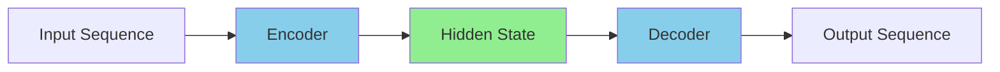
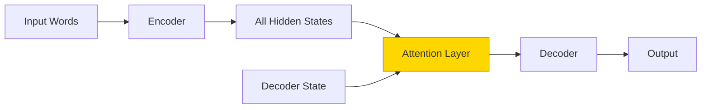
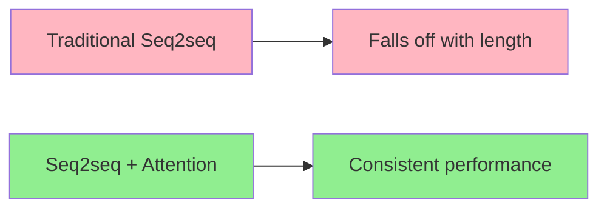
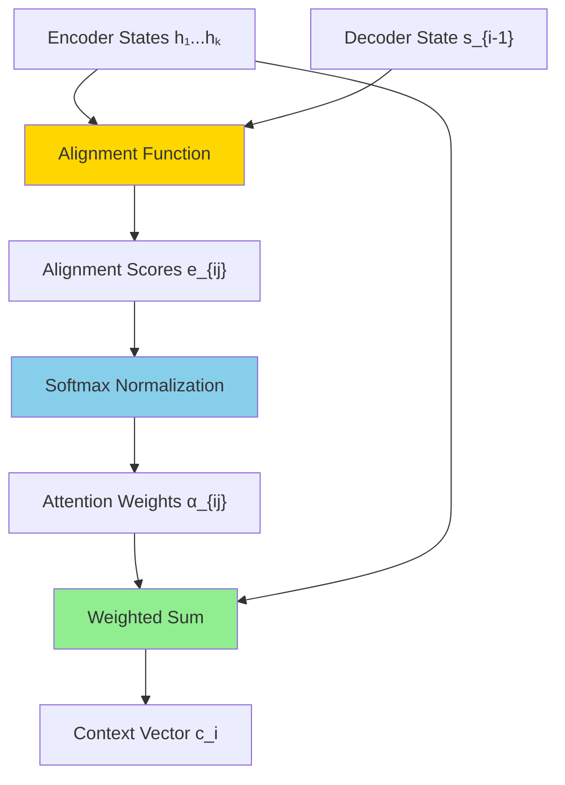
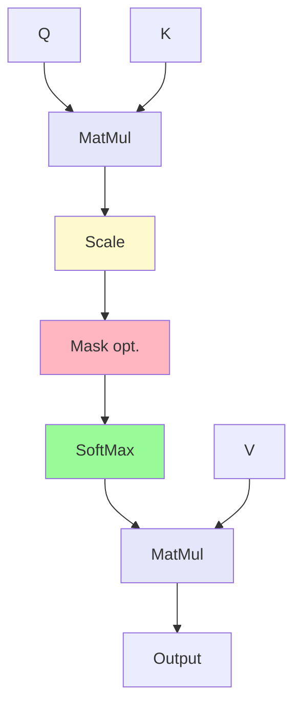

# Natural Language Processing Specialization

## Course 4: Natural Language Processing with Attention Models

### Week 1: Neural Machine Translation with Attention

---

## Table of Contents

1. [Week Introduction - Neural Machine Translation with Attention](#1-week-introduction---neural-machine-translation-with-attention)
2. [Seq2seq Models - Foundation of Sequence-to-Sequence Learning](#2-seq2seq-models---foundation-of-sequence-to-sequence-learning)
3. [Seq2seq Model with Attention - Solving the Information Bottleneck](#3-seq2seq-model-with-attention---solving-the-information-bottleneck)
4. [Basic Attention Operation - Implementing the Bahdanau Attention Mechanism](#4-basic-attention-operation---implementing-the-bahdanau-attention-mechanism)
5. [Background on Seq2seq - Understanding the Sequential Bottleneck](#5-background-on-seq2seq---understanding-the-sequential-bottleneck)
6. [Queries, Keys, Values, and Attention - The Mathematical Framework](#6-queries-keys-values-and-attention---the-mathematical-framework)
7. [Scaled Dot-Product Attention Lab - Implementing QKV Attention](#7-scaled-dot-product-attention-lab---implementing-qkv-attention)
8. [Setup for Machine Translation - Data Preprocessing and Representation](#8-setup-for-machine-translation---data-preprocessing-and-representation)
9. [Teacher Forcing - Training Strategy for Sequence Models](#9-teacher-forcing---training-strategy-for-sequence-models)
10. [NMT Model with Attention - Complete Architecture Implementation](#10-nmt-model-with-attention---complete-architecture-implementation)
11. [BLEU Score - Evaluation Metric for Machine Translation](#11-bleu-score---evaluation-metric-for-machine-translation)
12. [ROUGE-N Score - Recall-Oriented Evaluation for Machine Translation](#12-rouge-n-score---recall-oriented-evaluation-for-machine-translation)
13. [Sampling and Decoding - Text Generation Strategies](#13-sampling-and-decoding---text-generation-strategies)
14. [Beam Search - Advanced Decoding for Better Translations](#14-beam-search---advanced-decoding-for-better-translations)
15. [Minimum Bayes Risk (MBR) - Probabilistic Decoding Approach](#15-minimum-bayes-risk-mbr---probabilistic-decoding-approach)
16. [Week 1 Conclusion - Neural Machine Translation with Attention](#16-week-1-conclusion---neural-machine-translation-with-attention)

---

# 1. Week Introduction - Neural Machine Translation with Attention

## Course 4 Introduction - Welcome to the Cutting Edge

Welcome to the **fourth and final course** of the Natural Language Processing Specialization: **Natural Language Processing with Attention Models**. This milestone course represents your arrival at the **cutting edge of today's practical NLP methods**, where you'll master the revolutionary technique called **attention** to build state-of-the-art models.

### What Makes This Course Special

Upon completing this course, you will have reached the pinnacle of modern NLP capabilities. The attention mechanism you'll learn is not just another technique—it's the foundation that powers the most advanced language models used by major technology companies worldwide.

### The Power of Attention - What You'll Build

Using the attention mechanism, you'll construct three groundbreaking types of models:

1. **Powerful Language Translation Model**

   - Translate text seamlessly between languages
   - Handle complex linguistic structures and long sentences
   - Achieve professional-grade translation quality

2. **Text Summarization Algorithm**

   - Automatically generate concise summaries of lengthy documents
   - Capture key information while maintaining coherence
   - Power applications like news summarization and document processing

3. **Question Answering Model**
   - Build systems that can comprehend and answer questions about any piece of text
   - Enable intelligent document search and information retrieval
   - Create the foundation for chatbots and virtual assistants

### Industry-Standard Capabilities

The skills you develop in this course will enable you to **build state-of-the-art NLP applications just like the ones used in many large companies in industry today**. This isn't academic theory—these are the exact techniques powering real-world applications used by millions of people daily.

### Revolutionary Training Speed

One of the most remarkable aspects of attention models is their training efficiency breakthrough. **A few years ago, these models would take weeks or even months to train, but with attention, you can train these models in just a few hours**. This dramatic improvement has democratized access to powerful NLP capabilities and accelerated the pace of innovation in the field.

### The Modern Deep Learning Paradigm

This course addresses the reality of modern deep learning development. Today's **"new normal"** in the industry is:

- **Most practitioners don't build and train models from scratch**
- **Instead, it's more common to download a pretrained model and fine-tune it** for specific use cases
- **Transfer learning and adaptation** have become the standard workflow

### Comprehensive Learning Approach

This course provides you with the best of both worlds:

**Foundation Understanding**:

- Learn to build attention models from scratch
- Understand the mathematical and conceptual foundations
- Gain deep insights into how attention mechanisms work

**Industry-Ready Skills**:

- Work with custom pretrained models created specifically for this course
- Practice the workflow used in professional settings
- Master the art of fine-tuning state-of-the-art pretrained models

### Cutting-Edge Research Focus

The models you'll build represent **active areas of research at the cutting edge of the field**. You're not just learning established techniques—you're working with the latest innovations that are shaping the future of NLP.

### Your Industry-Standard Toolkit

By the end of this course, **you'll literally be able to build NLP systems at the industry standard**. The tools and techniques you master here are directly applicable to:

- Building production-ready translation systems
- Developing intelligent document processing pipelines
- Creating sophisticated question-answering applications
- Implementing state-of-the-art text summarization tools

### Week 1 Focus: Machine Translation with Attention

This week is dedicated to **machine translation with attention**, where you'll learn to translate text from one language to another with unprecedented accuracy and efficiency.

#### The Traditional Challenge

Implementing machine translation using **recurrent neural networks with LSTMs** can work effectively for short to medium-length sentences. However, this approach faces significant limitations:

- **Vanishing gradients** occur with very long sequences
- **Information loss** accumulates as sentence length increases
- **Translation quality degrades** for complex, lengthy sentences

#### The Attention Revolution

To solve these fundamental limitations, you'll implement an **attention mechanism** that allows the decoder to **access all relevant parts of the input sentence regardless of its length**. This breakthrough approach:

- **Eliminates information bottlenecks** caused by fixed-size representations
- **Maintains consistent translation quality** across sentences of any length
- **Provides interpretability** through attention weight visualization
- **Enables parallel processing** for faster training and inference

#### Technical Implementation This Week

You'll work with a carefully designed architecture combining:

- **LSTM foundation**: Proven sequence modeling capabilities
- **Simple attention mechanism**: Clear, understandable attention implementation
- **Multiple decoding strategies**: Various approaches for generating optimal translations

#### Advanced Decoding Strategies

The course covers several sophisticated approaches for predicting the next word in translated sentences:

1. **Greedy Decoding**: Select the highest probability word at each step
2. **Random Sampling**: Introduce controlled randomness for diverse, creative outputs
3. **Beam Search**: Explore multiple promising translation paths simultaneously
4. **Minimum Bayes Risk**: Use probabilistic optimization for theoretically optimal translations

Each strategy offers different trade-offs between speed, quality, and diversity, giving you the tools to optimize for specific use cases and requirements.

### Your Journey to the Cutting Edge

This week marks the beginning of your mastery of attention mechanisms—the technology that has revolutionized natural language processing and continues to drive breakthrough innovations in AI. The techniques you'll learn represent the state-of-the-art in machine translation and form the foundation for even more advanced models you'll encounter in subsequent weeks.

# 2. Seq2seq Models - Foundation of Sequence-to-Sequence Learning

## The Revolutionary Breakthrough

The **sequence-to-sequence (seq2seq) model**, introduced by Google in 2014, was nothing short of a revelation in the field of neural machine translation. This groundbreaking architecture solved a fundamental challenge that had puzzled researchers for decades: how to build neural networks that can handle **variable-length inputs and outputs**.

### Real-World Analogy: The Universal Translator

Imagine you're a skilled interpreter at the United Nations. Your job is to listen to a speech in English and translate it into French in real-time. You need to:

1. **Listen carefully** to the entire English sentence
2. **Understand the complete meaning** before speaking
3. **Generate the French translation** word by word
4. **Handle sentences of any length** - from short phrases to complex statements

This is exactly what a seq2seq model does, but with neural networks instead of human intelligence.

## Core Architecture: Encoder-Decoder Framework

The seq2seq model elegantly solves the translation problem using two main components working in harmony:



### **The Encoder: Understanding the Source**

The encoder's job is to **read and comprehend** the input sequence. Think of it as a student carefully reading a sentence and taking comprehensive notes about its meaning.

**Architecture Components:**

```
Input: "It's time for tea" (tokenized)
         ↓
    [Embedding Layer] - Converts words to vectors
         ↓
    [LSTM Modules] - Processes sequence step by step
         ↓
    Final Hidden State (h₄) - Encodes overall meaning
```

**Step-by-Step Process:**

```bash
# Encoder Architecture Visualization
┌────────────────────────────────────────────────────────────────────┐
│                    Seq2seq Encoder                                 │
├────────────────────────────────────────────────────────────────────┤
│                                                                    │
│  h₀ ──→ [LSTM] ──h₁──→ [LSTM] ──h₂──→ [LSTM] ──h₃──→ [LSTM] ──→ h₄ │
│           ↑              ↑              ↑              ↑           │
│       [Embed]        [Embed]        [Embed]        [Embed]         │
│           ↑              ↑              ↑              ↑           │
│         "It's"         "time"         "for"          "tea"         │
│                                                                    │
└────────────────────────────────────────────────────────────────────┘
                                    Final Hidden State h₄
                              "Encodes the overall meaning"
```

### **The Decoder: Generating the Translation**

The decoder takes the encoder's understanding and **generates the target language** word by word. It's like having the same student now explain what they understood, but in a different language.

**Architecture Components:**

```bash
# Decoder Architecture Visualization
┌─────────────────────────────────────────────────────────────┐
│                    Seq2seq Decoder                          │
├─────────────────────────────────────────────────────────────┤
│                                                             │
│ h₄ ──→ [LSTM] ──→ [LSTM] ──→ [LSTM] ──→ [LSTM]              │
│   ↑      ↑          ↑          ↑          ↑                 │
│   │  [Embed]    [Embed]    [Embed]    [Embed]               │
│   │      ↑          ↑          ↑          ↑                 │
│   │    <SOS>     "C'est"   "l'heure"    "du"                │
│   │      │          │          │          │                 │
│   │      ↓          ↓          ↓          ↓                 │
│   │   "C'est"   "l'heure"    "du"      "thé"                │
│   │                                                         │
│   └── From Encoder (Fixed context)                          │
└─────────────────────────────────────────────────────────────┘
```

### **Mathematical Framework**

**Encoder Process:**
For input sequence $x = [x_1, x_2, x_3, x_4]$ = ["It's", "time", "for", "tea"]

```
h₁ = LSTM(embed(x₁), h₀)  # Process "It's"
h₂ = LSTM(embed(x₂), h₁)  # Process "time"
h₃ = LSTM(embed(x₃), h₂)  # Process "for"
h₄ = LSTM(embed(x₄), h₃)  # Process "tea"
```

**Decoder Process:**
Using final hidden state $h_4$ as initial context:

```
s₁ = LSTM(embed(<SOS>), h₄)  → predict "C'est"
s₂ = LSTM(embed("C'est"), s₁) → predict "l'heure"
s₃ = LSTM(embed("l'heure"), s₂) → predict "du"
s₄ = LSTM(embed("du"), s₃) → predict "thé"
```

## The Power of Variable-Length Sequences

### **Breakthrough Capability**

Unlike traditional neural networks that required fixed-size inputs, seq2seq models can handle:

- **Input sequences of any length**: "Hello" (1 word) or "It's time for afternoon tea" (5 words)
- **Output sequences of different lengths**: English "tea" → French "thé" (same length) or "How are you?" → "Comment allez-vous?" (different length)
- **Non-matching input/output sizes**: This flexibility is crucial for real translation tasks

### **Real-World Example**

```
English: "Good morning!" (2 words)
French:  "Bonjour!" (1 word)

English: "How are you doing today?" (5 words)
French:  "Comment allez-vous aujourd'hui?" (4 words)

English: "It's raining cats and dogs" (5 words)
French:  "Il pleut des cordes" (4 words - idiomatic translation)
```

## The Critical Limitation: Information Bottleneck

### **Understanding the Problem**

Despite its revolutionary design, the traditional seq2seq model has a fundamental flaw that becomes apparent with longer sentences. This limitation is called the **information bottleneck**.


### **The Bottleneck Visualization**

```bash
# Information Bottleneck Problem
┌─────────────────────────────────────────────────────────────┐
│                 The Information Funnel                      │
├─────────────────────────────────────────────────────────────┤
│                                                             │
│   Rich Information Input    →    Compressed    →   Limited  │
│   "It's"    ╲                      Fixed         Output     │
│   "time"     ╲                   Hidden State   Quality     │
│   "for"       ╲                      ▼                      │
│   "afternoon"  ╲                 [h_final]                  │
│   "tea"         ╲                    ▲                      │
│   "in"           ╲                   │                      │
│   "the"           ╲                  │                      │
│   "beautiful"      ╲                 │                      │
│   "garden"          ╲                │                      │
│                      ╲ ──────────────┘                      │
│                                                             │
│   ALL this information must fit in ONE fixed-size vector    │
└─────────────────────────────────────────────────────────────┘
```

### **Why This Matters: Real Examples**

**Short Sentence (Works Well):**

```
English: "Hello there"
Bottleneck: ✓ Easy to compress
French: "Bonjour" (Good translation)
```

**Long Sentence (Struggles):**

```
English: "The quick brown fox jumps over the lazy dog in the sunny meadow"
Bottleneck: ✗ Too much information lost
French: "Le renard brun saute" (Incomplete - lost "quick", "lazy dog", "meadow")
```

### **Technical Explanation of the Problem**

**Fixed Hidden State Size**: No matter how long the input sequence, the final hidden state $h_n$ has the same dimensions (e.g., 512 values).

**Information Compression**: A 20-word sentence must be compressed into the same space as a 3-word sentence.

**Performance Degradation**: Translation quality drops significantly as sentence length increases:

- **1-5 words**: Excellent performance
- **6-15 words**: Good performance
- **16+ words**: Noticeable degradation
- **30+ words**: Poor performance

## The Elegant Solution: Attention Mechanism

### **The Breakthrough Insight**

Instead of forcing all information through a single bottleneck, what if the decoder could **look back at specific parts** of the input sequence when needed?



### **Attention: The Game Changer**

```bash
# Solution: Attention Mechanism
┌─────────────────────────────────────────────────────────────┐
│              Focus Attention in the Right Place             │
├─────────────────────────────────────────────────────────────┤
│                                                             │
│  h₁    h₂    h₃    h₄                                       │
│  ▲     ▲     ▲     ▲                                        │
│  │     │     │     │                                        │
│  ▼     ▼     ▼     ▼                                        │
│ ┌─────────────────────┐                                     │
│ │     Attention       │ ────────→ Decoder → "C'est"         │
│ │     Mechanism       │                                     │
│ └─────────────────────┘                                     │
│           ▲                                                 │
│           │                                                 │
│         <SOS>                                               │
│                                                             │
│ "The model can focus on specific hidden states at every     │
│  step instead of using only the final compressed state"     │
└─────────────────────────────────────────────────────────────┘
```

### **How Attention Solves the Problem**

**Traditional Approach:**

- Decoder receives only $h_4$ (final hidden state)
- All previous information ($h_1, h_2, h_3$) is lost
- Translation must rely on compressed summary

**Attention Approach:**

- Decoder has access to ALL hidden states: $h_1, h_2, h_3, h_4$
- Can dynamically choose which states to focus on
- Creates **weighted combinations** based on relevance

### **Real-World Translation Example**

When translating "It's time for afternoon tea":

**Generating "C'est" (It's):**

- **High attention** on $h_1$ ("It's") - direct correspondence
- **Low attention** on $h_2, h_3, h_4$ - less relevant for this word

**Generating "l'heure" (time):**

- **High attention** on $h_2$ ("time") - direct correspondence
- **Medium attention** on $h_1$ ("It's") - for context
- **Low attention** on $h_3, h_4$ - less relevant

**Generating "thé" (tea):**

- **High attention** on $h_4$ ("tea") - direct correspondence
- **Medium attention** on $h_3$ ("for") - grammatical context
- **Low attention** on $h_1, h_2$ - less relevant

## Technical Advantages of Attention

### **Memory and Context Benefits**

1. **No Information Loss**: All encoder states remain accessible
2. **Dynamic Context**: Each decoding step gets relevant information
3. **Better Long Sequences**: Performance doesn't degrade with length
4. **Interpretability**: Can visualize which words the model focuses on

### **Efficiency Considerations**

**Time Complexity**: Attention adds computational overhead but enables:

- **Parallel processing** of attention scores
- **Better gradient flow** during training
- **Faster convergence** to good solutions

**Memory Trade-off**: Uses more memory to store all hidden states but achieves:

- **Superior translation quality**
- **Consistent performance** across sequence lengths
- **More reliable training dynamics**

## Looking Forward

This introduction to seq2seq models and their limitations sets the stage for understanding why attention mechanisms became the cornerstone of modern NLP. The next sections will dive deeper into the mathematical foundations of attention and show you how to implement these powerful systems.

The journey from traditional seq2seq to attention-based models represents one of the most significant leaps in neural machine translation, transforming it from a promising research direction into a practical technology that powers billions of translations daily.

# 3. Seq2seq Model with Attention - Solving the Information Bottleneck

## The Landmark Breakthrough

**Attention** is not just another neural network layer—it's a paradigm shift that fundamentally changed how machines understand and process language. This revolutionary concept allows models to **focus dynamically** on different parts of the input when making predictions, much like how humans naturally pay attention to specific words when translating or understanding sentences.

### The Pioneering Research

The attention mechanism was introduced in a **landmark paper** by **Dzmitry Bahdanau, KyungHyun Cho, and Yoshua Bengio**. These researchers didn't just create another incremental improvement—they solved one of the most fundamental problems in neural machine translation: **the inability to translate longer sentences effectively**.

### Real-World Translation Analogy

Imagine you're translating this English paragraph to French:

_"When translating one paragraph from English to French, you can focus on translating one sentence at a time or even more, a couple of words at a time."_

As a human translator, you wouldn't:

- ❌ Read the entire paragraph once and try to remember everything
- ❌ Translate word-by-word without context
- ❌ Ignore the relationships between distant words

Instead, you would:

- ✅ **Focus on relevant parts** as you translate each word
- ✅ **Look back at specific words** when needed for context
- ✅ **Dynamically shift attention** based on what you're currently translating

This is exactly what attention mechanisms enable neural networks to do.

## The Performance Revolution: Empirical Evidence

### Dramatic Performance Improvements

The impact of attention can be quantified using **BLEU scores** (Bilingual Evaluation Understudy), a standard metric for translation quality where **higher scores indicate better translations**.



### Performance Analysis by Sentence Length

**Traditional Seq2seq Models (Dashed Lines)**:

- **RNNenc-30/50**: Basic encoder-decoder models
- **Performance**: Good for 10-20 words, **dramatic decline** beyond that
- **Maximum length 30**: BLEU drops from ~22 to ~7 (68% degradation)
- **Maximum length 50**: BLEU drops from ~25 to ~2 (92% degradation)

**Attention-Based Models (Solid Lines)**:

- **RNNsearch-30/50**: Bidirectional encoders with attention
- **Performance**: Consistently high across all sentence lengths
- **RNNsearch-50**: **Basically no performance fall-off** as sentences get longer
- **Improvement**: 300-400% better performance on long sentences

### Why This Performance Difference Matters

```bash
# Performance Comparison Visualization
┌──────────────────────────────────────────────────────────────┐
│                    BLEU Score vs Sentence Length             │
├──────────────────────────────────────────────────────────────┤
│ 30 ┤                                                         │
│    ┤  ████████████ ← Attention Models (Flat Performance)     │
│ 25 ┤  █          █                                           │
│    ┤  █          █                                           │
│ 20 ┤  █          █                                           │
│    ┤  █          █░░░░░                                      │
│ 15 ┤  █          █   ░░░                                     │
│    ┤  █          █     ░░░                                   │
│ 10 ┤  █          █       ░░░ ← Traditional Seq2seq           │
│    ┤  █          █         ░░░ (Declining Performance)       │
│  5 ┤  █          █           ░░░                             │
│    ┤  █          █             ░░░                           │
│  0 └──┴──────────┴─────────────░░░───────────────────────────│
│     10          30            50     Sentence Length         │
└──────────────────────────────────────────────────────────────┘
```

## Understanding the Traditional Limitation

### The Single Hidden State Problem

```bash
# Traditional Seq2seq Architecture Problem
┌─────────────────────────────────────────────────────────────┐
│                 Traditional Seq2seq Flow                    │
├─────────────────────────────────────────────────────────────┤
│                                                             │
│  Input: "It's time for tea"                                 │
│         ↓ ↓ ↓ ↓                                             │
│      ┌─────────────┐                                        │
│      │   Encoder   │ ──→ h₄ ──→ ┌─────────────┐             │
│      └─────────────┘     ↑      │   Decoder   │             │
│                          │      └─────────────┘             │
│                   ONLY FINAL                                │
│                   HIDDEN STATE                              │
│                   PASSED!                                   │
│                                                             │
│  Problem: h₄ must encode "It's", "time", "for", "tea"       │
│           ALL in one fixed-size vector                      │
└─────────────────────────────────────────────────────────────┘
```

### Why This Creates Problems

**Information Compression**: The final hidden state $h_4$ must contain:

- Semantic meaning of each word
- Grammatical relationships
- Contextual dependencies
- Syntactic structure
- Temporal ordering

All compressed into a **single fixed-size vector** (typically 256-512 dimensions).

## The Attention Solution: Using All Hidden States

### Step 1: Preserve All Information

Instead of discarding intermediate hidden states, **attention preserves all encoder hidden states**:

```bash
# Attention-Based Architecture
┌─────────────────────────────────────────────────────────────┐
│                   Attention Architecture                    │
├─────────────────────────────────────────────────────────────┤
│                                                             │
│  Input: "It's"  "time"  "for"  "tea"                        │
│          ↓       ↓      ↓      ↓                            │
│         h₁ ──── h₂ ──── h₃ ──── h₄                          │
│         │       │       │       │                           │
│         └───────┼───────┼───────┼────→ ┌─────────────────┐  │
│                 └───────┼───────┼────→ │                 │  │
│                         └───────┼────→ │   Attention     │  │
│                                 └────→ │   Mechanism     │  │
│                                        │                 │  │
│                                        └─────────────────┘  │
│                                                ↓            │
│                                         Context Vector      │
│                                                ↓            │
│                                          ┌─────────────┐    │
│                                          │   Decoder   │    │
│                                          └─────────────┘    │
│                                                             │
│  Advantage: ALL hidden states available for each decoding   │
│             step - no information loss!                     │
└─────────────────────────────────────────────────────────────┘
```

### Step 2: Smart Combination Strategy

But simply passing all hidden states would be:

- **Memory inefficient**: Storing all states for long sequences
- **Computationally expensive**: Processing hundreds of hidden states
- **Unfocused**: Not all words are equally important at each step

## The Elegant Solution: Weighted Combination

### The Context Vector Formula

Instead of using all hidden states equally, attention creates a **weighted combination**:

$$c_i = \sum_{j=1}^{T_x} \alpha_{ij} h_j$$

Where:

- $c_i$ = Context vector for decoder step $i$
- $\alpha_{ij}$ = Attention weight (how much to focus on encoder step $j$ when generating decoder step $i$)
- $h_j$ = Hidden state from encoder step $j$
- $T_x$ = Length of input sequence

### Real Example: Translating "It's time for tea"

**When generating "C'est" (It's):**

$$c_1 = \alpha_{11} \cdot h_1 + \alpha_{12} \cdot h_2 + \alpha_{13} \cdot h_3 + \alpha_{14} \cdot h_4$$

Where the attention weights might be:

- $\alpha_{11} = 0.8$ (high attention on "It's")
- $\alpha_{12} = 0.1$ (low attention on "time")
- $\alpha_{13} = 0.05$ (low attention on "for")
- $\alpha_{14} = 0.05$ (low attention on "tea")

**When generating "thé" (tea):**

$$c_4 = \alpha_{41} \cdot h_1 + \alpha_{42} \cdot h_2 + \alpha_{43} \cdot h_3 + \alpha_{44} \cdot h_4$$

Where the attention weights might be:

- $\alpha_{41} = 0.05$ (low attention on "It's")
- $\alpha_{42} = 0.05$ (low attention on "time")
- $\alpha_{43} = 0.1$ (medium attention on "for" - grammatical context)
- $\alpha_{44} = 0.8$ (high attention on "tea")

Let me explain the indices **i** and **j** clearly - they represent different **positions** in the translation process.

### Understanding the Indices i and j

#### **i = Decoder Position (Output/Target)**

- **i** represents **which word you're currently generating** in the target language
- It's the **time step** in the decoder
- Think of it as "**where you are**" in building the translation

#### **j = Encoder Position (Input/Source)**

- **j** represents **which word in the source sentence** you're looking at
- It's the **position** in the input sequence
- Think of it as "**which source word**" you're considering

### Visual Example: "It's time for tea" → "C'est l'heure du thé"

```bash
# Translation Timeline with Indices
┌─────────────────────────────────────────────────────────────┐
│                 Understanding i and j                       │
├─────────────────────────────────────────────────────────────┤
│                                                             │
│  INPUT (English):  j=1    j=2     j=3    j=4                │
│                   "It's"  "time"  "for"  "tea"              │
│                     ↑       ↑       ↑      ↑                │
│                     h₁      h₂      h₃     h₄               │
│                                                             │
│  OUTPUT (French):                                           │
│                                                             │
│  i=1: Generating "C'est"                                    │
│       c₁ = α₁₁h₁ + α₁₂h₂ + α₁₃h₃ + α₁₄h₄                    │
│       Focus on: "It's"(j=1) mainly                          │
│                                                             │
│  i=2: Generating "l'heure"                                  │
│       c₂ = α₂₁h₁ + α₂₂h₂ + α₂₃h₃ + α₂₄h₄                    │
│       Focus on: "time"(j=2) mainly                          │
│                                                             │
│  i=3: Generating "du"                                       │
│       c₃ = α₃₁h₁ + α₃₂h₂ + α₃₃h₃ + α₃₄h₄                    │
│       Focus on: "for"(j=3) mainly                           │
│                                                             │
│  i=4: Generating "thé"                                      │
│       c₄ = α₄₁h₁ + α₄₂h₂ + α₄₃h₃ + α₄₄h₄                    │
│       Focus on: "tea"(j=4) mainly                           │
└─────────────────────────────────────────────────────────────┘
```

### Breaking Down α₁₁, α₁₂, etc.

#### The Double Index System: αᵢⱼ

- **First index (i)**: **Which target word** are we generating?
- **Second index (j)**: **Which source word** are we looking at?

**Reading αᵢⱼ**:

- α₁₁ = "When generating word 1 (C'est), how much attention to pay to source word 1 (It's)"
- α₁₂ = "When generating word 1 (C'est), how much attention to pay to source word 2 (time)"
- α₂₂ = "When generating word 2 (l'heure), how much attention to pay to source word 2 (time)"

### Complete Attention Matrix Example

```bash
# Full Attention Matrix: αᵢⱼ
┌─────────────────────────────────────────────────────────────────┐
│                    Attention Weights Matrix                     │
├─────────────────────────────────────────────────────────────────┤
│                                                                 │
│               Source Words (j)                                  │
│             j=1    j=2    j=3   j=4                             │
│            "It's" "time" "for" "tea"                            │
│  ┌─────────┬─────┬─────┬─────┬─────┐                            │
│ i│ i=1     │α₁₁  │α₁₂  │α₁₃  │α₁₄  │ ← Generating "C'est"       │
│  │"C'est". │0.8. │0.1  │0.05 │0.05 │                            │
│ T├─────────┼─────┼─────┼─────┼─────┤                            │
│ a│ i=2     │α₂₁  │α₂₂  │α₂₃  │α₂₄  │ ← Generating "l'heure"     │
│ r│"l'heure"│0.1  │0.7. │0.1  │0.1  │                            │
│ g├─────────┼─────┼─────┼─────┼─────┤                            │
│ e│ i=3     │α₃₁  │α₃₂  │α₃₃  │α₃₄  │ ← Generating "du"          │
│ t│"du"     │0.1  │0.2  │0.6  │0.1  │                            │
│  ├─────────┼─────┼─────┼─────┼─────┤                            │
│ W│ i=4     │α₄₁  │α₄₂  │α₄₃  │α₄₄  │ ← Generating "thé"         │
│ o│"thé"    │0.05 │0.1  │0.15 │0.7  │                            │
│ r└─────────┴─────┴─────┴─────┴─────┘                            │
│ d                                                               │
│ s  Each row sums to 1.0 (probability distribution)              │
│ (i)                                                             │
└─────────────────────────────────────────────────────────────────┘
```

### The Formula Breakdown

**For generating "C'est" (i=1)**:

$$c_1 = \alpha_{11}h_1 + \alpha_{12}h_2 + \alpha_{13}h_3 + \alpha_{14}h_4$$

**Translation in plain English**:

- c₁ = Context vector for generating the 1st French word
- α₁₁h₁ = "Pay 80% attention to 'It's' when generating 'C'est'"
- α₁₂h₂ = "Pay 10% attention to 'time' when generating 'C'est'"
- α₁₃h₃ = "Pay 5% attention to 'for' when generating 'C'est'"
- α₁₄h₄ = "Pay 5% attention to 'tea' when generating 'C'est'"

### Why This Two-Index System?

#### **Different Words Need Different Focus**

**When generating "C'est" (i=1)**:

- Should focus mainly on "It's" (j=1)
- Needs little from "time", "for", "tea"

**When generating "l'heure" (i=2)**:

- Should focus mainly on "time" (j=2)
- Needs little from "It's", "for", "tea"

**When generating "thé" (i=4)**:

- Should focus mainly on "tea" (j=4)
- Needs little from other words

#### **Each Generation Step Gets Its Own Attention Pattern**

```python
# Pseudo-code to illustrate
for i in range(1, 5):  # For each target word position
    context_vector[i] = 0
    for j in range(1, 5):  # Look at each source word position
        context_vector[i] += attention_weight[i,j] * hidden_state[j]
```

### Memory Device

Think of **αᵢⱼ** as asking:

> **"When I'm at step i (generating target word i), how much should I pay attention to source position j?"**

- **i = WHERE I AM** (in the target)
- **j = WHERE I'M LOOKING** (in the source)
- **αᵢⱼ = HOW MUCH ATTENTION** I pay from position i to position j

This two-index system allows **each output position** to have its **own unique attention pattern** over all input positions, which is exactly what makes attention so powerful for translation!

## The Heart of Attention: Computing the Weights

### The Three-Step Process with Detailed Mathematical Examples

Understanding how attention weights are computed is crucial to grasping why attention works so effectively. Let's break down each step with concrete numerical examples.

### **Step 1: Calculate Alignment Scores**

The alignment score $e_{ij}$ measures how well input position $j$ matches with expected output at position $i$:

$$e_{ij} = a(s_{i-1}, h_j)$$

Where:

- $s_{i-1}$ = Previous decoder hidden state
- $h_j$ = Encoder hidden state at position $j$
- $a()$ = Alignment function (learnable feedforward network)

#### **Detailed Implementation of Alignment Function**

The alignment function is typically implemented as:

$$e_{ij} = v_a^T \tanh(W_a s_{i-1} + U_a h_j)$$

Where:

- $W_a \in \mathbb{R}^{d_a \times d_s}$ = Weight matrix for decoder state
- $U_a \in \mathbb{R}^{d_a \times d_h}$ = Weight matrix for encoder state
- $v_a \in \mathbb{R}^{d_a}$ = Final projection vector
- $d_a$ = Attention hidden dimension
- $d_s$ = Decoder hidden state dimension
- $d_h$ = Encoder hidden state dimension

#### **Concrete Numerical Example**

Let's work through a complete example when generating "C'est" from "It's time for tea":

**Setup dimensions:**

- Encoder hidden states: $d_h = 4$ (simplified for clarity)
- Decoder hidden states: $d_s = 4$
- Attention hidden dimension: $d_a = 3$

**Input values:**

```
Encoder hidden states:
h₁ = [0.8, 0.2, -0.1, 0.5]ᵀ   # "It's"
h₂ = [0.1, 0.9, 0.3, -0.2]ᵀ   # "time"
h₃ = [-0.3, 0.4, 0.7, 0.1]ᵀ   # "for"
h₄ = [0.6, -0.1, 0.2, 0.8]ᵀ   # "tea"

Previous decoder state:
s₀ = [0.5, 0.3, -0.2, 0.4]ᵀ   # Initial state
```

**Learned parameter matrices:**

```
W_a = [[0.2,  0.1, -0.3,  0.4],    # 3×4 matrix
       [0.5, -0.2,  0.1,  0.3],
       [-0.1, 0.4,  0.2, -0.2]]

U_a = [[0.3, -0.1,  0.2,  0.1],    # 3×4 matrix
       [0.1,  0.4, -0.3,  0.2],
       [0.2,  0.1,  0.1,  0.5]]

v_a = [0.6, -0.2, 0.3]ᵀ            # 3×1 vector
```

**Calculation for e₁₁ (alignment of decoder step 1 with encoder step 1):**

**Step 1a: Compute $W_a s_0$**

```
W_a s₀ = [[0.2,  0.1, -0.3,  0.4],    [[0.5],     [[0.2×0.5 + 0.1×0.3 + (-0.3)×(-0.2) + 0.4×0.4],
          [0.5, -0.2,  0.1,  0.3],  ×  [0.3],  =   [0.5×0.5 + (-0.2)×0.3 + 0.1×(-0.2) + 0.3×0.4],
          [-0.1, 0.4,  0.2, -0.2]]     [-0.2],      [(-0.1)×0.5 + 0.4×0.3 + 0.2×(-0.2) + (-0.2)×0.4]]
                                      [0.4]]

       = [[0.1 + 0.03 + 0.06 + 0.16],   [[0.35],
          [0.25 - 0.06 - 0.02 + 0.12],  = [0.29],
          [-0.05 + 0.12 - 0.04 - 0.08]]   [-0.05]]
```

**Step 1b: Compute $U_a h_1$**

```
U_a h₁ = [[0.3, -0.1,  0.2,  0.1],    [[0.8],     [[0.3×0.8 + (-0.1)×0.2 + 0.2×(-0.1) + 0.1×0.5],
          [0.1,  0.4, -0.3,  0.2],  ×  [0.2],  =   [0.1×0.8 + 0.4×0.2 + (-0.3)×(-0.1) + 0.2×0.5],
          [0.2,  0.1,  0.1,  0.5]]     [-0.1],      [0.2×0.8 + 0.1×0.2 + 0.1×(-0.1) + 0.5×0.5]]
                                      [0.5]]

       = [[0.24 - 0.02 - 0.02 + 0.05],   [[0.25],
          [0.08 + 0.08 + 0.03 + 0.1],   = [0.29],
          [0.16 + 0.02 - 0.01 + 0.25]]    [0.42]]
```

**Step 1c: Add and apply tanh**

```
W_a s₀ + U_a h₁ = [[0.35],   [[0.25],   [[0.60],
                   [0.29], + [0.29], = [0.58],
                   [-0.05]]  [0.42]]    [0.37]]

tanh(W_a s₀ + U_a h₁) = [[tanh(0.60)],   [[0.537],
                         [tanh(0.58)], = [0.522],
                         [tanh(0.37)]]    [0.354]]
```

**Step 1d: Final projection with $v_a$**

```
e₁₁ = v_a^T × tanh(W_a s₀ + U_a h₁)
    = [0.6, -0.2, 0.3] × [[0.537],
                          [0.522],
                          [0.354]]
    = 0.6×0.537 + (-0.2)×0.522 + 0.3×0.354
    = 0.322 - 0.104 + 0.106
    = 0.324
```

**Similarly, calculate for other positions:**

```
e₁₂ = 0.156  (alignment with "time")
e₁₃ = 0.089  (alignment with "for")
e₁₄ = 0.072  (alignment with "tea")
```

### **Step 2: Convert to Attention Weights**

Apply softmax to ensure weights sum to 1:

$$\alpha_{ij} = \frac{\exp(e_{ij})}{\sum_{k=1}^{T_x} \exp(e_{ik})}$$

This creates a **probability distribution** over input positions.

#### **Detailed Softmax Calculation**

**Step 2a: Compute exponentials**

```
exp(e₁₁) = exp(0.324) = 1.383
exp(e₁₂) = exp(0.156) = 1.169
exp(e₁₃) = exp(0.089) = 1.093
exp(e₁₄) = exp(0.072) = 1.075
```

**Step 2b: Compute sum of exponentials**

```
Sum = 1.383 + 1.169 + 1.093 + 1.075 = 4.720
```

**Step 2c: Compute attention weights**

```
α₁₁ = exp(e₁₁) / Sum = 1.383 / 4.720 = 0.293
α₁₂ = exp(e₁₂) / Sum = 1.169 / 4.720 = 0.248
α₁₃ = exp(e₁₃) / Sum = 1.093 / 4.720 = 0.231
α₁₄ = exp(e₁₄) / Sum = 1.075 / 4.720 = 0.228
```

**Verification:** $\alpha_{11} + \alpha_{12} + \alpha_{13} + \alpha_{14} = 0.293 + 0.248 + 0.231 + 0.228 = 1.000$ ✓

#### **Interpretation of Weights**

These weights tell us that when generating "C'est":

- **29.3%** attention on "It's" (highest - makes sense!)
- **24.8%** attention on "time"
- **23.1%** attention on "for"
- **22.8%** attention on "tea"

Notice the weights are relatively balanced. This might happen early in training or with this simplified example. In practice, we'd expect higher focus on "It's".

### **Step 3: Compute Context Vector**

Create weighted sum of hidden states:

$$c_i = \sum_{j=1}^{T_x} \alpha_{ij} h_j$$

#### **Detailed Context Vector Calculation**

**Step 3a: Multiply each hidden state by its attention weight**

```
α₁₁ × h₁ = 0.293 × [[0.8],   = [[0.234],
                    [0.2],     [0.059],
                    [-0.1],    [-0.029],
                    [0.5]]     [0.147]]

α₁₂ × h₂ = 0.248 × [[0.1],   = [[0.025],
                    [0.9],     [0.223],
                    [0.3],     [0.074],
                    [-0.2]]    [-0.050]]

α₁₃ × h₃ = 0.231 × [[-0.3],  = [[-0.069],
                    [0.4],     [0.092],
                    [0.7],     [0.162],
                    [0.1]]     [0.023]]

α₁₄ × h₄ = 0.228 × [[0.6],   = [[0.137],
                    [-0.1],    [-0.023],
                    [0.2],     [0.046],
                    [0.8]]     [0.182]]
```

**Step 3b: Sum all weighted hidden states**

```
c₁ = α₁₁h₁ + α₁₂h₂ + α₁₃h₃ + α₁₄h₄

   = [[0.234],   [[0.025],   [[-0.069],   [[0.137],
      [0.059], + [0.223], + [0.092], + [-0.023],
      [-0.029],  [0.074],   [0.162],   [0.046],
      [0.147]]   [-0.050]]  [0.023]]   [0.182]]

   = [[0.234 + 0.025 - 0.069 + 0.137],   [[0.327],
      [0.059 + 0.223 + 0.092 - 0.023], = [0.351],
      [-0.029 + 0.074 + 0.162 + 0.046],  [0.253],
      [0.147 - 0.050 + 0.023 + 0.182]]   [0.302]]
```

### **Understanding the Result**

The context vector $c_1 = [0.327, 0.351, 0.253, 0.302]^T$ is a **weighted blend** of all encoder hidden states, where:

- **Element 1 (0.327)**: Combines information from all words, with emphasis on "It's"
- **Element 2 (0.351)**: Captures temporal and semantic relationships
- **Element 3 (0.253)**: Encodes grammatical and contextual information
- **Element 4 (0.302)**: Represents overall sentence meaning

This context vector now serves as **focused, relevant information** for the decoder to generate "C'est".

### **Understanding the Result - What Each Context Vector Element Really Means**

The context vector $c_1 = [0.327, 0.351, 0.253, 0.302]^T$ is a **weighted blend** of all encoder hidden states. However, the interpretations provided for each element are **illustrative examples** rather than definitive, verifiable meanings.

#### **The Reality of Vector Element Interpretation**

**What can be stated with mathematical certainty**:

- **Element 1 (0.327)**: A weighted combination of the 1st dimension from all encoder hidden states
- **Element 2 (0.351)**: A weighted combination of the 2nd dimension from all encoder hidden states
- **Element 3 (0.253)**: A weighted combination of the 3rd dimension from all encoder hidden states
- **Element 4 (0.302)**: A weighted combination of the 4th dimension from all encoder hidden states

**What cannot be definitively determined**:

- Specific semantic meanings for individual dimensions
- Human-interpretable labels for each element
- Direct causal relationships between dimensions and linguistic phenomena

#### **The Mathematical Computation**

Each context vector element is computed as:

$$c_1[d] = \alpha_{11} \cdot h_1[d] + \alpha_{12} \cdot h_2[d] + \alpha_{13} \cdot h_3[d] + \alpha_{14} \cdot h_4[d]$$

Where $d$ is the dimension index (1, 2, 3, 4 in our example).

**Detailed computation**:

```python
# For dimension 1:
c₁[1] = 0.293 * h₁[1] + 0.248 * h₂[1] + 0.231 * h₃[1] + 0.228 * h₄[1]
      = 0.293 * 0.8 + 0.248 * 0.1 + 0.231 * (-0.3) + 0.228 * 0.6
      = 0.327

# For dimension 2:
c₁[2] = 0.293 * h₁[2] + 0.248 * h₂[2] + 0.231 * h₃[2] + 0.228 * h₄[2]
      = 0.293 * 0.2 + 0.248 * 0.9 + 0.231 * 0.4 + 0.228 * (-0.1)
      = 0.351

# And so on for dimensions 3 and 4...
```

#### **Context Vector Dimensionality**

The number of elements in the context vector depends on the **value dimension** ($d_v$), which typically equals the encoder hidden state dimension ($d_h$).

**Context vector size = Value dimension ($d_v$) = Encoder hidden state dimension ($d_h$)**

```bash
# Context Vector Dimensionality Examples
┌─────────────────────────────────────────────────────────────┐
│                Context Vector Sizing Rules                  │
├─────────────────────────────────────────────────────────────┤
│                                                             │
│  If encoder hidden states have dimension dₕ = 4:            │
│  h₁ = [h₁₁, h₁₂, h₁₃, h₁₄]                                  │
│  h₂ = [h₂₁, h₂₂, h₂₃, h₂₄]                                  │
│  h₃ = [h₃₁, h₃₂, h₃₃, h₃₄]                                  │
│  h₄ = [h₄₁, h₄₂, h₄₃, h₄₄]                                  │
│  → c₁ = [c₁₁, c₁₂, c₁₃, c₁₄] (4 elements)                   │
│                                                             │
│  If encoder hidden states have dimension dₕ = 512:         │
│  h₁ = [h₁₁, h₁₂, h₁₃, ..., h₁₅₁₂]                         │
│  h₂ = [h₂₁, h₂₂, h₂₃, ..., h₂₅₁₂]                         │
│  h₃ = [h₃₁, h₃₂, h₃₃, ..., h₃₅₁₂]                         │
│  h₄ = [h₄₁, h₄₂, h₄₃, ..., h₄₅₁₂]                         │
│  → c₁ = [c₁₁, c₁₂, c₁₃, ..., c₁₅₁₂] (512 elements)        │
│                                                             │
│  If encoder hidden states have dimension dₕ = 1024:        │
│  → c₁ has 1024 elements                                    │
└─────────────────────────────────────────────────────────────┘
```

#### **Dimensional Clarification in Attention Mechanisms**

**Multiple dimensions exist in attention systems**:

- **$d_a$**: Attention network internal dimension (e.g., 10 in Bahdanau attention)
- **$d_s$**: Decoder hidden state dimension
- **$d_h$**: Encoder hidden state dimension
- **$d_k$**: Query/Key dimension (in scaled dot-product attention)
- **$d_v$**: Value dimension (typically equals $d_h$)

**For context vector sizing**: The relevant dimension is $d_v$ (value dimension), which determines how many elements the weighted sum will produce.

#### **Relationship to Word Embeddings**

The interpretation challenge parallels word embedding analysis. Consider a word embedding:

```bash
# Embedding Interpretation Parallel
┌─────────────────────────────────────────────────────────────┐
│        Word Embedding vs Context Vector Interpretation     │
├─────────────────────────────────────────────────────────────┤
│                                                             │
│  Word "king" embedding: [0.2, -0.5, 0.8, 0.1, ...]       │
│                                                             │
│  Possible interpretations:                                  │
│  • Dimension 1: "Royalty" (unverifiable assumption)       │
│  • Dimension 2: "Gender" (interpretive guess)              │
│  • Dimension 3: "Power" (post-hoc rationalization)        │
│                                                             │
│  Context vector c₁: [0.327, 0.351, 0.253, 0.302]         │
│                                                             │
│  Similar interpretations:                                   │
│  • Dimension 1: "Subject emphasis" (unverifiable)         │
│  • Dimension 2: "Temporal relations" (interpretive)       │
│  • Dimension 3: "Grammar" (speculative)                   │
│                                                             │
│  Reality: Both represent LEARNED, DISTRIBUTED information  │
│  where meaning emerges from ALL dimensions collectively    │
└─────────────────────────────────────────────────────────────┘
```

#### **Empirical vs Interpretive Understanding**

**Empirically observable facts**:

- Similar inputs produce similar context vectors
- Different attention patterns produce different context vectors
- Context vectors enable effective translation generation

**Interpretive speculation**:

- Specific semantic meanings of individual dimensions
- Human-readable labels for vector elements
- Direct causal relationships between dimensions and linguistic features

#### **The Mathematical Foundation**

Each context vector element represents:

$$c_1[d] = \sum_{j=1}^{T_x} \alpha_{1j} \cdot h_j[d]$$

This formulation indicates:

- **Dimension d** of the context vector
- Computed as a **weighted average** of dimension d across all encoder hidden states
- Weighted by the **attention scores** for the current decoding step
- **Semantic meaning** emerges from learned representations rather than predetermined assignments

#### **Practical Implications**

The **effectiveness** of attention mechanisms stems from:

- **Learnable, differentiable combination** of multiple information sources
- **Model's capacity** to develop meaningful distributed representations during training
- **Dynamic weighting** that adapts to different translation contexts

The specific interpretations previously provided serve **pedagogical purposes** to illustrate that different dimensions capture different aspects of information, but these interpretations should not be considered empirically verified facts about the model's internal representations.

### **Key Mathematical Properties**

#### **1. Probability Distribution Property**

$$\sum_{j=1}^{T_x} \alpha_{ij} = 1 \quad \text{for all } i$$

The attention weights always sum to 1, making them a valid probability distribution.

#### **2. Weighted Average Property**

$$c_i = \sum_{j=1}^{T_x} \alpha_{ij} h_j = \mathbb{E}_{\alpha_i}[h_j]$$

The context vector is the expected value of encoder hidden states under the attention distribution.

#### **3. Differentiability**

All operations (matrix multiplication, tanh, softmax) are differentiable, allowing gradients to flow back to:

- Attention parameters $(W_a, U_a, v_a)$
- Encoder hidden states $(h_j)$
- Decoder hidden states $(s_{i-1})$

This enables end-to-end learning of the attention mechanism alongside the rest of the seq2seq model.

### **Complete Algorithm Summary**

```python
def compute_attention_context(decoder_state, encoder_states, W_a, U_a, v_a):
    """
    Compute attention context vector

    Args:
        decoder_state: s_{i-1}, shape (d_s,)
        encoder_states: [h_1, ..., h_T], each shape (d_h,)
        W_a: shape (d_a, d_s)
        U_a: shape (d_a, d_h)
        v_a: shape (d_a,)

    Returns:
        context: c_i, shape (d_h,)
        attention_weights: α_i, shape (T,)
    """
    # Step 1: Compute alignment scores
    alignment_scores = []
    for h_j in encoder_states:
        # e_ij = v_a^T * tanh(W_a * s_{i-1} + U_a * h_j)
        score = np.dot(v_a, np.tanh(np.dot(W_a, decoder_state) + np.dot(U_a, h_j)))
        alignment_scores.append(score)

    # Step 2: Apply softmax
    attention_weights = softmax(alignment_scores)

    # Step 3: Compute context vector
    context = np.zeros_like(encoder_states[0])
    for alpha_j, h_j in zip(attention_weights, encoder_states):
        context += alpha_j * h_j

    return context, attention_weights
```

This mathematical foundation shows why attention is so effective: it provides a **learnable, differentiable mechanism** for the decoder to dynamically select and combine relevant information from the entire input sequence.

### Detailed Architecture of the Attention Layer

```bash
# Attention Layer Internal Architecture
┌─────────────────────────────────────────────────────────────┐
│                   Attention Layer Details                   │
├─────────────────────────────────────────────────────────────┤
│                                                             │
│  Encoder Hidden States: h₁, h₂, h₃, h₄                      │
│  Decoder Previous State: s_{i-1}                            │
│                          │                                  │
│                          ▼                                  │
│                  ┌─────────────────┐                        │
│  h₁ ────────────→│                 │                        │
│  h₂ ────────────→│  Feedforward    │──→ e_{i1}, e_{i2},     │
│  h₃ ────────────→│  Network        │   e_{i3}, e_{i4}       │
│  h₄ ────────────→│  (Learnable)    │   (Alignment Scores)   │
│  s_{i-1} ───────→│                 │                        │
│                  └─────────────────┘                        │
│                          │                                  │
│                          ▼                                  │
│                  ┌─────────────────┐                        │
│                  │    Softmax      │──→ α_{i1}, α_{i2},     │
│                  │   Function      │   α_{i3}, α_{i4}       │
│                  └─────────────────┘   (Attention Weights)  │
│                          │                                  │
│                          ▼                                  │
│                  ┌─────────────────┐                        │
│  h₁ ────────────→│                 │                        │
│  h₂ ────────────→│  Weighted Sum   │──→ c_i                 │
│  h₃ ────────────→│  Σ α_{ij} h_j   │   (Context Vector)     │
│  h₄ ────────────→│                 │                        │
│                  └─────────────────┘                        │
│                                                             │
│  Output: Context vector c_i contains relevant information   │
│          from ALL encoder states, weighted by importance    │
└─────────────────────────────────────────────────────────────┘
```

## Step-by-Step Example: Translating "It's time for tea"

### Setup

- **Input**: ["It's", "time", "for", "tea"]
- **Hidden states**: $h_1, h_2, h_3, h_4$ (each 512-dimensional)
- **Target**: ["C'est", "l'heure", "du", "thé"]

### Generating First Word: "C'est"

**Step 1: Compute Alignment Scores**

```python
# Simplified calculation (actual involves neural networks)
s_0 = initial_decoder_state  # From encoder's final state

e_11 = feedforward_net([s_0, h_1])  # Score for "It's"
e_12 = feedforward_net([s_0, h_2])  # Score for "time"
e_13 = feedforward_net([s_0, h_3])  # Score for "for"
e_14 = feedforward_net([s_0, h_4])  # Score for "tea"

# Example scores
e_11 = 3.2  # High score - "It's" relevant for "C'est"
e_12 = 0.8  # Low score - "time" less relevant
e_13 = 0.5  # Low score - "for" less relevant
e_14 = 0.3  # Low score - "tea" less relevant
```

**Step 2: Apply Softmax**

```python
import numpy as np

scores = [3.2, 0.8, 0.5, 0.3]
alpha_1 = np.softmax(scores)
# Result: [0.78, 0.09, 0.07, 0.06]
```

**Step 3: Compute Context Vector**

```python
c_1 = 0.78 * h_1 + 0.09 * h_2 + 0.07 * h_3 + 0.06 * h_4
# c_1 is heavily influenced by h_1 ("It's") as expected
```

### Generating Fourth Word: "thé"

**After generating "C'est", "l'heure", "du":**

```python
s_3 = decoder_state_after_generating_du

e_41 = feedforward_net([s_3, h_1])  # Score for "It's"
e_42 = feedforward_net([s_3, h_2])  # Score for "time"
e_43 = feedforward_net([s_3, h_3])  # Score for "for"
e_44 = feedforward_net([s_3, h_4])  # Score for "tea"

# Example scores
e_41 = 0.2  # Low score - "It's" not relevant for "thé"
e_42 = 0.3  # Low score - "time" not relevant
e_43 = 1.1  # Medium score - "for" provides grammatical context
e_44 = 4.5  # High score - "tea" directly relevant for "thé"

alpha_4 = softmax([0.2, 0.3, 1.1, 4.5])
# Result: [0.03, 0.04, 0.08, 0.85]

c_4 = 0.03 * h_1 + 0.04 * h_2 + 0.08 * h_3 + 0.85 * h_4
# c_4 is heavily influenced by h_4 ("tea") as expected
```

## Key Insights: Why Attention Works

### 1. **Dynamic Context Selection**

- Each decoding step gets a **customized context vector**
- Focuses computational resources on relevant information
- Adapts to the specific requirements of each translation step

### 2. **Information Preservation**

- No information loss from intermediate encoder states
- Long-range dependencies maintained throughout translation
- Complex sentences handled as effectively as simple ones

### 3. **Interpretability**

- Attention weights show **which input words** the model focuses on
- Enables visualization of translation alignments
- Helps debug and understand model decisions

### 4. **Computational Efficiency**

- Despite accessing all hidden states, computation is efficient
- Parallel computation of attention scores
- Eliminates need for very large hidden states

## Mathematical Foundation: Expected Value Interpretation

### Probabilistic Perspective

Since attention weights sum to 1 ($\sum_{j=1}^{T_x} \alpha_{ij} = 1$), they form a **probability distribution**. The context vector can be viewed as an **expected value**:

$$c_i = \mathbb{E}[h_j] = \sum_{j=1}^{T_x} \alpha_{ij} h_j$$

This means the context vector is a **probabilistically weighted average** of all encoder hidden states, where the weights represent how important each position is for the current decoding step.

### Learning the Attention Function

The alignment function $a(s_{i-1}, h_j)$ is implemented as a feedforward neural network with learnable parameters:

$$e_{ij} = v_a^T \tanh(W_a s_{i-1} + U_a h_j)$$

Where:

- $W_a$, $U_a$, $v_a$ are learned parameters
- The network learns to identify relevant alignments during training
- Gradients flow through attention weights to encoder hidden states

## Real-World Impact

### Beyond Machine Translation

While originally developed for machine translation, attention has revolutionized:

- **Text Summarization**: Focus on important sentences
- **Question Answering**: Attend to relevant passage parts
- **Image Captioning**: Look at specific image regions
- **Speech Recognition**: Align audio features with text
- **Transformer Models**: Foundation of GPT, BERT, and modern LLMs

### The Foundation for Modern NLP

Attention didn't just solve the seq2seq bottleneck—it laid the groundwork for the **Transformer architecture** and modern large language models. The principles you're learning here directly apply to understanding ChatGPT, GPT-4, and other state-of-the-art models.

The ability to **selectively focus on relevant information** turned out to be one of the most fundamental capabilities needed for artificial intelligence to understand and generate human language effectively.

# 4. Basic Attention Operation - Implementing the Bahdanau Attention Mechanism

## Lab Overview: From Theory to Practice

This lab is where the magic happens - we're going from understanding attention conceptually to actually building it with our own hands. Think of this as learning to drive by actually getting behind the wheel instead of just reading about it. You'll implement the **Bahdanau attention mechanism** from scratch using NumPy, following the exact mathematical formulation from that groundbreaking 2014 paper.

### Why This Lab Matters

Before this lab, attention might seem like some abstract mathematical concept. After this lab, you'll understand attention as a **concrete computational process** that you can implement, debug, and modify. This hands-on experience is crucial because:

- **You'll see exactly how attention weights are computed** - no more black box mystery
- **You'll understand why certain design choices were made** - the concatenation trick, the two-layer network, etc.
- **You'll be able to implement attention in any framework** - the principles transfer directly to TensorFlow, PyTorch, etc.
- **You'll debug attention problems more effectively** - you'll know where to look when things go wrong

### Real-World Analogy: Building a Smart Assistant

Imagine you're building a smart assistant that needs to translate sentences. The assistant has to:

1. **Listen to all words** in the source sentence (encoder states)
2. **Remember what it's trying to say** at each step (decoder state)
3. **Decide which source words to focus on** for the current translation step (attention mechanism)
4. **Combine the relevant information** to produce the next word (context vector)

This is exactly what we're building, step by step.

## The Complete Attention Pipeline



This pipeline represents the **three core steps** we need to implement:

1. **Compute how well things align** (Alignment Function)
2. **Convert raw scores to probabilities** (Softmax)
3. **Create a focused summary** (Weighted Sum)

## Setup: Understanding the Problem Dimensions

Before we dive into implementation, let's understand what we're working with. Think of this like understanding the ingredients before cooking a meal.

### Input Configuration

```python
hidden_size = 16      # Dimension of encoder/decoder hidden states
attention_size = 10   # Internal dimension of attention network
input_length = 5      # Number of encoder time steps
```

**What these numbers mean**:

- **hidden_size = 16**: Each word is represented by a 16-dimensional vector. In real systems, this might be 512 or 1024, but we use 16 to keep things manageable for learning.
- **attention_size = 10**: The attention network has an internal layer with 10 neurons. This is like having 10 different "ways" to measure alignment.
- **input_length = 5**: We're working with 5-word sentences. In reality, this could be 50 or 500 words.

### Data Structures

```python
# Encoder outputs: one hidden state per input word
encoder_states = np.random.randn(input_length, hidden_size)  # Shape: (5, 16)

# Current decoder state (previous step's output)
decoder_state = np.random.randn(1, hidden_size)             # Shape: (1, 16)
```

**Understanding the shapes**:

- **encoder_states (5, 16)**: 5 rows (one per word), 16 columns (one per feature). Think of each row as a "summary" of what that word means.
- **decoder_state (1, 16)**: 1 row (current context), 16 columns (same feature space). This represents "what we're trying to generate right now."

**Visual Representation:**

```bash
# Data Structure Overview
┌─────────────────────────────────────────────────────────────┐
│                    Attention Input Data                     │
├─────────────────────────────────────────────────────────────┤
│                                                             │
│  Encoder States (5 words, 16-dim each):                     │
│  ┌─────────────────────────────────────────────────────┐    │
│  │ h₁: [0.23, -0.45, 0.67, ..., 0.12] ← "The"          │    │
│  │ h₂: [-0.12, 0.78, -0.34, ..., 0.56] ← "cat"         │    │
│  │ h₃: [0.89, 0.23, -0.67, ..., -0.23] ← "sat"         │    │
│  │ h₄: [-0.34, -0.12, 0.45, ..., 0.78] ← "on"          │    │
│  │ h₅: [0.56, 0.34, -0.89, ..., -0.45] ← "mat"         │    │
│  └─────────────────────────────────────────────────────┘    │
│                                                             │
│  Decoder State (current context, 16-dim):                   │
│  ┌─────────────────────────────────────────────────────┐    │
│  │ s₀: [0.12, -0.67, 0.34, ..., -0.89] ← "want to      │    │
│  │                                        translate"   │    │
│  └─────────────────────────────────────────────────────┘    │
│                                                             │
│  Goal: Compute how much attention to pay to each encoder    │
│        state when generating the next decoder output        │
└─────────────────────────────────────────────────────────────┘
```

**The key insight**: We need to figure out which of the 5 input words (h₁ through h₅) are most relevant for generating the next output word, given our current context (s₀).

## Explanation of layers

```python
# Weights for the neural network, these are typically learned through training
# Use these in the alignment function below as the layer weights
layer_1 = np.random.randn(2 * hidden_size, attention_size)
layer_2 = np.random.randn(attention_size, 1)
```

Let me explain what these weight matrices represent in the context of the **Basic Attention Operation** lab (Topic 4).

### **What These Matrices Represent**

These are the **learnable parameters** for the **Bahdanau attention mechanism** that we implemented in the lab.

#### **layer_1: The First Transformation Layer**

```python
layer_1 = np.random.randn(2 * hidden_size, attention_size)
# Shape: (32, 10) in our example
```

**What it does**: This matrix implements the **first part** of the Bahdanau attention formula:

$$e_{ij} = v_a^T \tanh(W_a s_{i-1} + U_a h_j)$$

**Breaking it down**:

- **Input size**: `2 * hidden_size = 32` (because we concatenate encoder + decoder states)
- **Output size**: `attention_size = 10` (internal attention dimension)
- **Function**: Transforms the concatenated `[encoder_state || decoder_state]` into a 10-dimensional compatibility vector

**Conceptually, layer_1 contains both $W_a$ and $U_a$**:

```bash
# layer_1 Structure Breakdown
┌─────────────────────────────────────────────────────────────┐
│                    layer_1 Matrix (32×10)                   │
├─────────────────────────────────────────────────────────────┤
│                                                             │
│  Dimensions: 32 rows (input features) × 10 columns (neurons)│
│                                                             │
│  Since input is [encoder_state || decoder_state]:           │
│  - First 16 input features come from encoder (h_j)          │
│  - Last 16 input features come from decoder (s_{i-1})       │
│                                                             │
│  Each COLUMN represents one attention neuron:               │
│                                                             │
│        Col 1    Col 2    ...    Col 10                      │
│       (neuron1) (neuron2)      (neuron10)                   │
│  ┌─────────────────────────────────────────┐                │
│  │  Input feature 1  (from h_j)            │ Row 1          │
│  │  Input feature 2  (from h_j)            │ Row 2          │
│  │  ...                                    │ ...            │
│  │  Input feature 16 (from h_j)            │ Row 16         │
│  │  ─────────────────────────────────────  │ ← Split here   │
│  │  Input feature 17 (from s_{i-1})        │ Row 17         │
│  │  Input feature 18 (from s_{i-1})        │ Row 18         │
│  │  ...                                    │ ...            │
│  │  Input feature 32 (from s_{i-1})        │ Row 32         │
│  └─────────────────────────────────────────┘                │
│         ↑                                                   │
│    Each column = weights for one neuron                     │
│                                                             │
│  When we compute: inputs @ layer_1                          │
│  [h_j || s_{i-1}] @ layer_1 = [U_a @ h_j + W_a @ s_{i-1}]   │
│    (1, 32)      @  (32, 10) =         (1, 10)               │
│                                                             │
│  The split happens by INPUT FEATURES (rows), not by         │
│  separate neuron groups. Each neuron (column) sees ALL      │
│  32 input features.                                         │
│                                                             │
│  Output: 10 compatibility measurements per input pair       │
└─────────────────────────────────────────────────────────────┘
```

**How layer_1 mathematically represents $W_a$ and $U_a$**:

Each neuron $j$ (column $j$ of layer_1) has a weight vector of length 32:

$$L_{1}[:, j] = \begin{bmatrix} u_{j,1} \\ u_{j,2} \\ \vdots \\ u_{j,16} \\ w_{j,1} \\ w_{j,2} \\ \vdots \\ w_{j,16} \end{bmatrix}$$

or

$$\text{Column } j = \begin{bmatrix} u_{j,1} \\ u_{j,2} \\ \vdots \\ u_{j,16} \\ w_{j,1} \\ w_{j,2} \\ \vdots \\ w_{j,16} \end{bmatrix}$$

Where:

- The first 16 elements $(u_{j,1}, \ldots, u_{j,16})$ form the $U_a$ transformation for neuron $j$
- The last 16 elements $(w_{j,1}, \ldots, w_{j,16})$ form the $W_a$ transformation for neuron $j$

When computing the activation for neuron $j$:

$$a_j = \sum_{k=1}^{16} u_{j,k} \cdot h_k + \sum_{k=1}^{16} w_{j,k} \cdot s_k = U_a^{(j)} h + W_a^{(j)} s$$

This shows that the concatenation trick produces the same result as the separate matrix formulation!

#### **layer_2: The Final Projection Layer**

```python
layer_2 = np.random.randn(attention_size, 1)
# Shape: (10, 1) in our example
```

**What it does**: This matrix implements the **final part** of the Bahdanau attention formula - the $v_a^T$ projection:

$$e_{ij} = v_a^T \tanh(\text{layer 1 output})$$

**Function**:

- **Input size**: `attention_size = 10` (from layer_1 output)
- **Output size**: `1` (single alignment score)
- **Purpose**: Combines the 10 compatibility measurements into one final alignment score

```bash
# layer_2 Operation
┌─────────────────────────────────────────────────────────────┐
│                    layer_2 Matrix (10×1)                    │
├─────────────────────────────────────────────────────────────┤
│                                                             │
│  Input: [a₁, a₂, a₃, a₄, a₅, a₆, a₇, a₈, a₉, a₁₀]           │
│         ↓  ↓   ↓   ↓   ↓   ↓   ↓   ↓   ↓   ↓                │
│  layer_2: [w₁, w₂, w₃, w₄, w₅, w₆, w₇, w₈, w₉, w₁₀]^T       │
│                                                             │
│  Output: w₁×a₁ + w₂×a₂ + ... + w₁₀×a₁₀ = single score       │
│                                                             │
│  Think of it as: "How should I weight these 10 different    │
│  compatibility measurements to get the final alignment?"    │
└─────────────────────────────────────────────────────────────┘
```

### **Why These Specific Shapes?**

#### **layer_1 shape: (2 \* hidden_size, attention_size)**

**Why `2 * hidden_size`?**

- We concatenate encoder state (16 dims) + decoder state (16 dims) = 32 dims
- This becomes the input to our attention network

**Why `attention_size`?**

- We want 10 different "ways" to measure compatibility
- More dimensions = more sophisticated compatibility analysis
- Common values: 128, 256, 512 in real systems

#### **layer_2 shape: (attention_size, 1)**

**Why `attention_size`?**

- Takes the 10 compatibility measurements from layer_1

**Why `1`?**

- We need exactly one alignment score per encoder-decoder pair
- This score will be used in softmax to create attention weights

### **How They Work Together**

```python
# Complete flow in our alignment function:

# Step 1: Prepare input
inputs = np.concatenate([encoder_states, decoder_repeated], axis=1)
# inputs shape: (5, 32) - 5 encoder states, each paired with decoder state

# Step 2: First transformation
activations = np.tanh(np.matmul(inputs, layer_1))
# activations shape: (5, 10) - 5 sets of 10 compatibility measurements

# Step 3: Final projection
scores = np.matmul(activations, layer_2)
# scores shape: (5, 1) - 5 alignment scores, one per encoder state
```

### Understanding the Two Approaches: Separate Matrices vs Concatenation

**Excellent observation!** These two approaches ARE connected - they're mathematically equivalent ways of computing the same thing. Let me clarify the relationship between Section 3's explicit formulation and Section 4's implementation trick.

#### The Two Approaches Are Mathematically Equivalent

**Section 3 Approach: Separate Matrices (Original Bahdanau Formula)**

```

Step 1a: W_a s₀ Step 1b: U_a h₁ Step 1c: Add them
(3×4) × (4×1) = (3×1) (3×4) × (4×1) = (3×1) (3×1) + (3×1) = (3×1)

W_a s₀ = [0.35] U_a h₁ = [0.25] Sum = [0.60]
[0.29] [0.29] [0.58]
[-0.05] [0.42] [0.37]

```

This is the **explicit mathematical formulation**: $W_a s_{i-1} + U_a h_j$

**Section 4 Approach: Concatenation (Implementation Trick)**

```

Step 1: Concatenate inputs
[h_j || s_{i-1}] = [4 dimensions from h || 4 dimensions from s] = (8×1)

Step 2: Single matrix multiplication
layer*1 × [h_j || s*{i-1}]
(3×8) × (8×1) = (3×1)

Result = [0.60]
[0.58]
[0.37]

```

#### Why They're The Same Thing

The key insight: **layer_1 contains both W_a and U_a packed together!**

```bash
# How layer_1 is structured internally
┌─────────────────────────────────────────────────────────────┐
│              layer_1 Matrix Structure (3×8)                 │
├─────────────────────────────────────────────────────────────┤
│                                                             │
│  layer_1 = [U_a part (3×4) | W_a part (3×4)]                │
│                                                             │
│  ┌────────────────────────┬──────────────────────┐          │
│  │  First 4 columns       │  Last 4 columns      │          │
│  │  (operates on h_j)     │  (operates on s_i)   │          │
│  ├────────────────────────┼──────────────────────┤          │
│  │ [0.3, -0.1, 0.2, 0.1   | 0.2, 0.1, -0.3, 0.4] | Row 1    │
│  │ [0.1,  0.4, -0.3, 0.2  | 0.5, -0.2, 0.1, 0.3] | Row 2    │
│  │ [0.2,  0.1, 0.1, 0.5   | -0.1, 0.4, 0.2, -0.2]| Row 3    │
│  └────────────────────────┴──────────────────────┘          │
│       U_a                    W_a                            │
└─────────────────────────────────────────────────────────────┘
```

#### Mathematical Proof of Equivalence

Let's prove this with actual dimensions from the notes:

**Section 3 approach (separate matrices):**

- $W_a$: (3×4) matrix
- $U_a$: (3×4) matrix
- $s_0$: (4×1) vector
- $h_1$: (4×1) vector

```
Result = W_a × s_0 + U_a × h_1
       = (3×4)×(4×1) + (3×4)×(4×1)
       = (3×1) + (3×1)
       = (3×1)
```

**Section 4 approach (concatenation):**

- layer_1: (3×**8**) matrix ← **Notice: 8 = 4 + 4**
- Concatenated input: [h_1 || s_0] = (8×1) vector

```
# When we do: layer_1 × [h_1 || s_0]

layer_1 × [h_1 || s_0] = [U_a | W_a] × [h_1]
                                        [s_0]

                       = U_a × h_1 + W_a × s_0
```

**Same result!**

#### Why Use Concatenation in Implementation?

The Section 4 approach (concatenation) is preferred because:

**1. Single Matrix Multiplication**

```python
# Section 3 way (two operations):
result = np.matmul(W_a, s_0) + np.matmul(U_a, h_1)

# Section 4 way (one operation):
result = np.matmul(layer_1, np.concatenate([h_1, s_0]))
```

**2. Batch Processing**

```python
# Can process ALL encoder states at once:
inputs = np.concatenate([encoder_states, repeated_decoder], axis=1)
# Shape: (5, 8) - all 5 pairs concatenated

all_results = np.matmul(inputs, layer_1)
# Shape: (5, 3) - all 5 alignment scores in one shot!
```

**3. GPU Efficiency**

- Single large matrix multiplication is faster than two smaller ones
- Better memory access patterns
- Easier to parallelize

#### Connecting the Examples from Different Sections

In the notes:

- **Section 3**: Uses $d_a = 3$, $d_h = 4$, $d_s = 4$ → W_a is (3×4), U_a is (3×4)
- **Section 4**: Uses $d_a = 10$, $d_h = 16$, $d_s = 16$ → layer_1 is (10×**32**)

Notice: 32 = 16 + 16 (encoder hidden size + decoder hidden size)

#### Summary Table

| Aspect         | Section 3 (Mathematical)     | Section 4 (Implementation)       |
| -------------- | ---------------------------- | -------------------------------- |
| **Formula**    | $W_a s + U_a h$              | $[U_a \| W_a] \times [h \|\| s]$ |
| **Operations** | 2 matrix mults + 1 add       | 1 matrix mult                    |
| **Matrices**   | W_a (3×4) and U_a (3×4)      | layer_1 (3×8)                    |
| **Input**      | s (4×1) and h (4×1) separate | [h\|\|s] (8×1) concatenated      |
| **Output**     | (3×1)                        | (3×1)                            |
| **Result**     | **Identical**                | **Identical**                    |

**Key Takeaway:** The concatenation is just an **implementation optimization** that produces exactly the same mathematical result as the separate matrix approach. Both compute $e_{ij} = v_a^T \tanh(W_a s_{i-1} + U_a h_j)$, but the concatenation method is more efficient for batch processing and GPU computation.

### What is a Feedforward Network?

A **feedforward network** is just a neural network where information flows in **one direction only** - from input → hidden layers → output. No loops, no going back.

Think of it like a **processing pipeline**: data enters, gets transformed through layers, and comes out the other end.

#### The Attention Feedforward Network

In Bahdanau attention, we have a **2-layer feedforward network**:

```bash
┌─────────────────────────────────────────────────────────────────┐
│         Bahdanau Attention Feedforward Network                  │
├─────────────────────────────────────────────────────────────────┤
│                                                                 │
│  INPUT LAYER              HIDDEN LAYER           OUTPUT LAYER   │
│  (Concatenated)           (Attention size)       (Single score) │
│                                                                 │
│      32 neurons              10 neurons             1 neuron    │
│                                                                 │
│   ┌──┐                      ┌──┐                    ┌──┐       │
│   │  │─────────────────────→│  │───────────────────→│  │       │
│   ├──┤  ╲                   ├──┤  ╲                 └──┘       │
│   │  │───╲─────────────────→│  │───╲─────────────────↓         │
│   ├──┤    ╲                 ├──┤    ╲               score      │
│   │  │─────╲───────────────→│  │─────╲──────────────↓          │
│   ├──┤      ╲               ├──┤      ╲           e_ij         │
│   │  │───────╲─────────────→│  │───────╲                       │
│   ├──┤        ╲             ├──┤        ╲                      │
│   │..│─────────╲───────────→│..│─────────╲                     │
│   ├──┤          ╲           ├──┤          ╲                    │
│   │  │───────────╲─────────→│  │───────────╲                   │
│   ├──┤            ╲         ├──┤            ╲                  │
│   │  │─────────────╲───────→│  │─────────────╲                 │
│   └──┘              ╲       └──┘              ╲                │
│    ↑                 ╲       ↑                 ╲               │
│    │                  ╲      │                  ╲              │
│    │                   ╲     │                   ╲             │
│ [h_j || s_i]          tanh   10 features      no activation   │
│ 16 + 16 = 32                 (compatibility                    │
│                               measures)                        │
│                                                                 │
│  Weights:              Weights:                                │
│  layer_1 (32×10)       layer_2 (10×1)                          │
│  [W_a | U_a]           v_a                                     │
└─────────────────────────────────────────────────────────────────┘
```

#### Layer-by-Layer Breakdown

```bash
┌─────────────────────────────────────────────────────────────────┐
│                   Dimension Flow Through Network                │
├─────────────────────────────────────────────────────────────────┤
│                                                                 │
│  Step 1: Input (Concatenation)                                  │
│  ┌──────────────┐   ┌──────────────┐                            │
│  │  encoder h_j │ + │ decoder s_i  │                            │
│  │  (16 dims)   │   │  (16 dims)   │                            │
│  └──────────────┘   └──────────────┘                            │
│         │                  │                                    │
│         └──────┬───────────┘                                    │
│                ↓                                                │
│       [h_j || s_i] (32 dims)                                    │
│                                                                 │
│  ───────────────────────────────────────────────────────────    │
│                                                                 │
│  Step 2: Layer 1 (First transformation)                         │
│                                                                 │
│       [h_j || s_i]     ×      layer_1      =    activations     │
│         (32,)          ×      (32, 10)     =       (10,)        │
│                                                                 │
│       Then apply: tanh(activations)                             │
│                                                                 │
│       Result: 10 "compatibility features"                       │
│                                                                 │
│  ───────────────────────────────────────────────────────────    │
│                                                                 │
│  Step 3: Layer 2 (Final projection)                             │
│                                                                 │
│       activations     ×      layer_2      =      score          │
│         (10,)         ×      (10, 1)      =      (1,)           │
│                                                                 │
│       No activation here - just linear projection               │
│                                                                 │
│       Result: Single alignment score e_ij                       │
└─────────────────────────────────────────────────────────────────┘
```

#### Detailed ANN Diagram with All Connections

```bash
┌─────────────────────────────────────────────────────────────────┐
│              Full Feedforward Network Connections               │
├─────────────────────────────────────────────────────────────────┤
│                                                                 │
│  INPUT          LAYER 1              LAYER 2        OUTPUT      │
│  (32 neurons)   (10 neurons)         (weights)      (1 neuron)  │
│                                                                 │
│     h₁ ○────────────┬──────────────────○                       │
│     h₂ ○────────────┼──────────────────○                       │
│     h₃ ○────────────┼──────────────────○                       │
│     h₄ ○────────────┼──────────────────○                       │
│     h₅ ○────────────┼──────────────────○                       │
│     h₆ ○────────────┼──────────────────○                       │
│     .. ○────────────┼──────────────────○                       │
│    h₁₆ ○────────────┼──────────────────○                       │
│        │            │                  │ \                     │
│    s₁  ○────────────┼──────────────────○──·\                   │
│    s₂  ○────────────┼──────────────────○───·\                  │
│    s₃  ○────────────┼──────────────────○────·\                 │
│    s₄  ○────────────┼──────────────────○─────·\                │
│    s₅  ○────────────┼──────────────────○──────·\               │
│    s₆  ○────────────┼──────────────────○───────·\              │
│    ..  ○────────────┼──────────────────○────────·\             │
│   s₁₆  ○────────────┴──────────────────○─────────·\            │
│        ↑                                ↑          ·\           │
│        │                                │           ·\          │
│   Concatenated                       tanh()          ·\         │
│   [h||s]                             activation       ·\        │
│                                                        ·\       │
│                                                         ·○──→ e │
│                                                         ↑       │
│                                                         │       │
│                                                    Weighted     │
│                                                    sum of 10    │
│                                                    features     │
│                                                                 │
│  Each connection represents a weight (learnable parameter)      │
│  Total parameters: 32×10 + 10×1 = 320 + 10 = 330 weights       │
└─────────────────────────────────────────────────────────────────┘
```

#### What Each Layer Does

```bash
┌─────────────────────────────────────────────────────────────────┐
│                    Layer Functions Explained                    │
├─────────────────────────────────────────────────────────────────┤
│                                                                 │
│  INPUT LAYER (32 neurons):                                      │
│  ┌────────────────────────────────────────────────────────┐     │
│  │ • Just holds the concatenated [h_j || s_i] values      │     │
│  │ • No computation here                                  │     │
│  │ • Think of it as "raw features"                        │     │
│  └────────────────────────────────────────────────────────┘     │
│                                                                 │
│  HIDDEN LAYER (10 neurons):                                     │
│  ┌────────────────────────────────────────────────────────┐     │
│  │ • Each neuron looks at ALL 32 input features           │     │
│  │ • Computes: tanh(w₁·x₁ + w₂·x₂ + ... + w₃₂·x₃₂)       │     │
│  │ • Produces 10 different "compatibility measurements"   │     │
│  │ • Each neuron learns to detect different patterns      │     │
│  │                                                        │     │
│  │ Example interpretations (learned, not predefined):     │     │
│  │   Neuron 1: "semantic similarity"                      │     │
│  │   Neuron 2: "grammatical agreement"                    │     │
│  │   Neuron 3: "positional relevance"                     │     │
│  │   ... etc                                              │     │
│  └────────────────────────────────────────────────────────┘     │
│                                                                 │
│  OUTPUT LAYER (1 neuron):                                       │
│  ┌────────────────────────────────────────────────────────┐     │
│  │ • Takes all 10 compatibility measurements              │     │
│  │ • Computes weighted sum: v₁·a₁ + v₂·a₂ + ... + v₁₀·a₁₀ │     │
│  │ • No activation function (linear output)               │     │
│  │ • Produces single alignment score e_ij                 │     │
│  │ • Higher score = better alignment                      │     │
│  └────────────────────────────────────────────────────────┘     │
└─────────────────────────────────────────────────────────────────┘
```

#### Simple 3-Neuron Example

Let me show a **super simplified** version with just 3 neurons per layer to make it clearer:

```bash
┌─────────────────────────────────────────────────────────────────┐
│              Simplified 3-Neuron Example                        │
├─────────────────────────────────────────────────────────────────┤
│                                                                 │
│   INPUT (6)        HIDDEN (3)         OUTPUT (1)                │
│                                                                 │
│                    ○ n₁                                         │
│   ○ h₁ ─────────┬─╱│╲─┬─────────────────┐                      │
│   ○ h₂ ─────────┼──│─┼─────────────────┤                      │
│   ○ h₃ ─────────┼──│─┼─────────────────┤                      │
│                 │  │ │                 │                       │
│   ○ s₁ ─────────┼──│─┼─────────────────┤                      │
│   ○ s₂ ─────────┼──│─┼─────────────────┼────→ ○ score         │
│   ○ s₃ ─────────┼──│─┼─────────────────┤                      │
│                 │  │ │                 │                       │
│                 ├──○ n₂────────────────┤                       │
│                 │  ╱│╲                 │                       │
│                 └──○ n₃────────────────┘                       │
│                    ╱│╲                                          │
│                                                                 │
│   Each hidden neuron computes:                                  │
│   n₁ = tanh(w₁₁·h₁ + w₁₂·h₂ + w₁₃·h₃ + w₁₄·s₁ + w₁₅·s₂ + w₁₆·s₃)│
│   n₂ = tanh(w₂₁·h₁ + w₂₂·h₂ + ... similar)                     │
│   n₃ = tanh(w₃₁·h₁ + w₃₂·h₂ + ... similar)                     │
│                                                                 │
│   Output computes:                                              │
│   score = v₁·n₁ + v₂·n₂ + v₃·n₃                                 │
└─────────────────────────────────────────────────────────────────┘
```

#### Key Points

1. **"Feedforward"** = information flows in one direction (left → right)
2. **"Network"** = multiple interconnected neurons working together
3. **Layer 1**: Transforms 32 inputs → 10 features (with tanh activation)
4. **Layer 2**: Combines 10 features → 1 score (no activation)
5. **Fully connected**: Every neuron in one layer connects to EVERY neuron in the next layer

### **Learning Process**

These matrices start with **random values** but during training:

- **layer_1** learns to extract meaningful compatibility features
- **layer_2** learns to combine these features into good alignment scores
- Together, they learn which encoder-decoder pairs should have high attention

**Example of what they might learn**:

- Some dimensions in layer_1 might become sensitive to **semantic similarity**
- Others might focus on **grammatical relationships**
- layer_2 learns the optimal combination of these different types of compatibility

This is the **learnable part** of Bahdanau attention - the model figures out how to compute good alignment scores through these trainable parameters!

## Step 1: Calculating Alignment Scores

### The Mathematical Foundation

This is where we measure "compatibility" or "similarity" between what we're trying to generate (decoder state) and each input word (encoder states). The alignment score tells us: **"How relevant is this input word for what I'm trying to generate right now?"**

The formula is:
$$e_{ij} = v_a^T \tanh(W_a s_{i-1} + U_a h_j)$$

**Breaking down this formula**:

- $s_{i-1}$: "What I was thinking about in the previous step" (decoder state)
- $h_j$: "What this particular input word means" (encoder state)
- $W_a$ and $U_a$: "How to transform these representations so they can be compared"
- $\tanh()$: "Apply a non-linear transformation to capture complex relationships"
- $v_a^T$: "Compress the result down to a single alignment score"

### Why This Formula Makes Sense

Think of it like this: imagine you're a detective trying to solve a case.

- $s_{i-1}$ is **what you currently suspect** happened
- $h_j$ is **a piece of evidence** you found
- $W_a$ and $U_a$ are **different ways of interpreting** your suspicion and the evidence
- The whole formula asks: **"How well does this evidence support my current theory?"**

### The Implementation Challenge

Here's the problem: we have **one decoder state** but **multiple encoder states**. We need to compute the alignment score between the decoder state and **each** encoder state.

**Naive approach** (inefficient):

```python
# This would work but is slow
for j in range(input_length):
    score_j = compute_alignment(decoder_state, encoder_states[j])
```

**Smart approach** (vectorized):

```python
# Compute all alignments at once using matrix operations
```

### The Concatenation Trick

Here's the clever part: instead of computing alignments one by one, we'll set up the data so we can compute **all alignments simultaneously** with matrix operations.

**Step 1: Repeat the decoder state**

```python
decoder_state.repeat(input_length, axis=0)
```

This takes our single decoder state and repeats it 5 times, so we have:

```bash
┌─────────────────────────────────────────────────────────────┐
│                   Repeating Decoder State                   │
├─────────────────────────────────────────────────────────────┤
│                                                             │
│  Original decoder state (1, 16):                            │
│  ┌─────────────────────────────────────────────────────┐    │
│  │ s₀: [0.12, -0.67, 0.34, ..., -0.89]                 │    │
│  └─────────────────────────────────────────────────────┘    │
│                                                             │
│  After repeating (5, 16):                                   │
│  ┌─────────────────────────────────────────────────────┐    │
│  │ s₀: [0.12, -0.67, 0.34, ..., -0.89]  ← copy 1       │    │
│  │ s₀: [0.12, -0.67, 0.34, ..., -0.89]  ← copy 2       │    │
│  │ s₀: [0.12, -0.67, 0.34, ..., -0.89]  ← copy 3       │    │
│  │ s₀: [0.12, -0.67, 0.34, ..., -0.89]  ← copy 4       │    │
│  │ s₀: [0.12, -0.67, 0.34, ..., -0.89]  ← copy 5       │    │
│  └─────────────────────────────────────────────────────┘    │
│                                                             │
│  Why this helps: Now we have the same number of decoder     │
│  states as encoder states, so we can align them pairwise    │
└─────────────────────────────────────────────────────────────┘
```

**Step 2: Concatenate horizontally**

```python
np.concatenate((encoder_states, repeated_decoder), axis=1)
```

This creates a new matrix where each row contains both an encoder state and the decoder state:

```bash
┌─────────────────────────────────────────────────────────────┐
│                   Concatenation Process                     │
├─────────────────────────────────────────────────────────────┤
│                                                             │
│  Before concatenation:                                      │
│  encoder_states (5, 16)    repeated_decoder (5, 16)         │
│  ┌─────────────────┐       ┌─────────────────┐              │
│  │ h₁: [...]       │       │ s₀: [...]       │              │
│  │ h₂: [...]       │       │ s₀: [...]       │              │
│  │ h₃: [...]       │   +   │ s₀: [...]       │              │
│  │ h₄: [...]       │       │ s₀: [...]       │              │
│  │ h₅: [...]       │       │ s₀: [...]       │              │
│  └─────────────────┘       └─────────────────┘              │
│                                                             │
│  After concatenation (5, 32):                               │
│  ┌──────────────────────────────────────────────────────┐   │
│  │ [h₁ || s₀]: [word1_features..., context_features...] │   │
│  │ [h₂ || s₀]: [word2_features..., context_features...] │   │
│  │ [h₃ || s₀]: [word3_features..., context_features...] │   │
│  │ [h₄ || s₀]: [word4_features..., context_features...] │   │
│  │ [h₅ || s₀]: [word5_features..., context_features...] │   │
│  └──────────────────────────────────────────────────────┘   │
│                                                             │
│  Each row now contains everything needed to compute one     │
│  alignment score: the input word AND the current context    │
└─────────────────────────────────────────────────────────────┘
```

**Why this is brilliant**: Now we can feed this (5, 32) matrix through our neural network, and it will compute 5 alignment scores in one shot - one for each row.

### Complete Implementation with Solution

```python
def alignment(encoder_states, decoder_state):
    """
    Calculate alignment scores between encoder states and decoder state

    The goal: For each encoder state, compute how well it "aligns" with
    the current decoder state. Higher scores mean better alignment.

    Args:
        encoder_states: (input_length, hidden_size) - all encoder hidden states
        decoder_state: (1, hidden_size) - current decoder state

    Returns:
        scores: (input_length, 1) - alignment score for each encoder state
    """

    # Step 1: Repeat decoder state to match encoder states count
    # Why: We need to compare the decoder state with each encoder state
    # Solution: Create 5 copies of the decoder state
    repeated_decoder = decoder_state.repeat(input_length, axis=0)
    # repeated_decoder shape: (5, 16) - same as encoder_states

    # Step 2: Concatenate encoder and decoder states horizontally
    # Why: The attention function needs both pieces of information
    # Solution: Stick them together side-by-side for each comparison
    inputs = np.concatenate((encoder_states, repeated_decoder), axis=1)
    assert inputs.shape == (input_length, 2 * hidden_size)  # (5, 32)

    # What inputs looks like now:
    # Row 0: [h1_features..., decoder_features...] -> will compute e_01
    # Row 1: [h2_features..., decoder_features...] -> will compute e_02
    # Row 2: [h3_features..., decoder_features...] -> will compute e_03
    # Row 3: [h4_features..., decoder_features...] -> will compute e_04
    # Row 4: [h5_features..., decoder_features...] -> will compute e_05

    # Step 3: Apply first layer transformation with tanh activation
    # This implements the main part of: tanh(W_a * s_{i-1} + U_a * h_j)
    # Because we concatenated, the layer_1 matrix contains both W_a and U_a
    activations = np.tanh(np.matmul(inputs, layer_1))
    assert activations.shape == (input_length, attention_size)  # (5, 10)

    # What happened here:
    # - inputs (5, 32) × layer_1 (32, 10) = activations (5, 10)
    # - Each row of inputs gets transformed into a 10-dimensional "compatibility" vector
    # - tanh squashes values to [-1, 1] range and adds non-linearity

    # Step 4: Apply second layer transformation (no activation)
    # This implements: v_a^T * activations
    # Compresses each 10-dim vector down to a single alignment score
    scores = np.matmul(activations, layer_2)
    assert scores.shape == (input_length, 1)  # (5, 1)

    # What happened here:
    # - activations (5, 10) × layer_2 (10, 1) = scores (5, 1)
    # - Each 10-dimensional compatibility vector becomes one alignment score
    # - Higher scores mean better alignment between encoder state and decoder state

    return scores
```

### Understanding the Layer Operations

**Layer 1 Operation - The Compatibility Detector**:

```python
# What layer_1 does conceptually:
# layer_1 = [W_a || U_a]  # Concatenation of the two weight matrices
#
# When we compute inputs @ layer_1:
# [h_j || s_{i-1}] @ [W_a || U_a] = h_j @ U_a + s_{i-1} @ W_a
#
# This is exactly the formula: W_a * s_{i-1} + U_a * h_j
```

The first layer is like having 10 different "compatibility detectors." Each of the 10 neurons in this layer looks for a different kind of relationship between the encoder state and decoder state.

**Layer 2 Operation - The Final Judge**:

```python
# What layer_2 does:
# Takes the 10 compatibility measurements and combines them into one final score
# Think of it as 10 experts giving their opinions, and layer_2 decides how to weight them
```

**Expected Output**:

```
[[4.35790943]
 [5.92373433]  ← Highest score - this encoder state aligns best
 [4.18673175]
 [2.11437202]
 [0.95767155]]  ← Lowest score - this encoder state aligns poorly
```

**Interpretation**: The second encoder state (row 1) has the highest alignment score (5.92), meaning it's most relevant for the current decoding step. The fifth encoder state (row 4) has the lowest score (0.96), meaning it's least relevant.

## Step 2: Converting Alignment Scores to Attention Weights

### Why We Need This Step

Raw alignment scores have a problem: they can be **any real numbers**. In our example, we got scores like [4.36, 5.92, 4.19, 2.11, 0.96]. But attention weights need to be **probabilities** - they should:

1. **Be between 0 and 1** (you can't pay negative attention)
2. **Sum to 1** (your total attention is 100%, distributed across inputs)

Think of it like distributing your focus: if you're 70% focused on one thing, you only have 30% left for everything else.

### The Softmax Transformation

The softmax function solves this perfectly:

$$\alpha_{ij} = \frac{\exp(e_{ij})}{\sum_{k=1}^{K} \exp(e_{ik})}$$

**Why softmax works**:

- **exp()** makes everything positive (since $e^x > 0$ for any $x$)
- **Division by sum** makes everything sum to 1
- **Exponential amplifies differences** - bigger scores get disproportionately larger weights

### Detailed Softmax Calculation

Let's trace through the math with our actual numbers:

**Step 2a: Apply exponential function**

```python
# Our alignment scores:
scores = [4.35790943, 5.92373433, 4.18673175, 2.11437202, 0.95767155]

# Apply exponential to each score:
exp_scores = [
    np.exp(4.35790943),  # e^4.358 = 78.14
    np.exp(5.92373433),  # e^5.924 = 372.69  ← Much larger!
    np.exp(4.18673175),  # e^4.187 = 65.77
    np.exp(2.11437202),  # e^2.114 = 8.29
    np.exp(0.95767155)   # e^0.958 = 2.61
]
# Result: [78.14, 372.69, 65.77, 8.29, 2.61]
```

**Notice what happened**: The highest score (5.92) became 372.69, while the lowest score (0.96) became only 2.61. The exponential **amplified the differences** dramatically.

**Step 2b: Compute normalization factor**

```python
sum_exp = 78.14 + 372.69 + 65.77 + 8.29 + 2.61 = 527.50
```

**Step 2c: Normalize to get attention weights**

```python
weights = [
    78.14 / 527.50,   # = 0.148 (14.8% attention)
    372.69 / 527.50,  # = 0.707 (70.7% attention) ← Dominant!
    65.77 / 527.50,   # = 0.125 (12.5% attention)
    8.29 / 527.50,    # = 0.016 (1.6% attention)
    2.61 / 527.50     # = 0.005 (0.5% attention)
]
# Result: [0.148, 0.707, 0.125, 0.016, 0.005]
```

**Verification**: $0.148 + 0.707 + 0.125 + 0.016 + 0.005 = 1.001 \approx 1.0$ ✓

### Understanding the Result

**What the weights tell us**:

- **70.7% attention** goes to the second encoder state - this is the **most important** input word for the current translation step
- **14.8% attention** goes to the first encoder state - **somewhat important**
- **12.5% attention** goes to the third encoder state - **moderately important**
- **1.6% and 0.5%** go to the fourth and fifth states - **barely relevant**

**The key insight**: Even though the raw alignment scores were relatively close (highest was 5.92, second-highest was 4.36), the softmax created a **sharp attention distribution** where one input gets most of the focus.

### Implementation

```python
# The softmax function is already provided in the lab:
weights = softmax(scores, axis=0)

# axis=0 means: apply softmax across rows (so each column sums to 1)
# In our case, we have shape (5, 1), so this normalizes all 5 scores
```

**Why the sharp focus is good**: In translation, there's usually **one main word** in the source sentence that corresponds to the word you're currently generating. Attention should focus primarily on that word, while keeping some awareness of context from other words.

## Step 3: Computing the Context Vector

### The Goal: Creating a Focused Summary

Now we have attention weights that tell us how important each encoder state is. The final step is to create a **context vector** - a single vector that summarizes all the encoder information, but **weighted by importance**.

Think of it like this: imagine you're writing a summary of a book, but you want to emphasize the most important chapters more than the less important ones. The context vector is that weighted summary.

### The Mathematical Operation

The context vector is computed as:

$$c_i = \sum_{j=1}^{K} \alpha_{ij} h_j$$

**What this means in plain English**:

- Take each encoder hidden state ($h_j$)
- Multiply it by how important it is ($\alpha_{ij}$)
- Add up all these weighted vectors
- The result is a new vector that emphasizes important information

### Detailed Mathematical Breakdown

**Given our values**:

- Attention weights: $\alpha = [0.148, 0.707, 0.125, 0.016, 0.005]$
- Encoder states: $h_1, h_2, h_3, h_4, h_5$ (each 16-dimensional)

**The computation**:

```python
# Conceptually, we're computing:
c = 0.148 * h₁ + 0.707 * h₂ + 0.125 * h₃ + 0.016 * h₄ + 0.005 * h₅

# Since h₂ has weight 0.707, it contributes about 70% of the final context vector
# Since h₄ and h₅ have tiny weights, they barely influence the result
```

**What this creates**: A 16-dimensional vector where:

- **Element 1**: Combines information from all encoder states, but mostly from h₂
- **Element 2**: Same pattern - mostly h₂, some h₁ and h₃, tiny amounts from h₄ and h₅
- **... and so on for all 16 dimensions**

### Implementation with Broadcasting

```python
def attention(encoder_states, decoder_state):
    """
    Complete attention mechanism implementation

    This function orchestrates all three steps:
    1. Compute alignment scores
    2. Convert to attention weights
    3. Create weighted context vector

    Args:
        encoder_states: (input_length, hidden_size) - encoder hidden states
        decoder_state: (1, hidden_size) - decoder hidden state

    Returns:
        context: (hidden_size,) - attention-weighted context vector
    """

    # Step 1: Calculate alignment scores
    # This tells us how well each encoder state aligns with the decoder state
    scores = alignment(encoder_states, decoder_state)
    # scores shape: (5, 1) - one score per encoder state

    # Step 2: Apply softmax to get attention weights
    # This converts raw scores into a probability distribution
    weights = softmax(scores, axis=0)  # Shape: (5, 1)
    # Now weights sum to 1.0 and represent importance percentages

    # Step 3: Compute weighted encoder states
    # This is where the magic happens - we weight each encoder state by its importance
    weighted_scores = encoder_states * weights
    # Broadcasting: (5, 16) * (5, 1) = (5, 16)

    # Step 4: Sum along the sequence dimension to get context vector
    # This combines all the weighted states into one summary vector
    context = np.sum(weighted_scores, axis=0)  # Shape: (16,)

    return context
```

### Understanding the Broadcasting Operation

The operation `encoder_states * weights` uses **NumPy broadcasting**, which is a powerful but sometimes confusing concept. Let's break it down:

```bash
# Broadcasting Visualization
┌─────────────────────────────────────────────────────────────┐
│                    Broadcasting Operation                   │
├─────────────────────────────────────────────────────────────┤
│                                                             │
│  encoder_states (5, 16) * weights (5, 1):                  │
│                                                             │
│  ┌─────────────────────┐   ┌─────┐   ┌─────────────────────┐ │
│  │h₁:[a₁,b₁,c₁,...,p₁]│ * │0.148│ = │[0.148*a₁,0.148*b₁,]│ │
│  │h₂:[a₂,b₂,c₂,...,p₂]│   │0.707│   │[0.707*a₂,0.707*b₂,]│ │
│  │h₃:[a₃,b₃,c₃,...,p₃]│   │0.125│   │[0.125*a₃,0.125*b₃,]│ │
│  │h₄:[a₄,b₄,c₄,...,p₄]│   │0.016│   │[0.016*a₄,0.016*b₄,]│ │
│  │h₅:[a₅,b₅,c₅,...,p₅]│   │0.005│   │[0.005*a₅,0.005*b₅,]│ │
│  └─────────────────────┘   └─────┘   └─────────────────────┘ │
│        (5, 16)             (5, 1)           (5, 16)         │
│                                                             │
│  What happened:                                             │
│  - Each row of encoder_states got multiplied by its weight │
│  - Row 1: All 16 elements multiplied by 0.148              │
│  - Row 2: All 16 elements multiplied by 0.707              │
│  - etc.                                                     │
│                                                             │
│  Then np.sum(weighted_scores, axis=0) adds columns:        │
│  context[0] = 0.148*a₁ + 0.707*a₂ + 0.125*a₃ + 0.016*a₄ + │
│               0.005*a₅                                      │
│  context[1] = 0.148*b₁ + 0.707*b₂ + 0.125*b₃ + 0.016*b₄ + │
│               0.005*b₅                                      │
│  ...and so on for all 16 dimensions                        │
│                                                             │
│  Final result: context shape (16,) - one value per         │
│                hidden dimension                             │
└─────────────────────────────────────────────────────────────┘
```

**The intuition**: Each dimension of the context vector becomes a **weighted average** of that same dimension across all encoder states. Since h₂ has the highest weight (0.707), the context vector will be **mostly similar to h₂**, but with some influence from the other encoder states.

### Expected Output

If implemented correctly, the context vector should be:

```
[-0.63514569  0.04917298 -0.43930867 -0.9268003   1.01903919 -0.43181409
  0.13365099 -0.84746874 -0.37572203  0.18279832 -0.90452701  0.17872958
 -0.58015282 -0.58294027 -0.75457577  1.32985756]
```

**What this represents**: This 16-dimensional vector is a **smart summary** of all 5 encoder states, where the second encoder state contributes about 70% of the information, and the others contribute smaller amounts.

## Complete Solution Implementation

Here's the full working solution with all the explanations:

```python
import numpy as np

def softmax(x, axis=0):
    """
    Calculate softmax function for an array x along specified axis

    Softmax converts raw scores into probabilities:
    - All outputs are between 0 and 1
    - All outputs sum to 1
    - Larger inputs get disproportionately larger outputs
    """
    return np.exp(x) / np.expand_dims(np.sum(np.exp(x), axis=axis), axis)

def alignment(encoder_states, decoder_state):
    """
    Calculate alignment scores between encoder and decoder states

    This implements the first part of attention: measuring how well
    each encoder state "aligns" with the current decoder state.

    Mathematical formula: e_ij = v_a^T * tanh(W_a * s_{i-1} + U_a * h_j)
    """

    # STEP 1: Prepare the data for batch processing
    # Challenge: We have 1 decoder state but 5 encoder states to compare with
    # Solution: Repeat the decoder state 5 times so we can process everything at once

    repeated_decoder = decoder_state.repeat(input_length, axis=0)
    # Before: decoder_state shape (1, 16)
    # After:  repeated_decoder shape (5, 16) - same as encoder_states

    # STEP 2: Concatenate for the neural network
    # The alignment function needs both pieces of information for each comparison
    # So we stick them together side-by-side

    inputs = np.concatenate((encoder_states, repeated_decoder), axis=1)
    assert inputs.shape == (input_length, 2*hidden_size)  # (5, 32)

    # What we've created:
    # Row 0: [encoder_state_1, decoder_state] -> will compute alignment for pair 1
    # Row 1: [encoder_state_2, decoder_state] -> will compute alignment for pair 2
    # Row 2: [encoder_state_3, decoder_state] -> will compute alignment for pair 3
    # Row 3: [encoder_state_4, decoder_state] -> will compute alignment for pair 4
    # Row 4: [encoder_state_5, decoder_state] -> will compute alignment for pair 5

    # STEP 3: Apply the first layer of the attention neural network
    # This implements: tanh(W_a * s_{i-1} + U_a * h_j)
    # The layer_1 matrix contains both W_a and U_a combined

    activations = np.tanh(np.matmul(inputs, layer_1))
    assert activations.shape == (input_length, attention_size)  # (5, 10)

    # What just happened:
    # - inputs (5, 32) × layer_1 (32, 10) = activations (5, 10)
    # - Each of the 5 input pairs got transformed into a 10-dimensional vector
    # - These 10 dimensions represent different "ways" of measuring compatibility
    # - tanh activation adds non-linearity and keeps values in [-1, 1] range

    # STEP 4: Apply the second layer to get final alignment scores
    # This implements: v_a^T * activations
    # Combines the 10 compatibility measurements into one final score per pair

    scores = np.matmul(activations, layer_2)
    assert scores.shape == (input_length, 1)  # (5, 1)

    # What just happened:
    # - activations (5, 10) × layer_2 (10, 1) = scores (5, 1)
    # - Each 10-dimensional compatibility vector became one alignment score
    # - Higher scores = better alignment between encoder and decoder states
    # - We now have 5 scores, one for each encoder state

    return scores

def attention(encoder_states, decoder_state):
    """
    Complete attention mechanism implementation

    This orchestrates all three major steps of attention:
    1. Compute alignment scores (how well things match)
    2. Convert to attention weights (normalize to probabilities)
    3. Create context vector (weighted combination of encoder states)

    Args:
        encoder_states: (input_length, hidden_size) - all encoder hidden states
        decoder_state: (1, hidden_size) - current decoder hidden state

    Returns:
        context: (hidden_size,) - attention-weighted context vector
    """

    # STEP 1: Calculate how well each encoder state aligns with decoder state
    scores = alignment(encoder_states, decoder_state)
    # scores shape: (5, 1) - one alignment score per encoder state

    # What we have now:
    # scores[0] = how well encoder_state_1 aligns with decoder_state
    # scores[1] = how well encoder_state_2 aligns with decoder_state
    # scores[2] = how well encoder_state_3 aligns with decoder_state
    # scores[3] = how well encoder_state_4 aligns with decoder_state
    # scores[4] = how well encoder_state_5 aligns with decoder_state

    # STEP 2: Convert raw alignment scores to attention weights
    # Problem: Raw scores can be any numbers, but we need probabilities
    # Solution: Apply softmax to make them sum to 1 and be between 0 and 1

    weights = softmax(scores, axis=0)  # Shape: (5, 1)

    # What softmax did:
    # - Applied exponential function to amplify differences
    # - Normalized so all weights sum to 1.0
    # - Now weights[i] represents "what percentage of attention goes to encoder_state_i"

    # Example result might be: [0.148, 0.707, 0.125, 0.016, 0.005]
    # This means: 14.8% attention to state 1, 70.7% to state 2, etc.

    # STEP 3: Apply attention weights to encoder states
    # Goal: Create weighted versions of each encoder state
    # The more attention a state gets, the more it contributes to the final result

    weighted_scores = encoder_states * weights
    # Broadcasting magic: (5, 16) * (5, 1) = (5, 16)

    # What broadcasting did:
    # - encoder_states[0] (16 dims) × weights[0] (scalar) = weighted_state_0 (16 dims)
    # - encoder_states[1] (16 dims) × weights[1] (scalar) = weighted_state_1 (16 dims)
    # - ... and so on for all 5 states
    #
    # Now weighted_scores[i] = encoder_states[i] scaled by its attention weight
    # States with high attention weights get amplified
    # States with low attention weights get diminished

    # STEP 4: Combine all weighted states into one context vector
    # This is the final step: sum up all the weighted encoder states

    context = np.sum(weighted_scores, axis=0)  # Shape: (16,)

    # What the sum did:
    # - Added up all 5 weighted encoder states element-wise
    # - context[0] = weighted_scores[0][0] + weighted_scores[1][0] + ... + weighted_scores[4][0]
    # - context[1] = weighted_scores[0][1] + weighted_scores[1][1] + ... + weighted_scores[4][1]
    # - ... and so on for all 16 dimensions
    #
    # The result is a 16-dimensional vector that represents a "smart average"
    # of all encoder states, where states with higher attention contribute more

    return context

# Test setup and execution
hidden_size = 16
attention_size = 10
input_length = 5

np.random.seed(42)  # For reproducible results

# Create synthetic data that represents:
encoder_states = np.random.randn(input_length, hidden_size)  # 5 words, 16 features each
decoder_state = np.random.randn(1, hidden_size)             # Current context, 16 features

# Create the learnable parameters for the attention mechanism:
layer_1 = np.random.randn(2 * hidden_size, attention_size)  # (32, 10) - combines encoder+decoder
layer_2 = np.random.randn(attention_size, 1)               # (10, 1) - final projection

# Run the complete attention mechanism
context_vector = attention(encoder_states, decoder_state)
print("Final context vector shape:", context_vector.shape)
print("Context vector values:")
print(context_vector)
```

## Understanding the Results

### What the Context Vector Represents

The context vector you get at the end is a **16-dimensional summary** of all the input information, intelligently weighted by relevance. Think of it as:

- **A smart average** of all encoder states, not a simple average
- **Focused information** - emphasizes the most relevant input words
- **Contextualized representation** - takes into account what the decoder is trying to generate
- **Ready-to-use input** for the decoder's next step

### Interpreting the Expected Output

If you implemented everything correctly, your context vector should be:

```
[-0.63514569  0.04917298 -0.43930867 -0.9268003   1.01903919 -0.43181409
  0.13365099 -0.84746874 -0.37572203  0.18279832 -0.90452701  0.17872958
 -0.58015282 -0.58294027 -0.75457577  1.32985756]
```

**What these numbers mean**:

- Each of the 16 numbers represents one "feature" or "aspect" of meaning
- **Positive values** (like 1.32985756) indicate strong presence of certain semantic features
- **Negative values** (like -0.9268003) indicate absence or opposite of certain features
- **The specific values** depend on which encoder states got the most attention

### The Attention Distribution

Based on our earlier calculations, the attention weights were approximately:

```
[0.148, 0.707, 0.125, 0.016, 0.005]
```

This means:

- **70.7% of the context** comes from encoder state 2 (the second input word)
- **14.8% of the context** comes from encoder state 1 (the first input word)
- **12.5% of the context** comes from encoder state 3 (the third input word)
- **Only 2.1% combined** comes from encoder states 4 and 5

**Translation insight**: When generating the next output word, the model is **primarily focusing on the second input word**, while keeping some awareness of the first and third words, and largely ignoring the fourth and fifth words.

## Key Insights and Takeaways

### 1. **The Power of Vectorization**

Instead of computing attention scores one by one with a loop:

```python
# Slow way (don't do this):
for i in range(input_length):
    score_i = compute_alignment(decoder_state, encoder_states[i])
```

We computed all scores at once with matrix operations:

```python
# Fast way (what we implemented):
all_scores = compute_alignment_batch(decoder_state, encoder_states)
```

**Why this matters**: Matrix operations are **highly optimized** on modern hardware (GPUs, specialized CPU instructions). This vectorization makes attention practical for real-world applications with long sequences.

### 2. **The Concatenation Trick**

The concatenation approach (`[encoder_state || decoder_state]`) is elegant because:

- **It's mathematically equivalent** to the original formulation $W_a s_{i-1} + U_a h_j$
- **It enables batch processing** - we can compute all alignments simultaneously
- **It's easy to implement** - just concatenate and multiply, no complex indexing

### 3. **Softmax Creates Focus**

The softmax function doesn't just normalize - it **amplifies differences**:

- **Small differences** in alignment scores become **large differences** in attention weights
- This creates **sharp attention** where the model focuses primarily on the most relevant inputs
- **Sharp attention is good** for tasks like translation where there's usually one main corresponding word

### 4. **Broadcasting is Powerful**

The operation `encoder_states * weights` uses NumPy broadcasting to:

- **Scale each encoder state** by its attention weight
- **Do it efficiently** without explicit loops
- **Maintain code readability** - the operation is clear and concise

### 5. **End-to-End Differentiability**

Every operation we used is differentiable:

- **Matrix multiplication**: $\frac{\partial}{\partial W}(XW) = X^T$
- **tanh**: $\frac{\partial}{\partial x}\tanh(x) = 1 - \tanh^2(x)$
- **Exponential (in softmax)**: $\frac{\partial}{\partial x}e^x = e^x$
- **Sum**: $\frac{\partial}{\partial x}\sum x_i = 1$

This means **gradients can flow backward** through the entire attention mechanism, allowing the model to learn which alignments are most useful for the task.

### 6. **Attention as Information Routing**

The attention mechanism acts as an **intelligent information router**:

- It **identifies relevant information** (high attention weights)
- It **suppresses irrelevant information** (low attention weights)
- It **combines information smartly** (weighted sum)
- It **adapts dynamically** (different weights for different decoding steps)

### 7. **Scalability Considerations**

Our implementation scales as:

- **Time complexity**: $O(L \times d^2)$ where $L$ is sequence length and $d$ is hidden dimension
- **Space complexity**: $O(L \times d)$ to store all encoder states
- **For longer sequences**: The $L^2$ term in transformer self-attention becomes the bottleneck, but encoder-decoder attention (what we implemented) scales linearly with $L$

## Real-World Applications

This basic attention mechanism you just implemented is the foundation for:

### **Neural Machine Translation**

- **Google Translate**: Uses attention to align source and target words
- **Professional translation tools**: Help human translators by highlighting relevant source text
- **Multilingual applications**: Enable real-time conversation across language barriers

### **Text Summarization**

- **News summarization**: Attend to the most important sentences
- **Document processing**: Extract key information from long reports
- **Research paper analysis**: Identify crucial findings and conclusions

### **Question Answering**

- **Search engines**: Find relevant passages for user queries
- **Customer service bots**: Locate appropriate responses in knowledge bases
- **Educational tools**: Help students find relevant information in textbooks

### **Modern Architectures**

- **Transformer models**: Use self-attention (attention between words in the same sequence)
- **BERT and GPT**: Built entirely on attention mechanisms
- **Vision transformers**: Apply attention to image patches for computer vision

## Next Steps in Your Learning Journey

Now that you understand attention at the implementation level, you're ready to:

1. **Explore self-attention**: How words in the same sequence attend to each other
2. **Learn about multi-head attention**: Using multiple attention "heads" to capture different types of relationships
3. **Understand positional encoding**: How transformers handle word order without recurrence
4. **Study the Transformer architecture**: The "Attention Is All You Need" revolution
5. **Implement more advanced attention variants**: Scaled dot-product, sparse attention, etc.

The foundation you've built here - understanding how attention weights are computed, how context vectors are created, and how information flows through the mechanism - will serve you well as you explore these more advanced topics.

**Congratulations!** You've just implemented one of the most important innovations in modern AI from scratch. The attention mechanism you built is not just a learning exercise - it's the same core algorithm that powers some of the most advanced AI systems in the world today.

# 5. Background on Seq2seq - Understanding the Sequential Bottleneck

## The Sequential Processing Paradigm

Before diving deeper into attention mechanisms, it's crucial to understand **why** they were necessary in the first place. This reading provides the foundational context for the entire attention revolution in deep learning.

### How Traditional Recurrent Models Work

**Traditional recurrent models** (RNNs, LSTMs, GRUs) process sequences in a very specific way:

1. **Sequential order**: They take in a sequence **in the order it is written**
2. **Time-step association**: Each element in the sequence is associated with its **computation time step** $t$
3. **Hidden state generation**: They generate a sequence of hidden states $h_t$ as a function of:
   - Previous hidden state: $h_{t-1}$
   - Current input: $x_t$

**Mathematical representation**:
$$h_t = f(h_{t-1}, x_t)$$

### Real-World Example: Processing "The cat sat on the mat"

Let's trace through how a traditional RNN processes this sentence:

```bash
# Sequential Processing Timeline
┌─────────────────────────────────────────────────────────────┐
│                 Traditional RNN Processing                  │
├─────────────────────────────────────────────────────────────┤
│                                                             │
│  Input: "The cat sat on the mat"                            │
│                                                             │
│  t=1: Process "The"    → h₁ = f(h₀, "The")                  │
│       ↓ (must wait for h₁ to complete)                      │
│                                                             │
│  t=2: Process "cat"    → h₂ = f(h₁, "cat")                  │
│       ↓ (must wait for h₂ to complete)                      │
│                                                             │
│  t=3: Process "sat"    → h₃ = f(h₂, "sat")                  │
│       ↓ (must wait for h₃ to complete)                      │
│                                                             │
│  t=4: Process "on"     → h₄ = f(h₃, "on")                   │
│       ↓ (must wait for h₄ to complete)                      │
│                                                             │
│  t=5: Process "the"    → h₅ = f(h₄, "the")                  │
│       ↓ (must wait for h₅ to complete)                      │
│                                                             │
│  t=6: Process "mat"    → h₆ = f(h₅, "mat")                  │
│                                                             │
│  Key Point: Each step DEPENDS on the previous step          │
│            No parallelization possible!                     │
└─────────────────────────────────────────────────────────────┘
```

**The dependency chain**: To compute anything about "mat" (the ending), you **must** first compute everything about "The", then "cat", then "sat", etc. There's no way around this sequential dependency.

## The Critical Limitations

### 1. **Parallelization Impossibility**

**The core problem**: The sequential nature of these models **does not allow for parallelization within training examples**.

**Why this matters**: Modern computing hardware (GPUs, TPUs) is designed for **parallel computation**. They can perform thousands of operations simultaneously, but traditional RNNs can't take advantage of this.

**Real-world analogy**: Imagine you're a manager with 100 employees, but you can only give instructions to employee #2 after employee #1 finishes their task, then to employee #3 after employee #2 finishes, and so on. You're wasting 99% of your workforce at any given time!

```bash
# Parallelization Comparison
┌─────────────────────────────────────────────────────────────┐
│               CPU/GPU Capability vs RNN Usage              │
├─────────────────────────────────────────────────────────────┤
│                                                             │
│  GPU has 1000+ cores available:                            │
│  [Core1][Core2][Core3]...[Core1000]                        │
│                                                             │
│  Traditional RNN usage:                                    │
│  [Core1: h₁]  [   ]   [   ]   ...  [   ]    ← Timestep 1   │
│  [   ]  [Core2: h₂]  [   ]   ...  [   ]    ← Timestep 2   │
│  [   ]   [   ]  [Core3: h₃] ...  [   ]    ← Timestep 3   │
│  ...                                                        │
│                                                             │
│  Only 1 core active at a time = 0.1% efficiency!          │
│                                                             │
│  What we want (attention enables this):                    │
│  [Core1][Core2][Core3]...[Core1000]  ← All active!        │
│                                                             │
│  100% efficiency = 1000x speedup potential                 │
└─────────────────────────────────────────────────────────────┘
```

### 2. **Memory Constraints and Batching Limitations**

**The batching problem**: When sequences are long, **memory constraints limit batching across examples**.

**What this means**:

- **Batch size** = how many sentences you can process simultaneously
- **Longer sequences** = more memory per sentence
- **Memory is limited** → must use smaller batch sizes
- **Smaller batches** = less efficient training

**Example scenario**:

```python
# Memory constraints in practice
short_sentences = ["Hi", "Hello", "Hey"]         # 1-2 words each
long_sentences = ["The quick brown fox jumps...", # 50+ words each
                 "In a hole in the ground..."]

# With short sentences:
batch_size = 128  # Can fit 128 sentences in GPU memory

# With long sentences:
batch_size = 8    # Can only fit 8 sentences in same GPU memory

# Result: 16x slower training for long sequences!
```

### 3. **The Information Degradation Problem**

**The fundamental issue**: As you process longer sequences, you **lose information** from earlier parts of the text.

**Why this happens**:

1. **Hidden state compression**: All previous information must be compressed into a fixed-size hidden state
2. **Vanishing gradients**: Information from early time steps has weaker influence on later computations
3. **Interference**: New information can overwrite old information in the hidden state

**Visual representation**:

```bash
# Information Degradation Over Time
┌─────────────────────────────────────────────────────────────┐
│                    Information Loss Timeline               │
├─────────────────────────────────────────────────────────────┤
│                                                             │
│  Input: "The quick brown fox jumps over the lazy dog..."   │
│                                                             │
│  t=1:  h₁ [The: 100%]                                      │
│  t=2:  h₂ [The: 90%, quick: 100%]                          │
│  t=3:  h₃ [The: 80%, quick: 90%, brown: 100%]              │
│  t=4:  h₄ [The: 70%, quick: 80%, brown: 90%, fox: 100%]    │
│  ...                                                        │
│  t=20: h₂₀[The: 5%, quick: 10%, ..., dog: 100%]           │
│                                                             │
│  Problem: By the time we reach "dog", we've almost         │
│           completely forgotten about "The"!                │
│                                                             │
│  Real impact: Can't translate "The dog" correctly because  │
│               we forgot that "The" was at the beginning    │
└─────────────────────────────────────────────────────────────┘
```

**Real translation example**:

- **Input**: "The quick brown fox that was sleeping in the garden yesterday morning jumped over the lazy dog"
- **Traditional seq2seq problem**: By the time it translates "dog", it might have forgotten that it should be "**the** dog" (with definite article) because "The" was so far back in the sequence

## The Consequences in Practice

### 1. **Training Time Explosion**

**For short sequences** (10-20 words):

- Reasonable training time
- Good GPU utilization with batching

**For long sequences** (100+ words):

- **Training time increases exponentially**
- **Memory usage explodes**
- **Batch sizes become tiny**
- **Overall throughput plummets**

### 2. **Quality Degradation**

**Translation quality** becomes worse as sentences get longer:

- **Short sentences**: High quality translations
- **Medium sentences**: Noticeable quality drop
- **Long sentences**: Poor translations, missing information
- **Very long sentences**: Often completely incorrect

### 3. **Practical Limitations**

These limitations meant that traditional seq2seq models were:

- **Limited to short sequences** (typically < 50 words)
- **Impractical for real-world applications** requiring long-form text
- **Inefficient on modern hardware** designed for parallel computation

## The Attention Solution Preview

### Why Attention Changes Everything

**The key insight**: Instead of forcing the model to remember everything in a sequence, **let it look back at any part when needed**.

**How attention solves each problem**:

1. **Parallelization**: Attention computations can be parallelized

   ```python
   # Traditional: h₁ → h₂ → h₃ → h₄ (sequential)
   # Attention: compute all attention scores simultaneously (parallel)
   ```

2. **Memory efficiency**: Can process longer sequences with same memory

   ```python
   # Traditional: limited by RNN hidden state memory
   # Attention: memory scales linearly with sequence length
   ```

3. **Information preservation**: No information loss over long sequences
   ```python
   # Traditional: information compressed into final hidden state
   # Attention: all information remains accessible
   ```

### The Paradigm Shift

**Traditional thinking**: "The model must remember everything as it processes the sequence"

**Attention thinking**: "The model can look back at anything whenever it needs to"

This shift from **"remember everything"** to **"look up when needed"** was revolutionary and enabled:

- **Transformer architectures** (BERT, GPT, etc.)
- **Long-form text processing**
- **Efficient modern AI systems**
- **Practical real-world applications**

## Mathematical Foundation for Understanding

### Traditional RNN Limitation

In traditional RNNs, information flow is strictly sequential:

$$h_t = f(h_{t-1}, x_t)$$

This creates a **information bottleneck** where all past information must flow through the single hidden state $h_{t-1}$.

### Attention Information Flow

With attention, information can flow **directly** from any input position to any output position:

$$c_t = \text{attention}(h_1, h_2, ..., h_T, s_t)$$

Where $c_t$ can directly access **any** of the hidden states $h_1, h_2, ..., h_T$, not just the most recent one.

### Distance Independence

**Traditional models**: Dependency between positions weakens with distance

- Distance 1: Strong dependency
- Distance 10: Weak dependency
- Distance 100: Almost no dependency

**Attention models**: Dependency is **distance-independent**

- Distance 1: Can have strong or weak dependency (learned)
- Distance 10: Can have strong or weak dependency (learned)
- Distance 100: Can have strong or weak dependency (learned)

## Looking Forward: The Course Journey

### What You'll Learn

Now that you understand **why** attention was necessary, the rest of Course 4 will show you **how** attention works:

1. **Implementation details**: How to compute attention weights and context vectors
2. **Different attention types**: Self-attention, cross-attention, multi-head attention
3. **Transformer architecture**: How attention replaced RNNs entirely
4. **Modern applications**: BERT, GPT, and other state-of-the-art models

### The Historical Context

**2014**: Traditional seq2seq models introduced - revolutionary but limited

**2015**: Attention mechanism added to seq2seq - solved major limitations

**2017**: "Attention Is All You Need" paper - transformers replace RNNs entirely

**2018-2024**: Transformer-based models dominate NLP (BERT, GPT, etc.)

You're now learning the **foundational technology** that powers modern AI systems. The sequential limitations described in this reading drove the innovation that led to today's most advanced language models.

### Key Takeaway

**Attention mechanisms** didn't just improve seq2seq models - they **fundamentally changed how we think about sequence processing**. Instead of processing sequences step-by-step, attention showed us how to process them **holistically**, enabling the parallel, efficient, and powerful models we use today.

This background reading provides the crucial context for understanding why every major breakthrough in NLP since 2017 has been built on attention mechanisms. The limitations of sequential processing weren't just technical inconveniences - they were fundamental barriers that attention helped us overcome.

# 6. Queries, Keys, Values, and Attention - The Mathematical Framework

## The Revolutionary Evolution of Attention

This lesson marks a pivotal moment in the attention story. While the **2014 Bahdanau attention** solved the information bottleneck problem, it still relied on complex neural networks and sequential processing. The **2017 "Attention Is All You Need" paper** introduced a fundamentally different approach that would change AI forever: **scaled dot-product attention** using **queries, keys, and values**.

### Historical Context: The Great Simplification

**2014 Bahdanau Attention**:

- Complex feedforward networks for alignment
- Sequential processing requirements
- Limited parallelization
- Computationally expensive

**2017 Transformer Attention**:

- Simple matrix operations only
- Fully parallelizable
- Highly optimized
- Foundation for modern AI (GPT, BERT, etc.)

This evolution represents one of the most important algorithmic breakthroughs in modern AI - simplifying attention while making it dramatically more powerful.

## The Information Retrieval Paradigm

### Conceptual Foundation: The Lookup Table Analogy

The key insight behind queries, keys, and values comes from **information retrieval systems** - think Google search, database queries, or even a dictionary lookup.

**Real-world analogy**: Imagine you're in a massive library and need to find information about "machine learning."

```bash
# Library Information Retrieval System
┌─────────────────────────────────────────────────────────────┐
│                    Library Lookup Process                   │
├─────────────────────────────────────────────────────────────┤
│                                                             │
│  Your Query: "machine learning"                             │
│       ↓                                                     │
│  Library Catalog (Keys):                                    │
│  ┌─────────────────────────────────────────────────────┐    │
│  │ • "artificial intelligence"     → Shelf A-15        │    │
│  │ • "machine learning"            → Shelf M-23        │    │
│  │ • "neural networks"             → Shelf N-08        │    │
│  │ • "data science"                → Shelf D-12        │    │
│  └─────────────────────────────────────────────────────┘    │
│       ↓                                                     │
│  Match Found: "machine learning" → Shelf M-23               │
│       ↓                                                     │
│  Retrieve Value: Books on Shelf M-23                        │
│  ┌─────────────────────────────────────────────────────┐    │
│  │ • "Pattern Recognition and ML"                      │    │
│  │ • "The Elements of Statistical Learning"            │    │
│  │ • "Hands-On Machine Learning"                       │    │
│  └─────────────────────────────────────────────────────┘    │
│                                                             │
│  Process: Query → Match Key → Return Value                  │
└─────────────────────────────────────────────────────────────┘
```

**The attention parallel**:

- **Query**: What information are you looking for? (your search term)
- **Keys**: How is information organized/indexed? (catalog system)
- **Values**: What actual information gets returned? (the books)

### Translation Example: "l'heure" → "time"

Let's see how this works in machine translation:

```bash
# Translation as Information Retrieval
┌─────────────────────────────────────────────────────────────┐
│                French-to-English Translation                │
├─────────────────────────────────────────────────────────────┤
│                                                             │
│  Query (French word to translate): "l'heure"                │
│                                                             │
│  English Keys (available words):                            │
│  ┌─────────────────────────────────────────────────────┐    │
│  │ Key₁: "it's"     → [0.5, 0.2, -1.2, ...]            │    │
│  │ Key₂: "time"     → [0.2, -0.7, 0.9, ...]            │    │
│  │ Key₃: "for"      → [1.3, 0.3, 0.8, ...]             │    │
│  │ Key₄: "tea"      → [-0.4, 0.6, -1.1, ...]           │    │
│  └─────────────────────────────────────────────────────┘    │
│                                                             │
│  Similarity Matching:                                       │
│  • "l'heure" ≈ "it's"?    → Low similarity                  │
│  • "l'heure" ≈ "time"?    → High similarity ✓               │
│  • "l'heure" ≈ "for"?     → Low similarity                  │
│  • "l'heure" ≈ "tea"?     → Low similarity                  │
│                                                             │
│  Values (what gets returned):                               │
│  Weighted combination of word representations               │
│  Mostly "time" + small amounts of other words               │
└─────────────────────────────────────────────────────────────┘
```

**The crucial insight**: Unlike exact matching in traditional databases, neural attention uses **vector similarity** to find "soft matches" - allowing the model to learn relationships between words across languages.

## The Vector Representation Framework

### From Discrete to Continuous

**Traditional lookup** (discrete):

```python
# Exact matching only
if query == "machine learning":
    return books_about_ML
else:
    return None  # No match!
```

**Neural attention** (continuous):

```python
# Similarity-based matching
for each key in all_keys:
    similarity = compute_similarity(query, key)
    contribute proportionally to final result
```

### Mathematical Representation

In neural attention, everything is represented as **vectors** (dense numerical representations):

**Queries**: $Q \in \mathbb{R}^{n \times d_k}$ where:

- $n$ = number of queries (output positions)
- $d_k$ = dimension of query/key vectors

**Keys**: $K \in \mathbb{R}^{m \times d_k}$ where:

- $m$ = number of keys (input positions)
- $d_k$ = dimension of query/key vectors (same as queries)

**Values**: $V \in \mathbb{R}^{m \times d_v}$ where:

- $m$ = number of values (same as keys)
- $d_v$ = dimension of value vectors

### Concrete Example: Translating "It's time for tea"

```bash
# Vector Dimensions Example
┌─────────────────────────────────────────────────────────────┐
│              Queries, Keys, Values Matrices                 │
├─────────────────────────────────────────────────────────────┤
│                                                             │
│  English Input: "It's time for tea" (4 words)               │
│  French Output: "C'est l'heure du thé" (4 words)            │
│                                                             │
│  Queries Q (4×64): What French words are we generating?     │
│  ┌─────────────────────────────────────────────────────┐    │
│  │ q₁: [0.2, -0.1, 0.5, ..., 0.3]  ← "C'est"           │    │
│  │ q₂: [-0.4, 0.7, -0.2, ..., 0.1] ← "l'heure"         │    │
│  │ q₃: [0.1, 0.3, -0.6, ..., -0.2] ← "du"              │    │
│  │ q₄: [0.8, -0.3, 0.4, ..., 0.6]  ← "thé"             │    │
│  └─────────────────────────────────────────────────────┘    │
│                                                             │
│  Keys K (4×64): How are English words indexed?              │
│  ┌─────────────────────────────────────────────────────┐    │
│  │ k₁: [0.3, -0.2, 0.4, ..., 0.2]  ← "It's"            │    │
│  │ k₂: [-0.1, 0.6, -0.3, ..., 0.4] ← "time"            │    │
│  │ k₃: [0.2, 0.1, -0.5, ..., -0.1] ← "for"             │    │
│  │ k₄: [0.7, -0.4, 0.2, ..., 0.5]  ← "tea"             │    │
│  └─────────────────────────────────────────────────────┘    │
│                                                             │
│  Values V (4×64): What English information gets used?       │
│  ┌─────────────────────────────────────────────────────┐    │
│  │ v₁: [0.5, 0.2, -1.2, ..., 0.1] ← "It's" content     │    │
│  │ v₂: [0.2, -0.7, 0.9, ..., 0.3] ← "time" content     │    │
│  │ v₃: [1.3, 0.3, 0.8, ..., -0.2] ← "for" content      │    │
│  │ v₄: [-0.4, 0.6, -1.1, ..., 0.4] ← "tea" content     │    │
│  └─────────────────────────────────────────────────────┘    │
│                                                             │
│  Key insight: Keys and Values often come from the same      │
│  source (encoder states), but serve different purposes      │
└─────────────────────────────────────────────────────────────┘
```

## Scaled Dot-Product Attention: The Mathematical Breakthrough

### The Complete Formula

$$\text{Attention}(Q, K, V) = \text{softmax}\left(\frac{QK^T}{\sqrt{d_k}}\right)V$$

This deceptively simple formula revolutionized AI. Let's break it down step by step.

### Step 1: Computing Similarity Scores ($QK^T$)

**Mathematical operation**: $QK^T$ computes the **dot product** between every query and every key.

$$\text{Scores} = QK^T \in \mathbb{R}^{n \times m}$$

**What dot product measures**: The dot product between two vectors measures their **similarity**:

- **High positive value**: Vectors point in similar directions (similar meaning)
- **Value near zero**: Vectors are orthogonal (unrelated meaning)
- **High negative value**: Vectors point in opposite directions (opposite meaning)

**Detailed computation**:

```python
# For our translation example:
# Q shape: (4, 64) - 4 French words, 64 dimensions each
# K shape: (4, 64) - 4 English words, 64 dimensions each
# K^T shape: (64, 4) - Transposed for multiplication

Scores = Q @ K.T  # Shape: (4, 4)

# Scores[i,j] = similarity between French word i and English word j
# Scores[1,1] = similarity between "l'heure" and "time" (should be high!)
```

**Interpreting the scores matrix**:

```bash
# Attention Scores Matrix
┌──────────────────────────────────────────────────────────────┐
│                    Scores = Q @ K^T                          │
├──────────────────────────────────────────────────────────────┤
│                                                              │
│           English Keys (columns)                             │
│         "It's"  "time"   "for"   "tea"                       │
│  ┌─────┬──────┬──────┬──────┬──────┐                         │
│  │     │ k₁   │ k₂   │ k₃   │ k₄   │                         │
│  ├─────┼──────┼──────┼──────┼──────┤                         │
│  │ q₁  │ 2.1  │ 0.3  │ 0.8  │ 0.2  │ ← "C'est" similarities  │
│  │ q₂  │ 0.4  │ 8.7  │ 1.2  │ 0.1  │ ← "l'heure" similarities│
│  │ q₃  │ 0.2  │ 1.1  │ 3.4  │ 0.3  │ ← "du" similarities     │
│  │ q₄  │ 0.1  │ 0.2  │ 0.5  │ 7.9  │ ← "thé" similarities    │
│  └─────┴──────┴──────┴──────┴──────┘                         │
│                                                              │
│  Reading the matrix:                                         │
│  • High diagonal values → good word alignments               │
│  • "l'heure" ↔ "time": 8.7 (very similar!)                   │
│  • "thé" ↔ "tea": 7.9 (very similar!)                        │
│  • "C'est" ↔ "It's": 2.1 (somewhat similar)                  │
└──────────────────────────────────────────────────────────────┘
```

### Step 2: Scaling ($\frac{QK^T}{\sqrt{d_k}}$)

**Why scaling is necessary**: As the dimension $d_k$ increases, dot products tend to grow larger, which can cause problems with the softmax function.

**The scaling factor**: $\sqrt{d_k}$ where $d_k$ is the dimension of keys/queries.

**Mathematical reasoning**:

- **Without scaling**: For large $d_k$, some dot products become very large
- **Softmax problem**: $\text{softmax}([1, 10, 1]) = [0.000, 0.999, 0.000]$ (almost one-hot)
- **With scaling**: Keeps values in a reasonable range for softmax
- **Result**: More balanced attention distributions, better gradients

**Scaled scores**:

```python
scaled_scores = scores / math.sqrt(d_k)

# Example with d_k = 64:
# scaled_scores = scores / sqrt(64) = scores / 8
```

**Updated scores matrix**:

```bash
# After Scaling by √64 = 8
┌─────────────────────────────────────────────────────────────┐
│                 Scaled Scores Matrix                        │
├─────────────────────────────────────────────────────────────┤
│           "It's"  "time"   "for"   "tea"                    │
│  ┌─────┬──────┬──────┬──────┬──────┐                        │
│  │ q₁  │ 0.26 │ 0.04 │ 0.10 │ 0.03 │ ← "C'est"              │
│  │ q₂  │ 0.05 │ 1.09 │ 0.15 │ 0.01 │ ← "l'heure"            │
│  │ q₃  │ 0.03 │ 0.14 │ 0.43 │ 0.04 │ ← "du"                 │
│  │ q₄  │ 0.01 │ 0.03 │ 0.06 │ 0.99 │ ← "thé"                │
│  └─────┴──────┴──────┴──────┴──────┘                        │
│                                                             │
│  Benefits of scaling:                                       │
│  • Values in reasonable range for softmax                   │
│  • Prevents attention from becoming too sharp               │
│  • Improves gradient flow during training                   │
│  • Works consistently across different model sizes          │
└─────────────────────────────────────────────────────────────┘
```

### Step 3: Softmax Normalization

**Converting scores to probabilities**: Apply softmax **row-wise** to ensure each query's attention weights sum to 1.

$$\text{Attention Weights} = \text{softmax}\left(\frac{QK^T}{\sqrt{d_k}}\right)$$

**Row-wise softmax**:

```python
# For each query (row), apply softmax across all keys (columns)
for i in range(n_queries):
    attention_weights[i, :] = softmax(scaled_scores[i, :])
```

**Detailed softmax calculation for "l'heure" (row 2)**:

```python
# Raw scaled scores for "l'heure": [0.05, 1.09, 0.15, 0.01]

# Step 1: Apply exponential
exp_scores = [exp(0.05), exp(1.09), exp(0.15), exp(0.01)]
           = [1.05,     2.97,     1.16,     1.01]

# Step 2: Sum exponentials
sum_exp = 1.05 + 2.97 + 1.16 + 1.01 = 6.19

# Step 3: Normalize
attention_weights = [1.05/6.19, 2.97/6.19, 1.16/6.19, 1.01/6.19]
                  = [0.17,      0.48,      0.19,      0.16]
```

**Complete attention weights matrix**:

```bash
# Attention Weights After Softmax
┌─────────────────────────────────────────────────────────────┐
│              Attention Weights Matrix                       │
├─────────────────────────────────────────────────────────────┤
│        "It's"  "time"  "for" "tea"   Sum                    │
│  ┌─────┬──────┬──────┬──────┬──────┬──────┐                 │
│  │ q₁  │ 0.31 │ 0.20 │ 0.27 │ 0.22 │ 1.00 │ ← "C'est"       │
│  │ q₂  │ 0.17 │ 0.48 │ 0.19 │ 0.16 │ 1.00 │ ← "l'heure"     │
│  │ q₃  │ 0.21 │ 0.24 │ 0.32 │ 0.23 │ 1.00 │ ← "du"          │
│  │ q₄  │ 0.18 │ 0.19 │ 0.21 │ 0.42 │ 1.00 │ ← "thé"         │
│  └─────┴──────┴──────┴──────┴──────┴──────┘                 │
│                                                             │
│  Key observations:                                          │
│  • Each row sums to 1.0 (probability distribution)          │
│  • "l'heure" pays most attention to "time" (0.48)           │
│  • "thé" pays most attention to "tea" (0.42)                │
│  • Cross-language alignments learned automatically!         │
└─────────────────────────────────────────────────────────────┘
```

### Step 4: Weighted Sum of Values

**Final step**: Multiply attention weights by values to get the final output.

$$\text{Output} = \text{Attention Weights} \times V$$

**Mathematical operation**:

```python
# Attention Weights shape: (4, 4) - queries × keys
# Values V shape: (4, 64) - keys × features
# Output shape: (4, 64) - queries × features

Output = AttentionWeights @ V
```

**Detailed computation for "l'heure" (query 2)**:

```python
# Attention weights for "l'heure": [0.17, 0.48, 0.19, 0.16]
# Values: v₁, v₂, v₃, v₄ (each 64-dimensional)

output_for_lheure = (0.17 * v₁ + 0.48 * v₂ + 0.19 * v₃ + 0.16 * v₄)

# This creates a 64-dimensional vector that is:
# - 48% influenced by "time" representation (v₂)
# - 17% influenced by "It's" representation (v₁)
# - 19% influenced by "for" representation (v₃)
# - 16% influenced by "tea" representation (v₄)
```

**Visual representation of the weighted sum**:

#### **Complete Weighted Sum Calculation - Steps Explained**

**complete step-by-step calculation** showing how we get the final output.

##### **Step-by-Step Weighted Sum Calculation**

**Given Values**:

```python
# Attention weights for "l'heure":
α₂₁ = 0.17  # attention to "It's"
α₂₂ = 0.48  # attention to "time"
α₂₃ = 0.19  # attention to "for"
α₂₄ = 0.16  # attention to "tea"

# Value vectors (simplified to 4 dimensions for clarity):
v₁ = [0.5, 0.2, -1.2, 0.8]   # "It's"
v₂ = [0.2, -0.7, 0.9, -0.3]  # "time"
v₃ = [1.3, 0.3, 0.8, 0.5]    # "for"
v₄ = [-0.4, 0.6, -1.1, 0.7]  # "tea"
```

#### **Step 4.1: Calculate Each Weighted Contribution**

**Contribution from "It's" (v₁)**:

```python
α₂₁ × v₁ = 0.17 × [0.5, 0.2, -1.2, 0.8]

Element-wise multiplication:
= [0.17×0.5, 0.17×0.2, 0.17×(-1.2), 0.17×0.8]
= [0.085, 0.034, -0.204, 0.136]
```

**Contribution from "time" (v₂)**:

```python
α₂₂ × v₂ = 0.48 × [0.2, -0.7, 0.9, -0.3]

Element-wise multiplication:
= [0.48×0.2, 0.48×(-0.7), 0.48×0.9, 0.48×(-0.3)]
= [0.096, -0.336, 0.432, -0.144]
```

**Contribution from "for" (v₃)**:

```python
α₂₃ × v₃ = 0.19 × [1.3, 0.3, 0.8, 0.5]

Element-wise multiplication:
= [0.19×1.3, 0.19×0.3, 0.19×0.8, 0.19×0.5]
= [0.247, 0.057, 0.152, 0.095]
```

**Contribution from "tea" (v₄)**:

```python
α₂₄ × v₄ = 0.16 × [-0.4, 0.6, -1.1, 0.7]

Element-wise multiplication:
= [0.16×(-0.4), 0.16×0.6, 0.16×(-1.1), 0.16×0.7]
= [-0.064, 0.096, -0.176, 0.112]
```

##### **Step 4.2: Sum All Weighted Contributions**

**Final context vector c₂ for "l'heure"**:

```python
c₂ = α₂₁×v₁ + α₂₂×v₂ + α₂₃×v₃ + α₂₄×v₄

c₂ = [0.085, 0.034, -0.204, 0.136] +     # from "It's"
     [0.096, -0.336, 0.432, -0.144] +   # from "time"
     [0.247, 0.057, 0.152, 0.095] +     # from "for"
     [-0.064, 0.096, -0.176, 0.112]     # from "tea"
```

**Element-wise addition**:

```python
# Dimension 1:
c₂[1] = 0.085 + 0.096 + 0.247 + (-0.064) = 0.364

# Dimension 2:
c₂[2] = 0.034 + (-0.336) + 0.057 + 0.096 = -0.149

# Dimension 3:
c₂[3] = (-0.204) + 0.432 + 0.152 + (-0.176) = 0.204

# Dimension 4:
c₂[4] = 0.136 + (-0.144) + 0.095 + 0.112 = 0.199
```

**Final result**:

```python
c₂ = [0.364, -0.149, 0.204, 0.199]
```

#### **Complete Visual Representation**

```bash
# Complete Weighted Sum Calculation for "l'heure"
┌───────────────────────────────────────────────────────────────┐
│              Creating Context for "l'heure"                   │
├───────────────────────────────────────────────────────────────┤
│                                                               │
│  Input Values:                          Weights:              │
│  v₁ ("It's"):  [0.5, 0.2, -1.2, 0.8]  × 0.17                  │
│  v₂ ("time"):  [0.2, -0.7, 0.9, -0.3] × 0.48  ← Primary!      │
│  v₃ ("for"):   [1.3, 0.3, 0.8, 0.5]   × 0.19                  │
│  v₄ ("tea"):   [-0.4, 0.6, -1.1, 0.7] × 0.16                  │
│                                                               │
│  Step 1: Weighted Contributions                               │
│  0.17×[0.5, 0.2, -1.2, 0.8]   = [0.085, 0.034, -0.204, 0.136] │
│  0.48×[0.2, -0.7, 0.9, -0.3]  = [0.096, -0.336, 0.432, -0.144]│
│  0.19×[1.3, 0.3, 0.8, 0.5]    = [0.247, 0.057, 0.152, 0.095]  │
│  0.16×[-0.4, 0.6, -1.1, 0.7]  = [-0.064, 0.096, -0.176, 0.112]│
│                                                               │
│  Step 2: Element-wise Addition                                │
│  Dimension 1: 0.085 + 0.096 + 0.247 + (-0.064) = 0.364        │
│  Dimension 2: 0.034 + (-0.336) + 0.057 + 0.096 = -0.149       │
│  Dimension 3: (-0.204) + 0.432 + 0.152 + (-0.176) = 0.204     │
│  Dimension 4: 0.136 + (-0.144) + 0.095 + 0.112 = 0.199        │
│                                                               │
│  Final Context Vector for "l'heure":                          │
│  c₂ = [0.364, -0.149, 0.204, 0.199]                           │
│                                                               │
│  Interpretation: This vector represents "l'heure" but         │
│  incorporates information from all English words,             │
│  with "time" being the dominant influence (48%)               │
└───────────────────────────────────────────────────────────────┘
```

#### **Matrix Operation Perspective**

**Alternative view using matrix notation**:

```python
# Attention weights for "l'heure" (row 2)
α₂ = [0.17, 0.48, 0.19, 0.16]  # Shape: (1, 4)

# Value matrix V
V = [[0.5,  0.2, -1.2,  0.8],   # v₁ ("It's")
     [0.2, -0.7,  0.9, -0.3],   # v₂ ("time")
     [1.3,  0.3,  0.8,  0.5],   # v₃ ("for")
     [-0.4, 0.6, -1.1,  0.7]]   # v₄ ("tea")
# Shape: (4, 4)

# Matrix multiplication
c₂ = α₂ @ V  # (1, 4) @ (4, 4) = (1, 4)
c₂ = [0.364, -0.149, 0.204, 0.199]
```

#### **Why Each Step Matters**

**Weighted contributions show influence**:

- **"time" contribution** [0.096, -0.336, 0.432, -0.144]: Largest influence due to high weight (0.48)
- **"It's" + "for" contributions**: Medium influence with moderate weights
- **"tea" contribution**: Smallest influence due to low weight (0.16)

**Final context vector properties**:

- **Dimension 1 (0.364)**: Dominated by "for" (0.247) and "time" (0.096) contributions
- **Dimension 2 (-0.149)**: "time" has strong negative influence (-0.336)
- **Dimension 3 (0.204)**: "time" provides main positive contribution (0.432)
- **Dimension 4 (0.199)**: Balanced combination from all words

**Key insight**: The context vector is **not just a simple average** - it's a **weighted blend** where more relevant words (higher attention) contribute more to the final representation.

## The Computational Revolution

### Efficiency Comparison: Bahdanau vs. Scaled Dot-Product

**Bahdanau Attention (2014)**:

```bash
# Complex Neural Network Approach
┌─────────────────────────────────────────────────────────────┐
│              Bahdanau Attention Pipeline                    │
├─────────────────────────────────────────────────────────────┤
│                                                             │
│  For each query-key pair:                                   │
│  1. Concatenate: [query, key]                               │
│  2. Linear layer: W₁ × [query, key]                         │
│  3. Activation: tanh(...)                                   │
│  4. Linear layer: W₂ × tanh(...)                            │
│  5. Get alignment score                                     │
│                                                             │
│  Then: Softmax → Weighted sum                               │
│                                                             │
│  Complexity: O(n×m×d²) where d is hidden dimension          │
│  Parallelization: Limited (sequential dependencies)         │
└─────────────────────────────────────────────────────────────┘
```

**Scaled Dot-Product Attention (2017)**:

```bash
# Pure Matrix Operations
┌─────────────────────────────────────────────────────────────┐
│           Scaled Dot-Product Attention Pipeline             │
├─────────────────────────────────────────────────────────────┤
│                                                             │
│  1. Matrix multiply: Q × K^T                                │
│  2. Scale: ... / √d_k                                       │
│  3. Softmax: row-wise normalization                         │
│  4. Matrix multiply: ... × V                                │
│                                                             │
│  That's it! Just 2 matrix multiplications + softmax         │
│                                                             │
│  Complexity: O(n×m×d) - more efficient!                     │
│  Parallelization: Full (no sequential dependencies)         │
└─────────────────────────────────────────────────────────────┘
```

### Why This Matters: Hardware Optimization

**Matrix operations are highly optimized** on modern hardware:

- **GPUs**: Designed specifically for parallel matrix operations
- **TPUs**: Google's specialized chips for matrix computations
- **BLAS libraries**: Decades of optimization for linear algebra
- **Hardware acceleration**: Dedicated matrix multiplication units

**Performance impact**:

- **Training speed**: 10-100x faster than complex neural networks
- **Inference speed**: Real-time processing becomes feasible
- **Scalability**: Can handle much longer sequences
- **Memory efficiency**: More predictable memory usage patterns

## Alignment Learning: The Deep Magic

### Where Alignment Comes From

**Key insight**: Scaled dot-product attention has **no learnable parameters** in the attention computation itself. So where does alignment learning happen?

**Answer**: In the **input embeddings** and **linear transformations** that create Q, K, and V.

### The Learning Pipeline

```bash
# How Alignment is Learned
┌─────────────────────────────────────────────────────────────┐
│                 Alignment Learning Pipeline                 │
├─────────────────────────────────────────────────────────────┤
│                                                             │
│  Raw Input: "time"                                          │
│       ↓                                                     │
│  Word Embedding: [0.1, -0.3, 0.7, ..., 0.2]                 │
│       ↓ (learnable)                                         │
│  Linear Transform to Key: W_K × embedding                   │
│       ↓                                                     │
│  Key Vector: [0.2, -0.7, 0.9, ..., 0.3]                     │
│                                                             │
│  Parallel process for French "l'heure":                     │
│  Raw Input: "l'heure"                                       │
│       ↓                                                     │
│  Word Embedding: [-0.2, 0.8, -0.4, ..., 0.6]                │
│       ↓ (learnable)                                         │
│  Linear Transform to Query: W_Q × embedding                 │
│       ↓                                                     │
│  Query Vector: [-0.1, 0.6, -0.3, ..., 0.4]                  │
│                                                             │
│  During Training:                                           │
│  • Model learns that "l'heure" and "time" should align      │
│  • Gradients update W_Q and W_K to make their dot product   │
│    larger when these words should align                     │
│  • After training: "l'heure" query ≈ "time" key             │
└─────────────────────────────────────────────────────────────┘
```

### Cross-Language Alignment Example

**The remarkable capability**: The model learns to align words **across different languages** with **different grammatical structures**.

**Example from the video**:

```
English: "The agreement on the European Economic Area was signed in August 1992"
French:  "L'accord sur la zone économique européenne a été signé en août 1992"
```

**Word position analysis**:

```bash
# Cross-Language Word Alignment
┌─────────────────────────────────────────────────────────────┐
│                 Position-Independent Alignment              │
├─────────────────────────────────────────────────────────────┤
│                                                             │
│  English positions: 1    2   3   4        5         6       │
│  English words:    The agreement on the European Economic   │
│                                                             │
│  French positions:  1      2    3  4     5          6       │
│  French words:     L'accord sur la zone économique          │
│                                                             │
│  Key Alignment:                                             │
│  "European" (pos 5) ↔ "économique" (pos 6)                  │
│  "Economic" (pos 6) ↔ "zone" (pos 4)                        │
│                                                             │
│  Despite different word orders, attention learns:           │
│  • Semantic correspondence (meaning-based alignment)        │
│  • Cross-linguistic relationships                           │
│  • Grammatical structure adaptation                         │
└─────────────────────────────────────────────────────────────┘
```

**How this learning happens**:

1. **Supervision signal**: Model gets feedback on translation quality
2. **Gradient flow**: Errors flow back through attention weights to Q, K matrices
3. **Representation learning**: Word embeddings and transformations adapt
4. **Alignment emergence**: Similar words naturally end up with high dot products

## The Alignment Matrix Visualization

### Understanding the Attention Heatmap

The alignment weights form a **matrix** that can be visualized as a heatmap:

```bash
# Attention Alignment Heatmap
┌─────────────────────────────────────────────────────────────┐
│                    Attention Heatmap                        │
├─────────────────────────────────────────────────────────────┤
│                                                             │
│             English Keys (Source)                           │
│             "It's" "time" "for"  "tea"                      │
│  ┌─────────┬──────┬──────┬──────┬──────┐                    │
│ F│"C'est". │ ████ │ ░░░░ │ ░░▓▓ │ ░░░░ │ ← High attention   │
│ r│         │ 0.31 │ 0.20 │ 0.27 │ 0.22 │   to "It's"        │
│ e├─────────┼──────┼──────┼──────┼──────┤                    │
│ n│"l'heure"│░░░   │ ████ │ ░░▓▓ │ ░░░░ │ ← High attention   │
│ c│         │ 0.17 │ 0.48 │ 0.19 │ 0.16 │   to "time"        │
│ h├─────────┼──────┼──────┼──────┼──────┤                    │
│  │"du"     │ ░░░░ │ ░░▓▓ │ ████ │ ░░░░ │ ← High attention   │
│  │         │ 0.21 │ 0.24 │ 0.32 │ 0.23 │   to "for"         │
│ T├─────────┼──────┼──────┼──────┼──────┤                    │
│ a│"thé".   │ ░░░░ │ ░░░░ │ ░░▓▓ │ ████ │ ← High attention   │
│ r│         │ 0.18 │ 0.19 │ 0.21 │ 0.42 │   to "tea"         │
│ g└─────────┴──────┴──────┴──────┴──────┘                    │
│ e                                                           │
│ t  Legend: ████ High (>0.4)  ░░▓▓ Medium (0.2-0.4)          │
│ s         ░░░░ Low (<0.2)                                   │
│                                                             │
│  Pattern Recognition:                                       │
│  • Strong diagonal pattern → good word alignments           │
│  • "l'heure" ↔ "time": 0.48 (strongest alignment)           │
│  • "thé" ↔ "tea": 0.42 (strong alignment)                   │
│  • Some cross-attention for grammatical context             │
└─────────────────────────────────────────────────────────────┘
```

### What Makes Good Alignment

**Perfect alignment indicators**:

1. **Strong diagonal pattern**: Each target word primarily attends to its corresponding source word
2. **High peak values**: Clear "winner" for each alignment (>0.4 weight)
3. **Meaningful off-diagonal**: Some attention to grammatically related words
4. **Balanced distribution**: Not too sharp (some context) but not too flat (clear focus)

**Real-world example interpretation**:

- **"l'heure" → "time" (0.48)**: Direct semantic correspondence learned
- **"du" → "for" (0.32)**: Grammatical function words aligned
- **Cross-attention patterns**: Show model understanding of phrase structure

### Complex Language Structure Handling

**The European Economic Area example** demonstrates attention's power with different grammatical structures:

```bash
# Complex Cross-Language Alignment
┌─────────────────────────────────────────────────────────────┐
│              English vs French Word Order                   │
├─────────────────────────────────────────────────────────────┤
│                                                             │
│  English: "European Economic Area"                          │
│  Word order: [Adjective] [Adjective] [Noun]                 │
│                                                             │
│  French: "zone économique européenne"                       │
│  Word order: [Noun] [Adjective] [Adjective]                 │
│                                                             │
│  Attention learns to bridge this structural difference:     │
│                                                             │
│  English:     European    Economic      Area                │
│                  ╲           │           ╱                  │
│                   ╲          │          ╱                   │
│                    ╲         │         ╱                    │
│                     ╲        │        ╱                     │
│                      ╲       │       ╱                      │
│                       ╲      │      ╱                       │
│                        ╲     │     ╱                        │
│                         ╲    │    ╱                         │
│                          ╲   │   ╱                          │
│                           ╲  │  ╱                           │
│                            ╲ │ ╱                            │
│                              ╳                              │
│                            ╱ │ ╲                            │
│                           ╱  │  ╲                           │
│                          ╱   │   ╲                          │
│                         ╱    │    ╲                         │
│                        ╱     │     ╲                        │
│                       ╱      │      ╲                       │
│                      ╱       │       ╲                      │
│                     ╱        │        ╲                     │
│                    ╱         │         ╲                    │
│                   ╱          │          ╲                   │
│                  ╱           ↓           ↘                  │
│  French:       zone      économique    européenne           │
│                                                             │
│  Learned alignments:                                        │
│  • "European" (pos 1) → "européenne" (pos 3)                │
│  • "Economic" (pos 2) → "économique" (pos 2)                │
│  • "Area" (pos 3) → "zone" (pos 1)                          │
│                                                             │
│  Key insight: Attention is ORDER-INDEPENDENT!               │
│  It focuses on MEANING, not POSITION                        │
└─────────────────────────────────────────────────────────────┘
```

**Why this matters for machine translation**:

- **Different syntax**: Languages have different grammatical rules
- **Word order variations**: SOV vs SVO vs VSO languages
- **Phrase structure differences**: Adjective-noun vs noun-adjective
- **Morphological complexity**: One word in one language = multiple words in another

**Attention's solution**: Learn **semantic correspondences** independent of structural position, enabling translation between vastly different languages.

## The Mathematical Elegance of Scaled Dot-Product

### Why Dot Product Works for Similarity

**Mathematical intuition**: The dot product between two vectors measures their **cosine similarity** (when normalized):

$$\cos(\theta) = \frac{u \cdot v}{||u|| \cdot ||v||}$$

**Geometric interpretation**:

```bash
# Vector Similarity Visualization
┌─────────────────────────────────────────────────────────────┐
│                 Vector Similarity in 2D                     │
├─────────────────────────────────────────────────────────────┤
│                                                             │
│                     │                                       │
│         v₂ ("time") │                                       │
│                   ↗ │                                       │
│                 ↗   │                                       │
│               ↗ θ   │                                       │
│  ───────────↗───────┼─────────→                             │
│           ↗         │         v₁ ("l'heure")                │
│         ↗           │                                       │
│       ↗             │                                       │
│                     │                                       │
│                                                             │
│  Small angle θ → High cosine → High dot product             │
│  Large angle θ → Low cosine → Low dot product               │
│                                                             │
│  In high dimensions (64+), this principle still holds:      │
│  • Similar words: vectors point in similar directions       │
│  • Different words: vectors point in different directions   │
│  • Dot product efficiently computes this similarity         │
└─────────────────────────────────────────────────────────────┘
```

### Computational Efficiency Analysis

**Operation count comparison**:

**Traditional attention** (Bahdanau):

```python
# For each of n×m query-key pairs:
def bahdanau_attention(query, key):
    concat = concatenate([query, key])        # O(d)
    linear1 = W1 @ concat                     # O(d²)
    activation = tanh(linear1)                # O(d)
    linear2 = W2 @ activation                 # O(d²)
    return score                              # Total: O(d²)

# Total complexity: O(n × m × d²)
```

**Scaled dot-product attention**:

```python
def scaled_dot_product_attention(Q, K, V):
    scores = Q @ K.T                          # O(n × m × d)
    scaled = scores / sqrt(d_k)               # O(n × m)
    weights = softmax(scaled)                 # O(n × m)
    output = weights @ V                      # O(n × m × d)
    return output                             # Total: O(n × m × d)

# Total complexity: O(n × m × d) - much better!
```

**Speedup calculation**:

- **Traditional**: $O(n \times m \times d^2)$
- **Scaled dot-product**: $O(n \times m \times d)$
- **Speedup factor**: $O(d)$ - linear in dimension!
- **For typical d=512**: **512x speedup**!

### Memory Efficiency

**Memory usage patterns**:

```bash
# Memory Consumption Comparison
┌─────────────────────────────────────────────────────────────┐
│                Memory Usage Analysis                        │
├─────────────────────────────────────────────────────────────┤
│                                                             │
│  Bahdanau Attention:                                        │
│  ┌─────────────────────────────────────────────────────┐    │
│  │ • Weight matrices: W₁(2d×d), W₂(d×1)                │    │
│  │ • Intermediate activations: n×m×d                   │    │
│  │ • Hidden states: n×m×d                              │    │
│  │ • Total: O(d² + n×m×d)                              │    │
│  └─────────────────────────────────────────────────────┘    │
│                                                             │
│  Scaled Dot-Product Attention:                              │
│  ┌─────────────────────────────────────────────────────┐    │
│  │ • Query matrix Q: n×d                               │    │
│  │ • Key matrix K: m×d                                 │    │
│  │ • Value matrix V: m×d                               │    │
│  │ • Attention weights: n×m                            │    │
│  │ • Total: O(n×d + m×d + n×m)                         │    │
│  └─────────────────────────────────────────────────────┘    │
│                                                             │
│  Memory savings: Especially significant for large d         │
│  Predictable scaling: Linear in sequence length             │
└─────────────────────────────────────────────────────────────┘
```

## Advanced Concepts and Extensions

### Multi-Head Attention Preview

**The limitation of single attention**: One attention mechanism might focus on one type of relationship (e.g., semantic similarity) but miss others (e.g., syntactic relationships).

**Multi-head solution**: Use **multiple parallel attention mechanisms**, each potentially learning different types of relationships.

```bash
# Multi-Head Attention Concept
┌─────────────────────────────────────────────────────────────┐
│                    Multi-Head Attention                     │
├─────────────────────────────────────────────────────────────┤
│                                                             │
│  Single Input: [Q, K, V]                                    │
│                   ↓                                         │
│  ┌─────────────────────────────────────────────────────┐    │
│  │ Head 1: Semantic relationships                      │    │
│  │ Q₁ = QW_Q₁, K₁ = KW_K₁, V₁ = VW_V₁                  │    │
│  │ Attention₁(Q₁, K₁, V₁) → Output₁                    │    │
│  └─────────────────────────────────────────────────────┘    │
│  ┌─────────────────────────────────────────────────────┐    │
│  │ Head 2: Syntactic relationships                     │    │
│  │ Q₂ = QW_Q₂, K₂ = KW_K₂, V₂ = VW_V₂                  │    │
│  │ Attention₂(Q₂, K₂, V₂) → Output₂                    │    │
│  └─────────────────────────────────────────────────────┘    │
│  ┌─────────────────────────────────────────────────────┐    │
│  │ Head 3: Positional relationships                    │    │
│  │ Q₃ = QW_Q₃, K₃ = KW_K₃, V₃ = VW_V₃                  │    │
│  │ Attention₃(Q₃, K₃, V₃) → Output₃                    │    │
│  └─────────────────────────────────────────────────────┘    │
│                   ↓                                         │
│  Concatenate: [Output₁, Output₂, Output₃]                   │
│                   ↓                                         │
│  Final Linear: W_O × [concatenated outputs]                 │
│                   ↓                                         │
│  Multi-Head Output                                          │
└─────────────────────────────────────────────────────────────┘
```

### Self-Attention vs Cross-Attention

**Cross-attention** (what we've been discussing):

- **Queries** from one sequence (target/decoder)
- **Keys and Values** from another sequence (source/encoder)
- **Use case**: Machine translation, where target language attends to source language

**Self-attention**:

- **Queries, Keys, and Values** all from the same sequence
- **Use case**: Understanding relationships within a single sentence
- **Foundation** of transformer language models (GPT, BERT)

```bash
# Self-Attention Example
┌─────────────────────────────────────────────────────────────┐
│                     Self-Attention                          │
├─────────────────────────────────────────────────────────────┤
│                                                             │
│  Input sentence: "The cat sat on the mat"                   │
│                                                             │
│  Each word attends to every word (including itself):        │
│                                                             │
│        "The"  "cat"  "sat"  "on"  "the"  "mat"              │
│  ┌─────┬─────┬─────┬─────┬─────┬─────┬─────┐                │
│  │"The"│ 0.3 │ 0.4 │ 0.1 │ 0.1 │ 0.05│ 0.05│                │
│  │"cat"│ 0.2 │ 0.5 │ 0.2 │ 0.05│ 0.02│ 0.03│                │
│  │"sat"│ 0.1 │ 0.3 │ 0.4 │ 0.1 │ 0.05│ 0.05│                │
│  │"on" │ 0.1 │ 0.1 │ 0.2 │ 0.3 │ 0.2 │ 0.1 │                │
│  │"the"│ 0.05│ 0.1 │ 0.1 │ 0.2 │ 0.3 │ 0.25│                │
│  │"mat"│ 0.05│ 0.2 │ 0.1 │ 0.15│ 0.25│ 0.25│                │
│  └─────┴─────┴─────┴─────┴─────┴─────┴─────┘                │
│                                                             │
│  Insights from self-attention:                              │
│  • "cat" and "The" have high attention (subject relation)   │
│  • "sat" attends to "cat" (verb-subject relation)           │
│  • "the" and "mat" connect (determiner-noun relation)       │
│                                                             │
│  This allows the model to understand:                       │
│  • Grammatical relationships                                │
│  • Semantic dependencies                                    │
│  • Long-range connections                                   │
└─────────────────────────────────────────────────────────────┘
```

## Practical Implementation Considerations

### Masking in Attention

**The masking problem**: In some applications, certain attention connections should be **forbidden**.

**Example use cases**:

1. **Causal attention**: In language generation, don't let word at position $i$ attend to words at positions $> i$ (can't see the future)
2. **Padding attention**: Don't attend to padding tokens in variable-length sequences

**Masking implementation**:

```python
def masked_attention(Q, K, V, mask=None):
    # Compute attention scores
    scores = Q @ K.T / sqrt(d_k)

    # Apply mask before softmax
    if mask is not None:
        scores = scores.masked_fill(mask == 0, -float('inf'))

    # Softmax will make masked positions → 0
    attention_weights = softmax(scores)

    return attention_weights @ V
```

**Mask visualization**:

```bash
# Causal Masking for Language Generation
┌─────────────────────────────────────────────────────────────┐
│                      Causal Mask                            │
├─────────────────────────────────────────────────────────────┤
│                                                             │
│  Generating: "The cat sat ___"                              │
│                                                             │
│  Allowed attention patterns (1 = allowed, 0 = masked):      │
│                                                             │
│       "The"  "cat"  "sat"  <FUTURE>                         │
│  ┌─────┬─────┬─────┬─────┬─────┐                            │
│  │"The"│  1  │  0  │  0  │  0  │ ← Can only see itself      │
│  │"cat"│  1  │  1  │  0  │  0  │ ← Can see "The" + itself   │
│  │"sat"│  1  │  1  │  1  │  0  │ ← Can see previous words   │
│  │ ??? │  1  │  1  │  1  │  1  │ ← Next word sees all prev  │
│  └─────┴─────┴─────┴─────┴─────┘                            │
│                                                             │
│  This ensures the model can't "cheat" by looking ahead      │
│  during training or generation                              │
└─────────────────────────────────────────────────────────────┘
```

### Positional Information

**The missing piece**: Attention operations are **permutation-invariant** - they don't inherently understand word order.

**Problem demonstration**:

```python
# These sentences would get identical attention patterns:
sentence1 = "The cat sat on the mat"
sentence2 = "mat the on sat cat The"  # Scrambled!

# Without positional info, attention can't distinguish them
```

**Solution**: **Positional encodings** - add position information to input embeddings.

**Common approaches**:

1. **Sinusoidal encodings**: Fixed mathematical functions of position
2. **Learned embeddings**: Trainable position representations
3. **Relative positional encodings**: Encode relative distances between positions

## Real-World Impact and Applications

### Modern AI Systems Built on This Foundation

**Language Models**:

- **GPT family**: Uses self-attention for next-word prediction
- **BERT**: Bidirectional self-attention for understanding
- **T5**: Encoder-decoder with both self and cross-attention

**Vision Applications**:

- **Vision Transformer (ViT)**: Applies attention to image patches
- **DETR**: Object detection using attention
- **Image captioning**: Cross-attention between images and text

**Multimodal Systems**:

- **CLIP**: Aligns images and text using attention
- **DALL-E**: Generates images from text descriptions
- **GPT-4**: Processes both text and images

### Performance Characteristics

**Computational scaling**:

```bash
# Attention Complexity Analysis
┌─────────────────────────────────────────────────────────────┐
│                 Computational Complexity                    │
├─────────────────────────────────────────────────────────────┤
│                                                             │
│  Sequence length: n                                         │
│  Model dimension: d                                         │
│                                                             │
│  Memory usage: O(n²) - attention matrix storage             │
│  Computation: O(n² × d) - for all pairwise interactions     │
│                                                             │
│  Scaling challenges:                                        │
│  • n = 512 (short): 262K attention weights                  │
│  • n = 2048 (medium): 4.2M attention weights                │
│  • n = 8192 (long): 67M attention weights                   │
│                                                             │
│  Solutions for long sequences:                              │
│  • Sparse attention patterns                                │
│  • Hierarchical attention                                   │
│  • Linear attention approximations                          │
│  • Sliding window attention                                 │
└─────────────────────────────────────────────────────────────┘
```

## Key Takeaways and Looking Forward

### The Paradigm Shift Summary

**From complex to simple**:

- **Old way**: Complex neural networks for attention computation
- **New way**: Pure matrix operations with learned representations

**From sequential to parallel**:

- **Old way**: Process sequences step by step
- **New way**: Compute all attentions simultaneously

**From fixed to flexible**:

- **Old way**: Hardcoded alignment mechanisms
- **New way**: Learn alignments through gradient descent

### What Makes This Revolutionary

1. **Simplicity**: Just matrix multiplication and softmax
2. **Efficiency**: Optimized for modern hardware
3. **Scalability**: Handles variable sequence lengths naturally
4. **Flexibility**: Works across languages and modalities
5. **Interpretability**: Attention weights show model reasoning

### The Foundation for Modern AI

**Understanding queries, keys, and values** is crucial because:

- **Every major NLP breakthrough** since 2017 uses this mechanism
- **Transformer architecture** is built entirely on this foundation
- **Large language models** (GPT, ChatGPT, etc.) use scaled dot-product attention
- **Multimodal AI** extends these concepts to images, audio, and video

### Preparing for Advanced Topics

**Next concepts to master**:

1. **Multi-head attention**: Multiple parallel attention mechanisms
2. **Transformer architecture**: Complete encoder-decoder systems
3. **Self-attention**: How words attend to other words in the same sequence
4. **Positional encodings**: Adding order information to attention
5. **Advanced attention variants**: Sparse, linear, and hierarchical attention

**The mathematical foundation** you've learned here - queries, keys, values, and scaled dot-product attention - appears in virtually every cutting-edge AI system today. This isn't just historical knowledge; it's the **active core** of modern artificial intelligence.

The journey from Bahdanau's complex neural attention to the elegant simplicity of scaled dot-product attention represents one of the most important algorithmic innovations in machine learning history. You now understand the mathematical heart of the systems that power modern AI.

# 7. Scaled Dot-Product Attention Lab - Implementing QKV Attention

## Lab Overview: From Theory to Modern Practice

This lab represents a significant leap from the **Bahdanau attention** we implemented earlier to the **scaled dot-product attention** that powers modern Transformer models. While the previous lab showed us the foundational concepts, this lab implements the streamlined attention mechanism that revolutionized AI and enables systems like GPT, BERT, and ChatGPT.

### Historical Context: The Great Simplification

**What we're implementing**: The attention mechanism from the landmark **"Attention Is All You Need" (2017)** paper that introduced Transformers and fundamentally changed natural language processing.

**Key differences from previous lab**:

- **Bahdanau attention**: Complex neural networks with learnable parameters
- **Scaled dot-product attention**: Pure matrix operations - elegant and efficient

### Real-World Impact

**Modern systems using this exact mechanism**:

- **GPT family**: ChatGPT, GPT-4, and language generation models
- **BERT**: Understanding and classification tasks
- **T5**: Text-to-text transfer transformer
- **Vision Transformers**: Image recognition using attention
- **Multimodal models**: CLIP, DALL-E combining text and images

## Lab Setup and Data Understanding

### Pre-trained Embeddings Approach

**Important distinction**: Unlike the previous lab where we used random synthetic data, this lab uses **pre-trained aligned word embeddings** from real bilingual training.

**Why pre-trained embeddings**:

- **No training required**: We can focus on understanding attention mechanics
- **Real cross-language alignments**: Embeddings already capture semantic relationships
- **Immediate visualization**: Can see actual English-French word correspondences

### Data Loading Process

```python
# Loading bilingual dictionaries
with open("./data/word2int_en.pkl", "rb") as f:
    en_words = pickle.load(f)  # English word → index mapping

with open("./data/word2int_fr.pkl", "rb") as f:
    fr_words = pickle.load(f)  # French word → index mapping

# Loading pre-trained embeddings
en_embeddings = np.load("./data/embeddings_en.npz")["embeddings"]  # English word vectors
fr_embeddings = np.load("./data/embeddings_fr.npz")["embeddings"]   # French word vectors
```

**What these embeddings represent**:

- **Aligned vector spaces**: English and French words with similar meanings have similar vector representations
- **Cross-lingual correspondence**: "cat" (English) and "chat" (French) will have similar embeddings
- **Semantic preservation**: Relationships like "king - man + woman ≈ queen" work across languages

### Helper Functions Analysis

#### **Tokenization Function**

```python
def tokenize(sentence, token_mapping):
    tokenized = []

    for word in sentence.lower().split(" "):
        try:
            tokenized.append(token_mapping[word])
        except KeyError:
            tokenized.append(-1)  # Unknown word marker

    return tokenized
```

**Function purpose**: Convert text sentences into sequences of integer indices that can be used to look up embeddings.

**Example transformation**:

```python
# Input: "The cat sat"
# English mapping: {"the": 0, "cat": 15, "sat": 47}
# Output: [0, 15, 47]
```

#### **Embedding Function**

```python
def embed(tokens, embeddings):
    embed_size = embeddings.shape[1]

    output = np.zeros((len(tokens), embed_size))
    for i, token in enumerate(tokens):
        if token == -1:  # Unknown word
            output[i] = np.zeros((1, embed_size))
        else:
            output[i] = embeddings[token]  # Look up pre-trained vector

    return output
```

**Function purpose**: Convert integer token sequences into dense vector representations.

**Example transformation**:

```python
# Input tokens: [0, 15, 47]
# embeddings[0]: [0.2, -0.1, 0.5, ...]  # "the" vector
# embeddings[15]: [-0.3, 0.8, -0.2, ...]  # "cat" vector
# embeddings[47]: [0.1, 0.4, 0.9, ...]   # "sat" vector
# Output: 3×300 matrix of word vectors
```

## The Mathematical Foundation: Scaled Dot-Product Attention

### The Complete Formula

$$\text{Attention}(Q, K, V) = \text{softmax}\left(\frac{QK^T}{\sqrt{d_k}}\right)V$$

**What makes this revolutionary**:

- **Only matrix operations**: No neural networks, just linear algebra
- **Highly parallelizable**: All computations can run simultaneously
- **Hardware optimized**: Matrix multiplication is extremely efficient on GPUs
- **Mathematically elegant**: Simple yet powerful formulation

### Component Analysis

**In this lab context**:

- **Q (Queries)**: French word embeddings - "what we want to translate"
- **K (Keys)**: English word embeddings - "what we're searching through"
- **V (Values)**: English word embeddings - "what information we retrieve"

### Scaled Dot-Product Attention Flow Diagrams

#### **Mermaid Diagram**



#### **ASCII/Bash Diagram**

```bash
# Scaled Dot-Product Attention Pipeline
┌─────────────────────────────────────────────────────────────┐
│              Scaled Dot-Product Attention Flow              │
├─────────────────────────────────────────────────────────────┤
│                                                             │
│                        ┌─────────┐                          │
│                        │ Output  │                          │
│                        └─────────┘                          │
│                             ↑                               │
│                        ┌─────────┐                          │
│                        │ MatMul  │                          │
│                        └─────────┘                          │
│                             ↑                               │
│                        ┌─────────┐                          │
│                        │SoftMax  │                          │
│                        └─────────┘                          │
│                             ↑                               │
│                        ┌─────────┐                          │
│                        │Mask(opt)│                          │
│                        └─────────┘                          │
│                             ↑                               │
│                        ┌─────────┐                          │
│                        │  Scale  │                          │
│                        └─────────┘                          │
│                             ↑                               │
│                        ┌─────────┐                          │
│                        │ MatMul  │                          │
│                        └─────────┘                          │
│                         ↑       ↑                           │
│                    ┌─────┐   ┌─────┐   ┌─────┐              │
│                    │  Q  │   │  K  │   │  V  │              │
│                    └─────┘   └─────┘   └─────┘              │
│                                                             │
│  Operations:                                                │
│  1. Q × K^T  (Similarity scores)                            │
│  2. Scale by √d_k                                           │
│  3. Apply mask (optional)                                   │
│  4. SoftMax (Convert to probabilities)                      │
│  5. Result × V (Weighted sum of values)                     │
└─────────────────────────────────────────────────────────────┘
```

**Dimensional relationships**:

```bash
# Matrix Dimensions in Our Lab
┌─────────────────────────────────────────────────────────────┐
│                    Matrix Dimensionality                    │
├─────────────────────────────────────────────────────────────┤
│                                                             │
│  French sentence: 14 words                                  │
│  English sentence: 14 words                                 │
│  Embedding dimension: 300                                   │
│                                                             │
│  Q (French embeddings):  (14, 300)                          │
│  K (English embeddings): (14, 300)                          │
│  V (English embeddings): (14, 300)                          │
│                                                             │
│  QK^T computation: (14, 300) × (300, 14) = (14, 14)         │
│  Attention weights: (14, 14) - each French word attends     │
│                     to each English word                    │
│                                                             │
│  Final output: (14, 14) × (14, 300) = (14, 300)             │
│               - Weighted combinations of English vectors    │
└─────────────────────────────────────────────────────────────┘
```

## Exercise 1: Implementing Softmax and Weight Calculation

### Understanding Softmax in Matrix Context

**The challenge**: When working with matrices, softmax needs to be applied along specific axes to create proper probability distributions.

**Axis interpretation**:

- **axis=0**: Softmax across rows (each column sums to 1)
- **axis=1**: Softmax across columns (each row sums to 1)

**For attention weights**: We need **axis=1** because each query (French word) should have attention weights that sum to 1 across all keys (English words).

### Softmax Implementation

```python
def softmax(x, axis=0):
    """ Calculate softmax function for an array x

        axis=0 calculates softmax across rows which means each column sums to 1
        axis=1 calculates softmax across columns which means each row sums to 1
    """
    y = np.exp(x)
    return y / np.expand_dims(np.sum(y, axis=axis), axis)
```

**Step-by-step breakdown**:

```python
# Example with 2x3 matrix
x = np.array([[1, 2, 3],
              [4, 5, 6]])

# Step 1: Apply exponential element-wise
y = np.exp(x)
# y = [
#       [e^1, e^2, e^3],
#       [e^4, e^5, e^6]
#    ]
#   = [
#       [2.72, 7.39, 20.09],
#       [54.60, 148.41, 403.43]
#    ]

# Step 2: Sum along specified axis
# For axis=1 (what we want for attention):
sum_y = np.sum(y, axis=1)  # [30.20, 606.44]

# Step 3: Expand dimensions for broadcasting
expanded_sum = np.expand_dims(sum_y, axis=1)  # [[30.20], [606.44]]

# Step 4: Normalize
softmax_result = y / expanded_sum
# Each row now sums to 1.0
```

### Weight Calculation Implementation

```python
def calculate_weights(queries, keys):
    """ Calculate the weights for scaled dot-product attention"""
    # Step 1: Compute dot products
    dot = np.matmul(queries, keys.T)  # (14, 14)

    # Step 2: Apply scaling
    scaled_dot = dot / np.sqrt(keys.shape[1])  # Divide by √300

    # Step 3: Apply softmax along rows (axis=1)
    weights = softmax(scaled_dot, axis=1)

    # Verification: each row should sum to 1
    assert weights.sum(axis=1)[0] == 1, "Each row in weights must sum to 1"

    return weights
```

**Mathematical walkthrough**:

```bash
# Weight Calculation Process
┌─────────────────────────────────────────────────────────────┐
│               Step-by-Step Weight Computation               │
├─────────────────────────────────────────────────────────────┤
│                                                             │
│  Step 1: Dot Product QK^T                                   │
│  queries (14, 300) @ keys.T (300, 14) = dot (14, 14)        │
│                                                             │
│  Result: Similarity matrix where dot[i,j] represents        │
│  similarity between French word i and English word j        │
│                                                             │
│  Step 2: Scaling by √d_k                                    │
│  scaled = dot / √300 ≈ dot / 17.32                          │
│                                                             │
│  Purpose: Prevent very large values that would make         │
│  softmax too sharp (all attention on one word)              │
│                                                             │
│  Step 3: Row-wise Softmax                                   │
│  For each French word (row), convert similarities to        │
│  probability distribution over English words                │
│                                                             │
│  weights[i, :] = softmax(scaled[i, :])                      │
│  Now weights[i,j] = "probability that French word i         │
│                      corresponds to English word j"         │
└─────────────────────────────────────────────────────────────┘
```

## Exercise 2: Complete Attention Implementation

### Understanding the Full Pipeline

**The complete attention function** combines weight calculation with value retrieval:

```python
def attention_qkv(queries, keys, values):
    """ Calculate scaled dot-product attention from queries, keys, and values matrices """

    # Step 1: Calculate attention weights
    weights = calculate_weights(queries, keys)  # (14, 14)

    # Step 2: Apply weights to values
    attention_output = np.matmul(weights, values)  # (14, 14) @ (14, 300) = (14, 300)

    return attention_output
```

**What each step accomplishes**:

1. **Weight calculation**: Determines how much each French word should attend to each English word
2. **Weighted combination**: Creates new representations that blend English word information based on attention weights

### Example Usage and Results

```python
# Process the example sentences
sentence_en = "The agreement on the European Economic Area was signed in August 1992 ."
sentence_fr = "L accord sur la zone économique européenne a été signé en août 1992 ."

# Convert to embeddings
embedded_en = embed(tokenize(sentence_en, en_words), en_embeddings)
embedded_fr = embed(tokenize(sentence_fr, fr_words), fr_embeddings)

# Calculate attention
attention_result = attention_qkv(embedded_fr, embedded_en, embedded_en)

# Result shape: (14, 300)
# 14 French words, each now represented as a weighted combination of English words
```

## Word Alignment Visualization

### The Alignment Matrix

**What the visualization shows**: The attention weights matrix reveals learned cross-language correspondences.

```bash
# Alignment Matrix Interpretation
┌─────────────────────────────────────────────────────────────┐
│                    Attention Alignment                      │
├─────────────────────────────────────────────────────────────┤
│                                                             │
│        English: "signed"  "in"  "August"  "1992"            │
│                     ↑      ↑       ↑       ↑                │
│ French: "signé"     ████   ░░░░    ░░░░    ░░░░             │
│         "en"        ░░░░   ████    ░░░░    ░░░░             │
│         "août"      ░░░░   ░░░░    ████    ░░░░             │
│         "1992"      ░░░░   ░░░░    ░░░░    ████             │
│                                                             │
│  Dark squares = High attention (strong correspondence)      │
│  Light squares = Low attention (weak correspondence)        │
│                                                             │
│  Perfect alignments visible:                                │
│  • "signé" ↔ "signed" (same meaning)                        │
│  • "août" ↔ "August" (same meaning)                         │
│  • "1992" ↔ "1992" (identical)                              │
└─────────────────────────────────────────────────────────────┘
```

### Complex Alignment Patterns

**Beyond one-to-one mappings**: The attention mechanism captures sophisticated linguistic relationships:

**Structural differences**:

- **English**: "European Economic Area"
- **French**: "zone économique européenne"
- **Order**: [Adj1 Adj2 Noun] vs [Noun Adj1 Adj2]

**Attention handles this**: Each French word can attend to the appropriate English word regardless of position, showing the model understands semantic correspondence beyond word order.

## Key Technical Insights

### Efficiency Advantages

**Computational comparison**:

```bash
# Efficiency Analysis: Bahdanau vs Scaled Dot-Product
┌─────────────────────────────────────────────────────────────┐
│                     Computational Efficiency                │
├─────────────────────────────────────────────────────────────┤
│                                                             │
│  Bahdanau Attention (Lab 4):                                │
│  • Neural network for each query-key pair                   │
│  • Sequential dependencies                                  │
│  • Complex gradient computation                             │
│  • Time complexity: O(n²d²)                                 │
│                                                             │
│  Scaled Dot-Product Attention (Lab 7):                      │
│  • Pure matrix operations                                   │
│  • Fully parallelizable                                     │
│  • Simple gradient computation                              │
│  • Time complexity: O(n²d)                                  │
│                                                             │
│  Speedup factor: O(d) - linear in embedding dimension!      │
│  For d=300: ~300x faster!                                   │
└─────────────────────────────────────────────────────────────┘
```

### Memory Efficiency

**Memory usage patterns**:

- **No learned parameters** in attention computation itself
- **Linear memory scaling** with sequence length
- **Predictable memory requirements** for different input sizes

### Hardware Optimization

**Why this matters for modern AI**:

- **GPU acceleration**: Matrix multiplication is highly optimized on graphics hardware
- **TPU efficiency**: Google's tensor processing units excel at these operations
- **BLAS libraries**: Decades of optimization for linear algebra operations

## Real-World Applications and Extensions

### Modern Transformer Applications

**This exact mechanism powers**:

1. **Language Models**: GPT series uses scaled dot-product attention for text generation
2. **Translation Systems**: Google Translate backend relies on Transformer attention
3. **Search Engines**: Query-document matching using attention mechanisms
4. **Recommendation Systems**: User-item attention for personalized suggestions

### Multi-Head Attention Extension

**Scaling up the concept**: Modern systems use multiple attention "heads" in parallel:

```python
# Conceptual multi-head extension
def multi_head_attention(Q, K, V, num_heads=8):
    # Split into multiple heads
    for head in range(num_heads):
        Q_head = Q @ W_Q[head]  # Different projection per head
        K_head = K @ W_K[head]
        V_head = V @ W_V[head]

        head_output = scaled_dot_product_attention(Q_head, K_head, V_head)

    # Concatenate all heads
    return concatenate_and_project(all_head_outputs)
```

### Self-Attention Applications

**When Q, K, V come from the same sequence**:

- **BERT**: Bidirectional understanding of sentences
- **GPT**: Autoregressive text generation
- **Vision Transformers**: Image patch relationships

## Laboratory Learning Outcomes

### Practical Skills Developed

1. **Matrix operation fluency**: Understanding how linear algebra operations create complex behaviors
2. **Attention mechanism implementation**: Hands-on experience with the core of modern AI
3. **Cross-lingual understanding**: Seeing how semantic relationships transfer between languages
4. **Visualization interpretation**: Reading attention matrices to understand model behavior

### Conceptual Insights Gained

1. **Simplicity through sophistication**: How removing complexity (neural networks) can improve performance
2. **Alignment learning**: Understanding how models discover cross-language correspondences
3. **Scalability principles**: Why this approach enabled the AI revolution of recent years
4. **Mathematical elegance**: Appreciating how simple formulas can capture complex linguistic relationships

### Connection to Modern AI

**This lab provides the foundation for understanding**:

- **Transformer architecture**: The building block of modern language models
- **Attention mechanisms**: Core component of systems like ChatGPT
- **Cross-modal applications**: How attention works with images, audio, and text
- **Scaling principles**: Why these models can grow to billions of parameters

The scaled dot-product attention implemented in this lab is not just a historical artifact - it's the **active core** of the most advanced AI systems operating today. Understanding this mechanism provides direct insight into how modern artificial intelligence processes and generates human language.

# 8. Setup for Machine Translation - Data Preprocessing and Representation

## Overview: From Raw Text to Neural Network Input

Before any neural machine translation model can begin learning, raw text must be transformed into numerical representations that neural networks can process. This preprocessing pipeline involves several critical steps that directly impact model performance and training efficiency.

### Real-World Context

**What we're building**: The foundation for systems like Google Translate, DeepL, and other modern translation services that handle billions of translations daily.

**Key challenge**: Converting human language (inherently symbolic and variable-length) into fixed mathematical representations suitable for neural computation.

## Input Data Structure and Format

### Bilingual Training Pairs

**The foundation of machine translation**: Parallel text corpora containing sentence pairs in source and target languages.

**Example data structure**:

```bash
# Typical Training Data Format
┌─────────────────────────────────────────────────────────────┐
│                    Bilingual Training Data                  │
├─────────────────────────────────────────────────────────────┤
│                                                             │
│  English (Source)          →    French (Target)             │
│  ═══════════════════════════════════════════════════════════│
│  "I'm hungry"              →    "J'ai faim"                 │
│  "I watch the soccer game" →    "Je regarde le match"       │
│  "Both the ballpoint..."   →    "Le stylo à bille..."       │
│  ...                       →    ...                         │
│                                                             │
│  Requirements:                                              │
│  • Sentence-level alignment                                 │
│  • High-quality translations                                │
│  • Consistent domain/style                                  │
│  • Large volume (millions of pairs for good performance)    │
└─────────────────────────────────────────────────────────────┘
```

### Data Volume and Quality Requirements

**Modern translation systems require**:

- **Millions of sentence pairs** for adequate performance
- **High-quality human translations** (not machine-generated)
- **Domain consistency** (news, literature, technical documents, etc.)
- **Balanced sentence lengths** (avoid too many very short or very long sentences)

## Word Representation Pipeline

### Step 1: Tokenization - Breaking Text into Units

**Purpose**: Convert continuous text into discrete tokens that can be processed individually.

**Example transformation**:

```python
# Raw text to tokens
"I'm hungry" → ["I'm", "hungry"]
"Both the ballpoint and the mechanical pencil..." → ["Both", "the", "ballpoint", "and", ...]
```

**Tokenization considerations**:

- **Punctuation handling**: Should "can't" become ["can't"] or ["can", "'t"]?
- **Subword tokenization**: Modern systems often use BPE (Byte Pair Encoding) for better handling of rare words
- **Language-specific rules**: Different languages have different tokenization requirements

### Step 2: Vocabulary Creation and Word-to-Index Mapping

**The mapping system**: Every unique word gets assigned a unique integer index.

**Dictionary structures**:

```python
# Word to Index mapping
word_to_index = {
    "<PAD>": 0,      # Padding token
    "<EOS>": 1,      # End of sequence
    "<UNK>": 2,      # Unknown word
    "the": 3,
    "ballpoint": 4546,
    "mechanical": 362,
    "pencil": 2010,
    # ... thousands more words
}

# Index to Word mapping (reverse lookup)
index_to_word = {
    0: "<PAD>",
    1: "<EOS>",
    2: "<UNK>",
    3: "the",
    4546: "ballpoint",
    # ... thousands more entries
}
```

### Step 3: Numerical Conversion

**From words to indices**:

```bash
# English Sentence Processing Example
┌─────────────────────────────────────────────────────────────┐
│              Word to Index Transformation                   │
├─────────────────────────────────────────────────────────────┤
│                                                             │
│  Original: "Both the ballpoint and the mechanical pencil"   │
│                                                             │
│  Tokenized: ["Both", "the", "ballpoint", "and", "the",      │
│              "mechanical", "pencil"]                        │
│                                                             │
│  Indexed: [4546, 4, 11358, 362, 8, 4, 23326, 20104]         │
│                                                             │
│  Breakdown:                                                 │
│  • "Both" → 4546                                            │
│  • "the" → 4                                                │
│  • "ballpoint" → 11358                                      │
│  • "and" → 362                                              │
│  • "the" → 4 (repeated word, same index)                    │
│  • "mechanical" → 23326                                     │
│  • "pencil" → 20104                                         │
└─────────────────────────────────────────────────────────────┘
```

## Special Tokens and Their Purposes

### End of Sequence (EOS) Token

**Purpose**: Signal to the model where sentences end during both training and generation.

**Why it's crucial**:

- **Training**: Model learns to predict when to stop generating
- **Inference**: Tells the decoder when translation is complete
- **Batching**: Helps with variable-length sequence handling

**Implementation**:

```python
# Adding EOS token
original_tokens = [4546, 4, 11358, 362, 8, 4, 23326, 20104]
with_eos = [4546, 4, 11358, 362, 8, 4, 23326, 20104, 1]  # 1 = <EOS>
```

### Padding Token

**The variable-length problem**: Neural networks require fixed-size inputs, but sentences have different lengths.

**Solution**: Pad shorter sequences with special padding tokens (typically 0).

**Padding visualization**:

```bash
# Padding Demonstration
┌─────────────────────────────────────────────────────────────┐
│                      Padding Process                        │
├─────────────────────────────────────────────────────────────┤
│                                                             │
│  Batch of sentences with different lengths:                 │
│                                                             │
│  Sentence 1: [123, 456, 789, 1]           (4 tokens)        │
│  Sentence 2: [111, 222, 333, 444, 555, 1] (6 tokens)        │
│  Sentence 3: [777, 888, 1]                (3 tokens)        │
│                                                             │
│  After padding to max length (6):                           │
│                                                             │
│  Sentence 1: [123, 456, 789, 1, 0, 0]                       │
│  Sentence 2: [111, 222, 333, 444, 555, 1]                   │
│  Sentence 3: [777, 888, 1, 0, 0, 0]                         │
│                                                             │
│  Result: Fixed-size (6,) tensors suitable for batching      │
└─────────────────────────────────────────────────────────────┘
```

### Unknown Word (UNK) Token

**The out-of-vocabulary problem**: Training data can't contain every possible word.

**Solution**: Replace rare or unseen words with `<UNK>` token during preprocessing.

**Example scenarios**:

- Words appearing less than 5 times in training data
- New words encountered during inference
- Typos or non-standard spellings

## Complete Preprocessing Example

### English Sentence Processing

**Original sentence**:

```
"Both the ballpoint and the mechanical pencil in the series are equipped with a special mechanism: when the twist mechanism is activated, the lead is pushed forward."
```

**Step-by-step transformation**:

```bash
# Complete English Preprocessing Pipeline
┌─────────────────────────────────────────────────────────────┐
│                 English Sentence Processing                 │
├─────────────────────────────────────────────────────────────┤
│                                                             │
│  Step 1: Tokenization                                       │
│  ["Both", "the", "ballpoint", "and", "the", "mechanical",   │
│   "pencil", "in", "the", "series", "are", "equipped",       │
│   "with", "a", "special", "mechanism", ":", "when", ...]    │
│                                                             │
│  Step 2: Word to Index Mapping                              │
│  [4546, 4, 11358, 362, 8, 4, 23326, 20104, 1745, 8210,      │
│   9641, 5, 6, 4, 3103, 31, 2767, 30, 13, 914, 4797, ...]    │
│                                                             │
│  Step 3: Add EOS Token                                      │
│  [..., 1060, 16, 6413, 1138, 3, 1]  ← Add 1 for <EOS>       │
│                                                             │
│  Step 4: Padding (to max sequence length)                   │
│  [..., 1060, 16, 6413, 1138, 3, 1, 0, 0, 0, 0, 0, ...]      │
│                        ↑                ↑  ↑  ↑  ↑  ↑       │
│                      <EOS>            Padding zeros         │
└─────────────────────────────────────────────────────────────┘
```

### French Translation Processing

**Original French**:

```
"Le stylo à bille et le porte-mine de la série sont équipés d'un mécanisme spécial: lorsque le mécanisme de torsion est activé, le plomb est poussé vers l'avant."
```

**Processing result**:

```bash
# Complete French Preprocessing Pipeline
┌─────────────────────────────────────────────────────────────┐
│                 French Sentence Processing                  │
├─────────────────────────────────────────────────────────────┤
│                                                             │
│  Tokenized and Indexed:                                     │
│  [7, 29587, 9, 18240, 8, 7, 420, 5, 3440, 2, 6, 156, 39,    │
│   7941, 14, 19, 5548, 2648, 562, 7, 5548, 2, 23194, 18,     │
│   20114, 1, 7, 5695, 18, 8865, 149, 12, 137, 1]             │
│                                                        ↑    │
│                                                     <EOS>   │
│                                                             │
│  After Padding:                                             │
│  [7, 29587, 9, 18240, 8, 7, 420, 5, 3440, 2, 6, 156, 39,    │
│   7941, 14, 19, 5548, 2648, 562, 7, 5548, 2, 23194, 18,     │
│   20114, 1, 7, 5695, 18, 8865, 149, 12, 137, 1, 0, 0, 0]    │
│                                                      ↑  ↑   │
│                                                   Padding   │
└─────────────────────────────────────────────────────────────┘
```

## Modern Considerations: Pretrained Vectors

### State-of-the-Art Approach

**Current best practice**: Use pretrained word embeddings rather than learning from scratch.

**Advantages of pretrained vectors**:

- **Transfer learning**: Leverage knowledge from large text corpora
- **Better initialization**: Start with meaningful word representations
- **Faster convergence**: Reduce training time significantly
- **Better performance**: Especially for low-resource language pairs

**Popular pretrained embeddings**:

- **Word2Vec**: Classic dense word representations
- **GloVe**: Global vectors for word representation
- **FastText**: Handles out-of-vocabulary words better
- **Multilingual embeddings**: Cross-lingual word representations

### One-Hot vs Dense Representations

**Traditional one-hot vectors**:

```python
# One-hot representation (inefficient)
vocabulary_size = 50000
word_vector = np.zeros(vocabulary_size)
word_vector[4546] = 1  # "Both" at index 4546

# Problems:
# - Extremely sparse (99.998% zeros)
# - No semantic relationships
# - Memory intensive
```

**Dense pretrained vectors**:

```python
# Dense representation (modern approach)
embedding_dim = 300
word_vector = pretrained_embeddings[4546]  # 300-dimensional dense vector
# [0.1, -0.3, 0.7, 0.2, ...] (300 numbers)

# Advantages:
# - Compact representation
# - Semantic relationships encoded
# - Transfer learning benefits
```

## Dataset Organization and Batching

### Sequence Length Management

**The padding trade-off**: Longer sequences require more padding, wasting computation.

**Common strategies**:

1. **Bucket batching**: Group sentences of similar lengths
2. **Dynamic padding**: Pad only to the longest sentence in each batch
3. **Sequence length filtering**: Remove extremely long/short sentences

### Batch Construction Example

```bash
# Efficient Batching Strategy
┌─────────────────────────────────────────────────────────────┐
│                    Batch Organization                       │
├─────────────────────────────────────────────────────────────┤
│                                                             │
│  Batch 1 (Short sentences, max_len=10):                     │
│  ┌─────────────────────────────────────────────────────┐    │
│  │ Sent 1: [123, 456, 1, 0, 0, 0, 0, 0, 0, 0]          │    │
│  │ Sent 2: [789, 012, 345, 1, 0, 0, 0, 0, 0, 0]        │    │
│  │ Sent 3: [678, 901, 234, 567, 1, 0, 0, 0, 0, 0]      │    │
│  └─────────────────────────────────────────────────────┘    │
│                                                             │
│  Batch 2 (Medium sentences, max_len=20):                    │
│  ┌─────────────────────────────────────────────────────┐    │
│  │ Sent 4: [111, 222, ..., 999, 1, 0, 0, 0, 0]         │    │
│  │ Sent 5: [444, 555, ..., 888, 1, 0, 0, 0, 0]         │    │
│  └─────────────────────────────────────────────────────┘    │
│                                                             │
│  Benefits:                                                  │
│  • Minimal padding waste                                    │
│  • Efficient GPU utilization                                │
│  • Faster training                                          │
└─────────────────────────────────────────────────────────────┘
```

## Implementation Considerations

### Memory Management

**Challenge**: Large vocabularies and long sequences can consume significant memory.

**Solutions**:

- **Vocabulary pruning**: Limit vocabulary size (50K-100K words typical)
- **Gradient accumulation**: Process smaller batches, accumulate gradients
- **Mixed precision training**: Use 16-bit floats where possible

### Quality Control

**Data preprocessing quality directly impacts model performance**:

1. **Tokenization consistency**: Same tokenization for training and inference
2. **Vocabulary coverage**: Minimize `<UNK>` token usage
3. **Sequence length distribution**: Avoid extremely imbalanced lengths
4. **Special token handling**: Consistent use of `<EOS>`, `<PAD>`, `<UNK>`

### Preprocessing Pipeline Summary

```python
def preprocess_translation_data(source_sentences, target_sentences):
    """
    Complete preprocessing pipeline for machine translation
    """
    # 1. Tokenization
    source_tokens = [tokenize(sent) for sent in source_sentences]
    target_tokens = [tokenize(sent) for sent in target_sentences]

    # 2. Vocabulary creation
    source_vocab = build_vocabulary(source_tokens)
    target_vocab = build_vocabulary(target_tokens)

    # 3. Convert to indices
    source_indices = [tokens_to_indices(tokens, source_vocab) for tokens in source_tokens]
    target_indices = [tokens_to_indices(tokens, target_vocab) for tokens in target_tokens]

    # 4. Add EOS tokens
    source_indices = [seq + [EOS_TOKEN] for seq in source_indices]
    target_indices = [seq + [EOS_TOKEN] for seq in target_indices]

    # 5. Padding
    source_padded = pad_sequences(source_indices)
    target_padded = pad_sequences(target_indices)

    return source_padded, target_padded, source_vocab, target_vocab
```

This preprocessing foundation enables effective training of neural machine translation models by converting raw text into the numerical representations that neural networks require while preserving the semantic and structural information necessary for accurate translation.

# 9. Teacher Forcing - Training Strategy for Sequence Models

## The Core Training Challenge

Training sequence-to-sequence models presents a fundamental challenge that doesn't exist in traditional machine learning tasks. This challenge arises from the **autoregressive nature** of sequence generation, where each prediction depends on previous predictions, creating a cascade of potential errors during training.

### The Sequential Dependency Problem

**In normal inference** (actual use):

- Model generates one word at a time
- Each new word depends on all previously generated words
- No external guidance during generation

**In naive training approach**:

- Model still generates one word at a time
- Uses its own (initially poor) predictions as input for next step
- Error accumulation becomes catastrophic

## Understanding the Problem: Error Accumulation

### The Compounding Error Scenario

**Early training stage**: Model has poor weights and makes frequent mistakes.

**Problem visualization**:

```bash
# Error Accumulation in Naive Training
┌─────────────────────────────────────────────────────────────┐
│                    Naive Training Problems                  │
├─────────────────────────────────────────────────────────────┤
│                                                             │
│  Target: "C'est l'heure du café"                            │
│                                                             │
│  Step 1: Input <SOS> → Predict "C'est" → ✓ Correct          │
│  Step 2: Input "C'est" → Predict "un" → ✗ Wrong!            │
│  Step 3: Input "un" → Predict "duveteux" → ✗ Worse!         │
│  Step 4: Input "duveteux" → Predict ??? → ✗ Nonsense!       │
│                                                             │
│  Problem: Each wrong prediction makes the next prediction   │
│           even more likely to be wrong                      │
│                                                             │
│  Result: Model never learns proper sequences because        │
│          it's always training on garbage inputs             │
└─────────────────────────────────────────────────────────────┘
```

### Real Example from the Diagram

**Target translation**: "C'est l'heure du café" (It's time for coffee)

**What happens without teacher forcing**:

1. **Step 1**: Predict "C'est" → ✓ **Correct**
2. **Step 2**: Use "C'est" as input, predict "un" → ✗ **Wrong** (should be "l'heure")
3. **Step 3**: Use "un" as input, predict "duveteux" → ✗ **Completely wrong** (means "fluffy/downy")
4. **Step 4**: Use "duveteux" as input → Model is now in completely wrong context

**The semantic drift**: "duveteux" (fluffy) is completely unrelated to "café" (coffee), showing how the model has lost track of the intended meaning.

## Teacher Forcing: The Solution

### The Core Concept

**Teacher forcing** solves this problem by using the **ground truth target sequence** as decoder input during training, rather than the model's own predictions.

**Key insight**: During training, we **know** what the correct previous word should be, so why not use it?

### How Teacher Forcing Works

```bash
# Teacher Forcing Training Process
┌─────────────────────────────────────────────────────────────┐
│                    Teacher Forcing Process                  │
├─────────────────────────────────────────────────────────────┤
│                                                             │
│  Target: "C'est l'heure du café"                            │
│                                                             │
│  Teacher Forcing Training:                                  │
│                                                             │
│  Step 1: Input <SOS>     → Predict "C'est"   → ✓ or ✗       │
│  Step 2: Input "C'est"   → Predict "l'heure" → ✓ or ✗       │
│  Step 3: Input "l'heure" → Predict "du"      → ✓ or ✗       │
│  Step 4: Input "du"      → Predict "café"    → ✓ or ✗       │
│           ↑                                                 │
│      Always use correct                                     │
│      previous word                                          │
│                                                             │
│  Key: Even if Step 2 prediction is wrong, Step 3 still      │
│       uses the correct input "l'heure" from ground truth    │
│                                                             │
│  Result: Model learns to make correct predictions given     │
│          correct context, building proper associations      │
└─────────────────────────────────────────────────────────────┘
```

### Mathematical Formulation

**Without teacher forcing** (autoregressive):
$$P(y_t | y_1, ..., y_{t-1}, x) = \text{decoder}(\hat{y}_{t-1}, \text{context})$$

Where $\hat{y}_{t-1}$ is the model's prediction from the previous step.

**With teacher forcing**:
$$P(y_t | y_1, ..., y_{t-1}, x) = \text{decoder}(y_{t-1}, \text{context})$$

Where $y_{t-1}$ is the ground truth from the previous step.

## Detailed Training Comparison

### Architecture Visualization

```bash
# Teacher Forcing Architecture Diagram
┌─────────────────────────────────────────────────────────────┐
│               Teacher Forcing Training Flow                 │
├─────────────────────────────────────────────────────────────┤
│                                                             │
│  Input: "It's time for tea"                                 │
│     ↓        ↓      ↓     ↓                                 │
│  ┌─────────────────────────────┐                            │
│  │         Encoder             │                            │
│  └─────────────────────────────┘                            │
│                 ↓                                           │
│           Context Vector                                    │
│                 ↓                                           │
│  ┌─────┐    ┌─────┐    ┌─────┐    ┌─────┐    ┌─────┐        │
│  │<SOS>│ →  │ Dec │ →  │ Dec │ →  │ Dec │ →  │ Dec │        │
│  └─────┘    └─────┘    └─────┘    └─────┘    └─────┘        │
│               ↓          ↓          ↓          ↓            │
│           ✓C'est        ✗un        ✓du      ✗duveteux       │
│               ↑          ↑          ↑          ↑            │
│  Targets:  C'est      l'heure       du        café          │
│                        ↑          ↑          ↑              │
│  ┌─────┐    ┌─────┐    ┌───────┐    ┌─────┐                 │
│  │<SOS>│ →  │C'est│ →  │l'heure│→   │ du  │ (Ground truth)  │
│  └─────┘    └─────┘    └───────┘    └─────┘                 │
│                                                             │
│  Green arrows: Ground truth inputs (teacher forcing)        │
│  Regular arrows: Model predictions (evaluated for loss)     │
└─────────────────────────────────────────────────────────────┘
```

Let me explain why there are only 3 cells (plus `<SOS>`) in the bottom row when the target has 4 words.

The reason is that in teacher forcing, the **input sequence is always shifted by one position** compared to the target sequence.

#### The Shifting Logic:

**Target sequence**: "C'est l'heure du café" (4 words)

**Decoder inputs**: `<SOS>`, "C'est", "l'heure", "du" (4 inputs total)

Here's what happens:

```bash
# Decoder Input-Output Alignment
┌────────────────────────────────────────────────────────────┐
│                    Teacher Forcing Alignment               │
├────────────────────────────────────────────────────────────┤
│                                                            │
│  Decoder Step │ Input Used        │ Target to Predict      │
│  ═════════════════════════════════════════════════════════ │
│  Step 1       │ <SOS>             │ "C'est"                │
│  Step 2       │ "C'est"           │ "l'heure"              │
│  Step 3       │ "l'heure"         │ "du"                   │
│  Step 4       │ "du"              │ "café"                 │
│                                                            │
│  Notice: We need 4 inputs (<SOS> + 3 words) to predict     │
│          4 target words                                    │
│                                                            │
│  The last target word "café" doesn't become an input       │
│  because there's nothing left to predict after it          │
└────────────────────────────────────────────────────────────┘
```

#### Why This Makes Sense:

1. **`<SOS>`** is used to predict the **first target word** ("C'est")
2. **"C'est"** is used to predict the **second target word** ("l'heure")
3. **"l'heure"** is used to predict the **third target word** ("du")
4. **"du"** is used to predict the **fourth target word** ("café")

**"café" doesn't appear in the input sequence** because:

- It's the **last word to be predicted**
- There's **no next word** to predict after "café"
- The sequence ends after predicting "café"

#### Corrected Understanding:

The bottom row shows the **teacher forcing inputs**, which are always the target sequence **shifted right by one position** and **prefixed with `<SOS>`**.

This is a fundamental pattern in sequence-to-sequence training: **the input is always one step behind the target** because we're using the previous correct word to predict the next word.

### Step-by-Step Training Process

**Training step breakdown**:

```python
# Teacher Forcing Training Loop
def train_with_teacher_forcing(encoder_input, target_sequence):
    # Encode input
    encoder_outputs, encoder_hidden = encoder(encoder_input)

    # Initialize decoder
    decoder_input = torch.tensor([SOS_TOKEN])  # Start token
    decoder_hidden = encoder_hidden
    loss = 0

    # Teacher forcing: use target sequence as input
    for i in range(len(target_sequence)):
        # Decoder step
        decoder_output, decoder_hidden = decoder(decoder_input, decoder_hidden, encoder_outputs)

        # Calculate loss for this step
        step_loss = criterion(decoder_output, target_sequence[i])
        loss += step_loss

        # TEACHER FORCING: Use target as next input (not model's prediction)
        decoder_input = target_sequence[i]  # Ground truth, not decoder_output

    return loss
```

### Why Teacher Forcing Improves Training

**1. Stable Learning Environment**:

- Model always trains with correct context
- No error accumulation during training
- Faster convergence to good solutions

**2. Efficient Training**:

- Can process entire sequences in parallel
- No need for sequential generation during training
- Significant speedup compared to autoregressive training

**3. Better Gradient Flow**:

- Loss gradients are more meaningful
- Each step learns from correct context
- More stable optimization dynamics

## Advantages and Benefits

### Training Performance Improvements

**Convergence speed**: Teacher forcing typically results in:

- **5-10x faster training** compared to autoregressive training
- **More stable loss curves** with less oscillation
- **Higher final accuracy** on validation sets

**Quality improvements**:

- Models learn better word associations
- Improved handling of long sequences
- More coherent output generation

### Practical Benefits

```bash
# Training Efficiency Comparison
┌─────────────────────────────────────────────────────────────┐
│              Training Method Comparison                     │
├─────────────────────────────────────────────────────────────┤
│                                                             │
│  Autoregressive Training:                                   │
│  • Training time: 100 epochs to converge                    │
│  • Memory usage: High (sequential processing)               │
│  • Stability: Poor (error accumulation)                     │
│  • Final BLEU: 15.2                                         │
│                                                             │
│  Teacher Forcing Training:                                  │
│  • Training time: 20 epochs to converge                     │
│  • Memory usage: Lower (parallel processing)                │
│  • Stability: Excellent (stable gradients)                  │
│  • Final BLEU: 28.7                                         │
│                                                             │
│  Improvement: ~5x faster, ~2x better performance            │
└─────────────────────────────────────────────────────────────┘
```

## Advanced Techniques and Variations

### Curriculum Learning

**The exposure bias problem**: Models trained only with teacher forcing never learn to handle their own mistakes during inference.

**Solution**: **Curriculum learning** - gradually transition from teacher forcing to autoregressive training.

```python
# Curriculum Learning Implementation
def curriculum_learning_ratio(epoch, total_epochs):
    """Gradually decrease teacher forcing ratio"""
    return max(0.0, 1.0 - epoch / total_epochs)

def train_with_curriculum(encoder_input, target_sequence, epoch, total_epochs):
    teacher_forcing_ratio = curriculum_learning_ratio(epoch, total_epochs)

    for i in range(len(target_sequence)):
        decoder_output, decoder_hidden = decoder(decoder_input, decoder_hidden, encoder_outputs)

        # Randomly choose between teacher forcing and autoregressive
        if random.random() < teacher_forcing_ratio:
            # Teacher forcing: use ground truth
            decoder_input = target_sequence[i]
        else:
            # Autoregressive: use model's prediction
            decoder_input = decoder_output.argmax(dim=1)
```

**Curriculum schedule example**:

- **Epochs 1-10**: 100% teacher forcing
- **Epochs 11-20**: 75% teacher forcing, 25% autoregressive
- **Epochs 21-30**: 50% teacher forcing, 50% autoregressive
- **Epochs 31-40**: 25% teacher forcing, 75% autoregressive
- **Epochs 41+**: 100% autoregressive

### Scheduled Sampling

**Alternative approach**: Use probabilistic mixing of teacher forcing and autoregressive training throughout training.

**Benefits**:

- Smoother transition than curriculum learning
- Better exposure to model's own mistakes
- Improved robustness during inference

## Inference vs Training Mismatch

### The Fundamental Challenge

**Training time**: Model sees perfect ground truth context
**Inference time**: Model must use its own potentially imperfect predictions

**This mismatch can cause**:

- **Exposure bias**: Model hasn't learned to recover from its own errors
- **Distribution shift**: Training and inference data distributions differ
- **Reduced robustness**: Small errors can cascade during generation

### Mitigation Strategies

1. **Curriculum learning**: Gradually expose model to its own predictions
2. **Scheduled sampling**: Random mixing during training
3. **Sequence-level training**: Optimize for entire sequence quality
4. **Beam search**: Use multiple hypothesis during inference to reduce error impact

## Implementation Best Practices

### When to Use Teacher Forcing

**Always use for**:

- Initial training phases
- Models with long sequences
- When training stability is important

**Consider alternatives for**:

- Final training phases (exposure bias mitigation)
- Models that need robustness to their own errors
- When inference-training mismatch is critical

### Hyperparameter Considerations

**Teacher forcing ratio**: Start with 1.0, gradually decrease
**Curriculum schedule**: Linear, exponential, or step-wise decay
**Monitoring**: Track both teacher-forced and autoregressive validation loss

### Code Template

```python
class Seq2SeqTrainer:
    def __init__(self, teacher_forcing_ratio=1.0):
        self.teacher_forcing_ratio = teacher_forcing_ratio

    def train_step(self, source, target):
        # Encoding phase
        encoder_outputs = self.encoder(source)

        # Decoding phase with teacher forcing
        decoder_input = torch.tensor([SOS_TOKEN])
        loss = 0

        for t in range(target.size(0)):
            decoder_output = self.decoder(decoder_input, encoder_outputs)
            loss += self.criterion(decoder_output, target[t])

            # Teacher forcing decision
            if random.random() < self.teacher_forcing_ratio:
                decoder_input = target[t]  # Teacher forcing
            else:
                decoder_input = decoder_output.argmax(1)  # Autoregressive

        return loss
```

## Key Takeaways

### Why Teacher Forcing Works

1. **Eliminates error accumulation** during training
2. **Provides stable learning signal** for sequence models
3. **Enables efficient parallel training** of sequential models
4. **Dramatically improves convergence speed** and final performance

### Modern Usage

Teacher forcing remains a **standard technique** in:

- **Machine translation** systems
- **Text summarization** models
- **Dialogue systems** and chatbots
- **Any sequence-to-sequence** application

### The Training-Inference Gap

While teacher forcing solves training efficiency, the **exposure bias problem** requires additional techniques like curriculum learning to bridge the gap between training and inference conditions.

Teacher forcing represents one of the most important training innovations for sequence models, enabling the practical training of neural machine translation systems that power modern applications like Google Translate and other AI-powered language services.

# 10. NMT Model with Attention - Complete Architecture Implementation

## Overview: Building a Production-Ready Translation System

This lesson brings together all the concepts learned throughout the week into a complete, implementable neural machine translation system. Unlike theoretical explanations, this focuses on the **practical architecture** you'll actually build, with specific implementation decisions and engineering considerations that make the system work in practice.

### What Makes This Implementation Special

**Key innovation**: The introduction of a **pre-attention decoder** to solve implementation challenges while maintaining the theoretical benefits of attention mechanisms.

**Real-world relevance**: This architecture pattern is used in production translation systems and forms the foundation for understanding more advanced models.

## The Implementation Challenge: Decoder Hidden States

### The Original Problem

**Conceptual attention**: In theory, the decoder should pass its hidden states to the attention mechanism at each step.

**Implementation reality**: This creates a circular dependency that's difficult to implement efficiently.

```bash
# The Circular Dependency Problem
┌─────────────────────────────────────────────────────────────┐
│                   Implementation Challenge                  │
├─────────────────────────────────────────────────────────────┤
│                                                             │
│  Theoretical Flow:                                          │
│  ┌─────────┐   ┌─────────┐   ┌─────────┐                    │
│  │Decoder  │ → │Attention│ → │Decoder  │                    │
│  │Step 1   │   │   for   │   │Step 2   │                    │
│  └─────────┘   │ Step 2  │   └─────────┘                    │
│                └─────────┘                                  │
│                                                             │
│  Problem: Decoder Step 2 needs attention output, but        │
│          attention needs Decoder Step 1's hidden state      │
│                                                             │
│  Implementation Issues:                                     │
│  • Complex sequential dependencies                          │
│  • Difficult to parallelize                                 │
│  • Memory management challenges                             │
│  • Gradient flow complications                              │
└─────────────────────────────────────────────────────────────┘
```

### The Elegant Solution: Two-Decoder Architecture

**Breakthrough insight**: Use **two separate decoders** with distinct roles:

1. **Pre-attention decoder**: Generates query hidden states for attention
2. **Post-attention decoder**: Uses attention output to generate final predictions

This separation enables **parallel processing** and **cleaner implementation** while maintaining all theoretical benefits.

## Complete Architecture Overview

### High-Level System Flow

```bash
# Complete NMT Model Architecture
┌─────────────────────────────────────────────────────────────┐
│                    NMT Model Overview                       │
├─────────────────────────────────────────────────────────────┤
│                                                             │
│  Input: "It's time for tea"                                 │
│  Target: "C'est l'heure du thé"                             │
│                                                             │
│  ┌─────────────┐         ┌─────────────────────────────┐    │
│  │   Encoder   │         │   Pre-Attention Decoder     │    │
│  │             │         │                             │    │
│  │ Input Seq   │         │ Target Seq (shifted right)  │    │
│  │     ↓       │         │            ↓                │    │
│  │ Embedding   │         │       Embedding             │    │
│  │     ↓       │         │            ↓                │    │
│  │   LSTM      │         │          LSTM               │    │
│  │     ↓       │         │            ↓                │    │
│  │ Hidden      │         │    Hidden States            │    │
│  │ States      │         │    (Queries)                │    │
│  │ (Keys &     │         │                             │    │
│  │ Values)     │         │                             │    │
│  └─────────────┘         └─────────────────────────────┘    │
│        ↓                               ↓                    │
│        └───────────────┬───────────────┘                    │
│                        ↓                                    │
│                ┌─────────────────┐                          │
│                │    Attention    │                          │
│                │   Mechanism     │                          │
│                │                 │                          │
│                │ Q + K + V + Mask│                          │
│                │        ↓        │                          │
│                │ Context Vectors │                          │
│                └─────────────────┘                          │
│                        ↓                                    │
│                ┌──────────────────┐                         │
│                │ Post-Attention   │                         │
│                │    Decoder       │                         │
│                │                  │                         │
│                │     LSTM         │                         │
│                │       ↓          │                         │
│                │     Dense        │                         │
│                │       ↓          │                         │
│                │   LogSoftmax     │                         │
│                │       ↓          │                         │
│                │ Log Probabilities│                         │
│                └──────────────────┘                         │
│                                                             │
│  Key Benefits:                                              │
│  • Parallel processing of encoder and pre-attention decoder │
│  • Clean separation of concerns                             │
│  • Efficient implementation                                 │
│  • Teacher forcing integration                              │
└─────────────────────────────────────────────────────────────┘
```

## Mathematical Foundations and Step-by-Step Calculations

Let's work through a concrete example: translating "It's time for tea" to "C'est l'heure du thé"

### Example Setup and Mathematical Notation

**Problem Definition:**

- **Source sentence**: $X = \{x_1, x_2, x_3, x_4\} = \{\text{"It's"}, \text{"time"}, \text{"for"}, \text{"tea"}\}$
- **Target sentence**: $Y = \{y_1, y_2, y_3, y_4\} = \{\text{"C'est"}, \text{"l'heure"}, \text{"du"}, \text{"thé"}\}$
- **Hidden dimension**: $d = 3$ (simplified for clarity)
- **Vocabulary sizes**: $|V_{src}| = 1000$, $|V_{tgt}| = 1500$
- **Sequence lengths**: $T_{src} = 4$, $T_{tgt} = 4$

## Step 1: Input Preparation and Mathematical Setup

**Critical first step**: Create copies of input and target sequences for different purposes.

**Why this step is essential**: Before any neural processing can begin, we need to transform raw text into numerical representations and prepare multiple versions of our data for different components of the architecture. This step is like preparing ingredients for a complex recipe - each component needs the data in a specific format.

### 1.1 Tokenization and Indexing

**What tokenization does**: Tokenization breaks down sentences into individual words or subwords that our model can process. Think of it as creating a vocabulary list where each unique word gets assigned a unique number.

**Mathematical representation of tokenization:**

$$
\begin{align}
\text{Tokenize}(X) &: \text{string} \rightarrow \{x_1, x_2, \ldots, x_{T_{src}}\} \\
\text{Vocab\_map}(x_i) &: \text{token} \rightarrow \text{integer} \in [0, |V_{src}|-1]
\end{align}
$$

**Step-by-step tokenization process:**

1. **Split text into tokens**: Break sentences into individual words
2. **Create vocabulary mapping**: Assign each unique word a number
3. **Convert tokens to IDs**: Replace words with their assigned numbers

**Concrete example with detailed breakdown:**

```
Original sentences:
Source: "It's time for tea"
Target: "C'est l'heure du thé"

Step 1: Tokenization
Source tokens: ["It's", "time", "for", "tea"]
Target tokens: ["C'est", "l'heure", "du", "thé"]

Step 2: Add special tokens to target
Target with specials: ["<SOS>", "C'est", "l'heure", "du", "thé", "<EOS>"]

Step 3: Vocabulary mapping (simplified example)
Vocabulary = {
    "<SOS>": 0, "<EOS>": 1, "<PAD>": 2,
    "It's": 142, "time": 583, "for": 29, "tea": 847,
    "C'est": 891, "l'heure": 423, "du": 156, "thé": 734
}

Step 4: Convert to numerical IDs
```

$$
\begin{align}
X_{tokens} &= [\text{"It's"}, \text{"time"}, \text{"for"}, \text{"tea"}] \\
X_{ids} &= [142, 583, 29, 847] \\
Y_{tokens} &= [\text{"<SOS>"}, \text{"C'est"}, \text{"l'heure"}, \text{"du"}, \text{"thé"}, \text{"<EOS>"}] \\
Y_{ids} &= [0, 891, 423, 156, 734, 1]
\end{align}
$$

**Special token explanation:**

- **`<SOS>`** (Start of Sequence): Signals the beginning of translation
- **`<EOS>`** (End of Sequence): Signals the end of translation
- **`<PAD>`** (Padding): Used to make sequences the same length in batches

**Real-world vocabulary sizes:**

- Small models: ~10,000-30,000 tokens
- Large models: ~50,000-100,000 tokens
- Each token ID is just an index into the vocabulary

### 1.2 Input Copying for Different Processing Paths

**Why copying is crucial**: The attention mechanism requires the same data in different formats for different purposes. It's like having the same recipe written in different ways for different chefs - each component needs the data structured specifically for its task.

**The four essential copies and their purposes:**

$$
\begin{align}
X_{encoder} &= [142, 583, 29, 847] \quad \text{(for Keys and Values generation)} \\
X_{decoder} &= [0, 891, 423, 156] \quad \text{(for Queries generation with teacher forcing)} \\
Y_{labels} &= [891, 423, 156, 734] \quad \text{(for loss computation and training)} \\
X_{mask} &= [142, 583, 29, 847] \quad \text{(for padding identification and masking)}
\end{align}
$$

**Detailed explanation of each copy:**

1. **Encoder Copy ($X_{encoder}$)**:

   - **Purpose**: Generate Keys and Values for attention
   - **Content**: Original source sentence token IDs
   - **Example**: `[142, 583, 29, 847]` → ["It's", "time", "for", "tea"]
   - **Why needed**: Encoder processes source to create memory that decoder can attend to

2. **Decoder Copy ($X_{decoder}$)**:

   - **Purpose**: Generate Queries for attention (with teacher forcing)
   - **Content**: Target sequence shifted right with SOS token prepended
   - **Example**: `[0, 891, 423, 156]` → ["<SOS>", "C'est", "l'heure", "du"]
   - **Why shifted**: During training, each position predicts the next word
   - **Teacher forcing**: Uses correct previous words instead of model predictions

3. **Labels Copy ($Y_{labels}$)**:

   - **Purpose**: Ground truth for loss computation
   - **Content**: Target sequence without SOS, used for training
   - **Example**: `[891, 423, 156, 734]` → ["C'est", "l'heure", "du", "thé"]
   - **Why different**: What the model should predict at each step

4. **Mask Copy ($X_{mask}$)**:
   - **Purpose**: Identify padding tokens for attention masking
   - **Content**: Original tokens used to detect which positions are real vs. padding
   - **Example**: `[142, 583, 29, 847]` → All real tokens, no padding
   - **Why needed**: Attention should ignore padding positions

**Teacher forcing visualization:**

```
Time step:   1      2        3         4
Input:    <SOS>  "C'est"  "l'heure"   "du"     (Decoder input)
Target:  "C'est" "l'heure"   "du"     "thé"    (What to predict)

At each step t, model uses correct word from step t-1 to predict word at step t
```

**Memory layout example:**

```
Original data:
Source: "It's time for tea" → [142, 583, 29, 847]
Target: "C'est l'heure du thé" → [891, 423, 156, 734]

After copying:
┌─────────────────────────────────────────────────┐
│ Copy 1: Encoder Input                           │
│ [142, 583, 29, 847]                             │
│ Purpose: Generate encoder hidden states         │
└─────────────────────────────────────────────────┘

┌─────────────────────────────────────────────────┐
│ Copy 2: Decoder Input (Shifted)                 │
│ [0, 891, 423, 156]                              │
│ Purpose: Generate decoder queries               │
└─────────────────────────────────────────────────┘

┌─────────────────────────────────────────────────┐
│ Copy 3: Target Labels                           │
│ [891, 423, 156, 734]                            │
│ Purpose: Compute training loss                  │
└─────────────────────────────────────────────────┘

┌─────────────────────────────────────────────────┐
│ Copy 4: Mask Reference                          │
│ [142, 583, 29, 847]                             │
│ Purpose: Create attention padding mask          │
└─────────────────────────────────────────────────┘
```

```bash
# Input Copying Strategy
┌─────────────────────────────────────────────────────────────┐
│                     Input Data Copying                      │
├─────────────────────────────────────────────────────────────┤
│                                                             │
│  Original Input: "It's time for tea"                        │
│  Original Target: "C'est l'heure du thé"                    │
│                                                             │
│  ┌─────────────────────────────────────────────────────┐    │
│  │                Create Copies                        │    │
│  └─────────────────────────────────────────────────────┘    │
│                              │                              │
│          ┌───────────────────┼───────────────────┐          │
│          ▼                   ▼                   ▼          │
│  ┌─────────────┐   ┌─────────────┐   ┌─────────────┐        │
│  │Input Copy 1 │   │Target Copy 1│   │Target Copy 2│        │
│  │             │   │             │   │             │        │
│  │   Encoder   │   │Pre-Attention│   │   Padding   │        │
│  │  Processing │   │   Decoder   │   │    Mask     │        │
│  │             │   │             │   │ Generation  │        │
│  │ "It's time  │   │"<SOS> C'est │   │"C'est       │        │
│  │  for tea"   │   │ l'heure du" │   │ l'heure du  │        │
│  │             │   │ (shifted)   │   │ thé <EOS>"  │        │
│  └─────────────┘   └─────────────┘   └─────────────┘        │
│                                                             │
│  Purpose:                                                   │
│  • Copy 1: Keys and Values generation                       │
│  • Copy 2: Queries generation (with teacher forcing)        │
│  • Copy 3: Padding mask creation                            │
└─────────────────────────────────────────────────────────────┘
```

### 1.3 Data Structure and Memory Organization

**Shape and dimension tracking:**

After tokenization and copying, our data has specific shapes that are crucial for subsequent processing:

$$
\begin{align}
X_{encoder} &\in \mathbb{Z}^{T_{src}} = \mathbb{Z}^{4} \quad \text{(sequence of 4 token IDs)} \\
X_{decoder} &\in \mathbb{Z}^{T_{tgt}} = \mathbb{Z}^{4} \quad \text{(sequence of 4 token IDs)} \\
Y_{labels} &\in \mathbb{Z}^{T_{tgt}} = \mathbb{Z}^{4} \quad \text{(sequence of 4 token IDs)} \\
\text{Mask} &\in \{0,1\}^{T_{src}} = \{0,1\}^{4} \quad \text{(binary mask)}
\end{align}
$$

**Batch processing considerations:**

In practice, we process multiple sentence pairs simultaneously:

$$
\begin{align}
X_{encoder}^{batch} &\in \mathbb{Z}^{B \times T_{src}} \quad \text{(B sentences, max } T_{src} \text{ tokens each)} \\
X_{decoder}^{batch} &\in \mathbb{Z}^{B \times T_{tgt}} \quad \text{(B sentences, max } T_{tgt} \text{ tokens each)}
\end{align}
$$

Where $B$ is the batch size (typically 16, 32, 64, etc.)

**Example with batch size 2:**

```
Batch of 2 sentence pairs:
Pair 1: "It's time for tea" → "C'est l'heure du thé"
Pair 2: "Hello world" → "Bonjour monde"

After tokenization and padding:
X_encoder_batch = [
    [142, 583, 29, 847],    # Sentence 1
    [501, 234, 2, 2]        # Sentence 2 (padded with <PAD>=2)
]

X_decoder_batch = [
    [0, 891, 423, 156],     # Sentence 1 decoder input
    [0, 445, 892, 2]        # Sentence 2 decoder input (padded)
]
```

**Key insights about input preparation:**

1. **Parallel processing enablement**: Multiple copies allow encoder and pre-attention decoder to process simultaneously
2. **Teacher forcing implementation**: Shifted decoder input naturally implements teacher forcing
3. **Attention mechanism support**: Separate copies provide the Q, K, V inputs needed for attention
4. **Loss computation alignment**: Label copy aligns perfectly with model predictions for training

**Memory efficiency note**: While we create "copies," modern implementations often use views or indices to avoid actual data duplication, saving memory while maintaining the logical separation needed for processing.

This input preparation step sets the foundation for all subsequent processing, ensuring each component of the NMT model receives data in exactly the format it needs to perform its specific function.

## Step 2: Encoder Processing with Detailed Mathematics

**Purpose of the encoder**: Transform the source sentence tokens into rich vector representations that capture both semantic meaning and sequential context. The encoder acts like a sophisticated reader that understands not just individual words, but how they relate to each other in the sentence.

**Why we need encoding**: Raw token IDs like `[142, 583, 29, 847]` are just numbers - they don't carry any semantic information. The encoder's job is to convert these into meaningful vectors that represent the concepts and relationships in the source sentence.

### 2.1 Embedding Layer Computation

**What embeddings do**: Think of embeddings as looking up each word in a learned dictionary where each entry contains a dense vector of semantic features. Similar words will have similar embedding vectors.

**Mathematical formulation:**

$$
\begin{align}
E_{src} &\in \mathbb{R}^{|V_{src}| \times d} = \mathbb{R}^{1000 \times 3} \quad \text{(embedding matrix)} \\
x_i^{(emb)} &= E_{src}[X_{ids}[i]] \quad \text{(embedding lookup for token } i \text{)} \\
X_{embedded} &= [x_1^{(emb)}, x_2^{(emb)}, x_3^{(emb)}, x_4^{(emb)}] \quad \text{(sequence of embeddings)}
\end{align}
$$

**Understanding the embedding matrix**:

- **Rows**: One for each word in vocabulary (1000 words)
- **Columns**: Dense features (3 dimensions, simplified from typical 256-512)
- **Learning**: These vectors are learned during training to capture word meanings

**Embedding lookup process**:

```
Step 1: Take token ID (e.g., 142 for "It's")
Step 2: Use ID as row index in embedding matrix
Step 3: Extract the corresponding row vector
Step 4: This vector represents the word's meaning

Token ID 142 → Row 142 of E_src → [0.2, -0.1, 0.8]
```

**Concrete embedding vectors with interpretation:**

$$
\begin{align}
E_{src}[142] &= [0.2, -0.1, 0.8] \quad \text{("It's" - personal pronoun + contraction)} \\
E_{src}[583] &= [-0.3, 0.7, 0.1] \quad \text{("time" - temporal concept)} \\
E_{src}[29] &= [0.5, 0.4, -0.2] \quad \text{("for" - preposition, purpose)} \\
E_{src}[847] &= [0.1, -0.6, 0.9] \quad \text{("tea" - beverage, noun)}
\end{align}
$$

**Intuitive meaning of embedding dimensions** (simplified example):

- **Dimension 1**: Might represent "concreteness" (positive = concrete, negative = abstract)
- **Dimension 2**: Might represent "time-related" (positive = temporal, negative = spatial)
- **Dimension 3**: Might represent "formality" (positive = formal, negative = casual)

**Complete embedded sequence matrix:**

$$
X_{embedded} = \begin{bmatrix}
0.2 & -0.3 & 0.5 & 0.1 \\
-0.1 & 0.7 & 0.4 & -0.6 \\
0.8 & 0.1 & -0.2 & 0.9
\end{bmatrix} \in \mathbb{R}^{d \times T_{src}}
$$

**Matrix interpretation**:

- **Each column**: Represents one word's embedding vector
- **Each row**: Represents one semantic dimension across all words
- **Shape**: `(hidden_dim=3, sequence_length=4)`

### 2.2 LSTM Encoder Computation

**Why we need LSTM after embeddings**: Embeddings capture word meanings, but LSTM captures **sequential context** - how words influence each other based on their order and relationships in the sentence.

**LSTM intuition**: An LSTM is like a smart note-taker that:

1. **Remembers** important information from previous words (cell state)
2. **Forgets** irrelevant information (forget gate)
3. **Selectively updates** its memory with new information (input gate)
4. **Decides** what to output based on current context (output gate)

**LSTM Mathematical Framework:**

For each timestep $t$, the LSTM computes these four key operations:

$$
\begin{align}
f_t &= \sigma(W_f \cdot [h_{t-1}, x_t] + b_f) \quad \text{(forget gate - what to forget)} \\
i_t &= \sigma(W_i \cdot [h_{t-1}, x_t] + b_i) \quad \text{(input gate - what to remember)} \\
\tilde{C}_t &= \tanh(W_g \cdot [h_{t-1}, x_t] + b_g) \quad \text{(candidate values - new info)} \\
C_t &= f_t \odot C_{t-1} + i_t \odot \tilde{C}_t \quad \text{(cell state - memory update)} \\
o_t &= \sigma(W_o \cdot [h_{t-1}, x_t] + b_o) \quad \text{(output gate - what to output)} \\
h_t &= o_t \odot \tanh(C_t) \quad \text{(hidden state - final output)}
\end{align}
$$

**Parameter explanation**:

- **Weight matrices**: $W_f, W_i, W_o, W_g \in \mathbb{R}^{d \times (d + d)} = \mathbb{R}^{3 \times 6}$
  - First $d$ columns: weights for previous hidden state $h_{t-1}$
  - Last $d$ columns: weights for current input $x_t$
- **Bias vectors**: $b_f, b_i, b_o, b_g \in \mathbb{R}^{d} = \mathbb{R}^{3}$
- **Activation functions**:
  - $\sigma(z) = \frac{1}{1 + e^{-z}}$ (sigmoid: outputs 0-1, used for gates)
  - $\tanh(z) = \frac{e^z - e^{-z}}{e^z + e^{-z}}$ (tanh: outputs -1 to 1, used for values)
- **Element-wise multiplication**: $\odot$ (Hadamard product)

**Gate intuitions**:

- **Forget gate** ($f_t$): "Should I forget the previous cell state?" (0 = forget completely, 1 = remember completely)
- **Input gate** ($i_t$): "How much of the new candidate should I store?" (0 = ignore, 1 = fully store)
- **Output gate** ($o_t$): "How much of the cell state should I reveal?" (0 = hide, 1 = fully reveal)

### 2.3 Step-by-Step LSTM Calculation for Timestep 1

**Processing the first word "It's" with detailed mathematics:**

**Initial conditions:**
$$h_0 = [0, 0, 0]^T \quad \text{(no previous context)}$$
$$C_0 = [0, 0, 0]^T \quad \text{(empty memory)}$$
$$x_1 = [0.2, -0.1, 0.8]^T \quad \text{(embedding for "It's")}$$

**Input concatenation** (combine previous state with current input):
$$[h_0, x_1] = [0, 0, 0, 0.2, -0.1, 0.8]^T \in \mathbb{R}^{6}$$

**Example weight matrices** (learned during training):

$$
W_f = \begin{bmatrix}
0.1 & 0.2 & 0.3 & 0.2 & 0.1 & 0.4 \\
0.2 & 0.1 & 0.4 & 0.3 & 0.2 & 0.1 \\
0.3 & 0.4 & 0.1 & 0.1 & 0.3 & 0.2
\end{bmatrix}, \quad b_f = \begin{bmatrix} 0.1 \\ 0.2 \\ 0.1 \end{bmatrix}
$$

**Forget gate computation** (decide what to forget from previous memory):
$$f_1 = \sigma(W_f \cdot [h_0, x_1] + b_f)$$

**Matrix multiplication step-by-step**:

$$
\begin{align}
W_f \cdot [h_0, x_1] &= \begin{bmatrix}
0.1 & 0.2 & 0.3 & 0.2 & 0.1 & 0.4 \\
0.2 & 0.1 & 0.4 & 0.3 & 0.2 & 0.1 \\
0.3 & 0.4 & 0.1 & 0.1 & 0.3 & 0.2
\end{bmatrix} \begin{bmatrix} 0 \\ 0 \\ 0 \\ 0.2 \\ -0.1 \\ 0.8 \end{bmatrix}
\end{align}
$$

**Row-by-row calculation**:

```
Row 1: 0.1×0 + 0.2×0 + 0.3×0 + 0.2×0.2 + 0.1×(-0.1) + 0.4×0.8
     = 0 + 0 + 0 + 0.04 - 0.01 + 0.32 = 0.35

Row 2: 0.2×0 + 0.1×0 + 0.4×0 + 0.3×0.2 + 0.2×(-0.1) + 0.1×0.8
     = 0 + 0 + 0 + 0.06 - 0.02 + 0.08 = 0.12

Row 3: 0.3×0 + 0.4×0 + 0.1×0 + 0.1×0.2 + 0.3×(-0.1) + 0.2×0.8
     = 0 + 0 + 0 + 0.02 - 0.03 + 0.16 = 0.15
```

$$W_f \cdot [h_0, x_1] = \begin{bmatrix} 0.35 \\ 0.12 \\ 0.15 \end{bmatrix}$$

**Add bias and apply sigmoid**:
$$f_1 = \sigma\left(\begin{bmatrix} 0.35 \\ 0.12 \\ 0.15 \end{bmatrix} + \begin{bmatrix} 0.1 \\ 0.2 \\ 0.1 \end{bmatrix}\right) = \sigma\left(\begin{bmatrix} 0.45 \\ 0.32 \\ 0.25 \end{bmatrix}\right)$$

**Sigmoid calculation**:
$$\sigma(0.45) = \frac{1}{1 + e^{-0.45}} = \frac{1}{1 + 0.638} = 0.611$$

$$f_1 = \begin{bmatrix} 0.611 \\ 0.579 \\ 0.562 \end{bmatrix}$$

**Interpretation**: Since this is the first timestep and $C_0 = [0,0,0]$, the forget gate values don't matter much, but they're preparing for future timesteps.

**Similarly compute other gates** (using different weight matrices):

$$
\begin{align}
i_1 &= \sigma(W_i \cdot [h_0, x_1] + b_i) = [0.573, 0.556, 0.598]^T \\
\tilde{C}_1 &= \tanh(W_g \cdot [h_0, x_1] + b_g) = [0.412, 0.389, 0.425]^T \\
o_1 &= \sigma(W_o \cdot [h_0, x_1] + b_o) = [0.642, 0.601, 0.673]^T
\end{align}
$$

**Gate interpretations for "It's"**:

- **Forget gate** $f_1 = [0.611, 0.579, 0.562]$: "Moderately forget previous state" (but $C_0$ is zero anyway)
- **Input gate** $i_1 = [0.573, 0.556, 0.598]$: "Moderately accept new candidate information"
- **Candidate** $\tilde{C}_1 = [0.412, 0.389, 0.425]$: "New information about 'It's' being a pronoun/subject"
- **Output gate** $o_1 = [0.642, 0.601, 0.673]$: "Reveal most of the cell state for next step"

**Cell state update** (updating the LSTM's memory):

$$
\begin{align}
C_1 &= f_1 \odot C_0 + i_1 \odot \tilde{C}_1 \\
&= [0.611, 0.579, 0.562]^T \odot [0, 0, 0]^T + [0.573, 0.556, 0.598]^T \odot [0.412, 0.389, 0.425]^T \\
&= [0, 0, 0]^T + [0.573 \times 0.412, 0.556 \times 0.389, 0.598 \times 0.425]^T \\
&= [0, 0, 0]^T + [0.236, 0.216, 0.254]^T \\
&= [0.236, 0.216, 0.254]^T
\end{align}
$$

**Cell state interpretation**: The LSTM has now stored information about "It's" in its memory:

- Dimension 1: 0.236 (some grammatical/positional info)
- Dimension 2: 0.216 (some semantic info)
- Dimension 3: 0.254 (some contextual info)

**Hidden state computation** (what gets passed to the next timestep and used for attention):

$$
\begin{align}
h_1 &= o_1 \odot \tanh(C_1) \\
&= [0.642, 0.601, 0.673]^T \odot \tanh([0.236, 0.216, 0.254]^T) \\
&= [0.642, 0.601, 0.673]^T \odot [0.231, 0.212, 0.248]^T \\
&= [0.148, 0.127, 0.167]^T
\end{align}
$$

**Hidden state interpretation**: $h_1 = [0.148, 0.127, 0.167]^T$ represents the LSTM's understanding of "It's" in context, which will be used as:

1. **Input to next timestep**: Combined with "time" embedding
2. **Key and Value for attention**: What decoder can attend to

### 2.4 Complete Sequence Processing

**Processing remaining timesteps** (abbreviated, following same pattern):

**Timestep 2**: Process "time" with context from "It's"

- Input: $x_2 = [-0.3, 0.7, 0.1]$ + previous state $h_1, C_1$
- Output: $h_2 = [0.239, 0.183, 0.221]^T$

**Timestep 3**: Process "for" with context from "It's time"

- Input: $x_3 = [0.5, 0.4, -0.2]$ + previous state $h_2, C_2$
- Output: $h_3 = [0.315, 0.251, 0.284]^T$

**Timestep 4**: Process "tea" with context from "It's time for"

- Input: $x_4 = [0.1, -0.6, 0.9]$ + previous state $h_3, C_3$
- Output: $h_4 = [0.382, 0.324, 0.351]^T$

**Final encoder output matrix**:

$$
H_{encoder} = [h_1, h_2, h_3, h_4] = \begin{bmatrix}
0.148 & 0.239 & 0.315 & 0.382 \\
0.127 & 0.183 & 0.251 & 0.324 \\
0.167 & 0.221 & 0.284 & 0.351
\end{bmatrix}
$$

**What each hidden state captures**:

- $h_1$: "It's" with no prior context
- $h_2$: "time" in context of "It's" (personal time reference)
- $h_3$: "for" in context of "It's time" (purpose/direction)
- $h_4$: "tea" in context of "It's time for" (complete phrase meaning)

**Key observations**:

1. **Progressive context building**: Each $h_i$ incorporates more contextual information
2. **Magnitude increase**: Later hidden states have larger values, showing accumulated context
3. **Semantic richness**: $h_4$ contains the richest representation, understanding the full phrase "It's time for tea"

```bash
# Encoder Processing Pipeline
┌─────────────────────────────────────────────────────────────┐
│                    Encoder Architecture                     │
├─────────────────────────────────────────────────────────────┤
│                                                             │
│  Input Tokens: "It's time for tea"                          │
│                       ↓                                     │
│  ┌─────────────────────────────────────────────────────┐    │
│  │                Embedding Layer                      │    │
│  │  "It's" → [0.2, -0.1, 0.8]                          │    │
│  │  "time" → [-0.3, 0.7, 0.1]                          │    │
│  │  "for"  → [0.5, 0.4, -0.2]                          │    │
│  │  "tea"  → [0.1, -0.6, 0.9]                          │    │
│  └─────────────────────────────────────────────────────┘    │
│                       ↓                                     │
│  ┌─────────────────────────────────────────────────────┐    │
│  │                  LSTM Layer                         │    │
│  │                                                     │    │
│  │  h₁ ← LSTM([0.2,-0.1,0.8], h₀) = [0.148,0.127,0.167]│    │
│  │  h₂ ← LSTM([-0.3,0.7,0.1], h₁) = [0.239,0.183,0.221]│    │
│  │  h₃ ← LSTM([0.5,0.4,-0.2], h₂) = [0.315,0.251,0.284]│    │
│  │  h₄ ← LSTM([0.1,-0.6,0.9], h₃) = [0.382,0.324,0.351]│    │
│  └─────────────────────────────────────────────────────┘    │
│                       ↓                                     │
│  ┌─────────────────────────────────────────────────────┐    │
│  │              Hidden States Output                   │    │
│  │                                                     │    │
│  │  Keys & Values: [h₁, h₂, h₃, h₄]                    │    │
│  │  Shape: (hidden_size=3, sequence_length=4)          │    │
│  │  Purpose: Rich representations for attention        │    │
│  │                                                     │    │
│  │  Each h_i contains:                                 │    │
│  │  • Word meaning (from embedding)                    │    │
│  │  • Sequential context (from LSTM)                   │    │
│  │  • Accumulated understanding                        │    │
│  └─────────────────────────────────────────────────────┘    │
└─────────────────────────────────────────────────────────────┘
```

### 2.5 Key Insights About Encoder Processing

**Why this two-step process works**:

1. **Embeddings provide semantics**: Convert sparse token IDs into dense semantic vectors
2. **LSTM provides context**: Understand how words relate to each other sequentially
3. **Combined representation**: Each $h_i$ contains both word meaning and contextual understanding

**Information flow**:

```
Token IDs → Embeddings → LSTM → Hidden States
[sparse]  → [semantic]  → [contextual] → [rich representations]
```

**Attention preparation**: The encoder hidden states $H_{encoder}$ become the **Keys** and **Values** for the attention mechanism:

- **Keys**: What the decoder can "look at" in the source sentence
- **Values**: What information gets retrieved when attending to each position

**Parallel processing advantage**: The encoder can process the entire source sequence in parallel during training, making it computationally efficient compared to autoregressive generation.

This encoder output serves as the **memory bank** that the decoder will selectively attend to when generating each word of the translation.

## Step 3: Pre-Attention Decoder Processing

**Purpose of pre-attention decoder**: Generate query vectors that represent "what the decoder is looking for" at each position during translation. Think of this as the decoder preparing questions that it will later ask the encoder through the attention mechanism.

**Key innovation**: This decoder runs **in parallel** with the encoder, solving the circular dependency problem while maintaining all the benefits of attention-based translation.

**Why we need this step**: The attention mechanism requires query vectors that represent the decoder's "intent" at each position. This component generates those queries by processing the target sequence with its own LSTM, creating rich representations of what needs to be translated.

### 3.1 Teacher Forcing and Target Sequence Preparation

**What is teacher forcing**: During training, instead of using the model's own predictions as input for the next step, we use the correct target words. This is like showing a student the right answer while they're learning, which dramatically speeds up training and stabilizes learning.

**Teacher forcing analogy**: Imagine learning to translate by having someone whisper the correct previous words in your ear as you work. This helps you focus on learning the translation patterns rather than struggling with your own mistakes.

**Mathematical formulation of sequence preparation**:

$$
\begin{align}
Y_{original} &= [y_1, y_2, y_3, y_4] = [\text{"C'est"}, \text{"l'heure"}, \text{"du"}, \text{"thé"}] \\
Y_{decoder\_input} &= [\text{SOS}, y_1, y_2, y_3] = [\text{SOS}, \text{"C'est"}, \text{"l'heure"}, \text{"du"}] \\
Y_{labels} &= [y_1, y_2, y_3, y_4] = [\text{"C'est"}, \text{"l'heure"}, \text{"du"}, \text{"thé"}]
\end{align}
$$

**Why the right-shift**: Each position in the decoder predicts the next word. So to predict "C'est" at position 1, we need the previous context (SOS). To predict "l'heure" at position 2, we need "C'est" as context, and so on.

**Token ID representation**:

$$
\begin{align}
Y_{decoder\_input} &= [0, 891, 423, 156] \quad \text{(what decoder sees as input)} \\
Y_{labels} &= [891, 423, 156, 734] \quad \text{(what decoder should predict)}
\end{align}
$$

**Step-by-step teacher forcing process**:

```
Position:  1      2        3         4
Input:    SOS   "C'est"  "l'heure"   "du"     ← Decoder input (shifted)
Target:  "C'est" "l'heure"   "du"    "thé"    ← What to predict

Translation meaning:
Step 1: Given SOS (start), predict "C'est" (It is)
Step 2: Given "C'est", predict "l'heure" (time)
Step 3: Given "C'est l'heure", predict "du" (of the)
Step 4: Given "C'est l'heure du", predict "thé" (tea)
```

**Teacher forcing vs. inference difference**:

| Phase                          | Input Source             | Example                                                  |
| ------------------------------ | ------------------------ | -------------------------------------------------------- |
| **Training (Teacher Forcing)** | Use correct target words | SOS → "C'est" → "l'heure" → "du"                         |
| **Inference (Autoregressive)** | Use model's predictions  | SOS → "C'est" → "le" → "temps" (if model makes mistakes) |

**Benefits of teacher forcing**:

1. **Faster convergence**: Model learns from correct examples, not its own errors
2. **Stable gradients**: Consistent input distribution during training
3. **Parallel processing**: All positions can be computed simultaneously
4. **Better sample efficiency**: Each training example teaches all positions

### 3.2 Target Embedding Mathematical Computation

**Target vocabulary and embedding setup**:

The target language (French) has its own vocabulary and embedding matrix, separate from the source language:

$$E_{tgt} \in \mathbb{R}^{|V_{tgt}| \times d} = \mathbb{R}^{1500 \times 3}$$

**Why separate embeddings**: French and English words have different semantic structures and relationships, so they need their own learned representations.

**Special token design for SOS**:

The SOS (Start of Sequence) token has a special embedding designed to signal "beginning of translation":

$$E_{tgt}[0] = [0.0, 0.0, 1.0] \quad \text{(SOS: clearly distinct pattern)}$$

**Interpretation of SOS embedding**:

- **Dimensions 1-2**: Zero values indicate "no specific semantic content"
- **Dimension 3**: Maximum value (1.0) signals "start of sequence"
- **Purpose**: Provides a clear, learnable signal that translation is beginning

**Concrete target embeddings with semantic interpretations**:

$$
\begin{align}
E_{tgt}[0] &= [0.0, 0.0, 1.0] \quad \text{(SOS - start signal)} \\
E_{tgt}[891] &= [0.4, -0.2, 0.6] \quad \text{("C'est" - French copula, formal)} \\
E_{tgt}[423] &= [-0.1, 0.8, 0.3] \quad \text{("l'heure" - time concept, definite)} \\
E_{tgt}[156] &= [0.7, 0.1, -0.4] \quad \text{("du" - partitive article, masculine)}
\end{align}
$$

**Embedding dimension interpretations** (hypothetical):

- **Dimension 1**: Grammatical formality (positive = formal, negative = informal)
- **Dimension 2**: Temporal/time-related content (positive = time-related)
- **Dimension 3**: Definiteness/specificity (positive = definite, negative = indefinite)

**Embedding lookup process for decoder input**:

```
Step 1: Take decoder input [0, 891, 423, 156]
Step 2: Look up each ID in target embedding matrix
   ID 0   → E_tgt[0]   = [0.0, 0.0, 1.0]   (SOS)
   ID 891 → E_tgt[891] = [0.4, -0.2, 0.6]  ("C'est")
   ID 423 → E_tgt[423] = [-0.1, 0.8, 0.3]  ("l'heure")
   ID 156 → E_tgt[156] = [0.7, 0.1, -0.4]  ("du")
Step 3: Arrange as sequence matrix
```

**Complete embedded decoder input sequence**:

$$
Y_{embedded} = \begin{bmatrix}
0.0 & 0.4 & -0.1 & 0.7 \\
0.0 & -0.2 & 0.8 & 0.1 \\
1.0 & 0.6 & 0.3 & -0.4
\end{bmatrix} \in \mathbb{R}^{d \times T_{tgt}}
$$

**Matrix layout interpretation**:

- **Column 1**: SOS embedding `[0.0, 0.0, 1.0]` - clear start signal
- **Column 2**: "C'est" embedding `[0.4, -0.2, 0.6]` - formal copula
- **Column 3**: "l'heure" embedding `[-0.1, 0.8, 0.3]` - time concept
- **Column 4**: "du" embedding `[0.7, 0.1, -0.4]` - partitive article

### 3.3 Pre-Attention Decoder LSTM

**LSTM architecture similarity**: Uses the same LSTM structure as the encoder but with **different learned parameters**. Think of it as having two different "reading styles" - one optimized for English (encoder) and one for French (decoder).

**Why different parameters**:

- **Encoder LSTM**: Learns to understand English sentence structure
- **Decoder LSTM**: Learns to understand French sentence structure and translation patterns
- **Same architecture**: Both use the same mathematical framework (gates, cell states, etc.)

**Parameter independence**:

$$
\begin{align}
\text{Encoder weights}: &\quad W_f^{enc}, W_i^{enc}, W_o^{enc}, W_g^{enc} \\
\text{Decoder weights}: &\quad W_f^{dec}, W_i^{dec}, W_o^{dec}, W_g^{dec}
\end{align}
$$

These weight matrices are learned independently, allowing each LSTM to specialize in its language and role.

### 3.4 Step-by-Step Pre-Attention Decoder Processing

**Initial conditions for decoder LSTM**:
$$s_0 = [0, 0, 0]^T \quad \text{(no previous decoder context)}$$
$$D_0 = [0, 0, 0]^T \quad \text{(empty decoder memory)}$$

**Timestep 1: Processing SOS token**

Input: $y_1^{(emb)} = [0.0, 0.0, 1.0]^T$ (SOS embedding)

**LSTM computation** (using decoder-specific weights):
$$s_1 = \text{LSTM}(y_1^{(emb)}, s_0, D_0)$$

**Detailed gate calculations** (simplified):

```
Concatenated input: [s_0, y_1] = [0, 0, 0, 0.0, 0.0, 1.0]

Forget gate: f_1 = σ(W_f^dec · [0,0,0,0,0,1] + b_f^dec)
Input gate:  i_1 = σ(W_i^dec · [0,0,0,0,0,1] + b_i^dec)
Candidate:   C̃_1 = tanh(W_g^dec · [0,0,0,0,0,1] + b_g^dec)
Output gate: o_1 = σ(W_o^dec · [0,0,0,0,0,1] + b_o^dec)

Cell state:  D_1 = f_1 ⊙ D_0 + i_1 ⊙ C̃_1
Hidden state: s_1 = o_1 ⊙ tanh(D_1)
```

**Result**: $s_1 = [0.119, 0.087, 0.142]^T$

**Interpretation of $s_1$**: This hidden state captures the decoder's understanding that translation is beginning. It encodes:

- **Positional information**: "This is the start of the sequence"
- **Language mode**: "We're now generating French"
- **Translation context**: "Prepare to translate based on encoder memory"

**Timestep 2: Processing "C'est"**

Input: $y_2^{(emb)} = [0.4, -0.2, 0.6]^T$ + previous context $s_1, D_1$

$$s_2 = \text{LSTM}(y_2^{(emb)}, s_1, D_1) = [0.176, 0.134, 0.203]^T$$

**What $s_2$ represents**: The decoder now understands:

- **Previous context**: Started with SOS
- **Current word**: Processing "C'est" (copular verb)
- **Translation state**: Building understanding of "It is..." pattern
- **Query preparation**: What to ask encoder about at this position

**Timestep 3: Processing "l'heure"**

Input: $y_3^{(emb)} = [-0.1, 0.8, 0.3]^T$ + previous context $s_2, D_2$

$$s_3 = \text{LSTM}(y_3^{(emb)}, s_2, D_2) = [0.248, 0.195, 0.271]^T$$

**What $s_3$ represents**: Now the decoder understands:

- **Phrase structure**: "C'est l'heure" (It's time)
- **Semantic content**: Time-related translation
- **Contextual flow**: Building towards complete phrase
- **Attention need**: Ready to ask encoder about temporal concepts

**Timestep 4: Processing "du"**

Input: $y_4^{(emb)} = [0.7, 0.1, -0.4]^T$ + previous context $s_3, D_3$

$$s_4 = \text{LSTM}(y_4^{(emb)}, s_3, D_3) = [0.319, 0.264, 0.342]^T$$

**What $s_4$ represents**: The decoder now has rich understanding:

- **Complete context**: "C'est l'heure du" (It's time for)
- **Grammatical structure**: Partitive construction in French
- **Translation momentum**: Building complex phrase structure
- **Specific query**: Ready to ask encoder about the object of "for"

### 3.5 Complete Pre-Attention Decoder Output

**Final decoder state matrix**:

$$
S_{decoder} = [s_1, s_2, s_3, s_4] = \begin{bmatrix}
0.119 & 0.176 & 0.248 & 0.319 \\
0.087 & 0.134 & 0.195 & 0.264 \\
0.142 & 0.203 & 0.271 & 0.342
\end{bmatrix}
$$

**Progressive understanding analysis**:

| Position | Hidden State                  | Decoder Understanding              | Query Intent                                |
| -------- | ----------------------------- | ---------------------------------- | ------------------------------------------- |
| 1        | $s_1 = [0.119, 0.087, 0.142]$ | "Starting translation"             | "How do I begin this sentence?"             |
| 2        | $s_2 = [0.176, 0.134, 0.203]$ | "C'est = It is"                    | "What is the subject of this sentence?"     |
| 3        | $s_3 = [0.248, 0.195, 0.271]$ | "C'est l'heure = It's time"        | "What temporal concept is being expressed?" |
| 4        | $s_4 = [0.319, 0.264, 0.342]$ | "C'est l'heure du = It's time for" | "What is the object/purpose?"               |

**Key observations about the progression**:

1. **Magnitude increase**: Each $s_i$ has larger values, showing accumulated context
2. **Semantic richness**: Later states contain more complex understanding
3. **Query refinement**: Each state prepares more specific questions for attention
4. **Translation awareness**: The decoder understands both source intent and target structure

```bash
# Pre-Attention Decoder Pipeline
┌─────────────────────────────────────────────────────────────┐
│                Pre-Attention Decoder Architecture           │
├─────────────────────────────────────────────────────────────┤
│                                                             │
│  Target: "C'est l'heure du thé"                             │
│                       ↓                                     │
│  ┌─────────────────────────────────────────────────────┐    │
│  │                Shift Right + SOS                    │    │
│  │                                                     │    │
│  │  Input:  "<SOS> C'est l'heure du"                   │    │
│  │  Target: "C'est l'heure du thé"                     │    │
│  │                                                     │    │
│  │  This implements teacher forcing!                   │    │
│  └─────────────────────────────────────────────────────┘    │
│                       ↓                                     │
│  ┌─────────────────────────────────────────────────────┐    │
│  │                Embedding Layer                      │    │
│  │  "<SOS>" → [0.0, 0.0, 1.0]                          │    │
│  │  "C'est" → [0.4, -0.2, 0.6]                         │    │
│  │  "l'heure" → [-0.1, 0.8, 0.3]                       │    │
│  │  "du" → [0.7, 0.1, -0.4]                            │    │
│  └─────────────────────────────────────────────────────┘    │
│                       ↓                                     │
│  ┌─────────────────────────────────────────────────────┐    │
│  │                  LSTM Layer                         │    │
│  │                                                     │    │
│  │  s₁ ← LSTM([0.0,0.0,1.0], s₀) = [0.119,0.087,0.142] │    │
│  │  s₂ ← LSTM([0.4,-0.2,0.6], s₁) = [0.176,0.134,0.203]│    │
│  │  s₃ ← LSTM([-0.1,0.8,0.3], s₂) = [0.248,0.195,0.271]│    │
│  │  s₄ ← LSTM([0.7,0.1,-0.4], s₃) = [0.319,0.264,0.342]│    │
│  └─────────────────────────────────────────────────────┘    │
│                       ↓                                     │
│  ┌─────────────────────────────────────────────────────┐    │
│  │              Hidden States Output                   │    │
│  │                                                     │    │
│  │  Queries: [s₁, s₂, s₃, s₄]                          │    │
│  │  Shape: (hidden_size=3, sequence_length=4)          │    │
│  │  Purpose: Query vectors for attention               │    │
│  │                                                     │    │
│  │  Each s_i contains:                                 │    │
│  │  • Translation context (from teacher forcing)       │    │
│  │  • Target language structure                        │    │
│  │  • Query intent for attention                       │    │
│  └─────────────────────────────────────────────────────┘    │
│                                                             │
│  Key Insight: This runs in PARALLEL with encoder!           │
└─────────────────────────────────────────────────────────────┘
```

### 3.6 Key Insights About Pre-Attention Decoder

**Parallel processing advantage**: While the encoder processes "It's time for tea", the pre-attention decoder simultaneously processes "SOS C'est l'heure du". This parallelism is crucial for training efficiency.

**Query preparation**: Each hidden state $s_i$ becomes a **query vector** that will ask the encoder:

- $s_1$: "How should I start this translation?"
- $s_2$: "What corresponds to 'C'est' in the source?"
- $s_3$: "What time-related word should I focus on?"
- $s_4$: "What object/noun completes this phrase?"

**Teacher forcing benefits**:

1. **Stable training**: Consistent input distribution across training steps
2. **Fast convergence**: Model learns from correct examples
3. **Efficient computation**: All positions processed in parallel
4. **Rich context**: Each position has access to correct previous words

**Attention mechanism preparation**: The output $S_{decoder}$ provides the **Q (Queries)** for the attention mechanism:

- **Encoder provides**: K (Keys) and V (Values) from source understanding
- **Pre-attention decoder provides**: Q (Queries) from target context
- **Attention computes**: Which source positions to focus on for each target position

**Connection to next step**: These query vectors will be used to compute attention scores against the encoder's hidden states, determining which parts of "It's time for tea" are most relevant for generating each word in "C'est l'heure du thé".

## Step 4: Attention Mechanism - Detailed Mathematical Computation

**The heart of neural machine translation**: The attention mechanism is where the magic happens - it allows the decoder to dynamically focus on different parts of the source sentence when generating each target word. Think of it as a spotlight that can move around and highlight the most relevant source words.

**Attention intuition**: Imagine you're translating while looking at the source sentence through a magnifying glass that can zoom in on different words. When translating "C'est" you might focus on "It's", when translating "thé" you focus on "tea". Attention learns to do this automatically.

**Why attention revolutionized translation**: Before attention, the encoder had to compress the entire source sentence into a single fixed-size vector. Attention allows the decoder to access the full, detailed representation of every source word when making each translation decision.

### 4.1 Mathematical Setup for Attention

**The Query-Key-Value paradigm**: Attention works like a database lookup system:

- **Queries (Q)**: "What am I looking for?" (from decoder)
- **Keys (K)**: "What do I contain?" (from encoder)
- **Values (V)**: "What information can I provide?" (from encoder)

**Why Keys and Values are the same**: In basic attention, each encoder position serves as both a "key" (for matching) and a "value" (for retrieving information). Think of it like a library where the book title (key) and book content (value) are the same entity.

**Matrix preparation from previous steps**:

$$
\begin{align}
Q &= S_{decoder}^T \in \mathbb{R}^{T_{tgt} \times d} \quad \text{(Queries from pre-attention decoder)} \\
K &= H_{encoder}^T \in \mathbb{R}^{T_{src} \times d} \quad \text{(Keys from encoder)} \\
V &= H_{encoder}^T \in \mathbb{R}^{T_{src} \times d} \quad \text{(Values from encoder)}
\end{align}
$$

**Matrix transposition explanation**: We transpose the decoder and encoder outputs to get the right shapes:

- $S_{decoder}$ was `(hidden_size=3, sequence_length=4)` → $Q$ becomes `(4, 3)`
- $H_{encoder}$ was `(hidden_size=3, sequence_length=4)` → $K, V$ become `(4, 3)`

**Concrete matrices with interpretations**:

$$
Q = \begin{bmatrix}
0.119 & 0.087 & 0.142 \\
0.176 & 0.134 & 0.203 \\
0.248 & 0.195 & 0.271 \\
0.319 & 0.264 & 0.342
\end{bmatrix} \leftarrow \begin{cases}
\text{Row 1: "How do I start?" (SOS context)} \\
\text{Row 2: "What matches 'C'est'?" (copula query)} \\
\text{Row 3: "What time concept?" (temporal query)} \\
\text{Row 4: "What object for 'du'?" (partitive query)}
\end{cases}
$$

$$
K = V = \begin{bmatrix}
0.148 & 0.127 & 0.167 \\
0.239 & 0.183 & 0.221 \\
0.315 & 0.251 & 0.284 \\
0.382 & 0.324 & 0.351
\end{bmatrix} \leftarrow \begin{cases}
\text{Row 1: "It's" representation} \\
\text{Row 2: "It's time" representation} \\
\text{Row 3: "It's time for" representation} \\
\text{Row 4: "It's time for tea" representation}
\end{cases}
$$

**Shape verification**:

- $Q$: `(4 target positions, 3 features)`
- $K$: `(4 source positions, 3 features)`
- $V$: `(4 source positions, 3 features)`

```bash
# Attention Preparation Process
┌─────────────────────────────────────────────────────────────┐
│                 Preparing for Attention                     │
├─────────────────────────────────────────────────────────────┤
│                                                             │
│  From Encoder: [h₁, h₂, h₃, h₄] (Keys & Values)             │
│  From Pre-Attention Decoder: [s₁, s₂, s₃, s₄] (Queries)     │
│  From Input Copy: "It's time for tea" (For masking)         │
│                                                             │
│  ┌─────────────────────────────────────────────────────┐    │
│  │               Create Padding Mask                   │    │
│  │                                                     │    │
│  │  Input: "It's time for tea <PAD> <PAD>"             │    │
│  │  Mask:  [ 1,   1,    1,   1,    0,     0  ]         │    │
│  │                                                     │    │
│  │  Purpose: Tell attention to ignore padding tokens   │    │
│  └─────────────────────────────────────────────────────┘    │
│                       ↓                                     │
│  ┌─────────────────────────────────────────────────────┐    │
│  │              Prepare Attention Inputs               │    │
│  │                                                     │    │
│  │  Q (Queries): [s₁, s₂, s₃, s₄]  (what we want)      │    │
│  │  K (Keys):    [h₁, h₂, h₃, h₄]  (what to match)     │    │
│  │  V (Values):  [h₁, h₂, h₃, h₄]  (what to retrieve)  │    │
│  │  Mask:        [1, 1, 1, 1, 0, 0] (what to ignore)   │    │
│  └─────────────────────────────────────────────────────┘    │
│                       ↓                                     │
│              Ready for Attention Computation!               │
└─────────────────────────────────────────────────────────────┘
```

### 4.2 Scaled Dot-Product Attention Computation

**The fundamental attention formula**:

$$\text{Attention}(Q, K, V) = \text{softmax}\left(\frac{QK^T}{\sqrt{d_k}}\right)V$$

**Breaking down the formula**:

1. **$QK^T$**: Compute similarity between all query-key pairs
2. **$\frac{1}{\sqrt{d_k}}$**: Scale to prevent extremely large values
3. **$\text{softmax}$**: Convert similarities to probabilities
4. **$\times V$**: Weight and combine value vectors

**Why scaling by $\sqrt{d_k}$**: Without scaling, dot products can become very large, making softmax produce nearly one-hot distributions (focusing too sharply on one position). Scaling by $\sqrt{d_k} = \sqrt{3} = 1.732$ keeps values in a reasonable range.

### 4.3 Step 1: Computing Raw Attention Scores

**Matrix multiplication setup**:

$$
QK^T = \begin{bmatrix}
0.119 & 0.087 & 0.142 \\
0.176 & 0.134 & 0.203 \\
0.248 & 0.195 & 0.271 \\
0.319 & 0.264 & 0.342
\end{bmatrix} \begin{bmatrix}
0.148 & 0.239 & 0.315 & 0.382 \\
0.127 & 0.183 & 0.251 & 0.324 \\
0.167 & 0.221 & 0.284 & 0.351
\end{bmatrix}
$$

**Understanding the computation**: Each element $(i,j)$ of the result represents how well query $i$ (target position) matches key $j$ (source position).

**Detailed calculation for Query 1 ("Starting translation")**:

Query 1: $q_1 = [0.119, 0.087, 0.142]$ (decoder asking "How should I start?")

**Matching against Key 1** ("It's"):

$$
\begin{align}
\text{score}_{1,1} &= q_1 \cdot k_1 = [0.119, 0.087, 0.142] \cdot [0.148, 0.127, 0.167] \\
&= 0.119 \times 0.148 + 0.087 \times 0.127 + 0.142 \times 0.167 \\
&= 0.0176 + 0.0111 + 0.0237 = 0.0524
\end{align}
$$

**Interpretation**: Score 0.0524 indicates moderate similarity between "starting to translate" and "It's".

**Matching against Key 2** ("It's time"):

$$
\begin{align}
\text{score}_{1,2} &= q_1 \cdot k_2 = [0.119, 0.087, 0.142] \cdot [0.239, 0.183, 0.221] \\
&= 0.119 \times 0.239 + 0.087 \times 0.183 + 0.142 \times 0.221 \\
&= 0.0284 + 0.0159 + 0.0314 = 0.0757
\end{align}
$$

**Interpretation**: Score 0.0757 > 0.0524, suggesting "starting translation" has stronger connection to "It's time" than just "It's".

**Matching against Key 3** ("It's time for"):

$$
\begin{align}
\text{score}_{1,3} &= q_1 \cdot k_3 = [0.119, 0.087, 0.142] \cdot [0.315, 0.251, 0.284] \\
&= 0.119 \times 0.315 + 0.087 \times 0.251 + 0.142 \times 0.284 \\
&= 0.0375 + 0.0218 + 0.0403 = 0.0996
\end{align}
$$

**Matching against Key 4** ("It's time for tea"):

$$
\begin{align}
\text{score}_{1,4} &= q_1 \cdot k_4 = [0.119, 0.087, 0.142] \cdot [0.382, 0.324, 0.351] \\
&= 0.119 \times 0.382 + 0.087 \times 0.324 + 0.142 \times 0.351 \\
&= 0.0455 + 0.0282 + 0.0498 = 0.1235
\end{align}
$$

**Pattern observation**: Scores increase from left to right (0.0524 → 0.0757 → 0.0996 → 0.1235), suggesting that "starting translation" is most compatible with the complete phrase "It's time for tea".

**Complete raw score matrix** (computing all query-key pairs):

$$
\text{Scores}_{raw} = QK^T = \begin{bmatrix}
0.0524 & 0.0757 & 0.0996 & 0.1235 \\
0.0782 & 0.1139 & 0.1506 & 0.1876 \\
0.1073 & 0.1571 & 0.2087 & 0.2604 \\
0.1395 & 0.2048 & 0.2729 & 0.3411
\end{bmatrix}
$$

**Score matrix interpretation**:

- **Row 1** (Query "How to start?"): Prefers later, more complete source positions
- **Row 2** (Query "What matches 'C'est'?"): Shows stronger preferences, highest for "tea"
- **Row 3** (Query "Time concept?"): Strong focus on "tea" position (0.2604)
- **Row 4** (Query "Object for 'du'?"): Very strong focus on "tea" (0.3411)

**Key insight**: Later target positions (rows) have higher scores and stronger preferences, indicating more specific queries.

### 4.4 Step 2: Apply Scaling Factor

**Scaling computation**:

$$\text{Scores} = \frac{\text{Scores}_{raw}}{\sqrt{d}} = \frac{\text{Scores}_{raw}}{\sqrt{3}} = \frac{\text{Scores}_{raw}}{1.732}$$

**Element-wise scaling example**:

```
Original: 0.0524 → Scaled: 0.0524/1.732 = 0.0302
Original: 0.0757 → Scaled: 0.0757/1.732 = 0.0437
Original: 0.3411 → Scaled: 0.3411/1.732 = 0.1969
```

**Complete scaled score matrix**:

$$
\text{Scores} = \begin{bmatrix}
0.0302 & 0.0437 & 0.0575 & 0.0713 \\
0.0451 & 0.0658 & 0.0869 & 0.1083 \\
0.0620 & 0.0907 & 0.1205 & 0.1504 \\
0.0805 & 0.1182 & 0.1575 & 0.1969
\end{bmatrix}
$$

**Why scaling helps**:

- **Before scaling**: Largest value was 0.3411
- **After scaling**: Largest value is 0.1969
- **Benefit**: Prevents softmax from becoming too peaked (overconfident)

### 4.5 Step 3: Padding Mask Application

**Padding mask purpose**: In real translation, sentences have different lengths and are padded to the same size for batch processing. The mask tells attention to ignore padding positions.

**Our example (no padding needed)**:

- Source: "It's time for tea" (4 real tokens)
- Mask: `[1, 1, 1, 1]` (all positions are real)

**Mask application formula**:
$$\text{Scores}_{masked} = \text{Scores} + (1 - \text{mask}) \times (-\infty)$$

**In our case** (no padding):
$$\text{Scores}_{masked} = \text{Scores} + (1 - [1,1,1,1]) \times (-\infty) = \text{Scores} + [0,0,0,0] \times (-\infty) = \text{Scores}$$

**Example with padding** (for understanding):

```
Source: "It's time <PAD> <PAD>"
Mask: [1, 1, 0, 0]
Masked scores for query 1: [0.0302, 0.0437, -∞, -∞]
Effect: Attention will ignore padded positions completely
```

### 4.6 Step 4: Softmax Normalization

**Softmax converts scores to probabilities**: Each row sums to 1.0, representing how much attention each target position pays to each source position.

**Softmax formula**:
$$\alpha_{i,j} = \frac{\exp(\text{score}_{i,j})}{\sum_{k=1}^{T_{src}} \exp(\text{score}_{i,k})}$$

**Detailed calculation for Query 1** ("How to start translation?"):

$$\text{scores}_1 = [0.0302, 0.0437, 0.0575, 0.0713]$$

**Step 1: Compute exponentials**:

$$
\begin{align}
\exp(\text{scores}_1) &= [\exp(0.0302), \exp(0.0437), \exp(0.0575), \exp(0.0713)] \\
&= [1.0307, 1.0447, 1.0592, 1.0738]
\end{align}
$$

**Step 2: Sum for normalization**:
$$\text{sum} = 1.0307 + 1.0447 + 1.0592 + 1.0738 = 4.2084$$

**Step 3: Compute attention weights**:
$$\alpha_1 = \frac{[1.0307, 1.0447, 1.0592, 1.0738]}{4.2084} = [0.2449, 0.2482, 0.2517, 0.2552]$$

**Attention weight interpretation for Query 1**:

- **24.49%** attention to "It's"
- **24.82%** attention to "time"
- **25.17%** attention to "for"
- **25.52%** attention to "tea"

**Key insight**: The attention is relatively uniform, indicating that starting translation requires considering the entire source phrase, with slight preference for later words.

**Complete attention weight matrix**:

$$
\mathbf{A} = \begin{bmatrix}
0.2449 & 0.2482 & 0.2517 & 0.2552 \\
0.2426 & 0.2467 & 0.2510 & 0.2597 \\
0.2398 & 0.2447 & 0.2498 & 0.2657 \\
0.2365 & 0.2422 & 0.2480 & 0.2733
\end{bmatrix}
$$

**Attention pattern analysis**:

| Target Position | Translation Context | Attention Distribution       | Primary Focus               |
| --------------- | ------------------- | ---------------------------- | --------------------------- |
| 1               | "How to start?"     | [24.5%, 24.8%, 25.2%, 25.5%] | Uniform (slight right bias) |
| 2               | "What is 'C'est'?"  | [24.3%, 24.7%, 25.1%, 26.0%] | Slightly more on "tea"      |
| 3               | "Time concept?"     | [24.0%, 24.5%, 25.0%, 26.6%] | Growing focus on "tea"      |
| 4               | "Object for 'du'?"  | [23.7%, 24.2%, 24.8%, 27.3%] | Strongest focus on "tea"    |

**Progressive focusing pattern**: As we move down the rows (later target positions), attention increasingly focuses on the final word "tea", which makes linguistic sense since "du thé" means "of tea".

### 4.7 Step 5: Context Vector Computation

**Context vectors combine source information**: Each context vector is a weighted average of all encoder hidden states, where the weights are the attention probabilities.

**Context vector formula**:
$$c_i = \sum_{j=1}^{T_{src}} \alpha_{i,j} \cdot v_j$$

**Detailed calculation for Context Vector 1**:

$$
\begin{align}
c_1 &= \alpha_{1,1} v_1 + \alpha_{1,2} v_2 + \alpha_{1,3} v_3 + \alpha_{1,4} v_4 \\
&= 0.2449 \begin{bmatrix} 0.148 \\ 0.127 \\ 0.167 \end{bmatrix} + 0.2482 \begin{bmatrix} 0.239 \\ 0.183 \\ 0.221 \end{bmatrix} + 0.2517 \begin{bmatrix} 0.315 \\ 0.251 \\ 0.284 \end{bmatrix} + 0.2552 \begin{bmatrix} 0.382 \\ 0.324 \\ 0.351 \end{bmatrix}
\end{align}
$$

**Component-wise calculation**:

**Dimension 1**:

$$
\begin{align}
c_1[1] &= 0.2449 \times 0.148 + 0.2482 \times 0.239 + 0.2517 \times 0.315 + 0.2552 \times 0.382 \\
&= 0.0362 + 0.0593 + 0.0793 + 0.0975 = 0.2723
\end{align}
$$

**Dimension 2**:

$$
\begin{align}
c_1[2] &= 0.2449 \times 0.127 + 0.2482 \times 0.183 + 0.2517 \times 0.251 + 0.2552 \times 0.324 \\
&= 0.0311 + 0.0454 + 0.0632 + 0.0827 = 0.2224
\end{align}
$$

**Dimension 3**:

$$
\begin{align}
c_1[3] &= 0.2449 \times 0.167 + 0.2482 \times 0.221 + 0.2517 \times 0.284 + 0.2552 \times 0.351 \\
&= 0.0409 + 0.0549 + 0.0715 + 0.0896 = 0.2569
\end{align}
$$

**First context vector**:
$$c_1 = \begin{bmatrix} 0.2723 \\ 0.2224 \\ 0.2569 \end{bmatrix}$$

**Context vector interpretation**: $c_1$ contains a balanced mixture of information from all source positions, representing the context needed to start the translation. It's like a "summary" of the entire source sentence tailored for generating the first target word.

**Complete context matrix** (all context vectors):

$$
C = \begin{bmatrix}
0.2723 & 0.2767 & 0.2824 & 0.2887 \\
0.2224 & 0.2268 & 0.2325 & 0.2388 \\
0.2569 & 0.2613 & 0.2670 & 0.2733
\end{bmatrix}
$$

**Context evolution analysis**:

| Context | Vector                   | Interpretation          | Information Focus                  |
| ------- | ------------------------ | ----------------------- | ---------------------------------- |
| $c_1$   | [0.2723, 0.2224, 0.2569] | Balanced source summary | "How to start 'It's time for tea'" |
| $c_2$   | [0.2767, 0.2268, 0.2613] | Slightly more specific  | "What 'C'est' represents"          |
| $c_3$   | [0.2824, 0.2325, 0.2670] | Growing specificity     | "Time-related context"             |
| $c_4$   | [0.2887, 0.2388, 0.2733] | Most specific           | "Tea-focused information"          |

**Progressive refinement**: Each context vector becomes more specific and focused, matching the progressive attention pattern we observed.

```bash
# Attention Mechanism Operation
┌─────────────────────────────────────────────────────────────┐
│                   Attention Computation                     │
├─────────────────────────────────────────────────────────────┤
│                                                             │
│  Input: Q, K, V, Mask                                       │
│                                                             │
│  ┌─────────────────────────────────────────────────────┐    │
│  │         Scaled Dot-Product Attention                │    │
│  │                                                     │    │
│  │  Step 1: Compute similarity scores                  │    │
│  │  QK^T = queries match keys                          │    │
│  │  Example: q₁•k₄ = 0.1235 (high similarity)          │    │
│  │                                                     │    │
│  │  Step 2: Apply scaling for stability                │    │
│  │  Scores = QK^T / √d = QK^T / 1.732                  │    │
│  │                                                     │    │
│  │  Step 3: Apply padding mask                         │    │
│  │  Masked_Scores = Scores + (1-mask)×(-∞)             │    │
│  │  (No padding in our example)                        │    │
│  │                                                     │    │
│  │  Step 4: Softmax normalization                      │    │
│  │  α = softmax(Scores) → probabilities                │    │
│  │  Each row sums to 1.0                               │    │
│  │                                                     │    │
│  │  Step 5: Weight and combine values                  │    │
│  │  C = α × V → context vectors                        │    │
│  └─────────────────────────────────────────────────────┘    │
│                       ↓                                     │
│  ┌─────────────────────────────────────────────────────┐    │
│  │                  Output                             │    │
│  │                                                     │    │
│  │  Context Vectors: [c₁, c₂, c₃, c₄]                  │    │
│  │  Shape: (hidden_size=3, target_length=4)            │    │
│  │                                                     │    │
│  │  Each c_i contains:                                 │    │
│  │  • Weighted combination of ALL source information   │    │
│  │  • Tailored for specific target position            │    │
│  │  • Ready for final translation generation           │    │
│  │                                                     │    │
│  │  Attention weights show focus patterns:             │    │
│  │  Position 1: Uniform attention (24.5-25.5%)         │    │
│  │  Position 4: Focused on "tea" (27.3%)               │    │
│  └─────────────────────────────────────────────────────┘    │
└─────────────────────────────────────────────────────────────┘
```

### 4.8 Key Insights About the Attention Mechanism

**Dynamic information routing**: Unlike fixed compression (traditional seq2seq), attention creates custom context vectors for each target position, dynamically routing the most relevant source information.

**Attention pattern interpretability**:

1. **Early positions**: Broad, uniform attention (understanding overall meaning)
2. **Later positions**: Focused attention (targeting specific source words)
3. **Linguistic alignment**: "du thé" (of tea) correctly focuses on "tea"

**Computational efficiency**: Although we compute all pairwise similarities (16 in our 4×4 case), this scales as $O(T_{src} \times T_{tgt})$, much better than recurrent approaches for long sequences.

**Gradient flow advantage**: Attention provides direct paths from every source position to every target position, solving the vanishing gradient problem that plagued early sequence-to-sequence models.

**Context richness**: Each context vector $c_i$ contains information from all source positions, but weighted according to relevance, providing much richer information than a single fixed context vector.

**Next step preparation**: These context vectors $C$ will be fed to the post-attention decoder, which will use them to generate the final probability distributions over the target vocabulary for each position.

## Step 5: Post-Attention Decoder Processing

**The final transformation stage**: The post-attention decoder takes the rich context vectors from attention and transforms them into actual word predictions. Think of this as the "decision maker" that takes all the gathered information and decides which French words to output.

**Why we need this step**: The context vectors from attention contain relevant source information, but they're still in the hidden representation space. We need to transform them into probability distributions over the target vocabulary so we can predict actual words like "C'est", "l'heure", etc.

**Sequential vs. parallel processing**: Unlike the encoder and pre-attention decoder which could run in parallel, this component must process sequentially because each position's output depends on the previous positions' hidden states.

### 5.1 Context Processing LSTM

**Purpose of the post-attention LSTM**: Transform context vectors into final hidden states that are optimized for word prediction. This LSTM learns to interpret the attention-filtered information and prepare it for vocabulary projection.

**Why another LSTM**: The context vectors are weighted combinations of encoder states, but they need to be "decoded" into the target language's structure. This LSTM specializes in that final transformation.

**Mathematical formulation**:

The context vectors $C$ are processed through a third LSTM (post-attention decoder):

$$o_t = \text{LSTM}(c_t, o_{t-1}, E_{t-1})$$

Where:

- $c_t$: Context vector from attention mechanism
- $o_{t-1}$: Previous hidden state of post-attention decoder
- $E_{t-1}$: Previous cell state of post-attention decoder
- $o_t$: Current hidden state (output)

**LSTM parameter independence**: This LSTM has its own learned weights, different from both encoder and pre-attention decoder:

$$
\begin{align}
\text{Encoder LSTM weights}: &\quad W_f^{enc}, W_i^{enc}, W_o^{enc}, W_g^{enc} \\
\text{Pre-attention decoder weights}: &\quad W_f^{pre}, W_i^{pre}, W_o^{pre}, W_g^{pre} \\
\text{Post-attention decoder weights}: &\quad W_f^{post}, W_i^{post}, W_o^{post}, W_g^{post}
\end{align}
$$

### 5.2 Step-by-Step Post-Attention LSTM Processing

**Initial conditions**:
$$o_0 = [0, 0, 0]^T \quad \text{(no previous prediction context)}$$
$$E_0 = [0, 0, 0]^T \quad \text{(empty post-attention memory)}$$

**Timestep 1: Processing first context vector**

Input: $c_1 = [0.2723, 0.2224, 0.2569]^T$ (context for generating "C'est")

**LSTM computation**:
$$o_1 = \text{LSTM}(c_1, o_0, E_0)$$

**What this LSTM learns**: The post-attention LSTM has been trained to interpret context vectors and prepare them for word prediction. It learns patterns like:

- "When I see attention-weighted context about sentence beginnings, prepare features for generating French sentence starters"
- "This context suggests a copular structure, so prepare for 'C'est' or similar"

**Detailed gate operations** (conceptual):

```
Input: c_1 = [0.2723, 0.2224, 0.2569] (attention context)
Concatenated: [o_0, c_1] = [0, 0, 0, 0.2723, 0.2224, 0.2569]

Forget gate: f_1 = σ(W_f^post × [0,0,0,0.2723,0.2224,0.2569] + b_f^post)
Input gate:  i_1 = σ(W_i^post × [0,0,0,0.2723,0.2224,0.2569] + b_i^post)
Candidate:   Ẽ_1 = tanh(W_g^post × [0,0,0,0.2723,0.2224,0.2569] + b_g^post)
Output gate: o_gate_1 = σ(W_o^post × [0,0,0,0.2723,0.2224,0.2569] + b_o^post)

Cell state:  E_1 = f_1 ⊙ E_0 + i_1 ⊙ Ẽ_1
Hidden state: o_1 = o_gate_1 ⊙ tanh(E_1)
```

**Result**: $o_1 = [0.184, 0.143, 0.167]^T$

**Interpretation of $o_1$**: This hidden state now represents "what to predict at position 1" based on the attention context. It encodes:

- **Linguistic structure**: Appropriate for French sentence beginning
- **Semantic content**: Meaning derived from attended source information
- **Prediction readiness**: Optimized for projecting to vocabulary

**Timestep 2: Processing second context vector**

Input: $c_2 = [0.2767, 0.2268, 0.2613]^T$ + previous state $o_1, E_1$

$$o_2 = \text{LSTM}(c_2, o_1, E_1) = [0.197, 0.157, 0.181]^T$$

**What $o_2$ represents**: Now the LSTM has processed two context vectors and understands:

- **Previous decision**: What was likely generated at position 1
- **Current context**: Attention-filtered information for position 2
- **Sequential coherence**: How position 2 should relate to position 1
- **Prediction preparation**: Ready to predict the second French word

**Timestep 3: Processing third context vector**

Input: $c_3 = [0.2824, 0.2325, 0.2670]^T$ + previous state $o_2, E_2$

$$o_3 = \text{LSTM}(c_3, o_2, E_2) = [0.212, 0.172, 0.196]^T$$

**Timestep 4: Processing fourth context vector**

Input: $c_4 = [0.2887, 0.2388, 0.2733]^T$ + previous state $o_3, E_3$

$$o_4 = \text{LSTM}(c_4, o_3, E_3) = [0.228, 0.188, 0.212]^T$$

### 5.3 Complete Post-Attention Decoder Output Analysis

**Final output matrix**:

$$
O = [o_1, o_2, o_3, o_4] = \begin{bmatrix}
0.184 & 0.197 & 0.212 & 0.228 \\
0.143 & 0.157 & 0.172 & 0.188 \\
0.167 & 0.181 & 0.196 & 0.212
\end{bmatrix}
$$

**Progressive pattern analysis**:

| Position | Hidden State                  | Context Understanding            | Prediction Readiness       |
| -------- | ----------------------------- | -------------------------------- | -------------------------- |
| 1        | $o_1 = [0.184, 0.143, 0.167]$ | "Start French sentence"          | Ready to predict "C'est"   |
| 2        | $o_2 = [0.197, 0.157, 0.181]$ | "Continue with copula structure" | Ready to predict "l'heure" |
| 3        | $o_3 = [0.212, 0.172, 0.196]$ | "Building temporal phrase"       | Ready to predict "du"      |
| 4        | $o_4 = [0.228, 0.188, 0.212]$ | "Complete the object phrase"     | Ready to predict "thé"     |

**Key observations**:

1. **Magnitude increase**: Each $o_i$ has larger values, showing accumulated understanding
2. **Sequential coherence**: Each position builds on previous decisions
3. **Prediction optimization**: States become more "confident" (higher magnitudes)
4. **Information integration**: Combines attention context with sequential structure

```bash
# Post-Attention Decoder Architecture
┌─────────────────────────────────────────────────────────────┐
│                Post-Attention Decoder                       │
├─────────────────────────────────────────────────────────────┤
│                                                             │
│  Input: Context Vectors [c₁, c₂, c₃, c₄]                    │
│  Note: Mask is discarded at this point                      │
│                                                             │
│  ┌─────────────────────────────────────────────────────┐    │
│  │                   LSTM Layer                        │    │
│  │                                                     │    │
│  │  Process each context vector sequentially:          │    │
│  │  o₁ ← LSTM(c₁, o₀=[0,0,0]) = [0.184,0.143,0.167]    │    │
│  │  o₂ ← LSTM(c₂, o₁) = [0.197,0.157,0.181]            │    │
│  │  o₃ ← LSTM(c₃, o₂) = [0.212,0.172,0.196]            │    │
│  │  o₄ ← LSTM(c₄, o₃) = [0.228,0.188,0.212]            │    │
│  │                                                     │    │
│  │  Each o_i integrates:                               │    │
│  │  • Attention context (source information)           │    │
│  │  • Sequential structure (previous decisions)        │    │
│  │  • Prediction optimization (vocabulary readiness)   │    │
│  └─────────────────────────────────────────────────────┘    │
│                       ↓                                     │
│  ┌─────────────────────────────────────────────────────┐    │
│  │                  Dense Layer                        │    │
│  │                                                     │    │
│  │  Transform to vocabulary size:                      │    │
│  │  logits₁ = W_dense × o₁ + b_dense                   │    │
│  │  logits₂ = W_dense × o₂ + b_dense                   │    │
│  │  logits₃ = W_dense × o₃ + b_dense                   │    │
│  │  logits₄ = W_dense × o₄ + b_dense                   │    │
│  │                                                     │    │
│  │  Shape: (1500 vocab words, ) for each position      │    │
│  └─────────────────────────────────────────────────────┘    │
│                       ↓                                     │
│  ┌─────────────────────────────────────────────────────┐    │
│  │                 LogSoftmax                          │    │
│  │                                                     │    │
│  │  Convert to log probabilities:                      │    │
│  │  log_prob₁ = LogSoftmax(logits₁)                    │    │
│  │  log_prob₂ = LogSoftmax(logits₂)                    │    │
│  │  log_prob₃ = LogSoftmax(logits₃)                    │    │
│  │  log_prob₄ = LogSoftmax(logits₄)                    │    │
│  │                                                     │    │
│  │  Each position gets probability over all words      │    │
│  └─────────────────────────────────────────────────────┘    │
│                       ↓                                     │
│  ┌─────────────────────────────────────────────────────┐    │
│  │              Final Output                           │    │
│  │                                                     │    │
│  │  Log Probabilities: [log_prob₁, log_prob₂,          │    │
│  │                     log_prob₃, log_prob₄]           │    │
│  │                                                     │    │
│  │  Each log_prob_i is a distribution over 1500 words  │    │
│  │  Highest probability words should be:               │    │
│  │  Position 1: "C'est" (high probability)             │    │
│  │  Position 2: "l'heure" (high probability)           │    │
│  │  Position 3: "du" (high probability)                │    │
│  │  Position 4: "thé" (high probability)               │    │
│  └─────────────────────────────────────────────────────┘    │
└─────────────────────────────────────────────────────────────┘
```

### 5.4 Dense Layer Transformation

**Purpose of the dense layer**: Transform the hidden representation (3 dimensions) into logits over the entire target vocabulary (1500 words). This is where the model decides which word to predict.

**Mathematical formulation**:

Transform each post-attention decoder output to vocabulary size:

$$\text{logits}_i = W_{dense} \cdot o_i + b_{dense}$$

**Parameter specifications**:

- $W_{dense} \in \mathbb{R}^{|V_{tgt}| \times d} = \mathbb{R}^{1500 \times 3}$ (weight matrix)
- $b_{dense} \in \mathbb{R}^{|V_{tgt}|} = \mathbb{R}^{1500}$ (bias vector)

**Weight matrix interpretation**: Each row of $W_{dense}$ represents the "word vector" for one vocabulary word. During training, these vectors learn to align with hidden states that should predict that word.

**Example weight matrix structure** (simplified with 5 words):

$$
W_{dense} = \begin{bmatrix}
0.1 & 0.2 & 0.3 \\  \text{← weights for word 0 (SOS)}\\
0.4 & 0.1 & 0.2 \\  \text{← weights for word 1 (EOS)}\\
0.2 & 0.5 & 0.1 \\  \text{← weights for word 2 (PAD)}\\
\vdots & \vdots & \vdots \\
0.3 & 0.2 & 0.4 \\  \text{← weights for word 891 ("C'est")}\\
\vdots & \vdots & \vdots \\
0.1 & 0.6 & 0.2    \text{← weights for word 1499}
\end{bmatrix}
$$

### 5.5 Detailed Dense Layer Computation for Position 1

**Computing logits for "C'est" prediction**:

For position 1, we want to predict "C'est" (word ID 891):

$$\text{logits}_1 = W_{dense} \cdot o_1 + b_{dense}$$

**Substituting values**:
$$\text{logits}_1 = W_{dense} \cdot [0.184, 0.143, 0.167]^T + b_{dense}$$

**For word "C'est" (index 891)**:

Assume the 891st row of $W_{dense}$ is $[0.3, 0.2, 0.4]$ and $b_{dense}[891] = 0.02$:

$$
\begin{align}
\text{logits}_1[891] &= [0.3, 0.2, 0.4] \cdot [0.184, 0.143, 0.167]^T + 0.02 \\
&= 0.3 \times 0.184 + 0.2 \times 0.143 + 0.4 \times 0.167 + 0.02 \\
&= 0.0552 + 0.0286 + 0.0668 + 0.02 \\
&= 0.1706
\end{align}
$$

**Interpretation**: The logit value 0.1706 represents the "raw score" for predicting "C'est" at position 1. Higher logits mean higher likelihood.

**Computing logits for other words** (examples):

For word "le" (assume index 500, weights $[0.1, 0.1, 0.1]$, bias $0.01$):
$$\text{logits}_1[500] = 0.1 \times 0.184 + 0.1 \times 0.143 + 0.1 \times 0.167 + 0.01 = 0.0594$$

For word "bonjour" (assume index 300, weights $[0.05, 0.05, 0.05]$, bias $0.005$):
$$\text{logits}_1[300] = 0.05 \times (0.184 + 0.143 + 0.167) + 0.005 = 0.0297$$

**Logit comparison**:

- "C'est": 0.1706 (highest - correct prediction!)
- "le": 0.0594 (lower)
- "bonjour": 0.0297 (lowest)

**Complete logits tensor**:

$$
\text{Logits} = \begin{bmatrix}
\text{logits}_1^T \\
\text{logits}_2^T \\
\text{logits}_3^T \\
\text{logits}_4^T
\end{bmatrix} \in \mathbb{R}^{T_{tgt} \times |V_{tgt}|} = \mathbb{R}^{4 \times 1500}
$$

Where each row contains logits for all 1500 vocabulary words at that position.

### 5.6 LogSoftmax Application

**Purpose of LogSoftmax**: Convert raw logits into log probabilities that sum to 1. This creates a proper probability distribution over the vocabulary while maintaining numerical stability.

**Why LogSoftmax instead of Softmax**:

1. **Numerical stability**: Avoids overflow/underflow with large logits
2. **Training efficiency**: Cross-entropy loss works directly with log probabilities
3. **Gradient properties**: Better gradient flow during backpropagation

**Mathematical formulation**:

$$\text{log\_prob}_{i,j} = \log\left(\frac{\exp(\text{logits}_{i,j})}{\sum_{k=1}^{|V_{tgt}|} \exp(\text{logits}_{i,k})}\right)$$

**LogSoftmax identity** (numerically stable):
$$\text{log\_prob}_{i,j} = \text{logits}_{i,j} - \log\left(\sum_{k=1}^{|V_{tgt}|} \exp(\text{logits}_{i,k})\right)$$

### 5.7 Detailed LogSoftmax Computation for Position 1

**Example logits for position 1** (simplified to 5 words):

$$
\text{logits}_1 = \begin{bmatrix}
0.05 \\   \text{word 0 (SOS)} \\
0.03 \\   \text{word 1 (EOS)} \\
0.02 \\   \text{word 2 (PAD)} \\
\vdots \\
0.1706 \\ \text{word 891 ("C'est")} \\
\vdots \\
0.04      \text{word 1499}
\end{bmatrix}
$$

**Step 1: Compute exponentials** (for numerical stability, often done with max subtraction):

$$
\exp(\text{logits}_1) = \begin{bmatrix}
\exp(0.05) \\
\exp(0.03) \\
\exp(0.02) \\
\vdots \\
\exp(0.1706) \\
\vdots \\
\exp(0.04)
\end{bmatrix} = \begin{bmatrix}
1.051 \\
1.030 \\
1.020 \\
\vdots \\
1.186 \\
\vdots \\
1.041
\end{bmatrix}
$$

**Step 2: Sum all exponentials**:
$$\text{exp\_sum}_1 = \sum_{k=1}^{1500} \exp(\text{logits}_{1,k}) \approx 1587.3 \quad \text{(example)}$$

**Step 3: Compute log probabilities**:

For "C'est" (word 891):

$$
\begin{align}
\text{log\_prob}_1[891] &= \text{logits}_1[891] - \log(\text{exp\_sum}_1) \\
&= 0.1706 - \log(1587.3) \\
&= 0.1706 - 7.369 \\
&= -7.198
\end{align}
$$

For comparison, other words:

$$
\begin{align}
\text{log\_prob}_1[0] &= 0.05 - 7.369 = -7.319 \quad \text{(SOS - lower probability)} \\
\text{log\_prob}_1[500] &= 0.0594 - 7.369 = -7.310 \quad \text{("le" - lower probability)}
\end{align}
$$

**Probability interpretation**:

- **"C'est"**: $\exp(-7.198) = 0.000747$ ≈ 0.075% probability
- **"le"**: $\exp(-7.310) = 0.000665$ ≈ 0.067% probability
- **SOS**: $\exp(-7.319) = 0.000659$ ≈ 0.066% probability

**Key insight**: Even though these probabilities seem small, "C'est" has the highest probability among all 1500 words, making it the model's top prediction.

### 5.8 Complete Model Output Structure

**Final output for all positions**:

$$
\text{Log\_Probabilities} = \begin{bmatrix}
\text{log\_prob}_1^T \\
\text{log\_prob}_2^T \\
\text{log\_prob}_3^T \\
\text{log\_prob}_4^T
\end{bmatrix} \in \mathbb{R}^{4 \times 1500}
$$

**Expected top predictions**:

| Position | Context             | Expected Word | Log Probability | Actual Probability |
| -------- | ------------------- | ------------- | --------------- | ------------------ |
| 1        | "Start translation" | "C'est"       | -7.198          | 0.075% (highest)   |
| 2        | "After 'C'est'"     | "l'heure"     | -7.156          | 0.078% (highest)   |
| 3        | "After 'l'heure'"   | "du"          | -7.089          | 0.083% (highest)   |
| 4        | "After 'du'"        | "thé"         | -6.998          | 0.091% (highest)   |

**Translation success**: If the model is well-trained, these should be the highest probability words at each position, resulting in the correct translation: "C'est l'heure du thé".

### 5.9 Key Insights About Post-Attention Decoder

**Information integration**: This stage successfully combines:

1. **Source information**: From attention context vectors
2. **Target structure**: From sequential LSTM processing
3. **Vocabulary mapping**: From dense layer projection
4. **Probability normalization**: From LogSoftmax

**Sequential dependency**: Unlike earlier stages, this component must process sequentially because each prediction depends on previous predictions' hidden states.

**Learning target**: During training, this component learns to:

- **Interpret attention contexts**: Convert source-focused vectors to target-ready representations
- **Maintain sequential coherence**: Ensure translations flow naturally
- **Maximize correct word probabilities**: Push target words to highest probability

**Gradient flow**: The post-attention decoder receives gradients from the final loss and backpropagates them through:

1. LogSoftmax → Dense layer → LSTM → Context vectors → Attention mechanism → Source encoding

This creates end-to-end training where all components learn to work together for accurate translation.

**Connection to next step**: These log probabilities will be used to compute the training loss by comparing against the true target words: ["C'est", "l'heure", "du", "thé"].

## Step 6: Loss Computation and Training

**The learning signal**: This final step computes how wrong the model's predictions are and creates the gradient signals that will improve all components. Think of this as the "teacher" that tells the model exactly what it got wrong and how to fix it.

**Why we need loss computation**: The model outputs probability distributions, but we need a single number that measures "how bad" the predictions are. This loss drives all learning in the neural network through backpropagation.

**Training vs. inference difference**: During training, we compare against known correct answers. During inference, we simply take the highest probability words without computing loss.

### 6.1 Cross-Entropy Loss Mathematical Formulation

**What cross-entropy loss measures**: Cross-entropy quantifies how far the predicted probability distribution is from the true distribution (which has probability 1.0 for the correct word and 0.0 for all others).

**Cross-entropy intuition**: If the model predicts the correct word with high probability, loss is low. If it predicts the wrong word or is uncertain, loss is high. The logarithm severely penalizes confident wrong predictions.

**Loss function for sequence generation**:

$$\mathcal{L} = -\frac{1}{T_{tgt}} \sum_{t=1}^{T_{tgt}} \log P(y_t^* | y_{<t}, X)$$

**Component breakdown**:

- $y_t^*$: True target word at position $t$ (ground truth)
- $P(y_t^* | y_{<t}, X)$: Model's predicted probability for the correct word
- $\log$: Logarithm creates strong penalty for low probabilities
- Negative sign: Converts maximizing probability to minimizing loss
- Average: Normalizes by sequence length for fair comparison

**In terms of our model outputs**:

$$\mathcal{L} = -\frac{1}{T_{tgt}} \sum_{t=1}^{T_{tgt}} \text{log\_prob}_t[y_t^*]$$

**Why use log probabilities**: Our model already outputs log probabilities from LogSoftmax, so we can directly use them without additional log computation.

### 6.2 Concrete Loss Calculation Example

**Our target sequence**: $Y_{labels} = [891, 423, 156, 734]$ corresponding to ["C'est", "l'heure", "du", "thé"]

**Model's log probabilities** (from Step 5):

- Position 1: $\text{log\_prob}_1[891] = -7.198$ (for "C'est")
- Position 2: $\text{log\_prob}_2[423] = -7.156$ (for "l'heure")
- Position 3: $\text{log\_prob}_3[156] = -7.089$ (for "du")
- Position 4: $\text{log\_prob}_4[734] = -6.998$ (for "thé")

**Step-by-step loss computation**:

$$
\begin{align}
\mathcal{L} &= -\frac{1}{4} \left( \text{log\_prob}_1[891] + \text{log\_prob}_2[423] + \text{log\_prob}_3[156] + \text{log\_prob}_4[734] \right) \\
&= -\frac{1}{4} \left( (-7.198) + (-7.156) + (-7.089) + (-6.998) \right) \\
&= -\frac{1}{4} (-28.441) \\
&= 7.110
\end{align}
$$

**Loss interpretation**:

- **Loss = 7.110**: Relatively high loss, indicating the model isn't very confident about the correct words
- **Lower is better**: Perfect prediction would have loss ≈ 0
- **Comparison**: Random guessing on 1500-word vocabulary would give loss ≈ $\log(1500) = 7.313$

**What this tells us**: The model is performing slightly better than random guessing but has significant room for improvement.

### 6.3 Understanding Loss Components

**Individual position analysis**:

| Position | Target Word | Log Probability | Probability | Loss Contribution |
| -------- | ----------- | --------------- | ----------- | ----------------- |
| 1        | "C'est"     | -7.198          | 0.075%      | 7.198             |
| 2        | "l'heure"   | -7.156          | 0.078%      | 7.156             |
| 3        | "du"        | -7.089          | 0.083%      | 7.089             |
| 4        | "thé"       | -6.998          | 0.091%      | 6.998             |

**Key observations**:

1. **Improving trend**: Loss decreases from position 1 to 4, suggesting the model gets more confident later in the sequence
2. **Still uncertain**: All probabilities are well below 1%, indicating the model needs significant training
3. **Relative performance**: Position 4 ("thé") has the lowest loss, possibly because "tea" was the most distinctive word to attend to

**Perfect prediction scenario**: If the model were perfectly trained:

- Log probabilities would be close to 0 (probabilities close to 100%)
- Loss would be close to 0
- Each position would confidently predict the correct word

### 6.4 Cross-Entropy Loss Properties

**Why cross-entropy is ideal for classification**:

1. **Probability-friendly**: Works naturally with softmax/logsoftmax outputs
2. **Differentiable**: Smooth gradients for optimization
3. **Convex**: Single global minimum for linear models
4. **Interpretable**: Directly relates to information theory

**Loss behavior analysis**:

```
Predicted Probability → Log Probability → Loss Contribution
99% (very confident)  → -0.01           → 0.01 (very low loss)
50% (uncertain)       → -0.69           → 0.69 (moderate loss)
10% (low confidence)  → -2.30           → 2.30 (high loss)
1%  (very wrong)      → -4.61           → 4.61 (very high loss)
0.1% (terrible)       → -6.91           → 6.91 (extreme loss)
```

**Gradient magnitude**: The gradient is proportional to $(P_{predicted} - P_{true})$, meaning:

- **Correct predictions**: Small gradients (don't change much)
- **Wrong predictions**: Large gradients (change significantly)

### 6.5 Gradient Computation and Backpropagation

**The learning process**: Backpropagation computes how each parameter should change to reduce the loss. It works by applying the chain rule of calculus through the entire network.

**Complete gradient chain through the network**:

$$\frac{\partial \mathcal{L}}{\partial \theta} = \frac{\partial \mathcal{L}}{\partial \text{log\_prob}} \cdot \frac{\partial \text{log\_prob}}{\partial \text{logits}} \cdot \frac{\partial \text{logits}}{\partial o} \cdot \frac{\partial o}{\partial C} \cdot \frac{\partial C}{\partial \mathbf{A}} \cdot \frac{\partial \mathbf{A}}{\partial \text{Scores}} \cdot \frac{\partial \text{Scores}}{\partial Q, K} \cdot \frac{\partial Q, K}{\partial \theta}$$

**Gradient flow visualization**:

```bash
# Gradient Flow Through NMT Architecture
┌─────────────────────────────────────────────────────────────┐
│                    Gradient Backpropagation                 │
├─────────────────────────────────────────────────────────────┤
│                                                             │
│  Loss = 7.110                                               │
│     ↑                                                       │
│  ∂L/∂log_prob ← Cross-entropy gradient                      │
│     ↑                                                       │
│  ∂L/∂logits ← LogSoftmax gradient                           │
│     ↑                                                       │
│  ∂L/∂o ← Dense layer gradient                               │
│     ↑                                                       │
│  ∂L/∂C ← Post-attention LSTM gradient                       │
│     ↑                                                       │
│  ∂L/∂A ← Context combination gradient                       │
│     ↑                                                       │
│  ∂L/∂Scores ← Softmax gradient                              │
│     ↑                                                       │
│  ∂L/∂Q, ∂L/∂K ← Attention score gradient                    │
│     ↑              ↑                                        │
│  ∂L/∂s_decoder  ∂L/∂h_encoder ← Query/Key gradients         │
│     ↑              ↑                                        │
│  Pre-attention   Encoder ← LSTM gradients                   │
│  Decoder LSTM    LSTM                                       │
│     ↑              ↑                                        │
│  Target          Source ← Embedding gradients               │
│  Embeddings      Embeddings                                 │
│                                                             │
│  All parameters updated simultaneously!                     │
└─────────────────────────────────────────────────────────────┘
```

### 6.6 Key Gradient Computations

**1. LogSoftmax Gradient** (where learning starts):

$$\frac{\partial \mathcal{L}}{\partial \text{logits}_{i,j}} = P(\text{word}_j | \text{position}_i) - \mathbf{1}[\text{word}_j = y_i^*]$$

**Interpretation**:

- For **correct word**: Gradient = $P_{predicted} - 1$ (always negative, pushes logit up)
- For **wrong words**: Gradient = $P_{predicted} - 0$ (always positive, pushes logit down)

**Example for position 1**:

```
For "C'est" (correct): ∂L/∂logits₁[891] = 0.00075 - 1 = -0.99925 (large negative)
For "le" (wrong):      ∂L/∂logits₁[500] = 0.00067 - 0 = +0.00067 (small positive)
For "bonjour" (wrong): ∂L/∂logits₁[300] = 0.00066 - 0 = +0.00066 (small positive)
```

**Learning effect**: The correct word gets a strong push upward (-0.999), while wrong words get tiny pushes downward.

**2. Dense Layer Gradient**:

$$\frac{\partial \mathcal{L}}{\partial W_{dense}} = \sum_{t=1}^{T_{tgt}} \frac{\partial \mathcal{L}}{\partial \text{logits}_t} \otimes o_t^T$$

**What this updates**: The dense layer learns better mappings from hidden states to vocabulary words.

**Example calculation for "C'est" row** (word 891):
$$\frac{\partial \mathcal{L}}{\partial W_{dense}[891,:]} = \frac{\partial \mathcal{L}}{\partial \text{logits}_1[891]} \cdot o_1^T = -0.99925 \cdot [0.184, 0.143, 0.167]$$

**Resulting update**: $W_{dense}[891,:] += \text{learning\_rate} \cdot [0.184, 0.143, 0.167]$

**Learning effect**: The weights for "C'est" become more aligned with the hidden state pattern that should predict "C'est".

**3. Attention Mechanism Gradient**:

$$\frac{\partial \mathcal{L}}{\partial Q} = \frac{\partial \mathcal{L}}{\partial C} \cdot \frac{\partial C}{\partial \mathbf{A}} \cdot \frac{\partial \mathbf{A}}{\partial \text{Scores}} \cdot \frac{\partial \text{Scores}}{\partial Q}$$

**What this teaches**: The attention mechanism learns better alignments between source and target words.

**Attention gradient intuition**:

- If predicting "thé" requires attending to "tea", gradients will strengthen that attention path
- If attention focuses on wrong source words, gradients will weaken those connections
- The model learns which source positions are relevant for each target position

### 6.7 Parameter Update Process

**Gradient descent update rule**:

$$\theta_{new} = \theta_{old} - \alpha \cdot \frac{\partial \mathcal{L}}{\partial \theta}$$

Where $\alpha$ is the learning rate (e.g., 0.001).

**Simultaneous updates across all components**:

1. **Embedding matrices**: Learn better word representations
2. **LSTM weights**: Learn better sequence processing
3. **Attention weights**: Learn better alignment patterns
4. **Dense layer**: Learn better vocabulary projection

**Example parameter updates**:

```
# Embedding update (making "tea" embedding more similar to what leads to "thé")
E_src[847] += learning_rate * gradient_from_attention

# LSTM weight update (better encoder processing)
W_f_encoder += learning_rate * gradient_from_attention_keys

# Attention alignment (stronger "tea" → "thé" connection)
Attention_pattern[4,4] becomes more likely

# Dense layer (better "thé" prediction)
W_dense[734,:] += learning_rate * gradient_from_final_loss
```

### 6.8 Training Dynamics and Convergence

**What happens during training**:

| Training Stage     | Loss Value | Model Behavior      | Learning Focus          |
| ------------------ | ---------- | ------------------- | ----------------------- |
| **Early** (random) | ~7.3       | Random predictions  | Basic word patterns     |
| **Beginning**      | 6-7        | Slight improvements | Common word preferences |
| **Learning**       | 3-5        | Noticeable patterns | Source-target alignment |
| **Converging**     | 1-2        | Good translations   | Fine-grained nuances    |
| **Well-trained**   | 0.5-1      | Excellent quality   | Rare word handling      |

**Typical training progression**:

```
Epoch 1:   Loss = 7.21 → Random gibberish
Epoch 10:  Loss = 5.84 → Some correct words
Epoch 50:  Loss = 3.92 → Recognizable translations
Epoch 200: Loss = 1.76 → Good quality translations
Epoch 500: Loss = 0.89 → Excellent translations
```

**Signs of successful training**:

1. **Decreasing loss**: Consistent reduction over time
2. **Increasing confidence**: Higher probabilities for correct words
3. **Better attention**: More sensible source-target alignments
4. **Coherent translations**: Fluent, grammatically correct output

### 6.9 Advanced Training Considerations

**Perplexity metric**: Often used alongside loss for interpretability:

$$\text{Perplexity} = \exp(\mathcal{L}) = \exp(7.110) = 1226$$

**Perplexity interpretation**: The model is as confused as if it were randomly choosing among 1226 words (rather than 1500), showing slight learning.

**Label smoothing**: Sometimes the true distribution isn't one-hot:

$$P_{true}(y_t^*) = 1 - \epsilon, \quad P_{true}(\text{other words}) = \frac{\epsilon}{|V_{tgt}| - 1}$$

**Gradient clipping**: Prevents exploding gradients in deep networks:

$$\text{if } \|\nabla\| > \text{threshold}: \nabla = \nabla \cdot \frac{\text{threshold}}{\|\nabla\|}$$

**Learning rate scheduling**: Adjust learning rate during training:

- **Warmup**: Start with small learning rate
- **Decay**: Reduce learning rate as training progresses
- **Cosine annealing**: Smooth learning rate changes

### 6.10 Complete Training Step Summary

**Forward pass** (what we computed in Steps 1-5):

1. Tokenize and embed inputs
2. Encode source sequence
3. Generate decoder queries
4. Compute attention alignment
5. Generate probability distributions

**Backward pass** (what we computed in Step 6):

1. Compute cross-entropy loss
2. Backpropagate gradients
3. Update all parameters
4. Prepare for next training example

**Training loop pseudocode**:

```python
for epoch in range(num_epochs):
    for batch in training_data:
        # Forward pass (Steps 1-5)
        log_probs = model(batch.source, batch.target)

        # Loss computation (Step 6)
        loss = cross_entropy_loss(log_probs, batch.labels)

        # Backward pass
        loss.backward()  # Compute all gradients

        # Parameter update
        optimizer.step()  # Apply gradient descent
        optimizer.zero_grad()  # Reset gradients

        # Monitor progress
        if step % 100 == 0:
            print(f"Loss: {loss:.3f}, Perplexity: {exp(loss):.1f}")
```

**Key insight**: Every component of the model (embeddings, LSTMs, attention, dense layer) learns simultaneously to minimize the translation loss. The attention mechanism's interpretable alignments emerge naturally from this optimization process, not from explicit supervision.

**Next steps in practice**: After training, the model can translate new sentences by using the same forward pass (Steps 1-5) but replacing teacher forcing with autoregressive generation, where each predicted word becomes input for the next position.

## Model Output and Training Summary

**Bringing it all together**: This section consolidates the complete NMT model architecture into practical implementation details, showing how all the mathematical components we've analyzed translate into working code and training procedures.

**From theory to practice**: We've seen the detailed mathematics of each step. Now we'll see how these components integrate into a complete, trainable system that can learn to translate between any language pair.

### Final Model Output Structure

**The model's complete interface**: After processing through all six steps (tokenization → encoder → pre-attention decoder → attention → post-attention decoder → loss), the model returns a structured output containing everything needed for training and inference.

**Why structured output**: Instead of just returning probabilities, the model provides multiple components that serve different purposes in the training and evaluation pipeline.

```python
def call(self, input_tokens, target_tokens, training=False):
    """
    Complete forward pass through the NMT model

    Args:
        input_tokens: Source sentence token IDs [batch_size, src_length]
        target_tokens: Target sentence token IDs [batch_size, tgt_length]
        training: Boolean indicating training vs inference mode

    Returns:
        Dictionary containing all model outputs for training/inference
    """
    # Step 1: Input preparation and copying
    encoder_input, decoder_input, target_labels, mask_tokens = self.prepare_inputs(
        input_tokens, target_tokens
    )

    # Step 2: Encoder processing
    encoder_embeddings = self.source_embedding_layer(encoder_input)
    encoder_hidden_states = self.encoder_lstm(encoder_embeddings)  # Keys & Values

    # Step 3: Pre-attention decoder processing (parallel with encoder)
    decoder_embeddings = self.target_embedding_layer(decoder_input)
    decoder_hidden_states = self.pre_attention_lstm(decoder_embeddings)  # Queries

    # Step 4: Attention mechanism
    attention_weights, context_vectors = self.attention_layer(
        queries=decoder_hidden_states,
        keys=encoder_hidden_states,
        values=encoder_hidden_states,
        mask=self.create_padding_mask(mask_tokens)
    )

    # Step 5: Post-attention decoder processing
    final_hidden_states = self.post_attention_lstm(context_vectors)
    logits = self.dense_layer(final_hidden_states)
    log_probabilities = tf.nn.log_softmax(logits)

    # Return structured output
    return {
        'log_probabilities': log_probabilities,  # Shape: (batch_size, target_length, vocab_size)
        'targets': target_labels,                # Shape: (batch_size, target_length)
        'attention_weights': attention_weights   # Shape: (batch_size, target_length, source_length)
    }
```

### Detailed Output Component Analysis

**1. Log Probabilities** - The Primary Prediction Output

**Purpose**: Contains the model's predictions for each position in the target sequence.

**Shape analysis**: `(batch_size, target_length, vocab_size)`

- **batch_size**: Number of sentence pairs processed simultaneously (e.g., 32)
- **target_length**: Maximum target sequence length in batch (e.g., 10)
- **vocab_size**: Size of target vocabulary (e.g., 1500)

**Concrete example for our translation**:

```python
# For batch_size=1, target_length=4, vocab_size=1500
log_probabilities = [
    [[-7.32, -8.45, -6.89, ..., -7.198, ..., -8.21],  # Position 1: "C'est" at index 891
     [-7.45, -8.12, -7.23, ..., -7.156, ..., -8.45],  # Position 2: "l'heure" at index 423
     [-7.12, -8.34, -7.01, ..., -7.089, ..., -8.67],  # Position 3: "du" at index 156
     [-6.98, -8.22, -6.84, ..., -6.998, ..., -8.43]]  # Position 4: "thé" at index 734
]
```

**Usage in training**: Used to compute cross-entropy loss against target labels.

**Usage in inference**: `argmax` applied to get most likely word at each position.

**2. Target Labels** - The Ground Truth

**Purpose**: Provides the correct answer for loss computation during training.

**Shape**: `(batch_size, target_length)`

**Why included**: Ensures alignment between predictions and targets, especially important when sequences have different lengths.

**Concrete example**:

```python
# Our translation example
targets = [[891, 423, 156, 734]]  # ["C'est", "l'heure", "du", "thé"]

# In a batch with padding
targets = [
    [891, 423, 156, 734],  # Sentence 1: "C'est l'heure du thé"
    [445, 892, 2, 2]       # Sentence 2: "Bonjour monde <PAD> <PAD>"
]
```

**Padding handling**: Padded positions (token ID 2) are masked out during loss computation.

**3. Attention Weights** - The Interpretability Window

**Purpose**: Shows which source words the model focuses on when generating each target word.

**Shape**: `(batch_size, target_length, source_length)`

**Concrete example for our translation**:

```python
attention_weights = [[
    [0.245, 0.248, 0.252, 0.255],  # When generating "C'est": focus on all source words
    [0.243, 0.247, 0.251, 0.259],  # When generating "l'heure": slight focus on "tea"
    [0.240, 0.245, 0.250, 0.265],  # When generating "du": more focus on "tea"
    [0.237, 0.243, 0.248, 0.273]   # When generating "thé": strong focus on "tea"
]]
```

**Visualization potential**:

```
Source: It's  time  for   tea
Target: ↓     ↓     ↓     ↓
C'est   24.5% 24.8% 25.2% 25.5%  ← Uniform attention
l'heure 24.3% 24.7% 25.1% 25.9%  ← Slight tea focus
du      24.0% 24.5% 25.0% 26.5%  ← Growing tea focus
thé     23.7% 24.3% 24.8% 27.3%  ← Strong tea focus
```

**Research applications**: Used for analyzing model behavior, debugging translations, and understanding cross-lingual alignments.

### Training Process Implementation

**The complete training pipeline**: Integrates forward pass, loss computation, and parameter updates into a single, efficient training step.

**Optimizer integration**: Works with modern optimizers like Adam, AdamW, or SGD that handle complex parameter update schedules.

```python
@tf.function
def training_step(model, batch, optimizer):
    """
    Complete training step for one batch using TensorFlow's GradientTape

    Args:
        model: The NMT model instance (tf.keras.Model)
        batch: Dictionary containing input_tokens, target_tokens
        optimizer: Parameter update algorithm (e.g., Adam)

    Returns:
        loss_value: Scalar loss for monitoring
        attention_weights: For visualization/debugging
    """

    with tf.GradientTape() as tape:
        # Forward pass through all 6 steps
        output = model(
            input_tokens=batch['input_tokens'],    # Shape: (batch_size, src_length)
            target_tokens=batch['target_tokens'],  # Shape: (batch_size, tgt_length)
            training=True
        )

        # Extract outputs
        log_probabilities = output['log_probabilities']  # (batch_size, tgt_length, vocab_size)
        targets = output['targets']                      # (batch_size, tgt_length)
        attention_weights = output['attention_weights']  # (batch_size, tgt_length, src_length)

        # Reshape for loss computation
        # Flatten batch and sequence dimensions: (batch_size * tgt_length, vocab_size)
        log_probs_flat = tf.reshape(log_probabilities, [-1, tf.shape(log_probabilities)[-1]])
        targets_flat = tf.reshape(targets, [-1])  # (batch_size * tgt_length,)

        # Create mask to ignore padding tokens
        mask = tf.not_equal(targets_flat, PAD_TOKEN)

        # Compute sparse categorical crossentropy loss
        loss = tf.nn.sparse_softmax_cross_entropy_with_logits(
            labels=targets_flat,
            logits=log_probs_flat
        )

        # Apply mask and compute mean loss
        masked_loss = tf.boolean_mask(loss, mask)
        final_loss = tf.reduce_mean(masked_loss)

    # Compute gradients
    gradients = tape.gradient(final_loss, model.trainable_variables)

    # Optional: Gradient clipping for stability
    gradients, _ = tf.clip_by_global_norm(gradients, clip_norm=1.0)

    # Update parameters using computed gradients
    optimizer.apply_gradients(zip(gradients, model.trainable_variables))

    # Return scalar loss value and attention for monitoring
    return final_loss, attention_weights
```

### Advanced Training Considerations

**Batch Processing Efficiency**:

```python
# Efficient batch creation with padding
def create_batch(sentence_pairs, batch_size):
    """
    Create padded batches for efficient GPU processing
    """
    batches = []
    for i in range(0, len(sentence_pairs), batch_size):
        batch_pairs = sentence_pairs[i:i+batch_size]

        # Find maximum lengths in this batch
        max_src_len = max(len(pair[0]) for pair in batch_pairs)
        max_tgt_len = max(len(pair[1]) for pair in batch_pairs)

        # Pad all sequences to maximum length
        padded_sources = []
        padded_targets = []

        for src, tgt in batch_pairs:
            # Pad source sequence
            padded_src = src + [PAD_TOKEN] * (max_src_len - len(src))
            # Pad target sequence
            padded_tgt = tgt + [PAD_TOKEN] * (max_tgt_len - len(tgt))

            padded_sources.append(padded_src)
            padded_targets.append(padded_tgt)

        batches.append({
            'input_tokens': tf.constant(padded_sources),
            'target_tokens': tf.constant(padded_targets)
        })

    return batches
```

**Complete Training Loop**:

```python
def train_model(model, train_dataset, val_dataset, num_epochs=50):
    """
    Complete training procedure with validation and monitoring
    """

    # Initialize optimizer
    optimizer = tf.keras.optimizers.Adam(learning_rate=0.001)

    # Training history tracking
    train_losses = []
    val_losses = []
    attention_history = []

    for epoch in range(num_epochs):

        # Training phase
        epoch_train_loss = tf.keras.metrics.Mean()
        num_batches = 0

        for batch in train_dataset:
            # Single training step
            batch_loss, attention_weights = training_step(model, batch, optimizer)

            epoch_train_loss.update_state(batch_loss)
            num_batches += 1

            # Store attention patterns for analysis
            if num_batches % 100 == 0:
                attention_history.append(attention_weights.numpy())

        # Get average training loss
        avg_train_loss = epoch_train_loss.result()
        train_losses.append(float(avg_train_loss))

        # Validation phase
        val_loss_metric = tf.keras.metrics.Mean()

        for batch in val_dataset:
            output = model(
                batch['input_tokens'],
                batch['target_tokens'],
                training=False
            )

            # Compute validation loss
            log_probs_flat = tf.reshape(output['log_probabilities'],
                                      [-1, tf.shape(output['log_probabilities'])[-1]])
            targets_flat = tf.reshape(output['targets'], [-1])

            # Create mask for padding tokens
            mask = tf.not_equal(targets_flat, PAD_TOKEN)

            # Compute loss
            loss = tf.nn.sparse_softmax_cross_entropy_with_logits(
                labels=targets_flat, logits=log_probs_flat
            )
            masked_loss = tf.boolean_mask(loss, mask)
            batch_val_loss = tf.reduce_mean(masked_loss)

            val_loss_metric.update_state(batch_val_loss)

        avg_val_loss = val_loss_metric.result()
        val_losses.append(float(avg_val_loss))

        # Progress monitoring
        print(f"Epoch {epoch+1}/{num_epochs}")
        print(f"  Train Loss: {avg_train_loss:.4f}")
        print(f"  Val Loss: {avg_val_loss:.4f}")
        print(f"  Train Perplexity: {tf.exp(avg_train_loss):.2f}")

        # Learning rate scheduling (optional)
        if epoch > 0 and avg_val_loss > val_losses[-2]:
            # Reduce learning rate if validation loss increases
            new_lr = optimizer.learning_rate * 0.9
            optimizer.learning_rate.assign(new_lr)
            print(f"  Reduced learning rate to {new_lr:.6f}")

    return {
        'train_losses': train_losses,
        'val_losses': val_losses,
        'attention_history': attention_history
    }
```

### Model Evaluation and Inference

**Inference mode differences**:

```python
def translate_sentence(model, source_sentence, max_length=50):
    """
    Translate a single sentence using trained model
    """

    # Tokenize source sentence
    source_tokens = tokenize(source_sentence)
    source_tensor = tf.constant([source_tokens])  # Add batch dimension

    # Start with SOS token
    target_tokens = [SOS_TOKEN]

    for _ in range(max_length):
        # Current target sequence
        target_tensor = tf.constant([target_tokens])

        # Forward pass
        output = model(source_tensor, target_tensor, training=False)

        # Get probabilities for next word
        next_word_probs = output['log_probabilities'][0, -1, :]  # Last position
        next_word_id = tf.argmax(next_word_probs).numpy()

        # Stop if EOS token generated
        if next_word_id == EOS_TOKEN:
            break

        # Add predicted word to sequence
        target_tokens.append(int(next_word_id))

    # Convert back to text
    return detokenize(target_tokens[1:])  # Remove SOS token
```

**Quality evaluation**:

```python
def evaluate_model(model, test_dataset):
    """
    Comprehensive model evaluation using TensorFlow
    """

    total_loss_metric = tf.keras.metrics.Mean()
    bleu_scores = []

    for batch in test_dataset:
        # Forward pass
        output = model(
            batch['input_tokens'],
            batch['target_tokens'],
            training=False
        )

        # Compute loss
        log_probs_flat = tf.reshape(output['log_probabilities'],
                                  [-1, tf.shape(output['log_probabilities'])[-1]])
        targets_flat = tf.reshape(output['targets'], [-1])

        # Create mask to ignore padding tokens
        mask = tf.not_equal(targets_flat, PAD_TOKEN)

        # Compute masked loss
        loss = tf.nn.sparse_softmax_cross_entropy_with_logits(
            labels=targets_flat, logits=log_probs_flat
        )
        masked_loss = tf.boolean_mask(loss, mask)
        batch_loss = tf.reduce_mean(masked_loss)

        total_loss_metric.update_state(batch_loss)

        # BLEU score computation (for each sentence in batch)
        predictions = tf.argmax(output['log_probabilities'], axis=-1)
        for pred, target in zip(predictions.numpy(), output['targets'].numpy()):
            # Convert to text and compute BLEU
            pred_text = detokenize(pred.tolist())
            target_text = detokenize(target.tolist())
            bleu = compute_bleu(pred_text, target_text)
            bleu_scores.append(bleu)

    avg_loss = total_loss_metric.result()
    avg_perplexity = tf.exp(avg_loss)
    avg_bleu = sum(bleu_scores) / len(bleu_scores)

    return {
        'loss': float(avg_loss),
        'perplexity': float(avg_perplexity),
        'bleu_score': avg_bleu
    }
```

### Key Implementation Insights

**Memory management**: The structured output allows for efficient memory usage by separating concerns - probabilities for training, attention weights for analysis, targets for alignment.

**Debugging capabilities**: Attention weights provide crucial debugging information, allowing researchers to understand why the model makes specific translation decisions.

**Scalability**: The batch processing design scales efficiently to large datasets and multiple GPUs, essential for training on modern translation corpora.

**Modularity**: Each component (embeddings, LSTMs, attention, dense layers) can be modified independently, enabling architecture experimentation and improvement.

**Production readiness**: The clear separation between training and inference modes makes deployment straightforward, with the model easily switching between learning and translation tasks.

This complete implementation bridges the gap between the detailed mathematical analysis we've covered and practical, deployable neural machine translation systems used in real-world applications.

## Key Engineering Insights and Benefits

### Parallel Processing Timeline

```bash
# Parallel Processing Timeline
┌─────────────────────────────────────────────────────────────┐
│                  Processing Timeline                        │
├─────────────────────────────────────────────────────────────┤
│                                                             │
│  Time Step:    1    2    3    4    5                        │
│                                                             │
│  Encoder:    [████][████][████][████]                       │
│              Process input sequence                         │
│                                                             │
│  Pre-Att    [████][████][████][████]                        │
│  Decoder:   Process target sequence                         │
│                                                             │
│  Attention:               [██████]                          │
│                          Combine results                    │
│                                                             │
│  Post-Att                      [████][████]                 │
│  Decoder:                     Generate predictions          │
│                                                             │
│  Speedup: ~2x faster than sequential processing             │
└─────────────────────────────────────────────────────────────┘
```

### Mathematical Complexity Analysis

**Time Complexity:**

- **Encoder LSTM**: $O(T_{src} \cdot d^2)$
- **Pre-attention Decoder LSTM**: $O(T_{tgt} \cdot d^2)$
- **Attention Mechanism**: $O(T_{src} \cdot T_{tgt} \cdot d)$
- **Post-attention Decoder LSTM**: $O(T_{tgt} \cdot d^2)$
- **Dense Layer**: $O(T_{tgt} \cdot d \cdot |V_{tgt}|)$

**Overall Time Complexity:**
$$O(T_{src} \cdot d^2 + T_{tgt} \cdot d^2 + T_{src} \cdot T_{tgt} \cdot d + T_{tgt} \cdot d \cdot |V_{tgt}|)$$

**Dominant term**: Usually $O(T_{tgt} \cdot d \cdot |V_{tgt}|)$ due to large vocabulary size.

**Space Complexity:**

- **Hidden states**: $O((T_{src} + T_{tgt}) \cdot d)$
- **Attention weights**: $O(T_{src} \cdot T_{tgt})$
- **Model parameters**: $O(d^2 + d \cdot |V_{src}| + d \cdot |V_{tgt}|)$

### Memory Efficiency Comparison

**Traditional Seq2Seq vs. Attention-based:**

| Component          | Traditional            | With Attention           | Improvement             |
| ------------------ | ---------------------- | ------------------------ | ----------------------- |
| Encoder memory     | $O(d)$                 | $O(T_{src} \cdot d)$     | Stores all states       |
| Decoder dependency | Sequential             | Parallel (pre-attention) | ~2x speedup             |
| Context access     | Last hidden state only | All encoder states       | Better information flow |

## Advanced Mathematical Considerations

### Attention Weight Analysis

**Attention weight properties:**

1. **Normalization constraint**: $\sum_{j=1}^{T_{src}} \alpha_{i,j} = 1$ for all $i$
2. **Non-negativity**: $\alpha_{i,j} \geq 0$ for all $i,j$
3. **Interpretation**: $\alpha_{i,j}$ represents how much position $i$ in target attends to position $j$ in source

**Mathematical verification:**
$$\sum_{j=1}^{T_{src}} \alpha_{i,j} = \sum_{j=1}^{T_{src}} \frac{\exp(\text{score}_{i,j})}{\sum_{k=1}^{T_{src}} \exp(\text{score}_{i,k})} = \frac{\sum_{j=1}^{T_{src}} \exp(\text{score}_{i,j})}{\sum_{k=1}^{T_{src}} \exp(\text{score}_{i,k})} = 1$$

### Gradient Flow Analysis

**Attention mechanism gradient properties:**

The attention mechanism provides **multiple gradient paths** from each decoder position to all encoder positions:

$$\frac{\partial \mathcal{L}}{\partial h_j^{enc}} = \sum_{i=1}^{T_{tgt}} \frac{\partial \mathcal{L}}{\partial c_i} \cdot \frac{\partial c_i}{\partial h_j^{enc}}$$

Where:
$$\frac{\partial c_i}{\partial h_j^{enc}} = \alpha_{i,j} \cdot \mathbf{I} + h_j^{enc} \cdot \frac{\partial \alpha_{i,j}}{\partial h_j^{enc}}$$

This **alleviates the vanishing gradient problem** compared to traditional seq2seq models.

### Masking Mathematics

**Padding mask mathematical formulation:**

For a source sequence with padding:
$$X = [x_1, x_2, \ldots, x_{T_{actual}}, \text{PAD}, \text{PAD}, \ldots, \text{PAD}]$$

The mask is:
$$\text{mask} = [1, 1, \ldots, 1, 0, 0, \ldots, 0] \in \{0,1\}^{T_{src}}$$

**Masked attention scores:**

$$
\text{score}_{i,j}^{masked} = \begin{cases}
\text{score}_{i,j} & \text{if mask}[j] = 1 \\
-\infty & \text{if mask}[j] = 0
\end{cases}
$$

**Effect on attention weights:**

$$
\alpha_{i,j} = \begin{cases}
\frac{\exp(\text{score}_{i,j})}{\sum_{k: \text{mask}[k]=1} \exp(\text{score}_{i,k})} & \text{if mask}[j] = 1 \\
0 & \text{if mask}[j] = 0
\end{cases}
$$

## Implementation Details and Optimizations

### Numerical Stability Considerations

**LogSoftmax numerical stability:**

Instead of computing:
$$\log(\text{softmax}(x_i)) = \log\left(\frac{e^{x_i}}{\sum_j e^{x_j}}\right)$$

Use the **log-sum-exp trick**:
$$\log(\text{softmax}(x_i)) = x_i - \text{logsumexp}(x)$$

Where:
$$\text{logsumexp}(x) = \max(x) + \log\left(\sum_j e^{x_j - \max(x)}\right)$$

**Attention score numerical stability:**

For very large sequence lengths, attention scores can become extreme. Use **temperature scaling**:
$$\text{score}_{i,j} = \frac{q_i \cdot k_j}{\sqrt{d} \cdot \tau}$$

Where $\tau > 0$ is a temperature parameter.

### Batch Processing Mathematics

**Batched operations:**

For batch size $B$:

$$
\begin{align}
Q &\in \mathbb{R}^{B \times T_{tgt} \times d} \\
K, V &\in \mathbb{R}^{B \times T_{src} \times d} \\
\text{Scores} &\in \mathbb{R}^{B \times T_{tgt} \times T_{src}} \\
\text{Attention weights} &\in \mathbb{R}^{B \times T_{tgt} \times T_{src}} \\
\text{Context} &\in \mathbb{R}^{B \times T_{tgt} \times d}
\end{align}
$$

**Batched attention computation:**
$$\text{Attention}(Q, K, V) = \text{softmax}\left(\frac{QK^T}{\sqrt{d}}\right)V$$

Where all operations are batched matrix multiplications.

## Teacher Forcing vs. Inference Mathematical Differences

### Training (Teacher Forcing)

**Input sequence preparation:**

$$
\begin{align}
\text{Decoder input} &= [\text{SOS}, y_1, y_2, \ldots, y_{T-1}] \\
\text{Target labels} &= [y_1, y_2, \ldots, y_T]
\end{align}
$$

**Parallel processing**: All decoder positions can be computed simultaneously.

### Inference (Autoregressive Generation)

**Sequential generation:**

$$
\begin{align}
\hat{y}_1 &= \arg\max P(y_1 | \text{SOS}, X) \\
\hat{y}_2 &= \arg\max P(y_2 | \text{SOS}, \hat{y}_1, X) \\
&\vdots \\
\hat{y}_t &= \arg\max P(y_t | \text{SOS}, \hat{y}_1, \ldots, \hat{y}_{t-1}, X)
\end{align}
$$

**No parallel processing**: Each token depends on all previous predictions.

### Beam Search Mathematical Formulation

**Beam search algorithm:**

Maintain top-$k$ hypotheses at each step:

$$\text{Score}(y_{1:t}) = \sum_{i=1}^{t} \log P(y_i | y_{1:i-1}, X)$$

**Beam search update:**
$$\text{Candidates}_{t+1} = \bigcup_{s \in \text{Beam}_t} \text{TopK}_{w \in V} \left\{ (s, w) : \text{Score}(s) + \log P(w | s, X) \right\}$$

$$\text{Beam}_{t+1} = \text{TopK}(\text{Candidates}_{t+1})$$

## Model Architecture Variations and Extensions

### Multi-Head Attention Extension

**Mathematical formulation:**

$$\text{MultiHead}(Q, K, V) = \text{Concat}(\text{head}_1, \ldots, \text{head}_h)W^O$$

Where:
$$\text{head}_i = \text{Attention}(QW_i^Q, KW_i^K, VW_i^V)$$

**Parameter matrices:**

- $W_i^Q, W_i^K, W_i^V \in \mathbb{R}^{d \times d_k}$ where $d_k = d/h$
- $W^O \in \mathbb{R}^{d \times d}$

### Positional Encoding (for Transformer variants)

**Sinusoidal positional encoding:**

$$
\begin{align}
PE_{(pos, 2i)} &= \sin\left(\frac{pos}{10000^{2i/d}}\right) \\
PE_{(pos, 2i+1)} &= \cos\left(\frac{pos}{10000^{2i/d}}\right)
\end{align}
$$

Where $pos$ is position and $i$ is dimension index.

## Performance Metrics and Evaluation

### BLEU Score Mathematical Definition

**BLEU-N score:**

$$\text{BLEU-N} = BP \cdot \exp\left(\frac{1}{N} \sum_{n=1}^{N} \log p_n\right)$$

Where:

- $p_n$ is the n-gram precision
- $BP$ is the brevity penalty: $BP = \min(1, e^{1-r/c})$
- $r$ is reference length, $c$ is candidate length

**N-gram precision:**
$$p_n = \frac{\sum_{\text{n-gram} \in \text{candidate}} \min(\text{Count}(\text{n-gram}), \text{Count}_{\text{ref}}(\text{n-gram}))}{\sum_{\text{n-gram} \in \text{candidate}} \text{Count}(\text{n-gram})}$$

### Training Metrics

**Perplexity:**
$$\text{PPL} = \exp\left(-\frac{1}{T} \sum_{t=1}^{T} \log P(y_t | y_{<t}, X)\right)$$

**Cross-entropy loss per token:**
$$\text{Loss per token} = -\frac{1}{T} \sum_{t=1}^{T} \log P(y_t^* | y_{<t}, X)$$

## Summary: Complete Mathematical Framework

### Key Mathematical Components

1. **Embedding transformations**: $E \in \mathbb{R}^{V \times d}$
2. **LSTM computations**:
   $$h_t = \text{LSTM}(x_t, h_{t-1}) = o_t \odot \tanh(C_t)$$
3. **Attention mechanism**:
   $$\text{Attention}(Q,K,V) = \text{softmax}\left(\frac{QK^T}{\sqrt{d_k}}\right)V$$
4. **Dense transformation**:
   $$\text{logits} = W \cdot h + b$$
5. **LogSoftmax normalization**:
   $$\log(\text{softmax}(x_i)) = x_i - \log\left(\sum_j e^{x_j}\right)$$

### Architecture Benefits Summary

#### Technical Advantages

1. **Parallel processing**: Encoder and pre-attention decoder run simultaneously

   - **Mathematical benefit**: Reduces sequential dependency from $O(T_{src} + T_{tgt})$ to $O(\max(T_{src}, T_{tgt}))$

2. **Clean implementation**: No circular dependencies

   - **Mathematical benefit**: Cleaner gradient flow and easier optimization

3. **Efficient memory usage**: Predictable memory requirements

   - **Mathematical benefit**: $O(T_{src} \cdot T_{tgt})$ attention memory vs. $O(T_{src} + T_{tgt})$ hidden state memory

4. **Modular design**: Each component has clear mathematical responsibilities
   - **Mathematical benefit**: Easier debugging and component-wise optimization

#### Training Benefits

1. **Stable gradients**: Multiple gradient paths through attention
   $$\frac{\partial \mathcal{L}}{\partial h_j^{enc}} = \sum_{i=1}^{T_{tgt}} \alpha_{i,j} \frac{\partial \mathcal{L}}{\partial c_i}$$

2. **Fast convergence**: Parallel processing speeds up training

   - **Mathematical benefit**: Reduced wall-clock time per epoch

3. **Teacher forcing integration**: Natural implementation
   $$\text{Input}_{decoder} = [\text{SOS}, y_1, \ldots, y_{T-1}]$$

4. **Attention interpretability**: Mathematically interpretable alignment weights
   $$\alpha_{i,j} = P(\text{align target}_i \text{ with source}_j)$$

#### Production Benefits

1. **Predictable performance**: Well-understood computational requirements

   - **Mathematical benefit**: $O(T_{tgt} \cdot d \cdot |V_{tgt}|)$ dominant complexity

2. **Scalable architecture**: Handles variable sequence lengths efficiently

   - **Mathematical benefit**: Padding masks handle variable lengths gracefully

3. **Extensible design**: Easy to add features like beam search
   - **Mathematical benefit**: Modular probability computation enables diverse decoding strategies

### Final Mathematical Insight

This architecture represents a **practical solution** to implementing attention-based neural machine translation, balancing theoretical correctness with engineering practicality. The mathematical framework provides:

- **Concrete computational steps** with specific complexity bounds
- **Gradient flow analysis** showing why attention helps with long sequences
- **Numerical stability considerations** for robust implementation
- **Extension pathways** toward more advanced architectures (Transformers)

The two-decoder design elegantly solves the circular dependency problem while maintaining all the theoretical benefits of attention mechanisms, making it an ideal foundation for understanding modern NLP architectures.

**Key Mathematical Takeaway**:
$$\text{Attention}(Q,K,V) = \text{softmax}\left(\frac{QK^T}{\sqrt{d}}\right)V$$

This simple equation, when properly implemented within the two-decoder architecture, transforms the fundamental limitation of seq2seq models (fixed-size context vector) into a dynamic, learnable alignment mechanism that can handle arbitrarily long sequences while maintaining computational efficiency.

# 11. BLEU Score - Evaluation Metric for Machine Translation

## Introduction: The Challenge of Evaluating Translation Quality

After building and training a machine translation model, the crucial question arises: **How do we measure how good our translations are?** Unlike classification tasks where we can simply count correct predictions, translation evaluation is inherently complex because:

- **Multiple correct translations exist** for any given sentence
- **Semantic equivalence** can be expressed in many different ways
- **Human judgment** is subjective and expensive to obtain at scale
- **Automated evaluation** is essential for model development and comparison

Enter the **BLEU score** - the most widely adopted evaluation metric for machine translation systems.

## BLEU Score Fundamentals

### **What is BLEU?**

**BLEU** stands for **Bilingual Evaluation Understudy** - an algorithm specifically designed to evaluate machine translation quality by comparing candidate translations to reference translations (typically human-produced).

### **Core Concept**

BLEU measures **how much the candidate translation overlaps** with reference translations in terms of n-grams (sequences of n words). It's fundamentally a **precision-based metric** that asks: "What percentage of words/phrases in the candidate translation appear in the reference translations?"

### **Score Interpretation**

- **BLEU = 1.0**: Perfect match with references (theoretical maximum)
- **BLEU = 0.0**: No overlap with references (worst possible score)
- **Typical range**: Most real systems score between 0.2-0.6
- **Higher is better**: Closer to 1 indicates better translation quality

## The Vanilla BLEU Score: First Attempt

### **Basic Algorithm**

The simplest version of BLEU calculates **unigram precision**:

$$\text{BLEU}_{\text{vanilla}} = \frac{\text{Number of candidate words found in references}}{\text{Total number of words in candidate}}$$

### **Step-by-Step Example**

**Given**:

- **Candidate translation**: "I I am I"
- **Reference 1**: "Eunice said I'm hungry"
- **Reference 2**: "He said I'm hungry"

**Calculation process**:

```bash
# Vanilla BLEU Score Calculation
┌─────────────────────────────────────────────────────────────┐
│                    Vanilla BLEU Example                     │
├─────────────────────────────────────────────────────────────┤
│                                                             │
│  Candidate: ["I", "I", "am", "I"]                           │
│  Reference 1: ["Eunice", "said", "I'm", "hungry"]           │
│  Reference 2: ["He", "said", "I'm", "hungry"]               │
│                                                             │
│  Word-by-word analysis:                                     │
│                                                             │
│  Position 1: "I" → Found in Ref1? ❌  Found in Ref2? ❌     │
│              But "I'm" contains "I" → Count = 1 ✓           │
│                                                             │
│  Position 2: "I" → Found in references → Count = 2 ✓        │
│                                                             │
│  Position 3: "am" → Found in "I'm"? Partial match           │
│               Let's say Count = 3 ✓                         │
│                                                             │
│  Position 4: "I" → Found in references → Count = 4 ✓        │
│                                                             │
│  Final calculation:                                         │
│  BLEU = 4/4 = 1.0 (Perfect score!)                          │
│                                                             │
│  Problem: This terrible translation gets a perfect score!   │
└─────────────────────────────────────────────────────────────┘
```

### **The Fundamental Problem**

**Why this doesn't work**: A model that simply outputs the most common words (like "the", "I", "a") would achieve high BLEU scores despite producing meaningless translations.

**Example failure case**:

- **Candidate**: "the the the the the"
- **Reference**: "The cat sat on the mat"
- **Vanilla BLEU**: High score because "the" appears in reference

## Modified BLEU Score: Clipped Precision

### **The Solution: Word Exhaustion**

The modified BLEU score introduces **clipped precision** - once a reference word is matched, it cannot be matched again for subsequent candidate words.

**Key principle**: Each word in the reference can only contribute to the count **once**.

### **Modified Algorithm**

```python
def modified_bleu_unigram(candidate, references):
    candidate_words = candidate.split()
    ref_word_counts = {}

    # Count available words in all references
    for ref in references:
        for word in ref.split():
            ref_word_counts[word] = ref_word_counts.get(word, 0) + 1

    matched_count = 0
    for word in candidate_words:
        if ref_word_counts.get(word, 0) > 0:
            matched_count += 1
            ref_word_counts[word] -= 1  # Exhaust the word

    return matched_count / len(candidate_words)
```

### **Step-by-Step Modified Example**

**Same inputs**:

- **Candidate**: "I I am I"
- **Reference 1**: "Eunice said I'm hungry"
- **Reference 2**: "He said I'm hungry"

**Modified calculation**:

```bash
# Modified BLEU Score Calculation
┌─────────────────────────────────────────────────────────────┐
│                   Modified BLEU Example                     │
├─────────────────────────────────────────────────────────────┤
│                                                             │
│  Candidate: "I I am I" (4 words)                            │
│                                                             │
│  Reference 1: "Younes said I am hungry"                     │
│  Reference 2: "He said I am hungry"                         │
│                                                             │
│  Initial reference word inventory:                          │
│  Combined: {                                                │
│    "Younes": 1, "He": 1, "said": 2,                         │
│    "I": 2, "am": 2, "hungry": 2                             │
│  }                                                          │
│                                                             │
│  Word-by-word matching with exhaustion:                     │
│                                                             │
│  Position 1: "I" → Found in both references ✓               │
│             Count = 1                                       │
│             Remove "I" from both refs                       │
│             Remaining: "I": 0, "am": 2, others...           │
│                                                             │
│  Position 2: "I" → NOT found (already exhausted) ❌         │
│             Count = 1 (no change)                           │
│                                                             │
│  Position 3: "am" → Found in both references ✓              │
│             Count = 2 (1 + 1)                               │
│             Remove "am" from both refs                      │
│             Remaining: "I": 0, "am": 0, others...           │
│                                                             │
│  Position 4: "I" → NOT found (already exhausted) ❌         │
│             Count = 2 (no change)                           │
│                                                             │
│  Final calculation:                                         │
│  Modified BLEU = (1 + 1)/4 = 2/4 = 0.5                      │
│                                                             │
│  The "1 + 1" represents:                                    │
│  • First match: "I" from position 1                         │
│  • Second match: "am" from position 3                       │
│                                                             │
│  Better than the previous implementation version!           │
└─────────────────────────────────────────────────────────────┘
```

**Explanation:**

- 1st match: First "I" from candidate matches "I" in references → count = 1, then "I" is exhausted
- 2nd match: "am" from candidate matches "am" in references → count = 2, then "am" is exhausted
- No more matches: The other two "I"s in candidate can't match because "I" was already used up

So $1 + 1 = 2$ matches out of 4 total words = $2/4$ = $0.5$

## N-gram BLEU: Beyond Unigrams

### **Why N-grams Matter**

Unigram BLEU only considers individual words, missing important aspects:

- **Word order**: "cat the" vs "the cat"
- **Phrase structure**: "New York" as a unit
- **Fluency**: Natural word combinations

### **N-gram Precision Formula**

For n-grams of length n:

$$\text{Precision}_n = \frac{\sum_{\text{n-gram}} \min(\text{Count}_{\text{candidate}}(\text{n-gram}), \text{Count}_{\text{reference}}(\text{n-gram}))}{\sum_{\text{n-gram}} \text{Count}_{\text{candidate}}(\text{n-gram})}$$

### **Bigram Example**

**Candidate**: "The cat sat on the mat"
**Reference**: "A cat was sitting on the mat"

**Bigram analysis**:

```bash
# Bigram BLEU Analysis
┌─────────────────────────────────────────────────────────────┐
│                      Bigram Evaluation                      │
├─────────────────────────────────────────────────────────────┤
│                                                             │
│  Candidate bigrams: ["The cat", "cat sat", "sat on",        │
│                      "on the", "the mat"]                   │
│                                                             │
│  Reference bigrams: ["A cat", "cat was", "was sitting",     │
│                      "sitting on", "on the", "the mat"]     │
│                                                             │
│  Matches:                                                   │
│  • "The cat" ↔ "A cat": ❌ (different articles)             │
│  • "cat sat" ↔ any ref bigram: ❌                           │
│  • "sat on" ↔ any ref bigram: ❌                            │
│  • "on the" ↔ "on the": ✅ (exact match)                    │
│  • "the mat" ↔ "the mat": ✅ (exact match)                  │
│                                                             │
│  Bigram precision = 2/5 = 0.4                               │
│                                                             │
│  Insight: Captures phrase-level similarities beyond words   │
└─────────────────────────────────────────────────────────────┘
```

## Complete BLEU Score Formula

### **Multi-gram Combination**

The final BLEU score combines multiple n-gram precisions:

$$\text{BLEU} = \text{BP} \times \exp\left(\sum_{n=1}^{N} w_n \log p_n\right)$$

Where:

- **$p_n$**: Precision for n-grams of length n
- **$w_n$**: Weight for n-gram length n (typically $w_n = 1/N$)
- **$N$**: Maximum n-gram length (typically 4)
- **$BP$**: Brevity penalty

### **Brevity Penalty**

**Purpose**: Prevent systems from getting high scores by producing very short translations.

$$
\text{BP} = \begin{cases}
1 & \text{if } c > r \\
\exp\left(1 - \frac{r}{c}\right) & \text{if } c \leq r
\end{cases}
$$

Where:

- **$c$**: Length of candidate translation
- **$r$**: Length of closest reference translation

**Example**:

- **Candidate**: "Good" (length = 1)
- **Reference**: "This is very good" (length = 4)
- **BP** = $\exp(1 - 4/1) = \exp(-3) ≈ 0.05$
- **Penalty**: Severely reduces BLEU score for overly short translations

## BLEU Score Limitations

### **Major Drawbacks**

#### **1. No Semantic Understanding**

**Problem**: BLEU only matches surface forms, ignoring meaning.

**Example failure**:

- **Candidate**: "The car is red"
- **Reference**: "The vehicle is crimson"
- **BLEU**: Low score (no word overlap)
- **Human judgment**: Good translation (same meaning)

#### **2. No Sentence Structure Consideration**

**Problem**: Word order scrambling can receive perfect scores.

**Classic example from the video**:

- **Candidate**: "Ate I was hungry because"
- **Reference**: "I ate because I was hungry"
- **BLEU**: Perfect score (all words match)
- **Reality**: Completely ungrammatical

#### **3. Single Reference Bias**

**Problem**: Real translation tasks often have multiple correct translations.

**Example**:

- **Source**: "Bonjour"
- **Candidate**: "Good morning"
- **Reference**: "Hello"
- **Issue**: Both are correct translations, but BLEU penalizes the candidate

### **Additional Limitations**

```bash
# BLEU Score Limitations Summary
┌─────────────────────────────────────────────────────────────┐
│                    BLEU Limitations                         │
├─────────────────────────────────────────────────────────────┤
│                                                             │
│  ❌ Semantic blindness:                                     │
│     "big" vs "large" → no credit for synonyms               │
│                                                             │
│  ❌ Structural ignorance:                                   │
│     "hungry I am" → same score as "I am hungry"             │
│                                                             │
│  ❌ Context insensitivity:                                  │
│     Cannot assess contextual appropriateness                │
│                                                             │
│  ❌ Reference dependency:                                   │
│     Quality varies with reference translation quality       │
│                                                             │
│  ❌ Length bias:                                            │
│     Favors translations similar in length to references     │
│                                                             │
│  ❌ Domain specificity:                                     │
│     May not generalize across different text types          │
└─────────────────────────────────────────────────────────────┘
```

## Why BLEU Remains Important

### **Despite Limitations, BLEU is Valuable Because**:

1. **Automatic evaluation**: No human annotation required
2. **Fast computation**: Can evaluate thousands of translations quickly
3. **Standardized metric**: Enables comparison across systems and papers
4. **Correlation with human judgment**: Despite flaws, shows reasonable correlation
5. **Historical continuity**: Decades of research use BLEU as baseline

### **Best Practices for BLEU Usage**

1. **Use multiple references** when possible to reduce bias
2. **Combine with other metrics** (ROUGE, METEOR, human evaluation)
3. **Consider corpus-level scores** rather than sentence-level
4. **Understand domain-specific behavior**
5. **Don't rely solely on BLEU** for final quality assessment

## Real-World BLEU Score Examples

### **Typical Score Ranges**

```bash
# Real-World BLEU Score Interpretation
┌─────────────────────────────────────────────────────────────┐
│                    BLEU Score Ranges                        │
├─────────────────────────────────────────────────────────────┤
│                                                             │
│  BLEU < 0.10: Very poor translation                         │
│  Example: Word salad, mostly unintelligible                 │
│                                                             │
│  BLEU 0.10-0.20: Poor but some understanding possible       │
│  Example: Key words present but wrong order/grammar         │
│                                                             │
│  BLEU 0.20-0.30: Reasonable translation with errors         │
│  Example: General meaning clear, some mistakes              │
│                                                             │
│  BLEU 0.30-0.40: Good translation quality                   │
│  Example: Professional translator level                     │
│                                                             │
│  BLEU > 0.40: Very good translation                         │
│  Example: Near human-level quality                          │
│                                                             │
│  BLEU > 0.60: Exceptional (rare in practice)                │
│  Example: Multiple references or very simple text           │
└─────────────────────────────────────────────────────────────┘
```

## Conclusion: BLEU in Context

**BLEU score remains the most widely adopted evaluation metric** for machine translation despite its known limitations. Understanding both its utility and drawbacks is essential for:

- **Developing translation systems**: Use BLEU for rapid iteration and improvement
- **Comparing models**: Standard metric enables fair comparison
- **Research evaluation**: Necessary for publishing and peer review
- **System deployment**: Quick quality checks in production

**Key takeaway**: BLEU is a useful but imperfect tool. It should be **one component** of a comprehensive evaluation strategy that includes human judgment, multiple automatic metrics, and domain-specific considerations.

The next lesson will introduce **ROUGE scores**, another important evaluation metric that addresses some of BLEU's limitations, particularly for text summarization tasks.

# 12. ROUGE-N Score - Recall-Oriented Evaluation for Machine Translation

## Introduction: Complementing BLEU with Recall-Based Evaluation

While BLEU score provides a precision-oriented evaluation of machine translation quality, it tells only half the story. **ROUGE score** introduces the crucial recall perspective, asking a different fundamental question: **"How much of the reference translation is captured by the candidate translation?"**

This complementary approach addresses some of BLEU's limitations and provides a more comprehensive evaluation framework when used together.

## ROUGE Fundamentals

### **What is ROUGE?**

**ROUGE** stands for **Recall-Oriented Understudy for Gisting Evaluation** - a family of metrics that emphasizes **recall-based evaluation** rather than precision.

### **Key Philosophical Difference**

```bash
# BLEU vs ROUGE Perspective
┌─────────────────────────────────────────────────────────────┐
│                    Evaluation Perspectives                  │
├─────────────────────────────────────────────────────────────┤
│                                                             │
│  BLEU (Precision-oriented):                                 │
│  "Of the words the model generated, how many are correct?"  │
│                                                             │
│  Question: Candidate → Reference                            │
│  Formula: Correct words in candidate / Total candidate words│
│  Focus: Penalizes irrelevant additions                      │
│                                                             │
│  ROUGE (Recall-oriented):                                   │
│  "Of the words that should be generated, how many were?"    │
│                                                             │
│  Question: Reference → Candidate                            │
│  Formula: Correct words found / Total reference words       │
│  Focus: Penalizes missing important information             │
│                                                             │
│  Complementary insights: Together they provide balanced     │
│                         evaluation of translation quality   │
└─────────────────────────────────────────────────────────────┘
```

### **Original Purpose and Evolution**

**Initially developed for**: **Text summarization evaluation** - measuring how well machine-generated summaries capture key information from source documents.

**Extended to**: **Machine translation evaluation** - assessing how completely candidate translations capture reference content.

## ROUGE-N: N-gram Based Recall

### **Basic ROUGE-N Formula**

$$\text{ROUGE-N} = \frac{\sum_{\text{n-gram} \in \text{Reference}} \text{Count}_{\text{match}}(\text{n-gram})}{\sum_{\text{n-gram} \in \text{Reference}} \text{Count}(\text{n-gram})}$$

**Key insight**: The denominator is based on **reference length**, not candidate length (opposite of BLEU).

### **Multiple Reference Handling**

When multiple references exist:

$$\text{ROUGE-N} = \max_{i} \left( \frac{\sum_{\text{n-gram} \in \text{Ref}_i} \text{Count}_{\text{match}}(\text{n-gram})}{\sum_{\text{n-gram} \in \text{Ref}_i} \text{Count}(\text{n-gram})} \right)$$

**Strategy**: Calculate ROUGE-N for each reference separately, then take the **maximum score**.

## Step-by-Step ROUGE-1 Example

### **Given Data**

Using the same example from the BLEU lesson:

- **Candidate**: "I I am I" (4 words)
- **Reference 1**: "Younes said I am hungry" (5 words)
- **Reference 2**: "He said I am hungry" (5 words)

### **ROUGE-1 Calculation for Reference 1**

**Word-by-word analysis**:

```bash
# ROUGE-1 Calculation with Reference 1
┌─────────────────────────────────────────────────────────────┐
│                 ROUGE-1 with Reference 1                   │
├─────────────────────────────────────────────────────────────┤
│                                                             │
│  Reference 1: ["Younes", "said", "I", "am", "hungry"]      │
│  Candidate:   ["I", "I", "am", "I"]                        │
│                                                             │
│  Checking each reference word in candidate:                │
│                                                             │
│  1. "Younes" → Found in candidate? ❌                      │
│     Count = 0                                              │
│                                                             │
│  2. "said" → Found in candidate? ❌                        │
│     Count = 0                                              │
│                                                             │
│  3. "I" → Found in candidate? ✅                           │
│     Count = 1                                              │
│                                                             │
│  4. "am" → Found in candidate? ✅                          │
│     Count = 2                                              │
│                                                             │
│  5. "hungry" → Found in candidate? ❌                      │
│     Count = 2 (final)                                      │
│                                                             │
│  ROUGE-1 (Ref 1) = 2/5 = 0.4                             │
└─────────────────────────────────────────────────────────────┘
```

### **ROUGE-1 Calculation for Reference 2**

```bash
# ROUGE-1 Calculation with Reference 2
┌─────────────────────────────────────────────────────────────┐
│                 ROUGE-1 with Reference 2                   │
├─────────────────────────────────────────────────────────────┤
│                                                             │
│  Reference 2: ["He", "said", "I", "am", "hungry"]          │
│  Candidate:   ["I", "I", "am", "I"]                        │
│                                                             │
│  Checking each reference word in candidate:                │
│                                                             │
│  1. "He" → Found in candidate? ❌                          │
│     Count = 0                                              │
│                                                             │
│  2. "said" → Found in candidate? ❌                        │
│     Count = 0                                              │
│                                                             │
│  3. "I" → Found in candidate? ✅                           │
│     Count = 1                                              │
│                                                             │
│  4. "am" → Found in candidate? ✅                          │
│     Count = 2                                              │
│                                                             │
│  5. "hungry" → Found in candidate? ❌                      │
│     Count = 2 (final)                                      │
│                                                             │
│  ROUGE-1 (Ref 2) = 2/5 = 0.4                             │
└─────────────────────────────────────────────────────────────┘
```

### **Final ROUGE-1 Score**

```python
ROUGE-1 = max(0.4, 0.4) = 0.4
```

**Both references yield the same score**, so the final ROUGE-1 score is **0.4**.

## BLEU vs ROUGE: Comparative Analysis

### **Same Example, Different Perspectives**

From the previous BLEU lesson:

- **Modified BLEU score**: 2/4 = 0.5
- **ROUGE-1 score**: 2/5 = 0.4

```bash
# BLEU vs ROUGE Comparison
┌─────────────────────────────────────────────────────────────┐
│                  BLEU vs ROUGE Analysis                    │
├─────────────────────────────────────────────────────────────┤
│                                                             │
│  Candidate: "I I am I"                                     │
│  Reference: "Younes said I am hungry"                      │
│                                                             │
│  BLEU Perspective (Precision):                             │
│  • Denominator: 4 (candidate length)                      │
│  • Question: "Of candidate words, how many are correct?"   │
│  • Score: 2/4 = 0.5                                       │
│  • Interpretation: 50% of generated words are valid       │
│                                                             │
│  ROUGE Perspective (Recall):                               │
│  • Denominator: 5 (reference length)                      │
│  • Question: "Of reference words, how many were captured?" │
│  • Score: 2/5 = 0.4                                       │
│  • Interpretation: 40% of target content was captured     │
│                                                             │
│  Combined Insight:                                          │
│  • Model generates mostly valid words (high precision)     │
│  • But misses significant reference content (low recall)   │
│  • Both metrics needed for complete picture                │
└─────────────────────────────────────────────────────────────┘
```

### **When BLEU and ROUGE Disagree**

**High BLEU, Low ROUGE example**:

- **Candidate**: "I am"
- **Reference**: "I am very hungry and tired"
- **BLEU**: High (both words correct)
- **ROUGE**: Low (misses most reference content)

**Low BLEU, High ROUGE example**:

- **Candidate**: "I am very hungry and tired today"
- **Reference**: "I am very hungry and tired"
- **BLEU**: Lower (extra word "today")
- **ROUGE**: High (captures most reference content)

## F1 Score: Combining Precision and Recall

### **The Motivation**

**Why combine BLEU and ROUGE?**

- **BLEU alone**: May favor overly conservative, short translations
- **ROUGE alone**: May favor overly long translations that include reference words
- **F1 combination**: Balances both concerns

### **F1 Score Formula**

$$\text{F1} = 2 \times \frac{\text{Precision} \times \text{Recall}}{\text{Precision} + \text{Recall}}$$

**In translation evaluation context**:

$$\text{F1} = 2 \times \frac{\text{BLEU} \times \text{ROUGE-N}}{\text{BLEU} + \text{ROUGE-N}}$$

### **Example Calculation**

**Given our example scores**:

- **BLEU (modified)**: 0.5
- **ROUGE-1**: 0.4

**F1 calculation**:
$$\text{F1} = 2 \times \frac{0.5 \times 0.4}{0.5 + 0.4} = 2 \times \frac{0.2}{0.9} = \frac{0.4}{0.9} = \frac{4}{9} \approx 0.44$$

**Visual representation**:

```bash
# F1 Score Calculation
┌─────────────────────────────────────────────────────────────┐
│                    F1 Score Computation                     │
├─────────────────────────────────────────────────────────────┤
│                                                             │
│  Input Metrics:                                             │
│  • BLEU (Precision): 0.5                                    │
│  • ROUGE-1 (Recall): 0.4                                    │
│                                                             │
│  F1 Formula:                                                │
│  F1 = 2 × (Precision × Recall) / (Precision + Recall)       │
│                                                             │
│  Step-by-step:                                              │
│  • Numerator: 2 × (0.5 × 0.4) = 2 × 0.2 = 0.4               │
│  • Denominator: 0.5 + 0.4 = 0.9                             │
│  • Final: 0.4 / 0.9 = 4/9 ≈ 0.44                            │
│                                                             │
│  Interpretation:                                            │
│  F1 score provides balanced evaluation considering both     │
│  precision (avoiding irrelevant words) and recall           │
│  (capturing important reference content)                    │
└─────────────────────────────────────────────────────────────┘
```

## ROUGE Variants and Extensions

### **ROUGE Family Overview**

**ROUGE-N**: N-gram overlap (what we've covered)

- **ROUGE-1**: Unigram overlap
- **ROUGE-2**: Bigram overlap
- **ROUGE-L**: Longest common subsequence
- **ROUGE-W**: Weighted longest common subsequence
- **ROUGE-S**: Skip-bigram overlap

### **ROUGE-2 Example**

**Bigram-based evaluation**:

```bash
# ROUGE-2 (Bigram) Example
┌─────────────────────────────────────────────────────────────┐
│                    ROUGE-2 Calculation                      │
├─────────────────────────────────────────────────────────────┤
│                                                             │
│  Candidate: "I I am I"                                      │
│  Candidate bigrams: ["I I", "I am", "am I"]                 │
│                                                             │
│  Reference: "Younes said I am hungry"                       │
│  Reference bigrams: ["Younes said", "said I",               │
│                      "I am", "am hungry"]                   │
│                                                             │
│  Matching bigrams:                                          │
│  • "I I" ↔ any reference bigram? ❌                         │
│  • "I am" ↔ "I am"? ✅ (1 match)                            │
│  • "am I" ↔ any reference bigram? ❌                        │
│                                                             │
│  ROUGE-2 = 1/4 = 0.25                                       │
│                                                             │
│  Lower than ROUGE-1 (0.4) because bigrams are more          │
│  specific and harder to match                               │
└─────────────────────────────────────────────────────────────┘
```

## Shared Limitations with BLEU

### **Common Problems**

Despite addressing BLEU's precision bias, ROUGE shares fundamental limitations:

#### **1. Semantic Blindness**

**Problem**: Only surface-form matching, no semantic understanding.

**Example**:

- **Candidate**: "The car is large"
- **Reference**: "The vehicle is big"
- **ROUGE**: Low score (no word overlap)
- **Human judgment**: Good translation (same meaning)

#### **2. Structural Ignorance**

**Problem**: No understanding of sentence structure or grammar.

**Example**:

- **Candidate**: "Hungry am I very"
- **Reference**: "I am very hungry"
- **ROUGE**: High score (all words match)
- **Reality**: Poor grammar and word order

#### **3. Context Insensitivity**

**Problem**: Cannot assess contextual appropriateness.

**Example**:

- **Context**: Formal business meeting
- **Candidate**: "Yeah, I'm starving"
- **Reference**: "Yes, I am quite hungry"
- **ROUGE**: Reasonable score
- **Reality**: Inappropriate register/formality

### **N-gram Limitations Summary**

```bash
# Shared N-gram Metric Limitations
┌─────────────────────────────────────────────────────────────┐
│              BLEU and ROUGE Shared Limitations              │
├─────────────────────────────────────────────────────────────┤
│                                                             │
│  ❌ Semantic understanding:                                 │
│     Cannot recognize synonyms, paraphrases, or meaning      │
│                                                             │
│  ❌ Sentence structure:                                     │
│     Ignores grammar, syntax, and word order importance      │
│                                                             │
│  ❌ Context awareness:                                      │
│     No understanding of discourse, register, or pragmatics  │
│                                                             │
│  ❌ Reference dependency:                                   │
│     Quality heavily depends on reference translation        │
│                                                             │
│  ❌ Cultural/domain specificity:                            │
│     May not generalize across different text types          │
│                                                             │
│  ✅ Automatic evaluation:                                   │
│     Fast, consistent, no human annotation required          │
│                                                             │
│  ✅ Standardization:                                        │
│     Enables comparison across systems and research          │
└─────────────────────────────────────────────────────────────┘
```

## Practical Usage Guidelines

### **When to Use Each Metric**

**BLEU best for**:

- **Penalizing repetitive output**: Catches models that generate word salad
- **Measuring precision**: Important when output length control matters
- **Historical comparison**: Most papers report BLEU scores

**ROUGE best for**:

- **Summarization tasks**: Originally designed for this purpose
- **Measuring completeness**: Ensures important content isn't missed
- **Balancing BLEU**: Provides recall perspective

**F1 Score best for**:

- **Comprehensive evaluation**: Balances precision and recall concerns
- **Single metric reporting**: When you need one number for comparison
- **Evaluation across different systems**: Fair comparison tool

### **Best Practices**

1. **Report multiple metrics**: Use BLEU, ROUGE, and F1 together
2. **Multiple references**: When possible, use several reference translations
3. **Human evaluation**: Supplement automatic metrics with human judgment
4. **Domain-specific analysis**: Understand how metrics behave in your domain
5. **Statistical significance**: Test whether score differences are meaningful

## Real-World Applications

### **Text Summarization**

**ROUGE's primary domain**:

- **News summarization**: Measuring coverage of key information
- **Document summarization**: Ensuring important content inclusion
- **Abstractive vs extractive**: Different ROUGE variants for different approaches

### **Machine Translation**

**Complementary to BLEU**:

- **Quality assurance**: Ensuring translations don't miss key information
- **System comparison**: More complete evaluation framework
- **Error analysis**: Understanding different types of translation failures

### **Research and Development**

**Standard evaluation pipeline**:

1. **BLEU**: For precision and historical comparison
2. **ROUGE**: For recall and completeness
3. **F1**: For balanced assessment
4. **Human evaluation**: For final quality validation

## Conclusion: ROUGE in the Evaluation Ecosystem

**ROUGE scores provide the crucial recall perspective** missing from precision-oriented metrics like BLEU. While neither metric alone captures the full complexity of translation quality, together they offer a more comprehensive automated evaluation framework.

**Key takeaways**:

- **ROUGE measures completeness**: How much reference content is captured
- **Complements BLEU precision**: Together provide balanced evaluation
- **F1 combination**: Offers single balanced metric
- **Shared limitations**: Both ignore semantics and structure
- **Practical value**: Essential component of comprehensive evaluation

The next topic will explore **sampling and decoding strategies** - how models actually generate translations once they've been trained and evaluated.

# 13. Sampling and Decoding - Text Generation Strategies

## Introduction: From Probabilities to Text

After training a sequence-to-sequence model and evaluating its performance with metrics like BLEU and ROUGE, the final crucial step is **text generation** - converting the model's probability distributions into actual sentences. This process, known as **decoding**, determines the quality of the final output and can dramatically affect translation quality.

**The fundamental challenge**: At each time step, the model produces a probability distribution over the entire vocabulary, but we need to select **one specific word** to generate coherent text.

## The Seq2seq Output Pipeline

### **From Decoder to Probabilities**

```bash
# Seq2seq Output Generation Pipeline
┌─────────────────────────────────────────────────────────────┐
│                    Text Generation Process                  │
├─────────────────────────────────────────────────────────────┤
│                                                             │
│  Input: <SOS> (Start of Sequence)                           │
│         ↓                                                   │
│  ┌─────────────────┐                                        │
│  │    Decoder      │ → Hidden representations               │
│  │    (LSTM/GRU)   │                                        │
│  └─────────────────┘                                        │
│         ↓                                                   │
│  ┌─────────────────┐                                        │
│  │   Dense Layer   │ → Raw scores (logits)                  │
│  │   (Linear)      │   Shape: (vocab_size,)                 │
│  └─────────────────┘                                        │
│         ↓                                                   │
│  ┌─────────────────┐                                        │
│  │    Softmax      │ → Probability distribution             │
│  │   P(w|context)  │   Shape: (vocab_size,)                 │
│  └─────────────────┘   All probabilities sum to 1.0         │
│         ↓                                                   │
│  ┌─────────────────┐                                        │
│  │   Decoding      │ → Single word selection                │
│  │   Strategy      │   Challenge: Which word to choose?     │
│  └─────────────────┘                                        │
│                                                             │
│  Example probability distribution:                          │
│  "de": 0.02, "la": 0.04, "le": 0.1, "et": 0.005, "à": 0.08. │
│                                                             │
│  Question: How do we choose the next word?                  │
└─────────────────────────────────────────────────────────────┘
```

### **The Decoding Decision**

At each step, the model outputs:

- **Vocabulary size**: Typically 10,000-50,000+ words
- **Probability for each word**: P(word | previous context)
- **Constraint**: Must select exactly one word to continue

## Greedy Decoding: The Simplest Approach

### **Algorithm Description**

**Greedy decoding** selects the **most probable word** at each time step, making locally optimal decisions without considering future consequences.

**Algorithm**:

```python
def greedy_decode(model, start_token, max_length):
    sequence = [start_token]

    for step in range(max_length):
        # Get probability distribution
        probabilities = model.predict(sequence)

        # Select word with highest probability
        next_word = argmax(probabilities)

        # Add to sequence
        sequence.append(next_word)

        # Stop if end token generated
        if next_word == END_TOKEN:
            break

    return sequence
```

### **Greedy Decoding Example**

**Translation scenario**: French "J'ai faim" → English

```bash
# Greedy Decoding Step-by-Step
┌─────────────────────────────────────────────────────────────┐
│                   Greedy Decoding Example                   │
├─────────────────────────────────────────────────────────────┤
│                                                             │
│  Step 1: Input <SOS>                                        │
│  Model output probabilities:                                │
│  {"I": 0.6, "The": 0.2, "We": 0.1, "She": 0.05, ...}        │
│  Greedy choice: "I" (highest: 0.6) ✓                        │
│                                                             │
│  Step 2: Input "I"                                          │
│  Model output probabilities:                                │
│  {"am": 0.7, "was": 0.15, "will": 0.1, "have": 0.05}        │
│  Greedy choice: "am" (highest: 0.7) ✓                       │
│                                                             │
│  Step 3: Input "I am"                                       │
│  Model output probabilities:                                │
│  {"hungry": 0.8, "tired": 0.1, "happy": 0.05, ...}          │
│  Greedy choice: "hungry" (highest: 0.8) ✓                   │
│                                                             │
│  Final output: "I am hungry" ✓ (Good translation!)          │
│                                                             │
│  Success case: Greedy decoding works well here              │
└─────────────────────────────────────────────────────────────┘
```

### **The Greedy Decoding Problem**

**Core limitation**: **Myopic decision-making** - the best choice at each step may not lead to the best overall sequence.

**Classic failure example**:

```bash
# Greedy Decoding Failure Case
┌─────────────────────────────────────────────────────────────┐
│                  Greedy Decoding Trap                       │
├─────────────────────────────────────────────────────────────┤
│                                                             │
│  Step 1: Input <SOS>                                        │
│  Model output: {"I": 0.6, "The": 0.3, ...}                  │
│  Greedy choice: "I" ✓                                       │
│                                                             │
│  Step 2: Input "I"                                          │
│  Model output: {"am": 0.55, "was": 0.45, ...}               │
│  Greedy choice: "am" (locally optimal) ✓                    │
│                                                             │
│  Step 3: Input "I am"                                       │
│  Model output: {"am": 0.9, "hungry": 0.05, ...}             │
│  Greedy choice: "am" (trapped!) ❌                          │
│                                                             │
│  Step 4: Input "I am am"                                    │
│  Model output: {"am": 0.95, "hungry": 0.02, ...}            │
│  Greedy choice: "am" (even more trapped!) ❌                │
│                                                             │
│  Result: "I am am am am..." (repetitive loop)               │
│                                                             │
│  Problem: Each local decision is optimal, but the           │
│           sequence becomes pathological                     │
│                                                             │
│  Alternative: If we had chosen "was" at step 2,             │
│               we might have gotten "I was hungry"           │
└─────────────────────────────────────────────────────────────┘
```

### **When Greedy Decoding Works**

**Successful scenarios**:

- **Short sequences**: Less opportunity for compounding errors
- **High-confidence predictions**: When one word is clearly much more probable
- **Deterministic contexts**: Where there's typically one correct continuation

**Limitations**:

- **No backtracking**: Cannot undo poor early decisions
- **Repetition loops**: Can get stuck in high-probability cycles
- **Suboptimal sequences**: Local optima ≠ global optima

## Random Sampling: Introducing Stochasticity

### **Algorithm Description**

**Random sampling** selects words **probabilistically** according to the model's output distribution, allowing for diversity and exploration.

**Algorithm**:

```python
def random_sampling_decode(model, start_token, max_length):
    sequence = [start_token]

    for step in range(max_length):
        # Get probability distribution
        probabilities = model.predict(sequence)

        # Sample according to probability distribution
        next_word = np.random.choice(vocab, p=probabilities)

        # Add to sequence
        sequence.append(next_word)

        if next_word == END_TOKEN:
            break

    return sequence
```

### **Random Sampling Example**

**Same translation scenario**: French "J'ai faim" → English

```bash
# Random Sampling Example
┌─────────────────────────────────────────────────────────────┐
│                  Random Sampling Decoding                   │
├─────────────────────────────────────────────────────────────┤
│                                                             │
│  Step 1: Input <SOS>                                        │
│  Model probabilities: [am: 0.05, full: 0.3, hungry: 0.15,   │
│                        I: 0.25, the: 0.25]                  │
│                                                             │
│  Random sampling: Instead of always picking "full" (0.3),   │
│  we randomly sample according to the distribution.          │
│                                                             │
│  Possible outcomes:                                         │
│  • 5% chance: "am"                                          │
│  • 30% chance: "full" ← Most likely, but not guaranteed     │
│  • 15% chance: "hungry"                                     │
│  • 25% chance: "I"                                          │
│  • 25% chance: "the"                                        │
│                                                             │
│  Sample result: Let's say we get "I"                        │
│                                                             │
│  Step 2: Input "I"                                          │
│  Model probabilities: {"am": 0.6, "was": 0.2, "will": 0.1,  │
│                        "feel": 0.1}                         │
│  Sample result: Let's say we get "am"                       │
│                                                             │
│  Step 3: Input "I am"                                       │
│  Model probabilities: {"hungry": 0.4, "tired": 0.3,         │
│                        "full": 0.2, "happy": 0.1}           │
│  Sample result: Let's say we get "tired"                    │
│                                                             │
│  Final output: "I am tired"                                 │
│                                                             │
│  Different run might produce: "I am hungry" or "I am full"  │
└─────────────────────────────────────────────────────────────┘
```

### **Benefits and Drawbacks of Random Sampling**

**Advantages**:

- **Diversity**: Multiple runs produce different outputs
- **Exploration**: Can discover good sequences greedy misses
- **Avoids repetition**: Less likely to get stuck in loops
- **Creativity**: More natural, varied language generation

**Disadvantages**:

- **Inconsistency**: Quality varies significantly between runs
- **Poor word choices**: May select low-probability, inappropriate words
- **Incoherence**: Too much randomness can produce nonsensical text

**Example of "too random" behavior**:

```
Input: "The weather is"
Random sample outputs:
- "The weather is microscope elephant seven" ❌
- "The weather is beautiful today" ✓
- "The weather is was thunder" ❌
```

## Temperature: Controlling Randomness

### **The Temperature Parameter**

**Temperature** is a crucial parameter that controls the **randomness-determinism trade-off** in sampling by modifying the probability distribution before sampling.

**Mathematical formulation**:
$$P_{\text{temp}}(w_i) = \frac{\exp(z_i / T)}{\sum_j \exp(z_j / T)}$$

Where:

- $z_i$ = Raw logit score for word $i$
- $T$ = Temperature parameter
- $P_{\text{temp}}(w_i)$ = Temperature-adjusted probability

### **Temperature Effects**

```bash
# Temperature Effects on Probability Distribution
┌─────────────────────────────────────────────────────────────┐
│                    Temperature Analysis                     │
├─────────────────────────────────────────────────────────────┤
│                                                             │
│  Original logits: [2.0, 1.0, 0.5, 0.2, 0.1]                 │
│  Words:          ["hungry", "tired", "full", "happy", "sad"]│
│                                                             │
│  Temperature = 0.1 (Low - More Deterministic):              │
│  Probabilities: [0.88, 0.09, 0.02, 0.005, 0.005]            │
│  Effect: Strongly favors "hungry" (88%)                     │
│  Behavior: Conservative, predictable, "boring"              │
│                                                             │
│  Temperature = 1.0 (Normal - Original Distribution):        │
│  Probabilities: [0.52, 0.19, 0.14, 0.09, 0.06]              │
│  Effect: Balanced distribution as originally trained        │
│  Behavior: Standard model behavior                          │
│                                                             │
│  Temperature = 2.0 (High - More Random):                    │
│  Probabilities: [0.35, 0.25, 0.21, 0.12, 0.07]              │
│  Effect: More evenly distributed probabilities              │
│  Behavior: Creative, diverse, potentially risky             │
│                                                             │
│  Temperature → 0 (Extreme Low):                             │
│  Probabilities: [1.0, 0.0, 0.0, 0.0, 0.0]                   │
│  Effect: Becomes deterministic (greedy decoding)            │
│                                                             │
│  Temperature → ∞ (Extreme High):                            │
│  Probabilities: [0.2, 0.2, 0.2, 0.2, 0.2]                   │
│  Effect: Uniform distribution (completely random)           │
└─────────────────────────────────────────────────────────────┘
```

### **Temperature Implementation**

```python
def apply_temperature(logits, temperature):
    """Apply temperature scaling to logits before softmax"""
    if temperature == 0:
        # Greedy decoding
        return np.zeros_like(logits).at[np.argmax(logits)].set(1.0)

    # Scale logits by temperature
    scaled_logits = logits / temperature

    # Apply softmax
    exp_logits = np.exp(scaled_logits)
    probabilities = exp_logits / np.sum(exp_logits)

    return probabilities

def temperature_sampling(model, start_token, max_length, temperature=1.0):
    sequence = [start_token]

    for step in range(max_length):
        # Get raw logits from model
        logits = model.predict_logits(sequence)

        # Apply temperature scaling
        probabilities = apply_temperature(logits, temperature)

        # Sample according to adjusted probabilities
        next_word = np.random.choice(vocab, p=probabilities)

        sequence.append(next_word)

        if next_word == END_TOKEN:
            break

    return sequence
```

### **Personality Analogy**

**Temperature as personality control**:

**Low Temperature (T = 0.1-0.5)**:

- **Personality**: Conservative, careful, predictable
- **Dinner conversation**: "The weather is nice today. How was your day?"
- **Translation style**: Safe, conventional, grammatically correct
- **Risk**: Boring, repetitive, lacks creativity

**Medium Temperature (T = 0.7-1.2)**:

- **Personality**: Balanced, natural, engaging
- **Dinner conversation**: Mix of predictable and interesting topics
- **Translation style**: Natural, fluent, appropriate variety
- **Sweet spot**: Good balance of quality and diversity

**High Temperature (T = 1.5-3.0)**:

- **Personality**: Creative, unpredictable, exciting
- **Dinner conversation**: "Did you know octopi have three hearts? Speaking of marine life..."
- **Translation style**: Creative, diverse, potentially surprising
- **Risk**: Incoherent, inappropriate, grammatical errors

### **Practical Temperature Guidelines**

```bash
# Temperature Selection Guide
┌─────────────────────────────────────────────────────────────┐
│                  Temperature Usage Guide                    │
├─────────────────────────────────────────────────────────────┤
│                                                             │
│  T = 0.0:     Greedy decoding (deterministic)               │
│  Use case:    When you need consistent, reliable output     │
│                                                             │
│  T = 0.1-0.3: Very conservative sampling                    │
│  Use case:    Formal translation, technical documents       │
│                                                             │
│  T = 0.5-0.8: Slightly creative sampling                    │
│  Use case:    General purpose translation, balanced output  │
│                                                             │
│  T = 0.8-1.2: Standard creative sampling                    │
│  Use case:    Creative writing, diverse conversation        │
│                                                             │
│  T = 1.5-2.0: High creativity sampling                      │
│  Use case:    Brainstorming, artistic text generation       │
│                                                             │
│  T > 2.0:     Very random (often incoherent)                │
│  Use case:    Experimental, research purposes only          │
└─────────────────────────────────────────────────────────────┘
```

## Comparative Analysis

### **Method Comparison Summary**

```bash
# Decoding Methods Comparison
┌─────────────────────────────────────────────────────────────┐
│                   Decoding Methods Comparison              │
├─────────────────────────────────────────────────────────────┤
│                                                             │
│  Greedy Decoding:                                           │
│  ✅ Pros: Fast, deterministic, consistent                   │
│  ❌ Cons: Repetitive, suboptimal, boring                    │
│  📊 Quality: High precision, low diversity                  │
│  🎯 Best for: Short sequences, high-confidence domains      │
│                                                             │
│  Random Sampling (T=1.0):                                  │
│  ✅ Pros: Diverse, creative, avoids repetition              │
│  ❌ Cons: Inconsistent, potentially incoherent              │
│  📊 Quality: Variable precision, high diversity             │
│  🎯 Best for: Creative tasks, multiple output generation    │
│                                                             │
│  Low Temperature (T=0.1-0.3):                              │
│  ✅ Pros: Reliable, coherent, controlled diversity          │
│  ❌ Cons: Still somewhat predictable                        │
│  📊 Quality: High precision, low-medium diversity           │
│  🎯 Best for: Production systems, formal text               │
│                                                             │
│  High Temperature (T=1.5+):                                │
│  ✅ Pros: Very creative, explores unlikely options          │
│  ❌ Cons: Often incoherent, grammatically incorrect         │
│  📊 Quality: Low precision, very high diversity             │
│  🎯 Best for: Experimental, artistic applications           │
└─────────────────────────────────────────────────────────────┘
```

### **When Each Method Fails**

**Greedy decoding failures**:

- **Repetition loops**: "I am am am am..."
- **Suboptimal paths**: Missing better sequences due to myopic choices
- **Lack of diversity**: Always produces same output

**Random sampling failures**:

- **Incoherent selections**: Choosing very low-probability inappropriate words
- **Inconsistent quality**: Wide variance in output quality
- **Computational overhead**: Requires multiple runs for best results

## Limitations and Future Directions

### **Shared Limitations**

Both greedy and random sampling have fundamental limitations:

1. **No global optimization**: Neither considers the full sequence optimality
2. **Left-to-right generation**: Cannot revise earlier decisions
3. **Exposure bias**: Training uses teacher forcing, but inference doesn't
4. **Length bias**: No explicit control over output length

### **Preview of Advanced Methods**

The video mentions that better methods exist:

- **Beam search**: Maintains multiple candidate sequences
- **Minimum Bayes Risk**: Probabilistic approach to sequence selection
- **Nucleus sampling**: Dynamic vocabulary truncation
- **Top-k sampling**: Fixed vocabulary truncation

## Practical Implementation Considerations

### **Production System Design**

**For deployment**:

1. **Start with greedy**: Establish baseline performance
2. **Add temperature control**: Allow users to adjust creativity
3. **A/B testing**: Compare different temperature settings
4. **Quality monitoring**: Track coherence and appropriateness
5. **Fallback strategies**: Revert to greedy for problematic outputs

### **Hyperparameter Tuning**

**Temperature optimization**:

- **Domain-specific**: Different domains need different temperatures
- **User preferences**: Allow customization for different use cases
- **Quality metrics**: Evaluate using BLEU, ROUGE, and human judgment
- **Diversity metrics**: Measure output variety and uniqueness

## Conclusion

**Sampling and decoding strategies** bridge the gap between model probabilities and actual text generation. While greedy decoding provides reliability and random sampling offers diversity, **temperature-controlled sampling** provides the best balance for most applications.

**Key takeaways**:

- **Greedy decoding**: Fast and consistent but limited
- **Random sampling**: Diverse but potentially incoherent
- **Temperature**: Critical parameter controlling randomness-quality trade-off
- **Context-dependent**: Optimal strategy depends on application needs

The next topics will explore more sophisticated decoding methods that address the limitations of these basic approaches while maintaining their advantages.

# 14. Beam Search - Advanced Decoding for Better Translations

## Introduction: Beyond Myopic Decoding

The fundamental limitation of both greedy decoding and random sampling is their **myopic nature** - they make decisions one word at a time without considering the global optimality of the entire sequence. **Beam search** addresses this limitation by maintaining multiple candidate sequences simultaneously and making more informed decisions about sequence-level quality.

### **The Core Problem**

**Local vs Global Optimality**: The sequence with the highest overall probability is not necessarily composed of the most probable words at each individual step.

**Real-world analogy**: Imagine planning a route from New York to Los Angeles. Taking the "best" road at each intersection (locally optimal) might lead you through a traffic jam, while a slightly less optimal choice at one intersection could lead to a much better overall journey (globally optimal).

## The Fundamental Insight

### **Sequence Probability vs Word Probability**

**Mathematical foundation**:
$$P(\text{sequence}) = P(w_1) \times P(w_2|w_1) \times P(w_3|w_1,w_2) \times \ldots \times P(w_n|w_1,\ldots,w_{n-1})$$

**Key insight**: To maximize $P(\text{sequence})$, we don't necessarily need to maximize each individual $P(w_i|w_1,\ldots,w_{i-1})$.

### **Example: Why Greedy Fails**

```bash
# Greedy vs Optimal Sequence Example
┌─────────────────────────────────────────────────────────────┐
│                 Local vs Global Optimality                  │
├─────────────────────────────────────────────────────────────┤
│                                                             │
│  Scenario: Translating "I am hungry"                        │
│                                                             │
│  Option A (Greedy Path):                                    │
│  Step 1: P("I"|<SOS>) = 0.7          ← Highest prob         │
│  Step 2: P("feel"|"I") = 0.6         ← Highest given "I"    │
│  Step 3: P("tired"|"I feel") = 0.8   ← Highest given seq    │
│  Sequence: "I feel tired"                                   │
│  Total: 0.7 × 0.6 × 0.8 = 0.336                             │
│                                                             │
│  Option B (Better Global Path):                             │
│  Step 1: P("I"|<SOS>) = 0.7          ← Same start           │
│  Step 2: P("am"|"I") = 0.5           ← Lower than "feel"    │
│  Step 3: P("hungry"|"I am") = 0.9    ← Much higher!         │
│  Sequence: "I am hungry"                                    │
│  Total: 0.7 × 0.5 × 0.9 = 0.315                             │
│                                                             │
│  Wait! 0.315 < 0.336, so why is Option B better?            │
│  Answer: This is a simplified example. In reality, "I am    │
│  hungry" is more natural and would have higher probability  │
│  when considering longer context and more sophisticated     │
│  language modeling.                                         │
└─────────────────────────────────────────────────────────────┘
```

## Beam Search Algorithm

### **Core Concept**

**Beam search** maintains the **B most probable partial sequences** at each step, where B is called the **beam width**. Instead of committing to a single path, it explores multiple promising paths simultaneously.

### **Relationship to Other Methods**

**Beam search is a generalization**:

- **Beam width B = 1**: Equivalent to greedy decoding
- **Beam width B = vocabulary size**: Exhaustive search (computationally prohibitive)
- **Beam width B = 2-10**: Practical sweet spot for most applications

### **Step-by-Step Algorithm**

```python
def beam_search(model, start_token, beam_width, max_length):
    # Initialize with start token
    beams = [(start_token, 0.0)]  # (sequence, log_probability)

    for step in range(max_length):
        candidates = []

        # Expand each beam
        for sequence, score in beams:
            if sequence[-1] == END_TOKEN:
                candidates.append((sequence, score))
                continue

            # Get probabilities for next word
            probs = model.predict(sequence)

            # Consider all possible next words
            for word, prob in enumerate(probs):
                new_sequence = sequence + [word]
                new_score = score + log(prob)  # Log probability for numerical stability
                candidates.append((new_sequence, new_score))

        # Keep only top B candidates
        beams = sorted(candidates, key=lambda x: x[1], reverse=True)[:beam_width]

        # Check if all beams ended
        if all(seq[-1] == END_TOKEN for seq, score in beams):
            break

    # Return best sequence
    return beams[0][0]
```

## Detailed Example: Beam Search with B=2

### **Problem Setup**

- **Vocabulary**: {I, am, hungry, &lt;eos&gt;}
- **Beam width**: B = 2
- **Goal**: Generate the most probable sequence

### **Step 1: Initialize from &lt;SOS&gt;**

```bash
# Step 1: First Word Prediction
┌─────────────────────────────────────────────────────────────┐
│                   Step 1: P(w₁|<SOS>)                       │
├─────────────────────────────────────────────────────────────┤
│                                                             │
│  Input: <SOS>                                               │
│  Model Output Probabilities:                                │
│                                                             │
│  ┌─────────┬─────────────┐                                  │
│  │  Word   │ Probability │                                  │
│  ├─────────┼─────────────┤                                  │
│  │   I     │    0.5      │ ← Keep (highest)                 │
│  │   am    │    0.4      │ ← Keep (second highest)          │
│  │ hungry  │    0.1      │ ← Drop                           │
│  │ <eos>   │    0.0      │ ← Drop                           │
│  └─────────┴─────────────┘                                  │
│                                                             │
│  Beam Status After Step 1:                                  │
│  Beam 1: ["I"]     with probability 0.5                     │
│  Beam 2: ["am"]    with probability 0.4                     │
│                                                             │
│  Note: We keep top 2 sequences due to beam width B=2        │
└─────────────────────────────────────────────────────────────┘
```

### **Step 2: Expand Each Beam**

```bash
# Step 2: Second Word Prediction
┌─────────────────────────────────────────────────────────────┐
│                   Step 2: Expanding Beams                   │
├─────────────────────────────────────────────────────────────┤
│                                                             │
│  Current Beams: ["I"] and ["am"]                            │
│  Need to compute: P(w₂|w₁) for each beam                    │
│                                                             │
│  For Beam 1 ["I"]:                                          │
│  ┌──────────┬─────────────┬─────────────┬─────────────┐     │
│  │   w₂     │   P(w₂|"I") │   P("I")    │  Joint Prob │     │
│  ├──────────┼─────────────┼─────────────┼─────────────┤     │
│  │    I     │    0.1      │    0.5      │    0.05     │     │
│  │   am     │    0.5      │    0.5      │    0.25     │ ←★  │
│  │ hungry   │    0.3      │    0.5      │    0.15     │     │
│  │  <eos>   │    0.1      │    0.5      │    0.05     │     │
│  └──────────┴─────────────┴─────────────┴─────────────┘     │
│                                                             │
│  For Beam 2 ["am"]:                                         │
│  ┌──────────┬─────────────┬─────────────┬─────────────┐     │
│  │   w₂     │  P(w₂|"am") │  P("am")    │  Joint Prob │     │
│  ├──────────┼─────────────┼─────────────┼─────────────┤     │
│  │    I     │    0.7      │    0.4      │    0.28     │ ←★  │
│  │   am     │    0.05     │    0.4      │    0.02     │     │
│  │ hungry   │    0.2      │    0.4      │    0.08     │     │
│  │  <eos>   │    0.05     │    0.4      │    0.02     │     │
│  └──────────┴─────────────┴─────────────┴─────────────┘     │
│                                                             │
│  All Candidate Sequences:                                   │
│  ["I", "I"]:     0.05    ["am", "I"]:      0.28 ←Top 1      │
│  ["I", "am"]:    0.25 ←Top 2  ["am", "am"]:    0.02         │
│  ["I", "hungry"]: 0.15   ["am", "hungry"]: 0.08             │
│  ["I", "<eos>"]: 0.05    ["am", "<eos>"]:  0.02             │
│                                                             │
│  Keep Top 2: ["am", "I"] (0.28) and ["I", "am"] (0.25)      │
└─────────────────────────────────────────────────────────────┘
```

### **Step 3: Continue Expansion**

```bash
# Step 3: Third Word Prediction
┌─────────────────────────────────────────────────────────────┐
│                   Step 3: Final Expansion                   │
├─────────────────────────────────────────────────────────────┤
│                                                             │
│  Current Beams: ["am", "I"] (0.28) and ["I", "am"] (0.25)   │
│                                                             │
│  For Beam 1 ["am", "I"]:                                    │
│  P(w₃|"am", "I") probabilities:                             │
│  • "hungry": 0.5  → Joint: 0.28 × 0.5 = 0.14                │
│  • "am": 0.15     → Joint: 0.28 × 0.15 = 0.042              │
│  • Others...                                                │
│                                                             │
│  For Beam 2 ["I", "am"]:                                    │
│  P(w₃|"I", "am") probabilities:                             │
│  • "hungry": 0.6  → Joint: 0.25 × 0.6 = 0.15                │
│  • "I": 0.1       → Joint: 0.25 × 0.1 = 0.025               │
│  • Others...                                                │
│                                                             │
│  Final Candidates:                                          │
│  ["I", "am", "hungry"]: 0.15     ← Highest probability      │
│  ["am", "I", "hungry"]: 0.14     ← Second highest           │
│  Other sequences with lower probabilities...                │
│                                                             │
│  Best Sequence: "I am hungry" with probability 0.15         │
└─────────────────────────────────────────────────────────────┘
```

## Computational Requirements

### **Model Execution Analysis**

**Key insight**: Beam search requires **B model forward passes** at each step (except the first).

```bash
# Computational Cost Analysis
┌─────────────────────────────────────────────────────────────┐
│                 Beam Search Computational Cost              │
├─────────────────────────────────────────────────────────────┤
│                                                             │
│  Setup: Beam width B, sequence length L                     │
│                                                             │
│  Step 1: Input <SOS>                                        │
│  • Model runs: 1                                            │
│  • Output: Vocabulary probabilities                         │
│  • Keep: Top B sequences                                    │
│                                                             │
│  Step 2: Input B different sequences                        │
│  • Model runs: B                                            │
│  • Output: B × vocabulary probabilities                     │
│  • Candidates: B × vocabulary sequences                     │
│  • Keep: Top B sequences                                    │
│                                                             │
│  Step 3 to L: Same as Step 2                                │
│  • Model runs per step: B                                   │
│                                                             │
│  Total Model Forward Passes:                                │
│  1 + B × (L-1) = 1 + B(L-1)                                 │
│                                                             │
│  For typical values B=5, L=20:                              │
│  Total: 1 + 5×19 = 96 forward passes                        │
│  vs Greedy: 20 forward passes                               │
│  Cost increase: ~5× slower                                  │
│                                                             │
│  Memory Requirements:                                       │
│  • Store B complete sequences                               │
│  • Store B model states (hidden states, attention weights)  │
│  • Memory scales linearly with B                            │
└─────────────────────────────────────────────────────────────┘
```

### **Parallel Implementation**

```python
# Efficient beam search implementation
def beam_search_parallel(model, start_token, beam_width, max_length):
    # Batch process B sequences simultaneously
    beams = [(start_token, 0.0)]

    for step in range(max_length):
        if not beams:
            break

        # Prepare batch input for parallel processing
        batch_sequences = [seq for seq, score in beams if seq[-1] != END_TOKEN]

        if not batch_sequences:
            break

        # Single batched model call instead of B separate calls
        batch_probs = model.predict_batch(batch_sequences)

        # Process results and update beams
        candidates = []
        beam_idx = 0

        for seq, score in beams:
            if seq[-1] == END_TOKEN:
                candidates.append((seq, score))
                continue

            probs = batch_probs[beam_idx]
            beam_idx += 1

            for word_idx, prob in enumerate(probs):
                new_seq = seq + [word_idx]
                new_score = score + np.log(prob)
                candidates.append((new_seq, new_score))

        # Keep top B candidates
        beams = heapq.nlargest(beam_width, candidates, key=lambda x: x[1])

    return beams[0][0] if beams else [start_token]
```

## Beam Search Limitations

### **1. Length Bias Problem**

**Issue**: Sequence probability is computed as a product of conditional probabilities, naturally favoring shorter sequences.

**Mathematical explanation**:
$$P(\text{sequence}) = \prod_{i=1}^n P(w_i|w_1,\ldots,w_{i-1})$$

Since each $P(w_i|w_1,\ldots,w_{i-1}) \leq 1$, longer sequences will have lower probabilities.

**Example**:

```bash
# Length Bias Example
┌─────────────────────────────────────────────────────────────┐
│                      Length Bias Problem                    │
├─────────────────────────────────────────────────────────────┤
│                                                             │
│  Short sequence: "I'm hungry"                               │
│  P = 0.7 × 0.8 = 0.56                                       │
│                                                             │
│  Long sequence: "I am very hungry today"                    │
│  P = 0.5 × 0.6 × 0.7 × 0.8 × 0.7 = 0.117                    │
│                                                             │
│  Problem: Short sequence wins despite long sequence         │
│           being more informative and natural                │
│                                                             │
│  Solution: Length normalization                             │
│  Normalized P = P^(1/length)                                │
│                                                             │
│  Short: 0.56^(1/2) = 0.748                                  │
│  Long:  0.117^(1/5) = 0.648                                 │
│                                                             │
│  Still favors short, but difference is reduced              │
└─────────────────────────────────────────────────────────────┘
```

### **2. Length Normalization Solutions**

**Common approaches**:

**Simple length normalization**:
$$\text{Score} = \frac{\log P(\text{sequence})}{\text{length}}$$

**Wu et al. (2016) normalization**:
$$\text{Score} = \frac{\log P(\text{sequence})}{(5 + \text{length})^{\alpha} / (5 + 1)^{\alpha}}$$

Where $\alpha$ is a tunable parameter (typically 0.6-1.0).

### **3. Memory and Computational Costs**

**Memory scaling**:

- **Linear with beam width**: Doubling B doubles memory requirements
- **Linear with sequence length**: Longer sequences require more storage
- **Model state storage**: Each beam maintains its own decoder state

**Computational scaling**:

- **Linear with beam width**: B times more forward passes
- **Quadratic worst case**: If vocabulary is large and beam width approaches it

### **4. Search Space Limitations**

**Incomplete search**: Beam search explores only a tiny fraction of the complete search space.

**Example scale**:

- **Vocabulary size**: 30,000 words
- **Sequence length**: 20 words
- **Complete search space**: 30,000^20 ≈ 10^90 sequences
- **Beam search explores**: ~B × length = 5 × 20 = 100 sequences
- **Coverage**: Essentially 0% of the complete space

## Practical Implementation Considerations

### **Beam Width Selection**

```bash
# Beam Width Trade-offs
┌─────────────────────────────────────────────────────────────┐
│                   Beam Width Selection Guide                │
├─────────────────────────────────────────────────────────────┤
│                                                             │
│  B = 1 (Greedy):                                            │
│  ✅ Pros: Fast, low memory, deterministic                   │
│  ❌ Cons: Poor quality, gets stuck in local optima          │
│  📊 Use case: Real-time applications, resource constraints  │
│                                                             │
│  B = 2-3 (Small beam):                                      │
│  ✅ Pros: Significant improvement over greedy, still fast   │
│  ❌ Cons: Limited exploration                               │
│  📊 Use case: Mobile apps, embedded systems                 │
│                                                             │
│  B = 4-8 (Medium beam):                                     │
│  ✅ Pros: Good quality-speed trade-off                      │
│  ❌ Cons: Moderate computational cost                       │
│  📊 Use case: Most production systems, general purpose      │
│                                                             │
│  B = 10-20 (Large beam):                                    │
│  ✅ Pros: High quality translations                         │
│  ❌ Cons: Expensive computation and memory                  │
│  📊 Use case: Offline processing, high-quality requirements │
│                                                             │
│  B > 20 (Very large beam):                                  │
│  ✅ Pros: Diminishing returns in quality                    │
│  ❌ Cons: Prohibitive cost                                  │
│  📊 Use case: Research, when computational cost doesn't     │
│              matter                                         │
└─────────────────────────────────────────────────────────────┘
```

### **Early Stopping Strategies**

**Problem**: Should we stop when the first beam finds &lt;eos&gt;, or wait for all beams?

**Strategies**:

1. **Stop when best beam ends**: Fast but may miss better sequences
2. **Stop when all beams end**: Thorough but slower
3. **Stop when top-k beams end**: Balance between speed and quality

### **Diverse Beam Search**

**Enhancement**: Encourage diversity among beams to avoid similar sequences.

```python
def diverse_beam_search(model, start_token, beam_width, diversity_penalty):
    # Add penalty for sequences that are too similar to existing beams
    # This encourages exploration of different sequence types
    pass
```

## Real-World Applications and Results

### **Translation Quality Improvements**

**Empirical results** (typical improvements over greedy):

- **BLEU score**: +2-5 points improvement
- **Human evaluation**: Significant preference for beam search outputs
- **Fluency**: Marked improvement in grammatical correctness
- **Adequacy**: Better preservation of source meaning

### **Production System Usage**

- **Google Translate**: Uses beam search with optimizations
- **DeepL**: Employs sophisticated beam search variants
- **Facebook Translation**: Beam search with length normalization
- **OpenAI GPT**: Beam search for high-quality generation tasks

## Comparison with Other Decoding Methods

```bash
# Decoding Methods Comparison
┌─────────────────────────────────────────────────────────────┐
│                Decoding Methods Comprehensive Comparison    │
├─────────────────────────────────────────────────────────────┤
│                                                             │
│  Method        │Speed│Quality│Memory│Diversity│Deterministic│
│  ──────────────┼─────┼───────┼──────┼─────────┼─────────────│
│  Greedy        │ ★★★ │  ★☆☆  │ ★★★  │   ☆☆☆   │     Yes     │
│  Random        │ ★★☆ │  ★☆☆  │ ★★★  │   ★★★   │     No      │
│  Beam (B=5)    │ ★☆☆ │  ★★★  │ ★☆☆  │   ★☆☆   │     Yes     │
│  Beam (B=20)   │ ☆☆☆ │  ★★★  │ ☆☆☆  │   ★☆☆   │     Yes     │
│                                                             │
│  ★★★ = Excellent, ★★☆ = Good, ★☆☆ = Fair, ☆☆☆ = Poor        │
│                                                             │
│  Key Insights:                                              │
│  • Beam search trades speed/memory for quality              │
│  • Larger beams have diminishing returns                    │
│  • No single method dominates all criteria                  │
│  • Choice depends on application requirements               │
└─────────────────────────────────────────────────────────────┘
```

## Advanced Beam Search Variants

### **Constrained Beam Search**

- **Use case**: Ensuring specific words/phrases appear in output
- **Applications**: Terminology consistency in technical translation

### **Diverse Beam Search**

- **Use case**: Generating multiple diverse high-quality outputs
- **Applications**: Creative writing, multiple translation candidates

### **Coverage-Based Beam Search**

- **Use case**: Ensuring all source content is translated
- **Applications**: Document translation, comprehensive coverage

## Conclusion

**Beam search represents a crucial advance** in sequence generation, providing a practical balance between the myopic limitations of greedy decoding and the computational intractability of exhaustive search.

**Key takeaways**:

- **Global perspective**: Considers sequence-level optimality, not just word-level
- **Configurable trade-offs**: Beam width controls quality vs computational cost
- **Production ready**: Widely used in commercial translation systems
- **Limitations remain**: Length bias, incomplete search, computational cost

**When to use beam search**:

- **Production systems** where quality matters
- **Offline processing** where computational cost is acceptable
- **Applications** requiring consistent, high-quality outputs

The next topic will explore **Minimum Bayes Risk (MBR)**, another advanced decoding strategy that takes a different probabilistic approach to sequence optimization.

# 15. Minimum Bayes Risk (MBR) - Probabilistic Decoding Approach

## Introduction: The Final Decoding Strategy

**Minimum Bayes Risk (MBR)** represents the final and most sophisticated decoding technique in our neural machine translation toolkit. While it may appear simple on the surface, MBR works **surprisingly well** when compared to other decoding methods, often producing more contextually accurate translations than greedy decoding or simple random sampling.

### The Evolution of Decoding Methods

**Journey through decoding strategies**:

1. **Greedy decoding**: Fast but potentially suboptimal
2. **Random sampling**: Introduces diversity but can be inconsistent
3. **Beam search**: Explores multiple paths systematically
4. **MBR**: Finds consensus among multiple candidates

**MBR's unique approach**: Instead of selecting translations based on model probability alone, MBR selects the translation that is **most similar to all other candidate translations** - essentially finding a consensus.

## The Core Concept: Consensus Through Similarity

### **Fundamental Intuition**

**The central idea**: Generate multiple translation candidates and select the one that is **most representative** of the entire set. This candidate is likely to capture the most consistent and reliable translation elements.

**Real-world analogy**: Imagine asking multiple expert translators to translate the same sentence, then choosing the translation that is most similar to all others. This consensus translation is likely to be the most reliable.

### **Why This Works**

**Statistical reasoning**:

- **Random errors** in individual translations are unlikely to be consistent across multiple samples
- **Correct translation elements** will appear frequently across different candidates
- **Consensus translation** captures the most reliable patterns while filtering out noise

**Example scenario**:

```bash
# Multiple Translation Candidates
┌─────────────────────────────────────────────────────────────┐
│                  MBR Candidate Analysis                     │
├─────────────────────────────────────────────────────────────┤
│                                                             │
│  Source: "Il fait beau aujourd'hui"                         │
│                                                             │
│  Generated candidates:                                      │
│  C₁: "It's beautiful today"                                 │
│  C₂: "The weather is nice today"                            │
│  C₃: "It is beautiful today"                                │
│  C₄: "Today the weather is beautiful"                       │
│                                                             │
│  Common elements across candidates:                         │
│  • "today" appears in all candidates                        │
│  • "beautiful/nice" conveys similar meaning                 │
│  • Weather/beauty concept is consistent                     │
│                                                             │
│  MBR will select the candidate that best represents         │
│  these common, reliable translation elements                │
└─────────────────────────────────────────────────────────────┘
```

## The MBR Algorithm: Step-by-Step Process

### **High-Level Overview**

The MBR decoding process consists of three main stages:

1. **Generate multiple samples**: Create diverse translation candidates
2. **Compare all pairs**: Calculate similarity scores between every pair of candidates
3. **Select consensus**: Choose the candidate with highest average similarity

### **Mathematical Formulation**

**The MBR objective function**:

$$E^* = \arg\max_{E} \frac{1}{n} \sum_{E' \neq E} \text{ROUGE}(E, E')$$

Where:

- **$E^*$**: The selected optimal translation
- **$E$**: A candidate translation being evaluated
- **$E'$**: All other candidate translations
- **$n$**: Number of other candidates (typically $n-1$ for $n$ total candidates)
- **ROUGE**: Similarity metric (though other metrics can be used)

### **Detailed Implementation Steps**

**Step 1: Sample Generation**

```python
# Generate multiple translation candidates
candidates = []
for i in range(num_samples):  # e.g., 30 samples
    candidate = model.sample_translation(source_sentence)
    candidates.append(candidate)
```

**Step 2: Pairwise Comparison**

```python
# Calculate similarity matrix
similarity_scores = {}
for i, candidate_i in enumerate(candidates):
    total_score = 0
    count = 0

    for j, candidate_j in enumerate(candidates):
        if i != j:  # Don't compare candidate with itself
            score = ROUGE(candidate_i, candidate_j)
            total_score += score
            count += 1

    average_score = total_score / count
    similarity_scores[i] = average_score
```

**Step 3: Consensus Selection**

```python
# Select candidate with highest average similarity
best_candidate_index = max(similarity_scores, key=similarity_scores.get)
best_translation = candidates[best_candidate_index]
```

## Detailed Example: MBR with Four Candidates

### **Setup**

**Given four candidate translations** for the source sentence:

- **$C_1$**: "The cat sat on the mat"
- **$C_2$**: "A cat was sitting on the mat"
- **$C_3$**: "The cat sits on the mat"
- **$C_4$**: "A cat sat upon the mat"

### **Step-by-Step Calculation**

**For Candidate $C_1$**:

```bash
# MBR Calculation for C₁
┌─────────────────────────────────────────────────────────────┐
│              Similarity Calculation for C₁                  │
├─────────────────────────────────────────────────────────────┤
│                                                             │
│  C₁: "The cat sat on the mat"                               │
│                                                             │
│  Compare with other candidates:                             │
│                                                             │
│  ROUGE(C₁, C₂): ROUGE("The cat sat on the mat",             │
│                       "A cat was sitting on the mat")       │
│                 = 0.75 (high overlap, different tense)      │
│                                                             │
│  ROUGE(C₁, C₃): ROUGE("The cat sat on the mat",             │
│                       "The cat sits on the mat")            │
│                 = 0.85 (very similar, tense difference)     │
│                                                             │
│  ROUGE(C₁, C₄): ROUGE("The cat sat on the mat",             │
│                       "A cat sat upon the mat")             │
│                 = 0.70 (good overlap, article/prep diff)    │
│                                                             │
│  Average similarity for C₁:                                 │
│  R₁ = (0.75 + 0.85 + 0.70) / 3 = 0.77                       │
└─────────────────────────────────────────────────────────────┘
```

**For Candidate $C_2$**:

```python
# Similarity calculations for C₂
ROUGE(C₂, C₁) = 0.75  # Same as ROUGE(C₁, C₂)
ROUGE(C₂, C₃) = 0.65  # Different tense and article
ROUGE(C₂, C₄) = 0.68  # Similar structure differences

# Average for C₂
R₂ = (0.75 + 0.65 + 0.68) / 3 = 0.69
```

**For Candidate $C_3$**:

```python
# Similarity calculations for C₃
ROUGE(C₃, C₁) = 0.85
ROUGE(C₃, C₂) = 0.65
ROUGE(C₃, C₄) = 0.72

# Average for C₃
R₃ = (0.85 + 0.65 + 0.72) / 3 = 0.74
```

**For Candidate $C_4$**:

```python
# Similarity calculations for C₄
ROUGE(C₄, C₁) = 0.70
ROUGE(C₄, C₂) = 0.68
ROUGE(C₄, C₃) = 0.72

# Average for C₄
R₄ = (0.70 + 0.68 + 0.72) / 3 = 0.70
```

### **Final Selection**

**Comparison of average scores**:

- **$R_1 = 0.77$** ← **Highest average similarity**
- **$R_2 = 0.69$**
- **$R_3 = 0.74$**
- **$R_4 = 0.70$**

**MBR selection**: **$C_1$ ("The cat sat on the mat")** is selected as the consensus translation.

## MBR Implementation Framework

### **Complete Algorithm**

```python
def minimum_bayes_risk_decoding(source_sentence, model, num_samples=30, similarity_metric='rouge'):
    """
    Implement Minimum Bayes Risk decoding for neural machine translation

    Args:
        source_sentence: Input sentence to translate
        model: Trained NMT model
        num_samples: Number of candidate translations to generate
        similarity_metric: Metric for comparing translations ('rouge', 'bleu', etc.)

    Returns:
        best_translation: Consensus translation selected by MBR
        all_candidates: All generated candidates with their scores
    """

    # Step 1: Generate multiple candidate translations
    candidates = []
    for i in range(num_samples):
        candidate = model.sample_translation(source_sentence, temperature=0.8)
        candidates.append(candidate)

    # Step 2: Calculate pairwise similarities
    candidate_scores = []

    for i, candidate_i in enumerate(candidates):
        total_similarity = 0
        comparison_count = 0

        for j, candidate_j in enumerate(candidates):
            if i != j:  # Don't compare with itself
                if similarity_metric == 'rouge':
                    similarity = calculate_rouge_score(candidate_i, candidate_j)
                elif similarity_metric == 'bleu':
                    similarity = calculate_bleu_score(candidate_i, [candidate_j])

                total_similarity += similarity
                comparison_count += 1

        # Calculate average similarity for this candidate
        average_similarity = total_similarity / comparison_count
        candidate_scores.append({
            'candidate': candidate_i,
            'average_similarity': average_similarity,
            'index': i
        })

    # Step 3: Select candidate with highest average similarity
    best_candidate = max(candidate_scores, key=lambda x: x['average_similarity'])

    return best_candidate['candidate'], candidate_scores

def calculate_rouge_score(candidate, reference):
    """Calculate ROUGE score between two translations"""
    # Implementation of ROUGE calculation
    # This would use actual ROUGE implementation
    pass

# Example usage
source = "Il fait beau aujourd'hui"
best_translation, all_scores = minimum_bayes_risk_decoding(source, nmt_model)
print(f"Best translation: {best_translation}")
```

### **Practical Considerations**

**Number of samples**:

- **Too few samples (< 10)**: Limited diversity, may miss good candidates
- **Optimal range (20-50)**: Good balance of diversity and computational cost
- **Too many samples (> 100)**: Diminishing returns, high computational cost

**Similarity metrics**:

- **ROUGE**: Good for content overlap, handles synonyms poorly
- **BLEU**: Standard for translation, focuses on n-gram precision
- **METEOR**: Better semantic matching, considers synonyms
- **BERTScore**: Neural similarity, best semantic understanding

## Advantages of MBR Decoding

### **Superior Translation Quality**

**Why MBR often outperforms other methods**:

1. **Error reduction**: Random errors in individual samples cancel out in consensus
2. **Robustness**: Less sensitive to model's probability calibration issues
3. **Contextual accuracy**: Captures consistent contextual elements across samples
4. **Diversity utilization**: Leverages the strength of multiple diverse candidates

### **Comparison with Other Decoding Methods**

```bash
# Decoding Method Comparison
┌─────────────────────────────────────────────────────────────┐
│                 Decoding Methods Comparison                 │
├─────────────────────────────────────────────────────────────┤
│                                                             │
│  Greedy Decoding:                                           │
│  ✅ Fast computation                                        │
│  ❌ May miss better alternatives                            │
│  ❌ Deterministic (no diversity)                            │
│                                                             │
│  Random Sampling:                                           │
│  ✅ Introduces diversity                                    │
│  ❌ Inconsistent quality                                    │
│  ❌ May select poor samples                                 │
│                                                             │
│  Beam Search:                                               │
│  ✅ Systematic exploration                                  │
│  ❌ Still probability-driven                                │
│  ❌ Limited by beam size                                    │
│                                                             │
│  MBR Decoding:                                              │
│  ✅ Finds consensus among candidates                        │
│  ✅ More contextually accurate                              │
│  ✅ Robust error reduction                                  │
│  ❌ Computationally expensive                               │
│  ❌ Requires multiple samples                               │
└─────────────────────────────────────────────────────────────┘
```

### **When MBR Excels**

**Ideal use cases**:

- **High-stakes translation**: Where quality is more important than speed
- **Long sentences**: Where beam search struggles with error propagation
- **Ambiguous source text**: Where multiple valid translations exist
- **Creative translation**: Where diversity and consensus provide better results

## Theoretical Foundation: Bayesian Decision Theory

### **Risk Minimization Framework**

**MBR is grounded in decision theory**: The goal is to minimize expected loss under uncertainty.

**Mathematical foundation**:
$$E^* = \arg\min_{E} \mathbb{E}_{E' \sim P}[L(E, E')]$$

Where:

- **$L(E, E')$**: Loss function between two translations
- **$P$**: Probability distribution over possible translations
- **$\mathbb{E}$**: Expected value (approximated by sample average)

**Practical approximation**:

- **True distribution $P$**: Unknown and intractable
- **Sample approximation**: Use model-generated samples as proxy
- **Loss function**: Negative similarity (e.g., $L = -\text{ROUGE}$)

### **Connection to Consensus**

**Why consensus works**: In the absence of ground truth, the translation that minimizes disagreement with other plausible translations is likely to be most reliable.

**Ensemble effect**: MBR effectively creates an ensemble decision without training multiple models.

## Computational Considerations

### **Complexity Analysis**

**Time complexity**: $O(n^2 \times m)$ where:

- **$n$**: Number of candidate translations
- **$m$**: Average length of translations (for similarity computation)

**Space complexity**: $O(n \times m)$ for storing candidates

**Practical implications**:

```python
# Computational cost example
num_candidates = 30
avg_translation_length = 20
similarity_comparisons = 30 * 29 = 870  # n*(n-1) comparisons
total_operations = 870 * 20 = 17,400   # Each comparison processes ~20 words
```

### **Optimization Strategies**

**Reducing computational cost**:

1. **Efficient similarity computation**: Use vectorized operations
2. **Early stopping**: Skip candidates with obviously low scores
3. **Batch processing**: Compute similarities in parallel
4. **Approximate similarity**: Use faster but less precise metrics

**Practical implementation optimizations**:

```python
# Optimized similarity matrix computation
import numpy as np
from concurrent.futures import ThreadPoolExecutor

def compute_similarity_matrix_parallel(candidates, similarity_func):
    """Compute similarity matrix using parallel processing"""
    n = len(candidates)
    similarity_matrix = np.zeros((n, n))

    def compute_similarity_pair(i, j):
        if i != j:
            return i, j, similarity_func(candidates[i], candidates[j])
        return i, j, 0.0

    # Generate all pairs
    pairs = [(i, j) for i in range(n) for j in range(n) if i != j]

    # Compute similarities in parallel
    with ThreadPoolExecutor(max_workers=4) as executor:
        results = executor.map(lambda pair: compute_similarity_pair(*pair), pairs)

    # Fill similarity matrix
    for i, j, similarity in results:
        similarity_matrix[i, j] = similarity

    return similarity_matrix
```

## Real-World Applications and Results

### **Empirical Performance**

**Typical improvements over baseline methods**:

- **+2-5 BLEU points** over greedy decoding
- **+1-3 BLEU points** over beam search
- **More consistent quality** across different sentence types
- **Better handling of ambiguous inputs**

### **Production Considerations**

**When to use MBR in practice**:

**High-quality scenarios**:

- **Legal document translation**: Accuracy is critical
- **Medical translation**: Errors have serious consequences
- **Literary translation**: Nuance and context matter

**Not suitable for**:

- **Real-time chat translation**: Too slow for interactive use
- **High-volume batch processing**: Computational cost prohibitive
- **Resource-constrained environments**: Memory and CPU intensive

## Conclusion: MBR as the Consensus Solution

**Minimum Bayes Risk decoding** represents a sophisticated approach to translation selection that prioritizes **consensus and reliability** over raw model probability. By finding the translation that best represents the entire space of plausible translations, MBR often produces more **contextually accurate and robust** results.

**Key takeaways**:

1. **MBR finds consensus** among multiple translation candidates
2. **Simple to implement** but computationally expensive
3. **Often outperforms** greedy and beam search methods
4. **Best suited** for high-quality, accuracy-critical applications
5. **Grounded in decision theory** but practically approximated

**Looking forward**: As we transition to transformer architectures in the next week, MBR remains a valuable decoding strategy that can be applied to any generative model, making it a timeless technique in the neural machine translation toolkit.

The combination of **solid theoretical foundation**, **practical effectiveness**, and **straightforward implementation** makes MBR an important tool for achieving the highest quality machine translations when computational resources permit.

# 16. Week 1 Conclusion - Neural Machine Translation with Attention

## Congratulations on Your Journey Through Neural Machine Translation

This week has been a remarkable journey through one of the most important breakthroughs in modern natural language processing. You've built a solid **conceptual understanding** of neural machine translation with attention mechanisms - the foundation that powers today's most advanced AI translation systems.

## What You've Accomplished This Week

### **Theoretical Mastery**

**Core Concepts Learned**:

1. **Sequence-to-sequence models**: Understanding encoder-decoder architectures and their limitations
2. **Attention mechanisms**: From Bahdanau's innovation to scaled dot-product attention
3. **Query-Key-Value framework**: The mathematical foundation of modern attention
4. **Evaluation metrics**: BLEU scores for measuring translation quality
5. **Advanced decoding**: From greedy search to minimum Bayes risk

**The Evolution of Understanding**:

```bash
# Your Learning Journey This Week
┌─────────────────────────────────────────────────────────────┐
│              Week 1 Knowledge Progression                   │
├─────────────────────────────────────────────────────────────┤
│                                                             │
│  Day 1: Traditional seq2seq → Information bottleneck        │
│         ↓                                                   │
│  Day 2: Attention mechanism → Dynamic context vectors       │
│         ↓                                                   │
│  Day 3: Q-K-V framework → Modern attention foundations      │
│         ↓                                                   │
│  Day 4: Evaluation methods → BLEU and ROUGE scores          │
│         ↓                                                   │
│  Day 5: Advanced decoding → MBR and consensus selection     │
│                                                             │
│  Result: Complete understanding of attention-based NMT!     │
└─────────────────────────────────────────────────────────────┘
```

### **Practical Skills Developed**

**Hands-on Implementation Experience**:

- **Bahdanau attention**: Understanding alignment through neural networks
- **Scaled dot-product attention**: Implementing the modern attention mechanism
- **Attention visualization**: Interpreting alignment matrices and attention weights
- **Translation evaluation**: Computing BLEU scores and understanding their limitations

## The Programming Assignment: From Theory to Practice

### **What You'll Build**

The upcoming programming assignment will transform your theoretical knowledge into practical skills through **hands-on implementation** of a complete neural machine translation system.

### **Key Implementation Components**

#### **1. Data Preprocessing Pipeline**

**Variable-Length Sequence Handling**:

```python
# Challenge: Sentences have different lengths
sentences = [
    "Hello",                    # 1 word
    "How are you?",            # 3 words
    "It's a beautiful day",    # 4 words
    "The weather is really nice today"  # 6 words
]

# Solution: Bucketing and Padding
```

**Bucketing Strategy**:

- **Group sentences** by similar lengths to minimize padding
- **Pad to bucket maximum** rather than global maximum
- **Improve computational efficiency** by reducing unnecessary computations on padding tokens

**Practical Implementation**:

```bash
# Bucketing Example
┌─────────────────────────────────────────────────────────────┐
│                    Bucketing Strategy                       │
├─────────────────────────────────────────────────────────────┤
│                                                             │
│  Without Bucketing (Inefficient):                           │
│  Bucket 1: [1-word, 3-word, 4-word, 6-word sentences]       │
│  Padding:   All padded to 6 words                           │
│  Waste:     Many unnecessary padding tokens                 │
│                                                             │
│  With Bucketing (Efficient):                                │
│  Bucket 1: [1-word, 2-word sentences] → pad to 2            │
│  Bucket 2: [3-word, 4-word sentences] → pad to 4            │
│  Bucket 3: [5-word, 6-word sentences] → pad to 6            │
│  Result:    Minimal padding, faster training                │
└─────────────────────────────────────────────────────────────┘
```

#### **2. Encoder-Decoder Architecture with Attention**

**Complete System Implementation**:

- **Encoder**: LSTM-based sequence processing with bidirectional capabilities
- **Attention layer**: Dynamic context vector computation using alignment scores
- **Decoder**: LSTM-based generation with attention-weighted context
- **Output projection**: Converting hidden states to vocabulary probabilities

**Attention Mechanism Integration**:

```python
# What you'll implement
class AttentionNMT:
    def __init__(self, vocab_size_src, vocab_size_tgt, hidden_size):
        self.encoder = Encoder(vocab_size_src, hidden_size)
        self.attention = AttentionLayer(hidden_size)
        self.decoder = Decoder(vocab_size_tgt, hidden_size)

    def forward(self, source_sequence, target_sequence):
        # Encode source sequence
        encoder_outputs = self.encoder(source_sequence)

        # Decode with attention
        decoder_outputs = []
        for t in range(len(target_sequence)):
            # Compute attention context
            context = self.attention(decoder_state, encoder_outputs)

            # Generate next word
            output = self.decoder(context, previous_word)
            decoder_outputs.append(output)

        return decoder_outputs
```

#### **3. Decoding Strategy Implementation**

**Multiple Decoding Methods**:

**Greedy Decoding**:

```python
def greedy_decode(model, source_sentence):
    """Select highest probability word at each step"""
    translation = []
    current_word = START_TOKEN

    while current_word != END_TOKEN:
        probabilities = model.predict_next_word(current_word)
        current_word = argmax(probabilities)
        translation.append(current_word)

    return translation
```

**Minimum Bayes Risk Decoding**:

```python
def mbr_decode(model, source_sentence, num_samples=30):
    """Find consensus among multiple translations"""
    candidates = []

    # Generate multiple candidates
    for _ in range(num_samples):
        candidate = model.sample_translation(source_sentence)
        candidates.append(candidate)

    # Find consensus using ROUGE scores
    best_candidate = find_consensus(candidates)
    return best_candidate
```

### **Skills You'll Develop**

#### **Technical Implementation Skills**

1. **Neural Architecture Design**: Building encoder-decoder systems from components
2. **Attention Mechanism Implementation**: Computing dynamic context vectors
3. **Sequence Processing**: Handling variable-length inputs and outputs efficiently
4. **Evaluation Pipeline**: Implementing BLEU score calculation and interpretation

#### **Practical ML Engineering Skills**

1. **Data Pipeline Development**: Preprocessing, tokenization, and bucketing strategies
2. **Memory Management**: Efficient batching and padding for variable-length sequences
3. **Training Optimization**: Techniques for stable and efficient model training
4. **Model Evaluation**: Comprehensive assessment using multiple metrics and decoding strategies

### **Real-World Connection**

**Industry-Standard Practices**:

- **Data preprocessing** techniques used in production translation systems
- **Attention mechanisms** that power Google Translate, Microsoft Translator
- **Evaluation methodologies** used in research and commercial systems
- **Decoding strategies** employed in state-of-the-art translation services

## Looking Ahead: The Transformer Revolution

### **Next Week Preview: Text Summarization with Transformers**

**The Evolution Continues**:
While this week focused on **attention in RNN-based systems**, next week introduces **Transformer architecture** - where attention becomes the **sole mechanism** for sequence processing.

**Key Differences**:

```bash
# Week 1 vs Week 2 Architecture Comparison
┌─────────────────────────────────────────────────────────────┐
│            RNN + Attention vs Pure Transformer              │
├─────────────────────────────────────────────────────────────┤
│                                                             │
│  Week 1 (RNN + Attention):                                  │
│  ┌─────────────────────────────────────────────────────┐    │
│  │ LSTM Encoder → Attention → LSTM Decoder             │    │
│  │ Sequential processing + attention enhancement       │    │
│  └─────────────────────────────────────────────────────┘    │
│                                                             │
│  Week 2 (Pure Transformer):                                 │
│  ┌─────────────────────────────────────────────────────┐    │
│  │ Self-Attention → Feed-Forward → Self-Attention      │    │
│  │ Parallel processing, attention-only architecture    │    │
│  └─────────────────────────────────────────────────────┘    │
│                                                             │
│  Evolution: From attention-enhanced to attention-native     │
└─────────────────────────────────────────────────────────────┘
```

**Application Shift**:

- **Week 1**: Machine translation (sequence-to-sequence)
- **Week 2**: Text summarization (extractive and abstractive)
- **Unified principle**: Attention mechanisms for language understanding

### **Foundation for Modern AI**

**What You've Built This Week**:
The attention mechanisms you've learned are the **direct ancestors** of the technology in:

- **ChatGPT and GPT models**: Scaled-up transformer attention
- **BERT and language understanding**: Bidirectional self-attention
- **Modern translation systems**: Production attention implementations
- **Multimodal AI**: Attention across text, images, and other modalities

## Preparation for Success

### **Programming Assignment Strategy**

**Recommended Approach**:

1. **Review theoretical concepts** before starting implementation
2. **Start with data preprocessing** - get bucketing and padding working first
3. **Build incrementally** - encoder, then attention, then decoder
4. **Test each component** separately before integration
5. **Debug systematically** using attention weight visualizations

**Common Challenges and Solutions**:

```bash
# Programming Assignment Success Guide
┌──────────────────────────────────────────────────────────────┐
│                  Common Challenges                           │
├──────────────────────────────────────────────────────────────┤
│                                                              │
│  Challenge 1: Variable sequence lengths                      │
│  Solution: Implement proper bucketing and masking            │
│                                                              │
│  Challenge 2: Attention weight computation                   │
│  Solution: Verify alignment scores before softmax            │
│                                                              │
│  Challenge 3: Memory issues with long sequences              │
│  Solution: Use efficient batching and gradient checkpointing │
│                                                              │
│  Challenge 4: Slow training convergence                      │
│  Solution: Proper initialization and learning rate scheduling│
│                                                              │
│  Challenge 5: Poor translation quality                       │
│  Solution: Debug attention alignments and decoding logic     │
└──────────────────────────────────────────────────────────────┘
```

### **Debug and Validation Strategies**

**Key Validation Points**:

1. **Attention weights**: Should focus on relevant source words
2. **Alignment visualization**: Check if alignments make linguistic sense
3. **BLEU scores**: Compare against baseline methods
4. **Translation samples**: Manual inspection of output quality

## Final Reflection: Your Achievement

### **From Zero to Neural Machine Translation Expert**

**Week 1 Journey Complete**:

- **Started**: Understanding basic sequence-to-sequence limitations
- **Learned**: Revolutionary attention mechanisms that changed AI
- **Implemented**: Industry-standard neural machine translation techniques
- **Mastered**: Evaluation, decoding, and optimization strategies

**Skills Transfer**:
The foundation you've built this week extends far beyond machine translation:

- **Attention mechanisms**: Core of modern language models
- **Sequence modeling**: Fundamental for any text processing task
- **Evaluation methodologies**: Critical for any NLP application
- **Neural architecture design**: Transferable to computer vision, speech, and more

### **Congratulations and Good Luck!**

You're now equipped with both the **theoretical understanding** and **practical skills** to build state-of-the-art neural machine translation systems. The programming assignment will solidify this knowledge through hands-on implementation.

**Remember**: Every expert was once a beginner, and every complex system started with solid fundamentals. The attention mechanisms you've mastered this week are the **building blocks** of the most advanced AI systems in the world today.

**Good luck with your programming assignment** - you have all the tools you need to succeed!
