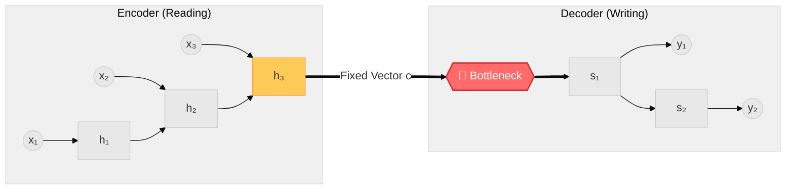
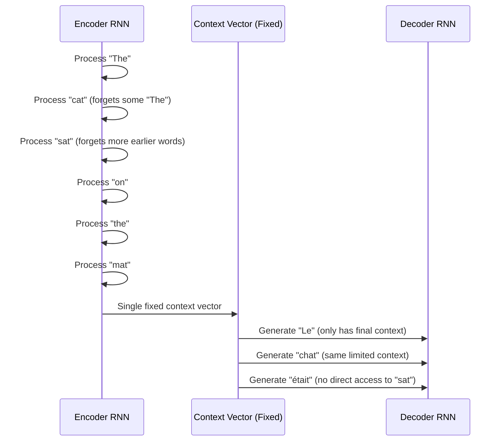
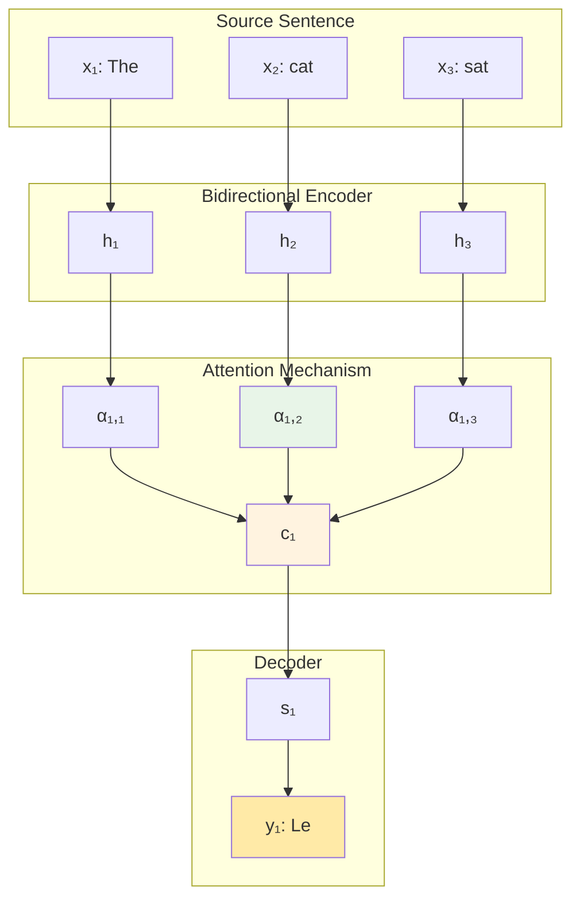
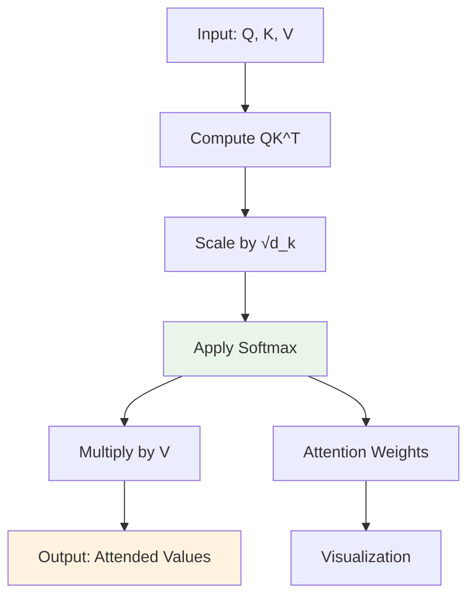
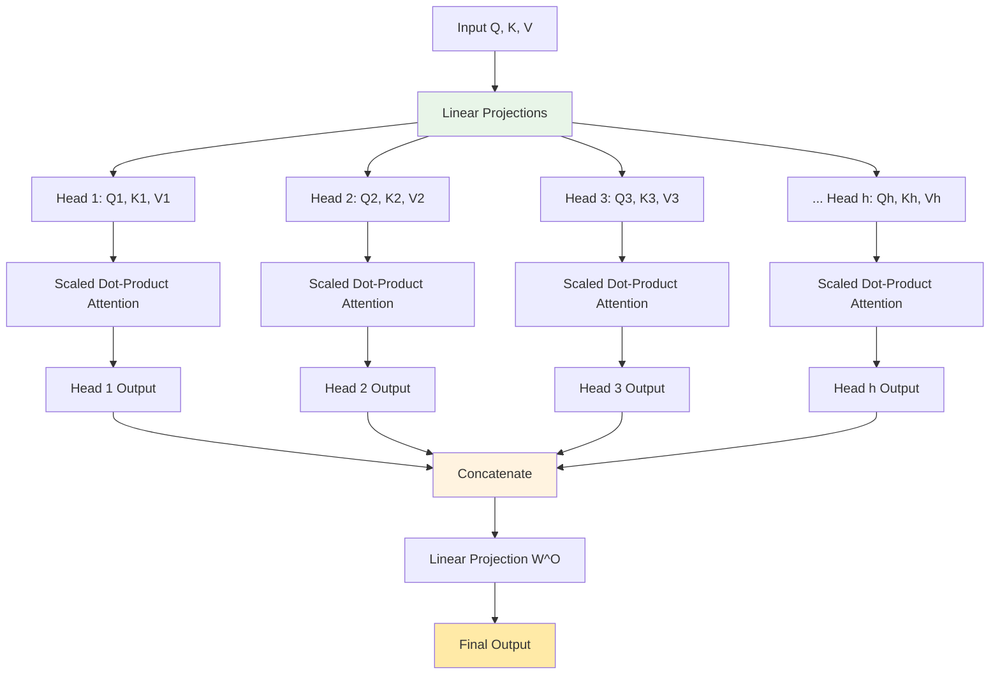
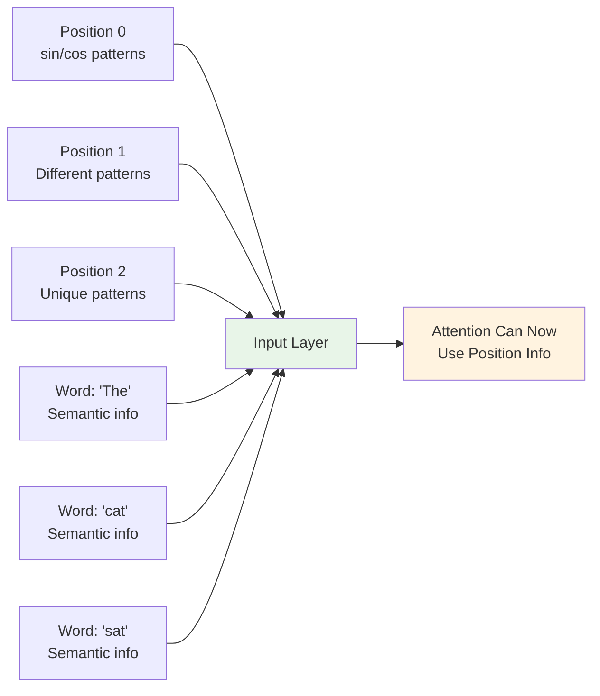
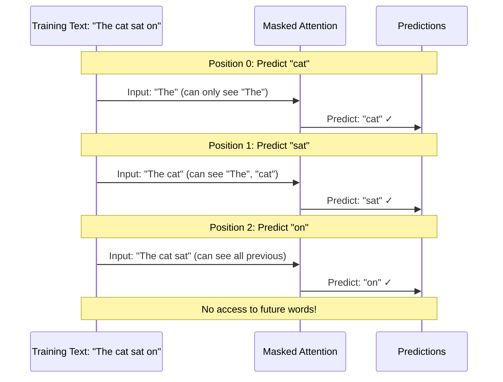
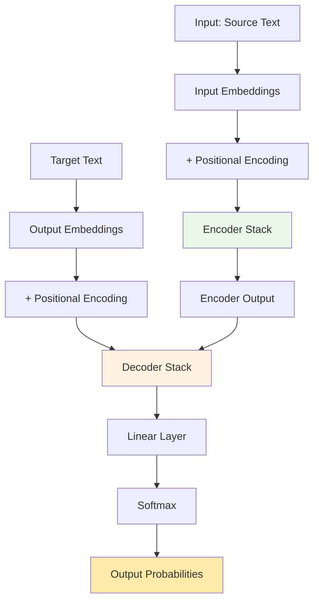
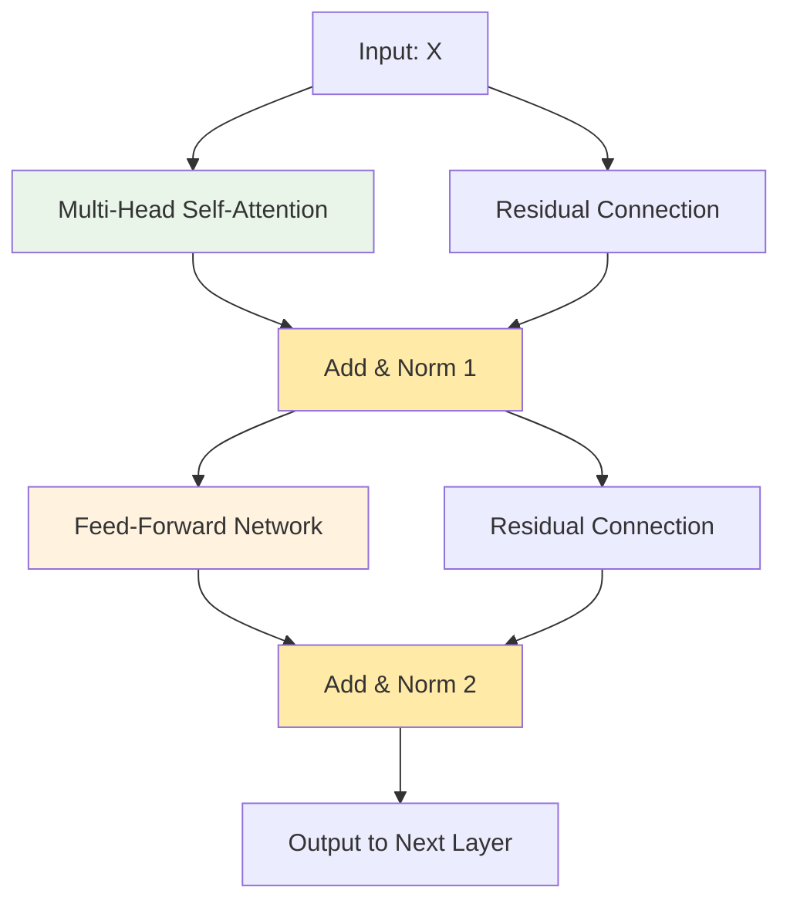
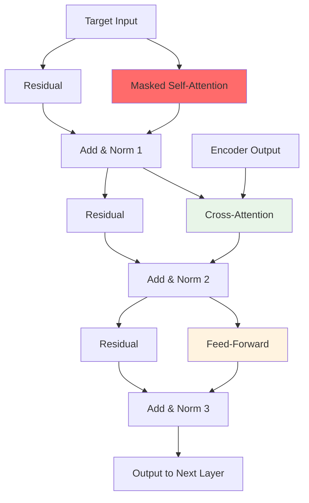

# Attention Mechanism: Complete In-Depth Guide

## Table of Contents

## Table of Contents

1. [Introduction & Motivation](#1-introduction--motivation)
2. [The Problem with Traditional Sequence Models](#2-the-problem-with-traditional-sequence-models)
3. [Core Concepts: Queries, Keys, and Values](#3-core-concepts-queries-keys-and-values)
4. [Scaled Dot-Product Attention](#4-scaled-dot-product-attention)
5. [Multi-Head Attention](#5-multi-head-attention)
6. [Self-Attention vs Cross-Attention](#6-self-attention-vs-cross-attention)
7. [Positional Encoding](#7-positional-encoding)
8. [Masked Attention](#8-masked-attention)
9. [Complete Transformer Architecture](#9-complete-transformer-architecture)
10. [Mathematical Deep Dive](#10-mathematical-deep-dive)
11. [Implementation Examples](#11-implementation-examples)
12. [Real-World Applications](#12-real-world-applications)
13. [Advanced Topics](#13-advanced-topics)
14. [Comparative Analysis: Attention vs Alternatives](#14-comparative-analysis-attention-vs-alternatives)
15. [Performance Optimization Techniques](#15-performance-optimization-techniques)
16. [Debugging and Visualization](#16-debugging-and-visualization)
17. [Future Directions and Research Frontiers](#17-future-directions-and-research-frontiers)
18. [Practical Implementation Tips](#18-practical-implementation-tips)
19. [Conclusion and Key Takeaways](#19-conclusion-and-key-takeaways)
20. [References and Further Reading](#20-references-and-further-reading)

---

# 1. Introduction & Motivation: The Case for Attention

## 1.1 What is Attention?

At its core, **Attention** is an architectural mechanism that allows a neural network to focus on different parts of the input sequence dynamically when generating a specific part of the output sequence.

Mathematically, it transforms the input data into a **weighted sum**, where the weights represent the "relevance" or "importance" of each input item to the current output task.

> **Key Intuition:** Instead of forcing the model to remember _everything_ at once, we give it a "search engine" to look up specific parts of the past input whenever it needs them.

### Real-Life Analogy 1: The Cocktail Party Problem

You are in a noisy room. Your ears pick up all sound waves (Input), but your brain performs a "weighted sum" of the audio, assigning a high weight to the conversation you are interested in and a near-zero weight to the background noise.

### Real-Life Analogy 2: The Human Translator

Imagine translating a long French sentence into English.

- **Without Attention (Standard RNN):** You read the _entire_ French sentence, memorize it perfectly, close your eyes, and try to write the English translation from memory.
- **With Attention:** You read the French sentence. When you write the first English word, your eyes look at the start of the French sentence. When you write the middle, your eyes shift ("attend") to the middle. You access the source information _on demand_.

---

## 1.2 The Problem: The Information Bottleneck

To understand why Attention is revolutionary, we must look at the math of its predecessor: the **Sequence-to-Sequence (Seq2Seq)** model using RNNs/LSTMs.

### The Standard Encoder-Decoder Architecture

In a traditional Seq2Seq model (e.g., for Machine Translation), we have two components:

1. **Encoder:** Processes the input sequence .
2. **Decoder:** Generates the output sequence .

#### The Math of the Bottleneck

The Encoder processes inputs step-by-step to update its hidden state :

After processing the entire sequence of length , the **final hidden state** is treated as the **Context Vector** ().

This vector is the **only** link between the Encoder and Decoder. The Decoder generates output based on its own state and this fixed context :

### Visualizing the Bottleneck

This architecture forces to compress the entire meaning of a sentence (which could be 5 words or 500 words) into a fixed-size vector (e.g., 256 or 512 numbers).



### Why this fails (The "Vanishing Meaning" Problem)

1. **Compression Loss:** Ideally, . In reality, as grows, early information () is "diluted" by later information. The vector gets "saturated."
2. **Fixed Representation:** The context vector is static. Whether the decoder is generating the _first_ word or the _last_ word, it looks at the exact same summary .

- _Example:_ In the sentence "The **cat**, which was eating... [100 words] ... ran **away**," the dependency between "cat" and "ran away" is lost in the bottleneck.

---

## 1.3 The Solution: "Peeking" at the Source

Attention solves the bottleneck problem by discarding the idea of a _single fixed_ context vector. Instead, it creates a **dynamic context vector** () for _every single output step_.

### The Core Idea: "Random Access" Memory

In the traditional model, the decoder effectively has to "read the encoder's mind" based on a single, fading memory. In the Attention model, the decoder has **random access** to the entire history of the encoder.

When the decoder needs to predict the word at time step , it performs a three-step lookup process:

1. **Query:** It looks at its own current state (what it has just generated).
2. **Match:** It compares this state against **all** encoder hidden states to calculate relevance scores.
3. **Retrieve:** It calculates a weighted average of these states based on those scores.

**Variable Definitions:**

- : The **Decoder Index** (Time step in the _output_ sequence).
- : The **Encoder Index** (Time step in the _input_ sequence).
- : The **Context Vector** for decoder step . This is the "customized summary" of the input just for this specific word.
- : The **Encoder Hidden State** at step . This represents the semantic meaning of the -th input word.
- : The **Attention Weight**. This is a scalar value (between 0 and 1) that answers: _"How much focus should be placed on input word when generating output word ?"_

---

### 1.3.1 Detailed Walkthrough: Understanding and

To truly understand the math, we must strictly define our two timelines. In sequence-to-sequence tasks (like translation), we have two separate sequences running on two separate clocks.

**The Example Scenario:**

- **Input ():** "Je suis étudiant" (French). Length .
- **Target ():** "I am a student" (English). Length .

**The Goal:** We are currently at **Decoder Step **.
We have already generated _"I am a"_. We now need to predict the next word (_"student"_).

#### Step 1: Query (The Decoder's "Search Term")

To decide which input word to focus on next, the decoder must first understand its own current status. It does this by looking at its **previous hidden state** ().

Think of as the "search term" the decoder types into a database.

- **The Context ():**
  The decoder has just finished generating the sequence "I am a".
  Mathematically, the vector holds the compressed meaning: _"I have a subject ('I') and a generic article ('a')."_
- **The Expectation (The Search):**
  Because the model has been trained on English grammar, the vector contains an **encoded expectation**.
- It knows that after "a", the next word is usually a **Noun**.
- It knows the subject was "I", so the noun should describe a person.

- **The Vector as a Magnet:**
  You can imagine the vector is effectively "magnetized" to attract **nouns** from the input sequence. It doesn't know _which_ noun yet, but it knows _what kind_ of word it is looking for.
  > **In simple terms:**
  >
  > - **If was "The cat is...",** the query vector looks for an action (verb).
  > - **If was "I am a...",** the query vector looks for a description (noun).

#### Step 2: Match (The Alignment Process)

Once the decoder has its query (**s₃**), it must compare this query against **every single hidden state** from the encoder (**h₁, h₂, h₃**).  
This process is formally called **Alignment**.

Think of this as a **Relevance Check**: the model calculates a similarity score (often using a dot product or a small neural network) between the decoder’s current need and the encoder’s available information.

- **The Mathematical Operation:**  
  `score(s₃₋₁, hⱼ)`

- **The Intuitive Question:**  
  _“How compatible is this specific input word with what I am trying to say right now?”_

---

##### The Alignment Table (Step i = 4)

| Index (j) | Input Word | State (hⱼ) | The Internal Match Question                                                                                                     | Resulting Weight (α₄,ⱼ) |
| --------- | ---------- | ---------- | ------------------------------------------------------------------------------------------------------------------------------- | ----------------------- |
| j = 1     | "Je"       | h₁         | _"I need a noun. Is 'Je' (I) the noun I'm looking for?"_<br><br><sub>(No, 'Je' is the subject, not the object.)</sub>           | **Low (0.01)**          |
| j = 2     | "suis"     | h₂         | _"Is 'suis' (am) the noun I'm looking for?"_<br><br><sub>(No, 'suis' is a verb. It doesn't fit after 'a'.)</sub>                | **Low (0.04)**          |
| j = 3     | "étudiant" | h₃         | _"Is 'étudiant' (student) the noun I'm looking for?"_<br><br><sub>(Yes! It matches the context of 'I am a...' perfectly.)</sub> | **High (0.95)**         |

---

**Note:**  
These raw scores are then passed through a **Softmax** function to ensure they become probabilities that sum up to **1**  
(i.e., 0.01 + 0.04 + 0.95 = 1.0).

This forces the model to **distribute its focus** across the input words.

#### Step 3: Retrieve (The Weighted Sum)

After alignment, we now know **how much attention** the decoder should pay to each encoder hidden state.
The final step is to **retrieve** the relevant information by combining these states into a single vector.

This vector is called the **context vector** for decoder step $i$.

---

**The Core Operation**

The context vector $c_i$ is computed as a **weighted sum** of all encoder hidden states:

$$
c_i = \sum_{j=1}^{T_x} \alpha_{i,j} , h_j
$$

Where:

- $h_j$ is the encoder hidden state for the $j$-th input word
- $\alpha_{i,j}$ is the attention weight computed in Step 2
- $T_x$ is the length of the input sequence

---

**Why a Weighted Sum? (Intuition)**

Each encoder hidden state $h_j$ represents the semantic meaning of one input word.
The attention weights determine **how much of each meaning** should be included.

- A **high weight** means the word is highly relevant for the current output.
- A **low weight** means the word contributes very little.

The weighted sum creates a **customized summary of the input**, specific to the current decoder step.

---

**Concrete Example (From the Alignment Table)**

From Step 2, we obtained:

- $\alpha_{4,1} = 0.01$ → “Je”
- $\alpha_{4,2} = 0.04$ → “suis”
- $\alpha_{4,3} = 0.95$ → “étudiant”

So the context vector becomes:

$$
c_4 = 0.01 \cdot h_1 + 0.04 \cdot h_2 + 0.95 \cdot h_3
$$

This means:

- “Je” contributes almost nothing
- “suis” contributes very little
- “étudiant” dominates the context vector

---

**What the Decoder Receives**

The context vector:

- is **not a word**,
- is **not a one-hot vector**,
- is a **dense semantic representation**.

Semantically, it encodes the information:

> The most relevant concept in the input, for this step, is _student_.

---

**Final Outcome**

The decoder combines:

- its previous hidden state $s_{i-1}$, and
- the context vector $c_i$

to generate the next output word:

$$
\text{Output word} = \text{“student”}
$$

---

**Key Insight**

- **Step 2 (Match):** decides _where to focus_.
- **Step 3 (Retrieve):** decides _what information to use_.

This removes the fixed-context bottleneck and enables dynamic, step-specific understanding of the input.

### 1.3.2 Visualizing the Attention Matrix ($\alpha$)

The attention weights can be organized into a **matrix** that makes the behavior of the model easier to interpret.

- **Rows** correspond to **decoder time steps** ($i$).
- **Columns** correspond to **encoder time steps** ($j$).
- Each cell contains an attention weight $\alpha_{i,j}$.

This matrix answers the question:
_“When generating an output word at step $i$, how much attention is paid to each input word $j$?”_

---

**Attention Weight Matrix**

| Output ($y_i$) \ Input ($x_j$) | Je       | suis     | étudiant |
| ------------------------------ | -------- | -------- | -------- |
| **I**                          | **0.98** | 0.01     | 0.01     |
| **am**                         | 0.02     | **0.95** | 0.03     |
| **a**                          | 0.10     | 0.60     | 0.30     |
| **student**                    | 0.01     | 0.04     | **0.95** |

---

**How to Read This Matrix**

- **Each row** is a probability distribution over the input sequence:

  $$
  \sum_j \alpha_{i,j} = 1
  $$

- **Each row answers:**
  _“Which input words influenced this output word the most?”_

- The **highest value in a row** indicates the input word the decoder focused on most at that step.

---

**Interpretation**

- When generating **“I”**, the model focuses almost entirely on **“Je”**.
- When generating **“am”**, attention shifts strongly to **“suis”**.
- When generating **“student”**, attention concentrates on **“étudiant”**.
- The word **“a”** spreads its attention, reflecting that articles often depend on broader context rather than a single input word.

---

**The Diagonal Pattern**

A strong **diagonal structure** indicates that:

- Input and output word orders are largely aligned.
- The translation is mostly monotonic (e.g., English ↔ French).

For language pairs with major word reordering, this diagonal becomes weaker or distorted.

---

**Key Insight**

The attention matrix provides a **transparent window** into the model’s decision-making, showing _where_ the model looks at each decoding step.

### Summary of Benefits

| Feature              | Traditional Seq2Seq                       | Attention Model                                       |
| -------------------- | ----------------------------------------- | ----------------------------------------------------- |
| **Context**          | **Static** (Fixed vector )                | **Dynamic** (New vector every step)                   |
| **Information Flow** | Serial (Must pass through bottleneck)     | Parallel Access (Direct connection to any past state) |
| **Long Sequences**   | Performance degrades as length            | Performance remains stable regardless of length       |
| **Interpretability** | **Black box** (Cannot see internal logic) | **High** (We can visualize to see focus)              |

---

### Looking Ahead: From Encoder–Decoder Attention to Transformers

The attention mechanism introduced here was originally designed for **encoder–decoder models**, where the decoder selectively focuses on encoder states. This formulation already contains the core ideas that power modern architectures.

In the upcoming sections, we will see how this mechanism evolves:

- The notions of **Query**, **Match**, and **Retrieve** will be formalized as **Queries (Q)**, **Keys (K)**, and **Values (V)**.
- Attention will no longer be limited to crossing from encoder to decoder; models will also learn to **attend within a single sequence** (_self-attention_).
- Recurrent structures will be removed entirely, leading to the **Transformer architecture**, where attention becomes the primary means of information flow.

This foundational understanding will allow us to move seamlessly from classical sequence-to-sequence attention to the full mathematical and architectural formulation used in modern large language models.

---

## Summary of Topic 1: Attention Mechanism — End-to-End Intuition

This section consolidates all core ideas from Topic 1 by walking through the **entire attention pipeline step by step**, using a small machine translation example. The goal is to clearly understand **inputs, outputs, indices, vectors, attention weights, and context vectors**.

---

### 1. Input and Output Sequences (Source vs Target)

We consider a **machine translation** task.

- **Input sequence (Source language)**: French  

$$
x = [\text{"Je"}, \text{"suis"}, \text{"étudiant"}]
$$

- **Output sequence (Target language)**: English  

$$
y = [\text{"I"}, \text{"am"}, \text{"a"}, \text{"student"}]
$$

**Key roles:**
- The **Encoder** reads the **French** sentence.
- The **Decoder** generates the **English** sentence word by word.

---

### 2. Meaning of Indices $i$ and $j$

Attention operates over **two timelines**.

---

#### Encoder Timeline (Input Side)

- Index: $j$  
- Refers to positions in the **input (French)** sequence  
- Each word produces one encoder hidden state  

| $j$ | Input word | Encoder hidden state |
|---|---|---|
| 1 | Je | ($h_1$) |
| 2 | suis | ($h_2$) |
| 3 | étudiant | ($h_3$) |

The encoder outputs:

$$
(h_1, h_2, h_3)
$$

---

#### Decoder Timeline (Output Side)

- Index: $i$  
- Refers to positions in the **output (English)** sequence  
- Each step produces one decoder hidden state  

| $i$ | Output word | Decoder hidden state |
|---|---|---|
| 1 | I | ($s_1$) |
| 2 | am | ($s_2$) |
| 3 | a | ($s_3$) |
| 4 | student | ($s_4$) |

---

**Rule to remember:**

- $j \rightarrow$ Encoder / Input  
- $i \rightarrow$ Decoder / Output  

---

### 3. Where Do Word Vectors Come From?

Words do not start as vectors. The transformation happens in stages.

---

#### Step 1: Token → Embedding

Each word is mapped to a dense vector using an **Embedding Matrix**.

Example (simplified):

| Word | Embedding vector |
|---|---|
| Je | [0.2, −0.1, 0.7] |
| suis | [0.5, 0.3, −0.2] |
| étudiant | [0.9, −0.4, 0.1] |

These embeddings are:
- learned during training, or  
- initialized from pretrained embeddings (Word2Vec, GloVe, etc.)

---

#### Step 2: Embeddings → Encoder Hidden States

The encoder (RNN / LSTM / GRU) processes embeddings sequentially:

$$
\text{Embedding("Je")} \rightarrow h_1
$$

$$
\text{Embedding("suis")} \rightarrow h_2
$$

$$
\text{Embedding("étudiant")} \rightarrow h_3
$$

Each $h_j$:
- is a **contextualized vector**  
- encodes the word meaning **plus surrounding context**

---

### 4. Decoder State at a Given Time Step

At decoder step $i = 4$, the decoder has already generated:

```
"I am a"
```

The decoder hidden state ($s_3$) represents:
- grammatical structure so far  
- semantic expectation of the next word  

This vector $s_3$ acts as the **query** for attention.

---

### 5. Computing Attention Weights ($\alpha_{i,j}$)

The core question of attention:

> *Which input word is most relevant right now?*

---

#### Step 5.1: Alignment (Score Computation)

For each encoder hidden state $h_j$, compute a similarity score with the decoder state $s_3$:

$$
e_{3,j} = \text{score}(s_3, h_j)
$$

Example scores:

| $j$ | Word | $e_{3,j}$ |
|---|---|---|
| 1 | Je | 1.2 |
| 2 | suis | 1.8 |
| 3 | étudiant | 4.5 |

Higher score ⇒ stronger relevance.

---

#### Step 5.2: Softmax Normalization

Convert scores into probabilities:

$$
\alpha_{3,j} = \frac{e^{e_{3,j}}}{\sum_{k=1}^{T_x} e^{e_{3,k}}}
$$

Resulting attention weights:

| $j$ | Word | $\alpha_{3,j}$ |
|---|---|---|
| 1 | Je | 0.01 |
| 2 | suis | 0.04 |
| 3 | étudiant | 0.95 |

These weights:
- sum to 1  
- indicate **how much attention** each input word receives  

---

### 6. Computing the Context Vector ($c_i$)

The context vector is a **weighted sum of encoder states**:

$$
c_3 = \sum_{j=1}^{T_x} \alpha_{3,j} h_j
$$

Concretely:

$$
c_3 = 0.01 \cdot h_1 + 0.04 \cdot h_2 + 0.95 \cdot h_3
$$

Effect:
- Dominated by $h_3$ (“étudiant”)  
- Small contribution from other words for context  

---

### 7. Generating the Final Output Word

The decoder combines:
- its internal state ($s_3$)  
- the context vector ($c_3$)

$$
\text{DecoderOutput} = f(s_3, c_3)
$$

This is followed by:
- a linear layer  
- softmax over the vocabulary  

Highest probability word:

```
"student"
```

---

### 8. Full Pipeline Overview

1. Input words → embeddings → encoder hidden states ($h_j$)  
2. Decoder generates output step by step  
3. At step $i$:  
   - Decoder state ($s_{i-1}$) acts as a query  
   - Compared against all $h_j$  
4. Softmax produces attention weights ($\alpha_{i,j}$)  
5. Weighted sum gives context vector ($c_i$)  
6. Decoder uses $c_i$ to generate the next word  

---

### 9. Core Intuition

> **Attention allows the decoder to dynamically focus on the most relevant parts of the input for each output word by creating a custom context vector at every decoding step.**


# 2. The Problem with Traditional Sequence Models

### RNN/LSTM Limitations Deep Dive

Let's examine a concrete translation example: **"The cat sat on the mat" → "Le chat était assis sur le tapis"**

#### Traditional RNN Approach:



**Mathematical Problem:**

For input sequence $x_1, x_2, ..., x_T$, traditional RNN produces:

- $h_t = f(h_{t-1}, x_t)$ (sequential processing)
- $c = h_T$ (final hidden state as context)
- Decoder uses same $c$ for all outputs

**Issues:**

1. **Information Decay**: $h_T$ may not contain information from $x_1$
2. **Fixed Context**: Same $c$ whether translating "cat" or "mat"
3. **Sequential Dependency**: Must process words in order

### Why This Fails for Long Sequences

Consider translating a 50-word sentence. By the time the RNN processes word 50:

- Information from word 1 is heavily diluted
- The fixed context vector must compress 50 words of information
- The decoder has no direct access to any specific input word

---

## 2.5. Bahdanau Attention: The First Breakthrough (2014)

### The Historical Context

Before 2014, neural machine translation relied on **sequence-to-sequence (seq2seq) models** with a critical flaw: the entire source sentence had to be compressed into a single fixed-size vector. This created an information bottleneck that severely limited translation quality, especially for long sentences.

**Dzmitry Bahdanau, Kyunghyun Cho, and Yoshua Bengio** introduced the first attention mechanism in their groundbreaking paper _"Neural Machine Translation by Jointly Learning to Align and Translate"_ (2014), which fundamentally changed how we think about sequence modeling.

### The Core Innovation

**Key Insight**: Instead of using only the final encoder state, **let the decoder access ALL encoder hidden states** and learn which ones to focus on at each decoding step.

**Revolutionary Idea**: The model should **jointly learn to align and translate** - meaning it learns both:

1. **Alignment**: Which source words correspond to which target words
2. **Translation**: How to convert aligned source information to target words

### Mathematical Foundation

#### Traditional Seq2Seq (Pre-Attention)

**Encoder**: Processes source sentence $x = (x_1, x_2, ..., x_{T_x})$
$$h_i = f(x_i, h_{i-1})$$
$$c = h_{T_x} \text{ (final hidden state as context)}$$

**Decoder**: Generates target sentence $y = (y_1, y_2, ..., y_{T_y})$
$$s_t = g(y_{t-1}, s_{t-1}, c)$$
$$p(y_t|y_1, ..., y_{t-1}, x) = \text{softmax}(W_s s_t)$$

**Problem**: Same context $c$ used for all target words!

#### Bahdanau Attention Mechanism

**The Breakthrough**: Dynamic context vector $c_t$ for each target word $y_t$.

**Step 1: Bidirectional Encoder**

Forward:
$$\overrightarrow{h_i} = \text{RNN}(x_i, \overrightarrow{h_{i-1}})$$

Backward:
$$\overleftarrow{h_i} = \text{RNN}(x_i, \overleftarrow{h_{i+1}})$$

Concatenation:
$$h_i = [\overrightarrow{h_i}; \overleftarrow{h_i}]$$

**Step 2: Attention Score Computation**

$$e_{t,i} = a(s_{t-1}, h_i)$$

Where $a$ is a **feedforward neural network**:

$$a(s_{t-1}, h_i) = v_a^T \tanh(W_a s_{t-1} + U_a h_i)$$

**Step 3: Attention Weight Normalization**
$$\alpha_{t,i} = \frac{\exp(e_{t,i})}{\sum_{j=1}^{T_x} \exp(e_{t,j})}$$

**Step 4: Context Vector Computation**
$$c_t = \sum_{i=1}^{T_x} \alpha_{t,i} h_i$$

**Step 5: Decoder State Update**
$$s_t = g(y_{t-1}, s_{t-1}, c_t)$$

### Architecture Diagram



### Detailed Mathematical Example

Let's work through a concrete example: translating **"The cat sat"** to **"Le chat était"**.

#### Setup Parameters

- Source length: $T_x = 3$
- Hidden dimension: $d_h = 4$
- Attention dimension: $d_a = 3$

#### Step 1: Bidirectional Encoding

**Forward pass**:

```python
# Simplified forward RNN computation
x = ["The", "cat", "sat"]
h_forward = np.array([
    [0.1, 0.2, 0.3, 0.4],  # h₁→
    [0.2, 0.3, 0.4, 0.5],  # h₂→
    [0.3, 0.4, 0.5, 0.6]   # h₃→
])
```

**Backward pass**:

```python
h_backward = np.array([
    [0.6, 0.5, 0.4, 0.3],  # h₁←
    [0.5, 0.4, 0.3, 0.2],  # h₂←
    [0.4, 0.3, 0.2, 0.1]   # h₃←
])
```

**Concatenated representations**:

```python
h = np.concatenate([h_forward, h_backward], axis=1)
print("Encoder hidden states shape:", h.shape)  # (3, 8)
print("h₁ =", h[0])  # [0.1, 0.2, 0.3, 0.4, 0.6, 0.5, 0.4, 0.3]
print("h₂ =", h[1])  # [0.2, 0.3, 0.4, 0.5, 0.5, 0.4, 0.3, 0.2]
print("h₃ =", h[2])  # [0.3, 0.4, 0.5, 0.6, 0.4, 0.3, 0.2, 0.1]
```

#### Step 2: Computing Attention Scores

**At decoding step $t=1$ (generating "Le")**:

Given previous decoder state: $s_0 = [0.5, 0.6, 0.7, 0.8]$

**Attention network parameters**:

```python
# Weight matrices (randomly initialized for example)
W_a = np.random.randn(3, 4) * 0.1  # (d_a, decoder_dim)
U_a = np.random.randn(3, 8) * 0.1  # (d_a, encoder_dim)
v_a = np.random.randn(3, 1) * 0.1  # (d_a, 1)

# Example values
W_a = np.array([
    [0.1, 0.2, 0.3, 0.4],
    [0.2, 0.3, 0.4, 0.5],
    [0.3, 0.4, 0.5, 0.6]
])

U_a = np.array([
    [0.1, 0.1, 0.1, 0.1, 0.1, 0.1, 0.1, 0.1],
    [0.2, 0.2, 0.2, 0.2, 0.2, 0.2, 0.2, 0.2],
    [0.3, 0.3, 0.3, 0.3, 0.3, 0.3, 0.3, 0.3]
])

v_a = np.array([[0.5], [0.6], [0.7]])
```

**Computing attention scores for each encoder position**:

For position $i=1$ ("The"):
$$e_{1,1} = v_a^T \tanh(W_a s_0 + U_a h_1)$$

```python
s_0 = np.array([0.5, 0.6, 0.7, 0.8])
h_1 = np.array([0.1, 0.2, 0.3, 0.4, 0.6, 0.5, 0.4, 0.3])

# Compute W_a @ s_0
Wa_s0 = W_a @ s_0
print("W_a @ s_0 =", Wa_s0)
# [0.5, 0.7, 0.9]

# Compute U_a @ h_1
Ua_h1 = U_a @ h_1
print("U_a @ h_1 =", Ua_h1)
# [0.31, 0.62, 0.93]

# Add and apply tanh
pre_activation = Wa_s0 + Ua_h1
print("Pre-activation =", pre_activation)
# [0.81, 1.32, 1.83]

tanh_output = np.tanh(pre_activation)
print("After tanh =", tanh_output)
# [0.669, 0.866, 0.948]

# Final score
e_1_1 = v_a.T @ tanh_output
print("e₁,₁ =", e_1_1[0])  # 2.234
```

**Similarly for positions 2 and 3**:

```python
# Position 2 ("cat")
h_2 = np.array([0.2, 0.3, 0.4, 0.5, 0.5, 0.4, 0.3, 0.2])
Ua_h2 = U_a @ h_2  # [0.3, 0.6, 0.9]
pre_activation_2 = Wa_s0 + Ua_h2  # [0.8, 1.3, 1.8]
tanh_output_2 = np.tanh(pre_activation_2)  # [0.664, 0.862, 0.947]
e_1_2 = v_a.T @ tanh_output_2  # 2.22

# Position 3 ("sat")
h_3 = np.array([0.3, 0.4, 0.5, 0.6, 0.4, 0.3, 0.2, 0.1])
Ua_h3 = U_a @ h_3  # [0.29, 0.58, 0.87]
pre_activation_3 = Wa_s0 + Ua_h3  # [0.79, 1.28, 1.77]
tanh_output_3 = np.tanh(pre_activation_3)  # [0.658, 0.857, 0.944]
e_1_3 = v_a.T @ tanh_output_3  # 2.202

print("Attention scores: e₁ =", [e_1_1, e_1_2, e_1_3])
# [2.234, 2.22, 2.202]
```

#### Step 3: Attention Weight Computation

$$\alpha_{1,i} = \frac{\exp(e_{1,i})}{\sum_{j=1}^{3} \exp(e_{1,j})}$$

```python
import numpy as np

e_scores = np.array([2.234, 2.22, 2.202])
exp_scores = np.exp(e_scores)
alpha_weights = exp_scores / np.sum(exp_scores)

print("exp(e₁) =", exp_scores)
# [9.337, 9.207, 9.043]

print("α₁ =", alpha_weights)
# [0.338, 0.333, 0.329]
```

**Interpretation**: The attention is relatively uniform across all source positions, which makes sense when generating the first target word "Le" (French "the") - it needs to consider the overall sentence context.

#### Step 4: Context Vector Computation

$$c_1 = \sum_{i=1}^{3} \alpha_{1,i} h_i$$

```python
# Weighted sum of encoder hidden states
c_1 = alpha_weights[0] * h[0] + alpha_weights[1] * h[1] + alpha_weights[2] * h[2]

print("Context vector c₁ =", c_1)
# [0.2003, 0.3003, 0.4003, 0.5003, 0.5003, 0.4003, 0.3003, 0.2003]

# Detailed calculation for first dimension:
# c₁[0] = 0.338×0.1 + 0.333×0.2 + 0.329×0.3 = 0.2003
```

#### Step 5: Decoder Update

The context vector $c_1$ is now fed into the decoder RNN along with the previous target word embedding and previous decoder state to compute the new decoder state $s_1$.

```python
def decoder_step(prev_word_embedding, prev_state, context_vector):
    """
    Simplified decoder step computation.
    In practice, this involves GRU/LSTM computations.
    """
    # Concatenate inputs
    decoder_input = np.concatenate([prev_word_embedding, context_vector])

    # Apply decoder RNN (simplified as linear transformation)
    new_state = np.tanh(W_decoder @ decoder_input + b_decoder)

    return new_state

# Generate next word probabilities
def generate_word_probabilities(decoder_state, vocab_size=1000):
    """Generate probability distribution over vocabulary."""
    logits = W_output @ decoder_state + b_output
    probabilities = softmax(logits)
    return probabilities
```

### Attention Alignment Visualization

**What Bahdanau attention learns**: Soft alignment between source and target words.

```
Source:  The    cat    sat
Target:  Le     chat   était

Alignment Matrix (α values):
        The   cat   sat
Le     [0.6, 0.3, 0.1]  # "Le" aligns mostly with "The"
chat   [0.1, 0.8, 0.1]  # "chat" aligns with "cat"
était  [0.1, 0.2, 0.7]  # "était" aligns with "sat"
```

### Key Differences from Modern Transformer Attention

| Aspect                 | Bahdanau (2014)    | Transformer (2017)  |
| ---------------------- | ------------------ | ------------------- |
| **Architecture**       | RNN + Attention    | Pure Attention      |
| **Computation**        | Sequential         | Parallel            |
| **Attention Function** | MLP (tanh)         | Dot-product         |
| **Complexity**         | O(T₁T₂d²)          | O(T²d)              |
| **Position Info**      | RNN inherent order | Positional encoding |
| **Multi-Head**         | Single attention   | Multiple heads      |

### Mathematical Complexity Analysis

**Bahdanau Attention Complexity**:

- **Attention computation**: $O(T_x \cdot T_y \cdot d_a)$ where $d_a$ is attention dimension
- **Context computation**: $O(T_x \cdot T_y \cdot d_h)$ where $d_h$ is hidden dimension
- **Total per target word**: $O(T_x \cdot d_h)$
- **Total for sequence**: $O(T_x \cdot T_y \cdot d_h)$

**Memory Requirements**:

- Store all encoder hidden states: $O(T_x \cdot d_h)$
- Attention weight matrix: $O(T_x \cdot T_y)$

### Why Bahdanau Attention Was Revolutionary

1. **Solved the Bottleneck**: No more fixed-size context vector
2. **Interpretable Alignments**: Could visualize which source words the model focused on
3. **Better Long Sequences**: Performance didn't degrade with sentence length
4. **End-to-End Learning**: Alignment and translation learned jointly

### Limitations Leading to Transformers

1. **Sequential Computation**: Still bound by RNN sequential processing
2. **Limited Parallelization**: Couldn't parallelize across time steps
3. **Single Attention**: Only one attention mechanism vs multi-head
4. **Computational Bottleneck**: MLP attention function vs efficient dot-product

### Code Implementation

```python
class BahdanauAttention:
    def __init__(self, decoder_dim, encoder_dim, attention_dim):
        self.decoder_dim = decoder_dim
        self.encoder_dim = encoder_dim
        self.attention_dim = attention_dim

        # Initialize weight matrices
        self.W_a = np.random.randn(attention_dim, decoder_dim) * 0.1
        self.U_a = np.random.randn(attention_dim, encoder_dim) * 0.1
        self.v_a = np.random.randn(attention_dim, 1) * 0.1

    def compute_attention(self, decoder_state, encoder_states):
        """
        Compute Bahdanau attention weights and context vector.

        Args:
            decoder_state: Previous decoder state (decoder_dim,)
            encoder_states: All encoder states (seq_len, encoder_dim)

        Returns:
            context_vector: Weighted encoder states (encoder_dim,)
            attention_weights: Attention distribution (seq_len,)
        """
        seq_len = encoder_states.shape[0]

        # Compute attention scores for each encoder position
        scores = []
        for i in range(seq_len):
            # e_i = v_a^T * tanh(W_a * s + U_a * h_i)
            linear_combo = self.W_a @ decoder_state + self.U_a @ encoder_states[i]
            score = self.v_a.T @ np.tanh(linear_combo)
            scores.append(score[0])

        scores = np.array(scores)

        # Compute attention weights using softmax
        exp_scores = np.exp(scores)
        attention_weights = exp_scores / np.sum(exp_scores)

        # Compute context vector as weighted sum
        context_vector = np.zeros(self.encoder_dim)
        for i in range(seq_len):
            context_vector += attention_weights[i] * encoder_states[i]

        return context_vector, attention_weights

    def forward(self, decoder_state, encoder_states):
        """Complete forward pass."""
        return self.compute_attention(decoder_state, encoder_states)

# Example usage
attention = BahdanauAttention(decoder_dim=4, encoder_dim=8, attention_dim=3)

# Mock data
decoder_state = np.array([0.5, 0.6, 0.7, 0.8])
encoder_states = np.array([
    [0.1, 0.2, 0.3, 0.4, 0.6, 0.5, 0.4, 0.3],  # "The"
    [0.2, 0.3, 0.4, 0.5, 0.5, 0.4, 0.3, 0.2],  # "cat"
    [0.3, 0.4, 0.5, 0.6, 0.4, 0.3, 0.2, 0.1]   # "sat"
])

context, weights = attention.forward(decoder_state, encoder_states)
print("Context vector shape:", context.shape)
print("Attention weights:", weights)
print("Weights sum to 1:", np.allclose(np.sum(weights), 1.0))
```

### Legacy and Impact

**Bahdanau attention** laid the groundwork for the attention revolution:

1. **Proved the concept**: Attention mechanisms work and solve real problems
2. **Inspired improvements**: Led to Luong attention, then Transformer attention
3. **Established principles**:
   - Dynamic focus over fixed representations
   - Learnable alignment between sequences
   - Interpretable attention weights
4. **Enabled breakthroughs**: Made modern NLP advances possible

**Bottom Line**: While we now use Transformer attention, understanding Bahdanau attention is crucial because it introduced the fundamental concept that **attention is about learning what information to focus on when making decisions** - an idea that continues to drive AI progress today.

---

## What Attention Fixes — and What It Does *Not* Fix

Attention was introduced to solve **specific structural problems** in the encoder–decoder architecture. It is powerful, but it is not a magic solution to everything.

### What Attention Fixes

- **Removes the fixed context bottleneck**  
  Instead of compressing the entire input sequence into a single vector, attention creates a **dynamic context vector** $c_i$ for every decoder step.

- **Enables dynamic alignment**  
  Each output token can focus on *different* parts of the input using attention weights $( \alpha_{i,j} )$.

- **Improves long-sequence handling**  
  Important input tokens (even far away) can directly influence the decoder without being diluted by time steps.

- **Improves gradient flow**  
  Attention creates shorter gradient paths between decoder outputs and encoder hidden states, reducing vanishing-gradient effects.

---

### What Attention Does *Not* Fix

- **Does not remove recurrence**  
  The encoder and decoder are still RNN/LSTM-based and must process tokens sequentially.

- **Does not enable full parallelization**  
  Decoder steps still depend on previous outputs $( s_{i-1} )$.

- **Does not eliminate time-step dependency**  
  Training and inference remain slow for long sequences.

👉 These limitations are the key motivation for **Transformers**, which remove recurrence entirely.

---

## Types of Attention in Encoder–Decoder Models

### Cross-Attention (Encoder–Decoder Attention)

Bahdanau attention is an example of **cross-attention**.

- **Query** comes from the decoder hidden state $( s_{i-1} )$
- **Keys and Values** come from encoder hidden states $( h_1, h_2, \dots, h_T )$

Formally:
- Query: $( s_{i-1} )$
- Keys: $( h_j )$
- Values: $( h_j )$

This distinction becomes critical later when we introduce **self-attention**, where queries, keys, and values come from the *same* sequence.

---

## Brief Note on Luong Attention (2015)

After Bahdanau attention, **Luong attention** was proposed as a computationally simpler alternative.

Key differences (high-level only):

- Uses **dot-product–based alignment**
- Often faster than additive (Bahdanau) attention
- Still operates within the **RNN encoder–decoder framework**

Despite these improvements, Luong attention still inherits the same core limitations:
- Sequential processing
- No full parallelization

These unresolved issues directly lead to the Transformer architecture.

---

## Attention in One Compact Mathematical View

At decoder step $( i )$:

1. **Alignment scores**
   $$
   e_{i,j} = \text{score}( s_{i-1}, h_j )
   $$

2. **Attention weights**
   $$
   \alpha_{i,j} = \text{softmax}( e_{i,j} )
   $$

3. **Context vector**
   $$
   c_i = \sum_j \alpha_{i,j} \, h_j
   $$

4. **Decoder prediction**
   $$
   y_i = \text{Decoder}( s_{i-1}, c_i )
   $$

This entire process is repeated **for every output token**.

---

## Key Takeaway (Mental Model)

> Attention allows the decoder to build a **custom, task-specific summary of the input** for *each* output step, instead of relying on a single compressed representation.

This idea — *dynamic, token-wise relevance weighting* — is the foundation upon which **Q, K, V attention** and **Transformers** are built.


# 3. Core Concepts: Queries, Keys, and Values

### The Library Analogy

Think of attention as a **sophisticated library search system**:

**Components:**

- **Query (Q)**: "I need information about machine learning algorithms"
- **Keys (K)**: Index cards describing each book's content
- **Values (V)**: The actual books containing information

**Process:**

1. **Compare Query with Keys**: Find books most relevant to your query
2. **Calculate Relevance Scores**: Rank books by how well they match
3. **Retrieve Weighted Information**: Get information from most relevant books

### Mathematical Foundation

In attention mechanisms:

**Query**: $Q \in \mathbb{R}^{d_q}$ - What information are we looking for?
**Keys**: $K \in \mathbb{R}^{n \times d_k}$ - What information is available?  
**Values**: $V \in \mathbb{R}^{n \times d_v}$ - The actual information content

**The attention function computes:**
$$\text{Attention}(Q, K, V) = \text{softmax}\left(\frac{QK^T}{\sqrt{d_k}}\right)V$$

### Step-by-Step Intuition

Let's trace through a simple example: **Translating "cat" in "The cat sat"**

**Step 1: Query Formation**

- Current decoder state wants to translate "cat"
- Forms query: $Q =$ "What animal subject is in the sentence?"

**Step 2: Key Matching**

- $K_1 =$ "Definite article" (The)
- $K_2 =$ "Animal noun" (cat)
- $K_3 =$ "Past tense verb" (sat)
- Query matches best with $K_2$

**Step 3: Value Retrieval**

- $V_1 =$ [embedding of "The"]
- $V_2 =$ [embedding of "cat"] ← Highest weight
- $V_3 =$ [embedding of "sat"]
- Output: Weighted combination heavily favoring $V_2$

---

# 4. Scaled Dot-Product Attention

### The Complete Mathematical Framework

The **Scaled Dot-Product Attention** is the fundamental building block:

$$\text{Attention}(Q, K, V) = \text{softmax}\left(\frac{QK^T}{\sqrt{d_k}}\right)V$$

### Why This Formula? Deep Mathematical Intuition

#### Part 1: Dot Product Similarity ($QK^T$)

**What it computes**: Similarity between queries and keys

For query vector $q = [q_1, q_2, ..., q_d]$ and key vector $k = [k_1, k_2, ..., k_d]$:

$$q \cdot k = q_1k_1 + q_2k_2 + ... + q_dk_d$$

**Geometric interpretation**:

- High dot product = vectors point in similar directions = high relevance
- Low dot product = vectors are orthogonal = low relevance
- Negative dot product = vectors point in opposite directions = negative correlation

#### Part 2: Scaling Factor ($\frac{1}{\sqrt{d_k}}$)

**Why scaling is crucial**: Without scaling, dot products grow with dimension size.

**Problem**: For high-dimensional vectors (e.g., $d_k = 512$), dot products become very large.
**Consequence**: Softmax outputs become too peaked (close to 0 or 1), losing gradient information.

**Mathematical proof**: If $q_i, k_i \sim \mathcal{N}(0,1)$, then $q \cdot k \sim \mathcal{N}(0, d_k)$

**Solution**: Scale by $\sqrt{d_k}$ to keep variance at 1: $\frac{q \cdot k}{\sqrt{d_k}} \sim \mathcal{N}(0, 1)$

#### Part 3: Softmax Normalization

**Purpose**: Convert similarity scores to probability distribution

$$\text{softmax}(x_i) = \frac{e^{x_i}}{\sum_{j=1}^n e^{x_j}}$$

**Properties**:

- All outputs sum to 1: $\sum_i \alpha_i = 1$
- All outputs are positive: $\alpha_i > 0$
- Differentiable for backpropagation

### Complete Step-by-Step Example

Let's work through a concrete example with actual numbers.

**Setup**: Translate "The cat sat" where we're generating the French word for "cat"

**Given**:

- $d_k = d_v = 4$ (dimension)
- Input sequence length $n = 3$
- Query: Current decoder state for translating "cat"

```python
import numpy as np

# Input embeddings (simplified)
Q = np.array([[1.0, 0.5, -0.2, 0.8]])  # Query: decoder state (1 x 4)
K = np.array([
    [0.1, 0.2, 0.3, 0.4],   # Key 1: "The"
    [1.2, 0.4, -0.1, 0.9],  # Key 2: "cat"
    [0.5, -0.3, 0.7, 0.2]   # Key 3: "sat"
])  # (3 x 4)
V = np.array([
    [2.1, 1.0, 0.5, 1.2],   # Value 1: "The"
    [1.8, 2.3, 1.1, 0.9],   # Value 2: "cat"
    [0.9, 1.5, 2.0, 1.7]    # Value 3: "sat"
])  # (3 x 4)
```

**Step 1: Compute Similarity Scores**

$$\text{scores} = QK^T$$

```python
scores = np.dot(Q, K.T)  # (1 x 3)
print("Raw scores:", scores)
# Raw scores: [[0.86, 2.21, 0.29]]
```

**Detailed calculation**:

- Score₁ = $1.0×0.1 + 0.5×0.2 + (-0.2)×0.3 + 0.8×0.4 = 0.86$
- Score₂ = $1.0×1.2 + 0.5×0.4 + (-0.2)×(-0.1) + 0.8×0.9 = 2.21$ ← Highest!
- Score₃ = $1.0×0.5 + 0.5×(-0.3) + (-0.2)×0.7 + 0.8×0.2 = 0.29$

**Step 2: Apply Scaling**

$$\text{scaled\_scores} = \frac{\text{scores}}{\sqrt{d_k}} = \frac{\text{scores}}{\sqrt{4}} = \frac{\text{scores}}{2}$$

```python
d_k = 4
scaled_scores = scores / np.sqrt(d_k)
print("Scaled scores:", scaled_scores)
# Scaled scores: [[0.43, 1.105, 0.145]]
```

**Step 3: Apply Softmax**

$$\alpha_i = \frac{e^{\text{scaled\_score}_i}}{\sum_{j} e^{\text{scaled\_score}_j}}$$

```python
attention_weights = np.exp(scaled_scores) / np.sum(np.exp(scaled_scores))
print("Attention weights:", attention_weights)
# Attention weights: [[0.196, 0.653, 0.151]]
```

**Detailed softmax calculation**:

- $e^{0.43} = 1.537, e^{1.105} = 3.019, e^{0.145} = 1.156$
- Sum = $1.537 + 3.019 + 1.156 = 5.712$
- $\alpha_1 = 1.537/5.712 = 0.196$ (19.6% attention to "The")
- $\alpha_2 = 3.019/5.712 = 0.653$ (65.3% attention to "cat") ← Most attention!
- $\alpha_3 = 1.156/5.712 = 0.151$ (15.1% attention to "sat")

**Step 4: Compute Weighted Output**

$$\text{output} = \sum_{i=1}^{n} \alpha_i V_i$$

```python
output = np.dot(attention_weights, V)
print("Final output:", output)
# Final output: [[1.63, 1.87, 1.16, 1.26]]
```

**Detailed calculation**:
$$\text{output} = 0.196 \times V_1 + 0.653 \times V_2 + 0.151 \times V_3$$

The output is heavily influenced by $V_2$ (the "cat" value), which is exactly what we want when translating "cat"!

### Architecture Diagram



---

# 5. Multi-Head Attention

### The Ensemble Learning Analogy

**Single Attention Head**: Like having one expert judge a competition
**Multi-Head Attention**: Like having multiple expert judges, each focusing on different aspects

**Real-world analogy**: When hiring an employee:

- **HR Expert**: Focuses on communication skills, cultural fit
- **Technical Expert**: Focuses on programming abilities, problem-solving
- **Management Expert**: Focuses on leadership potential, project experience
- **Final Decision**: Weighted combination of all expert opinions

### Why Multiple Heads?

**Problem with Single Head**: One attention mechanism can only capture one type of relationship.

**Example**: In "The cat sat on the mat"

- **Head 1** might focus on: Subject-Verb relationships (cat → sat)
- **Head 2** might focus on: Spatial relationships (sat → on → mat)
- **Head 3** might focus on: Determiner-Noun relationships (The → cat, the → mat)

### Mathematical Framework

**Multi-Head Attention formula**:
$$\text{MultiHead}(Q, K, V) = \text{Concat}(\text{head}_1, ..., \text{head}_h)W^O$$

Where each head is:
$$\text{head}_i = \text{Attention}(QW_i^Q, KW_i^K, VW_i^V)$$

**Parameter dimensions**:

- $W_i^Q \in \mathbb{R}^{d_{model} \times d_k}$
- $W_i^K \in \mathbb{R}^{d_{model} \times d_k}$
- $W_i^V \in \mathbb{R}^{d_{model} \times d_v}$
- $W^O \in \mathbb{R}^{hd_v \times d_{model}}$

**Key insight**: $d_k = d_v = \frac{d_{model}}{h}$ (dimension per head)

### Complete Mathematical Example

**Setup**:

- $d_{model} = 512$ (model dimension)
- $h = 8$ (number of heads)
- $d_k = d_v = 64$ (dimension per head)
- Input sequence: "The cat sat" (3 tokens)

**Step 1: Linear Projections**

For each head $i$, create specialized Q, K, V:

```python
# Simplified example with d_model=4, h=2, d_k=d_v=2

import numpy as np

# Input (3 tokens, 4 dimensions)
X = np.array([
    [1.0, 0.5, -0.2, 0.8],  # "The"
    [1.2, 0.4, -0.1, 0.9],  # "cat"
    [0.5, -0.3, 0.7, 0.2]   # "sat"
])

# Head 1 projection matrices (4 -> 2)
W1_Q = np.array([[0.1, 0.2], [0.3, 0.4], [0.5, 0.6], [0.7, 0.8]])
W1_K = np.array([[0.2, 0.1], [0.4, 0.3], [0.6, 0.5], [0.8, 0.7]])
W1_V = np.array([[0.3, 0.2], [0.1, 0.4], [0.7, 0.5], [0.6, 0.8]])

# Head 2 projection matrices (different from Head 1)
W2_Q = np.array([[0.8, 0.7], [0.6, 0.5], [0.4, 0.3], [0.2, 0.1]])
W2_K = np.array([[0.7, 0.8], [0.5, 0.6], [0.3, 0.4], [0.1, 0.2]])
W2_V = np.array([[0.5, 0.7], [0.8, 0.6], [0.3, 0.4], [0.1, 0.2]])

# Project to head-specific spaces
Q1, K1, V1 = X @ W1_Q, X @ W1_K, X @ W1_V  # Head 1
Q2, K2, V2 = X @ W2_Q, X @ W2_K, X @ W2_V  # Head 2

print("Head 1 dimensions:", Q1.shape, K1.shape, V1.shape)  # (3, 2)
print("Head 2 dimensions:", Q2.shape, K2.shape, V2.shape)  # (3, 2)
```

**Step 2: Parallel Attention Computation**

```python
def scaled_dot_product_attention(Q, K, V):
    d_k = K.shape[-1]
    scores = Q @ K.T / np.sqrt(d_k)
    weights = np.exp(scores) / np.sum(np.exp(scores), axis=-1, keepdims=True)
    return weights @ V, weights

# Compute attention for each head
head1_output, head1_weights = scaled_dot_product_attention(Q1, K1, V1)
head2_output, head2_weights = scaled_dot_product_attention(Q2, K2, V2)

print("Head 1 output shape:", head1_output.shape)  # (3, 2)
print("Head 2 output shape:", head2_output.shape)  # (3, 2)
```

**Step 3: Concatenate Heads**

```python
# Concatenate along feature dimension
concat_heads = np.concatenate([head1_output, head2_output], axis=-1)
print("Concatenated shape:", concat_heads.shape)  # (3, 4)
```

**Step 4: Final Linear Transformation**

```python
# Output projection matrix
W_O = np.array([
    [0.1, 0.2, 0.3, 0.4],
    [0.5, 0.6, 0.7, 0.8],
    [0.9, 1.0, 1.1, 1.2],
    [1.3, 1.4, 1.5, 1.6]
])

# Final output
multi_head_output = concat_heads @ W_O
print("Final output shape:", multi_head_output.shape)  # (3, 4)
```

### Visual Architecture



### What Each Head Learns: Real Examples

In transformer language models, different heads specialize in different linguistic patterns:

**Head 1 (Syntactic)**: Subject-Verb Agreement

- "The cats **are** running" (plural subject → plural verb)
- "The cat **is** running" (singular subject → singular verb)

**Head 2 (Semantic)**: Coreference Resolution

- "John went to the store. **He** bought milk." (He → John)

**Head 3 (Positional)**: Adjacent Word Relationships

- "New **York**" (New → York)
- "machine **learning**" (machine → learning)

**Head 4 (Long-Range)**: Clause Boundaries

- "Although it was raining, [the game continued]"

### Parameter Count Analysis

For a transformer with:

- $d_{model} = 512$
- $h = 8$ heads
- $d_k = d_v = 64$

**Parameters per multi-head attention layer**:

- Query projections: $h \times d_{model} \times d_k = 8 \times 512 \times 64 = 262,144$
- Key projections: $8 \times 512 \times 64 = 262,144$
- Value projections: $8 \times 512 \times 64 = 262,144$
- Output projection: $hd_v \times d_{model} = 8 \times 64 \times 512 = 262,144$

**Total**: $4 \times 262,144 = 1,048,576$ parameters per attention layer!

---

# 6. Self-Attention vs Cross-Attention

### Fundamental Distinction

**Self-Attention**: Queries, Keys, and Values all come from the same sequence
**Cross-Attention**: Queries from one sequence, Keys and Values from another

### Self-Attention: Understanding Context Within a Sentence

**Purpose**: Help each word understand its relationship to other words in the same sentence.

**Example**: "The cat that lived in the house was very old"

When processing "lived":

- **High attention to**: "cat" (subject of lived), "house" (where it lived)
- **Low attention to**: "The", "was", "very" (less relevant to the verb)

**Mathematical Setup**:
$$Q = K = V = X W^{Q/K/V}$$

Where $X$ is the input sequence representation.

```python
# Self-attention example
sentence = ["The", "cat", "that", "lived", "in", "house", "was", "old"]
X = get_embeddings(sentence)  # Shape: (8, d_model)

# All projections from same source
Q = X @ W_Q  # (8, d_model)
K = X @ W_K  # (8, d_model)
V = X @ W_V  # (8, d_model)

# Attention matrix: each word can attend to any word (including itself)
attention_matrix = softmax(Q @ K.T / sqrt(d_k))  # (8, 8)
```

**Self-Attention Matrix Visualization**:

```
         The  cat  that lived  in house was  old
The    [ 0.1  0.2  0.1  0.05  0.1  0.05 0.3  0.1]
cat    [ 0.1  0.3  0.2  0.25  0.05 0.05 0.0  0.05]
that   [ 0.05 0.4  0.1  0.3   0.05 0.05 0.0  0.05]
lived  [ 0.05 0.3  0.15 0.1   0.2  0.15 0.0  0.05]
in     [ 0.05 0.1  0.05 0.2   0.1  0.4  0.05 0.05]
house  [ 0.05 0.2  0.05 0.15  0.3  0.15 0.05 0.05]
was    [ 0.05 0.25 0.05 0.05  0.05 0.05 0.1  0.4 ]
old    [ 0.05 0.3  0.05 0.05  0.05 0.05 0.1  0.35]
```

### Cross-Attention: Connecting Different Sequences

**Purpose**: Help the model connect information between two different sequences (e.g., encoder-decoder).

**Example**: Machine Translation

- **English (Source)**: "The cat sat on the mat"
- **French (Target)**: "Le chat était assis sur le tapis"

When generating "chat" (cat in French):

- **Queries**: Current French decoder state
- **Keys & Values**: English encoder representations
- **Goal**: Find which English word to focus on

**Mathematical Setup**:
$$Q = Y W^Q \text{ (from decoder)}$$
$$K = V = X W^{K/V} \text{ (from encoder)}$$

```python
# Cross-attention example
english_sentence = ["The", "cat", "sat", "on", "the", "mat"]
french_partial = ["Le"]  # Currently generating "chat"

# Encoder representations (English)
X_enc = encoder(english_sentence)  # (6, d_model)
K = X_enc @ W_K  # (6, d_model)
V = X_enc @ W_V  # (6, d_model)

# Decoder state (French)
Y_dec = decoder_state(french_partial)  # (1, d_model)
Q = Y_dec @ W_Q  # (1, d_model)

# Cross-attention: French decoder attends to English encoder
cross_attention = softmax(Q @ K.T / sqrt(d_k))  # (1, 6)
# Result: [0.1, 0.7, 0.05, 0.05, 0.05, 0.05] -> Focus on "cat"
```

### Side-by-Side Comparison

| Aspect           | Self-Attention                   | Cross-Attention            |
| ---------------- | -------------------------------- | -------------------------- |
| **Q Source**     | Same sequence                    | Target/Decoder sequence    |
| **K Source**     | Same sequence                    | Source/Encoder sequence    |
| **V Source**     | Same sequence                    | Source/Encoder sequence    |
| **Purpose**      | Internal context understanding   | Inter-sequence alignment   |
| **Matrix Shape** | (seq_len, seq_len)               | (target_len, source_len)   |
| **Use Cases**    | Language modeling, understanding | Translation, summarization |

### Real-World Applications

**Self-Attention Applications**:

1. **BERT**: Bidirectional understanding of sentence context
2. **GPT**: Causal language modeling (with masking)
3. **Vision Transformers**: Patches attending to other patches

**Cross-Attention Applications**:

1. **Machine Translation**: Aligning source and target languages
2. **Text Summarization**: Article attending to summary
3. **Image Captioning**: Caption words attending to image regions

### Advanced: Encoder-Decoder with Both Types

```mermaid
%%{init: {"theme": "default", "themeVariables": {"primaryColor": "#1f2937"}}}%%
graph TD
    A[Source: "The cat sat"] --> B[Encoder Self-Attention]
    B --> C[Encoder Output]

    D[Target: "Le chat"] --> E[Decoder Self-Attention]
    E --> F[Decoder Masked Self-Attention Output]

    C --> G[Cross-Attention]
    F --> G
    G --> H[Final Decoder Output]
    H --> I[Generate: "était"]

    style B fill:#e8f5e8
    style E fill:#e8f5e8
    style G fill:#fff3e0
```

**Complete Process**:

1. **Encoder Self-Attention**: Each English word understands context from other English words
2. **Decoder Self-Attention**: Each French word understands context from previous French words
3. **Cross-Attention**: Current French word focuses on relevant English words

---

# 7. Positional Encoding

### The Missing Piece: Position Information

**Critical Problem**: Attention mechanisms are **permutation invariant**!

This means: **"cat sat the"** and **"the cat sat"** would produce identical attention patterns without positional information.

**Why?**: The attention formula $\text{Attention}(Q,K,V) = \text{softmax}(\frac{QK^T}{\sqrt{d_k}})V$ only depends on content, not position.

### Real-World Analogy: Reading Without Grammar

Imagine reading: "Yesterday I movie watched interesting an"

- You understand the words: yesterday, movie, watched, interesting
- But the meaning is unclear without proper order
- Correct order: "Yesterday I watched an interesting movie"

**This is exactly why transformers need positional encoding!**

### Mathematical Foundation

**Goal**: Add position information to embeddings without losing semantic information.

**Solution**: Add positional encodings to word embeddings:

$$\text{Input} = \text{Word Embedding} + \text{Positional Encoding}$$

### Sinusoidal Positional Encoding

**The Transformer uses sinusoidal functions** with different frequencies:

$$PE_{(pos, 2i)} = \sin\left(\frac{pos}{10000^{2i/d_{model}}}\right)$$

$$PE_{(pos, 2i+1)} = \cos\left(\frac{pos}{10000^{2i/d_{model}}}\right)$$

Where:

- $pos$ = position in sequence (0, 1, 2, ...)
- $i$ = dimension index (0, 1, 2, ..., $d_{model}/2 - 1$)
- $d_{model}$ = model dimension (e.g., 512)

### Why Sinusoidal? Deep Mathematical Intuition

**Property 1: Unique Encoding for Each Position**

- Different positions create different sine/cosine patterns
- No two positions have identical encodings

**Property 2: Relative Position Information**

- $\sin(A + B) = \sin A \cos B + \cos A \sin B$
- The model can learn relative distances between positions

**Property 3: Extrapolation to Longer Sequences**

- Sinusoidal patterns continue beyond training length
- Model can handle sequences longer than those seen during training

### Step-by-Step Calculation Example

**Setup**: Calculate positional encoding for position 1 in a model with $d_{model} = 4$

**Given**:

- $pos = 1$ (second word in sequence)
- $d_{model} = 4$
- Dimensions: $i \in \{0, 1\}$ (since $d_{model}/2 = 2$)

**Step 1: Calculate for even dimensions (sine)**

For $i = 0$ (dimension 0):
$$PE_{(1, 0)} = \sin\left(\frac{1}{10000^{2 \cdot 0/4}}\right) = \sin\left(\frac{1}{10000^0}\right) = \sin(1) = 0.841$$

For $i = 1$ (dimension 2):
$$PE_{(1, 2)} = \sin\left(\frac{1}{10000^{2 \cdot 1/4}}\right) = \sin\left(\frac{1}{10000^{0.5}}\right) = \sin\left(\frac{1}{100}\right) = \sin(0.01) = 0.01$$

**Step 2: Calculate for odd dimensions (cosine)**

For $i = 0$ (dimension 1):
$$PE_{(1, 1)} = \cos\left(\frac{1}{10000^{2 \cdot 0/4}}\right) = \cos\left(\frac{1}{10000^0}\right) = \cos(1) = 0.540$$

For $i = 1$ (dimension 3):
$$PE_{(1, 3)} = \cos\left(\frac{1}{10000^{2 \cdot 1/4}}\right) = \cos\left(\frac{1}{10000^{0.5}}\right) = \cos\left(\frac{1}{100}\right) = \cos(0.01) = 1.000$$

**Result**: $PE_{pos=1} = [0.841, 0.540, 0.01, 1.000]$

### Complete Implementation Example

```python
import numpy as np
import matplotlib.pyplot as plt

def get_positional_encoding(seq_len, d_model):
    """
    Generate sinusoidal positional encodings.

    Args:
        seq_len: Maximum sequence length
        d_model: Model dimension (must be even)

    Returns:
        pos_encoding: Shape (seq_len, d_model)
    """
    pos_encoding = np.zeros((seq_len, d_model))

    for pos in range(seq_len):
        for i in range(0, d_model, 2):
            # Calculate the frequency
            freq = 1.0 / (10000 ** (i / d_model))

            # Apply sine to even indices
            pos_encoding[pos, i] = np.sin(pos * freq)

            # Apply cosine to odd indices
            if i + 1 < d_model:
                pos_encoding[pos, i + 1] = np.cos(pos * freq)

    return pos_encoding

# Example: Generate encodings for 10 positions, 8 dimensions
pe = get_positional_encoding(10, 8)
print("Positional encoding shape:", pe.shape)
print("\nFirst 3 positions:")
print(pe[:3])

# Position 0: [0.000, 1.000, 0.000, 1.000, 0.000, 1.000, 0.000, 1.000]
# Position 1: [0.841, 0.540, 0.010, 1.000, 0.000, 1.000, 0.000, 1.000]
# Position 2: [0.909, -0.416, 0.020, 1.000, 0.000, 1.000, 0.000, 1.000]
```

### Frequency Analysis: Why Different Dimensions Use Different Frequencies

**High Frequencies** (low $i$ values):

- Change rapidly across positions
- Good for distinguishing adjacent positions
- Example: $\sin(pos)$ oscillates quickly

**Low Frequencies** (high $i$ values):

- Change slowly across positions
- Good for capturing long-range position patterns
- Example: $\sin(pos/10000)$ oscillates very slowly

```python
# Visualize different frequencies
positions = np.arange(100)
plt.figure(figsize=(12, 8))

# High frequency (i=0)
freq_high = 1.0 / (10000 ** (0 / 512))
plt.subplot(3, 1, 1)
plt.plot(positions, np.sin(positions * freq_high))
plt.title("High Frequency (i=0): Good for local positions")
plt.ylabel("sin(pos)")

# Medium frequency (i=64)
freq_med = 1.0 / (10000 ** (64 / 512))
plt.subplot(3, 1, 2)
plt.plot(positions, np.sin(positions * freq_med))
plt.title("Medium Frequency (i=64): Good for medium-range")
plt.ylabel("sin(pos)")

# Low frequency (i=256)
freq_low = 1.0 / (10000 ** (256 / 512))
plt.subplot(3, 1, 3)
plt.plot(positions, np.sin(positions * freq_low))
plt.title("Low Frequency (i=256): Good for long-range positions")
plt.ylabel("sin(pos)")
plt.xlabel("Position")

plt.tight_layout()
plt.show()
```

### Adding Positional Encoding to Word Embeddings

**Complete Process**:

```python
def create_input_embeddings(tokens, word_embeddings, pos_encodings):
    """
    Combine word embeddings with positional encodings.

    Args:
        tokens: List of token IDs
        word_embeddings: Word embedding matrix (vocab_size, d_model)
        pos_encodings: Positional encoding matrix (max_seq_len, d_model)

    Returns:
        input_embeddings: Combined embeddings (seq_len, d_model)
    """
    seq_len = len(tokens)

    # Get word embeddings
    word_embs = word_embeddings[tokens]  # (seq_len, d_model)

    # Get positional encodings for this sequence
    pos_embs = pos_encodings[:seq_len]   # (seq_len, d_model)

    # Add them together
    input_embs = word_embs + pos_embs    # (seq_len, d_model)

    return input_embs

# Example usage
sentence = ["The", "cat", "sat"]
token_ids = [42, 156, 23]  # Example token IDs

# Word embeddings (vocab_size=1000, d_model=512)
word_emb_matrix = np.random.randn(1000, 512) * 0.1

# Positional encodings
pos_enc_matrix = get_positional_encoding(1000, 512)

# Create final input embeddings
final_embeddings = create_input_embeddings(token_ids, word_emb_matrix, pos_enc_matrix)
print("Final embedding shape:", final_embeddings.shape)  # (3, 512)
```

### Visualizing Positional Patterns



---

# 8. Masked Attention

### The Causality Problem

**Problem**: In language generation, we must prevent the model from "cheating" by looking at future words.

**Example**: When generating "The cat sat on the \_\_\_", the model should only see:

- ✅ "The", "cat", "sat", "on", "the" (past and current)
- ❌ "mat" (future word it's trying to predict)

### Two Types of Masking

#### 1. Causal Masking (Autoregressive)

**Purpose**: Prevent attention to future positions during training.

**Implementation**: Set attention scores to $-\infty$ for future positions before softmax.

$$
\text{mask}_{i,j} = \begin{cases}
0 & \text{if } j \leq i \\
-\infty & \text{if } j > i
\end{cases}
$$

**Mathematical Effect**:
$$\text{Attention}(Q, K, V) = \text{softmax}\left(\frac{QK^T + \text{Mask}}{\sqrt{d_k}}\right)V$$

Since $\text{softmax}(-\infty) = 0$, future positions get zero attention weight.

#### 2. Padding Masking

**Purpose**: Ignore padding tokens when sequences have different lengths.

**Example**: Batch with sequences of different lengths:

- Sequence 1: "The cat sat" + [PAD]
- Sequence 2: "I love dogs very much" (no padding)

### Causal Masking: Detailed Example

**Setup**: Generate text autoregressively for "The cat sat"

**Step 1: Create Causal Mask**

```python
import numpy as np

def create_causal_mask(seq_len):
    """Create lower triangular mask."""
    mask = np.triu(np.ones((seq_len, seq_len)) * -np.inf, k=1)
    return mask

seq_len = 3  # "The cat sat"
mask = create_causal_mask(seq_len)
print("Causal mask:")
print(mask)

# Output:
# [[  0. -inf -inf]
#  [  0.   0. -inf]
#  [  0.   0.   0.]]
```

**Step 2: Apply Mask During Attention**

```python
def masked_attention(Q, K, V, mask=None):
    """Scaled dot-product attention with optional masking."""
    d_k = K.shape[-1]

    # Compute attention scores
    scores = Q @ K.T / np.sqrt(d_k)

    # Apply mask if provided
    if mask is not None:
        scores += mask  # Add -inf where masked

    # Softmax converts -inf to 0
    weights = np.exp(scores) / np.sum(np.exp(scores), axis=-1, keepdims=True)

    # Compute output
    output = weights @ V

    return output, weights

# Example with actual numbers
Q = np.array([
    [1.0, 0.5],  # Query for position 0 ("The")
    [0.8, 1.2],  # Query for position 1 ("cat")
    [1.1, 0.9]   # Query for position 2 ("sat")
])

K = V = np.array([
    [0.5, 1.0],  # Key/Value for position 0 ("The")
    [1.2, 0.8],  # Key/Value for position 1 ("cat")
    [0.9, 1.1]   # Key/Value for position 2 ("sat")
])

# Without masking
output_unmasked, weights_unmasked = masked_attention(Q, K, V)
print("Unmasked attention weights:")
print(weights_unmasked)

# With causal masking
output_masked, weights_masked = masked_attention(Q, K, V, mask)
print("\nMasked attention weights:")
print(weights_masked)

# Notice: Each position can only attend to current and previous positions
```

**Unmasked vs Masked Comparison**:

```
Unmasked (can see future):
Position 0: [0.25, 0.35, 0.40]  # Attends to all positions
Position 1: [0.20, 0.30, 0.50]  # Attends to all positions
Position 2: [0.15, 0.40, 0.45]  # Attends to all positions

Masked (causal):
Position 0: [1.00, 0.00, 0.00]  # Only attends to itself
Position 1: [0.40, 0.60, 0.00]  # Attends to positions 0,1 only
Position 2: [0.15, 0.35, 0.50]  # Attends to positions 0,1,2 only
```

### Padding Masking: Handling Variable Lengths

**Problem**: Batched training with sequences of different lengths.

**Solution**:

1. Pad shorter sequences with special [PAD] tokens
2. Mask attention to [PAD] tokens

```python
def create_padding_mask(sequences, pad_token_id=0):
    """
    Create mask to ignore padding tokens.

    Args:
        sequences: Batch of tokenized sequences (batch_size, seq_len)
        pad_token_id: ID of padding token

    Returns:
        mask: (batch_size, 1, 1, seq_len) for broadcasting
    """
    # True where tokens are NOT padding
    mask = (sequences != pad_token_id)

    # Convert to float and expand dimensions for broadcasting
    mask = mask.astype(np.float32)
    mask = mask[:, np.newaxis, np.newaxis, :]

    # Convert to attention mask (0 for valid, -inf for padding)
    attention_mask = (1.0 - mask) * -np.inf

    return attention_mask

# Example batch
batch = np.array([
    [42, 156, 23, 0, 0],    # "The cat sat" + 2 pads
    [15, 67, 89, 12, 44]    # "I love dogs very much" (no pads)
])

padding_mask = create_padding_mask(batch, pad_token_id=0)
print("Padding mask shape:", padding_mask.shape)  # (2, 1, 1, 5)
print("First sequence mask:", padding_mask[0, 0, 0])  # [0, 0, 0, -inf, -inf]
```

### Combined Masking: Causal + Padding

**Real-world scenario**: Training a language model with batched sequences of different lengths.

```python
def create_combined_mask(sequences, pad_token_id=0):
    """
    Create mask combining causal and padding constraints.

    Args:
        sequences: (batch_size, seq_len)
        pad_token_id: Padding token ID

    Returns:
        combined_mask: (batch_size, seq_len, seq_len)
    """
    batch_size, seq_len = sequences.shape

    # Create causal mask (same for all sequences in batch)
    causal_mask = np.triu(np.ones((seq_len, seq_len)) * -np.inf, k=1)

    # Create padding mask for each sequence
    padding_mask = (sequences == pad_token_id).astype(np.float32) * -np.inf

    # Expand padding mask to (batch_size, seq_len, seq_len)
    padding_mask = padding_mask[:, np.newaxis, :]  # (batch_size, 1, seq_len)
    padding_mask = np.broadcast_to(padding_mask, (batch_size, seq_len, seq_len))

    # Combine masks
    combined_mask = causal_mask[np.newaxis, :, :] + padding_mask

    return combined_mask

# Example
batch = np.array([
    [42, 156, 23, 0, 0],     # 3 real tokens + 2 pads
    [15, 67, 89, 12, 44]     # 5 real tokens
])

combined_mask = create_combined_mask(batch)
print("Combined mask for first sequence:")
print(combined_mask[0])

# Result for first sequence:
# [[  0. -inf -inf -inf -inf]  # Position 0: only self, no future, no pads
#  [  0.   0. -inf -inf -inf]  # Position 1: self+prev, no future, no pads
#  [  0.   0.   0. -inf -inf]  # Position 2: self+prev, no future, no pads
#  [-inf -inf -inf -inf -inf]  # Position 3: PAD - masked everywhere
#  [-inf -inf -inf -inf -inf]] # Position 4: PAD - masked everywhere
```

### Masking in Practice: GPT-style Training



### Why Masking Works: Information Flow Control

**Without Masking**: Model learns to copy from future positions → doesn't learn language patterns

**With Masking**: Model must learn actual language dependencies and patterns

**Training vs Inference**:

- **Training**: Use masking to learn from complete sequences
- **Inference**: Generate one token at a time naturally (no future exists)

---

# 9. Complete Transformer Architecture

### The Big Picture: Putting It All Together

The **Transformer** combines all attention concepts into a powerful architecture that revolutionized NLP.

### Encoder-Decoder Architecture Overview



### Encoder Architecture Deep Dive

**Single Encoder Layer Components**:

1. **Multi-Head Self-Attention**
2. **Add & Norm** (Residual Connection + Layer Normalization)
3. **Feed-Forward Network**
4. **Add & Norm** (Residual Connection + Layer Normalization)



**Mathematical Formulation**:

```python
def encoder_layer(x):
    # Multi-head self-attention
    attn_output = multi_head_attention(x, x, x)  # Self-attention

    # Add & Norm 1
    x = layer_norm(x + attn_output)  # Residual connection

    # Feed-forward network
    ff_output = feed_forward(x)

    # Add & Norm 2
    x = layer_norm(x + ff_output)  # Residual connection

    return x
```

### Feed-Forward Network (FFN) Details

**Purpose**: Apply non-linear transformations after attention.

**Architecture**: Two linear layers with ReLU activation:

$$\text{FFN}(x) = \max(0, xW_1 + b_1)W_2 + b_2$$

**Dimensions**:

- Input: $d_{model}$ (e.g., 512)
- Hidden: $d_{ff} = 4 \times d_{model}$ (e.g., 2048)
- Output: $d_{model}$ (e.g., 512)

```python
def feed_forward_network(x, d_model=512, d_ff=2048):
    """
    Position-wise feed-forward network.

    Args:
        x: Input (batch_size, seq_len, d_model)
        d_model: Model dimension
        d_ff: Feed-forward dimension

    Returns:
        output: Same shape as input
    """
    # First linear layer: d_model -> d_ff
    hidden = np.maximum(0, x @ W1 + b1)  # ReLU activation

    # Second linear layer: d_ff -> d_model
    output = hidden @ W2 + b2

    return output

# Parameter shapes:
# W1: (d_model, d_ff) = (512, 2048)
# b1: (d_ff,) = (2048,)
# W2: (d_ff, d_model) = (2048, 512)
# b2: (d_model,) = (512,)
```

### Layer Normalization Deep Dive

**Purpose**: Stabilize training by normalizing layer inputs.

**Formula**:
$$\text{LayerNorm}(x) = \gamma \odot \frac{x - \mu}{\sigma} + \beta$$

Where:

- $\mu = \frac{1}{d}\sum_{i=1}^{d} x_i$ (mean across features)
- $\sigma = \sqrt{\frac{1}{d}\sum_{i=1}^{d} (x_i - \mu)^2}$ (std across features)
- $\gamma, \beta$: Learnable parameters

**Key Difference from Batch Norm**:

- **Batch Norm**: Normalizes across batch dimension
- **Layer Norm**: Normalizes across feature dimension (better for sequences)

```python
def layer_norm(x, gamma, beta, epsilon=1e-6):
    """
    Layer normalization.

    Args:
        x: Input (batch_size, seq_len, d_model)
        gamma: Scale parameter (d_model,)
        beta: Shift parameter (d_model,)
        epsilon: Small constant for numerical stability

    Returns:
        normalized: Same shape as input
    """
    # Compute mean and variance across last dimension (d_model)
    mean = np.mean(x, axis=-1, keepdims=True)  # (batch_size, seq_len, 1)
    variance = np.var(x, axis=-1, keepdims=True)  # (batch_size, seq_len, 1)

    # Normalize
    normalized = (x - mean) / np.sqrt(variance + epsilon)

    # Scale and shift
    output = gamma * normalized + beta

    return output
```

### Decoder Architecture Deep Dive

**Single Decoder Layer Components**:

1. **Masked Multi-Head Self-Attention** (causal)
2. **Add & Norm**
3. **Multi-Head Cross-Attention** (attend to encoder)
4. **Add & Norm**
5. **Feed-Forward Network**
6. **Add & Norm**



**Mathematical Formulation**:

```python
def decoder_layer(target, encoder_output, target_mask, encoder_mask):
    # 1. Masked self-attention (causal)
    self_attn = masked_multi_head_attention(
        target, target, target, mask=target_mask
    )
    target = layer_norm(target + self_attn)

    # 2. Cross-attention to encoder
    cross_attn = multi_head_attention(
        target, encoder_output, encoder_output, mask=encoder_mask
    )
    target = layer_norm(target + cross_attn)

    # 3. Feed-forward
    ff_output = feed_forward(target)
    target = layer_norm(target + ff_output)

    return target
```

### Complete Model: Stacking Layers

**Standard Transformer**:

- **6 Encoder Layers**
- **6 Decoder Layers**
- **8 Attention Heads** per layer
- **$d_{model} = 512$**
- **$d_{ff} = 2048$**

```python
class Transformer:
    def __init__(self, num_layers=6, d_model=512, num_heads=8, d_ff=2048):
        self.num_layers = num_layers
        self.d_model = d_model
        self.num_heads = num_heads
        self.d_ff = d_ff

        # Initialize encoder and decoder layers
        self.encoder_layers = [EncoderLayer() for _ in range(num_layers)]
        self.decoder_layers = [DecoderLayer() for _ in range(num_layers)]

        # Final output projection
        self.output_projection = LinearLayer(d_model, vocab_size)

    def encode(self, source, source_mask):
        """Encode source sequence."""
        x = source

        # Pass through all encoder layers
        for layer in self.encoder_layers:
            x = layer(x, source_mask)

        return x

    def decode(self, target, encoder_output, target_mask, encoder_mask):
        """Decode target sequence."""
        x = target

        # Pass through all decoder layers
        for layer in self.decoder_layers:
            x = layer(x, encoder_output, target_mask, encoder_mask)

        return x

    def forward(self, source, target, source_mask, target_mask):
        """Complete forward pass."""
        # Encode source
        encoder_output = self.encode(source, source_mask)

        # Decode target
        decoder_output = self.decode(
            target, encoder_output, target_mask, source_mask
        )

        # Final linear projection
        logits = self.output_projection(decoder_output)

        return logits
```

### Parameter Count Analysis

**For standard Transformer (6 layers, 512 dim, 8 heads)**:

**Per Encoder Layer**:

- Multi-head attention: $4 \times 512^2 = 1,048,576$
- Feed-forward: $512 \times 2048 + 2048 \times 512 = 2,097,152$
- Layer norm: $2 \times 2 \times 512 = 2,048$
- **Total per encoder layer**: ~3.1M parameters

**Per Decoder Layer**:

- Masked self-attention: $4 \times 512^2 = 1,048,576$
- Cross-attention: $4 \times 512^2 = 1,048,576$
- Feed-forward: $2,097,152$
- Layer norm: $3 \times 2 \times 512 = 3,072$
- **Total per decoder layer**: ~4.2M parameters

**Complete Model**:

- 6 encoder layers: $6 \times 3.1M = 18.6M$
- 6 decoder layers: $6 \times 4.2M = 25.2M$
- Embeddings + output: ~varies with vocabulary size
- **Total**: ~44M parameters (base model)

---

# 10. Mathematical Deep Dive

### Information Flow Analysis

**Question**: How does information flow through the transformer?

**Answer**: Through a combination of:

1. **Residual connections**: Preserve original information
2. **Attention mechanisms**: Add relevant context
3. **Feed-forward networks**: Apply non-linear transformations

### Gradient Flow and Training Stability

**Problem with Deep Networks**: Vanishing/exploding gradients in very deep networks.

**Transformer's Solution**:

1. **Residual connections** enable direct gradient paths
2. **Layer normalization** stabilizes gradients
3. **Attention mechanisms** provide skip connections across time

### Mathematical Analysis of Residual Connections

**Without residuals**: $x_{l+1} = F(x_l)$

- Gradient: $\frac{\partial L}{\partial x_l} = \frac{\partial L}{\partial x_{l+1}} \frac{\partial F(x_l)}{\partial x_l}$
- Can vanish if $\frac{\partial F(x_l)}{\partial x_l} < 1$

**With residuals**: $x_{l+1} = x_l + F(x_l)$

- Gradient: $\frac{\partial L}{\partial x_l} = \frac{\partial L}{\partial x_{l+1}} \left(1 + \frac{\partial F(x_l)}{\partial x_l}\right)$
- Always has component $\frac{\partial L}{\partial x_{l+1}}$ → gradient highway!

### Attention as Differentiable Memory

**Key Insight**: Attention can be viewed as differentiable content-based memory access.

**Memory Model**:

- **Memory locations**: Key-Value pairs $(k_i, v_i)$
- **Query**: What information to retrieve
- **Attention weights**: Soft addressing of memory locations
- **Output**: Weighted retrieval from memory

**Mathematical formulation**:
$$\text{Memory}(q, \{k_i, v_i\}_{i=1}^N) = \sum_{i=1}^N \frac{\exp(q \cdot k_i)}{\sum_{j=1}^N \exp(q \cdot k_j)} v_i$$

### Complexity Analysis

**Time Complexity**:

- Self-attention: $O(n^2 d)$ where $n$ = sequence length, $d$ = dimension
- Feed-forward: $O(nd^2)$
- **Bottleneck**: Quadratic in sequence length!

**Space Complexity**:

- Attention matrices: $O(n^2)$ per head
- Total: $O(h \cdot n^2)$ where $h$ = number of heads

**Comparison with RNNs**:

- RNN time: $O(nd^2)$ (better for long sequences)
- RNN space: $O(nd)$ (much better)
- **But**: RNNs can't parallelize, transformers can!

### The Attention Bottleneck: Mathematical Analysis

**For long sequences** ($n = 10,000$):

- Attention matrix: $10,000 \times 10,000 = 100M$ elements
- With 8 heads: $800M$ elements
- Memory: ~3.2GB just for attention weights!

**Solutions being researched**:

1. **Sparse attention**: Only attend to nearby positions
2. **Linear attention**: Approximate attention in $O(nd)$
3. **Hierarchical attention**: Multi-resolution attention

---

# 11. Implementation Examples

### Minimal Attention Implementation

```python
import numpy as np

def minimal_attention(Q, K, V, mask=None):
    """
    Minimal implementation of scaled dot-product attention.

    Args:
        Q: Queries (seq_len_q, d_k)
        K: Keys (seq_len_k, d_k)
        V: Values (seq_len_k, d_v)
        mask: Optional mask (seq_len_q, seq_len_k)

    Returns:
        output: Attention output (seq_len_q, d_v)
        weights: Attention weights (seq_len_q, seq_len_k)
    """
    d_k = K.shape[-1]

    # Compute attention scores
    scores = Q @ K.T / np.sqrt(d_k)

    # Apply mask if provided
    if mask is not None:
        scores = scores + mask

    # Softmax to get attention weights
    exp_scores = np.exp(scores)
    weights = exp_scores / np.sum(exp_scores, axis=-1, keepdims=True)

    # Apply attention weights to values
    output = weights @ V

    return output, weights

# Example usage
seq_len, d_model = 4, 6
Q = np.random.randn(seq_len, d_model)
K = np.random.randn(seq_len, d_model)
V = np.random.randn(seq_len, d_model)

output, weights = minimal_attention(Q, K, V)
print(f"Output shape: {output.shape}")
print(f"Weights shape: {weights.shape}")
print(f"Weights sum to 1: {np.allclose(weights.sum(axis=-1), 1.0)}")
```

### Multi-Head Attention Implementation

```python
class MultiHeadAttention:
    def __init__(self, d_model, num_heads):
        assert d_model % num_heads == 0

        self.d_model = d_model
        self.num_heads = num_heads
        self.d_k = d_model // num_heads

        # Initialize projection matrices
        self.W_q = np.random.randn(d_model, d_model) * 0.1
        self.W_k = np.random.randn(d_model, d_model) * 0.1
        self.W_v = np.random.randn(d_model, d_model) * 0.1
        self.W_o = np.random.randn(d_model, d_model) * 0.1

    def forward(self, query, key, value, mask=None):
        batch_size, seq_len = query.shape[:2]

        # Linear projections
        Q = query @ self.W_q  # (batch_size, seq_len, d_model)
        K = key @ self.W_k
        V = value @ self.W_v

        # Reshape for multi-head attention
        Q = Q.reshape(batch_size, seq_len, self.num_heads, self.d_k)
        K = K.reshape(batch_size, seq_len, self.num_heads, self.d_k)
        V = V.reshape(batch_size, seq_len, self.num_heads, self.d_k)

        # Transpose to (batch_size, num_heads, seq_len, d_k)
        Q = Q.transpose(0, 2, 1, 3)
        K = K.transpose(0, 2, 1, 3)
        V = V.transpose(0, 2, 1, 3)

        # Apply attention for each head
        attention_output = self._attention(Q, K, V, mask)

        # Reshape back to (batch_size, seq_len, d_model)
        attention_output = attention_output.transpose(0, 2, 1, 3)
        attention_output = attention_output.reshape(batch_size, seq_len, self.d_model)

        # Final linear projection
        output = attention_output @ self.W_o

        return output

    def _attention(self, Q, K, V, mask=None):
        """Apply attention to all heads simultaneously."""
        d_k = Q.shape[-1]

        # Compute attention scores for all heads
        scores = Q @ K.transpose(0, 1, 3, 2) / np.sqrt(d_k)

        # Apply mask if provided
        if mask is not None:
            scores = scores + mask

        # Softmax
        exp_scores = np.exp(scores)
        weights = exp_scores / np.sum(exp_scores, axis=-1, keepdims=True)

        # Apply weights to values
        output = weights @ V

        return output

# Example usage
batch_size, seq_len, d_model = 2, 5, 8
num_heads = 2

mha = MultiHeadAttention(d_model, num_heads)

# Random input
x = np.random.randn(batch_size, seq_len, d_model)

# Self-attention
output = mha.forward(x, x, x)
print(f"Multi-head attention output shape: {output.shape}")
```

### Complete Transformer Layer

```python
class TransformerEncoderLayer:
    def __init__(self, d_model, num_heads, d_ff, dropout=0.1):
        self.d_model = d_model
        self.num_heads = num_heads
        self.d_ff = d_ff

        # Multi-head attention
        self.mha = MultiHeadAttention(d_model, num_heads)

        # Feed-forward network
        self.W1 = np.random.randn(d_model, d_ff) * 0.1
        self.b1 = np.zeros(d_ff)
        self.W2 = np.random.randn(d_ff, d_model) * 0.1
        self.b2 = np.zeros(d_model)

        # Layer normalization parameters
        self.ln1_gamma = np.ones(d_model)
        self.ln1_beta = np.zeros(d_model)
        self.ln2_gamma = np.ones(d_model)
        self.ln2_beta = np.zeros(d_model)

    def layer_norm(self, x, gamma, beta, epsilon=1e-6):
        """Layer normalization."""
        mean = np.mean(x, axis=-1, keepdims=True)
        variance = np.var(x, axis=-1, keepdims=True)
        normalized = (x - mean) / np.sqrt(variance + epsilon)
        return gamma * normalized + beta

    def feed_forward(self, x):
        """Position-wise feed-forward network."""
        hidden = np.maximum(0, x @ self.W1 + self.b1)  # ReLU
        output = hidden @ self.W2 + self.b2
        return output

    def forward(self, x, mask=None):
        """Forward pass through encoder layer."""
        # Multi-head self-attention + residual + layer norm
        attn_output = self.mha.forward(x, x, x, mask)
        x = self.layer_norm(x + attn_output, self.ln1_gamma, self.ln1_beta)

        # Feed-forward + residual + layer norm
        ff_output = self.feed_forward(x)
        x = self.layer_norm(x + ff_output, self.ln2_gamma, self.ln2_beta)

        return x

# Example usage
layer = TransformerEncoderLayer(d_model=8, num_heads=2, d_ff=32)
x = np.random.randn(2, 5, 8)  # (batch_size, seq_len, d_model)
output = layer.forward(x)
print(f"Encoder layer output shape: {output.shape}")
```

### Training Loop Example

```python
def transformer_training_step(model, source, target, source_mask, target_mask):
    """
    Single training step for transformer.

    Args:
        model: Transformer model
        source: Source sequence (batch_size, source_len)
        target: Target sequence (batch_size, target_len)
        source_mask: Source padding mask
        target_mask: Target causal + padding mask

    Returns:
        loss: Cross-entropy loss
        logits: Model predictions
    """
    # Forward pass
    logits = model.forward(source, target[:, :-1], source_mask, target_mask)

    # Compute loss (next token prediction)
    target_labels = target[:, 1:]  # Shift target by 1
    loss = cross_entropy_loss(logits, target_labels)

    # Backward pass (simplified)
    gradients = compute_gradients(loss, model.parameters)

    # Update parameters
    update_parameters(model.parameters, gradients, learning_rate=0.001)

    return loss, logits

def cross_entropy_loss(logits, targets):
    """Compute cross-entropy loss."""
    # Apply softmax to logits
    probs = softmax(logits, axis=-1)

    # Compute negative log likelihood
    batch_size, seq_len = targets.shape
    loss = 0

    for b in range(batch_size):
        for t in range(seq_len):
            target_id = targets[b, t]
            if target_id >= 0:  # Ignore padding tokens
                loss -= np.log(probs[b, t, target_id] + 1e-9)

    return loss / (batch_size * seq_len)

def softmax(x, axis=-1):
    """Numerically stable softmax."""
    exp_x = np.exp(x - np.max(x, axis=axis, keepdims=True))
    return exp_x / np.sum(exp_x, axis=axis, keepdims=True)
```

---

# 12. Real-World Applications

### Machine Translation: Step-by-Step Process

**Task**: Translate "The cat sat on the mat" to French

**Step 1: Tokenization**

```python
source_tokens = ["<start>", "The", "cat", "sat", "on", "the", "mat", "<end>"]
target_tokens = ["<start>", "Le", "chat", "était", "assis", "sur", "le", "tapis", "<end>"]
```

**Step 2: Encoding**

```python
# Encoder processes source sentence
encoder_input = embed_and_position_encode(source_tokens)
encoder_output = encoder(encoder_input, source_mask)

# encoder_output contains rich representations of each source word
# Shape: (1, 8, 512) - 8 tokens, 512 dimensions each
```

**Step 3: Decoding (Training)**

```python
# Teacher forcing: use ground truth target tokens
decoder_input = embed_and_position_encode(target_tokens[:-1])  # Exclude <end>
decoder_output = decoder(decoder_input, encoder_output, target_mask, source_mask)

# Predict next tokens
logits = linear_projection(decoder_output)  # (1, 8, vocab_size)
predictions = argmax(logits, dim=-1)
```

**Step 4: Decoding (Inference)**

```python
# Generate one token at a time
generated = ["<start>"]

for step in range(max_length):
    # Encode current sequence
    decoder_input = embed_and_position_encode(generated)

    # Predict next token
    decoder_output = decoder(decoder_input, encoder_output, causal_mask, source_mask)
    next_token_logits = linear_projection(decoder_output[-1])  # Last position
    next_token = sample(next_token_logits)  # Sample or take argmax

    generated.append(next_token)

    if next_token == "<end>":
        break

# Result: ["<start>", "Le", "chat", "était", "assis", "sur", "le", "tapis", "<end>"]
```

### Attention Visualization: What the Model Learns

**Cross-Attention Pattern Example** (English → French):

```
French → English attention weights:

        The   cat   sat   on   the   mat
Le     [0.1, 0.0, 0.0, 0.0, 0.9, 0.0]  # "Le" attends to "the"
chat   [0.0, 0.9, 0.0, 0.0, 0.1, 0.0]  # "chat" attends to "cat"
était  [0.0, 0.1, 0.8, 0.0, 0.0, 0.1]  # "était" attends to "sat"
assis  [0.0, 0.0, 0.7, 0.2, 0.0, 0.1]  # "assis" attends to "sat"
sur    [0.0, 0.0, 0.1, 0.8, 0.0, 0.1]  # "sur" attends to "on"
le     [0.1, 0.0, 0.0, 0.0, 0.8, 0.1]  # "le" attends to "the"
tapis  [0.0, 0.0, 0.0, 0.0, 0.1, 0.9]  # "tapis" attends to "mat"
```

**Self-Attention Pattern Example** (within English):

```
English self-attention (Head 1 - syntactic relationships):

       The  cat  sat  on  the  mat
The   [0.3, 0.6, 0.0, 0.0, 0.1, 0.0]  # "The" attends to "cat"
cat   [0.2, 0.3, 0.4, 0.0, 0.0, 0.1]  # "cat" attends to "sat" (subject-verb)
sat   [0.1, 0.3, 0.2, 0.3, 0.0, 0.1]  # "sat" attends to "cat" and "on"
on    [0.0, 0.0, 0.2, 0.1, 0.1, 0.6]  # "on" attends to "mat" (prep-object)
the   [0.1, 0.0, 0.0, 0.0, 0.2, 0.7]  # "the" attends to "mat"
mat   [0.0, 0.1, 0.1, 0.3, 0.3, 0.2]  # "mat" attends to context
```

### Sentiment Analysis with Attention

**Task**: Classify "The movie was absolutely terrible" as negative

**Process**:

1. **Self-Attention Learning**:
   - "absolutely" attends strongly to "terrible" (intensifier)
   - "movie" attends to "terrible" (what's being described)
   - "was" attends to "terrible" (linking verb to adjective)

2. **Classification Head**:

   ```python
   # After transformer layers
   sentence_representation = global_average_pool(transformer_output)
   # Or use [CLS] token representation in BERT-style models

   logits = classification_head(sentence_representation)
   prediction = softmax(logits)  # [0.1, 0.9] → 90% negative
   ```

### Question Answering: Reading Comprehension

**Context**: "The transformer was introduced by Vaswani et al. in 2017. It uses attention mechanisms instead of recurrence."

**Question**: "When was the transformer introduced?"

**Process**:

1. **Cross-Attention**: Question attends to relevant context parts
   - "When" attends to "2017" (temporal keyword)
   - "transformer" attends to "transformer" and "introduced"
   - "introduced" attends to "introduced" and "2017"

2. **Answer Extraction**:

   ```python
   # Attention weights help identify answer span
   start_scores = linear_layer(context_representations)  # Score each position as potential start
   end_scores = linear_layer(context_representations)    # Score each position as potential end

   # Find span with highest combined score
   best_start = argmax(start_scores)  # Position of "2017"
   best_end = argmax(end_scores[best_start:]) + best_start

   answer = context_tokens[best_start:best_end+1]  # "2017"
   ```

### Text Summarization: Information Compression

**Article**: Long news article (500 words)
**Summary**: Key points (50 words)

**Attention Patterns**:

- **Encoder Self-Attention**: Identifies important sentences and their relationships
- **Decoder Cross-Attention**: Selects which parts of article to focus on for each summary word
- **Decoder Self-Attention**: Maintains coherence in generated summary

```python
# Summarization with attention analysis
def analyze_summarization_attention(article, summary, model):
    """Analyze which parts of article contribute to each summary word."""

    # Encode article
    encoder_output = model.encode(article)

    # Generate summary with attention tracking
    summary_tokens = []
    attention_maps = []

    for step in range(len(summary)):
        decoder_output, cross_attention = model.decode_step(
            summary_tokens, encoder_output, return_attention=True
        )

        # cross_attention shape: (num_heads, 1, article_length)
        # Average across heads for visualization
        avg_attention = cross_attention.mean(axis=0)[0]  # (article_length,)

        attention_maps.append(avg_attention)
        summary_tokens.append(summary[step])

    return attention_maps

# Example result:
# Summary word "economy" attends most to article sentences about economic data
# Summary word "declined" attends to sentences mentioning decreases/drops
```

---

# 13. Advanced Topics

### Linear Attention: Solving the Quadratic Bottleneck

**Problem**: Standard attention is $O(n^2)$ in sequence length.

**Solution**: Approximate attention with $O(n)$ complexity.

**Key Idea**: Decompose attention using kernel functions:

$$\text{Attention}(Q, K, V) = \text{softmax}(QK^T)V \approx \phi(Q)\phi(K)^TV$$

Where $\phi$ is a feature map that approximates the softmax kernel.

**Mathematical Details**:

Standard attention:
$$A_{ij} = \frac{\exp(q_i \cdot k_j)}{\sum_{k} \exp(q_i \cdot k_k)}$$

Linear attention:
$$A_{ij} = \frac{\phi(q_i) \cdot \phi(k_j)}{\sum_{k} \phi(q_i) \cdot \phi(k_k)}$$

**Feature Map Example**:
$$\phi(x) = [\sin(x_1), \cos(x_1), \sin(x_2), \cos(x_2), ...]$$

**Complexity Reduction**:

```python
# Standard attention: O(n²d)
def standard_attention(Q, K, V):
    scores = Q @ K.T  # O(n²d)
    weights = softmax(scores)  # O(n²)
    output = weights @ V  # O(n²d)
    return output

# Linear attention: O(nd²)
def linear_attention(Q, K, V, phi):
    Q_prime = phi(Q)  # O(nD) where D is feature dimension
    K_prime = phi(K)  # O(nD)

    # Reorder operations to avoid n² matrix
    KV = K_prime.T @ V  # O(nDd)
    numerator = Q_prime @ KV  # O(nDd)

    K_sum = K_prime.sum(axis=0)  # O(nD)
    denominator = Q_prime @ K_sum.reshape(-1, 1)  # O(nD)

    output = numerator / denominator  # O(nd)
    return output
```

### Sparse Attention Patterns

**Motivation**: Most attention weights are near zero. Can we attend only to important positions?

**Common Patterns**:

1. **Local Attention**: Only attend to nearby positions
2. **Strided Attention**: Attend to every k-th position
3. **Random Attention**: Attend to random subset of positions
4. **Learned Sparse**: Learn which positions to attend to

```python
def create_sparse_attention_mask(seq_len, pattern="local", window_size=64):
    """Create sparse attention patterns."""
    mask = np.full((seq_len, seq_len), -np.inf)

    if pattern == "local":
        # Local attention window
        for i in range(seq_len):
            start = max(0, i - window_size // 2)
            end = min(seq_len, i + window_size // 2 + 1)
            mask[i, start:end] = 0

    elif pattern == "strided":
        # Attend to every k-th position
        stride = window_size
        for i in range(seq_len):
            mask[i, ::stride] = 0
            mask[i, max(0, i-stride):min(seq_len, i+stride+1)] = 0

    elif pattern == "random":
        # Random sparse attention
        for i in range(seq_len):
            random_positions = np.random.choice(
                seq_len, size=window_size, replace=False
            )
            mask[i, random_positions] = 0
            mask[i, i] = 0  # Always attend to self

    return mask

# Example: Local attention for long sequence
long_seq_len = 1024
local_mask = create_sparse_attention_mask(long_seq_len, "local", window_size=128)
print(f"Sparse mask shape: {local_mask.shape}")
print(f"Attention positions per query: {np.sum(local_mask[0] == 0)}")
```

### Vision Transformers (ViTs): Attention for Images

**Key Insight**: Treat image patches as sequence tokens.

**Process**:

1. **Patch Embedding**: Divide image into patches, flatten each patch
2. **Position Encoding**: Add learnable position embeddings
3. **Transformer**: Apply standard transformer to patch sequence
4. **Classification**: Use [CLS] token for image classification

```python
def image_to_patches(image, patch_size=16):
    """
    Convert image to sequence of patches.

    Args:
        image: (height, width, channels)
        patch_size: Size of each square patch

    Returns:
        patches: (num_patches, patch_size²×channels)
    """
    h, w, c = image.shape

    # Number of patches
    num_patches_h = h // patch_size
    num_patches_w = w // patch_size

    patches = []
    for i in range(num_patches_h):
        for j in range(num_patches_w):
            # Extract patch
            patch = image[
                i*patch_size:(i+1)*patch_size,
                j*patch_size:(j+1)*patch_size,
                :
            ]
            # Flatten patch
            patch_flat = patch.reshape(-1)
            patches.append(patch_flat)

    return np.array(patches)

# Example: 224×224 image with 16×16 patches
image = np.random.randn(224, 224, 3)
patches = image_to_patches(image, patch_size=16)
print(f"Image shape: {image.shape}")
print(f"Patches shape: {patches.shape}")  # (196, 768) = (14×14, 16×16×3)

# Vision Transformer architecture
class VisionTransformer:
    def __init__(self, image_size=224, patch_size=16, num_classes=1000,
                 d_model=768, num_heads=12, num_layers=12):
        self.patch_size = patch_size
        self.num_patches = (image_size // patch_size) ** 2

        # Patch embedding
        self.patch_embedding = LinearLayer(patch_size**2 * 3, d_model)

        # Position embeddings
        self.pos_embedding = np.random.randn(self.num_patches + 1, d_model) * 0.02

        # CLS token
        self.cls_token = np.random.randn(1, d_model) * 0.02

        # Transformer layers
        self.transformer = Transformer(num_layers, d_model, num_heads)

        # Classification head
        self.classifier = LinearLayer(d_model, num_classes)

    def forward(self, image):
        # Convert to patches
        patches = image_to_patches(image, self.patch_size)

        # Embed patches
        patch_embeddings = self.patch_embedding(patches)

        # Add CLS token
        cls_token = np.tile(self.cls_token, (1, 1))
        embeddings = np.concatenate([cls_token, patch_embeddings], axis=0)

        # Add position embeddings
        embeddings += self.pos_embedding

        # Transformer processing
        transformer_output = self.transformer(embeddings)

        # Classification using CLS token
        cls_output = transformer_output[0]  # First token is CLS
        logits = self.classifier(cls_output)

        return logits
```

### Cross-Modal Attention: Vision + Language

**Applications**: Image captioning, visual question answering, multimodal understanding.

**Architecture**: Separate encoders for vision and text, with cross-attention between modalities.

```python
class CrossModalTransformer:
    def __init__(self, vision_dim=2048, text_dim=512, hidden_dim=512):
        self.vision_encoder = VisionEncoder(vision_dim, hidden_dim)
        self.text_encoder = TextEncoder(text_dim, hidden_dim)

        # Cross-modal attention layers
        self.vision_to_text_attention = MultiHeadAttention(hidden_dim, 8)
        self.text_to_vision_attention = MultiHeadAttention(hidden_dim, 8)

    def forward(self, image_features, text_tokens):
        # Encode each modality
        vision_encoded = self.vision_encoder(image_features)
        text_encoded = self.text_encoder(text_tokens)

        # Cross-modal attention
        # Text attends to vision
        text_attended = self.vision_to_text_attention(
            query=text_encoded,
            key=vision_encoded,
            value=vision_encoded
        )

        # Vision attends to text
        vision_attended = self.text_to_vision_attention(
            query=vision_encoded,
            key=text_encoded,
            value=text_encoded
        )

        return text_attended, vision_attended

# Example: Visual Question Answering
def vqa_example():
    """
    Question: "What color is the cat?"
    Image: Contains a black cat
    """

    # Image features from CNN
    image_features = extract_cnn_features(image)  # (num_regions, 2048)

    # Question tokens
    question = ["What", "color", "is", "the", "cat", "?"]
    question_embeddings = embed_tokens(question)  # (6, 512)

    # Cross-modal processing
    model = CrossModalTransformer()
    text_attended, vision_attended = model.forward(image_features, question_embeddings)

    # The word "color" should attend to color-relevant image regions
    # The word "cat" should attend to cat-containing image regions

    # Generate answer
    answer_logits = answer_decoder(text_attended, vision_attended)
    answer = decode_answer(answer_logits)  # "black"

    return answer
```

### Attention Regularization and Improvements

**Problem**: Attention can sometimes focus too narrowly or too broadly.

**Solutions**:

#### 1. Attention Dropout

**Purpose**: Prevent over-reliance on specific attention patterns.

```python
def attention_with_dropout(Q, K, V, dropout_rate=0.1, training=True):
    """Attention with dropout applied to attention weights."""
    d_k = K.shape[-1]
    scores = Q @ K.T / np.sqrt(d_k)
    weights = softmax(scores)

    if training:
        # Randomly drop some attention connections
        dropout_mask = np.random.binomial(1, 1-dropout_rate, weights.shape)
        weights = weights * dropout_mask / (1 - dropout_rate)

    output = weights @ V
    return output, weights
```

#### 2. Attention Temperature

**Purpose**: Control the sharpness of attention distribution.

```python
def temperature_scaled_attention(Q, K, V, temperature=1.0):
    """Scale attention logits by temperature."""
    d_k = K.shape[-1]
    scores = Q @ K.T / np.sqrt(d_k)

    # Scale by temperature
    scaled_scores = scores / temperature

    weights = softmax(scaled_scores)
    output = weights @ V

    return output, weights

# Examples:
# temperature > 1.0: Softer, more distributed attention
# temperature < 1.0: Sharper, more focused attention
# temperature = 0.5: Very focused (nearly one-hot)
# temperature = 2.0: Very distributed (nearly uniform)
```

#### 3. Attention Entropy Regularization

**Purpose**: Encourage diverse attention patterns.

```python
def attention_entropy_loss(attention_weights):
    """Compute entropy regularization loss."""
    # Encourage high entropy (diverse attention)
    entropy = -np.sum(attention_weights * np.log(attention_weights + 1e-9), axis=-1)

    # We want to maximize entropy, so minimize negative entropy
    entropy_loss = -np.mean(entropy)

    return entropy_loss

def regularized_training_step(model, inputs, targets, entropy_weight=0.01):
    """Training with attention entropy regularization."""

    # Forward pass
    outputs, attention_weights = model.forward(inputs, return_attention=True)

    # Main task loss
    task_loss = cross_entropy_loss(outputs, targets)

    # Attention entropy regularization
    entropy_loss = attention_entropy_loss(attention_weights)

    # Combined loss
    total_loss = task_loss + entropy_weight * entropy_loss

    return total_loss
```

#### 4. Guided Attention

**Purpose**: Incorporate prior knowledge about what to attend to.

```python
def guided_attention(Q, K, V, guidance_matrix, guidance_strength=0.1):
    """
    Apply guidance to attention weights.

    Args:
        guidance_matrix: Prior knowledge about attention patterns
        guidance_strength: How strongly to apply guidance
    """
    d_k = K.shape[-1]
    scores = Q @ K.T / np.sqrt(d_k)

    # Add guidance to scores
    guided_scores = scores + guidance_strength * guidance_matrix

    weights = softmax(guided_scores)
    output = weights @ V

    return output, weights

# Example: Machine translation alignment guidance
def create_alignment_guidance(source_length, target_length):
    """Create diagonal alignment guidance for translation."""
    guidance = np.zeros((target_length, source_length))

    for t in range(target_length):
        # Encourage attention near diagonal alignment
        s = int((t / target_length) * source_length)
        for window in range(-2, 3):  # ±2 window around diagonal
            if 0 <= s + window < source_length:
                guidance[t, s + window] = 1.0 / 5  # Uniform within window

    return guidance
```

---

# 14. Comparative Analysis: Attention vs Alternatives

### Attention vs RNN/LSTM

| Aspect                | RNN/LSTM             | Attention/Transformer       |
| --------------------- | -------------------- | --------------------------- |
| **Parallelization**   | Sequential (slow)    | Parallel (fast)             |
| **Long Dependencies** | Vanishing gradients  | Direct connections          |
| **Memory Usage**      | O(n)                 | O(n²)                       |
| **Interpretability**  | Black box            | Attention weights           |
| **Training Speed**    | Slow                 | Fast (with sufficient data) |
| **Inductive Bias**    | Sequential structure | Permutation invariant       |

**Mathematical Comparison**:

RNN computation:
$$h_t = f(h_{t-1}, x_t)$$

- Must compute $h_1, h_2, ..., h_t$ sequentially
- Information from $x_1$ reaches $h_t$ through $t-1$ steps

Transformer computation:
$$\text{output}_i = \text{Attention}(\text{query}_i, \{\text{key}_j, \text{value}_j\}_{j=1}^n)$$

- All outputs computed in parallel
- Direct connection from any input to any output

### Attention vs CNN

| Aspect                     | CNN                             | Vision Transformer           |
| -------------------------- | ------------------------------- | ---------------------------- |
| **Local Patterns**         | Excellent (conv filters)        | Learned through attention    |
| **Global Context**         | Limited (small receptive field) | Excellent (global attention) |
| **Translation Invariance** | Built-in                        | Must be learned              |
| **Data Efficiency**        | Good (strong inductive bias)    | Requires large datasets      |
| **Computational Cost**     | O(n) for images                 | O(n²) for patch sequences    |

**When to Use Each**:

- **CNNs**: Smaller datasets, strong spatial structure, efficiency critical
- **ViTs**: Large datasets, need global reasoning, computational resources available

---

# 15. Performance Optimization Techniques

### Memory-Efficient Attention

**Problem**: Attention requires storing $O(n^2)$ attention matrices.

**Solution 1: Gradient Checkpointing**

```python
def gradient_checkpoint_attention(Q, K, V):
    """
    Recompute attention during backward pass to save memory.
    Only store final output during forward pass.
    """
    # Forward: Only store final output
    output = compute_attention(Q, K, V)

    # Backward: Recompute intermediate values
    def backward_fn(grad_output):
        # Recompute attention weights and gradients
        Q_grad, K_grad, V_grad = recompute_attention_gradients(
            Q, K, V, grad_output
        )
        return Q_grad, K_grad, V_grad

    return output, backward_fn
```

**Solution 2: Flash Attention**

```python
def flash_attention(Q, K, V, block_size=64):
    """
    Memory-efficient attention using block-wise computation.
    Computes attention in blocks to reduce memory usage.
    """
    seq_len, d_k = Q.shape
    output = np.zeros_like(V)

    # Process in blocks
    for i in range(0, seq_len, block_size):
        for j in range(0, seq_len, block_size):
            # Extract blocks
            Q_block = Q[i:i+block_size]
            K_block = K[j:j+block_size]
            V_block = V[j:j+block_size]

            # Compute block attention
            scores = Q_block @ K_block.T / np.sqrt(d_k)
            weights = softmax(scores)
            block_output = weights @ V_block

            # Accumulate results
            output[i:i+block_size] += block_output

    return output
```

### Efficient Inference Techniques

#### 1. Key-Value Caching (for Autoregressive Generation)

```python
class AttentionWithKVCache:
    def __init__(self):
        self.k_cache = None
        self.v_cache = None

    def forward(self, query, key, value, use_cache=False):
        if use_cache and self.k_cache is not None:
            # Append new key/value to cache
            self.k_cache = np.concatenate([self.k_cache, key], axis=0)
            self.v_cache = np.concatenate([self.v_cache, value], axis=0)
        else:
            # Initialize cache
            self.k_cache = key
            self.v_cache = value

        # Compute attention using cached keys/values
        output = scaled_dot_product_attention(query, self.k_cache, self.v_cache)
        return output

# Usage in text generation:
def generate_with_cache(model, prompt, max_length=100):
    tokens = tokenize(prompt)
    attention_cache = AttentionWithKVCache()

    for step in range(max_length):
        # Only process the new token
        if step == 0:
            # Process entire prompt
            output = model.forward(tokens, use_cache=True)
        else:
            # Process only the last token
            new_token = tokens[-1:]
            output = model.forward(new_token, use_cache=True)

        # Generate next token
        next_token = sample(output[-1])
        tokens.append(next_token)

        if next_token == "<end>":
            break

    return tokens
```

#### 2. Attention Pruning

```python
def prune_attention_heads(model, importance_scores, prune_ratio=0.2):
    """
    Remove least important attention heads.

    Args:
        importance_scores: Score for each attention head
        prune_ratio: Fraction of heads to remove
    """
    num_heads = len(importance_scores)
    num_to_prune = int(num_heads * prune_ratio)

    # Find least important heads
    head_indices = np.argsort(importance_scores)
    heads_to_prune = head_indices[:num_to_prune]

    # Remove heads from model
    for layer in model.layers:
        if hasattr(layer, 'attention'):
            layer.attention.remove_heads(heads_to_prune)

    return model

def compute_head_importance(model, validation_data):
    """Compute importance of each attention head."""
    head_importance = []

    for head_idx in range(model.num_heads):
        # Temporarily remove head
        original_weights = model.get_head_weights(head_idx)
        model.zero_head(head_idx)

        # Measure performance drop
        performance_drop = evaluate_model(model, validation_data)
        head_importance.append(performance_drop)

        # Restore head
        model.set_head_weights(head_idx, original_weights)

    return np.array(head_importance)
```

---

# 16. Debugging and Visualization

### Attention Weight Analysis

```python
def analyze_attention_patterns(model, text, layer_idx=0, head_idx=0):
    """
    Analyze and visualize attention patterns.

    Args:
        model: Trained transformer model
        text: Input text to analyze
        layer_idx: Which layer to analyze
        head_idx: Which attention head to analyze
    """
    tokens = tokenize(text)

    # Get attention weights
    outputs, attention_weights = model.forward(tokens, return_attention=True)

    # Extract specific layer and head
    layer_attention = attention_weights[layer_idx]  # (num_heads, seq_len, seq_len)
    head_attention = layer_attention[head_idx]      # (seq_len, seq_len)

    # Analyze patterns
    patterns = {
        'max_attention_per_token': np.max(head_attention, axis=1),
        'attention_entropy': compute_entropy(head_attention),
        'diagonal_strength': measure_diagonal_attention(head_attention),
        'local_vs_global': measure_locality(head_attention)
    }

    return patterns, head_attention

def compute_entropy(attention_matrix):
    """Compute attention entropy for each query position."""
    entropy = []
    for i in range(attention_matrix.shape[0]):
        weights = attention_matrix[i]
        ent = -np.sum(weights * np.log(weights + 1e-9))
        entropy.append(ent)
    return np.array(entropy)

def measure_diagonal_attention(attention_matrix):
    """Measure how much attention focuses on nearby positions."""
    seq_len = attention_matrix.shape[0]
    diagonal_sum = 0

    for i in range(seq_len):
        # Sum attention within window of ±2 positions
        start = max(0, i-2)
        end = min(seq_len, i+3)
        diagonal_sum += np.sum(attention_matrix[i, start:end])

    return diagonal_sum / seq_len

def visualize_attention_heatmap(attention_matrix, tokens):
    """Create heatmap visualization of attention weights."""
    import matplotlib.pyplot as plt

    fig, ax = plt.subplots(figsize=(10, 8))

    # Create heatmap
    im = ax.imshow(attention_matrix, cmap='Blues', aspect='auto')

    # Set labels
    ax.set_xticks(range(len(tokens)))
    ax.set_yticks(range(len(tokens)))
    ax.set_xticklabels(tokens, rotation=45)
    ax.set_yticklabels(tokens)

    # Add colorbar
    plt.colorbar(im)

    # Labels
    ax.set_xlabel('Key Positions')
    ax.set_ylabel('Query Positions')
    ax.set_title('Attention Weights Heatmap')

    plt.tight_layout()
    plt.show()
```

### Common Attention Failure Modes

#### 1. Attention Collapse

**Problem**: All attention focuses on one position (usually [CLS] or first token).

**Diagnosis**:

```python
def detect_attention_collapse(attention_weights, threshold=0.8):
    """Detect if attention has collapsed to single position."""
    collapsed_layers = []

    for layer_idx, layer_attn in enumerate(attention_weights):
        for head_idx, head_attn in enumerate(layer_attn):
            max_attention = np.max(head_attn, axis=1)
            if np.mean(max_attention) > threshold:
                collapsed_layers.append((layer_idx, head_idx))

    return collapsed_layers
```

**Solutions**:

- Reduce learning rate
- Add attention entropy regularization
- Use attention dropout
- Initialize attention weights more carefully

#### 2. Attention Diffusion

**Problem**: Attention weights become too uniform (no focus).

**Diagnosis**:

```python
def detect_attention_diffusion(attention_weights, threshold=0.1):
    """Detect overly diffuse attention patterns."""
    diffuse_heads = []

    for layer_idx, layer_attn in enumerate(attention_weights):
        for head_idx, head_attn in enumerate(layer_attn):
            # Compute variance of attention weights
            attention_variance = np.var(head_attn, axis=1)
            if np.mean(attention_variance) < threshold:
                diffuse_heads.append((layer_idx, head_idx))

    return diffuse_heads
```

**Solutions**:

- Increase attention temperature during training
- Use guided attention with prior knowledge
- Adjust model architecture (fewer heads, different initialization)

#### 3. Attention Repetition

**Problem**: Multiple heads learn identical patterns.

**Diagnosis**:

```python
def detect_attention_repetition(attention_weights, similarity_threshold=0.9):
    """Detect heads with very similar attention patterns."""
    similar_pairs = []

    for layer_idx, layer_attn in enumerate(attention_weights):
        num_heads = layer_attn.shape[0]

        for i in range(num_heads):
            for j in range(i+1, num_heads):
                # Compute cosine similarity between heads
                head_i = layer_attn[i].flatten()
                head_j = layer_attn[j].flatten()

                similarity = np.dot(head_i, head_j) / (
                    np.linalg.norm(head_i) * np.linalg.norm(head_j)
                )

                if similarity > similarity_threshold:
                    similar_pairs.append((layer_idx, i, j, similarity))

    return similar_pairs
```

**Solutions**:

- Add diversity regularization between heads
- Use different initialization for each head
- Reduce number of attention heads

---

# 17. Future Directions and Research Frontiers

### 1. Efficient Attention Mechanisms

**Current Research**:

- **Linformer**: Reduce complexity to O(n) using low-rank approximations
- **Performer**: Use random feature methods for linear attention
- **Synthesizer**: Replace dot-product attention with learned patterns
- **FNet**: Replace attention with Fourier transforms

**Mathematical Innovation Example - Linformer**:
$$\text{Linformer}(Q, K, V) = \text{softmax}(Q(EK)^T)(FV)$$

Where $E, F \in \mathbb{R}^{k \times n}$ are learned projection matrices with $k \ll n$.

### 2. Multimodal Attention

**Emerging Areas**:

- **Vision-Language Models**: CLIP, DALL-E, GPT-4V
- **Audio-Visual**: Speech recognition with lip reading
- **Robotics**: Combining vision, proprioception, and language

**Research Challenge**: How to effectively align different modalities in attention space?

### 3. Causal and Interventional Attention

**Goal**: Move beyond correlation to understand causality in attention patterns.

**Approaches**:

- **Causal masking**: Remove spurious attention patterns
- **Interventional training**: Train models to maintain performance under attention interventions
- **Causal attention**: Design attention mechanisms that respect causal structure

### 4. Attention for Scientific Discovery

**Applications**:

- **Protein Folding**: Attention between amino acid residues (AlphaFold)
- **Drug Discovery**: Attention between molecular components
- **Climate Modeling**: Attention across spatial and temporal scales

### 5. Quantum Attention

**Theoretical Exploration**: Can quantum computing enhance attention mechanisms?

**Potential Benefits**:

- Exponential speedup for certain attention patterns
- Quantum superposition for exploring multiple attention states
- Quantum entanglement for modeling long-range dependencies

---

# 18. Practical Implementation Tips

### 1. Training Stability

**Learning Rate Scheduling**:

```python
def transformer_lr_schedule(step, d_model=512, warmup_steps=4000):
    """Transformer learning rate schedule with warmup."""
    step = max(step, 1)  # Avoid division by zero

    lr = (d_model ** -0.5) * min(
        step ** -0.5,
        step * (warmup_steps ** -1.5)
    )

    return lr

# Usage
for step in range(training_steps):
    lr = transformer_lr_schedule(step)
    optimizer.set_learning_rate(lr)

    # Training step
    loss = training_step(model, batch)
```

**Gradient Clipping**:

```python
def clip_gradients(gradients, max_norm=1.0):
    """Clip gradients to prevent exploding gradients."""
    total_norm = 0

    # Compute total gradient norm
    for grad in gradients:
        if grad is not None:
            total_norm += np.sum(grad ** 2)

    total_norm = np.sqrt(total_norm)

    # Clip if necessary
    if total_norm > max_norm:
        clip_factor = max_norm / total_norm
        for grad in gradients:
            if grad is not None:
                grad *= clip_factor

    return gradients
```

### 2. Hyperparameter Guidelines

**Model Size Guidelines**:

```python
# Standard configurations
TRANSFORMER_CONFIGS = {
    'tiny': {
        'd_model': 128,
        'num_heads': 4,
        'num_layers': 4,
        'd_ff': 512,
        'params': '~5M'
    },
    'small': {
        'd_model': 256,
        'num_heads': 8,
        'num_layers': 6,
        'd_ff': 1024,
        'params': '~25M'
    },
    'base': {
        'd_model': 512,
        'num_heads': 8,
        'num_layers': 6,
        'd_ff': 2048,
        'params': '~65M'
    },
    'large': {
        'd_model': 1024,
        'num_heads': 16,
        'num_layers': 24,
        'd_ff': 4096,
        'params': '~340M'
    }
}

def choose_config(dataset_size, task_complexity):
    """Choose appropriate model configuration."""
    if dataset_size < 1e6:
        return TRANSFORMER_CONFIGS['tiny']
    elif dataset_size < 1e7:
        return TRANSFORMER_CONFIGS['small']
    elif dataset_size < 1e8:
        return TRANSFORMER_CONFIGS['base']
    else:
        return TRANSFORMER_CONFIGS['large']
```

### 3. Memory Management

**Batch Size Optimization**:

```python
def find_optimal_batch_size(model, max_memory_gb=8):
    """Find largest batch size that fits in memory."""
    batch_size = 1
    max_batch_size = 1

    while batch_size <= 1024:  # Reasonable upper limit
        try:
            # Test forward pass
            dummy_input = create_dummy_batch(batch_size)
            memory_before = get_memory_usage()

            output = model.forward(dummy_input)

            memory_after = get_memory_usage()
            memory_used = memory_after - memory_before

            if memory_used < max_memory_gb:
                max_batch_size = batch_size
                batch_size *= 2
            else:
                break

        except OutOfMemoryError:
            break

    return max_batch_size

def get_memory_usage():
    """Get current GPU memory usage in GB."""
    # Implementation depends on framework (PyTorch, TensorFlow, etc.)
    pass
```

---

# 19. Conclusion and Key Takeaways

### The Attention Revolution: Why It Matters

**Fundamental Insight**: Attention mechanisms solved the information bottleneck problem that plagued sequence models for decades.

**Key Innovation**: The ability to directly connect any input position to any output position, creating a fully connected computational graph that enables:

1. **Parallel computation** (vs sequential RNNs)
2. **Long-range dependencies** (direct connections)
3. **Interpretability** (attention weight visualization)
4. **Flexibility** (same mechanism works across modalities)

### Mathematical Elegance

The core attention formula is deceptively simple:
$$\text{Attention}(Q, K, V) = \text{softmax}\left(\frac{QK^T}{\sqrt{d_k}}\right)V$$

Yet this simple equation enables:

- **Content-based addressing**: Query-key matching finds relevant information
- **Differentiable selection**: Soft attention weights enable gradient flow
- **Dynamic routing**: Attention patterns adapt based on input content

### Practical Impact

**Before Transformers (2017)**:

- NLP: Rule-based systems, n-grams, basic neural networks
- Computer Vision: CNNs dominated, limited global reasoning
- Multimodal: Mostly separate models for different modalities

**After Transformers (2017+)**:

- NLP: BERT, GPT series, ChatGPT → Human-level language understanding
- Computer Vision: Vision Transformers → Competitive with CNNs
- Multimodal: CLIP, DALL-E → Unified vision-language understanding
- Science: AlphaFold, protein design, drug discovery

### Design Principles for Using Attention

1. **Start Simple**: Begin with standard multi-head attention before exploring variants
2. **Scale Thoughtfully**: Attention complexity grows quadratically with sequence length
3. **Regularize Carefully**: Use dropout, temperature scaling, and entropy regularization
4. **Monitor Attention**: Visualize attention patterns to ensure meaningful learning
5. **Consider Alternatives**: For very long sequences, explore sparse or linear attention

### The Bigger Picture

Attention mechanisms represent a shift from **inductive bias** to **data-driven learning**:

**Traditional Models**: Hard-coded assumptions about structure

- CNNs assume spatial locality
- RNNs assume sequential processing
- Both limit the model's flexibility

**Attention Models**: Learn structure from data

- No assumptions about input structure
- Can discover complex, long-range patterns
- Require more data but achieve higher performance

### Future Outlook

**Near-term (1-3 years)**:

- More efficient attention mechanisms (linear, sparse)
- Better multimodal integration
- Improved interpretability tools

**Medium-term (3-7 years)**:

- Attention for scientific discovery (proteins, materials, climate)
- Hardware optimization (attention-specific chips)
- Causal and interventional attention

**Long-term (7+ years)**:

- Quantum attention mechanisms
- Brain-inspired attention architectures
- Attention as universal computation primitive

### Final Thoughts

**Attention is not just a technical innovation—it's a new paradigm for how machines can process and understand information.** By learning to focus on relevant parts of input data, attention mechanisms have brought us closer to human-like intelligent systems that can:

- **Understand** complex relationships in data
- **Reason** about long-range dependencies
- **Adapt** to new tasks and domains
- **Explain** their decision-making process

The journey from "Attention Is All You Need" (2017) to today's ChatGPT and GPT-4 demonstrates the transformative power of this simple yet profound idea.

**Remember**: Behind every impressive AI system today—from language models to image generators to scientific discovery tools—lies the elegant mathematics of attention, quietly connecting information across space and time to create intelligence from data.

---

# 20. References and Further Reading

### Foundational Papers

1. **"Attention Is All You Need"** - Vaswani et al. (2017) - The original Transformer paper
2. **"Neural Machine Translation by Jointly Learning to Align and Translate"** - Bahdanau et al. (2014) - First attention mechanism
3. **"Effective Approaches to Attention-based Neural Machine Translation"** - Luong et al. (2015) - Attention improvements

### Key Extensions

1. **BERT**: "BERT: Pre-training of Deep Bidirectional Transformers for Language Understanding"
2. **GPT Series**: "Language Models are Unsupervised Multitask Learners" (GPT-2)
3. **Vision Transformers**: "An Image is Worth 16x16 Words: Transformers for Image Recognition at Scale"

### Efficiency Improvements

1. **Linformer**: "Linformer: Self-Attention with Linear Complexity"
2. **Performer**: "Rethinking Attention with Performers"
3. **Flash Attention**: "Flash Attention: Fast and Memory-Efficient Exact Attention with IO-Awareness"

### Theoretical Analysis

1. **"What Does BERT Look At?"** - Clark et al. (2019) - Attention analysis
2. **"A Mathematical Framework for Transformer Circuits"** - Anthropic (2021)
3. **"Attention is Not All You Need"** - Various papers exploring limitations

---

_This completes the comprehensive guide to attention mechanisms. The journey from basic concepts to cutting-edge research demonstrates how a simple mathematical idea can revolutionize an entire field and transform how we build intelligent systems._
