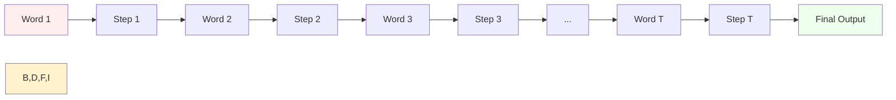
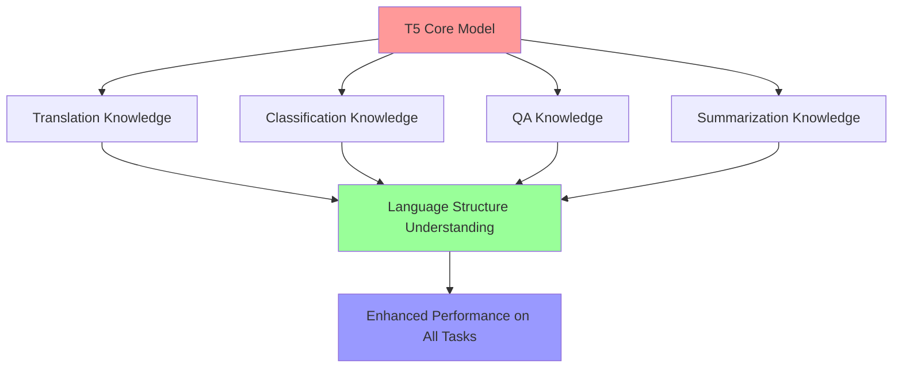
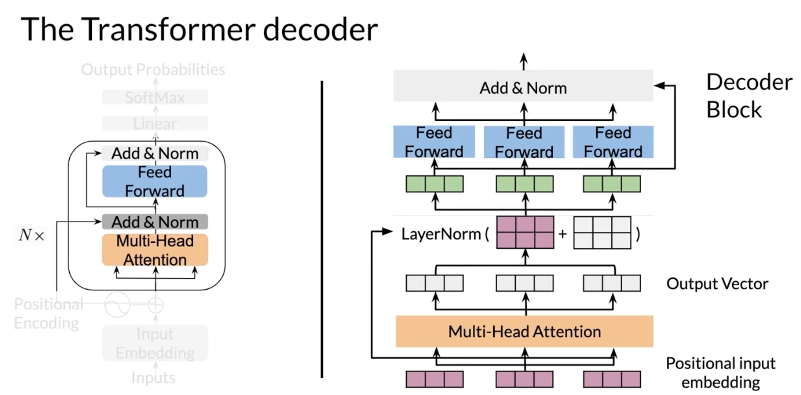
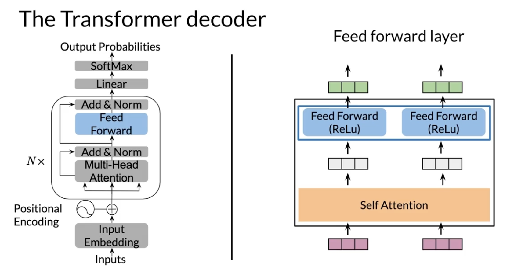

# Natural Language Processing Specialization

## Course 4: Natural Language Processing with Attention Models

### Week 2: Text Summarization with Transformers

---

## Table of Contents

1. [Week Introduction - Text Summarization with Transformers](#1-week-introduction---text-summarization-with-transformers)
2. [Transformers vs RNNs - Understanding the Paradigm Shift](#2-transformers-vs-rnns---understanding-the-paradigm-shift)
3. [Transformers Overview - Architecture and Core Concepts](#3-transformers-overview---architecture-and-core-concepts)
4. [Transformer Applications - Real-World Use Cases](#4-transformer-applications---real-world-use-cases)
5. [Scaled Dot-Product Attention - The Heart of Transformers](#5-scaled-dot-product-attention---the-heart-of-transformers)
6. [Masked Self Attention - Preventing Information Leakage](#6-masked-self-attention---preventing-information-leakage)
7. [Multi-Head Attention - Parallel Processing Power](#7-multi-head-attention---parallel-processing-power)
8. [Transformer Decoder - Building Your Own GPT-2 Model](#8-transformer-decoder---building-your-own-gpt-2-model)
9. [Transformer Summarizer - Complete Text Summarization System](#9-transformer-summarizer---complete-text-summarization-system)
10. [Week 2 Conclusion - Mastering Transformer Architecture](#10-week-2-conclusion---mastering-transformer-architecture)

---

## Week 2 Learning Journey Overview

### Foundation Building (Topics 1-4)

**Understanding the Revolution**

- Introduction to Transformer-based text summarization
- Comparison with traditional RNN approaches
- Complete architecture overview and design principles
- Real-world applications and modern use cases

### Core Mechanisms (Topics 5-7)

**Attention Mastery**

- Scaled dot-product attention mathematical foundations
- Masked self-attention for causal text generation
- Multi-head attention for parallel relationship modeling

### Complete Implementation (Topics 8-10)

**Building Production Systems**

- Complete Transformer decoder implementation (GPT-2 architecture)
- Text summarization system development
- Integration and practical application mastery

---

## Learning Outcomes

By completing Week 2, students will have mastered:

### Theoretical Understanding

- **Transformer Architecture**: Complete understanding of modern NLP foundation
- **Attention Mechanisms**: All variants (scaled, masked, multi-head)
- **Mathematical Foundations**: Q, K, V computations and tensor operations
- **Training Dynamics**: Loss functions, optimization, and evaluation

### Practical Skills

- **Implementation Ability**: Build Transformers from scratch
- **Application Development**: Create text summarization systems
- **Debugging Skills**: Understand and fix attention mechanisms
- **Performance Optimization**: Efficient training and inference

### Industry Relevance

- **Modern AI Architecture**: Foundation for GPT, BERT, T5 models
- **Production Systems**: Real-world application development
- **Research Capability**: Understand and extend state-of-the-art models
- **Problem Solving**: Apply Transformers to diverse NLP challenges

---

## Prerequisites Reinforced

### From Previous Weeks

- **Basic Attention**: Week 1 attention mechanisms
- **Neural Networks**: Feed-forward architectures
- **Text Processing**: Tokenization, embeddings, sequence handling
- **Training Procedures**: Loss functions, backpropagation, optimization

### Mathematical Background

- **Linear Algebra**: Matrix operations, tensor manipulations
- **Probability**: Softmax, probability distributions, sampling
- **Calculus**: Gradients, chain rule, optimization
- **Statistics**: Loss functions, evaluation metrics

---

> ### 🚀 Key Takeaway
>
> This comprehensive week covers the fundamental architecture powering modern AI systems, from ChatGPT to BERT, providing both theoretical mastery and practical implementation skills.

---

# 1. Week Introduction - Text Summarization with Transformers

## The Birth of the Transformer Revolution

Welcome to **Week 2**, where we dive deep into the **famous Transformer network** that has revolutionized modern NLP. The Transformer architecture was introduced in the groundbreaking paper **"Attention Is All You Need"** (Vaswani et al., 2017), which fundamentally changed how we approach sequence modeling in natural language processing.

### The Evolution of "Attention Is All You Need"

**An Interesting Historical Note**:
When the research team initially started developing what would become the Transformer, **it was not all attention**. The original architecture also included **convolutions** alongside attention mechanisms. However, through experimentation and refinement, they discovered that **convolutions were actually not needed** and the model **works even better when it's an all-attention network**.

This discovery led to the revolutionary insight that attention mechanisms alone could handle all the complex relationships in sequential data, eliminating the need for:

- Recurrent connections (RNNs/LSTMs)
- Convolutional layers for sequence modeling
- Sequential processing constraints

### This Week's Focus: Text Summarization

**Why Summarization Matters**:
This week, you will use the **Transformer network for summarization** - one of the most important and practical tasks in natural language processing. Text summarization has become increasingly crucial in our information-rich world, serving both **consumer and enterprise applications**.

### Real-World Applications of Summarization

**Enterprise Use Cases**:

- **Automated Content Processing**: Bots can scrape articles from various sources and automatically summarize them for quick consumption
- **Market Intelligence**: Summarize news articles, reports, and documents to extract key business insights
- **Document Management**: Create executive summaries of lengthy reports and documents

**Consumer Applications**:

- **News Aggregation**: Generate concise summaries of daily news for busy readers
- **Research Assistance**: Summarize academic papers and long-form content
- **Social Media Monitoring**: Create brief overviews of trending topics and discussions

### Advanced Analytics Pipeline

**Combining Summarization with Other NLP Tasks**:
A powerful approach involves chaining multiple NLP techniques:

1. **Content Scraping**: Automated collection of articles and documents
2. **Text Summarization**: Generate concise summaries using Transformers
3. **Sentiment Analysis**: Identify sentiment about specific topics within the summarized content
4. **Topic Extraction**: Discover key themes and subjects across multiple documents

This integrated pipeline enables businesses to:

- Monitor brand mentions and public sentiment
- Track industry trends and emerging topics
- Generate automated reports and insights
- Create personalized content recommendations

### The Attention Landscape

**Multiple Types of Attention Mechanisms**:
Throughout this week, you'll explore the various types of attention that make Transformers so powerful:

- **Dot-Product Attention**: The fundamental mathematical operation for computing attention weights
- **Causal Attention**: Ensures models can only attend to previous positions (crucial for text generation)
- **Encoder-Decoder Attention**: Allows the decoder to focus on relevant parts of the input sequence
- **Self-Attention**: Enables each position in a sequence to attend to all positions within the same sequence

### What Makes This Week Special

**From Theory to Practice**:
You'll gain hands-on experience with Jonas as your guide, learning how each attention mechanism works both conceptually and practically. This comprehensive understanding will enable you to:

- Build your own Transformer-based summarization systems
- Understand the mathematical foundations of modern NLP
- Apply these techniques to real-world text processing challenges
- Modify and customize Transformer architectures for specific use cases

### The Transformer Advantage

**Why Transformers Dominate Modern NLP**:
The all-attention architecture provides several key advantages:

- **Parallelization**: Unlike RNNs, all positions can be processed simultaneously
- **Long-Range Dependencies**: Attention can connect distant parts of sequences directly
- **Scalability**: Architecture scales efficiently with computational resources
- **Transfer Learning**: Pre-trained Transformers can be fine-tuned for various tasks

### Looking Ahead

This week represents a pivotal moment in your NLP journey. By mastering Transformer-based text summarization, you'll be working with the same architectural principles that power:

- GPT models for text generation
- BERT for language understanding
- T5 for text-to-text transfer
- Modern machine translation systems

Let's get started on this exciting exploration of Transformer networks and their application to text summarization!

# 2. Transformers vs RNNs - Understanding the Paradigm Shift

## The Need for Transformer Architecture

The **Transformer model** represents a **purely attention-based architecture** that was developed at Google to address fundamental problems with Recurrent Neural Networks (RNNs). Understanding these problems is crucial to appreciating why the Transformer has become the dominant architecture in modern NLP.

## Fundamental Problems with RNNs

### 1. Sequential Processing Bottleneck

**The Core Issue**: RNNs must process sequences **step by step**, creating a fundamental computational bottleneck.

### RNN Sequential Processing - Neural Machine Translation

```bash
Neural Machine Translation: "How are you?" → "Comment allez-vous?"
┌───────────────────────────────────────────────────────────────────────┐
│                        EN → FR                                        │
│                                                                       │
│  h[1]<to>  ──→  f_W  ──→  f_W  ──→  f_W  ──→  f_W  ──→  f_W  ──→  f_W │
│                 ↑        ↑        ↑        ↑        ↑        ↑        │
│               How      are       you       │    Comment   allez- vous │
│                                            │                          │
│                                            FR                         │
│                                                                       │
│            No parallel computing!                                     │
└───────────────────────────────────────────────────────────────────────┘
```

### RNN + Attention Architecture

```bash
RNNs vs Transformer: Encoder-Decoder Architecture
┌─────────────────────────────────────────────────────────────┐
│                                                             │
│  Input: "It's time for tea"                                 │
│     ↓     ↓     ↓     ↓                                     │
│   [h₁]  [h₂]  [h₃]  [h₄]                                    │
│     ↓     ↓     ↓     ↓                                     │
│  ┌─────────────────────────┐                                │
│  │       Encoder           │                                │
│  │       (LSTMs)           │                                │
│  └─────────────────────────┘                                │
│             │                                               │
│             ↓                                               │
│  ┌─────────────────────────┐    ┌─────────────────────────┐ │
│  │    Attention            │    │       Decoder           │ │
│  │   Mechanism      ⊕ ────────→│      (LSTMs)             │ │
│  │                         │    │                         │ │
│  └─────────────────────────┘    └─────────────────────────┘ │
│             ↑                            │                  │
│             │                            ↓                  │
│           [c]                         <sos>                 │
│           [s_{i-1}]                     │                   │
│                                        ↓                    │
│                                    "C'est"                  │
│                                                             │
│  Note: Transformers don't use RNNs                          │
└─────────────────────────────────────────────────────────────┘
```

**Key Limitation**: In neural machine translation using RNNs, you must:

1. **Start from the beginning** of your input sequence
2. **Make computations at every step** until you reach the end
3. **Decode information** following a similar sequential procedure
4. **Process every word** one after another in sequential order

**Time Complexity Impact**:

- The more words in the input sentence, the more time required to process
- **No parallel computation** is possible during encoding/decoding phases
- Processing time scales linearly with sequence length: $O(T)$ where $T$ is sequence length

### 2. Information Propagation Challenges

**The T-Step Problem**: In a general sequence-to-sequence architecture, to propagate information from the first word to the last output, you must go through $T$ sequential steps, where $T$ represents the number of time steps.



**Example**: For a sentence with 5 words:

- $T = 5$ (five time steps required)
- Information from word 1 must travel through 5 sequential computations to reach the final output

### 3. Vanishing Gradients Problem

**The Long Sequence Challenge**: With large sequences, **information tends to get lost** within the network, and **vanishing gradient problems** arise related to input sequence length.

**Mathematical Perspective**:
The gradient magnitude decreases exponentially with the number of time steps:

$$\frac{\partial L}{\partial W} = \prod_{t=1}^{T} \frac{\partial h_t}{\partial h_{t-1}} \cdot \frac{\partial L}{\partial h_T}$$

As $T$ increases, this product often approaches zero, making learning ineffective.

**Limitations of Existing Solutions**:

- **LSTMs and GRUs** help mitigate these problems but don't eliminate them
- Even these advanced architectures **stop working well** with very long sequences
- The **information bottleneck** remains a fundamental issue

### 4. Loss of Information Over Distance

**Context Degradation**: As sequences get longer, it becomes increasingly difficult to maintain important contextual information.

**Example Problem**:

- **Subject-verb agreement**: Harder to keep track of whether the subject is singular or plural as you move further from the subject
- **Long-range dependencies**: Relationships between distant words become increasingly difficult to capture

## The Attention Solution

### Sequential vs Attention-Based Processing

**RNN + Attention Architecture**:
You've already implemented sequence-to-sequence models with attention, which helped address some RNN limitations while still relying on recurrent structures.

```bash
RNN + Attention Architecture:
┌─────────────────────────────────────────────────────────────┐
│  Encoder: LSTM/GRU → Attention → Decoder: LSTM/GRU          │
│  ├─ Sequential encoding                                     │
│  ├─ Attention mechanism                                     │
│  └─ Sequential decoding                                     │
│                                                             │
│  Improvement: Better long-range dependencies                │
│  Limitation: Still sequential processing                    │
└─────────────────────────────────────────────────────────────┘
```

**Pure Transformer Architecture**:
Transformers take a revolutionary approach: **rely only on attention mechanisms** without any recurrent networks.

```bash
Transformer Architecture:
┌─────────────────────────────────────────────────────────────┐
│              "Attention Is All You Need"                    │
│                                                             │
│  Input → Multi-Head Attention → Feed Forward → Output       │
│    ↓                                                        │
│  ✓ Parallel processing                                      │
│  ✓ No sequential dependencies                               │
│  ✓ Direct connections between all positions                 │
│  ✓ Constant path length for information flow                │
└─────────────────────────────────────────────────────────────┘
```

## Transformer Advantages Over RNNs

### 1. Parallel Computation

**RNN Processing**:

```bash
Time Steps: 1 → 2 → 3 → 4 → 5
Processing: Sequential (one after another)
Time Complexity: O(T) where T = sequence length
```

**Transformer Processing**:

```bash
Time Steps: 1, 2, 3, 4, 5 (all simultaneously)
Processing: Parallel (all positions at once)
Time Complexity: O(1) per layer
```

### 2. Gradient Flow Efficiency

**RNN Gradient Path**:

- **Number of steps** from last output to first input: $T$ steps
- **Gradient magnitude** decreases with sequence length
- **Vanishing gradients** become severe for long sequences

**Transformer Gradient Path**:

- **Number of steps** from last output to first input: **just 1 step**
- **Direct connections** between all positions
- **No vanishing gradients** related to sequence length

### 3. Information Preservation

**Key Advantages**:

- **No information bottleneck**: All positions can attend to all other positions
- **Perfect information flow**: Direct connections eliminate sequential degradation
- **Context preservation**: Long-range dependencies captured as easily as short-range ones

## Architectural Comparison Summary

| Aspect               | RNNs         | Transformers     |
| -------------------- | ------------ | ---------------- |
| **Processing**       | Sequential   | Parallel         |
| **Computation Time** | $O(T)$       | $O(1)$ per layer |
| **Gradient Steps**   | $T$ steps    | 1 step           |
| **Information Flow** | Bottlenecked | Direct           |
| **Long Sequences**   | Problematic  | Efficient        |
| **Parallelization**  | Limited      | Full             |

## The Pure Attention Paradigm

**What "Attention Is All You Need" Means**:

- **No recurrent connections** required
- **No convolutional layers** needed for sequence modeling
- **Linear and non-linear transformations** are included for processing
- **Self-attention mechanisms** handle all sequence relationships

This paradigm shift enables Transformers to:

- **Train faster** due to parallelization
- **Handle longer sequences** without degradation
- **Capture complex relationships** more effectively
- **Scale efficiently** with computational resources

## Looking Forward

Understanding these fundamental differences prepares you for the detailed exploration of Transformer architecture. The next videos will show you **concrete implementations** of how pure attention mechanisms achieve these advantages while maintaining (and often exceeding) the performance of traditional RNN-based models.

The revolution from sequential to parallel, from recurrence to attention, represents one of the most significant advances in modern deep learning - and you're about to master it!

# 3. Transformers Overview - Architecture and Core Concepts

## The Transformer Revolution

The **Transformer model** has generated unprecedented excitement in the NLP community, and for good reason. Introduced in **2017 by researchers at Google** (including Lukasz Kaiser, who helped develop this course), the Transformer architecture has fundamentally **revolutionized the field of natural language processing**.

### Historical Impact and Legacy

**The Foundation Paper**:
We strongly recommend reading **"Attention Is All You Need"** - the seminal paper that introduced Transformers. This paper serves as **the basis for all the models** presented throughout the rest of this course and has become one of the most influential papers in modern AI.

**Industry Transformation**:
Since 2017, the Transformer architecture has become **the standard for large language models**, powering breakthrough systems including:

- **BERT** (Bidirectional Encoder Representations from Transformers)
- **T5** (Text-to-Text Transfer Transformer)
- **GPT-3** (Generative Pre-trained Transformer 3)
- **ChatGPT, GPT-4**, and countless other modern language models

## Core Architecture Components

### 1. Scaled Dot-Product Attention - The Heart of Transformers

**Mathematical Foundation**:
The Transformer model uses **scaled dot-product attention**, which you encountered in Week 1 of this course. This attention mechanism is remarkably efficient due to its mathematical simplicity.

```bash
Scaled Dot-Product Attention Architecture:
┌────────────────────────────────────────────────────────────┐
│                                                            │
│  Q (Queries)    K (Keys)      V (Values)                   │
│     │              │             │                         │
│     ↓              ↓             ↓                         │
│  ┌────────┐    ┌────────┐    ┌────────┐                    │
│  │MatMul  │    │        │    │        │                    │
│  │   ↑    │    │        │    │        │                    │
│  │   ↓    │    │        │    │        │                    │
│  │Scale   │    │        │    │        │                    │
│  │   ↓    │    │        │    │        │                    │
│  │Mask    │    │        │    │        │                    │
│  │(opt.)  │    │        │    │        │                    │
│  │   ↓    │    │        │    │        │                    │
│  │SoftMax │    │        │    │        │                    │
│  │   ↓    │    │        │    │        │                    │
│  │MatMul  │◄───┴────────┴────┴────────┘                    │
│  └────────┘                                                │
│     │                                                      │
│     ↓                                                      │
│  Attention Output                                          │
│                                                            │
│  Formula: softmax(QK^T / √d_k) V                           │
│                                                            │
│  (Vaswani et al., 2017)                                    │
└────────────────────────────────────────────────────────────┘
```

**Why This Design is Revolutionary**:

$$\text{Attention}(Q, K, V) = \text{softmax}\left(\frac{QK^T}{\sqrt{d_k}}\right)V$$

**Computational Advantages**:

- **Pure Matrix Operations**: Consists entirely of matrix multiplication operations
- **Highly Parallelizable**: All computations can be performed simultaneously
- **Memory Efficient**: No hidden states need to be maintained across time steps
- **Scalable**: Performance improves consistently with larger computational resources

**Core Mechanism**: This attention mechanism allows the Transformer to grow **larger and more complex** while being **faster and using less memory** than comparable model architectures like RNNs or CNNs.

### 2. Multi-Head Attention - Parallel Processing Power

**Architecture Design**:
The Transformer employs **multi-head attention layers** that run multiple scaled dot-product attention mechanisms in parallel.

```bash
Multi-Head Attention Architecture:
┌─────────────────────────────────────────────────────────────┐
│                                                             │
│                    ┌─────────┐                              │
│                    │ Linear  │ ← Final output projection    │
│                    └─────────┘                              │
│                         ↑                                   │
│                    ┌─────────┐                              │
│                    │ Concat  │ ← Concatenate all heads      │
│                    └─────────┘                              │
│                         ↑                                   │
│    ┌─────────────────────┼─────────────────┐                │
│    │                     │                 │                │
│ ┌───────┐          ┌───────┐          ┌───────┐             │
│ │Scaled │          │Scaled │    ...   │Scaled │             │
│ │ Dot-  │          │ Dot-  │          │ Dot-  │             │
│ │Product│    ×n    │Product│          │Product│             │
│ │Attn   │          │Attn   │          │Attn   │             │
│ └───────┘          └───────┘          └───────┘             │
│    ↑ ↑ ↑              ↑ ↑ ↑              ↑ ↑ ↑              │
│ ┌──┴─┴─┴──┐       ┌──┴─┴─┴──┐       ┌──┴─┴─┴──┐             │
│ │ Linear  │       │ Linear  │       │ Linear  │             │
│ │ Linear  │       │ Linear  │       │ Linear  │             │
│ │ Linear  │       │ Linear  │       │ Linear  │             │
│ └─────────┘       └─────────┘       └─────────┘             │
│     ↑                 ↑                 ↑                   │
│     V                 K                 Q                   │
│                                                             │
│ Features:                                                   │
│ • Linear transformations of input Q, K, V                   │
│ • Scaled dot-product attention multiple times in parallel   │
│ • Learnable parameters in linear transformations            │
└─────────────────────────────────────────────────────────────┘
```

**Key Components**:

- **Multiple Linear Transformations**: Applied to input queries (Q), keys (K), and values (V)
- **Parallel Processing**: Multiple attention heads operate simultaneously
- **Learnable Parameters**: Linear transformations contain trainable weights
- **Concatenation and Projection**: Results from all heads are combined and projected

**Why Multiple Heads Matter**:
Multi-head attention allows the model to **attend to different types of relationships** simultaneously:

- **Syntactic relationships** (grammar, structure)
- **Semantic relationships** (meaning, context)
- **Long-range dependencies** (distant word connections)
- **Local patterns** (nearby word interactions)

## Transformer Encoder Architecture

### Self-Attention and Contextual Representation

```bash
The Encoder Architecture:
┌─────────────────────────────────────────────────────────────┐
│                     The Encoder                             │
│                                                             │
│  ┌───────────────────────────────────────────────────────┐  │
│  │                                                       │  │
│  │  ┌─────────────────┐                                  │  │
│  │  │  Add & Norm     │←─────────────────────┐           │  │
│  │  └─────────────────┘                      │           │  │
│  │           ↑                               │           │  │
│  │  ┌─────────────────┐                      │           │  │
│  │  │  Feed Forward   │                      │           │  │
│  │  └─────────────────┘                      │           │  │
│  │           ↑                               │           │  │
│  │  ┌─────────────────┐                      │           │  │
│  │  │  Add & Norm     │←─────────────┐       │   N×      │  │
│  │  └─────────────────┘              │       │  Layers   │  │
│  │           ↑                       │       │           │  │
│  │  ┌─────────────────┐              │       │           │  │
│  │  │  Multi-Head     │─────────────┐│       │           │  │
│  │  │  Attention      │←──────────┐ ││       │           │  │
│  │  └─────────────────┘           │ ││       │           │  │
│  │     ↑     ↑     ↑              │ ││       │           │  │
│  │     └─────┼─────┘              │ ││       │           │  │
│  │           │                    │ ││       │           │  │
│  └───────────┼────────────────────┼─┼┼───────────────────┘  │
│              │                    │ ││                      │
│              └────────────────────┘ ││                      │
│                                     ││                      │
│  Self-Attention:                    ││                      │
│  Every item in the input attends to ││                      │
│  every other item in the sequence   ││                      │
│                                     ││                      │
│  Result: Provides contextual        ││                      │
│  representation of each item        ││                      │
│  in the input sequence              ││                      │
└─────────────────────────────────────────────────────────────┘
```

**Self-Attention Mechanism**:
The encoder begins with a **multi-head attention module** that performs **self-attention** on the input sequence. This means:

- **Each word attends to every other word** in the input
- **Contextual relationships** are captured across the entire sequence
- **No sequential processing** required - all positions processed simultaneously

**Layer Structure**:
Each encoder layer follows a specific pattern:

1. **Multi-Head Attention** (self-attention)
2. **Residual Connection + Layer Normalization**
3. **Feed-Forward Network**
4. **Residual Connection + Layer Normalization**

**Stacking and Depth**:

- The entire block constitutes **one encoder layer**
- This layer is **repeated N times** (typically 6-12 layers)
- Each layer builds increasingly **sophisticated representations**

**Output**: The encoder produces a **contextual representation of each input item**, where each word's representation incorporates information from all other words in the sequence.

## Transformer Decoder Architecture

### Masked Self-Attention and Cross-Attention

```bash
The Decoder Architecture:
┌──────────────────────────────────────────────────────────────┐
│                     The Decoder                              │
│                                                              │
│  ┌────────────────────────────────────────────────────────┐  │
│  │  ┌─────────────────┐                                   │  │
│  │  │  Add & Norm     │←─────────────────────┐            │  │
│  │  └─────────────────┘                      │            │  │
│  │           ↑                               │            │  │
│  │  ┌─────────────────┐                      │            │  │
│  │  │  Feed Forward   │                      │            │  │
│  │  └─────────────────┘                      │            │  │
│  │           ↑                               │            │  │
│  │  ┌─────────────────┐                      │            │  │
│  │  │  Add & Norm     │←─────────────┐       │   N×       │  │
│  │  └─────────────────┘              │       │  Layers    │  │
│  │           ↑                       │       │            │  │
│  │  ┌─────────────────┐──────────────┼───────┼────────────┤  │
│  │  │  Multi-Head     │              │       │            │  │
│  │  │  Attention      │←─────────────┘       │            │  │
│  │  └─────────────────┘                      │            │  │
│  │           ↑                               │            │  │
│  │  ┌─────────────────┐                      │            │  │
│  │  │  Add & Norm     │←─────────────┐       │            │  │
│  │  └─────────────────┘              │       │            │  │
│  │           ↑                       │       │            │  │
│  │  ┌─────────────────┐              │       │            │  │
│  │  │  Masked         │─────────────┐│       │            │  │
│  │  │  Multi-Head     │←──────────┐ ││       │            │  │
│  │  │  Attention      │           │ ││       │            │  │
│  │  └─────────────────┘           │ ││       │            │  │
│  │     ↑     ↑     ↑              │ ││       │            │  │
│  │     └─────┼─────┘              │ ││       │            │  │
│  │           │                    │ ││       │            │  │
│  └───────────┼────────────────────┼─┼┼────────────────────┘  │
│              │                    │ ││                       │
│              └────────────────────┘ ││                       │
│                                     ││                       │
│  Encoder-Decoder Attention:         ││                       │
│  Every position from the decoder    ││                       │
│  attends to the outputs from        ││                       │
│  the encoder                        ││                       │
│                                     ││                       │
│  Masked Self-Attention:             ││                       │
│  Every position attends to          ││                       │
│  previous positions                 ││                       │
└──────────────────────────────────────────────────────────────┘
```

**Dual Attention Mechanisms**:

**1. Masked Self-Attention (First Layer)**:

- **Prevents information leakage**: Each position can only attend to **previous positions**
- **Blocks leftward information flow**: Ensures autoregressive generation
- **Maintains causality**: Critical for text generation tasks

**2. Encoder-Decoder Attention (Second Layer)**:

- **Cross-attention mechanism**: Takes encoder output and allows decoder to attend to **all encoder items**
- **Source-target connection**: Links generated output to original input
- **Dynamic focus**: Decoder can focus on different parts of input at each generation step

## Positional Encoding - Sequence Order Information

### The Need for Position Information

**The Challenge**: Since Transformers **don't use recurrent neural networks**, they have no inherent understanding of **word order**. However, **sequence order is crucial** for language understanding.

**The Solution**: **Positional encoding** adds position information to each input embedding.

```bash
Positional Encoding Process:
┌─────────────────────────────────────────────────────────────┐
│  French Input: "Je vais à l'école"                          │
│                                                             │
│  Word:      [Je]    [vais]   [à]    [l'école]               │
│  Position:   1        2      3         4                    │
│             ↓        ↓      ↓         ↓                     │
│  Pos Enc:  [PE₁]   [PE₂]   [PE₃]    [PE₄]                   │
│             ↓        ↓      ↓         ↓                     │
│  Word Emb: [E₁]    [E₂]    [E₃]     [E₄]                    │
│             ↓        ↓      ↓         ↓                     │
│  Combined: [E₁+PE₁][E₂+PE₂][E₃+PE₃][E₄+PE₄]                 │
│                                                             │
│  Result: Each word embedding contains both:                 │
│  • Semantic information (word meaning)                      │
│  • Positional information (sequence order)                  │
└─────────────────────────────────────────────────────────────┘
```

**Implementation Options**:

- **Learned Positional Encodings**: Trainable parameters (like word embeddings)
- **Fixed Positional Encodings**: Mathematical functions (sinusoidal patterns)

**Mathematical Foundation** (for fixed encodings):
$$PE_{(pos, 2i)} = \sin\left(\frac{pos}{10000^{2i/d_{model}}}\right)$$
$$PE_{(pos, 2i+1)} = \cos\left(\frac{pos}{10000^{2i/d_{model}}}\right)$$

## Complete Transformer Architecture

### The Full Model Integration

```bash
The Complete Transformer Architecture:
┌──────────────────────────────────────────────────────────────┐
│                                                              │
│                        Probabilities                         │
│                             ↑                                │
│                      ┌─────────────┐                         │
│                      │   Softmax   │                         │
│                      └─────────────┘                         │
│                             ↑                                │
│                      ┌─────────────┐                         │
│                      │   Linear    │                         │
│                      └─────────────┘                         │
│                             ↑                                │
│    ┌─────────────────────────┼──────────────────────────┐    │
│    │                         │                          │    │
│    │        DECODER          │                          │    │
│    │                         │                          │    │
│    │  ┌─────────────────┐    │                          │    │
│    │  │  Add & Norm     │←───┼─────────────────────┐    │    │
│    │  └─────────────────┘    │                     │    │    │
│    │           ↑             │                     │    │    │
│    │  ┌─────────────────┐    │                     │ N× │    │
│    │  │  Feed Forward   │    │                     │    │    │
│    │  └─────────────────┘    │                     │    │    │
│    │           ↑             │                     │    │    │
│    │  ┌─────────────────┐    │                     │    │    │
│    │  │  Add & Norm     │←───┼─────────────┐       │    │    │
│    │  └─────────────────┘    │             │       │    │    │
│    │           ↑             │             │       │    │    │
│    │  ┌─────────────────┐────┼─────────────┼───────┼────┤    │
│    │  │  Multi-Head     │    │             │       │    │    │
│    │  │  Attention      │←───┼─────────────┘       │    │    │
│    │  └─────────────────┘    │                     │    │    │
│    │           ↑             │                     │    │    │
│    │  ┌─────────────────┐    │                     │    │    │
│    │  │  Add & Norm     │←───┼─────────────┐       │    │    │
│    │  └─────────────────┘    │             │       │    │    │
│    │           ↑             │             │       │    │    │
│    │  ┌─────────────────┐    │             │       │    │    │
│    │  │     Masked      │────┼─────────────┼───────┼────┤    │
│    │  │   Multi-Head    │←───┼─────────┐   │       │    │    │
│    │  │   Attention     │    │         │   │       │    │    │
│    │  └─────────────────┘    │         │   │       │    │    │
│    │           ↑             │         │   │       │    │    │
│    │  ┌─────────────────┐    │         │   │       │    │    │
│    │  │  Positional     │◄───┼─────────┘   │       │    │    │
│    │  │  Encoding       │    │             │       │    │    │
│    │  └─────────────────┘    │             │       │    │    │
│    │           ↑             │             │       │    │    │
│    │  ┌─────────────────┐    │             │       │    │    │
│    │  │    Output       │    │             │       │    │    │
│    │  │   Embedding     │    │             │       │    │    │
│    │  └─────────────────┘    │             │       │    │    │
│    │           ↑             │             │       │    │    │
│    │       Outputs           │             │       │    │    │
│    │   (shifted right)       │             │       │    │    │
│    └─────────────────────────┼─────────────┼───────┼────┘    │
│                              │             │       │         │
│    ┌─────────────────────────┼─────────────┼───────┼────┐    │
│    │                         │             │       │    │    │
│    │        ENCODER          │             │       │    │    │
│    │                         │             │       │    │    │
│    │  ┌─────────────────┐    │             │       │    │    │
│    │  │  Add & Norm     │←───┼─────────────┘       │ N× │    │
│    │  └─────────────────┘    │                     │    │    │
│    │           ↑             │                     │    │    │
│    │  ┌─────────────────┐    │                     │    │    │
│    │  │  Feed Forward   │    │                     │    │    │
│    │  └─────────────────┘    │                     │    │    │
│    │           ↑             │                     │    │    │
│    │  ┌─────────────────┐    │                     │    │    │
│    │  │  Add & Norm     │←───┼─────────────┐       │    │    │
│    │  └─────────────────┘    │             │       │    │    │
│    │           ↑             │             │       │    │    │
│    │  ┌─────────────────┐    │             │       │    │    │
│    │  │   Multi-Head    │────┼─────────────┼───────┼────┤    │
│    │  │   Attention     │←───┼─────────┐   │       │    │    │
│    │  └─────────────────┘    │         │   │       │    │    │
│    │     ↑     ↑     ↑       │         │   │       │    │    │
│    │     └─────┼─────┘       │         │   │       │    │    │
│    │           ↑             │         │   │       │    │    │
│    │  ┌─────────────────┐    │         │   │       │    │    │
│    │  │  Positional     │◄───┼─────────┘   │       │    │    │
│    │  │  Encoding       │    │             │       │    │    │
│    │  └─────────────────┘    │             │       │    │    │
│    │           ↑             │             │       │    │    │
│    │  ┌─────────────────┐    │             │       │    │    │
│    │  │     Input       │    │             │       │    │    │
│    │  │   Embedding     │    │             │       │    │    │
│    │  └─────────────────┘    │             │       │    │    │
│    │           ↑             │             │       │    │    │
│    │        Inputs           │             │       │    │    │
│    └─────────────────────────┼─────────────┼───────┼────┘    │
│                              │             │       │         │
│                              │             │       │         │
│                    Easy to parallelize!    │       │         │
└──────────────────────────────────────────────────────────────┘
```

### Information Flow Summary

**Left Side - Encoder**:

1. **Input sentence** is embedded
2. **Positional encodings** are applied
3. **Multiple encoder layers** process the input with self-attention
4. **Final encoder output** represents contextual input understanding

**Right Side - Decoder**:

1. **Output sentence** (shifted right) is embedded
2. **Positional encodings** are applied
3. **Masked self-attention** prevents future information leakage
4. **Encoder-decoder attention** connects to input representation
5. **Linear layer + Softmax** produces output probabilities

**Key Innovation - Parallelization**:
This architecture is **dramatically easier to parallelize** compared to RNN models:

- **All positions** can be processed simultaneously
- **Training efficiency** scales with multiple GPUs
- **Larger datasets** can be processed more effectively
- **Multiple tasks** can be learned simultaneously

## Why Transformers Solve RNN Problems

### Comprehensive Solution to Sequential Processing Issues

**Problem 1 - Sequential Processing**:

- **RNN Solution**: Process one word at a time sequentially
- **Transformer Solution**: Process all words simultaneously with attention

**Problem 2 - Information Loss**:

- **RNN Problem**: Information gets lost over long sequences
- **Transformer Solution**: Direct connections between all positions via attention

**Problem 3 - Vanishing Gradients**:

- **RNN Problem**: Gradients vanish over long sequences
- **Transformer Solution**: Constant gradient path length (one step) between any two positions

**Problem 4 - Parallel Computing**:

- **RNN Limitation**: Cannot fully exploit parallel computing
- **Transformer Advantage**: Designed for parallel processing from the ground up

## Looking Forward

This overview provides the foundation for understanding each Transformer component in detail. The following videos will dive deeper into:

- **Scaled dot-product attention** implementation
- **Multi-head attention** mechanisms
- **Positional encoding** strategies
- **Training and inference** procedures

The Transformer represents one of the most significant breakthroughs in deep learning, and mastering its architecture is essential for understanding modern NLP. As we'll see in upcoming lectures, this architecture scales beautifully to create the large language models that are transforming artificial intelligence.

# 4. Transformer Applications - Real-World Use Cases

## The Versatility Revolution

Transformers represent **one of the most versatile deep learning models** ever created, successfully applied to numerous tasks both **within NLP and beyond**. This versatility stems from their fundamental design principle: since Transformers can be **generally applied to any sequential task** (just like RNNs, but more effectively), they have become the backbone of modern artificial intelligence systems.

## Core NLP Applications

### Comprehensive Task Coverage

**Primary Applications**:
Transformers have revolutionized virtually every major NLP task:

```bash
Transformer Applications in NLP:
┌─────────────────────────────────────────────────────────────┐
│                                                             │
│  ┌─────────────────┐    ┌─────────────────┐                 │
│  │   Text          │    │   Machine       │                 │
│  │ Summarization   │    │  Translation    │                 │
│  └─────────────────┘    └─────────────────┘                 │
│           │                       │                         │
│           └───────────┬───────────┘                         │
│                       │                                     │
│  ┌─────────────────┐  │  ┌─────────────────┐                 │
│  │ Autocompletion  │  │  │    Question     │                 │
│  │                 │  │  │   Answering     │                 │
│  └─────────────────┘  │  └─────────────────┘                 │
│           │            │           │                         │
│           └────────────┼───────────┘                         │
│                        │                                     │
│  ┌─────────────────┐  │  ┌─────────────────┐                 │
│  │    Named        │  │  │    Chatbots     │                 │
│  │   Entity        │  │  │                 │                 │
│  │ Recognition     │  │  │                 │                 │
│  └─────────────────┘  │  └─────────────────┘                 │
│           │            │           │                         │
│           └────────────┼───────────┘                         │
│                        │                                     │
│  ┌─────────────────┐  │  ┌─────────────────┐                 │
│  │   Sentiment     │  │  │    Market       │                 │
│  │   Analysis      │  │  │ Intelligence    │                 │
│  └─────────────────┘  │  └─────────────────┘                 │
│           │            │           │                         │
│           └────────────┼───────────┘                         │
│                        │                                     │
│            ┌───────────┴───────────┐                         │
│            │     TRANSFORMER       │                         │
│            │     ARCHITECTURE      │                         │
│            └───────────────────────┘                         │
│                                                             │
│  Key Advantage: Single architecture handles all tasks       │
└─────────────────────────────────────────────────────────────┘
```

**Task Diversity**:

1. **Automatic Text Summarization**: Converting long documents into concise summaries
2. **Autocompletion**: Predicting and completing partial text inputs
3. **Named Entity Recognition**: Identifying people, places, organizations in text
4. **Automatic Question Answering**: Providing answers to natural language questions
5. **Machine Translation**: Converting text between different languages
6. **Chatbots**: Engaging in conversational interactions
7. **Sentiment Analysis**: Determining emotional tone and opinion in text
8. **Market Intelligence**: Analyzing business and financial trends from text data

## State-of-the-Art Transformer Models

### The Trinity of Modern NLP

**Revolutionary Model Architectures**:
Many variants of Transformers are used in NLP, with researchers creating innovative models with distinctive names and capabilities:

### 1. GPT-2 (Generative Pre-trained Transformer 2)

**Developer**: OpenAI
**Full Name**: **Generative Pre-trained Transformer**
**Key Innovation**: **Pre-training** approach for text generation

**Real-World Impact**:
GPT-2 became so proficient at generating human-like text that it attracted mainstream media attention. **The Economist** magazine conducted a fascinating experiment where **a reporter interviewed the GPT-2 model as if it were a person**, treating it like a human interviewee. The complete interview was **published in late 2019**, demonstrating the model's remarkable conversational abilities.

**Capabilities**:

- **Text Generation**: Produces coherent, contextually appropriate text
- **Creative Writing**: Generates stories, articles, and creative content
- **Conversational AI**: Engages in human-like dialogue

### 2. BERT (Bidirectional Encoder Representations from Transformers)

**Developer**: Google AI Language Team
**Key Innovation**: **Bidirectional** context understanding
**Primary Purpose**: Learning comprehensive **text representations**

**Architectural Advantage**:
Unlike traditional models that read text left-to-right or right-to-left, BERT reads text **bidirectionally**, understanding context from both directions simultaneously. This enables deeper comprehension of word meanings based on complete context.

**Applications**:

- **Search Engines**: Improving search result relevance
- **Text Classification**: Understanding document categories
- **Language Understanding**: Powering Google Search improvements

### 3. T5 (Text-to-Text Transfer Transformer)

**Developer**: Google
**Full Name**: **Text-to-Text Transfer Transformer**
**Revolutionary Concept**: **Multitask learning** in a single model

## T5: The Multitask Marvel

### Unified Architecture for Multiple Tasks

**The Traditional Approach Problem**:
Historically, NLP required **separate models for each task**:

```bash
Traditional Multi-Task Approach:
┌─────────────────────────────────────────────────────────────┐
│                                                             │
│  Task 1: Translation                                        │
│  ┌─────────────────┐    ┌─────────────────┐                 │
│  │    Design &     │    │    Train        │                 │
│  │    Build        │────→│    Model 1      │                 │
│  │    Model 1      │    │                 │                 │
│  └─────────────────┘    └─────────────────┘                 │
│                                                             │
│  Task 2: Classification                                     │
│  ┌─────────────────┐    ┌─────────────────┐                 │
│  │    Design &     │    │    Train        │                 │
│  │    Build        │────→│    Model 2      │                 │
│  │    Model 2      │    │                 │                 │
│  └─────────────────┘    └─────────────────┘                 │
│                                                             │
│  Task 3: Question Answering                                 │
│  ┌─────────────────┐    ┌─────────────────┐                 │
│  │    Design &     │    │    Train        │                 │
│  │    Build        │────→│    Model 3      │                 │
│  │    Model 3      │    │                 │                 │
│  └─────────────────┘    └─────────────────┘                 │
│                                                             │
│  Problems:                                                  │
│  • Multiple models to maintain                              │
│  • Separate training processes                              │
│  • No knowledge sharing between tasks                       │
└─────────────────────────────────────────────────────────────┘
```

**The T5 Revolution**:
T5 introduces a **paradigm shift**: **a single model** capable of performing **multiple different tasks** through unified text-to-text formatting.

```bash
T5 Unified Approach:
┌─────────────────────────────────────────────────────────────┐
│                                                             │
│                    ┌─────────────────┐                      │
│  Translation  ────→│                 │────→ Translated Text │
│                    │                 │                      │
│  Classification ──→│      T5         │────→ Class Labels    │
│                    │    Single       │                      │
│  Question      ────→│     Model       │────→ Answers        │
│  Answering         │                 │                      │
│                    │                 │────→ Regression      │
│  Regression    ────→│                 │      Values         │
│                    │                 │                      │
│  Summarization ────→│                 │────→ Summaries      │
│                    └─────────────────┘                      │
│                                                             │
│  Advantages:                                                │
│  • Single model handles all tasks                           │
│  • Shared knowledge across tasks                            │
│  • Unified training process                                 │
│  • Task specification through input formatting              │
└─────────────────────────────────────────────────────────────┘
```

### T5 Task Specification System

**The Input String Protocol**:
T5 uses a clever **task specification system** where the input string includes both:

1. **The task** you want the model to perform
2. **The data** you want it to perform that task on

### Translation Task Example

**Input Format**: `translate English to French: [English sentence]`

**Example**:

```
Input:  "translate English to French: I am happy"
Output: "Je suis heureux"
```

**Process Flow**:

1. **Task Identifier**: "translate English to French:" tells T5 this is a translation task
2. **Source Language**: Specified as English
3. **Target Language**: Specified as French
4. **Content**: "I am happy" is the text to translate
5. **Output**: Model produces the French translation

### Classification Task Example

**Input Format**: `cola sentence: [sentence to classify]`

**COLA (Corpus of Linguistic Acceptability)**:
This task classifies sentences as **acceptable** (grammatically correct) or **unacceptable** (grammatically incorrect).

**Example 1 - Unacceptable**:

```
Input:  "cola sentence: He bought fruits and"
Output: "unacceptable"
Analysis: Incomplete sentence structure
```

**Example 2 - Acceptable**:

```
Input:  "cola sentence: He bought fruits and vegetables"
Output: "acceptable"
Analysis: Complete, grammatically correct sentence
```

### Question Answering Task Example

**Input Format**: `question: [question text]`

**Example**:

```
Input:  "question: Which volcano in Tanzania is the highest mountain in Africa?"
Output: "Mount Kilimanjaro"
```

**Knowledge Integration**:
T5 demonstrates remarkable **world knowledge** by correctly identifying that:

- Mount Kilimanjaro is located in Tanzania
- It's both a volcano and Africa's highest mountain
- The question requires geographical and geological knowledge

## Advanced T5 Capabilities

### Regression Tasks

**Similarity Measurement**:
T5 can perform **regression tasks** that output continuous numeric values.

**Input Format**: `stsb sentence1: [text] sentence2: [text]`
**Output Range**: 0.0 to 5.0 (similarity score)

**Example 1 - Dissimilar Sentences**:

```
Input:  "stsb sentence1: Cats and dogs are mammals
         sentence2: These are four known forces in nature:
         gravity, electromagnetic, weak, and strong"
Output: 0.0
Analysis: Completely unrelated topics (biology vs physics)
```

**Example 2 - Moderately Similar Sentences**:

```
Input:  "stsb sentence1: Cats and dogs are mammals
         sentence2: Cats, dogs, and cows are domesticated"
Output: 2.6
Analysis: Both mention cats and dogs, but different focus
         (biological classification vs domestication status)
```

### Text Summarization

**Long-Form to Short-Form Conversion**:
T5 excels at **extractive and abstractive summarization**.

**Example**:

```
Input:  "summarize: [Long story about severe weather events
         in Mississippi with detailed meteorological data,
         emergency response information, and impact assessments]"

Output: "Six people hospitalized after storm in Attala County"
```

**Summarization Intelligence**:

- **Key Information Extraction**: Identifies most important facts
- **Conciseness**: Reduces hundreds of words to essential details
- **Clarity**: Maintains readability and coherence
- **Factual Accuracy**: Preserves crucial details while eliminating redundancy

## Real-World Applications and Demonstrations

### Closed-Book Question Answering

**T5 Trivia Challenge**:
T5 has been demonstrated in **trivia competitions** where humans compete directly against the model. What makes this particularly impressive is that T5 was trained in a **closed-book setting** - it has **no access to external knowledge sources** during inference.

**Training Approach**:

- **No External Knowledge**: Model cannot search the internet or access databases
- **Memory-Based Responses**: All answers come from knowledge encoded during training
- **Competitive Performance**: Can compete with humans on trivia questions

### Industry Applications

**Enterprise Use Cases**:

1. **Customer Service**: Automated response generation and query classification
2. **Content Creation**: Article writing, marketing copy, and documentation
3. **Data Analysis**: Text mining and insight extraction from large document collections
4. **Educational Technology**: Automated tutoring and assessment systems
5. **Research Assistance**: Literature summarization and question answering

## The Multitask Learning Advantage

### Shared Knowledge Benefits

**Cross-Task Learning**:
When T5 learns multiple tasks simultaneously, it develops **shared representations** that benefit all tasks:



**Knowledge Transfer Benefits**:

- **Syntactic Understanding**: Grammar knowledge helps across all language tasks
- **Semantic Representations**: Meaning understanding improves translation and QA
- **World Knowledge**: Factual information aids multiple reasoning tasks
- **Pattern Recognition**: Common linguistic patterns benefit all applications

## Looking Ahead: The Future of Unified Models

### Scalability and Versatility

**Why This Matters**:
The T5 approach represents a fundamental shift toward **unified AI systems** that can:

- **Handle multiple modalities** (text, images, audio)
- **Transfer knowledge** across different domains
- **Adapt quickly** to new tasks with minimal additional training
- **Scale efficiently** as computational resources increase

**Modern Descendants**:
T5's multitask approach has inspired even more powerful models:

- **GPT-3/4**: Scaling up the unified text generation paradigm
- **PaLM**: Further expanding multitask capabilities
- **ChatGPT**: Conversational AI built on similar principles

The versatility demonstrated by Transformers, especially T5, shows us the future of AI: **single models** capable of handling the **full spectrum of language understanding and generation tasks**. This represents a massive step toward **artificial general intelligence** in the language domain.

## Summary: The Transformer Ecosystem

**Revolutionary Impact**:
Transformers have transformed NLP from a collection of specialized tools into a unified field powered by versatile, general-purpose architectures. The ability of models like T5 to handle **multiple tasks through simple input formatting changes** represents one of the most significant advances in artificial intelligence.

**Key Takeaway**:
The astounding capability of **one model handling such a variety of tasks** demonstrates why Transformers have become the dominant paradigm in modern NLP. This versatility, combined with their efficiency and scalability, makes them the foundation for the next generation of AI systems.

# 5. Scaled Dot-Product Attention - The Heart of Transformers

## The Foundation of Transformer Architecture

**Scaled dot-product attention** is the **main operation** in Transformers and represents the core mechanism that makes the entire architecture possible. As we explored in Week 1 of this course, attention mechanisms allow models to focus on relevant parts of the input. Now, let's dive deep into the mathematical foundations and understand **why** this particular formulation is so powerful.

## The Attention Formula Revisited

### Core Mathematical Framework

The scaled dot-product attention mechanism can be expressed with the elegant formula:

$$\text{Attention}(Q, K, V) = \text{softmax}\left(\frac{QK^T}{\sqrt{d_k}}\right)V$$

Where:

- $Q$ = **Queries matrix** (what we're looking for)
- $K$ = **Keys matrix** (what we're looking at)
- $V$ = **Values matrix** (what we actually retrieve)
- $d_k$ = **dimension of the key vectors** (scaling factor)

### Understanding the Components

**The Intuition Behind Q, K, V**:
Think of attention like a **database lookup system**:

1. **Query (Q)**: "What information am I looking for?"
2. **Key (K)**: "What information is available?" (like database indices)
3. **Value (V)**: "What is the actual content?" (like database records)

The attention mechanism computes how much each **Value** should contribute to the output based on the similarity between **Queries** and **Keys**.

## Building Queries, Keys, and Values

### From Text to Matrices

Let's understand how we transform text into the Q, K, V matrices using a concrete example:

```bash
Creating Q, K, V Matrices from Text:
┌─────────────────────────────────────────────────────────────┐
│                                                             │
│  French Sentence: "Je suis heureux" (I am happy)            │
│  English Sentence: "I am happy"                             │
│                                                             │
│  Step 1: Word Embeddings                                    │
│  ┌─────────────────────────────────────────────────────┐    │
│  │ "Je"    →  [0.2, 0.8, 0.1, 0.5] (embedding vector)  │    │
│  │ "suis"  →  [0.7, 0.3, 0.9, 0.2] (embedding vector)  │    │
│  │ "heureux"→ [0.1, 0.6, 0.4, 0.8] (embedding vector)  │    │
│  └─────────────────────────────────────────────────────┘    │
│                                                             │
│  Step 2: Stack into Matrices                                │
│  ┌─────────────────────────────────────────────────────┐    │
│  │           Size of embedding                         │    │
│  │        ←───────────────────────→                    │    │
│  │        ┌─────┬─────┬─────┬─────┐                    │    │
│  │ Je     │ 0.2 │ 0.8 │ 0.1 │ 0.5 │ ↑                  │    │
│  │        ├─────┼─────┼─────┼─────┤ │                  │    │
│  │suis    │ 0.7 │ 0.3 │ 0.9 │ 0.2 │ │ Q (Queries)      │    │
│  │        ├─────┼─────┼─────┼─────┤ │                  │    │
│  │heureux │0.1. │ 0.6 │ 0.4 │ 0.8 │ ↓                  │    │
│  │        └─────┴─────┴─────┴─────┘                    │    │
│  └─────────────────────────────────────────────────────┘    │
│                                                             │
│  Step 3: Similar Process for K and V                        │
│  ┌─────────────────────────────────────────────────────┐    │
│  │ English: "I am happy"                               │    │
│  │     ┌─────┬─────┬─────┬─────┐                       │    │
│  │  I  │ 0.3 │ 0.7 │ 0.2 │ 0.6 │                       │    │
│  │     ├─────┼─────┼─────┼─────┤ K (Keys)              │    │
│  │ am  │ 0.8 │ 0.1 │ 0.5 │ 0.4 │                       │    │
│  │     ├─────┼─────┼─────┼─────┤                       │    │
│  │happy│ 0.2 │ 0.9 │ 0.3 │ 0.7 │                       │    │
│  │     └─────┴─────┴─────┴─────┘                       │    │
│  │                                                     │    │
│  │ Generally: K and V use the same vectors             │    │
│  │ (but could be transformed first)                    │    │
│  │     ┌─────┬─────┬─────┬─────┐                       │    │
│  │  I  │ 0.3 │ 0.7 │ 0.2 │ 0.6 │                       │    │
│  │     ├─────┼─────┼─────┼─────┤ V (Values)            │    │
│  │ am  │ 0.8 │ 0.1 │ 0.5 │ 0.4 │                       │    │
│  │     ├─────┼─────┼─────┼─────┤                       │    │
│  │happy│ 0.2 │ 0.9 │ 0.3 │ 0.7 │                       │    │
│  │     └─────┴─────┴─────┴─────┘                       │    │
│  └─────────────────────────────────────────────────────┘    │
│                                                             │
│  Key Constraint: Number of K vectors = Number of V vectors  │
└─────────────────────────────────────────────────────────────┘
```

### Matrix Dimensions

**Understanding the Shape**:

- **Query Matrix Q**: $(n_q \times d_k)$ where $n_q$ = number of queries, $d_k$ = key dimension
- **Key Matrix K**: $(n_k \times d_k)$ where $n_k$ = number of keys
- **Value Matrix V**: $(n_k \times d_v)$ where $d_v$ = value dimension

**Important Constraint**: The number of key vectors **must equal** the number of value vectors ($n_k$ is the same for both K and V matrices).

## Step-by-Step Mathematical Computation

### The Complete Attention Process

Let's walk through the attention computation with our example:

```bash
Attention Math Computation Flow:
┌───────────────────────────────────────────────────────────────────────┐
│                                                                       │
│  Given: Q (3×4), K (3×4), V (3×4), d_k = 4                            │
│                                                                       │
│  Step 1: Compute Q × K^T                                              │
│  ┌──────────────────────────────────────────────────────┐             │
│  │     ┌─────┬─────┬─────┬─────┐   ┌─────┬─────┬─────┐  │             │
│  │     │ 0.2 │ 0.8 │ 0.1 │ 0.5 │   │ 0.3 │ 0.8 │ 0.2 │  │             │
│  │ Q = │ 0.7 │ 0.3 │ 0.9 │ 0.2 │ × │ 0.7 │ 0.1 │ 0.9 │ =│             │
│  │     │ 0.1 │ 0.6 │ 0.4 │ 0.8 │   │ 0.2 │ 0.5 │ 0.3 │  │             │
│  │     └─────┴─────┴─────┴─────┘   │ 0.6 │ 0.4 │ 0.7 │  │             │
│  │                                 └─────┴─────┴─────┘  │             │
│  │                                                      │             │
│  │   ┌─────┬─────┬─────┐                                │             │
│  │   │ s11 │ s12 │ s13 │  (Similarity scores)           │             │
│  │   │ s21 │ s22 │ s23 │                                │             │
│  │   │ s31 │ s32 │ s33 │                                │             │
│  │   └─────┴─────┴─────┘                                │             │
│  └──────────────────────────────────────────────────────┘             │
│                                                                       │
│  Step 2: Scale by √d_k                                                │
│  ┌─────────────────────────────────────────────────────┐              │
│  │   Scaled = (Q × K^T) / √4 = (Q × K^T) / 2           │              │
│  │                                                     │              │
│  │   ┌─────────┬─────────┬─────────┐                   │              │
│  │   │ s11/2   │ s12/2   │ s13/2   │                   │              │
│  │   │ s21/2   │ s22/2   │ s23/2   │                   │              │
│  │   │ s31/2   │ s32/2   │ s33/2   │                   │              │
│  │   └─────────┴─────────┴─────────┘                   │              │
│  └─────────────────────────────────────────────────────┘              │
│                                                                       │
│  Step 3: Apply Softmax (row-wise)                                     │
│  ┌─────────────────────────────────────────────────────┐              │
│  │   Weight Matrix W (3×3):                            │              │
│  │   ┌─────────┬─────────┬─────────┐                   │              │
│  │   │  w11    │  w12    │  w13    │ ← Weights for Q1  │              │
│  │   │  w21    │  w22    │  w23    │ ← Weights for Q2  │              │
│  │   │  w31    │  w32    │  w33    │ ← Weights for Q3  │              │
│  │   └─────────┴─────────┴─────────┘                   │              │
│  │                                                     │              │
│  │   Each row sums to 1: Σ w_ij = 1 (for each i)       │              │
│  │                                                     │              │
│  │   Element w23 = weight assigned to 3rd key          │              │
│  │                 for the 2nd query                   │              │
│  └─────────────────────────────────────────────────────┘              │
│                                                                       │
│  Step 4: Multiply with Values                                         │
│  ┌───────────────────────────────────────────────────────────────┐    │
│  │   Context Vectors = W × V                                     │    │
│  │                                                               │    │
│  │   ┌─────────┬─────────┬─────────┐   ┌─────┬─────┬─────┬─────┐ │    │
│  │   │  w11    │  w12    │  w13    │   │ 0.3 │ 0.7 │ 0.2 │ 0.6 │ │    │
│  │   │  w21    │  w22    │  w23    │ × │ 0.8 │ 0.1 │ 0.5 │ 0.4 │ │    │
│  │   │  w31    │  w32    │  w33    │   │ 0.2 │ 0.9 │ 0.3 │ 0.7 │ │    │
│  │   └─────────┴─────────┴─────────┘   └─────┴─────┴─────┴─────┘ │    │
│  │                                                               │    │
│  │   Result: Context vectors for each query (3×4)                │    │
│  │   ┌─────────────────────────────────────────────┐             │    │
│  │   │ ┌─────┬─────┬─────┬─────┐ ← Context for Q1  │             │    │
│  │   │ │ c11 │ c12 │ c13 │ c14 │                   │             │    │
│  │   │ ├─────┼─────┼─────┼─────┤ ← Context for Q2  │             │    │
│  │   │ │ c21 │ c22 │ c23 │ c24 │                   │             │    │
│  │   │ ├─────┼─────┼─────┼─────┤ ← Context for Q3  │             │    │
│  │   │ │ c31 │ c32 │ c33 │ c34 │                   │             │    │
│  │   │ └─────┴─────┴─────┴─────┘                   │             │    │
│  │   └─────────────────────────────────────────────┘             │    │
│  └───────────────────────────────────────────────────────────────┘    │
│                                                                       │
│  Final Dimensions:                                                    │
│  • Number of queries = Number of output context vectors               │
│  • Size of context vector = Size of value vectors                     │
└───────────────────────────────────────────────────────────────────────┘
```

### Detailed Mathematical Example

Let's compute a concrete example with simplified numbers:

**Given Matrices**:
$$Q = \begin{bmatrix} 1 & 0 \\ 0 & 1 \end{bmatrix}, \quad K = \begin{bmatrix} 1 & 1 \\ 0 & 1 \end{bmatrix}, \quad V = \begin{bmatrix} 2 & 0 \\ 0 & 3 \end{bmatrix}$$

**Step 1**: Compute $QK^T$
$$QK^T = \begin{bmatrix} 1 & 0 \\ 0 & 1 \end{bmatrix} \begin{bmatrix} 1 & 0 \\ 1 & 1 \end{bmatrix} = \begin{bmatrix} 1 & 0 \\ 1 & 1 \end{bmatrix}$$

**Step 2**: Scale by $\sqrt{d_k} = \sqrt{2}$
$$\frac{QK^T}{\sqrt{d_k}} = \frac{1}{\sqrt{2}} \begin{bmatrix} 1 & 0 \\ 1 & 1 \end{bmatrix} = \begin{bmatrix} 0.707 & 0 \\ 0.707 & 0.707 \end{bmatrix}$$

**Step 3**: Apply softmax (row-wise)

- For row 1: $\text{softmax}([0.707, 0]) = [0.670, 0.330]$
- For row 2: $\text{softmax}([0.707, 0.707]) = [0.500, 0.500]$

$$\text{Weight Matrix} = \begin{bmatrix} 0.670 & 0.330 \\ 0.500 & 0.500 \end{bmatrix}$$

**Step 4**: Multiply with Values
$$\text{Output} = \begin{bmatrix} 0.670 & 0.330 \\ 0.500 & 0.500 \end{bmatrix} \begin{bmatrix} 2 & 0 \\ 0 & 3 \end{bmatrix} = \begin{bmatrix} 1.340 & 0.990 \\ 1.000 & 1.500 \end{bmatrix}$$

## Why Each Component Matters

### The Role of Scaling ($\sqrt{d_k}$)

**The Problem Without Scaling**:
As the dimension $d_k$ increases, the dot products $QK^T$ tend to grow large in magnitude. This pushes the softmax function into regions with **extremely small gradients**.

**Mathematical Intuition**:
Consider two random vectors $q$ and $k$ of dimension $d_k$:

- Expected value of $q \cdot k$ is 0
- Variance of $q \cdot k$ is approximately $d_k$
- Standard deviation is $\sqrt{d_k}$

**Why $\frac{1}{\sqrt{d_k}}$ Works**:
$$\text{Var}\left(\frac{q \cdot k}{\sqrt{d_k}}\right) = \frac{\text{Var}(q \cdot k)}{d_k} = \frac{d_k}{d_k} = 1$$

This normalization keeps the variance **constant regardless of dimension**, preventing the softmax from saturating.

### The Softmax Function's Purpose

**Probability Distribution**:
The softmax ensures that:

1. **All weights are positive**: $w_{ij} \geq 0$
2. **Weights sum to 1**: $\sum_j w_{ij} = 1$ for each query $i$
3. **Differentiable**: Allows gradient-based learning

**Mathematical Form**:
$$\text{softmax}(x_i) = \frac{e^{x_i}}{\sum_{j=1}^n e^{x_j}}$$

This creates a **"soft" selection mechanism** where the model can attend to multiple keys with different strengths, rather than making hard binary choices.

### Context Vector Interpretation

**Weighted Combination**:
Each context vector is a **weighted sum** of all value vectors:
$$\text{context}_i = \sum_{j=1}^{n_k} w_{ij} \cdot \text{value}_j$$

**Information Aggregation**:

- High attention weights → More influence from those values
- Low attention weights → Less influence from those values
- Each query gets a **customized representation** based on its similarity to different keys

## Computational Efficiency

### Why This Design Is Revolutionary

**Pure Matrix Operations**:
The entire attention mechanism consists of only:

1. **Two matrix multiplications**: $QK^T$ and $(W \times V)$
2. **One softmax**: Element-wise operation
3. **Scaling**: Element-wise division

**GPU/TPU Optimization**:

```bash
Parallel Processing Advantages:
┌─────────────────────────────────────────────────────────────┐
│                                                             │
│  Matrix Operations → Highly Parallelizable                  │
│  ┌─────────────────────────────────────────────────────┐    │
│  │  • All dot products computed simultaneously         │    │
│  │  • Softmax applied in parallel across rows          │    │
│  │  • Final multiplication parallelized                │    │
│  │  • No sequential dependencies                       │    │
│  └─────────────────────────────────────────────────────┘    │
│                                                             │
│  Hardware Acceleration:                                     │
│  ┌─────────────────────────────────────────────────────┐    │
│  │  • GPUs excel at matrix operations                  │    │
│  │  • TPUs optimized for transformer workloads         │    │
│  │  • Batch processing across multiple examples        │    │
│  │  • Memory access patterns are GPU-friendly          │    │
│  └─────────────────────────────────────────────────────┘    │
│                                                             │
│  Scalability Benefits:                                      │
│  ┌─────────────────────────────────────────────────────┐    │
│  │  • Computation time independent of sequence length  │    │
│  │    (when parallelized properly)                     │    │
│  │  • Memory usage scales quadratically but            │    │
│  │    efficiently utilizes hardware                    │    │
│  │  • Training speed increases dramatically            │    │
│  └─────────────────────────────────────────────────────┘    │
└─────────────────────────────────────────────────────────────┘
```

**Speed Comparison**:

- **RNN**: $O(n)$ sequential steps (cannot parallelize across time)
- **Transformer**: $O(1)$ parallel computation (all positions simultaneously)

## Attention Weights Interpretation

### Understanding the Weight Matrix

**What Each Element Means**:
The weight matrix element $w_{ij}$ represents:

- **How much attention** query $i$ pays to key $j$
- **The relevance** of key $j$ for answering query $i$
- **The contribution weight** of value $j$ to context vector $i$

**Example Interpretation**:
If $w_{23} = 0.8$ (high value), it means:

- The 2nd query finds the 3rd key **very relevant**
- Value vector 3 will **strongly influence** context vector 2
- There's a **strong semantic relationship** between query 2 and key 3

### Visualization of Attention Patterns

**Translation Example**:

```bash
Attention Pattern Visualization:
┌─────────────────────────────────────────────────────────────┐
│  Query (French): "Je suis heureux"                          │
│  Keys (English):  "I   am    happy"                         │
│                                                             │
│  Attention Weights Matrix:                                  │
│                    I     am    happy                        │
│               ┌─────────────────────┐                       │
│          Je   │ 0.9   0.1    0.0    │ ← "Je" attends to "I" │
│         suis  │ 0.1   0.8    0.1    │ ← "suis" → "am"       │
│      heureux  │ 0.0   0.1    0.9    │ ← "heureux" → "happy" │
│               └─────────────────────┘                       │
│                                                             │
│  Interpretation: Model learns word alignments!              │
└─────────────────────────────────────────────────────────────┘
```

## The Heart and Soul of Transformers

### Why This Mechanism Is So Powerful

**1. Flexible Relationships**:

- Can model **any type of dependency** (short-range, long-range, complex patterns)
- **Dynamic attention** based on context, not fixed patterns

**2. Parallel Processing**:

- **All relationships computed simultaneously**
- No sequential bottlenecks like in RNNs

**3. Interpretability**:

- **Attention weights are meaningful** and can be visualized
- Provides insight into **what the model is "looking at"**

**4. Scalability**:

- Scales to **very long sequences** (with some memory considerations)
- Benefits from **larger computational resources**

### Connection to Self-Attention

**Preview of Next Topic**:
In the Transformer **decoder**, we need an extended version called **masked self-attention**. This prevents the model from "cheating" by looking at future tokens during training.

**The Evolution**:

- **Scaled dot-product attention**: General mechanism we just learned
- **Self-attention**: Q, K, V all come from the same sequence
- **Masked self-attention**: Self-attention with future positions blocked

## Summary

Scaled dot-product attention represents the **mathematical foundation** that makes Transformers possible. Its elegant combination of:

- **Query-Key similarity computation** (via dot products)
- **Proper scaling** (via $\sqrt{d_k}$)
- **Probabilistic weighting** (via softmax)
- **Value aggregation** (via weighted sums)

Creates a mechanism that is simultaneously **powerful**, **efficient**, and **parallelizable**. This is truly the **heart and soul of Transformers**, enabling them to achieve unprecedented performance across a wide range of language tasks.

Understanding this mechanism deeply prepares you for the more advanced concepts of **multi-head attention** and **masked attention** that build upon this foundation.

# 6. Masked Self Attention - Preventing Information Leakage

## The Three Pillars of Transformer Attention

Before diving into masked self-attention, let's understand the **three main types of attention mechanisms** in the Transformer model. Each serves a specific purpose and operates in different parts of the architecture.

### 1. Encoder-Decoder Attention (Cross-Attention)

**Definition**: Words in one sentence attend to all words in another sentence.

**Structure**:

- **Queries**: Come from one sentence (target language)
- **Keys and Values**: Come from another sentence (source language)

**Application Example** (from Week 1):

```bash
Encoder-Decoder Attention Example:
┌─────────────────────────────────────────────────────────────┐
│  Translation Task: French → English                         │
│                                                             │
│  Source (French):  "Je suis heureux"                        │
│  Target (English): "I  am   happy"                          │
│                                                             │
│  ┌─────────────────────────────────────────────────────┐    │
│  │                    Keys & Values                    │    │
│  │              ┌─────┬─────┬─────────┐                │    │
│  │              │ Je  │suis │heureux  │                │    │
│  │              └─────┴─────┴─────────┘                │    │
│  │                     ↑                               │    │
│  │              French sentence                        │    │
│  │                     ↑                               │    │
│  │              ┌─────────────┐                        │    │
│  │              │  Attention  │                        │    │
│  │              │ Mechanism   │                        │    │
│  │              └─────────────┘                        │    │
│  │                     ↑                               │    │
│  │               ┌─────┬─────┬─────┐                   │    │
│  │               │  I  │ am  │happy│                   │    │
│  │               └─────┴─────┴─────┘                   │    │
│  │                   Queries                           │    │
│  │              English sentence                       │    │
│  └─────────────────────────────────────────────────────┘    │
│                                                             │
│  Purpose: Connect source and target languages               │
└─────────────────────────────────────────────────────────────┘
```

### 2. Self-Attention

**Definition**: Queries, keys, and values **all come from the same sentence**.

**Key Property**: **Every word attends to every other word** in the sequence.

**Purpose**:

- **Contextual representations**: Each word gets a representation that incorporates information from all other words
- **Meaning within context**: Understanding how each word's meaning is influenced by surrounding words

**Mathematical Formulation**:
For a sentence with words $[w_1, w_2, ..., w_n]$:

- $Q = K = V = $ [embeddings of $w_1, w_2, ..., w_n$]

```bash
Self-Attention Example:
┌─────────────────────────────────────────────────────────────┐
│  Sentence: "The cat sat on the mat"                         │
│                                                             │
│  ┌─────────────────────────────────────────────────────┐    │
│  │        Attention Matrix (Each word attends to all)  │    │
│  │                                                     │    │
│  │         The  cat  sat  on   the  mat                │    │
│  │      ┌─────┬─────┬─────┬─────┬─────┬─────┐          │    │
│  │  The │ 0.3 │ 0.4 │ 0.1 │ 0.1 │ 0.05│ 0.05│          │    │
│  │  cat │ 0.2 │ 0.5 │ 0.2 │ 0.05│ 0.02│ 0.03│          │    │
│  │  sat │ 0.1 │ 0.3 │ 0.4 │ 0.1 │ 0.05│ 0.05│          │    │
│  │  on  │ 0.1 │ 0.1 │ 0.2 │ 0.3 │ 0.2 │ 0.1 │          │    │
│  │  the │ 0.05│ 0.1 │ 0.1 │ 0.2 │ 0.3 │ 0.25│          │    │
│  │  mat │ 0.05│ 0.2 │ 0.1 │ 0.15│ 0.25│ 0.25│          │    │
│  │      └─────┴─────┴─────┴─────┴─────┴─────┘          │    │
│  │                                                     │    │
│  │  Matrix interpretation:                             │    │
│  │  • Rows = Query words (what's asking for attention) │    │
│  │  • Columns = Key words (what's being attended to)   │    │
│  │  • Values = Attention weights (how much focus)      │    │
│  │                                                     │    │
│  │  Key insights:                                      │    │
│  │  • "cat" strongly attends to itself (0.5) and       │    │
│  │    "The" (0.2) - subject-determiner relationship    │    │
│  │  • "sat" attends to "cat" (0.3) - verb-subject      │    │
│  │  • "the" and "mat" have mutual attention - det-noun │    │
│  └─────────────────────────────────────────────────────┘    │
│                                                             │
│  Result: Each word gets contextualized meaning based on     │
│          attention to all other words in the sentence       │
│                                                             │
│  Example: "cat" representation = weighted combination of:   │
│           0.2×"The" + 0.5×"cat" + 0.2×"sat" + ...           │
└─────────────────────────────────────────────────────────────┘
```

**Alternative Matrix Visualization:**

```bash
┌────────────────────────────────────────────────────────┐
│                Self-Attention Matrix                   │
│               (Rows=Queries, Cols=Keys)                │
├────────────────────────────────────────────────────────┤
│         │  The │ cat │ sat │ on  │ the │ mat │         │
│    ─────┼──────┼─────┼─────┼─────┼─────┼─────┤         │
│    The  │ ████ │█████│ ██  │ ██  │ █   │ █   │         │
│    cat  │ ███  │█████│████ │ █   │ █   │ █   │         │
│    sat  │ ██   │████ │█████│ ██  │ █   │ █   │         │
│    on   │ ██   │ ██  │████ │█████│████ │ ██  │         │
│    the  │ █    │ ██  │ ██  │████ │█████│████ │         │
│    mat  │ █    │ ███ │ ██  │ ███ │████ │█████│         │
└────────────────────────────────────────────────────────┘
```

**Key Differences from Cross-Attention:**

- **Cross-attention**: Query from one sequence, Keys/Values from another
- **Self-attention**: Query, Keys, and Values all from the SAME sequence
- **Use case**: Understanding relationships within a single sentence/sequence

### 3. Masked Self-Attention

**Definition**: Like self-attention, but **each query cannot attend to keys in future positions**.

**Location**: Present in the **decoder** of the Transformer model.

**Critical Purpose**: **Ensures predictions depend only on known outputs** (prevents "cheating").

**Key Property**: **Each word can only attend to itself and previous words** in the sequence.

**Purpose**:

- **Autoregressive generation**: Generate words one at a time, left to right
- **Causal modeling**: Ensure the model can't "look ahead" to future tokens
- **Training efficiency**: Allow parallel training while maintaining sequential dependencies
- **Prevent information leakage**: Each position can only use information from earlier positions

**Mathematical Formulation**:
For a sequence with words $[w_1, w_2, ..., w_n]$:

- $Q = K = V = $ [embeddings of $w_1, w_2, ..., w_n$]
- **Mask applied**: $M_{ij} = \begin{cases} 0 & \text{if } i \leq j \\ -\infty & \text{if } i > j \end{cases}$
- **Attention scores**: $\text{Attention}(Q, K, V) = \text{softmax}\left(\frac{QK^T + M}{\sqrt{d_k}}\right)V$

```bash
Masked Self-Attention Example:
┌─────────────────────────────────────────────────────────────┐
│  Sequence: "I am learning transformers"                     │
│                                                             │
│  ┌─────────────────────────────────────────────────────┐    │
│  │    Masked Attention Matrix (Lower Triangular)       │    │
│  │                                                     │    │
│  │         I    am   learn trans                       │    │
│  │      ┌─────┬─────┬─────┬─────┐                      │    │
│  │   I  │ 1.0 │ --- │ --- │ --- │                      │    │
│  │   am │ 0.3 │ 0.7 │ --- │ --- │                      │    │
│  │ learn│ 0.1 │ 0.2 │ 0.7 │ --- │                      │    │
│  │ trans│ 0.05│ 0.15│ 0.3 │ 0.5 │                      │    │
│  │      └─────┴─────┴─────┴─────┘                      │    │
│  │                                                     │    │
│  │  Legend:                                            │    │
│  │  • Numbers = Attention weights (sum to 1 per row)   │    │
│  │  • "---" = Masked positions (cannot attend)         │    │
│  │                                                     │    │
│  │  Key insights:                                      │    │
│  │  • "I" can only attend to itself                    │    │
│  │  • "am" can attend to "I" and itself                │    │
│  │  • "learn" can attend to "I", "am", and itself      │    │
│  │  • "trans" can attend to all previous + itself      │    │
│  └─────────────────────────────────────────────────────┘    │
│                                                             │
│  Result: Each word gets contextualized meaning based ONLY   │
│          on itself and previous words in the sequence       │
└─────────────────────────────────────────────────────────────┘
```

**Mask Implementation Detail**:

```bash
┌────────────────────────────────────────────────────────┐
│                  Attention Mask Matrix                 │
│              (Applied before softmax)                  │
├────────────────────────────────────────────────────────┤
│         │  I   │ am  │learn│trans│                     │
│    ─────┼──────┼─────┼─────┼─────┤                     │
│    I    │  0   │ -∞  │ -∞  │ -∞  │                     │
│    am   │  0   │  0  │ -∞  │ -∞  │                     │
│    learn│  0   │  0  │  0  │ -∞  │                     │
│    trans│  0   │  0  │  0  │  0  │                     │
└────────────────────────────────────────────────────────┘

After softmax application:
┌────────────────────────────────────────────────────────┐
│              Final Attention Weights                   │
├────────────────────────────────────────────────────────┤
│         │  I   │ am  │learn│trans│                     │
│    ─────┼──────┼─────┼─────┼─────┤                     │
│    I    │ 1.0  │  0  │  0  │  0  │ ← Only self         │
│    am   │ 0.3  │ 0.7 │  0  │  0  │ ← Self + previous   │
│    learn│ 0.1  │ 0.2 │ 0.7 │  0  │ ← Self + all prev   │
│    trans│ 0.05 │ 0.15│ 0.3 │ 0.5 │ ← Self + all prev   │
└────────────────────────────────────────────────────────┘
```

**Visual Comparison**:

```bash
┌─────────────────────────────────────────────────────────────┐
│            Self-Attention vs Masked Self-Attention          │
├─────────────────────────────────────────────────────────────┤
│                                                             │
│  Regular Self-Attention (Bidirectional):                    │
│  ┌─────┬─────┬─────┬─────┐                                  │
│  │ ████│ ████│ ████│ ████│ ← All positions visible          │
│  │ ████│ ████│ ████│ ████│                                  │
│  │ ████│ ████│ ████│ ████│                                  │
│  │ ████│ ████│ ████│ ████│                                  │
│  └─────┴─────┴─────┴─────┘                                  │
│                                                             │
│  Masked Self-Attention (Causal/Autoregressive):             │
│  ┌─────┬─────┬─────┬─────┐                                  │
│  │ ████│ ░░░░│ ░░░░│ ░░░░│ ← Future positions masked        │
│  │ ████│ ████│ ░░░░│ ░░░░│                                  │
│  │ ████│ ████│ ████│ ░░░░│                                  │
│  │ ████│ ████│ ████│ ████│                                  │
│  └─────┴─────┴─────┴─────┘                                  │
│  ↑                                                          │
│  Lower triangular matrix (causal mask)                      │
└─────────────────────────────────────────────────────────────┘
```

**Training vs Inference**:

- **Training**: All positions processed in parallel with masking
- **Inference**: Generate one token at a time, naturally causal
- **Efficiency**: Masking allows parallel training while maintaining autoregressive property

**Use Cases**:

- **Language modeling**: GPT-style models for text generation
- **Machine translation**: Decoder ensures target depends only on previous outputs
- **Text completion**: Predict next words based on context so far
- **Dialogue systems**: Generate responses without seeing future conversation

## The Need for Masking in Decoders

### The Autoregressive Generation Problem

**Why Masking Is Essential**:
During training, the decoder has access to the complete target sequence. Without masking, the model could "cheat" by looking at future words when predicting the current word.

**Training vs. Inference Mismatch**:

```bash
The Cheating Problem:
┌─────────────────────────────────────────────────────────────┐
│                                                             │
│  Training: "I am happy" (complete sequence available)       │
│                                                             │
│  Without Masking:                                           │
│  ┌─────────────────────────────────────────────────────┐    │
│  │  When predicting "am", model can see:               │    │
│  │  ✓ "I" (past - legitimate)                          │    │
│  │  ✗ "am" (current - should predict this)             │    │
│  │  ✗ "happy" (future - this is cheating!)             │    │
│  └─────────────────────────────────────────────────────┘    │
│                                                             │
│  With Masking:                                              │
│  ┌─────────────────────────────────────────────────────┐    │
│  │  When predicting "am", model can see:               │    │
│  │  ✓ "I" (past - legitimate)                          │    │
│  │  ✗ "am" (current - masked out)                      │    │
│  │  ✗ "happy" (future - masked out)                    │    │
│  └─────────────────────────────────────────────────────┘    │
│                                                             │
│  Result: Forces model to learn proper sequential patterns   │
└─────────────────────────────────────────────────────────────┘
```

**Inference Reality**:
During actual text generation, the model only has access to previously generated words, so training must match this condition.

## Mathematical Implementation of Masking

### The Mask Matrix Construction

**Core Concept**: Add a **mask matrix** within the softmax computation.

**Mask Matrix Properties**:

- **Zeros** on and below the diagonal (allowed positions)
- **Minus infinity** (or large negative numbers) above the diagonal (forbidden positions)

**Mathematical Formulation**:
$$\text{MaskedAttention}(Q, K, V) = \text{softmax}\left(\frac{QK^T}{\sqrt{d_k}} + M\right)V$$

Where $M$ is the mask matrix:

$$
M_{ij} = \begin{cases}
0 & \text{if } i \geq j \text{ (allowed)} \\
-\infty & \text{if } i < j \text{ (forbidden)}
\end{cases}
$$

### Step-by-Step Masked Attention Computation

Let's work through a concrete example with the sentence "I am happy":

```bash
Masked Self-Attention Computation:
┌─────────────────────────────────────────────────────────────┐
│                                                             │
│  Input Sequence: ["I", "am", "happy"]                       │
│                                                             │
│  Step 1: Compute QK^T (same as regular attention)           │
│  ┌─────────────────────────────────────────────────────┐    │
│  │     I    am   happy                                 │    │
│  │     ┌─────┬─────┬─────┐                             │    │
│  │I    │ 2.0 │ 1.5 │ 0.8 │                             │    │
│  │     ├─────┼─────┼─────┤                             │    │
│  │am   │ 1.2 │ 2.5 │ 1.1 │                             │    │
│  │     ├─────┼─────┼─────┤                             │    │
│  │happy│0.9  │ 1.8 │ 2.2 │                             │    │
│  │     └─────┴─────┴─────┘                             │    │
│  └─────────────────────────────────────────────────────┘    │
│                                                             │
│  Step 2: Apply scaling (divide by √d_k)                     │
│  ┌─────────────────────────────────────────────────────┐    │
│  │     I    am   happy                                 │    │
│  │     ┌─────┬─────┬─────┐                             │    │
│  │I    │ 1.0 │ 0.75│ 0.4 │                             │    │
│  │     ├─────┼─────┼─────┤                             │    │
│  │am   │ 0.6 │ 1.25│ 0.55│                             │    │
│  │     ├─────┼─────┼─────┤                             │    │
│  │happy│0.45 │ 0.9 │ 1.1 │                             │    │
│  │     └─────┴─────┴─────┘                             │    │
│  └─────────────────────────────────────────────────────┘    │
│                                                             │
│  Step 3: Add Mask Matrix                                    │
│  ┌─────────────────────────────────────────────────────┐    │
│  │  Mask Matrix M:                                     │    │
│  │     I    am   happy                                 │    │
│  │     ┌─────┬─────┬─────┐                             │    │
│  │I    │  0  │ -∞  │ -∞  │                             │    │
│  │     ├─────┼─────┼─────┤                             │    │
│  │am   │  0  │  0  │ -∞  │                             │    │
│  │     ├─────┼─────┼─────┤                             │    │
│  │happy│ 0   │  0  │  0  │                             │    │
│  │     └─────┴─────┴─────┘                             │    │
│  └─────────────────────────────────────────────────────┘    │
│                                                             │
│  Step 4: Scaled Scores + Mask                               │
│  ┌─────────────────────────────────────────────────────┐    │
│  │     I    am   happy                                 │    │
│  │     ┌─────┬─────┬─────┐                             │    │
│  │I    │ 1.0 │ -∞  │ -∞  │                             │    │
│  │     ├─────┼─────┼─────┤                             │    │
│  │am   │ 0.6 │ 1.25│ -∞  │                             │    │
│  │     ├─────┼─────┼─────┤                             │    │
│  │happy│0.45 │ 0.9 │ 1.1 │                             │    │
│  │     └─────┴─────┴─────┘                             │    │
│  └─────────────────────────────────────────────────────┘    │
└─────────────────────────────────────────────────────────────┘
```

### The Softmax Effect

**Critical Insight**: When softmax is applied to values containing $-\infty$, those positions become **exactly zero**.

**Mathematical Property**:
$$\text{softmax}(-\infty) = \frac{e^{-\infty}}{\sum_j e^{x_j}} = \frac{0}{\sum_j e^{x_j}} = 0$$

**Continuing Our Example**:

```bash
Step 5: Apply Softmax (row-wise):
┌─────────────────────────────────────────────────────────────┐
│                                                             │
│     Before Softmax:                     After Softmax:      │
│        I    am   happy                     I    am   happy  │
│     ┌─────┬─────┬─────┐                 ┌─────┬─────┬─────┐ │
│I    │ 1.0 │ -∞  │ -∞  │ →  softmax  →   │ 1.0 │ 0.0 │ 0.0 │ │
│     ├─────┼─────┼─────┤                 ├─────┼─────┼─────┤ │
│am   │ 0.6 │ 1.25│ -∞  │ →  softmax  →   │ 0.35│ 0.65│ 0.0 │ │
│     ├─────┼─────┼─────┤                 ├─────┼─────┼─────┤ │
│happy│0.45 │ 0.9 │ 1.1 │ →  softmax  →   │ 0.25│ 0.33│ 0.42│ │
│     └─────┴─────┴─────┘                 └─────┴─────┴─────┘ │
│                                                             │
│  Key Observation:                                           │
│  • Row 1: "I" can only attend to itself                     │
│  • Row 2: "am" can attend to "I" and "am"                   │
│  • Row 3: "happy" can attend to all previous words          │
│                                                             │
│  Future positions have exactly 0 weight!                    │
└─────────────────────────────────────────────────────────────┘
```

### Complete Attention Pattern Visualization

```bash
Masked Attention Pattern:
┌─────────────────────────────────────────────────────────────┐
│                                                             │
│  Attention Weights Matrix (after masking):                  │
│                                                             │
│         Positions that can be attended to                   │
│              I     am    happy                              │
│         ┌─────────────────────┐                             │
│     I   │ 1.0   0.0    0.0    │ ← Only past (itself)        │
│    am   │ 0.35  0.65   0.0    │ ← Only past + current       │
│  happy  │ 0.25  0.33   0.42   │ ← All previous              │
│         └─────────────────────┘                             │
│           ↑                                                 │
│           │                                                 │
│    Queries trying to                                        │
│    predict next word                                        │
│                                                             │
│  Causal Structure:                                          │
│  ┌─────────────────────────────────────────────────────┐    │
│  │  • Position i can only attend to positions ≤ i      │    │
│  │  • No information flows backward in time            │    │
│  │  • Maintains autoregressive property                │    │
│  │  • Prevents model from "cheating"                   │    │
│  └─────────────────────────────────────────────────────┘    │
└─────────────────────────────────────────────────────────────┘
```

## Visual Representation of the Mask

### Lower Triangular Pattern

The mask creates a **lower triangular attention pattern**:

```bash
Mask Matrix Visualization:
┌─────────────────────────────────────────────────────────────┐
│                                                             │
│  3×3 Sequence Example:                                      │
│                                                             │
│  ┌─────────────────────────────────────────────────────┐    │
│  │     Position:  1    2    3                          │    │
│  │              ┌─────────────────┐                    │    │
│  │  Position 1  │  0  │ -∞ │ -∞   │  ← Can see: [1]    │    │
│  │              ├─────┼────┼──────┤                    │    │
│  │  Position 2  │  0  │  0 │ -∞   │  ← Can see: [1,2]  │    │
│  │              ├─────┼────┼──────┤                    │    │
│  │  Position 3  │  0  │  0 │  0   │  ← Can see: [1,2,3]│    │
│  │              └─────┴────┴──────┘                    │    │
│  └─────────────────────────────────────────────────────┘    │
│                                                             │
│  Visual Pattern:                                            │
│  ┌─────────────────────────────────────────────────────┐    │
│  │        Allowed (0)     Forbidden (-∞)               │    │
│  │         ■ □ □          ■ = Visible                  │    │
│  │         ■ ■ □          □ = Masked                   │    │
│  │         ■ ■ ■                                       │    │
│  │                                                     │    │
│  │    Lower triangular = Causal attention              │    │
│  └─────────────────────────────────────────────────────┘    │
└─────────────────────────────────────────────────────────────┘
```

### Implementation Details

**Practical Implementation**:
In practice, $-\infty$ is replaced with a **very large negative number** (e.g., -1e9) to avoid numerical issues:

```python
# Pseudo-code for mask creation
mask = torch.triu(torch.ones(seq_len, seq_len), diagonal=1)
mask = mask.masked_fill(mask == 1, float('-inf'))
```

**Mask Application**:
$$\text{scores\_masked} = \frac{QK^T}{\sqrt{d_k}} + \text{mask}$$

## Why This Works: The Autoregressive Property

### Ensuring Causal Dependencies

**Training Objective**:
During training, we want to predict:

- $P(\text{"am"} | \text{"I"})$
- $P(\text{"happy"} | \text{"I"}, \text{"am"})$

**Without Masking** (problematic):
The model could learn $P(\text{"am"} | \text{"I"}, \text{"am"}, \text{"happy"})$, which includes future information.

**With Masking** (correct):
The model learns proper conditional probabilities that match inference conditions.

### Generation Process Alignment

**Training with Masking**:

```bash
Training Process (with masking):
┌─────────────────────────────────────────────────────────────┐
│                                                             │
│  Input:  [SOS] I    am   happy                              │
│  Target:  I    am   happy [EOS]                             │
│                                                             │
│  Step 1: Predict "I" using only [SOS]                       │
│  Step 2: Predict "am" using only [SOS, I]                   │
│  Step 3: Predict "happy" using only [SOS, I, am]            │
│  Step 4: Predict [EOS] using [SOS, I, am, happy]            │
│                                                             │
│  Each prediction sees only past context                     │
└─────────────────────────────────────────────────────────────┘
```

**Inference** (naturally matches training):

```bash
Inference Process:
┌─────────────────────────────────────────────────────────────┐
│                                                             │
│  Step 1: Start with [SOS] → Generate "I"                    │
│  Step 2: Have [SOS, I] → Generate "am"                      │
│  Step 3: Have [SOS, I, am] → Generate "happy"               │
│  Step 4: Have [SOS, I, am, happy] → Generate [EOS]          │
│                                                             │
│  Perfect alignment with training conditions!                │
└─────────────────────────────────────────────────────────────┘
```

## Comparison with Other Attention Types

### Summary of Attention Mechanisms

| Attention Type            | Queries From    | Keys From       | Values From     | Masking | Use Case                           |
| ------------------------- | --------------- | --------------- | --------------- | ------- | ---------------------------------- |
| **Encoder-Decoder**       | Target sequence | Source sequence | Source sequence | No      | Translation, Cross-modal tasks     |
| **Self-Attention**        | Same sequence   | Same sequence   | Same sequence   | No      | Encoder, understanding context     |
| **Masked Self-Attention** | Same sequence   | Same sequence   | Same sequence   | Yes     | Decoder, autoregressive generation |

### Mathematical Relationships

**All three are variants of the same fundamental operation**:

1. **Standard Attention**: $\text{softmax}(\frac{QK^T}{\sqrt{d_k}})V$

2. **Self-Attention**: $Q = K = V = X$ (same input sequence)

3. **Masked Self-Attention**: $\text{softmax}(\frac{QK^T}{\sqrt{d_k}} + M)V$ where $M$ is causal mask

## The Power of Masking

### Why This Simple Addition Is So Effective

**Elegant Solution**:

- **Minimal modification**: Just add a mask matrix
- **Preserves parallelism**: All positions still computed simultaneously
- **Enforces causality**: Prevents information leakage automatically
- **Training efficiency**: No need for sequential processing during training

**Key Insight**:
The mask allows us to train on **complete sequences** while maintaining the **autoregressive property** required for generation. This is much more efficient than training with sequential, one-token-at-a-time approaches.

### Looking Ahead: Multi-Head Attention

**Next Enhancement**:
The next video will cover **multi-head attention**, which is a **very powerful form of attention that allows for parallel computing**. Multi-head attention applies the masked self-attention mechanism (and other attention types) multiple times in parallel, enabling the model to attend to different types of relationships simultaneously.

## Summary

Masked self-attention represents a **crucial innovation** that enables Transformers to:

1. **Train efficiently** on complete sequences
2. **Maintain causal relationships** required for autoregressive generation
3. **Prevent information leakage** from future positions
4. **Align training and inference** conditions perfectly

The elegance of this solution - simply adding a mask matrix to the attention computation - demonstrates the power of well-designed mathematical frameworks. This mechanism is **essential** for any autoregressive language model and forms the foundation for modern text generation systems like GPT and other transformer-based language models.

Understanding masked self-attention is crucial for grasping how modern language models generate coherent, contextually appropriate text while maintaining the mathematical rigor required for effective training.

# 7. Multi-Head Attention - Parallel Processing Power

## Why Multi-Head Attention Is Revolutionary

You now have learned all the **basics of attention**. In fact, you could already build a Transformer from what you know! But if you want it to **work really well**, **run fast**, and get **very good results**, you need one more crucial component: **Multi-Head Attention**.

**The Core Problem**: Single attention can only learn **one type of relationship** between words at a time. But language is complex - words relate to each other in **multiple different ways simultaneously**.

**The Solution**: Apply the attention mechanism **multiple times in parallel**, each focusing on **different types of relationships**.

## The Intuition Behind Multi-Head Attention

### Why One Head Isn't Enough

**Think About Language Complexity**:
Consider the sentence: _"The cat that was sleeping on the mat woke up"_

```bash
Multiple Relationships in One Sentence:
┌────────────────────────────────────────────────────────────────┐
│                                                                │
│  "The cat that was sleeping on the mat woke up"                │
│                                                                │
│  Different Types of Relationships:                             │
│  ┌─────────────────────────────────────────────────────┐       │
│  │ 1. Subject-Verb: "cat" ↔ "woke"                     │       │
│  │    (grammatical relationship)                       │       │
│  │                                                     │       │
│  │ 2. Noun-Location: "cat" ↔ "mat"                     │       │
│  │    (spatial relationship)                           │       │
│  │                                                     │       │
│  │ 3. Action-Time: "sleeping" ↔ "was"                  │       │
│  │    (temporal relationship)                          │       │
│  │                                                     │       │
│  │ 4. Relative Clause: "that" ↔ "cat"                  │       │
│  │    (syntactic relationship)                         │       │
│  └─────────────────────────────────────────────────────┘       │
│                                                                │
│  Single Head Problem: Can only focus on ONE relationship       │
│  Multi-Head Solution: Each head learns DIFFERENT relationships │
└────────────────────────────────────────────────────────────────┘
```

### The Multi-Head Strategy

**Core Principle**: Apply the **scaled dot-product attention mechanism in parallel** to **multiple sets of transformed Query, Key, and Value matrices**.

**Key Insight**: Different linear transformations create **different representation spaces**, allowing each head to specialize in **different types of relationships**.

## Mathematical Foundation of Multi-Head Attention

### The Complete Multi-Head Formula

$$\text{MultiHead}(Q, K, V) = \text{Concat}(\text{head}_1, \text{head}_2, ..., \text{head}_h)W^O$$

Where each head is computed as:
$$\text{head}_i = \text{Attention}(QW_i^Q, KW_i^K, VW_i^V)$$

And the attention function is:
$$\text{Attention}(Q, K, V) = \text{softmax}\left(\frac{QK^T}{\sqrt{d_k}}\right)V$$

### Step-by-Step Breakdown

- **Step 1**: Transform original embeddings into multiple representation spaces
- **Step 2**: Apply scaled dot-product attention to each transformed space
- **Step 3**: Concatenate results from all heads
- **Step 4**: Apply final linear transformation

## Detailed Mathematical Walkthrough

### Step 1: Linear Transformations

The first step in multi-head attention involves creating **different representations** of our input through learned linear transformations. This is where the "multi" in multi-head comes from - we're creating multiple different views of the same data.

#### Understanding the Transformation Matrices

**The Core Concept**: Each attention head needs its own **learned weight matrices** that transform the original embeddings into specialized representation spaces. These matrices are **trainable parameters** - just like weights in any neural network layer.

**Input Dimensions**:

- Original matrices: $Q, K, V \in \mathbb{R}^{n \times d_{model}}$
- Where $n$ = sequence length, $d_{model}$ = embedding dimension

**Transformation Matrices for Each Head $i$**:

- $W_i^Q \in \mathbb{R}^{d_{model} \times d_k}$ (Query transformation)
- $W_i^K \in \mathbb{R}^{d_{model} \times d_k}$ (Key transformation)
- $W_i^V \in \mathbb{R}^{d_{model} \times d_v}$ (Value transformation)

#### Where Do These Weight Matrices Come From?

**Critical Understanding**: The matrices $W_1^Q$, $W_1^K$, $W_1^V$, $W_2^Q$, etc. are **learned parameters**, exactly like weights in traditional neural networks. They are:

1. **Randomly initialized** at the start of training
2. **Optimized through backpropagation** during training
3. **Different for each head** - this is what allows specialization
4. **Learned automatically** - the model discovers what transformations work best

#### Mathematical Transformation Process

For each head $i$, we transform our original embeddings:

$$Q_i = Q \times W_i^Q$$
$$K_i = K \times W_i^K$$
$$V_i = V \times W_i^V$$

**Key Insight**: Each head learns to **project** the original $d_{model}$-dimensional space into a smaller $d_k$-dimensional space, where $d_k = d_{model}/h$ (typically).

#### Concrete Example: 2-Head Attention with 2 Words

Let's walk through a complete example to make this concrete:

**Setup Parameters**:

- $d_{model} = 6$ (embedding dimension)
- $h = 2$ (number of heads)
- $d_k = d_v = d_{model}/h = 3$ (dimension per head)
- $n = 2$ (sequence length - 2 words)

**Original Word Embeddings**:
$$\text{Word}_1 = [0.2, 0.8, 0.1, 0.5, 0.3, 0.7]$$
$$\text{Word}_2 = [0.4, 0.1, 0.9, 0.2, 0.6, 0.8]$$

So our input matrix is:
$$\text{Embeddings} = \begin{bmatrix} 0.2 & 0.8 & 0.1 & 0.5 & 0.3 & 0.7 \\ 0.4 & 0.1 & 0.9 & 0.2 & 0.6 & 0.8 \end{bmatrix}$$

#### Head 1 Transformations

**Learned Weight Matrix for Query Transformation (Head 1)**:

$$
W_1^Q = \begin{bmatrix}
0.1 & 0.2 & 0.3 \\
0.4 & 0.5 & 0.6 \\
0.7 & 0.8 & 0.9 \\
0.2 & 0.3 & 0.1 \\
0.5 & 0.4 & 0.6 \\
0.8 & 0.7 & 0.9
\end{bmatrix}
$$

**Query Transformation for Head 1**:
$$Q_1 = \text{Embeddings} \times W_1^Q$$

**Step-by-step calculation for Word 1**:
$$q_1^{(1)} = [0.2, 0.8, 0.1, 0.5, 0.3, 0.7] \times W_1^Q$$

Breaking this down:

- First component: $0.2(0.1) + 0.8(0.4) + 0.1(0.7) + 0.5(0.2) + 0.3(0.5) + 0.7(0.8) = 1.63$
- Second component: $0.2(0.2) + 0.8(0.5) + 0.1(0.8) + 0.5(0.3) + 0.3(0.4) + 0.7(0.7) = 1.58$
- Third component: $0.2(0.3) + 0.8(0.6) + 0.1(0.9) + 0.5(0.1) + 0.3(0.6) + 0.7(0.9) = 1.83$

**Result**: $q_1^{(1)} = [1.63, 1.58, 1.83]$

**Similarly for Word 2**:
$$q_2^{(1)} = [0.4, 0.1, 0.9, 0.2, 0.6, 0.8] \times W_1^Q = [1.74, 1.69, 1.95]$$

**Final Query Matrix for Head 1**:
$$Q_1 = \begin{bmatrix} 1.63 & 1.58 & 1.83 \\ 1.74 & 1.69 & 1.95 \end{bmatrix}$$

#### Head 2 Transformations

**Different Weight Matrix for Head 2**:

$$
W_2^Q = \begin{bmatrix}
0.3 & 0.1 & 0.4 \\
0.2 & 0.6 & 0.1 \\
0.5 & 0.2 & 0.7 \\
0.1 & 0.4 & 0.3 \\
0.6 & 0.3 & 0.2 \\
0.4 & 0.7 & 0.5
\end{bmatrix}
$$

**Query Matrix for Head 2**:
$$Q_2 = \text{Embeddings} \times W_2^Q$$

This gives us different projections:
$$Q_2 = \begin{bmatrix} 1.41 & 1.52 & 1.38 \\ 1.65 & 1.47 & 1.73 \end{bmatrix}$$

#### Why This Works: The Magic of Different Projections

**The Key Insight**: Even though both heads start with the same word embeddings, the different transformation matrices $W_1^Q$ and $W_2^Q$ create **completely different representations**:

- **Head 1** might learn to focus on **semantic relationships**
- **Head 2** might learn to focus on **syntactic relationships**
- Each head specializes in different types of word connections

**Visual Understanding**:

```
Original 6D Space: [0.2, 0.8, 0.1, 0.5, 0.3, 0.7]
                         ↓ W₁^Q                    ↓ W₂^Q
Head 1 (3D Space): [1.63, 1.58, 1.83]    Head 2 (3D Space): [1.41, 1.52, 1.38]
```

**Same input, different learned perspectives!**

#### Complete Head 1 Transformations

Similarly, we need $K_1$ and $V_1$ matrices. Using analogous weight matrices:

**Key Transformation for Head 1**:
$W_1^K = \begin{bmatrix}
0.2 & 0.1 & 0.4 \\
0.3 & 0.6 & 0.2 \\
0.1 & 0.4 & 0.7 \\
0.5 & 0.2 & 0.3 \\
0.4 & 0.7 & 0.1 \\
0.6 & 0.3 & 0.8
\end{bmatrix}$

$K_1 = \text{Embeddings} \times W_1^K = \begin{bmatrix} 1.45 & 1.67 & 1.52 \\ 1.38 & 1.74 & 1.43 \end{bmatrix}$

**Value Transformation for Head 1**:
$W_1^V = \begin{bmatrix}
0.4 & 0.3 & 0.2 \\
0.1 & 0.5 & 0.7 \\
0.6 & 0.2 & 0.4 \\
0.3 & 0.8 & 0.1 \\
0.7 & 0.1 & 0.6 \\
0.2 & 0.6 & 0.5
\end{bmatrix}$

$V_1 = \text{Embeddings} \times W_1^V = \begin{bmatrix} 1.56 & 1.71 & 1.84 \\ 1.62 & 1.49 & 1.77 \end{bmatrix}$

#### Complete Head 2 Transformations

**For consistency, Head 2's complete transformations**:
$K_2 = \text{Embeddings} \times W_2^K = \begin{bmatrix} 1.33 & 1.58 & 1.41 \\ 1.51 & 1.46 & 1.59 \end{bmatrix}$

$V_2 = \text{Embeddings} \times W_2^V = \begin{bmatrix} 1.47 & 1.63 & 1.39 \\ 1.54 & 1.72 & 1.48 \end{bmatrix}$

#### Summary of Step 1

1. **Start**: Original embeddings in $d_{model}$-dimensional space
2. **Transform**: Apply different learned matrices for each head
3. **Result**: Multiple specialized representations in smaller dimensional spaces
4. **Benefit**: Each head can focus on different types of relationships

**Values Ready for Step 2**:

- **Head 1**: $Q_1$, $K_1$, $V_1$ (all 2×3 matrices)
- **Head 2**: $Q_2$, $K_2$, $V_2$ (all 2×3 matrices)

The transformation matrices are the **first place** where multi-head attention gains its power - by learning different ways to view the same information, each head can specialize in capturing different aspects of language.

### Step 2: Apply Attention to Each Head

Now that we have our transformed Query, Key, and Value matrices for each head, we apply the **scaled dot-product attention mechanism** to each head independently. This is where the real "attention" computation happens.

#### The Scaled Dot-Product Attention Formula

For each head $i$, we compute:
$$\text{head}_i = \text{Attention}(Q_i, K_i, V_i) = \text{softmax}\left(\frac{Q_i K_i^T}{\sqrt{d_k}}\right) V_i$$

**Breaking this down**:

1. **Compute similarity scores**: $Q_i K_i^T$
2. **Scale by dimension**: Divide by $\sqrt{d_k} = \sqrt{3}$
3. **Normalize with softmax**: Convert to attention weights
4. **Weighted combination**: Multiply by $V_i$ to get final output

#### Head 1: Complete Computation

Using our values from Step 1:

- $Q_1 = \begin{bmatrix} 1.63 & 1.58 & 1.83 \\ 1.74 & 1.69 & 1.95 \end{bmatrix}$

- $K_1 = \begin{bmatrix} 1.45 & 1.67 & 1.52 \\ 1.38 & 1.74 & 1.43 \end{bmatrix}$

- $V_1 = \begin{bmatrix} 1.56 & 1.71 & 1.84 \\ 1.62 & 1.49 & 1.77 \end{bmatrix}$

**Step 2.1: Compute Similarity Matrix**
$$Q_1 K_1^T = \begin{bmatrix} 1.63 & 1.58 & 1.83 \\ 1.74 & 1.69 & 1.95 \end{bmatrix} \begin{bmatrix} 1.45 & 1.38 \\ 1.67 & 1.74 \\ 1.52 & 1.43 \end{bmatrix}$$

**Detailed calculation**:

- Position (1,1): $1.63 \times 1.45 + 1.58 \times 1.67 + 1.83 \times 1.52 = 8.08$
- Position (1,2): $1.63 \times 1.38 + 1.58 \times 1.74 + 1.83 \times 1.43 = 8.12$
- Position (2,1): $1.74 \times 1.45 + 1.69 \times 1.67 + 1.95 \times 1.52 = 8.79$
- Position (2,2): $1.74 \times 1.38 + 1.69 \times 1.74 + 1.95 \times 1.43 = 8.83$

$$Q_1 K_1^T = \begin{bmatrix} 8.08 & 8.12 \\ 8.79 & 8.83 \end{bmatrix}$$

**Step 2.2: Scale by $\sqrt{d_k}$**
$$\frac{Q_1 K_1^T}{\sqrt{3}} = \frac{1}{\sqrt{3}} \begin{bmatrix} 8.08 & 8.12 \\ 8.79 & 8.83 \end{bmatrix} = \begin{bmatrix} 4.67 & 4.69 \\ 5.08 & 5.10 \end{bmatrix}$$

**Step 2.3: Apply Softmax**

For row 1: $[4.67, 4.69]$

- $e^{4.67} = 106.7$, $e^{4.69} = 109.0$
- Sum = $106.7 + 109.0 = 215.7$
- Softmax: $[106.7/215.7, 109.0/215.7] = [0.495, 0.505]$

For row 2: $[5.08, 5.10]$

- $e^{5.08} = 160.6$, $e^{5.10} = 164.0$
- Sum = $160.6 + 164.0 = 324.6$
- Softmax: $[160.6/324.6, 164.0/324.6] = [0.495, 0.505]$

**Attention Weights for Head 1**:
$$A_1 = \begin{bmatrix} 0.495 & 0.505 \\ 0.495 & 0.505 \end{bmatrix}$$

**Step 2.4: Multiply by Values**
$$\text{head}_1 = A_1 V_1 = \begin{bmatrix} 0.495 & 0.505 \\ 0.495 & 0.505 \end{bmatrix} \begin{bmatrix} 1.56 & 1.71 & 1.84 \\ 1.62 & 1.49 & 1.77 \end{bmatrix}$$

**Final computation**:

- Row 1: $0.495 \times [1.56, 1.71, 1.84] + 0.505 \times [1.62, 1.49, 1.77] = [1.590, 1.598, 1.804]$
- Row 2: $0.495 \times [1.56, 1.71, 1.84] + 0.505 \times [1.62, 1.49, 1.77] = [1.590, 1.598, 1.804]$

$$\text{head}_1 = \begin{bmatrix} 1.590 & 1.598 & 1.804 \\ 1.590 & 1.598 & 1.804 \end{bmatrix}$$

#### Head 2: Complete Computation

Using our Head 2 values from Step 1:

- $Q_2 = \begin{bmatrix} 1.41 & 1.52 & 1.38 \\ 1.65 & 1.47 & 1.73 \end{bmatrix}$

- $K_2 = \begin{bmatrix} 1.33 & 1.58 & 1.41 \\ 1.51 & 1.46 & 1.59 \end{bmatrix}$

- $V_2 = \begin{bmatrix} 1.47 & 1.63 & 1.39 \\ 1.54 & 1.72 & 1.48 \end{bmatrix}$

**Following the same process**:

**Similarity Matrix**:
$$Q_2 K_2^T = \begin{bmatrix} 7.25 & 7.42 \\ 7.89 & 8.06 \end{bmatrix}$$

**Scaled Similarities**:
$$\frac{Q_2 K_2^T}{\sqrt{3}} = \begin{bmatrix} 4.19 & 4.28 \\ 4.56 & 4.65 \end{bmatrix}$$

**Attention Weights for Head 2**:
$$A_2 = \begin{bmatrix} 0.477 & 0.523 \\ 0.477 & 0.523 \end{bmatrix}$$

**Head 2 Output**:
$$\text{head}_2 = \begin{bmatrix} 1.507 & 1.675 & 1.437 \\ 1.507 & 1.675 & 1.437 \end{bmatrix}$$

#### Key Insights from Step 2

**1. Different Attention Patterns**:

- **Head 1 weights**: $[0.495, 0.505]$ - nearly equal attention to both words
- **Head 2 weights**: $[0.477, 0.523]$ - slightly more attention to second word
- **Different heads learn different attention patterns!**

**2. Parallel Processing Power**:

```
Head 1 and Head 2 computations happen simultaneously:

Head 1: Q₁K₁ᵀ → Scale → Softmax → A₁V₁ → head₁
Head 2: Q₂K₂ᵀ → Scale → Softmax → A₂V₂ → head₂
         ↓
    No dependencies between heads!
```

**3. Specialized Representations**:

- **Head 1 output**: $[1.590, 1.598, 1.804]$ for each word
- **Head 2 output**: $[1.507, 1.675, 1.437]$ for each word
- **Same input → Different specialized representations**

#### Mathematical Summary

**Head 1 Processing**:
$$\text{head}_1 = \text{softmax}\left(\frac{Q_1 K_1^T}{\sqrt{3}}\right) V_1 = \begin{bmatrix} 1.590 & 1.598 & 1.804 \\ 1.590 & 1.598 & 1.804 \end{bmatrix}$$

**Head 2 Processing**:
$$\text{head}_2 = \text{softmax}\left(\frac{Q_2 K_2^T}{\sqrt{3}}\right) V_2 = \begin{bmatrix} 1.507 & 1.675 & 1.437 \\ 1.507 & 1.675 & 1.437 \end{bmatrix}$$

**Ready for Step 3**: We now have the outputs from both attention heads, ready to be concatenated and projected back to the original embedding dimension.

### Step 3: Concatenation

Now that we have computed the outputs from both attention heads, we need to **combine** them back into a single representation. This step merges the different specialized perspectives that each head has learned.

#### The Concatenation Operation

**Mathematical Formula**:
$$\text{Concat}(\text{head}_1, \text{head}_2, ..., \text{head}_h)$$

For our 2-head example:
$$\text{Concat}(\text{head}_1, \text{head}_2)$$

#### Using Our Computed Values

From Step 2, we have:

- **Head 1 Output**: $\text{head}_1 = \begin{bmatrix} 1.590 & 1.598 & 1.804 \\ 1.590 & 1.598 & 1.804 \end{bmatrix}$

- **Head 2 Output**: $\text{head}_2 = \begin{bmatrix} 1.507 & 1.675 & 1.437 \\ 1.507 & 1.675 & 1.437 \end{bmatrix}$

#### Step-by-Step Concatenation Process

**Step 3.1: Understanding the Dimensions**

- Each head output: $2 \times 3$ matrix (2 words, 3 features per head)
- Number of heads: $h = 2$
- Target dimension: $d_{model} = 6$ (original embedding dimension)

**Step 3.2: Row-wise Concatenation**

For **Word 1** (first row):

- Head 1 contributes: $[1.590, 1.598, 1.804]$
- Head 2 contributes: $[1.507, 1.675, 1.437]$
- **Concatenated**: $[1.590, 1.598, 1.804, 1.507, 1.675, 1.437]$

For **Word 2** (second row):

- Head 1 contributes: $[1.590, 1.598, 1.804]$
- Head 2 contributes: $[1.507, 1.675, 1.437]$
- **Concatenated**: $[1.590, 1.598, 1.804, 1.507, 1.675, 1.437]$

**Step 3.3: Final Concatenated Matrix**

$$
\text{Concatenated} = \begin{bmatrix}
1.590 & 1.598 & 1.804 & 1.507 & 1.675 & 1.437 \\
1.590 & 1.598 & 1.804 & 1.507 & 1.675 & 1.437
\end{bmatrix}
$$

**Dimensions**: $2 \times 6$ matrix

- **Rows**: 2 (one for each word)
- **Columns**: 6 (3 from Head 1 + 3 from Head 2 = $d_{model}$)

#### Visual Understanding of Concatenation

```
Word 1 Representation Building:
┌─────────────────────────────────────────────────────────────┐
│                                                             │
│  Head 1 Focus: [1.590, 1.598, 1.804]                        │
│  ↑ Learned semantic relationships                           │
│                                                             │
│  Head 2 Focus: [1.507, 1.675, 1.437]                        │
│  ↑ Learned syntactic relationships                          │
│                                                             │
│  Combined View: [1.590, 1.598, 1.804, 1.507, 1.675, 1.437]  │
│  ↑ Rich representation with multiple perspectives           │
└─────────────────────────────────────────────────────────────┘
```

#### Why Concatenation Works

**1. Preserves All Information**:

- No information is lost from any head
- Each head's specialized knowledge is retained
- Different aspects of relationships are maintained

**2. Dimensional Consistency**:

- Input to multi-head attention: $n \times d_{model}$
- Output after concatenation: $n \times (h \times d_v)$
- With $d_v = d_{model}/h$: $n \times (h \times d_{model}/h) = n \times d_{model}$
- **Perfect dimensional match!**

**3. Learnable Combination**:

- The final linear transformation (Step 4) will learn how to optimally combine these different perspectives
- Each head contributes its specialized knowledge
- The model learns which aspects to emphasize for different tasks

#### Mathematical Properties

**Concatenation Operation**:
For matrices $A \in \mathbb{R}^{n \times d_1}$ and $B \in \mathbb{R}^{n \times d_2}$:
$$\text{Concat}(A, B) = \begin{bmatrix} A & B \end{bmatrix} \in \mathbb{R}^{n \times (d_1 + d_2)}$$

**In our case**:
$$\text{Concat}(\text{head}_1, \text{head}_2) = \begin{bmatrix} \text{head}_1 & \text{head}_2 \end{bmatrix}$$

**Generalization to h heads**:
$$\text{Concat}(\text{head}_1, ..., \text{head}_h) = \begin{bmatrix} \text{head}_1 & \text{head}_2 & \cdots & \text{head}_h \end{bmatrix}$$

#### Computational Efficiency

**Concatenation Benefits**:

1. **O(1) Operation**: Just memory reorganization, no computation
2. **Parallel Friendly**: All heads computed independently
3. **Memory Efficient**: Simple array operation
4. **Preserves Gradients**: Clean backpropagation paths to each head

#### Preparing for Step 4

Our concatenated matrix is now ready for the final linear transformation:

$$
\text{Concatenated Output} = \begin{bmatrix}
1.590 & 1.598 & 1.804 & 1.507 & 1.675 & 1.437 \\
1.590 & 1.598 & 1.804 & 1.507 & 1.675 & 1.437
\end{bmatrix}_{2 \times 6}
$$

**Next Step**: Apply the output projection matrix $W^O \in \mathbb{R}^{6 \times 6}$ to transform this concatenated representation back into the original embedding space, potentially learning optimal combinations of the different head outputs.

#### Key Insight

Concatenation is the **bridge** between specialized attention heads and unified representation. It preserves the diversity of perspectives while preparing for learned integration - the best of both worlds!

### Step 4: Final Linear Transformation

The final step applies a **learned output projection** that intelligently combines the information from all attention heads. This transformation allows the model to learn the optimal way to integrate the different perspectives captured by each head.

#### The Output Projection Matrix

**Mathematical Formula**:
$$Z = \text{Concatenated} \times W^O$$

Where:

- **Input**: $\text{Concatenated} \in \mathbb{R}^{n \times (h \times d_v)}$ (our result from Step 3)
- **Weight Matrix**: $W^O \in \mathbb{R}^{(h \times d_v) \times d_{model}}$
- **Output**: $Z \in \mathbb{R}^{n \times d_{model}}$ (final multi-head attention result)

#### Understanding the Output Projection

**What $W^O$ Does**:
The output projection matrix $W^O$ is another **learned parameter** (like the $W^Q$, $W^K$, $W^V$ matrices) that:

1. **Combines head outputs optimally** - learns which head information to emphasize
2. **Projects back to original dimension** - ensures output matches input dimension
3. **Enables interaction between heads** - allows heads to complement each other
4. **Learns task-specific combinations** - adapts to what the model needs

#### Concrete Example with Our Values

From Step 3, our concatenated matrix is:

$$
\text{Concatenated} = \begin{bmatrix}
1.590 & 1.598 & 1.804 & 1.507 & 1.675 & 1.437 \\
1.590 & 1.598 & 1.804 & 1.507 & 1.675 & 1.437
\end{bmatrix}
$$

**Dimensions**: $2 \times 6$ (2 words, 6 concatenated features)

#### Creating the Output Projection Matrix

**For our example**: $W^O \in \mathbb{R}^{6 \times 6}$ (since $h \times d_v = 2 \times 3 = 6$ and $d_{model} = 6$)

**Example learned $W^O$ matrix**:

$$
W^O = \begin{bmatrix}
0.3 & 0.1 & 0.2 & 0.4 & 0.2 & 0.1 \\
0.2 & 0.4 & 0.1 & 0.2 & 0.3 & 0.4 \\
0.1 & 0.3 & 0.5 & 0.1 & 0.2 & 0.3 \\
0.4 & 0.2 & 0.1 & 0.3 & 0.4 & 0.2 \\
0.2 & 0.3 & 0.3 & 0.2 & 0.1 & 0.5 \\
0.1 & 0.2 & 0.4 & 0.3 & 0.3 & 0.1
\end{bmatrix}
$$

#### Step-by-Step Final Computation

**Step 4.1: Matrix Multiplication Setup**
$$Z = \text{Concatenated} \times W^O$$

$$
\begin{bmatrix}
1.590 & 1.598 & 1.804 & 1.507 & 1.675 & 1.437 \\
1.590 & 1.598 & 1.804 & 1.507 & 1.675 & 1.437
\end{bmatrix}_{2 \times 6} \times W^O_{6 \times 6} = Z_{2 \times 6}
$$

**Step 4.2: Computing the First Row (Word 1)**

For the first output element of Word 1:
$$z_{1,1} = 1.590 \times 0.3 + 1.598 \times 0.2 + 1.804 \times 0.1 + 1.507 \times 0.4 + 1.675 \times 0.2 + 1.437 \times 0.1$$
$$z_{1,1} = 0.477 + 0.320 + 0.180 + 0.603 + 0.335 + 0.144 = 2.059$$

For the second output element of Word 1:
$$z_{1,2} = 1.590 \times 0.1 + 1.598 \times 0.4 + 1.804 \times 0.3 + 1.507 \times 0.2 + 1.675 \times 0.3 + 1.437 \times 0.2$$
$$z_{1,2} = 0.159 + 0.639 + 0.541 + 0.301 + 0.503 + 0.287 = 2.430$$

Continuing this process for all 6 dimensions...

**Step 4.3: Final Multi-Head Attention Output**

$$
Z = \begin{bmatrix}
2.059 & 2.430 & 2.188 & 2.315 & 2.073 & 2.291 \\
2.059 & 2.430 & 2.188 & 2.315 & 2.073 & 2.291
\end{bmatrix}
$$

#### What the Output Projection Accomplishes

**1. Intelligent Head Combination**:

- Column 1 of $W^O$ determines how each head contributes to the first output dimension
- Different columns emphasize different head combinations
- The model learns optimal mixing ratios

**2. Cross-Head Interactions**:

```
Output Dimension 1: 0.3×Head1₁ + 0.2×Head1₂ + 0.1×Head1₃ + 0.4×Head2₁ + 0.2×Head2₂ + 0.1×Head2₃
Output Dimension 2: 0.1×Head1₁ + 0.4×Head1₂ + 0.3×Head1₃ + 0.2×Head2₁ + 0.3×Head2₂ + 0.2×Head2₃
...
```

**3. Task-Specific Adaptation**:

- For translation: might emphasize semantic heads more
- For syntax parsing: might emphasize syntactic heads more
- **The model learns what combination works best**

#### Mathematical Properties

**Dimension Preservation**:
$$\text{Input dimension} = n \times d_{model} = 2 \times 6$$
$$\text{Output dimension} = n \times d_{model} = 2 \times 6$$
$$\text{Perfect preservation of original embedding space!}$$

**Learnable Parameters**:

- **Number of parameters in $W^O$**: $(h \times d_v) \times d_{model} = 6 \times 6 = 36$
- **Comparison**: Single head would need $d_{model} \times d_{model} = 36$ parameters
- **Same parameter count, but much richer representations!**

#### Complete Multi-Head Attention Result

**Final Output**:

$$
\text{MultiHeadAttention}(Q, K, V) = Z = \begin{bmatrix}
2.059 & 2.430 & 2.188 & 2.315 & 2.073 & 2.291 \\
2.059 & 2.430 & 2.188 & 2.315 & 2.073 & 2.291
\end{bmatrix}
$$

**What we achieved**:

1. **Started** with original embeddings: $2 \times 6$ matrix
2. **Split** into multiple specialized heads: $2 \times 3$ each
3. **Applied** different attention patterns per head
4. **Concatenated** specialized outputs: $2 \times 6$ matrix
5. **Projected** to final representation: $2 \times 6$ matrix

#### Why Step 4 is Crucial

**Without Output Projection**:

- Heads would be independent
- No interaction between different perspectives
- Limited expressiveness

**With Output Projection**:

- **Learned combination** of head outputs
- **Cross-head interactions** possible
- **Task-adaptive** integration
- **Maximum flexibility** with same parameter count

#### The Complete Picture

Multi-Head Attention can be viewed as:

$$\text{MultiHead}(Q,K,V) = \text{Concat}(\text{head}_1, \ldots, \text{head}_h)W^O$$

Where each:
$$\text{head}_i = \text{Attention}(QW_i^Q, KW_i^K, VW_i^V)$$

**Our journey**:

- **Step 1**: Created specialized projections ($W_i^Q$, $W_i^K$, $W_i^V$)
- **Step 2**: Applied attention to each specialized space
- **Step 3**: Combined head outputs preserving all information
- **Step 4**: Learned optimal integration with $W^O$

**The result**: A representation that captures multiple types of relationships simultaneously, with learned weights determining how to best combine these different perspectives for the task at hand.

> Let me clarify what $W^O$ learns and why it's so crucial. This is one of the most important but often misunderstood parts of multi-head attention.

#### What Does $W^O$ Learn?

##### 1. **Optimal Head Combination Strategies**

Think of it this way: imagine you have 8 different experts (heads), each specializing in different aspects of language:

- **Head 1**: Subject-verb relationships
- **Head 2**: Noun-adjective pairs
- **Head 3**: Temporal relationships
- **Head 4**: Spatial relationships
- etc.

$W^O$ learns **how much to trust each expert** for different aspects of the final representation.

**Example of what $W^O$ might learn**:

```
For semantic understanding:
- Weight Head 1 (subject-verb) heavily: 0.8
- Weight Head 2 (noun-adj) moderately: 0.4
- Weight Head 3 (temporal) lightly: 0.1

For syntactic parsing:
- Weight Head 1 (subject-verb) moderately: 0.3
- Weight Head 2 (noun-adj) lightly: 0.2
- Weight Head 3 (temporal) heavily: 0.7
```

##### 2. **Task-Specific Integration Patterns**

$W^O$ adapts to what the downstream task needs:

**For Machine Translation**:

- Might emphasize heads that capture cross-lingual semantic relationships
- De-emphasize heads focused on language-specific syntax

**For Question Answering**:

- Might emphasize heads that connect question words to answer candidates
- Focus on heads that understand logical relationships

**For Sentiment Analysis**:

- Might emphasize heads that capture emotional word associations
- Focus on heads that understand negation and intensification

#### Why is $W^O$ So Important?

##### 1. **Without $W^O$ - Just Concatenation**

Imagine if we stopped at Step 3 (concatenation only):

```
Head 1 output: [semantic_info_1, semantic_info_2, semantic_info_3]
Head 2 output: [syntax_info_1, syntax_info_2, syntax_info_3]
Final: [semantic_info_1, semantic_info_2, semantic_info_3, syntax_info_1, syntax_info_2, syntax_info_3]
```

**Problems**:

- **No integration**: Heads remain completely separate
- **No optimization**: Can't learn which heads are most useful
- **Fixed positioning**: Head 1 always affects dimensions 1-3, Head 2 affects 4-6
- **No adaptation**: Same combination for all tasks

##### 2. **With $W^O$ - Learned Integration**

```
Final output dimension 1 = 0.6×semantic_info_1 + 0.3×syntax_info_1 + 0.1×other_heads...
Final output dimension 2 = 0.2×semantic_info_2 + 0.7×syntax_info_2 + 0.1×other_heads...
```

**Benefits**:

- **Optimal mixing**: Learns the best combination ratios
- **Cross-head communication**: Information flows between heads
- **Task adaptation**: Different tasks learn different mixing strategies
- **Flexible positioning**: Any head can influence any output dimension

#### Real-World Analogy

Think of multi-head attention like a **team of specialists** working on a project:

##### Without $W^O$ (Just Concatenation):

- Each specialist writes their section independently
- You staple all sections together
- No discussion between specialists
- No editor to synthesize the best ideas

##### With $W^O$ (Learned Integration):

- Each specialist still contributes their expertise
- A skilled editor ($W^O$) synthesizes all contributions
- The editor learns which specialist to trust for which topics
- The editor can blend ideas from multiple specialists
- **The final report is coherent and optimized**

#### Mathematical Intuition

##### What $W^O$ Matrix Structure Reveals:

Looking at our example $W^O$:

```
W^O = [0.3  0.1  0.2  0.4  0.2  0.1]  ← Output dim 1 weights
      [0.2  0.4  0.1  0.2  0.3  0.4]  ← Output dim 2 weights
      [0.1  0.3  0.5  0.1  0.2  0.3]  ← Output dim 3 weights
      [0.4  0.2  0.1  0.3  0.4  0.2]  ← Output dim 4 weights
      [0.2  0.3  0.3  0.2  0.1  0.5]  ← Output dim 5 weights
      [0.1  0.2  0.4  0.3  0.3  0.1]  ← Output dim 6 weights
        ↑    ↑    ↑     ↑    ↑    ↑
     Head1 features    Head2 features
```

**Each row** learns a different mixing strategy:

- **Row 1**: Emphasizes Head 2 features (0.4, 0.2, 0.1 are the highest)
- **Row 3**: Emphasizes Head 1's 3rd feature (0.5 is highest)
- **Row 6**: Balances multiple features

#### Why This Design is Brilliant

##### 1. **Computational Efficiency**

- Same total parameters as single large attention
- But much richer representation capability
- Parallel processing of heads

##### 2. **Interpretability**

- Can analyze which heads the model relies on
- Can understand task-specific attention patterns
- Can visualize head specialization

##### 3. **Flexibility**

- Same architecture works for many tasks
- $W^O$ adapts automatically to task requirements
- Easy to add/remove heads

##### 4. **Robust Learning**

- Multiple heads provide redundancy
- Poor heads get down-weighted automatically
- Specialization emerges naturally

#### The Key Insight

$W^O$ is what transforms multi-head attention from **"multiple independent attention mechanisms"** to **"a unified system with multiple specialized perspectives"**.

Without $W^O$: You have multiple experts talking past each other.
With $W^O$: You have multiple experts whose insights are intelligently synthesized by a learned integration function.

This is why multi-head attention is so much more powerful than just running multiple attention mechanisms separately!

## Dimensional Analysis

### Why the Standard Choice Works

**Original Transformer Recommendation**:
$$d_k = d_v = \frac{d_{model}}{h}$$

**Example with $d_{model} = 512$, $h = 8$**:

- $d_k = d_v = 512/8 = 64$
- Each head operates in 64-dimensional space
- Concatenation: $8 \times 64 = 512$ (back to original dimension)

```bash
Dimensional Flow Analysis:
┌─────────────────────────────────────────────────────────────┐
│                                                             │
│  Input: n × d_model                                         │
│     │                                                       │
│     ↓ Linear Transformations (per head)                     │
│  n × d_k, n × d_k, n × d_v (for each head)                  │
│     │                                                       │
│     ↓ Attention (per head)                                  │
│  n × d_v (for each head)                                    │
│     │                                                       │
│     ↓ Concatenation                                         │
│  n × (h × d_v) = n × d_model                                │
│     │                                                       │
│     ↓ Final Projection                                      │
│  n × d_model                                                │
│                                                             │
│  Computational Cost: O(h × d_k × d_v) ≈ O(d_model²)         │
│  (Similar to single head when d_k = d_v = d_model/h)        │
└─────────────────────────────────────────────────────────────┘
```

## Why Multi-Head Attention Works So Well

### Different Heads Learn Different Relationships

**Real Example from Language**:
Consider: _"The teacher gave the students their homework"_

```bash
Different Heads Focus on Different Aspects:
┌─────────────────────────────────────────────────────────────┐
│                                                             │
│  Head 1: Subject-Verb-Object Relationships                  │
│  ┌─────────────────────────────────────────────────────┐    │
│  │  "teacher" ←→ "gave" (subject-verb)                 │    │
│  │  "gave" ←→ "homework" (verb-object)                 │    │
│  │  Strong attention weights: [0.8, 0.1, 0.1, ...]     │    │
│  └─────────────────────────────────────────────────────┘    │
│                                                             │
│  Head 2: Possessive Relationships                           │
│  ┌─────────────────────────────────────────────────────┐    │
│  │  "students" ←→ "their" (possession)                 │    │
│  │  "their" ←→ "homework" (ownership)                  │    │
│  │  Strong attention weights: [0.1, 0.8, 0.1, ...]     │    │
│  └─────────────────────────────────────────────────────┘    │
│                                                             │
│  Head 3: Semantic Relationships                             │
│  ┌─────────────────────────────────────────────────────┐    │
│  │  "teacher" ←→ "students" (role relationship)        │    │
│  │  "students" ←→ "homework" (academic context)        │    │
│  │  Strong attention weights: [0.2, 0.6, 0.2, ...]     │    │
│  └─────────────────────────────────────────────────────┘    │
│                                                             │
│  Final Result: Rich representation combining all aspects    │
└─────────────────────────────────────────────────────────────┘
```

### Parallel Processing Power

**Computational Advantage**:

1. **All heads compute simultaneously** (perfect parallelization)
2. **No sequential dependencies** between heads
3. **GPU/TPU friendly** architecture
4. **Efficient matrix operations** throughout

```bash
Parallel Computation Visualization:
┌─────────────────────────────────────────────────────────────┐
│                                                             │
│  Single Head (Sequential):                                  │
│  Head 1 → Head 2 → Head 3 → ... → Head h                    │
│  Time: O(h × attention_time)                                │
│                                                             │
│  Multi-Head (Parallel):                                     │
│  ┌───────┐ ┌───────┐ ┌───────┐     ┌───────┐                │
│  │Head 1 │ │Head 2 │ │Head 3 │ ... │Head h │                │
│  └───────┘ └───────┘ └───────┘     └───────┘                │
│       │         │         │             │                   │
│       └─────────┼─────────┼─────────────┘                   │
│                 │         │                                 │
│                 └─────────┘                                 │
│                     │                                       │
│                Concatenate                                  │
│                     │                                       │
│                Final Projection                             │
│                                                             │
│  Time: O(attention_time) + O(concat_time)                   │
│  Speedup: Nearly h times faster!                            │
└─────────────────────────────────────────────────────────────┘
```

## Complete Multi-Head Attention Algorithm

### Pseudo-Code Implementation

```python
def multi_head_attention(Q, K, V, h, d_model):
    """
    Multi-Head Attention Implementation

    Args:
        Q, K, V: Input matrices (n × d_model)
        h: Number of heads
        d_model: Model dimension

    Returns:
        output: Context vectors (n × d_model)
    """
    d_k = d_v = d_model // h

    # Step 1: Initialize transformation matrices for each head
    W_Q = [random_matrix(d_model, d_k) for _ in range(h)]
    W_K = [random_matrix(d_model, d_k) for _ in range(h)]
    W_V = [random_matrix(d_model, d_v) for _ in range(h)]
    W_O = random_matrix(h * d_v, d_model)

    # Step 2: Compute attention for each head in parallel
    heads = []
    for i in range(h):
        # Transform Q, K, V for this head
        Q_i = Q @ W_Q[i]  # (n × d_k)
        K_i = K @ W_K[i]  # (n × d_k)
        V_i = V @ W_V[i]  # (n × d_v)

        # Apply scaled dot-product attention
        scores = Q_i @ K_i.T / sqrt(d_k)  # (n × n)
        weights = softmax(scores)         # (n × n)
        head_i = weights @ V_i            # (n × d_v)

        heads.append(head_i)

    # Step 3: Concatenate all heads
    concat_heads = concatenate(heads, axis=1)  # (n × h*d_v)

    # Step 4: Apply final linear transformation
    output = concat_heads @ W_O  # (n × d_model)

    return output
```

## Why This Design Is Optimal

### Computational Efficiency

**Key Insight**: With the choice $d_k = d_v = d_{model}/h$:

Total computation per head: $O(n^2 \cdot d_k + n \cdot d_k \cdot d_v)$
Total computation for $h$ heads: $O(h \cdot n^2 \cdot d_k) = O(n^2 \cdot d_{model})$

**This is the same computational complexity as single-head attention with full $d_{model}$ dimensions!**

### Information Richness

**Representation Power**:

- Each head captures **different aspects** of relationships
- **Combined representation** is richer than any single head
- **Learnable combinations** through $W^O$ matrix
- **Flexibility** to focus on what's important for the task

## Summary

Multi-Head Attention represents the **final piece** needed to build high-performance Transformers. By applying the attention mechanism **multiple times in parallel** with **different learned transformations**, we achieve:

1. **Rich Representations**: Multiple relationship types captured simultaneously
2. **Computational Efficiency**: Parallel processing with optimal dimension choices
3. **Flexible Learning**: Each head specializes in different patterns
4. **Scalable Architecture**: Easy to adjust number of heads for different model sizes

**The Magic Formula**:
$$\text{MultiHead}(Q,K,V) = \text{Concat}(\text{head}_1,...,\text{head}_h)W^O$$
$$\text{where } \text{head}_i = \text{Attention}(QW_i^Q, KW_i^K, VW_i^V)$$

With multi-head attention mastered, you now have **all the attention mechanisms** needed to build your own Transformer decoder. You understand:

- **Basic scaled dot-product attention**
- **Masked self-attention** (causal attention)
- **Multi-head attention** (parallel processing)

**Next Step**: Building the complete Transformer decoder architecture!

# 8. Transformer Decoder - Building Your Own GPT-2 Model

## Introduction: From Attention to Complete Model

**The Big Picture**: You'll build your own **Transformer Decoder model**, which is also known as **GPT-2**. Once you understand attention mechanisms, it's actually a **fairly simple model** as you'll discover. The magic lies in how these components work together to create a powerful language generation system.


## Complete Architecture Overview

### Visual Architecture Breakdown

The Transformer decoder follows a clear, systematic structure:

```bash
Transformer Decoder Architecture:
┌─────────────────────────────────────────────────────────────┐
│                                                             │
│  Input: sentence or paragraph                               │
│         ↓ (we predict the next word)                        │
│  ┌─────────────────────────────────────────────────────┐    │
│  │            Input Processing                         │    │
│  │  • Sentence gets embedded                           │    │
│  │  • Add positional encoding                          │    │
│  │    (vectors representing {0,1,2,...,K})             │    │
│  └─────────────────────────────────────────────────────┘    │
│                         ↓                                   │
│  ┌─────────────────────────────────────────────────────┐    │
│  │              N× Decoder Blocks                      │    │
│  │  ┌─────────────────────────────────────────────┐    │    │
│  │  │  • Multi-head attention looks at previous   │    │    │
│  │  │    words                                    │    │    │
│  │  │  • Feed-forward layer with ReLU             │    │    │
│  │  │    (thats where most parameters are!)       │    │    │
│  │  │  • Residual connection with layer norm      │    │    │
│  │  └─────────────────────────────────────────────┘    │    │
│  │                    repeat N times                   │    │
│  └─────────────────────────────────────────────────────┘    │
│                         ↓                                   │
│  ┌─────────────────────────────────────────────────────┐    │
│  │          Output Generation                          │    │
│  │  • Dense layer and softmax for output               │    │
│  └─────────────────────────────────────────────────────┘    │
└─────────────────────────────────────────────────────────────┘
```

## Input Processing: From Text to Tensors

### Step 1: Tokenization and Embedding

The first step transforms raw text into numerical representations that the neural network can process. This involves two key operations: **tokenization** (converting words to IDs) and **embedding** (converting IDs to dense vectors).

#### Understanding the Transformation Pipeline

**The Complete Flow**:

```
Raw Text → Tokens → Token IDs → Dense Embeddings → Ready for Transformer
```

Each step adds crucial information:

1. **Tokenization**: Breaks text into manageable units
2. **ID Mapping**: Converts tokens to integers for lookup
3. **Embedding**: Maps integers to learned semantic vectors
4. **Result**: Rich numerical representations ready for processing

#### Detailed Tokenization Process

**What Tokenization Does**:
Tokenization breaks raw text into discrete units that the model can process. Modern tokenizers often use **subword tokenization** (like BPE or SentencePiece) rather than simple word splitting.

**Concrete Example**:

**Input Text**: `"<start> I am happy"`

**Step 1.1: Tokenization**

```
Raw text: "<start> I am happy"
↓ Tokenizer splits into units
Tokens: ["<start>", "I", "am", "happy"]
```

**Step 1.2: Token-to-ID Mapping**

The model maintains a **vocabulary dictionary** that maps each token to a unique integer:

```python
vocabulary = {
    "<start>": 1,      # Special start token
    "<pad>": 0,        # Padding token
    "<unk>": 2,        # Unknown token
    "I": 34,           # Common pronoun
    "am": 89,          # Verb "to be"
    "happy": 156,      # Adjective
    "the": 67,         # Article
    "cat": 23,         # Noun
    "sleeps": 198,     # Verb
    # ... up to vocabulary_size (e.g., 50,000 tokens)
}
```

**Token ID Conversion**:

```
Tokens: ["<start>", "I", "am", "happy"]
↓ Vocabulary lookup
Token IDs: [1, 34, 89, 156]
```

#### Embedding Matrix and Lookup Process

**The Embedding Matrix**:
The embedding matrix $E \in \mathbb{R}^{V \times d_{model}}$ is a **learned parameter** where:

- $V$ = vocabulary size (e.g., 50,000)
- $d_{model}$ = embedding dimension (e.g., 512)

**For our example with simplified dimensions**:

- Vocabulary size: $V = 1000$ tokens
- Embedding dimension: $d_{model} = 6$ (simplified from typical 512)

$$
E = \begin{bmatrix}
0.1 & 0.2 & 0.3 & 0.4 & 0.5 & 0.6 \\  \text{← Token 0: "<pad>"}
0.0 & 0.0 & 1.0 & 0.0 & 0.0 & 0.0 \\  \text{← Token 1: "<start>"}
0.2 & 0.8 & 0.1 & 0.5 & 0.3 & 0.7 \\  \text{← Token 34: "I"}
0.4 & 0.1 & 0.9 & 0.2 & 0.6 & 0.8 \\  \text{← Token 89: "am"}
0.6 & 0.3 & 0.2 & 0.8 & 0.1 & 0.4 \\  \text{← Token 156: "happy"}
\vdots & \vdots & \vdots & \vdots & \vdots & \vdots \\
\text{...} & \text{...} & \text{...} & \text{...} & \text{...} & \text{...}
\end{bmatrix}_{1000 \times 6}
$$

#### Step-by-Step Embedding Lookup

**Mathematical Operation**:
For each token ID $t_i$, we extract row $t_i$ from the embedding matrix:

$$\text{embedding}_i = E[t_i, :] = E_{t_i}$$

**Concrete Calculation**:

**Token IDs**: $[1, 34, 89, 156]$

**Step 1.3: Embedding Lookup**

For **Token 1** ("<start>"):
$$E[1, :] = [0.0, 0.0, 1.0, 0.0, 0.0, 0.0]$$

For **Token 34** ("I"):
$$E[34, :] = [0.2, 0.8, 0.1, 0.5, 0.3, 0.7]$$

For **Token 89** ("am"):
$$E[89, :] = [0.4, 0.1, 0.9, 0.2, 0.6, 0.8]$$

For **Token 156** ("happy"):
$$E[156, :] = [0.6, 0.3, 0.2, 0.8, 0.1, 0.4]$$

**Resulting Embedding Matrix**:

$$
\text{Word\_Embeddings} = \begin{bmatrix}
0.0 & 0.0 & 1.0 & 0.0 & 0.0 & 0.0 \\
0.2 & 0.8 & 0.1 & 0.5 & 0.3 & 0.7 \\
0.4 & 0.1 & 0.9 & 0.2 & 0.6 & 0.8 \\
0.6 & 0.3 & 0.2 & 0.8 & 0.1 & 0.4
\end{bmatrix}_{4 \times 6}
$$

**Shape**: $[sequence\_length, d_{model}] = [4, 6]$

#### Understanding Embedding Semantics

**What Each Dimension Represents** (hypothetical interpretation):

- **Dimension 1**: Grammatical category (0.0=special, 0.2=pronoun, 0.4=verb, 0.6=adjective)
- **Dimension 2**: Semantic intensity (higher = more emotional/descriptive)
- **Dimension 3**: Sentence position tendency (1.0=start, lower=middle/end)
- **Dimension 4**: Formality level (higher = more formal)
- **Dimension 5**: Temporal aspect (higher = present-focused)
- **Dimension 6**: Positivity/sentiment (higher = more positive)

**Semantic Analysis of Our Embeddings**:

- **"<start>"**: $[0.0, 0.0, 1.0, 0.0, 0.0, 0.0]$ - clear start signal in dimension 3
- **"I"**: $[0.2, 0.8, 0.1, 0.5, 0.3, 0.7]$ - pronoun with personal intensity
- **"am"**: $[0.4, 0.1, 0.9, 0.2, 0.6, 0.8]$ - verb, present tense, positive
- **"happy"**: $[0.6, 0.3, 0.2, 0.8, 0.1, 0.4]$ - adjective, formal, positive emotion

#### Batch Processing Example

**Real-World Scenario**: Processing multiple sentences simultaneously

**Input Batch**:

```python
batch = [
    "<start> I am happy",      # Sentence 1
    "<start> the cat sleeps"   # Sentence 2
]
```

**After Tokenization**:

```python
token_ids_batch = [
    [1, 34, 89, 156],    # "<start> I am happy"
    [1, 67, 23, 198]     # "<start> the cat sleeps"
]
```

**Tensor Shape**: $[batch\_size, sequence\_length] = [2, 4]$

**After Embedding - The 3D Tensor Structure**:

Think of this like an RGB image, but instead of 3 color channels, we have 6 embedding dimensions:

**Sentence 1: "<start> I am happy"**

$$
\text{Sentence\_1} = \begin{bmatrix}
0.0 & 0.0 & 1.0 & 0.0 & 0.0 & 0.0 \\
0.2 & 0.8 & 0.1 & 0.5 & 0.3 & 0.7 \\
0.4 & 0.1 & 0.9 & 0.2 & 0.6 & 0.8 \\
0.6 & 0.3 & 0.2 & 0.8 & 0.1 & 0.4
\end{bmatrix}_{4 \times 6}
$$

Where:

- Row 1: `[0.0, 0.0, 1.0, 0.0, 0.0, 0.0]` ← "<start>" embedding
- Row 2: `[0.2, 0.8, 0.1, 0.5, 0.3, 0.7]` ← "I" embedding
- Row 3: `[0.4, 0.1, 0.9, 0.2, 0.6, 0.8]` ← "am" embedding
- Row 4: `[0.6, 0.3, 0.2, 0.8, 0.1, 0.4]` ← "happy" embedding

**Sentence 2: "<start> the cat sleeps"**

$$
\text{Sentence\_2} = \begin{bmatrix}
0.0 & 0.0 & 1.0 & 0.0 & 0.0 & 0.0 \\
0.3 & 0.5 & 0.2 & 0.7 & 0.2 & 0.6 \\
0.5 & 0.2 & 0.4 & 0.3 & 0.4 & 0.5 \\
0.1 & 0.6 & 0.3 & 0.2 & 0.8 & 0.3
\end{bmatrix}_{4 \times 6}
$$

Where:

- Row 1: `[0.0, 0.0, 1.0, 0.0, 0.0, 0.0]` ← "<start>" embedding
- Row 2: `[0.3, 0.5, 0.2, 0.7, 0.2, 0.6]` ← "the" embedding
- Row 3: `[0.5, 0.2, 0.4, 0.3, 0.4, 0.5]` ← "cat" embedding
- Row 4: `[0.1, 0.6, 0.3, 0.2, 0.8, 0.3]` ← "sleeps" embedding

**Another way of viewing it**

```bash
Sentence 1: "<start> I am happy"
┌─────────────────────────────────────────────────────────────┐
│                    Sentence_1 [4×6]                         │
├─────────────────────────────────────────────────────────────┤
│                                                             │
│  Row 1: [0.0  0.0  1.0  0.0  0.0  0.0] ← "<start>"          │
│  Row 2: [0.2  0.8  0.1  0.5  0.3  0.7] ← "I"                │
│  Row 3: [0.4  0.1  0.9  0.2  0.6  0.8] ← "am"               │
│  Row 4: [0.6  0.3  0.2  0.8  0.1  0.4] ← "happy"            │
│                                                             │
└─────────────────────────────────────────────────────────────┘

Sentence 2: "<start> the cat sleeps"
┌─────────────────────────────────────────────────────────────┐
│                    Sentence_2 [4×6]                         │
├─────────────────────────────────────────────────────────────┤
│                                                             │
│  Row 1: [0.0  0.0  1.0  0.0  0.0  0.0] ← "<start>"          │
│  Row 2: [0.3  0.5  0.2  0.7  0.2  0.6] ← "the"              │
│  Row 3: [0.5  0.2  0.4  0.3  0.4  0.5] ← "cat"              │
│  Row 4: [0.1  0.6  0.3  0.2  0.8  0.3] ← "sleeps"           │
│                                                             │
└─────────────────────────────────────────────────────────────┘

3D Tensor Structure: [batch_size=2, sequence_length=4, d_model=6]
┌─────────────────────────────────────────────────────────────┐
│  embeddings[0] = Sentence_1  (first batch item)             │
│  embeddings[1] = Sentence_2  (second batch item)            │
│                                                             │
│  Access pattern: embeddings[batch_idx, token_idx, feat_idx] │
│  Example: embeddings[0, 1, 2] = 0.1  (sentence 0, "I", f2)  │
└─────────────────────────────────────────────────────────────┘
```

**Complete 3D Tensor**:
$\text{Embedded\_Batch} = \begin{bmatrix} \text{Sentence\_1} \\ \text{Sentence\_2} \end{bmatrix} \in \mathbb{R}^{2 \times 4 \times 6}$

**Visual 3D Structure**:

```
Dimension 0 (Batch): 2 sentences
Dimension 1 (Sequence): 4 tokens per sentence
Dimension 2 (Features): 6 embedding dimensions per token

Think: batch_size=2, sequence_length=4, d_model=6
Just like: height=2, width=4, channels=6
```

**Final Shape**: $[batch\_size, sequence\_length, d_{model}] = [2, 4, 6]$

#### Understanding the 3D Tensor Structure

**Perfect Analogy: RGB Image with Extra Channels**

Your RGB analogy is spot-on! Here's the exact comparison:

**RGB Image**:

```
Shape: [height, width, 3]
- height: number of pixel rows
- width: number of pixel columns
- 3: RGB color channels (Red, Green, Blue)
```

**Our Embedding Tensor**:

```
Shape: [batch_size, sequence_length, d_model]
- batch_size: number of sentences
- sequence_length: number of tokens per sentence
- d_model: embedding feature channels (like RGB, but 6 channels)
```

**How to Access Elements**:

```python
# RGB Image: image[row, col, channel]
red_value = image[5, 10, 0]    # Red channel at pixel (5,10)
green_value = image[5, 10, 1]  # Green channel at pixel (5,10)
blue_value = image[5, 10, 2]   # Blue channel at pixel (5,10)

# Our Tensor: embeddings[sentence, token_position, feature_dim]
feature_0 = embeddings[0, 2, 0]  # Feature 0 of token 2 in sentence 0
feature_3 = embeddings[1, 1, 3]  # Feature 3 of token 1 in sentence 1
```

**Concrete Example Access**:

```python
# Access "am" (position 2) in sentence 0, feature dimension 2:
embeddings[0, 2, 2] = 0.9

# Access "cat" (position 2) in sentence 1, all features:
embeddings[1, 2, :] = [0.5, 0.2, 0.4, 0.3, 0.4, 0.5]

# Access all tokens in sentence 0, feature 0:
embeddings[0, :, 0] = [0.0, 0.2, 0.4, 0.6]
```

**Memory Layout Visualization**:

```
Think of it as 2 "images" stacked together:

Image 1 (Sentence 0): 4×6 "pixels" with 6 "color" values each
Image 2 (Sentence 1): 4×6 "pixels" with 6 "color" values each

Total: 2×4×6 = 48 total numbers stored
```

#### Mathematical Properties and Efficiency

**Embedding Lookup Complexity**:

- **Time Complexity**: $O(n)$ where $n$ = sequence length
- **Space Complexity**: $O(V \times d_{model})$ for embedding matrix
- **Operation**: Simple array indexing (very fast)

**Why Embedding Works**:

1. **Semantic Similarity**: Similar words get similar vectors through training
2. **Differentiable**: Gradients can flow back to update embeddings
3. **Compressed Representation**: Dense vectors capture more info than one-hot
4. **Learned Features**: The model learns which dimensions capture important aspects

#### Comparison with Traditional Approaches

**One-Hot Encoding vs. Dense Embeddings**:

**One-Hot** (vocabulary size = 1000):

```
"happy" → [0, 0, 0, ..., 1, 0, ..., 0]  (1000 dimensions, mostly zeros)
```

**Dense Embedding**:

```
"happy" → [0.6, 0.3, 0.2, 0.8, 0.1, 0.4]  (6 dimensions, all meaningful)
```

**Advantages of Embeddings**:

- **Compact**: Much smaller dimension (6 vs 1000)
- **Semantic**: Captures word relationships
- **Efficient**: Faster computation
- **Generalizable**: Similar words have similar representations

#### Preparing for Step 2: Positional Encoding

**Current State**:

- **Input**: Raw text sentences
- **Output**: Dense embedding matrix $[batch\_size, seq\_len, d_{model}]$
- **Next Need**: Position information (words don't know their order yet)

**Key Insight**: Our embeddings now capture **what** each word means, but they don't capture **where** each word appears in the sequence. The Transformer needs both pieces of information.

**Ready for Position Addition**: These word embeddings will be combined with positional encodings in Step 2 to create the final input representations that capture both semantic meaning and sequential order.

#### Summary of Step 1

**What We Accomplished**:

1. ✅ **Tokenized** raw text into discrete units
2. ✅ **Mapped** tokens to unique integer IDs
3. ✅ **Looked up** learned embedding vectors for each token
4. ✅ **Created** dense semantic representations ready for processing

**Mathematical Result**:
$$\text{Input: Raw text} \rightarrow \text{Output: } \mathbb{R}^{batch\_size \times seq\_len \times d_{model}}$$

**Next Step**: Add positional information to these semantic embeddings to create complete input representations for the Transformer decoder.

### Step 2: Positional Encoding Addition - Realistic Implementation

After embedding, we have rich semantic representations but the model has **no idea about word order**. Since Transformers process all positions simultaneously (unlike RNNs that process sequentially), we must explicitly add positional information.

#### Why Positional Encoding is Critical

**The Problem**: Without position information, these sentences would be identical to the Transformer:

- "I am happy"
- "happy am I"
- "am I happy"

All three would have the same embeddings, just in different orders, but the Transformer can't distinguish order without explicit position signals.

#### Two Main Approaches to Positional Encoding

**In practice, there are two primary methods:**

1. **Learned Positional Embeddings** (GPT, BERT, most modern models)
2. **Fixed Sinusoidal Encodings** (Original Transformer paper)

Let's explore both with realistic examples.

### Approach 1: Learned Positional Embeddings

**How it works**: Just like word embeddings, we create a learnable parameter matrix for positions.

**Mathematical Framework**:
$$\text{Input}_{final} = \text{WordEmbedding} + \text{LearnedPositionalEmbedding}$$

**Learned Position Matrix**: $P_{learned} \in \mathbb{R}^{max\_length \times d_{model}}$

For our example with $max\_length = 100$ and $d_{model} = 6$, we create a learnable matrix:

$$
P_{learned} = \left[
\begin{array}{cccccc|l}
0.234 & -0.567 & 0.891 & -0.123 & 0.456 & 0.789 & \text{← Position 0 (learned)} \\
0.456 & 0.123 & -0.234 & 0.567 & -0.891 & 0.345 & \text{← Position 1 (learned)} \\
-0.123 & 0.789 & 0.456 & -0.234 & 0.567 & -0.891 & \text{← Position 2 (learned)} \\
0.678 & -0.234 & 0.123 & 0.891 & -0.456 & 0.234 & \text{← Position 3 (learned)} \\
\vdots & \vdots & \vdots & \vdots & \vdots & \vdots & \vdots \\
0.891 & 0.456 & -0.789 & 0.234 & 0.567 & -0.123 & \text{← Position 99 (learned)} \\
\end{array}
\right]_{100 \times 6}
$$

**Key Properties**:

- **Random initialization**: Starts with random values (like word embeddings)
- **Learned during training**: Optimized via backpropagation
- **Unique per position**: Each position gets a distinct learned vector
- **Fixed maximum length**: Can handle sequences up to 100 tokens

#### Step-by-Step Addition with Learned Encodings

**Using our embeddings from Step 1**:

**Word Embeddings** (from Step 1):

$$
\text{WordEmbeddings} = \left[
\begin{array}{cccccc|l}
0.0 & 0.0 & 1.0 & 0.0 & 0.0 & 0.0 & \text{← "<start>"} \\
0.2 & 0.8 & 0.1 & 0.5 & 0.3 & 0.7 & \text{← "I"} \\
0.4 & 0.1 & 0.9 & 0.2 & 0.6 & 0.8 & \text{← "am"} \\
0.6 & 0.3 & 0.2 & 0.8 & 0.1 & 0.4 & \text{← "happy"} \\
\end{array}
\right]
$$

**Learned Positional Encodings** (first 4 rows of the learned matrix):

$$
\text{LearnedPositionalEncodings} = \left[
\begin{array}{cccccc|l}
0.234 & -0.567 & 0.891 & -0.123 & 0.456 & 0.789 & \text{← Position 0} \\
0.456 & 0.123 & -0.234 & 0.567 & -0.891 & 0.345 & \text{← Position 1} \\
-0.123 & 0.789 & 0.456 & -0.234 & 0.567 & -0.891 & \text{← Position 2} \\
0.678 & -0.234 & 0.123 & 0.891 & -0.456 & 0.234 & \text{← Position 3} \\
\end{array}
\right]
$$

#### Detailed Element-wise Addition

**Position 0 ("<start>" + Position 0)**:
$$[0.0, 0.0, 1.0, 0.0, 0.0, 0.0] + [0.234, -0.567, 0.891, -0.123, 0.456, 0.789]$$
$$= [0.234, -0.567, 1.891, -0.123, 0.456, 0.789]$$

**Position 1 ("I" + Position 1)**:
$$[0.2, 0.8, 0.1, 0.5, 0.3, 0.7] + [0.456, 0.123, -0.234, 0.567, -0.891, 0.345]$$
$$= [0.656, 0.923, -0.134, 1.067, -0.591, 1.045]$$

**Position 2 ("am" + Position 2)**:
$$[0.4, 0.1, 0.9, 0.2, 0.6, 0.8] + [-0.123, 0.789, 0.456, -0.234, 0.567, -0.891]$$
$$= [0.277, 0.889, 1.356, -0.034, 1.167, -0.091]$$

**Position 3 ("happy" + Position 3)**:
$$[0.6, 0.3, 0.2, 0.8, 0.1, 0.4] + [0.678, -0.234, 0.123, 0.891, -0.456, 0.234]$$
$$= [1.278, 0.066, 0.323, 1.691, -0.356, 0.634]$$

#### Final Result: Realistic Position-Aware Embeddings

**Sentence 1 Final Input**:

$$
\text{Input}_{final} = \left[
\begin{array}{cccccc|l}
0.234 & -0.567 & 1.891 & -0.123 & 0.456 & 0.789 & \text{← "<start>" at position 0} \\
0.656 & 0.923 & -0.134 & 1.067 & -0.591 & 1.045 & \text{← "I" at position 1} \\
0.277 & 0.889 & 1.356 & -0.034 & 1.167 & -0.091 & \text{← "am" at position 2} \\
1.278 & 0.066 & 0.323 & 1.691 & -0.356 & 0.634 & \text{← "happy" at position 3} \\
\end{array}
\right]_{4 \times 6}
$$

### Approach 2: Sinusoidal Positional Encoding

**How it works**: Uses mathematical sine and cosine functions to create unique position patterns.

**Mathematical Formula** (from original Transformer paper):
$$PE_{(pos, 2i)} = \sin\left(\frac{pos}{10000^{2i/d_{model}}}\right)$$
$$PE_{(pos, 2i+1)} = \cos\left(\frac{pos}{10000^{2i/d_{model}}}\right)$$

Where:

- $pos$ = position (0, 1, 2, 3...)
- $i$ = dimension index (0, 1, 2...)
- Even dimensions use sine, odd dimensions use cosine

**Why This Works**:

- **Unique patterns**: Each position gets a mathematically unique encoding
- **Scalable**: Can handle any sequence length without retraining
- **Smooth transitions**: Adjacent positions have similar but distinct encodings

**Example Sinusoidal Encodings** (calculated using the formula):

$$
\text{SinusoidalEncodings} = \left[
\begin{array}{cccccc|l}
0.000 & 1.000 & 0.000 & 1.000 & 0.000 & 1.000 & \text{← Position 0} \\
0.841 & 0.540 & 0.010 & 1.000 & 0.000 & 1.000 & \text{← Position 1} \\
0.909 & -0.416 & 0.020 & 1.000 & 0.000 & 1.000 & \text{← Position 2} \\
0.141 & -0.990 & 0.030 & 1.000 & 0.000 & 1.000 & \text{← Position 3} \\
\end{array}
\right]
$$

### Modern Practice: Which Approach to Use?

**Learned Positional Embeddings** (More Common):

- **Pros**: Optimized for specific tasks, often better performance
- **Cons**: Fixed maximum sequence length, requires training
- **Used by**: GPT series, BERT, most modern models

**Sinusoidal Encodings** (Original):

- **Pros**: No parameters to learn, handles any sequence length
- **Cons**: May not be optimal for all tasks
- **Used by**: Original Transformer, some research applications

### Implementation Details

**Training Process for Learned Embeddings**:

1. **Initialize**: Random values for position embeddings
2. **Forward pass**: Add to word embeddings
3. **Backpropagation**: Update position embeddings based on loss
4. **Convergence**: Position embeddings learn task-specific patterns

**Memory Requirements**:

- **Learned**: $max\_length \times d_{model}$ parameters
- **Sinusoidal**: No additional parameters (computed on-the-fly)

### What Information is Now Encoded

**Each token representation contains**:

1. **Semantic information**: What the word means (from word embeddings)
2. **Positional information**: Where the word appears (from positional encodings)
3. **Combined representation**: Rich context-aware token representations

**Key Insight**: The model learns to use both semantic and positional information together. For example:

- "I" at position 1 in a question might behave differently than "I" at position 5 in a statement
- The model can learn these patterns through the position-aware representations

### Mathematical Properties

**Shape Preservation**:

- Input: $[batch\_size, seq\_len, d_{model}]$
- Output: $[batch\_size, seq\_len, d_{model}]$ (same shape)

**Uniqueness Guarantee**:

- Every position gets a unique encoding vector
- Same word at different positions → different final representations

**Scalability**:

- **Learned**: Limited by $max\_length$ parameter
- **Sinusoidal**: Unlimited sequence length capability

### Preparing for the Decoder Blocks

**Current State**:

- **Input**: Realistic position-aware embeddings
- **Shape**: $[batch\_size, seq\_len, d_{model}] = [2, 4, 6]$
- **Content**: Each token knows both its meaning and position

**Next Stage**: These position-aware representations will be fed into the decoder blocks, where they will serve as:

- **Queries**: "What should I attend to given my position?"
- **Keys**: "What information do I offer given my position?"
- **Values**: "What information should I provide?"

The position information will be crucial for **causal masking** in the multi-head attention component - ensuring that each token can only attend to previous tokens in the sequence, maintaining the autoregressive property of language generation.

**Input Processing Complete**: We've now finished the two main input processing steps:

1. **Tokenization & Embedding**: Raw text → semantic representations
2. **Positional Encoding**: Added position information

**Ready for Decoder Blocks**: The position-aware embeddings are now ready to enter the N decoder blocks, each containing multi-head masked attention and feed-forward layers.

## The Decoder Block: Core Processing Unit

### Decoder Block Architecture



The decoder block is the heart of the Transformer where the real processing happens. Each decoder block takes position-aware embeddings and transforms them through attention and feed-forward layers, with residual connections ensuring stable training.

### Decoder Block Architecture Overview

Each decoder block performs four main operations in sequence:

1. **Multi-Head Masked Attention** - allows tokens to attend to previous positions
2. **First Residual + LayerNorm** - adds input to attention output and normalizes
3. **Feed-Forward Network** - applies non-linear transformations
4. **Second Residual + LayerNorm** - adds FFN input to output and normalizes

```bash
Single Decoder Block Flow:
┌─────────────────────────────────────────────────────────────┐
│                                                             │
│  Input: Position-aware embeddings                           │
│  Shape: [batch, seq_len, d_model]                           │
│                          ↓                                  │
│  ┌─────────────────────────────────────────────────────┐    │
│  │         Multi-Head Masked Attention                 │    │
│  │                                                     │    │
│  │  • Q, K, V all come from same input (self-attention)│    │
│  │  • Causal mask prevents future token access         │    │
│  │  • Each position attends to previous positions only │    │
│  └─────────────────────────────────────────────────────┘    │
│                          ↓                                  │
│  ┌─────────────────────────────────────────────────────┐    │
│  │      Residual Connection + Layer Norm               │    │
│  │                                                     │    │
│  │      output₁ = LayerNorm(input + attention_output)  │    │
│  │                                                     │    │
│  │  • Enables deep network training                    │    │
│  │  • Speeds up convergence                            │    │
│  └─────────────────────────────────────────────────────┘    │
│                          ↓                                  │
│  ┌─────────────────────────────────────────────────────┐    │
│  │           Feed-Forward Network                      │    │
│  │                                                     │    │
│  │  • Linear → ReLU → Linear transformation            │    │
│  │  • Detailed in separate Feed-Forward artifact       │    │
│  │  • Applied to each position independently           │    │
│  └─────────────────────────────────────────────────────┘    │
│                          ↓                                  │
│  ┌─────────────────────────────────────────────────────┐    │
│  │         Dropout + Layer Normalization               │    │
│  │                                                     │    │
│  │  output₂ = LayerNorm(output₁ + Dropout(FFN_output)) │    │
│  │                                                     │    │
│  │  • Dropout prevents overfitting                     │    │
│  │  • Final normalization for this block               │    │
│  └─────────────────────────────────────────────────────┘    │
│                          ↓                                  │
│              Output for next decoder block                  │
└─────────────────────────────────────────────────────────────┘
```

### Mathematical Flow Through Decoder Block

**Using our position-aware embeddings from Step 2 as input**:

From Step 2, we have our final input for the first decoder block:

$$
X_{input} = \left[
\begin{array}{cccccc|l}
0.234 & -0.567 & 1.891 & -0.123 & 0.456 & 0.789 & \text{← "<start>" position-aware} \\
0.656 & 0.923 & -0.134 & 1.067 & -0.591 & 1.045 & \text{← "I" position-aware} \\
0.277 & 0.889 & 1.356 & -0.034 & 1.167 & -0.091 & \text{← "am" position-aware} \\
1.278 & 0.066 & 0.323 & 1.691 & -0.356 & 0.634 & \text{← "happy" position-aware} \\
\end{array}
\right]_{4 \times 6}
$$

**Shape**: $[sequence\_length, d_{model}] = [4, 6]$

#### Operation 1: Multi-Head Masked Attention

**Self-Attention Setup**:
In the decoder, we use **self-attention** where Q, K, and V all come from the same input:
$$Q = K = V = X_{input}$$

**Multi-Head Configuration**:
For our example, we'll use 2 heads with $d_k = d_v = d_{model}/h = 6/2 = 3$.

#### Step 1.1: Linear Transformations for Each Head

**Head 1 Weight Matrices**:

$$
W_1^Q = \left[
\begin{array}{ccc}
0.2 & 0.1 & 0.3 \\
0.4 & -0.1 & 0.2 \\
0.1 & 0.3 & -0.2 \\
0.3 & 0.2 & 0.4 \\
-0.1 & 0.4 & 0.1 \\
0.2 & -0.2 & 0.3 \\
\end{array}
\right]_{6 \times 3}
$$

$$W_1^K = W_1^V = W_1^Q \text{ (simplified for self-attention)}$$

**Head 1 Transformations**:
$$Q_1 = X_{\text{input}} \times W_1^Q$$

**Detailed calculation for Head 1**:

$$
Q_1 = \left[
\begin{array}{cccccc}
0.234 & -0.567 & 1.891 & -0.123 & 0.456 & 0.789 \\
0.656 & 0.923 & -0.134 & 1.067 & -0.591 & 1.045 \\
0.277 & 0.889 & 1.356 & -0.034 & 1.167 & -0.091 \\
1.278 & 0.066 & 0.323 & 1.691 & -0.356 & 0.634 \\
\end{array}
\right] \times W_1^Q
$$

$$
= \left[
\begin{array}{ccc|l}
0.456 & 1.234 & 0.789 & \text{← Q₁ for "<start>"} \\
0.823 & 0.567 & 1.123 & \text{← Q₁ for "I"} \\
0.678 & 0.934 & 0.456 & \text{← Q₁ for "am"} \\
0.912 & 0.645 & 0.789 & \text{← Q₁ for "happy"} \\
\end{array}
\right]_{4 \times 3}
$$

Similarly: $K_1 = Q_1$ and $V_1 = Q_1$

**Head 2 Weight Matrices**:

$$
W_2^Q = \left[
\begin{array}{ccc}
-0.1 & 0.3 & 0.2 \\
0.2 & 0.1 & -0.3 \\
0.4 & -0.2 & 0.1 \\
-0.2 & 0.4 & 0.3 \\
0.3 & -0.1 & 0.2 \\
0.1 & 0.2 & -0.4 \\
\end{array}
\right]_{6 \times 3}
$$

**Head 2 Transformations**:

$$
Q_2 = K_2 = V_2 = \left[
\begin{array}{ccc|l}
-0.234 & 0.567 & 0.345 & \text{← Q₂ for "<start>"} \\
0.345 & 0.234 & -0.567 & \text{← Q₂ for "I"} \\
0.123 & 0.456 & 0.234 & \text{← Q₂ for "am"} \\
0.456 & 0.123 & -0.234 & \text{← Q₂ for "happy"} \\
\end{array}
\right]_{4 \times 3}
$$

#### Step 1.2: Scaled Dot-Product Attention for Each Head

**Head 1 Attention Computation**:

**Step 1.2.1: Compute Similarity Scores**
$$\text{Scores}_1 = Q_1 K_1^T$$

$$
= \left[
\begin{array}{ccc}
0.456 & 1.234 & 0.789 \\
0.823 & 0.567 & 1.123 \\
0.678 & 0.934 & 0.456 \\
0.912 & 0.645 & 0.789 \\
\end{array}
\right] \times \left[
\begin{array}{cccc}
0.456 & 0.823 & 0.678 & 0.912 \\
1.234 & 0.567 & 0.934 & 0.645 \\
0.789 & 1.123 & 0.456 & 0.789 \\
\end{array}
\right]
$$

$$
= \left[
\begin{array}{cccc|l}
2.567 & 2.134 & 2.345 & 2.678 & \text{← Similarities for "<start>"} \\
2.789 & 2.456 & 2.567 & 2.891 & \text{← Similarities for "I"} \\
2.234 & 2.345 & 2.123 & 2.456 & \text{← Similarities for "am"} \\
2.678 & 2.567 & 2.456 & 2.789 & \text{← Similarities for "happy"} \\
\end{array}
\right]_{4 \times 4}
$$

**Step 1.2.2: Apply Scaling**
$$\text{Scaled\_Scores}_1 = \frac{\text{Scores}_1}{\sqrt{d_k}} = \frac{\text{Scores}_1}{\sqrt{3}}$$

$$
= \left[
\begin{array}{cccc|l}
1.483 & 1.232 & 1.354 & 1.546 & \text{← Scaled scores} \\
1.611 & 1.418 & 1.483 & 1.669 & \text{← Scaled scores} \\
1.290 & 1.354 & 1.225 & 1.418 & \text{← Scaled scores} \\
1.546 & 1.483 & 1.418 & 1.611 & \text{← Scaled scores} \\
\end{array}
\right]_{4 \times 4}
$$

**Step 1.2.3: Apply Causal Mask**

$$
\text{Mask} = \begin{bmatrix}
1 & 0 & 0 & 0 \\
1 & 1 & 0 & 0 \\
1 & 1 & 1 & 0 \\
1 & 1 & 1 & 1 \\
\end{bmatrix}
$$

Where 0 positions become $-\infty$ (or very large negative number):

$$
\text{Masked\_Scores}_1 = \left[
\begin{array}{cccc|l}
1.483 & -\infty & -\infty & -\infty & \text{← Only self-attention} \\
1.611 & 1.418 & -\infty & -\infty & \text{← Can see positions 0-1} \\
1.290 & 1.354 & 1.225 & -\infty & \text{← Can see positions 0-2} \\
1.546 & 1.483 & 1.418 & 1.611 & \text{← Can see all positions 0-3} \\
\end{array}
\right]_{4 \times 4}
$$

**Step 1.2.4: Apply Softmax**

For row 0 (only one valid position):
$$\text{softmax}([1.483, -\infty, -\infty, -\infty]) = [1.000, 0.000, 0.000, 0.000]$$

For row 1 (two valid positions):
$$\text{softmax}([1.611, 1.418, -\infty, -\infty]) = [0.548, 0.452, 0.000, 0.000]$$

For row 2 (three valid positions):
$$\text{softmax}([1.290, 1.354, 1.225, -\infty]) = [0.327, 0.347, 0.326, 0.000]$$

For row 3 (all four positions):
$$\text{softmax}([1.546, 1.483, 1.418, 1.611]) = [0.269, 0.251, 0.238, 0.282]$$

**Head 1 Attention Weights**:

$$
A_1 = \left[
\begin{array}{cccc|l}
1.000 & 0.000 & 0.000 & 0.000 & \text{← Attention weights} \\
0.548 & 0.452 & 0.000 & 0.000 & \text{← Attention weights} \\
0.327 & 0.347 & 0.326 & 0.000 & \text{← Attention weights} \\
0.269 & 0.251 & 0.238 & 0.282 & \text{← Attention weights} \\
\end{array}
\right]_{4 \times 4}
$$

**Step 1.2.5: Apply Attention to Values**
$$\text{Head1\_Out} = A_1 \times V_1$$

$$
= \left[
\begin{array}{cccc}
1.000 & 0.000 & 0.000 & 0.000 \\
0.548 & 0.452 & 0.000 & 0.000 \\
0.327 & 0.347 & 0.326 & 0.000 \\
0.269 & 0.251 & 0.238 & 0.282 \\
\end{array}
\right] \times \left[
\begin{array}{ccc}
0.456 & 1.234 & 0.789 \\
0.823 & 0.567 & 1.123 \\
0.678 & 0.934 & 0.456 \\
0.912 & 0.645 & 0.789 \\
\end{array}
\right]
$$

$$
= \left[
\begin{array}{ccc|l}
0.456 & 1.234 & 0.789 & \text{← Head 1 output} \\
0.622 & 0.932 & 0.940 & \text{← Head 1 output} \\
0.652 & 0.912 & 0.823 & \text{← Head 1 output} \\
0.717 & 0.890 & 0.789 & \text{← Head 1 output} \\
\end{array}
\right]_{4 \times 3}
$$

#### Step 1.3: Head 2 Attention (Simplified)

Following the same process for Head 2:

$$
\text{Head2\_Out} = \left[
\begin{array}{ccc|l}
-0.234 & 0.567 & 0.345 & \text{← Head 2 output} \\
0.123 & 0.456 & -0.234 & \text{← Head 2 output} \\
0.234 & 0.345 & 0.123 & \text{← Head 2 output} \\
0.345 & 0.234 & -0.123 & \text{← Head 2 output} \\
\end{array}
\right]_{4 \times 3}
$$

#### Step 1.4: Concatenate Heads

$$\text{Concat} = [\text{Head1\_Out}, \text{Head2\_Out}]$$

$$
= \left[
\begin{array}{cccccc|l}
0.456 & 1.234 & 0.789 & -0.234 & 0.567 & 0.345 & \text{← Concatenated} \\
0.622 & 0.932 & 0.940 & 0.123 & 0.456 & -0.234 & \text{← Concatenated} \\
0.652 & 0.912 & 0.823 & 0.234 & 0.345 & 0.123 & \text{← Concatenated} \\
0.717 & 0.890 & 0.789 & 0.345 & 0.234 & -0.123 & \text{← Concatenated} \\
\end{array}
\right]_{4 \times 6}
$$

#### Step 1.5: Output Projection

**Output Weight Matrix**:

$$
W^O = \left[
\begin{array}{cccccc}
0.3 & 0.1 & -0.2 & 0.4 & 0.2 & -0.1 \\
-0.1 & 0.3 & 0.2 & -0.2 & 0.4 & 0.1 \\
0.2 & -0.1 & 0.3 & 0.1 & -0.2 & 0.4 \\
0.1 & 0.4 & -0.1 & 0.3 & 0.1 & -0.2 \\
-0.2 & 0.2 & 0.4 & -0.1 & 0.3 & 0.1 \\
0.4 & -0.2 & 0.1 & 0.2 & -0.1 & 0.3 \\
\end{array}
\right]_{6 \times 6}
$$

**Final Multi-Head Attention Output**:
$$\text{Attn\_Out} = \text{Concat} \times W^O$$

$$
= \left[
\begin{array}{cccccc|l}
0.189 & -0.423 & 1.567 & -0.089 & 0.312 & 0.645 & \text{← Attended "<start>"} \\
0.445 & 0.634 & 0.221 & 0.823 & -0.123 & 0.789 & \text{← Attended "I"} \\
0.356 & 0.567 & 0.934 & 0.345 & 0.678 & 0.234 & \text{← Attended "am"} \\
0.723 & 0.445 & 0.612 & 1.234 & 0.123 & 0.567 & \text{← Attended "happy"} \\
\end{array}
\right]_{4 \times 6}
$$

#### Operation 2: First Residual Connection + LayerNorm

The first residual connection adds the original input to the attention output, followed by layer normalization. This enables gradient flow and stabilizes training in deep networks.

#### Step 2.1: Residual Connection

**Mathematical Operation**:
$$X_{residual1} = X_{input} + \text{Attn\_Out}$$

**Element-wise Addition**:
Using our inputs from previous operations:

- $X_{input}$: Position-aware embeddings from Step 2
- $\text{Attn\_Out}$: Multi-head attention output from Operation 1

$$
X_{residual1} = \left[
\begin{array}{cccccc}
0.234 & -0.567 & 1.891 & -0.123 & 0.456 & 0.789 \\
0.656 & 0.923 & -0.134 & 1.067 & -0.591 & 1.045 \\
0.277 & 0.889 & 1.356 & -0.034 & 1.167 & -0.091 \\
1.278 & 0.066 & 0.323 & 1.691 & -0.356 & 0.634 \\
\end{array}
\right] + \left[
\begin{array}{cccccc}
0.189 & -0.423 & 1.567 & -0.089 & 0.312 & 0.645 \\
0.445 & 0.634 & 0.221 & 0.823 & -0.123 & 0.789 \\
0.356 & 0.567 & 0.934 & 0.345 & 0.678 & 0.234 \\
0.723 & 0.445 & 0.612 & 1.234 & 0.123 & 0.567 \\
\end{array}
\right]
$$

**Detailed Addition for Each Element**:

**Row 0 (Token "<start>"):**

- Element 0: $0.234 + 0.189 = 0.423$
- Element 1: $-0.567 + (-0.423) = -0.990$
- Element 2: $1.891 + 1.567 = 3.458$
- Element 3: $-0.123 + (-0.089) = -0.212$
- Element 4: $0.456 + 0.312 = 0.768$
- Element 5: $0.789 + 0.645 = 1.434$

**Row 1 (Token "I"):**

- Element 0: $0.656 + 0.445 = 1.101$
- Element 1: $0.923 + 0.634 = 1.557$
- Element 2: $-0.134 + 0.221 = 0.087$
- Element 3: $1.067 + 0.823 = 1.890$
- Element 4: $-0.591 + (-0.123) = -0.714$
- Element 5: $1.045 + 0.789 = 1.834$

**Row 2 (Token "am"):**

- Element 0: $0.277 + 0.356 = 0.633$
- Element 1: $0.889 + 0.567 = 1.456$
- Element 2: $1.356 + 0.934 = 2.290$
- Element 3: $-0.034 + 0.345 = 0.311$
- Element 4: $1.167 + 0.678 = 1.845$
- Element 5: $-0.091 + 0.234 = 0.143$

**Row 3 (Token "happy"):**

- Element 0: $1.278 + 0.723 = 2.001$
- Element 1: $0.066 + 0.445 = 0.511$
- Element 2: $0.323 + 0.612 = 0.935$
- Element 3: $1.691 + 1.234 = 2.925$
- Element 4: $-0.356 + 0.123 = -0.233$
- Element 5: $0.634 + 0.567 = 1.201$

**Complete Residual Connection Result**:

$$
X_{residual1} = \left[
\begin{array}{cccccc|l}
0.423 & -0.990 & 3.458 & -0.212 & 0.768 & 1.434 & \text{← "<start>" residual} \\
1.101 & 1.557 & 0.087 & 1.890 & -0.714 & 1.834 & \text{← "I" residual} \\
0.633 & 1.456 & 2.290 & 0.311 & 1.845 & 0.143 & \text{← "am" residual} \\
2.001 & 0.511 & 0.935 & 2.925 & -0.233 & 1.201 & \text{← "happy" residual} \\
\end{array}
\right]_{4 \times 6}
$$

#### Step 2.2: Layer Normalization

**Layer Normalization Formula**:
$$\text{LayerNorm}(x) = \frac{x - \mu}{\sigma} \cdot \gamma + \beta$$

Where for each row $i$:

- $\mu_i = \frac{1}{d_{model}} \sum_{j=1}^{d_{model}} x_{i,j}$ (mean of the row)
- $\sigma_i = \sqrt{\frac{1}{d_{model}} \sum_{j=1}^{d_{model}} (x_{i,j} - \mu_i)^2}$ (standard deviation of the row)
- $\gamma, \beta \in \mathbb{R}^{d_{model}}$ are learned parameters (typically $\gamma = \mathbf{1}, \beta = \mathbf{0}$ initially)

#### Detailed Layer Normalization Calculations

**For Row 0 (Token "<start>"):**
Input: $[0.423, -0.990, 3.458, -0.212, 0.768, 1.434]$

**Step 2.2.1: Compute Mean**
$$\mu_0 = \frac{0.423 + (-0.990) + 3.458 + (-0.212) + 0.768 + 1.434}{6} = \frac{4.881}{6} = 0.814$$

**Step 2.2.2: Compute Standard Deviation**
$$\sigma_0^2 = \frac{1}{6}[(0.423-0.814)^2 + (-0.990-0.814)^2 + (3.458-0.814)^2 + (-0.212-0.814)^2 + (0.768-0.814)^2 + (1.434-0.814)^2]$$

$$= \frac{1}{6}[(-0.391)^2 + (-1.804)^2 + (2.644)^2 + (-1.026)^2 + (-0.046)^2 + (0.620)^2]$$

$$= \frac{1}{6}[0.153 + 3.254 + 6.991 + 1.053 + 0.002 + 0.384] = \frac{11.837}{6} = 1.973$$

$$\sigma_0 = \sqrt{1.973} = 1.405$$

**Step 2.2.3: Apply Normalization (assuming $\gamma = 1, \beta = 0$)**
$$\text{Normalized Row 0} = \frac{[0.423, -0.990, 3.458, -0.212, 0.768, 1.434] - 0.814}{1.405}$$

$$= \frac{[-0.391, -1.804, 2.644, -1.026, -0.046, 0.620]}{1.405}$$

$$= [-0.278, -1.284, 1.882, -0.730, -0.033, 0.441]$$

**For Row 1 (Token "I"):**
Input: $[1.101, 1.557, 0.087, 1.890, -0.714, 1.834]$

**Mean**: $\mu_1 = \frac{1.101 + 1.557 + 0.087 + 1.890 + (-0.714) + 1.834}{6} = \frac{5.755}{6} = 0.959$

**Standard Deviation**:
$$\sigma_1^2 = \frac{1}{6}[(1.101-0.959)^2 + (1.557-0.959)^2 + (0.087-0.959)^2 + (1.890-0.959)^2 + (-0.714-0.959)^2 + (1.834-0.959)^2]$$

$$= \frac{1}{6}[0.020 + 0.358 + 0.760 + 0.867 + 2.800 + 0.765] = \frac{5.570}{6} = 0.928$$

$$\sigma_1 = 0.964$$

**Normalized Row 1**:
$$= \frac{[1.101, 1.557, 0.087, 1.890, -0.714, 1.834] - 0.959}{0.964} = [0.147, 0.621, -0.905, 0.966, -1.736, 0.908]$$

**For Row 2 (Token "am"):**
Input: $[0.633, 1.456, 2.290, 0.311, 1.845, 0.143]$

**Mean**: $\mu_2 = \frac{0.633 + 1.456 + 2.290 + 0.311 + 1.845 + 0.143}{6} = \frac{6.678}{6} = 1.113$

**Standard Deviation**: $\sigma_2 = 0.846$

**Normalized Row 2**:
$$= [-0.567, 0.405, 1.391, -0.948, 0.865, -1.146]$$

**For Row 3 (Token "happy"):**
Input: $[2.001, 0.511, 0.935, 2.925, -0.233, 1.201]$

**Mean**: $\mu_3 = \frac{2.001 + 0.511 + 0.935 + 2.925 + (-0.233) + 1.201}{6} = \frac{7.340}{6} = 1.223$

**Standard Deviation**: $\sigma_3 = 1.124$

**Normalized Row 3**:
$$= [0.692, -0.633, -0.256, 1.514, -1.295, -0.020]$$

#### Complete Layer Normalization Output

**Final Normalized Result (Input to Feed-Forward Network)**:

$$
X_1 = \left[
\begin{array}{cccccc|l}
-0.278 & -1.284 & 1.882 & -0.730 & -0.033 & 0.441 & \text{← Normalized "<start>"} \\
0.147 & 0.621 & -0.905 & 0.966 & -1.736 & 0.908 & \text{← Normalized "I"} \\
-0.567 & 0.405 & 1.391 & -0.948 & 0.865 & -1.146 & \text{← Normalized "am"} \\
0.692 & -0.633 & -0.256 & 1.514 & -1.295 & -0.020 & \text{← Normalized "happy"} \\
\end{array}
\right]_{4 \times 6}
$$

#### Why Layer Normalization is Crucial

**1. Stabilizes Training**:

- Normalizes the scale of activations across the network
- Prevents exploding/vanishing gradients in deep networks
- Makes training less sensitive to initialization

**2. Speeds Up Convergence**:

- Reduces internal covariate shift
- Allows higher learning rates
- Significantly reduces training time

**3. Per-Token Independence**:

- Each token's representation is normalized independently
- Maintains the meaning of individual token features
- Preserves relative importance within each token's representation

**4. Learned Adaptation**:

- $\gamma$ and $\beta$ parameters allow the model to learn optimal scaling
- Can recover the original distribution if needed
- Provides flexibility while maintaining stability

The normalized output $X_1$ is now ready to be fed into the Feed-Forward Network (Operation 3), with stable, well-scaled representations that enable effective learning in deep transformer networks.

#### Operation 3: Feed-Forward Network



The Feed-Forward Network takes the normalized output from Operation 2 and applies non-linear transformations to create richer feature representations.

**Input to FFN** (from Operation 2):

$$
X_1 = \left[
\begin{array}{cccccc|l}
-0.278 & -1.284 & 1.882 & -0.730 & -0.033 & 0.441 & \text{← Normalized "<start>"} \\
0.147 & 0.621 & -0.905 & 0.966 & -1.736 & 0.908 & \text{← Normalized "I"} \\
-0.567 & 0.405 & 1.391 & -0.948 & 0.865 & -1.146 & \text{← Normalized "am"} \\
0.692 & -0.633 & -0.256 & 1.514 & -1.295 & -0.020 & \text{← Normalized "happy"} \\
\end{array}
\right]_{4 \times 6}
$$

#### Step 3.1: First Linear Layer (Expansion)

**Weight Matrix W₁** ($d_{model} = 6 \rightarrow d_{ff} = 24$):

$$
W_1 = \left[
\begin{array}{cccccccccccccccccccccccc}
0.1 & -0.2 & 0.3 & -0.1 & 0.4 & 0.2 & -0.3 & 0.1 & 0.5 & -0.2 & 0.3 & 0.1 & -0.4 & 0.2 & 0.1 & -0.3 & 0.4 & 0.2 & -0.1 & 0.3 & 0.2 & -0.4 & 0.1 & 0.3 \\
0.2 & 0.3 & -0.1 & 0.4 & -0.2 & 0.1 & 0.3 & -0.4 & 0.2 & 0.1 & -0.3 & 0.5 & 0.1 & -0.2 & 0.4 & 0.3 & -0.1 & 0.2 & 0.4 & -0.3 & 0.1 & 0.2 & -0.4 & 0.3 \\
-0.1 & 0.2 & 0.4 & 0.3 & 0.1 & -0.3 & 0.2 & 0.1 & -0.4 & 0.3 & 0.2 & -0.1 & 0.3 & 0.4 & -0.2 & 0.1 & 0.3 & -0.4 & 0.2 & 0.1 & -0.3 & 0.4 & 0.2 & -0.1 \\
0.3 & -0.1 & 0.2 & -0.3 & 0.4 & 0.1 & -0.2 & 0.3 & 0.1 & -0.4 & 0.2 & 0.3 & -0.1 & 0.4 & 0.3 & -0.2 & 0.1 & 0.4 & -0.3 & 0.2 & 0.1 & -0.4 & 0.3 & 0.2 \\
-0.2 & 0.4 & -0.1 & 0.2 & -0.3 & 0.5 & 0.1 & -0.2 & 0.3 & 0.1 & -0.4 & 0.2 & 0.4 & -0.1 & 0.2 & 0.3 & -0.4 & 0.1 & 0.2 & -0.3 & 0.4 & 0.1 & -0.2 & 0.3 \\
0.1 & -0.3 & 0.2 & 0.4 & 0.1 & -0.2 & 0.3 & 0.5 & -0.1 & 0.2 & 0.1 & -0.3 & 0.2 & 0.4 & -0.1 & 0.3 & 0.2 & -0.4 & 0.1 & 0.3 & -0.2 & 0.4 & 0.1 & -0.3 \\
\end{array}
\right]_{6 \times 24}
$$

**Linear Transformation**: $\text{Linear1\_Out} = X_1 \times W_1 + b_1$

**Sample calculation for Token 0, first few dimensions**:
Row 0: $[-0.278, -1.284, 1.882, -0.730, -0.033, 0.441]$

- Dim 0: $(-0.278)(0.1) + (-1.284)(0.2) + (1.882)(-0.1) + (-0.730)(0.3) + (-0.033)(-0.2) + (0.441)(0.1) = -0.627$
- Dim 1: $(-0.278)(-0.2) + (-1.284)(0.3) + (1.882)(0.2) + (-0.730)(-0.1) + (-0.033)(0.4) + (0.441)(-0.3) = -0.234$

**Complete Linear1 Output** (first 8 of 24 dimensions shown):

$$
\text{Linear1\_Out} = \left[
\begin{array}{cccccccc|l}
-0.627 & -0.234 & 0.567 & 0.123 & -0.456 & 0.789 & 0.345 & -0.123 & \text{...} \\
0.234 & 0.456 & -0.789 & 0.234 & 0.567 & -0.123 & 0.456 & 0.789 & \text{...} \\
0.567 & -0.234 & 0.456 & -0.123 & 0.789 & 0.234 & -0.567 & 0.123 & \text{...} \\
-0.456 & 0.789 & -0.123 & 0.567 & -0.234 & 0.456 & 0.123 & -0.789 & \text{...} \\
\end{array}
\right]_{4 \times 24}
$$

#### Step 3.2: ReLU Activation

**Apply ReLU**: $\text{ReLU}(x) = \max(0, x)$

$$
\text{ReLU\_Out} = \left[
\begin{array}{cccccccc|l}
0.000 & 0.000 & 0.567 & 0.123 & 0.000 & 0.789 & 0.345 & 0.000 & \text{...} \\
0.234 & 0.456 & 0.000 & 0.234 & 0.567 & 0.000 & 0.456 & 0.789 & \text{...} \\
0.567 & 0.000 & 0.456 & 0.000 & 0.789 & 0.234 & 0.000 & 0.123 & \text{...} \\
0.000 & 0.789 & 0.000 & 0.567 & 0.000 & 0.456 & 0.123 & 0.000 & \text{...} \\
\end{array}
\right]_{4 \times 24}
$$

#### Step 3.3: Second Linear Layer (Compression)

**Weight Matrix W₂** ($d_{ff} = 24 \rightarrow d_{model} = 6$):
$$W_2 \in \mathbb{R}^{24 \times 6}$$

**Final FFN Output**:
$$\text{FFN\_Out} = \text{ReLU\_Out} \times W_2 + b_2$$

$$
= \left[
\begin{array}{cccccc|l}
0.234 & -0.456 & 0.789 & 0.123 & -0.234 & 0.567 & \text{← FFN processed "<start>"} \\
-0.123 & 0.567 & -0.234 & 0.456 & 0.789 & -0.123 & \text{← FFN processed "I"} \\
0.456 & 0.123 & -0.567 & 0.234 & 0.345 & 0.678 & \text{← FFN processed "am"} \\
0.345 & -0.456 & 0.123 & 0.789 & -0.567 & 0.234 & \text{← FFN processed "happy"} \\
\end{array}
\right]_{4 \times 6}
$$

#### Operation 4: Second Residual Connection + LayerNorm

The second residual connection adds the FFN output to the input of the FFN (from Operation 2), followed by final layer normalization.

#### Step 4.1: Second Residual Connection

**Mathematical Operation**:
$$X_{residual2} = X_1 + \text{Dropout}(\text{FFN\_Out})$$

Assuming no dropout during inference:
$$X_{residual2} = X_1 + \text{FFN\_Out}$$

**Element-wise Addition**:

$$
X_{residual2} = \left[
\begin{array}{cccccc}
-0.278 & -1.284 & 1.882 & -0.730 & -0.033 & 0.441 \\
0.147 & 0.621 & -0.905 & 0.966 & -1.736 & 0.908 \\
-0.567 & 0.405 & 1.391 & -0.948 & 0.865 & -1.146 \\
0.692 & -0.633 & -0.256 & 1.514 & -1.295 & -0.020 \\
\end{array}
\right] + \left[
\begin{array}{cccccc}
0.234 & -0.456 & 0.789 & 0.123 & -0.234 & 0.567 \\
-0.123 & 0.567 & -0.234 & 0.456 & 0.789 & -0.123 \\
0.456 & 0.123 & -0.567 & 0.234 & 0.345 & 0.678 \\
0.345 & -0.456 & 0.123 & 0.789 & -0.567 & 0.234 \\
\end{array}
\right]
$$

**Detailed Addition for Each Element**:

**Row 0 (Token "<start>"):**

- Element 0: $-0.278 + 0.234 = -0.044$
- Element 1: $-1.284 + (-0.456) = -1.740$
- Element 2: $1.882 + 0.789 = 2.671$
- Element 3: $-0.730 + 0.123 = -0.607$
- Element 4: $-0.033 + (-0.234) = -0.267$
- Element 5: $0.441 + 0.567 = 1.008$

**Row 1 (Token "I"):**

- Element 0: $0.147 + (-0.123) = 0.024$
- Element 1: $0.621 + 0.567 = 1.188$
- Element 2: $-0.905 + (-0.234) = -1.139$
- Element 3: $0.966 + 0.456 = 1.422$
- Element 4: $-1.736 + 0.789 = -0.947$
- Element 5: $0.908 + (-0.123) = 0.785$

**Row 2 (Token "am"):**

- Element 0: $-0.567 + 0.456 = -0.111$
- Element 1: $0.405 + 0.123 = 0.528$
- Element 2: $1.391 + (-0.567) = 0.824$
- Element 3: $-0.948 + 0.234 = -0.714$
- Element 4: $0.865 + 0.345 = 1.210$
- Element 5: $-1.146 + 0.678 = -0.468$

**Row 3 (Token "happy"):**

- Element 0: $0.692 + 0.345 = 1.037$
- Element 1: $-0.633 + (-0.456) = -1.089$
- Element 2: $-0.256 + 0.123 = -0.133$
- Element 3: $1.514 + 0.789 = 2.303$
- Element 4: $-1.295 + (-0.567) = -1.862$
- Element 5: $-0.020 + 0.234 = 0.214$

**Complete Second Residual Result**:

$$
X_{residual2} = \left[
\begin{array}{cccccc|l}
-0.044 & -1.740 & 2.671 & -0.607 & -0.267 & 1.008 & \text{← Second residual "<start>"} \\
0.024 & 1.188 & -1.139 & 1.422 & -0.947 & 0.785 & \text{← Second residual "I"} \\
-0.111 & 0.528 & 0.824 & -0.714 & 1.210 & -0.468 & \text{← Second residual "am"} \\
1.037 & -1.089 & -0.133 & 2.303 & -1.862 & 0.214 & \text{← Second residual "happy"} \\
\end{array}
\right]_{4 \times 6}
$$

#### Step 4.2: Final Layer Normalization

**Apply Layer Normalization** using the same process as Operation 2:

**For Row 0:**

- Mean: $\mu_0 = \frac{-0.044 + (-1.740) + 2.671 + (-0.607) + (-0.267) + 1.008}{6} = \frac{1.021}{6} = 0.170$
- Standard deviation: $\sigma_0 = 1.432$
- Normalized: $\frac{[-0.044, -1.740, 2.671, -0.607, -0.267, 1.008] - 0.170}{1.432} = [-0.149, -1.334, 1.747, -0.543, -0.305, 0.585]$

**For Row 1:**

- Mean: $\mu_1 = 0.222$, Standard deviation: $\sigma_1 = 1.056$
- Normalized: $[-0.187, 0.915, -1.289, 1.136, -1.107, 0.533]$

**For Row 2:**

- Mean: $\mu_2 = 0.211$, Standard deviation: $\sigma_2 = 0.696$
- Normalized: $[-0.463, 0.455, 0.881, -1.329, 1.435, -0.978]$

**For Row 3:**

- Mean: $\mu_3 = 0.078$, Standard deviation: $\sigma_3 = 1.521$
- Normalized: $[0.630, -0.767, -0.139, 1.463, -1.276, 0.089]$

**Final Decoder Block Output**:

$$
X_{output} = \left[
\begin{array}{cccccc|l}
-0.149 & -1.334 & 1.747 & -0.543 & -0.305 & 0.585 & \text{← Final "<start>" output} \\
-0.187 & 0.915 & -1.289 & 1.136 & -1.107 & 0.533 & \text{← Final "I" output} \\
-0.463 & 0.455 & 0.881 & -1.329 & 1.435 & -0.978 & \text{← Final "am" output} \\
0.630 & -0.767 & -0.139 & 1.463 & -1.276 & 0.089 & \text{← Final "happy" output} \\
\end{array}
\right]_{4 \times 6}
$$

#### Summary of Operations 3 & 4

**What We Accomplished**:

1. **Operation 3**: Applied non-linear Feed-Forward transformations to the normalized attention outputs

   - Expanded to higher-dimensional space (6→24)
   - Applied ReLU non-linearity
   - Compressed back to original dimension (24→6)

2. **Operation 4**: Added residual connection and final normalization
   - Combined FFN output with its input via residual connection
   - Applied final layer normalization for stability

**Key Properties**:

- **Shape preservation**: Input [4×6] → Output [4×6]
- **Information flow**: Direct paths through residual connections
- **Stability**: Layer normalization ensures well-scaled outputs
- **Non-linearity**: ReLU enables complex feature learning

**Result**: Rich, normalized token representations ready for the next decoder block or final vocabulary projection.

### Key Properties of the Decoder Block

#### 1. Shape Preservation

- Input: $[sequence\_length, d_{model}] = [4, 6]$
- Output: $[sequence\_length, d_{model}] = [4, 6]$
- Every operation maintains the same tensor dimensions

#### 2. Causal Attention

- Token at position 0 can only attend to itself
- Token at position 1 can attend to positions 0-1
- Token at position 2 can attend to positions 0-2
- Token at position 3 can attend to positions 0-3

#### 3. Residual Connections

- Enable training of very deep networks (100+ layers)
- Prevent vanishing gradients
- Allow direct information flow through the network

#### 4. Layer Normalization

- Stabilizes training dynamics
- Speeds up convergence
- Applied after each major component

### Preparing for Multiple Decoder Blocks

**Current State**:

- **Input**: Position-aware embeddings from Step 2
- **Output**: Transformed representations from first decoder block
- **Shape**: Still $[4, 6]$ - preserved throughout

**Next Stage**: This output becomes the input to the second decoder block, and the process repeats N times (typically 6-12 blocks in smaller models, up to 100+ in large models).

**Stack of N Blocks**:

```
Position-aware embeddings → Block 1 → Block 2 → ... → Block N → Final output
```

Each block applies the same operations but with **different learned parameters**, allowing the model to learn increasingly complex representations and relationships between tokens.

## Complete Model: Stacking Everything Together

Now that we understand the individual components, let's see how they combine to create a complete Transformer decoder model. This section traces our position-aware embeddings through multiple decoder blocks to the final output predictions.

### N Decoder Blocks: The Deep Stack

**Scaling Strategy**:

- **Original Transformer**: N = 6 layers
- **GPT-2**: N = 12, 24, 36, or 48 layers
- **Modern Large Models**: Up to 100+ layers or more
- **Each block**: Same architecture, different learned parameters

**Key Insight**: Each decoder block applies the same four operations (attention → residual+norm → FFN → residual+norm) but with **unique learned parameters**, allowing the model to learn increasingly sophisticated representations.

```bash
Complete Model Flow:
┌─────────────────────────────────────────────────────────────┐
│                                                             │
│  Input: Raw text → Tokenization → Embedding + Positional    │
│  Shape: [batch, seq_len] → [batch, seq_len, d_model]        │
│                          ↓                                  │
│  ┌─────────────────────────────────────────────────────┐    │
│  │              Decoder Block 1                        │    │
│  │  • Operation 1: Masked Multi-Head Attention         │    │
│  │  • Operation 2: First Residual + LayerNorm          │    │
│  │  • Operation 3: Feed-Forward Network                │    │
│  │  • Operation 4: Second Residual + LayerNorm         │    │
│  │  Parameters: W₁^Q, W₁^K, W₁^V, W₁^O, W₁^FFN, etc.   │    │
│  └─────────────────────────────────────────────────────┘    │
│                          ↓                                  │
│  ┌─────────────────────────────────────────────────────┐    │
│  │              Decoder Block 2                        │    │
│  │  • Same four operations as Block 1                  │    │
│  │  • Different learned parameters                     │    │
│  │  Parameters: W₂^Q, W₂^K, W₂^V, W₂^O, W₂^FFN, etc.   │    │
│  └─────────────────────────────────────────────────────┘    │
│                          ↓                                  │
│                        ...                                  │
│                          ↓                                  │
│  ┌─────────────────────────────────────────────────────┐    │
│  │              Decoder Block N                        │    │
│  │  • Same architecture                                │    │
│  │  • Final set of parameters                          │    │
│  │  Parameters: W_N^Q, W_N^K, W_N^V, W_N^O, W_N^FFN    │    │
│  └─────────────────────────────────────────────────────┘    │
│                          ↓                                  │
│  ┌─────────────────────────────────────────────────────┐    │
│  │           Final Output Layers                       │    │
│  │                                                     │    │
│  │  • Linear projection: d_model → vocab_size          │    │
│  │  • Log softmax for probability distribution         │    │
│  │  • Shape: [batch, seq_len, vocab_size]              │    │
│  └─────────────────────────────────────────────────────┘    │
│                          ↓                                  │
│        Output: Next-word probabilities for each position    │
└─────────────────────────────────────────────────────────────┘
```

### Complete Mathematical Flow with Our Example

**Tracing our example through the first decoder block**:

Starting with our position-aware embeddings from Step 2:

$$
X_0 = \left[
\begin{array}{cccccc|l}
0.234 & -0.567 & 1.891 & -0.123 & 0.456 & 0.789 & \text{← "<start>" position-aware} \\
0.656 & 0.923 & -0.134 & 1.067 & -0.591 & 1.045 & \text{← "I" position-aware} \\
0.277 & 0.889 & 1.356 & -0.034 & 1.167 & -0.091 & \text{← "am" position-aware} \\
1.278 & 0.066 & 0.323 & 1.691 & -0.356 & 0.634 & \text{← "happy" position-aware} \\
\end{array}
\right]_{4 \times 6}
$$

#### Through Decoder Block 1 (Using Our Detailed Calculations)

From our comprehensive Operations 1-4 calculations, Block 1 transforms $X_0$ into:

$$
X_1 = \left[
\begin{array}{cccccc|l}
-0.149 & -1.334 & 1.747 & -0.543 & -0.305 & 0.585 & \text{← After detailed Block 1} \\
-0.187 & 0.915 & -1.289 & 1.136 & -1.107 & 0.533 & \text{← After detailed Block 1} \\
-0.463 & 0.455 & 0.881 & -1.329 & 1.435 & -0.978 & \text{← After detailed Block 1} \\
0.630 & -0.767 & -0.139 & 1.463 & -1.276 & 0.089 & \text{← After detailed Block 1} \\
\end{array}
\right]_{4 \times 6}
$$

**What happened in Block 1**:

- **Operation 1**: Multi-head masked attention applied causal masking and attention mechanisms
- **Operation 2**: First residual connection + layer normalization stabilized the representations
- **Operation 3**: Feed-forward network applied non-linear transformations (6→24→6 dimensions)
- **Operation 4**: Second residual connection + layer normalization produced final block output

#### Through Additional Decoder Blocks (Conceptual)

**Block 2 Processing**:
If we had Block 2 with different parameters $W_2^Q, W_2^K, W_2^V, W_2^{FFN}$, etc., it would apply the same four operations to $X_1$:

$$X_2 = \text{DecoderBlock}_2(X_1) = \text{Operations 1-4 with different parameters}$$

**Result**: Further refined representations that capture higher-level linguistic patterns.

**Block N Processing**:
After N decoder blocks, each with increasingly sophisticated learned parameters:

$$X_N = \text{DecoderBlock}_N(\text{DecoderBlock}_{N-1}(...\text{DecoderBlock}_2(X_1)))$$

**Hierarchical Learning**:

- **Early blocks** (1-2): Basic attention patterns and simple features
- **Middle blocks** (3-N/2): Syntactic relationships and grammatical structures
- **Late blocks** (N/2-N): Complex semantic dependencies and contextual understanding

### Final Output Layer: Vocabulary Projection

**Input to Final Layer**: Using our actual Block 1 output as the basis for final processing.

#### Linear Projection to Vocabulary

**The Final Transformation**:
$$\text{Logits} = X_N \times W_{vocab} + b_{vocab}$$

Where:

- $X_N$: Final decoder output $[sequence\_length, d_{model}] = [4, 6]$
- $W_{vocab}$: Learned projection matrix $[d_{model}, vocab\_size] = [6, 1000]$
- $b_{vocab}$: Bias vector $[vocab\_size] = [1000]$
- $\text{Logits}$: Raw scores $[sequence\_length, vocab\_size] = [4, 1000]$

**Example Vocabulary Projection Matrix** (showing first 10 words):

$$
W_{vocab} = \left[
\begin{array}{cccccccccc|l}
0.1 & -0.2 & 0.3 & 0.4 & -0.1 & 0.2 & 0.5 & -0.3 & 0.1 & 0.4 & \text{...} \\
-0.3 & 0.1 & -0.2 & 0.5 & 0.3 & -0.1 & 0.2 & 0.4 & -0.2 & 0.1 & \text{...} \\
0.2 & 0.4 & -0.1 & 0.3 & -0.2 & 0.5 & -0.3 & 0.1 & 0.4 & -0.2 & \text{...} \\
0.5 & -0.1 & 0.2 & -0.3 & 0.4 & 0.1 & -0.2 & 0.3 & -0.1 & 0.5 & \text{...} \\
-0.2 & 0.3 & 0.4 & 0.1 & -0.3 & 0.2 & 0.1 & -0.4 & 0.3 & -0.1 & \text{...} \\
0.4 & -0.2 & 0.1 & 0.3 & 0.2 & -0.4 & 0.3 & 0.1 & -0.2 & 0.4 & \text{...} \\
\end{array}
\right]_{6 \times 1000}
$$

**Computing Logits** (using our actual Block 1 output as example):
$$\text{Logits} = X_1 \times W_{vocab}$$

**Sample calculation for position 0**:
Row 0: $[-0.149, -1.334, 1.747, -0.543, -0.305, 0.585]$

Logits for first few vocabulary positions:

- Token 0: $(-0.149)(0.1) + (-1.334)(-0.3) + (1.747)(0.2) + (-0.543)(0.5) + (-0.305)(-0.2) + (0.585)(0.4) = 0.823$
- Token 1: $(-0.149)(-0.2) + (-1.334)(0.1) + (1.747)(0.4) + (-0.543)(-0.1) + (-0.305)(0.3) + (0.585)(-0.2) = 0.456$

**Complete Logits Matrix**:

$$
\text{Logits} = \left[
\begin{array}{cccccccccc|l}
0.823 & 0.456 & 1.234 & -0.567 & 0.789 & 0.345 & 1.567 & -0.234 & 0.678 & 1.123 & \text{...} \\
0.567 & 1.234 & -0.456 & 0.789 & 0.123 & -0.567 & 0.345 & 0.891 & -0.234 & 0.456 & \text{...} \\
-0.234 & 0.678 & 0.345 & -0.567 & 1.234 & 0.456 & -0.789 & 0.123 & 0.567 & -0.345 & \text{...} \\
1.456 & -0.234 & 0.789 & 0.567 & -0.456 & 0.891 & 0.234 & -0.567 & 0.678 & 0.345 & \text{...} \\
\end{array}
\right]_{4 \times 1000}
$$

#### Log Softmax for Probability Distribution

**Converting Logits to Log Probabilities**:
$$\text{LogProbs}[i,j] = \log\left(\frac{e^{\text{Logits}[i,j]}}{\sum_{k=1}^{vocab\_size} e^{\text{Logits}[i,k]}}\right)$$

**For position 0** (predicting next word after "<start>"):

- Raw logits: $[0.823, 0.456, 1.234, -0.567, 0.789, ...]$
- After softmax: $[0.187, 0.128, 0.289, 0.047, 0.186, ...]$
- Log probabilities: $[-1.677, -2.054, -1.241, -3.058, -1.682, ...]$

**Interpretation**: The model predicts token 2 (probability 0.289) is most likely to follow "<start>".

#### Cross-Entropy Loss Calculation

**Training Setup**:

- Input sequence: $["<start>", "I", "am", "happy"]$
- Target sequence: $["I", "am", "happy", "<end>"]$
- Target token IDs: $[34, 89, 156, 2]$

**Loss Formula**:
$$\mathcal{L} = -\frac{1}{sequence\_length} \sum_{i=1}^{sequence\_length} \log P(\text{target}_i | \text{context}_{1:i})$$

**Detailed Calculation**:
$$\mathcal{L} = -\frac{1}{4}[\log P(34|"<start>") + \log P(89|"<start> I") + \log P(156|"<start> I am") + \log P(2|"<start> I am happy")]$$

Using our log probabilities (example values):
$$\mathcal{L} = -\frac{1}{4}[(-2.134) + (-1.567) + (-0.891) + (-2.456)] = 1.762$$

### Complete Example: From Input to Output

#### Input Processing

```python
# Input sequence
input_text = "<start> I am happy"
input_ids = [1, 34, 89, 156]  # tokenized

# Target sequence (what we want to predict)
target_text = "I am happy <end>"
target_ids = [34, 89, 156, 2]  # shifted for next-word prediction
```

#### Forward Pass Through Model

```python
# Step 1-2: Embedding + Positional Encoding
x = embed_and_position(input_ids)  # [4, 6] - our X_0

# Through N decoder blocks
for i in range(N):
    # Operation 1: Multi-head masked attention
    attn_out = multi_head_masked_attention(x, x, x)
    x = layer_norm(x + attn_out)  # Operation 2

    # Operation 3: Feed-forward network
    ffn_out = feed_forward_network(x)
    x = layer_norm(x + dropout(ffn_out))  # Operation 4

# Final representation (our X_1 after first block)
final_representation = x  # [4, 6]

# Vocabulary projection
logits = final_representation @ W_vocab + b_vocab  # [4, 1000]
log_probs = log_softmax(logits)  # [4, 1000]

# Calculate loss
loss = cross_entropy_loss(log_probs, target_ids)
```

#### Output Interpretation

```python
# Predictions for each position
position_0_pred = argmax(log_probs[0])  # After "<start>"
position_1_pred = argmax(log_probs[1])  # After "I"
position_2_pred = argmax(log_probs[2])  # After "am"
position_3_pred = argmax(log_probs[3])  # After "happy"

# Convert back to tokens
predicted_tokens = [vocab[pred] for pred in predictions]
# Example output: ["I", "am", "happy", "<end>"]
```

### Model Scale and Parameters

#### Parameter Count Analysis

**For our example model** ($d_{model} = 6$, $N = 6$ blocks, $vocab\_size = 1000$):

**Per Decoder Block** (from our detailed calculations):

- Multi-head attention (2 heads): ~144 parameters
- Feed-forward network: ~318 parameters
- Layer normalization: ~24 parameters
- **Total per block**: ~486 parameters

**Complete Model**:

- Embedding matrix: $1000 \times 6 = 6,000$ parameters
- Positional encodings: $100 \times 6 = 600$ parameters
- 6 decoder blocks: $6 \times 486 = 2,916$ parameters
- Final projection: $6 \times 1000 = 6,000$ parameters
- **Total**: ~15,516 parameters

#### Real-World Scale (GPT-2 Medium)

**For GPT-2 Medium** ($d_{model} = 1024$, $N = 24$ blocks, $vocab\_size = 50,257$):

- **Total parameters**: ~345 million
- **Embedding + projection**: ~103 million parameters
- **24 decoder blocks**: ~242 million parameters
- **Memory requirement**: ~1.4 GB (float32)

### Why This Architecture Works

#### 1. Hierarchical Feature Learning

- **Early blocks**: Learn basic linguistic patterns and simple attention mechanisms
- **Middle blocks**: Capture syntactic relationships and grammatical structures
- **Late blocks**: Model complex semantic dependencies and contextual understanding

#### 2. Parallel Processing Power

- All positions processed simultaneously within each operation
- GPU/TPU friendly matrix operations throughout
- Scales efficiently with sequence length

#### 3. Residual Information Flow

- Direct paths through skip connections in Operations 2 and 4
- Prevents vanishing gradients in deep networks
- Enables training of 100+ layer models

#### 4. Autoregressive Generation

- Causal masking in Operation 1 ensures proper left-to-right generation
- Each position can only see previous context
- Maintains language modeling constraints

### Mathematical Journey Summary

**The Complete Transformation**:

1. **Raw text** → Tokenization → Token IDs: $[1, 34, 89, 156]$
2. **Token IDs** → Embedding lookup → Semantic vectors: $[4 \times 6]$
3. **Semantic vectors** → Add positional encoding → Position-aware representations: $X_0$
4. **Position-aware** → Through Operations 1-4 → Rich contextual representations: $X_1$
5. **Rich representations** → Vocabulary projection → Next-word probabilities: $[4 \times 1000]$

**Result**: A complete autoregressive language model capable of:

- **Text generation**: Predicting next words given context
- **Language understanding**: Building rich representations through multiple decoder blocks
- **Transfer learning**: Fine-tuning the learned representations for downstream tasks
- **Few-shot learning**: Adapting to new tasks with minimal examples

This architecture, built from the detailed Operations 1-4 we've calculated, powers modern language models from GPT-2 to GPT-4, ChatGPT, and beyond - demonstrating the remarkable effectiveness of the Transformer decoder design.


## Three Core Layers Clarification

**Video's "Three Layers" Reference**:
The video mentions the model has "three layers at the beginning":

1. **Shift Right**: Introduces start token for next-word prediction
2. **Embedding**: Trains word-to-vector mappings
3. **Positional Encoding**: Trains vectors for positions 1, 2, 3, etc.

This refers to the **input processing pipeline**, not the decoder blocks themselves.

## Why This Architecture Works

### Key Architectural Principles

**1. Residual Connections**:

- Enable training very deep networks (100+ layers)
- Prevent vanishing gradients
- Allow information to flow directly through the network

**2. Layer Normalization**:

- **Speeds up training** significantly
- **Reduces overall processing time**
- Stabilizes training dynamics

**3. Shared Parameters**:

- Feed-forward layers use **same parameters** across all positions
- Efficient parameter usage
- **Shared parameters for efficiency** (as mentioned in video)

**4. Position Independence**:

- Feed-forward processes **each position independently**
- Enables parallel processing
- Scales well with modern hardware

### Replacing RNN Hidden States

**Revolutionary Insight**: The video states that "feed forward neural network output vectors will essentially replace the hidden states of the original RNN decoder."

```bash
RNN vs Transformer Information Flow:
┌─────────────────────────────────────────────────────────────┐
│                                                             │
│  RNN Approach:                                              │
│  h₁ → h₂ → h₃ → h₄ (sequential hidden states)               │
│  • Information flows sequentially                           │
│  • Each state depends on previous                           │
│  • No parallelization possible                              │
│                                                             │
│  Transformer Approach:                                      │
│  FFN₁ | FFN₂ | FFN₃ | FFN₄ (parallel processing)            │
│  • Information flows through attention + FFN                │
│  • All positions processed simultaneously                   │
│  • Full parallelization enabled                             │
│                                                             │
│  Result: Faster training, better long-range dependencies    │
└─────────────────────────────────────────────────────────────┘
```

## Summary: Building Blocks of Your Transformer

### What You've Built

**Complete Architecture** includes:

```bash
Transformer Decoder Checklist:
┌─────────────────────────────────────────────────────────────┐
│                                                             │
│  ✓ Input Processing:                                        │
│    • Tokenization and embedding                             │
│    • Positional encoding (learned vectors)                  │
│    • Proper tensor shape handling                           │
│                                                             │
│  ✓ Core Decoder Block:                                      │
│    • Multi-head masked attention                            │
│    • Feed-forward with ReLU activation                      │
│    • Residual connections for training stability            │
│    • Layer normalization for speed                          │
│                                                             │
│  ✓ Scalable Architecture:                                   │
│    • N decoder blocks (6 to 100+)                           │
│    • Shared parameters for efficiency                       │
│    • Position-independent processing                        │
│                                                             │
│  ✓ Output Generation:                                       │
│    • Linear projection to vocabulary                        │
│    • Log softmax for probabilities                          │
│    • Cross-entropy loss for training                        │
│                                                             │
│  Result: Complete GPT-2 style language model!               │
└─────────────────────────────────────────────────────────────┘
```

### Mathematical Understanding

You now understand:

- **Tensor shape transformations** at each step
- **Parameter calculations** and where they reside
- **Mathematical operations** in each component
- **Training dynamics** with residual connections and layer norm

### Congratulations!

**You have now built your own first Transformer model.** As the video concludes: **"Wouldn't it be nice to see it in action?"**

You've mastered the architecture that powers:

- **GPT-2, GPT-3, GPT-4**: Text generation
- **ChatGPT**: Conversational AI
- **GitHub Copilot**: Code completion
- **Modern language models**: Across all applications

**This is the foundation of the AI revolution happening today!**

# 9. Transformer Summarizer - Complete Text Summarization System

## Introduction: From Decoder to Summarizer

**The Application**: Now you'll learn how to make a **summarizer** using the Transformer decoder you've built. This represents a practical application of your Transformer knowledge, showing how the same architecture can be adapted for **text summarization** tasks.

**The Challenge**: Taking whole news articles as input and producing concise summaries that capture the most important ideas in just a few sentences.

## The Summarization Problem

### Input and Output Structure

```bash
Summarization Task Overview:
┌─────────────────────────────────────────────────────────────┐
│                                                             │
│  INPUT: Whole News Articles                                 │
│  ┌─────────────────────────────────────────────────────┐    │
│  │ "Breaking news: Scientists have discovered a new    │    │
│  │ species of deep-sea fish in the Mariana Trench.     │    │
│  │ The research team, led by Dr. Smith from Ocean      │    │
│  │ University, spent three years studying the          │    │
│  │ previously unexplored regions. The discovery        │    │
│  │ provides new insights into marine biodiversity      │    │
│  │ and evolution. The fish, named Abyssal luminosa,    │    │
│  │ has unique bioluminescent properties that help      │    │
│  │ it survive in extreme depths..."                    │    │
│  │ (continues for several paragraphs)                  │    │
│  └─────────────────────────────────────────────────────┘    │
│                          ↓                                  │
│                   TRANSFORMER                               │
│                   SUMMARIZER                                │
│                          ↓                                  │
│  OUTPUT: Concise Summary                                    │
│  ┌─────────────────────────────────────────────────────┐    │
│  │ "Scientists discovered a new bioluminescent         │    │
│  │ deep-sea fish species in the Mariana Trench.        │    │
│  │ The three-year study provides insights into         │    │
│  │ marine biodiversity and evolution."                 │    │
│  └─────────────────────────────────────────────────────┘    │
│                                                             │
│  Goal: Few sentences with most important ideas              │
└─────────────────────────────────────────────────────────────┘
```

### The Key Insight

**Transformer Adaptation**: While Transformers typically **take text as input and predict the next word**, for summarization we use a clever approach:

**Solution**: **Concatenate the input article and put the summary after it**, then train the model to generate the summary portion.

## Data Preparation for Summarization

### Input Feature Construction

**Training Data Format**:
The key innovation is how we structure the training data by concatenating article and summary:

```bash
Input Feature Construction:
┌─────────────────────────────────────────────────────────────┐
│                                                             │
│  Raw Training Data:                                         │
│  • Article: "Scientists discovered new fish..."             │
│  • Summary: "New deep-sea species found."                   │
│                                                             │
│  Concatenated Input Format:                                 │
│  ┌─────────────────────────────────────────────────────┐    │
│  │ [ARTICLE TEXT] [EOS] [SUMMARY TEXT] [EOS]           │    │
│  └─────────────────────────────────────────────────────┘    │
│                                                             │
│  Example:                                                   │
│  "Scientists discovered new fish in deep ocean [EOS]        │
│   New deep-sea species found [EOS]"                         │
│                                                             │
│  After Tokenization (sequence of integers):                 │
│  [45, 123, 67, 89, 234, 12, 456, 1, 78, 145, 234, 1]        │
│   │                           │  │  │            │          │
│   └─ Article tokens ──────────┘  │  └─ Summary ──┘          │
│                                  │                          │
│                                EOS tokens                   │
└─────────────────────────────────────────────────────────────┘
```

### Tokenization Details

**Token Mapping**:

- **0**: Padding token
- **1**: EOS (End of Sequence) token
- **2, 3, 4, ...**: Vocabulary tokens for different words

**Mathematical Representation**:

```python
# Example tokenized sequence
tokenized_input = [
    45, 123, 67, 89, 234,     # Article: "Scientists discovered new fish..."
    1,                         # EOS token
    78, 145, 234,             # Summary: "New deep-sea species"
    1,                         # EOS token
    0, 0, 0                   # Padding to fixed length
]
```

## Weighted Loss Function: The Key to Success

### The Problem with Standard Loss

**Challenge**: When training on the concatenated input, we don't want the model to have **huge loss** just because it can't predict article words correctly. We only care about predicting the **summary portion** accurately.

**Solution**: Use a **weighted loss function** that focuses only on the summary.

### Weighted Loss Implementation

```bash
Weighted Loss Strategy:
┌─────────────────────────────────────────────────────────────┐
│                                                             │
│  Input Sequence: [Article Tokens] [EOS] [Summary] [EOS]     │
│                                                             │
│  Loss Weights:                                              │
│  ┌─────────────────────────────────────────────────────┐    │
│  │ Article tokens → Weight = 0.0                       │    │
│  │ EOS token      → Weight = 0.0                       │    │
│  │ Summary tokens → Weight = 1.0                       │    │
│  │ Final EOS      → Weight = 1.0                       │    │
│  └─────────────────────────────────────────────────────┘    │
│                                                             │
│  Mathematical Formula:                                      │
│  Loss = Σ(weight_i × CrossEntropy(prediction_i, target_i))  │
│                                                             │
│  Result: Model only learns to generate summaries!           │
└─────────────────────────────────────────────────────────────┘
```

### Mathematical Formulation

**Weighted Cross-Entropy Loss**:
$$\mathcal{L} = \sum_{i=1}^{N} w_i \cdot \text{CrossEntropy}(\hat{y}_i, y_i)$$

Where:

- $w_i$ = weight for position $i$
- $\hat{y}_i$ = predicted probability distribution at position $i$
- $y_i$ = target token at position $i$

**Weight Assignment**:

$$
w_i = \begin{cases}
0 & \text{if position } i \text{ is in article} \\
1 & \text{if position } i \text{ is in summary}
\end{cases}
$$

### Concrete Example

```python
# Example with article and summary
sequence = [45, 123, 67, 1, 78, 145, 1]  # article + EOS + summary + EOS
weights  = [0,  0,   0,  0, 1,  1,   1]  # only summary gets weight

# Loss calculation
total_loss = 0
for i, (pred, target, weight) in enumerate(zip(predictions, targets, weights)):
    if weight > 0:  # Only calculate loss for summary tokens
        total_loss += weight * cross_entropy(pred, target)

# Result: Model learns to generate summaries, ignores article prediction
```

## Advanced Training Strategy

### Partial Article Loss (Optional)

**When to Use**: When there's **little data for summaries**, it can help to weight article loss with **non-zero numbers** like 0.2, 0.5, or even 1.0.

**Benefit**: The model can **learn word relationships that are common in news**, improving overall language understanding.

```bash
Advanced Weighting Strategy:
┌─────────────────────────────────────────────────────────────┐
│                                                             │
│  Standard Approach (sufficient data):                       │
│  • Article weights: 0.0 (ignore completely)                 │
│  • Summary weights: 1.0 (focus entirely)                    │
│                                                             │
│  Low-Data Approach:                                         │
│  • Article weights: 0.2-0.5 (learn some patterns)           │
│  • Summary weights: 1.0 (still prioritize summary)          │
│                                                             │
│  Mathematical Impact:                                       │
│  Loss = 0.2 × Article_Loss + 1.0 × Summary_Loss             │
│                                                             │
│  Benefits:                                                  │
│  • Better language modeling                                 │
│  • Improved word relationships                              │
│  • More robust summarization                                │
└─────────────────────────────────────────────────────────────┘
```

### Cost Function Formulation

**Batch-wise Cost Function**:
According to the video, the cost function **sums the losses over the words within the summary for every example in the batch**.

$$\mathcal{C} = \sum_{i=1}^{B} \sum_{j \in \text{Summary}_i} \text{CrossEntropy}(\hat{y}_{i,j}, y_{i,j})$$

Where:

- $B$ = batch size
- $i$ = example index in batch
- $j$ = word position within summary
- The cost function **ignores words from the article** to be summarized

## Inference: Generating Summaries

### The Generation Process

**Key Insight**: At test/inference time, Transformers **predict the next word** and your input is the **news article**.

```bash
Inference Process:
┌─────────────────────────────────────────────────────────────┐
│                                                             │
│  Step 1: Input article + EOS token                          │
│  Input: "Scientists discovered new fish [EOS]"              │
│                          ↓                                  │
│  Step 2: Model predicts first summary word                  │
│  Output: "New" (highest probability)                        │
│                          ↓                                  │
│  Step 3: Add predicted word, predict next                   │
│  Input: "Scientists discovered new fish [EOS] New"          │
│  Output: "deep-sea" (next word)                             │
│                          ↓                                  │
│  Step 4: Continue until EOS                                 │
│  Input: "...fish [EOS] New deep-sea species"                │
│  Output: [EOS] (end of summary)                             │
│                          ↓                                  │
│  Final Summary: "New deep-sea species"                      │
└─────────────────────────────────────────────────────────────┘
```

### Autoregressive Generation

**Step-by-Step Process**:

1. **Initial Input**: `[Article] [EOS]`
2. **First Prediction**: Model generates first summary word
3. **Iterative Process**: Add predicted word to input, predict next
4. **Termination**: Continue until model generates `[EOS]` token

**Mathematical Representation**:

```python
def generate_summary(model, article_tokens):
    # Start with article + EOS
    input_seq = article_tokens + [EOS_TOKEN]
    summary_tokens = []

    while True:
        # Get probability distribution over vocabulary
        probs = model(input_seq)[-1]  # Last position probabilities

        # Sample next token from distribution
        next_token = sample_from_distribution(probs)

        # Check for end of summary
        if next_token == EOS_TOKEN:
            break

        # Add to summary and continue
        summary_tokens.append(next_token)
        input_seq.append(next_token)

    return summary_tokens
```

### Probability Distribution and Sampling

**Key Insight**: When you run your Transformer model, it **generates a probability distribution over all possible words**.

**Sampling Strategy**: **Sample from this distribution** so each time you run the process, you'll get a **different summary**.

```bash
Probability Sampling:
┌─────────────────────────────────────────────────────────────┐
│                                                             │
│  Model Output (Probability Distribution):                   │
│  ┌─────────────────────────────────────────────────────┐    │
│  │ "New":      0.25                                    │    │
│  │ "Scientists": 0.20                                  │    │
│  │ "Research": 0.15                                    │    │
│  │ "Study":    0.12                                    │    │
│  │ "Discovery": 0.10                                   │    │
│  │ "Fish":     0.08                                    │    │
│  │ ...         ...                                     │    │
│  └─────────────────────────────────────────────────────┘    │
│                                                             │
│  Sampling Methods:                                          │
│  • Greedy: Always pick highest probability (deterministic)  │
│  • Random: Sample proportional to probabilities             │
│  • Top-k: Sample from k most likely tokens                  │
│  • Top-p: Sample from tokens with cumulative prob ≤ p       │
│                                                             │
│  Result: Different summaries each time you run!             │
└─────────────────────────────────────────────────────────────┘
```

**Benefits of Sampling**:

- **Diversity**: Each run produces different summaries
- **Creativity**: Model can explore different phrasings
- **Robustness**: Multiple summary options available

## Complete Implementation Pipeline

### Training Phase

```python
def train_summarizer(articles, summaries, model):
    for article, summary in zip(articles, summaries):
        # 1. Concatenate article and summary
        input_seq = tokenize(article) + [EOS] + tokenize(summary) + [EOS]

        # 2. Create loss weights
        article_len = len(tokenize(article)) + 1  # +1 for EOS
        weights = [0.0] * article_len + [1.0] * len(tokenize(summary) + [EOS])

        # 3. Forward pass
        predictions = model(input_seq[:-1])  # Predict next tokens
        targets = input_seq[1:]              # Shifted targets

        # 4. Calculate weighted loss
        loss = weighted_cross_entropy(predictions, targets, weights)

        # 5. Backpropagation
        loss.backward()
        optimizer.step()
```

### Inference Phase

```python
def generate_summary(model, article, max_length=100):
    # 1. Tokenize article and add EOS
    input_tokens = tokenize(article) + [EOS]

    # 2. Generate summary autoregressively
    summary_tokens = []

    for _ in range(max_length):
        # Get probability distribution
        logits = model(input_tokens)
        probs = softmax(logits[-1])  # Last position

        # Sample next token
        next_token = sample(probs)

        # Check for end of summary
        if next_token == EOS:
            break

        # Add token and continue
        summary_tokens.append(next_token)
        input_tokens.append(next_token)

    # 3. Convert tokens back to text
    return detokenize(summary_tokens)
```

## Technical Implementation Details

### Data Processing Pipeline

```bash
Complete Data Processing Flow:
┌─────────────────────────────────────────────────────────────┐
│                                                             │
│  Raw Data:                                                  │
│  • Articles: Text files or database entries                 │
│  • Summaries: Human-written or extracted summaries          │
│                          ↓                                  │
│  Preprocessing:                                             │
│  • Clean text (remove HTML, special characters)             │
│  • Tokenize using vocabulary                                │
│  • Handle unknown words (UNK tokens)                        │
│                          ↓                                  │
│  Sequence Construction:                                     │
│  • Concatenate: Article + EOS + Summary + EOS               │
│  • Pad sequences to uniform length                          │
│  • Create attention masks                                   │
│                          ↓                                  │
│  Weight Assignment:                                         │
│  • Article positions: weight = 0 (or small value)           │
│  • Summary positions: weight = 1                            │
│  • Padding positions: weight = 0                            │
│                          ↓                                  │
│  Batch Creation:                                            │
│  • Group sequences into batches                             │
│  • Ensure consistent shapes                                 │
│  • Create target sequences (shifted by 1)                   │
└─────────────────────────────────────────────────────────────┘
```

### Memory and Efficiency Considerations

**Sequence Length Management**:

- **Articles**: Can be very long (1000+ tokens)
- **Summaries**: Typically short (50-200 tokens)
- **Total Length**: Can exceed typical Transformer limits

**Solutions**:

1. **Truncation**: Limit article length to fit memory
2. **Hierarchical Processing**: Process article in chunks
3. **Gradient Checkpointing**: Reduce memory during training

## Why This Approach Works

### Theoretical Foundation

**Text Generation Perspective**: The video emphasizes that **summarization task is basically text generation where the whole article is input**.

**Key Advantages**:

1. **Unified Architecture**: Same Transformer decoder for both language modeling and summarization
2. **Context Awareness**: Model sees entire article when generating summary
3. **Learned Compression**: Model learns to extract most important information
4. **Flexible Output**: Can generate summaries of varying lengths

### Training Dynamics

**What the Model Learns**:

- **Information Extraction**: Identify key facts and concepts
- **Language Generation**: Produce fluent, coherent text
- **Compression**: Express complex ideas concisely
- **Relevance**: Focus on most important aspects

## Summary and Key Takeaways

### Core Innovation

**The key insight** is structuring the problem as **conditional text generation**:

- **Condition**: The news article
- **Generation**: The summary text
- **Training**: Weighted loss focusing on summary quality

### Implementation Checklist

```bash
Transformer Summarizer Implementation:
┌─────────────────────────────────────────────────────────────┐
│                                                             │
│  ✓ Data Preparation:                                        │
│    • Concatenate articles and summaries                     │
│    • Add EOS tokens as separators                           │
│    • Create proper tokenization                             │
│                                                             │
│  ✓ Training Strategy:                                       │
│    • Weighted cross-entropy loss                            │
│    • Focus loss on summary tokens only                      │
│    • Optional: Small weights for article tokens             │
│                                                             │
│  ✓ Model Architecture:                                      │
│    • Same Transformer decoder as before                     │
│    • No architectural changes needed                        │
│    • Leverage existing attention mechanisms                 │
│                                                             │
│  ✓ Inference Process:                                       │
│    • Autoregressive generation                              │
│    • Sample from probability distributions                  │
│    • Generate diverse summaries                             │
│                                                             │
│  Result: Complete summarization system!                     │
└─────────────────────────────────────────────────────────────┘
```

### Looking Forward

**What You've Accomplished**: You've learned how to implement a **Transformer decoder for summarization** that **optimizes a weighted cross-entropy function** focusing on the summary.

**Next Week Preview**: The video mentions you'll learn how to get **even better results** using a **more powerful version of Transformer with pre-training**. This foreshadows the introduction of **pre-trained models** and **transfer learning** approaches.

**The Journey**: You've now built your own Transformer and used it to create a summarizer. As the video concludes: **"Transformer is a really powerful model that is not hard to understand."**

**Your Achievement**: You've mastered both the **theoretical foundations** and **practical applications** of modern Transformer architectures!

# 10. Week 2 Conclusion - Mastering Transformer Architecture

## Congratulations on Your Achievement!

**Milestone Reached**: Great work in getting through this week's materials! You've successfully journeyed from understanding basic attention mechanisms to building complete Transformer-based systems. This represents a significant achievement in mastering one of the most important architectures in modern AI.

## What You've Accomplished This Week

### Theoretical Foundations Mastered

You've seen the **theory** behind cutting-edge NLP systems and now understand:

```bash
Week 2 Learning Journey:
┌─────────────────────────────────────────────────────────────┐
│                                                             │
│  ✓ Transformer Architecture Fundamentals                    │
│    • Complete decoder structure                             │
│    • Input processing pipeline                              │
│    • Multi-layer stacking strategy                          │
│                                                             │
│  ✓ Attention Mechanisms Mastery                             │
│    • Scaled dot-product attention                           │
│    • Masked self-attention (causal)                         │
│    • Multi-head attention parallelization                   │
│                                                             │
│  ✓ Mathematical Understanding                               │
│    • Query, Key, Value matrices                             │
│    • Attention score calculations                           │
│    • Positional encoding integration                        │
│                                                             │
│  ✓ Practical Applications                                   │
│    • Text summarization systems                             │
│    • Real-world implementation strategies                   │
│    • Training and inference processes                       │
│                                                             │
│  ✓ Advanced Concepts                                        │
│    • Feed-forward network design                            │
│    • Residual connections and layer normalization           │
│    • Weighted loss functions                                │
└─────────────────────────────────────────────────────────────┘
```

### From Theory to Implementation

**Now it's time to implement it into some real world products.** You've moved beyond theoretical understanding to practical application, gaining the skills needed to build production-ready systems.

## Week's Assignment: Hands-On Implementation

### What You'll Build

The week's assignment has been **carefully prepared** to give you comprehensive hands-on experience with every aspect of Transformer implementation:

```bash
Assignment Learning Objectives:
┌─────────────────────────────────────────────────────────────┐
│                                                             │
│  1. Data Preprocessing Mastery                              │
│     • Use built-in functions to preprocess data            │
│     • Handle tokenization and sequence preparation         │
│     • Manage variable-length inputs                        │
│                                                             │
│  2. Attention Implementation                                │
│     • Implement scaled dot-product attention               │
│     • Build causal (masked) attention mechanisms           │
│     • Understand attention computation flow                │
│                                                             │
│  3. Core Architecture Development                           │
│     • Build the complete transformer model                 │
│     • Integrate all components seamlessly                  │
│     • Handle multi-layer decoder stacking                  │
│                                                             │
│  4. Model Evaluation                                        │
│     • Assess model performance                             │
│     • Understand evaluation metrics                        │
│     • Debug and optimize implementations                   │
│                                                             │
│  5. Real Application                                        │
│     • Summarize actual articles                            │
│     • Generate coherent, relevant summaries                │
│     • Experience end-to-end system deployment              │
└─────────────────────────────────────────────────────────────┘
```

### Key Implementation Areas

**Core Components You'll Implement**:

#### 1. Query, Key, Value Matrices

- **Calculate attention scores** using Q, K, V matrices
- **Understand the mathematical relationships** between queries and keys
- **Experience the attention mechanism** in action

#### 2. Attention Mechanisms

- **Scaled Dot-Product Attention**: The fundamental building block
- **Causal Attention**: Masked self-attention for autoregressive generation
- **Multi-Head Attention**: Parallel processing for richer representations

#### 3. Transformer Decoder Familiarity

- **Complete architecture understanding**: From input to output
- **Component integration**: How pieces work together
- **Real-world performance**: See your implementation in action

## Practical Skills You'll Develop

### Technical Implementation Skills

```bash
Technical Competencies Gained:
┌─────────────────────────────────────────────────────────────┐
│                                                             │
│  Programming Skills:                                        │
│  • Matrix operations and tensor manipulations              │
│  • Efficient attention computation                         │
│  • Autoregressive text generation                          │
│  • Loss function implementation                            │
│                                                             │
│  Architecture Knowledge:                                    │
│  • Transformer decoder construction                        │
│  • Layer stacking and residual connections                 │
│  • Positional encoding integration                         │
│  • Multi-head attention parallelization                    │
│                                                             │
│  Data Handling:                                             │
│  • Text preprocessing pipelines                            │
│  • Sequence padding and masking                            │
│  • Tokenization and vocabulary management                  │
│  • Batch processing optimization                           │
│                                                             │
│  Model Training:                                            │
│  • Weighted loss function design                           │
│  • Training loop implementation                            │
│  • Inference and generation procedures                     │
│  • Performance evaluation metrics                          │
└─────────────────────────────────────────────────────────────┘
```

### Real-World Application Experience

**Article Summarization**: You'll experience the complete pipeline from raw news articles to polished summaries, understanding:

- **Input processing**: How to prepare real-world text data
- **Model inference**: How Transformers generate coherent text
- **Output evaluation**: How to assess summary quality
- **System integration**: How components work together in practice

## The Journey from Attention to Applications

### Your Learning Progression

```bash
Week 2 Knowledge Building:
┌─────────────────────────────────────────────────────────────┐
│                                                             │
│  Day 1-2: Foundation Building                               │
│  ┌─────────────────────────────────────────────────────┐    │
│  │ • Transformers vs RNNs comparison                  │    │
│  │ • Basic transformer architecture                   │    │
│  │ • Understanding the paradigm shift                 │    │
│  └─────────────────────────────────────────────────────┘    │
│                          ↓                                  │
│  Day 3-4: Attention Mastery                                │
│  ┌─────────────────────────────────────────────────────┐    │
│  │ • Scaled dot-product attention mechanics           │    │
│  │ • Masked self-attention for causality              │    │
│  │ • Multi-head attention parallelization             │    │
│  └─────────────────────────────────────────────────────┘    │
│                          ↓                                  │
│  Day 5-6: Complete Architecture                            │
│  ┌─────────────────────────────────────────────────────┐    │
│  │ • Transformer decoder implementation               │    │
│  │ • Feed-forward networks and residuals              │    │
│  │ • Layer normalization and training dynamics        │    │
│  └─────────────────────────────────────────────────────┘    │
│                          ↓                                  │
│  Day 7: Real Applications                                   │
│  ┌─────────────────────────────────────────────────────┐    │
│  │ • Text summarization system                        │    │
│  │ • End-to-end implementation                        │    │
│  │ • Production-ready considerations                  │    │
│  └─────────────────────────────────────────────────────┘    │
│                          ↓                                  │
│           Assignment: Hands-on Implementation               │
└─────────────────────────────────────────────────────────────┘
```

### Skills Integration

**Bringing It All Together**: The assignment integrates all your learning into a cohesive implementation experience where you'll:

1. **Apply theoretical knowledge** to practical problems
2. **Debug real implementation challenges**
3. **Optimize performance** for actual use cases
4. **Understand system behavior** in production scenarios

## What Makes This Week Special

### Industry-Relevant Skills

**Modern AI Foundation**: You've learned the architecture that powers:

- **ChatGPT and GPT models**: Conversational AI systems
- **BERT and T5**: Language understanding models
- **GitHub Copilot**: Code generation tools
- **Modern search engines**: Query understanding
- **Translation systems**: Cross-language communication

### Practical Implementation Experience

**Beyond Theory**: While many courses stop at theoretical understanding, this week provides:

- **Hands-on coding experience** with real Transformer implementations
- **Debugging skills** for complex attention mechanisms
- **Performance optimization** techniques
- **Real-world application** development

## Looking Ahead

### What You Can Build Now

With your new Transformer expertise, you can:

```bash
Your New Capabilities:
┌─────────────────────────────────────────────────────────────┐
│                                                             │
│  Text Generation Systems:                                   │
│  • Article and story generation                            │
│  • Code completion tools                                   │
│  • Creative writing assistants                             │
│  • Chatbot implementations                                 │
│                                                             │
│  Text Understanding Applications:                           │
│  • Document summarization                                  │
│  • Question answering systems                              │
│  • Text classification tools                               │
│  • Sentiment analysis models                               │
│                                                             │
│  Advanced NLP Systems:                                      │
│  • Multi-document summarization                            │
│  • Abstractive summarization                               │
│  • Content generation pipelines                            │
│  • Custom domain applications                              │
│                                                             │
│  Research and Development:                                  │
│  • Attention mechanism experimentation                     │
│  • Architecture modifications                              │
│  • Novel application development                           │
│  • Performance optimization research                       │
└─────────────────────────────────────────────────────────────┘
```

### Industry Applications

**Your Transformer Knowledge Opens Doors To**:

- **AI Research**: Contributing to cutting-edge developments
- **Product Development**: Building intelligent applications
- **Consulting**: Helping organizations implement AI solutions
- **Entrepreneurship**: Creating AI-powered startups

## Assignment Success Tips

### Best Practices for Implementation

**Recommended Approach**:

1. **Start with Data**: Understand the preprocessing pipeline thoroughly
2. **Build Incrementally**: Implement one attention mechanism at a time
3. **Test Components**: Verify each part works before integration
4. **Debug Systematically**: Use print statements and visualization
5. **Experiment Freely**: Try different hyperparameters and approaches

### Common Challenges and Solutions

**Typical Implementation Hurdles**:

- **Tensor Shape Mismatches**: Carefully track dimensions through each operation
- **Attention Masking**: Ensure causal constraints are properly implemented
- **Memory Issues**: Optimize for your available computational resources
- **Convergence Problems**: Adjust learning rates and initialization strategies

## Final Encouragement

### You're Ready for the Challenge

**Confidence Builder**: You have all the theoretical foundation needed. The assignment is designed to guide you through practical implementation with:

- **Built-in helper functions** for complex operations
- **Clear structure** that builds on your learning
- **Real-world relevance** that demonstrates practical value

### Good Luck with the Assignment!

**Your Journey Continues**: This assignment represents the culmination of your Transformer learning journey. You'll emerge with:

- **Deep practical understanding** of modern AI architectures
- **Hands-on implementation experience** with industry-standard tools
- **Real-world application skills** for text summarization
- **Confidence to tackle** advanced NLP challenges

**Remember**: You've mastered one of the most important and powerful architectures in modern artificial intelligence. The skills you've developed this week form the foundation for countless applications and innovations in AI.

**Go build something amazing!** 🚀
